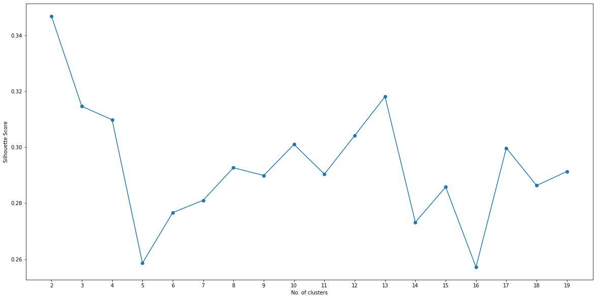

# Coursera Capstone Project

### Anand Konji

Now that you have been equipped with the skills and the tools to use location data to explore a geographical location, over the course of two weeks, you will have the opportunity to be as creative as you want and come up with an idea to leverage the Foursquare location data to explore or compare neighborhoods or cities of your choice or to come up with a problem that you can use the Foursquare location data to solve. If you cannot think of an idea or a problem, here are some ideas to get you started:

In Module 3, we explored New York City and the city of Toronto and segmented and clustered their neighborhoods. Both cities are very diverse and are the financial capitals of their respective countries. One interesting idea would be to compare the neighborhoods of the two cities and determine how similar or dissimilar they are. Is New York City more like Toronto or Paris or some other multicultural city? I will leave it to you to refine this idea.
In a city of your choice, if someone is looking to open a restaurant, where would you recommend that they open it? Similarly, if a contractor is trying to start their own business, where would you recommend that they setup their office?
These are just a couple of many ideas and problems that can be solved using location data in addition to other datasets. No matter what you decide to do, make sure to provide sufficient justification of why you think what you want to do or solve is important and why would a client or a group of people be interested in your project.

Review criterialess 
This capstone project will be graded by your peers. This capstone project is worth 70% of your total grade. The project will be completed over the course of 2 weeks. Week 1 submissions will be worth 30% whereas week 2 submissions will be worth 40% of your total grade.

For this week, you will required to submit the following:

A description of the problem and a discussion of the background. (15 marks)
A description of the data and how it will be used to solve the problem. (15 marks)
For the second week, the final deliverables of the project will be:

A link to your Notebook on your Github repository, showing your code. (15 marks)
A full report consisting of all of the following components (15 marks):
Introduction where you discuss the business problem and who would be interested in this project.
Data where you describe the data that will be used to solve the problem and the source of the data.
Methodology section which represents the main component of the report where you discuss and describe any exploratory data analysis that you did, any inferential statistical testing that you performed, if any, and what machine learnings were used and why.
Results section where you discuss the results.
Discussion section where you discuss any observations you noted and any recommendations you can make based on the results.
Conclusion section where you conclude the report.
3. Your choice of a presentation or blogpost. (10 marks)  
------------------------

## Table of contents
* [Introduction: Business Problem](#introduction)
* [Data](#data)
* [Methodology](#methodology)
* [Analysis](#analysis)
* [Results and Discussion](#results)
* [Conclusion](#conclusion)

## 1.	Introduction: Business Problem <a name="introduction"></a>

In this project we will try to find an optimal location for a restaurant. Specifically, this report will be targeted to stakeholders interested in opening an **Italian restaurant** in **Bangalore**, India.

Since there are lots of restaurants in Bangalore we will try to detect **locations that are not already crowded with restaurants**. We are also particularly interested in **areas with no Italian restaurants in vicinity**. We would also prefer locations **as close to city center as possible**, assuming that first two conditions are met.

We will use our data science powers to generate a few most promissing neighborhoods based on this criteria. Advantages of each area will then be clearly expressed so that best possible final location can be chosen by stakeholders.

## 2.	Data <a name="data"></a>

Based on definition of our problem, factors that will influence our decission are:
* number of existing restaurants in the neighborhood (any type of restaurant)
* number of and distance to Italian restaurants in the neighborhood, if any
* distance of neighborhood from city center

We decided to use regularly spaced grid of locations, centered around city center, to define our neighborhoods.

Following data sources will be needed to extract/generate the required information:
* centers of candidate areas will be generated algorithmically and approximate addresses of centers of those areas will be obtained using **reverse geocoding**
* number of restaurants and their type and location in every neighborhood will be obtained using **Foursquare API**
* coordinate of Bangalore center will be obtained using **geocoding** of well known Bangalore location (Koramangala)

### Neighborhood Candidates

Let's create latitude & longitude coordinates for centroids of our candidate neighborhoods. We will create a grid of cells covering our area of interest which is aprox. 10x10 killometers centered around Bangalore city center.

Let's first find the latitude & longitude of Bangalore city center.

#### install the packages required, if not done already


```python
# install the packages required, if not done already
!pip install beautifulsoup4
!pip install lxml
!pip install geocoder
!pip install geopy
!pip install folium
print("Installed required packages !!!")
```

    Requirement already satisfied: beautifulsoup4 in /home/jupyterlab/conda/envs/python/lib/python3.6/site-packages (4.9.0)
    Requirement already satisfied: soupsieve>1.2 in /home/jupyterlab/conda/envs/python/lib/python3.6/site-packages (from beautifulsoup4) (2.0)
    Requirement already satisfied: lxml in /home/jupyterlab/conda/envs/python/lib/python3.6/site-packages (4.5.0)
    Requirement already satisfied: geocoder in /home/jupyterlab/conda/envs/python/lib/python3.6/site-packages (1.38.1)
    Requirement already satisfied: click in /home/jupyterlab/conda/envs/python/lib/python3.6/site-packages (from geocoder) (7.1.2)
    Requirement already satisfied: requests in /home/jupyterlab/conda/envs/python/lib/python3.6/site-packages (from geocoder) (2.23.0)
    Requirement already satisfied: ratelim in /home/jupyterlab/conda/envs/python/lib/python3.6/site-packages (from geocoder) (0.1.6)
    Requirement already satisfied: future in /home/jupyterlab/conda/envs/python/lib/python3.6/site-packages (from geocoder) (0.18.2)
    Requirement already satisfied: six in /home/jupyterlab/conda/envs/python/lib/python3.6/site-packages (from geocoder) (1.14.0)
    Requirement already satisfied: certifi>=2017.4.17 in /home/jupyterlab/conda/envs/python/lib/python3.6/site-packages (from requests->geocoder) (2020.4.5.1)
    Requirement already satisfied: chardet<4,>=3.0.2 in /home/jupyterlab/conda/envs/python/lib/python3.6/site-packages (from requests->geocoder) (3.0.4)
    Requirement already satisfied: urllib3!=1.25.0,!=1.25.1,<1.26,>=1.21.1 in /home/jupyterlab/conda/envs/python/lib/python3.6/site-packages (from requests->geocoder) (1.25.9)
    Requirement already satisfied: idna<3,>=2.5 in /home/jupyterlab/conda/envs/python/lib/python3.6/site-packages (from requests->geocoder) (2.9)
    Requirement already satisfied: decorator in /home/jupyterlab/conda/envs/python/lib/python3.6/site-packages (from ratelim->geocoder) (4.4.2)
    Requirement already satisfied: geopy in /home/jupyterlab/conda/envs/python/lib/python3.6/site-packages (1.21.0)
    Requirement already satisfied: geographiclib<2,>=1.49 in /home/jupyterlab/conda/envs/python/lib/python3.6/site-packages (from geopy) (1.50)
    Requirement already satisfied: folium in /home/jupyterlab/conda/envs/python/lib/python3.6/site-packages (0.5.0)
    Requirement already satisfied: requests in /home/jupyterlab/conda/envs/python/lib/python3.6/site-packages (from folium) (2.23.0)
    Requirement already satisfied: six in /home/jupyterlab/conda/envs/python/lib/python3.6/site-packages (from folium) (1.14.0)
    Requirement already satisfied: branca in /home/jupyterlab/conda/envs/python/lib/python3.6/site-packages (from folium) (0.4.1)
    Requirement already satisfied: jinja2 in /home/jupyterlab/conda/envs/python/lib/python3.6/site-packages (from folium) (2.11.2)
    Requirement already satisfied: certifi>=2017.4.17 in /home/jupyterlab/conda/envs/python/lib/python3.6/site-packages (from requests->folium) (2020.4.5.1)
    Requirement already satisfied: chardet<4,>=3.0.2 in /home/jupyterlab/conda/envs/python/lib/python3.6/site-packages (from requests->folium) (3.0.4)
    Requirement already satisfied: urllib3!=1.25.0,!=1.25.1,<1.26,>=1.21.1 in /home/jupyterlab/conda/envs/python/lib/python3.6/site-packages (from requests->folium) (1.25.9)
    Requirement already satisfied: idna<3,>=2.5 in /home/jupyterlab/conda/envs/python/lib/python3.6/site-packages (from requests->folium) (2.9)
    Requirement already satisfied: MarkupSafe>=0.23 in /home/jupyterlab/conda/envs/python/lib/python3.6/site-packages (from jinja2->folium) (1.1.1)
    Installed required packages !!!


#### import the required libraries


```python
# import the libraries
import pandas as pd
import requests as rqt
from bs4 import BeautifulSoup as bs
import numpy as np
import geocoder as gc

import folium
import requests 
import json 
import matplotlib.cm as cm
import matplotlib.colors as colors
import pandas as pd

from pandas.io.json import json_normalize 
from sklearn.cluster import KMeans
from sklearn.metrics import silhouette_samples, silhouette_score
from geopy.geocoders import Nominatim 

import matplotlib.pyplot as plt
%matplotlib inline

import matplotlib.cm as cm
import matplotlib.colors as colors


pd.set_option('display.max_columns', None)
pd.set_option('display.max_rows', None)

print("Imported required stuffs!")
```

    Imported required stuffs!


#### Scraping Wikipedia page and creating a Dataframe and Transforming the data on Wiki page into pandas dataframe.

Using BeautifulSoup Scraping List of Postal Codes of Given Wikipedia/other source Page 


```python
url = "http://pincode.india-server.com/cities/bengaluru/"
extractData = rqt.get(url).text
wikiData = bs(extractData, 'lxml')
```


```python
#wikiData
```

Converting content of PostalCode HTML table as dataframe


```python
columnNames = ['Postalcode','Town','Neighborhood']
bangalore = pd.DataFrame(columns = columnNames)

table = wikiData.find('table', class_='pincode-tbl')
```


```python
#table
```


```python
# parsing data and pushing to table rows
SrNo = 0
Neighborhood = 0
town='Bangalore'
OffType = 0
PinCode = 0

for tr in table.find_all('tr'):
    i = 0
    for td in tr.find_all('td'):
        if i == 0:
            SrNo = td.text.strip('\n')
            i = i + 1
        elif i == 1:
            Neighborhood = td.text.strip('\n')
            i = i + 1
        elif i == 2:
            OffType = td.text.strip('\n')
            i = i + 1
        elif i == 3: 
            PinCode = td.text.strip('\n').replace(']','')
    #bangalore = bangalore.append({'S.No.': SrNo,'Post office': PoOff,'Office type': OffType, 'Pincode': PinCode},ignore_index=True)
    bangalore = bangalore.append({'Postalcode': PinCode,'Town': town,'Neighborhood': Neighborhood},ignore_index=True)
```


```python
bangalore.head()
```


<div>
<style scoped>
    .dataframe tbody tr th:only-of-type {
        vertical-align: middle;
    }

    .dataframe tbody tr th {
        vertical-align: top;
    }

    .dataframe thead th {
        text-align: right;
    }
</style>
<table border="1" class="dataframe">
  <thead>
    <tr style="text-align: right;">
      <th></th>
      <th>Postalcode</th>
      <th>Town</th>
      <th>Neighborhood</th>
    </tr>
  </thead>
  <tbody>
    <tr>
      <th>0</th>
      <td>0</td>
      <td>Bangalore</td>
      <td>0</td>
    </tr>
    <tr>
      <th>1</th>
      <td>Pincode</td>
      <td>Bangalore</td>
      <td>Post office</td>
    </tr>
    <tr>
      <th>2</th>
      <td>560063</td>
      <td>Bangalore</td>
      <td>A F Station Yelahanka</td>
    </tr>
    <tr>
      <th>3</th>
      <td>560107</td>
      <td>Bangalore</td>
      <td>Achitnagar</td>
    </tr>
    <tr>
      <th>4</th>
      <td>561101</td>
      <td>Bangalore</td>
      <td>Adarangi</td>
    </tr>
  </tbody>
</table>
</div>


Data cleansing


```python
# clean dataframe 
bangalore = bangalore[bangalore.Neighborhood!='Not assigned']
bangalore = bangalore[bangalore.Neighborhood!= 0]
bangalore = bangalore[bangalore.Neighborhood!='Post office']
bangalore.reset_index(drop = True, inplace = True)
i = 0
for i in range(0,bangalore.shape[0]):
    if bangalore.iloc[i][2] == 'Not assigned':
        bangalore.iloc[i][2] = bangalore.iloc[i][1]
        i = i+1
```


```python
df = bangalore.groupby(['Postalcode','Town'])['Neighborhood'].apply(', '.join).reset_index()
```


```python
df.head()
```


<div>
<style scoped>
    .dataframe tbody tr th:only-of-type {
        vertical-align: middle;
    }

    .dataframe tbody tr th {
        vertical-align: top;
    }

    .dataframe thead th {
        text-align: right;
    }
</style>
<table border="1" class="dataframe">
  <thead>
    <tr style="text-align: right;">
      <th></th>
      <th>Postalcode</th>
      <th>Town</th>
      <th>Neighborhood</th>
    </tr>
  </thead>
  <tbody>
    <tr>
      <th>0</th>
      <td>560001</td>
      <td>Bangalore</td>
      <td>Bangalore Bazaar , Bangalore G.P.O., CMM Court...</td>
    </tr>
    <tr>
      <th>1</th>
      <td>560002</td>
      <td>Bangalore</td>
      <td>Bangalore City , Bangalore Corporation Building</td>
    </tr>
    <tr>
      <th>2</th>
      <td>560003</td>
      <td>Bangalore</td>
      <td>Malleswaram , Palace Guttahalli , Swimming Poo...</td>
    </tr>
    <tr>
      <th>3</th>
      <td>560004</td>
      <td>Bangalore</td>
      <td>Basavanagudi , Mavalli , Pampamahakavi Road , ...</td>
    </tr>
    <tr>
      <th>4</th>
      <td>560005</td>
      <td>Bangalore</td>
      <td>Fraser Town</td>
    </tr>
  </tbody>
</table>
</div>


```python
df.describe()
```


<div>
<style scoped>
    .dataframe tbody tr th:only-of-type {
        vertical-align: middle;
    }

    .dataframe tbody tr th {
        vertical-align: top;
    }

    .dataframe thead th {
        text-align: right;
    }
</style>
<table border="1" class="dataframe">
  <thead>
    <tr style="text-align: right;">
      <th></th>
      <th>Postalcode</th>
      <th>Town</th>
      <th>Neighborhood</th>
    </tr>
  </thead>
  <tbody>
    <tr>
      <th>count</th>
      <td>131</td>
      <td>131</td>
      <td>131</td>
    </tr>
    <tr>
      <th>unique</th>
      <td>131</td>
      <td>1</td>
      <td>131</td>
    </tr>
    <tr>
      <th>top</th>
      <td>560049</td>
      <td>Bangalore</td>
      <td>Gayathrinagar , Srirampuram</td>
    </tr>
    <tr>
      <th>freq</th>
      <td>1</td>
      <td>131</td>
      <td>1</td>
    </tr>
  </tbody>
</table>
</div>


Data Cleaning | Drop None rows of df and row which contains 'Not assigned' value | All "Not assigned" will be replace to 'NaN'


```python
df = df.dropna()
empty = 'Not assigned'
df = df[(df.Postalcode != empty ) & (df.Town != empty) & (df.Neighborhood != empty)]
```


```python
df.head()
```


<div>
<style scoped>
    .dataframe tbody tr th:only-of-type {
        vertical-align: middle;
    }

    .dataframe tbody tr th {
        vertical-align: top;
    }

    .dataframe thead th {
        text-align: right;
    }
</style>
<table border="1" class="dataframe">
  <thead>
    <tr style="text-align: right;">
      <th></th>
      <th>Postalcode</th>
      <th>Town</th>
      <th>Neighborhood</th>
    </tr>
  </thead>
  <tbody>
    <tr>
      <th>0</th>
      <td>560001</td>
      <td>Bangalore</td>
      <td>Bangalore Bazaar , Bangalore G.P.O., CMM Court...</td>
    </tr>
    <tr>
      <th>1</th>
      <td>560002</td>
      <td>Bangalore</td>
      <td>Bangalore City , Bangalore Corporation Building</td>
    </tr>
    <tr>
      <th>2</th>
      <td>560003</td>
      <td>Bangalore</td>
      <td>Malleswaram , Palace Guttahalli , Swimming Poo...</td>
    </tr>
    <tr>
      <th>3</th>
      <td>560004</td>
      <td>Bangalore</td>
      <td>Basavanagudi , Mavalli , Pampamahakavi Road , ...</td>
    </tr>
    <tr>
      <th>4</th>
      <td>560005</td>
      <td>Bangalore</td>
      <td>Fraser Town</td>
    </tr>
  </tbody>
</table>
</div>


```python
def neighborhood_list(grouped):    
    return ', '.join(sorted(grouped['Neighborhood'].tolist()))
                    
grp = df.groupby(['Postalcode', 'Town'])
df_2 = grp.apply(neighborhood_list).reset_index(name='Neighborhood')
```


```python
df_2.describe()
```


<div>
<style scoped>
    .dataframe tbody tr th:only-of-type {
        vertical-align: middle;
    }

    .dataframe tbody tr th {
        vertical-align: top;
    }

    .dataframe thead th {
        text-align: right;
    }
</style>
<table border="1" class="dataframe">
  <thead>
    <tr style="text-align: right;">
      <th></th>
      <th>Postalcode</th>
      <th>Town</th>
      <th>Neighborhood</th>
    </tr>
  </thead>
  <tbody>
    <tr>
      <th>count</th>
      <td>131</td>
      <td>131</td>
      <td>131</td>
    </tr>
    <tr>
      <th>unique</th>
      <td>131</td>
      <td>1</td>
      <td>131</td>
    </tr>
    <tr>
      <th>top</th>
      <td>560049</td>
      <td>Bangalore</td>
      <td>Gayathrinagar , Srirampuram</td>
    </tr>
    <tr>
      <th>freq</th>
      <td>1</td>
      <td>131</td>
      <td>1</td>
    </tr>
  </tbody>
</table>
</div>


```python
print(df_2.shape)
df_2.head()
```

    (131, 3)


<div>
<style scoped>
    .dataframe tbody tr th:only-of-type {
        vertical-align: middle;
    }

    .dataframe tbody tr th {
        vertical-align: top;
    }

    .dataframe thead th {
        text-align: right;
    }
</style>
<table border="1" class="dataframe">
  <thead>
    <tr style="text-align: right;">
      <th></th>
      <th>Postalcode</th>
      <th>Town</th>
      <th>Neighborhood</th>
    </tr>
  </thead>
  <tbody>
    <tr>
      <th>0</th>
      <td>560001</td>
      <td>Bangalore</td>
      <td>Bangalore Bazaar , Bangalore G.P.O., CMM Court...</td>
    </tr>
    <tr>
      <th>1</th>
      <td>560002</td>
      <td>Bangalore</td>
      <td>Bangalore City , Bangalore Corporation Building</td>
    </tr>
    <tr>
      <th>2</th>
      <td>560003</td>
      <td>Bangalore</td>
      <td>Malleswaram , Palace Guttahalli , Swimming Poo...</td>
    </tr>
    <tr>
      <th>3</th>
      <td>560004</td>
      <td>Bangalore</td>
      <td>Basavanagudi , Mavalli , Pampamahakavi Road , ...</td>
    </tr>
    <tr>
      <th>4</th>
      <td>560005</td>
      <td>Bangalore</td>
      <td>Fraser Town</td>
    </tr>
  </tbody>
</table>
</div>


```python
#df_2.to_csv('bangalore.csv', index=False) 
```

#### Adding Latitude and Longitude Co-ordinates to the DataFrame

Reading the bangalore.csv which created on Part 1 Notebook


```python
#df = pd.read_csv('bangalore.csv')
df.head()
```


<div>
<style scoped>
    .dataframe tbody tr th:only-of-type {
        vertical-align: middle;
    }

    .dataframe tbody tr th {
        vertical-align: top;
    }

    .dataframe thead th {
        text-align: right;
    }
</style>
<table border="1" class="dataframe">
  <thead>
    <tr style="text-align: right;">
      <th></th>
      <th>Postalcode</th>
      <th>Town</th>
      <th>Neighborhood</th>
    </tr>
  </thead>
  <tbody>
    <tr>
      <th>0</th>
      <td>560001</td>
      <td>Bangalore</td>
      <td>Bangalore Bazaar , Bangalore G.P.O., CMM Court...</td>
    </tr>
    <tr>
      <th>1</th>
      <td>560002</td>
      <td>Bangalore</td>
      <td>Bangalore City , Bangalore Corporation Building</td>
    </tr>
    <tr>
      <th>2</th>
      <td>560003</td>
      <td>Bangalore</td>
      <td>Malleswaram , Palace Guttahalli , Swimming Poo...</td>
    </tr>
    <tr>
      <th>3</th>
      <td>560004</td>
      <td>Bangalore</td>
      <td>Basavanagudi , Mavalli , Pampamahakavi Road , ...</td>
    </tr>
    <tr>
      <th>4</th>
      <td>560005</td>
      <td>Bangalore</td>
      <td>Fraser Town</td>
    </tr>
  </tbody>
</table>
</div>


```python
print(df.shape)
#df.describe()
```

    (131, 3)


```python
def get_latilong(postal_code):
    lati_long_coords = None
    while(lati_long_coords is None):
        g = gc.arcgis('{}, Bangalore, Karnataka'.format(postal_code))
        lati_long_coords = g.latlng
    return lati_long_coords
    
get_latilong(560034)
```


    [12.931355000000053, 77.63397875900006]


```python
# Retrieving Postal Code Co-ordinates
postal_codes = df['Postalcode']    
coords = [ get_latilong(postal_code) for postal_code in postal_codes.tolist() ]
```


```python
# Adding Columns Latitude & Longitude
df_coords = pd.DataFrame(coords, columns=['Latitude', 'Longitude'])
df['Latitude'] = df_coords['Latitude']
df['Longitude'] = df_coords['Longitude']
```


```python
#df[df.Postalcode == 560034]
```


```python
df.head()
```


<div>
<style scoped>
    .dataframe tbody tr th:only-of-type {
        vertical-align: middle;
    }

    .dataframe tbody tr th {
        vertical-align: top;
    }

    .dataframe thead th {
        text-align: right;
    }
</style>
<table border="1" class="dataframe">
  <thead>
    <tr style="text-align: right;">
      <th></th>
      <th>Postalcode</th>
      <th>Town</th>
      <th>Neighborhood</th>
      <th>Latitude</th>
      <th>Longitude</th>
    </tr>
  </thead>
  <tbody>
    <tr>
      <th>0</th>
      <td>560001</td>
      <td>Bangalore</td>
      <td>Bangalore Bazaar , Bangalore G.P.O., CMM Court...</td>
      <td>12.979185</td>
      <td>77.606623</td>
    </tr>
    <tr>
      <th>1</th>
      <td>560002</td>
      <td>Bangalore</td>
      <td>Bangalore City , Bangalore Corporation Building</td>
      <td>12.964070</td>
      <td>77.577647</td>
    </tr>
    <tr>
      <th>2</th>
      <td>560003</td>
      <td>Bangalore</td>
      <td>Malleswaram , Palace Guttahalli , Swimming Poo...</td>
      <td>13.003656</td>
      <td>77.569745</td>
    </tr>
    <tr>
      <th>3</th>
      <td>560004</td>
      <td>Bangalore</td>
      <td>Basavanagudi , Mavalli , Pampamahakavi Road , ...</td>
      <td>12.945664</td>
      <td>77.575075</td>
    </tr>
    <tr>
      <th>4</th>
      <td>560005</td>
      <td>Bangalore</td>
      <td>Fraser Town</td>
      <td>12.998115</td>
      <td>77.620842</td>
    </tr>
  </tbody>
</table>
</div>


```python
#df.to_csv('bangalore_lalo.csv',index=False)
```


```python
#df.head()
```

## 3.	Methodology  


```python
#df = pd.read_csv('bangalore_lalo.csv')
print(df.shape)
df.head()
```

    (131, 5)


<div>
<style scoped>
    .dataframe tbody tr th:only-of-type {
        vertical-align: middle;
    }

    .dataframe tbody tr th {
        vertical-align: top;
    }

    .dataframe thead th {
        text-align: right;
    }
</style>
<table border="1" class="dataframe">
  <thead>
    <tr style="text-align: right;">
      <th></th>
      <th>Postalcode</th>
      <th>Town</th>
      <th>Neighborhood</th>
      <th>Latitude</th>
      <th>Longitude</th>
    </tr>
  </thead>
  <tbody>
    <tr>
      <th>0</th>
      <td>560001</td>
      <td>Bangalore</td>
      <td>Bangalore Bazaar , Bangalore G.P.O., CMM Court...</td>
      <td>12.979185</td>
      <td>77.606623</td>
    </tr>
    <tr>
      <th>1</th>
      <td>560002</td>
      <td>Bangalore</td>
      <td>Bangalore City , Bangalore Corporation Building</td>
      <td>12.964070</td>
      <td>77.577647</td>
    </tr>
    <tr>
      <th>2</th>
      <td>560003</td>
      <td>Bangalore</td>
      <td>Malleswaram , Palace Guttahalli , Swimming Poo...</td>
      <td>13.003656</td>
      <td>77.569745</td>
    </tr>
    <tr>
      <th>3</th>
      <td>560004</td>
      <td>Bangalore</td>
      <td>Basavanagudi , Mavalli , Pampamahakavi Road , ...</td>
      <td>12.945664</td>
      <td>77.575075</td>
    </tr>
    <tr>
      <th>4</th>
      <td>560005</td>
      <td>Bangalore</td>
      <td>Fraser Town</td>
      <td>12.998115</td>
      <td>77.620842</td>
    </tr>
  </tbody>
</table>
</div>


##### Getting the coordinates of Bangalore City


```python
address = 'Bangalore, India'
geolocator = Nominatim(user_agent="bangalore_explorer")
location = geolocator.geocode(address)
latitude = location.latitude
longitude = location.longitude
print('The geograpical coordinate of Bangalore India are {}, {}.'.format(latitude, longitude))
```

    The geograpical coordinate of Bangalore India are 12.9791198, 77.5912997.


##### Creating a map of Bangalore City with neighborhoods superimposed on top


```python
# create map of Bangalore using latitude and longitude values
map_bangalore = folium.Map(location=[latitude, longitude], zoom_start=10)

# add markers to map
for lat, lng, town, neighborhood in zip(df['Latitude'], df['Longitude'], df['Town'], df['Neighborhood']):
    label = '{}, {}'.format(neighborhood, town)
    label = folium.Popup(label, parse_html=True)
    folium.CircleMarker(
        [lat, lng],
        radius=5,
        popup=label,
        color='blue',
        fill=True,
        fill_color='#3186cc',
        fill_opacity=0.7,
        parse_html=False).add_to(map_bangalore)
    
map_bangalore
```


<div style="width:100%;"><div style="position:relative;width:100%;height:0;padding-bottom:60%;"><span style="color:#565656">Make this Notebook Trusted to load map: File -> Trust Notebook</span><iframe src="about:blank" style="position:absolute;width:100%;height:100%;left:0;top:0;border:none !important;" data-html=PCFET0NUWVBFIGh0bWw+CjxoZWFkPiAgICAKICAgIDxtZXRhIGh0dHAtZXF1aXY9ImNvbnRlbnQtdHlwZSIgY29udGVudD0idGV4dC9odG1sOyBjaGFyc2V0PVVURi04IiAvPgogICAgPHNjcmlwdD5MX1BSRUZFUl9DQU5WQVMgPSBmYWxzZTsgTF9OT19UT1VDSCA9IGZhbHNlOyBMX0RJU0FCTEVfM0QgPSBmYWxzZTs8L3NjcmlwdD4KICAgIDxzY3JpcHQgc3JjPSJodHRwczovL2Nkbi5qc2RlbGl2ci5uZXQvbnBtL2xlYWZsZXRAMS4yLjAvZGlzdC9sZWFmbGV0LmpzIj48L3NjcmlwdD4KICAgIDxzY3JpcHQgc3JjPSJodHRwczovL2FqYXguZ29vZ2xlYXBpcy5jb20vYWpheC9saWJzL2pxdWVyeS8xLjExLjEvanF1ZXJ5Lm1pbi5qcyI+PC9zY3JpcHQ+CiAgICA8c2NyaXB0IHNyYz0iaHR0cHM6Ly9tYXhjZG4uYm9vdHN0cmFwY2RuLmNvbS9ib290c3RyYXAvMy4yLjAvanMvYm9vdHN0cmFwLm1pbi5qcyI+PC9zY3JpcHQ+CiAgICA8c2NyaXB0IHNyYz0iaHR0cHM6Ly9jZG5qcy5jbG91ZGZsYXJlLmNvbS9hamF4L2xpYnMvTGVhZmxldC5hd2Vzb21lLW1hcmtlcnMvMi4wLjIvbGVhZmxldC5hd2Vzb21lLW1hcmtlcnMuanMiPjwvc2NyaXB0PgogICAgPGxpbmsgcmVsPSJzdHlsZXNoZWV0IiBocmVmPSJodHRwczovL2Nkbi5qc2RlbGl2ci5uZXQvbnBtL2xlYWZsZXRAMS4yLjAvZGlzdC9sZWFmbGV0LmNzcyIvPgogICAgPGxpbmsgcmVsPSJzdHlsZXNoZWV0IiBocmVmPSJodHRwczovL21heGNkbi5ib290c3RyYXBjZG4uY29tL2Jvb3RzdHJhcC8zLjIuMC9jc3MvYm9vdHN0cmFwLm1pbi5jc3MiLz4KICAgIDxsaW5rIHJlbD0ic3R5bGVzaGVldCIgaHJlZj0iaHR0cHM6Ly9tYXhjZG4uYm9vdHN0cmFwY2RuLmNvbS9ib290c3RyYXAvMy4yLjAvY3NzL2Jvb3RzdHJhcC10aGVtZS5taW4uY3NzIi8+CiAgICA8bGluayByZWw9InN0eWxlc2hlZXQiIGhyZWY9Imh0dHBzOi8vbWF4Y2RuLmJvb3RzdHJhcGNkbi5jb20vZm9udC1hd2Vzb21lLzQuNi4zL2Nzcy9mb250LWF3ZXNvbWUubWluLmNzcyIvPgogICAgPGxpbmsgcmVsPSJzdHlsZXNoZWV0IiBocmVmPSJodHRwczovL2NkbmpzLmNsb3VkZmxhcmUuY29tL2FqYXgvbGlicy9MZWFmbGV0LmF3ZXNvbWUtbWFya2Vycy8yLjAuMi9sZWFmbGV0LmF3ZXNvbWUtbWFya2Vycy5jc3MiLz4KICAgIDxsaW5rIHJlbD0ic3R5bGVzaGVldCIgaHJlZj0iaHR0cHM6Ly9yYXdnaXQuY29tL3B5dGhvbi12aXN1YWxpemF0aW9uL2ZvbGl1bS9tYXN0ZXIvZm9saXVtL3RlbXBsYXRlcy9sZWFmbGV0LmF3ZXNvbWUucm90YXRlLmNzcyIvPgogICAgPHN0eWxlPmh0bWwsIGJvZHkge3dpZHRoOiAxMDAlO2hlaWdodDogMTAwJTttYXJnaW46IDA7cGFkZGluZzogMDt9PC9zdHlsZT4KICAgIDxzdHlsZT4jbWFwIHtwb3NpdGlvbjphYnNvbHV0ZTt0b3A6MDtib3R0b206MDtyaWdodDowO2xlZnQ6MDt9PC9zdHlsZT4KICAgIAogICAgICAgICAgICA8c3R5bGU+ICNtYXBfZjQ4OTNiMjA2ZmEyNDE1MjgwY2UwNzUxNWUxYTZkODAgewogICAgICAgICAgICAgICAgcG9zaXRpb24gOiByZWxhdGl2ZTsKICAgICAgICAgICAgICAgIHdpZHRoIDogMTAwLjAlOwogICAgICAgICAgICAgICAgaGVpZ2h0OiAxMDAuMCU7CiAgICAgICAgICAgICAgICBsZWZ0OiAwLjAlOwogICAgICAgICAgICAgICAgdG9wOiAwLjAlOwogICAgICAgICAgICAgICAgfQogICAgICAgICAgICA8L3N0eWxlPgogICAgICAgIAo8L2hlYWQ+Cjxib2R5PiAgICAKICAgIAogICAgICAgICAgICA8ZGl2IGNsYXNzPSJmb2xpdW0tbWFwIiBpZD0ibWFwX2Y0ODkzYjIwNmZhMjQxNTI4MGNlMDc1MTVlMWE2ZDgwIiA+PC9kaXY+CiAgICAgICAgCjwvYm9keT4KPHNjcmlwdD4gICAgCiAgICAKCiAgICAgICAgICAgIAogICAgICAgICAgICAgICAgdmFyIGJvdW5kcyA9IG51bGw7CiAgICAgICAgICAgIAoKICAgICAgICAgICAgdmFyIG1hcF9mNDg5M2IyMDZmYTI0MTUyODBjZTA3NTE1ZTFhNmQ4MCA9IEwubWFwKAogICAgICAgICAgICAgICAgICAgICAgICAgICAgICAgICAgJ21hcF9mNDg5M2IyMDZmYTI0MTUyODBjZTA3NTE1ZTFhNmQ4MCcsCiAgICAgICAgICAgICAgICAgICAgICAgICAgICAgICAgICB7Y2VudGVyOiBbMTIuOTc5MTE5OCw3Ny41OTEyOTk3XSwKICAgICAgICAgICAgICAgICAgICAgICAgICAgICAgICAgIHpvb206IDEwLAogICAgICAgICAgICAgICAgICAgICAgICAgICAgICAgICAgbWF4Qm91bmRzOiBib3VuZHMsCiAgICAgICAgICAgICAgICAgICAgICAgICAgICAgICAgICBsYXllcnM6IFtdLAogICAgICAgICAgICAgICAgICAgICAgICAgICAgICAgICAgd29ybGRDb3B5SnVtcDogZmFsc2UsCiAgICAgICAgICAgICAgICAgICAgICAgICAgICAgICAgICBjcnM6IEwuQ1JTLkVQU0czODU3CiAgICAgICAgICAgICAgICAgICAgICAgICAgICAgICAgIH0pOwogICAgICAgICAgICAKICAgICAgICAKICAgIAogICAgICAgICAgICB2YXIgdGlsZV9sYXllcl85MTZkNmZjOGQ3NGI0MTcyODAxMzQxMGE1NmMwYTljZSA9IEwudGlsZUxheWVyKAogICAgICAgICAgICAgICAgJ2h0dHBzOi8ve3N9LnRpbGUub3BlbnN0cmVldG1hcC5vcmcve3p9L3t4fS97eX0ucG5nJywKICAgICAgICAgICAgICAgIHsKICAiYXR0cmlidXRpb24iOiBudWxsLAogICJkZXRlY3RSZXRpbmEiOiBmYWxzZSwKICAibWF4Wm9vbSI6IDE4LAogICJtaW5ab29tIjogMSwKICAibm9XcmFwIjogZmFsc2UsCiAgInN1YmRvbWFpbnMiOiAiYWJjIgp9CiAgICAgICAgICAgICAgICApLmFkZFRvKG1hcF9mNDg5M2IyMDZmYTI0MTUyODBjZTA3NTE1ZTFhNmQ4MCk7CiAgICAgICAgCiAgICAKICAgICAgICAgICAgdmFyIGNpcmNsZV9tYXJrZXJfZjMyYzAyNDBhMzI4NDhjYzhhNTIzZjYyNjgzMTY0Y2QgPSBMLmNpcmNsZU1hcmtlcigKICAgICAgICAgICAgICAgIFsxMi45NzkxODUwMDAwMDAwMyw3Ny42MDY2MjM0MzAwMDAwN10sCiAgICAgICAgICAgICAgICB7CiAgImJ1YmJsaW5nTW91c2VFdmVudHMiOiB0cnVlLAogICJjb2xvciI6ICJibHVlIiwKICAiZGFzaEFycmF5IjogbnVsbCwKICAiZGFzaE9mZnNldCI6IG51bGwsCiAgImZpbGwiOiB0cnVlLAogICJmaWxsQ29sb3IiOiAiIzMxODZjYyIsCiAgImZpbGxPcGFjaXR5IjogMC43LAogICJmaWxsUnVsZSI6ICJldmVub2RkIiwKICAibGluZUNhcCI6ICJyb3VuZCIsCiAgImxpbmVKb2luIjogInJvdW5kIiwKICAib3BhY2l0eSI6IDEuMCwKICAicmFkaXVzIjogNSwKICAic3Ryb2tlIjogdHJ1ZSwKICAid2VpZ2h0IjogMwp9CiAgICAgICAgICAgICAgICApLmFkZFRvKG1hcF9mNDg5M2IyMDZmYTI0MTUyODBjZTA3NTE1ZTFhNmQ4MCk7CiAgICAgICAgICAgIAogICAgCiAgICAgICAgICAgIHZhciBwb3B1cF85YzZjNTg3NGQ4NDg0MTM4YTUwNjBmMjg5OTlkNjM1ZSA9IEwucG9wdXAoe21heFdpZHRoOiAnMzAwJ30pOwoKICAgICAgICAgICAgCiAgICAgICAgICAgICAgICB2YXIgaHRtbF9iYzI4MmE5YWFiYTg0Nzc1YmEwYmEyMWJjZjljMjg1NCA9ICQoJzxkaXYgaWQ9Imh0bWxfYmMyODJhOWFhYmE4NDc3NWJhMGJhMjFiY2Y5YzI4NTQiIHN0eWxlPSJ3aWR0aDogMTAwLjAlOyBoZWlnaHQ6IDEwMC4wJTsiPkJhbmdhbG9yZSBCYXphYXIgLCBCYW5nYWxvcmUgRy5QLk8uLCBDTU0gQ291cnQgQ29tcGxleCAsIERyLiBBbWJlZGthciBWZWVkaGkgLCBIaWdoQ291cnQgLCBMZWdpc2xhdG9ycyBIb21lICwgTWFoYXRtYSBHYW5kaGkgUm9hZCAsIFJhamJoYXZhbiAgLCBWYXNhbnRoYW5hZ2FyICwgVmlkaGFuYSBTb3VkaGEgLCBCYW5nYWxvcmU8L2Rpdj4nKVswXTsKICAgICAgICAgICAgICAgIHBvcHVwXzljNmM1ODc0ZDg0ODQxMzhhNTA2MGYyODk5OWQ2MzVlLnNldENvbnRlbnQoaHRtbF9iYzI4MmE5YWFiYTg0Nzc1YmEwYmEyMWJjZjljMjg1NCk7CiAgICAgICAgICAgIAoKICAgICAgICAgICAgY2lyY2xlX21hcmtlcl9mMzJjMDI0MGEzMjg0OGNjOGE1MjNmNjI2ODMxNjRjZC5iaW5kUG9wdXAocG9wdXBfOWM2YzU4NzRkODQ4NDEzOGE1MDYwZjI4OTk5ZDYzNWUpOwoKICAgICAgICAgICAgCiAgICAgICAgCiAgICAKICAgICAgICAgICAgdmFyIGNpcmNsZV9tYXJrZXJfMTdkMzhlYjRjYzRlNDFkMmFhODZmNDI0N2JiMWIzMmYgPSBMLmNpcmNsZU1hcmtlcigKICAgICAgICAgICAgICAgIFsxMi45NjQwNzAwMDAwMDAwNSw3Ny41Nzc2NDY2NjcwMDAwN10sCiAgICAgICAgICAgICAgICB7CiAgImJ1YmJsaW5nTW91c2VFdmVudHMiOiB0cnVlLAogICJjb2xvciI6ICJibHVlIiwKICAiZGFzaEFycmF5IjogbnVsbCwKICAiZGFzaE9mZnNldCI6IG51bGwsCiAgImZpbGwiOiB0cnVlLAogICJmaWxsQ29sb3IiOiAiIzMxODZjYyIsCiAgImZpbGxPcGFjaXR5IjogMC43LAogICJmaWxsUnVsZSI6ICJldmVub2RkIiwKICAibGluZUNhcCI6ICJyb3VuZCIsCiAgImxpbmVKb2luIjogInJvdW5kIiwKICAib3BhY2l0eSI6IDEuMCwKICAicmFkaXVzIjogNSwKICAic3Ryb2tlIjogdHJ1ZSwKICAid2VpZ2h0IjogMwp9CiAgICAgICAgICAgICAgICApLmFkZFRvKG1hcF9mNDg5M2IyMDZmYTI0MTUyODBjZTA3NTE1ZTFhNmQ4MCk7CiAgICAgICAgICAgIAogICAgCiAgICAgICAgICAgIHZhciBwb3B1cF8zY2I1N2UyYTBmYWQ0MGQ1YTIyYzBiNzg5MjhhZWNjNyA9IEwucG9wdXAoe21heFdpZHRoOiAnMzAwJ30pOwoKICAgICAgICAgICAgCiAgICAgICAgICAgICAgICB2YXIgaHRtbF8wNWM3ZTc1M2VhNDM0NTc5YTY5ODQ2MGM1NDRjMDJkZiA9ICQoJzxkaXYgaWQ9Imh0bWxfMDVjN2U3NTNlYTQzNDU3OWE2OTg0NjBjNTQ0YzAyZGYiIHN0eWxlPSJ3aWR0aDogMTAwLjAlOyBoZWlnaHQ6IDEwMC4wJTsiPkJhbmdhbG9yZSBDaXR5ICwgQmFuZ2Fsb3JlIENvcnBvcmF0aW9uIEJ1aWxkaW5nICwgQmFuZ2Fsb3JlPC9kaXY+JylbMF07CiAgICAgICAgICAgICAgICBwb3B1cF8zY2I1N2UyYTBmYWQ0MGQ1YTIyYzBiNzg5MjhhZWNjNy5zZXRDb250ZW50KGh0bWxfMDVjN2U3NTNlYTQzNDU3OWE2OTg0NjBjNTQ0YzAyZGYpOwogICAgICAgICAgICAKCiAgICAgICAgICAgIGNpcmNsZV9tYXJrZXJfMTdkMzhlYjRjYzRlNDFkMmFhODZmNDI0N2JiMWIzMmYuYmluZFBvcHVwKHBvcHVwXzNjYjU3ZTJhMGZhZDQwZDVhMjJjMGI3ODkyOGFlY2M3KTsKCiAgICAgICAgICAgIAogICAgICAgIAogICAgCiAgICAgICAgICAgIHZhciBjaXJjbGVfbWFya2VyX2RjMTdmMDUxYjgzZjQyNDVhMWNmNDkxZGI0MzRiNjQxID0gTC5jaXJjbGVNYXJrZXIoCiAgICAgICAgICAgICAgICBbMTMuMDAzNjU2MTU3MDAwMDIzLDc3LjU2OTc0NTAwMDAwMDA3XSwKICAgICAgICAgICAgICAgIHsKICAiYnViYmxpbmdNb3VzZUV2ZW50cyI6IHRydWUsCiAgImNvbG9yIjogImJsdWUiLAogICJkYXNoQXJyYXkiOiBudWxsLAogICJkYXNoT2Zmc2V0IjogbnVsbCwKICAiZmlsbCI6IHRydWUsCiAgImZpbGxDb2xvciI6ICIjMzE4NmNjIiwKICAiZmlsbE9wYWNpdHkiOiAwLjcsCiAgImZpbGxSdWxlIjogImV2ZW5vZGQiLAogICJsaW5lQ2FwIjogInJvdW5kIiwKICAibGluZUpvaW4iOiAicm91bmQiLAogICJvcGFjaXR5IjogMS4wLAogICJyYWRpdXMiOiA1LAogICJzdHJva2UiOiB0cnVlLAogICJ3ZWlnaHQiOiAzCn0KICAgICAgICAgICAgICAgICkuYWRkVG8obWFwX2Y0ODkzYjIwNmZhMjQxNTI4MGNlMDc1MTVlMWE2ZDgwKTsKICAgICAgICAgICAgCiAgICAKICAgICAgICAgICAgdmFyIHBvcHVwX2M3OTRlNDUyMzRhMzQ3YTQ4NjVlOTQxMjg1ZWYzODU0ID0gTC5wb3B1cCh7bWF4V2lkdGg6ICczMDAnfSk7CgogICAgICAgICAgICAKICAgICAgICAgICAgICAgIHZhciBodG1sXzgyNDlkY2E1NDJkOTRjNzQ4ZDAxZjRiMTE2NTcwN2I2ID0gJCgnPGRpdiBpZD0iaHRtbF84MjQ5ZGNhNTQyZDk0Yzc0OGQwMWY0YjExNjU3MDdiNiIgc3R5bGU9IndpZHRoOiAxMDAuMCU7IGhlaWdodDogMTAwLjAlOyI+TWFsbGVzd2FyYW0gLCBQYWxhY2UgR3V0dGFoYWxsaSAsIFN3aW1taW5nIFBvb2wgRXh0biAsIFZ5YWxpa2F2YWwgRXh0biAsIEJhbmdhbG9yZTwvZGl2PicpWzBdOwogICAgICAgICAgICAgICAgcG9wdXBfYzc5NGU0NTIzNGEzNDdhNDg2NWU5NDEyODVlZjM4NTQuc2V0Q29udGVudChodG1sXzgyNDlkY2E1NDJkOTRjNzQ4ZDAxZjRiMTE2NTcwN2I2KTsKICAgICAgICAgICAgCgogICAgICAgICAgICBjaXJjbGVfbWFya2VyX2RjMTdmMDUxYjgzZjQyNDVhMWNmNDkxZGI0MzRiNjQxLmJpbmRQb3B1cChwb3B1cF9jNzk0ZTQ1MjM0YTM0N2E0ODY1ZTk0MTI4NWVmMzg1NCk7CgogICAgICAgICAgICAKICAgICAgICAKICAgIAogICAgICAgICAgICB2YXIgY2lyY2xlX21hcmtlcl85OGE0YTZiYTFjMTQ0ZmNlYTJjN2ZjYTU2MDA5ZWY5MiA9IEwuY2lyY2xlTWFya2VyKAogICAgICAgICAgICAgICAgWzEyLjk0NTY2Mzk2NDAwMDA2Miw3Ny41NzUwNzUwMDAwMDAwOF0sCiAgICAgICAgICAgICAgICB7CiAgImJ1YmJsaW5nTW91c2VFdmVudHMiOiB0cnVlLAogICJjb2xvciI6ICJibHVlIiwKICAiZGFzaEFycmF5IjogbnVsbCwKICAiZGFzaE9mZnNldCI6IG51bGwsCiAgImZpbGwiOiB0cnVlLAogICJmaWxsQ29sb3IiOiAiIzMxODZjYyIsCiAgImZpbGxPcGFjaXR5IjogMC43LAogICJmaWxsUnVsZSI6ICJldmVub2RkIiwKICAibGluZUNhcCI6ICJyb3VuZCIsCiAgImxpbmVKb2luIjogInJvdW5kIiwKICAib3BhY2l0eSI6IDEuMCwKICAicmFkaXVzIjogNSwKICAic3Ryb2tlIjogdHJ1ZSwKICAid2VpZ2h0IjogMwp9CiAgICAgICAgICAgICAgICApLmFkZFRvKG1hcF9mNDg5M2IyMDZmYTI0MTUyODBjZTA3NTE1ZTFhNmQ4MCk7CiAgICAgICAgICAgIAogICAgCiAgICAgICAgICAgIHZhciBwb3B1cF8wZjVmN2ZhNmViNGI0ODlhYWRmY2Y1ZmE2MDMyNTgxZCA9IEwucG9wdXAoe21heFdpZHRoOiAnMzAwJ30pOwoKICAgICAgICAgICAgCiAgICAgICAgICAgICAgICB2YXIgaHRtbF8yZDM0NjAyYmEwMWY0N2YyODBjZGQzZDc3NzJkZTM1YyA9ICQoJzxkaXYgaWQ9Imh0bWxfMmQzNDYwMmJhMDFmNDdmMjgwY2RkM2Q3NzcyZGUzNWMiIHN0eWxlPSJ3aWR0aDogMTAwLjAlOyBoZWlnaHQ6IDEwMC4wJTsiPkJhc2F2YW5hZ3VkaSAsIE1hdmFsbGkgLCBQYW1wYW1haGFrYXZpIFJvYWQgLCBUaHlhZ2FyYWpuYWdhciAsIEJhbmdhbG9yZTwvZGl2PicpWzBdOwogICAgICAgICAgICAgICAgcG9wdXBfMGY1ZjdmYTZlYjRiNDg5YWFkZmNmNWZhNjAzMjU4MWQuc2V0Q29udGVudChodG1sXzJkMzQ2MDJiYTAxZjQ3ZjI4MGNkZDNkNzc3MmRlMzVjKTsKICAgICAgICAgICAgCgogICAgICAgICAgICBjaXJjbGVfbWFya2VyXzk4YTRhNmJhMWMxNDRmY2VhMmM3ZmNhNTYwMDllZjkyLmJpbmRQb3B1cChwb3B1cF8wZjVmN2ZhNmViNGI0ODlhYWRmY2Y1ZmE2MDMyNTgxZCk7CgogICAgICAgICAgICAKICAgICAgICAKICAgIAogICAgICAgICAgICB2YXIgY2lyY2xlX21hcmtlcl82NzcyZTgwMTc4ODI0MmU5OWFhNjVlMjE0N2M4NjIxMiA9IEwuY2lyY2xlTWFya2VyKAogICAgICAgICAgICAgICAgWzEyLjk5ODExNTAwMDAwMDA0MSw3Ny42MjA4NDE2MDgwMDAwM10sCiAgICAgICAgICAgICAgICB7CiAgImJ1YmJsaW5nTW91c2VFdmVudHMiOiB0cnVlLAogICJjb2xvciI6ICJibHVlIiwKICAiZGFzaEFycmF5IjogbnVsbCwKICAiZGFzaE9mZnNldCI6IG51bGwsCiAgImZpbGwiOiB0cnVlLAogICJmaWxsQ29sb3IiOiAiIzMxODZjYyIsCiAgImZpbGxPcGFjaXR5IjogMC43LAogICJmaWxsUnVsZSI6ICJldmVub2RkIiwKICAibGluZUNhcCI6ICJyb3VuZCIsCiAgImxpbmVKb2luIjogInJvdW5kIiwKICAib3BhY2l0eSI6IDEuMCwKICAicmFkaXVzIjogNSwKICAic3Ryb2tlIjogdHJ1ZSwKICAid2VpZ2h0IjogMwp9CiAgICAgICAgICAgICAgICApLmFkZFRvKG1hcF9mNDg5M2IyMDZmYTI0MTUyODBjZTA3NTE1ZTFhNmQ4MCk7CiAgICAgICAgICAgIAogICAgCiAgICAgICAgICAgIHZhciBwb3B1cF9lZjczZGU2OTU3NjI0YjI3ODA4MWUxODA2OGUyYWNkZCA9IEwucG9wdXAoe21heFdpZHRoOiAnMzAwJ30pOwoKICAgICAgICAgICAgCiAgICAgICAgICAgICAgICB2YXIgaHRtbF8zNzQ5NjhhYjU2MjI0ZThlOTk4YjhkNzMzMTdlNzI3NyA9ICQoJzxkaXYgaWQ9Imh0bWxfMzc0OTY4YWI1NjIyNGU4ZTk5OGI4ZDczMzE3ZTcyNzciIHN0eWxlPSJ3aWR0aDogMTAwLjAlOyBoZWlnaHQ6IDEwMC4wJTsiPkZyYXNlciBUb3duICwgQmFuZ2Fsb3JlPC9kaXY+JylbMF07CiAgICAgICAgICAgICAgICBwb3B1cF9lZjczZGU2OTU3NjI0YjI3ODA4MWUxODA2OGUyYWNkZC5zZXRDb250ZW50KGh0bWxfMzc0OTY4YWI1NjIyNGU4ZTk5OGI4ZDczMzE3ZTcyNzcpOwogICAgICAgICAgICAKCiAgICAgICAgICAgIGNpcmNsZV9tYXJrZXJfNjc3MmU4MDE3ODgyNDJlOTlhYTY1ZTIxNDdjODYyMTIuYmluZFBvcHVwKHBvcHVwX2VmNzNkZTY5NTc2MjRiMjc4MDgxZTE4MDY4ZTJhY2RkKTsKCiAgICAgICAgICAgIAogICAgICAgIAogICAgCiAgICAgICAgICAgIHZhciBjaXJjbGVfbWFya2VyXzNiNjRjYjBlN2FhOTQ0NzdiYTVkZTIyMDU1MDc3ZmUyID0gTC5jaXJjbGVNYXJrZXIoCiAgICAgICAgICAgICAgICBbMTMuMDEwMzc1MDAwMDAwMDY3LDc3LjU5MTI5MjEwNTAwMDA0XSwKICAgICAgICAgICAgICAgIHsKICAiYnViYmxpbmdNb3VzZUV2ZW50cyI6IHRydWUsCiAgImNvbG9yIjogImJsdWUiLAogICJkYXNoQXJyYXkiOiBudWxsLAogICJkYXNoT2Zmc2V0IjogbnVsbCwKICAiZmlsbCI6IHRydWUsCiAgImZpbGxDb2xvciI6ICIjMzE4NmNjIiwKICAiZmlsbE9wYWNpdHkiOiAwLjcsCiAgImZpbGxSdWxlIjogImV2ZW5vZGQiLAogICJsaW5lQ2FwIjogInJvdW5kIiwKICAibGluZUpvaW4iOiAicm91bmQiLAogICJvcGFjaXR5IjogMS4wLAogICJyYWRpdXMiOiA1LAogICJzdHJva2UiOiB0cnVlLAogICJ3ZWlnaHQiOiAzCn0KICAgICAgICAgICAgICAgICkuYWRkVG8obWFwX2Y0ODkzYjIwNmZhMjQxNTI4MGNlMDc1MTVlMWE2ZDgwKTsKICAgICAgICAgICAgCiAgICAKICAgICAgICAgICAgdmFyIHBvcHVwXzJjYzM0MWI4MzgzNzRkMGVhODYzNGExMGUzYmZhNjFlID0gTC5wb3B1cCh7bWF4V2lkdGg6ICczMDAnfSk7CgogICAgICAgICAgICAKICAgICAgICAgICAgICAgIHZhciBodG1sX2U4MTQ4NDU4NGI1YzQ0NmRiYjBlMmIwZmRjNmFlZGJmID0gJCgnPGRpdiBpZD0iaHRtbF9lODE0ODQ1ODRiNWM0NDZkYmIwZTJiMGZkYzZhZWRiZiIgc3R5bGU9IndpZHRoOiAxMDAuMCU7IGhlaWdodDogMTAwLjAlOyI+Si5DLk5hZ2FyICwgVHJhaW5pbmcgQ29tbWFuZCBJQUYgLCBCYW5nYWxvcmU8L2Rpdj4nKVswXTsKICAgICAgICAgICAgICAgIHBvcHVwXzJjYzM0MWI4MzgzNzRkMGVhODYzNGExMGUzYmZhNjFlLnNldENvbnRlbnQoaHRtbF9lODE0ODQ1ODRiNWM0NDZkYmIwZTJiMGZkYzZhZWRiZik7CiAgICAgICAgICAgIAoKICAgICAgICAgICAgY2lyY2xlX21hcmtlcl8zYjY0Y2IwZTdhYTk0NDc3YmE1ZGUyMjA1NTA3N2ZlMi5iaW5kUG9wdXAocG9wdXBfMmNjMzQxYjgzODM3NGQwZWE4NjM0YTEwZTNiZmE2MWUpOwoKICAgICAgICAgICAgCiAgICAgICAgCiAgICAKICAgICAgICAgICAgdmFyIGNpcmNsZV9tYXJrZXJfODdkMDkyM2M5YTA0NGJmMjk2OTEwYzgxMjYxYzA4YWUgPSBMLmNpcmNsZU1hcmtlcigKICAgICAgICAgICAgICAgIFsxMi45NTY1ODI2OTIwMDAwNCw3Ny42Mjg0OTAwMDAwMDAwNl0sCiAgICAgICAgICAgICAgICB7CiAgImJ1YmJsaW5nTW91c2VFdmVudHMiOiB0cnVlLAogICJjb2xvciI6ICJibHVlIiwKICAiZGFzaEFycmF5IjogbnVsbCwKICAiZGFzaE9mZnNldCI6IG51bGwsCiAgImZpbGwiOiB0cnVlLAogICJmaWxsQ29sb3IiOiAiIzMxODZjYyIsCiAgImZpbGxPcGFjaXR5IjogMC43LAogICJmaWxsUnVsZSI6ICJldmVub2RkIiwKICAibGluZUNhcCI6ICJyb3VuZCIsCiAgImxpbmVKb2luIjogInJvdW5kIiwKICAib3BhY2l0eSI6IDEuMCwKICAicmFkaXVzIjogNSwKICAic3Ryb2tlIjogdHJ1ZSwKICAid2VpZ2h0IjogMwp9CiAgICAgICAgICAgICAgICApLmFkZFRvKG1hcF9mNDg5M2IyMDZmYTI0MTUyODBjZTA3NTE1ZTFhNmQ4MCk7CiAgICAgICAgICAgIAogICAgCiAgICAgICAgICAgIHZhciBwb3B1cF85OWQ4MjNiNDhjNjA0N2MxODNlNDc5MDFjNmYyYzljYyA9IEwucG9wdXAoe21heFdpZHRoOiAnMzAwJ30pOwoKICAgICAgICAgICAgCiAgICAgICAgICAgICAgICB2YXIgaHRtbF80MTVkMmZhMGQ0YmY0Y2VlYWFhMTVkMzIyNzk4YWNiOCA9ICQoJzxkaXYgaWQ9Imh0bWxfNDE1ZDJmYTBkNGJmNGNlZWFhYTE1ZDMyMjc5OGFjYjgiIHN0eWxlPSJ3aWR0aDogMTAwLjAlOyBoZWlnaHQ6IDEwMC4wJTsiPkFncmFtICwgQWlyIEZvcmNlIEhvc3BpdGFsICwgQmFuZ2Fsb3JlPC9kaXY+JylbMF07CiAgICAgICAgICAgICAgICBwb3B1cF85OWQ4MjNiNDhjNjA0N2MxODNlNDc5MDFjNmYyYzljYy5zZXRDb250ZW50KGh0bWxfNDE1ZDJmYTBkNGJmNGNlZWFhYTE1ZDMyMjc5OGFjYjgpOwogICAgICAgICAgICAKCiAgICAgICAgICAgIGNpcmNsZV9tYXJrZXJfODdkMDkyM2M5YTA0NGJmMjk2OTEwYzgxMjYxYzA4YWUuYmluZFBvcHVwKHBvcHVwXzk5ZDgyM2I0OGM2MDQ3YzE4M2U0NzkwMWM2ZjJjOWNjKTsKCiAgICAgICAgICAgIAogICAgICAgIAogICAgCiAgICAgICAgICAgIHZhciBjaXJjbGVfbWFya2VyX2ExMDdkYmQ0Y2M4YzQ0MWFiODQ5N2UyODQ5NGM4MzU3ID0gTC5jaXJjbGVNYXJrZXIoCiAgICAgICAgICAgICAgICBbMTIuOTczMDMwMDAwMDAwMDUxLDc3LjYyNzQ0NjA3MjAwMDA1XSwKICAgICAgICAgICAgICAgIHsKICAiYnViYmxpbmdNb3VzZUV2ZW50cyI6IHRydWUsCiAgImNvbG9yIjogImJsdWUiLAogICJkYXNoQXJyYXkiOiBudWxsLAogICJkYXNoT2Zmc2V0IjogbnVsbCwKICAiZmlsbCI6IHRydWUsCiAgImZpbGxDb2xvciI6ICIjMzE4NmNjIiwKICAiZmlsbE9wYWNpdHkiOiAwLjcsCiAgImZpbGxSdWxlIjogImV2ZW5vZGQiLAogICJsaW5lQ2FwIjogInJvdW5kIiwKICAibGluZUpvaW4iOiAicm91bmQiLAogICJvcGFjaXR5IjogMS4wLAogICJyYWRpdXMiOiA1LAogICJzdHJva2UiOiB0cnVlLAogICJ3ZWlnaHQiOiAzCn0KICAgICAgICAgICAgICAgICkuYWRkVG8obWFwX2Y0ODkzYjIwNmZhMjQxNTI4MGNlMDc1MTVlMWE2ZDgwKTsKICAgICAgICAgICAgCiAgICAKICAgICAgICAgICAgdmFyIHBvcHVwXzY0N2ZiOTFjNDNlMjRjYWE4MjQ4MTg4MTA1MzkzMmQ0ID0gTC5wb3B1cCh7bWF4V2lkdGg6ICczMDAnfSk7CgogICAgICAgICAgICAKICAgICAgICAgICAgICAgIHZhciBodG1sXzUwOTY3Y2U1YWM3NzQwYjBiYTJhZmYwYTg1Mjc2OWY5ID0gJCgnPGRpdiBpZD0iaHRtbF81MDk2N2NlNWFjNzc0MGIwYmEyYWZmMGE4NTI3NjlmOSIgc3R5bGU9IndpZHRoOiAxMDAuMCU7IGhlaWdodDogMTAwLjAlOyI+SC5BLkwgSUkgU3RhZ2UgLCBIdWxzdXIgQmF6YWFyICwgQmFuZ2Fsb3JlPC9kaXY+JylbMF07CiAgICAgICAgICAgICAgICBwb3B1cF82NDdmYjkxYzQzZTI0Y2FhODI0ODE4ODEwNTM5MzJkNC5zZXRDb250ZW50KGh0bWxfNTA5NjdjZTVhYzc3NDBiMGJhMmFmZjBhODUyNzY5ZjkpOwogICAgICAgICAgICAKCiAgICAgICAgICAgIGNpcmNsZV9tYXJrZXJfYTEwN2RiZDRjYzhjNDQxYWI4NDk3ZTI4NDk0YzgzNTcuYmluZFBvcHVwKHBvcHVwXzY0N2ZiOTFjNDNlMjRjYWE4MjQ4MTg4MTA1MzkzMmQ0KTsKCiAgICAgICAgICAgIAogICAgICAgIAogICAgCiAgICAgICAgICAgIHZhciBjaXJjbGVfbWFya2VyXzVlODAyN2YyZDcxZjQzOTU5Y2E3OTA3NWM1M2U3YjcyID0gTC5jaXJjbGVNYXJrZXIoCiAgICAgICAgICAgICAgICBbMTIuOTc4NDExNTM0MDAwMDMxLDc3LjU3ODE3NTAwMDAwMDA0XSwKICAgICAgICAgICAgICAgIHsKICAiYnViYmxpbmdNb3VzZUV2ZW50cyI6IHRydWUsCiAgImNvbG9yIjogImJsdWUiLAogICJkYXNoQXJyYXkiOiBudWxsLAogICJkYXNoT2Zmc2V0IjogbnVsbCwKICAiZmlsbCI6IHRydWUsCiAgImZpbGxDb2xvciI6ICIjMzE4NmNjIiwKICAiZmlsbE9wYWNpdHkiOiAwLjcsCiAgImZpbGxSdWxlIjogImV2ZW5vZGQiLAogICJsaW5lQ2FwIjogInJvdW5kIiwKICAibGluZUpvaW4iOiAicm91bmQiLAogICJvcGFjaXR5IjogMS4wLAogICJyYWRpdXMiOiA1LAogICJzdHJva2UiOiB0cnVlLAogICJ3ZWlnaHQiOiAzCn0KICAgICAgICAgICAgICAgICkuYWRkVG8obWFwX2Y0ODkzYjIwNmZhMjQxNTI4MGNlMDc1MTVlMWE2ZDgwKTsKICAgICAgICAgICAgCiAgICAKICAgICAgICAgICAgdmFyIHBvcHVwXzE2MWI5ZTMwMmFkMzRmNGNiYWJmNWFmZDUxNzI2ZmY3ID0gTC5wb3B1cCh7bWF4V2lkdGg6ICczMDAnfSk7CgogICAgICAgICAgICAKICAgICAgICAgICAgICAgIHZhciBodG1sXzk4NDc2NDdiN2Y2ZjQzYzlhNzlkOGYzODY0MGE3OGE1ID0gJCgnPGRpdiBpZD0iaHRtbF85ODQ3NjQ3YjdmNmY0M2M5YTc5ZDhmMzg2NDBhNzhhNSIgc3R5bGU9IndpZHRoOiAxMDAuMCU7IGhlaWdodDogMTAwLjAlOyI+QmFuZ2Fsb3JlIERpc3QgT2ZmaWNlcyBCbGRnICwgSy4gRy4gUm9hZCAsIEJhbmdhbG9yZTwvZGl2PicpWzBdOwogICAgICAgICAgICAgICAgcG9wdXBfMTYxYjllMzAyYWQzNGY0Y2JhYmY1YWZkNTE3MjZmZjcuc2V0Q29udGVudChodG1sXzk4NDc2NDdiN2Y2ZjQzYzlhNzlkOGYzODY0MGE3OGE1KTsKICAgICAgICAgICAgCgogICAgICAgICAgICBjaXJjbGVfbWFya2VyXzVlODAyN2YyZDcxZjQzOTU5Y2E3OTA3NWM1M2U3YjcyLmJpbmRQb3B1cChwb3B1cF8xNjFiOWUzMDJhZDM0ZjRjYmFiZjVhZmQ1MTcyNmZmNyk7CgogICAgICAgICAgICAKICAgICAgICAKICAgIAogICAgICAgICAgICB2YXIgY2lyY2xlX21hcmtlcl8zMjA3MDBkY2U5YjI0ODY0YWNmNjNkMjgzNWQxZDcyMSA9IEwuY2lyY2xlTWFya2VyKAogICAgICAgICAgICAgICAgWzEyLjk5ODIxODY0OTAwMDAyMyw3Ny41NTIxODAwMDAwMDAwOF0sCiAgICAgICAgICAgICAgICB7CiAgImJ1YmJsaW5nTW91c2VFdmVudHMiOiB0cnVlLAogICJjb2xvciI6ICJibHVlIiwKICAiZGFzaEFycmF5IjogbnVsbCwKICAiZGFzaE9mZnNldCI6IG51bGwsCiAgImZpbGwiOiB0cnVlLAogICJmaWxsQ29sb3IiOiAiIzMxODZjYyIsCiAgImZpbGxPcGFjaXR5IjogMC43LAogICJmaWxsUnVsZSI6ICJldmVub2RkIiwKICAibGluZUNhcCI6ICJyb3VuZCIsCiAgImxpbmVKb2luIjogInJvdW5kIiwKICAib3BhY2l0eSI6IDEuMCwKICAicmFkaXVzIjogNSwKICAic3Ryb2tlIjogdHJ1ZSwKICAid2VpZ2h0IjogMwp9CiAgICAgICAgICAgICAgICApLmFkZFRvKG1hcF9mNDg5M2IyMDZmYTI0MTUyODBjZTA3NTE1ZTFhNmQ4MCk7CiAgICAgICAgICAgIAogICAgCiAgICAgICAgICAgIHZhciBwb3B1cF8xZGQ1MzU1N2MxMTU0MWY3ODAwNzM3ODNmNmRmZTlmNSA9IEwucG9wdXAoe21heFdpZHRoOiAnMzAwJ30pOwoKICAgICAgICAgICAgCiAgICAgICAgICAgICAgICB2YXIgaHRtbF82MTYxYmU0MDVhODQ0NmVmODQyMDQyMjk5Yjc3YjI2YSA9ICQoJzxkaXYgaWQ9Imh0bWxfNjE2MWJlNDA1YTg0NDZlZjg0MjA0MjI5OWI3N2IyNmEiIHN0eWxlPSJ3aWR0aDogMTAwLjAlOyBoZWlnaHQ6IDEwMC4wJTsiPkluZHVzdHJpYWwgRXN0YXRlICAsIFJhamFqaW5hZ2FyICwgUmFqYWppbmFnYXIgSVZ0aCBCbG9jayAsIEJhbmdhbG9yZTwvZGl2PicpWzBdOwogICAgICAgICAgICAgICAgcG9wdXBfMWRkNTM1NTdjMTE1NDFmNzgwMDczNzgzZjZkZmU5ZjUuc2V0Q29udGVudChodG1sXzYxNjFiZTQwNWE4NDQ2ZWY4NDIwNDIyOTliNzdiMjZhKTsKICAgICAgICAgICAgCgogICAgICAgICAgICBjaXJjbGVfbWFya2VyXzMyMDcwMGRjZTliMjQ4NjRhY2Y2M2QyODM1ZDFkNzIxLmJpbmRQb3B1cChwb3B1cF8xZGQ1MzU1N2MxMTU0MWY3ODAwNzM3ODNmNmRmZTlmNSk7CgogICAgICAgICAgICAKICAgICAgICAKICAgIAogICAgICAgICAgICB2YXIgY2lyY2xlX21hcmtlcl82OThlYTlmMDFjMWU0MDU4YjZmNjhhMGJhYTg4N2EyMiA9IEwuY2lyY2xlTWFya2VyKAogICAgICAgICAgICAgICAgWzEyLjkzNDY1MDAwMDAwMDAzMyw3Ny41OTA3MjM1NzEwMDAwN10sCiAgICAgICAgICAgICAgICB7CiAgImJ1YmJsaW5nTW91c2VFdmVudHMiOiB0cnVlLAogICJjb2xvciI6ICJibHVlIiwKICAiZGFzaEFycmF5IjogbnVsbCwKICAiZGFzaE9mZnNldCI6IG51bGwsCiAgImZpbGwiOiB0cnVlLAogICJmaWxsQ29sb3IiOiAiIzMxODZjYyIsCiAgImZpbGxPcGFjaXR5IjogMC43LAogICJmaWxsUnVsZSI6ICJldmVub2RkIiwKICAibGluZUNhcCI6ICJyb3VuZCIsCiAgImxpbmVKb2luIjogInJvdW5kIiwKICAib3BhY2l0eSI6IDEuMCwKICAicmFkaXVzIjogNSwKICAic3Ryb2tlIjogdHJ1ZSwKICAid2VpZ2h0IjogMwp9CiAgICAgICAgICAgICAgICApLmFkZFRvKG1hcF9mNDg5M2IyMDZmYTI0MTUyODBjZTA3NTE1ZTFhNmQ4MCk7CiAgICAgICAgICAgIAogICAgCiAgICAgICAgICAgIHZhciBwb3B1cF8zNjYxYzY5ZWJlZTQ0NGM1OGNmOTBmYTkyMTc5ZTFkOSA9IEwucG9wdXAoe21heFdpZHRoOiAnMzAwJ30pOwoKICAgICAgICAgICAgCiAgICAgICAgICAgICAgICB2YXIgaHRtbF9hODI1ZDIyMGMxNTk0N2YwOWIwNTMxOWExMjczOTZkZSA9ICQoJzxkaXYgaWQ9Imh0bWxfYTgyNWQyMjBjMTU5NDdmMDliMDUzMTlhMTI3Mzk2ZGUiIHN0eWxlPSJ3aWR0aDogMTAwLjAlOyBoZWlnaHQ6IDEwMC4wJTsiPkpheWFuZ2FyIElJSSBCbG9jayAsIE1hZGhhdmFuIFBhcmsgLCBCYW5nYWxvcmU8L2Rpdj4nKVswXTsKICAgICAgICAgICAgICAgIHBvcHVwXzM2NjFjNjllYmVlNDQ0YzU4Y2Y5MGZhOTIxNzllMWQ5LnNldENvbnRlbnQoaHRtbF9hODI1ZDIyMGMxNTk0N2YwOWIwNTMxOWExMjczOTZkZSk7CiAgICAgICAgICAgIAoKICAgICAgICAgICAgY2lyY2xlX21hcmtlcl82OThlYTlmMDFjMWU0MDU4YjZmNjhhMGJhYTg4N2EyMi5iaW5kUG9wdXAocG9wdXBfMzY2MWM2OWViZWU0NDRjNThjZjkwZmE5MjE3OWUxZDkpOwoKICAgICAgICAgICAgCiAgICAgICAgCiAgICAKICAgICAgICAgICAgdmFyIGNpcmNsZV9tYXJrZXJfNWUzZGFmM2Q5Nzk0NGMzOGJkZmViMWY2MWUyZDU2OTUgPSBMLmNpcmNsZU1hcmtlcigKICAgICAgICAgICAgICAgIFsxMy4wMjE3MTQ4NTMwMDAwNDksNzcuNTY2NjY1MDAwMDAwMDZdLAogICAgICAgICAgICAgICAgewogICJidWJibGluZ01vdXNlRXZlbnRzIjogdHJ1ZSwKICAiY29sb3IiOiAiYmx1ZSIsCiAgImRhc2hBcnJheSI6IG51bGwsCiAgImRhc2hPZmZzZXQiOiBudWxsLAogICJmaWxsIjogdHJ1ZSwKICAiZmlsbENvbG9yIjogIiMzMTg2Y2MiLAogICJmaWxsT3BhY2l0eSI6IDAuNywKICAiZmlsbFJ1bGUiOiAiZXZlbm9kZCIsCiAgImxpbmVDYXAiOiAicm91bmQiLAogICJsaW5lSm9pbiI6ICJyb3VuZCIsCiAgIm9wYWNpdHkiOiAxLjAsCiAgInJhZGl1cyI6IDUsCiAgInN0cm9rZSI6IHRydWUsCiAgIndlaWdodCI6IDMKfQogICAgICAgICAgICAgICAgKS5hZGRUbyhtYXBfZjQ4OTNiMjA2ZmEyNDE1MjgwY2UwNzUxNWUxYTZkODApOwogICAgICAgICAgICAKICAgIAogICAgICAgICAgICB2YXIgcG9wdXBfYTYyYWUxZDIwNTNmNDQwMThiOWUyMGMwNzQxMDYwOWQgPSBMLnBvcHVwKHttYXhXaWR0aDogJzMwMCd9KTsKCiAgICAgICAgICAgIAogICAgICAgICAgICAgICAgdmFyIGh0bWxfZmY1ODRiNmViYmY0NDE2NDhiNjA4ZmM2ZWNhMTVjY2EgPSAkKCc8ZGl2IGlkPSJodG1sX2ZmNTg0YjZlYmJmNDQxNjQ4YjYwOGZjNmVjYTE1Y2NhIiBzdHlsZT0id2lkdGg6IDEwMC4wJTsgaGVpZ2h0OiAxMDAuMCU7Ij5TY2llbmNlIEluc3RpdHV0ZSAsIEJhbmdhbG9yZTwvZGl2PicpWzBdOwogICAgICAgICAgICAgICAgcG9wdXBfYTYyYWUxZDIwNTNmNDQwMThiOWUyMGMwNzQxMDYwOWQuc2V0Q29udGVudChodG1sX2ZmNTg0YjZlYmJmNDQxNjQ4YjYwOGZjNmVjYTE1Y2NhKTsKICAgICAgICAgICAgCgogICAgICAgICAgICBjaXJjbGVfbWFya2VyXzVlM2RhZjNkOTc5NDRjMzhiZGZlYjFmNjFlMmQ1Njk1LmJpbmRQb3B1cChwb3B1cF9hNjJhZTFkMjA1M2Y0NDAxOGI5ZTIwYzA3NDEwNjA5ZCk7CgogICAgICAgICAgICAKICAgICAgICAKICAgIAogICAgICAgICAgICB2YXIgY2lyY2xlX21hcmtlcl9jNDA1Zjk2OGZiOGE0ZWUzYTQwYWFhZDM1MjlkMjgyMiA9IEwuY2lyY2xlTWFya2VyKAogICAgICAgICAgICAgICAgWzEzLjA0NzkxNTAwMDAwMDA0Niw3Ny41NDQxOTMzMTgwMDAwNV0sCiAgICAgICAgICAgICAgICB7CiAgImJ1YmJsaW5nTW91c2VFdmVudHMiOiB0cnVlLAogICJjb2xvciI6ICJibHVlIiwKICAiZGFzaEFycmF5IjogbnVsbCwKICAiZGFzaE9mZnNldCI6IG51bGwsCiAgImZpbGwiOiB0cnVlLAogICJmaWxsQ29sb3IiOiAiIzMxODZjYyIsCiAgImZpbGxPcGFjaXR5IjogMC43LAogICJmaWxsUnVsZSI6ICJldmVub2RkIiwKICAibGluZUNhcCI6ICJyb3VuZCIsCiAgImxpbmVKb2luIjogInJvdW5kIiwKICAib3BhY2l0eSI6IDEuMCwKICAicmFkaXVzIjogNSwKICAic3Ryb2tlIjogdHJ1ZSwKICAid2VpZ2h0IjogMwp9CiAgICAgICAgICAgICAgICApLmFkZFRvKG1hcF9mNDg5M2IyMDZmYTI0MTUyODBjZTA3NTE1ZTFhNmQ4MCk7CiAgICAgICAgICAgIAogICAgCiAgICAgICAgICAgIHZhciBwb3B1cF9hOTQyZTQwZjc5MTY0ODdmOGM1Y2QwOTMyODY1YzBjNSA9IEwucG9wdXAoe21heFdpZHRoOiAnMzAwJ30pOwoKICAgICAgICAgICAgCiAgICAgICAgICAgICAgICB2YXIgaHRtbF9kOTFhNjQwMjk5ZTI0MTIyOTM1NGJjYzViYjNhY2VlNiA9ICQoJzxkaXYgaWQ9Imh0bWxfZDkxYTY0MDI5OWUyNDEyMjkzNTRiY2M1YmIzYWNlZTYiIHN0eWxlPSJ3aWR0aDogMTAwLjAlOyBoZWlnaHQ6IDEwMC4wJTsiPkphbGFoYWxsaSAsIEJhbmdhbG9yZTwvZGl2PicpWzBdOwogICAgICAgICAgICAgICAgcG9wdXBfYTk0MmU0MGY3OTE2NDg3ZjhjNWNkMDkzMjg2NWMwYzUuc2V0Q29udGVudChodG1sX2Q5MWE2NDAyOTllMjQxMjI5MzU0YmNjNWJiM2FjZWU2KTsKICAgICAgICAgICAgCgogICAgICAgICAgICBjaXJjbGVfbWFya2VyX2M0MDVmOTY4ZmI4YTRlZTNhNDBhYWFkMzUyOWQyODIyLmJpbmRQb3B1cChwb3B1cF9hOTQyZTQwZjc5MTY0ODdmOGM1Y2QwOTMyODY1YzBjNSk7CgogICAgICAgICAgICAKICAgICAgICAKICAgIAogICAgICAgICAgICB2YXIgY2lyY2xlX21hcmtlcl80ZWE5ZDFkNDU1ZDQ0MTRmOGJjMTMxN2JmZDY4ZDBhOCA9IEwuY2lyY2xlTWFya2VyKAogICAgICAgICAgICAgICAgWzEzLjA2OTg2NTAwMDAwMDA1LDc3LjU0MjEzNzE4NzAwMDA0XSwKICAgICAgICAgICAgICAgIHsKICAiYnViYmxpbmdNb3VzZUV2ZW50cyI6IHRydWUsCiAgImNvbG9yIjogImJsdWUiLAogICJkYXNoQXJyYXkiOiBudWxsLAogICJkYXNoT2Zmc2V0IjogbnVsbCwKICAiZmlsbCI6IHRydWUsCiAgImZpbGxDb2xvciI6ICIjMzE4NmNjIiwKICAiZmlsbE9wYWNpdHkiOiAwLjcsCiAgImZpbGxSdWxlIjogImV2ZW5vZGQiLAogICJsaW5lQ2FwIjogInJvdW5kIiwKICAibGluZUpvaW4iOiAicm91bmQiLAogICJvcGFjaXR5IjogMS4wLAogICJyYWRpdXMiOiA1LAogICJzdHJva2UiOiB0cnVlLAogICJ3ZWlnaHQiOiAzCn0KICAgICAgICAgICAgICAgICkuYWRkVG8obWFwX2Y0ODkzYjIwNmZhMjQxNTI4MGNlMDc1MTVlMWE2ZDgwKTsKICAgICAgICAgICAgCiAgICAKICAgICAgICAgICAgdmFyIHBvcHVwX2JhZTFkOWMwMjU4MjQxYTJiNDAzNTRhNGM2NDc0OTc4ID0gTC5wb3B1cCh7bWF4V2lkdGg6ICczMDAnfSk7CgogICAgICAgICAgICAKICAgICAgICAgICAgICAgIHZhciBodG1sXzI1NmYxMzNhZGY5MDQ5MjU5MTdiYjMxMDdjNDdhYTBjID0gJCgnPGRpdiBpZD0iaHRtbF8yNTZmMTMzYWRmOTA0OTI1OTE3YmIzMTA3YzQ3YWEwYyIgc3R5bGU9IndpZHRoOiAxMDAuMCU7IGhlaWdodDogMTAwLjAlOyI+SmFsYWhhbGxpIEVhc3QgLCBCYW5nYWxvcmU8L2Rpdj4nKVswXTsKICAgICAgICAgICAgICAgIHBvcHVwX2JhZTFkOWMwMjU4MjQxYTJiNDAzNTRhNGM2NDc0OTc4LnNldENvbnRlbnQoaHRtbF8yNTZmMTMzYWRmOTA0OTI1OTE3YmIzMTA3YzQ3YWEwYyk7CiAgICAgICAgICAgIAoKICAgICAgICAgICAgY2lyY2xlX21hcmtlcl80ZWE5ZDFkNDU1ZDQ0MTRmOGJjMTMxN2JmZDY4ZDBhOC5iaW5kUG9wdXAocG9wdXBfYmFlMWQ5YzAyNTgyNDFhMmI0MDM1NGE0YzY0NzQ5NzgpOwoKICAgICAgICAgICAgCiAgICAgICAgCiAgICAKICAgICAgICAgICAgdmFyIGNpcmNsZV9tYXJrZXJfZmJmYzMyOTQ2Yzc3NDEzNGI2MDE2YjY3MjNkYmMxNDkgPSBMLmNpcmNsZU1hcmtlcigKICAgICAgICAgICAgICAgIFsxMy4wNjEwNjAwMDAwMDAwNTUsNzcuNTI2MjUyNDcxMDAwMDhdLAogICAgICAgICAgICAgICAgewogICJidWJibGluZ01vdXNlRXZlbnRzIjogdHJ1ZSwKICAiY29sb3IiOiAiYmx1ZSIsCiAgImRhc2hBcnJheSI6IG51bGwsCiAgImRhc2hPZmZzZXQiOiBudWxsLAogICJmaWxsIjogdHJ1ZSwKICAiZmlsbENvbG9yIjogIiMzMTg2Y2MiLAogICJmaWxsT3BhY2l0eSI6IDAuNywKICAiZmlsbFJ1bGUiOiAiZXZlbm9kZCIsCiAgImxpbmVDYXAiOiAicm91bmQiLAogICJsaW5lSm9pbiI6ICJyb3VuZCIsCiAgIm9wYWNpdHkiOiAxLjAsCiAgInJhZGl1cyI6IDUsCiAgInN0cm9rZSI6IHRydWUsCiAgIndlaWdodCI6IDMKfQogICAgICAgICAgICAgICAgKS5hZGRUbyhtYXBfZjQ4OTNiMjA2ZmEyNDE1MjgwY2UwNzUxNWUxYTZkODApOwogICAgICAgICAgICAKICAgIAogICAgICAgICAgICB2YXIgcG9wdXBfM2I5ZjljYjNiNzUzNDEyYTliOTJmMTgyOTExODQ5YTAgPSBMLnBvcHVwKHttYXhXaWR0aDogJzMwMCd9KTsKCiAgICAgICAgICAgIAogICAgICAgICAgICAgICAgdmFyIGh0bWxfNTliN2Q5ZjU2NjcyNGRiNjk0OTVjYjBjMjY5NjIyMzkgPSAkKCc8ZGl2IGlkPSJodG1sXzU5YjdkOWY1NjY3MjRkYjY5NDk1Y2IwYzI2OTYyMjM5IiBzdHlsZT0id2lkdGg6IDEwMC4wJTsgaGVpZ2h0OiAxMDAuMCU7Ij5KYWxhaGFsbGkgV2VzdCAsIEJhbmdhbG9yZTwvZGl2PicpWzBdOwogICAgICAgICAgICAgICAgcG9wdXBfM2I5ZjljYjNiNzUzNDEyYTliOTJmMTgyOTExODQ5YTAuc2V0Q29udGVudChodG1sXzU5YjdkOWY1NjY3MjRkYjY5NDk1Y2IwYzI2OTYyMjM5KTsKICAgICAgICAgICAgCgogICAgICAgICAgICBjaXJjbGVfbWFya2VyX2ZiZmMzMjk0NmM3NzQxMzRiNjAxNmI2NzIzZGJjMTQ5LmJpbmRQb3B1cChwb3B1cF8zYjlmOWNiM2I3NTM0MTJhOWI5MmYxODI5MTE4NDlhMCk7CgogICAgICAgICAgICAKICAgICAgICAKICAgIAogICAgICAgICAgICB2YXIgY2lyY2xlX21hcmtlcl83ZTg4ZTBmNjY0YTk0MDEzYTAxNTFmZTRhYmVlMTBiOCA9IEwuY2lyY2xlTWFya2VyKAogICAgICAgICAgICAgICAgWzEzLjAwNzI0MTU4NTAwMDAzMSw3Ny42Nzc4MTUwMDAwMDAwN10sCiAgICAgICAgICAgICAgICB7CiAgImJ1YmJsaW5nTW91c2VFdmVudHMiOiB0cnVlLAogICJjb2xvciI6ICJibHVlIiwKICAiZGFzaEFycmF5IjogbnVsbCwKICAiZGFzaE9mZnNldCI6IG51bGwsCiAgImZpbGwiOiB0cnVlLAogICJmaWxsQ29sb3IiOiAiIzMxODZjYyIsCiAgImZpbGxPcGFjaXR5IjogMC43LAogICJmaWxsUnVsZSI6ICJldmVub2RkIiwKICAibGluZUNhcCI6ICJyb3VuZCIsCiAgImxpbmVKb2luIjogInJvdW5kIiwKICAib3BhY2l0eSI6IDEuMCwKICAicmFkaXVzIjogNSwKICAic3Ryb2tlIjogdHJ1ZSwKICAid2VpZ2h0IjogMwp9CiAgICAgICAgICAgICAgICApLmFkZFRvKG1hcF9mNDg5M2IyMDZmYTI0MTUyODBjZTA3NTE1ZTFhNmQ4MCk7CiAgICAgICAgICAgIAogICAgCiAgICAgICAgICAgIHZhciBwb3B1cF8zOGE3N2Y4NjEzZjY0OWI5OTRjNjNkNjAxMTk1NjAwZSA9IEwucG9wdXAoe21heFdpZHRoOiAnMzAwJ30pOwoKICAgICAgICAgICAgCiAgICAgICAgICAgICAgICB2YXIgaHRtbF83NTljYmIyY2YxYTY0OWE0YWQzYmI4NWU1ZDUyM2ZjMSA9ICQoJzxkaXYgaWQ9Imh0bWxfNzU5Y2JiMmNmMWE2NDlhNGFkM2JiODVlNWQ1MjNmYzEiIHN0eWxlPSJ3aWR0aDogMTAwLjAlOyBoZWlnaHQ6IDEwMC4wJTsiPkRvb3J2YW5pbmFnYXIgLCBLcmlzaG5hcmFqYXB1cmFtIFIgUyAsIFJhbWFtdXJ0aHkgTmFnYXIgLCBCYW5nYWxvcmU8L2Rpdj4nKVswXTsKICAgICAgICAgICAgICAgIHBvcHVwXzM4YTc3Zjg2MTNmNjQ5Yjk5NGM2M2Q2MDExOTU2MDBlLnNldENvbnRlbnQoaHRtbF83NTljYmIyY2YxYTY0OWE0YWQzYmI4NWU1ZDUyM2ZjMSk7CiAgICAgICAgICAgIAoKICAgICAgICAgICAgY2lyY2xlX21hcmtlcl83ZTg4ZTBmNjY0YTk0MDEzYTAxNTFmZTRhYmVlMTBiOC5iaW5kUG9wdXAocG9wdXBfMzhhNzdmODYxM2Y2NDliOTk0YzYzZDYwMTE5NTYwMGUpOwoKICAgICAgICAgICAgCiAgICAgICAgCiAgICAKICAgICAgICAgICAgdmFyIGNpcmNsZV9tYXJrZXJfZGQxMzBkNjdjODhiNGQyNGFkOWQyM2Y4N2QyMGQ0MzEgPSBMLmNpcmNsZU1hcmtlcigKICAgICAgICAgICAgICAgIFsxMi45NTc5MjUwMDAwMDAwNDYsNzcuNjY1NjAyMDgzMDAwMDddLAogICAgICAgICAgICAgICAgewogICJidWJibGluZ01vdXNlRXZlbnRzIjogdHJ1ZSwKICAiY29sb3IiOiAiYmx1ZSIsCiAgImRhc2hBcnJheSI6IG51bGwsCiAgImRhc2hPZmZzZXQiOiBudWxsLAogICJmaWxsIjogdHJ1ZSwKICAiZmlsbENvbG9yIjogIiMzMTg2Y2MiLAogICJmaWxsT3BhY2l0eSI6IDAuNywKICAiZmlsbFJ1bGUiOiAiZXZlbm9kZCIsCiAgImxpbmVDYXAiOiAicm91bmQiLAogICJsaW5lSm9pbiI6ICJyb3VuZCIsCiAgIm9wYWNpdHkiOiAxLjAsCiAgInJhZGl1cyI6IDUsCiAgInN0cm9rZSI6IHRydWUsCiAgIndlaWdodCI6IDMKfQogICAgICAgICAgICAgICAgKS5hZGRUbyhtYXBfZjQ4OTNiMjA2ZmEyNDE1MjgwY2UwNzUxNWUxYTZkODApOwogICAgICAgICAgICAKICAgIAogICAgICAgICAgICB2YXIgcG9wdXBfZjI0NjNiNWNlZjZmNDFjNjhlNmEwMWJlZmM2OGM3Y2YgPSBMLnBvcHVwKHttYXhXaWR0aDogJzMwMCd9KTsKCiAgICAgICAgICAgIAogICAgICAgICAgICAgICAgdmFyIGh0bWxfNjUwNTE5NTAwMDM4NDE2YzgxY2U5MzIyODBjOGY2YjEgPSAkKCc8ZGl2IGlkPSJodG1sXzY1MDUxOTUwMDAzODQxNmM4MWNlOTMyMjgwYzhmNmIxIiBzdHlsZT0id2lkdGg6IDEwMC4wJTsgaGVpZ2h0OiAxMDAuMCU7Ij5OQUwgLCBWaW1hbmFwdXJhICwgQmFuZ2Fsb3JlPC9kaXY+JylbMF07CiAgICAgICAgICAgICAgICBwb3B1cF9mMjQ2M2I1Y2VmNmY0MWM2OGU2YTAxYmVmYzY4YzdjZi5zZXRDb250ZW50KGh0bWxfNjUwNTE5NTAwMDM4NDE2YzgxY2U5MzIyODBjOGY2YjEpOwogICAgICAgICAgICAKCiAgICAgICAgICAgIGNpcmNsZV9tYXJrZXJfZGQxMzBkNjdjODhiNGQyNGFkOWQyM2Y4N2QyMGQ0MzEuYmluZFBvcHVwKHBvcHVwX2YyNDYzYjVjZWY2ZjQxYzY4ZTZhMDFiZWZjNjhjN2NmKTsKCiAgICAgICAgICAgIAogICAgICAgIAogICAgCiAgICAgICAgICAgIHZhciBjaXJjbGVfbWFya2VyXzIwMmFmZTIxNmU0YTRjMTQ5NTVmMWYyMzhkZmI4ZTZhID0gTC5jaXJjbGVNYXJrZXIoCiAgICAgICAgICAgICAgICBbMTIuOTY2NDc1MDAwMDAwMDYsNzcuNTY1NzEwMjA4MDAwMDRdLAogICAgICAgICAgICAgICAgewogICJidWJibGluZ01vdXNlRXZlbnRzIjogdHJ1ZSwKICAiY29sb3IiOiAiYmx1ZSIsCiAgImRhc2hBcnJheSI6IG51bGwsCiAgImRhc2hPZmZzZXQiOiBudWxsLAogICJmaWxsIjogdHJ1ZSwKICAiZmlsbENvbG9yIjogIiMzMTg2Y2MiLAogICJmaWxsT3BhY2l0eSI6IDAuNywKICAiZmlsbFJ1bGUiOiAiZXZlbm9kZCIsCiAgImxpbmVDYXAiOiAicm91bmQiLAogICJsaW5lSm9pbiI6ICJyb3VuZCIsCiAgIm9wYWNpdHkiOiAxLjAsCiAgInJhZGl1cyI6IDUsCiAgInN0cm9rZSI6IHRydWUsCiAgIndlaWdodCI6IDMKfQogICAgICAgICAgICAgICAgKS5hZGRUbyhtYXBfZjQ4OTNiMjA2ZmEyNDE1MjgwY2UwNzUxNWUxYTZkODApOwogICAgICAgICAgICAKICAgIAogICAgICAgICAgICB2YXIgcG9wdXBfMzdhOWZiMGQ1NGIxNDJlYWJiNWFjODQyZDg1Yzk4YTcgPSBMLnBvcHVwKHttYXhXaWR0aDogJzMwMCd9KTsKCiAgICAgICAgICAgIAogICAgICAgICAgICAgICAgdmFyIGh0bWxfYjI2ODBlM2ZmMmViNDZmZGE2OTRhYjI2MGM3ZGNiNDUgPSAkKCc8ZGl2IGlkPSJodG1sX2IyNjgwZTNmZjJlYjQ2ZmRhNjk0YWIyNjBjN2RjYjQ1IiBzdHlsZT0id2lkdGg6IDEwMC4wJTsgaGVpZ2h0OiAxMDAuMCU7Ij5DaGFtcmFqcGV0ICAsIEJhbmdhbG9yZTwvZGl2PicpWzBdOwogICAgICAgICAgICAgICAgcG9wdXBfMzdhOWZiMGQ1NGIxNDJlYWJiNWFjODQyZDg1Yzk4YTcuc2V0Q29udGVudChodG1sX2IyNjgwZTNmZjJlYjQ2ZmRhNjk0YWIyNjBjN2RjYjQ1KTsKICAgICAgICAgICAgCgogICAgICAgICAgICBjaXJjbGVfbWFya2VyXzIwMmFmZTIxNmU0YTRjMTQ5NTVmMWYyMzhkZmI4ZTZhLmJpbmRQb3B1cChwb3B1cF8zN2E5ZmIwZDU0YjE0MmVhYmI1YWM4NDJkODVjOThhNyk7CgogICAgICAgICAgICAKICAgICAgICAKICAgIAogICAgICAgICAgICB2YXIgY2lyY2xlX21hcmtlcl82YzFlNTEyM2M1NzQ0YmM3OTYzZjY4ZGIzYzMzOTFiYSA9IEwuY2lyY2xlTWFya2VyKAogICAgICAgICAgICAgICAgWzEyLjk0NzYxMDAwMDAwMDA1NCw3Ny41NjMyNDE0MjkwMDAwN10sCiAgICAgICAgICAgICAgICB7CiAgImJ1YmJsaW5nTW91c2VFdmVudHMiOiB0cnVlLAogICJjb2xvciI6ICJibHVlIiwKICAiZGFzaEFycmF5IjogbnVsbCwKICAiZGFzaE9mZnNldCI6IG51bGwsCiAgImZpbGwiOiB0cnVlLAogICJmaWxsQ29sb3IiOiAiIzMxODZjYyIsCiAgImZpbGxPcGFjaXR5IjogMC43LAogICJmaWxsUnVsZSI6ICJldmVub2RkIiwKICAibGluZUNhcCI6ICJyb3VuZCIsCiAgImxpbmVKb2luIjogInJvdW5kIiwKICAib3BhY2l0eSI6IDEuMCwKICAicmFkaXVzIjogNSwKICAic3Ryb2tlIjogdHJ1ZSwKICAid2VpZ2h0IjogMwp9CiAgICAgICAgICAgICAgICApLmFkZFRvKG1hcF9mNDg5M2IyMDZmYTI0MTUyODBjZTA3NTE1ZTFhNmQ4MCk7CiAgICAgICAgICAgIAogICAgCiAgICAgICAgICAgIHZhciBwb3B1cF8xZjcxZTMwMmFlODM0ZWJmYTg3ZDVjZGRmYmJkYTczYiA9IEwucG9wdXAoe21heFdpZHRoOiAnMzAwJ30pOwoKICAgICAgICAgICAgCiAgICAgICAgICAgICAgICB2YXIgaHRtbF8wNjA5NGU2N2FhZWE0OGFjYWJlM2Q5NjhhZjQzYTljNCA9ICQoJzxkaXYgaWQ9Imh0bWxfMDYwOTRlNjdhYWVhNDhhY2FiZTNkOTY4YWY0M2E5YzQiIHN0eWxlPSJ3aWR0aDogMTAwLjAlOyBoZWlnaHQ6IDEwMC4wJTsiPkdhdmlvcHVyYW0gRXh0ZW5zaW9uICwgQmFuZ2Fsb3JlPC9kaXY+JylbMF07CiAgICAgICAgICAgICAgICBwb3B1cF8xZjcxZTMwMmFlODM0ZWJmYTg3ZDVjZGRmYmJkYTczYi5zZXRDb250ZW50KGh0bWxfMDYwOTRlNjdhYWVhNDhhY2FiZTNkOTY4YWY0M2E5YzQpOwogICAgICAgICAgICAKCiAgICAgICAgICAgIGNpcmNsZV9tYXJrZXJfNmMxZTUxMjNjNTc0NGJjNzk2M2Y2OGRiM2MzMzkxYmEuYmluZFBvcHVwKHBvcHVwXzFmNzFlMzAyYWU4MzRlYmZhODdkNWNkZGZiYmRhNzNiKTsKCiAgICAgICAgICAgIAogICAgICAgIAogICAgCiAgICAgICAgICAgIHZhciBjaXJjbGVfbWFya2VyXzlmMTRjNDI4OTYyNDRhN2NiNDZmZjhmMjI4MGI5NGY2ID0gTC5jaXJjbGVNYXJrZXIoCiAgICAgICAgICAgICAgICBbMTIuOTkxNTQyMDcxMDAwMDI2LDc3LjU3ODg2MDAwMDAwMDA4XSwKICAgICAgICAgICAgICAgIHsKICAiYnViYmxpbmdNb3VzZUV2ZW50cyI6IHRydWUsCiAgImNvbG9yIjogImJsdWUiLAogICJkYXNoQXJyYXkiOiBudWxsLAogICJkYXNoT2Zmc2V0IjogbnVsbCwKICAiZmlsbCI6IHRydWUsCiAgImZpbGxDb2xvciI6ICIjMzE4NmNjIiwKICAiZmlsbE9wYWNpdHkiOiAwLjcsCiAgImZpbGxSdWxlIjogImV2ZW5vZGQiLAogICJsaW5lQ2FwIjogInJvdW5kIiwKICAibGluZUpvaW4iOiAicm91bmQiLAogICJvcGFjaXR5IjogMS4wLAogICJyYWRpdXMiOiA1LAogICJzdHJva2UiOiB0cnVlLAogICJ3ZWlnaHQiOiAzCn0KICAgICAgICAgICAgICAgICkuYWRkVG8obWFwX2Y0ODkzYjIwNmZhMjQxNTI4MGNlMDc1MTVlMWE2ZDgwKTsKICAgICAgICAgICAgCiAgICAKICAgICAgICAgICAgdmFyIHBvcHVwX2VkOTA5NWQ3YTg0ZTQ4YjBhMjZiYTAxMzYyMzMxMzExID0gTC5wb3B1cCh7bWF4V2lkdGg6ICczMDAnfSk7CgogICAgICAgICAgICAKICAgICAgICAgICAgICAgIHZhciBodG1sXzg5ZGQ2ZGU1NmNjZTRhMzViMjA2ZmNkZGYzNDM1OTIzID0gJCgnPGRpdiBpZD0iaHRtbF84OWRkNmRlNTZjY2U0YTM1YjIwNmZjZGRmMzQzNTkyMyIgc3R5bGU9IndpZHRoOiAxMDAuMCU7IGhlaWdodDogMTAwLjAlOyI+U2VzaGFkcmlwdXJhbSAsIEJhbmdhbG9yZTwvZGl2PicpWzBdOwogICAgICAgICAgICAgICAgcG9wdXBfZWQ5MDk1ZDdhODRlNDhiMGEyNmJhMDEzNjIzMzEzMTEuc2V0Q29udGVudChodG1sXzg5ZGQ2ZGU1NmNjZTRhMzViMjA2ZmNkZGYzNDM1OTIzKTsKICAgICAgICAgICAgCgogICAgICAgICAgICBjaXJjbGVfbWFya2VyXzlmMTRjNDI4OTYyNDRhN2NiNDZmZjhmMjI4MGI5NGY2LmJpbmRQb3B1cChwb3B1cF9lZDkwOTVkN2E4NGU0OGIwYTI2YmEwMTM2MjMzMTMxMSk7CgogICAgICAgICAgICAKICAgICAgICAKICAgIAogICAgICAgICAgICB2YXIgY2lyY2xlX21hcmtlcl9mNzdhNDE3NjU4NTU0OTcxODBhNTc3MGI0YmFjNTk5NCA9IEwuY2lyY2xlTWFya2VyKAogICAgICAgICAgICAgICAgWzEyLjk5MjY4ODAzNzAwMDA1LDc3LjU2Mjg1MDAwMDAwMDA4XSwKICAgICAgICAgICAgICAgIHsKICAiYnViYmxpbmdNb3VzZUV2ZW50cyI6IHRydWUsCiAgImNvbG9yIjogImJsdWUiLAogICJkYXNoQXJyYXkiOiBudWxsLAogICJkYXNoT2Zmc2V0IjogbnVsbCwKICAiZmlsbCI6IHRydWUsCiAgImZpbGxDb2xvciI6ICIjMzE4NmNjIiwKICAiZmlsbE9wYWNpdHkiOiAwLjcsCiAgImZpbGxSdWxlIjogImV2ZW5vZGQiLAogICJsaW5lQ2FwIjogInJvdW5kIiwKICAibGluZUpvaW4iOiAicm91bmQiLAogICJvcGFjaXR5IjogMS4wLAogICJyYWRpdXMiOiA1LAogICJzdHJva2UiOiB0cnVlLAogICJ3ZWlnaHQiOiAzCn0KICAgICAgICAgICAgICAgICkuYWRkVG8obWFwX2Y0ODkzYjIwNmZhMjQxNTI4MGNlMDc1MTVlMWE2ZDgwKTsKICAgICAgICAgICAgCiAgICAKICAgICAgICAgICAgdmFyIHBvcHVwX2YyNTQ2NTdmODA3ZjQzZGU4NGMzOWM5MWQzZWQ0OGIxID0gTC5wb3B1cCh7bWF4V2lkdGg6ICczMDAnfSk7CgogICAgICAgICAgICAKICAgICAgICAgICAgICAgIHZhciBodG1sXzM5NjZiNzI3OGQ3YTQ3NTU5ODlkNDY3OTgxMDExZmEyID0gJCgnPGRpdiBpZD0iaHRtbF8zOTY2YjcyNzhkN2E0NzU1OTg5ZDQ2Nzk4MTAxMWZhMiIgc3R5bGU9IndpZHRoOiAxMDAuMCU7IGhlaWdodDogMTAwLjAlOyI+R2F5YXRocmluYWdhciAsIFNyaXJhbXB1cmFtICwgQmFuZ2Fsb3JlPC9kaXY+JylbMF07CiAgICAgICAgICAgICAgICBwb3B1cF9mMjU0NjU3ZjgwN2Y0M2RlODRjMzljOTFkM2VkNDhiMS5zZXRDb250ZW50KGh0bWxfMzk2NmI3Mjc4ZDdhNDc1NTk4OWQ0Njc5ODEwMTFmYTIpOwogICAgICAgICAgICAKCiAgICAgICAgICAgIGNpcmNsZV9tYXJrZXJfZjc3YTQxNzY1ODU1NDk3MTgwYTU3NzBiNGJhYzU5OTQuYmluZFBvcHVwKHBvcHVwX2YyNTQ2NTdmODA3ZjQzZGU4NGMzOWM5MWQzZWQ0OGIxKTsKCiAgICAgICAgICAgIAogICAgICAgIAogICAgCiAgICAgICAgICAgIHZhciBjaXJjbGVfbWFya2VyXzczY2UzYzY1NmE0MTRhYjg5M2JmNWIzZWY5NzUwMDE2ID0gTC5jaXJjbGVNYXJrZXIoCiAgICAgICAgICAgICAgICBbMTMuMDI4MjIwMDAwMDAwMDMzLDc3LjU0MzAyODYyOTAwMDA1XSwKICAgICAgICAgICAgICAgIHsKICAiYnViYmxpbmdNb3VzZUV2ZW50cyI6IHRydWUsCiAgImNvbG9yIjogImJsdWUiLAogICJkYXNoQXJyYXkiOiBudWxsLAogICJkYXNoT2Zmc2V0IjogbnVsbCwKICAiZmlsbCI6IHRydWUsCiAgImZpbGxDb2xvciI6ICIjMzE4NmNjIiwKICAiZmlsbE9wYWNpdHkiOiAwLjcsCiAgImZpbGxSdWxlIjogImV2ZW5vZGQiLAogICJsaW5lQ2FwIjogInJvdW5kIiwKICAibGluZUpvaW4iOiAicm91bmQiLAogICJvcGFjaXR5IjogMS4wLAogICJyYWRpdXMiOiA1LAogICJzdHJva2UiOiB0cnVlLAogICJ3ZWlnaHQiOiAzCn0KICAgICAgICAgICAgICAgICkuYWRkVG8obWFwX2Y0ODkzYjIwNmZhMjQxNTI4MGNlMDc1MTVlMWE2ZDgwKTsKICAgICAgICAgICAgCiAgICAKICAgICAgICAgICAgdmFyIHBvcHVwXzNmMTliZWY2MzNhMzQ4NzdhNWUzZTkxZDc1YmNmMDlhID0gTC5wb3B1cCh7bWF4V2lkdGg6ICczMDAnfSk7CgogICAgICAgICAgICAKICAgICAgICAgICAgICAgIHZhciBodG1sXzcxOTYxZTRkYzI0NDQ4ZjJiYzc1ZTViNWY4MDc0NmFjID0gJCgnPGRpdiBpZD0iaHRtbF83MTk2MWU0ZGMyNDQ0OGYyYmM3NWU1YjVmODA3NDZhYyIgc3R5bGU9IndpZHRoOiAxMDAuMCU7IGhlaWdodDogMTAwLjAlOyI+WWVzaHdhbnRocHVyIEJhemFyICwgWWVzd2FudGhwdXJhICwgQmFuZ2Fsb3JlPC9kaXY+JylbMF07CiAgICAgICAgICAgICAgICBwb3B1cF8zZjE5YmVmNjMzYTM0ODc3YTVlM2U5MWQ3NWJjZjA5YS5zZXRDb250ZW50KGh0bWxfNzE5NjFlNGRjMjQ0NDhmMmJjNzVlNWI1ZjgwNzQ2YWMpOwogICAgICAgICAgICAKCiAgICAgICAgICAgIGNpcmNsZV9tYXJrZXJfNzNjZTNjNjU2YTQxNGFiODkzYmY1YjNlZjk3NTAwMTYuYmluZFBvcHVwKHBvcHVwXzNmMTliZWY2MzNhMzQ4NzdhNWUzZTkxZDc1YmNmMDlhKTsKCiAgICAgICAgICAgIAogICAgICAgIAogICAgCiAgICAgICAgICAgIHZhciBjaXJjbGVfbWFya2VyXzZmYjQ3MjcyMTBiZDQ0ZmI5NDQ5NTdkNmY2OTdhOTgxID0gTC5jaXJjbGVNYXJrZXIoCiAgICAgICAgICAgICAgICBbMTIuOTc0ODk1MDAwMDAwMDYsNzcuNTU4MzczNTk0MDAwMDVdLAogICAgICAgICAgICAgICAgewogICJidWJibGluZ01vdXNlRXZlbnRzIjogdHJ1ZSwKICAiY29sb3IiOiAiYmx1ZSIsCiAgImRhc2hBcnJheSI6IG51bGwsCiAgImRhc2hPZmZzZXQiOiBudWxsLAogICJmaWxsIjogdHJ1ZSwKICAiZmlsbENvbG9yIjogIiMzMTg2Y2MiLAogICJmaWxsT3BhY2l0eSI6IDAuNywKICAiZmlsbFJ1bGUiOiAiZXZlbm9kZCIsCiAgImxpbmVDYXAiOiAicm91bmQiLAogICJsaW5lSm9pbiI6ICJyb3VuZCIsCiAgIm9wYWNpdHkiOiAxLjAsCiAgInJhZGl1cyI6IDUsCiAgInN0cm9rZSI6IHRydWUsCiAgIndlaWdodCI6IDMKfQogICAgICAgICAgICAgICAgKS5hZGRUbyhtYXBfZjQ4OTNiMjA2ZmEyNDE1MjgwY2UwNzUxNWUxYTZkODApOwogICAgICAgICAgICAKICAgIAogICAgICAgICAgICB2YXIgcG9wdXBfOWFkMjYzM2FiOWU0NDYxMjgwNzNmM2FjYjgxM2E5NTkgPSBMLnBvcHVwKHttYXhXaWR0aDogJzMwMCd9KTsKCiAgICAgICAgICAgIAogICAgICAgICAgICAgICAgdmFyIGh0bWxfMjc4YjNhNzdlODQ1NDZlOWJlNGZiMDA5YzFkNmFiOTYgPSAkKCc8ZGl2IGlkPSJodG1sXzI3OGIzYTc3ZTg0NTQ2ZTliZTRmYjAwOWMxZDZhYjk2IiBzdHlsZT0id2lkdGg6IDEwMC4wJTsgaGVpZ2h0OiAxMDAuMCU7Ij5NYWdhZGkgUm9hZCAsIEJhbmdhbG9yZTwvZGl2PicpWzBdOwogICAgICAgICAgICAgICAgcG9wdXBfOWFkMjYzM2FiOWU0NDYxMjgwNzNmM2FjYjgxM2E5NTkuc2V0Q29udGVudChodG1sXzI3OGIzYTc3ZTg0NTQ2ZTliZTRmYjAwOWMxZDZhYjk2KTsKICAgICAgICAgICAgCgogICAgICAgICAgICBjaXJjbGVfbWFya2VyXzZmYjQ3MjcyMTBiZDQ0ZmI5NDQ5NTdkNmY2OTdhOTgxLmJpbmRQb3B1cChwb3B1cF85YWQyNjMzYWI5ZTQ0NjEyODA3M2YzYWNiODEzYTk1OSk7CgogICAgICAgICAgICAKICAgICAgICAKICAgIAogICAgICAgICAgICB2YXIgY2lyY2xlX21hcmtlcl84YmU2YTdlMTg3OWM0NzY2OGY1ODFiZGNlYTk4MjQ5MSA9IEwuY2lyY2xlTWFya2VyKAogICAgICAgICAgICAgICAgWzEzLjA0Nzg4MDAwMDAwMDA3Nyw3Ny41OTU5MDczNjQwMDAwOF0sCiAgICAgICAgICAgICAgICB7CiAgImJ1YmJsaW5nTW91c2VFdmVudHMiOiB0cnVlLAogICJjb2xvciI6ICJibHVlIiwKICAiZGFzaEFycmF5IjogbnVsbCwKICAiZGFzaE9mZnNldCI6IG51bGwsCiAgImZpbGwiOiB0cnVlLAogICJmaWxsQ29sb3IiOiAiIzMxODZjYyIsCiAgImZpbGxPcGFjaXR5IjogMC43LAogICJmaWxsUnVsZSI6ICJldmVub2RkIiwKICAibGluZUNhcCI6ICJyb3VuZCIsCiAgImxpbmVKb2luIjogInJvdW5kIiwKICAib3BhY2l0eSI6IDEuMCwKICAicmFkaXVzIjogNSwKICAic3Ryb2tlIjogdHJ1ZSwKICAid2VpZ2h0IjogMwp9CiAgICAgICAgICAgICAgICApLmFkZFRvKG1hcF9mNDg5M2IyMDZmYTI0MTUyODBjZTA3NTE1ZTFhNmQ4MCk7CiAgICAgICAgICAgIAogICAgCiAgICAgICAgICAgIHZhciBwb3B1cF8zMzUyMzM0MmI2OTQ0NDkxOGE1NWJkYzc0NmU2NWZhMyA9IEwucG9wdXAoe21heFdpZHRoOiAnMzAwJ30pOwoKICAgICAgICAgICAgCiAgICAgICAgICAgICAgICB2YXIgaHRtbF85NDI2ZGVjYmFkNWU0OTVkOTI3NmIyYmMzM2NlOWNkZSA9ICQoJzxkaXYgaWQ9Imh0bWxfOTQyNmRlY2JhZDVlNDk1ZDkyNzZiMmJjMzNjZTljZGUiIHN0eWxlPSJ3aWR0aDogMTAwLjAlOyBoZWlnaHQ6IDEwMC4wJTsiPkFuYW5kbmFnYXIgICwgSC5BLiBGYXJtICwgSGViYmFsIEtlbXBhcHVyYSAsIEJhbmdhbG9yZTwvZGl2PicpWzBdOwogICAgICAgICAgICAgICAgcG9wdXBfMzM1MjMzNDJiNjk0NDQ5MThhNTViZGM3NDZlNjVmYTMuc2V0Q29udGVudChodG1sXzk0MjZkZWNiYWQ1ZTQ5NWQ5Mjc2YjJiYzMzY2U5Y2RlKTsKICAgICAgICAgICAgCgogICAgICAgICAgICBjaXJjbGVfbWFya2VyXzhiZTZhN2UxODc5YzQ3NjY4ZjU4MWJkY2VhOTgyNDkxLmJpbmRQb3B1cChwb3B1cF8zMzUyMzM0MmI2OTQ0NDkxOGE1NWJkYzc0NmU2NWZhMyk7CgogICAgICAgICAgICAKICAgICAgICAKICAgIAogICAgICAgICAgICB2YXIgY2lyY2xlX21hcmtlcl84YjU5MjFiYTkyYWY0YjU0OWQ5NjI1NGM4M2NmYzBhOCA9IEwuY2lyY2xlTWFya2VyKAogICAgICAgICAgICAgICAgWzEyLjk3MDc4MDAwMDAwMDA0Nyw3Ny42MTAzNzY0NjkwMDAwN10sCiAgICAgICAgICAgICAgICB7CiAgImJ1YmJsaW5nTW91c2VFdmVudHMiOiB0cnVlLAogICJjb2xvciI6ICJibHVlIiwKICAiZGFzaEFycmF5IjogbnVsbCwKICAiZGFzaE9mZnNldCI6IG51bGwsCiAgImZpbGwiOiB0cnVlLAogICJmaWxsQ29sb3IiOiAiIzMxODZjYyIsCiAgImZpbGxPcGFjaXR5IjogMC43LAogICJmaWxsUnVsZSI6ICJldmVub2RkIiwKICAibGluZUNhcCI6ICJyb3VuZCIsCiAgImxpbmVKb2luIjogInJvdW5kIiwKICAib3BhY2l0eSI6IDEuMCwKICAicmFkaXVzIjogNSwKICAic3Ryb2tlIjogdHJ1ZSwKICAid2VpZ2h0IjogMwp9CiAgICAgICAgICAgICAgICApLmFkZFRvKG1hcF9mNDg5M2IyMDZmYTI0MTUyODBjZTA3NTE1ZTFhNmQ4MCk7CiAgICAgICAgICAgIAogICAgCiAgICAgICAgICAgIHZhciBwb3B1cF82ZDlmYTVjNWZiZTM0YWI4OGE5MGIxZjhlNmMxM2JiZSA9IEwucG9wdXAoe21heFdpZHRoOiAnMzAwJ30pOwoKICAgICAgICAgICAgCiAgICAgICAgICAgICAgICB2YXIgaHRtbF85OWEyZjU1ZGYwMzY0NmZmYmMxMWE1NjA1NDA4NTQ5NyA9ICQoJzxkaXYgaWQ9Imh0bWxfOTlhMmY1NWRmMDM2NDZmZmJjMTFhNTYwNTQwODU0OTciIHN0eWxlPSJ3aWR0aDogMTAwLjAlOyBoZWlnaHQ6IDEwMC4wJTsiPkJhbmdhbG9yZSBTdWIgRm9yZWlnbiBQb3N0ICwgQ01QIENlbnRyZSBBbmQgU2Nob29sICwgTXVzZXVtIFJvYWQgLCBSaWNobW9uZCBUb3duICwgQmFuZ2Fsb3JlPC9kaXY+JylbMF07CiAgICAgICAgICAgICAgICBwb3B1cF82ZDlmYTVjNWZiZTM0YWI4OGE5MGIxZjhlNmMxM2JiZS5zZXRDb250ZW50KGh0bWxfOTlhMmY1NWRmMDM2NDZmZmJjMTFhNTYwNTQwODU0OTcpOwogICAgICAgICAgICAKCiAgICAgICAgICAgIGNpcmNsZV9tYXJrZXJfOGI1OTIxYmE5MmFmNGI1NDlkOTYyNTRjODNjZmMwYTguYmluZFBvcHVwKHBvcHVwXzZkOWZhNWM1ZmJlMzRhYjg4YTkwYjFmOGU2YzEzYmJlKTsKCiAgICAgICAgICAgIAogICAgICAgIAogICAgCiAgICAgICAgICAgIHZhciBjaXJjbGVfbWFya2VyXzg3MmRhMTEyMDk4YjQ5ZmI5Nzk1NTFhNDUzOGNhZmNjID0gTC5jaXJjbGVNYXJrZXIoCiAgICAgICAgICAgICAgICBbMTIuOTUxMzg3NzUwMDAwMDM4LDc3LjU0Njc3MDAwMDAwMDA0XSwKICAgICAgICAgICAgICAgIHsKICAiYnViYmxpbmdNb3VzZUV2ZW50cyI6IHRydWUsCiAgImNvbG9yIjogImJsdWUiLAogICJkYXNoQXJyYXkiOiBudWxsLAogICJkYXNoT2Zmc2V0IjogbnVsbCwKICAiZmlsbCI6IHRydWUsCiAgImZpbGxDb2xvciI6ICIjMzE4NmNjIiwKICAiZmlsbE9wYWNpdHkiOiAwLjcsCiAgImZpbGxSdWxlIjogImV2ZW5vZGQiLAogICJsaW5lQ2FwIjogInJvdW5kIiwKICAibGluZUpvaW4iOiAicm91bmQiLAogICJvcGFjaXR5IjogMS4wLAogICJyYWRpdXMiOiA1LAogICJzdHJva2UiOiB0cnVlLAogICJ3ZWlnaHQiOiAzCn0KICAgICAgICAgICAgICAgICkuYWRkVG8obWFwX2Y0ODkzYjIwNmZhMjQxNTI4MGNlMDc1MTVlMWE2ZDgwKTsKICAgICAgICAgICAgCiAgICAKICAgICAgICAgICAgdmFyIHBvcHVwX2IwZTlmNTg5MGU5MzQ4OTFhMTlmNzM4N2EyNDJiOTQwID0gTC5wb3B1cCh7bWF4V2lkdGg6ICczMDAnfSk7CgogICAgICAgICAgICAKICAgICAgICAgICAgICAgIHZhciBodG1sX2RmY2IzZDFkMjU3NjRmNDc5NmRkNmE4YjRiZjg3OTEwID0gJCgnPGRpdiBpZD0iaHRtbF9kZmNiM2QxZDI1NzY0ZjQ3OTZkZDZhOGI0YmY4NzkxMCIgc3R5bGU9IndpZHRoOiAxMDAuMCU7IGhlaWdodDogMTAwLjAlOyI+RGVlcGFuamFsaW5hZ2FyICwgR292ZXJubWVtbnQgRWxlY3RyaWMgRmFjdG9yeSAsIEJhbmdhbG9yZTwvZGl2PicpWzBdOwogICAgICAgICAgICAgICAgcG9wdXBfYjBlOWY1ODkwZTkzNDg5MWExOWY3Mzg3YTI0MmI5NDAuc2V0Q29udGVudChodG1sX2RmY2IzZDFkMjU3NjRmNDc5NmRkNmE4YjRiZjg3OTEwKTsKICAgICAgICAgICAgCgogICAgICAgICAgICBjaXJjbGVfbWFya2VyXzg3MmRhMTEyMDk4YjQ5ZmI5Nzk1NTFhNDUzOGNhZmNjLmJpbmRQb3B1cChwb3B1cF9iMGU5ZjU4OTBlOTM0ODkxYTE5ZjczODdhMjQyYjk0MCk7CgogICAgICAgICAgICAKICAgICAgICAKICAgIAogICAgICAgICAgICB2YXIgY2lyY2xlX21hcmtlcl8xMjkwYTI5YmI3NjI0YmU4YmJiZjM1MDc5NDIxNDIxYSA9IEwuY2lyY2xlTWFya2VyKAogICAgICAgICAgICAgICAgWzEyLjk1NDAyODA5MTAwMDA1NSw3Ny41OTYzODAwMDAwMDAwN10sCiAgICAgICAgICAgICAgICB7CiAgImJ1YmJsaW5nTW91c2VFdmVudHMiOiB0cnVlLAogICJjb2xvciI6ICJibHVlIiwKICAiZGFzaEFycmF5IjogbnVsbCwKICAiZGFzaE9mZnNldCI6IG51bGwsCiAgImZpbGwiOiB0cnVlLAogICJmaWxsQ29sb3IiOiAiIzMxODZjYyIsCiAgImZpbGxPcGFjaXR5IjogMC43LAogICJmaWxsUnVsZSI6ICJldmVub2RkIiwKICAibGluZUNhcCI6ICJyb3VuZCIsCiAgImxpbmVKb2luIjogInJvdW5kIiwKICAib3BhY2l0eSI6IDEuMCwKICAicmFkaXVzIjogNSwKICAic3Ryb2tlIjogdHJ1ZSwKICAid2VpZ2h0IjogMwp9CiAgICAgICAgICAgICAgICApLmFkZFRvKG1hcF9mNDg5M2IyMDZmYTI0MTUyODBjZTA3NTE1ZTFhNmQ4MCk7CiAgICAgICAgICAgIAogICAgCiAgICAgICAgICAgIHZhciBwb3B1cF9hMzYzMThmNjFmNGY0ZTg4OWEzNzk2YmZmNzM2Y2FjYiA9IEwucG9wdXAoe21heFdpZHRoOiAnMzAwJ30pOwoKICAgICAgICAgICAgCiAgICAgICAgICAgICAgICB2YXIgaHRtbF80MTZjNWYxNWY4ZmU0NTQ2YjM0MzZjMWFkNjYzZDRlOSA9ICQoJzxkaXYgaWQ9Imh0bWxfNDE2YzVmMTVmOGZlNDU0NmIzNDM2YzFhZDY2M2Q0ZTkiIHN0eWxlPSJ3aWR0aDogMTAwLjAlOyBoZWlnaHQ6IDEwMC4wJTsiPlNhbXBhbmdpcmFtbmFnYXIgLCBTaGFudGhpbmFnYXIgLCBXaWxzb24gR2FyZGVuICwgQmFuZ2Fsb3JlPC9kaXY+JylbMF07CiAgICAgICAgICAgICAgICBwb3B1cF9hMzYzMThmNjFmNGY0ZTg4OWEzNzk2YmZmNzM2Y2FjYi5zZXRDb250ZW50KGh0bWxfNDE2YzVmMTVmOGZlNDU0NmIzNDM2YzFhZDY2M2Q0ZTkpOwogICAgICAgICAgICAKCiAgICAgICAgICAgIGNpcmNsZV9tYXJrZXJfMTI5MGEyOWJiNzYyNGJlOGJiYmYzNTA3OTQyMTQyMWEuYmluZFBvcHVwKHBvcHVwX2EzNjMxOGY2MWY0ZjRlODg5YTM3OTZiZmY3MzZjYWNiKTsKCiAgICAgICAgICAgIAogICAgICAgIAogICAgCiAgICAgICAgICAgIHZhciBjaXJjbGVfbWFya2VyXzI4ZmQ3YjUyZDBhODRjNzM5YTcxNmEzZGI1YTM2NWRmID0gTC5jaXJjbGVNYXJrZXIoCiAgICAgICAgICAgICAgICBbMTIuOTI2MzcwNzU4MDAwMDc2LDc3LjYwNzI4NTAwMDAwMDA1XSwKICAgICAgICAgICAgICAgIHsKICAiYnViYmxpbmdNb3VzZUV2ZW50cyI6IHRydWUsCiAgImNvbG9yIjogImJsdWUiLAogICJkYXNoQXJyYXkiOiBudWxsLAogICJkYXNoT2Zmc2V0IjogbnVsbCwKICAiZmlsbCI6IHRydWUsCiAgImZpbGxDb2xvciI6ICIjMzE4NmNjIiwKICAiZmlsbE9wYWNpdHkiOiAwLjcsCiAgImZpbGxSdWxlIjogImV2ZW5vZGQiLAogICJsaW5lQ2FwIjogInJvdW5kIiwKICAibGluZUpvaW4iOiAicm91bmQiLAogICJvcGFjaXR5IjogMS4wLAogICJyYWRpdXMiOiA1LAogICJzdHJva2UiOiB0cnVlLAogICJ3ZWlnaHQiOiAzCn0KICAgICAgICAgICAgICAgICkuYWRkVG8obWFwX2Y0ODkzYjIwNmZhMjQxNTI4MGNlMDc1MTVlMWE2ZDgwKTsKICAgICAgICAgICAgCiAgICAKICAgICAgICAgICAgdmFyIHBvcHVwXzIzZDRiOWIzNDNkNzRiMDA4NGJkYzliYWY1NTdlMGI2ID0gTC5wb3B1cCh7bWF4V2lkdGg6ICczMDAnfSk7CgogICAgICAgICAgICAKICAgICAgICAgICAgICAgIHZhciBodG1sXzY1YjM1NGZkZDZkMTQyZDI4MDYxNWM2MGYwYjliY2E3ID0gJCgnPGRpdiBpZD0iaHRtbF82NWIzNTRmZGQ2ZDE0MmQyODA2MTVjNjBmMGI5YmNhNyIgc3R5bGU9IndpZHRoOiAxMDAuMCU7IGhlaWdodDogMTAwLjAlOyI+RGhhcm1hcmFtIENvbGxlZ2UgLCBUYXZhcmVrZXJlICwgQmFuZ2Fsb3JlPC9kaXY+JylbMF07CiAgICAgICAgICAgICAgICBwb3B1cF8yM2Q0YjliMzQzZDc0YjAwODRiZGM5YmFmNTU3ZTBiNi5zZXRDb250ZW50KGh0bWxfNjViMzU0ZmRkNmQxNDJkMjgwNjE1YzYwZjBiOWJjYTcpOwogICAgICAgICAgICAKCiAgICAgICAgICAgIGNpcmNsZV9tYXJrZXJfMjhmZDdiNTJkMGE4NGM3MzlhNzE2YTNkYjVhMzY1ZGYuYmluZFBvcHVwKHBvcHVwXzIzZDRiOWIzNDNkNzRiMDA4NGJkYzliYWY1NTdlMGI2KTsKCiAgICAgICAgICAgIAogICAgICAgIAogICAgCiAgICAgICAgICAgIHZhciBjaXJjbGVfbWFya2VyXzdmNGNiNjNhYmUwMzRkN2ZhMzU1MzJmZjY2NGY5NjExID0gTC5jaXJjbGVNYXJrZXIoCiAgICAgICAgICAgICAgICBbMTIuOTQzOTE1MDAwMDAwMDYxLDc3LjYwNjcxMDA1NjAwMDA1XSwKICAgICAgICAgICAgICAgIHsKICAiYnViYmxpbmdNb3VzZUV2ZW50cyI6IHRydWUsCiAgImNvbG9yIjogImJsdWUiLAogICJkYXNoQXJyYXkiOiBudWxsLAogICJkYXNoT2Zmc2V0IjogbnVsbCwKICAiZmlsbCI6IHRydWUsCiAgImZpbGxDb2xvciI6ICIjMzE4NmNjIiwKICAiZmlsbE9wYWNpdHkiOiAwLjcsCiAgImZpbGxSdWxlIjogImV2ZW5vZGQiLAogICJsaW5lQ2FwIjogInJvdW5kIiwKICAibGluZUpvaW4iOiAicm91bmQiLAogICJvcGFjaXR5IjogMS4wLAogICJyYWRpdXMiOiA1LAogICJzdHJva2UiOiB0cnVlLAogICJ3ZWlnaHQiOiAzCn0KICAgICAgICAgICAgICAgICkuYWRkVG8obWFwX2Y0ODkzYjIwNmZhMjQxNTI4MGNlMDc1MTVlMWE2ZDgwKTsKICAgICAgICAgICAgCiAgICAKICAgICAgICAgICAgdmFyIHBvcHVwXzAyOWE0NGVlOGU3ZTRjNDQ5ODlmOWY4NGRlZjBhYzBiID0gTC5wb3B1cCh7bWF4V2lkdGg6ICczMDAnfSk7CgogICAgICAgICAgICAKICAgICAgICAgICAgICAgIHZhciBodG1sXzIzOWZmMWZiZjI4YjQ2N2Q4NTA0YjQ3YTM5ZGQ4ZDg3ID0gJCgnPGRpdiBpZD0iaHRtbF8yMzlmZjFmYmYyOGI0NjdkODUwNGI0N2EzOWRkOGQ4NyIgc3R5bGU9IndpZHRoOiAxMDAuMCU7IGhlaWdodDogMTAwLjAlOyI+QWR1Z29kaSAsIEJhbmdhbG9yZTwvZGl2PicpWzBdOwogICAgICAgICAgICAgICAgcG9wdXBfMDI5YTQ0ZWU4ZTdlNGM0NDk4OWY5Zjg0ZGVmMGFjMGIuc2V0Q29udGVudChodG1sXzIzOWZmMWZiZjI4YjQ2N2Q4NTA0YjQ3YTM5ZGQ4ZDg3KTsKICAgICAgICAgICAgCgogICAgICAgICAgICBjaXJjbGVfbWFya2VyXzdmNGNiNjNhYmUwMzRkN2ZhMzU1MzJmZjY2NGY5NjExLmJpbmRQb3B1cChwb3B1cF8wMjlhNDRlZThlN2U0YzQ0OTg5ZjlmODRkZWYwYWMwYik7CgogICAgICAgICAgICAKICAgICAgICAKICAgIAogICAgICAgICAgICB2YXIgY2lyY2xlX21hcmtlcl80ODA0MDdiMWY0MTE0ODQyOGJkNTcxMWM4MGMxOTY3NCA9IEwuY2lyY2xlTWFya2VyKAogICAgICAgICAgICAgICAgWzEzLjA0MzMzNTAwMDAwMDA3LDc3LjYwMDQyMDE5NjAwMDA3XSwKICAgICAgICAgICAgICAgIHsKICAiYnViYmxpbmdNb3VzZUV2ZW50cyI6IHRydWUsCiAgImNvbG9yIjogImJsdWUiLAogICJkYXNoQXJyYXkiOiBudWxsLAogICJkYXNoT2Zmc2V0IjogbnVsbCwKICAiZmlsbCI6IHRydWUsCiAgImZpbGxDb2xvciI6ICIjMzE4NmNjIiwKICAiZmlsbE9wYWNpdHkiOiAwLjcsCiAgImZpbGxSdWxlIjogImV2ZW5vZGQiLAogICJsaW5lQ2FwIjogInJvdW5kIiwKICAibGluZUpvaW4iOiAicm91bmQiLAogICJvcGFjaXR5IjogMS4wLAogICJyYWRpdXMiOiA1LAogICJzdHJva2UiOiB0cnVlLAogICJ3ZWlnaHQiOiAzCn0KICAgICAgICAgICAgICAgICkuYWRkVG8obWFwX2Y0ODkzYjIwNmZhMjQxNTI4MGNlMDc1MTVlMWE2ZDgwKTsKICAgICAgICAgICAgCiAgICAKICAgICAgICAgICAgdmFyIHBvcHVwXzlkZGQ1OTFiMjg2ODRmNWI5ZmU2YTNkOWY2ZjM4MDllID0gTC5wb3B1cCh7bWF4V2lkdGg6ICczMDAnfSk7CgogICAgICAgICAgICAKICAgICAgICAgICAgICAgIHZhciBodG1sX2ExNzA2ODMyZDJlNDRmZDlhZjQzZWQxMzM3ZGQ4MTgwID0gJCgnPGRpdiBpZD0iaHRtbF9hMTcwNjgzMmQyZTQ0ZmQ5YWY0M2VkMTMzN2RkODE4MCIgc3R5bGU9IndpZHRoOiAxMDAuMCU7IGhlaWdodDogMTAwLjAlOyI+UCZhbXA7VCBDb2wuIEthdmFsYnlyYXNhbmRyYSAsIFIgVCBOYWdhciAsIEJhbmdhbG9yZTwvZGl2PicpWzBdOwogICAgICAgICAgICAgICAgcG9wdXBfOWRkZDU5MWIyODY4NGY1YjlmZTZhM2Q5ZjZmMzgwOWUuc2V0Q29udGVudChodG1sX2ExNzA2ODMyZDJlNDRmZDlhZjQzZWQxMzM3ZGQ4MTgwKTsKICAgICAgICAgICAgCgogICAgICAgICAgICBjaXJjbGVfbWFya2VyXzQ4MDQwN2IxZjQxMTQ4NDI4YmQ1NzExYzgwYzE5Njc0LmJpbmRQb3B1cChwb3B1cF85ZGRkNTkxYjI4Njg0ZjViOWZlNmEzZDlmNmYzODA5ZSk7CgogICAgICAgICAgICAKICAgICAgICAKICAgIAogICAgICAgICAgICB2YXIgY2lyY2xlX21hcmtlcl8wMzQ2MzA0M2RhMzQ0MDFjOTExOWQzNjNmOTcwODkwZiA9IEwuY2lyY2xlTWFya2VyKAogICAgICAgICAgICAgICAgWzEyLjk5OTExMDAwMDAwMDAzLDc3LjYzNjU3OTc1MDAwMDA3XSwKICAgICAgICAgICAgICAgIHsKICAiYnViYmxpbmdNb3VzZUV2ZW50cyI6IHRydWUsCiAgImNvbG9yIjogImJsdWUiLAogICJkYXNoQXJyYXkiOiBudWxsLAogICJkYXNoT2Zmc2V0IjogbnVsbCwKICAiZmlsbCI6IHRydWUsCiAgImZpbGxDb2xvciI6ICIjMzE4NmNjIiwKICAiZmlsbE9wYWNpdHkiOiAwLjcsCiAgImZpbGxSdWxlIjogImV2ZW5vZGQiLAogICJsaW5lQ2FwIjogInJvdW5kIiwKICAibGluZUpvaW4iOiAicm91bmQiLAogICJvcGFjaXR5IjogMS4wLAogICJyYWRpdXMiOiA1LAogICJzdHJva2UiOiB0cnVlLAogICJ3ZWlnaHQiOiAzCn0KICAgICAgICAgICAgICAgICkuYWRkVG8obWFwX2Y0ODkzYjIwNmZhMjQxNTI4MGNlMDc1MTVlMWE2ZDgwKTsKICAgICAgICAgICAgCiAgICAKICAgICAgICAgICAgdmFyIHBvcHVwXzRhNDhjYzA5YjA0OTQxNWQ5ZWFlODk1YzVhZmIwZDAyID0gTC5wb3B1cCh7bWF4V2lkdGg6ICczMDAnfSk7CgogICAgICAgICAgICAKICAgICAgICAgICAgICAgIHZhciBodG1sX2M3MTUwZTJmNjkzYjQxNDU4NDAzNjBjMjljNzMxYWFjID0gJCgnPGRpdiBpZD0iaHRtbF9jNzE1MGUyZjY5M2I0MTQ1ODQwMzYwYzI5YzczMWFhYyIgc3R5bGU9IndpZHRoOiAxMDAuMCU7IGhlaWdodDogMTAwLjAlOyI+TWFydXRoaSBTZXZhbmFnYXIgLCBCYW5nYWxvcmU8L2Rpdj4nKVswXTsKICAgICAgICAgICAgICAgIHBvcHVwXzRhNDhjYzA5YjA0OTQxNWQ5ZWFlODk1YzVhZmIwZDAyLnNldENvbnRlbnQoaHRtbF9jNzE1MGUyZjY5M2I0MTQ1ODQwMzYwYzI5YzczMWFhYyk7CiAgICAgICAgICAgIAoKICAgICAgICAgICAgY2lyY2xlX21hcmtlcl8wMzQ2MzA0M2RhMzQ0MDFjOTExOWQzNjNmOTcwODkwZi5iaW5kUG9wdXAocG9wdXBfNGE0OGNjMDliMDQ5NDE1ZDllYWU4OTVjNWFmYjBkMDIpOwoKICAgICAgICAgICAgCiAgICAgICAgCiAgICAKICAgICAgICAgICAgdmFyIGNpcmNsZV9tYXJrZXJfYjMxNzI0Y2ZlZWM1NGRiN2FlYzU3NjlkNGFmNmFiOTkgPSBMLmNpcmNsZU1hcmtlcigKICAgICAgICAgICAgICAgIFsxMi45MzEzNTUwMDAwMDAwNTMsNzcuNjMzOTc4NzU5MDAwMDZdLAogICAgICAgICAgICAgICAgewogICJidWJibGluZ01vdXNlRXZlbnRzIjogdHJ1ZSwKICAiY29sb3IiOiAiYmx1ZSIsCiAgImRhc2hBcnJheSI6IG51bGwsCiAgImRhc2hPZmZzZXQiOiBudWxsLAogICJmaWxsIjogdHJ1ZSwKICAiZmlsbENvbG9yIjogIiMzMTg2Y2MiLAogICJmaWxsT3BhY2l0eSI6IDAuNywKICAiZmlsbFJ1bGUiOiAiZXZlbm9kZCIsCiAgImxpbmVDYXAiOiAicm91bmQiLAogICJsaW5lSm9pbiI6ICJyb3VuZCIsCiAgIm9wYWNpdHkiOiAxLjAsCiAgInJhZGl1cyI6IDUsCiAgInN0cm9rZSI6IHRydWUsCiAgIndlaWdodCI6IDMKfQogICAgICAgICAgICAgICAgKS5hZGRUbyhtYXBfZjQ4OTNiMjA2ZmEyNDE1MjgwY2UwNzUxNWUxYTZkODApOwogICAgICAgICAgICAKICAgIAogICAgICAgICAgICB2YXIgcG9wdXBfMDZiNjcxM2NhODIyNDFmNGE3NDFmZDEzZThiYmJlZDEgPSBMLnBvcHVwKHttYXhXaWR0aDogJzMwMCd9KTsKCiAgICAgICAgICAgIAogICAgICAgICAgICAgICAgdmFyIGh0bWxfODNkZDkzNjYyYTg2NDVlZGFlOTE2ZGNkNmJiYTI1NjcgPSAkKCc8ZGl2IGlkPSJodG1sXzgzZGQ5MzY2MmE4NjQ1ZWRhZTkxNmRjZDZiYmEyNTY3IiBzdHlsZT0id2lkdGg6IDEwMC4wJTsgaGVpZ2h0OiAxMDAuMCU7Ij5BZ2FyYSAsIEtvcmFtYW5nYWxhIEkgQmxvY2sgLCBLb3JhbWFuZ2FsYSAsIFN0LiBKb2huIE1lZGljYWwgQ29sbGVnZSAsIEJhbmdhbG9yZTwvZGl2PicpWzBdOwogICAgICAgICAgICAgICAgcG9wdXBfMDZiNjcxM2NhODIyNDFmNGE3NDFmZDEzZThiYmJlZDEuc2V0Q29udGVudChodG1sXzgzZGQ5MzY2MmE4NjQ1ZWRhZTkxNmRjZDZiYmEyNTY3KTsKICAgICAgICAgICAgCgogICAgICAgICAgICBjaXJjbGVfbWFya2VyX2IzMTcyNGNmZWVjNTRkYjdhZWM1NzY5ZDRhZjZhYjk5LmJpbmRQb3B1cChwb3B1cF8wNmI2NzEzY2E4MjI0MWY0YTc0MWZkMTNlOGJiYmVkMSk7CgogICAgICAgICAgICAKICAgICAgICAKICAgIAogICAgICAgICAgICB2YXIgY2lyY2xlX21hcmtlcl9iNmVkNmQwZjA5ZWE0YTQ3OWYxZDZjNGNiNGVhY2Q4ZCA9IEwuY2lyY2xlTWFya2VyKAogICAgICAgICAgICAgICAgWzEyLjkwMDgyNTAwMDAwMDA1NCw3Ny42OTc4MTAwMDAwMDAwNl0sCiAgICAgICAgICAgICAgICB7CiAgImJ1YmJsaW5nTW91c2VFdmVudHMiOiB0cnVlLAogICJjb2xvciI6ICJibHVlIiwKICAiZGFzaEFycmF5IjogbnVsbCwKICAiZGFzaE9mZnNldCI6IG51bGwsCiAgImZpbGwiOiB0cnVlLAogICJmaWxsQ29sb3IiOiAiIzMxODZjYyIsCiAgImZpbGxPcGFjaXR5IjogMC43LAogICJmaWxsUnVsZSI6ICJldmVub2RkIiwKICAibGluZUNhcCI6ICJyb3VuZCIsCiAgImxpbmVKb2luIjogInJvdW5kIiwKICAib3BhY2l0eSI6IDEuMCwKICAicmFkaXVzIjogNSwKICAic3Ryb2tlIjogdHJ1ZSwKICAid2VpZ2h0IjogMwp9CiAgICAgICAgICAgICAgICApLmFkZFRvKG1hcF9mNDg5M2IyMDZmYTI0MTUyODBjZTA3NTE1ZTFhNmQ4MCk7CiAgICAgICAgICAgIAogICAgCiAgICAgICAgICAgIHZhciBwb3B1cF8zZWEyOGJjZTQ1ZWQ0ZGU0YmE5OThmN2M2YzM1MjI5ZiA9IEwucG9wdXAoe21heFdpZHRoOiAnMzAwJ30pOwoKICAgICAgICAgICAgCiAgICAgICAgICAgICAgICB2YXIgaHRtbF9iNWM1NmRlZWRmZjk0MmU3YjVkOWMwNDM2NDk2YzQ5YSA9ICQoJzxkaXYgaWQ9Imh0bWxfYjVjNTZkZWVkZmY5NDJlN2I1ZDljMDQzNjQ5NmM0OWEiIHN0eWxlPSJ3aWR0aDogMTAwLjAlOyBoZWlnaHQ6IDEwMC4wJTsiPkNhcm1lbHJhbSAsIEJhbmdhbG9yZTwvZGl2PicpWzBdOwogICAgICAgICAgICAgICAgcG9wdXBfM2VhMjhiY2U0NWVkNGRlNGJhOTk4ZjdjNmMzNTIyOWYuc2V0Q29udGVudChodG1sX2I1YzU2ZGVlZGZmOTQyZTdiNWQ5YzA0MzY0OTZjNDlhKTsKICAgICAgICAgICAgCgogICAgICAgICAgICBjaXJjbGVfbWFya2VyX2I2ZWQ2ZDBmMDllYTRhNDc5ZjFkNmM0Y2I0ZWFjZDhkLmJpbmRQb3B1cChwb3B1cF8zZWEyOGJjZTQ1ZWQ0ZGU0YmE5OThmN2M2YzM1MjI5Zik7CgogICAgICAgICAgICAKICAgICAgICAKICAgIAogICAgICAgICAgICB2YXIgY2lyY2xlX21hcmtlcl8yM2NiNDIzNjM5NjY0MmY1OTNmZDk3ZWFiYzI1YmMzZiA9IEwuY2lyY2xlTWFya2VyKAogICAgICAgICAgICAgICAgWzEzLjAxMTI5MDAwMDAwMDAzLDc3LjcwMTA2NTE1MDAwMDAzXSwKICAgICAgICAgICAgICAgIHsKICAiYnViYmxpbmdNb3VzZUV2ZW50cyI6IHRydWUsCiAgImNvbG9yIjogImJsdWUiLAogICJkYXNoQXJyYXkiOiBudWxsLAogICJkYXNoT2Zmc2V0IjogbnVsbCwKICAiZmlsbCI6IHRydWUsCiAgImZpbGxDb2xvciI6ICIjMzE4NmNjIiwKICAiZmlsbE9wYWNpdHkiOiAwLjcsCiAgImZpbGxSdWxlIjogImV2ZW5vZGQiLAogICJsaW5lQ2FwIjogInJvdW5kIiwKICAibGluZUpvaW4iOiAicm91bmQiLAogICJvcGFjaXR5IjogMS4wLAogICJyYWRpdXMiOiA1LAogICJzdHJva2UiOiB0cnVlLAogICJ3ZWlnaHQiOiAzCn0KICAgICAgICAgICAgICAgICkuYWRkVG8obWFwX2Y0ODkzYjIwNmZhMjQxNTI4MGNlMDc1MTVlMWE2ZDgwKTsKICAgICAgICAgICAgCiAgICAKICAgICAgICAgICAgdmFyIHBvcHVwX2YzN2M4MzdjZmZmZDRkZDRhYjkzYjY3NDJjY2Q0YzFhID0gTC5wb3B1cCh7bWF4V2lkdGg6ICczMDAnfSk7CgogICAgICAgICAgICAKICAgICAgICAgICAgICAgIHZhciBodG1sX2M1MTM5ODkzNzNmZjRiYjdiOWFhNTBmMjIwZThkMTQxID0gJCgnPGRpdiBpZD0iaHRtbF9jNTEzOTg5MzczZmY0YmI3YjlhYTUwZjIyMGU4ZDE0MSIgc3R5bGU9IndpZHRoOiAxMDAuMCU7IGhlaWdodDogMTAwLjAlOyI+RGV2YXNhbmRyYSAsIEtyaXNobmFyYWphcHVyYW0gLCBCYW5nYWxvcmU8L2Rpdj4nKVswXTsKICAgICAgICAgICAgICAgIHBvcHVwX2YzN2M4MzdjZmZmZDRkZDRhYjkzYjY3NDJjY2Q0YzFhLnNldENvbnRlbnQoaHRtbF9jNTEzOTg5MzczZmY0YmI3YjlhYTUwZjIyMGU4ZDE0MSk7CiAgICAgICAgICAgIAoKICAgICAgICAgICAgY2lyY2xlX21hcmtlcl8yM2NiNDIzNjM5NjY0MmY1OTNmZDk3ZWFiYzI1YmMzZi5iaW5kUG9wdXAocG9wdXBfZjM3YzgzN2NmZmZkNGRkNGFiOTNiNjc0MmNjZDRjMWEpOwoKICAgICAgICAgICAgCiAgICAgICAgCiAgICAKICAgICAgICAgICAgdmFyIGNpcmNsZV9tYXJrZXJfODY5OWM2ZTMzZTM4NGFkNmJmYzQ4MDVlNjA2OTgxMTYgPSBMLmNpcmNsZU1hcmtlcigKICAgICAgICAgICAgICAgIFsxMi45NjM5MzAwMDAwMDAwNjIsNzcuNjk3NjQ0NTQ1MDAwMDZdLAogICAgICAgICAgICAgICAgewogICJidWJibGluZ01vdXNlRXZlbnRzIjogdHJ1ZSwKICAiY29sb3IiOiAiYmx1ZSIsCiAgImRhc2hBcnJheSI6IG51bGwsCiAgImRhc2hPZmZzZXQiOiBudWxsLAogICJmaWxsIjogdHJ1ZSwKICAiZmlsbENvbG9yIjogIiMzMTg2Y2MiLAogICJmaWxsT3BhY2l0eSI6IDAuNywKICAiZmlsbFJ1bGUiOiAiZXZlbm9kZCIsCiAgImxpbmVDYXAiOiAicm91bmQiLAogICJsaW5lSm9pbiI6ICJyb3VuZCIsCiAgIm9wYWNpdHkiOiAxLjAsCiAgInJhZGl1cyI6IDUsCiAgInN0cm9rZSI6IHRydWUsCiAgIndlaWdodCI6IDMKfQogICAgICAgICAgICAgICAgKS5hZGRUbyhtYXBfZjQ4OTNiMjA2ZmEyNDE1MjgwY2UwNzUxNWUxYTZkODApOwogICAgICAgICAgICAKICAgIAogICAgICAgICAgICB2YXIgcG9wdXBfNWI0MTgzNDE1NmFkNDBlMWI5NWYzY2RkNWUwYWQ3NWYgPSBMLnBvcHVwKHttYXhXaWR0aDogJzMwMCd9KTsKCiAgICAgICAgICAgIAogICAgICAgICAgICAgICAgdmFyIGh0bWxfMGUzYjEzZTY2MDEwNDcyZDhkNDE1MmRiODA1MGYxNTkgPSAkKCc8ZGl2IGlkPSJodG1sXzBlM2IxM2U2NjAxMDQ3MmQ4ZDQxNTJkYjgwNTBmMTU5IiBzdHlsZT0id2lkdGg6IDEwMC4wJTsgaGVpZ2h0OiAxMDAuMCU7Ij5Eb2RkYW5la2t1bmRpICwgS3VuZGFsYWhhbGxpICwgTWFyYXRoYWhhbGxpIENvbG9ueSAsIFJhbWVzaG5hZ2FyICwgQmFuZ2Fsb3JlPC9kaXY+JylbMF07CiAgICAgICAgICAgICAgICBwb3B1cF81YjQxODM0MTU2YWQ0MGUxYjk1ZjNjZGQ1ZTBhZDc1Zi5zZXRDb250ZW50KGh0bWxfMGUzYjEzZTY2MDEwNDcyZDhkNDE1MmRiODA1MGYxNTkpOwogICAgICAgICAgICAKCiAgICAgICAgICAgIGNpcmNsZV9tYXJrZXJfODY5OWM2ZTMzZTM4NGFkNmJmYzQ4MDVlNjA2OTgxMTYuYmluZFBvcHVwKHBvcHVwXzViNDE4MzQxNTZhZDQwZTFiOTVmM2NkZDVlMGFkNzVmKTsKCiAgICAgICAgICAgIAogICAgICAgIAogICAgCiAgICAgICAgICAgIHZhciBjaXJjbGVfbWFya2VyX2JiNWQ0ZmIzMzJjYTQ2MTNhYjRmZjkwMDA0OTAwOGRhID0gTC5jaXJjbGVNYXJrZXIoCiAgICAgICAgICAgICAgICBbMTIuOTkyMTQwNjgzMDAwMDYsNzcuNjQ3OTQ1MDAwMDAwMDVdLAogICAgICAgICAgICAgICAgewogICJidWJibGluZ01vdXNlRXZlbnRzIjogdHJ1ZSwKICAiY29sb3IiOiAiYmx1ZSIsCiAgImRhc2hBcnJheSI6IG51bGwsCiAgImRhc2hPZmZzZXQiOiBudWxsLAogICJmaWxsIjogdHJ1ZSwKICAiZmlsbENvbG9yIjogIiMzMTg2Y2MiLAogICJmaWxsT3BhY2l0eSI6IDAuNywKICAiZmlsbFJ1bGUiOiAiZXZlbm9kZCIsCiAgImxpbmVDYXAiOiAicm91bmQiLAogICJsaW5lSm9pbiI6ICJyb3VuZCIsCiAgIm9wYWNpdHkiOiAxLjAsCiAgInJhZGl1cyI6IDUsCiAgInN0cm9rZSI6IHRydWUsCiAgIndlaWdodCI6IDMKfQogICAgICAgICAgICAgICAgKS5hZGRUbyhtYXBfZjQ4OTNiMjA2ZmEyNDE1MjgwY2UwNzUxNWUxYTZkODApOwogICAgICAgICAgICAKICAgIAogICAgICAgICAgICB2YXIgcG9wdXBfZjg3NDk2YzgyOWNiNDdiMWEzNmM1M2Q2MGJjZWJlZmEgPSBMLnBvcHVwKHttYXhXaWR0aDogJzMwMCd9KTsKCiAgICAgICAgICAgIAogICAgICAgICAgICAgICAgdmFyIGh0bWxfM2Q5Yjc4YTExNjNlNGVlNTkyNzgwNzBmNDBkODFlZDAgPSAkKCc8ZGl2IGlkPSJodG1sXzNkOWI3OGExMTYzZTRlZTU5Mjc4MDcwZjQwZDgxZWQwIiBzdHlsZT0id2lkdGg6IDEwMC4wJTsgaGVpZ2h0OiAxMDAuMCU7Ij5JbmRpcmFuYWdhciAgLCBCYW5nYWxvcmU8L2Rpdj4nKVswXTsKICAgICAgICAgICAgICAgIHBvcHVwX2Y4NzQ5NmM4MjljYjQ3YjFhMzZjNTNkNjBiY2ViZWZhLnNldENvbnRlbnQoaHRtbF8zZDliNzhhMTE2M2U0ZWU1OTI3ODA3MGY0MGQ4MWVkMCk7CiAgICAgICAgICAgIAoKICAgICAgICAgICAgY2lyY2xlX21hcmtlcl9iYjVkNGZiMzMyY2E0NjEzYWI0ZmY5MDAwNDkwMDhkYS5iaW5kUG9wdXAocG9wdXBfZjg3NDk2YzgyOWNiNDdiMWEzNmM1M2Q2MGJjZWJlZmEpOwoKICAgICAgICAgICAgCiAgICAgICAgCiAgICAKICAgICAgICAgICAgdmFyIGNpcmNsZV9tYXJrZXJfZDMxYzAzMGY3MWU0NGY4ZThlZmJlZDRiYjUzYmZiMzQgPSBMLmNpcmNsZU1hcmtlcigKICAgICAgICAgICAgICAgIFsxMi45NDMwMjAwMDAwMDAwNDcsNzcuNTIwODU3ODg1MDAwMDVdLAogICAgICAgICAgICAgICAgewogICJidWJibGluZ01vdXNlRXZlbnRzIjogdHJ1ZSwKICAiY29sb3IiOiAiYmx1ZSIsCiAgImRhc2hBcnJheSI6IG51bGwsCiAgImRhc2hPZmZzZXQiOiBudWxsLAogICJmaWxsIjogdHJ1ZSwKICAiZmlsbENvbG9yIjogIiMzMTg2Y2MiLAogICJmaWxsT3BhY2l0eSI6IDAuNywKICAiZmlsbFJ1bGUiOiAiZXZlbm9kZCIsCiAgImxpbmVDYXAiOiAicm91bmQiLAogICJsaW5lSm9pbiI6ICJyb3VuZCIsCiAgIm9wYWNpdHkiOiAxLjAsCiAgInJhZGl1cyI6IDUsCiAgInN0cm9rZSI6IHRydWUsCiAgIndlaWdodCI6IDMKfQogICAgICAgICAgICAgICAgKS5hZGRUbyhtYXBfZjQ4OTNiMjA2ZmEyNDE1MjgwY2UwNzUxNWUxYTZkODApOwogICAgICAgICAgICAKICAgIAogICAgICAgICAgICB2YXIgcG9wdXBfZDM1MGExNDVhM2E5NDkwYTkyNjI4NWU5ODUyYzg3M2MgPSBMLnBvcHVwKHttYXhXaWR0aDogJzMwMCd9KTsKCiAgICAgICAgICAgIAogICAgICAgICAgICAgICAgdmFyIGh0bWxfZmYxMGM3NDcwNjlkNDc1ZDgyZGFmYjQxMDhhMjkyZmQgPSAkKCc8ZGl2IGlkPSJodG1sX2ZmMTBjNzQ3MDY5ZDQ3NWQ4MmRhZmI0MTA4YTI5MmZkIiBzdHlsZT0id2lkdGg6IDEwMC4wJTsgaGVpZ2h0OiAxMDAuMCU7Ij5OYXlhbmRhaGFsbGkgLCBCYW5nYWxvcmU8L2Rpdj4nKVswXTsKICAgICAgICAgICAgICAgIHBvcHVwX2QzNTBhMTQ1YTNhOTQ5MGE5MjYyODVlOTg1MmM4NzNjLnNldENvbnRlbnQoaHRtbF9mZjEwYzc0NzA2OWQ0NzVkODJkYWZiNDEwOGEyOTJmZCk7CiAgICAgICAgICAgIAoKICAgICAgICAgICAgY2lyY2xlX21hcmtlcl9kMzFjMDMwZjcxZTQ0ZjhlOGVmYmVkNGJiNTNiZmIzNC5iaW5kUG9wdXAocG9wdXBfZDM1MGExNDVhM2E5NDkwYTkyNjI4NWU5ODUyYzg3M2MpOwoKICAgICAgICAgICAgCiAgICAgICAgCiAgICAKICAgICAgICAgICAgdmFyIGNpcmNsZV9tYXJrZXJfNjVmNDllOGQ5MTY5NGFkY2FhODg2YmViMWFiNDY5NjcgPSBMLmNpcmNsZU1hcmtlcigKICAgICAgICAgICAgICAgIFsxMi45Njc4NjExMzEwMDAwNjMsNzcuNTM2ODcwMDAwMDAwMDhdLAogICAgICAgICAgICAgICAgewogICJidWJibGluZ01vdXNlRXZlbnRzIjogdHJ1ZSwKICAiY29sb3IiOiAiYmx1ZSIsCiAgImRhc2hBcnJheSI6IG51bGwsCiAgImRhc2hPZmZzZXQiOiBudWxsLAogICJmaWxsIjogdHJ1ZSwKICAiZmlsbENvbG9yIjogIiMzMTg2Y2MiLAogICJmaWxsT3BhY2l0eSI6IDAuNywKICAiZmlsbFJ1bGUiOiAiZXZlbm9kZCIsCiAgImxpbmVDYXAiOiAicm91bmQiLAogICJsaW5lSm9pbiI6ICJyb3VuZCIsCiAgIm9wYWNpdHkiOiAxLjAsCiAgInJhZGl1cyI6IDUsCiAgInN0cm9rZSI6IHRydWUsCiAgIndlaWdodCI6IDMKfQogICAgICAgICAgICAgICAgKS5hZGRUbyhtYXBfZjQ4OTNiMjA2ZmEyNDE1MjgwY2UwNzUxNWUxYTZkODApOwogICAgICAgICAgICAKICAgIAogICAgICAgICAgICB2YXIgcG9wdXBfZTcxNmRhOTNhNzhkNGNmOWI5NWU0NTg5OWFiNWU0Y2UgPSBMLnBvcHVwKHttYXhXaWR0aDogJzMwMCd9KTsKCiAgICAgICAgICAgIAogICAgICAgICAgICAgICAgdmFyIGh0bWxfMDI5ZmZiNmJhODQwNDQzYzk0YjUyN2IzMWI4NmQ1ZjkgPSAkKCc8ZGl2IGlkPSJodG1sXzAyOWZmYjZiYTg0MDQ0M2M5NGI1MjdiMzFiODZkNWY5IiBzdHlsZT0id2lkdGg6IDEwMC4wJTsgaGVpZ2h0OiAxMDAuMCU7Ij5DaGFuZHJhIExheSBPdXQgLCBWaWpheWFuYWdhciBFYXN0ICwgVmlqYXlhbmFnYXIgICwgQmFuZ2Fsb3JlPC9kaXY+JylbMF07CiAgICAgICAgICAgICAgICBwb3B1cF9lNzE2ZGE5M2E3OGQ0Y2Y5Yjk1ZTQ1ODk5YWI1ZTRjZS5zZXRDb250ZW50KGh0bWxfMDI5ZmZiNmJhODQwNDQzYzk0YjUyN2IzMWI4NmQ1ZjkpOwogICAgICAgICAgICAKCiAgICAgICAgICAgIGNpcmNsZV9tYXJrZXJfNjVmNDllOGQ5MTY5NGFkY2FhODg2YmViMWFiNDY5NjcuYmluZFBvcHVwKHBvcHVwX2U3MTZkYTkzYTc4ZDRjZjliOTVlNDU4OTlhYjVlNGNlKTsKCiAgICAgICAgICAgIAogICAgICAgIAogICAgCiAgICAgICAgICAgIHZhciBjaXJjbGVfbWFya2VyXzE0NDQzMWNiMGU3NTQwNjA4MTViNTFiMmEwYzExNGIzID0gTC5jaXJjbGVNYXJrZXIoCiAgICAgICAgICAgICAgICBbMTIuOTIyNzc1OTMzMDAwMDI1LDc3LjU5MDU1NTAwMDAwMDA1XSwKICAgICAgICAgICAgICAgIHsKICAiYnViYmxpbmdNb3VzZUV2ZW50cyI6IHRydWUsCiAgImNvbG9yIjogImJsdWUiLAogICJkYXNoQXJyYXkiOiBudWxsLAogICJkYXNoT2Zmc2V0IjogbnVsbCwKICAiZmlsbCI6IHRydWUsCiAgImZpbGxDb2xvciI6ICIjMzE4NmNjIiwKICAiZmlsbE9wYWNpdHkiOiAwLjcsCiAgImZpbGxSdWxlIjogImV2ZW5vZGQiLAogICJsaW5lQ2FwIjogInJvdW5kIiwKICAibGluZUpvaW4iOiAicm91bmQiLAogICJvcGFjaXR5IjogMS4wLAogICJyYWRpdXMiOiA1LAogICJzdHJva2UiOiB0cnVlLAogICJ3ZWlnaHQiOiAzCn0KICAgICAgICAgICAgICAgICkuYWRkVG8obWFwX2Y0ODkzYjIwNmZhMjQxNTI4MGNlMDc1MTVlMWE2ZDgwKTsKICAgICAgICAgICAgCiAgICAKICAgICAgICAgICAgdmFyIHBvcHVwXzlkNmJhNGQyOTIyYjQyZmNiYmM3NTBjNjg1NWQwZWI5ID0gTC5wb3B1cCh7bWF4V2lkdGg6ICczMDAnfSk7CgogICAgICAgICAgICAKICAgICAgICAgICAgICAgIHZhciBodG1sX2I1MTMzMTI2YTQxOTQzYTNiY2VhYzRkMjZjYWRlNDk0ID0gJCgnPGRpdiBpZD0iaHRtbF9iNTEzMzEyNmE0MTk0M2EzYmNlYWM0ZDI2Y2FkZTQ5NCIgc3R5bGU9IndpZHRoOiAxMDAuMCU7IGhlaWdodDogMTAwLjAlOyI+SmF5YW5hZ2FyICwgVGlsYWtuYWdhciAgLCBCYW5nYWxvcmU8L2Rpdj4nKVswXTsKICAgICAgICAgICAgICAgIHBvcHVwXzlkNmJhNGQyOTIyYjQyZmNiYmM3NTBjNjg1NWQwZWI5LnNldENvbnRlbnQoaHRtbF9iNTEzMzEyNmE0MTk0M2EzYmNlYWM0ZDI2Y2FkZTQ5NCk7CiAgICAgICAgICAgIAoKICAgICAgICAgICAgY2lyY2xlX21hcmtlcl8xNDQ0MzFjYjBlNzU0MDYwODE1YjUxYjJhMGMxMTRiMy5iaW5kUG9wdXAocG9wdXBfOWQ2YmE0ZDI5MjJiNDJmY2JiYzc1MGM2ODU1ZDBlYjkpOwoKICAgICAgICAgICAgCiAgICAgICAgCiAgICAKICAgICAgICAgICAgdmFyIGNpcmNsZV9tYXJrZXJfM2ZmMzY4YmY1M2U4NDM3NThmYTI4MjI2ZTFkOWFmMGQgPSBMLmNpcmNsZU1hcmtlcigKICAgICAgICAgICAgICAgIFsxMi45ODM0MTAwMDAwMDAwNDksNzcuNjIyNzg1MTYyMDAwMDddLAogICAgICAgICAgICAgICAgewogICJidWJibGluZ01vdXNlRXZlbnRzIjogdHJ1ZSwKICAiY29sb3IiOiAiYmx1ZSIsCiAgImRhc2hBcnJheSI6IG51bGwsCiAgImRhc2hPZmZzZXQiOiBudWxsLAogICJmaWxsIjogdHJ1ZSwKICAiZmlsbENvbG9yIjogIiMzMTg2Y2MiLAogICJmaWxsT3BhY2l0eSI6IDAuNywKICAiZmlsbFJ1bGUiOiAiZXZlbm9kZCIsCiAgImxpbmVDYXAiOiAicm91bmQiLAogICJsaW5lSm9pbiI6ICJyb3VuZCIsCiAgIm9wYWNpdHkiOiAxLjAsCiAgInJhZGl1cyI6IDUsCiAgInN0cm9rZSI6IHRydWUsCiAgIndlaWdodCI6IDMKfQogICAgICAgICAgICAgICAgKS5hZGRUbyhtYXBfZjQ4OTNiMjA2ZmEyNDE1MjgwY2UwNzUxNWUxYTZkODApOwogICAgICAgICAgICAKICAgIAogICAgICAgICAgICB2YXIgcG9wdXBfODAwY2RhZDI5YjcwNGM0ZTllMTZjNWRjMmQ4YzM2ZDIgPSBMLnBvcHVwKHttYXhXaWR0aDogJzMwMCd9KTsKCiAgICAgICAgICAgIAogICAgICAgICAgICAgICAgdmFyIGh0bWxfMzBmNzY5MTZkMmI1NDdlZmI3NTUxMWQ1YTAwMDJlNGYgPSAkKCc8ZGl2IGlkPSJodG1sXzMwZjc2OTE2ZDJiNTQ3ZWZiNzU1MTFkNWEwMDAyZTRmIiBzdHlsZT0id2lkdGg6IDEwMC4wJTsgaGVpZ2h0OiAxMDAuMCU7Ij5TaXZhbiBDaGV0dHkgR2FyZGVucyAsIEJhbmdhbG9yZTwvZGl2PicpWzBdOwogICAgICAgICAgICAgICAgcG9wdXBfODAwY2RhZDI5YjcwNGM0ZTllMTZjNWRjMmQ4YzM2ZDIuc2V0Q29udGVudChodG1sXzMwZjc2OTE2ZDJiNTQ3ZWZiNzU1MTFkNWEwMDAyZTRmKTsKICAgICAgICAgICAgCgogICAgICAgICAgICBjaXJjbGVfbWFya2VyXzNmZjM2OGJmNTNlODQzNzU4ZmEyODIyNmUxZDlhZjBkLmJpbmRQb3B1cChwb3B1cF84MDBjZGFkMjliNzA0YzRlOWUxNmM1ZGMyZDhjMzZkMik7CgogICAgICAgICAgICAKICAgICAgICAKICAgIAogICAgICAgICAgICB2YXIgY2lyY2xlX21hcmtlcl8xODllM2I0MWM3Njk0MzJiYTQyOTU1OTkwMDZlZjE3ZCA9IEwuY2lyY2xlTWFya2VyKAogICAgICAgICAgICAgICAgWzEzLjAyNDMwMDAwMDAwMDA0LDc3LjY0MzQ4OTczODAwMDA4XSwKICAgICAgICAgICAgICAgIHsKICAiYnViYmxpbmdNb3VzZUV2ZW50cyI6IHRydWUsCiAgImNvbG9yIjogImJsdWUiLAogICJkYXNoQXJyYXkiOiBudWxsLAogICJkYXNoT2Zmc2V0IjogbnVsbCwKICAiZmlsbCI6IHRydWUsCiAgImZpbGxDb2xvciI6ICIjMzE4NmNjIiwKICAiZmlsbE9wYWNpdHkiOiAwLjcsCiAgImZpbGxSdWxlIjogImV2ZW5vZGQiLAogICJsaW5lQ2FwIjogInJvdW5kIiwKICAibGluZUpvaW4iOiAicm91bmQiLAogICJvcGFjaXR5IjogMS4wLAogICJyYWRpdXMiOiA1LAogICJzdHJva2UiOiB0cnVlLAogICJ3ZWlnaHQiOiAzCn0KICAgICAgICAgICAgICAgICkuYWRkVG8obWFwX2Y0ODkzYjIwNmZhMjQxNTI4MGNlMDc1MTVlMWE2ZDgwKTsKICAgICAgICAgICAgCiAgICAKICAgICAgICAgICAgdmFyIHBvcHVwXzE4ZjVhMWQ3Y2JiNjQ3ZjliZDc5MTZiM2VhNmY1NmNmID0gTC5wb3B1cCh7bWF4V2lkdGg6ICczMDAnfSk7CgogICAgICAgICAgICAKICAgICAgICAgICAgICAgIHZhciBodG1sXzU1OTIzZmZkYTViYTQ2ZjdiYThkOWYxN2E4NzlhZDQ1ID0gJCgnPGRpdiBpZD0iaHRtbF81NTkyM2ZmZGE1YmE0NmY3YmE4ZDlmMTdhODc5YWQ0NSIgc3R5bGU9IndpZHRoOiAxMDAuMCU7IGhlaWdodDogMTAwLjAlOyI+QmFuYXN3YWRpICwgSG9yYW1hdnUgLCBKYWxhdmF5dXZpaGFyICwgS2FseWFuYW5hZ2FyICwgQmFuZ2Fsb3JlPC9kaXY+JylbMF07CiAgICAgICAgICAgICAgICBwb3B1cF8xOGY1YTFkN2NiYjY0N2Y5YmQ3OTE2YjNlYTZmNTZjZi5zZXRDb250ZW50KGh0bWxfNTU5MjNmZmRhNWJhNDZmN2JhOGQ5ZjE3YTg3OWFkNDUpOwogICAgICAgICAgICAKCiAgICAgICAgICAgIGNpcmNsZV9tYXJrZXJfMTg5ZTNiNDFjNzY5NDMyYmE0Mjk1NTk5MDA2ZWYxN2QuYmluZFBvcHVwKHBvcHVwXzE4ZjVhMWQ3Y2JiNjQ3ZjliZDc5MTZiM2VhNmY1NmNmKTsKCiAgICAgICAgICAgIAogICAgICAgIAogICAgCiAgICAgICAgICAgIHZhciBjaXJjbGVfbWFya2VyXzcxMmQwY2I5MDE2NzQ0NDdhMjExNjZjNTNlMDZhYTU1ID0gTC5jaXJjbGVNYXJrZXIoCiAgICAgICAgICAgICAgICBbMTMuMDEyMzAxOTE3MDAwMDU5LDc3LjYxMTYwNTAwMDAwMDA1XSwKICAgICAgICAgICAgICAgIHsKICAiYnViYmxpbmdNb3VzZUV2ZW50cyI6IHRydWUsCiAgImNvbG9yIjogImJsdWUiLAogICJkYXNoQXJyYXkiOiBudWxsLAogICJkYXNoT2Zmc2V0IjogbnVsbCwKICAiZmlsbCI6IHRydWUsCiAgImZpbGxDb2xvciI6ICIjMzE4NmNjIiwKICAiZmlsbE9wYWNpdHkiOiAwLjcsCiAgImZpbGxSdWxlIjogImV2ZW5vZGQiLAogICJsaW5lQ2FwIjogInJvdW5kIiwKICAibGluZUpvaW4iOiAicm91bmQiLAogICJvcGFjaXR5IjogMS4wLAogICJyYWRpdXMiOiA1LAogICJzdHJva2UiOiB0cnVlLAogICJ3ZWlnaHQiOiAzCn0KICAgICAgICAgICAgICAgICkuYWRkVG8obWFwX2Y0ODkzYjIwNmZhMjQxNTI4MGNlMDc1MTVlMWE2ZDgwKTsKICAgICAgICAgICAgCiAgICAKICAgICAgICAgICAgdmFyIHBvcHVwXzU4ZjA4MTdiZmIxNjQxYTZiZGNjMTcyM2E2YjY3ZWE0ID0gTC5wb3B1cCh7bWF4V2lkdGg6ICczMDAnfSk7CgogICAgICAgICAgICAKICAgICAgICAgICAgICAgIHZhciBodG1sX2RjNjI4YmMxNDA1OTRkYjE5YjZiNmIxMzg0MGMyMjVlID0gJCgnPGRpdiBpZD0iaHRtbF9kYzYyOGJjMTQwNTk0ZGIxOWI2YjZiMTM4NDBjMjI1ZSIgc3R5bGU9IndpZHRoOiAxMDAuMCU7IGhlaWdodDogMTAwLjAlOyI+QXJhYmljIENvbGxlZ2UgLCBWZW5rYXRlc2hhcHVyYSAsIEJhbmdhbG9yZTwvZGl2PicpWzBdOwogICAgICAgICAgICAgICAgcG9wdXBfNThmMDgxN2JmYjE2NDFhNmJkY2MxNzIzYTZiNjdlYTQuc2V0Q29udGVudChodG1sX2RjNjI4YmMxNDA1OTRkYjE5YjZiNmIxMzg0MGMyMjVlKTsKICAgICAgICAgICAgCgogICAgICAgICAgICBjaXJjbGVfbWFya2VyXzcxMmQwY2I5MDE2NzQ0NDdhMjExNjZjNTNlMDZhYTU1LmJpbmRQb3B1cChwb3B1cF81OGYwODE3YmZiMTY0MWE2YmRjYzE3MjNhNmI2N2VhNCk7CgogICAgICAgICAgICAKICAgICAgICAKICAgIAogICAgICAgICAgICB2YXIgY2lyY2xlX21hcmtlcl9mY2QxNzBlNmUwM2Y0YmIyOWQyNWFkZDJmMDFiOGE1NyA9IEwuY2lyY2xlTWFya2VyKAogICAgICAgICAgICAgICAgWzEzLjAwMTc0NTAwMDAwMDAyOCw3Ny42MDI2NzY2MDQwMDAwN10sCiAgICAgICAgICAgICAgICB7CiAgImJ1YmJsaW5nTW91c2VFdmVudHMiOiB0cnVlLAogICJjb2xvciI6ICJibHVlIiwKICAiZGFzaEFycmF5IjogbnVsbCwKICAiZGFzaE9mZnNldCI6IG51bGwsCiAgImZpbGwiOiB0cnVlLAogICJmaWxsQ29sb3IiOiAiIzMxODZjYyIsCiAgImZpbGxPcGFjaXR5IjogMC43LAogICJmaWxsUnVsZSI6ICJldmVub2RkIiwKICAibGluZUNhcCI6ICJyb3VuZCIsCiAgImxpbmVKb2luIjogInJvdW5kIiwKICAib3BhY2l0eSI6IDEuMCwKICAicmFkaXVzIjogNSwKICAic3Ryb2tlIjogdHJ1ZSwKICAid2VpZ2h0IjogMwp9CiAgICAgICAgICAgICAgICApLmFkZFRvKG1hcF9mNDg5M2IyMDZmYTI0MTUyODBjZTA3NTE1ZTFhNmQ4MCk7CiAgICAgICAgICAgIAogICAgCiAgICAgICAgICAgIHZhciBwb3B1cF84YzhmYzBlNzU3Yjc0ZDU1OGNmY2E4NmFjMDA0MDZlNyA9IEwucG9wdXAoe21heFdpZHRoOiAnMzAwJ30pOwoKICAgICAgICAgICAgCiAgICAgICAgICAgICAgICB2YXIgaHRtbF9iNTRkYTVmNTIzMTQ0ZWE5ODVhNGU1YzNmZjk4Nzk1OSA9ICQoJzxkaXYgaWQ9Imh0bWxfYjU0ZGE1ZjUyMzE0NGVhOTg1YTRlNWMzZmY5ODc5NTkiIHN0eWxlPSJ3aWR0aDogMTAwLjAlOyBoZWlnaHQ6IDEwMC4wJTsiPkJlbnNvbiBUb3duICwgSmF5YW1haGFsIFJvYWQgLCBCYW5nYWxvcmU8L2Rpdj4nKVswXTsKICAgICAgICAgICAgICAgIHBvcHVwXzhjOGZjMGU3NTdiNzRkNTU4Y2ZjYTg2YWMwMDQwNmU3LnNldENvbnRlbnQoaHRtbF9iNTRkYTVmNTIzMTQ0ZWE5ODVhNGU1YzNmZjk4Nzk1OSk7CiAgICAgICAgICAgIAoKICAgICAgICAgICAgY2lyY2xlX21hcmtlcl9mY2QxNzBlNmUwM2Y0YmIyOWQyNWFkZDJmMDFiOGE1Ny5iaW5kUG9wdXAocG9wdXBfOGM4ZmMwZTc1N2I3NGQ1NThjZmNhODZhYzAwNDA2ZTcpOwoKICAgICAgICAgICAgCiAgICAgICAgCiAgICAKICAgICAgICAgICAgdmFyIGNpcmNsZV9tYXJrZXJfZDE5ODcwZGJkYjk3NDExNmE5OWI2M2ZkNDFhNDk5N2MgPSBMLmNpcmNsZU1hcmtlcigKICAgICAgICAgICAgICAgIFsxMi45NTMzMzUwMDAwMDAwMzgsNzcuNjE5NTEyNjUxMDAwMDRdLAogICAgICAgICAgICAgICAgewogICJidWJibGluZ01vdXNlRXZlbnRzIjogdHJ1ZSwKICAiY29sb3IiOiAiYmx1ZSIsCiAgImRhc2hBcnJheSI6IG51bGwsCiAgImRhc2hPZmZzZXQiOiBudWxsLAogICJmaWxsIjogdHJ1ZSwKICAiZmlsbENvbG9yIjogIiMzMTg2Y2MiLAogICJmaWxsT3BhY2l0eSI6IDAuNywKICAiZmlsbFJ1bGUiOiAiZXZlbm9kZCIsCiAgImxpbmVDYXAiOiAicm91bmQiLAogICJsaW5lSm9pbiI6ICJyb3VuZCIsCiAgIm9wYWNpdHkiOiAxLjAsCiAgInJhZGl1cyI6IDUsCiAgInN0cm9rZSI6IHRydWUsCiAgIndlaWdodCI6IDMKfQogICAgICAgICAgICAgICAgKS5hZGRUbyhtYXBfZjQ4OTNiMjA2ZmEyNDE1MjgwY2UwNzUxNWUxYTZkODApOwogICAgICAgICAgICAKICAgIAogICAgICAgICAgICB2YXIgcG9wdXBfZjU3ODU4NmYwYTkwNDUwZGFlMTBiN2QwZmEwOTliOTQgPSBMLnBvcHVwKHttYXhXaWR0aDogJzMwMCd9KTsKCiAgICAgICAgICAgIAogICAgICAgICAgICAgICAgdmFyIGh0bWxfMWY2YTQ3NTM2ZDYzNGU4YmI5ZDA1MzljZjJhNWM5NWYgPSAkKCc8ZGl2IGlkPSJodG1sXzFmNmE0NzUzNmQ2MzRlOGJiOWQwNTM5Y2YyYTVjOTVmIiBzdHlsZT0id2lkdGg6IDEwMC4wJTsgaGVpZ2h0OiAxMDAuMCU7Ij5BdXN0aW4gVG93biAsIFZpdmVrbmFnYXIgICwgQmFuZ2Fsb3JlPC9kaXY+JylbMF07CiAgICAgICAgICAgICAgICBwb3B1cF9mNTc4NTg2ZjBhOTA0NTBkYWUxMGI3ZDBmYTA5OWI5NC5zZXRDb250ZW50KGh0bWxfMWY2YTQ3NTM2ZDYzNGU4YmI5ZDA1MzljZjJhNWM5NWYpOwogICAgICAgICAgICAKCiAgICAgICAgICAgIGNpcmNsZV9tYXJrZXJfZDE5ODcwZGJkYjk3NDExNmE5OWI2M2ZkNDFhNDk5N2MuYmluZFBvcHVwKHBvcHVwX2Y1Nzg1ODZmMGE5MDQ1MGRhZTEwYjdkMGZhMDk5Yjk0KTsKCiAgICAgICAgICAgIAogICAgICAgIAogICAgCiAgICAgICAgICAgIHZhciBjaXJjbGVfbWFya2VyXzg1ZTE5ZDFkYmUwODQ1YTRiNmQ5ZDBlNDQxYjkwNzQ2ID0gTC5jaXJjbGVNYXJrZXIoCiAgICAgICAgICAgICAgICBbMTIuOTkyMzc1MDAwMDAwMDM4LDc3LjY5MjE2OTM5NjAwMDA1XSwKICAgICAgICAgICAgICAgIHsKICAiYnViYmxpbmdNb3VzZUV2ZW50cyI6IHRydWUsCiAgImNvbG9yIjogImJsdWUiLAogICJkYXNoQXJyYXkiOiBudWxsLAogICJkYXNoT2Zmc2V0IjogbnVsbCwKICAiZmlsbCI6IHRydWUsCiAgImZpbGxDb2xvciI6ICIjMzE4NmNjIiwKICAiZmlsbE9wYWNpdHkiOiAwLjcsCiAgImZpbGxSdWxlIjogImV2ZW5vZGQiLAogICJsaW5lQ2FwIjogInJvdW5kIiwKICAibGluZUpvaW4iOiAicm91bmQiLAogICJvcGFjaXR5IjogMS4wLAogICJyYWRpdXMiOiA1LAogICJzdHJva2UiOiB0cnVlLAogICJ3ZWlnaHQiOiAzCn0KICAgICAgICAgICAgICAgICkuYWRkVG8obWFwX2Y0ODkzYjIwNmZhMjQxNTI4MGNlMDc1MTVlMWE2ZDgwKTsKICAgICAgICAgICAgCiAgICAKICAgICAgICAgICAgdmFyIHBvcHVwXzRkYjE0MTk0ZmE5YjQ5YTliMDI5ZmE1YjVlYzdlNDNkID0gTC5wb3B1cCh7bWF4V2lkdGg6ICczMDAnfSk7CgogICAgICAgICAgICAKICAgICAgICAgICAgICAgIHZhciBodG1sX2Q5MzEwYWY3ZjEzMTQ1MmFiYzdmZDBhYWNmNjhlYTc5ID0gJCgnPGRpdiBpZD0iaHRtbF9kOTMxMGFmN2YxMzE0NTJhYmM3ZmQwYWFjZjY4ZWE3OSIgc3R5bGU9IndpZHRoOiAxMDAuMCU7IGhlaWdodDogMTAwLjAlOyI+SG9vZGkgLCBNYWhhZGV2YXB1cmEgLCBCYW5nYWxvcmU8L2Rpdj4nKVswXTsKICAgICAgICAgICAgICAgIHBvcHVwXzRkYjE0MTk0ZmE5YjQ5YTliMDI5ZmE1YjVlYzdlNDNkLnNldENvbnRlbnQoaHRtbF9kOTMxMGFmN2YxMzE0NTJhYmM3ZmQwYWFjZjY4ZWE3OSk7CiAgICAgICAgICAgIAoKICAgICAgICAgICAgY2lyY2xlX21hcmtlcl84NWUxOWQxZGJlMDg0NWE0YjZkOWQwZTQ0MWI5MDc0Ni5iaW5kUG9wdXAocG9wdXBfNGRiMTQxOTRmYTliNDlhOWIwMjlmYTViNWVjN2U0M2QpOwoKICAgICAgICAgICAgCiAgICAgICAgCiAgICAKICAgICAgICAgICAgdmFyIGNpcmNsZV9tYXJrZXJfNzNmNjQzYjIyZjYyNDk4ZGEyMTcwM2I3ZjYzN2NjOTggPSBMLmNpcmNsZU1hcmtlcigKICAgICAgICAgICAgICAgIFsxMy4wMzYyMzk5MjgwMDAwNDMsNzcuNzQzOTcwMDAwMDAwMDVdLAogICAgICAgICAgICAgICAgewogICJidWJibGluZ01vdXNlRXZlbnRzIjogdHJ1ZSwKICAiY29sb3IiOiAiYmx1ZSIsCiAgImRhc2hBcnJheSI6IG51bGwsCiAgImRhc2hPZmZzZXQiOiBudWxsLAogICJmaWxsIjogdHJ1ZSwKICAiZmlsbENvbG9yIjogIiMzMTg2Y2MiLAogICJmaWxsT3BhY2l0eSI6IDAuNywKICAiZmlsbFJ1bGUiOiAiZXZlbm9kZCIsCiAgImxpbmVDYXAiOiAicm91bmQiLAogICJsaW5lSm9pbiI6ICJyb3VuZCIsCiAgIm9wYWNpdHkiOiAxLjAsCiAgInJhZGl1cyI6IDUsCiAgInN0cm9rZSI6IHRydWUsCiAgIndlaWdodCI6IDMKfQogICAgICAgICAgICAgICAgKS5hZGRUbyhtYXBfZjQ4OTNiMjA2ZmEyNDE1MjgwY2UwNzUxNWUxYTZkODApOwogICAgICAgICAgICAKICAgIAogICAgICAgICAgICB2YXIgcG9wdXBfY2I1NGFhM2I0Y2NjNDY5Mzg1ZjYxMzMzNzJiNzM3MzggPSBMLnBvcHVwKHttYXhXaWR0aDogJzMwMCd9KTsKCiAgICAgICAgICAgIAogICAgICAgICAgICAgICAgdmFyIGh0bWxfYjFmOTYzNWVkNWY1NGZiZmFkNWEyODc4YWY2YWJhOGUgPSAkKCc8ZGl2IGlkPSJodG1sX2IxZjk2MzVlZDVmNTRmYmZhZDVhMjg3OGFmNmFiYThlIiBzdHlsZT0id2lkdGg6IDEwMC4wJTsgaGVpZ2h0OiAxMDAuMCU7Ij5CaGF0dGFyYWhhbGxpICwgQmlkcmFoYWxsaSAsIE11bmR1ciAsIFZpcmdvbmFnYXIgLCBCYW5nYWxvcmU8L2Rpdj4nKVswXTsKICAgICAgICAgICAgICAgIHBvcHVwX2NiNTRhYTNiNGNjYzQ2OTM4NWY2MTMzMzcyYjczNzM4LnNldENvbnRlbnQoaHRtbF9iMWY5NjM1ZWQ1ZjU0ZmJmYWQ1YTI4NzhhZjZhYmE4ZSk7CiAgICAgICAgICAgIAoKICAgICAgICAgICAgY2lyY2xlX21hcmtlcl83M2Y2NDNiMjJmNjI0OThkYTIxNzAzYjdmNjM3Y2M5OC5iaW5kUG9wdXAocG9wdXBfY2I1NGFhM2I0Y2NjNDY5Mzg1ZjYxMzMzNzJiNzM3MzgpOwoKICAgICAgICAgICAgCiAgICAgICAgCiAgICAKICAgICAgICAgICAgdmFyIGNpcmNsZV9tYXJrZXJfOTUwYzY2YzIwNjRmNGE3YTliNGU3YTFjNmFmMTFkMzAgPSBMLmNpcmNsZU1hcmtlcigKICAgICAgICAgICAgICAgIFsxMi45MzU0MDAwMDAwMDAwNzIsNzcuNTU2ODc0MDEzMDAwMDhdLAogICAgICAgICAgICAgICAgewogICJidWJibGluZ01vdXNlRXZlbnRzIjogdHJ1ZSwKICAiY29sb3IiOiAiYmx1ZSIsCiAgImRhc2hBcnJheSI6IG51bGwsCiAgImRhc2hPZmZzZXQiOiBudWxsLAogICJmaWxsIjogdHJ1ZSwKICAiZmlsbENvbG9yIjogIiMzMTg2Y2MiLAogICJmaWxsT3BhY2l0eSI6IDAuNywKICAiZmlsbFJ1bGUiOiAiZXZlbm9kZCIsCiAgImxpbmVDYXAiOiAicm91bmQiLAogICJsaW5lSm9pbiI6ICJyb3VuZCIsCiAgIm9wYWNpdHkiOiAxLjAsCiAgInJhZGl1cyI6IDUsCiAgInN0cm9rZSI6IHRydWUsCiAgIndlaWdodCI6IDMKfQogICAgICAgICAgICAgICAgKS5hZGRUbyhtYXBfZjQ4OTNiMjA2ZmEyNDE1MjgwY2UwNzUxNWUxYTZkODApOwogICAgICAgICAgICAKICAgIAogICAgICAgICAgICB2YXIgcG9wdXBfN2YyZWFhMjNjMGY0NDMyY2JkZGM4M2I5YjYyNzFmYmEgPSBMLnBvcHVwKHttYXhXaWR0aDogJzMwMCd9KTsKCiAgICAgICAgICAgIAogICAgICAgICAgICAgICAgdmFyIGh0bWxfZmQ1MDgxMjJkYmQyNDYyYmE0NzU1Mzg5NDIzM2I3N2YgPSAkKCc8ZGl2IGlkPSJodG1sX2ZkNTA4MTIyZGJkMjQ2MmJhNDc1NTM4OTQyMzNiNzdmIiBzdHlsZT0id2lkdGg6IDEwMC4wJTsgaGVpZ2h0OiAxMDAuMCU7Ij5Bc2hva25hZ2FyICAsIEJhbmFzaGFua2FyaSAsIERhc2FyYWhhbGxpKFNyaW5hZ2FyKSAsIFN0YXRlIEJhbmsgT2YgTXlzb3JlIENvbG9ueSAsIEJhbmdhbG9yZTwvZGl2PicpWzBdOwogICAgICAgICAgICAgICAgcG9wdXBfN2YyZWFhMjNjMGY0NDMyY2JkZGM4M2I5YjYyNzFmYmEuc2V0Q29udGVudChodG1sX2ZkNTA4MTIyZGJkMjQ2MmJhNDc1NTM4OTQyMzNiNzdmKTsKICAgICAgICAgICAgCgogICAgICAgICAgICBjaXJjbGVfbWFya2VyXzk1MGM2NmMyMDY0ZjRhN2E5YjRlN2ExYzZhZjExZDMwLmJpbmRQb3B1cChwb3B1cF83ZjJlYWEyM2MwZjQ0MzJjYmRkYzgzYjliNjI3MWZiYSk7CgogICAgICAgICAgICAKICAgICAgICAKICAgIAogICAgICAgICAgICB2YXIgY2lyY2xlX21hcmtlcl8zMjAzZjk0MjhhMjQ0YzZlOWEwNmMyMDMxOWY2MTcwYyA9IEwuY2lyY2xlTWFya2VyKAogICAgICAgICAgICAgICAgWzEyLjk4OTk5NDU0NTAwMDA1OSw3Ny42MDE3MTAwMDAwMDAwOF0sCiAgICAgICAgICAgICAgICB7CiAgImJ1YmJsaW5nTW91c2VFdmVudHMiOiB0cnVlLAogICJjb2xvciI6ICJibHVlIiwKICAiZGFzaEFycmF5IjogbnVsbCwKICAiZGFzaE9mZnNldCI6IG51bGwsCiAgImZpbGwiOiB0cnVlLAogICJmaWxsQ29sb3IiOiAiIzMxODZjYyIsCiAgImZpbGxPcGFjaXR5IjogMC43LAogICJmaWxsUnVsZSI6ICJldmVub2RkIiwKICAibGluZUNhcCI6ICJyb3VuZCIsCiAgImxpbmVKb2luIjogInJvdW5kIiwKICAib3BhY2l0eSI6IDEuMCwKICAicmFkaXVzIjogNSwKICAic3Ryb2tlIjogdHJ1ZSwKICAid2VpZ2h0IjogMwp9CiAgICAgICAgICAgICAgICApLmFkZFRvKG1hcF9mNDg5M2IyMDZmYTI0MTUyODBjZTA3NTE1ZTFhNmQ4MCk7CiAgICAgICAgICAgIAogICAgCiAgICAgICAgICAgIHZhciBwb3B1cF81NzU4NmViMTk2MTk0NTcyOTI5YmI5NjQ2NGViNDQ5YyA9IEwucG9wdXAoe21heFdpZHRoOiAnMzAwJ30pOwoKICAgICAgICAgICAgCiAgICAgICAgICAgICAgICB2YXIgaHRtbF81MzVkOGZkNTZkY2U0YjAyYTk4YzNhZGJhYmNlZWIxNCA9ICQoJzxkaXYgaWQ9Imh0bWxfNTM1ZDhmZDU2ZGNlNGIwMmE5OGMzYWRiYWJjZWViMTQiIHN0eWxlPSJ3aWR0aDogMTAwLjAlOyBoZWlnaHQ6IDEwMC4wJTsiPkguSy5QLiBSb2FkICwgQmFuZ2Fsb3JlPC9kaXY+JylbMF07CiAgICAgICAgICAgICAgICBwb3B1cF81NzU4NmViMTk2MTk0NTcyOTI5YmI5NjQ2NGViNDQ5Yy5zZXRDb250ZW50KGh0bWxfNTM1ZDhmZDU2ZGNlNGIwMmE5OGMzYWRiYWJjZWViMTQpOwogICAgICAgICAgICAKCiAgICAgICAgICAgIGNpcmNsZV9tYXJrZXJfMzIwM2Y5NDI4YTI0NGM2ZTlhMDZjMjAzMTlmNjE3MGMuYmluZFBvcHVwKHBvcHVwXzU3NTg2ZWIxOTYxOTQ1NzI5MjliYjk2NDY0ZWI0NDljKTsKCiAgICAgICAgICAgIAogICAgICAgIAogICAgCiAgICAgICAgICAgIHZhciBjaXJjbGVfbWFya2VyXzc0OTkyNmE3NTA0YjQ2YWY4YWM4ZDMzNWM3ODgxOGI1ID0gTC5jaXJjbGVNYXJrZXIoCiAgICAgICAgICAgICAgICBbMTIuOTY5NjE1MDAwMDAwMDMzLDc3LjU3Mjk4MTM3NDAwMDA1XSwKICAgICAgICAgICAgICAgIHsKICAiYnViYmxpbmdNb3VzZUV2ZW50cyI6IHRydWUsCiAgImNvbG9yIjogImJsdWUiLAogICJkYXNoQXJyYXkiOiBudWxsLAogICJkYXNoT2Zmc2V0IjogbnVsbCwKICAiZmlsbCI6IHRydWUsCiAgImZpbGxDb2xvciI6ICIjMzE4NmNjIiwKICAiZmlsbE9wYWNpdHkiOiAwLjcsCiAgImZpbGxSdWxlIjogImV2ZW5vZGQiLAogICJsaW5lQ2FwIjogInJvdW5kIiwKICAibGluZUpvaW4iOiAicm91bmQiLAogICJvcGFjaXR5IjogMS4wLAogICJyYWRpdXMiOiA1LAogICJzdHJva2UiOiB0cnVlLAogICJ3ZWlnaHQiOiAzCn0KICAgICAgICAgICAgICAgICkuYWRkVG8obWFwX2Y0ODkzYjIwNmZhMjQxNTI4MGNlMDc1MTVlMWE2ZDgwKTsKICAgICAgICAgICAgCiAgICAKICAgICAgICAgICAgdmFyIHBvcHVwX2MwNTFlMWU1ZWQwYzQ5NTM4ZWFlYjEwYjhmMzdlYTllID0gTC5wb3B1cCh7bWF4V2lkdGg6ICczMDAnfSk7CgogICAgICAgICAgICAKICAgICAgICAgICAgICAgIHZhciBodG1sXzE1NDdkZmM5Y2QxYTRkZjliZTcyNTdjZDM1NThmMDVjID0gJCgnPGRpdiBpZD0iaHRtbF8xNTQ3ZGZjOWNkMWE0ZGY5YmU3MjU3Y2QzNTU4ZjA1YyIgc3R5bGU9IndpZHRoOiAxMDAuMCU7IGhlaWdodDogMTAwLjAlOyI+Q2hpY2twZXQgLCBCYW5nYWxvcmU8L2Rpdj4nKVswXTsKICAgICAgICAgICAgICAgIHBvcHVwX2MwNTFlMWU1ZWQwYzQ5NTM4ZWFlYjEwYjhmMzdlYTllLnNldENvbnRlbnQoaHRtbF8xNTQ3ZGZjOWNkMWE0ZGY5YmU3MjU3Y2QzNTU4ZjA1Yyk7CiAgICAgICAgICAgIAoKICAgICAgICAgICAgY2lyY2xlX21hcmtlcl83NDk5MjZhNzUwNGI0NmFmOGFjOGQzMzVjNzg4MThiNS5iaW5kUG9wdXAocG9wdXBfYzA1MWUxZTVlZDBjNDk1MzhlYWViMTBiOGYzN2VhOWUpOwoKICAgICAgICAgICAgCiAgICAgICAgCiAgICAKICAgICAgICAgICAgdmFyIGNpcmNsZV9tYXJrZXJfNmQyN2MxZGUxNTgwNDk3YzgzMTYxNDM5M2ZlNDc0ZmIgPSBMLmNpcmNsZU1hcmtlcigKICAgICAgICAgICAgICAgIFsxMy4wMzMxMTUwMDAwMDAwNjYsNzcuNTYxMTE2MDE2MDAwMDhdLAogICAgICAgICAgICAgICAgewogICJidWJibGluZ01vdXNlRXZlbnRzIjogdHJ1ZSwKICAiY29sb3IiOiAiYmx1ZSIsCiAgImRhc2hBcnJheSI6IG51bGwsCiAgImRhc2hPZmZzZXQiOiBudWxsLAogICJmaWxsIjogdHJ1ZSwKICAiZmlsbENvbG9yIjogIiMzMTg2Y2MiLAogICJmaWxsT3BhY2l0eSI6IDAuNywKICAiZmlsbFJ1bGUiOiAiZXZlbm9kZCIsCiAgImxpbmVDYXAiOiAicm91bmQiLAogICJsaW5lSm9pbiI6ICJyb3VuZCIsCiAgIm9wYWNpdHkiOiAxLjAsCiAgInJhZGl1cyI6IDUsCiAgInN0cm9rZSI6IHRydWUsCiAgIndlaWdodCI6IDMKfQogICAgICAgICAgICAgICAgKS5hZGRUbyhtYXBfZjQ4OTNiMjA2ZmEyNDE1MjgwY2UwNzUxNWUxYTZkODApOwogICAgICAgICAgICAKICAgIAogICAgICAgICAgICB2YXIgcG9wdXBfOGE2Y2ZmODJhYTIyNGQxYmE1ZWU1NGUxMjkwZTc1NzAgPSBMLnBvcHVwKHttYXhXaWR0aDogJzMwMCd9KTsKCiAgICAgICAgICAgIAogICAgICAgICAgICAgICAgdmFyIGh0bWxfZDM2MDYxMDZkMDhhNDlhOTgwOWVkZWY5YmY1YThkOTcgPSAkKCc8ZGl2IGlkPSJodG1sX2QzNjA2MTA2ZDA4YTQ5YTk4MDllZGVmOWJmNWE4ZDk3IiBzdHlsZT0id2lkdGg6IDEwMC4wJTsgaGVpZ2h0OiAxMDAuMCU7Ij5NYXRoaWtlcmUgLCBNc3JpdCAsIFNyaSBDaG93ZGVzaHdhcmkgLCBCYW5nYWxvcmU8L2Rpdj4nKVswXTsKICAgICAgICAgICAgICAgIHBvcHVwXzhhNmNmZjgyYWEyMjRkMWJhNWVlNTRlMTI5MGU3NTcwLnNldENvbnRlbnQoaHRtbF9kMzYwNjEwNmQwOGE0OWE5ODA5ZWRlZjliZjVhOGQ5Nyk7CiAgICAgICAgICAgIAoKICAgICAgICAgICAgY2lyY2xlX21hcmtlcl82ZDI3YzFkZTE1ODA0OTdjODMxNjE0MzkzZmU0NzRmYi5iaW5kUG9wdXAocG9wdXBfOGE2Y2ZmODJhYTIyNGQxYmE1ZWU1NGUxMjkwZTc1NzApOwoKICAgICAgICAgICAgCiAgICAgICAgCiAgICAKICAgICAgICAgICAgdmFyIGNpcmNsZV9tYXJrZXJfMWJiNzAwYzQ0M2YyNDMwYWJiZmUxZGNiNjJkZTZlZTYgPSBMLmNpcmNsZU1hcmtlcigKICAgICAgICAgICAgICAgIFsxMy4wMDY1OTU4MjQwMDAwNDQsNzcuNTYyMzUwMDAwMDAwMDRdLAogICAgICAgICAgICAgICAgewogICJidWJibGluZ01vdXNlRXZlbnRzIjogdHJ1ZSwKICAiY29sb3IiOiAiYmx1ZSIsCiAgImRhc2hBcnJheSI6IG51bGwsCiAgImRhc2hPZmZzZXQiOiBudWxsLAogICJmaWxsIjogdHJ1ZSwKICAiZmlsbENvbG9yIjogIiMzMTg2Y2MiLAogICJmaWxsT3BhY2l0eSI6IDAuNywKICAiZmlsbFJ1bGUiOiAiZXZlbm9kZCIsCiAgImxpbmVDYXAiOiAicm91bmQiLAogICJsaW5lSm9pbiI6ICJyb3VuZCIsCiAgIm9wYWNpdHkiOiAxLjAsCiAgInJhZGl1cyI6IDUsCiAgInN0cm9rZSI6IHRydWUsCiAgIndlaWdodCI6IDMKfQogICAgICAgICAgICAgICAgKS5hZGRUbyhtYXBfZjQ4OTNiMjA2ZmEyNDE1MjgwY2UwNzUxNWUxYTZkODApOwogICAgICAgICAgICAKICAgIAogICAgICAgICAgICB2YXIgcG9wdXBfMTZjYmFkYzM4ZTcyNGM2YWJhYzU5ZTFlOTlhNjFmOTMgPSBMLnBvcHVwKHttYXhXaWR0aDogJzMwMCd9KTsKCiAgICAgICAgICAgIAogICAgICAgICAgICAgICAgdmFyIGh0bWxfY2QyZWZlMWI2MGIwNDIzNzgwMWMzMjNmZjIyYzAxODIgPSAkKCc8ZGl2IGlkPSJodG1sX2NkMmVmZTFiNjBiMDQyMzc4MDFjMzIzZmYyMmMwMTgyIiBzdHlsZT0id2lkdGg6IDEwMC4wJTsgaGVpZ2h0OiAxMDAuMCU7Ij5NYWxsZXN3YXJhbSBXZXN0ICwgQmFuZ2Fsb3JlPC9kaXY+JylbMF07CiAgICAgICAgICAgICAgICBwb3B1cF8xNmNiYWRjMzhlNzI0YzZhYmFjNTllMWU5OWE2MWY5My5zZXRDb250ZW50KGh0bWxfY2QyZWZlMWI2MGIwNDIzNzgwMWMzMjNmZjIyYzAxODIpOwogICAgICAgICAgICAKCiAgICAgICAgICAgIGNpcmNsZV9tYXJrZXJfMWJiNzAwYzQ0M2YyNDMwYWJiZmUxZGNiNjJkZTZlZTYuYmluZFBvcHVwKHBvcHVwXzE2Y2JhZGMzOGU3MjRjNmFiYWM1OWUxZTk5YTYxZjkzKTsKCiAgICAgICAgICAgIAogICAgICAgIAogICAgCiAgICAgICAgICAgIHZhciBjaXJjbGVfbWFya2VyX2I1NTQzNDU3Yzk0NTQ3NmNiNDU2MzFhZDg4MDZmY2Q0ID0gTC5jaXJjbGVNYXJrZXIoCiAgICAgICAgICAgICAgICBbMTIuOTQ2NjE1MDAwMDAwMDY1LDc3LjQ3MzI3NDI2NDAwMDA1XSwKICAgICAgICAgICAgICAgIHsKICAiYnViYmxpbmdNb3VzZUV2ZW50cyI6IHRydWUsCiAgImNvbG9yIjogImJsdWUiLAogICJkYXNoQXJyYXkiOiBudWxsLAogICJkYXNoT2Zmc2V0IjogbnVsbCwKICAiZmlsbCI6IHRydWUsCiAgImZpbGxDb2xvciI6ICIjMzE4NmNjIiwKICAiZmlsbE9wYWNpdHkiOiAwLjcsCiAgImZpbGxSdWxlIjogImV2ZW5vZGQiLAogICJsaW5lQ2FwIjogInJvdW5kIiwKICAibGluZUpvaW4iOiAicm91bmQiLAogICJvcGFjaXR5IjogMS4wLAogICJyYWRpdXMiOiA1LAogICJzdHJva2UiOiB0cnVlLAogICJ3ZWlnaHQiOiAzCn0KICAgICAgICAgICAgICAgICkuYWRkVG8obWFwX2Y0ODkzYjIwNmZhMjQxNTI4MGNlMDc1MTVlMWE2ZDgwKTsKICAgICAgICAgICAgCiAgICAKICAgICAgICAgICAgdmFyIHBvcHVwX2I1YjIyM2EwMTYzYTRmYTViMWMyM2I3YTgzYjgzNzZiID0gTC5wb3B1cCh7bWF4V2lkdGg6ICczMDAnfSk7CgogICAgICAgICAgICAKICAgICAgICAgICAgICAgIHZhciBodG1sXzFjNDFiOGQwMWI2MzRkMDA5MjE4MzFkYzE2MGEzMjZiID0gJCgnPGRpdiBpZD0iaHRtbF8xYzQxYjhkMDFiNjM0ZDAwOTIxODMxZGMxNjBhMzI2YiIgc3R5bGU9IndpZHRoOiAxMDAuMCU7IGhlaWdodDogMTAwLjAlOyI+Qm5hZ2Fsb3JlIFZpc3dhdmlkYWxheWEgLCBNYWxsYXRoYWhhbGxpICwgQmFuZ2Fsb3JlPC9kaXY+JylbMF07CiAgICAgICAgICAgICAgICBwb3B1cF9iNWIyMjNhMDE2M2E0ZmE1YjFjMjNiN2E4M2I4Mzc2Yi5zZXRDb250ZW50KGh0bWxfMWM0MWI4ZDAxYjYzNGQwMDkyMTgzMWRjMTYwYTMyNmIpOwogICAgICAgICAgICAKCiAgICAgICAgICAgIGNpcmNsZV9tYXJrZXJfYjU1NDM0NTdjOTQ1NDc2Y2I0NTYzMWFkODgwNmZjZDQuYmluZFBvcHVwKHBvcHVwX2I1YjIyM2EwMTYzYTRmYTViMWMyM2I3YTgzYjgzNzZiKTsKCiAgICAgICAgICAgIAogICAgICAgIAogICAgCiAgICAgICAgICAgIHZhciBjaXJjbGVfbWFya2VyXzIyYzEzYzAyNmJhZDQ2NWVhZjJmZDNkMmRmNWFhYjZhID0gTC5jaXJjbGVNYXJrZXIoCiAgICAgICAgICAgICAgICBbMTMuMDUxODM0MzM4MDAwMDQ5LDc3LjUxMzkxNTAwMDAwMDA1XSwKICAgICAgICAgICAgICAgIHsKICAiYnViYmxpbmdNb3VzZUV2ZW50cyI6IHRydWUsCiAgImNvbG9yIjogImJsdWUiLAogICJkYXNoQXJyYXkiOiBudWxsLAogICJkYXNoT2Zmc2V0IjogbnVsbCwKICAiZmlsbCI6IHRydWUsCiAgImZpbGxDb2xvciI6ICIjMzE4NmNjIiwKICAiZmlsbE9wYWNpdHkiOiAwLjcsCiAgImZpbGxSdWxlIjogImV2ZW5vZGQiLAogICJsaW5lQ2FwIjogInJvdW5kIiwKICAibGluZUpvaW4iOiAicm91bmQiLAogICJvcGFjaXR5IjogMS4wLAogICJyYWRpdXMiOiA1LAogICJzdHJva2UiOiB0cnVlLAogICJ3ZWlnaHQiOiAzCn0KICAgICAgICAgICAgICAgICkuYWRkVG8obWFwX2Y0ODkzYjIwNmZhMjQxNTI4MGNlMDc1MTVlMWE2ZDgwKTsKICAgICAgICAgICAgCiAgICAKICAgICAgICAgICAgdmFyIHBvcHVwX2I3YWZiYWJlMDkwMzQ0YmE5ZDY4MGE4MmM1ZTM3MGRhID0gTC5wb3B1cCh7bWF4V2lkdGg6ICczMDAnfSk7CgogICAgICAgICAgICAKICAgICAgICAgICAgICAgIHZhciBodG1sX2UyMTEzNDgyNjk3YTRiZGRiYjIyMzljODJhNTJkMzdjID0gJCgnPGRpdiBpZD0iaHRtbF9lMjExMzQ4MjY5N2E0YmRkYmIyMjM5YzgyYTUyZDM3YyIgc3R5bGU9IndpZHRoOiAxMDAuMCU7IGhlaWdodDogMTAwLjAlOyI+UGVlbnlhIERhc2FyYWhhbGxpICwgQmFuZ2Fsb3JlPC9kaXY+JylbMF07CiAgICAgICAgICAgICAgICBwb3B1cF9iN2FmYmFiZTA5MDM0NGJhOWQ2ODBhODJjNWUzNzBkYS5zZXRDb250ZW50KGh0bWxfZTIxMTM0ODI2OTdhNGJkZGJiMjIzOWM4MmE1MmQzN2MpOwogICAgICAgICAgICAKCiAgICAgICAgICAgIGNpcmNsZV9tYXJrZXJfMjJjMTNjMDI2YmFkNDY1ZWFmMmZkM2QyZGY1YWFiNmEuYmluZFBvcHVwKHBvcHVwX2I3YWZiYWJlMDkwMzQ0YmE5ZDY4MGE4MmM1ZTM3MGRhKTsKCiAgICAgICAgICAgIAogICAgICAgIAogICAgCiAgICAgICAgICAgIHZhciBjaXJjbGVfbWFya2VyX2ZlYjAyZWE0NTRhMzQ4OTY5NjExZWQzOWU2OGI1ZWE1ID0gTC5jaXJjbGVNYXJrZXIoCiAgICAgICAgICAgICAgICBbMTMuMDIwODY1MDAwMDAwMDcyLDc3LjUwNTA4ODI4MTAwMDA0XSwKICAgICAgICAgICAgICAgIHsKICAiYnViYmxpbmdNb3VzZUV2ZW50cyI6IHRydWUsCiAgImNvbG9yIjogImJsdWUiLAogICJkYXNoQXJyYXkiOiBudWxsLAogICJkYXNoT2Zmc2V0IjogbnVsbCwKICAiZmlsbCI6IHRydWUsCiAgImZpbGxDb2xvciI6ICIjMzE4NmNjIiwKICAiZmlsbE9wYWNpdHkiOiAwLjcsCiAgImZpbGxSdWxlIjogImV2ZW5vZGQiLAogICJsaW5lQ2FwIjogInJvdW5kIiwKICAibGluZUpvaW4iOiAicm91bmQiLAogICJvcGFjaXR5IjogMS4wLAogICJyYWRpdXMiOiA1LAogICJzdHJva2UiOiB0cnVlLAogICJ3ZWlnaHQiOiAzCn0KICAgICAgICAgICAgICAgICkuYWRkVG8obWFwX2Y0ODkzYjIwNmZhMjQxNTI4MGNlMDc1MTVlMWE2ZDgwKTsKICAgICAgICAgICAgCiAgICAKICAgICAgICAgICAgdmFyIHBvcHVwXzQwMzk3M2FlNjNiZTQ1ODI5M2E4M2JjNDIzMGYxYTYzID0gTC5wb3B1cCh7bWF4V2lkdGg6ICczMDAnfSk7CgogICAgICAgICAgICAKICAgICAgICAgICAgICAgIHZhciBodG1sXzc2MWViYTBkN2UxZTQzZTQ4ZDMzYTBkYmRiMWY1MGZkID0gJCgnPGRpdiBpZD0iaHRtbF83NjFlYmEwZDdlMWU0M2U0OGQzM2EwZGJkYjFmNTBmZCIgc3R5bGU9IndpZHRoOiAxMDAuMCU7IGhlaWdodDogMTAwLjAlOyI+TGFnZ2VyZSAsIFBlZW55YSBJIFN0YWdlICwgUGVlbnlhIFNtYWxsIEluZHVzdHJpZXMgLCBCYW5nYWxvcmU8L2Rpdj4nKVswXTsKICAgICAgICAgICAgICAgIHBvcHVwXzQwMzk3M2FlNjNiZTQ1ODI5M2E4M2JjNDIzMGYxYTYzLnNldENvbnRlbnQoaHRtbF83NjFlYmEwZDdlMWU0M2U0OGQzM2EwZGJkYjFmNTBmZCk7CiAgICAgICAgICAgIAoKICAgICAgICAgICAgY2lyY2xlX21hcmtlcl9mZWIwMmVhNDU0YTM0ODk2OTYxMWVkMzllNjhiNWVhNS5iaW5kUG9wdXAocG9wdXBfNDAzOTczYWU2M2JlNDU4MjkzYTgzYmM0MjMwZjFhNjMpOwoKICAgICAgICAgICAgCiAgICAgICAgCiAgICAKICAgICAgICAgICAgdmFyIGNpcmNsZV9tYXJrZXJfOTM4OGQ5NjM1MDM1NGUwYmExYTU3OTY3MDMwYzVmYWIgPSBMLmNpcmNsZU1hcmtlcigKICAgICAgICAgICAgICAgIFsxMi45MTU4OTY2MDgwMDAwMjUsNzcuNTAxODYwMDAwMDAwMDhdLAogICAgICAgICAgICAgICAgewogICJidWJibGluZ01vdXNlRXZlbnRzIjogdHJ1ZSwKICAiY29sb3IiOiAiYmx1ZSIsCiAgImRhc2hBcnJheSI6IG51bGwsCiAgImRhc2hPZmZzZXQiOiBudWxsLAogICJmaWxsIjogdHJ1ZSwKICAiZmlsbENvbG9yIjogIiMzMTg2Y2MiLAogICJmaWxsT3BhY2l0eSI6IDAuNywKICAiZmlsbFJ1bGUiOiAiZXZlbm9kZCIsCiAgImxpbmVDYXAiOiAicm91bmQiLAogICJsaW5lSm9pbiI6ICJyb3VuZCIsCiAgIm9wYWNpdHkiOiAxLjAsCiAgInJhZGl1cyI6IDUsCiAgInN0cm9rZSI6IHRydWUsCiAgIndlaWdodCI6IDMKfQogICAgICAgICAgICAgICAgKS5hZGRUbyhtYXBfZjQ4OTNiMjA2ZmEyNDE1MjgwY2UwNzUxNWUxYTZkODApOwogICAgICAgICAgICAKICAgIAogICAgICAgICAgICB2YXIgcG9wdXBfMGJmYThiYmQ1MTM2NDU0OWFiOTViNzMzZGNkYzE2NWIgPSBMLnBvcHVwKHttYXhXaWR0aDogJzMwMCd9KTsKCiAgICAgICAgICAgIAogICAgICAgICAgICAgICAgdmFyIGh0bWxfOGFiNDQxOWE0YzhhNDE0MDllZmRkNDNkYzdhYzRmMTggPSAkKCc8ZGl2IGlkPSJodG1sXzhhYjQ0MTlhNGM4YTQxNDA5ZWZkZDQzZGM3YWM0ZjE4IiBzdHlsZT0id2lkdGg6IDEwMC4wJTsgaGVpZ2h0OiAxMDAuMCU7Ij5SdiBOaWtldGFuICwgQmFuZ2Fsb3JlPC9kaXY+JylbMF07CiAgICAgICAgICAgICAgICBwb3B1cF8wYmZhOGJiZDUxMzY0NTQ5YWI5NWI3MzNkY2RjMTY1Yi5zZXRDb250ZW50KGh0bWxfOGFiNDQxOWE0YzhhNDE0MDllZmRkNDNkYzdhYzRmMTgpOwogICAgICAgICAgICAKCiAgICAgICAgICAgIGNpcmNsZV9tYXJrZXJfOTM4OGQ5NjM1MDM1NGUwYmExYTU3OTY3MDMwYzVmYWIuYmluZFBvcHVwKHBvcHVwXzBiZmE4YmJkNTEzNjQ1NDlhYjk1YjczM2RjZGMxNjViKTsKCiAgICAgICAgICAgIAogICAgICAgIAogICAgCiAgICAgICAgICAgIHZhciBjaXJjbGVfbWFya2VyX2QwYmNmODU1ZWE1MTRmNzA4N2U3Y2VjMzFiNmIzMDU0ID0gTC5jaXJjbGVNYXJrZXIoCiAgICAgICAgICAgICAgICBbMTIuODgzOTE3NjE3MDAwMDY2LDc3LjQ3NzY4NTAwMDAwMDA2XSwKICAgICAgICAgICAgICAgIHsKICAiYnViYmxpbmdNb3VzZUV2ZW50cyI6IHRydWUsCiAgImNvbG9yIjogImJsdWUiLAogICJkYXNoQXJyYXkiOiBudWxsLAogICJkYXNoT2Zmc2V0IjogbnVsbCwKICAiZmlsbCI6IHRydWUsCiAgImZpbGxDb2xvciI6ICIjMzE4NmNjIiwKICAiZmlsbE9wYWNpdHkiOiAwLjcsCiAgImZpbGxSdWxlIjogImV2ZW5vZGQiLAogICJsaW5lQ2FwIjogInJvdW5kIiwKICAibGluZUpvaW4iOiAicm91bmQiLAogICJvcGFjaXR5IjogMS4wLAogICJyYWRpdXMiOiA1LAogICJzdHJva2UiOiB0cnVlLAogICJ3ZWlnaHQiOiAzCn0KICAgICAgICAgICAgICAgICkuYWRkVG8obWFwX2Y0ODkzYjIwNmZhMjQxNTI4MGNlMDc1MTVlMWE2ZDgwKTsKICAgICAgICAgICAgCiAgICAKICAgICAgICAgICAgdmFyIHBvcHVwXzVhNDNkNWQwM2Y2YTQ2MWZiMDE3ZjVhZDA0ZTRlYTJiID0gTC5wb3B1cCh7bWF4V2lkdGg6ICczMDAnfSk7CgogICAgICAgICAgICAKICAgICAgICAgICAgICAgIHZhciBodG1sXzJjNGNjMjY0YzkzMDQwYjI4Y2NkZTg0MmFhY2E2ZmU4ID0gJCgnPGRpdiBpZD0iaHRtbF8yYzRjYzI2NGM5MzA0MGIyOGNjZGU4NDJhYWNhNmZlOCIgc3R5bGU9IndpZHRoOiAxMDAuMCU7IGhlaWdodDogMTAwLjAlOyI+Q2h1ZGVuYXB1cmEgLCBLZW5nZXJpICwgU3VsaWtlcmUgLCBCYW5nYWxvcmU8L2Rpdj4nKVswXTsKICAgICAgICAgICAgICAgIHBvcHVwXzVhNDNkNWQwM2Y2YTQ2MWZiMDE3ZjVhZDA0ZTRlYTJiLnNldENvbnRlbnQoaHRtbF8yYzRjYzI2NGM5MzA0MGIyOGNjZGU4NDJhYWNhNmZlOCk7CiAgICAgICAgICAgIAoKICAgICAgICAgICAgY2lyY2xlX21hcmtlcl9kMGJjZjg1NWVhNTE0ZjcwODdlN2NlYzMxYjZiMzA1NC5iaW5kUG9wdXAocG9wdXBfNWE0M2Q1ZDAzZjZhNDYxZmIwMTdmNWFkMDRlNGVhMmIpOwoKICAgICAgICAgICAgCiAgICAgICAgCiAgICAKICAgICAgICAgICAgdmFyIGNpcmNsZV9tYXJrZXJfNTY5NDE0YzE5YmY1NDFiYWEzYjBmNTBiODEyMDlkMzEgPSBMLmNpcmNsZU1hcmtlcigKICAgICAgICAgICAgICAgIFsxMi44ODUyMjM2NzYwMDAwNjYsNzcuNTI3MDc1MDAwMDAwMDhdLAogICAgICAgICAgICAgICAgewogICJidWJibGluZ01vdXNlRXZlbnRzIjogdHJ1ZSwKICAiY29sb3IiOiAiYmx1ZSIsCiAgImRhc2hBcnJheSI6IG51bGwsCiAgImRhc2hPZmZzZXQiOiBudWxsLAogICJmaWxsIjogdHJ1ZSwKICAiZmlsbENvbG9yIjogIiMzMTg2Y2MiLAogICJmaWxsT3BhY2l0eSI6IDAuNywKICAiZmlsbFJ1bGUiOiAiZXZlbm9kZCIsCiAgImxpbmVDYXAiOiAicm91bmQiLAogICJsaW5lSm9pbiI6ICJyb3VuZCIsCiAgIm9wYWNpdHkiOiAxLjAsCiAgInJhZGl1cyI6IDUsCiAgInN0cm9rZSI6IHRydWUsCiAgIndlaWdodCI6IDMKfQogICAgICAgICAgICAgICAgKS5hZGRUbyhtYXBfZjQ4OTNiMjA2ZmEyNDE1MjgwY2UwNzUxNWUxYTZkODApOwogICAgICAgICAgICAKICAgIAogICAgICAgICAgICB2YXIgcG9wdXBfYWNhMGFiMDc1OTJiNGZjNDgzOGU1MDk3MTE0ZDdiYzIgPSBMLnBvcHVwKHttYXhXaWR0aDogJzMwMCd9KTsKCiAgICAgICAgICAgIAogICAgICAgICAgICAgICAgdmFyIGh0bWxfMThjZWMxM2JhN2Q3NGE0NWE2ZjkwMzUwODZiYzYzNDcgPSAkKCc8ZGl2IGlkPSJodG1sXzE4Y2VjMTNiYTdkNzRhNDVhNmY5MDM1MDg2YmM2MzQ3IiBzdHlsZT0id2lkdGg6IDEwMC4wJTsgaGVpZ2h0OiAxMDAuMCU7Ij5DaGlra2FsYXNhbmRyYSAsIFN1YnJhbWFueWFwdXJhICwgQmFuZ2Fsb3JlPC9kaXY+JylbMF07CiAgICAgICAgICAgICAgICBwb3B1cF9hY2EwYWIwNzU5MmI0ZmM0ODM4ZTUwOTcxMTRkN2JjMi5zZXRDb250ZW50KGh0bWxfMThjZWMxM2JhN2Q3NGE0NWE2ZjkwMzUwODZiYzYzNDcpOwogICAgICAgICAgICAKCiAgICAgICAgICAgIGNpcmNsZV9tYXJrZXJfNTY5NDE0YzE5YmY1NDFiYWEzYjBmNTBiODEyMDlkMzEuYmluZFBvcHVwKHBvcHVwX2FjYTBhYjA3NTkyYjRmYzQ4MzhlNTA5NzExNGQ3YmMyKTsKCiAgICAgICAgICAgIAogICAgICAgIAogICAgCiAgICAgICAgICAgIHZhciBjaXJjbGVfbWFya2VyX2JmZTU5MzE2M2VkYTRmNDc4YWIwYzE1NTNmYTk5ZDliID0gTC5jaXJjbGVNYXJrZXIoCiAgICAgICAgICAgICAgICBbMTIuODUwNzU5MjEzMDAwMDYsNzcuNTM4MzEwMDAwMDAwMDhdLAogICAgICAgICAgICAgICAgewogICJidWJibGluZ01vdXNlRXZlbnRzIjogdHJ1ZSwKICAiY29sb3IiOiAiYmx1ZSIsCiAgImRhc2hBcnJheSI6IG51bGwsCiAgImRhc2hPZmZzZXQiOiBudWxsLAogICJmaWxsIjogdHJ1ZSwKICAiZmlsbENvbG9yIjogIiMzMTg2Y2MiLAogICJmaWxsT3BhY2l0eSI6IDAuNywKICAiZmlsbFJ1bGUiOiAiZXZlbm9kZCIsCiAgImxpbmVDYXAiOiAicm91bmQiLAogICJsaW5lSm9pbiI6ICJyb3VuZCIsCiAgIm9wYWNpdHkiOiAxLjAsCiAgInJhZGl1cyI6IDUsCiAgInN0cm9rZSI6IHRydWUsCiAgIndlaWdodCI6IDMKfQogICAgICAgICAgICAgICAgKS5hZGRUbyhtYXBfZjQ4OTNiMjA2ZmEyNDE1MjgwY2UwNzUxNWUxYTZkODApOwogICAgICAgICAgICAKICAgIAogICAgICAgICAgICB2YXIgcG9wdXBfZWNlMTMyNTc0Mzk3NGZhODg1MTkyMzBiNWFkNDdkYzEgPSBMLnBvcHVwKHttYXhXaWR0aDogJzMwMCd9KTsKCiAgICAgICAgICAgIAogICAgICAgICAgICAgICAgdmFyIGh0bWxfOGQ3MDc4ZjY4ZTkzNDM3ZGJlNzBjOTczNmYwMDliZTEgPSAkKCc8ZGl2IGlkPSJodG1sXzhkNzA3OGY2OGU5MzQzN2RiZTcwYzk3MzZmMDA5YmUxIiBzdHlsZT0id2lkdGg6IDEwMC4wJTsgaGVpZ2h0OiAxMDAuMCU7Ij5Eb2RkYWthbGxhc2FuZHJhICwgS29uYW5ha3VudGUgLCBCYW5nYWxvcmU8L2Rpdj4nKVswXTsKICAgICAgICAgICAgICAgIHBvcHVwX2VjZTEzMjU3NDM5NzRmYTg4NTE5MjMwYjVhZDQ3ZGMxLnNldENvbnRlbnQoaHRtbF84ZDcwNzhmNjhlOTM0MzdkYmU3MGM5NzM2ZjAwOWJlMSk7CiAgICAgICAgICAgIAoKICAgICAgICAgICAgY2lyY2xlX21hcmtlcl9iZmU1OTMxNjNlZGE0ZjQ3OGFiMGMxNTUzZmE5OWQ5Yi5iaW5kUG9wdXAocG9wdXBfZWNlMTMyNTc0Mzk3NGZhODg1MTkyMzBiNWFkNDdkYzEpOwoKICAgICAgICAgICAgCiAgICAgICAgCiAgICAKICAgICAgICAgICAgdmFyIGNpcmNsZV9tYXJrZXJfOWZjNjkyYWYwNWM2NGY3ZWFkZTYyNjQ1Y2Q1NjZhMzkgPSBMLmNpcmNsZU1hcmtlcigKICAgICAgICAgICAgICAgIFsxMy4xMjkwNjUwMDAwMDAwMjYsNzcuNjEyMzUxOTIzMDAwMDZdLAogICAgICAgICAgICAgICAgewogICJidWJibGluZ01vdXNlRXZlbnRzIjogdHJ1ZSwKICAiY29sb3IiOiAiYmx1ZSIsCiAgImRhc2hBcnJheSI6IG51bGwsCiAgImRhc2hPZmZzZXQiOiBudWxsLAogICJmaWxsIjogdHJ1ZSwKICAiZmlsbENvbG9yIjogIiMzMTg2Y2MiLAogICJmaWxsT3BhY2l0eSI6IDAuNywKICAiZmlsbFJ1bGUiOiAiZXZlbm9kZCIsCiAgImxpbmVDYXAiOiAicm91bmQiLAogICJsaW5lSm9pbiI6ICJyb3VuZCIsCiAgIm9wYWNpdHkiOiAxLjAsCiAgInJhZGl1cyI6IDUsCiAgInN0cm9rZSI6IHRydWUsCiAgIndlaWdodCI6IDMKfQogICAgICAgICAgICAgICAgKS5hZGRUbyhtYXBfZjQ4OTNiMjA2ZmEyNDE1MjgwY2UwNzUxNWUxYTZkODApOwogICAgICAgICAgICAKICAgIAogICAgICAgICAgICB2YXIgcG9wdXBfNTk2OGFmMWVkYzA5NDY1MWE3NzU2NzU2YmE3ODQwZjkgPSBMLnBvcHVwKHttYXhXaWR0aDogJzMwMCd9KTsKCiAgICAgICAgICAgIAogICAgICAgICAgICAgICAgdmFyIGh0bWxfM2M0N2FiNzI2MTE1NDA2MmE4ZWQyOWMwNjgzODIzMGYgPSAkKCc8ZGl2IGlkPSJodG1sXzNjNDdhYjcyNjExNTQwNjJhOGVkMjljMDY4MzgyMzBmIiBzdHlsZT0id2lkdGg6IDEwMC4wJTsgaGVpZ2h0OiAxMDAuMCU7Ij5BIEYgU3RhdGlvbiBZZWxhaGFua2EgLCBCU0YgQ2FtcHVzIFllbGFoYW5rYSAsIEJhbmdhbG9yZTwvZGl2PicpWzBdOwogICAgICAgICAgICAgICAgcG9wdXBfNTk2OGFmMWVkYzA5NDY1MWE3NzU2NzU2YmE3ODQwZjkuc2V0Q29udGVudChodG1sXzNjNDdhYjcyNjExNTQwNjJhOGVkMjljMDY4MzgyMzBmKTsKICAgICAgICAgICAgCgogICAgICAgICAgICBjaXJjbGVfbWFya2VyXzlmYzY5MmFmMDVjNjRmN2VhZGU2MjY0NWNkNTY2YTM5LmJpbmRQb3B1cChwb3B1cF81OTY4YWYxZWRjMDk0NjUxYTc3NTY3NTZiYTc4NDBmOSk7CgogICAgICAgICAgICAKICAgICAgICAKICAgIAogICAgICAgICAgICB2YXIgY2lyY2xlX21hcmtlcl9kYTRlMWI2MzVhMzA0NjZkYWM0NWRiMDQzMzEyNGQzMCA9IEwuY2lyY2xlTWFya2VyKAogICAgICAgICAgICAgICAgWzEzLjEzMzMxNTAwMDAwMDAzOSw3Ny41NTUzNTc1NTQwMDAwN10sCiAgICAgICAgICAgICAgICB7CiAgImJ1YmJsaW5nTW91c2VFdmVudHMiOiB0cnVlLAogICJjb2xvciI6ICJibHVlIiwKICAiZGFzaEFycmF5IjogbnVsbCwKICAiZGFzaE9mZnNldCI6IG51bGwsCiAgImZpbGwiOiB0cnVlLAogICJmaWxsQ29sb3IiOiAiIzMxODZjYyIsCiAgImZpbGxPcGFjaXR5IjogMC43LAogICJmaWxsUnVsZSI6ICJldmVub2RkIiwKICAibGluZUNhcCI6ICJyb3VuZCIsCiAgImxpbmVKb2luIjogInJvdW5kIiwKICAib3BhY2l0eSI6IDEuMCwKICAicmFkaXVzIjogNSwKICAic3Ryb2tlIjogdHJ1ZSwKICAid2VpZ2h0IjogMwp9CiAgICAgICAgICAgICAgICApLmFkZFRvKG1hcF9mNDg5M2IyMDZmYTI0MTUyODBjZTA3NTE1ZTFhNmQ4MCk7CiAgICAgICAgICAgIAogICAgCiAgICAgICAgICAgIHZhciBwb3B1cF9iZDc4NGM2M2I5YzU0YmQ2OWEyNmNkYTJlYzdmZWFkYyA9IEwucG9wdXAoe21heFdpZHRoOiAnMzAwJ30pOwoKICAgICAgICAgICAgCiAgICAgICAgICAgICAgICB2YXIgaHRtbF8xOGI5YzI3Njk0MTc0ZmM5OWY2ZGNmYWFmYjNjMjRkMCA9ICQoJzxkaXYgaWQ9Imh0bWxfMThiOWMyNzY5NDE3NGZjOTlmNmRjZmFhZmIzYzI0ZDAiIHN0eWxlPSJ3aWR0aDogMTAwLjAlOyBoZWlnaHQ6IDEwMC4wJTsiPkF0dHVyICwgQ1JQRiBDYW1wdXMgWWVsYWhhbmthICwgSmFra3VyICwgUmFqYW5ha3VudGUgLCBTaW5nYW5heWFrYW5haGFsbGkgLCBZZWxhaGFua2EgLCBZZWxhaGFua2EgU2F0ZWxsaXRlIFRvd24gLCBCYW5nYWxvcmU8L2Rpdj4nKVswXTsKICAgICAgICAgICAgICAgIHBvcHVwX2JkNzg0YzYzYjljNTRiZDY5YTI2Y2RhMmVjN2ZlYWRjLnNldENvbnRlbnQoaHRtbF8xOGI5YzI3Njk0MTc0ZmM5OWY2ZGNmYWFmYjNjMjRkMCk7CiAgICAgICAgICAgIAoKICAgICAgICAgICAgY2lyY2xlX21hcmtlcl9kYTRlMWI2MzVhMzA0NjZkYWM0NWRiMDQzMzEyNGQzMC5iaW5kUG9wdXAocG9wdXBfYmQ3ODRjNjNiOWM1NGJkNjlhMjZjZGEyZWM3ZmVhZGMpOwoKICAgICAgICAgICAgCiAgICAgICAgCiAgICAKICAgICAgICAgICAgdmFyIGNpcmNsZV9tYXJrZXJfMWQ2ZWQ5MjdlZjk4NGViZDlmN2NmZDBmZWNiNDIxOGYgPSBMLmNpcmNsZU1hcmtlcigKICAgICAgICAgICAgICAgIFsxMy4wODQ1MDAwMDAwMDAwNDgsNzcuNTc5MDY4MDAwMDAwMDZdLAogICAgICAgICAgICAgICAgewogICJidWJibGluZ01vdXNlRXZlbnRzIjogdHJ1ZSwKICAiY29sb3IiOiAiYmx1ZSIsCiAgImRhc2hBcnJheSI6IG51bGwsCiAgImRhc2hPZmZzZXQiOiBudWxsLAogICJmaWxsIjogdHJ1ZSwKICAiZmlsbENvbG9yIjogIiMzMTg2Y2MiLAogICJmaWxsT3BhY2l0eSI6IDAuNywKICAiZmlsbFJ1bGUiOiAiZXZlbm9kZCIsCiAgImxpbmVDYXAiOiAicm91bmQiLAogICJsaW5lSm9pbiI6ICJyb3VuZCIsCiAgIm9wYWNpdHkiOiAxLjAsCiAgInJhZGl1cyI6IDUsCiAgInN0cm9rZSI6IHRydWUsCiAgIndlaWdodCI6IDMKfQogICAgICAgICAgICAgICAgKS5hZGRUbyhtYXBfZjQ4OTNiMjA2ZmEyNDE1MjgwY2UwNzUxNWUxYTZkODApOwogICAgICAgICAgICAKICAgIAogICAgICAgICAgICB2YXIgcG9wdXBfZWY5ZTAzYjZiZjI5NDM3YWE2NTg0NjY0OTcyOTM3ZGQgPSBMLnBvcHVwKHttYXhXaWR0aDogJzMwMCd9KTsKCiAgICAgICAgICAgIAogICAgICAgICAgICAgICAgdmFyIGh0bWxfOWQxODRlZDA4ZGQ1NGE4YmE4Yzg5YWE1NDMwYmM2NmIgPSAkKCc8ZGl2IGlkPSJodG1sXzlkMTg0ZWQwOGRkNTRhOGJhOGM4OWFhNTQzMGJjNjZiIiBzdHlsZT0id2lkdGg6IDEwMC4wJTsgaGVpZ2h0OiAxMDAuMCU7Ij5HLksuVi5LLiAsIEJhbmdhbG9yZTwvZGl2PicpWzBdOwogICAgICAgICAgICAgICAgcG9wdXBfZWY5ZTAzYjZiZjI5NDM3YWE2NTg0NjY0OTcyOTM3ZGQuc2V0Q29udGVudChodG1sXzlkMTg0ZWQwOGRkNTRhOGJhOGM4OWFhNTQzMGJjNjZiKTsKICAgICAgICAgICAgCgogICAgICAgICAgICBjaXJjbGVfbWFya2VyXzFkNmVkOTI3ZWY5ODRlYmQ5ZjdjZmQwZmVjYjQyMThmLmJpbmRQb3B1cChwb3B1cF9lZjllMDNiNmJmMjk0MzdhYTY1ODQ2NjQ5NzI5MzdkZCk7CgogICAgICAgICAgICAKICAgICAgICAKICAgIAogICAgICAgICAgICB2YXIgY2lyY2xlX21hcmtlcl82NDhhZTMzYzMxZDY0NjM5ODA1MzQyMmFlYzcxMzNiYiA9IEwuY2lyY2xlTWFya2VyKAogICAgICAgICAgICAgICAgWzEyLjk3MzEwMDAwMDAwMDA0NSw3Ny43NTk2NDI4NzgwMDAwOF0sCiAgICAgICAgICAgICAgICB7CiAgImJ1YmJsaW5nTW91c2VFdmVudHMiOiB0cnVlLAogICJjb2xvciI6ICJibHVlIiwKICAiZGFzaEFycmF5IjogbnVsbCwKICAiZGFzaE9mZnNldCI6IG51bGwsCiAgImZpbGwiOiB0cnVlLAogICJmaWxsQ29sb3IiOiAiIzMxODZjYyIsCiAgImZpbGxPcGFjaXR5IjogMC43LAogICJmaWxsUnVsZSI6ICJldmVub2RkIiwKICAibGluZUNhcCI6ICJyb3VuZCIsCiAgImxpbmVKb2luIjogInJvdW5kIiwKICAib3BhY2l0eSI6IDEuMCwKICAicmFkaXVzIjogNSwKICAic3Ryb2tlIjogdHJ1ZSwKICAid2VpZ2h0IjogMwp9CiAgICAgICAgICAgICAgICApLmFkZFRvKG1hcF9mNDg5M2IyMDZmYTI0MTUyODBjZTA3NTE1ZTFhNmQ4MCk7CiAgICAgICAgICAgIAogICAgCiAgICAgICAgICAgIHZhciBwb3B1cF9jZWQyMWYxNmJlYjg0NmQxYWQzNTkzMWIzZjk3OWE0MCA9IEwucG9wdXAoe21heFdpZHRoOiAnMzAwJ30pOwoKICAgICAgICAgICAgCiAgICAgICAgICAgICAgICB2YXIgaHRtbF8yNjkwMTY4MmE2NTk0ZDA3OTc5OWMyYWJhYmRiNzRkOCA9ICQoJzxkaXYgaWQ9Imh0bWxfMjY5MDE2ODJhNjU5NGQwNzk3OTljMmFiYWJkYjc0ZDgiIHN0eWxlPSJ3aWR0aDogMTAwLjAlOyBoZWlnaHQ6IDEwMC4wJTsiPkVQSVAgLCBXaGl0ZWZpZWxkICwgQmFuZ2Fsb3JlPC9kaXY+JylbMF07CiAgICAgICAgICAgICAgICBwb3B1cF9jZWQyMWYxNmJlYjg0NmQxYWQzNTkzMWIzZjk3OWE0MC5zZXRDb250ZW50KGh0bWxfMjY5MDE2ODJhNjU5NGQwNzk3OTljMmFiYWJkYjc0ZDgpOwogICAgICAgICAgICAKCiAgICAgICAgICAgIGNpcmNsZV9tYXJrZXJfNjQ4YWUzM2MzMWQ2NDYzOTgwNTM0MjJhZWM3MTMzYmIuYmluZFBvcHVwKHBvcHVwX2NlZDIxZjE2YmViODQ2ZDFhZDM1OTMxYjNmOTc5YTQwKTsKCiAgICAgICAgICAgIAogICAgICAgIAogICAgCiAgICAgICAgICAgIHZhciBjaXJjbGVfbWFya2VyX2Q1MmI2N2M2NjVhZjQ4YWNiZTA5ZGZhMWM1MTU4NDBhID0gTC5jaXJjbGVNYXJrZXIoCiAgICAgICAgICAgICAgICBbMTMuMDIwNTE1NTA4MzUxODkyLDc3LjcyMzQyMDk2NTEzMzYzXSwKICAgICAgICAgICAgICAgIHsKICAiYnViYmxpbmdNb3VzZUV2ZW50cyI6IHRydWUsCiAgImNvbG9yIjogImJsdWUiLAogICJkYXNoQXJyYXkiOiBudWxsLAogICJkYXNoT2Zmc2V0IjogbnVsbCwKICAiZmlsbCI6IHRydWUsCiAgImZpbGxDb2xvciI6ICIjMzE4NmNjIiwKICAiZmlsbE9wYWNpdHkiOiAwLjcsCiAgImZpbGxSdWxlIjogImV2ZW5vZGQiLAogICJsaW5lQ2FwIjogInJvdW5kIiwKICAibGluZUpvaW4iOiAicm91bmQiLAogICJvcGFjaXR5IjogMS4wLAogICJyYWRpdXMiOiA1LAogICJzdHJva2UiOiB0cnVlLAogICJ3ZWlnaHQiOiAzCn0KICAgICAgICAgICAgICAgICkuYWRkVG8obWFwX2Y0ODkzYjIwNmZhMjQxNTI4MGNlMDc1MTVlMWE2ZDgwKTsKICAgICAgICAgICAgCiAgICAKICAgICAgICAgICAgdmFyIHBvcHVwXzhmMGM2YWZmYjNlZTRkNzY4ZWE3NjQyNzgyMTU1OWQ5ID0gTC5wb3B1cCh7bWF4V2lkdGg6ICczMDAnfSk7CgogICAgICAgICAgICAKICAgICAgICAgICAgICAgIHZhciBodG1sXzkxN2M5NDA0OTRjMzQ4NWQ5MGNhMjY2N2RiY2JkOGZhID0gJCgnPGRpdiBpZD0iaHRtbF85MTdjOTQwNDk0YzM0ODVkOTBjYTI2NjdkYmNiZDhmYSIgc3R5bGU9IndpZHRoOiAxMDAuMCU7IGhlaWdodDogMTAwLjAlOyI+RGV2YW5hZ3VuZGkgLCBLYWR1Z29kaSBFeHRlbnRpb24gU08sIEthZHVnb2RpICwgS2Fsa3VudGUgLCBLYW5uYW1hbmdhbGEgLCBNZWRpbWFsbGFzYW5kcmEgLCBOYWR1dmF0aGkgLCBTYW1ldGhhbmFoYWxsaSAsIEJhbmdhbG9yZTwvZGl2PicpWzBdOwogICAgICAgICAgICAgICAgcG9wdXBfOGYwYzZhZmZiM2VlNGQ3NjhlYTc2NDI3ODIxNTU5ZDkuc2V0Q29udGVudChodG1sXzkxN2M5NDA0OTRjMzQ4NWQ5MGNhMjY2N2RiY2JkOGZhKTsKICAgICAgICAgICAgCgogICAgICAgICAgICBjaXJjbGVfbWFya2VyX2Q1MmI2N2M2NjVhZjQ4YWNiZTA5ZGZhMWM1MTU4NDBhLmJpbmRQb3B1cChwb3B1cF84ZjBjNmFmZmIzZWU0ZDc2OGVhNzY0Mjc4MjE1NTlkOSk7CgogICAgICAgICAgICAKICAgICAgICAKICAgIAogICAgICAgICAgICB2YXIgY2lyY2xlX21hcmtlcl9lNjg4MWVhM2MwMWQ0OGE2OTcyZGZiYTE5YTI5YjU5OSA9IEwuY2lyY2xlTWFya2VyKAogICAgICAgICAgICAgICAgWzEyLjg5Mjk1MDAwMDAwMDA0Miw3Ny42NDE2NzQ4MDgwMDAwNl0sCiAgICAgICAgICAgICAgICB7CiAgImJ1YmJsaW5nTW91c2VFdmVudHMiOiB0cnVlLAogICJjb2xvciI6ICJibHVlIiwKICAiZGFzaEFycmF5IjogbnVsbCwKICAiZGFzaE9mZnNldCI6IG51bGwsCiAgImZpbGwiOiB0cnVlLAogICJmaWxsQ29sb3IiOiAiIzMxODZjYyIsCiAgImZpbGxPcGFjaXR5IjogMC43LAogICJmaWxsUnVsZSI6ICJldmVub2RkIiwKICAibGluZUNhcCI6ICJyb3VuZCIsCiAgImxpbmVKb2luIjogInJvdW5kIiwKICAib3BhY2l0eSI6IDEuMCwKICAicmFkaXVzIjogNSwKICAic3Ryb2tlIjogdHJ1ZSwKICAid2VpZ2h0IjogMwp9CiAgICAgICAgICAgICAgICApLmFkZFRvKG1hcF9mNDg5M2IyMDZmYTI0MTUyODBjZTA3NTE1ZTFhNmQ4MCk7CiAgICAgICAgICAgIAogICAgCiAgICAgICAgICAgIHZhciBwb3B1cF9jMDNkMjNmYWJhOTE0Mjg5YmU3NzkxZWQwNTMzZDdlYiA9IEwucG9wdXAoe21heFdpZHRoOiAnMzAwJ30pOwoKICAgICAgICAgICAgCiAgICAgICAgICAgICAgICB2YXIgaHRtbF8yMjI5OWZmMDNlZjg0YzA3YTlhMTM3OWJiOGY4ZmYyYSA9ICQoJzxkaXYgaWQ9Imh0bWxfMjIyOTlmZjAzZWY4NGMwN2E5YTEzNzliYjhmOGZmMmEiIHN0eWxlPSJ3aWR0aDogMTAwLjAlOyBoZWlnaHQ6IDEwMC4wJTsiPkJlZ3VyICwgQm9tbWFuYWhhbGxpICAsIE1hZGl2YWxhICwgU2luZ2FzYW5kcmEgLCBCYW5nYWxvcmU8L2Rpdj4nKVswXTsKICAgICAgICAgICAgICAgIHBvcHVwX2MwM2QyM2ZhYmE5MTQyODliZTc3OTFlZDA1MzNkN2ViLnNldENvbnRlbnQoaHRtbF8yMjI5OWZmMDNlZjg0YzA3YTlhMTM3OWJiOGY4ZmYyYSk7CiAgICAgICAgICAgIAoKICAgICAgICAgICAgY2lyY2xlX21hcmtlcl9lNjg4MWVhM2MwMWQ0OGE2OTcyZGZiYTE5YTI5YjU5OS5iaW5kUG9wdXAocG9wdXBfYzAzZDIzZmFiYTkxNDI4OWJlNzc5MWVkMDUzM2Q3ZWIpOwoKICAgICAgICAgICAgCiAgICAgICAgCiAgICAKICAgICAgICAgICAgdmFyIGNpcmNsZV9tYXJrZXJfZWRhZGQ0YjdjMGI0NGIwYWE5YzNmOTY5ZGI5MTNjODMgPSBMLmNpcmNsZU1hcmtlcigKICAgICAgICAgICAgICAgIFsxMi45MjIwNzAwMDAwMDAwNzYsNzcuNTcxNzkxMDM4MDAwMDddLAogICAgICAgICAgICAgICAgewogICJidWJibGluZ01vdXNlRXZlbnRzIjogdHJ1ZSwKICAiY29sb3IiOiAiYmx1ZSIsCiAgImRhc2hBcnJheSI6IG51bGwsCiAgImRhc2hPZmZzZXQiOiBudWxsLAogICJmaWxsIjogdHJ1ZSwKICAiZmlsbENvbG9yIjogIiMzMTg2Y2MiLAogICJmaWxsT3BhY2l0eSI6IDAuNywKICAiZmlsbFJ1bGUiOiAiZXZlbm9kZCIsCiAgImxpbmVDYXAiOiAicm91bmQiLAogICJsaW5lSm9pbiI6ICJyb3VuZCIsCiAgIm9wYWNpdHkiOiAxLjAsCiAgInJhZGl1cyI6IDUsCiAgInN0cm9rZSI6IHRydWUsCiAgIndlaWdodCI6IDMKfQogICAgICAgICAgICAgICAgKS5hZGRUbyhtYXBfZjQ4OTNiMjA2ZmEyNDE1MjgwY2UwNzUxNWUxYTZkODApOwogICAgICAgICAgICAKICAgIAogICAgICAgICAgICB2YXIgcG9wdXBfMmU0ZDkzNTU0ZjlkNDA1NDliYTMzYTExOWRhZGY4Y2EgPSBMLnBvcHVwKHttYXhXaWR0aDogJzMwMCd9KTsKCiAgICAgICAgICAgIAogICAgICAgICAgICAgICAgdmFyIGh0bWxfNTIyNGQyNGY2MzQzNDRmYWI5NmZiNjI2MTc5ZWMxNTUgPSAkKCc8ZGl2IGlkPSJodG1sXzUyMjRkMjRmNjM0MzQ0ZmFiOTZmYjYyNjE3OWVjMTU1IiBzdHlsZT0id2lkdGg6IDEwMC4wJTsgaGVpZ2h0OiAxMDAuMCU7Ij5CIFNrIElJIFN0YWdlICwgSmF5YW5hZ2FyIFdlc3QgLCBQYWRtYW5hYmhuYWdhciAsIFR5YWdyYWpuYWdhciAsIEJhbmdhbG9yZTwvZGl2PicpWzBdOwogICAgICAgICAgICAgICAgcG9wdXBfMmU0ZDkzNTU0ZjlkNDA1NDliYTMzYTExOWRhZGY4Y2Euc2V0Q29udGVudChodG1sXzUyMjRkMjRmNjM0MzQ0ZmFiOTZmYjYyNjE3OWVjMTU1KTsKICAgICAgICAgICAgCgogICAgICAgICAgICBjaXJjbGVfbWFya2VyX2VkYWRkNGI3YzBiNDRiMGFhOWMzZjk2OWRiOTEzYzgzLmJpbmRQb3B1cChwb3B1cF8yZTRkOTM1NTRmOWQ0MDU0OWJhMzNhMTE5ZGFkZjhjYSk7CgogICAgICAgICAgICAKICAgICAgICAKICAgIAogICAgICAgICAgICB2YXIgY2lyY2xlX21hcmtlcl82NGRmOTQwZDY4N2M0YTM5ODI1Y2ZkMmNiYTc5NThjZCA9IEwuY2lyY2xlTWFya2VyKAogICAgICAgICAgICAgICAgWzEyLjk1MzYxNTAwMDAwMDA3LDc3LjY0MzE5NDQwMjAwMDA2XSwKICAgICAgICAgICAgICAgIHsKICAiYnViYmxpbmdNb3VzZUV2ZW50cyI6IHRydWUsCiAgImNvbG9yIjogImJsdWUiLAogICJkYXNoQXJyYXkiOiBudWxsLAogICJkYXNoT2Zmc2V0IjogbnVsbCwKICAiZmlsbCI6IHRydWUsCiAgImZpbGxDb2xvciI6ICIjMzE4NmNjIiwKICAiZmlsbE9wYWNpdHkiOiAwLjcsCiAgImZpbGxSdWxlIjogImV2ZW5vZGQiLAogICJsaW5lQ2FwIjogInJvdW5kIiwKICAibGluZUpvaW4iOiAicm91bmQiLAogICJvcGFjaXR5IjogMS4wLAogICJyYWRpdXMiOiA1LAogICJzdHJva2UiOiB0cnVlLAogICJ3ZWlnaHQiOiAzCn0KICAgICAgICAgICAgICAgICkuYWRkVG8obWFwX2Y0ODkzYjIwNmZhMjQxNTI4MGNlMDc1MTVlMWE2ZDgwKTsKICAgICAgICAgICAgCiAgICAKICAgICAgICAgICAgdmFyIHBvcHVwX2Y0MWRhMTEyNGI2ZDQ4OTJiNGRhOTU2MDMxZjA3MmRhID0gTC5wb3B1cCh7bWF4V2lkdGg6ICczMDAnfSk7CgogICAgICAgICAgICAKICAgICAgICAgICAgICAgIHZhciBodG1sXzgwYWI0MGI4OGI5NjQzYjg4MzU0MzhkYWRhYmJkN2FjID0gJCgnPGRpdiBpZD0iaHRtbF84MGFiNDBiODhiOTY0M2I4ODM1NDM4ZGFkYWJiZDdhYyIgc3R5bGU9IndpZHRoOiAxMDAuMCU7IGhlaWdodDogMTAwLjAlOyI+RG9tbHVyICwgQmFuZ2Fsb3JlPC9kaXY+JylbMF07CiAgICAgICAgICAgICAgICBwb3B1cF9mNDFkYTExMjRiNmQ0ODkyYjRkYTk1NjAzMWYwNzJkYS5zZXRDb250ZW50KGh0bWxfODBhYjQwYjg4Yjk2NDNiODgzNTQzOGRhZGFiYmQ3YWMpOwogICAgICAgICAgICAKCiAgICAgICAgICAgIGNpcmNsZV9tYXJrZXJfNjRkZjk0MGQ2ODdjNGEzOTgyNWNmZDJjYmE3OTU4Y2QuYmluZFBvcHVwKHBvcHVwX2Y0MWRhMTEyNGI2ZDQ4OTJiNGRhOTU2MDMxZjA3MmRhKTsKCiAgICAgICAgICAgIAogICAgICAgIAogICAgCiAgICAgICAgICAgIHZhciBjaXJjbGVfbWFya2VyXzMwZWI5NDVjMjVhZjQ1ZGZiZTlmNDUyMjdiNDZjMGNiID0gTC5jaXJjbGVNYXJrZXIoCiAgICAgICAgICAgICAgICBbMTIuOTY0NTAwNjE4MDAwMDQ1LDc3LjUxMzI3NTAwMDAwMDA4XSwKICAgICAgICAgICAgICAgIHsKICAiYnViYmxpbmdNb3VzZUV2ZW50cyI6IHRydWUsCiAgImNvbG9yIjogImJsdWUiLAogICJkYXNoQXJyYXkiOiBudWxsLAogICJkYXNoT2Zmc2V0IjogbnVsbCwKICAiZmlsbCI6IHRydWUsCiAgImZpbGxDb2xvciI6ICIjMzE4NmNjIiwKICAiZmlsbE9wYWNpdHkiOiAwLjcsCiAgImZpbGxSdWxlIjogImV2ZW5vZGQiLAogICJsaW5lQ2FwIjogInJvdW5kIiwKICAibGluZUpvaW4iOiAicm91bmQiLAogICJvcGFjaXR5IjogMS4wLAogICJyYWRpdXMiOiA1LAogICJzdHJva2UiOiB0cnVlLAogICJ3ZWlnaHQiOiAzCn0KICAgICAgICAgICAgICAgICkuYWRkVG8obWFwX2Y0ODkzYjIwNmZhMjQxNTI4MGNlMDc1MTVlMWE2ZDgwKTsKICAgICAgICAgICAgCiAgICAKICAgICAgICAgICAgdmFyIHBvcHVwX2RhOTc3MTIyYjI4OTQ5MDQ4ZGI0ZDM3MGQ2YTdmYWQ0ID0gTC5wb3B1cCh7bWF4V2lkdGg6ICczMDAnfSk7CgogICAgICAgICAgICAKICAgICAgICAgICAgICAgIHZhciBodG1sX2JhMmZlOTYzNzAzOTQyMWI5YjRlNDZmM2I2ODI1ODQ5ID0gJCgnPGRpdiBpZD0iaHRtbF9iYTJmZTk2MzcwMzk0MjFiOWI0ZTQ2ZjNiNjgyNTg0OSIgc3R5bGU9IndpZHRoOiAxMDAuMCU7IGhlaWdodDogMTAwLjAlOyI+TmFnYXJiaGF2aSAsIEJhbmdhbG9yZTwvZGl2PicpWzBdOwogICAgICAgICAgICAgICAgcG9wdXBfZGE5NzcxMjJiMjg5NDkwNDhkYjRkMzcwZDZhN2ZhZDQuc2V0Q29udGVudChodG1sX2JhMmZlOTYzNzAzOTQyMWI5YjRlNDZmM2I2ODI1ODQ5KTsKICAgICAgICAgICAgCgogICAgICAgICAgICBjaXJjbGVfbWFya2VyXzMwZWI5NDVjMjVhZjQ1ZGZiZTlmNDUyMjdiNDZjMGNiLmJpbmRQb3B1cChwb3B1cF9kYTk3NzEyMmIyODk0OTA0OGRiNGQzNzBkNmE3ZmFkNCk7CgogICAgICAgICAgICAKICAgICAgICAKICAgIAogICAgICAgICAgICB2YXIgY2lyY2xlX21hcmtlcl9lN2RhYjY1N2Y2M2Y0NDNjOGNmMTNhMjRjMGU4MTQ3YiA9IEwuY2lyY2xlTWFya2VyKAogICAgICAgICAgICAgICAgWzEzLjA0NjQ3MTAxNDAwMDA3Niw3Ny40OTMwNTAwMDAwMDAwNF0sCiAgICAgICAgICAgICAgICB7CiAgImJ1YmJsaW5nTW91c2VFdmVudHMiOiB0cnVlLAogICJjb2xvciI6ICJibHVlIiwKICAiZGFzaEFycmF5IjogbnVsbCwKICAiZGFzaE9mZnNldCI6IG51bGwsCiAgImZpbGwiOiB0cnVlLAogICJmaWxsQ29sb3IiOiAiIzMxODZjYyIsCiAgImZpbGxPcGFjaXR5IjogMC43LAogICJmaWxsUnVsZSI6ICJldmVub2RkIiwKICAibGluZUNhcCI6ICJyb3VuZCIsCiAgImxpbmVKb2luIjogInJvdW5kIiwKICAib3BhY2l0eSI6IDEuMCwKICAicmFkaXVzIjogNSwKICAic3Ryb2tlIjogdHJ1ZSwKICAid2VpZ2h0IjogMwp9CiAgICAgICAgICAgICAgICApLmFkZFRvKG1hcF9mNDg5M2IyMDZmYTI0MTUyODBjZTA3NTE1ZTFhNmQ4MCk7CiAgICAgICAgICAgIAogICAgCiAgICAgICAgICAgIHZhciBwb3B1cF80NjRkODcyZGVmNjI0ZjI2YTEwMTAwZjU0N2IwMTkzYSA9IEwucG9wdXAoe21heFdpZHRoOiAnMzAwJ30pOwoKICAgICAgICAgICAgCiAgICAgICAgICAgICAgICB2YXIgaHRtbF8zYTQzMDNmMjExM2E0ZGQ4OWUwMWU1Y2NmNzFhMzQ0ZCA9ICQoJzxkaXYgaWQ9Imh0bWxfM2E0MzAzZjIxMTNhNGRkODllMDFlNWNjZjcxYTM0NGQiIHN0eWxlPSJ3aWR0aDogMTAwLjAlOyBoZWlnaHQ6IDEwMC4wJTsiPkJhZ2FsZ3VudGUgLCBDaGlra2FiaWRhcmthbCAsIE5hZ2FzYW5kcmEgICwgTmVsYWthZGlyYW5haGFsbGkgLCBCYW5nYWxvcmU8L2Rpdj4nKVswXTsKICAgICAgICAgICAgICAgIHBvcHVwXzQ2NGQ4NzJkZWY2MjRmMjZhMTAxMDBmNTQ3YjAxOTNhLnNldENvbnRlbnQoaHRtbF8zYTQzMDNmMjExM2E0ZGQ4OWUwMWU1Y2NmNzFhMzQ0ZCk7CiAgICAgICAgICAgIAoKICAgICAgICAgICAgY2lyY2xlX21hcmtlcl9lN2RhYjY1N2Y2M2Y0NDNjOGNmMTNhMjRjMGU4MTQ3Yi5iaW5kUG9wdXAocG9wdXBfNDY0ZDg3MmRlZjYyNGYyNmExMDEwMGY1NDdiMDE5M2EpOwoKICAgICAgICAgICAgCiAgICAgICAgCiAgICAKICAgICAgICAgICAgdmFyIGNpcmNsZV9tYXJrZXJfMzQ1NTYxZGM0MzlhNDJlN2I3ODc1ZDI2Y2Q3ZmM5NDMgPSBMLmNpcmNsZU1hcmtlcigKICAgICAgICAgICAgICAgIFsxMi44Nzg5MzUwMDAwMDAwNyw3Ny40Mjg2NzA1MDAwMDAwN10sCiAgICAgICAgICAgICAgICB7CiAgImJ1YmJsaW5nTW91c2VFdmVudHMiOiB0cnVlLAogICJjb2xvciI6ICJibHVlIiwKICAiZGFzaEFycmF5IjogbnVsbCwKICAiZGFzaE9mZnNldCI6IG51bGwsCiAgImZpbGwiOiB0cnVlLAogICJmaWxsQ29sb3IiOiAiIzMxODZjYyIsCiAgImZpbGxPcGFjaXR5IjogMC43LAogICJmaWxsUnVsZSI6ICJldmVub2RkIiwKICAibGluZUNhcCI6ICJyb3VuZCIsCiAgImxpbmVKb2luIjogInJvdW5kIiwKICAib3BhY2l0eSI6IDEuMCwKICAicmFkaXVzIjogNSwKICAic3Ryb2tlIjogdHJ1ZSwKICAid2VpZ2h0IjogMwp9CiAgICAgICAgICAgICAgICApLmFkZFRvKG1hcF9mNDg5M2IyMDZmYTI0MTUyODBjZTA3NTE1ZTFhNmQ4MCk7CiAgICAgICAgICAgIAogICAgCiAgICAgICAgICAgIHZhciBwb3B1cF9hMmQ1YjU0NGQxMDU0ODMxOWNhYTBkY2VkODI5MTBjOSA9IEwucG9wdXAoe21heFdpZHRoOiAnMzAwJ30pOwoKICAgICAgICAgICAgCiAgICAgICAgICAgICAgICB2YXIgaHRtbF9jMjYwNzVlNWM4MzI0MjcwYjdmMjcxZDg0NmQxOWViMyA9ICQoJzxkaXYgaWQ9Imh0bWxfYzI2MDc1ZTVjODMyNDI3MGI3ZjI3MWQ4NDZkMTllYjMiIHN0eWxlPSJ3aWR0aDogMTAwLjAlOyBoZWlnaHQ6IDEwMC4wJTsiPkt1bWJhbGFnb2R1ICwgS3VtYmFsZ29kdSBHb2xsYWhhbGxpICwgUmFtb2hhbGxpICwgQmFuZ2Fsb3JlPC9kaXY+JylbMF07CiAgICAgICAgICAgICAgICBwb3B1cF9hMmQ1YjU0NGQxMDU0ODMxOWNhYTBkY2VkODI5MTBjOS5zZXRDb250ZW50KGh0bWxfYzI2MDc1ZTVjODMyNDI3MGI3ZjI3MWQ4NDZkMTllYjMpOwogICAgICAgICAgICAKCiAgICAgICAgICAgIGNpcmNsZV9tYXJrZXJfMzQ1NTYxZGM0MzlhNDJlN2I3ODc1ZDI2Y2Q3ZmM5NDMuYmluZFBvcHVwKHBvcHVwX2EyZDViNTQ0ZDEwNTQ4MzE5Y2FhMGRjZWQ4MjkxMGM5KTsKCiAgICAgICAgICAgIAogICAgICAgIAogICAgCiAgICAgICAgICAgIHZhciBjaXJjbGVfbWFya2VyX2E1YWNjYmJmMjljZjQ3ZGI4YTAzOWQ2ZWM3ZjU3MDZmID0gTC5jaXJjbGVNYXJrZXIoCiAgICAgICAgICAgICAgICBbMTIuOTcxNDU1MDAwMDAwMDQ5LDc3LjY1MzA4NTU1NjAwMDA2XSwKICAgICAgICAgICAgICAgIHsKICAiYnViYmxpbmdNb3VzZUV2ZW50cyI6IHRydWUsCiAgImNvbG9yIjogImJsdWUiLAogICJkYXNoQXJyYXkiOiBudWxsLAogICJkYXNoT2Zmc2V0IjogbnVsbCwKICAiZmlsbCI6IHRydWUsCiAgImZpbGxDb2xvciI6ICIjMzE4NmNjIiwKICAiZmlsbE9wYWNpdHkiOiAwLjcsCiAgImZpbGxSdWxlIjogImV2ZW5vZGQiLAogICJsaW5lQ2FwIjogInJvdW5kIiwKICAibGluZUpvaW4iOiAicm91bmQiLAogICJvcGFjaXR5IjogMS4wLAogICJyYWRpdXMiOiA1LAogICJzdHJva2UiOiB0cnVlLAogICJ3ZWlnaHQiOiAzCn0KICAgICAgICAgICAgICAgICkuYWRkVG8obWFwX2Y0ODkzYjIwNmZhMjQxNTI4MGNlMDc1MTVlMWE2ZDgwKTsKICAgICAgICAgICAgCiAgICAKICAgICAgICAgICAgdmFyIHBvcHVwX2U3ZGNkYTAwNmRjODRkOWNhM2YzN2Q5NzBiMDgwNTUyID0gTC5wb3B1cCh7bWF4V2lkdGg6ICczMDAnfSk7CgogICAgICAgICAgICAKICAgICAgICAgICAgICAgIHZhciBodG1sX2UxMDVmMzhkMTBmMTRmMzVhNjJlYjUwMWMwZWM4ZTYwID0gJCgnPGRpdiBpZD0iaHRtbF9lMTA1ZjM4ZDEwZjE0ZjM1YTYyZWI1MDFjMGVjOGU2MCIgc3R5bGU9IndpZHRoOiAxMDAuMCU7IGhlaWdodDogMTAwLjAlOyI+SmVldmFuYmhpbWFuYWdhciAsIE5ldyBUaGlwcGFzYW5kcmEgLCBCYW5nYWxvcmU8L2Rpdj4nKVswXTsKICAgICAgICAgICAgICAgIHBvcHVwX2U3ZGNkYTAwNmRjODRkOWNhM2YzN2Q5NzBiMDgwNTUyLnNldENvbnRlbnQoaHRtbF9lMTA1ZjM4ZDEwZjE0ZjM1YTYyZWI1MDFjMGVjOGU2MCk7CiAgICAgICAgICAgIAoKICAgICAgICAgICAgY2lyY2xlX21hcmtlcl9hNWFjY2JiZjI5Y2Y0N2RiOGEwMzlkNmVjN2Y1NzA2Zi5iaW5kUG9wdXAocG9wdXBfZTdkY2RhMDA2ZGM4NGQ5Y2EzZjM3ZDk3MGIwODA1NTIpOwoKICAgICAgICAgICAgCiAgICAgICAgCiAgICAKICAgICAgICAgICAgdmFyIGNpcmNsZV9tYXJrZXJfMDA0Y2QyNmM5NzMzNDU4OTk4OTAyNWNhMjBmODYzNDkgPSBMLmNpcmNsZU1hcmtlcigKICAgICAgICAgICAgICAgIFsxMi44ODUwNzAwMDAwMDAwNDIsNzcuNjA0ODk0MDg2MDAwMDZdLAogICAgICAgICAgICAgICAgewogICJidWJibGluZ01vdXNlRXZlbnRzIjogdHJ1ZSwKICAiY29sb3IiOiAiYmx1ZSIsCiAgImRhc2hBcnJheSI6IG51bGwsCiAgImRhc2hPZmZzZXQiOiBudWxsLAogICJmaWxsIjogdHJ1ZSwKICAiZmlsbENvbG9yIjogIiMzMTg2Y2MiLAogICJmaWxsT3BhY2l0eSI6IDAuNywKICAiZmlsbFJ1bGUiOiAiZXZlbm9kZCIsCiAgImxpbmVDYXAiOiAicm91bmQiLAogICJsaW5lSm9pbiI6ICJyb3VuZCIsCiAgIm9wYWNpdHkiOiAxLjAsCiAgInJhZGl1cyI6IDUsCiAgInN0cm9rZSI6IHRydWUsCiAgIndlaWdodCI6IDMKfQogICAgICAgICAgICAgICAgKS5hZGRUbyhtYXBfZjQ4OTNiMjA2ZmEyNDE1MjgwY2UwNzUxNWUxYTZkODApOwogICAgICAgICAgICAKICAgIAogICAgICAgICAgICB2YXIgcG9wdXBfNDliM2RkMjgxZjVkNDlhMjk1NDY1MjljMzhhNmUzZjYgPSBMLnBvcHVwKHttYXhXaWR0aDogJzMwMCd9KTsKCiAgICAgICAgICAgIAogICAgICAgICAgICAgICAgdmFyIGh0bWxfY2QzNjdiMzhjZjE2NDQxNmEwZTM3ODJhNGMyNjI4ZWYgPSAkKCc8ZGl2IGlkPSJodG1sX2NkMzY3YjM4Y2YxNjQ0MTZhMGUzNzgyYTRjMjYyOGVmIiBzdHlsZT0id2lkdGg6IDEwMC4wJTsgaGVpZ2h0OiAxMDAuMCU7Ij5CYW5uZXJnaGF0dGEgUm9hZCAsIEh1bGltYXZ1ICwgSHVsaW1hdnUgLCBKUCBOYWdhciBWSUlJIHBoYXNlICwgTWljbyBMYXlvdXQgLCBNb3VudCBTdCBKb3NlcGggLCBCYW5nYWxvcmU8L2Rpdj4nKVswXTsKICAgICAgICAgICAgICAgIHBvcHVwXzQ5YjNkZDI4MWY1ZDQ5YTI5NTQ2NTI5YzM4YTZlM2Y2LnNldENvbnRlbnQoaHRtbF9jZDM2N2IzOGNmMTY0NDE2YTBlMzc4MmE0YzI2MjhlZik7CiAgICAgICAgICAgIAoKICAgICAgICAgICAgY2lyY2xlX21hcmtlcl8wMDRjZDI2Yzk3MzM0NTg5OTg5MDI1Y2EyMGY4NjM0OS5iaW5kUG9wdXAocG9wdXBfNDliM2RkMjgxZjVkNDlhMjk1NDY1MjljMzhhNmUzZjYpOwoKICAgICAgICAgICAgCiAgICAgICAgCiAgICAKICAgICAgICAgICAgdmFyIGNpcmNsZV9tYXJrZXJfYzJmODQ4ZDc1NmJiNGExNjllNjZiMGNlOWUxNjE3ZjAgPSBMLmNpcmNsZU1hcmtlcigKICAgICAgICAgICAgICAgIFsxMy4wNjI5NjUwMDAwMDAwNzcsNzcuNjUxMDYyNjUxMDAwMDddLAogICAgICAgICAgICAgICAgewogICJidWJibGluZ01vdXNlRXZlbnRzIjogdHJ1ZSwKICAiY29sb3IiOiAiYmx1ZSIsCiAgImRhc2hBcnJheSI6IG51bGwsCiAgImRhc2hPZmZzZXQiOiBudWxsLAogICJmaWxsIjogdHJ1ZSwKICAiZmlsbENvbG9yIjogIiMzMTg2Y2MiLAogICJmaWxsT3BhY2l0eSI6IDAuNywKICAiZmlsbFJ1bGUiOiAiZXZlbm9kZCIsCiAgImxpbmVDYXAiOiAicm91bmQiLAogICJsaW5lSm9pbiI6ICJyb3VuZCIsCiAgIm9wYWNpdHkiOiAxLjAsCiAgInJhZGl1cyI6IDUsCiAgInN0cm9rZSI6IHRydWUsCiAgIndlaWdodCI6IDMKfQogICAgICAgICAgICAgICAgKS5hZGRUbyhtYXBfZjQ4OTNiMjA2ZmEyNDE1MjgwY2UwNzUxNWUxYTZkODApOwogICAgICAgICAgICAKICAgIAogICAgICAgICAgICB2YXIgcG9wdXBfN2NmMDcxMjhlNDE1NGRmOThmNjI2MjM5Y2I5MzczMGYgPSBMLnBvcHVwKHttYXhXaWR0aDogJzMwMCd9KTsKCiAgICAgICAgICAgIAogICAgICAgICAgICAgICAgdmFyIGh0bWxfNzk3ZTlhZDM2ZDNlNDNhZmFiYWQ0OTI3OTQwNTczNjYgPSAkKCc8ZGl2IGlkPSJodG1sXzc5N2U5YWQzNmQzZTQzYWZhYmFkNDkyNzk0MDU3MzY2IiBzdHlsZT0id2lkdGg6IDEwMC4wJTsgaGVpZ2h0OiAxMDAuMCU7Ij5Eb2RkYWd1YmJpICwgRHIuIFNoaXZhcmFtYSBLYXJhbnRoIE5hZ2FyICwgS290aGFudXIgLCBCYW5nYWxvcmU8L2Rpdj4nKVswXTsKICAgICAgICAgICAgICAgIHBvcHVwXzdjZjA3MTI4ZTQxNTRkZjk4ZjYyNjIzOWNiOTM3MzBmLnNldENvbnRlbnQoaHRtbF83OTdlOWFkMzZkM2U0M2FmYWJhZDQ5Mjc5NDA1NzM2Nik7CiAgICAgICAgICAgIAoKICAgICAgICAgICAgY2lyY2xlX21hcmtlcl9jMmY4NDhkNzU2YmI0YTE2OWU2NmIwY2U5ZTE2MTdmMC5iaW5kUG9wdXAocG9wdXBfN2NmMDcxMjhlNDE1NGRmOThmNjI2MjM5Y2I5MzczMGYpOwoKICAgICAgICAgICAgCiAgICAgICAgCiAgICAKICAgICAgICAgICAgdmFyIGNpcmNsZV9tYXJrZXJfZTJiZWI0MmVlOGM5NDIxOTg1NDIzODliYzgzN2UyZmMgPSBMLmNpcmNsZU1hcmtlcigKICAgICAgICAgICAgICAgIFsxMi44OTgwMjUwMDAwMDAwNzUsNzcuNTc1Njg5OTM0MDAwMDhdLAogICAgICAgICAgICAgICAgewogICJidWJibGluZ01vdXNlRXZlbnRzIjogdHJ1ZSwKICAiY29sb3IiOiAiYmx1ZSIsCiAgImRhc2hBcnJheSI6IG51bGwsCiAgImRhc2hPZmZzZXQiOiBudWxsLAogICJmaWxsIjogdHJ1ZSwKICAiZmlsbENvbG9yIjogIiMzMTg2Y2MiLAogICJmaWxsT3BhY2l0eSI6IDAuNywKICAiZmlsbFJ1bGUiOiAiZXZlbm9kZCIsCiAgImxpbmVDYXAiOiAicm91bmQiLAogICJsaW5lSm9pbiI6ICJyb3VuZCIsCiAgIm9wYWNpdHkiOiAxLjAsCiAgInJhZGl1cyI6IDUsCiAgInN0cm9rZSI6IHRydWUsCiAgIndlaWdodCI6IDMKfQogICAgICAgICAgICAgICAgKS5hZGRUbyhtYXBfZjQ4OTNiMjA2ZmEyNDE1MjgwY2UwNzUxNWUxYTZkODApOwogICAgICAgICAgICAKICAgIAogICAgICAgICAgICB2YXIgcG9wdXBfNDEwODFjNzc0Yzk3NDk3OWE1NDEyNGIxMjI0ZjhiMTAgPSBMLnBvcHVwKHttYXhXaWR0aDogJzMwMCd9KTsKCiAgICAgICAgICAgIAogICAgICAgICAgICAgICAgdmFyIGh0bWxfOTZhNWY3Y2QzN2ExNGJjN2E2ODJhYzg3YzJhYzQ5YWYgPSAkKCc8ZGl2IGlkPSJodG1sXzk2YTVmN2NkMzdhMTRiYzdhNjgyYWM4N2MyYWM0OWFmIiBzdHlsZT0id2lkdGg6IDEwMC4wJTsgaGVpZ2h0OiAxMDAuMCU7Ij5KIFAgTmFnYXIgLCBKUCBOYWdhciBJSUkgUGhhc2UgLCBLdW1hcmFzd2FteSBMYXlvdXQgLCBZZWxhY2hlbmFoYWxsaSAsIEJhbmdhbG9yZTwvZGl2PicpWzBdOwogICAgICAgICAgICAgICAgcG9wdXBfNDEwODFjNzc0Yzk3NDk3OWE1NDEyNGIxMjI0ZjhiMTAuc2V0Q29udGVudChodG1sXzk2YTVmN2NkMzdhMTRiYzdhNjgyYWM4N2MyYWM0OWFmKTsKICAgICAgICAgICAgCgogICAgICAgICAgICBjaXJjbGVfbWFya2VyX2UyYmViNDJlZThjOTQyMTk4NTQyMzg5YmM4MzdlMmZjLmJpbmRQb3B1cChwb3B1cF80MTA4MWM3NzRjOTc0OTc5YTU0MTI0YjEyMjRmOGIxMCk7CgogICAgICAgICAgICAKICAgICAgICAKICAgIAogICAgICAgICAgICB2YXIgY2lyY2xlX21hcmtlcl80NWYxZDExMTQzZTY0Yzg3YTI0Nzg5MDRhZWZmM2Q2NyA9IEwuY2lyY2xlTWFya2VyKAogICAgICAgICAgICAgICAgWzEyLjk4NzY1MDAwMDAwMDAzLDc3LjUzMjYyNTQ0MDAwMDA2XSwKICAgICAgICAgICAgICAgIHsKICAiYnViYmxpbmdNb3VzZUV2ZW50cyI6IHRydWUsCiAgImNvbG9yIjogImJsdWUiLAogICJkYXNoQXJyYXkiOiBudWxsLAogICJkYXNoT2Zmc2V0IjogbnVsbCwKICAiZmlsbCI6IHRydWUsCiAgImZpbGxDb2xvciI6ICIjMzE4NmNjIiwKICAiZmlsbE9wYWNpdHkiOiAwLjcsCiAgImZpbGxSdWxlIjogImV2ZW5vZGQiLAogICJsaW5lQ2FwIjogInJvdW5kIiwKICAibGluZUpvaW4iOiAicm91bmQiLAogICJvcGFjaXR5IjogMS4wLAogICJyYWRpdXMiOiA1LAogICJzdHJva2UiOiB0cnVlLAogICJ3ZWlnaHQiOiAzCn0KICAgICAgICAgICAgICAgICkuYWRkVG8obWFwX2Y0ODkzYjIwNmZhMjQxNTI4MGNlMDc1MTVlMWE2ZDgwKTsKICAgICAgICAgICAgCiAgICAKICAgICAgICAgICAgdmFyIHBvcHVwXzc2ODkwMzk3NzIzOTQxNWE5NDg1NmY4MWRiZTNjMDY0ID0gTC5wb3B1cCh7bWF4V2lkdGg6ICczMDAnfSk7CgogICAgICAgICAgICAKICAgICAgICAgICAgICAgIHZhciBodG1sX2UyNTgwMDUxNzMwYzQxZDRhNzU0ZTJmMDEyZjkyOTgxID0gJCgnPGRpdiBpZD0iaHRtbF9lMjU4MDA1MTczMGM0MWQ0YTc1NGUyZjAxMmY5Mjk4MSIgc3R5bGU9IndpZHRoOiAxMDAuMCU7IGhlaWdodDogMTAwLjAlOyI+QmFzYXZlc2h3YXJhbmFnYXIgLCBLIEggQiBDb2xvbnkgLCBLYW1ha3NoaXBhbHlhICwgQmFuZ2Fsb3JlPC9kaXY+JylbMF07CiAgICAgICAgICAgICAgICBwb3B1cF83Njg5MDM5NzcyMzk0MTVhOTQ4NTZmODFkYmUzYzA2NC5zZXRDb250ZW50KGh0bWxfZTI1ODAwNTE3MzBjNDFkNGE3NTRlMmYwMTJmOTI5ODEpOwogICAgICAgICAgICAKCiAgICAgICAgICAgIGNpcmNsZV9tYXJrZXJfNDVmMWQxMTE0M2U2NGM4N2EyNDc4OTA0YWVmZjNkNjcuYmluZFBvcHVwKHBvcHVwXzc2ODkwMzk3NzIzOTQxNWE5NDg1NmY4MWRiZTNjMDY0KTsKCiAgICAgICAgICAgIAogICAgICAgIAogICAgCiAgICAgICAgICAgIHZhciBjaXJjbGVfbWFya2VyXzU1ODdmYjhjZDkzZjRlZjJiOWI3M2VmNTcwNDdkODA4ID0gTC5jaXJjbGVNYXJrZXIoCiAgICAgICAgICAgICAgICBbMTMuMDE0NzgwMDAwMDAwMDMsNzcuNTc4Mzk5MTc1MDAwMDddLAogICAgICAgICAgICAgICAgewogICJidWJibGluZ01vdXNlRXZlbnRzIjogdHJ1ZSwKICAiY29sb3IiOiAiYmx1ZSIsCiAgImRhc2hBcnJheSI6IG51bGwsCiAgImRhc2hPZmZzZXQiOiBudWxsLAogICJmaWxsIjogdHJ1ZSwKICAiZmlsbENvbG9yIjogIiMzMTg2Y2MiLAogICJmaWxsT3BhY2l0eSI6IDAuNywKICAiZmlsbFJ1bGUiOiAiZXZlbm9kZCIsCiAgImxpbmVDYXAiOiAicm91bmQiLAogICJsaW5lSm9pbiI6ICJyb3VuZCIsCiAgIm9wYWNpdHkiOiAxLjAsCiAgInJhZGl1cyI6IDUsCiAgInN0cm9rZSI6IHRydWUsCiAgIndlaWdodCI6IDMKfQogICAgICAgICAgICAgICAgKS5hZGRUbyhtYXBfZjQ4OTNiMjA2ZmEyNDE1MjgwY2UwNzUxNWUxYTZkODApOwogICAgICAgICAgICAKICAgIAogICAgICAgICAgICB2YXIgcG9wdXBfYjJiYjJhYjkzMmVhNDczOGFlMTAzYjY4MWJkYTc0NzcgPSBMLnBvcHVwKHttYXhXaWR0aDogJzMwMCd9KTsKCiAgICAgICAgICAgIAogICAgICAgICAgICAgICAgdmFyIGh0bWxfMzI1M2M1MzUzNjFhNDc3MDk0M2VhMjI4MjYyZDliNDMgPSAkKCc8ZGl2IGlkPSJodG1sXzMyNTNjNTM1MzYxYTQ3NzA5NDNlYTIyODI2MmQ5YjQzIiBzdHlsZT0id2lkdGg6IDEwMC4wJTsgaGVpZ2h0OiAxMDAuMCU7Ij5TYWRhc2hpdmFuYWdhciAsIEJhbmdhbG9yZTwvZGl2PicpWzBdOwogICAgICAgICAgICAgICAgcG9wdXBfYjJiYjJhYjkzMmVhNDczOGFlMTAzYjY4MWJkYTc0Nzcuc2V0Q29udGVudChodG1sXzMyNTNjNTM1MzYxYTQ3NzA5NDNlYTIyODI2MmQ5YjQzKTsKICAgICAgICAgICAgCgogICAgICAgICAgICBjaXJjbGVfbWFya2VyXzU1ODdmYjhjZDkzZjRlZjJiOWI3M2VmNTcwNDdkODA4LmJpbmRQb3B1cChwb3B1cF9iMmJiMmFiOTMyZWE0NzM4YWUxMDNiNjgxYmRhNzQ3Nyk7CgogICAgICAgICAgICAKICAgICAgICAKICAgIAogICAgICAgICAgICB2YXIgY2lyY2xlX21hcmtlcl80N2I4ZjI2MTQzZDg0MDBlYmNkYzA3OGZmNTBmZmRmMiA9IEwuY2lyY2xlTWFya2VyKAogICAgICAgICAgICAgICAgWzEyLjc5MTA0MDIxMjAwMDA0MSw3Ny42OTM1MzUwMDAwMDAwNV0sCiAgICAgICAgICAgICAgICB7CiAgImJ1YmJsaW5nTW91c2VFdmVudHMiOiB0cnVlLAogICJjb2xvciI6ICJibHVlIiwKICAiZGFzaEFycmF5IjogbnVsbCwKICAiZGFzaE9mZnNldCI6IG51bGwsCiAgImZpbGwiOiB0cnVlLAogICJmaWxsQ29sb3IiOiAiIzMxODZjYyIsCiAgImZpbGxPcGFjaXR5IjogMC43LAogICJmaWxsUnVsZSI6ICJldmVub2RkIiwKICAibGluZUNhcCI6ICJyb3VuZCIsCiAgImxpbmVKb2luIjogInJvdW5kIiwKICAib3BhY2l0eSI6IDEuMCwKICAicmFkaXVzIjogNSwKICAic3Ryb2tlIjogdHJ1ZSwKICAid2VpZ2h0IjogMwp9CiAgICAgICAgICAgICAgICApLmFkZFRvKG1hcF9mNDg5M2IyMDZmYTI0MTUyODBjZTA3NTE1ZTFhNmQ4MCk7CiAgICAgICAgICAgIAogICAgCiAgICAgICAgICAgIHZhciBwb3B1cF9hMThjZDk0ZDNlZTY0YTRjOWJkNWJiMDkzMjZkYTE1NiA9IEwucG9wdXAoe21heFdpZHRoOiAnMzAwJ30pOwoKICAgICAgICAgICAgCiAgICAgICAgICAgICAgICB2YXIgaHRtbF8yNDY4ZmYyMTcxMzQ0ZDg1YjRhNmYyNWUyYzFiYTEzMSA9ICQoJzxkaXYgaWQ9Imh0bWxfMjQ2OGZmMjE3MTM0NGQ4NWI0YTZmMjVlMmMxYmExMzEiIHN0eWxlPSJ3aWR0aDogMTAwLjAlOyBoZWlnaHQ6IDEwMC4wJTsiPkNoYW5kYXB1cmEgLCBCYW5nYWxvcmU8L2Rpdj4nKVswXTsKICAgICAgICAgICAgICAgIHBvcHVwX2ExOGNkOTRkM2VlNjRhNGM5YmQ1YmIwOTMyNmRhMTU2LnNldENvbnRlbnQoaHRtbF8yNDY4ZmYyMTcxMzQ0ZDg1YjRhNmYyNWUyYzFiYTEzMSk7CiAgICAgICAgICAgIAoKICAgICAgICAgICAgY2lyY2xlX21hcmtlcl80N2I4ZjI2MTQzZDg0MDBlYmNkYzA3OGZmNTBmZmRmMi5iaW5kUG9wdXAocG9wdXBfYTE4Y2Q5NGQzZWU2NGE0YzliZDViYjA5MzI2ZGExNTYpOwoKICAgICAgICAgICAgCiAgICAgICAgCiAgICAKICAgICAgICAgICAgdmFyIGNpcmNsZV9tYXJrZXJfZjlhMGY3YTc3ZjkzNGEyMTgwMmExOGI5MDg5NGZlNDEgPSBMLmNpcmNsZU1hcmtlcigKICAgICAgICAgICAgICAgIFsxMi43ODMzNTM3OTgwMDAwNjQsNzcuNTI0MDMwMDAwMDAwMDRdLAogICAgICAgICAgICAgICAgewogICJidWJibGluZ01vdXNlRXZlbnRzIjogdHJ1ZSwKICAiY29sb3IiOiAiYmx1ZSIsCiAgImRhc2hBcnJheSI6IG51bGwsCiAgImRhc2hPZmZzZXQiOiBudWxsLAogICJmaWxsIjogdHJ1ZSwKICAiZmlsbENvbG9yIjogIiMzMTg2Y2MiLAogICJmaWxsT3BhY2l0eSI6IDAuNywKICAiZmlsbFJ1bGUiOiAiZXZlbm9kZCIsCiAgImxpbmVDYXAiOiAicm91bmQiLAogICJsaW5lSm9pbiI6ICJyb3VuZCIsCiAgIm9wYWNpdHkiOiAxLjAsCiAgInJhZGl1cyI6IDUsCiAgInN0cm9rZSI6IHRydWUsCiAgIndlaWdodCI6IDMKfQogICAgICAgICAgICAgICAgKS5hZGRUbyhtYXBfZjQ4OTNiMjA2ZmEyNDE1MjgwY2UwNzUxNWUxYTZkODApOwogICAgICAgICAgICAKICAgIAogICAgICAgICAgICB2YXIgcG9wdXBfZTYyYTc0ZDUxNmJlNGYyZmIyYzlmODIxNDAwMjgwMGMgPSBMLnBvcHVwKHttYXhXaWR0aDogJzMwMCd9KTsKCiAgICAgICAgICAgIAogICAgICAgICAgICAgICAgdmFyIGh0bWxfNjdkZmI2YzMzN2NiNDhiNjg1YjFhMzkwMzY0OGI2ZTMgPSAkKCc8ZGl2IGlkPSJodG1sXzY3ZGZiNmMzMzdjYjQ4YjY4NWIxYTM5MDM2NDhiNmUzIiBzdHlsZT0id2lkdGg6IDEwMC4wJTsgaGVpZ2h0OiAxMDAuMCU7Ij5Cb2xhcmUgLCBLYWdhbGlwdXJhICwgU29tYW5oYWxsaSAsIFRhcmFsdSAsIFRoYXRhZ3VuaSAsIFRoYXR0ZWt1cHBlICwgVWRheXB1cmEgLCBCYW5nYWxvcmU8L2Rpdj4nKVswXTsKICAgICAgICAgICAgICAgIHBvcHVwX2U2MmE3NGQ1MTZiZTRmMmZiMmM5ZjgyMTQwMDI4MDBjLnNldENvbnRlbnQoaHRtbF82N2RmYjZjMzM3Y2I0OGI2ODViMWEzOTAzNjQ4YjZlMyk7CiAgICAgICAgICAgIAoKICAgICAgICAgICAgY2lyY2xlX21hcmtlcl9mOWEwZjdhNzdmOTM0YTIxODAyYTE4YjkwODk0ZmU0MS5iaW5kUG9wdXAocG9wdXBfZTYyYTc0ZDUxNmJlNGYyZmIyYzlmODIxNDAwMjgwMGMpOwoKICAgICAgICAgICAgCiAgICAgICAgCiAgICAKICAgICAgICAgICAgdmFyIGNpcmNsZV9tYXJrZXJfYzNmMGQ5YWJiM2EzNGRiMmI1YjVlNmZkMTM3MjRkZjggPSBMLmNpcmNsZU1hcmtlcigKICAgICAgICAgICAgICAgIFsxMi44MTA4MzAwNjYwMDAwNTEsNzcuNTg5NTc1MDAwMDAwMDhdLAogICAgICAgICAgICAgICAgewogICJidWJibGluZ01vdXNlRXZlbnRzIjogdHJ1ZSwKICAiY29sb3IiOiAiYmx1ZSIsCiAgImRhc2hBcnJheSI6IG51bGwsCiAgImRhc2hPZmZzZXQiOiBudWxsLAogICJmaWxsIjogdHJ1ZSwKICAiZmlsbENvbG9yIjogIiMzMTg2Y2MiLAogICJmaWxsT3BhY2l0eSI6IDAuNywKICAiZmlsbFJ1bGUiOiAiZXZlbm9kZCIsCiAgImxpbmVDYXAiOiAicm91bmQiLAogICJsaW5lSm9pbiI6ICJyb3VuZCIsCiAgIm9wYWNpdHkiOiAxLjAsCiAgInJhZGl1cyI6IDUsCiAgInN0cm9rZSI6IHRydWUsCiAgIndlaWdodCI6IDMKfQogICAgICAgICAgICAgICAgKS5hZGRUbyhtYXBfZjQ4OTNiMjA2ZmEyNDE1MjgwY2UwNzUxNWUxYTZkODApOwogICAgICAgICAgICAKICAgIAogICAgICAgICAgICB2YXIgcG9wdXBfY2ZiMjYxZGRmYzJkNGRmMTk3OWMxZjY3ZTY0OWJhNTAgPSBMLnBvcHVwKHttYXhXaWR0aDogJzMwMCd9KTsKCiAgICAgICAgICAgIAogICAgICAgICAgICAgICAgdmFyIGh0bWxfNTg4YzA4ODZiODBlNGJkMmI1ZmYzMjkxZWQ3NjJmZWMgPSAkKCc8ZGl2IGlkPSJodG1sXzU4OGMwODg2YjgwZTRiZDJiNWZmMzI5MWVkNzYyZmVjIiBzdHlsZT0id2lkdGg6IDEwMC4wJTsgaGVpZ2h0OiAxMDAuMCU7Ij5CYW5uZXJnaGF0dGEgLCBHb3R0aWdlcmUgLCBLYWxrZXJlICwgUmFnaWhhbGxpICwgU2FrYWxhdmFyYSAsIEJhbmdhbG9yZTwvZGl2PicpWzBdOwogICAgICAgICAgICAgICAgcG9wdXBfY2ZiMjYxZGRmYzJkNGRmMTk3OWMxZjY3ZTY0OWJhNTAuc2V0Q29udGVudChodG1sXzU4OGMwODg2YjgwZTRiZDJiNWZmMzI5MWVkNzYyZmVjKTsKICAgICAgICAgICAgCgogICAgICAgICAgICBjaXJjbGVfbWFya2VyX2MzZjBkOWFiYjNhMzRkYjJiNWI1ZTZmZDEzNzI0ZGY4LmJpbmRQb3B1cChwb3B1cF9jZmIyNjFkZGZjMmQ0ZGYxOTc5YzFmNjdlNjQ5YmE1MCk7CgogICAgICAgICAgICAKICAgICAgICAKICAgIAogICAgICAgICAgICB2YXIgY2lyY2xlX21hcmtlcl9mYWQ0NTZjNmRiZjk0NTFjOTc1MmIxYzRkODZjMWM5NSA9IEwuY2lyY2xlTWFya2VyKAogICAgICAgICAgICAgICAgWzEzLjAxMTMxMDAwMDAwMDAzNyw3Ny42MzE1MzQ4NjQwMDAwNl0sCiAgICAgICAgICAgICAgICB7CiAgImJ1YmJsaW5nTW91c2VFdmVudHMiOiB0cnVlLAogICJjb2xvciI6ICJibHVlIiwKICAiZGFzaEFycmF5IjogbnVsbCwKICAiZGFzaE9mZnNldCI6IG51bGwsCiAgImZpbGwiOiB0cnVlLAogICJmaWxsQ29sb3IiOiAiIzMxODZjYyIsCiAgImZpbGxPcGFjaXR5IjogMC43LAogICJmaWxsUnVsZSI6ICJldmVub2RkIiwKICAibGluZUNhcCI6ICJyb3VuZCIsCiAgImxpbmVKb2luIjogInJvdW5kIiwKICAib3BhY2l0eSI6IDEuMCwKICAicmFkaXVzIjogNSwKICAic3Ryb2tlIjogdHJ1ZSwKICAid2VpZ2h0IjogMwp9CiAgICAgICAgICAgICAgICApLmFkZFRvKG1hcF9mNDg5M2IyMDZmYTI0MTUyODBjZTA3NTE1ZTFhNmQ4MCk7CiAgICAgICAgICAgIAogICAgCiAgICAgICAgICAgIHZhciBwb3B1cF8zMGYzNGFjZDZlODM0NzViYTNjMDE1YmRkMDdmZWIyNSA9IEwucG9wdXAoe21heFdpZHRoOiAnMzAwJ30pOwoKICAgICAgICAgICAgCiAgICAgICAgICAgICAgICB2YXIgaHRtbF9kZjEyNWNhYTdlMmQ0ZGU3OWM0YTVmMTk3MTljODM3YSA9ICQoJzxkaXYgaWQ9Imh0bWxfZGYxMjVjYWE3ZTJkNGRlNzljNGE1ZjE5NzE5YzgzN2EiIHN0eWxlPSJ3aWR0aDogMTAwLjAlOyBoZWlnaHQ6IDEwMC4wJTsiPkxpbmdhcmFqYXB1cmFtICwgU3QuIFRob21hcyBUb3duICwgQmFuZ2Fsb3JlPC9kaXY+JylbMF07CiAgICAgICAgICAgICAgICBwb3B1cF8zMGYzNGFjZDZlODM0NzViYTNjMDE1YmRkMDdmZWIyNS5zZXRDb250ZW50KGh0bWxfZGYxMjVjYWE3ZTJkNGRlNzljNGE1ZjE5NzE5YzgzN2EpOwogICAgICAgICAgICAKCiAgICAgICAgICAgIGNpcmNsZV9tYXJrZXJfZmFkNDU2YzZkYmY5NDUxYzk3NTJiMWM0ZDg2YzFjOTUuYmluZFBvcHVwKHBvcHVwXzMwZjM0YWNkNmU4MzQ3NWJhM2MwMTViZGQwN2ZlYjI1KTsKCiAgICAgICAgICAgIAogICAgICAgIAogICAgCiAgICAgICAgICAgIHZhciBjaXJjbGVfbWFya2VyXzE5OTdhMDU1YjcxNzRlNDE5OTk0NjI0NTYyNTNlZWQ2ID0gTC5jaXJjbGVNYXJrZXIoCiAgICAgICAgICAgICAgICBbMTIuOTMxNjgwMDAwMDAwMDI4LDc3LjU0MjgwNDQ4MDAwMDAzXSwKICAgICAgICAgICAgICAgIHsKICAiYnViYmxpbmdNb3VzZUV2ZW50cyI6IHRydWUsCiAgImNvbG9yIjogImJsdWUiLAogICJkYXNoQXJyYXkiOiBudWxsLAogICJkYXNoT2Zmc2V0IjogbnVsbCwKICAiZmlsbCI6IHRydWUsCiAgImZpbGxDb2xvciI6ICIjMzE4NmNjIiwKICAiZmlsbE9wYWNpdHkiOiAwLjcsCiAgImZpbGxSdWxlIjogImV2ZW5vZGQiLAogICJsaW5lQ2FwIjogInJvdW5kIiwKICAibGluZUpvaW4iOiAicm91bmQiLAogICJvcGFjaXR5IjogMS4wLAogICJyYWRpdXMiOiA1LAogICJzdHJva2UiOiB0cnVlLAogICJ3ZWlnaHQiOiAzCn0KICAgICAgICAgICAgICAgICkuYWRkVG8obWFwX2Y0ODkzYjIwNmZhMjQxNTI4MGNlMDc1MTVlMWE2ZDgwKTsKICAgICAgICAgICAgCiAgICAKICAgICAgICAgICAgdmFyIHBvcHVwX2E1NTdiN2E1OTkzZTQxMmI5OWU0YmIzMGU1N2MyNTQwID0gTC5wb3B1cCh7bWF4V2lkdGg6ICczMDAnfSk7CgogICAgICAgICAgICAKICAgICAgICAgICAgICAgIHZhciBodG1sXzBlNmEzZDA4NTk4NDQ3YTE4M2YyNDAxYjQ0ZjhmN2JjID0gJCgnPGRpdiBpZD0iaHRtbF8wZTZhM2QwODU5ODQ0N2ExODNmMjQwMWI0NGY4ZjdiYyIgc3R5bGU9IndpZHRoOiAxMDAuMCU7IGhlaWdodDogMTAwLjAlOyI+QmFuYXNoYW5rYXJpIElJSSBTdGFnZSAsIEdpcmluYWdhciAgLCBLYXRocmlndXBwZSAsIEJhbmdhbG9yZTwvZGl2PicpWzBdOwogICAgICAgICAgICAgICAgcG9wdXBfYTU1N2I3YTU5OTNlNDEyYjk5ZTRiYjMwZTU3YzI1NDAuc2V0Q29udGVudChodG1sXzBlNmEzZDA4NTk4NDQ3YTE4M2YyNDAxYjQ0ZjhmN2JjKTsKICAgICAgICAgICAgCgogICAgICAgICAgICBjaXJjbGVfbWFya2VyXzE5OTdhMDU1YjcxNzRlNDE5OTk0NjI0NTYyNTNlZWQ2LmJpbmRQb3B1cChwb3B1cF9hNTU3YjdhNTk5M2U0MTJiOTllNGJiMzBlNTdjMjU0MCk7CgogICAgICAgICAgICAKICAgICAgICAKICAgIAogICAgICAgICAgICB2YXIgY2lyY2xlX21hcmtlcl8wNmE5YzZhMTM0OWU0MjQyODExZGQ5YmQwMjdlMTc4ZCA9IEwuY2lyY2xlTWFya2VyKAogICAgICAgICAgICAgICAgWzEzLjAwODMxNTAwMDAwMDAzOSw3Ny41NDE4MjQxOTYwMDAwNV0sCiAgICAgICAgICAgICAgICB7CiAgImJ1YmJsaW5nTW91c2VFdmVudHMiOiB0cnVlLAogICJjb2xvciI6ICJibHVlIiwKICAiZGFzaEFycmF5IjogbnVsbCwKICAiZGFzaE9mZnNldCI6IG51bGwsCiAgImZpbGwiOiB0cnVlLAogICJmaWxsQ29sb3IiOiAiIzMxODZjYyIsCiAgImZpbGxPcGFjaXR5IjogMC43LAogICJmaWxsUnVsZSI6ICJldmVub2RkIiwKICAibGluZUNhcCI6ICJyb3VuZCIsCiAgImxpbmVKb2luIjogInJvdW5kIiwKICAib3BhY2l0eSI6IDEuMCwKICAicmFkaXVzIjogNSwKICAic3Ryb2tlIjogdHJ1ZSwKICAid2VpZ2h0IjogMwp9CiAgICAgICAgICAgICAgICApLmFkZFRvKG1hcF9mNDg5M2IyMDZmYTI0MTUyODBjZTA3NTE1ZTFhNmQ4MCk7CiAgICAgICAgICAgIAogICAgCiAgICAgICAgICAgIHZhciBwb3B1cF8xMTIzNDExYmRkMDY0MTJkYWQ1ZmQzZDI2YzdiOGU5NCA9IEwucG9wdXAoe21heFdpZHRoOiAnMzAwJ30pOwoKICAgICAgICAgICAgCiAgICAgICAgICAgICAgICB2YXIgaHRtbF82MTRkY2UwNmJlMGE0ZGIzYjE5MjFjMGYyNzA1NWM0MCA9ICQoJzxkaXYgaWQ9Imh0bWxfNjE0ZGNlMDZiZTBhNGRiM2IxOTIxYzBmMjcwNTVjNDAiIHN0eWxlPSJ3aWR0aDogMTAwLjAlOyBoZWlnaHQ6IDEwMC4wJTsiPk1haGFsYWtzaG1pcHVyYW0gTGF5b3V0ICwgV2VzdCBvZiBDaG9yZCBSb2FkIElJIHN0YWdlICwgQmFuZ2Fsb3JlPC9kaXY+JylbMF07CiAgICAgICAgICAgICAgICBwb3B1cF8xMTIzNDExYmRkMDY0MTJkYWQ1ZmQzZDI2YzdiOGU5NC5zZXRDb250ZW50KGh0bWxfNjE0ZGNlMDZiZTBhNGRiM2IxOTIxYzBmMjcwNTVjNDApOwogICAgICAgICAgICAKCiAgICAgICAgICAgIGNpcmNsZV9tYXJrZXJfMDZhOWM2YTEzNDllNDI0MjgxMWRkOWJkMDI3ZTE3OGQuYmluZFBvcHVwKHBvcHVwXzExMjM0MTFiZGQwNjQxMmRhZDVmZDNkMjZjN2I4ZTk0KTsKCiAgICAgICAgICAgIAogICAgICAgIAogICAgCiAgICAgICAgICAgIHZhciBjaXJjbGVfbWFya2VyXzY3NDU3Mzc3ZTcwNjRjYzc4N2ZkYjFmZGY0Nzg0MjQ3ID0gTC5jaXJjbGVNYXJrZXIoCiAgICAgICAgICAgICAgICBbMTIuOTM4MDY1MDAwMDAwMDUxLDc3Ljc0NDI3Njc5MDAwMDA3XSwKICAgICAgICAgICAgICAgIHsKICAiYnViYmxpbmdNb3VzZUV2ZW50cyI6IHRydWUsCiAgImNvbG9yIjogImJsdWUiLAogICJkYXNoQXJyYXkiOiBudWxsLAogICJkYXNoT2Zmc2V0IjogbnVsbCwKICAiZmlsbCI6IHRydWUsCiAgImZpbGxDb2xvciI6ICIjMzE4NmNjIiwKICAiZmlsbE9wYWNpdHkiOiAwLjcsCiAgImZpbGxSdWxlIjogImV2ZW5vZGQiLAogICJsaW5lQ2FwIjogInJvdW5kIiwKICAibGluZUpvaW4iOiAicm91bmQiLAogICJvcGFjaXR5IjogMS4wLAogICJyYWRpdXMiOiA1LAogICJzdHJva2UiOiB0cnVlLAogICJ3ZWlnaHQiOiAzCn0KICAgICAgICAgICAgICAgICkuYWRkVG8obWFwX2Y0ODkzYjIwNmZhMjQxNTI4MGNlMDc1MTVlMWE2ZDgwKTsKICAgICAgICAgICAgCiAgICAKICAgICAgICAgICAgdmFyIHBvcHVwX2YyM2E1YmUwOTRlZDRkY2ViZmMxNWNjNWIyZWVmM2U4ID0gTC5wb3B1cCh7bWF4V2lkdGg6ICczMDAnfSk7CgogICAgICAgICAgICAKICAgICAgICAgICAgICAgIHZhciBodG1sXzQwMTJmYjUwOTBmZTQzNjhiYTllZGRlZjdhMWM3ZjQzID0gJCgnPGRpdiBpZD0iaHRtbF80MDEyZmI1MDkwZmU0MzY4YmE5ZWRkZWY3YTFjN2Y0MyIgc3R5bGU9IndpZHRoOiAxMDAuMCU7IGhlaWdodDogMTAwLjAlOyI+R3VuanVyICwgTXV0aHVzYW5kcmEgLCBWYXJ0dXIgLCBCYW5nYWxvcmU8L2Rpdj4nKVswXTsKICAgICAgICAgICAgICAgIHBvcHVwX2YyM2E1YmUwOTRlZDRkY2ViZmMxNWNjNWIyZWVmM2U4LnNldENvbnRlbnQoaHRtbF80MDEyZmI1MDkwZmU0MzY4YmE5ZWRkZWY3YTFjN2Y0Myk7CiAgICAgICAgICAgIAoKICAgICAgICAgICAgY2lyY2xlX21hcmtlcl82NzQ1NzM3N2U3MDY0Y2M3ODdmZGIxZmRmNDc4NDI0Ny5iaW5kUG9wdXAocG9wdXBfZjIzYTViZTA5NGVkNGRjZWJmYzE1Y2M1YjJlZWYzZTgpOwoKICAgICAgICAgICAgCiAgICAgICAgCiAgICAKICAgICAgICAgICAgdmFyIGNpcmNsZV9tYXJrZXJfOTM3ZTlkNzIzOTVjNDFiN2ExNGQwNTE1MzVlOTliMjkgPSBMLmNpcmNsZU1hcmtlcigKICAgICAgICAgICAgICAgIFsxMy4xNDA3ODAwMDAwMDAwNjMsNzcuNDYyOTk5MzQwMDAwMDddLAogICAgICAgICAgICAgICAgewogICJidWJibGluZ01vdXNlRXZlbnRzIjogdHJ1ZSwKICAiY29sb3IiOiAiYmx1ZSIsCiAgImRhc2hBcnJheSI6IG51bGwsCiAgImRhc2hPZmZzZXQiOiBudWxsLAogICJmaWxsIjogdHJ1ZSwKICAiZmlsbENvbG9yIjogIiMzMTg2Y2MiLAogICJmaWxsT3BhY2l0eSI6IDAuNywKICAiZmlsbFJ1bGUiOiAiZXZlbm9kZCIsCiAgImxpbmVDYXAiOiAicm91bmQiLAogICJsaW5lSm9pbiI6ICJyb3VuZCIsCiAgIm9wYWNpdHkiOiAxLjAsCiAgInJhZGl1cyI6IDUsCiAgInN0cm9rZSI6IHRydWUsCiAgIndlaWdodCI6IDMKfQogICAgICAgICAgICAgICAgKS5hZGRUbyhtYXBfZjQ4OTNiMjA2ZmEyNDE1MjgwY2UwNzUxNWUxYTZkODApOwogICAgICAgICAgICAKICAgIAogICAgICAgICAgICB2YXIgcG9wdXBfZjMyMWU5OGIyMWFhNDQ1ZWJhYzg4ZjQwNjA1ODE1ODYgPSBMLnBvcHVwKHttYXhXaWR0aDogJzMwMCd9KTsKCiAgICAgICAgICAgIAogICAgICAgICAgICAgICAgdmFyIGh0bWxfZDlhZGQ1NjhiNmRkNDI4MGFlYTZkYzhkNmJjMDdiMmEgPSAkKCc8ZGl2IGlkPSJodG1sX2Q5YWRkNTY4YjZkZDQyODBhZWE2ZGM4ZDZiYzA3YjJhIiBzdHlsZT0id2lkdGg6IDEwMC4wJTsgaGVpZ2h0OiAxMDAuMCU7Ij5IZXNzYXJnaGF0dGEgLCBCYW5nYWxvcmU8L2Rpdj4nKVswXTsKICAgICAgICAgICAgICAgIHBvcHVwX2YzMjFlOThiMjFhYTQ0NWViYWM4OGY0MDYwNTgxNTg2LnNldENvbnRlbnQoaHRtbF9kOWFkZDU2OGI2ZGQ0MjgwYWVhNmRjOGQ2YmMwN2IyYSk7CiAgICAgICAgICAgIAoKICAgICAgICAgICAgY2lyY2xlX21hcmtlcl85MzdlOWQ3MjM5NWM0MWI3YTE0ZDA1MTUzNWU5OWIyOS5iaW5kUG9wdXAocG9wdXBfZjMyMWU5OGIyMWFhNDQ1ZWJhYzg4ZjQwNjA1ODE1ODYpOwoKICAgICAgICAgICAgCiAgICAgICAgCiAgICAKICAgICAgICAgICAgdmFyIGNpcmNsZV9tYXJrZXJfN2FlM2MyZjFiNzEzNGFkOGEzMjgzZTVjZTNkODBkNGYgPSBMLmNpcmNsZU1hcmtlcigKICAgICAgICAgICAgICAgIFsxMy4xNjA3MTIyNDEwMDAwNTYsNzcuNDk3NDk1MDAwMDAwMDddLAogICAgICAgICAgICAgICAgewogICJidWJibGluZ01vdXNlRXZlbnRzIjogdHJ1ZSwKICAiY29sb3IiOiAiYmx1ZSIsCiAgImRhc2hBcnJheSI6IG51bGwsCiAgImRhc2hPZmZzZXQiOiBudWxsLAogICJmaWxsIjogdHJ1ZSwKICAiZmlsbENvbG9yIjogIiMzMTg2Y2MiLAogICJmaWxsT3BhY2l0eSI6IDAuNywKICAiZmlsbFJ1bGUiOiAiZXZlbm9kZCIsCiAgImxpbmVDYXAiOiAicm91bmQiLAogICJsaW5lSm9pbiI6ICJyb3VuZCIsCiAgIm9wYWNpdHkiOiAxLjAsCiAgInJhZGl1cyI6IDUsCiAgInN0cm9rZSI6IHRydWUsCiAgIndlaWdodCI6IDMKfQogICAgICAgICAgICAgICAgKS5hZGRUbyhtYXBfZjQ4OTNiMjA2ZmEyNDE1MjgwY2UwNzUxNWUxYTZkODApOwogICAgICAgICAgICAKICAgIAogICAgICAgICAgICB2YXIgcG9wdXBfM2FiNWQ3ZDc3YmFiNDg5NWJkZDM3ZmQzMmZiYTQ4MzAgPSBMLnBvcHVwKHttYXhXaWR0aDogJzMwMCd9KTsKCiAgICAgICAgICAgIAogICAgICAgICAgICAgICAgdmFyIGh0bWxfMzY2ZDE5NTI0NjcyNDVmNTgwODQzYWZkM2JkNWI0NWEgPSAkKCc8ZGl2IGlkPSJodG1sXzM2NmQxOTUyNDY3MjQ1ZjU4MDg0M2FmZDNiZDViNDVhIiBzdHlsZT0id2lkdGg6IDEwMC4wJTsgaGVpZ2h0OiAxMDAuMCU7Ij5CeWF0aGEgLCBIZXNzYXJnaGF0dGEgTGFrZSAsIEtha29sdSAsIFNoaXZha290ZSAsIEJhbmdhbG9yZTwvZGl2PicpWzBdOwogICAgICAgICAgICAgICAgcG9wdXBfM2FiNWQ3ZDc3YmFiNDg5NWJkZDM3ZmQzMmZiYTQ4MzAuc2V0Q29udGVudChodG1sXzM2NmQxOTUyNDY3MjQ1ZjU4MDg0M2FmZDNiZDViNDVhKTsKICAgICAgICAgICAgCgogICAgICAgICAgICBjaXJjbGVfbWFya2VyXzdhZTNjMmYxYjcxMzRhZDhhMzI4M2U1Y2UzZDgwZDRmLmJpbmRQb3B1cChwb3B1cF8zYWI1ZDdkNzdiYWI0ODk1YmRkMzdmZDMyZmJhNDgzMCk7CgogICAgICAgICAgICAKICAgICAgICAKICAgIAogICAgICAgICAgICB2YXIgY2lyY2xlX21hcmtlcl80MGM0MDAxNzY0ZmQ0OWQ2YTQ3ZTVkNmZmYjY1MDY2YSA9IEwuY2lyY2xlTWFya2VyKAogICAgICAgICAgICAgICAgWzEzLjA5OTY0NTAwMDAwMDA2Niw3Ny41MDY3ODcxODUwMDAwNl0sCiAgICAgICAgICAgICAgICB7CiAgImJ1YmJsaW5nTW91c2VFdmVudHMiOiB0cnVlLAogICJjb2xvciI6ICJibHVlIiwKICAiZGFzaEFycmF5IjogbnVsbCwKICAiZGFzaE9mZnNldCI6IG51bGwsCiAgImZpbGwiOiB0cnVlLAogICJmaWxsQ29sb3IiOiAiIzMxODZjYyIsCiAgImZpbGxPcGFjaXR5IjogMC43LAogICJmaWxsUnVsZSI6ICJldmVub2RkIiwKICAibGluZUNhcCI6ICJyb3VuZCIsCiAgImxpbmVKb2luIjogInJvdW5kIiwKICAib3BhY2l0eSI6IDEuMCwKICAicmFkaXVzIjogNSwKICAic3Ryb2tlIjogdHJ1ZSwKICAid2VpZ2h0IjogMwp9CiAgICAgICAgICAgICAgICApLmFkZFRvKG1hcF9mNDg5M2IyMDZmYTI0MTUyODBjZTA3NTE1ZTFhNmQ4MCk7CiAgICAgICAgICAgIAogICAgCiAgICAgICAgICAgIHZhciBwb3B1cF83NGY3MjczZmI3ODM0MGRhODMxNzE5MTg5MTYxODEwYiA9IEwucG9wdXAoe21heFdpZHRoOiAnMzAwJ30pOwoKICAgICAgICAgICAgCiAgICAgICAgICAgICAgICB2YXIgaHRtbF81ZmJiYjg1YWJkMTY0YmY1OTI1MTAxZGY1YjNjM2ZiNCA9ICQoJzxkaXYgaWQ9Imh0bWxfNWZiYmI4NWFiZDE2NGJmNTkyNTEwMWRmNWIzYzNmYjQiIHN0eWxlPSJ3aWR0aDogMTAwLjAlOyBoZWlnaHQ6IDEwMC4wJTsiPkNoaWtrYWJhbmF2YXJhICwgU2lsdmVwdXJhICwgVGFyYWJhbmFoYWxsaSAsIEJhbmdhbG9yZTwvZGl2PicpWzBdOwogICAgICAgICAgICAgICAgcG9wdXBfNzRmNzI3M2ZiNzgzNDBkYTgzMTcxOTE4OTE2MTgxMGIuc2V0Q29udGVudChodG1sXzVmYmJiODVhYmQxNjRiZjU5MjUxMDFkZjViM2MzZmI0KTsKICAgICAgICAgICAgCgogICAgICAgICAgICBjaXJjbGVfbWFya2VyXzQwYzQwMDE3NjRmZDQ5ZDZhNDdlNWQ2ZmZiNjUwNjZhLmJpbmRQb3B1cChwb3B1cF83NGY3MjczZmI3ODM0MGRhODMxNzE5MTg5MTYxODEwYik7CgogICAgICAgICAgICAKICAgICAgICAKICAgIAogICAgICAgICAgICB2YXIgY2lyY2xlX21hcmtlcl83NjU5Y2ZjNGRhNGU0MTI2YmY3MmVmYWRjODQ0NmE4NSA9IEwuY2lyY2xlTWFya2VyKAogICAgICAgICAgICAgICAgWzEyLjk4NzIyNTAwMDAwMDAyNCw3Ny40ODI2MzQzMjgwMDAwN10sCiAgICAgICAgICAgICAgICB7CiAgImJ1YmJsaW5nTW91c2VFdmVudHMiOiB0cnVlLAogICJjb2xvciI6ICJibHVlIiwKICAiZGFzaEFycmF5IjogbnVsbCwKICAiZGFzaE9mZnNldCI6IG51bGwsCiAgImZpbGwiOiB0cnVlLAogICJmaWxsQ29sb3IiOiAiIzMxODZjYyIsCiAgImZpbGxPcGFjaXR5IjogMC43LAogICJmaWxsUnVsZSI6ICJldmVub2RkIiwKICAibGluZUNhcCI6ICJyb3VuZCIsCiAgImxpbmVKb2luIjogInJvdW5kIiwKICAib3BhY2l0eSI6IDEuMCwKICAicmFkaXVzIjogNSwKICAic3Ryb2tlIjogdHJ1ZSwKICAid2VpZ2h0IjogMwp9CiAgICAgICAgICAgICAgICApLmFkZFRvKG1hcF9mNDg5M2IyMDZmYTI0MTUyODBjZTA3NTE1ZTFhNmQ4MCk7CiAgICAgICAgICAgIAogICAgCiAgICAgICAgICAgIHZhciBwb3B1cF80YTA4NDMxMThkZTg0ZWE5YTIyZWI1YmM0Y2NkZmJkZSA9IEwucG9wdXAoe21heFdpZHRoOiAnMzAwJ30pOwoKICAgICAgICAgICAgCiAgICAgICAgICAgICAgICB2YXIgaHRtbF9jNDljMTY5Y2VhNWU0ZGQ4ODFmODIwZDQwZmZkYWM2NyA9ICQoJzxkaXYgaWQ9Imh0bWxfYzQ5YzE2OWNlYTVlNGRkODgxZjgyMGQ0MGZmZGFjNjciIHN0eWxlPSJ3aWR0aDogMTAwLjAlOyBoZWlnaHQ6IDEwMC4wJTsiPkJhcGFncmFtYSAsIEhlcm9oYWxsaSAsIEtvZGlnZWhhbGxpICwgVmlzd2FuZWVkYW0gLCBCYW5nYWxvcmU8L2Rpdj4nKVswXTsKICAgICAgICAgICAgICAgIHBvcHVwXzRhMDg0MzExOGRlODRlYTlhMjJlYjViYzRjY2RmYmRlLnNldENvbnRlbnQoaHRtbF9jNDljMTY5Y2VhNWU0ZGQ4ODFmODIwZDQwZmZkYWM2Nyk7CiAgICAgICAgICAgIAoKICAgICAgICAgICAgY2lyY2xlX21hcmtlcl83NjU5Y2ZjNGRhNGU0MTI2YmY3MmVmYWRjODQ0NmE4NS5iaW5kUG9wdXAocG9wdXBfNGEwODQzMTE4ZGU4NGVhOWEyMmViNWJjNGNjZGZiZGUpOwoKICAgICAgICAgICAgCiAgICAgICAgCiAgICAKICAgICAgICAgICAgdmFyIGNpcmNsZV9tYXJrZXJfZDUzNDA0YWJlMzA3NDYzZmI2YmM4NTM3MmEzZjIwNmUgPSBMLmNpcmNsZU1hcmtlcigKICAgICAgICAgICAgICAgIFsxMy4wNjM0NDAwMDAwMDAwNzEsNzcuNTkzMDk3Mzk0MDAwMDRdLAogICAgICAgICAgICAgICAgewogICJidWJibGluZ01vdXNlRXZlbnRzIjogdHJ1ZSwKICAiY29sb3IiOiAiYmx1ZSIsCiAgImRhc2hBcnJheSI6IG51bGwsCiAgImRhc2hPZmZzZXQiOiBudWxsLAogICJmaWxsIjogdHJ1ZSwKICAiZmlsbENvbG9yIjogIiMzMTg2Y2MiLAogICJmaWxsT3BhY2l0eSI6IDAuNywKICAiZmlsbFJ1bGUiOiAiZXZlbm9kZCIsCiAgImxpbmVDYXAiOiAicm91bmQiLAogICJsaW5lSm9pbiI6ICJyb3VuZCIsCiAgIm9wYWNpdHkiOiAxLjAsCiAgInJhZGl1cyI6IDUsCiAgInN0cm9rZSI6IHRydWUsCiAgIndlaWdodCI6IDMKfQogICAgICAgICAgICAgICAgKS5hZGRUbyhtYXBfZjQ4OTNiMjA2ZmEyNDE1MjgwY2UwNzUxNWUxYTZkODApOwogICAgICAgICAgICAKICAgIAogICAgICAgICAgICB2YXIgcG9wdXBfZDBiYjYyYTM0ODNmNDJkOGI2Y2FiZDM0NWY3NWU1NzcgPSBMLnBvcHVwKHttYXhXaWR0aDogJzMwMCd9KTsKCiAgICAgICAgICAgIAogICAgICAgICAgICAgICAgdmFyIGh0bWxfY2U5OWI3YzNiNTRkNGY3ZGFkMmYwMTg4MzAyZGIxMDYgPSAkKCc8ZGl2IGlkPSJodG1sX2NlOTliN2MzYjU0ZDRmN2RhZDJmMDE4ODMwMmRiMTA2IiBzdHlsZT0id2lkdGg6IDEwMC4wJTsgaGVpZ2h0OiAxMDAuMCU7Ij5BbXJ1dGhhaGFsbGkgLCBCeWF0YXJheWFuYXB1cmEgLCBLb2RpZ2VoYWxsaSAsIFNhaGFrYXJhbmFnYXIgUC5PICwgQmFuZ2Fsb3JlPC9kaXY+JylbMF07CiAgICAgICAgICAgICAgICBwb3B1cF9kMGJiNjJhMzQ4M2Y0MmQ4YjZjYWJkMzQ1Zjc1ZTU3Ny5zZXRDb250ZW50KGh0bWxfY2U5OWI3YzNiNTRkNGY3ZGFkMmYwMTg4MzAyZGIxMDYpOwogICAgICAgICAgICAKCiAgICAgICAgICAgIGNpcmNsZV9tYXJrZXJfZDUzNDA0YWJlMzA3NDYzZmI2YmM4NTM3MmEzZjIwNmUuYmluZFBvcHVwKHBvcHVwX2QwYmI2MmEzNDgzZjQyZDhiNmNhYmQzNDVmNzVlNTc3KTsKCiAgICAgICAgICAgIAogICAgICAgIAogICAgCiAgICAgICAgICAgIHZhciBjaXJjbGVfbWFya2VyXzMxMzA3YTJjZTljYTQ0NDNiY2Y2NjFkNjM1YzQ2N2E2ID0gTC5jaXJjbGVNYXJrZXIoCiAgICAgICAgICAgICAgICBbMTIuOTgyMjQ1MDAwMDAwMDM0LDc3LjY2NjE2MDAzODAwMDA0XSwKICAgICAgICAgICAgICAgIHsKICAiYnViYmxpbmdNb3VzZUV2ZW50cyI6IHRydWUsCiAgImNvbG9yIjogImJsdWUiLAogICJkYXNoQXJyYXkiOiBudWxsLAogICJkYXNoT2Zmc2V0IjogbnVsbCwKICAiZmlsbCI6IHRydWUsCiAgImZpbGxDb2xvciI6ICIjMzE4NmNjIiwKICAiZmlsbE9wYWNpdHkiOiAwLjcsCiAgImZpbGxSdWxlIjogImV2ZW5vZGQiLAogICJsaW5lQ2FwIjogInJvdW5kIiwKICAibGluZUpvaW4iOiAicm91bmQiLAogICJvcGFjaXR5IjogMS4wLAogICJyYWRpdXMiOiA1LAogICJzdHJva2UiOiB0cnVlLAogICJ3ZWlnaHQiOiAzCn0KICAgICAgICAgICAgICAgICkuYWRkVG8obWFwX2Y0ODkzYjIwNmZhMjQxNTI4MGNlMDc1MTVlMWE2ZDgwKTsKICAgICAgICAgICAgCiAgICAKICAgICAgICAgICAgdmFyIHBvcHVwX2U0NzgzOTJhZjBiMDQ0OWVhNWQ5NTlmMDZlNmI4ZThmID0gTC5wb3B1cCh7bWF4V2lkdGg6ICczMDAnfSk7CgogICAgICAgICAgICAKICAgICAgICAgICAgICAgIHZhciBodG1sX2Q1YjNjODY3ZDQxNTRhNmNhYWM3MTliOTVhMGFiM2M2ID0gJCgnPGRpdiBpZD0iaHRtbF9kNWIzYzg2N2Q0MTU0YTZjYWFjNzE5Yjk1YTBhYjNjNiIgc3R5bGU9IndpZHRoOiAxMDAuMCU7IGhlaWdodDogMTAwLjAlOyI+Qy5WLlJhbWFuIE5hZ2FyICwgQmFuZ2Fsb3JlPC9kaXY+JylbMF07CiAgICAgICAgICAgICAgICBwb3B1cF9lNDc4MzkyYWYwYjA0NDllYTVkOTU5ZjA2ZTZiOGU4Zi5zZXRDb250ZW50KGh0bWxfZDViM2M4NjdkNDE1NGE2Y2FhYzcxOWI5NWEwYWIzYzYpOwogICAgICAgICAgICAKCiAgICAgICAgICAgIGNpcmNsZV9tYXJrZXJfMzEzMDdhMmNlOWNhNDQ0M2JjZjY2MWQ2MzVjNDY3YTYuYmluZFBvcHVwKHBvcHVwX2U0NzgzOTJhZjBiMDQ0OWVhNWQ5NTlmMDZlNmI4ZThmKTsKCiAgICAgICAgICAgIAogICAgICAgIAogICAgCiAgICAgICAgICAgIHZhciBjaXJjbGVfbWFya2VyXzc3NTczMTRmOTdhMDRiNTM4YzI3ZmI0ZTM0YjlhNjEwID0gTC5jaXJjbGVNYXJrZXIoCiAgICAgICAgICAgICAgICBbMTMuMDM5OTE3MDI0MDAwMDMzLDc3LjU3NTQ0MDAwMDAwMDA3XSwKICAgICAgICAgICAgICAgIHsKICAiYnViYmxpbmdNb3VzZUV2ZW50cyI6IHRydWUsCiAgImNvbG9yIjogImJsdWUiLAogICJkYXNoQXJyYXkiOiBudWxsLAogICJkYXNoT2Zmc2V0IjogbnVsbCwKICAiZmlsbCI6IHRydWUsCiAgImZpbGxDb2xvciI6ICIjMzE4NmNjIiwKICAiZmlsbE9wYWNpdHkiOiAwLjcsCiAgImZpbGxSdWxlIjogImV2ZW5vZGQiLAogICJsaW5lQ2FwIjogInJvdW5kIiwKICAibGluZUpvaW4iOiAicm91bmQiLAogICJvcGFjaXR5IjogMS4wLAogICJyYWRpdXMiOiA1LAogICJzdHJva2UiOiB0cnVlLAogICJ3ZWlnaHQiOiAzCn0KICAgICAgICAgICAgICAgICkuYWRkVG8obWFwX2Y0ODkzYjIwNmZhMjQxNTI4MGNlMDc1MTVlMWE2ZDgwKTsKICAgICAgICAgICAgCiAgICAKICAgICAgICAgICAgdmFyIHBvcHVwXzA3MjU5NGYzZTI5OTQyZmU5NDFhNGUwMDQ3YWY1M2I5ID0gTC5wb3B1cCh7bWF4V2lkdGg6ICczMDAnfSk7CgogICAgICAgICAgICAKICAgICAgICAgICAgICAgIHZhciBodG1sX2EwMjNjZGEyOGNiNzQxODY5NDNhNmViZTUyNjAyNTU4ID0gJCgnPGRpdiBpZD0iaHRtbF9hMDIzY2RhMjhjYjc0MTg2OTQzYTZlYmU1MjYwMjU1OCIgc3R5bGU9IndpZHRoOiAxMDAuMCU7IGhlaWdodDogMTAwLjAlOyI+SVNSTyBBbnRoYXJpa3NoYSBCaGF2YW4gLCBSLk0uVi4gRXh0ZW5zaW9uIElJIFN0YWdlICwgQmFuZ2Fsb3JlPC9kaXY+JylbMF07CiAgICAgICAgICAgICAgICBwb3B1cF8wNzI1OTRmM2UyOTk0MmZlOTQxYTRlMDA0N2FmNTNiOS5zZXRDb250ZW50KGh0bWxfYTAyM2NkYTI4Y2I3NDE4Njk0M2E2ZWJlNTI2MDI1NTgpOwogICAgICAgICAgICAKCiAgICAgICAgICAgIGNpcmNsZV9tYXJrZXJfNzc1NzMxNGY5N2EwNGI1MzhjMjdmYjRlMzRiOWE2MTAuYmluZFBvcHVwKHBvcHVwXzA3MjU5NGYzZTI5OTQyZmU5NDFhNGUwMDQ3YWY1M2I5KTsKCiAgICAgICAgICAgIAogICAgICAgIAogICAgCiAgICAgICAgICAgIHZhciBjaXJjbGVfbWFya2VyX2NkYmQ4YmFiMDBjYjRjYTVhMWQyMDFhNmE4ODRlNjc1ID0gTC5jaXJjbGVNYXJrZXIoCiAgICAgICAgICAgICAgICBbMTIuOTQxMDc1MDAwMDAwMDY5LDc3LjYyMDI3MDM1NjAwMDA1XSwKICAgICAgICAgICAgICAgIHsKICAiYnViYmxpbmdNb3VzZUV2ZW50cyI6IHRydWUsCiAgImNvbG9yIjogImJsdWUiLAogICJkYXNoQXJyYXkiOiBudWxsLAogICJkYXNoT2Zmc2V0IjogbnVsbCwKICAiZmlsbCI6IHRydWUsCiAgImZpbGxDb2xvciI6ICIjMzE4NmNjIiwKICAiZmlsbE9wYWNpdHkiOiAwLjcsCiAgImZpbGxSdWxlIjogImV2ZW5vZGQiLAogICJsaW5lQ2FwIjogInJvdW5kIiwKICAibGluZUpvaW4iOiAicm91bmQiLAogICJvcGFjaXR5IjogMS4wLAogICJyYWRpdXMiOiA1LAogICJzdHJva2UiOiB0cnVlLAogICJ3ZWlnaHQiOiAzCn0KICAgICAgICAgICAgICAgICkuYWRkVG8obWFwX2Y0ODkzYjIwNmZhMjQxNTI4MGNlMDc1MTVlMWE2ZDgwKTsKICAgICAgICAgICAgCiAgICAKICAgICAgICAgICAgdmFyIHBvcHVwXzE4ZjZlNDc4Y2EzYjRiMTY4ODQwNGY4NWZkYzU4NGEyID0gTC5wb3B1cCh7bWF4V2lkdGg6ICczMDAnfSk7CgogICAgICAgICAgICAKICAgICAgICAgICAgICAgIHZhciBodG1sXzFmODYyODdkOWZlODQyOTFiNTdjOTVmMTQ4ZWIzNmMyID0gJCgnPGRpdiBpZD0iaHRtbF8xZjg2Mjg3ZDlmZTg0MjkxYjU3Yzk1ZjE0OGViMzZjMiIgc3R5bGU9IndpZHRoOiAxMDAuMCU7IGhlaWdodDogMTAwLjAlOyI+S29yYW1hbmdhbGEgVkkgQmsgLCBCYW5nYWxvcmU8L2Rpdj4nKVswXTsKICAgICAgICAgICAgICAgIHBvcHVwXzE4ZjZlNDc4Y2EzYjRiMTY4ODQwNGY4NWZkYzU4NGEyLnNldENvbnRlbnQoaHRtbF8xZjg2Mjg3ZDlmZTg0MjkxYjU3Yzk1ZjE0OGViMzZjMik7CiAgICAgICAgICAgIAoKICAgICAgICAgICAgY2lyY2xlX21hcmtlcl9jZGJkOGJhYjAwY2I0Y2E1YTFkMjAxYTZhODg0ZTY3NS5iaW5kUG9wdXAocG9wdXBfMThmNmU0NzhjYTNiNGIxNjg4NDA0Zjg1ZmRjNTg0YTIpOwoKICAgICAgICAgICAgCiAgICAgICAgCiAgICAKICAgICAgICAgICAgdmFyIGNpcmNsZV9tYXJrZXJfMWYyNTFkMTMwMTg3NDg5YmIxNjBkODk5YzdkNGMwOTEgPSBMLmNpcmNsZU1hcmtlcigKICAgICAgICAgICAgICAgIFsxMy4wMTM2NTUwMDAwMDAwMjgsNzcuNTM3MDE5NjUyMDAwMDhdLAogICAgICAgICAgICAgICAgewogICJidWJibGluZ01vdXNlRXZlbnRzIjogdHJ1ZSwKICAiY29sb3IiOiAiYmx1ZSIsCiAgImRhc2hBcnJheSI6IG51bGwsCiAgImRhc2hPZmZzZXQiOiBudWxsLAogICJmaWxsIjogdHJ1ZSwKICAiZmlsbENvbG9yIjogIiMzMTg2Y2MiLAogICJmaWxsT3BhY2l0eSI6IDAuNywKICAiZmlsbFJ1bGUiOiAiZXZlbm9kZCIsCiAgImxpbmVDYXAiOiAicm91bmQiLAogICJsaW5lSm9pbiI6ICJyb3VuZCIsCiAgIm9wYWNpdHkiOiAxLjAsCiAgInJhZGl1cyI6IDUsCiAgInN0cm9rZSI6IHRydWUsCiAgIndlaWdodCI6IDMKfQogICAgICAgICAgICAgICAgKS5hZGRUbyhtYXBfZjQ4OTNiMjA2ZmEyNDE1MjgwY2UwNzUxNWUxYTZkODApOwogICAgICAgICAgICAKICAgIAogICAgICAgICAgICB2YXIgcG9wdXBfMzQyYmM2YTM5Zjc3NGU4NTlmNTIyYTU2NWJhMDkwZmYgPSBMLnBvcHVwKHttYXhXaWR0aDogJzMwMCd9KTsKCiAgICAgICAgICAgIAogICAgICAgICAgICAgICAgdmFyIGh0bWxfMjU0ODM5MjFiMzU0NDdmZjg2OGMwY2E4ZjgwNDQwNDEgPSAkKCc8ZGl2IGlkPSJodG1sXzI1NDgzOTIxYjM1NDQ3ZmY4NjhjMGNhOGY4MDQ0MDQxIiBzdHlsZT0id2lkdGg6IDEwMC4wJTsgaGVpZ2h0OiAxMDAuMCU7Ij5OYW5kaW5pbGF5b3V0ICwgQmFuZ2Fsb3JlPC9kaXY+JylbMF07CiAgICAgICAgICAgICAgICBwb3B1cF8zNDJiYzZhMzlmNzc0ZTg1OWY1MjJhNTY1YmEwOTBmZi5zZXRDb250ZW50KGh0bWxfMjU0ODM5MjFiMzU0NDdmZjg2OGMwY2E4ZjgwNDQwNDEpOwogICAgICAgICAgICAKCiAgICAgICAgICAgIGNpcmNsZV9tYXJrZXJfMWYyNTFkMTMwMTg3NDg5YmIxNjBkODk5YzdkNGMwOTEuYmluZFBvcHVwKHBvcHVwXzM0MmJjNmEzOWY3NzRlODU5ZjUyMmE1NjViYTA5MGZmKTsKCiAgICAgICAgICAgIAogICAgICAgIAogICAgCiAgICAgICAgICAgIHZhciBjaXJjbGVfbWFya2VyXzQ3MzAxNTNhM2NkODRkYmJhZjQyMmEwMDVhMjk3OTFiID0gTC5jaXJjbGVNYXJrZXIoCiAgICAgICAgICAgICAgICBbMTMuMDg0NjA1NjExMDAwMDI5LDc3LjU1Mjk5NTAwMDAwMDA3XSwKICAgICAgICAgICAgICAgIHsKICAiYnViYmxpbmdNb3VzZUV2ZW50cyI6IHRydWUsCiAgImNvbG9yIjogImJsdWUiLAogICJkYXNoQXJyYXkiOiBudWxsLAogICJkYXNoT2Zmc2V0IjogbnVsbCwKICAiZmlsbCI6IHRydWUsCiAgImZpbGxDb2xvciI6ICIjMzE4NmNjIiwKICAiZmlsbE9wYWNpdHkiOiAwLjcsCiAgImZpbGxSdWxlIjogImV2ZW5vZGQiLAogICJsaW5lQ2FwIjogInJvdW5kIiwKICAibGluZUpvaW4iOiAicm91bmQiLAogICJvcGFjaXR5IjogMS4wLAogICJyYWRpdXMiOiA1LAogICJzdHJva2UiOiB0cnVlLAogICJ3ZWlnaHQiOiAzCn0KICAgICAgICAgICAgICAgICkuYWRkVG8obWFwX2Y0ODkzYjIwNmZhMjQxNTI4MGNlMDc1MTVlMWE2ZDgwKTsKICAgICAgICAgICAgCiAgICAKICAgICAgICAgICAgdmFyIHBvcHVwX2Y5ZjA1ZmEwODcyYjQ3ZmZiNGI4NjFkM2UwZDVhMTBkID0gTC5wb3B1cCh7bWF4V2lkdGg6ICczMDAnfSk7CgogICAgICAgICAgICAKICAgICAgICAgICAgICAgIHZhciBodG1sX2EzOWNiNWUyYzMyZTQ2Y2NiZTVhNmNlNzEwZTk3ZTk4ID0gJCgnPGRpdiBpZD0iaHRtbF9hMzljYjVlMmMzMmU0NmNjYmU1YTZjZTcxMGU5N2U5OCIgc3R5bGU9IndpZHRoOiAxMDAuMCU7IGhlaWdodDogMTAwLjAlOyI+VmlkeWFyYW55YXB1cmEgLCBCYW5nYWxvcmU8L2Rpdj4nKVswXTsKICAgICAgICAgICAgICAgIHBvcHVwX2Y5ZjA1ZmEwODcyYjQ3ZmZiNGI4NjFkM2UwZDVhMTBkLnNldENvbnRlbnQoaHRtbF9hMzljYjVlMmMzMmU0NmNjYmU1YTZjZTcxMGU5N2U5OCk7CiAgICAgICAgICAgIAoKICAgICAgICAgICAgY2lyY2xlX21hcmtlcl80NzMwMTUzYTNjZDg0ZGJiYWY0MjJhMDA1YTI5NzkxYi5iaW5kUG9wdXAocG9wdXBfZjlmMDVmYTA4NzJiNDdmZmI0Yjg2MWQzZTBkNWExMGQpOwoKICAgICAgICAgICAgCiAgICAgICAgCiAgICAKICAgICAgICAgICAgdmFyIGNpcmNsZV9tYXJrZXJfMzE0NmM5ZmNiZTA3NGFmZGI1YTQ3OTk1MGViYTRiMmUgPSBMLmNpcmNsZU1hcmtlcigKICAgICAgICAgICAgICAgIFsxMi45MTUwMjg1MjkwMDAwNCw3Ny41MTkxNzAwMDAwMDAwM10sCiAgICAgICAgICAgICAgICB7CiAgImJ1YmJsaW5nTW91c2VFdmVudHMiOiB0cnVlLAogICJjb2xvciI6ICJibHVlIiwKICAiZGFzaEFycmF5IjogbnVsbCwKICAiZGFzaE9mZnNldCI6IG51bGwsCiAgImZpbGwiOiB0cnVlLAogICJmaWxsQ29sb3IiOiAiIzMxODZjYyIsCiAgImZpbGxPcGFjaXR5IjogMC43LAogICJmaWxsUnVsZSI6ICJldmVub2RkIiwKICAibGluZUNhcCI6ICJyb3VuZCIsCiAgImxpbmVKb2luIjogInJvdW5kIiwKICAib3BhY2l0eSI6IDEuMCwKICAicmFkaXVzIjogNSwKICAic3Ryb2tlIjogdHJ1ZSwKICAid2VpZ2h0IjogMwp9CiAgICAgICAgICAgICAgICApLmFkZFRvKG1hcF9mNDg5M2IyMDZmYTI0MTUyODBjZTA3NTE1ZTFhNmQ4MCk7CiAgICAgICAgICAgIAogICAgCiAgICAgICAgICAgIHZhciBwb3B1cF83MTVmZjQyNDdjNzE0MWMxYmJiZTY0ZjczYjk3OWViNSA9IEwucG9wdXAoe21heFdpZHRoOiAnMzAwJ30pOwoKICAgICAgICAgICAgCiAgICAgICAgICAgICAgICB2YXIgaHRtbF8yZmIzOTA1OTFhNDQ0MjAyODM4M2I5MTRkMDBkYjhhMyA9ICQoJzxkaXYgaWQ9Imh0bWxfMmZiMzkwNTkxYTQ0NDIwMjgzODNiOTE0ZDAwZGI4YTMiIHN0eWxlPSJ3aWR0aDogMTAwLjAlOyBoZWlnaHQ6IDEwMC4wJTsiPlJhamFyYWplc2h3YXJpbmFnYXIgLCBCYW5nYWxvcmU8L2Rpdj4nKVswXTsKICAgICAgICAgICAgICAgIHBvcHVwXzcxNWZmNDI0N2M3MTQxYzFiYmJlNjRmNzNiOTc5ZWI1LnNldENvbnRlbnQoaHRtbF8yZmIzOTA1OTFhNDQ0MjAyODM4M2I5MTRkMDBkYjhhMyk7CiAgICAgICAgICAgIAoKICAgICAgICAgICAgY2lyY2xlX21hcmtlcl8zMTQ2YzlmY2JlMDc0YWZkYjVhNDc5OTUwZWJhNGIyZS5iaW5kUG9wdXAocG9wdXBfNzE1ZmY0MjQ3YzcxNDFjMWJiYmU2NGY3M2I5NzllYjUpOwoKICAgICAgICAgICAgCiAgICAgICAgCiAgICAKICAgICAgICAgICAgdmFyIGNpcmNsZV9tYXJrZXJfMjhkZTJjZWUzM2M1NDFiZTg3YzBmMTdiZGM5N2JhNGQgPSBMLmNpcmNsZU1hcmtlcigKICAgICAgICAgICAgICAgIFsxMi44NTA1NTg5NTgwMDAwMjIsNzcuNjk2Nzc1MDAwMDAwMDZdLAogICAgICAgICAgICAgICAgewogICJidWJibGluZ01vdXNlRXZlbnRzIjogdHJ1ZSwKICAiY29sb3IiOiAiYmx1ZSIsCiAgImRhc2hBcnJheSI6IG51bGwsCiAgImRhc2hPZmZzZXQiOiBudWxsLAogICJmaWxsIjogdHJ1ZSwKICAiZmlsbENvbG9yIjogIiMzMTg2Y2MiLAogICJmaWxsT3BhY2l0eSI6IDAuNywKICAiZmlsbFJ1bGUiOiAiZXZlbm9kZCIsCiAgImxpbmVDYXAiOiAicm91bmQiLAogICJsaW5lSm9pbiI6ICJyb3VuZCIsCiAgIm9wYWNpdHkiOiAxLjAsCiAgInJhZGl1cyI6IDUsCiAgInN0cm9rZSI6IHRydWUsCiAgIndlaWdodCI6IDMKfQogICAgICAgICAgICAgICAgKS5hZGRUbyhtYXBfZjQ4OTNiMjA2ZmEyNDE1MjgwY2UwNzUxNWUxYTZkODApOwogICAgICAgICAgICAKICAgIAogICAgICAgICAgICB2YXIgcG9wdXBfMzA1ZTE1ODhlMDQ5NDAyMDg4MzQyMTc3YmNiODc1OTcgPSBMLnBvcHVwKHttYXhXaWR0aDogJzMwMCd9KTsKCiAgICAgICAgICAgIAogICAgICAgICAgICAgICAgdmFyIGh0bWxfN2NkY2MyNTNlNTg3NGIwNGJiZmI3MjZjMDQ3NmI0MDQgPSAkKCc8ZGl2IGlkPSJodG1sXzdjZGNjMjUzZTU4NzRiMDRiYmZiNzI2YzA0NzZiNDA0IiBzdHlsZT0id2lkdGg6IDEwMC4wJTsgaGVpZ2h0OiAxMDAuMCU7Ij5Cb21tYXNhbmRyYSBJbmR1c3RyaWFsIEVzdGF0ZSAsIENoYW5kYXB1cmEgLCBIdXNrdXIgLCBNdXRoYW5hbGx1ciAsIEJhbmdhbG9yZTwvZGl2PicpWzBdOwogICAgICAgICAgICAgICAgcG9wdXBfMzA1ZTE1ODhlMDQ5NDAyMDg4MzQyMTc3YmNiODc1OTcuc2V0Q29udGVudChodG1sXzdjZGNjMjUzZTU4NzRiMDRiYmZiNzI2YzA0NzZiNDA0KTsKICAgICAgICAgICAgCgogICAgICAgICAgICBjaXJjbGVfbWFya2VyXzI4ZGUyY2VlMzNjNTQxYmU4N2MwZjE3YmRjOTdiYTRkLmJpbmRQb3B1cChwb3B1cF8zMDVlMTU4OGUwNDk0MDIwODgzNDIxNzdiY2I4NzU5Nyk7CgogICAgICAgICAgICAKICAgICAgICAKICAgIAogICAgICAgICAgICB2YXIgY2lyY2xlX21hcmtlcl9lOWFiNzRiN2ZhZGI0ZWJkOTQ1MDY1ZGQ1NzJmNWRkMyA9IEwuY2lyY2xlTWFya2VyKAogICAgICAgICAgICAgICAgWzEyLjg1NjgxMjI2NzAwMDA2Niw3Ny42NjgzNTUwMDAwMDAwOF0sCiAgICAgICAgICAgICAgICB7CiAgImJ1YmJsaW5nTW91c2VFdmVudHMiOiB0cnVlLAogICJjb2xvciI6ICJibHVlIiwKICAiZGFzaEFycmF5IjogbnVsbCwKICAiZGFzaE9mZnNldCI6IG51bGwsCiAgImZpbGwiOiB0cnVlLAogICJmaWxsQ29sb3IiOiAiIzMxODZjYyIsCiAgImZpbGxPcGFjaXR5IjogMC43LAogICJmaWxsUnVsZSI6ICJldmVub2RkIiwKICAibGluZUNhcCI6ICJyb3VuZCIsCiAgImxpbmVKb2luIjogInJvdW5kIiwKICAib3BhY2l0eSI6IDEuMCwKICAicmFkaXVzIjogNSwKICAic3Ryb2tlIjogdHJ1ZSwKICAid2VpZ2h0IjogMwp9CiAgICAgICAgICAgICAgICApLmFkZFRvKG1hcF9mNDg5M2IyMDZmYTI0MTUyODBjZTA3NTE1ZTFhNmQ4MCk7CiAgICAgICAgICAgIAogICAgCiAgICAgICAgICAgIHZhciBwb3B1cF8zZjFkMWU0NTQ5MTg0MDhkODczMTYxZmUyNWYzOGQ0YSA9IEwucG9wdXAoe21heFdpZHRoOiAnMzAwJ30pOwoKICAgICAgICAgICAgCiAgICAgICAgICAgICAgICB2YXIgaHRtbF81NzNlNjIxNTFiOTE0MTliYWFlNGFiOWJkNDYxOGZiNiA9ICQoJzxkaXYgaWQ9Imh0bWxfNTczZTYyMTUxYjkxNDE5YmFhZTRhYjliZDQ2MThmYjYiIHN0eWxlPSJ3aWR0aDogMTAwLjAlOyBoZWlnaHQ6IDEwMC4wJTsiPkVsZWN0cm9uaWNzIENpdHkgLCBXaXBybyBMaW1pdGVkICwgQmFuZ2Fsb3JlPC9kaXY+JylbMF07CiAgICAgICAgICAgICAgICBwb3B1cF8zZjFkMWU0NTQ5MTg0MDhkODczMTYxZmUyNWYzOGQ0YS5zZXRDb250ZW50KGh0bWxfNTczZTYyMTUxYjkxNDE5YmFhZTRhYjliZDQ2MThmYjYpOwogICAgICAgICAgICAKCiAgICAgICAgICAgIGNpcmNsZV9tYXJrZXJfZTlhYjc0YjdmYWRiNGViZDk0NTA2NWRkNTcyZjVkZDMuYmluZFBvcHVwKHBvcHVwXzNmMWQxZTQ1NDkxODQwOGQ4NzMxNjFmZTI1ZjM4ZDRhKTsKCiAgICAgICAgICAgIAogICAgICAgIAogICAgCiAgICAgICAgICAgIHZhciBjaXJjbGVfbWFya2VyXzk3ZjMyYjFiYmQzMDRjZmNiNjJjNTE2MDc0MzU0ZWFhID0gTC5jaXJjbGVNYXJrZXIoCiAgICAgICAgICAgICAgICBbMTIuOTA5MTYwMDAwMDAwMDQzLDc3LjY1MTMzNjE2MzAwMDA1XSwKICAgICAgICAgICAgICAgIHsKICAiYnViYmxpbmdNb3VzZUV2ZW50cyI6IHRydWUsCiAgImNvbG9yIjogImJsdWUiLAogICJkYXNoQXJyYXkiOiBudWxsLAogICJkYXNoT2Zmc2V0IjogbnVsbCwKICAiZmlsbCI6IHRydWUsCiAgImZpbGxDb2xvciI6ICIjMzE4NmNjIiwKICAiZmlsbE9wYWNpdHkiOiAwLjcsCiAgImZpbGxSdWxlIjogImV2ZW5vZGQiLAogICJsaW5lQ2FwIjogInJvdW5kIiwKICAibGluZUpvaW4iOiAicm91bmQiLAogICJvcGFjaXR5IjogMS4wLAogICJyYWRpdXMiOiA1LAogICJzdHJva2UiOiB0cnVlLAogICJ3ZWlnaHQiOiAzCn0KICAgICAgICAgICAgICAgICkuYWRkVG8obWFwX2Y0ODkzYjIwNmZhMjQxNTI4MGNlMDc1MTVlMWE2ZDgwKTsKICAgICAgICAgICAgCiAgICAKICAgICAgICAgICAgdmFyIHBvcHVwXzFlYjQ2M2M1M2E3ZDQ3OGVhYjNhYjQ5Y2I3OGE2ZmFlID0gTC5wb3B1cCh7bWF4V2lkdGg6ICczMDAnfSk7CgogICAgICAgICAgICAKICAgICAgICAgICAgICAgIHZhciBodG1sXzI0Njk1Mzg3N2ZhNTRiOWU4OWQ2MDM1NGMzOTM3MDFhID0gJCgnPGRpdiBpZD0iaHRtbF8yNDY5NTM4NzdmYTU0YjllODlkNjAzNTRjMzkzNzAxYSIgc3R5bGU9IndpZHRoOiAxMDAuMCU7IGhlaWdodDogMTAwLjAlOyI+SFNSIExheW91dCAsIEJhbmdhbG9yZTwvZGl2PicpWzBdOwogICAgICAgICAgICAgICAgcG9wdXBfMWViNDYzYzUzYTdkNDc4ZWFiM2FiNDljYjc4YTZmYWUuc2V0Q29udGVudChodG1sXzI0Njk1Mzg3N2ZhNTRiOWU4OWQ2MDM1NGMzOTM3MDFhKTsKICAgICAgICAgICAgCgogICAgICAgICAgICBjaXJjbGVfbWFya2VyXzk3ZjMyYjFiYmQzMDRjZmNiNjJjNTE2MDc0MzU0ZWFhLmJpbmRQb3B1cChwb3B1cF8xZWI0NjNjNTNhN2Q0NzhlYWIzYWI0OWNiNzhhNmZhZSk7CgogICAgICAgICAgICAKICAgICAgICAKICAgIAogICAgICAgICAgICB2YXIgY2lyY2xlX21hcmtlcl9jMTliY2Y1YzRhN2I0MzM3ODI3NGI3ZGFmNjVlNjg0MiA9IEwuY2lyY2xlTWFya2VyKAogICAgICAgICAgICAgICAgWzEyLjkzMDg4NTAwMDAwMDA0Niw3Ny42ODA3Nzk3NjMwMDAwM10sCiAgICAgICAgICAgICAgICB7CiAgImJ1YmJsaW5nTW91c2VFdmVudHMiOiB0cnVlLAogICJjb2xvciI6ICJibHVlIiwKICAiZGFzaEFycmF5IjogbnVsbCwKICAiZGFzaE9mZnNldCI6IG51bGwsCiAgImZpbGwiOiB0cnVlLAogICJmaWxsQ29sb3IiOiAiIzMxODZjYyIsCiAgImZpbGxPcGFjaXR5IjogMC43LAogICJmaWxsUnVsZSI6ICJldmVub2RkIiwKICAibGluZUNhcCI6ICJyb3VuZCIsCiAgImxpbmVKb2luIjogInJvdW5kIiwKICAib3BhY2l0eSI6IDEuMCwKICAicmFkaXVzIjogNSwKICAic3Ryb2tlIjogdHJ1ZSwKICAid2VpZ2h0IjogMwp9CiAgICAgICAgICAgICAgICApLmFkZFRvKG1hcF9mNDg5M2IyMDZmYTI0MTUyODBjZTA3NTE1ZTFhNmQ4MCk7CiAgICAgICAgICAgIAogICAgCiAgICAgICAgICAgIHZhciBwb3B1cF85NDg3NWJkMjE3NmE0OWExYjgwOTgzN2Q4MGQ5OWExOCA9IEwucG9wdXAoe21heFdpZHRoOiAnMzAwJ30pOwoKICAgICAgICAgICAgCiAgICAgICAgICAgICAgICB2YXIgaHRtbF9mOWE2YzlkYjQxNzU0NzcyODdhNDczM2U5NzAzZDVkYiA9ICQoJzxkaXYgaWQ9Imh0bWxfZjlhNmM5ZGI0MTc1NDc3Mjg3YTQ3MzNlOTcwM2Q1ZGIiIHN0eWxlPSJ3aWR0aDogMTAwLjAlOyBoZWlnaHQ6IDEwMC4wJTsiPkJlbGxhbmR1ciAsIFBhbmF0aHVyICwgQmFuZ2Fsb3JlPC9kaXY+JylbMF07CiAgICAgICAgICAgICAgICBwb3B1cF85NDg3NWJkMjE3NmE0OWExYjgwOTgzN2Q4MGQ5OWExOC5zZXRDb250ZW50KGh0bWxfZjlhNmM5ZGI0MTc1NDc3Mjg3YTQ3MzNlOTcwM2Q1ZGIpOwogICAgICAgICAgICAKCiAgICAgICAgICAgIGNpcmNsZV9tYXJrZXJfYzE5YmNmNWM0YTdiNDMzNzgyNzRiN2RhZjY1ZTY4NDIuYmluZFBvcHVwKHBvcHVwXzk0ODc1YmQyMTc2YTQ5YTFiODA5ODM3ZDgwZDk5YTE4KTsKCiAgICAgICAgICAgIAogICAgICAgIAogICAgCiAgICAgICAgICAgIHZhciBjaXJjbGVfbWFya2VyXzA0MDEyOGUwM2MyOTRkZDNiMDQ5NDllY2QzMzJmMzg0ID0gTC5jaXJjbGVNYXJrZXIoCiAgICAgICAgICAgICAgICBbMTIuOTY2MTgwMDAwMDAwMDY1LDc3LjU4NjkwMDAwMDAwMDA3XSwKICAgICAgICAgICAgICAgIHsKICAiYnViYmxpbmdNb3VzZUV2ZW50cyI6IHRydWUsCiAgImNvbG9yIjogImJsdWUiLAogICJkYXNoQXJyYXkiOiBudWxsLAogICJkYXNoT2Zmc2V0IjogbnVsbCwKICAiZmlsbCI6IHRydWUsCiAgImZpbGxDb2xvciI6ICIjMzE4NmNjIiwKICAiZmlsbE9wYWNpdHkiOiAwLjcsCiAgImZpbGxSdWxlIjogImV2ZW5vZGQiLAogICJsaW5lQ2FwIjogInJvdW5kIiwKICAibGluZUpvaW4iOiAicm91bmQiLAogICJvcGFjaXR5IjogMS4wLAogICJyYWRpdXMiOiA1LAogICJzdHJva2UiOiB0cnVlLAogICJ3ZWlnaHQiOiAzCn0KICAgICAgICAgICAgICAgICkuYWRkVG8obWFwX2Y0ODkzYjIwNmZhMjQxNTI4MGNlMDc1MTVlMWE2ZDgwKTsKICAgICAgICAgICAgCiAgICAKICAgICAgICAgICAgdmFyIHBvcHVwX2MyNjYzZmJiYjAyYzRkNGI5YzZkZWI2ODI0ODMzOGZlID0gTC5wb3B1cCh7bWF4V2lkdGg6ICczMDAnfSk7CgogICAgICAgICAgICAKICAgICAgICAgICAgICAgIHZhciBodG1sX2ZiMDE4ZDY0ZThlYTRjNmFhZWQ3N2ZjNjA1ZmQyNmI5ID0gJCgnPGRpdiBpZD0iaHRtbF9mYjAxOGQ2NGU4ZWE0YzZhYWVkNzdmYzYwNWZkMjZiOSIgc3R5bGU9IndpZHRoOiAxMDAuMCU7IGhlaWdodDogMTAwLjAlOyI+SGFtcGluYWdhciAsIEJhbmdhbG9yZTwvZGl2PicpWzBdOwogICAgICAgICAgICAgICAgcG9wdXBfYzI2NjNmYmJiMDJjNGQ0YjljNmRlYjY4MjQ4MzM4ZmUuc2V0Q29udGVudChodG1sX2ZiMDE4ZDY0ZThlYTRjNmFhZWQ3N2ZjNjA1ZmQyNmI5KTsKICAgICAgICAgICAgCgogICAgICAgICAgICBjaXJjbGVfbWFya2VyXzA0MDEyOGUwM2MyOTRkZDNiMDQ5NDllY2QzMzJmMzg0LmJpbmRQb3B1cChwb3B1cF9jMjY2M2ZiYmIwMmM0ZDRiOWM2ZGViNjgyNDgzMzhmZSk7CgogICAgICAgICAgICAKICAgICAgICAKICAgIAogICAgICAgICAgICB2YXIgY2lyY2xlX21hcmtlcl80NzVmZGIwZWU3YWY0ZjgyYTMzZDdiMmI3ZTc5NjA1NyA9IEwuY2lyY2xlTWFya2VyKAogICAgICAgICAgICAgICAgWzEyLjgxMzMxNDY5OTAwMDA0NSw3Ny42Mzg5ODUwMDAwMDAwNV0sCiAgICAgICAgICAgICAgICB7CiAgImJ1YmJsaW5nTW91c2VFdmVudHMiOiB0cnVlLAogICJjb2xvciI6ICJibHVlIiwKICAiZGFzaEFycmF5IjogbnVsbCwKICAiZGFzaE9mZnNldCI6IG51bGwsCiAgImZpbGwiOiB0cnVlLAogICJmaWxsQ29sb3IiOiAiIzMxODZjYyIsCiAgImZpbGxPcGFjaXR5IjogMC43LAogICJmaWxsUnVsZSI6ICJldmVub2RkIiwKICAibGluZUNhcCI6ICJyb3VuZCIsCiAgImxpbmVKb2luIjogInJvdW5kIiwKICAib3BhY2l0eSI6IDEuMCwKICAicmFkaXVzIjogNSwKICAic3Ryb2tlIjogdHJ1ZSwKICAid2VpZ2h0IjogMwp9CiAgICAgICAgICAgICAgICApLmFkZFRvKG1hcF9mNDg5M2IyMDZmYTI0MTUyODBjZTA3NTE1ZTFhNmQ4MCk7CiAgICAgICAgICAgIAogICAgCiAgICAgICAgICAgIHZhciBwb3B1cF81ZjQxYjAyYzVmODc0MWY4ODYxOTJkOTQwZTA0OGE3MiA9IEwucG9wdXAoe21heFdpZHRoOiAnMzAwJ30pOwoKICAgICAgICAgICAgCiAgICAgICAgICAgICAgICB2YXIgaHRtbF81MWM1YzcyZWMwZjU0Y2U1ODlhZjI2MWRmYWQwNWU0NCA9ICQoJzxkaXYgaWQ9Imh0bWxfNTFjNWM3MmVjMGY1NGNlNTg5YWYyNjFkZmFkMDVlNDQiIHN0eWxlPSJ3aWR0aDogMTAwLjAlOyBoZWlnaHQ6IDEwMC4wJTsiPkhhcmFnYWRkZSAsIEhlbm5hZ2FyYSAsIEh1bGltYW5nYWxhICwgSmlnYW5pICwgS2FsbHViYWx1ICwgQmFuZ2Fsb3JlPC9kaXY+JylbMF07CiAgICAgICAgICAgICAgICBwb3B1cF81ZjQxYjAyYzVmODc0MWY4ODYxOTJkOTQwZTA0OGE3Mi5zZXRDb250ZW50KGh0bWxfNTFjNWM3MmVjMGY1NGNlNTg5YWYyNjFkZmFkMDVlNDQpOwogICAgICAgICAgICAKCiAgICAgICAgICAgIGNpcmNsZV9tYXJrZXJfNDc1ZmRiMGVlN2FmNGY4MmEzM2Q3YjJiN2U3OTYwNTcuYmluZFBvcHVwKHBvcHVwXzVmNDFiMDJjNWY4NzQxZjg4NjE5MmQ5NDBlMDQ4YTcyKTsKCiAgICAgICAgICAgIAogICAgICAgIAogICAgCiAgICAgICAgICAgIHZhciBjaXJjbGVfbWFya2VyXzVjOTgyYzY0MGRjNjQxYjVhZDUwNTBhY2ZjMmUzMTYwID0gTC5jaXJjbGVNYXJrZXIoCiAgICAgICAgICAgICAgICBbMTMuMDgzMTE1MDAwMDAwMDc4LDc3LjQ4NjQ1MjIwMDAwMDAzXSwKICAgICAgICAgICAgICAgIHsKICAiYnViYmxpbmdNb3VzZUV2ZW50cyI6IHRydWUsCiAgImNvbG9yIjogImJsdWUiLAogICJkYXNoQXJyYXkiOiBudWxsLAogICJkYXNoT2Zmc2V0IjogbnVsbCwKICAiZmlsbCI6IHRydWUsCiAgImZpbGxDb2xvciI6ICIjMzE4NmNjIiwKICAiZmlsbE9wYWNpdHkiOiAwLjcsCiAgImZpbGxSdWxlIjogImV2ZW5vZGQiLAogICJsaW5lQ2FwIjogInJvdW5kIiwKICAibGluZUpvaW4iOiAicm91bmQiLAogICJvcGFjaXR5IjogMS4wLAogICJyYWRpdXMiOiA1LAogICJzdHJva2UiOiB0cnVlLAogICJ3ZWlnaHQiOiAzCn0KICAgICAgICAgICAgICAgICkuYWRkVG8obWFwX2Y0ODkzYjIwNmZhMjQxNTI4MGNlMDc1MTVlMWE2ZDgwKTsKICAgICAgICAgICAgCiAgICAKICAgICAgICAgICAgdmFyIHBvcHVwXzFlNzI2M2E0ZTg4NDQ2OTFiOGI2N2JiYWY4N2EwMTY0ID0gTC5wb3B1cCh7bWF4V2lkdGg6ICczMDAnfSk7CgogICAgICAgICAgICAKICAgICAgICAgICAgICAgIHZhciBodG1sX2Q4ZTkxMjYzMWU3MTQwOWU4ZjE1MjkxNzY3NzFmNWI1ID0gJCgnPGRpdiBpZD0iaHRtbF9kOGU5MTI2MzFlNzE0MDllOGYxNTI5MTc2NzcxZjViNSIgc3R5bGU9IndpZHRoOiAxMDAuMCU7IGhlaWdodDogMTAwLjAlOyI+QWNoaXRuYWdhciAsIEJhbmdhbG9yZTwvZGl2PicpWzBdOwogICAgICAgICAgICAgICAgcG9wdXBfMWU3MjYzYTRlODg0NDY5MWI4YjY3YmJhZjg3YTAxNjQuc2V0Q29udGVudChodG1sX2Q4ZTkxMjYzMWU3MTQwOWU4ZjE1MjkxNzY3NzFmNWI1KTsKICAgICAgICAgICAgCgogICAgICAgICAgICBjaXJjbGVfbWFya2VyXzVjOTgyYzY0MGRjNjQxYjVhZDUwNTBhY2ZjMmUzMTYwLmJpbmRQb3B1cChwb3B1cF8xZTcyNjNhNGU4ODQ0NjkxYjhiNjdiYmFmODdhMDE2NCk7CgogICAgICAgICAgICAKICAgICAgICAKICAgIAogICAgICAgICAgICB2YXIgY2lyY2xlX21hcmtlcl84NTM1NGQ4YTYyYWM0ZmYwOTAyMTg1NzA0Y2NhZGE1NSA9IEwuY2lyY2xlTWFya2VyKAogICAgICAgICAgICAgICAgWzEyLjg2MDU5NTAwMDAwMDA0Niw3Ny41NTc3OTEwMzEwMDAwOF0sCiAgICAgICAgICAgICAgICB7CiAgImJ1YmJsaW5nTW91c2VFdmVudHMiOiB0cnVlLAogICJjb2xvciI6ICJibHVlIiwKICAiZGFzaEFycmF5IjogbnVsbCwKICAiZGFzaE9mZnNldCI6IG51bGwsCiAgImZpbGwiOiB0cnVlLAogICJmaWxsQ29sb3IiOiAiIzMxODZjYyIsCiAgImZpbGxPcGFjaXR5IjogMC43LAogICJmaWxsUnVsZSI6ICJldmVub2RkIiwKICAibGluZUNhcCI6ICJyb3VuZCIsCiAgImxpbmVKb2luIjogInJvdW5kIiwKICAib3BhY2l0eSI6IDEuMCwKICAicmFkaXVzIjogNSwKICAic3Ryb2tlIjogdHJ1ZSwKICAid2VpZ2h0IjogMwp9CiAgICAgICAgICAgICAgICApLmFkZFRvKG1hcF9mNDg5M2IyMDZmYTI0MTUyODBjZTA3NTE1ZTFhNmQ4MCk7CiAgICAgICAgICAgIAogICAgCiAgICAgICAgICAgIHZhciBwb3B1cF9jYjZkNGU1OTFmOGQ0ZTY2OGEwNWJhMWIxNTAzYmNjNSA9IEwucG9wdXAoe21heFdpZHRoOiAnMzAwJ30pOwoKICAgICAgICAgICAgCiAgICAgICAgICAgICAgICB2YXIgaHRtbF85Yzg3NDRlM2EzOWM0Y2JhYmZlOTEzOTFhOWQxYmViZCA9ICQoJzxkaXYgaWQ9Imh0bWxfOWM4NzQ0ZTNhMzljNGNiYWJmZTkxMzkxYTlkMWJlYmQiIHN0eWxlPSJ3aWR0aDogMTAwLjAlOyBoZWlnaHQ6IDEwMC4wJTsiPkFuamFuYXB1cmEgLCBCYW5nYWxvcmU8L2Rpdj4nKVswXTsKICAgICAgICAgICAgICAgIHBvcHVwX2NiNmQ0ZTU5MWY4ZDRlNjY4YTA1YmExYjE1MDNiY2M1LnNldENvbnRlbnQoaHRtbF85Yzg3NDRlM2EzOWM0Y2JhYmZlOTEzOTFhOWQxYmViZCk7CiAgICAgICAgICAgIAoKICAgICAgICAgICAgY2lyY2xlX21hcmtlcl84NTM1NGQ4YTYyYWM0ZmYwOTAyMTg1NzA0Y2NhZGE1NS5iaW5kUG9wdXAocG9wdXBfY2I2ZDRlNTkxZjhkNGU2NjhhMDViYTFiMTUwM2JjYzUpOwoKICAgICAgICAgICAgCiAgICAgICAgCiAgICAKICAgICAgICAgICAgdmFyIGNpcmNsZV9tYXJrZXJfY2M4MzllYmRkNDJiNDBkZWI5ODA1OWMxMGYxMmQwM2QgPSBMLmNpcmNsZU1hcmtlcigKICAgICAgICAgICAgICAgIFsxMi44NjQ3MzUwMDAwMDAwNTMsNzcuNTMzODc2NjI1MDAwMDZdLAogICAgICAgICAgICAgICAgewogICJidWJibGluZ01vdXNlRXZlbnRzIjogdHJ1ZSwKICAiY29sb3IiOiAiYmx1ZSIsCiAgImRhc2hBcnJheSI6IG51bGwsCiAgImRhc2hPZmZzZXQiOiBudWxsLAogICJmaWxsIjogdHJ1ZSwKICAiZmlsbENvbG9yIjogIiMzMTg2Y2MiLAogICJmaWxsT3BhY2l0eSI6IDAuNywKICAiZmlsbFJ1bGUiOiAiZXZlbm9kZCIsCiAgImxpbmVDYXAiOiAicm91bmQiLAogICJsaW5lSm9pbiI6ICJyb3VuZCIsCiAgIm9wYWNpdHkiOiAxLjAsCiAgInJhZGl1cyI6IDUsCiAgInN0cm9rZSI6IHRydWUsCiAgIndlaWdodCI6IDMKfQogICAgICAgICAgICAgICAgKS5hZGRUbyhtYXBfZjQ4OTNiMjA2ZmEyNDE1MjgwY2UwNzUxNWUxYTZkODApOwogICAgICAgICAgICAKICAgIAogICAgICAgICAgICB2YXIgcG9wdXBfMDQzOWE3NWUyNjcwNDEwMDhmMTFjYjhlZGZiZDAyNzcgPSBMLnBvcHVwKHttYXhXaWR0aDogJzMwMCd9KTsKCiAgICAgICAgICAgIAogICAgICAgICAgICAgICAgdmFyIGh0bWxfYTAxMzhhOThiYjk3NDkxYzg3YmIyOWMyOWU0MTdhMzQgPSAkKCc8ZGl2IGlkPSJodG1sX2EwMTM4YTk4YmI5NzQ5MWM4N2JiMjljMjllNDE3YTM0IiBzdHlsZT0id2lkdGg6IDEwMC4wJTsgaGVpZ2h0OiAxMDAuMCU7Ij5UaGFsYWdoYXR0YXB1cmEgLCBCYW5nYWxvcmU8L2Rpdj4nKVswXTsKICAgICAgICAgICAgICAgIHBvcHVwXzA0MzlhNzVlMjY3MDQxMDA4ZjExY2I4ZWRmYmQwMjc3LnNldENvbnRlbnQoaHRtbF9hMDEzOGE5OGJiOTc0OTFjODdiYjI5YzI5ZTQxN2EzNCk7CiAgICAgICAgICAgIAoKICAgICAgICAgICAgY2lyY2xlX21hcmtlcl9jYzgzOWViZGQ0MmI0MGRlYjk4MDU5YzEwZjEyZDAzZC5iaW5kUG9wdXAocG9wdXBfMDQzOWE3NWUyNjcwNDEwMDhmMTFjYjhlZGZiZDAyNzcpOwoKICAgICAgICAgICAgCiAgICAgICAgCiAgICAKICAgICAgICAgICAgdmFyIGNpcmNsZV9tYXJrZXJfNTFlN2M3NmRiNWI1NGY0OWFjMGI3NWExY2VjNzRmZmIgPSBMLmNpcmNsZU1hcmtlcigKICAgICAgICAgICAgICAgIFsxMi45NTY2NDk2NjcwMDAwMjIsNzcuNDg4MDU1MDAwMDAwMDNdLAogICAgICAgICAgICAgICAgewogICJidWJibGluZ01vdXNlRXZlbnRzIjogdHJ1ZSwKICAiY29sb3IiOiAiYmx1ZSIsCiAgImRhc2hBcnJheSI6IG51bGwsCiAgImRhc2hPZmZzZXQiOiBudWxsLAogICJmaWxsIjogdHJ1ZSwKICAiZmlsbENvbG9yIjogIiMzMTg2Y2MiLAogICJmaWxsT3BhY2l0eSI6IDAuNywKICAiZmlsbFJ1bGUiOiAiZXZlbm9kZCIsCiAgImxpbmVDYXAiOiAicm91bmQiLAogICJsaW5lSm9pbiI6ICJyb3VuZCIsCiAgIm9wYWNpdHkiOiAxLjAsCiAgInJhZGl1cyI6IDUsCiAgInN0cm9rZSI6IHRydWUsCiAgIndlaWdodCI6IDMKfQogICAgICAgICAgICAgICAgKS5hZGRUbyhtYXBfZjQ4OTNiMjA2ZmEyNDE1MjgwY2UwNzUxNWUxYTZkODApOwogICAgICAgICAgICAKICAgIAogICAgICAgICAgICB2YXIgcG9wdXBfNDhhN2NiYzdmMGQ0NGZhZWI5ZTAzNGQ1OTQ0M2VlMzIgPSBMLnBvcHVwKHttYXhXaWR0aDogJzMwMCd9KTsKCiAgICAgICAgICAgIAogICAgICAgICAgICAgICAgdmFyIGh0bWxfMjIyZDI0NTFjNzNlNDcwZWI1ZTM5M2VkYmU5NGM1NmIgPSAkKCc8ZGl2IGlkPSJodG1sXzIyMmQyNDUxYzczZTQ3MGViNWUzOTNlZGJlOTRjNTZiIiBzdHlsZT0id2lkdGg6IDEwMC4wJTsgaGVpZ2h0OiAxMDAuMCU7Ij5VbGxhbHUgVXBhbmFnYXIgLCBCYW5nYWxvcmU8L2Rpdj4nKVswXTsKICAgICAgICAgICAgICAgIHBvcHVwXzQ4YTdjYmM3ZjBkNDRmYWViOWUwMzRkNTk0NDNlZTMyLnNldENvbnRlbnQoaHRtbF8yMjJkMjQ1MWM3M2U0NzBlYjVlMzkzZWRiZTk0YzU2Yik7CiAgICAgICAgICAgIAoKICAgICAgICAgICAgY2lyY2xlX21hcmtlcl81MWU3Yzc2ZGI1YjU0ZjQ5YWMwYjc1YTFjZWM3NGZmYi5iaW5kUG9wdXAocG9wdXBfNDhhN2NiYzdmMGQ0NGZhZWI5ZTAzNGQ1OTQ0M2VlMzIpOwoKICAgICAgICAgICAgCiAgICAgICAgCiAgICAKICAgICAgICAgICAgdmFyIGNpcmNsZV9tYXJrZXJfYjJiYTI4ODU0NjAzNGMzYjlkZWVhYmQ2MWU1MjZiZDUgPSBMLmNpcmNsZU1hcmtlcigKICAgICAgICAgICAgICAgIFsxMy4wNjk1MDUwMDAwMDAwNSw3Ny41NzY4NjkyNDYwMDAwNl0sCiAgICAgICAgICAgICAgICB7CiAgImJ1YmJsaW5nTW91c2VFdmVudHMiOiB0cnVlLAogICJjb2xvciI6ICJibHVlIiwKICAiZGFzaEFycmF5IjogbnVsbCwKICAiZGFzaE9mZnNldCI6IG51bGwsCiAgImZpbGwiOiB0cnVlLAogICJmaWxsQ29sb3IiOiAiIzMxODZjYyIsCiAgImZpbGxPcGFjaXR5IjogMC43LAogICJmaWxsUnVsZSI6ICJldmVub2RkIiwKICAibGluZUNhcCI6ICJyb3VuZCIsCiAgImxpbmVKb2luIjogInJvdW5kIiwKICAib3BhY2l0eSI6IDEuMCwKICAicmFkaXVzIjogNSwKICAic3Ryb2tlIjogdHJ1ZSwKICAid2VpZ2h0IjogMwp9CiAgICAgICAgICAgICAgICApLmFkZFRvKG1hcF9mNDg5M2IyMDZmYTI0MTUyODBjZTA3NTE1ZTFhNmQ4MCk7CiAgICAgICAgICAgIAogICAgCiAgICAgICAgICAgIHZhciBwb3B1cF8wMTkyYzQxZjdhYTY0NDI3YWFlNjI5YWRkZWM3ODM2YiA9IEwucG9wdXAoe21heFdpZHRoOiAnMzAwJ30pOwoKICAgICAgICAgICAgCiAgICAgICAgICAgICAgICB2YXIgaHRtbF8zZmFkNThkNzc5MzY0NmZmYjE5ZjNiMThmOWMyNDdhNCA9ICQoJzxkaXYgaWQ9Imh0bWxfM2ZhZDU4ZDc3OTM2NDZmZmIxOWYzYjE4ZjljMjQ3YTQiIHN0eWxlPSJ3aWR0aDogMTAwLjAlOyBoZWlnaHQ6IDEwMC4wJTsiPktvZGlnZWhhbGxpICwgQmFuZ2Fsb3JlPC9kaXY+JylbMF07CiAgICAgICAgICAgICAgICBwb3B1cF8wMTkyYzQxZjdhYTY0NDI3YWFlNjI5YWRkZWM3ODM2Yi5zZXRDb250ZW50KGh0bWxfM2ZhZDU4ZDc3OTM2NDZmZmIxOWYzYjE4ZjljMjQ3YTQpOwogICAgICAgICAgICAKCiAgICAgICAgICAgIGNpcmNsZV9tYXJrZXJfYjJiYTI4ODU0NjAzNGMzYjlkZWVhYmQ2MWU1MjZiZDUuYmluZFBvcHVwKHBvcHVwXzAxOTJjNDFmN2FhNjQ0MjdhYWU2MjlhZGRlYzc4MzZiKTsKCiAgICAgICAgICAgIAogICAgICAgIAogICAgCiAgICAgICAgICAgIHZhciBjaXJjbGVfbWFya2VyXzg0ZThhZmQyNWU5ZjRmZGQ4OThlNWFhZWNiN2YzMzVkID0gTC5jaXJjbGVNYXJrZXIoCiAgICAgICAgICAgICAgICBbMTMuMjAwMzY1MDAwMDAwMDMzLDc3LjY5NTk2NTkxMDAwMDA0XSwKICAgICAgICAgICAgICAgIHsKICAiYnViYmxpbmdNb3VzZUV2ZW50cyI6IHRydWUsCiAgImNvbG9yIjogImJsdWUiLAogICJkYXNoQXJyYXkiOiBudWxsLAogICJkYXNoT2Zmc2V0IjogbnVsbCwKICAiZmlsbCI6IHRydWUsCiAgImZpbGxDb2xvciI6ICIjMzE4NmNjIiwKICAiZmlsbE9wYWNpdHkiOiAwLjcsCiAgImZpbGxSdWxlIjogImV2ZW5vZGQiLAogICJsaW5lQ2FwIjogInJvdW5kIiwKICAibGluZUpvaW4iOiAicm91bmQiLAogICJvcGFjaXR5IjogMS4wLAogICJyYWRpdXMiOiA1LAogICJzdHJva2UiOiB0cnVlLAogICJ3ZWlnaHQiOiAzCn0KICAgICAgICAgICAgICAgICkuYWRkVG8obWFwX2Y0ODkzYjIwNmZhMjQxNTI4MGNlMDc1MTVlMWE2ZDgwKTsKICAgICAgICAgICAgCiAgICAKICAgICAgICAgICAgdmFyIHBvcHVwX2Q2YWFiMzcxYTdmNjQ2YjdiMTQ3NmM1NWI5NjgwYTRhID0gTC5wb3B1cCh7bWF4V2lkdGg6ICczMDAnfSk7CgogICAgICAgICAgICAKICAgICAgICAgICAgICAgIHZhciBodG1sXzMzZjYzNWJiMGUzZTQ4MDg4ZDhmMDhlN2RlMmE5YmUxID0gJCgnPGRpdiBpZD0iaHRtbF8zM2Y2MzViYjBlM2U0ODA4OGQ4ZjA4ZTdkZTJhOWJlMSIgc3R5bGU9IndpZHRoOiAxMDAuMCU7IGhlaWdodDogMTAwLjAlOyI+QmFuZ2Fsb3JlIEludGVybmF0aW9uYWwgQWlycG9ydCAsIEJhbmdhbG9yZTwvZGl2PicpWzBdOwogICAgICAgICAgICAgICAgcG9wdXBfZDZhYWIzNzFhN2Y2NDZiN2IxNDc2YzU1Yjk2ODBhNGEuc2V0Q29udGVudChodG1sXzMzZjYzNWJiMGUzZTQ4MDg4ZDhmMDhlN2RlMmE5YmUxKTsKICAgICAgICAgICAgCgogICAgICAgICAgICBjaXJjbGVfbWFya2VyXzg0ZThhZmQyNWU5ZjRmZGQ4OThlNWFhZWNiN2YzMzVkLmJpbmRQb3B1cChwb3B1cF9kNmFhYjM3MWE3ZjY0NmI3YjE0NzZjNTViOTY4MGE0YSk7CgogICAgICAgICAgICAKICAgICAgICAKICAgIAogICAgICAgICAgICB2YXIgY2lyY2xlX21hcmtlcl9jZGE5NWZjNjBiNTc0OWFlYWJlOWFhNjJlMzE5ZGMxMCA9IEwuY2lyY2xlTWFya2VyKAogICAgICAgICAgICAgICAgWzEyLjk2NjE4MDAwMDAwMDA2NSw3Ny41ODY5MDAwMDAwMDAwN10sCiAgICAgICAgICAgICAgICB7CiAgImJ1YmJsaW5nTW91c2VFdmVudHMiOiB0cnVlLAogICJjb2xvciI6ICJibHVlIiwKICAiZGFzaEFycmF5IjogbnVsbCwKICAiZGFzaE9mZnNldCI6IG51bGwsCiAgImZpbGwiOiB0cnVlLAogICJmaWxsQ29sb3IiOiAiIzMxODZjYyIsCiAgImZpbGxPcGFjaXR5IjogMC43LAogICJmaWxsUnVsZSI6ICJldmVub2RkIiwKICAibGluZUNhcCI6ICJyb3VuZCIsCiAgImxpbmVKb2luIjogInJvdW5kIiwKICAib3BhY2l0eSI6IDEuMCwKICAicmFkaXVzIjogNSwKICAic3Ryb2tlIjogdHJ1ZSwKICAid2VpZ2h0IjogMwp9CiAgICAgICAgICAgICAgICApLmFkZFRvKG1hcF9mNDg5M2IyMDZmYTI0MTUyODBjZTA3NTE1ZTFhNmQ4MCk7CiAgICAgICAgICAgIAogICAgCiAgICAgICAgICAgIHZhciBwb3B1cF85YjlmZDU3NDRlMmQ0ZTU4OGJkOGRjNzkyNjQ0NTUzYyA9IEwucG9wdXAoe21heFdpZHRoOiAnMzAwJ30pOwoKICAgICAgICAgICAgCiAgICAgICAgICAgICAgICB2YXIgaHRtbF81OGJhODYxMTViMGY0NjlkYmQxZDAxNDMwZjNjYTdmYiA9ICQoJzxkaXYgaWQ9Imh0bWxfNThiYTg2MTE1YjBmNDY5ZGJkMWQwMTQzMGYzY2E3ZmIiIHN0eWxlPSJ3aWR0aDogMTAwLjAlOyBoZWlnaHQ6IDEwMC4wJTsiPkFkYXJhbmdpICwgSHVsaWthbCAsIEt1ZHVyICwgTWFyYXNhbmRyYSAsIE1heWFzYW5kcmEgLCBTaXJpZ2lyaXB1cmEgLCBTdWdnYW5haGFsbGkgLCBCYW5nYWxvcmU8L2Rpdj4nKVswXTsKICAgICAgICAgICAgICAgIHBvcHVwXzliOWZkNTc0NGUyZDRlNTg4YmQ4ZGM3OTI2NDQ1NTNjLnNldENvbnRlbnQoaHRtbF81OGJhODYxMTViMGY0NjlkYmQxZDAxNDMwZjNjYTdmYik7CiAgICAgICAgICAgIAoKICAgICAgICAgICAgY2lyY2xlX21hcmtlcl9jZGE5NWZjNjBiNTc0OWFlYWJlOWFhNjJlMzE5ZGMxMC5iaW5kUG9wdXAocG9wdXBfOWI5ZmQ1NzQ0ZTJkNGU1ODhiZDhkYzc5MjY0NDU1M2MpOwoKICAgICAgICAgICAgCiAgICAgICAgCiAgICAKICAgICAgICAgICAgdmFyIGNpcmNsZV9tYXJrZXJfNjViMjlkZDZlN2NkNDVmYjg3OTc2OGM3MjJmZDQxMjMgPSBMLmNpcmNsZU1hcmtlcigKICAgICAgICAgICAgICAgIFsxMi45NjYxODAwMDAwMDAwNjUsNzcuNTg2OTAwMDAwMDAwMDddLAogICAgICAgICAgICAgICAgewogICJidWJibGluZ01vdXNlRXZlbnRzIjogdHJ1ZSwKICAiY29sb3IiOiAiYmx1ZSIsCiAgImRhc2hBcnJheSI6IG51bGwsCiAgImRhc2hPZmZzZXQiOiBudWxsLAogICJmaWxsIjogdHJ1ZSwKICAiZmlsbENvbG9yIjogIiMzMTg2Y2MiLAogICJmaWxsT3BhY2l0eSI6IDAuNywKICAiZmlsbFJ1bGUiOiAiZXZlbm9kZCIsCiAgImxpbmVDYXAiOiAicm91bmQiLAogICJsaW5lSm9pbiI6ICJyb3VuZCIsCiAgIm9wYWNpdHkiOiAxLjAsCiAgInJhZGl1cyI6IDUsCiAgInN0cm9rZSI6IHRydWUsCiAgIndlaWdodCI6IDMKfQogICAgICAgICAgICAgICAgKS5hZGRUbyhtYXBfZjQ4OTNiMjA2ZmEyNDE1MjgwY2UwNzUxNWUxYTZkODApOwogICAgICAgICAgICAKICAgIAogICAgICAgICAgICB2YXIgcG9wdXBfZmNhNGE1NTA5NWIwNDAwM2IxZjg4M2M4MjdlYjBhNDcgPSBMLnBvcHVwKHttYXhXaWR0aDogJzMwMCd9KTsKCiAgICAgICAgICAgIAogICAgICAgICAgICAgICAgdmFyIGh0bWxfZWM4ZTdmZDYyZjU1NDhiMmI4MmZlNmI5OGJiNjIzYjkgPSAkKCc8ZGl2IGlkPSJodG1sX2VjOGU3ZmQ2MmY1NTQ4YjJiODJmZTZiOThiYjYyM2I5IiBzdHlsZT0id2lkdGg6IDEwMC4wJTsgaGVpZ2h0OiAxMDAuMCU7Ij5BamphbmFoYWxsaSAsIEJhbmdhbG9yZTwvZGl2PicpWzBdOwogICAgICAgICAgICAgICAgcG9wdXBfZmNhNGE1NTA5NWIwNDAwM2IxZjg4M2M4MjdlYjBhNDcuc2V0Q29udGVudChodG1sX2VjOGU3ZmQ2MmY1NTQ4YjJiODJmZTZiOThiYjYyM2I5KTsKICAgICAgICAgICAgCgogICAgICAgICAgICBjaXJjbGVfbWFya2VyXzY1YjI5ZGQ2ZTdjZDQ1ZmI4Nzk3NjhjNzIyZmQ0MTIzLmJpbmRQb3B1cChwb3B1cF9mY2E0YTU1MDk1YjA0MDAzYjFmODgzYzgyN2ViMGE0Nyk7CgogICAgICAgICAgICAKICAgICAgICAKICAgIAogICAgICAgICAgICB2YXIgY2lyY2xlX21hcmtlcl9mYTY0ODRjZWZlMTQ0NmMzOThlZGYyZjhjNTdkMmJmYyA9IEwuY2lyY2xlTWFya2VyKAogICAgICAgICAgICAgICAgWzEzLjIwNjgzOTcwMTk2NTE2LDc3LjUzMDk1NDkxNDU4NzQzXSwKICAgICAgICAgICAgICAgIHsKICAiYnViYmxpbmdNb3VzZUV2ZW50cyI6IHRydWUsCiAgImNvbG9yIjogImJsdWUiLAogICJkYXNoQXJyYXkiOiBudWxsLAogICJkYXNoT2Zmc2V0IjogbnVsbCwKICAiZmlsbCI6IHRydWUsCiAgImZpbGxDb2xvciI6ICIjMzE4NmNjIiwKICAiZmlsbE9wYWNpdHkiOiAwLjcsCiAgImZpbGxSdWxlIjogImV2ZW5vZGQiLAogICJsaW5lQ2FwIjogInJvdW5kIiwKICAibGluZUpvaW4iOiAicm91bmQiLAogICJvcGFjaXR5IjogMS4wLAogICJyYWRpdXMiOiA1LAogICJzdHJva2UiOiB0cnVlLAogICJ3ZWlnaHQiOiAzCn0KICAgICAgICAgICAgICAgICkuYWRkVG8obWFwX2Y0ODkzYjIwNmZhMjQxNTI4MGNlMDc1MTVlMWE2ZDgwKTsKICAgICAgICAgICAgCiAgICAKICAgICAgICAgICAgdmFyIHBvcHVwXzJhN2ZlODhlNDBmODQ5MDdhNzgxNWI5M2M2YzAwZmRiID0gTC5wb3B1cCh7bWF4V2lkdGg6ICczMDAnfSk7CgogICAgICAgICAgICAKICAgICAgICAgICAgICAgIHZhciBodG1sXzRkYmU5YTA5ODI2MjQ1ZDBhYzZkNzE3Y2M3ZDFkM2QyID0gJCgnPGRpdiBpZD0iaHRtbF80ZGJlOWEwOTgyNjI0NWQwYWM2ZDcxN2NjN2QxZDNkMiIgc3R5bGU9IndpZHRoOiAxMDAuMCU7IGhlaWdodDogMTAwLjAlOyI+QW50aGFyYWhhbGxpICwgQXJhbGx1bWFsbGlnZSAsIERvZGJhbGxhcHVyYSBCYXphciAsIERvZGJhbGxhcHVyYSAsIEd1bmRhbWdlcmUgLCBIYW5hYmUgLCBIb3NhaGFsbGkgLCBLYW5hc2F2YWRpICwgS2FubmFtYW5nYWxhICwgS29kaWdlaGFsbGkgLCBLb25nYWRpeWFwcGEgUm9hZCAsIE1hbGxhdGhhaGFsbGkgLCBSYWphZ2hhdHRhICwgU3JpIFN1YnJhbWFueWFnaGF0aSAsIFRpcHB1ciAsIEJhbmdhbG9yZTwvZGl2PicpWzBdOwogICAgICAgICAgICAgICAgcG9wdXBfMmE3ZmU4OGU0MGY4NDkwN2E3ODE1YjkzYzZjMDBmZGIuc2V0Q29udGVudChodG1sXzRkYmU5YTA5ODI2MjQ1ZDBhYzZkNzE3Y2M3ZDFkM2QyKTsKICAgICAgICAgICAgCgogICAgICAgICAgICBjaXJjbGVfbWFya2VyX2ZhNjQ4NGNlZmUxNDQ2YzM5OGVkZjJmOGM1N2QyYmZjLmJpbmRQb3B1cChwb3B1cF8yYTdmZTg4ZTQwZjg0OTA3YTc4MTViOTNjNmMwMGZkYik7CgogICAgICAgICAgICAKICAgICAgICAKICAgIAogICAgICAgICAgICB2YXIgY2lyY2xlX21hcmtlcl81ZjNlNGI1Mjc4YWE0ZTU3YmQwMmY4NjE1YTU1MjYzNSA9IEwuY2lyY2xlTWFya2VyKAogICAgICAgICAgICAgICAgWzEzLjM1NjIxODYzNjAwMDA1MSw3Ny40MDM5NzUwMDAwMDAwNl0sCiAgICAgICAgICAgICAgICB7CiAgImJ1YmJsaW5nTW91c2VFdmVudHMiOiB0cnVlLAogICJjb2xvciI6ICJibHVlIiwKICAiZGFzaEFycmF5IjogbnVsbCwKICAiZGFzaE9mZnNldCI6IG51bGwsCiAgImZpbGwiOiB0cnVlLAogICJmaWxsQ29sb3IiOiAiIzMxODZjYyIsCiAgImZpbGxPcGFjaXR5IjogMC43LAogICJmaWxsUnVsZSI6ICJldmVub2RkIiwKICAibGluZUNhcCI6ICJyb3VuZCIsCiAgImxpbmVKb2luIjogInJvdW5kIiwKICAib3BhY2l0eSI6IDEuMCwKICAicmFkaXVzIjogNSwKICAic3Ryb2tlIjogdHJ1ZSwKICAid2VpZ2h0IjogMwp9CiAgICAgICAgICAgICAgICApLmFkZFRvKG1hcF9mNDg5M2IyMDZmYTI0MTUyODBjZTA3NTE1ZTFhNmQ4MCk7CiAgICAgICAgICAgIAogICAgCiAgICAgICAgICAgIHZhciBwb3B1cF8yNTk0NTc0NTM4YTM0Y2RkYjIxMmNmYmU0MTg4ZWE0NyA9IEwucG9wdXAoe21heFdpZHRoOiAnMzAwJ30pOwoKICAgICAgICAgICAgCiAgICAgICAgICAgICAgICB2YXIgaHRtbF8wNWFkNDI2OTliNzY0ZjQ3OTI5NTMzOTg3MGUyMWY2OCA9ICQoJzxkaXYgaWQ9Imh0bWxfMDVhZDQyNjk5Yjc2NGY0NzkyOTUzMzk4NzBlMjFmNjgiIHN0eWxlPSJ3aWR0aDogMTAwLjAlOyBoZWlnaHQ6IDEwMC4wJTsiPkFydWRpICwgQmFrdGhhcmFoYWxsaSAsIERvZGRhYmVsYXZhbmdhbGEgLCBEb2RkYWhlamphamkgLCBIdWxpa3VudGUgLCBLYWRhbGFwcGFuYWhhbGxpICwgS2FkYW51ciAsIEtvbGlnZXJlICwgUHVydXNoYW5haGFsbGkgLCBSYW1lc2h3YXJhICwgU2Fra2FhcmVnb2xsYWhhbGxpICwgU2FzYWx1ICwgU3lha2FsYWRldmFuYXB1cmEgLCBCYW5nYWxvcmU8L2Rpdj4nKVswXTsKICAgICAgICAgICAgICAgIHBvcHVwXzI1OTQ1NzQ1MzhhMzRjZGRiMjEyY2ZiZTQxODhlYTQ3LnNldENvbnRlbnQoaHRtbF8wNWFkNDI2OTliNzY0ZjQ3OTI5NTMzOTg3MGUyMWY2OCk7CiAgICAgICAgICAgIAoKICAgICAgICAgICAgY2lyY2xlX21hcmtlcl81ZjNlNGI1Mjc4YWE0ZTU3YmQwMmY4NjE1YTU1MjYzNS5iaW5kUG9wdXAocG9wdXBfMjU5NDU3NDUzOGEzNGNkZGIyMTJjZmJlNDE4OGVhNDcpOwoKICAgICAgICAgICAgCiAgICAgICAgCiAgICAKICAgICAgICAgICAgdmFyIGNpcmNsZV9tYXJrZXJfYmIxMDc1M2Q1NTRmNDg2YTk2NTJiODBiYjhkNWRjZDcgPSBMLmNpcmNsZU1hcmtlcigKICAgICAgICAgICAgICAgIFsxMy4zODA0NDAwMDAwMDAwMjEsNzcuNTc4ODU1MjY4MDAwMDRdLAogICAgICAgICAgICAgICAgewogICJidWJibGluZ01vdXNlRXZlbnRzIjogdHJ1ZSwKICAiY29sb3IiOiAiYmx1ZSIsCiAgImRhc2hBcnJheSI6IG51bGwsCiAgImRhc2hPZmZzZXQiOiBudWxsLAogICJmaWxsIjogdHJ1ZSwKICAiZmlsbENvbG9yIjogIiMzMTg2Y2MiLAogICJmaWxsT3BhY2l0eSI6IDAuNywKICAiZmlsbFJ1bGUiOiAiZXZlbm9kZCIsCiAgImxpbmVDYXAiOiAicm91bmQiLAogICJsaW5lSm9pbiI6ICJyb3VuZCIsCiAgIm9wYWNpdHkiOiAxLjAsCiAgInJhZGl1cyI6IDUsCiAgInN0cm9rZSI6IHRydWUsCiAgIndlaWdodCI6IDMKfQogICAgICAgICAgICAgICAgKS5hZGRUbyhtYXBfZjQ4OTNiMjA2ZmEyNDE1MjgwY2UwNzUxNWUxYTZkODApOwogICAgICAgICAgICAKICAgIAogICAgICAgICAgICB2YXIgcG9wdXBfMWJkOWY4MTc5MDZiNDNkZWJkZDRhNmFhNDdkZGJlYjMgPSBMLnBvcHVwKHttYXhXaWR0aDogJzMwMCd9KTsKCiAgICAgICAgICAgIAogICAgICAgICAgICAgICAgdmFyIGh0bWxfM2NkNTg3YTAyMjM1NGYyZDg0M2NkZjRmYjdiMzhkNzUgPSAkKCc8ZGl2IGlkPSJodG1sXzNjZDU4N2EwMjIzNTRmMmQ4NDNjZGY0ZmI3YjM4ZDc1IiBzdHlsZT0id2lkdGg6IDEwMC4wJTsgaGVpZ2h0OiAxMDAuMCU7Ij5HYW50aWdhbmFoYWxsaSAsIEhhZG9uYWhhbGxpICwgSGVnZ2FkYWhhbGxpICwgTWVsZWtvdGUgLCBUdWJ1Z2VyZSAsIEJhbmdhbG9yZTwvZGl2PicpWzBdOwogICAgICAgICAgICAgICAgcG9wdXBfMWJkOWY4MTc5MDZiNDNkZWJkZDRhNmFhNDdkZGJlYjMuc2V0Q29udGVudChodG1sXzNjZDU4N2EwMjIzNTRmMmQ4NDNjZGY0ZmI3YjM4ZDc1KTsKICAgICAgICAgICAgCgogICAgICAgICAgICBjaXJjbGVfbWFya2VyX2JiMTA3NTNkNTU0ZjQ4NmE5NjUyYjgwYmI4ZDVkY2Q3LmJpbmRQb3B1cChwb3B1cF8xYmQ5ZjgxNzkwNmI0M2RlYmRkNGE2YWE0N2RkYmViMyk7CgogICAgICAgICAgICAKICAgICAgICAKICAgIAogICAgICAgICAgICB2YXIgY2lyY2xlX21hcmtlcl8xNjVhMWI3MTA4ODE0YzAzYTkyN2ZhNTNmZTVlY2U4NCA9IEwuY2lyY2xlTWFya2VyKAogICAgICAgICAgICAgICAgWzEyLjcxMzY4NjA2NDAwMDA1OCw3Ny42ODM3MTUwMDAwMDAwNl0sCiAgICAgICAgICAgICAgICB7CiAgImJ1YmJsaW5nTW91c2VFdmVudHMiOiB0cnVlLAogICJjb2xvciI6ICJibHVlIiwKICAiZGFzaEFycmF5IjogbnVsbCwKICAiZGFzaE9mZnNldCI6IG51bGwsCiAgImZpbGwiOiB0cnVlLAogICJmaWxsQ29sb3IiOiAiIzMxODZjYyIsCiAgImZpbGxPcGFjaXR5IjogMC43LAogICJmaWxsUnVsZSI6ICJldmVub2RkIiwKICAibGluZUNhcCI6ICJyb3VuZCIsCiAgImxpbmVKb2luIjogInJvdW5kIiwKICAib3BhY2l0eSI6IDEuMCwKICAicmFkaXVzIjogNSwKICAic3Ryb2tlIjogdHJ1ZSwKICAid2VpZ2h0IjogMwp9CiAgICAgICAgICAgICAgICApLmFkZFRvKG1hcF9mNDg5M2IyMDZmYTI0MTUyODBjZTA3NTE1ZTFhNmQ4MCk7CiAgICAgICAgICAgIAogICAgCiAgICAgICAgICAgIHZhciBwb3B1cF9mMWY0ODNmOTFmYTQ0Yzg2OWQ1YWQ1MDViMWNmMDU3YiA9IEwucG9wdXAoe21heFdpZHRoOiAnMzAwJ30pOwoKICAgICAgICAgICAgCiAgICAgICAgICAgICAgICB2YXIgaHRtbF82N2JhMjk5ZWNkYWU0MWQxYjJjZTU5ODZiMDFmZDJlOSA9ICQoJzxkaXYgaWQ9Imh0bWxfNjdiYTI5OWVjZGFlNDFkMWIyY2U1OTg2YjAxZmQyZTkiIHN0eWxlPSJ3aWR0aDogMTAwLjAlOyBoZWlnaHQ6IDEwMC4wJTsiPkFuZWthbCAsIEJlc3RhbWFyYW5haGFsbGkgLCBCeWFnYWRhZGVuYWhhbGxpICwgR3VkZGFuYWhhbGxpICwgSW5kYWxhdmFkaSAsIE1hcnN1ciAsIFNhbWFuZHVyICwgU2lkaWhvc2tvdGUgLCBUaGFtbWFuYXlha2FuYWhhbGxpICwgVmFuYWthbmFoYWxsaSAsIEJhbmdhbG9yZTwvZGl2PicpWzBdOwogICAgICAgICAgICAgICAgcG9wdXBfZjFmNDgzZjkxZmE0NGM4NjlkNWFkNTA1YjFjZjA1N2Iuc2V0Q29udGVudChodG1sXzY3YmEyOTllY2RhZTQxZDFiMmNlNTk4NmIwMWZkMmU5KTsKICAgICAgICAgICAgCgogICAgICAgICAgICBjaXJjbGVfbWFya2VyXzE2NWExYjcxMDg4MTRjMDNhOTI3ZmE1M2ZlNWVjZTg0LmJpbmRQb3B1cChwb3B1cF9mMWY0ODNmOTFmYTQ0Yzg2OWQ1YWQ1MDViMWNmMDU3Yik7CgogICAgICAgICAgICAKICAgICAgICAKICAgIAogICAgICAgICAgICB2YXIgY2lyY2xlX21hcmtlcl80ZWZhODc4YzY5MGI0NGZhYTVmY2I5Y2E3YjlhZWJlOSA9IEwuY2lyY2xlTWFya2VyKAogICAgICAgICAgICAgICAgWzEyLjc3MjQwOTMxODAwMDAzLDc3Ljc2MTAwNTAwMDAwMDA3XSwKICAgICAgICAgICAgICAgIHsKICAiYnViYmxpbmdNb3VzZUV2ZW50cyI6IHRydWUsCiAgImNvbG9yIjogImJsdWUiLAogICJkYXNoQXJyYXkiOiBudWxsLAogICJkYXNoT2Zmc2V0IjogbnVsbCwKICAiZmlsbCI6IHRydWUsCiAgImZpbGxDb2xvciI6ICIjMzE4NmNjIiwKICAiZmlsbE9wYWNpdHkiOiAwLjcsCiAgImZpbGxSdWxlIjogImV2ZW5vZGQiLAogICJsaW5lQ2FwIjogInJvdW5kIiwKICAibGluZUpvaW4iOiAicm91bmQiLAogICJvcGFjaXR5IjogMS4wLAogICJyYWRpdXMiOiA1LAogICJzdHJva2UiOiB0cnVlLAogICJ3ZWlnaHQiOiAzCn0KICAgICAgICAgICAgICAgICkuYWRkVG8obWFwX2Y0ODkzYjIwNmZhMjQxNTI4MGNlMDc1MTVlMWE2ZDgwKTsKICAgICAgICAgICAgCiAgICAKICAgICAgICAgICAgdmFyIHBvcHVwXzMzZTFjMzU1YTA5MTQ0MGU5Yzc0ODhjNzU2YzM5OWI1ID0gTC5wb3B1cCh7bWF4V2lkdGg6ICczMDAnfSk7CgogICAgICAgICAgICAKICAgICAgICAgICAgICAgIHZhciBodG1sXzcyNjU3YTYwMWU4ZDQ3NGViZmYzZmUwMTQ3ZTJlZmExID0gJCgnPGRpdiBpZD0iaHRtbF83MjY1N2E2MDFlOGQ0NzRlYmZmM2ZlMDE0N2UyZWZhMSIgc3R5bGU9IndpZHRoOiAxMDAuMCU7IGhlaWdodDogMTAwLjAlOyI+QXR0aWJlbGUgLCBCaWRhcmFndXBwZSAsIE1heWFzYW5kcmEgLCBOZXJhbHVyICwgWWFkYXZhbmFoYWxsaSAsIEJhbmdhbG9yZTwvZGl2PicpWzBdOwogICAgICAgICAgICAgICAgcG9wdXBfMzNlMWMzNTVhMDkxNDQwZTljNzQ4OGM3NTZjMzk5YjUuc2V0Q29udGVudChodG1sXzcyNjU3YTYwMWU4ZDQ3NGViZmYzZmUwMTQ3ZTJlZmExKTsKICAgICAgICAgICAgCgogICAgICAgICAgICBjaXJjbGVfbWFya2VyXzRlZmE4NzhjNjkwYjQ0ZmFhNWZjYjljYTdiOWFlYmU5LmJpbmRQb3B1cChwb3B1cF8zM2UxYzM1NWEwOTE0NDBlOWM3NDg4Yzc1NmMzOTliNSk7CgogICAgICAgICAgICAKICAgICAgICAKICAgIAogICAgICAgICAgICB2YXIgY2lyY2xlX21hcmtlcl81MDZhM2ZkM2ZhMWE0MmRlOThhYzdmMTY2OTBiN2UyNCA9IEwuY2lyY2xlTWFya2VyKAogICAgICAgICAgICAgICAgWzEzLjIyMzMzODg2NDgwNjIyMyw3Ny41NzM1MjI0ODc0NjA2OV0sCiAgICAgICAgICAgICAgICB7CiAgImJ1YmJsaW5nTW91c2VFdmVudHMiOiB0cnVlLAogICJjb2xvciI6ICJibHVlIiwKICAiZGFzaEFycmF5IjogbnVsbCwKICAiZGFzaE9mZnNldCI6IG51bGwsCiAgImZpbGwiOiB0cnVlLAogICJmaWxsQ29sb3IiOiAiIzMxODZjYyIsCiAgImZpbGxPcGFjaXR5IjogMC43LAogICJmaWxsUnVsZSI6ICJldmVub2RkIiwKICAibGluZUNhcCI6ICJyb3VuZCIsCiAgImxpbmVKb2luIjogInJvdW5kIiwKICAib3BhY2l0eSI6IDEuMCwKICAicmFkaXVzIjogNSwKICAic3Ryb2tlIjogdHJ1ZSwKICAid2VpZ2h0IjogMwp9CiAgICAgICAgICAgICAgICApLmFkZFRvKG1hcF9mNDg5M2IyMDZmYTI0MTUyODBjZTA3NTE1ZTFhNmQ4MCk7CiAgICAgICAgICAgIAogICAgCiAgICAgICAgICAgIHZhciBwb3B1cF81Mjg2OTVlMWQxODI0MWQyYWE4YTdjMjE2MTQ3MTcyOCA9IEwucG9wdXAoe21heFdpZHRoOiAnMzAwJ30pOwoKICAgICAgICAgICAgCiAgICAgICAgICAgICAgICB2YXIgaHRtbF9iY2QzNmRmNzI5NTI0Y2I0YTZhMzVjOTczOTgyMDZlNSA9ICQoJzxkaXYgaWQ9Imh0bWxfYmNkMzZkZjcyOTUyNGNiNGE2YTM1Yzk3Mzk4MjA2ZTUiIHN0eWxlPSJ3aWR0aDogMTAwLjAlOyBoZWlnaHQ6IDEwMC4wJTsiPkFsdXJkdWRkYW5haGFsbGkgLCBBbm5lc2h3YXJhICwgQXJhZGVzaGFuYWhhbGxpICwgRGV2YW5haGFsbGkgLCBEb2RkYXNhbm5lICwgSGVnZ2FuYWhhbGxpICwgSmFsaWdlICwgS2FubmFtYW5nYWxhICwgS3VuZGFuYSAsIFNhZGFoYWxsaSAsIFVnYW5hdmFkaSAsIFZpc2h3YW5hdGhhcHVyYSAsIFllbGl5dXIgLCBCYW5nYWxvcmU8L2Rpdj4nKVswXTsKICAgICAgICAgICAgICAgIHBvcHVwXzUyODY5NWUxZDE4MjQxZDJhYThhN2MyMTYxNDcxNzI4LnNldENvbnRlbnQoaHRtbF9iY2QzNmRmNzI5NTI0Y2I0YTZhMzVjOTczOTgyMDZlNSk7CiAgICAgICAgICAgIAoKICAgICAgICAgICAgY2lyY2xlX21hcmtlcl81MDZhM2ZkM2ZhMWE0MmRlOThhYzdmMTY2OTBiN2UyNC5iaW5kUG9wdXAocG9wdXBfNTI4Njk1ZTFkMTgyNDFkMmFhOGE3YzIxNjE0NzE3MjgpOwoKICAgICAgICAgICAgCiAgICAgICAgCiAgICAKICAgICAgICAgICAgdmFyIGNpcmNsZV9tYXJrZXJfYjM0MWQ2NTMxZTdhNDgxNWFjNmY1ZTkyZGExODExM2EgPSBMLmNpcmNsZU1hcmtlcigKICAgICAgICAgICAgICAgIFsxMy4yMjc0MzczMTkwMDAwNDYsNzcuMjQxMzMwMDAwMDAwMDZdLAogICAgICAgICAgICAgICAgewogICJidWJibGluZ01vdXNlRXZlbnRzIjogdHJ1ZSwKICAiY29sb3IiOiAiYmx1ZSIsCiAgImRhc2hBcnJheSI6IG51bGwsCiAgImRhc2hPZmZzZXQiOiBudWxsLAogICJmaWxsIjogdHJ1ZSwKICAiZmlsbENvbG9yIjogIiMzMTg2Y2MiLAogICJmaWxsT3BhY2l0eSI6IDAuNywKICAiZmlsbFJ1bGUiOiAiZXZlbm9kZCIsCiAgImxpbmVDYXAiOiAicm91bmQiLAogICJsaW5lSm9pbiI6ICJyb3VuZCIsCiAgIm9wYWNpdHkiOiAxLjAsCiAgInJhZGl1cyI6IDUsCiAgInN0cm9rZSI6IHRydWUsCiAgIndlaWdodCI6IDMKfQogICAgICAgICAgICAgICAgKS5hZGRUbyhtYXBfZjQ4OTNiMjA2ZmEyNDE1MjgwY2UwNzUxNWUxYTZkODApOwogICAgICAgICAgICAKICAgIAogICAgICAgICAgICB2YXIgcG9wdXBfMjliMTUwMGNiNDY1NDQ4MGJkNGMzZDE4NDA0ODZkM2UgPSBMLnBvcHVwKHttYXhXaWR0aDogJzMwMCd9KTsKCiAgICAgICAgICAgIAogICAgICAgICAgICAgICAgdmFyIGh0bWxfNTAxYzE1MjM2MzczNDU1Mzg3ZGFiZTlhYjQ0Y2EwMGUgPSAkKCc8ZGl2IGlkPSJodG1sXzUwMWMxNTIzNjM3MzQ1NTM4N2RhYmU5YWI0NGNhMDBlIiBzdHlsZT0id2lkdGg6IDEwMC4wJTsgaGVpZ2h0OiAxMDAuMCU7Ij5BcmVib21tbmFoYWxsaSAsIEJhcmFnZW5haGFsbGkgLCBCaWxsYW5ha290ZSAsIERldmFyYWhvc2FoYWxsaSAsIERvYmJlc3BldCAsIEhlZ2d1bmRhICwgS2FtYmFsdSAsIEt1bHV2YW5haGFsbGkgLCBMYWtrdXIgLCBNYXJhbGFrdW50ZSAsIE5hcmFzaXB1cmEgLCBTaGl2YWdhbmdlICwgWWVsZWt5YXRoYW5haGFsbGkgLCBCYW5nYWxvcmU8L2Rpdj4nKVswXTsKICAgICAgICAgICAgICAgIHBvcHVwXzI5YjE1MDBjYjQ2NTQ0ODBiZDRjM2QxODQwNDg2ZDNlLnNldENvbnRlbnQoaHRtbF81MDFjMTUyMzYzNzM0NTUzODdkYWJlOWFiNDRjYTAwZSk7CiAgICAgICAgICAgIAoKICAgICAgICAgICAgY2lyY2xlX21hcmtlcl9iMzQxZDY1MzFlN2E0ODE1YWM2ZjVlOTJkYTE4MTEzYS5iaW5kUG9wdXAocG9wdXBfMjliMTUwMGNiNDY1NDQ4MGJkNGMzZDE4NDA0ODZkM2UpOwoKICAgICAgICAgICAgCiAgICAgICAgCiAgICAKICAgICAgICAgICAgdmFyIGNpcmNsZV9tYXJrZXJfYWI2NTRlYTlkNzNjNDliNmI0ODY5NWZiYzkzYWM1OGIgPSBMLmNpcmNsZU1hcmtlcigKICAgICAgICAgICAgICAgIFsxMy4wMzE2MTM4MzU3ODQ1MSw3Ny43ODEwOTUwOTgxODAxNl0sCiAgICAgICAgICAgICAgICB7CiAgImJ1YmJsaW5nTW91c2VFdmVudHMiOiB0cnVlLAogICJjb2xvciI6ICJibHVlIiwKICAiZGFzaEFycmF5IjogbnVsbCwKICAiZGFzaE9mZnNldCI6IG51bGwsCiAgImZpbGwiOiB0cnVlLAogICJmaWxsQ29sb3IiOiAiIzMxODZjYyIsCiAgImZpbGxPcGFjaXR5IjogMC43LAogICJmaWxsUnVsZSI6ICJldmVub2RkIiwKICAibGluZUNhcCI6ICJyb3VuZCIsCiAgImxpbmVKb2luIjogInJvdW5kIiwKICAib3BhY2l0eSI6IDEuMCwKICAicmFkaXVzIjogNSwKICAic3Ryb2tlIjogdHJ1ZSwKICAid2VpZ2h0IjogMwp9CiAgICAgICAgICAgICAgICApLmFkZFRvKG1hcF9mNDg5M2IyMDZmYTI0MTUyODBjZTA3NTE1ZTFhNmQ4MCk7CiAgICAgICAgICAgIAogICAgCiAgICAgICAgICAgIHZhciBwb3B1cF9iNzk1M2U4YWQ0ODg0N2NmODM4OGFlNzI1MTFmMTAzYSA9IEwucG9wdXAoe21heFdpZHRoOiAnMzAwJ30pOwoKICAgICAgICAgICAgCiAgICAgICAgICAgICAgICB2YXIgaHRtbF8wMGRhYjg3NzMxZWM0YjJmYjdhOWFiNTYwYWQ1MjlkYSA9ICQoJzxkaXYgaWQ9Imh0bWxfMDBkYWI4NzczMWVjNGIyZmI3YTlhYjU2MGFkNTI5ZGEiIHN0eWxlPSJ3aWR0aDogMTAwLjAlOyBoZWlnaHQ6IDEwMC4wJTsiPkRvZGRhZ2F0dGlnYW5hYmJlICwgRG9kZGFuYWxsYWxhICwgSGFzaWdhbGEgLCBIb3Nrb3RlIEluZGwuIEFyZWEgLCBIb3Nrb3RlICwgSmFkaWdlbmFoYWxsaSAsIEpvZGlkYXNhcmFoYWxsaSAsIEthdHRpZ2VuYWhhbGxpICwgS2VtYmxpZ2FuYWhhbGxpICwgS29sbGF0aHVyICwgS3VtYmFsYWhhbGxpICwgTGFra29uZGFuYWhhbGxpICwgTXVnYWJhbGEgLCBWYWdhdGEgQWdyYWhhcmEgLCBCYW5nYWxvcmU8L2Rpdj4nKVswXTsKICAgICAgICAgICAgICAgIHBvcHVwX2I3OTUzZThhZDQ4ODQ3Y2Y4Mzg4YWU3MjUxMWYxMDNhLnNldENvbnRlbnQoaHRtbF8wMGRhYjg3NzMxZWM0YjJmYjdhOWFiNTYwYWQ1MjlkYSk7CiAgICAgICAgICAgIAoKICAgICAgICAgICAgY2lyY2xlX21hcmtlcl9hYjY1NGVhOWQ3M2M0OWI2YjQ4Njk1ZmJjOTNhYzU4Yi5iaW5kUG9wdXAocG9wdXBfYjc5NTNlOGFkNDg4NDdjZjgzODhhZTcyNTExZjEwM2EpOwoKICAgICAgICAgICAgCiAgICAgICAgCiAgICAKICAgICAgICAgICAgdmFyIGNpcmNsZV9tYXJrZXJfZDAxZGY3NzAyMDY2NGI0N2FjNmI4MmM4YTBiODgzYTYgPSBMLmNpcmNsZU1hcmtlcigKICAgICAgICAgICAgICAgIFsxMi45NjYxODAwMDAwMDAwNjUsNzcuNTg2OTAwMDAwMDAwMDddLAogICAgICAgICAgICAgICAgewogICJidWJibGluZ01vdXNlRXZlbnRzIjogdHJ1ZSwKICAiY29sb3IiOiAiYmx1ZSIsCiAgImRhc2hBcnJheSI6IG51bGwsCiAgImRhc2hPZmZzZXQiOiBudWxsLAogICJmaWxsIjogdHJ1ZSwKICAiZmlsbENvbG9yIjogIiMzMTg2Y2MiLAogICJmaWxsT3BhY2l0eSI6IDAuNywKICAiZmlsbFJ1bGUiOiAiZXZlbm9kZCIsCiAgImxpbmVDYXAiOiAicm91bmQiLAogICJsaW5lSm9pbiI6ICJyb3VuZCIsCiAgIm9wYWNpdHkiOiAxLjAsCiAgInJhZGl1cyI6IDUsCiAgInN0cm9rZSI6IHRydWUsCiAgIndlaWdodCI6IDMKfQogICAgICAgICAgICAgICAgKS5hZGRUbyhtYXBfZjQ4OTNiMjA2ZmEyNDE1MjgwY2UwNzUxNWUxYTZkODApOwogICAgICAgICAgICAKICAgIAogICAgICAgICAgICB2YXIgcG9wdXBfODVjYmVmMWIxMTMxNGQ0MDhiNzZmZmU4OTJmNTk1NmUgPSBMLnBvcHVwKHttYXhXaWR0aDogJzMwMCd9KTsKCiAgICAgICAgICAgIAogICAgICAgICAgICAgICAgdmFyIGh0bWxfYTNmMjhlNzJiYTRlNDY4NjliNjQzNTE0Mzg0MzM4OTkgPSAkKCc8ZGl2IGlkPSJodG1sX2EzZjI4ZTcyYmE0ZTQ2ODY5YjY0MzUxNDM4NDMzODk5IiBzdHlsZT0id2lkdGg6IDEwMC4wJTsgaGVpZ2h0OiAxMDAuMCU7Ij5NdWxsYWhhbGxpICwgQmFuZ2Fsb3JlPC9kaXY+JylbMF07CiAgICAgICAgICAgICAgICBwb3B1cF84NWNiZWYxYjExMzE0ZDQwOGI3NmZmZTg5MmY1OTU2ZS5zZXRDb250ZW50KGh0bWxfYTNmMjhlNzJiYTRlNDY4NjliNjQzNTE0Mzg0MzM4OTkpOwogICAgICAgICAgICAKCiAgICAgICAgICAgIGNpcmNsZV9tYXJrZXJfZDAxZGY3NzAyMDY2NGI0N2FjNmI4MmM4YTBiODgzYTYuYmluZFBvcHVwKHBvcHVwXzg1Y2JlZjFiMTEzMTRkNDA4Yjc2ZmZlODkyZjU5NTZlKTsKCiAgICAgICAgICAgIAogICAgICAgIAogICAgCiAgICAgICAgICAgIHZhciBjaXJjbGVfbWFya2VyXzZmMTFjMjNmYmZmMjQ0ZDI5NGJiMDJhNjY4YjA0YmUzID0gTC5jaXJjbGVNYXJrZXIoCiAgICAgICAgICAgICAgICBbMTIuOTY2MTgwMDAwMDAwMDY1LDc3LjU4NjkwMDAwMDAwMDA3XSwKICAgICAgICAgICAgICAgIHsKICAiYnViYmxpbmdNb3VzZUV2ZW50cyI6IHRydWUsCiAgImNvbG9yIjogImJsdWUiLAogICJkYXNoQXJyYXkiOiBudWxsLAogICJkYXNoT2Zmc2V0IjogbnVsbCwKICAiZmlsbCI6IHRydWUsCiAgImZpbGxDb2xvciI6ICIjMzE4NmNjIiwKICAiZmlsbE9wYWNpdHkiOiAwLjcsCiAgImZpbGxSdWxlIjogImV2ZW5vZGQiLAogICJsaW5lQ2FwIjogInJvdW5kIiwKICAibGluZUpvaW4iOiAicm91bmQiLAogICJvcGFjaXR5IjogMS4wLAogICJyYWRpdXMiOiA1LAogICJzdHJva2UiOiB0cnVlLAogICJ3ZWlnaHQiOiAzCn0KICAgICAgICAgICAgICAgICkuYWRkVG8obWFwX2Y0ODkzYjIwNmZhMjQxNTI4MGNlMDc1MTVlMWE2ZDgwKTsKICAgICAgICAgICAgCiAgICAKICAgICAgICAgICAgdmFyIHBvcHVwXzM2YTUxZTA2NTE0NDQwMTRiMTI5NTJmNmZlODY5YmY2ID0gTC5wb3B1cCh7bWF4V2lkdGg6ICczMDAnfSk7CgogICAgICAgICAgICAKICAgICAgICAgICAgICAgIHZhciBodG1sXzA5MDE2NTNmNWM2YTRmMjdhNzkwMTM4YWQ0ZTg2OGUxID0gJCgnPGRpdiBpZD0iaHRtbF8wOTAxNjUzZjVjNmE0ZjI3YTc5MDEzOGFkNGU4NjhlMSIgc3R5bGU9IndpZHRoOiAxMDAuMCU7IGhlaWdodDogMTAwLjAlOyI+Q2hhbWFyYWphc2FnYXJhICwgQmFuZ2Fsb3JlPC9kaXY+JylbMF07CiAgICAgICAgICAgICAgICBwb3B1cF8zNmE1MWUwNjUxNDQ0MDE0YjEyOTUyZjZmZTg2OWJmNi5zZXRDb250ZW50KGh0bWxfMDkwMTY1M2Y1YzZhNGYyN2E3OTAxMzhhZDRlODY4ZTEpOwogICAgICAgICAgICAKCiAgICAgICAgICAgIGNpcmNsZV9tYXJrZXJfNmYxMWMyM2ZiZmYyNDRkMjk0YmIwMmE2NjhiMDRiZTMuYmluZFBvcHVwKHBvcHVwXzM2YTUxZTA2NTE0NDQwMTRiMTI5NTJmNmZlODY5YmY2KTsKCiAgICAgICAgICAgIAogICAgICAgIAogICAgCiAgICAgICAgICAgIHZhciBjaXJjbGVfbWFya2VyXzRlNzRlNThmNjM2NDRkNDY4Y2VmZTBmYmM5NTNlNTkzID0gTC5jaXJjbGVNYXJrZXIoCiAgICAgICAgICAgICAgICBbMTMuMjAyOTQxNTcwMDAwMDY0LDc3Ljg4MzQyNTAwMDAwMDA1XSwKICAgICAgICAgICAgICAgIHsKICAiYnViYmxpbmdNb3VzZUV2ZW50cyI6IHRydWUsCiAgImNvbG9yIjogImJsdWUiLAogICJkYXNoQXJyYXkiOiBudWxsLAogICJkYXNoT2Zmc2V0IjogbnVsbCwKICAiZmlsbCI6IHRydWUsCiAgImZpbGxDb2xvciI6ICIjMzE4NmNjIiwKICAiZmlsbE9wYWNpdHkiOiAwLjcsCiAgImZpbGxSdWxlIjogImV2ZW5vZGQiLAogICJsaW5lQ2FwIjogInJvdW5kIiwKICAibGluZUpvaW4iOiAicm91bmQiLAogICJvcGFjaXR5IjogMS4wLAogICJyYWRpdXMiOiA1LAogICJzdHJva2UiOiB0cnVlLAogICJ3ZWlnaHQiOiAzCn0KICAgICAgICAgICAgICAgICkuYWRkVG8obWFwX2Y0ODkzYjIwNmZhMjQxNTI4MGNlMDc1MTVlMWE2ZDgwKTsKICAgICAgICAgICAgCiAgICAKICAgICAgICAgICAgdmFyIHBvcHVwXzJkMzAyZTljMmMyMDRjMjlhOTI1MGIyYzlkNjcxMWQ1ID0gTC5wb3B1cCh7bWF4V2lkdGg6ICczMDAnfSk7CgogICAgICAgICAgICAKICAgICAgICAgICAgICAgIHZhciBodG1sX2VmY2QwODU1ZDM2ZTRmNmFhYWFjZjk1MmVmY2FmNzcxID0gJCgnPGRpdiBpZD0iaHRtbF9lZmNkMDg1NWQzNmU0ZjZhYWFhY2Y5NTJlZmNhZjc3MSIgc3R5bGU9IndpZHRoOiAxMDAuMCU7IGhlaWdodDogMTAwLjAlOyI+QmVndXIgLCBCeWxhbmFyYXNhcHVyYSAsIEhpbmRhZ2FuYWxhICwgSy5TYXR5YXZhcmEgLCBLb3JhdGkgLCBOYW5kYWd1ZGkgLCBOZWxhdmFnaWx1ICwgU2hpdmFuYXB1cmEgLCBUYXZhcmVrZXJlICwgQmFuZ2Fsb3JlPC9kaXY+JylbMF07CiAgICAgICAgICAgICAgICBwb3B1cF8yZDMwMmU5YzJjMjA0YzI5YTkyNTBiMmM5ZDY3MTFkNS5zZXRDb250ZW50KGh0bWxfZWZjZDA4NTVkMzZlNGY2YWFhYWNmOTUyZWZjYWY3NzEpOwogICAgICAgICAgICAKCiAgICAgICAgICAgIGNpcmNsZV9tYXJrZXJfNGU3NGU1OGY2MzY0NGQ0NjhjZWZlMGZiYzk1M2U1OTMuYmluZFBvcHVwKHBvcHVwXzJkMzAyZTljMmMyMDRjMjlhOTI1MGIyYzlkNjcxMWQ1KTsKCiAgICAgICAgICAgIAogICAgICAgIAogICAgCiAgICAgICAgICAgIHZhciBjaXJjbGVfbWFya2VyXzNmZmQzZWVjNTQ2NjQ3ZjhiMjVhNWMwNmVmMmQ1MjAwID0gTC5jaXJjbGVNYXJrZXIoCiAgICAgICAgICAgICAgICBbMTMuMTE0ODI1MDE3NTYyNDI0LDc3LjQzMjcwNTI5NzIzOTU4XSwKICAgICAgICAgICAgICAgIHsKICAiYnViYmxpbmdNb3VzZUV2ZW50cyI6IHRydWUsCiAgImNvbG9yIjogImJsdWUiLAogICJkYXNoQXJyYXkiOiBudWxsLAogICJkYXNoT2Zmc2V0IjogbnVsbCwKICAiZmlsbCI6IHRydWUsCiAgImZpbGxDb2xvciI6ICIjMzE4NmNjIiwKICAiZmlsbE9wYWNpdHkiOiAwLjcsCiAgImZpbGxSdWxlIjogImV2ZW5vZGQiLAogICJsaW5lQ2FwIjogInJvdW5kIiwKICAibGluZUpvaW4iOiAicm91bmQiLAogICJvcGFjaXR5IjogMS4wLAogICJyYWRpdXMiOiA1LAogICJzdHJva2UiOiB0cnVlLAogICJ3ZWlnaHQiOiAzCn0KICAgICAgICAgICAgICAgICkuYWRkVG8obWFwX2Y0ODkzYjIwNmZhMjQxNTI4MGNlMDc1MTVlMWE2ZDgwKTsKICAgICAgICAgICAgCiAgICAKICAgICAgICAgICAgdmFyIHBvcHVwX2FhMDgyMjRlYmUyOTRhOTI5ZjU2NjIyZWZhMDU1ODIxID0gTC5wb3B1cCh7bWF4V2lkdGg6ICczMDAnfSk7CgogICAgICAgICAgICAKICAgICAgICAgICAgICAgIHZhciBodG1sXzM2MmMxMTc1MmVkOTRkOWFiNWY3MzY5ZmJiZmIyN2ZhID0gJCgnPGRpdiBpZD0iaHRtbF8zNjJjMTE3NTJlZDk0ZDlhYjVmNzM2OWZiYmZiMjdmYSIgc3R5bGU9IndpZHRoOiAxMDAuMCU7IGhlaWdodDogMTAwLjAlOyI+QXJhc2luYWt1bnRlICwgQnVkaWhhbCAsIEdvbGxhaGFsbGkgLCBIb25uYXNhbmRyYSAsIEpha2thbmFoYWxsaSAsIE1hZGFsYWtvdGUgLCBNYWhhZGV2YXB1cmEgLCBNYWxsYXJhYmFuYXZhZGkgLCBNYW5kaWdlcmUgLCBNeWxhbmFoYWxsaSAsIE5lbGFtYW5nYWxhICwgVGVwcGFkYWJlZ3VydSAsIFllbnRpZ2FuYWhhbGxpICwgQmFuZ2Fsb3JlPC9kaXY+JylbMF07CiAgICAgICAgICAgICAgICBwb3B1cF9hYTA4MjI0ZWJlMjk0YTkyOWY1NjYyMmVmYTA1NTgyMS5zZXRDb250ZW50KGh0bWxfMzYyYzExNzUyZWQ5NGQ5YWI1ZjczNjlmYmJmYjI3ZmEpOwogICAgICAgICAgICAKCiAgICAgICAgICAgIGNpcmNsZV9tYXJrZXJfM2ZmZDNlZWM1NDY2NDdmOGIyNWE1YzA2ZWYyZDUyMDAuYmluZFBvcHVwKHBvcHVwX2FhMDgyMjRlYmUyOTRhOTI5ZjU2NjIyZWZhMDU1ODIxKTsKCiAgICAgICAgICAgIAogICAgICAgIAogICAgCiAgICAgICAgICAgIHZhciBjaXJjbGVfbWFya2VyXzU3OWNjY2MwY2Q1MjQ3ZDhiYzZlNDY2MmVlMTU3NjYxID0gTC5jaXJjbGVNYXJrZXIoCiAgICAgICAgICAgICAgICBbMTIuODU1NTk1MzkyMDAwMDU1LDc3Ljc3OTg0MDAwMDAwMDA0XSwKICAgICAgICAgICAgICAgIHsKICAiYnViYmxpbmdNb3VzZUV2ZW50cyI6IHRydWUsCiAgImNvbG9yIjogImJsdWUiLAogICJkYXNoQXJyYXkiOiBudWxsLAogICJkYXNoT2Zmc2V0IjogbnVsbCwKICAiZmlsbCI6IHRydWUsCiAgImZpbGxDb2xvciI6ICIjMzE4NmNjIiwKICAiZmlsbE9wYWNpdHkiOiAwLjcsCiAgImZpbGxSdWxlIjogImV2ZW5vZGQiLAogICJsaW5lQ2FwIjogInJvdW5kIiwKICAibGluZUpvaW4iOiAicm91bmQiLAogICJvcGFjaXR5IjogMS4wLAogICJyYWRpdXMiOiA1LAogICJzdHJva2UiOiB0cnVlLAogICJ3ZWlnaHQiOiAzCn0KICAgICAgICAgICAgICAgICkuYWRkVG8obWFwX2Y0ODkzYjIwNmZhMjQxNTI4MGNlMDc1MTVlMWE2ZDgwKTsKICAgICAgICAgICAgCiAgICAKICAgICAgICAgICAgdmFyIHBvcHVwXzMxMDZiYzQ4ZTU1ZDRjNGJhYWI5YWNiYzBhYjBiMDJkID0gTC5wb3B1cCh7bWF4V2lkdGg6ICczMDAnfSk7CgogICAgICAgICAgICAKICAgICAgICAgICAgICAgIHZhciBodG1sXzRiZTg1MGVkZTEwZDQ0MzViNDk1NjkzNDVlZDI3OWQwID0gJCgnPGRpdiBpZD0iaHRtbF80YmU4NTBlZGUxMGQ0NDM1YjQ5NTY5MzQ1ZWQyNzlkMCIgc3R5bGU9IndpZHRoOiAxMDAuMCU7IGhlaWdodDogMTAwLjAlOyI+RG9tbWFzYW5kcmEgLCBIYW5kZW5haGFsbGkgLCBLdWd1ciAsIE5lcmlnYSAsIFNhcmphcHVyYSAsIEJhbmdhbG9yZTwvZGl2PicpWzBdOwogICAgICAgICAgICAgICAgcG9wdXBfMzEwNmJjNDhlNTVkNGM0YmFhYjlhY2JjMGFiMGIwMmQuc2V0Q29udGVudChodG1sXzRiZTg1MGVkZTEwZDQ0MzViNDk1NjkzNDVlZDI3OWQwKTsKICAgICAgICAgICAgCgogICAgICAgICAgICBjaXJjbGVfbWFya2VyXzU3OWNjY2MwY2Q1MjQ3ZDhiYzZlNDY2MmVlMTU3NjYxLmJpbmRQb3B1cChwb3B1cF8zMTA2YmM0OGU1NWQ0YzRiYWFiOWFjYmMwYWIwYjAyZCk7CgogICAgICAgICAgICAKICAgICAgICAKICAgIAogICAgICAgICAgICB2YXIgY2lyY2xlX21hcmtlcl80MDJjN2E4MmI0MWI0MGI2OWY2ODI0NjRmNmQ1MGQwNiA9IEwuY2lyY2xlTWFya2VyKAogICAgICAgICAgICAgICAgWzEyLjk2NjE4MDAwMDAwMDA2NSw3Ny41ODY5MDAwMDAwMDAwN10sCiAgICAgICAgICAgICAgICB7CiAgImJ1YmJsaW5nTW91c2VFdmVudHMiOiB0cnVlLAogICJjb2xvciI6ICJibHVlIiwKICAiZGFzaEFycmF5IjogbnVsbCwKICAiZGFzaE9mZnNldCI6IG51bGwsCiAgImZpbGwiOiB0cnVlLAogICJmaWxsQ29sb3IiOiAiIzMxODZjYyIsCiAgImZpbGxPcGFjaXR5IjogMC43LAogICJmaWxsUnVsZSI6ICJldmVub2RkIiwKICAibGluZUNhcCI6ICJyb3VuZCIsCiAgImxpbmVKb2luIjogInJvdW5kIiwKICAib3BhY2l0eSI6IDEuMCwKICAicmFkaXVzIjogNSwKICAic3Ryb2tlIjogdHJ1ZSwKICAid2VpZ2h0IjogMwp9CiAgICAgICAgICAgICAgICApLmFkZFRvKG1hcF9mNDg5M2IyMDZmYTI0MTUyODBjZTA3NTE1ZTFhNmQ4MCk7CiAgICAgICAgICAgIAogICAgCiAgICAgICAgICAgIHZhciBwb3B1cF82MmVjNzkzOWI4ZjI0YmJhYjgyMDQwN2VkYTEzMTFiMiA9IEwucG9wdXAoe21heFdpZHRoOiAnMzAwJ30pOwoKICAgICAgICAgICAgCiAgICAgICAgICAgICAgICB2YXIgaHRtbF80NTViZjRkM2U2ZWM0NmIyYjNiOGU0NDAzMWZhYjJiNSA9ICQoJzxkaXYgaWQ9Imh0bWxfNDU1YmY0ZDNlNmVjNDZiMmIzYjhlNDQwMzFmYWIyYjUiIHN0eWxlPSJ3aWR0aDogMTAwLjAlOyBoZWlnaHQ6IDEwMC4wJTsiPkJhbmF2YWRpICwgQnlsYWtlcmUgLCBHdWRlbWFyYW5haGFsbGkgLCBMYWtrZW5haGFsbGkgLCBNYWRpZ29uZGFuYWhhbGxpICwgTWFubmlnYW5haGFsbGkgLCBNYXJpa3VwcGUgLCBNb3RhZ29uZGFuYWhhbGxpICwgTmFyYXNhbmRyYSAsIFNvbHVyICwgVWR1a3VudGUgLCBZZW5uZWdlcmUgLCBCYW5nYWxvcmU8L2Rpdj4nKVswXTsKICAgICAgICAgICAgICAgIHBvcHVwXzYyZWM3OTM5YjhmMjRiYmFiODIwNDA3ZWRhMTMxMWIyLnNldENvbnRlbnQoaHRtbF80NTViZjRkM2U2ZWM0NmIyYjNiOGU0NDAzMWZhYjJiNSk7CiAgICAgICAgICAgIAoKICAgICAgICAgICAgY2lyY2xlX21hcmtlcl80MDJjN2E4MmI0MWI0MGI2OWY2ODI0NjRmNmQ1MGQwNi5iaW5kUG9wdXAocG9wdXBfNjJlYzc5MzliOGYyNGJiYWI4MjA0MDdlZGExMzExYjIpOwoKICAgICAgICAgICAgCiAgICAgICAgCiAgICAKICAgICAgICAgICAgdmFyIGNpcmNsZV9tYXJrZXJfM2EyMjkyYTkzODYzNDU4Njk1NGUzMTNjMzNhMTQxYmMgPSBMLmNpcmNsZU1hcmtlcigKICAgICAgICAgICAgICAgIFsxMy4xNTg1MzQ1MTk1OTU4MDYsNzcuNzA3MTM4NzM2NjQ3MDddLAogICAgICAgICAgICAgICAgewogICJidWJibGluZ01vdXNlRXZlbnRzIjogdHJ1ZSwKICAiY29sb3IiOiAiYmx1ZSIsCiAgImRhc2hBcnJheSI6IG51bGwsCiAgImRhc2hPZmZzZXQiOiBudWxsLAogICJmaWxsIjogdHJ1ZSwKICAiZmlsbENvbG9yIjogIiMzMTg2Y2MiLAogICJmaWxsT3BhY2l0eSI6IDAuNywKICAiZmlsbFJ1bGUiOiAiZXZlbm9kZCIsCiAgImxpbmVDYXAiOiAicm91bmQiLAogICJsaW5lSm9pbiI6ICJyb3VuZCIsCiAgIm9wYWNpdHkiOiAxLjAsCiAgInJhZGl1cyI6IDUsCiAgInN0cm9rZSI6IHRydWUsCiAgIndlaWdodCI6IDMKfQogICAgICAgICAgICAgICAgKS5hZGRUbyhtYXBfZjQ4OTNiMjA2ZmEyNDE1MjgwY2UwNzUxNWUxYTZkODApOwogICAgICAgICAgICAKICAgIAogICAgICAgICAgICB2YXIgcG9wdXBfNGI1MWI0OTljYTdiNDQ1NWI0MzE4ZDY5YWU3NWQ5NjMgPSBMLnBvcHVwKHttYXhXaWR0aDogJzMwMCd9KTsKCiAgICAgICAgICAgIAogICAgICAgICAgICAgICAgdmFyIGh0bWxfMDZjOTcyYmM2OTFlNDU3ZTljMjNkMDVhOGNhYjBmMTkgPSAkKCc8ZGl2IGlkPSJodG1sXzA2Yzk3MmJjNjkxZTQ1N2U5YzIzZDA1YThjYWIwZjE5IiBzdHlsZT0id2lkdGg6IDEwMC4wJTsgaGVpZ2h0OiAxMDAuMCU7Ij5CZW5kaWdhbmFoYWxsaSAsIEJldHRha290ZSAsIEJ1ZGlnZXJlICwgSWJhc2FwdXJhICwgUmVkZGloYWxsaSAsIFN1bGViZWxlICwgQmFuZ2Fsb3JlPC9kaXY+JylbMF07CiAgICAgICAgICAgICAgICBwb3B1cF80YjUxYjQ5OWNhN2I0NDU1YjQzMThkNjlhZTc1ZDk2My5zZXRDb250ZW50KGh0bWxfMDZjOTcyYmM2OTFlNDU3ZTljMjNkMDVhOGNhYjBmMTkpOwogICAgICAgICAgICAKCiAgICAgICAgICAgIGNpcmNsZV9tYXJrZXJfM2EyMjkyYTkzODYzNDU4Njk1NGUzMTNjMzNhMTQxYmMuYmluZFBvcHVwKHBvcHVwXzRiNTFiNDk5Y2E3YjQ0NTViNDMxOGQ2OWFlNzVkOTYzKTsKCiAgICAgICAgICAgIAogICAgICAgIAogICAgCiAgICAgICAgICAgIHZhciBjaXJjbGVfbWFya2VyXzZiMDA4MDQyNzk1ZDRiOGRiZjBmZDFlODUzMjNmM2UxID0gTC5jaXJjbGVNYXJrZXIoCiAgICAgICAgICAgICAgICBbMTIuOTY0MTkyODgyMDAwMDc3LDc3LjQwMjE4NTAwMDAwMDAzXSwKICAgICAgICAgICAgICAgIHsKICAiYnViYmxpbmdNb3VzZUV2ZW50cyI6IHRydWUsCiAgImNvbG9yIjogImJsdWUiLAogICJkYXNoQXJyYXkiOiBudWxsLAogICJkYXNoT2Zmc2V0IjogbnVsbCwKICAiZmlsbCI6IHRydWUsCiAgImZpbGxDb2xvciI6ICIjMzE4NmNjIiwKICAiZmlsbE9wYWNpdHkiOiAwLjcsCiAgImZpbGxSdWxlIjogImV2ZW5vZGQiLAogICJsaW5lQ2FwIjogInJvdW5kIiwKICAibGluZUpvaW4iOiAicm91bmQiLAogICJvcGFjaXR5IjogMS4wLAogICJyYWRpdXMiOiA1LAogICJzdHJva2UiOiB0cnVlLAogICJ3ZWlnaHQiOiAzCn0KICAgICAgICAgICAgICAgICkuYWRkVG8obWFwX2Y0ODkzYjIwNmZhMjQxNTI4MGNlMDc1MTVlMWE2ZDgwKTsKICAgICAgICAgICAgCiAgICAKICAgICAgICAgICAgdmFyIHBvcHVwXzcxYmFmNDc4OGMzNTRmZTY5ODNjZjI1MTg1MDZmNWJhID0gTC5wb3B1cCh7bWF4V2lkdGg6ICczMDAnfSk7CgogICAgICAgICAgICAKICAgICAgICAgICAgICAgIHZhciBodG1sX2RlNmU5YTIzOTRhODQxNzQ5NTRiNjUzM2NkZDdkYTkwID0gJCgnPGRpdiBpZD0iaHRtbF9kZTZlOWEyMzk0YTg0MTc0OTU0YjY1MzNjZGQ3ZGE5MCIgc3R5bGU9IndpZHRoOiAxMDAuMCU7IGhlaWdodDogMTAwLjAlOyI+Q2hpa2thbmFoYWxsaSAsIENodW5jaGFuYWt1cHBlICwgS2FkYWJhZ2VyZSAsIEtpdGhhbmFoYWxsaSAsIFNvbGFkZXZhbmFoYWxsaSAsIFNvbmRla29wcGEgLCBUYXZhcmVrZXJlICAsIEJhbmdhbG9yZTwvZGl2PicpWzBdOwogICAgICAgICAgICAgICAgcG9wdXBfNzFiYWY0Nzg4YzM1NGZlNjk4M2NmMjUxODUwNmY1YmEuc2V0Q29udGVudChodG1sX2RlNmU5YTIzOTRhODQxNzQ5NTRiNjUzM2NkZDdkYTkwKTsKICAgICAgICAgICAgCgogICAgICAgICAgICBjaXJjbGVfbWFya2VyXzZiMDA4MDQyNzk1ZDRiOGRiZjBmZDFlODUzMjNmM2UxLmJpbmRQb3B1cChwb3B1cF83MWJhZjQ3ODhjMzU0ZmU2OTgzY2YyNTE4NTA2ZjViYSk7CgogICAgICAgICAgICAKICAgICAgICAKICAgIAogICAgICAgICAgICB2YXIgY2lyY2xlX21hcmtlcl8wMWNjNDRiYzNiNDA0YzQ1YTljYjkzNjZkNDAyMTA4MSA9IEwuY2lyY2xlTWFya2VyKAogICAgICAgICAgICAgICAgWzEyLjk2NjE4MDAwMDAwMDA2NSw3Ny41ODY5MDAwMDAwMDAwN10sCiAgICAgICAgICAgICAgICB7CiAgImJ1YmJsaW5nTW91c2VFdmVudHMiOiB0cnVlLAogICJjb2xvciI6ICJibHVlIiwKICAiZGFzaEFycmF5IjogbnVsbCwKICAiZGFzaE9mZnNldCI6IG51bGwsCiAgImZpbGwiOiB0cnVlLAogICJmaWxsQ29sb3IiOiAiIzMxODZjYyIsCiAgImZpbGxPcGFjaXR5IjogMC43LAogICJmaWxsUnVsZSI6ICJldmVub2RkIiwKICAibGluZUNhcCI6ICJyb3VuZCIsCiAgImxpbmVKb2luIjogInJvdW5kIiwKICAib3BhY2l0eSI6IDEuMCwKICAicmFkaXVzIjogNSwKICAic3Ryb2tlIjogdHJ1ZSwKICAid2VpZ2h0IjogMwp9CiAgICAgICAgICAgICAgICApLmFkZFRvKG1hcF9mNDg5M2IyMDZmYTI0MTUyODBjZTA3NTE1ZTFhNmQ4MCk7CiAgICAgICAgICAgIAogICAgCiAgICAgICAgICAgIHZhciBwb3B1cF8xYmU3MTkzYjY2YmE0MzM5YjNmZmZmY2RhN2JjMmNkNyA9IEwucG9wdXAoe21heFdpZHRoOiAnMzAwJ30pOwoKICAgICAgICAgICAgCiAgICAgICAgICAgICAgICB2YXIgaHRtbF8zZjQ3MDc5MTBmMjg0Zjg5YjgwOTA4NmZmY2ZmZGJhYSA9ICQoJzxkaXYgaWQ9Imh0bWxfM2Y0NzA3OTEwZjI4NGY4OWI4MDkwODZmZmNmZmRiYWEiIHN0eWxlPSJ3aWR0aDogMTAwLjAlOyBoZWlnaHQ6IDEwMC4wJTsiPkJhZ2luaWdlcmUgLCBCaXNrdXIgLCBEb2RkYW11ZGlnZXJlICwgRG9kZGFzb21hbmFoYWxsaSAsIEdhbmdvbmFoYWxsaSAsIEh1bGxlbmFoYWxsaSAsIFNhbmtpZ2hhdHRhICwgVGhpcHBhc2FuZHJhICwgQmFuZ2Fsb3JlPC9kaXY+JylbMF07CiAgICAgICAgICAgICAgICBwb3B1cF8xYmU3MTkzYjY2YmE0MzM5YjNmZmZmY2RhN2JjMmNkNy5zZXRDb250ZW50KGh0bWxfM2Y0NzA3OTEwZjI4NGY4OWI4MDkwODZmZmNmZmRiYWEpOwogICAgICAgICAgICAKCiAgICAgICAgICAgIGNpcmNsZV9tYXJrZXJfMDFjYzQ0YmMzYjQwNGM0NWE5Y2I5MzY2ZDQwMjEwODEuYmluZFBvcHVwKHBvcHVwXzFiZTcxOTNiNjZiYTQzMzliM2ZmZmZjZGE3YmMyY2Q3KTsKCiAgICAgICAgICAgIAogICAgICAgIAogICAgCiAgICAgICAgICAgIHZhciBjaXJjbGVfbWFya2VyXzdjODk3NTU3NzBiZjQxODBiOGYwZjZhMzlkYTRiNjEyID0gTC5jaXJjbGVNYXJrZXIoCiAgICAgICAgICAgICAgICBbMTMuMjUzMjUzMzYwMDAwMDMsNzcuMzEwMTgwMDAwMDAwMDZdLAogICAgICAgICAgICAgICAgewogICJidWJibGluZ01vdXNlRXZlbnRzIjogdHJ1ZSwKICAiY29sb3IiOiAiYmx1ZSIsCiAgImRhc2hBcnJheSI6IG51bGwsCiAgImRhc2hPZmZzZXQiOiBudWxsLAogICJmaWxsIjogdHJ1ZSwKICAiZmlsbENvbG9yIjogIiMzMTg2Y2MiLAogICJmaWxsT3BhY2l0eSI6IDAuNywKICAiZmlsbFJ1bGUiOiAiZXZlbm9kZCIsCiAgImxpbmVDYXAiOiAicm91bmQiLAogICJsaW5lSm9pbiI6ICJyb3VuZCIsCiAgIm9wYWNpdHkiOiAxLjAsCiAgInJhZGl1cyI6IDUsCiAgInN0cm9rZSI6IHRydWUsCiAgIndlaWdodCI6IDMKfQogICAgICAgICAgICAgICAgKS5hZGRUbyhtYXBfZjQ4OTNiMjA2ZmEyNDE1MjgwY2UwNzUxNWUxYTZkODApOwogICAgICAgICAgICAKICAgIAogICAgICAgICAgICB2YXIgcG9wdXBfMzU2ZWI4MTQ5YmZkNDlkNzliZjkxMTMxZWEyMmY5MjIgPSBMLnBvcHVwKHttYXhXaWR0aDogJzMwMCd9KTsKCiAgICAgICAgICAgIAogICAgICAgICAgICAgICAgdmFyIGh0bWxfYmU5ODIzYjBhY2JiNDg3ZGE4OWNmZWU2YjVkYmE3OGMgPSAkKCc8ZGl2IGlkPSJodG1sX2JlOTgyM2IwYWNiYjQ4N2RhODljZmVlNmI1ZGJhNzhjIiBzdHlsZT0id2lkdGg6IDEwMC4wJTsgaGVpZ2h0OiAxMDAuMCU7Ij5Eb2RkYWJlbGUgLCBLb2xsYWxhZ2F0dGEgLCBNYW5uZSAsIE5pZHV2YW5kYSAsIE9iYWxhcHVyYSAsIFR5YW1hZ29uZGx1ICwgQmFuZ2Fsb3JlPC9kaXY+JylbMF07CiAgICAgICAgICAgICAgICBwb3B1cF8zNTZlYjgxNDliZmQ0OWQ3OWJmOTExMzFlYTIyZjkyMi5zZXRDb250ZW50KGh0bWxfYmU5ODIzYjBhY2JiNDg3ZGE4OWNmZWU2YjVkYmE3OGMpOwogICAgICAgICAgICAKCiAgICAgICAgICAgIGNpcmNsZV9tYXJrZXJfN2M4OTc1NTc3MGJmNDE4MGI4ZjBmNmEzOWRhNGI2MTIuYmluZFBvcHVwKHBvcHVwXzM1NmViODE0OWJmZDQ5ZDc5YmY5MTEzMWVhMjJmOTIyKTsKCiAgICAgICAgICAgIAogICAgICAgIAogICAgCiAgICAgICAgICAgIHZhciBjaXJjbGVfbWFya2VyXzc1OGNjZDFjNjBkMzQ0ZDY4NDEwMDI2NTc0NWMxNDVmID0gTC5jaXJjbGVNYXJrZXIoCiAgICAgICAgICAgICAgICBbMTMuMzI1MjgyMjEzMDAwMDM3LDc3Ljc5ODM5NTAwMDAwMDA4XSwKICAgICAgICAgICAgICAgIHsKICAiYnViYmxpbmdNb3VzZUV2ZW50cyI6IHRydWUsCiAgImNvbG9yIjogImJsdWUiLAogICJkYXNoQXJyYXkiOiBudWxsLAogICJkYXNoT2Zmc2V0IjogbnVsbCwKICAiZmlsbCI6IHRydWUsCiAgImZpbGxDb2xvciI6ICIjMzE4NmNjIiwKICAiZmlsbE9wYWNpdHkiOiAwLjcsCiAgImZpbGxSdWxlIjogImV2ZW5vZGQiLAogICJsaW5lQ2FwIjogInJvdW5kIiwKICAibGluZUpvaW4iOiAicm91bmQiLAogICJvcGFjaXR5IjogMS4wLAogICJyYWRpdXMiOiA1LAogICJzdHJva2UiOiB0cnVlLAogICJ3ZWlnaHQiOiAzCn0KICAgICAgICAgICAgICAgICkuYWRkVG8obWFwX2Y0ODkzYjIwNmZhMjQxNTI4MGNlMDc1MTVlMWE2ZDgwKTsKICAgICAgICAgICAgCiAgICAKICAgICAgICAgICAgdmFyIHBvcHVwXzU0ZDllZWNiOGNjOTRkYWY5MmIwNTRiN2RiMDc1ZmYxID0gTC5wb3B1cCh7bWF4V2lkdGg6ICczMDAnfSk7CgogICAgICAgICAgICAKICAgICAgICAgICAgICAgIHZhciBodG1sX2Q1YzIwYmIxNjUxZDQ0ZWViZWE5M2QwMzUxMjIwMWVmID0gJCgnPGRpdiBpZD0iaHRtbF9kNWMyMGJiMTY1MWQ0NGVlYmVhOTNkMDM1MTIyMDFlZiIgc3R5bGU9IndpZHRoOiAxMDAuMCU7IGhlaWdodDogMTAwLjAlOyI+Q2hhbm5hcmF5YXBhdG5hICwgSGFyb2hhbGxpICwgTWFuZGliZWxlICwgTmFyYXlhbmFwdXJhICwgVmlqYXlhcGF1cmEgLCBCYW5nYWxvcmU8L2Rpdj4nKVswXTsKICAgICAgICAgICAgICAgIHBvcHVwXzU0ZDllZWNiOGNjOTRkYWY5MmIwNTRiN2RiMDc1ZmYxLnNldENvbnRlbnQoaHRtbF9kNWMyMGJiMTY1MWQ0NGVlYmVhOTNkMDM1MTIyMDFlZik7CiAgICAgICAgICAgIAoKICAgICAgICAgICAgY2lyY2xlX21hcmtlcl83NThjY2QxYzYwZDM0NGQ2ODQxMDAyNjU3NDVjMTQ1Zi5iaW5kUG9wdXAocG9wdXBfNTRkOWVlY2I4Y2M5NGRhZjkyYjA1NGI3ZGIwNzVmZjEpOwoKICAgICAgICAgICAgCiAgICAgICAgCiAgICAKICAgICAgICAgICAgdmFyIGNpcmNsZV9tYXJrZXJfMWJmYWI4MTdmNTE0NGU3YmE3YmRhZjIwNmJjNjE1ZmIgPSBMLmNpcmNsZU1hcmtlcigKICAgICAgICAgICAgICAgIFsxMy4xMDkyNzAwMDAwMDAwMzgsNzcuNjc4ODQ0NTUwMDAwMDZdLAogICAgICAgICAgICAgICAgewogICJidWJibGluZ01vdXNlRXZlbnRzIjogdHJ1ZSwKICAiY29sb3IiOiAiYmx1ZSIsCiAgImRhc2hBcnJheSI6IG51bGwsCiAgImRhc2hPZmZzZXQiOiBudWxsLAogICJmaWxsIjogdHJ1ZSwKICAiZmlsbENvbG9yIjogIiMzMTg2Y2MiLAogICJmaWxsT3BhY2l0eSI6IDAuNywKICAiZmlsbFJ1bGUiOiAiZXZlbm9kZCIsCiAgImxpbmVDYXAiOiAicm91bmQiLAogICJsaW5lSm9pbiI6ICJyb3VuZCIsCiAgIm9wYWNpdHkiOiAxLjAsCiAgInJhZGl1cyI6IDUsCiAgInN0cm9rZSI6IHRydWUsCiAgIndlaWdodCI6IDMKfQogICAgICAgICAgICAgICAgKS5hZGRUbyhtYXBfZjQ4OTNiMjA2ZmEyNDE1MjgwY2UwNzUxNWUxYTZkODApOwogICAgICAgICAgICAKICAgIAogICAgICAgICAgICB2YXIgcG9wdXBfNzY3NzI5MjBmODBjNDRiMjliNDc2OWU4YTVhOTkxOGIgPSBMLnBvcHVwKHttYXhXaWR0aDogJzMwMCd9KTsKCiAgICAgICAgICAgIAogICAgICAgICAgICAgICAgdmFyIGh0bWxfZDEwNTkwMjQwNGRiNGU5NWEwODk0YmNhMmZjOTNiYTkgPSAkKCc8ZGl2IGlkPSJodG1sX2QxMDU5MDI0MDRkYjRlOTVhMDg5NGJjYTJmYzkzYmE5IiBzdHlsZT0id2lkdGg6IDEwMC4wJTsgaGVpZ2h0OiAxMDAuMCU7Ij5CYWdhbHVyICAsIEJhbmRpa29kaWdlaGFsbGkgLCBLYW5udXIgLCBCYW5nYWxvcmU8L2Rpdj4nKVswXTsKICAgICAgICAgICAgICAgIHBvcHVwXzc2NzcyOTIwZjgwYzQ0YjI5YjQ3NjllOGE1YTk5MThiLnNldENvbnRlbnQoaHRtbF9kMTA1OTAyNDA0ZGI0ZTk1YTA4OTRiY2EyZmM5M2JhOSk7CiAgICAgICAgICAgIAoKICAgICAgICAgICAgY2lyY2xlX21hcmtlcl8xYmZhYjgxN2Y1MTQ0ZTdiYTdiZGFmMjA2YmM2MTVmYi5iaW5kUG9wdXAocG9wdXBfNzY3NzI5MjBmODBjNDRiMjliNDc2OWU4YTVhOTkxOGIpOwoKICAgICAgICAgICAgCiAgICAgICAgCiAgICAKICAgICAgICAgICAgdmFyIGNpcmNsZV9tYXJrZXJfOTI2ZTQ5NjdiZmEzNDg1NzgzNjM0YmIzNzlkZTNkMmEgPSBMLmNpcmNsZU1hcmtlcigKICAgICAgICAgICAgICAgIFsxMy4xNjg2OTAwMDAwMDAwMjYsNzcuNjM1OTQwNzc2MDAwMDRdLAogICAgICAgICAgICAgICAgewogICJidWJibGluZ01vdXNlRXZlbnRzIjogdHJ1ZSwKICAiY29sb3IiOiAiYmx1ZSIsCiAgImRhc2hBcnJheSI6IG51bGwsCiAgImRhc2hPZmZzZXQiOiBudWxsLAogICJmaWxsIjogdHJ1ZSwKICAiZmlsbENvbG9yIjogIiMzMTg2Y2MiLAogICJmaWxsT3BhY2l0eSI6IDAuNywKICAiZmlsbFJ1bGUiOiAiZXZlbm9kZCIsCiAgImxpbmVDYXAiOiAicm91bmQiLAogICJsaW5lSm9pbiI6ICJyb3VuZCIsCiAgIm9wYWNpdHkiOiAxLjAsCiAgInJhZGl1cyI6IDUsCiAgInN0cm9rZSI6IHRydWUsCiAgIndlaWdodCI6IDMKfQogICAgICAgICAgICAgICAgKS5hZGRUbyhtYXBfZjQ4OTNiMjA2ZmEyNDE1MjgwY2UwNzUxNWUxYTZkODApOwogICAgICAgICAgICAKICAgIAogICAgICAgICAgICB2YXIgcG9wdXBfZjYwNjU1NDExZWRhNDFlY2IzY2YyYjQ1NzNjZGUzYTcgPSBMLnBvcHVwKHttYXhXaWR0aDogJzMwMCd9KTsKCiAgICAgICAgICAgIAogICAgICAgICAgICAgICAgdmFyIGh0bWxfZmJhNjBiNWFlMzIyNDkwMWE0MWQ1YjBmZTRiZWQ1MTEgPSAkKCc8ZGl2IGlkPSJodG1sX2ZiYTYwYjVhZTMyMjQ5MDFhNDFkNWIwZmU0YmVkNTExIiBzdHlsZT0id2lkdGg6IDEwMC4wJTsgaGVpZ2h0OiAxMDAuMCU7Ij5CZXR0YWhhbHN1ciAsIENoaWtrYWphbGEgLCBEb2RkYWphbGEgLCBIdW5hc2FtYXJhbmFoYWxsaSAsIFRhcmFodW5pc2UgLCBWaWR5YW5hZ2FyYSAsIEJhbmdhbG9yZTwvZGl2PicpWzBdOwogICAgICAgICAgICAgICAgcG9wdXBfZjYwNjU1NDExZWRhNDFlY2IzY2YyYjQ1NzNjZGUzYTcuc2V0Q29udGVudChodG1sX2ZiYTYwYjVhZTMyMjQ5MDFhNDFkNWIwZmU0YmVkNTExKTsKICAgICAgICAgICAgCgogICAgICAgICAgICBjaXJjbGVfbWFya2VyXzkyNmU0OTY3YmZhMzQ4NTc4MzYzNGJiMzc5ZGUzZDJhLmJpbmRQb3B1cChwb3B1cF9mNjA2NTU0MTFlZGE0MWVjYjNjZjJiNDU3M2NkZTNhNyk7CgogICAgICAgICAgICAKICAgICAgICAKICAgIAogICAgICAgICAgICB2YXIgY2lyY2xlX21hcmtlcl9lNWVhNzk4OTAwZmY0YmY0YWFhMmJiMjlmMmIyZDQxNyA9IEwuY2lyY2xlTWFya2VyKAogICAgICAgICAgICAgICAgWzEzLjA2MzMxMDAwMDAwMDA1OCw3Ny40MzkwMjQ1MjQwMDAwNV0sCiAgICAgICAgICAgICAgICB7CiAgImJ1YmJsaW5nTW91c2VFdmVudHMiOiB0cnVlLAogICJjb2xvciI6ICJibHVlIiwKICAiZGFzaEFycmF5IjogbnVsbCwKICAiZGFzaE9mZnNldCI6IG51bGwsCiAgImZpbGwiOiB0cnVlLAogICJmaWxsQ29sb3IiOiAiIzMxODZjYyIsCiAgImZpbGxPcGFjaXR5IjogMC43LAogICJmaWxsUnVsZSI6ICJldmVub2RkIiwKICAibGluZUNhcCI6ICJyb3VuZCIsCiAgImxpbmVKb2luIjogInJvdW5kIiwKICAib3BhY2l0eSI6IDEuMCwKICAicmFkaXVzIjogNSwKICAic3Ryb2tlIjogdHJ1ZSwKICAid2VpZ2h0IjogMwp9CiAgICAgICAgICAgICAgICApLmFkZFRvKG1hcF9mNDg5M2IyMDZmYTI0MTUyODBjZTA3NTE1ZTFhNmQ4MCk7CiAgICAgICAgICAgIAogICAgCiAgICAgICAgICAgIHZhciBwb3B1cF83YzFhYzU4NWUyOTQ0YzJiOGZmZTU5YWJiZWM4MzE0MiA9IEwucG9wdXAoe21heFdpZHRoOiAnMzAwJ30pOwoKICAgICAgICAgICAgCiAgICAgICAgICAgICAgICB2YXIgaHRtbF82MzcwMzU3ZDAxYmI0Y2E4YmE0ZjRjZGUxMWM1MWMxYSA9ICQoJzxkaXYgaWQ9Imh0bWxfNjM3MDM1N2QwMWJiNGNhOGJhNGY0Y2RlMTFjNTFjMWEiIHN0eWxlPSJ3aWR0aDogMTAwLjAlOyBoZWlnaHQ6IDEwMC4wJTsiPkFsdXJ1ICwgRGFzYW5hcHVyYSAsIEh1bGxlZ293ZGFuYWhhbGxpICwgSHVza3VyICwgTGFrc2htaXB1cmEgLCBNYWRhbmF5YWthbmFoYWxsaSAsIE1hZGF2YXJhICwgTWFrYWxpICwgTWF0aGFoYWxsaSAsIFNoaXZhbmFwdXJhICwgQmFuZ2Fsb3JlPC9kaXY+JylbMF07CiAgICAgICAgICAgICAgICBwb3B1cF83YzFhYzU4NWUyOTQ0YzJiOGZmZTU5YWJiZWM4MzE0Mi5zZXRDb250ZW50KGh0bWxfNjM3MDM1N2QwMWJiNGNhOGJhNGY0Y2RlMTFjNTFjMWEpOwogICAgICAgICAgICAKCiAgICAgICAgICAgIGNpcmNsZV9tYXJrZXJfZTVlYTc5ODkwMGZmNGJmNGFhYTJiYjI5ZjJiMmQ0MTcuYmluZFBvcHVwKHBvcHVwXzdjMWFjNTg1ZTI5NDRjMmI4ZmZlNTlhYmJlYzgzMTQyKTsKCiAgICAgICAgICAgIAogICAgICAgIAogICAgCiAgICAgICAgICAgIHZhciBjaXJjbGVfbWFya2VyXzM3NWU0ZGI4Mzg1YTQyYTU5MjFmZjM0ODk5MDVhZjFkID0gTC5jaXJjbGVNYXJrZXIoCiAgICAgICAgICAgICAgICBbMTMuMjYwNTAwMDAwMDAwMDM2LDc3LjUzMDI1OTM1MzAwMDA4XSwKICAgICAgICAgICAgICAgIHsKICAiYnViYmxpbmdNb3VzZUV2ZW50cyI6IHRydWUsCiAgImNvbG9yIjogImJsdWUiLAogICJkYXNoQXJyYXkiOiBudWxsLAogICJkYXNoT2Zmc2V0IjogbnVsbCwKICAiZmlsbCI6IHRydWUsCiAgImZpbGxDb2xvciI6ICIjMzE4NmNjIiwKICAiZmlsbE9wYWNpdHkiOiAwLjcsCiAgImZpbGxSdWxlIjogImV2ZW5vZGQiLAogICJsaW5lQ2FwIjogInJvdW5kIiwKICAibGluZUpvaW4iOiAicm91bmQiLAogICJvcGFjaXR5IjogMS4wLAogICJyYWRpdXMiOiA1LAogICJzdHJva2UiOiB0cnVlLAogICJ3ZWlnaHQiOiAzCn0KICAgICAgICAgICAgICAgICkuYWRkVG8obWFwX2Y0ODkzYjIwNmZhMjQxNTI4MGNlMDc1MTVlMWE2ZDgwKTsKICAgICAgICAgICAgCiAgICAKICAgICAgICAgICAgdmFyIHBvcHVwX2I1NWNjMGU4NDgyYTRmNGFiNWNiNmMxNzE5MzQxOTcxID0gTC5wb3B1cCh7bWF4V2lkdGg6ICczMDAnfSk7CgogICAgICAgICAgICAKICAgICAgICAgICAgICAgIHZhciBodG1sXzA1ZWRiZGJjNzRiNTQ0MmE4MzQzZGFiNDI5YWViYzM5ID0gJCgnPGRpdiBpZD0iaHRtbF8wNWVkYmRiYzc0YjU0NDJhODM0M2RhYjQyOWFlYmMzOSIgc3R5bGU9IndpZHRoOiAxMDAuMCU7IGhlaWdodDogMTAwLjAlOyI+QXJha2VyZSAsIEJhc2V0dGloYWxsaSAsIERvZGRhdHVta3VyICwgS29ubmFnYXR0YSAsIE5BR0FERU5BSEFMTEksIFNoaXZhcHVyYSAsIFZlZXJhcHVyYSAsIEJhbmdhbG9yZTwvZGl2PicpWzBdOwogICAgICAgICAgICAgICAgcG9wdXBfYjU1Y2MwZTg0ODJhNGY0YWI1Y2I2YzE3MTkzNDE5NzEuc2V0Q29udGVudChodG1sXzA1ZWRiZGJjNzRiNTQ0MmE4MzQzZGFiNDI5YWViYzM5KTsKICAgICAgICAgICAgCgogICAgICAgICAgICBjaXJjbGVfbWFya2VyXzM3NWU0ZGI4Mzg1YTQyYTU5MjFmZjM0ODk5MDVhZjFkLmJpbmRQb3B1cChwb3B1cF9iNTVjYzBlODQ4MmE0ZjRhYjVjYjZjMTcxOTM0MTk3MSk7CgogICAgICAgICAgICAKICAgICAgICAKICAgIAogICAgICAgICAgICB2YXIgY2lyY2xlX21hcmtlcl9hMTQ1N2NiOTQ0MGM0NjdhODAyYWY2NjM4NThiYWVjMiA9IEwuY2lyY2xlTWFya2VyKAogICAgICAgICAgICAgICAgWzEzLjMwNDQ3MDAwMDAwMDAzOCw3Ny43MDYyNTc4MzcwMDAwN10sCiAgICAgICAgICAgICAgICB7CiAgImJ1YmJsaW5nTW91c2VFdmVudHMiOiB0cnVlLAogICJjb2xvciI6ICJibHVlIiwKICAiZGFzaEFycmF5IjogbnVsbCwKICAiZGFzaE9mZnNldCI6IG51bGwsCiAgImZpbGwiOiB0cnVlLAogICJmaWxsQ29sb3IiOiAiIzMxODZjYyIsCiAgImZpbGxPcGFjaXR5IjogMC43LAogICJmaWxsUnVsZSI6ICJldmVub2RkIiwKICAibGluZUNhcCI6ICJyb3VuZCIsCiAgImxpbmVKb2luIjogInJvdW5kIiwKICAib3BhY2l0eSI6IDEuMCwKICAicmFkaXVzIjogNSwKICAic3Ryb2tlIjogdHJ1ZSwKICAid2VpZ2h0IjogMwp9CiAgICAgICAgICAgICAgICApLmFkZFRvKG1hcF9mNDg5M2IyMDZmYTI0MTUyODBjZTA3NTE1ZTFhNmQ4MCk7CiAgICAgICAgICAgIAogICAgCiAgICAgICAgICAgIHZhciBwb3B1cF9iZTUxNjM3MTcwNTU0YWRmOGY4ZmY3OWI3YmFjMjk4MSA9IEwucG9wdXAoe21heFdpZHRoOiAnMzAwJ30pOwoKICAgICAgICAgICAgCiAgICAgICAgICAgICAgICB2YXIgaHRtbF9mYThiMzcwZjMzYjk0MjZjOWZlMWYzODU5YTRjMDBlMyA9ICQoJzxkaXYgaWQ9Imh0bWxfZmE4YjM3MGYzM2I5NDI2YzlmZTFmMzg1OWE0YzAwZTMiIHN0eWxlPSJ3aWR0aDogMTAwLjAlOyBoZWlnaHQ6IDEwMC4wJTsiPkF2YXRoaSwgQmlkYWx1ciAsIEJpamphd2FyYSAsIEthcmFoYWxsaSAsIEtvaXJhICwgVmVua2F0YWdpcmlrb3RlICwgQmFuZ2Fsb3JlPC9kaXY+JylbMF07CiAgICAgICAgICAgICAgICBwb3B1cF9iZTUxNjM3MTcwNTU0YWRmOGY4ZmY3OWI3YmFjMjk4MS5zZXRDb250ZW50KGh0bWxfZmE4YjM3MGYzM2I5NDI2YzlmZTFmMzg1OWE0YzAwZTMpOwogICAgICAgICAgICAKCiAgICAgICAgICAgIGNpcmNsZV9tYXJrZXJfYTE0NTdjYjk0NDBjNDY3YTgwMmFmNjYzODU4YmFlYzIuYmluZFBvcHVwKHBvcHVwX2JlNTE2MzcxNzA1NTRhZGY4ZjhmZjc5YjdiYWMyOTgxKTsKCiAgICAgICAgICAgIAogICAgICAgIAo8L3NjcmlwdD4= onload="this.contentDocument.open();this.contentDocument.write(atob(this.getAttribute('data-html')));this.contentDocument.close();" allowfullscreen webkitallowfullscreen mozallowfullscreen></iframe></div></div>


 ##### Utilizing the Foursquare API to explore the neighborhoods and segment them

Defining Foursquare Credentials and Version


```python
# Foursquare API
CLIENT_ID = '2A51C3ZVYHCBBJ3G1JTWNBUPP3UOQHPU015V3DO4LY2PIPLB' # Put Your Client Id
CLIENT_SECRET = '1NBYJR1HFLDNDNJACE0C4EPYURV4ACOFXB2IHSCROAHN41KW' # Put You Client Secret 
VERSION = '20200508'
CATEGORYID='4d4b7105d754a06374d81259' # for food category from doc https://developer.foursquare.com/docs/build-with-foursquare/categories/
#CATEGORYID='4bf58dd8d48988d110941735' # for Italian category
LIMIT = 100
print('Your credentails:')
print('CLIENT_ID: Hidden')
print('CLIENT_SECRET: Hidden')
```

    Your credentails:
    CLIENT_ID: Hidden
    CLIENT_SECRET: Hidden


##### Creating a dataframe with all the venues information provided by foursquare for the given latitude and longitude values


```python
def getNearbyVenues(names, latitudes, longitudes, radius=500):
    
    venues_list=[]
    for name, lat, lng in zip(names, latitudes, longitudes):
        print(name)
        
        # create the API request URL
        url = 'https://api.foursquare.com/v2/venues/explore?categoryId={}&client_id={}&client_secret={}&v={}&ll={},{}&radius={}&limit={}'.format(
            CATEGORYID,CLIENT_ID, CLIENT_SECRET, VERSION, lat, lng, radius, LIMIT)
        #print(url)
        
        # make the GET request
        results = requests.get(url).json()["response"]['groups'][0]['items']
        
        # return only relevant information for each nearby venue
        venues_list.append([( name, lat, lng, v['venue']['name'], v['venue']['location']['lat'], v['venue']['location']['lng'], v['venue']['categories'][0]['name']) for v in results])

    nearby_venues = pd.DataFrame([item for venue_list in venues_list for item in venue_list])
    nearby_venues.columns = ['Neighborhood', 'Neighborhood Latitude', 'Neighborhood Longitude', 'Venue', 'Venue Latitude', 'Venue Longitude', 'Venue Category']
    print('Done !!!')
    return(nearby_venues)        

```

Using the above function on each neighborhood and create a new dataframe called bangalore_venues


```python
#df = bangalore_data
bangalore_venues = getNearbyVenues(names=df['Neighborhood'], latitudes=df['Latitude'],longitudes=df['Longitude'])

```

    Bangalore Bazaar , Bangalore G.P.O., CMM Court Complex , Dr. Ambedkar Veedhi , HighCourt , Legislators Home , Mahatma Gandhi Road , Rajbhavan  , Vasanthanagar , Vidhana Soudha 
    Bangalore City , Bangalore Corporation Building 
    Malleswaram , Palace Guttahalli , Swimming Pool Extn , Vyalikaval Extn 
    Basavanagudi , Mavalli , Pampamahakavi Road , Thyagarajnagar 
    Fraser Town 
    J.C.Nagar , Training Command IAF 
    Agram , Air Force Hospital 
    H.A.L II Stage , Hulsur Bazaar 
    Bangalore Dist Offices Bldg , K. G. Road 
    Industrial Estate  , Rajajinagar , Rajajinagar IVth Block 
    Jayangar III Block , Madhavan Park 
    Science Institute 
    Jalahalli 
    Jalahalli East 
    Jalahalli West 
    Doorvaninagar , Krishnarajapuram R S , Ramamurthy Nagar 
    NAL , Vimanapura 
    Chamrajpet  
    Gaviopuram Extension 
    Seshadripuram 
    Gayathrinagar , Srirampuram 
    Yeshwanthpur Bazar , Yeswanthpura 
    Magadi Road 
    Anandnagar  , H.A. Farm , Hebbal Kempapura 
    Bangalore Sub Foreign Post , CMP Centre And School , Museum Road , Richmond Town 
    Deepanjalinagar , Governmemnt Electric Factory 
    Sampangiramnagar , Shanthinagar , Wilson Garden 
    Dharmaram College , Tavarekere 
    Adugodi 
    P&T Col. Kavalbyrasandra , R T Nagar 
    Maruthi Sevanagar 
    Agara , Koramangala I Block , Koramangala , St. John Medical College 
    Carmelram 
    Devasandra , Krishnarajapuram 
    Doddanekkundi , Kundalahalli , Marathahalli Colony , Rameshnagar 
    Indiranagar  
    Nayandahalli 
    Chandra Lay Out , Vijayanagar East , Vijayanagar  
    Jayanagar , Tilaknagar  
    Sivan Chetty Gardens 
    Banaswadi , Horamavu , Jalavayuvihar , Kalyananagar 
    Arabic College , Venkateshapura 
    Benson Town , Jayamahal Road 
    Austin Town , Viveknagar  
    Hoodi , Mahadevapura 
    Bhattarahalli , Bidrahalli , Mundur , Virgonagar 
    Ashoknagar  , Banashankari , Dasarahalli(Srinagar) , State Bank Of Mysore Colony 
    H.K.P. Road 
    Chickpet 
    Mathikere , Msrit , Sri Chowdeshwari 
    Malleswaram West 
    Bnagalore Viswavidalaya , Mallathahalli 
    Peenya Dasarahalli 
    Laggere , Peenya I Stage , Peenya Small Industries 
    Rv Niketan 
    Chudenapura , Kengeri , Sulikere 
    Chikkalasandra , Subramanyapura 
    Doddakallasandra , Konanakunte 
    A F Station Yelahanka , BSF Campus Yelahanka 
    Attur , CRPF Campus Yelahanka , Jakkur , Rajanakunte , Singanayakanahalli , Yelahanka , Yelahanka Satellite Town 
    G.K.V.K. 
    EPIP , Whitefield 
    Devanagundi , Kadugodi Extention SO, Kadugodi , Kalkunte , Kannamangala , Medimallasandra , Naduvathi , Samethanahalli 
    Begur , Bommanahalli  , Madivala , Singasandra 
    B Sk II Stage , Jayanagar West , Padmanabhnagar , Tyagrajnagar 
    Domlur 
    Nagarbhavi 
    Bagalgunte , Chikkabidarkal , Nagasandra  , Nelakadiranahalli 
    Kumbalagodu , Kumbalgodu Gollahalli , Ramohalli 
    Jeevanbhimanagar , New Thippasandra 
    Bannerghatta Road , Hulimavu , Hulimavu , JP Nagar VIII phase , Mico Layout , Mount St Joseph 
    Doddagubbi , Dr. Shivarama Karanth Nagar , Kothanur 
    J P Nagar , JP Nagar III Phase , Kumaraswamy Layout , Yelachenahalli 
    Basaveshwaranagar , K H B Colony , Kamakshipalya 
    Sadashivanagar 
    Chandapura 
    Bolare , Kagalipura , Somanhalli , Taralu , Thataguni , Thattekuppe , Udaypura 
    Bannerghatta , Gottigere , Kalkere , Ragihalli , Sakalavara 
    Lingarajapuram , St. Thomas Town 
    Banashankari III Stage , Girinagar  , Kathriguppe 
    Mahalakshmipuram Layout , West of Chord Road II stage 
    Gunjur , Muthusandra , Vartur 
    Hessarghatta 
    Byatha , Hessarghatta Lake , Kakolu , Shivakote 
    Chikkabanavara , Silvepura , Tarabanahalli 
    Bapagrama , Herohalli , Kodigehalli , Viswaneedam 
    Amruthahalli , Byatarayanapura , Kodigehalli , Sahakaranagar P.O 
    C.V.Raman Nagar 
    ISRO Anthariksha Bhavan , R.M.V. Extension II Stage 
    Koramangala VI Bk 
    Nandinilayout 
    Vidyaranyapura 
    Rajarajeshwarinagar 
    Bommasandra Industrial Estate , Chandapura , Huskur , Muthanallur 
    Electronics City , Wipro Limited 
    HSR Layout 
    Bellandur , Panathur 
    Hampinagar 
    Haragadde , Hennagara , Hulimangala , Jigani , Kallubalu 
    Achitnagar 
    Anjanapura 
    Thalaghattapura 
    Ullalu Upanagar 
    Kodigehalli 
    Bangalore International Airport 
    Adarangi , Hulikal , Kudur , Marasandra , Mayasandra , Sirigiripura , Sugganahalli 
    Ajjanahalli 
    Antharahalli , Arallumallige , Dodballapura Bazar , Dodballapura , Gundamgere , Hanabe , Hosahalli , Kanasavadi , Kannamangala , Kodigehalli , Kongadiyappa Road , Mallathahalli , Rajaghatta , Sri Subramanyaghati , Tippur 
    Arudi , Baktharahalli , Doddabelavangala , Doddahejjaji , Hulikunte , Kadalappanahalli , Kadanur , Koligere , Purushanahalli , Rameshwara , Sakkaaregollahalli , Sasalu , Syakaladevanapura 
    Gantiganahalli , Hadonahalli , Heggadahalli , Melekote , Tubugere 
    Anekal , Bestamaranahalli , Byagadadenahalli , Guddanahalli , Indalavadi , Marsur , Samandur , Sidihoskote , Thammanayakanahalli , Vanakanahalli 
    Attibele , Bidaraguppe , Mayasandra , Neralur , Yadavanahalli 
    Alurduddanahalli , Anneshwara , Aradeshanahalli , Devanahalli , Doddasanne , Hegganahalli , Jalige , Kannamangala , Kundana , Sadahalli , Uganavadi , Vishwanathapura , Yeliyur 
    Arebommnahalli , Baragenahalli , Billanakote , Devarahosahalli , Dobbespet , Heggunda , Kambalu , Kuluvanahalli , Lakkur , Maralakunte , Narasipura , Shivagange , Yelekyathanahalli 
    Doddagattiganabbe , Doddanallala , Hasigala , Hoskote Indl. Area , Hoskote , Jadigenahalli , Jodidasarahalli , Kattigenahalli , Kembliganahalli , Kollathur , Kumbalahalli , Lakkondanahalli , Mugabala , Vagata Agrahara 
    Mullahalli 
    Chamarajasagara 
    Begur , Bylanarasapura , Hindaganala , K.Satyavara , Korati , Nandagudi , Nelavagilu , Shivanapura , Tavarekere 
    Arasinakunte , Budihal , Gollahalli , Honnasandra , Jakkanahalli , Madalakote , Mahadevapura , Mallarabanavadi , Mandigere , Mylanahalli , Nelamangala , Teppadabeguru , Yentiganahalli 
    Dommasandra , Handenahalli , Kugur , Neriga , Sarjapura 
    Banavadi , Bylakere , Gudemaranahalli , Lakkenahalli , Madigondanahalli , Manniganahalli , Marikuppe , Motagondanahalli , Narasandra , Solur , Udukunte , Yennegere 
    Bendiganahalli , Bettakote , Budigere , Ibasapura , Reddihalli , Sulebele 
    Chikkanahalli , Chunchanakuppe , Kadabagere , Kithanahalli , Soladevanahalli , Sondekoppa , Tavarekere  
    Baginigere , Biskur , Doddamudigere , Doddasomanahalli , Gangonahalli , Hullenahalli , Sankighatta , Thippasandra 
    Doddabele , Kollalagatta , Manne , Niduvanda , Obalapura , Tyamagondlu 
    Channarayapatna , Harohalli , Mandibele , Narayanapura , Vijayapaura 
    Bagalur  , Bandikodigehalli , Kannur 
    Bettahalsur , Chikkajala , Doddajala , Hunasamaranahalli , Tarahunise , Vidyanagara 
    Aluru , Dasanapura , Hullegowdanahalli , Huskur , Lakshmipura , Madanayakanahalli , Madavara , Makali , Mathahalli , Shivanapura 
    Arakere , Basettihalli , Doddatumkur , Konnagatta , NAGADENAHALLI, Shivapura , Veerapura 
    Avathi, Bidalur , Bijjawara , Karahalli , Koira , Venkatagirikote 
    Done !!!


```python
print(bangalore_venues.shape)
bangalore_venues.head()
```

    (718, 7)


<div>
<style scoped>
    .dataframe tbody tr th:only-of-type {
        vertical-align: middle;
    }

    .dataframe tbody tr th {
        vertical-align: top;
    }

    .dataframe thead th {
        text-align: right;
    }
</style>
<table border="1" class="dataframe">
  <thead>
    <tr style="text-align: right;">
      <th></th>
      <th>Neighborhood</th>
      <th>Neighborhood Latitude</th>
      <th>Neighborhood Longitude</th>
      <th>Venue</th>
      <th>Venue Latitude</th>
      <th>Venue Longitude</th>
      <th>Venue Category</th>
    </tr>
  </thead>
  <tbody>
    <tr>
      <th>0</th>
      <td>Bangalore Bazaar , Bangalore G.P.O., CMM Court...</td>
      <td>12.979185</td>
      <td>77.606623</td>
      <td>Peppa Zzing</td>
      <td>12.979700</td>
      <td>77.605907</td>
      <td>Burger Joint</td>
    </tr>
    <tr>
      <th>1</th>
      <td>Bangalore Bazaar , Bangalore G.P.O., CMM Court...</td>
      <td>12.979185</td>
      <td>77.606623</td>
      <td>Samarkand</td>
      <td>12.980616</td>
      <td>77.604668</td>
      <td>Afghan Restaurant</td>
    </tr>
    <tr>
      <th>2</th>
      <td>Bangalore Bazaar , Bangalore G.P.O., CMM Court...</td>
      <td>12.979185</td>
      <td>77.606623</td>
      <td>Coast 2 Coast</td>
      <td>12.975305</td>
      <td>77.605625</td>
      <td>Indian Restaurant</td>
    </tr>
    <tr>
      <th>3</th>
      <td>Bangalore Bazaar , Bangalore G.P.O., CMM Court...</td>
      <td>12.979185</td>
      <td>77.606623</td>
      <td>Krispy Kreme</td>
      <td>12.982630</td>
      <td>77.607027</td>
      <td>Donut Shop</td>
    </tr>
    <tr>
      <th>4</th>
      <td>Bangalore Bazaar , Bangalore G.P.O., CMM Court...</td>
      <td>12.979185</td>
      <td>77.606623</td>
      <td>Shiv Sagar</td>
      <td>12.981879</td>
      <td>77.608322</td>
      <td>Indian Restaurant</td>
    </tr>
  </tbody>
</table>
</div>


```python
#bangalore_venues.to_csv('bangalore_venues1.csv')
```


```python
# Number of venues for each nrighborhood
bangalore_venues.groupby('Neighborhood')
print('There are {} uniques categories.'.format(len(bangalore_venues['Venue Category'].unique())))
```

    There are 58 uniques categories.


### Extracting only restaurants from venue category list and creating a dataframe "bangalore_restaurants"


```python
bangalore_restaurants = bangalore_venues[bangalore_venues['Venue Category'].str.contains("Restaurant")]
```


```python
print('There are {} unique categories or cusines available in Bangalore.'.format(len(bangalore_restaurants['Venue Category'].unique())))
```

    There are 31 unique categories or cusines available in Bangalore.


## 4. Analysis of each neighborhood


```python
# one hot encoding
bangalore_onehot = pd.get_dummies(bangalore_restaurants[['Venue Category']], prefix="", prefix_sep="")

# add neighborhood column back to dataframe
bangalore_onehot['Neighborhood'] = bangalore_restaurants['Neighborhood'] 

# move neighborhood column to the first column
fixed_columns = [bangalore_onehot.columns[-1]] + list(bangalore_onehot.columns[:-1])
bangalore_onehot = bangalore_onehot[fixed_columns]

bangalore_onehot.head()
```


<div>
<style scoped>
    .dataframe tbody tr th:only-of-type {
        vertical-align: middle;
    }

    .dataframe tbody tr th {
        vertical-align: top;
    }

    .dataframe thead th {
        text-align: right;
    }
</style>
<table border="1" class="dataframe">
  <thead>
    <tr style="text-align: right;">
      <th></th>
      <th>Neighborhood</th>
      <th>Afghan Restaurant</th>
      <th>American Restaurant</th>
      <th>Andhra Restaurant</th>
      <th>Asian Restaurant</th>
      <th>Chinese Restaurant</th>
      <th>Dumpling Restaurant</th>
      <th>Falafel Restaurant</th>
      <th>Fast Food Restaurant</th>
      <th>Hyderabadi Restaurant</th>
      <th>Indian Chinese Restaurant</th>
      <th>Indian Restaurant</th>
      <th>Italian Restaurant</th>
      <th>Karnataka Restaurant</th>
      <th>Kerala Restaurant</th>
      <th>Korean Restaurant</th>
      <th>Mediterranean Restaurant</th>
      <th>Mexican Restaurant</th>
      <th>Middle Eastern Restaurant</th>
      <th>Modern European Restaurant</th>
      <th>Multicuisine Indian Restaurant</th>
      <th>North Indian Restaurant</th>
      <th>Punjabi Restaurant</th>
      <th>Rajasthani Restaurant</th>
      <th>Restaurant</th>
      <th>Seafood Restaurant</th>
      <th>South Indian Restaurant</th>
      <th>Thai Restaurant</th>
      <th>Tibetan Restaurant</th>
      <th>Udupi Restaurant</th>
      <th>Vegetarian / Vegan Restaurant</th>
      <th>Vietnamese Restaurant</th>
    </tr>
  </thead>
  <tbody>
    <tr>
      <th>1</th>
      <td>Bangalore Bazaar , Bangalore G.P.O., CMM Court...</td>
      <td>1</td>
      <td>0</td>
      <td>0</td>
      <td>0</td>
      <td>0</td>
      <td>0</td>
      <td>0</td>
      <td>0</td>
      <td>0</td>
      <td>0</td>
      <td>0</td>
      <td>0</td>
      <td>0</td>
      <td>0</td>
      <td>0</td>
      <td>0</td>
      <td>0</td>
      <td>0</td>
      <td>0</td>
      <td>0</td>
      <td>0</td>
      <td>0</td>
      <td>0</td>
      <td>0</td>
      <td>0</td>
      <td>0</td>
      <td>0</td>
      <td>0</td>
      <td>0</td>
      <td>0</td>
      <td>0</td>
    </tr>
    <tr>
      <th>2</th>
      <td>Bangalore Bazaar , Bangalore G.P.O., CMM Court...</td>
      <td>0</td>
      <td>0</td>
      <td>0</td>
      <td>0</td>
      <td>0</td>
      <td>0</td>
      <td>0</td>
      <td>0</td>
      <td>0</td>
      <td>0</td>
      <td>1</td>
      <td>0</td>
      <td>0</td>
      <td>0</td>
      <td>0</td>
      <td>0</td>
      <td>0</td>
      <td>0</td>
      <td>0</td>
      <td>0</td>
      <td>0</td>
      <td>0</td>
      <td>0</td>
      <td>0</td>
      <td>0</td>
      <td>0</td>
      <td>0</td>
      <td>0</td>
      <td>0</td>
      <td>0</td>
      <td>0</td>
    </tr>
    <tr>
      <th>4</th>
      <td>Bangalore Bazaar , Bangalore G.P.O., CMM Court...</td>
      <td>0</td>
      <td>0</td>
      <td>0</td>
      <td>0</td>
      <td>0</td>
      <td>0</td>
      <td>0</td>
      <td>0</td>
      <td>0</td>
      <td>0</td>
      <td>1</td>
      <td>0</td>
      <td>0</td>
      <td>0</td>
      <td>0</td>
      <td>0</td>
      <td>0</td>
      <td>0</td>
      <td>0</td>
      <td>0</td>
      <td>0</td>
      <td>0</td>
      <td>0</td>
      <td>0</td>
      <td>0</td>
      <td>0</td>
      <td>0</td>
      <td>0</td>
      <td>0</td>
      <td>0</td>
      <td>0</td>
    </tr>
    <tr>
      <th>5</th>
      <td>Bangalore Bazaar , Bangalore G.P.O., CMM Court...</td>
      <td>0</td>
      <td>0</td>
      <td>0</td>
      <td>0</td>
      <td>0</td>
      <td>0</td>
      <td>0</td>
      <td>0</td>
      <td>0</td>
      <td>0</td>
      <td>0</td>
      <td>0</td>
      <td>0</td>
      <td>0</td>
      <td>0</td>
      <td>0</td>
      <td>0</td>
      <td>0</td>
      <td>0</td>
      <td>0</td>
      <td>0</td>
      <td>0</td>
      <td>0</td>
      <td>0</td>
      <td>0</td>
      <td>1</td>
      <td>0</td>
      <td>0</td>
      <td>0</td>
      <td>0</td>
      <td>0</td>
    </tr>
    <tr>
      <th>7</th>
      <td>Bangalore Bazaar , Bangalore G.P.O., CMM Court...</td>
      <td>0</td>
      <td>0</td>
      <td>0</td>
      <td>0</td>
      <td>0</td>
      <td>0</td>
      <td>0</td>
      <td>0</td>
      <td>0</td>
      <td>0</td>
      <td>0</td>
      <td>0</td>
      <td>0</td>
      <td>0</td>
      <td>0</td>
      <td>0</td>
      <td>0</td>
      <td>0</td>
      <td>1</td>
      <td>0</td>
      <td>0</td>
      <td>0</td>
      <td>0</td>
      <td>0</td>
      <td>0</td>
      <td>0</td>
      <td>0</td>
      <td>0</td>
      <td>0</td>
      <td>0</td>
      <td>0</td>
    </tr>
  </tbody>
</table>
</div>


```python
print('There are {} restaurants in Bangalore with {} different style of cuisines.'.format(bangalore_onehot.shape[0],(bangalore_onehot.shape[1]-1)))
```

    There are 455 restaurants in Bangalore with 31 different style of cuisines.


##### Grouping rows by neighborhood and taking the mean of the frequency of occurrence of each category/restaurants


```python
bangalore_grouped = bangalore_onehot.groupby('Neighborhood').mean().reset_index()
bangalore_grouped
```


<div>
<style scoped>
    .dataframe tbody tr th:only-of-type {
        vertical-align: middle;
    }

    .dataframe tbody tr th {
        vertical-align: top;
    }

    .dataframe thead th {
        text-align: right;
    }
</style>
<table border="1" class="dataframe">
  <thead>
    <tr style="text-align: right;">
      <th></th>
      <th>Neighborhood</th>
      <th>Afghan Restaurant</th>
      <th>American Restaurant</th>
      <th>Andhra Restaurant</th>
      <th>Asian Restaurant</th>
      <th>Chinese Restaurant</th>
      <th>Dumpling Restaurant</th>
      <th>Falafel Restaurant</th>
      <th>Fast Food Restaurant</th>
      <th>Hyderabadi Restaurant</th>
      <th>Indian Chinese Restaurant</th>
      <th>Indian Restaurant</th>
      <th>Italian Restaurant</th>
      <th>Karnataka Restaurant</th>
      <th>Kerala Restaurant</th>
      <th>Korean Restaurant</th>
      <th>Mediterranean Restaurant</th>
      <th>Mexican Restaurant</th>
      <th>Middle Eastern Restaurant</th>
      <th>Modern European Restaurant</th>
      <th>Multicuisine Indian Restaurant</th>
      <th>North Indian Restaurant</th>
      <th>Punjabi Restaurant</th>
      <th>Rajasthani Restaurant</th>
      <th>Restaurant</th>
      <th>Seafood Restaurant</th>
      <th>South Indian Restaurant</th>
      <th>Thai Restaurant</th>
      <th>Tibetan Restaurant</th>
      <th>Udupi Restaurant</th>
      <th>Vegetarian / Vegan Restaurant</th>
      <th>Vietnamese Restaurant</th>
    </tr>
  </thead>
  <tbody>
    <tr>
      <th>0</th>
      <td>Achitnagar</td>
      <td>0.000000</td>
      <td>0.000000</td>
      <td>0.000000</td>
      <td>0.500000</td>
      <td>0.000000</td>
      <td>0.000000</td>
      <td>0.0</td>
      <td>0.500000</td>
      <td>0.000000</td>
      <td>0.000000</td>
      <td>0.000000</td>
      <td>0.000000</td>
      <td>0.000000</td>
      <td>0.000000</td>
      <td>0.000000</td>
      <td>0.000000</td>
      <td>0.000000</td>
      <td>0.000000</td>
      <td>0.000000</td>
      <td>0.000000</td>
      <td>0.000000</td>
      <td>0.000000</td>
      <td>0.000</td>
      <td>0.000000</td>
      <td>0.000000</td>
      <td>0.000000</td>
      <td>0.000000</td>
      <td>0.000000</td>
      <td>0.0</td>
      <td>0.000000</td>
      <td>0.000000</td>
    </tr>
    <tr>
      <th>1</th>
      <td>Adarangi , Hulikal , Kudur , Marasandra , Maya...</td>
      <td>0.000000</td>
      <td>0.000000</td>
      <td>0.000000</td>
      <td>0.000000</td>
      <td>0.000000</td>
      <td>0.000000</td>
      <td>0.0</td>
      <td>0.125000</td>
      <td>0.000000</td>
      <td>0.000000</td>
      <td>0.750000</td>
      <td>0.000000</td>
      <td>0.000000</td>
      <td>0.000000</td>
      <td>0.000000</td>
      <td>0.000000</td>
      <td>0.000000</td>
      <td>0.000000</td>
      <td>0.000000</td>
      <td>0.000000</td>
      <td>0.000000</td>
      <td>0.000000</td>
      <td>0.125</td>
      <td>0.000000</td>
      <td>0.000000</td>
      <td>0.000000</td>
      <td>0.000000</td>
      <td>0.000000</td>
      <td>0.0</td>
      <td>0.000000</td>
      <td>0.000000</td>
    </tr>
    <tr>
      <th>2</th>
      <td>Adugodi</td>
      <td>0.000000</td>
      <td>0.000000</td>
      <td>0.000000</td>
      <td>0.000000</td>
      <td>0.000000</td>
      <td>0.000000</td>
      <td>0.0</td>
      <td>0.166667</td>
      <td>0.000000</td>
      <td>0.000000</td>
      <td>0.333333</td>
      <td>0.000000</td>
      <td>0.166667</td>
      <td>0.000000</td>
      <td>0.000000</td>
      <td>0.000000</td>
      <td>0.000000</td>
      <td>0.000000</td>
      <td>0.000000</td>
      <td>0.000000</td>
      <td>0.000000</td>
      <td>0.000000</td>
      <td>0.000</td>
      <td>0.333333</td>
      <td>0.000000</td>
      <td>0.000000</td>
      <td>0.000000</td>
      <td>0.000000</td>
      <td>0.0</td>
      <td>0.000000</td>
      <td>0.000000</td>
    </tr>
    <tr>
      <th>3</th>
      <td>Agara , Koramangala I Block , Koramangala , St...</td>
      <td>0.000000</td>
      <td>0.000000</td>
      <td>0.000000</td>
      <td>0.000000</td>
      <td>0.000000</td>
      <td>0.000000</td>
      <td>0.0</td>
      <td>0.111111</td>
      <td>0.111111</td>
      <td>0.000000</td>
      <td>0.444444</td>
      <td>0.111111</td>
      <td>0.000000</td>
      <td>0.111111</td>
      <td>0.000000</td>
      <td>0.000000</td>
      <td>0.000000</td>
      <td>0.000000</td>
      <td>0.000000</td>
      <td>0.000000</td>
      <td>0.000000</td>
      <td>0.000000</td>
      <td>0.000</td>
      <td>0.000000</td>
      <td>0.000000</td>
      <td>0.000000</td>
      <td>0.000000</td>
      <td>0.000000</td>
      <td>0.0</td>
      <td>0.000000</td>
      <td>0.111111</td>
    </tr>
    <tr>
      <th>4</th>
      <td>Ajjanahalli</td>
      <td>0.000000</td>
      <td>0.000000</td>
      <td>0.000000</td>
      <td>0.000000</td>
      <td>0.000000</td>
      <td>0.000000</td>
      <td>0.0</td>
      <td>0.125000</td>
      <td>0.000000</td>
      <td>0.000000</td>
      <td>0.750000</td>
      <td>0.000000</td>
      <td>0.000000</td>
      <td>0.000000</td>
      <td>0.000000</td>
      <td>0.000000</td>
      <td>0.000000</td>
      <td>0.000000</td>
      <td>0.000000</td>
      <td>0.000000</td>
      <td>0.000000</td>
      <td>0.000000</td>
      <td>0.125</td>
      <td>0.000000</td>
      <td>0.000000</td>
      <td>0.000000</td>
      <td>0.000000</td>
      <td>0.000000</td>
      <td>0.0</td>
      <td>0.000000</td>
      <td>0.000000</td>
    </tr>
    <tr>
      <th>5</th>
      <td>Amruthahalli , Byatarayanapura , Kodigehalli ,...</td>
      <td>0.000000</td>
      <td>0.000000</td>
      <td>0.000000</td>
      <td>0.000000</td>
      <td>0.000000</td>
      <td>0.000000</td>
      <td>0.0</td>
      <td>0.166667</td>
      <td>0.000000</td>
      <td>0.000000</td>
      <td>0.833333</td>
      <td>0.000000</td>
      <td>0.000000</td>
      <td>0.000000</td>
      <td>0.000000</td>
      <td>0.000000</td>
      <td>0.000000</td>
      <td>0.000000</td>
      <td>0.000000</td>
      <td>0.000000</td>
      <td>0.000000</td>
      <td>0.000000</td>
      <td>0.000</td>
      <td>0.000000</td>
      <td>0.000000</td>
      <td>0.000000</td>
      <td>0.000000</td>
      <td>0.000000</td>
      <td>0.0</td>
      <td>0.000000</td>
      <td>0.000000</td>
    </tr>
    <tr>
      <th>6</th>
      <td>Anandnagar  , H.A. Farm , Hebbal Kempapura</td>
      <td>0.000000</td>
      <td>0.000000</td>
      <td>0.000000</td>
      <td>0.000000</td>
      <td>0.000000</td>
      <td>0.000000</td>
      <td>0.0</td>
      <td>0.500000</td>
      <td>0.000000</td>
      <td>0.000000</td>
      <td>0.500000</td>
      <td>0.000000</td>
      <td>0.000000</td>
      <td>0.000000</td>
      <td>0.000000</td>
      <td>0.000000</td>
      <td>0.000000</td>
      <td>0.000000</td>
      <td>0.000000</td>
      <td>0.000000</td>
      <td>0.000000</td>
      <td>0.000000</td>
      <td>0.000</td>
      <td>0.000000</td>
      <td>0.000000</td>
      <td>0.000000</td>
      <td>0.000000</td>
      <td>0.000000</td>
      <td>0.0</td>
      <td>0.000000</td>
      <td>0.000000</td>
    </tr>
    <tr>
      <th>7</th>
      <td>Arabic College , Venkateshapura</td>
      <td>0.000000</td>
      <td>0.000000</td>
      <td>0.000000</td>
      <td>0.000000</td>
      <td>0.000000</td>
      <td>0.000000</td>
      <td>1.0</td>
      <td>0.000000</td>
      <td>0.000000</td>
      <td>0.000000</td>
      <td>0.000000</td>
      <td>0.000000</td>
      <td>0.000000</td>
      <td>0.000000</td>
      <td>0.000000</td>
      <td>0.000000</td>
      <td>0.000000</td>
      <td>0.000000</td>
      <td>0.000000</td>
      <td>0.000000</td>
      <td>0.000000</td>
      <td>0.000000</td>
      <td>0.000</td>
      <td>0.000000</td>
      <td>0.000000</td>
      <td>0.000000</td>
      <td>0.000000</td>
      <td>0.000000</td>
      <td>0.0</td>
      <td>0.000000</td>
      <td>0.000000</td>
    </tr>
    <tr>
      <th>8</th>
      <td>Arebommnahalli , Baragenahalli , Billanakote ,...</td>
      <td>0.000000</td>
      <td>0.000000</td>
      <td>0.000000</td>
      <td>0.000000</td>
      <td>0.000000</td>
      <td>0.000000</td>
      <td>0.0</td>
      <td>0.000000</td>
      <td>0.000000</td>
      <td>0.000000</td>
      <td>0.000000</td>
      <td>0.000000</td>
      <td>0.500000</td>
      <td>0.000000</td>
      <td>0.000000</td>
      <td>0.000000</td>
      <td>0.000000</td>
      <td>0.000000</td>
      <td>0.000000</td>
      <td>0.000000</td>
      <td>0.000000</td>
      <td>0.000000</td>
      <td>0.000</td>
      <td>0.000000</td>
      <td>0.000000</td>
      <td>0.000000</td>
      <td>0.000000</td>
      <td>0.000000</td>
      <td>0.0</td>
      <td>0.500000</td>
      <td>0.000000</td>
    </tr>
    <tr>
      <th>9</th>
      <td>Ashoknagar  , Banashankari , Dasarahalli(Srina...</td>
      <td>0.000000</td>
      <td>0.000000</td>
      <td>0.000000</td>
      <td>0.000000</td>
      <td>0.000000</td>
      <td>0.000000</td>
      <td>0.0</td>
      <td>0.500000</td>
      <td>0.000000</td>
      <td>0.000000</td>
      <td>0.500000</td>
      <td>0.000000</td>
      <td>0.000000</td>
      <td>0.000000</td>
      <td>0.000000</td>
      <td>0.000000</td>
      <td>0.000000</td>
      <td>0.000000</td>
      <td>0.000000</td>
      <td>0.000000</td>
      <td>0.000000</td>
      <td>0.000000</td>
      <td>0.000</td>
      <td>0.000000</td>
      <td>0.000000</td>
      <td>0.000000</td>
      <td>0.000000</td>
      <td>0.000000</td>
      <td>0.0</td>
      <td>0.000000</td>
      <td>0.000000</td>
    </tr>
    <tr>
      <th>10</th>
      <td>Austin Town , Viveknagar</td>
      <td>0.000000</td>
      <td>0.000000</td>
      <td>0.000000</td>
      <td>0.000000</td>
      <td>0.000000</td>
      <td>0.000000</td>
      <td>0.0</td>
      <td>0.000000</td>
      <td>0.000000</td>
      <td>0.000000</td>
      <td>0.500000</td>
      <td>0.000000</td>
      <td>0.000000</td>
      <td>0.000000</td>
      <td>0.000000</td>
      <td>0.500000</td>
      <td>0.000000</td>
      <td>0.000000</td>
      <td>0.000000</td>
      <td>0.000000</td>
      <td>0.000000</td>
      <td>0.000000</td>
      <td>0.000</td>
      <td>0.000000</td>
      <td>0.000000</td>
      <td>0.000000</td>
      <td>0.000000</td>
      <td>0.000000</td>
      <td>0.0</td>
      <td>0.000000</td>
      <td>0.000000</td>
    </tr>
    <tr>
      <th>11</th>
      <td>B Sk II Stage , Jayanagar West , Padmanabhnaga...</td>
      <td>0.000000</td>
      <td>0.000000</td>
      <td>0.000000</td>
      <td>0.100000</td>
      <td>0.000000</td>
      <td>0.000000</td>
      <td>0.0</td>
      <td>0.200000</td>
      <td>0.000000</td>
      <td>0.000000</td>
      <td>0.300000</td>
      <td>0.000000</td>
      <td>0.100000</td>
      <td>0.000000</td>
      <td>0.000000</td>
      <td>0.000000</td>
      <td>0.000000</td>
      <td>0.000000</td>
      <td>0.000000</td>
      <td>0.000000</td>
      <td>0.000000</td>
      <td>0.000000</td>
      <td>0.000</td>
      <td>0.100000</td>
      <td>0.100000</td>
      <td>0.100000</td>
      <td>0.000000</td>
      <td>0.000000</td>
      <td>0.0</td>
      <td>0.000000</td>
      <td>0.000000</td>
    </tr>
    <tr>
      <th>12</th>
      <td>Bagalgunte , Chikkabidarkal , Nagasandra  , Ne...</td>
      <td>0.000000</td>
      <td>0.000000</td>
      <td>0.000000</td>
      <td>0.000000</td>
      <td>0.000000</td>
      <td>0.000000</td>
      <td>0.0</td>
      <td>0.000000</td>
      <td>0.000000</td>
      <td>0.000000</td>
      <td>0.000000</td>
      <td>0.000000</td>
      <td>0.000000</td>
      <td>0.000000</td>
      <td>0.000000</td>
      <td>0.000000</td>
      <td>0.000000</td>
      <td>0.000000</td>
      <td>0.000000</td>
      <td>1.000000</td>
      <td>0.000000</td>
      <td>0.000000</td>
      <td>0.000</td>
      <td>0.000000</td>
      <td>0.000000</td>
      <td>0.000000</td>
      <td>0.000000</td>
      <td>0.000000</td>
      <td>0.0</td>
      <td>0.000000</td>
      <td>0.000000</td>
    </tr>
    <tr>
      <th>13</th>
      <td>Baginigere , Biskur , Doddamudigere , Doddasom...</td>
      <td>0.000000</td>
      <td>0.000000</td>
      <td>0.000000</td>
      <td>0.000000</td>
      <td>0.000000</td>
      <td>0.000000</td>
      <td>0.0</td>
      <td>0.125000</td>
      <td>0.000000</td>
      <td>0.000000</td>
      <td>0.750000</td>
      <td>0.000000</td>
      <td>0.000000</td>
      <td>0.000000</td>
      <td>0.000000</td>
      <td>0.000000</td>
      <td>0.000000</td>
      <td>0.000000</td>
      <td>0.000000</td>
      <td>0.000000</td>
      <td>0.000000</td>
      <td>0.000000</td>
      <td>0.125</td>
      <td>0.000000</td>
      <td>0.000000</td>
      <td>0.000000</td>
      <td>0.000000</td>
      <td>0.000000</td>
      <td>0.0</td>
      <td>0.000000</td>
      <td>0.000000</td>
    </tr>
    <tr>
      <th>14</th>
      <td>Banashankari III Stage , Girinagar  , Kathrigu...</td>
      <td>0.000000</td>
      <td>0.000000</td>
      <td>0.000000</td>
      <td>0.000000</td>
      <td>0.000000</td>
      <td>0.000000</td>
      <td>0.0</td>
      <td>0.000000</td>
      <td>0.000000</td>
      <td>0.000000</td>
      <td>0.500000</td>
      <td>0.000000</td>
      <td>0.000000</td>
      <td>0.000000</td>
      <td>0.000000</td>
      <td>0.000000</td>
      <td>0.000000</td>
      <td>0.000000</td>
      <td>0.000000</td>
      <td>0.000000</td>
      <td>0.000000</td>
      <td>0.000000</td>
      <td>0.000</td>
      <td>0.000000</td>
      <td>0.000000</td>
      <td>0.000000</td>
      <td>0.000000</td>
      <td>0.000000</td>
      <td>0.5</td>
      <td>0.000000</td>
      <td>0.000000</td>
    </tr>
    <tr>
      <th>15</th>
      <td>Banaswadi , Horamavu , Jalavayuvihar , Kalyana...</td>
      <td>0.000000</td>
      <td>0.000000</td>
      <td>0.066667</td>
      <td>0.000000</td>
      <td>0.200000</td>
      <td>0.000000</td>
      <td>0.0</td>
      <td>0.066667</td>
      <td>0.000000</td>
      <td>0.066667</td>
      <td>0.133333</td>
      <td>0.066667</td>
      <td>0.066667</td>
      <td>0.000000</td>
      <td>0.133333</td>
      <td>0.000000</td>
      <td>0.000000</td>
      <td>0.000000</td>
      <td>0.000000</td>
      <td>0.000000</td>
      <td>0.000000</td>
      <td>0.000000</td>
      <td>0.000</td>
      <td>0.133333</td>
      <td>0.000000</td>
      <td>0.000000</td>
      <td>0.000000</td>
      <td>0.000000</td>
      <td>0.0</td>
      <td>0.066667</td>
      <td>0.000000</td>
    </tr>
    <tr>
      <th>16</th>
      <td>Banavadi , Bylakere , Gudemaranahalli , Lakken...</td>
      <td>0.000000</td>
      <td>0.000000</td>
      <td>0.000000</td>
      <td>0.000000</td>
      <td>0.000000</td>
      <td>0.000000</td>
      <td>0.0</td>
      <td>0.125000</td>
      <td>0.000000</td>
      <td>0.000000</td>
      <td>0.750000</td>
      <td>0.000000</td>
      <td>0.000000</td>
      <td>0.000000</td>
      <td>0.000000</td>
      <td>0.000000</td>
      <td>0.000000</td>
      <td>0.000000</td>
      <td>0.000000</td>
      <td>0.000000</td>
      <td>0.000000</td>
      <td>0.000000</td>
      <td>0.125</td>
      <td>0.000000</td>
      <td>0.000000</td>
      <td>0.000000</td>
      <td>0.000000</td>
      <td>0.000000</td>
      <td>0.0</td>
      <td>0.000000</td>
      <td>0.000000</td>
    </tr>
    <tr>
      <th>17</th>
      <td>Bangalore Bazaar , Bangalore G.P.O., CMM Court...</td>
      <td>0.034483</td>
      <td>0.068966</td>
      <td>0.000000</td>
      <td>0.000000</td>
      <td>0.034483</td>
      <td>0.000000</td>
      <td>0.0</td>
      <td>0.172414</td>
      <td>0.000000</td>
      <td>0.000000</td>
      <td>0.586207</td>
      <td>0.000000</td>
      <td>0.000000</td>
      <td>0.000000</td>
      <td>0.000000</td>
      <td>0.000000</td>
      <td>0.000000</td>
      <td>0.000000</td>
      <td>0.034483</td>
      <td>0.034483</td>
      <td>0.000000</td>
      <td>0.000000</td>
      <td>0.000</td>
      <td>0.000000</td>
      <td>0.000000</td>
      <td>0.034483</td>
      <td>0.000000</td>
      <td>0.000000</td>
      <td>0.0</td>
      <td>0.000000</td>
      <td>0.000000</td>
    </tr>
    <tr>
      <th>18</th>
      <td>Bangalore City , Bangalore Corporation Building</td>
      <td>0.000000</td>
      <td>0.000000</td>
      <td>0.000000</td>
      <td>0.000000</td>
      <td>0.000000</td>
      <td>0.000000</td>
      <td>0.0</td>
      <td>0.000000</td>
      <td>0.000000</td>
      <td>0.000000</td>
      <td>0.500000</td>
      <td>0.000000</td>
      <td>0.000000</td>
      <td>0.000000</td>
      <td>0.000000</td>
      <td>0.000000</td>
      <td>0.000000</td>
      <td>0.250000</td>
      <td>0.000000</td>
      <td>0.000000</td>
      <td>0.000000</td>
      <td>0.000000</td>
      <td>0.000</td>
      <td>0.000000</td>
      <td>0.000000</td>
      <td>0.250000</td>
      <td>0.000000</td>
      <td>0.000000</td>
      <td>0.0</td>
      <td>0.000000</td>
      <td>0.000000</td>
    </tr>
    <tr>
      <th>19</th>
      <td>Bangalore Dist Offices Bldg , K. G. Road</td>
      <td>0.000000</td>
      <td>0.000000</td>
      <td>0.000000</td>
      <td>0.047619</td>
      <td>0.000000</td>
      <td>0.000000</td>
      <td>0.0</td>
      <td>0.047619</td>
      <td>0.000000</td>
      <td>0.000000</td>
      <td>0.761905</td>
      <td>0.000000</td>
      <td>0.000000</td>
      <td>0.000000</td>
      <td>0.000000</td>
      <td>0.000000</td>
      <td>0.000000</td>
      <td>0.000000</td>
      <td>0.000000</td>
      <td>0.000000</td>
      <td>0.000000</td>
      <td>0.000000</td>
      <td>0.000</td>
      <td>0.000000</td>
      <td>0.047619</td>
      <td>0.047619</td>
      <td>0.000000</td>
      <td>0.000000</td>
      <td>0.0</td>
      <td>0.047619</td>
      <td>0.000000</td>
    </tr>
    <tr>
      <th>20</th>
      <td>Bangalore Sub Foreign Post , CMP Centre And Sc...</td>
      <td>0.000000</td>
      <td>0.034483</td>
      <td>0.034483</td>
      <td>0.034483</td>
      <td>0.103448</td>
      <td>0.034483</td>
      <td>0.0</td>
      <td>0.068966</td>
      <td>0.000000</td>
      <td>0.000000</td>
      <td>0.379310</td>
      <td>0.000000</td>
      <td>0.000000</td>
      <td>0.000000</td>
      <td>0.034483</td>
      <td>0.034483</td>
      <td>0.034483</td>
      <td>0.034483</td>
      <td>0.000000</td>
      <td>0.000000</td>
      <td>0.000000</td>
      <td>0.000000</td>
      <td>0.000</td>
      <td>0.068966</td>
      <td>0.000000</td>
      <td>0.000000</td>
      <td>0.034483</td>
      <td>0.034483</td>
      <td>0.0</td>
      <td>0.034483</td>
      <td>0.000000</td>
    </tr>
    <tr>
      <th>21</th>
      <td>Bannerghatta Road , Hulimavu , Hulimavu , JP N...</td>
      <td>0.000000</td>
      <td>0.000000</td>
      <td>0.000000</td>
      <td>0.000000</td>
      <td>0.000000</td>
      <td>0.333333</td>
      <td>0.0</td>
      <td>0.000000</td>
      <td>0.000000</td>
      <td>0.000000</td>
      <td>0.333333</td>
      <td>0.000000</td>
      <td>0.000000</td>
      <td>0.000000</td>
      <td>0.000000</td>
      <td>0.000000</td>
      <td>0.000000</td>
      <td>0.000000</td>
      <td>0.000000</td>
      <td>0.000000</td>
      <td>0.000000</td>
      <td>0.000000</td>
      <td>0.000</td>
      <td>0.000000</td>
      <td>0.000000</td>
      <td>0.333333</td>
      <td>0.000000</td>
      <td>0.000000</td>
      <td>0.0</td>
      <td>0.000000</td>
      <td>0.000000</td>
    </tr>
    <tr>
      <th>22</th>
      <td>Bapagrama , Herohalli , Kodigehalli , Viswanee...</td>
      <td>0.000000</td>
      <td>0.000000</td>
      <td>0.000000</td>
      <td>0.000000</td>
      <td>0.000000</td>
      <td>0.000000</td>
      <td>0.0</td>
      <td>0.000000</td>
      <td>0.000000</td>
      <td>0.000000</td>
      <td>0.000000</td>
      <td>0.000000</td>
      <td>0.000000</td>
      <td>0.000000</td>
      <td>0.000000</td>
      <td>0.000000</td>
      <td>0.000000</td>
      <td>0.000000</td>
      <td>0.000000</td>
      <td>0.000000</td>
      <td>0.000000</td>
      <td>0.000000</td>
      <td>0.000</td>
      <td>1.000000</td>
      <td>0.000000</td>
      <td>0.000000</td>
      <td>0.000000</td>
      <td>0.000000</td>
      <td>0.0</td>
      <td>0.000000</td>
      <td>0.000000</td>
    </tr>
    <tr>
      <th>23</th>
      <td>Basavanagudi , Mavalli , Pampamahakavi Road , ...</td>
      <td>0.000000</td>
      <td>0.000000</td>
      <td>0.000000</td>
      <td>0.062500</td>
      <td>0.000000</td>
      <td>0.000000</td>
      <td>0.0</td>
      <td>0.187500</td>
      <td>0.000000</td>
      <td>0.000000</td>
      <td>0.625000</td>
      <td>0.000000</td>
      <td>0.000000</td>
      <td>0.000000</td>
      <td>0.000000</td>
      <td>0.062500</td>
      <td>0.000000</td>
      <td>0.000000</td>
      <td>0.000000</td>
      <td>0.000000</td>
      <td>0.000000</td>
      <td>0.000000</td>
      <td>0.000</td>
      <td>0.062500</td>
      <td>0.000000</td>
      <td>0.000000</td>
      <td>0.000000</td>
      <td>0.000000</td>
      <td>0.0</td>
      <td>0.000000</td>
      <td>0.000000</td>
    </tr>
    <tr>
      <th>24</th>
      <td>Basaveshwaranagar , K H B Colony , Kamakshipalya</td>
      <td>0.000000</td>
      <td>0.000000</td>
      <td>0.000000</td>
      <td>0.000000</td>
      <td>0.000000</td>
      <td>0.000000</td>
      <td>0.0</td>
      <td>0.500000</td>
      <td>0.000000</td>
      <td>0.000000</td>
      <td>0.500000</td>
      <td>0.000000</td>
      <td>0.000000</td>
      <td>0.000000</td>
      <td>0.000000</td>
      <td>0.000000</td>
      <td>0.000000</td>
      <td>0.000000</td>
      <td>0.000000</td>
      <td>0.000000</td>
      <td>0.000000</td>
      <td>0.000000</td>
      <td>0.000</td>
      <td>0.000000</td>
      <td>0.000000</td>
      <td>0.000000</td>
      <td>0.000000</td>
      <td>0.000000</td>
      <td>0.0</td>
      <td>0.000000</td>
      <td>0.000000</td>
    </tr>
    <tr>
      <th>25</th>
      <td>Begur , Bommanahalli  , Madivala , Singasandra</td>
      <td>0.000000</td>
      <td>0.000000</td>
      <td>0.000000</td>
      <td>0.250000</td>
      <td>0.000000</td>
      <td>0.000000</td>
      <td>0.0</td>
      <td>0.000000</td>
      <td>0.000000</td>
      <td>0.000000</td>
      <td>0.750000</td>
      <td>0.000000</td>
      <td>0.000000</td>
      <td>0.000000</td>
      <td>0.000000</td>
      <td>0.000000</td>
      <td>0.000000</td>
      <td>0.000000</td>
      <td>0.000000</td>
      <td>0.000000</td>
      <td>0.000000</td>
      <td>0.000000</td>
      <td>0.000</td>
      <td>0.000000</td>
      <td>0.000000</td>
      <td>0.000000</td>
      <td>0.000000</td>
      <td>0.000000</td>
      <td>0.0</td>
      <td>0.000000</td>
      <td>0.000000</td>
    </tr>
    <tr>
      <th>26</th>
      <td>Bellandur , Panathur</td>
      <td>0.000000</td>
      <td>0.000000</td>
      <td>0.000000</td>
      <td>0.166667</td>
      <td>0.000000</td>
      <td>0.000000</td>
      <td>0.0</td>
      <td>0.000000</td>
      <td>0.000000</td>
      <td>0.000000</td>
      <td>0.666667</td>
      <td>0.000000</td>
      <td>0.166667</td>
      <td>0.000000</td>
      <td>0.000000</td>
      <td>0.000000</td>
      <td>0.000000</td>
      <td>0.000000</td>
      <td>0.000000</td>
      <td>0.000000</td>
      <td>0.000000</td>
      <td>0.000000</td>
      <td>0.000</td>
      <td>0.000000</td>
      <td>0.000000</td>
      <td>0.000000</td>
      <td>0.000000</td>
      <td>0.000000</td>
      <td>0.0</td>
      <td>0.000000</td>
      <td>0.000000</td>
    </tr>
    <tr>
      <th>27</th>
      <td>Benson Town , Jayamahal Road</td>
      <td>0.000000</td>
      <td>0.000000</td>
      <td>0.000000</td>
      <td>0.000000</td>
      <td>0.000000</td>
      <td>0.000000</td>
      <td>0.0</td>
      <td>0.000000</td>
      <td>0.000000</td>
      <td>0.000000</td>
      <td>0.000000</td>
      <td>0.000000</td>
      <td>0.000000</td>
      <td>0.000000</td>
      <td>0.000000</td>
      <td>0.000000</td>
      <td>0.000000</td>
      <td>0.000000</td>
      <td>0.000000</td>
      <td>0.000000</td>
      <td>0.000000</td>
      <td>0.000000</td>
      <td>0.000</td>
      <td>0.000000</td>
      <td>0.000000</td>
      <td>0.000000</td>
      <td>0.000000</td>
      <td>0.000000</td>
      <td>0.0</td>
      <td>1.000000</td>
      <td>0.000000</td>
    </tr>
    <tr>
      <th>28</th>
      <td>Bettahalsur , Chikkajala , Doddajala , Hunasam...</td>
      <td>0.000000</td>
      <td>0.000000</td>
      <td>0.000000</td>
      <td>0.000000</td>
      <td>0.000000</td>
      <td>0.000000</td>
      <td>0.0</td>
      <td>1.000000</td>
      <td>0.000000</td>
      <td>0.000000</td>
      <td>0.000000</td>
      <td>0.000000</td>
      <td>0.000000</td>
      <td>0.000000</td>
      <td>0.000000</td>
      <td>0.000000</td>
      <td>0.000000</td>
      <td>0.000000</td>
      <td>0.000000</td>
      <td>0.000000</td>
      <td>0.000000</td>
      <td>0.000000</td>
      <td>0.000</td>
      <td>0.000000</td>
      <td>0.000000</td>
      <td>0.000000</td>
      <td>0.000000</td>
      <td>0.000000</td>
      <td>0.0</td>
      <td>0.000000</td>
      <td>0.000000</td>
    </tr>
    <tr>
      <th>29</th>
      <td>C.V.Raman Nagar</td>
      <td>0.000000</td>
      <td>0.000000</td>
      <td>0.000000</td>
      <td>0.000000</td>
      <td>0.000000</td>
      <td>0.000000</td>
      <td>0.0</td>
      <td>0.000000</td>
      <td>0.000000</td>
      <td>0.000000</td>
      <td>1.000000</td>
      <td>0.000000</td>
      <td>0.000000</td>
      <td>0.000000</td>
      <td>0.000000</td>
      <td>0.000000</td>
      <td>0.000000</td>
      <td>0.000000</td>
      <td>0.000000</td>
      <td>0.000000</td>
      <td>0.000000</td>
      <td>0.000000</td>
      <td>0.000</td>
      <td>0.000000</td>
      <td>0.000000</td>
      <td>0.000000</td>
      <td>0.000000</td>
      <td>0.000000</td>
      <td>0.0</td>
      <td>0.000000</td>
      <td>0.000000</td>
    </tr>
    <tr>
      <th>30</th>
      <td>Chamarajasagara</td>
      <td>0.000000</td>
      <td>0.000000</td>
      <td>0.000000</td>
      <td>0.000000</td>
      <td>0.000000</td>
      <td>0.000000</td>
      <td>0.0</td>
      <td>0.125000</td>
      <td>0.000000</td>
      <td>0.000000</td>
      <td>0.750000</td>
      <td>0.000000</td>
      <td>0.000000</td>
      <td>0.000000</td>
      <td>0.000000</td>
      <td>0.000000</td>
      <td>0.000000</td>
      <td>0.000000</td>
      <td>0.000000</td>
      <td>0.000000</td>
      <td>0.000000</td>
      <td>0.000000</td>
      <td>0.125</td>
      <td>0.000000</td>
      <td>0.000000</td>
      <td>0.000000</td>
      <td>0.000000</td>
      <td>0.000000</td>
      <td>0.0</td>
      <td>0.000000</td>
      <td>0.000000</td>
    </tr>
    <tr>
      <th>31</th>
      <td>Chamrajpet</td>
      <td>0.000000</td>
      <td>0.000000</td>
      <td>0.000000</td>
      <td>0.000000</td>
      <td>0.000000</td>
      <td>0.000000</td>
      <td>0.0</td>
      <td>0.000000</td>
      <td>0.000000</td>
      <td>0.000000</td>
      <td>0.000000</td>
      <td>0.000000</td>
      <td>1.000000</td>
      <td>0.000000</td>
      <td>0.000000</td>
      <td>0.000000</td>
      <td>0.000000</td>
      <td>0.000000</td>
      <td>0.000000</td>
      <td>0.000000</td>
      <td>0.000000</td>
      <td>0.000000</td>
      <td>0.000</td>
      <td>0.000000</td>
      <td>0.000000</td>
      <td>0.000000</td>
      <td>0.000000</td>
      <td>0.000000</td>
      <td>0.0</td>
      <td>0.000000</td>
      <td>0.000000</td>
    </tr>
    <tr>
      <th>32</th>
      <td>Chandra Lay Out , Vijayanagar East , Vijayanag...</td>
      <td>0.000000</td>
      <td>0.000000</td>
      <td>0.000000</td>
      <td>0.000000</td>
      <td>0.000000</td>
      <td>0.000000</td>
      <td>0.0</td>
      <td>0.200000</td>
      <td>0.000000</td>
      <td>0.000000</td>
      <td>0.600000</td>
      <td>0.000000</td>
      <td>0.000000</td>
      <td>0.000000</td>
      <td>0.000000</td>
      <td>0.000000</td>
      <td>0.000000</td>
      <td>0.000000</td>
      <td>0.000000</td>
      <td>0.000000</td>
      <td>0.000000</td>
      <td>0.000000</td>
      <td>0.000</td>
      <td>0.200000</td>
      <td>0.000000</td>
      <td>0.000000</td>
      <td>0.000000</td>
      <td>0.000000</td>
      <td>0.0</td>
      <td>0.000000</td>
      <td>0.000000</td>
    </tr>
    <tr>
      <th>33</th>
      <td>Chickpet</td>
      <td>0.000000</td>
      <td>0.000000</td>
      <td>0.000000</td>
      <td>0.250000</td>
      <td>0.000000</td>
      <td>0.000000</td>
      <td>0.0</td>
      <td>0.000000</td>
      <td>0.000000</td>
      <td>0.000000</td>
      <td>0.500000</td>
      <td>0.000000</td>
      <td>0.000000</td>
      <td>0.000000</td>
      <td>0.000000</td>
      <td>0.000000</td>
      <td>0.000000</td>
      <td>0.000000</td>
      <td>0.000000</td>
      <td>0.000000</td>
      <td>0.000000</td>
      <td>0.000000</td>
      <td>0.000</td>
      <td>0.000000</td>
      <td>0.000000</td>
      <td>0.000000</td>
      <td>0.000000</td>
      <td>0.000000</td>
      <td>0.0</td>
      <td>0.250000</td>
      <td>0.000000</td>
    </tr>
    <tr>
      <th>34</th>
      <td>Deepanjalinagar , Governmemnt Electric Factory</td>
      <td>0.000000</td>
      <td>0.000000</td>
      <td>0.000000</td>
      <td>0.000000</td>
      <td>0.000000</td>
      <td>0.000000</td>
      <td>0.0</td>
      <td>0.000000</td>
      <td>0.000000</td>
      <td>0.000000</td>
      <td>1.000000</td>
      <td>0.000000</td>
      <td>0.000000</td>
      <td>0.000000</td>
      <td>0.000000</td>
      <td>0.000000</td>
      <td>0.000000</td>
      <td>0.000000</td>
      <td>0.000000</td>
      <td>0.000000</td>
      <td>0.000000</td>
      <td>0.000000</td>
      <td>0.000</td>
      <td>0.000000</td>
      <td>0.000000</td>
      <td>0.000000</td>
      <td>0.000000</td>
      <td>0.000000</td>
      <td>0.0</td>
      <td>0.000000</td>
      <td>0.000000</td>
    </tr>
    <tr>
      <th>35</th>
      <td>Devasandra , Krishnarajapuram</td>
      <td>0.000000</td>
      <td>0.000000</td>
      <td>0.000000</td>
      <td>0.000000</td>
      <td>0.000000</td>
      <td>0.000000</td>
      <td>0.0</td>
      <td>0.000000</td>
      <td>0.000000</td>
      <td>0.000000</td>
      <td>0.750000</td>
      <td>0.000000</td>
      <td>0.000000</td>
      <td>0.000000</td>
      <td>0.000000</td>
      <td>0.000000</td>
      <td>0.000000</td>
      <td>0.000000</td>
      <td>0.000000</td>
      <td>0.000000</td>
      <td>0.000000</td>
      <td>0.000000</td>
      <td>0.000</td>
      <td>0.250000</td>
      <td>0.000000</td>
      <td>0.000000</td>
      <td>0.000000</td>
      <td>0.000000</td>
      <td>0.0</td>
      <td>0.000000</td>
      <td>0.000000</td>
    </tr>
    <tr>
      <th>36</th>
      <td>Dharmaram College , Tavarekere</td>
      <td>0.000000</td>
      <td>0.000000</td>
      <td>0.000000</td>
      <td>0.250000</td>
      <td>0.000000</td>
      <td>0.000000</td>
      <td>0.0</td>
      <td>0.000000</td>
      <td>0.000000</td>
      <td>0.000000</td>
      <td>0.500000</td>
      <td>0.000000</td>
      <td>0.000000</td>
      <td>0.000000</td>
      <td>0.000000</td>
      <td>0.000000</td>
      <td>0.000000</td>
      <td>0.000000</td>
      <td>0.000000</td>
      <td>0.000000</td>
      <td>0.000000</td>
      <td>0.000000</td>
      <td>0.000</td>
      <td>0.000000</td>
      <td>0.000000</td>
      <td>0.250000</td>
      <td>0.000000</td>
      <td>0.000000</td>
      <td>0.0</td>
      <td>0.000000</td>
      <td>0.000000</td>
    </tr>
    <tr>
      <th>37</th>
      <td>Doddagubbi , Dr. Shivarama Karanth Nagar , Kot...</td>
      <td>0.000000</td>
      <td>0.000000</td>
      <td>0.000000</td>
      <td>0.000000</td>
      <td>0.000000</td>
      <td>0.000000</td>
      <td>0.0</td>
      <td>0.000000</td>
      <td>0.000000</td>
      <td>0.000000</td>
      <td>0.000000</td>
      <td>0.200000</td>
      <td>0.000000</td>
      <td>0.000000</td>
      <td>0.000000</td>
      <td>0.200000</td>
      <td>0.000000</td>
      <td>0.000000</td>
      <td>0.000000</td>
      <td>0.000000</td>
      <td>0.200000</td>
      <td>0.000000</td>
      <td>0.000</td>
      <td>0.200000</td>
      <td>0.000000</td>
      <td>0.000000</td>
      <td>0.000000</td>
      <td>0.000000</td>
      <td>0.0</td>
      <td>0.200000</td>
      <td>0.000000</td>
    </tr>
    <tr>
      <th>38</th>
      <td>Doddanekkundi , Kundalahalli , Marathahalli Co...</td>
      <td>0.000000</td>
      <td>0.000000</td>
      <td>0.000000</td>
      <td>0.000000</td>
      <td>0.166667</td>
      <td>0.000000</td>
      <td>0.0</td>
      <td>0.000000</td>
      <td>0.000000</td>
      <td>0.000000</td>
      <td>0.833333</td>
      <td>0.000000</td>
      <td>0.000000</td>
      <td>0.000000</td>
      <td>0.000000</td>
      <td>0.000000</td>
      <td>0.000000</td>
      <td>0.000000</td>
      <td>0.000000</td>
      <td>0.000000</td>
      <td>0.000000</td>
      <td>0.000000</td>
      <td>0.000</td>
      <td>0.000000</td>
      <td>0.000000</td>
      <td>0.000000</td>
      <td>0.000000</td>
      <td>0.000000</td>
      <td>0.0</td>
      <td>0.000000</td>
      <td>0.000000</td>
    </tr>
    <tr>
      <th>39</th>
      <td>Domlur</td>
      <td>0.000000</td>
      <td>0.000000</td>
      <td>0.000000</td>
      <td>0.058824</td>
      <td>0.117647</td>
      <td>0.000000</td>
      <td>0.0</td>
      <td>0.000000</td>
      <td>0.000000</td>
      <td>0.000000</td>
      <td>0.705882</td>
      <td>0.000000</td>
      <td>0.000000</td>
      <td>0.000000</td>
      <td>0.000000</td>
      <td>0.000000</td>
      <td>0.000000</td>
      <td>0.000000</td>
      <td>0.000000</td>
      <td>0.000000</td>
      <td>0.058824</td>
      <td>0.000000</td>
      <td>0.000</td>
      <td>0.058824</td>
      <td>0.000000</td>
      <td>0.000000</td>
      <td>0.000000</td>
      <td>0.000000</td>
      <td>0.0</td>
      <td>0.000000</td>
      <td>0.000000</td>
    </tr>
    <tr>
      <th>40</th>
      <td>Doorvaninagar , Krishnarajapuram R S , Ramamur...</td>
      <td>0.000000</td>
      <td>0.000000</td>
      <td>0.000000</td>
      <td>0.000000</td>
      <td>0.000000</td>
      <td>0.000000</td>
      <td>0.0</td>
      <td>0.000000</td>
      <td>0.000000</td>
      <td>0.000000</td>
      <td>1.000000</td>
      <td>0.000000</td>
      <td>0.000000</td>
      <td>0.000000</td>
      <td>0.000000</td>
      <td>0.000000</td>
      <td>0.000000</td>
      <td>0.000000</td>
      <td>0.000000</td>
      <td>0.000000</td>
      <td>0.000000</td>
      <td>0.000000</td>
      <td>0.000</td>
      <td>0.000000</td>
      <td>0.000000</td>
      <td>0.000000</td>
      <td>0.000000</td>
      <td>0.000000</td>
      <td>0.0</td>
      <td>0.000000</td>
      <td>0.000000</td>
    </tr>
    <tr>
      <th>41</th>
      <td>Electronics City , Wipro Limited</td>
      <td>0.000000</td>
      <td>0.000000</td>
      <td>0.000000</td>
      <td>0.000000</td>
      <td>0.500000</td>
      <td>0.000000</td>
      <td>0.0</td>
      <td>0.000000</td>
      <td>0.000000</td>
      <td>0.000000</td>
      <td>0.500000</td>
      <td>0.000000</td>
      <td>0.000000</td>
      <td>0.000000</td>
      <td>0.000000</td>
      <td>0.000000</td>
      <td>0.000000</td>
      <td>0.000000</td>
      <td>0.000000</td>
      <td>0.000000</td>
      <td>0.000000</td>
      <td>0.000000</td>
      <td>0.000</td>
      <td>0.000000</td>
      <td>0.000000</td>
      <td>0.000000</td>
      <td>0.000000</td>
      <td>0.000000</td>
      <td>0.0</td>
      <td>0.000000</td>
      <td>0.000000</td>
    </tr>
    <tr>
      <th>42</th>
      <td>Fraser Town</td>
      <td>0.000000</td>
      <td>0.000000</td>
      <td>0.000000</td>
      <td>0.000000</td>
      <td>0.166667</td>
      <td>0.000000</td>
      <td>0.0</td>
      <td>0.000000</td>
      <td>0.000000</td>
      <td>0.000000</td>
      <td>0.500000</td>
      <td>0.000000</td>
      <td>0.000000</td>
      <td>0.000000</td>
      <td>0.000000</td>
      <td>0.000000</td>
      <td>0.000000</td>
      <td>0.000000</td>
      <td>0.000000</td>
      <td>0.000000</td>
      <td>0.000000</td>
      <td>0.000000</td>
      <td>0.000</td>
      <td>0.000000</td>
      <td>0.000000</td>
      <td>0.000000</td>
      <td>0.000000</td>
      <td>0.000000</td>
      <td>0.0</td>
      <td>0.333333</td>
      <td>0.000000</td>
    </tr>
    <tr>
      <th>43</th>
      <td>Gaviopuram Extension</td>
      <td>0.000000</td>
      <td>0.000000</td>
      <td>0.000000</td>
      <td>0.000000</td>
      <td>0.000000</td>
      <td>0.000000</td>
      <td>0.0</td>
      <td>0.400000</td>
      <td>0.000000</td>
      <td>0.000000</td>
      <td>0.200000</td>
      <td>0.200000</td>
      <td>0.000000</td>
      <td>0.000000</td>
      <td>0.000000</td>
      <td>0.000000</td>
      <td>0.000000</td>
      <td>0.000000</td>
      <td>0.000000</td>
      <td>0.000000</td>
      <td>0.000000</td>
      <td>0.000000</td>
      <td>0.000</td>
      <td>0.200000</td>
      <td>0.000000</td>
      <td>0.000000</td>
      <td>0.000000</td>
      <td>0.000000</td>
      <td>0.0</td>
      <td>0.000000</td>
      <td>0.000000</td>
    </tr>
    <tr>
      <th>44</th>
      <td>Gayathrinagar , Srirampuram</td>
      <td>0.000000</td>
      <td>0.000000</td>
      <td>0.000000</td>
      <td>0.000000</td>
      <td>0.000000</td>
      <td>0.000000</td>
      <td>0.0</td>
      <td>0.000000</td>
      <td>0.000000</td>
      <td>0.000000</td>
      <td>0.500000</td>
      <td>0.000000</td>
      <td>0.000000</td>
      <td>0.000000</td>
      <td>0.000000</td>
      <td>0.000000</td>
      <td>0.000000</td>
      <td>0.000000</td>
      <td>0.000000</td>
      <td>0.000000</td>
      <td>0.000000</td>
      <td>0.000000</td>
      <td>0.000</td>
      <td>0.250000</td>
      <td>0.000000</td>
      <td>0.000000</td>
      <td>0.000000</td>
      <td>0.000000</td>
      <td>0.0</td>
      <td>0.250000</td>
      <td>0.000000</td>
    </tr>
    <tr>
      <th>45</th>
      <td>Gunjur , Muthusandra , Vartur</td>
      <td>0.000000</td>
      <td>0.000000</td>
      <td>0.000000</td>
      <td>0.000000</td>
      <td>0.000000</td>
      <td>0.000000</td>
      <td>0.0</td>
      <td>0.000000</td>
      <td>0.000000</td>
      <td>0.000000</td>
      <td>1.000000</td>
      <td>0.000000</td>
      <td>0.000000</td>
      <td>0.000000</td>
      <td>0.000000</td>
      <td>0.000000</td>
      <td>0.000000</td>
      <td>0.000000</td>
      <td>0.000000</td>
      <td>0.000000</td>
      <td>0.000000</td>
      <td>0.000000</td>
      <td>0.000</td>
      <td>0.000000</td>
      <td>0.000000</td>
      <td>0.000000</td>
      <td>0.000000</td>
      <td>0.000000</td>
      <td>0.0</td>
      <td>0.000000</td>
      <td>0.000000</td>
    </tr>
    <tr>
      <th>46</th>
      <td>H.A.L II Stage , Hulsur Bazaar</td>
      <td>0.000000</td>
      <td>0.000000</td>
      <td>0.000000</td>
      <td>0.000000</td>
      <td>0.000000</td>
      <td>0.000000</td>
      <td>0.0</td>
      <td>1.000000</td>
      <td>0.000000</td>
      <td>0.000000</td>
      <td>0.000000</td>
      <td>0.000000</td>
      <td>0.000000</td>
      <td>0.000000</td>
      <td>0.000000</td>
      <td>0.000000</td>
      <td>0.000000</td>
      <td>0.000000</td>
      <td>0.000000</td>
      <td>0.000000</td>
      <td>0.000000</td>
      <td>0.000000</td>
      <td>0.000</td>
      <td>0.000000</td>
      <td>0.000000</td>
      <td>0.000000</td>
      <td>0.000000</td>
      <td>0.000000</td>
      <td>0.0</td>
      <td>0.000000</td>
      <td>0.000000</td>
    </tr>
    <tr>
      <th>47</th>
      <td>H.K.P. Road</td>
      <td>0.000000</td>
      <td>0.000000</td>
      <td>0.000000</td>
      <td>0.000000</td>
      <td>0.000000</td>
      <td>0.000000</td>
      <td>0.0</td>
      <td>0.000000</td>
      <td>0.000000</td>
      <td>0.000000</td>
      <td>0.333333</td>
      <td>0.000000</td>
      <td>0.000000</td>
      <td>0.000000</td>
      <td>0.000000</td>
      <td>0.000000</td>
      <td>0.000000</td>
      <td>0.000000</td>
      <td>0.000000</td>
      <td>0.000000</td>
      <td>0.000000</td>
      <td>0.000000</td>
      <td>0.000</td>
      <td>0.666667</td>
      <td>0.000000</td>
      <td>0.000000</td>
      <td>0.000000</td>
      <td>0.000000</td>
      <td>0.0</td>
      <td>0.000000</td>
      <td>0.000000</td>
    </tr>
    <tr>
      <th>48</th>
      <td>HSR Layout</td>
      <td>0.000000</td>
      <td>0.000000</td>
      <td>0.000000</td>
      <td>0.000000</td>
      <td>0.000000</td>
      <td>0.000000</td>
      <td>0.0</td>
      <td>0.000000</td>
      <td>0.000000</td>
      <td>0.000000</td>
      <td>0.400000</td>
      <td>0.000000</td>
      <td>0.000000</td>
      <td>0.000000</td>
      <td>0.000000</td>
      <td>0.200000</td>
      <td>0.000000</td>
      <td>0.000000</td>
      <td>0.000000</td>
      <td>0.000000</td>
      <td>0.000000</td>
      <td>0.200000</td>
      <td>0.000</td>
      <td>0.200000</td>
      <td>0.000000</td>
      <td>0.000000</td>
      <td>0.000000</td>
      <td>0.000000</td>
      <td>0.0</td>
      <td>0.000000</td>
      <td>0.000000</td>
    </tr>
    <tr>
      <th>49</th>
      <td>Hampinagar</td>
      <td>0.000000</td>
      <td>0.000000</td>
      <td>0.000000</td>
      <td>0.000000</td>
      <td>0.000000</td>
      <td>0.000000</td>
      <td>0.0</td>
      <td>0.125000</td>
      <td>0.000000</td>
      <td>0.000000</td>
      <td>0.750000</td>
      <td>0.000000</td>
      <td>0.000000</td>
      <td>0.000000</td>
      <td>0.000000</td>
      <td>0.000000</td>
      <td>0.000000</td>
      <td>0.000000</td>
      <td>0.000000</td>
      <td>0.000000</td>
      <td>0.000000</td>
      <td>0.000000</td>
      <td>0.125</td>
      <td>0.000000</td>
      <td>0.000000</td>
      <td>0.000000</td>
      <td>0.000000</td>
      <td>0.000000</td>
      <td>0.0</td>
      <td>0.000000</td>
      <td>0.000000</td>
    </tr>
    <tr>
      <th>50</th>
      <td>Hoodi , Mahadevapura</td>
      <td>0.000000</td>
      <td>0.250000</td>
      <td>0.000000</td>
      <td>0.000000</td>
      <td>0.000000</td>
      <td>0.000000</td>
      <td>0.0</td>
      <td>0.250000</td>
      <td>0.000000</td>
      <td>0.000000</td>
      <td>0.500000</td>
      <td>0.000000</td>
      <td>0.000000</td>
      <td>0.000000</td>
      <td>0.000000</td>
      <td>0.000000</td>
      <td>0.000000</td>
      <td>0.000000</td>
      <td>0.000000</td>
      <td>0.000000</td>
      <td>0.000000</td>
      <td>0.000000</td>
      <td>0.000</td>
      <td>0.000000</td>
      <td>0.000000</td>
      <td>0.000000</td>
      <td>0.000000</td>
      <td>0.000000</td>
      <td>0.0</td>
      <td>0.000000</td>
      <td>0.000000</td>
    </tr>
    <tr>
      <th>51</th>
      <td>ISRO Anthariksha Bhavan , R.M.V. Extension II ...</td>
      <td>0.000000</td>
      <td>0.000000</td>
      <td>0.000000</td>
      <td>0.000000</td>
      <td>0.000000</td>
      <td>0.000000</td>
      <td>0.0</td>
      <td>0.000000</td>
      <td>0.000000</td>
      <td>0.000000</td>
      <td>0.500000</td>
      <td>0.000000</td>
      <td>0.000000</td>
      <td>0.000000</td>
      <td>0.000000</td>
      <td>0.000000</td>
      <td>0.000000</td>
      <td>0.000000</td>
      <td>0.000000</td>
      <td>0.000000</td>
      <td>0.000000</td>
      <td>0.000000</td>
      <td>0.000</td>
      <td>0.500000</td>
      <td>0.000000</td>
      <td>0.000000</td>
      <td>0.000000</td>
      <td>0.000000</td>
      <td>0.0</td>
      <td>0.000000</td>
      <td>0.000000</td>
    </tr>
    <tr>
      <th>52</th>
      <td>Industrial Estate  , Rajajinagar , Rajajinagar...</td>
      <td>0.000000</td>
      <td>0.000000</td>
      <td>0.000000</td>
      <td>0.000000</td>
      <td>0.000000</td>
      <td>0.000000</td>
      <td>0.0</td>
      <td>0.100000</td>
      <td>0.000000</td>
      <td>0.000000</td>
      <td>0.500000</td>
      <td>0.000000</td>
      <td>0.000000</td>
      <td>0.000000</td>
      <td>0.000000</td>
      <td>0.000000</td>
      <td>0.000000</td>
      <td>0.000000</td>
      <td>0.000000</td>
      <td>0.000000</td>
      <td>0.000000</td>
      <td>0.000000</td>
      <td>0.000</td>
      <td>0.200000</td>
      <td>0.000000</td>
      <td>0.000000</td>
      <td>0.000000</td>
      <td>0.000000</td>
      <td>0.0</td>
      <td>0.200000</td>
      <td>0.000000</td>
    </tr>
    <tr>
      <th>53</th>
      <td>J P Nagar , JP Nagar III Phase , Kumaraswamy L...</td>
      <td>0.000000</td>
      <td>0.000000</td>
      <td>0.000000</td>
      <td>0.000000</td>
      <td>0.000000</td>
      <td>0.000000</td>
      <td>0.0</td>
      <td>0.000000</td>
      <td>0.000000</td>
      <td>0.000000</td>
      <td>0.000000</td>
      <td>0.000000</td>
      <td>0.000000</td>
      <td>0.000000</td>
      <td>0.000000</td>
      <td>0.000000</td>
      <td>0.000000</td>
      <td>0.000000</td>
      <td>0.000000</td>
      <td>1.000000</td>
      <td>0.000000</td>
      <td>0.000000</td>
      <td>0.000</td>
      <td>0.000000</td>
      <td>0.000000</td>
      <td>0.000000</td>
      <td>0.000000</td>
      <td>0.000000</td>
      <td>0.0</td>
      <td>0.000000</td>
      <td>0.000000</td>
    </tr>
    <tr>
      <th>54</th>
      <td>J.C.Nagar , Training Command IAF</td>
      <td>0.000000</td>
      <td>0.000000</td>
      <td>0.000000</td>
      <td>0.333333</td>
      <td>0.000000</td>
      <td>0.000000</td>
      <td>0.0</td>
      <td>0.000000</td>
      <td>0.000000</td>
      <td>0.000000</td>
      <td>0.333333</td>
      <td>0.333333</td>
      <td>0.000000</td>
      <td>0.000000</td>
      <td>0.000000</td>
      <td>0.000000</td>
      <td>0.000000</td>
      <td>0.000000</td>
      <td>0.000000</td>
      <td>0.000000</td>
      <td>0.000000</td>
      <td>0.000000</td>
      <td>0.000</td>
      <td>0.000000</td>
      <td>0.000000</td>
      <td>0.000000</td>
      <td>0.000000</td>
      <td>0.000000</td>
      <td>0.0</td>
      <td>0.000000</td>
      <td>0.000000</td>
    </tr>
    <tr>
      <th>55</th>
      <td>Jalahalli</td>
      <td>0.000000</td>
      <td>0.000000</td>
      <td>0.000000</td>
      <td>0.000000</td>
      <td>0.000000</td>
      <td>0.000000</td>
      <td>0.0</td>
      <td>0.000000</td>
      <td>0.000000</td>
      <td>0.000000</td>
      <td>0.500000</td>
      <td>0.000000</td>
      <td>0.000000</td>
      <td>0.000000</td>
      <td>0.000000</td>
      <td>0.000000</td>
      <td>0.000000</td>
      <td>0.000000</td>
      <td>0.000000</td>
      <td>0.000000</td>
      <td>0.000000</td>
      <td>0.000000</td>
      <td>0.000</td>
      <td>0.000000</td>
      <td>0.000000</td>
      <td>0.000000</td>
      <td>0.000000</td>
      <td>0.000000</td>
      <td>0.0</td>
      <td>0.500000</td>
      <td>0.000000</td>
    </tr>
    <tr>
      <th>56</th>
      <td>Jalahalli East</td>
      <td>0.000000</td>
      <td>0.000000</td>
      <td>0.000000</td>
      <td>0.000000</td>
      <td>0.000000</td>
      <td>0.000000</td>
      <td>0.0</td>
      <td>1.000000</td>
      <td>0.000000</td>
      <td>0.000000</td>
      <td>0.000000</td>
      <td>0.000000</td>
      <td>0.000000</td>
      <td>0.000000</td>
      <td>0.000000</td>
      <td>0.000000</td>
      <td>0.000000</td>
      <td>0.000000</td>
      <td>0.000000</td>
      <td>0.000000</td>
      <td>0.000000</td>
      <td>0.000000</td>
      <td>0.000</td>
      <td>0.000000</td>
      <td>0.000000</td>
      <td>0.000000</td>
      <td>0.000000</td>
      <td>0.000000</td>
      <td>0.0</td>
      <td>0.000000</td>
      <td>0.000000</td>
    </tr>
    <tr>
      <th>57</th>
      <td>Jayanagar , Tilaknagar</td>
      <td>0.000000</td>
      <td>0.000000</td>
      <td>0.000000</td>
      <td>0.000000</td>
      <td>0.125000</td>
      <td>0.000000</td>
      <td>0.0</td>
      <td>0.250000</td>
      <td>0.000000</td>
      <td>0.000000</td>
      <td>0.500000</td>
      <td>0.000000</td>
      <td>0.000000</td>
      <td>0.000000</td>
      <td>0.000000</td>
      <td>0.000000</td>
      <td>0.000000</td>
      <td>0.000000</td>
      <td>0.000000</td>
      <td>0.000000</td>
      <td>0.000000</td>
      <td>0.000000</td>
      <td>0.000</td>
      <td>0.000000</td>
      <td>0.000000</td>
      <td>0.125000</td>
      <td>0.000000</td>
      <td>0.000000</td>
      <td>0.0</td>
      <td>0.000000</td>
      <td>0.000000</td>
    </tr>
    <tr>
      <th>58</th>
      <td>Jayangar III Block , Madhavan Park</td>
      <td>0.000000</td>
      <td>0.000000</td>
      <td>0.000000</td>
      <td>0.000000</td>
      <td>0.000000</td>
      <td>0.000000</td>
      <td>0.0</td>
      <td>0.333333</td>
      <td>0.000000</td>
      <td>0.000000</td>
      <td>0.333333</td>
      <td>0.000000</td>
      <td>0.000000</td>
      <td>0.000000</td>
      <td>0.000000</td>
      <td>0.000000</td>
      <td>0.000000</td>
      <td>0.000000</td>
      <td>0.000000</td>
      <td>0.000000</td>
      <td>0.000000</td>
      <td>0.000000</td>
      <td>0.000</td>
      <td>0.000000</td>
      <td>0.000000</td>
      <td>0.000000</td>
      <td>0.000000</td>
      <td>0.000000</td>
      <td>0.0</td>
      <td>0.333333</td>
      <td>0.000000</td>
    </tr>
    <tr>
      <th>59</th>
      <td>Jeevanbhimanagar , New Thippasandra</td>
      <td>0.000000</td>
      <td>0.000000</td>
      <td>0.000000</td>
      <td>0.000000</td>
      <td>0.095238</td>
      <td>0.000000</td>
      <td>0.0</td>
      <td>0.000000</td>
      <td>0.000000</td>
      <td>0.000000</td>
      <td>0.714286</td>
      <td>0.047619</td>
      <td>0.047619</td>
      <td>0.047619</td>
      <td>0.000000</td>
      <td>0.000000</td>
      <td>0.000000</td>
      <td>0.000000</td>
      <td>0.000000</td>
      <td>0.000000</td>
      <td>0.000000</td>
      <td>0.000000</td>
      <td>0.000</td>
      <td>0.000000</td>
      <td>0.000000</td>
      <td>0.047619</td>
      <td>0.000000</td>
      <td>0.000000</td>
      <td>0.0</td>
      <td>0.000000</td>
      <td>0.000000</td>
    </tr>
    <tr>
      <th>60</th>
      <td>Koramangala VI Bk</td>
      <td>0.000000</td>
      <td>0.000000</td>
      <td>0.000000</td>
      <td>0.000000</td>
      <td>0.000000</td>
      <td>0.000000</td>
      <td>0.0</td>
      <td>0.000000</td>
      <td>0.000000</td>
      <td>0.000000</td>
      <td>0.866667</td>
      <td>0.066667</td>
      <td>0.000000</td>
      <td>0.066667</td>
      <td>0.000000</td>
      <td>0.000000</td>
      <td>0.000000</td>
      <td>0.000000</td>
      <td>0.000000</td>
      <td>0.000000</td>
      <td>0.000000</td>
      <td>0.000000</td>
      <td>0.000</td>
      <td>0.000000</td>
      <td>0.000000</td>
      <td>0.000000</td>
      <td>0.000000</td>
      <td>0.000000</td>
      <td>0.0</td>
      <td>0.000000</td>
      <td>0.000000</td>
    </tr>
    <tr>
      <th>61</th>
      <td>Laggere , Peenya I Stage , Peenya Small Indust...</td>
      <td>0.000000</td>
      <td>0.000000</td>
      <td>0.000000</td>
      <td>0.000000</td>
      <td>0.000000</td>
      <td>0.000000</td>
      <td>0.0</td>
      <td>1.000000</td>
      <td>0.000000</td>
      <td>0.000000</td>
      <td>0.000000</td>
      <td>0.000000</td>
      <td>0.000000</td>
      <td>0.000000</td>
      <td>0.000000</td>
      <td>0.000000</td>
      <td>0.000000</td>
      <td>0.000000</td>
      <td>0.000000</td>
      <td>0.000000</td>
      <td>0.000000</td>
      <td>0.000000</td>
      <td>0.000</td>
      <td>0.000000</td>
      <td>0.000000</td>
      <td>0.000000</td>
      <td>0.000000</td>
      <td>0.000000</td>
      <td>0.0</td>
      <td>0.000000</td>
      <td>0.000000</td>
    </tr>
    <tr>
      <th>62</th>
      <td>Lingarajapuram , St. Thomas Town</td>
      <td>0.000000</td>
      <td>0.000000</td>
      <td>0.000000</td>
      <td>0.000000</td>
      <td>0.000000</td>
      <td>0.000000</td>
      <td>0.0</td>
      <td>0.000000</td>
      <td>0.000000</td>
      <td>0.000000</td>
      <td>0.500000</td>
      <td>0.000000</td>
      <td>0.000000</td>
      <td>0.500000</td>
      <td>0.000000</td>
      <td>0.000000</td>
      <td>0.000000</td>
      <td>0.000000</td>
      <td>0.000000</td>
      <td>0.000000</td>
      <td>0.000000</td>
      <td>0.000000</td>
      <td>0.000</td>
      <td>0.000000</td>
      <td>0.000000</td>
      <td>0.000000</td>
      <td>0.000000</td>
      <td>0.000000</td>
      <td>0.0</td>
      <td>0.000000</td>
      <td>0.000000</td>
    </tr>
    <tr>
      <th>63</th>
      <td>Mahalakshmipuram Layout , West of Chord Road I...</td>
      <td>0.000000</td>
      <td>0.000000</td>
      <td>0.000000</td>
      <td>0.500000</td>
      <td>0.000000</td>
      <td>0.000000</td>
      <td>0.0</td>
      <td>0.000000</td>
      <td>0.000000</td>
      <td>0.000000</td>
      <td>0.500000</td>
      <td>0.000000</td>
      <td>0.000000</td>
      <td>0.000000</td>
      <td>0.000000</td>
      <td>0.000000</td>
      <td>0.000000</td>
      <td>0.000000</td>
      <td>0.000000</td>
      <td>0.000000</td>
      <td>0.000000</td>
      <td>0.000000</td>
      <td>0.000</td>
      <td>0.000000</td>
      <td>0.000000</td>
      <td>0.000000</td>
      <td>0.000000</td>
      <td>0.000000</td>
      <td>0.0</td>
      <td>0.000000</td>
      <td>0.000000</td>
    </tr>
    <tr>
      <th>64</th>
      <td>Malleswaram , Palace Guttahalli , Swimming Poo...</td>
      <td>0.000000</td>
      <td>0.000000</td>
      <td>0.000000</td>
      <td>0.000000</td>
      <td>0.142857</td>
      <td>0.000000</td>
      <td>0.0</td>
      <td>0.142857</td>
      <td>0.000000</td>
      <td>0.000000</td>
      <td>0.285714</td>
      <td>0.000000</td>
      <td>0.000000</td>
      <td>0.000000</td>
      <td>0.000000</td>
      <td>0.000000</td>
      <td>0.000000</td>
      <td>0.000000</td>
      <td>0.000000</td>
      <td>0.000000</td>
      <td>0.000000</td>
      <td>0.000000</td>
      <td>0.000</td>
      <td>0.000000</td>
      <td>0.000000</td>
      <td>0.142857</td>
      <td>0.000000</td>
      <td>0.000000</td>
      <td>0.0</td>
      <td>0.285714</td>
      <td>0.000000</td>
    </tr>
    <tr>
      <th>65</th>
      <td>Malleswaram West</td>
      <td>0.000000</td>
      <td>0.000000</td>
      <td>0.000000</td>
      <td>0.000000</td>
      <td>0.000000</td>
      <td>0.000000</td>
      <td>0.0</td>
      <td>0.000000</td>
      <td>0.000000</td>
      <td>0.000000</td>
      <td>0.750000</td>
      <td>0.000000</td>
      <td>0.000000</td>
      <td>0.000000</td>
      <td>0.000000</td>
      <td>0.000000</td>
      <td>0.000000</td>
      <td>0.000000</td>
      <td>0.000000</td>
      <td>0.000000</td>
      <td>0.000000</td>
      <td>0.000000</td>
      <td>0.000</td>
      <td>0.000000</td>
      <td>0.000000</td>
      <td>0.250000</td>
      <td>0.000000</td>
      <td>0.000000</td>
      <td>0.0</td>
      <td>0.000000</td>
      <td>0.000000</td>
    </tr>
    <tr>
      <th>66</th>
      <td>Maruthi Sevanagar</td>
      <td>0.000000</td>
      <td>0.000000</td>
      <td>0.000000</td>
      <td>0.000000</td>
      <td>0.000000</td>
      <td>0.000000</td>
      <td>0.0</td>
      <td>0.333333</td>
      <td>0.000000</td>
      <td>0.000000</td>
      <td>0.000000</td>
      <td>0.000000</td>
      <td>0.000000</td>
      <td>0.000000</td>
      <td>0.000000</td>
      <td>0.000000</td>
      <td>0.000000</td>
      <td>0.000000</td>
      <td>0.000000</td>
      <td>0.333333</td>
      <td>0.000000</td>
      <td>0.000000</td>
      <td>0.000</td>
      <td>0.000000</td>
      <td>0.000000</td>
      <td>0.333333</td>
      <td>0.000000</td>
      <td>0.000000</td>
      <td>0.0</td>
      <td>0.000000</td>
      <td>0.000000</td>
    </tr>
    <tr>
      <th>67</th>
      <td>Mathikere , Msrit , Sri Chowdeshwari</td>
      <td>0.000000</td>
      <td>0.100000</td>
      <td>0.000000</td>
      <td>0.000000</td>
      <td>0.000000</td>
      <td>0.000000</td>
      <td>0.0</td>
      <td>0.300000</td>
      <td>0.000000</td>
      <td>0.000000</td>
      <td>0.500000</td>
      <td>0.000000</td>
      <td>0.000000</td>
      <td>0.100000</td>
      <td>0.000000</td>
      <td>0.000000</td>
      <td>0.000000</td>
      <td>0.000000</td>
      <td>0.000000</td>
      <td>0.000000</td>
      <td>0.000000</td>
      <td>0.000000</td>
      <td>0.000</td>
      <td>0.000000</td>
      <td>0.000000</td>
      <td>0.000000</td>
      <td>0.000000</td>
      <td>0.000000</td>
      <td>0.0</td>
      <td>0.000000</td>
      <td>0.000000</td>
    </tr>
    <tr>
      <th>68</th>
      <td>Mullahalli</td>
      <td>0.000000</td>
      <td>0.000000</td>
      <td>0.000000</td>
      <td>0.000000</td>
      <td>0.000000</td>
      <td>0.000000</td>
      <td>0.0</td>
      <td>0.125000</td>
      <td>0.000000</td>
      <td>0.000000</td>
      <td>0.750000</td>
      <td>0.000000</td>
      <td>0.000000</td>
      <td>0.000000</td>
      <td>0.000000</td>
      <td>0.000000</td>
      <td>0.000000</td>
      <td>0.000000</td>
      <td>0.000000</td>
      <td>0.000000</td>
      <td>0.000000</td>
      <td>0.000000</td>
      <td>0.125</td>
      <td>0.000000</td>
      <td>0.000000</td>
      <td>0.000000</td>
      <td>0.000000</td>
      <td>0.000000</td>
      <td>0.0</td>
      <td>0.000000</td>
      <td>0.000000</td>
    </tr>
    <tr>
      <th>69</th>
      <td>NAL , Vimanapura</td>
      <td>0.000000</td>
      <td>0.000000</td>
      <td>0.000000</td>
      <td>0.000000</td>
      <td>0.333333</td>
      <td>0.000000</td>
      <td>0.0</td>
      <td>0.000000</td>
      <td>0.000000</td>
      <td>0.000000</td>
      <td>0.333333</td>
      <td>0.000000</td>
      <td>0.000000</td>
      <td>0.000000</td>
      <td>0.000000</td>
      <td>0.000000</td>
      <td>0.000000</td>
      <td>0.000000</td>
      <td>0.000000</td>
      <td>0.000000</td>
      <td>0.000000</td>
      <td>0.000000</td>
      <td>0.000</td>
      <td>0.333333</td>
      <td>0.000000</td>
      <td>0.000000</td>
      <td>0.000000</td>
      <td>0.000000</td>
      <td>0.0</td>
      <td>0.000000</td>
      <td>0.000000</td>
    </tr>
    <tr>
      <th>70</th>
      <td>Nagarbhavi</td>
      <td>0.000000</td>
      <td>0.000000</td>
      <td>0.500000</td>
      <td>0.000000</td>
      <td>0.000000</td>
      <td>0.000000</td>
      <td>0.0</td>
      <td>0.000000</td>
      <td>0.000000</td>
      <td>0.000000</td>
      <td>0.000000</td>
      <td>0.000000</td>
      <td>0.000000</td>
      <td>0.000000</td>
      <td>0.000000</td>
      <td>0.000000</td>
      <td>0.000000</td>
      <td>0.000000</td>
      <td>0.000000</td>
      <td>0.000000</td>
      <td>0.000000</td>
      <td>0.000000</td>
      <td>0.000</td>
      <td>0.000000</td>
      <td>0.000000</td>
      <td>0.500000</td>
      <td>0.000000</td>
      <td>0.000000</td>
      <td>0.0</td>
      <td>0.000000</td>
      <td>0.000000</td>
    </tr>
    <tr>
      <th>71</th>
      <td>Nandinilayout</td>
      <td>0.000000</td>
      <td>0.000000</td>
      <td>0.000000</td>
      <td>0.000000</td>
      <td>0.000000</td>
      <td>0.000000</td>
      <td>0.0</td>
      <td>0.666667</td>
      <td>0.000000</td>
      <td>0.000000</td>
      <td>0.000000</td>
      <td>0.000000</td>
      <td>0.000000</td>
      <td>0.000000</td>
      <td>0.000000</td>
      <td>0.000000</td>
      <td>0.000000</td>
      <td>0.000000</td>
      <td>0.000000</td>
      <td>0.000000</td>
      <td>0.000000</td>
      <td>0.000000</td>
      <td>0.000</td>
      <td>0.000000</td>
      <td>0.000000</td>
      <td>0.000000</td>
      <td>0.000000</td>
      <td>0.000000</td>
      <td>0.0</td>
      <td>0.333333</td>
      <td>0.000000</td>
    </tr>
    <tr>
      <th>72</th>
      <td>P&amp;T Col. Kavalbyrasandra , R T Nagar</td>
      <td>0.000000</td>
      <td>0.000000</td>
      <td>0.000000</td>
      <td>0.000000</td>
      <td>0.000000</td>
      <td>0.000000</td>
      <td>0.0</td>
      <td>0.000000</td>
      <td>0.000000</td>
      <td>0.000000</td>
      <td>0.500000</td>
      <td>0.000000</td>
      <td>0.000000</td>
      <td>0.000000</td>
      <td>0.000000</td>
      <td>0.000000</td>
      <td>0.000000</td>
      <td>0.000000</td>
      <td>0.000000</td>
      <td>0.000000</td>
      <td>0.500000</td>
      <td>0.000000</td>
      <td>0.000</td>
      <td>0.000000</td>
      <td>0.000000</td>
      <td>0.000000</td>
      <td>0.000000</td>
      <td>0.000000</td>
      <td>0.0</td>
      <td>0.000000</td>
      <td>0.000000</td>
    </tr>
    <tr>
      <th>73</th>
      <td>Peenya Dasarahalli</td>
      <td>0.000000</td>
      <td>0.000000</td>
      <td>0.000000</td>
      <td>0.000000</td>
      <td>0.000000</td>
      <td>0.000000</td>
      <td>0.0</td>
      <td>0.000000</td>
      <td>0.000000</td>
      <td>0.000000</td>
      <td>1.000000</td>
      <td>0.000000</td>
      <td>0.000000</td>
      <td>0.000000</td>
      <td>0.000000</td>
      <td>0.000000</td>
      <td>0.000000</td>
      <td>0.000000</td>
      <td>0.000000</td>
      <td>0.000000</td>
      <td>0.000000</td>
      <td>0.000000</td>
      <td>0.000</td>
      <td>0.000000</td>
      <td>0.000000</td>
      <td>0.000000</td>
      <td>0.000000</td>
      <td>0.000000</td>
      <td>0.0</td>
      <td>0.000000</td>
      <td>0.000000</td>
    </tr>
    <tr>
      <th>74</th>
      <td>Rajarajeshwarinagar</td>
      <td>0.000000</td>
      <td>0.000000</td>
      <td>0.000000</td>
      <td>0.000000</td>
      <td>0.000000</td>
      <td>0.000000</td>
      <td>0.0</td>
      <td>0.000000</td>
      <td>0.000000</td>
      <td>0.000000</td>
      <td>1.000000</td>
      <td>0.000000</td>
      <td>0.000000</td>
      <td>0.000000</td>
      <td>0.000000</td>
      <td>0.000000</td>
      <td>0.000000</td>
      <td>0.000000</td>
      <td>0.000000</td>
      <td>0.000000</td>
      <td>0.000000</td>
      <td>0.000000</td>
      <td>0.000</td>
      <td>0.000000</td>
      <td>0.000000</td>
      <td>0.000000</td>
      <td>0.000000</td>
      <td>0.000000</td>
      <td>0.0</td>
      <td>0.000000</td>
      <td>0.000000</td>
    </tr>
    <tr>
      <th>75</th>
      <td>Rv Niketan</td>
      <td>0.000000</td>
      <td>0.000000</td>
      <td>0.000000</td>
      <td>0.000000</td>
      <td>0.000000</td>
      <td>0.000000</td>
      <td>0.0</td>
      <td>0.000000</td>
      <td>0.000000</td>
      <td>0.000000</td>
      <td>1.000000</td>
      <td>0.000000</td>
      <td>0.000000</td>
      <td>0.000000</td>
      <td>0.000000</td>
      <td>0.000000</td>
      <td>0.000000</td>
      <td>0.000000</td>
      <td>0.000000</td>
      <td>0.000000</td>
      <td>0.000000</td>
      <td>0.000000</td>
      <td>0.000</td>
      <td>0.000000</td>
      <td>0.000000</td>
      <td>0.000000</td>
      <td>0.000000</td>
      <td>0.000000</td>
      <td>0.0</td>
      <td>0.000000</td>
      <td>0.000000</td>
    </tr>
    <tr>
      <th>76</th>
      <td>Sampangiramnagar , Shanthinagar , Wilson Garden</td>
      <td>0.000000</td>
      <td>0.000000</td>
      <td>0.000000</td>
      <td>0.000000</td>
      <td>0.000000</td>
      <td>0.000000</td>
      <td>0.0</td>
      <td>0.000000</td>
      <td>0.000000</td>
      <td>0.000000</td>
      <td>1.000000</td>
      <td>0.000000</td>
      <td>0.000000</td>
      <td>0.000000</td>
      <td>0.000000</td>
      <td>0.000000</td>
      <td>0.000000</td>
      <td>0.000000</td>
      <td>0.000000</td>
      <td>0.000000</td>
      <td>0.000000</td>
      <td>0.000000</td>
      <td>0.000</td>
      <td>0.000000</td>
      <td>0.000000</td>
      <td>0.000000</td>
      <td>0.000000</td>
      <td>0.000000</td>
      <td>0.0</td>
      <td>0.000000</td>
      <td>0.000000</td>
    </tr>
    <tr>
      <th>77</th>
      <td>Science Institute</td>
      <td>0.000000</td>
      <td>0.000000</td>
      <td>0.000000</td>
      <td>0.000000</td>
      <td>0.000000</td>
      <td>0.000000</td>
      <td>0.0</td>
      <td>0.000000</td>
      <td>0.000000</td>
      <td>0.000000</td>
      <td>0.666667</td>
      <td>0.000000</td>
      <td>0.000000</td>
      <td>0.000000</td>
      <td>0.000000</td>
      <td>0.000000</td>
      <td>0.000000</td>
      <td>0.000000</td>
      <td>0.000000</td>
      <td>0.000000</td>
      <td>0.000000</td>
      <td>0.000000</td>
      <td>0.000</td>
      <td>0.333333</td>
      <td>0.000000</td>
      <td>0.000000</td>
      <td>0.000000</td>
      <td>0.000000</td>
      <td>0.0</td>
      <td>0.000000</td>
      <td>0.000000</td>
    </tr>
    <tr>
      <th>78</th>
      <td>Seshadripuram</td>
      <td>0.000000</td>
      <td>0.000000</td>
      <td>0.000000</td>
      <td>0.125000</td>
      <td>0.125000</td>
      <td>0.000000</td>
      <td>0.0</td>
      <td>0.250000</td>
      <td>0.000000</td>
      <td>0.000000</td>
      <td>0.375000</td>
      <td>0.000000</td>
      <td>0.125000</td>
      <td>0.000000</td>
      <td>0.000000</td>
      <td>0.000000</td>
      <td>0.000000</td>
      <td>0.000000</td>
      <td>0.000000</td>
      <td>0.000000</td>
      <td>0.000000</td>
      <td>0.000000</td>
      <td>0.000</td>
      <td>0.000000</td>
      <td>0.000000</td>
      <td>0.000000</td>
      <td>0.000000</td>
      <td>0.000000</td>
      <td>0.0</td>
      <td>0.000000</td>
      <td>0.000000</td>
    </tr>
    <tr>
      <th>79</th>
      <td>Thalaghattapura</td>
      <td>0.000000</td>
      <td>0.000000</td>
      <td>0.000000</td>
      <td>0.000000</td>
      <td>0.000000</td>
      <td>0.000000</td>
      <td>0.0</td>
      <td>0.000000</td>
      <td>0.000000</td>
      <td>0.000000</td>
      <td>1.000000</td>
      <td>0.000000</td>
      <td>0.000000</td>
      <td>0.000000</td>
      <td>0.000000</td>
      <td>0.000000</td>
      <td>0.000000</td>
      <td>0.000000</td>
      <td>0.000000</td>
      <td>0.000000</td>
      <td>0.000000</td>
      <td>0.000000</td>
      <td>0.000</td>
      <td>0.000000</td>
      <td>0.000000</td>
      <td>0.000000</td>
      <td>0.000000</td>
      <td>0.000000</td>
      <td>0.0</td>
      <td>0.000000</td>
      <td>0.000000</td>
    </tr>
    <tr>
      <th>80</th>
      <td>Yeshwanthpur Bazar , Yeswanthpura</td>
      <td>0.000000</td>
      <td>0.000000</td>
      <td>0.000000</td>
      <td>0.000000</td>
      <td>0.166667</td>
      <td>0.000000</td>
      <td>0.0</td>
      <td>0.000000</td>
      <td>0.000000</td>
      <td>0.000000</td>
      <td>0.166667</td>
      <td>0.000000</td>
      <td>0.000000</td>
      <td>0.000000</td>
      <td>0.000000</td>
      <td>0.166667</td>
      <td>0.000000</td>
      <td>0.000000</td>
      <td>0.000000</td>
      <td>0.000000</td>
      <td>0.000000</td>
      <td>0.166667</td>
      <td>0.000</td>
      <td>0.166667</td>
      <td>0.166667</td>
      <td>0.000000</td>
      <td>0.000000</td>
      <td>0.000000</td>
      <td>0.0</td>
      <td>0.000000</td>
      <td>0.000000</td>
    </tr>
  </tbody>
</table>
</div>


```python
bangalore_grouped.shape
```


    (81, 32)


##### Top 3 restaurants for each Neighborhood based on cuisine


```python
num_top_venues = 5
for neighbor in bangalore_grouped['Neighborhood']:
    print("----"+neighbor+"----")
    temp = bangalore_grouped[bangalore_grouped['Neighborhood'] == neighbor].T.reset_index()
    temp.columns = ['venue','freq']
    temp = temp.iloc[1:]
    temp['freq'] = temp['freq'].astype(float)
    temp = temp.round({'freq': 2})
    print(temp.sort_values('freq', ascending=False).reset_index(drop=True).head(num_top_venues))
    print("-----------------")
    print('\n')
```

    ----Achitnagar ----
                               venue  freq
    0               Asian Restaurant   0.5
    1           Fast Food Restaurant   0.5
    2              Afghan Restaurant   0.0
    3      Middle Eastern Restaurant   0.0
    4  Vegetarian / Vegan Restaurant   0.0
    -----------------
    
    
    ----Adarangi , Hulikal , Kudur , Marasandra , Mayasandra , Sirigiripura , Sugganahalli ----
                           venue  freq
    0          Indian Restaurant  0.75
    1       Fast Food Restaurant  0.12
    2      Rajasthani Restaurant  0.12
    3          Afghan Restaurant  0.00
    4  Middle Eastern Restaurant  0.00
    -----------------
    
    
    ----Adugodi ----
                      venue  freq
    0            Restaurant  0.33
    1     Indian Restaurant  0.33
    2  Karnataka Restaurant  0.17
    3  Fast Food Restaurant  0.17
    4     Afghan Restaurant  0.00
    -----------------
    
    
    ----Agara , Koramangala I Block , Koramangala , St. John Medical College ----
                       venue  freq
    0      Indian Restaurant  0.44
    1  Vietnamese Restaurant  0.11
    2      Kerala Restaurant  0.11
    3   Fast Food Restaurant  0.11
    4  Hyderabadi Restaurant  0.11
    -----------------
    
    
    ----Ajjanahalli ----
                           venue  freq
    0          Indian Restaurant  0.75
    1       Fast Food Restaurant  0.12
    2      Rajasthani Restaurant  0.12
    3          Afghan Restaurant  0.00
    4  Middle Eastern Restaurant  0.00
    -----------------
    
    
    ----Amruthahalli , Byatarayanapura , Kodigehalli , Sahakaranagar P.O ----
                               venue  freq
    0              Indian Restaurant  0.83
    1           Fast Food Restaurant  0.17
    2              Afghan Restaurant  0.00
    3      Middle Eastern Restaurant  0.00
    4  Vegetarian / Vegan Restaurant  0.00
    -----------------
    
    
    ----Anandnagar  , H.A. Farm , Hebbal Kempapura ----
                               venue  freq
    0           Fast Food Restaurant   0.5
    1              Indian Restaurant   0.5
    2              Afghan Restaurant   0.0
    3      Middle Eastern Restaurant   0.0
    4  Vegetarian / Vegan Restaurant   0.0
    -----------------
    
    
    ----Arabic College , Venkateshapura ----
                               venue  freq
    0             Falafel Restaurant   1.0
    1              Afghan Restaurant   0.0
    2             Mexican Restaurant   0.0
    3  Vegetarian / Vegan Restaurant   0.0
    4               Udupi Restaurant   0.0
    -----------------
    
    
    ----Arebommnahalli , Baragenahalli , Billanakote , Devarahosahalli , Dobbespet , Heggunda , Kambalu , Kuluvanahalli , Lakkur , Maralakunte , Narasipura , Shivagange , Yelekyathanahalli ----
                               venue  freq
    0  Vegetarian / Vegan Restaurant   0.5
    1           Karnataka Restaurant   0.5
    2              Afghan Restaurant   0.0
    3             Mexican Restaurant   0.0
    4               Udupi Restaurant   0.0
    -----------------
    
    
    ----Ashoknagar  , Banashankari , Dasarahalli(Srinagar) , State Bank Of Mysore Colony ----
                               venue  freq
    0           Fast Food Restaurant   0.5
    1              Indian Restaurant   0.5
    2              Afghan Restaurant   0.0
    3      Middle Eastern Restaurant   0.0
    4  Vegetarian / Vegan Restaurant   0.0
    -----------------
    
    
    ----Austin Town , Viveknagar  ----
                               venue  freq
    0       Mediterranean Restaurant   0.5
    1              Indian Restaurant   0.5
    2             Mexican Restaurant   0.0
    3  Vegetarian / Vegan Restaurant   0.0
    4               Udupi Restaurant   0.0
    -----------------
    
    
    ----B Sk II Stage , Jayanagar West , Padmanabhnagar , Tyagrajnagar ----
                         venue  freq
    0        Indian Restaurant   0.3
    1     Fast Food Restaurant   0.2
    2  South Indian Restaurant   0.1
    3         Asian Restaurant   0.1
    4     Karnataka Restaurant   0.1
    -----------------
    
    
    ----Bagalgunte , Chikkabidarkal , Nagasandra  , Nelakadiranahalli ----
                                venue  freq
    0  Multicuisine Indian Restaurant   1.0
    1               Afghan Restaurant   0.0
    2              Mexican Restaurant   0.0
    3   Vegetarian / Vegan Restaurant   0.0
    4                Udupi Restaurant   0.0
    -----------------
    
    
    ----Baginigere , Biskur , Doddamudigere , Doddasomanahalli , Gangonahalli , Hullenahalli , Sankighatta , Thippasandra ----
                           venue  freq
    0          Indian Restaurant  0.75
    1       Fast Food Restaurant  0.12
    2      Rajasthani Restaurant  0.12
    3          Afghan Restaurant  0.00
    4  Middle Eastern Restaurant  0.00
    -----------------
    
    
    ----Banashankari III Stage , Girinagar  , Kathriguppe ----
                               venue  freq
    0               Udupi Restaurant   0.5
    1              Indian Restaurant   0.5
    2              Afghan Restaurant   0.0
    3             Mexican Restaurant   0.0
    4  Vegetarian / Vegan Restaurant   0.0
    -----------------
    
    
    ----Banaswadi , Horamavu , Jalavayuvihar , Kalyananagar ----
                           venue  freq
    0         Chinese Restaurant  0.20
    1                 Restaurant  0.13
    2          Korean Restaurant  0.13
    3          Indian Restaurant  0.13
    4  Indian Chinese Restaurant  0.07
    -----------------
    
    
    ----Banavadi , Bylakere , Gudemaranahalli , Lakkenahalli , Madigondanahalli , Manniganahalli , Marikuppe , Motagondanahalli , Narasandra , Solur , Udukunte , Yennegere ----
                           venue  freq
    0          Indian Restaurant  0.75
    1       Fast Food Restaurant  0.12
    2      Rajasthani Restaurant  0.12
    3          Afghan Restaurant  0.00
    4  Middle Eastern Restaurant  0.00
    -----------------
    
    
    ----Bangalore Bazaar , Bangalore G.P.O., CMM Court Complex , Dr. Ambedkar Veedhi , HighCourt , Legislators Home , Mahatma Gandhi Road , Rajbhavan  , Vasanthanagar , Vidhana Soudha ----
                            venue  freq
    0           Indian Restaurant  0.59
    1        Fast Food Restaurant  0.17
    2         American Restaurant  0.07
    3           Afghan Restaurant  0.03
    4  Modern European Restaurant  0.03
    -----------------
    
    
    ----Bangalore City , Bangalore Corporation Building ----
                           venue  freq
    0          Indian Restaurant  0.50
    1    South Indian Restaurant  0.25
    2  Middle Eastern Restaurant  0.25
    3          Afghan Restaurant  0.00
    4         Mexican Restaurant  0.00
    -----------------
    
    
    ----Bangalore Dist Offices Bldg , K. G. Road ----
                               venue  freq
    0              Indian Restaurant  0.76
    1        South Indian Restaurant  0.05
    2  Vegetarian / Vegan Restaurant  0.05
    3               Asian Restaurant  0.05
    4           Fast Food Restaurant  0.05
    -----------------
    
    
    ----Bangalore Sub Foreign Post , CMP Centre And School , Museum Road , Richmond Town ----
                      venue  freq
    0     Indian Restaurant  0.38
    1    Chinese Restaurant  0.10
    2            Restaurant  0.07
    3  Fast Food Restaurant  0.07
    4       Thai Restaurant  0.03
    -----------------
    
    
    ----Bannerghatta Road , Hulimavu , Hulimavu , JP Nagar VIII phase , Mico Layout , Mount St Joseph ----
                           venue  freq
    0        Dumpling Restaurant  0.33
    1    South Indian Restaurant  0.33
    2          Indian Restaurant  0.33
    3          Afghan Restaurant  0.00
    4  Middle Eastern Restaurant  0.00
    -----------------
    
    
    ----Bapagrama , Herohalli , Kodigehalli , Viswaneedam ----
                               venue  freq
    0                     Restaurant   1.0
    1              Afghan Restaurant   0.0
    2             Mexican Restaurant   0.0
    3  Vegetarian / Vegan Restaurant   0.0
    4               Udupi Restaurant   0.0
    -----------------
    
    
    ----Basavanagudi , Mavalli , Pampamahakavi Road , Thyagarajnagar ----
                          venue  freq
    0         Indian Restaurant  0.62
    1      Fast Food Restaurant  0.19
    2  Mediterranean Restaurant  0.06
    3          Asian Restaurant  0.06
    4                Restaurant  0.06
    -----------------
    
    
    ----Basaveshwaranagar , K H B Colony , Kamakshipalya ----
                               venue  freq
    0           Fast Food Restaurant   0.5
    1              Indian Restaurant   0.5
    2              Afghan Restaurant   0.0
    3      Middle Eastern Restaurant   0.0
    4  Vegetarian / Vegan Restaurant   0.0
    -----------------
    
    
    ----Begur , Bommanahalli  , Madivala , Singasandra ----
                               venue  freq
    0              Indian Restaurant  0.75
    1               Asian Restaurant  0.25
    2              Afghan Restaurant  0.00
    3      Middle Eastern Restaurant  0.00
    4  Vegetarian / Vegan Restaurant  0.00
    -----------------
    
    
    ----Bellandur , Panathur ----
                      venue  freq
    0     Indian Restaurant  0.67
    1      Asian Restaurant  0.17
    2  Karnataka Restaurant  0.17
    3     Afghan Restaurant  0.00
    4            Restaurant  0.00
    -----------------
    
    
    ----Benson Town , Jayamahal Road ----
                               venue  freq
    0  Vegetarian / Vegan Restaurant   1.0
    1              Afghan Restaurant   0.0
    2             Mexican Restaurant   0.0
    3               Udupi Restaurant   0.0
    4             Tibetan Restaurant   0.0
    -----------------
    
    
    ----Bettahalsur , Chikkajala , Doddajala , Hunasamaranahalli , Tarahunise , Vidyanagara ----
                               venue  freq
    0           Fast Food Restaurant   1.0
    1              Afghan Restaurant   0.0
    2             Mexican Restaurant   0.0
    3  Vegetarian / Vegan Restaurant   0.0
    4               Udupi Restaurant   0.0
    -----------------
    
    
    ----C.V.Raman Nagar ----
                               venue  freq
    0              Indian Restaurant   1.0
    1              Afghan Restaurant   0.0
    2             Mexican Restaurant   0.0
    3  Vegetarian / Vegan Restaurant   0.0
    4               Udupi Restaurant   0.0
    -----------------
    
    
    ----Chamarajasagara ----
                           venue  freq
    0          Indian Restaurant  0.75
    1       Fast Food Restaurant  0.12
    2      Rajasthani Restaurant  0.12
    3          Afghan Restaurant  0.00
    4  Middle Eastern Restaurant  0.00
    -----------------
    
    
    ----Chamrajpet  ----
                               venue  freq
    0           Karnataka Restaurant   1.0
    1              Afghan Restaurant   0.0
    2             Mexican Restaurant   0.0
    3  Vegetarian / Vegan Restaurant   0.0
    4               Udupi Restaurant   0.0
    -----------------
    
    
    ----Chandra Lay Out , Vijayanagar East , Vijayanagar  ----
                           venue  freq
    0          Indian Restaurant   0.6
    1       Fast Food Restaurant   0.2
    2                 Restaurant   0.2
    3          Afghan Restaurant   0.0
    4  Middle Eastern Restaurant   0.0
    -----------------
    
    
    ----Chickpet ----
                               venue  freq
    0              Indian Restaurant  0.50
    1  Vegetarian / Vegan Restaurant  0.25
    2               Asian Restaurant  0.25
    3              Afghan Restaurant  0.00
    4      Middle Eastern Restaurant  0.00
    -----------------
    
    
    ----Deepanjalinagar , Governmemnt Electric Factory ----
                               venue  freq
    0              Indian Restaurant   1.0
    1              Afghan Restaurant   0.0
    2             Mexican Restaurant   0.0
    3  Vegetarian / Vegan Restaurant   0.0
    4               Udupi Restaurant   0.0
    -----------------
    
    
    ----Devasandra , Krishnarajapuram ----
                               venue  freq
    0              Indian Restaurant  0.75
    1                     Restaurant  0.25
    2              Afghan Restaurant  0.00
    3             Mexican Restaurant  0.00
    4  Vegetarian / Vegan Restaurant  0.00
    -----------------
    
    
    ----Dharmaram College , Tavarekere ----
                           venue  freq
    0          Indian Restaurant  0.50
    1           Asian Restaurant  0.25
    2    South Indian Restaurant  0.25
    3          Afghan Restaurant  0.00
    4  Middle Eastern Restaurant  0.00
    -----------------
    
    
    ----Doddagubbi , Dr. Shivarama Karanth Nagar , Kothanur ----
                               venue  freq
    0       Mediterranean Restaurant   0.2
    1  Vegetarian / Vegan Restaurant   0.2
    2                     Restaurant   0.2
    3             Italian Restaurant   0.2
    4        North Indian Restaurant   0.2
    -----------------
    
    
    ----Doddanekkundi , Kundalahalli , Marathahalli Colony , Rameshnagar ----
                               venue  freq
    0              Indian Restaurant  0.83
    1             Chinese Restaurant  0.17
    2              Afghan Restaurant  0.00
    3      Middle Eastern Restaurant  0.00
    4  Vegetarian / Vegan Restaurant  0.00
    -----------------
    
    
    ----Domlur ----
                         venue  freq
    0        Indian Restaurant  0.71
    1       Chinese Restaurant  0.12
    2         Asian Restaurant  0.06
    3  North Indian Restaurant  0.06
    4               Restaurant  0.06
    -----------------
    
    
    ----Doorvaninagar , Krishnarajapuram R S , Ramamurthy Nagar ----
                               venue  freq
    0              Indian Restaurant   1.0
    1              Afghan Restaurant   0.0
    2             Mexican Restaurant   0.0
    3  Vegetarian / Vegan Restaurant   0.0
    4               Udupi Restaurant   0.0
    -----------------
    
    
    ----Electronics City , Wipro Limited ----
                               venue  freq
    0             Chinese Restaurant   0.5
    1              Indian Restaurant   0.5
    2              Afghan Restaurant   0.0
    3      Middle Eastern Restaurant   0.0
    4  Vegetarian / Vegan Restaurant   0.0
    -----------------
    
    
    ----Fraser Town ----
                               venue  freq
    0              Indian Restaurant  0.50
    1  Vegetarian / Vegan Restaurant  0.33
    2             Chinese Restaurant  0.17
    3              Afghan Restaurant  0.00
    4      Middle Eastern Restaurant  0.00
    -----------------
    
    
    ----Gaviopuram Extension ----
                      venue  freq
    0  Fast Food Restaurant   0.4
    1            Restaurant   0.2
    2    Italian Restaurant   0.2
    3     Indian Restaurant   0.2
    4     Afghan Restaurant   0.0
    -----------------
    
    
    ----Gayathrinagar , Srirampuram ----
                               venue  freq
    0              Indian Restaurant  0.50
    1  Vegetarian / Vegan Restaurant  0.25
    2                     Restaurant  0.25
    3              Afghan Restaurant  0.00
    4             Mexican Restaurant  0.00
    -----------------
    
    
    ----Gunjur , Muthusandra , Vartur ----
                               venue  freq
    0              Indian Restaurant   1.0
    1              Afghan Restaurant   0.0
    2             Mexican Restaurant   0.0
    3  Vegetarian / Vegan Restaurant   0.0
    4               Udupi Restaurant   0.0
    -----------------
    
    
    ----H.A.L II Stage , Hulsur Bazaar ----
                               venue  freq
    0           Fast Food Restaurant   1.0
    1              Afghan Restaurant   0.0
    2             Mexican Restaurant   0.0
    3  Vegetarian / Vegan Restaurant   0.0
    4               Udupi Restaurant   0.0
    -----------------
    
    
    ----H.K.P. Road ----
                               venue  freq
    0                     Restaurant  0.67
    1              Indian Restaurant  0.33
    2              Afghan Restaurant  0.00
    3             Mexican Restaurant  0.00
    4  Vegetarian / Vegan Restaurant  0.00
    -----------------
    
    
    ----HSR Layout ----
                          venue  freq
    0         Indian Restaurant   0.4
    1  Mediterranean Restaurant   0.2
    2                Restaurant   0.2
    3        Punjabi Restaurant   0.2
    4        Mexican Restaurant   0.0
    -----------------
    
    
    ----Hampinagar ----
                           venue  freq
    0          Indian Restaurant  0.75
    1       Fast Food Restaurant  0.12
    2      Rajasthani Restaurant  0.12
    3          Afghan Restaurant  0.00
    4  Middle Eastern Restaurant  0.00
    -----------------
    
    
    ----Hoodi , Mahadevapura ----
                      venue  freq
    0     Indian Restaurant  0.50
    1   American Restaurant  0.25
    2  Fast Food Restaurant  0.25
    3     Afghan Restaurant  0.00
    4            Restaurant  0.00
    -----------------
    
    
    ----ISRO Anthariksha Bhavan , R.M.V. Extension II Stage ----
                               venue  freq
    0                     Restaurant   0.5
    1              Indian Restaurant   0.5
    2              Afghan Restaurant   0.0
    3             Mexican Restaurant   0.0
    4  Vegetarian / Vegan Restaurant   0.0
    -----------------
    
    
    ----Industrial Estate  , Rajajinagar , Rajajinagar IVth Block ----
                               venue  freq
    0              Indian Restaurant   0.5
    1  Vegetarian / Vegan Restaurant   0.2
    2                     Restaurant   0.2
    3           Fast Food Restaurant   0.1
    4              Afghan Restaurant   0.0
    -----------------
    
    
    ----J P Nagar , JP Nagar III Phase , Kumaraswamy Layout , Yelachenahalli ----
                                venue  freq
    0  Multicuisine Indian Restaurant   1.0
    1               Afghan Restaurant   0.0
    2              Mexican Restaurant   0.0
    3   Vegetarian / Vegan Restaurant   0.0
    4                Udupi Restaurant   0.0
    -----------------
    
    
    ----J.C.Nagar , Training Command IAF ----
                    venue  freq
    0    Asian Restaurant  0.33
    1  Italian Restaurant  0.33
    2   Indian Restaurant  0.33
    3   Afghan Restaurant  0.00
    4          Restaurant  0.00
    -----------------
    
    
    ----Jalahalli ----
                               venue  freq
    0  Vegetarian / Vegan Restaurant   0.5
    1              Indian Restaurant   0.5
    2              Afghan Restaurant   0.0
    3             Mexican Restaurant   0.0
    4               Udupi Restaurant   0.0
    -----------------
    
    
    ----Jalahalli East ----
                               venue  freq
    0           Fast Food Restaurant   1.0
    1              Afghan Restaurant   0.0
    2             Mexican Restaurant   0.0
    3  Vegetarian / Vegan Restaurant   0.0
    4               Udupi Restaurant   0.0
    -----------------
    
    
    ----Jayanagar , Tilaknagar  ----
                                venue  freq
    0               Indian Restaurant  0.50
    1            Fast Food Restaurant  0.25
    2         South Indian Restaurant  0.12
    3              Chinese Restaurant  0.12
    4  Multicuisine Indian Restaurant  0.00
    -----------------
    
    
    ----Jayangar III Block , Madhavan Park ----
                               venue  freq
    0  Vegetarian / Vegan Restaurant  0.33
    1           Fast Food Restaurant  0.33
    2              Indian Restaurant  0.33
    3              Afghan Restaurant  0.00
    4      Middle Eastern Restaurant  0.00
    -----------------
    
    
    ----Jeevanbhimanagar , New Thippasandra ----
                         venue  freq
    0        Indian Restaurant  0.71
    1       Chinese Restaurant  0.10
    2        Kerala Restaurant  0.05
    3  South Indian Restaurant  0.05
    4     Karnataka Restaurant  0.05
    -----------------
    
    
    ----Koramangala VI Bk ----
                       venue  freq
    0      Indian Restaurant  0.87
    1      Kerala Restaurant  0.07
    2     Italian Restaurant  0.07
    3      Afghan Restaurant  0.00
    4  Rajasthani Restaurant  0.00
    -----------------
    
    
    ----Laggere , Peenya I Stage , Peenya Small Industries ----
                               venue  freq
    0           Fast Food Restaurant   1.0
    1              Afghan Restaurant   0.0
    2             Mexican Restaurant   0.0
    3  Vegetarian / Vegan Restaurant   0.0
    4               Udupi Restaurant   0.0
    -----------------
    
    
    ----Lingarajapuram , St. Thomas Town ----
                               venue  freq
    0              Indian Restaurant   0.5
    1              Kerala Restaurant   0.5
    2              Afghan Restaurant   0.0
    3      Middle Eastern Restaurant   0.0
    4  Vegetarian / Vegan Restaurant   0.0
    -----------------
    
    
    ----Mahalakshmipuram Layout , West of Chord Road II stage ----
                               venue  freq
    0               Asian Restaurant   0.5
    1              Indian Restaurant   0.5
    2              Afghan Restaurant   0.0
    3      Middle Eastern Restaurant   0.0
    4  Vegetarian / Vegan Restaurant   0.0
    -----------------
    
    
    ----Malleswaram , Palace Guttahalli , Swimming Pool Extn , Vyalikaval Extn ----
                               venue  freq
    0              Indian Restaurant  0.29
    1  Vegetarian / Vegan Restaurant  0.29
    2        South Indian Restaurant  0.14
    3             Chinese Restaurant  0.14
    4           Fast Food Restaurant  0.14
    -----------------
    
    
    ----Malleswaram West ----
                               venue  freq
    0              Indian Restaurant  0.75
    1        South Indian Restaurant  0.25
    2              Afghan Restaurant  0.00
    3             Mexican Restaurant  0.00
    4  Vegetarian / Vegan Restaurant  0.00
    -----------------
    
    
    ----Maruthi Sevanagar ----
                                venue  freq
    0         South Indian Restaurant  0.33
    1            Fast Food Restaurant  0.33
    2  Multicuisine Indian Restaurant  0.33
    3               Afghan Restaurant  0.00
    4              Mexican Restaurant  0.00
    -----------------
    
    
    ----Mathikere , Msrit , Sri Chowdeshwari ----
                      venue  freq
    0     Indian Restaurant   0.5
    1  Fast Food Restaurant   0.3
    2   American Restaurant   0.1
    3     Kerala Restaurant   0.1
    4     Afghan Restaurant   0.0
    -----------------
    
    
    ----Mullahalli ----
                           venue  freq
    0          Indian Restaurant  0.75
    1       Fast Food Restaurant  0.12
    2      Rajasthani Restaurant  0.12
    3          Afghan Restaurant  0.00
    4  Middle Eastern Restaurant  0.00
    -----------------
    
    
    ----NAL , Vimanapura ----
                           venue  freq
    0         Chinese Restaurant  0.33
    1                 Restaurant  0.33
    2          Indian Restaurant  0.33
    3          Afghan Restaurant  0.00
    4  Middle Eastern Restaurant  0.00
    -----------------
    
    
    ----Nagarbhavi ----
                               venue  freq
    0              Andhra Restaurant   0.5
    1        South Indian Restaurant   0.5
    2              Afghan Restaurant   0.0
    3             Mexican Restaurant   0.0
    4  Vegetarian / Vegan Restaurant   0.0
    -----------------
    
    
    ----Nandinilayout ----
                               venue  freq
    0           Fast Food Restaurant  0.67
    1  Vegetarian / Vegan Restaurant  0.33
    2              Afghan Restaurant  0.00
    3             Mexican Restaurant  0.00
    4               Udupi Restaurant  0.00
    -----------------
    
    
    ----P&T Col. Kavalbyrasandra , R T Nagar ----
                               venue  freq
    0              Indian Restaurant   0.5
    1        North Indian Restaurant   0.5
    2              Afghan Restaurant   0.0
    3             Mexican Restaurant   0.0
    4  Vegetarian / Vegan Restaurant   0.0
    -----------------
    
    
    ----Peenya Dasarahalli ----
                               venue  freq
    0              Indian Restaurant   1.0
    1              Afghan Restaurant   0.0
    2             Mexican Restaurant   0.0
    3  Vegetarian / Vegan Restaurant   0.0
    4               Udupi Restaurant   0.0
    -----------------
    
    
    ----Rajarajeshwarinagar ----
                               venue  freq
    0              Indian Restaurant   1.0
    1              Afghan Restaurant   0.0
    2             Mexican Restaurant   0.0
    3  Vegetarian / Vegan Restaurant   0.0
    4               Udupi Restaurant   0.0
    -----------------
    
    
    ----Rv Niketan ----
                               venue  freq
    0              Indian Restaurant   1.0
    1              Afghan Restaurant   0.0
    2             Mexican Restaurant   0.0
    3  Vegetarian / Vegan Restaurant   0.0
    4               Udupi Restaurant   0.0
    -----------------
    
    
    ----Sampangiramnagar , Shanthinagar , Wilson Garden ----
                               venue  freq
    0              Indian Restaurant   1.0
    1              Afghan Restaurant   0.0
    2             Mexican Restaurant   0.0
    3  Vegetarian / Vegan Restaurant   0.0
    4               Udupi Restaurant   0.0
    -----------------
    
    
    ----Science Institute ----
                               venue  freq
    0              Indian Restaurant  0.67
    1                     Restaurant  0.33
    2              Afghan Restaurant  0.00
    3             Mexican Restaurant  0.00
    4  Vegetarian / Vegan Restaurant  0.00
    -----------------
    
    
    ----Seshadripuram ----
                      venue  freq
    0     Indian Restaurant  0.38
    1  Fast Food Restaurant  0.25
    2      Asian Restaurant  0.12
    3    Chinese Restaurant  0.12
    4  Karnataka Restaurant  0.12
    -----------------
    
    
    ----Thalaghattapura ----
                               venue  freq
    0              Indian Restaurant   1.0
    1              Afghan Restaurant   0.0
    2             Mexican Restaurant   0.0
    3  Vegetarian / Vegan Restaurant   0.0
    4               Udupi Restaurant   0.0
    -----------------
    
    
    ----Yeshwanthpur Bazar , Yeswanthpura ----
                          venue  freq
    0  Mediterranean Restaurant  0.17
    1        Chinese Restaurant  0.17
    2        Seafood Restaurant  0.17
    3                Restaurant  0.17
    4         Indian Restaurant  0.17
    -----------------
    
    


##### Creating a new dataframe with the above results for each neighborhood


```python
# A function to sort the venues in descending order
def return_most_common_venues(row, num_top_venues):
    row_categories = row.iloc[1:]
    row_categories_sorted = row_categories.sort_values(ascending=False)
    return row_categories_sorted.index.values[0:num_top_venues]
```


```python
#Creating a new dataframe and displaying the top 10 restaurants based on occurance and cuisine for each neighborhood
num_top_venues = 10
indicators = ['st', 'nd', 'rd']

# create columns according to number of top venues
columns = ['Neighborhood']
for ind in np.arange(num_top_venues):
    try:
        columns.append('{}{} Most Common Venue'.format(ind+1, indicators[ind]))
    except:
        columns.append('{}th Most Common Venue'.format(ind+1))

# create a new dataframe
neighborhoods_venues_sorted = pd.DataFrame(columns=columns)
neighborhoods_venues_sorted['Neighborhood'] = bangalore_grouped['Neighborhood']

for ind in np.arange(bangalore_grouped.shape[0]):
    neighborhoods_venues_sorted.iloc[ind, 1:] = return_most_common_venues(bangalore_grouped.iloc[ind, :], num_top_venues)

neighborhoods_venues_sorted.head()
```


<div>
<style scoped>
    .dataframe tbody tr th:only-of-type {
        vertical-align: middle;
    }

    .dataframe tbody tr th {
        vertical-align: top;
    }

    .dataframe thead th {
        text-align: right;
    }
</style>
<table border="1" class="dataframe">
  <thead>
    <tr style="text-align: right;">
      <th></th>
      <th>Neighborhood</th>
      <th>1st Most Common Venue</th>
      <th>2nd Most Common Venue</th>
      <th>3rd Most Common Venue</th>
      <th>4th Most Common Venue</th>
      <th>5th Most Common Venue</th>
      <th>6th Most Common Venue</th>
      <th>7th Most Common Venue</th>
      <th>8th Most Common Venue</th>
      <th>9th Most Common Venue</th>
      <th>10th Most Common Venue</th>
    </tr>
  </thead>
  <tbody>
    <tr>
      <th>0</th>
      <td>Achitnagar</td>
      <td>Asian Restaurant</td>
      <td>Fast Food Restaurant</td>
      <td>Vietnamese Restaurant</td>
      <td>Korean Restaurant</td>
      <td>American Restaurant</td>
      <td>Andhra Restaurant</td>
      <td>Chinese Restaurant</td>
      <td>Dumpling Restaurant</td>
      <td>Falafel Restaurant</td>
      <td>Hyderabadi Restaurant</td>
    </tr>
    <tr>
      <th>1</th>
      <td>Adarangi , Hulikal , Kudur , Marasandra , Maya...</td>
      <td>Indian Restaurant</td>
      <td>Rajasthani Restaurant</td>
      <td>Fast Food Restaurant</td>
      <td>Vietnamese Restaurant</td>
      <td>Korean Restaurant</td>
      <td>American Restaurant</td>
      <td>Andhra Restaurant</td>
      <td>Asian Restaurant</td>
      <td>Chinese Restaurant</td>
      <td>Dumpling Restaurant</td>
    </tr>
    <tr>
      <th>2</th>
      <td>Adugodi</td>
      <td>Restaurant</td>
      <td>Indian Restaurant</td>
      <td>Fast Food Restaurant</td>
      <td>Karnataka Restaurant</td>
      <td>Vietnamese Restaurant</td>
      <td>Korean Restaurant</td>
      <td>American Restaurant</td>
      <td>Andhra Restaurant</td>
      <td>Asian Restaurant</td>
      <td>Chinese Restaurant</td>
    </tr>
    <tr>
      <th>3</th>
      <td>Agara , Koramangala I Block , Koramangala , St...</td>
      <td>Indian Restaurant</td>
      <td>Vietnamese Restaurant</td>
      <td>Fast Food Restaurant</td>
      <td>Hyderabadi Restaurant</td>
      <td>Italian Restaurant</td>
      <td>Kerala Restaurant</td>
      <td>Korean Restaurant</td>
      <td>American Restaurant</td>
      <td>Andhra Restaurant</td>
      <td>Asian Restaurant</td>
    </tr>
    <tr>
      <th>4</th>
      <td>Ajjanahalli</td>
      <td>Indian Restaurant</td>
      <td>Rajasthani Restaurant</td>
      <td>Fast Food Restaurant</td>
      <td>Vietnamese Restaurant</td>
      <td>Korean Restaurant</td>
      <td>American Restaurant</td>
      <td>Andhra Restaurant</td>
      <td>Asian Restaurant</td>
      <td>Chinese Restaurant</td>
      <td>Dumpling Restaurant</td>
    </tr>
  </tbody>
</table>
</div>


#### Custering Neighborhoods using K-means

##### Finding the best k


```python
# Creating new dataframe to determine best k value by dropping first column
bangalore_clustering_testing = bangalore_grouped.drop('Neighborhood', 1)
```


```python
def plot(x, y, xlabel, ylabel):
    plt.figure(figsize=(20,10))
    plt.plot(np.arange(2, x), y, 'o-')
    plt.xlabel(xlabel)
    plt.ylabel(ylabel)
    plt.xticks(np.arange(2, x))
    plt.show()
    
indices = []
scores = []
max_range = 20

for kclusters in range(2, max_range) :
    
    # Run k-means clustering
    lct = bangalore_clustering_testing
    kmeans = KMeans(n_clusters = kclusters, init = 'k-means++', random_state = 0).fit_predict(lct)
    
    # Gets the score for the clustering operation performed
    score = silhouette_score(lct, kmeans)
    
    # Appending the index and score to the respective lists
    indices.append(kclusters)
    scores.append(score)
    
# Silhouette method
plot(max_range, scores, "No. of clusters", "Silhouette Score")

```





##### From the graph the optimal number is found out to be considered for our clustering


```python
opt = np.argmax(scores) + 2 # Finds the optimal value
opt
# visually also we can see peak value is at opt number
```


    2


```python
#Elbow Method for finding the optimal number of clusters
#set.seed(123)
# Compute and plot wss for k = 2 to k = 15.
#k.max <- 15
#data <- bangalore_clustering_testing
#wss <- sapply(1:k.max, 
#              function(k){kmeans(data, k, nstart=50,iter.max = 15 )$tot.withinss})
#wss
#plot(1:k.max, wss,
#     type="b", pch = 19, frame = FALSE, 
#     xlab="Number of clusters K",
#     ylab="Total within-clusters sum of squares")
```


```python
# set number of clusters
kclusters = opt

bangalore_grouped_clustering = bangalore_grouped.drop('Neighborhood', 1)

# run k-means clustering
kmeans = KMeans(n_clusters=kclusters, random_state=1).fit(bangalore_grouped_clustering)

# check cluster labels generated for each row in the dataframe
print(kmeans.labels_[0:10])
print(len(kmeans.labels_))
```

    [1 0 1 0 0 0 0 1 1 0]
    81


#### Creating a new dataframe that includes the cluster as well as the top 10 venues for each neighborhood.


```python
# add clustering labels
neighborhoods_venues_sorted.insert(0, 'Cluster Labels', kmeans.labels_)

bangalore_merged = bangalore_restaurants

# merge toronto_grouped with toronto_data to add latitude/longitude for each neighborhood
bangalore_merged = bangalore_merged.join(neighborhoods_venues_sorted.set_index('Neighborhood'), on='Neighborhood')

bangalore_merged.fillna(0)
bangalore_merged.head() # check the last columns!
```


<div>
<style scoped>
    .dataframe tbody tr th:only-of-type {
        vertical-align: middle;
    }

    .dataframe tbody tr th {
        vertical-align: top;
    }

    .dataframe thead th {
        text-align: right;
    }
</style>
<table border="1" class="dataframe">
  <thead>
    <tr style="text-align: right;">
      <th></th>
      <th>Neighborhood</th>
      <th>Neighborhood Latitude</th>
      <th>Neighborhood Longitude</th>
      <th>Venue</th>
      <th>Venue Latitude</th>
      <th>Venue Longitude</th>
      <th>Venue Category</th>
      <th>Cluster Labels</th>
      <th>1st Most Common Venue</th>
      <th>2nd Most Common Venue</th>
      <th>3rd Most Common Venue</th>
      <th>4th Most Common Venue</th>
      <th>5th Most Common Venue</th>
      <th>6th Most Common Venue</th>
      <th>7th Most Common Venue</th>
      <th>8th Most Common Venue</th>
      <th>9th Most Common Venue</th>
      <th>10th Most Common Venue</th>
    </tr>
  </thead>
  <tbody>
    <tr>
      <th>1</th>
      <td>Bangalore Bazaar , Bangalore G.P.O., CMM Court...</td>
      <td>12.979185</td>
      <td>77.606623</td>
      <td>Samarkand</td>
      <td>12.980616</td>
      <td>77.604668</td>
      <td>Afghan Restaurant</td>
      <td>0</td>
      <td>Indian Restaurant</td>
      <td>Fast Food Restaurant</td>
      <td>American Restaurant</td>
      <td>Afghan Restaurant</td>
      <td>Multicuisine Indian Restaurant</td>
      <td>South Indian Restaurant</td>
      <td>Chinese Restaurant</td>
      <td>Modern European Restaurant</td>
      <td>Italian Restaurant</td>
      <td>Indian Chinese Restaurant</td>
    </tr>
    <tr>
      <th>2</th>
      <td>Bangalore Bazaar , Bangalore G.P.O., CMM Court...</td>
      <td>12.979185</td>
      <td>77.606623</td>
      <td>Coast 2 Coast</td>
      <td>12.975305</td>
      <td>77.605625</td>
      <td>Indian Restaurant</td>
      <td>0</td>
      <td>Indian Restaurant</td>
      <td>Fast Food Restaurant</td>
      <td>American Restaurant</td>
      <td>Afghan Restaurant</td>
      <td>Multicuisine Indian Restaurant</td>
      <td>South Indian Restaurant</td>
      <td>Chinese Restaurant</td>
      <td>Modern European Restaurant</td>
      <td>Italian Restaurant</td>
      <td>Indian Chinese Restaurant</td>
    </tr>
    <tr>
      <th>4</th>
      <td>Bangalore Bazaar , Bangalore G.P.O., CMM Court...</td>
      <td>12.979185</td>
      <td>77.606623</td>
      <td>Shiv Sagar</td>
      <td>12.981879</td>
      <td>77.608322</td>
      <td>Indian Restaurant</td>
      <td>0</td>
      <td>Indian Restaurant</td>
      <td>Fast Food Restaurant</td>
      <td>American Restaurant</td>
      <td>Afghan Restaurant</td>
      <td>Multicuisine Indian Restaurant</td>
      <td>South Indian Restaurant</td>
      <td>Chinese Restaurant</td>
      <td>Modern European Restaurant</td>
      <td>Italian Restaurant</td>
      <td>Indian Chinese Restaurant</td>
    </tr>
    <tr>
      <th>5</th>
      <td>Bangalore Bazaar , Bangalore G.P.O., CMM Court...</td>
      <td>12.979185</td>
      <td>77.606623</td>
      <td>MTR  1924 commercial street</td>
      <td>12.982062</td>
      <td>77.607314</td>
      <td>South Indian Restaurant</td>
      <td>0</td>
      <td>Indian Restaurant</td>
      <td>Fast Food Restaurant</td>
      <td>American Restaurant</td>
      <td>Afghan Restaurant</td>
      <td>Multicuisine Indian Restaurant</td>
      <td>South Indian Restaurant</td>
      <td>Chinese Restaurant</td>
      <td>Modern European Restaurant</td>
      <td>Italian Restaurant</td>
      <td>Indian Chinese Restaurant</td>
    </tr>
    <tr>
      <th>7</th>
      <td>Bangalore Bazaar , Bangalore G.P.O., CMM Court...</td>
      <td>12.979185</td>
      <td>77.606623</td>
      <td>Ebony</td>
      <td>12.975180</td>
      <td>77.605090</td>
      <td>Modern European Restaurant</td>
      <td>0</td>
      <td>Indian Restaurant</td>
      <td>Fast Food Restaurant</td>
      <td>American Restaurant</td>
      <td>Afghan Restaurant</td>
      <td>Multicuisine Indian Restaurant</td>
      <td>South Indian Restaurant</td>
      <td>Chinese Restaurant</td>
      <td>Modern European Restaurant</td>
      <td>Italian Restaurant</td>
      <td>Indian Chinese Restaurant</td>
    </tr>
  </tbody>
</table>
</div>


##### Number of venues belonging to each cluster


```python
bangalore_merged['Cluster Labels'].value_counts()
```


    0    365
    1     90
    Name: Cluster Labels, dtype: int64


#### Creating map for each cluster for better visualization


```python
# create map
map_clusters = folium.Map(location=[latitude,longitude], zoom_start=11)

# set color scheme for the clusters
x = np.arange(kclusters)
ys = [i+x+(i*x)**2 for i in range(kclusters)]
colors_array = cm.rainbow(np.linspace(0, 1, len(ys)))
rainbow = [colors.rgb2hex(i) for i in colors_array]

# add markers to the map
markers_colors = []
for lat, lon, poi, cluster, vc in zip(bangalore_merged['Venue Latitude'], bangalore_merged['Venue Longitude'], bangalore_merged['Venue'], bangalore_merged['Cluster Labels'], bangalore_merged['Venue Category']):
    label = folium.Popup(str(poi) +' (' +str(vc) + ') ['+ str(cluster)+']', parse_html=True)    
    folium.CircleMarker([lat, lon], radius=5, popup=label, color=rainbow[cluster-1], fill=True, fill_color=rainbow[cluster-1], fill_opacity=0.7).add_to(map_clusters)
    #count += 1
map_clusters
```


<div style="width:100%;"><div style="position:relative;width:100%;height:0;padding-bottom:60%;"><span style="color:#565656">Make this Notebook Trusted to load map: File -> Trust Notebook</span><iframe src="about:blank" style="position:absolute;width:100%;height:100%;left:0;top:0;border:none !important;" data-html=PCFET0NUWVBFIGh0bWw+CjxoZWFkPiAgICAKICAgIDxtZXRhIGh0dHAtZXF1aXY9ImNvbnRlbnQtdHlwZSIgY29udGVudD0idGV4dC9odG1sOyBjaGFyc2V0PVVURi04IiAvPgogICAgPHNjcmlwdD5MX1BSRUZFUl9DQU5WQVMgPSBmYWxzZTsgTF9OT19UT1VDSCA9IGZhbHNlOyBMX0RJU0FCTEVfM0QgPSBmYWxzZTs8L3NjcmlwdD4KICAgIDxzY3JpcHQgc3JjPSJodHRwczovL2Nkbi5qc2RlbGl2ci5uZXQvbnBtL2xlYWZsZXRAMS4yLjAvZGlzdC9sZWFmbGV0LmpzIj48L3NjcmlwdD4KICAgIDxzY3JpcHQgc3JjPSJodHRwczovL2FqYXguZ29vZ2xlYXBpcy5jb20vYWpheC9saWJzL2pxdWVyeS8xLjExLjEvanF1ZXJ5Lm1pbi5qcyI+PC9zY3JpcHQ+CiAgICA8c2NyaXB0IHNyYz0iaHR0cHM6Ly9tYXhjZG4uYm9vdHN0cmFwY2RuLmNvbS9ib290c3RyYXAvMy4yLjAvanMvYm9vdHN0cmFwLm1pbi5qcyI+PC9zY3JpcHQ+CiAgICA8c2NyaXB0IHNyYz0iaHR0cHM6Ly9jZG5qcy5jbG91ZGZsYXJlLmNvbS9hamF4L2xpYnMvTGVhZmxldC5hd2Vzb21lLW1hcmtlcnMvMi4wLjIvbGVhZmxldC5hd2Vzb21lLW1hcmtlcnMuanMiPjwvc2NyaXB0PgogICAgPGxpbmsgcmVsPSJzdHlsZXNoZWV0IiBocmVmPSJodHRwczovL2Nkbi5qc2RlbGl2ci5uZXQvbnBtL2xlYWZsZXRAMS4yLjAvZGlzdC9sZWFmbGV0LmNzcyIvPgogICAgPGxpbmsgcmVsPSJzdHlsZXNoZWV0IiBocmVmPSJodHRwczovL21heGNkbi5ib290c3RyYXBjZG4uY29tL2Jvb3RzdHJhcC8zLjIuMC9jc3MvYm9vdHN0cmFwLm1pbi5jc3MiLz4KICAgIDxsaW5rIHJlbD0ic3R5bGVzaGVldCIgaHJlZj0iaHR0cHM6Ly9tYXhjZG4uYm9vdHN0cmFwY2RuLmNvbS9ib290c3RyYXAvMy4yLjAvY3NzL2Jvb3RzdHJhcC10aGVtZS5taW4uY3NzIi8+CiAgICA8bGluayByZWw9InN0eWxlc2hlZXQiIGhyZWY9Imh0dHBzOi8vbWF4Y2RuLmJvb3RzdHJhcGNkbi5jb20vZm9udC1hd2Vzb21lLzQuNi4zL2Nzcy9mb250LWF3ZXNvbWUubWluLmNzcyIvPgogICAgPGxpbmsgcmVsPSJzdHlsZXNoZWV0IiBocmVmPSJodHRwczovL2NkbmpzLmNsb3VkZmxhcmUuY29tL2FqYXgvbGlicy9MZWFmbGV0LmF3ZXNvbWUtbWFya2Vycy8yLjAuMi9sZWFmbGV0LmF3ZXNvbWUtbWFya2Vycy5jc3MiLz4KICAgIDxsaW5rIHJlbD0ic3R5bGVzaGVldCIgaHJlZj0iaHR0cHM6Ly9yYXdnaXQuY29tL3B5dGhvbi12aXN1YWxpemF0aW9uL2ZvbGl1bS9tYXN0ZXIvZm9saXVtL3RlbXBsYXRlcy9sZWFmbGV0LmF3ZXNvbWUucm90YXRlLmNzcyIvPgogICAgPHN0eWxlPmh0bWwsIGJvZHkge3dpZHRoOiAxMDAlO2hlaWdodDogMTAwJTttYXJnaW46IDA7cGFkZGluZzogMDt9PC9zdHlsZT4KICAgIDxzdHlsZT4jbWFwIHtwb3NpdGlvbjphYnNvbHV0ZTt0b3A6MDtib3R0b206MDtyaWdodDowO2xlZnQ6MDt9PC9zdHlsZT4KICAgIAogICAgICAgICAgICA8c3R5bGU+ICNtYXBfZDQwMzVjMzA5OTI2NDI5ZDkyYWUxMjAwODEyZGUyYWMgewogICAgICAgICAgICAgICAgcG9zaXRpb24gOiByZWxhdGl2ZTsKICAgICAgICAgICAgICAgIHdpZHRoIDogMTAwLjAlOwogICAgICAgICAgICAgICAgaGVpZ2h0OiAxMDAuMCU7CiAgICAgICAgICAgICAgICBsZWZ0OiAwLjAlOwogICAgICAgICAgICAgICAgdG9wOiAwLjAlOwogICAgICAgICAgICAgICAgfQogICAgICAgICAgICA8L3N0eWxlPgogICAgICAgIAo8L2hlYWQ+Cjxib2R5PiAgICAKICAgIAogICAgICAgICAgICA8ZGl2IGNsYXNzPSJmb2xpdW0tbWFwIiBpZD0ibWFwX2Q0MDM1YzMwOTkyNjQyOWQ5MmFlMTIwMDgxMmRlMmFjIiA+PC9kaXY+CiAgICAgICAgCjwvYm9keT4KPHNjcmlwdD4gICAgCiAgICAKCiAgICAgICAgICAgIAogICAgICAgICAgICAgICAgdmFyIGJvdW5kcyA9IG51bGw7CiAgICAgICAgICAgIAoKICAgICAgICAgICAgdmFyIG1hcF9kNDAzNWMzMDk5MjY0MjlkOTJhZTEyMDA4MTJkZTJhYyA9IEwubWFwKAogICAgICAgICAgICAgICAgICAgICAgICAgICAgICAgICAgJ21hcF9kNDAzNWMzMDk5MjY0MjlkOTJhZTEyMDA4MTJkZTJhYycsCiAgICAgICAgICAgICAgICAgICAgICAgICAgICAgICAgICB7Y2VudGVyOiBbMTIuOTc5MTE5OCw3Ny41OTEyOTk3XSwKICAgICAgICAgICAgICAgICAgICAgICAgICAgICAgICAgIHpvb206IDExLAogICAgICAgICAgICAgICAgICAgICAgICAgICAgICAgICAgbWF4Qm91bmRzOiBib3VuZHMsCiAgICAgICAgICAgICAgICAgICAgICAgICAgICAgICAgICBsYXllcnM6IFtdLAogICAgICAgICAgICAgICAgICAgICAgICAgICAgICAgICAgd29ybGRDb3B5SnVtcDogZmFsc2UsCiAgICAgICAgICAgICAgICAgICAgICAgICAgICAgICAgICBjcnM6IEwuQ1JTLkVQU0czODU3CiAgICAgICAgICAgICAgICAgICAgICAgICAgICAgICAgIH0pOwogICAgICAgICAgICAKICAgICAgICAKICAgIAogICAgICAgICAgICB2YXIgdGlsZV9sYXllcl9jNDg0N2Y2YjJkYzg0ZTY4OGVmODYwMTkwNGFkM2YwYyA9IEwudGlsZUxheWVyKAogICAgICAgICAgICAgICAgJ2h0dHBzOi8ve3N9LnRpbGUub3BlbnN0cmVldG1hcC5vcmcve3p9L3t4fS97eX0ucG5nJywKICAgICAgICAgICAgICAgIHsKICAiYXR0cmlidXRpb24iOiBudWxsLAogICJkZXRlY3RSZXRpbmEiOiBmYWxzZSwKICAibWF4Wm9vbSI6IDE4LAogICJtaW5ab29tIjogMSwKICAibm9XcmFwIjogZmFsc2UsCiAgInN1YmRvbWFpbnMiOiAiYWJjIgp9CiAgICAgICAgICAgICAgICApLmFkZFRvKG1hcF9kNDAzNWMzMDk5MjY0MjlkOTJhZTEyMDA4MTJkZTJhYyk7CiAgICAgICAgCiAgICAKICAgICAgICAgICAgdmFyIGNpcmNsZV9tYXJrZXJfNGJhMTljZTQ2Y2QxNDAyMmE1N2ZhYjI0NWYxOWJiNDYgPSBMLmNpcmNsZU1hcmtlcigKICAgICAgICAgICAgICAgIFsxMi45ODA2MTYyMzA1NDI2MDUsNzcuNjA0NjY3NzY0MDA0OTZdLAogICAgICAgICAgICAgICAgewogICJidWJibGluZ01vdXNlRXZlbnRzIjogdHJ1ZSwKICAiY29sb3IiOiAiI2ZmMDAwMCIsCiAgImRhc2hBcnJheSI6IG51bGwsCiAgImRhc2hPZmZzZXQiOiBudWxsLAogICJmaWxsIjogdHJ1ZSwKICAiZmlsbENvbG9yIjogIiNmZjAwMDAiLAogICJmaWxsT3BhY2l0eSI6IDAuNywKICAiZmlsbFJ1bGUiOiAiZXZlbm9kZCIsCiAgImxpbmVDYXAiOiAicm91bmQiLAogICJsaW5lSm9pbiI6ICJyb3VuZCIsCiAgIm9wYWNpdHkiOiAxLjAsCiAgInJhZGl1cyI6IDUsCiAgInN0cm9rZSI6IHRydWUsCiAgIndlaWdodCI6IDMKfQogICAgICAgICAgICAgICAgKS5hZGRUbyhtYXBfZDQwMzVjMzA5OTI2NDI5ZDkyYWUxMjAwODEyZGUyYWMpOwogICAgICAgICAgICAKICAgIAogICAgICAgICAgICB2YXIgcG9wdXBfMzBmNTQ5YTI2NGUxNDQ0MjkwMmM5MzJhZTA1MmFkODYgPSBMLnBvcHVwKHttYXhXaWR0aDogJzMwMCd9KTsKCiAgICAgICAgICAgIAogICAgICAgICAgICAgICAgdmFyIGh0bWxfMjAxYTQwNjNlMjQ3NDAyMWI5MzQ2MjQzYTI2MmFiZTYgPSAkKCc8ZGl2IGlkPSJodG1sXzIwMWE0MDYzZTI0NzQwMjFiOTM0NjI0M2EyNjJhYmU2IiBzdHlsZT0id2lkdGg6IDEwMC4wJTsgaGVpZ2h0OiAxMDAuMCU7Ij5TYW1hcmthbmQgKEFmZ2hhbiBSZXN0YXVyYW50KSBbMF08L2Rpdj4nKVswXTsKICAgICAgICAgICAgICAgIHBvcHVwXzMwZjU0OWEyNjRlMTQ0NDI5MDJjOTMyYWUwNTJhZDg2LnNldENvbnRlbnQoaHRtbF8yMDFhNDA2M2UyNDc0MDIxYjkzNDYyNDNhMjYyYWJlNik7CiAgICAgICAgICAgIAoKICAgICAgICAgICAgY2lyY2xlX21hcmtlcl80YmExOWNlNDZjZDE0MDIyYTU3ZmFiMjQ1ZjE5YmI0Ni5iaW5kUG9wdXAocG9wdXBfMzBmNTQ5YTI2NGUxNDQ0MjkwMmM5MzJhZTA1MmFkODYpOwoKICAgICAgICAgICAgCiAgICAgICAgCiAgICAKICAgICAgICAgICAgdmFyIGNpcmNsZV9tYXJrZXJfNTFlMDQwOWUzOGYyNGYyNmJmZGUzYzQ0MDk4OTY2ZmQgPSBMLmNpcmNsZU1hcmtlcigKICAgICAgICAgICAgICAgIFsxMi45NzUzMDQ1NjI0NzMyMTIsNzcuNjA1NjI0NjEyOTQ2N10sCiAgICAgICAgICAgICAgICB7CiAgImJ1YmJsaW5nTW91c2VFdmVudHMiOiB0cnVlLAogICJjb2xvciI6ICIjZmYwMDAwIiwKICAiZGFzaEFycmF5IjogbnVsbCwKICAiZGFzaE9mZnNldCI6IG51bGwsCiAgImZpbGwiOiB0cnVlLAogICJmaWxsQ29sb3IiOiAiI2ZmMDAwMCIsCiAgImZpbGxPcGFjaXR5IjogMC43LAogICJmaWxsUnVsZSI6ICJldmVub2RkIiwKICAibGluZUNhcCI6ICJyb3VuZCIsCiAgImxpbmVKb2luIjogInJvdW5kIiwKICAib3BhY2l0eSI6IDEuMCwKICAicmFkaXVzIjogNSwKICAic3Ryb2tlIjogdHJ1ZSwKICAid2VpZ2h0IjogMwp9CiAgICAgICAgICAgICAgICApLmFkZFRvKG1hcF9kNDAzNWMzMDk5MjY0MjlkOTJhZTEyMDA4MTJkZTJhYyk7CiAgICAgICAgICAgIAogICAgCiAgICAgICAgICAgIHZhciBwb3B1cF8yNWExNzc1YzY1MjE0NTczODRiOGNlZmY0OTAwYjBkYSA9IEwucG9wdXAoe21heFdpZHRoOiAnMzAwJ30pOwoKICAgICAgICAgICAgCiAgICAgICAgICAgICAgICB2YXIgaHRtbF8zMmQ3YmY0MGQ2OTk0MDc2OWU1MTk2NGQ3MTNlYmM0MCA9ICQoJzxkaXYgaWQ9Imh0bWxfMzJkN2JmNDBkNjk5NDA3NjllNTE5NjRkNzEzZWJjNDAiIHN0eWxlPSJ3aWR0aDogMTAwLjAlOyBoZWlnaHQ6IDEwMC4wJTsiPkNvYXN0IDIgQ29hc3QgKEluZGlhbiBSZXN0YXVyYW50KSBbMF08L2Rpdj4nKVswXTsKICAgICAgICAgICAgICAgIHBvcHVwXzI1YTE3NzVjNjUyMTQ1NzM4NGI4Y2VmZjQ5MDBiMGRhLnNldENvbnRlbnQoaHRtbF8zMmQ3YmY0MGQ2OTk0MDc2OWU1MTk2NGQ3MTNlYmM0MCk7CiAgICAgICAgICAgIAoKICAgICAgICAgICAgY2lyY2xlX21hcmtlcl81MWUwNDA5ZTM4ZjI0ZjI2YmZkZTNjNDQwOTg5NjZmZC5iaW5kUG9wdXAocG9wdXBfMjVhMTc3NWM2NTIxNDU3Mzg0YjhjZWZmNDkwMGIwZGEpOwoKICAgICAgICAgICAgCiAgICAgICAgCiAgICAKICAgICAgICAgICAgdmFyIGNpcmNsZV9tYXJrZXJfNGE3MDFiMTM1YzMzNDM5M2IyNzAxYjZmMWU2OGIxMWMgPSBMLmNpcmNsZU1hcmtlcigKICAgICAgICAgICAgICAgIFsxMi45ODE4Nzg4OTI3MDgzNjYsNzcuNjA4MzIxODU2NDM2MjJdLAogICAgICAgICAgICAgICAgewogICJidWJibGluZ01vdXNlRXZlbnRzIjogdHJ1ZSwKICAiY29sb3IiOiAiI2ZmMDAwMCIsCiAgImRhc2hBcnJheSI6IG51bGwsCiAgImRhc2hPZmZzZXQiOiBudWxsLAogICJmaWxsIjogdHJ1ZSwKICAiZmlsbENvbG9yIjogIiNmZjAwMDAiLAogICJmaWxsT3BhY2l0eSI6IDAuNywKICAiZmlsbFJ1bGUiOiAiZXZlbm9kZCIsCiAgImxpbmVDYXAiOiAicm91bmQiLAogICJsaW5lSm9pbiI6ICJyb3VuZCIsCiAgIm9wYWNpdHkiOiAxLjAsCiAgInJhZGl1cyI6IDUsCiAgInN0cm9rZSI6IHRydWUsCiAgIndlaWdodCI6IDMKfQogICAgICAgICAgICAgICAgKS5hZGRUbyhtYXBfZDQwMzVjMzA5OTI2NDI5ZDkyYWUxMjAwODEyZGUyYWMpOwogICAgICAgICAgICAKICAgIAogICAgICAgICAgICB2YXIgcG9wdXBfMmQxZGUxM2JkNTBiNDcwNWE0OTI3ZjIwMjg1NTAwMDMgPSBMLnBvcHVwKHttYXhXaWR0aDogJzMwMCd9KTsKCiAgICAgICAgICAgIAogICAgICAgICAgICAgICAgdmFyIGh0bWxfODRkY2VmNGM5NTdkNGI1ZWIxNjI1ZTY5NzNmNzRlYTEgPSAkKCc8ZGl2IGlkPSJodG1sXzg0ZGNlZjRjOTU3ZDRiNWViMTYyNWU2OTczZjc0ZWExIiBzdHlsZT0id2lkdGg6IDEwMC4wJTsgaGVpZ2h0OiAxMDAuMCU7Ij5TaGl2IFNhZ2FyIChJbmRpYW4gUmVzdGF1cmFudCkgWzBdPC9kaXY+JylbMF07CiAgICAgICAgICAgICAgICBwb3B1cF8yZDFkZTEzYmQ1MGI0NzA1YTQ5MjdmMjAyODU1MDAwMy5zZXRDb250ZW50KGh0bWxfODRkY2VmNGM5NTdkNGI1ZWIxNjI1ZTY5NzNmNzRlYTEpOwogICAgICAgICAgICAKCiAgICAgICAgICAgIGNpcmNsZV9tYXJrZXJfNGE3MDFiMTM1YzMzNDM5M2IyNzAxYjZmMWU2OGIxMWMuYmluZFBvcHVwKHBvcHVwXzJkMWRlMTNiZDUwYjQ3MDVhNDkyN2YyMDI4NTUwMDAzKTsKCiAgICAgICAgICAgIAogICAgICAgIAogICAgCiAgICAgICAgICAgIHZhciBjaXJjbGVfbWFya2VyXzQ5MDYyZmIwMjE5ZTRiNjBhOGNlNzQxMzY1N2VmYjcwID0gTC5jaXJjbGVNYXJrZXIoCiAgICAgICAgICAgICAgICBbMTIuOTgyMDYxNjEwMzEwNDcsNzcuNjA3MzEzODgwMzA4NTJdLAogICAgICAgICAgICAgICAgewogICJidWJibGluZ01vdXNlRXZlbnRzIjogdHJ1ZSwKICAiY29sb3IiOiAiI2ZmMDAwMCIsCiAgImRhc2hBcnJheSI6IG51bGwsCiAgImRhc2hPZmZzZXQiOiBudWxsLAogICJmaWxsIjogdHJ1ZSwKICAiZmlsbENvbG9yIjogIiNmZjAwMDAiLAogICJmaWxsT3BhY2l0eSI6IDAuNywKICAiZmlsbFJ1bGUiOiAiZXZlbm9kZCIsCiAgImxpbmVDYXAiOiAicm91bmQiLAogICJsaW5lSm9pbiI6ICJyb3VuZCIsCiAgIm9wYWNpdHkiOiAxLjAsCiAgInJhZGl1cyI6IDUsCiAgInN0cm9rZSI6IHRydWUsCiAgIndlaWdodCI6IDMKfQogICAgICAgICAgICAgICAgKS5hZGRUbyhtYXBfZDQwMzVjMzA5OTI2NDI5ZDkyYWUxMjAwODEyZGUyYWMpOwogICAgICAgICAgICAKICAgIAogICAgICAgICAgICB2YXIgcG9wdXBfZjYwNTY0Zjc4MGZkNDAyOWI2NDc0NWU0NzQ4NmNkY2EgPSBMLnBvcHVwKHttYXhXaWR0aDogJzMwMCd9KTsKCiAgICAgICAgICAgIAogICAgICAgICAgICAgICAgdmFyIGh0bWxfNWU2ODAwMWZiOWZiNDVkNzg4MjMzNjEzMTY3NDdkNzUgPSAkKCc8ZGl2IGlkPSJodG1sXzVlNjgwMDFmYjlmYjQ1ZDc4ODIzMzYxMzE2NzQ3ZDc1IiBzdHlsZT0id2lkdGg6IDEwMC4wJTsgaGVpZ2h0OiAxMDAuMCU7Ij5NVFIgIDE5MjQgY29tbWVyY2lhbCBzdHJlZXQgKFNvdXRoIEluZGlhbiBSZXN0YXVyYW50KSBbMF08L2Rpdj4nKVswXTsKICAgICAgICAgICAgICAgIHBvcHVwX2Y2MDU2NGY3ODBmZDQwMjliNjQ3NDVlNDc0ODZjZGNhLnNldENvbnRlbnQoaHRtbF81ZTY4MDAxZmI5ZmI0NWQ3ODgyMzM2MTMxNjc0N2Q3NSk7CiAgICAgICAgICAgIAoKICAgICAgICAgICAgY2lyY2xlX21hcmtlcl80OTA2MmZiMDIxOWU0YjYwYThjZTc0MTM2NTdlZmI3MC5iaW5kUG9wdXAocG9wdXBfZjYwNTY0Zjc4MGZkNDAyOWI2NDc0NWU0NzQ4NmNkY2EpOwoKICAgICAgICAgICAgCiAgICAgICAgCiAgICAKICAgICAgICAgICAgdmFyIGNpcmNsZV9tYXJrZXJfNTdjNDNjYTkyZTk4NDdmMzgyZGRhMzY2ZjlkMjk4MzYgPSBMLmNpcmNsZU1hcmtlcigKICAgICAgICAgICAgICAgIFsxMi45NzUxNzk4MzYzMTkxMDksNzcuNjA1MDkwMjgyMjI2OTFdLAogICAgICAgICAgICAgICAgewogICJidWJibGluZ01vdXNlRXZlbnRzIjogdHJ1ZSwKICAiY29sb3IiOiAiI2ZmMDAwMCIsCiAgImRhc2hBcnJheSI6IG51bGwsCiAgImRhc2hPZmZzZXQiOiBudWxsLAogICJmaWxsIjogdHJ1ZSwKICAiZmlsbENvbG9yIjogIiNmZjAwMDAiLAogICJmaWxsT3BhY2l0eSI6IDAuNywKICAiZmlsbFJ1bGUiOiAiZXZlbm9kZCIsCiAgImxpbmVDYXAiOiAicm91bmQiLAogICJsaW5lSm9pbiI6ICJyb3VuZCIsCiAgIm9wYWNpdHkiOiAxLjAsCiAgInJhZGl1cyI6IDUsCiAgInN0cm9rZSI6IHRydWUsCiAgIndlaWdodCI6IDMKfQogICAgICAgICAgICAgICAgKS5hZGRUbyhtYXBfZDQwMzVjMzA5OTI2NDI5ZDkyYWUxMjAwODEyZGUyYWMpOwogICAgICAgICAgICAKICAgIAogICAgICAgICAgICB2YXIgcG9wdXBfYTUyYzc4MjAwZmFjNDNlMjgwOGM0MjM1ZjNiZmE3NTYgPSBMLnBvcHVwKHttYXhXaWR0aDogJzMwMCd9KTsKCiAgICAgICAgICAgIAogICAgICAgICAgICAgICAgdmFyIGh0bWxfMjc2NjcwNWFkNjE2NDJhMzk2MDFhMmQ5ZWEzYmFkYTYgPSAkKCc8ZGl2IGlkPSJodG1sXzI3NjY3MDVhZDYxNjQyYTM5NjAxYTJkOWVhM2JhZGE2IiBzdHlsZT0id2lkdGg6IDEwMC4wJTsgaGVpZ2h0OiAxMDAuMCU7Ij5FYm9ueSAoTW9kZXJuIEV1cm9wZWFuIFJlc3RhdXJhbnQpIFswXTwvZGl2PicpWzBdOwogICAgICAgICAgICAgICAgcG9wdXBfYTUyYzc4MjAwZmFjNDNlMjgwOGM0MjM1ZjNiZmE3NTYuc2V0Q29udGVudChodG1sXzI3NjY3MDVhZDYxNjQyYTM5NjAxYTJkOWVhM2JhZGE2KTsKICAgICAgICAgICAgCgogICAgICAgICAgICBjaXJjbGVfbWFya2VyXzU3YzQzY2E5MmU5ODQ3ZjM4MmRkYTM2NmY5ZDI5ODM2LmJpbmRQb3B1cChwb3B1cF9hNTJjNzgyMDBmYWM0M2UyODA4YzQyMzVmM2JmYTc1Nik7CgogICAgICAgICAgICAKICAgICAgICAKICAgIAogICAgICAgICAgICB2YXIgY2lyY2xlX21hcmtlcl8yYzRkNjk3Y2E1YjE0NTI0Yjc2ZDQyMGNhMzk5YjhjOSA9IEwuY2lyY2xlTWFya2VyKAogICAgICAgICAgICAgICAgWzEyLjk3NTI3MTQ0ODcyMjY0OCw3Ny42MDQ0MjY1Nzc2NjExMl0sCiAgICAgICAgICAgICAgICB7CiAgImJ1YmJsaW5nTW91c2VFdmVudHMiOiB0cnVlLAogICJjb2xvciI6ICIjZmYwMDAwIiwKICAiZGFzaEFycmF5IjogbnVsbCwKICAiZGFzaE9mZnNldCI6IG51bGwsCiAgImZpbGwiOiB0cnVlLAogICJmaWxsQ29sb3IiOiAiI2ZmMDAwMCIsCiAgImZpbGxPcGFjaXR5IjogMC43LAogICJmaWxsUnVsZSI6ICJldmVub2RkIiwKICAibGluZUNhcCI6ICJyb3VuZCIsCiAgImxpbmVKb2luIjogInJvdW5kIiwKICAib3BhY2l0eSI6IDEuMCwKICAicmFkaXVzIjogNSwKICAic3Ryb2tlIjogdHJ1ZSwKICAid2VpZ2h0IjogMwp9CiAgICAgICAgICAgICAgICApLmFkZFRvKG1hcF9kNDAzNWMzMDk5MjY0MjlkOTJhZTEyMDA4MTJkZTJhYyk7CiAgICAgICAgICAgIAogICAgCiAgICAgICAgICAgIHZhciBwb3B1cF84MjllN2RhYjBmZWM0YWY0YTQ5OTJkNDE1ZjIxODU0NCA9IEwucG9wdXAoe21heFdpZHRoOiAnMzAwJ30pOwoKICAgICAgICAgICAgCiAgICAgICAgICAgICAgICB2YXIgaHRtbF8wYWEyNGY1N2MwMjY0MjAzOWFlMTlhODE2ZGJhNmU5NiA9ICQoJzxkaXYgaWQ9Imh0bWxfMGFhMjRmNTdjMDI2NDIwMzlhZTE5YTgxNmRiYTZlOTYiIHN0eWxlPSJ3aWR0aDogMTAwLjAlOyBoZWlnaHQ6IDEwMC4wJTsiPkNvY29udXQgR3Jvb3ZlIChJbmRpYW4gUmVzdGF1cmFudCkgWzBdPC9kaXY+JylbMF07CiAgICAgICAgICAgICAgICBwb3B1cF84MjllN2RhYjBmZWM0YWY0YTQ5OTJkNDE1ZjIxODU0NC5zZXRDb250ZW50KGh0bWxfMGFhMjRmNTdjMDI2NDIwMzlhZTE5YTgxNmRiYTZlOTYpOwogICAgICAgICAgICAKCiAgICAgICAgICAgIGNpcmNsZV9tYXJrZXJfMmM0ZDY5N2NhNWIxNDUyNGI3NmQ0MjBjYTM5OWI4YzkuYmluZFBvcHVwKHBvcHVwXzgyOWU3ZGFiMGZlYzRhZjRhNDk5MmQ0MTVmMjE4NTQ0KTsKCiAgICAgICAgICAgIAogICAgICAgIAogICAgCiAgICAgICAgICAgIHZhciBjaXJjbGVfbWFya2VyXzc4YzVmNGJkNDE1NTRjNzVhOGFmODM1NjI5OTYxODQ3ID0gTC5jaXJjbGVNYXJrZXIoCiAgICAgICAgICAgICAgICBbMTIuOTc1ODI4NTcwMDIzOTM5LDc3LjYwNDQ2MjY0NzMwMzc5XSwKICAgICAgICAgICAgICAgIHsKICAiYnViYmxpbmdNb3VzZUV2ZW50cyI6IHRydWUsCiAgImNvbG9yIjogIiNmZjAwMDAiLAogICJkYXNoQXJyYXkiOiBudWxsLAogICJkYXNoT2Zmc2V0IjogbnVsbCwKICAiZmlsbCI6IHRydWUsCiAgImZpbGxDb2xvciI6ICIjZmYwMDAwIiwKICAiZmlsbE9wYWNpdHkiOiAwLjcsCiAgImZpbGxSdWxlIjogImV2ZW5vZGQiLAogICJsaW5lQ2FwIjogInJvdW5kIiwKICAibGluZUpvaW4iOiAicm91bmQiLAogICJvcGFjaXR5IjogMS4wLAogICJyYWRpdXMiOiA1LAogICJzdHJva2UiOiB0cnVlLAogICJ3ZWlnaHQiOiAzCn0KICAgICAgICAgICAgICAgICkuYWRkVG8obWFwX2Q0MDM1YzMwOTkyNjQyOWQ5MmFlMTIwMDgxMmRlMmFjKTsKICAgICAgICAgICAgCiAgICAKICAgICAgICAgICAgdmFyIHBvcHVwXzdhOGM0NTBhOTk0NTQ3YjJiMzQwNDYzZmFjODE4OWFkID0gTC5wb3B1cCh7bWF4V2lkdGg6ICczMDAnfSk7CgogICAgICAgICAgICAKICAgICAgICAgICAgICAgIHZhciBodG1sXzczNjRkODU1MDA2MDQ1YmY5ZjAyMzY3NWY2OTI5MTA4ID0gJCgnPGRpdiBpZD0iaHRtbF83MzY0ZDg1NTAwNjA0NWJmOWYwMjM2NzVmNjkyOTEwOCIgc3R5bGU9IndpZHRoOiAxMDAuMCU7IGhlaWdodDogMTAwLjAlOyI+S0ZDIChGYXN0IEZvb2QgUmVzdGF1cmFudCkgWzBdPC9kaXY+JylbMF07CiAgICAgICAgICAgICAgICBwb3B1cF83YThjNDUwYTk5NDU0N2IyYjM0MDQ2M2ZhYzgxODlhZC5zZXRDb250ZW50KGh0bWxfNzM2NGQ4NTUwMDYwNDViZjlmMDIzNjc1ZjY5MjkxMDgpOwogICAgICAgICAgICAKCiAgICAgICAgICAgIGNpcmNsZV9tYXJrZXJfNzhjNWY0YmQ0MTU1NGM3NWE4YWY4MzU2Mjk5NjE4NDcuYmluZFBvcHVwKHBvcHVwXzdhOGM0NTBhOTk0NTQ3YjJiMzQwNDYzZmFjODE4OWFkKTsKCiAgICAgICAgICAgIAogICAgICAgIAogICAgCiAgICAgICAgICAgIHZhciBjaXJjbGVfbWFya2VyX2Y4ZWFlYjZmN2E1OTQ0OGE5MzVhMWIwZjdiNDNhNWE2ID0gTC5jaXJjbGVNYXJrZXIoCiAgICAgICAgICAgICAgICBbMTIuOTgyMjA3Mzk5MDQ0MzAyLDc3LjYwODA0NTUzODMxOTE5XSwKICAgICAgICAgICAgICAgIHsKICAiYnViYmxpbmdNb3VzZUV2ZW50cyI6IHRydWUsCiAgImNvbG9yIjogIiNmZjAwMDAiLAogICJkYXNoQXJyYXkiOiBudWxsLAogICJkYXNoT2Zmc2V0IjogbnVsbCwKICAiZmlsbCI6IHRydWUsCiAgImZpbGxDb2xvciI6ICIjZmYwMDAwIiwKICAiZmlsbE9wYWNpdHkiOiAwLjcsCiAgImZpbGxSdWxlIjogImV2ZW5vZGQiLAogICJsaW5lQ2FwIjogInJvdW5kIiwKICAibGluZUpvaW4iOiAicm91bmQiLAogICJvcGFjaXR5IjogMS4wLAogICJyYWRpdXMiOiA1LAogICJzdHJva2UiOiB0cnVlLAogICJ3ZWlnaHQiOiAzCn0KICAgICAgICAgICAgICAgICkuYWRkVG8obWFwX2Q0MDM1YzMwOTkyNjQyOWQ5MmFlMTIwMDgxMmRlMmFjKTsKICAgICAgICAgICAgCiAgICAKICAgICAgICAgICAgdmFyIHBvcHVwXzZiOGFiNWYzNWEwMzRmNzJhMDNkYWNiYzU0OGFmNmNkID0gTC5wb3B1cCh7bWF4V2lkdGg6ICczMDAnfSk7CgogICAgICAgICAgICAKICAgICAgICAgICAgICAgIHZhciBodG1sX2FmN2ViNzAzN2EyYjQ5YWI4NjBjNTAyNjQ4YmY1MjMyID0gJCgnPGRpdiBpZD0iaHRtbF9hZjdlYjcwMzdhMmI0OWFiODYwYzUwMjY0OGJmNTIzMiIgc3R5bGU9IndpZHRoOiAxMDAuMCU7IGhlaWdodDogMTAwLjAlOyI+S29uYXJrIFJlc3RhdXJhbnQgKEluZGlhbiBSZXN0YXVyYW50KSBbMF08L2Rpdj4nKVswXTsKICAgICAgICAgICAgICAgIHBvcHVwXzZiOGFiNWYzNWEwMzRmNzJhMDNkYWNiYzU0OGFmNmNkLnNldENvbnRlbnQoaHRtbF9hZjdlYjcwMzdhMmI0OWFiODYwYzUwMjY0OGJmNTIzMik7CiAgICAgICAgICAgIAoKICAgICAgICAgICAgY2lyY2xlX21hcmtlcl9mOGVhZWI2ZjdhNTk0NDhhOTM1YTFiMGY3YjQzYTVhNi5iaW5kUG9wdXAocG9wdXBfNmI4YWI1ZjM1YTAzNGY3MmEwM2RhY2JjNTQ4YWY2Y2QpOwoKICAgICAgICAgICAgCiAgICAgICAgCiAgICAKICAgICAgICAgICAgdmFyIGNpcmNsZV9tYXJrZXJfN2NmMTVjNGE1NDMxNDMxYjllOWU4MDUzYjdkZWQwZGUgPSBMLmNpcmNsZU1hcmtlcigKICAgICAgICAgICAgICAgIFsxMi45ODI2NTUyMjg0NTY1LDc3LjYwNjk2ODA1NTkzMzAyXSwKICAgICAgICAgICAgICAgIHsKICAiYnViYmxpbmdNb3VzZUV2ZW50cyI6IHRydWUsCiAgImNvbG9yIjogIiNmZjAwMDAiLAogICJkYXNoQXJyYXkiOiBudWxsLAogICJkYXNoT2Zmc2V0IjogbnVsbCwKICAiZmlsbCI6IHRydWUsCiAgImZpbGxDb2xvciI6ICIjZmYwMDAwIiwKICAiZmlsbE9wYWNpdHkiOiAwLjcsCiAgImZpbGxSdWxlIjogImV2ZW5vZGQiLAogICJsaW5lQ2FwIjogInJvdW5kIiwKICAibGluZUpvaW4iOiAicm91bmQiLAogICJvcGFjaXR5IjogMS4wLAogICJyYWRpdXMiOiA1LAogICJzdHJva2UiOiB0cnVlLAogICJ3ZWlnaHQiOiAzCn0KICAgICAgICAgICAgICAgICkuYWRkVG8obWFwX2Q0MDM1YzMwOTkyNjQyOWQ5MmFlMTIwMDgxMmRlMmFjKTsKICAgICAgICAgICAgCiAgICAKICAgICAgICAgICAgdmFyIHBvcHVwXzI0OGY0MWM0NjZiYjQxYTM5MmRlNGJiNGIwMjYzMWQ2ID0gTC5wb3B1cCh7bWF4V2lkdGg6ICczMDAnfSk7CgogICAgICAgICAgICAKICAgICAgICAgICAgICAgIHZhciBodG1sXzUxN2I5YmE1OWNiNTQ4NzRhMDk1YWIxN2ZiNWUzMjQ0ID0gJCgnPGRpdiBpZD0iaHRtbF81MTdiOWJhNTljYjU0ODc0YTA5NWFiMTdmYjVlMzI0NCIgc3R5bGU9IndpZHRoOiAxMDAuMCU7IGhlaWdodDogMTAwLjAlOyI+TGF6ZWV6IChJbmRpYW4gUmVzdGF1cmFudCkgWzBdPC9kaXY+JylbMF07CiAgICAgICAgICAgICAgICBwb3B1cF8yNDhmNDFjNDY2YmI0MWEzOTJkZTRiYjRiMDI2MzFkNi5zZXRDb250ZW50KGh0bWxfNTE3YjliYTU5Y2I1NDg3NGEwOTVhYjE3ZmI1ZTMyNDQpOwogICAgICAgICAgICAKCiAgICAgICAgICAgIGNpcmNsZV9tYXJrZXJfN2NmMTVjNGE1NDMxNDMxYjllOWU4MDUzYjdkZWQwZGUuYmluZFBvcHVwKHBvcHVwXzI0OGY0MWM0NjZiYjQxYTM5MmRlNGJiNGIwMjYzMWQ2KTsKCiAgICAgICAgICAgIAogICAgICAgIAogICAgCiAgICAgICAgICAgIHZhciBjaXJjbGVfbWFya2VyX2UwY2QxZTJjZjdjZTQwZjdiNjRlYjgxY2JiYmY4ZmIxID0gTC5jaXJjbGVNYXJrZXIoCiAgICAgICAgICAgICAgICBbMTIuOTgyNDU2ODcwNjY3ODYyLDc3LjYwNzU0NjUzMjY0NTAyXSwKICAgICAgICAgICAgICAgIHsKICAiYnViYmxpbmdNb3VzZUV2ZW50cyI6IHRydWUsCiAgImNvbG9yIjogIiNmZjAwMDAiLAogICJkYXNoQXJyYXkiOiBudWxsLAogICJkYXNoT2Zmc2V0IjogbnVsbCwKICAiZmlsbCI6IHRydWUsCiAgImZpbGxDb2xvciI6ICIjZmYwMDAwIiwKICAiZmlsbE9wYWNpdHkiOiAwLjcsCiAgImZpbGxSdWxlIjogImV2ZW5vZGQiLAogICJsaW5lQ2FwIjogInJvdW5kIiwKICAibGluZUpvaW4iOiAicm91bmQiLAogICJvcGFjaXR5IjogMS4wLAogICJyYWRpdXMiOiA1LAogICJzdHJva2UiOiB0cnVlLAogICJ3ZWlnaHQiOiAzCn0KICAgICAgICAgICAgICAgICkuYWRkVG8obWFwX2Q0MDM1YzMwOTkyNjQyOWQ5MmFlMTIwMDgxMmRlMmFjKTsKICAgICAgICAgICAgCiAgICAKICAgICAgICAgICAgdmFyIHBvcHVwXzE2NzM0N2FjMWIyZjQ4Y2ZhZWUyMjg5MWZiZThkNGVkID0gTC5wb3B1cCh7bWF4V2lkdGg6ICczMDAnfSk7CgogICAgICAgICAgICAKICAgICAgICAgICAgICAgIHZhciBodG1sXzU5YWY3NzAyMzNiMzRhMDc4NDg0MjJjZjYyOGIyYWMxID0gJCgnPGRpdiBpZD0iaHRtbF81OWFmNzcwMjMzYjM0YTA3ODQ4NDIyY2Y2MjhiMmFjMSIgc3R5bGU9IndpZHRoOiAxMDAuMCU7IGhlaWdodDogMTAwLjAlOyI+S0ZDIChGYXN0IEZvb2QgUmVzdGF1cmFudCkgWzBdPC9kaXY+JylbMF07CiAgICAgICAgICAgICAgICBwb3B1cF8xNjczNDdhYzFiMmY0OGNmYWVlMjI4OTFmYmU4ZDRlZC5zZXRDb250ZW50KGh0bWxfNTlhZjc3MDIzM2IzNGEwNzg0ODQyMmNmNjI4YjJhYzEpOwogICAgICAgICAgICAKCiAgICAgICAgICAgIGNpcmNsZV9tYXJrZXJfZTBjZDFlMmNmN2NlNDBmN2I2NGViODFjYmJiZjhmYjEuYmluZFBvcHVwKHBvcHVwXzE2NzM0N2FjMWIyZjQ4Y2ZhZWUyMjg5MWZiZThkNGVkKTsKCiAgICAgICAgICAgIAogICAgICAgIAogICAgCiAgICAgICAgICAgIHZhciBjaXJjbGVfbWFya2VyXzJmYWRmZjI0YmMxZDQxMDdiYTZmODgxYTFhOTQ3ZjFhID0gTC5jaXJjbGVNYXJrZXIoCiAgICAgICAgICAgICAgICBbMTIuOTc5NzE3MTEwNDUyMjMzLDc3LjYwMjY1NDY4MDA0MzU2XSwKICAgICAgICAgICAgICAgIHsKICAiYnViYmxpbmdNb3VzZUV2ZW50cyI6IHRydWUsCiAgImNvbG9yIjogIiNmZjAwMDAiLAogICJkYXNoQXJyYXkiOiBudWxsLAogICJkYXNoT2Zmc2V0IjogbnVsbCwKICAiZmlsbCI6IHRydWUsCiAgImZpbGxDb2xvciI6ICIjZmYwMDAwIiwKICAiZmlsbE9wYWNpdHkiOiAwLjcsCiAgImZpbGxSdWxlIjogImV2ZW5vZGQiLAogICJsaW5lQ2FwIjogInJvdW5kIiwKICAibGluZUpvaW4iOiAicm91bmQiLAogICJvcGFjaXR5IjogMS4wLAogICJyYWRpdXMiOiA1LAogICJzdHJva2UiOiB0cnVlLAogICJ3ZWlnaHQiOiAzCn0KICAgICAgICAgICAgICAgICkuYWRkVG8obWFwX2Q0MDM1YzMwOTkyNjQyOWQ5MmFlMTIwMDgxMmRlMmFjKTsKICAgICAgICAgICAgCiAgICAKICAgICAgICAgICAgdmFyIHBvcHVwXzY3YjAzOWNlZmQwZTQ2Mjk4ZWY2NDU3ZTBjNTMxNDZhID0gTC5wb3B1cCh7bWF4V2lkdGg6ICczMDAnfSk7CgogICAgICAgICAgICAKICAgICAgICAgICAgICAgIHZhciBodG1sX2FjM2FhOTQzNDE5MTQ2YTQ4MjQ3MzY0ZWM3MjZjZDg0ID0gJCgnPGRpdiBpZD0iaHRtbF9hYzNhYTk0MzQxOTE0NmE0ODI0NzM2NGVjNzI2Y2Q4NCIgc3R5bGU9IndpZHRoOiAxMDAuMCU7IGhlaWdodDogMTAwLjAlOyI+RW1waXJlIFJlc3RhdXJhbnQgKEluZGlhbiBSZXN0YXVyYW50KSBbMF08L2Rpdj4nKVswXTsKICAgICAgICAgICAgICAgIHBvcHVwXzY3YjAzOWNlZmQwZTQ2Mjk4ZWY2NDU3ZTBjNTMxNDZhLnNldENvbnRlbnQoaHRtbF9hYzNhYTk0MzQxOTE0NmE0ODI0NzM2NGVjNzI2Y2Q4NCk7CiAgICAgICAgICAgIAoKICAgICAgICAgICAgY2lyY2xlX21hcmtlcl8yZmFkZmYyNGJjMWQ0MTA3YmE2Zjg4MWExYTk0N2YxYS5iaW5kUG9wdXAocG9wdXBfNjdiMDM5Y2VmZDBlNDYyOThlZjY0NTdlMGM1MzE0NmEpOwoKICAgICAgICAgICAgCiAgICAgICAgCiAgICAKICAgICAgICAgICAgdmFyIGNpcmNsZV9tYXJrZXJfOGY1MWMxNDVlMDNlNGQ0OWFjZjc5ODkxOTgxMTg0NjEgPSBMLmNpcmNsZU1hcmtlcigKICAgICAgICAgICAgICAgIFsxMi45NzU4MzEyNTY4NzY0ODQsNzcuNjA0NTIxNjk3NjIxMDhdLAogICAgICAgICAgICAgICAgewogICJidWJibGluZ01vdXNlRXZlbnRzIjogdHJ1ZSwKICAiY29sb3IiOiAiI2ZmMDAwMCIsCiAgImRhc2hBcnJheSI6IG51bGwsCiAgImRhc2hPZmZzZXQiOiBudWxsLAogICJmaWxsIjogdHJ1ZSwKICAiZmlsbENvbG9yIjogIiNmZjAwMDAiLAogICJmaWxsT3BhY2l0eSI6IDAuNywKICAiZmlsbFJ1bGUiOiAiZXZlbm9kZCIsCiAgImxpbmVDYXAiOiAicm91bmQiLAogICJsaW5lSm9pbiI6ICJyb3VuZCIsCiAgIm9wYWNpdHkiOiAxLjAsCiAgInJhZGl1cyI6IDUsCiAgInN0cm9rZSI6IHRydWUsCiAgIndlaWdodCI6IDMKfQogICAgICAgICAgICAgICAgKS5hZGRUbyhtYXBfZDQwMzVjMzA5OTI2NDI5ZDkyYWUxMjAwODEyZGUyYWMpOwogICAgICAgICAgICAKICAgIAogICAgICAgICAgICB2YXIgcG9wdXBfNDAxNjkwNDFlZjMxNGE0MWEwZWFiNjJhYTc2NjQ3ODcgPSBMLnBvcHVwKHttYXhXaWR0aDogJzMwMCd9KTsKCiAgICAgICAgICAgIAogICAgICAgICAgICAgICAgdmFyIGh0bWxfN2QxNjc0YTdiNmUzNDY1NmI4MTU2NjkwODg2OGEzMjEgPSAkKCc8ZGl2IGlkPSJodG1sXzdkMTY3NGE3YjZlMzQ2NTZiODE1NjY5MDg4NjhhMzIxIiBzdHlsZT0id2lkdGg6IDEwMC4wJTsgaGVpZ2h0OiAxMDAuMCU7Ij5JbmRpYW4gS2l0Y2hlbiAoTXVsdGljdWlzaW5lIEluZGlhbiBSZXN0YXVyYW50KSBbMF08L2Rpdj4nKVswXTsKICAgICAgICAgICAgICAgIHBvcHVwXzQwMTY5MDQxZWYzMTRhNDFhMGVhYjYyYWE3NjY0Nzg3LnNldENvbnRlbnQoaHRtbF83ZDE2NzRhN2I2ZTM0NjU2YjgxNTY2OTA4ODY4YTMyMSk7CiAgICAgICAgICAgIAoKICAgICAgICAgICAgY2lyY2xlX21hcmtlcl84ZjUxYzE0NWUwM2U0ZDQ5YWNmNzk4OTE5ODExODQ2MS5iaW5kUG9wdXAocG9wdXBfNDAxNjkwNDFlZjMxNGE0MWEwZWFiNjJhYTc2NjQ3ODcpOwoKICAgICAgICAgICAgCiAgICAgICAgCiAgICAKICAgICAgICAgICAgdmFyIGNpcmNsZV9tYXJrZXJfNTA5NjM0YmIxNmVmNGJiZGFlOWQyYmFiZTZhOWYxNDMgPSBMLmNpcmNsZU1hcmtlcigKICAgICAgICAgICAgICAgIFsxMi45NzYyNDQ2MDkyNTgxODMsNzcuNjAzODc5NTA4MDc0NTZdLAogICAgICAgICAgICAgICAgewogICJidWJibGluZ01vdXNlRXZlbnRzIjogdHJ1ZSwKICAiY29sb3IiOiAiI2ZmMDAwMCIsCiAgImRhc2hBcnJheSI6IG51bGwsCiAgImRhc2hPZmZzZXQiOiBudWxsLAogICJmaWxsIjogdHJ1ZSwKICAiZmlsbENvbG9yIjogIiNmZjAwMDAiLAogICJmaWxsT3BhY2l0eSI6IDAuNywKICAiZmlsbFJ1bGUiOiAiZXZlbm9kZCIsCiAgImxpbmVDYXAiOiAicm91bmQiLAogICJsaW5lSm9pbiI6ICJyb3VuZCIsCiAgIm9wYWNpdHkiOiAxLjAsCiAgInJhZGl1cyI6IDUsCiAgInN0cm9rZSI6IHRydWUsCiAgIndlaWdodCI6IDMKfQogICAgICAgICAgICAgICAgKS5hZGRUbyhtYXBfZDQwMzVjMzA5OTI2NDI5ZDkyYWUxMjAwODEyZGUyYWMpOwogICAgICAgICAgICAKICAgIAogICAgICAgICAgICB2YXIgcG9wdXBfMzk1MGE4ZGM0Y2ExNDhkNWI3YmZhM2Q1YThlNzYxNGEgPSBMLnBvcHVwKHttYXhXaWR0aDogJzMwMCd9KTsKCiAgICAgICAgICAgIAogICAgICAgICAgICAgICAgdmFyIGh0bWxfNjU0MzhlNDRiYzE5NGE0NzhhYjY1OGVkNWQyNDViZDEgPSAkKCc8ZGl2IGlkPSJodG1sXzY1NDM4ZTQ0YmMxOTRhNDc4YWI2NThlZDVkMjQ1YmQxIiBzdHlsZT0id2lkdGg6IDEwMC4wJTsgaGVpZ2h0OiAxMDAuMCU7Ij5EYXNhcHJha2FzaCAoSW5kaWFuIFJlc3RhdXJhbnQpIFswXTwvZGl2PicpWzBdOwogICAgICAgICAgICAgICAgcG9wdXBfMzk1MGE4ZGM0Y2ExNDhkNWI3YmZhM2Q1YThlNzYxNGEuc2V0Q29udGVudChodG1sXzY1NDM4ZTQ0YmMxOTRhNDc4YWI2NThlZDVkMjQ1YmQxKTsKICAgICAgICAgICAgCgogICAgICAgICAgICBjaXJjbGVfbWFya2VyXzUwOTYzNGJiMTZlZjRiYmRhZTlkMmJhYmU2YTlmMTQzLmJpbmRQb3B1cChwb3B1cF8zOTUwYThkYzRjYTE0OGQ1YjdiZmEzZDVhOGU3NjE0YSk7CgogICAgICAgICAgICAKICAgICAgICAKICAgIAogICAgICAgICAgICB2YXIgY2lyY2xlX21hcmtlcl84NDAwNWZhNTk0M2Y0M2IyODA3YTM4NTg0MDFhMjgzMyA9IEwuY2lyY2xlTWFya2VyKAogICAgICAgICAgICAgICAgWzEyLjk3NDc5ODcxMjg1MjczOCw3Ny42MDU2MzYxNDIwNzM2Ml0sCiAgICAgICAgICAgICAgICB7CiAgImJ1YmJsaW5nTW91c2VFdmVudHMiOiB0cnVlLAogICJjb2xvciI6ICIjZmYwMDAwIiwKICAiZGFzaEFycmF5IjogbnVsbCwKICAiZGFzaE9mZnNldCI6IG51bGwsCiAgImZpbGwiOiB0cnVlLAogICJmaWxsQ29sb3IiOiAiI2ZmMDAwMCIsCiAgImZpbGxPcGFjaXR5IjogMC43LAogICJmaWxsUnVsZSI6ICJldmVub2RkIiwKICAibGluZUNhcCI6ICJyb3VuZCIsCiAgImxpbmVKb2luIjogInJvdW5kIiwKICAib3BhY2l0eSI6IDEuMCwKICAicmFkaXVzIjogNSwKICAic3Ryb2tlIjogdHJ1ZSwKICAid2VpZ2h0IjogMwp9CiAgICAgICAgICAgICAgICApLmFkZFRvKG1hcF9kNDAzNWMzMDk5MjY0MjlkOTJhZTEyMDA4MTJkZTJhYyk7CiAgICAgICAgICAgIAogICAgCiAgICAgICAgICAgIHZhciBwb3B1cF85OWZjMTQ1MDQ2MWI0NDgxODY3YzNiNjAyOGJlMDI1ZCA9IEwucG9wdXAoe21heFdpZHRoOiAnMzAwJ30pOwoKICAgICAgICAgICAgCiAgICAgICAgICAgICAgICB2YXIgaHRtbF9lNDc4MWEwMGQxODU0NGQ4YTBiZmFhYjAxMGRhZDIyNCA9ICQoJzxkaXYgaWQ9Imh0bWxfZTQ3ODFhMDBkMTg1NDRkOGEwYmZhYWIwMTBkYWQyMjQiIHN0eWxlPSJ3aWR0aDogMTAwLjAlOyBoZWlnaHQ6IDEwMC4wJTsiPlN1YndheSAoQW1lcmljYW4gUmVzdGF1cmFudCkgWzBdPC9kaXY+JylbMF07CiAgICAgICAgICAgICAgICBwb3B1cF85OWZjMTQ1MDQ2MWI0NDgxODY3YzNiNjAyOGJlMDI1ZC5zZXRDb250ZW50KGh0bWxfZTQ3ODFhMDBkMTg1NDRkOGEwYmZhYWIwMTBkYWQyMjQpOwogICAgICAgICAgICAKCiAgICAgICAgICAgIGNpcmNsZV9tYXJrZXJfODQwMDVmYTU5NDNmNDNiMjgwN2EzODU4NDAxYTI4MzMuYmluZFBvcHVwKHBvcHVwXzk5ZmMxNDUwNDYxYjQ0ODE4NjdjM2I2MDI4YmUwMjVkKTsKCiAgICAgICAgICAgIAogICAgICAgIAogICAgCiAgICAgICAgICAgIHZhciBjaXJjbGVfbWFya2VyXzA5NjhhNzcxYzQxMjQ2N2NhODQyZDZhZmJiODVkNDY4ID0gTC5jaXJjbGVNYXJrZXIoCiAgICAgICAgICAgICAgICBbMTIuOTc5NDM5ODk4MTE3NjI2LDc3LjYwNjg0MzcxODgxNDYyXSwKICAgICAgICAgICAgICAgIHsKICAiYnViYmxpbmdNb3VzZUV2ZW50cyI6IHRydWUsCiAgImNvbG9yIjogIiNmZjAwMDAiLAogICJkYXNoQXJyYXkiOiBudWxsLAogICJkYXNoT2Zmc2V0IjogbnVsbCwKICAiZmlsbCI6IHRydWUsCiAgImZpbGxDb2xvciI6ICIjZmYwMDAwIiwKICAiZmlsbE9wYWNpdHkiOiAwLjcsCiAgImZpbGxSdWxlIjogImV2ZW5vZGQiLAogICJsaW5lQ2FwIjogInJvdW5kIiwKICAibGluZUpvaW4iOiAicm91bmQiLAogICJvcGFjaXR5IjogMS4wLAogICJyYWRpdXMiOiA1LAogICJzdHJva2UiOiB0cnVlLAogICJ3ZWlnaHQiOiAzCn0KICAgICAgICAgICAgICAgICkuYWRkVG8obWFwX2Q0MDM1YzMwOTkyNjQyOWQ5MmFlMTIwMDgxMmRlMmFjKTsKICAgICAgICAgICAgCiAgICAKICAgICAgICAgICAgdmFyIHBvcHVwX2JlMWI1YzkzOTdkMjRkMWE4Njc3YmNjM2M5ZWM5MjJiID0gTC5wb3B1cCh7bWF4V2lkdGg6ICczMDAnfSk7CgogICAgICAgICAgICAKICAgICAgICAgICAgICAgIHZhciBodG1sXzU3Nzk0ZDc1MDY2NzRhYWViZjJhM2JkYjllMTE2MWFlID0gJCgnPGRpdiBpZD0iaHRtbF81Nzc5NGQ3NTA2Njc0YWFlYmYyYTNiZGI5ZTExNjFhZSIgc3R5bGU9IndpZHRoOiAxMDAuMCU7IGhlaWdodDogMTAwLjAlOyI+U3RlcmxpbmcmIzM5O3MgTWFjIEZhc3QgRm9vZCAoQW1lcmljYW4gUmVzdGF1cmFudCkgWzBdPC9kaXY+JylbMF07CiAgICAgICAgICAgICAgICBwb3B1cF9iZTFiNWM5Mzk3ZDI0ZDFhODY3N2JjYzNjOWVjOTIyYi5zZXRDb250ZW50KGh0bWxfNTc3OTRkNzUwNjY3NGFhZWJmMmEzYmRiOWUxMTYxYWUpOwogICAgICAgICAgICAKCiAgICAgICAgICAgIGNpcmNsZV9tYXJrZXJfMDk2OGE3NzFjNDEyNDY3Y2E4NDJkNmFmYmI4NWQ0NjguYmluZFBvcHVwKHBvcHVwX2JlMWI1YzkzOTdkMjRkMWE4Njc3YmNjM2M5ZWM5MjJiKTsKCiAgICAgICAgICAgIAogICAgICAgIAogICAgCiAgICAgICAgICAgIHZhciBjaXJjbGVfbWFya2VyX2M1ZGY5YjY2NWRhMTRjNDU4OTk2MjA5ZGIzYTBmNTFiID0gTC5jaXJjbGVNYXJrZXIoCiAgICAgICAgICAgICAgICBbMTIuOTgwNzg5MzcyNzEyNTY4LDc3LjYwNjc4Nzc2NzA1ODk2XSwKICAgICAgICAgICAgICAgIHsKICAiYnViYmxpbmdNb3VzZUV2ZW50cyI6IHRydWUsCiAgImNvbG9yIjogIiNmZjAwMDAiLAogICJkYXNoQXJyYXkiOiBudWxsLAogICJkYXNoT2Zmc2V0IjogbnVsbCwKICAiZmlsbCI6IHRydWUsCiAgImZpbGxDb2xvciI6ICIjZmYwMDAwIiwKICAiZmlsbE9wYWNpdHkiOiAwLjcsCiAgImZpbGxSdWxlIjogImV2ZW5vZGQiLAogICJsaW5lQ2FwIjogInJvdW5kIiwKICAibGluZUpvaW4iOiAicm91bmQiLAogICJvcGFjaXR5IjogMS4wLAogICJyYWRpdXMiOiA1LAogICJzdHJva2UiOiB0cnVlLAogICJ3ZWlnaHQiOiAzCn0KICAgICAgICAgICAgICAgICkuYWRkVG8obWFwX2Q0MDM1YzMwOTkyNjQyOWQ5MmFlMTIwMDgxMmRlMmFjKTsKICAgICAgICAgICAgCiAgICAKICAgICAgICAgICAgdmFyIHBvcHVwXzhjMzY5NzZhNmQzZjQ1MmFiNjg3OGFiZGYxYmRkNmEzID0gTC5wb3B1cCh7bWF4V2lkdGg6ICczMDAnfSk7CgogICAgICAgICAgICAKICAgICAgICAgICAgICAgIHZhciBodG1sXzk3NDUzNjFmZGY4MzRlMDdiYmE4NWEzZjY1YjZhZjVlID0gJCgnPGRpdiBpZD0iaHRtbF85NzQ1MzYxZmRmODM0ZTA3YmJhODVhM2Y2NWI2YWY1ZSIgc3R5bGU9IndpZHRoOiAxMDAuMCU7IGhlaWdodDogMTAwLjAlOyI+U2FuY3R1YXJ5IChJbmRpYW4gUmVzdGF1cmFudCkgWzBdPC9kaXY+JylbMF07CiAgICAgICAgICAgICAgICBwb3B1cF84YzM2OTc2YTZkM2Y0NTJhYjY4NzhhYmRmMWJkZDZhMy5zZXRDb250ZW50KGh0bWxfOTc0NTM2MWZkZjgzNGUwN2JiYTg1YTNmNjViNmFmNWUpOwogICAgICAgICAgICAKCiAgICAgICAgICAgIGNpcmNsZV9tYXJrZXJfYzVkZjliNjY1ZGExNGM0NTg5OTYyMDlkYjNhMGY1MWIuYmluZFBvcHVwKHBvcHVwXzhjMzY5NzZhNmQzZjQ1MmFiNjg3OGFiZGYxYmRkNmEzKTsKCiAgICAgICAgICAgIAogICAgICAgIAogICAgCiAgICAgICAgICAgIHZhciBjaXJjbGVfbWFya2VyX2MxMDVhZTJlYjRiZTQxNTA5NjY3ZjVkZWE5ZTNmNTE4ID0gTC5jaXJjbGVNYXJrZXIoCiAgICAgICAgICAgICAgICBbMTIuOTgxMjQ0NjYxODA5MTU1LDc3LjYwNDc1NjY5OTUzMTExXSwKICAgICAgICAgICAgICAgIHsKICAiYnViYmxpbmdNb3VzZUV2ZW50cyI6IHRydWUsCiAgImNvbG9yIjogIiNmZjAwMDAiLAogICJkYXNoQXJyYXkiOiBudWxsLAogICJkYXNoT2Zmc2V0IjogbnVsbCwKICAiZmlsbCI6IHRydWUsCiAgImZpbGxDb2xvciI6ICIjZmYwMDAwIiwKICAiZmlsbE9wYWNpdHkiOiAwLjcsCiAgImZpbGxSdWxlIjogImV2ZW5vZGQiLAogICJsaW5lQ2FwIjogInJvdW5kIiwKICAibGluZUpvaW4iOiAicm91bmQiLAogICJvcGFjaXR5IjogMS4wLAogICJyYWRpdXMiOiA1LAogICJzdHJva2UiOiB0cnVlLAogICJ3ZWlnaHQiOiAzCn0KICAgICAgICAgICAgICAgICkuYWRkVG8obWFwX2Q0MDM1YzMwOTkyNjQyOWQ5MmFlMTIwMDgxMmRlMmFjKTsKICAgICAgICAgICAgCiAgICAKICAgICAgICAgICAgdmFyIHBvcHVwX2U3Y2Y1MThjM2E4ODQ3YWQ5NTljNjMxNWMxMWFlNTY0ID0gTC5wb3B1cCh7bWF4V2lkdGg6ICczMDAnfSk7CgogICAgICAgICAgICAKICAgICAgICAgICAgICAgIHZhciBodG1sX2QzODMxYjMwZjYwZjRmMWJiZmZiN2I3YjY5ZjRjNDY5ID0gJCgnPGRpdiBpZD0iaHRtbF9kMzgzMWIzMGY2MGY0ZjFiYmZmYjdiN2I2OWY0YzQ2OSIgc3R5bGU9IndpZHRoOiAxMDAuMCU7IGhlaWdodDogMTAwLjAlOyI+VGhlIEdyYW5kIFRhaiBSZXN0YXVyYW50IChJbmRpYW4gUmVzdGF1cmFudCkgWzBdPC9kaXY+JylbMF07CiAgICAgICAgICAgICAgICBwb3B1cF9lN2NmNTE4YzNhODg0N2FkOTU5YzYzMTVjMTFhZTU2NC5zZXRDb250ZW50KGh0bWxfZDM4MzFiMzBmNjBmNGYxYmJmZmI3YjdiNjlmNGM0NjkpOwogICAgICAgICAgICAKCiAgICAgICAgICAgIGNpcmNsZV9tYXJrZXJfYzEwNWFlMmViNGJlNDE1MDk2NjdmNWRlYTllM2Y1MTguYmluZFBvcHVwKHBvcHVwX2U3Y2Y1MThjM2E4ODQ3YWQ5NTljNjMxNWMxMWFlNTY0KTsKCiAgICAgICAgICAgIAogICAgICAgIAogICAgCiAgICAgICAgICAgIHZhciBjaXJjbGVfbWFya2VyXzFmNGM1ZWJkMTJhMTQyZTFiMWI5NzNjYWU5NmU3NDI2ID0gTC5jaXJjbGVNYXJrZXIoCiAgICAgICAgICAgICAgICBbMTIuOTgyMDEsNzcuNjA1OF0sCiAgICAgICAgICAgICAgICB7CiAgImJ1YmJsaW5nTW91c2VFdmVudHMiOiB0cnVlLAogICJjb2xvciI6ICIjZmYwMDAwIiwKICAiZGFzaEFycmF5IjogbnVsbCwKICAiZGFzaE9mZnNldCI6IG51bGwsCiAgImZpbGwiOiB0cnVlLAogICJmaWxsQ29sb3IiOiAiI2ZmMDAwMCIsCiAgImZpbGxPcGFjaXR5IjogMC43LAogICJmaWxsUnVsZSI6ICJldmVub2RkIiwKICAibGluZUNhcCI6ICJyb3VuZCIsCiAgImxpbmVKb2luIjogInJvdW5kIiwKICAib3BhY2l0eSI6IDEuMCwKICAicmFkaXVzIjogNSwKICAic3Ryb2tlIjogdHJ1ZSwKICAid2VpZ2h0IjogMwp9CiAgICAgICAgICAgICAgICApLmFkZFRvKG1hcF9kNDAzNWMzMDk5MjY0MjlkOTJhZTEyMDA4MTJkZTJhYyk7CiAgICAgICAgICAgIAogICAgCiAgICAgICAgICAgIHZhciBwb3B1cF9hZjk1YWM4MTFlY2Q0NmMzOGM5MDkxMmIxYjQ3YThkZSA9IEwucG9wdXAoe21heFdpZHRoOiAnMzAwJ30pOwoKICAgICAgICAgICAgCiAgICAgICAgICAgICAgICB2YXIgaHRtbF8xNmExNmE3MTViYzg0YWQ1YjFiNDljODEzODNlYWRmNiA9ICQoJzxkaXYgaWQ9Imh0bWxfMTZhMTZhNzE1YmM4NGFkNWIxYjQ5YzgxMzgzZWFkZjYiIHN0eWxlPSJ3aWR0aDogMTAwLjAlOyBoZWlnaHQ6IDEwMC4wJTsiPkthbWF0IEhvdGVsIChJbmRpYW4gUmVzdGF1cmFudCkgWzBdPC9kaXY+JylbMF07CiAgICAgICAgICAgICAgICBwb3B1cF9hZjk1YWM4MTFlY2Q0NmMzOGM5MDkxMmIxYjQ3YThkZS5zZXRDb250ZW50KGh0bWxfMTZhMTZhNzE1YmM4NGFkNWIxYjQ5YzgxMzgzZWFkZjYpOwogICAgICAgICAgICAKCiAgICAgICAgICAgIGNpcmNsZV9tYXJrZXJfMWY0YzVlYmQxMmExNDJlMWIxYjk3M2NhZTk2ZTc0MjYuYmluZFBvcHVwKHBvcHVwX2FmOTVhYzgxMWVjZDQ2YzM4YzkwOTEyYjFiNDdhOGRlKTsKCiAgICAgICAgICAgIAogICAgICAgIAogICAgCiAgICAgICAgICAgIHZhciBjaXJjbGVfbWFya2VyXzRlNmM5NDE3NmE4NzQzNmE5ZDNhYWUwNzA0OTIwMTY0ID0gTC5jaXJjbGVNYXJrZXIoCiAgICAgICAgICAgICAgICBbMTIuOTgyMDU2ODA3NjkxNjQzLDc3LjYwNzMwNDczNDE4MzIyXSwKICAgICAgICAgICAgICAgIHsKICAiYnViYmxpbmdNb3VzZUV2ZW50cyI6IHRydWUsCiAgImNvbG9yIjogIiNmZjAwMDAiLAogICJkYXNoQXJyYXkiOiBudWxsLAogICJkYXNoT2Zmc2V0IjogbnVsbCwKICAiZmlsbCI6IHRydWUsCiAgImZpbGxDb2xvciI6ICIjZmYwMDAwIiwKICAiZmlsbE9wYWNpdHkiOiAwLjcsCiAgImZpbGxSdWxlIjogImV2ZW5vZGQiLAogICJsaW5lQ2FwIjogInJvdW5kIiwKICAibGluZUpvaW4iOiAicm91bmQiLAogICJvcGFjaXR5IjogMS4wLAogICJyYWRpdXMiOiA1LAogICJzdHJva2UiOiB0cnVlLAogICJ3ZWlnaHQiOiAzCn0KICAgICAgICAgICAgICAgICkuYWRkVG8obWFwX2Q0MDM1YzMwOTkyNjQyOWQ5MmFlMTIwMDgxMmRlMmFjKTsKICAgICAgICAgICAgCiAgICAKICAgICAgICAgICAgdmFyIHBvcHVwXzExNDQwZjlmNGUwYjQ2YjViMGFjNDIxNjkzYjExYzY4ID0gTC5wb3B1cCh7bWF4V2lkdGg6ICczMDAnfSk7CgogICAgICAgICAgICAKICAgICAgICAgICAgICAgIHZhciBodG1sX2Y3YWExYjQ5MzQ2NDRmYjg4ZTBiODU1NjE1YTg0NDMxID0gJCgnPGRpdiBpZD0iaHRtbF9mN2FhMWI0OTM0NjQ0ZmI4OGUwYjg1NTYxNWE4NDQzMSIgc3R5bGU9IndpZHRoOiAxMDAuMCU7IGhlaWdodDogMTAwLjAlOyI+QnVyZ2VyIEtpbmcgKEZhc3QgRm9vZCBSZXN0YXVyYW50KSBbMF08L2Rpdj4nKVswXTsKICAgICAgICAgICAgICAgIHBvcHVwXzExNDQwZjlmNGUwYjQ2YjViMGFjNDIxNjkzYjExYzY4LnNldENvbnRlbnQoaHRtbF9mN2FhMWI0OTM0NjQ0ZmI4OGUwYjg1NTYxNWE4NDQzMSk7CiAgICAgICAgICAgIAoKICAgICAgICAgICAgY2lyY2xlX21hcmtlcl80ZTZjOTQxNzZhODc0MzZhOWQzYWFlMDcwNDkyMDE2NC5iaW5kUG9wdXAocG9wdXBfMTE0NDBmOWY0ZTBiNDZiNWIwYWM0MjE2OTNiMTFjNjgpOwoKICAgICAgICAgICAgCiAgICAgICAgCiAgICAKICAgICAgICAgICAgdmFyIGNpcmNsZV9tYXJrZXJfNWJjNjA1MTM3MTQ3NDNjMmFiZGQzMmFiMzUzZWM2ZmQgPSBMLmNpcmNsZU1hcmtlcigKICAgICAgICAgICAgICAgIFsxMi45Nzk5MDY3MDUyNDQ2MzYsNzcuNjAyNjY1Mjg5NjM3N10sCiAgICAgICAgICAgICAgICB7CiAgImJ1YmJsaW5nTW91c2VFdmVudHMiOiB0cnVlLAogICJjb2xvciI6ICIjZmYwMDAwIiwKICAiZGFzaEFycmF5IjogbnVsbCwKICAiZGFzaE9mZnNldCI6IG51bGwsCiAgImZpbGwiOiB0cnVlLAogICJmaWxsQ29sb3IiOiAiI2ZmMDAwMCIsCiAgImZpbGxPcGFjaXR5IjogMC43LAogICJmaWxsUnVsZSI6ICJldmVub2RkIiwKICAibGluZUNhcCI6ICJyb3VuZCIsCiAgImxpbmVKb2luIjogInJvdW5kIiwKICAib3BhY2l0eSI6IDEuMCwKICAicmFkaXVzIjogNSwKICAic3Ryb2tlIjogdHJ1ZSwKICAid2VpZ2h0IjogMwp9CiAgICAgICAgICAgICAgICApLmFkZFRvKG1hcF9kNDAzNWMzMDk5MjY0MjlkOTJhZTEyMDA4MTJkZTJhYyk7CiAgICAgICAgICAgIAogICAgCiAgICAgICAgICAgIHZhciBwb3B1cF80ZGMyZjhiZTQ1ZTY0MTU1OGNhZWI3OTBmYTc5NmIyOCA9IEwucG9wdXAoe21heFdpZHRoOiAnMzAwJ30pOwoKICAgICAgICAgICAgCiAgICAgICAgICAgICAgICB2YXIgaHRtbF9kOTY3ZjQ1YTQ1NTY0M2U1YjczNGQ2NmIxY2EzMjYyYiA9ICQoJzxkaXYgaWQ9Imh0bWxfZDk2N2Y0NWE0NTU2NDNlNWI3MzRkNjZiMWNhMzI2MmIiIHN0eWxlPSJ3aWR0aDogMTAwLjAlOyBoZWlnaHQ6IDEwMC4wJTsiPkVtcGlyZSBIb3RlbCAoSW5kaWFuIFJlc3RhdXJhbnQpIFswXTwvZGl2PicpWzBdOwogICAgICAgICAgICAgICAgcG9wdXBfNGRjMmY4YmU0NWU2NDE1NThjYWViNzkwZmE3OTZiMjguc2V0Q29udGVudChodG1sX2Q5NjdmNDVhNDU1NjQzZTViNzM0ZDY2YjFjYTMyNjJiKTsKICAgICAgICAgICAgCgogICAgICAgICAgICBjaXJjbGVfbWFya2VyXzViYzYwNTEzNzE0NzQzYzJhYmRkMzJhYjM1M2VjNmZkLmJpbmRQb3B1cChwb3B1cF80ZGMyZjhiZTQ1ZTY0MTU1OGNhZWI3OTBmYTc5NmIyOCk7CgogICAgICAgICAgICAKICAgICAgICAKICAgIAogICAgICAgICAgICB2YXIgY2lyY2xlX21hcmtlcl9mODAyYzQyY2ViOTA0YWFmOWU3OTdhNDIwZDkyNjE4NyA9IEwuY2lyY2xlTWFya2VyKAogICAgICAgICAgICAgICAgWzEyLjk4MTkyODU0MzAzMTYyOCw3Ny42MDkzNTAzMjg5NzcyXSwKICAgICAgICAgICAgICAgIHsKICAiYnViYmxpbmdNb3VzZUV2ZW50cyI6IHRydWUsCiAgImNvbG9yIjogIiNmZjAwMDAiLAogICJkYXNoQXJyYXkiOiBudWxsLAogICJkYXNoT2Zmc2V0IjogbnVsbCwKICAiZmlsbCI6IHRydWUsCiAgImZpbGxDb2xvciI6ICIjZmYwMDAwIiwKICAiZmlsbE9wYWNpdHkiOiAwLjcsCiAgImZpbGxSdWxlIjogImV2ZW5vZGQiLAogICJsaW5lQ2FwIjogInJvdW5kIiwKICAibGluZUpvaW4iOiAicm91bmQiLAogICJvcGFjaXR5IjogMS4wLAogICJyYWRpdXMiOiA1LAogICJzdHJva2UiOiB0cnVlLAogICJ3ZWlnaHQiOiAzCn0KICAgICAgICAgICAgICAgICkuYWRkVG8obWFwX2Q0MDM1YzMwOTkyNjQyOWQ5MmFlMTIwMDgxMmRlMmFjKTsKICAgICAgICAgICAgCiAgICAKICAgICAgICAgICAgdmFyIHBvcHVwXzc3NzE4MmJhZGI2OTQ3YTU5ZWViNDY1YTE2Yjc2M2EyID0gTC5wb3B1cCh7bWF4V2lkdGg6ICczMDAnfSk7CgogICAgICAgICAgICAKICAgICAgICAgICAgICAgIHZhciBodG1sXzFiYzdhNjdmMGJhNjQ5YmJiNmUwMTliMGQ3NmQxYzlkID0gJCgnPGRpdiBpZD0iaHRtbF8xYmM3YTY3ZjBiYTY0OWJiYjZlMDE5YjBkNzZkMWM5ZCIgc3R5bGU9IndpZHRoOiAxMDAuMCU7IGhlaWdodDogMTAwLjAlOyI+QmhhZ2F0aHJhbXMgKEluZGlhbiBSZXN0YXVyYW50KSBbMF08L2Rpdj4nKVswXTsKICAgICAgICAgICAgICAgIHBvcHVwXzc3NzE4MmJhZGI2OTQ3YTU5ZWViNDY1YTE2Yjc2M2EyLnNldENvbnRlbnQoaHRtbF8xYmM3YTY3ZjBiYTY0OWJiYjZlMDE5YjBkNzZkMWM5ZCk7CiAgICAgICAgICAgIAoKICAgICAgICAgICAgY2lyY2xlX21hcmtlcl9mODAyYzQyY2ViOTA0YWFmOWU3OTdhNDIwZDkyNjE4Ny5iaW5kUG9wdXAocG9wdXBfNzc3MTgyYmFkYjY5NDdhNTllZWI0NjVhMTZiNzYzYTIpOwoKICAgICAgICAgICAgCiAgICAgICAgCiAgICAKICAgICAgICAgICAgdmFyIGNpcmNsZV9tYXJrZXJfMWY5MmM0OGMwMTJhNDdkNmI4ZDBiZThjMDc3ZTgzZDMgPSBMLmNpcmNsZU1hcmtlcigKICAgICAgICAgICAgICAgIFsxMi45ODE3MDE1Njc5NTQ4NzUsNzcuNjA5ODAzNTI3MDk2NDJdLAogICAgICAgICAgICAgICAgewogICJidWJibGluZ01vdXNlRXZlbnRzIjogdHJ1ZSwKICAiY29sb3IiOiAiI2ZmMDAwMCIsCiAgImRhc2hBcnJheSI6IG51bGwsCiAgImRhc2hPZmZzZXQiOiBudWxsLAogICJmaWxsIjogdHJ1ZSwKICAiZmlsbENvbG9yIjogIiNmZjAwMDAiLAogICJmaWxsT3BhY2l0eSI6IDAuNywKICAiZmlsbFJ1bGUiOiAiZXZlbm9kZCIsCiAgImxpbmVDYXAiOiAicm91bmQiLAogICJsaW5lSm9pbiI6ICJyb3VuZCIsCiAgIm9wYWNpdHkiOiAxLjAsCiAgInJhZGl1cyI6IDUsCiAgInN0cm9rZSI6IHRydWUsCiAgIndlaWdodCI6IDMKfQogICAgICAgICAgICAgICAgKS5hZGRUbyhtYXBfZDQwMzVjMzA5OTI2NDI5ZDkyYWUxMjAwODEyZGUyYWMpOwogICAgICAgICAgICAKICAgIAogICAgICAgICAgICB2YXIgcG9wdXBfNjk4YzExNzQ0NTc2NGQ2NWFiOGQwNDgwNWZhMDViYzggPSBMLnBvcHVwKHttYXhXaWR0aDogJzMwMCd9KTsKCiAgICAgICAgICAgIAogICAgICAgICAgICAgICAgdmFyIGh0bWxfMmI5ZTgxNjQ4NDk4NDJmODk0N2RmMzRhN2YyYWU2MWQgPSAkKCc8ZGl2IGlkPSJodG1sXzJiOWU4MTY0ODQ5ODQyZjg5NDdkZjM0YTdmMmFlNjFkIiBzdHlsZT0id2lkdGg6IDEwMC4wJTsgaGVpZ2h0OiAxMDAuMCU7Ij5BbmFuZCBzd2VldHMsIGNvbW1lcmNpYWwgc3RyZWV0IChJbmRpYW4gUmVzdGF1cmFudCkgWzBdPC9kaXY+JylbMF07CiAgICAgICAgICAgICAgICBwb3B1cF82OThjMTE3NDQ1NzY0ZDY1YWI4ZDA0ODA1ZmEwNWJjOC5zZXRDb250ZW50KGh0bWxfMmI5ZTgxNjQ4NDk4NDJmODk0N2RmMzRhN2YyYWU2MWQpOwogICAgICAgICAgICAKCiAgICAgICAgICAgIGNpcmNsZV9tYXJrZXJfMWY5MmM0OGMwMTJhNDdkNmI4ZDBiZThjMDc3ZTgzZDMuYmluZFBvcHVwKHBvcHVwXzY5OGMxMTc0NDU3NjRkNjVhYjhkMDQ4MDVmYTA1YmM4KTsKCiAgICAgICAgICAgIAogICAgICAgIAogICAgCiAgICAgICAgICAgIHZhciBjaXJjbGVfbWFya2VyX2Y1ZWE5OTJmMGJjYzQ2ZGNhNDkxYTlkOGY4YjgxODI0ID0gTC5jaXJjbGVNYXJrZXIoCiAgICAgICAgICAgICAgICBbMTIuOTgzMzE4MzQ4NDM1OTIyLDc3LjYwNTc3NTAzNTQ4MTk1XSwKICAgICAgICAgICAgICAgIHsKICAiYnViYmxpbmdNb3VzZUV2ZW50cyI6IHRydWUsCiAgImNvbG9yIjogIiNmZjAwMDAiLAogICJkYXNoQXJyYXkiOiBudWxsLAogICJkYXNoT2Zmc2V0IjogbnVsbCwKICAiZmlsbCI6IHRydWUsCiAgImZpbGxDb2xvciI6ICIjZmYwMDAwIiwKICAiZmlsbE9wYWNpdHkiOiAwLjcsCiAgImZpbGxSdWxlIjogImV2ZW5vZGQiLAogICJsaW5lQ2FwIjogInJvdW5kIiwKICAibGluZUpvaW4iOiAicm91bmQiLAogICJvcGFjaXR5IjogMS4wLAogICJyYWRpdXMiOiA1LAogICJzdHJva2UiOiB0cnVlLAogICJ3ZWlnaHQiOiAzCn0KICAgICAgICAgICAgICAgICkuYWRkVG8obWFwX2Q0MDM1YzMwOTkyNjQyOWQ5MmFlMTIwMDgxMmRlMmFjKTsKICAgICAgICAgICAgCiAgICAKICAgICAgICAgICAgdmFyIHBvcHVwXzAwNmYxMTEyYWFkNjRhYzFiNjM5ZTQwNDQxMTRlNThhID0gTC5wb3B1cCh7bWF4V2lkdGg6ICczMDAnfSk7CgogICAgICAgICAgICAKICAgICAgICAgICAgICAgIHZhciBodG1sXzFmZDIzZGRmNGYxZDRiNTE4NDM1NDlkZWQ3ZjEyNjUwID0gJCgnPGRpdiBpZD0iaHRtbF8xZmQyM2RkZjRmMWQ0YjUxODQzNTQ5ZGVkN2YxMjY1MCIgc3R5bGU9IndpZHRoOiAxMDAuMCU7IGhlaWdodDogMTAwLjAlOyI+RW1waXJlIEhvdGVsIChJbmRpYW4gUmVzdGF1cmFudCkgWzBdPC9kaXY+JylbMF07CiAgICAgICAgICAgICAgICBwb3B1cF8wMDZmMTExMmFhZDY0YWMxYjYzOWU0MDQ0MTE0ZTU4YS5zZXRDb250ZW50KGh0bWxfMWZkMjNkZGY0ZjFkNGI1MTg0MzU0OWRlZDdmMTI2NTApOwogICAgICAgICAgICAKCiAgICAgICAgICAgIGNpcmNsZV9tYXJrZXJfZjVlYTk5MmYwYmNjNDZkY2E0OTFhOWQ4ZjhiODE4MjQuYmluZFBvcHVwKHBvcHVwXzAwNmYxMTEyYWFkNjRhYzFiNjM5ZTQwNDQxMTRlNThhKTsKCiAgICAgICAgICAgIAogICAgICAgIAogICAgCiAgICAgICAgICAgIHZhciBjaXJjbGVfbWFya2VyXzJjZjNkODQ5NjE2YjRhMmY4MmE4OGFjMDgyN2JmYzYwID0gTC5jaXJjbGVNYXJrZXIoCiAgICAgICAgICAgICAgICBbMTIuOTgyNzMsNzcuNjA5MjQ2XSwKICAgICAgICAgICAgICAgIHsKICAiYnViYmxpbmdNb3VzZUV2ZW50cyI6IHRydWUsCiAgImNvbG9yIjogIiNmZjAwMDAiLAogICJkYXNoQXJyYXkiOiBudWxsLAogICJkYXNoT2Zmc2V0IjogbnVsbCwKICAiZmlsbCI6IHRydWUsCiAgImZpbGxDb2xvciI6ICIjZmYwMDAwIiwKICAiZmlsbE9wYWNpdHkiOiAwLjcsCiAgImZpbGxSdWxlIjogImV2ZW5vZGQiLAogICJsaW5lQ2FwIjogInJvdW5kIiwKICAibGluZUpvaW4iOiAicm91bmQiLAogICJvcGFjaXR5IjogMS4wLAogICJyYWRpdXMiOiA1LAogICJzdHJva2UiOiB0cnVlLAogICJ3ZWlnaHQiOiAzCn0KICAgICAgICAgICAgICAgICkuYWRkVG8obWFwX2Q0MDM1YzMwOTkyNjQyOWQ5MmFlMTIwMDgxMmRlMmFjKTsKICAgICAgICAgICAgCiAgICAKICAgICAgICAgICAgdmFyIHBvcHVwXzBlZjA5NDE5OGQ2NDQ5MmE5NzlhM2QyZjUxODhmMzM2ID0gTC5wb3B1cCh7bWF4V2lkdGg6ICczMDAnfSk7CgogICAgICAgICAgICAKICAgICAgICAgICAgICAgIHZhciBodG1sX2U4MGFlNDNhYzE4NTQyNzhiZjFlOTM2MzUzZmVmMDhiID0gJCgnPGRpdiBpZD0iaHRtbF9lODBhZTQzYWMxODU0Mjc4YmYxZTkzNjM1M2ZlZjA4YiIgc3R5bGU9IndpZHRoOiAxMDAuMCU7IGhlaWdodDogMTAwLjAlOyI+U2FnYXIgQ2hhdHMgJmFtcDsgU3dlZXRzIChGYXN0IEZvb2QgUmVzdGF1cmFudCkgWzBdPC9kaXY+JylbMF07CiAgICAgICAgICAgICAgICBwb3B1cF8wZWYwOTQxOThkNjQ0OTJhOTc5YTNkMmY1MTg4ZjMzNi5zZXRDb250ZW50KGh0bWxfZTgwYWU0M2FjMTg1NDI3OGJmMWU5MzYzNTNmZWYwOGIpOwogICAgICAgICAgICAKCiAgICAgICAgICAgIGNpcmNsZV9tYXJrZXJfMmNmM2Q4NDk2MTZiNGEyZjgyYTg4YWMwODI3YmZjNjAuYmluZFBvcHVwKHBvcHVwXzBlZjA5NDE5OGQ2NDQ5MmE5NzlhM2QyZjUxODhmMzM2KTsKCiAgICAgICAgICAgIAogICAgICAgIAogICAgCiAgICAgICAgICAgIHZhciBjaXJjbGVfbWFya2VyXzhkMjM1Njc3M2Y3ZDQ0MmE5OTU2MzhhZmJmMWQ1YTE2ID0gTC5jaXJjbGVNYXJrZXIoCiAgICAgICAgICAgICAgICBbMTIuOTgyNDY5NTU3OTkyMjgyLDc3LjYwNzUyNzUxMzM4MTQ3XSwKICAgICAgICAgICAgICAgIHsKICAiYnViYmxpbmdNb3VzZUV2ZW50cyI6IHRydWUsCiAgImNvbG9yIjogIiNmZjAwMDAiLAogICJkYXNoQXJyYXkiOiBudWxsLAogICJkYXNoT2Zmc2V0IjogbnVsbCwKICAiZmlsbCI6IHRydWUsCiAgImZpbGxDb2xvciI6ICIjZmYwMDAwIiwKICAiZmlsbE9wYWNpdHkiOiAwLjcsCiAgImZpbGxSdWxlIjogImV2ZW5vZGQiLAogICJsaW5lQ2FwIjogInJvdW5kIiwKICAibGluZUpvaW4iOiAicm91bmQiLAogICJvcGFjaXR5IjogMS4wLAogICJyYWRpdXMiOiA1LAogICJzdHJva2UiOiB0cnVlLAogICJ3ZWlnaHQiOiAzCn0KICAgICAgICAgICAgICAgICkuYWRkVG8obWFwX2Q0MDM1YzMwOTkyNjQyOWQ5MmFlMTIwMDgxMmRlMmFjKTsKICAgICAgICAgICAgCiAgICAKICAgICAgICAgICAgdmFyIHBvcHVwXzUxNzUwZDM5Mzc3YzRiZDk4YzVkZTk1Zjc0MTZjZTQ1ID0gTC5wb3B1cCh7bWF4V2lkdGg6ICczMDAnfSk7CgogICAgICAgICAgICAKICAgICAgICAgICAgICAgIHZhciBodG1sX2ZhZGE2YmU1MzkyNTQ1ZTg5ODdjOGIzNzcwMjBiM2FmID0gJCgnPGRpdiBpZD0iaHRtbF9mYWRhNmJlNTM5MjU0NWU4OTg3YzhiMzc3MDIwYjNhZiIgc3R5bGU9IndpZHRoOiAxMDAuMCU7IGhlaWdodDogMTAwLjAlOyI+TWNEb25hbGQmIzM5O3MgKEZhc3QgRm9vZCBSZXN0YXVyYW50KSBbMF08L2Rpdj4nKVswXTsKICAgICAgICAgICAgICAgIHBvcHVwXzUxNzUwZDM5Mzc3YzRiZDk4YzVkZTk1Zjc0MTZjZTQ1LnNldENvbnRlbnQoaHRtbF9mYWRhNmJlNTM5MjU0NWU4OTg3YzhiMzc3MDIwYjNhZik7CiAgICAgICAgICAgIAoKICAgICAgICAgICAgY2lyY2xlX21hcmtlcl84ZDIzNTY3NzNmN2Q0NDJhOTk1NjM4YWZiZjFkNWExNi5iaW5kUG9wdXAocG9wdXBfNTE3NTBkMzkzNzdjNGJkOThjNWRlOTVmNzQxNmNlNDUpOwoKICAgICAgICAgICAgCiAgICAgICAgCiAgICAKICAgICAgICAgICAgdmFyIGNpcmNsZV9tYXJrZXJfYzNhN2RhNzRkMTJhNGViMzk4MTI0MjcwNzQwMzI3YmUgPSBMLmNpcmNsZU1hcmtlcigKICAgICAgICAgICAgICAgIFsxMi45NzQ5Njk1OTU2NzAwNTUsNzcuNjA1MjAwNzg2OTkxOTddLAogICAgICAgICAgICAgICAgewogICJidWJibGluZ01vdXNlRXZlbnRzIjogdHJ1ZSwKICAiY29sb3IiOiAiI2ZmMDAwMCIsCiAgImRhc2hBcnJheSI6IG51bGwsCiAgImRhc2hPZmZzZXQiOiBudWxsLAogICJmaWxsIjogdHJ1ZSwKICAiZmlsbENvbG9yIjogIiNmZjAwMDAiLAogICJmaWxsT3BhY2l0eSI6IDAuNywKICAiZmlsbFJ1bGUiOiAiZXZlbm9kZCIsCiAgImxpbmVDYXAiOiAicm91bmQiLAogICJsaW5lSm9pbiI6ICJyb3VuZCIsCiAgIm9wYWNpdHkiOiAxLjAsCiAgInJhZGl1cyI6IDUsCiAgInN0cm9rZSI6IHRydWUsCiAgIndlaWdodCI6IDMKfQogICAgICAgICAgICAgICAgKS5hZGRUbyhtYXBfZDQwMzVjMzA5OTI2NDI5ZDkyYWUxMjAwODEyZGUyYWMpOwogICAgICAgICAgICAKICAgIAogICAgICAgICAgICB2YXIgcG9wdXBfNmQ3OGZlODVhZDdkNDk3NzhmYjUyYjgxZmU2ZjU4N2IgPSBMLnBvcHVwKHttYXhXaWR0aDogJzMwMCd9KTsKCiAgICAgICAgICAgIAogICAgICAgICAgICAgICAgdmFyIGh0bWxfODA0N2NjNWViMWRmNDFlZWIzMmM2ZDgzMmZiMDc4ODUgPSAkKCc8ZGl2IGlkPSJodG1sXzgwNDdjYzVlYjFkZjQxZWViMzJjNmQ4MzJmYjA3ODg1IiBzdHlsZT0id2lkdGg6IDEwMC4wJTsgaGVpZ2h0OiAxMDAuMCU7Ij5NYW5kYXJpbiBFeHByZXNzIChDaGluZXNlIFJlc3RhdXJhbnQpIFswXTwvZGl2PicpWzBdOwogICAgICAgICAgICAgICAgcG9wdXBfNmQ3OGZlODVhZDdkNDk3NzhmYjUyYjgxZmU2ZjU4N2Iuc2V0Q29udGVudChodG1sXzgwNDdjYzVlYjFkZjQxZWViMzJjNmQ4MzJmYjA3ODg1KTsKICAgICAgICAgICAgCgogICAgICAgICAgICBjaXJjbGVfbWFya2VyX2MzYTdkYTc0ZDEyYTRlYjM5ODEyNDI3MDc0MDMyN2JlLmJpbmRQb3B1cChwb3B1cF82ZDc4ZmU4NWFkN2Q0OTc3OGZiNTJiODFmZTZmNTg3Yik7CgogICAgICAgICAgICAKICAgICAgICAKICAgIAogICAgICAgICAgICB2YXIgY2lyY2xlX21hcmtlcl9iMzdmMzJhODczODQ0MjY5YjNkOWUzZTE1ZDEyMmIzYyA9IEwuY2lyY2xlTWFya2VyKAogICAgICAgICAgICAgICAgWzEyLjk4MjY0NzA3MDcxOTExNCw3Ny42MDY5NTU0NzQ5ODE3N10sCiAgICAgICAgICAgICAgICB7CiAgImJ1YmJsaW5nTW91c2VFdmVudHMiOiB0cnVlLAogICJjb2xvciI6ICIjZmYwMDAwIiwKICAiZGFzaEFycmF5IjogbnVsbCwKICAiZGFzaE9mZnNldCI6IG51bGwsCiAgImZpbGwiOiB0cnVlLAogICJmaWxsQ29sb3IiOiAiI2ZmMDAwMCIsCiAgImZpbGxPcGFjaXR5IjogMC43LAogICJmaWxsUnVsZSI6ICJldmVub2RkIiwKICAibGluZUNhcCI6ICJyb3VuZCIsCiAgImxpbmVKb2luIjogInJvdW5kIiwKICAib3BhY2l0eSI6IDEuMCwKICAicmFkaXVzIjogNSwKICAic3Ryb2tlIjogdHJ1ZSwKICAid2VpZ2h0IjogMwp9CiAgICAgICAgICAgICAgICApLmFkZFRvKG1hcF9kNDAzNWMzMDk5MjY0MjlkOTJhZTEyMDA4MTJkZTJhYyk7CiAgICAgICAgICAgIAogICAgCiAgICAgICAgICAgIHZhciBwb3B1cF9kZWRiZmRhNDNlMGY0MTM4YWQ3Mjc2ZWExNDZjYWViMiA9IEwucG9wdXAoe21heFdpZHRoOiAnMzAwJ30pOwoKICAgICAgICAgICAgCiAgICAgICAgICAgICAgICB2YXIgaHRtbF82NzY5Mjk2MWYxZGI0OGE2YjM3ZjZlNjk2M2ZlMTIwMiA9ICQoJzxkaXYgaWQ9Imh0bWxfNjc2OTI5NjFmMWRiNDhhNmIzN2Y2ZTY5NjNmZTEyMDIiIHN0eWxlPSJ3aWR0aDogMTAwLjAlOyBoZWlnaHQ6IDEwMC4wJTsiPlNoYWFkaSBraSBCaXJ5YWFuaSAoSW5kaWFuIFJlc3RhdXJhbnQpIFswXTwvZGl2PicpWzBdOwogICAgICAgICAgICAgICAgcG9wdXBfZGVkYmZkYTQzZTBmNDEzOGFkNzI3NmVhMTQ2Y2FlYjIuc2V0Q29udGVudChodG1sXzY3NjkyOTYxZjFkYjQ4YTZiMzdmNmU2OTYzZmUxMjAyKTsKICAgICAgICAgICAgCgogICAgICAgICAgICBjaXJjbGVfbWFya2VyX2IzN2YzMmE4NzM4NDQyNjliM2Q5ZTNlMTVkMTIyYjNjLmJpbmRQb3B1cChwb3B1cF9kZWRiZmRhNDNlMGY0MTM4YWQ3Mjc2ZWExNDZjYWViMik7CgogICAgICAgICAgICAKICAgICAgICAKICAgIAogICAgICAgICAgICB2YXIgY2lyY2xlX21hcmtlcl9iODI0ODEwNWU5NTQ0NTI4YjliNmY2MDA5ZGRkNWQ2OSA9IEwuY2lyY2xlTWFya2VyKAogICAgICAgICAgICAgICAgWzEyLjk4MjE3NjE0NzM4MTM5Nyw3Ny42MDMyNzkwMTQyNzY2XSwKICAgICAgICAgICAgICAgIHsKICAiYnViYmxpbmdNb3VzZUV2ZW50cyI6IHRydWUsCiAgImNvbG9yIjogIiNmZjAwMDAiLAogICJkYXNoQXJyYXkiOiBudWxsLAogICJkYXNoT2Zmc2V0IjogbnVsbCwKICAiZmlsbCI6IHRydWUsCiAgImZpbGxDb2xvciI6ICIjZmYwMDAwIiwKICAiZmlsbE9wYWNpdHkiOiAwLjcsCiAgImZpbGxSdWxlIjogImV2ZW5vZGQiLAogICJsaW5lQ2FwIjogInJvdW5kIiwKICAibGluZUpvaW4iOiAicm91bmQiLAogICJvcGFjaXR5IjogMS4wLAogICJyYWRpdXMiOiA1LAogICJzdHJva2UiOiB0cnVlLAogICJ3ZWlnaHQiOiAzCn0KICAgICAgICAgICAgICAgICkuYWRkVG8obWFwX2Q0MDM1YzMwOTkyNjQyOWQ5MmFlMTIwMDgxMmRlMmFjKTsKICAgICAgICAgICAgCiAgICAKICAgICAgICAgICAgdmFyIHBvcHVwXzg3NjU2MDJmODEyMDRiODliZjc1NDgwMjZjMTk3M2Q1ID0gTC5wb3B1cCh7bWF4V2lkdGg6ICczMDAnfSk7CgogICAgICAgICAgICAKICAgICAgICAgICAgICAgIHZhciBodG1sXzJjMzE1NTUyNWM3MjRjOWU4OTkxNWYyYTdlM2RlMzdkID0gJCgnPGRpdiBpZD0iaHRtbF8yYzMxNTU1MjVjNzI0YzllODk5MTVmMmE3ZTNkZTM3ZCIgc3R5bGU9IndpZHRoOiAxMDAuMCU7IGhlaWdodDogMTAwLjAlOyI+SW1wZXJpYWwgUmVzdGF1cmFudCAoSW5kaWFuIFJlc3RhdXJhbnQpIFswXTwvZGl2PicpWzBdOwogICAgICAgICAgICAgICAgcG9wdXBfODc2NTYwMmY4MTIwNGI4OWJmNzU0ODAyNmMxOTczZDUuc2V0Q29udGVudChodG1sXzJjMzE1NTUyNWM3MjRjOWU4OTkxNWYyYTdlM2RlMzdkKTsKICAgICAgICAgICAgCgogICAgICAgICAgICBjaXJjbGVfbWFya2VyX2I4MjQ4MTA1ZTk1NDQ1MjhiOWI2ZjYwMDlkZGQ1ZDY5LmJpbmRQb3B1cChwb3B1cF84NzY1NjAyZjgxMjA0Yjg5YmY3NTQ4MDI2YzE5NzNkNSk7CgogICAgICAgICAgICAKICAgICAgICAKICAgIAogICAgICAgICAgICB2YXIgY2lyY2xlX21hcmtlcl8zZGRiOWEwNzE3YjU0OGY0YWY5NDU3OTJmYjRhMjlhMCA9IEwuY2lyY2xlTWFya2VyKAogICAgICAgICAgICAgICAgWzEyLjk4MTc3MzkzNjg5NzcwMSw3Ny42MDk1OTkyNTM1MjY2N10sCiAgICAgICAgICAgICAgICB7CiAgImJ1YmJsaW5nTW91c2VFdmVudHMiOiB0cnVlLAogICJjb2xvciI6ICIjZmYwMDAwIiwKICAiZGFzaEFycmF5IjogbnVsbCwKICAiZGFzaE9mZnNldCI6IG51bGwsCiAgImZpbGwiOiB0cnVlLAogICJmaWxsQ29sb3IiOiAiI2ZmMDAwMCIsCiAgImZpbGxPcGFjaXR5IjogMC43LAogICJmaWxsUnVsZSI6ICJldmVub2RkIiwKICAibGluZUNhcCI6ICJyb3VuZCIsCiAgImxpbmVKb2luIjogInJvdW5kIiwKICAib3BhY2l0eSI6IDEuMCwKICAicmFkaXVzIjogNSwKICAic3Ryb2tlIjogdHJ1ZSwKICAid2VpZ2h0IjogMwp9CiAgICAgICAgICAgICAgICApLmFkZFRvKG1hcF9kNDAzNWMzMDk5MjY0MjlkOTJhZTEyMDA4MTJkZTJhYyk7CiAgICAgICAgICAgIAogICAgCiAgICAgICAgICAgIHZhciBwb3B1cF83YjgzMTliZGM2OWQ0YWIxOWU2ODU0MTFhMzY1ZWFkMyA9IEwucG9wdXAoe21heFdpZHRoOiAnMzAwJ30pOwoKICAgICAgICAgICAgCiAgICAgICAgICAgICAgICB2YXIgaHRtbF85N2FiZjE1YTlmY2I0MjZhOTBlM2Y4NWJjMWU1OWNkOSA9ICQoJzxkaXYgaWQ9Imh0bWxfOTdhYmYxNWE5ZmNiNDI2YTkwZTNmODViYzFlNTljZDkiIHN0eWxlPSJ3aWR0aDogMTAwLjAlOyBoZWlnaHQ6IDEwMC4wJTsiPldvb2R5JiMzOTtzIChJbmRpYW4gUmVzdGF1cmFudCkgWzBdPC9kaXY+JylbMF07CiAgICAgICAgICAgICAgICBwb3B1cF83YjgzMTliZGM2OWQ0YWIxOWU2ODU0MTFhMzY1ZWFkMy5zZXRDb250ZW50KGh0bWxfOTdhYmYxNWE5ZmNiNDI2YTkwZTNmODViYzFlNTljZDkpOwogICAgICAgICAgICAKCiAgICAgICAgICAgIGNpcmNsZV9tYXJrZXJfM2RkYjlhMDcxN2I1NDhmNGFmOTQ1NzkyZmI0YTI5YTAuYmluZFBvcHVwKHBvcHVwXzdiODMxOWJkYzY5ZDRhYjE5ZTY4NTQxMWEzNjVlYWQzKTsKCiAgICAgICAgICAgIAogICAgICAgIAogICAgCiAgICAgICAgICAgIHZhciBjaXJjbGVfbWFya2VyXzgwZTM5MjNmM2E0MTQxNzU5MGM4ZmNjZWUyYzkwYzEwID0gTC5jaXJjbGVNYXJrZXIoCiAgICAgICAgICAgICAgICBbMTIuOTY3NDc1OTcxNjA0ODYzLDc3LjU3OTQ2Nzk3Nzk1NDc1XSwKICAgICAgICAgICAgICAgIHsKICAiYnViYmxpbmdNb3VzZUV2ZW50cyI6IHRydWUsCiAgImNvbG9yIjogIiNmZjAwMDAiLAogICJkYXNoQXJyYXkiOiBudWxsLAogICJkYXNoT2Zmc2V0IjogbnVsbCwKICAiZmlsbCI6IHRydWUsCiAgImZpbGxDb2xvciI6ICIjZmYwMDAwIiwKICAiZmlsbE9wYWNpdHkiOiAwLjcsCiAgImZpbGxSdWxlIjogImV2ZW5vZGQiLAogICJsaW5lQ2FwIjogInJvdW5kIiwKICAibGluZUpvaW4iOiAicm91bmQiLAogICJvcGFjaXR5IjogMS4wLAogICJyYWRpdXMiOiA1LAogICJzdHJva2UiOiB0cnVlLAogICJ3ZWlnaHQiOiAzCn0KICAgICAgICAgICAgICAgICkuYWRkVG8obWFwX2Q0MDM1YzMwOTkyNjQyOWQ5MmFlMTIwMDgxMmRlMmFjKTsKICAgICAgICAgICAgCiAgICAKICAgICAgICAgICAgdmFyIHBvcHVwX2E0YTIxYzc5NTYyZjQzNTU4MTcxYjY1ZWQ4NWQzZTc0ID0gTC5wb3B1cCh7bWF4V2lkdGg6ICczMDAnfSk7CgogICAgICAgICAgICAKICAgICAgICAgICAgICAgIHZhciBodG1sX2RjZTRjNmU0YjJlMjQzNjBiMTI1MjE1MjA3Y2IxY2MyID0gJCgnPGRpdiBpZD0iaHRtbF9kY2U0YzZlNGIyZTI0MzYwYjEyNTIxNTIwN2NiMWNjMiIgc3R5bGU9IndpZHRoOiAxMDAuMCU7IGhlaWdodDogMTAwLjAlOyI+TGFrc2htaSBOYXRhcmFqIFJlZnJlc2htZW50cyAoU291dGggSW5kaWFuIFJlc3RhdXJhbnQpIFswXTwvZGl2PicpWzBdOwogICAgICAgICAgICAgICAgcG9wdXBfYTRhMjFjNzk1NjJmNDM1NTgxNzFiNjVlZDg1ZDNlNzQuc2V0Q29udGVudChodG1sX2RjZTRjNmU0YjJlMjQzNjBiMTI1MjE1MjA3Y2IxY2MyKTsKICAgICAgICAgICAgCgogICAgICAgICAgICBjaXJjbGVfbWFya2VyXzgwZTM5MjNmM2E0MTQxNzU5MGM4ZmNjZWUyYzkwYzEwLmJpbmRQb3B1cChwb3B1cF9hNGEyMWM3OTU2MmY0MzU1ODE3MWI2NWVkODVkM2U3NCk7CgogICAgICAgICAgICAKICAgICAgICAKICAgIAogICAgICAgICAgICB2YXIgY2lyY2xlX21hcmtlcl9jNjE1ZTc4OTIwMzg0NjcwYWIzOWUzODRlMWRlYTFiMyA9IEwuY2lyY2xlTWFya2VyKAogICAgICAgICAgICAgICAgWzEyLjk2NDI3OTA3MDUyODI2NSw3Ny41NzgwOTIwNTIxNjI4Ml0sCiAgICAgICAgICAgICAgICB7CiAgImJ1YmJsaW5nTW91c2VFdmVudHMiOiB0cnVlLAogICJjb2xvciI6ICIjZmYwMDAwIiwKICAiZGFzaEFycmF5IjogbnVsbCwKICAiZGFzaE9mZnNldCI6IG51bGwsCiAgImZpbGwiOiB0cnVlLAogICJmaWxsQ29sb3IiOiAiI2ZmMDAwMCIsCiAgImZpbGxPcGFjaXR5IjogMC43LAogICJmaWxsUnVsZSI6ICJldmVub2RkIiwKICAibGluZUNhcCI6ICJyb3VuZCIsCiAgImxpbmVKb2luIjogInJvdW5kIiwKICAib3BhY2l0eSI6IDEuMCwKICAicmFkaXVzIjogNSwKICAic3Ryb2tlIjogdHJ1ZSwKICAid2VpZ2h0IjogMwp9CiAgICAgICAgICAgICAgICApLmFkZFRvKG1hcF9kNDAzNWMzMDk5MjY0MjlkOTJhZTEyMDA4MTJkZTJhYyk7CiAgICAgICAgICAgIAogICAgCiAgICAgICAgICAgIHZhciBwb3B1cF8wY2M4NTI5MTFkODg0MTIwYTAzMGY4YTUyOGFjOTFmMSA9IEwucG9wdXAoe21heFdpZHRoOiAnMzAwJ30pOwoKICAgICAgICAgICAgCiAgICAgICAgICAgICAgICB2YXIgaHRtbF8yZmNkMjExNTg2NjE0MTM0OWZiZWI0NjZlNDFhZGE0MCA9ICQoJzxkaXYgaWQ9Imh0bWxfMmZjZDIxMTU4NjYxNDEzNDlmYmViNDY2ZTQxYWRhNDAiIHN0eWxlPSJ3aWR0aDogMTAwLjAlOyBoZWlnaHQ6IDEwMC4wJTsiPlRhaiBSZXN0YXVyYW50IChNaWRkbGUgRWFzdGVybiBSZXN0YXVyYW50KSBbMF08L2Rpdj4nKVswXTsKICAgICAgICAgICAgICAgIHBvcHVwXzBjYzg1MjkxMWQ4ODQxMjBhMDMwZjhhNTI4YWM5MWYxLnNldENvbnRlbnQoaHRtbF8yZmNkMjExNTg2NjE0MTM0OWZiZWI0NjZlNDFhZGE0MCk7CiAgICAgICAgICAgIAoKICAgICAgICAgICAgY2lyY2xlX21hcmtlcl9jNjE1ZTc4OTIwMzg0NjcwYWIzOWUzODRlMWRlYTFiMy5iaW5kUG9wdXAocG9wdXBfMGNjODUyOTExZDg4NDEyMGEwMzBmOGE1MjhhYzkxZjEpOwoKICAgICAgICAgICAgCiAgICAgICAgCiAgICAKICAgICAgICAgICAgdmFyIGNpcmNsZV9tYXJrZXJfMTQ5ZjM4M2I2NzQyNDI3MmIxZWRkZTA0ZDNiNWI4NzcgPSBMLmNpcmNsZU1hcmtlcigKICAgICAgICAgICAgICAgIFsxMi45NjM2MjkxMTE2Mzk5MzIsNzcuNTc2OTUwMzQwMjM5NjJdLAogICAgICAgICAgICAgICAgewogICJidWJibGluZ01vdXNlRXZlbnRzIjogdHJ1ZSwKICAiY29sb3IiOiAiI2ZmMDAwMCIsCiAgImRhc2hBcnJheSI6IG51bGwsCiAgImRhc2hPZmZzZXQiOiBudWxsLAogICJmaWxsIjogdHJ1ZSwKICAiZmlsbENvbG9yIjogIiNmZjAwMDAiLAogICJmaWxsT3BhY2l0eSI6IDAuNywKICAiZmlsbFJ1bGUiOiAiZXZlbm9kZCIsCiAgImxpbmVDYXAiOiAicm91bmQiLAogICJsaW5lSm9pbiI6ICJyb3VuZCIsCiAgIm9wYWNpdHkiOiAxLjAsCiAgInJhZGl1cyI6IDUsCiAgInN0cm9rZSI6IHRydWUsCiAgIndlaWdodCI6IDMKfQogICAgICAgICAgICAgICAgKS5hZGRUbyhtYXBfZDQwMzVjMzA5OTI2NDI5ZDkyYWUxMjAwODEyZGUyYWMpOwogICAgICAgICAgICAKICAgIAogICAgICAgICAgICB2YXIgcG9wdXBfZTI4ODRkY2U3ZjNjNGExZTk4YjhiMGFlYzcyNmZhNTEgPSBMLnBvcHVwKHttYXhXaWR0aDogJzMwMCd9KTsKCiAgICAgICAgICAgIAogICAgICAgICAgICAgICAgdmFyIGh0bWxfZjg0ZmI0OWY2MzUwNDMyOThlNmRlNjRkYjRmNTIwMTIgPSAkKCc8ZGl2IGlkPSJodG1sX2Y4NGZiNDlmNjM1MDQzMjk4ZTZkZTY0ZGI0ZjUyMDEyIiBzdHlsZT0id2lkdGg6IDEwMC4wJTsgaGVpZ2h0OiAxMDAuMCU7Ij5LYW1hdCBSZXN0YXVyYW50IChJbmRpYW4gUmVzdGF1cmFudCkgWzBdPC9kaXY+JylbMF07CiAgICAgICAgICAgICAgICBwb3B1cF9lMjg4NGRjZTdmM2M0YTFlOThiOGIwYWVjNzI2ZmE1MS5zZXRDb250ZW50KGh0bWxfZjg0ZmI0OWY2MzUwNDMyOThlNmRlNjRkYjRmNTIwMTIpOwogICAgICAgICAgICAKCiAgICAgICAgICAgIGNpcmNsZV9tYXJrZXJfMTQ5ZjM4M2I2NzQyNDI3MmIxZWRkZTA0ZDNiNWI4NzcuYmluZFBvcHVwKHBvcHVwX2UyODg0ZGNlN2YzYzRhMWU5OGI4YjBhZWM3MjZmYTUxKTsKCiAgICAgICAgICAgIAogICAgICAgIAogICAgCiAgICAgICAgICAgIHZhciBjaXJjbGVfbWFya2VyXzA3MDJhMzY3NDJkNjQzM2ZiOTQ2ZTQyMDA1NTBhYWY1ID0gTC5jaXJjbGVNYXJrZXIoCiAgICAgICAgICAgICAgICBbMTIuOTYxNzg4ODk3NDE3MTU4LDc3LjU3NzUzMjM5MDg5NTAzXSwKICAgICAgICAgICAgICAgIHsKICAiYnViYmxpbmdNb3VzZUV2ZW50cyI6IHRydWUsCiAgImNvbG9yIjogIiNmZjAwMDAiLAogICJkYXNoQXJyYXkiOiBudWxsLAogICJkYXNoT2Zmc2V0IjogbnVsbCwKICAiZmlsbCI6IHRydWUsCiAgImZpbGxDb2xvciI6ICIjZmYwMDAwIiwKICAiZmlsbE9wYWNpdHkiOiAwLjcsCiAgImZpbGxSdWxlIjogImV2ZW5vZGQiLAogICJsaW5lQ2FwIjogInJvdW5kIiwKICAibGluZUpvaW4iOiAicm91bmQiLAogICJvcGFjaXR5IjogMS4wLAogICJyYWRpdXMiOiA1LAogICJzdHJva2UiOiB0cnVlLAogICJ3ZWlnaHQiOiAzCn0KICAgICAgICAgICAgICAgICkuYWRkVG8obWFwX2Q0MDM1YzMwOTkyNjQyOWQ5MmFlMTIwMDgxMmRlMmFjKTsKICAgICAgICAgICAgCiAgICAKICAgICAgICAgICAgdmFyIHBvcHVwXzMzMDdlN2JkODVlZDQyMGQ5OWE5NGUwNzNkZWUyYTk4ID0gTC5wb3B1cCh7bWF4V2lkdGg6ICczMDAnfSk7CgogICAgICAgICAgICAKICAgICAgICAgICAgICAgIHZhciBodG1sXzJkYTAyZTUxNzEyYTRlYjg4OTMwOTJhMTgyMzJkNjlhID0gJCgnPGRpdiBpZD0iaHRtbF8yZGEwMmU1MTcxMmE0ZWI4ODkzMDkyYTE4MjMyZDY5YSIgc3R5bGU9IndpZHRoOiAxMDAuMCU7IGhlaWdodDogMTAwLjAlOyI+S2FscGFrYSAoSW5kaWFuIFJlc3RhdXJhbnQpIFswXTwvZGl2PicpWzBdOwogICAgICAgICAgICAgICAgcG9wdXBfMzMwN2U3YmQ4NWVkNDIwZDk5YTk0ZTA3M2RlZTJhOTguc2V0Q29udGVudChodG1sXzJkYTAyZTUxNzEyYTRlYjg4OTMwOTJhMTgyMzJkNjlhKTsKICAgICAgICAgICAgCgogICAgICAgICAgICBjaXJjbGVfbWFya2VyXzA3MDJhMzY3NDJkNjQzM2ZiOTQ2ZTQyMDA1NTBhYWY1LmJpbmRQb3B1cChwb3B1cF8zMzA3ZTdiZDg1ZWQ0MjBkOTlhOTRlMDczZGVlMmE5OCk7CgogICAgICAgICAgICAKICAgICAgICAKICAgIAogICAgICAgICAgICB2YXIgY2lyY2xlX21hcmtlcl9mYjg0NzQxNTViODQ0NDZmOGNlMWNlOGNlODc3ZWE5NCA9IEwuY2lyY2xlTWFya2VyKAogICAgICAgICAgICAgICAgWzEzLjAwNTY0MjA4NDM2MTEzLDc3LjU2OTIwNzM1MDIxNDQzXSwKICAgICAgICAgICAgICAgIHsKICAiYnViYmxpbmdNb3VzZUV2ZW50cyI6IHRydWUsCiAgImNvbG9yIjogIiM4MDAwZmYiLAogICJkYXNoQXJyYXkiOiBudWxsLAogICJkYXNoT2Zmc2V0IjogbnVsbCwKICAiZmlsbCI6IHRydWUsCiAgImZpbGxDb2xvciI6ICIjODAwMGZmIiwKICAiZmlsbE9wYWNpdHkiOiAwLjcsCiAgImZpbGxSdWxlIjogImV2ZW5vZGQiLAogICJsaW5lQ2FwIjogInJvdW5kIiwKICAibGluZUpvaW4iOiAicm91bmQiLAogICJvcGFjaXR5IjogMS4wLAogICJyYWRpdXMiOiA1LAogICJzdHJva2UiOiB0cnVlLAogICJ3ZWlnaHQiOiAzCn0KICAgICAgICAgICAgICAgICkuYWRkVG8obWFwX2Q0MDM1YzMwOTkyNjQyOWQ5MmFlMTIwMDgxMmRlMmFjKTsKICAgICAgICAgICAgCiAgICAKICAgICAgICAgICAgdmFyIHBvcHVwXzZiN2M4YjY0NzFjMDRmYjJiM2U1NWFkZGNlNWJmYzZlID0gTC5wb3B1cCh7bWF4V2lkdGg6ICczMDAnfSk7CgogICAgICAgICAgICAKICAgICAgICAgICAgICAgIHZhciBodG1sXzVkY2RkM2NjNjQxZDRlOGRiMTkxYzZiMjliYzVlZGZhID0gJCgnPGRpdiBpZD0iaHRtbF81ZGNkZDNjYzY0MWQ0ZThkYjE5MWM2YjI5YmM1ZWRmYSIgc3R5bGU9IndpZHRoOiAxMDAuMCU7IGhlaWdodDogMTAwLjAlOyI+VmVlbmEgU3RvcmVzIChTb3V0aCBJbmRpYW4gUmVzdGF1cmFudCkgWzFdPC9kaXY+JylbMF07CiAgICAgICAgICAgICAgICBwb3B1cF82YjdjOGI2NDcxYzA0ZmIyYjNlNTVhZGRjZTViZmM2ZS5zZXRDb250ZW50KGh0bWxfNWRjZGQzY2M2NDFkNGU4ZGIxOTFjNmIyOWJjNWVkZmEpOwogICAgICAgICAgICAKCiAgICAgICAgICAgIGNpcmNsZV9tYXJrZXJfZmI4NDc0MTU1Yjg0NDQ2ZjhjZTFjZThjZTg3N2VhOTQuYmluZFBvcHVwKHBvcHVwXzZiN2M4YjY0NzFjMDRmYjJiM2U1NWFkZGNlNWJmYzZlKTsKCiAgICAgICAgICAgIAogICAgICAgIAogICAgCiAgICAgICAgICAgIHZhciBjaXJjbGVfbWFya2VyX2NjYTE0NzVjZjRmZTQ5ZDg5M2VjYmE0Y2VkNTFlNGQ2ID0gTC5jaXJjbGVNYXJrZXIoCiAgICAgICAgICAgICAgICBbMTMuMDA1MzkxMTU2OTQ3NDI5LDc3LjU3MzM0ODUwOTgxNjg3XSwKICAgICAgICAgICAgICAgIHsKICAiYnViYmxpbmdNb3VzZUV2ZW50cyI6IHRydWUsCiAgImNvbG9yIjogIiM4MDAwZmYiLAogICJkYXNoQXJyYXkiOiBudWxsLAogICJkYXNoT2Zmc2V0IjogbnVsbCwKICAiZmlsbCI6IHRydWUsCiAgImZpbGxDb2xvciI6ICIjODAwMGZmIiwKICAiZmlsbE9wYWNpdHkiOiAwLjcsCiAgImZpbGxSdWxlIjogImV2ZW5vZGQiLAogICJsaW5lQ2FwIjogInJvdW5kIiwKICAibGluZUpvaW4iOiAicm91bmQiLAogICJvcGFjaXR5IjogMS4wLAogICJyYWRpdXMiOiA1LAogICJzdHJva2UiOiB0cnVlLAogICJ3ZWlnaHQiOiAzCn0KICAgICAgICAgICAgICAgICkuYWRkVG8obWFwX2Q0MDM1YzMwOTkyNjQyOWQ5MmFlMTIwMDgxMmRlMmFjKTsKICAgICAgICAgICAgCiAgICAKICAgICAgICAgICAgdmFyIHBvcHVwX2FiYzJhNzc5YzgxNDRiYThhNjhkZWRkMmMxYTE2MGYyID0gTC5wb3B1cCh7bWF4V2lkdGg6ICczMDAnfSk7CgogICAgICAgICAgICAKICAgICAgICAgICAgICAgIHZhciBodG1sX2U4MDllZDU5ZmY5ZDRiNjRhYzlhZjViZGE5MWY4MTU2ID0gJCgnPGRpdiBpZD0iaHRtbF9lODA5ZWQ1OWZmOWQ0YjY0YWM5YWY1YmRhOTFmODE1NiIgc3R5bGU9IndpZHRoOiAxMDAuMCU7IGhlaWdodDogMTAwLjAlOyI+U2FpIFJhbSBDaGFhdHMgKEZhc3QgRm9vZCBSZXN0YXVyYW50KSBbMV08L2Rpdj4nKVswXTsKICAgICAgICAgICAgICAgIHBvcHVwX2FiYzJhNzc5YzgxNDRiYThhNjhkZWRkMmMxYTE2MGYyLnNldENvbnRlbnQoaHRtbF9lODA5ZWQ1OWZmOWQ0YjY0YWM5YWY1YmRhOTFmODE1Nik7CiAgICAgICAgICAgIAoKICAgICAgICAgICAgY2lyY2xlX21hcmtlcl9jY2ExNDc1Y2Y0ZmU0OWQ4OTNlY2JhNGNlZDUxZTRkNi5iaW5kUG9wdXAocG9wdXBfYWJjMmE3NzljODE0NGJhOGE2OGRlZGQyYzFhMTYwZjIpOwoKICAgICAgICAgICAgCiAgICAgICAgCiAgICAKICAgICAgICAgICAgdmFyIGNpcmNsZV9tYXJrZXJfZWIyOTE5Y2E4NmE0NDAwNzg2ZTgxMjg0MTFmMDM2MzAgPSBMLmNpcmNsZU1hcmtlcigKICAgICAgICAgICAgICAgIFsxMy4wMDU0OTYyNjIxMzQ0MTgsNzcuNTY5MDU0MzQ5NjEwMzNdLAogICAgICAgICAgICAgICAgewogICJidWJibGluZ01vdXNlRXZlbnRzIjogdHJ1ZSwKICAiY29sb3IiOiAiIzgwMDBmZiIsCiAgImRhc2hBcnJheSI6IG51bGwsCiAgImRhc2hPZmZzZXQiOiBudWxsLAogICJmaWxsIjogdHJ1ZSwKICAiZmlsbENvbG9yIjogIiM4MDAwZmYiLAogICJmaWxsT3BhY2l0eSI6IDAuNywKICAiZmlsbFJ1bGUiOiAiZXZlbm9kZCIsCiAgImxpbmVDYXAiOiAicm91bmQiLAogICJsaW5lSm9pbiI6ICJyb3VuZCIsCiAgIm9wYWNpdHkiOiAxLjAsCiAgInJhZGl1cyI6IDUsCiAgInN0cm9rZSI6IHRydWUsCiAgIndlaWdodCI6IDMKfQogICAgICAgICAgICAgICAgKS5hZGRUbyhtYXBfZDQwMzVjMzA5OTI2NDI5ZDkyYWUxMjAwODEyZGUyYWMpOwogICAgICAgICAgICAKICAgIAogICAgICAgICAgICB2YXIgcG9wdXBfM2YxZjUxMWM5ZWQ4NDNiZjg2ZGZiZjAyMzFlMjE5OGYgPSBMLnBvcHVwKHttYXhXaWR0aDogJzMwMCd9KTsKCiAgICAgICAgICAgIAogICAgICAgICAgICAgICAgdmFyIGh0bWxfYjdlYzY0ZmJhYjliNGYxMzhlYTdhM2E3MjU4OGEwMzAgPSAkKCc8ZGl2IGlkPSJodG1sX2I3ZWM2NGZiYWI5YjRmMTM4ZWE3YTNhNzI1ODhhMDMwIiBzdHlsZT0id2lkdGg6IDEwMC4wJTsgaGVpZ2h0OiAxMDAuMCU7Ij4xOTQ3IChWZWdldGFyaWFuIC8gVmVnYW4gUmVzdGF1cmFudCkgWzFdPC9kaXY+JylbMF07CiAgICAgICAgICAgICAgICBwb3B1cF8zZjFmNTExYzllZDg0M2JmODZkZmJmMDIzMWUyMTk4Zi5zZXRDb250ZW50KGh0bWxfYjdlYzY0ZmJhYjliNGYxMzhlYTdhM2E3MjU4OGEwMzApOwogICAgICAgICAgICAKCiAgICAgICAgICAgIGNpcmNsZV9tYXJrZXJfZWIyOTE5Y2E4NmE0NDAwNzg2ZTgxMjg0MTFmMDM2MzAuYmluZFBvcHVwKHBvcHVwXzNmMWY1MTFjOWVkODQzYmY4NmRmYmYwMjMxZTIxOThmKTsKCiAgICAgICAgICAgIAogICAgICAgIAogICAgCiAgICAgICAgICAgIHZhciBjaXJjbGVfbWFya2VyXzE1MTAxZGViYmQwZjQwYWZiZTI2ZGM4ZWQxN2UyOWI1ID0gTC5jaXJjbGVNYXJrZXIoCiAgICAgICAgICAgICAgICBbMTMuMDA1NDc3MzMyNDg2MTU5LDc3LjU3MTIxNDM1NjA1NTddLAogICAgICAgICAgICAgICAgewogICJidWJibGluZ01vdXNlRXZlbnRzIjogdHJ1ZSwKICAiY29sb3IiOiAiIzgwMDBmZiIsCiAgImRhc2hBcnJheSI6IG51bGwsCiAgImRhc2hPZmZzZXQiOiBudWxsLAogICJmaWxsIjogdHJ1ZSwKICAiZmlsbENvbG9yIjogIiM4MDAwZmYiLAogICJmaWxsT3BhY2l0eSI6IDAuNywKICAiZmlsbFJ1bGUiOiAiZXZlbm9kZCIsCiAgImxpbmVDYXAiOiAicm91bmQiLAogICJsaW5lSm9pbiI6ICJyb3VuZCIsCiAgIm9wYWNpdHkiOiAxLjAsCiAgInJhZGl1cyI6IDUsCiAgInN0cm9rZSI6IHRydWUsCiAgIndlaWdodCI6IDMKfQogICAgICAgICAgICAgICAgKS5hZGRUbyhtYXBfZDQwMzVjMzA5OTI2NDI5ZDkyYWUxMjAwODEyZGUyYWMpOwogICAgICAgICAgICAKICAgIAogICAgICAgICAgICB2YXIgcG9wdXBfODVhMDc5OTFmZWZhNGI5OTgzZWJmM2YwOWYwYWQyOGYgPSBMLnBvcHVwKHttYXhXaWR0aDogJzMwMCd9KTsKCiAgICAgICAgICAgIAogICAgICAgICAgICAgICAgdmFyIGh0bWxfMjJkZGIxZTZlZjUxNGUzNDliNTRjMjYxNWVjOWJhY2UgPSAkKCc8ZGl2IGlkPSJodG1sXzIyZGRiMWU2ZWY1MTRlMzQ5YjU0YzI2MTVlYzliYWNlIiBzdHlsZT0id2lkdGg6IDEwMC4wJTsgaGVpZ2h0OiAxMDAuMCU7Ij5WYXN1ZGV2IEFkaWdhJiMzOTtzIFNhbXBpZ2UgKEluZGlhbiBSZXN0YXVyYW50KSBbMV08L2Rpdj4nKVswXTsKICAgICAgICAgICAgICAgIHBvcHVwXzg1YTA3OTkxZmVmYTRiOTk4M2ViZjNmMDlmMGFkMjhmLnNldENvbnRlbnQoaHRtbF8yMmRkYjFlNmVmNTE0ZTM0OWI1NGMyNjE1ZWM5YmFjZSk7CiAgICAgICAgICAgIAoKICAgICAgICAgICAgY2lyY2xlX21hcmtlcl8xNTEwMWRlYmJkMGY0MGFmYmUyNmRjOGVkMTdlMjliNS5iaW5kUG9wdXAocG9wdXBfODVhMDc5OTFmZWZhNGI5OTgzZWJmM2YwOWYwYWQyOGYpOwoKICAgICAgICAgICAgCiAgICAgICAgCiAgICAKICAgICAgICAgICAgdmFyIGNpcmNsZV9tYXJrZXJfNTRkNzU0YzdjZGY3NGUwZjg1ZDQ1NWJkNTI1YmM5ZTUgPSBMLmNpcmNsZU1hcmtlcigKICAgICAgICAgICAgICAgIFsxMy4wMDY1MjAxODAyMTU2OTcsNzcuNTY5MjcyNDQyMDM4MjFdLAogICAgICAgICAgICAgICAgewogICJidWJibGluZ01vdXNlRXZlbnRzIjogdHJ1ZSwKICAiY29sb3IiOiAiIzgwMDBmZiIsCiAgImRhc2hBcnJheSI6IG51bGwsCiAgImRhc2hPZmZzZXQiOiBudWxsLAogICJmaWxsIjogdHJ1ZSwKICAiZmlsbENvbG9yIjogIiM4MDAwZmYiLAogICJmaWxsT3BhY2l0eSI6IDAuNywKICAiZmlsbFJ1bGUiOiAiZXZlbm9kZCIsCiAgImxpbmVDYXAiOiAicm91bmQiLAogICJsaW5lSm9pbiI6ICJyb3VuZCIsCiAgIm9wYWNpdHkiOiAxLjAsCiAgInJhZGl1cyI6IDUsCiAgInN0cm9rZSI6IHRydWUsCiAgIndlaWdodCI6IDMKfQogICAgICAgICAgICAgICAgKS5hZGRUbyhtYXBfZDQwMzVjMzA5OTI2NDI5ZDkyYWUxMjAwODEyZGUyYWMpOwogICAgICAgICAgICAKICAgIAogICAgICAgICAgICB2YXIgcG9wdXBfYWYxNWYyYTBmZWYxNDNmN2E3OGQzZGI2ZTY3ZGVjODYgPSBMLnBvcHVwKHttYXhXaWR0aDogJzMwMCd9KTsKCiAgICAgICAgICAgIAogICAgICAgICAgICAgICAgdmFyIGh0bWxfMzBjYTA2MzExZDg0NGYwZmE3YWY2ODExYjVlOGE3NzMgPSAkKCc8ZGl2IGlkPSJodG1sXzMwY2EwNjMxMWQ4NDRmMGZhN2FmNjgxMWI1ZThhNzczIiBzdHlsZT0id2lkdGg6IDEwMC4wJTsgaGVpZ2h0OiAxMDAuMCU7Ij5jaHVuZ3MgY2hpbmVzZSAoQ2hpbmVzZSBSZXN0YXVyYW50KSBbMV08L2Rpdj4nKVswXTsKICAgICAgICAgICAgICAgIHBvcHVwX2FmMTVmMmEwZmVmMTQzZjdhNzhkM2RiNmU2N2RlYzg2LnNldENvbnRlbnQoaHRtbF8zMGNhMDYzMTFkODQ0ZjBmYTdhZjY4MTFiNWU4YTc3Myk7CiAgICAgICAgICAgIAoKICAgICAgICAgICAgY2lyY2xlX21hcmtlcl81NGQ3NTRjN2NkZjc0ZTBmODVkNDU1YmQ1MjViYzllNS5iaW5kUG9wdXAocG9wdXBfYWYxNWYyYTBmZWYxNDNmN2E3OGQzZGI2ZTY3ZGVjODYpOwoKICAgICAgICAgICAgCiAgICAgICAgCiAgICAKICAgICAgICAgICAgdmFyIGNpcmNsZV9tYXJrZXJfOGYyODIwZjA4N2Y3NDA1NGJmYTFkODAxMDJjY2YzMmEgPSBMLmNpcmNsZU1hcmtlcigKICAgICAgICAgICAgICAgIFsxMy4wMDE5NTc5NzIyNTc3MzEsNzcuNTcwNjQ5OTEzODE1OTZdLAogICAgICAgICAgICAgICAgewogICJidWJibGluZ01vdXNlRXZlbnRzIjogdHJ1ZSwKICAiY29sb3IiOiAiIzgwMDBmZiIsCiAgImRhc2hBcnJheSI6IG51bGwsCiAgImRhc2hPZmZzZXQiOiBudWxsLAogICJmaWxsIjogdHJ1ZSwKICAiZmlsbENvbG9yIjogIiM4MDAwZmYiLAogICJmaWxsT3BhY2l0eSI6IDAuNywKICAiZmlsbFJ1bGUiOiAiZXZlbm9kZCIsCiAgImxpbmVDYXAiOiAicm91bmQiLAogICJsaW5lSm9pbiI6ICJyb3VuZCIsCiAgIm9wYWNpdHkiOiAxLjAsCiAgInJhZGl1cyI6IDUsCiAgInN0cm9rZSI6IHRydWUsCiAgIndlaWdodCI6IDMKfQogICAgICAgICAgICAgICAgKS5hZGRUbyhtYXBfZDQwMzVjMzA5OTI2NDI5ZDkyYWUxMjAwODEyZGUyYWMpOwogICAgICAgICAgICAKICAgIAogICAgICAgICAgICB2YXIgcG9wdXBfMmMzZTYxNjMwNjBjNDdkZGIwMjVkNWE4YTE4NTQ0Y2MgPSBMLnBvcHVwKHttYXhXaWR0aDogJzMwMCd9KTsKCiAgICAgICAgICAgIAogICAgICAgICAgICAgICAgdmFyIGh0bWxfNmVlYzU0ODg4YzRkNGMyODkxZDIzYTU4ZTFkNGRlYjYgPSAkKCc8ZGl2IGlkPSJodG1sXzZlZWM1NDg4OGM0ZDRjMjg5MWQyM2E1OGUxZDRkZWI2IiBzdHlsZT0id2lkdGg6IDEwMC4wJTsgaGVpZ2h0OiAxMDAuMCU7Ij5NYWl5YXMgKFZlZ2V0YXJpYW4gLyBWZWdhbiBSZXN0YXVyYW50KSBbMV08L2Rpdj4nKVswXTsKICAgICAgICAgICAgICAgIHBvcHVwXzJjM2U2MTYzMDYwYzQ3ZGRiMDI1ZDVhOGExODU0NGNjLnNldENvbnRlbnQoaHRtbF82ZWVjNTQ4ODhjNGQ0YzI4OTFkMjNhNThlMWQ0ZGViNik7CiAgICAgICAgICAgIAoKICAgICAgICAgICAgY2lyY2xlX21hcmtlcl84ZjI4MjBmMDg3Zjc0MDU0YmZhMWQ4MDEwMmNjZjMyYS5iaW5kUG9wdXAocG9wdXBfMmMzZTYxNjMwNjBjNDdkZGIwMjVkNWE4YTE4NTQ0Y2MpOwoKICAgICAgICAgICAgCiAgICAgICAgCiAgICAKICAgICAgICAgICAgdmFyIGNpcmNsZV9tYXJrZXJfNDQ4ZmVkM2Y3MTRlNDVkZGE1OWZhMzJjMTc0MjMxOTcgPSBMLmNpcmNsZU1hcmtlcigKICAgICAgICAgICAgICAgIFsxMy4wMDA5NzUyNDcxNDg4NzYsNzcuNTcyMzMxMzUxNzY0XSwKICAgICAgICAgICAgICAgIHsKICAiYnViYmxpbmdNb3VzZUV2ZW50cyI6IHRydWUsCiAgImNvbG9yIjogIiM4MDAwZmYiLAogICJkYXNoQXJyYXkiOiBudWxsLAogICJkYXNoT2Zmc2V0IjogbnVsbCwKICAiZmlsbCI6IHRydWUsCiAgImZpbGxDb2xvciI6ICIjODAwMGZmIiwKICAiZmlsbE9wYWNpdHkiOiAwLjcsCiAgImZpbGxSdWxlIjogImV2ZW5vZGQiLAogICJsaW5lQ2FwIjogInJvdW5kIiwKICAibGluZUpvaW4iOiAicm91bmQiLAogICJvcGFjaXR5IjogMS4wLAogICJyYWRpdXMiOiA1LAogICJzdHJva2UiOiB0cnVlLAogICJ3ZWlnaHQiOiAzCn0KICAgICAgICAgICAgICAgICkuYWRkVG8obWFwX2Q0MDM1YzMwOTkyNjQyOWQ5MmFlMTIwMDgxMmRlMmFjKTsKICAgICAgICAgICAgCiAgICAKICAgICAgICAgICAgdmFyIHBvcHVwXzRmZjU4OTY5M2U3ZjQyNjliM2NmYmJjZDcxZjY1YzA5ID0gTC5wb3B1cCh7bWF4V2lkdGg6ICczMDAnfSk7CgogICAgICAgICAgICAKICAgICAgICAgICAgICAgIHZhciBodG1sX2E0NTY0Mjc4OTZhODRiMDlhMzZmNTc4YTVlNzY4MDFhID0gJCgnPGRpdiBpZD0iaHRtbF9hNDU2NDI3ODk2YTg0YjA5YTM2ZjU3OGE1ZTc2ODAxYSIgc3R5bGU9IndpZHRoOiAxMDAuMCU7IGhlaWdodDogMTAwLjAlOyI+Rm9vZCBDYW1wIChJbmRpYW4gUmVzdGF1cmFudCkgWzFdPC9kaXY+JylbMF07CiAgICAgICAgICAgICAgICBwb3B1cF80ZmY1ODk2OTNlN2Y0MjY5YjNjZmJiY2Q3MWY2NWMwOS5zZXRDb250ZW50KGh0bWxfYTQ1NjQyNzg5NmE4NGIwOWEzNmY1NzhhNWU3NjgwMWEpOwogICAgICAgICAgICAKCiAgICAgICAgICAgIGNpcmNsZV9tYXJrZXJfNDQ4ZmVkM2Y3MTRlNDVkZGE1OWZhMzJjMTc0MjMxOTcuYmluZFBvcHVwKHBvcHVwXzRmZjU4OTY5M2U3ZjQyNjliM2NmYmJjZDcxZjY1YzA5KTsKCiAgICAgICAgICAgIAogICAgICAgIAogICAgCiAgICAgICAgICAgIHZhciBjaXJjbGVfbWFya2VyXzRmNDgwNzMyODE4MDRhODk5ZTRiMTdiNmI0ZDc3MmM1ID0gTC5jaXJjbGVNYXJrZXIoCiAgICAgICAgICAgICAgICBbMTIuOTQ2OTYzMzk2ODI5OTcyLDc3LjU3MTUyOTg0OTczNzc5XSwKICAgICAgICAgICAgICAgIHsKICAiYnViYmxpbmdNb3VzZUV2ZW50cyI6IHRydWUsCiAgImNvbG9yIjogIiNmZjAwMDAiLAogICJkYXNoQXJyYXkiOiBudWxsLAogICJkYXNoT2Zmc2V0IjogbnVsbCwKICAiZmlsbCI6IHRydWUsCiAgImZpbGxDb2xvciI6ICIjZmYwMDAwIiwKICAiZmlsbE9wYWNpdHkiOiAwLjcsCiAgImZpbGxSdWxlIjogImV2ZW5vZGQiLAogICJsaW5lQ2FwIjogInJvdW5kIiwKICAibGluZUpvaW4iOiAicm91bmQiLAogICJvcGFjaXR5IjogMS4wLAogICJyYWRpdXMiOiA1LAogICJzdHJva2UiOiB0cnVlLAogICJ3ZWlnaHQiOiAzCn0KICAgICAgICAgICAgICAgICkuYWRkVG8obWFwX2Q0MDM1YzMwOTkyNjQyOWQ5MmFlMTIwMDgxMmRlMmFjKTsKICAgICAgICAgICAgCiAgICAKICAgICAgICAgICAgdmFyIHBvcHVwXzFjNjBkMjUyOTU5MDQwZDlhOTA5ZGEyYWYzMTZiYzIwID0gTC5wb3B1cCh7bWF4V2lkdGg6ICczMDAnfSk7CgogICAgICAgICAgICAKICAgICAgICAgICAgICAgIHZhciBodG1sXzlkODhhMjdmOGRhZjQwZjZiYmQ0Mjg2NTA2MzM5Y2FkID0gJCgnPGRpdiBpZD0iaHRtbF85ZDg4YTI3ZjhkYWY0MGY2YmJkNDI4NjUwNjMzOWNhZCIgc3R5bGU9IndpZHRoOiAxMDAuMCU7IGhlaWdodDogMTAwLjAlOyI+TWFoYWxha3NobWkgVGlmZmluIFJvb20gKEluZGlhbiBSZXN0YXVyYW50KSBbMF08L2Rpdj4nKVswXTsKICAgICAgICAgICAgICAgIHBvcHVwXzFjNjBkMjUyOTU5MDQwZDlhOTA5ZGEyYWYzMTZiYzIwLnNldENvbnRlbnQoaHRtbF85ZDg4YTI3ZjhkYWY0MGY2YmJkNDI4NjUwNjMzOWNhZCk7CiAgICAgICAgICAgIAoKICAgICAgICAgICAgY2lyY2xlX21hcmtlcl80ZjQ4MDczMjgxODA0YTg5OWU0YjE3YjZiNGQ3NzJjNS5iaW5kUG9wdXAocG9wdXBfMWM2MGQyNTI5NTkwNDBkOWE5MDlkYTJhZjMxNmJjMjApOwoKICAgICAgICAgICAgCiAgICAgICAgCiAgICAKICAgICAgICAgICAgdmFyIGNpcmNsZV9tYXJrZXJfZmFlMjE5NzVkMTUyNDkwMzgzY2Q5ZmNjM2NmMWNlNjcgPSBMLmNpcmNsZU1hcmtlcigKICAgICAgICAgICAgICAgIFsxMi45NDc0MjM0MTUxOTQzMTksNzcuNTc2NzIwODc3MTM5MV0sCiAgICAgICAgICAgICAgICB7CiAgImJ1YmJsaW5nTW91c2VFdmVudHMiOiB0cnVlLAogICJjb2xvciI6ICIjZmYwMDAwIiwKICAiZGFzaEFycmF5IjogbnVsbCwKICAiZGFzaE9mZnNldCI6IG51bGwsCiAgImZpbGwiOiB0cnVlLAogICJmaWxsQ29sb3IiOiAiI2ZmMDAwMCIsCiAgImZpbGxPcGFjaXR5IjogMC43LAogICJmaWxsUnVsZSI6ICJldmVub2RkIiwKICAibGluZUNhcCI6ICJyb3VuZCIsCiAgImxpbmVKb2luIjogInJvdW5kIiwKICAib3BhY2l0eSI6IDEuMCwKICAicmFkaXVzIjogNSwKICAic3Ryb2tlIjogdHJ1ZSwKICAid2VpZ2h0IjogMwp9CiAgICAgICAgICAgICAgICApLmFkZFRvKG1hcF9kNDAzNWMzMDk5MjY0MjlkOTJhZTEyMDA4MTJkZTJhYyk7CiAgICAgICAgICAgIAogICAgCiAgICAgICAgICAgIHZhciBwb3B1cF8yNWRiMzU5N2RiZWI0MWY5YWEyNWRiZWE0YTg5OTY0MSA9IEwucG9wdXAoe21heFdpZHRoOiAnMzAwJ30pOwoKICAgICAgICAgICAgCiAgICAgICAgICAgICAgICB2YXIgaHRtbF8wMjJmY2RiYjcxMDc0MDE4OGNlNTUzZWQ3ZDgyYTM2NyA9ICQoJzxkaXYgaWQ9Imh0bWxfMDIyZmNkYmI3MTA3NDAxODhjZTU1M2VkN2Q4MmEzNjciIHN0eWxlPSJ3aWR0aDogMTAwLjAlOyBoZWlnaHQ6IDEwMC4wJTsiPlBpenphIFN0b3AgKEZhc3QgRm9vZCBSZXN0YXVyYW50KSBbMF08L2Rpdj4nKVswXTsKICAgICAgICAgICAgICAgIHBvcHVwXzI1ZGIzNTk3ZGJlYjQxZjlhYTI1ZGJlYTRhODk5NjQxLnNldENvbnRlbnQoaHRtbF8wMjJmY2RiYjcxMDc0MDE4OGNlNTUzZWQ3ZDgyYTM2Nyk7CiAgICAgICAgICAgIAoKICAgICAgICAgICAgY2lyY2xlX21hcmtlcl9mYWUyMTk3NWQxNTI0OTAzODNjZDlmY2MzY2YxY2U2Ny5iaW5kUG9wdXAocG9wdXBfMjVkYjM1OTdkYmViNDFmOWFhMjVkYmVhNGE4OTk2NDEpOwoKICAgICAgICAgICAgCiAgICAgICAgCiAgICAKICAgICAgICAgICAgdmFyIGNpcmNsZV9tYXJrZXJfOGY0YzBlOTM5NDcxNDE1ZWE5YmJhZDUyNmE5MGIzMDMgPSBMLmNpcmNsZU1hcmtlcigKICAgICAgICAgICAgICAgIFsxMi45NDUwODE1OTAwNjg5MTEsNzcuNTcxNDE0NzMzMjk1MDddLAogICAgICAgICAgICAgICAgewogICJidWJibGluZ01vdXNlRXZlbnRzIjogdHJ1ZSwKICAiY29sb3IiOiAiI2ZmMDAwMCIsCiAgImRhc2hBcnJheSI6IG51bGwsCiAgImRhc2hPZmZzZXQiOiBudWxsLAogICJmaWxsIjogdHJ1ZSwKICAiZmlsbENvbG9yIjogIiNmZjAwMDAiLAogICJmaWxsT3BhY2l0eSI6IDAuNywKICAiZmlsbFJ1bGUiOiAiZXZlbm9kZCIsCiAgImxpbmVDYXAiOiAicm91bmQiLAogICJsaW5lSm9pbiI6ICJyb3VuZCIsCiAgIm9wYWNpdHkiOiAxLjAsCiAgInJhZGl1cyI6IDUsCiAgInN0cm9rZSI6IHRydWUsCiAgIndlaWdodCI6IDMKfQogICAgICAgICAgICAgICAgKS5hZGRUbyhtYXBfZDQwMzVjMzA5OTI2NDI5ZDkyYWUxMjAwODEyZGUyYWMpOwogICAgICAgICAgICAKICAgIAogICAgICAgICAgICB2YXIgcG9wdXBfMDU5YTkyMTAwYTk5NGVlZTk1MGZlYWJlNWZhNmUxYWMgPSBMLnBvcHVwKHttYXhXaWR0aDogJzMwMCd9KTsKCiAgICAgICAgICAgIAogICAgICAgICAgICAgICAgdmFyIGh0bWxfMmQyNTQ5OWQwYmJmNGY0OThmNTZkOGQ3YTA4ZGZjNWEgPSAkKCc8ZGl2IGlkPSJodG1sXzJkMjU0OTlkMGJiZjRmNDk4ZjU2ZDhkN2EwOGRmYzVhIiBzdHlsZT0id2lkdGg6IDEwMC4wJTsgaGVpZ2h0OiAxMDAuMCU7Ij5WaWR5YXJ0aGkgQmhhdmFuIChJbmRpYW4gUmVzdGF1cmFudCkgWzBdPC9kaXY+JylbMF07CiAgICAgICAgICAgICAgICBwb3B1cF8wNTlhOTIxMDBhOTk0ZWVlOTUwZmVhYmU1ZmE2ZTFhYy5zZXRDb250ZW50KGh0bWxfMmQyNTQ5OWQwYmJmNGY0OThmNTZkOGQ3YTA4ZGZjNWEpOwogICAgICAgICAgICAKCiAgICAgICAgICAgIGNpcmNsZV9tYXJrZXJfOGY0YzBlOTM5NDcxNDE1ZWE5YmJhZDUyNmE5MGIzMDMuYmluZFBvcHVwKHBvcHVwXzA1OWE5MjEwMGE5OTRlZWU5NTBmZWFiZTVmYTZlMWFjKTsKCiAgICAgICAgICAgIAogICAgICAgIAogICAgCiAgICAgICAgICAgIHZhciBjaXJjbGVfbWFya2VyXzQ2NzNmZjhhNjY4ZDQ3MmJiYjViZmY1ZmUyNWUwMWQzID0gTC5jaXJjbGVNYXJrZXIoCiAgICAgICAgICAgICAgICBbMTIuOTQ3NTM5NTY2NzAwMjMyLDc3LjU3Mzc2NTk0MzU4NTY2XSwKICAgICAgICAgICAgICAgIHsKICAiYnViYmxpbmdNb3VzZUV2ZW50cyI6IHRydWUsCiAgImNvbG9yIjogIiNmZjAwMDAiLAogICJkYXNoQXJyYXkiOiBudWxsLAogICJkYXNoT2Zmc2V0IjogbnVsbCwKICAiZmlsbCI6IHRydWUsCiAgImZpbGxDb2xvciI6ICIjZmYwMDAwIiwKICAiZmlsbE9wYWNpdHkiOiAwLjcsCiAgImZpbGxSdWxlIjogImV2ZW5vZGQiLAogICJsaW5lQ2FwIjogInJvdW5kIiwKICAibGluZUpvaW4iOiAicm91bmQiLAogICJvcGFjaXR5IjogMS4wLAogICJyYWRpdXMiOiA1LAogICJzdHJva2UiOiB0cnVlLAogICJ3ZWlnaHQiOiAzCn0KICAgICAgICAgICAgICAgICkuYWRkVG8obWFwX2Q0MDM1YzMwOTkyNjQyOWQ5MmFlMTIwMDgxMmRlMmFjKTsKICAgICAgICAgICAgCiAgICAKICAgICAgICAgICAgdmFyIHBvcHVwXzI4OGNhZWQ0YTQwNDQ5N2ZiMDIxNTMzMjhmMjVmODMxID0gTC5wb3B1cCh7bWF4V2lkdGg6ICczMDAnfSk7CgogICAgICAgICAgICAKICAgICAgICAgICAgICAgIHZhciBodG1sXzAyODk4NGMzMjY0NDQ4Yjk5YjFkMGZlZmRmNGIwYmM3ID0gJCgnPGRpdiBpZD0iaHRtbF8wMjg5ODRjMzI2NDQ0OGI5OWIxZDBmZWZkZjRiMGJjNyIgc3R5bGU9IndpZHRoOiAxMDAuMCU7IGhlaWdodDogMTAwLjAlOyI+Q29vbCBDb3JuZXIgKEZhc3QgRm9vZCBSZXN0YXVyYW50KSBbMF08L2Rpdj4nKVswXTsKICAgICAgICAgICAgICAgIHBvcHVwXzI4OGNhZWQ0YTQwNDQ5N2ZiMDIxNTMzMjhmMjVmODMxLnNldENvbnRlbnQoaHRtbF8wMjg5ODRjMzI2NDQ0OGI5OWIxZDBmZWZkZjRiMGJjNyk7CiAgICAgICAgICAgIAoKICAgICAgICAgICAgY2lyY2xlX21hcmtlcl80NjczZmY4YTY2OGQ0NzJiYmI1YmZmNWZlMjVlMDFkMy5iaW5kUG9wdXAocG9wdXBfMjg4Y2FlZDRhNDA0NDk3ZmIwMjE1MzMyOGYyNWY4MzEpOwoKICAgICAgICAgICAgCiAgICAgICAgCiAgICAKICAgICAgICAgICAgdmFyIGNpcmNsZV9tYXJrZXJfNjU2MDFmZGMzYjU0NGJlY2I0ZjBiNmQ0MWVhODQ2OTcgPSBMLmNpcmNsZU1hcmtlcigKICAgICAgICAgICAgICAgIFsxMi45NDQzNDgxMTAwNTM2NjksNzcuNTcxMDc5Mjk2NTI4NjJdLAogICAgICAgICAgICAgICAgewogICJidWJibGluZ01vdXNlRXZlbnRzIjogdHJ1ZSwKICAiY29sb3IiOiAiI2ZmMDAwMCIsCiAgImRhc2hBcnJheSI6IG51bGwsCiAgImRhc2hPZmZzZXQiOiBudWxsLAogICJmaWxsIjogdHJ1ZSwKICAiZmlsbENvbG9yIjogIiNmZjAwMDAiLAogICJmaWxsT3BhY2l0eSI6IDAuNywKICAiZmlsbFJ1bGUiOiAiZXZlbm9kZCIsCiAgImxpbmVDYXAiOiAicm91bmQiLAogICJsaW5lSm9pbiI6ICJyb3VuZCIsCiAgIm9wYWNpdHkiOiAxLjAsCiAgInJhZGl1cyI6IDUsCiAgInN0cm9rZSI6IHRydWUsCiAgIndlaWdodCI6IDMKfQogICAgICAgICAgICAgICAgKS5hZGRUbyhtYXBfZDQwMzVjMzA5OTI2NDI5ZDkyYWUxMjAwODEyZGUyYWMpOwogICAgICAgICAgICAKICAgIAogICAgICAgICAgICB2YXIgcG9wdXBfMGZlYzhkNzhmMTNmNGZjNGE1Zjc5NTgwMWMwMmI5ZGMgPSBMLnBvcHVwKHttYXhXaWR0aDogJzMwMCd9KTsKCiAgICAgICAgICAgIAogICAgICAgICAgICAgICAgdmFyIGh0bWxfZDBmZmNlZjMwZWJhNDY0Y2E0OTAzNDEzODIxYWE1NzMgPSAkKCc8ZGl2IGlkPSJodG1sX2QwZmZjZWYzMGViYTQ2NGNhNDkwMzQxMzgyMWFhNTczIiBzdHlsZT0id2lkdGg6IDEwMC4wJTsgaGVpZ2h0OiAxMDAuMCU7Ij5Hb2t1bCAoQXNpYW4gUmVzdGF1cmFudCkgWzBdPC9kaXY+JylbMF07CiAgICAgICAgICAgICAgICBwb3B1cF8wZmVjOGQ3OGYxM2Y0ZmM0YTVmNzk1ODAxYzAyYjlkYy5zZXRDb250ZW50KGh0bWxfZDBmZmNlZjMwZWJhNDY0Y2E0OTAzNDEzODIxYWE1NzMpOwogICAgICAgICAgICAKCiAgICAgICAgICAgIGNpcmNsZV9tYXJrZXJfNjU2MDFmZGMzYjU0NGJlY2I0ZjBiNmQ0MWVhODQ2OTcuYmluZFBvcHVwKHBvcHVwXzBmZWM4ZDc4ZjEzZjRmYzRhNWY3OTU4MDFjMDJiOWRjKTsKCiAgICAgICAgICAgIAogICAgICAgIAogICAgCiAgICAgICAgICAgIHZhciBjaXJjbGVfbWFya2VyXzQzNzQ5MDkxM2FjOTRmNDViOWJmZDY3M2VjNTg2NGNhID0gTC5jaXJjbGVNYXJrZXIoCiAgICAgICAgICAgICAgICBbMTIuOTQ0OTI5Mzk1ODc3MjMzLDc3LjU3MTg2NjcxNDA1MjM4XSwKICAgICAgICAgICAgICAgIHsKICAiYnViYmxpbmdNb3VzZUV2ZW50cyI6IHRydWUsCiAgImNvbG9yIjogIiNmZjAwMDAiLAogICJkYXNoQXJyYXkiOiBudWxsLAogICJkYXNoT2Zmc2V0IjogbnVsbCwKICAiZmlsbCI6IHRydWUsCiAgImZpbGxDb2xvciI6ICIjZmYwMDAwIiwKICAiZmlsbE9wYWNpdHkiOiAwLjcsCiAgImZpbGxSdWxlIjogImV2ZW5vZGQiLAogICJsaW5lQ2FwIjogInJvdW5kIiwKICAibGluZUpvaW4iOiAicm91bmQiLAogICJvcGFjaXR5IjogMS4wLAogICJyYWRpdXMiOiA1LAogICJzdHJva2UiOiB0cnVlLAogICJ3ZWlnaHQiOiAzCn0KICAgICAgICAgICAgICAgICkuYWRkVG8obWFwX2Q0MDM1YzMwOTkyNjQyOWQ5MmFlMTIwMDgxMmRlMmFjKTsKICAgICAgICAgICAgCiAgICAKICAgICAgICAgICAgdmFyIHBvcHVwXzcwM2VhMzAyM2E1MjQzMWVhODI5YTdhZmE4YTAwNTUwID0gTC5wb3B1cCh7bWF4V2lkdGg6ICczMDAnfSk7CgogICAgICAgICAgICAKICAgICAgICAgICAgICAgIHZhciBodG1sXzk5NDIyZWZjNjdlYTQ3YzlhODcyMDZkZWJhMDI1MTgyID0gJCgnPGRpdiBpZD0iaHRtbF85OTQyMmVmYzY3ZWE0N2M5YTg3MjA2ZGViYTAyNTE4MiIgc3R5bGU9IndpZHRoOiAxMDAuMCU7IGhlaWdodDogMTAwLjAlOyI+Um90aSBHaGFyIChJbmRpYW4gUmVzdGF1cmFudCkgWzBdPC9kaXY+JylbMF07CiAgICAgICAgICAgICAgICBwb3B1cF83MDNlYTMwMjNhNTI0MzFlYTgyOWE3YWZhOGEwMDU1MC5zZXRDb250ZW50KGh0bWxfOTk0MjJlZmM2N2VhNDdjOWE4NzIwNmRlYmEwMjUxODIpOwogICAgICAgICAgICAKCiAgICAgICAgICAgIGNpcmNsZV9tYXJrZXJfNDM3NDkwOTEzYWM5NGY0NWI5YmZkNjczZWM1ODY0Y2EuYmluZFBvcHVwKHBvcHVwXzcwM2VhMzAyM2E1MjQzMWVhODI5YTdhZmE4YTAwNTUwKTsKCiAgICAgICAgICAgIAogICAgICAgIAogICAgCiAgICAgICAgICAgIHZhciBjaXJjbGVfbWFya2VyX2ZhZGQ5YjY2NjY5MjQ4MjdhMGY1NmQ0MmIzOTE5MjYwID0gTC5jaXJjbGVNYXJrZXIoCiAgICAgICAgICAgICAgICBbMTIuOTQ0MzA3NTMyMDk5MDM0LDc3LjU3MjczMTI0NDQ4MDQ3XSwKICAgICAgICAgICAgICAgIHsKICAiYnViYmxpbmdNb3VzZUV2ZW50cyI6IHRydWUsCiAgImNvbG9yIjogIiNmZjAwMDAiLAogICJkYXNoQXJyYXkiOiBudWxsLAogICJkYXNoT2Zmc2V0IjogbnVsbCwKICAiZmlsbCI6IHRydWUsCiAgImZpbGxDb2xvciI6ICIjZmYwMDAwIiwKICAiZmlsbE9wYWNpdHkiOiAwLjcsCiAgImZpbGxSdWxlIjogImV2ZW5vZGQiLAogICJsaW5lQ2FwIjogInJvdW5kIiwKICAibGluZUpvaW4iOiAicm91bmQiLAogICJvcGFjaXR5IjogMS4wLAogICJyYWRpdXMiOiA1LAogICJzdHJva2UiOiB0cnVlLAogICJ3ZWlnaHQiOiAzCn0KICAgICAgICAgICAgICAgICkuYWRkVG8obWFwX2Q0MDM1YzMwOTkyNjQyOWQ5MmFlMTIwMDgxMmRlMmFjKTsKICAgICAgICAgICAgCiAgICAKICAgICAgICAgICAgdmFyIHBvcHVwXzQ5MjcxMzA1ZTY3OTQ1ZjliNWYwZTdkYjE3MjYxYWYyID0gTC5wb3B1cCh7bWF4V2lkdGg6ICczMDAnfSk7CgogICAgICAgICAgICAKICAgICAgICAgICAgICAgIHZhciBodG1sXzU5OGQyMWQ0NmQ0MzQyMWM4YTA2OWM4OTRhODViOGY3ID0gJCgnPGRpdiBpZD0iaHRtbF81OThkMjFkNDZkNDM0MjFjOGEwNjljODk0YTg1YjhmNyIgc3R5bGU9IndpZHRoOiAxMDAuMCU7IGhlaWdodDogMTAwLjAlOyI+U2hpdiBTYWdhciAoSW5kaWFuIFJlc3RhdXJhbnQpIFswXTwvZGl2PicpWzBdOwogICAgICAgICAgICAgICAgcG9wdXBfNDkyNzEzMDVlNjc5NDVmOWI1ZjBlN2RiMTcyNjFhZjIuc2V0Q29udGVudChodG1sXzU5OGQyMWQ0NmQ0MzQyMWM4YTA2OWM4OTRhODViOGY3KTsKICAgICAgICAgICAgCgogICAgICAgICAgICBjaXJjbGVfbWFya2VyX2ZhZGQ5YjY2NjY5MjQ4MjdhMGY1NmQ0MmIzOTE5MjYwLmJpbmRQb3B1cChwb3B1cF80OTI3MTMwNWU2Nzk0NWY5YjVmMGU3ZGIxNzI2MWFmMik7CgogICAgICAgICAgICAKICAgICAgICAKICAgIAogICAgICAgICAgICB2YXIgY2lyY2xlX21hcmtlcl80NzJlMjVmZWVlNDc0ZmEwODg0MTVmY2UxMjJlYTVjZiA9IEwuY2lyY2xlTWFya2VyKAogICAgICAgICAgICAgICAgWzEyLjk0MzY1ODg4NzkxOTQwNyw3Ny41NzE0MTIzMTQyNzQ2XSwKICAgICAgICAgICAgICAgIHsKICAiYnViYmxpbmdNb3VzZUV2ZW50cyI6IHRydWUsCiAgImNvbG9yIjogIiNmZjAwMDAiLAogICJkYXNoQXJyYXkiOiBudWxsLAogICJkYXNoT2Zmc2V0IjogbnVsbCwKICAiZmlsbCI6IHRydWUsCiAgImZpbGxDb2xvciI6ICIjZmYwMDAwIiwKICAiZmlsbE9wYWNpdHkiOiAwLjcsCiAgImZpbGxSdWxlIjogImV2ZW5vZGQiLAogICJsaW5lQ2FwIjogInJvdW5kIiwKICAibGluZUpvaW4iOiAicm91bmQiLAogICJvcGFjaXR5IjogMS4wLAogICJyYWRpdXMiOiA1LAogICJzdHJva2UiOiB0cnVlLAogICJ3ZWlnaHQiOiAzCn0KICAgICAgICAgICAgICAgICkuYWRkVG8obWFwX2Q0MDM1YzMwOTkyNjQyOWQ5MmFlMTIwMDgxMmRlMmFjKTsKICAgICAgICAgICAgCiAgICAKICAgICAgICAgICAgdmFyIHBvcHVwXzcwYjU1MGM4NWMyMzQ5ZTViMmE3OTBkYjhlMmI5YWQ5ID0gTC5wb3B1cCh7bWF4V2lkdGg6ICczMDAnfSk7CgogICAgICAgICAgICAKICAgICAgICAgICAgICAgIHZhciBodG1sXzE2M2Q3MGM1YWY0MTQzYjhiMmVmNjA0OTA3MDA0ZDBkID0gJCgnPGRpdiBpZD0iaHRtbF8xNjNkNzBjNWFmNDE0M2I4YjJlZjYwNDkwNzAwNGQwZCIgc3R5bGU9IndpZHRoOiAxMDAuMCU7IGhlaWdodDogMTAwLjAlOyI+TXlzb3JlIE15bGFyaSBIb3RlbCAoSW5kaWFuIFJlc3RhdXJhbnQpIFswXTwvZGl2PicpWzBdOwogICAgICAgICAgICAgICAgcG9wdXBfNzBiNTUwYzg1YzIzNDllNWIyYTc5MGRiOGUyYjlhZDkuc2V0Q29udGVudChodG1sXzE2M2Q3MGM1YWY0MTQzYjhiMmVmNjA0OTA3MDA0ZDBkKTsKICAgICAgICAgICAgCgogICAgICAgICAgICBjaXJjbGVfbWFya2VyXzQ3MmUyNWZlZWU0NzRmYTA4ODQxNWZjZTEyMmVhNWNmLmJpbmRQb3B1cChwb3B1cF83MGI1NTBjODVjMjM0OWU1YjJhNzkwZGI4ZTJiOWFkOSk7CgogICAgICAgICAgICAKICAgICAgICAKICAgIAogICAgICAgICAgICB2YXIgY2lyY2xlX21hcmtlcl9iNzkyYThjOGJkMjI0OWNiYmNhODE3ZGExZGI3YTllZCA9IEwuY2lyY2xlTWFya2VyKAogICAgICAgICAgICAgICAgWzEyLjk0NjA5NTAzNDc4Nzk2Miw3Ny41NzA1MjYzMTY5MDgyN10sCiAgICAgICAgICAgICAgICB7CiAgImJ1YmJsaW5nTW91c2VFdmVudHMiOiB0cnVlLAogICJjb2xvciI6ICIjZmYwMDAwIiwKICAiZGFzaEFycmF5IjogbnVsbCwKICAiZGFzaE9mZnNldCI6IG51bGwsCiAgImZpbGwiOiB0cnVlLAogICJmaWxsQ29sb3IiOiAiI2ZmMDAwMCIsCiAgImZpbGxPcGFjaXR5IjogMC43LAogICJmaWxsUnVsZSI6ICJldmVub2RkIiwKICAibGluZUNhcCI6ICJyb3VuZCIsCiAgImxpbmVKb2luIjogInJvdW5kIiwKICAib3BhY2l0eSI6IDEuMCwKICAicmFkaXVzIjogNSwKICAic3Ryb2tlIjogdHJ1ZSwKICAid2VpZ2h0IjogMwp9CiAgICAgICAgICAgICAgICApLmFkZFRvKG1hcF9kNDAzNWMzMDk5MjY0MjlkOTJhZTEyMDA4MTJkZTJhYyk7CiAgICAgICAgICAgIAogICAgCiAgICAgICAgICAgIHZhciBwb3B1cF9kYzBkMDQ0M2UzYzE0ZTE2YTM5NWM2OTc5M2NkNjg5MyA9IEwucG9wdXAoe21heFdpZHRoOiAnMzAwJ30pOwoKICAgICAgICAgICAgCiAgICAgICAgICAgICAgICB2YXIgaHRtbF81MzdlZjU2MGJmZGM0MDk3YTRkMjk5YjM2MGIzNzIyNCA9ICQoJzxkaXYgaWQ9Imh0bWxfNTM3ZWY1NjBiZmRjNDA5N2E0ZDI5OWIzNjBiMzcyMjQiIHN0eWxlPSJ3aWR0aDogMTAwLjAlOyBoZWlnaHQ6IDEwMC4wJTsiPlVkdXBpIFNyaSBLcmlzaG5hIEJoYXZhbiAoSW5kaWFuIFJlc3RhdXJhbnQpIFswXTwvZGl2PicpWzBdOwogICAgICAgICAgICAgICAgcG9wdXBfZGMwZDA0NDNlM2MxNGUxNmEzOTVjNjk3OTNjZDY4OTMuc2V0Q29udGVudChodG1sXzUzN2VmNTYwYmZkYzQwOTdhNGQyOTliMzYwYjM3MjI0KTsKICAgICAgICAgICAgCgogICAgICAgICAgICBjaXJjbGVfbWFya2VyX2I3OTJhOGM4YmQyMjQ5Y2JiY2E4MTdkYTFkYjdhOWVkLmJpbmRQb3B1cChwb3B1cF9kYzBkMDQ0M2UzYzE0ZTE2YTM5NWM2OTc5M2NkNjg5Myk7CgogICAgICAgICAgICAKICAgICAgICAKICAgIAogICAgICAgICAgICB2YXIgY2lyY2xlX21hcmtlcl85ZDEzNGE5MGNiNzc0ZTQ1OWE5MzVkYmU1YWVjZmVlMCA9IEwuY2lyY2xlTWFya2VyKAogICAgICAgICAgICAgICAgWzEyLjk0Nzc5NTE0NzE3OTI2LDc3LjU3Mzc4NzMyNDc0NTI1XSwKICAgICAgICAgICAgICAgIHsKICAiYnViYmxpbmdNb3VzZUV2ZW50cyI6IHRydWUsCiAgImNvbG9yIjogIiNmZjAwMDAiLAogICJkYXNoQXJyYXkiOiBudWxsLAogICJkYXNoT2Zmc2V0IjogbnVsbCwKICAiZmlsbCI6IHRydWUsCiAgImZpbGxDb2xvciI6ICIjZmYwMDAwIiwKICAiZmlsbE9wYWNpdHkiOiAwLjcsCiAgImZpbGxSdWxlIjogImV2ZW5vZGQiLAogICJsaW5lQ2FwIjogInJvdW5kIiwKICAibGluZUpvaW4iOiAicm91bmQiLAogICJvcGFjaXR5IjogMS4wLAogICJyYWRpdXMiOiA1LAogICJzdHJva2UiOiB0cnVlLAogICJ3ZWlnaHQiOiAzCn0KICAgICAgICAgICAgICAgICkuYWRkVG8obWFwX2Q0MDM1YzMwOTkyNjQyOWQ5MmFlMTIwMDgxMmRlMmFjKTsKICAgICAgICAgICAgCiAgICAKICAgICAgICAgICAgdmFyIHBvcHVwXzhmYTY2ODZmYTg2ODRhZDQ4NjAxYmZlZGRhNTRkYWRlID0gTC5wb3B1cCh7bWF4V2lkdGg6ICczMDAnfSk7CgogICAgICAgICAgICAKICAgICAgICAgICAgICAgIHZhciBodG1sXzI3OWI4Y2Q1NjAwNjQ5Y2RhN2NjN2Q4NmQ0NjQxY2VjID0gJCgnPGRpdiBpZD0iaHRtbF8yNzliOGNkNTYwMDY0OWNkYTdjYzdkODZkNDY0MWNlYyIgc3R5bGU9IndpZHRoOiAxMDAuMCU7IGhlaWdodDogMTAwLjAlOyI+VUsgKEluZGlhbiBSZXN0YXVyYW50KSBbMF08L2Rpdj4nKVswXTsKICAgICAgICAgICAgICAgIHBvcHVwXzhmYTY2ODZmYTg2ODRhZDQ4NjAxYmZlZGRhNTRkYWRlLnNldENvbnRlbnQoaHRtbF8yNzliOGNkNTYwMDY0OWNkYTdjYzdkODZkNDY0MWNlYyk7CiAgICAgICAgICAgIAoKICAgICAgICAgICAgY2lyY2xlX21hcmtlcl85ZDEzNGE5MGNiNzc0ZTQ1OWE5MzVkYmU1YWVjZmVlMC5iaW5kUG9wdXAocG9wdXBfOGZhNjY4NmZhODY4NGFkNDg2MDFiZmVkZGE1NGRhZGUpOwoKICAgICAgICAgICAgCiAgICAgICAgCiAgICAKICAgICAgICAgICAgdmFyIGNpcmNsZV9tYXJrZXJfYjdlYzczODk0OTFkNGU3ZWExYWU0ZjQxZWNkYmY4YjMgPSBMLmNpcmNsZU1hcmtlcigKICAgICAgICAgICAgICAgIFsxMi45NDQ1NDUxMzM1MTAwMTcsNzcuNTcyMjA5ODczOTAxMzRdLAogICAgICAgICAgICAgICAgewogICJidWJibGluZ01vdXNlRXZlbnRzIjogdHJ1ZSwKICAiY29sb3IiOiAiI2ZmMDAwMCIsCiAgImRhc2hBcnJheSI6IG51bGwsCiAgImRhc2hPZmZzZXQiOiBudWxsLAogICJmaWxsIjogdHJ1ZSwKICAiZmlsbENvbG9yIjogIiNmZjAwMDAiLAogICJmaWxsT3BhY2l0eSI6IDAuNywKICAiZmlsbFJ1bGUiOiAiZXZlbm9kZCIsCiAgImxpbmVDYXAiOiAicm91bmQiLAogICJsaW5lSm9pbiI6ICJyb3VuZCIsCiAgIm9wYWNpdHkiOiAxLjAsCiAgInJhZGl1cyI6IDUsCiAgInN0cm9rZSI6IHRydWUsCiAgIndlaWdodCI6IDMKfQogICAgICAgICAgICAgICAgKS5hZGRUbyhtYXBfZDQwMzVjMzA5OTI2NDI5ZDkyYWUxMjAwODEyZGUyYWMpOwogICAgICAgICAgICAKICAgIAogICAgICAgICAgICB2YXIgcG9wdXBfMTY5YWQzNzI2YjZhNGFkMjk3YTY2NDRmNDcyMTMxYjkgPSBMLnBvcHVwKHttYXhXaWR0aDogJzMwMCd9KTsKCiAgICAgICAgICAgIAogICAgICAgICAgICAgICAgdmFyIGh0bWxfZDk1ZWMzMjJhMzBkNGE3Mzg0MTE5YTgyMTVmNWNjZWIgPSAkKCc8ZGl2IGlkPSJodG1sX2Q5NWVjMzIyYTMwZDRhNzM4NDExOWE4MjE1ZjVjY2ViIiBzdHlsZT0id2lkdGg6IDEwMC4wJTsgaGVpZ2h0OiAxMDAuMCU7Ij5QcmFzaGFudGggSG90ZWwgKEluZGlhbiBSZXN0YXVyYW50KSBbMF08L2Rpdj4nKVswXTsKICAgICAgICAgICAgICAgIHBvcHVwXzE2OWFkMzcyNmI2YTRhZDI5N2E2NjQ0ZjQ3MjEzMWI5LnNldENvbnRlbnQoaHRtbF9kOTVlYzMyMmEzMGQ0YTczODQxMTlhODIxNWY1Y2NlYik7CiAgICAgICAgICAgIAoKICAgICAgICAgICAgY2lyY2xlX21hcmtlcl9iN2VjNzM4OTQ5MWQ0ZTdlYTFhZTRmNDFlY2RiZjhiMy5iaW5kUG9wdXAocG9wdXBfMTY5YWQzNzI2YjZhNGFkMjk3YTY2NDRmNDcyMTMxYjkpOwoKICAgICAgICAgICAgCiAgICAgICAgCiAgICAKICAgICAgICAgICAgdmFyIGNpcmNsZV9tYXJrZXJfNTcyOGRiNWUwZDI2NDk5OTgwOTg2OWViMTgyMTQxYzMgPSBMLmNpcmNsZU1hcmtlcigKICAgICAgICAgICAgICAgIFsxMi45NDQ2Nzg5NDM4MzE0MTEsNzcuNTcyMTI1NDYxMjAwNV0sCiAgICAgICAgICAgICAgICB7CiAgImJ1YmJsaW5nTW91c2VFdmVudHMiOiB0cnVlLAogICJjb2xvciI6ICIjZmYwMDAwIiwKICAiZGFzaEFycmF5IjogbnVsbCwKICAiZGFzaE9mZnNldCI6IG51bGwsCiAgImZpbGwiOiB0cnVlLAogICJmaWxsQ29sb3IiOiAiI2ZmMDAwMCIsCiAgImZpbGxPcGFjaXR5IjogMC43LAogICJmaWxsUnVsZSI6ICJldmVub2RkIiwKICAibGluZUNhcCI6ICJyb3VuZCIsCiAgImxpbmVKb2luIjogInJvdW5kIiwKICAib3BhY2l0eSI6IDEuMCwKICAicmFkaXVzIjogNSwKICAic3Ryb2tlIjogdHJ1ZSwKICAid2VpZ2h0IjogMwp9CiAgICAgICAgICAgICAgICApLmFkZFRvKG1hcF9kNDAzNWMzMDk5MjY0MjlkOTJhZTEyMDA4MTJkZTJhYyk7CiAgICAgICAgICAgIAogICAgCiAgICAgICAgICAgIHZhciBwb3B1cF80N2JlZDJhNWQ4Yjk0ZmUzYWJkZjViYTQ5ZWFmOThiOSA9IEwucG9wdXAoe21heFdpZHRoOiAnMzAwJ30pOwoKICAgICAgICAgICAgCiAgICAgICAgICAgICAgICB2YXIgaHRtbF9hZDRmN2UzNzc2MDk0NjEwYjRjODMzOGMyOGE3NWE4ZiA9ICQoJzxkaXYgaWQ9Imh0bWxfYWQ0ZjdlMzc3NjA5NDYxMGI0YzgzMzhjMjhhNzVhOGYiIHN0eWxlPSJ3aWR0aDogMTAwLjAlOyBoZWlnaHQ6IDEwMC4wJTsiPktvbGxhcHVyaSYjMzk7cyAoUmVzdGF1cmFudCkgWzBdPC9kaXY+JylbMF07CiAgICAgICAgICAgICAgICBwb3B1cF80N2JlZDJhNWQ4Yjk0ZmUzYWJkZjViYTQ5ZWFmOThiOS5zZXRDb250ZW50KGh0bWxfYWQ0ZjdlMzc3NjA5NDYxMGI0YzgzMzhjMjhhNzVhOGYpOwogICAgICAgICAgICAKCiAgICAgICAgICAgIGNpcmNsZV9tYXJrZXJfNTcyOGRiNWUwZDI2NDk5OTgwOTg2OWViMTgyMTQxYzMuYmluZFBvcHVwKHBvcHVwXzQ3YmVkMmE1ZDhiOTRmZTNhYmRmNWJhNDllYWY5OGI5KTsKCiAgICAgICAgICAgIAogICAgICAgIAogICAgCiAgICAgICAgICAgIHZhciBjaXJjbGVfbWFya2VyX2M2YWRjZTY1OGQ0YjRmNWZhMTM0ZmVhYzE4NjA2MWM0ID0gTC5jaXJjbGVNYXJrZXIoCiAgICAgICAgICAgICAgICBbMTIuOTQ1NDQ1Njk0NTAxNzQ4LDc3LjU3MTI0OTYwNDIyNTE2XSwKICAgICAgICAgICAgICAgIHsKICAiYnViYmxpbmdNb3VzZUV2ZW50cyI6IHRydWUsCiAgImNvbG9yIjogIiNmZjAwMDAiLAogICJkYXNoQXJyYXkiOiBudWxsLAogICJkYXNoT2Zmc2V0IjogbnVsbCwKICAiZmlsbCI6IHRydWUsCiAgImZpbGxDb2xvciI6ICIjZmYwMDAwIiwKICAiZmlsbE9wYWNpdHkiOiAwLjcsCiAgImZpbGxSdWxlIjogImV2ZW5vZGQiLAogICJsaW5lQ2FwIjogInJvdW5kIiwKICAibGluZUpvaW4iOiAicm91bmQiLAogICJvcGFjaXR5IjogMS4wLAogICJyYWRpdXMiOiA1LAogICJzdHJva2UiOiB0cnVlLAogICJ3ZWlnaHQiOiAzCn0KICAgICAgICAgICAgICAgICkuYWRkVG8obWFwX2Q0MDM1YzMwOTkyNjQyOWQ5MmFlMTIwMDgxMmRlMmFjKTsKICAgICAgICAgICAgCiAgICAKICAgICAgICAgICAgdmFyIHBvcHVwXzY3MGJjZDYxMDg2OTQ3NDhhMjE1NmI2NzU4NjFlZGZiID0gTC5wb3B1cCh7bWF4V2lkdGg6ICczMDAnfSk7CgogICAgICAgICAgICAKICAgICAgICAgICAgICAgIHZhciBodG1sXzZjZDYxYjYwYzQ5ODRjMGE4ZDA4MWFhMjE0NTFmYjFhID0gJCgnPGRpdiBpZD0iaHRtbF82Y2Q2MWI2MGM0OTg0YzBhOGQwODFhYTIxNDUxZmIxYSIgc3R5bGU9IndpZHRoOiAxMDAuMCU7IGhlaWdodDogMTAwLjAlOyI+SWNlIFRodW5kZXIgKEluZGlhbiBSZXN0YXVyYW50KSBbMF08L2Rpdj4nKVswXTsKICAgICAgICAgICAgICAgIHBvcHVwXzY3MGJjZDYxMDg2OTQ3NDhhMjE1NmI2NzU4NjFlZGZiLnNldENvbnRlbnQoaHRtbF82Y2Q2MWI2MGM0OTg0YzBhOGQwODFhYTIxNDUxZmIxYSk7CiAgICAgICAgICAgIAoKICAgICAgICAgICAgY2lyY2xlX21hcmtlcl9jNmFkY2U2NThkNGI0ZjVmYTEzNGZlYWMxODYwNjFjNC5iaW5kUG9wdXAocG9wdXBfNjcwYmNkNjEwODY5NDc0OGEyMTU2YjY3NTg2MWVkZmIpOwoKICAgICAgICAgICAgCiAgICAgICAgCiAgICAKICAgICAgICAgICAgdmFyIGNpcmNsZV9tYXJrZXJfZTEyM2U2NDg2Zjc4NDhkYWI3ZTFjNzcyMTM0OTU3YTAgPSBMLmNpcmNsZU1hcmtlcigKICAgICAgICAgICAgICAgIFsxMi45NDQ4OTEwMzk0MjcxMiw3Ny41NzEwMjg5MjQwMDY3NF0sCiAgICAgICAgICAgICAgICB7CiAgImJ1YmJsaW5nTW91c2VFdmVudHMiOiB0cnVlLAogICJjb2xvciI6ICIjZmYwMDAwIiwKICAiZGFzaEFycmF5IjogbnVsbCwKICAiZGFzaE9mZnNldCI6IG51bGwsCiAgImZpbGwiOiB0cnVlLAogICJmaWxsQ29sb3IiOiAiI2ZmMDAwMCIsCiAgImZpbGxPcGFjaXR5IjogMC43LAogICJmaWxsUnVsZSI6ICJldmVub2RkIiwKICAibGluZUNhcCI6ICJyb3VuZCIsCiAgImxpbmVKb2luIjogInJvdW5kIiwKICAib3BhY2l0eSI6IDEuMCwKICAicmFkaXVzIjogNSwKICAic3Ryb2tlIjogdHJ1ZSwKICAid2VpZ2h0IjogMwp9CiAgICAgICAgICAgICAgICApLmFkZFRvKG1hcF9kNDAzNWMzMDk5MjY0MjlkOTJhZTEyMDA4MTJkZTJhYyk7CiAgICAgICAgICAgIAogICAgCiAgICAgICAgICAgIHZhciBwb3B1cF83NzllNGUzMzNmZTY0ZGVhOGM1MDFkZjA0NTJlNDJmNSA9IEwucG9wdXAoe21heFdpZHRoOiAnMzAwJ30pOwoKICAgICAgICAgICAgCiAgICAgICAgICAgICAgICB2YXIgaHRtbF9mYTFjNDY2OWQ5ZDY0ZjcyOGY4NGRmMWRjMDE3OGJjZiA9ICQoJzxkaXYgaWQ9Imh0bWxfZmExYzQ2NjlkOWQ2NGY3MjhmODRkZjFkYzAxNzhiY2YiIHN0eWxlPSJ3aWR0aDogMTAwLjAlOyBoZWlnaHQ6IDEwMC4wJTsiPlRpbWVwYXNzIERpbm5lciAoSW5kaWFuIFJlc3RhdXJhbnQpIFswXTwvZGl2PicpWzBdOwogICAgICAgICAgICAgICAgcG9wdXBfNzc5ZTRlMzMzZmU2NGRlYThjNTAxZGYwNDUyZTQyZjUuc2V0Q29udGVudChodG1sX2ZhMWM0NjY5ZDlkNjRmNzI4Zjg0ZGYxZGMwMTc4YmNmKTsKICAgICAgICAgICAgCgogICAgICAgICAgICBjaXJjbGVfbWFya2VyX2UxMjNlNjQ4NmY3ODQ4ZGFiN2UxYzc3MjEzNDk1N2EwLmJpbmRQb3B1cChwb3B1cF83NzllNGUzMzNmZTY0ZGVhOGM1MDFkZjA0NTJlNDJmNSk7CgogICAgICAgICAgICAKICAgICAgICAKICAgIAogICAgICAgICAgICB2YXIgY2lyY2xlX21hcmtlcl84NzYzYjYzNjAxNGE0YzRiOWZkNmVlMjU2N2E3NWZiYiA9IEwuY2lyY2xlTWFya2VyKAogICAgICAgICAgICAgICAgWzEyLjk0OTU3NTE3NTEwMTE0LDc3LjU3NjExMDgzODgyODI3XSwKICAgICAgICAgICAgICAgIHsKICAiYnViYmxpbmdNb3VzZUV2ZW50cyI6IHRydWUsCiAgImNvbG9yIjogIiNmZjAwMDAiLAogICJkYXNoQXJyYXkiOiBudWxsLAogICJkYXNoT2Zmc2V0IjogbnVsbCwKICAiZmlsbCI6IHRydWUsCiAgImZpbGxDb2xvciI6ICIjZmYwMDAwIiwKICAiZmlsbE9wYWNpdHkiOiAwLjcsCiAgImZpbGxSdWxlIjogImV2ZW5vZGQiLAogICJsaW5lQ2FwIjogInJvdW5kIiwKICAibGluZUpvaW4iOiAicm91bmQiLAogICJvcGFjaXR5IjogMS4wLAogICJyYWRpdXMiOiA1LAogICJzdHJva2UiOiB0cnVlLAogICJ3ZWlnaHQiOiAzCn0KICAgICAgICAgICAgICAgICkuYWRkVG8obWFwX2Q0MDM1YzMwOTkyNjQyOWQ5MmFlMTIwMDgxMmRlMmFjKTsKICAgICAgICAgICAgCiAgICAKICAgICAgICAgICAgdmFyIHBvcHVwXzYxYjMxZDJlYTA5MzRhZjM5ZjgxNGYzNzQwM2YxY2E5ID0gTC5wb3B1cCh7bWF4V2lkdGg6ICczMDAnfSk7CgogICAgICAgICAgICAKICAgICAgICAgICAgICAgIHZhciBodG1sXzAyOWZiNzdiM2FiYjQwZDM5MDAwZGEwZjM3N2Q1ZTg1ID0gJCgnPGRpdiBpZD0iaHRtbF8wMjlmYjc3YjNhYmI0MGQzOTAwMGRhMGYzNzdkNWU4NSIgc3R5bGU9IndpZHRoOiAxMDAuMCU7IGhlaWdodDogMTAwLjAlOyI+QnVyZ2VyIEtpbmcgKEZhc3QgRm9vZCBSZXN0YXVyYW50KSBbMF08L2Rpdj4nKVswXTsKICAgICAgICAgICAgICAgIHBvcHVwXzYxYjMxZDJlYTA5MzRhZjM5ZjgxNGYzNzQwM2YxY2E5LnNldENvbnRlbnQoaHRtbF8wMjlmYjc3YjNhYmI0MGQzOTAwMGRhMGYzNzdkNWU4NSk7CiAgICAgICAgICAgIAoKICAgICAgICAgICAgY2lyY2xlX21hcmtlcl84NzYzYjYzNjAxNGE0YzRiOWZkNmVlMjU2N2E3NWZiYi5iaW5kUG9wdXAocG9wdXBfNjFiMzFkMmVhMDkzNGFmMzlmODE0ZjM3NDAzZjFjYTkpOwoKICAgICAgICAgICAgCiAgICAgICAgCiAgICAKICAgICAgICAgICAgdmFyIGNpcmNsZV9tYXJrZXJfZTU4Yjg1OTU0YzE1NDEzZThkMGFhMGIyOWYyM2Q2NGUgPSBMLmNpcmNsZU1hcmtlcigKICAgICAgICAgICAgICAgIFsxMi45NDE2MjQsNzcuNTc3MDM0XSwKICAgICAgICAgICAgICAgIHsKICAiYnViYmxpbmdNb3VzZUV2ZW50cyI6IHRydWUsCiAgImNvbG9yIjogIiNmZjAwMDAiLAogICJkYXNoQXJyYXkiOiBudWxsLAogICJkYXNoT2Zmc2V0IjogbnVsbCwKICAiZmlsbCI6IHRydWUsCiAgImZpbGxDb2xvciI6ICIjZmYwMDAwIiwKICAiZmlsbE9wYWNpdHkiOiAwLjcsCiAgImZpbGxSdWxlIjogImV2ZW5vZGQiLAogICJsaW5lQ2FwIjogInJvdW5kIiwKICAibGluZUpvaW4iOiAicm91bmQiLAogICJvcGFjaXR5IjogMS4wLAogICJyYWRpdXMiOiA1LAogICJzdHJva2UiOiB0cnVlLAogICJ3ZWlnaHQiOiAzCn0KICAgICAgICAgICAgICAgICkuYWRkVG8obWFwX2Q0MDM1YzMwOTkyNjQyOWQ5MmFlMTIwMDgxMmRlMmFjKTsKICAgICAgICAgICAgCiAgICAKICAgICAgICAgICAgdmFyIHBvcHVwXzRlYmM1ODE4ZjIwNjRlMDZiOWVjZDFlM2E3MDA1NTliID0gTC5wb3B1cCh7bWF4V2lkdGg6ICczMDAnfSk7CgogICAgICAgICAgICAKICAgICAgICAgICAgICAgIHZhciBodG1sXzFiMDJmZGVmM2ZhNTRjNTRiM2FiN2Q3YWY5MzUwZTg1ID0gJCgnPGRpdiBpZD0iaHRtbF8xYjAyZmRlZjNmYTU0YzU0YjNhYjdkN2FmOTM1MGU4NSIgc3R5bGU9IndpZHRoOiAxMDAuMCU7IGhlaWdodDogMTAwLjAlOyI+VGhlIFJvZ3VlIEVsZXBoYW50IChNZWRpdGVycmFuZWFuIFJlc3RhdXJhbnQpIFswXTwvZGl2PicpWzBdOwogICAgICAgICAgICAgICAgcG9wdXBfNGViYzU4MThmMjA2NGUwNmI5ZWNkMWUzYTcwMDU1OWIuc2V0Q29udGVudChodG1sXzFiMDJmZGVmM2ZhNTRjNTRiM2FiN2Q3YWY5MzUwZTg1KTsKICAgICAgICAgICAgCgogICAgICAgICAgICBjaXJjbGVfbWFya2VyX2U1OGI4NTk1NGMxNTQxM2U4ZDBhYTBiMjlmMjNkNjRlLmJpbmRQb3B1cChwb3B1cF80ZWJjNTgxOGYyMDY0ZTA2YjllY2QxZTNhNzAwNTU5Yik7CgogICAgICAgICAgICAKICAgICAgICAKICAgIAogICAgICAgICAgICB2YXIgY2lyY2xlX21hcmtlcl9iMzZkOTE0MzE1YTU0NzdmYjFjNjI5OTc0MzBhOTExNCA9IEwuY2lyY2xlTWFya2VyKAogICAgICAgICAgICAgICAgWzEyLjk5ODAwOTQ2NDU5OTU4Myw3Ny42MjIyNTQ4MTE4NDU1OF0sCiAgICAgICAgICAgICAgICB7CiAgImJ1YmJsaW5nTW91c2VFdmVudHMiOiB0cnVlLAogICJjb2xvciI6ICIjZmYwMDAwIiwKICAiZGFzaEFycmF5IjogbnVsbCwKICAiZGFzaE9mZnNldCI6IG51bGwsCiAgImZpbGwiOiB0cnVlLAogICJmaWxsQ29sb3IiOiAiI2ZmMDAwMCIsCiAgImZpbGxPcGFjaXR5IjogMC43LAogICJmaWxsUnVsZSI6ICJldmVub2RkIiwKICAibGluZUNhcCI6ICJyb3VuZCIsCiAgImxpbmVKb2luIjogInJvdW5kIiwKICAib3BhY2l0eSI6IDEuMCwKICAicmFkaXVzIjogNSwKICAic3Ryb2tlIjogdHJ1ZSwKICAid2VpZ2h0IjogMwp9CiAgICAgICAgICAgICAgICApLmFkZFRvKG1hcF9kNDAzNWMzMDk5MjY0MjlkOTJhZTEyMDA4MTJkZTJhYyk7CiAgICAgICAgICAgIAogICAgCiAgICAgICAgICAgIHZhciBwb3B1cF9jYmYwZjU3YWRjYWY0YjM4YTVlYjVkZDllN2QzNDcxZCA9IEwucG9wdXAoe21heFdpZHRoOiAnMzAwJ30pOwoKICAgICAgICAgICAgCiAgICAgICAgICAgICAgICB2YXIgaHRtbF8wYzFjZDk4NTkwYzc0YmZiOTFhMTk0MDgzOGI2MTM4ZiA9ICQoJzxkaXYgaWQ9Imh0bWxfMGMxY2Q5ODU5MGM3NGJmYjkxYTE5NDA4MzhiNjEzOGYiIHN0eWxlPSJ3aWR0aDogMTAwLjAlOyBoZWlnaHQ6IDEwMC4wJTsiPk1hbmppdCBEYSBEaGFiYSAoSW5kaWFuIFJlc3RhdXJhbnQpIFswXTwvZGl2PicpWzBdOwogICAgICAgICAgICAgICAgcG9wdXBfY2JmMGY1N2FkY2FmNGIzOGE1ZWI1ZGQ5ZTdkMzQ3MWQuc2V0Q29udGVudChodG1sXzBjMWNkOTg1OTBjNzRiZmI5MWExOTQwODM4YjYxMzhmKTsKICAgICAgICAgICAgCgogICAgICAgICAgICBjaXJjbGVfbWFya2VyX2IzNmQ5MTQzMTVhNTQ3N2ZiMWM2Mjk5NzQzMGE5MTE0LmJpbmRQb3B1cChwb3B1cF9jYmYwZjU3YWRjYWY0YjM4YTVlYjVkZDllN2QzNDcxZCk7CgogICAgICAgICAgICAKICAgICAgICAKICAgIAogICAgICAgICAgICB2YXIgY2lyY2xlX21hcmtlcl9mZjYzNGZlZDc5OTk0OTZiYjNmOTQzNzY0Nzg0ZTMyOCA9IEwuY2lyY2xlTWFya2VyKAogICAgICAgICAgICAgICAgWzEzLjAwMDM0NDAzMjA1MDcxMiw3Ny42MTcxNzQxNDIxMzI0N10sCiAgICAgICAgICAgICAgICB7CiAgImJ1YmJsaW5nTW91c2VFdmVudHMiOiB0cnVlLAogICJjb2xvciI6ICIjZmYwMDAwIiwKICAiZGFzaEFycmF5IjogbnVsbCwKICAiZGFzaE9mZnNldCI6IG51bGwsCiAgImZpbGwiOiB0cnVlLAogICJmaWxsQ29sb3IiOiAiI2ZmMDAwMCIsCiAgImZpbGxPcGFjaXR5IjogMC43LAogICJmaWxsUnVsZSI6ICJldmVub2RkIiwKICAibGluZUNhcCI6ICJyb3VuZCIsCiAgImxpbmVKb2luIjogInJvdW5kIiwKICAib3BhY2l0eSI6IDEuMCwKICAicmFkaXVzIjogNSwKICAic3Ryb2tlIjogdHJ1ZSwKICAid2VpZ2h0IjogMwp9CiAgICAgICAgICAgICAgICApLmFkZFRvKG1hcF9kNDAzNWMzMDk5MjY0MjlkOTJhZTEyMDA4MTJkZTJhYyk7CiAgICAgICAgICAgIAogICAgCiAgICAgICAgICAgIHZhciBwb3B1cF9lZjI5YjEzOTA4MzE0ZTlhYmVhM2ExMzI5YjFkZDM1NyA9IEwucG9wdXAoe21heFdpZHRoOiAnMzAwJ30pOwoKICAgICAgICAgICAgCiAgICAgICAgICAgICAgICB2YXIgaHRtbF83MjA0MDk5ZThlMzQ0Y2Y4ODNlNjQ0NDlkOGY1ZjBmYyA9ICQoJzxkaXYgaWQ9Imh0bWxfNzIwNDA5OWU4ZTM0NGNmODgzZTY0NDQ5ZDhmNWYwZmMiIHN0eWxlPSJ3aWR0aDogMTAwLjAlOyBoZWlnaHQ6IDEwMC4wJTsiPkNoaWNoYWJhJiMzOTtzIFRhaiAoSW5kaWFuIFJlc3RhdXJhbnQpIFswXTwvZGl2PicpWzBdOwogICAgICAgICAgICAgICAgcG9wdXBfZWYyOWIxMzkwODMxNGU5YWJlYTNhMTMyOWIxZGQzNTcuc2V0Q29udGVudChodG1sXzcyMDQwOTllOGUzNDRjZjg4M2U2NDQ0OWQ4ZjVmMGZjKTsKICAgICAgICAgICAgCgogICAgICAgICAgICBjaXJjbGVfbWFya2VyX2ZmNjM0ZmVkNzk5OTQ5NmJiM2Y5NDM3NjQ3ODRlMzI4LmJpbmRQb3B1cChwb3B1cF9lZjI5YjEzOTA4MzE0ZTlhYmVhM2ExMzI5YjFkZDM1Nyk7CgogICAgICAgICAgICAKICAgICAgICAKICAgIAogICAgICAgICAgICB2YXIgY2lyY2xlX21hcmtlcl85MTEyMGRkNDgyZWM0NGI2OTcyNWVlYTdiOTAzZGYxMSA9IEwuY2lyY2xlTWFya2VyKAogICAgICAgICAgICAgICAgWzEyLjk5NTk3MDkwNDEzNjMzNCw3Ny42MTcxMjI3NDI1ODE4OF0sCiAgICAgICAgICAgICAgICB7CiAgImJ1YmJsaW5nTW91c2VFdmVudHMiOiB0cnVlLAogICJjb2xvciI6ICIjZmYwMDAwIiwKICAiZGFzaEFycmF5IjogbnVsbCwKICAiZGFzaE9mZnNldCI6IG51bGwsCiAgImZpbGwiOiB0cnVlLAogICJmaWxsQ29sb3IiOiAiI2ZmMDAwMCIsCiAgImZpbGxPcGFjaXR5IjogMC43LAogICJmaWxsUnVsZSI6ICJldmVub2RkIiwKICAibGluZUNhcCI6ICJyb3VuZCIsCiAgImxpbmVKb2luIjogInJvdW5kIiwKICAib3BhY2l0eSI6IDEuMCwKICAicmFkaXVzIjogNSwKICAic3Ryb2tlIjogdHJ1ZSwKICAid2VpZ2h0IjogMwp9CiAgICAgICAgICAgICAgICApLmFkZFRvKG1hcF9kNDAzNWMzMDk5MjY0MjlkOTJhZTEyMDA4MTJkZTJhYyk7CiAgICAgICAgICAgIAogICAgCiAgICAgICAgICAgIHZhciBwb3B1cF9kZTZjYTM4MDJhOGI0OWE1YjRlNzg3YTQ4NDdmYWJhOSA9IEwucG9wdXAoe21heFdpZHRoOiAnMzAwJ30pOwoKICAgICAgICAgICAgCiAgICAgICAgICAgICAgICB2YXIgaHRtbF8yZDAxYjMzZjJkZDg0MjRhOWUyZmM1ZTNlOTY1ZTk5ZSA9ICQoJzxkaXYgaWQ9Imh0bWxfMmQwMWIzM2YyZGQ4NDI0YTllMmZjNWUzZTk2NWU5OWUiIHN0eWxlPSJ3aWR0aDogMTAwLjAlOyBoZWlnaHQ6IDEwMC4wJTsiPktvbWFsYSBSZWZyZXNobWVudHMgKEluZGlhbiBSZXN0YXVyYW50KSBbMF08L2Rpdj4nKVswXTsKICAgICAgICAgICAgICAgIHBvcHVwX2RlNmNhMzgwMmE4YjQ5YTViNGU3ODdhNDg0N2ZhYmE5LnNldENvbnRlbnQoaHRtbF8yZDAxYjMzZjJkZDg0MjRhOWUyZmM1ZTNlOTY1ZTk5ZSk7CiAgICAgICAgICAgIAoKICAgICAgICAgICAgY2lyY2xlX21hcmtlcl85MTEyMGRkNDgyZWM0NGI2OTcyNWVlYTdiOTAzZGYxMS5iaW5kUG9wdXAocG9wdXBfZGU2Y2EzODAyYThiNDlhNWI0ZTc4N2E0ODQ3ZmFiYTkpOwoKICAgICAgICAgICAgCiAgICAgICAgCiAgICAKICAgICAgICAgICAgdmFyIGNpcmNsZV9tYXJrZXJfYjRmZmIxMjc1ZTZmNDhlYzk3Njg2ZWJmMzViNmJkMDkgPSBMLmNpcmNsZU1hcmtlcigKICAgICAgICAgICAgICAgIFsxMi45OTk5Nzg3NzUxOTQwNDgsNzcuNjIzMDc4MzQ1NzM5OTddLAogICAgICAgICAgICAgICAgewogICJidWJibGluZ01vdXNlRXZlbnRzIjogdHJ1ZSwKICAiY29sb3IiOiAiI2ZmMDAwMCIsCiAgImRhc2hBcnJheSI6IG51bGwsCiAgImRhc2hPZmZzZXQiOiBudWxsLAogICJmaWxsIjogdHJ1ZSwKICAiZmlsbENvbG9yIjogIiNmZjAwMDAiLAogICJmaWxsT3BhY2l0eSI6IDAuNywKICAiZmlsbFJ1bGUiOiAiZXZlbm9kZCIsCiAgImxpbmVDYXAiOiAicm91bmQiLAogICJsaW5lSm9pbiI6ICJyb3VuZCIsCiAgIm9wYWNpdHkiOiAxLjAsCiAgInJhZGl1cyI6IDUsCiAgInN0cm9rZSI6IHRydWUsCiAgIndlaWdodCI6IDMKfQogICAgICAgICAgICAgICAgKS5hZGRUbyhtYXBfZDQwMzVjMzA5OTI2NDI5ZDkyYWUxMjAwODEyZGUyYWMpOwogICAgICAgICAgICAKICAgIAogICAgICAgICAgICB2YXIgcG9wdXBfMWIyYWI2MmIyMTZlNDVmOTllZTgwMmEyMWExYWNkZjcgPSBMLnBvcHVwKHttYXhXaWR0aDogJzMwMCd9KTsKCiAgICAgICAgICAgIAogICAgICAgICAgICAgICAgdmFyIGh0bWxfOTA3ZTEyOWJiMzU5NGZjNWFjYWZhYzQxMjRiYjQ3YWQgPSAkKCc8ZGl2IGlkPSJodG1sXzkwN2UxMjliYjM1OTRmYzVhY2FmYWM0MTI0YmI0N2FkIiBzdHlsZT0id2lkdGg6IDEwMC4wJTsgaGVpZ2h0OiAxMDAuMCU7Ij5EZWxpY2FjeSAoQ2hpbmVzZSBSZXN0YXVyYW50KSBbMF08L2Rpdj4nKVswXTsKICAgICAgICAgICAgICAgIHBvcHVwXzFiMmFiNjJiMjE2ZTQ1Zjk5ZWU4MDJhMjFhMWFjZGY3LnNldENvbnRlbnQoaHRtbF85MDdlMTI5YmIzNTk0ZmM1YWNhZmFjNDEyNGJiNDdhZCk7CiAgICAgICAgICAgIAoKICAgICAgICAgICAgY2lyY2xlX21hcmtlcl9iNGZmYjEyNzVlNmY0OGVjOTc2ODZlYmYzNWI2YmQwOS5iaW5kUG9wdXAocG9wdXBfMWIyYWI2MmIyMTZlNDVmOTllZTgwMmEyMWExYWNkZjcpOwoKICAgICAgICAgICAgCiAgICAgICAgCiAgICAKICAgICAgICAgICAgdmFyIGNpcmNsZV9tYXJrZXJfODRkMTU3MWYzMzJjNGY3OWEzMmM4YWJkYmFiNjcwOWMgPSBMLmNpcmNsZU1hcmtlcigKICAgICAgICAgICAgICAgIFsxMi45OTc3NzI5MzQ2MjY3NTgsNzcuNjIwNDM5MTcxODM2NThdLAogICAgICAgICAgICAgICAgewogICJidWJibGluZ01vdXNlRXZlbnRzIjogdHJ1ZSwKICAiY29sb3IiOiAiI2ZmMDAwMCIsCiAgImRhc2hBcnJheSI6IG51bGwsCiAgImRhc2hPZmZzZXQiOiBudWxsLAogICJmaWxsIjogdHJ1ZSwKICAiZmlsbENvbG9yIjogIiNmZjAwMDAiLAogICJmaWxsT3BhY2l0eSI6IDAuNywKICAiZmlsbFJ1bGUiOiAiZXZlbm9kZCIsCiAgImxpbmVDYXAiOiAicm91bmQiLAogICJsaW5lSm9pbiI6ICJyb3VuZCIsCiAgIm9wYWNpdHkiOiAxLjAsCiAgInJhZGl1cyI6IDUsCiAgInN0cm9rZSI6IHRydWUsCiAgIndlaWdodCI6IDMKfQogICAgICAgICAgICAgICAgKS5hZGRUbyhtYXBfZDQwMzVjMzA5OTI2NDI5ZDkyYWUxMjAwODEyZGUyYWMpOwogICAgICAgICAgICAKICAgIAogICAgICAgICAgICB2YXIgcG9wdXBfN2MxY2U4N2FmYWNiNDJjMDlmYzU3MTkwZGRkYzIxN2IgPSBMLnBvcHVwKHttYXhXaWR0aDogJzMwMCd9KTsKCiAgICAgICAgICAgIAogICAgICAgICAgICAgICAgdmFyIGh0bWxfZTEzZTg4NDhhYzE5NDU0MDkwNjU3ZDAyMDhhMDM0NDcgPSAkKCc8ZGl2IGlkPSJodG1sX2UxM2U4ODQ4YWMxOTQ1NDA5MDY1N2QwMjA4YTAzNDQ3IiBzdHlsZT0id2lkdGg6IDEwMC4wJTsgaGVpZ2h0OiAxMDAuMCU7Ij5TcmkgRGV2aSBDYWZlIChWZWdldGFyaWFuIC8gVmVnYW4gUmVzdGF1cmFudCkgWzBdPC9kaXY+JylbMF07CiAgICAgICAgICAgICAgICBwb3B1cF83YzFjZTg3YWZhY2I0MmMwOWZjNTcxOTBkZGRjMjE3Yi5zZXRDb250ZW50KGh0bWxfZTEzZTg4NDhhYzE5NDU0MDkwNjU3ZDAyMDhhMDM0NDcpOwogICAgICAgICAgICAKCiAgICAgICAgICAgIGNpcmNsZV9tYXJrZXJfODRkMTU3MWYzMzJjNGY3OWEzMmM4YWJkYmFiNjcwOWMuYmluZFBvcHVwKHBvcHVwXzdjMWNlODdhZmFjYjQyYzA5ZmM1NzE5MGRkZGMyMTdiKTsKCiAgICAgICAgICAgIAogICAgICAgIAogICAgCiAgICAgICAgICAgIHZhciBjaXJjbGVfbWFya2VyXzdmN2VkMjJlZThhODRhYzk4NzQyZmMxYzRlZDRjZDY1ID0gTC5jaXJjbGVNYXJrZXIoCiAgICAgICAgICAgICAgICBbMTIuOTk3MjQwMDcyMTcwOTE2LDc3LjYxOTQzODE3MTM4NjcyXSwKICAgICAgICAgICAgICAgIHsKICAiYnViYmxpbmdNb3VzZUV2ZW50cyI6IHRydWUsCiAgImNvbG9yIjogIiNmZjAwMDAiLAogICJkYXNoQXJyYXkiOiBudWxsLAogICJkYXNoT2Zmc2V0IjogbnVsbCwKICAiZmlsbCI6IHRydWUsCiAgImZpbGxDb2xvciI6ICIjZmYwMDAwIiwKICAiZmlsbE9wYWNpdHkiOiAwLjcsCiAgImZpbGxSdWxlIjogImV2ZW5vZGQiLAogICJsaW5lQ2FwIjogInJvdW5kIiwKICAibGluZUpvaW4iOiAicm91bmQiLAogICJvcGFjaXR5IjogMS4wLAogICJyYWRpdXMiOiA1LAogICJzdHJva2UiOiB0cnVlLAogICJ3ZWlnaHQiOiAzCn0KICAgICAgICAgICAgICAgICkuYWRkVG8obWFwX2Q0MDM1YzMwOTkyNjQyOWQ5MmFlMTIwMDgxMmRlMmFjKTsKICAgICAgICAgICAgCiAgICAKICAgICAgICAgICAgdmFyIHBvcHVwX2ZiMjI5YzY1MjNhYTRmMGZiZDZiM2FjMjY3ZWIyMjU2ID0gTC5wb3B1cCh7bWF4V2lkdGg6ICczMDAnfSk7CgogICAgICAgICAgICAKICAgICAgICAgICAgICAgIHZhciBodG1sXzExYzNhMWVjMzUyNDRkYjg5YTM3NmE4ZWRkOWZmYjA1ID0gJCgnPGRpdiBpZD0iaHRtbF8xMWMzYTFlYzM1MjQ0ZGI4OWEzNzZhOGVkZDlmZmIwNSIgc3R5bGU9IndpZHRoOiAxMDAuMCU7IGhlaWdodDogMTAwLjAlOyI+SGFhbmRpIChWZWdldGFyaWFuIC8gVmVnYW4gUmVzdGF1cmFudCkgWzBdPC9kaXY+JylbMF07CiAgICAgICAgICAgICAgICBwb3B1cF9mYjIyOWM2NTIzYWE0ZjBmYmQ2YjNhYzI2N2ViMjI1Ni5zZXRDb250ZW50KGh0bWxfMTFjM2ExZWMzNTI0NGRiODlhMzc2YThlZGQ5ZmZiMDUpOwogICAgICAgICAgICAKCiAgICAgICAgICAgIGNpcmNsZV9tYXJrZXJfN2Y3ZWQyMmVlOGE4NGFjOTg3NDJmYzFjNGVkNGNkNjUuYmluZFBvcHVwKHBvcHVwX2ZiMjI5YzY1MjNhYTRmMGZiZDZiM2FjMjY3ZWIyMjU2KTsKCiAgICAgICAgICAgIAogICAgICAgIAogICAgCiAgICAgICAgICAgIHZhciBjaXJjbGVfbWFya2VyX2NjYWZmNjFjZDY5MjQxMTU5ZGY3ODUwMzFhNzk1ZTRkID0gTC5jaXJjbGVNYXJrZXIoCiAgICAgICAgICAgICAgICBbMTMuMDExMTExMjU5NDYwNDUsNzcuNTg3OTI4NzcxOTcyNjZdLAogICAgICAgICAgICAgICAgewogICJidWJibGluZ01vdXNlRXZlbnRzIjogdHJ1ZSwKICAiY29sb3IiOiAiI2ZmMDAwMCIsCiAgImRhc2hBcnJheSI6IG51bGwsCiAgImRhc2hPZmZzZXQiOiBudWxsLAogICJmaWxsIjogdHJ1ZSwKICAiZmlsbENvbG9yIjogIiNmZjAwMDAiLAogICJmaWxsT3BhY2l0eSI6IDAuNywKICAiZmlsbFJ1bGUiOiAiZXZlbm9kZCIsCiAgImxpbmVDYXAiOiAicm91bmQiLAogICJsaW5lSm9pbiI6ICJyb3VuZCIsCiAgIm9wYWNpdHkiOiAxLjAsCiAgInJhZGl1cyI6IDUsCiAgInN0cm9rZSI6IHRydWUsCiAgIndlaWdodCI6IDMKfQogICAgICAgICAgICAgICAgKS5hZGRUbyhtYXBfZDQwMzVjMzA5OTI2NDI5ZDkyYWUxMjAwODEyZGUyYWMpOwogICAgICAgICAgICAKICAgIAogICAgICAgICAgICB2YXIgcG9wdXBfMjBmYzBlZjYxOWRmNGZhODkwOWE5ZTZiNGExMWVlNzEgPSBMLnBvcHVwKHttYXhXaWR0aDogJzMwMCd9KTsKCiAgICAgICAgICAgIAogICAgICAgICAgICAgICAgdmFyIGh0bWxfYmMzNWU5YTA2OWYxNGExYzg5NGI3MDFkZTE3OTA1MjUgPSAkKCc8ZGl2IGlkPSJodG1sX2JjMzVlOWEwNjlmMTRhMWM4OTRiNzAxZGUxNzkwNTI1IiBzdHlsZT0id2lkdGg6IDEwMC4wJTsgaGVpZ2h0OiAxMDAuMCU7Ij5uZXcga2FkYWkgKEluZGlhbiBSZXN0YXVyYW50KSBbMF08L2Rpdj4nKVswXTsKICAgICAgICAgICAgICAgIHBvcHVwXzIwZmMwZWY2MTlkZjRmYTg5MDlhOWU2YjRhMTFlZTcxLnNldENvbnRlbnQoaHRtbF9iYzM1ZTlhMDY5ZjE0YTFjODk0YjcwMWRlMTc5MDUyNSk7CiAgICAgICAgICAgIAoKICAgICAgICAgICAgY2lyY2xlX21hcmtlcl9jY2FmZjYxY2Q2OTI0MTE1OWRmNzg1MDMxYTc5NWU0ZC5iaW5kUG9wdXAocG9wdXBfMjBmYzBlZjYxOWRmNGZhODkwOWE5ZTZiNGExMWVlNzEpOwoKICAgICAgICAgICAgCiAgICAgICAgCiAgICAKICAgICAgICAgICAgdmFyIGNpcmNsZV9tYXJrZXJfNjk0NWQzNGFjN2Y1NDI3NTkyMWFiMjhjMDViZjNhMTggPSBMLmNpcmNsZU1hcmtlcigKICAgICAgICAgICAgICAgIFsxMy4wMTE0OTY3MTQzNTIwNjcsNzcuNTg3Njg0MjE1NzM0ODVdLAogICAgICAgICAgICAgICAgewogICJidWJibGluZ01vdXNlRXZlbnRzIjogdHJ1ZSwKICAiY29sb3IiOiAiI2ZmMDAwMCIsCiAgImRhc2hBcnJheSI6IG51bGwsCiAgImRhc2hPZmZzZXQiOiBudWxsLAogICJmaWxsIjogdHJ1ZSwKICAiZmlsbENvbG9yIjogIiNmZjAwMDAiLAogICJmaWxsT3BhY2l0eSI6IDAuNywKICAiZmlsbFJ1bGUiOiAiZXZlbm9kZCIsCiAgImxpbmVDYXAiOiAicm91bmQiLAogICJsaW5lSm9pbiI6ICJyb3VuZCIsCiAgIm9wYWNpdHkiOiAxLjAsCiAgInJhZGl1cyI6IDUsCiAgInN0cm9rZSI6IHRydWUsCiAgIndlaWdodCI6IDMKfQogICAgICAgICAgICAgICAgKS5hZGRUbyhtYXBfZDQwMzVjMzA5OTI2NDI5ZDkyYWUxMjAwODEyZGUyYWMpOwogICAgICAgICAgICAKICAgIAogICAgICAgICAgICB2YXIgcG9wdXBfYjc3MjQ2Y2FlNzJmNDBlZDkxODcwMmJjZTUzNTUxZDkgPSBMLnBvcHVwKHttYXhXaWR0aDogJzMwMCd9KTsKCiAgICAgICAgICAgIAogICAgICAgICAgICAgICAgdmFyIGh0bWxfNzUwNjc0Nzc5MGIxNDQyOWE5YjM5MmFmYmQwYjJlZDcgPSAkKCc8ZGl2IGlkPSJodG1sXzc1MDY3NDc3OTBiMTQ0MjlhOWIzOTJhZmJkMGIyZWQ3IiBzdHlsZT0id2lkdGg6IDEwMC4wJTsgaGVpZ2h0OiAxMDAuMCU7Ij50b3NjYW5vIG9yaW9uIG1hbGwgKEl0YWxpYW4gUmVzdGF1cmFudCkgWzBdPC9kaXY+JylbMF07CiAgICAgICAgICAgICAgICBwb3B1cF9iNzcyNDZjYWU3MmY0MGVkOTE4NzAyYmNlNTM1NTFkOS5zZXRDb250ZW50KGh0bWxfNzUwNjc0Nzc5MGIxNDQyOWE5YjM5MmFmYmQwYjJlZDcpOwogICAgICAgICAgICAKCiAgICAgICAgICAgIGNpcmNsZV9tYXJrZXJfNjk0NWQzNGFjN2Y1NDI3NTkyMWFiMjhjMDViZjNhMTguYmluZFBvcHVwKHBvcHVwX2I3NzI0NmNhZTcyZjQwZWQ5MTg3MDJiY2U1MzU1MWQ5KTsKCiAgICAgICAgICAgIAogICAgICAgIAogICAgCiAgICAgICAgICAgIHZhciBjaXJjbGVfbWFya2VyXzFlYzA5MjNiNDhmNTQ2ODFiZmY0MDg4NGJlN2ViOGQ0ID0gTC5jaXJjbGVNYXJrZXIoCiAgICAgICAgICAgICAgICBbMTMuMDA2NTAyMDcyMzEwMTUyLDc3LjU5MzQ3NjA1NTY0ODExXSwKICAgICAgICAgICAgICAgIHsKICAiYnViYmxpbmdNb3VzZUV2ZW50cyI6IHRydWUsCiAgImNvbG9yIjogIiNmZjAwMDAiLAogICJkYXNoQXJyYXkiOiBudWxsLAogICJkYXNoT2Zmc2V0IjogbnVsbCwKICAiZmlsbCI6IHRydWUsCiAgImZpbGxDb2xvciI6ICIjZmYwMDAwIiwKICAiZmlsbE9wYWNpdHkiOiAwLjcsCiAgImZpbGxSdWxlIjogImV2ZW5vZGQiLAogICJsaW5lQ2FwIjogInJvdW5kIiwKICAibGluZUpvaW4iOiAicm91bmQiLAogICJvcGFjaXR5IjogMS4wLAogICJyYWRpdXMiOiA1LAogICJzdHJva2UiOiB0cnVlLAogICJ3ZWlnaHQiOiAzCn0KICAgICAgICAgICAgICAgICkuYWRkVG8obWFwX2Q0MDM1YzMwOTkyNjQyOWQ5MmFlMTIwMDgxMmRlMmFjKTsKICAgICAgICAgICAgCiAgICAKICAgICAgICAgICAgdmFyIHBvcHVwX2M4OWZiMTY5YWYwYzRlY2Y5YmUxYTdjZmI1NmVkYmMzID0gTC5wb3B1cCh7bWF4V2lkdGg6ICczMDAnfSk7CgogICAgICAgICAgICAKICAgICAgICAgICAgICAgIHZhciBodG1sX2FkYWQ5NDZiNWNiYjQzOGFiYWQyZWM1MGU4OTIwZWZhID0gJCgnPGRpdiBpZD0iaHRtbF9hZGFkOTQ2YjVjYmI0MzhhYmFkMmVjNTBlODkyMGVmYSIgc3R5bGU9IndpZHRoOiAxMDAuMCU7IGhlaWdodDogMTAwLjAlOyI+UmV0cmVhdCBSZXN0YXVyYW50IChBc2lhbiBSZXN0YXVyYW50KSBbMF08L2Rpdj4nKVswXTsKICAgICAgICAgICAgICAgIHBvcHVwX2M4OWZiMTY5YWYwYzRlY2Y5YmUxYTdjZmI1NmVkYmMzLnNldENvbnRlbnQoaHRtbF9hZGFkOTQ2YjVjYmI0MzhhYmFkMmVjNTBlODkyMGVmYSk7CiAgICAgICAgICAgIAoKICAgICAgICAgICAgY2lyY2xlX21hcmtlcl8xZWMwOTIzYjQ4ZjU0NjgxYmZmNDA4ODRiZTdlYjhkNC5iaW5kUG9wdXAocG9wdXBfYzg5ZmIxNjlhZjBjNGVjZjliZTFhN2NmYjU2ZWRiYzMpOwoKICAgICAgICAgICAgCiAgICAgICAgCiAgICAKICAgICAgICAgICAgdmFyIGNpcmNsZV9tYXJrZXJfZmQzZDAxZTU4M2NjNDhhYjlkMzdkZWUwMTU2YzM1MzYgPSBMLmNpcmNsZU1hcmtlcigKICAgICAgICAgICAgICAgIFsxMi45NzA5NjY4NzQ5ODk3MDYsNzcuNjI4MDU4NjIxNDA4XSwKICAgICAgICAgICAgICAgIHsKICAiYnViYmxpbmdNb3VzZUV2ZW50cyI6IHRydWUsCiAgImNvbG9yIjogIiM4MDAwZmYiLAogICJkYXNoQXJyYXkiOiBudWxsLAogICJkYXNoT2Zmc2V0IjogbnVsbCwKICAiZmlsbCI6IHRydWUsCiAgImZpbGxDb2xvciI6ICIjODAwMGZmIiwKICAiZmlsbE9wYWNpdHkiOiAwLjcsCiAgImZpbGxSdWxlIjogImV2ZW5vZGQiLAogICJsaW5lQ2FwIjogInJvdW5kIiwKICAibGluZUpvaW4iOiAicm91bmQiLAogICJvcGFjaXR5IjogMS4wLAogICJyYWRpdXMiOiA1LAogICJzdHJva2UiOiB0cnVlLAogICJ3ZWlnaHQiOiAzCn0KICAgICAgICAgICAgICAgICkuYWRkVG8obWFwX2Q0MDM1YzMwOTkyNjQyOWQ5MmFlMTIwMDgxMmRlMmFjKTsKICAgICAgICAgICAgCiAgICAKICAgICAgICAgICAgdmFyIHBvcHVwXzBlMDFmMWNiODQ4NzQxYWVhYjUzYmI1OGVjMDY1NGY4ID0gTC5wb3B1cCh7bWF4V2lkdGg6ICczMDAnfSk7CgogICAgICAgICAgICAKICAgICAgICAgICAgICAgIHZhciBodG1sXzQzZDZiOTAzZmZkYjRlMzc5N2E4ZTc0MTcwY2FjYjk1ID0gJCgnPGRpdiBpZD0iaHRtbF80M2Q2YjkwM2ZmZGI0ZTM3OTdhOGU3NDE3MGNhY2I5NSIgc3R5bGU9IndpZHRoOiAxMDAuMCU7IGhlaWdodDogMTAwLjAlOyI+SWNlIENoYXJpb3QgKEZhc3QgRm9vZCBSZXN0YXVyYW50KSBbMV08L2Rpdj4nKVswXTsKICAgICAgICAgICAgICAgIHBvcHVwXzBlMDFmMWNiODQ4NzQxYWVhYjUzYmI1OGVjMDY1NGY4LnNldENvbnRlbnQoaHRtbF80M2Q2YjkwM2ZmZGI0ZTM3OTdhOGU3NDE3MGNhY2I5NSk7CiAgICAgICAgICAgIAoKICAgICAgICAgICAgY2lyY2xlX21hcmtlcl9mZDNkMDFlNTgzY2M0OGFiOWQzN2RlZTAxNTZjMzUzNi5iaW5kUG9wdXAocG9wdXBfMGUwMWYxY2I4NDg3NDFhZWFiNTNiYjU4ZWMwNjU0ZjgpOwoKICAgICAgICAgICAgCiAgICAgICAgCiAgICAKICAgICAgICAgICAgdmFyIGNpcmNsZV9tYXJrZXJfYjViNjhlYjMxMjVjNDJkZWExYTNiMzU0ZDUwZGJjNWMgPSBMLmNpcmNsZU1hcmtlcigKICAgICAgICAgICAgICAgIFsxMi45NzU1Njg4OTAwNDkzMzMsNzcuNTc4NTkxNjQwNzY0MjRdLAogICAgICAgICAgICAgICAgewogICJidWJibGluZ01vdXNlRXZlbnRzIjogdHJ1ZSwKICAiY29sb3IiOiAiI2ZmMDAwMCIsCiAgImRhc2hBcnJheSI6IG51bGwsCiAgImRhc2hPZmZzZXQiOiBudWxsLAogICJmaWxsIjogdHJ1ZSwKICAiZmlsbENvbG9yIjogIiNmZjAwMDAiLAogICJmaWxsT3BhY2l0eSI6IDAuNywKICAiZmlsbFJ1bGUiOiAiZXZlbm9kZCIsCiAgImxpbmVDYXAiOiAicm91bmQiLAogICJsaW5lSm9pbiI6ICJyb3VuZCIsCiAgIm9wYWNpdHkiOiAxLjAsCiAgInJhZGl1cyI6IDUsCiAgInN0cm9rZSI6IHRydWUsCiAgIndlaWdodCI6IDMKfQogICAgICAgICAgICAgICAgKS5hZGRUbyhtYXBfZDQwMzVjMzA5OTI2NDI5ZDkyYWUxMjAwODEyZGUyYWMpOwogICAgICAgICAgICAKICAgIAogICAgICAgICAgICB2YXIgcG9wdXBfNjZkNTVkOTUzZjBhNDdkNWJiNzk4OGMyZWZkYzE4YzcgPSBMLnBvcHVwKHttYXhXaWR0aDogJzMwMCd9KTsKCiAgICAgICAgICAgIAogICAgICAgICAgICAgICAgdmFyIGh0bWxfOWQ1NzYyM2U2NTA4NGYxNzkyMzVlMGJmNTliZGEyYWUgPSAkKCc8ZGl2IGlkPSJodG1sXzlkNTc2MjNlNjUwODRmMTc5MjM1ZTBiZjU5YmRhMmFlIiBzdHlsZT0id2lkdGg6IDEwMC4wJTsgaGVpZ2h0OiAxMDAuMCU7Ij5Ib3RlbCBGaXNobGFuZCAoU2VhZm9vZCBSZXN0YXVyYW50KSBbMF08L2Rpdj4nKVswXTsKICAgICAgICAgICAgICAgIHBvcHVwXzY2ZDU1ZDk1M2YwYTQ3ZDViYjc5ODhjMmVmZGMxOGM3LnNldENvbnRlbnQoaHRtbF85ZDU3NjIzZTY1MDg0ZjE3OTIzNWUwYmY1OWJkYTJhZSk7CiAgICAgICAgICAgIAoKICAgICAgICAgICAgY2lyY2xlX21hcmtlcl9iNWI2OGViMzEyNWM0MmRlYTFhM2IzNTRkNTBkYmM1Yy5iaW5kUG9wdXAocG9wdXBfNjZkNTVkOTUzZjBhNDdkNWJiNzk4OGMyZWZkYzE4YzcpOwoKICAgICAgICAgICAgCiAgICAgICAgCiAgICAKICAgICAgICAgICAgdmFyIGNpcmNsZV9tYXJrZXJfYTZhN2ExNDc4NTU4NGNjYmIzYWE0YzhlNmVmZGRkMTAgPSBMLmNpcmNsZU1hcmtlcigKICAgICAgICAgICAgICAgIFsxMi45NzkwODc1NjYyOTg4NjQsNzcuNTc4NjIzNzI3NzYyNTJdLAogICAgICAgICAgICAgICAgewogICJidWJibGluZ01vdXNlRXZlbnRzIjogdHJ1ZSwKICAiY29sb3IiOiAiI2ZmMDAwMCIsCiAgImRhc2hBcnJheSI6IG51bGwsCiAgImRhc2hPZmZzZXQiOiBudWxsLAogICJmaWxsIjogdHJ1ZSwKICAiZmlsbENvbG9yIjogIiNmZjAwMDAiLAogICJmaWxsT3BhY2l0eSI6IDAuNywKICAiZmlsbFJ1bGUiOiAiZXZlbm9kZCIsCiAgImxpbmVDYXAiOiAicm91bmQiLAogICJsaW5lSm9pbiI6ICJyb3VuZCIsCiAgIm9wYWNpdHkiOiAxLjAsCiAgInJhZGl1cyI6IDUsCiAgInN0cm9rZSI6IHRydWUsCiAgIndlaWdodCI6IDMKfQogICAgICAgICAgICAgICAgKS5hZGRUbyhtYXBfZDQwMzVjMzA5OTI2NDI5ZDkyYWUxMjAwODEyZGUyYWMpOwogICAgICAgICAgICAKICAgIAogICAgICAgICAgICB2YXIgcG9wdXBfZDllMWJhMzA2YmM0NGIyZjhkNzEwN2M2NmFjMjlhNWMgPSBMLnBvcHVwKHttYXhXaWR0aDogJzMwMCd9KTsKCiAgICAgICAgICAgIAogICAgICAgICAgICAgICAgdmFyIGh0bWxfYjMyYTg2N2UwMTI0NDQ0YmEyNDNjZDZhMWNmNDYyNTQgPSAkKCc8ZGl2IGlkPSJodG1sX2IzMmE4NjdlMDEyNDQ0NGJhMjQzY2Q2YTFjZjQ2MjU0IiBzdHlsZT0id2lkdGg6IDEwMC4wJTsgaGVpZ2h0OiAxMDAuMCU7Ij5Ib3RlbCBBbm5hcG9vcm5hIChJbmRpYW4gUmVzdGF1cmFudCkgWzBdPC9kaXY+JylbMF07CiAgICAgICAgICAgICAgICBwb3B1cF9kOWUxYmEzMDZiYzQ0YjJmOGQ3MTA3YzY2YWMyOWE1Yy5zZXRDb250ZW50KGh0bWxfYjMyYTg2N2UwMTI0NDQ0YmEyNDNjZDZhMWNmNDYyNTQpOwogICAgICAgICAgICAKCiAgICAgICAgICAgIGNpcmNsZV9tYXJrZXJfYTZhN2ExNDc4NTU4NGNjYmIzYWE0YzhlNmVmZGRkMTAuYmluZFBvcHVwKHBvcHVwX2Q5ZTFiYTMwNmJjNDRiMmY4ZDcxMDdjNjZhYzI5YTVjKTsKCiAgICAgICAgICAgIAogICAgICAgIAogICAgCiAgICAgICAgICAgIHZhciBjaXJjbGVfbWFya2VyXzkxZDdmMzUwMjBkZTQ3OTk5Zjc3YTkyZmY2OTJjZjljID0gTC5jaXJjbGVNYXJrZXIoCiAgICAgICAgICAgICAgICBbMTIuOTc5NjQ4MDEzNzQxMTU3LDc3LjU3NDk3MDUxNDUzNTg2XSwKICAgICAgICAgICAgICAgIHsKICAiYnViYmxpbmdNb3VzZUV2ZW50cyI6IHRydWUsCiAgImNvbG9yIjogIiNmZjAwMDAiLAogICJkYXNoQXJyYXkiOiBudWxsLAogICJkYXNoT2Zmc2V0IjogbnVsbCwKICAiZmlsbCI6IHRydWUsCiAgImZpbGxDb2xvciI6ICIjZmYwMDAwIiwKICAiZmlsbE9wYWNpdHkiOiAwLjcsCiAgImZpbGxSdWxlIjogImV2ZW5vZGQiLAogICJsaW5lQ2FwIjogInJvdW5kIiwKICAibGluZUpvaW4iOiAicm91bmQiLAogICJvcGFjaXR5IjogMS4wLAogICJyYWRpdXMiOiA1LAogICJzdHJva2UiOiB0cnVlLAogICJ3ZWlnaHQiOiAzCn0KICAgICAgICAgICAgICAgICkuYWRkVG8obWFwX2Q0MDM1YzMwOTkyNjQyOWQ5MmFlMTIwMDgxMmRlMmFjKTsKICAgICAgICAgICAgCiAgICAKICAgICAgICAgICAgdmFyIHBvcHVwXzJkYjZjMmJlNDgzYjQ1MDc4MjNhM2UxNTFjMjMzMTc3ID0gTC5wb3B1cCh7bWF4V2lkdGg6ICczMDAnfSk7CgogICAgICAgICAgICAKICAgICAgICAgICAgICAgIHZhciBodG1sXzkyMDhhOWZmNjEwYzQ5OWFhYWY3NTg1NWZiNjg5MGQ5ID0gJCgnPGRpdiBpZD0iaHRtbF85MjA4YTlmZjYxMGM0OTlhYWFmNzU4NTVmYjY4OTBkOSIgc3R5bGU9IndpZHRoOiAxMDAuMCU7IGhlaWdodDogMTAwLjAlOyI+SG90ZWwgRW1waXJlIChJbmRpYW4gUmVzdGF1cmFudCkgWzBdPC9kaXY+JylbMF07CiAgICAgICAgICAgICAgICBwb3B1cF8yZGI2YzJiZTQ4M2I0NTA3ODIzYTNlMTUxYzIzMzE3Ny5zZXRDb250ZW50KGh0bWxfOTIwOGE5ZmY2MTBjNDk5YWFhZjc1ODU1ZmI2ODkwZDkpOwogICAgICAgICAgICAKCiAgICAgICAgICAgIGNpcmNsZV9tYXJrZXJfOTFkN2YzNTAyMGRlNDc5OTlmNzdhOTJmZjY5MmNmOWMuYmluZFBvcHVwKHBvcHVwXzJkYjZjMmJlNDgzYjQ1MDc4MjNhM2UxNTFjMjMzMTc3KTsKCiAgICAgICAgICAgIAogICAgICAgIAogICAgCiAgICAgICAgICAgIHZhciBjaXJjbGVfbWFya2VyXzcxMTdmYTM4YThjMzQ4ZmNiM2U3NjViZmNkMDE5YWU3ID0gTC5jaXJjbGVNYXJrZXIoCiAgICAgICAgICAgICAgICBbMTIuOTc2NzA3NzE2NzIxNjQzLDc3LjU3NzgyOTE0NjY4NDAxXSwKICAgICAgICAgICAgICAgIHsKICAiYnViYmxpbmdNb3VzZUV2ZW50cyI6IHRydWUsCiAgImNvbG9yIjogIiNmZjAwMDAiLAogICJkYXNoQXJyYXkiOiBudWxsLAogICJkYXNoT2Zmc2V0IjogbnVsbCwKICAiZmlsbCI6IHRydWUsCiAgImZpbGxDb2xvciI6ICIjZmYwMDAwIiwKICAiZmlsbE9wYWNpdHkiOiAwLjcsCiAgImZpbGxSdWxlIjogImV2ZW5vZGQiLAogICJsaW5lQ2FwIjogInJvdW5kIiwKICAibGluZUpvaW4iOiAicm91bmQiLAogICJvcGFjaXR5IjogMS4wLAogICJyYWRpdXMiOiA1LAogICJzdHJva2UiOiB0cnVlLAogICJ3ZWlnaHQiOiAzCn0KICAgICAgICAgICAgICAgICkuYWRkVG8obWFwX2Q0MDM1YzMwOTkyNjQyOWQ5MmFlMTIwMDgxMmRlMmFjKTsKICAgICAgICAgICAgCiAgICAKICAgICAgICAgICAgdmFyIHBvcHVwXzNiNmZhYTMxNDU4NzRmZDc4MTg2MmQ1YTViMmU0YWJjID0gTC5wb3B1cCh7bWF4V2lkdGg6ICczMDAnfSk7CgogICAgICAgICAgICAKICAgICAgICAgICAgICAgIHZhciBodG1sX2JjNDRhMTJkNmI2NDRkMjFiYzk3NmU3ZGRkNGZmMDBiID0gJCgnPGRpdiBpZD0iaHRtbF9iYzQ0YTEyZDZiNjQ0ZDIxYmM5NzZlN2RkZDRmZjAwYiIgc3R5bGU9IndpZHRoOiAxMDAuMCU7IGhlaWdodDogMTAwLjAlOyI+U3VraCBTYWdhciBHYW5kaGlOYWdhciAoSW5kaWFuIFJlc3RhdXJhbnQpIFswXTwvZGl2PicpWzBdOwogICAgICAgICAgICAgICAgcG9wdXBfM2I2ZmFhMzE0NTg3NGZkNzgxODYyZDVhNWIyZTRhYmMuc2V0Q29udGVudChodG1sX2JjNDRhMTJkNmI2NDRkMjFiYzk3NmU3ZGRkNGZmMDBiKTsKICAgICAgICAgICAgCgogICAgICAgICAgICBjaXJjbGVfbWFya2VyXzcxMTdmYTM4YThjMzQ4ZmNiM2U3NjViZmNkMDE5YWU3LmJpbmRQb3B1cChwb3B1cF8zYjZmYWEzMTQ1ODc0ZmQ3ODE4NjJkNWE1YjJlNGFiYyk7CgogICAgICAgICAgICAKICAgICAgICAKICAgIAogICAgICAgICAgICB2YXIgY2lyY2xlX21hcmtlcl9hMDBjNTE2YzRjM2M0ZTViOTdjMGZlNzhiOTc2MWY0NyA9IEwuY2lyY2xlTWFya2VyKAogICAgICAgICAgICAgICAgWzEyLjk3OTA3MjE3NTk5MzkzNiw3Ny41NzcxMzk0MzM2MTA1XSwKICAgICAgICAgICAgICAgIHsKICAiYnViYmxpbmdNb3VzZUV2ZW50cyI6IHRydWUsCiAgImNvbG9yIjogIiNmZjAwMDAiLAogICJkYXNoQXJyYXkiOiBudWxsLAogICJkYXNoT2Zmc2V0IjogbnVsbCwKICAiZmlsbCI6IHRydWUsCiAgImZpbGxDb2xvciI6ICIjZmYwMDAwIiwKICAiZmlsbE9wYWNpdHkiOiAwLjcsCiAgImZpbGxSdWxlIjogImV2ZW5vZGQiLAogICJsaW5lQ2FwIjogInJvdW5kIiwKICAibGluZUpvaW4iOiAicm91bmQiLAogICJvcGFjaXR5IjogMS4wLAogICJyYWRpdXMiOiA1LAogICJzdHJva2UiOiB0cnVlLAogICJ3ZWlnaHQiOiAzCn0KICAgICAgICAgICAgICAgICkuYWRkVG8obWFwX2Q0MDM1YzMwOTkyNjQyOWQ5MmFlMTIwMDgxMmRlMmFjKTsKICAgICAgICAgICAgCiAgICAKICAgICAgICAgICAgdmFyIHBvcHVwX2ZkNTUyODdkYjE1ZjRhZDM4N2YzNGMyYjE0NGMwMDVlID0gTC5wb3B1cCh7bWF4V2lkdGg6ICczMDAnfSk7CgogICAgICAgICAgICAKICAgICAgICAgICAgICAgIHZhciBodG1sXzlmMjY2MmY3ZDAzMTQ5Y2Q4NWRlN2MyZTI2YWVjY2U5ID0gJCgnPGRpdiBpZD0iaHRtbF85ZjI2NjJmN2QwMzE0OWNkODVkZTdjMmUyNmFlY2NlOSIgc3R5bGU9IndpZHRoOiAxMDAuMCU7IGhlaWdodDogMTAwLjAlOyI+TWF2YWxsaSBUaWZmaW4gUm9vbXMgKE1UUiAxOTI0KSAoSW5kaWFuIFJlc3RhdXJhbnQpIFswXTwvZGl2PicpWzBdOwogICAgICAgICAgICAgICAgcG9wdXBfZmQ1NTI4N2RiMTVmNGFkMzg3ZjM0YzJiMTQ0YzAwNWUuc2V0Q29udGVudChodG1sXzlmMjY2MmY3ZDAzMTQ5Y2Q4NWRlN2MyZTI2YWVjY2U5KTsKICAgICAgICAgICAgCgogICAgICAgICAgICBjaXJjbGVfbWFya2VyX2EwMGM1MTZjNGMzYzRlNWI5N2MwZmU3OGI5NzYxZjQ3LmJpbmRQb3B1cChwb3B1cF9mZDU1Mjg3ZGIxNWY0YWQzODdmMzRjMmIxNDRjMDA1ZSk7CgogICAgICAgICAgICAKICAgICAgICAKICAgIAogICAgICAgICAgICB2YXIgY2lyY2xlX21hcmtlcl82MWYxYTFhZGEyYzI0N2Y2ODA5ZThlZTE5NTg1ZGU0NiA9IEwuY2lyY2xlTWFya2VyKAogICAgICAgICAgICAgICAgWzEyLjk3NzYwNzkxMDM2NzYxLDc3LjU3NzE0MzQyNDYzMzg5XSwKICAgICAgICAgICAgICAgIHsKICAiYnViYmxpbmdNb3VzZUV2ZW50cyI6IHRydWUsCiAgImNvbG9yIjogIiNmZjAwMDAiLAogICJkYXNoQXJyYXkiOiBudWxsLAogICJkYXNoT2Zmc2V0IjogbnVsbCwKICAiZmlsbCI6IHRydWUsCiAgImZpbGxDb2xvciI6ICIjZmYwMDAwIiwKICAiZmlsbE9wYWNpdHkiOiAwLjcsCiAgImZpbGxSdWxlIjogImV2ZW5vZGQiLAogICJsaW5lQ2FwIjogInJvdW5kIiwKICAibGluZUpvaW4iOiAicm91bmQiLAogICJvcGFjaXR5IjogMS4wLAogICJyYWRpdXMiOiA1LAogICJzdHJva2UiOiB0cnVlLAogICJ3ZWlnaHQiOiAzCn0KICAgICAgICAgICAgICAgICkuYWRkVG8obWFwX2Q0MDM1YzMwOTkyNjQyOWQ5MmFlMTIwMDgxMmRlMmFjKTsKICAgICAgICAgICAgCiAgICAKICAgICAgICAgICAgdmFyIHBvcHVwXzlmZmJlNTJlMTZhMTQ4MDI4OWY1YTY4MTIxZmI5YzAxID0gTC5wb3B1cCh7bWF4V2lkdGg6ICczMDAnfSk7CgogICAgICAgICAgICAKICAgICAgICAgICAgICAgIHZhciBodG1sX2VhYzU4ZWFhMTdjZjQ3NjRiNTg3NzlkNzM0N2EzNWM5ID0gJCgnPGRpdiBpZD0iaHRtbF9lYWM1OGVhYTE3Y2Y0NzY0YjU4Nzc5ZDczNDdhMzVjOSIgc3R5bGU9IndpZHRoOiAxMDAuMCU7IGhlaWdodDogMTAwLjAlOyI+Q2hpY2tlbiBDb3VudHkgKEluZGlhbiBSZXN0YXVyYW50KSBbMF08L2Rpdj4nKVswXTsKICAgICAgICAgICAgICAgIHBvcHVwXzlmZmJlNTJlMTZhMTQ4MDI4OWY1YTY4MTIxZmI5YzAxLnNldENvbnRlbnQoaHRtbF9lYWM1OGVhYTE3Y2Y0NzY0YjU4Nzc5ZDczNDdhMzVjOSk7CiAgICAgICAgICAgIAoKICAgICAgICAgICAgY2lyY2xlX21hcmtlcl82MWYxYTFhZGEyYzI0N2Y2ODA5ZThlZTE5NTg1ZGU0Ni5iaW5kUG9wdXAocG9wdXBfOWZmYmU1MmUxNmExNDgwMjg5ZjVhNjgxMjFmYjljMDEpOwoKICAgICAgICAgICAgCiAgICAgICAgCiAgICAKICAgICAgICAgICAgdmFyIGNpcmNsZV9tYXJrZXJfNDFhYmYzZDZmN2EwNDhiYzkzOGRlMWU2ODA5MmZmNTMgPSBMLmNpcmNsZU1hcmtlcigKICAgICAgICAgICAgICAgIFsxMi45NzU5ODUsNzcuNTc4MTI1XSwKICAgICAgICAgICAgICAgIHsKICAiYnViYmxpbmdNb3VzZUV2ZW50cyI6IHRydWUsCiAgImNvbG9yIjogIiNmZjAwMDAiLAogICJkYXNoQXJyYXkiOiBudWxsLAogICJkYXNoT2Zmc2V0IjogbnVsbCwKICAiZmlsbCI6IHRydWUsCiAgImZpbGxDb2xvciI6ICIjZmYwMDAwIiwKICAiZmlsbE9wYWNpdHkiOiAwLjcsCiAgImZpbGxSdWxlIjogImV2ZW5vZGQiLAogICJsaW5lQ2FwIjogInJvdW5kIiwKICAibGluZUpvaW4iOiAicm91bmQiLAogICJvcGFjaXR5IjogMS4wLAogICJyYWRpdXMiOiA1LAogICJzdHJva2UiOiB0cnVlLAogICJ3ZWlnaHQiOiAzCn0KICAgICAgICAgICAgICAgICkuYWRkVG8obWFwX2Q0MDM1YzMwOTkyNjQyOWQ5MmFlMTIwMDgxMmRlMmFjKTsKICAgICAgICAgICAgCiAgICAKICAgICAgICAgICAgdmFyIHBvcHVwX2RhMzk2NzRlMDg4NDQyMzlhNGNkMzZlOTE5MjE3ZDhhID0gTC5wb3B1cCh7bWF4V2lkdGg6ICczMDAnfSk7CgogICAgICAgICAgICAKICAgICAgICAgICAgICAgIHZhciBodG1sX2UxYWQwYjM1NmUyYjQ3Zjg4ZmFiZGM5NzE3MTFiNzhkID0gJCgnPGRpdiBpZD0iaHRtbF9lMWFkMGIzNTZlMmI0N2Y4OGZhYmRjOTcxNzExYjc4ZCIgc3R5bGU9IndpZHRoOiAxMDAuMCU7IGhlaWdodDogMTAwLjAlOyI+S2FtYXQgWWF0cmluaXZhcyAoSW5kaWFuIFJlc3RhdXJhbnQpIFswXTwvZGl2PicpWzBdOwogICAgICAgICAgICAgICAgcG9wdXBfZGEzOTY3NGUwODg0NDIzOWE0Y2QzNmU5MTkyMTdkOGEuc2V0Q29udGVudChodG1sX2UxYWQwYjM1NmUyYjQ3Zjg4ZmFiZGM5NzE3MTFiNzhkKTsKICAgICAgICAgICAgCgogICAgICAgICAgICBjaXJjbGVfbWFya2VyXzQxYWJmM2Q2ZjdhMDQ4YmM5MzhkZTFlNjgwOTJmZjUzLmJpbmRQb3B1cChwb3B1cF9kYTM5Njc0ZTA4ODQ0MjM5YTRjZDM2ZTkxOTIxN2Q4YSk7CgogICAgICAgICAgICAKICAgICAgICAKICAgIAogICAgICAgICAgICB2YXIgY2lyY2xlX21hcmtlcl8zYmQyNDgzMzc5MTA0OWZiOWUxMTI0MDJiN2VkMmNjYSA9IEwuY2lyY2xlTWFya2VyKAogICAgICAgICAgICAgICAgWzEyLjk3ODE2MTAxNDU2MzQ1LDc3LjU3OTk3MjQ5Mzc0MTMyXSwKICAgICAgICAgICAgICAgIHsKICAiYnViYmxpbmdNb3VzZUV2ZW50cyI6IHRydWUsCiAgImNvbG9yIjogIiNmZjAwMDAiLAogICJkYXNoQXJyYXkiOiBudWxsLAogICJkYXNoT2Zmc2V0IjogbnVsbCwKICAiZmlsbCI6IHRydWUsCiAgImZpbGxDb2xvciI6ICIjZmYwMDAwIiwKICAiZmlsbE9wYWNpdHkiOiAwLjcsCiAgImZpbGxSdWxlIjogImV2ZW5vZGQiLAogICJsaW5lQ2FwIjogInJvdW5kIiwKICAibGluZUpvaW4iOiAicm91bmQiLAogICJvcGFjaXR5IjogMS4wLAogICJyYWRpdXMiOiA1LAogICJzdHJva2UiOiB0cnVlLAogICJ3ZWlnaHQiOiAzCn0KICAgICAgICAgICAgICAgICkuYWRkVG8obWFwX2Q0MDM1YzMwOTkyNjQyOWQ5MmFlMTIwMDgxMmRlMmFjKTsKICAgICAgICAgICAgCiAgICAKICAgICAgICAgICAgdmFyIHBvcHVwXzk5ZGE5NzBkZTRlMTRmZTRiZmE5MGVmMzE0NzAwODRiID0gTC5wb3B1cCh7bWF4V2lkdGg6ICczMDAnfSk7CgogICAgICAgICAgICAKICAgICAgICAgICAgICAgIHZhciBodG1sX2UxMTgwZGY2ZTMxNDRkYjViMGFhMDEwNDZkNjdmYWQyID0gJCgnPGRpdiBpZD0iaHRtbF9lMTE4MGRmNmUzMTQ0ZGI1YjBhYTAxMDQ2ZDY3ZmFkMiIgc3R5bGU9IndpZHRoOiAxMDAuMCU7IGhlaWdodDogMTAwLjAlOyI+SG90ZWwgS2FuaXNoa2EgKEluZGlhbiBSZXN0YXVyYW50KSBbMF08L2Rpdj4nKVswXTsKICAgICAgICAgICAgICAgIHBvcHVwXzk5ZGE5NzBkZTRlMTRmZTRiZmE5MGVmMzE0NzAwODRiLnNldENvbnRlbnQoaHRtbF9lMTE4MGRmNmUzMTQ0ZGI1YjBhYTAxMDQ2ZDY3ZmFkMik7CiAgICAgICAgICAgIAoKICAgICAgICAgICAgY2lyY2xlX21hcmtlcl8zYmQyNDgzMzc5MTA0OWZiOWUxMTI0MDJiN2VkMmNjYS5iaW5kUG9wdXAocG9wdXBfOTlkYTk3MGRlNGUxNGZlNGJmYTkwZWYzMTQ3MDA4NGIpOwoKICAgICAgICAgICAgCiAgICAgICAgCiAgICAKICAgICAgICAgICAgdmFyIGNpcmNsZV9tYXJrZXJfMmJmNjI4NzE5OTViNDU1Njk2MjNhZDA0Y2EwYjg2NTEgPSBMLmNpcmNsZU1hcmtlcigKICAgICAgICAgICAgICAgIFsxMi45NzY5NjE5ODY3MTYxNDUsNzcuNTc3MTUxODE5NjUxNTJdLAogICAgICAgICAgICAgICAgewogICJidWJibGluZ01vdXNlRXZlbnRzIjogdHJ1ZSwKICAiY29sb3IiOiAiI2ZmMDAwMCIsCiAgImRhc2hBcnJheSI6IG51bGwsCiAgImRhc2hPZmZzZXQiOiBudWxsLAogICJmaWxsIjogdHJ1ZSwKICAiZmlsbENvbG9yIjogIiNmZjAwMDAiLAogICJmaWxsT3BhY2l0eSI6IDAuNywKICAiZmlsbFJ1bGUiOiAiZXZlbm9kZCIsCiAgImxpbmVDYXAiOiAicm91bmQiLAogICJsaW5lSm9pbiI6ICJyb3VuZCIsCiAgIm9wYWNpdHkiOiAxLjAsCiAgInJhZGl1cyI6IDUsCiAgInN0cm9rZSI6IHRydWUsCiAgIndlaWdodCI6IDMKfQogICAgICAgICAgICAgICAgKS5hZGRUbyhtYXBfZDQwMzVjMzA5OTI2NDI5ZDkyYWUxMjAwODEyZGUyYWMpOwogICAgICAgICAgICAKICAgIAogICAgICAgICAgICB2YXIgcG9wdXBfYWY4NTc2NTkzNDg3NDJiOGEwODU4ODQ5N2U0N2U5ZTkgPSBMLnBvcHVwKHttYXhXaWR0aDogJzMwMCd9KTsKCiAgICAgICAgICAgIAogICAgICAgICAgICAgICAgdmFyIGh0bWxfMDE5ZjFmZTM3YWU0NDJkZTkyODMyYWM5ZWMyMWM1NjYgPSAkKCc8ZGl2IGlkPSJodG1sXzAxOWYxZmUzN2FlNDQyZGU5MjgzMmFjOWVjMjFjNTY2IiBzdHlsZT0id2lkdGg6IDEwMC4wJTsgaGVpZ2h0OiAxMDAuMCU7Ij5UYWxrIE9mIFRoZSBUb3duIChJbmRpYW4gUmVzdGF1cmFudCkgWzBdPC9kaXY+JylbMF07CiAgICAgICAgICAgICAgICBwb3B1cF9hZjg1NzY1OTM0ODc0MmI4YTA4NTg4NDk3ZTQ3ZTllOS5zZXRDb250ZW50KGh0bWxfMDE5ZjFmZTM3YWU0NDJkZTkyODMyYWM5ZWMyMWM1NjYpOwogICAgICAgICAgICAKCiAgICAgICAgICAgIGNpcmNsZV9tYXJrZXJfMmJmNjI4NzE5OTViNDU1Njk2MjNhZDA0Y2EwYjg2NTEuYmluZFBvcHVwKHBvcHVwX2FmODU3NjU5MzQ4NzQyYjhhMDg1ODg0OTdlNDdlOWU5KTsKCiAgICAgICAgICAgIAogICAgICAgIAogICAgCiAgICAgICAgICAgIHZhciBjaXJjbGVfbWFya2VyXzA0MTY1ZDliM2IwZjRhNWVhNjdkMGQ2ZmM1ODdlODY5ID0gTC5jaXJjbGVNYXJrZXIoCiAgICAgICAgICAgICAgICBbMTIuOTc5MDk2LDc3LjU3ODM1MV0sCiAgICAgICAgICAgICAgICB7CiAgImJ1YmJsaW5nTW91c2VFdmVudHMiOiB0cnVlLAogICJjb2xvciI6ICIjZmYwMDAwIiwKICAiZGFzaEFycmF5IjogbnVsbCwKICAiZGFzaE9mZnNldCI6IG51bGwsCiAgImZpbGwiOiB0cnVlLAogICJmaWxsQ29sb3IiOiAiI2ZmMDAwMCIsCiAgImZpbGxPcGFjaXR5IjogMC43LAogICJmaWxsUnVsZSI6ICJldmVub2RkIiwKICAibGluZUNhcCI6ICJyb3VuZCIsCiAgImxpbmVKb2luIjogInJvdW5kIiwKICAib3BhY2l0eSI6IDEuMCwKICAicmFkaXVzIjogNSwKICAic3Ryb2tlIjogdHJ1ZSwKICAid2VpZ2h0IjogMwp9CiAgICAgICAgICAgICAgICApLmFkZFRvKG1hcF9kNDAzNWMzMDk5MjY0MjlkOTJhZTEyMDA4MTJkZTJhYyk7CiAgICAgICAgICAgIAogICAgCiAgICAgICAgICAgIHZhciBwb3B1cF8zOTdiOWJjOTBkZjE0MzdjYWY2Y2ViNTg2ZGIwMDQ3NyA9IEwucG9wdXAoe21heFdpZHRoOiAnMzAwJ30pOwoKICAgICAgICAgICAgCiAgICAgICAgICAgICAgICB2YXIgaHRtbF9jN2M2MDIwYjc1MDI0N2Q3YmUxMmMwMDJiNzVmYWY4MiA9ICQoJzxkaXYgaWQ9Imh0bWxfYzdjNjAyMGI3NTAyNDdkN2JlMTJjMDAyYjc1ZmFmODIiIHN0eWxlPSJ3aWR0aDogMTAwLjAlOyBoZWlnaHQ6IDEwMC4wJTsiPk5ldyBQcmFzaGFudGggSG90ZWwgKEluZGlhbiBSZXN0YXVyYW50KSBbMF08L2Rpdj4nKVswXTsKICAgICAgICAgICAgICAgIHBvcHVwXzM5N2I5YmM5MGRmMTQzN2NhZjZjZWI1ODZkYjAwNDc3LnNldENvbnRlbnQoaHRtbF9jN2M2MDIwYjc1MDI0N2Q3YmUxMmMwMDJiNzVmYWY4Mik7CiAgICAgICAgICAgIAoKICAgICAgICAgICAgY2lyY2xlX21hcmtlcl8wNDE2NWQ5YjNiMGY0YTVlYTY3ZDBkNmZjNTg3ZTg2OS5iaW5kUG9wdXAocG9wdXBfMzk3YjliYzkwZGYxNDM3Y2FmNmNlYjU4NmRiMDA0NzcpOwoKICAgICAgICAgICAgCiAgICAgICAgCiAgICAKICAgICAgICAgICAgdmFyIGNpcmNsZV9tYXJrZXJfNjA4N2UxYzE0OGU2NDNlNDlkNDgzN2ZiY2FjMzIxMDQgPSBMLmNpcmNsZU1hcmtlcigKICAgICAgICAgICAgICAgIFsxMi45NzgyOTY4MDMyNDYyOTgsNzcuNTc1OTkzMzA4MTMzNjNdLAogICAgICAgICAgICAgICAgewogICJidWJibGluZ01vdXNlRXZlbnRzIjogdHJ1ZSwKICAiY29sb3IiOiAiI2ZmMDAwMCIsCiAgImRhc2hBcnJheSI6IG51bGwsCiAgImRhc2hPZmZzZXQiOiBudWxsLAogICJmaWxsIjogdHJ1ZSwKICAiZmlsbENvbG9yIjogIiNmZjAwMDAiLAogICJmaWxsT3BhY2l0eSI6IDAuNywKICAiZmlsbFJ1bGUiOiAiZXZlbm9kZCIsCiAgImxpbmVDYXAiOiAicm91bmQiLAogICJsaW5lSm9pbiI6ICJyb3VuZCIsCiAgIm9wYWNpdHkiOiAxLjAsCiAgInJhZGl1cyI6IDUsCiAgInN0cm9rZSI6IHRydWUsCiAgIndlaWdodCI6IDMKfQogICAgICAgICAgICAgICAgKS5hZGRUbyhtYXBfZDQwMzVjMzA5OTI2NDI5ZDkyYWUxMjAwODEyZGUyYWMpOwogICAgICAgICAgICAKICAgIAogICAgICAgICAgICB2YXIgcG9wdXBfZDJkNzYzYWQ2YmZhNGYyMWI5OWY0YzBkOTk1M2I4MzAgPSBMLnBvcHVwKHttYXhXaWR0aDogJzMwMCd9KTsKCiAgICAgICAgICAgIAogICAgICAgICAgICAgICAgdmFyIGh0bWxfZDAwYmU1NmZlMjdjNGM0MzgwMzBjZTdiODM0MTc2NGYgPSAkKCc8ZGl2IGlkPSJodG1sX2QwMGJlNTZmZTI3YzRjNDM4MDMwY2U3YjgzNDE3NjRmIiBzdHlsZT0id2lkdGg6IDEwMC4wJTsgaGVpZ2h0OiAxMDAuMCU7Ij5LZW5jaGFtYmEgUmVzdGF1cmFudCAoVmVnZXRhcmlhbiAvIFZlZ2FuIFJlc3RhdXJhbnQpIFswXTwvZGl2PicpWzBdOwogICAgICAgICAgICAgICAgcG9wdXBfZDJkNzYzYWQ2YmZhNGYyMWI5OWY0YzBkOTk1M2I4MzAuc2V0Q29udGVudChodG1sX2QwMGJlNTZmZTI3YzRjNDM4MDMwY2U3YjgzNDE3NjRmKTsKICAgICAgICAgICAgCgogICAgICAgICAgICBjaXJjbGVfbWFya2VyXzYwODdlMWMxNDhlNjQzZTQ5ZDQ4MzdmYmNhYzMyMTA0LmJpbmRQb3B1cChwb3B1cF9kMmQ3NjNhZDZiZmE0ZjIxYjk5ZjRjMGQ5OTUzYjgzMCk7CgogICAgICAgICAgICAKICAgICAgICAKICAgIAogICAgICAgICAgICB2YXIgY2lyY2xlX21hcmtlcl8wZjE4YjFiOGEyYzI0MDYwOGJkOTY3YzQxZDRjOGI4YyA9IEwuY2lyY2xlTWFya2VyKAogICAgICAgICAgICAgICAgWzEyLjk4MDI2NDMzOTE3NTIzNyw3Ny41NzcwNTEwNzk5OTA0MV0sCiAgICAgICAgICAgICAgICB7CiAgImJ1YmJsaW5nTW91c2VFdmVudHMiOiB0cnVlLAogICJjb2xvciI6ICIjZmYwMDAwIiwKICAiZGFzaEFycmF5IjogbnVsbCwKICAiZGFzaE9mZnNldCI6IG51bGwsCiAgImZpbGwiOiB0cnVlLAogICJmaWxsQ29sb3IiOiAiI2ZmMDAwMCIsCiAgImZpbGxPcGFjaXR5IjogMC43LAogICJmaWxsUnVsZSI6ICJldmVub2RkIiwKICAibGluZUNhcCI6ICJyb3VuZCIsCiAgImxpbmVKb2luIjogInJvdW5kIiwKICAib3BhY2l0eSI6IDEuMCwKICAicmFkaXVzIjogNSwKICAic3Ryb2tlIjogdHJ1ZSwKICAid2VpZ2h0IjogMwp9CiAgICAgICAgICAgICAgICApLmFkZFRvKG1hcF9kNDAzNWMzMDk5MjY0MjlkOTJhZTEyMDA4MTJkZTJhYyk7CiAgICAgICAgICAgIAogICAgCiAgICAgICAgICAgIHZhciBwb3B1cF9hMjYyMGQzMDg5M2E0ODFlYWM1NGFlNjk4NWJkN2JlMCA9IEwucG9wdXAoe21heFdpZHRoOiAnMzAwJ30pOwoKICAgICAgICAgICAgCiAgICAgICAgICAgICAgICB2YXIgaHRtbF83OTc3ZDNhZmQ3Mjc0MTU0YjBjNTA1Nzk2NjQ4OTZkZCA9ICQoJzxkaXYgaWQ9Imh0bWxfNzk3N2QzYWZkNzI3NDE1NGIwYzUwNTc5NjY0ODk2ZGQiIHN0eWxlPSJ3aWR0aDogMTAwLjAlOyBoZWlnaHQ6IDEwMC4wJTsiPk11ZGRlIE1hZGFwcGEgbWVzcyAoSW5kaWFuIFJlc3RhdXJhbnQpIFswXTwvZGl2PicpWzBdOwogICAgICAgICAgICAgICAgcG9wdXBfYTI2MjBkMzA4OTNhNDgxZWFjNTRhZTY5ODViZDdiZTAuc2V0Q29udGVudChodG1sXzc5NzdkM2FmZDcyNzQxNTRiMGM1MDU3OTY2NDg5NmRkKTsKICAgICAgICAgICAgCgogICAgICAgICAgICBjaXJjbGVfbWFya2VyXzBmMThiMWI4YTJjMjQwNjA4YmQ5NjdjNDFkNGM4YjhjLmJpbmRQb3B1cChwb3B1cF9hMjYyMGQzMDg5M2E0ODFlYWM1NGFlNjk4NWJkN2JlMCk7CgogICAgICAgICAgICAKICAgICAgICAKICAgIAogICAgICAgICAgICB2YXIgY2lyY2xlX21hcmtlcl8zMGFiODAxYWYyNTE0NDI0ODgyODBlMGNkM2Y3ZjFjZCA9IEwuY2lyY2xlTWFya2VyKAogICAgICAgICAgICAgICAgWzEyLjk3NjQwMTQ4Njc3MjQ2NSw3Ny41Nzc2OTQ2OTI5NDc3Ml0sCiAgICAgICAgICAgICAgICB7CiAgImJ1YmJsaW5nTW91c2VFdmVudHMiOiB0cnVlLAogICJjb2xvciI6ICIjZmYwMDAwIiwKICAiZGFzaEFycmF5IjogbnVsbCwKICAiZGFzaE9mZnNldCI6IG51bGwsCiAgImZpbGwiOiB0cnVlLAogICJmaWxsQ29sb3IiOiAiI2ZmMDAwMCIsCiAgImZpbGxPcGFjaXR5IjogMC43LAogICJmaWxsUnVsZSI6ICJldmVub2RkIiwKICAibGluZUNhcCI6ICJyb3VuZCIsCiAgImxpbmVKb2luIjogInJvdW5kIiwKICAib3BhY2l0eSI6IDEuMCwKICAicmFkaXVzIjogNSwKICAic3Ryb2tlIjogdHJ1ZSwKICAid2VpZ2h0IjogMwp9CiAgICAgICAgICAgICAgICApLmFkZFRvKG1hcF9kNDAzNWMzMDk5MjY0MjlkOTJhZTEyMDA4MTJkZTJhYyk7CiAgICAgICAgICAgIAogICAgCiAgICAgICAgICAgIHZhciBwb3B1cF8xODBlMTY1YzViOTY0YWQxOWNmYmMxODRiM2YxNWUwYyA9IEwucG9wdXAoe21heFdpZHRoOiAnMzAwJ30pOwoKICAgICAgICAgICAgCiAgICAgICAgICAgICAgICB2YXIgaHRtbF8wZDZlZjFlMzA4Mjk0OGM3ODY0M2M4OGU3ZDBiNWNhOSA9ICQoJzxkaXYgaWQ9Imh0bWxfMGQ2ZWYxZTMwODI5NDhjNzg2NDNjODhlN2QwYjVjYTkiIHN0eWxlPSJ3aWR0aDogMTAwLjAlOyBoZWlnaHQ6IDEwMC4wJTsiPlN1a2ggU2FnYXIgRm9vZCBDb3VydCAoQXNpYW4gUmVzdGF1cmFudCkgWzBdPC9kaXY+JylbMF07CiAgICAgICAgICAgICAgICBwb3B1cF8xODBlMTY1YzViOTY0YWQxOWNmYmMxODRiM2YxNWUwYy5zZXRDb250ZW50KGh0bWxfMGQ2ZWYxZTMwODI5NDhjNzg2NDNjODhlN2QwYjVjYTkpOwogICAgICAgICAgICAKCiAgICAgICAgICAgIGNpcmNsZV9tYXJrZXJfMzBhYjgwMWFmMjUxNDQyNDg4MjgwZTBjZDNmN2YxY2QuYmluZFBvcHVwKHBvcHVwXzE4MGUxNjVjNWI5NjRhZDE5Y2ZiYzE4NGIzZjE1ZTBjKTsKCiAgICAgICAgICAgIAogICAgICAgIAogICAgCiAgICAgICAgICAgIHZhciBjaXJjbGVfbWFya2VyXzRjMjJmNWE3MDFjYjQ5NGI4OWFkODVhMjZlNDM0ODZkID0gTC5jaXJjbGVNYXJrZXIoCiAgICAgICAgICAgICAgICBbMTIuOTc3NTUxOTEyMzM3ODUsNzcuNTc1NjU3NTA1NDc2MzNdLAogICAgICAgICAgICAgICAgewogICJidWJibGluZ01vdXNlRXZlbnRzIjogdHJ1ZSwKICAiY29sb3IiOiAiI2ZmMDAwMCIsCiAgImRhc2hBcnJheSI6IG51bGwsCiAgImRhc2hPZmZzZXQiOiBudWxsLAogICJmaWxsIjogdHJ1ZSwKICAiZmlsbENvbG9yIjogIiNmZjAwMDAiLAogICJmaWxsT3BhY2l0eSI6IDAuNywKICAiZmlsbFJ1bGUiOiAiZXZlbm9kZCIsCiAgImxpbmVDYXAiOiAicm91bmQiLAogICJsaW5lSm9pbiI6ICJyb3VuZCIsCiAgIm9wYWNpdHkiOiAxLjAsCiAgInJhZGl1cyI6IDUsCiAgInN0cm9rZSI6IHRydWUsCiAgIndlaWdodCI6IDMKfQogICAgICAgICAgICAgICAgKS5hZGRUbyhtYXBfZDQwMzVjMzA5OTI2NDI5ZDkyYWUxMjAwODEyZGUyYWMpOwogICAgICAgICAgICAKICAgIAogICAgICAgICAgICB2YXIgcG9wdXBfNzdiNDhhN2Y0NTQ4NDQzY2E3MDA0NzY4MDQ4Nzg1NTUgPSBMLnBvcHVwKHttYXhXaWR0aDogJzMwMCd9KTsKCiAgICAgICAgICAgIAogICAgICAgICAgICAgICAgdmFyIGh0bWxfMWIyMjhhMWVkNTZkNDMzMDgwOGNkMzZkMTlmMDJlZWUgPSAkKCc8ZGl2IGlkPSJodG1sXzFiMjI4YTFlZDU2ZDQzMzA4MDhjZDM2ZDE5ZjAyZWVlIiBzdHlsZT0id2lkdGg6IDEwMC4wJTsgaGVpZ2h0OiAxMDAuMCU7Ij5Qcml5YWRhcnNoaW5pIEhvdGVsIChJbmRpYW4gUmVzdGF1cmFudCkgWzBdPC9kaXY+JylbMF07CiAgICAgICAgICAgICAgICBwb3B1cF83N2I0OGE3ZjQ1NDg0NDNjYTcwMDQ3NjgwNDg3ODU1NS5zZXRDb250ZW50KGh0bWxfMWIyMjhhMWVkNTZkNDMzMDgwOGNkMzZkMTlmMDJlZWUpOwogICAgICAgICAgICAKCiAgICAgICAgICAgIGNpcmNsZV9tYXJrZXJfNGMyMmY1YTcwMWNiNDk0Yjg5YWQ4NWEyNmU0MzQ4NmQuYmluZFBvcHVwKHBvcHVwXzc3YjQ4YTdmNDU0ODQ0M2NhNzAwNDc2ODA0ODc4NTU1KTsKCiAgICAgICAgICAgIAogICAgICAgIAogICAgCiAgICAgICAgICAgIHZhciBjaXJjbGVfbWFya2VyXzcxOWZkYWM2ODBhNzRkODRhMmFhZTlmMWI3ZDQzNDI3ID0gTC5jaXJjbGVNYXJrZXIoCiAgICAgICAgICAgICAgICBbMTIuOTc1NzczNzg2MTE3MDg2LDc3LjU3Nzk4MDEyMDEzMDc2XSwKICAgICAgICAgICAgICAgIHsKICAiYnViYmxpbmdNb3VzZUV2ZW50cyI6IHRydWUsCiAgImNvbG9yIjogIiNmZjAwMDAiLAogICJkYXNoQXJyYXkiOiBudWxsLAogICJkYXNoT2Zmc2V0IjogbnVsbCwKICAiZmlsbCI6IHRydWUsCiAgImZpbGxDb2xvciI6ICIjZmYwMDAwIiwKICAiZmlsbE9wYWNpdHkiOiAwLjcsCiAgImZpbGxSdWxlIjogImV2ZW5vZGQiLAogICJsaW5lQ2FwIjogInJvdW5kIiwKICAibGluZUpvaW4iOiAicm91bmQiLAogICJvcGFjaXR5IjogMS4wLAogICJyYWRpdXMiOiA1LAogICJzdHJva2UiOiB0cnVlLAogICJ3ZWlnaHQiOiAzCn0KICAgICAgICAgICAgICAgICkuYWRkVG8obWFwX2Q0MDM1YzMwOTkyNjQyOWQ5MmFlMTIwMDgxMmRlMmFjKTsKICAgICAgICAgICAgCiAgICAKICAgICAgICAgICAgdmFyIHBvcHVwX2MxODQ1YWVlN2Q1NDRkN2M4MWZjYzZjYmNhYjY5ZDdmID0gTC5wb3B1cCh7bWF4V2lkdGg6ICczMDAnfSk7CgogICAgICAgICAgICAKICAgICAgICAgICAgICAgIHZhciBodG1sXzhhOTMwYzI4NDNjYjRjZGViYzFmNjhmYjc4ZWUwN2QzID0gJCgnPGRpdiBpZD0iaHRtbF84YTkzMGMyODQzY2I0Y2RlYmMxZjY4ZmI3OGVlMDdkMyIgc3R5bGU9IndpZHRoOiAxMDAuMCU7IGhlaWdodDogMTAwLjAlOyI+S2FtYXQmIzM5O3MgUmVzdGF1UmFudCAoSW5kaWFuIFJlc3RhdXJhbnQpIFswXTwvZGl2PicpWzBdOwogICAgICAgICAgICAgICAgcG9wdXBfYzE4NDVhZWU3ZDU0NGQ3YzgxZmNjNmNiY2FiNjlkN2Yuc2V0Q29udGVudChodG1sXzhhOTMwYzI4NDNjYjRjZGViYzFmNjhmYjc4ZWUwN2QzKTsKICAgICAgICAgICAgCgogICAgICAgICAgICBjaXJjbGVfbWFya2VyXzcxOWZkYWM2ODBhNzRkODRhMmFhZTlmMWI3ZDQzNDI3LmJpbmRQb3B1cChwb3B1cF9jMTg0NWFlZTdkNTQ0ZDdjODFmY2M2Y2JjYWI2OWQ3Zik7CgogICAgICAgICAgICAKICAgICAgICAKICAgIAogICAgICAgICAgICB2YXIgY2lyY2xlX21hcmtlcl81ZGFhN2NmOWUzYjY0YjQxYTU1ZWQwM2Y3MmY3NTRkMyA9IEwuY2lyY2xlTWFya2VyKAogICAgICAgICAgICAgICAgWzEyLjk3NjkzMjEzMDAyMDA5LDc3LjU3NTY0MDcxNTMxNzNdLAogICAgICAgICAgICAgICAgewogICJidWJibGluZ01vdXNlRXZlbnRzIjogdHJ1ZSwKICAiY29sb3IiOiAiI2ZmMDAwMCIsCiAgImRhc2hBcnJheSI6IG51bGwsCiAgImRhc2hPZmZzZXQiOiBudWxsLAogICJmaWxsIjogdHJ1ZSwKICAiZmlsbENvbG9yIjogIiNmZjAwMDAiLAogICJmaWxsT3BhY2l0eSI6IDAuNywKICAiZmlsbFJ1bGUiOiAiZXZlbm9kZCIsCiAgImxpbmVDYXAiOiAicm91bmQiLAogICJsaW5lSm9pbiI6ICJyb3VuZCIsCiAgIm9wYWNpdHkiOiAxLjAsCiAgInJhZGl1cyI6IDUsCiAgInN0cm9rZSI6IHRydWUsCiAgIndlaWdodCI6IDMKfQogICAgICAgICAgICAgICAgKS5hZGRUbyhtYXBfZDQwMzVjMzA5OTI2NDI5ZDkyYWUxMjAwODEyZGUyYWMpOwogICAgICAgICAgICAKICAgIAogICAgICAgICAgICB2YXIgcG9wdXBfZmU2MDM0Nzk4MTU3NDBlNDk2MjQyODYyYTFkYmYyOTYgPSBMLnBvcHVwKHttYXhXaWR0aDogJzMwMCd9KTsKCiAgICAgICAgICAgIAogICAgICAgICAgICAgICAgdmFyIGh0bWxfYWI2MTcyZTlhYjM4NDYyMGE5NjY4MmViYmQyMWYzNzkgPSAkKCc8ZGl2IGlkPSJodG1sX2FiNjE3MmU5YWIzODQ2MjBhOTY2ODJlYmJkMjFmMzc5IiBzdHlsZT0id2lkdGg6IDEwMC4wJTsgaGVpZ2h0OiAxMDAuMCU7Ij5uYXZheXVnYSAoSW5kaWFuIFJlc3RhdXJhbnQpIFswXTwvZGl2PicpWzBdOwogICAgICAgICAgICAgICAgcG9wdXBfZmU2MDM0Nzk4MTU3NDBlNDk2MjQyODYyYTFkYmYyOTYuc2V0Q29udGVudChodG1sX2FiNjE3MmU5YWIzODQ2MjBhOTY2ODJlYmJkMjFmMzc5KTsKICAgICAgICAgICAgCgogICAgICAgICAgICBjaXJjbGVfbWFya2VyXzVkYWE3Y2Y5ZTNiNjRiNDFhNTVlZDAzZjcyZjc1NGQzLmJpbmRQb3B1cChwb3B1cF9mZTYwMzQ3OTgxNTc0MGU0OTYyNDI4NjJhMWRiZjI5Nik7CgogICAgICAgICAgICAKICAgICAgICAKICAgIAogICAgICAgICAgICB2YXIgY2lyY2xlX21hcmtlcl8xNDI1NWVhZGJjYjg0MWU4YTZkZTFjNWQwNGQyZmZkYyA9IEwuY2lyY2xlTWFya2VyKAogICAgICAgICAgICAgICAgWzEyLjk4MDQxMTE0NDg5MjM1LDc3LjU3NTk0MjkzNzc5ODU2XSwKICAgICAgICAgICAgICAgIHsKICAiYnViYmxpbmdNb3VzZUV2ZW50cyI6IHRydWUsCiAgImNvbG9yIjogIiNmZjAwMDAiLAogICJkYXNoQXJyYXkiOiBudWxsLAogICJkYXNoT2Zmc2V0IjogbnVsbCwKICAiZmlsbCI6IHRydWUsCiAgImZpbGxDb2xvciI6ICIjZmYwMDAwIiwKICAiZmlsbE9wYWNpdHkiOiAwLjcsCiAgImZpbGxSdWxlIjogImV2ZW5vZGQiLAogICJsaW5lQ2FwIjogInJvdW5kIiwKICAibGluZUpvaW4iOiAicm91bmQiLAogICJvcGFjaXR5IjogMS4wLAogICJyYWRpdXMiOiA1LAogICJzdHJva2UiOiB0cnVlLAogICJ3ZWlnaHQiOiAzCn0KICAgICAgICAgICAgICAgICkuYWRkVG8obWFwX2Q0MDM1YzMwOTkyNjQyOWQ5MmFlMTIwMDgxMmRlMmFjKTsKICAgICAgICAgICAgCiAgICAKICAgICAgICAgICAgdmFyIHBvcHVwXzQyOTM1OWYwNWE1YjQ5YTZiYWE3ZmI1MGM5ZTExNzBhID0gTC5wb3B1cCh7bWF4V2lkdGg6ICczMDAnfSk7CgogICAgICAgICAgICAKICAgICAgICAgICAgICAgIHZhciBodG1sXzQ4MjRkYzBlMzdjMjRlOThiZDViYzNiYTc1Mjk5M2UwID0gJCgnPGRpdiBpZD0iaHRtbF80ODI0ZGMwZTM3YzI0ZTk4YmQ1YmMzYmE3NTI5OTNlMCIgc3R5bGU9IndpZHRoOiAxMDAuMCU7IGhlaWdodDogMTAwLjAlOyI+UGFpIFJlZnJlc2htZW50cyAoSW5kaWFuIFJlc3RhdXJhbnQpIFswXTwvZGl2PicpWzBdOwogICAgICAgICAgICAgICAgcG9wdXBfNDI5MzU5ZjA1YTViNDlhNmJhYTdmYjUwYzllMTE3MGEuc2V0Q29udGVudChodG1sXzQ4MjRkYzBlMzdjMjRlOThiZDViYzNiYTc1Mjk5M2UwKTsKICAgICAgICAgICAgCgogICAgICAgICAgICBjaXJjbGVfbWFya2VyXzE0MjU1ZWFkYmNiODQxZThhNmRlMWM1ZDA0ZDJmZmRjLmJpbmRQb3B1cChwb3B1cF80MjkzNTlmMDVhNWI0OWE2YmFhN2ZiNTBjOWUxMTcwYSk7CgogICAgICAgICAgICAKICAgICAgICAKICAgIAogICAgICAgICAgICB2YXIgY2lyY2xlX21hcmtlcl82Y2E4ZTc4NDZlZDA0NjkwOTJmNDJmYzMyNDRhZmRhNCA9IEwuY2lyY2xlTWFya2VyKAogICAgICAgICAgICAgICAgWzEyLjk3NjczMDkwMDQyODU5NCw3Ny41NzQ4OTYzNDkwOTcyN10sCiAgICAgICAgICAgICAgICB7CiAgImJ1YmJsaW5nTW91c2VFdmVudHMiOiB0cnVlLAogICJjb2xvciI6ICIjZmYwMDAwIiwKICAiZGFzaEFycmF5IjogbnVsbCwKICAiZGFzaE9mZnNldCI6IG51bGwsCiAgImZpbGwiOiB0cnVlLAogICJmaWxsQ29sb3IiOiAiI2ZmMDAwMCIsCiAgImZpbGxPcGFjaXR5IjogMC43LAogICJmaWxsUnVsZSI6ICJldmVub2RkIiwKICAibGluZUNhcCI6ICJyb3VuZCIsCiAgImxpbmVKb2luIjogInJvdW5kIiwKICAib3BhY2l0eSI6IDEuMCwKICAicmFkaXVzIjogNSwKICAic3Ryb2tlIjogdHJ1ZSwKICAid2VpZ2h0IjogMwp9CiAgICAgICAgICAgICAgICApLmFkZFRvKG1hcF9kNDAzNWMzMDk5MjY0MjlkOTJhZTEyMDA4MTJkZTJhYyk7CiAgICAgICAgICAgIAogICAgCiAgICAgICAgICAgIHZhciBwb3B1cF82Yjg5ZmEzZjI3ZDE0NGM2YWYyNTJjNTI5NTVjY2Q5MCA9IEwucG9wdXAoe21heFdpZHRoOiAnMzAwJ30pOwoKICAgICAgICAgICAgCiAgICAgICAgICAgICAgICB2YXIgaHRtbF9kNTQwMDY1ZGVhNjc0MzYyOTExZmU0MGYzOTY5NzVjMSA9ICQoJzxkaXYgaWQ9Imh0bWxfZDU0MDA2NWRlYTY3NDM2MjkxMWZlNDBmMzk2OTc1YzEiIHN0eWxlPSJ3aWR0aDogMTAwLjAlOyBoZWlnaHQ6IDEwMC4wJTsiPkhvdGVsIFNhbmdhbSAoRmFzdCBGb29kIFJlc3RhdXJhbnQpIFswXTwvZGl2PicpWzBdOwogICAgICAgICAgICAgICAgcG9wdXBfNmI4OWZhM2YyN2QxNDRjNmFmMjUyYzUyOTU1Y2NkOTAuc2V0Q29udGVudChodG1sX2Q1NDAwNjVkZWE2NzQzNjI5MTFmZTQwZjM5Njk3NWMxKTsKICAgICAgICAgICAgCgogICAgICAgICAgICBjaXJjbGVfbWFya2VyXzZjYThlNzg0NmVkMDQ2OTA5MmY0MmZjMzI0NGFmZGE0LmJpbmRQb3B1cChwb3B1cF82Yjg5ZmEzZjI3ZDE0NGM2YWYyNTJjNTI5NTVjY2Q5MCk7CgogICAgICAgICAgICAKICAgICAgICAKICAgIAogICAgICAgICAgICB2YXIgY2lyY2xlX21hcmtlcl82MWE3MDc3YmExYmI0NWVkODNjODQyYzM1MjIyMmFkMyA9IEwuY2lyY2xlTWFya2VyKAogICAgICAgICAgICAgICAgWzEyLjk4MDQ1MDQyNDEwNTU2LDc3LjU3NDk5OTMzMjQyNzk4XSwKICAgICAgICAgICAgICAgIHsKICAiYnViYmxpbmdNb3VzZUV2ZW50cyI6IHRydWUsCiAgImNvbG9yIjogIiNmZjAwMDAiLAogICJkYXNoQXJyYXkiOiBudWxsLAogICJkYXNoT2Zmc2V0IjogbnVsbCwKICAiZmlsbCI6IHRydWUsCiAgImZpbGxDb2xvciI6ICIjZmYwMDAwIiwKICAiZmlsbE9wYWNpdHkiOiAwLjcsCiAgImZpbGxSdWxlIjogImV2ZW5vZGQiLAogICJsaW5lQ2FwIjogInJvdW5kIiwKICAibGluZUpvaW4iOiAicm91bmQiLAogICJvcGFjaXR5IjogMS4wLAogICJyYWRpdXMiOiA1LAogICJzdHJva2UiOiB0cnVlLAogICJ3ZWlnaHQiOiAzCn0KICAgICAgICAgICAgICAgICkuYWRkVG8obWFwX2Q0MDM1YzMwOTkyNjQyOWQ5MmFlMTIwMDgxMmRlMmFjKTsKICAgICAgICAgICAgCiAgICAKICAgICAgICAgICAgdmFyIHBvcHVwX2VmMWM3YTBjMThlMDQyZWJhYzBlNWZiZGI1YjM5NTA2ID0gTC5wb3B1cCh7bWF4V2lkdGg6ICczMDAnfSk7CgogICAgICAgICAgICAKICAgICAgICAgICAgICAgIHZhciBodG1sX2FkYTM0MzkxZTE3MzQwM2VhNWEzOTZjNjYwMzAyM2NmID0gJCgnPGRpdiBpZD0iaHRtbF9hZGEzNDM5MWUxNzM0MDNlYTVhMzk2YzY2MDMwMjNjZiIgc3R5bGU9IndpZHRoOiAxMDAuMCU7IGhlaWdodDogMTAwLjAlOyI+S3NoZWVyYSBTYWdhciAtIEEgUHVyZSBWZWcgUmVzdGF1cmFudCAoSW5kaWFuIFJlc3RhdXJhbnQpIFswXTwvZGl2PicpWzBdOwogICAgICAgICAgICAgICAgcG9wdXBfZWYxYzdhMGMxOGUwNDJlYmFjMGU1ZmJkYjViMzk1MDYuc2V0Q29udGVudChodG1sX2FkYTM0MzkxZTE3MzQwM2VhNWEzOTZjNjYwMzAyM2NmKTsKICAgICAgICAgICAgCgogICAgICAgICAgICBjaXJjbGVfbWFya2VyXzYxYTcwNzdiYTFiYjQ1ZWQ4M2M4NDJjMzUyMjIyYWQzLmJpbmRQb3B1cChwb3B1cF9lZjFjN2EwYzE4ZTA0MmViYWMwZTVmYmRiNWIzOTUwNik7CgogICAgICAgICAgICAKICAgICAgICAKICAgIAogICAgICAgICAgICB2YXIgY2lyY2xlX21hcmtlcl9lZWQxZGM0NjQ0N2U0YzViOThkMTgyNzkwNzdmMTVjYyA9IEwuY2lyY2xlTWFya2VyKAogICAgICAgICAgICAgICAgWzEyLjk3NjEwODE0NDcxNDk3LDc3LjU3NTA0NDU1NDU2NTddLAogICAgICAgICAgICAgICAgewogICJidWJibGluZ01vdXNlRXZlbnRzIjogdHJ1ZSwKICAiY29sb3IiOiAiI2ZmMDAwMCIsCiAgImRhc2hBcnJheSI6IG51bGwsCiAgImRhc2hPZmZzZXQiOiBudWxsLAogICJmaWxsIjogdHJ1ZSwKICAiZmlsbENvbG9yIjogIiNmZjAwMDAiLAogICJmaWxsT3BhY2l0eSI6IDAuNywKICAiZmlsbFJ1bGUiOiAiZXZlbm9kZCIsCiAgImxpbmVDYXAiOiAicm91bmQiLAogICJsaW5lSm9pbiI6ICJyb3VuZCIsCiAgIm9wYWNpdHkiOiAxLjAsCiAgInJhZGl1cyI6IDUsCiAgInN0cm9rZSI6IHRydWUsCiAgIndlaWdodCI6IDMKfQogICAgICAgICAgICAgICAgKS5hZGRUbyhtYXBfZDQwMzVjMzA5OTI2NDI5ZDkyYWUxMjAwODEyZGUyYWMpOwogICAgICAgICAgICAKICAgIAogICAgICAgICAgICB2YXIgcG9wdXBfYjg4YTlhZTNhNWJkNGY2ZjhiMmM5YzU2ZDRlYzRkYzcgPSBMLnBvcHVwKHttYXhXaWR0aDogJzMwMCd9KTsKCiAgICAgICAgICAgIAogICAgICAgICAgICAgICAgdmFyIGh0bWxfNTVmZWI4NTRlYjg1NGQ4Y2IyZmE2MjQ4NmM0MzE2MmIgPSAkKCc8ZGl2IGlkPSJodG1sXzU1ZmViODU0ZWI4NTRkOGNiMmZhNjI0ODZjNDMxNjJiIiBzdHlsZT0id2lkdGg6IDEwMC4wJTsgaGVpZ2h0OiAxMDAuMCU7Ij5LYW1hdCBIb3RlbCAoU291dGggSW5kaWFuIFJlc3RhdXJhbnQpIFswXTwvZGl2PicpWzBdOwogICAgICAgICAgICAgICAgcG9wdXBfYjg4YTlhZTNhNWJkNGY2ZjhiMmM5YzU2ZDRlYzRkYzcuc2V0Q29udGVudChodG1sXzU1ZmViODU0ZWI4NTRkOGNiMmZhNjI0ODZjNDMxNjJiKTsKICAgICAgICAgICAgCgogICAgICAgICAgICBjaXJjbGVfbWFya2VyX2VlZDFkYzQ2NDQ3ZTRjNWI5OGQxODI3OTA3N2YxNWNjLmJpbmRQb3B1cChwb3B1cF9iODhhOWFlM2E1YmQ0ZjZmOGIyYzljNTZkNGVjNGRjNyk7CgogICAgICAgICAgICAKICAgICAgICAKICAgIAogICAgICAgICAgICB2YXIgY2lyY2xlX21hcmtlcl9lODI2YTFjNjg4NWM0OWQwOWVkYjllMDVjNTY0MDc4ZiA9IEwuY2lyY2xlTWFya2VyKAogICAgICAgICAgICAgICAgWzEyLjk4MDQxNTcwMDQyNTg2NCw3Ny41NzQ3NzMyMjAzNzg0XSwKICAgICAgICAgICAgICAgIHsKICAiYnViYmxpbmdNb3VzZUV2ZW50cyI6IHRydWUsCiAgImNvbG9yIjogIiNmZjAwMDAiLAogICJkYXNoQXJyYXkiOiBudWxsLAogICJkYXNoT2Zmc2V0IjogbnVsbCwKICAiZmlsbCI6IHRydWUsCiAgImZpbGxDb2xvciI6ICIjZmYwMDAwIiwKICAiZmlsbE9wYWNpdHkiOiAwLjcsCiAgImZpbGxSdWxlIjogImV2ZW5vZGQiLAogICJsaW5lQ2FwIjogInJvdW5kIiwKICAibGluZUpvaW4iOiAicm91bmQiLAogICJvcGFjaXR5IjogMS4wLAogICJyYWRpdXMiOiA1LAogICJzdHJva2UiOiB0cnVlLAogICJ3ZWlnaHQiOiAzCn0KICAgICAgICAgICAgICAgICkuYWRkVG8obWFwX2Q0MDM1YzMwOTkyNjQyOWQ5MmFlMTIwMDgxMmRlMmFjKTsKICAgICAgICAgICAgCiAgICAKICAgICAgICAgICAgdmFyIHBvcHVwXzMxMzQ2ZGVmNTc3ODRkM2M5ZmFkMDU0MmE2M2QyMTk4ID0gTC5wb3B1cCh7bWF4V2lkdGg6ICczMDAnfSk7CgogICAgICAgICAgICAKICAgICAgICAgICAgICAgIHZhciBodG1sXzcwZGU4MWE3MGYzZDRjOWNiYzA3OWU0ZGJmNTU2NTk3ID0gJCgnPGRpdiBpZD0iaHRtbF83MGRlODFhNzBmM2Q0YzljYmMwNzllNGRiZjU1NjU5NyIgc3R5bGU9IndpZHRoOiAxMDAuMCU7IGhlaWdodDogMTAwLjAlOyI+VWR1cGkgVXBhaGFyIChJbmRpYW4gUmVzdGF1cmFudCkgWzBdPC9kaXY+JylbMF07CiAgICAgICAgICAgICAgICBwb3B1cF8zMTM0NmRlZjU3Nzg0ZDNjOWZhZDA1NDJhNjNkMjE5OC5zZXRDb250ZW50KGh0bWxfNzBkZTgxYTcwZjNkNGM5Y2JjMDc5ZTRkYmY1NTY1OTcpOwogICAgICAgICAgICAKCiAgICAgICAgICAgIGNpcmNsZV9tYXJrZXJfZTgyNmExYzY4ODVjNDlkMDllZGI5ZTA1YzU2NDA3OGYuYmluZFBvcHVwKHBvcHVwXzMxMzQ2ZGVmNTc3ODRkM2M5ZmFkMDU0MmE2M2QyMTk4KTsKCiAgICAgICAgICAgIAogICAgICAgIAogICAgCiAgICAgICAgICAgIHZhciBjaXJjbGVfbWFya2VyXzU2MjE3ZjYwNTJkMzRlYjc4ZGY3MWMyZDIzODAxZGQ4ID0gTC5jaXJjbGVNYXJrZXIoCiAgICAgICAgICAgICAgICBbMTIuOTk4MzIzNjI3NTM3MjA5LDc3LjU1MjMwMjYzOTM5NzExXSwKICAgICAgICAgICAgICAgIHsKICAiYnViYmxpbmdNb3VzZUV2ZW50cyI6IHRydWUsCiAgImNvbG9yIjogIiNmZjAwMDAiLAogICJkYXNoQXJyYXkiOiBudWxsLAogICJkYXNoT2Zmc2V0IjogbnVsbCwKICAiZmlsbCI6IHRydWUsCiAgImZpbGxDb2xvciI6ICIjZmYwMDAwIiwKICAiZmlsbE9wYWNpdHkiOiAwLjcsCiAgImZpbGxSdWxlIjogImV2ZW5vZGQiLAogICJsaW5lQ2FwIjogInJvdW5kIiwKICAibGluZUpvaW4iOiAicm91bmQiLAogICJvcGFjaXR5IjogMS4wLAogICJyYWRpdXMiOiA1LAogICJzdHJva2UiOiB0cnVlLAogICJ3ZWlnaHQiOiAzCn0KICAgICAgICAgICAgICAgICkuYWRkVG8obWFwX2Q0MDM1YzMwOTkyNjQyOWQ5MmFlMTIwMDgxMmRlMmFjKTsKICAgICAgICAgICAgCiAgICAKICAgICAgICAgICAgdmFyIHBvcHVwX2U0NmZiMjU2ZDA2NTRlZWViYTQzZTdmZDE0ZDY2NDQ3ID0gTC5wb3B1cCh7bWF4V2lkdGg6ICczMDAnfSk7CgogICAgICAgICAgICAKICAgICAgICAgICAgICAgIHZhciBodG1sX2ViODZhYzJhZDIwMzQ2ZWU4ZTRiZjZhZTU1MTNkYjgxID0gJCgnPGRpdiBpZD0iaHRtbF9lYjg2YWMyYWQyMDM0NmVlOGU0YmY2YWU1NTEzZGI4MSIgc3R5bGU9IndpZHRoOiAxMDAuMCU7IGhlaWdodDogMTAwLjAlOyI+SG90ZWwgTmFsYXBha2EgKFZlZ2V0YXJpYW4gLyBWZWdhbiBSZXN0YXVyYW50KSBbMF08L2Rpdj4nKVswXTsKICAgICAgICAgICAgICAgIHBvcHVwX2U0NmZiMjU2ZDA2NTRlZWViYTQzZTdmZDE0ZDY2NDQ3LnNldENvbnRlbnQoaHRtbF9lYjg2YWMyYWQyMDM0NmVlOGU0YmY2YWU1NTEzZGI4MSk7CiAgICAgICAgICAgIAoKICAgICAgICAgICAgY2lyY2xlX21hcmtlcl81NjIxN2Y2MDUyZDM0ZWI3OGRmNzFjMmQyMzgwMWRkOC5iaW5kUG9wdXAocG9wdXBfZTQ2ZmIyNTZkMDY1NGVlZWJhNDNlN2ZkMTRkNjY0NDcpOwoKICAgICAgICAgICAgCiAgICAgICAgCiAgICAKICAgICAgICAgICAgdmFyIGNpcmNsZV9tYXJrZXJfZTAzYjAwMzkzMWRlNDQ2M2I2ODY4OGJhMzhjZTU4NzcgPSBMLmNpcmNsZU1hcmtlcigKICAgICAgICAgICAgICAgIFsxMi45OTY2MjI4MTA0MjYyODEsNzcuNTU0MTc5MzgxMTU3MzddLAogICAgICAgICAgICAgICAgewogICJidWJibGluZ01vdXNlRXZlbnRzIjogdHJ1ZSwKICAiY29sb3IiOiAiI2ZmMDAwMCIsCiAgImRhc2hBcnJheSI6IG51bGwsCiAgImRhc2hPZmZzZXQiOiBudWxsLAogICJmaWxsIjogdHJ1ZSwKICAiZmlsbENvbG9yIjogIiNmZjAwMDAiLAogICJmaWxsT3BhY2l0eSI6IDAuNywKICAiZmlsbFJ1bGUiOiAiZXZlbm9kZCIsCiAgImxpbmVDYXAiOiAicm91bmQiLAogICJsaW5lSm9pbiI6ICJyb3VuZCIsCiAgIm9wYWNpdHkiOiAxLjAsCiAgInJhZGl1cyI6IDUsCiAgInN0cm9rZSI6IHRydWUsCiAgIndlaWdodCI6IDMKfQogICAgICAgICAgICAgICAgKS5hZGRUbyhtYXBfZDQwMzVjMzA5OTI2NDI5ZDkyYWUxMjAwODEyZGUyYWMpOwogICAgICAgICAgICAKICAgIAogICAgICAgICAgICB2YXIgcG9wdXBfZmRkNDM5NTlmYTE5NDQ0YWJkM2YxM2I1NzM5MTU3OTAgPSBMLnBvcHVwKHttYXhXaWR0aDogJzMwMCd9KTsKCiAgICAgICAgICAgIAogICAgICAgICAgICAgICAgdmFyIGh0bWxfY2NlMTAxYmQ5YmQ5NGQxOTgzZDdmODAzMzdlOWRjZTYgPSAkKCc8ZGl2IGlkPSJodG1sX2NjZTEwMWJkOWJkOTRkMTk4M2Q3ZjgwMzM3ZTlkY2U2IiBzdHlsZT0id2lkdGg6IDEwMC4wJTsgaGVpZ2h0OiAxMDAuMCU7Ij5TYWdhciBGYXN0IEZvb2QgKEZhc3QgRm9vZCBSZXN0YXVyYW50KSBbMF08L2Rpdj4nKVswXTsKICAgICAgICAgICAgICAgIHBvcHVwX2ZkZDQzOTU5ZmExOTQ0NGFiZDNmMTNiNTczOTE1NzkwLnNldENvbnRlbnQoaHRtbF9jY2UxMDFiZDliZDk0ZDE5ODNkN2Y4MDMzN2U5ZGNlNik7CiAgICAgICAgICAgIAoKICAgICAgICAgICAgY2lyY2xlX21hcmtlcl9lMDNiMDAzOTMxZGU0NDYzYjY4Njg4YmEzOGNlNTg3Ny5iaW5kUG9wdXAocG9wdXBfZmRkNDM5NTlmYTE5NDQ0YWJkM2YxM2I1NzM5MTU3OTApOwoKICAgICAgICAgICAgCiAgICAgICAgCiAgICAKICAgICAgICAgICAgdmFyIGNpcmNsZV9tYXJrZXJfMDhlMzdkYTkwNzQ1NGE3NTgyZWRmYWIwNDdlNmNiMTYgPSBMLmNpcmNsZU1hcmtlcigKICAgICAgICAgICAgICAgIFsxMi45OTgyMzA1ODQxMjk3ODYsNzcuNTUwODQzMzU4MDM5ODZdLAogICAgICAgICAgICAgICAgewogICJidWJibGluZ01vdXNlRXZlbnRzIjogdHJ1ZSwKICAiY29sb3IiOiAiI2ZmMDAwMCIsCiAgImRhc2hBcnJheSI6IG51bGwsCiAgImRhc2hPZmZzZXQiOiBudWxsLAogICJmaWxsIjogdHJ1ZSwKICAiZmlsbENvbG9yIjogIiNmZjAwMDAiLAogICJmaWxsT3BhY2l0eSI6IDAuNywKICAiZmlsbFJ1bGUiOiAiZXZlbm9kZCIsCiAgImxpbmVDYXAiOiAicm91bmQiLAogICJsaW5lSm9pbiI6ICJyb3VuZCIsCiAgIm9wYWNpdHkiOiAxLjAsCiAgInJhZGl1cyI6IDUsCiAgInN0cm9rZSI6IHRydWUsCiAgIndlaWdodCI6IDMKfQogICAgICAgICAgICAgICAgKS5hZGRUbyhtYXBfZDQwMzVjMzA5OTI2NDI5ZDkyYWUxMjAwODEyZGUyYWMpOwogICAgICAgICAgICAKICAgIAogICAgICAgICAgICB2YXIgcG9wdXBfNDZmNjMyMjllMmIyNDQ4Njg3MjM4MWIzN2U5MWJkMzggPSBMLnBvcHVwKHttYXhXaWR0aDogJzMwMCd9KTsKCiAgICAgICAgICAgIAogICAgICAgICAgICAgICAgdmFyIGh0bWxfMjQzODliYjJmOWE4NDBkM2I2MmEyN2NiNDMyZDlkOWQgPSAkKCc8ZGl2IGlkPSJodG1sXzI0Mzg5YmIyZjlhODQwZDNiNjJhMjdjYjQzMmQ5ZDlkIiBzdHlsZT0id2lkdGg6IDEwMC4wJTsgaGVpZ2h0OiAxMDAuMCU7Ij5Hb2t1bCBWZWcgKEluZGlhbiBSZXN0YXVyYW50KSBbMF08L2Rpdj4nKVswXTsKICAgICAgICAgICAgICAgIHBvcHVwXzQ2ZjYzMjI5ZTJiMjQ0ODY4NzIzODFiMzdlOTFiZDM4LnNldENvbnRlbnQoaHRtbF8yNDM4OWJiMmY5YTg0MGQzYjYyYTI3Y2I0MzJkOWQ5ZCk7CiAgICAgICAgICAgIAoKICAgICAgICAgICAgY2lyY2xlX21hcmtlcl8wOGUzN2RhOTA3NDU0YTc1ODJlZGZhYjA0N2U2Y2IxNi5iaW5kUG9wdXAocG9wdXBfNDZmNjMyMjllMmIyNDQ4Njg3MjM4MWIzN2U5MWJkMzgpOwoKICAgICAgICAgICAgCiAgICAgICAgCiAgICAKICAgICAgICAgICAgdmFyIGNpcmNsZV9tYXJrZXJfOWRlYzE5NTcwMjJkNDA1MWFkMGVlNGVhMGI0YmViMDUgPSBMLmNpcmNsZU1hcmtlcigKICAgICAgICAgICAgICAgIFsxMi45OTY5OTU5NTc4MzM1MzksNzcuNTUwMjkwNjcyODczNTNdLAogICAgICAgICAgICAgICAgewogICJidWJibGluZ01vdXNlRXZlbnRzIjogdHJ1ZSwKICAiY29sb3IiOiAiI2ZmMDAwMCIsCiAgImRhc2hBcnJheSI6IG51bGwsCiAgImRhc2hPZmZzZXQiOiBudWxsLAogICJmaWxsIjogdHJ1ZSwKICAiZmlsbENvbG9yIjogIiNmZjAwMDAiLAogICJmaWxsT3BhY2l0eSI6IDAuNywKICAiZmlsbFJ1bGUiOiAiZXZlbm9kZCIsCiAgImxpbmVDYXAiOiAicm91bmQiLAogICJsaW5lSm9pbiI6ICJyb3VuZCIsCiAgIm9wYWNpdHkiOiAxLjAsCiAgInJhZGl1cyI6IDUsCiAgInN0cm9rZSI6IHRydWUsCiAgIndlaWdodCI6IDMKfQogICAgICAgICAgICAgICAgKS5hZGRUbyhtYXBfZDQwMzVjMzA5OTI2NDI5ZDkyYWUxMjAwODEyZGUyYWMpOwogICAgICAgICAgICAKICAgIAogICAgICAgICAgICB2YXIgcG9wdXBfZjE5NWExMjVhNGMzNDk0ZTg1YTc0ZWU4YTM5NzgxNzggPSBMLnBvcHVwKHttYXhXaWR0aDogJzMwMCd9KTsKCiAgICAgICAgICAgIAogICAgICAgICAgICAgICAgdmFyIGh0bWxfNTlmZTBlOThjZjNmNDdlY2FhZjI1NGZmYTU2Yzk0ZDIgPSAkKCc8ZGl2IGlkPSJodG1sXzU5ZmUwZTk4Y2YzZjQ3ZWNhYWYyNTRmZmE1NmM5NGQyIiBzdHlsZT0id2lkdGg6IDEwMC4wJTsgaGVpZ2h0OiAxMDAuMCU7Ij5Td2F0aGkgUmVzdGF1cmFudCAoSW5kaWFuIFJlc3RhdXJhbnQpIFswXTwvZGl2PicpWzBdOwogICAgICAgICAgICAgICAgcG9wdXBfZjE5NWExMjVhNGMzNDk0ZTg1YTc0ZWU4YTM5NzgxNzguc2V0Q29udGVudChodG1sXzU5ZmUwZTk4Y2YzZjQ3ZWNhYWYyNTRmZmE1NmM5NGQyKTsKICAgICAgICAgICAgCgogICAgICAgICAgICBjaXJjbGVfbWFya2VyXzlkZWMxOTU3MDIyZDQwNTFhZDBlZTRlYTBiNGJlYjA1LmJpbmRQb3B1cChwb3B1cF9mMTk1YTEyNWE0YzM0OTRlODVhNzRlZThhMzk3ODE3OCk7CgogICAgICAgICAgICAKICAgICAgICAKICAgIAogICAgICAgICAgICB2YXIgY2lyY2xlX21hcmtlcl9kNDgyODRiZTU0ZjE0Zjg2OGUwZjBhZjdmMzBkZGQ4ZCA9IEwuY2lyY2xlTWFya2VyKAogICAgICAgICAgICAgICAgWzEyLjk5ODk5MDE0MjExMDcyNiw3Ny41NTI3ODM0NjYxOTVdLAogICAgICAgICAgICAgICAgewogICJidWJibGluZ01vdXNlRXZlbnRzIjogdHJ1ZSwKICAiY29sb3IiOiAiI2ZmMDAwMCIsCiAgImRhc2hBcnJheSI6IG51bGwsCiAgImRhc2hPZmZzZXQiOiBudWxsLAogICJmaWxsIjogdHJ1ZSwKICAiZmlsbENvbG9yIjogIiNmZjAwMDAiLAogICJmaWxsT3BhY2l0eSI6IDAuNywKICAiZmlsbFJ1bGUiOiAiZXZlbm9kZCIsCiAgImxpbmVDYXAiOiAicm91bmQiLAogICJsaW5lSm9pbiI6ICJyb3VuZCIsCiAgIm9wYWNpdHkiOiAxLjAsCiAgInJhZGl1cyI6IDUsCiAgInN0cm9rZSI6IHRydWUsCiAgIndlaWdodCI6IDMKfQogICAgICAgICAgICAgICAgKS5hZGRUbyhtYXBfZDQwMzVjMzA5OTI2NDI5ZDkyYWUxMjAwODEyZGUyYWMpOwogICAgICAgICAgICAKICAgIAogICAgICAgICAgICB2YXIgcG9wdXBfNzE0NjUzYzM0ODAyNDY1YWJhZTZhZjc5MWMwN2MyN2IgPSBMLnBvcHVwKHttYXhXaWR0aDogJzMwMCd9KTsKCiAgICAgICAgICAgIAogICAgICAgICAgICAgICAgdmFyIGh0bWxfZDJkNWRkM2UwMDU3NDYyMjg0ODJlNGIyZTZlZThmYjEgPSAkKCc8ZGl2IGlkPSJodG1sX2QyZDVkZDNlMDA1NzQ2MjI4NDgyZTRiMmU2ZWU4ZmIxIiBzdHlsZT0id2lkdGg6IDEwMC4wJTsgaGVpZ2h0OiAxMDAuMCU7Ij5KYWxwYW4gKFZlZ2V0YXJpYW4gLyBWZWdhbiBSZXN0YXVyYW50KSBbMF08L2Rpdj4nKVswXTsKICAgICAgICAgICAgICAgIHBvcHVwXzcxNDY1M2MzNDgwMjQ2NWFiYWU2YWY3OTFjMDdjMjdiLnNldENvbnRlbnQoaHRtbF9kMmQ1ZGQzZTAwNTc0NjIyODQ4MmU0YjJlNmVlOGZiMSk7CiAgICAgICAgICAgIAoKICAgICAgICAgICAgY2lyY2xlX21hcmtlcl9kNDgyODRiZTU0ZjE0Zjg2OGUwZjBhZjdmMzBkZGQ4ZC5iaW5kUG9wdXAocG9wdXBfNzE0NjUzYzM0ODAyNDY1YWJhZTZhZjc5MWMwN2MyN2IpOwoKICAgICAgICAgICAgCiAgICAgICAgCiAgICAKICAgICAgICAgICAgdmFyIGNpcmNsZV9tYXJrZXJfMGE4YzUzMTYyMDkzNDhlMWJjYjg0YzkyOTRkNWZmYTAgPSBMLmNpcmNsZU1hcmtlcigKICAgICAgICAgICAgICAgIFsxMi45OTg1OTk4ODAwNTI3MTYsNzcuNTUzMjUxNjIyMjE3NjldLAogICAgICAgICAgICAgICAgewogICJidWJibGluZ01vdXNlRXZlbnRzIjogdHJ1ZSwKICAiY29sb3IiOiAiI2ZmMDAwMCIsCiAgImRhc2hBcnJheSI6IG51bGwsCiAgImRhc2hPZmZzZXQiOiBudWxsLAogICJmaWxsIjogdHJ1ZSwKICAiZmlsbENvbG9yIjogIiNmZjAwMDAiLAogICJmaWxsT3BhY2l0eSI6IDAuNywKICAiZmlsbFJ1bGUiOiAiZXZlbm9kZCIsCiAgImxpbmVDYXAiOiAicm91bmQiLAogICJsaW5lSm9pbiI6ICJyb3VuZCIsCiAgIm9wYWNpdHkiOiAxLjAsCiAgInJhZGl1cyI6IDUsCiAgInN0cm9rZSI6IHRydWUsCiAgIndlaWdodCI6IDMKfQogICAgICAgICAgICAgICAgKS5hZGRUbyhtYXBfZDQwMzVjMzA5OTI2NDI5ZDkyYWUxMjAwODEyZGUyYWMpOwogICAgICAgICAgICAKICAgIAogICAgICAgICAgICB2YXIgcG9wdXBfMWIwYzZiMGFkNDAwNDNjMGI5NWQ3MmE2MTM1MGYwMjIgPSBMLnBvcHVwKHttYXhXaWR0aDogJzMwMCd9KTsKCiAgICAgICAgICAgIAogICAgICAgICAgICAgICAgdmFyIGh0bWxfYTliMDNhOWE5ZDg5NDhhODlkNzA1ZjQxMjkwYzRjMDEgPSAkKCc8ZGl2IGlkPSJodG1sX2E5YjAzYTlhOWQ4OTQ4YTg5ZDcwNWY0MTI5MGM0YzAxIiBzdHlsZT0id2lkdGg6IDEwMC4wJTsgaGVpZ2h0OiAxMDAuMCU7Ij5HZWV0aGFuamFsaSBSZXN0YXVyYW50IChJbmRpYW4gUmVzdGF1cmFudCkgWzBdPC9kaXY+JylbMF07CiAgICAgICAgICAgICAgICBwb3B1cF8xYjBjNmIwYWQ0MDA0M2MwYjk1ZDcyYTYxMzUwZjAyMi5zZXRDb250ZW50KGh0bWxfYTliMDNhOWE5ZDg5NDhhODlkNzA1ZjQxMjkwYzRjMDEpOwogICAgICAgICAgICAKCiAgICAgICAgICAgIGNpcmNsZV9tYXJrZXJfMGE4YzUzMTYyMDkzNDhlMWJjYjg0YzkyOTRkNWZmYTAuYmluZFBvcHVwKHBvcHVwXzFiMGM2YjBhZDQwMDQzYzBiOTVkNzJhNjEzNTBmMDIyKTsKCiAgICAgICAgICAgIAogICAgICAgIAogICAgCiAgICAgICAgICAgIHZhciBjaXJjbGVfbWFya2VyXzYzNDIzMjAxMjgwODQ1OTc5YjY5NWQ4NWVlODFiNTZiID0gTC5jaXJjbGVNYXJrZXIoCiAgICAgICAgICAgICAgICBbMTIuOTk5MzIxMjk3NjYxOTQsNzcuNTQ5NzEyMzg0MjIzMzhdLAogICAgICAgICAgICAgICAgewogICJidWJibGluZ01vdXNlRXZlbnRzIjogdHJ1ZSwKICAiY29sb3IiOiAiI2ZmMDAwMCIsCiAgImRhc2hBcnJheSI6IG51bGwsCiAgImRhc2hPZmZzZXQiOiBudWxsLAogICJmaWxsIjogdHJ1ZSwKICAiZmlsbENvbG9yIjogIiNmZjAwMDAiLAogICJmaWxsT3BhY2l0eSI6IDAuNywKICAiZmlsbFJ1bGUiOiAiZXZlbm9kZCIsCiAgImxpbmVDYXAiOiAicm91bmQiLAogICJsaW5lSm9pbiI6ICJyb3VuZCIsCiAgIm9wYWNpdHkiOiAxLjAsCiAgInJhZGl1cyI6IDUsCiAgInN0cm9rZSI6IHRydWUsCiAgIndlaWdodCI6IDMKfQogICAgICAgICAgICAgICAgKS5hZGRUbyhtYXBfZDQwMzVjMzA5OTI2NDI5ZDkyYWUxMjAwODEyZGUyYWMpOwogICAgICAgICAgICAKICAgIAogICAgICAgICAgICB2YXIgcG9wdXBfMGQ3ZmZkMDE3YzlkNDljZGEyOWE3MjQ4YjdmZGYxMTcgPSBMLnBvcHVwKHttYXhXaWR0aDogJzMwMCd9KTsKCiAgICAgICAgICAgIAogICAgICAgICAgICAgICAgdmFyIGh0bWxfZTJkY2JmNzZkMDZlNDFlNWEwYmM1YzNiY2I3N2U4OTUgPSAkKCc8ZGl2IGlkPSJodG1sX2UyZGNiZjc2ZDA2ZTQxZTVhMGJjNWMzYmNiNzdlODk1IiBzdHlsZT0id2lkdGg6IDEwMC4wJTsgaGVpZ2h0OiAxMDAuMCU7Ij5TYXJheXUgKFJlc3RhdXJhbnQpIFswXTwvZGl2PicpWzBdOwogICAgICAgICAgICAgICAgcG9wdXBfMGQ3ZmZkMDE3YzlkNDljZGEyOWE3MjQ4YjdmZGYxMTcuc2V0Q29udGVudChodG1sX2UyZGNiZjc2ZDA2ZTQxZTVhMGJjNWMzYmNiNzdlODk1KTsKICAgICAgICAgICAgCgogICAgICAgICAgICBjaXJjbGVfbWFya2VyXzYzNDIzMjAxMjgwODQ1OTc5YjY5NWQ4NWVlODFiNTZiLmJpbmRQb3B1cChwb3B1cF8wZDdmZmQwMTdjOWQ0OWNkYTI5YTcyNDhiN2ZkZjExNyk7CgogICAgICAgICAgICAKICAgICAgICAKICAgIAogICAgICAgICAgICB2YXIgY2lyY2xlX21hcmtlcl9iYTI2ZDE0OThkYjg0N2ZhODE2YWJlNDcyMjk1OTBkZiA9IEwuY2lyY2xlTWFya2VyKAogICAgICAgICAgICAgICAgWzEyLjk5NjkzNTgzMTU1ODA1NSw3Ny41NTAyNzkxMzc2NjA1NF0sCiAgICAgICAgICAgICAgICB7CiAgImJ1YmJsaW5nTW91c2VFdmVudHMiOiB0cnVlLAogICJjb2xvciI6ICIjZmYwMDAwIiwKICAiZGFzaEFycmF5IjogbnVsbCwKICAiZGFzaE9mZnNldCI6IG51bGwsCiAgImZpbGwiOiB0cnVlLAogICJmaWxsQ29sb3IiOiAiI2ZmMDAwMCIsCiAgImZpbGxPcGFjaXR5IjogMC43LAogICJmaWxsUnVsZSI6ICJldmVub2RkIiwKICAibGluZUNhcCI6ICJyb3VuZCIsCiAgImxpbmVKb2luIjogInJvdW5kIiwKICAib3BhY2l0eSI6IDEuMCwKICAicmFkaXVzIjogNSwKICAic3Ryb2tlIjogdHJ1ZSwKICAid2VpZ2h0IjogMwp9CiAgICAgICAgICAgICAgICApLmFkZFRvKG1hcF9kNDAzNWMzMDk5MjY0MjlkOTJhZTEyMDA4MTJkZTJhYyk7CiAgICAgICAgICAgIAogICAgCiAgICAgICAgICAgIHZhciBwb3B1cF85ZDFlY2E3MjRjZTc0OTU1YWM1YTFlNDg3ZTc0YjM1NiA9IEwucG9wdXAoe21heFdpZHRoOiAnMzAwJ30pOwoKICAgICAgICAgICAgCiAgICAgICAgICAgICAgICB2YXIgaHRtbF83MTk4YmJmNjNhNTk0OGQzODM2OWMyM2I3MjM2YTlkMyA9ICQoJzxkaXYgaWQ9Imh0bWxfNzE5OGJiZjYzYTU5NDhkMzgzNjljMjNiNzIzNmE5ZDMiIHN0eWxlPSJ3aWR0aDogMTAwLjAlOyBoZWlnaHQ6IDEwMC4wJTsiPnNhZ2FyIChSZXN0YXVyYW50KSBbMF08L2Rpdj4nKVswXTsKICAgICAgICAgICAgICAgIHBvcHVwXzlkMWVjYTcyNGNlNzQ5NTVhYzVhMWU0ODdlNzRiMzU2LnNldENvbnRlbnQoaHRtbF83MTk4YmJmNjNhNTk0OGQzODM2OWMyM2I3MjM2YTlkMyk7CiAgICAgICAgICAgIAoKICAgICAgICAgICAgY2lyY2xlX21hcmtlcl9iYTI2ZDE0OThkYjg0N2ZhODE2YWJlNDcyMjk1OTBkZi5iaW5kUG9wdXAocG9wdXBfOWQxZWNhNzI0Y2U3NDk1NWFjNWExZTQ4N2U3NGIzNTYpOwoKICAgICAgICAgICAgCiAgICAgICAgCiAgICAKICAgICAgICAgICAgdmFyIGNpcmNsZV9tYXJrZXJfNWNiMjI2NzYyM2UyNDBkYjg0NTM5YjNkN2Y0MjM5YTggPSBMLmNpcmNsZU1hcmtlcigKICAgICAgICAgICAgICAgIFsxMi45OTY2MzkwNjUzMDUxMTgsNzcuNTU0MzA0MDA4NjMyMjRdLAogICAgICAgICAgICAgICAgewogICJidWJibGluZ01vdXNlRXZlbnRzIjogdHJ1ZSwKICAiY29sb3IiOiAiI2ZmMDAwMCIsCiAgImRhc2hBcnJheSI6IG51bGwsCiAgImRhc2hPZmZzZXQiOiBudWxsLAogICJmaWxsIjogdHJ1ZSwKICAiZmlsbENvbG9yIjogIiNmZjAwMDAiLAogICJmaWxsT3BhY2l0eSI6IDAuNywKICAiZmlsbFJ1bGUiOiAiZXZlbm9kZCIsCiAgImxpbmVDYXAiOiAicm91bmQiLAogICJsaW5lSm9pbiI6ICJyb3VuZCIsCiAgIm9wYWNpdHkiOiAxLjAsCiAgInJhZGl1cyI6IDUsCiAgInN0cm9rZSI6IHRydWUsCiAgIndlaWdodCI6IDMKfQogICAgICAgICAgICAgICAgKS5hZGRUbyhtYXBfZDQwMzVjMzA5OTI2NDI5ZDkyYWUxMjAwODEyZGUyYWMpOwogICAgICAgICAgICAKICAgIAogICAgICAgICAgICB2YXIgcG9wdXBfYTA3NWM1MzU1N2UxNDk0Zjg3M2NmNmEwNWQyZGFmNWYgPSBMLnBvcHVwKHttYXhXaWR0aDogJzMwMCd9KTsKCiAgICAgICAgICAgIAogICAgICAgICAgICAgICAgdmFyIGh0bWxfNDE5OGRiMzRhZjBhNDljMmJmMzNiNDcxZWE4Zjk5MDkgPSAkKCc8ZGl2IGlkPSJodG1sXzQxOThkYjM0YWYwYTQ5YzJiZjMzYjQ3MWVhOGY5OTA5IiBzdHlsZT0id2lkdGg6IDEwMC4wJTsgaGVpZ2h0OiAxMDAuMCU7Ij5TYWdhciBDYXRlcmVycyAoSW5kaWFuIFJlc3RhdXJhbnQpIFswXTwvZGl2PicpWzBdOwogICAgICAgICAgICAgICAgcG9wdXBfYTA3NWM1MzU1N2UxNDk0Zjg3M2NmNmEwNWQyZGFmNWYuc2V0Q29udGVudChodG1sXzQxOThkYjM0YWYwYTQ5YzJiZjMzYjQ3MWVhOGY5OTA5KTsKICAgICAgICAgICAgCgogICAgICAgICAgICBjaXJjbGVfbWFya2VyXzVjYjIyNjc2MjNlMjQwZGI4NDUzOWIzZDdmNDIzOWE4LmJpbmRQb3B1cChwb3B1cF9hMDc1YzUzNTU3ZTE0OTRmODczY2Y2YTA1ZDJkYWY1Zik7CgogICAgICAgICAgICAKICAgICAgICAKICAgIAogICAgICAgICAgICB2YXIgY2lyY2xlX21hcmtlcl85YjhiMDY4MmQ0ZGE0MDEyYTk1ODg2YzhlMTQ3MzFmNSA9IEwuY2lyY2xlTWFya2VyKAogICAgICAgICAgICAgICAgWzEyLjk5ODE2NSw3Ny41NTMwOTddLAogICAgICAgICAgICAgICAgewogICJidWJibGluZ01vdXNlRXZlbnRzIjogdHJ1ZSwKICAiY29sb3IiOiAiI2ZmMDAwMCIsCiAgImRhc2hBcnJheSI6IG51bGwsCiAgImRhc2hPZmZzZXQiOiBudWxsLAogICJmaWxsIjogdHJ1ZSwKICAiZmlsbENvbG9yIjogIiNmZjAwMDAiLAogICJmaWxsT3BhY2l0eSI6IDAuNywKICAiZmlsbFJ1bGUiOiAiZXZlbm9kZCIsCiAgImxpbmVDYXAiOiAicm91bmQiLAogICJsaW5lSm9pbiI6ICJyb3VuZCIsCiAgIm9wYWNpdHkiOiAxLjAsCiAgInJhZGl1cyI6IDUsCiAgInN0cm9rZSI6IHRydWUsCiAgIndlaWdodCI6IDMKfQogICAgICAgICAgICAgICAgKS5hZGRUbyhtYXBfZDQwMzVjMzA5OTI2NDI5ZDkyYWUxMjAwODEyZGUyYWMpOwogICAgICAgICAgICAKICAgIAogICAgICAgICAgICB2YXIgcG9wdXBfZmJkOGEwOTcyNGViNGFkYWI4ZmViMGFjYzI3NzRhMmUgPSBMLnBvcHVwKHttYXhXaWR0aDogJzMwMCd9KTsKCiAgICAgICAgICAgIAogICAgICAgICAgICAgICAgdmFyIGh0bWxfNDk5NmY4NTZkMzM2NGM4NTg4ZmFlNGU0N2I5NDdlZjcgPSAkKCc8ZGl2IGlkPSJodG1sXzQ5OTZmODU2ZDMzNjRjODU4OGZhZTRlNDdiOTQ3ZWY3IiBzdHlsZT0id2lkdGg6IDEwMC4wJTsgaGVpZ2h0OiAxMDAuMCU7Ij5OYXZyYW5nIChJbmRpYW4gUmVzdGF1cmFudCkgWzBdPC9kaXY+JylbMF07CiAgICAgICAgICAgICAgICBwb3B1cF9mYmQ4YTA5NzI0ZWI0YWRhYjhmZWIwYWNjMjc3NGEyZS5zZXRDb250ZW50KGh0bWxfNDk5NmY4NTZkMzM2NGM4NTg4ZmFlNGU0N2I5NDdlZjcpOwogICAgICAgICAgICAKCiAgICAgICAgICAgIGNpcmNsZV9tYXJrZXJfOWI4YjA2ODJkNGRhNDAxMmE5NTg4NmM4ZTE0NzMxZjUuYmluZFBvcHVwKHBvcHVwX2ZiZDhhMDk3MjRlYjRhZGFiOGZlYjBhY2MyNzc0YTJlKTsKCiAgICAgICAgICAgIAogICAgICAgIAogICAgCiAgICAgICAgICAgIHZhciBjaXJjbGVfbWFya2VyX2JhYzE2OWQ1YzZiYTQ0YTZhNmZjNzJhYjY4MDY3YThkID0gTC5jaXJjbGVNYXJrZXIoCiAgICAgICAgICAgICAgICBbMTIuOTM1NjQ2NzQwNTMzOTc3LDc3LjU5Mjc5MzM2MTQ1NjQ5XSwKICAgICAgICAgICAgICAgIHsKICAiYnViYmxpbmdNb3VzZUV2ZW50cyI6IHRydWUsCiAgImNvbG9yIjogIiM4MDAwZmYiLAogICJkYXNoQXJyYXkiOiBudWxsLAogICJkYXNoT2Zmc2V0IjogbnVsbCwKICAiZmlsbCI6IHRydWUsCiAgImZpbGxDb2xvciI6ICIjODAwMGZmIiwKICAiZmlsbE9wYWNpdHkiOiAwLjcsCiAgImZpbGxSdWxlIjogImV2ZW5vZGQiLAogICJsaW5lQ2FwIjogInJvdW5kIiwKICAibGluZUpvaW4iOiAicm91bmQiLAogICJvcGFjaXR5IjogMS4wLAogICJyYWRpdXMiOiA1LAogICJzdHJva2UiOiB0cnVlLAogICJ3ZWlnaHQiOiAzCn0KICAgICAgICAgICAgICAgICkuYWRkVG8obWFwX2Q0MDM1YzMwOTkyNjQyOWQ5MmFlMTIwMDgxMmRlMmFjKTsKICAgICAgICAgICAgCiAgICAKICAgICAgICAgICAgdmFyIHBvcHVwX2E5MDA3MjRmMzYyNTQ3MWI5NDYzNjEzOWE2MTJhMDJlID0gTC5wb3B1cCh7bWF4V2lkdGg6ICczMDAnfSk7CgogICAgICAgICAgICAKICAgICAgICAgICAgICAgIHZhciBodG1sX2NiOWEyMTBmZjM4NDRiZjZhMDA5YmY0OWIxODA4NmUzID0gJCgnPGRpdiBpZD0iaHRtbF9jYjlhMjEwZmYzODQ0YmY2YTAwOWJmNDliMTgwODZlMyIgc3R5bGU9IndpZHRoOiAxMDAuMCU7IGhlaWdodDogMTAwLjAlOyI+TWNEb25hbGQmIzM5O3MgKEZhc3QgRm9vZCBSZXN0YXVyYW50KSBbMV08L2Rpdj4nKVswXTsKICAgICAgICAgICAgICAgIHBvcHVwX2E5MDA3MjRmMzYyNTQ3MWI5NDYzNjEzOWE2MTJhMDJlLnNldENvbnRlbnQoaHRtbF9jYjlhMjEwZmYzODQ0YmY2YTAwOWJmNDliMTgwODZlMyk7CiAgICAgICAgICAgIAoKICAgICAgICAgICAgY2lyY2xlX21hcmtlcl9iYWMxNjlkNWM2YmE0NGE2YTZmYzcyYWI2ODA2N2E4ZC5iaW5kUG9wdXAocG9wdXBfYTkwMDcyNGYzNjI1NDcxYjk0NjM2MTM5YTYxMmEwMmUpOwoKICAgICAgICAgICAgCiAgICAgICAgCiAgICAKICAgICAgICAgICAgdmFyIGNpcmNsZV9tYXJrZXJfY2JiM2VmMWE4MDg3NDFmY2I4MzBjOWI0OTAxMWZjNTEgPSBMLmNpcmNsZU1hcmtlcigKICAgICAgICAgICAgICAgIFsxMi45MzIwNTc1MTYwMzExNyw3Ny41OTA5NTc5MDA4NzE3M10sCiAgICAgICAgICAgICAgICB7CiAgImJ1YmJsaW5nTW91c2VFdmVudHMiOiB0cnVlLAogICJjb2xvciI6ICIjODAwMGZmIiwKICAiZGFzaEFycmF5IjogbnVsbCwKICAiZGFzaE9mZnNldCI6IG51bGwsCiAgImZpbGwiOiB0cnVlLAogICJmaWxsQ29sb3IiOiAiIzgwMDBmZiIsCiAgImZpbGxPcGFjaXR5IjogMC43LAogICJmaWxsUnVsZSI6ICJldmVub2RkIiwKICAibGluZUNhcCI6ICJyb3VuZCIsCiAgImxpbmVKb2luIjogInJvdW5kIiwKICAib3BhY2l0eSI6IDEuMCwKICAicmFkaXVzIjogNSwKICAic3Ryb2tlIjogdHJ1ZSwKICAid2VpZ2h0IjogMwp9CiAgICAgICAgICAgICAgICApLmFkZFRvKG1hcF9kNDAzNWMzMDk5MjY0MjlkOTJhZTEyMDA4MTJkZTJhYyk7CiAgICAgICAgICAgIAogICAgCiAgICAgICAgICAgIHZhciBwb3B1cF9iNDc5MjhiYzgzODg0OGIyODdmMDE1NDY5NGZiMTdjMSA9IEwucG9wdXAoe21heFdpZHRoOiAnMzAwJ30pOwoKICAgICAgICAgICAgCiAgICAgICAgICAgICAgICB2YXIgaHRtbF85NGEzNTI4ZDE2MDU0MTFmODEwMTA1ZDJhY2I4MTM5OSA9ICQoJzxkaXYgaWQ9Imh0bWxfOTRhMzUyOGQxNjA1NDExZjgxMDEwNWQyYWNiODEzOTkiIHN0eWxlPSJ3aWR0aDogMTAwLjAlOyBoZWlnaHQ6IDEwMC4wJTsiPlRyZW5keiBDb3JuZXIgKEluZGlhbiBSZXN0YXVyYW50KSBbMV08L2Rpdj4nKVswXTsKICAgICAgICAgICAgICAgIHBvcHVwX2I0NzkyOGJjODM4ODQ4YjI4N2YwMTU0Njk0ZmIxN2MxLnNldENvbnRlbnQoaHRtbF85NGEzNTI4ZDE2MDU0MTFmODEwMTA1ZDJhY2I4MTM5OSk7CiAgICAgICAgICAgIAoKICAgICAgICAgICAgY2lyY2xlX21hcmtlcl9jYmIzZWYxYTgwODc0MWZjYjgzMGM5YjQ5MDExZmM1MS5iaW5kUG9wdXAocG9wdXBfYjQ3OTI4YmM4Mzg4NDhiMjg3ZjAxNTQ2OTRmYjE3YzEpOwoKICAgICAgICAgICAgCiAgICAgICAgCiAgICAKICAgICAgICAgICAgdmFyIGNpcmNsZV9tYXJrZXJfOTc5NzVjZDhhNDUxNGYzNWE5MDcyOTZlZTlmYjdiZWIgPSBMLmNpcmNsZU1hcmtlcigKICAgICAgICAgICAgICAgIFsxMi45MzExMjI0Mjk0OTE2MDMsNzcuNTkxMDA4MjY0NTE3NDddLAogICAgICAgICAgICAgICAgewogICJidWJibGluZ01vdXNlRXZlbnRzIjogdHJ1ZSwKICAiY29sb3IiOiAiIzgwMDBmZiIsCiAgImRhc2hBcnJheSI6IG51bGwsCiAgImRhc2hPZmZzZXQiOiBudWxsLAogICJmaWxsIjogdHJ1ZSwKICAiZmlsbENvbG9yIjogIiM4MDAwZmYiLAogICJmaWxsT3BhY2l0eSI6IDAuNywKICAiZmlsbFJ1bGUiOiAiZXZlbm9kZCIsCiAgImxpbmVDYXAiOiAicm91bmQiLAogICJsaW5lSm9pbiI6ICJyb3VuZCIsCiAgIm9wYWNpdHkiOiAxLjAsCiAgInJhZGl1cyI6IDUsCiAgInN0cm9rZSI6IHRydWUsCiAgIndlaWdodCI6IDMKfQogICAgICAgICAgICAgICAgKS5hZGRUbyhtYXBfZDQwMzVjMzA5OTI2NDI5ZDkyYWUxMjAwODEyZGUyYWMpOwogICAgICAgICAgICAKICAgIAogICAgICAgICAgICB2YXIgcG9wdXBfYjNiZTMzYzgzZTM2NDI4OTg0NDlkMDYwZDNiOWMwOWIgPSBMLnBvcHVwKHttYXhXaWR0aDogJzMwMCd9KTsKCiAgICAgICAgICAgIAogICAgICAgICAgICAgICAgdmFyIGh0bWxfOWVkZjEyZDlhYmQxNDgxZmExYmJiMzBjOGZjMDA4ODcgPSAkKCc8ZGl2IGlkPSJodG1sXzllZGYxMmQ5YWJkMTQ4MWZhMWJiYjMwYzhmYzAwODg3IiBzdHlsZT0id2lkdGg6IDEwMC4wJTsgaGVpZ2h0OiAxMDAuMCU7Ij5SYWpkaGFuaSBSZXN0YXVyYW50IChWZWdldGFyaWFuIC8gVmVnYW4gUmVzdGF1cmFudCkgWzFdPC9kaXY+JylbMF07CiAgICAgICAgICAgICAgICBwb3B1cF9iM2JlMzNjODNlMzY0Mjg5ODQ0OWQwNjBkM2I5YzA5Yi5zZXRDb250ZW50KGh0bWxfOWVkZjEyZDlhYmQxNDgxZmExYmJiMzBjOGZjMDA4ODcpOwogICAgICAgICAgICAKCiAgICAgICAgICAgIGNpcmNsZV9tYXJrZXJfOTc5NzVjZDhhNDUxNGYzNWE5MDcyOTZlZTlmYjdiZWIuYmluZFBvcHVwKHBvcHVwX2IzYmUzM2M4M2UzNjQyODk4NDQ5ZDA2MGQzYjljMDliKTsKCiAgICAgICAgICAgIAogICAgICAgIAogICAgCiAgICAgICAgICAgIHZhciBjaXJjbGVfbWFya2VyXzNlNjMzOGIzZjUzNzQ1NzA5ZTk3OWRkNmM3YTBjNjQ3ID0gTC5jaXJjbGVNYXJrZXIoCiAgICAgICAgICAgICAgICBbMTMuMDIzMTk2Mjc0OTc1NzcyLDc3LjU2NTIwNzk0ODM2NDYyXSwKICAgICAgICAgICAgICAgIHsKICAiYnViYmxpbmdNb3VzZUV2ZW50cyI6IHRydWUsCiAgImNvbG9yIjogIiNmZjAwMDAiLAogICJkYXNoQXJyYXkiOiBudWxsLAogICJkYXNoT2Zmc2V0IjogbnVsbCwKICAiZmlsbCI6IHRydWUsCiAgImZpbGxDb2xvciI6ICIjZmYwMDAwIiwKICAiZmlsbE9wYWNpdHkiOiAwLjcsCiAgImZpbGxSdWxlIjogImV2ZW5vZGQiLAogICJsaW5lQ2FwIjogInJvdW5kIiwKICAibGluZUpvaW4iOiAicm91bmQiLAogICJvcGFjaXR5IjogMS4wLAogICJyYWRpdXMiOiA1LAogICJzdHJva2UiOiB0cnVlLAogICJ3ZWlnaHQiOiAzCn0KICAgICAgICAgICAgICAgICkuYWRkVG8obWFwX2Q0MDM1YzMwOTkyNjQyOWQ5MmFlMTIwMDgxMmRlMmFjKTsKICAgICAgICAgICAgCiAgICAKICAgICAgICAgICAgdmFyIHBvcHVwXzQ3ZDBhY2I1ZmJlYjQ0ZDliMjQyODA0MDAyMTI5NWJmID0gTC5wb3B1cCh7bWF4V2lkdGg6ICczMDAnfSk7CgogICAgICAgICAgICAKICAgICAgICAgICAgICAgIHZhciBodG1sX2ZkM2NlY2JhM2Y0MzQxMGM5YTcxMTFlMmMxZjMzMzgwID0gJCgnPGRpdiBpZD0iaHRtbF9mZDNjZWNiYTNmNDM0MTBjOWE3MTExZTJjMWYzMzM4MCIgc3R5bGU9IndpZHRoOiAxMDAuMCU7IGhlaWdodDogMTAwLjAlOyI+T3BlbCwgS3Jpc2hpbnRvbiBTdWl0ZXMgKFJlc3RhdXJhbnQpIFswXTwvZGl2PicpWzBdOwogICAgICAgICAgICAgICAgcG9wdXBfNDdkMGFjYjVmYmViNDRkOWIyNDI4MDQwMDIxMjk1YmYuc2V0Q29udGVudChodG1sX2ZkM2NlY2JhM2Y0MzQxMGM5YTcxMTFlMmMxZjMzMzgwKTsKICAgICAgICAgICAgCgogICAgICAgICAgICBjaXJjbGVfbWFya2VyXzNlNjMzOGIzZjUzNzQ1NzA5ZTk3OWRkNmM3YTBjNjQ3LmJpbmRQb3B1cChwb3B1cF80N2QwYWNiNWZiZWI0NGQ5YjI0MjgwNDAwMjEyOTViZik7CgogICAgICAgICAgICAKICAgICAgICAKICAgIAogICAgICAgICAgICB2YXIgY2lyY2xlX21hcmtlcl85Mzk4MTU5YzQ2Mjc0NTRjOTYxZTJjYjc3YmEwMTI1MyA9IEwuY2lyY2xlTWFya2VyKAogICAgICAgICAgICAgICAgWzEzLjAyMjY1NjQ0MDczNDg2Myw3Ny41NjI4NzM4NDAzMzIwM10sCiAgICAgICAgICAgICAgICB7CiAgImJ1YmJsaW5nTW91c2VFdmVudHMiOiB0cnVlLAogICJjb2xvciI6ICIjZmYwMDAwIiwKICAiZGFzaEFycmF5IjogbnVsbCwKICAiZGFzaE9mZnNldCI6IG51bGwsCiAgImZpbGwiOiB0cnVlLAogICJmaWxsQ29sb3IiOiAiI2ZmMDAwMCIsCiAgImZpbGxPcGFjaXR5IjogMC43LAogICJmaWxsUnVsZSI6ICJldmVub2RkIiwKICAibGluZUNhcCI6ICJyb3VuZCIsCiAgImxpbmVKb2luIjogInJvdW5kIiwKICAib3BhY2l0eSI6IDEuMCwKICAicmFkaXVzIjogNSwKICAic3Ryb2tlIjogdHJ1ZSwKICAid2VpZ2h0IjogMwp9CiAgICAgICAgICAgICAgICApLmFkZFRvKG1hcF9kNDAzNWMzMDk5MjY0MjlkOTJhZTEyMDA4MTJkZTJhYyk7CiAgICAgICAgICAgIAogICAgCiAgICAgICAgICAgIHZhciBwb3B1cF9kN2NlN2IxYzgwYmI0OWVhYjBhZDI1OTQyNDQ0YTgzNiA9IEwucG9wdXAoe21heFdpZHRoOiAnMzAwJ30pOwoKICAgICAgICAgICAgCiAgICAgICAgICAgICAgICB2YXIgaHRtbF8yMGJlODY5NWU0MDQ0NTA2YTBjZTlmZjI1MWVkYjQ0NyA9ICQoJzxkaXYgaWQ9Imh0bWxfMjBiZTg2OTVlNDA0NDUwNmEwY2U5ZmYyNTFlZGI0NDciIHN0eWxlPSJ3aWR0aDogMTAwLjAlOyBoZWlnaHQ6IDEwMC4wJTsiPm5lc2FyYSAoSW5kaWFuIFJlc3RhdXJhbnQpIFswXTwvZGl2PicpWzBdOwogICAgICAgICAgICAgICAgcG9wdXBfZDdjZTdiMWM4MGJiNDllYWIwYWQyNTk0MjQ0NGE4MzYuc2V0Q29udGVudChodG1sXzIwYmU4Njk1ZTQwNDQ1MDZhMGNlOWZmMjUxZWRiNDQ3KTsKICAgICAgICAgICAgCgogICAgICAgICAgICBjaXJjbGVfbWFya2VyXzkzOTgxNTljNDYyNzQ1NGM5NjFlMmNiNzdiYTAxMjUzLmJpbmRQb3B1cChwb3B1cF9kN2NlN2IxYzgwYmI0OWVhYjBhZDI1OTQyNDQ0YTgzNik7CgogICAgICAgICAgICAKICAgICAgICAKICAgIAogICAgICAgICAgICB2YXIgY2lyY2xlX21hcmtlcl9hYzljZWVkNTUwMTA0OWQ3YjdlN2JhMzY2NWQ5YmEwMCA9IEwuY2lyY2xlTWFya2VyKAogICAgICAgICAgICAgICAgWzEzLjAyMzIxMiw3Ny41NjI2NjhdLAogICAgICAgICAgICAgICAgewogICJidWJibGluZ01vdXNlRXZlbnRzIjogdHJ1ZSwKICAiY29sb3IiOiAiI2ZmMDAwMCIsCiAgImRhc2hBcnJheSI6IG51bGwsCiAgImRhc2hPZmZzZXQiOiBudWxsLAogICJmaWxsIjogdHJ1ZSwKICAiZmlsbENvbG9yIjogIiNmZjAwMDAiLAogICJmaWxsT3BhY2l0eSI6IDAuNywKICAiZmlsbFJ1bGUiOiAiZXZlbm9kZCIsCiAgImxpbmVDYXAiOiAicm91bmQiLAogICJsaW5lSm9pbiI6ICJyb3VuZCIsCiAgIm9wYWNpdHkiOiAxLjAsCiAgInJhZGl1cyI6IDUsCiAgInN0cm9rZSI6IHRydWUsCiAgIndlaWdodCI6IDMKfQogICAgICAgICAgICAgICAgKS5hZGRUbyhtYXBfZDQwMzVjMzA5OTI2NDI5ZDkyYWUxMjAwODEyZGUyYWMpOwogICAgICAgICAgICAKICAgIAogICAgICAgICAgICB2YXIgcG9wdXBfZmQ0ODNkNGQ0MjY3NDcwY2JjYTZhMjMxZmYxODQwYzYgPSBMLnBvcHVwKHttYXhXaWR0aDogJzMwMCd9KTsKCiAgICAgICAgICAgIAogICAgICAgICAgICAgICAgdmFyIGh0bWxfNDI3OGFhNWUwZTI3NGFkOWE0NGUyZmUyZGEyZDU5ZTkgPSAkKCc8ZGl2IGlkPSJodG1sXzQyNzhhYTVlMGUyNzRhZDlhNDRlMmZlMmRhMmQ1OWU5IiBzdHlsZT0id2lkdGg6IDEwMC4wJTsgaGVpZ2h0OiAxMDAuMCU7Ij5DaGVmJiMzOTtzIEJhbmsgKEluZGlhbiBSZXN0YXVyYW50KSBbMF08L2Rpdj4nKVswXTsKICAgICAgICAgICAgICAgIHBvcHVwX2ZkNDgzZDRkNDI2NzQ3MGNiY2E2YTIzMWZmMTg0MGM2LnNldENvbnRlbnQoaHRtbF80Mjc4YWE1ZTBlMjc0YWQ5YTQ0ZTJmZTJkYTJkNTllOSk7CiAgICAgICAgICAgIAoKICAgICAgICAgICAgY2lyY2xlX21hcmtlcl9hYzljZWVkNTUwMTA0OWQ3YjdlN2JhMzY2NWQ5YmEwMC5iaW5kUG9wdXAocG9wdXBfZmQ0ODNkNGQ0MjY3NDcwY2JjYTZhMjMxZmYxODQwYzYpOwoKICAgICAgICAgICAgCiAgICAgICAgCiAgICAKICAgICAgICAgICAgdmFyIGNpcmNsZV9tYXJrZXJfN2E4Nzc5NThmMWVkNGUwNzk5OTQyMmFiMDQxODQ0MTggPSBMLmNpcmNsZU1hcmtlcigKICAgICAgICAgICAgICAgIFsxMy4wNDkwODA0NTY0MTQ4MzEsNzcuNTQ3Mjk1Mzc5MDE4NjRdLAogICAgICAgICAgICAgICAgewogICJidWJibGluZ01vdXNlRXZlbnRzIjogdHJ1ZSwKICAiY29sb3IiOiAiI2ZmMDAwMCIsCiAgImRhc2hBcnJheSI6IG51bGwsCiAgImRhc2hPZmZzZXQiOiBudWxsLAogICJmaWxsIjogdHJ1ZSwKICAiZmlsbENvbG9yIjogIiNmZjAwMDAiLAogICJmaWxsT3BhY2l0eSI6IDAuNywKICAiZmlsbFJ1bGUiOiAiZXZlbm9kZCIsCiAgImxpbmVDYXAiOiAicm91bmQiLAogICJsaW5lSm9pbiI6ICJyb3VuZCIsCiAgIm9wYWNpdHkiOiAxLjAsCiAgInJhZGl1cyI6IDUsCiAgInN0cm9rZSI6IHRydWUsCiAgIndlaWdodCI6IDMKfQogICAgICAgICAgICAgICAgKS5hZGRUbyhtYXBfZDQwMzVjMzA5OTI2NDI5ZDkyYWUxMjAwODEyZGUyYWMpOwogICAgICAgICAgICAKICAgIAogICAgICAgICAgICB2YXIgcG9wdXBfNWRkNmIwYjJhNjRlNGJiYzk5N2JjOWE4NWRhYTRkNjkgPSBMLnBvcHVwKHttYXhXaWR0aDogJzMwMCd9KTsKCiAgICAgICAgICAgIAogICAgICAgICAgICAgICAgdmFyIGh0bWxfYjU3ZWEyMDgwNzgwNDg5YTljMjFlNGJkNzY5N2Y4MGMgPSAkKCc8ZGl2IGlkPSJodG1sX2I1N2VhMjA4MDc4MDQ4OWE5YzIxZTRiZDc2OTdmODBjIiBzdHlsZT0id2lkdGg6IDEwMC4wJTsgaGVpZ2h0OiAxMDAuMCU7Ij5OZXcgQXJ5YSBCaGF2YW4gKEluZGlhbiBSZXN0YXVyYW50KSBbMF08L2Rpdj4nKVswXTsKICAgICAgICAgICAgICAgIHBvcHVwXzVkZDZiMGIyYTY0ZTRiYmM5OTdiYzlhODVkYWE0ZDY5LnNldENvbnRlbnQoaHRtbF9iNTdlYTIwODA3ODA0ODlhOWMyMWU0YmQ3Njk3ZjgwYyk7CiAgICAgICAgICAgIAoKICAgICAgICAgICAgY2lyY2xlX21hcmtlcl83YTg3Nzk1OGYxZWQ0ZTA3OTk5NDIyYWIwNDE4NDQxOC5iaW5kUG9wdXAocG9wdXBfNWRkNmIwYjJhNjRlNGJiYzk5N2JjOWE4NWRhYTRkNjkpOwoKICAgICAgICAgICAgCiAgICAgICAgCiAgICAKICAgICAgICAgICAgdmFyIGNpcmNsZV9tYXJrZXJfZWZmMmJkYTExNjQ5NDFkY2JkNWZmM2FlYzYyY2U4YTkgPSBMLmNpcmNsZU1hcmtlcigKICAgICAgICAgICAgICAgIFsxMy4wNDkwNjEsNzcuNTQ4NDZdLAogICAgICAgICAgICAgICAgewogICJidWJibGluZ01vdXNlRXZlbnRzIjogdHJ1ZSwKICAiY29sb3IiOiAiI2ZmMDAwMCIsCiAgImRhc2hBcnJheSI6IG51bGwsCiAgImRhc2hPZmZzZXQiOiBudWxsLAogICJmaWxsIjogdHJ1ZSwKICAiZmlsbENvbG9yIjogIiNmZjAwMDAiLAogICJmaWxsT3BhY2l0eSI6IDAuNywKICAiZmlsbFJ1bGUiOiAiZXZlbm9kZCIsCiAgImxpbmVDYXAiOiAicm91bmQiLAogICJsaW5lSm9pbiI6ICJyb3VuZCIsCiAgIm9wYWNpdHkiOiAxLjAsCiAgInJhZGl1cyI6IDUsCiAgInN0cm9rZSI6IHRydWUsCiAgIndlaWdodCI6IDMKfQogICAgICAgICAgICAgICAgKS5hZGRUbyhtYXBfZDQwMzVjMzA5OTI2NDI5ZDkyYWUxMjAwODEyZGUyYWMpOwogICAgICAgICAgICAKICAgIAogICAgICAgICAgICB2YXIgcG9wdXBfZDA2Y2M3ODE3OGUxNGRjZGE3NmQ2NTQzNTNhNGUxNmYgPSBMLnBvcHVwKHttYXhXaWR0aDogJzMwMCd9KTsKCiAgICAgICAgICAgIAogICAgICAgICAgICAgICAgdmFyIGh0bWxfYmUyM2RhMTI3MDVkNDI1YTk0NzBkMWQ1OTdhNjc3MDcgPSAkKCc8ZGl2IGlkPSJodG1sX2JlMjNkYTEyNzA1ZDQyNWE5NDcwZDFkNTk3YTY3NzA3IiBzdHlsZT0id2lkdGg6IDEwMC4wJTsgaGVpZ2h0OiAxMDAuMCU7Ij5LYWRhbWJhIEdhcmRlbmlhIChWZWdldGFyaWFuIC8gVmVnYW4gUmVzdGF1cmFudCkgWzBdPC9kaXY+JylbMF07CiAgICAgICAgICAgICAgICBwb3B1cF9kMDZjYzc4MTc4ZTE0ZGNkYTc2ZDY1NDM1M2E0ZTE2Zi5zZXRDb250ZW50KGh0bWxfYmUyM2RhMTI3MDVkNDI1YTk0NzBkMWQ1OTdhNjc3MDcpOwogICAgICAgICAgICAKCiAgICAgICAgICAgIGNpcmNsZV9tYXJrZXJfZWZmMmJkYTExNjQ5NDFkY2JkNWZmM2FlYzYyY2U4YTkuYmluZFBvcHVwKHBvcHVwX2QwNmNjNzgxNzhlMTRkY2RhNzZkNjU0MzUzYTRlMTZmKTsKCiAgICAgICAgICAgIAogICAgICAgIAogICAgCiAgICAgICAgICAgIHZhciBjaXJjbGVfbWFya2VyXzE2MzYwM2Q1OGY5MDQ0ZmJiZTI0NTBkNjE0MmM4YTdkID0gTC5jaXJjbGVNYXJrZXIoCiAgICAgICAgICAgICAgICBbMTMuMDY4ODgxMDE2MzYwMjc2LDc3LjU0MDYwNTQyODgzOTg3XSwKICAgICAgICAgICAgICAgIHsKICAiYnViYmxpbmdNb3VzZUV2ZW50cyI6IHRydWUsCiAgImNvbG9yIjogIiM4MDAwZmYiLAogICJkYXNoQXJyYXkiOiBudWxsLAogICJkYXNoT2Zmc2V0IjogbnVsbCwKICAiZmlsbCI6IHRydWUsCiAgImZpbGxDb2xvciI6ICIjODAwMGZmIiwKICAiZmlsbE9wYWNpdHkiOiAwLjcsCiAgImZpbGxSdWxlIjogImV2ZW5vZGQiLAogICJsaW5lQ2FwIjogInJvdW5kIiwKICAibGluZUpvaW4iOiAicm91bmQiLAogICJvcGFjaXR5IjogMS4wLAogICJyYWRpdXMiOiA1LAogICJzdHJva2UiOiB0cnVlLAogICJ3ZWlnaHQiOiAzCn0KICAgICAgICAgICAgICAgICkuYWRkVG8obWFwX2Q0MDM1YzMwOTkyNjQyOWQ5MmFlMTIwMDgxMmRlMmFjKTsKICAgICAgICAgICAgCiAgICAKICAgICAgICAgICAgdmFyIHBvcHVwX2NmMDczNDNiOTMwZjQ0NWM5ODMzYjFmODVkM2YwMTdlID0gTC5wb3B1cCh7bWF4V2lkdGg6ICczMDAnfSk7CgogICAgICAgICAgICAKICAgICAgICAgICAgICAgIHZhciBodG1sXzNjMGVmYzEwZTM2NzRkNmFhMzkyMWJiMjA4NWJlYWI0ID0gJCgnPGRpdiBpZD0iaHRtbF8zYzBlZmMxMGUzNjc0ZDZhYTM5MjFiYjIwODViZWFiNCIgc3R5bGU9IndpZHRoOiAxMDAuMCU7IGhlaWdodDogMTAwLjAlOyI+U3JlZSBWYXNhdmkgVGlmZmluIENlbnRyZSAoRmFzdCBGb29kIFJlc3RhdXJhbnQpIFsxXTwvZGl2PicpWzBdOwogICAgICAgICAgICAgICAgcG9wdXBfY2YwNzM0M2I5MzBmNDQ1Yzk4MzNiMWY4NWQzZjAxN2Uuc2V0Q29udGVudChodG1sXzNjMGVmYzEwZTM2NzRkNmFhMzkyMWJiMjA4NWJlYWI0KTsKICAgICAgICAgICAgCgogICAgICAgICAgICBjaXJjbGVfbWFya2VyXzE2MzYwM2Q1OGY5MDQ0ZmJiZTI0NTBkNjE0MmM4YTdkLmJpbmRQb3B1cChwb3B1cF9jZjA3MzQzYjkzMGY0NDVjOTgzM2IxZjg1ZDNmMDE3ZSk7CgogICAgICAgICAgICAKICAgICAgICAKICAgIAogICAgICAgICAgICB2YXIgY2lyY2xlX21hcmtlcl80MmI2MDZmMmQxZDQ0ZjQzYmVlNzMyNzliMjJlY2YwOCA9IEwuY2lyY2xlTWFya2VyKAogICAgICAgICAgICAgICAgWzEzLjAwNjM5MjM1NjcwNTExMiw3Ny42NzQyMjQ5NzI3MjQ5MV0sCiAgICAgICAgICAgICAgICB7CiAgImJ1YmJsaW5nTW91c2VFdmVudHMiOiB0cnVlLAogICJjb2xvciI6ICIjZmYwMDAwIiwKICAiZGFzaEFycmF5IjogbnVsbCwKICAiZGFzaE9mZnNldCI6IG51bGwsCiAgImZpbGwiOiB0cnVlLAogICJmaWxsQ29sb3IiOiAiI2ZmMDAwMCIsCiAgImZpbGxPcGFjaXR5IjogMC43LAogICJmaWxsUnVsZSI6ICJldmVub2RkIiwKICAibGluZUNhcCI6ICJyb3VuZCIsCiAgImxpbmVKb2luIjogInJvdW5kIiwKICAib3BhY2l0eSI6IDEuMCwKICAicmFkaXVzIjogNSwKICAic3Ryb2tlIjogdHJ1ZSwKICAid2VpZ2h0IjogMwp9CiAgICAgICAgICAgICAgICApLmFkZFRvKG1hcF9kNDAzNWMzMDk5MjY0MjlkOTJhZTEyMDA4MTJkZTJhYyk7CiAgICAgICAgICAgIAogICAgCiAgICAgICAgICAgIHZhciBwb3B1cF80ZmFkYzczZjg4YjI0MzkxYThjMjdmYjE4M2UyNTIzYyA9IEwucG9wdXAoe21heFdpZHRoOiAnMzAwJ30pOwoKICAgICAgICAgICAgCiAgICAgICAgICAgICAgICB2YXIgaHRtbF85ZTE1Y2EwNzA0MTM0YzFmYWJiYjdiNWQwY2IxY2Q4NiA9ICQoJzxkaXYgaWQ9Imh0bWxfOWUxNWNhMDcwNDEzNGMxZmFiYmI3YjVkMGNiMWNkODYiIHN0eWxlPSJ3aWR0aDogMTAwLjAlOyBoZWlnaHQ6IDEwMC4wJTsiPkZyb250aWVyIENhdGVyZXJzIChJbmRpYW4gUmVzdGF1cmFudCkgWzBdPC9kaXY+JylbMF07CiAgICAgICAgICAgICAgICBwb3B1cF80ZmFkYzczZjg4YjI0MzkxYThjMjdmYjE4M2UyNTIzYy5zZXRDb250ZW50KGh0bWxfOWUxNWNhMDcwNDEzNGMxZmFiYmI3YjVkMGNiMWNkODYpOwogICAgICAgICAgICAKCiAgICAgICAgICAgIGNpcmNsZV9tYXJrZXJfNDJiNjA2ZjJkMWQ0NGY0M2JlZTczMjc5YjIyZWNmMDguYmluZFBvcHVwKHBvcHVwXzRmYWRjNzNmODhiMjQzOTFhOGMyN2ZiMTgzZTI1MjNjKTsKCiAgICAgICAgICAgIAogICAgICAgIAogICAgCiAgICAgICAgICAgIHZhciBjaXJjbGVfbWFya2VyX2ZhNDk2ZDM5Nzc0YjRkZTY5ZmE0ZDI3ZWU1YTdjZjE2ID0gTC5jaXJjbGVNYXJrZXIoCiAgICAgICAgICAgICAgICBbMTIuOTU4Njg1ODc0OTM4OTY1LDc3LjY2MjgyNjUzODA4NTk0XSwKICAgICAgICAgICAgICAgIHsKICAiYnViYmxpbmdNb3VzZUV2ZW50cyI6IHRydWUsCiAgImNvbG9yIjogIiNmZjAwMDAiLAogICJkYXNoQXJyYXkiOiBudWxsLAogICJkYXNoT2Zmc2V0IjogbnVsbCwKICAiZmlsbCI6IHRydWUsCiAgImZpbGxDb2xvciI6ICIjZmYwMDAwIiwKICAiZmlsbE9wYWNpdHkiOiAwLjcsCiAgImZpbGxSdWxlIjogImV2ZW5vZGQiLAogICJsaW5lQ2FwIjogInJvdW5kIiwKICAibGluZUpvaW4iOiAicm91bmQiLAogICJvcGFjaXR5IjogMS4wLAogICJyYWRpdXMiOiA1LAogICJzdHJva2UiOiB0cnVlLAogICJ3ZWlnaHQiOiAzCn0KICAgICAgICAgICAgICAgICkuYWRkVG8obWFwX2Q0MDM1YzMwOTkyNjQyOWQ5MmFlMTIwMDgxMmRlMmFjKTsKICAgICAgICAgICAgCiAgICAKICAgICAgICAgICAgdmFyIHBvcHVwX2M1MWY0MDBkMmQ4ZjRkNDlhOTBjM2MzYWRjOWNhM2VhID0gTC5wb3B1cCh7bWF4V2lkdGg6ICczMDAnfSk7CgogICAgICAgICAgICAKICAgICAgICAgICAgICAgIHZhciBodG1sXzc5MTBiZTAxMDU5NzRmNzliM2FlMTczYjY2NTBmOWVhID0gJCgnPGRpdiBpZD0iaHRtbF83OTEwYmUwMTA1OTc0Zjc5YjNhZTE3M2I2NjUwZjllYSIgc3R5bGU9IndpZHRoOiAxMDAuMCU7IGhlaWdodDogMTAwLjAlOyI+U2F0aGthciBob3RlbCAoSW5kaWFuIFJlc3RhdXJhbnQpIFswXTwvZGl2PicpWzBdOwogICAgICAgICAgICAgICAgcG9wdXBfYzUxZjQwMGQyZDhmNGQ0OWE5MGMzYzNhZGM5Y2EzZWEuc2V0Q29udGVudChodG1sXzc5MTBiZTAxMDU5NzRmNzliM2FlMTczYjY2NTBmOWVhKTsKICAgICAgICAgICAgCgogICAgICAgICAgICBjaXJjbGVfbWFya2VyX2ZhNDk2ZDM5Nzc0YjRkZTY5ZmE0ZDI3ZWU1YTdjZjE2LmJpbmRQb3B1cChwb3B1cF9jNTFmNDAwZDJkOGY0ZDQ5YTkwYzNjM2FkYzljYTNlYSk7CgogICAgICAgICAgICAKICAgICAgICAKICAgIAogICAgICAgICAgICB2YXIgY2lyY2xlX21hcmtlcl9iMGRlY2IxZTk0NjE0YzNkOTI5YjNjYjkyYjBhZmRiZiA9IEwuY2lyY2xlTWFya2VyKAogICAgICAgICAgICAgICAgWzEyLjk1NjYwNjI5OTAxODIwOCw3Ny42NjI1MjQyOTk4MzY4XSwKICAgICAgICAgICAgICAgIHsKICAiYnViYmxpbmdNb3VzZUV2ZW50cyI6IHRydWUsCiAgImNvbG9yIjogIiNmZjAwMDAiLAogICJkYXNoQXJyYXkiOiBudWxsLAogICJkYXNoT2Zmc2V0IjogbnVsbCwKICAiZmlsbCI6IHRydWUsCiAgImZpbGxDb2xvciI6ICIjZmYwMDAwIiwKICAiZmlsbE9wYWNpdHkiOiAwLjcsCiAgImZpbGxSdWxlIjogImV2ZW5vZGQiLAogICJsaW5lQ2FwIjogInJvdW5kIiwKICAibGluZUpvaW4iOiAicm91bmQiLAogICJvcGFjaXR5IjogMS4wLAogICJyYWRpdXMiOiA1LAogICJzdHJva2UiOiB0cnVlLAogICJ3ZWlnaHQiOiAzCn0KICAgICAgICAgICAgICAgICkuYWRkVG8obWFwX2Q0MDM1YzMwOTkyNjQyOWQ5MmFlMTIwMDgxMmRlMmFjKTsKICAgICAgICAgICAgCiAgICAKICAgICAgICAgICAgdmFyIHBvcHVwX2VhMjI2Y2VkZjdmZjRhNWE5MTg5ZjdlYzcyYTk2Y2RlID0gTC5wb3B1cCh7bWF4V2lkdGg6ICczMDAnfSk7CgogICAgICAgICAgICAKICAgICAgICAgICAgICAgIHZhciBodG1sX2UyZmQxNmU1ZmIzYjRkYzc4ZGM0OTI4OGFkMGQ5ZDk1ID0gJCgnPGRpdiBpZD0iaHRtbF9lMmZkMTZlNWZiM2I0ZGM3OGRjNDkyODhhZDBkOWQ5NSIgc3R5bGU9IndpZHRoOiAxMDAuMCU7IGhlaWdodDogMTAwLjAlOyI+VG9tJiMzOTtzIFJlc3RhdXJhbnQgKFJlc3RhdXJhbnQpIFswXTwvZGl2PicpWzBdOwogICAgICAgICAgICAgICAgcG9wdXBfZWEyMjZjZWRmN2ZmNGE1YTkxODlmN2VjNzJhOTZjZGUuc2V0Q29udGVudChodG1sX2UyZmQxNmU1ZmIzYjRkYzc4ZGM0OTI4OGFkMGQ5ZDk1KTsKICAgICAgICAgICAgCgogICAgICAgICAgICBjaXJjbGVfbWFya2VyX2IwZGVjYjFlOTQ2MTRjM2Q5MjliM2NiOTJiMGFmZGJmLmJpbmRQb3B1cChwb3B1cF9lYTIyNmNlZGY3ZmY0YTVhOTE4OWY3ZWM3MmE5NmNkZSk7CgogICAgICAgICAgICAKICAgICAgICAKICAgIAogICAgICAgICAgICB2YXIgY2lyY2xlX21hcmtlcl8zYWM3YjIwNmRmZGU0NDI4OTM2NjdlYzA1MzkyYjQ0NSA9IEwuY2lyY2xlTWFya2VyKAogICAgICAgICAgICAgICAgWzEyLjk1ODk3NjM1NzUyMTYwOSw3Ny42NjE2NDYyODkyMzYzXSwKICAgICAgICAgICAgICAgIHsKICAiYnViYmxpbmdNb3VzZUV2ZW50cyI6IHRydWUsCiAgImNvbG9yIjogIiNmZjAwMDAiLAogICJkYXNoQXJyYXkiOiBudWxsLAogICJkYXNoT2Zmc2V0IjogbnVsbCwKICAiZmlsbCI6IHRydWUsCiAgImZpbGxDb2xvciI6ICIjZmYwMDAwIiwKICAiZmlsbE9wYWNpdHkiOiAwLjcsCiAgImZpbGxSdWxlIjogImV2ZW5vZGQiLAogICJsaW5lQ2FwIjogInJvdW5kIiwKICAibGluZUpvaW4iOiAicm91bmQiLAogICJvcGFjaXR5IjogMS4wLAogICJyYWRpdXMiOiA1LAogICJzdHJva2UiOiB0cnVlLAogICJ3ZWlnaHQiOiAzCn0KICAgICAgICAgICAgICAgICkuYWRkVG8obWFwX2Q0MDM1YzMwOTkyNjQyOWQ5MmFlMTIwMDgxMmRlMmFjKTsKICAgICAgICAgICAgCiAgICAKICAgICAgICAgICAgdmFyIHBvcHVwXzlmOGRhNjQyMmNiZTRiNzVhNzExM2FiODVkZDlkMTYzID0gTC5wb3B1cCh7bWF4V2lkdGg6ICczMDAnfSk7CgogICAgICAgICAgICAKICAgICAgICAgICAgICAgIHZhciBodG1sXzE2MjVlNzQ4ZmY5ZDQ1MDliY2Y3YjIzNGQyOWI1N2JhID0gJCgnPGRpdiBpZD0iaHRtbF8xNjI1ZTc0OGZmOWQ0NTA5YmNmN2IyMzRkMjliNTdiYSIgc3R5bGU9IndpZHRoOiAxMDAuMCU7IGhlaWdodDogMTAwLjAlOyI+V2FuZyBjaHUgKENoaW5lc2UgUmVzdGF1cmFudCkgWzBdPC9kaXY+JylbMF07CiAgICAgICAgICAgICAgICBwb3B1cF85ZjhkYTY0MjJjYmU0Yjc1YTcxMTNhYjg1ZGQ5ZDE2My5zZXRDb250ZW50KGh0bWxfMTYyNWU3NDhmZjlkNDUwOWJjZjdiMjM0ZDI5YjU3YmEpOwogICAgICAgICAgICAKCiAgICAgICAgICAgIGNpcmNsZV9tYXJrZXJfM2FjN2IyMDZkZmRlNDQyODkzNjY3ZWMwNTM5MmI0NDUuYmluZFBvcHVwKHBvcHVwXzlmOGRhNjQyMmNiZTRiNzVhNzExM2FiODVkZDlkMTYzKTsKCiAgICAgICAgICAgIAogICAgICAgIAogICAgCiAgICAgICAgICAgIHZhciBjaXJjbGVfbWFya2VyX2VlNzhhNDA3NDA2ZjRmZmViZGFkZTEwYjg2Njg3YTVkID0gTC5jaXJjbGVNYXJrZXIoCiAgICAgICAgICAgICAgICBbMTIuOTY5NDAxNjc5MjM1NzY4LDc3LjU2ODg2Mjg4NDM2NjVdLAogICAgICAgICAgICAgICAgewogICJidWJibGluZ01vdXNlRXZlbnRzIjogdHJ1ZSwKICAiY29sb3IiOiAiIzgwMDBmZiIsCiAgImRhc2hBcnJheSI6IG51bGwsCiAgImRhc2hPZmZzZXQiOiBudWxsLAogICJmaWxsIjogdHJ1ZSwKICAiZmlsbENvbG9yIjogIiM4MDAwZmYiLAogICJmaWxsT3BhY2l0eSI6IDAuNywKICAiZmlsbFJ1bGUiOiAiZXZlbm9kZCIsCiAgImxpbmVDYXAiOiAicm91bmQiLAogICJsaW5lSm9pbiI6ICJyb3VuZCIsCiAgIm9wYWNpdHkiOiAxLjAsCiAgInJhZGl1cyI6IDUsCiAgInN0cm9rZSI6IHRydWUsCiAgIndlaWdodCI6IDMKfQogICAgICAgICAgICAgICAgKS5hZGRUbyhtYXBfZDQwMzVjMzA5OTI2NDI5ZDkyYWUxMjAwODEyZGUyYWMpOwogICAgICAgICAgICAKICAgIAogICAgICAgICAgICB2YXIgcG9wdXBfZmEyMzAxY2FjMzVlNDc2Y2FkODMxNjMyNzUyMDEzODcgPSBMLnBvcHVwKHttYXhXaWR0aDogJzMwMCd9KTsKCiAgICAgICAgICAgIAogICAgICAgICAgICAgICAgdmFyIGh0bWxfOTZiOTMzODRhYzkzNGI4NWI2YmNmNTYzNzYzZTBjNDYgPSAkKCc8ZGl2IGlkPSJodG1sXzk2YjkzMzg0YWM5MzRiODViNmJjZjU2Mzc2M2UwYzQ2IiBzdHlsZT0id2lkdGg6IDEwMC4wJTsgaGVpZ2h0OiAxMDAuMCU7Ij5Lb25hcmsgKEthcm5hdGFrYSBSZXN0YXVyYW50KSBbMV08L2Rpdj4nKVswXTsKICAgICAgICAgICAgICAgIHBvcHVwX2ZhMjMwMWNhYzM1ZTQ3NmNhZDgzMTYzMjc1MjAxMzg3LnNldENvbnRlbnQoaHRtbF85NmI5MzM4NGFjOTM0Yjg1YjZiY2Y1NjM3NjNlMGM0Nik7CiAgICAgICAgICAgIAoKICAgICAgICAgICAgY2lyY2xlX21hcmtlcl9lZTc4YTQwNzQwNmY0ZmZlYmRhZGUxMGI4NjY4N2E1ZC5iaW5kUG9wdXAocG9wdXBfZmEyMzAxY2FjMzVlNDc2Y2FkODMxNjMyNzUyMDEzODcpOwoKICAgICAgICAgICAgCiAgICAgICAgCiAgICAKICAgICAgICAgICAgdmFyIGNpcmNsZV9tYXJrZXJfMTQzODZlN2QzODRmNGZjYWEwM2JlYmIzMjBkMzg0MWEgPSBMLmNpcmNsZU1hcmtlcigKICAgICAgICAgICAgICAgIFsxMi45NDk2Njg2ODczOTY5ODYsNzcuNTY2NzA3OTk3NjIyMjZdLAogICAgICAgICAgICAgICAgewogICJidWJibGluZ01vdXNlRXZlbnRzIjogdHJ1ZSwKICAiY29sb3IiOiAiIzgwMDBmZiIsCiAgImRhc2hBcnJheSI6IG51bGwsCiAgImRhc2hPZmZzZXQiOiBudWxsLAogICJmaWxsIjogdHJ1ZSwKICAiZmlsbENvbG9yIjogIiM4MDAwZmYiLAogICJmaWxsT3BhY2l0eSI6IDAuNywKICAiZmlsbFJ1bGUiOiAiZXZlbm9kZCIsCiAgImxpbmVDYXAiOiAicm91bmQiLAogICJsaW5lSm9pbiI6ICJyb3VuZCIsCiAgIm9wYWNpdHkiOiAxLjAsCiAgInJhZGl1cyI6IDUsCiAgInN0cm9rZSI6IHRydWUsCiAgIndlaWdodCI6IDMKfQogICAgICAgICAgICAgICAgKS5hZGRUbyhtYXBfZDQwMzVjMzA5OTI2NDI5ZDkyYWUxMjAwODEyZGUyYWMpOwogICAgICAgICAgICAKICAgIAogICAgICAgICAgICB2YXIgcG9wdXBfYTRkYjI1NTViYzExNDBlMTljOGE1Y2E1ZmJlNmUxZmIgPSBMLnBvcHVwKHttYXhXaWR0aDogJzMwMCd9KTsKCiAgICAgICAgICAgIAogICAgICAgICAgICAgICAgdmFyIGh0bWxfZDk1ZjFhNTU5YmUxNDk0YjhhNzdlM2QyNWIxM2M3NjcgPSAkKCc8ZGl2IGlkPSJodG1sX2Q5NWYxYTU1OWJlMTQ5NGI4YTc3ZTNkMjViMTNjNzY3IiBzdHlsZT0id2lkdGg6IDEwMC4wJTsgaGVpZ2h0OiAxMDAuMCU7Ij5QdWxpeW9nYXJlIFBvaW50IChJbmRpYW4gUmVzdGF1cmFudCkgWzFdPC9kaXY+JylbMF07CiAgICAgICAgICAgICAgICBwb3B1cF9hNGRiMjU1NWJjMTE0MGUxOWM4YTVjYTVmYmU2ZTFmYi5zZXRDb250ZW50KGh0bWxfZDk1ZjFhNTU5YmUxNDk0YjhhNzdlM2QyNWIxM2M3NjcpOwogICAgICAgICAgICAKCiAgICAgICAgICAgIGNpcmNsZV9tYXJrZXJfMTQzODZlN2QzODRmNGZjYWEwM2JlYmIzMjBkMzg0MWEuYmluZFBvcHVwKHBvcHVwX2E0ZGIyNTU1YmMxMTQwZTE5YzhhNWNhNWZiZTZlMWZiKTsKCiAgICAgICAgICAgIAogICAgICAgIAogICAgCiAgICAgICAgICAgIHZhciBjaXJjbGVfbWFya2VyXzQ2NjJiNzQxZTNmNjQxYmNhOTU2MmY0NDVjMzg4MWE2ID0gTC5jaXJjbGVNYXJrZXIoCiAgICAgICAgICAgICAgICBbMTIuOTQ5NjQ1OTUzNzg1NDYyLDc3LjU2Njc3NTE2MzU0MjM1XSwKICAgICAgICAgICAgICAgIHsKICAiYnViYmxpbmdNb3VzZUV2ZW50cyI6IHRydWUsCiAgImNvbG9yIjogIiM4MDAwZmYiLAogICJkYXNoQXJyYXkiOiBudWxsLAogICJkYXNoT2Zmc2V0IjogbnVsbCwKICAiZmlsbCI6IHRydWUsCiAgImZpbGxDb2xvciI6ICIjODAwMGZmIiwKICAiZmlsbE9wYWNpdHkiOiAwLjcsCiAgImZpbGxSdWxlIjogImV2ZW5vZGQiLAogICJsaW5lQ2FwIjogInJvdW5kIiwKICAibGluZUpvaW4iOiAicm91bmQiLAogICJvcGFjaXR5IjogMS4wLAogICJyYWRpdXMiOiA1LAogICJzdHJva2UiOiB0cnVlLAogICJ3ZWlnaHQiOiAzCn0KICAgICAgICAgICAgICAgICkuYWRkVG8obWFwX2Q0MDM1YzMwOTkyNjQyOWQ5MmFlMTIwMDgxMmRlMmFjKTsKICAgICAgICAgICAgCiAgICAKICAgICAgICAgICAgdmFyIHBvcHVwX2I2ZDk2NTc4ZTMyODQ5MjlhNjg5NjM5ZDhkOTM1MGQ1ID0gTC5wb3B1cCh7bWF4V2lkdGg6ICczMDAnfSk7CgogICAgICAgICAgICAKICAgICAgICAgICAgICAgIHZhciBodG1sXzQ1MTc1ZDQ4Y2E0ZTRkMTJhZjljYzQ5NTQ4MzkzMTA0ID0gJCgnPGRpdiBpZD0iaHRtbF80NTE3NWQ0OGNhNGU0ZDEyYWY5Y2M0OTU0ODM5MzEwNCIgc3R5bGU9IndpZHRoOiAxMDAuMCU7IGhlaWdodDogMTAwLjAlOyI+cHVsaXlvZ2FyZSBwb2ludCAoRmFzdCBGb29kIFJlc3RhdXJhbnQpIFsxXTwvZGl2PicpWzBdOwogICAgICAgICAgICAgICAgcG9wdXBfYjZkOTY1NzhlMzI4NDkyOWE2ODk2MzlkOGQ5MzUwZDUuc2V0Q29udGVudChodG1sXzQ1MTc1ZDQ4Y2E0ZTRkMTJhZjljYzQ5NTQ4MzkzMTA0KTsKICAgICAgICAgICAgCgogICAgICAgICAgICBjaXJjbGVfbWFya2VyXzQ2NjJiNzQxZTNmNjQxYmNhOTU2MmY0NDVjMzg4MWE2LmJpbmRQb3B1cChwb3B1cF9iNmQ5NjU3OGUzMjg0OTI5YTY4OTYzOWQ4ZDkzNTBkNSk7CgogICAgICAgICAgICAKICAgICAgICAKICAgIAogICAgICAgICAgICB2YXIgY2lyY2xlX21hcmtlcl84NDY1MTA3ZmU5ZDM0YWU2ODRmNDYzNTlkOWM0ODI5YiA9IEwuY2lyY2xlTWFya2VyKAogICAgICAgICAgICAgICAgWzEyLjk0NDIwMTQwOTU1NDI4LDc3LjU2MTAwODkzMDIwNjNdLAogICAgICAgICAgICAgICAgewogICJidWJibGluZ01vdXNlRXZlbnRzIjogdHJ1ZSwKICAiY29sb3IiOiAiIzgwMDBmZiIsCiAgImRhc2hBcnJheSI6IG51bGwsCiAgImRhc2hPZmZzZXQiOiBudWxsLAogICJmaWxsIjogdHJ1ZSwKICAiZmlsbENvbG9yIjogIiM4MDAwZmYiLAogICJmaWxsT3BhY2l0eSI6IDAuNywKICAiZmlsbFJ1bGUiOiAiZXZlbm9kZCIsCiAgImxpbmVDYXAiOiAicm91bmQiLAogICJsaW5lSm9pbiI6ICJyb3VuZCIsCiAgIm9wYWNpdHkiOiAxLjAsCiAgInJhZGl1cyI6IDUsCiAgInN0cm9rZSI6IHRydWUsCiAgIndlaWdodCI6IDMKfQogICAgICAgICAgICAgICAgKS5hZGRUbyhtYXBfZDQwMzVjMzA5OTI2NDI5ZDkyYWUxMjAwODEyZGUyYWMpOwogICAgICAgICAgICAKICAgIAogICAgICAgICAgICB2YXIgcG9wdXBfMzQ1MGViNWI4MWNkNGVlNWEyNmEyNDgxNjhlYWIwZmIgPSBMLnBvcHVwKHttYXhXaWR0aDogJzMwMCd9KTsKCiAgICAgICAgICAgIAogICAgICAgICAgICAgICAgdmFyIGh0bWxfMTQ5YjE0NTI2MGVmNGViMTgxYWQ0YzE2ODZmMGY3MWEgPSAkKCc8ZGl2IGlkPSJodG1sXzE0OWIxNDUyNjBlZjRlYjE4MWFkNGMxNjg2ZjBmNzFhIiBzdHlsZT0id2lkdGg6IDEwMC4wJTsgaGVpZ2h0OiAxMDAuMCU7Ij5NIE5hZ3JhamEgQ2F0ZXJpbmcgU2BlcnZpY2VzIChSZXN0YXVyYW50KSBbMV08L2Rpdj4nKVswXTsKICAgICAgICAgICAgICAgIHBvcHVwXzM0NTBlYjViODFjZDRlZTVhMjZhMjQ4MTY4ZWFiMGZiLnNldENvbnRlbnQoaHRtbF8xNDliMTQ1MjYwZWY0ZWIxODFhZDRjMTY4NmYwZjcxYSk7CiAgICAgICAgICAgIAoKICAgICAgICAgICAgY2lyY2xlX21hcmtlcl84NDY1MTA3ZmU5ZDM0YWU2ODRmNDYzNTlkOWM0ODI5Yi5iaW5kUG9wdXAocG9wdXBfMzQ1MGViNWI4MWNkNGVlNWEyNmEyNDgxNjhlYWIwZmIpOwoKICAgICAgICAgICAgCiAgICAgICAgCiAgICAKICAgICAgICAgICAgdmFyIGNpcmNsZV9tYXJrZXJfNzg2NDMyMzQwMGE4NDk2NDlkNDMzMzk3ODMwNWRkNzYgPSBMLmNpcmNsZU1hcmtlcigKICAgICAgICAgICAgICAgIFsxMi45NDM1ODA4MzY0MTIxMzksNzcuNTY0MzA2Nzg5ODIxXSwKICAgICAgICAgICAgICAgIHsKICAiYnViYmxpbmdNb3VzZUV2ZW50cyI6IHRydWUsCiAgImNvbG9yIjogIiM4MDAwZmYiLAogICJkYXNoQXJyYXkiOiBudWxsLAogICJkYXNoT2Zmc2V0IjogbnVsbCwKICAiZmlsbCI6IHRydWUsCiAgImZpbGxDb2xvciI6ICIjODAwMGZmIiwKICAiZmlsbE9wYWNpdHkiOiAwLjcsCiAgImZpbGxSdWxlIjogImV2ZW5vZGQiLAogICJsaW5lQ2FwIjogInJvdW5kIiwKICAibGluZUpvaW4iOiAicm91bmQiLAogICJvcGFjaXR5IjogMS4wLAogICJyYWRpdXMiOiA1LAogICJzdHJva2UiOiB0cnVlLAogICJ3ZWlnaHQiOiAzCn0KICAgICAgICAgICAgICAgICkuYWRkVG8obWFwX2Q0MDM1YzMwOTkyNjQyOWQ5MmFlMTIwMDgxMmRlMmFjKTsKICAgICAgICAgICAgCiAgICAKICAgICAgICAgICAgdmFyIHBvcHVwXzQ3NzBkYTM0ZmE3NDQ2Zjk4NzA0NmViNzU1YWEzMjM0ID0gTC5wb3B1cCh7bWF4V2lkdGg6ICczMDAnfSk7CgogICAgICAgICAgICAKICAgICAgICAgICAgICAgIHZhciBodG1sX2M3YWQ4OTY3YWVhODQyOTQ4ZjAzNThlMzE3NDQzMjdjID0gJCgnPGRpdiBpZD0iaHRtbF9jN2FkODk2N2FlYTg0Mjk0OGYwMzU4ZTMxNzQ0MzI3YyIgc3R5bGU9IndpZHRoOiAxMDAuMCU7IGhlaWdodDogMTAwLjAlOyI+Q2hhYXRpbWVzIChGYXN0IEZvb2QgUmVzdGF1cmFudCkgWzFdPC9kaXY+JylbMF07CiAgICAgICAgICAgICAgICBwb3B1cF80NzcwZGEzNGZhNzQ0NmY5ODcwNDZlYjc1NWFhMzIzNC5zZXRDb250ZW50KGh0bWxfYzdhZDg5NjdhZWE4NDI5NDhmMDM1OGUzMTc0NDMyN2MpOwogICAgICAgICAgICAKCiAgICAgICAgICAgIGNpcmNsZV9tYXJrZXJfNzg2NDMyMzQwMGE4NDk2NDlkNDMzMzk3ODMwNWRkNzYuYmluZFBvcHVwKHBvcHVwXzQ3NzBkYTM0ZmE3NDQ2Zjk4NzA0NmViNzU1YWEzMjM0KTsKCiAgICAgICAgICAgIAogICAgICAgIAogICAgCiAgICAgICAgICAgIHZhciBjaXJjbGVfbWFya2VyXzg2NTNhYzIwMTRhMTQ5NDI5OGE0MDVmNDVkNTAyZmQ2ID0gTC5jaXJjbGVNYXJrZXIoCiAgICAgICAgICAgICAgICBbMTIuOTQ3MDU2MzA2OTM1ODM4LDc3LjU2Nzc5OTQzODg4OTEyXSwKICAgICAgICAgICAgICAgIHsKICAiYnViYmxpbmdNb3VzZUV2ZW50cyI6IHRydWUsCiAgImNvbG9yIjogIiM4MDAwZmYiLAogICJkYXNoQXJyYXkiOiBudWxsLAogICJkYXNoT2Zmc2V0IjogbnVsbCwKICAiZmlsbCI6IHRydWUsCiAgImZpbGxDb2xvciI6ICIjODAwMGZmIiwKICAiZmlsbE9wYWNpdHkiOiAwLjcsCiAgImZpbGxSdWxlIjogImV2ZW5vZGQiLAogICJsaW5lQ2FwIjogInJvdW5kIiwKICAibGluZUpvaW4iOiAicm91bmQiLAogICJvcGFjaXR5IjogMS4wLAogICJyYWRpdXMiOiA1LAogICJzdHJva2UiOiB0cnVlLAogICJ3ZWlnaHQiOiAzCn0KICAgICAgICAgICAgICAgICkuYWRkVG8obWFwX2Q0MDM1YzMwOTkyNjQyOWQ5MmFlMTIwMDgxMmRlMmFjKTsKICAgICAgICAgICAgCiAgICAKICAgICAgICAgICAgdmFyIHBvcHVwXzA3OGJiYmFjOTEyNTRjZGY5M2VkYmQzY2MwZDQ4YzZiID0gTC5wb3B1cCh7bWF4V2lkdGg6ICczMDAnfSk7CgogICAgICAgICAgICAKICAgICAgICAgICAgICAgIHZhciBodG1sXzBmOTZkY2Q4YjdjNzRiNDM4MTI5N2ZkMzdmOGQ2ZWZmID0gJCgnPGRpdiBpZD0iaHRtbF8wZjk2ZGNkOGI3Yzc0YjQzODEyOTdmZDM3ZjhkNmVmZiIgc3R5bGU9IndpZHRoOiAxMDAuMCU7IGhlaWdodDogMTAwLjAlOyI+UGl6emEgSHV0IERlbGl2ZXJ5IChJdGFsaWFuIFJlc3RhdXJhbnQpIFsxXTwvZGl2PicpWzBdOwogICAgICAgICAgICAgICAgcG9wdXBfMDc4YmJiYWM5MTI1NGNkZjkzZWRiZDNjYzBkNDhjNmIuc2V0Q29udGVudChodG1sXzBmOTZkY2Q4YjdjNzRiNDM4MTI5N2ZkMzdmOGQ2ZWZmKTsKICAgICAgICAgICAgCgogICAgICAgICAgICBjaXJjbGVfbWFya2VyXzg2NTNhYzIwMTRhMTQ5NDI5OGE0MDVmNDVkNTAyZmQ2LmJpbmRQb3B1cChwb3B1cF8wNzhiYmJhYzkxMjU0Y2RmOTNlZGJkM2NjMGQ0OGM2Yik7CgogICAgICAgICAgICAKICAgICAgICAKICAgIAogICAgICAgICAgICB2YXIgY2lyY2xlX21hcmtlcl85N2QwNTBmNmQ1ZTg0ZWY4YmFkNzM5MDFjNGI1Y2ZhYSA9IEwuY2lyY2xlTWFya2VyKAogICAgICAgICAgICAgICAgWzEyLjk4OTEyNDM3MzQ0NjcyOCw3Ny41NzgzNDcxMzQzMzgwNV0sCiAgICAgICAgICAgICAgICB7CiAgImJ1YmJsaW5nTW91c2VFdmVudHMiOiB0cnVlLAogICJjb2xvciI6ICIjODAwMGZmIiwKICAiZGFzaEFycmF5IjogbnVsbCwKICAiZGFzaE9mZnNldCI6IG51bGwsCiAgImZpbGwiOiB0cnVlLAogICJmaWxsQ29sb3IiOiAiIzgwMDBmZiIsCiAgImZpbGxPcGFjaXR5IjogMC43LAogICJmaWxsUnVsZSI6ICJldmVub2RkIiwKICAibGluZUNhcCI6ICJyb3VuZCIsCiAgImxpbmVKb2luIjogInJvdW5kIiwKICAib3BhY2l0eSI6IDEuMCwKICAicmFkaXVzIjogNSwKICAic3Ryb2tlIjogdHJ1ZSwKICAid2VpZ2h0IjogMwp9CiAgICAgICAgICAgICAgICApLmFkZFRvKG1hcF9kNDAzNWMzMDk5MjY0MjlkOTJhZTEyMDA4MTJkZTJhYyk7CiAgICAgICAgICAgIAogICAgCiAgICAgICAgICAgIHZhciBwb3B1cF80NzVlYzk5ZmMyMmY0NTdhODI1ZjQ0NjFjOGYxOTQ0YyA9IEwucG9wdXAoe21heFdpZHRoOiAnMzAwJ30pOwoKICAgICAgICAgICAgCiAgICAgICAgICAgICAgICB2YXIgaHRtbF9mMjJkYmIwYWJlODM0NTUwYmUxZDdjMjFiMzdiNTFlZiA9ICQoJzxkaXYgaWQ9Imh0bWxfZjIyZGJiMGFiZTgzNDU1MGJlMWQ3YzIxYjM3YjUxZWYiIHN0eWxlPSJ3aWR0aDogMTAwLjAlOyBoZWlnaHQ6IDEwMC4wJTsiPkNob3dtZWluIChDaGluZXNlIFJlc3RhdXJhbnQpIFsxXTwvZGl2PicpWzBdOwogICAgICAgICAgICAgICAgcG9wdXBfNDc1ZWM5OWZjMjJmNDU3YTgyNWY0NDYxYzhmMTk0NGMuc2V0Q29udGVudChodG1sX2YyMmRiYjBhYmU4MzQ1NTBiZTFkN2MyMWIzN2I1MWVmKTsKICAgICAgICAgICAgCgogICAgICAgICAgICBjaXJjbGVfbWFya2VyXzk3ZDA1MGY2ZDVlODRlZjhiYWQ3MzkwMWM0YjVjZmFhLmJpbmRQb3B1cChwb3B1cF80NzVlYzk5ZmMyMmY0NTdhODI1ZjQ0NjFjOGYxOTQ0Yyk7CgogICAgICAgICAgICAKICAgICAgICAKICAgIAogICAgICAgICAgICB2YXIgY2lyY2xlX21hcmtlcl8xODQzZmE2M2NlYzM0OGM5OGU1YjQ4ZGQwNDczYmFlZCA9IEwuY2lyY2xlTWFya2VyKAogICAgICAgICAgICAgICAgWzEyLjk4ODkwNTAxMTQ3ODMwNSw3Ny41Nzc3MzYwMDUzNDAyM10sCiAgICAgICAgICAgICAgICB7CiAgImJ1YmJsaW5nTW91c2VFdmVudHMiOiB0cnVlLAogICJjb2xvciI6ICIjODAwMGZmIiwKICAiZGFzaEFycmF5IjogbnVsbCwKICAiZGFzaE9mZnNldCI6IG51bGwsCiAgImZpbGwiOiB0cnVlLAogICJmaWxsQ29sb3IiOiAiIzgwMDBmZiIsCiAgImZpbGxPcGFjaXR5IjogMC43LAogICJmaWxsUnVsZSI6ICJldmVub2RkIiwKICAibGluZUNhcCI6ICJyb3VuZCIsCiAgImxpbmVKb2luIjogInJvdW5kIiwKICAib3BhY2l0eSI6IDEuMCwKICAicmFkaXVzIjogNSwKICAic3Ryb2tlIjogdHJ1ZSwKICAid2VpZ2h0IjogMwp9CiAgICAgICAgICAgICAgICApLmFkZFRvKG1hcF9kNDAzNWMzMDk5MjY0MjlkOTJhZTEyMDA4MTJkZTJhYyk7CiAgICAgICAgICAgIAogICAgCiAgICAgICAgICAgIHZhciBwb3B1cF83Y2IwNjFhZWMwNGM0MjQ3YTU0NGRkYWE1OTRhZmRlZiA9IEwucG9wdXAoe21heFdpZHRoOiAnMzAwJ30pOwoKICAgICAgICAgICAgCiAgICAgICAgICAgICAgICB2YXIgaHRtbF9lNDcxOWMxM2ZjMjI0ZGE4YTY3OGEwYmFiYjVmYjIyMSA9ICQoJzxkaXYgaWQ9Imh0bWxfZTQ3MTljMTNmYzIyNGRhOGE2NzhhMGJhYmI1ZmIyMjEiIHN0eWxlPSJ3aWR0aDogMTAwLjAlOyBoZWlnaHQ6IDEwMC4wJTsiPlVtZXNoIERvc2EgUG9pbnQgKEthcm5hdGFrYSBSZXN0YXVyYW50KSBbMV08L2Rpdj4nKVswXTsKICAgICAgICAgICAgICAgIHBvcHVwXzdjYjA2MWFlYzA0YzQyNDdhNTQ0ZGRhYTU5NGFmZGVmLnNldENvbnRlbnQoaHRtbF9lNDcxOWMxM2ZjMjI0ZGE4YTY3OGEwYmFiYjVmYjIyMSk7CiAgICAgICAgICAgIAoKICAgICAgICAgICAgY2lyY2xlX21hcmtlcl8xODQzZmE2M2NlYzM0OGM5OGU1YjQ4ZGQwNDczYmFlZC5iaW5kUG9wdXAocG9wdXBfN2NiMDYxYWVjMDRjNDI0N2E1NDRkZGFhNTk0YWZkZWYpOwoKICAgICAgICAgICAgCiAgICAgICAgCiAgICAKICAgICAgICAgICAgdmFyIGNpcmNsZV9tYXJrZXJfYzg5YTAzMTU0NjA0NDE2YjkwNTk2NzE0ZTkyYWRmZjggPSBMLmNpcmNsZU1hcmtlcigKICAgICAgICAgICAgICAgIFsxMi45OTE4MzgxNjQ3NzEyMDQsNzcuNTgxODUzOTYyODE3MzJdLAogICAgICAgICAgICAgICAgewogICJidWJibGluZ01vdXNlRXZlbnRzIjogdHJ1ZSwKICAiY29sb3IiOiAiIzgwMDBmZiIsCiAgImRhc2hBcnJheSI6IG51bGwsCiAgImRhc2hPZmZzZXQiOiBudWxsLAogICJmaWxsIjogdHJ1ZSwKICAiZmlsbENvbG9yIjogIiM4MDAwZmYiLAogICJmaWxsT3BhY2l0eSI6IDAuNywKICAiZmlsbFJ1bGUiOiAiZXZlbm9kZCIsCiAgImxpbmVDYXAiOiAicm91bmQiLAogICJsaW5lSm9pbiI6ICJyb3VuZCIsCiAgIm9wYWNpdHkiOiAxLjAsCiAgInJhZGl1cyI6IDUsCiAgInN0cm9rZSI6IHRydWUsCiAgIndlaWdodCI6IDMKfQogICAgICAgICAgICAgICAgKS5hZGRUbyhtYXBfZDQwMzVjMzA5OTI2NDI5ZDkyYWUxMjAwODEyZGUyYWMpOwogICAgICAgICAgICAKICAgIAogICAgICAgICAgICB2YXIgcG9wdXBfYWJkNzg4MGY4M2EzNDJmMzkzMTVlNzNjMTU0NDYyN2MgPSBMLnBvcHVwKHttYXhXaWR0aDogJzMwMCd9KTsKCiAgICAgICAgICAgIAogICAgICAgICAgICAgICAgdmFyIGh0bWxfZThhNGNlYTRhNGNkNDY5OGFiOWUxOWQxNDg1YTk4NmIgPSAkKCc8ZGl2IGlkPSJodG1sX2U4YTRjZWE0YTRjZDQ2OThhYjllMTlkMTQ4NWE5ODZiIiBzdHlsZT0id2lkdGg6IDEwMC4wJTsgaGVpZ2h0OiAxMDAuMCU7Ij4yNC83IEAgTGFsaXQgQXNob2sgKEluZGlhbiBSZXN0YXVyYW50KSBbMV08L2Rpdj4nKVswXTsKICAgICAgICAgICAgICAgIHBvcHVwX2FiZDc4ODBmODNhMzQyZjM5MzE1ZTczYzE1NDQ2MjdjLnNldENvbnRlbnQoaHRtbF9lOGE0Y2VhNGE0Y2Q0Njk4YWI5ZTE5ZDE0ODVhOTg2Yik7CiAgICAgICAgICAgIAoKICAgICAgICAgICAgY2lyY2xlX21hcmtlcl9jODlhMDMxNTQ2MDQ0MTZiOTA1OTY3MTRlOTJhZGZmOC5iaW5kUG9wdXAocG9wdXBfYWJkNzg4MGY4M2EzNDJmMzkzMTVlNzNjMTU0NDYyN2MpOwoKICAgICAgICAgICAgCiAgICAgICAgCiAgICAKICAgICAgICAgICAgdmFyIGNpcmNsZV9tYXJrZXJfNzQxZjhiOWNlYjZkNDFmOWIzYzc5Njg2MGFmMzBmNTggPSBMLmNpcmNsZU1hcmtlcigKICAgICAgICAgICAgICAgIFsxMi45OTIzNzIwMDc2NjQ2MzEsNzcuNTgyNDQ5NDAyODc2MTZdLAogICAgICAgICAgICAgICAgewogICJidWJibGluZ01vdXNlRXZlbnRzIjogdHJ1ZSwKICAiY29sb3IiOiAiIzgwMDBmZiIsCiAgImRhc2hBcnJheSI6IG51bGwsCiAgImRhc2hPZmZzZXQiOiBudWxsLAogICJmaWxsIjogdHJ1ZSwKICAiZmlsbENvbG9yIjogIiM4MDAwZmYiLAogICJmaWxsT3BhY2l0eSI6IDAuNywKICAiZmlsbFJ1bGUiOiAiZXZlbm9kZCIsCiAgImxpbmVDYXAiOiAicm91bmQiLAogICJsaW5lSm9pbiI6ICJyb3VuZCIsCiAgIm9wYWNpdHkiOiAxLjAsCiAgInJhZGl1cyI6IDUsCiAgInN0cm9rZSI6IHRydWUsCiAgIndlaWdodCI6IDMKfQogICAgICAgICAgICAgICAgKS5hZGRUbyhtYXBfZDQwMzVjMzA5OTI2NDI5ZDkyYWUxMjAwODEyZGUyYWMpOwogICAgICAgICAgICAKICAgIAogICAgICAgICAgICB2YXIgcG9wdXBfN2MxNWFmOTNjZWU1NGVkYTg5YzMwM2ZmYmM3YTZmNzMgPSBMLnBvcHVwKHttYXhXaWR0aDogJzMwMCd9KTsKCiAgICAgICAgICAgIAogICAgICAgICAgICAgICAgdmFyIGh0bWxfNWY3YTk2MDc5YjkwNDc1YTkzZjQyZTc1ZWQyZGVlZDggPSAkKCc8ZGl2IGlkPSJodG1sXzVmN2E5NjA3OWI5MDQ3NWE5M2Y0MmU3NWVkMmRlZWQ4IiBzdHlsZT0id2lkdGg6IDEwMC4wJTsgaGVpZ2h0OiAxMDAuMCU7Ij5Pa28gQCBMYWxpdCBBc2hvayAoQXNpYW4gUmVzdGF1cmFudCkgWzFdPC9kaXY+JylbMF07CiAgICAgICAgICAgICAgICBwb3B1cF83YzE1YWY5M2NlZTU0ZWRhODljMzAzZmZiYzdhNmY3My5zZXRDb250ZW50KGh0bWxfNWY3YTk2MDc5YjkwNDc1YTkzZjQyZTc1ZWQyZGVlZDgpOwogICAgICAgICAgICAKCiAgICAgICAgICAgIGNpcmNsZV9tYXJrZXJfNzQxZjhiOWNlYjZkNDFmOWIzYzc5Njg2MGFmMzBmNTguYmluZFBvcHVwKHBvcHVwXzdjMTVhZjkzY2VlNTRlZGE4OWMzMDNmZmJjN2E2ZjczKTsKCiAgICAgICAgICAgIAogICAgICAgIAogICAgCiAgICAgICAgICAgIHZhciBjaXJjbGVfbWFya2VyXzMxNTI0MDY0ZGFkOTQxODVhYTNkYzExNjIyYmZjMDE0ID0gTC5jaXJjbGVNYXJrZXIoCiAgICAgICAgICAgICAgICBbMTIuOTkwNjQ4LDc3LjU3NTk2Nl0sCiAgICAgICAgICAgICAgICB7CiAgImJ1YmJsaW5nTW91c2VFdmVudHMiOiB0cnVlLAogICJjb2xvciI6ICIjODAwMGZmIiwKICAiZGFzaEFycmF5IjogbnVsbCwKICAiZGFzaE9mZnNldCI6IG51bGwsCiAgImZpbGwiOiB0cnVlLAogICJmaWxsQ29sb3IiOiAiIzgwMDBmZiIsCiAgImZpbGxPcGFjaXR5IjogMC43LAogICJmaWxsUnVsZSI6ICJldmVub2RkIiwKICAibGluZUNhcCI6ICJyb3VuZCIsCiAgImxpbmVKb2luIjogInJvdW5kIiwKICAib3BhY2l0eSI6IDEuMCwKICAicmFkaXVzIjogNSwKICAic3Ryb2tlIjogdHJ1ZSwKICAid2VpZ2h0IjogMwp9CiAgICAgICAgICAgICAgICApLmFkZFRvKG1hcF9kNDAzNWMzMDk5MjY0MjlkOTJhZTEyMDA4MTJkZTJhYyk7CiAgICAgICAgICAgIAogICAgCiAgICAgICAgICAgIHZhciBwb3B1cF81ZmUxMjk4ZmEzMjY0OTMzOTVlNWU4MzljOWY4YzUxNyA9IEwucG9wdXAoe21heFdpZHRoOiAnMzAwJ30pOwoKICAgICAgICAgICAgCiAgICAgICAgICAgICAgICB2YXIgaHRtbF84YzQyYjBlMWRkNjU0MDAxOWJjZmJmNmM0Mzc3YjgxNiA9ICQoJzxkaXYgaWQ9Imh0bWxfOGM0MmIwZTFkZDY1NDAwMTliY2ZiZjZjNDM3N2I4MTYiIHN0eWxlPSJ3aWR0aDogMTAwLjAlOyBoZWlnaHQ6IDEwMC4wJTsiPkNoaWtrYW5uYSBUaWZmZW4gUm9vbSAoSW5kaWFuIFJlc3RhdXJhbnQpIFsxXTwvZGl2PicpWzBdOwogICAgICAgICAgICAgICAgcG9wdXBfNWZlMTI5OGZhMzI2NDkzMzk1ZTVlODM5YzlmOGM1MTcuc2V0Q29udGVudChodG1sXzhjNDJiMGUxZGQ2NTQwMDE5YmNmYmY2YzQzNzdiODE2KTsKICAgICAgICAgICAgCgogICAgICAgICAgICBjaXJjbGVfbWFya2VyXzMxNTI0MDY0ZGFkOTQxODVhYTNkYzExNjIyYmZjMDE0LmJpbmRQb3B1cChwb3B1cF81ZmUxMjk4ZmEzMjY0OTMzOTVlNWU4MzljOWY4YzUxNyk7CgogICAgICAgICAgICAKICAgICAgICAKICAgIAogICAgICAgICAgICB2YXIgY2lyY2xlX21hcmtlcl81MmJjYzFlZTczMWE0OTE0YjMxNzZhNDNiZDhlNjY5NiA9IEwuY2lyY2xlTWFya2VyKAogICAgICAgICAgICAgICAgWzEyLjk5NDQyMzc3MzMyMDE5Nyw3Ny41NzY5NDQ3NDM1ODQxOF0sCiAgICAgICAgICAgICAgICB7CiAgImJ1YmJsaW5nTW91c2VFdmVudHMiOiB0cnVlLAogICJjb2xvciI6ICIjODAwMGZmIiwKICAiZGFzaEFycmF5IjogbnVsbCwKICAiZGFzaE9mZnNldCI6IG51bGwsCiAgImZpbGwiOiB0cnVlLAogICJmaWxsQ29sb3IiOiAiIzgwMDBmZiIsCiAgImZpbGxPcGFjaXR5IjogMC43LAogICJmaWxsUnVsZSI6ICJldmVub2RkIiwKICAibGluZUNhcCI6ICJyb3VuZCIsCiAgImxpbmVKb2luIjogInJvdW5kIiwKICAib3BhY2l0eSI6IDEuMCwKICAicmFkaXVzIjogNSwKICAic3Ryb2tlIjogdHJ1ZSwKICAid2VpZ2h0IjogMwp9CiAgICAgICAgICAgICAgICApLmFkZFRvKG1hcF9kNDAzNWMzMDk5MjY0MjlkOTJhZTEyMDA4MTJkZTJhYyk7CiAgICAgICAgICAgIAogICAgCiAgICAgICAgICAgIHZhciBwb3B1cF85MzdiY2RlNjkxNzY0MmU2OGQ2YWIzOGU4ZmM3MjYxOSA9IEwucG9wdXAoe21heFdpZHRoOiAnMzAwJ30pOwoKICAgICAgICAgICAgCiAgICAgICAgICAgICAgICB2YXIgaHRtbF82NmNiZWQwZWFiNzQ0ODM1YTQ2YThiODhiN2Y5YzgwZCA9ICQoJzxkaXYgaWQ9Imh0bWxfNjZjYmVkMGVhYjc0NDgzNWE0NmE4Yjg4YjdmOWM4MGQiIHN0eWxlPSJ3aWR0aDogMTAwLjAlOyBoZWlnaHQ6IDEwMC4wJTsiPmJoaW1hcyBnYXJkZW4gKEluZGlhbiBSZXN0YXVyYW50KSBbMV08L2Rpdj4nKVswXTsKICAgICAgICAgICAgICAgIHBvcHVwXzkzN2JjZGU2OTE3NjQyZTY4ZDZhYjM4ZThmYzcyNjE5LnNldENvbnRlbnQoaHRtbF82NmNiZWQwZWFiNzQ0ODM1YTQ2YThiODhiN2Y5YzgwZCk7CiAgICAgICAgICAgIAoKICAgICAgICAgICAgY2lyY2xlX21hcmtlcl81MmJjYzFlZTczMWE0OTE0YjMxNzZhNDNiZDhlNjY5Ni5iaW5kUG9wdXAocG9wdXBfOTM3YmNkZTY5MTc2NDJlNjhkNmFiMzhlOGZjNzI2MTkpOwoKICAgICAgICAgICAgCiAgICAgICAgCiAgICAKICAgICAgICAgICAgdmFyIGNpcmNsZV9tYXJrZXJfYTA1MTM2ZTU0NzA5NGZmNzg4ZDkzOWE4NTQ5N2YxMWEgPSBMLmNpcmNsZU1hcmtlcigKICAgICAgICAgICAgICAgIFsxMi45ODgyNjI4ODA1MzYyODgsNzcuNTc3MTA3MDQ2NDc5ODhdLAogICAgICAgICAgICAgICAgewogICJidWJibGluZ01vdXNlRXZlbnRzIjogdHJ1ZSwKICAiY29sb3IiOiAiIzgwMDBmZiIsCiAgImRhc2hBcnJheSI6IG51bGwsCiAgImRhc2hPZmZzZXQiOiBudWxsLAogICJmaWxsIjogdHJ1ZSwKICAiZmlsbENvbG9yIjogIiM4MDAwZmYiLAogICJmaWxsT3BhY2l0eSI6IDAuNywKICAiZmlsbFJ1bGUiOiAiZXZlbm9kZCIsCiAgImxpbmVDYXAiOiAicm91bmQiLAogICJsaW5lSm9pbiI6ICJyb3VuZCIsCiAgIm9wYWNpdHkiOiAxLjAsCiAgInJhZGl1cyI6IDUsCiAgInN0cm9rZSI6IHRydWUsCiAgIndlaWdodCI6IDMKfQogICAgICAgICAgICAgICAgKS5hZGRUbyhtYXBfZDQwMzVjMzA5OTI2NDI5ZDkyYWUxMjAwODEyZGUyYWMpOwogICAgICAgICAgICAKICAgIAogICAgICAgICAgICB2YXIgcG9wdXBfMDIwMzEwNjY5ZmQxNGU3Yzk3NmU2ZGFhODgwYTg4YzIgPSBMLnBvcHVwKHttYXhXaWR0aDogJzMwMCd9KTsKCiAgICAgICAgICAgIAogICAgICAgICAgICAgICAgdmFyIGh0bWxfMzdlOGU4NTY1NmM2NDA2NzkyOGMxMDYwNWQwNzQ3MDYgPSAkKCc8ZGl2IGlkPSJodG1sXzM3ZThlODU2NTZjNjQwNjc5MjhjMTA2MDVkMDc0NzA2IiBzdHlsZT0id2lkdGg6IDEwMC4wJTsgaGVpZ2h0OiAxMDAuMCU7Ij5TYWdhciBmb29kIG1hbGwgKEZhc3QgRm9vZCBSZXN0YXVyYW50KSBbMV08L2Rpdj4nKVswXTsKICAgICAgICAgICAgICAgIHBvcHVwXzAyMDMxMDY2OWZkMTRlN2M5NzZlNmRhYTg4MGE4OGMyLnNldENvbnRlbnQoaHRtbF8zN2U4ZTg1NjU2YzY0MDY3OTI4YzEwNjA1ZDA3NDcwNik7CiAgICAgICAgICAgIAoKICAgICAgICAgICAgY2lyY2xlX21hcmtlcl9hMDUxMzZlNTQ3MDk0ZmY3ODhkOTM5YTg1NDk3ZjExYS5iaW5kUG9wdXAocG9wdXBfMDIwMzEwNjY5ZmQxNGU3Yzk3NmU2ZGFhODgwYTg4YzIpOwoKICAgICAgICAgICAgCiAgICAgICAgCiAgICAKICAgICAgICAgICAgdmFyIGNpcmNsZV9tYXJrZXJfMDZlMWNhYTQyNTQzNDg3ZmExYTRmYWM0ZWY0YjQyMWIgPSBMLmNpcmNsZU1hcmtlcigKICAgICAgICAgICAgICAgIFsxMi45OTA1MzEwNjc2MjY0NjksNzcuNTc0NjI3NzA0NDQ3MDVdLAogICAgICAgICAgICAgICAgewogICJidWJibGluZ01vdXNlRXZlbnRzIjogdHJ1ZSwKICAiY29sb3IiOiAiIzgwMDBmZiIsCiAgImRhc2hBcnJheSI6IG51bGwsCiAgImRhc2hPZmZzZXQiOiBudWxsLAogICJmaWxsIjogdHJ1ZSwKICAiZmlsbENvbG9yIjogIiM4MDAwZmYiLAogICJmaWxsT3BhY2l0eSI6IDAuNywKICAiZmlsbFJ1bGUiOiAiZXZlbm9kZCIsCiAgImxpbmVDYXAiOiAicm91bmQiLAogICJsaW5lSm9pbiI6ICJyb3VuZCIsCiAgIm9wYWNpdHkiOiAxLjAsCiAgInJhZGl1cyI6IDUsCiAgInN0cm9rZSI6IHRydWUsCiAgIndlaWdodCI6IDMKfQogICAgICAgICAgICAgICAgKS5hZGRUbyhtYXBfZDQwMzVjMzA5OTI2NDI5ZDkyYWUxMjAwODEyZGUyYWMpOwogICAgICAgICAgICAKICAgIAogICAgICAgICAgICB2YXIgcG9wdXBfZGE4ZmU2NmFhZTFjNDZlYTg2NjE3ZGNlYzk3Yjg0MjIgPSBMLnBvcHVwKHttYXhXaWR0aDogJzMwMCd9KTsKCiAgICAgICAgICAgIAogICAgICAgICAgICAgICAgdmFyIGh0bWxfOGQyNTk1ZmY3ZGI4NGVjYmI4MjA4NmUyZDUyYThlYTAgPSAkKCc8ZGl2IGlkPSJodG1sXzhkMjU5NWZmN2RiODRlY2JiODIwODZlMmQ1MmE4ZWEwIiBzdHlsZT0id2lkdGg6IDEwMC4wJTsgaGVpZ2h0OiAxMDAuMCU7Ij5TcmkgR2FuZXNoIEJvbWJheSBWYWRhIFBhdiBDb3JuZXIgKEZhc3QgRm9vZCBSZXN0YXVyYW50KSBbMV08L2Rpdj4nKVswXTsKICAgICAgICAgICAgICAgIHBvcHVwX2RhOGZlNjZhYWUxYzQ2ZWE4NjYxN2RjZWM5N2I4NDIyLnNldENvbnRlbnQoaHRtbF84ZDI1OTVmZjdkYjg0ZWNiYjgyMDg2ZTJkNTJhOGVhMCk7CiAgICAgICAgICAgIAoKICAgICAgICAgICAgY2lyY2xlX21hcmtlcl8wNmUxY2FhNDI1NDM0ODdmYTFhNGZhYzRlZjRiNDIxYi5iaW5kUG9wdXAocG9wdXBfZGE4ZmU2NmFhZTFjNDZlYTg2NjE3ZGNlYzk3Yjg0MjIpOwoKICAgICAgICAgICAgCiAgICAgICAgCiAgICAKICAgICAgICAgICAgdmFyIGNpcmNsZV9tYXJrZXJfYzNlNTc5OGI4MjI1NGFiYjhlMDY4ZThlMjMwZjZmMzMgPSBMLmNpcmNsZU1hcmtlcigKICAgICAgICAgICAgICAgIFsxMi45OTY0ODczODQ5Nzg3ODcsNzcuNTYxNTAyNDU2NjY1MDRdLAogICAgICAgICAgICAgICAgewogICJidWJibGluZ01vdXNlRXZlbnRzIjogdHJ1ZSwKICAiY29sb3IiOiAiI2ZmMDAwMCIsCiAgImRhc2hBcnJheSI6IG51bGwsCiAgImRhc2hPZmZzZXQiOiBudWxsLAogICJmaWxsIjogdHJ1ZSwKICAiZmlsbENvbG9yIjogIiNmZjAwMDAiLAogICJmaWxsT3BhY2l0eSI6IDAuNywKICAiZmlsbFJ1bGUiOiAiZXZlbm9kZCIsCiAgImxpbmVDYXAiOiAicm91bmQiLAogICJsaW5lSm9pbiI6ICJyb3VuZCIsCiAgIm9wYWNpdHkiOiAxLjAsCiAgInJhZGl1cyI6IDUsCiAgInN0cm9rZSI6IHRydWUsCiAgIndlaWdodCI6IDMKfQogICAgICAgICAgICAgICAgKS5hZGRUbyhtYXBfZDQwMzVjMzA5OTI2NDI5ZDkyYWUxMjAwODEyZGUyYWMpOwogICAgICAgICAgICAKICAgIAogICAgICAgICAgICB2YXIgcG9wdXBfMzAzMjU3NDRlZWI0NGYwZGJmOTUyNjY5NDMxNTgwMjQgPSBMLnBvcHVwKHttYXhXaWR0aDogJzMwMCd9KTsKCiAgICAgICAgICAgIAogICAgICAgICAgICAgICAgdmFyIGh0bWxfNzEzY2M5Yjg5ZWNjNGI1MTlmNmQ5YWYxYjQyYzIwMjYgPSAkKCc8ZGl2IGlkPSJodG1sXzcxM2NjOWI4OWVjYzRiNTE5ZjZkOWFmMWI0MmMyMDI2IiBzdHlsZT0id2lkdGg6IDEwMC4wJTsgaGVpZ2h0OiAxMDAuMCU7Ij5BbGJlayAoSW5kaWFuIFJlc3RhdXJhbnQpIFswXTwvZGl2PicpWzBdOwogICAgICAgICAgICAgICAgcG9wdXBfMzAzMjU3NDRlZWI0NGYwZGJmOTUyNjY5NDMxNTgwMjQuc2V0Q29udGVudChodG1sXzcxM2NjOWI4OWVjYzRiNTE5ZjZkOWFmMWI0MmMyMDI2KTsKICAgICAgICAgICAgCgogICAgICAgICAgICBjaXJjbGVfbWFya2VyX2MzZTU3OThiODIyNTRhYmI4ZTA2OGU4ZTIzMGY2ZjMzLmJpbmRQb3B1cChwb3B1cF8zMDMyNTc0NGVlYjQ0ZjBkYmY5NTI2Njk0MzE1ODAyNCk7CgogICAgICAgICAgICAKICAgICAgICAKICAgIAogICAgICAgICAgICB2YXIgY2lyY2xlX21hcmtlcl9iMWI5Y2EyMTdkYTE0MGQ5Yjc3NmJlOTk1YTk5NjRmNyA9IEwuY2lyY2xlTWFya2VyKAogICAgICAgICAgICAgICAgWzEyLjk5MTkzNzQ1NDQ5NTIwNCw3Ny41NjQ5MzkyODA3Mjg4XSwKICAgICAgICAgICAgICAgIHsKICAiYnViYmxpbmdNb3VzZUV2ZW50cyI6IHRydWUsCiAgImNvbG9yIjogIiNmZjAwMDAiLAogICJkYXNoQXJyYXkiOiBudWxsLAogICJkYXNoT2Zmc2V0IjogbnVsbCwKICAiZmlsbCI6IHRydWUsCiAgImZpbGxDb2xvciI6ICIjZmYwMDAwIiwKICAiZmlsbE9wYWNpdHkiOiAwLjcsCiAgImZpbGxSdWxlIjogImV2ZW5vZGQiLAogICJsaW5lQ2FwIjogInJvdW5kIiwKICAibGluZUpvaW4iOiAicm91bmQiLAogICJvcGFjaXR5IjogMS4wLAogICJyYWRpdXMiOiA1LAogICJzdHJva2UiOiB0cnVlLAogICJ3ZWlnaHQiOiAzCn0KICAgICAgICAgICAgICAgICkuYWRkVG8obWFwX2Q0MDM1YzMwOTkyNjQyOWQ5MmFlMTIwMDgxMmRlMmFjKTsKICAgICAgICAgICAgCiAgICAKICAgICAgICAgICAgdmFyIHBvcHVwXzE4MTZiZjE4NWY5MzQ5MTg4NmE1YmQ4MDkzOWFkZTA1ID0gTC5wb3B1cCh7bWF4V2lkdGg6ICczMDAnfSk7CgogICAgICAgICAgICAKICAgICAgICAgICAgICAgIHZhciBodG1sX2MxNDcxY2Y2M2ViMDQ3OTFhYWZmZGFiNWNhYWYxZTY3ID0gJCgnPGRpdiBpZD0iaHRtbF9jMTQ3MWNmNjNlYjA0NzkxYWFmZmRhYjVjYWFmMWU2NyIgc3R5bGU9IndpZHRoOiAxMDAuMCU7IGhlaWdodDogMTAwLjAlOyI+RG9zYSBDb3JuZXIgKFZlZ2V0YXJpYW4gLyBWZWdhbiBSZXN0YXVyYW50KSBbMF08L2Rpdj4nKVswXTsKICAgICAgICAgICAgICAgIHBvcHVwXzE4MTZiZjE4NWY5MzQ5MTg4NmE1YmQ4MDkzOWFkZTA1LnNldENvbnRlbnQoaHRtbF9jMTQ3MWNmNjNlYjA0NzkxYWFmZmRhYjVjYWFmMWU2Nyk7CiAgICAgICAgICAgIAoKICAgICAgICAgICAgY2lyY2xlX21hcmtlcl9iMWI5Y2EyMTdkYTE0MGQ5Yjc3NmJlOTk1YTk5NjRmNy5iaW5kUG9wdXAocG9wdXBfMTgxNmJmMTg1ZjkzNDkxODg2YTViZDgwOTM5YWRlMDUpOwoKICAgICAgICAgICAgCiAgICAgICAgCiAgICAKICAgICAgICAgICAgdmFyIGNpcmNsZV9tYXJrZXJfZjVmOTg1ZjdiMDdkNDhlYmI1YjllZTZmZGVmZDlkZjUgPSBMLmNpcmNsZU1hcmtlcigKICAgICAgICAgICAgICAgIFsxMi45OTM3MTc1NjA1ODkwNSw3Ny41NjU4NTE2Mjg2NTA0Nl0sCiAgICAgICAgICAgICAgICB7CiAgImJ1YmJsaW5nTW91c2VFdmVudHMiOiB0cnVlLAogICJjb2xvciI6ICIjZmYwMDAwIiwKICAiZGFzaEFycmF5IjogbnVsbCwKICAiZGFzaE9mZnNldCI6IG51bGwsCiAgImZpbGwiOiB0cnVlLAogICJmaWxsQ29sb3IiOiAiI2ZmMDAwMCIsCiAgImZpbGxPcGFjaXR5IjogMC43LAogICJmaWxsUnVsZSI6ICJldmVub2RkIiwKICAibGluZUNhcCI6ICJyb3VuZCIsCiAgImxpbmVKb2luIjogInJvdW5kIiwKICAib3BhY2l0eSI6IDEuMCwKICAicmFkaXVzIjogNSwKICAic3Ryb2tlIjogdHJ1ZSwKICAid2VpZ2h0IjogMwp9CiAgICAgICAgICAgICAgICApLmFkZFRvKG1hcF9kNDAzNWMzMDk5MjY0MjlkOTJhZTEyMDA4MTJkZTJhYyk7CiAgICAgICAgICAgIAogICAgCiAgICAgICAgICAgIHZhciBwb3B1cF9jODY2YjZiNjA3OGE0ZTAzOTRhMTA1OTA5MWExOWI2NCA9IEwucG9wdXAoe21heFdpZHRoOiAnMzAwJ30pOwoKICAgICAgICAgICAgCiAgICAgICAgICAgICAgICB2YXIgaHRtbF9lYjMzNzJiOGFkMmU0ZGJkYjg3MDZjODJiYjEyOTI0NCA9ICQoJzxkaXYgaWQ9Imh0bWxfZWIzMzcyYjhhZDJlNGRiZGI4NzA2YzgyYmIxMjkyNDQiIHN0eWxlPSJ3aWR0aDogMTAwLjAlOyBoZWlnaHQ6IDEwMC4wJTsiPkhpZ2h3YXkgTXVsdGkgQ3Vpc2luZSAoSW5kaWFuIFJlc3RhdXJhbnQpIFswXTwvZGl2PicpWzBdOwogICAgICAgICAgICAgICAgcG9wdXBfYzg2NmI2YjYwNzhhNGUwMzk0YTEwNTkwOTFhMTliNjQuc2V0Q29udGVudChodG1sX2ViMzM3MmI4YWQyZTRkYmRiODcwNmM4MmJiMTI5MjQ0KTsKICAgICAgICAgICAgCgogICAgICAgICAgICBjaXJjbGVfbWFya2VyX2Y1Zjk4NWY3YjA3ZDQ4ZWJiNWI5ZWU2ZmRlZmQ5ZGY1LmJpbmRQb3B1cChwb3B1cF9jODY2YjZiNjA3OGE0ZTAzOTRhMTA1OTA5MWExOWI2NCk7CgogICAgICAgICAgICAKICAgICAgICAKICAgIAogICAgICAgICAgICB2YXIgY2lyY2xlX21hcmtlcl80Zjk2NWQ0OTk1ODY0ZWQ0YTVkY2Y1OTA2OTEyMTI3NiA9IEwuY2lyY2xlTWFya2VyKAogICAgICAgICAgICAgICAgWzEyLjk5NjM0ODg2OTM3ODgyNiw3Ny41NjIwMDQwMjk3NTA4Ml0sCiAgICAgICAgICAgICAgICB7CiAgImJ1YmJsaW5nTW91c2VFdmVudHMiOiB0cnVlLAogICJjb2xvciI6ICIjZmYwMDAwIiwKICAiZGFzaEFycmF5IjogbnVsbCwKICAiZGFzaE9mZnNldCI6IG51bGwsCiAgImZpbGwiOiB0cnVlLAogICJmaWxsQ29sb3IiOiAiI2ZmMDAwMCIsCiAgImZpbGxPcGFjaXR5IjogMC43LAogICJmaWxsUnVsZSI6ICJldmVub2RkIiwKICAibGluZUNhcCI6ICJyb3VuZCIsCiAgImxpbmVKb2luIjogInJvdW5kIiwKICAib3BhY2l0eSI6IDEuMCwKICAicmFkaXVzIjogNSwKICAic3Ryb2tlIjogdHJ1ZSwKICAid2VpZ2h0IjogMwp9CiAgICAgICAgICAgICAgICApLmFkZFRvKG1hcF9kNDAzNWMzMDk5MjY0MjlkOTJhZTEyMDA4MTJkZTJhYyk7CiAgICAgICAgICAgIAogICAgCiAgICAgICAgICAgIHZhciBwb3B1cF8xMDBhYTllZmU3NmY0OTcxODIyMWM0ZDdjMmU5ZGI4MCA9IEwucG9wdXAoe21heFdpZHRoOiAnMzAwJ30pOwoKICAgICAgICAgICAgCiAgICAgICAgICAgICAgICB2YXIgaHRtbF8yMDk5MWQ0NGM0YzY0ZWM0YWI5MWY3MjY3ZDI4ZjZmOSA9ICQoJzxkaXYgaWQ9Imh0bWxfMjA5OTFkNDRjNGM2NGVjNGFiOTFmNzI2N2QyOGY2ZjkiIHN0eWxlPSJ3aWR0aDogMTAwLjAlOyBoZWlnaHQ6IDEwMC4wJTsiPkxhemVleiBDYXRlcmVycyBpbiBCYW5nYWxvcmUgKFJlc3RhdXJhbnQpIFswXTwvZGl2PicpWzBdOwogICAgICAgICAgICAgICAgcG9wdXBfMTAwYWE5ZWZlNzZmNDk3MTgyMjFjNGQ3YzJlOWRiODAuc2V0Q29udGVudChodG1sXzIwOTkxZDQ0YzRjNjRlYzRhYjkxZjcyNjdkMjhmNmY5KTsKICAgICAgICAgICAgCgogICAgICAgICAgICBjaXJjbGVfbWFya2VyXzRmOTY1ZDQ5OTU4NjRlZDRhNWRjZjU5MDY5MTIxMjc2LmJpbmRQb3B1cChwb3B1cF8xMDBhYTllZmU3NmY0OTcxODIyMWM0ZDdjMmU5ZGI4MCk7CgogICAgICAgICAgICAKICAgICAgICAKICAgIAogICAgICAgICAgICB2YXIgY2lyY2xlX21hcmtlcl83NjFkNDg5MDZlNmY0OTRlOTUyNWI0MDM4YWViZDlhNyA9IEwuY2lyY2xlTWFya2VyKAogICAgICAgICAgICAgICAgWzEzLjAyNzk4ODYwNTUxMDExLDc3LjU0MTA4MDA1MTkwMzYzXSwKICAgICAgICAgICAgICAgIHsKICAiYnViYmxpbmdNb3VzZUV2ZW50cyI6IHRydWUsCiAgImNvbG9yIjogIiM4MDAwZmYiLAogICJkYXNoQXJyYXkiOiBudWxsLAogICJkYXNoT2Zmc2V0IjogbnVsbCwKICAiZmlsbCI6IHRydWUsCiAgImZpbGxDb2xvciI6ICIjODAwMGZmIiwKICAiZmlsbE9wYWNpdHkiOiAwLjcsCiAgImZpbGxSdWxlIjogImV2ZW5vZGQiLAogICJsaW5lQ2FwIjogInJvdW5kIiwKICAibGluZUpvaW4iOiAicm91bmQiLAogICJvcGFjaXR5IjogMS4wLAogICJyYWRpdXMiOiA1LAogICJzdHJva2UiOiB0cnVlLAogICJ3ZWlnaHQiOiAzCn0KICAgICAgICAgICAgICAgICkuYWRkVG8obWFwX2Q0MDM1YzMwOTkyNjQyOWQ5MmFlMTIwMDgxMmRlMmFjKTsKICAgICAgICAgICAgCiAgICAKICAgICAgICAgICAgdmFyIHBvcHVwXzM2YmM5MTNjZWE2ZTRlNzU4NDY5ODk1YTc4Njc2NmJiID0gTC5wb3B1cCh7bWF4V2lkdGg6ICczMDAnfSk7CgogICAgICAgICAgICAKICAgICAgICAgICAgICAgIHZhciBodG1sXzE3M2VjODNiMzk1OTQ1YjFiOGEzOGRkZGY4MmM3OTYzID0gJCgnPGRpdiBpZD0iaHRtbF8xNzNlYzgzYjM5NTk0NWIxYjhhMzhkZGRmODJjNzk2MyIgc3R5bGU9IndpZHRoOiAxMDAuMCU7IGhlaWdodDogMTAwLjAlOyI+VXBwdSBNdW5jaGkgKFNlYWZvb2QgUmVzdGF1cmFudCkgWzFdPC9kaXY+JylbMF07CiAgICAgICAgICAgICAgICBwb3B1cF8zNmJjOTEzY2VhNmU0ZTc1ODQ2OTg5NWE3ODY3NjZiYi5zZXRDb250ZW50KGh0bWxfMTczZWM4M2IzOTU5NDViMWI4YTM4ZGRkZjgyYzc5NjMpOwogICAgICAgICAgICAKCiAgICAgICAgICAgIGNpcmNsZV9tYXJrZXJfNzYxZDQ4OTA2ZTZmNDk0ZTk1MjViNDAzOGFlYmQ5YTcuYmluZFBvcHVwKHBvcHVwXzM2YmM5MTNjZWE2ZTRlNzU4NDY5ODk1YTc4Njc2NmJiKTsKCiAgICAgICAgICAgIAogICAgICAgIAogICAgCiAgICAgICAgICAgIHZhciBjaXJjbGVfbWFya2VyX2UyMmY0MWM1OTk1MDRiZmQ4OWNkYmFkNzBiY2M5MWI3ID0gTC5jaXJjbGVNYXJrZXIoCiAgICAgICAgICAgICAgICBbMTMuMDI5MTcxMzg3NjUxMTM2LDc3LjU0MDY4MTQ5MDQ3OTI3XSwKICAgICAgICAgICAgICAgIHsKICAiYnViYmxpbmdNb3VzZUV2ZW50cyI6IHRydWUsCiAgImNvbG9yIjogIiM4MDAwZmYiLAogICJkYXNoQXJyYXkiOiBudWxsLAogICJkYXNoT2Zmc2V0IjogbnVsbCwKICAiZmlsbCI6IHRydWUsCiAgImZpbGxDb2xvciI6ICIjODAwMGZmIiwKICAiZmlsbE9wYWNpdHkiOiAwLjcsCiAgImZpbGxSdWxlIjogImV2ZW5vZGQiLAogICJsaW5lQ2FwIjogInJvdW5kIiwKICAibGluZUpvaW4iOiAicm91bmQiLAogICJvcGFjaXR5IjogMS4wLAogICJyYWRpdXMiOiA1LAogICJzdHJva2UiOiB0cnVlLAogICJ3ZWlnaHQiOiAzCn0KICAgICAgICAgICAgICAgICkuYWRkVG8obWFwX2Q0MDM1YzMwOTkyNjQyOWQ5MmFlMTIwMDgxMmRlMmFjKTsKICAgICAgICAgICAgCiAgICAKICAgICAgICAgICAgdmFyIHBvcHVwXzAzODU0ODI4OTBiMTQ4ZTY4ODVmZWNhZmZjMjQwNzM1ID0gTC5wb3B1cCh7bWF4V2lkdGg6ICczMDAnfSk7CgogICAgICAgICAgICAKICAgICAgICAgICAgICAgIHZhciBodG1sXzNhZmFmNThiMDdhNzQ2OTliYmEwYzBiNjQ1ZmNiMTlmID0gJCgnPGRpdiBpZD0iaHRtbF8zYWZhZjU4YjA3YTc0Njk5YmJhMGMwYjY0NWZjYjE5ZiIgc3R5bGU9IndpZHRoOiAxMDAuMCU7IGhlaWdodDogMTAwLjAlOyI+UGFsZXR0ZSwgVGFqIFZpdmFudGEgKFJlc3RhdXJhbnQpIFsxXTwvZGl2PicpWzBdOwogICAgICAgICAgICAgICAgcG9wdXBfMDM4NTQ4Mjg5MGIxNDhlNjg4NWZlY2FmZmMyNDA3MzUuc2V0Q29udGVudChodG1sXzNhZmFmNThiMDdhNzQ2OTliYmEwYzBiNjQ1ZmNiMTlmKTsKICAgICAgICAgICAgCgogICAgICAgICAgICBjaXJjbGVfbWFya2VyX2UyMmY0MWM1OTk1MDRiZmQ4OWNkYmFkNzBiY2M5MWI3LmJpbmRQb3B1cChwb3B1cF8wMzg1NDgyODkwYjE0OGU2ODg1ZmVjYWZmYzI0MDczNSk7CgogICAgICAgICAgICAKICAgICAgICAKICAgIAogICAgICAgICAgICB2YXIgY2lyY2xlX21hcmtlcl9jMDc3YTlmYTExMDA0NzQ4YmI2MWU5ZjM3Y2Q5NGIxOSA9IEwuY2lyY2xlTWFya2VyKAogICAgICAgICAgICAgICAgWzEzLjAyOTI3ODE1NDQwMjA0MSw3Ny41NDA3MTIxMjg2MTQ2M10sCiAgICAgICAgICAgICAgICB7CiAgImJ1YmJsaW5nTW91c2VFdmVudHMiOiB0cnVlLAogICJjb2xvciI6ICIjODAwMGZmIiwKICAiZGFzaEFycmF5IjogbnVsbCwKICAiZGFzaE9mZnNldCI6IG51bGwsCiAgImZpbGwiOiB0cnVlLAogICJmaWxsQ29sb3IiOiAiIzgwMDBmZiIsCiAgImZpbGxPcGFjaXR5IjogMC43LAogICJmaWxsUnVsZSI6ICJldmVub2RkIiwKICAibGluZUNhcCI6ICJyb3VuZCIsCiAgImxpbmVKb2luIjogInJvdW5kIiwKICAib3BhY2l0eSI6IDEuMCwKICAicmFkaXVzIjogNSwKICAic3Ryb2tlIjogdHJ1ZSwKICAid2VpZ2h0IjogMwp9CiAgICAgICAgICAgICAgICApLmFkZFRvKG1hcF9kNDAzNWMzMDk5MjY0MjlkOTJhZTEyMDA4MTJkZTJhYyk7CiAgICAgICAgICAgIAogICAgCiAgICAgICAgICAgIHZhciBwb3B1cF9kNmFhZjRhOTExZDc0MTJmODkxODQwNmM0Mzg4OWE3NiA9IEwucG9wdXAoe21heFdpZHRoOiAnMzAwJ30pOwoKICAgICAgICAgICAgCiAgICAgICAgICAgICAgICB2YXIgaHRtbF9mNzMwZjdhNzMzYTE0NTFkODI3MjE3ODRlNjU5NGUyMiA9ICQoJzxkaXYgaWQ9Imh0bWxfZjczMGY3YTczM2ExNDUxZDgyNzIxNzg0ZTY1OTRlMjIiIHN0eWxlPSJ3aWR0aDogMTAwLjAlOyBoZWlnaHQ6IDEwMC4wJTsiPkF6dXJlIChNZWRpdGVycmFuZWFuIFJlc3RhdXJhbnQpIFsxXTwvZGl2PicpWzBdOwogICAgICAgICAgICAgICAgcG9wdXBfZDZhYWY0YTkxMWQ3NDEyZjg5MTg0MDZjNDM4ODlhNzYuc2V0Q29udGVudChodG1sX2Y3MzBmN2E3MzNhMTQ1MWQ4MjcyMTc4NGU2NTk0ZTIyKTsKICAgICAgICAgICAgCgogICAgICAgICAgICBjaXJjbGVfbWFya2VyX2MwNzdhOWZhMTEwMDQ3NDhiYjYxZTlmMzdjZDk0YjE5LmJpbmRQb3B1cChwb3B1cF9kNmFhZjRhOTExZDc0MTJmODkxODQwNmM0Mzg4OWE3Nik7CgogICAgICAgICAgICAKICAgICAgICAKICAgIAogICAgICAgICAgICB2YXIgY2lyY2xlX21hcmtlcl8zOWU5M2M2ZjgzOTk0NDgzYTc5YzE3MTA4MzZlOTYxOSA9IEwuY2lyY2xlTWFya2VyKAogICAgICAgICAgICAgICAgWzEzLjAyNzc1Miw3Ny41NDA4NjVdLAogICAgICAgICAgICAgICAgewogICJidWJibGluZ01vdXNlRXZlbnRzIjogdHJ1ZSwKICAiY29sb3IiOiAiIzgwMDBmZiIsCiAgImRhc2hBcnJheSI6IG51bGwsCiAgImRhc2hPZmZzZXQiOiBudWxsLAogICJmaWxsIjogdHJ1ZSwKICAiZmlsbENvbG9yIjogIiM4MDAwZmYiLAogICJmaWxsT3BhY2l0eSI6IDAuNywKICAiZmlsbFJ1bGUiOiAiZXZlbm9kZCIsCiAgImxpbmVDYXAiOiAicm91bmQiLAogICJsaW5lSm9pbiI6ICJyb3VuZCIsCiAgIm9wYWNpdHkiOiAxLjAsCiAgInJhZGl1cyI6IDUsCiAgInN0cm9rZSI6IHRydWUsCiAgIndlaWdodCI6IDMKfQogICAgICAgICAgICAgICAgKS5hZGRUbyhtYXBfZDQwMzVjMzA5OTI2NDI5ZDkyYWUxMjAwODEyZGUyYWMpOwogICAgICAgICAgICAKICAgIAogICAgICAgICAgICB2YXIgcG9wdXBfZDc4YjM0NTdjNzZiNGU1MDgxNmVmMjFkOTY0ZTk4NTcgPSBMLnBvcHVwKHttYXhXaWR0aDogJzMwMCd9KTsKCiAgICAgICAgICAgIAogICAgICAgICAgICAgICAgdmFyIGh0bWxfMDFkYmUxNzM0ZWQ1NDQ5NDkzMTQzY2YxOWZlZjU4NmQgPSAkKCc8ZGl2IGlkPSJodG1sXzAxZGJlMTczNGVkNTQ0OTQ5MzE0M2NmMTlmZWY1ODZkIiBzdHlsZT0id2lkdGg6IDEwMC4wJTsgaGVpZ2h0OiAxMDAuMCU7Ij5SZWQgU3VuIChDaGluZXNlIFJlc3RhdXJhbnQpIFsxXTwvZGl2PicpWzBdOwogICAgICAgICAgICAgICAgcG9wdXBfZDc4YjM0NTdjNzZiNGU1MDgxNmVmMjFkOTY0ZTk4NTcuc2V0Q29udGVudChodG1sXzAxZGJlMTczNGVkNTQ0OTQ5MzE0M2NmMTlmZWY1ODZkKTsKICAgICAgICAgICAgCgogICAgICAgICAgICBjaXJjbGVfbWFya2VyXzM5ZTkzYzZmODM5OTQ0ODNhNzljMTcxMDgzNmU5NjE5LmJpbmRQb3B1cChwb3B1cF9kNzhiMzQ1N2M3NmI0ZTUwODE2ZWYyMWQ5NjRlOTg1Nyk7CgogICAgICAgICAgICAKICAgICAgICAKICAgIAogICAgICAgICAgICB2YXIgY2lyY2xlX21hcmtlcl8xZjg0NWI4OGYzMDA0YmEyYjMyY2Y1N2NhZGU0ZDdiOSA9IEwuY2lyY2xlTWFya2VyKAogICAgICAgICAgICAgICAgWzEzLjAyOTI1NDY3OTMwMDY4MSw3Ny41NDA5MDIxNDYyNzYyNF0sCiAgICAgICAgICAgICAgICB7CiAgImJ1YmJsaW5nTW91c2VFdmVudHMiOiB0cnVlLAogICJjb2xvciI6ICIjODAwMGZmIiwKICAiZGFzaEFycmF5IjogbnVsbCwKICAiZGFzaE9mZnNldCI6IG51bGwsCiAgImZpbGwiOiB0cnVlLAogICJmaWxsQ29sb3IiOiAiIzgwMDBmZiIsCiAgImZpbGxPcGFjaXR5IjogMC43LAogICJmaWxsUnVsZSI6ICJldmVub2RkIiwKICAibGluZUNhcCI6ICJyb3VuZCIsCiAgImxpbmVKb2luIjogInJvdW5kIiwKICAib3BhY2l0eSI6IDEuMCwKICAicmFkaXVzIjogNSwKICAic3Ryb2tlIjogdHJ1ZSwKICAid2VpZ2h0IjogMwp9CiAgICAgICAgICAgICAgICApLmFkZFRvKG1hcF9kNDAzNWMzMDk5MjY0MjlkOTJhZTEyMDA4MTJkZTJhYyk7CiAgICAgICAgICAgIAogICAgCiAgICAgICAgICAgIHZhciBwb3B1cF9iMGQ5YWZjN2VmOGQ0MWUwYWNlMWJlNDk0ZDQ4Njg4ZCA9IEwucG9wdXAoe21heFdpZHRoOiAnMzAwJ30pOwoKICAgICAgICAgICAgCiAgICAgICAgICAgICAgICB2YXIgaHRtbF83NDgxNDU1NjNiODU0MDdjODY2ODFiNTRhMTJkM2UwMSA9ICQoJzxkaXYgaWQ9Imh0bWxfNzQ4MTQ1NTYzYjg1NDA3Yzg2NjgxYjU0YTEyZDNlMDEiIHN0eWxlPSJ3aWR0aDogMTAwLjAlOyBoZWlnaHQ6IDEwMC4wJTsiPlBhcmFuZGEgKEluZGlhbiBSZXN0YXVyYW50KSBbMV08L2Rpdj4nKVswXTsKICAgICAgICAgICAgICAgIHBvcHVwX2IwZDlhZmM3ZWY4ZDQxZTBhY2UxYmU0OTRkNDg2ODhkLnNldENvbnRlbnQoaHRtbF83NDgxNDU1NjNiODU0MDdjODY2ODFiNTRhMTJkM2UwMSk7CiAgICAgICAgICAgIAoKICAgICAgICAgICAgY2lyY2xlX21hcmtlcl8xZjg0NWI4OGYzMDA0YmEyYjMyY2Y1N2NhZGU0ZDdiOS5iaW5kUG9wdXAocG9wdXBfYjBkOWFmYzdlZjhkNDFlMGFjZTFiZTQ5NGQ0ODY4OGQpOwoKICAgICAgICAgICAgCiAgICAgICAgCiAgICAKICAgICAgICAgICAgdmFyIGNpcmNsZV9tYXJrZXJfZTBkNTJiMjBjNmQ3NDEwYWI2NzQxMzY0NDUyZjcxMDUgPSBMLmNpcmNsZU1hcmtlcigKICAgICAgICAgICAgICAgIFsxMy4wMjkzMTA3ODc1MzcyMTgsNzcuNTQwNjg4NTE0NzA5NDddLAogICAgICAgICAgICAgICAgewogICJidWJibGluZ01vdXNlRXZlbnRzIjogdHJ1ZSwKICAiY29sb3IiOiAiIzgwMDBmZiIsCiAgImRhc2hBcnJheSI6IG51bGwsCiAgImRhc2hPZmZzZXQiOiBudWxsLAogICJmaWxsIjogdHJ1ZSwKICAiZmlsbENvbG9yIjogIiM4MDAwZmYiLAogICJmaWxsT3BhY2l0eSI6IDAuNywKICAiZmlsbFJ1bGUiOiAiZXZlbm9kZCIsCiAgImxpbmVDYXAiOiAicm91bmQiLAogICJsaW5lSm9pbiI6ICJyb3VuZCIsCiAgIm9wYWNpdHkiOiAxLjAsCiAgInJhZGl1cyI6IDUsCiAgInN0cm9rZSI6IHRydWUsCiAgIndlaWdodCI6IDMKfQogICAgICAgICAgICAgICAgKS5hZGRUbyhtYXBfZDQwMzVjMzA5OTI2NDI5ZDkyYWUxMjAwODEyZGUyYWMpOwogICAgICAgICAgICAKICAgIAogICAgICAgICAgICB2YXIgcG9wdXBfYWMzNzE5ZTI4Y2RkNGVkMmJkOGU4MjA1OTQ2NjVhN2MgPSBMLnBvcHVwKHttYXhXaWR0aDogJzMwMCd9KTsKCiAgICAgICAgICAgIAogICAgICAgICAgICAgICAgdmFyIGh0bWxfNDViYjFlZjBlYzAwNDQzY2FkOWI2MjdjYTM0YzQ3ZDUgPSAkKCc8ZGl2IGlkPSJodG1sXzQ1YmIxZWYwZWMwMDQ0M2NhZDliNjI3Y2EzNGM0N2Q1IiBzdHlsZT0id2lkdGg6IDEwMC4wJTsgaGVpZ2h0OiAxMDAuMCU7Ij5QYXJhbmRhIChQdW5qYWJpIFJlc3RhdXJhbnQpIFsxXTwvZGl2PicpWzBdOwogICAgICAgICAgICAgICAgcG9wdXBfYWMzNzE5ZTI4Y2RkNGVkMmJkOGU4MjA1OTQ2NjVhN2Muc2V0Q29udGVudChodG1sXzQ1YmIxZWYwZWMwMDQ0M2NhZDliNjI3Y2EzNGM0N2Q1KTsKICAgICAgICAgICAgCgogICAgICAgICAgICBjaXJjbGVfbWFya2VyX2UwZDUyYjIwYzZkNzQxMGFiNjc0MTM2NDQ1MmY3MTA1LmJpbmRQb3B1cChwb3B1cF9hYzM3MTllMjhjZGQ0ZWQyYmQ4ZTgyMDU5NDY2NWE3Yyk7CgogICAgICAgICAgICAKICAgICAgICAKICAgIAogICAgICAgICAgICB2YXIgY2lyY2xlX21hcmtlcl84YTA5NzE1YjFiYTk0MGU5YjZlYjdmMmFiNjBlZTQ3NCA9IEwuY2lyY2xlTWFya2VyKAogICAgICAgICAgICAgICAgWzEzLjA0OTM2MTMyNjA5MDg2Miw3Ny41OTMwODUxNzE1MTQ1XSwKICAgICAgICAgICAgICAgIHsKICAiYnViYmxpbmdNb3VzZUV2ZW50cyI6IHRydWUsCiAgImNvbG9yIjogIiNmZjAwMDAiLAogICJkYXNoQXJyYXkiOiBudWxsLAogICJkYXNoT2Zmc2V0IjogbnVsbCwKICAiZmlsbCI6IHRydWUsCiAgImZpbGxDb2xvciI6ICIjZmYwMDAwIiwKICAiZmlsbE9wYWNpdHkiOiAwLjcsCiAgImZpbGxSdWxlIjogImV2ZW5vZGQiLAogICJsaW5lQ2FwIjogInJvdW5kIiwKICAibGluZUpvaW4iOiAicm91bmQiLAogICJvcGFjaXR5IjogMS4wLAogICJyYWRpdXMiOiA1LAogICJzdHJva2UiOiB0cnVlLAogICJ3ZWlnaHQiOiAzCn0KICAgICAgICAgICAgICAgICkuYWRkVG8obWFwX2Q0MDM1YzMwOTkyNjQyOWQ5MmFlMTIwMDgxMmRlMmFjKTsKICAgICAgICAgICAgCiAgICAKICAgICAgICAgICAgdmFyIHBvcHVwXzYzNTBhYWY5NmRlZTRhZDdiMmE5NTRmNjI0NTMwOTViID0gTC5wb3B1cCh7bWF4V2lkdGg6ICczMDAnfSk7CgogICAgICAgICAgICAKICAgICAgICAgICAgICAgIHZhciBodG1sXzQ4ZjMyMWJjYzEzMzQxZWU5MTExNmVhYTZlODMzZDhlID0gJCgnPGRpdiBpZD0iaHRtbF80OGYzMjFiY2MxMzM0MWVlOTExMTZlYWE2ZTgzM2Q4ZSIgc3R5bGU9IndpZHRoOiAxMDAuMCU7IGhlaWdodDogMTAwLjAlOyI+TWNEb25hbGQmIzM5O3MgKEZhc3QgRm9vZCBSZXN0YXVyYW50KSBbMF08L2Rpdj4nKVswXTsKICAgICAgICAgICAgICAgIHBvcHVwXzYzNTBhYWY5NmRlZTRhZDdiMmE5NTRmNjI0NTMwOTViLnNldENvbnRlbnQoaHRtbF80OGYzMjFiY2MxMzM0MWVlOTExMTZlYWE2ZTgzM2Q4ZSk7CiAgICAgICAgICAgIAoKICAgICAgICAgICAgY2lyY2xlX21hcmtlcl84YTA5NzE1YjFiYTk0MGU5YjZlYjdmMmFiNjBlZTQ3NC5iaW5kUG9wdXAocG9wdXBfNjM1MGFhZjk2ZGVlNGFkN2IyYTk1NGY2MjQ1MzA5NWIpOwoKICAgICAgICAgICAgCiAgICAgICAgCiAgICAKICAgICAgICAgICAgdmFyIGNpcmNsZV9tYXJrZXJfNjlhOWUzNWE1MWYyNDY2NzgzZjdmNDkyNzM5NDk3MTUgPSBMLmNpcmNsZU1hcmtlcigKICAgICAgICAgICAgICAgIFsxMy4wNTA0NTg3MjE2MDM1OTUsNzcuNTk3NTUwOTE3MzE0MjVdLAogICAgICAgICAgICAgICAgewogICJidWJibGluZ01vdXNlRXZlbnRzIjogdHJ1ZSwKICAiY29sb3IiOiAiI2ZmMDAwMCIsCiAgImRhc2hBcnJheSI6IG51bGwsCiAgImRhc2hPZmZzZXQiOiBudWxsLAogICJmaWxsIjogdHJ1ZSwKICAiZmlsbENvbG9yIjogIiNmZjAwMDAiLAogICJmaWxsT3BhY2l0eSI6IDAuNywKICAiZmlsbFJ1bGUiOiAiZXZlbm9kZCIsCiAgImxpbmVDYXAiOiAicm91bmQiLAogICJsaW5lSm9pbiI6ICJyb3VuZCIsCiAgIm9wYWNpdHkiOiAxLjAsCiAgInJhZGl1cyI6IDUsCiAgInN0cm9rZSI6IHRydWUsCiAgIndlaWdodCI6IDMKfQogICAgICAgICAgICAgICAgKS5hZGRUbyhtYXBfZDQwMzVjMzA5OTI2NDI5ZDkyYWUxMjAwODEyZGUyYWMpOwogICAgICAgICAgICAKICAgIAogICAgICAgICAgICB2YXIgcG9wdXBfNzQyODYxMzIyYWYyNGNmNDk4OTI5NDc2YjFlNGI0Y2QgPSBMLnBvcHVwKHttYXhXaWR0aDogJzMwMCd9KTsKCiAgICAgICAgICAgIAogICAgICAgICAgICAgICAgdmFyIGh0bWxfNzQ0NWY3NTcyNmViNDg3NWIzYjBjMTI2MjUyOWJiZjAgPSAkKCc8ZGl2IGlkPSJodG1sXzc0NDVmNzU3MjZlYjQ4NzViM2IwYzEyNjI1MjliYmYwIiBzdHlsZT0id2lkdGg6IDEwMC4wJTsgaGVpZ2h0OiAxMDAuMCU7Ij5TcmluaWRoaSBTYWdhciAoSW5kaWFuIFJlc3RhdXJhbnQpIFswXTwvZGl2PicpWzBdOwogICAgICAgICAgICAgICAgcG9wdXBfNzQyODYxMzIyYWYyNGNmNDk4OTI5NDc2YjFlNGI0Y2Quc2V0Q29udGVudChodG1sXzc0NDVmNzU3MjZlYjQ4NzViM2IwYzEyNjI1MjliYmYwKTsKICAgICAgICAgICAgCgogICAgICAgICAgICBjaXJjbGVfbWFya2VyXzY5YTllMzVhNTFmMjQ2Njc4M2Y3ZjQ5MjczOTQ5NzE1LmJpbmRQb3B1cChwb3B1cF83NDI4NjEzMjJhZjI0Y2Y0OTg5Mjk0NzZiMWU0YjRjZCk7CgogICAgICAgICAgICAKICAgICAgICAKICAgIAogICAgICAgICAgICB2YXIgY2lyY2xlX21hcmtlcl8zZTEzODc5M2JkOTE0MjcyYmM2N2U2MzllMWVkZmM0OSA9IEwuY2lyY2xlTWFya2VyKAogICAgICAgICAgICAgICAgWzEyLjk3MTkzNjY0MDUxNjE0NCw3Ny42MDg4NjkxNTM2NTE0M10sCiAgICAgICAgICAgICAgICB7CiAgImJ1YmJsaW5nTW91c2VFdmVudHMiOiB0cnVlLAogICJjb2xvciI6ICIjZmYwMDAwIiwKICAiZGFzaEFycmF5IjogbnVsbCwKICAiZGFzaE9mZnNldCI6IG51bGwsCiAgImZpbGwiOiB0cnVlLAogICJmaWxsQ29sb3IiOiAiI2ZmMDAwMCIsCiAgImZpbGxPcGFjaXR5IjogMC43LAogICJmaWxsUnVsZSI6ICJldmVub2RkIiwKICAibGluZUNhcCI6ICJyb3VuZCIsCiAgImxpbmVKb2luIjogInJvdW5kIiwKICAib3BhY2l0eSI6IDEuMCwKICAicmFkaXVzIjogNSwKICAic3Ryb2tlIjogdHJ1ZSwKICAid2VpZ2h0IjogMwp9CiAgICAgICAgICAgICAgICApLmFkZFRvKG1hcF9kNDAzNWMzMDk5MjY0MjlkOTJhZTEyMDA4MTJkZTJhYyk7CiAgICAgICAgICAgIAogICAgCiAgICAgICAgICAgIHZhciBwb3B1cF9jMWRiMmViZDc4M2E0ZDJiOGJmYmIxMDNiMGU4NzZhYiA9IEwucG9wdXAoe21heFdpZHRoOiAnMzAwJ30pOwoKICAgICAgICAgICAgCiAgICAgICAgICAgICAgICB2YXIgaHRtbF84Nzg4NTBhYjNiYTU0Y2YzOTNhYjhlOWU5OTg3YzQzMCA9ICQoJzxkaXYgaWQ9Imh0bWxfODc4ODUwYWIzYmE1NGNmMzkzYWI4ZTllOTk4N2M0MzAiIHN0eWxlPSJ3aWR0aDogMTAwLjAlOyBoZWlnaHQ6IDEwMC4wJTsiPkthcmF2YWxsaSAoSW5kaWFuIFJlc3RhdXJhbnQpIFswXTwvZGl2PicpWzBdOwogICAgICAgICAgICAgICAgcG9wdXBfYzFkYjJlYmQ3ODNhNGQyYjhiZmJiMTAzYjBlODc2YWIuc2V0Q29udGVudChodG1sXzg3ODg1MGFiM2JhNTRjZjM5M2FiOGU5ZTk5ODdjNDMwKTsKICAgICAgICAgICAgCgogICAgICAgICAgICBjaXJjbGVfbWFya2VyXzNlMTM4NzkzYmQ5MTQyNzJiYzY3ZTYzOWUxZWRmYzQ5LmJpbmRQb3B1cChwb3B1cF9jMWRiMmViZDc4M2E0ZDJiOGJmYmIxMDNiMGU4NzZhYik7CgogICAgICAgICAgICAKICAgICAgICAKICAgIAogICAgICAgICAgICB2YXIgY2lyY2xlX21hcmtlcl9iY2VjMzAzZWZiYjQ0MWEyODg0N2VhZTQzZGY2YWRmZSA9IEwuY2lyY2xlTWFya2VyKAogICAgICAgICAgICAgICAgWzEyLjk3MzE0NDk3NDc3MTQxNSw3Ny42MDkyNjI4Mjc5MjY2Nl0sCiAgICAgICAgICAgICAgICB7CiAgImJ1YmJsaW5nTW91c2VFdmVudHMiOiB0cnVlLAogICJjb2xvciI6ICIjZmYwMDAwIiwKICAiZGFzaEFycmF5IjogbnVsbCwKICAiZGFzaE9mZnNldCI6IG51bGwsCiAgImZpbGwiOiB0cnVlLAogICJmaWxsQ29sb3IiOiAiI2ZmMDAwMCIsCiAgImZpbGxPcGFjaXR5IjogMC43LAogICJmaWxsUnVsZSI6ICJldmVub2RkIiwKICAibGluZUNhcCI6ICJyb3VuZCIsCiAgImxpbmVKb2luIjogInJvdW5kIiwKICAib3BhY2l0eSI6IDEuMCwKICAicmFkaXVzIjogNSwKICAic3Ryb2tlIjogdHJ1ZSwKICAid2VpZ2h0IjogMwp9CiAgICAgICAgICAgICAgICApLmFkZFRvKG1hcF9kNDAzNWMzMDk5MjY0MjlkOTJhZTEyMDA4MTJkZTJhYyk7CiAgICAgICAgICAgIAogICAgCiAgICAgICAgICAgIHZhciBwb3B1cF82M2M3NTBiNTExNzk0Njk5ODVkN2ExNzcyNTU5YzI2MCA9IEwucG9wdXAoe21heFdpZHRoOiAnMzAwJ30pOwoKICAgICAgICAgICAgCiAgICAgICAgICAgICAgICB2YXIgaHRtbF9lYjc1NDIxZGM4NjM0YWY2YWQzMGYxMThmN2IxZjczNiA9ICQoJzxkaXYgaWQ9Imh0bWxfZWI3NTQyMWRjODYzNGFmNmFkMzBmMTE4ZjdiMWY3MzYiIHN0eWxlPSJ3aWR0aDogMTAwLjAlOyBoZWlnaHQ6IDEwMC4wJTsiPk5hZ2FyanVuYSAoQW5kaHJhIFJlc3RhdXJhbnQpIFswXTwvZGl2PicpWzBdOwogICAgICAgICAgICAgICAgcG9wdXBfNjNjNzUwYjUxMTc5NDY5OTg1ZDdhMTc3MjU1OWMyNjAuc2V0Q29udGVudChodG1sX2ViNzU0MjFkYzg2MzRhZjZhZDMwZjExOGY3YjFmNzM2KTsKICAgICAgICAgICAgCgogICAgICAgICAgICBjaXJjbGVfbWFya2VyX2JjZWMzMDNlZmJiNDQxYTI4ODQ3ZWFlNDNkZjZhZGZlLmJpbmRQb3B1cChwb3B1cF82M2M3NTBiNTExNzk0Njk5ODVkN2ExNzcyNTU5YzI2MCk7CgogICAgICAgICAgICAKICAgICAgICAKICAgIAogICAgICAgICAgICB2YXIgY2lyY2xlX21hcmtlcl85MWUwMTc0ZWE4N2Q0MmMwOWU1YjhjMmZmZjBkNmQ3YyA9IEwuY2lyY2xlTWFya2VyKAogICAgICAgICAgICAgICAgWzEyLjk3MzE2NTQ3MDIwNzA3Nyw3Ny42MDkxNTg2OTgzNDQ3OV0sCiAgICAgICAgICAgICAgICB7CiAgImJ1YmJsaW5nTW91c2VFdmVudHMiOiB0cnVlLAogICJjb2xvciI6ICIjZmYwMDAwIiwKICAiZGFzaEFycmF5IjogbnVsbCwKICAiZGFzaE9mZnNldCI6IG51bGwsCiAgImZpbGwiOiB0cnVlLAogICJmaWxsQ29sb3IiOiAiI2ZmMDAwMCIsCiAgImZpbGxPcGFjaXR5IjogMC43LAogICJmaWxsUnVsZSI6ICJldmVub2RkIiwKICAibGluZUNhcCI6ICJyb3VuZCIsCiAgImxpbmVKb2luIjogInJvdW5kIiwKICAib3BhY2l0eSI6IDEuMCwKICAicmFkaXVzIjogNSwKICAic3Ryb2tlIjogdHJ1ZSwKICAid2VpZ2h0IjogMwp9CiAgICAgICAgICAgICAgICApLmFkZFRvKG1hcF9kNDAzNWMzMDk5MjY0MjlkOTJhZTEyMDA4MTJkZTJhYyk7CiAgICAgICAgICAgIAogICAgCiAgICAgICAgICAgIHZhciBwb3B1cF85MzhmOTViMzZmNTk0ZjIxOTg1YjQ1YjhkNDRlYjZkMiA9IEwucG9wdXAoe21heFdpZHRoOiAnMzAwJ30pOwoKICAgICAgICAgICAgCiAgICAgICAgICAgICAgICB2YXIgaHRtbF80NWY3YjgwYzBiZDk0ODFjODJlYjI4NWM3NWM4MWViMCA9ICQoJzxkaXYgaWQ9Imh0bWxfNDVmN2I4MGMwYmQ5NDgxYzgyZWIyODVjNzVjODFlYjAiIHN0eWxlPSJ3aWR0aDogMTAwLjAlOyBoZWlnaHQ6IDEwMC4wJTsiPkdyZWVuIE9uaW9uIENoaW5lc2UgUmVzdGF1cmFudCAoQ2hpbmVzZSBSZXN0YXVyYW50KSBbMF08L2Rpdj4nKVswXTsKICAgICAgICAgICAgICAgIHBvcHVwXzkzOGY5NWIzNmY1OTRmMjE5ODViNDViOGQ0NGViNmQyLnNldENvbnRlbnQoaHRtbF80NWY3YjgwYzBiZDk0ODFjODJlYjI4NWM3NWM4MWViMCk7CiAgICAgICAgICAgIAoKICAgICAgICAgICAgY2lyY2xlX21hcmtlcl85MWUwMTc0ZWE4N2Q0MmMwOWU1YjhjMmZmZjBkNmQ3Yy5iaW5kUG9wdXAocG9wdXBfOTM4Zjk1YjM2ZjU5NGYyMTk4NWI0NWI4ZDQ0ZWI2ZDIpOwoKICAgICAgICAgICAgCiAgICAgICAgCiAgICAKICAgICAgICAgICAgdmFyIGNpcmNsZV9tYXJrZXJfZDU5YzZiZTk0MDJjNDVmYmFjNTExMTQxNWVkZDg4NGYgPSBMLmNpcmNsZU1hcmtlcigKICAgICAgICAgICAgICAgIFsxMi45NzMwNDUwNzYzNTM4NjEsNzcuNjA5MTYzNDU0MTM2OTZdLAogICAgICAgICAgICAgICAgewogICJidWJibGluZ01vdXNlRXZlbnRzIjogdHJ1ZSwKICAiY29sb3IiOiAiI2ZmMDAwMCIsCiAgImRhc2hBcnJheSI6IG51bGwsCiAgImRhc2hPZmZzZXQiOiBudWxsLAogICJmaWxsIjogdHJ1ZSwKICAiZmlsbENvbG9yIjogIiNmZjAwMDAiLAogICJmaWxsT3BhY2l0eSI6IDAuNywKICAiZmlsbFJ1bGUiOiAiZXZlbm9kZCIsCiAgImxpbmVDYXAiOiAicm91bmQiLAogICJsaW5lSm9pbiI6ICJyb3VuZCIsCiAgIm9wYWNpdHkiOiAxLjAsCiAgInJhZGl1cyI6IDUsCiAgInN0cm9rZSI6IHRydWUsCiAgIndlaWdodCI6IDMKfQogICAgICAgICAgICAgICAgKS5hZGRUbyhtYXBfZDQwMzVjMzA5OTI2NDI5ZDkyYWUxMjAwODEyZGUyYWMpOwogICAgICAgICAgICAKICAgIAogICAgICAgICAgICB2YXIgcG9wdXBfYmFlNGFjMzk5OWU4NDRiNDkwYjBjYTQ1ZjBjNWQ2YWEgPSBMLnBvcHVwKHttYXhXaWR0aDogJzMwMCd9KTsKCiAgICAgICAgICAgIAogICAgICAgICAgICAgICAgdmFyIGh0bWxfMDcxMWI0NTg0YmE3NDE0NzlmMDZkZGRhMzg2MzUwNjMgPSAkKCc8ZGl2IGlkPSJodG1sXzA3MTFiNDU4NGJhNzQxNDc5ZjA2ZGRkYTM4NjM1MDYzIiBzdHlsZT0id2lkdGg6IDEwMC4wJTsgaGVpZ2h0OiAxMDAuMCU7Ij5NZWdoYW5hcyBCaXJpeWFuaSAoSW5kaWFuIFJlc3RhdXJhbnQpIFswXTwvZGl2PicpWzBdOwogICAgICAgICAgICAgICAgcG9wdXBfYmFlNGFjMzk5OWU4NDRiNDkwYjBjYTQ1ZjBjNWQ2YWEuc2V0Q29udGVudChodG1sXzA3MTFiNDU4NGJhNzQxNDc5ZjA2ZGRkYTM4NjM1MDYzKTsKICAgICAgICAgICAgCgogICAgICAgICAgICBjaXJjbGVfbWFya2VyX2Q1OWM2YmU5NDAyYzQ1ZmJhYzUxMTE0MTVlZGQ4ODRmLmJpbmRQb3B1cChwb3B1cF9iYWU0YWMzOTk5ZTg0NGI0OTBiMGNhNDVmMGM1ZDZhYSk7CgogICAgICAgICAgICAKICAgICAgICAKICAgIAogICAgICAgICAgICB2YXIgY2lyY2xlX21hcmtlcl85MjZmZmZlMGI0MTI0MDgxOWQyZmQ5Y2JmZGUwMjZiMyA9IEwuY2lyY2xlTWFya2VyKAogICAgICAgICAgICAgICAgWzEyLjk3MTU4Njc5MjAzOTg4LDc3LjYwNjg1NjI2NDA4ODVdLAogICAgICAgICAgICAgICAgewogICJidWJibGluZ01vdXNlRXZlbnRzIjogdHJ1ZSwKICAiY29sb3IiOiAiI2ZmMDAwMCIsCiAgImRhc2hBcnJheSI6IG51bGwsCiAgImRhc2hPZmZzZXQiOiBudWxsLAogICJmaWxsIjogdHJ1ZSwKICAiZmlsbENvbG9yIjogIiNmZjAwMDAiLAogICJmaWxsT3BhY2l0eSI6IDAuNywKICAiZmlsbFJ1bGUiOiAiZXZlbm9kZCIsCiAgImxpbmVDYXAiOiAicm91bmQiLAogICJsaW5lSm9pbiI6ICJyb3VuZCIsCiAgIm9wYWNpdHkiOiAxLjAsCiAgInJhZGl1cyI6IDUsCiAgInN0cm9rZSI6IHRydWUsCiAgIndlaWdodCI6IDMKfQogICAgICAgICAgICAgICAgKS5hZGRUbyhtYXBfZDQwMzVjMzA5OTI2NDI5ZDkyYWUxMjAwODEyZGUyYWMpOwogICAgICAgICAgICAKICAgIAogICAgICAgICAgICB2YXIgcG9wdXBfMTg3NzljYzExZmY5NDQ4YTgzMDIwMmE1MTFjNTI1NWUgPSBMLnBvcHVwKHttYXhXaWR0aDogJzMwMCd9KTsKCiAgICAgICAgICAgIAogICAgICAgICAgICAgICAgdmFyIGh0bWxfNDc1OTg0MWRkMzYyNDcyYTg0YjZiM2M4MmE4MGRiYjMgPSAkKCc8ZGl2IGlkPSJodG1sXzQ3NTk4NDFkZDM2MjQ3MmE4NGI2YjNjODJhODBkYmIzIiBzdHlsZT0id2lkdGg6IDEwMC4wJTsgaGVpZ2h0OiAxMDAuMCU7Ij5LaGFuIFNhaGViIChGYXN0IEZvb2QgUmVzdGF1cmFudCkgWzBdPC9kaXY+JylbMF07CiAgICAgICAgICAgICAgICBwb3B1cF8xODc3OWNjMTFmZjk0NDhhODMwMjAyYTUxMWM1MjU1ZS5zZXRDb250ZW50KGh0bWxfNDc1OTg0MWRkMzYyNDcyYTg0YjZiM2M4MmE4MGRiYjMpOwogICAgICAgICAgICAKCiAgICAgICAgICAgIGNpcmNsZV9tYXJrZXJfOTI2ZmZmZTBiNDEyNDA4MTlkMmZkOWNiZmRlMDI2YjMuYmluZFBvcHVwKHBvcHVwXzE4Nzc5Y2MxMWZmOTQ0OGE4MzAyMDJhNTExYzUyNTVlKTsKCiAgICAgICAgICAgIAogICAgICAgIAogICAgCiAgICAgICAgICAgIHZhciBjaXJjbGVfbWFya2VyXzljYjAyMDQwZDdlNDQ1OWU5NTYxZGY0Y2E1ZmIyNGU3ID0gTC5jaXJjbGVNYXJrZXIoCiAgICAgICAgICAgICAgICBbMTIuOTc0MDk5MDk3ODk4ODc3LDc3LjYwOTM4NjQ0MjQ1NjYxXSwKICAgICAgICAgICAgICAgIHsKICAiYnViYmxpbmdNb3VzZUV2ZW50cyI6IHRydWUsCiAgImNvbG9yIjogIiNmZjAwMDAiLAogICJkYXNoQXJyYXkiOiBudWxsLAogICJkYXNoT2Zmc2V0IjogbnVsbCwKICAiZmlsbCI6IHRydWUsCiAgImZpbGxDb2xvciI6ICIjZmYwMDAwIiwKICAiZmlsbE9wYWNpdHkiOiAwLjcsCiAgImZpbGxSdWxlIjogImV2ZW5vZGQiLAogICJsaW5lQ2FwIjogInJvdW5kIiwKICAibGluZUpvaW4iOiAicm91bmQiLAogICJvcGFjaXR5IjogMS4wLAogICJyYWRpdXMiOiA1LAogICJzdHJva2UiOiB0cnVlLAogICJ3ZWlnaHQiOiAzCn0KICAgICAgICAgICAgICAgICkuYWRkVG8obWFwX2Q0MDM1YzMwOTkyNjQyOWQ5MmFlMTIwMDgxMmRlMmFjKTsKICAgICAgICAgICAgCiAgICAKICAgICAgICAgICAgdmFyIHBvcHVwXzE1ZTY3MjhjOGU5ZDQ0NGE4YTYyOTU2OTU2NGVkZmIxID0gTC5wb3B1cCh7bWF4V2lkdGg6ICczMDAnfSk7CgogICAgICAgICAgICAKICAgICAgICAgICAgICAgIHZhciBodG1sX2ZlMzU5ZmI4MmJmZDQwZTdhZWIxODA2NjFiMzY1ODFhID0gJCgnPGRpdiBpZD0iaHRtbF9mZTM1OWZiODJiZmQ0MGU3YWViMTgwNjYxYjM2NTgxYSIgc3R5bGU9IndpZHRoOiAxMDAuMCU7IGhlaWdodDogMTAwLjAlOyI+Q2h1bmcgV2FoIChDaGluZXNlIFJlc3RhdXJhbnQpIFswXTwvZGl2PicpWzBdOwogICAgICAgICAgICAgICAgcG9wdXBfMTVlNjcyOGM4ZTlkNDQ0YThhNjI5NTY5NTY0ZWRmYjEuc2V0Q29udGVudChodG1sX2ZlMzU5ZmI4MmJmZDQwZTdhZWIxODA2NjFiMzY1ODFhKTsKICAgICAgICAgICAgCgogICAgICAgICAgICBjaXJjbGVfbWFya2VyXzljYjAyMDQwZDdlNDQ1OWU5NTYxZGY0Y2E1ZmIyNGU3LmJpbmRQb3B1cChwb3B1cF8xNWU2NzI4YzhlOWQ0NDRhOGE2Mjk1Njk1NjRlZGZiMSk7CgogICAgICAgICAgICAKICAgICAgICAKICAgIAogICAgICAgICAgICB2YXIgY2lyY2xlX21hcmtlcl9jYjI3NmYyYzRhNjc0ZDg1OTNhOWQ1N2RhMzQ5ZjM5MiA9IEwuY2lyY2xlTWFya2VyKAogICAgICAgICAgICAgICAgWzEyLjk3MDI2NjIzMzQwMDUxNSw3Ny42MTAxNDEzNTU1MTk1N10sCiAgICAgICAgICAgICAgICB7CiAgImJ1YmJsaW5nTW91c2VFdmVudHMiOiB0cnVlLAogICJjb2xvciI6ICIjZmYwMDAwIiwKICAiZGFzaEFycmF5IjogbnVsbCwKICAiZGFzaE9mZnNldCI6IG51bGwsCiAgImZpbGwiOiB0cnVlLAogICJmaWxsQ29sb3IiOiAiI2ZmMDAwMCIsCiAgImZpbGxPcGFjaXR5IjogMC43LAogICJmaWxsUnVsZSI6ICJldmVub2RkIiwKICAibGluZUNhcCI6ICJyb3VuZCIsCiAgImxpbmVKb2luIjogInJvdW5kIiwKICAib3BhY2l0eSI6IDEuMCwKICAicmFkaXVzIjogNSwKICAic3Ryb2tlIjogdHJ1ZSwKICAid2VpZ2h0IjogMwp9CiAgICAgICAgICAgICAgICApLmFkZFRvKG1hcF9kNDAzNWMzMDk5MjY0MjlkOTJhZTEyMDA4MTJkZTJhYyk7CiAgICAgICAgICAgIAogICAgCiAgICAgICAgICAgIHZhciBwb3B1cF80ZTI0NjM2M2QwOWY0YTMxYmFlZDQ0MDRlNWY4N2M0YyA9IEwucG9wdXAoe21heFdpZHRoOiAnMzAwJ30pOwoKICAgICAgICAgICAgCiAgICAgICAgICAgICAgICB2YXIgaHRtbF9mY2I4NDM3YjQ3Yjk0NDljYTVjNGQ0NWI1ZDlhY2RkMCA9ICQoJzxkaXYgaWQ9Imh0bWxfZmNiODQzN2I0N2I5NDQ5Y2E1YzRkNDViNWQ5YWNkZDAiIHN0eWxlPSJ3aWR0aDogMTAwLjAlOyBoZWlnaHQ6IDEwMC4wJTsiPlBpbmQgQmFsdWNoaSAoSW5kaWFuIFJlc3RhdXJhbnQpIFswXTwvZGl2PicpWzBdOwogICAgICAgICAgICAgICAgcG9wdXBfNGUyNDYzNjNkMDlmNGEzMWJhZWQ0NDA0ZTVmODdjNGMuc2V0Q29udGVudChodG1sX2ZjYjg0MzdiNDdiOTQ0OWNhNWM0ZDQ1YjVkOWFjZGQwKTsKICAgICAgICAgICAgCgogICAgICAgICAgICBjaXJjbGVfbWFya2VyX2NiMjc2ZjJjNGE2NzRkODU5M2E5ZDU3ZGEzNDlmMzkyLmJpbmRQb3B1cChwb3B1cF80ZTI0NjM2M2QwOWY0YTMxYmFlZDQ0MDRlNWY4N2M0Yyk7CgogICAgICAgICAgICAKICAgICAgICAKICAgIAogICAgICAgICAgICB2YXIgY2lyY2xlX21hcmtlcl80MzYwNDZmN2Q5ZDk0NWEyOTVlMzZmODFhMWY0MzJjNCA9IEwuY2lyY2xlTWFya2VyKAogICAgICAgICAgICAgICAgWzEyLjk2Nzc3MTczMDg2NDU0NSw3Ny42MDczNzc5OTg2MjM0XSwKICAgICAgICAgICAgICAgIHsKICAiYnViYmxpbmdNb3VzZUV2ZW50cyI6IHRydWUsCiAgImNvbG9yIjogIiNmZjAwMDAiLAogICJkYXNoQXJyYXkiOiBudWxsLAogICJkYXNoT2Zmc2V0IjogbnVsbCwKICAiZmlsbCI6IHRydWUsCiAgImZpbGxDb2xvciI6ICIjZmYwMDAwIiwKICAiZmlsbE9wYWNpdHkiOiAwLjcsCiAgImZpbGxSdWxlIjogImV2ZW5vZGQiLAogICJsaW5lQ2FwIjogInJvdW5kIiwKICAibGluZUpvaW4iOiAicm91bmQiLAogICJvcGFjaXR5IjogMS4wLAogICJyYWRpdXMiOiA1LAogICJzdHJva2UiOiB0cnVlLAogICJ3ZWlnaHQiOiAzCn0KICAgICAgICAgICAgICAgICkuYWRkVG8obWFwX2Q0MDM1YzMwOTkyNjQyOWQ5MmFlMTIwMDgxMmRlMmFjKTsKICAgICAgICAgICAgCiAgICAKICAgICAgICAgICAgdmFyIHBvcHVwXzVmOGU3YTIzNDVlMTQ0OTg4NTQ5YjFmYzUwYjE1MjUzID0gTC5wb3B1cCh7bWF4V2lkdGg6ICczMDAnfSk7CgogICAgICAgICAgICAKICAgICAgICAgICAgICAgIHZhciBodG1sXzc2OGFhMjAzZmM0ODQ0ZTM5ZTczYmRlYzc0ZmFiM2I4ID0gJCgnPGRpdiBpZD0iaHRtbF83NjhhYTIwM2ZjNDg0NGUzOWU3M2JkZWM3NGZhYjNiOCIgc3R5bGU9IndpZHRoOiAxMDAuMCU7IGhlaWdodDogMTAwLjAlOyI+SGFlIEt1bSBHYW5nIChLb3JlYW4gUmVzdGF1cmFudCkgWzBdPC9kaXY+JylbMF07CiAgICAgICAgICAgICAgICBwb3B1cF81ZjhlN2EyMzQ1ZTE0NDk4ODU0OWIxZmM1MGIxNTI1My5zZXRDb250ZW50KGh0bWxfNzY4YWEyMDNmYzQ4NDRlMzllNzNiZGVjNzRmYWIzYjgpOwogICAgICAgICAgICAKCiAgICAgICAgICAgIGNpcmNsZV9tYXJrZXJfNDM2MDQ2ZjdkOWQ5NDVhMjk1ZTM2ZjgxYTFmNDMyYzQuYmluZFBvcHVwKHBvcHVwXzVmOGU3YTIzNDVlMTQ0OTg4NTQ5YjFmYzUwYjE1MjUzKTsKCiAgICAgICAgICAgIAogICAgICAgIAogICAgCiAgICAgICAgICAgIHZhciBjaXJjbGVfbWFya2VyXzUwYzhiMmZjNGI5MDRjYmNhZWZjMjNmNGQxYWEzNzM0ID0gTC5jaXJjbGVNYXJrZXIoCiAgICAgICAgICAgICAgICBbMTIuOTcwMTg0MjkyMjc4NjcsNzcuNjA5OTY1NzgyNzcwMTNdLAogICAgICAgICAgICAgICAgewogICJidWJibGluZ01vdXNlRXZlbnRzIjogdHJ1ZSwKICAiY29sb3IiOiAiI2ZmMDAwMCIsCiAgImRhc2hBcnJheSI6IG51bGwsCiAgImRhc2hPZmZzZXQiOiBudWxsLAogICJmaWxsIjogdHJ1ZSwKICAiZmlsbENvbG9yIjogIiNmZjAwMDAiLAogICJmaWxsT3BhY2l0eSI6IDAuNywKICAiZmlsbFJ1bGUiOiAiZXZlbm9kZCIsCiAgImxpbmVDYXAiOiAicm91bmQiLAogICJsaW5lSm9pbiI6ICJyb3VuZCIsCiAgIm9wYWNpdHkiOiAxLjAsCiAgInJhZGl1cyI6IDUsCiAgInN0cm9rZSI6IHRydWUsCiAgIndlaWdodCI6IDMKfQogICAgICAgICAgICAgICAgKS5hZGRUbyhtYXBfZDQwMzVjMzA5OTI2NDI5ZDkyYWUxMjAwODEyZGUyYWMpOwogICAgICAgICAgICAKICAgIAogICAgICAgICAgICB2YXIgcG9wdXBfYmRkMTY3NDA3MGU0NDM0ZmFmNWYwN2ZmYWIxMGY3YzAgPSBMLnBvcHVwKHttYXhXaWR0aDogJzMwMCd9KTsKCiAgICAgICAgICAgIAogICAgICAgICAgICAgICAgdmFyIGh0bWxfZmIyZThkMjdlNGQ1NDAyOTg5MWI2OTZiYjhlMDc0MjAgPSAkKCc8ZGl2IGlkPSJodG1sX2ZiMmU4ZDI3ZTRkNTQwMjk4OTFiNjk2YmI4ZTA3NDIwIiBzdHlsZT0id2lkdGg6IDEwMC4wJTsgaGVpZ2h0OiAxMDAuMCU7Ij5DYWxpZm9ybmlhIEJ1cnJpdG8gKE1leGljYW4gUmVzdGF1cmFudCkgWzBdPC9kaXY+JylbMF07CiAgICAgICAgICAgICAgICBwb3B1cF9iZGQxNjc0MDcwZTQ0MzRmYWY1ZjA3ZmZhYjEwZjdjMC5zZXRDb250ZW50KGh0bWxfZmIyZThkMjdlNGQ1NDAyOTg5MWI2OTZiYjhlMDc0MjApOwogICAgICAgICAgICAKCiAgICAgICAgICAgIGNpcmNsZV9tYXJrZXJfNTBjOGIyZmM0YjkwNGNiY2FlZmMyM2Y0ZDFhYTM3MzQuYmluZFBvcHVwKHBvcHVwX2JkZDE2NzQwNzBlNDQzNGZhZjVmMDdmZmFiMTBmN2MwKTsKCiAgICAgICAgICAgIAogICAgICAgIAogICAgCiAgICAgICAgICAgIHZhciBjaXJjbGVfbWFya2VyX2M2ZDViZmVmOTU1ZDQwNGRiNWUyY2ZiNzk5ZDMyMDkzID0gTC5jaXJjbGVNYXJrZXIoCiAgICAgICAgICAgICAgICBbMTIuOTY2OTAwNzY1NTA2NjI2LDc3LjYwODEzMDgyMjM3MDkxXSwKICAgICAgICAgICAgICAgIHsKICAiYnViYmxpbmdNb3VzZUV2ZW50cyI6IHRydWUsCiAgImNvbG9yIjogIiNmZjAwMDAiLAogICJkYXNoQXJyYXkiOiBudWxsLAogICJkYXNoT2Zmc2V0IjogbnVsbCwKICAiZmlsbCI6IHRydWUsCiAgImZpbGxDb2xvciI6ICIjZmYwMDAwIiwKICAiZmlsbE9wYWNpdHkiOiAwLjcsCiAgImZpbGxSdWxlIjogImV2ZW5vZGQiLAogICJsaW5lQ2FwIjogInJvdW5kIiwKICAibGluZUpvaW4iOiAicm91bmQiLAogICJvcGFjaXR5IjogMS4wLAogICJyYWRpdXMiOiA1LAogICJzdHJva2UiOiB0cnVlLAogICJ3ZWlnaHQiOiAzCn0KICAgICAgICAgICAgICAgICkuYWRkVG8obWFwX2Q0MDM1YzMwOTkyNjQyOWQ5MmFlMTIwMDgxMmRlMmFjKTsKICAgICAgICAgICAgCiAgICAKICAgICAgICAgICAgdmFyIHBvcHVwX2JmMTg4NTczN2M4MzQ4ZWU4N2U5ZmM5NzMyY2M3YTI4ID0gTC5wb3B1cCh7bWF4V2lkdGg6ICczMDAnfSk7CgogICAgICAgICAgICAKICAgICAgICAgICAgICAgIHZhciBodG1sX2JkNDMxNWVkODkyZTQ5ZTE4MDQ2NjdmNTI3MzZlMDgyID0gJCgnPGRpdiBpZD0iaHRtbF9iZDQzMTVlZDg5MmU0OWUxODA0NjY3ZjUyNzM2ZTA4MiIgc3R5bGU9IndpZHRoOiAxMDAuMCU7IGhlaWdodDogMTAwLjAlOyI+T2xpdmUgQmVhY2ggKE1lZGl0ZXJyYW5lYW4gUmVzdGF1cmFudCkgWzBdPC9kaXY+JylbMF07CiAgICAgICAgICAgICAgICBwb3B1cF9iZjE4ODU3MzdjODM0OGVlODdlOWZjOTczMmNjN2EyOC5zZXRDb250ZW50KGh0bWxfYmQ0MzE1ZWQ4OTJlNDllMTgwNDY2N2Y1MjczNmUwODIpOwogICAgICAgICAgICAKCiAgICAgICAgICAgIGNpcmNsZV9tYXJrZXJfYzZkNWJmZWY5NTVkNDA0ZGI1ZTJjZmI3OTlkMzIwOTMuYmluZFBvcHVwKHBvcHVwX2JmMTg4NTczN2M4MzQ4ZWU4N2U5ZmM5NzMyY2M3YTI4KTsKCiAgICAgICAgICAgIAogICAgICAgIAogICAgCiAgICAgICAgICAgIHZhciBjaXJjbGVfbWFya2VyX2Y1ZmQ4NTI0OGY2ZTQ2ZjFhN2U0ZGVmNzhmNWNlNzJjID0gTC5jaXJjbGVNYXJrZXIoCiAgICAgICAgICAgICAgICBbMTIuOTc0NjA1MTIwNTk5NzEsNzcuNjA5MzE0Mjk2ODE0MjVdLAogICAgICAgICAgICAgICAgewogICJidWJibGluZ01vdXNlRXZlbnRzIjogdHJ1ZSwKICAiY29sb3IiOiAiI2ZmMDAwMCIsCiAgImRhc2hBcnJheSI6IG51bGwsCiAgImRhc2hPZmZzZXQiOiBudWxsLAogICJmaWxsIjogdHJ1ZSwKICAiZmlsbENvbG9yIjogIiNmZjAwMDAiLAogICJmaWxsT3BhY2l0eSI6IDAuNywKICAiZmlsbFJ1bGUiOiAiZXZlbm9kZCIsCiAgImxpbmVDYXAiOiAicm91bmQiLAogICJsaW5lSm9pbiI6ICJyb3VuZCIsCiAgIm9wYWNpdHkiOiAxLjAsCiAgInJhZGl1cyI6IDUsCiAgInN0cm9rZSI6IHRydWUsCiAgIndlaWdodCI6IDMKfQogICAgICAgICAgICAgICAgKS5hZGRUbyhtYXBfZDQwMzVjMzA5OTI2NDI5ZDkyYWUxMjAwODEyZGUyYWMpOwogICAgICAgICAgICAKICAgIAogICAgICAgICAgICB2YXIgcG9wdXBfMDg0ZjliNmYzYzc1NDU1M2I1YzQ4Yzc2NDBjZWM4MzYgPSBMLnBvcHVwKHttYXhXaWR0aDogJzMwMCd9KTsKCiAgICAgICAgICAgIAogICAgICAgICAgICAgICAgdmFyIGh0bWxfZmE4ZmQ0YmE4YTFhNGViN2E0YjY1NjlhMDM3NGJhNWUgPSAkKCc8ZGl2IGlkPSJodG1sX2ZhOGZkNGJhOGExYTRlYjdhNGI2NTY5YTAzNzRiYTVlIiBzdHlsZT0id2lkdGg6IDEwMC4wJTsgaGVpZ2h0OiAxMDAuMCU7Ij5VbGxhcyBSZWZyZXNobWVudHMgKEluZGlhbiBSZXN0YXVyYW50KSBbMF08L2Rpdj4nKVswXTsKICAgICAgICAgICAgICAgIHBvcHVwXzA4NGY5YjZmM2M3NTQ1NTNiNWM0OGM3NjQwY2VjODM2LnNldENvbnRlbnQoaHRtbF9mYThmZDRiYThhMWE0ZWI3YTRiNjU2OWEwMzc0YmE1ZSk7CiAgICAgICAgICAgIAoKICAgICAgICAgICAgY2lyY2xlX21hcmtlcl9mNWZkODUyNDhmNmU0NmYxYTdlNGRlZjc4ZjVjZTcyYy5iaW5kUG9wdXAocG9wdXBfMDg0ZjliNmYzYzc1NDU1M2I1YzQ4Yzc2NDBjZWM4MzYpOwoKICAgICAgICAgICAgCiAgICAgICAgCiAgICAKICAgICAgICAgICAgdmFyIGNpcmNsZV9tYXJrZXJfNGQxNmZiYTQ3ZWU5NDdkODkxNGUwYjMzMjZjNTc5MzEgPSBMLmNpcmNsZU1hcmtlcigKICAgICAgICAgICAgICAgIFsxMi45Njk5MzA0OTc5MDk4NzEsNzcuNjA2NjMxMTAxOTk1NDJdLAogICAgICAgICAgICAgICAgewogICJidWJibGluZ01vdXNlRXZlbnRzIjogdHJ1ZSwKICAiY29sb3IiOiAiI2ZmMDAwMCIsCiAgImRhc2hBcnJheSI6IG51bGwsCiAgImRhc2hPZmZzZXQiOiBudWxsLAogICJmaWxsIjogdHJ1ZSwKICAiZmlsbENvbG9yIjogIiNmZjAwMDAiLAogICJmaWxsT3BhY2l0eSI6IDAuNywKICAiZmlsbFJ1bGUiOiAiZXZlbm9kZCIsCiAgImxpbmVDYXAiOiAicm91bmQiLAogICJsaW5lSm9pbiI6ICJyb3VuZCIsCiAgIm9wYWNpdHkiOiAxLjAsCiAgInJhZGl1cyI6IDUsCiAgInN0cm9rZSI6IHRydWUsCiAgIndlaWdodCI6IDMKfQogICAgICAgICAgICAgICAgKS5hZGRUbyhtYXBfZDQwMzVjMzA5OTI2NDI5ZDkyYWUxMjAwODEyZGUyYWMpOwogICAgICAgICAgICAKICAgIAogICAgICAgICAgICB2YXIgcG9wdXBfOTlkZmUzYjM2YjFiNGE2YWFhOTRmYmZiNDgwMGE2MzMgPSBMLnBvcHVwKHttYXhXaWR0aDogJzMwMCd9KTsKCiAgICAgICAgICAgIAogICAgICAgICAgICAgICAgdmFyIGh0bWxfODhmNzBmYzBlM2IxNGY1MWFlOTQ5MmUxZTk1MGQ1NTUgPSAkKCc8ZGl2IGlkPSJodG1sXzg4ZjcwZmMwZTNiMTRmNTFhZTk0OTJlMWU5NTBkNTU1IiBzdHlsZT0id2lkdGg6IDEwMC4wJTsgaGVpZ2h0OiAxMDAuMCU7Ij5XcmFweiAoTWlkZGxlIEVhc3Rlcm4gUmVzdGF1cmFudCkgWzBdPC9kaXY+JylbMF07CiAgICAgICAgICAgICAgICBwb3B1cF85OWRmZTNiMzZiMWI0YTZhYWE5NGZiZmI0ODAwYTYzMy5zZXRDb250ZW50KGh0bWxfODhmNzBmYzBlM2IxNGY1MWFlOTQ5MmUxZTk1MGQ1NTUpOwogICAgICAgICAgICAKCiAgICAgICAgICAgIGNpcmNsZV9tYXJrZXJfNGQxNmZiYTQ3ZWU5NDdkODkxNGUwYjMzMjZjNTc5MzEuYmluZFBvcHVwKHBvcHVwXzk5ZGZlM2IzNmIxYjRhNmFhYTk0ZmJmYjQ4MDBhNjMzKTsKCiAgICAgICAgICAgIAogICAgICAgIAogICAgCiAgICAgICAgICAgIHZhciBjaXJjbGVfbWFya2VyXzNkYmFmMDk5MzBkYTRkYWRhNDdkY2IxYmZmOTJlMjk0ID0gTC5jaXJjbGVNYXJrZXIoCiAgICAgICAgICAgICAgICBbMTIuOTczMTcwNTM5ODY4NSw3Ny42MDY5MjU0MTk3Mzg3Nl0sCiAgICAgICAgICAgICAgICB7CiAgImJ1YmJsaW5nTW91c2VFdmVudHMiOiB0cnVlLAogICJjb2xvciI6ICIjZmYwMDAwIiwKICAiZGFzaEFycmF5IjogbnVsbCwKICAiZGFzaE9mZnNldCI6IG51bGwsCiAgImZpbGwiOiB0cnVlLAogICJmaWxsQ29sb3IiOiAiI2ZmMDAwMCIsCiAgImZpbGxPcGFjaXR5IjogMC43LAogICJmaWxsUnVsZSI6ICJldmVub2RkIiwKICAibGluZUNhcCI6ICJyb3VuZCIsCiAgImxpbmVKb2luIjogInJvdW5kIiwKICAib3BhY2l0eSI6IDEuMCwKICAicmFkaXVzIjogNSwKICAic3Ryb2tlIjogdHJ1ZSwKICAid2VpZ2h0IjogMwp9CiAgICAgICAgICAgICAgICApLmFkZFRvKG1hcF9kNDAzNWMzMDk5MjY0MjlkOTJhZTEyMDA4MTJkZTJhYyk7CiAgICAgICAgICAgIAogICAgCiAgICAgICAgICAgIHZhciBwb3B1cF80ODZjN2E3YzFmZGE0ZGFmYTQxMDllYWI5MGVjNDkwMyA9IEwucG9wdXAoe21heFdpZHRoOiAnMzAwJ30pOwoKICAgICAgICAgICAgCiAgICAgICAgICAgICAgICB2YXIgaHRtbF81Y2NlYmExYjMyODQ0YjNmYTBiYTA0MDVlMjJhZTgyOCA9ICQoJzxkaXYgaWQ9Imh0bWxfNWNjZWJhMWIzMjg0NGIzZmEwYmEwNDA1ZTIyYWU4MjgiIHN0eWxlPSJ3aWR0aDogMTAwLjAlOyBoZWlnaHQ6IDEwMC4wJTsiPkxhbiBUaGFpIEN1aXNpbmUgKOC4peC4suC4meC5hOC4l+C4oikgKFRoYWkgUmVzdGF1cmFudCkgWzBdPC9kaXY+JylbMF07CiAgICAgICAgICAgICAgICBwb3B1cF80ODZjN2E3YzFmZGE0ZGFmYTQxMDllYWI5MGVjNDkwMy5zZXRDb250ZW50KGh0bWxfNWNjZWJhMWIzMjg0NGIzZmEwYmEwNDA1ZTIyYWU4MjgpOwogICAgICAgICAgICAKCiAgICAgICAgICAgIGNpcmNsZV9tYXJrZXJfM2RiYWYwOTkzMGRhNGRhZGE0N2RjYjFiZmY5MmUyOTQuYmluZFBvcHVwKHBvcHVwXzQ4NmM3YTdjMWZkYTRkYWZhNDEwOWVhYjkwZWM0OTAzKTsKCiAgICAgICAgICAgIAogICAgICAgIAogICAgCiAgICAgICAgICAgIHZhciBjaXJjbGVfbWFya2VyXzgzNDU5NWI1MmU2MzQxZDdhZTU0YTE1ZWQ0MDI5YjliID0gTC5jaXJjbGVNYXJrZXIoCiAgICAgICAgICAgICAgICBbMTIuOTczODE5MTk5NzEwNTgsNzcuNjEzMjQ3MjU4MTQ4MDRdLAogICAgICAgICAgICAgICAgewogICJidWJibGluZ01vdXNlRXZlbnRzIjogdHJ1ZSwKICAiY29sb3IiOiAiI2ZmMDAwMCIsCiAgImRhc2hBcnJheSI6IG51bGwsCiAgImRhc2hPZmZzZXQiOiBudWxsLAogICJmaWxsIjogdHJ1ZSwKICAiZmlsbENvbG9yIjogIiNmZjAwMDAiLAogICJmaWxsT3BhY2l0eSI6IDAuNywKICAiZmlsbFJ1bGUiOiAiZXZlbm9kZCIsCiAgImxpbmVDYXAiOiAicm91bmQiLAogICJsaW5lSm9pbiI6ICJyb3VuZCIsCiAgIm9wYWNpdHkiOiAxLjAsCiAgInJhZGl1cyI6IDUsCiAgInN0cm9rZSI6IHRydWUsCiAgIndlaWdodCI6IDMKfQogICAgICAgICAgICAgICAgKS5hZGRUbyhtYXBfZDQwMzVjMzA5OTI2NDI5ZDkyYWUxMjAwODEyZGUyYWMpOwogICAgICAgICAgICAKICAgIAogICAgICAgICAgICB2YXIgcG9wdXBfMDViMDVlZjgxOTRkNDk4ZjlhNjRmMTQxMTIzNzhkNGUgPSBMLnBvcHVwKHttYXhXaWR0aDogJzMwMCd9KTsKCiAgICAgICAgICAgIAogICAgICAgICAgICAgICAgdmFyIGh0bWxfNTM2MGUyN2UzYzdkNDgyMTgxZDRhOWM1ZWY4MTU4MzggPSAkKCc8ZGl2IGlkPSJodG1sXzUzNjBlMjdlM2M3ZDQ4MjE4MWQ0YTljNWVmODE1ODM4IiBzdHlsZT0id2lkdGg6IDEwMC4wJTsgaGVpZ2h0OiAxMDAuMCU7Ij5UYW5kb29yIChJbmRpYW4gUmVzdGF1cmFudCkgWzBdPC9kaXY+JylbMF07CiAgICAgICAgICAgICAgICBwb3B1cF8wNWIwNWVmODE5NGQ0OThmOWE2NGYxNDExMjM3OGQ0ZS5zZXRDb250ZW50KGh0bWxfNTM2MGUyN2UzYzdkNDgyMTgxZDRhOWM1ZWY4MTU4MzgpOwogICAgICAgICAgICAKCiAgICAgICAgICAgIGNpcmNsZV9tYXJrZXJfODM0NTk1YjUyZTYzNDFkN2FlNTRhMTVlZDQwMjliOWIuYmluZFBvcHVwKHBvcHVwXzA1YjA1ZWY4MTk0ZDQ5OGY5YTY0ZjE0MTEyMzc4ZDRlKTsKCiAgICAgICAgICAgIAogICAgICAgIAogICAgCiAgICAgICAgICAgIHZhciBjaXJjbGVfbWFya2VyX2RjNmNkMjU0YTk3YTRmZjBhNjU3ZDc2OTM4YTBiMWZhID0gTC5jaXJjbGVNYXJrZXIoCiAgICAgICAgICAgICAgICBbMTIuOTcwMTUxNzE4MTYzMjMzLDc3LjYwOTk4MjU2NzgyNjVdLAogICAgICAgICAgICAgICAgewogICJidWJibGluZ01vdXNlRXZlbnRzIjogdHJ1ZSwKICAiY29sb3IiOiAiI2ZmMDAwMCIsCiAgImRhc2hBcnJheSI6IG51bGwsCiAgImRhc2hPZmZzZXQiOiBudWxsLAogICJmaWxsIjogdHJ1ZSwKICAiZmlsbENvbG9yIjogIiNmZjAwMDAiLAogICJmaWxsT3BhY2l0eSI6IDAuNywKICAiZmlsbFJ1bGUiOiAiZXZlbm9kZCIsCiAgImxpbmVDYXAiOiAicm91bmQiLAogICJsaW5lSm9pbiI6ICJyb3VuZCIsCiAgIm9wYWNpdHkiOiAxLjAsCiAgInJhZGl1cyI6IDUsCiAgInN0cm9rZSI6IHRydWUsCiAgIndlaWdodCI6IDMKfQogICAgICAgICAgICAgICAgKS5hZGRUbyhtYXBfZDQwMzVjMzA5OTI2NDI5ZDkyYWUxMjAwODEyZGUyYWMpOwogICAgICAgICAgICAKICAgIAogICAgICAgICAgICB2YXIgcG9wdXBfMTg4MjQ3NWVlNjU1NDMxODg0NDM1ZGJjNzQ5NTBkODQgPSBMLnBvcHVwKHttYXhXaWR0aDogJzMwMCd9KTsKCiAgICAgICAgICAgIAogICAgICAgICAgICAgICAgdmFyIGh0bWxfY2EyNzk5MWExMGU2NDQwOGFlN2ViMDVjZjY5NWI1MDMgPSAkKCc8ZGl2IGlkPSJodG1sX2NhMjc5OTFhMTBlNjQ0MDhhZTdlYjA1Y2Y2OTViNTAzIiBzdHlsZT0id2lkdGg6IDEwMC4wJTsgaGVpZ2h0OiAxMDAuMCU7Ij5QYW5jaGF2YXRpIEdhdXJhdiwgR2FydWRhIG1hbGwgKFZlZ2V0YXJpYW4gLyBWZWdhbiBSZXN0YXVyYW50KSBbMF08L2Rpdj4nKVswXTsKICAgICAgICAgICAgICAgIHBvcHVwXzE4ODI0NzVlZTY1NTQzMTg4NDQzNWRiYzc0OTUwZDg0LnNldENvbnRlbnQoaHRtbF9jYTI3OTkxYTEwZTY0NDA4YWU3ZWIwNWNmNjk1YjUwMyk7CiAgICAgICAgICAgIAoKICAgICAgICAgICAgY2lyY2xlX21hcmtlcl9kYzZjZDI1NGE5N2E0ZmYwYTY1N2Q3NjkzOGEwYjFmYS5iaW5kUG9wdXAocG9wdXBfMTg4MjQ3NWVlNjU1NDMxODg0NDM1ZGJjNzQ5NTBkODQpOwoKICAgICAgICAgICAgCiAgICAgICAgCiAgICAKICAgICAgICAgICAgdmFyIGNpcmNsZV9tYXJrZXJfOGFmNjNiNGVkMjg5NGE5YWExMjhmODkzOTNlNmM2OGEgPSBMLmNpcmNsZU1hcmtlcigKICAgICAgICAgICAgICAgIFsxMi45NzI5OTQ0MjcyOTM3NzIsNzcuNjA5MTY2Nzc4MDQyOTJdLAogICAgICAgICAgICAgICAgewogICJidWJibGluZ01vdXNlRXZlbnRzIjogdHJ1ZSwKICAiY29sb3IiOiAiI2ZmMDAwMCIsCiAgImRhc2hBcnJheSI6IG51bGwsCiAgImRhc2hPZmZzZXQiOiBudWxsLAogICJmaWxsIjogdHJ1ZSwKICAiZmlsbENvbG9yIjogIiNmZjAwMDAiLAogICJmaWxsT3BhY2l0eSI6IDAuNywKICAiZmlsbFJ1bGUiOiAiZXZlbm9kZCIsCiAgImxpbmVDYXAiOiAicm91bmQiLAogICJsaW5lSm9pbiI6ICJyb3VuZCIsCiAgIm9wYWNpdHkiOiAxLjAsCiAgInJhZGl1cyI6IDUsCiAgInN0cm9rZSI6IHRydWUsCiAgIndlaWdodCI6IDMKfQogICAgICAgICAgICAgICAgKS5hZGRUbyhtYXBfZDQwMzVjMzA5OTI2NDI5ZDkyYWUxMjAwODEyZGUyYWMpOwogICAgICAgICAgICAKICAgIAogICAgICAgICAgICB2YXIgcG9wdXBfNzI5YTQ1OTJlODQ1NGUxMGI3YWQ2YTAxMWI0NzZlOTIgPSBMLnBvcHVwKHttYXhXaWR0aDogJzMwMCd9KTsKCiAgICAgICAgICAgIAogICAgICAgICAgICAgICAgdmFyIGh0bWxfOGFmOWU1OTU5MmM2NDA5NTgxMDk5ZDY4NDg1NTAzZjQgPSAkKCc8ZGl2IGlkPSJodG1sXzhhZjllNTk1OTJjNjQwOTU4MTA5OWQ2ODQ4NTUwM2Y0IiBzdHlsZT0id2lkdGg6IDEwMC4wJTsgaGVpZ2h0OiAxMDAuMCU7Ij5NZWdoYW5hIEZvb2RzIChJbmRpYW4gUmVzdGF1cmFudCkgWzBdPC9kaXY+JylbMF07CiAgICAgICAgICAgICAgICBwb3B1cF83MjlhNDU5MmU4NDU0ZTEwYjdhZDZhMDExYjQ3NmU5Mi5zZXRDb250ZW50KGh0bWxfOGFmOWU1OTU5MmM2NDA5NTgxMDk5ZDY4NDg1NTAzZjQpOwogICAgICAgICAgICAKCiAgICAgICAgICAgIGNpcmNsZV9tYXJrZXJfOGFmNjNiNGVkMjg5NGE5YWExMjhmODkzOTNlNmM2OGEuYmluZFBvcHVwKHBvcHVwXzcyOWE0NTkyZTg0NTRlMTBiN2FkNmEwMTFiNDc2ZTkyKTsKCiAgICAgICAgICAgIAogICAgICAgIAogICAgCiAgICAgICAgICAgIHZhciBjaXJjbGVfbWFya2VyXzAzMjBiNGU4M2IyNzQzNWRhYTMzZjQzNTQzYjQxNzg3ID0gTC5jaXJjbGVNYXJrZXIoCiAgICAgICAgICAgICAgICBbMTIuOTczMzUzMjk4MTc3Mzc3LDc3LjYwNzA2NjE0NTkwNjkzXSwKICAgICAgICAgICAgICAgIHsKICAiYnViYmxpbmdNb3VzZUV2ZW50cyI6IHRydWUsCiAgImNvbG9yIjogIiNmZjAwMDAiLAogICJkYXNoQXJyYXkiOiBudWxsLAogICJkYXNoT2Zmc2V0IjogbnVsbCwKICAiZmlsbCI6IHRydWUsCiAgImZpbGxDb2xvciI6ICIjZmYwMDAwIiwKICAiZmlsbE9wYWNpdHkiOiAwLjcsCiAgImZpbGxSdWxlIjogImV2ZW5vZGQiLAogICJsaW5lQ2FwIjogInJvdW5kIiwKICAibGluZUpvaW4iOiAicm91bmQiLAogICJvcGFjaXR5IjogMS4wLAogICJyYWRpdXMiOiA1LAogICJzdHJva2UiOiB0cnVlLAogICJ3ZWlnaHQiOiAzCn0KICAgICAgICAgICAgICAgICkuYWRkVG8obWFwX2Q0MDM1YzMwOTkyNjQyOWQ5MmFlMTIwMDgxMmRlMmFjKTsKICAgICAgICAgICAgCiAgICAKICAgICAgICAgICAgdmFyIHBvcHVwXzVlMzc0MjVhN2Y5ZjQzOWFiYWQ5ODY0MTM5NjYyZDVmID0gTC5wb3B1cCh7bWF4V2lkdGg6ICczMDAnfSk7CgogICAgICAgICAgICAKICAgICAgICAgICAgICAgIHZhciBodG1sXzc2MWQxYjhlZDBjNzRhYjZhYzI3YmEzZmYxNWQyMWI1ID0gJCgnPGRpdiBpZD0iaHRtbF83NjFkMWI4ZWQwYzc0YWI2YWMyN2JhM2ZmMTVkMjFiNSIgc3R5bGU9IndpZHRoOiAxMDAuMCU7IGhlaWdodDogMTAwLjAlOyI+VGFzdGUgb2YgVGliZXQgKFRpYmV0YW4gUmVzdGF1cmFudCkgWzBdPC9kaXY+JylbMF07CiAgICAgICAgICAgICAgICBwb3B1cF81ZTM3NDI1YTdmOWY0MzlhYmFkOTg2NDEzOTY2MmQ1Zi5zZXRDb250ZW50KGh0bWxfNzYxZDFiOGVkMGM3NGFiNmFjMjdiYTNmZjE1ZDIxYjUpOwogICAgICAgICAgICAKCiAgICAgICAgICAgIGNpcmNsZV9tYXJrZXJfMDMyMGI0ZTgzYjI3NDM1ZGFhMzNmNDM1NDNiNDE3ODcuYmluZFBvcHVwKHBvcHVwXzVlMzc0MjVhN2Y5ZjQzOWFiYWQ5ODY0MTM5NjYyZDVmKTsKCiAgICAgICAgICAgIAogICAgICAgIAogICAgCiAgICAgICAgICAgIHZhciBjaXJjbGVfbWFya2VyXzg3YzlkYmM3NjI5MTRmYjViZjVjY2NmMzNjYTllOGZlID0gTC5jaXJjbGVNYXJrZXIoCiAgICAgICAgICAgICAgICBbMTIuOTczMjkzMTk5NjI0OTU3LDc3LjYxMTExOTY2NzI0MDEzXSwKICAgICAgICAgICAgICAgIHsKICAiYnViYmxpbmdNb3VzZUV2ZW50cyI6IHRydWUsCiAgImNvbG9yIjogIiNmZjAwMDAiLAogICJkYXNoQXJyYXkiOiBudWxsLAogICJkYXNoT2Zmc2V0IjogbnVsbCwKICAiZmlsbCI6IHRydWUsCiAgImZpbGxDb2xvciI6ICIjZmYwMDAwIiwKICAiZmlsbE9wYWNpdHkiOiAwLjcsCiAgImZpbGxSdWxlIjogImV2ZW5vZGQiLAogICJsaW5lQ2FwIjogInJvdW5kIiwKICAibGluZUpvaW4iOiAicm91bmQiLAogICJvcGFjaXR5IjogMS4wLAogICJyYWRpdXMiOiA1LAogICJzdHJva2UiOiB0cnVlLAogICJ3ZWlnaHQiOiAzCn0KICAgICAgICAgICAgICAgICkuYWRkVG8obWFwX2Q0MDM1YzMwOTkyNjQyOWQ5MmFlMTIwMDgxMmRlMmFjKTsKICAgICAgICAgICAgCiAgICAKICAgICAgICAgICAgdmFyIHBvcHVwXzg2ZWZiM2FlZGQ4MzRiODg4NTcyMWFhYTRjOTNlYWM3ID0gTC5wb3B1cCh7bWF4V2lkdGg6ICczMDAnfSk7CgogICAgICAgICAgICAKICAgICAgICAgICAgICAgIHZhciBodG1sXzYwYzM3ZjhiMTRkZjQ0Y2RhNDhiNjA1ZTdiOTQ3N2FiID0gJCgnPGRpdiBpZD0iaHRtbF82MGMzN2Y4YjE0ZGY0NGNkYTQ4YjYwNWU3Yjk0NzdhYiIgc3R5bGU9IndpZHRoOiAxMDAuMCU7IGhlaWdodDogMTAwLjAlOyI+Q29wcGVyIENoaW1uZXkgKEluZGlhbiBSZXN0YXVyYW50KSBbMF08L2Rpdj4nKVswXTsKICAgICAgICAgICAgICAgIHBvcHVwXzg2ZWZiM2FlZGQ4MzRiODg4NTcyMWFhYTRjOTNlYWM3LnNldENvbnRlbnQoaHRtbF82MGMzN2Y4YjE0ZGY0NGNkYTQ4YjYwNWU3Yjk0NzdhYik7CiAgICAgICAgICAgIAoKICAgICAgICAgICAgY2lyY2xlX21hcmtlcl84N2M5ZGJjNzYyOTE0ZmI1YmY1Y2NjZjMzY2E5ZThmZS5iaW5kUG9wdXAocG9wdXBfODZlZmIzYWVkZDgzNGI4ODg1NzIxYWFhNGM5M2VhYzcpOwoKICAgICAgICAgICAgCiAgICAgICAgCiAgICAKICAgICAgICAgICAgdmFyIGNpcmNsZV9tYXJrZXJfYzZlYTJkNGM5MWQ0NGJkZjgzNTI4ODExNzRmODgzN2UgPSBMLmNpcmNsZU1hcmtlcigKICAgICAgICAgICAgICAgIFsxMi45NzAyMzUwMDg4NjY4MjMsNzcuNjEwMjkzNzYwNzA0MDVdLAogICAgICAgICAgICAgICAgewogICJidWJibGluZ01vdXNlRXZlbnRzIjogdHJ1ZSwKICAiY29sb3IiOiAiI2ZmMDAwMCIsCiAgImRhc2hBcnJheSI6IG51bGwsCiAgImRhc2hPZmZzZXQiOiBudWxsLAogICJmaWxsIjogdHJ1ZSwKICAiZmlsbENvbG9yIjogIiNmZjAwMDAiLAogICJmaWxsT3BhY2l0eSI6IDAuNywKICAiZmlsbFJ1bGUiOiAiZXZlbm9kZCIsCiAgImxpbmVDYXAiOiAicm91bmQiLAogICJsaW5lSm9pbiI6ICJyb3VuZCIsCiAgIm9wYWNpdHkiOiAxLjAsCiAgInJhZGl1cyI6IDUsCiAgInN0cm9rZSI6IHRydWUsCiAgIndlaWdodCI6IDMKfQogICAgICAgICAgICAgICAgKS5hZGRUbyhtYXBfZDQwMzVjMzA5OTI2NDI5ZDkyYWUxMjAwODEyZGUyYWMpOwogICAgICAgICAgICAKICAgIAogICAgICAgICAgICB2YXIgcG9wdXBfZjRkYTc1MTA2ODFlNDdkZjgxODM1OTcwNjYxZjlmZDQgPSBMLnBvcHVwKHttYXhXaWR0aDogJzMwMCd9KTsKCiAgICAgICAgICAgIAogICAgICAgICAgICAgICAgdmFyIGh0bWxfNTk3ZTFiNjJmYzExNDFhZGIxNzcyNjEzODU2OThhYjQgPSAkKCc8ZGl2IGlkPSJodG1sXzU5N2UxYjYyZmMxMTQxYWRiMTc3MjYxMzg1Njk4YWI0IiBzdHlsZT0id2lkdGg6IDEwMC4wJTsgaGVpZ2h0OiAxMDAuMCU7Ij5Lb2JlIFNpenpsZXJzIChBbWVyaWNhbiBSZXN0YXVyYW50KSBbMF08L2Rpdj4nKVswXTsKICAgICAgICAgICAgICAgIHBvcHVwX2Y0ZGE3NTEwNjgxZTQ3ZGY4MTgzNTk3MDY2MWY5ZmQ0LnNldENvbnRlbnQoaHRtbF81OTdlMWI2MmZjMTE0MWFkYjE3NzI2MTM4NTY5OGFiNCk7CiAgICAgICAgICAgIAoKICAgICAgICAgICAgY2lyY2xlX21hcmtlcl9jNmVhMmQ0YzkxZDQ0YmRmODM1Mjg4MTE3NGY4ODM3ZS5iaW5kUG9wdXAocG9wdXBfZjRkYTc1MTA2ODFlNDdkZjgxODM1OTcwNjYxZjlmZDQpOwoKICAgICAgICAgICAgCiAgICAgICAgCiAgICAKICAgICAgICAgICAgdmFyIGNpcmNsZV9tYXJrZXJfNjg4ZjQ2MjhjZjQzNDQwMDgxMDEwMGE4ODU0NWVhNGQgPSBMLmNpcmNsZU1hcmtlcigKICAgICAgICAgICAgICAgIFsxMi45NzAyNDc4MjAxNzE4NDYsNzcuNjA3ODM4Mjg5MTU1NTVdLAogICAgICAgICAgICAgICAgewogICJidWJibGluZ01vdXNlRXZlbnRzIjogdHJ1ZSwKICAiY29sb3IiOiAiI2ZmMDAwMCIsCiAgImRhc2hBcnJheSI6IG51bGwsCiAgImRhc2hPZmZzZXQiOiBudWxsLAogICJmaWxsIjogdHJ1ZSwKICAiZmlsbENvbG9yIjogIiNmZjAwMDAiLAogICJmaWxsT3BhY2l0eSI6IDAuNywKICAiZmlsbFJ1bGUiOiAiZXZlbm9kZCIsCiAgImxpbmVDYXAiOiAicm91bmQiLAogICJsaW5lSm9pbiI6ICJyb3VuZCIsCiAgIm9wYWNpdHkiOiAxLjAsCiAgInJhZGl1cyI6IDUsCiAgInN0cm9rZSI6IHRydWUsCiAgIndlaWdodCI6IDMKfQogICAgICAgICAgICAgICAgKS5hZGRUbyhtYXBfZDQwMzVjMzA5OTI2NDI5ZDkyYWUxMjAwODEyZGUyYWMpOwogICAgICAgICAgICAKICAgIAogICAgICAgICAgICB2YXIgcG9wdXBfNDE3ZjBlMjhjOTFkNDM1MGIxNmE3OWUyYTNjNzMxZWMgPSBMLnBvcHVwKHttYXhXaWR0aDogJzMwMCd9KTsKCiAgICAgICAgICAgIAogICAgICAgICAgICAgICAgdmFyIGh0bWxfZWY0YmM1YjY0ZWRhNGNkMjkwMDE5YTY5YWQ3ZTUyZjIgPSAkKCc8ZGl2IGlkPSJodG1sX2VmNGJjNWI2NGVkYTRjZDI5MDAxOWE2OWFkN2U1MmYyIiBzdHlsZT0id2lkdGg6IDEwMC4wJTsgaGVpZ2h0OiAxMDAuMCU7Ij5HcmFuZCBNYWdyYXRoIEhvdGVsIChSZXN0YXVyYW50KSBbMF08L2Rpdj4nKVswXTsKICAgICAgICAgICAgICAgIHBvcHVwXzQxN2YwZTI4YzkxZDQzNTBiMTZhNzllMmEzYzczMWVjLnNldENvbnRlbnQoaHRtbF9lZjRiYzViNjRlZGE0Y2QyOTAwMTlhNjlhZDdlNTJmMik7CiAgICAgICAgICAgIAoKICAgICAgICAgICAgY2lyY2xlX21hcmtlcl82ODhmNDYyOGNmNDM0NDAwODEwMTAwYTg4NTQ1ZWE0ZC5iaW5kUG9wdXAocG9wdXBfNDE3ZjBlMjhjOTFkNDM1MGIxNmE3OWUyYTNjNzMxZWMpOwoKICAgICAgICAgICAgCiAgICAgICAgCiAgICAKICAgICAgICAgICAgdmFyIGNpcmNsZV9tYXJrZXJfZDE4ZGQyNTljMTVkNGNjOTk4YjlmMDE1MDk2ZjYwYjcgPSBMLmNpcmNsZU1hcmtlcigKICAgICAgICAgICAgICAgIFsxMi45NzExMTEwNTYwOTcxOTMsNzcuNjA3MjY4OTUxMjUwMDhdLAogICAgICAgICAgICAgICAgewogICJidWJibGluZ01vdXNlRXZlbnRzIjogdHJ1ZSwKICAiY29sb3IiOiAiI2ZmMDAwMCIsCiAgImRhc2hBcnJheSI6IG51bGwsCiAgImRhc2hPZmZzZXQiOiBudWxsLAogICJmaWxsIjogdHJ1ZSwKICAiZmlsbENvbG9yIjogIiNmZjAwMDAiLAogICJmaWxsT3BhY2l0eSI6IDAuNywKICAiZmlsbFJ1bGUiOiAiZXZlbm9kZCIsCiAgImxpbmVDYXAiOiAicm91bmQiLAogICJsaW5lSm9pbiI6ICJyb3VuZCIsCiAgIm9wYWNpdHkiOiAxLjAsCiAgInJhZGl1cyI6IDUsCiAgInN0cm9rZSI6IHRydWUsCiAgIndlaWdodCI6IDMKfQogICAgICAgICAgICAgICAgKS5hZGRUbyhtYXBfZDQwMzVjMzA5OTI2NDI5ZDkyYWUxMjAwODEyZGUyYWMpOwogICAgICAgICAgICAKICAgIAogICAgICAgICAgICB2YXIgcG9wdXBfMzJkMjk2OThlN2FlNGQ1ZWIxMDg3MzhkNzIxMGEwN2YgPSBMLnBvcHVwKHttYXhXaWR0aDogJzMwMCd9KTsKCiAgICAgICAgICAgIAogICAgICAgICAgICAgICAgdmFyIGh0bWxfY2YxNmY4MjM1ZGFkNDEzYmFlNTAwNzI5NTAzOTFmZDYgPSAkKCc8ZGl2IGlkPSJodG1sX2NmMTZmODIzNWRhZDQxM2JhZTUwMDcyOTUwMzkxZmQ2IiBzdHlsZT0id2lkdGg6IDEwMC4wJTsgaGVpZ2h0OiAxMDAuMCU7Ij5Bcm9tYXMgb2YgQ2hpbmEgKENoaW5lc2UgUmVzdGF1cmFudCkgWzBdPC9kaXY+JylbMF07CiAgICAgICAgICAgICAgICBwb3B1cF8zMmQyOTY5OGU3YWU0ZDVlYjEwODczOGQ3MjEwYTA3Zi5zZXRDb250ZW50KGh0bWxfY2YxNmY4MjM1ZGFkNDEzYmFlNTAwNzI5NTAzOTFmZDYpOwogICAgICAgICAgICAKCiAgICAgICAgICAgIGNpcmNsZV9tYXJrZXJfZDE4ZGQyNTljMTVkNGNjOTk4YjlmMDE1MDk2ZjYwYjcuYmluZFBvcHVwKHBvcHVwXzMyZDI5Njk4ZTdhZTRkNWViMTA4NzM4ZDcyMTBhMDdmKTsKCiAgICAgICAgICAgIAogICAgICAgIAogICAgCiAgICAgICAgICAgIHZhciBjaXJjbGVfbWFya2VyX2Q2MWM2MjE3NWQ2MDQxYTY5N2MwYWE4NThhMmJlM2Q2ID0gTC5jaXJjbGVNYXJrZXIoCiAgICAgICAgICAgICAgICBbMTIuOTY3MTY5ODIyMTQ5NjU5LDc3LjYwOTAxODQxOTgyOTIzXSwKICAgICAgICAgICAgICAgIHsKICAiYnViYmxpbmdNb3VzZUV2ZW50cyI6IHRydWUsCiAgImNvbG9yIjogIiNmZjAwMDAiLAogICJkYXNoQXJyYXkiOiBudWxsLAogICJkYXNoT2Zmc2V0IjogbnVsbCwKICAiZmlsbCI6IHRydWUsCiAgImZpbGxDb2xvciI6ICIjZmYwMDAwIiwKICAiZmlsbE9wYWNpdHkiOiAwLjcsCiAgImZpbGxSdWxlIjogImV2ZW5vZGQiLAogICJsaW5lQ2FwIjogInJvdW5kIiwKICAibGluZUpvaW4iOiAicm91bmQiLAogICJvcGFjaXR5IjogMS4wLAogICJyYWRpdXMiOiA1LAogICJzdHJva2UiOiB0cnVlLAogICJ3ZWlnaHQiOiAzCn0KICAgICAgICAgICAgICAgICkuYWRkVG8obWFwX2Q0MDM1YzMwOTkyNjQyOWQ5MmFlMTIwMDgxMmRlMmFjKTsKICAgICAgICAgICAgCiAgICAKICAgICAgICAgICAgdmFyIHBvcHVwX2U0YzEyNWNlNGE0MTRlNzRhMmE4ODQyNWZkY2ZhZjRhID0gTC5wb3B1cCh7bWF4V2lkdGg6ICczMDAnfSk7CgogICAgICAgICAgICAKICAgICAgICAgICAgICAgIHZhciBodG1sX2I0ZDViMGZkYWEzMzRhODlhNzZmYzM0M2NhZjUxN2U5ID0gJCgnPGRpdiBpZD0iaHRtbF9iNGQ1YjBmZGFhMzM0YTg5YTc2ZmMzNDNjYWY1MTdlOSIgc3R5bGU9IndpZHRoOiAxMDAuMCU7IGhlaWdodDogMTAwLjAlOyI+SG90ZWwgRW1waXJlIChJbmRpYW4gUmVzdGF1cmFudCkgWzBdPC9kaXY+JylbMF07CiAgICAgICAgICAgICAgICBwb3B1cF9lNGMxMjVjZTRhNDE0ZTc0YTJhODg0MjVmZGNmYWY0YS5zZXRDb250ZW50KGh0bWxfYjRkNWIwZmRhYTMzNGE4OWE3NmZjMzQzY2FmNTE3ZTkpOwogICAgICAgICAgICAKCiAgICAgICAgICAgIGNpcmNsZV9tYXJrZXJfZDYxYzYyMTc1ZDYwNDFhNjk3YzBhYTg1OGEyYmUzZDYuYmluZFBvcHVwKHBvcHVwX2U0YzEyNWNlNGE0MTRlNzRhMmE4ODQyNWZkY2ZhZjRhKTsKCiAgICAgICAgICAgIAogICAgICAgIAogICAgCiAgICAgICAgICAgIHZhciBjaXJjbGVfbWFya2VyX2Q3MGI1YjUzNjYwNTQ4ODZiMmRkYzcxMGI2MWMxODEzID0gTC5jaXJjbGVNYXJrZXIoCiAgICAgICAgICAgICAgICBbMTIuOTcwMzQyNzc3NzE1NTE3LDc3LjYwNzQyMDAyMDI4MTgxXSwKICAgICAgICAgICAgICAgIHsKICAiYnViYmxpbmdNb3VzZUV2ZW50cyI6IHRydWUsCiAgImNvbG9yIjogIiNmZjAwMDAiLAogICJkYXNoQXJyYXkiOiBudWxsLAogICJkYXNoT2Zmc2V0IjogbnVsbCwKICAiZmlsbCI6IHRydWUsCiAgImZpbGxDb2xvciI6ICIjZmYwMDAwIiwKICAiZmlsbE9wYWNpdHkiOiAwLjcsCiAgImZpbGxSdWxlIjogImV2ZW5vZGQiLAogICJsaW5lQ2FwIjogInJvdW5kIiwKICAibGluZUpvaW4iOiAicm91bmQiLAogICJvcGFjaXR5IjogMS4wLAogICJyYWRpdXMiOiA1LAogICJzdHJva2UiOiB0cnVlLAogICJ3ZWlnaHQiOiAzCn0KICAgICAgICAgICAgICAgICkuYWRkVG8obWFwX2Q0MDM1YzMwOTkyNjQyOWQ5MmFlMTIwMDgxMmRlMmFjKTsKICAgICAgICAgICAgCiAgICAKICAgICAgICAgICAgdmFyIHBvcHVwX2Y4NTA5Y2JlYjIyMzRkNzNhMGU2YWE2M2NjNjdiZWQxID0gTC5wb3B1cCh7bWF4V2lkdGg6ICczMDAnfSk7CgogICAgICAgICAgICAKICAgICAgICAgICAgICAgIHZhciBodG1sXzE3OTQ1NjRiN2UzZTRhNjg5ZDNiNDQ1ZWMzMDRhODVmID0gJCgnPGRpdiBpZD0iaHRtbF8xNzk0NTY0YjdlM2U0YTY4OWQzYjQ0NWVjMzA0YTg1ZiIgc3R5bGU9IndpZHRoOiAxMDAuMCU7IGhlaWdodDogMTAwLjAlOyI+d293ISBtb21vIChBc2lhbiBSZXN0YXVyYW50KSBbMF08L2Rpdj4nKVswXTsKICAgICAgICAgICAgICAgIHBvcHVwX2Y4NTA5Y2JlYjIyMzRkNzNhMGU2YWE2M2NjNjdiZWQxLnNldENvbnRlbnQoaHRtbF8xNzk0NTY0YjdlM2U0YTY4OWQzYjQ0NWVjMzA0YTg1Zik7CiAgICAgICAgICAgIAoKICAgICAgICAgICAgY2lyY2xlX21hcmtlcl9kNzBiNWI1MzY2MDU0ODg2YjJkZGM3MTBiNjFjMTgxMy5iaW5kUG9wdXAocG9wdXBfZjg1MDljYmViMjIzNGQ3M2EwZTZhYTYzY2M2N2JlZDEpOwoKICAgICAgICAgICAgCiAgICAgICAgCiAgICAKICAgICAgICAgICAgdmFyIGNpcmNsZV9tYXJrZXJfOGVkZjk3ZjIzNDIwNDI4YmI3NWYyMjc2NmE2ZGU5MDAgPSBMLmNpcmNsZU1hcmtlcigKICAgICAgICAgICAgICAgIFsxMi45Njk4OTQwMTkyNDQ5MDQsNzcuNjA2NjY0NjczMDk4NzldLAogICAgICAgICAgICAgICAgewogICJidWJibGluZ01vdXNlRXZlbnRzIjogdHJ1ZSwKICAiY29sb3IiOiAiI2ZmMDAwMCIsCiAgImRhc2hBcnJheSI6IG51bGwsCiAgImRhc2hPZmZzZXQiOiBudWxsLAogICJmaWxsIjogdHJ1ZSwKICAiZmlsbENvbG9yIjogIiNmZjAwMDAiLAogICJmaWxsT3BhY2l0eSI6IDAuNywKICAiZmlsbFJ1bGUiOiAiZXZlbm9kZCIsCiAgImxpbmVDYXAiOiAicm91bmQiLAogICJsaW5lSm9pbiI6ICJyb3VuZCIsCiAgIm9wYWNpdHkiOiAxLjAsCiAgInJhZGl1cyI6IDUsCiAgInN0cm9rZSI6IHRydWUsCiAgIndlaWdodCI6IDMKfQogICAgICAgICAgICAgICAgKS5hZGRUbyhtYXBfZDQwMzVjMzA5OTI2NDI5ZDkyYWUxMjAwODEyZGUyYWMpOwogICAgICAgICAgICAKICAgIAogICAgICAgICAgICB2YXIgcG9wdXBfMTg4YzA1ZDg1NTNkNGNkYTg0OWFhZDdlZmI3YmZmYTEgPSBMLnBvcHVwKHttYXhXaWR0aDogJzMwMCd9KTsKCiAgICAgICAgICAgIAogICAgICAgICAgICAgICAgdmFyIGh0bWxfM2Q4N2FkOTYyZjM3NDAyYWFmYjU0NWJhYjEwZWRhYTggPSAkKCc8ZGl2IGlkPSJodG1sXzNkODdhZDk2MmYzNzQwMmFhZmI1NDViYWIxMGVkYWE4IiBzdHlsZT0id2lkdGg6IDEwMC4wJTsgaGVpZ2h0OiAxMDAuMCU7Ij5CYW5nYWxvcmUgQmlzdHJvIChSZXN0YXVyYW50KSBbMF08L2Rpdj4nKVswXTsKICAgICAgICAgICAgICAgIHBvcHVwXzE4OGMwNWQ4NTUzZDRjZGE4NDlhYWQ3ZWZiN2JmZmExLnNldENvbnRlbnQoaHRtbF8zZDg3YWQ5NjJmMzc0MDJhYWZiNTQ1YmFiMTBlZGFhOCk7CiAgICAgICAgICAgIAoKICAgICAgICAgICAgY2lyY2xlX21hcmtlcl84ZWRmOTdmMjM0MjA0MjhiYjc1ZjIyNzY2YTZkZTkwMC5iaW5kUG9wdXAocG9wdXBfMTg4YzA1ZDg1NTNkNGNkYTg0OWFhZDdlZmI3YmZmYTEpOwoKICAgICAgICAgICAgCiAgICAgICAgCiAgICAKICAgICAgICAgICAgdmFyIGNpcmNsZV9tYXJrZXJfMDhjOTUxZTJhZGY5NDZkOGE2NjQwMTk0MDRkYWVjYWIgPSBMLmNpcmNsZU1hcmtlcigKICAgICAgICAgICAgICAgIFsxMi45NjcwMTkyNzUzODkwNTgsNzcuNjEwNzIxMTA3ODMxNDJdLAogICAgICAgICAgICAgICAgewogICJidWJibGluZ01vdXNlRXZlbnRzIjogdHJ1ZSwKICAiY29sb3IiOiAiI2ZmMDAwMCIsCiAgImRhc2hBcnJheSI6IG51bGwsCiAgImRhc2hPZmZzZXQiOiBudWxsLAogICJmaWxsIjogdHJ1ZSwKICAiZmlsbENvbG9yIjogIiNmZjAwMDAiLAogICJmaWxsT3BhY2l0eSI6IDAuNywKICAiZmlsbFJ1bGUiOiAiZXZlbm9kZCIsCiAgImxpbmVDYXAiOiAicm91bmQiLAogICJsaW5lSm9pbiI6ICJyb3VuZCIsCiAgIm9wYWNpdHkiOiAxLjAsCiAgInJhZGl1cyI6IDUsCiAgInN0cm9rZSI6IHRydWUsCiAgIndlaWdodCI6IDMKfQogICAgICAgICAgICAgICAgKS5hZGRUbyhtYXBfZDQwMzVjMzA5OTI2NDI5ZDkyYWUxMjAwODEyZGUyYWMpOwogICAgICAgICAgICAKICAgIAogICAgICAgICAgICB2YXIgcG9wdXBfZTJmMmUxOTkxNWM4NDZiMGE3MDIzMzFkZWQwNzYyZTcgPSBMLnBvcHVwKHttYXhXaWR0aDogJzMwMCd9KTsKCiAgICAgICAgICAgIAogICAgICAgICAgICAgICAgdmFyIGh0bWxfOTVlNjhkMjI5YjU0NDVjZThmOTc1MzFmN2M2YWJkYTkgPSAkKCc8ZGl2IGlkPSJodG1sXzk1ZTY4ZDIyOWI1NDQ1Y2U4Zjk3NTMxZjdjNmFiZGE5IiBzdHlsZT0id2lkdGg6IDEwMC4wJTsgaGVpZ2h0OiAxMDAuMCU7Ij5UYW5nbyBDYWx5cHNvIChJbmRpYW4gUmVzdGF1cmFudCkgWzBdPC9kaXY+JylbMF07CiAgICAgICAgICAgICAgICBwb3B1cF9lMmYyZTE5OTE1Yzg0NmIwYTcwMjMzMWRlZDA3NjJlNy5zZXRDb250ZW50KGh0bWxfOTVlNjhkMjI5YjU0NDVjZThmOTc1MzFmN2M2YWJkYTkpOwogICAgICAgICAgICAKCiAgICAgICAgICAgIGNpcmNsZV9tYXJrZXJfMDhjOTUxZTJhZGY5NDZkOGE2NjQwMTk0MDRkYWVjYWIuYmluZFBvcHVwKHBvcHVwX2UyZjJlMTk5MTVjODQ2YjBhNzAyMzMxZGVkMDc2MmU3KTsKCiAgICAgICAgICAgIAogICAgICAgIAogICAgCiAgICAgICAgICAgIHZhciBjaXJjbGVfbWFya2VyXzdkODZjMjQ2NmNhYzQwNDM4YzlkNWZhOTlhY2Q2Y2I4ID0gTC5jaXJjbGVNYXJrZXIoCiAgICAgICAgICAgICAgICBbMTIuOTcyOTY0OTE5NzU2MDU1LDc3LjYwNzE0MDI2MjY1NTk2XSwKICAgICAgICAgICAgICAgIHsKICAiYnViYmxpbmdNb3VzZUV2ZW50cyI6IHRydWUsCiAgImNvbG9yIjogIiNmZjAwMDAiLAogICJkYXNoQXJyYXkiOiBudWxsLAogICJkYXNoT2Zmc2V0IjogbnVsbCwKICAiZmlsbCI6IHRydWUsCiAgImZpbGxDb2xvciI6ICIjZmYwMDAwIiwKICAiZmlsbE9wYWNpdHkiOiAwLjcsCiAgImZpbGxSdWxlIjogImV2ZW5vZGQiLAogICJsaW5lQ2FwIjogInJvdW5kIiwKICAibGluZUpvaW4iOiAicm91bmQiLAogICJvcGFjaXR5IjogMS4wLAogICJyYWRpdXMiOiA1LAogICJzdHJva2UiOiB0cnVlLAogICJ3ZWlnaHQiOiAzCn0KICAgICAgICAgICAgICAgICkuYWRkVG8obWFwX2Q0MDM1YzMwOTkyNjQyOWQ5MmFlMTIwMDgxMmRlMmFjKTsKICAgICAgICAgICAgCiAgICAKICAgICAgICAgICAgdmFyIHBvcHVwXzlkMzM4NjRjNDNiNTQ4NjRhZDZlNzVhMWY0MmMzYzg3ID0gTC5wb3B1cCh7bWF4V2lkdGg6ICczMDAnfSk7CgogICAgICAgICAgICAKICAgICAgICAgICAgICAgIHZhciBodG1sX2VmN2JlYzQ1MTZhZjRhMjViM2ZkNTkxOTI1N2NkOWFkID0gJCgnPGRpdiBpZD0iaHRtbF9lZjdiZWM0NTE2YWY0YTI1YjNmZDU5MTkyNTdjZDlhZCIgc3R5bGU9IndpZHRoOiAxMDAuMCU7IGhlaWdodDogMTAwLjAlOyI+U25vdyBMaW9uIChEdW1wbGluZyBSZXN0YXVyYW50KSBbMF08L2Rpdj4nKVswXTsKICAgICAgICAgICAgICAgIHBvcHVwXzlkMzM4NjRjNDNiNTQ4NjRhZDZlNzVhMWY0MmMzYzg3LnNldENvbnRlbnQoaHRtbF9lZjdiZWM0NTE2YWY0YTI1YjNmZDU5MTkyNTdjZDlhZCk7CiAgICAgICAgICAgIAoKICAgICAgICAgICAgY2lyY2xlX21hcmtlcl83ZDg2YzI0NjZjYWM0MDQzOGM5ZDVmYTk5YWNkNmNiOC5iaW5kUG9wdXAocG9wdXBfOWQzMzg2NGM0M2I1NDg2NGFkNmU3NWExZjQyYzNjODcpOwoKICAgICAgICAgICAgCiAgICAgICAgCiAgICAKICAgICAgICAgICAgdmFyIGNpcmNsZV9tYXJrZXJfZDE4Y2EwOTk1ZDBhNGRjNjliNWJhMzgwMDc2OGFiYzAgPSBMLmNpcmNsZU1hcmtlcigKICAgICAgICAgICAgICAgIFsxMi45NzMyOTUyOTY5NzYwMDcsNzcuNjA3Mzc4Nzc3NjkzN10sCiAgICAgICAgICAgICAgICB7CiAgImJ1YmJsaW5nTW91c2VFdmVudHMiOiB0cnVlLAogICJjb2xvciI6ICIjZmYwMDAwIiwKICAiZGFzaEFycmF5IjogbnVsbCwKICAiZGFzaE9mZnNldCI6IG51bGwsCiAgImZpbGwiOiB0cnVlLAogICJmaWxsQ29sb3IiOiAiI2ZmMDAwMCIsCiAgImZpbGxPcGFjaXR5IjogMC43LAogICJmaWxsUnVsZSI6ICJldmVub2RkIiwKICAibGluZUNhcCI6ICJyb3VuZCIsCiAgImxpbmVKb2luIjogInJvdW5kIiwKICAib3BhY2l0eSI6IDEuMCwKICAicmFkaXVzIjogNSwKICAic3Ryb2tlIjogdHJ1ZSwKICAid2VpZ2h0IjogMwp9CiAgICAgICAgICAgICAgICApLmFkZFRvKG1hcF9kNDAzNWMzMDk5MjY0MjlkOTJhZTEyMDA4MTJkZTJhYyk7CiAgICAgICAgICAgIAogICAgCiAgICAgICAgICAgIHZhciBwb3B1cF9hNzBiNzMxZjQ2NGQ0NmZjYmEwNmJjYTdjMDcyZDdmYiA9IEwucG9wdXAoe21heFdpZHRoOiAnMzAwJ30pOwoKICAgICAgICAgICAgCiAgICAgICAgICAgICAgICB2YXIgaHRtbF85NDA2MmM0OGI2NzQ0MjYxODlhYmIyYWEyZDc5NTUwNyA9ICQoJzxkaXYgaWQ9Imh0bWxfOTQwNjJjNDhiNjc0NDI2MTg5YWJiMmFhMmQ3OTU1MDciIHN0eWxlPSJ3aWR0aDogMTAwLjAlOyBoZWlnaHQ6IDEwMC4wJTsiPk1jRG9uYWxkJiMzOTtzIChGYXN0IEZvb2QgUmVzdGF1cmFudCkgWzBdPC9kaXY+JylbMF07CiAgICAgICAgICAgICAgICBwb3B1cF9hNzBiNzMxZjQ2NGQ0NmZjYmEwNmJjYTdjMDcyZDdmYi5zZXRDb250ZW50KGh0bWxfOTQwNjJjNDhiNjc0NDI2MTg5YWJiMmFhMmQ3OTU1MDcpOwogICAgICAgICAgICAKCiAgICAgICAgICAgIGNpcmNsZV9tYXJrZXJfZDE4Y2EwOTk1ZDBhNGRjNjliNWJhMzgwMDc2OGFiYzAuYmluZFBvcHVwKHBvcHVwX2E3MGI3MzFmNDY0ZDQ2ZmNiYTA2YmNhN2MwNzJkN2ZiKTsKCiAgICAgICAgICAgIAogICAgICAgIAogICAgCiAgICAgICAgICAgIHZhciBjaXJjbGVfbWFya2VyXzA4OGQwOGE2NzM4NTQ0OTg5ZGMyMmY2ZDk2YzhjYmNjID0gTC5jaXJjbGVNYXJrZXIoCiAgICAgICAgICAgICAgICBbMTIuOTcxNDQ0MDg4OTAxMDQxLDc3LjYwNjA4Mjc3MjU1ODYyXSwKICAgICAgICAgICAgICAgIHsKICAiYnViYmxpbmdNb3VzZUV2ZW50cyI6IHRydWUsCiAgImNvbG9yIjogIiNmZjAwMDAiLAogICJkYXNoQXJyYXkiOiBudWxsLAogICJkYXNoT2Zmc2V0IjogbnVsbCwKICAiZmlsbCI6IHRydWUsCiAgImZpbGxDb2xvciI6ICIjZmYwMDAwIiwKICAiZmlsbE9wYWNpdHkiOiAwLjcsCiAgImZpbGxSdWxlIjogImV2ZW5vZGQiLAogICJsaW5lQ2FwIjogInJvdW5kIiwKICAibGluZUpvaW4iOiAicm91bmQiLAogICJvcGFjaXR5IjogMS4wLAogICJyYWRpdXMiOiA1LAogICJzdHJva2UiOiB0cnVlLAogICJ3ZWlnaHQiOiAzCn0KICAgICAgICAgICAgICAgICkuYWRkVG8obWFwX2Q0MDM1YzMwOTkyNjQyOWQ5MmFlMTIwMDgxMmRlMmFjKTsKICAgICAgICAgICAgCiAgICAKICAgICAgICAgICAgdmFyIHBvcHVwX2QxNGM3NjY3NzY5YTQxNmNiNWNmNWQ5NDAyMTk5ZDRjID0gTC5wb3B1cCh7bWF4V2lkdGg6ICczMDAnfSk7CgogICAgICAgICAgICAKICAgICAgICAgICAgICAgIHZhciBodG1sXzdjNTQ3NzQ3YmVhMzRiODNhZjQ1MDQxODRhY2I5YjQ5ID0gJCgnPGRpdiBpZD0iaHRtbF83YzU0Nzc0N2JlYTM0YjgzYWY0NTA0MTg0YWNiOWI0OSIgc3R5bGU9IndpZHRoOiAxMDAuMCU7IGhlaWdodDogMTAwLjAlOyI+UGFyYW1vdW50IFJlc3RhdXJhbnQgKEluZGlhbiBSZXN0YXVyYW50KSBbMF08L2Rpdj4nKVswXTsKICAgICAgICAgICAgICAgIHBvcHVwX2QxNGM3NjY3NzY5YTQxNmNiNWNmNWQ5NDAyMTk5ZDRjLnNldENvbnRlbnQoaHRtbF83YzU0Nzc0N2JlYTM0YjgzYWY0NTA0MTg0YWNiOWI0OSk7CiAgICAgICAgICAgIAoKICAgICAgICAgICAgY2lyY2xlX21hcmtlcl8wODhkMDhhNjczODU0NDk4OWRjMjJmNmQ5NmM4Y2JjYy5iaW5kUG9wdXAocG9wdXBfZDE0Yzc2Njc3NjlhNDE2Y2I1Y2Y1ZDk0MDIxOTlkNGMpOwoKICAgICAgICAgICAgCiAgICAgICAgCiAgICAKICAgICAgICAgICAgdmFyIGNpcmNsZV9tYXJrZXJfOTliYjRlNGI0MTFhNDZkMTllMDk1MzIzNGY3ZGE3MmMgPSBMLmNpcmNsZU1hcmtlcigKICAgICAgICAgICAgICAgIFsxMi45NjcyMDkxMDk5MzY5NDksNzcuNjA4OTY0ODU4ODEzOThdLAogICAgICAgICAgICAgICAgewogICJidWJibGluZ01vdXNlRXZlbnRzIjogdHJ1ZSwKICAiY29sb3IiOiAiI2ZmMDAwMCIsCiAgImRhc2hBcnJheSI6IG51bGwsCiAgImRhc2hPZmZzZXQiOiBudWxsLAogICJmaWxsIjogdHJ1ZSwKICAiZmlsbENvbG9yIjogIiNmZjAwMDAiLAogICJmaWxsT3BhY2l0eSI6IDAuNywKICAiZmlsbFJ1bGUiOiAiZXZlbm9kZCIsCiAgImxpbmVDYXAiOiAicm91bmQiLAogICJsaW5lSm9pbiI6ICJyb3VuZCIsCiAgIm9wYWNpdHkiOiAxLjAsCiAgInJhZGl1cyI6IDUsCiAgInN0cm9rZSI6IHRydWUsCiAgIndlaWdodCI6IDMKfQogICAgICAgICAgICAgICAgKS5hZGRUbyhtYXBfZDQwMzVjMzA5OTI2NDI5ZDkyYWUxMjAwODEyZGUyYWMpOwogICAgICAgICAgICAKICAgIAogICAgICAgICAgICB2YXIgcG9wdXBfNWE4MmQ3OTI5MmYxNGEzNzg1ODRkY2MyMzNkODFkNTQgPSBMLnBvcHVwKHttYXhXaWR0aDogJzMwMCd9KTsKCiAgICAgICAgICAgIAogICAgICAgICAgICAgICAgdmFyIGh0bWxfNmJlMWRlNDQwYTk1NGNiNWE3MzRjMWU5ODQ3NjhlZTkgPSAkKCc8ZGl2IGlkPSJodG1sXzZiZTFkZTQ0MGE5NTRjYjVhNzM0YzFlOTg0NzY4ZWU5IiBzdHlsZT0id2lkdGg6IDEwMC4wJTsgaGVpZ2h0OiAxMDAuMCU7Ij5FbXBpcmUgU3VpdGVzIChJbmRpYW4gUmVzdGF1cmFudCkgWzBdPC9kaXY+JylbMF07CiAgICAgICAgICAgICAgICBwb3B1cF81YTgyZDc5MjkyZjE0YTM3ODU4NGRjYzIzM2Q4MWQ1NC5zZXRDb250ZW50KGh0bWxfNmJlMWRlNDQwYTk1NGNiNWE3MzRjMWU5ODQ3NjhlZTkpOwogICAgICAgICAgICAKCiAgICAgICAgICAgIGNpcmNsZV9tYXJrZXJfOTliYjRlNGI0MTFhNDZkMTllMDk1MzIzNGY3ZGE3MmMuYmluZFBvcHVwKHBvcHVwXzVhODJkNzkyOTJmMTRhMzc4NTg0ZGNjMjMzZDgxZDU0KTsKCiAgICAgICAgICAgIAogICAgICAgIAogICAgCiAgICAgICAgICAgIHZhciBjaXJjbGVfbWFya2VyXzJiNmUyZDkzYTRmNDQyNzA4NDgyNTJlZjQxNjQxODg2ID0gTC5jaXJjbGVNYXJrZXIoCiAgICAgICAgICAgICAgICBbMTIuOTUyNzQ1NjIyODg4MjEyLDc3LjU0MzQ0OTQwNTU5NTk4XSwKICAgICAgICAgICAgICAgIHsKICAiYnViYmxpbmdNb3VzZUV2ZW50cyI6IHRydWUsCiAgImNvbG9yIjogIiNmZjAwMDAiLAogICJkYXNoQXJyYXkiOiBudWxsLAogICJkYXNoT2Zmc2V0IjogbnVsbCwKICAiZmlsbCI6IHRydWUsCiAgImZpbGxDb2xvciI6ICIjZmYwMDAwIiwKICAiZmlsbE9wYWNpdHkiOiAwLjcsCiAgImZpbGxSdWxlIjogImV2ZW5vZGQiLAogICJsaW5lQ2FwIjogInJvdW5kIiwKICAibGluZUpvaW4iOiAicm91bmQiLAogICJvcGFjaXR5IjogMS4wLAogICJyYWRpdXMiOiA1LAogICJzdHJva2UiOiB0cnVlLAogICJ3ZWlnaHQiOiAzCn0KICAgICAgICAgICAgICAgICkuYWRkVG8obWFwX2Q0MDM1YzMwOTkyNjQyOWQ5MmFlMTIwMDgxMmRlMmFjKTsKICAgICAgICAgICAgCiAgICAKICAgICAgICAgICAgdmFyIHBvcHVwXzM3YmYwNDI2MmFiZTQ1NDZiNGRlNzljNjE5M2Q0YTllID0gTC5wb3B1cCh7bWF4V2lkdGg6ICczMDAnfSk7CgogICAgICAgICAgICAKICAgICAgICAgICAgICAgIHZhciBodG1sXzgwOGZhMGZhYWRiYzQ1MzFhNDYzZTJmNWExYjJiMTE3ID0gJCgnPGRpdiBpZD0iaHRtbF84MDhmYTBmYWFkYmM0NTMxYTQ2M2UyZjVhMWIyYjExNyIgc3R5bGU9IndpZHRoOiAxMDAuMCU7IGhlaWdodDogMTAwLjAlOyI+S2FkYW1iYSBWZWcgKEluZGlhbiBSZXN0YXVyYW50KSBbMF08L2Rpdj4nKVswXTsKICAgICAgICAgICAgICAgIHBvcHVwXzM3YmYwNDI2MmFiZTQ1NDZiNGRlNzljNjE5M2Q0YTllLnNldENvbnRlbnQoaHRtbF84MDhmYTBmYWFkYmM0NTMxYTQ2M2UyZjVhMWIyYjExNyk7CiAgICAgICAgICAgIAoKICAgICAgICAgICAgY2lyY2xlX21hcmtlcl8yYjZlMmQ5M2E0ZjQ0MjcwODQ4MjUyZWY0MTY0MTg4Ni5iaW5kUG9wdXAocG9wdXBfMzdiZjA0MjYyYWJlNDU0NmI0ZGU3OWM2MTkzZDRhOWUpOwoKICAgICAgICAgICAgCiAgICAgICAgCiAgICAKICAgICAgICAgICAgdmFyIGNpcmNsZV9tYXJrZXJfMTIwOTg2NmE4NjRlNDcxMmIzMTg3ZTE2MWQ4NjM4MDYgPSBMLmNpcmNsZU1hcmtlcigKICAgICAgICAgICAgICAgIFsxMi45NTQzMzUxOTY3MDI0NTQsNzcuNTQzOTk4MDM4NTg5NDhdLAogICAgICAgICAgICAgICAgewogICJidWJibGluZ01vdXNlRXZlbnRzIjogdHJ1ZSwKICAiY29sb3IiOiAiI2ZmMDAwMCIsCiAgImRhc2hBcnJheSI6IG51bGwsCiAgImRhc2hPZmZzZXQiOiBudWxsLAogICJmaWxsIjogdHJ1ZSwKICAiZmlsbENvbG9yIjogIiNmZjAwMDAiLAogICJmaWxsT3BhY2l0eSI6IDAuNywKICAiZmlsbFJ1bGUiOiAiZXZlbm9kZCIsCiAgImxpbmVDYXAiOiAicm91bmQiLAogICJsaW5lSm9pbiI6ICJyb3VuZCIsCiAgIm9wYWNpdHkiOiAxLjAsCiAgInJhZGl1cyI6IDUsCiAgInN0cm9rZSI6IHRydWUsCiAgIndlaWdodCI6IDMKfQogICAgICAgICAgICAgICAgKS5hZGRUbyhtYXBfZDQwMzVjMzA5OTI2NDI5ZDkyYWUxMjAwODEyZGUyYWMpOwogICAgICAgICAgICAKICAgIAogICAgICAgICAgICB2YXIgcG9wdXBfNTcxODNjODQyYmU0NDQzMWJmMDljZjcyYmRhNjk0MjYgPSBMLnBvcHVwKHttYXhXaWR0aDogJzMwMCd9KTsKCiAgICAgICAgICAgIAogICAgICAgICAgICAgICAgdmFyIGh0bWxfN2E1OThhYzBkYmFhNGIwYzk4NjRiYTNjMmJhNWFkNDIgPSAkKCc8ZGl2IGlkPSJodG1sXzdhNTk4YWMwZGJhYTRiMGM5ODY0YmEzYzJiYTVhZDQyIiBzdHlsZT0id2lkdGg6IDEwMC4wJTsgaGVpZ2h0OiAxMDAuMCU7Ij5icmlkZ2V3YXkgKEluZGlhbiBSZXN0YXVyYW50KSBbMF08L2Rpdj4nKVswXTsKICAgICAgICAgICAgICAgIHBvcHVwXzU3MTgzYzg0MmJlNDQ0MzFiZjA5Y2Y3MmJkYTY5NDI2LnNldENvbnRlbnQoaHRtbF83YTU5OGFjMGRiYWE0YjBjOTg2NGJhM2MyYmE1YWQ0Mik7CiAgICAgICAgICAgIAoKICAgICAgICAgICAgY2lyY2xlX21hcmtlcl8xMjA5ODY2YTg2NGU0NzEyYjMxODdlMTYxZDg2MzgwNi5iaW5kUG9wdXAocG9wdXBfNTcxODNjODQyYmU0NDQzMWJmMDljZjcyYmRhNjk0MjYpOwoKICAgICAgICAgICAgCiAgICAgICAgCiAgICAKICAgICAgICAgICAgdmFyIGNpcmNsZV9tYXJrZXJfZmQ2MDllM2RjNzU3NGFiYmE3N2JlZTY1ODg2ODIxZTcgPSBMLmNpcmNsZU1hcmtlcigKICAgICAgICAgICAgICAgIFsxMi45NTM4MzEsNzcuNTQzMzY5XSwKICAgICAgICAgICAgICAgIHsKICAiYnViYmxpbmdNb3VzZUV2ZW50cyI6IHRydWUsCiAgImNvbG9yIjogIiNmZjAwMDAiLAogICJkYXNoQXJyYXkiOiBudWxsLAogICJkYXNoT2Zmc2V0IjogbnVsbCwKICAiZmlsbCI6IHRydWUsCiAgImZpbGxDb2xvciI6ICIjZmYwMDAwIiwKICAiZmlsbE9wYWNpdHkiOiAwLjcsCiAgImZpbGxSdWxlIjogImV2ZW5vZGQiLAogICJsaW5lQ2FwIjogInJvdW5kIiwKICAibGluZUpvaW4iOiAicm91bmQiLAogICJvcGFjaXR5IjogMS4wLAogICJyYWRpdXMiOiA1LAogICJzdHJva2UiOiB0cnVlLAogICJ3ZWlnaHQiOiAzCn0KICAgICAgICAgICAgICAgICkuYWRkVG8obWFwX2Q0MDM1YzMwOTkyNjQyOWQ5MmFlMTIwMDgxMmRlMmFjKTsKICAgICAgICAgICAgCiAgICAKICAgICAgICAgICAgdmFyIHBvcHVwX2UwOWMwODViNWY2MzQ5Mjk4OTg1Mjc0ZGE1YzhiMDJhID0gTC5wb3B1cCh7bWF4V2lkdGg6ICczMDAnfSk7CgogICAgICAgICAgICAKICAgICAgICAgICAgICAgIHZhciBodG1sXzIwODRkMThhZmYwOTQzMTQ5YTc5ZWYyNjBiYzcxMWE0ID0gJCgnPGRpdiBpZD0iaHRtbF8yMDg0ZDE4YWZmMDk0MzE0OWE3OWVmMjYwYmM3MTFhNCIgc3R5bGU9IndpZHRoOiAxMDAuMCU7IGhlaWdodDogMTAwLjAlOyI+SW1wZXJpYWwgUmVzdGF1cmFudCAoSW5kaWFuIFJlc3RhdXJhbnQpIFswXTwvZGl2PicpWzBdOwogICAgICAgICAgICAgICAgcG9wdXBfZTA5YzA4NWI1ZjYzNDkyOTg5ODUyNzRkYTVjOGIwMmEuc2V0Q29udGVudChodG1sXzIwODRkMThhZmYwOTQzMTQ5YTc5ZWYyNjBiYzcxMWE0KTsKICAgICAgICAgICAgCgogICAgICAgICAgICBjaXJjbGVfbWFya2VyX2ZkNjA5ZTNkYzc1NzRhYmJhNzdiZWU2NTg4NjgyMWU3LmJpbmRQb3B1cChwb3B1cF9lMDljMDg1YjVmNjM0OTI5ODk4NTI3NGRhNWM4YjAyYSk7CgogICAgICAgICAgICAKICAgICAgICAKICAgIAogICAgICAgICAgICB2YXIgY2lyY2xlX21hcmtlcl85YzY5NDljM2YzN2M0Y2U3ODExZmRiMTQwMTA5YWQwYSA9IEwuY2lyY2xlTWFya2VyKAogICAgICAgICAgICAgICAgWzEyLjk1NDE4ODE5MzI3NjQ5OSw3Ny41NDM3ODkyNzc3MzM5NV0sCiAgICAgICAgICAgICAgICB7CiAgImJ1YmJsaW5nTW91c2VFdmVudHMiOiB0cnVlLAogICJjb2xvciI6ICIjZmYwMDAwIiwKICAiZGFzaEFycmF5IjogbnVsbCwKICAiZGFzaE9mZnNldCI6IG51bGwsCiAgImZpbGwiOiB0cnVlLAogICJmaWxsQ29sb3IiOiAiI2ZmMDAwMCIsCiAgImZpbGxPcGFjaXR5IjogMC43LAogICJmaWxsUnVsZSI6ICJldmVub2RkIiwKICAibGluZUNhcCI6ICJyb3VuZCIsCiAgImxpbmVKb2luIjogInJvdW5kIiwKICAib3BhY2l0eSI6IDEuMCwKICAicmFkaXVzIjogNSwKICAic3Ryb2tlIjogdHJ1ZSwKICAid2VpZ2h0IjogMwp9CiAgICAgICAgICAgICAgICApLmFkZFRvKG1hcF9kNDAzNWMzMDk5MjY0MjlkOTJhZTEyMDA4MTJkZTJhYyk7CiAgICAgICAgICAgIAogICAgCiAgICAgICAgICAgIHZhciBwb3B1cF8yMzljNDhmMmI5MmY0ZGFkYmY1ZWJkOTcxYzQ4M2E0NSA9IEwucG9wdXAoe21heFdpZHRoOiAnMzAwJ30pOwoKICAgICAgICAgICAgCiAgICAgICAgICAgICAgICB2YXIgaHRtbF8wNWM2MGNlOWIwMzg0MTRmOWJmYjAwZDRjY2YwOGJiZSA9ICQoJzxkaXYgaWQ9Imh0bWxfMDVjNjBjZTliMDM4NDE0ZjliZmIwMGQ0Y2NmMDhiYmUiIHN0eWxlPSJ3aWR0aDogMTAwLjAlOyBoZWlnaHQ6IDEwMC4wJTsiPkFkeWFyIEFuYW5kIEJoYXZhbiAoSW5kaWFuIFJlc3RhdXJhbnQpIFswXTwvZGl2PicpWzBdOwogICAgICAgICAgICAgICAgcG9wdXBfMjM5YzQ4ZjJiOTJmNGRhZGJmNWViZDk3MWM0ODNhNDUuc2V0Q29udGVudChodG1sXzA1YzYwY2U5YjAzODQxNGY5YmZiMDBkNGNjZjA4YmJlKTsKICAgICAgICAgICAgCgogICAgICAgICAgICBjaXJjbGVfbWFya2VyXzljNjk0OWMzZjM3YzRjZTc4MTFmZGIxNDAxMDlhZDBhLmJpbmRQb3B1cChwb3B1cF8yMzljNDhmMmI5MmY0ZGFkYmY1ZWJkOTcxYzQ4M2E0NSk7CgogICAgICAgICAgICAKICAgICAgICAKICAgIAogICAgICAgICAgICB2YXIgY2lyY2xlX21hcmtlcl83YTQ2MGQ1OWZiNzQ0ZDFkODU5OGNhNzEyYmE2Y2I1MiA9IEwuY2lyY2xlTWFya2VyKAogICAgICAgICAgICAgICAgWzEyLjk1NDU2MjI2NDYyNDQ5Niw3Ny41OTMwNzA3Mjk3NDk2NF0sCiAgICAgICAgICAgICAgICB7CiAgImJ1YmJsaW5nTW91c2VFdmVudHMiOiB0cnVlLAogICJjb2xvciI6ICIjZmYwMDAwIiwKICAiZGFzaEFycmF5IjogbnVsbCwKICAiZGFzaE9mZnNldCI6IG51bGwsCiAgImZpbGwiOiB0cnVlLAogICJmaWxsQ29sb3IiOiAiI2ZmMDAwMCIsCiAgImZpbGxPcGFjaXR5IjogMC43LAogICJmaWxsUnVsZSI6ICJldmVub2RkIiwKICAibGluZUNhcCI6ICJyb3VuZCIsCiAgImxpbmVKb2luIjogInJvdW5kIiwKICAib3BhY2l0eSI6IDEuMCwKICAicmFkaXVzIjogNSwKICAic3Ryb2tlIjogdHJ1ZSwKICAid2VpZ2h0IjogMwp9CiAgICAgICAgICAgICAgICApLmFkZFRvKG1hcF9kNDAzNWMzMDk5MjY0MjlkOTJhZTEyMDA4MTJkZTJhYyk7CiAgICAgICAgICAgIAogICAgCiAgICAgICAgICAgIHZhciBwb3B1cF81ZTBjY2RiNWY0YjE0MzM0YTdlYjRjNTEzZDljZWY0YiA9IEwucG9wdXAoe21heFdpZHRoOiAnMzAwJ30pOwoKICAgICAgICAgICAgCiAgICAgICAgICAgICAgICB2YXIgaHRtbF8zOWEwMmQzNjdjODM0MWE4OWU1OTkwYjAzZTJhYjE2YiA9ICQoJzxkaXYgaWQ9Imh0bWxfMzlhMDJkMzY3YzgzNDFhODllNTk5MGIwM2UyYWIxNmIiIHN0eWxlPSJ3aWR0aDogMTAwLjAlOyBoZWlnaHQ6IDEwMC4wJTsiPkFkeWFyIEFuYW5kYSBCaGF2YW4gKEluZGlhbiBSZXN0YXVyYW50KSBbMF08L2Rpdj4nKVswXTsKICAgICAgICAgICAgICAgIHBvcHVwXzVlMGNjZGI1ZjRiMTQzMzRhN2ViNGM1MTNkOWNlZjRiLnNldENvbnRlbnQoaHRtbF8zOWEwMmQzNjdjODM0MWE4OWU1OTkwYjAzZTJhYjE2Yik7CiAgICAgICAgICAgIAoKICAgICAgICAgICAgY2lyY2xlX21hcmtlcl83YTQ2MGQ1OWZiNzQ0ZDFkODU5OGNhNzEyYmE2Y2I1Mi5iaW5kUG9wdXAocG9wdXBfNWUwY2NkYjVmNGIxNDMzNGE3ZWI0YzUxM2Q5Y2VmNGIpOwoKICAgICAgICAgICAgCiAgICAgICAgCiAgICAKICAgICAgICAgICAgdmFyIGNpcmNsZV9tYXJrZXJfOTEzNzc3ZDhmNGJiNDFkMDljODlhNTE3ODk2YTg4ZjUgPSBMLmNpcmNsZU1hcmtlcigKICAgICAgICAgICAgICAgIFsxMi45NTA2MzAyOTU5NzYzNjksNzcuNTk2NjQ4ODUwNzExNDldLAogICAgICAgICAgICAgICAgewogICJidWJibGluZ01vdXNlRXZlbnRzIjogdHJ1ZSwKICAiY29sb3IiOiAiI2ZmMDAwMCIsCiAgImRhc2hBcnJheSI6IG51bGwsCiAgImRhc2hPZmZzZXQiOiBudWxsLAogICJmaWxsIjogdHJ1ZSwKICAiZmlsbENvbG9yIjogIiNmZjAwMDAiLAogICJmaWxsT3BhY2l0eSI6IDAuNywKICAiZmlsbFJ1bGUiOiAiZXZlbm9kZCIsCiAgImxpbmVDYXAiOiAicm91bmQiLAogICJsaW5lSm9pbiI6ICJyb3VuZCIsCiAgIm9wYWNpdHkiOiAxLjAsCiAgInJhZGl1cyI6IDUsCiAgInN0cm9rZSI6IHRydWUsCiAgIndlaWdodCI6IDMKfQogICAgICAgICAgICAgICAgKS5hZGRUbyhtYXBfZDQwMzVjMzA5OTI2NDI5ZDkyYWUxMjAwODEyZGUyYWMpOwogICAgICAgICAgICAKICAgIAogICAgICAgICAgICB2YXIgcG9wdXBfZDgxMjdhODI3ZmU0NDc4YWFlZGNhMDM0Zjk2NWYwYmYgPSBMLnBvcHVwKHttYXhXaWR0aDogJzMwMCd9KTsKCiAgICAgICAgICAgIAogICAgICAgICAgICAgICAgdmFyIGh0bWxfNTU5ZDQzYWRlMmEzNGEzZTkyNGIzMzkyNzdkYWYzN2UgPSAkKCc8ZGl2IGlkPSJodG1sXzU1OWQ0M2FkZTJhMzRhM2U5MjRiMzM5Mjc3ZGFmMzdlIiBzdHlsZT0id2lkdGg6IDEwMC4wJTsgaGVpZ2h0OiAxMDAuMCU7Ij5TcmluaXZhc2EgTWVzcyAoSW5kaWFuIFJlc3RhdXJhbnQpIFswXTwvZGl2PicpWzBdOwogICAgICAgICAgICAgICAgcG9wdXBfZDgxMjdhODI3ZmU0NDc4YWFlZGNhMDM0Zjk2NWYwYmYuc2V0Q29udGVudChodG1sXzU1OWQ0M2FkZTJhMzRhM2U5MjRiMzM5Mjc3ZGFmMzdlKTsKICAgICAgICAgICAgCgogICAgICAgICAgICBjaXJjbGVfbWFya2VyXzkxMzc3N2Q4ZjRiYjQxZDA5Yzg5YTUxNzg5NmE4OGY1LmJpbmRQb3B1cChwb3B1cF9kODEyN2E4MjdmZTQ0NzhhYWVkY2EwMzRmOTY1ZjBiZik7CgogICAgICAgICAgICAKICAgICAgICAKICAgIAogICAgICAgICAgICB2YXIgY2lyY2xlX21hcmtlcl9jOGFmOTViNDkwNTM0NDYxYTY3MTdjZmFlNWU0ZGUxNyA9IEwuY2lyY2xlTWFya2VyKAogICAgICAgICAgICAgICAgWzEyLjk1NDA1Nzg5NTEwMDQ2LDc3LjU5MjQyNDAzMzM3MDIyXSwKICAgICAgICAgICAgICAgIHsKICAiYnViYmxpbmdNb3VzZUV2ZW50cyI6IHRydWUsCiAgImNvbG9yIjogIiNmZjAwMDAiLAogICJkYXNoQXJyYXkiOiBudWxsLAogICJkYXNoT2Zmc2V0IjogbnVsbCwKICAiZmlsbCI6IHRydWUsCiAgImZpbGxDb2xvciI6ICIjZmYwMDAwIiwKICAiZmlsbE9wYWNpdHkiOiAwLjcsCiAgImZpbGxSdWxlIjogImV2ZW5vZGQiLAogICJsaW5lQ2FwIjogInJvdW5kIiwKICAibGluZUpvaW4iOiAicm91bmQiLAogICJvcGFjaXR5IjogMS4wLAogICJyYWRpdXMiOiA1LAogICJzdHJva2UiOiB0cnVlLAogICJ3ZWlnaHQiOiAzCn0KICAgICAgICAgICAgICAgICkuYWRkVG8obWFwX2Q0MDM1YzMwOTkyNjQyOWQ5MmFlMTIwMDgxMmRlMmFjKTsKICAgICAgICAgICAgCiAgICAKICAgICAgICAgICAgdmFyIHBvcHVwX2U3MDA5MjU5NzlkNDQwNzBiNTJkZWJiYmYxNjIxY2YyID0gTC5wb3B1cCh7bWF4V2lkdGg6ICczMDAnfSk7CgogICAgICAgICAgICAKICAgICAgICAgICAgICAgIHZhciBodG1sX2VjNDNmYmQ2MWFlMDQ0YWJiNjk4NjlmZmJkZGE2MmE3ID0gJCgnPGRpdiBpZD0iaHRtbF9lYzQzZmJkNjFhZTA0NGFiYjY5ODY5ZmZiZGRhNjJhNyIgc3R5bGU9IndpZHRoOiAxMDAuMCU7IGhlaWdodDogMTAwLjAlOyI+U3dhdGhpIERlbHV4ZSAoSW5kaWFuIFJlc3RhdXJhbnQpIFswXTwvZGl2PicpWzBdOwogICAgICAgICAgICAgICAgcG9wdXBfZTcwMDkyNTk3OWQ0NDA3MGI1MmRlYmJiZjE2MjFjZjIuc2V0Q29udGVudChodG1sX2VjNDNmYmQ2MWFlMDQ0YWJiNjk4NjlmZmJkZGE2MmE3KTsKICAgICAgICAgICAgCgogICAgICAgICAgICBjaXJjbGVfbWFya2VyX2M4YWY5NWI0OTA1MzQ0NjFhNjcxN2NmYWU1ZTRkZTE3LmJpbmRQb3B1cChwb3B1cF9lNzAwOTI1OTc5ZDQ0MDcwYjUyZGViYmJmMTYyMWNmMik7CgogICAgICAgICAgICAKICAgICAgICAKICAgIAogICAgICAgICAgICB2YXIgY2lyY2xlX21hcmtlcl85MDZjYmJhM2ZlOWI0MDViYTU5ZDRhYTY4NjA2OTY5ZiA9IEwuY2lyY2xlTWFya2VyKAogICAgICAgICAgICAgICAgWzEyLjk1NDk2MTE2ODg5ODcyNyw3Ny41OTI3Mzc0MDI3MzMxOF0sCiAgICAgICAgICAgICAgICB7CiAgImJ1YmJsaW5nTW91c2VFdmVudHMiOiB0cnVlLAogICJjb2xvciI6ICIjZmYwMDAwIiwKICAiZGFzaEFycmF5IjogbnVsbCwKICAiZGFzaE9mZnNldCI6IG51bGwsCiAgImZpbGwiOiB0cnVlLAogICJmaWxsQ29sb3IiOiAiI2ZmMDAwMCIsCiAgImZpbGxPcGFjaXR5IjogMC43LAogICJmaWxsUnVsZSI6ICJldmVub2RkIiwKICAibGluZUNhcCI6ICJyb3VuZCIsCiAgImxpbmVKb2luIjogInJvdW5kIiwKICAib3BhY2l0eSI6IDEuMCwKICAicmFkaXVzIjogNSwKICAic3Ryb2tlIjogdHJ1ZSwKICAid2VpZ2h0IjogMwp9CiAgICAgICAgICAgICAgICApLmFkZFRvKG1hcF9kNDAzNWMzMDk5MjY0MjlkOTJhZTEyMDA4MTJkZTJhYyk7CiAgICAgICAgICAgIAogICAgCiAgICAgICAgICAgIHZhciBwb3B1cF9jOGQwMjA4YjJjNzc0MTU5ODAxMjVlODZlNDcxMDA0MCA9IEwucG9wdXAoe21heFdpZHRoOiAnMzAwJ30pOwoKICAgICAgICAgICAgCiAgICAgICAgICAgICAgICB2YXIgaHRtbF8wNDI0NzM1YTdmMWQ0ZjFkYjRkYTg4MzdlOTQwZGQ2NyA9ICQoJzxkaXYgaWQ9Imh0bWxfMDQyNDczNWE3ZjFkNGYxZGI0ZGE4ODM3ZTk0MGRkNjciIHN0eWxlPSJ3aWR0aDogMTAwLjAlOyBoZWlnaHQ6IDEwMC4wJTsiPkhvdGVsIEthZGFtYmEgVmVnIChJbmRpYW4gUmVzdGF1cmFudCkgWzBdPC9kaXY+JylbMF07CiAgICAgICAgICAgICAgICBwb3B1cF9jOGQwMjA4YjJjNzc0MTU5ODAxMjVlODZlNDcxMDA0MC5zZXRDb250ZW50KGh0bWxfMDQyNDczNWE3ZjFkNGYxZGI0ZGE4ODM3ZTk0MGRkNjcpOwogICAgICAgICAgICAKCiAgICAgICAgICAgIGNpcmNsZV9tYXJrZXJfOTA2Y2JiYTNmZTliNDA1YmE1OWQ0YWE2ODYwNjk2OWYuYmluZFBvcHVwKHBvcHVwX2M4ZDAyMDhiMmM3NzQxNTk4MDEyNWU4NmU0NzEwMDQwKTsKCiAgICAgICAgICAgIAogICAgICAgIAogICAgCiAgICAgICAgICAgIHZhciBjaXJjbGVfbWFya2VyX2M0ZTQzNTI3YzdjYzQ0ZGU5NzAxMGJkZmZjODM5NmQyID0gTC5jaXJjbGVNYXJrZXIoCiAgICAgICAgICAgICAgICBbMTIuOTU3MzMyNDc2MTUxODcxLDc3LjU5ODcxODQ4NDQxNTQxXSwKICAgICAgICAgICAgICAgIHsKICAiYnViYmxpbmdNb3VzZUV2ZW50cyI6IHRydWUsCiAgImNvbG9yIjogIiNmZjAwMDAiLAogICJkYXNoQXJyYXkiOiBudWxsLAogICJkYXNoT2Zmc2V0IjogbnVsbCwKICAiZmlsbCI6IHRydWUsCiAgImZpbGxDb2xvciI6ICIjZmYwMDAwIiwKICAiZmlsbE9wYWNpdHkiOiAwLjcsCiAgImZpbGxSdWxlIjogImV2ZW5vZGQiLAogICJsaW5lQ2FwIjogInJvdW5kIiwKICAibGluZUpvaW4iOiAicm91bmQiLAogICJvcGFjaXR5IjogMS4wLAogICJyYWRpdXMiOiA1LAogICJzdHJva2UiOiB0cnVlLAogICJ3ZWlnaHQiOiAzCn0KICAgICAgICAgICAgICAgICkuYWRkVG8obWFwX2Q0MDM1YzMwOTkyNjQyOWQ5MmFlMTIwMDgxMmRlMmFjKTsKICAgICAgICAgICAgCiAgICAKICAgICAgICAgICAgdmFyIHBvcHVwXzMwZTEzZTdmY2FmZjQ3MWJiOTYxODllNmU0N2M1MzJjID0gTC5wb3B1cCh7bWF4V2lkdGg6ICczMDAnfSk7CgogICAgICAgICAgICAKICAgICAgICAgICAgICAgIHZhciBodG1sX2IyZDM2ZTk0ODEyZTRjYjc5MGQ2NmEwMzEwMDlmYWFjID0gJCgnPGRpdiBpZD0iaHRtbF9iMmQzNmU5NDgxMmU0Y2I3OTBkNjZhMDMxMDA5ZmFhYyIgc3R5bGU9IndpZHRoOiAxMDAuMCU7IGhlaWdodDogMTAwLjAlOyI+UHVuamFiaSBDb3JuZXIgKEluZGlhbiBSZXN0YXVyYW50KSBbMF08L2Rpdj4nKVswXTsKICAgICAgICAgICAgICAgIHBvcHVwXzMwZTEzZTdmY2FmZjQ3MWJiOTYxODllNmU0N2M1MzJjLnNldENvbnRlbnQoaHRtbF9iMmQzNmU5NDgxMmU0Y2I3OTBkNjZhMDMxMDA5ZmFhYyk7CiAgICAgICAgICAgIAoKICAgICAgICAgICAgY2lyY2xlX21hcmtlcl9jNGU0MzUyN2M3Y2M0NGRlOTcwMTBiZGZmYzgzOTZkMi5iaW5kUG9wdXAocG9wdXBfMzBlMTNlN2ZjYWZmNDcxYmI5NjE4OWU2ZTQ3YzUzMmMpOwoKICAgICAgICAgICAgCiAgICAgICAgCiAgICAKICAgICAgICAgICAgdmFyIGNpcmNsZV9tYXJrZXJfN2ZmZDRmYzFiNmQ5NDE5NjkyMTcxM2FlZTVlN2I3YjUgPSBMLmNpcmNsZU1hcmtlcigKICAgICAgICAgICAgICAgIFsxMi45NTUxOTg4NDE2NzQ3MTcsNzcuNTkyNjg3MDM5ODU4NDldLAogICAgICAgICAgICAgICAgewogICJidWJibGluZ01vdXNlRXZlbnRzIjogdHJ1ZSwKICAiY29sb3IiOiAiI2ZmMDAwMCIsCiAgImRhc2hBcnJheSI6IG51bGwsCiAgImRhc2hPZmZzZXQiOiBudWxsLAogICJmaWxsIjogdHJ1ZSwKICAiZmlsbENvbG9yIjogIiNmZjAwMDAiLAogICJmaWxsT3BhY2l0eSI6IDAuNywKICAiZmlsbFJ1bGUiOiAiZXZlbm9kZCIsCiAgImxpbmVDYXAiOiAicm91bmQiLAogICJsaW5lSm9pbiI6ICJyb3VuZCIsCiAgIm9wYWNpdHkiOiAxLjAsCiAgInJhZGl1cyI6IDUsCiAgInN0cm9rZSI6IHRydWUsCiAgIndlaWdodCI6IDMKfQogICAgICAgICAgICAgICAgKS5hZGRUbyhtYXBfZDQwMzVjMzA5OTI2NDI5ZDkyYWUxMjAwODEyZGUyYWMpOwogICAgICAgICAgICAKICAgIAogICAgICAgICAgICB2YXIgcG9wdXBfZmY4ZjJkOTk5MWMyNDNiZWI1ZTY0YzZlYmZlYjFhMjkgPSBMLnBvcHVwKHttYXhXaWR0aDogJzMwMCd9KTsKCiAgICAgICAgICAgIAogICAgICAgICAgICAgICAgdmFyIGh0bWxfMDE1NjM5N2NjMTFmNGNkNjg4OTQ3MjY4ZjVjNWRjNmYgPSAkKCc8ZGl2IGlkPSJodG1sXzAxNTYzOTdjYzExZjRjZDY4ODk0NzI2OGY1YzVkYzZmIiBzdHlsZT0id2lkdGg6IDEwMC4wJTsgaGVpZ2h0OiAxMDAuMCU7Ij5BZHlhciBBbmFuZCBCaGF2YW4gKEluZGlhbiBSZXN0YXVyYW50KSBbMF08L2Rpdj4nKVswXTsKICAgICAgICAgICAgICAgIHBvcHVwX2ZmOGYyZDk5OTFjMjQzYmViNWU2NGM2ZWJmZWIxYTI5LnNldENvbnRlbnQoaHRtbF8wMTU2Mzk3Y2MxMWY0Y2Q2ODg5NDcyNjhmNWM1ZGM2Zik7CiAgICAgICAgICAgIAoKICAgICAgICAgICAgY2lyY2xlX21hcmtlcl83ZmZkNGZjMWI2ZDk0MTk2OTIxNzEzYWVlNWU3YjdiNS5iaW5kUG9wdXAocG9wdXBfZmY4ZjJkOTk5MWMyNDNiZWI1ZTY0YzZlYmZlYjFhMjkpOwoKICAgICAgICAgICAgCiAgICAgICAgCiAgICAKICAgICAgICAgICAgdmFyIGNpcmNsZV9tYXJrZXJfOGYyZTRlZDk4MDM4NDVjYmI1MDIxOTA0MTdkMDkxYjggPSBMLmNpcmNsZU1hcmtlcigKICAgICAgICAgICAgICAgIFsxMi45MjQzMTI5MjAxNzE5MzYsNzcuNjA5ODg5NTA3MjkzN10sCiAgICAgICAgICAgICAgICB7CiAgImJ1YmJsaW5nTW91c2VFdmVudHMiOiB0cnVlLAogICJjb2xvciI6ICIjZmYwMDAwIiwKICAiZGFzaEFycmF5IjogbnVsbCwKICAiZGFzaE9mZnNldCI6IG51bGwsCiAgImZpbGwiOiB0cnVlLAogICJmaWxsQ29sb3IiOiAiI2ZmMDAwMCIsCiAgImZpbGxPcGFjaXR5IjogMC43LAogICJmaWxsUnVsZSI6ICJldmVub2RkIiwKICAibGluZUNhcCI6ICJyb3VuZCIsCiAgImxpbmVKb2luIjogInJvdW5kIiwKICAib3BhY2l0eSI6IDEuMCwKICAicmFkaXVzIjogNSwKICAic3Ryb2tlIjogdHJ1ZSwKICAid2VpZ2h0IjogMwp9CiAgICAgICAgICAgICAgICApLmFkZFRvKG1hcF9kNDAzNWMzMDk5MjY0MjlkOTJhZTEyMDA4MTJkZTJhYyk7CiAgICAgICAgICAgIAogICAgCiAgICAgICAgICAgIHZhciBwb3B1cF84MzY5YmQxOGE0YTk0ODU1OWQxOWRmNjZmOGJjYmE5MiA9IEwucG9wdXAoe21heFdpZHRoOiAnMzAwJ30pOwoKICAgICAgICAgICAgCiAgICAgICAgICAgICAgICB2YXIgaHRtbF9mNmVlMDQ2MzJlNzg0YWUzODIxMmNlNzlkZjJlNjA5MyA9ICQoJzxkaXYgaWQ9Imh0bWxfZjZlZTA0NjMyZTc4NGFlMzgyMTJjZTc5ZGYyZTYwOTMiIHN0eWxlPSJ3aWR0aDogMTAwLjAlOyBoZWlnaHQ6IDEwMC4wJTsiPlRoZSBLYWJzYSAoSW5kaWFuIFJlc3RhdXJhbnQpIFswXTwvZGl2PicpWzBdOwogICAgICAgICAgICAgICAgcG9wdXBfODM2OWJkMThhNGE5NDg1NTlkMTlkZjY2ZjhiY2JhOTIuc2V0Q29udGVudChodG1sX2Y2ZWUwNDYzMmU3ODRhZTM4MjEyY2U3OWRmMmU2MDkzKTsKICAgICAgICAgICAgCgogICAgICAgICAgICBjaXJjbGVfbWFya2VyXzhmMmU0ZWQ5ODAzODQ1Y2JiNTAyMTkwNDE3ZDA5MWI4LmJpbmRQb3B1cChwb3B1cF84MzY5YmQxOGE0YTk0ODU1OWQxOWRmNjZmOGJjYmE5Mik7CgogICAgICAgICAgICAKICAgICAgICAKICAgIAogICAgICAgICAgICB2YXIgY2lyY2xlX21hcmtlcl8xOWEyYmFlZjFjOGU0ZjBhOGZhZThjZWQ2ZDBkZGI5NyA9IEwuY2lyY2xlTWFya2VyKAogICAgICAgICAgICAgICAgWzEyLjkyNTI4OCw3Ny42MDg5NF0sCiAgICAgICAgICAgICAgICB7CiAgImJ1YmJsaW5nTW91c2VFdmVudHMiOiB0cnVlLAogICJjb2xvciI6ICIjZmYwMDAwIiwKICAiZGFzaEFycmF5IjogbnVsbCwKICAiZGFzaE9mZnNldCI6IG51bGwsCiAgImZpbGwiOiB0cnVlLAogICJmaWxsQ29sb3IiOiAiI2ZmMDAwMCIsCiAgImZpbGxPcGFjaXR5IjogMC43LAogICJmaWxsUnVsZSI6ICJldmVub2RkIiwKICAibGluZUNhcCI6ICJyb3VuZCIsCiAgImxpbmVKb2luIjogInJvdW5kIiwKICAib3BhY2l0eSI6IDEuMCwKICAicmFkaXVzIjogNSwKICAic3Ryb2tlIjogdHJ1ZSwKICAid2VpZ2h0IjogMwp9CiAgICAgICAgICAgICAgICApLmFkZFRvKG1hcF9kNDAzNWMzMDk5MjY0MjlkOTJhZTEyMDA4MTJkZTJhYyk7CiAgICAgICAgICAgIAogICAgCiAgICAgICAgICAgIHZhciBwb3B1cF9mZmU2YzUzOTZlNDI0ZjJlYTlkOWEyNjI0ZGQwMTIzMCA9IEwucG9wdXAoe21heFdpZHRoOiAnMzAwJ30pOwoKICAgICAgICAgICAgCiAgICAgICAgICAgICAgICB2YXIgaHRtbF8yZTM3N2RkMjZkNGU0MmFlOWRiYzMzYmU1YmVkOTMyMiA9ICQoJzxkaXYgaWQ9Imh0bWxfMmUzNzdkZDI2ZDRlNDJhZTlkYmMzM2JlNWJlZDkzMjIiIHN0eWxlPSJ3aWR0aDogMTAwLjAlOyBoZWlnaHQ6IDEwMC4wJTsiPkFzaGlyd2FkIEdyYW5kIChTb3V0aCBJbmRpYW4gUmVzdGF1cmFudCkgWzBdPC9kaXY+JylbMF07CiAgICAgICAgICAgICAgICBwb3B1cF9mZmU2YzUzOTZlNDI0ZjJlYTlkOWEyNjI0ZGQwMTIzMC5zZXRDb250ZW50KGh0bWxfMmUzNzdkZDI2ZDRlNDJhZTlkYmMzM2JlNWJlZDkzMjIpOwogICAgICAgICAgICAKCiAgICAgICAgICAgIGNpcmNsZV9tYXJrZXJfMTlhMmJhZWYxYzhlNGYwYThmYWU4Y2VkNmQwZGRiOTcuYmluZFBvcHVwKHBvcHVwX2ZmZTZjNTM5NmU0MjRmMmVhOWQ5YTI2MjRkZDAxMjMwKTsKCiAgICAgICAgICAgIAogICAgICAgIAogICAgCiAgICAgICAgICAgIHZhciBjaXJjbGVfbWFya2VyX2RmMWQ3ZDVkNTU4NjRkOTE4ZThkZWU3ZWIyYzg4MDllID0gTC5jaXJjbGVNYXJrZXIoCiAgICAgICAgICAgICAgICBbMTIuOTI4NjU4LDc3LjYwNjU1M10sCiAgICAgICAgICAgICAgICB7CiAgImJ1YmJsaW5nTW91c2VFdmVudHMiOiB0cnVlLAogICJjb2xvciI6ICIjZmYwMDAwIiwKICAiZGFzaEFycmF5IjogbnVsbCwKICAiZGFzaE9mZnNldCI6IG51bGwsCiAgImZpbGwiOiB0cnVlLAogICJmaWxsQ29sb3IiOiAiI2ZmMDAwMCIsCiAgImZpbGxPcGFjaXR5IjogMC43LAogICJmaWxsUnVsZSI6ICJldmVub2RkIiwKICAibGluZUNhcCI6ICJyb3VuZCIsCiAgImxpbmVKb2luIjogInJvdW5kIiwKICAib3BhY2l0eSI6IDEuMCwKICAicmFkaXVzIjogNSwKICAic3Ryb2tlIjogdHJ1ZSwKICAid2VpZ2h0IjogMwp9CiAgICAgICAgICAgICAgICApLmFkZFRvKG1hcF9kNDAzNWMzMDk5MjY0MjlkOTJhZTEyMDA4MTJkZTJhYyk7CiAgICAgICAgICAgIAogICAgCiAgICAgICAgICAgIHZhciBwb3B1cF84NGI2MzNlYzNjYmI0M2YzYmUzYzMzNjczYTc1YmMxZCA9IEwucG9wdXAoe21heFdpZHRoOiAnMzAwJ30pOwoKICAgICAgICAgICAgCiAgICAgICAgICAgICAgICB2YXIgaHRtbF9jYWJjYzFhNzFiNzM0Yjk2YjY2MDM3NzUwYWMyNGYzOCA9ICQoJzxkaXYgaWQ9Imh0bWxfY2FiY2MxYTcxYjczNGI5NmI2NjAzNzc1MGFjMjRmMzgiIHN0eWxlPSJ3aWR0aDogMTAwLjAlOyBoZWlnaHQ6IDEwMC4wJTsiPktlbnogUmVzdGF1cmFudCAoQXNpYW4gUmVzdGF1cmFudCkgWzBdPC9kaXY+JylbMF07CiAgICAgICAgICAgICAgICBwb3B1cF84NGI2MzNlYzNjYmI0M2YzYmUzYzMzNjczYTc1YmMxZC5zZXRDb250ZW50KGh0bWxfY2FiY2MxYTcxYjczNGI5NmI2NjAzNzc1MGFjMjRmMzgpOwogICAgICAgICAgICAKCiAgICAgICAgICAgIGNpcmNsZV9tYXJrZXJfZGYxZDdkNWQ1NTg2NGQ5MThlOGRlZTdlYjJjODgwOWUuYmluZFBvcHVwKHBvcHVwXzg0YjYzM2VjM2NiYjQzZjNiZTNjMzM2NzNhNzViYzFkKTsKCiAgICAgICAgICAgIAogICAgICAgIAogICAgCiAgICAgICAgICAgIHZhciBjaXJjbGVfbWFya2VyXzcxMWI5MTg3MTRlYjQyOWY4MTQzZTQ2M2U0OTBlM2ViID0gTC5jaXJjbGVNYXJrZXIoCiAgICAgICAgICAgICAgICBbMTIuOTIzNTQ2NzIxMDAzOTgsNzcuNjA4NjkwMTExMTcyMDRdLAogICAgICAgICAgICAgICAgewogICJidWJibGluZ01vdXNlRXZlbnRzIjogdHJ1ZSwKICAiY29sb3IiOiAiI2ZmMDAwMCIsCiAgImRhc2hBcnJheSI6IG51bGwsCiAgImRhc2hPZmZzZXQiOiBudWxsLAogICJmaWxsIjogdHJ1ZSwKICAiZmlsbENvbG9yIjogIiNmZjAwMDAiLAogICJmaWxsT3BhY2l0eSI6IDAuNywKICAiZmlsbFJ1bGUiOiAiZXZlbm9kZCIsCiAgImxpbmVDYXAiOiAicm91bmQiLAogICJsaW5lSm9pbiI6ICJyb3VuZCIsCiAgIm9wYWNpdHkiOiAxLjAsCiAgInJhZGl1cyI6IDUsCiAgInN0cm9rZSI6IHRydWUsCiAgIndlaWdodCI6IDMKfQogICAgICAgICAgICAgICAgKS5hZGRUbyhtYXBfZDQwMzVjMzA5OTI2NDI5ZDkyYWUxMjAwODEyZGUyYWMpOwogICAgICAgICAgICAKICAgIAogICAgICAgICAgICB2YXIgcG9wdXBfZDZjMmRmZDRlNjhkNGI2NGI1MGMyZTY0YjA1YWU4YmUgPSBMLnBvcHVwKHttYXhXaWR0aDogJzMwMCd9KTsKCiAgICAgICAgICAgIAogICAgICAgICAgICAgICAgdmFyIGh0bWxfOGQxZTc0ZTNmNDA2NDE5NzhkNGQ5MDBjMWY3Mjk0NTIgPSAkKCc8ZGl2IGlkPSJodG1sXzhkMWU3NGUzZjQwNjQxOTc4ZDRkOTAwYzFmNzI5NDUyIiBzdHlsZT0id2lkdGg6IDEwMC4wJTsgaGVpZ2h0OiAxMDAuMCU7Ij5LYWxhdmFyYSAoSW5kaWFuIFJlc3RhdXJhbnQpIFswXTwvZGl2PicpWzBdOwogICAgICAgICAgICAgICAgcG9wdXBfZDZjMmRmZDRlNjhkNGI2NGI1MGMyZTY0YjA1YWU4YmUuc2V0Q29udGVudChodG1sXzhkMWU3NGUzZjQwNjQxOTc4ZDRkOTAwYzFmNzI5NDUyKTsKICAgICAgICAgICAgCgogICAgICAgICAgICBjaXJjbGVfbWFya2VyXzcxMWI5MTg3MTRlYjQyOWY4MTQzZTQ2M2U0OTBlM2ViLmJpbmRQb3B1cChwb3B1cF9kNmMyZGZkNGU2OGQ0YjY0YjUwYzJlNjRiMDVhZThiZSk7CgogICAgICAgICAgICAKICAgICAgICAKICAgIAogICAgICAgICAgICB2YXIgY2lyY2xlX21hcmtlcl81OWE3OGVkZGRjZTM0MjlkODI1ODA3YjU1NzllNDEyNCA9IEwuY2lyY2xlTWFya2VyKAogICAgICAgICAgICAgICAgWzEyLjk0MzM4ODM5NTgzMzY4NSw3Ny42MDc4Mzk2NTU0MTg4NF0sCiAgICAgICAgICAgICAgICB7CiAgImJ1YmJsaW5nTW91c2VFdmVudHMiOiB0cnVlLAogICJjb2xvciI6ICIjODAwMGZmIiwKICAiZGFzaEFycmF5IjogbnVsbCwKICAiZGFzaE9mZnNldCI6IG51bGwsCiAgImZpbGwiOiB0cnVlLAogICJmaWxsQ29sb3IiOiAiIzgwMDBmZiIsCiAgImZpbGxPcGFjaXR5IjogMC43LAogICJmaWxsUnVsZSI6ICJldmVub2RkIiwKICAibGluZUNhcCI6ICJyb3VuZCIsCiAgImxpbmVKb2luIjogInJvdW5kIiwKICAib3BhY2l0eSI6IDEuMCwKICAicmFkaXVzIjogNSwKICAic3Ryb2tlIjogdHJ1ZSwKICAid2VpZ2h0IjogMwp9CiAgICAgICAgICAgICAgICApLmFkZFRvKG1hcF9kNDAzNWMzMDk5MjY0MjlkOTJhZTEyMDA4MTJkZTJhYyk7CiAgICAgICAgICAgIAogICAgCiAgICAgICAgICAgIHZhciBwb3B1cF9hYzBhY2E0ODdmYzk0OGE4ODU1Yzg4MWY1ZjViY2M4MSA9IEwucG9wdXAoe21heFdpZHRoOiAnMzAwJ30pOwoKICAgICAgICAgICAgCiAgICAgICAgICAgICAgICB2YXIgaHRtbF9iODlmMjg4M2RiZDE0MjdmYTdlYWZiY2NiOWMwZDNiZiA9ICQoJzxkaXYgaWQ9Imh0bWxfYjg5ZjI4ODNkYmQxNDI3ZmE3ZWFmYmNjYjljMGQzYmYiIHN0eWxlPSJ3aWR0aDogMTAwLjAlOyBoZWlnaHQ6IDEwMC4wJTsiPkJoYXJhdGhpIFJlZnJlc2htZW50cyhTb3V0aCBJbmRpYW4gRm9vZCkgLSBBZHVnb2RpIChGYXN0IEZvb2QgUmVzdGF1cmFudCkgWzFdPC9kaXY+JylbMF07CiAgICAgICAgICAgICAgICBwb3B1cF9hYzBhY2E0ODdmYzk0OGE4ODU1Yzg4MWY1ZjViY2M4MS5zZXRDb250ZW50KGh0bWxfYjg5ZjI4ODNkYmQxNDI3ZmE3ZWFmYmNjYjljMGQzYmYpOwogICAgICAgICAgICAKCiAgICAgICAgICAgIGNpcmNsZV9tYXJrZXJfNTlhNzhlZGRkY2UzNDI5ZDgyNTgwN2I1NTc5ZTQxMjQuYmluZFBvcHVwKHBvcHVwX2FjMGFjYTQ4N2ZjOTQ4YTg4NTVjODgxZjVmNWJjYzgxKTsKCiAgICAgICAgICAgIAogICAgICAgIAogICAgCiAgICAgICAgICAgIHZhciBjaXJjbGVfbWFya2VyXzUyODM4ZTYxMmI0ZDQ0Zjk5ZmI4NDQ5NGNjMjM2ZDgyID0gTC5jaXJjbGVNYXJrZXIoCiAgICAgICAgICAgICAgICBbMTIuOTQzMzg0NDU3MTY3NzMzLDc3LjYwNzg4NDQxNjQwNzkzXSwKICAgICAgICAgICAgICAgIHsKICAiYnViYmxpbmdNb3VzZUV2ZW50cyI6IHRydWUsCiAgImNvbG9yIjogIiM4MDAwZmYiLAogICJkYXNoQXJyYXkiOiBudWxsLAogICJkYXNoT2Zmc2V0IjogbnVsbCwKICAiZmlsbCI6IHRydWUsCiAgImZpbGxDb2xvciI6ICIjODAwMGZmIiwKICAiZmlsbE9wYWNpdHkiOiAwLjcsCiAgImZpbGxSdWxlIjogImV2ZW5vZGQiLAogICJsaW5lQ2FwIjogInJvdW5kIiwKICAibGluZUpvaW4iOiAicm91bmQiLAogICJvcGFjaXR5IjogMS4wLAogICJyYWRpdXMiOiA1LAogICJzdHJva2UiOiB0cnVlLAogICJ3ZWlnaHQiOiAzCn0KICAgICAgICAgICAgICAgICkuYWRkVG8obWFwX2Q0MDM1YzMwOTkyNjQyOWQ5MmFlMTIwMDgxMmRlMmFjKTsKICAgICAgICAgICAgCiAgICAKICAgICAgICAgICAgdmFyIHBvcHVwX2FlMDc5OGQ4OTVmNzRmZGI5NjNlODY4MjFhZThiOTRhID0gTC5wb3B1cCh7bWF4V2lkdGg6ICczMDAnfSk7CgogICAgICAgICAgICAKICAgICAgICAgICAgICAgIHZhciBodG1sXzY1ZjdiOGRhYjBhMTQwMWNiMjY4NGI4M2EzNDU3NjdiID0gJCgnPGRpdiBpZD0iaHRtbF82NWY3YjhkYWIwYTE0MDFjYjI2ODRiODNhMzQ1NzY3YiIgc3R5bGU9IndpZHRoOiAxMDAuMCU7IGhlaWdodDogMTAwLjAlOyI+YXNoYSYjMzk7cyBBbWJ1ciBCaXJ5YW5pIChLYXJuYXRha2EgUmVzdGF1cmFudCkgWzFdPC9kaXY+JylbMF07CiAgICAgICAgICAgICAgICBwb3B1cF9hZTA3OThkODk1Zjc0ZmRiOTYzZTg2ODIxYWU4Yjk0YS5zZXRDb250ZW50KGh0bWxfNjVmN2I4ZGFiMGExNDAxY2IyNjg0YjgzYTM0NTc2N2IpOwogICAgICAgICAgICAKCiAgICAgICAgICAgIGNpcmNsZV9tYXJrZXJfNTI4MzhlNjEyYjRkNDRmOTlmYjg0NDk0Y2MyMzZkODIuYmluZFBvcHVwKHBvcHVwX2FlMDc5OGQ4OTVmNzRmZGI5NjNlODY4MjFhZThiOTRhKTsKCiAgICAgICAgICAgIAogICAgICAgIAogICAgCiAgICAgICAgICAgIHZhciBjaXJjbGVfbWFya2VyXzZlZjgyMWRmYjUyMzQ1ZmM4OGRmOTQwYjViNDdiNDFjID0gTC5jaXJjbGVNYXJrZXIoCiAgICAgICAgICAgICAgICBbMTIuOTQwNTg4ODAzMTYwMjU1LDc3LjYwODc3OTYzMjQ1NzAxXSwKICAgICAgICAgICAgICAgIHsKICAiYnViYmxpbmdNb3VzZUV2ZW50cyI6IHRydWUsCiAgImNvbG9yIjogIiM4MDAwZmYiLAogICJkYXNoQXJyYXkiOiBudWxsLAogICJkYXNoT2Zmc2V0IjogbnVsbCwKICAiZmlsbCI6IHRydWUsCiAgImZpbGxDb2xvciI6ICIjODAwMGZmIiwKICAiZmlsbE9wYWNpdHkiOiAwLjcsCiAgImZpbGxSdWxlIjogImV2ZW5vZGQiLAogICJsaW5lQ2FwIjogInJvdW5kIiwKICAibGluZUpvaW4iOiAicm91bmQiLAogICJvcGFjaXR5IjogMS4wLAogICJyYWRpdXMiOiA1LAogICJzdHJva2UiOiB0cnVlLAogICJ3ZWlnaHQiOiAzCn0KICAgICAgICAgICAgICAgICkuYWRkVG8obWFwX2Q0MDM1YzMwOTkyNjQyOWQ5MmFlMTIwMDgxMmRlMmFjKTsKICAgICAgICAgICAgCiAgICAKICAgICAgICAgICAgdmFyIHBvcHVwX2Y0MzY5NGMzOTQxMjQ2ZDM5MTA5NTc1NzE5NzFhNTI4ID0gTC5wb3B1cCh7bWF4V2lkdGg6ICczMDAnfSk7CgogICAgICAgICAgICAKICAgICAgICAgICAgICAgIHZhciBodG1sX2Q4MWYwM2RjY2RiYjQxYThiNzc5NDMwNjAwMDNmNTE0ID0gJCgnPGRpdiBpZD0iaHRtbF9kODFmMDNkY2NkYmI0MWE4Yjc3OTQzMDYwMDAzZjUxNCIgc3R5bGU9IndpZHRoOiAxMDAuMCU7IGhlaWdodDogMTAwLjAlOyI+YWRpZ2FzIChJbmRpYW4gUmVzdGF1cmFudCkgWzFdPC9kaXY+JylbMF07CiAgICAgICAgICAgICAgICBwb3B1cF9mNDM2OTRjMzk0MTI0NmQzOTEwOTU3NTcxOTcxYTUyOC5zZXRDb250ZW50KGh0bWxfZDgxZjAzZGNjZGJiNDFhOGI3Nzk0MzA2MDAwM2Y1MTQpOwogICAgICAgICAgICAKCiAgICAgICAgICAgIGNpcmNsZV9tYXJrZXJfNmVmODIxZGZiNTIzNDVmYzg4ZGY5NDBiNWI0N2I0MWMuYmluZFBvcHVwKHBvcHVwX2Y0MzY5NGMzOTQxMjQ2ZDM5MTA5NTc1NzE5NzFhNTI4KTsKCiAgICAgICAgICAgIAogICAgICAgIAogICAgCiAgICAgICAgICAgIHZhciBjaXJjbGVfbWFya2VyXzUzNGU5YWIxYmZkMDQ4MDI5NzMzMzNkYWFkYmU1NTAzID0gTC5jaXJjbGVNYXJrZXIoCiAgICAgICAgICAgICAgICBbMTIuOTQ0NzAxNDU3MzQ5NjgyLDc3LjYwMjY3NTIzNzAwMjk3XSwKICAgICAgICAgICAgICAgIHsKICAiYnViYmxpbmdNb3VzZUV2ZW50cyI6IHRydWUsCiAgImNvbG9yIjogIiM4MDAwZmYiLAogICJkYXNoQXJyYXkiOiBudWxsLAogICJkYXNoT2Zmc2V0IjogbnVsbCwKICAiZmlsbCI6IHRydWUsCiAgImZpbGxDb2xvciI6ICIjODAwMGZmIiwKICAiZmlsbE9wYWNpdHkiOiAwLjcsCiAgImZpbGxSdWxlIjogImV2ZW5vZGQiLAogICJsaW5lQ2FwIjogInJvdW5kIiwKICAibGluZUpvaW4iOiAicm91bmQiLAogICJvcGFjaXR5IjogMS4wLAogICJyYWRpdXMiOiA1LAogICJzdHJva2UiOiB0cnVlLAogICJ3ZWlnaHQiOiAzCn0KICAgICAgICAgICAgICAgICkuYWRkVG8obWFwX2Q0MDM1YzMwOTkyNjQyOWQ5MmFlMTIwMDgxMmRlMmFjKTsKICAgICAgICAgICAgCiAgICAKICAgICAgICAgICAgdmFyIHBvcHVwXzAxOTMzNDIyZDc3NTQ4YmZhMzExNGZjMjRhZTcyN2I5ID0gTC5wb3B1cCh7bWF4V2lkdGg6ICczMDAnfSk7CgogICAgICAgICAgICAKICAgICAgICAgICAgICAgIHZhciBodG1sXzJhZmIyNWIxNzUzZDRhMzQ4NDQ0NDRkMGNlOWViNTZlID0gJCgnPGRpdiBpZD0iaHRtbF8yYWZiMjViMTc1M2Q0YTM0ODQ0NDQ0ZDBjZTllYjU2ZSIgc3R5bGU9IndpZHRoOiAxMDAuMCU7IGhlaWdodDogMTAwLjAlOyI+QmFsYWppIEFuZHJhIE1lc3MgKEluZGlhbiBSZXN0YXVyYW50KSBbMV08L2Rpdj4nKVswXTsKICAgICAgICAgICAgICAgIHBvcHVwXzAxOTMzNDIyZDc3NTQ4YmZhMzExNGZjMjRhZTcyN2I5LnNldENvbnRlbnQoaHRtbF8yYWZiMjViMTc1M2Q0YTM0ODQ0NDQ0ZDBjZTllYjU2ZSk7CiAgICAgICAgICAgIAoKICAgICAgICAgICAgY2lyY2xlX21hcmtlcl81MzRlOWFiMWJmZDA0ODAyOTczMzMzZGFhZGJlNTUwMy5iaW5kUG9wdXAocG9wdXBfMDE5MzM0MjJkNzc1NDhiZmEzMTE0ZmMyNGFlNzI3YjkpOwoKICAgICAgICAgICAgCiAgICAgICAgCiAgICAKICAgICAgICAgICAgdmFyIGNpcmNsZV9tYXJrZXJfOGNmN2ZlZWU5MmI3NDI0MWJiMTI5OTE0NzNhYjE5YjYgPSBMLmNpcmNsZU1hcmtlcigKICAgICAgICAgICAgICAgIFsxMi45NDQ2NzA4OTE2ODI4NzcsNzcuNjAyNjY0MDQ2MjQwMzldLAogICAgICAgICAgICAgICAgewogICJidWJibGluZ01vdXNlRXZlbnRzIjogdHJ1ZSwKICAiY29sb3IiOiAiIzgwMDBmZiIsCiAgImRhc2hBcnJheSI6IG51bGwsCiAgImRhc2hPZmZzZXQiOiBudWxsLAogICJmaWxsIjogdHJ1ZSwKICAiZmlsbENvbG9yIjogIiM4MDAwZmYiLAogICJmaWxsT3BhY2l0eSI6IDAuNywKICAiZmlsbFJ1bGUiOiAiZXZlbm9kZCIsCiAgImxpbmVDYXAiOiAicm91bmQiLAogICJsaW5lSm9pbiI6ICJyb3VuZCIsCiAgIm9wYWNpdHkiOiAxLjAsCiAgInJhZGl1cyI6IDUsCiAgInN0cm9rZSI6IHRydWUsCiAgIndlaWdodCI6IDMKfQogICAgICAgICAgICAgICAgKS5hZGRUbyhtYXBfZDQwMzVjMzA5OTI2NDI5ZDkyYWUxMjAwODEyZGUyYWMpOwogICAgICAgICAgICAKICAgIAogICAgICAgICAgICB2YXIgcG9wdXBfNjc2MzI1YTA0Yzk3NDdkY2FhYzYxMzdlZDVkYzVkY2QgPSBMLnBvcHVwKHttYXhXaWR0aDogJzMwMCd9KTsKCiAgICAgICAgICAgIAogICAgICAgICAgICAgICAgdmFyIGh0bWxfZGFhMzc1MmM1NDM5NGVkZTlhN2RlNjA1NzMyNGQ1M2IgPSAkKCc8ZGl2IGlkPSJodG1sX2RhYTM3NTJjNTQzOTRlZGU5YTdkZTYwNTczMjRkNTNiIiBzdHlsZT0id2lkdGg6IDEwMC4wJTsgaGVpZ2h0OiAxMDAuMCU7Ij5TYWx0IE4gUGVwcGVyIChSZXN0YXVyYW50KSBbMV08L2Rpdj4nKVswXTsKICAgICAgICAgICAgICAgIHBvcHVwXzY3NjMyNWEwNGM5NzQ3ZGNhYWM2MTM3ZWQ1ZGM1ZGNkLnNldENvbnRlbnQoaHRtbF9kYWEzNzUyYzU0Mzk0ZWRlOWE3ZGU2MDU3MzI0ZDUzYik7CiAgICAgICAgICAgIAoKICAgICAgICAgICAgY2lyY2xlX21hcmtlcl84Y2Y3ZmVlZTkyYjc0MjQxYmIxMjk5MTQ3M2FiMTliNi5iaW5kUG9wdXAocG9wdXBfNjc2MzI1YTA0Yzk3NDdkY2FhYzYxMzdlZDVkYzVkY2QpOwoKICAgICAgICAgICAgCiAgICAgICAgCiAgICAKICAgICAgICAgICAgdmFyIGNpcmNsZV9tYXJrZXJfNDhkMDY3NWE0ZDY2NGY1NDg1MjQwYWE1ZjAyYjVmYWIgPSBMLmNpcmNsZU1hcmtlcigKICAgICAgICAgICAgICAgIFsxMi45NDI3NDc5OTMyMjE5NjgsNzcuNjEwNzA0ODk4ODM0MjNdLAogICAgICAgICAgICAgICAgewogICJidWJibGluZ01vdXNlRXZlbnRzIjogdHJ1ZSwKICAiY29sb3IiOiAiIzgwMDBmZiIsCiAgImRhc2hBcnJheSI6IG51bGwsCiAgImRhc2hPZmZzZXQiOiBudWxsLAogICJmaWxsIjogdHJ1ZSwKICAiZmlsbENvbG9yIjogIiM4MDAwZmYiLAogICJmaWxsT3BhY2l0eSI6IDAuNywKICAiZmlsbFJ1bGUiOiAiZXZlbm9kZCIsCiAgImxpbmVDYXAiOiAicm91bmQiLAogICJsaW5lSm9pbiI6ICJyb3VuZCIsCiAgIm9wYWNpdHkiOiAxLjAsCiAgInJhZGl1cyI6IDUsCiAgInN0cm9rZSI6IHRydWUsCiAgIndlaWdodCI6IDMKfQogICAgICAgICAgICAgICAgKS5hZGRUbyhtYXBfZDQwMzVjMzA5OTI2NDI5ZDkyYWUxMjAwODEyZGUyYWMpOwogICAgICAgICAgICAKICAgIAogICAgICAgICAgICB2YXIgcG9wdXBfMDIyMjYxYzgwZmZhNGRhOWI5NjllNmVkMTUyODc0NWEgPSBMLnBvcHVwKHttYXhXaWR0aDogJzMwMCd9KTsKCiAgICAgICAgICAgIAogICAgICAgICAgICAgICAgdmFyIGh0bWxfYTM0ODY1NWI2MDNlNGFmM2FlYTkwOWY3MWE2MzAxOTEgPSAkKCc8ZGl2IGlkPSJodG1sX2EzNDg2NTViNjAzZTRhZjNhZWE5MDlmNzFhNjMwMTkxIiBzdHlsZT0id2lkdGg6IDEwMC4wJTsgaGVpZ2h0OiAxMDAuMCU7Ij5TcmkgVmVua2F0ZXNod2FyYSBDYXRlcmluZyAoUmVzdGF1cmFudCkgWzFdPC9kaXY+JylbMF07CiAgICAgICAgICAgICAgICBwb3B1cF8wMjIyNjFjODBmZmE0ZGE5Yjk2OWU2ZWQxNTI4NzQ1YS5zZXRDb250ZW50KGh0bWxfYTM0ODY1NWI2MDNlNGFmM2FlYTkwOWY3MWE2MzAxOTEpOwogICAgICAgICAgICAKCiAgICAgICAgICAgIGNpcmNsZV9tYXJrZXJfNDhkMDY3NWE0ZDY2NGY1NDg1MjQwYWE1ZjAyYjVmYWIuYmluZFBvcHVwKHBvcHVwXzAyMjI2MWM4MGZmYTRkYTliOTY5ZTZlZDE1Mjg3NDVhKTsKCiAgICAgICAgICAgIAogICAgICAgIAogICAgCiAgICAgICAgICAgIHZhciBjaXJjbGVfbWFya2VyXzhhMGQ4MWM4MGQzOTQ1NDZiZDVjYWQyNmY5ZDJkMDgzID0gTC5jaXJjbGVNYXJrZXIoCiAgICAgICAgICAgICAgICBbMTMuMDQzOTU0LDc3LjYwMDc4Nl0sCiAgICAgICAgICAgICAgICB7CiAgImJ1YmJsaW5nTW91c2VFdmVudHMiOiB0cnVlLAogICJjb2xvciI6ICIjZmYwMDAwIiwKICAiZGFzaEFycmF5IjogbnVsbCwKICAiZGFzaE9mZnNldCI6IG51bGwsCiAgImZpbGwiOiB0cnVlLAogICJmaWxsQ29sb3IiOiAiI2ZmMDAwMCIsCiAgImZpbGxPcGFjaXR5IjogMC43LAogICJmaWxsUnVsZSI6ICJldmVub2RkIiwKICAibGluZUNhcCI6ICJyb3VuZCIsCiAgImxpbmVKb2luIjogInJvdW5kIiwKICAib3BhY2l0eSI6IDEuMCwKICAicmFkaXVzIjogNSwKICAic3Ryb2tlIjogdHJ1ZSwKICAid2VpZ2h0IjogMwp9CiAgICAgICAgICAgICAgICApLmFkZFRvKG1hcF9kNDAzNWMzMDk5MjY0MjlkOTJhZTEyMDA4MTJkZTJhYyk7CiAgICAgICAgICAgIAogICAgCiAgICAgICAgICAgIHZhciBwb3B1cF84Y2UzMGNmOGVkZTA0YjYyODMwZWUwMmQ2ZWFjODAzNiA9IEwucG9wdXAoe21heFdpZHRoOiAnMzAwJ30pOwoKICAgICAgICAgICAgCiAgICAgICAgICAgICAgICB2YXIgaHRtbF80ZDgxNGMzYjA1ZWY0ZGY3YjQzMmY2ZTdiNjM5YTE0NCA9ICQoJzxkaXYgaWQ9Imh0bWxfNGQ4MTRjM2IwNWVmNGRmN2I0MzJmNmU3YjYzOWExNDQiIHN0eWxlPSJ3aWR0aDogMTAwLjAlOyBoZWlnaHQ6IDEwMC4wJTsiPlBvdHRlZXJ5IE5pbmUgKE5vcnRoIEluZGlhbiBSZXN0YXVyYW50KSBbMF08L2Rpdj4nKVswXTsKICAgICAgICAgICAgICAgIHBvcHVwXzhjZTMwY2Y4ZWRlMDRiNjI4MzBlZTAyZDZlYWM4MDM2LnNldENvbnRlbnQoaHRtbF80ZDgxNGMzYjA1ZWY0ZGY3YjQzMmY2ZTdiNjM5YTE0NCk7CiAgICAgICAgICAgIAoKICAgICAgICAgICAgY2lyY2xlX21hcmtlcl84YTBkODFjODBkMzk0NTQ2YmQ1Y2FkMjZmOWQyZDA4My5iaW5kUG9wdXAocG9wdXBfOGNlMzBjZjhlZGUwNGI2MjgzMGVlMDJkNmVhYzgwMzYpOwoKICAgICAgICAgICAgCiAgICAgICAgCiAgICAKICAgICAgICAgICAgdmFyIGNpcmNsZV9tYXJrZXJfNDFkNTFhYjM4MTVjNDZmZmJlNDlmNmRkMzMxODJkZDggPSBMLmNpcmNsZU1hcmtlcigKICAgICAgICAgICAgICAgIFsxMy4wNDQyOTcyMTgzMjI3NTQsNzcuNjAxOTgyMTE2Njk5MjJdLAogICAgICAgICAgICAgICAgewogICJidWJibGluZ01vdXNlRXZlbnRzIjogdHJ1ZSwKICAiY29sb3IiOiAiI2ZmMDAwMCIsCiAgImRhc2hBcnJheSI6IG51bGwsCiAgImRhc2hPZmZzZXQiOiBudWxsLAogICJmaWxsIjogdHJ1ZSwKICAiZmlsbENvbG9yIjogIiNmZjAwMDAiLAogICJmaWxsT3BhY2l0eSI6IDAuNywKICAiZmlsbFJ1bGUiOiAiZXZlbm9kZCIsCiAgImxpbmVDYXAiOiAicm91bmQiLAogICJsaW5lSm9pbiI6ICJyb3VuZCIsCiAgIm9wYWNpdHkiOiAxLjAsCiAgInJhZGl1cyI6IDUsCiAgInN0cm9rZSI6IHRydWUsCiAgIndlaWdodCI6IDMKfQogICAgICAgICAgICAgICAgKS5hZGRUbyhtYXBfZDQwMzVjMzA5OTI2NDI5ZDkyYWUxMjAwODEyZGUyYWMpOwogICAgICAgICAgICAKICAgIAogICAgICAgICAgICB2YXIgcG9wdXBfN2MxMjY5ZDZkYmIwNDVhOTkwMDY1ODVlYThmYWU4ZWUgPSBMLnBvcHVwKHttYXhXaWR0aDogJzMwMCd9KTsKCiAgICAgICAgICAgIAogICAgICAgICAgICAgICAgdmFyIGh0bWxfYzMzODc4ZTljMjhlNDcwNGEzNzJlZjgzZWYzMWE0MTYgPSAkKCc8ZGl2IGlkPSJodG1sX2MzMzg3OGU5YzI4ZTQ3MDRhMzcyZWY4M2VmMzFhNDE2IiBzdHlsZT0id2lkdGg6IDEwMC4wJTsgaGVpZ2h0OiAxMDAuMCU7Ij5CdWNoaWVzIEtpdGNoZW4gKEluZGlhbiBSZXN0YXVyYW50KSBbMF08L2Rpdj4nKVswXTsKICAgICAgICAgICAgICAgIHBvcHVwXzdjMTI2OWQ2ZGJiMDQ1YTk5MDA2NTg1ZWE4ZmFlOGVlLnNldENvbnRlbnQoaHRtbF9jMzM4NzhlOWMyOGU0NzA0YTM3MmVmODNlZjMxYTQxNik7CiAgICAgICAgICAgIAoKICAgICAgICAgICAgY2lyY2xlX21hcmtlcl80MWQ1MWFiMzgxNWM0NmZmYmU0OWY2ZGQzMzE4MmRkOC5iaW5kUG9wdXAocG9wdXBfN2MxMjY5ZDZkYmIwNDVhOTkwMDY1ODVlYThmYWU4ZWUpOwoKICAgICAgICAgICAgCiAgICAgICAgCiAgICAKICAgICAgICAgICAgdmFyIGNpcmNsZV9tYXJrZXJfMzFhNmY1NTFiYzgwNGVlMDk5NDc0YWNlMTQyYTcyOGUgPSBMLmNpcmNsZU1hcmtlcigKICAgICAgICAgICAgICAgIFsxMy4wMDA4MTIsNzcuNjMyNTVdLAogICAgICAgICAgICAgICAgewogICJidWJibGluZ01vdXNlRXZlbnRzIjogdHJ1ZSwKICAiY29sb3IiOiAiIzgwMDBmZiIsCiAgImRhc2hBcnJheSI6IG51bGwsCiAgImRhc2hPZmZzZXQiOiBudWxsLAogICJmaWxsIjogdHJ1ZSwKICAiZmlsbENvbG9yIjogIiM4MDAwZmYiLAogICJmaWxsT3BhY2l0eSI6IDAuNywKICAiZmlsbFJ1bGUiOiAiZXZlbm9kZCIsCiAgImxpbmVDYXAiOiAicm91bmQiLAogICJsaW5lSm9pbiI6ICJyb3VuZCIsCiAgIm9wYWNpdHkiOiAxLjAsCiAgInJhZGl1cyI6IDUsCiAgInN0cm9rZSI6IHRydWUsCiAgIndlaWdodCI6IDMKfQogICAgICAgICAgICAgICAgKS5hZGRUbyhtYXBfZDQwMzVjMzA5OTI2NDI5ZDkyYWUxMjAwODEyZGUyYWMpOwogICAgICAgICAgICAKICAgIAogICAgICAgICAgICB2YXIgcG9wdXBfYjRkNjQ1NzM1NTQ3NDUxN2FmYmQ4ZmVhNDc3ZTBlMWQgPSBMLnBvcHVwKHttYXhXaWR0aDogJzMwMCd9KTsKCiAgICAgICAgICAgIAogICAgICAgICAgICAgICAgdmFyIGh0bWxfNTM5MTU3NTg3OTNmNDkzNGFhNjQ2YWU5M2Q3NTA0MDkgPSAkKCc8ZGl2IGlkPSJodG1sXzUzOTE1NzU4NzkzZjQ5MzRhYTY0NmFlOTNkNzUwNDA5IiBzdHlsZT0id2lkdGg6IDEwMC4wJTsgaGVpZ2h0OiAxMDAuMCU7Ij5VcHNvdXRoIChTb3V0aCBJbmRpYW4gUmVzdGF1cmFudCkgWzFdPC9kaXY+JylbMF07CiAgICAgICAgICAgICAgICBwb3B1cF9iNGQ2NDU3MzU1NDc0NTE3YWZiZDhmZWE0NzdlMGUxZC5zZXRDb250ZW50KGh0bWxfNTM5MTU3NTg3OTNmNDkzNGFhNjQ2YWU5M2Q3NTA0MDkpOwogICAgICAgICAgICAKCiAgICAgICAgICAgIGNpcmNsZV9tYXJrZXJfMzFhNmY1NTFiYzgwNGVlMDk5NDc0YWNlMTQyYTcyOGUuYmluZFBvcHVwKHBvcHVwX2I0ZDY0NTczNTU0NzQ1MTdhZmJkOGZlYTQ3N2UwZTFkKTsKCiAgICAgICAgICAgIAogICAgICAgIAogICAgCiAgICAgICAgICAgIHZhciBjaXJjbGVfbWFya2VyX2Y2NDk5MmVhM2M2NzRjMTQ5NjBjYjg0MjFmOGVmZjZjID0gTC5jaXJjbGVNYXJrZXIoCiAgICAgICAgICAgICAgICBbMTMuMDAxNTY4LDc3LjYzMjgzXSwKICAgICAgICAgICAgICAgIHsKICAiYnViYmxpbmdNb3VzZUV2ZW50cyI6IHRydWUsCiAgImNvbG9yIjogIiM4MDAwZmYiLAogICJkYXNoQXJyYXkiOiBudWxsLAogICJkYXNoT2Zmc2V0IjogbnVsbCwKICAiZmlsbCI6IHRydWUsCiAgImZpbGxDb2xvciI6ICIjODAwMGZmIiwKICAiZmlsbE9wYWNpdHkiOiAwLjcsCiAgImZpbGxSdWxlIjogImV2ZW5vZGQiLAogICJsaW5lQ2FwIjogInJvdW5kIiwKICAibGluZUpvaW4iOiAicm91bmQiLAogICJvcGFjaXR5IjogMS4wLAogICJyYWRpdXMiOiA1LAogICJzdHJva2UiOiB0cnVlLAogICJ3ZWlnaHQiOiAzCn0KICAgICAgICAgICAgICAgICkuYWRkVG8obWFwX2Q0MDM1YzMwOTkyNjQyOWQ5MmFlMTIwMDgxMmRlMmFjKTsKICAgICAgICAgICAgCiAgICAKICAgICAgICAgICAgdmFyIHBvcHVwXzhlZGZiOTFkMjFhYzQ0N2ViODY5ODE3MDY4NGIxMWIzID0gTC5wb3B1cCh7bWF4V2lkdGg6ICczMDAnfSk7CgogICAgICAgICAgICAKICAgICAgICAgICAgICAgIHZhciBodG1sX2EwMDFlYTBjYmJhZTRiMzg5NjQwZmQ1ZGVmN2YxY2QyID0gJCgnPGRpdiBpZD0iaHRtbF9hMDAxZWEwY2JiYWU0YjM4OTY0MGZkNWRlZjdmMWNkMiIgc3R5bGU9IndpZHRoOiAxMDAuMCU7IGhlaWdodDogMTAwLjAlOyI+U2hpdiBTYWdhciAoTXVsdGljdWlzaW5lIEluZGlhbiBSZXN0YXVyYW50KSBbMV08L2Rpdj4nKVswXTsKICAgICAgICAgICAgICAgIHBvcHVwXzhlZGZiOTFkMjFhYzQ0N2ViODY5ODE3MDY4NGIxMWIzLnNldENvbnRlbnQoaHRtbF9hMDAxZWEwY2JiYWU0YjM4OTY0MGZkNWRlZjdmMWNkMik7CiAgICAgICAgICAgIAoKICAgICAgICAgICAgY2lyY2xlX21hcmtlcl9mNjQ5OTJlYTNjNjc0YzE0OTYwY2I4NDIxZjhlZmY2Yy5iaW5kUG9wdXAocG9wdXBfOGVkZmI5MWQyMWFjNDQ3ZWI4Njk4MTcwNjg0YjExYjMpOwoKICAgICAgICAgICAgCiAgICAgICAgCiAgICAKICAgICAgICAgICAgdmFyIGNpcmNsZV9tYXJrZXJfNzVjMTEwYjg4NTU0NGRlZjkxMzY5MDFkYTEwZTMzNmYgPSBMLmNpcmNsZU1hcmtlcigKICAgICAgICAgICAgICAgIFsxMy4wMDEzMzUzMDYxNzIyMiw3Ny42MzI2MzcxMDAyNzU2OV0sCiAgICAgICAgICAgICAgICB7CiAgImJ1YmJsaW5nTW91c2VFdmVudHMiOiB0cnVlLAogICJjb2xvciI6ICIjODAwMGZmIiwKICAiZGFzaEFycmF5IjogbnVsbCwKICAiZGFzaE9mZnNldCI6IG51bGwsCiAgImZpbGwiOiB0cnVlLAogICJmaWxsQ29sb3IiOiAiIzgwMDBmZiIsCiAgImZpbGxPcGFjaXR5IjogMC43LAogICJmaWxsUnVsZSI6ICJldmVub2RkIiwKICAibGluZUNhcCI6ICJyb3VuZCIsCiAgImxpbmVKb2luIjogInJvdW5kIiwKICAib3BhY2l0eSI6IDEuMCwKICAicmFkaXVzIjogNSwKICAic3Ryb2tlIjogdHJ1ZSwKICAid2VpZ2h0IjogMwp9CiAgICAgICAgICAgICAgICApLmFkZFRvKG1hcF9kNDAzNWMzMDk5MjY0MjlkOTJhZTEyMDA4MTJkZTJhYyk7CiAgICAgICAgICAgIAogICAgCiAgICAgICAgICAgIHZhciBwb3B1cF84YjA0MjhlN2UzZmY0Mjk0YjUwNjgzYWJkNDJhYTBlNSA9IEwucG9wdXAoe21heFdpZHRoOiAnMzAwJ30pOwoKICAgICAgICAgICAgCiAgICAgICAgICAgICAgICB2YXIgaHRtbF9iODVhOWMwYmJmYjc0NjJhYTI5MGI5OWY2MWRhMDVmMCA9ICQoJzxkaXYgaWQ9Imh0bWxfYjg1YTljMGJiZmI3NDYyYWEyOTBiOTlmNjFkYTA1ZjAiIHN0eWxlPSJ3aWR0aDogMTAwLjAlOyBoZWlnaHQ6IDEwMC4wJTsiPkZvb2QgQ291cnQgQCBPcmlvbiBFYXN0IChGYXN0IEZvb2QgUmVzdGF1cmFudCkgWzFdPC9kaXY+JylbMF07CiAgICAgICAgICAgICAgICBwb3B1cF84YjA0MjhlN2UzZmY0Mjk0YjUwNjgzYWJkNDJhYTBlNS5zZXRDb250ZW50KGh0bWxfYjg1YTljMGJiZmI3NDYyYWEyOTBiOTlmNjFkYTA1ZjApOwogICAgICAgICAgICAKCiAgICAgICAgICAgIGNpcmNsZV9tYXJrZXJfNzVjMTEwYjg4NTU0NGRlZjkxMzY5MDFkYTEwZTMzNmYuYmluZFBvcHVwKHBvcHVwXzhiMDQyOGU3ZTNmZjQyOTRiNTA2ODNhYmQ0MmFhMGU1KTsKCiAgICAgICAgICAgIAogICAgICAgIAogICAgCiAgICAgICAgICAgIHZhciBjaXJjbGVfbWFya2VyXzUxYTY4ZDg1MGMxNDRlMjhiNTliMDA5Yjc4ZmM0YTQ4ID0gTC5jaXJjbGVNYXJrZXIoCiAgICAgICAgICAgICAgICBbMTIuOTMxMzI3OTY4NTE2MDUsNzcuNjMyODIwMzE1NDUzMzNdLAogICAgICAgICAgICAgICAgewogICJidWJibGluZ01vdXNlRXZlbnRzIjogdHJ1ZSwKICAiY29sb3IiOiAiI2ZmMDAwMCIsCiAgImRhc2hBcnJheSI6IG51bGwsCiAgImRhc2hPZmZzZXQiOiBudWxsLAogICJmaWxsIjogdHJ1ZSwKICAiZmlsbENvbG9yIjogIiNmZjAwMDAiLAogICJmaWxsT3BhY2l0eSI6IDAuNywKICAiZmlsbFJ1bGUiOiAiZXZlbm9kZCIsCiAgImxpbmVDYXAiOiAicm91bmQiLAogICJsaW5lSm9pbiI6ICJyb3VuZCIsCiAgIm9wYWNpdHkiOiAxLjAsCiAgInJhZGl1cyI6IDUsCiAgInN0cm9rZSI6IHRydWUsCiAgIndlaWdodCI6IDMKfQogICAgICAgICAgICAgICAgKS5hZGRUbyhtYXBfZDQwMzVjMzA5OTI2NDI5ZDkyYWUxMjAwODEyZGUyYWMpOwogICAgICAgICAgICAKICAgIAogICAgICAgICAgICB2YXIgcG9wdXBfZTZlOTJiYTY5Mzg1NDUzNWI1YTM0Mzk1ZWRjYTZjNzUgPSBMLnBvcHVwKHttYXhXaWR0aDogJzMwMCd9KTsKCiAgICAgICAgICAgIAogICAgICAgICAgICAgICAgdmFyIGh0bWxfM2ViODE2ZjI5MTc2NDBhM2I2ODM0ZGJlMGJhNTg5OGUgPSAkKCc8ZGl2IGlkPSJodG1sXzNlYjgxNmYyOTE3NjQwYTNiNjgzNGRiZTBiYTU4OThlIiBzdHlsZT0id2lkdGg6IDEwMC4wJTsgaGVpZ2h0OiAxMDAuMCU7Ij5CYW5qYXJhIE1lbHRpbmcgUG90IChJbmRpYW4gUmVzdGF1cmFudCkgWzBdPC9kaXY+JylbMF07CiAgICAgICAgICAgICAgICBwb3B1cF9lNmU5MmJhNjkzODU0NTM1YjVhMzQzOTVlZGNhNmM3NS5zZXRDb250ZW50KGh0bWxfM2ViODE2ZjI5MTc2NDBhM2I2ODM0ZGJlMGJhNTg5OGUpOwogICAgICAgICAgICAKCiAgICAgICAgICAgIGNpcmNsZV9tYXJrZXJfNTFhNjhkODUwYzE0NGUyOGI1OWIwMDliNzhmYzRhNDguYmluZFBvcHVwKHBvcHVwX2U2ZTkyYmE2OTM4NTQ1MzViNWEzNDM5NWVkY2E2Yzc1KTsKCiAgICAgICAgICAgIAogICAgICAgIAogICAgCiAgICAgICAgICAgIHZhciBjaXJjbGVfbWFya2VyX2M5ZmQwNWE5NzlhMjQ1MDc4NzYyZDMyMmZhNWZiMzExID0gTC5jaXJjbGVNYXJrZXIoCiAgICAgICAgICAgICAgICBbMTIuOTMyODA3NzYxNjc2NDY4LDc3LjYzMTE4NjI0MTk1MDVdLAogICAgICAgICAgICAgICAgewogICJidWJibGluZ01vdXNlRXZlbnRzIjogdHJ1ZSwKICAiY29sb3IiOiAiI2ZmMDAwMCIsCiAgImRhc2hBcnJheSI6IG51bGwsCiAgImRhc2hPZmZzZXQiOiBudWxsLAogICJmaWxsIjogdHJ1ZSwKICAiZmlsbENvbG9yIjogIiNmZjAwMDAiLAogICJmaWxsT3BhY2l0eSI6IDAuNywKICAiZmlsbFJ1bGUiOiAiZXZlbm9kZCIsCiAgImxpbmVDYXAiOiAicm91bmQiLAogICJsaW5lSm9pbiI6ICJyb3VuZCIsCiAgIm9wYWNpdHkiOiAxLjAsCiAgInJhZGl1cyI6IDUsCiAgInN0cm9rZSI6IHRydWUsCiAgIndlaWdodCI6IDMKfQogICAgICAgICAgICAgICAgKS5hZGRUbyhtYXBfZDQwMzVjMzA5OTI2NDI5ZDkyYWUxMjAwODEyZGUyYWMpOwogICAgICAgICAgICAKICAgIAogICAgICAgICAgICB2YXIgcG9wdXBfMDE2NjhkZWNkNGM5NGU5NGI5YWJkMWNmMjdkM2ViMjAgPSBMLnBvcHVwKHttYXhXaWR0aDogJzMwMCd9KTsKCiAgICAgICAgICAgIAogICAgICAgICAgICAgICAgdmFyIGh0bWxfYWM2NzRlZjA5ZDM5NDIzZmJjZTAzM2I3MGQ2Mjk3MjYgPSAkKCc8ZGl2IGlkPSJodG1sX2FjNjc0ZWYwOWQzOTQyM2ZiY2UwMzNiNzBkNjI5NzI2IiBzdHlsZT0id2lkdGg6IDEwMC4wJTsgaGVpZ2h0OiAxMDAuMCU7Ij5TZXJhZmluYSBCYW5nYWxvcmUgKEl0YWxpYW4gUmVzdGF1cmFudCkgWzBdPC9kaXY+JylbMF07CiAgICAgICAgICAgICAgICBwb3B1cF8wMTY2OGRlY2Q0Yzk0ZTk0YjlhYmQxY2YyN2QzZWIyMC5zZXRDb250ZW50KGh0bWxfYWM2NzRlZjA5ZDM5NDIzZmJjZTAzM2I3MGQ2Mjk3MjYpOwogICAgICAgICAgICAKCiAgICAgICAgICAgIGNpcmNsZV9tYXJrZXJfYzlmZDA1YTk3OWEyNDUwNzg3NjJkMzIyZmE1ZmIzMTEuYmluZFBvcHVwKHBvcHVwXzAxNjY4ZGVjZDRjOTRlOTRiOWFiZDFjZjI3ZDNlYjIwKTsKCiAgICAgICAgICAgIAogICAgICAgIAogICAgCiAgICAgICAgICAgIHZhciBjaXJjbGVfbWFya2VyX2E0NWE3ZDM2MmE4YjRlZWNhYmZjYzc0YzJhNWVhNDU1ID0gTC5jaXJjbGVNYXJrZXIoCiAgICAgICAgICAgICAgICBbMTIuOTMwMTQ5MzM4ODQ2NzMsNzcuNjMzNjc0MzU2MTEyNjRdLAogICAgICAgICAgICAgICAgewogICJidWJibGluZ01vdXNlRXZlbnRzIjogdHJ1ZSwKICAiY29sb3IiOiAiI2ZmMDAwMCIsCiAgImRhc2hBcnJheSI6IG51bGwsCiAgImRhc2hPZmZzZXQiOiBudWxsLAogICJmaWxsIjogdHJ1ZSwKICAiZmlsbENvbG9yIjogIiNmZjAwMDAiLAogICJmaWxsT3BhY2l0eSI6IDAuNywKICAiZmlsbFJ1bGUiOiAiZXZlbm9kZCIsCiAgImxpbmVDYXAiOiAicm91bmQiLAogICJsaW5lSm9pbiI6ICJyb3VuZCIsCiAgIm9wYWNpdHkiOiAxLjAsCiAgInJhZGl1cyI6IDUsCiAgInN0cm9rZSI6IHRydWUsCiAgIndlaWdodCI6IDMKfQogICAgICAgICAgICAgICAgKS5hZGRUbyhtYXBfZDQwMzVjMzA5OTI2NDI5ZDkyYWUxMjAwODEyZGUyYWMpOwogICAgICAgICAgICAKICAgIAogICAgICAgICAgICB2YXIgcG9wdXBfM2M5NDFhOTU4MDk0NDhjZmIyNWVhNWRhZGU3MzExZTcgPSBMLnBvcHVwKHttYXhXaWR0aDogJzMwMCd9KTsKCiAgICAgICAgICAgIAogICAgICAgICAgICAgICAgdmFyIGh0bWxfYWVjMjJiNDJlZGYzNDA2M2JiMDU5MzVkMTE3MzE2N2EgPSAkKCc8ZGl2IGlkPSJodG1sX2FlYzIyYjQyZWRmMzQwNjNiYjA1OTM1ZDExNzMxNjdhIiBzdHlsZT0id2lkdGg6IDEwMC4wJTsgaGVpZ2h0OiAxMDAuMCU7Ij5TcmkgVmlzaG51IFVwYWhhciAoSW5kaWFuIFJlc3RhdXJhbnQpIFswXTwvZGl2PicpWzBdOwogICAgICAgICAgICAgICAgcG9wdXBfM2M5NDFhOTU4MDk0NDhjZmIyNWVhNWRhZGU3MzExZTcuc2V0Q29udGVudChodG1sX2FlYzIyYjQyZWRmMzQwNjNiYjA1OTM1ZDExNzMxNjdhKTsKICAgICAgICAgICAgCgogICAgICAgICAgICBjaXJjbGVfbWFya2VyX2E0NWE3ZDM2MmE4YjRlZWNhYmZjYzc0YzJhNWVhNDU1LmJpbmRQb3B1cChwb3B1cF8zYzk0MWE5NTgwOTQ0OGNmYjI1ZWE1ZGFkZTczMTFlNyk7CgogICAgICAgICAgICAKICAgICAgICAKICAgIAogICAgICAgICAgICB2YXIgY2lyY2xlX21hcmtlcl9mOTZjZDVhYWM2MmQ0OGVjOGQ0MjQ2OWEyNWYyNTM5MiA9IEwuY2lyY2xlTWFya2VyKAogICAgICAgICAgICAgICAgWzEyLjkyOTU4MDA2MTExNDU4Myw3Ny42MzQwNTczMTc2NTg5N10sCiAgICAgICAgICAgICAgICB7CiAgImJ1YmJsaW5nTW91c2VFdmVudHMiOiB0cnVlLAogICJjb2xvciI6ICIjZmYwMDAwIiwKICAiZGFzaEFycmF5IjogbnVsbCwKICAiZGFzaE9mZnNldCI6IG51bGwsCiAgImZpbGwiOiB0cnVlLAogICJmaWxsQ29sb3IiOiAiI2ZmMDAwMCIsCiAgImZpbGxPcGFjaXR5IjogMC43LAogICJmaWxsUnVsZSI6ICJldmVub2RkIiwKICAibGluZUNhcCI6ICJyb3VuZCIsCiAgImxpbmVKb2luIjogInJvdW5kIiwKICAib3BhY2l0eSI6IDEuMCwKICAicmFkaXVzIjogNSwKICAic3Ryb2tlIjogdHJ1ZSwKICAid2VpZ2h0IjogMwp9CiAgICAgICAgICAgICAgICApLmFkZFRvKG1hcF9kNDAzNWMzMDk5MjY0MjlkOTJhZTEyMDA4MTJkZTJhYyk7CiAgICAgICAgICAgIAogICAgCiAgICAgICAgICAgIHZhciBwb3B1cF9hMDlmYmFlYTgxOTU0MDk5OTg2MmFjNDJjNTM5OTU2OSA9IEwucG9wdXAoe21heFdpZHRoOiAnMzAwJ30pOwoKICAgICAgICAgICAgCiAgICAgICAgICAgICAgICB2YXIgaHRtbF82ZDkyYjVhYmQ5OGQ0ZjBiOTk3OWNhNzQxOTQ2Nzk2MCA9ICQoJzxkaXYgaWQ9Imh0bWxfNmQ5MmI1YWJkOThkNGYwYjk5NzljYTc0MTk0Njc5NjAiIHN0eWxlPSJ3aWR0aDogMTAwLjAlOyBoZWlnaHQ6IDEwMC4wJTsiPkxhemVleiBSZXN0YXVyYW50IChJbmRpYW4gUmVzdGF1cmFudCkgWzBdPC9kaXY+JylbMF07CiAgICAgICAgICAgICAgICBwb3B1cF9hMDlmYmFlYTgxOTU0MDk5OTg2MmFjNDJjNTM5OTU2OS5zZXRDb250ZW50KGh0bWxfNmQ5MmI1YWJkOThkNGYwYjk5NzljYTc0MTk0Njc5NjApOwogICAgICAgICAgICAKCiAgICAgICAgICAgIGNpcmNsZV9tYXJrZXJfZjk2Y2Q1YWFjNjJkNDhlYzhkNDI0NjlhMjVmMjUzOTIuYmluZFBvcHVwKHBvcHVwX2EwOWZiYWVhODE5NTQwOTk5ODYyYWM0MmM1Mzk5NTY5KTsKCiAgICAgICAgICAgIAogICAgICAgIAogICAgCiAgICAgICAgICAgIHZhciBjaXJjbGVfbWFya2VyX2Q3NjM0MDM1NmI1MDQyMTJiNTkzNTdhY2I3MjNiNzRlID0gTC5jaXJjbGVNYXJrZXIoCiAgICAgICAgICAgICAgICBbMTIuOTMwMzI3MzE4NDE2ODQ5LDc3LjYzMjk5NTQ3MTE2Njc4XSwKICAgICAgICAgICAgICAgIHsKICAiYnViYmxpbmdNb3VzZUV2ZW50cyI6IHRydWUsCiAgImNvbG9yIjogIiNmZjAwMDAiLAogICJkYXNoQXJyYXkiOiBudWxsLAogICJkYXNoT2Zmc2V0IjogbnVsbCwKICAiZmlsbCI6IHRydWUsCiAgImZpbGxDb2xvciI6ICIjZmYwMDAwIiwKICAiZmlsbE9wYWNpdHkiOiAwLjcsCiAgImZpbGxSdWxlIjogImV2ZW5vZGQiLAogICJsaW5lQ2FwIjogInJvdW5kIiwKICAibGluZUpvaW4iOiAicm91bmQiLAogICJvcGFjaXR5IjogMS4wLAogICJyYWRpdXMiOiA1LAogICJzdHJva2UiOiB0cnVlLAogICJ3ZWlnaHQiOiAzCn0KICAgICAgICAgICAgICAgICkuYWRkVG8obWFwX2Q0MDM1YzMwOTkyNjQyOWQ5MmFlMTIwMDgxMmRlMmFjKTsKICAgICAgICAgICAgCiAgICAKICAgICAgICAgICAgdmFyIHBvcHVwXzAzN2I5NjhkMTU2NTQ5NmY4MjUzMDUwYzM3NjcwYzlkID0gTC5wb3B1cCh7bWF4V2lkdGg6ICczMDAnfSk7CgogICAgICAgICAgICAKICAgICAgICAgICAgICAgIHZhciBodG1sXzEwNjdkZDBhNDJjNjQ5MzQ5MjIzYjQyZWJlZGE4NGQ3ID0gJCgnPGRpdiBpZD0iaHRtbF8xMDY3ZGQwYTQyYzY0OTM0OTIyM2I0MmViZWRhODRkNyIgc3R5bGU9IndpZHRoOiAxMDAuMCU7IGhlaWdodDogMTAwLjAlOyI+Qmh1a2thZCAoRmFzdCBGb29kIFJlc3RhdXJhbnQpIFswXTwvZGl2PicpWzBdOwogICAgICAgICAgICAgICAgcG9wdXBfMDM3Yjk2OGQxNTY1NDk2ZjgyNTMwNTBjMzc2NzBjOWQuc2V0Q29udGVudChodG1sXzEwNjdkZDBhNDJjNjQ5MzQ5MjIzYjQyZWJlZGE4NGQ3KTsKICAgICAgICAgICAgCgogICAgICAgICAgICBjaXJjbGVfbWFya2VyX2Q3NjM0MDM1NmI1MDQyMTJiNTkzNTdhY2I3MjNiNzRlLmJpbmRQb3B1cChwb3B1cF8wMzdiOTY4ZDE1NjU0OTZmODI1MzA1MGMzNzY3MGM5ZCk7CgogICAgICAgICAgICAKICAgICAgICAKICAgIAogICAgICAgICAgICB2YXIgY2lyY2xlX21hcmtlcl8xMDE3OWJlNWVhZTc0NDRhOWY4YTQ3NTBjODMxZmFhNCA9IEwuY2lyY2xlTWFya2VyKAogICAgICAgICAgICAgICAgWzEyLjkzMDM1MDAzMjg4ODQxLDc3LjYzMzE4MjcxODYxNjhdLAogICAgICAgICAgICAgICAgewogICJidWJibGluZ01vdXNlRXZlbnRzIjogdHJ1ZSwKICAiY29sb3IiOiAiI2ZmMDAwMCIsCiAgImRhc2hBcnJheSI6IG51bGwsCiAgImRhc2hPZmZzZXQiOiBudWxsLAogICJmaWxsIjogdHJ1ZSwKICAiZmlsbENvbG9yIjogIiNmZjAwMDAiLAogICJmaWxsT3BhY2l0eSI6IDAuNywKICAiZmlsbFJ1bGUiOiAiZXZlbm9kZCIsCiAgImxpbmVDYXAiOiAicm91bmQiLAogICJsaW5lSm9pbiI6ICJyb3VuZCIsCiAgIm9wYWNpdHkiOiAxLjAsCiAgInJhZGl1cyI6IDUsCiAgInN0cm9rZSI6IHRydWUsCiAgIndlaWdodCI6IDMKfQogICAgICAgICAgICAgICAgKS5hZGRUbyhtYXBfZDQwMzVjMzA5OTI2NDI5ZDkyYWUxMjAwODEyZGUyYWMpOwogICAgICAgICAgICAKICAgIAogICAgICAgICAgICB2YXIgcG9wdXBfMjY4Mzk3YjJiNmFiNGZmOTk1ODYzM2ZkYWVhMDYwZDggPSBMLnBvcHVwKHttYXhXaWR0aDogJzMwMCd9KTsKCiAgICAgICAgICAgIAogICAgICAgICAgICAgICAgdmFyIGh0bWxfNWUwNzUzYjM1ZjA3NDRjYmJmNDc1YjQxN2UyYjA1OTkgPSAkKCc8ZGl2IGlkPSJodG1sXzVlMDc1M2IzNWYwNzQ0Y2JiZjQ3NWI0MTdlMmIwNTk5IiBzdHlsZT0id2lkdGg6IDEwMC4wJTsgaGVpZ2h0OiAxMDAuMCU7Ij5MaXR0bGUgS2l0Y2hlbiAoS2VyYWxhIFJlc3RhdXJhbnQpIFswXTwvZGl2PicpWzBdOwogICAgICAgICAgICAgICAgcG9wdXBfMjY4Mzk3YjJiNmFiNGZmOTk1ODYzM2ZkYWVhMDYwZDguc2V0Q29udGVudChodG1sXzVlMDc1M2IzNWYwNzQ0Y2JiZjQ3NWI0MTdlMmIwNTk5KTsKICAgICAgICAgICAgCgogICAgICAgICAgICBjaXJjbGVfbWFya2VyXzEwMTc5YmU1ZWFlNzQ0NGE5ZjhhNDc1MGM4MzFmYWE0LmJpbmRQb3B1cChwb3B1cF8yNjgzOTdiMmI2YWI0ZmY5OTU4NjMzZmRhZWEwNjBkOCk7CgogICAgICAgICAgICAKICAgICAgICAKICAgIAogICAgICAgICAgICB2YXIgY2lyY2xlX21hcmtlcl80ZDkyYzg3YmE5YWY0ZTk0OTdmMjA4NjlmZGQxMjk1NCA9IEwuY2lyY2xlTWFya2VyKAogICAgICAgICAgICAgICAgWzEyLjkzMzczNDEwNDkwNzQ5LDc3LjYzMDI3NTg5MTAyNDU3XSwKICAgICAgICAgICAgICAgIHsKICAiYnViYmxpbmdNb3VzZUV2ZW50cyI6IHRydWUsCiAgImNvbG9yIjogIiNmZjAwMDAiLAogICJkYXNoQXJyYXkiOiBudWxsLAogICJkYXNoT2Zmc2V0IjogbnVsbCwKICAiZmlsbCI6IHRydWUsCiAgImZpbGxDb2xvciI6ICIjZmYwMDAwIiwKICAiZmlsbE9wYWNpdHkiOiAwLjcsCiAgImZpbGxSdWxlIjogImV2ZW5vZGQiLAogICJsaW5lQ2FwIjogInJvdW5kIiwKICAibGluZUpvaW4iOiAicm91bmQiLAogICJvcGFjaXR5IjogMS4wLAogICJyYWRpdXMiOiA1LAogICJzdHJva2UiOiB0cnVlLAogICJ3ZWlnaHQiOiAzCn0KICAgICAgICAgICAgICAgICkuYWRkVG8obWFwX2Q0MDM1YzMwOTkyNjQyOWQ5MmFlMTIwMDgxMmRlMmFjKTsKICAgICAgICAgICAgCiAgICAKICAgICAgICAgICAgdmFyIHBvcHVwXzU2ZGIzNWY4NjE0OTQyZWNiNWMyOTc5OGY5MjEwNDJjID0gTC5wb3B1cCh7bWF4V2lkdGg6ICczMDAnfSk7CgogICAgICAgICAgICAKICAgICAgICAgICAgICAgIHZhciBodG1sXzIzZjZiMzEyYjZlNjQwNzQ5MTJjYjc1NDhmODk5ZTU1ID0gJCgnPGRpdiBpZD0iaHRtbF8yM2Y2YjMxMmI2ZTY0MDc0OTEyY2I3NTQ4Zjg5OWU1NSIgc3R5bGU9IndpZHRoOiAxMDAuMCU7IGhlaWdodDogMTAwLjAlOyI+UGFyYWRpc2UgKEh5ZGVyYWJhZGkgUmVzdGF1cmFudCkgWzBdPC9kaXY+JylbMF07CiAgICAgICAgICAgICAgICBwb3B1cF81NmRiMzVmODYxNDk0MmVjYjVjMjk3OThmOTIxMDQyYy5zZXRDb250ZW50KGh0bWxfMjNmNmIzMTJiNmU2NDA3NDkxMmNiNzU0OGY4OTllNTUpOwogICAgICAgICAgICAKCiAgICAgICAgICAgIGNpcmNsZV9tYXJrZXJfNGQ5MmM4N2JhOWFmNGU5NDk3ZjIwODY5ZmRkMTI5NTQuYmluZFBvcHVwKHBvcHVwXzU2ZGIzNWY4NjE0OTQyZWNiNWMyOTc5OGY5MjEwNDJjKTsKCiAgICAgICAgICAgIAogICAgICAgIAogICAgCiAgICAgICAgICAgIHZhciBjaXJjbGVfbWFya2VyX2E5NTU2YTljZGJmNTRhZWU5Zjk4MWEwNzVhNTIwOGUwID0gTC5jaXJjbGVNYXJrZXIoCiAgICAgICAgICAgICAgICBbMTIuOTMzNzcwMzQyMDk3MDcsNzcuNjMwMzY1NDc2ODczNjRdLAogICAgICAgICAgICAgICAgewogICJidWJibGluZ01vdXNlRXZlbnRzIjogdHJ1ZSwKICAiY29sb3IiOiAiI2ZmMDAwMCIsCiAgImRhc2hBcnJheSI6IG51bGwsCiAgImRhc2hPZmZzZXQiOiBudWxsLAogICJmaWxsIjogdHJ1ZSwKICAiZmlsbENvbG9yIjogIiNmZjAwMDAiLAogICJmaWxsT3BhY2l0eSI6IDAuNywKICAiZmlsbFJ1bGUiOiAiZXZlbm9kZCIsCiAgImxpbmVDYXAiOiAicm91bmQiLAogICJsaW5lSm9pbiI6ICJyb3VuZCIsCiAgIm9wYWNpdHkiOiAxLjAsCiAgInJhZGl1cyI6IDUsCiAgInN0cm9rZSI6IHRydWUsCiAgIndlaWdodCI6IDMKfQogICAgICAgICAgICAgICAgKS5hZGRUbyhtYXBfZDQwMzVjMzA5OTI2NDI5ZDkyYWUxMjAwODEyZGUyYWMpOwogICAgICAgICAgICAKICAgIAogICAgICAgICAgICB2YXIgcG9wdXBfM2ZmMjhmMDk4NWRmNDEwN2IwOWMyNDBlNGNkZWU4MDcgPSBMLnBvcHVwKHttYXhXaWR0aDogJzMwMCd9KTsKCiAgICAgICAgICAgIAogICAgICAgICAgICAgICAgdmFyIGh0bWxfODQyYzY1NWM4OTIxNDk2YTgzOGNkYjY4YTcxYzMwNTAgPSAkKCc8ZGl2IGlkPSJodG1sXzg0MmM2NTVjODkyMTQ5NmE4MzhjZGI2OGE3MWMzMDUwIiBzdHlsZT0id2lkdGg6IDEwMC4wJTsgaGVpZ2h0OiAxMDAuMCU7Ij5IYW5vaSAoVmlldG5hbWVzZSBSZXN0YXVyYW50KSBbMF08L2Rpdj4nKVswXTsKICAgICAgICAgICAgICAgIHBvcHVwXzNmZjI4ZjA5ODVkZjQxMDdiMDljMjQwZTRjZGVlODA3LnNldENvbnRlbnQoaHRtbF84NDJjNjU1Yzg5MjE0OTZhODM4Y2RiNjhhNzFjMzA1MCk7CiAgICAgICAgICAgIAoKICAgICAgICAgICAgY2lyY2xlX21hcmtlcl9hOTU1NmE5Y2RiZjU0YWVlOWY5ODFhMDc1YTUyMDhlMC5iaW5kUG9wdXAocG9wdXBfM2ZmMjhmMDk4NWRmNDEwN2IwOWMyNDBlNGNkZWU4MDcpOwoKICAgICAgICAgICAgCiAgICAgICAgCiAgICAKICAgICAgICAgICAgdmFyIGNpcmNsZV9tYXJrZXJfMDdlMTFkNTEwZmZhNDEwZTllNDM1ZjM5MmI3MzlkZjIgPSBMLmNpcmNsZU1hcmtlcigKICAgICAgICAgICAgICAgIFsxMi45MzU2NjI5NDYxNDgyNzIsNzcuNjMzMTgyNzE4NjE2OF0sCiAgICAgICAgICAgICAgICB7CiAgImJ1YmJsaW5nTW91c2VFdmVudHMiOiB0cnVlLAogICJjb2xvciI6ICIjZmYwMDAwIiwKICAiZGFzaEFycmF5IjogbnVsbCwKICAiZGFzaE9mZnNldCI6IG51bGwsCiAgImZpbGwiOiB0cnVlLAogICJmaWxsQ29sb3IiOiAiI2ZmMDAwMCIsCiAgImZpbGxPcGFjaXR5IjogMC43LAogICJmaWxsUnVsZSI6ICJldmVub2RkIiwKICAibGluZUNhcCI6ICJyb3VuZCIsCiAgImxpbmVKb2luIjogInJvdW5kIiwKICAib3BhY2l0eSI6IDEuMCwKICAicmFkaXVzIjogNSwKICAic3Ryb2tlIjogdHJ1ZSwKICAid2VpZ2h0IjogMwp9CiAgICAgICAgICAgICAgICApLmFkZFRvKG1hcF9kNDAzNWMzMDk5MjY0MjlkOTJhZTEyMDA4MTJkZTJhYyk7CiAgICAgICAgICAgIAogICAgCiAgICAgICAgICAgIHZhciBwb3B1cF8zNDcwNjg0MGVjMjQ0ZWJjYmFiNDE4MWIwMjE0ZjRmZSA9IEwucG9wdXAoe21heFdpZHRoOiAnMzAwJ30pOwoKICAgICAgICAgICAgCiAgICAgICAgICAgICAgICB2YXIgaHRtbF9iMGRlNTg0YTBkNWI0NDQyOWRhODA4YzI1M2UyYjIwYyA9ICQoJzxkaXYgaWQ9Imh0bWxfYjBkZTU4NGEwZDViNDQ0MjlkYTgwOGMyNTNlMmIyMGMiIHN0eWxlPSJ3aWR0aDogMTAwLjAlOyBoZWlnaHQ6IDEwMC4wJTsiPkFtYnVyIEJJUllBTkkgKEluZGlhbiBSZXN0YXVyYW50KSBbMF08L2Rpdj4nKVswXTsKICAgICAgICAgICAgICAgIHBvcHVwXzM0NzA2ODQwZWMyNDRlYmNiYWI0MTgxYjAyMTRmNGZlLnNldENvbnRlbnQoaHRtbF9iMGRlNTg0YTBkNWI0NDQyOWRhODA4YzI1M2UyYjIwYyk7CiAgICAgICAgICAgIAoKICAgICAgICAgICAgY2lyY2xlX21hcmtlcl8wN2UxMWQ1MTBmZmE0MTBlOWU0MzVmMzkyYjczOWRmMi5iaW5kUG9wdXAocG9wdXBfMzQ3MDY4NDBlYzI0NGViY2JhYjQxODFiMDIxNGY0ZmUpOwoKICAgICAgICAgICAgCiAgICAgICAgCiAgICAKICAgICAgICAgICAgdmFyIGNpcmNsZV9tYXJrZXJfNjRiMTcxODA3MWQyNGQyM2FkNDc2NDM2YWFiOWZlZjMgPSBMLmNpcmNsZU1hcmtlcigKICAgICAgICAgICAgICAgIFsxMy4wMTMxMDcsNzcuNzAwMDk3XSwKICAgICAgICAgICAgICAgIHsKICAiYnViYmxpbmdNb3VzZUV2ZW50cyI6IHRydWUsCiAgImNvbG9yIjogIiNmZjAwMDAiLAogICJkYXNoQXJyYXkiOiBudWxsLAogICJkYXNoT2Zmc2V0IjogbnVsbCwKICAiZmlsbCI6IHRydWUsCiAgImZpbGxDb2xvciI6ICIjZmYwMDAwIiwKICAiZmlsbE9wYWNpdHkiOiAwLjcsCiAgImZpbGxSdWxlIjogImV2ZW5vZGQiLAogICJsaW5lQ2FwIjogInJvdW5kIiwKICAibGluZUpvaW4iOiAicm91bmQiLAogICJvcGFjaXR5IjogMS4wLAogICJyYWRpdXMiOiA1LAogICJzdHJva2UiOiB0cnVlLAogICJ3ZWlnaHQiOiAzCn0KICAgICAgICAgICAgICAgICkuYWRkVG8obWFwX2Q0MDM1YzMwOTkyNjQyOWQ5MmFlMTIwMDgxMmRlMmFjKTsKICAgICAgICAgICAgCiAgICAKICAgICAgICAgICAgdmFyIHBvcHVwXzFlNTE5MDYxN2E2MDRlMDQ4ZjNiZDgxOTY5YTM0NTBkID0gTC5wb3B1cCh7bWF4V2lkdGg6ICczMDAnfSk7CgogICAgICAgICAgICAKICAgICAgICAgICAgICAgIHZhciBodG1sX2RhMzI2NTlkNWRiYTRkZTdhZDYxYWFlZTdmZDQwNjFiID0gJCgnPGRpdiBpZD0iaHRtbF9kYTMyNjU5ZDVkYmE0ZGU3YWQ2MWFhZWU3ZmQ0MDYxYiIgc3R5bGU9IndpZHRoOiAxMDAuMCU7IGhlaWdodDogMTAwLjAlOyI+Q2hvd2Rlc2h3YXJpIERvbm5lIEJpcml5YW5pIChSZXN0YXVyYW50KSBbMF08L2Rpdj4nKVswXTsKICAgICAgICAgICAgICAgIHBvcHVwXzFlNTE5MDYxN2E2MDRlMDQ4ZjNiZDgxOTY5YTM0NTBkLnNldENvbnRlbnQoaHRtbF9kYTMyNjU5ZDVkYmE0ZGU3YWQ2MWFhZWU3ZmQ0MDYxYik7CiAgICAgICAgICAgIAoKICAgICAgICAgICAgY2lyY2xlX21hcmtlcl82NGIxNzE4MDcxZDI0ZDIzYWQ0NzY0MzZhYWI5ZmVmMy5iaW5kUG9wdXAocG9wdXBfMWU1MTkwNjE3YTYwNGUwNDhmM2JkODE5NjlhMzQ1MGQpOwoKICAgICAgICAgICAgCiAgICAgICAgCiAgICAKICAgICAgICAgICAgdmFyIGNpcmNsZV9tYXJrZXJfOGMwMWE1NzY4ZTczNGExNWI3NzdkZThiN2M4MDA3ZjkgPSBMLmNpcmNsZU1hcmtlcigKICAgICAgICAgICAgICAgIFsxMy4wMTIzODM0NjA5OTg1MzUsNzcuNjk4ODQ0OTA5NjY3OTddLAogICAgICAgICAgICAgICAgewogICJidWJibGluZ01vdXNlRXZlbnRzIjogdHJ1ZSwKICAiY29sb3IiOiAiI2ZmMDAwMCIsCiAgImRhc2hBcnJheSI6IG51bGwsCiAgImRhc2hPZmZzZXQiOiBudWxsLAogICJmaWxsIjogdHJ1ZSwKICAiZmlsbENvbG9yIjogIiNmZjAwMDAiLAogICJmaWxsT3BhY2l0eSI6IDAuNywKICAiZmlsbFJ1bGUiOiAiZXZlbm9kZCIsCiAgImxpbmVDYXAiOiAicm91bmQiLAogICJsaW5lSm9pbiI6ICJyb3VuZCIsCiAgIm9wYWNpdHkiOiAxLjAsCiAgInJhZGl1cyI6IDUsCiAgInN0cm9rZSI6IHRydWUsCiAgIndlaWdodCI6IDMKfQogICAgICAgICAgICAgICAgKS5hZGRUbyhtYXBfZDQwMzVjMzA5OTI2NDI5ZDkyYWUxMjAwODEyZGUyYWMpOwogICAgICAgICAgICAKICAgIAogICAgICAgICAgICB2YXIgcG9wdXBfOGY0ODQ1YzRiNjlhNGJhMGFhM2Q5MGIzZDQ2NmI4N2UgPSBMLnBvcHVwKHttYXhXaWR0aDogJzMwMCd9KTsKCiAgICAgICAgICAgIAogICAgICAgICAgICAgICAgdmFyIGh0bWxfMTU5M2ExZjg1NTlmNDg0OThhMDdkZThiZGJkYzQxMjYgPSAkKCc8ZGl2IGlkPSJodG1sXzE1OTNhMWY4NTU5ZjQ4NDk4YTA3ZGU4YmRiZGM0MTI2IiBzdHlsZT0id2lkdGg6IDEwMC4wJTsgaGVpZ2h0OiAxMDAuMCU7Ij5Nb3VsaSYjMzk7cyBBbm5hcG9vcmFuaSAoSW5kaWFuIFJlc3RhdXJhbnQpIFswXTwvZGl2PicpWzBdOwogICAgICAgICAgICAgICAgcG9wdXBfOGY0ODQ1YzRiNjlhNGJhMGFhM2Q5MGIzZDQ2NmI4N2Uuc2V0Q29udGVudChodG1sXzE1OTNhMWY4NTU5ZjQ4NDk4YTA3ZGU4YmRiZGM0MTI2KTsKICAgICAgICAgICAgCgogICAgICAgICAgICBjaXJjbGVfbWFya2VyXzhjMDFhNTc2OGU3MzRhMTViNzc3ZGU4YjdjODAwN2Y5LmJpbmRQb3B1cChwb3B1cF84ZjQ4NDVjNGI2OWE0YmEwYWEzZDkwYjNkNDY2Yjg3ZSk7CgogICAgICAgICAgICAKICAgICAgICAKICAgIAogICAgICAgICAgICB2YXIgY2lyY2xlX21hcmtlcl9kOWEwOGQ4NzY2NTM0ODRiYTJkYTcyM2Q3MzlkN2FlNiA9IEwuY2lyY2xlTWFya2VyKAogICAgICAgICAgICAgICAgWzEzLjAxMTc1MTE3NDkyNjc1OCw3Ny42OTgzNzk1MTY2MDE1Nl0sCiAgICAgICAgICAgICAgICB7CiAgImJ1YmJsaW5nTW91c2VFdmVudHMiOiB0cnVlLAogICJjb2xvciI6ICIjZmYwMDAwIiwKICAiZGFzaEFycmF5IjogbnVsbCwKICAiZGFzaE9mZnNldCI6IG51bGwsCiAgImZpbGwiOiB0cnVlLAogICJmaWxsQ29sb3IiOiAiI2ZmMDAwMCIsCiAgImZpbGxPcGFjaXR5IjogMC43LAogICJmaWxsUnVsZSI6ICJldmVub2RkIiwKICAibGluZUNhcCI6ICJyb3VuZCIsCiAgImxpbmVKb2luIjogInJvdW5kIiwKICAib3BhY2l0eSI6IDEuMCwKICAicmFkaXVzIjogNSwKICAic3Ryb2tlIjogdHJ1ZSwKICAid2VpZ2h0IjogMwp9CiAgICAgICAgICAgICAgICApLmFkZFRvKG1hcF9kNDAzNWMzMDk5MjY0MjlkOTJhZTEyMDA4MTJkZTJhYyk7CiAgICAgICAgICAgIAogICAgCiAgICAgICAgICAgIHZhciBwb3B1cF8xYTJiNTMyY2IyNTc0ZWQ0YTcyMGJiNjBiYWVhMjM1ZCA9IEwucG9wdXAoe21heFdpZHRoOiAnMzAwJ30pOwoKICAgICAgICAgICAgCiAgICAgICAgICAgICAgICB2YXIgaHRtbF85YTk3MzUxYWM4ZjE0NGEyYTM2ZGVkZGVkOGQ5M2YwOCA9ICQoJzxkaXYgaWQ9Imh0bWxfOWE5NzM1MWFjOGYxNDRhMmEzNmRlZGRlZDhkOTNmMDgiIHN0eWxlPSJ3aWR0aDogMTAwLjAlOyBoZWlnaHQ6IDEwMC4wJTsiPm11cmFsaSBzbmFja3MgKEluZGlhbiBSZXN0YXVyYW50KSBbMF08L2Rpdj4nKVswXTsKICAgICAgICAgICAgICAgIHBvcHVwXzFhMmI1MzJjYjI1NzRlZDRhNzIwYmI2MGJhZWEyMzVkLnNldENvbnRlbnQoaHRtbF85YTk3MzUxYWM4ZjE0NGEyYTM2ZGVkZGVkOGQ5M2YwOCk7CiAgICAgICAgICAgIAoKICAgICAgICAgICAgY2lyY2xlX21hcmtlcl9kOWEwOGQ4NzY2NTM0ODRiYTJkYTcyM2Q3MzlkN2FlNi5iaW5kUG9wdXAocG9wdXBfMWEyYjUzMmNiMjU3NGVkNGE3MjBiYjYwYmFlYTIzNWQpOwoKICAgICAgICAgICAgCiAgICAgICAgCiAgICAKICAgICAgICAgICAgdmFyIGNpcmNsZV9tYXJrZXJfZTZlNGMyZmU5OTBmNGI5MGFlOTRlNzc4NjZhMGEzOWYgPSBMLmNpcmNsZU1hcmtlcigKICAgICAgICAgICAgICAgIFsxMy4wMDk1NTY4NDY1Mzg1NTUsNzcuNjk2OTA2Njk2MDQ0MzRdLAogICAgICAgICAgICAgICAgewogICJidWJibGluZ01vdXNlRXZlbnRzIjogdHJ1ZSwKICAiY29sb3IiOiAiI2ZmMDAwMCIsCiAgImRhc2hBcnJheSI6IG51bGwsCiAgImRhc2hPZmZzZXQiOiBudWxsLAogICJmaWxsIjogdHJ1ZSwKICAiZmlsbENvbG9yIjogIiNmZjAwMDAiLAogICJmaWxsT3BhY2l0eSI6IDAuNywKICAiZmlsbFJ1bGUiOiAiZXZlbm9kZCIsCiAgImxpbmVDYXAiOiAicm91bmQiLAogICJsaW5lSm9pbiI6ICJyb3VuZCIsCiAgIm9wYWNpdHkiOiAxLjAsCiAgInJhZGl1cyI6IDUsCiAgInN0cm9rZSI6IHRydWUsCiAgIndlaWdodCI6IDMKfQogICAgICAgICAgICAgICAgKS5hZGRUbyhtYXBfZDQwMzVjMzA5OTI2NDI5ZDkyYWUxMjAwODEyZGUyYWMpOwogICAgICAgICAgICAKICAgIAogICAgICAgICAgICB2YXIgcG9wdXBfNjFlMDFjN2VjMDkxNGFjY2I5Zjc0NWYwYzEwOWMxOTggPSBMLnBvcHVwKHttYXhXaWR0aDogJzMwMCd9KTsKCiAgICAgICAgICAgIAogICAgICAgICAgICAgICAgdmFyIGh0bWxfMzUwMDQ3N2VmNmMzNGNlMjhlNTAwNTQ5NmEwZWY5NzcgPSAkKCc8ZGl2IGlkPSJodG1sXzM1MDA0NzdlZjZjMzRjZTI4ZTUwMDU0OTZhMGVmOTc3IiBzdHlsZT0id2lkdGg6IDEwMC4wJTsgaGVpZ2h0OiAxMDAuMCU7Ij5SYW1kZXYgU2FnYXIgKEluZGlhbiBSZXN0YXVyYW50KSBbMF08L2Rpdj4nKVswXTsKICAgICAgICAgICAgICAgIHBvcHVwXzYxZTAxYzdlYzA5MTRhY2NiOWY3NDVmMGMxMDljMTk4LnNldENvbnRlbnQoaHRtbF8zNTAwNDc3ZWY2YzM0Y2UyOGU1MDA1NDk2YTBlZjk3Nyk7CiAgICAgICAgICAgIAoKICAgICAgICAgICAgY2lyY2xlX21hcmtlcl9lNmU0YzJmZTk5MGY0YjkwYWU5NGU3Nzg2NmEwYTM5Zi5iaW5kUG9wdXAocG9wdXBfNjFlMDFjN2VjMDkxNGFjY2I5Zjc0NWYwYzEwOWMxOTgpOwoKICAgICAgICAgICAgCiAgICAgICAgCiAgICAKICAgICAgICAgICAgdmFyIGNpcmNsZV9tYXJrZXJfODZiZDI4M2ZlOWZjNDQ4N2E0MDkxODIwN2U2Y2FjYzQgPSBMLmNpcmNsZU1hcmtlcigKICAgICAgICAgICAgICAgIFsxMi45NjE3MzUxMjQ3MDAzOTMsNzcuNzAxNDg3MDcwMjEzMzldLAogICAgICAgICAgICAgICAgewogICJidWJibGluZ01vdXNlRXZlbnRzIjogdHJ1ZSwKICAiY29sb3IiOiAiI2ZmMDAwMCIsCiAgImRhc2hBcnJheSI6IG51bGwsCiAgImRhc2hPZmZzZXQiOiBudWxsLAogICJmaWxsIjogdHJ1ZSwKICAiZmlsbENvbG9yIjogIiNmZjAwMDAiLAogICJmaWxsT3BhY2l0eSI6IDAuNywKICAiZmlsbFJ1bGUiOiAiZXZlbm9kZCIsCiAgImxpbmVDYXAiOiAicm91bmQiLAogICJsaW5lSm9pbiI6ICJyb3VuZCIsCiAgIm9wYWNpdHkiOiAxLjAsCiAgInJhZGl1cyI6IDUsCiAgInN0cm9rZSI6IHRydWUsCiAgIndlaWdodCI6IDMKfQogICAgICAgICAgICAgICAgKS5hZGRUbyhtYXBfZDQwMzVjMzA5OTI2NDI5ZDkyYWUxMjAwODEyZGUyYWMpOwogICAgICAgICAgICAKICAgIAogICAgICAgICAgICB2YXIgcG9wdXBfYmFlMzM1ZTNhOGZlNDhkOTg1NDU4ZWMxMjU4YzBkZjUgPSBMLnBvcHVwKHttYXhXaWR0aDogJzMwMCd9KTsKCiAgICAgICAgICAgIAogICAgICAgICAgICAgICAgdmFyIGh0bWxfNDQ1ZGNjYTZkYjMzNGVjZjk5MGUyMzE0ZGUwZmYxOTggPSAkKCc8ZGl2IGlkPSJodG1sXzQ0NWRjY2E2ZGIzMzRlY2Y5OTBlMjMxNGRlMGZmMTk4IiBzdHlsZT0id2lkdGg6IDEwMC4wJTsgaGVpZ2h0OiAxMDAuMCU7Ij5EZWxoaXdhbGxlIChJbmRpYW4gUmVzdGF1cmFudCkgWzBdPC9kaXY+JylbMF07CiAgICAgICAgICAgICAgICBwb3B1cF9iYWUzMzVlM2E4ZmU0OGQ5ODU0NThlYzEyNThjMGRmNS5zZXRDb250ZW50KGh0bWxfNDQ1ZGNjYTZkYjMzNGVjZjk5MGUyMzE0ZGUwZmYxOTgpOwogICAgICAgICAgICAKCiAgICAgICAgICAgIGNpcmNsZV9tYXJrZXJfODZiZDI4M2ZlOWZjNDQ4N2E0MDkxODIwN2U2Y2FjYzQuYmluZFBvcHVwKHBvcHVwX2JhZTMzNWUzYThmZTQ4ZDk4NTQ1OGVjMTI1OGMwZGY1KTsKCiAgICAgICAgICAgIAogICAgICAgIAogICAgCiAgICAgICAgICAgIHZhciBjaXJjbGVfbWFya2VyX2E3OTllNDExNzVjMjRiNjc5YTI1ZjAyYmE2YTczN2RkID0gTC5jaXJjbGVNYXJrZXIoCiAgICAgICAgICAgICAgICBbMTIuOTY1NTA5ODEwNTMwODc3LDc3LjcwMTkxMTgxNjU4Njc5XSwKICAgICAgICAgICAgICAgIHsKICAiYnViYmxpbmdNb3VzZUV2ZW50cyI6IHRydWUsCiAgImNvbG9yIjogIiNmZjAwMDAiLAogICJkYXNoQXJyYXkiOiBudWxsLAogICJkYXNoT2Zmc2V0IjogbnVsbCwKICAiZmlsbCI6IHRydWUsCiAgImZpbGxDb2xvciI6ICIjZmYwMDAwIiwKICAiZmlsbE9wYWNpdHkiOiAwLjcsCiAgImZpbGxSdWxlIjogImV2ZW5vZGQiLAogICJsaW5lQ2FwIjogInJvdW5kIiwKICAibGluZUpvaW4iOiAicm91bmQiLAogICJvcGFjaXR5IjogMS4wLAogICJyYWRpdXMiOiA1LAogICJzdHJva2UiOiB0cnVlLAogICJ3ZWlnaHQiOiAzCn0KICAgICAgICAgICAgICAgICkuYWRkVG8obWFwX2Q0MDM1YzMwOTkyNjQyOWQ5MmFlMTIwMDgxMmRlMmFjKTsKICAgICAgICAgICAgCiAgICAKICAgICAgICAgICAgdmFyIHBvcHVwX2VlZWZiZTUyMWQxYzRhM2FiZjNiNDc1OWY4OWUyNDJlID0gTC5wb3B1cCh7bWF4V2lkdGg6ICczMDAnfSk7CgogICAgICAgICAgICAKICAgICAgICAgICAgICAgIHZhciBodG1sXzczNzI0OWM5MTcwYTQ1MzE4MGY1YTVmNTg2ODY4ZDg1ID0gJCgnPGRpdiBpZD0iaHRtbF83MzcyNDljOTE3MGE0NTMxODBmNWE1ZjU4Njg2OGQ4NSIgc3R5bGU9IndpZHRoOiAxMDAuMCU7IGhlaWdodDogMTAwLjAlOyI+UGFwcmljYSBSZXN0YXVyYW50IChJbmZ1c2lvbikgKEluZGlhbiBSZXN0YXVyYW50KSBbMF08L2Rpdj4nKVswXTsKICAgICAgICAgICAgICAgIHBvcHVwX2VlZWZiZTUyMWQxYzRhM2FiZjNiNDc1OWY4OWUyNDJlLnNldENvbnRlbnQoaHRtbF83MzcyNDljOTE3MGE0NTMxODBmNWE1ZjU4Njg2OGQ4NSk7CiAgICAgICAgICAgIAoKICAgICAgICAgICAgY2lyY2xlX21hcmtlcl9hNzk5ZTQxMTc1YzI0YjY3OWEyNWYwMmJhNmE3MzdkZC5iaW5kUG9wdXAocG9wdXBfZWVlZmJlNTIxZDFjNGEzYWJmM2I0NzU5Zjg5ZTI0MmUpOwoKICAgICAgICAgICAgCiAgICAgICAgCiAgICAKICAgICAgICAgICAgdmFyIGNpcmNsZV9tYXJrZXJfMTE1NDkwOGQ0MDc0NDhlYThkMmRiNjRhYWUzZTM4NTUgPSBMLmNpcmNsZU1hcmtlcigKICAgICAgICAgICAgICAgIFsxMi45NjUwNzc1OTk2MjMzNiw3Ny43MDE5NDkzNzczMTMwN10sCiAgICAgICAgICAgICAgICB7CiAgImJ1YmJsaW5nTW91c2VFdmVudHMiOiB0cnVlLAogICJjb2xvciI6ICIjZmYwMDAwIiwKICAiZGFzaEFycmF5IjogbnVsbCwKICAiZGFzaE9mZnNldCI6IG51bGwsCiAgImZpbGwiOiB0cnVlLAogICJmaWxsQ29sb3IiOiAiI2ZmMDAwMCIsCiAgImZpbGxPcGFjaXR5IjogMC43LAogICJmaWxsUnVsZSI6ICJldmVub2RkIiwKICAibGluZUNhcCI6ICJyb3VuZCIsCiAgImxpbmVKb2luIjogInJvdW5kIiwKICAib3BhY2l0eSI6IDEuMCwKICAicmFkaXVzIjogNSwKICAic3Ryb2tlIjogdHJ1ZSwKICAid2VpZ2h0IjogMwp9CiAgICAgICAgICAgICAgICApLmFkZFRvKG1hcF9kNDAzNWMzMDk5MjY0MjlkOTJhZTEyMDA4MTJkZTJhYyk7CiAgICAgICAgICAgIAogICAgCiAgICAgICAgICAgIHZhciBwb3B1cF9hZDQ4MWE2NmFiYjg0NmNlOTgwOGZkMTNhMjlhNDMwYSA9IEwucG9wdXAoe21heFdpZHRoOiAnMzAwJ30pOwoKICAgICAgICAgICAgCiAgICAgICAgICAgICAgICB2YXIgaHRtbF8zNTYxMDY0YTg4YTI0ZGJiOTBmNWNkYWExNDU4MzhlMSA9ICQoJzxkaXYgaWQ9Imh0bWxfMzU2MTA2NGE4OGEyNGRiYjkwZjVjZGFhMTQ1ODM4ZTEiIHN0eWxlPSJ3aWR0aDogMTAwLjAlOyBoZWlnaHQ6IDEwMC4wJTsiPk1hbGd1ZGkgKEluZGlhbiBSZXN0YXVyYW50KSBbMF08L2Rpdj4nKVswXTsKICAgICAgICAgICAgICAgIHBvcHVwX2FkNDgxYTY2YWJiODQ2Y2U5ODA4ZmQxM2EyOWE0MzBhLnNldENvbnRlbnQoaHRtbF8zNTYxMDY0YTg4YTI0ZGJiOTBmNWNkYWExNDU4MzhlMSk7CiAgICAgICAgICAgIAoKICAgICAgICAgICAgY2lyY2xlX21hcmtlcl8xMTU0OTA4ZDQwNzQ0OGVhOGQyZGI2NGFhZTNlMzg1NS5iaW5kUG9wdXAocG9wdXBfYWQ0ODFhNjZhYmI4NDZjZTk4MDhmZDEzYTI5YTQzMGEpOwoKICAgICAgICAgICAgCiAgICAgICAgCiAgICAKICAgICAgICAgICAgdmFyIGNpcmNsZV9tYXJrZXJfODc5NTRlODg5Y2NhNGFkMjlmNjYxYjBmMWU5YjE3MjIgPSBMLmNpcmNsZU1hcmtlcigKICAgICAgICAgICAgICAgIFsxMi45NjQ4ODQ0NTgzODk2NTUsNzcuNzAyMDU1NTk1NDUyNDRdLAogICAgICAgICAgICAgICAgewogICJidWJibGluZ01vdXNlRXZlbnRzIjogdHJ1ZSwKICAiY29sb3IiOiAiI2ZmMDAwMCIsCiAgImRhc2hBcnJheSI6IG51bGwsCiAgImRhc2hPZmZzZXQiOiBudWxsLAogICJmaWxsIjogdHJ1ZSwKICAiZmlsbENvbG9yIjogIiNmZjAwMDAiLAogICJmaWxsT3BhY2l0eSI6IDAuNywKICAiZmlsbFJ1bGUiOiAiZXZlbm9kZCIsCiAgImxpbmVDYXAiOiAicm91bmQiLAogICJsaW5lSm9pbiI6ICJyb3VuZCIsCiAgIm9wYWNpdHkiOiAxLjAsCiAgInJhZGl1cyI6IDUsCiAgInN0cm9rZSI6IHRydWUsCiAgIndlaWdodCI6IDMKfQogICAgICAgICAgICAgICAgKS5hZGRUbyhtYXBfZDQwMzVjMzA5OTI2NDI5ZDkyYWUxMjAwODEyZGUyYWMpOwogICAgICAgICAgICAKICAgIAogICAgICAgICAgICB2YXIgcG9wdXBfYjgxMGFhNjM4ODUzNGIyZjhjOTlmZWUwZTEzMmI3NWYgPSBMLnBvcHVwKHttYXhXaWR0aDogJzMwMCd9KTsKCiAgICAgICAgICAgIAogICAgICAgICAgICAgICAgdmFyIGh0bWxfNDMzYmQ0Mjg0MGIxNDlhM2IyZmM4ZTZkNDM2NzlkNjMgPSAkKCc8ZGl2IGlkPSJodG1sXzQzM2JkNDI4NDBiMTQ5YTNiMmZjOGU2ZDQzNjc5ZDYzIiBzdHlsZT0id2lkdGg6IDEwMC4wJTsgaGVpZ2h0OiAxMDAuMCU7Ij5TaG9ndW4gKENoaW5lc2UgUmVzdGF1cmFudCkgWzBdPC9kaXY+JylbMF07CiAgICAgICAgICAgICAgICBwb3B1cF9iODEwYWE2Mzg4NTM0YjJmOGM5OWZlZTBlMTMyYjc1Zi5zZXRDb250ZW50KGh0bWxfNDMzYmQ0Mjg0MGIxNDlhM2IyZmM4ZTZkNDM2NzlkNjMpOwogICAgICAgICAgICAKCiAgICAgICAgICAgIGNpcmNsZV9tYXJrZXJfODc5NTRlODg5Y2NhNGFkMjlmNjYxYjBmMWU5YjE3MjIuYmluZFBvcHVwKHBvcHVwX2I4MTBhYTYzODg1MzRiMmY4Yzk5ZmVlMGUxMzJiNzVmKTsKCiAgICAgICAgICAgIAogICAgICAgIAogICAgCiAgICAgICAgICAgIHZhciBjaXJjbGVfbWFya2VyX2Q0ZTM0NGUxZGQzYzQ1ZjBiYWQ2MTU5NzNhNmE1NWNkID0gTC5jaXJjbGVNYXJrZXIoCiAgICAgICAgICAgICAgICBbMTIuOTY1MDcxNDcwNjU4NTE1LDc3LjcwMTgxODAwMjEyOTg3XSwKICAgICAgICAgICAgICAgIHsKICAiYnViYmxpbmdNb3VzZUV2ZW50cyI6IHRydWUsCiAgImNvbG9yIjogIiNmZjAwMDAiLAogICJkYXNoQXJyYXkiOiBudWxsLAogICJkYXNoT2Zmc2V0IjogbnVsbCwKICAiZmlsbCI6IHRydWUsCiAgImZpbGxDb2xvciI6ICIjZmYwMDAwIiwKICAiZmlsbE9wYWNpdHkiOiAwLjcsCiAgImZpbGxSdWxlIjogImV2ZW5vZGQiLAogICJsaW5lQ2FwIjogInJvdW5kIiwKICAibGluZUpvaW4iOiAicm91bmQiLAogICJvcGFjaXR5IjogMS4wLAogICJyYWRpdXMiOiA1LAogICJzdHJva2UiOiB0cnVlLAogICJ3ZWlnaHQiOiAzCn0KICAgICAgICAgICAgICAgICkuYWRkVG8obWFwX2Q0MDM1YzMwOTkyNjQyOWQ5MmFlMTIwMDgxMmRlMmFjKTsKICAgICAgICAgICAgCiAgICAKICAgICAgICAgICAgdmFyIHBvcHVwX2Q2OTcxYWY3YzRiODRmMDc5MmUzZWE5MzJmNzU4OTAxID0gTC5wb3B1cCh7bWF4V2lkdGg6ICczMDAnfSk7CgogICAgICAgICAgICAKICAgICAgICAgICAgICAgIHZhciBodG1sXzkzNDMwOGE3OGU5YTQ4MzY4YmU2MzMwMGViYTc0OGI0ID0gJCgnPGRpdiBpZD0iaHRtbF85MzQzMDhhNzhlOWE0ODM2OGJlNjMzMDBlYmE3NDhiNCIgc3R5bGU9IndpZHRoOiAxMDAuMCU7IGhlaWdodDogMTAwLjAlOyI+RGhhYmEgUmVzdGF1cmFudCAoSW5kaWFuIFJlc3RhdXJhbnQpIFswXTwvZGl2PicpWzBdOwogICAgICAgICAgICAgICAgcG9wdXBfZDY5NzFhZjdjNGI4NGYwNzkyZTNlYTkzMmY3NTg5MDEuc2V0Q29udGVudChodG1sXzkzNDMwOGE3OGU5YTQ4MzY4YmU2MzMwMGViYTc0OGI0KTsKICAgICAgICAgICAgCgogICAgICAgICAgICBjaXJjbGVfbWFya2VyX2Q0ZTM0NGUxZGQzYzQ1ZjBiYWQ2MTU5NzNhNmE1NWNkLmJpbmRQb3B1cChwb3B1cF9kNjk3MWFmN2M0Yjg0ZjA3OTJlM2VhOTMyZjc1ODkwMSk7CgogICAgICAgICAgICAKICAgICAgICAKICAgIAogICAgICAgICAgICB2YXIgY2lyY2xlX21hcmtlcl8wMTIxOWNjYzY3NGU0MzQ5ODUzYmJlYWRhMjgzZGQ1OCA9IEwuY2lyY2xlTWFya2VyKAogICAgICAgICAgICAgICAgWzEyLjk2MTc0ODU0NTI3MjMyNyw3Ny43MDE2ODEwMzY0MTQxXSwKICAgICAgICAgICAgICAgIHsKICAiYnViYmxpbmdNb3VzZUV2ZW50cyI6IHRydWUsCiAgImNvbG9yIjogIiNmZjAwMDAiLAogICJkYXNoQXJyYXkiOiBudWxsLAogICJkYXNoT2Zmc2V0IjogbnVsbCwKICAiZmlsbCI6IHRydWUsCiAgImZpbGxDb2xvciI6ICIjZmYwMDAwIiwKICAiZmlsbE9wYWNpdHkiOiAwLjcsCiAgImZpbGxSdWxlIjogImV2ZW5vZGQiLAogICJsaW5lQ2FwIjogInJvdW5kIiwKICAibGluZUpvaW4iOiAicm91bmQiLAogICJvcGFjaXR5IjogMS4wLAogICJyYWRpdXMiOiA1LAogICJzdHJva2UiOiB0cnVlLAogICJ3ZWlnaHQiOiAzCn0KICAgICAgICAgICAgICAgICkuYWRkVG8obWFwX2Q0MDM1YzMwOTkyNjQyOWQ5MmFlMTIwMDgxMmRlMmFjKTsKICAgICAgICAgICAgCiAgICAKICAgICAgICAgICAgdmFyIHBvcHVwX2M1ZGIzZTMwMmIzNzQ4ZmE4ZDQ3NWYwZTQxNjRkMzMxID0gTC5wb3B1cCh7bWF4V2lkdGg6ICczMDAnfSk7CgogICAgICAgICAgICAKICAgICAgICAgICAgICAgIHZhciBodG1sXzY2YTgwOTIxOGNjMTQ5MGRiNDRhNDliMzQxOTNlNWQ4ID0gJCgnPGRpdiBpZD0iaHRtbF82NmE4MDkyMThjYzE0OTBkYjQ0YTQ5YjM0MTkzZTVkOCIgc3R5bGU9IndpZHRoOiAxMDAuMCU7IGhlaWdodDogMTAwLjAlOyI+QW1taSYjMzk7cyBCaXJ5YW5pIChJbmRpYW4gUmVzdGF1cmFudCkgWzBdPC9kaXY+JylbMF07CiAgICAgICAgICAgICAgICBwb3B1cF9jNWRiM2UzMDJiMzc0OGZhOGQ0NzVmMGU0MTY0ZDMzMS5zZXRDb250ZW50KGh0bWxfNjZhODA5MjE4Y2MxNDkwZGI0NGE0OWIzNDE5M2U1ZDgpOwogICAgICAgICAgICAKCiAgICAgICAgICAgIGNpcmNsZV9tYXJrZXJfMDEyMTljY2M2NzRlNDM0OTg1M2JiZWFkYTI4M2RkNTguYmluZFBvcHVwKHBvcHVwX2M1ZGIzZTMwMmIzNzQ4ZmE4ZDQ3NWYwZTQxNjRkMzMxKTsKCiAgICAgICAgICAgIAogICAgICAgIAogICAgCiAgICAgICAgICAgIHZhciBjaXJjbGVfbWFya2VyX2ZlODI2NzZkNTIyYjQ2Njc5M2E5Y2IwMmIzNDU3ZDQ2ID0gTC5jaXJjbGVNYXJrZXIoCiAgICAgICAgICAgICAgICBbMTIuOTcxODg2MTQ0NDA1OTIxLDc3LjUzNzU5NzYzNDM5NzQ2XSwKICAgICAgICAgICAgICAgIHsKICAiYnViYmxpbmdNb3VzZUV2ZW50cyI6IHRydWUsCiAgImNvbG9yIjogIiNmZjAwMDAiLAogICJkYXNoQXJyYXkiOiBudWxsLAogICJkYXNoT2Zmc2V0IjogbnVsbCwKICAiZmlsbCI6IHRydWUsCiAgImZpbGxDb2xvciI6ICIjZmYwMDAwIiwKICAiZmlsbE9wYWNpdHkiOiAwLjcsCiAgImZpbGxSdWxlIjogImV2ZW5vZGQiLAogICJsaW5lQ2FwIjogInJvdW5kIiwKICAibGluZUpvaW4iOiAicm91bmQiLAogICJvcGFjaXR5IjogMS4wLAogICJyYWRpdXMiOiA1LAogICJzdHJva2UiOiB0cnVlLAogICJ3ZWlnaHQiOiAzCn0KICAgICAgICAgICAgICAgICkuYWRkVG8obWFwX2Q0MDM1YzMwOTkyNjQyOWQ5MmFlMTIwMDgxMmRlMmFjKTsKICAgICAgICAgICAgCiAgICAKICAgICAgICAgICAgdmFyIHBvcHVwX2IyY2JmMzMzNTY5YTQ4N2U4OTcwMGVjODRkYWE4ZGM3ID0gTC5wb3B1cCh7bWF4V2lkdGg6ICczMDAnfSk7CgogICAgICAgICAgICAKICAgICAgICAgICAgICAgIHZhciBodG1sXzAwMGExODQ4OTgzODQ5MTY5NzBiNTFiZDhjZDIyNjIwID0gJCgnPGRpdiBpZD0iaHRtbF8wMDBhMTg0ODk4Mzg0OTE2OTcwYjUxYmQ4Y2QyMjYyMCIgc3R5bGU9IndpZHRoOiAxMDAuMCU7IGhlaWdodDogMTAwLjAlOyI+SW5kcmFwcmFzdGhhIChJbmRpYW4gUmVzdGF1cmFudCkgWzBdPC9kaXY+JylbMF07CiAgICAgICAgICAgICAgICBwb3B1cF9iMmNiZjMzMzU2OWE0ODdlODk3MDBlYzg0ZGFhOGRjNy5zZXRDb250ZW50KGh0bWxfMDAwYTE4NDg5ODM4NDkxNjk3MGI1MWJkOGNkMjI2MjApOwogICAgICAgICAgICAKCiAgICAgICAgICAgIGNpcmNsZV9tYXJrZXJfZmU4MjY3NmQ1MjJiNDY2NzkzYTljYjAyYjM0NTdkNDYuYmluZFBvcHVwKHBvcHVwX2IyY2JmMzMzNTY5YTQ4N2U4OTcwMGVjODRkYWE4ZGM3KTsKCiAgICAgICAgICAgIAogICAgICAgIAogICAgCiAgICAgICAgICAgIHZhciBjaXJjbGVfbWFya2VyXzY0Y2VlMjM2ZjQxNDQ0MzNhYzdiMWZmN2NkNWM2MDViID0gTC5jaXJjbGVNYXJrZXIoCiAgICAgICAgICAgICAgICBbMTIuOTY3MDIwODg0NjYxMjg0LDc3LjUzNTU3MjMxMTI5ODEzXSwKICAgICAgICAgICAgICAgIHsKICAiYnViYmxpbmdNb3VzZUV2ZW50cyI6IHRydWUsCiAgImNvbG9yIjogIiNmZjAwMDAiLAogICJkYXNoQXJyYXkiOiBudWxsLAogICJkYXNoT2Zmc2V0IjogbnVsbCwKICAiZmlsbCI6IHRydWUsCiAgImZpbGxDb2xvciI6ICIjZmYwMDAwIiwKICAiZmlsbE9wYWNpdHkiOiAwLjcsCiAgImZpbGxSdWxlIjogImV2ZW5vZGQiLAogICJsaW5lQ2FwIjogInJvdW5kIiwKICAibGluZUpvaW4iOiAicm91bmQiLAogICJvcGFjaXR5IjogMS4wLAogICJyYWRpdXMiOiA1LAogICJzdHJva2UiOiB0cnVlLAogICJ3ZWlnaHQiOiAzCn0KICAgICAgICAgICAgICAgICkuYWRkVG8obWFwX2Q0MDM1YzMwOTkyNjQyOWQ5MmFlMTIwMDgxMmRlMmFjKTsKICAgICAgICAgICAgCiAgICAKICAgICAgICAgICAgdmFyIHBvcHVwX2VkMWExM2IyMWE1MTRlNjE4NTFhZDM2YzlhMDNkNjNkID0gTC5wb3B1cCh7bWF4V2lkdGg6ICczMDAnfSk7CgogICAgICAgICAgICAKICAgICAgICAgICAgICAgIHZhciBodG1sXzExNTY0YzZiYTUxNDRhMDdhYTVlNzBmOWU1OTIzNWQyID0gJCgnPGRpdiBpZD0iaHRtbF8xMTU2NGM2YmE1MTQ0YTA3YWE1ZTcwZjllNTkyMzVkMiIgc3R5bGU9IndpZHRoOiAxMDAuMCU7IGhlaWdodDogMTAwLjAlOyI+QmlnIEJpdGUgKEZhc3QgRm9vZCBSZXN0YXVyYW50KSBbMF08L2Rpdj4nKVswXTsKICAgICAgICAgICAgICAgIHBvcHVwX2VkMWExM2IyMWE1MTRlNjE4NTFhZDM2YzlhMDNkNjNkLnNldENvbnRlbnQoaHRtbF8xMTU2NGM2YmE1MTQ0YTA3YWE1ZTcwZjllNTkyMzVkMik7CiAgICAgICAgICAgIAoKICAgICAgICAgICAgY2lyY2xlX21hcmtlcl82NGNlZTIzNmY0MTQ0NDMzYWM3YjFmZjdjZDVjNjA1Yi5iaW5kUG9wdXAocG9wdXBfZWQxYTEzYjIxYTUxNGU2MTg1MWFkMzZjOWEwM2Q2M2QpOwoKICAgICAgICAgICAgCiAgICAgICAgCiAgICAKICAgICAgICAgICAgdmFyIGNpcmNsZV9tYXJrZXJfMWQ2MTdmNjMwZmFjNDg1ODlhNTY1YWRhNjc5MzIxMjcgPSBMLmNpcmNsZU1hcmtlcigKICAgICAgICAgICAgICAgIFsxMi45NjgzMjI3MDAwNDg1NTgsNzcuNTM3Mjk4MjAyNTE0NjVdLAogICAgICAgICAgICAgICAgewogICJidWJibGluZ01vdXNlRXZlbnRzIjogdHJ1ZSwKICAiY29sb3IiOiAiI2ZmMDAwMCIsCiAgImRhc2hBcnJheSI6IG51bGwsCiAgImRhc2hPZmZzZXQiOiBudWxsLAogICJmaWxsIjogdHJ1ZSwKICAiZmlsbENvbG9yIjogIiNmZjAwMDAiLAogICJmaWxsT3BhY2l0eSI6IDAuNywKICAiZmlsbFJ1bGUiOiAiZXZlbm9kZCIsCiAgImxpbmVDYXAiOiAicm91bmQiLAogICJsaW5lSm9pbiI6ICJyb3VuZCIsCiAgIm9wYWNpdHkiOiAxLjAsCiAgInJhZGl1cyI6IDUsCiAgInN0cm9rZSI6IHRydWUsCiAgIndlaWdodCI6IDMKfQogICAgICAgICAgICAgICAgKS5hZGRUbyhtYXBfZDQwMzVjMzA5OTI2NDI5ZDkyYWUxMjAwODEyZGUyYWMpOwogICAgICAgICAgICAKICAgIAogICAgICAgICAgICB2YXIgcG9wdXBfZTRhMWZjMjU1YzdiNDgxZWEyM2MxYzhkNjMyNTgwMzAgPSBMLnBvcHVwKHttYXhXaWR0aDogJzMwMCd9KTsKCiAgICAgICAgICAgIAogICAgICAgICAgICAgICAgdmFyIGh0bWxfMGJjOWNlMTUyZjc0NGIyMGE3ZjY5ZmZiNjNmZDEzZmEgPSAkKCc8ZGl2IGlkPSJodG1sXzBiYzljZTE1MmY3NDRiMjBhN2Y2OWZmYjYzZmQxM2ZhIiBzdHlsZT0id2lkdGg6IDEwMC4wJTsgaGVpZ2h0OiAxMDAuMCU7Ij5GT09EIFdPUkxEIChSZXN0YXVyYW50KSBbMF08L2Rpdj4nKVswXTsKICAgICAgICAgICAgICAgIHBvcHVwX2U0YTFmYzI1NWM3YjQ4MWVhMjNjMWM4ZDYzMjU4MDMwLnNldENvbnRlbnQoaHRtbF8wYmM5Y2UxNTJmNzQ0YjIwYTdmNjlmZmI2M2ZkMTNmYSk7CiAgICAgICAgICAgIAoKICAgICAgICAgICAgY2lyY2xlX21hcmtlcl8xZDYxN2Y2MzBmYWM0ODU4OWE1NjVhZGE2NzkzMjEyNy5iaW5kUG9wdXAocG9wdXBfZTRhMWZjMjU1YzdiNDgxZWEyM2MxYzhkNjMyNTgwMzApOwoKICAgICAgICAgICAgCiAgICAgICAgCiAgICAKICAgICAgICAgICAgdmFyIGNpcmNsZV9tYXJrZXJfN2YxZjM5MzFjMmE3NGMzNTg4MzE4OTFjOWIyZjA5NGUgPSBMLmNpcmNsZU1hcmtlcigKICAgICAgICAgICAgICAgIFsxMi45NjgzNjUzMTAzNjUwMTQsNzcuNTM3ODM0MTYyNTQ3NzJdLAogICAgICAgICAgICAgICAgewogICJidWJibGluZ01vdXNlRXZlbnRzIjogdHJ1ZSwKICAiY29sb3IiOiAiI2ZmMDAwMCIsCiAgImRhc2hBcnJheSI6IG51bGwsCiAgImRhc2hPZmZzZXQiOiBudWxsLAogICJmaWxsIjogdHJ1ZSwKICAiZmlsbENvbG9yIjogIiNmZjAwMDAiLAogICJmaWxsT3BhY2l0eSI6IDAuNywKICAiZmlsbFJ1bGUiOiAiZXZlbm9kZCIsCiAgImxpbmVDYXAiOiAicm91bmQiLAogICJsaW5lSm9pbiI6ICJyb3VuZCIsCiAgIm9wYWNpdHkiOiAxLjAsCiAgInJhZGl1cyI6IDUsCiAgInN0cm9rZSI6IHRydWUsCiAgIndlaWdodCI6IDMKfQogICAgICAgICAgICAgICAgKS5hZGRUbyhtYXBfZDQwMzVjMzA5OTI2NDI5ZDkyYWUxMjAwODEyZGUyYWMpOwogICAgICAgICAgICAKICAgIAogICAgICAgICAgICB2YXIgcG9wdXBfMGQzZDNmMGMwNTIxNDRmMGJkM2U2MTVmZTA1NTAyYWYgPSBMLnBvcHVwKHttYXhXaWR0aDogJzMwMCd9KTsKCiAgICAgICAgICAgIAogICAgICAgICAgICAgICAgdmFyIGh0bWxfY2ZjYTFmMjI2ZGVhNGZhMWFlNzgzNjQzZDhkNDA3NzggPSAkKCc8ZGl2IGlkPSJodG1sX2NmY2ExZjIyNmRlYTRmYTFhZTc4MzY0M2Q4ZDQwNzc4IiBzdHlsZT0id2lkdGg6IDEwMC4wJTsgaGVpZ2h0OiAxMDAuMCU7Ij5OaXNhcmdhIEFuZGhyYSBTdHlsZSAoSW5kaWFuIFJlc3RhdXJhbnQpIFswXTwvZGl2PicpWzBdOwogICAgICAgICAgICAgICAgcG9wdXBfMGQzZDNmMGMwNTIxNDRmMGJkM2U2MTVmZTA1NTAyYWYuc2V0Q29udGVudChodG1sX2NmY2ExZjIyNmRlYTRmYTFhZTc4MzY0M2Q4ZDQwNzc4KTsKICAgICAgICAgICAgCgogICAgICAgICAgICBjaXJjbGVfbWFya2VyXzdmMWYzOTMxYzJhNzRjMzU4ODMxODkxYzliMmYwOTRlLmJpbmRQb3B1cChwb3B1cF8wZDNkM2YwYzA1MjE0NGYwYmQzZTYxNWZlMDU1MDJhZik7CgogICAgICAgICAgICAKICAgICAgICAKICAgIAogICAgICAgICAgICB2YXIgY2lyY2xlX21hcmtlcl9jYzE4NDAzZWI5MTI0OWM2YTMzNjFkNWI0N2FjZTgyNCA9IEwuY2lyY2xlTWFya2VyKAogICAgICAgICAgICAgICAgWzEyLjk2Mzc3MDYxOTIxMjMxOSw3Ny41MzUzODE5NTU0MjczXSwKICAgICAgICAgICAgICAgIHsKICAiYnViYmxpbmdNb3VzZUV2ZW50cyI6IHRydWUsCiAgImNvbG9yIjogIiNmZjAwMDAiLAogICJkYXNoQXJyYXkiOiBudWxsLAogICJkYXNoT2Zmc2V0IjogbnVsbCwKICAiZmlsbCI6IHRydWUsCiAgImZpbGxDb2xvciI6ICIjZmYwMDAwIiwKICAiZmlsbE9wYWNpdHkiOiAwLjcsCiAgImZpbGxSdWxlIjogImV2ZW5vZGQiLAogICJsaW5lQ2FwIjogInJvdW5kIiwKICAibGluZUpvaW4iOiAicm91bmQiLAogICJvcGFjaXR5IjogMS4wLAogICJyYWRpdXMiOiA1LAogICJzdHJva2UiOiB0cnVlLAogICJ3ZWlnaHQiOiAzCn0KICAgICAgICAgICAgICAgICkuYWRkVG8obWFwX2Q0MDM1YzMwOTkyNjQyOWQ5MmFlMTIwMDgxMmRlMmFjKTsKICAgICAgICAgICAgCiAgICAKICAgICAgICAgICAgdmFyIHBvcHVwXzYxZTIyYjU0ZDY2YzRjMTBiMmVhOTY0MzFmYjA2ODcyID0gTC5wb3B1cCh7bWF4V2lkdGg6ICczMDAnfSk7CgogICAgICAgICAgICAKICAgICAgICAgICAgICAgIHZhciBodG1sXzM5ZmI5NDE4Y2Q0YTQ2OTdhMThhYzM3YWY2OGUwMGNjID0gJCgnPGRpdiBpZD0iaHRtbF8zOWZiOTQxOGNkNGE0Njk3YTE4YWMzN2FmNjhlMDBjYyIgc3R5bGU9IndpZHRoOiAxMDAuMCU7IGhlaWdodDogMTAwLjAlOyI+R29rdWwgLSBWZWcgKEluZGlhbiBSZXN0YXVyYW50KSBbMF08L2Rpdj4nKVswXTsKICAgICAgICAgICAgICAgIHBvcHVwXzYxZTIyYjU0ZDY2YzRjMTBiMmVhOTY0MzFmYjA2ODcyLnNldENvbnRlbnQoaHRtbF8zOWZiOTQxOGNkNGE0Njk3YTE4YWMzN2FmNjhlMDBjYyk7CiAgICAgICAgICAgIAoKICAgICAgICAgICAgY2lyY2xlX21hcmtlcl9jYzE4NDAzZWI5MTI0OWM2YTMzNjFkNWI0N2FjZTgyNC5iaW5kUG9wdXAocG9wdXBfNjFlMjJiNTRkNjZjNGMxMGIyZWE5NjQzMWZiMDY4NzIpOwoKICAgICAgICAgICAgCiAgICAgICAgCiAgICAKICAgICAgICAgICAgdmFyIGNpcmNsZV9tYXJrZXJfZWQ3NTUwNjI1ZGY1NGE2MzhhZTQ3YjhmODI0MWZiMmQgPSBMLmNpcmNsZU1hcmtlcigKICAgICAgICAgICAgICAgIFsxMi45MjI4MzYxOTgyOTMxMTIsNzcuNTkzNDE0Njc1MDY4NjJdLAogICAgICAgICAgICAgICAgewogICJidWJibGluZ01vdXNlRXZlbnRzIjogdHJ1ZSwKICAiY29sb3IiOiAiI2ZmMDAwMCIsCiAgImRhc2hBcnJheSI6IG51bGwsCiAgImRhc2hPZmZzZXQiOiBudWxsLAogICJmaWxsIjogdHJ1ZSwKICAiZmlsbENvbG9yIjogIiNmZjAwMDAiLAogICJmaWxsT3BhY2l0eSI6IDAuNywKICAiZmlsbFJ1bGUiOiAiZXZlbm9kZCIsCiAgImxpbmVDYXAiOiAicm91bmQiLAogICJsaW5lSm9pbiI6ICJyb3VuZCIsCiAgIm9wYWNpdHkiOiAxLjAsCiAgInJhZGl1cyI6IDUsCiAgInN0cm9rZSI6IHRydWUsCiAgIndlaWdodCI6IDMKfQogICAgICAgICAgICAgICAgKS5hZGRUbyhtYXBfZDQwMzVjMzA5OTI2NDI5ZDkyYWUxMjAwODEyZGUyYWMpOwogICAgICAgICAgICAKICAgIAogICAgICAgICAgICB2YXIgcG9wdXBfZjNmNzZiYWNhYjVmNDRkOWFjMzhjZDE3OGM5MTkzODEgPSBMLnBvcHVwKHttYXhXaWR0aDogJzMwMCd9KTsKCiAgICAgICAgICAgIAogICAgICAgICAgICAgICAgdmFyIGh0bWxfZTlmMTQ2M2QyYzU2NDhmMTgxYmE3MzVjZWEzYWQxMmYgPSAkKCc8ZGl2IGlkPSJodG1sX2U5ZjE0NjNkMmM1NjQ4ZjE4MWJhNzM1Y2VhM2FkMTJmIiBzdHlsZT0id2lkdGg6IDEwMC4wJTsgaGVpZ2h0OiAxMDAuMCU7Ij5UYWF6YSBUaGluZGkgKEluZGlhbiBSZXN0YXVyYW50KSBbMF08L2Rpdj4nKVswXTsKICAgICAgICAgICAgICAgIHBvcHVwX2YzZjc2YmFjYWI1ZjQ0ZDlhYzM4Y2QxNzhjOTE5MzgxLnNldENvbnRlbnQoaHRtbF9lOWYxNDYzZDJjNTY0OGYxODFiYTczNWNlYTNhZDEyZik7CiAgICAgICAgICAgIAoKICAgICAgICAgICAgY2lyY2xlX21hcmtlcl9lZDc1NTA2MjVkZjU0YTYzOGFlNDdiOGY4MjQxZmIyZC5iaW5kUG9wdXAocG9wdXBfZjNmNzZiYWNhYjVmNDRkOWFjMzhjZDE3OGM5MTkzODEpOwoKICAgICAgICAgICAgCiAgICAgICAgCiAgICAKICAgICAgICAgICAgdmFyIGNpcmNsZV9tYXJrZXJfNTFjZjFhODgwOGFkNDczYmJmNzM1YjllNGFhMjBhNmUgPSBMLmNpcmNsZU1hcmtlcigKICAgICAgICAgICAgICAgIFsxMi45MjMxMzY2OTIxNzg4OTEsNzcuNTkzMTkyMzY4MjczMV0sCiAgICAgICAgICAgICAgICB7CiAgImJ1YmJsaW5nTW91c2VFdmVudHMiOiB0cnVlLAogICJjb2xvciI6ICIjZmYwMDAwIiwKICAiZGFzaEFycmF5IjogbnVsbCwKICAiZGFzaE9mZnNldCI6IG51bGwsCiAgImZpbGwiOiB0cnVlLAogICJmaWxsQ29sb3IiOiAiI2ZmMDAwMCIsCiAgImZpbGxPcGFjaXR5IjogMC43LAogICJmaWxsUnVsZSI6ICJldmVub2RkIiwKICAibGluZUNhcCI6ICJyb3VuZCIsCiAgImxpbmVKb2luIjogInJvdW5kIiwKICAib3BhY2l0eSI6IDEuMCwKICAicmFkaXVzIjogNSwKICAic3Ryb2tlIjogdHJ1ZSwKICAid2VpZ2h0IjogMwp9CiAgICAgICAgICAgICAgICApLmFkZFRvKG1hcF9kNDAzNWMzMDk5MjY0MjlkOTJhZTEyMDA4MTJkZTJhYyk7CiAgICAgICAgICAgIAogICAgCiAgICAgICAgICAgIHZhciBwb3B1cF85ZmY1ODgwZTdjMzA0ODAxYmNlMmY0MmQ5Zjk5Y2FkOSA9IEwucG9wdXAoe21heFdpZHRoOiAnMzAwJ30pOwoKICAgICAgICAgICAgCiAgICAgICAgICAgICAgICB2YXIgaHRtbF8xYjlmOTBjMGJkYzc0NzY1OGU0MjE1NWFiYmIwZjI3MiA9ICQoJzxkaXYgaWQ9Imh0bWxfMWI5ZjkwYzBiZGM3NDc2NThlNDIxNTVhYmJiMGYyNzIiIHN0eWxlPSJ3aWR0aDogMTAwLjAlOyBoZWlnaHQ6IDEwMC4wJTsiPkVzaGFueWEgKEluZGlhbiBSZXN0YXVyYW50KSBbMF08L2Rpdj4nKVswXTsKICAgICAgICAgICAgICAgIHBvcHVwXzlmZjU4ODBlN2MzMDQ4MDFiY2UyZjQyZDlmOTljYWQ5LnNldENvbnRlbnQoaHRtbF8xYjlmOTBjMGJkYzc0NzY1OGU0MjE1NWFiYmIwZjI3Mik7CiAgICAgICAgICAgIAoKICAgICAgICAgICAgY2lyY2xlX21hcmtlcl81MWNmMWE4ODA4YWQ0NzNiYmY3MzViOWU0YWEyMGE2ZS5iaW5kUG9wdXAocG9wdXBfOWZmNTg4MGU3YzMwNDgwMWJjZTJmNDJkOWY5OWNhZDkpOwoKICAgICAgICAgICAgCiAgICAgICAgCiAgICAKICAgICAgICAgICAgdmFyIGNpcmNsZV9tYXJrZXJfZWFiMTFmMDQzY2UwNDBkZmFiYmZjNzc4OTEyYjY5NWEgPSBMLmNpcmNsZU1hcmtlcigKICAgICAgICAgICAgICAgIFsxMi45MjI0Nzk5ODIzMjg5NCw3Ny41ODk0NDE4ODI1NDM5Ml0sCiAgICAgICAgICAgICAgICB7CiAgImJ1YmJsaW5nTW91c2VFdmVudHMiOiB0cnVlLAogICJjb2xvciI6ICIjZmYwMDAwIiwKICAiZGFzaEFycmF5IjogbnVsbCwKICAiZGFzaE9mZnNldCI6IG51bGwsCiAgImZpbGwiOiB0cnVlLAogICJmaWxsQ29sb3IiOiAiI2ZmMDAwMCIsCiAgImZpbGxPcGFjaXR5IjogMC43LAogICJmaWxsUnVsZSI6ICJldmVub2RkIiwKICAibGluZUNhcCI6ICJyb3VuZCIsCiAgImxpbmVKb2luIjogInJvdW5kIiwKICAib3BhY2l0eSI6IDEuMCwKICAicmFkaXVzIjogNSwKICAic3Ryb2tlIjogdHJ1ZSwKICAid2VpZ2h0IjogMwp9CiAgICAgICAgICAgICAgICApLmFkZFRvKG1hcF9kNDAzNWMzMDk5MjY0MjlkOTJhZTEyMDA4MTJkZTJhYyk7CiAgICAgICAgICAgIAogICAgCiAgICAgICAgICAgIHZhciBwb3B1cF82NjY5NmI4OWU3NTQ0NTM2YjhlNjE4OTA0MTc1YzVkYSA9IEwucG9wdXAoe21heFdpZHRoOiAnMzAwJ30pOwoKICAgICAgICAgICAgCiAgICAgICAgICAgICAgICB2YXIgaHRtbF9hZjFiMmIxM2M1NTY0ZWQ3OWY2ZWJhM2VkMDQ0OTVmOSA9ICQoJzxkaXYgaWQ9Imh0bWxfYWYxYjJiMTNjNTU2NGVkNzlmNmViYTNlZDA0NDk1ZjkiIHN0eWxlPSJ3aWR0aDogMTAwLjAlOyBoZWlnaHQ6IDEwMC4wJTsiPk15c3VydSBDb2ZmZWUgVGhpbmRpIChTb3V0aCBJbmRpYW4gUmVzdGF1cmFudCkgWzBdPC9kaXY+JylbMF07CiAgICAgICAgICAgICAgICBwb3B1cF82NjY5NmI4OWU3NTQ0NTM2YjhlNjE4OTA0MTc1YzVkYS5zZXRDb250ZW50KGh0bWxfYWYxYjJiMTNjNTU2NGVkNzlmNmViYTNlZDA0NDk1ZjkpOwogICAgICAgICAgICAKCiAgICAgICAgICAgIGNpcmNsZV9tYXJrZXJfZWFiMTFmMDQzY2UwNDBkZmFiYmZjNzc4OTEyYjY5NWEuYmluZFBvcHVwKHBvcHVwXzY2Njk2Yjg5ZTc1NDQ1MzZiOGU2MTg5MDQxNzVjNWRhKTsKCiAgICAgICAgICAgIAogICAgICAgIAogICAgCiAgICAgICAgICAgIHZhciBjaXJjbGVfbWFya2VyX2UyM2IyYmVmNDM5MDRjYzdiYWUzZjk4OWY0OWIzMWJkID0gTC5jaXJjbGVNYXJrZXIoCiAgICAgICAgICAgICAgICBbMTIuOTIzMjM1ODI5MDg4ODc4LDc3LjU4OTQwMDExNDIxMjg1XSwKICAgICAgICAgICAgICAgIHsKICAiYnViYmxpbmdNb3VzZUV2ZW50cyI6IHRydWUsCiAgImNvbG9yIjogIiNmZjAwMDAiLAogICJkYXNoQXJyYXkiOiBudWxsLAogICJkYXNoT2Zmc2V0IjogbnVsbCwKICAiZmlsbCI6IHRydWUsCiAgImZpbGxDb2xvciI6ICIjZmYwMDAwIiwKICAiZmlsbE9wYWNpdHkiOiAwLjcsCiAgImZpbGxSdWxlIjogImV2ZW5vZGQiLAogICJsaW5lQ2FwIjogInJvdW5kIiwKICAibGluZUpvaW4iOiAicm91bmQiLAogICJvcGFjaXR5IjogMS4wLAogICJyYWRpdXMiOiA1LAogICJzdHJva2UiOiB0cnVlLAogICJ3ZWlnaHQiOiAzCn0KICAgICAgICAgICAgICAgICkuYWRkVG8obWFwX2Q0MDM1YzMwOTkyNjQyOWQ5MmFlMTIwMDgxMmRlMmFjKTsKICAgICAgICAgICAgCiAgICAKICAgICAgICAgICAgdmFyIHBvcHVwX2NkOWViN2IwOGZkODQzN2E4MWRlOThlNzIzYzZiNWViID0gTC5wb3B1cCh7bWF4V2lkdGg6ICczMDAnfSk7CgogICAgICAgICAgICAKICAgICAgICAgICAgICAgIHZhciBodG1sXzc5NGMyNjAwY2YyZTQ5NzFiMGVjMDc5NWY3ZjU3Y2RlID0gJCgnPGRpdiBpZD0iaHRtbF83OTRjMjYwMGNmMmU0OTcxYjBlYzA3OTVmN2Y1N2NkZSIgc3R5bGU9IndpZHRoOiAxMDAuMCU7IGhlaWdodDogMTAwLjAlOyI+TmV3IFNoYW50aGkgVXBhaGFyYSAoSW5kaWFuIFJlc3RhdXJhbnQpIFswXTwvZGl2PicpWzBdOwogICAgICAgICAgICAgICAgcG9wdXBfY2Q5ZWI3YjA4ZmQ4NDM3YTgxZGU5OGU3MjNjNmI1ZWIuc2V0Q29udGVudChodG1sXzc5NGMyNjAwY2YyZTQ5NzFiMGVjMDc5NWY3ZjU3Y2RlKTsKICAgICAgICAgICAgCgogICAgICAgICAgICBjaXJjbGVfbWFya2VyX2UyM2IyYmVmNDM5MDRjYzdiYWUzZjk4OWY0OWIzMWJkLmJpbmRQb3B1cChwb3B1cF9jZDllYjdiMDhmZDg0MzdhODFkZTk4ZTcyM2M2YjVlYik7CgogICAgICAgICAgICAKICAgICAgICAKICAgIAogICAgICAgICAgICB2YXIgY2lyY2xlX21hcmtlcl8xMWNhMDYyYzIxNjk0MjA5YjI1ZTBkZWViOTlmYjY3NCA9IEwuY2lyY2xlTWFya2VyKAogICAgICAgICAgICAgICAgWzEyLjkyMjU1MjgxNDU2NTYxNiw3Ny41ODk0NjkzNjUyMDIzNV0sCiAgICAgICAgICAgICAgICB7CiAgImJ1YmJsaW5nTW91c2VFdmVudHMiOiB0cnVlLAogICJjb2xvciI6ICIjZmYwMDAwIiwKICAiZGFzaEFycmF5IjogbnVsbCwKICAiZGFzaE9mZnNldCI6IG51bGwsCiAgImZpbGwiOiB0cnVlLAogICJmaWxsQ29sb3IiOiAiI2ZmMDAwMCIsCiAgImZpbGxPcGFjaXR5IjogMC43LAogICJmaWxsUnVsZSI6ICJldmVub2RkIiwKICAibGluZUNhcCI6ICJyb3VuZCIsCiAgImxpbmVKb2luIjogInJvdW5kIiwKICAib3BhY2l0eSI6IDEuMCwKICAicmFkaXVzIjogNSwKICAic3Ryb2tlIjogdHJ1ZSwKICAid2VpZ2h0IjogMwp9CiAgICAgICAgICAgICAgICApLmFkZFRvKG1hcF9kNDAzNWMzMDk5MjY0MjlkOTJhZTEyMDA4MTJkZTJhYyk7CiAgICAgICAgICAgIAogICAgCiAgICAgICAgICAgIHZhciBwb3B1cF8xYmRjZjJmOWNjMjE0NDg2YjE1NTJiMjI1MWNhYTk0YyA9IEwucG9wdXAoe21heFdpZHRoOiAnMzAwJ30pOwoKICAgICAgICAgICAgCiAgICAgICAgICAgICAgICB2YXIgaHRtbF9jNjNhOWQ0N2MzZTY0NjhkOWEzZTZlMWM0MjFiM2UyMSA9ICQoJzxkaXYgaWQ9Imh0bWxfYzYzYTlkNDdjM2U2NDY4ZDlhM2U2ZTFjNDIxYjNlMjEiIHN0eWxlPSJ3aWR0aDogMTAwLjAlOyBoZWlnaHQ6IDEwMC4wJTsiPldhbmdzIEtpdGNoZW4gKENoaW5lc2UgUmVzdGF1cmFudCkgWzBdPC9kaXY+JylbMF07CiAgICAgICAgICAgICAgICBwb3B1cF8xYmRjZjJmOWNjMjE0NDg2YjE1NTJiMjI1MWNhYTk0Yy5zZXRDb250ZW50KGh0bWxfYzYzYTlkNDdjM2U2NDY4ZDlhM2U2ZTFjNDIxYjNlMjEpOwogICAgICAgICAgICAKCiAgICAgICAgICAgIGNpcmNsZV9tYXJrZXJfMTFjYTA2MmMyMTY5NDIwOWIyNWUwZGVlYjk5ZmI2NzQuYmluZFBvcHVwKHBvcHVwXzFiZGNmMmY5Y2MyMTQ0ODZiMTU1MmIyMjUxY2FhOTRjKTsKCiAgICAgICAgICAgIAogICAgICAgIAogICAgCiAgICAgICAgICAgIHZhciBjaXJjbGVfbWFya2VyXzlhZDk4NzBiNjdlMDQ4MjY4YzAzZDMyYTI2MGU1MWRkID0gTC5jaXJjbGVNYXJrZXIoCiAgICAgICAgICAgICAgICBbMTIuOTIyMDEzNjg5MzUxNjI4LDc3LjU4ODA3NDYzMTE1MjExXSwKICAgICAgICAgICAgICAgIHsKICAiYnViYmxpbmdNb3VzZUV2ZW50cyI6IHRydWUsCiAgImNvbG9yIjogIiNmZjAwMDAiLAogICJkYXNoQXJyYXkiOiBudWxsLAogICJkYXNoT2Zmc2V0IjogbnVsbCwKICAiZmlsbCI6IHRydWUsCiAgImZpbGxDb2xvciI6ICIjZmYwMDAwIiwKICAiZmlsbE9wYWNpdHkiOiAwLjcsCiAgImZpbGxSdWxlIjogImV2ZW5vZGQiLAogICJsaW5lQ2FwIjogInJvdW5kIiwKICAibGluZUpvaW4iOiAicm91bmQiLAogICJvcGFjaXR5IjogMS4wLAogICJyYWRpdXMiOiA1LAogICJzdHJva2UiOiB0cnVlLAogICJ3ZWlnaHQiOiAzCn0KICAgICAgICAgICAgICAgICkuYWRkVG8obWFwX2Q0MDM1YzMwOTkyNjQyOWQ5MmFlMTIwMDgxMmRlMmFjKTsKICAgICAgICAgICAgCiAgICAKICAgICAgICAgICAgdmFyIHBvcHVwX2ViZTQyYWE3YjFjMjQzZWI5NGYxODE5YWE3MmFiYWJlID0gTC5wb3B1cCh7bWF4V2lkdGg6ICczMDAnfSk7CgogICAgICAgICAgICAKICAgICAgICAgICAgICAgIHZhciBodG1sXzdjOWNhMzNjOTQwZDQxMTU5OWNlZjBhNTZmYjYwNjRiID0gJCgnPGRpdiBpZD0iaHRtbF83YzljYTMzYzk0MGQ0MTE1OTljZWYwYTU2ZmI2MDY0YiIgc3R5bGU9IndpZHRoOiAxMDAuMCU7IGhlaWdodDogMTAwLjAlOyI+Q2hhdHMgQWRkYSAoRmFzdCBGb29kIFJlc3RhdXJhbnQpIFswXTwvZGl2PicpWzBdOwogICAgICAgICAgICAgICAgcG9wdXBfZWJlNDJhYTdiMWMyNDNlYjk0ZjE4MTlhYTcyYWJhYmUuc2V0Q29udGVudChodG1sXzdjOWNhMzNjOTQwZDQxMTU5OWNlZjBhNTZmYjYwNjRiKTsKICAgICAgICAgICAgCgogICAgICAgICAgICBjaXJjbGVfbWFya2VyXzlhZDk4NzBiNjdlMDQ4MjY4YzAzZDMyYTI2MGU1MWRkLmJpbmRQb3B1cChwb3B1cF9lYmU0MmFhN2IxYzI0M2ViOTRmMTgxOWFhNzJhYmFiZSk7CgogICAgICAgICAgICAKICAgICAgICAKICAgIAogICAgICAgICAgICB2YXIgY2lyY2xlX21hcmtlcl8xNTAzMDRmZjJhYmU0YjcxYTE4NDg3MWUzMmQxYjdiMCA9IEwuY2lyY2xlTWFya2VyKAogICAgICAgICAgICAgICAgWzEyLjkyMjE3MjIzNzkzOTEyLDc3LjU5MzQ5ODQzODk5NDM1XSwKICAgICAgICAgICAgICAgIHsKICAiYnViYmxpbmdNb3VzZUV2ZW50cyI6IHRydWUsCiAgImNvbG9yIjogIiNmZjAwMDAiLAogICJkYXNoQXJyYXkiOiBudWxsLAogICJkYXNoT2Zmc2V0IjogbnVsbCwKICAiZmlsbCI6IHRydWUsCiAgImZpbGxDb2xvciI6ICIjZmYwMDAwIiwKICAiZmlsbE9wYWNpdHkiOiAwLjcsCiAgImZpbGxSdWxlIjogImV2ZW5vZGQiLAogICJsaW5lQ2FwIjogInJvdW5kIiwKICAibGluZUpvaW4iOiAicm91bmQiLAogICJvcGFjaXR5IjogMS4wLAogICJyYWRpdXMiOiA1LAogICJzdHJva2UiOiB0cnVlLAogICJ3ZWlnaHQiOiAzCn0KICAgICAgICAgICAgICAgICkuYWRkVG8obWFwX2Q0MDM1YzMwOTkyNjQyOWQ5MmFlMTIwMDgxMmRlMmFjKTsKICAgICAgICAgICAgCiAgICAKICAgICAgICAgICAgdmFyIHBvcHVwXzFjYmY4OTIwMDk3NjQ5NWM4ODhiOTU1N2FkY2FmYThjID0gTC5wb3B1cCh7bWF4V2lkdGg6ICczMDAnfSk7CgogICAgICAgICAgICAKICAgICAgICAgICAgICAgIHZhciBodG1sX2Y2ZWE4MTQ0MmU5MTQwYjJiZDI0ZTUxOGRlYWM2MDM4ID0gJCgnPGRpdiBpZD0iaHRtbF9mNmVhODE0NDJlOTE0MGIyYmQyNGU1MThkZWFjNjAzOCIgc3R5bGU9IndpZHRoOiAxMDAuMCU7IGhlaWdodDogMTAwLjAlOyI+S2FscGF2cmlrc2hhIFVwYWhhcmEgKEluZGlhbiBSZXN0YXVyYW50KSBbMF08L2Rpdj4nKVswXTsKICAgICAgICAgICAgICAgIHBvcHVwXzFjYmY4OTIwMDk3NjQ5NWM4ODhiOTU1N2FkY2FmYThjLnNldENvbnRlbnQoaHRtbF9mNmVhODE0NDJlOTE0MGIyYmQyNGU1MThkZWFjNjAzOCk7CiAgICAgICAgICAgIAoKICAgICAgICAgICAgY2lyY2xlX21hcmtlcl8xNTAzMDRmZjJhYmU0YjcxYTE4NDg3MWUzMmQxYjdiMC5iaW5kUG9wdXAocG9wdXBfMWNiZjg5MjAwOTc2NDk1Yzg4OGI5NTU3YWRjYWZhOGMpOwoKICAgICAgICAgICAgCiAgICAgICAgCiAgICAKICAgICAgICAgICAgdmFyIGNpcmNsZV9tYXJrZXJfMzcwNzI0ZTJkOTg5NDJjYWJjYjU3Mjc1ZmQ5MjA3MDMgPSBMLmNpcmNsZU1hcmtlcigKICAgICAgICAgICAgICAgIFsxMi45MjAxOTk3MTI0NDYwNDUsNzcuNTkyOTY2ODMzMzIyNTRdLAogICAgICAgICAgICAgICAgewogICJidWJibGluZ01vdXNlRXZlbnRzIjogdHJ1ZSwKICAiY29sb3IiOiAiI2ZmMDAwMCIsCiAgImRhc2hBcnJheSI6IG51bGwsCiAgImRhc2hPZmZzZXQiOiBudWxsLAogICJmaWxsIjogdHJ1ZSwKICAiZmlsbENvbG9yIjogIiNmZjAwMDAiLAogICJmaWxsT3BhY2l0eSI6IDAuNywKICAiZmlsbFJ1bGUiOiAiZXZlbm9kZCIsCiAgImxpbmVDYXAiOiAicm91bmQiLAogICJsaW5lSm9pbiI6ICJyb3VuZCIsCiAgIm9wYWNpdHkiOiAxLjAsCiAgInJhZGl1cyI6IDUsCiAgInN0cm9rZSI6IHRydWUsCiAgIndlaWdodCI6IDMKfQogICAgICAgICAgICAgICAgKS5hZGRUbyhtYXBfZDQwMzVjMzA5OTI2NDI5ZDkyYWUxMjAwODEyZGUyYWMpOwogICAgICAgICAgICAKICAgIAogICAgICAgICAgICB2YXIgcG9wdXBfZTRhY2VkMTE3OTc5NGZlOGIwYmYzY2IzNDEwZGFkMjQgPSBMLnBvcHVwKHttYXhXaWR0aDogJzMwMCd9KTsKCiAgICAgICAgICAgIAogICAgICAgICAgICAgICAgdmFyIGh0bWxfMWYxODE4ZWIwMWUzNDlkZWJjNWI1NGZlMjc3MDY4YWEgPSAkKCc8ZGl2IGlkPSJodG1sXzFmMTgxOGViMDFlMzQ5ZGViYzViNTRmZTI3NzA2OGFhIiBzdHlsZT0id2lkdGg6IDEwMC4wJTsgaGVpZ2h0OiAxMDAuMCU7Ij5TcmkgQW5uYXB1cm5hZXN3YXJpIEJhamppIENlbnRlciAoRmFzdCBGb29kIFJlc3RhdXJhbnQpIFswXTwvZGl2PicpWzBdOwogICAgICAgICAgICAgICAgcG9wdXBfZTRhY2VkMTE3OTc5NGZlOGIwYmYzY2IzNDEwZGFkMjQuc2V0Q29udGVudChodG1sXzFmMTgxOGViMDFlMzQ5ZGViYzViNTRmZTI3NzA2OGFhKTsKICAgICAgICAgICAgCgogICAgICAgICAgICBjaXJjbGVfbWFya2VyXzM3MDcyNGUyZDk4OTQyY2FiY2I1NzI3NWZkOTIwNzAzLmJpbmRQb3B1cChwb3B1cF9lNGFjZWQxMTc5Nzk0ZmU4YjBiZjNjYjM0MTBkYWQyNCk7CgogICAgICAgICAgICAKICAgICAgICAKICAgIAogICAgICAgICAgICB2YXIgY2lyY2xlX21hcmtlcl8wMmMxNDcwMjM3MmI0MmY1YWU1ZDliNjQ4Y2ZmMmQ4OSA9IEwuY2lyY2xlTWFya2VyKAogICAgICAgICAgICAgICAgWzEzLjAyMTY1NzM2NzU0MDA2LDc3LjY0MDQzNzcyNzM5MjAxXSwKICAgICAgICAgICAgICAgIHsKICAiYnViYmxpbmdNb3VzZUV2ZW50cyI6IHRydWUsCiAgImNvbG9yIjogIiM4MDAwZmYiLAogICJkYXNoQXJyYXkiOiBudWxsLAogICJkYXNoT2Zmc2V0IjogbnVsbCwKICAiZmlsbCI6IHRydWUsCiAgImZpbGxDb2xvciI6ICIjODAwMGZmIiwKICAiZmlsbE9wYWNpdHkiOiAwLjcsCiAgImZpbGxSdWxlIjogImV2ZW5vZGQiLAogICJsaW5lQ2FwIjogInJvdW5kIiwKICAibGluZUpvaW4iOiAicm91bmQiLAogICJvcGFjaXR5IjogMS4wLAogICJyYWRpdXMiOiA1LAogICJzdHJva2UiOiB0cnVlLAogICJ3ZWlnaHQiOiAzCn0KICAgICAgICAgICAgICAgICkuYWRkVG8obWFwX2Q0MDM1YzMwOTkyNjQyOWQ5MmFlMTIwMDgxMmRlMmFjKTsKICAgICAgICAgICAgCiAgICAKICAgICAgICAgICAgdmFyIHBvcHVwXzRiOWJjNWMwYTJmYjRjMTI5OTUxODg4NjI1OGQ1MmIwID0gTC5wb3B1cCh7bWF4V2lkdGg6ICczMDAnfSk7CgogICAgICAgICAgICAKICAgICAgICAgICAgICAgIHZhciBodG1sXzZjOTY3NTgzZTFjMjQ2OTNiYThhOTJmMWQ5OTlkYjNlID0gJCgnPGRpdiBpZD0iaHRtbF82Yzk2NzU4M2UxYzI0NjkzYmE4YTkyZjFkOTk5ZGIzZSIgc3R5bGU9IndpZHRoOiAxMDAuMCU7IGhlaWdodDogMTAwLjAlOyI+VGhyYW4gKEtvcmVhbiBSZXN0YXVyYW50KSBbMV08L2Rpdj4nKVswXTsKICAgICAgICAgICAgICAgIHBvcHVwXzRiOWJjNWMwYTJmYjRjMTI5OTUxODg4NjI1OGQ1MmIwLnNldENvbnRlbnQoaHRtbF82Yzk2NzU4M2UxYzI0NjkzYmE4YTkyZjFkOTk5ZGIzZSk7CiAgICAgICAgICAgIAoKICAgICAgICAgICAgY2lyY2xlX21hcmtlcl8wMmMxNDcwMjM3MmI0MmY1YWU1ZDliNjQ4Y2ZmMmQ4OS5iaW5kUG9wdXAocG9wdXBfNGI5YmM1YzBhMmZiNGMxMjk5NTE4ODg2MjU4ZDUyYjApOwoKICAgICAgICAgICAgCiAgICAgICAgCiAgICAKICAgICAgICAgICAgdmFyIGNpcmNsZV9tYXJrZXJfZGU2MGFhNDkwYmRjNGMxMTllNDI4MTY4ODNhMWI1NjkgPSBMLmNpcmNsZU1hcmtlcigKICAgICAgICAgICAgICAgIFsxMy4wMjI3ODkyNzMyNzI0MjMsNzcuNjQzMzA3MTU4MTkxOTldLAogICAgICAgICAgICAgICAgewogICJidWJibGluZ01vdXNlRXZlbnRzIjogdHJ1ZSwKICAiY29sb3IiOiAiIzgwMDBmZiIsCiAgImRhc2hBcnJheSI6IG51bGwsCiAgImRhc2hPZmZzZXQiOiBudWxsLAogICJmaWxsIjogdHJ1ZSwKICAiZmlsbENvbG9yIjogIiM4MDAwZmYiLAogICJmaWxsT3BhY2l0eSI6IDAuNywKICAiZmlsbFJ1bGUiOiAiZXZlbm9kZCIsCiAgImxpbmVDYXAiOiAicm91bmQiLAogICJsaW5lSm9pbiI6ICJyb3VuZCIsCiAgIm9wYWNpdHkiOiAxLjAsCiAgInJhZGl1cyI6IDUsCiAgInN0cm9rZSI6IHRydWUsCiAgIndlaWdodCI6IDMKfQogICAgICAgICAgICAgICAgKS5hZGRUbyhtYXBfZDQwMzVjMzA5OTI2NDI5ZDkyYWUxMjAwODEyZGUyYWMpOwogICAgICAgICAgICAKICAgIAogICAgICAgICAgICB2YXIgcG9wdXBfYWY0MzQ0N2JhOGEwNDNiMTllMzU5YWMzMThlNGNmODggPSBMLnBvcHVwKHttYXhXaWR0aDogJzMwMCd9KTsKCiAgICAgICAgICAgIAogICAgICAgICAgICAgICAgdmFyIGh0bWxfYWRjZGRlYWZiYjE4NDVmNDg5ZGI5NzNlYTg4YjI0N2IgPSAkKCc8ZGl2IGlkPSJodG1sX2FkY2RkZWFmYmIxODQ1ZjQ4OWRiOTczZWE4OGIyNDdiIiBzdHlsZT0id2lkdGg6IDEwMC4wJTsgaGVpZ2h0OiAxMDAuMCU7Ij5MaXR0bGUgSXRhbHkgKEl0YWxpYW4gUmVzdGF1cmFudCkgWzFdPC9kaXY+JylbMF07CiAgICAgICAgICAgICAgICBwb3B1cF9hZjQzNDQ3YmE4YTA0M2IxOWUzNTlhYzMxOGU0Y2Y4OC5zZXRDb250ZW50KGh0bWxfYWRjZGRlYWZiYjE4NDVmNDg5ZGI5NzNlYTg4YjI0N2IpOwogICAgICAgICAgICAKCiAgICAgICAgICAgIGNpcmNsZV9tYXJrZXJfZGU2MGFhNDkwYmRjNGMxMTllNDI4MTY4ODNhMWI1NjkuYmluZFBvcHVwKHBvcHVwX2FmNDM0NDdiYThhMDQzYjE5ZTM1OWFjMzE4ZTRjZjg4KTsKCiAgICAgICAgICAgIAogICAgICAgIAogICAgCiAgICAgICAgICAgIHZhciBjaXJjbGVfbWFya2VyXzYxYjFlNzBmYjhlYjQxOTRiMjJkZGMyNzZjY2NjYWIwID0gTC5jaXJjbGVNYXJrZXIoCiAgICAgICAgICAgICAgICBbMTMuMDI2MjIxNTYyMjA2NDYyLDc3LjY0MDUyNzk1NTI1NDMzXSwKICAgICAgICAgICAgICAgIHsKICAiYnViYmxpbmdNb3VzZUV2ZW50cyI6IHRydWUsCiAgImNvbG9yIjogIiM4MDAwZmYiLAogICJkYXNoQXJyYXkiOiBudWxsLAogICJkYXNoT2Zmc2V0IjogbnVsbCwKICAiZmlsbCI6IHRydWUsCiAgImZpbGxDb2xvciI6ICIjODAwMGZmIiwKICAiZmlsbE9wYWNpdHkiOiAwLjcsCiAgImZpbGxSdWxlIjogImV2ZW5vZGQiLAogICJsaW5lQ2FwIjogInJvdW5kIiwKICAibGluZUpvaW4iOiAicm91bmQiLAogICJvcGFjaXR5IjogMS4wLAogICJyYWRpdXMiOiA1LAogICJzdHJva2UiOiB0cnVlLAogICJ3ZWlnaHQiOiAzCn0KICAgICAgICAgICAgICAgICkuYWRkVG8obWFwX2Q0MDM1YzMwOTkyNjQyOWQ5MmFlMTIwMDgxMmRlMmFjKTsKICAgICAgICAgICAgCiAgICAKICAgICAgICAgICAgdmFyIHBvcHVwXzc0NWUwMmE4ZjlkNzQwMjRiYzI0MDI2MTNkM2IwMDFmID0gTC5wb3B1cCh7bWF4V2lkdGg6ICczMDAnfSk7CgogICAgICAgICAgICAKICAgICAgICAgICAgICAgIHZhciBodG1sXzgxMjQ3Mjk0NjEzMDQzMjNhYWYzOWI3NGJlOGVmOWQzID0gJCgnPGRpdiBpZD0iaHRtbF84MTI0NzI5NDYxMzA0MzIzYWFmMzliNzRiZThlZjlkMyIgc3R5bGU9IndpZHRoOiAxMDAuMCU7IGhlaWdodDogMTAwLjAlOyI+R2luZ2VyIEdyZWVuIChJbmRpYW4gUmVzdGF1cmFudCkgWzFdPC9kaXY+JylbMF07CiAgICAgICAgICAgICAgICBwb3B1cF83NDVlMDJhOGY5ZDc0MDI0YmMyNDAyNjEzZDNiMDAxZi5zZXRDb250ZW50KGh0bWxfODEyNDcyOTQ2MTMwNDMyM2FhZjM5Yjc0YmU4ZWY5ZDMpOwogICAgICAgICAgICAKCiAgICAgICAgICAgIGNpcmNsZV9tYXJrZXJfNjFiMWU3MGZiOGViNDE5NGIyMmRkYzI3NmNjY2NhYjAuYmluZFBvcHVwKHBvcHVwXzc0NWUwMmE4ZjlkNzQwMjRiYzI0MDI2MTNkM2IwMDFmKTsKCiAgICAgICAgICAgIAogICAgICAgIAogICAgCiAgICAgICAgICAgIHZhciBjaXJjbGVfbWFya2VyXzYyMzI3YzVmZGMxZTQ1ODliYmFmNWVjNzllNTMwOGNhID0gTC5jaXJjbGVNYXJrZXIoCiAgICAgICAgICAgICAgICBbMTMuMDIzODkzNTEzMjc3OTg3LDc3LjYzOTcyMTc1NjYxODY2XSwKICAgICAgICAgICAgICAgIHsKICAiYnViYmxpbmdNb3VzZUV2ZW50cyI6IHRydWUsCiAgImNvbG9yIjogIiM4MDAwZmYiLAogICJkYXNoQXJyYXkiOiBudWxsLAogICJkYXNoT2Zmc2V0IjogbnVsbCwKICAiZmlsbCI6IHRydWUsCiAgImZpbGxDb2xvciI6ICIjODAwMGZmIiwKICAiZmlsbE9wYWNpdHkiOiAwLjcsCiAgImZpbGxSdWxlIjogImV2ZW5vZGQiLAogICJsaW5lQ2FwIjogInJvdW5kIiwKICAibGluZUpvaW4iOiAicm91bmQiLAogICJvcGFjaXR5IjogMS4wLAogICJyYWRpdXMiOiA1LAogICJzdHJva2UiOiB0cnVlLAogICJ3ZWlnaHQiOiAzCn0KICAgICAgICAgICAgICAgICkuYWRkVG8obWFwX2Q0MDM1YzMwOTkyNjQyOWQ5MmFlMTIwMDgxMmRlMmFjKTsKICAgICAgICAgICAgCiAgICAKICAgICAgICAgICAgdmFyIHBvcHVwXzc2Y2M0NTk0MDExZjRjYmE4NjBlYjhkNmEzMzEyNmIzID0gTC5wb3B1cCh7bWF4V2lkdGg6ICczMDAnfSk7CgogICAgICAgICAgICAKICAgICAgICAgICAgICAgIHZhciBodG1sX2QxMmU0MTAzOTRkYzQxZTZiODFlNmEyMWQ4Y2VjMDlmID0gJCgnPGRpdiBpZD0iaHRtbF9kMTJlNDEwMzk0ZGM0MWU2YjgxZTZhMjFkOGNlYzA5ZiIgc3R5bGU9IndpZHRoOiAxMDAuMCU7IGhlaWdodDogMTAwLjAlOyI+R29saSBWYWRhcGF2IChGYXN0IEZvb2QgUmVzdGF1cmFudCkgWzFdPC9kaXY+JylbMF07CiAgICAgICAgICAgICAgICBwb3B1cF83NmNjNDU5NDAxMWY0Y2JhODYwZWI4ZDZhMzMxMjZiMy5zZXRDb250ZW50KGh0bWxfZDEyZTQxMDM5NGRjNDFlNmI4MWU2YTIxZDhjZWMwOWYpOwogICAgICAgICAgICAKCiAgICAgICAgICAgIGNpcmNsZV9tYXJrZXJfNjIzMjdjNWZkYzFlNDU4OWJiYWY1ZWM3OWU1MzA4Y2EuYmluZFBvcHVwKHBvcHVwXzc2Y2M0NTk0MDExZjRjYmE4NjBlYjhkNmEzMzEyNmIzKTsKCiAgICAgICAgICAgIAogICAgICAgIAogICAgCiAgICAgICAgICAgIHZhciBjaXJjbGVfbWFya2VyX2NmMGRkMTBmOWViYTRlZDliMDBhNmU5NTc1NTc4MGNmID0gTC5jaXJjbGVNYXJrZXIoCiAgICAgICAgICAgICAgICBbMTMuMDIyNzEwOTQxNzMyNDczLDc3LjYzOTY1ODA1Nzc1NDYzXSwKICAgICAgICAgICAgICAgIHsKICAiYnViYmxpbmdNb3VzZUV2ZW50cyI6IHRydWUsCiAgImNvbG9yIjogIiM4MDAwZmYiLAogICJkYXNoQXJyYXkiOiBudWxsLAogICJkYXNoT2Zmc2V0IjogbnVsbCwKICAiZmlsbCI6IHRydWUsCiAgImZpbGxDb2xvciI6ICIjODAwMGZmIiwKICAiZmlsbE9wYWNpdHkiOiAwLjcsCiAgImZpbGxSdWxlIjogImV2ZW5vZGQiLAogICJsaW5lQ2FwIjogInJvdW5kIiwKICAibGluZUpvaW4iOiAicm91bmQiLAogICJvcGFjaXR5IjogMS4wLAogICJyYWRpdXMiOiA1LAogICJzdHJva2UiOiB0cnVlLAogICJ3ZWlnaHQiOiAzCn0KICAgICAgICAgICAgICAgICkuYWRkVG8obWFwX2Q0MDM1YzMwOTkyNjQyOWQ5MmFlMTIwMDgxMmRlMmFjKTsKICAgICAgICAgICAgCiAgICAKICAgICAgICAgICAgdmFyIHBvcHVwXzBjOTZhOWE1N2JkZTQ1YmJiM2FlYzhhNjdiNzBiNTcyID0gTC5wb3B1cCh7bWF4V2lkdGg6ICczMDAnfSk7CgogICAgICAgICAgICAKICAgICAgICAgICAgICAgIHZhciBodG1sX2UyNTQwODk3ZWM1MjQxZmRhM2I5OWRlMWY2YjVlYmM0ID0gJCgnPGRpdiBpZD0iaHRtbF9lMjU0MDg5N2VjNTI0MWZkYTNiOTlkZTFmNmI1ZWJjNCIgc3R5bGU9IndpZHRoOiAxMDAuMCU7IGhlaWdodDogMTAwLjAlOyI+QllMSSAtIEJldCBZb3UgTG92ZSBJdCAoUmVzdGF1cmFudCkgWzFdPC9kaXY+JylbMF07CiAgICAgICAgICAgICAgICBwb3B1cF8wYzk2YTlhNTdiZGU0NWJiYjNhZWM4YTY3YjcwYjU3Mi5zZXRDb250ZW50KGh0bWxfZTI1NDA4OTdlYzUyNDFmZGEzYjk5ZGUxZjZiNWViYzQpOwogICAgICAgICAgICAKCiAgICAgICAgICAgIGNpcmNsZV9tYXJrZXJfY2YwZGQxMGY5ZWJhNGVkOWIwMGE2ZTk1NzU1NzgwY2YuYmluZFBvcHVwKHBvcHVwXzBjOTZhOWE1N2JkZTQ1YmJiM2FlYzhhNjdiNzBiNTcyKTsKCiAgICAgICAgICAgIAogICAgICAgIAogICAgCiAgICAgICAgICAgIHZhciBjaXJjbGVfbWFya2VyXzJlYjNmYzFiYjkxNzRiNWI5MWQ5OWI5YTZlMjE3MjU3ID0gTC5jaXJjbGVNYXJrZXIoCiAgICAgICAgICAgICAgICBbMTMuMDIwMjI2ODc2MDA2OTgsNzcuNjQzMTUwNTQzOTc4MjJdLAogICAgICAgICAgICAgICAgewogICJidWJibGluZ01vdXNlRXZlbnRzIjogdHJ1ZSwKICAiY29sb3IiOiAiIzgwMDBmZiIsCiAgImRhc2hBcnJheSI6IG51bGwsCiAgImRhc2hPZmZzZXQiOiBudWxsLAogICJmaWxsIjogdHJ1ZSwKICAiZmlsbENvbG9yIjogIiM4MDAwZmYiLAogICJmaWxsT3BhY2l0eSI6IDAuNywKICAiZmlsbFJ1bGUiOiAiZXZlbm9kZCIsCiAgImxpbmVDYXAiOiAicm91bmQiLAogICJsaW5lSm9pbiI6ICJyb3VuZCIsCiAgIm9wYWNpdHkiOiAxLjAsCiAgInJhZGl1cyI6IDUsCiAgInN0cm9rZSI6IHRydWUsCiAgIndlaWdodCI6IDMKfQogICAgICAgICAgICAgICAgKS5hZGRUbyhtYXBfZDQwMzVjMzA5OTI2NDI5ZDkyYWUxMjAwODEyZGUyYWMpOwogICAgICAgICAgICAKICAgIAogICAgICAgICAgICB2YXIgcG9wdXBfNDM1YzJhODA3YTExNGU4ZjhlYjliZTIzMzNkZmNmODMgPSBMLnBvcHVwKHttYXhXaWR0aDogJzMwMCd9KTsKCiAgICAgICAgICAgIAogICAgICAgICAgICAgICAgdmFyIGh0bWxfOGE3NjAwNGNiN2M1NDIyYWE0MDRkZGQ5YjliOGFhMjYgPSAkKCc8ZGl2IGlkPSJodG1sXzhhNzYwMDRjYjdjNTQyMmFhNDA0ZGRkOWI5YjhhYTI2IiBzdHlsZT0id2lkdGg6IDEwMC4wJTsgaGVpZ2h0OiAxMDAuMCU7Ij5IaSBTZW91bCAoS29yZWFuIFJlc3RhdXJhbnQpIFsxXTwvZGl2PicpWzBdOwogICAgICAgICAgICAgICAgcG9wdXBfNDM1YzJhODA3YTExNGU4ZjhlYjliZTIzMzNkZmNmODMuc2V0Q29udGVudChodG1sXzhhNzYwMDRjYjdjNTQyMmFhNDA0ZGRkOWI5YjhhYTI2KTsKICAgICAgICAgICAgCgogICAgICAgICAgICBjaXJjbGVfbWFya2VyXzJlYjNmYzFiYjkxNzRiNWI5MWQ5OWI5YTZlMjE3MjU3LmJpbmRQb3B1cChwb3B1cF80MzVjMmE4MDdhMTE0ZThmOGViOWJlMjMzM2RmY2Y4Myk7CgogICAgICAgICAgICAKICAgICAgICAKICAgIAogICAgICAgICAgICB2YXIgY2lyY2xlX21hcmtlcl9hM2EwMWQ0NDNkZWQ0NTZlOTM0ZGIwOWY0ODcwZjdkYSA9IEwuY2lyY2xlTWFya2VyKAogICAgICAgICAgICAgICAgWzEzLjAyMjk3OTM4Mzc5MjEzOSw3Ny42Mzk2NjI5NjIyNDU2N10sCiAgICAgICAgICAgICAgICB7CiAgImJ1YmJsaW5nTW91c2VFdmVudHMiOiB0cnVlLAogICJjb2xvciI6ICIjODAwMGZmIiwKICAiZGFzaEFycmF5IjogbnVsbCwKICAiZGFzaE9mZnNldCI6IG51bGwsCiAgImZpbGwiOiB0cnVlLAogICJmaWxsQ29sb3IiOiAiIzgwMDBmZiIsCiAgImZpbGxPcGFjaXR5IjogMC43LAogICJmaWxsUnVsZSI6ICJldmVub2RkIiwKICAibGluZUNhcCI6ICJyb3VuZCIsCiAgImxpbmVKb2luIjogInJvdW5kIiwKICAib3BhY2l0eSI6IDEuMCwKICAicmFkaXVzIjogNSwKICAic3Ryb2tlIjogdHJ1ZSwKICAid2VpZ2h0IjogMwp9CiAgICAgICAgICAgICAgICApLmFkZFRvKG1hcF9kNDAzNWMzMDk5MjY0MjlkOTJhZTEyMDA4MTJkZTJhYyk7CiAgICAgICAgICAgIAogICAgCiAgICAgICAgICAgIHZhciBwb3B1cF82NDAyMDM5MjhiYmQ0NDNiYmNjZTdiODU3ZDk1NmI5YyA9IEwucG9wdXAoe21heFdpZHRoOiAnMzAwJ30pOwoKICAgICAgICAgICAgCiAgICAgICAgICAgICAgICB2YXIgaHRtbF82ZTNjNDYyZDNhZjM0ZTNlYWRiM2QxODE2ZjNiMGVmOCA9ICQoJzxkaXYgaWQ9Imh0bWxfNmUzYzQ2MmQzYWYzNGUzZWFkYjNkMTgxNmYzYjBlZjgiIHN0eWxlPSJ3aWR0aDogMTAwLjAlOyBoZWlnaHQ6IDEwMC4wJTsiPkNodW5nIFdhaCAoQ2hpbmVzZSBSZXN0YXVyYW50KSBbMV08L2Rpdj4nKVswXTsKICAgICAgICAgICAgICAgIHBvcHVwXzY0MDIwMzkyOGJiZDQ0M2JiY2NlN2I4NTdkOTU2YjljLnNldENvbnRlbnQoaHRtbF82ZTNjNDYyZDNhZjM0ZTNlYWRiM2QxODE2ZjNiMGVmOCk7CiAgICAgICAgICAgIAoKICAgICAgICAgICAgY2lyY2xlX21hcmtlcl9hM2EwMWQ0NDNkZWQ0NTZlOTM0ZGIwOWY0ODcwZjdkYS5iaW5kUG9wdXAocG9wdXBfNjQwMjAzOTI4YmJkNDQzYmJjY2U3Yjg1N2Q5NTZiOWMpOwoKICAgICAgICAgICAgCiAgICAgICAgCiAgICAKICAgICAgICAgICAgdmFyIGNpcmNsZV9tYXJrZXJfZThlZTQ3ZGVjNDIyNDdkMTllMTkwNTJhMTQ2Y2EyODEgPSBMLmNpcmNsZU1hcmtlcigKICAgICAgICAgICAgICAgIFsxMy4wMjU3NjQwNjM4MjQ1NjgsNzcuNjM5Mjc2MzIzNTE4NTRdLAogICAgICAgICAgICAgICAgewogICJidWJibGluZ01vdXNlRXZlbnRzIjogdHJ1ZSwKICAiY29sb3IiOiAiIzgwMDBmZiIsCiAgImRhc2hBcnJheSI6IG51bGwsCiAgImRhc2hPZmZzZXQiOiBudWxsLAogICJmaWxsIjogdHJ1ZSwKICAiZmlsbENvbG9yIjogIiM4MDAwZmYiLAogICJmaWxsT3BhY2l0eSI6IDAuNywKICAiZmlsbFJ1bGUiOiAiZXZlbm9kZCIsCiAgImxpbmVDYXAiOiAicm91bmQiLAogICJsaW5lSm9pbiI6ICJyb3VuZCIsCiAgIm9wYWNpdHkiOiAxLjAsCiAgInJhZGl1cyI6IDUsCiAgInN0cm9rZSI6IHRydWUsCiAgIndlaWdodCI6IDMKfQogICAgICAgICAgICAgICAgKS5hZGRUbyhtYXBfZDQwMzVjMzA5OTI2NDI5ZDkyYWUxMjAwODEyZGUyYWMpOwogICAgICAgICAgICAKICAgIAogICAgICAgICAgICB2YXIgcG9wdXBfOTlmMDg1YTgyMGIzNDU4YTkwMGVmZjZmNWFkZWQ3ZDMgPSBMLnBvcHVwKHttYXhXaWR0aDogJzMwMCd9KTsKCiAgICAgICAgICAgIAogICAgICAgICAgICAgICAgdmFyIGh0bWxfZTgzNmJhNzk3OWY5NGZkODlkYTFiNDFlZjBjMGQ0YTcgPSAkKCc8ZGl2IGlkPSJodG1sX2U4MzZiYTc5NzlmOTRmZDg5ZGExYjQxZWYwYzBkNGE3IiBzdHlsZT0id2lkdGg6IDEwMC4wJTsgaGVpZ2h0OiAxMDAuMCU7Ij5NYWlubGFuZCBDaGluYSAoSW5kaWFuIENoaW5lc2UgUmVzdGF1cmFudCkgWzFdPC9kaXY+JylbMF07CiAgICAgICAgICAgICAgICBwb3B1cF85OWYwODVhODIwYjM0NThhOTAwZWZmNmY1YWRlZDdkMy5zZXRDb250ZW50KGh0bWxfZTgzNmJhNzk3OWY5NGZkODlkYTFiNDFlZjBjMGQ0YTcpOwogICAgICAgICAgICAKCiAgICAgICAgICAgIGNpcmNsZV9tYXJrZXJfZThlZTQ3ZGVjNDIyNDdkMTllMTkwNTJhMTQ2Y2EyODEuYmluZFBvcHVwKHBvcHVwXzk5ZjA4NWE4MjBiMzQ1OGE5MDBlZmY2ZjVhZGVkN2QzKTsKCiAgICAgICAgICAgIAogICAgICAgIAogICAgCiAgICAgICAgICAgIHZhciBjaXJjbGVfbWFya2VyXzdjYjIxMDNhZDQzNTQ5ZGNhMTRhNjlmYTY5ZGUzNjE3ID0gTC5jaXJjbGVNYXJrZXIoCiAgICAgICAgICAgICAgICBbMTMuMDIzODY4LDc3LjY0MzI1Ml0sCiAgICAgICAgICAgICAgICB7CiAgImJ1YmJsaW5nTW91c2VFdmVudHMiOiB0cnVlLAogICJjb2xvciI6ICIjODAwMGZmIiwKICAiZGFzaEFycmF5IjogbnVsbCwKICAiZGFzaE9mZnNldCI6IG51bGwsCiAgImZpbGwiOiB0cnVlLAogICJmaWxsQ29sb3IiOiAiIzgwMDBmZiIsCiAgImZpbGxPcGFjaXR5IjogMC43LAogICJmaWxsUnVsZSI6ICJldmVub2RkIiwKICAibGluZUNhcCI6ICJyb3VuZCIsCiAgImxpbmVKb2luIjogInJvdW5kIiwKICAib3BhY2l0eSI6IDEuMCwKICAicmFkaXVzIjogNSwKICAic3Ryb2tlIjogdHJ1ZSwKICAid2VpZ2h0IjogMwp9CiAgICAgICAgICAgICAgICApLmFkZFRvKG1hcF9kNDAzNWMzMDk5MjY0MjlkOTJhZTEyMDA4MTJkZTJhYyk7CiAgICAgICAgICAgIAogICAgCiAgICAgICAgICAgIHZhciBwb3B1cF83MDQwNWM5Yjg2M2Y0NmRiYWEwY2YxYjEzZTJjODAxNCA9IEwucG9wdXAoe21heFdpZHRoOiAnMzAwJ30pOwoKICAgICAgICAgICAgCiAgICAgICAgICAgICAgICB2YXIgaHRtbF9jZWM3MGJmOTc5ODM0YjllODU4YWI1YWYwY2I2OTcxZCA9ICQoJzxkaXYgaWQ9Imh0bWxfY2VjNzBiZjk3OTgzNGI5ZTg1OGFiNWFmMGNiNjk3MWQiIHN0eWxlPSJ3aWR0aDogMTAwLjAlOyBoZWlnaHQ6IDEwMC4wJTsiPlNwaWNlIEtpdGNoZW4gKEFuZGhyYSBSZXN0YXVyYW50KSBbMV08L2Rpdj4nKVswXTsKICAgICAgICAgICAgICAgIHBvcHVwXzcwNDA1YzliODYzZjQ2ZGJhYTBjZjFiMTNlMmM4MDE0LnNldENvbnRlbnQoaHRtbF9jZWM3MGJmOTc5ODM0YjllODU4YWI1YWYwY2I2OTcxZCk7CiAgICAgICAgICAgIAoKICAgICAgICAgICAgY2lyY2xlX21hcmtlcl83Y2IyMTAzYWQ0MzU0OWRjYTE0YTY5ZmE2OWRlMzYxNy5iaW5kUG9wdXAocG9wdXBfNzA0MDVjOWI4NjNmNDZkYmFhMGNmMWIxM2UyYzgwMTQpOwoKICAgICAgICAgICAgCiAgICAgICAgCiAgICAKICAgICAgICAgICAgdmFyIGNpcmNsZV9tYXJrZXJfMzcwOTc0Yjc0YTRkNDkxOWJhMTRiYjliZDU3ZWM4ZTAgPSBMLmNpcmNsZU1hcmtlcigKICAgICAgICAgICAgICAgIFsxMy4wMjE2OTI5NzE4Mjk3NDUsNzcuNjQzMzY1NDMwNzkxMl0sCiAgICAgICAgICAgICAgICB7CiAgImJ1YmJsaW5nTW91c2VFdmVudHMiOiB0cnVlLAogICJjb2xvciI6ICIjODAwMGZmIiwKICAiZGFzaEFycmF5IjogbnVsbCwKICAiZGFzaE9mZnNldCI6IG51bGwsCiAgImZpbGwiOiB0cnVlLAogICJmaWxsQ29sb3IiOiAiIzgwMDBmZiIsCiAgImZpbGxPcGFjaXR5IjogMC43LAogICJmaWxsUnVsZSI6ICJldmVub2RkIiwKICAibGluZUNhcCI6ICJyb3VuZCIsCiAgImxpbmVKb2luIjogInJvdW5kIiwKICAib3BhY2l0eSI6IDEuMCwKICAicmFkaXVzIjogNSwKICAic3Ryb2tlIjogdHJ1ZSwKICAid2VpZ2h0IjogMwp9CiAgICAgICAgICAgICAgICApLmFkZFRvKG1hcF9kNDAzNWMzMDk5MjY0MjlkOTJhZTEyMDA4MTJkZTJhYyk7CiAgICAgICAgICAgIAogICAgCiAgICAgICAgICAgIHZhciBwb3B1cF85NzY5NGI0MjAzY2Y0ZjA4OTRiMGJjZThhNTIyYzRiNCA9IEwucG9wdXAoe21heFdpZHRoOiAnMzAwJ30pOwoKICAgICAgICAgICAgCiAgICAgICAgICAgICAgICB2YXIgaHRtbF82N2E1YTNlZTdmZDA0OWVhOTAzMmJjZWQ0YTJlMmRkMCA9ICQoJzxkaXYgaWQ9Imh0bWxfNjdhNWEzZWU3ZmQwNDllYTkwMzJiY2VkNGEyZTJkZDAiIHN0eWxlPSJ3aWR0aDogMTAwLjAlOyBoZWlnaHQ6IDEwMC4wJTsiPk1UUiAxOTI0IChLYXJuYXRha2EgUmVzdGF1cmFudCkgWzFdPC9kaXY+JylbMF07CiAgICAgICAgICAgICAgICBwb3B1cF85NzY5NGI0MjAzY2Y0ZjA4OTRiMGJjZThhNTIyYzRiNC5zZXRDb250ZW50KGh0bWxfNjdhNWEzZWU3ZmQwNDllYTkwMzJiY2VkNGEyZTJkZDApOwogICAgICAgICAgICAKCiAgICAgICAgICAgIGNpcmNsZV9tYXJrZXJfMzcwOTc0Yjc0YTRkNDkxOWJhMTRiYjliZDU3ZWM4ZTAuYmluZFBvcHVwKHBvcHVwXzk3Njk0YjQyMDNjZjRmMDg5NGIwYmNlOGE1MjJjNGI0KTsKCiAgICAgICAgICAgIAogICAgICAgIAogICAgCiAgICAgICAgICAgIHZhciBjaXJjbGVfbWFya2VyXzBlYTc4ODBkNTM0MDQxMDJhMDMwZmJlYzU0YmU0OTU0ID0gTC5jaXJjbGVNYXJrZXIoCiAgICAgICAgICAgICAgICBbMTMuMDIwNTc2LDc3LjY0MzE5NF0sCiAgICAgICAgICAgICAgICB7CiAgImJ1YmJsaW5nTW91c2VFdmVudHMiOiB0cnVlLAogICJjb2xvciI6ICIjODAwMGZmIiwKICAiZGFzaEFycmF5IjogbnVsbCwKICAiZGFzaE9mZnNldCI6IG51bGwsCiAgImZpbGwiOiB0cnVlLAogICJmaWxsQ29sb3IiOiAiIzgwMDBmZiIsCiAgImZpbGxPcGFjaXR5IjogMC43LAogICJmaWxsUnVsZSI6ICJldmVub2RkIiwKICAibGluZUNhcCI6ICJyb3VuZCIsCiAgImxpbmVKb2luIjogInJvdW5kIiwKICAib3BhY2l0eSI6IDEuMCwKICAicmFkaXVzIjogNSwKICAic3Ryb2tlIjogdHJ1ZSwKICAid2VpZ2h0IjogMwp9CiAgICAgICAgICAgICAgICApLmFkZFRvKG1hcF9kNDAzNWMzMDk5MjY0MjlkOTJhZTEyMDA4MTJkZTJhYyk7CiAgICAgICAgICAgIAogICAgCiAgICAgICAgICAgIHZhciBwb3B1cF9kYWU2ZmY1MDAwYzU0YzU1YTY4ZWJiZWYyY2IwYTRmMCA9IEwucG9wdXAoe21heFdpZHRoOiAnMzAwJ30pOwoKICAgICAgICAgICAgCiAgICAgICAgICAgICAgICB2YXIgaHRtbF8wNjg5ZjYxNzUyZWY0NjRiYjQxZjNiMzE2NGMxYTM0YyA9ICQoJzxkaXYgaWQ9Imh0bWxfMDY4OWY2MTc1MmVmNDY0YmI0MWYzYjMxNjRjMWEzNGMiIHN0eWxlPSJ3aWR0aDogMTAwLjAlOyBoZWlnaHQ6IDEwMC4wJTsiPk5LQiBNYXlhIChWZWdldGFyaWFuIC8gVmVnYW4gUmVzdGF1cmFudCkgWzFdPC9kaXY+JylbMF07CiAgICAgICAgICAgICAgICBwb3B1cF9kYWU2ZmY1MDAwYzU0YzU1YTY4ZWJiZWYyY2IwYTRmMC5zZXRDb250ZW50KGh0bWxfMDY4OWY2MTc1MmVmNDY0YmI0MWYzYjMxNjRjMWEzNGMpOwogICAgICAgICAgICAKCiAgICAgICAgICAgIGNpcmNsZV9tYXJrZXJfMGVhNzg4MGQ1MzQwNDEwMmEwMzBmYmVjNTRiZTQ5NTQuYmluZFBvcHVwKHBvcHVwX2RhZTZmZjUwMDBjNTRjNTVhNjhlYmJlZjJjYjBhNGYwKTsKCiAgICAgICAgICAgIAogICAgICAgIAogICAgCiAgICAgICAgICAgIHZhciBjaXJjbGVfbWFya2VyXzAxODJiZmM3OTk4MzQ5MDc5Yzc4OTdlZmYxYzdmNzc0ID0gTC5jaXJjbGVNYXJrZXIoCiAgICAgICAgICAgICAgICBbMTMuMDIxNzk5ODk3MTgzODksNzcuNjM5OTE2NDQ3Njk1MjhdLAogICAgICAgICAgICAgICAgewogICJidWJibGluZ01vdXNlRXZlbnRzIjogdHJ1ZSwKICAiY29sb3IiOiAiIzgwMDBmZiIsCiAgImRhc2hBcnJheSI6IG51bGwsCiAgImRhc2hPZmZzZXQiOiBudWxsLAogICJmaWxsIjogdHJ1ZSwKICAiZmlsbENvbG9yIjogIiM4MDAwZmYiLAogICJmaWxsT3BhY2l0eSI6IDAuNywKICAiZmlsbFJ1bGUiOiAiZXZlbm9kZCIsCiAgImxpbmVDYXAiOiAicm91bmQiLAogICJsaW5lSm9pbiI6ICJyb3VuZCIsCiAgIm9wYWNpdHkiOiAxLjAsCiAgInJhZGl1cyI6IDUsCiAgInN0cm9rZSI6IHRydWUsCiAgIndlaWdodCI6IDMKfQogICAgICAgICAgICAgICAgKS5hZGRUbyhtYXBfZDQwMzVjMzA5OTI2NDI5ZDkyYWUxMjAwODEyZGUyYWMpOwogICAgICAgICAgICAKICAgIAogICAgICAgICAgICB2YXIgcG9wdXBfNDBmNzNkZjM2MjBhNGM4YmE5NWRmYTkxMzM5YjgwYjUgPSBMLnBvcHVwKHttYXhXaWR0aDogJzMwMCd9KTsKCiAgICAgICAgICAgIAogICAgICAgICAgICAgICAgdmFyIGh0bWxfYWYyOGNhYjQwNzI4NDYwNzkxMDAzMzVmNGMzM2ZhODkgPSAkKCc8ZGl2IGlkPSJodG1sX2FmMjhjYWI0MDcyODQ2MDc5MTAwMzM1ZjRjMzNmYTg5IiBzdHlsZT0id2lkdGg6IDEwMC4wJTsgaGVpZ2h0OiAxMDAuMCU7Ij5DaHVuZyYjMzk7cyAoQ2hpbmVzZSBSZXN0YXVyYW50KSBbMV08L2Rpdj4nKVswXTsKICAgICAgICAgICAgICAgIHBvcHVwXzQwZjczZGYzNjIwYTRjOGJhOTVkZmE5MTMzOWI4MGI1LnNldENvbnRlbnQoaHRtbF9hZjI4Y2FiNDA3Mjg0NjA3OTEwMDMzNWY0YzMzZmE4OSk7CiAgICAgICAgICAgIAoKICAgICAgICAgICAgY2lyY2xlX21hcmtlcl8wMTgyYmZjNzk5ODM0OTA3OWM3ODk3ZWZmMWM3Zjc3NC5iaW5kUG9wdXAocG9wdXBfNDBmNzNkZjM2MjBhNGM4YmE5NWRmYTkxMzM5YjgwYjUpOwoKICAgICAgICAgICAgCiAgICAgICAgCiAgICAKICAgICAgICAgICAgdmFyIGNpcmNsZV9tYXJrZXJfZjdmYmE2OGZlZmU5NDI3Mzg3YjU2ZGYwMjJjNjgxYzcgPSBMLmNpcmNsZU1hcmtlcigKICAgICAgICAgICAgICAgIFsxMy4wMjA0MjUsNzcuNjQzMTA1XSwKICAgICAgICAgICAgICAgIHsKICAiYnViYmxpbmdNb3VzZUV2ZW50cyI6IHRydWUsCiAgImNvbG9yIjogIiM4MDAwZmYiLAogICJkYXNoQXJyYXkiOiBudWxsLAogICJkYXNoT2Zmc2V0IjogbnVsbCwKICAiZmlsbCI6IHRydWUsCiAgImZpbGxDb2xvciI6ICIjODAwMGZmIiwKICAiZmlsbE9wYWNpdHkiOiAwLjcsCiAgImZpbGxSdWxlIjogImV2ZW5vZGQiLAogICJsaW5lQ2FwIjogInJvdW5kIiwKICAibGluZUpvaW4iOiAicm91bmQiLAogICJvcGFjaXR5IjogMS4wLAogICJyYWRpdXMiOiA1LAogICJzdHJva2UiOiB0cnVlLAogICJ3ZWlnaHQiOiAzCn0KICAgICAgICAgICAgICAgICkuYWRkVG8obWFwX2Q0MDM1YzMwOTkyNjQyOWQ5MmFlMTIwMDgxMmRlMmFjKTsKICAgICAgICAgICAgCiAgICAKICAgICAgICAgICAgdmFyIHBvcHVwX2MyY2M4NDMxMWY3ZDRmOTY5YjYzYmVlYjNjZjU1OTE5ID0gTC5wb3B1cCh7bWF4V2lkdGg6ICczMDAnfSk7CgogICAgICAgICAgICAKICAgICAgICAgICAgICAgIHZhciBodG1sX2Q5OTU2NThlMDJhYjQyNGI4OTNmNWViYWZhM2JlNDA4ID0gJCgnPGRpdiBpZD0iaHRtbF9kOTk1NjU4ZTAyYWI0MjRiODkzZjVlYmFmYTNiZTQwOCIgc3R5bGU9IndpZHRoOiAxMDAuMCU7IGhlaWdodDogMTAwLjAlOyI+TmV3IEtyaXNobmEgQmhhdmFuIChSZXN0YXVyYW50KSBbMV08L2Rpdj4nKVswXTsKICAgICAgICAgICAgICAgIHBvcHVwX2MyY2M4NDMxMWY3ZDRmOTY5YjYzYmVlYjNjZjU1OTE5LnNldENvbnRlbnQoaHRtbF9kOTk1NjU4ZTAyYWI0MjRiODkzZjVlYmFmYTNiZTQwOCk7CiAgICAgICAgICAgIAoKICAgICAgICAgICAgY2lyY2xlX21hcmtlcl9mN2ZiYTY4ZmVmZTk0MjczODdiNTZkZjAyMmM2ODFjNy5iaW5kUG9wdXAocG9wdXBfYzJjYzg0MzExZjdkNGY5NjliNjNiZWViM2NmNTU5MTkpOwoKICAgICAgICAgICAgCiAgICAgICAgCiAgICAKICAgICAgICAgICAgdmFyIGNpcmNsZV9tYXJrZXJfMzIzOWE5MWY0NjE5NDMyZjk4NDE4Yzg2YmQ4YTkxNWEgPSBMLmNpcmNsZU1hcmtlcigKICAgICAgICAgICAgICAgIFsxMy4wMjI4MTA0MzYyODU2MzcsNzcuNjQ3NTQzNjk5NDk0ODNdLAogICAgICAgICAgICAgICAgewogICJidWJibGluZ01vdXNlRXZlbnRzIjogdHJ1ZSwKICAiY29sb3IiOiAiIzgwMDBmZiIsCiAgImRhc2hBcnJheSI6IG51bGwsCiAgImRhc2hPZmZzZXQiOiBudWxsLAogICJmaWxsIjogdHJ1ZSwKICAiZmlsbENvbG9yIjogIiM4MDAwZmYiLAogICJmaWxsT3BhY2l0eSI6IDAuNywKICAiZmlsbFJ1bGUiOiAiZXZlbm9kZCIsCiAgImxpbmVDYXAiOiAicm91bmQiLAogICJsaW5lSm9pbiI6ICJyb3VuZCIsCiAgIm9wYWNpdHkiOiAxLjAsCiAgInJhZGl1cyI6IDUsCiAgInN0cm9rZSI6IHRydWUsCiAgIndlaWdodCI6IDMKfQogICAgICAgICAgICAgICAgKS5hZGRUbyhtYXBfZDQwMzVjMzA5OTI2NDI5ZDkyYWUxMjAwODEyZGUyYWMpOwogICAgICAgICAgICAKICAgIAogICAgICAgICAgICB2YXIgcG9wdXBfODc3YmUyNTY1ODJlNDdjNmJlY2IxYmZiZDJlMzg1MmUgPSBMLnBvcHVwKHttYXhXaWR0aDogJzMwMCd9KTsKCiAgICAgICAgICAgIAogICAgICAgICAgICAgICAgdmFyIGh0bWxfODBkZmJhNjE3YWJlNDQ4ZDg5YzBhN2NjOGRkNTc0Y2YgPSAkKCc8ZGl2IGlkPSJodG1sXzgwZGZiYTYxN2FiZTQ0OGQ4OWMwYTdjYzhkZDU3NGNmIiBzdHlsZT0id2lkdGg6IDEwMC4wJTsgaGVpZ2h0OiAxMDAuMCU7Ij5LcmlzaG5hIEJoYXZhbmEgKEluZGlhbiBSZXN0YXVyYW50KSBbMV08L2Rpdj4nKVswXTsKICAgICAgICAgICAgICAgIHBvcHVwXzg3N2JlMjU2NTgyZTQ3YzZiZWNiMWJmYmQyZTM4NTJlLnNldENvbnRlbnQoaHRtbF84MGRmYmE2MTdhYmU0NDhkODljMGE3Y2M4ZGQ1NzRjZik7CiAgICAgICAgICAgIAoKICAgICAgICAgICAgY2lyY2xlX21hcmtlcl8zMjM5YTkxZjQ2MTk0MzJmOTg0MThjODZiZDhhOTE1YS5iaW5kUG9wdXAocG9wdXBfODc3YmUyNTY1ODJlNDdjNmJlY2IxYmZiZDJlMzg1MmUpOwoKICAgICAgICAgICAgCiAgICAgICAgCiAgICAKICAgICAgICAgICAgdmFyIGNpcmNsZV9tYXJrZXJfMzdjNWVjNmNlNDZmNGI4MjkxNzg4MzMzOTVkNzY1MjcgPSBMLmNpcmNsZU1hcmtlcigKICAgICAgICAgICAgICAgIFsxMy4wMjIzNjUsNzcuNjM5NTM0XSwKICAgICAgICAgICAgICAgIHsKICAiYnViYmxpbmdNb3VzZUV2ZW50cyI6IHRydWUsCiAgImNvbG9yIjogIiM4MDAwZmYiLAogICJkYXNoQXJyYXkiOiBudWxsLAogICJkYXNoT2Zmc2V0IjogbnVsbCwKICAiZmlsbCI6IHRydWUsCiAgImZpbGxDb2xvciI6ICIjODAwMGZmIiwKICAiZmlsbE9wYWNpdHkiOiAwLjcsCiAgImZpbGxSdWxlIjogImV2ZW5vZGQiLAogICJsaW5lQ2FwIjogInJvdW5kIiwKICAibGluZUpvaW4iOiAicm91bmQiLAogICJvcGFjaXR5IjogMS4wLAogICJyYWRpdXMiOiA1LAogICJzdHJva2UiOiB0cnVlLAogICJ3ZWlnaHQiOiAzCn0KICAgICAgICAgICAgICAgICkuYWRkVG8obWFwX2Q0MDM1YzMwOTkyNjQyOWQ5MmFlMTIwMDgxMmRlMmFjKTsKICAgICAgICAgICAgCiAgICAKICAgICAgICAgICAgdmFyIHBvcHVwXzkzMzFlZjJiMWEyZTQ1MTJhNGFkZGExNDcwMWEwNzhkID0gTC5wb3B1cCh7bWF4V2lkdGg6ICczMDAnfSk7CgogICAgICAgICAgICAKICAgICAgICAgICAgICAgIHZhciBodG1sXzhjZWFiM2FjMDRhNTQzZTg4ZTcxMjNmMzE1N2E3NGUxID0gJCgnPGRpdiBpZD0iaHRtbF84Y2VhYjNhYzA0YTU0M2U4OGU3MTIzZjMxNTdhNzRlMSIgc3R5bGU9IndpZHRoOiAxMDAuMCU7IGhlaWdodDogMTAwLjAlOyI+Q2hpbmEgUGVhcmwgKENoaW5lc2UgUmVzdGF1cmFudCkgWzFdPC9kaXY+JylbMF07CiAgICAgICAgICAgICAgICBwb3B1cF85MzMxZWYyYjFhMmU0NTEyYTRhZGRhMTQ3MDFhMDc4ZC5zZXRDb250ZW50KGh0bWxfOGNlYWIzYWMwNGE1NDNlODhlNzEyM2YzMTU3YTc0ZTEpOwogICAgICAgICAgICAKCiAgICAgICAgICAgIGNpcmNsZV9tYXJrZXJfMzdjNWVjNmNlNDZmNGI4MjkxNzg4MzMzOTVkNzY1MjcuYmluZFBvcHVwKHBvcHVwXzkzMzFlZjJiMWEyZTQ1MTJhNGFkZGExNDcwMWEwNzhkKTsKCiAgICAgICAgICAgIAogICAgICAgIAogICAgCiAgICAgICAgICAgIHZhciBjaXJjbGVfbWFya2VyX2YzODk1M2NiNzc2MzQ1MDRhYzI0NTA4NGE0ZGI4MDVhID0gTC5jaXJjbGVNYXJrZXIoCiAgICAgICAgICAgICAgICBbMTMuMDE1MTgyOTIzMTM3MDMxLDc3LjYwODMzMjAyNTMyMTE5XSwKICAgICAgICAgICAgICAgIHsKICAiYnViYmxpbmdNb3VzZUV2ZW50cyI6IHRydWUsCiAgImNvbG9yIjogIiM4MDAwZmYiLAogICJkYXNoQXJyYXkiOiBudWxsLAogICJkYXNoT2Zmc2V0IjogbnVsbCwKICAiZmlsbCI6IHRydWUsCiAgImZpbGxDb2xvciI6ICIjODAwMGZmIiwKICAiZmlsbE9wYWNpdHkiOiAwLjcsCiAgImZpbGxSdWxlIjogImV2ZW5vZGQiLAogICJsaW5lQ2FwIjogInJvdW5kIiwKICAibGluZUpvaW4iOiAicm91bmQiLAogICJvcGFjaXR5IjogMS4wLAogICJyYWRpdXMiOiA1LAogICJzdHJva2UiOiB0cnVlLAogICJ3ZWlnaHQiOiAzCn0KICAgICAgICAgICAgICAgICkuYWRkVG8obWFwX2Q0MDM1YzMwOTkyNjQyOWQ5MmFlMTIwMDgxMmRlMmFjKTsKICAgICAgICAgICAgCiAgICAKICAgICAgICAgICAgdmFyIHBvcHVwXzAxYWE5MTRjOGFmNDQwZWU5MTdjMGU3YjdkZDM4ZWJmID0gTC5wb3B1cCh7bWF4V2lkdGg6ICczMDAnfSk7CgogICAgICAgICAgICAKICAgICAgICAgICAgICAgIHZhciBodG1sX2JiOGE0ZTg1YWIzMzQ5MjQ5N2Q2N2QxM2Q2MzVlMmQ4ID0gJCgnPGRpdiBpZD0iaHRtbF9iYjhhNGU4NWFiMzM0OTI0OTdkNjdkMTNkNjM1ZTJkOCIgc3R5bGU9IndpZHRoOiAxMDAuMCU7IGhlaWdodDogMTAwLjAlOyI+SlMgRm9vZCBDb3VydCAoRmFsYWZlbCBSZXN0YXVyYW50KSBbMV08L2Rpdj4nKVswXTsKICAgICAgICAgICAgICAgIHBvcHVwXzAxYWE5MTRjOGFmNDQwZWU5MTdjMGU3YjdkZDM4ZWJmLnNldENvbnRlbnQoaHRtbF9iYjhhNGU4NWFiMzM0OTI0OTdkNjdkMTNkNjM1ZTJkOCk7CiAgICAgICAgICAgIAoKICAgICAgICAgICAgY2lyY2xlX21hcmtlcl9mMzg5NTNjYjc3NjM0NTA0YWMyNDUwODRhNGRiODA1YS5iaW5kUG9wdXAocG9wdXBfMDFhYTkxNGM4YWY0NDBlZTkxN2MwZTdiN2RkMzhlYmYpOwoKICAgICAgICAgICAgCiAgICAgICAgCiAgICAKICAgICAgICAgICAgdmFyIGNpcmNsZV9tYXJrZXJfMTNlNDEyNzQwNzZmNDYxMDk5MmIyY2U3NGE5ODU5Y2YgPSBMLmNpcmNsZU1hcmtlcigKICAgICAgICAgICAgICAgIFsxMi45OTk3NzgsNzcuNTk5NjE5XSwKICAgICAgICAgICAgICAgIHsKICAiYnViYmxpbmdNb3VzZUV2ZW50cyI6IHRydWUsCiAgImNvbG9yIjogIiM4MDAwZmYiLAogICJkYXNoQXJyYXkiOiBudWxsLAogICJkYXNoT2Zmc2V0IjogbnVsbCwKICAiZmlsbCI6IHRydWUsCiAgImZpbGxDb2xvciI6ICIjODAwMGZmIiwKICAiZmlsbE9wYWNpdHkiOiAwLjcsCiAgImZpbGxSdWxlIjogImV2ZW5vZGQiLAogICJsaW5lQ2FwIjogInJvdW5kIiwKICAibGluZUpvaW4iOiAicm91bmQiLAogICJvcGFjaXR5IjogMS4wLAogICJyYWRpdXMiOiA1LAogICJzdHJva2UiOiB0cnVlLAogICJ3ZWlnaHQiOiAzCn0KICAgICAgICAgICAgICAgICkuYWRkVG8obWFwX2Q0MDM1YzMwOTkyNjQyOWQ5MmFlMTIwMDgxMmRlMmFjKTsKICAgICAgICAgICAgCiAgICAKICAgICAgICAgICAgdmFyIHBvcHVwX2QxZTk3MWMzMzkxODQ4NzI4YTRkZjVjYmQ4YmUyZmU0ID0gTC5wb3B1cCh7bWF4V2lkdGg6ICczMDAnfSk7CgogICAgICAgICAgICAKICAgICAgICAgICAgICAgIHZhciBodG1sX2FhNWRjY2VlMWMyMjQwNjU4NTkwOGI4NzA4ZjljYTVmID0gJCgnPGRpdiBpZD0iaHRtbF9hYTVkY2NlZTFjMjI0MDY1ODU5MDhiODcwOGY5Y2E1ZiIgc3R5bGU9IndpZHRoOiAxMDAuMCU7IGhlaWdodDogMTAwLjAlOyI+aW5kaXJhIGRhcnNoaW5pIChWZWdldGFyaWFuIC8gVmVnYW4gUmVzdGF1cmFudCkgWzFdPC9kaXY+JylbMF07CiAgICAgICAgICAgICAgICBwb3B1cF9kMWU5NzFjMzM5MTg0ODcyOGE0ZGY1Y2JkOGJlMmZlNC5zZXRDb250ZW50KGh0bWxfYWE1ZGNjZWUxYzIyNDA2NTg1OTA4Yjg3MDhmOWNhNWYpOwogICAgICAgICAgICAKCiAgICAgICAgICAgIGNpcmNsZV9tYXJrZXJfMTNlNDEyNzQwNzZmNDYxMDk5MmIyY2U3NGE5ODU5Y2YuYmluZFBvcHVwKHBvcHVwX2QxZTk3MWMzMzkxODQ4NzI4YTRkZjVjYmQ4YmUyZmU0KTsKCiAgICAgICAgICAgIAogICAgICAgIAogICAgCiAgICAgICAgICAgIHZhciBjaXJjbGVfbWFya2VyXzZiYTRiMWViMWQ1YzQ2NTRiMDMwMDkxY2RiZDdmMTJmID0gTC5jaXJjbGVNYXJrZXIoCiAgICAgICAgICAgICAgICBbMTIuOTUyNDQxMjE1NTE1MTM3LDc3LjYxOTgzNDg5OTkwMjM0XSwKICAgICAgICAgICAgICAgIHsKICAiYnViYmxpbmdNb3VzZUV2ZW50cyI6IHRydWUsCiAgImNvbG9yIjogIiNmZjAwMDAiLAogICJkYXNoQXJyYXkiOiBudWxsLAogICJkYXNoT2Zmc2V0IjogbnVsbCwKICAiZmlsbCI6IHRydWUsCiAgImZpbGxDb2xvciI6ICIjZmYwMDAwIiwKICAiZmlsbE9wYWNpdHkiOiAwLjcsCiAgImZpbGxSdWxlIjogImV2ZW5vZGQiLAogICJsaW5lQ2FwIjogInJvdW5kIiwKICAibGluZUpvaW4iOiAicm91bmQiLAogICJvcGFjaXR5IjogMS4wLAogICJyYWRpdXMiOiA1LAogICJzdHJva2UiOiB0cnVlLAogICJ3ZWlnaHQiOiAzCn0KICAgICAgICAgICAgICAgICkuYWRkVG8obWFwX2Q0MDM1YzMwOTkyNjQyOWQ5MmFlMTIwMDgxMmRlMmFjKTsKICAgICAgICAgICAgCiAgICAKICAgICAgICAgICAgdmFyIHBvcHVwXzk1NmJlZTliNDUyNzQyYTI4MjI1NjljNWFjMTRkZjI5ID0gTC5wb3B1cCh7bWF4V2lkdGg6ICczMDAnfSk7CgogICAgICAgICAgICAKICAgICAgICAgICAgICAgIHZhciBodG1sXzVjYTA5MWQ2MTkwMzQ0NTQ4ZjNhOTZiYTRhMWZlZWRmID0gJCgnPGRpdiBpZD0iaHRtbF81Y2EwOTFkNjE5MDM0NDU0OGYzYTk2YmE0YTFmZWVkZiIgc3R5bGU9IndpZHRoOiAxMDAuMCU7IGhlaWdodDogMTAwLjAlOyI+QW1idXIgQmlyeWFuaSAoSW5kaWFuIFJlc3RhdXJhbnQpIFswXTwvZGl2PicpWzBdOwogICAgICAgICAgICAgICAgcG9wdXBfOTU2YmVlOWI0NTI3NDJhMjgyMjU2OWM1YWMxNGRmMjkuc2V0Q29udGVudChodG1sXzVjYTA5MWQ2MTkwMzQ0NTQ4ZjNhOTZiYTRhMWZlZWRmKTsKICAgICAgICAgICAgCgogICAgICAgICAgICBjaXJjbGVfbWFya2VyXzZiYTRiMWViMWQ1YzQ2NTRiMDMwMDkxY2RiZDdmMTJmLmJpbmRQb3B1cChwb3B1cF85NTZiZWU5YjQ1Mjc0MmEyODIyNTY5YzVhYzE0ZGYyOSk7CgogICAgICAgICAgICAKICAgICAgICAKICAgIAogICAgICAgICAgICB2YXIgY2lyY2xlX21hcmtlcl83ZjI5NmE0M2RjMjg0NjEwYjczZjI3MDcyNjRkMDkyZiA9IEwuY2lyY2xlTWFya2VyKAogICAgICAgICAgICAgICAgWzEyLjk1MzUyMzYzNTg2NDI1OCw3Ny42MjM5OTI5MTk5MjE4OF0sCiAgICAgICAgICAgICAgICB7CiAgImJ1YmJsaW5nTW91c2VFdmVudHMiOiB0cnVlLAogICJjb2xvciI6ICIjZmYwMDAwIiwKICAiZGFzaEFycmF5IjogbnVsbCwKICAiZGFzaE9mZnNldCI6IG51bGwsCiAgImZpbGwiOiB0cnVlLAogICJmaWxsQ29sb3IiOiAiI2ZmMDAwMCIsCiAgImZpbGxPcGFjaXR5IjogMC43LAogICJmaWxsUnVsZSI6ICJldmVub2RkIiwKICAibGluZUNhcCI6ICJyb3VuZCIsCiAgImxpbmVKb2luIjogInJvdW5kIiwKICAib3BhY2l0eSI6IDEuMCwKICAicmFkaXVzIjogNSwKICAic3Ryb2tlIjogdHJ1ZSwKICAid2VpZ2h0IjogMwp9CiAgICAgICAgICAgICAgICApLmFkZFRvKG1hcF9kNDAzNWMzMDk5MjY0MjlkOTJhZTEyMDA4MTJkZTJhYyk7CiAgICAgICAgICAgIAogICAgCiAgICAgICAgICAgIHZhciBwb3B1cF9kYzJiMDY3YzQ3M2E0OGEzOTI1YzY5ZGVkNzQ0YjQwZSA9IEwucG9wdXAoe21heFdpZHRoOiAnMzAwJ30pOwoKICAgICAgICAgICAgCiAgICAgICAgICAgICAgICB2YXIgaHRtbF80NmQ3MzlmZmQ1NTA0OWMyOTY2OTI3Mjg1MjA1NTExNiA9ICQoJzxkaXYgaWQ9Imh0bWxfNDZkNzM5ZmZkNTUwNDljMjk2NjkyNzI4NTIwNTUxMTYiIHN0eWxlPSJ3aWR0aDogMTAwLjAlOyBoZWlnaHQ6IDEwMC4wJTsiPmxhenpleiAoTWVkaXRlcnJhbmVhbiBSZXN0YXVyYW50KSBbMF08L2Rpdj4nKVswXTsKICAgICAgICAgICAgICAgIHBvcHVwX2RjMmIwNjdjNDczYTQ4YTM5MjVjNjlkZWQ3NDRiNDBlLnNldENvbnRlbnQoaHRtbF80NmQ3MzlmZmQ1NTA0OWMyOTY2OTI3Mjg1MjA1NTExNik7CiAgICAgICAgICAgIAoKICAgICAgICAgICAgY2lyY2xlX21hcmtlcl83ZjI5NmE0M2RjMjg0NjEwYjczZjI3MDcyNjRkMDkyZi5iaW5kUG9wdXAocG9wdXBfZGMyYjA2N2M0NzNhNDhhMzkyNWM2OWRlZDc0NGI0MGUpOwoKICAgICAgICAgICAgCiAgICAgICAgCiAgICAKICAgICAgICAgICAgdmFyIGNpcmNsZV9tYXJrZXJfYjZmNjQ3YjZlNGIwNDgyNThlOTM3M2Q4MDdhN2UxZmMgPSBMLmNpcmNsZU1hcmtlcigKICAgICAgICAgICAgICAgIFsxMi45OTMyNTksNzcuNjk1NjU1XSwKICAgICAgICAgICAgICAgIHsKICAiYnViYmxpbmdNb3VzZUV2ZW50cyI6IHRydWUsCiAgImNvbG9yIjogIiNmZjAwMDAiLAogICJkYXNoQXJyYXkiOiBudWxsLAogICJkYXNoT2Zmc2V0IjogbnVsbCwKICAiZmlsbCI6IHRydWUsCiAgImZpbGxDb2xvciI6ICIjZmYwMDAwIiwKICAiZmlsbE9wYWNpdHkiOiAwLjcsCiAgImZpbGxSdWxlIjogImV2ZW5vZGQiLAogICJsaW5lQ2FwIjogInJvdW5kIiwKICAibGluZUpvaW4iOiAicm91bmQiLAogICJvcGFjaXR5IjogMS4wLAogICJyYWRpdXMiOiA1LAogICJzdHJva2UiOiB0cnVlLAogICJ3ZWlnaHQiOiAzCn0KICAgICAgICAgICAgICAgICkuYWRkVG8obWFwX2Q0MDM1YzMwOTkyNjQyOWQ5MmFlMTIwMDgxMmRlMmFjKTsKICAgICAgICAgICAgCiAgICAKICAgICAgICAgICAgdmFyIHBvcHVwXzVlYTBlYzM4MGZlMDQxY2RiM2Q4OGQxMTZjZmI0YmNmID0gTC5wb3B1cCh7bWF4V2lkdGg6ICczMDAnfSk7CgogICAgICAgICAgICAKICAgICAgICAgICAgICAgIHZhciBodG1sX2EwMGIwODcwZmFjYjQwYmVhYTI3YzI0MTNkMjU3ODliID0gJCgnPGRpdiBpZD0iaHRtbF9hMDBiMDg3MGZhY2I0MGJlYWEyN2MyNDEzZDI1Nzg5YiIgc3R5bGU9IndpZHRoOiAxMDAuMCU7IGhlaWdodDogMTAwLjAlOyI+VGFjbyBCZWxsIChGYXN0IEZvb2QgUmVzdGF1cmFudCkgWzBdPC9kaXY+JylbMF07CiAgICAgICAgICAgICAgICBwb3B1cF81ZWEwZWMzODBmZTA0MWNkYjNkODhkMTE2Y2ZiNGJjZi5zZXRDb250ZW50KGh0bWxfYTAwYjA4NzBmYWNiNDBiZWFhMjdjMjQxM2QyNTc4OWIpOwogICAgICAgICAgICAKCiAgICAgICAgICAgIGNpcmNsZV9tYXJrZXJfYjZmNjQ3YjZlNGIwNDgyNThlOTM3M2Q4MDdhN2UxZmMuYmluZFBvcHVwKHBvcHVwXzVlYTBlYzM4MGZlMDQxY2RiM2Q4OGQxMTZjZmI0YmNmKTsKCiAgICAgICAgICAgIAogICAgICAgIAogICAgCiAgICAgICAgICAgIHZhciBjaXJjbGVfbWFya2VyXzE4ODdiZTNlNTY4MTQ4NTc4YjIyYzQ5ZTEwMGMwYTgyID0gTC5jaXJjbGVNYXJrZXIoCiAgICAgICAgICAgICAgICBbMTIuOTk2MTc4MzkwMzU1NzA2LDc3LjY5MzY4MDgyNTc5MDg2XSwKICAgICAgICAgICAgICAgIHsKICAiYnViYmxpbmdNb3VzZUV2ZW50cyI6IHRydWUsCiAgImNvbG9yIjogIiNmZjAwMDAiLAogICJkYXNoQXJyYXkiOiBudWxsLAogICJkYXNoT2Zmc2V0IjogbnVsbCwKICAiZmlsbCI6IHRydWUsCiAgImZpbGxDb2xvciI6ICIjZmYwMDAwIiwKICAiZmlsbE9wYWNpdHkiOiAwLjcsCiAgImZpbGxSdWxlIjogImV2ZW5vZGQiLAogICJsaW5lQ2FwIjogInJvdW5kIiwKICAibGluZUpvaW4iOiAicm91bmQiLAogICJvcGFjaXR5IjogMS4wLAogICJyYWRpdXMiOiA1LAogICJzdHJva2UiOiB0cnVlLAogICJ3ZWlnaHQiOiAzCn0KICAgICAgICAgICAgICAgICkuYWRkVG8obWFwX2Q0MDM1YzMwOTkyNjQyOWQ5MmFlMTIwMDgxMmRlMmFjKTsKICAgICAgICAgICAgCiAgICAKICAgICAgICAgICAgdmFyIHBvcHVwX2NjNmQxNGVmZWQxODQ1MWJiMjNhOWI5ODdlNGIyOWFlID0gTC5wb3B1cCh7bWF4V2lkdGg6ICczMDAnfSk7CgogICAgICAgICAgICAKICAgICAgICAgICAgICAgIHZhciBodG1sXzM2ODA1YmE0OGNjOTRiZDNhYTNkNTIzZDE4MTg0ZDZkID0gJCgnPGRpdiBpZD0iaHRtbF8zNjgwNWJhNDhjYzk0YmQzYWEzZDUyM2QxODE4NGQ2ZCIgc3R5bGU9IndpZHRoOiAxMDAuMCU7IGhlaWdodDogMTAwLjAlOyI+UGhlb25peCBNYXJrZXQgQ2l0eSAtIEJhcmxleSAoQW1lcmljYW4gUmVzdGF1cmFudCkgWzBdPC9kaXY+JylbMF07CiAgICAgICAgICAgICAgICBwb3B1cF9jYzZkMTRlZmVkMTg0NTFiYjIzYTliOTg3ZTRiMjlhZS5zZXRDb250ZW50KGh0bWxfMzY4MDViYTQ4Y2M5NGJkM2FhM2Q1MjNkMTgxODRkNmQpOwogICAgICAgICAgICAKCiAgICAgICAgICAgIGNpcmNsZV9tYXJrZXJfMTg4N2JlM2U1NjgxNDg1NzhiMjJjNDllMTAwYzBhODIuYmluZFBvcHVwKHBvcHVwX2NjNmQxNGVmZWQxODQ1MWJiMjNhOWI5ODdlNGIyOWFlKTsKCiAgICAgICAgICAgIAogICAgICAgIAogICAgCiAgICAgICAgICAgIHZhciBjaXJjbGVfbWFya2VyXzA2MWI0YzQxOTQ4ZDQ4MjRhNmNjMGEwYTBmYzhjY2M1ID0gTC5jaXJjbGVNYXJrZXIoCiAgICAgICAgICAgICAgICBbMTIuOTkwMjgyOTA5MDU3MzY3LDc3LjY4ODM1ODIxNTU0MzM5XSwKICAgICAgICAgICAgICAgIHsKICAiYnViYmxpbmdNb3VzZUV2ZW50cyI6IHRydWUsCiAgImNvbG9yIjogIiNmZjAwMDAiLAogICJkYXNoQXJyYXkiOiBudWxsLAogICJkYXNoT2Zmc2V0IjogbnVsbCwKICAiZmlsbCI6IHRydWUsCiAgImZpbGxDb2xvciI6ICIjZmYwMDAwIiwKICAiZmlsbE9wYWNpdHkiOiAwLjcsCiAgImZpbGxSdWxlIjogImV2ZW5vZGQiLAogICJsaW5lQ2FwIjogInJvdW5kIiwKICAibGluZUpvaW4iOiAicm91bmQiLAogICJvcGFjaXR5IjogMS4wLAogICJyYWRpdXMiOiA1LAogICJzdHJva2UiOiB0cnVlLAogICJ3ZWlnaHQiOiAzCn0KICAgICAgICAgICAgICAgICkuYWRkVG8obWFwX2Q0MDM1YzMwOTkyNjQyOWQ5MmFlMTIwMDgxMmRlMmFjKTsKICAgICAgICAgICAgCiAgICAKICAgICAgICAgICAgdmFyIHBvcHVwXzY2OTczZjNkMDEwNzRmMzBhMmM3OTg4NTcwZjk4YTA5ID0gTC5wb3B1cCh7bWF4V2lkdGg6ICczMDAnfSk7CgogICAgICAgICAgICAKICAgICAgICAgICAgICAgIHZhciBodG1sXzM0YzRmOGVjY2JjZTQ0N2RiZDJmY2JhMDgwOWIyNDE2ID0gJCgnPGRpdiBpZD0iaHRtbF8zNGM0ZjhlY2NiY2U0NDdkYmQyZmNiYTA4MDliMjQxNiIgc3R5bGU9IndpZHRoOiAxMDAuMCU7IGhlaWdodDogMTAwLjAlOyI+UHVuamFiaSBLaXRjaGVuIChJbmRpYW4gUmVzdGF1cmFudCkgWzBdPC9kaXY+JylbMF07CiAgICAgICAgICAgICAgICBwb3B1cF82Njk3M2YzZDAxMDc0ZjMwYTJjNzk4ODU3MGY5OGEwOS5zZXRDb250ZW50KGh0bWxfMzRjNGY4ZWNjYmNlNDQ3ZGJkMmZjYmEwODA5YjI0MTYpOwogICAgICAgICAgICAKCiAgICAgICAgICAgIGNpcmNsZV9tYXJrZXJfMDYxYjRjNDE5NDhkNDgyNGE2Y2MwYTBhMGZjOGNjYzUuYmluZFBvcHVwKHBvcHVwXzY2OTczZjNkMDEwNzRmMzBhMmM3OTg4NTcwZjk4YTA5KTsKCiAgICAgICAgICAgIAogICAgICAgIAogICAgCiAgICAgICAgICAgIHZhciBjaXJjbGVfbWFya2VyXzA3MDk1MmMwNWJiMzRhNWM5ZWU2ZTFlYTM1NGNhOTIzID0gTC5jaXJjbGVNYXJrZXIoCiAgICAgICAgICAgICAgICBbMTIuOTkxMDgxNTg2ODg2NjI0LDc3LjY4NzkzMzI5MDM0MDldLAogICAgICAgICAgICAgICAgewogICJidWJibGluZ01vdXNlRXZlbnRzIjogdHJ1ZSwKICAiY29sb3IiOiAiI2ZmMDAwMCIsCiAgImRhc2hBcnJheSI6IG51bGwsCiAgImRhc2hPZmZzZXQiOiBudWxsLAogICJmaWxsIjogdHJ1ZSwKICAiZmlsbENvbG9yIjogIiNmZjAwMDAiLAogICJmaWxsT3BhY2l0eSI6IDAuNywKICAiZmlsbFJ1bGUiOiAiZXZlbm9kZCIsCiAgImxpbmVDYXAiOiAicm91bmQiLAogICJsaW5lSm9pbiI6ICJyb3VuZCIsCiAgIm9wYWNpdHkiOiAxLjAsCiAgInJhZGl1cyI6IDUsCiAgInN0cm9rZSI6IHRydWUsCiAgIndlaWdodCI6IDMKfQogICAgICAgICAgICAgICAgKS5hZGRUbyhtYXBfZDQwMzVjMzA5OTI2NDI5ZDkyYWUxMjAwODEyZGUyYWMpOwogICAgICAgICAgICAKICAgIAogICAgICAgICAgICB2YXIgcG9wdXBfODAwN2MxMDg0M2JmNDIyYTgzYTRmZTQ3NWZlODI0YzUgPSBMLnBvcHVwKHttYXhXaWR0aDogJzMwMCd9KTsKCiAgICAgICAgICAgIAogICAgICAgICAgICAgICAgdmFyIGh0bWxfYTBlYjk0MDIzOWQ3NGQ1Yjg5MDY3NjZkNDIxNmRiN2EgPSAkKCc8ZGl2IGlkPSJodG1sX2EwZWI5NDAyMzlkNzRkNWI4OTA2NzY2ZDQyMTZkYjdhIiBzdHlsZT0id2lkdGg6IDEwMC4wJTsgaGVpZ2h0OiAxMDAuMCU7Ij5JcmlzIElubiBieSBCaGFnaW5pIChJbmRpYW4gUmVzdGF1cmFudCkgWzBdPC9kaXY+JylbMF07CiAgICAgICAgICAgICAgICBwb3B1cF84MDA3YzEwODQzYmY0MjJhODNhNGZlNDc1ZmU4MjRjNS5zZXRDb250ZW50KGh0bWxfYTBlYjk0MDIzOWQ3NGQ1Yjg5MDY3NjZkNDIxNmRiN2EpOwogICAgICAgICAgICAKCiAgICAgICAgICAgIGNpcmNsZV9tYXJrZXJfMDcwOTUyYzA1YmIzNGE1YzllZTZlMWVhMzU0Y2E5MjMuYmluZFBvcHVwKHBvcHVwXzgwMDdjMTA4NDNiZjQyMmE4M2E0ZmU0NzVmZTgyNGM1KTsKCiAgICAgICAgICAgIAogICAgICAgIAogICAgCiAgICAgICAgICAgIHZhciBjaXJjbGVfbWFya2VyXzA5YTNiZWMzMDExYjRkZjc5ZWE1NWFlMjM0Njk4OTAzID0gTC5jaXJjbGVNYXJrZXIoCiAgICAgICAgICAgICAgICBbMTIuOTM1NTcxMTE3NjA3MTksNzcuNTU1MDQyOTEyNDA5MThdLAogICAgICAgICAgICAgICAgewogICJidWJibGluZ01vdXNlRXZlbnRzIjogdHJ1ZSwKICAiY29sb3IiOiAiI2ZmMDAwMCIsCiAgImRhc2hBcnJheSI6IG51bGwsCiAgImRhc2hPZmZzZXQiOiBudWxsLAogICJmaWxsIjogdHJ1ZSwKICAiZmlsbENvbG9yIjogIiNmZjAwMDAiLAogICJmaWxsT3BhY2l0eSI6IDAuNywKICAiZmlsbFJ1bGUiOiAiZXZlbm9kZCIsCiAgImxpbmVDYXAiOiAicm91bmQiLAogICJsaW5lSm9pbiI6ICJyb3VuZCIsCiAgIm9wYWNpdHkiOiAxLjAsCiAgInJhZGl1cyI6IDUsCiAgInN0cm9rZSI6IHRydWUsCiAgIndlaWdodCI6IDMKfQogICAgICAgICAgICAgICAgKS5hZGRUbyhtYXBfZDQwMzVjMzA5OTI2NDI5ZDkyYWUxMjAwODEyZGUyYWMpOwogICAgICAgICAgICAKICAgIAogICAgICAgICAgICB2YXIgcG9wdXBfZmMwNmIwYWYzYTdjNGNjZTkwNTcwMjg2YjVlODYzODYgPSBMLnBvcHVwKHttYXhXaWR0aDogJzMwMCd9KTsKCiAgICAgICAgICAgIAogICAgICAgICAgICAgICAgdmFyIGh0bWxfOTEwMDM0NmUzODdmNDhhOGJhM2Y3MDRjNGQ5YTg0OWUgPSAkKCc8ZGl2IGlkPSJodG1sXzkxMDAzNDZlMzg3ZjQ4YThiYTNmNzA0YzRkOWE4NDllIiBzdHlsZT0id2lkdGg6IDEwMC4wJTsgaGVpZ2h0OiAxMDAuMCU7Ij5Hb2xpIFZhZGFwYXYgKEZhc3QgRm9vZCBSZXN0YXVyYW50KSBbMF08L2Rpdj4nKVswXTsKICAgICAgICAgICAgICAgIHBvcHVwX2ZjMDZiMGFmM2E3YzRjY2U5MDU3MDI4NmI1ZTg2Mzg2LnNldENvbnRlbnQoaHRtbF85MTAwMzQ2ZTM4N2Y0OGE4YmEzZjcwNGM0ZDlhODQ5ZSk7CiAgICAgICAgICAgIAoKICAgICAgICAgICAgY2lyY2xlX21hcmtlcl8wOWEzYmVjMzAxMWI0ZGY3OWVhNTVhZTIzNDY5ODkwMy5iaW5kUG9wdXAocG9wdXBfZmMwNmIwYWYzYTdjNGNjZTkwNTcwMjg2YjVlODYzODYpOwoKICAgICAgICAgICAgCiAgICAgICAgCiAgICAKICAgICAgICAgICAgdmFyIGNpcmNsZV9tYXJrZXJfOTYwNGZlNWQ0NDViNDk0NWI1NDIzMDNhYzEzMGQ4NjIgPSBMLmNpcmNsZU1hcmtlcigKICAgICAgICAgICAgICAgIFsxMi45MzMyNjA0NjY5MzEwNDYsNzcuNTU3NDYxMTA5Mjk5NTFdLAogICAgICAgICAgICAgICAgewogICJidWJibGluZ01vdXNlRXZlbnRzIjogdHJ1ZSwKICAiY29sb3IiOiAiI2ZmMDAwMCIsCiAgImRhc2hBcnJheSI6IG51bGwsCiAgImRhc2hPZmZzZXQiOiBudWxsLAogICJmaWxsIjogdHJ1ZSwKICAiZmlsbENvbG9yIjogIiNmZjAwMDAiLAogICJmaWxsT3BhY2l0eSI6IDAuNywKICAiZmlsbFJ1bGUiOiAiZXZlbm9kZCIsCiAgImxpbmVDYXAiOiAicm91bmQiLAogICJsaW5lSm9pbiI6ICJyb3VuZCIsCiAgIm9wYWNpdHkiOiAxLjAsCiAgInJhZGl1cyI6IDUsCiAgInN0cm9rZSI6IHRydWUsCiAgIndlaWdodCI6IDMKfQogICAgICAgICAgICAgICAgKS5hZGRUbyhtYXBfZDQwMzVjMzA5OTI2NDI5ZDkyYWUxMjAwODEyZGUyYWMpOwogICAgICAgICAgICAKICAgIAogICAgICAgICAgICB2YXIgcG9wdXBfMTdiNmMwN2FlNTQ0NDc4ZWEzNzdjYzBhYzc1NWU0MmYgPSBMLnBvcHVwKHttYXhXaWR0aDogJzMwMCd9KTsKCiAgICAgICAgICAgIAogICAgICAgICAgICAgICAgdmFyIGh0bWxfOWIxOTNhZjJmYTc4NGNkNjlkNzFlMjc3MmFlOGEzZWQgPSAkKCc8ZGl2IGlkPSJodG1sXzliMTkzYWYyZmE3ODRjZDY5ZDcxZTI3NzJhZThhM2VkIiBzdHlsZT0id2lkdGg6IDEwMC4wJTsgaGVpZ2h0OiAxMDAuMCU7Ij5BZGF5YXIgIEFuYW5kIEJoYXZhbihBMkIpIChJbmRpYW4gUmVzdGF1cmFudCkgWzBdPC9kaXY+JylbMF07CiAgICAgICAgICAgICAgICBwb3B1cF8xN2I2YzA3YWU1NDQ0NzhlYTM3N2NjMGFjNzU1ZTQyZi5zZXRDb250ZW50KGh0bWxfOWIxOTNhZjJmYTc4NGNkNjlkNzFlMjc3MmFlOGEzZWQpOwogICAgICAgICAgICAKCiAgICAgICAgICAgIGNpcmNsZV9tYXJrZXJfOTYwNGZlNWQ0NDViNDk0NWI1NDIzMDNhYzEzMGQ4NjIuYmluZFBvcHVwKHBvcHVwXzE3YjZjMDdhZTU0NDQ3OGVhMzc3Y2MwYWM3NTVlNDJmKTsKCiAgICAgICAgICAgIAogICAgICAgIAogICAgCiAgICAgICAgICAgIHZhciBjaXJjbGVfbWFya2VyXzlmZDY1MGNkNDY2NTQzMDJiY2I1NWIxZjZlMGNiZmI2ID0gTC5jaXJjbGVNYXJrZXIoCiAgICAgICAgICAgICAgICBbMTIuOTkxOTI5MDIzMjU5NjI4LDc3LjYwMjEyMTI5MjkyMjk5XSwKICAgICAgICAgICAgICAgIHsKICAiYnViYmxpbmdNb3VzZUV2ZW50cyI6IHRydWUsCiAgImNvbG9yIjogIiM4MDAwZmYiLAogICJkYXNoQXJyYXkiOiBudWxsLAogICJkYXNoT2Zmc2V0IjogbnVsbCwKICAiZmlsbCI6IHRydWUsCiAgImZpbGxDb2xvciI6ICIjODAwMGZmIiwKICAiZmlsbE9wYWNpdHkiOiAwLjcsCiAgImZpbGxSdWxlIjogImV2ZW5vZGQiLAogICJsaW5lQ2FwIjogInJvdW5kIiwKICAibGluZUpvaW4iOiAicm91bmQiLAogICJvcGFjaXR5IjogMS4wLAogICJyYWRpdXMiOiA1LAogICJzdHJva2UiOiB0cnVlLAogICJ3ZWlnaHQiOiAzCn0KICAgICAgICAgICAgICAgICkuYWRkVG8obWFwX2Q0MDM1YzMwOTkyNjQyOWQ5MmFlMTIwMDgxMmRlMmFjKTsKICAgICAgICAgICAgCiAgICAKICAgICAgICAgICAgdmFyIHBvcHVwXzA3YTRkNWJlODZlNjQ0ZGQ5NDVhZWMzYzY0Nzk1M2VhID0gTC5wb3B1cCh7bWF4V2lkdGg6ICczMDAnfSk7CgogICAgICAgICAgICAKICAgICAgICAgICAgICAgIHZhciBodG1sX2QwNGJmNDZjMDJlMDRiZjZhOTYyZDcwOTBiYmM5N2FiID0gJCgnPGRpdiBpZD0iaHRtbF9kMDRiZjQ2YzAyZTA0YmY2YTk2MmQ3MDkwYmJjOTdhYiIgc3R5bGU9IndpZHRoOiAxMDAuMCU7IGhlaWdodDogMTAwLjAlOyI+R3VqYXJhdGhpIG1lc3MgKEluZGlhbiBSZXN0YXVyYW50KSBbMV08L2Rpdj4nKVswXTsKICAgICAgICAgICAgICAgIHBvcHVwXzA3YTRkNWJlODZlNjQ0ZGQ5NDVhZWMzYzY0Nzk1M2VhLnNldENvbnRlbnQoaHRtbF9kMDRiZjQ2YzAyZTA0YmY2YTk2MmQ3MDkwYmJjOTdhYik7CiAgICAgICAgICAgIAoKICAgICAgICAgICAgY2lyY2xlX21hcmtlcl85ZmQ2NTBjZDQ2NjU0MzAyYmNiNTViMWY2ZTBjYmZiNi5iaW5kUG9wdXAocG9wdXBfMDdhNGQ1YmU4NmU2NDRkZDk0NWFlYzNjNjQ3OTUzZWEpOwoKICAgICAgICAgICAgCiAgICAgICAgCiAgICAKICAgICAgICAgICAgdmFyIGNpcmNsZV9tYXJrZXJfY2E5NjE5MDcyZDU2NDQ3NTk0YTA4NmU1MjMxYjZhNTYgPSBMLmNpcmNsZU1hcmtlcigKICAgICAgICAgICAgICAgIFsxMi45ODkwNTA5NzM5MDM1ODgsNzcuNTk4NzQ3MjExMTUxNTVdLAogICAgICAgICAgICAgICAgewogICJidWJibGluZ01vdXNlRXZlbnRzIjogdHJ1ZSwKICAiY29sb3IiOiAiIzgwMDBmZiIsCiAgImRhc2hBcnJheSI6IG51bGwsCiAgImRhc2hPZmZzZXQiOiBudWxsLAogICJmaWxsIjogdHJ1ZSwKICAiZmlsbENvbG9yIjogIiM4MDAwZmYiLAogICJmaWxsT3BhY2l0eSI6IDAuNywKICAiZmlsbFJ1bGUiOiAiZXZlbm9kZCIsCiAgImxpbmVDYXAiOiAicm91bmQiLAogICJsaW5lSm9pbiI6ICJyb3VuZCIsCiAgIm9wYWNpdHkiOiAxLjAsCiAgInJhZGl1cyI6IDUsCiAgInN0cm9rZSI6IHRydWUsCiAgIndlaWdodCI6IDMKfQogICAgICAgICAgICAgICAgKS5hZGRUbyhtYXBfZDQwMzVjMzA5OTI2NDI5ZDkyYWUxMjAwODEyZGUyYWMpOwogICAgICAgICAgICAKICAgIAogICAgICAgICAgICB2YXIgcG9wdXBfMDEzM2I4NmQ4ZWZjNGQzNzllNzE3NTU5ODUzNzM0NGYgPSBMLnBvcHVwKHttYXhXaWR0aDogJzMwMCd9KTsKCiAgICAgICAgICAgIAogICAgICAgICAgICAgICAgdmFyIGh0bWxfNjYwNDYzYzcwNmFmNDI2YWI4YjU1YjU1ZTIyZmFjMDYgPSAkKCc8ZGl2IGlkPSJodG1sXzY2MDQ2M2M3MDZhZjQyNmFiOGI1NWI1NWUyMmZhYzA2IiBzdHlsZT0id2lkdGg6IDEwMC4wJTsgaGVpZ2h0OiAxMDAuMCU7Ij5NYXJhdGhhIERhcnNoYW4gKFJlc3RhdXJhbnQpIFsxXTwvZGl2PicpWzBdOwogICAgICAgICAgICAgICAgcG9wdXBfMDEzM2I4NmQ4ZWZjNGQzNzllNzE3NTU5ODUzNzM0NGYuc2V0Q29udGVudChodG1sXzY2MDQ2M2M3MDZhZjQyNmFiOGI1NWI1NWUyMmZhYzA2KTsKICAgICAgICAgICAgCgogICAgICAgICAgICBjaXJjbGVfbWFya2VyX2NhOTYxOTA3MmQ1NjQ0NzU5NGEwODZlNTIzMWI2YTU2LmJpbmRQb3B1cChwb3B1cF8wMTMzYjg2ZDhlZmM0ZDM3OWU3MTc1NTk4NTM3MzQ0Zik7CgogICAgICAgICAgICAKICAgICAgICAKICAgIAogICAgICAgICAgICB2YXIgY2lyY2xlX21hcmtlcl9jOGY3NDI4Zjc5NjQ0OTBmOGM2ZGNhYjc0MzFjYTAxZSA9IEwuY2lyY2xlTWFya2VyKAogICAgICAgICAgICAgICAgWzEyLjk5MjYzOTUzNzQwNzEwNCw3Ny41OTg2NTIwODYzMjI1XSwKICAgICAgICAgICAgICAgIHsKICAiYnViYmxpbmdNb3VzZUV2ZW50cyI6IHRydWUsCiAgImNvbG9yIjogIiM4MDAwZmYiLAogICJkYXNoQXJyYXkiOiBudWxsLAogICJkYXNoT2Zmc2V0IjogbnVsbCwKICAiZmlsbCI6IHRydWUsCiAgImZpbGxDb2xvciI6ICIjODAwMGZmIiwKICAiZmlsbE9wYWNpdHkiOiAwLjcsCiAgImZpbGxSdWxlIjogImV2ZW5vZGQiLAogICJsaW5lQ2FwIjogInJvdW5kIiwKICAibGluZUpvaW4iOiAicm91bmQiLAogICJvcGFjaXR5IjogMS4wLAogICJyYWRpdXMiOiA1LAogICJzdHJva2UiOiB0cnVlLAogICJ3ZWlnaHQiOiAzCn0KICAgICAgICAgICAgICAgICkuYWRkVG8obWFwX2Q0MDM1YzMwOTkyNjQyOWQ5MmFlMTIwMDgxMmRlMmFjKTsKICAgICAgICAgICAgCiAgICAKICAgICAgICAgICAgdmFyIHBvcHVwX2UxMzk2ODdmYWY2NDQ5NGY5YTI1ZDY1MWRiNjQ5MTYyID0gTC5wb3B1cCh7bWF4V2lkdGg6ICczMDAnfSk7CgogICAgICAgICAgICAKICAgICAgICAgICAgICAgIHZhciBodG1sXzVkNmIwMDg2MTU0ZTQxNzNhNGI0ZjdmN2VkYTc2YzhkID0gJCgnPGRpdiBpZD0iaHRtbF81ZDZiMDA4NjE1NGU0MTczYTRiNGY3ZjdlZGE3NmM4ZCIgc3R5bGU9IndpZHRoOiAxMDAuMCU7IGhlaWdodDogMTAwLjAlOyI+Sy5TLiBHb3BhbGEgS3Jpc2huYSBDYXRlcmVycyBGb3IgQmlydGhkYXkgKFJlc3RhdXJhbnQpIFsxXTwvZGl2PicpWzBdOwogICAgICAgICAgICAgICAgcG9wdXBfZTEzOTY4N2ZhZjY0NDk0ZjlhMjVkNjUxZGI2NDkxNjIuc2V0Q29udGVudChodG1sXzVkNmIwMDg2MTU0ZTQxNzNhNGI0ZjdmN2VkYTc2YzhkKTsKICAgICAgICAgICAgCgogICAgICAgICAgICBjaXJjbGVfbWFya2VyX2M4Zjc0MjhmNzk2NDQ5MGY4YzZkY2FiNzQzMWNhMDFlLmJpbmRQb3B1cChwb3B1cF9lMTM5Njg3ZmFmNjQ0OTRmOWEyNWQ2NTFkYjY0OTE2Mik7CgogICAgICAgICAgICAKICAgICAgICAKICAgIAogICAgICAgICAgICB2YXIgY2lyY2xlX21hcmtlcl8xYTc3MTljMmJiMmE0NTk5YmIwNmNiYjk0NjgyODkzNCA9IEwuY2lyY2xlTWFya2VyKAogICAgICAgICAgICAgICAgWzEyLjk3MDMyNDYxODMyMDc0OSw3Ny41NzI2NDc2NTYyNDk5NF0sCiAgICAgICAgICAgICAgICB7CiAgImJ1YmJsaW5nTW91c2VFdmVudHMiOiB0cnVlLAogICJjb2xvciI6ICIjZmYwMDAwIiwKICAiZGFzaEFycmF5IjogbnVsbCwKICAiZGFzaE9mZnNldCI6IG51bGwsCiAgImZpbGwiOiB0cnVlLAogICJmaWxsQ29sb3IiOiAiI2ZmMDAwMCIsCiAgImZpbGxPcGFjaXR5IjogMC43LAogICJmaWxsUnVsZSI6ICJldmVub2RkIiwKICAibGluZUNhcCI6ICJyb3VuZCIsCiAgImxpbmVKb2luIjogInJvdW5kIiwKICAib3BhY2l0eSI6IDEuMCwKICAicmFkaXVzIjogNSwKICAic3Ryb2tlIjogdHJ1ZSwKICAid2VpZ2h0IjogMwp9CiAgICAgICAgICAgICAgICApLmFkZFRvKG1hcF9kNDAzNWMzMDk5MjY0MjlkOTJhZTEyMDA4MTJkZTJhYyk7CiAgICAgICAgICAgIAogICAgCiAgICAgICAgICAgIHZhciBwb3B1cF84YjUyMmMyODcxNmE0NTZhOTdhNzk5OWE5MWQ1MWJlOCA9IEwucG9wdXAoe21heFdpZHRoOiAnMzAwJ30pOwoKICAgICAgICAgICAgCiAgICAgICAgICAgICAgICB2YXIgaHRtbF82Y2MzOTI3MjBjOTM0YWI0OGZjZDE0OWQ1NzlkNDU3ZiA9ICQoJzxkaXYgaWQ9Imh0bWxfNmNjMzkyNzIwYzkzNGFiNDhmY2QxNDlkNTc5ZDQ1N2YiIHN0eWxlPSJ3aWR0aDogMTAwLjAlOyBoZWlnaHQ6IDEwMC4wJTsiPlNHUyBEb25uZSBCaXJpeWFuaSAoSW5kaWFuIFJlc3RhdXJhbnQpIFswXTwvZGl2PicpWzBdOwogICAgICAgICAgICAgICAgcG9wdXBfOGI1MjJjMjg3MTZhNDU2YTk3YTc5OTlhOTFkNTFiZTguc2V0Q29udGVudChodG1sXzZjYzM5MjcyMGM5MzRhYjQ4ZmNkMTQ5ZDU3OWQ0NTdmKTsKICAgICAgICAgICAgCgogICAgICAgICAgICBjaXJjbGVfbWFya2VyXzFhNzcxOWMyYmIyYTQ1OTliYjA2Y2JiOTQ2ODI4OTM0LmJpbmRQb3B1cChwb3B1cF84YjUyMmMyODcxNmE0NTZhOTdhNzk5OWE5MWQ1MWJlOCk7CgogICAgICAgICAgICAKICAgICAgICAKICAgIAogICAgICAgICAgICB2YXIgY2lyY2xlX21hcmtlcl84ODJhMzYxZWZlNmE0ZTZiYTNjYThhYWI3MmM1OGNmNiA9IEwuY2lyY2xlTWFya2VyKAogICAgICAgICAgICAgICAgWzEyLjk3MTU2MjY1MzIzOTM2LDc3LjU3NDE1NzU3NDc3NDc5XSwKICAgICAgICAgICAgICAgIHsKICAiYnViYmxpbmdNb3VzZUV2ZW50cyI6IHRydWUsCiAgImNvbG9yIjogIiNmZjAwMDAiLAogICJkYXNoQXJyYXkiOiBudWxsLAogICJkYXNoT2Zmc2V0IjogbnVsbCwKICAiZmlsbCI6IHRydWUsCiAgImZpbGxDb2xvciI6ICIjZmYwMDAwIiwKICAiZmlsbE9wYWNpdHkiOiAwLjcsCiAgImZpbGxSdWxlIjogImV2ZW5vZGQiLAogICJsaW5lQ2FwIjogInJvdW5kIiwKICAibGluZUpvaW4iOiAicm91bmQiLAogICJvcGFjaXR5IjogMS4wLAogICJyYWRpdXMiOiA1LAogICJzdHJva2UiOiB0cnVlLAogICJ3ZWlnaHQiOiAzCn0KICAgICAgICAgICAgICAgICkuYWRkVG8obWFwX2Q0MDM1YzMwOTkyNjQyOWQ5MmFlMTIwMDgxMmRlMmFjKTsKICAgICAgICAgICAgCiAgICAKICAgICAgICAgICAgdmFyIHBvcHVwX2I0Zjg4YTJlZWUzNzQ1MDM4ZjZjZmIyMGQzMjAxNjg3ID0gTC5wb3B1cCh7bWF4V2lkdGg6ICczMDAnfSk7CgogICAgICAgICAgICAKICAgICAgICAgICAgICAgIHZhciBodG1sXzhkNjdmNWZmNWQ0YTQ2ZWY5MTkyOGVmYTMyNWQ3ZDI3ID0gJCgnPGRpdiBpZD0iaHRtbF84ZDY3ZjVmZjVkNGE0NmVmOTE5MjhlZmEzMjVkN2QyNyIgc3R5bGU9IndpZHRoOiAxMDAuMCU7IGhlaWdodDogMTAwLjAlOyI+VWR1cGkgU3JpIEtyaXNobmEgQmhhdmFuIChJbmRpYW4gUmVzdGF1cmFudCkgWzBdPC9kaXY+JylbMF07CiAgICAgICAgICAgICAgICBwb3B1cF9iNGY4OGEyZWVlMzc0NTAzOGY2Y2ZiMjBkMzIwMTY4Ny5zZXRDb250ZW50KGh0bWxfOGQ2N2Y1ZmY1ZDRhNDZlZjkxOTI4ZWZhMzI1ZDdkMjcpOwogICAgICAgICAgICAKCiAgICAgICAgICAgIGNpcmNsZV9tYXJrZXJfODgyYTM2MWVmZTZhNGU2YmEzY2E4YWFiNzJjNThjZjYuYmluZFBvcHVwKHBvcHVwX2I0Zjg4YTJlZWUzNzQ1MDM4ZjZjZmIyMGQzMjAxNjg3KTsKCiAgICAgICAgICAgIAogICAgICAgIAogICAgCiAgICAgICAgICAgIHZhciBjaXJjbGVfbWFya2VyXzEyZGI1ODM1MmNmMDRmZDg4NjRkN2MzNmFmZjQ2ODBmID0gTC5jaXJjbGVNYXJrZXIoCiAgICAgICAgICAgICAgICBbMTIuOTcxNjY5MDM5NjUwMzQsNzcuNTc0Mjc1MTA3Mzc1OTRdLAogICAgICAgICAgICAgICAgewogICJidWJibGluZ01vdXNlRXZlbnRzIjogdHJ1ZSwKICAiY29sb3IiOiAiI2ZmMDAwMCIsCiAgImRhc2hBcnJheSI6IG51bGwsCiAgImRhc2hPZmZzZXQiOiBudWxsLAogICJmaWxsIjogdHJ1ZSwKICAiZmlsbENvbG9yIjogIiNmZjAwMDAiLAogICJmaWxsT3BhY2l0eSI6IDAuNywKICAiZmlsbFJ1bGUiOiAiZXZlbm9kZCIsCiAgImxpbmVDYXAiOiAicm91bmQiLAogICJsaW5lSm9pbiI6ICJyb3VuZCIsCiAgIm9wYWNpdHkiOiAxLjAsCiAgInJhZGl1cyI6IDUsCiAgInN0cm9rZSI6IHRydWUsCiAgIndlaWdodCI6IDMKfQogICAgICAgICAgICAgICAgKS5hZGRUbyhtYXBfZDQwMzVjMzA5OTI2NDI5ZDkyYWUxMjAwODEyZGUyYWMpOwogICAgICAgICAgICAKICAgIAogICAgICAgICAgICB2YXIgcG9wdXBfZDViOWQ4NWQzZTJjNDU4OWIwNDgzZDNlZDc5YjVjOTggPSBMLnBvcHVwKHttYXhXaWR0aDogJzMwMCd9KTsKCiAgICAgICAgICAgIAogICAgICAgICAgICAgICAgdmFyIGh0bWxfMGIzN2EwYzk4MTBhNDEzY2I4M2U0MTdmMjA3ZDZmYzEgPSAkKCc8ZGl2IGlkPSJodG1sXzBiMzdhMGM5ODEwYTQxM2NiODNlNDE3ZjIwN2Q2ZmMxIiBzdHlsZT0id2lkdGg6IDEwMC4wJTsgaGVpZ2h0OiAxMDAuMCU7Ij5zb3V0aCBydWNoaXMgKEFzaWFuIFJlc3RhdXJhbnQpIFswXTwvZGl2PicpWzBdOwogICAgICAgICAgICAgICAgcG9wdXBfZDViOWQ4NWQzZTJjNDU4OWIwNDgzZDNlZDc5YjVjOTguc2V0Q29udGVudChodG1sXzBiMzdhMGM5ODEwYTQxM2NiODNlNDE3ZjIwN2Q2ZmMxKTsKICAgICAgICAgICAgCgogICAgICAgICAgICBjaXJjbGVfbWFya2VyXzEyZGI1ODM1MmNmMDRmZDg4NjRkN2MzNmFmZjQ2ODBmLmJpbmRQb3B1cChwb3B1cF9kNWI5ZDg1ZDNlMmM0NTg5YjA0ODNkM2VkNzliNWM5OCk7CgogICAgICAgICAgICAKICAgICAgICAKICAgIAogICAgICAgICAgICB2YXIgY2lyY2xlX21hcmtlcl85OGQxNDY5NWE2MzY0YTRmYTUyZGUzNTBiZDIzYTdiYSA9IEwuY2lyY2xlTWFya2VyKAogICAgICAgICAgICAgICAgWzEyLjk2OTUxMjYwMjQwNTI0Niw3Ny41NzY1MDgyMDM2MDYwMV0sCiAgICAgICAgICAgICAgICB7CiAgImJ1YmJsaW5nTW91c2VFdmVudHMiOiB0cnVlLAogICJjb2xvciI6ICIjZmYwMDAwIiwKICAiZGFzaEFycmF5IjogbnVsbCwKICAiZGFzaE9mZnNldCI6IG51bGwsCiAgImZpbGwiOiB0cnVlLAogICJmaWxsQ29sb3IiOiAiI2ZmMDAwMCIsCiAgImZpbGxPcGFjaXR5IjogMC43LAogICJmaWxsUnVsZSI6ICJldmVub2RkIiwKICAibGluZUNhcCI6ICJyb3VuZCIsCiAgImxpbmVKb2luIjogInJvdW5kIiwKICAib3BhY2l0eSI6IDEuMCwKICAicmFkaXVzIjogNSwKICAic3Ryb2tlIjogdHJ1ZSwKICAid2VpZ2h0IjogMwp9CiAgICAgICAgICAgICAgICApLmFkZFRvKG1hcF9kNDAzNWMzMDk5MjY0MjlkOTJhZTEyMDA4MTJkZTJhYyk7CiAgICAgICAgICAgIAogICAgCiAgICAgICAgICAgIHZhciBwb3B1cF80OGYzMzlkNDQ2MGM0MjhkOGRkZGI5OTY0ZWUyYTBkMSA9IEwucG9wdXAoe21heFdpZHRoOiAnMzAwJ30pOwoKICAgICAgICAgICAgCiAgICAgICAgICAgICAgICB2YXIgaHRtbF8yNTYwYTMxMjkwYmY0ZGEyYTkxODEzZWNiYzczMWM3NSA9ICQoJzxkaXYgaWQ9Imh0bWxfMjU2MGEzMTI5MGJmNGRhMmE5MTgxM2VjYmM3MzFjNzUiIHN0eWxlPSJ3aWR0aDogMTAwLjAlOyBoZWlnaHQ6IDEwMC4wJTsiPkhvdGVsIFZpamF5IFZpaGFyIChWZWdldGFyaWFuIC8gVmVnYW4gUmVzdGF1cmFudCkgWzBdPC9kaXY+JylbMF07CiAgICAgICAgICAgICAgICBwb3B1cF80OGYzMzlkNDQ2MGM0MjhkOGRkZGI5OTY0ZWUyYTBkMS5zZXRDb250ZW50KGh0bWxfMjU2MGEzMTI5MGJmNGRhMmE5MTgxM2VjYmM3MzFjNzUpOwogICAgICAgICAgICAKCiAgICAgICAgICAgIGNpcmNsZV9tYXJrZXJfOThkMTQ2OTVhNjM2NGE0ZmE1MmRlMzUwYmQyM2E3YmEuYmluZFBvcHVwKHBvcHVwXzQ4ZjMzOWQ0NDYwYzQyOGQ4ZGRkYjk5NjRlZTJhMGQxKTsKCiAgICAgICAgICAgIAogICAgICAgIAogICAgCiAgICAgICAgICAgIHZhciBjaXJjbGVfbWFya2VyXzU4NmRiNGE0YmM1MDQ1NzJhNjIwNzZiZWI4OTg1NTdiID0gTC5jaXJjbGVNYXJrZXIoCiAgICAgICAgICAgICAgICBbMTMuMDMwNjUyNDM5NzExMDg1LDc3LjU2MjIxNjExNDU2NzRdLAogICAgICAgICAgICAgICAgewogICJidWJibGluZ01vdXNlRXZlbnRzIjogdHJ1ZSwKICAiY29sb3IiOiAiI2ZmMDAwMCIsCiAgImRhc2hBcnJheSI6IG51bGwsCiAgImRhc2hPZmZzZXQiOiBudWxsLAogICJmaWxsIjogdHJ1ZSwKICAiZmlsbENvbG9yIjogIiNmZjAwMDAiLAogICJmaWxsT3BhY2l0eSI6IDAuNywKICAiZmlsbFJ1bGUiOiAiZXZlbm9kZCIsCiAgImxpbmVDYXAiOiAicm91bmQiLAogICJsaW5lSm9pbiI6ICJyb3VuZCIsCiAgIm9wYWNpdHkiOiAxLjAsCiAgInJhZGl1cyI6IDUsCiAgInN0cm9rZSI6IHRydWUsCiAgIndlaWdodCI6IDMKfQogICAgICAgICAgICAgICAgKS5hZGRUbyhtYXBfZDQwMzVjMzA5OTI2NDI5ZDkyYWUxMjAwODEyZGUyYWMpOwogICAgICAgICAgICAKICAgIAogICAgICAgICAgICB2YXIgcG9wdXBfZTJkZWYxYzJiM2IyNGJmNzg1YzA5MGViNTg2NGMzZGYgPSBMLnBvcHVwKHttYXhXaWR0aDogJzMwMCd9KTsKCiAgICAgICAgICAgIAogICAgICAgICAgICAgICAgdmFyIGh0bWxfNDMzZGYyMDY0ODg3NGI0YjhjYTdmMDZiMzdjY2RlY2IgPSAkKCc8ZGl2IGlkPSJodG1sXzQzM2RmMjA2NDg4NzRiNGI4Y2E3ZjA2YjM3Y2NkZWNiIiBzdHlsZT0id2lkdGg6IDEwMC4wJTsgaGVpZ2h0OiAxMDAuMCU7Ij5CaXJpeWFuaSBQYXJhZGlzZSAoSW5kaWFuIFJlc3RhdXJhbnQpIFswXTwvZGl2PicpWzBdOwogICAgICAgICAgICAgICAgcG9wdXBfZTJkZWYxYzJiM2IyNGJmNzg1YzA5MGViNTg2NGMzZGYuc2V0Q29udGVudChodG1sXzQzM2RmMjA2NDg4NzRiNGI4Y2E3ZjA2YjM3Y2NkZWNiKTsKICAgICAgICAgICAgCgogICAgICAgICAgICBjaXJjbGVfbWFya2VyXzU4NmRiNGE0YmM1MDQ1NzJhNjIwNzZiZWI4OTg1NTdiLmJpbmRQb3B1cChwb3B1cF9lMmRlZjFjMmIzYjI0YmY3ODVjMDkwZWI1ODY0YzNkZik7CgogICAgICAgICAgICAKICAgICAgICAKICAgIAogICAgICAgICAgICB2YXIgY2lyY2xlX21hcmtlcl83ZjlmYWE2NDRmODM0YTUzODM4NTVhMzEwMzY3ZjdlOSA9IEwuY2lyY2xlTWFya2VyKAogICAgICAgICAgICAgICAgWzEzLjAzNDIwNzYyNDQzNDQwNyw3Ny41NjA2NzQwOTY2OTA4N10sCiAgICAgICAgICAgICAgICB7CiAgImJ1YmJsaW5nTW91c2VFdmVudHMiOiB0cnVlLAogICJjb2xvciI6ICIjZmYwMDAwIiwKICAiZGFzaEFycmF5IjogbnVsbCwKICAiZGFzaE9mZnNldCI6IG51bGwsCiAgImZpbGwiOiB0cnVlLAogICJmaWxsQ29sb3IiOiAiI2ZmMDAwMCIsCiAgImZpbGxPcGFjaXR5IjogMC43LAogICJmaWxsUnVsZSI6ICJldmVub2RkIiwKICAibGluZUNhcCI6ICJyb3VuZCIsCiAgImxpbmVKb2luIjogInJvdW5kIiwKICAib3BhY2l0eSI6IDEuMCwKICAicmFkaXVzIjogNSwKICAic3Ryb2tlIjogdHJ1ZSwKICAid2VpZ2h0IjogMwp9CiAgICAgICAgICAgICAgICApLmFkZFRvKG1hcF9kNDAzNWMzMDk5MjY0MjlkOTJhZTEyMDA4MTJkZTJhYyk7CiAgICAgICAgICAgIAogICAgCiAgICAgICAgICAgIHZhciBwb3B1cF9lN2E2MDQwMTMzZDc0MmZlODU5ZjhkYmFlNjdlMzkwOSA9IEwucG9wdXAoe21heFdpZHRoOiAnMzAwJ30pOwoKICAgICAgICAgICAgCiAgICAgICAgICAgICAgICB2YXIgaHRtbF8wMTNmZTRlNDEwZDc0YTExODNkMWZhNzM5MWYwNGNkZCA9ICQoJzxkaXYgaWQ9Imh0bWxfMDEzZmU0ZTQxMGQ3NGExMTgzZDFmYTczOTFmMDRjZGQiIHN0eWxlPSJ3aWR0aDogMTAwLjAlOyBoZWlnaHQ6IDEwMC4wJTsiPkFtbWkmIzM5O3MgQmlyeWFuaSAoSW5kaWFuIFJlc3RhdXJhbnQpIFswXTwvZGl2PicpWzBdOwogICAgICAgICAgICAgICAgcG9wdXBfZTdhNjA0MDEzM2Q3NDJmZTg1OWY4ZGJhZTY3ZTM5MDkuc2V0Q29udGVudChodG1sXzAxM2ZlNGU0MTBkNzRhMTE4M2QxZmE3MzkxZjA0Y2RkKTsKICAgICAgICAgICAgCgogICAgICAgICAgICBjaXJjbGVfbWFya2VyXzdmOWZhYTY0NGY4MzRhNTM4Mzg1NWEzMTAzNjdmN2U5LmJpbmRQb3B1cChwb3B1cF9lN2E2MDQwMTMzZDc0MmZlODU5ZjhkYmFlNjdlMzkwOSk7CgogICAgICAgICAgICAKICAgICAgICAKICAgIAogICAgICAgICAgICB2YXIgY2lyY2xlX21hcmtlcl84MmUyNTZlNDFiOTc0YWFhOGQ4YWI0NzkxYjU2OWM2OSA9IEwuY2lyY2xlTWFya2VyKAogICAgICAgICAgICAgICAgWzEzLjAzMTg5OTMxMDI1OTk3Nyw3Ny41NTkyNTc5MzA1NDI1OV0sCiAgICAgICAgICAgICAgICB7CiAgImJ1YmJsaW5nTW91c2VFdmVudHMiOiB0cnVlLAogICJjb2xvciI6ICIjZmYwMDAwIiwKICAiZGFzaEFycmF5IjogbnVsbCwKICAiZGFzaE9mZnNldCI6IG51bGwsCiAgImZpbGwiOiB0cnVlLAogICJmaWxsQ29sb3IiOiAiI2ZmMDAwMCIsCiAgImZpbGxPcGFjaXR5IjogMC43LAogICJmaWxsUnVsZSI6ICJldmVub2RkIiwKICAibGluZUNhcCI6ICJyb3VuZCIsCiAgImxpbmVKb2luIjogInJvdW5kIiwKICAib3BhY2l0eSI6IDEuMCwKICAicmFkaXVzIjogNSwKICAic3Ryb2tlIjogdHJ1ZSwKICAid2VpZ2h0IjogMwp9CiAgICAgICAgICAgICAgICApLmFkZFRvKG1hcF9kNDAzNWMzMDk5MjY0MjlkOTJhZTEyMDA4MTJkZTJhYyk7CiAgICAgICAgICAgIAogICAgCiAgICAgICAgICAgIHZhciBwb3B1cF84MmQzNzM2NzY4NTg0ZjYzODlmOWFhNDA0MWFkYzllMiA9IEwucG9wdXAoe21heFdpZHRoOiAnMzAwJ30pOwoKICAgICAgICAgICAgCiAgICAgICAgICAgICAgICB2YXIgaHRtbF8yMGY0YzBhYjVhYWI0YTBjYmQ5MGQzNmI2NzUwZTVlYyA9ICQoJzxkaXYgaWQ9Imh0bWxfMjBmNGMwYWI1YWFiNGEwY2JkOTBkMzZiNjc1MGU1ZWMiIHN0eWxlPSJ3aWR0aDogMTAwLjAlOyBoZWlnaHQ6IDEwMC4wJTsiPkZvb2QgQ2FtcHVzIChBbWVyaWNhbiBSZXN0YXVyYW50KSBbMF08L2Rpdj4nKVswXTsKICAgICAgICAgICAgICAgIHBvcHVwXzgyZDM3MzY3Njg1ODRmNjM4OWY5YWE0MDQxYWRjOWUyLnNldENvbnRlbnQoaHRtbF8yMGY0YzBhYjVhYWI0YTBjYmQ5MGQzNmI2NzUwZTVlYyk7CiAgICAgICAgICAgIAoKICAgICAgICAgICAgY2lyY2xlX21hcmtlcl84MmUyNTZlNDFiOTc0YWFhOGQ4YWI0NzkxYjU2OWM2OS5iaW5kUG9wdXAocG9wdXBfODJkMzczNjc2ODU4NGY2Mzg5ZjlhYTQwNDFhZGM5ZTIpOwoKICAgICAgICAgICAgCiAgICAgICAgCiAgICAKICAgICAgICAgICAgdmFyIGNpcmNsZV9tYXJrZXJfYTJiMzZiMWJhNzkzNDI0Mzk0ZDQzMDFkMjc1ZjhlMjIgPSBMLmNpcmNsZU1hcmtlcigKICAgICAgICAgICAgICAgIFsxMy4wMzAyNzI0MjY3NzA4MDcsNzcuNTYyMDE3NDQwNzk1OV0sCiAgICAgICAgICAgICAgICB7CiAgImJ1YmJsaW5nTW91c2VFdmVudHMiOiB0cnVlLAogICJjb2xvciI6ICIjZmYwMDAwIiwKICAiZGFzaEFycmF5IjogbnVsbCwKICAiZGFzaE9mZnNldCI6IG51bGwsCiAgImZpbGwiOiB0cnVlLAogICJmaWxsQ29sb3IiOiAiI2ZmMDAwMCIsCiAgImZpbGxPcGFjaXR5IjogMC43LAogICJmaWxsUnVsZSI6ICJldmVub2RkIiwKICAibGluZUNhcCI6ICJyb3VuZCIsCiAgImxpbmVKb2luIjogInJvdW5kIiwKICAib3BhY2l0eSI6IDEuMCwKICAicmFkaXVzIjogNSwKICAic3Ryb2tlIjogdHJ1ZSwKICAid2VpZ2h0IjogMwp9CiAgICAgICAgICAgICAgICApLmFkZFRvKG1hcF9kNDAzNWMzMDk5MjY0MjlkOTJhZTEyMDA4MTJkZTJhYyk7CiAgICAgICAgICAgIAogICAgCiAgICAgICAgICAgIHZhciBwb3B1cF83YzJhYWM4MzA4NzM0MDQ1YjE1YWJlYTIzZWExZTA0ZSA9IEwucG9wdXAoe21heFdpZHRoOiAnMzAwJ30pOwoKICAgICAgICAgICAgCiAgICAgICAgICAgICAgICB2YXIgaHRtbF8xYmMwNmFmMzU3NTc0NWIyODBlNDZiZDFhODZmYjliZiA9ICQoJzxkaXYgaWQ9Imh0bWxfMWJjMDZhZjM1NzU3NDViMjgwZTQ2YmQxYTg2ZmI5YmYiIHN0eWxlPSJ3aWR0aDogMTAwLjAlOyBoZWlnaHQ6IDEwMC4wJTsiPkNBTElDVVQgUmVzdGF1cmFudCAoSW5kaWFuIFJlc3RhdXJhbnQpIFswXTwvZGl2PicpWzBdOwogICAgICAgICAgICAgICAgcG9wdXBfN2MyYWFjODMwODczNDA0NWIxNWFiZWEyM2VhMWUwNGUuc2V0Q29udGVudChodG1sXzFiYzA2YWYzNTc1NzQ1YjI4MGU0NmJkMWE4NmZiOWJmKTsKICAgICAgICAgICAgCgogICAgICAgICAgICBjaXJjbGVfbWFya2VyX2EyYjM2YjFiYTc5MzQyNDM5NGQ0MzAxZDI3NWY4ZTIyLmJpbmRQb3B1cChwb3B1cF83YzJhYWM4MzA4NzM0MDQ1YjE1YWJlYTIzZWExZTA0ZSk7CgogICAgICAgICAgICAKICAgICAgICAKICAgIAogICAgICAgICAgICB2YXIgY2lyY2xlX21hcmtlcl8zOGU4NWMzMDAxZTg0YzQ1YmI3ZGZkMDljOTUyNGNhYyA9IEwuY2lyY2xlTWFya2VyKAogICAgICAgICAgICAgICAgWzEzLjAzMzc1MTM3NDkyNTA2LDc3LjU2NDEwNTI4NzU1MTMxXSwKICAgICAgICAgICAgICAgIHsKICAiYnViYmxpbmdNb3VzZUV2ZW50cyI6IHRydWUsCiAgImNvbG9yIjogIiNmZjAwMDAiLAogICJkYXNoQXJyYXkiOiBudWxsLAogICJkYXNoT2Zmc2V0IjogbnVsbCwKICAiZmlsbCI6IHRydWUsCiAgImZpbGxDb2xvciI6ICIjZmYwMDAwIiwKICAiZmlsbE9wYWNpdHkiOiAwLjcsCiAgImZpbGxSdWxlIjogImV2ZW5vZGQiLAogICJsaW5lQ2FwIjogInJvdW5kIiwKICAibGluZUpvaW4iOiAicm91bmQiLAogICJvcGFjaXR5IjogMS4wLAogICJyYWRpdXMiOiA1LAogICJzdHJva2UiOiB0cnVlLAogICJ3ZWlnaHQiOiAzCn0KICAgICAgICAgICAgICAgICkuYWRkVG8obWFwX2Q0MDM1YzMwOTkyNjQyOWQ5MmFlMTIwMDgxMmRlMmFjKTsKICAgICAgICAgICAgCiAgICAKICAgICAgICAgICAgdmFyIHBvcHVwXzlhOTFjZGY3NGNlODQ4ODQ5ODc5YTViYjQ3ZmQ1ZDJkID0gTC5wb3B1cCh7bWF4V2lkdGg6ICczMDAnfSk7CgogICAgICAgICAgICAKICAgICAgICAgICAgICAgIHZhciBodG1sX2VjOWE5MTE1ZWE1MzQ5NDE4NGQ0MTk1MjA0Nzc3ZTJiID0gJCgnPGRpdiBpZD0iaHRtbF9lYzlhOTExNWVhNTM0OTQxODRkNDE5NTIwNDc3N2UyYiIgc3R5bGU9IndpZHRoOiAxMDAuMCU7IGhlaWdodDogMTAwLjAlOyI+T3R0dXB1cmEgKEZhc3QgRm9vZCBSZXN0YXVyYW50KSBbMF08L2Rpdj4nKVswXTsKICAgICAgICAgICAgICAgIHBvcHVwXzlhOTFjZGY3NGNlODQ4ODQ5ODc5YTViYjQ3ZmQ1ZDJkLnNldENvbnRlbnQoaHRtbF9lYzlhOTExNWVhNTM0OTQxODRkNDE5NTIwNDc3N2UyYik7CiAgICAgICAgICAgIAoKICAgICAgICAgICAgY2lyY2xlX21hcmtlcl8zOGU4NWMzMDAxZTg0YzQ1YmI3ZGZkMDljOTUyNGNhYy5iaW5kUG9wdXAocG9wdXBfOWE5MWNkZjc0Y2U4NDg4NDk4NzlhNWJiNDdmZDVkMmQpOwoKICAgICAgICAgICAgCiAgICAgICAgCiAgICAKICAgICAgICAgICAgdmFyIGNpcmNsZV9tYXJrZXJfZmUyM2U1NzllZTc1NDNmYzlmZjllMThiNDgzYzhmNWQgPSBMLmNpcmNsZU1hcmtlcigKICAgICAgICAgICAgICAgIFsxMy4wMzA0ODY4Mjc4NzQyMiw3Ny41NTk1NTQ1OTkyMjQxMV0sCiAgICAgICAgICAgICAgICB7CiAgImJ1YmJsaW5nTW91c2VFdmVudHMiOiB0cnVlLAogICJjb2xvciI6ICIjZmYwMDAwIiwKICAiZGFzaEFycmF5IjogbnVsbCwKICAiZGFzaE9mZnNldCI6IG51bGwsCiAgImZpbGwiOiB0cnVlLAogICJmaWxsQ29sb3IiOiAiI2ZmMDAwMCIsCiAgImZpbGxPcGFjaXR5IjogMC43LAogICJmaWxsUnVsZSI6ICJldmVub2RkIiwKICAibGluZUNhcCI6ICJyb3VuZCIsCiAgImxpbmVKb2luIjogInJvdW5kIiwKICAib3BhY2l0eSI6IDEuMCwKICAicmFkaXVzIjogNSwKICAic3Ryb2tlIjogdHJ1ZSwKICAid2VpZ2h0IjogMwp9CiAgICAgICAgICAgICAgICApLmFkZFRvKG1hcF9kNDAzNWMzMDk5MjY0MjlkOTJhZTEyMDA4MTJkZTJhYyk7CiAgICAgICAgICAgIAogICAgCiAgICAgICAgICAgIHZhciBwb3B1cF81YzEwNDI1YjUwOGE0OGFjOTIzNjBjZDViNzdlNzY3OCA9IEwucG9wdXAoe21heFdpZHRoOiAnMzAwJ30pOwoKICAgICAgICAgICAgCiAgICAgICAgICAgICAgICB2YXIgaHRtbF8xNDFiNTFhZjRjNGE0MTQ0ODJhZGIzMDhlMWQwN2MyYyA9ICQoJzxkaXYgaWQ9Imh0bWxfMTQxYjUxYWY0YzRhNDE0NDgyYWRiMzA4ZTFkMDdjMmMiIHN0eWxlPSJ3aWR0aDogMTAwLjAlOyBoZWlnaHQ6IDEwMC4wJTsiPkd1cnVkYXJzaGluaSBDaGF0cyAoRmFzdCBGb29kIFJlc3RhdXJhbnQpIFswXTwvZGl2PicpWzBdOwogICAgICAgICAgICAgICAgcG9wdXBfNWMxMDQyNWI1MDhhNDhhYzkyMzYwY2Q1Yjc3ZTc2Nzguc2V0Q29udGVudChodG1sXzE0MWI1MWFmNGM0YTQxNDQ4MmFkYjMwOGUxZDA3YzJjKTsKICAgICAgICAgICAgCgogICAgICAgICAgICBjaXJjbGVfbWFya2VyX2ZlMjNlNTc5ZWU3NTQzZmM5ZmY5ZTE4YjQ4M2M4ZjVkLmJpbmRQb3B1cChwb3B1cF81YzEwNDI1YjUwOGE0OGFjOTIzNjBjZDViNzdlNzY3OCk7CgogICAgICAgICAgICAKICAgICAgICAKICAgIAogICAgICAgICAgICB2YXIgY2lyY2xlX21hcmtlcl83MGMzODI4Y2Q2NWU0MzczYWEwNmMwYTIyYTU4Nzg0ZCA9IEwuY2lyY2xlTWFya2VyKAogICAgICAgICAgICAgICAgWzEzLjAyOTk1Mjk0MzQwNDU4LDc3LjU2MjExNTkyNzI2Nzk0XSwKICAgICAgICAgICAgICAgIHsKICAiYnViYmxpbmdNb3VzZUV2ZW50cyI6IHRydWUsCiAgImNvbG9yIjogIiNmZjAwMDAiLAogICJkYXNoQXJyYXkiOiBudWxsLAogICJkYXNoT2Zmc2V0IjogbnVsbCwKICAiZmlsbCI6IHRydWUsCiAgImZpbGxDb2xvciI6ICIjZmYwMDAwIiwKICAiZmlsbE9wYWNpdHkiOiAwLjcsCiAgImZpbGxSdWxlIjogImV2ZW5vZGQiLAogICJsaW5lQ2FwIjogInJvdW5kIiwKICAibGluZUpvaW4iOiAicm91bmQiLAogICJvcGFjaXR5IjogMS4wLAogICJyYWRpdXMiOiA1LAogICJzdHJva2UiOiB0cnVlLAogICJ3ZWlnaHQiOiAzCn0KICAgICAgICAgICAgICAgICkuYWRkVG8obWFwX2Q0MDM1YzMwOTkyNjQyOWQ5MmFlMTIwMDgxMmRlMmFjKTsKICAgICAgICAgICAgCiAgICAKICAgICAgICAgICAgdmFyIHBvcHVwX2ZlN2I4MTdkY2IxYTQxNmM4YmI0MjUwZjM3NzVjNGYxID0gTC5wb3B1cCh7bWF4V2lkdGg6ICczMDAnfSk7CgogICAgICAgICAgICAKICAgICAgICAgICAgICAgIHZhciBodG1sX2FlNmZjMGZjMDEzZjRlNjc4Mjc4YmJhMDE4MzQ4MjczID0gJCgnPGRpdiBpZD0iaHRtbF9hZTZmYzBmYzAxM2Y0ZTY3ODI3OGJiYTAxODM0ODI3MyIgc3R5bGU9IndpZHRoOiAxMDAuMCU7IGhlaWdodDogMTAwLjAlOyI+VGhhbGFzc2VyeSBSZXN0YXVyYW50IChLZXJhbGEgUmVzdGF1cmFudCkgWzBdPC9kaXY+JylbMF07CiAgICAgICAgICAgICAgICBwb3B1cF9mZTdiODE3ZGNiMWE0MTZjOGJiNDI1MGYzNzc1YzRmMS5zZXRDb250ZW50KGh0bWxfYWU2ZmMwZmMwMTNmNGU2NzgyNzhiYmEwMTgzNDgyNzMpOwogICAgICAgICAgICAKCiAgICAgICAgICAgIGNpcmNsZV9tYXJrZXJfNzBjMzgyOGNkNjVlNDM3M2FhMDZjMGEyMmE1ODc4NGQuYmluZFBvcHVwKHBvcHVwX2ZlN2I4MTdkY2IxYTQxNmM4YmI0MjUwZjM3NzVjNGYxKTsKCiAgICAgICAgICAgIAogICAgICAgIAogICAgCiAgICAgICAgICAgIHZhciBjaXJjbGVfbWFya2VyXzJmNWQzZDg1NzA1NzQxNWNiMGZmZTk4YjZlYzMyMTkxID0gTC5jaXJjbGVNYXJrZXIoCiAgICAgICAgICAgICAgICBbMTMuMDI5NzY0OTU1ODgyMzIzLDc3LjU2MTkxMTEyODUzNDIyXSwKICAgICAgICAgICAgICAgIHsKICAiYnViYmxpbmdNb3VzZUV2ZW50cyI6IHRydWUsCiAgImNvbG9yIjogIiNmZjAwMDAiLAogICJkYXNoQXJyYXkiOiBudWxsLAogICJkYXNoT2Zmc2V0IjogbnVsbCwKICAiZmlsbCI6IHRydWUsCiAgImZpbGxDb2xvciI6ICIjZmYwMDAwIiwKICAiZmlsbE9wYWNpdHkiOiAwLjcsCiAgImZpbGxSdWxlIjogImV2ZW5vZGQiLAogICJsaW5lQ2FwIjogInJvdW5kIiwKICAibGluZUpvaW4iOiAicm91bmQiLAogICJvcGFjaXR5IjogMS4wLAogICJyYWRpdXMiOiA1LAogICJzdHJva2UiOiB0cnVlLAogICJ3ZWlnaHQiOiAzCn0KICAgICAgICAgICAgICAgICkuYWRkVG8obWFwX2Q0MDM1YzMwOTkyNjQyOWQ5MmFlMTIwMDgxMmRlMmFjKTsKICAgICAgICAgICAgCiAgICAKICAgICAgICAgICAgdmFyIHBvcHVwXzY2YmQwZDBlOWVlODQ4NmZiMzljZTk3OTI4ODQ2OWM1ID0gTC5wb3B1cCh7bWF4V2lkdGg6ICczMDAnfSk7CgogICAgICAgICAgICAKICAgICAgICAgICAgICAgIHZhciBodG1sXzJjYzhkNDMyZWQwZjRjYjA4NTQ4ZWU4Mjk2Y2FkMmE5ID0gJCgnPGRpdiBpZD0iaHRtbF8yY2M4ZDQzMmVkMGY0Y2IwODU0OGVlODI5NmNhZDJhOSIgc3R5bGU9IndpZHRoOiAxMDAuMCU7IGhlaWdodDogMTAwLjAlOyI+dGFzdHkgaG90IChGYXN0IEZvb2QgUmVzdGF1cmFudCkgWzBdPC9kaXY+JylbMF07CiAgICAgICAgICAgICAgICBwb3B1cF82NmJkMGQwZTllZTg0ODZmYjM5Y2U5NzkyODg0NjljNS5zZXRDb250ZW50KGh0bWxfMmNjOGQ0MzJlZDBmNGNiMDg1NDhlZTgyOTZjYWQyYTkpOwogICAgICAgICAgICAKCiAgICAgICAgICAgIGNpcmNsZV9tYXJrZXJfMmY1ZDNkODU3MDU3NDE1Y2IwZmZlOThiNmVjMzIxOTEuYmluZFBvcHVwKHBvcHVwXzY2YmQwZDBlOWVlODQ4NmZiMzljZTk3OTI4ODQ2OWM1KTsKCiAgICAgICAgICAgIAogICAgICAgIAogICAgCiAgICAgICAgICAgIHZhciBjaXJjbGVfbWFya2VyXzNjZjNkMGQwZmM0MDQwZjdiZmIwZmFmYWU0YjhmMzkzID0gTC5jaXJjbGVNYXJrZXIoCiAgICAgICAgICAgICAgICBbMTMuMDI5MTYyNzg2NTMwMDMzLDc3LjU2MTk4Mzg5NDY5MjgzXSwKICAgICAgICAgICAgICAgIHsKICAiYnViYmxpbmdNb3VzZUV2ZW50cyI6IHRydWUsCiAgImNvbG9yIjogIiNmZjAwMDAiLAogICJkYXNoQXJyYXkiOiBudWxsLAogICJkYXNoT2Zmc2V0IjogbnVsbCwKICAiZmlsbCI6IHRydWUsCiAgImZpbGxDb2xvciI6ICIjZmYwMDAwIiwKICAiZmlsbE9wYWNpdHkiOiAwLjcsCiAgImZpbGxSdWxlIjogImV2ZW5vZGQiLAogICJsaW5lQ2FwIjogInJvdW5kIiwKICAibGluZUpvaW4iOiAicm91bmQiLAogICJvcGFjaXR5IjogMS4wLAogICJyYWRpdXMiOiA1LAogICJzdHJva2UiOiB0cnVlLAogICJ3ZWlnaHQiOiAzCn0KICAgICAgICAgICAgICAgICkuYWRkVG8obWFwX2Q0MDM1YzMwOTkyNjQyOWQ5MmFlMTIwMDgxMmRlMmFjKTsKICAgICAgICAgICAgCiAgICAKICAgICAgICAgICAgdmFyIHBvcHVwX2FjN2ZkNDAxYmQwMTRlZDdiMjEzYzdiNTFlNGQ3MDc4ID0gTC5wb3B1cCh7bWF4V2lkdGg6ICczMDAnfSk7CgogICAgICAgICAgICAKICAgICAgICAgICAgICAgIHZhciBodG1sXzUyYjkwZTBiMjFlODRmN2NiMWY0NjFkMGRkMzNlZDk1ID0gJCgnPGRpdiBpZD0iaHRtbF81MmI5MGUwYjIxZTg0ZjdjYjFmNDYxZDBkZDMzZWQ5NSIgc3R5bGU9IndpZHRoOiAxMDAuMCU7IGhlaWdodDogMTAwLjAlOyI+Q2hhbmRyYXBwYSBob3RlbCAoSW5kaWFuIFJlc3RhdXJhbnQpIFswXTwvZGl2PicpWzBdOwogICAgICAgICAgICAgICAgcG9wdXBfYWM3ZmQ0MDFiZDAxNGVkN2IyMTNjN2I1MWU0ZDcwNzguc2V0Q29udGVudChodG1sXzUyYjkwZTBiMjFlODRmN2NiMWY0NjFkMGRkMzNlZDk1KTsKICAgICAgICAgICAgCgogICAgICAgICAgICBjaXJjbGVfbWFya2VyXzNjZjNkMGQwZmM0MDQwZjdiZmIwZmFmYWU0YjhmMzkzLmJpbmRQb3B1cChwb3B1cF9hYzdmZDQwMWJkMDE0ZWQ3YjIxM2M3YjUxZTRkNzA3OCk7CgogICAgICAgICAgICAKICAgICAgICAKICAgIAogICAgICAgICAgICB2YXIgY2lyY2xlX21hcmtlcl8wOGRmNGM2N2ZjZWU0YjZkYWViNmExMTZiYzg4NTJlNSA9IEwuY2lyY2xlTWFya2VyKAogICAgICAgICAgICAgICAgWzEzLjAzMjU1MDg5NTEwMTA4Nyw3Ny41NjU2MzEwNDc2OTYwN10sCiAgICAgICAgICAgICAgICB7CiAgImJ1YmJsaW5nTW91c2VFdmVudHMiOiB0cnVlLAogICJjb2xvciI6ICIjZmYwMDAwIiwKICAiZGFzaEFycmF5IjogbnVsbCwKICAiZGFzaE9mZnNldCI6IG51bGwsCiAgImZpbGwiOiB0cnVlLAogICJmaWxsQ29sb3IiOiAiI2ZmMDAwMCIsCiAgImZpbGxPcGFjaXR5IjogMC43LAogICJmaWxsUnVsZSI6ICJldmVub2RkIiwKICAibGluZUNhcCI6ICJyb3VuZCIsCiAgImxpbmVKb2luIjogInJvdW5kIiwKICAib3BhY2l0eSI6IDEuMCwKICAicmFkaXVzIjogNSwKICAic3Ryb2tlIjogdHJ1ZSwKICAid2VpZ2h0IjogMwp9CiAgICAgICAgICAgICAgICApLmFkZFRvKG1hcF9kNDAzNWMzMDk5MjY0MjlkOTJhZTEyMDA4MTJkZTJhYyk7CiAgICAgICAgICAgIAogICAgCiAgICAgICAgICAgIHZhciBwb3B1cF81NDdiMTgzZjkzNDY0MTNlYjA3NmJlYzdhODQ3N2M4YyA9IEwucG9wdXAoe21heFdpZHRoOiAnMzAwJ30pOwoKICAgICAgICAgICAgCiAgICAgICAgICAgICAgICB2YXIgaHRtbF82NGU5ZWY5ZTU0ODk0ZjFmYTU3N2E2NTIxZDNlMzkxZCA9ICQoJzxkaXYgaWQ9Imh0bWxfNjRlOWVmOWU1NDg5NGYxZmE1NzdhNjUyMWQzZTM5MWQiIHN0eWxlPSJ3aWR0aDogMTAwLjAlOyBoZWlnaHQ6IDEwMC4wJTsiPlNoYWhpIERhcmJhciAoSW5kaWFuIFJlc3RhdXJhbnQpIFswXTwvZGl2PicpWzBdOwogICAgICAgICAgICAgICAgcG9wdXBfNTQ3YjE4M2Y5MzQ2NDEzZWIwNzZiZWM3YTg0NzdjOGMuc2V0Q29udGVudChodG1sXzY0ZTllZjllNTQ4OTRmMWZhNTc3YTY1MjFkM2UzOTFkKTsKICAgICAgICAgICAgCgogICAgICAgICAgICBjaXJjbGVfbWFya2VyXzA4ZGY0YzY3ZmNlZTRiNmRhZWI2YTExNmJjODg1MmU1LmJpbmRQb3B1cChwb3B1cF81NDdiMTgzZjkzNDY0MTNlYjA3NmJlYzdhODQ3N2M4Yyk7CgogICAgICAgICAgICAKICAgICAgICAKICAgIAogICAgICAgICAgICB2YXIgY2lyY2xlX21hcmtlcl9iNWM3YzFmN2FkOTc0YzM3OWFmYWY1ZjY5NDJjMWMxMSA9IEwuY2lyY2xlTWFya2VyKAogICAgICAgICAgICAgICAgWzEzLjAwNjYxNTA5Njk0OTc3Myw3Ny41NjQxNTgyNTM1OTM2XSwKICAgICAgICAgICAgICAgIHsKICAiYnViYmxpbmdNb3VzZUV2ZW50cyI6IHRydWUsCiAgImNvbG9yIjogIiNmZjAwMDAiLAogICJkYXNoQXJyYXkiOiBudWxsLAogICJkYXNoT2Zmc2V0IjogbnVsbCwKICAiZmlsbCI6IHRydWUsCiAgImZpbGxDb2xvciI6ICIjZmYwMDAwIiwKICAiZmlsbE9wYWNpdHkiOiAwLjcsCiAgImZpbGxSdWxlIjogImV2ZW5vZGQiLAogICJsaW5lQ2FwIjogInJvdW5kIiwKICAibGluZUpvaW4iOiAicm91bmQiLAogICJvcGFjaXR5IjogMS4wLAogICJyYWRpdXMiOiA1LAogICJzdHJva2UiOiB0cnVlLAogICJ3ZWlnaHQiOiAzCn0KICAgICAgICAgICAgICAgICkuYWRkVG8obWFwX2Q0MDM1YzMwOTkyNjQyOWQ5MmFlMTIwMDgxMmRlMmFjKTsKICAgICAgICAgICAgCiAgICAKICAgICAgICAgICAgdmFyIHBvcHVwXzJkZGU0ZmI5MzJkNzRjNzA5NjMxZWE4YmNjOWViOWY0ID0gTC5wb3B1cCh7bWF4V2lkdGg6ICczMDAnfSk7CgogICAgICAgICAgICAKICAgICAgICAgICAgICAgIHZhciBodG1sX2NkN2UxZTNmMzA1ZDRlZTZhN2ZiZTllNTllNjkwMWRkID0gJCgnPGRpdiBpZD0iaHRtbF9jZDdlMWUzZjMwNWQ0ZWU2YTdmYmU5ZTU5ZTY5MDFkZCIgc3R5bGU9IndpZHRoOiAxMDAuMCU7IGhlaWdodDogMTAwLjAlOyI+U2FpIFJhbSBDaGF0cyAoSW5kaWFuIFJlc3RhdXJhbnQpIFswXTwvZGl2PicpWzBdOwogICAgICAgICAgICAgICAgcG9wdXBfMmRkZTRmYjkzMmQ3NGM3MDk2MzFlYThiY2M5ZWI5ZjQuc2V0Q29udGVudChodG1sX2NkN2UxZTNmMzA1ZDRlZTZhN2ZiZTllNTllNjkwMWRkKTsKICAgICAgICAgICAgCgogICAgICAgICAgICBjaXJjbGVfbWFya2VyX2I1YzdjMWY3YWQ5NzRjMzc5YWZhZjVmNjk0MmMxYzExLmJpbmRQb3B1cChwb3B1cF8yZGRlNGZiOTMyZDc0YzcwOTYzMWVhOGJjYzllYjlmNCk7CgogICAgICAgICAgICAKICAgICAgICAKICAgIAogICAgICAgICAgICB2YXIgY2lyY2xlX21hcmtlcl82Yzk1NjQ3ZDQyY2E0NWEyYjhlYTU2NDMzNTA1ODU3NyA9IEwuY2lyY2xlTWFya2VyKAogICAgICAgICAgICAgICAgWzEzLjAwODA3NDUyMDczMzYxOSw3Ny41NjM2ODc3Mjg5MTA4OF0sCiAgICAgICAgICAgICAgICB7CiAgImJ1YmJsaW5nTW91c2VFdmVudHMiOiB0cnVlLAogICJjb2xvciI6ICIjZmYwMDAwIiwKICAiZGFzaEFycmF5IjogbnVsbCwKICAiZGFzaE9mZnNldCI6IG51bGwsCiAgImZpbGwiOiB0cnVlLAogICJmaWxsQ29sb3IiOiAiI2ZmMDAwMCIsCiAgImZpbGxPcGFjaXR5IjogMC43LAogICJmaWxsUnVsZSI6ICJldmVub2RkIiwKICAibGluZUNhcCI6ICJyb3VuZCIsCiAgImxpbmVKb2luIjogInJvdW5kIiwKICAib3BhY2l0eSI6IDEuMCwKICAicmFkaXVzIjogNSwKICAic3Ryb2tlIjogdHJ1ZSwKICAid2VpZ2h0IjogMwp9CiAgICAgICAgICAgICAgICApLmFkZFRvKG1hcF9kNDAzNWMzMDk5MjY0MjlkOTJhZTEyMDA4MTJkZTJhYyk7CiAgICAgICAgICAgIAogICAgCiAgICAgICAgICAgIHZhciBwb3B1cF8yMGZjYTI1YTRkY2M0N2I3OTI3NzY2ZWIyNzAxOTMwMCA9IEwucG9wdXAoe21heFdpZHRoOiAnMzAwJ30pOwoKICAgICAgICAgICAgCiAgICAgICAgICAgICAgICB2YXIgaHRtbF82OTkyMzg2NjM1NGQ0NmI1Yjc4ZjMzNjI4OTBiNmJiZiA9ICQoJzxkaXYgaWQ9Imh0bWxfNjk5MjM4NjYzNTRkNDZiNWI3OGYzMzYyODkwYjZiYmYiIHN0eWxlPSJ3aWR0aDogMTAwLjAlOyBoZWlnaHQ6IDEwMC4wJTsiPkJyYWhtaW5zJiMzOTsgVGhhdHRlIElkbGkgKFNvdXRoIEluZGlhbiBSZXN0YXVyYW50KSBbMF08L2Rpdj4nKVswXTsKICAgICAgICAgICAgICAgIHBvcHVwXzIwZmNhMjVhNGRjYzQ3Yjc5Mjc3NjZlYjI3MDE5MzAwLnNldENvbnRlbnQoaHRtbF82OTkyMzg2NjM1NGQ0NmI1Yjc4ZjMzNjI4OTBiNmJiZik7CiAgICAgICAgICAgIAoKICAgICAgICAgICAgY2lyY2xlX21hcmtlcl82Yzk1NjQ3ZDQyY2E0NWEyYjhlYTU2NDMzNTA1ODU3Ny5iaW5kUG9wdXAocG9wdXBfMjBmY2EyNWE0ZGNjNDdiNzkyNzc2NmViMjcwMTkzMDApOwoKICAgICAgICAgICAgCiAgICAgICAgCiAgICAKICAgICAgICAgICAgdmFyIGNpcmNsZV9tYXJrZXJfYWQwZTYzN2I1ZDRiNDk5NmE4ZTdkNTU1NTc3MjI3MGUgPSBMLmNpcmNsZU1hcmtlcigKICAgICAgICAgICAgICAgIFsxMy4wMDY1MTE5MTUwNjk2NzgsNzcuNTY0ODcwMTE0Njg4NjZdLAogICAgICAgICAgICAgICAgewogICJidWJibGluZ01vdXNlRXZlbnRzIjogdHJ1ZSwKICAiY29sb3IiOiAiI2ZmMDAwMCIsCiAgImRhc2hBcnJheSI6IG51bGwsCiAgImRhc2hPZmZzZXQiOiBudWxsLAogICJmaWxsIjogdHJ1ZSwKICAiZmlsbENvbG9yIjogIiNmZjAwMDAiLAogICJmaWxsT3BhY2l0eSI6IDAuNywKICAiZmlsbFJ1bGUiOiAiZXZlbm9kZCIsCiAgImxpbmVDYXAiOiAicm91bmQiLAogICJsaW5lSm9pbiI6ICJyb3VuZCIsCiAgIm9wYWNpdHkiOiAxLjAsCiAgInJhZGl1cyI6IDUsCiAgInN0cm9rZSI6IHRydWUsCiAgIndlaWdodCI6IDMKfQogICAgICAgICAgICAgICAgKS5hZGRUbyhtYXBfZDQwMzVjMzA5OTI2NDI5ZDkyYWUxMjAwODEyZGUyYWMpOwogICAgICAgICAgICAKICAgIAogICAgICAgICAgICB2YXIgcG9wdXBfYjI1ZDkzMGYyOGZlNGYyNzhmN2U2OWYzNGYyMzJhNGMgPSBMLnBvcHVwKHttYXhXaWR0aDogJzMwMCd9KTsKCiAgICAgICAgICAgIAogICAgICAgICAgICAgICAgdmFyIGh0bWxfMGYzYjhlMDM2MGI0NDFmOWEyNDIwM2Q3NGQ4NzViYTUgPSAkKCc8ZGl2IGlkPSJodG1sXzBmM2I4ZTAzNjBiNDQxZjlhMjQyMDNkNzRkODc1YmE1IiBzdHlsZT0id2lkdGg6IDEwMC4wJTsgaGVpZ2h0OiAxMDAuMCU7Ij5WaWtpbmcgYmFyIChJbmRpYW4gUmVzdGF1cmFudCkgWzBdPC9kaXY+JylbMF07CiAgICAgICAgICAgICAgICBwb3B1cF9iMjVkOTMwZjI4ZmU0ZjI3OGY3ZTY5ZjM0ZjIzMmE0Yy5zZXRDb250ZW50KGh0bWxfMGYzYjhlMDM2MGI0NDFmOWEyNDIwM2Q3NGQ4NzViYTUpOwogICAgICAgICAgICAKCiAgICAgICAgICAgIGNpcmNsZV9tYXJrZXJfYWQwZTYzN2I1ZDRiNDk5NmE4ZTdkNTU1NTc3MjI3MGUuYmluZFBvcHVwKHBvcHVwX2IyNWQ5MzBmMjhmZTRmMjc4ZjdlNjlmMzRmMjMyYTRjKTsKCiAgICAgICAgICAgIAogICAgICAgIAogICAgCiAgICAgICAgICAgIHZhciBjaXJjbGVfbWFya2VyX2I0YWM0ZGFhNTk4MzQ0OTNiMTExN2IxYmQ4MGZlMmI4ID0gTC5jaXJjbGVNYXJrZXIoCiAgICAgICAgICAgICAgICBbMTMuMDA5OTc0NzE1MjY2MDQ1LDc3LjU2MjU2MDQyNDkxMzU0XSwKICAgICAgICAgICAgICAgIHsKICAiYnViYmxpbmdNb3VzZUV2ZW50cyI6IHRydWUsCiAgImNvbG9yIjogIiNmZjAwMDAiLAogICJkYXNoQXJyYXkiOiBudWxsLAogICJkYXNoT2Zmc2V0IjogbnVsbCwKICAiZmlsbCI6IHRydWUsCiAgImZpbGxDb2xvciI6ICIjZmYwMDAwIiwKICAiZmlsbE9wYWNpdHkiOiAwLjcsCiAgImZpbGxSdWxlIjogImV2ZW5vZGQiLAogICJsaW5lQ2FwIjogInJvdW5kIiwKICAibGluZUpvaW4iOiAicm91bmQiLAogICJvcGFjaXR5IjogMS4wLAogICJyYWRpdXMiOiA1LAogICJzdHJva2UiOiB0cnVlLAogICJ3ZWlnaHQiOiAzCn0KICAgICAgICAgICAgICAgICkuYWRkVG8obWFwX2Q0MDM1YzMwOTkyNjQyOWQ5MmFlMTIwMDgxMmRlMmFjKTsKICAgICAgICAgICAgCiAgICAKICAgICAgICAgICAgdmFyIHBvcHVwXzVmYTNjMzNlOWYxNTQ0ZGJiNzc1MDM0MmRlNjZlODUzID0gTC5wb3B1cCh7bWF4V2lkdGg6ICczMDAnfSk7CgogICAgICAgICAgICAKICAgICAgICAgICAgICAgIHZhciBodG1sXzk0NmZiYWVmZTc5NjQxMDBhM2FmZmE3Y2QzYjkwMjllID0gJCgnPGRpdiBpZD0iaHRtbF85NDZmYmFlZmU3OTY0MTAwYTNhZmZhN2NkM2I5MDI5ZSIgc3R5bGU9IndpZHRoOiAxMDAuMCU7IGhlaWdodDogMTAwLjAlOyI+S2FhdGkgWm9uZSAoSW5kaWFuIFJlc3RhdXJhbnQpIFswXTwvZGl2PicpWzBdOwogICAgICAgICAgICAgICAgcG9wdXBfNWZhM2MzM2U5ZjE1NDRkYmI3NzUwMzQyZGU2NmU4NTMuc2V0Q29udGVudChodG1sXzk0NmZiYWVmZTc5NjQxMDBhM2FmZmE3Y2QzYjkwMjllKTsKICAgICAgICAgICAgCgogICAgICAgICAgICBjaXJjbGVfbWFya2VyX2I0YWM0ZGFhNTk4MzQ0OTNiMTExN2IxYmQ4MGZlMmI4LmJpbmRQb3B1cChwb3B1cF81ZmEzYzMzZTlmMTU0NGRiYjc3NTAzNDJkZTY2ZTg1Myk7CgogICAgICAgICAgICAKICAgICAgICAKICAgIAogICAgICAgICAgICB2YXIgY2lyY2xlX21hcmtlcl83OGJmZDU3ZTkwNmQ0OTVlOTJiOTdmMDdjNGZkYzA4NSA9IEwuY2lyY2xlTWFya2VyKAogICAgICAgICAgICAgICAgWzEzLjA0OTgxNCw3Ny41MTc4OTddLAogICAgICAgICAgICAgICAgewogICJidWJibGluZ01vdXNlRXZlbnRzIjogdHJ1ZSwKICAiY29sb3IiOiAiI2ZmMDAwMCIsCiAgImRhc2hBcnJheSI6IG51bGwsCiAgImRhc2hPZmZzZXQiOiBudWxsLAogICJmaWxsIjogdHJ1ZSwKICAiZmlsbENvbG9yIjogIiNmZjAwMDAiLAogICJmaWxsT3BhY2l0eSI6IDAuNywKICAiZmlsbFJ1bGUiOiAiZXZlbm9kZCIsCiAgImxpbmVDYXAiOiAicm91bmQiLAogICJsaW5lSm9pbiI6ICJyb3VuZCIsCiAgIm9wYWNpdHkiOiAxLjAsCiAgInJhZGl1cyI6IDUsCiAgInN0cm9rZSI6IHRydWUsCiAgIndlaWdodCI6IDMKfQogICAgICAgICAgICAgICAgKS5hZGRUbyhtYXBfZDQwMzVjMzA5OTI2NDI5ZDkyYWUxMjAwODEyZGUyYWMpOwogICAgICAgICAgICAKICAgIAogICAgICAgICAgICB2YXIgcG9wdXBfYmUwM2QyZTY5MWI3NGNlY2IyNWQxNzVjMDEwMDIwMDAgPSBMLnBvcHVwKHttYXhXaWR0aDogJzMwMCd9KTsKCiAgICAgICAgICAgIAogICAgICAgICAgICAgICAgdmFyIGh0bWxfMGJlMjlmMmVkZjk5NDAwNzhhYjdmNjhmN2Q1ZTRiNzAgPSAkKCc8ZGl2IGlkPSJodG1sXzBiZTI5ZjJlZGY5OTQwMDc4YWI3ZjY4ZjdkNWU0YjcwIiBzdHlsZT0id2lkdGg6IDEwMC4wJTsgaGVpZ2h0OiAxMDAuMCU7Ij5LZXJhbGEgTWVzcyAoSW5kaWFuIFJlc3RhdXJhbnQpIFswXTwvZGl2PicpWzBdOwogICAgICAgICAgICAgICAgcG9wdXBfYmUwM2QyZTY5MWI3NGNlY2IyNWQxNzVjMDEwMDIwMDAuc2V0Q29udGVudChodG1sXzBiZTI5ZjJlZGY5OTQwMDc4YWI3ZjY4ZjdkNWU0YjcwKTsKICAgICAgICAgICAgCgogICAgICAgICAgICBjaXJjbGVfbWFya2VyXzc4YmZkNTdlOTA2ZDQ5NWU5MmI5N2YwN2M0ZmRjMDg1LmJpbmRQb3B1cChwb3B1cF9iZTAzZDJlNjkxYjc0Y2VjYjI1ZDE3NWMwMTAwMjAwMCk7CgogICAgICAgICAgICAKICAgICAgICAKICAgIAogICAgICAgICAgICB2YXIgY2lyY2xlX21hcmtlcl85YzEyYTY3NzQ5Njk0YmZhOGYzODkxNjYwY2RhNWExMSA9IEwuY2lyY2xlTWFya2VyKAogICAgICAgICAgICAgICAgWzEzLjAxNjc5NjA1NTY1NDYyMyw3Ny41MDQxNTM2ODUzNDczMl0sCiAgICAgICAgICAgICAgICB7CiAgImJ1YmJsaW5nTW91c2VFdmVudHMiOiB0cnVlLAogICJjb2xvciI6ICIjODAwMGZmIiwKICAiZGFzaEFycmF5IjogbnVsbCwKICAiZGFzaE9mZnNldCI6IG51bGwsCiAgImZpbGwiOiB0cnVlLAogICJmaWxsQ29sb3IiOiAiIzgwMDBmZiIsCiAgImZpbGxPcGFjaXR5IjogMC43LAogICJmaWxsUnVsZSI6ICJldmVub2RkIiwKICAibGluZUNhcCI6ICJyb3VuZCIsCiAgImxpbmVKb2luIjogInJvdW5kIiwKICAib3BhY2l0eSI6IDEuMCwKICAicmFkaXVzIjogNSwKICAic3Ryb2tlIjogdHJ1ZSwKICAid2VpZ2h0IjogMwp9CiAgICAgICAgICAgICAgICApLmFkZFRvKG1hcF9kNDAzNWMzMDk5MjY0MjlkOTJhZTEyMDA4MTJkZTJhYyk7CiAgICAgICAgICAgIAogICAgCiAgICAgICAgICAgIHZhciBwb3B1cF8yMmI2ZjQ2YTEwNTA0NDg0YTVlODg3NjNiZmZkYTEwZiA9IEwucG9wdXAoe21heFdpZHRoOiAnMzAwJ30pOwoKICAgICAgICAgICAgCiAgICAgICAgICAgICAgICB2YXIgaHRtbF9hNzZlNDc2NjA5OTI0YjRmOWM3YmI4NzUxOGJmMmQxZCA9ICQoJzxkaXYgaWQ9Imh0bWxfYTc2ZTQ3NjYwOTkyNGI0ZjljN2JiODc1MThiZjJkMWQiIHN0eWxlPSJ3aWR0aDogMTAwLjAlOyBoZWlnaHQ6IDEwMC4wJTsiPmJoYXQgY2FudGVlbiAoRmFzdCBGb29kIFJlc3RhdXJhbnQpIFsxXTwvZGl2PicpWzBdOwogICAgICAgICAgICAgICAgcG9wdXBfMjJiNmY0NmExMDUwNDQ4NGE1ZTg4NzYzYmZmZGExMGYuc2V0Q29udGVudChodG1sX2E3NmU0NzY2MDk5MjRiNGY5YzdiYjg3NTE4YmYyZDFkKTsKICAgICAgICAgICAgCgogICAgICAgICAgICBjaXJjbGVfbWFya2VyXzljMTJhNjc3NDk2OTRiZmE4ZjM4OTE2NjBjZGE1YTExLmJpbmRQb3B1cChwb3B1cF8yMmI2ZjQ2YTEwNTA0NDg0YTVlODg3NjNiZmZkYTEwZik7CgogICAgICAgICAgICAKICAgICAgICAKICAgIAogICAgICAgICAgICB2YXIgY2lyY2xlX21hcmtlcl84MjdkMzQyZjI0ZTQ0MTIxYTE2M2ZkMmIxNWIxZWVkNCA9IEwuY2lyY2xlTWFya2VyKAogICAgICAgICAgICAgICAgWzEyLjkxNjEwOSw3Ny41MDA1MzRdLAogICAgICAgICAgICAgICAgewogICJidWJibGluZ01vdXNlRXZlbnRzIjogdHJ1ZSwKICAiY29sb3IiOiAiI2ZmMDAwMCIsCiAgImRhc2hBcnJheSI6IG51bGwsCiAgImRhc2hPZmZzZXQiOiBudWxsLAogICJmaWxsIjogdHJ1ZSwKICAiZmlsbENvbG9yIjogIiNmZjAwMDAiLAogICJmaWxsT3BhY2l0eSI6IDAuNywKICAiZmlsbFJ1bGUiOiAiZXZlbm9kZCIsCiAgImxpbmVDYXAiOiAicm91bmQiLAogICJsaW5lSm9pbiI6ICJyb3VuZCIsCiAgIm9wYWNpdHkiOiAxLjAsCiAgInJhZGl1cyI6IDUsCiAgInN0cm9rZSI6IHRydWUsCiAgIndlaWdodCI6IDMKfQogICAgICAgICAgICAgICAgKS5hZGRUbyhtYXBfZDQwMzVjMzA5OTI2NDI5ZDkyYWUxMjAwODEyZGUyYWMpOwogICAgICAgICAgICAKICAgIAogICAgICAgICAgICB2YXIgcG9wdXBfY2RiYjdlMjgyZTc4NGFjOTlkMTE0YzNiMjlkMmM4MjIgPSBMLnBvcHVwKHttYXhXaWR0aDogJzMwMCd9KTsKCiAgICAgICAgICAgIAogICAgICAgICAgICAgICAgdmFyIGh0bWxfNGUyZGVlNTYyYzE5NDZhMWEwMTE3ZmE2ODk3ZWVmZTUgPSAkKCc8ZGl2IGlkPSJodG1sXzRlMmRlZTU2MmMxOTQ2YTFhMDExN2ZhNjg5N2VlZmU1IiBzdHlsZT0id2lkdGg6IDEwMC4wJTsgaGVpZ2h0OiAxMDAuMCU7Ij5CcnVuZGhhdmFuIEJpcnlhbmkgSG91c2UgKEluZGlhbiBSZXN0YXVyYW50KSBbMF08L2Rpdj4nKVswXTsKICAgICAgICAgICAgICAgIHBvcHVwX2NkYmI3ZTI4MmU3ODRhYzk5ZDExNGMzYjI5ZDJjODIyLnNldENvbnRlbnQoaHRtbF80ZTJkZWU1NjJjMTk0NmExYTAxMTdmYTY4OTdlZWZlNSk7CiAgICAgICAgICAgIAoKICAgICAgICAgICAgY2lyY2xlX21hcmtlcl84MjdkMzQyZjI0ZTQ0MTIxYTE2M2ZkMmIxNWIxZWVkNC5iaW5kUG9wdXAocG9wdXBfY2RiYjdlMjgyZTc4NGFjOTlkMTE0YzNiMjlkMmM4MjIpOwoKICAgICAgICAgICAgCiAgICAgICAgCiAgICAKICAgICAgICAgICAgdmFyIGNpcmNsZV9tYXJrZXJfZDIxYWFjMWZiNjBjNDExZmFjMzYwMDA0MjdmMjg4NGIgPSBMLmNpcmNsZU1hcmtlcigKICAgICAgICAgICAgICAgIFsxMi45MTcxOTE3MDkzNDUyMyw3Ny41MDAyNTU4NTA1ODI4Ml0sCiAgICAgICAgICAgICAgICB7CiAgImJ1YmJsaW5nTW91c2VFdmVudHMiOiB0cnVlLAogICJjb2xvciI6ICIjZmYwMDAwIiwKICAiZGFzaEFycmF5IjogbnVsbCwKICAiZGFzaE9mZnNldCI6IG51bGwsCiAgImZpbGwiOiB0cnVlLAogICJmaWxsQ29sb3IiOiAiI2ZmMDAwMCIsCiAgImZpbGxPcGFjaXR5IjogMC43LAogICJmaWxsUnVsZSI6ICJldmVub2RkIiwKICAibGluZUNhcCI6ICJyb3VuZCIsCiAgImxpbmVKb2luIjogInJvdW5kIiwKICAib3BhY2l0eSI6IDEuMCwKICAicmFkaXVzIjogNSwKICAic3Ryb2tlIjogdHJ1ZSwKICAid2VpZ2h0IjogMwp9CiAgICAgICAgICAgICAgICApLmFkZFRvKG1hcF9kNDAzNWMzMDk5MjY0MjlkOTJhZTEyMDA4MTJkZTJhYyk7CiAgICAgICAgICAgIAogICAgCiAgICAgICAgICAgIHZhciBwb3B1cF8xMTJmYTI5YmE0YTQ0NjFiYjQ1N2MxOTMxNjU4Mjc5MyA9IEwucG9wdXAoe21heFdpZHRoOiAnMzAwJ30pOwoKICAgICAgICAgICAgCiAgICAgICAgICAgICAgICB2YXIgaHRtbF9mZDFmODdkMjg1ZDA0OGJlOTM5N2QzYzhiMjljYWI3MyA9ICQoJzxkaXYgaWQ9Imh0bWxfZmQxZjg3ZDI4NWQwNDhiZTkzOTdkM2M4YjI5Y2FiNzMiIHN0eWxlPSJ3aWR0aDogMTAwLjAlOyBoZWlnaHQ6IDEwMC4wJTsiPkJpaGFyaSBNZXNzIChJbmRpYW4gUmVzdGF1cmFudCkgWzBdPC9kaXY+JylbMF07CiAgICAgICAgICAgICAgICBwb3B1cF8xMTJmYTI5YmE0YTQ0NjFiYjQ1N2MxOTMxNjU4Mjc5My5zZXRDb250ZW50KGh0bWxfZmQxZjg3ZDI4NWQwNDhiZTkzOTdkM2M4YjI5Y2FiNzMpOwogICAgICAgICAgICAKCiAgICAgICAgICAgIGNpcmNsZV9tYXJrZXJfZDIxYWFjMWZiNjBjNDExZmFjMzYwMDA0MjdmMjg4NGIuYmluZFBvcHVwKHBvcHVwXzExMmZhMjliYTRhNDQ2MWJiNDU3YzE5MzE2NTgyNzkzKTsKCiAgICAgICAgICAgIAogICAgICAgIAogICAgCiAgICAgICAgICAgIHZhciBjaXJjbGVfbWFya2VyX2M0NjBiNzQxNWZmODQzZGNhZmZmMzNkM2NkYTVmNTM4ID0gTC5jaXJjbGVNYXJrZXIoCiAgICAgICAgICAgICAgICBbMTIuODkwMTA4NzQ4NDY5OTEyLDc3LjYzOTY4MjYwMTgzNTM1XSwKICAgICAgICAgICAgICAgIHsKICAiYnViYmxpbmdNb3VzZUV2ZW50cyI6IHRydWUsCiAgImNvbG9yIjogIiNmZjAwMDAiLAogICJkYXNoQXJyYXkiOiBudWxsLAogICJkYXNoT2Zmc2V0IjogbnVsbCwKICAiZmlsbCI6IHRydWUsCiAgImZpbGxDb2xvciI6ICIjZmYwMDAwIiwKICAiZmlsbE9wYWNpdHkiOiAwLjcsCiAgImZpbGxSdWxlIjogImV2ZW5vZGQiLAogICJsaW5lQ2FwIjogInJvdW5kIiwKICAibGluZUpvaW4iOiAicm91bmQiLAogICJvcGFjaXR5IjogMS4wLAogICJyYWRpdXMiOiA1LAogICJzdHJva2UiOiB0cnVlLAogICJ3ZWlnaHQiOiAzCn0KICAgICAgICAgICAgICAgICkuYWRkVG8obWFwX2Q0MDM1YzMwOTkyNjQyOWQ5MmFlMTIwMDgxMmRlMmFjKTsKICAgICAgICAgICAgCiAgICAKICAgICAgICAgICAgdmFyIHBvcHVwXzA4NTkzZWFiNTAwYjQ3YjRhY2Y5NjhkZDY0MGIwYWYxID0gTC5wb3B1cCh7bWF4V2lkdGg6ICczMDAnfSk7CgogICAgICAgICAgICAKICAgICAgICAgICAgICAgIHZhciBodG1sXzEyZDgzZjhkZDFkNTQzYjBhMmYxODFlMjhjMWJmNWViID0gJCgnPGRpdiBpZD0iaHRtbF8xMmQ4M2Y4ZGQxZDU0M2IwYTJmMTgxZTI4YzFiZjVlYiIgc3R5bGU9IndpZHRoOiAxMDAuMCU7IGhlaWdodDogMTAwLjAlOyI+S3Jpc2huYSBTYWdhciBHcmVlbnMgKEluZGlhbiBSZXN0YXVyYW50KSBbMF08L2Rpdj4nKVswXTsKICAgICAgICAgICAgICAgIHBvcHVwXzA4NTkzZWFiNTAwYjQ3YjRhY2Y5NjhkZDY0MGIwYWYxLnNldENvbnRlbnQoaHRtbF8xMmQ4M2Y4ZGQxZDU0M2IwYTJmMTgxZTI4YzFiZjVlYik7CiAgICAgICAgICAgIAoKICAgICAgICAgICAgY2lyY2xlX21hcmtlcl9jNDYwYjc0MTVmZjg0M2RjYWZmZjMzZDNjZGE1ZjUzOC5iaW5kUG9wdXAocG9wdXBfMDg1OTNlYWI1MDBiNDdiNGFjZjk2OGRkNjQwYjBhZjEpOwoKICAgICAgICAgICAgCiAgICAgICAgCiAgICAKICAgICAgICAgICAgdmFyIGNpcmNsZV9tYXJrZXJfNjk2N2JjMzFjZmU4NGM3OGI1N2UyOWU4ZDg2N2NkYWEgPSBMLmNpcmNsZU1hcmtlcigKICAgICAgICAgICAgICAgIFsxMi44ODk5ODg1Njk1NjY2NTgsNzcuNjM5NTcwNzMwOTUwNjVdLAogICAgICAgICAgICAgICAgewogICJidWJibGluZ01vdXNlRXZlbnRzIjogdHJ1ZSwKICAiY29sb3IiOiAiI2ZmMDAwMCIsCiAgImRhc2hBcnJheSI6IG51bGwsCiAgImRhc2hPZmZzZXQiOiBudWxsLAogICJmaWxsIjogdHJ1ZSwKICAiZmlsbENvbG9yIjogIiNmZjAwMDAiLAogICJmaWxsT3BhY2l0eSI6IDAuNywKICAiZmlsbFJ1bGUiOiAiZXZlbm9kZCIsCiAgImxpbmVDYXAiOiAicm91bmQiLAogICJsaW5lSm9pbiI6ICJyb3VuZCIsCiAgIm9wYWNpdHkiOiAxLjAsCiAgInJhZGl1cyI6IDUsCiAgInN0cm9rZSI6IHRydWUsCiAgIndlaWdodCI6IDMKfQogICAgICAgICAgICAgICAgKS5hZGRUbyhtYXBfZDQwMzVjMzA5OTI2NDI5ZDkyYWUxMjAwODEyZGUyYWMpOwogICAgICAgICAgICAKICAgIAogICAgICAgICAgICB2YXIgcG9wdXBfZDA3YzQyZDA5MzBkNGRmYzhlYWM4MmQ0ZjZkZGE2YmYgPSBMLnBvcHVwKHttYXhXaWR0aDogJzMwMCd9KTsKCiAgICAgICAgICAgIAogICAgICAgICAgICAgICAgdmFyIGh0bWxfYzdmM2EzNWZiNzdjNGQyNzg0OTRlMDJmZDlkNmViNjAgPSAkKCc8ZGl2IGlkPSJodG1sX2M3ZjNhMzVmYjc3YzRkMjc4NDk0ZTAyZmQ5ZDZlYjYwIiBzdHlsZT0id2lkdGg6IDEwMC4wJTsgaGVpZ2h0OiAxMDAuMCU7Ij5TcmkgS3Jpc2huYSBTYWdhciAoSW5kaWFuIFJlc3RhdXJhbnQpIFswXTwvZGl2PicpWzBdOwogICAgICAgICAgICAgICAgcG9wdXBfZDA3YzQyZDA5MzBkNGRmYzhlYWM4MmQ0ZjZkZGE2YmYuc2V0Q29udGVudChodG1sX2M3ZjNhMzVmYjc3YzRkMjc4NDk0ZTAyZmQ5ZDZlYjYwKTsKICAgICAgICAgICAgCgogICAgICAgICAgICBjaXJjbGVfbWFya2VyXzY5NjdiYzMxY2ZlODRjNzhiNTdlMjllOGQ4NjdjZGFhLmJpbmRQb3B1cChwb3B1cF9kMDdjNDJkMDkzMGQ0ZGZjOGVhYzgyZDRmNmRkYTZiZik7CgogICAgICAgICAgICAKICAgICAgICAKICAgIAogICAgICAgICAgICB2YXIgY2lyY2xlX21hcmtlcl82NmI2YzM0Yjc4NDI0MWRiYTFmYTUyZDg0N2RhMmRiOSA9IEwuY2lyY2xlTWFya2VyKAogICAgICAgICAgICAgICAgWzEyLjg4OTg1MDIzNDk4MzgzNCw3Ny42Mzk2NTQ2MzQxMjQ2MV0sCiAgICAgICAgICAgICAgICB7CiAgImJ1YmJsaW5nTW91c2VFdmVudHMiOiB0cnVlLAogICJjb2xvciI6ICIjZmYwMDAwIiwKICAiZGFzaEFycmF5IjogbnVsbCwKICAiZGFzaE9mZnNldCI6IG51bGwsCiAgImZpbGwiOiB0cnVlLAogICJmaWxsQ29sb3IiOiAiI2ZmMDAwMCIsCiAgImZpbGxPcGFjaXR5IjogMC43LAogICJmaWxsUnVsZSI6ICJldmVub2RkIiwKICAibGluZUNhcCI6ICJyb3VuZCIsCiAgImxpbmVKb2luIjogInJvdW5kIiwKICAib3BhY2l0eSI6IDEuMCwKICAicmFkaXVzIjogNSwKICAic3Ryb2tlIjogdHJ1ZSwKICAid2VpZ2h0IjogMwp9CiAgICAgICAgICAgICAgICApLmFkZFRvKG1hcF9kNDAzNWMzMDk5MjY0MjlkOTJhZTEyMDA4MTJkZTJhYyk7CiAgICAgICAgICAgIAogICAgCiAgICAgICAgICAgIHZhciBwb3B1cF8wYjRmZDdhNGU4ZDk0ZDQyOTliZDQzNWE4YjZkNzY5NiA9IEwucG9wdXAoe21heFdpZHRoOiAnMzAwJ30pOwoKICAgICAgICAgICAgCiAgICAgICAgICAgICAgICB2YXIgaHRtbF85YWJiZmEwNTc1NDA0M2JmYWUxZWU5MjI5MGRhZjk3MyA9ICQoJzxkaXYgaWQ9Imh0bWxfOWFiYmZhMDU3NTQwNDNiZmFlMWVlOTIyOTBkYWY5NzMiIHN0eWxlPSJ3aWR0aDogMTAwLjAlOyBoZWlnaHQ6IDEwMC4wJTsiPk1lbGFuZ2UgKEluZGlhbiBSZXN0YXVyYW50KSBbMF08L2Rpdj4nKVswXTsKICAgICAgICAgICAgICAgIHBvcHVwXzBiNGZkN2E0ZThkOTRkNDI5OWJkNDM1YThiNmQ3Njk2LnNldENvbnRlbnQoaHRtbF85YWJiZmEwNTc1NDA0M2JmYWUxZWU5MjI5MGRhZjk3Myk7CiAgICAgICAgICAgIAoKICAgICAgICAgICAgY2lyY2xlX21hcmtlcl82NmI2YzM0Yjc4NDI0MWRiYTFmYTUyZDg0N2RhMmRiOS5iaW5kUG9wdXAocG9wdXBfMGI0ZmQ3YTRlOGQ5NGQ0Mjk5YmQ0MzVhOGI2ZDc2OTYpOwoKICAgICAgICAgICAgCiAgICAgICAgCiAgICAKICAgICAgICAgICAgdmFyIGNpcmNsZV9tYXJrZXJfM2JiM2RjOWJlODMwNGMwNzljOTNhODNmZGQwZjhmMmQgPSBMLmNpcmNsZU1hcmtlcigKICAgICAgICAgICAgICAgIFsxMi44ODk4NTQsNzcuNjM5NjE1XSwKICAgICAgICAgICAgICAgIHsKICAiYnViYmxpbmdNb3VzZUV2ZW50cyI6IHRydWUsCiAgImNvbG9yIjogIiNmZjAwMDAiLAogICJkYXNoQXJyYXkiOiBudWxsLAogICJkYXNoT2Zmc2V0IjogbnVsbCwKICAiZmlsbCI6IHRydWUsCiAgImZpbGxDb2xvciI6ICIjZmYwMDAwIiwKICAiZmlsbE9wYWNpdHkiOiAwLjcsCiAgImZpbGxSdWxlIjogImV2ZW5vZGQiLAogICJsaW5lQ2FwIjogInJvdW5kIiwKICAibGluZUpvaW4iOiAicm91bmQiLAogICJvcGFjaXR5IjogMS4wLAogICJyYWRpdXMiOiA1LAogICJzdHJva2UiOiB0cnVlLAogICJ3ZWlnaHQiOiAzCn0KICAgICAgICAgICAgICAgICkuYWRkVG8obWFwX2Q0MDM1YzMwOTkyNjQyOWQ5MmFlMTIwMDgxMmRlMmFjKTsKICAgICAgICAgICAgCiAgICAKICAgICAgICAgICAgdmFyIHBvcHVwXzM3MDA4MDQwZDg1NzQ4MDY4OTI0NTkyNmUxMjg1NTAxID0gTC5wb3B1cCh7bWF4V2lkdGg6ICczMDAnfSk7CgogICAgICAgICAgICAKICAgICAgICAgICAgICAgIHZhciBodG1sXzY5ZWVlZmJhZTc5YjRkYWI4M2E2OTc3MGY3ODY2OWFlID0gJCgnPGRpdiBpZD0iaHRtbF82OWVlZWZiYWU3OWI0ZGFiODNhNjk3NzBmNzg2NjlhZSIgc3R5bGU9IndpZHRoOiAxMDAuMCU7IGhlaWdodDogMTAwLjAlOyI+RWVrYSBNZWxhbmdlIChBc2lhbiBSZXN0YXVyYW50KSBbMF08L2Rpdj4nKVswXTsKICAgICAgICAgICAgICAgIHBvcHVwXzM3MDA4MDQwZDg1NzQ4MDY4OTI0NTkyNmUxMjg1NTAxLnNldENvbnRlbnQoaHRtbF82OWVlZWZiYWU3OWI0ZGFiODNhNjk3NzBmNzg2NjlhZSk7CiAgICAgICAgICAgIAoKICAgICAgICAgICAgY2lyY2xlX21hcmtlcl8zYmIzZGM5YmU4MzA0YzA3OWM5M2E4M2ZkZDBmOGYyZC5iaW5kUG9wdXAocG9wdXBfMzcwMDgwNDBkODU3NDgwNjg5MjQ1OTI2ZTEyODU1MDEpOwoKICAgICAgICAgICAgCiAgICAgICAgCiAgICAKICAgICAgICAgICAgdmFyIGNpcmNsZV9tYXJrZXJfMzJkMWE1ODdlMGEyNDZmYTkwNzQ0NjI0ZTUzNzA0ZmMgPSBMLmNpcmNsZU1hcmtlcigKICAgICAgICAgICAgICAgIFsxMi45MTk5MzUwNjkwNTUyNTYsNzcuNTc1NjY5NDMwNzUwNDddLAogICAgICAgICAgICAgICAgewogICJidWJibGluZ01vdXNlRXZlbnRzIjogdHJ1ZSwKICAiY29sb3IiOiAiIzgwMDBmZiIsCiAgImRhc2hBcnJheSI6IG51bGwsCiAgImRhc2hPZmZzZXQiOiBudWxsLAogICJmaWxsIjogdHJ1ZSwKICAiZmlsbENvbG9yIjogIiM4MDAwZmYiLAogICJmaWxsT3BhY2l0eSI6IDAuNywKICAiZmlsbFJ1bGUiOiAiZXZlbm9kZCIsCiAgImxpbmVDYXAiOiAicm91bmQiLAogICJsaW5lSm9pbiI6ICJyb3VuZCIsCiAgIm9wYWNpdHkiOiAxLjAsCiAgInJhZGl1cyI6IDUsCiAgInN0cm9rZSI6IHRydWUsCiAgIndlaWdodCI6IDMKfQogICAgICAgICAgICAgICAgKS5hZGRUbyhtYXBfZDQwMzVjMzA5OTI2NDI5ZDkyYWUxMjAwODEyZGUyYWMpOwogICAgICAgICAgICAKICAgIAogICAgICAgICAgICB2YXIgcG9wdXBfMjQxNmIxN2FlMTY5NGM2MDk0NGNkYTYwMzI2ZGUyMjYgPSBMLnBvcHVwKHttYXhXaWR0aDogJzMwMCd9KTsKCiAgICAgICAgICAgIAogICAgICAgICAgICAgICAgdmFyIGh0bWxfMjlkZjM1MWIwNzQ0NDRlMThjNWE2NDg2N2E5ZGFhZDAgPSAkKCc8ZGl2IGlkPSJodG1sXzI5ZGYzNTFiMDc0NDQ0ZTE4YzVhNjQ4NjdhOWRhYWQwIiBzdHlsZT0id2lkdGg6IDEwMC4wJTsgaGVpZ2h0OiAxMDAuMCU7Ij5WYXN1ZGV2IEFkaWdhJiMzOTtzIEZvb2RsaW5lIChTb3V0aCBJbmRpYW4gUmVzdGF1cmFudCkgWzFdPC9kaXY+JylbMF07CiAgICAgICAgICAgICAgICBwb3B1cF8yNDE2YjE3YWUxNjk0YzYwOTQ0Y2RhNjAzMjZkZTIyNi5zZXRDb250ZW50KGh0bWxfMjlkZjM1MWIwNzQ0NDRlMThjNWE2NDg2N2E5ZGFhZDApOwogICAgICAgICAgICAKCiAgICAgICAgICAgIGNpcmNsZV9tYXJrZXJfMzJkMWE1ODdlMGEyNDZmYTkwNzQ0NjI0ZTUzNzA0ZmMuYmluZFBvcHVwKHBvcHVwXzI0MTZiMTdhZTE2OTRjNjA5NDRjZGE2MDMyNmRlMjI2KTsKCiAgICAgICAgICAgIAogICAgICAgIAogICAgCiAgICAgICAgICAgIHZhciBjaXJjbGVfbWFya2VyXzVlNzA1MGNjMDhmZDQwZDliMmY5N2IwYjBjNmM4MmNkID0gTC5jaXJjbGVNYXJrZXIoCiAgICAgICAgICAgICAgICBbMTIuOTIxMzY2NzUyMzcwODgxLDc3LjU3MTIyNDgwOTQ1NjQxXSwKICAgICAgICAgICAgICAgIHsKICAiYnViYmxpbmdNb3VzZUV2ZW50cyI6IHRydWUsCiAgImNvbG9yIjogIiM4MDAwZmYiLAogICJkYXNoQXJyYXkiOiBudWxsLAogICJkYXNoT2Zmc2V0IjogbnVsbCwKICAiZmlsbCI6IHRydWUsCiAgImZpbGxDb2xvciI6ICIjODAwMGZmIiwKICAiZmlsbE9wYWNpdHkiOiAwLjcsCiAgImZpbGxSdWxlIjogImV2ZW5vZGQiLAogICJsaW5lQ2FwIjogInJvdW5kIiwKICAibGluZUpvaW4iOiAicm91bmQiLAogICJvcGFjaXR5IjogMS4wLAogICJyYWRpdXMiOiA1LAogICJzdHJva2UiOiB0cnVlLAogICJ3ZWlnaHQiOiAzCn0KICAgICAgICAgICAgICAgICkuYWRkVG8obWFwX2Q0MDM1YzMwOTkyNjQyOWQ5MmFlMTIwMDgxMmRlMmFjKTsKICAgICAgICAgICAgCiAgICAKICAgICAgICAgICAgdmFyIHBvcHVwX2Y4YzczZjUwNjBjYjQxZGZiZmM5Njg2NTQ1NDVhODlhID0gTC5wb3B1cCh7bWF4V2lkdGg6ICczMDAnfSk7CgogICAgICAgICAgICAKICAgICAgICAgICAgICAgIHZhciBodG1sXzU2YzU0ODVkZjZmNjQ3Yjc4MmE1MGU2YjE3ZDY5MTEzID0gJCgnPGRpdiBpZD0iaHRtbF81NmM1NDg1ZGY2ZjY0N2I3ODJhNTBlNmIxN2Q2OTExMyIgc3R5bGU9IndpZHRoOiAxMDAuMCU7IGhlaWdodDogMTAwLjAlOyI+VGhlIEtyaXNobmEgR3JhbmQgKEluZGlhbiBSZXN0YXVyYW50KSBbMV08L2Rpdj4nKVswXTsKICAgICAgICAgICAgICAgIHBvcHVwX2Y4YzczZjUwNjBjYjQxZGZiZmM5Njg2NTQ1NDVhODlhLnNldENvbnRlbnQoaHRtbF81NmM1NDg1ZGY2ZjY0N2I3ODJhNTBlNmIxN2Q2OTExMyk7CiAgICAgICAgICAgIAoKICAgICAgICAgICAgY2lyY2xlX21hcmtlcl81ZTcwNTBjYzA4ZmQ0MGQ5YjJmOTdiMGIwYzZjODJjZC5iaW5kUG9wdXAocG9wdXBfZjhjNzNmNTA2MGNiNDFkZmJmYzk2ODY1NDU0NWE4OWEpOwoKICAgICAgICAgICAgCiAgICAgICAgCiAgICAKICAgICAgICAgICAgdmFyIGNpcmNsZV9tYXJrZXJfZWU3ZDdmMzAwYTMxNDU3MjhmMmRjMWNhNWNhMzE3OGUgPSBMLmNpcmNsZU1hcmtlcigKICAgICAgICAgICAgICAgIFsxMi45MTg4MTQzMTM1OTYyNCw3Ny41Njg3NzM1MzEzMjEzMV0sCiAgICAgICAgICAgICAgICB7CiAgImJ1YmJsaW5nTW91c2VFdmVudHMiOiB0cnVlLAogICJjb2xvciI6ICIjODAwMGZmIiwKICAiZGFzaEFycmF5IjogbnVsbCwKICAiZGFzaE9mZnNldCI6IG51bGwsCiAgImZpbGwiOiB0cnVlLAogICJmaWxsQ29sb3IiOiAiIzgwMDBmZiIsCiAgImZpbGxPcGFjaXR5IjogMC43LAogICJmaWxsUnVsZSI6ICJldmVub2RkIiwKICAibGluZUNhcCI6ICJyb3VuZCIsCiAgImxpbmVKb2luIjogInJvdW5kIiwKICAib3BhY2l0eSI6IDEuMCwKICAicmFkaXVzIjogNSwKICAic3Ryb2tlIjogdHJ1ZSwKICAid2VpZ2h0IjogMwp9CiAgICAgICAgICAgICAgICApLmFkZFRvKG1hcF9kNDAzNWMzMDk5MjY0MjlkOTJhZTEyMDA4MTJkZTJhYyk7CiAgICAgICAgICAgIAogICAgCiAgICAgICAgICAgIHZhciBwb3B1cF81YzQ2ZWYxMjRkZWM0YmI5YjljMzhmN2FhZDJlMTg2ZiA9IEwucG9wdXAoe21heFdpZHRoOiAnMzAwJ30pOwoKICAgICAgICAgICAgCiAgICAgICAgICAgICAgICB2YXIgaHRtbF9iNmVkN2FhMTc1MmI0NzhkYjAwMmM2NDFmOTFkZDIzZCA9ICQoJzxkaXYgaWQ9Imh0bWxfYjZlZDdhYTE3NTJiNDc4ZGIwMDJjNjQxZjkxZGQyM2QiIHN0eWxlPSJ3aWR0aDogMTAwLjAlOyBoZWlnaHQ6IDEwMC4wJTsiPlNlYSBTcGljZSAoU2VhZm9vZCBSZXN0YXVyYW50KSBbMV08L2Rpdj4nKVswXTsKICAgICAgICAgICAgICAgIHBvcHVwXzVjNDZlZjEyNGRlYzRiYjliOWMzOGY3YWFkMmUxODZmLnNldENvbnRlbnQoaHRtbF9iNmVkN2FhMTc1MmI0NzhkYjAwMmM2NDFmOTFkZDIzZCk7CiAgICAgICAgICAgIAoKICAgICAgICAgICAgY2lyY2xlX21hcmtlcl9lZTdkN2YzMDBhMzE0NTcyOGYyZGMxY2E1Y2EzMTc4ZS5iaW5kUG9wdXAocG9wdXBfNWM0NmVmMTI0ZGVjNGJiOWI5YzM4ZjdhYWQyZTE4NmYpOwoKICAgICAgICAgICAgCiAgICAgICAgCiAgICAKICAgICAgICAgICAgdmFyIGNpcmNsZV9tYXJrZXJfYjNjMDNkZjlhOGE4NDQ3MjhhYTNkZGM1ZWIxY2E0MTggPSBMLmNpcmNsZU1hcmtlcigKICAgICAgICAgICAgICAgIFsxMi45MjE2MzAyNzQ0NjM5MSw3Ny41NzA0MTMyNTgwMzk0N10sCiAgICAgICAgICAgICAgICB7CiAgImJ1YmJsaW5nTW91c2VFdmVudHMiOiB0cnVlLAogICJjb2xvciI6ICIjODAwMGZmIiwKICAiZGFzaEFycmF5IjogbnVsbCwKICAiZGFzaE9mZnNldCI6IG51bGwsCiAgImZpbGwiOiB0cnVlLAogICJmaWxsQ29sb3IiOiAiIzgwMDBmZiIsCiAgImZpbGxPcGFjaXR5IjogMC43LAogICJmaWxsUnVsZSI6ICJldmVub2RkIiwKICAibGluZUNhcCI6ICJyb3VuZCIsCiAgImxpbmVKb2luIjogInJvdW5kIiwKICAib3BhY2l0eSI6IDEuMCwKICAicmFkaXVzIjogNSwKICAic3Ryb2tlIjogdHJ1ZSwKICAid2VpZ2h0IjogMwp9CiAgICAgICAgICAgICAgICApLmFkZFRvKG1hcF9kNDAzNWMzMDk5MjY0MjlkOTJhZTEyMDA4MTJkZTJhYyk7CiAgICAgICAgICAgIAogICAgCiAgICAgICAgICAgIHZhciBwb3B1cF84ZGMyODk0MzNlODE0MDllOTQ3ZjUzZWZiMGY5ZWNmNCA9IEwucG9wdXAoe21heFdpZHRoOiAnMzAwJ30pOwoKICAgICAgICAgICAgCiAgICAgICAgICAgICAgICB2YXIgaHRtbF9mZjgwNTBhOGUzOTk0MjVhYTBjMmM0YmMwMjBjMjgzMyA9ICQoJzxkaXYgaWQ9Imh0bWxfZmY4MDUwYThlMzk5NDI1YWEwYzJjNGJjMDIwYzI4MzMiIHN0eWxlPSJ3aWR0aDogMTAwLjAlOyBoZWlnaHQ6IDEwMC4wJTsiPkthZGFtYmEgKEluZGlhbiBSZXN0YXVyYW50KSBbMV08L2Rpdj4nKVswXTsKICAgICAgICAgICAgICAgIHBvcHVwXzhkYzI4OTQzM2U4MTQwOWU5NDdmNTNlZmIwZjllY2Y0LnNldENvbnRlbnQoaHRtbF9mZjgwNTBhOGUzOTk0MjVhYTBjMmM0YmMwMjBjMjgzMyk7CiAgICAgICAgICAgIAoKICAgICAgICAgICAgY2lyY2xlX21hcmtlcl9iM2MwM2RmOWE4YTg0NDcyOGFhM2RkYzVlYjFjYTQxOC5iaW5kUG9wdXAocG9wdXBfOGRjMjg5NDMzZTgxNDA5ZTk0N2Y1M2VmYjBmOWVjZjQpOwoKICAgICAgICAgICAgCiAgICAgICAgCiAgICAKICAgICAgICAgICAgdmFyIGNpcmNsZV9tYXJrZXJfZTg1YTA1YmExODcyNDcxMmE2NmRjNmUzMTMzNGUyZWIgPSBMLmNpcmNsZU1hcmtlcigKICAgICAgICAgICAgICAgIFsxMi45MjEwOTE4MzUxMTU4OTIsNzcuNTczNTE1NzU1MzMxNDFdLAogICAgICAgICAgICAgICAgewogICJidWJibGluZ01vdXNlRXZlbnRzIjogdHJ1ZSwKICAiY29sb3IiOiAiIzgwMDBmZiIsCiAgImRhc2hBcnJheSI6IG51bGwsCiAgImRhc2hPZmZzZXQiOiBudWxsLAogICJmaWxsIjogdHJ1ZSwKICAiZmlsbENvbG9yIjogIiM4MDAwZmYiLAogICJmaWxsT3BhY2l0eSI6IDAuNywKICAiZmlsbFJ1bGUiOiAiZXZlbm9kZCIsCiAgImxpbmVDYXAiOiAicm91bmQiLAogICJsaW5lSm9pbiI6ICJyb3VuZCIsCiAgIm9wYWNpdHkiOiAxLjAsCiAgInJhZGl1cyI6IDUsCiAgInN0cm9rZSI6IHRydWUsCiAgIndlaWdodCI6IDMKfQogICAgICAgICAgICAgICAgKS5hZGRUbyhtYXBfZDQwMzVjMzA5OTI2NDI5ZDkyYWUxMjAwODEyZGUyYWMpOwogICAgICAgICAgICAKICAgIAogICAgICAgICAgICB2YXIgcG9wdXBfMTlhZTFiNjIzZTE1NDRmYmJlZWM3ODA3MWVmZGEwNjggPSBMLnBvcHVwKHttYXhXaWR0aDogJzMwMCd9KTsKCiAgICAgICAgICAgIAogICAgICAgICAgICAgICAgdmFyIGh0bWxfNTE3NmY5NjAxMTllNDFlYWI2OWViNjU4Y2E4NmU0NTAgPSAkKCc8ZGl2IGlkPSJodG1sXzUxNzZmOTYwMTE5ZTQxZWFiNjllYjY1OGNhODZlNDUwIiBzdHlsZT0id2lkdGg6IDEwMC4wJTsgaGVpZ2h0OiAxMDAuMCU7Ij5QYWkgVmlzdGEgKEthcm5hdGFrYSBSZXN0YXVyYW50KSBbMV08L2Rpdj4nKVswXTsKICAgICAgICAgICAgICAgIHBvcHVwXzE5YWUxYjYyM2UxNTQ0ZmJiZWVjNzgwNzFlZmRhMDY4LnNldENvbnRlbnQoaHRtbF81MTc2Zjk2MDExOWU0MWVhYjY5ZWI2NThjYTg2ZTQ1MCk7CiAgICAgICAgICAgIAoKICAgICAgICAgICAgY2lyY2xlX21hcmtlcl9lODVhMDViYTE4NzI0NzEyYTY2ZGM2ZTMxMzM0ZTJlYi5iaW5kUG9wdXAocG9wdXBfMTlhZTFiNjIzZTE1NDRmYmJlZWM3ODA3MWVmZGEwNjgpOwoKICAgICAgICAgICAgCiAgICAgICAgCiAgICAKICAgICAgICAgICAgdmFyIGNpcmNsZV9tYXJrZXJfMTJjYTk3ZDM3MDE2NDViNmJlNTA2OGM4NzY5NDE5M2EgPSBMLmNpcmNsZU1hcmtlcigKICAgICAgICAgICAgICAgIFsxMi45MjM3OTc5ODc3MzQ5NjEsNzcuNTczNDUyMzc2NjA0ODVdLAogICAgICAgICAgICAgICAgewogICJidWJibGluZ01vdXNlRXZlbnRzIjogdHJ1ZSwKICAiY29sb3IiOiAiIzgwMDBmZiIsCiAgImRhc2hBcnJheSI6IG51bGwsCiAgImRhc2hPZmZzZXQiOiBudWxsLAogICJmaWxsIjogdHJ1ZSwKICAiZmlsbENvbG9yIjogIiM4MDAwZmYiLAogICJmaWxsT3BhY2l0eSI6IDAuNywKICAiZmlsbFJ1bGUiOiAiZXZlbm9kZCIsCiAgImxpbmVDYXAiOiAicm91bmQiLAogICJsaW5lSm9pbiI6ICJyb3VuZCIsCiAgIm9wYWNpdHkiOiAxLjAsCiAgInJhZGl1cyI6IDUsCiAgInN0cm9rZSI6IHRydWUsCiAgIndlaWdodCI6IDMKfQogICAgICAgICAgICAgICAgKS5hZGRUbyhtYXBfZDQwMzVjMzA5OTI2NDI5ZDkyYWUxMjAwODEyZGUyYWMpOwogICAgICAgICAgICAKICAgIAogICAgICAgICAgICB2YXIgcG9wdXBfZGExYTdmNTY3OTMzNDhhMTgyMTczNTdkYTk1MjMyMDMgPSBMLnBvcHVwKHttYXhXaWR0aDogJzMwMCd9KTsKCiAgICAgICAgICAgIAogICAgICAgICAgICAgICAgdmFyIGh0bWxfZTM0MTM4Y2NlNDljNDIwZmI2NmExMGM3N2IxYTUwZGYgPSAkKCc8ZGl2IGlkPSJodG1sX2UzNDEzOGNjZTQ5YzQyMGZiNjZhMTBjNzdiMWE1MGRmIiBzdHlsZT0id2lkdGg6IDEwMC4wJTsgaGVpZ2h0OiAxMDAuMCU7Ij5VcGFoYXJhIHNhZ2FyIChGYXN0IEZvb2QgUmVzdGF1cmFudCkgWzFdPC9kaXY+JylbMF07CiAgICAgICAgICAgICAgICBwb3B1cF9kYTFhN2Y1Njc5MzM0OGExODIxNzM1N2RhOTUyMzIwMy5zZXRDb250ZW50KGh0bWxfZTM0MTM4Y2NlNDljNDIwZmI2NmExMGM3N2IxYTUwZGYpOwogICAgICAgICAgICAKCiAgICAgICAgICAgIGNpcmNsZV9tYXJrZXJfMTJjYTk3ZDM3MDE2NDViNmJlNTA2OGM4NzY5NDE5M2EuYmluZFBvcHVwKHBvcHVwX2RhMWE3ZjU2NzkzMzQ4YTE4MjE3MzU3ZGE5NTIzMjAzKTsKCiAgICAgICAgICAgIAogICAgICAgIAogICAgCiAgICAgICAgICAgIHZhciBjaXJjbGVfbWFya2VyXzQ0ZTY2Y2ZhODJiZDRlOGU5NTZlNzU3YzIxMzE3ZGFjID0gTC5jaXJjbGVNYXJrZXIoCiAgICAgICAgICAgICAgICBbMTIuOTIzNzYxNzAzMzA4MjksNzcuNTczNTU4NDQ5NzQzMjZdLAogICAgICAgICAgICAgICAgewogICJidWJibGluZ01vdXNlRXZlbnRzIjogdHJ1ZSwKICAiY29sb3IiOiAiIzgwMDBmZiIsCiAgImRhc2hBcnJheSI6IG51bGwsCiAgImRhc2hPZmZzZXQiOiBudWxsLAogICJmaWxsIjogdHJ1ZSwKICAiZmlsbENvbG9yIjogIiM4MDAwZmYiLAogICJmaWxsT3BhY2l0eSI6IDAuNywKICAiZmlsbFJ1bGUiOiAiZXZlbm9kZCIsCiAgImxpbmVDYXAiOiAicm91bmQiLAogICJsaW5lSm9pbiI6ICJyb3VuZCIsCiAgIm9wYWNpdHkiOiAxLjAsCiAgInJhZGl1cyI6IDUsCiAgInN0cm9rZSI6IHRydWUsCiAgIndlaWdodCI6IDMKfQogICAgICAgICAgICAgICAgKS5hZGRUbyhtYXBfZDQwMzVjMzA5OTI2NDI5ZDkyYWUxMjAwODEyZGUyYWMpOwogICAgICAgICAgICAKICAgIAogICAgICAgICAgICB2YXIgcG9wdXBfNDk2OTdhN2EzNjY2NDg1ZWEzOTc1ZjIzNGFhN2NiZTAgPSBMLnBvcHVwKHttYXhXaWR0aDogJzMwMCd9KTsKCiAgICAgICAgICAgIAogICAgICAgICAgICAgICAgdmFyIGh0bWxfMTJjNTRiNjI3YjliNGM3ZDg0NDUzMTY1MGU4NWJiYzIgPSAkKCc8ZGl2IGlkPSJodG1sXzEyYzU0YjYyN2I5YjRjN2Q4NDQ1MzE2NTBlODViYmMyIiBzdHlsZT0id2lkdGg6IDEwMC4wJTsgaGVpZ2h0OiAxMDAuMCU7Ij5VcGFoYXIgU2FnYXJhIChSZXN0YXVyYW50KSBbMV08L2Rpdj4nKVswXTsKICAgICAgICAgICAgICAgIHBvcHVwXzQ5Njk3YTdhMzY2NjQ4NWVhMzk3NWYyMzRhYTdjYmUwLnNldENvbnRlbnQoaHRtbF8xMmM1NGI2MjdiOWI0YzdkODQ0NTMxNjUwZTg1YmJjMik7CiAgICAgICAgICAgIAoKICAgICAgICAgICAgY2lyY2xlX21hcmtlcl80NGU2NmNmYTgyYmQ0ZThlOTU2ZTc1N2MyMTMxN2RhYy5iaW5kUG9wdXAocG9wdXBfNDk2OTdhN2EzNjY2NDg1ZWEzOTc1ZjIzNGFhN2NiZTApOwoKICAgICAgICAgICAgCiAgICAgICAgCiAgICAKICAgICAgICAgICAgdmFyIGNpcmNsZV9tYXJrZXJfM2NkYjdiOTg4YzVmNGFiODhiZDExOGZjY2M1NDQ0YzYgPSBMLmNpcmNsZU1hcmtlcigKICAgICAgICAgICAgICAgIFsxMi45MjAwODMzMDIyMjAzNjYsNzcuNTc0MTQ2MzgxMTg3MzZdLAogICAgICAgICAgICAgICAgewogICJidWJibGluZ01vdXNlRXZlbnRzIjogdHJ1ZSwKICAiY29sb3IiOiAiIzgwMDBmZiIsCiAgImRhc2hBcnJheSI6IG51bGwsCiAgImRhc2hPZmZzZXQiOiBudWxsLAogICJmaWxsIjogdHJ1ZSwKICAiZmlsbENvbG9yIjogIiM4MDAwZmYiLAogICJmaWxsT3BhY2l0eSI6IDAuNywKICAiZmlsbFJ1bGUiOiAiZXZlbm9kZCIsCiAgImxpbmVDYXAiOiAicm91bmQiLAogICJsaW5lSm9pbiI6ICJyb3VuZCIsCiAgIm9wYWNpdHkiOiAxLjAsCiAgInJhZGl1cyI6IDUsCiAgInN0cm9rZSI6IHRydWUsCiAgIndlaWdodCI6IDMKfQogICAgICAgICAgICAgICAgKS5hZGRUbyhtYXBfZDQwMzVjMzA5OTI2NDI5ZDkyYWUxMjAwODEyZGUyYWMpOwogICAgICAgICAgICAKICAgIAogICAgICAgICAgICB2YXIgcG9wdXBfMGJkM2JjM2YyMWU1NDI2OTllMmYwOTQwN2U1YWIwODAgPSBMLnBvcHVwKHttYXhXaWR0aDogJzMwMCd9KTsKCiAgICAgICAgICAgIAogICAgICAgICAgICAgICAgdmFyIGh0bWxfMTBjNjAzZDVkOTNlNDg5YmE3YzA0MDg1OGIxYmYyODQgPSAkKCc8ZGl2IGlkPSJodG1sXzEwYzYwM2Q1ZDkzZTQ4OWJhN2MwNDA4NThiMWJmMjg0IiBzdHlsZT0id2lkdGg6IDEwMC4wJTsgaGVpZ2h0OiAxMDAuMCU7Ij5OZXcgSW1wZXJpYWwgSG90ZWwgKEluZGlhbiBSZXN0YXVyYW50KSBbMV08L2Rpdj4nKVswXTsKICAgICAgICAgICAgICAgIHBvcHVwXzBiZDNiYzNmMjFlNTQyNjk5ZTJmMDk0MDdlNWFiMDgwLnNldENvbnRlbnQoaHRtbF8xMGM2MDNkNWQ5M2U0ODliYTdjMDQwODU4YjFiZjI4NCk7CiAgICAgICAgICAgIAoKICAgICAgICAgICAgY2lyY2xlX21hcmtlcl8zY2RiN2I5ODhjNWY0YWI4OGJkMTE4ZmNjYzU0NDRjNi5iaW5kUG9wdXAocG9wdXBfMGJkM2JjM2YyMWU1NDI2OTllMmYwOTQwN2U1YWIwODApOwoKICAgICAgICAgICAgCiAgICAgICAgCiAgICAKICAgICAgICAgICAgdmFyIGNpcmNsZV9tYXJrZXJfZjZmOWJlNmNmODY3NGYxYmI3MGRhZGM1YjZlNmJiNTEgPSBMLmNpcmNsZU1hcmtlcigKICAgICAgICAgICAgICAgIFsxMi45MTg4NzU4MTM0ODQxOTIsNzcuNTY4Nzc2NjA3NTEzNDNdLAogICAgICAgICAgICAgICAgewogICJidWJibGluZ01vdXNlRXZlbnRzIjogdHJ1ZSwKICAiY29sb3IiOiAiIzgwMDBmZiIsCiAgImRhc2hBcnJheSI6IG51bGwsCiAgImRhc2hPZmZzZXQiOiBudWxsLAogICJmaWxsIjogdHJ1ZSwKICAiZmlsbENvbG9yIjogIiM4MDAwZmYiLAogICJmaWxsT3BhY2l0eSI6IDAuNywKICAiZmlsbFJ1bGUiOiAiZXZlbm9kZCIsCiAgImxpbmVDYXAiOiAicm91bmQiLAogICJsaW5lSm9pbiI6ICJyb3VuZCIsCiAgIm9wYWNpdHkiOiAxLjAsCiAgInJhZGl1cyI6IDUsCiAgInN0cm9rZSI6IHRydWUsCiAgIndlaWdodCI6IDMKfQogICAgICAgICAgICAgICAgKS5hZGRUbyhtYXBfZDQwMzVjMzA5OTI2NDI5ZDkyYWUxMjAwODEyZGUyYWMpOwogICAgICAgICAgICAKICAgIAogICAgICAgICAgICB2YXIgcG9wdXBfZDU5NWMzZjg2YjYzNDM0M2JjOWNkYzI4ZjYzY2Q4YTYgPSBMLnBvcHVwKHttYXhXaWR0aDogJzMwMCd9KTsKCiAgICAgICAgICAgIAogICAgICAgICAgICAgICAgdmFyIGh0bWxfNTY3NzUyN2RkYjk3NDRlNTg5YzhiOTZiYWZiODA5MjQgPSAkKCc8ZGl2IGlkPSJodG1sXzU2Nzc1MjdkZGI5NzQ0ZTU4OWM4Yjk2YmFmYjgwOTI0IiBzdHlsZT0id2lkdGg6IDEwMC4wJTsgaGVpZ2h0OiAxMDAuMCU7Ij5TaGV0dHkgR2FyZGVuaWEgKEFzaWFuIFJlc3RhdXJhbnQpIFsxXTwvZGl2PicpWzBdOwogICAgICAgICAgICAgICAgcG9wdXBfZDU5NWMzZjg2YjYzNDM0M2JjOWNkYzI4ZjYzY2Q4YTYuc2V0Q29udGVudChodG1sXzU2Nzc1MjdkZGI5NzQ0ZTU4OWM4Yjk2YmFmYjgwOTI0KTsKICAgICAgICAgICAgCgogICAgICAgICAgICBjaXJjbGVfbWFya2VyX2Y2ZjliZTZjZjg2NzRmMWJiNzBkYWRjNWI2ZTZiYjUxLmJpbmRQb3B1cChwb3B1cF9kNTk1YzNmODZiNjM0MzQzYmM5Y2RjMjhmNjNjZDhhNik7CgogICAgICAgICAgICAKICAgICAgICAKICAgIAogICAgICAgICAgICB2YXIgY2lyY2xlX21hcmtlcl9jZTI5Njc3YWFiYmU0ZDUxYWNlMjA1YjFhMjUzMTY1ZSA9IEwuY2lyY2xlTWFya2VyKAogICAgICAgICAgICAgICAgWzEyLjkyMDA1MTA0NzIzMjQ3NSw3Ny41NzU3Njk0Mzk4MDYxNV0sCiAgICAgICAgICAgICAgICB7CiAgImJ1YmJsaW5nTW91c2VFdmVudHMiOiB0cnVlLAogICJjb2xvciI6ICIjODAwMGZmIiwKICAiZGFzaEFycmF5IjogbnVsbCwKICAiZGFzaE9mZnNldCI6IG51bGwsCiAgImZpbGwiOiB0cnVlLAogICJmaWxsQ29sb3IiOiAiIzgwMDBmZiIsCiAgImZpbGxPcGFjaXR5IjogMC43LAogICJmaWxsUnVsZSI6ICJldmVub2RkIiwKICAibGluZUNhcCI6ICJyb3VuZCIsCiAgImxpbmVKb2luIjogInJvdW5kIiwKICAib3BhY2l0eSI6IDEuMCwKICAicmFkaXVzIjogNSwKICAic3Ryb2tlIjogdHJ1ZSwKICAid2VpZ2h0IjogMwp9CiAgICAgICAgICAgICAgICApLmFkZFRvKG1hcF9kNDAzNWMzMDk5MjY0MjlkOTJhZTEyMDA4MTJkZTJhYyk7CiAgICAgICAgICAgIAogICAgCiAgICAgICAgICAgIHZhciBwb3B1cF9lODI1NTcyNTVjODE0ZWY5YTQ0NTJkYzNjODNlOTJmOCA9IEwucG9wdXAoe21heFdpZHRoOiAnMzAwJ30pOwoKICAgICAgICAgICAgCiAgICAgICAgICAgICAgICB2YXIgaHRtbF82ZWMyNTFkNjEwNjk0ZDg4YmExMWMzYzVkNTI1YTI5NCA9ICQoJzxkaXYgaWQ9Imh0bWxfNmVjMjUxZDYxMDY5NGQ4OGJhMTFjM2M1ZDUyNWEyOTQiIHN0eWxlPSJ3aWR0aDogMTAwLjAlOyBoZWlnaHQ6IDEwMC4wJTsiPkFkaWdhcyBGYXN0Zm9vZCAoRmFzdCBGb29kIFJlc3RhdXJhbnQpIFsxXTwvZGl2PicpWzBdOwogICAgICAgICAgICAgICAgcG9wdXBfZTgyNTU3MjU1YzgxNGVmOWE0NDUyZGMzYzgzZTkyZjguc2V0Q29udGVudChodG1sXzZlYzI1MWQ2MTA2OTRkODhiYTExYzNjNWQ1MjVhMjk0KTsKICAgICAgICAgICAgCgogICAgICAgICAgICBjaXJjbGVfbWFya2VyX2NlMjk2NzdhYWJiZTRkNTFhY2UyMDViMWEyNTMxNjVlLmJpbmRQb3B1cChwb3B1cF9lODI1NTcyNTVjODE0ZWY5YTQ0NTJkYzNjODNlOTJmOCk7CgogICAgICAgICAgICAKICAgICAgICAKICAgIAogICAgICAgICAgICB2YXIgY2lyY2xlX21hcmtlcl8zOTc2YzI1OWFmOGE0NWZiYjcyMWI3MDE3OGFjZjJhNyA9IEwuY2lyY2xlTWFya2VyKAogICAgICAgICAgICAgICAgWzEyLjk1MzcwOTk5NDkyODc5NSw3Ny42Mzk0Mjg5Mjk4MDM4Nl0sCiAgICAgICAgICAgICAgICB7CiAgImJ1YmJsaW5nTW91c2VFdmVudHMiOiB0cnVlLAogICJjb2xvciI6ICIjZmYwMDAwIiwKICAiZGFzaEFycmF5IjogbnVsbCwKICAiZGFzaE9mZnNldCI6IG51bGwsCiAgImZpbGwiOiB0cnVlLAogICJmaWxsQ29sb3IiOiAiI2ZmMDAwMCIsCiAgImZpbGxPcGFjaXR5IjogMC43LAogICJmaWxsUnVsZSI6ICJldmVub2RkIiwKICAibGluZUNhcCI6ICJyb3VuZCIsCiAgImxpbmVKb2luIjogInJvdW5kIiwKICAib3BhY2l0eSI6IDEuMCwKICAicmFkaXVzIjogNSwKICAic3Ryb2tlIjogdHJ1ZSwKICAid2VpZ2h0IjogMwp9CiAgICAgICAgICAgICAgICApLmFkZFRvKG1hcF9kNDAzNWMzMDk5MjY0MjlkOTJhZTEyMDA4MTJkZTJhYyk7CiAgICAgICAgICAgIAogICAgCiAgICAgICAgICAgIHZhciBwb3B1cF83NTFlMTM1NjA1ZTI0NGY3YWQ2ZThhNTRmY2Y2MGY1MiA9IEwucG9wdXAoe21heFdpZHRoOiAnMzAwJ30pOwoKICAgICAgICAgICAgCiAgICAgICAgICAgICAgICB2YXIgaHRtbF9lOTc4MWJlZGE0ODg0ZTVmOTQyYjZmY2UwNDNlM2FlNCA9ICQoJzxkaXYgaWQ9Imh0bWxfZTk3ODFiZWRhNDg4NGU1Zjk0MmI2ZmNlMDQzZTNhZTQiIHN0eWxlPSJ3aWR0aDogMTAwLjAlOyBoZWlnaHQ6IDEwMC4wJTsiPlNpZGV3YWxrIENhZsOpICZhbXA7IEJhciAoSW5kaWFuIFJlc3RhdXJhbnQpIFswXTwvZGl2PicpWzBdOwogICAgICAgICAgICAgICAgcG9wdXBfNzUxZTEzNTYwNWUyNDRmN2FkNmU4YTU0ZmNmNjBmNTIuc2V0Q29udGVudChodG1sX2U5NzgxYmVkYTQ4ODRlNWY5NDJiNmZjZTA0M2UzYWU0KTsKICAgICAgICAgICAgCgogICAgICAgICAgICBjaXJjbGVfbWFya2VyXzM5NzZjMjU5YWY4YTQ1ZmJiNzIxYjcwMTc4YWNmMmE3LmJpbmRQb3B1cChwb3B1cF83NTFlMTM1NjA1ZTI0NGY3YWQ2ZThhNTRmY2Y2MGY1Mik7CgogICAgICAgICAgICAKICAgICAgICAKICAgIAogICAgICAgICAgICB2YXIgY2lyY2xlX21hcmtlcl9mNTg1MDIxMTVmNjk0MTFmOTdmYWU1YTE4NzZlOWM1MCA9IEwuY2lyY2xlTWFya2VyKAogICAgICAgICAgICAgICAgWzEyLjk1MzU0MTM1MDM0MjMzNCw3Ny42MzkxNjM0ODM4Nzg4XSwKICAgICAgICAgICAgICAgIHsKICAiYnViYmxpbmdNb3VzZUV2ZW50cyI6IHRydWUsCiAgImNvbG9yIjogIiNmZjAwMDAiLAogICJkYXNoQXJyYXkiOiBudWxsLAogICJkYXNoT2Zmc2V0IjogbnVsbCwKICAiZmlsbCI6IHRydWUsCiAgImZpbGxDb2xvciI6ICIjZmYwMDAwIiwKICAiZmlsbE9wYWNpdHkiOiAwLjcsCiAgImZpbGxSdWxlIjogImV2ZW5vZGQiLAogICJsaW5lQ2FwIjogInJvdW5kIiwKICAibGluZUpvaW4iOiAicm91bmQiLAogICJvcGFjaXR5IjogMS4wLAogICJyYWRpdXMiOiA1LAogICJzdHJva2UiOiB0cnVlLAogICJ3ZWlnaHQiOiAzCn0KICAgICAgICAgICAgICAgICkuYWRkVG8obWFwX2Q0MDM1YzMwOTkyNjQyOWQ5MmFlMTIwMDgxMmRlMmFjKTsKICAgICAgICAgICAgCiAgICAKICAgICAgICAgICAgdmFyIHBvcHVwXzlhYTkyMDQ0ZDU2MzQwMjE5MTA4NjU0MmU1YmViNzkwID0gTC5wb3B1cCh7bWF4V2lkdGg6ICczMDAnfSk7CgogICAgICAgICAgICAKICAgICAgICAgICAgICAgIHZhciBodG1sXzRlNjE0YzExMThjMjQxOTA5N2RiN2Y2MzU3MDRhOWU3ID0gJCgnPGRpdiBpZD0iaHRtbF80ZTYxNGMxMTE4YzI0MTkwOTdkYjdmNjM1NzA0YTllNyIgc3R5bGU9IndpZHRoOiAxMDAuMCU7IGhlaWdodDogMTAwLjAlOyI+VmVtYmFuYWQgKEluZGlhbiBSZXN0YXVyYW50KSBbMF08L2Rpdj4nKVswXTsKICAgICAgICAgICAgICAgIHBvcHVwXzlhYTkyMDQ0ZDU2MzQwMjE5MTA4NjU0MmU1YmViNzkwLnNldENvbnRlbnQoaHRtbF80ZTYxNGMxMTE4YzI0MTkwOTdkYjdmNjM1NzA0YTllNyk7CiAgICAgICAgICAgIAoKICAgICAgICAgICAgY2lyY2xlX21hcmtlcl9mNTg1MDIxMTVmNjk0MTFmOTdmYWU1YTE4NzZlOWM1MC5iaW5kUG9wdXAocG9wdXBfOWFhOTIwNDRkNTYzNDAyMTkxMDg2NTQyZTViZWI3OTApOwoKICAgICAgICAgICAgCiAgICAgICAgCiAgICAKICAgICAgICAgICAgdmFyIGNpcmNsZV9tYXJrZXJfZGFiNzFjZDBhMTYxNDAwMGEwNmUzNTYzMjlhZWQ2MjEgPSBMLmNpcmNsZU1hcmtlcigKICAgICAgICAgICAgICAgIFsxMi45NTQ5MzgzODk4MzIyODIsNzcuNjQxMTY2MDE5MzE5ODhdLAogICAgICAgICAgICAgICAgewogICJidWJibGluZ01vdXNlRXZlbnRzIjogdHJ1ZSwKICAiY29sb3IiOiAiI2ZmMDAwMCIsCiAgImRhc2hBcnJheSI6IG51bGwsCiAgImRhc2hPZmZzZXQiOiBudWxsLAogICJmaWxsIjogdHJ1ZSwKICAiZmlsbENvbG9yIjogIiNmZjAwMDAiLAogICJmaWxsT3BhY2l0eSI6IDAuNywKICAiZmlsbFJ1bGUiOiAiZXZlbm9kZCIsCiAgImxpbmVDYXAiOiAicm91bmQiLAogICJsaW5lSm9pbiI6ICJyb3VuZCIsCiAgIm9wYWNpdHkiOiAxLjAsCiAgInJhZGl1cyI6IDUsCiAgInN0cm9rZSI6IHRydWUsCiAgIndlaWdodCI6IDMKfQogICAgICAgICAgICAgICAgKS5hZGRUbyhtYXBfZDQwMzVjMzA5OTI2NDI5ZDkyYWUxMjAwODEyZGUyYWMpOwogICAgICAgICAgICAKICAgIAogICAgICAgICAgICB2YXIgcG9wdXBfNTM5MDdmOTE2YjNmNDAzODgxOWRjYzFjZmY5OWEwY2IgPSBMLnBvcHVwKHttYXhXaWR0aDogJzMwMCd9KTsKCiAgICAgICAgICAgIAogICAgICAgICAgICAgICAgdmFyIGh0bWxfMDVkNzNmNTc2OTUyNDcxOTk0Y2QyZGNmYzk1NGY2NWMgPSAkKCc8ZGl2IGlkPSJodG1sXzA1ZDczZjU3Njk1MjQ3MTk5NGNkMmRjZmM5NTRmNjVjIiBzdHlsZT0id2lkdGg6IDEwMC4wJTsgaGVpZ2h0OiAxMDAuMCU7Ij5TcmVlIEtyaXNobmEgU2FnYXIgKEluZGlhbiBSZXN0YXVyYW50KSBbMF08L2Rpdj4nKVswXTsKICAgICAgICAgICAgICAgIHBvcHVwXzUzOTA3ZjkxNmIzZjQwMzg4MTlkY2MxY2ZmOTlhMGNiLnNldENvbnRlbnQoaHRtbF8wNWQ3M2Y1NzY5NTI0NzE5OTRjZDJkY2ZjOTU0ZjY1Yyk7CiAgICAgICAgICAgIAoKICAgICAgICAgICAgY2lyY2xlX21hcmtlcl9kYWI3MWNkMGExNjE0MDAwYTA2ZTM1NjMyOWFlZDYyMS5iaW5kUG9wdXAocG9wdXBfNTM5MDdmOTE2YjNmNDAzODgxOWRjYzFjZmY5OWEwY2IpOwoKICAgICAgICAgICAgCiAgICAgICAgCiAgICAKICAgICAgICAgICAgdmFyIGNpcmNsZV9tYXJrZXJfNThjYzAxNDNmMTA5NDEzMjhmZTc1NTgxZTgwMGNkNmMgPSBMLmNpcmNsZU1hcmtlcigKICAgICAgICAgICAgICAgIFsxMi45NTQ2ODYsNzcuNjQxNDI3XSwKICAgICAgICAgICAgICAgIHsKICAiYnViYmxpbmdNb3VzZUV2ZW50cyI6IHRydWUsCiAgImNvbG9yIjogIiNmZjAwMDAiLAogICJkYXNoQXJyYXkiOiBudWxsLAogICJkYXNoT2Zmc2V0IjogbnVsbCwKICAiZmlsbCI6IHRydWUsCiAgImZpbGxDb2xvciI6ICIjZmYwMDAwIiwKICAiZmlsbE9wYWNpdHkiOiAwLjcsCiAgImZpbGxSdWxlIjogImV2ZW5vZGQiLAogICJsaW5lQ2FwIjogInJvdW5kIiwKICAibGluZUpvaW4iOiAicm91bmQiLAogICJvcGFjaXR5IjogMS4wLAogICJyYWRpdXMiOiA1LAogICJzdHJva2UiOiB0cnVlLAogICJ3ZWlnaHQiOiAzCn0KICAgICAgICAgICAgICAgICkuYWRkVG8obWFwX2Q0MDM1YzMwOTkyNjQyOWQ5MmFlMTIwMDgxMmRlMmFjKTsKICAgICAgICAgICAgCiAgICAKICAgICAgICAgICAgdmFyIHBvcHVwXzJlODBiMmY1MGJjNDQyYjA4NWNkZmQ0ZDZmNGUzMjE1ID0gTC5wb3B1cCh7bWF4V2lkdGg6ICczMDAnfSk7CgogICAgICAgICAgICAKICAgICAgICAgICAgICAgIHZhciBodG1sXzZkZjU4Y2Q4ZTdjNzRiM2RiMjIwZDIyNzcwZDRlMTY1ID0gJCgnPGRpdiBpZD0iaHRtbF82ZGY1OGNkOGU3Yzc0YjNkYjIyMGQyMjc3MGQ0ZTE2NSIgc3R5bGU9IndpZHRoOiAxMDAuMCU7IGhlaWdodDogMTAwLjAlOyI+UG90IEJpcnlhbmkgKEluZGlhbiBSZXN0YXVyYW50KSBbMF08L2Rpdj4nKVswXTsKICAgICAgICAgICAgICAgIHBvcHVwXzJlODBiMmY1MGJjNDQyYjA4NWNkZmQ0ZDZmNGUzMjE1LnNldENvbnRlbnQoaHRtbF82ZGY1OGNkOGU3Yzc0YjNkYjIyMGQyMjc3MGQ0ZTE2NSk7CiAgICAgICAgICAgIAoKICAgICAgICAgICAgY2lyY2xlX21hcmtlcl81OGNjMDE0M2YxMDk0MTMyOGZlNzU1ODFlODAwY2Q2Yy5iaW5kUG9wdXAocG9wdXBfMmU4MGIyZjUwYmM0NDJiMDg1Y2RmZDRkNmY0ZTMyMTUpOwoKICAgICAgICAgICAgCiAgICAgICAgCiAgICAKICAgICAgICAgICAgdmFyIGNpcmNsZV9tYXJrZXJfM2EyYzQyNjI3ZjEwNDhhMWJjNmI2ZjU4MmQ0OGY5NDcgPSBMLmNpcmNsZU1hcmtlcigKICAgICAgICAgICAgICAgIFsxMi45NTU5MjgyNjg0NjMxNjgsNzcuNjQxNTgxMzAwMDA5NTVdLAogICAgICAgICAgICAgICAgewogICJidWJibGluZ01vdXNlRXZlbnRzIjogdHJ1ZSwKICAiY29sb3IiOiAiI2ZmMDAwMCIsCiAgImRhc2hBcnJheSI6IG51bGwsCiAgImRhc2hPZmZzZXQiOiBudWxsLAogICJmaWxsIjogdHJ1ZSwKICAiZmlsbENvbG9yIjogIiNmZjAwMDAiLAogICJmaWxsT3BhY2l0eSI6IDAuNywKICAiZmlsbFJ1bGUiOiAiZXZlbm9kZCIsCiAgImxpbmVDYXAiOiAicm91bmQiLAogICJsaW5lSm9pbiI6ICJyb3VuZCIsCiAgIm9wYWNpdHkiOiAxLjAsCiAgInJhZGl1cyI6IDUsCiAgInN0cm9rZSI6IHRydWUsCiAgIndlaWdodCI6IDMKfQogICAgICAgICAgICAgICAgKS5hZGRUbyhtYXBfZDQwMzVjMzA5OTI2NDI5ZDkyYWUxMjAwODEyZGUyYWMpOwogICAgICAgICAgICAKICAgIAogICAgICAgICAgICB2YXIgcG9wdXBfMTBlNTczZjRhMGY4NDg5MWEyMzNjMDc0NWQ1NDVmYzEgPSBMLnBvcHVwKHttYXhXaWR0aDogJzMwMCd9KTsKCiAgICAgICAgICAgIAogICAgICAgICAgICAgICAgdmFyIGh0bWxfMzBmZTZmMzdiY2RjNDlkM2JiMTYzY2VlN2RlNzhiODkgPSAkKCc8ZGl2IGlkPSJodG1sXzMwZmU2ZjM3YmNkYzQ5ZDNiYjE2M2NlZTdkZTc4Yjg5IiBzdHlsZT0id2lkdGg6IDEwMC4wJTsgaGVpZ2h0OiAxMDAuMCU7Ij5UaGUgUGFyYW1vdW50IEhvdGVsIChJbmRpYW4gUmVzdGF1cmFudCkgWzBdPC9kaXY+JylbMF07CiAgICAgICAgICAgICAgICBwb3B1cF8xMGU1NzNmNGEwZjg0ODkxYTIzM2MwNzQ1ZDU0NWZjMS5zZXRDb250ZW50KGh0bWxfMzBmZTZmMzdiY2RjNDlkM2JiMTYzY2VlN2RlNzhiODkpOwogICAgICAgICAgICAKCiAgICAgICAgICAgIGNpcmNsZV9tYXJrZXJfM2EyYzQyNjI3ZjEwNDhhMWJjNmI2ZjU4MmQ0OGY5NDcuYmluZFBvcHVwKHBvcHVwXzEwZTU3M2Y0YTBmODQ4OTFhMjMzYzA3NDVkNTQ1ZmMxKTsKCiAgICAgICAgICAgIAogICAgICAgIAogICAgCiAgICAgICAgICAgIHZhciBjaXJjbGVfbWFya2VyXzgwNzFlMGIxYzk4ZDRjOGRhYTFhMDgwY2ZmZDEyY2MyID0gTC5jaXJjbGVNYXJrZXIoCiAgICAgICAgICAgICAgICBbMTIuOTU1ODkwMzkwODEyNDM3LDc3LjY0MTM0OTQ2NDgxNTQ2XSwKICAgICAgICAgICAgICAgIHsKICAiYnViYmxpbmdNb3VzZUV2ZW50cyI6IHRydWUsCiAgImNvbG9yIjogIiNmZjAwMDAiLAogICJkYXNoQXJyYXkiOiBudWxsLAogICJkYXNoT2Zmc2V0IjogbnVsbCwKICAiZmlsbCI6IHRydWUsCiAgImZpbGxDb2xvciI6ICIjZmYwMDAwIiwKICAiZmlsbE9wYWNpdHkiOiAwLjcsCiAgImZpbGxSdWxlIjogImV2ZW5vZGQiLAogICJsaW5lQ2FwIjogInJvdW5kIiwKICAibGluZUpvaW4iOiAicm91bmQiLAogICJvcGFjaXR5IjogMS4wLAogICJyYWRpdXMiOiA1LAogICJzdHJva2UiOiB0cnVlLAogICJ3ZWlnaHQiOiAzCn0KICAgICAgICAgICAgICAgICkuYWRkVG8obWFwX2Q0MDM1YzMwOTkyNjQyOWQ5MmFlMTIwMDgxMmRlMmFjKTsKICAgICAgICAgICAgCiAgICAKICAgICAgICAgICAgdmFyIHBvcHVwXzNjNWFhM2MxMjc4MzQ2MzA4OTdjMTRiODlhNWViYjMzID0gTC5wb3B1cCh7bWF4V2lkdGg6ICczMDAnfSk7CgogICAgICAgICAgICAKICAgICAgICAgICAgICAgIHZhciBodG1sX2ZkZjhjMWEwNTAwMDRlNzk5ZGQ4YjUzNGE1ZjRhYWNkID0gJCgnPGRpdiBpZD0iaHRtbF9mZGY4YzFhMDUwMDA0ZTc5OWRkOGI1MzRhNWY0YWFjZCIgc3R5bGU9IndpZHRoOiAxMDAuMCU7IGhlaWdodDogMTAwLjAlOyI+Q2hva2lkaGFuaSAoSW5kaWFuIFJlc3RhdXJhbnQpIFswXTwvZGl2PicpWzBdOwogICAgICAgICAgICAgICAgcG9wdXBfM2M1YWEzYzEyNzgzNDYzMDg5N2MxNGI4OWE1ZWJiMzMuc2V0Q29udGVudChodG1sX2ZkZjhjMWEwNTAwMDRlNzk5ZGQ4YjUzNGE1ZjRhYWNkKTsKICAgICAgICAgICAgCgogICAgICAgICAgICBjaXJjbGVfbWFya2VyXzgwNzFlMGIxYzk4ZDRjOGRhYTFhMDgwY2ZmZDEyY2MyLmJpbmRQb3B1cChwb3B1cF8zYzVhYTNjMTI3ODM0NjMwODk3YzE0Yjg5YTVlYmIzMyk7CgogICAgICAgICAgICAKICAgICAgICAKICAgIAogICAgICAgICAgICB2YXIgY2lyY2xlX21hcmtlcl84MWNkYWFkN2VlN2Y0MjBkYjdkOTYzNzQxMjVjYTE5YyA9IEwuY2lyY2xlTWFya2VyKAogICAgICAgICAgICAgICAgWzEyLjk1MjQ2NzUyMDM4OTM2NCw3Ny42NDExNDgxMDAxMzE5M10sCiAgICAgICAgICAgICAgICB7CiAgImJ1YmJsaW5nTW91c2VFdmVudHMiOiB0cnVlLAogICJjb2xvciI6ICIjZmYwMDAwIiwKICAiZGFzaEFycmF5IjogbnVsbCwKICAiZGFzaE9mZnNldCI6IG51bGwsCiAgImZpbGwiOiB0cnVlLAogICJmaWxsQ29sb3IiOiAiI2ZmMDAwMCIsCiAgImZpbGxPcGFjaXR5IjogMC43LAogICJmaWxsUnVsZSI6ICJldmVub2RkIiwKICAibGluZUNhcCI6ICJyb3VuZCIsCiAgImxpbmVKb2luIjogInJvdW5kIiwKICAib3BhY2l0eSI6IDEuMCwKICAicmFkaXVzIjogNSwKICAic3Ryb2tlIjogdHJ1ZSwKICAid2VpZ2h0IjogMwp9CiAgICAgICAgICAgICAgICApLmFkZFRvKG1hcF9kNDAzNWMzMDk5MjY0MjlkOTJhZTEyMDA4MTJkZTJhYyk7CiAgICAgICAgICAgIAogICAgCiAgICAgICAgICAgIHZhciBwb3B1cF9kZWIwMDkxNmEyODM0YzIxOTYwNTI3NTVmNTg3ZDAwNCA9IEwucG9wdXAoe21heFdpZHRoOiAnMzAwJ30pOwoKICAgICAgICAgICAgCiAgICAgICAgICAgICAgICB2YXIgaHRtbF8xZWQxNWNlMDA5MTI0ZTU5OGNmNTVlNDEwZDQzMjRkMCA9ICQoJzxkaXYgaWQ9Imh0bWxfMWVkMTVjZTAwOTEyNGU1OThjZjU1ZTQxMGQ0MzI0ZDAiIHN0eWxlPSJ3aWR0aDogMTAwLjAlOyBoZWlnaHQ6IDEwMC4wJTsiPkNhZmV0ZXJpYSBAIEdvbGRtYW4gU2FjaHMgU3VuUml2ZXIgKFJlc3RhdXJhbnQpIFswXTwvZGl2PicpWzBdOwogICAgICAgICAgICAgICAgcG9wdXBfZGViMDA5MTZhMjgzNGMyMTk2MDUyNzU1ZjU4N2QwMDQuc2V0Q29udGVudChodG1sXzFlZDE1Y2UwMDkxMjRlNTk4Y2Y1NWU0MTBkNDMyNGQwKTsKICAgICAgICAgICAgCgogICAgICAgICAgICBjaXJjbGVfbWFya2VyXzgxY2RhYWQ3ZWU3ZjQyMGRiN2Q5NjM3NDEyNWNhMTljLmJpbmRQb3B1cChwb3B1cF9kZWIwMDkxNmEyODM0YzIxOTYwNTI3NTVmNTg3ZDAwNCk7CgogICAgICAgICAgICAKICAgICAgICAKICAgIAogICAgICAgICAgICB2YXIgY2lyY2xlX21hcmtlcl9mNmI3MTFmZWMxMTI0YjdiYjg2MjgyNzNiYWIyOTlmOSA9IEwuY2lyY2xlTWFya2VyKAogICAgICAgICAgICAgICAgWzEyLjk1NDYwOTg0MTI0NDI3Miw3Ny42NDEwNTMwMTExMjgwN10sCiAgICAgICAgICAgICAgICB7CiAgImJ1YmJsaW5nTW91c2VFdmVudHMiOiB0cnVlLAogICJjb2xvciI6ICIjZmYwMDAwIiwKICAiZGFzaEFycmF5IjogbnVsbCwKICAiZGFzaE9mZnNldCI6IG51bGwsCiAgImZpbGwiOiB0cnVlLAogICJmaWxsQ29sb3IiOiAiI2ZmMDAwMCIsCiAgImZpbGxPcGFjaXR5IjogMC43LAogICJmaWxsUnVsZSI6ICJldmVub2RkIiwKICAibGluZUNhcCI6ICJyb3VuZCIsCiAgImxpbmVKb2luIjogInJvdW5kIiwKICAib3BhY2l0eSI6IDEuMCwKICAicmFkaXVzIjogNSwKICAic3Ryb2tlIjogdHJ1ZSwKICAid2VpZ2h0IjogMwp9CiAgICAgICAgICAgICAgICApLmFkZFRvKG1hcF9kNDAzNWMzMDk5MjY0MjlkOTJhZTEyMDA4MTJkZTJhYyk7CiAgICAgICAgICAgIAogICAgCiAgICAgICAgICAgIHZhciBwb3B1cF8xYjg0ZWEzNjM2YWY0M2FiODRmZTFkN2NhNmFlN2QyOCA9IEwucG9wdXAoe21heFdpZHRoOiAnMzAwJ30pOwoKICAgICAgICAgICAgCiAgICAgICAgICAgICAgICB2YXIgaHRtbF9hOWQ1Y2Q3NDU5ZWQ0MDc3OWZjZjEzZGVkMzJkNTFhNCA9ICQoJzxkaXYgaWQ9Imh0bWxfYTlkNWNkNzQ1OWVkNDA3NzlmY2YxM2RlZDMyZDUxYTQiIHN0eWxlPSJ3aWR0aDogMTAwLjAlOyBoZWlnaHQ6IDEwMC4wJTsiPk9wZW4gS2l0Y2hlbiAoTm9ydGggSW5kaWFuIFJlc3RhdXJhbnQpIFswXTwvZGl2PicpWzBdOwogICAgICAgICAgICAgICAgcG9wdXBfMWI4NGVhMzYzNmFmNDNhYjg0ZmUxZDdjYTZhZTdkMjguc2V0Q29udGVudChodG1sX2E5ZDVjZDc0NTllZDQwNzc5ZmNmMTNkZWQzMmQ1MWE0KTsKICAgICAgICAgICAgCgogICAgICAgICAgICBjaXJjbGVfbWFya2VyX2Y2YjcxMWZlYzExMjRiN2JiODYyODI3M2JhYjI5OWY5LmJpbmRQb3B1cChwb3B1cF8xYjg0ZWEzNjM2YWY0M2FiODRmZTFkN2NhNmFlN2QyOCk7CgogICAgICAgICAgICAKICAgICAgICAKICAgIAogICAgICAgICAgICB2YXIgY2lyY2xlX21hcmtlcl9mOWFjYzBlMGJlYmM0ODFiOTQ0ZTZiOTQ2OTE5Y2NhZiA9IEwuY2lyY2xlTWFya2VyKAogICAgICAgICAgICAgICAgWzEyLjk1MjY1MjAyMjE3OTM5LDc3LjY0MDQ0MzMyMDg5NTddLAogICAgICAgICAgICAgICAgewogICJidWJibGluZ01vdXNlRXZlbnRzIjogdHJ1ZSwKICAiY29sb3IiOiAiI2ZmMDAwMCIsCiAgImRhc2hBcnJheSI6IG51bGwsCiAgImRhc2hPZmZzZXQiOiBudWxsLAogICJmaWxsIjogdHJ1ZSwKICAiZmlsbENvbG9yIjogIiNmZjAwMDAiLAogICJmaWxsT3BhY2l0eSI6IDAuNywKICAiZmlsbFJ1bGUiOiAiZXZlbm9kZCIsCiAgImxpbmVDYXAiOiAicm91bmQiLAogICJsaW5lSm9pbiI6ICJyb3VuZCIsCiAgIm9wYWNpdHkiOiAxLjAsCiAgInJhZGl1cyI6IDUsCiAgInN0cm9rZSI6IHRydWUsCiAgIndlaWdodCI6IDMKfQogICAgICAgICAgICAgICAgKS5hZGRUbyhtYXBfZDQwMzVjMzA5OTI2NDI5ZDkyYWUxMjAwODEyZGUyYWMpOwogICAgICAgICAgICAKICAgIAogICAgICAgICAgICB2YXIgcG9wdXBfYWQ4MjViNGY2YWU3NDc5MjkxYTQwZDVmYjNkYTJiYjkgPSBMLnBvcHVwKHttYXhXaWR0aDogJzMwMCd9KTsKCiAgICAgICAgICAgIAogICAgICAgICAgICAgICAgdmFyIGh0bWxfNzQzMjlhNGUxNzc2NDQ4MWJkYWIyYmExNzllYjhiOGUgPSAkKCc8ZGl2IGlkPSJodG1sXzc0MzI5YTRlMTc3NjQ0ODFiZGFiMmJhMTc5ZWI4YjhlIiBzdHlsZT0id2lkdGg6IDEwMC4wJTsgaGVpZ2h0OiAxMDAuMCU7Ij5UYW5kb29yaSBIaXBwaWUgKEFzaWFuIFJlc3RhdXJhbnQpIFswXTwvZGl2PicpWzBdOwogICAgICAgICAgICAgICAgcG9wdXBfYWQ4MjViNGY2YWU3NDc5MjkxYTQwZDVmYjNkYTJiYjkuc2V0Q29udGVudChodG1sXzc0MzI5YTRlMTc3NjQ0ODFiZGFiMmJhMTc5ZWI4YjhlKTsKICAgICAgICAgICAgCgogICAgICAgICAgICBjaXJjbGVfbWFya2VyX2Y5YWNjMGUwYmViYzQ4MWI5NDRlNmI5NDY5MTljY2FmLmJpbmRQb3B1cChwb3B1cF9hZDgyNWI0ZjZhZTc0NzkyOTFhNDBkNWZiM2RhMmJiOSk7CgogICAgICAgICAgICAKICAgICAgICAKICAgIAogICAgICAgICAgICB2YXIgY2lyY2xlX21hcmtlcl81OGIxMjM0OTI0ZjE0NmExYWRhYTgwNjE0Mjk2NzI4NSA9IEwuY2lyY2xlTWFya2VyKAogICAgICAgICAgICAgICAgWzEyLjk1NzIyODMwNzg5OTYwNyw3Ny42NDM2OTA2NTIzMzYyNV0sCiAgICAgICAgICAgICAgICB7CiAgImJ1YmJsaW5nTW91c2VFdmVudHMiOiB0cnVlLAogICJjb2xvciI6ICIjZmYwMDAwIiwKICAiZGFzaEFycmF5IjogbnVsbCwKICAiZGFzaE9mZnNldCI6IG51bGwsCiAgImZpbGwiOiB0cnVlLAogICJmaWxsQ29sb3IiOiAiI2ZmMDAwMCIsCiAgImZpbGxPcGFjaXR5IjogMC43LAogICJmaWxsUnVsZSI6ICJldmVub2RkIiwKICAibGluZUNhcCI6ICJyb3VuZCIsCiAgImxpbmVKb2luIjogInJvdW5kIiwKICAib3BhY2l0eSI6IDEuMCwKICAicmFkaXVzIjogNSwKICAic3Ryb2tlIjogdHJ1ZSwKICAid2VpZ2h0IjogMwp9CiAgICAgICAgICAgICAgICApLmFkZFRvKG1hcF9kNDAzNWMzMDk5MjY0MjlkOTJhZTEyMDA4MTJkZTJhYyk7CiAgICAgICAgICAgIAogICAgCiAgICAgICAgICAgIHZhciBwb3B1cF9kYTY1ZDY1NTMyZmE0YjVjOGJjMzgzMTg4NDZlMTU5ZCA9IEwucG9wdXAoe21heFdpZHRoOiAnMzAwJ30pOwoKICAgICAgICAgICAgCiAgICAgICAgICAgICAgICB2YXIgaHRtbF8zZjZkZmI1NDU1ZmI0NjUxOTZmY2FiNzg5Yzc5OTY1ZCA9ICQoJzxkaXYgaWQ9Imh0bWxfM2Y2ZGZiNTQ1NWZiNDY1MTk2ZmNhYjc4OWM3OTk2NWQiIHN0eWxlPSJ3aWR0aDogMTAwLjAlOyBoZWlnaHQ6IDEwMC4wJTsiPkdpbnNlbmcgKENoaW5lc2UgUmVzdGF1cmFudCkgWzBdPC9kaXY+JylbMF07CiAgICAgICAgICAgICAgICBwb3B1cF9kYTY1ZDY1NTMyZmE0YjVjOGJjMzgzMTg4NDZlMTU5ZC5zZXRDb250ZW50KGh0bWxfM2Y2ZGZiNTQ1NWZiNDY1MTk2ZmNhYjc4OWM3OTk2NWQpOwogICAgICAgICAgICAKCiAgICAgICAgICAgIGNpcmNsZV9tYXJrZXJfNThiMTIzNDkyNGYxNDZhMWFkYWE4MDYxNDI5NjcyODUuYmluZFBvcHVwKHBvcHVwX2RhNjVkNjU1MzJmYTRiNWM4YmMzODMxODg0NmUxNTlkKTsKCiAgICAgICAgICAgIAogICAgICAgIAogICAgCiAgICAgICAgICAgIHZhciBjaXJjbGVfbWFya2VyX2ViZmJhMzRkMWQ5ODRkNWViOTA5Mzk1ZWNjZDQzM2Q3ID0gTC5jaXJjbGVNYXJrZXIoCiAgICAgICAgICAgICAgICBbMTIuOTQ5OTQwMDM3OTY3ODAxLDc3LjY0MzMyMzkzODI3MzM3XSwKICAgICAgICAgICAgICAgIHsKICAiYnViYmxpbmdNb3VzZUV2ZW50cyI6IHRydWUsCiAgImNvbG9yIjogIiNmZjAwMDAiLAogICJkYXNoQXJyYXkiOiBudWxsLAogICJkYXNoT2Zmc2V0IjogbnVsbCwKICAiZmlsbCI6IHRydWUsCiAgImZpbGxDb2xvciI6ICIjZmYwMDAwIiwKICAiZmlsbE9wYWNpdHkiOiAwLjcsCiAgImZpbGxSdWxlIjogImV2ZW5vZGQiLAogICJsaW5lQ2FwIjogInJvdW5kIiwKICAibGluZUpvaW4iOiAicm91bmQiLAogICJvcGFjaXR5IjogMS4wLAogICJyYWRpdXMiOiA1LAogICJzdHJva2UiOiB0cnVlLAogICJ3ZWlnaHQiOiAzCn0KICAgICAgICAgICAgICAgICkuYWRkVG8obWFwX2Q0MDM1YzMwOTkyNjQyOWQ5MmFlMTIwMDgxMmRlMmFjKTsKICAgICAgICAgICAgCiAgICAKICAgICAgICAgICAgdmFyIHBvcHVwXzAwZGIzZTA3MzVmYjQ4Y2VhYmZkOThmZjk5Mjk1ZGRjID0gTC5wb3B1cCh7bWF4V2lkdGg6ICczMDAnfSk7CgogICAgICAgICAgICAKICAgICAgICAgICAgICAgIHZhciBodG1sXzhmNTM3NjA2ZTE4ZTRlNzFhMWJjNzViMzRjMzdlM2I5ID0gJCgnPGRpdiBpZD0iaHRtbF84ZjUzNzYwNmUxOGU0ZTcxYTFiYzc1YjM0YzM3ZTNiOSIgc3R5bGU9IndpZHRoOiAxMDAuMCU7IGhlaWdodDogMTAwLjAlOyI+U2luZGJhZCAoSW5kaWFuIFJlc3RhdXJhbnQpIFswXTwvZGl2PicpWzBdOwogICAgICAgICAgICAgICAgcG9wdXBfMDBkYjNlMDczNWZiNDhjZWFiZmQ5OGZmOTkyOTVkZGMuc2V0Q29udGVudChodG1sXzhmNTM3NjA2ZTE4ZTRlNzFhMWJjNzViMzRjMzdlM2I5KTsKICAgICAgICAgICAgCgogICAgICAgICAgICBjaXJjbGVfbWFya2VyX2ViZmJhMzRkMWQ5ODRkNWViOTA5Mzk1ZWNjZDQzM2Q3LmJpbmRQb3B1cChwb3B1cF8wMGRiM2UwNzM1ZmI0OGNlYWJmZDk4ZmY5OTI5NWRkYyk7CgogICAgICAgICAgICAKICAgICAgICAKICAgIAogICAgICAgICAgICB2YXIgY2lyY2xlX21hcmtlcl9hMzgzZGZiZWNhZjY0ODAzYWRjZjU5ZDQ5ZmRmNGZkZSA9IEwuY2lyY2xlTWFya2VyKAogICAgICAgICAgICAgICAgWzEyLjk1NDU1OTI1Mzg1NDM2Myw3Ny42NDE1MTE2NzQ5OTIzNF0sCiAgICAgICAgICAgICAgICB7CiAgImJ1YmJsaW5nTW91c2VFdmVudHMiOiB0cnVlLAogICJjb2xvciI6ICIjZmYwMDAwIiwKICAiZGFzaEFycmF5IjogbnVsbCwKICAiZGFzaE9mZnNldCI6IG51bGwsCiAgImZpbGwiOiB0cnVlLAogICJmaWxsQ29sb3IiOiAiI2ZmMDAwMCIsCiAgImZpbGxPcGFjaXR5IjogMC43LAogICJmaWxsUnVsZSI6ICJldmVub2RkIiwKICAibGluZUNhcCI6ICJyb3VuZCIsCiAgImxpbmVKb2luIjogInJvdW5kIiwKICAib3BhY2l0eSI6IDEuMCwKICAicmFkaXVzIjogNSwKICAic3Ryb2tlIjogdHJ1ZSwKICAid2VpZ2h0IjogMwp9CiAgICAgICAgICAgICAgICApLmFkZFRvKG1hcF9kNDAzNWMzMDk5MjY0MjlkOTJhZTEyMDA4MTJkZTJhYyk7CiAgICAgICAgICAgIAogICAgCiAgICAgICAgICAgIHZhciBwb3B1cF83YjRhZmZjOGQxNTQ0Njg4YTdlY2MxYzE3YzUxNWY1MiA9IEwucG9wdXAoe21heFdpZHRoOiAnMzAwJ30pOwoKICAgICAgICAgICAgCiAgICAgICAgICAgICAgICB2YXIgaHRtbF83N2Y5ZjBjMDQ5Mzk0YTE4OTQ1ZjRmMTNkMjBlNTYyOSA9ICQoJzxkaXYgaWQ9Imh0bWxfNzdmOWYwYzA0OTM5NGExODk0NWY0ZjEzZDIwZTU2MjkiIHN0eWxlPSJ3aWR0aDogMTAwLjAlOyBoZWlnaHQ6IDEwMC4wJTsiPk1hc3QgS2FsYW5kYXIgKEluZGlhbiBSZXN0YXVyYW50KSBbMF08L2Rpdj4nKVswXTsKICAgICAgICAgICAgICAgIHBvcHVwXzdiNGFmZmM4ZDE1NDQ2ODhhN2VjYzFjMTdjNTE1ZjUyLnNldENvbnRlbnQoaHRtbF83N2Y5ZjBjMDQ5Mzk0YTE4OTQ1ZjRmMTNkMjBlNTYyOSk7CiAgICAgICAgICAgIAoKICAgICAgICAgICAgY2lyY2xlX21hcmtlcl9hMzgzZGZiZWNhZjY0ODAzYWRjZjU5ZDQ5ZmRmNGZkZS5iaW5kUG9wdXAocG9wdXBfN2I0YWZmYzhkMTU0NDY4OGE3ZWNjMWMxN2M1MTVmNTIpOwoKICAgICAgICAgICAgCiAgICAgICAgCiAgICAKICAgICAgICAgICAgdmFyIGNpcmNsZV9tYXJrZXJfOGE3ZWFmZmQ0NGIxNGEzYTllMWQ3MzFmNTI1NGYxYTggPSBMLmNpcmNsZU1hcmtlcigKICAgICAgICAgICAgICAgIFsxMi45NTM4MjkyMTAzMzQxNDIsNzcuNjM5MzE5MDIxMDUyNjNdLAogICAgICAgICAgICAgICAgewogICJidWJibGluZ01vdXNlRXZlbnRzIjogdHJ1ZSwKICAiY29sb3IiOiAiI2ZmMDAwMCIsCiAgImRhc2hBcnJheSI6IG51bGwsCiAgImRhc2hPZmZzZXQiOiBudWxsLAogICJmaWxsIjogdHJ1ZSwKICAiZmlsbENvbG9yIjogIiNmZjAwMDAiLAogICJmaWxsT3BhY2l0eSI6IDAuNywKICAiZmlsbFJ1bGUiOiAiZXZlbm9kZCIsCiAgImxpbmVDYXAiOiAicm91bmQiLAogICJsaW5lSm9pbiI6ICJyb3VuZCIsCiAgIm9wYWNpdHkiOiAxLjAsCiAgInJhZGl1cyI6IDUsCiAgInN0cm9rZSI6IHRydWUsCiAgIndlaWdodCI6IDMKfQogICAgICAgICAgICAgICAgKS5hZGRUbyhtYXBfZDQwMzVjMzA5OTI2NDI5ZDkyYWUxMjAwODEyZGUyYWMpOwogICAgICAgICAgICAKICAgIAogICAgICAgICAgICB2YXIgcG9wdXBfNDE3MzQyZDk5YjlhNDJkY2EyZjNkYTI3N2NmZTkxMGUgPSBMLnBvcHVwKHttYXhXaWR0aDogJzMwMCd9KTsKCiAgICAgICAgICAgIAogICAgICAgICAgICAgICAgdmFyIGh0bWxfMjRhNGJkOGQ0MDFmNGI5NmIxOTIyZjk3ZTUyNzRkZGQgPSAkKCc8ZGl2IGlkPSJodG1sXzI0YTRiZDhkNDAxZjRiOTZiMTkyMmY5N2U1Mjc0ZGRkIiBzdHlsZT0id2lkdGg6IDEwMC4wJTsgaGVpZ2h0OiAxMDAuMCU7Ij5NYXNhbGEgRGFuaSwgVGhlIFBhdWwgKEluZGlhbiBSZXN0YXVyYW50KSBbMF08L2Rpdj4nKVswXTsKICAgICAgICAgICAgICAgIHBvcHVwXzQxNzM0MmQ5OWI5YTQyZGNhMmYzZGEyNzdjZmU5MTBlLnNldENvbnRlbnQoaHRtbF8yNGE0YmQ4ZDQwMWY0Yjk2YjE5MjJmOTdlNTI3NGRkZCk7CiAgICAgICAgICAgIAoKICAgICAgICAgICAgY2lyY2xlX21hcmtlcl84YTdlYWZmZDQ0YjE0YTNhOWUxZDczMWY1MjU0ZjFhOC5iaW5kUG9wdXAocG9wdXBfNDE3MzQyZDk5YjlhNDJkY2EyZjNkYTI3N2NmZTkxMGUpOwoKICAgICAgICAgICAgCiAgICAgICAgCiAgICAKICAgICAgICAgICAgdmFyIGNpcmNsZV9tYXJrZXJfM2E2ZmUwMWVkZjM5NDBkZDlhMzQ4MjFmNmM5MzA4NGUgPSBMLmNpcmNsZU1hcmtlcigKICAgICAgICAgICAgICAgIFsxMi45NDkyNDM4NjIwMjMyNTksNzcuNjQzODI3NDk3OTU5MTRdLAogICAgICAgICAgICAgICAgewogICJidWJibGluZ01vdXNlRXZlbnRzIjogdHJ1ZSwKICAiY29sb3IiOiAiI2ZmMDAwMCIsCiAgImRhc2hBcnJheSI6IG51bGwsCiAgImRhc2hPZmZzZXQiOiBudWxsLAogICJmaWxsIjogdHJ1ZSwKICAiZmlsbENvbG9yIjogIiNmZjAwMDAiLAogICJmaWxsT3BhY2l0eSI6IDAuNywKICAiZmlsbFJ1bGUiOiAiZXZlbm9kZCIsCiAgImxpbmVDYXAiOiAicm91bmQiLAogICJsaW5lSm9pbiI6ICJyb3VuZCIsCiAgIm9wYWNpdHkiOiAxLjAsCiAgInJhZGl1cyI6IDUsCiAgInN0cm9rZSI6IHRydWUsCiAgIndlaWdodCI6IDMKfQogICAgICAgICAgICAgICAgKS5hZGRUbyhtYXBfZDQwMzVjMzA5OTI2NDI5ZDkyYWUxMjAwODEyZGUyYWMpOwogICAgICAgICAgICAKICAgIAogICAgICAgICAgICB2YXIgcG9wdXBfNDBmMWZlMThjMDYxNGUyYmE1ZTU0Y2M0Y2ZjODRiNDEgPSBMLnBvcHVwKHttYXhXaWR0aDogJzMwMCd9KTsKCiAgICAgICAgICAgIAogICAgICAgICAgICAgICAgdmFyIGh0bWxfZDNkYzYwZjY4ZDkwNGExZDhjMGE5NTNhNDY0MzNkZjkgPSAkKCc8ZGl2IGlkPSJodG1sX2QzZGM2MGY2OGQ5MDRhMWQ4YzBhOTUzYTQ2NDMzZGY5IiBzdHlsZT0id2lkdGg6IDEwMC4wJTsgaGVpZ2h0OiAxMDAuMCU7Ij5CZWlqaW5nIEJpdGVzIChDaGluZXNlIFJlc3RhdXJhbnQpIFswXTwvZGl2PicpWzBdOwogICAgICAgICAgICAgICAgcG9wdXBfNDBmMWZlMThjMDYxNGUyYmE1ZTU0Y2M0Y2ZjODRiNDEuc2V0Q29udGVudChodG1sX2QzZGM2MGY2OGQ5MDRhMWQ4YzBhOTUzYTQ2NDMzZGY5KTsKICAgICAgICAgICAgCgogICAgICAgICAgICBjaXJjbGVfbWFya2VyXzNhNmZlMDFlZGYzOTQwZGQ5YTM0ODIxZjZjOTMwODRlLmJpbmRQb3B1cChwb3B1cF80MGYxZmUxOGMwNjE0ZTJiYTVlNTRjYzRjZmM4NGI0MSk7CgogICAgICAgICAgICAKICAgICAgICAKICAgIAogICAgICAgICAgICB2YXIgY2lyY2xlX21hcmtlcl9iOTZhZjY3OTNkZmI0NzY1YWM0ZGNjMzIzYWRkZmNhYSA9IEwuY2lyY2xlTWFya2VyKAogICAgICAgICAgICAgICAgWzEyLjk0OTIzNDE4MjgwNTc3MSw3Ny42NDM3OTM3Nzk1MzMzNV0sCiAgICAgICAgICAgICAgICB7CiAgImJ1YmJsaW5nTW91c2VFdmVudHMiOiB0cnVlLAogICJjb2xvciI6ICIjZmYwMDAwIiwKICAiZGFzaEFycmF5IjogbnVsbCwKICAiZGFzaE9mZnNldCI6IG51bGwsCiAgImZpbGwiOiB0cnVlLAogICJmaWxsQ29sb3IiOiAiI2ZmMDAwMCIsCiAgImZpbGxPcGFjaXR5IjogMC43LAogICJmaWxsUnVsZSI6ICJldmVub2RkIiwKICAibGluZUNhcCI6ICJyb3VuZCIsCiAgImxpbmVKb2luIjogInJvdW5kIiwKICAib3BhY2l0eSI6IDEuMCwKICAicmFkaXVzIjogNSwKICAic3Ryb2tlIjogdHJ1ZSwKICAid2VpZ2h0IjogMwp9CiAgICAgICAgICAgICAgICApLmFkZFRvKG1hcF9kNDAzNWMzMDk5MjY0MjlkOTJhZTEyMDA4MTJkZTJhYyk7CiAgICAgICAgICAgIAogICAgCiAgICAgICAgICAgIHZhciBwb3B1cF83ZTM4NTE0NjBlYTI0M2YxYThkMzMyNmEwZTI2ZTZjMiA9IEwucG9wdXAoe21heFdpZHRoOiAnMzAwJ30pOwoKICAgICAgICAgICAgCiAgICAgICAgICAgICAgICB2YXIgaHRtbF85MzJmNDdiM2VlZDM0NGMyOTQ2Mzg4NDYyZDYwM2QzZiA9ICQoJzxkaXYgaWQ9Imh0bWxfOTMyZjQ3YjNlZWQzNDRjMjk0NjM4ODQ2MmQ2MDNkM2YiIHN0eWxlPSJ3aWR0aDogMTAwLjAlOyBoZWlnaHQ6IDEwMC4wJTsiPkFkaWdhcyAoSW5kaWFuIFJlc3RhdXJhbnQpIFswXTwvZGl2PicpWzBdOwogICAgICAgICAgICAgICAgcG9wdXBfN2UzODUxNDYwZWEyNDNmMWE4ZDMzMjZhMGUyNmU2YzIuc2V0Q29udGVudChodG1sXzkzMmY0N2IzZWVkMzQ0YzI5NDYzODg0NjJkNjAzZDNmKTsKICAgICAgICAgICAgCgogICAgICAgICAgICBjaXJjbGVfbWFya2VyX2I5NmFmNjc5M2RmYjQ3NjVhYzRkY2MzMjNhZGRmY2FhLmJpbmRQb3B1cChwb3B1cF83ZTM4NTE0NjBlYTI0M2YxYThkMzMyNmEwZTI2ZTZjMik7CgogICAgICAgICAgICAKICAgICAgICAKICAgIAogICAgICAgICAgICB2YXIgY2lyY2xlX21hcmtlcl83YTNlYWU2OTAyOWU0NTc2OGJkY2Q0YjI4YTE3YjY4OCA9IEwuY2lyY2xlTWFya2VyKAogICAgICAgICAgICAgICAgWzEyLjk0OTE4ODk2ODA2NjY2Niw3Ny42NDM3NDcwMzE2ODg2OV0sCiAgICAgICAgICAgICAgICB7CiAgImJ1YmJsaW5nTW91c2VFdmVudHMiOiB0cnVlLAogICJjb2xvciI6ICIjZmYwMDAwIiwKICAiZGFzaEFycmF5IjogbnVsbCwKICAiZGFzaE9mZnNldCI6IG51bGwsCiAgImZpbGwiOiB0cnVlLAogICJmaWxsQ29sb3IiOiAiI2ZmMDAwMCIsCiAgImZpbGxPcGFjaXR5IjogMC43LAogICJmaWxsUnVsZSI6ICJldmVub2RkIiwKICAibGluZUNhcCI6ICJyb3VuZCIsCiAgImxpbmVKb2luIjogInJvdW5kIiwKICAib3BhY2l0eSI6IDEuMCwKICAicmFkaXVzIjogNSwKICAic3Ryb2tlIjogdHJ1ZSwKICAid2VpZ2h0IjogMwp9CiAgICAgICAgICAgICAgICApLmFkZFRvKG1hcF9kNDAzNWMzMDk5MjY0MjlkOTJhZTEyMDA4MTJkZTJhYyk7CiAgICAgICAgICAgIAogICAgCiAgICAgICAgICAgIHZhciBwb3B1cF8yZjY2OGFiZGQxOWQ0NjMwYjNkMjU2YWZjOWZjNjVmMyA9IEwucG9wdXAoe21heFdpZHRoOiAnMzAwJ30pOwoKICAgICAgICAgICAgCiAgICAgICAgICAgICAgICB2YXIgaHRtbF80OTU2NThhYzEyNDA0MDM5YmUzOWI3MjkwNmExZTZhZSA9ICQoJzxkaXYgaWQ9Imh0bWxfNDk1NjU4YWMxMjQwNDAzOWJlMzliNzI5MDZhMWU2YWUiIHN0eWxlPSJ3aWR0aDogMTAwLjAlOyBoZWlnaHQ6IDEwMC4wJTsiPkthYXRpIFpvbmUgKEluZGlhbiBSZXN0YXVyYW50KSBbMF08L2Rpdj4nKVswXTsKICAgICAgICAgICAgICAgIHBvcHVwXzJmNjY4YWJkZDE5ZDQ2MzBiM2QyNTZhZmM5ZmM2NWYzLnNldENvbnRlbnQoaHRtbF80OTU2NThhYzEyNDA0MDM5YmUzOWI3MjkwNmExZTZhZSk7CiAgICAgICAgICAgIAoKICAgICAgICAgICAgY2lyY2xlX21hcmtlcl83YTNlYWU2OTAyOWU0NTc2OGJkY2Q0YjI4YTE3YjY4OC5iaW5kUG9wdXAocG9wdXBfMmY2NjhhYmRkMTlkNDYzMGIzZDI1NmFmYzlmYzY1ZjMpOwoKICAgICAgICAgICAgCiAgICAgICAgCiAgICAKICAgICAgICAgICAgdmFyIGNpcmNsZV9tYXJrZXJfZmU4ZWY4NTYxZjNkNGNiNTkxMWE1YmRjMDBhZTFlODUgPSBMLmNpcmNsZU1hcmtlcigKICAgICAgICAgICAgICAgIFsxMi45NDkxOTE3NzM2NDA2NjMsNzcuNjQzNzk5MzcyODY5ODVdLAogICAgICAgICAgICAgICAgewogICJidWJibGluZ01vdXNlRXZlbnRzIjogdHJ1ZSwKICAiY29sb3IiOiAiI2ZmMDAwMCIsCiAgImRhc2hBcnJheSI6IG51bGwsCiAgImRhc2hPZmZzZXQiOiBudWxsLAogICJmaWxsIjogdHJ1ZSwKICAiZmlsbENvbG9yIjogIiNmZjAwMDAiLAogICJmaWxsT3BhY2l0eSI6IDAuNywKICAiZmlsbFJ1bGUiOiAiZXZlbm9kZCIsCiAgImxpbmVDYXAiOiAicm91bmQiLAogICJsaW5lSm9pbiI6ICJyb3VuZCIsCiAgIm9wYWNpdHkiOiAxLjAsCiAgInJhZGl1cyI6IDUsCiAgInN0cm9rZSI6IHRydWUsCiAgIndlaWdodCI6IDMKfQogICAgICAgICAgICAgICAgKS5hZGRUbyhtYXBfZDQwMzVjMzA5OTI2NDI5ZDkyYWUxMjAwODEyZGUyYWMpOwogICAgICAgICAgICAKICAgIAogICAgICAgICAgICB2YXIgcG9wdXBfMzllNWVmYWIxZjA0NDA3Y2JhODQwMDg1NjY0Y2U4MDMgPSBMLnBvcHVwKHttYXhXaWR0aDogJzMwMCd9KTsKCiAgICAgICAgICAgIAogICAgICAgICAgICAgICAgdmFyIGh0bWxfY2Y5YWZkMDA2YzExNDRlMDg0Y2YwNTIxMmNiODkzMmQgPSAkKCc8ZGl2IGlkPSJodG1sX2NmOWFmZDAwNmMxMTQ0ZTA4NGNmMDUyMTJjYjg5MzJkIiBzdHlsZT0id2lkdGg6IDEwMC4wJTsgaGVpZ2h0OiAxMDAuMCU7Ij5FbXBpcmUgUmVzdGF1cmFudCAoSW5kaWFuIFJlc3RhdXJhbnQpIFswXTwvZGl2PicpWzBdOwogICAgICAgICAgICAgICAgcG9wdXBfMzllNWVmYWIxZjA0NDA3Y2JhODQwMDg1NjY0Y2U4MDMuc2V0Q29udGVudChodG1sX2NmOWFmZDAwNmMxMTQ0ZTA4NGNmMDUyMTJjYjg5MzJkKTsKICAgICAgICAgICAgCgogICAgICAgICAgICBjaXJjbGVfbWFya2VyX2ZlOGVmODU2MWYzZDRjYjU5MTFhNWJkYzAwYWUxZTg1LmJpbmRQb3B1cChwb3B1cF8zOWU1ZWZhYjFmMDQ0MDdjYmE4NDAwODU2NjRjZTgwMyk7CgogICAgICAgICAgICAKICAgICAgICAKICAgIAogICAgICAgICAgICB2YXIgY2lyY2xlX21hcmtlcl82M2Q5YmRjNmI5MjM0ZTFlYThlYmYzODc1MWZmZDhjOCA9IEwuY2lyY2xlTWFya2VyKAogICAgICAgICAgICAgICAgWzEyLjk2MTI0NTU3Nzc0MTQ4NSw3Ny41MTE4NDI1NTgxMjQ3MV0sCiAgICAgICAgICAgICAgICB7CiAgImJ1YmJsaW5nTW91c2VFdmVudHMiOiB0cnVlLAogICJjb2xvciI6ICIjODAwMGZmIiwKICAiZGFzaEFycmF5IjogbnVsbCwKICAiZGFzaE9mZnNldCI6IG51bGwsCiAgImZpbGwiOiB0cnVlLAogICJmaWxsQ29sb3IiOiAiIzgwMDBmZiIsCiAgImZpbGxPcGFjaXR5IjogMC43LAogICJmaWxsUnVsZSI6ICJldmVub2RkIiwKICAibGluZUNhcCI6ICJyb3VuZCIsCiAgImxpbmVKb2luIjogInJvdW5kIiwKICAib3BhY2l0eSI6IDEuMCwKICAicmFkaXVzIjogNSwKICAic3Ryb2tlIjogdHJ1ZSwKICAid2VpZ2h0IjogMwp9CiAgICAgICAgICAgICAgICApLmFkZFRvKG1hcF9kNDAzNWMzMDk5MjY0MjlkOTJhZTEyMDA4MTJkZTJhYyk7CiAgICAgICAgICAgIAogICAgCiAgICAgICAgICAgIHZhciBwb3B1cF84YTVjMzMyNDY5ZDg0YzE3OWRlNzM5ODEyYmU3YzU2YiA9IEwucG9wdXAoe21heFdpZHRoOiAnMzAwJ30pOwoKICAgICAgICAgICAgCiAgICAgICAgICAgICAgICB2YXIgaHRtbF8xMDcyZmNkNDFiZWU0OGExODRiNzQ2ODFkMTRiY2M1YSA9ICQoJzxkaXYgaWQ9Imh0bWxfMTA3MmZjZDQxYmVlNDhhMTg0Yjc0NjgxZDE0YmNjNWEiIHN0eWxlPSJ3aWR0aDogMTAwLjAlOyBoZWlnaHQ6IDEwMC4wJTsiPk5hbW1hbmUgVXBjaGFyYSAoU291dGggSW5kaWFuIFJlc3RhdXJhbnQpIFsxXTwvZGl2PicpWzBdOwogICAgICAgICAgICAgICAgcG9wdXBfOGE1YzMzMjQ2OWQ4NGMxNzlkZTczOTgxMmJlN2M1NmIuc2V0Q29udGVudChodG1sXzEwNzJmY2Q0MWJlZTQ4YTE4NGI3NDY4MWQxNGJjYzVhKTsKICAgICAgICAgICAgCgogICAgICAgICAgICBjaXJjbGVfbWFya2VyXzYzZDliZGM2YjkyMzRlMWVhOGViZjM4NzUxZmZkOGM4LmJpbmRQb3B1cChwb3B1cF84YTVjMzMyNDY5ZDg0YzE3OWRlNzM5ODEyYmU3YzU2Yik7CgogICAgICAgICAgICAKICAgICAgICAKICAgIAogICAgICAgICAgICB2YXIgY2lyY2xlX21hcmtlcl9kZGQyZTdhMTZmZmI0ODVhOWMyN2YwMmM2YzI1MDA5MCA9IEwuY2lyY2xlTWFya2VyKAogICAgICAgICAgICAgICAgWzEyLjk2MTIwMyw3Ny41MTA2NjJdLAogICAgICAgICAgICAgICAgewogICJidWJibGluZ01vdXNlRXZlbnRzIjogdHJ1ZSwKICAiY29sb3IiOiAiIzgwMDBmZiIsCiAgImRhc2hBcnJheSI6IG51bGwsCiAgImRhc2hPZmZzZXQiOiBudWxsLAogICJmaWxsIjogdHJ1ZSwKICAiZmlsbENvbG9yIjogIiM4MDAwZmYiLAogICJmaWxsT3BhY2l0eSI6IDAuNywKICAiZmlsbFJ1bGUiOiAiZXZlbm9kZCIsCiAgImxpbmVDYXAiOiAicm91bmQiLAogICJsaW5lSm9pbiI6ICJyb3VuZCIsCiAgIm9wYWNpdHkiOiAxLjAsCiAgInJhZGl1cyI6IDUsCiAgInN0cm9rZSI6IHRydWUsCiAgIndlaWdodCI6IDMKfQogICAgICAgICAgICAgICAgKS5hZGRUbyhtYXBfZDQwMzVjMzA5OTI2NDI5ZDkyYWUxMjAwODEyZGUyYWMpOwogICAgICAgICAgICAKICAgIAogICAgICAgICAgICB2YXIgcG9wdXBfNDQxZjNiZTA0N2M0NDViOWJmOWM3OWNhMGMzNDBlMmQgPSBMLnBvcHVwKHttYXhXaWR0aDogJzMwMCd9KTsKCiAgICAgICAgICAgIAogICAgICAgICAgICAgICAgdmFyIGh0bWxfMGRiNjg4NWI1MDQwNGU4YWExYzc4YzFhNzA5NjA0OWEgPSAkKCc8ZGl2IGlkPSJodG1sXzBkYjY4ODViNTA0MDRlOGFhMWM3OGMxYTcwOTYwNDlhIiBzdHlsZT0id2lkdGg6IDEwMC4wJTsgaGVpZ2h0OiAxMDAuMCU7Ij5OYW5kYW5hIFBhbGFjZSAoQW5kaHJhIFJlc3RhdXJhbnQpIFsxXTwvZGl2PicpWzBdOwogICAgICAgICAgICAgICAgcG9wdXBfNDQxZjNiZTA0N2M0NDViOWJmOWM3OWNhMGMzNDBlMmQuc2V0Q29udGVudChodG1sXzBkYjY4ODViNTA0MDRlOGFhMWM3OGMxYTcwOTYwNDlhKTsKICAgICAgICAgICAgCgogICAgICAgICAgICBjaXJjbGVfbWFya2VyX2RkZDJlN2ExNmZmYjQ4NWE5YzI3ZjAyYzZjMjUwMDkwLmJpbmRQb3B1cChwb3B1cF80NDFmM2JlMDQ3YzQ0NWI5YmY5Yzc5Y2EwYzM0MGUyZCk7CgogICAgICAgICAgICAKICAgICAgICAKICAgIAogICAgICAgICAgICB2YXIgY2lyY2xlX21hcmtlcl84OWRkNjhmMDMwYWQ0ZTg0YjI4NzJlMGIzMjQzY2MxMSA9IEwuY2lyY2xlTWFya2VyKAogICAgICAgICAgICAgICAgWzEzLjA1MDAyODA2MTkwMTA5Myw3Ny40OTUwOTc3MzU0MDQ5XSwKICAgICAgICAgICAgICAgIHsKICAiYnViYmxpbmdNb3VzZUV2ZW50cyI6IHRydWUsCiAgImNvbG9yIjogIiM4MDAwZmYiLAogICJkYXNoQXJyYXkiOiBudWxsLAogICJkYXNoT2Zmc2V0IjogbnVsbCwKICAiZmlsbCI6IHRydWUsCiAgImZpbGxDb2xvciI6ICIjODAwMGZmIiwKICAiZmlsbE9wYWNpdHkiOiAwLjcsCiAgImZpbGxSdWxlIjogImV2ZW5vZGQiLAogICJsaW5lQ2FwIjogInJvdW5kIiwKICAibGluZUpvaW4iOiAicm91bmQiLAogICJvcGFjaXR5IjogMS4wLAogICJyYWRpdXMiOiA1LAogICJzdHJva2UiOiB0cnVlLAogICJ3ZWlnaHQiOiAzCn0KICAgICAgICAgICAgICAgICkuYWRkVG8obWFwX2Q0MDM1YzMwOTkyNjQyOWQ5MmFlMTIwMDgxMmRlMmFjKTsKICAgICAgICAgICAgCiAgICAKICAgICAgICAgICAgdmFyIHBvcHVwXzMwMDk2NzBkNmFkNzQwZjZhNjI3NmVlYmJkY2I2ZGI0ID0gTC5wb3B1cCh7bWF4V2lkdGg6ICczMDAnfSk7CgogICAgICAgICAgICAKICAgICAgICAgICAgICAgIHZhciBodG1sXzU5YTU5ZjIzYWIzYjQ1YTJiY2Y2MDYxMDM0YzEzYjE4ID0gJCgnPGRpdiBpZD0iaHRtbF81OWE1OWYyM2FiM2I0NWEyYmNmNjA2MTAzNGMxM2IxOCIgc3R5bGU9IndpZHRoOiAxMDAuMCU7IGhlaWdodDogMTAwLjAlOyI+QnlyYXZhIEhvdGVsIEFuZCBEaGFiYSBGYW1pbHkgUmVzdGF1cmFudCAoTXVsdGljdWlzaW5lIEluZGlhbiBSZXN0YXVyYW50KSBbMV08L2Rpdj4nKVswXTsKICAgICAgICAgICAgICAgIHBvcHVwXzMwMDk2NzBkNmFkNzQwZjZhNjI3NmVlYmJkY2I2ZGI0LnNldENvbnRlbnQoaHRtbF81OWE1OWYyM2FiM2I0NWEyYmNmNjA2MTAzNGMxM2IxOCk7CiAgICAgICAgICAgIAoKICAgICAgICAgICAgY2lyY2xlX21hcmtlcl84OWRkNjhmMDMwYWQ0ZTg0YjI4NzJlMGIzMjQzY2MxMS5iaW5kUG9wdXAocG9wdXBfMzAwOTY3MGQ2YWQ3NDBmNmE2Mjc2ZWViYmRjYjZkYjQpOwoKICAgICAgICAgICAgCiAgICAgICAgCiAgICAKICAgICAgICAgICAgdmFyIGNpcmNsZV9tYXJrZXJfMmFhNmRjZjcxYzQ2NDgxNmExYzhkMjViNzQ4MDRiZjQgPSBMLmNpcmNsZU1hcmtlcigKICAgICAgICAgICAgICAgIFsxMi45NzE4OTMzMjgxMjg0MzQsNzcuNjU0Nzk3OTE0NTIwNjNdLAogICAgICAgICAgICAgICAgewogICJidWJibGluZ01vdXNlRXZlbnRzIjogdHJ1ZSwKICAiY29sb3IiOiAiI2ZmMDAwMCIsCiAgImRhc2hBcnJheSI6IG51bGwsCiAgImRhc2hPZmZzZXQiOiBudWxsLAogICJmaWxsIjogdHJ1ZSwKICAiZmlsbENvbG9yIjogIiNmZjAwMDAiLAogICJmaWxsT3BhY2l0eSI6IDAuNywKICAiZmlsbFJ1bGUiOiAiZXZlbm9kZCIsCiAgImxpbmVDYXAiOiAicm91bmQiLAogICJsaW5lSm9pbiI6ICJyb3VuZCIsCiAgIm9wYWNpdHkiOiAxLjAsCiAgInJhZGl1cyI6IDUsCiAgInN0cm9rZSI6IHRydWUsCiAgIndlaWdodCI6IDMKfQogICAgICAgICAgICAgICAgKS5hZGRUbyhtYXBfZDQwMzVjMzA5OTI2NDI5ZDkyYWUxMjAwODEyZGUyYWMpOwogICAgICAgICAgICAKICAgIAogICAgICAgICAgICB2YXIgcG9wdXBfNDk4NmRiY2FjYmRhNDBiMzllZDg3ZWNhNTA0YmQ2ZDAgPSBMLnBvcHVwKHttYXhXaWR0aDogJzMwMCd9KTsKCiAgICAgICAgICAgIAogICAgICAgICAgICAgICAgdmFyIGh0bWxfMWRkNjcwYjhhN2Q2NDcyNGE0YzkwYjk4NzJjNGJkYmUgPSAkKCc8ZGl2IGlkPSJodG1sXzFkZDY3MGI4YTdkNjQ3MjRhNGM5MGI5ODcyYzRiZGJlIiBzdHlsZT0id2lkdGg6IDEwMC4wJTsgaGVpZ2h0OiAxMDAuMCU7Ij5QbGFudGFpbiBMZWFmIChJbmRpYW4gUmVzdGF1cmFudCkgWzBdPC9kaXY+JylbMF07CiAgICAgICAgICAgICAgICBwb3B1cF80OTg2ZGJjYWNiZGE0MGIzOWVkODdlY2E1MDRiZDZkMC5zZXRDb250ZW50KGh0bWxfMWRkNjcwYjhhN2Q2NDcyNGE0YzkwYjk4NzJjNGJkYmUpOwogICAgICAgICAgICAKCiAgICAgICAgICAgIGNpcmNsZV9tYXJrZXJfMmFhNmRjZjcxYzQ2NDgxNmExYzhkMjViNzQ4MDRiZjQuYmluZFBvcHVwKHBvcHVwXzQ5ODZkYmNhY2JkYTQwYjM5ZWQ4N2VjYTUwNGJkNmQwKTsKCiAgICAgICAgICAgIAogICAgICAgIAogICAgCiAgICAgICAgICAgIHZhciBjaXJjbGVfbWFya2VyXzNiNTRmNGNjN2QzYzQ5NTZiZGY3ODk3MjhkN2ExMTgwID0gTC5jaXJjbGVNYXJrZXIoCiAgICAgICAgICAgICAgICBbMTIuOTY4NjA4NjMwNTUwMzIxLDc3LjY0OTY0Mzk5ODk1OTY4XSwKICAgICAgICAgICAgICAgIHsKICAiYnViYmxpbmdNb3VzZUV2ZW50cyI6IHRydWUsCiAgImNvbG9yIjogIiNmZjAwMDAiLAogICJkYXNoQXJyYXkiOiBudWxsLAogICJkYXNoT2Zmc2V0IjogbnVsbCwKICAiZmlsbCI6IHRydWUsCiAgImZpbGxDb2xvciI6ICIjZmYwMDAwIiwKICAiZmlsbE9wYWNpdHkiOiAwLjcsCiAgImZpbGxSdWxlIjogImV2ZW5vZGQiLAogICJsaW5lQ2FwIjogInJvdW5kIiwKICAibGluZUpvaW4iOiAicm91bmQiLAogICJvcGFjaXR5IjogMS4wLAogICJyYWRpdXMiOiA1LAogICJzdHJva2UiOiB0cnVlLAogICJ3ZWlnaHQiOiAzCn0KICAgICAgICAgICAgICAgICkuYWRkVG8obWFwX2Q0MDM1YzMwOTkyNjQyOWQ5MmFlMTIwMDgxMmRlMmFjKTsKICAgICAgICAgICAgCiAgICAKICAgICAgICAgICAgdmFyIHBvcHVwXzIyMTE3ODZmZTA4MTQ0YjM4NDY5NjMzN2Q1NDA0NTMwID0gTC5wb3B1cCh7bWF4V2lkdGg6ICczMDAnfSk7CgogICAgICAgICAgICAKICAgICAgICAgICAgICAgIHZhciBodG1sXzkwMmEyYjg0YzBkNzQyOWY4MjkzNTVkZWJiYWE3ODFlID0gJCgnPGRpdiBpZD0iaHRtbF85MDJhMmI4NGMwZDc0MjlmODI5MzU1ZGViYmFhNzgxZSIgc3R5bGU9IndpZHRoOiAxMDAuMCU7IGhlaWdodDogMTAwLjAlOyI+TGFkZG9vcyAoSW5kaWFuIFJlc3RhdXJhbnQpIFswXTwvZGl2PicpWzBdOwogICAgICAgICAgICAgICAgcG9wdXBfMjIxMTc4NmZlMDgxNDRiMzg0Njk2MzM3ZDU0MDQ1MzAuc2V0Q29udGVudChodG1sXzkwMmEyYjg0YzBkNzQyOWY4MjkzNTVkZWJiYWE3ODFlKTsKICAgICAgICAgICAgCgogICAgICAgICAgICBjaXJjbGVfbWFya2VyXzNiNTRmNGNjN2QzYzQ5NTZiZGY3ODk3MjhkN2ExMTgwLmJpbmRQb3B1cChwb3B1cF8yMjExNzg2ZmUwODE0NGIzODQ2OTYzMzdkNTQwNDUzMCk7CgogICAgICAgICAgICAKICAgICAgICAKICAgIAogICAgICAgICAgICB2YXIgY2lyY2xlX21hcmtlcl8wNTI4OWQwNzQ1ZjE0MTVlOWI5MmVkYTdlMjU0MWM1MCA9IEwuY2lyY2xlTWFya2VyKAogICAgICAgICAgICAgICAgWzEyLjk2Nzg5NzE0NDQ1ODE2LDc3LjY1Mjk3OTU5NDQ2MTQzXSwKICAgICAgICAgICAgICAgIHsKICAiYnViYmxpbmdNb3VzZUV2ZW50cyI6IHRydWUsCiAgImNvbG9yIjogIiNmZjAwMDAiLAogICJkYXNoQXJyYXkiOiBudWxsLAogICJkYXNoT2Zmc2V0IjogbnVsbCwKICAiZmlsbCI6IHRydWUsCiAgImZpbGxDb2xvciI6ICIjZmYwMDAwIiwKICAiZmlsbE9wYWNpdHkiOiAwLjcsCiAgImZpbGxSdWxlIjogImV2ZW5vZGQiLAogICJsaW5lQ2FwIjogInJvdW5kIiwKICAibGluZUpvaW4iOiAicm91bmQiLAogICJvcGFjaXR5IjogMS4wLAogICJyYWRpdXMiOiA1LAogICJzdHJva2UiOiB0cnVlLAogICJ3ZWlnaHQiOiAzCn0KICAgICAgICAgICAgICAgICkuYWRkVG8obWFwX2Q0MDM1YzMwOTkyNjQyOWQ5MmFlMTIwMDgxMmRlMmFjKTsKICAgICAgICAgICAgCiAgICAKICAgICAgICAgICAgdmFyIHBvcHVwXzkyMmIxN2I3ZTEyZjRjZThiMGM4N2VmNmRjZWU2YjQyID0gTC5wb3B1cCh7bWF4V2lkdGg6ICczMDAnfSk7CgogICAgICAgICAgICAKICAgICAgICAgICAgICAgIHZhciBodG1sX2FjYjc4NDZjZWRhOTQzOTY4MGNiZmU2ZGI5NzM2MTRiID0gJCgnPGRpdiBpZD0iaHRtbF9hY2I3ODQ2Y2VkYTk0Mzk2ODBjYmZlNmRiOTczNjE0YiIgc3R5bGU9IndpZHRoOiAxMDAuMCU7IGhlaWdodDogMTAwLjAlOyI+RGVsaWNhY3kgKENoaW5lc2UgUmVzdGF1cmFudCkgWzBdPC9kaXY+JylbMF07CiAgICAgICAgICAgICAgICBwb3B1cF85MjJiMTdiN2UxMmY0Y2U4YjBjODdlZjZkY2VlNmI0Mi5zZXRDb250ZW50KGh0bWxfYWNiNzg0NmNlZGE5NDM5NjgwY2JmZTZkYjk3MzYxNGIpOwogICAgICAgICAgICAKCiAgICAgICAgICAgIGNpcmNsZV9tYXJrZXJfMDUyODlkMDc0NWYxNDE1ZTliOTJlZGE3ZTI1NDFjNTAuYmluZFBvcHVwKHBvcHVwXzkyMmIxN2I3ZTEyZjRjZThiMGM4N2VmNmRjZWU2YjQyKTsKCiAgICAgICAgICAgIAogICAgICAgIAogICAgCiAgICAgICAgICAgIHZhciBjaXJjbGVfbWFya2VyX2E2NGY0YTJhZmRkNTRiNWRiZDE5ZDNkM2I5YWJjZjkyID0gTC5jaXJjbGVNYXJrZXIoCiAgICAgICAgICAgICAgICBbMTIuOTY5NDgxMDI0MDQwODE2LDc3LjY1MTgzODcwNjgwNTE1XSwKICAgICAgICAgICAgICAgIHsKICAiYnViYmxpbmdNb3VzZUV2ZW50cyI6IHRydWUsCiAgImNvbG9yIjogIiNmZjAwMDAiLAogICJkYXNoQXJyYXkiOiBudWxsLAogICJkYXNoT2Zmc2V0IjogbnVsbCwKICAiZmlsbCI6IHRydWUsCiAgImZpbGxDb2xvciI6ICIjZmYwMDAwIiwKICAiZmlsbE9wYWNpdHkiOiAwLjcsCiAgImZpbGxSdWxlIjogImV2ZW5vZGQiLAogICJsaW5lQ2FwIjogInJvdW5kIiwKICAibGluZUpvaW4iOiAicm91bmQiLAogICJvcGFjaXR5IjogMS4wLAogICJyYWRpdXMiOiA1LAogICJzdHJva2UiOiB0cnVlLAogICJ3ZWlnaHQiOiAzCn0KICAgICAgICAgICAgICAgICkuYWRkVG8obWFwX2Q0MDM1YzMwOTkyNjQyOWQ5MmFlMTIwMDgxMmRlMmFjKTsKICAgICAgICAgICAgCiAgICAKICAgICAgICAgICAgdmFyIHBvcHVwXzM4MzRlYTc1NzQyOTQwYmZhNjk1YjUzMzZjZDliM2I2ID0gTC5wb3B1cCh7bWF4V2lkdGg6ICczMDAnfSk7CgogICAgICAgICAgICAKICAgICAgICAgICAgICAgIHZhciBodG1sX2RlY2VlMjliNjQxYzRjNDk5YzY3NWQwNmNiZjAyNjZiID0gJCgnPGRpdiBpZD0iaHRtbF9kZWNlZTI5YjY0MWM0YzQ5OWM2NzVkMDZjYmYwMjY2YiIgc3R5bGU9IndpZHRoOiAxMDAuMCU7IGhlaWdodDogMTAwLjAlOyI+Qm9iJiMzOTtzIChJbmRpYW4gUmVzdGF1cmFudCkgWzBdPC9kaXY+JylbMF07CiAgICAgICAgICAgICAgICBwb3B1cF8zODM0ZWE3NTc0Mjk0MGJmYTY5NWI1MzM2Y2Q5YjNiNi5zZXRDb250ZW50KGh0bWxfZGVjZWUyOWI2NDFjNGM0OTljNjc1ZDA2Y2JmMDI2NmIpOwogICAgICAgICAgICAKCiAgICAgICAgICAgIGNpcmNsZV9tYXJrZXJfYTY0ZjRhMmFmZGQ1NGI1ZGJkMTlkM2QzYjlhYmNmOTIuYmluZFBvcHVwKHBvcHVwXzM4MzRlYTc1NzQyOTQwYmZhNjk1YjUzMzZjZDliM2I2KTsKCiAgICAgICAgICAgIAogICAgICAgIAogICAgCiAgICAgICAgICAgIHZhciBjaXJjbGVfbWFya2VyX2UxNWE1ZmQ0OWZkMjRhMWRiMzhkOWY0ZTVjMGQ1MWQ4ID0gTC5jaXJjbGVNYXJrZXIoCiAgICAgICAgICAgICAgICBbMTIuOTY3NzYwODU1MzQ5NzI1LDc3LjY1NDM5ODc3NzIyNzc0XSwKICAgICAgICAgICAgICAgIHsKICAiYnViYmxpbmdNb3VzZUV2ZW50cyI6IHRydWUsCiAgImNvbG9yIjogIiNmZjAwMDAiLAogICJkYXNoQXJyYXkiOiBudWxsLAogICJkYXNoT2Zmc2V0IjogbnVsbCwKICAiZmlsbCI6IHRydWUsCiAgImZpbGxDb2xvciI6ICIjZmYwMDAwIiwKICAiZmlsbE9wYWNpdHkiOiAwLjcsCiAgImZpbGxSdWxlIjogImV2ZW5vZGQiLAogICJsaW5lQ2FwIjogInJvdW5kIiwKICAibGluZUpvaW4iOiAicm91bmQiLAogICJvcGFjaXR5IjogMS4wLAogICJyYWRpdXMiOiA1LAogICJzdHJva2UiOiB0cnVlLAogICJ3ZWlnaHQiOiAzCn0KICAgICAgICAgICAgICAgICkuYWRkVG8obWFwX2Q0MDM1YzMwOTkyNjQyOWQ5MmFlMTIwMDgxMmRlMmFjKTsKICAgICAgICAgICAgCiAgICAKICAgICAgICAgICAgdmFyIHBvcHVwXzBlYzIwYmI2NGM3YTRiYmZhNGYyMmVjZGU3MDk5MTNiID0gTC5wb3B1cCh7bWF4V2lkdGg6ICczMDAnfSk7CgogICAgICAgICAgICAKICAgICAgICAgICAgICAgIHZhciBodG1sXzAyMzEyZmE0YjUzMzQ4NTlhNjRiNTk4MzBhYjY2YmE3ID0gJCgnPGRpdiBpZD0iaHRtbF8wMjMxMmZhNGI1MzM0ODU5YTY0YjU5ODMwYWI2NmJhNyIgc3R5bGU9IndpZHRoOiAxMDAuMCU7IGhlaWdodDogMTAwLjAlOyI+TWFsYWJhciBIb3RlbCAoSW5kaWFuIFJlc3RhdXJhbnQpIFswXTwvZGl2PicpWzBdOwogICAgICAgICAgICAgICAgcG9wdXBfMGVjMjBiYjY0YzdhNGJiZmE0ZjIyZWNkZTcwOTkxM2Iuc2V0Q29udGVudChodG1sXzAyMzEyZmE0YjUzMzQ4NTlhNjRiNTk4MzBhYjY2YmE3KTsKICAgICAgICAgICAgCgogICAgICAgICAgICBjaXJjbGVfbWFya2VyX2UxNWE1ZmQ0OWZkMjRhMWRiMzhkOWY0ZTVjMGQ1MWQ4LmJpbmRQb3B1cChwb3B1cF8wZWMyMGJiNjRjN2E0YmJmYTRmMjJlY2RlNzA5OTEzYik7CgogICAgICAgICAgICAKICAgICAgICAKICAgIAogICAgICAgICAgICB2YXIgY2lyY2xlX21hcmtlcl80M2VjNThmNDVjZDk0ZmVmYTMyODBiMTU2Nzc1NjgwNiA9IEwuY2lyY2xlTWFya2VyKAogICAgICAgICAgICAgICAgWzEyLjk2Nzc4NTkyODc4ODA2LDc3LjY1NDM3MDM1NjExMzVdLAogICAgICAgICAgICAgICAgewogICJidWJibGluZ01vdXNlRXZlbnRzIjogdHJ1ZSwKICAiY29sb3IiOiAiI2ZmMDAwMCIsCiAgImRhc2hBcnJheSI6IG51bGwsCiAgImRhc2hPZmZzZXQiOiBudWxsLAogICJmaWxsIjogdHJ1ZSwKICAiZmlsbENvbG9yIjogIiNmZjAwMDAiLAogICJmaWxsT3BhY2l0eSI6IDAuNywKICAiZmlsbFJ1bGUiOiAiZXZlbm9kZCIsCiAgImxpbmVDYXAiOiAicm91bmQiLAogICJsaW5lSm9pbiI6ICJyb3VuZCIsCiAgIm9wYWNpdHkiOiAxLjAsCiAgInJhZGl1cyI6IDUsCiAgInN0cm9rZSI6IHRydWUsCiAgIndlaWdodCI6IDMKfQogICAgICAgICAgICAgICAgKS5hZGRUbyhtYXBfZDQwMzVjMzA5OTI2NDI5ZDkyYWUxMjAwODEyZGUyYWMpOwogICAgICAgICAgICAKICAgIAogICAgICAgICAgICB2YXIgcG9wdXBfMTJlMDM5Yzg5ZDg5NGYzYzhjNmEyYmQ1YWU5ZWEwNTIgPSBMLnBvcHVwKHttYXhXaWR0aDogJzMwMCd9KTsKCiAgICAgICAgICAgIAogICAgICAgICAgICAgICAgdmFyIGh0bWxfYjE3N2UyMDhjMzg5NDk3NGE3YTNiODI3NGI3Mjg1ZGEgPSAkKCc8ZGl2IGlkPSJodG1sX2IxNzdlMjA4YzM4OTQ5NzRhN2EzYjgyNzRiNzI4NWRhIiBzdHlsZT0id2lkdGg6IDEwMC4wJTsgaGVpZ2h0OiAxMDAuMCU7Ij5UaGUgQmlyeWFuaXMgKEluZGlhbiBSZXN0YXVyYW50KSBbMF08L2Rpdj4nKVswXTsKICAgICAgICAgICAgICAgIHBvcHVwXzEyZTAzOWM4OWQ4OTRmM2M4YzZhMmJkNWFlOWVhMDUyLnNldENvbnRlbnQoaHRtbF9iMTc3ZTIwOGMzODk0OTc0YTdhM2I4Mjc0YjcyODVkYSk7CiAgICAgICAgICAgIAoKICAgICAgICAgICAgY2lyY2xlX21hcmtlcl80M2VjNThmNDVjZDk0ZmVmYTMyODBiMTU2Nzc1NjgwNi5iaW5kUG9wdXAocG9wdXBfMTJlMDM5Yzg5ZDg5NGYzYzhjNmEyYmQ1YWU5ZWEwNTIpOwoKICAgICAgICAgICAgCiAgICAgICAgCiAgICAKICAgICAgICAgICAgdmFyIGNpcmNsZV9tYXJrZXJfYmRjODUwODNiOTJkNDQ4M2E4YmJhOWZlZWFlNjQ3NmUgPSBMLmNpcmNsZU1hcmtlcigKICAgICAgICAgICAgICAgIFsxMi45NzIxNTE1MTI3MTYxMDEsNzcuNjUyOTEyNjg1MTg4MDNdLAogICAgICAgICAgICAgICAgewogICJidWJibGluZ01vdXNlRXZlbnRzIjogdHJ1ZSwKICAiY29sb3IiOiAiI2ZmMDAwMCIsCiAgImRhc2hBcnJheSI6IG51bGwsCiAgImRhc2hPZmZzZXQiOiBudWxsLAogICJmaWxsIjogdHJ1ZSwKICAiZmlsbENvbG9yIjogIiNmZjAwMDAiLAogICJmaWxsT3BhY2l0eSI6IDAuNywKICAiZmlsbFJ1bGUiOiAiZXZlbm9kZCIsCiAgImxpbmVDYXAiOiAicm91bmQiLAogICJsaW5lSm9pbiI6ICJyb3VuZCIsCiAgIm9wYWNpdHkiOiAxLjAsCiAgInJhZGl1cyI6IDUsCiAgInN0cm9rZSI6IHRydWUsCiAgIndlaWdodCI6IDMKfQogICAgICAgICAgICAgICAgKS5hZGRUbyhtYXBfZDQwMzVjMzA5OTI2NDI5ZDkyYWUxMjAwODEyZGUyYWMpOwogICAgICAgICAgICAKICAgIAogICAgICAgICAgICB2YXIgcG9wdXBfYzE4YjY2ZDRjMjE1NGQxZjk4YjRhMzNiYjMzZWEyMDEgPSBMLnBvcHVwKHttYXhXaWR0aDogJzMwMCd9KTsKCiAgICAgICAgICAgIAogICAgICAgICAgICAgICAgdmFyIGh0bWxfMDU2YzZiMWY2N2FiNGNiZjkyMTZlZTRmNjVmMmM3NjEgPSAkKCc8ZGl2IGlkPSJodG1sXzA1NmM2YjFmNjdhYjRjYmY5MjE2ZWU0ZjY1ZjJjNzYxIiBzdHlsZT0id2lkdGg6IDEwMC4wJTsgaGVpZ2h0OiAxMDAuMCU7Ij5TcmkgS3Jpc2huYSBCaGF2YW4gKEthcm5hdGFrYSBSZXN0YXVyYW50KSBbMF08L2Rpdj4nKVswXTsKICAgICAgICAgICAgICAgIHBvcHVwX2MxOGI2NmQ0YzIxNTRkMWY5OGI0YTMzYmIzM2VhMjAxLnNldENvbnRlbnQoaHRtbF8wNTZjNmIxZjY3YWI0Y2JmOTIxNmVlNGY2NWYyYzc2MSk7CiAgICAgICAgICAgIAoKICAgICAgICAgICAgY2lyY2xlX21hcmtlcl9iZGM4NTA4M2I5MmQ0NDgzYThiYmE5ZmVlYWU2NDc2ZS5iaW5kUG9wdXAocG9wdXBfYzE4YjY2ZDRjMjE1NGQxZjk4YjRhMzNiYjMzZWEyMDEpOwoKICAgICAgICAgICAgCiAgICAgICAgCiAgICAKICAgICAgICAgICAgdmFyIGNpcmNsZV9tYXJrZXJfZThhMjI1ZDIxZTI4NDA2NWI0ZmZiNmI4OWYwN2M3YmMgPSBMLmNpcmNsZU1hcmtlcigKICAgICAgICAgICAgICAgIFsxMi45NzIxNzQxNDEwMjI4MTQsNzcuNjUyNzc4MTgyODc5MTddLAogICAgICAgICAgICAgICAgewogICJidWJibGluZ01vdXNlRXZlbnRzIjogdHJ1ZSwKICAiY29sb3IiOiAiI2ZmMDAwMCIsCiAgImRhc2hBcnJheSI6IG51bGwsCiAgImRhc2hPZmZzZXQiOiBudWxsLAogICJmaWxsIjogdHJ1ZSwKICAiZmlsbENvbG9yIjogIiNmZjAwMDAiLAogICJmaWxsT3BhY2l0eSI6IDAuNywKICAiZmlsbFJ1bGUiOiAiZXZlbm9kZCIsCiAgImxpbmVDYXAiOiAicm91bmQiLAogICJsaW5lSm9pbiI6ICJyb3VuZCIsCiAgIm9wYWNpdHkiOiAxLjAsCiAgInJhZGl1cyI6IDUsCiAgInN0cm9rZSI6IHRydWUsCiAgIndlaWdodCI6IDMKfQogICAgICAgICAgICAgICAgKS5hZGRUbyhtYXBfZDQwMzVjMzA5OTI2NDI5ZDkyYWUxMjAwODEyZGUyYWMpOwogICAgICAgICAgICAKICAgIAogICAgICAgICAgICB2YXIgcG9wdXBfYmFiNGMyZmI3MDQ4NDJmM2IzMGEwMWRmYWJlNzA2NzEgPSBMLnBvcHVwKHttYXhXaWR0aDogJzMwMCd9KTsKCiAgICAgICAgICAgIAogICAgICAgICAgICAgICAgdmFyIGh0bWxfY2I1YjExNjVmZGUzNDNjNTk5M2Q0YmQ3ZjcxNDUyYzUgPSAkKCc8ZGl2IGlkPSJodG1sX2NiNWIxMTY1ZmRlMzQzYzU5OTNkNGJkN2Y3MTQ1MmM1IiBzdHlsZT0id2lkdGg6IDEwMC4wJTsgaGVpZ2h0OiAxMDAuMCU7Ij5TYWkgQmhhdmFuIChJbmRpYW4gUmVzdGF1cmFudCkgWzBdPC9kaXY+JylbMF07CiAgICAgICAgICAgICAgICBwb3B1cF9iYWI0YzJmYjcwNDg0MmYzYjMwYTAxZGZhYmU3MDY3MS5zZXRDb250ZW50KGh0bWxfY2I1YjExNjVmZGUzNDNjNTk5M2Q0YmQ3ZjcxNDUyYzUpOwogICAgICAgICAgICAKCiAgICAgICAgICAgIGNpcmNsZV9tYXJrZXJfZThhMjI1ZDIxZTI4NDA2NWI0ZmZiNmI4OWYwN2M3YmMuYmluZFBvcHVwKHBvcHVwX2JhYjRjMmZiNzA0ODQyZjNiMzBhMDFkZmFiZTcwNjcxKTsKCiAgICAgICAgICAgIAogICAgICAgIAogICAgCiAgICAgICAgICAgIHZhciBjaXJjbGVfbWFya2VyXzE1NDAyOWRiZDEyNTQ2ZmM4YWVjYWJlNmM4NjFkZGRlID0gTC5jaXJjbGVNYXJrZXIoCiAgICAgICAgICAgICAgICBbMTIuOTcyMTg4NDc2MzAzOTExLDc3LjY1MTk1NDU5MTI3NDI2XSwKICAgICAgICAgICAgICAgIHsKICAiYnViYmxpbmdNb3VzZUV2ZW50cyI6IHRydWUsCiAgImNvbG9yIjogIiNmZjAwMDAiLAogICJkYXNoQXJyYXkiOiBudWxsLAogICJkYXNoT2Zmc2V0IjogbnVsbCwKICAiZmlsbCI6IHRydWUsCiAgImZpbGxDb2xvciI6ICIjZmYwMDAwIiwKICAiZmlsbE9wYWNpdHkiOiAwLjcsCiAgImZpbGxSdWxlIjogImV2ZW5vZGQiLAogICJsaW5lQ2FwIjogInJvdW5kIiwKICAibGluZUpvaW4iOiAicm91bmQiLAogICJvcGFjaXR5IjogMS4wLAogICJyYWRpdXMiOiA1LAogICJzdHJva2UiOiB0cnVlLAogICJ3ZWlnaHQiOiAzCn0KICAgICAgICAgICAgICAgICkuYWRkVG8obWFwX2Q0MDM1YzMwOTkyNjQyOWQ5MmFlMTIwMDgxMmRlMmFjKTsKICAgICAgICAgICAgCiAgICAKICAgICAgICAgICAgdmFyIHBvcHVwXzExZGYxYTgyMjYyMDQwZDc4ZmM4ZGY4NWFkNWU5NDNhID0gTC5wb3B1cCh7bWF4V2lkdGg6ICczMDAnfSk7CgogICAgICAgICAgICAKICAgICAgICAgICAgICAgIHZhciBodG1sX2I5NWI1NzZhZjVhNzRmMjU4OGJkMmY2NWM0MzRjNDY4ID0gJCgnPGRpdiBpZD0iaHRtbF9iOTViNTc2YWY1YTc0ZjI1ODhiZDJmNjVjNDM0YzQ2OCIgc3R5bGU9IndpZHRoOiAxMDAuMCU7IGhlaWdodDogMTAwLjAlOyI+U3JpIExha3NobWkgRGFyc2hpbmkgVmVnIChJbmRpYW4gUmVzdGF1cmFudCkgWzBdPC9kaXY+JylbMF07CiAgICAgICAgICAgICAgICBwb3B1cF8xMWRmMWE4MjI2MjA0MGQ3OGZjOGRmODVhZDVlOTQzYS5zZXRDb250ZW50KGh0bWxfYjk1YjU3NmFmNWE3NGYyNTg4YmQyZjY1YzQzNGM0NjgpOwogICAgICAgICAgICAKCiAgICAgICAgICAgIGNpcmNsZV9tYXJrZXJfMTU0MDI5ZGJkMTI1NDZmYzhhZWNhYmU2Yzg2MWRkZGUuYmluZFBvcHVwKHBvcHVwXzExZGYxYTgyMjYyMDQwZDc4ZmM4ZGY4NWFkNWU5NDNhKTsKCiAgICAgICAgICAgIAogICAgICAgIAogICAgCiAgICAgICAgICAgIHZhciBjaXJjbGVfbWFya2VyXzQ0Y2UzZTAzODE1NjQ2OTU5M2ViZGY0YjI5MjEwY2Q0ID0gTC5jaXJjbGVNYXJrZXIoCiAgICAgICAgICAgICAgICBbMTIuOTcyNTA5MjY5NjA0NTQ1LDc3LjY1MzM2MzU3MDM4MDkzXSwKICAgICAgICAgICAgICAgIHsKICAiYnViYmxpbmdNb3VzZUV2ZW50cyI6IHRydWUsCiAgImNvbG9yIjogIiNmZjAwMDAiLAogICJkYXNoQXJyYXkiOiBudWxsLAogICJkYXNoT2Zmc2V0IjogbnVsbCwKICAiZmlsbCI6IHRydWUsCiAgImZpbGxDb2xvciI6ICIjZmYwMDAwIiwKICAiZmlsbE9wYWNpdHkiOiAwLjcsCiAgImZpbGxSdWxlIjogImV2ZW5vZGQiLAogICJsaW5lQ2FwIjogInJvdW5kIiwKICAibGluZUpvaW4iOiAicm91bmQiLAogICJvcGFjaXR5IjogMS4wLAogICJyYWRpdXMiOiA1LAogICJzdHJva2UiOiB0cnVlLAogICJ3ZWlnaHQiOiAzCn0KICAgICAgICAgICAgICAgICkuYWRkVG8obWFwX2Q0MDM1YzMwOTkyNjQyOWQ5MmFlMTIwMDgxMmRlMmFjKTsKICAgICAgICAgICAgCiAgICAKICAgICAgICAgICAgdmFyIHBvcHVwXzJhMDJhYTU4MjljNTQzN2ZiMDFlNGZjNjk4YzQxYjc4ID0gTC5wb3B1cCh7bWF4V2lkdGg6ICczMDAnfSk7CgogICAgICAgICAgICAKICAgICAgICAgICAgICAgIHZhciBodG1sXzgzODYxOTQ1ODRjMjQ1ZWY5YjJlZTAzZWRlNjY4Y2ViID0gJCgnPGRpdiBpZD0iaHRtbF84Mzg2MTk0NTg0YzI0NWVmOWIyZWUwM2VkZTY2OGNlYiIgc3R5bGU9IndpZHRoOiAxMDAuMCU7IGhlaWdodDogMTAwLjAlOyI+VGhlZXJhbSBNZXNzIChJbmRpYW4gUmVzdGF1cmFudCkgWzBdPC9kaXY+JylbMF07CiAgICAgICAgICAgICAgICBwb3B1cF8yYTAyYWE1ODI5YzU0MzdmYjAxZTRmYzY5OGM0MWI3OC5zZXRDb250ZW50KGh0bWxfODM4NjE5NDU4NGMyNDVlZjliMmVlMDNlZGU2NjhjZWIpOwogICAgICAgICAgICAKCiAgICAgICAgICAgIGNpcmNsZV9tYXJrZXJfNDRjZTNlMDM4MTU2NDY5NTkzZWJkZjRiMjkyMTBjZDQuYmluZFBvcHVwKHBvcHVwXzJhMDJhYTU4MjljNTQzN2ZiMDFlNGZjNjk4YzQxYjc4KTsKCiAgICAgICAgICAgIAogICAgICAgIAogICAgCiAgICAgICAgICAgIHZhciBjaXJjbGVfbWFya2VyXzcxMWY3NzFlMWU0NzQyNWVhOGU3MWIwZjEwOTVhMGEzID0gTC5jaXJjbGVNYXJrZXIoCiAgICAgICAgICAgICAgICBbMTIuOTY4MDQ4MTUzODEwMTg3LDc3LjY1MjI0NjQzMTA1MTY0XSwKICAgICAgICAgICAgICAgIHsKICAiYnViYmxpbmdNb3VzZUV2ZW50cyI6IHRydWUsCiAgImNvbG9yIjogIiNmZjAwMDAiLAogICJkYXNoQXJyYXkiOiBudWxsLAogICJkYXNoT2Zmc2V0IjogbnVsbCwKICAiZmlsbCI6IHRydWUsCiAgImZpbGxDb2xvciI6ICIjZmYwMDAwIiwKICAiZmlsbE9wYWNpdHkiOiAwLjcsCiAgImZpbGxSdWxlIjogImV2ZW5vZGQiLAogICJsaW5lQ2FwIjogInJvdW5kIiwKICAibGluZUpvaW4iOiAicm91bmQiLAogICJvcGFjaXR5IjogMS4wLAogICJyYWRpdXMiOiA1LAogICJzdHJva2UiOiB0cnVlLAogICJ3ZWlnaHQiOiAzCn0KICAgICAgICAgICAgICAgICkuYWRkVG8obWFwX2Q0MDM1YzMwOTkyNjQyOWQ5MmFlMTIwMDgxMmRlMmFjKTsKICAgICAgICAgICAgCiAgICAKICAgICAgICAgICAgdmFyIHBvcHVwXzg1NjhkNzM2MjhkNzQ3Mzg4NWI3Mzg1NjRmZmY5OGQ2ID0gTC5wb3B1cCh7bWF4V2lkdGg6ICczMDAnfSk7CgogICAgICAgICAgICAKICAgICAgICAgICAgICAgIHZhciBodG1sXzFlNzMzM2FlMmQ2NTQzNDBhYzU0NmY1Yzk4MmYzOTk1ID0gJCgnPGRpdiBpZD0iaHRtbF8xZTczMzNhZTJkNjU0MzQwYWM1NDZmNWM5ODJmMzk5NSIgc3R5bGU9IndpZHRoOiAxMDAuMCU7IGhlaWdodDogMTAwLjAlOyI+RGFrc2hpbiBDYWZlIChJbmRpYW4gUmVzdGF1cmFudCkgWzBdPC9kaXY+JylbMF07CiAgICAgICAgICAgICAgICBwb3B1cF84NTY4ZDczNjI4ZDc0NzM4ODViNzM4NTY0ZmZmOThkNi5zZXRDb250ZW50KGh0bWxfMWU3MzMzYWUyZDY1NDM0MGFjNTQ2ZjVjOTgyZjM5OTUpOwogICAgICAgICAgICAKCiAgICAgICAgICAgIGNpcmNsZV9tYXJrZXJfNzExZjc3MWUxZTQ3NDI1ZWE4ZTcxYjBmMTA5NWEwYTMuYmluZFBvcHVwKHBvcHVwXzg1NjhkNzM2MjhkNzQ3Mzg4NWI3Mzg1NjRmZmY5OGQ2KTsKCiAgICAgICAgICAgIAogICAgICAgIAogICAgCiAgICAgICAgICAgIHZhciBjaXJjbGVfbWFya2VyXzE4ODA0YWVjODllZTQzYmNiN2Q0NzJjMmZlZmZlYzFhID0gTC5jaXJjbGVNYXJrZXIoCiAgICAgICAgICAgICAgICBbMTIuOTcxMzAzNTE5MzYxMTQ5LDc3LjY1MDUxMTE3NTc1ODhdLAogICAgICAgICAgICAgICAgewogICJidWJibGluZ01vdXNlRXZlbnRzIjogdHJ1ZSwKICAiY29sb3IiOiAiI2ZmMDAwMCIsCiAgImRhc2hBcnJheSI6IG51bGwsCiAgImRhc2hPZmZzZXQiOiBudWxsLAogICJmaWxsIjogdHJ1ZSwKICAiZmlsbENvbG9yIjogIiNmZjAwMDAiLAogICJmaWxsT3BhY2l0eSI6IDAuNywKICAiZmlsbFJ1bGUiOiAiZXZlbm9kZCIsCiAgImxpbmVDYXAiOiAicm91bmQiLAogICJsaW5lSm9pbiI6ICJyb3VuZCIsCiAgIm9wYWNpdHkiOiAxLjAsCiAgInJhZGl1cyI6IDUsCiAgInN0cm9rZSI6IHRydWUsCiAgIndlaWdodCI6IDMKfQogICAgICAgICAgICAgICAgKS5hZGRUbyhtYXBfZDQwMzVjMzA5OTI2NDI5ZDkyYWUxMjAwODEyZGUyYWMpOwogICAgICAgICAgICAKICAgIAogICAgICAgICAgICB2YXIgcG9wdXBfYWNkYzQwNWNmMGU3NDdmZDhkMWUwNDdhNmM4ODFmOGQgPSBMLnBvcHVwKHttYXhXaWR0aDogJzMwMCd9KTsKCiAgICAgICAgICAgIAogICAgICAgICAgICAgICAgdmFyIGh0bWxfNTdmYWZmNGQxNjllNDUwMjg3MjQ0NDBhY2I0NDg3MzcgPSAkKCc8ZGl2IGlkPSJodG1sXzU3ZmFmZjRkMTY5ZTQ1MDI4NzI0NDQwYWNiNDQ4NzM3IiBzdHlsZT0id2lkdGg6IDEwMC4wJTsgaGVpZ2h0OiAxMDAuMCU7Ij5DcnVuY2ggUGl6emEgKEl0YWxpYW4gUmVzdGF1cmFudCkgWzBdPC9kaXY+JylbMF07CiAgICAgICAgICAgICAgICBwb3B1cF9hY2RjNDA1Y2YwZTc0N2ZkOGQxZTA0N2E2Yzg4MWY4ZC5zZXRDb250ZW50KGh0bWxfNTdmYWZmNGQxNjllNDUwMjg3MjQ0NDBhY2I0NDg3MzcpOwogICAgICAgICAgICAKCiAgICAgICAgICAgIGNpcmNsZV9tYXJrZXJfMTg4MDRhZWM4OWVlNDNiY2I3ZDQ3MmMyZmVmZmVjMWEuYmluZFBvcHVwKHBvcHVwX2FjZGM0MDVjZjBlNzQ3ZmQ4ZDFlMDQ3YTZjODgxZjhkKTsKCiAgICAgICAgICAgIAogICAgICAgIAogICAgCiAgICAgICAgICAgIHZhciBjaXJjbGVfbWFya2VyXzk2MTEwMzY4MzNjYTRkMTM5OTZmYzkyODJmMGUyNDBjID0gTC5jaXJjbGVNYXJrZXIoCiAgICAgICAgICAgICAgICBbMTIuOTY5NTQ3MzE3NjA3MSw3Ny42NTQ5Mjg3MDIxMTM2XSwKICAgICAgICAgICAgICAgIHsKICAiYnViYmxpbmdNb3VzZUV2ZW50cyI6IHRydWUsCiAgImNvbG9yIjogIiNmZjAwMDAiLAogICJkYXNoQXJyYXkiOiBudWxsLAogICJkYXNoT2Zmc2V0IjogbnVsbCwKICAiZmlsbCI6IHRydWUsCiAgImZpbGxDb2xvciI6ICIjZmYwMDAwIiwKICAiZmlsbE9wYWNpdHkiOiAwLjcsCiAgImZpbGxSdWxlIjogImV2ZW5vZGQiLAogICJsaW5lQ2FwIjogInJvdW5kIiwKICAibGluZUpvaW4iOiAicm91bmQiLAogICJvcGFjaXR5IjogMS4wLAogICJyYWRpdXMiOiA1LAogICJzdHJva2UiOiB0cnVlLAogICJ3ZWlnaHQiOiAzCn0KICAgICAgICAgICAgICAgICkuYWRkVG8obWFwX2Q0MDM1YzMwOTkyNjQyOWQ5MmFlMTIwMDgxMmRlMmFjKTsKICAgICAgICAgICAgCiAgICAKICAgICAgICAgICAgdmFyIHBvcHVwX2JmMDIzYmM5ODMyMjQ0NTk5ODBlMGU0YmNiNTdkNjYwID0gTC5wb3B1cCh7bWF4V2lkdGg6ICczMDAnfSk7CgogICAgICAgICAgICAKICAgICAgICAgICAgICAgIHZhciBodG1sXzI1MWY4ZDQ3ZTYzOTQ4ODZiYWJlMDk5Yjk1MWE5NWRkID0gJCgnPGRpdiBpZD0iaHRtbF8yNTFmOGQ0N2U2Mzk0ODg2YmFiZTA5OWI5NTFhOTVkZCIgc3R5bGU9IndpZHRoOiAxMDAuMCU7IGhlaWdodDogMTAwLjAlOyI+U3dhYWQgUHVuamFiaSBEaGFiYSAoSW5kaWFuIFJlc3RhdXJhbnQpIFswXTwvZGl2PicpWzBdOwogICAgICAgICAgICAgICAgcG9wdXBfYmYwMjNiYzk4MzIyNDQ1OTk4MGUwZTRiY2I1N2Q2NjAuc2V0Q29udGVudChodG1sXzI1MWY4ZDQ3ZTYzOTQ4ODZiYWJlMDk5Yjk1MWE5NWRkKTsKICAgICAgICAgICAgCgogICAgICAgICAgICBjaXJjbGVfbWFya2VyXzk2MTEwMzY4MzNjYTRkMTM5OTZmYzkyODJmMGUyNDBjLmJpbmRQb3B1cChwb3B1cF9iZjAyM2JjOTgzMjI0NDU5OTgwZTBlNGJjYjU3ZDY2MCk7CgogICAgICAgICAgICAKICAgICAgICAKICAgIAogICAgICAgICAgICB2YXIgY2lyY2xlX21hcmtlcl8yZWQ0MDAzMTY4ZDY0NDYyYmMzOWZlMzUxZmQ2YjRlYyA9IEwuY2lyY2xlTWFya2VyKAogICAgICAgICAgICAgICAgWzEyLjk2ODI1ODU4NDE3ODEzMiw3Ny42NTA1MzU4Nzk3NDIwMV0sCiAgICAgICAgICAgICAgICB7CiAgImJ1YmJsaW5nTW91c2VFdmVudHMiOiB0cnVlLAogICJjb2xvciI6ICIjZmYwMDAwIiwKICAiZGFzaEFycmF5IjogbnVsbCwKICAiZGFzaE9mZnNldCI6IG51bGwsCiAgImZpbGwiOiB0cnVlLAogICJmaWxsQ29sb3IiOiAiI2ZmMDAwMCIsCiAgImZpbGxPcGFjaXR5IjogMC43LAogICJmaWxsUnVsZSI6ICJldmVub2RkIiwKICAibGluZUNhcCI6ICJyb3VuZCIsCiAgImxpbmVKb2luIjogInJvdW5kIiwKICAib3BhY2l0eSI6IDEuMCwKICAicmFkaXVzIjogNSwKICAic3Ryb2tlIjogdHJ1ZSwKICAid2VpZ2h0IjogMwp9CiAgICAgICAgICAgICAgICApLmFkZFRvKG1hcF9kNDAzNWMzMDk5MjY0MjlkOTJhZTEyMDA4MTJkZTJhYyk7CiAgICAgICAgICAgIAogICAgCiAgICAgICAgICAgIHZhciBwb3B1cF9lNDc3OGQzYmZmZDk0NTQyYmNlZWQ0NDQ3NDZmOWJkMyA9IEwucG9wdXAoe21heFdpZHRoOiAnMzAwJ30pOwoKICAgICAgICAgICAgCiAgICAgICAgICAgICAgICB2YXIgaHRtbF81MTZkOGUwYzM0ZGI0NTFmODA3ZjAxZGIxZjNjZjBmMyA9ICQoJzxkaXYgaWQ9Imh0bWxfNTE2ZDhlMGMzNGRiNDUxZjgwN2YwMWRiMWYzY2YwZjMiIHN0eWxlPSJ3aWR0aDogMTAwLjAlOyBoZWlnaHQ6IDEwMC4wJTsiPkthYXlhbCAoSW5kaWFuIFJlc3RhdXJhbnQpIFswXTwvZGl2PicpWzBdOwogICAgICAgICAgICAgICAgcG9wdXBfZTQ3NzhkM2JmZmQ5NDU0MmJjZWVkNDQ0NzQ2ZjliZDMuc2V0Q29udGVudChodG1sXzUxNmQ4ZTBjMzRkYjQ1MWY4MDdmMDFkYjFmM2NmMGYzKTsKICAgICAgICAgICAgCgogICAgICAgICAgICBjaXJjbGVfbWFya2VyXzJlZDQwMDMxNjhkNjQ0NjJiYzM5ZmUzNTFmZDZiNGVjLmJpbmRQb3B1cChwb3B1cF9lNDc3OGQzYmZmZDk0NTQyYmNlZWQ0NDQ3NDZmOWJkMyk7CgogICAgICAgICAgICAKICAgICAgICAKICAgIAogICAgICAgICAgICB2YXIgY2lyY2xlX21hcmtlcl83MWM5YmI5Y2ZkMzU0ZWZjODgxYTA4YjNjNWFlOTE0MyA9IEwuY2lyY2xlTWFya2VyKAogICAgICAgICAgICAgICAgWzEyLjk2ODA5LDc3LjY1MTg0NV0sCiAgICAgICAgICAgICAgICB7CiAgImJ1YmJsaW5nTW91c2VFdmVudHMiOiB0cnVlLAogICJjb2xvciI6ICIjZmYwMDAwIiwKICAiZGFzaEFycmF5IjogbnVsbCwKICAiZGFzaE9mZnNldCI6IG51bGwsCiAgImZpbGwiOiB0cnVlLAogICJmaWxsQ29sb3IiOiAiI2ZmMDAwMCIsCiAgImZpbGxPcGFjaXR5IjogMC43LAogICJmaWxsUnVsZSI6ICJldmVub2RkIiwKICAibGluZUNhcCI6ICJyb3VuZCIsCiAgImxpbmVKb2luIjogInJvdW5kIiwKICAib3BhY2l0eSI6IDEuMCwKICAicmFkaXVzIjogNSwKICAic3Ryb2tlIjogdHJ1ZSwKICAid2VpZ2h0IjogMwp9CiAgICAgICAgICAgICAgICApLmFkZFRvKG1hcF9kNDAzNWMzMDk5MjY0MjlkOTJhZTEyMDA4MTJkZTJhYyk7CiAgICAgICAgICAgIAogICAgCiAgICAgICAgICAgIHZhciBwb3B1cF8wODFlZmFkMjBmNTU0NjU2YjkyMDQ2NDVkYjY1ZjRiYyA9IEwucG9wdXAoe21heFdpZHRoOiAnMzAwJ30pOwoKICAgICAgICAgICAgCiAgICAgICAgICAgICAgICB2YXIgaHRtbF9iNmU3MDNmOTMwYzc0ZWM0ODQwYjFmMGEyNzdlZmY1OSA9ICQoJzxkaXYgaWQ9Imh0bWxfYjZlNzAzZjkzMGM3NGVjNDg0MGIxZjBhMjc3ZWZmNTkiIHN0eWxlPSJ3aWR0aDogMTAwLjAlOyBoZWlnaHQ6IDEwMC4wJTsiPlNhZ2FyIGRlbHV4IChTb3V0aCBJbmRpYW4gUmVzdGF1cmFudCkgWzBdPC9kaXY+JylbMF07CiAgICAgICAgICAgICAgICBwb3B1cF8wODFlZmFkMjBmNTU0NjU2YjkyMDQ2NDVkYjY1ZjRiYy5zZXRDb250ZW50KGh0bWxfYjZlNzAzZjkzMGM3NGVjNDg0MGIxZjBhMjc3ZWZmNTkpOwogICAgICAgICAgICAKCiAgICAgICAgICAgIGNpcmNsZV9tYXJrZXJfNzFjOWJiOWNmZDM1NGVmYzg4MWEwOGIzYzVhZTkxNDMuYmluZFBvcHVwKHBvcHVwXzA4MWVmYWQyMGY1NTQ2NTZiOTIwNDY0NWRiNjVmNGJjKTsKCiAgICAgICAgICAgIAogICAgICAgIAogICAgCiAgICAgICAgICAgIHZhciBjaXJjbGVfbWFya2VyXzg3OGFhZGI2OWIwZjQwMzViY2M0YjdhZmI1NDk5YjlmID0gTC5jaXJjbGVNYXJrZXIoCiAgICAgICAgICAgICAgICBbMTIuOTcyMDc2Nzc5NjAxMiw3Ny42NDk0NTk2ODY0OTg2N10sCiAgICAgICAgICAgICAgICB7CiAgImJ1YmJsaW5nTW91c2VFdmVudHMiOiB0cnVlLAogICJjb2xvciI6ICIjZmYwMDAwIiwKICAiZGFzaEFycmF5IjogbnVsbCwKICAiZGFzaE9mZnNldCI6IG51bGwsCiAgImZpbGwiOiB0cnVlLAogICJmaWxsQ29sb3IiOiAiI2ZmMDAwMCIsCiAgImZpbGxPcGFjaXR5IjogMC43LAogICJmaWxsUnVsZSI6ICJldmVub2RkIiwKICAibGluZUNhcCI6ICJyb3VuZCIsCiAgImxpbmVKb2luIjogInJvdW5kIiwKICAib3BhY2l0eSI6IDEuMCwKICAicmFkaXVzIjogNSwKICAic3Ryb2tlIjogdHJ1ZSwKICAid2VpZ2h0IjogMwp9CiAgICAgICAgICAgICAgICApLmFkZFRvKG1hcF9kNDAzNWMzMDk5MjY0MjlkOTJhZTEyMDA4MTJkZTJhYyk7CiAgICAgICAgICAgIAogICAgCiAgICAgICAgICAgIHZhciBwb3B1cF84MGYyYzYxYjBmNzg0OTRiYWU4ODI2NzViMWVhMWUwOSA9IEwucG9wdXAoe21heFdpZHRoOiAnMzAwJ30pOwoKICAgICAgICAgICAgCiAgICAgICAgICAgICAgICB2YXIgaHRtbF83MGQwNDUzYTJmZTQ0ZGNkODIzNTAyY2ZkODE3MTE5ZiA9ICQoJzxkaXYgaWQ9Imh0bWxfNzBkMDQ1M2EyZmU0NGRjZDgyMzUwMmNmZDgxNzExOWYiIHN0eWxlPSJ3aWR0aDogMTAwLjAlOyBoZWlnaHQ6IDEwMC4wJTsiPk1vdGkgTWVzcyAoSW5kaWFuIFJlc3RhdXJhbnQpIFswXTwvZGl2PicpWzBdOwogICAgICAgICAgICAgICAgcG9wdXBfODBmMmM2MWIwZjc4NDk0YmFlODgyNjc1YjFlYTFlMDkuc2V0Q29udGVudChodG1sXzcwZDA0NTNhMmZlNDRkY2Q4MjM1MDJjZmQ4MTcxMTlmKTsKICAgICAgICAgICAgCgogICAgICAgICAgICBjaXJjbGVfbWFya2VyXzg3OGFhZGI2OWIwZjQwMzViY2M0YjdhZmI1NDk5YjlmLmJpbmRQb3B1cChwb3B1cF84MGYyYzYxYjBmNzg0OTRiYWU4ODI2NzViMWVhMWUwOSk7CgogICAgICAgICAgICAKICAgICAgICAKICAgIAogICAgICAgICAgICB2YXIgY2lyY2xlX21hcmtlcl9jODFkYTM1MTI2MmU0YTg3ODJkMTY2ZjcwYzcyNzRmMiA9IEwuY2lyY2xlTWFya2VyKAogICAgICAgICAgICAgICAgWzEyLjk2ODIwNzAxOTE4NjYyNSw3Ny42NTEyNzE4MjE0MTg5Nl0sCiAgICAgICAgICAgICAgICB7CiAgImJ1YmJsaW5nTW91c2VFdmVudHMiOiB0cnVlLAogICJjb2xvciI6ICIjZmYwMDAwIiwKICAiZGFzaEFycmF5IjogbnVsbCwKICAiZGFzaE9mZnNldCI6IG51bGwsCiAgImZpbGwiOiB0cnVlLAogICJmaWxsQ29sb3IiOiAiI2ZmMDAwMCIsCiAgImZpbGxPcGFjaXR5IjogMC43LAogICJmaWxsUnVsZSI6ICJldmVub2RkIiwKICAibGluZUNhcCI6ICJyb3VuZCIsCiAgImxpbmVKb2luIjogInJvdW5kIiwKICAib3BhY2l0eSI6IDEuMCwKICAicmFkaXVzIjogNSwKICAic3Ryb2tlIjogdHJ1ZSwKICAid2VpZ2h0IjogMwp9CiAgICAgICAgICAgICAgICApLmFkZFRvKG1hcF9kNDAzNWMzMDk5MjY0MjlkOTJhZTEyMDA4MTJkZTJhYyk7CiAgICAgICAgICAgIAogICAgCiAgICAgICAgICAgIHZhciBwb3B1cF82Y2UyOTY5MGNiMGU0ZDU0OTBlNWRiNmI4OWVlMjlkMSA9IEwucG9wdXAoe21heFdpZHRoOiAnMzAwJ30pOwoKICAgICAgICAgICAgCiAgICAgICAgICAgICAgICB2YXIgaHRtbF8xNmZiNWUyMGM1Yjc0ZDQxODMzNmJiMWJmNjFkNTgwZSA9ICQoJzxkaXYgaWQ9Imh0bWxfMTZmYjVlMjBjNWI3NGQ0MTgzMzZiYjFiZjYxZDU4MGUiIHN0eWxlPSJ3aWR0aDogMTAwLjAlOyBoZWlnaHQ6IDEwMC4wJTsiPkNoYWsgTGUgKEluZGlhbiBSZXN0YXVyYW50KSBbMF08L2Rpdj4nKVswXTsKICAgICAgICAgICAgICAgIHBvcHVwXzZjZTI5NjkwY2IwZTRkNTQ5MGU1ZGI2Yjg5ZWUyOWQxLnNldENvbnRlbnQoaHRtbF8xNmZiNWUyMGM1Yjc0ZDQxODMzNmJiMWJmNjFkNTgwZSk7CiAgICAgICAgICAgIAoKICAgICAgICAgICAgY2lyY2xlX21hcmtlcl9jODFkYTM1MTI2MmU0YTg3ODJkMTY2ZjcwYzcyNzRmMi5iaW5kUG9wdXAocG9wdXBfNmNlMjk2OTBjYjBlNGQ1NDkwZTVkYjZiODllZTI5ZDEpOwoKICAgICAgICAgICAgCiAgICAgICAgCiAgICAKICAgICAgICAgICAgdmFyIGNpcmNsZV9tYXJrZXJfMjcxMDBhNjRlYjJlNDdlYmEzOTcxMGYxMTE4MmQ0YjMgPSBMLmNpcmNsZU1hcmtlcigKICAgICAgICAgICAgICAgIFsxMi45Njg2MTQyMTc5NzY5MjQsNzcuNjQ5NjE2MDQ4NzAxMjNdLAogICAgICAgICAgICAgICAgewogICJidWJibGluZ01vdXNlRXZlbnRzIjogdHJ1ZSwKICAiY29sb3IiOiAiI2ZmMDAwMCIsCiAgImRhc2hBcnJheSI6IG51bGwsCiAgImRhc2hPZmZzZXQiOiBudWxsLAogICJmaWxsIjogdHJ1ZSwKICAiZmlsbENvbG9yIjogIiNmZjAwMDAiLAogICJmaWxsT3BhY2l0eSI6IDAuNywKICAiZmlsbFJ1bGUiOiAiZXZlbm9kZCIsCiAgImxpbmVDYXAiOiAicm91bmQiLAogICJsaW5lSm9pbiI6ICJyb3VuZCIsCiAgIm9wYWNpdHkiOiAxLjAsCiAgInJhZGl1cyI6IDUsCiAgInN0cm9rZSI6IHRydWUsCiAgIndlaWdodCI6IDMKfQogICAgICAgICAgICAgICAgKS5hZGRUbyhtYXBfZDQwMzVjMzA5OTI2NDI5ZDkyYWUxMjAwODEyZGUyYWMpOwogICAgICAgICAgICAKICAgIAogICAgICAgICAgICB2YXIgcG9wdXBfNTY2N2E3NmE4OTZiNGVjZGE3NjYyNzRiNjMyYzUzNWUgPSBMLnBvcHVwKHttYXhXaWR0aDogJzMwMCd9KTsKCiAgICAgICAgICAgIAogICAgICAgICAgICAgICAgdmFyIGh0bWxfMjZhZjhmZWY0YTMyNDU1YjkyYmNlMWMwMTc5ODA1MWEgPSAkKCc8ZGl2IGlkPSJodG1sXzI2YWY4ZmVmNGEzMjQ1NWI5MmJjZTFjMDE3OTgwNTFhIiBzdHlsZT0id2lkdGg6IDEwMC4wJTsgaGVpZ2h0OiAxMDAuMCU7Ij5NYXN0IEthbGFuZGFyIChJbmRpYW4gUmVzdGF1cmFudCkgWzBdPC9kaXY+JylbMF07CiAgICAgICAgICAgICAgICBwb3B1cF81NjY3YTc2YTg5NmI0ZWNkYTc2NjI3NGI2MzJjNTM1ZS5zZXRDb250ZW50KGh0bWxfMjZhZjhmZWY0YTMyNDU1YjkyYmNlMWMwMTc5ODA1MWEpOwogICAgICAgICAgICAKCiAgICAgICAgICAgIGNpcmNsZV9tYXJrZXJfMjcxMDBhNjRlYjJlNDdlYmEzOTcxMGYxMTE4MmQ0YjMuYmluZFBvcHVwKHBvcHVwXzU2NjdhNzZhODk2YjRlY2RhNzY2Mjc0YjYzMmM1MzVlKTsKCiAgICAgICAgICAgIAogICAgICAgIAogICAgCiAgICAgICAgICAgIHZhciBjaXJjbGVfbWFya2VyX2NlMzFiYTc1NDcyMDQ1ODViZTNhMjhmMjljY2M2MTIxID0gTC5jaXJjbGVNYXJrZXIoCiAgICAgICAgICAgICAgICBbMTIuOTcyMzQ2NTg3MjU5MTQ0LDc3LjY0OTM4MTM4MzcxMjZdLAogICAgICAgICAgICAgICAgewogICJidWJibGluZ01vdXNlRXZlbnRzIjogdHJ1ZSwKICAiY29sb3IiOiAiI2ZmMDAwMCIsCiAgImRhc2hBcnJheSI6IG51bGwsCiAgImRhc2hPZmZzZXQiOiBudWxsLAogICJmaWxsIjogdHJ1ZSwKICAiZmlsbENvbG9yIjogIiNmZjAwMDAiLAogICJmaWxsT3BhY2l0eSI6IDAuNywKICAiZmlsbFJ1bGUiOiAiZXZlbm9kZCIsCiAgImxpbmVDYXAiOiAicm91bmQiLAogICJsaW5lSm9pbiI6ICJyb3VuZCIsCiAgIm9wYWNpdHkiOiAxLjAsCiAgInJhZGl1cyI6IDUsCiAgInN0cm9rZSI6IHRydWUsCiAgIndlaWdodCI6IDMKfQogICAgICAgICAgICAgICAgKS5hZGRUbyhtYXBfZDQwMzVjMzA5OTI2NDI5ZDkyYWUxMjAwODEyZGUyYWMpOwogICAgICAgICAgICAKICAgIAogICAgICAgICAgICB2YXIgcG9wdXBfODhjNjc0NjQzZjM4NGIzNWJhNzE4YmRkOTlkYTNhZGMgPSBMLnBvcHVwKHttYXhXaWR0aDogJzMwMCd9KTsKCiAgICAgICAgICAgIAogICAgICAgICAgICAgICAgdmFyIGh0bWxfYzYyNWU1OTc4NjU1NDYxOWE1ZTIwOWJmNzUxYmI3ZDcgPSAkKCc8ZGl2IGlkPSJodG1sX2M2MjVlNTk3ODY1NTQ2MTlhNWUyMDliZjc1MWJiN2Q3IiBzdHlsZT0id2lkdGg6IDEwMC4wJTsgaGVpZ2h0OiAxMDAuMCU7Ij5Nb3RoaXMgS2VyYWxhIE1lc3MgKEluZGlhbiBSZXN0YXVyYW50KSBbMF08L2Rpdj4nKVswXTsKICAgICAgICAgICAgICAgIHBvcHVwXzg4YzY3NDY0M2YzODRiMzViYTcxOGJkZDk5ZGEzYWRjLnNldENvbnRlbnQoaHRtbF9jNjI1ZTU5Nzg2NTU0NjE5YTVlMjA5YmY3NTFiYjdkNyk7CiAgICAgICAgICAgIAoKICAgICAgICAgICAgY2lyY2xlX21hcmtlcl9jZTMxYmE3NTQ3MjA0NTg1YmUzYTI4ZjI5Y2NjNjEyMS5iaW5kUG9wdXAocG9wdXBfODhjNjc0NjQzZjM4NGIzNWJhNzE4YmRkOTlkYTNhZGMpOwoKICAgICAgICAgICAgCiAgICAgICAgCiAgICAKICAgICAgICAgICAgdmFyIGNpcmNsZV9tYXJrZXJfYzAwOTY1ZWQ2ZTA0NDljYTlmYmYzOTE2ZDRjYmNiZmUgPSBMLmNpcmNsZU1hcmtlcigKICAgICAgICAgICAgICAgIFsxMi45Njc3NjQxOTUwODA2MzUsNzcuNjU0MTgzOTYzODUxMTVdLAogICAgICAgICAgICAgICAgewogICJidWJibGluZ01vdXNlRXZlbnRzIjogdHJ1ZSwKICAiY29sb3IiOiAiI2ZmMDAwMCIsCiAgImRhc2hBcnJheSI6IG51bGwsCiAgImRhc2hPZmZzZXQiOiBudWxsLAogICJmaWxsIjogdHJ1ZSwKICAiZmlsbENvbG9yIjogIiNmZjAwMDAiLAogICJmaWxsT3BhY2l0eSI6IDAuNywKICAiZmlsbFJ1bGUiOiAiZXZlbm9kZCIsCiAgImxpbmVDYXAiOiAicm91bmQiLAogICJsaW5lSm9pbiI6ICJyb3VuZCIsCiAgIm9wYWNpdHkiOiAxLjAsCiAgInJhZGl1cyI6IDUsCiAgInN0cm9rZSI6IHRydWUsCiAgIndlaWdodCI6IDMKfQogICAgICAgICAgICAgICAgKS5hZGRUbyhtYXBfZDQwMzVjMzA5OTI2NDI5ZDkyYWUxMjAwODEyZGUyYWMpOwogICAgICAgICAgICAKICAgIAogICAgICAgICAgICB2YXIgcG9wdXBfMmQ0MzY1ZTYxZTRjNDk1ZTkwODQ2ZDYxZTlmNTNjODIgPSBMLnBvcHVwKHttYXhXaWR0aDogJzMwMCd9KTsKCiAgICAgICAgICAgIAogICAgICAgICAgICAgICAgdmFyIGh0bWxfY2IzYmVkMzgwOTVmNDc2Zjk1NTczZjIyM2EzNGJiODggPSAkKCc8ZGl2IGlkPSJodG1sX2NiM2JlZDM4MDk1ZjQ3NmY5NTU3M2YyMjNhMzRiYjg4IiBzdHlsZT0id2lkdGg6IDEwMC4wJTsgaGVpZ2h0OiAxMDAuMCU7Ij5CZWthbCAoS2VyYWxhIFJlc3RhdXJhbnQpIFswXTwvZGl2PicpWzBdOwogICAgICAgICAgICAgICAgcG9wdXBfMmQ0MzY1ZTYxZTRjNDk1ZTkwODQ2ZDYxZTlmNTNjODIuc2V0Q29udGVudChodG1sX2NiM2JlZDM4MDk1ZjQ3NmY5NTU3M2YyMjNhMzRiYjg4KTsKICAgICAgICAgICAgCgogICAgICAgICAgICBjaXJjbGVfbWFya2VyX2MwMDk2NWVkNmUwNDQ5Y2E5ZmJmMzkxNmQ0Y2JjYmZlLmJpbmRQb3B1cChwb3B1cF8yZDQzNjVlNjFlNGM0OTVlOTA4NDZkNjFlOWY1M2M4Mik7CgogICAgICAgICAgICAKICAgICAgICAKICAgIAogICAgICAgICAgICB2YXIgY2lyY2xlX21hcmtlcl82YjMzOTViOWU4ZTc0YTk2OTk1NjYxYTU5MTYyMmUxOSA9IEwuY2lyY2xlTWFya2VyKAogICAgICAgICAgICAgICAgWzEyLjk2NzgxNzYyODU2Miw3Ny42NTQ0OTg5MTUxMDk0N10sCiAgICAgICAgICAgICAgICB7CiAgImJ1YmJsaW5nTW91c2VFdmVudHMiOiB0cnVlLAogICJjb2xvciI6ICIjZmYwMDAwIiwKICAiZGFzaEFycmF5IjogbnVsbCwKICAiZGFzaE9mZnNldCI6IG51bGwsCiAgImZpbGwiOiB0cnVlLAogICJmaWxsQ29sb3IiOiAiI2ZmMDAwMCIsCiAgImZpbGxPcGFjaXR5IjogMC43LAogICJmaWxsUnVsZSI6ICJldmVub2RkIiwKICAibGluZUNhcCI6ICJyb3VuZCIsCiAgImxpbmVKb2luIjogInJvdW5kIiwKICAib3BhY2l0eSI6IDEuMCwKICAicmFkaXVzIjogNSwKICAic3Ryb2tlIjogdHJ1ZSwKICAid2VpZ2h0IjogMwp9CiAgICAgICAgICAgICAgICApLmFkZFRvKG1hcF9kNDAzNWMzMDk5MjY0MjlkOTJhZTEyMDA4MTJkZTJhYyk7CiAgICAgICAgICAgIAogICAgCiAgICAgICAgICAgIHZhciBwb3B1cF9hMjFlOGYwODJlMzk0Njg0ODZiN2FhYTI5YzY5YjBjYSA9IEwucG9wdXAoe21heFdpZHRoOiAnMzAwJ30pOwoKICAgICAgICAgICAgCiAgICAgICAgICAgICAgICB2YXIgaHRtbF85ZjVjNmQwMTAxYWQ0ZmRiYWE0ZjlhN2MxNDcwZGNmYyA9ICQoJzxkaXYgaWQ9Imh0bWxfOWY1YzZkMDEwMWFkNGZkYmFhNGY5YTdjMTQ3MGRjZmMiIHN0eWxlPSJ3aWR0aDogMTAwLjAlOyBoZWlnaHQ6IDEwMC4wJTsiPldhbmcmIzM5O3MgQ2hpbmVzZSBSZXN0YXVyYW50IChDaGluZXNlIFJlc3RhdXJhbnQpIFswXTwvZGl2PicpWzBdOwogICAgICAgICAgICAgICAgcG9wdXBfYTIxZThmMDgyZTM5NDY4NDg2YjdhYWEyOWM2OWIwY2Euc2V0Q29udGVudChodG1sXzlmNWM2ZDAxMDFhZDRmZGJhYTRmOWE3YzE0NzBkY2ZjKTsKICAgICAgICAgICAgCgogICAgICAgICAgICBjaXJjbGVfbWFya2VyXzZiMzM5NWI5ZThlNzRhOTY5OTU2NjFhNTkxNjIyZTE5LmJpbmRQb3B1cChwb3B1cF9hMjFlOGYwODJlMzk0Njg0ODZiN2FhYTI5YzY5YjBjYSk7CgogICAgICAgICAgICAKICAgICAgICAKICAgIAogICAgICAgICAgICB2YXIgY2lyY2xlX21hcmtlcl8xZWY4Y2VhOTViMDA0MzQwYmRlNTdjMGMwNjRmN2QwYSA9IEwuY2lyY2xlTWFya2VyKAogICAgICAgICAgICAgICAgWzEyLjg4MzI2NzkyMjg2MTA0LDc3LjYwNzUxMzUxMzMwNDNdLAogICAgICAgICAgICAgICAgewogICJidWJibGluZ01vdXNlRXZlbnRzIjogdHJ1ZSwKICAiY29sb3IiOiAiI2ZmMDAwMCIsCiAgImRhc2hBcnJheSI6IG51bGwsCiAgImRhc2hPZmZzZXQiOiBudWxsLAogICJmaWxsIjogdHJ1ZSwKICAiZmlsbENvbG9yIjogIiNmZjAwMDAiLAogICJmaWxsT3BhY2l0eSI6IDAuNywKICAiZmlsbFJ1bGUiOiAiZXZlbm9kZCIsCiAgImxpbmVDYXAiOiAicm91bmQiLAogICJsaW5lSm9pbiI6ICJyb3VuZCIsCiAgIm9wYWNpdHkiOiAxLjAsCiAgInJhZGl1cyI6IDUsCiAgInN0cm9rZSI6IHRydWUsCiAgIndlaWdodCI6IDMKfQogICAgICAgICAgICAgICAgKS5hZGRUbyhtYXBfZDQwMzVjMzA5OTI2NDI5ZDkyYWUxMjAwODEyZGUyYWMpOwogICAgICAgICAgICAKICAgIAogICAgICAgICAgICB2YXIgcG9wdXBfMmQzMjM5ZmVjZTVmNGMzN2FhNDk2ODViYjA2ZDQ1OGYgPSBMLnBvcHVwKHttYXhXaWR0aDogJzMwMCd9KTsKCiAgICAgICAgICAgIAogICAgICAgICAgICAgICAgdmFyIGh0bWxfNTVkNjRmMGJkMmZlNDVmZmFkYTA3MWVjNmRhMzY2NTQgPSAkKCc8ZGl2IGlkPSJodG1sXzU1ZDY0ZjBiZDJmZTQ1ZmZhZGEwNzFlYzZkYTM2NjU0IiBzdHlsZT0id2lkdGg6IDEwMC4wJTsgaGVpZ2h0OiAxMDAuMCU7Ij5Jbmd1IFRlbmd1IChTb3V0aCBJbmRpYW4gUmVzdGF1cmFudCkgWzBdPC9kaXY+JylbMF07CiAgICAgICAgICAgICAgICBwb3B1cF8yZDMyMzlmZWNlNWY0YzM3YWE0OTY4NWJiMDZkNDU4Zi5zZXRDb250ZW50KGh0bWxfNTVkNjRmMGJkMmZlNDVmZmFkYTA3MWVjNmRhMzY2NTQpOwogICAgICAgICAgICAKCiAgICAgICAgICAgIGNpcmNsZV9tYXJrZXJfMWVmOGNlYTk1YjAwNDM0MGJkZTU3YzBjMDY0ZjdkMGEuYmluZFBvcHVwKHBvcHVwXzJkMzIzOWZlY2U1ZjRjMzdhYTQ5Njg1YmIwNmQ0NThmKTsKCiAgICAgICAgICAgIAogICAgICAgIAogICAgCiAgICAgICAgICAgIHZhciBjaXJjbGVfbWFya2VyXzY0ZDFjYzczMmQ2YTRlNGI5OWZiMjY0ZWI5MTA2MjkxID0gTC5jaXJjbGVNYXJrZXIoCiAgICAgICAgICAgICAgICBbMTIuODgzNDAwMTk5NTMwMDQyLDc3LjYwNTQ4OTY3ODUzMzA4XSwKICAgICAgICAgICAgICAgIHsKICAiYnViYmxpbmdNb3VzZUV2ZW50cyI6IHRydWUsCiAgImNvbG9yIjogIiNmZjAwMDAiLAogICJkYXNoQXJyYXkiOiBudWxsLAogICJkYXNoT2Zmc2V0IjogbnVsbCwKICAiZmlsbCI6IHRydWUsCiAgImZpbGxDb2xvciI6ICIjZmYwMDAwIiwKICAiZmlsbE9wYWNpdHkiOiAwLjcsCiAgImZpbGxSdWxlIjogImV2ZW5vZGQiLAogICJsaW5lQ2FwIjogInJvdW5kIiwKICAibGluZUpvaW4iOiAicm91bmQiLAogICJvcGFjaXR5IjogMS4wLAogICJyYWRpdXMiOiA1LAogICJzdHJva2UiOiB0cnVlLAogICJ3ZWlnaHQiOiAzCn0KICAgICAgICAgICAgICAgICkuYWRkVG8obWFwX2Q0MDM1YzMwOTkyNjQyOWQ5MmFlMTIwMDgxMmRlMmFjKTsKICAgICAgICAgICAgCiAgICAKICAgICAgICAgICAgdmFyIHBvcHVwXzBlYmNhNGRkN2Y0ZDQ4N2Q5NmViYzgyNzgxOTVkNGZjID0gTC5wb3B1cCh7bWF4V2lkdGg6ICczMDAnfSk7CgogICAgICAgICAgICAKICAgICAgICAgICAgICAgIHZhciBodG1sXzQzZTI3ZTg0YjM2MTQ5M2M5ZDM3ZWQxNmQ5OGYwNTE5ID0gJCgnPGRpdiBpZD0iaHRtbF80M2UyN2U4NGIzNjE0OTNjOWQzN2VkMTZkOThmMDUxOSIgc3R5bGU9IndpZHRoOiAxMDAuMCU7IGhlaWdodDogMTAwLjAlOyI+U2VlZCBDYWZlICZhbXA7IE1vbW8gQWRkYSAoRHVtcGxpbmcgUmVzdGF1cmFudCkgWzBdPC9kaXY+JylbMF07CiAgICAgICAgICAgICAgICBwb3B1cF8wZWJjYTRkZDdmNGQ0ODdkOTZlYmM4Mjc4MTk1ZDRmYy5zZXRDb250ZW50KGh0bWxfNDNlMjdlODRiMzYxNDkzYzlkMzdlZDE2ZDk4ZjA1MTkpOwogICAgICAgICAgICAKCiAgICAgICAgICAgIGNpcmNsZV9tYXJrZXJfNjRkMWNjNzMyZDZhNGU0Yjk5ZmIyNjRlYjkxMDYyOTEuYmluZFBvcHVwKHBvcHVwXzBlYmNhNGRkN2Y0ZDQ4N2Q5NmViYzgyNzgxOTVkNGZjKTsKCiAgICAgICAgICAgIAogICAgICAgIAogICAgCiAgICAgICAgICAgIHZhciBjaXJjbGVfbWFya2VyXzJkMjVhYTA4NTE5MDRjZjI4NGE1MDU5YjAxN2U4NzNlID0gTC5jaXJjbGVNYXJrZXIoCiAgICAgICAgICAgICAgICBbMTIuODg3NDg2NTMzOTQ2MzE2LDc3LjYwMTU5NTMyMzI5OTFdLAogICAgICAgICAgICAgICAgewogICJidWJibGluZ01vdXNlRXZlbnRzIjogdHJ1ZSwKICAiY29sb3IiOiAiI2ZmMDAwMCIsCiAgImRhc2hBcnJheSI6IG51bGwsCiAgImRhc2hPZmZzZXQiOiBudWxsLAogICJmaWxsIjogdHJ1ZSwKICAiZmlsbENvbG9yIjogIiNmZjAwMDAiLAogICJmaWxsT3BhY2l0eSI6IDAuNywKICAiZmlsbFJ1bGUiOiAiZXZlbm9kZCIsCiAgImxpbmVDYXAiOiAicm91bmQiLAogICJsaW5lSm9pbiI6ICJyb3VuZCIsCiAgIm9wYWNpdHkiOiAxLjAsCiAgInJhZGl1cyI6IDUsCiAgInN0cm9rZSI6IHRydWUsCiAgIndlaWdodCI6IDMKfQogICAgICAgICAgICAgICAgKS5hZGRUbyhtYXBfZDQwMzVjMzA5OTI2NDI5ZDkyYWUxMjAwODEyZGUyYWMpOwogICAgICAgICAgICAKICAgIAogICAgICAgICAgICB2YXIgcG9wdXBfMjY5OGU2YTM2NTg5NDgyZmIwMjc2YWQyNGI1OTcyZDIgPSBMLnBvcHVwKHttYXhXaWR0aDogJzMwMCd9KTsKCiAgICAgICAgICAgIAogICAgICAgICAgICAgICAgdmFyIGh0bWxfYTU4M2YwZjkxY2Y3NDFiYzgzN2QyZGQzZTdiZDQ4YzUgPSAkKCc8ZGl2IGlkPSJodG1sX2E1ODNmMGY5MWNmNzQxYmM4MzdkMmRkM2U3YmQ0OGM1IiBzdHlsZT0id2lkdGg6IDEwMC4wJTsgaGVpZ2h0OiAxMDAuMCU7Ij5QYXJhdGhhIFBhbGFjZSAoSW5kaWFuIFJlc3RhdXJhbnQpIFswXTwvZGl2PicpWzBdOwogICAgICAgICAgICAgICAgcG9wdXBfMjY5OGU2YTM2NTg5NDgyZmIwMjc2YWQyNGI1OTcyZDIuc2V0Q29udGVudChodG1sX2E1ODNmMGY5MWNmNzQxYmM4MzdkMmRkM2U3YmQ0OGM1KTsKICAgICAgICAgICAgCgogICAgICAgICAgICBjaXJjbGVfbWFya2VyXzJkMjVhYTA4NTE5MDRjZjI4NGE1MDU5YjAxN2U4NzNlLmJpbmRQb3B1cChwb3B1cF8yNjk4ZTZhMzY1ODk0ODJmYjAyNzZhZDI0YjU5NzJkMik7CgogICAgICAgICAgICAKICAgICAgICAKICAgIAogICAgICAgICAgICB2YXIgY2lyY2xlX21hcmtlcl85NzUzOTUyNzEyMzU0MjBiODhiYjAxZjNiOWU5YjliNSA9IEwuY2lyY2xlTWFya2VyKAogICAgICAgICAgICAgICAgWzEzLjA2MzcyMyw3Ny42NTE0MzRdLAogICAgICAgICAgICAgICAgewogICJidWJibGluZ01vdXNlRXZlbnRzIjogdHJ1ZSwKICAiY29sb3IiOiAiIzgwMDBmZiIsCiAgImRhc2hBcnJheSI6IG51bGwsCiAgImRhc2hPZmZzZXQiOiBudWxsLAogICJmaWxsIjogdHJ1ZSwKICAiZmlsbENvbG9yIjogIiM4MDAwZmYiLAogICJmaWxsT3BhY2l0eSI6IDAuNywKICAiZmlsbFJ1bGUiOiAiZXZlbm9kZCIsCiAgImxpbmVDYXAiOiAicm91bmQiLAogICJsaW5lSm9pbiI6ICJyb3VuZCIsCiAgIm9wYWNpdHkiOiAxLjAsCiAgInJhZGl1cyI6IDUsCiAgInN0cm9rZSI6IHRydWUsCiAgIndlaWdodCI6IDMKfQogICAgICAgICAgICAgICAgKS5hZGRUbyhtYXBfZDQwMzVjMzA5OTI2NDI5ZDkyYWUxMjAwODEyZGUyYWMpOwogICAgICAgICAgICAKICAgIAogICAgICAgICAgICB2YXIgcG9wdXBfMWE0OTJlMDc3MWE1NGZiNGE5MjQ3NzY2NTRjMTIxZjggPSBMLnBvcHVwKHttYXhXaWR0aDogJzMwMCd9KTsKCiAgICAgICAgICAgIAogICAgICAgICAgICAgICAgdmFyIGh0bWxfNTNhYzhmODFkZTI1NGRkNjhkMjkyODkxYTEwMTBkOGUgPSAkKCc8ZGl2IGlkPSJodG1sXzUzYWM4ZjgxZGUyNTRkZDY4ZDI5Mjg5MWExMDEwZDhlIiBzdHlsZT0id2lkdGg6IDEwMC4wJTsgaGVpZ2h0OiAxMDAuMCU7Ij5UYWJsZSBLaW5nIChNZWRpdGVycmFuZWFuIFJlc3RhdXJhbnQpIFsxXTwvZGl2PicpWzBdOwogICAgICAgICAgICAgICAgcG9wdXBfMWE0OTJlMDc3MWE1NGZiNGE5MjQ3NzY2NTRjMTIxZjguc2V0Q29udGVudChodG1sXzUzYWM4ZjgxZGUyNTRkZDY4ZDI5Mjg5MWExMDEwZDhlKTsKICAgICAgICAgICAgCgogICAgICAgICAgICBjaXJjbGVfbWFya2VyXzk3NTM5NTI3MTIzNTQyMGI4OGJiMDFmM2I5ZTliOWI1LmJpbmRQb3B1cChwb3B1cF8xYTQ5MmUwNzcxYTU0ZmI0YTkyNDc3NjY1NGMxMjFmOCk7CgogICAgICAgICAgICAKICAgICAgICAKICAgIAogICAgICAgICAgICB2YXIgY2lyY2xlX21hcmtlcl9mOGIyNjFhYWI1YjI0ODhiOWNmYzU2YjZlYTY1ZWQ4YSA9IEwuY2lyY2xlTWFya2VyKAogICAgICAgICAgICAgICAgWzEzLjA2NDA0Nyw3Ny42NTAyMV0sCiAgICAgICAgICAgICAgICB7CiAgImJ1YmJsaW5nTW91c2VFdmVudHMiOiB0cnVlLAogICJjb2xvciI6ICIjODAwMGZmIiwKICAiZGFzaEFycmF5IjogbnVsbCwKICAiZGFzaE9mZnNldCI6IG51bGwsCiAgImZpbGwiOiB0cnVlLAogICJmaWxsQ29sb3IiOiAiIzgwMDBmZiIsCiAgImZpbGxPcGFjaXR5IjogMC43LAogICJmaWxsUnVsZSI6ICJldmVub2RkIiwKICAibGluZUNhcCI6ICJyb3VuZCIsCiAgImxpbmVKb2luIjogInJvdW5kIiwKICAib3BhY2l0eSI6IDEuMCwKICAicmFkaXVzIjogNSwKICAic3Ryb2tlIjogdHJ1ZSwKICAid2VpZ2h0IjogMwp9CiAgICAgICAgICAgICAgICApLmFkZFRvKG1hcF9kNDAzNWMzMDk5MjY0MjlkOTJhZTEyMDA4MTJkZTJhYyk7CiAgICAgICAgICAgIAogICAgCiAgICAgICAgICAgIHZhciBwb3B1cF9iNDZhZTg1NWMyYmY0MDQzODgyNTdlMDhmOTQ4YTUwNiA9IEwucG9wdXAoe21heFdpZHRoOiAnMzAwJ30pOwoKICAgICAgICAgICAgCiAgICAgICAgICAgICAgICB2YXIgaHRtbF82ZTA5ZmY0OTU0ODA0NDAzYTQwNzFiYmE4ZDAwZTEyMSA9ICQoJzxkaXYgaWQ9Imh0bWxfNmUwOWZmNDk1NDgwNDQwM2E0MDcxYmJhOGQwMGUxMjEiIHN0eWxlPSJ3aWR0aDogMTAwLjAlOyBoZWlnaHQ6IDEwMC4wJTsiPlVkdXBpIFZhaWJoYXYgKFZlZ2V0YXJpYW4gLyBWZWdhbiBSZXN0YXVyYW50KSBbMV08L2Rpdj4nKVswXTsKICAgICAgICAgICAgICAgIHBvcHVwX2I0NmFlODU1YzJiZjQwNDM4ODI1N2UwOGY5NDhhNTA2LnNldENvbnRlbnQoaHRtbF82ZTA5ZmY0OTU0ODA0NDAzYTQwNzFiYmE4ZDAwZTEyMSk7CiAgICAgICAgICAgIAoKICAgICAgICAgICAgY2lyY2xlX21hcmtlcl9mOGIyNjFhYWI1YjI0ODhiOWNmYzU2YjZlYTY1ZWQ4YS5iaW5kUG9wdXAocG9wdXBfYjQ2YWU4NTVjMmJmNDA0Mzg4MjU3ZTA4Zjk0OGE1MDYpOwoKICAgICAgICAgICAgCiAgICAgICAgCiAgICAKICAgICAgICAgICAgdmFyIGNpcmNsZV9tYXJrZXJfYjM1MGMxOTMwOWFjNDE5NGEwOTI0NmMxN2Q5NjVjZDkgPSBMLmNpcmNsZU1hcmtlcigKICAgICAgICAgICAgICAgIFsxMy4wNjM5MTgsNzcuNjUxNTddLAogICAgICAgICAgICAgICAgewogICJidWJibGluZ01vdXNlRXZlbnRzIjogdHJ1ZSwKICAiY29sb3IiOiAiIzgwMDBmZiIsCiAgImRhc2hBcnJheSI6IG51bGwsCiAgImRhc2hPZmZzZXQiOiBudWxsLAogICJmaWxsIjogdHJ1ZSwKICAiZmlsbENvbG9yIjogIiM4MDAwZmYiLAogICJmaWxsT3BhY2l0eSI6IDAuNywKICAiZmlsbFJ1bGUiOiAiZXZlbm9kZCIsCiAgImxpbmVDYXAiOiAicm91bmQiLAogICJsaW5lSm9pbiI6ICJyb3VuZCIsCiAgIm9wYWNpdHkiOiAxLjAsCiAgInJhZGl1cyI6IDUsCiAgInN0cm9rZSI6IHRydWUsCiAgIndlaWdodCI6IDMKfQogICAgICAgICAgICAgICAgKS5hZGRUbyhtYXBfZDQwMzVjMzA5OTI2NDI5ZDkyYWUxMjAwODEyZGUyYWMpOwogICAgICAgICAgICAKICAgIAogICAgICAgICAgICB2YXIgcG9wdXBfYTg5NTQ0NTA2YzUxNDM1MGJjYTc0MGIzZjE3OGFlMmEgPSBMLnBvcHVwKHttYXhXaWR0aDogJzMwMCd9KTsKCiAgICAgICAgICAgIAogICAgICAgICAgICAgICAgdmFyIGh0bWxfZjYxMmFmYTU5M2E0NDRhMGFhMjM5NGQ0Y2RlNjI3MjkgPSAkKCc8ZGl2IGlkPSJodG1sX2Y2MTJhZmE1OTNhNDQ0YTBhYTIzOTRkNGNkZTYyNzI5IiBzdHlsZT0id2lkdGg6IDEwMC4wJTsgaGVpZ2h0OiAxMDAuMCU7Ij5UaGUgS2luZyYjMzk7cyBUYWJsZSAoSXRhbGlhbiBSZXN0YXVyYW50KSBbMV08L2Rpdj4nKVswXTsKICAgICAgICAgICAgICAgIHBvcHVwX2E4OTU0NDUwNmM1MTQzNTBiY2E3NDBiM2YxNzhhZTJhLnNldENvbnRlbnQoaHRtbF9mNjEyYWZhNTkzYTQ0NGEwYWEyMzk0ZDRjZGU2MjcyOSk7CiAgICAgICAgICAgIAoKICAgICAgICAgICAgY2lyY2xlX21hcmtlcl9iMzUwYzE5MzA5YWM0MTk0YTA5MjQ2YzE3ZDk2NWNkOS5iaW5kUG9wdXAocG9wdXBfYTg5NTQ0NTA2YzUxNDM1MGJjYTc0MGIzZjE3OGFlMmEpOwoKICAgICAgICAgICAgCiAgICAgICAgCiAgICAKICAgICAgICAgICAgdmFyIGNpcmNsZV9tYXJrZXJfZDQ4ZmJiYzJjN2I0NGVlY2IzOTllOWY2NjE3Y2Y3ODUgPSBMLmNpcmNsZU1hcmtlcigKICAgICAgICAgICAgICAgIFsxMy4wNjY1NDI3MDEyNjM5NzMsNzcuNjUxNzAyNDc4ODA2OF0sCiAgICAgICAgICAgICAgICB7CiAgImJ1YmJsaW5nTW91c2VFdmVudHMiOiB0cnVlLAogICJjb2xvciI6ICIjODAwMGZmIiwKICAiZGFzaEFycmF5IjogbnVsbCwKICAiZGFzaE9mZnNldCI6IG51bGwsCiAgImZpbGwiOiB0cnVlLAogICJmaWxsQ29sb3IiOiAiIzgwMDBmZiIsCiAgImZpbGxPcGFjaXR5IjogMC43LAogICJmaWxsUnVsZSI6ICJldmVub2RkIiwKICAibGluZUNhcCI6ICJyb3VuZCIsCiAgImxpbmVKb2luIjogInJvdW5kIiwKICAib3BhY2l0eSI6IDEuMCwKICAicmFkaXVzIjogNSwKICAic3Ryb2tlIjogdHJ1ZSwKICAid2VpZ2h0IjogMwp9CiAgICAgICAgICAgICAgICApLmFkZFRvKG1hcF9kNDAzNWMzMDk5MjY0MjlkOTJhZTEyMDA4MTJkZTJhYyk7CiAgICAgICAgICAgIAogICAgCiAgICAgICAgICAgIHZhciBwb3B1cF9lM2U4MmU1ZWMyY2Q0MDhmYTlhZDU1NTNhNTk0MmQ2ZiA9IEwucG9wdXAoe21heFdpZHRoOiAnMzAwJ30pOwoKICAgICAgICAgICAgCiAgICAgICAgICAgICAgICB2YXIgaHRtbF9jOWU1ZmRmZjllYWE0MjZmOTE3YWQ0MDc2Mjk0MDQxYiA9ICQoJzxkaXYgaWQ9Imh0bWxfYzllNWZkZmY5ZWFhNDI2ZjkxN2FkNDA3NjI5NDA0MWIiIHN0eWxlPSJ3aWR0aDogMTAwLjAlOyBoZWlnaHQ6IDEwMC4wJTsiPnNhbmdhbSAoTm9ydGggSW5kaWFuIFJlc3RhdXJhbnQpIFsxXTwvZGl2PicpWzBdOwogICAgICAgICAgICAgICAgcG9wdXBfZTNlODJlNWVjMmNkNDA4ZmE5YWQ1NTUzYTU5NDJkNmYuc2V0Q29udGVudChodG1sX2M5ZTVmZGZmOWVhYTQyNmY5MTdhZDQwNzYyOTQwNDFiKTsKICAgICAgICAgICAgCgogICAgICAgICAgICBjaXJjbGVfbWFya2VyX2Q0OGZiYmMyYzdiNDRlZWNiMzk5ZTlmNjYxN2NmNzg1LmJpbmRQb3B1cChwb3B1cF9lM2U4MmU1ZWMyY2Q0MDhmYTlhZDU1NTNhNTk0MmQ2Zik7CgogICAgICAgICAgICAKICAgICAgICAKICAgIAogICAgICAgICAgICB2YXIgY2lyY2xlX21hcmtlcl8yYmVmNTQ1MWYxNjg0NjAxOGFiOTljNWZjOGE4ZGY2MyA9IEwuY2lyY2xlTWFya2VyKAogICAgICAgICAgICAgICAgWzEzLjA1OTUxOCw3Ny42NDg1Ml0sCiAgICAgICAgICAgICAgICB7CiAgImJ1YmJsaW5nTW91c2VFdmVudHMiOiB0cnVlLAogICJjb2xvciI6ICIjODAwMGZmIiwKICAiZGFzaEFycmF5IjogbnVsbCwKICAiZGFzaE9mZnNldCI6IG51bGwsCiAgImZpbGwiOiB0cnVlLAogICJmaWxsQ29sb3IiOiAiIzgwMDBmZiIsCiAgImZpbGxPcGFjaXR5IjogMC43LAogICJmaWxsUnVsZSI6ICJldmVub2RkIiwKICAibGluZUNhcCI6ICJyb3VuZCIsCiAgImxpbmVKb2luIjogInJvdW5kIiwKICAib3BhY2l0eSI6IDEuMCwKICAicmFkaXVzIjogNSwKICAic3Ryb2tlIjogdHJ1ZSwKICAid2VpZ2h0IjogMwp9CiAgICAgICAgICAgICAgICApLmFkZFRvKG1hcF9kNDAzNWMzMDk5MjY0MjlkOTJhZTEyMDA4MTJkZTJhYyk7CiAgICAgICAgICAgIAogICAgCiAgICAgICAgICAgIHZhciBwb3B1cF8zN2Y3NjFlMTk5YmQ0YjZlYjliZjZmZDAzNGVmY2VjMCA9IEwucG9wdXAoe21heFdpZHRoOiAnMzAwJ30pOwoKICAgICAgICAgICAgCiAgICAgICAgICAgICAgICB2YXIgaHRtbF81M2ZkYzk4MTI5NWQ0YjI3YWMzZDgxZGFlNWQzMjFlZiA9ICQoJzxkaXYgaWQ9Imh0bWxfNTNmZGM5ODEyOTVkNGIyN2FjM2Q4MWRhZTVkMzIxZWYiIHN0eWxlPSJ3aWR0aDogMTAwLjAlOyBoZWlnaHQ6IDEwMC4wJTsiPlV0dGFtIFNhZ2FyIEdhcmRlbmlhIChSZXN0YXVyYW50KSBbMV08L2Rpdj4nKVswXTsKICAgICAgICAgICAgICAgIHBvcHVwXzM3Zjc2MWUxOTliZDRiNmViOWJmNmZkMDM0ZWZjZWMwLnNldENvbnRlbnQoaHRtbF81M2ZkYzk4MTI5NWQ0YjI3YWMzZDgxZGFlNWQzMjFlZik7CiAgICAgICAgICAgIAoKICAgICAgICAgICAgY2lyY2xlX21hcmtlcl8yYmVmNTQ1MWYxNjg0NjAxOGFiOTljNWZjOGE4ZGY2My5iaW5kUG9wdXAocG9wdXBfMzdmNzYxZTE5OWJkNGI2ZWI5YmY2ZmQwMzRlZmNlYzApOwoKICAgICAgICAgICAgCiAgICAgICAgCiAgICAKICAgICAgICAgICAgdmFyIGNpcmNsZV9tYXJrZXJfOTc1YTg5MjhhMGJjNDgwYWFjMmZjZTRjODUzOTE5Y2EgPSBMLmNpcmNsZU1hcmtlcigKICAgICAgICAgICAgICAgIFsxMi44OTg4NzQsNzcuNTcyNjY3XSwKICAgICAgICAgICAgICAgIHsKICAiYnViYmxpbmdNb3VzZUV2ZW50cyI6IHRydWUsCiAgImNvbG9yIjogIiM4MDAwZmYiLAogICJkYXNoQXJyYXkiOiBudWxsLAogICJkYXNoT2Zmc2V0IjogbnVsbCwKICAiZmlsbCI6IHRydWUsCiAgImZpbGxDb2xvciI6ICIjODAwMGZmIiwKICAiZmlsbE9wYWNpdHkiOiAwLjcsCiAgImZpbGxSdWxlIjogImV2ZW5vZGQiLAogICJsaW5lQ2FwIjogInJvdW5kIiwKICAibGluZUpvaW4iOiAicm91bmQiLAogICJvcGFjaXR5IjogMS4wLAogICJyYWRpdXMiOiA1LAogICJzdHJva2UiOiB0cnVlLAogICJ3ZWlnaHQiOiAzCn0KICAgICAgICAgICAgICAgICkuYWRkVG8obWFwX2Q0MDM1YzMwOTkyNjQyOWQ5MmFlMTIwMDgxMmRlMmFjKTsKICAgICAgICAgICAgCiAgICAKICAgICAgICAgICAgdmFyIHBvcHVwXzk0ZWU5NThjM2Q0NjQ5M2JhMzI2ZWJlNTAxZjk5OWI1ID0gTC5wb3B1cCh7bWF4V2lkdGg6ICczMDAnfSk7CgogICAgICAgICAgICAKICAgICAgICAgICAgICAgIHZhciBodG1sXzUxNWJhZTU0MmViOTQ4Mzc4Njg2ODMwNWE4NTg5NjUxID0gJCgnPGRpdiBpZD0iaHRtbF81MTViYWU1NDJlYjk0ODM3ODY4NjgzMDVhODU4OTY1MSIgc3R5bGU9IndpZHRoOiAxMDAuMCU7IGhlaWdodDogMTAwLjAlOyI+U2hyZWUgVWR1cGkgR3JhbmQgKE11bHRpY3Vpc2luZSBJbmRpYW4gUmVzdGF1cmFudCkgWzFdPC9kaXY+JylbMF07CiAgICAgICAgICAgICAgICBwb3B1cF85NGVlOTU4YzNkNDY0OTNiYTMyNmViZTUwMWY5OTliNS5zZXRDb250ZW50KGh0bWxfNTE1YmFlNTQyZWI5NDgzNzg2ODY4MzA1YTg1ODk2NTEpOwogICAgICAgICAgICAKCiAgICAgICAgICAgIGNpcmNsZV9tYXJrZXJfOTc1YTg5MjhhMGJjNDgwYWFjMmZjZTRjODUzOTE5Y2EuYmluZFBvcHVwKHBvcHVwXzk0ZWU5NThjM2Q0NjQ5M2JhMzI2ZWJlNTAxZjk5OWI1KTsKCiAgICAgICAgICAgIAogICAgICAgIAogICAgCiAgICAgICAgICAgIHZhciBjaXJjbGVfbWFya2VyXzE2MTdiMmIzYmExODQ0OTA5ZDliNWJjMzdlMmY0MGRlID0gTC5jaXJjbGVNYXJrZXIoCiAgICAgICAgICAgICAgICBbMTIuOTg2OTMyNzU0NTE2NjAyLDc3LjUzNTQ5OTU3Mjc1MzldLAogICAgICAgICAgICAgICAgewogICJidWJibGluZ01vdXNlRXZlbnRzIjogdHJ1ZSwKICAiY29sb3IiOiAiI2ZmMDAwMCIsCiAgImRhc2hBcnJheSI6IG51bGwsCiAgImRhc2hPZmZzZXQiOiBudWxsLAogICJmaWxsIjogdHJ1ZSwKICAiZmlsbENvbG9yIjogIiNmZjAwMDAiLAogICJmaWxsT3BhY2l0eSI6IDAuNywKICAiZmlsbFJ1bGUiOiAiZXZlbm9kZCIsCiAgImxpbmVDYXAiOiAicm91bmQiLAogICJsaW5lSm9pbiI6ICJyb3VuZCIsCiAgIm9wYWNpdHkiOiAxLjAsCiAgInJhZGl1cyI6IDUsCiAgInN0cm9rZSI6IHRydWUsCiAgIndlaWdodCI6IDMKfQogICAgICAgICAgICAgICAgKS5hZGRUbyhtYXBfZDQwMzVjMzA5OTI2NDI5ZDkyYWUxMjAwODEyZGUyYWMpOwogICAgICAgICAgICAKICAgIAogICAgICAgICAgICB2YXIgcG9wdXBfOTE1MDc3MjA0NTI3NGUxMGFiNDkzYjI3OWIwMDhjYzAgPSBMLnBvcHVwKHttYXhXaWR0aDogJzMwMCd9KTsKCiAgICAgICAgICAgIAogICAgICAgICAgICAgICAgdmFyIGh0bWxfODJhN2UwMDIzZGUxNDY0NGEyNWIwYTFiMjY5NmEzZDAgPSAkKCc8ZGl2IGlkPSJodG1sXzgyYTdlMDAyM2RlMTQ2NDRhMjViMGExYjI2OTZhM2QwIiBzdHlsZT0id2lkdGg6IDEwMC4wJTsgaGVpZ2h0OiAxMDAuMCU7Ij5JZGx5IGFuZCBEb3NhIFNob3AsIENoaWtwZXQgKEZhc3QgRm9vZCBSZXN0YXVyYW50KSBbMF08L2Rpdj4nKVswXTsKICAgICAgICAgICAgICAgIHBvcHVwXzkxNTA3NzIwNDUyNzRlMTBhYjQ5M2IyNzliMDA4Y2MwLnNldENvbnRlbnQoaHRtbF84MmE3ZTAwMjNkZTE0NjQ0YTI1YjBhMWIyNjk2YTNkMCk7CiAgICAgICAgICAgIAoKICAgICAgICAgICAgY2lyY2xlX21hcmtlcl8xNjE3YjJiM2JhMTg0NDkwOWQ5YjViYzM3ZTJmNDBkZS5iaW5kUG9wdXAocG9wdXBfOTE1MDc3MjA0NTI3NGUxMGFiNDkzYjI3OWIwMDhjYzApOwoKICAgICAgICAgICAgCiAgICAgICAgCiAgICAKICAgICAgICAgICAgdmFyIGNpcmNsZV9tYXJrZXJfZTUxZDQwYzE0MmM1NGZmNjk2NGIwMzFkZWQ5YTkxOTMgPSBMLmNpcmNsZU1hcmtlcigKICAgICAgICAgICAgICAgIFsxMi45ODQ1NDMsNzcuNTMzMTFdLAogICAgICAgICAgICAgICAgewogICJidWJibGluZ01vdXNlRXZlbnRzIjogdHJ1ZSwKICAiY29sb3IiOiAiI2ZmMDAwMCIsCiAgImRhc2hBcnJheSI6IG51bGwsCiAgImRhc2hPZmZzZXQiOiBudWxsLAogICJmaWxsIjogdHJ1ZSwKICAiZmlsbENvbG9yIjogIiNmZjAwMDAiLAogICJmaWxsT3BhY2l0eSI6IDAuNywKICAiZmlsbFJ1bGUiOiAiZXZlbm9kZCIsCiAgImxpbmVDYXAiOiAicm91bmQiLAogICJsaW5lSm9pbiI6ICJyb3VuZCIsCiAgIm9wYWNpdHkiOiAxLjAsCiAgInJhZGl1cyI6IDUsCiAgInN0cm9rZSI6IHRydWUsCiAgIndlaWdodCI6IDMKfQogICAgICAgICAgICAgICAgKS5hZGRUbyhtYXBfZDQwMzVjMzA5OTI2NDI5ZDkyYWUxMjAwODEyZGUyYWMpOwogICAgICAgICAgICAKICAgIAogICAgICAgICAgICB2YXIgcG9wdXBfYjA0Mzc1ZmQxN2FlNGViZDkzNGVlZmNiOTU0ZTc5Y2MgPSBMLnBvcHVwKHttYXhXaWR0aDogJzMwMCd9KTsKCiAgICAgICAgICAgIAogICAgICAgICAgICAgICAgdmFyIGh0bWxfNTFkNDFkODhjNTY3NDAxZmEzY2I2M2ZkN2IwNmU0NzYgPSAkKCc8ZGl2IGlkPSJodG1sXzUxZDQxZDg4YzU2NzQwMWZhM2NiNjNmZDdiMDZlNDc2IiBzdHlsZT0id2lkdGg6IDEwMC4wJTsgaGVpZ2h0OiAxMDAuMCU7Ij5TcmVlIFNhZ2FyIChJbmRpYW4gUmVzdGF1cmFudCkgWzBdPC9kaXY+JylbMF07CiAgICAgICAgICAgICAgICBwb3B1cF9iMDQzNzVmZDE3YWU0ZWJkOTM0ZWVmY2I5NTRlNzljYy5zZXRDb250ZW50KGh0bWxfNTFkNDFkODhjNTY3NDAxZmEzY2I2M2ZkN2IwNmU0NzYpOwogICAgICAgICAgICAKCiAgICAgICAgICAgIGNpcmNsZV9tYXJrZXJfZTUxZDQwYzE0MmM1NGZmNjk2NGIwMzFkZWQ5YTkxOTMuYmluZFBvcHVwKHBvcHVwX2IwNDM3NWZkMTdhZTRlYmQ5MzRlZWZjYjk1NGU3OWNjKTsKCiAgICAgICAgICAgIAogICAgICAgIAogICAgCiAgICAgICAgICAgIHZhciBjaXJjbGVfbWFya2VyX2M0OGNiM2JjMjQ0NTRkMjZiNGQzMjk1ZTI2YzBkMTAxID0gTC5jaXJjbGVNYXJrZXIoCiAgICAgICAgICAgICAgICBbMTMuMDE1MDIwMjYwOTYxNDAyLDc3LjYzMTQ2MTY5Mjg5MDYxXSwKICAgICAgICAgICAgICAgIHsKICAiYnViYmxpbmdNb3VzZUV2ZW50cyI6IHRydWUsCiAgImNvbG9yIjogIiNmZjAwMDAiLAogICJkYXNoQXJyYXkiOiBudWxsLAogICJkYXNoT2Zmc2V0IjogbnVsbCwKICAiZmlsbCI6IHRydWUsCiAgImZpbGxDb2xvciI6ICIjZmYwMDAwIiwKICAiZmlsbE9wYWNpdHkiOiAwLjcsCiAgImZpbGxSdWxlIjogImV2ZW5vZGQiLAogICJsaW5lQ2FwIjogInJvdW5kIiwKICAibGluZUpvaW4iOiAicm91bmQiLAogICJvcGFjaXR5IjogMS4wLAogICJyYWRpdXMiOiA1LAogICJzdHJva2UiOiB0cnVlLAogICJ3ZWlnaHQiOiAzCn0KICAgICAgICAgICAgICAgICkuYWRkVG8obWFwX2Q0MDM1YzMwOTkyNjQyOWQ5MmFlMTIwMDgxMmRlMmFjKTsKICAgICAgICAgICAgCiAgICAKICAgICAgICAgICAgdmFyIHBvcHVwX2ZkYzBjZmZkNWZhNjQzNGRhZTBkOWIzOTNhMWY2NTdkID0gTC5wb3B1cCh7bWF4V2lkdGg6ICczMDAnfSk7CgogICAgICAgICAgICAKICAgICAgICAgICAgICAgIHZhciBodG1sXzM5NWM4MzhmYjQ0ODQwY2ZiOGZlMjFmNmRhNmFjYTIxID0gJCgnPGRpdiBpZD0iaHRtbF8zOTVjODM4ZmI0NDg0MGNmYjhmZTIxZjZkYTZhY2EyMSIgc3R5bGU9IndpZHRoOiAxMDAuMCU7IGhlaWdodDogMTAwLjAlOyI+UmljaGllcyAoUmFoaGFtcykgKEluZGlhbiBSZXN0YXVyYW50KSBbMF08L2Rpdj4nKVswXTsKICAgICAgICAgICAgICAgIHBvcHVwX2ZkYzBjZmZkNWZhNjQzNGRhZTBkOWIzOTNhMWY2NTdkLnNldENvbnRlbnQoaHRtbF8zOTVjODM4ZmI0NDg0MGNmYjhmZTIxZjZkYTZhY2EyMSk7CiAgICAgICAgICAgIAoKICAgICAgICAgICAgY2lyY2xlX21hcmtlcl9jNDhjYjNiYzI0NDU0ZDI2YjRkMzI5NWUyNmMwZDEwMS5iaW5kUG9wdXAocG9wdXBfZmRjMGNmZmQ1ZmE2NDM0ZGFlMGQ5YjM5M2ExZjY1N2QpOwoKICAgICAgICAgICAgCiAgICAgICAgCiAgICAKICAgICAgICAgICAgdmFyIGNpcmNsZV9tYXJrZXJfYTQzZDU1MjlkMWE3NGM4NTlhODA1MTA2ZWQxMTg0YWUgPSBMLmNpcmNsZU1hcmtlcigKICAgICAgICAgICAgICAgIFsxMy4wMTUwNDE4MDI5ODA3NTYsNzcuNjMxNjc4OTkzNjA0NDFdLAogICAgICAgICAgICAgICAgewogICJidWJibGluZ01vdXNlRXZlbnRzIjogdHJ1ZSwKICAiY29sb3IiOiAiI2ZmMDAwMCIsCiAgImRhc2hBcnJheSI6IG51bGwsCiAgImRhc2hPZmZzZXQiOiBudWxsLAogICJmaWxsIjogdHJ1ZSwKICAiZmlsbENvbG9yIjogIiNmZjAwMDAiLAogICJmaWxsT3BhY2l0eSI6IDAuNywKICAiZmlsbFJ1bGUiOiAiZXZlbm9kZCIsCiAgImxpbmVDYXAiOiAicm91bmQiLAogICJsaW5lSm9pbiI6ICJyb3VuZCIsCiAgIm9wYWNpdHkiOiAxLjAsCiAgInJhZGl1cyI6IDUsCiAgInN0cm9rZSI6IHRydWUsCiAgIndlaWdodCI6IDMKfQogICAgICAgICAgICAgICAgKS5hZGRUbyhtYXBfZDQwMzVjMzA5OTI2NDI5ZDkyYWUxMjAwODEyZGUyYWMpOwogICAgICAgICAgICAKICAgIAogICAgICAgICAgICB2YXIgcG9wdXBfYjYxOTNhM2YzMWUwNGQ0N2I1MDUwYTI3ZGJmZDMwNTcgPSBMLnBvcHVwKHttYXhXaWR0aDogJzMwMCd9KTsKCiAgICAgICAgICAgIAogICAgICAgICAgICAgICAgdmFyIGh0bWxfNDdmMGFlODM2ZDJmNDBmZDk4MTA2MTgyMTFhZjg5MzQgPSAkKCc8ZGl2IGlkPSJodG1sXzQ3ZjBhZTgzNmQyZjQwZmQ5ODEwNjE4MjExYWY4OTM0IiBzdHlsZT0id2lkdGg6IDEwMC4wJTsgaGVpZ2h0OiAxMDAuMCU7Ij5UaGFsYXNzZXJ5IFJlc3RhdXJhbnQgKEtlcmFsYSBSZXN0YXVyYW50KSBbMF08L2Rpdj4nKVswXTsKICAgICAgICAgICAgICAgIHBvcHVwX2I2MTkzYTNmMzFlMDRkNDdiNTA1MGEyN2RiZmQzMDU3LnNldENvbnRlbnQoaHRtbF80N2YwYWU4MzZkMmY0MGZkOTgxMDYxODIxMWFmODkzNCk7CiAgICAgICAgICAgIAoKICAgICAgICAgICAgY2lyY2xlX21hcmtlcl9hNDNkNTUyOWQxYTc0Yzg1OWE4MDUxMDZlZDExODRhZS5iaW5kUG9wdXAocG9wdXBfYjYxOTNhM2YzMWUwNGQ0N2I1MDUwYTI3ZGJmZDMwNTcpOwoKICAgICAgICAgICAgCiAgICAgICAgCiAgICAKICAgICAgICAgICAgdmFyIGNpcmNsZV9tYXJrZXJfZmFjZjFkODUyYzAxNDA5M2IzODAyZWI1YTdhMjQ5Y2EgPSBMLmNpcmNsZU1hcmtlcigKICAgICAgICAgICAgICAgIFsxMi45MzI2Njk0NDg3MTg5NjEsNzcuNTQ1NjM3OTUwMjQ2MDddLAogICAgICAgICAgICAgICAgewogICJidWJibGluZ01vdXNlRXZlbnRzIjogdHJ1ZSwKICAiY29sb3IiOiAiI2ZmMDAwMCIsCiAgImRhc2hBcnJheSI6IG51bGwsCiAgImRhc2hPZmZzZXQiOiBudWxsLAogICJmaWxsIjogdHJ1ZSwKICAiZmlsbENvbG9yIjogIiNmZjAwMDAiLAogICJmaWxsT3BhY2l0eSI6IDAuNywKICAiZmlsbFJ1bGUiOiAiZXZlbm9kZCIsCiAgImxpbmVDYXAiOiAicm91bmQiLAogICJsaW5lSm9pbiI6ICJyb3VuZCIsCiAgIm9wYWNpdHkiOiAxLjAsCiAgInJhZGl1cyI6IDUsCiAgInN0cm9rZSI6IHRydWUsCiAgIndlaWdodCI6IDMKfQogICAgICAgICAgICAgICAgKS5hZGRUbyhtYXBfZDQwMzVjMzA5OTI2NDI5ZDkyYWUxMjAwODEyZGUyYWMpOwogICAgICAgICAgICAKICAgIAogICAgICAgICAgICB2YXIgcG9wdXBfMjRmNzM1NDZkZGE0NDMwZWJhYjg0NWQ1NjBlNjE4NmYgPSBMLnBvcHVwKHttYXhXaWR0aDogJzMwMCd9KTsKCiAgICAgICAgICAgIAogICAgICAgICAgICAgICAgdmFyIGh0bWxfZTFhMTBmMTM4NjQwNDJlMGFmMWU5NzM5MmFkZWZmMjAgPSAkKCc8ZGl2IGlkPSJodG1sX2UxYTEwZjEzODY0MDQyZTBhZjFlOTczOTJhZGVmZjIwIiBzdHlsZT0id2lkdGg6IDEwMC4wJTsgaGVpZ2h0OiAxMDAuMCU7Ij5Sb3RpIExhbmQgRGhhYmEgKEluZGlhbiBSZXN0YXVyYW50KSBbMF08L2Rpdj4nKVswXTsKICAgICAgICAgICAgICAgIHBvcHVwXzI0ZjczNTQ2ZGRhNDQzMGViYWI4NDVkNTYwZTYxODZmLnNldENvbnRlbnQoaHRtbF9lMWExMGYxMzg2NDA0MmUwYWYxZTk3MzkyYWRlZmYyMCk7CiAgICAgICAgICAgIAoKICAgICAgICAgICAgY2lyY2xlX21hcmtlcl9mYWNmMWQ4NTJjMDE0MDkzYjM4MDJlYjVhN2EyNDljYS5iaW5kUG9wdXAocG9wdXBfMjRmNzM1NDZkZGE0NDMwZWJhYjg0NWQ1NjBlNjE4NmYpOwoKICAgICAgICAgICAgCiAgICAgICAgCiAgICAKICAgICAgICAgICAgdmFyIGNpcmNsZV9tYXJrZXJfNDVhYmQ1NTQ3YmI3NGQ0ODhkODY1MDlkNzBkNTI3NmIgPSBMLmNpcmNsZU1hcmtlcigKICAgICAgICAgICAgICAgIFsxMi45Mjg3MDgwNjI1NTM5ODQsNzcuNTQ1Njg4NDk2NTI4MTddLAogICAgICAgICAgICAgICAgewogICJidWJibGluZ01vdXNlRXZlbnRzIjogdHJ1ZSwKICAiY29sb3IiOiAiI2ZmMDAwMCIsCiAgImRhc2hBcnJheSI6IG51bGwsCiAgImRhc2hPZmZzZXQiOiBudWxsLAogICJmaWxsIjogdHJ1ZSwKICAiZmlsbENvbG9yIjogIiNmZjAwMDAiLAogICJmaWxsT3BhY2l0eSI6IDAuNywKICAiZmlsbFJ1bGUiOiAiZXZlbm9kZCIsCiAgImxpbmVDYXAiOiAicm91bmQiLAogICJsaW5lSm9pbiI6ICJyb3VuZCIsCiAgIm9wYWNpdHkiOiAxLjAsCiAgInJhZGl1cyI6IDUsCiAgInN0cm9rZSI6IHRydWUsCiAgIndlaWdodCI6IDMKfQogICAgICAgICAgICAgICAgKS5hZGRUbyhtYXBfZDQwMzVjMzA5OTI2NDI5ZDkyYWUxMjAwODEyZGUyYWMpOwogICAgICAgICAgICAKICAgIAogICAgICAgICAgICB2YXIgcG9wdXBfZjBiNjNhNjcwMjNiNDE3Mjk0YjVjNWYwNjg5YmIxOWEgPSBMLnBvcHVwKHttYXhXaWR0aDogJzMwMCd9KTsKCiAgICAgICAgICAgIAogICAgICAgICAgICAgICAgdmFyIGh0bWxfMTRjMDA5NmU1NTE3NDZiNjhhZDViNWExYzQ2ZWM2MTggPSAkKCc8ZGl2IGlkPSJodG1sXzE0YzAwOTZlNTUxNzQ2YjY4YWQ1YjVhMWM0NmVjNjE4IiBzdHlsZT0id2lkdGg6IDEwMC4wJTsgaGVpZ2h0OiAxMDAuMCU7Ij5heW9kaHlhIHVwYWNoYXJhIChVZHVwaSBSZXN0YXVyYW50KSBbMF08L2Rpdj4nKVswXTsKICAgICAgICAgICAgICAgIHBvcHVwX2YwYjYzYTY3MDIzYjQxNzI5NGI1YzVmMDY4OWJiMTlhLnNldENvbnRlbnQoaHRtbF8xNGMwMDk2ZTU1MTc0NmI2OGFkNWI1YTFjNDZlYzYxOCk7CiAgICAgICAgICAgIAoKICAgICAgICAgICAgY2lyY2xlX21hcmtlcl80NWFiZDU1NDdiYjc0ZDQ4OGQ4NjUwOWQ3MGQ1Mjc2Yi5iaW5kUG9wdXAocG9wdXBfZjBiNjNhNjcwMjNiNDE3Mjk0YjVjNWYwNjg5YmIxOWEpOwoKICAgICAgICAgICAgCiAgICAgICAgCiAgICAKICAgICAgICAgICAgdmFyIGNpcmNsZV9tYXJrZXJfODI2YmQ1OWIxMTA3NGVjZDgzYTk5ZGE5ZDVkMGMxMDUgPSBMLmNpcmNsZU1hcmtlcigKICAgICAgICAgICAgICAgIFsxMy4wMDg3MzMsNzcuNTQzMjddLAogICAgICAgICAgICAgICAgewogICJidWJibGluZ01vdXNlRXZlbnRzIjogdHJ1ZSwKICAiY29sb3IiOiAiI2ZmMDAwMCIsCiAgImRhc2hBcnJheSI6IG51bGwsCiAgImRhc2hPZmZzZXQiOiBudWxsLAogICJmaWxsIjogdHJ1ZSwKICAiZmlsbENvbG9yIjogIiNmZjAwMDAiLAogICJmaWxsT3BhY2l0eSI6IDAuNywKICAiZmlsbFJ1bGUiOiAiZXZlbm9kZCIsCiAgImxpbmVDYXAiOiAicm91bmQiLAogICJsaW5lSm9pbiI6ICJyb3VuZCIsCiAgIm9wYWNpdHkiOiAxLjAsCiAgInJhZGl1cyI6IDUsCiAgInN0cm9rZSI6IHRydWUsCiAgIndlaWdodCI6IDMKfQogICAgICAgICAgICAgICAgKS5hZGRUbyhtYXBfZDQwMzVjMzA5OTI2NDI5ZDkyYWUxMjAwODEyZGUyYWMpOwogICAgICAgICAgICAKICAgIAogICAgICAgICAgICB2YXIgcG9wdXBfNDNkMzU5NGIyZDhkNDY4OThjMTRhMDZlMDAwZDUxOTMgPSBMLnBvcHVwKHttYXhXaWR0aDogJzMwMCd9KTsKCiAgICAgICAgICAgIAogICAgICAgICAgICAgICAgdmFyIGh0bWxfNzljZTVhNmFlYjZkNDY3ZDk5ZTNkNjM3NWIzNTUzNDQgPSAkKCc8ZGl2IGlkPSJodG1sXzc5Y2U1YTZhZWI2ZDQ2N2Q5OWUzZDYzNzViMzU1MzQ0IiBzdHlsZT0id2lkdGg6IDEwMC4wJTsgaGVpZ2h0OiAxMDAuMCU7Ij5QZXJmZWN0IERhdmVuZ2VyZSBCZW5uZSBEb3NhIChJbmRpYW4gUmVzdGF1cmFudCkgWzBdPC9kaXY+JylbMF07CiAgICAgICAgICAgICAgICBwb3B1cF80M2QzNTk0YjJkOGQ0Njg5OGMxNGEwNmUwMDBkNTE5My5zZXRDb250ZW50KGh0bWxfNzljZTVhNmFlYjZkNDY3ZDk5ZTNkNjM3NWIzNTUzNDQpOwogICAgICAgICAgICAKCiAgICAgICAgICAgIGNpcmNsZV9tYXJrZXJfODI2YmQ1OWIxMTA3NGVjZDgzYTk5ZGE5ZDVkMGMxMDUuYmluZFBvcHVwKHBvcHVwXzQzZDM1OTRiMmQ4ZDQ2ODk4YzE0YTA2ZTAwMGQ1MTkzKTsKCiAgICAgICAgICAgIAogICAgICAgIAogICAgCiAgICAgICAgICAgIHZhciBjaXJjbGVfbWFya2VyXzA1Nzk2ZDExYzJhYTQ2MmJiNmM5MDNlMGU2YzNmOTIzID0gTC5jaXJjbGVNYXJrZXIoCiAgICAgICAgICAgICAgICBbMTMuMDA4MTA5NDYxNDkzOTA0LDc3LjU0NjA2OTM4NDE2NTIyXSwKICAgICAgICAgICAgICAgIHsKICAiYnViYmxpbmdNb3VzZUV2ZW50cyI6IHRydWUsCiAgImNvbG9yIjogIiNmZjAwMDAiLAogICJkYXNoQXJyYXkiOiBudWxsLAogICJkYXNoT2Zmc2V0IjogbnVsbCwKICAiZmlsbCI6IHRydWUsCiAgImZpbGxDb2xvciI6ICIjZmYwMDAwIiwKICAiZmlsbE9wYWNpdHkiOiAwLjcsCiAgImZpbGxSdWxlIjogImV2ZW5vZGQiLAogICJsaW5lQ2FwIjogInJvdW5kIiwKICAibGluZUpvaW4iOiAicm91bmQiLAogICJvcGFjaXR5IjogMS4wLAogICJyYWRpdXMiOiA1LAogICJzdHJva2UiOiB0cnVlLAogICJ3ZWlnaHQiOiAzCn0KICAgICAgICAgICAgICAgICkuYWRkVG8obWFwX2Q0MDM1YzMwOTkyNjQyOWQ5MmFlMTIwMDgxMmRlMmFjKTsKICAgICAgICAgICAgCiAgICAKICAgICAgICAgICAgdmFyIHBvcHVwXzExMmRiMTA1NzEzMzQwNGQ5MjIwNjBjNDFjOGQ2NjRmID0gTC5wb3B1cCh7bWF4V2lkdGg6ICczMDAnfSk7CgogICAgICAgICAgICAKICAgICAgICAgICAgICAgIHZhciBodG1sXzFlMTM4YmQ1ZTdhNzRmNWVhOGE4NmZjNzQ1ODlkNjZiID0gJCgnPGRpdiBpZD0iaHRtbF8xZTEzOGJkNWU3YTc0ZjVlYThhODZmYzc0NTg5ZDY2YiIgc3R5bGU9IndpZHRoOiAxMDAuMCU7IGhlaWdodDogMTAwLjAlOyI+U3JpIE1haGFsYWtoc21pIFJlZnJlc2htZW50cyAoQXNpYW4gUmVzdGF1cmFudCkgWzBdPC9kaXY+JylbMF07CiAgICAgICAgICAgICAgICBwb3B1cF8xMTJkYjEwNTcxMzM0MDRkOTIyMDYwYzQxYzhkNjY0Zi5zZXRDb250ZW50KGh0bWxfMWUxMzhiZDVlN2E3NGY1ZWE4YTg2ZmM3NDU4OWQ2NmIpOwogICAgICAgICAgICAKCiAgICAgICAgICAgIGNpcmNsZV9tYXJrZXJfMDU3OTZkMTFjMmFhNDYyYmI2YzkwM2UwZTZjM2Y5MjMuYmluZFBvcHVwKHBvcHVwXzExMmRiMTA1NzEzMzQwNGQ5MjIwNjBjNDFjOGQ2NjRmKTsKCiAgICAgICAgICAgIAogICAgICAgIAogICAgCiAgICAgICAgICAgIHZhciBjaXJjbGVfbWFya2VyX2JlMDBjZTM3YjFkNTQzMmU5OTg4MGFjZGVmYmE5YzkwID0gTC5jaXJjbGVNYXJrZXIoCiAgICAgICAgICAgICAgICBbMTIuOTQwMDExMzYxMDAyMjgsNzcuNzQ3Nzg3MDQ1NzMxMDRdLAogICAgICAgICAgICAgICAgewogICJidWJibGluZ01vdXNlRXZlbnRzIjogdHJ1ZSwKICAiY29sb3IiOiAiI2ZmMDAwMCIsCiAgImRhc2hBcnJheSI6IG51bGwsCiAgImRhc2hPZmZzZXQiOiBudWxsLAogICJmaWxsIjogdHJ1ZSwKICAiZmlsbENvbG9yIjogIiNmZjAwMDAiLAogICJmaWxsT3BhY2l0eSI6IDAuNywKICAiZmlsbFJ1bGUiOiAiZXZlbm9kZCIsCiAgImxpbmVDYXAiOiAicm91bmQiLAogICJsaW5lSm9pbiI6ICJyb3VuZCIsCiAgIm9wYWNpdHkiOiAxLjAsCiAgInJhZGl1cyI6IDUsCiAgInN0cm9rZSI6IHRydWUsCiAgIndlaWdodCI6IDMKfQogICAgICAgICAgICAgICAgKS5hZGRUbyhtYXBfZDQwMzVjMzA5OTI2NDI5ZDkyYWUxMjAwODEyZGUyYWMpOwogICAgICAgICAgICAKICAgIAogICAgICAgICAgICB2YXIgcG9wdXBfZGIzMTg2NjJiY2MxNGU0NmIyZmY2M2MwNzdiNjE0OTggPSBMLnBvcHVwKHttYXhXaWR0aDogJzMwMCd9KTsKCiAgICAgICAgICAgIAogICAgICAgICAgICAgICAgdmFyIGh0bWxfNGJhZjZkZGYwYTM5NDExODkwNzEwYzFkYjllNGNjM2YgPSAkKCc8ZGl2IGlkPSJodG1sXzRiYWY2ZGRmMGEzOTQxMTg5MDcxMGMxZGI5ZTRjYzNmIiBzdHlsZT0id2lkdGg6IDEwMC4wJTsgaGVpZ2h0OiAxMDAuMCU7Ij5zaHJpIGd1cnUgbmFyYXNpbWhhIGhvdGVsIChJbmRpYW4gUmVzdGF1cmFudCkgWzBdPC9kaXY+JylbMF07CiAgICAgICAgICAgICAgICBwb3B1cF9kYjMxODY2MmJjYzE0ZTQ2YjJmZjYzYzA3N2I2MTQ5OC5zZXRDb250ZW50KGh0bWxfNGJhZjZkZGYwYTM5NDExODkwNzEwYzFkYjllNGNjM2YpOwogICAgICAgICAgICAKCiAgICAgICAgICAgIGNpcmNsZV9tYXJrZXJfYmUwMGNlMzdiMWQ1NDMyZTk5ODgwYWNkZWZiYTljOTAuYmluZFBvcHVwKHBvcHVwX2RiMzE4NjYyYmNjMTRlNDZiMmZmNjNjMDc3YjYxNDk4KTsKCiAgICAgICAgICAgIAogICAgICAgIAogICAgCiAgICAgICAgICAgIHZhciBjaXJjbGVfbWFya2VyX2I0NWFhNTA5NGU2YjQzNGU5YWI5NTYxNWEzMWMxZTQzID0gTC5jaXJjbGVNYXJrZXIoCiAgICAgICAgICAgICAgICBbMTIuOTg1MTcyLDc3LjQ4MzU3XSwKICAgICAgICAgICAgICAgIHsKICAiYnViYmxpbmdNb3VzZUV2ZW50cyI6IHRydWUsCiAgImNvbG9yIjogIiM4MDAwZmYiLAogICJkYXNoQXJyYXkiOiBudWxsLAogICJkYXNoT2Zmc2V0IjogbnVsbCwKICAiZmlsbCI6IHRydWUsCiAgImZpbGxDb2xvciI6ICIjODAwMGZmIiwKICAiZmlsbE9wYWNpdHkiOiAwLjcsCiAgImZpbGxSdWxlIjogImV2ZW5vZGQiLAogICJsaW5lQ2FwIjogInJvdW5kIiwKICAibGluZUpvaW4iOiAicm91bmQiLAogICJvcGFjaXR5IjogMS4wLAogICJyYWRpdXMiOiA1LAogICJzdHJva2UiOiB0cnVlLAogICJ3ZWlnaHQiOiAzCn0KICAgICAgICAgICAgICAgICkuYWRkVG8obWFwX2Q0MDM1YzMwOTkyNjQyOWQ5MmFlMTIwMDgxMmRlMmFjKTsKICAgICAgICAgICAgCiAgICAKICAgICAgICAgICAgdmFyIHBvcHVwXzlmYzkxNWMxMzc2NTRjMzU5MDRjY2RlYTEwYTc5ZjUxID0gTC5wb3B1cCh7bWF4V2lkdGg6ICczMDAnfSk7CgogICAgICAgICAgICAKICAgICAgICAgICAgICAgIHZhciBodG1sXzg5NWU4ZmIxZjkxNjQzZDM4NWJmZTIwZjY4MTViMTBkID0gJCgnPGRpdiBpZD0iaHRtbF84OTVlOGZiMWY5MTY0M2QzODViZmUyMGY2ODE1YjEwZCIgc3R5bGU9IndpZHRoOiAxMDAuMCU7IGhlaWdodDogMTAwLjAlOyI+VmlqYXkgTGFrc2htaSBHYXJkZW4gKFJlc3RhdXJhbnQpIFsxXTwvZGl2PicpWzBdOwogICAgICAgICAgICAgICAgcG9wdXBfOWZjOTE1YzEzNzY1NGMzNTkwNGNjZGVhMTBhNzlmNTEuc2V0Q29udGVudChodG1sXzg5NWU4ZmIxZjkxNjQzZDM4NWJmZTIwZjY4MTViMTBkKTsKICAgICAgICAgICAgCgogICAgICAgICAgICBjaXJjbGVfbWFya2VyX2I0NWFhNTA5NGU2YjQzNGU5YWI5NTYxNWEzMWMxZTQzLmJpbmRQb3B1cChwb3B1cF85ZmM5MTVjMTM3NjU0YzM1OTA0Y2NkZWExMGE3OWY1MSk7CgogICAgICAgICAgICAKICAgICAgICAKICAgIAogICAgICAgICAgICB2YXIgY2lyY2xlX21hcmtlcl84YzgwY2MwNGJlMDU0ZjI0YjVlMDIzNzRhNDcwM2JiNiA9IEwuY2lyY2xlTWFya2VyKAogICAgICAgICAgICAgICAgWzEzLjA2Mjc0ODMxNTM3MzQ5NSw3Ny41OTE3ODg2NjQ5Nzk4XSwKICAgICAgICAgICAgICAgIHsKICAiYnViYmxpbmdNb3VzZUV2ZW50cyI6IHRydWUsCiAgImNvbG9yIjogIiNmZjAwMDAiLAogICJkYXNoQXJyYXkiOiBudWxsLAogICJkYXNoT2Zmc2V0IjogbnVsbCwKICAiZmlsbCI6IHRydWUsCiAgImZpbGxDb2xvciI6ICIjZmYwMDAwIiwKICAiZmlsbE9wYWNpdHkiOiAwLjcsCiAgImZpbGxSdWxlIjogImV2ZW5vZGQiLAogICJsaW5lQ2FwIjogInJvdW5kIiwKICAibGluZUpvaW4iOiAicm91bmQiLAogICJvcGFjaXR5IjogMS4wLAogICJyYWRpdXMiOiA1LAogICJzdHJva2UiOiB0cnVlLAogICJ3ZWlnaHQiOiAzCn0KICAgICAgICAgICAgICAgICkuYWRkVG8obWFwX2Q0MDM1YzMwOTkyNjQyOWQ5MmFlMTIwMDgxMmRlMmFjKTsKICAgICAgICAgICAgCiAgICAKICAgICAgICAgICAgdmFyIHBvcHVwX2ZkODBlM2Q3YTNlYzQ2ZTQ4MWQ3ZmQ4NWY0YzliMTExID0gTC5wb3B1cCh7bWF4V2lkdGg6ICczMDAnfSk7CgogICAgICAgICAgICAKICAgICAgICAgICAgICAgIHZhciBodG1sXzc0ODhhZGQyZTQyZTQzODlhMGMzZjc3MDU0NWU2YzY1ID0gJCgnPGRpdiBpZD0iaHRtbF83NDg4YWRkMmU0MmU0Mzg5YTBjM2Y3NzA1NDVlNmM2NSIgc3R5bGU9IndpZHRoOiAxMDAuMCU7IGhlaWdodDogMTAwLjAlOyI+U2hpdmFzIEthYmFiIENvcm5lciAoSW5kaWFuIFJlc3RhdXJhbnQpIFswXTwvZGl2PicpWzBdOwogICAgICAgICAgICAgICAgcG9wdXBfZmQ4MGUzZDdhM2VjNDZlNDgxZDdmZDg1ZjRjOWIxMTEuc2V0Q29udGVudChodG1sXzc0ODhhZGQyZTQyZTQzODlhMGMzZjc3MDU0NWU2YzY1KTsKICAgICAgICAgICAgCgogICAgICAgICAgICBjaXJjbGVfbWFya2VyXzhjODBjYzA0YmUwNTRmMjRiNWUwMjM3NGE0NzAzYmI2LmJpbmRQb3B1cChwb3B1cF9mZDgwZTNkN2EzZWM0NmU0ODFkN2ZkODVmNGM5YjExMSk7CgogICAgICAgICAgICAKICAgICAgICAKICAgIAogICAgICAgICAgICB2YXIgY2lyY2xlX21hcmtlcl9mMTBmYjk4ZDY2ZTU0ZGQ2YjJiZTI2YTI5OGY0NWQ5ZiA9IEwuY2lyY2xlTWFya2VyKAogICAgICAgICAgICAgICAgWzEzLjA2MzY4NzMzMTM2MTM3LDc3LjU4OTU3MzAxNTUxNzczXSwKICAgICAgICAgICAgICAgIHsKICAiYnViYmxpbmdNb3VzZUV2ZW50cyI6IHRydWUsCiAgImNvbG9yIjogIiNmZjAwMDAiLAogICJkYXNoQXJyYXkiOiBudWxsLAogICJkYXNoT2Zmc2V0IjogbnVsbCwKICAiZmlsbCI6IHRydWUsCiAgImZpbGxDb2xvciI6ICIjZmYwMDAwIiwKICAiZmlsbE9wYWNpdHkiOiAwLjcsCiAgImZpbGxSdWxlIjogImV2ZW5vZGQiLAogICJsaW5lQ2FwIjogInJvdW5kIiwKICAibGluZUpvaW4iOiAicm91bmQiLAogICJvcGFjaXR5IjogMS4wLAogICJyYWRpdXMiOiA1LAogICJzdHJva2UiOiB0cnVlLAogICJ3ZWlnaHQiOiAzCn0KICAgICAgICAgICAgICAgICkuYWRkVG8obWFwX2Q0MDM1YzMwOTkyNjQyOWQ5MmFlMTIwMDgxMmRlMmFjKTsKICAgICAgICAgICAgCiAgICAKICAgICAgICAgICAgdmFyIHBvcHVwX2NjMWFiYzYzNGI1YjRmNDFiZTYzNzJkMWQ3YzdlOTllID0gTC5wb3B1cCh7bWF4V2lkdGg6ICczMDAnfSk7CgogICAgICAgICAgICAKICAgICAgICAgICAgICAgIHZhciBodG1sX2IwNzFjZjEzOGUyYTRjZjg4YmQ0Yzg4NjVjMWFkODgwID0gJCgnPGRpdiBpZD0iaHRtbF9iMDcxY2YxMzhlMmE0Y2Y4OGJkNGM4ODY1YzFhZDg4MCIgc3R5bGU9IndpZHRoOiAxMDAuMCU7IGhlaWdodDogMTAwLjAlOyI+TWNEb25hbGQmIzM5O3MgKEZhc3QgRm9vZCBSZXN0YXVyYW50KSBbMF08L2Rpdj4nKVswXTsKICAgICAgICAgICAgICAgIHBvcHVwX2NjMWFiYzYzNGI1YjRmNDFiZTYzNzJkMWQ3YzdlOTllLnNldENvbnRlbnQoaHRtbF9iMDcxY2YxMzhlMmE0Y2Y4OGJkNGM4ODY1YzFhZDg4MCk7CiAgICAgICAgICAgIAoKICAgICAgICAgICAgY2lyY2xlX21hcmtlcl9mMTBmYjk4ZDY2ZTU0ZGQ2YjJiZTI2YTI5OGY0NWQ5Zi5iaW5kUG9wdXAocG9wdXBfY2MxYWJjNjM0YjViNGY0MWJlNjM3MmQxZDdjN2U5OWUpOwoKICAgICAgICAgICAgCiAgICAgICAgCiAgICAKICAgICAgICAgICAgdmFyIGNpcmNsZV9tYXJrZXJfM2FhZDQwMzIyOGRkNGRlNTg2MWFmY2YyYjJiMmU3MDUgPSBMLmNpcmNsZU1hcmtlcigKICAgICAgICAgICAgICAgIFsxMy4wNTkxMDgwNjkxNDUzNSw3Ny41OTMxODQ0Mzg4NDY5OF0sCiAgICAgICAgICAgICAgICB7CiAgImJ1YmJsaW5nTW91c2VFdmVudHMiOiB0cnVlLAogICJjb2xvciI6ICIjZmYwMDAwIiwKICAiZGFzaEFycmF5IjogbnVsbCwKICAiZGFzaE9mZnNldCI6IG51bGwsCiAgImZpbGwiOiB0cnVlLAogICJmaWxsQ29sb3IiOiAiI2ZmMDAwMCIsCiAgImZpbGxPcGFjaXR5IjogMC43LAogICJmaWxsUnVsZSI6ICJldmVub2RkIiwKICAibGluZUNhcCI6ICJyb3VuZCIsCiAgImxpbmVKb2luIjogInJvdW5kIiwKICAib3BhY2l0eSI6IDEuMCwKICAicmFkaXVzIjogNSwKICAic3Ryb2tlIjogdHJ1ZSwKICAid2VpZ2h0IjogMwp9CiAgICAgICAgICAgICAgICApLmFkZFRvKG1hcF9kNDAzNWMzMDk5MjY0MjlkOTJhZTEyMDA4MTJkZTJhYyk7CiAgICAgICAgICAgIAogICAgCiAgICAgICAgICAgIHZhciBwb3B1cF9jNjg1NjFjZTdkOTc0YzZkOTM5NmQ1YjY2Y2IxZGVmMyA9IEwucG9wdXAoe21heFdpZHRoOiAnMzAwJ30pOwoKICAgICAgICAgICAgCiAgICAgICAgICAgICAgICB2YXIgaHRtbF9mZGYxMjI2OWM1MWQ0ZWE1OGY0Y2IzMGJlOTFhOTljNyA9ICQoJzxkaXYgaWQ9Imh0bWxfZmRmMTIyNjljNTFkNGVhNThmNGNiMzBiZTkxYTk5YzciIHN0eWxlPSJ3aWR0aDogMTAwLjAlOyBoZWlnaHQ6IDEwMC4wJTsiPlN3YXRoaSBHYXJkZW5pYSAoSW5kaWFuIFJlc3RhdXJhbnQpIFswXTwvZGl2PicpWzBdOwogICAgICAgICAgICAgICAgcG9wdXBfYzY4NTYxY2U3ZDk3NGM2ZDkzOTZkNWI2NmNiMWRlZjMuc2V0Q29udGVudChodG1sX2ZkZjEyMjY5YzUxZDRlYTU4ZjRjYjMwYmU5MWE5OWM3KTsKICAgICAgICAgICAgCgogICAgICAgICAgICBjaXJjbGVfbWFya2VyXzNhYWQ0MDMyMjhkZDRkZTU4NjFhZmNmMmIyYjJlNzA1LmJpbmRQb3B1cChwb3B1cF9jNjg1NjFjZTdkOTc0YzZkOTM5NmQ1YjY2Y2IxZGVmMyk7CgogICAgICAgICAgICAKICAgICAgICAKICAgIAogICAgICAgICAgICB2YXIgY2lyY2xlX21hcmtlcl81Yjc4N2E3YWEyMDI0Nzk1ODMyZjRhMTIyOGM1MTUwOCA9IEwuY2lyY2xlTWFya2VyKAogICAgICAgICAgICAgICAgWzEzLjA2Mzg2NDYxMTQ5NDA2OCw3Ny41ODk3ODgzMzg3MjY5Nl0sCiAgICAgICAgICAgICAgICB7CiAgImJ1YmJsaW5nTW91c2VFdmVudHMiOiB0cnVlLAogICJjb2xvciI6ICIjZmYwMDAwIiwKICAiZGFzaEFycmF5IjogbnVsbCwKICAiZGFzaE9mZnNldCI6IG51bGwsCiAgImZpbGwiOiB0cnVlLAogICJmaWxsQ29sb3IiOiAiI2ZmMDAwMCIsCiAgImZpbGxPcGFjaXR5IjogMC43LAogICJmaWxsUnVsZSI6ICJldmVub2RkIiwKICAibGluZUNhcCI6ICJyb3VuZCIsCiAgImxpbmVKb2luIjogInJvdW5kIiwKICAib3BhY2l0eSI6IDEuMCwKICAicmFkaXVzIjogNSwKICAic3Ryb2tlIjogdHJ1ZSwKICAid2VpZ2h0IjogMwp9CiAgICAgICAgICAgICAgICApLmFkZFRvKG1hcF9kNDAzNWMzMDk5MjY0MjlkOTJhZTEyMDA4MTJkZTJhYyk7CiAgICAgICAgICAgIAogICAgCiAgICAgICAgICAgIHZhciBwb3B1cF9kODRlYzU3MGYyMTM0MDU3YjZkZDk1YTVmNjk2OGJiYyA9IEwucG9wdXAoe21heFdpZHRoOiAnMzAwJ30pOwoKICAgICAgICAgICAgCiAgICAgICAgICAgICAgICB2YXIgaHRtbF8yMWQwODdhYTE4Y2E0NjEwYjliNGUzOTQ0YmU5N2YzNSA9ICQoJzxkaXYgaWQ9Imh0bWxfMjFkMDg3YWExOGNhNDYxMGI5YjRlMzk0NGJlOTdmMzUiIHN0eWxlPSJ3aWR0aDogMTAwLjAlOyBoZWlnaHQ6IDEwMC4wJTsiPlRhd2EsIFRhbmRvb3IgQXVyIFRhZGthIChJbmRpYW4gUmVzdGF1cmFudCkgWzBdPC9kaXY+JylbMF07CiAgICAgICAgICAgICAgICBwb3B1cF9kODRlYzU3MGYyMTM0MDU3YjZkZDk1YTVmNjk2OGJiYy5zZXRDb250ZW50KGh0bWxfMjFkMDg3YWExOGNhNDYxMGI5YjRlMzk0NGJlOTdmMzUpOwogICAgICAgICAgICAKCiAgICAgICAgICAgIGNpcmNsZV9tYXJrZXJfNWI3ODdhN2FhMjAyNDc5NTgzMmY0YTEyMjhjNTE1MDguYmluZFBvcHVwKHBvcHVwX2Q4NGVjNTcwZjIxMzQwNTdiNmRkOTVhNWY2OTY4YmJjKTsKCiAgICAgICAgICAgIAogICAgICAgIAogICAgCiAgICAgICAgICAgIHZhciBjaXJjbGVfbWFya2VyXzcyODQxMDliZTUyZDQ2OGFhMTU0MmIyNWQ1MWY1YTVlID0gTC5jaXJjbGVNYXJrZXIoCiAgICAgICAgICAgICAgICBbMTMuMDYyNzA3NzkxNzU2NTUsNzcuNTkyOTA1NzU5ODExNF0sCiAgICAgICAgICAgICAgICB7CiAgImJ1YmJsaW5nTW91c2VFdmVudHMiOiB0cnVlLAogICJjb2xvciI6ICIjZmYwMDAwIiwKICAiZGFzaEFycmF5IjogbnVsbCwKICAiZGFzaE9mZnNldCI6IG51bGwsCiAgImZpbGwiOiB0cnVlLAogICJmaWxsQ29sb3IiOiAiI2ZmMDAwMCIsCiAgImZpbGxPcGFjaXR5IjogMC43LAogICJmaWxsUnVsZSI6ICJldmVub2RkIiwKICAibGluZUNhcCI6ICJyb3VuZCIsCiAgImxpbmVKb2luIjogInJvdW5kIiwKICAib3BhY2l0eSI6IDEuMCwKICAicmFkaXVzIjogNSwKICAic3Ryb2tlIjogdHJ1ZSwKICAid2VpZ2h0IjogMwp9CiAgICAgICAgICAgICAgICApLmFkZFRvKG1hcF9kNDAzNWMzMDk5MjY0MjlkOTJhZTEyMDA4MTJkZTJhYyk7CiAgICAgICAgICAgIAogICAgCiAgICAgICAgICAgIHZhciBwb3B1cF83YjY0ZTgwY2U5MzQ0YTlkYmUwY2Y0NDNjNGY2NzY3MyA9IEwucG9wdXAoe21heFdpZHRoOiAnMzAwJ30pOwoKICAgICAgICAgICAgCiAgICAgICAgICAgICAgICB2YXIgaHRtbF84MGU1NDQwMDlkMmE0MWZmODgwMDFmZjllOTg1NjQ3NiA9ICQoJzxkaXYgaWQ9Imh0bWxfODBlNTQ0MDA5ZDJhNDFmZjg4MDAxZmY5ZTk4NTY0NzYiIHN0eWxlPSJ3aWR0aDogMTAwLjAlOyBoZWlnaHQ6IDEwMC4wJTsiPkNoYXdsYXMgMiAoSW5kaWFuIFJlc3RhdXJhbnQpIFswXTwvZGl2PicpWzBdOwogICAgICAgICAgICAgICAgcG9wdXBfN2I2NGU4MGNlOTM0NGE5ZGJlMGNmNDQzYzRmNjc2NzMuc2V0Q29udGVudChodG1sXzgwZTU0NDAwOWQyYTQxZmY4ODAwMWZmOWU5ODU2NDc2KTsKICAgICAgICAgICAgCgogICAgICAgICAgICBjaXJjbGVfbWFya2VyXzcyODQxMDliZTUyZDQ2OGFhMTU0MmIyNWQ1MWY1YTVlLmJpbmRQb3B1cChwb3B1cF83YjY0ZTgwY2U5MzQ0YTlkYmUwY2Y0NDNjNGY2NzY3Myk7CgogICAgICAgICAgICAKICAgICAgICAKICAgIAogICAgICAgICAgICB2YXIgY2lyY2xlX21hcmtlcl82Y2RmMWNhMzhjMWM0MmQ0OWEwMjBkZjAwYjc2NWJmOSA9IEwuY2lyY2xlTWFya2VyKAogICAgICAgICAgICAgICAgWzEzLjA2MzEyODQ3MTM3NDUxMiw3Ny41OTE5ODc2MDk4NjMyOF0sCiAgICAgICAgICAgICAgICB7CiAgImJ1YmJsaW5nTW91c2VFdmVudHMiOiB0cnVlLAogICJjb2xvciI6ICIjZmYwMDAwIiwKICAiZGFzaEFycmF5IjogbnVsbCwKICAiZGFzaE9mZnNldCI6IG51bGwsCiAgImZpbGwiOiB0cnVlLAogICJmaWxsQ29sb3IiOiAiI2ZmMDAwMCIsCiAgImZpbGxPcGFjaXR5IjogMC43LAogICJmaWxsUnVsZSI6ICJldmVub2RkIiwKICAibGluZUNhcCI6ICJyb3VuZCIsCiAgImxpbmVKb2luIjogInJvdW5kIiwKICAib3BhY2l0eSI6IDEuMCwKICAicmFkaXVzIjogNSwKICAic3Ryb2tlIjogdHJ1ZSwKICAid2VpZ2h0IjogMwp9CiAgICAgICAgICAgICAgICApLmFkZFRvKG1hcF9kNDAzNWMzMDk5MjY0MjlkOTJhZTEyMDA4MTJkZTJhYyk7CiAgICAgICAgICAgIAogICAgCiAgICAgICAgICAgIHZhciBwb3B1cF8xNGYxOWM2Y2NmYTk0OGRiOWRjMDA0NTBiYmZiMWM3NiA9IEwucG9wdXAoe21heFdpZHRoOiAnMzAwJ30pOwoKICAgICAgICAgICAgCiAgICAgICAgICAgICAgICB2YXIgaHRtbF8xMTc0MTNjZjZmMDQ0MDJjYWEwOGJkMjJmNjgwMmMyNiA9ICQoJzxkaXYgaWQ9Imh0bWxfMTE3NDEzY2Y2ZjA0NDAyY2FhMDhiZDIyZjY4MDJjMjYiIHN0eWxlPSJ3aWR0aDogMTAwLjAlOyBoZWlnaHQ6IDEwMC4wJTsiPkh5ZGVyYWJhZGkgQmF3YXJjaGkgKEluZGlhbiBSZXN0YXVyYW50KSBbMF08L2Rpdj4nKVswXTsKICAgICAgICAgICAgICAgIHBvcHVwXzE0ZjE5YzZjY2ZhOTQ4ZGI5ZGMwMDQ1MGJiZmIxYzc2LnNldENvbnRlbnQoaHRtbF8xMTc0MTNjZjZmMDQ0MDJjYWEwOGJkMjJmNjgwMmMyNik7CiAgICAgICAgICAgIAoKICAgICAgICAgICAgY2lyY2xlX21hcmtlcl82Y2RmMWNhMzhjMWM0MmQ0OWEwMjBkZjAwYjc2NWJmOS5iaW5kUG9wdXAocG9wdXBfMTRmMTljNmNjZmE5NDhkYjlkYzAwNDUwYmJmYjFjNzYpOwoKICAgICAgICAgICAgCiAgICAgICAgCiAgICAKICAgICAgICAgICAgdmFyIGNpcmNsZV9tYXJrZXJfZjgyYzU2M2M2NzNkNDMzMTg4MWE3OWM3ZWExNGE5ZDcgPSBMLmNpcmNsZU1hcmtlcigKICAgICAgICAgICAgICAgIFsxMi45ODUyODgxNjQzMTcyLDc3LjY2NzY0MzU2ODYwNjc2XSwKICAgICAgICAgICAgICAgIHsKICAiYnViYmxpbmdNb3VzZUV2ZW50cyI6IHRydWUsCiAgImNvbG9yIjogIiNmZjAwMDAiLAogICJkYXNoQXJyYXkiOiBudWxsLAogICJkYXNoT2Zmc2V0IjogbnVsbCwKICAiZmlsbCI6IHRydWUsCiAgImZpbGxDb2xvciI6ICIjZmYwMDAwIiwKICAiZmlsbE9wYWNpdHkiOiAwLjcsCiAgImZpbGxSdWxlIjogImV2ZW5vZGQiLAogICJsaW5lQ2FwIjogInJvdW5kIiwKICAibGluZUpvaW4iOiAicm91bmQiLAogICJvcGFjaXR5IjogMS4wLAogICJyYWRpdXMiOiA1LAogICJzdHJva2UiOiB0cnVlLAogICJ3ZWlnaHQiOiAzCn0KICAgICAgICAgICAgICAgICkuYWRkVG8obWFwX2Q0MDM1YzMwOTkyNjQyOWQ5MmFlMTIwMDgxMmRlMmFjKTsKICAgICAgICAgICAgCiAgICAKICAgICAgICAgICAgdmFyIHBvcHVwX2EzMjE0ZDg2NThkZDRhYWQ4ODJlZjY2MmUwNjQ2Yjk0ID0gTC5wb3B1cCh7bWF4V2lkdGg6ICczMDAnfSk7CgogICAgICAgICAgICAKICAgICAgICAgICAgICAgIHZhciBodG1sX2VhNGUxNDA0NGUxNjQ4MjBhYWE5NDY0MzE5YWY1NzcwID0gJCgnPGRpdiBpZD0iaHRtbF9lYTRlMTQwNDRlMTY0ODIwYWFhOTQ2NDMxOWFmNTc3MCIgc3R5bGU9IndpZHRoOiAxMDAuMCU7IGhlaWdodDogMTAwLjAlOyI+TmV3IFRhbmRvb3IgKEluZGlhbiBSZXN0YXVyYW50KSBbMF08L2Rpdj4nKVswXTsKICAgICAgICAgICAgICAgIHBvcHVwX2EzMjE0ZDg2NThkZDRhYWQ4ODJlZjY2MmUwNjQ2Yjk0LnNldENvbnRlbnQoaHRtbF9lYTRlMTQwNDRlMTY0ODIwYWFhOTQ2NDMxOWFmNTc3MCk7CiAgICAgICAgICAgIAoKICAgICAgICAgICAgY2lyY2xlX21hcmtlcl9mODJjNTYzYzY3M2Q0MzMxODgxYTc5YzdlYTE0YTlkNy5iaW5kUG9wdXAocG9wdXBfYTMyMTRkODY1OGRkNGFhZDg4MmVmNjYyZTA2NDZiOTQpOwoKICAgICAgICAgICAgCiAgICAgICAgCiAgICAKICAgICAgICAgICAgdmFyIGNpcmNsZV9tYXJrZXJfMmQxY2YwYjAzNDU3NDFiYWI5NTdiYjU4NDI1MGU5MWEgPSBMLmNpcmNsZU1hcmtlcigKICAgICAgICAgICAgICAgIFsxMi45ODE1NDg5NDI4MTcwMTcsNzcuNjY2MDkzNjE0MDE0MDRdLAogICAgICAgICAgICAgICAgewogICJidWJibGluZ01vdXNlRXZlbnRzIjogdHJ1ZSwKICAiY29sb3IiOiAiI2ZmMDAwMCIsCiAgImRhc2hBcnJheSI6IG51bGwsCiAgImRhc2hPZmZzZXQiOiBudWxsLAogICJmaWxsIjogdHJ1ZSwKICAiZmlsbENvbG9yIjogIiNmZjAwMDAiLAogICJmaWxsT3BhY2l0eSI6IDAuNywKICAiZmlsbFJ1bGUiOiAiZXZlbm9kZCIsCiAgImxpbmVDYXAiOiAicm91bmQiLAogICJsaW5lSm9pbiI6ICJyb3VuZCIsCiAgIm9wYWNpdHkiOiAxLjAsCiAgInJhZGl1cyI6IDUsCiAgInN0cm9rZSI6IHRydWUsCiAgIndlaWdodCI6IDMKfQogICAgICAgICAgICAgICAgKS5hZGRUbyhtYXBfZDQwMzVjMzA5OTI2NDI5ZDkyYWUxMjAwODEyZGUyYWMpOwogICAgICAgICAgICAKICAgIAogICAgICAgICAgICB2YXIgcG9wdXBfYWYzODI2MjZjM2NmNGQwODlhZjMzYzI3MDJmYjA3ZTggPSBMLnBvcHVwKHttYXhXaWR0aDogJzMwMCd9KTsKCiAgICAgICAgICAgIAogICAgICAgICAgICAgICAgdmFyIGh0bWxfODdkNThiZDhmZTkwNGJkYmFkNmE0MzFkNzJmNzhlMjYgPSAkKCc8ZGl2IGlkPSJodG1sXzg3ZDU4YmQ4ZmU5MDRiZGJhZDZhNDMxZDcyZjc4ZTI2IiBzdHlsZT0id2lkdGg6IDEwMC4wJTsgaGVpZ2h0OiAxMDAuMCU7Ij5BbmRocmEgTWVzcyAoSW5kaWFuIFJlc3RhdXJhbnQpIFswXTwvZGl2PicpWzBdOwogICAgICAgICAgICAgICAgcG9wdXBfYWYzODI2MjZjM2NmNGQwODlhZjMzYzI3MDJmYjA3ZTguc2V0Q29udGVudChodG1sXzg3ZDU4YmQ4ZmU5MDRiZGJhZDZhNDMxZDcyZjc4ZTI2KTsKICAgICAgICAgICAgCgogICAgICAgICAgICBjaXJjbGVfbWFya2VyXzJkMWNmMGIwMzQ1NzQxYmFiOTU3YmI1ODQyNTBlOTFhLmJpbmRQb3B1cChwb3B1cF9hZjM4MjYyNmMzY2Y0ZDA4OWFmMzNjMjcwMmZiMDdlOCk7CgogICAgICAgICAgICAKICAgICAgICAKICAgIAogICAgICAgICAgICB2YXIgY2lyY2xlX21hcmtlcl8wNWJkMzFlZDkyZmM0YWI3YTZhODYwMjYzMzg0OTA4MSA9IEwuY2lyY2xlTWFya2VyKAogICAgICAgICAgICAgICAgWzEyLjk4MDAwMzc5MDkxNjM0Miw3Ny42NjYzNDM4NDU0NTUxM10sCiAgICAgICAgICAgICAgICB7CiAgImJ1YmJsaW5nTW91c2VFdmVudHMiOiB0cnVlLAogICJjb2xvciI6ICIjZmYwMDAwIiwKICAiZGFzaEFycmF5IjogbnVsbCwKICAiZGFzaE9mZnNldCI6IG51bGwsCiAgImZpbGwiOiB0cnVlLAogICJmaWxsQ29sb3IiOiAiI2ZmMDAwMCIsCiAgImZpbGxPcGFjaXR5IjogMC43LAogICJmaWxsUnVsZSI6ICJldmVub2RkIiwKICAibGluZUNhcCI6ICJyb3VuZCIsCiAgImxpbmVKb2luIjogInJvdW5kIiwKICAib3BhY2l0eSI6IDEuMCwKICAicmFkaXVzIjogNSwKICAic3Ryb2tlIjogdHJ1ZSwKICAid2VpZ2h0IjogMwp9CiAgICAgICAgICAgICAgICApLmFkZFRvKG1hcF9kNDAzNWMzMDk5MjY0MjlkOTJhZTEyMDA4MTJkZTJhYyk7CiAgICAgICAgICAgIAogICAgCiAgICAgICAgICAgIHZhciBwb3B1cF9kNDIxNjQyNDg2YjA0MzdhYmM0ZDVkNmUyOTdkZDFkYiA9IEwucG9wdXAoe21heFdpZHRoOiAnMzAwJ30pOwoKICAgICAgICAgICAgCiAgICAgICAgICAgICAgICB2YXIgaHRtbF9hN2UzYWU2ZWZjOGU0ZTdkODA2NTk1Njg5YWMxMGNiNyA9ICQoJzxkaXYgaWQ9Imh0bWxfYTdlM2FlNmVmYzhlNGU3ZDgwNjU5NTY4OWFjMTBjYjciIHN0eWxlPSJ3aWR0aDogMTAwLjAlOyBoZWlnaHQ6IDEwMC4wJTsiPkJpcml5YW5pIE1hbmUgKEluZGlhbiBSZXN0YXVyYW50KSBbMF08L2Rpdj4nKVswXTsKICAgICAgICAgICAgICAgIHBvcHVwX2Q0MjE2NDI0ODZiMDQzN2FiYzRkNWQ2ZTI5N2RkMWRiLnNldENvbnRlbnQoaHRtbF9hN2UzYWU2ZWZjOGU0ZTdkODA2NTk1Njg5YWMxMGNiNyk7CiAgICAgICAgICAgIAoKICAgICAgICAgICAgY2lyY2xlX21hcmtlcl8wNWJkMzFlZDkyZmM0YWI3YTZhODYwMjYzMzg0OTA4MS5iaW5kUG9wdXAocG9wdXBfZDQyMTY0MjQ4NmIwNDM3YWJjNGQ1ZDZlMjk3ZGQxZGIpOwoKICAgICAgICAgICAgCiAgICAgICAgCiAgICAKICAgICAgICAgICAgdmFyIGNpcmNsZV9tYXJrZXJfZWViMGQ1YmI5NTUyNDE1Nzk5NDEzZGJjODljOWM2MGMgPSBMLmNpcmNsZU1hcmtlcigKICAgICAgICAgICAgICAgIFsxMi45ODU5MzM1MTgwMjAzOTIsNzcuNjY4Nzg3NjE1MjExNTddLAogICAgICAgICAgICAgICAgewogICJidWJibGluZ01vdXNlRXZlbnRzIjogdHJ1ZSwKICAiY29sb3IiOiAiI2ZmMDAwMCIsCiAgImRhc2hBcnJheSI6IG51bGwsCiAgImRhc2hPZmZzZXQiOiBudWxsLAogICJmaWxsIjogdHJ1ZSwKICAiZmlsbENvbG9yIjogIiNmZjAwMDAiLAogICJmaWxsT3BhY2l0eSI6IDAuNywKICAiZmlsbFJ1bGUiOiAiZXZlbm9kZCIsCiAgImxpbmVDYXAiOiAicm91bmQiLAogICJsaW5lSm9pbiI6ICJyb3VuZCIsCiAgIm9wYWNpdHkiOiAxLjAsCiAgInJhZGl1cyI6IDUsCiAgInN0cm9rZSI6IHRydWUsCiAgIndlaWdodCI6IDMKfQogICAgICAgICAgICAgICAgKS5hZGRUbyhtYXBfZDQwMzVjMzA5OTI2NDI5ZDkyYWUxMjAwODEyZGUyYWMpOwogICAgICAgICAgICAKICAgIAogICAgICAgICAgICB2YXIgcG9wdXBfNTA5MThhNTQ0NWMzNDFiNGFmNjJiZThlYTE5OTBlM2QgPSBMLnBvcHVwKHttYXhXaWR0aDogJzMwMCd9KTsKCiAgICAgICAgICAgIAogICAgICAgICAgICAgICAgdmFyIGh0bWxfNzRjMDQ3NzFkYzc1NGM4N2I5MWZmODdjN2M2YzQ5MDkgPSAkKCc8ZGl2IGlkPSJodG1sXzc0YzA0NzcxZGM3NTRjODdiOTFmZjg3YzdjNmM0OTA5IiBzdHlsZT0id2lkdGg6IDEwMC4wJTsgaGVpZ2h0OiAxMDAuMCU7Ij5NYXN0IEthbGFuZGFyIChJbmRpYW4gUmVzdGF1cmFudCkgWzBdPC9kaXY+JylbMF07CiAgICAgICAgICAgICAgICBwb3B1cF81MDkxOGE1NDQ1YzM0MWI0YWY2MmJlOGVhMTk5MGUzZC5zZXRDb250ZW50KGh0bWxfNzRjMDQ3NzFkYzc1NGM4N2I5MWZmODdjN2M2YzQ5MDkpOwogICAgICAgICAgICAKCiAgICAgICAgICAgIGNpcmNsZV9tYXJrZXJfZWViMGQ1YmI5NTUyNDE1Nzk5NDEzZGJjODljOWM2MGMuYmluZFBvcHVwKHBvcHVwXzUwOTE4YTU0NDVjMzQxYjRhZjYyYmU4ZWExOTkwZTNkKTsKCiAgICAgICAgICAgIAogICAgICAgIAogICAgCiAgICAgICAgICAgIHZhciBjaXJjbGVfbWFya2VyXzAyZWMzOTNjYzZjNzQ4ZDk4ZTNmYTEzNGFmY2M4MjFhID0gTC5jaXJjbGVNYXJrZXIoCiAgICAgICAgICAgICAgICBbMTIuOTc4NzM3NzA3MDE3Mzk1LDc3LjY2NDgyODM0NTg3NTg5XSwKICAgICAgICAgICAgICAgIHsKICAiYnViYmxpbmdNb3VzZUV2ZW50cyI6IHRydWUsCiAgImNvbG9yIjogIiNmZjAwMDAiLAogICJkYXNoQXJyYXkiOiBudWxsLAogICJkYXNoT2Zmc2V0IjogbnVsbCwKICAiZmlsbCI6IHRydWUsCiAgImZpbGxDb2xvciI6ICIjZmYwMDAwIiwKICAiZmlsbE9wYWNpdHkiOiAwLjcsCiAgImZpbGxSdWxlIjogImV2ZW5vZGQiLAogICJsaW5lQ2FwIjogInJvdW5kIiwKICAibGluZUpvaW4iOiAicm91bmQiLAogICJvcGFjaXR5IjogMS4wLAogICJyYWRpdXMiOiA1LAogICJzdHJva2UiOiB0cnVlLAogICJ3ZWlnaHQiOiAzCn0KICAgICAgICAgICAgICAgICkuYWRkVG8obWFwX2Q0MDM1YzMwOTkyNjQyOWQ5MmFlMTIwMDgxMmRlMmFjKTsKICAgICAgICAgICAgCiAgICAKICAgICAgICAgICAgdmFyIHBvcHVwX2MxZDRjZWU5OWNiNDQxODdhMTM0ZTY2MDg4NGFmZDJiID0gTC5wb3B1cCh7bWF4V2lkdGg6ICczMDAnfSk7CgogICAgICAgICAgICAKICAgICAgICAgICAgICAgIHZhciBodG1sXzQyZWM2YjA0MDdlZDQ4YTg4NjRmZDgzMmE2YWMwMjkzID0gJCgnPGRpdiBpZD0iaHRtbF80MmVjNmIwNDA3ZWQ0OGE4ODY0ZmQ4MzJhNmFjMDI5MyIgc3R5bGU9IndpZHRoOiAxMDAuMCU7IGhlaWdodDogMTAwLjAlOyI+Q2hhc2thIFJlc3R1cmFudCAoSW5kaWFuIFJlc3RhdXJhbnQpIFswXTwvZGl2PicpWzBdOwogICAgICAgICAgICAgICAgcG9wdXBfYzFkNGNlZTk5Y2I0NDE4N2ExMzRlNjYwODg0YWZkMmIuc2V0Q29udGVudChodG1sXzQyZWM2YjA0MDdlZDQ4YTg4NjRmZDgzMmE2YWMwMjkzKTsKICAgICAgICAgICAgCgogICAgICAgICAgICBjaXJjbGVfbWFya2VyXzAyZWMzOTNjYzZjNzQ4ZDk4ZTNmYTEzNGFmY2M4MjFhLmJpbmRQb3B1cChwb3B1cF9jMWQ0Y2VlOTljYjQ0MTg3YTEzNGU2NjA4ODRhZmQyYik7CgogICAgICAgICAgICAKICAgICAgICAKICAgIAogICAgICAgICAgICB2YXIgY2lyY2xlX21hcmtlcl80YzNiOTg0ZmZjZmI0OGQzYjg4NzUwZmNmNDE5NzYzMyA9IEwuY2lyY2xlTWFya2VyKAogICAgICAgICAgICAgICAgWzEyLjk4MDA5MTIzMTg3OTM4NSw3Ny42NjU1MjgxMDg5NzZdLAogICAgICAgICAgICAgICAgewogICJidWJibGluZ01vdXNlRXZlbnRzIjogdHJ1ZSwKICAiY29sb3IiOiAiI2ZmMDAwMCIsCiAgImRhc2hBcnJheSI6IG51bGwsCiAgImRhc2hPZmZzZXQiOiBudWxsLAogICJmaWxsIjogdHJ1ZSwKICAiZmlsbENvbG9yIjogIiNmZjAwMDAiLAogICJmaWxsT3BhY2l0eSI6IDAuNywKICAiZmlsbFJ1bGUiOiAiZXZlbm9kZCIsCiAgImxpbmVDYXAiOiAicm91bmQiLAogICJsaW5lSm9pbiI6ICJyb3VuZCIsCiAgIm9wYWNpdHkiOiAxLjAsCiAgInJhZGl1cyI6IDUsCiAgInN0cm9rZSI6IHRydWUsCiAgIndlaWdodCI6IDMKfQogICAgICAgICAgICAgICAgKS5hZGRUbyhtYXBfZDQwMzVjMzA5OTI2NDI5ZDkyYWUxMjAwODEyZGUyYWMpOwogICAgICAgICAgICAKICAgIAogICAgICAgICAgICB2YXIgcG9wdXBfNDZlOWQwYjdiZjg3NGVhYmFjYWQzMDQ3OTU3ZGFmYzMgPSBMLnBvcHVwKHttYXhXaWR0aDogJzMwMCd9KTsKCiAgICAgICAgICAgIAogICAgICAgICAgICAgICAgdmFyIGh0bWxfNmIwNWJiMzhiZWY3NDYwOTk3ODcyMTcwMzM2Zjc1YzcgPSAkKCc8ZGl2IGlkPSJodG1sXzZiMDViYjM4YmVmNzQ2MDk5Nzg3MjE3MDMzNmY3NWM3IiBzdHlsZT0id2lkdGg6IDEwMC4wJTsgaGVpZ2h0OiAxMDAuMCU7Ij5LYWthamkgKEluZGlhbiBSZXN0YXVyYW50KSBbMF08L2Rpdj4nKVswXTsKICAgICAgICAgICAgICAgIHBvcHVwXzQ2ZTlkMGI3YmY4NzRlYWJhY2FkMzA0Nzk1N2RhZmMzLnNldENvbnRlbnQoaHRtbF82YjA1YmIzOGJlZjc0NjA5OTc4NzIxNzAzMzZmNzVjNyk7CiAgICAgICAgICAgIAoKICAgICAgICAgICAgY2lyY2xlX21hcmtlcl80YzNiOTg0ZmZjZmI0OGQzYjg4NzUwZmNmNDE5NzYzMy5iaW5kUG9wdXAocG9wdXBfNDZlOWQwYjdiZjg3NGVhYmFjYWQzMDQ3OTU3ZGFmYzMpOwoKICAgICAgICAgICAgCiAgICAgICAgCiAgICAKICAgICAgICAgICAgdmFyIGNpcmNsZV9tYXJrZXJfOThiODUzNTM0ZjcxNDRlNGJiYWVkZTk4Y2JjNjI2NzggPSBMLmNpcmNsZU1hcmtlcigKICAgICAgICAgICAgICAgIFsxMy4wMzgwNzY5MjQ2MDkwNTMsNzcuNTc0MDYyNDI5MjQ2MzddLAogICAgICAgICAgICAgICAgewogICJidWJibGluZ01vdXNlRXZlbnRzIjogdHJ1ZSwKICAiY29sb3IiOiAiI2ZmMDAwMCIsCiAgImRhc2hBcnJheSI6IG51bGwsCiAgImRhc2hPZmZzZXQiOiBudWxsLAogICJmaWxsIjogdHJ1ZSwKICAiZmlsbENvbG9yIjogIiNmZjAwMDAiLAogICJmaWxsT3BhY2l0eSI6IDAuNywKICAiZmlsbFJ1bGUiOiAiZXZlbm9kZCIsCiAgImxpbmVDYXAiOiAicm91bmQiLAogICJsaW5lSm9pbiI6ICJyb3VuZCIsCiAgIm9wYWNpdHkiOiAxLjAsCiAgInJhZGl1cyI6IDUsCiAgInN0cm9rZSI6IHRydWUsCiAgIndlaWdodCI6IDMKfQogICAgICAgICAgICAgICAgKS5hZGRUbyhtYXBfZDQwMzVjMzA5OTI2NDI5ZDkyYWUxMjAwODEyZGUyYWMpOwogICAgICAgICAgICAKICAgIAogICAgICAgICAgICB2YXIgcG9wdXBfN2MzOTY0YmU4Yjk2NDkwNTkwNWVhNjI3NWQ3NDdjNTAgPSBMLnBvcHVwKHttYXhXaWR0aDogJzMwMCd9KTsKCiAgICAgICAgICAgIAogICAgICAgICAgICAgICAgdmFyIGh0bWxfNjg5MmExZTNkNTY2NDJiNTgwMGJjOWRjYzU5ZTY3MDIgPSAkKCc8ZGl2IGlkPSJodG1sXzY4OTJhMWUzZDU2NjQyYjU4MDBiYzlkY2M1OWU2NzAyIiBzdHlsZT0id2lkdGg6IDEwMC4wJTsgaGVpZ2h0OiAxMDAuMCU7Ij5HaW5nZXIgKFJlc3RhdXJhbnQpIFswXTwvZGl2PicpWzBdOwogICAgICAgICAgICAgICAgcG9wdXBfN2MzOTY0YmU4Yjk2NDkwNTkwNWVhNjI3NWQ3NDdjNTAuc2V0Q29udGVudChodG1sXzY4OTJhMWUzZDU2NjQyYjU4MDBiYzlkY2M1OWU2NzAyKTsKICAgICAgICAgICAgCgogICAgICAgICAgICBjaXJjbGVfbWFya2VyXzk4Yjg1MzUzNGY3MTQ0ZTRiYmFlZGU5OGNiYzYyNjc4LmJpbmRQb3B1cChwb3B1cF83YzM5NjRiZThiOTY0OTA1OTA1ZWE2Mjc1ZDc0N2M1MCk7CgogICAgICAgICAgICAKICAgICAgICAKICAgIAogICAgICAgICAgICB2YXIgY2lyY2xlX21hcmtlcl84MTgxMmQ0ZGYzNzk0MTZmYWE5MWVmYWM2NjhlZTQxMCA9IEwuY2lyY2xlTWFya2VyKAogICAgICAgICAgICAgICAgWzEzLjAzNjE3MDk1OTQ3MjY1Niw3Ny41NzQ4NDQzNjAzNTE1Nl0sCiAgICAgICAgICAgICAgICB7CiAgImJ1YmJsaW5nTW91c2VFdmVudHMiOiB0cnVlLAogICJjb2xvciI6ICIjZmYwMDAwIiwKICAiZGFzaEFycmF5IjogbnVsbCwKICAiZGFzaE9mZnNldCI6IG51bGwsCiAgImZpbGwiOiB0cnVlLAogICJmaWxsQ29sb3IiOiAiI2ZmMDAwMCIsCiAgImZpbGxPcGFjaXR5IjogMC43LAogICJmaWxsUnVsZSI6ICJldmVub2RkIiwKICAibGluZUNhcCI6ICJyb3VuZCIsCiAgImxpbmVKb2luIjogInJvdW5kIiwKICAib3BhY2l0eSI6IDEuMCwKICAicmFkaXVzIjogNSwKICAic3Ryb2tlIjogdHJ1ZSwKICAid2VpZ2h0IjogMwp9CiAgICAgICAgICAgICAgICApLmFkZFRvKG1hcF9kNDAzNWMzMDk5MjY0MjlkOTJhZTEyMDA4MTJkZTJhYyk7CiAgICAgICAgICAgIAogICAgCiAgICAgICAgICAgIHZhciBwb3B1cF8wMmYwZTAwMWViODU0YzMyYWVkMjY1NGVhMjBhYWU1YyA9IEwucG9wdXAoe21heFdpZHRoOiAnMzAwJ30pOwoKICAgICAgICAgICAgCiAgICAgICAgICAgICAgICB2YXIgaHRtbF8wNWYyMmJkYzE5Y2M0MDQ5YTEzYzYyZDNhZTBmYjY3NCA9ICQoJzxkaXYgaWQ9Imh0bWxfMDVmMjJiZGMxOWNjNDA0OWExM2M2MmQzYWUwZmI2NzQiIHN0eWxlPSJ3aWR0aDogMTAwLjAlOyBoZWlnaHQ6IDEwMC4wJTsiPkF0aGl0aGkgKEluZGlhbiBSZXN0YXVyYW50KSBbMF08L2Rpdj4nKVswXTsKICAgICAgICAgICAgICAgIHBvcHVwXzAyZjBlMDAxZWI4NTRjMzJhZWQyNjU0ZWEyMGFhZTVjLnNldENvbnRlbnQoaHRtbF8wNWYyMmJkYzE5Y2M0MDQ5YTEzYzYyZDNhZTBmYjY3NCk7CiAgICAgICAgICAgIAoKICAgICAgICAgICAgY2lyY2xlX21hcmtlcl84MTgxMmQ0ZGYzNzk0MTZmYWE5MWVmYWM2NjhlZTQxMC5iaW5kUG9wdXAocG9wdXBfMDJmMGUwMDFlYjg1NGMzMmFlZDI2NTRlYTIwYWFlNWMpOwoKICAgICAgICAgICAgCiAgICAgICAgCiAgICAKICAgICAgICAgICAgdmFyIGNpcmNsZV9tYXJrZXJfMmU5NmNlODMyMTczNDVjOTg4ZTEzM2JiYjM2OWZkMmQgPSBMLmNpcmNsZU1hcmtlcigKICAgICAgICAgICAgICAgIFsxMi45MzcwNjA5OTc5MjUzMiw3Ny42MTk3NzM2OTQxNDgzMV0sCiAgICAgICAgICAgICAgICB7CiAgImJ1YmJsaW5nTW91c2VFdmVudHMiOiB0cnVlLAogICJjb2xvciI6ICIjZmYwMDAwIiwKICAiZGFzaEFycmF5IjogbnVsbCwKICAiZGFzaE9mZnNldCI6IG51bGwsCiAgImZpbGwiOiB0cnVlLAogICJmaWxsQ29sb3IiOiAiI2ZmMDAwMCIsCiAgImZpbGxPcGFjaXR5IjogMC43LAogICJmaWxsUnVsZSI6ICJldmVub2RkIiwKICAibGluZUNhcCI6ICJyb3VuZCIsCiAgImxpbmVKb2luIjogInJvdW5kIiwKICAib3BhY2l0eSI6IDEuMCwKICAicmFkaXVzIjogNSwKICAic3Ryb2tlIjogdHJ1ZSwKICAid2VpZ2h0IjogMwp9CiAgICAgICAgICAgICAgICApLmFkZFRvKG1hcF9kNDAzNWMzMDk5MjY0MjlkOTJhZTEyMDA4MTJkZTJhYyk7CiAgICAgICAgICAgIAogICAgCiAgICAgICAgICAgIHZhciBwb3B1cF9kZmU0MjUzYTEzODQ0MGZmODg3YWNmNGU2NDRkZWVmNSA9IEwucG9wdXAoe21heFdpZHRoOiAnMzAwJ30pOwoKICAgICAgICAgICAgCiAgICAgICAgICAgICAgICB2YXIgaHRtbF9hODUyOGY3YTQzNTE0ZDE2YjUyOTdlZGY3NzgxNjZjMiA9ICQoJzxkaXYgaWQ9Imh0bWxfYTg1MjhmN2E0MzUxNGQxNmI1Mjk3ZWRmNzc4MTY2YzIiIHN0eWxlPSJ3aWR0aDogMTAwLjAlOyBoZWlnaHQ6IDEwMC4wJTsiPlRoYWxhc3NlcnkgUmVzdGF1cmFudCAoS2VyYWxhIFJlc3RhdXJhbnQpIFswXTwvZGl2PicpWzBdOwogICAgICAgICAgICAgICAgcG9wdXBfZGZlNDI1M2ExMzg0NDBmZjg4N2FjZjRlNjQ0ZGVlZjUuc2V0Q29udGVudChodG1sX2E4NTI4ZjdhNDM1MTRkMTZiNTI5N2VkZjc3ODE2NmMyKTsKICAgICAgICAgICAgCgogICAgICAgICAgICBjaXJjbGVfbWFya2VyXzJlOTZjZTgzMjE3MzQ1Yzk4OGUxMzNiYmIzNjlmZDJkLmJpbmRQb3B1cChwb3B1cF9kZmU0MjUzYTEzODQ0MGZmODg3YWNmNGU2NDRkZWVmNSk7CgogICAgICAgICAgICAKICAgICAgICAKICAgIAogICAgICAgICAgICB2YXIgY2lyY2xlX21hcmtlcl84OGRjMzg3NjJlYmQ0NGVmYTQxNzU5NDliOWJlMTc4NCA9IEwuY2lyY2xlTWFya2VyKAogICAgICAgICAgICAgICAgWzEyLjkzOTA5MTc3NzczNDE5Myw3Ny42MTkzNTk0MjgzNjMwNF0sCiAgICAgICAgICAgICAgICB7CiAgImJ1YmJsaW5nTW91c2VFdmVudHMiOiB0cnVlLAogICJjb2xvciI6ICIjZmYwMDAwIiwKICAiZGFzaEFycmF5IjogbnVsbCwKICAiZGFzaE9mZnNldCI6IG51bGwsCiAgImZpbGwiOiB0cnVlLAogICJmaWxsQ29sb3IiOiAiI2ZmMDAwMCIsCiAgImZpbGxPcGFjaXR5IjogMC43LAogICJmaWxsUnVsZSI6ICJldmVub2RkIiwKICAibGluZUNhcCI6ICJyb3VuZCIsCiAgImxpbmVKb2luIjogInJvdW5kIiwKICAib3BhY2l0eSI6IDEuMCwKICAicmFkaXVzIjogNSwKICAic3Ryb2tlIjogdHJ1ZSwKICAid2VpZ2h0IjogMwp9CiAgICAgICAgICAgICAgICApLmFkZFRvKG1hcF9kNDAzNWMzMDk5MjY0MjlkOTJhZTEyMDA4MTJkZTJhYyk7CiAgICAgICAgICAgIAogICAgCiAgICAgICAgICAgIHZhciBwb3B1cF82NjBiYWMyOWYyNTQ0NDZkOTRlZjhmODZlMDJjZDI0OCA9IEwucG9wdXAoe21heFdpZHRoOiAnMzAwJ30pOwoKICAgICAgICAgICAgCiAgICAgICAgICAgICAgICB2YXIgaHRtbF9jN2E4ZTkwMGM5YWU0NDA0YjlmYzIwODdlYzU3YjE4MSA9ICQoJzxkaXYgaWQ9Imh0bWxfYzdhOGU5MDBjOWFlNDQwNGI5ZmMyMDg3ZWM1N2IxODEiIHN0eWxlPSJ3aWR0aDogMTAwLjAlOyBoZWlnaHQ6IDEwMC4wJTsiPkZvb2QgU3RyZWV0IChJbmRpYW4gUmVzdGF1cmFudCkgWzBdPC9kaXY+JylbMF07CiAgICAgICAgICAgICAgICBwb3B1cF82NjBiYWMyOWYyNTQ0NDZkOTRlZjhmODZlMDJjZDI0OC5zZXRDb250ZW50KGh0bWxfYzdhOGU5MDBjOWFlNDQwNGI5ZmMyMDg3ZWM1N2IxODEpOwogICAgICAgICAgICAKCiAgICAgICAgICAgIGNpcmNsZV9tYXJrZXJfODhkYzM4NzYyZWJkNDRlZmE0MTc1OTQ5YjliZTE3ODQuYmluZFBvcHVwKHBvcHVwXzY2MGJhYzI5ZjI1NDQ0NmQ5NGVmOGY4NmUwMmNkMjQ4KTsKCiAgICAgICAgICAgIAogICAgICAgIAogICAgCiAgICAgICAgICAgIHZhciBjaXJjbGVfbWFya2VyX2YyZmQ2YTQ2Yzk1NjQ4ZWNhMzhiYjcwMzlkNTA2NDEwID0gTC5jaXJjbGVNYXJrZXIoCiAgICAgICAgICAgICAgICBbMTIuOTM4OTA0MTg4NzQ4ODY2LDc3LjYxOTE2OTIxMzQxMzg4XSwKICAgICAgICAgICAgICAgIHsKICAiYnViYmxpbmdNb3VzZUV2ZW50cyI6IHRydWUsCiAgImNvbG9yIjogIiNmZjAwMDAiLAogICJkYXNoQXJyYXkiOiBudWxsLAogICJkYXNoT2Zmc2V0IjogbnVsbCwKICAiZmlsbCI6IHRydWUsCiAgImZpbGxDb2xvciI6ICIjZmYwMDAwIiwKICAiZmlsbE9wYWNpdHkiOiAwLjcsCiAgImZpbGxSdWxlIjogImV2ZW5vZGQiLAogICJsaW5lQ2FwIjogInJvdW5kIiwKICAibGluZUpvaW4iOiAicm91bmQiLAogICJvcGFjaXR5IjogMS4wLAogICJyYWRpdXMiOiA1LAogICJzdHJva2UiOiB0cnVlLAogICJ3ZWlnaHQiOiAzCn0KICAgICAgICAgICAgICAgICkuYWRkVG8obWFwX2Q0MDM1YzMwOTkyNjQyOWQ5MmFlMTIwMDgxMmRlMmFjKTsKICAgICAgICAgICAgCiAgICAKICAgICAgICAgICAgdmFyIHBvcHVwX2Q5NjMyY2Y2Mjc4OTQyNDA5MGE3ODEyNmVjMmUwNTU2ID0gTC5wb3B1cCh7bWF4V2lkdGg6ICczMDAnfSk7CgogICAgICAgICAgICAKICAgICAgICAgICAgICAgIHZhciBodG1sXzk2MjJjNGNiM2EyODRiNjU4NmMwMGIxOTQxMWM5YTljID0gJCgnPGRpdiBpZD0iaHRtbF85NjIyYzRjYjNhMjg0YjY1ODZjMDBiMTk0MTFjOWE5YyIgc3R5bGU9IndpZHRoOiAxMDAuMCU7IGhlaWdodDogMTAwLjAlOyI+OTkgVmFyaWV0aWVzIChJbmRpYW4gUmVzdGF1cmFudCkgWzBdPC9kaXY+JylbMF07CiAgICAgICAgICAgICAgICBwb3B1cF9kOTYzMmNmNjI3ODk0MjQwOTBhNzgxMjZlYzJlMDU1Ni5zZXRDb250ZW50KGh0bWxfOTYyMmM0Y2IzYTI4NGI2NTg2YzAwYjE5NDExYzlhOWMpOwogICAgICAgICAgICAKCiAgICAgICAgICAgIGNpcmNsZV9tYXJrZXJfZjJmZDZhNDZjOTU2NDhlY2EzOGJiNzAzOWQ1MDY0MTAuYmluZFBvcHVwKHBvcHVwX2Q5NjMyY2Y2Mjc4OTQyNDA5MGE3ODEyNmVjMmUwNTU2KTsKCiAgICAgICAgICAgIAogICAgICAgIAogICAgCiAgICAgICAgICAgIHZhciBjaXJjbGVfbWFya2VyXzkzOWMzMDI5NjZlNDQwODJhN2I0NDRjOTM0YjY0ZmNhID0gTC5jaXJjbGVNYXJrZXIoCiAgICAgICAgICAgICAgICBbMTIuOTM2OTA4MjQwMTQzNzQyLDc3LjYyMDA4NjcxNzg1MTczXSwKICAgICAgICAgICAgICAgIHsKICAiYnViYmxpbmdNb3VzZUV2ZW50cyI6IHRydWUsCiAgImNvbG9yIjogIiNmZjAwMDAiLAogICJkYXNoQXJyYXkiOiBudWxsLAogICJkYXNoT2Zmc2V0IjogbnVsbCwKICAiZmlsbCI6IHRydWUsCiAgImZpbGxDb2xvciI6ICIjZmYwMDAwIiwKICAiZmlsbE9wYWNpdHkiOiAwLjcsCiAgImZpbGxSdWxlIjogImV2ZW5vZGQiLAogICJsaW5lQ2FwIjogInJvdW5kIiwKICAibGluZUpvaW4iOiAicm91bmQiLAogICJvcGFjaXR5IjogMS4wLAogICJyYWRpdXMiOiA1LAogICJzdHJva2UiOiB0cnVlLAogICJ3ZWlnaHQiOiAzCn0KICAgICAgICAgICAgICAgICkuYWRkVG8obWFwX2Q0MDM1YzMwOTkyNjQyOWQ5MmFlMTIwMDgxMmRlMmFjKTsKICAgICAgICAgICAgCiAgICAKICAgICAgICAgICAgdmFyIHBvcHVwX2FlMjJjM2M1NDkyMTRjZjhiNzI0NmRlYjA4Mzk1YWFlID0gTC5wb3B1cCh7bWF4V2lkdGg6ICczMDAnfSk7CgogICAgICAgICAgICAKICAgICAgICAgICAgICAgIHZhciBodG1sXzlmMzIwMTBmNmU3ZTQxYmY4Y2U0ZmU4YWY1ZmE2MDZlID0gJCgnPGRpdiBpZD0iaHRtbF85ZjMyMDEwZjZlN2U0MWJmOGNlNGZlOGFmNWZhNjA2ZSIgc3R5bGU9IndpZHRoOiAxMDAuMCU7IGhlaWdodDogMTAwLjAlOyI+U2h5YW0gVGhhbGkgKEluZGlhbiBSZXN0YXVyYW50KSBbMF08L2Rpdj4nKVswXTsKICAgICAgICAgICAgICAgIHBvcHVwX2FlMjJjM2M1NDkyMTRjZjhiNzI0NmRlYjA4Mzk1YWFlLnNldENvbnRlbnQoaHRtbF85ZjMyMDEwZjZlN2U0MWJmOGNlNGZlOGFmNWZhNjA2ZSk7CiAgICAgICAgICAgIAoKICAgICAgICAgICAgY2lyY2xlX21hcmtlcl85MzljMzAyOTY2ZTQ0MDgyYTdiNDQ0YzkzNGI2NGZjYS5iaW5kUG9wdXAocG9wdXBfYWUyMmMzYzU0OTIxNGNmOGI3MjQ2ZGViMDgzOTVhYWUpOwoKICAgICAgICAgICAgCiAgICAgICAgCiAgICAKICAgICAgICAgICAgdmFyIGNpcmNsZV9tYXJrZXJfNmNiNmQ4OTcwYjViNDkxMTgwODkxODdiZDM5NzdhNzAgPSBMLmNpcmNsZU1hcmtlcigKICAgICAgICAgICAgICAgIFsxMi45NDA0ODAyMjcxMzE5Miw3Ny42MTY2NDA0NDI5NjYxM10sCiAgICAgICAgICAgICAgICB7CiAgImJ1YmJsaW5nTW91c2VFdmVudHMiOiB0cnVlLAogICJjb2xvciI6ICIjZmYwMDAwIiwKICAiZGFzaEFycmF5IjogbnVsbCwKICAiZGFzaE9mZnNldCI6IG51bGwsCiAgImZpbGwiOiB0cnVlLAogICJmaWxsQ29sb3IiOiAiI2ZmMDAwMCIsCiAgImZpbGxPcGFjaXR5IjogMC43LAogICJmaWxsUnVsZSI6ICJldmVub2RkIiwKICAibGluZUNhcCI6ICJyb3VuZCIsCiAgImxpbmVKb2luIjogInJvdW5kIiwKICAib3BhY2l0eSI6IDEuMCwKICAicmFkaXVzIjogNSwKICAic3Ryb2tlIjogdHJ1ZSwKICAid2VpZ2h0IjogMwp9CiAgICAgICAgICAgICAgICApLmFkZFRvKG1hcF9kNDAzNWMzMDk5MjY0MjlkOTJhZTEyMDA4MTJkZTJhYyk7CiAgICAgICAgICAgIAogICAgCiAgICAgICAgICAgIHZhciBwb3B1cF8zZDZkMzViNjkzYjc0MGJmOTY0MzJlZTJiNGFjOTQ1MyA9IEwucG9wdXAoe21heFdpZHRoOiAnMzAwJ30pOwoKICAgICAgICAgICAgCiAgICAgICAgICAgICAgICB2YXIgaHRtbF81ZDExYjk1NmJiYzM0NDJmYTEyZWEyMTViZDc3YzIxMCA9ICQoJzxkaXYgaWQ9Imh0bWxfNWQxMWI5NTZiYmMzNDQyZmExMmVhMjE1YmQ3N2MyMTAiIHN0eWxlPSJ3aWR0aDogMTAwLjAlOyBoZWlnaHQ6IDEwMC4wJTsiPkJheWxlYWYgKEluZGlhbiBSZXN0YXVyYW50KSBbMF08L2Rpdj4nKVswXTsKICAgICAgICAgICAgICAgIHBvcHVwXzNkNmQzNWI2OTNiNzQwYmY5NjQzMmVlMmI0YWM5NDUzLnNldENvbnRlbnQoaHRtbF81ZDExYjk1NmJiYzM0NDJmYTEyZWEyMTViZDc3YzIxMCk7CiAgICAgICAgICAgIAoKICAgICAgICAgICAgY2lyY2xlX21hcmtlcl82Y2I2ZDg5NzBiNWI0OTExODA4OTE4N2JkMzk3N2E3MC5iaW5kUG9wdXAocG9wdXBfM2Q2ZDM1YjY5M2I3NDBiZjk2NDMyZWUyYjRhYzk0NTMpOwoKICAgICAgICAgICAgCiAgICAgICAgCiAgICAKICAgICAgICAgICAgdmFyIGNpcmNsZV9tYXJrZXJfYTRjYjc2ZWRlODY5NDFlYTg4NGQyYmQ2NzIxYzU2NWQgPSBMLmNpcmNsZU1hcmtlcigKICAgICAgICAgICAgICAgIFsxMi45MzcyMjcxNzk0NTM4MDEsNzcuNjE5NTU0NDkxNTY1NzRdLAogICAgICAgICAgICAgICAgewogICJidWJibGluZ01vdXNlRXZlbnRzIjogdHJ1ZSwKICAiY29sb3IiOiAiI2ZmMDAwMCIsCiAgImRhc2hBcnJheSI6IG51bGwsCiAgImRhc2hPZmZzZXQiOiBudWxsLAogICJmaWxsIjogdHJ1ZSwKICAiZmlsbENvbG9yIjogIiNmZjAwMDAiLAogICJmaWxsT3BhY2l0eSI6IDAuNywKICAiZmlsbFJ1bGUiOiAiZXZlbm9kZCIsCiAgImxpbmVDYXAiOiAicm91bmQiLAogICJsaW5lSm9pbiI6ICJyb3VuZCIsCiAgIm9wYWNpdHkiOiAxLjAsCiAgInJhZGl1cyI6IDUsCiAgInN0cm9rZSI6IHRydWUsCiAgIndlaWdodCI6IDMKfQogICAgICAgICAgICAgICAgKS5hZGRUbyhtYXBfZDQwMzVjMzA5OTI2NDI5ZDkyYWUxMjAwODEyZGUyYWMpOwogICAgICAgICAgICAKICAgIAogICAgICAgICAgICB2YXIgcG9wdXBfY2M5Y2FlMGIxZTkxNGM2NWFiMWIzYzdiZDJiMDRjZDIgPSBMLnBvcHVwKHttYXhXaWR0aDogJzMwMCd9KTsKCiAgICAgICAgICAgIAogICAgICAgICAgICAgICAgdmFyIGh0bWxfZjIzOTY5Y2RhNWM5NGI5ZWFhMGZiZTdkNmNmZjZjZDkgPSAkKCc8ZGl2IGlkPSJodG1sX2YyMzk2OWNkYTVjOTRiOWVhYTBmYmU3ZDZjZmY2Y2Q5IiBzdHlsZT0id2lkdGg6IDEwMC4wJTsgaGVpZ2h0OiAxMDAuMCU7Ij5BbmFuZCBQdXJhbmkgRGlsbGkgKEluZGlhbiBSZXN0YXVyYW50KSBbMF08L2Rpdj4nKVswXTsKICAgICAgICAgICAgICAgIHBvcHVwX2NjOWNhZTBiMWU5MTRjNjVhYjFiM2M3YmQyYjA0Y2QyLnNldENvbnRlbnQoaHRtbF9mMjM5NjljZGE1Yzk0YjllYWEwZmJlN2Q2Y2ZmNmNkOSk7CiAgICAgICAgICAgIAoKICAgICAgICAgICAgY2lyY2xlX21hcmtlcl9hNGNiNzZlZGU4Njk0MWVhODg0ZDJiZDY3MjFjNTY1ZC5iaW5kUG9wdXAocG9wdXBfY2M5Y2FlMGIxZTkxNGM2NWFiMWIzYzdiZDJiMDRjZDIpOwoKICAgICAgICAgICAgCiAgICAgICAgCiAgICAKICAgICAgICAgICAgdmFyIGNpcmNsZV9tYXJrZXJfN2Q3ZjQ3YTI1MjBlNDk2YmI1Yzc1MjMyZmZjZTUyNTMgPSBMLmNpcmNsZU1hcmtlcigKICAgICAgICAgICAgICAgIFsxMi45NDIyNjE2NjEyOTI0OTcsNzcuNjIyNTU3ODI5NTUzOTddLAogICAgICAgICAgICAgICAgewogICJidWJibGluZ01vdXNlRXZlbnRzIjogdHJ1ZSwKICAiY29sb3IiOiAiI2ZmMDAwMCIsCiAgImRhc2hBcnJheSI6IG51bGwsCiAgImRhc2hPZmZzZXQiOiBudWxsLAogICJmaWxsIjogdHJ1ZSwKICAiZmlsbENvbG9yIjogIiNmZjAwMDAiLAogICJmaWxsT3BhY2l0eSI6IDAuNywKICAiZmlsbFJ1bGUiOiAiZXZlbm9kZCIsCiAgImxpbmVDYXAiOiAicm91bmQiLAogICJsaW5lSm9pbiI6ICJyb3VuZCIsCiAgIm9wYWNpdHkiOiAxLjAsCiAgInJhZGl1cyI6IDUsCiAgInN0cm9rZSI6IHRydWUsCiAgIndlaWdodCI6IDMKfQogICAgICAgICAgICAgICAgKS5hZGRUbyhtYXBfZDQwMzVjMzA5OTI2NDI5ZDkyYWUxMjAwODEyZGUyYWMpOwogICAgICAgICAgICAKICAgIAogICAgICAgICAgICB2YXIgcG9wdXBfNTBlMjVjOGEwYTkzNGU3YWIwNjRlMmZiOGVjMTY3MmEgPSBMLnBvcHVwKHttYXhXaWR0aDogJzMwMCd9KTsKCiAgICAgICAgICAgIAogICAgICAgICAgICAgICAgdmFyIGh0bWxfZTUzOGIxYTRlZmNmNGRhODk3ODI3MDFjOWU4NWIzYzAgPSAkKCc8ZGl2IGlkPSJodG1sX2U1MzhiMWE0ZWZjZjRkYTg5NzgyNzAxYzllODViM2MwIiBzdHlsZT0id2lkdGg6IDEwMC4wJTsgaGVpZ2h0OiAxMDAuMCU7Ij5NYXN0IEthbGFuZGFyIChJbmRpYW4gUmVzdGF1cmFudCkgWzBdPC9kaXY+JylbMF07CiAgICAgICAgICAgICAgICBwb3B1cF81MGUyNWM4YTBhOTM0ZTdhYjA2NGUyZmI4ZWMxNjcyYS5zZXRDb250ZW50KGh0bWxfZTUzOGIxYTRlZmNmNGRhODk3ODI3MDFjOWU4NWIzYzApOwogICAgICAgICAgICAKCiAgICAgICAgICAgIGNpcmNsZV9tYXJrZXJfN2Q3ZjQ3YTI1MjBlNDk2YmI1Yzc1MjMyZmZjZTUyNTMuYmluZFBvcHVwKHBvcHVwXzUwZTI1YzhhMGE5MzRlN2FiMDY0ZTJmYjhlYzE2NzJhKTsKCiAgICAgICAgICAgIAogICAgICAgIAogICAgCiAgICAgICAgICAgIHZhciBjaXJjbGVfbWFya2VyXzI5ZDM2ODMwMzY3YjQyNWZiMDkxNWEyYTA3NTA3M2JmID0gTC5jaXJjbGVNYXJrZXIoCiAgICAgICAgICAgICAgICBbMTIuOTM3MDE1NjM3NjE1NTk2LDc3LjYyMDA1ODc0NTI2NTk4XSwKICAgICAgICAgICAgICAgIHsKICAiYnViYmxpbmdNb3VzZUV2ZW50cyI6IHRydWUsCiAgImNvbG9yIjogIiNmZjAwMDAiLAogICJkYXNoQXJyYXkiOiBudWxsLAogICJkYXNoT2Zmc2V0IjogbnVsbCwKICAiZmlsbCI6IHRydWUsCiAgImZpbGxDb2xvciI6ICIjZmYwMDAwIiwKICAiZmlsbE9wYWNpdHkiOiAwLjcsCiAgImZpbGxSdWxlIjogImV2ZW5vZGQiLAogICJsaW5lQ2FwIjogInJvdW5kIiwKICAibGluZUpvaW4iOiAicm91bmQiLAogICJvcGFjaXR5IjogMS4wLAogICJyYWRpdXMiOiA1LAogICJzdHJva2UiOiB0cnVlLAogICJ3ZWlnaHQiOiAzCn0KICAgICAgICAgICAgICAgICkuYWRkVG8obWFwX2Q0MDM1YzMwOTkyNjQyOWQ5MmFlMTIwMDgxMmRlMmFjKTsKICAgICAgICAgICAgCiAgICAKICAgICAgICAgICAgdmFyIHBvcHVwXzRlYmIyY2YxYTgzMTQxYzNiMDkzMDBkMmYzMTc0NDUxID0gTC5wb3B1cCh7bWF4V2lkdGg6ICczMDAnfSk7CgogICAgICAgICAgICAKICAgICAgICAgICAgICAgIHZhciBodG1sX2YzOWFhZjhiNjI3YzQxZDM4M2I0OTI3YWYwODRjMjQxID0gJCgnPGRpdiBpZD0iaHRtbF9mMzlhYWY4YjYyN2M0MWQzODNiNDkyN2FmMDg0YzI0MSIgc3R5bGU9IndpZHRoOiAxMDAuMCU7IGhlaWdodDogMTAwLjAlOyI+Vmlja3nigJlzIGxhIHRlcnJhenphIChJdGFsaWFuIFJlc3RhdXJhbnQpIFswXTwvZGl2PicpWzBdOwogICAgICAgICAgICAgICAgcG9wdXBfNGViYjJjZjFhODMxNDFjM2IwOTMwMGQyZjMxNzQ0NTEuc2V0Q29udGVudChodG1sX2YzOWFhZjhiNjI3YzQxZDM4M2I0OTI3YWYwODRjMjQxKTsKICAgICAgICAgICAgCgogICAgICAgICAgICBjaXJjbGVfbWFya2VyXzI5ZDM2ODMwMzY3YjQyNWZiMDkxNWEyYTA3NTA3M2JmLmJpbmRQb3B1cChwb3B1cF80ZWJiMmNmMWE4MzE0MWMzYjA5MzAwZDJmMzE3NDQ1MSk7CgogICAgICAgICAgICAKICAgICAgICAKICAgIAogICAgICAgICAgICB2YXIgY2lyY2xlX21hcmtlcl81Mjk1ZDRlNzBmNzI0NDQ4ODEyYWRlMDJhNWY5MjVmMSA9IEwuY2lyY2xlTWFya2VyKAogICAgICAgICAgICAgICAgWzEyLjk0MTcwNzA0MTk2MTEyMiw3Ny42MjE2OTI0MzI0NzMzNV0sCiAgICAgICAgICAgICAgICB7CiAgImJ1YmJsaW5nTW91c2VFdmVudHMiOiB0cnVlLAogICJjb2xvciI6ICIjZmYwMDAwIiwKICAiZGFzaEFycmF5IjogbnVsbCwKICAiZGFzaE9mZnNldCI6IG51bGwsCiAgImZpbGwiOiB0cnVlLAogICJmaWxsQ29sb3IiOiAiI2ZmMDAwMCIsCiAgImZpbGxPcGFjaXR5IjogMC43LAogICJmaWxsUnVsZSI6ICJldmVub2RkIiwKICAibGluZUNhcCI6ICJyb3VuZCIsCiAgImxpbmVKb2luIjogInJvdW5kIiwKICAib3BhY2l0eSI6IDEuMCwKICAicmFkaXVzIjogNSwKICAic3Ryb2tlIjogdHJ1ZSwKICAid2VpZ2h0IjogMwp9CiAgICAgICAgICAgICAgICApLmFkZFRvKG1hcF9kNDAzNWMzMDk5MjY0MjlkOTJhZTEyMDA4MTJkZTJhYyk7CiAgICAgICAgICAgIAogICAgCiAgICAgICAgICAgIHZhciBwb3B1cF9kMzFhZWVmOTJkZmY0ZGYxYmE1OTE3NzE5MGY5NDFkZCA9IEwucG9wdXAoe21heFdpZHRoOiAnMzAwJ30pOwoKICAgICAgICAgICAgCiAgICAgICAgICAgICAgICB2YXIgaHRtbF8zZjY1NGRiZmUwOWQ0MjI5YWRhOTM5NTVkYTM1NDI5NSA9ICQoJzxkaXYgaWQ9Imh0bWxfM2Y2NTRkYmZlMDlkNDIyOWFkYTkzOTU1ZGEzNTQyOTUiIHN0eWxlPSJ3aWR0aDogMTAwLjAlOyBoZWlnaHQ6IDEwMC4wJTsiPlNhZ2FyIEZhc3QgRm9vZCAoSW5kaWFuIFJlc3RhdXJhbnQpIFswXTwvZGl2PicpWzBdOwogICAgICAgICAgICAgICAgcG9wdXBfZDMxYWVlZjkyZGZmNGRmMWJhNTkxNzcxOTBmOTQxZGQuc2V0Q29udGVudChodG1sXzNmNjU0ZGJmZTA5ZDQyMjlhZGE5Mzk1NWRhMzU0Mjk1KTsKICAgICAgICAgICAgCgogICAgICAgICAgICBjaXJjbGVfbWFya2VyXzUyOTVkNGU3MGY3MjQ0NDg4MTJhZGUwMmE1ZjkyNWYxLmJpbmRQb3B1cChwb3B1cF9kMzFhZWVmOTJkZmY0ZGYxYmE1OTE3NzE5MGY5NDFkZCk7CgogICAgICAgICAgICAKICAgICAgICAKICAgIAogICAgICAgICAgICB2YXIgY2lyY2xlX21hcmtlcl82ZjU0MjBkZjAyNTY0ZTc4OWU3YjRkMmIzNzAzNmE0MyA9IEwuY2lyY2xlTWFya2VyKAogICAgICAgICAgICAgICAgWzEyLjkzNzA5NzExNzU4ODM0NCw3Ny42MTk3NTQwODg5ODcwN10sCiAgICAgICAgICAgICAgICB7CiAgImJ1YmJsaW5nTW91c2VFdmVudHMiOiB0cnVlLAogICJjb2xvciI6ICIjZmYwMDAwIiwKICAiZGFzaEFycmF5IjogbnVsbCwKICAiZGFzaE9mZnNldCI6IG51bGwsCiAgImZpbGwiOiB0cnVlLAogICJmaWxsQ29sb3IiOiAiI2ZmMDAwMCIsCiAgImZpbGxPcGFjaXR5IjogMC43LAogICJmaWxsUnVsZSI6ICJldmVub2RkIiwKICAibGluZUNhcCI6ICJyb3VuZCIsCiAgImxpbmVKb2luIjogInJvdW5kIiwKICAib3BhY2l0eSI6IDEuMCwKICAicmFkaXVzIjogNSwKICAic3Ryb2tlIjogdHJ1ZSwKICAid2VpZ2h0IjogMwp9CiAgICAgICAgICAgICAgICApLmFkZFRvKG1hcF9kNDAzNWMzMDk5MjY0MjlkOTJhZTEyMDA4MTJkZTJhYyk7CiAgICAgICAgICAgIAogICAgCiAgICAgICAgICAgIHZhciBwb3B1cF81YTIyNzhlY2M3M2E0ODQwYmNlYzM2NjRiN2QxMDU3NSA9IEwucG9wdXAoe21heFdpZHRoOiAnMzAwJ30pOwoKICAgICAgICAgICAgCiAgICAgICAgICAgICAgICB2YXIgaHRtbF9lYTMxMTNlZDVlYmI0MmU0ODU4ZTBiM2M5ZWM0NWIzNyA9ICQoJzxkaXYgaWQ9Imh0bWxfZWEzMTEzZWQ1ZWJiNDJlNDg1OGUwYjNjOWVjNDViMzciIHN0eWxlPSJ3aWR0aDogMTAwLjAlOyBoZWlnaHQ6IDEwMC4wJTsiPlVwIFNvdXRoIChJbmRpYW4gUmVzdGF1cmFudCkgWzBdPC9kaXY+JylbMF07CiAgICAgICAgICAgICAgICBwb3B1cF81YTIyNzhlY2M3M2E0ODQwYmNlYzM2NjRiN2QxMDU3NS5zZXRDb250ZW50KGh0bWxfZWEzMTEzZWQ1ZWJiNDJlNDg1OGUwYjNjOWVjNDViMzcpOwogICAgICAgICAgICAKCiAgICAgICAgICAgIGNpcmNsZV9tYXJrZXJfNmY1NDIwZGYwMjU2NGU3ODllN2I0ZDJiMzcwMzZhNDMuYmluZFBvcHVwKHBvcHVwXzVhMjI3OGVjYzczYTQ4NDBiY2VjMzY2NGI3ZDEwNTc1KTsKCiAgICAgICAgICAgIAogICAgICAgIAogICAgCiAgICAgICAgICAgIHZhciBjaXJjbGVfbWFya2VyXzgxMWJmODliNDQwYjRhNzJhMDA3ZDE0NDFjYTg0NjQ3ID0gTC5jaXJjbGVNYXJrZXIoCiAgICAgICAgICAgICAgICBbMTIuOTQxMTIyOTQ5Mzg0MTU1LDc3LjYxNzI4MzgzMDIxNDZdLAogICAgICAgICAgICAgICAgewogICJidWJibGluZ01vdXNlRXZlbnRzIjogdHJ1ZSwKICAiY29sb3IiOiAiI2ZmMDAwMCIsCiAgImRhc2hBcnJheSI6IG51bGwsCiAgImRhc2hPZmZzZXQiOiBudWxsLAogICJmaWxsIjogdHJ1ZSwKICAiZmlsbENvbG9yIjogIiNmZjAwMDAiLAogICJmaWxsT3BhY2l0eSI6IDAuNywKICAiZmlsbFJ1bGUiOiAiZXZlbm9kZCIsCiAgImxpbmVDYXAiOiAicm91bmQiLAogICJsaW5lSm9pbiI6ICJyb3VuZCIsCiAgIm9wYWNpdHkiOiAxLjAsCiAgInJhZGl1cyI6IDUsCiAgInN0cm9rZSI6IHRydWUsCiAgIndlaWdodCI6IDMKfQogICAgICAgICAgICAgICAgKS5hZGRUbyhtYXBfZDQwMzVjMzA5OTI2NDI5ZDkyYWUxMjAwODEyZGUyYWMpOwogICAgICAgICAgICAKICAgIAogICAgICAgICAgICB2YXIgcG9wdXBfM2U5ZGI1OGI5YzY5NDI0MTk4ZDkyMjE5OTVkYTgwYzIgPSBMLnBvcHVwKHttYXhXaWR0aDogJzMwMCd9KTsKCiAgICAgICAgICAgIAogICAgICAgICAgICAgICAgdmFyIGh0bWxfNjJjNTAyMzVmNzMxNDhkMGE3MWQ1NTk4NGU3NTc0MjYgPSAkKCc8ZGl2IGlkPSJodG1sXzYyYzUwMjM1ZjczMTQ4ZDBhNzFkNTU5ODRlNzU3NDI2IiBzdHlsZT0id2lkdGg6IDEwMC4wJTsgaGVpZ2h0OiAxMDAuMCU7Ij5TYXJhdmFuYSBCaGF2YW4gUmVmcmVzaG1lbnRzIChJbmRpYW4gUmVzdGF1cmFudCkgWzBdPC9kaXY+JylbMF07CiAgICAgICAgICAgICAgICBwb3B1cF8zZTlkYjU4YjljNjk0MjQxOThkOTIyMTk5NWRhODBjMi5zZXRDb250ZW50KGh0bWxfNjJjNTAyMzVmNzMxNDhkMGE3MWQ1NTk4NGU3NTc0MjYpOwogICAgICAgICAgICAKCiAgICAgICAgICAgIGNpcmNsZV9tYXJrZXJfODExYmY4OWI0NDBiNGE3MmEwMDdkMTQ0MWNhODQ2NDcuYmluZFBvcHVwKHBvcHVwXzNlOWRiNThiOWM2OTQyNDE5OGQ5MjIxOTk1ZGE4MGMyKTsKCiAgICAgICAgICAgIAogICAgICAgIAogICAgCiAgICAgICAgICAgIHZhciBjaXJjbGVfbWFya2VyXzI0ZDI2YjU3NGRlNDQ1NzdiNzZjZjhiYzNiNjA3YzY3ID0gTC5jaXJjbGVNYXJrZXIoCiAgICAgICAgICAgICAgICBbMTIuOTQzOTU3NDI4NTc0Mzk1LDc3LjYyMTA1NDU2NTAzNzMxXSwKICAgICAgICAgICAgICAgIHsKICAiYnViYmxpbmdNb3VzZUV2ZW50cyI6IHRydWUsCiAgImNvbG9yIjogIiNmZjAwMDAiLAogICJkYXNoQXJyYXkiOiBudWxsLAogICJkYXNoT2Zmc2V0IjogbnVsbCwKICAiZmlsbCI6IHRydWUsCiAgImZpbGxDb2xvciI6ICIjZmYwMDAwIiwKICAiZmlsbE9wYWNpdHkiOiAwLjcsCiAgImZpbGxSdWxlIjogImV2ZW5vZGQiLAogICJsaW5lQ2FwIjogInJvdW5kIiwKICAibGluZUpvaW4iOiAicm91bmQiLAogICJvcGFjaXR5IjogMS4wLAogICJyYWRpdXMiOiA1LAogICJzdHJva2UiOiB0cnVlLAogICJ3ZWlnaHQiOiAzCn0KICAgICAgICAgICAgICAgICkuYWRkVG8obWFwX2Q0MDM1YzMwOTkyNjQyOWQ5MmFlMTIwMDgxMmRlMmFjKTsKICAgICAgICAgICAgCiAgICAKICAgICAgICAgICAgdmFyIHBvcHVwXzRiNjM5NjBlZGVhMTQ5MzI4Y2NkNDY1MzdhZGIzMjk1ID0gTC5wb3B1cCh7bWF4V2lkdGg6ICczMDAnfSk7CgogICAgICAgICAgICAKICAgICAgICAgICAgICAgIHZhciBodG1sX2JmYjA5MmExYjQ5ZjQ0NjQ4YzdkMmIwYmM0YjU0OWY1ID0gJCgnPGRpdiBpZD0iaHRtbF9iZmIwOTJhMWI0OWY0NDY0OGM3ZDJiMGJjNGI1NDlmNSIgc3R5bGU9IndpZHRoOiAxMDAuMCU7IGhlaWdodDogMTAwLjAlOyI+U3JlZSBLcmlzaG5hIFVwYWhhciAoSW5kaWFuIFJlc3RhdXJhbnQpIFswXTwvZGl2PicpWzBdOwogICAgICAgICAgICAgICAgcG9wdXBfNGI2Mzk2MGVkZWExNDkzMjhjY2Q0NjUzN2FkYjMyOTUuc2V0Q29udGVudChodG1sX2JmYjA5MmExYjQ5ZjQ0NjQ4YzdkMmIwYmM0YjU0OWY1KTsKICAgICAgICAgICAgCgogICAgICAgICAgICBjaXJjbGVfbWFya2VyXzI0ZDI2YjU3NGRlNDQ1NzdiNzZjZjhiYzNiNjA3YzY3LmJpbmRQb3B1cChwb3B1cF80YjYzOTYwZWRlYTE0OTMyOGNjZDQ2NTM3YWRiMzI5NSk7CgogICAgICAgICAgICAKICAgICAgICAKICAgIAogICAgICAgICAgICB2YXIgY2lyY2xlX21hcmtlcl81NDFkMzRhZDFhMjE0ZGMxODgzNmU5NzVmMDhkNWNiYyA9IEwuY2lyY2xlTWFya2VyKAogICAgICAgICAgICAgICAgWzEyLjk0MzExMTAyMTU1MDM5NCw3Ny42MTc1Njk1MDY5NDA4XSwKICAgICAgICAgICAgICAgIHsKICAiYnViYmxpbmdNb3VzZUV2ZW50cyI6IHRydWUsCiAgImNvbG9yIjogIiNmZjAwMDAiLAogICJkYXNoQXJyYXkiOiBudWxsLAogICJkYXNoT2Zmc2V0IjogbnVsbCwKICAiZmlsbCI6IHRydWUsCiAgImZpbGxDb2xvciI6ICIjZmYwMDAwIiwKICAiZmlsbE9wYWNpdHkiOiAwLjcsCiAgImZpbGxSdWxlIjogImV2ZW5vZGQiLAogICJsaW5lQ2FwIjogInJvdW5kIiwKICAibGluZUpvaW4iOiAicm91bmQiLAogICJvcGFjaXR5IjogMS4wLAogICJyYWRpdXMiOiA1LAogICJzdHJva2UiOiB0cnVlLAogICJ3ZWlnaHQiOiAzCn0KICAgICAgICAgICAgICAgICkuYWRkVG8obWFwX2Q0MDM1YzMwOTkyNjQyOWQ5MmFlMTIwMDgxMmRlMmFjKTsKICAgICAgICAgICAgCiAgICAKICAgICAgICAgICAgdmFyIHBvcHVwX2FkNjk4NTIyNjFiYzRlMjk4NDVmZWM1OWVjYzE5MTA4ID0gTC5wb3B1cCh7bWF4V2lkdGg6ICczMDAnfSk7CgogICAgICAgICAgICAKICAgICAgICAgICAgICAgIHZhciBodG1sXzAxYzM4MmFkMWNjYTRiZThhOTA3M2FjNDg4ZGRmNWIxID0gJCgnPGRpdiBpZD0iaHRtbF8wMWMzODJhZDFjY2E0YmU4YTkwNzNhYzQ4OGRkZjViMSIgc3R5bGU9IndpZHRoOiAxMDAuMCU7IGhlaWdodDogMTAwLjAlOyI+TWFuYXNhIFVwYWhhciBWZWcgKEluZGlhbiBSZXN0YXVyYW50KSBbMF08L2Rpdj4nKVswXTsKICAgICAgICAgICAgICAgIHBvcHVwX2FkNjk4NTIyNjFiYzRlMjk4NDVmZWM1OWVjYzE5MTA4LnNldENvbnRlbnQoaHRtbF8wMWMzODJhZDFjY2E0YmU4YTkwNzNhYzQ4OGRkZjViMSk7CiAgICAgICAgICAgIAoKICAgICAgICAgICAgY2lyY2xlX21hcmtlcl81NDFkMzRhZDFhMjE0ZGMxODgzNmU5NzVmMDhkNWNiYy5iaW5kUG9wdXAocG9wdXBfYWQ2OTg1MjI2MWJjNGUyOTg0NWZlYzU5ZWNjMTkxMDgpOwoKICAgICAgICAgICAgCiAgICAgICAgCiAgICAKICAgICAgICAgICAgdmFyIGNpcmNsZV9tYXJrZXJfODM4MDAzOWQ1NDUwNDY0Y2JkMjA3YmNkMjg2ZDgwODQgPSBMLmNpcmNsZU1hcmtlcigKICAgICAgICAgICAgICAgIFsxMi45MzY5NzExMjIxNzkxNTQsNzcuNjE5OTI0NDc2NzU3Nl0sCiAgICAgICAgICAgICAgICB7CiAgImJ1YmJsaW5nTW91c2VFdmVudHMiOiB0cnVlLAogICJjb2xvciI6ICIjZmYwMDAwIiwKICAiZGFzaEFycmF5IjogbnVsbCwKICAiZGFzaE9mZnNldCI6IG51bGwsCiAgImZpbGwiOiB0cnVlLAogICJmaWxsQ29sb3IiOiAiI2ZmMDAwMCIsCiAgImZpbGxPcGFjaXR5IjogMC43LAogICJmaWxsUnVsZSI6ICJldmVub2RkIiwKICAibGluZUNhcCI6ICJyb3VuZCIsCiAgImxpbmVKb2luIjogInJvdW5kIiwKICAib3BhY2l0eSI6IDEuMCwKICAicmFkaXVzIjogNSwKICAic3Ryb2tlIjogdHJ1ZSwKICAid2VpZ2h0IjogMwp9CiAgICAgICAgICAgICAgICApLmFkZFRvKG1hcF9kNDAzNWMzMDk5MjY0MjlkOTJhZTEyMDA4MTJkZTJhYyk7CiAgICAgICAgICAgIAogICAgCiAgICAgICAgICAgIHZhciBwb3B1cF85NmE2NWE2YmEwNDM0ODQ5YjlkYjc4NjFmNTE2N2I3NSA9IEwucG9wdXAoe21heFdpZHRoOiAnMzAwJ30pOwoKICAgICAgICAgICAgCiAgICAgICAgICAgICAgICB2YXIgaHRtbF83YWViODQ1ZWIwMmM0OWUyYWRmZmE3MjVjNjMxNmE2OCA9ICQoJzxkaXYgaWQ9Imh0bWxfN2FlYjg0NWViMDJjNDllMmFkZmZhNzI1YzYzMTZhNjgiIHN0eWxlPSJ3aWR0aDogMTAwLjAlOyBoZWlnaHQ6IDEwMC4wJTsiPnJhamFzdGhhbmkgc2hyaSBzaHlhbSB0aGFsaSAoSW5kaWFuIFJlc3RhdXJhbnQpIFswXTwvZGl2PicpWzBdOwogICAgICAgICAgICAgICAgcG9wdXBfOTZhNjVhNmJhMDQzNDg0OWI5ZGI3ODYxZjUxNjdiNzUuc2V0Q29udGVudChodG1sXzdhZWI4NDVlYjAyYzQ5ZTJhZGZmYTcyNWM2MzE2YTY4KTsKICAgICAgICAgICAgCgogICAgICAgICAgICBjaXJjbGVfbWFya2VyXzgzODAwMzlkNTQ1MDQ2NGNiZDIwN2JjZDI4NmQ4MDg0LmJpbmRQb3B1cChwb3B1cF85NmE2NWE2YmEwNDM0ODQ5YjlkYjc4NjFmNTE2N2I3NSk7CgogICAgICAgICAgICAKICAgICAgICAKICAgIAogICAgICAgICAgICB2YXIgY2lyY2xlX21hcmtlcl8yZWUwMDFkZTYwYjI0Y2UyODA3MWIwZmU1MDg3OWRiZSA9IEwuY2lyY2xlTWFya2VyKAogICAgICAgICAgICAgICAgWzEyLjk0MDUxOTEwODg2MzA4OCw3Ny42MjAxNTk5NjQ1MTkzN10sCiAgICAgICAgICAgICAgICB7CiAgImJ1YmJsaW5nTW91c2VFdmVudHMiOiB0cnVlLAogICJjb2xvciI6ICIjZmYwMDAwIiwKICAiZGFzaEFycmF5IjogbnVsbCwKICAiZGFzaE9mZnNldCI6IG51bGwsCiAgImZpbGwiOiB0cnVlLAogICJmaWxsQ29sb3IiOiAiI2ZmMDAwMCIsCiAgImZpbGxPcGFjaXR5IjogMC43LAogICJmaWxsUnVsZSI6ICJldmVub2RkIiwKICAibGluZUNhcCI6ICJyb3VuZCIsCiAgImxpbmVKb2luIjogInJvdW5kIiwKICAib3BhY2l0eSI6IDEuMCwKICAicmFkaXVzIjogNSwKICAic3Ryb2tlIjogdHJ1ZSwKICAid2VpZ2h0IjogMwp9CiAgICAgICAgICAgICAgICApLmFkZFRvKG1hcF9kNDAzNWMzMDk5MjY0MjlkOTJhZTEyMDA4MTJkZTJhYyk7CiAgICAgICAgICAgIAogICAgCiAgICAgICAgICAgIHZhciBwb3B1cF9kMGQyNjAzMjJlZjM0ZTI1OWExMjk5MGNlNzlkZTcxNiA9IEwucG9wdXAoe21heFdpZHRoOiAnMzAwJ30pOwoKICAgICAgICAgICAgCiAgICAgICAgICAgICAgICB2YXIgaHRtbF83YTIzOGJjYzNmYjc0ZGI4YTRlZDQwNGVlZTE2ODM1NSA9ICQoJzxkaXYgaWQ9Imh0bWxfN2EyMzhiY2MzZmI3NGRiOGE0ZWQ0MDRlZWUxNjgzNTUiIHN0eWxlPSJ3aWR0aDogMTAwLjAlOyBoZWlnaHQ6IDEwMC4wJTsiPlZhc3VkZXYgQWRpZ2EmIzM5O3MgKEluZGlhbiBSZXN0YXVyYW50KSBbMF08L2Rpdj4nKVswXTsKICAgICAgICAgICAgICAgIHBvcHVwX2QwZDI2MDMyMmVmMzRlMjU5YTEyOTkwY2U3OWRlNzE2LnNldENvbnRlbnQoaHRtbF83YTIzOGJjYzNmYjc0ZGI4YTRlZDQwNGVlZTE2ODM1NSk7CiAgICAgICAgICAgIAoKICAgICAgICAgICAgY2lyY2xlX21hcmtlcl8yZWUwMDFkZTYwYjI0Y2UyODA3MWIwZmU1MDg3OWRiZS5iaW5kUG9wdXAocG9wdXBfZDBkMjYwMzIyZWYzNGUyNTlhMTI5OTBjZTc5ZGU3MTYpOwoKICAgICAgICAgICAgCiAgICAgICAgCiAgICAKICAgICAgICAgICAgdmFyIGNpcmNsZV9tYXJrZXJfNzlhMmRjMWUzNzU0NGI1OTkwOGZhM2ZmMmU2MTBjY2UgPSBMLmNpcmNsZU1hcmtlcigKICAgICAgICAgICAgICAgIFsxMy4wMTQzMDAzNjk0NTU3Niw3Ny41MzY2MTE1NTcwMDY4NF0sCiAgICAgICAgICAgICAgICB7CiAgImJ1YmJsaW5nTW91c2VFdmVudHMiOiB0cnVlLAogICJjb2xvciI6ICIjODAwMGZmIiwKICAiZGFzaEFycmF5IjogbnVsbCwKICAiZGFzaE9mZnNldCI6IG51bGwsCiAgImZpbGwiOiB0cnVlLAogICJmaWxsQ29sb3IiOiAiIzgwMDBmZiIsCiAgImZpbGxPcGFjaXR5IjogMC43LAogICJmaWxsUnVsZSI6ICJldmVub2RkIiwKICAibGluZUNhcCI6ICJyb3VuZCIsCiAgImxpbmVKb2luIjogInJvdW5kIiwKICAib3BhY2l0eSI6IDEuMCwKICAicmFkaXVzIjogNSwKICAic3Ryb2tlIjogdHJ1ZSwKICAid2VpZ2h0IjogMwp9CiAgICAgICAgICAgICAgICApLmFkZFRvKG1hcF9kNDAzNWMzMDk5MjY0MjlkOTJhZTEyMDA4MTJkZTJhYyk7CiAgICAgICAgICAgIAogICAgCiAgICAgICAgICAgIHZhciBwb3B1cF84NWYyZGI3MDQwMmI0ZDkzYWZkMjUwMjg1NmZmZTAyZSA9IEwucG9wdXAoe21heFdpZHRoOiAnMzAwJ30pOwoKICAgICAgICAgICAgCiAgICAgICAgICAgICAgICB2YXIgaHRtbF9hNDQyNjQ1ZTEyNzg0NTFmOGViYTEzYjgxZGM2YzhlYSA9ICQoJzxkaXYgaWQ9Imh0bWxfYTQ0MjY0NWUxMjc4NDUxZjhlYmExM2I4MWRjNmM4ZWEiIHN0eWxlPSJ3aWR0aDogMTAwLjAlOyBoZWlnaHQ6IDEwMC4wJTsiPk5hbmRvJiMzOTtzIE9yaW9uIChGYXN0IEZvb2QgUmVzdGF1cmFudCkgWzFdPC9kaXY+JylbMF07CiAgICAgICAgICAgICAgICBwb3B1cF84NWYyZGI3MDQwMmI0ZDkzYWZkMjUwMjg1NmZmZTAyZS5zZXRDb250ZW50KGh0bWxfYTQ0MjY0NWUxMjc4NDUxZjhlYmExM2I4MWRjNmM4ZWEpOwogICAgICAgICAgICAKCiAgICAgICAgICAgIGNpcmNsZV9tYXJrZXJfNzlhMmRjMWUzNzU0NGI1OTkwOGZhM2ZmMmU2MTBjY2UuYmluZFBvcHVwKHBvcHVwXzg1ZjJkYjcwNDAyYjRkOTNhZmQyNTAyODU2ZmZlMDJlKTsKCiAgICAgICAgICAgIAogICAgICAgIAogICAgCiAgICAgICAgICAgIHZhciBjaXJjbGVfbWFya2VyXzQ3ZTZiMDM2MjU3ZDQ2Yjk5YjNiYmNkOWU5NjI4NjlkID0gTC5jaXJjbGVNYXJrZXIoCiAgICAgICAgICAgICAgICBbMTMuMDEyNzMwOTUxMjc5ODk3LDc3LjUzMzE3MDQ0NDc0OTZdLAogICAgICAgICAgICAgICAgewogICJidWJibGluZ01vdXNlRXZlbnRzIjogdHJ1ZSwKICAiY29sb3IiOiAiIzgwMDBmZiIsCiAgImRhc2hBcnJheSI6IG51bGwsCiAgImRhc2hPZmZzZXQiOiBudWxsLAogICJmaWxsIjogdHJ1ZSwKICAiZmlsbENvbG9yIjogIiM4MDAwZmYiLAogICJmaWxsT3BhY2l0eSI6IDAuNywKICAiZmlsbFJ1bGUiOiAiZXZlbm9kZCIsCiAgImxpbmVDYXAiOiAicm91bmQiLAogICJsaW5lSm9pbiI6ICJyb3VuZCIsCiAgIm9wYWNpdHkiOiAxLjAsCiAgInJhZGl1cyI6IDUsCiAgInN0cm9rZSI6IHRydWUsCiAgIndlaWdodCI6IDMKfQogICAgICAgICAgICAgICAgKS5hZGRUbyhtYXBfZDQwMzVjMzA5OTI2NDI5ZDkyYWUxMjAwODEyZGUyYWMpOwogICAgICAgICAgICAKICAgIAogICAgICAgICAgICB2YXIgcG9wdXBfNGU5ZWJhZWFlMDRlNDM1ZWFmNmI0ODY3YjFiYjRmY2EgPSBMLnBvcHVwKHttYXhXaWR0aDogJzMwMCd9KTsKCiAgICAgICAgICAgIAogICAgICAgICAgICAgICAgdmFyIGh0bWxfMDc4MTExYzBiZjRjNDQwZThiNmU2OTk2NmFmNzI0NjcgPSAkKCc8ZGl2IGlkPSJodG1sXzA3ODExMWMwYmY0YzQ0MGU4YjZlNjk5NjZhZjcyNDY3IiBzdHlsZT0id2lkdGg6IDEwMC4wJTsgaGVpZ2h0OiAxMDAuMCU7Ij5BbmFuZCBTYWdhciAoVmVnZXRhcmlhbiAvIFZlZ2FuIFJlc3RhdXJhbnQpIFsxXTwvZGl2PicpWzBdOwogICAgICAgICAgICAgICAgcG9wdXBfNGU5ZWJhZWFlMDRlNDM1ZWFmNmI0ODY3YjFiYjRmY2Euc2V0Q29udGVudChodG1sXzA3ODExMWMwYmY0YzQ0MGU4YjZlNjk5NjZhZjcyNDY3KTsKICAgICAgICAgICAgCgogICAgICAgICAgICBjaXJjbGVfbWFya2VyXzQ3ZTZiMDM2MjU3ZDQ2Yjk5YjNiYmNkOWU5NjI4NjlkLmJpbmRQb3B1cChwb3B1cF80ZTllYmFlYWUwNGU0MzVlYWY2YjQ4NjdiMWJiNGZjYSk7CgogICAgICAgICAgICAKICAgICAgICAKICAgIAogICAgICAgICAgICB2YXIgY2lyY2xlX21hcmtlcl8xY2UzNDFhOTUwZTQ0M2QwYTMwNjQ5MWY0ZGEzOGVlYiA9IEwuY2lyY2xlTWFya2VyKAogICAgICAgICAgICAgICAgWzEzLjAxNzQ4NjUwMjkxODY4Niw3Ny41MzkxMTA2MzI5OTE0Ml0sCiAgICAgICAgICAgICAgICB7CiAgImJ1YmJsaW5nTW91c2VFdmVudHMiOiB0cnVlLAogICJjb2xvciI6ICIjODAwMGZmIiwKICAiZGFzaEFycmF5IjogbnVsbCwKICAiZGFzaE9mZnNldCI6IG51bGwsCiAgImZpbGwiOiB0cnVlLAogICJmaWxsQ29sb3IiOiAiIzgwMDBmZiIsCiAgImZpbGxPcGFjaXR5IjogMC43LAogICJmaWxsUnVsZSI6ICJldmVub2RkIiwKICAibGluZUNhcCI6ICJyb3VuZCIsCiAgImxpbmVKb2luIjogInJvdW5kIiwKICAib3BhY2l0eSI6IDEuMCwKICAicmFkaXVzIjogNSwKICAic3Ryb2tlIjogdHJ1ZSwKICAid2VpZ2h0IjogMwp9CiAgICAgICAgICAgICAgICApLmFkZFRvKG1hcF9kNDAzNWMzMDk5MjY0MjlkOTJhZTEyMDA4MTJkZTJhYyk7CiAgICAgICAgICAgIAogICAgCiAgICAgICAgICAgIHZhciBwb3B1cF9hYTI0ZTVjZjYyYjQ0NGYyOTY1NWIwN2E3YzhhODUyOCA9IEwucG9wdXAoe21heFdpZHRoOiAnMzAwJ30pOwoKICAgICAgICAgICAgCiAgICAgICAgICAgICAgICB2YXIgaHRtbF8zOGNhMjk4MzQzZTI0YmE1YTIxZjAzNmJmNWRlOWJiYyA9ICQoJzxkaXYgaWQ9Imh0bWxfMzhjYTI5ODM0M2UyNGJhNWEyMWYwMzZiZjVkZTliYmMiIHN0eWxlPSJ3aWR0aDogMTAwLjAlOyBoZWlnaHQ6IDEwMC4wJTsiPk5hbmRoaSBsYXlvdXQgQW5hbmQgU2FnYXIgKEZhc3QgRm9vZCBSZXN0YXVyYW50KSBbMV08L2Rpdj4nKVswXTsKICAgICAgICAgICAgICAgIHBvcHVwX2FhMjRlNWNmNjJiNDQ0ZjI5NjU1YjA3YTdjOGE4NTI4LnNldENvbnRlbnQoaHRtbF8zOGNhMjk4MzQzZTI0YmE1YTIxZjAzNmJmNWRlOWJiYyk7CiAgICAgICAgICAgIAoKICAgICAgICAgICAgY2lyY2xlX21hcmtlcl8xY2UzNDFhOTUwZTQ0M2QwYTMwNjQ5MWY0ZGEzOGVlYi5iaW5kUG9wdXAocG9wdXBfYWEyNGU1Y2Y2MmI0NDRmMjk2NTViMDdhN2M4YTg1MjgpOwoKICAgICAgICAgICAgCiAgICAgICAgCiAgICAKICAgICAgICAgICAgdmFyIGNpcmNsZV9tYXJrZXJfODE2Y2Y2MDA3YWQ2NDU5Zjk0ZWM0NmI3OWU1YjFkZGYgPSBMLmNpcmNsZU1hcmtlcigKICAgICAgICAgICAgICAgIFsxMi45MTgxMjk1OTI5MzA4OTgsNzcuNTE4ODM2NTc0MDQ0NjRdLAogICAgICAgICAgICAgICAgewogICJidWJibGluZ01vdXNlRXZlbnRzIjogdHJ1ZSwKICAiY29sb3IiOiAiI2ZmMDAwMCIsCiAgImRhc2hBcnJheSI6IG51bGwsCiAgImRhc2hPZmZzZXQiOiBudWxsLAogICJmaWxsIjogdHJ1ZSwKICAiZmlsbENvbG9yIjogIiNmZjAwMDAiLAogICJmaWxsT3BhY2l0eSI6IDAuNywKICAiZmlsbFJ1bGUiOiAiZXZlbm9kZCIsCiAgImxpbmVDYXAiOiAicm91bmQiLAogICJsaW5lSm9pbiI6ICJyb3VuZCIsCiAgIm9wYWNpdHkiOiAxLjAsCiAgInJhZGl1cyI6IDUsCiAgInN0cm9rZSI6IHRydWUsCiAgIndlaWdodCI6IDMKfQogICAgICAgICAgICAgICAgKS5hZGRUbyhtYXBfZDQwMzVjMzA5OTI2NDI5ZDkyYWUxMjAwODEyZGUyYWMpOwogICAgICAgICAgICAKICAgIAogICAgICAgICAgICB2YXIgcG9wdXBfMDJlYjU3NWFiODA3NDQ0Y2E3OWMzY2RkMDE5OTlmYzggPSBMLnBvcHVwKHttYXhXaWR0aDogJzMwMCd9KTsKCiAgICAgICAgICAgIAogICAgICAgICAgICAgICAgdmFyIGh0bWxfYjg2MmMxMTdmMDBkNDMzYzg0NzFhZWY2ZmYyNTYzNjQgPSAkKCc8ZGl2IGlkPSJodG1sX2I4NjJjMTE3ZjAwZDQzM2M4NDcxYWVmNmZmMjU2MzY0IiBzdHlsZT0id2lkdGg6IDEwMC4wJTsgaGVpZ2h0OiAxMDAuMCU7Ij5EZWxoaSBDaGF0IChJbmRpYW4gUmVzdGF1cmFudCkgWzBdPC9kaXY+JylbMF07CiAgICAgICAgICAgICAgICBwb3B1cF8wMmViNTc1YWI4MDc0NDRjYTc5YzNjZGQwMTk5OWZjOC5zZXRDb250ZW50KGh0bWxfYjg2MmMxMTdmMDBkNDMzYzg0NzFhZWY2ZmYyNTYzNjQpOwogICAgICAgICAgICAKCiAgICAgICAgICAgIGNpcmNsZV9tYXJrZXJfODE2Y2Y2MDA3YWQ2NDU5Zjk0ZWM0NmI3OWU1YjFkZGYuYmluZFBvcHVwKHBvcHVwXzAyZWI1NzVhYjgwNzQ0NGNhNzljM2NkZDAxOTk5ZmM4KTsKCiAgICAgICAgICAgIAogICAgICAgIAogICAgCiAgICAgICAgICAgIHZhciBjaXJjbGVfbWFya2VyXzUwNDBlMjY5MzI0MTQ5YmNiY2E3OTM0N2VlNmYyNmMwID0gTC5jaXJjbGVNYXJrZXIoCiAgICAgICAgICAgICAgICBbMTIuOTEyMzYzLDc3LjUyMDldLAogICAgICAgICAgICAgICAgewogICJidWJibGluZ01vdXNlRXZlbnRzIjogdHJ1ZSwKICAiY29sb3IiOiAiI2ZmMDAwMCIsCiAgImRhc2hBcnJheSI6IG51bGwsCiAgImRhc2hPZmZzZXQiOiBudWxsLAogICJmaWxsIjogdHJ1ZSwKICAiZmlsbENvbG9yIjogIiNmZjAwMDAiLAogICJmaWxsT3BhY2l0eSI6IDAuNywKICAiZmlsbFJ1bGUiOiAiZXZlbm9kZCIsCiAgImxpbmVDYXAiOiAicm91bmQiLAogICJsaW5lSm9pbiI6ICJyb3VuZCIsCiAgIm9wYWNpdHkiOiAxLjAsCiAgInJhZGl1cyI6IDUsCiAgInN0cm9rZSI6IHRydWUsCiAgIndlaWdodCI6IDMKfQogICAgICAgICAgICAgICAgKS5hZGRUbyhtYXBfZDQwMzVjMzA5OTI2NDI5ZDkyYWUxMjAwODEyZGUyYWMpOwogICAgICAgICAgICAKICAgIAogICAgICAgICAgICB2YXIgcG9wdXBfOTBkYzM0ZTZlNmFiNDNkNTlkOWNkYjYzZjg4MGEwYjUgPSBMLnBvcHVwKHttYXhXaWR0aDogJzMwMCd9KTsKCiAgICAgICAgICAgIAogICAgICAgICAgICAgICAgdmFyIGh0bWxfNzBjMDM3Mjc3OWRiNDY0NTk1MzgwNzE4ZjFiYjgyMmYgPSAkKCc8ZGl2IGlkPSJodG1sXzcwYzAzNzI3NzlkYjQ2NDU5NTM4MDcxOGYxYmI4MjJmIiBzdHlsZT0id2lkdGg6IDEwMC4wJTsgaGVpZ2h0OiAxMDAuMCU7Ij5Sb3lhbCBJbmRyYXByYXN0aGEgKEluZGlhbiBSZXN0YXVyYW50KSBbMF08L2Rpdj4nKVswXTsKICAgICAgICAgICAgICAgIHBvcHVwXzkwZGMzNGU2ZTZhYjQzZDU5ZDljZGI2M2Y4ODBhMGI1LnNldENvbnRlbnQoaHRtbF83MGMwMzcyNzc5ZGI0NjQ1OTUzODA3MThmMWJiODIyZik7CiAgICAgICAgICAgIAoKICAgICAgICAgICAgY2lyY2xlX21hcmtlcl81MDQwZTI2OTMyNDE0OWJjYmNhNzkzNDdlZTZmMjZjMC5iaW5kUG9wdXAocG9wdXBfOTBkYzM0ZTZlNmFiNDNkNTlkOWNkYjYzZjg4MGEwYjUpOwoKICAgICAgICAgICAgCiAgICAgICAgCiAgICAKICAgICAgICAgICAgdmFyIGNpcmNsZV9tYXJrZXJfZTBlOTExOTI3MzM2NDZiMThiZjJlNjFhMjA1MjBiODAgPSBMLmNpcmNsZU1hcmtlcigKICAgICAgICAgICAgICAgIFsxMi44NTQyMDg2MTI1ODQ4Niw3Ny42NjY0MTY1NDQxODEyNl0sCiAgICAgICAgICAgICAgICB7CiAgImJ1YmJsaW5nTW91c2VFdmVudHMiOiB0cnVlLAogICJjb2xvciI6ICIjZmYwMDAwIiwKICAiZGFzaEFycmF5IjogbnVsbCwKICAiZGFzaE9mZnNldCI6IG51bGwsCiAgImZpbGwiOiB0cnVlLAogICJmaWxsQ29sb3IiOiAiI2ZmMDAwMCIsCiAgImZpbGxPcGFjaXR5IjogMC43LAogICJmaWxsUnVsZSI6ICJldmVub2RkIiwKICAibGluZUNhcCI6ICJyb3VuZCIsCiAgImxpbmVKb2luIjogInJvdW5kIiwKICAib3BhY2l0eSI6IDEuMCwKICAicmFkaXVzIjogNSwKICAic3Ryb2tlIjogdHJ1ZSwKICAid2VpZ2h0IjogMwp9CiAgICAgICAgICAgICAgICApLmFkZFRvKG1hcF9kNDAzNWMzMDk5MjY0MjlkOTJhZTEyMDA4MTJkZTJhYyk7CiAgICAgICAgICAgIAogICAgCiAgICAgICAgICAgIHZhciBwb3B1cF80MTY1ODg0ZGMwMDE0ZjA2ODc2ZDUzMDAyNWZkNzBiZCA9IEwucG9wdXAoe21heFdpZHRoOiAnMzAwJ30pOwoKICAgICAgICAgICAgCiAgICAgICAgICAgICAgICB2YXIgaHRtbF9hMDg2ZGRlZjEyNzc0Zjk1YWFjODQyMDUzNDVmYmE1ZCA9ICQoJzxkaXYgaWQ9Imh0bWxfYTA4NmRkZWYxMjc3NGY5NWFhYzg0MjA1MzQ1ZmJhNWQiIHN0eWxlPSJ3aWR0aDogMTAwLjAlOyBoZWlnaHQ6IDEwMC4wJTsiPkZPT0QgbiBGVU4gKEluZGlhbiBSZXN0YXVyYW50KSBbMF08L2Rpdj4nKVswXTsKICAgICAgICAgICAgICAgIHBvcHVwXzQxNjU4ODRkYzAwMTRmMDY4NzZkNTMwMDI1ZmQ3MGJkLnNldENvbnRlbnQoaHRtbF9hMDg2ZGRlZjEyNzc0Zjk1YWFjODQyMDUzNDVmYmE1ZCk7CiAgICAgICAgICAgIAoKICAgICAgICAgICAgY2lyY2xlX21hcmtlcl9lMGU5MTE5MjczMzY0NmIxOGJmMmU2MWEyMDUyMGI4MC5iaW5kUG9wdXAocG9wdXBfNDE2NTg4NGRjMDAxNGYwNjg3NmQ1MzAwMjVmZDcwYmQpOwoKICAgICAgICAgICAgCiAgICAgICAgCiAgICAKICAgICAgICAgICAgdmFyIGNpcmNsZV9tYXJrZXJfZjJlNTlkMDFjODkwNDIzNGJlMjU5ZjJjZGJiYjJhNzcgPSBMLmNpcmNsZU1hcmtlcigKICAgICAgICAgICAgICAgIFsxMi44NTU3NjQzOTYwOTU3OTEsNzcuNjY0NDM2ODg1MDg2MTldLAogICAgICAgICAgICAgICAgewogICJidWJibGluZ01vdXNlRXZlbnRzIjogdHJ1ZSwKICAiY29sb3IiOiAiI2ZmMDAwMCIsCiAgImRhc2hBcnJheSI6IG51bGwsCiAgImRhc2hPZmZzZXQiOiBudWxsLAogICJmaWxsIjogdHJ1ZSwKICAiZmlsbENvbG9yIjogIiNmZjAwMDAiLAogICJmaWxsT3BhY2l0eSI6IDAuNywKICAiZmlsbFJ1bGUiOiAiZXZlbm9kZCIsCiAgImxpbmVDYXAiOiAicm91bmQiLAogICJsaW5lSm9pbiI6ICJyb3VuZCIsCiAgIm9wYWNpdHkiOiAxLjAsCiAgInJhZGl1cyI6IDUsCiAgInN0cm9rZSI6IHRydWUsCiAgIndlaWdodCI6IDMKfQogICAgICAgICAgICAgICAgKS5hZGRUbyhtYXBfZDQwMzVjMzA5OTI2NDI5ZDkyYWUxMjAwODEyZGUyYWMpOwogICAgICAgICAgICAKICAgIAogICAgICAgICAgICB2YXIgcG9wdXBfN2VkMzZjOGJkOTBiNDFmODgzM2M4MTQxZmU3Yzg2NDYgPSBMLnBvcHVwKHttYXhXaWR0aDogJzMwMCd9KTsKCiAgICAgICAgICAgIAogICAgICAgICAgICAgICAgdmFyIGh0bWxfMjFlZDM5OWRkYzM1NGUxNGFjNWVhZTg1YmUzYWFhYzAgPSAkKCc8ZGl2IGlkPSJodG1sXzIxZWQzOTlkZGMzNTRlMTRhYzVlYWU4NWJlM2FhYWMwIiBzdHlsZT0id2lkdGg6IDEwMC4wJTsgaGVpZ2h0OiAxMDAuMCU7Ij5Mb25nbWFpIENoaW5lc2UgUmVzdGF1cmFudCAoQ2hpbmVzZSBSZXN0YXVyYW50KSBbMF08L2Rpdj4nKVswXTsKICAgICAgICAgICAgICAgIHBvcHVwXzdlZDM2YzhiZDkwYjQxZjg4MzNjODE0MWZlN2M4NjQ2LnNldENvbnRlbnQoaHRtbF8yMWVkMzk5ZGRjMzU0ZTE0YWM1ZWFlODViZTNhYWFjMCk7CiAgICAgICAgICAgIAoKICAgICAgICAgICAgY2lyY2xlX21hcmtlcl9mMmU1OWQwMWM4OTA0MjM0YmUyNTlmMmNkYmJiMmE3Ny5iaW5kUG9wdXAocG9wdXBfN2VkMzZjOGJkOTBiNDFmODgzM2M4MTQxZmU3Yzg2NDYpOwoKICAgICAgICAgICAgCiAgICAgICAgCiAgICAKICAgICAgICAgICAgdmFyIGNpcmNsZV9tYXJrZXJfY2I1NGRiNmRlYzkyNDJlMzhmMTE2YzQ3NWQ1ZTZkNGYgPSBMLmNpcmNsZU1hcmtlcigKICAgICAgICAgICAgICAgIFsxMi45MDc4NTY1NDgxNzgwNDQsNzcuNjUxNzExNTQzMTk4MDJdLAogICAgICAgICAgICAgICAgewogICJidWJibGluZ01vdXNlRXZlbnRzIjogdHJ1ZSwKICAiY29sb3IiOiAiI2ZmMDAwMCIsCiAgImRhc2hBcnJheSI6IG51bGwsCiAgImRhc2hPZmZzZXQiOiBudWxsLAogICJmaWxsIjogdHJ1ZSwKICAiZmlsbENvbG9yIjogIiNmZjAwMDAiLAogICJmaWxsT3BhY2l0eSI6IDAuNywKICAiZmlsbFJ1bGUiOiAiZXZlbm9kZCIsCiAgImxpbmVDYXAiOiAicm91bmQiLAogICJsaW5lSm9pbiI6ICJyb3VuZCIsCiAgIm9wYWNpdHkiOiAxLjAsCiAgInJhZGl1cyI6IDUsCiAgInN0cm9rZSI6IHRydWUsCiAgIndlaWdodCI6IDMKfQogICAgICAgICAgICAgICAgKS5hZGRUbyhtYXBfZDQwMzVjMzA5OTI2NDI5ZDkyYWUxMjAwODEyZGUyYWMpOwogICAgICAgICAgICAKICAgIAogICAgICAgICAgICB2YXIgcG9wdXBfMDE2ZDAyYmMzM2I0NDQ0YzgyNTdjMjViNGVlMjBhOTkgPSBMLnBvcHVwKHttYXhXaWR0aDogJzMwMCd9KTsKCiAgICAgICAgICAgIAogICAgICAgICAgICAgICAgdmFyIGh0bWxfZjVhN2MwZmNmMzcwNGNhNzgwNjZlNjE0MTMxZDY1MDQgPSAkKCc8ZGl2IGlkPSJodG1sX2Y1YTdjMGZjZjM3MDRjYTc4MDY2ZTYxNDEzMWQ2NTA0IiBzdHlsZT0id2lkdGg6IDEwMC4wJTsgaGVpZ2h0OiAxMDAuMCU7Ij5LYXBvb3ImIzM5O3MgQ2Fmw6kgKFB1bmphYmkgUmVzdGF1cmFudCkgWzBdPC9kaXY+JylbMF07CiAgICAgICAgICAgICAgICBwb3B1cF8wMTZkMDJiYzMzYjQ0NDRjODI1N2MyNWI0ZWUyMGE5OS5zZXRDb250ZW50KGh0bWxfZjVhN2MwZmNmMzcwNGNhNzgwNjZlNjE0MTMxZDY1MDQpOwogICAgICAgICAgICAKCiAgICAgICAgICAgIGNpcmNsZV9tYXJrZXJfY2I1NGRiNmRlYzkyNDJlMzhmMTE2YzQ3NWQ1ZTZkNGYuYmluZFBvcHVwKHBvcHVwXzAxNmQwMmJjMzNiNDQ0NGM4MjU3YzI1YjRlZTIwYTk5KTsKCiAgICAgICAgICAgIAogICAgICAgIAogICAgCiAgICAgICAgICAgIHZhciBjaXJjbGVfbWFya2VyXzNjZjMzNTY3NmZlYTQxMDZiYjhlMTgzYWY3ZTdmMTM1ID0gTC5jaXJjbGVNYXJrZXIoCiAgICAgICAgICAgICAgICBbMTIuOTEyNjExMzA3ODAwNjAzLDc3LjY1MzQ2MjE1NDg4MzIzXSwKICAgICAgICAgICAgICAgIHsKICAiYnViYmxpbmdNb3VzZUV2ZW50cyI6IHRydWUsCiAgImNvbG9yIjogIiNmZjAwMDAiLAogICJkYXNoQXJyYXkiOiBudWxsLAogICJkYXNoT2Zmc2V0IjogbnVsbCwKICAiZmlsbCI6IHRydWUsCiAgImZpbGxDb2xvciI6ICIjZmYwMDAwIiwKICAiZmlsbE9wYWNpdHkiOiAwLjcsCiAgImZpbGxSdWxlIjogImV2ZW5vZGQiLAogICJsaW5lQ2FwIjogInJvdW5kIiwKICAibGluZUpvaW4iOiAicm91bmQiLAogICJvcGFjaXR5IjogMS4wLAogICJyYWRpdXMiOiA1LAogICJzdHJva2UiOiB0cnVlLAogICJ3ZWlnaHQiOiAzCn0KICAgICAgICAgICAgICAgICkuYWRkVG8obWFwX2Q0MDM1YzMwOTkyNjQyOWQ5MmFlMTIwMDgxMmRlMmFjKTsKICAgICAgICAgICAgCiAgICAKICAgICAgICAgICAgdmFyIHBvcHVwX2FiYjA3ZDAzNGQ3NzQ4OTdhMDM4ZTZiYjg4M2I3NDYwID0gTC5wb3B1cCh7bWF4V2lkdGg6ICczMDAnfSk7CgogICAgICAgICAgICAKICAgICAgICAgICAgICAgIHZhciBodG1sXzNkMGNiZjM1ZDBjMDQzNGE4MDYwYjBhNjllOWI1ZGQ3ID0gJCgnPGRpdiBpZD0iaHRtbF8zZDBjYmYzNWQwYzA0MzRhODA2MGIwYTY5ZTliNWRkNyIgc3R5bGU9IndpZHRoOiAxMDAuMCU7IGhlaWdodDogMTAwLjAlOyI+Q2hhbmR1IERoYWJhIChJbmRpYW4gUmVzdGF1cmFudCkgWzBdPC9kaXY+JylbMF07CiAgICAgICAgICAgICAgICBwb3B1cF9hYmIwN2QwMzRkNzc0ODk3YTAzOGU2YmI4ODNiNzQ2MC5zZXRDb250ZW50KGh0bWxfM2QwY2JmMzVkMGMwNDM0YTgwNjBiMGE2OWU5YjVkZDcpOwogICAgICAgICAgICAKCiAgICAgICAgICAgIGNpcmNsZV9tYXJrZXJfM2NmMzM1Njc2ZmVhNDEwNmJiOGUxODNhZjdlN2YxMzUuYmluZFBvcHVwKHBvcHVwX2FiYjA3ZDAzNGQ3NzQ4OTdhMDM4ZTZiYjg4M2I3NDYwKTsKCiAgICAgICAgICAgIAogICAgICAgIAogICAgCiAgICAgICAgICAgIHZhciBjaXJjbGVfbWFya2VyX2RhNjI3MTVlYmEwYjRmOWZhMmI2MDc3ZjgwN2MxODA1ID0gTC5jaXJjbGVNYXJrZXIoCiAgICAgICAgICAgICAgICBbMTIuOTEyNTk4Nzg0MzEwNjc4LDc3LjY1MjI5NzU2MzYzNzc1XSwKICAgICAgICAgICAgICAgIHsKICAiYnViYmxpbmdNb3VzZUV2ZW50cyI6IHRydWUsCiAgImNvbG9yIjogIiNmZjAwMDAiLAogICJkYXNoQXJyYXkiOiBudWxsLAogICJkYXNoT2Zmc2V0IjogbnVsbCwKICAiZmlsbCI6IHRydWUsCiAgImZpbGxDb2xvciI6ICIjZmYwMDAwIiwKICAiZmlsbE9wYWNpdHkiOiAwLjcsCiAgImZpbGxSdWxlIjogImV2ZW5vZGQiLAogICJsaW5lQ2FwIjogInJvdW5kIiwKICAibGluZUpvaW4iOiAicm91bmQiLAogICJvcGFjaXR5IjogMS4wLAogICJyYWRpdXMiOiA1LAogICJzdHJva2UiOiB0cnVlLAogICJ3ZWlnaHQiOiAzCn0KICAgICAgICAgICAgICAgICkuYWRkVG8obWFwX2Q0MDM1YzMwOTkyNjQyOWQ5MmFlMTIwMDgxMmRlMmFjKTsKICAgICAgICAgICAgCiAgICAKICAgICAgICAgICAgdmFyIHBvcHVwX2ZlYzFmOTA3MGNmYTQ4N2NhY2E4MjkxZmE0YTMyNzE5ID0gTC5wb3B1cCh7bWF4V2lkdGg6ICczMDAnfSk7CgogICAgICAgICAgICAKICAgICAgICAgICAgICAgIHZhciBodG1sXzZkN2Y0NTA2NTVjYzQyMWVhMzFiOWY5ZDYyMDZhZTRjID0gJCgnPGRpdiBpZD0iaHRtbF82ZDdmNDUwNjU1Y2M0MjFlYTMxYjlmOWQ2MjA2YWU0YyIgc3R5bGU9IndpZHRoOiAxMDAuMCU7IGhlaWdodDogMTAwLjAlOyI+VGhlIExpdHRsZSBDaGVmIChSZXN0YXVyYW50KSBbMF08L2Rpdj4nKVswXTsKICAgICAgICAgICAgICAgIHBvcHVwX2ZlYzFmOTA3MGNmYTQ4N2NhY2E4MjkxZmE0YTMyNzE5LnNldENvbnRlbnQoaHRtbF82ZDdmNDUwNjU1Y2M0MjFlYTMxYjlmOWQ2MjA2YWU0Yyk7CiAgICAgICAgICAgIAoKICAgICAgICAgICAgY2lyY2xlX21hcmtlcl9kYTYyNzE1ZWJhMGI0ZjlmYTJiNjA3N2Y4MDdjMTgwNS5iaW5kUG9wdXAocG9wdXBfZmVjMWY5MDcwY2ZhNDg3Y2FjYTgyOTFmYTRhMzI3MTkpOwoKICAgICAgICAgICAgCiAgICAgICAgCiAgICAKICAgICAgICAgICAgdmFyIGNpcmNsZV9tYXJrZXJfZWFjYjgzODlhMGMxNGU0MWEyNmIxOGYwYjIyNTVkMTAgPSBMLmNpcmNsZU1hcmtlcigKICAgICAgICAgICAgICAgIFsxMi45MTEzMTQsNzcuNjUyMjhdLAogICAgICAgICAgICAgICAgewogICJidWJibGluZ01vdXNlRXZlbnRzIjogdHJ1ZSwKICAiY29sb3IiOiAiI2ZmMDAwMCIsCiAgImRhc2hBcnJheSI6IG51bGwsCiAgImRhc2hPZmZzZXQiOiBudWxsLAogICJmaWxsIjogdHJ1ZSwKICAiZmlsbENvbG9yIjogIiNmZjAwMDAiLAogICJmaWxsT3BhY2l0eSI6IDAuNywKICAiZmlsbFJ1bGUiOiAiZXZlbm9kZCIsCiAgImxpbmVDYXAiOiAicm91bmQiLAogICJsaW5lSm9pbiI6ICJyb3VuZCIsCiAgIm9wYWNpdHkiOiAxLjAsCiAgInJhZGl1cyI6IDUsCiAgInN0cm9rZSI6IHRydWUsCiAgIndlaWdodCI6IDMKfQogICAgICAgICAgICAgICAgKS5hZGRUbyhtYXBfZDQwMzVjMzA5OTI2NDI5ZDkyYWUxMjAwODEyZGUyYWMpOwogICAgICAgICAgICAKICAgIAogICAgICAgICAgICB2YXIgcG9wdXBfYzQ2MTcyYzY3NjRiNGRhNDlmMGQyNDg4NGI0ZWM3NzQgPSBMLnBvcHVwKHttYXhXaWR0aDogJzMwMCd9KTsKCiAgICAgICAgICAgIAogICAgICAgICAgICAgICAgdmFyIGh0bWxfYWU3OGMwNTUzNzI5NGI5YWIxMzAyNjZhZTE2NDIzMDYgPSAkKCc8ZGl2IGlkPSJodG1sX2FlNzhjMDU1MzcyOTRiOWFiMTMwMjY2YWUxNjQyMzA2IiBzdHlsZT0id2lkdGg6IDEwMC4wJTsgaGVpZ2h0OiAxMDAuMCU7Ij5aaXlhbiYjMzk7cyBDYWZlIDI3IChJbmRpYW4gUmVzdGF1cmFudCkgWzBdPC9kaXY+JylbMF07CiAgICAgICAgICAgICAgICBwb3B1cF9jNDYxNzJjNjc2NGI0ZGE0OWYwZDI0ODg0YjRlYzc3NC5zZXRDb250ZW50KGh0bWxfYWU3OGMwNTUzNzI5NGI5YWIxMzAyNjZhZTE2NDIzMDYpOwogICAgICAgICAgICAKCiAgICAgICAgICAgIGNpcmNsZV9tYXJrZXJfZWFjYjgzODlhMGMxNGU0MWEyNmIxOGYwYjIyNTVkMTAuYmluZFBvcHVwKHBvcHVwX2M0NjE3MmM2NzY0YjRkYTQ5ZjBkMjQ4ODRiNGVjNzc0KTsKCiAgICAgICAgICAgIAogICAgICAgIAogICAgCiAgICAgICAgICAgIHZhciBjaXJjbGVfbWFya2VyX2EzYTU5NmY2NzVjODRmZDM4YTZkZWRkMzEzYzYzM2Q4ID0gTC5jaXJjbGVNYXJrZXIoCiAgICAgICAgICAgICAgICBbMTIuOTExODU5Nzg0ODUxMTg4LDc3LjY0ODM1MjI1NjMwMTQxXSwKICAgICAgICAgICAgICAgIHsKICAiYnViYmxpbmdNb3VzZUV2ZW50cyI6IHRydWUsCiAgImNvbG9yIjogIiNmZjAwMDAiLAogICJkYXNoQXJyYXkiOiBudWxsLAogICJkYXNoT2Zmc2V0IjogbnVsbCwKICAiZmlsbCI6IHRydWUsCiAgImZpbGxDb2xvciI6ICIjZmYwMDAwIiwKICAiZmlsbE9wYWNpdHkiOiAwLjcsCiAgImZpbGxSdWxlIjogImV2ZW5vZGQiLAogICJsaW5lQ2FwIjogInJvdW5kIiwKICAibGluZUpvaW4iOiAicm91bmQiLAogICJvcGFjaXR5IjogMS4wLAogICJyYWRpdXMiOiA1LAogICJzdHJva2UiOiB0cnVlLAogICJ3ZWlnaHQiOiAzCn0KICAgICAgICAgICAgICAgICkuYWRkVG8obWFwX2Q0MDM1YzMwOTkyNjQyOWQ5MmFlMTIwMDgxMmRlMmFjKTsKICAgICAgICAgICAgCiAgICAKICAgICAgICAgICAgdmFyIHBvcHVwXzhhYTU2MjY2ODFmODQyYzViMDFhM2NkZTMwOTNhYWY4ID0gTC5wb3B1cCh7bWF4V2lkdGg6ICczMDAnfSk7CgogICAgICAgICAgICAKICAgICAgICAgICAgICAgIHZhciBodG1sX2IzMGEyZDQ4MGRiMjQwN2Q4ZjhiOGQ3ZTQ3MGNiODE5ID0gJCgnPGRpdiBpZD0iaHRtbF9iMzBhMmQ0ODBkYjI0MDdkOGY4YjhkN2U0NzBjYjgxOSIgc3R5bGU9IndpZHRoOiAxMDAuMCU7IGhlaWdodDogMTAwLjAlOyI+TGUgQ2hhcmNvYWwgRXhwcmVzcyAoTWVkaXRlcnJhbmVhbiBSZXN0YXVyYW50KSBbMF08L2Rpdj4nKVswXTsKICAgICAgICAgICAgICAgIHBvcHVwXzhhYTU2MjY2ODFmODQyYzViMDFhM2NkZTMwOTNhYWY4LnNldENvbnRlbnQoaHRtbF9iMzBhMmQ0ODBkYjI0MDdkOGY4YjhkN2U0NzBjYjgxOSk7CiAgICAgICAgICAgIAoKICAgICAgICAgICAgY2lyY2xlX21hcmtlcl9hM2E1OTZmNjc1Yzg0ZmQzOGE2ZGVkZDMxM2M2MzNkOC5iaW5kUG9wdXAocG9wdXBfOGFhNTYyNjY4MWY4NDJjNWIwMWEzY2RlMzA5M2FhZjgpOwoKICAgICAgICAgICAgCiAgICAgICAgCiAgICAKICAgICAgICAgICAgdmFyIGNpcmNsZV9tYXJrZXJfMTI2ZjQ3ZGFjZjA5NDhiNzlkYTJkN2I3ZmJjY2M0YmIgPSBMLmNpcmNsZU1hcmtlcigKICAgICAgICAgICAgICAgIFsxMi45MzAwNTMyMDQ3ODM3NTUsNzcuNjgzNjExMjYxODg0NTJdLAogICAgICAgICAgICAgICAgewogICJidWJibGluZ01vdXNlRXZlbnRzIjogdHJ1ZSwKICAiY29sb3IiOiAiI2ZmMDAwMCIsCiAgImRhc2hBcnJheSI6IG51bGwsCiAgImRhc2hPZmZzZXQiOiBudWxsLAogICJmaWxsIjogdHJ1ZSwKICAiZmlsbENvbG9yIjogIiNmZjAwMDAiLAogICJmaWxsT3BhY2l0eSI6IDAuNywKICAiZmlsbFJ1bGUiOiAiZXZlbm9kZCIsCiAgImxpbmVDYXAiOiAicm91bmQiLAogICJsaW5lSm9pbiI6ICJyb3VuZCIsCiAgIm9wYWNpdHkiOiAxLjAsCiAgInJhZGl1cyI6IDUsCiAgInN0cm9rZSI6IHRydWUsCiAgIndlaWdodCI6IDMKfQogICAgICAgICAgICAgICAgKS5hZGRUbyhtYXBfZDQwMzVjMzA5OTI2NDI5ZDkyYWUxMjAwODEyZGUyYWMpOwogICAgICAgICAgICAKICAgIAogICAgICAgICAgICB2YXIgcG9wdXBfOTIzYjg4MmFjMjkwNDM3N2ExZjZmYmNhOGVhZDJkZTQgPSBMLnBvcHVwKHttYXhXaWR0aDogJzMwMCd9KTsKCiAgICAgICAgICAgIAogICAgICAgICAgICAgICAgdmFyIGh0bWxfODAzYzQ4MTlhN2U0NDYwNTliOTgzMjNiYThiYmY3YTEgPSAkKCc8ZGl2IGlkPSJodG1sXzgwM2M0ODE5YTdlNDQ2MDU5Yjk4MzIzYmE4YmJmN2ExIiBzdHlsZT0id2lkdGg6IDEwMC4wJTsgaGVpZ2h0OiAxMDAuMCU7Ij5TcGljZSBJdCwgSG90ZWwgSWJpcyAoSW5kaWFuIFJlc3RhdXJhbnQpIFswXTwvZGl2PicpWzBdOwogICAgICAgICAgICAgICAgcG9wdXBfOTIzYjg4MmFjMjkwNDM3N2ExZjZmYmNhOGVhZDJkZTQuc2V0Q29udGVudChodG1sXzgwM2M0ODE5YTdlNDQ2MDU5Yjk4MzIzYmE4YmJmN2ExKTsKICAgICAgICAgICAgCgogICAgICAgICAgICBjaXJjbGVfbWFya2VyXzEyNmY0N2RhY2YwOTQ4Yjc5ZGEyZDdiN2ZiY2NjNGJiLmJpbmRQb3B1cChwb3B1cF85MjNiODgyYWMyOTA0Mzc3YTFmNmZiY2E4ZWFkMmRlNCk7CgogICAgICAgICAgICAKICAgICAgICAKICAgIAogICAgICAgICAgICB2YXIgY2lyY2xlX21hcmtlcl84YjJkOGJlNDg2MTg0ZDliYTFkOTNlMTdjNjVjMTAxYiA9IEwuY2lyY2xlTWFya2VyKAogICAgICAgICAgICAgICAgWzEyLjkyODE0OTk2MzY4OTAwNyw3Ny42ODI0MjAzODU3NzM3OF0sCiAgICAgICAgICAgICAgICB7CiAgImJ1YmJsaW5nTW91c2VFdmVudHMiOiB0cnVlLAogICJjb2xvciI6ICIjZmYwMDAwIiwKICAiZGFzaEFycmF5IjogbnVsbCwKICAiZGFzaE9mZnNldCI6IG51bGwsCiAgImZpbGwiOiB0cnVlLAogICJmaWxsQ29sb3IiOiAiI2ZmMDAwMCIsCiAgImZpbGxPcGFjaXR5IjogMC43LAogICJmaWxsUnVsZSI6ICJldmVub2RkIiwKICAibGluZUNhcCI6ICJyb3VuZCIsCiAgImxpbmVKb2luIjogInJvdW5kIiwKICAib3BhY2l0eSI6IDEuMCwKICAicmFkaXVzIjogNSwKICAic3Ryb2tlIjogdHJ1ZSwKICAid2VpZ2h0IjogMwp9CiAgICAgICAgICAgICAgICApLmFkZFRvKG1hcF9kNDAzNWMzMDk5MjY0MjlkOTJhZTEyMDA4MTJkZTJhYyk7CiAgICAgICAgICAgIAogICAgCiAgICAgICAgICAgIHZhciBwb3B1cF8zZjYwYmIzZmU2NGI0NTI1OWNkNWI0ODVjMzJjNWI2ZSA9IEwucG9wdXAoe21heFdpZHRoOiAnMzAwJ30pOwoKICAgICAgICAgICAgCiAgICAgICAgICAgICAgICB2YXIgaHRtbF8xOWI1ZWYwODZkOGM0ZWIxOWY1OTA3ODJlYzY0NThjNSA9ICQoJzxkaXYgaWQ9Imh0bWxfMTliNWVmMDg2ZDhjNGViMTlmNTkwNzgyZWM2NDU4YzUiIHN0eWxlPSJ3aWR0aDogMTAwLjAlOyBoZWlnaHQ6IDEwMC4wJTsiPk1vTW8gQ2FmZSAoQ291cnR5YXJkIE1hcnJpb3R0KSAoQXNpYW4gUmVzdGF1cmFudCkgWzBdPC9kaXY+JylbMF07CiAgICAgICAgICAgICAgICBwb3B1cF8zZjYwYmIzZmU2NGI0NTI1OWNkNWI0ODVjMzJjNWI2ZS5zZXRDb250ZW50KGh0bWxfMTliNWVmMDg2ZDhjNGViMTlmNTkwNzgyZWM2NDU4YzUpOwogICAgICAgICAgICAKCiAgICAgICAgICAgIGNpcmNsZV9tYXJrZXJfOGIyZDhiZTQ4NjE4NGQ5YmExZDkzZTE3YzY1YzEwMWIuYmluZFBvcHVwKHBvcHVwXzNmNjBiYjNmZTY0YjQ1MjU5Y2Q1YjQ4NWMzMmM1YjZlKTsKCiAgICAgICAgICAgIAogICAgICAgIAogICAgCiAgICAgICAgICAgIHZhciBjaXJjbGVfbWFya2VyXzQ1YmI5MWZhMmI5NTQwZDZiZTc4YzViYmU0MzY3MzVmID0gTC5jaXJjbGVNYXJrZXIoCiAgICAgICAgICAgICAgICBbMTIuOTMxNDMxNjIzMDU4OCw3Ny42ODQ0Nzc5MTc0Nzc0N10sCiAgICAgICAgICAgICAgICB7CiAgImJ1YmJsaW5nTW91c2VFdmVudHMiOiB0cnVlLAogICJjb2xvciI6ICIjZmYwMDAwIiwKICAiZGFzaEFycmF5IjogbnVsbCwKICAiZGFzaE9mZnNldCI6IG51bGwsCiAgImZpbGwiOiB0cnVlLAogICJmaWxsQ29sb3IiOiAiI2ZmMDAwMCIsCiAgImZpbGxPcGFjaXR5IjogMC43LAogICJmaWxsUnVsZSI6ICJldmVub2RkIiwKICAibGluZUNhcCI6ICJyb3VuZCIsCiAgImxpbmVKb2luIjogInJvdW5kIiwKICAib3BhY2l0eSI6IDEuMCwKICAicmFkaXVzIjogNSwKICAic3Ryb2tlIjogdHJ1ZSwKICAid2VpZ2h0IjogMwp9CiAgICAgICAgICAgICAgICApLmFkZFRvKG1hcF9kNDAzNWMzMDk5MjY0MjlkOTJhZTEyMDA4MTJkZTJhYyk7CiAgICAgICAgICAgIAogICAgCiAgICAgICAgICAgIHZhciBwb3B1cF8yNTc2NDFhZmI2Mjg0OWEzOTRlNjI5MTU3OTllNjM3YiA9IEwucG9wdXAoe21heFdpZHRoOiAnMzAwJ30pOwoKICAgICAgICAgICAgCiAgICAgICAgICAgICAgICB2YXIgaHRtbF8xMzM1N2IyZWIzM2M0ZDk3YjRmNTI5NjJjMWI1NzhjYiA9ICQoJzxkaXYgaWQ9Imh0bWxfMTMzNTdiMmViMzNjNGQ5N2I0ZjUyOTYyYzFiNTc4Y2IiIHN0eWxlPSJ3aWR0aDogMTAwLjAlOyBoZWlnaHQ6IDEwMC4wJTsiPkh5ZGVyYWJhZCBSdWNoaSAoSW5kaWFuIFJlc3RhdXJhbnQpIFswXTwvZGl2PicpWzBdOwogICAgICAgICAgICAgICAgcG9wdXBfMjU3NjQxYWZiNjI4NDlhMzk0ZTYyOTE1Nzk5ZTYzN2Iuc2V0Q29udGVudChodG1sXzEzMzU3YjJlYjMzYzRkOTdiNGY1Mjk2MmMxYjU3OGNiKTsKICAgICAgICAgICAgCgogICAgICAgICAgICBjaXJjbGVfbWFya2VyXzQ1YmI5MWZhMmI5NTQwZDZiZTc4YzViYmU0MzY3MzVmLmJpbmRQb3B1cChwb3B1cF8yNTc2NDFhZmI2Mjg0OWEzOTRlNjI5MTU3OTllNjM3Yik7CgogICAgICAgICAgICAKICAgICAgICAKICAgIAogICAgICAgICAgICB2YXIgY2lyY2xlX21hcmtlcl82MzVmZDZkNDQyODQ0ODIyYTFjYmM1YWY5MWJmNTAxZCA9IEwuY2lyY2xlTWFya2VyKAogICAgICAgICAgICAgICAgWzEyLjkyNzI1ODU3NjI0ODE1NSw3Ny42ODE0NzUzNDY0OTUzMl0sCiAgICAgICAgICAgICAgICB7CiAgImJ1YmJsaW5nTW91c2VFdmVudHMiOiB0cnVlLAogICJjb2xvciI6ICIjZmYwMDAwIiwKICAiZGFzaEFycmF5IjogbnVsbCwKICAiZGFzaE9mZnNldCI6IG51bGwsCiAgImZpbGwiOiB0cnVlLAogICJmaWxsQ29sb3IiOiAiI2ZmMDAwMCIsCiAgImZpbGxPcGFjaXR5IjogMC43LAogICJmaWxsUnVsZSI6ICJldmVub2RkIiwKICAibGluZUNhcCI6ICJyb3VuZCIsCiAgImxpbmVKb2luIjogInJvdW5kIiwKICAib3BhY2l0eSI6IDEuMCwKICAicmFkaXVzIjogNSwKICAic3Ryb2tlIjogdHJ1ZSwKICAid2VpZ2h0IjogMwp9CiAgICAgICAgICAgICAgICApLmFkZFRvKG1hcF9kNDAzNWMzMDk5MjY0MjlkOTJhZTEyMDA4MTJkZTJhYyk7CiAgICAgICAgICAgIAogICAgCiAgICAgICAgICAgIHZhciBwb3B1cF8yMjA2MjQ4ZWUxYWI0YjM5OThhODYwZGNiZTZkZWFmNSA9IEwucG9wdXAoe21heFdpZHRoOiAnMzAwJ30pOwoKICAgICAgICAgICAgCiAgICAgICAgICAgICAgICB2YXIgaHRtbF82ZTgzZTFiZTI5ZmI0MDgxOWY0NDYxMTljYWIwZmQ0MCA9ICQoJzxkaXYgaWQ9Imh0bWxfNmU4M2UxYmUyOWZiNDA4MTlmNDQ2MTE5Y2FiMGZkNDAiIHN0eWxlPSJ3aWR0aDogMTAwLjAlOyBoZWlnaHQ6IDEwMC4wJTsiPlJhc2dhbmdhIChJbmRpYW4gUmVzdGF1cmFudCkgWzBdPC9kaXY+JylbMF07CiAgICAgICAgICAgICAgICBwb3B1cF8yMjA2MjQ4ZWUxYWI0YjM5OThhODYwZGNiZTZkZWFmNS5zZXRDb250ZW50KGh0bWxfNmU4M2UxYmUyOWZiNDA4MTlmNDQ2MTE5Y2FiMGZkNDApOwogICAgICAgICAgICAKCiAgICAgICAgICAgIGNpcmNsZV9tYXJrZXJfNjM1ZmQ2ZDQ0Mjg0NDgyMmExY2JjNWFmOTFiZjUwMWQuYmluZFBvcHVwKHBvcHVwXzIyMDYyNDhlZTFhYjRiMzk5OGE4NjBkY2JlNmRlYWY1KTsKCiAgICAgICAgICAgIAogICAgICAgIAogICAgCiAgICAgICAgICAgIHZhciBjaXJjbGVfbWFya2VyXzMyM2NmNDQ4MGM0NTQ4MTJiNzk2YjFjNGMyY2M4MzEwID0gTC5jaXJjbGVNYXJrZXIoCiAgICAgICAgICAgICAgICBbMTIuOTMwOTY0LDc3LjY4NDgxNV0sCiAgICAgICAgICAgICAgICB7CiAgImJ1YmJsaW5nTW91c2VFdmVudHMiOiB0cnVlLAogICJjb2xvciI6ICIjZmYwMDAwIiwKICAiZGFzaEFycmF5IjogbnVsbCwKICAiZGFzaE9mZnNldCI6IG51bGwsCiAgImZpbGwiOiB0cnVlLAogICJmaWxsQ29sb3IiOiAiI2ZmMDAwMCIsCiAgImZpbGxPcGFjaXR5IjogMC43LAogICJmaWxsUnVsZSI6ICJldmVub2RkIiwKICAibGluZUNhcCI6ICJyb3VuZCIsCiAgImxpbmVKb2luIjogInJvdW5kIiwKICAib3BhY2l0eSI6IDEuMCwKICAicmFkaXVzIjogNSwKICAic3Ryb2tlIjogdHJ1ZSwKICAid2VpZ2h0IjogMwp9CiAgICAgICAgICAgICAgICApLmFkZFRvKG1hcF9kNDAzNWMzMDk5MjY0MjlkOTJhZTEyMDA4MTJkZTJhYyk7CiAgICAgICAgICAgIAogICAgCiAgICAgICAgICAgIHZhciBwb3B1cF8wZmRhZTc4M2U2ZDQ0N2QyOTFiNzk2NGM3M2FjZjA2MiA9IEwucG9wdXAoe21heFdpZHRoOiAnMzAwJ30pOwoKICAgICAgICAgICAgCiAgICAgICAgICAgICAgICB2YXIgaHRtbF82MmQ1NzAxMmMxZjE0MTBiYTY3MTFkZWU1YjdjMzZmOCA9ICQoJzxkaXYgaWQ9Imh0bWxfNjJkNTcwMTJjMWYxNDEwYmE2NzExZGVlNWI3YzM2ZjgiIHN0eWxlPSJ3aWR0aDogMTAwLjAlOyBoZWlnaHQ6IDEwMC4wJTsiPkF0aXRoaSBBcmFtYW5lIChLYXJuYXRha2EgUmVzdGF1cmFudCkgWzBdPC9kaXY+JylbMF07CiAgICAgICAgICAgICAgICBwb3B1cF8wZmRhZTc4M2U2ZDQ0N2QyOTFiNzk2NGM3M2FjZjA2Mi5zZXRDb250ZW50KGh0bWxfNjJkNTcwMTJjMWYxNDEwYmE2NzExZGVlNWI3YzM2ZjgpOwogICAgICAgICAgICAKCiAgICAgICAgICAgIGNpcmNsZV9tYXJrZXJfMzIzY2Y0NDgwYzQ1NDgxMmI3OTZiMWM0YzJjYzgzMTAuYmluZFBvcHVwKHBvcHVwXzBmZGFlNzgzZTZkNDQ3ZDI5MWI3OTY0YzczYWNmMDYyKTsKCiAgICAgICAgICAgIAogICAgICAgIAogICAgCiAgICAgICAgICAgIHZhciBjaXJjbGVfbWFya2VyXzRlMWI2ODYzN2JlOTQyZmVhYmUxMzZiOWE3YzU5MjE1ID0gTC5jaXJjbGVNYXJrZXIoCiAgICAgICAgICAgICAgICBbMTIuOTMxNTE0MzgyMzYyMzY2LDc3LjY4NDg5NDgwMDE4NjE2XSwKICAgICAgICAgICAgICAgIHsKICAiYnViYmxpbmdNb3VzZUV2ZW50cyI6IHRydWUsCiAgImNvbG9yIjogIiNmZjAwMDAiLAogICJkYXNoQXJyYXkiOiBudWxsLAogICJkYXNoT2Zmc2V0IjogbnVsbCwKICAiZmlsbCI6IHRydWUsCiAgImZpbGxDb2xvciI6ICIjZmYwMDAwIiwKICAiZmlsbE9wYWNpdHkiOiAwLjcsCiAgImZpbGxSdWxlIjogImV2ZW5vZGQiLAogICJsaW5lQ2FwIjogInJvdW5kIiwKICAibGluZUpvaW4iOiAicm91bmQiLAogICJvcGFjaXR5IjogMS4wLAogICJyYWRpdXMiOiA1LAogICJzdHJva2UiOiB0cnVlLAogICJ3ZWlnaHQiOiAzCn0KICAgICAgICAgICAgICAgICkuYWRkVG8obWFwX2Q0MDM1YzMwOTkyNjQyOWQ5MmFlMTIwMDgxMmRlMmFjKTsKICAgICAgICAgICAgCiAgICAKICAgICAgICAgICAgdmFyIHBvcHVwXzRjMzU2ZWFhZDhjOTQ0ZWJhY2MwMDgxYTczYWRhZDQ5ID0gTC5wb3B1cCh7bWF4V2lkdGg6ICczMDAnfSk7CgogICAgICAgICAgICAKICAgICAgICAgICAgICAgIHZhciBodG1sXzhjYTk3N2JmMzA4ODQ4Njc4OTliOTY2YmZiMWNmZGIxID0gJCgnPGRpdiBpZD0iaHRtbF84Y2E5NzdiZjMwODg0ODY3ODk5Yjk2NmJmYjFjZmRiMSIgc3R5bGU9IndpZHRoOiAxMDAuMCU7IGhlaWdodDogMTAwLjAlOyI+RWRlbiBIdXQgRGhhYmEgKEluZGlhbiBSZXN0YXVyYW50KSBbMF08L2Rpdj4nKVswXTsKICAgICAgICAgICAgICAgIHBvcHVwXzRjMzU2ZWFhZDhjOTQ0ZWJhY2MwMDgxYTczYWRhZDQ5LnNldENvbnRlbnQoaHRtbF84Y2E5NzdiZjMwODg0ODY3ODk5Yjk2NmJmYjFjZmRiMSk7CiAgICAgICAgICAgIAoKICAgICAgICAgICAgY2lyY2xlX21hcmtlcl80ZTFiNjg2MzdiZTk0MmZlYWJlMTM2YjlhN2M1OTIxNS5iaW5kUG9wdXAocG9wdXBfNGMzNTZlYWFkOGM5NDRlYmFjYzAwODFhNzNhZGFkNDkpOwoKICAgICAgICAgICAgCiAgICAgICAgCiAgICAKICAgICAgICAgICAgdmFyIGNpcmNsZV9tYXJrZXJfYjNhZWMyMjc1Yzk1NDM2OWE1ODAzMTM5NjU3ZmY2MTAgPSBMLmNpcmNsZU1hcmtlcigKICAgICAgICAgICAgICAgIFsxMi45Njg1NTY2OTI5NzUzLDc3LjU4NDI4MTcyMTA5Nzg4XSwKICAgICAgICAgICAgICAgIHsKICAiYnViYmxpbmdNb3VzZUV2ZW50cyI6IHRydWUsCiAgImNvbG9yIjogIiNmZjAwMDAiLAogICJkYXNoQXJyYXkiOiBudWxsLAogICJkYXNoT2Zmc2V0IjogbnVsbCwKICAiZmlsbCI6IHRydWUsCiAgImZpbGxDb2xvciI6ICIjZmYwMDAwIiwKICAiZmlsbE9wYWNpdHkiOiAwLjcsCiAgImZpbGxSdWxlIjogImV2ZW5vZGQiLAogICJsaW5lQ2FwIjogInJvdW5kIiwKICAibGluZUpvaW4iOiAicm91bmQiLAogICJvcGFjaXR5IjogMS4wLAogICJyYWRpdXMiOiA1LAogICJzdHJva2UiOiB0cnVlLAogICJ3ZWlnaHQiOiAzCn0KICAgICAgICAgICAgICAgICkuYWRkVG8obWFwX2Q0MDM1YzMwOTkyNjQyOWQ5MmFlMTIwMDgxMmRlMmFjKTsKICAgICAgICAgICAgCiAgICAKICAgICAgICAgICAgdmFyIHBvcHVwXzljYzhlNWU3MjQ0MTQ4OTNhOTFkNjllODg2MDE1ZjM4ID0gTC5wb3B1cCh7bWF4V2lkdGg6ICczMDAnfSk7CgogICAgICAgICAgICAKICAgICAgICAgICAgICAgIHZhciBodG1sXzNiODVmNWFlZTYxMzQ1NzFhMTExNzA0ZTYxZjM4YzJmID0gJCgnPGRpdiBpZD0iaHRtbF8zYjg1ZjVhZWU2MTM0NTcxYTExMTcwNGU2MWYzOGMyZiIgc3R5bGU9IndpZHRoOiAxMDAuMCU7IGhlaWdodDogMTAwLjAlOyI+Q2hpa2thbmEgVGlmZmluIFJvb20gKEluZGlhbiBSZXN0YXVyYW50KSBbMF08L2Rpdj4nKVswXTsKICAgICAgICAgICAgICAgIHBvcHVwXzljYzhlNWU3MjQ0MTQ4OTNhOTFkNjllODg2MDE1ZjM4LnNldENvbnRlbnQoaHRtbF8zYjg1ZjVhZWU2MTM0NTcxYTExMTcwNGU2MWYzOGMyZik7CiAgICAgICAgICAgIAoKICAgICAgICAgICAgY2lyY2xlX21hcmtlcl9iM2FlYzIyNzVjOTU0MzY5YTU4MDMxMzk2NTdmZjYxMC5iaW5kUG9wdXAocG9wdXBfOWNjOGU1ZTcyNDQxNDg5M2E5MWQ2OWU4ODYwMTVmMzgpOwoKICAgICAgICAgICAgCiAgICAgICAgCiAgICAKICAgICAgICAgICAgdmFyIGNpcmNsZV9tYXJrZXJfNjM4ZmFiYmRmM2MyNDQwYmJlZmU1Njk2MzQwZTczNjEgPSBMLmNpcmNsZU1hcmtlcigKICAgICAgICAgICAgICAgIFsxMi45NjU1OTkzOTkwMTU5NjQsNzcuNTg1ODE1MDk0ODQ3MDldLAogICAgICAgICAgICAgICAgewogICJidWJibGluZ01vdXNlRXZlbnRzIjogdHJ1ZSwKICAiY29sb3IiOiAiI2ZmMDAwMCIsCiAgImRhc2hBcnJheSI6IG51bGwsCiAgImRhc2hPZmZzZXQiOiBudWxsLAogICJmaWxsIjogdHJ1ZSwKICAiZmlsbENvbG9yIjogIiNmZjAwMDAiLAogICJmaWxsT3BhY2l0eSI6IDAuNywKICAiZmlsbFJ1bGUiOiAiZXZlbm9kZCIsCiAgImxpbmVDYXAiOiAicm91bmQiLAogICJsaW5lSm9pbiI6ICJyb3VuZCIsCiAgIm9wYWNpdHkiOiAxLjAsCiAgInJhZGl1cyI6IDUsCiAgInN0cm9rZSI6IHRydWUsCiAgIndlaWdodCI6IDMKfQogICAgICAgICAgICAgICAgKS5hZGRUbyhtYXBfZDQwMzVjMzA5OTI2NDI5ZDkyYWUxMjAwODEyZGUyYWMpOwogICAgICAgICAgICAKICAgIAogICAgICAgICAgICB2YXIgcG9wdXBfNTc1MjdiMDE2MDUzNDI3NmE4ODZmYjExYWY0ZjdjMTkgPSBMLnBvcHVwKHttYXhXaWR0aDogJzMwMCd9KTsKCiAgICAgICAgICAgIAogICAgICAgICAgICAgICAgdmFyIGh0bWxfOGQwZmVlYTMzMTcxNGIzYThjNTRhMjYwODA2ODA0YzIgPSAkKCc8ZGl2IGlkPSJodG1sXzhkMGZlZWEzMzE3MTRiM2E4YzU0YTI2MDgwNjgwNGMyIiBzdHlsZT0id2lkdGg6IDEwMC4wJTsgaGVpZ2h0OiAxMDAuMCU7Ij5BZGlnYXMgKEluZGlhbiBSZXN0YXVyYW50KSBbMF08L2Rpdj4nKVswXTsKICAgICAgICAgICAgICAgIHBvcHVwXzU3NTI3YjAxNjA1MzQyNzZhODg2ZmIxMWFmNGY3YzE5LnNldENvbnRlbnQoaHRtbF84ZDBmZWVhMzMxNzE0YjNhOGM1NGEyNjA4MDY4MDRjMik7CiAgICAgICAgICAgIAoKICAgICAgICAgICAgY2lyY2xlX21hcmtlcl82MzhmYWJiZGYzYzI0NDBiYmVmZTU2OTYzNDBlNzM2MS5iaW5kUG9wdXAocG9wdXBfNTc1MjdiMDE2MDUzNDI3NmE4ODZmYjExYWY0ZjdjMTkpOwoKICAgICAgICAgICAgCiAgICAgICAgCiAgICAKICAgICAgICAgICAgdmFyIGNpcmNsZV9tYXJrZXJfNDExMTg0MDI3MzYyNGZmMThkMGFhZjA5ZjMxNjMyMzIgPSBMLmNpcmNsZU1hcmtlcigKICAgICAgICAgICAgICAgIFsxMi45NjUzNjE0NjE1ODEyMTYsNzcuNTg2MDY2OTI0MzEzNTFdLAogICAgICAgICAgICAgICAgewogICJidWJibGluZ01vdXNlRXZlbnRzIjogdHJ1ZSwKICAiY29sb3IiOiAiI2ZmMDAwMCIsCiAgImRhc2hBcnJheSI6IG51bGwsCiAgImRhc2hPZmZzZXQiOiBudWxsLAogICJmaWxsIjogdHJ1ZSwKICAiZmlsbENvbG9yIjogIiNmZjAwMDAiLAogICJmaWxsT3BhY2l0eSI6IDAuNywKICAiZmlsbFJ1bGUiOiAiZXZlbm9kZCIsCiAgImxpbmVDYXAiOiAicm91bmQiLAogICJsaW5lSm9pbiI6ICJyb3VuZCIsCiAgIm9wYWNpdHkiOiAxLjAsCiAgInJhZGl1cyI6IDUsCiAgInN0cm9rZSI6IHRydWUsCiAgIndlaWdodCI6IDMKfQogICAgICAgICAgICAgICAgKS5hZGRUbyhtYXBfZDQwMzVjMzA5OTI2NDI5ZDkyYWUxMjAwODEyZGUyYWMpOwogICAgICAgICAgICAKICAgIAogICAgICAgICAgICB2YXIgcG9wdXBfMDU0NzMwNTk1Mzg3NGZkY2FkOTk3NjVlMDQ1NDc5MzEgPSBMLnBvcHVwKHttYXhXaWR0aDogJzMwMCd9KTsKCiAgICAgICAgICAgIAogICAgICAgICAgICAgICAgdmFyIGh0bWxfYzQ3YjY5NTVhZmEwNGI4MmFiM2E4Nzg4MjFjZjgzMTIgPSAkKCc8ZGl2IGlkPSJodG1sX2M0N2I2OTU1YWZhMDRiODJhYjNhODc4ODIxY2Y4MzEyIiBzdHlsZT0id2lkdGg6IDEwMC4wJTsgaGVpZ2h0OiAxMDAuMCU7Ij5QYWkgdmloYXIgKEluZGlhbiBSZXN0YXVyYW50KSBbMF08L2Rpdj4nKVswXTsKICAgICAgICAgICAgICAgIHBvcHVwXzA1NDczMDU5NTM4NzRmZGNhZDk5NzY1ZTA0NTQ3OTMxLnNldENvbnRlbnQoaHRtbF9jNDdiNjk1NWFmYTA0YjgyYWIzYTg3ODgyMWNmODMxMik7CiAgICAgICAgICAgIAoKICAgICAgICAgICAgY2lyY2xlX21hcmtlcl80MTExODQwMjczNjI0ZmYxOGQwYWFmMDlmMzE2MzIzMi5iaW5kUG9wdXAocG9wdXBfMDU0NzMwNTk1Mzg3NGZkY2FkOTk3NjVlMDQ1NDc5MzEpOwoKICAgICAgICAgICAgCiAgICAgICAgCiAgICAKICAgICAgICAgICAgdmFyIGNpcmNsZV9tYXJrZXJfOGQ1M2NiZDE3ZjhmNGE0NTljNTE5MGMzYjc1MGJhYTkgPSBMLmNpcmNsZU1hcmtlcigKICAgICAgICAgICAgICAgIFsxMi45NjQ0MzM4NzE0MTM3NzUsNzcuNTg2NjQxMTU1NTU1MDNdLAogICAgICAgICAgICAgICAgewogICJidWJibGluZ01vdXNlRXZlbnRzIjogdHJ1ZSwKICAiY29sb3IiOiAiI2ZmMDAwMCIsCiAgImRhc2hBcnJheSI6IG51bGwsCiAgImRhc2hPZmZzZXQiOiBudWxsLAogICJmaWxsIjogdHJ1ZSwKICAiZmlsbENvbG9yIjogIiNmZjAwMDAiLAogICJmaWxsT3BhY2l0eSI6IDAuNywKICAiZmlsbFJ1bGUiOiAiZXZlbm9kZCIsCiAgImxpbmVDYXAiOiAicm91bmQiLAogICJsaW5lSm9pbiI6ICJyb3VuZCIsCiAgIm9wYWNpdHkiOiAxLjAsCiAgInJhZGl1cyI6IDUsCiAgInN0cm9rZSI6IHRydWUsCiAgIndlaWdodCI6IDMKfQogICAgICAgICAgICAgICAgKS5hZGRUbyhtYXBfZDQwMzVjMzA5OTI2NDI5ZDkyYWUxMjAwODEyZGUyYWMpOwogICAgICAgICAgICAKICAgIAogICAgICAgICAgICB2YXIgcG9wdXBfZGU5YzY4M2NhYTExNGNlYWEzZTI3MmQwNDBlY2YxZjggPSBMLnBvcHVwKHttYXhXaWR0aDogJzMwMCd9KTsKCiAgICAgICAgICAgIAogICAgICAgICAgICAgICAgdmFyIGh0bWxfYzM4MTM2ZmRiYmVjNGEwZDg3ZGY5MmI0OTBkYzRjZjAgPSAkKCc8ZGl2IGlkPSJodG1sX2MzODEzNmZkYmJlYzRhMGQ4N2RmOTJiNDkwZGM0Y2YwIiBzdHlsZT0id2lkdGg6IDEwMC4wJTsgaGVpZ2h0OiAxMDAuMCU7Ij5Vbml0eSBLYW1hdCAoSW5kaWFuIFJlc3RhdXJhbnQpIFswXTwvZGl2PicpWzBdOwogICAgICAgICAgICAgICAgcG9wdXBfZGU5YzY4M2NhYTExNGNlYWEzZTI3MmQwNDBlY2YxZjguc2V0Q29udGVudChodG1sX2MzODEzNmZkYmJlYzRhMGQ4N2RmOTJiNDkwZGM0Y2YwKTsKICAgICAgICAgICAgCgogICAgICAgICAgICBjaXJjbGVfbWFya2VyXzhkNTNjYmQxN2Y4ZjRhNDU5YzUxOTBjM2I3NTBiYWE5LmJpbmRQb3B1cChwb3B1cF9kZTljNjgzY2FhMTE0Y2VhYTNlMjcyZDA0MGVjZjFmOCk7CgogICAgICAgICAgICAKICAgICAgICAKICAgIAogICAgICAgICAgICB2YXIgY2lyY2xlX21hcmtlcl9hZGJkNGFjNTJiMDQ0ZTNmOGE5MmQxM2M3YjgwYzBkNyA9IEwuY2lyY2xlTWFya2VyKAogICAgICAgICAgICAgICAgWzEyLjk2ODgzNjY4ODczNTk4Myw3Ny41ODc1Mjc1MjQxNTNdLAogICAgICAgICAgICAgICAgewogICJidWJibGluZ01vdXNlRXZlbnRzIjogdHJ1ZSwKICAiY29sb3IiOiAiI2ZmMDAwMCIsCiAgImRhc2hBcnJheSI6IG51bGwsCiAgImRhc2hPZmZzZXQiOiBudWxsLAogICJmaWxsIjogdHJ1ZSwKICAiZmlsbENvbG9yIjogIiNmZjAwMDAiLAogICJmaWxsT3BhY2l0eSI6IDAuNywKICAiZmlsbFJ1bGUiOiAiZXZlbm9kZCIsCiAgImxpbmVDYXAiOiAicm91bmQiLAogICJsaW5lSm9pbiI6ICJyb3VuZCIsCiAgIm9wYWNpdHkiOiAxLjAsCiAgInJhZGl1cyI6IDUsCiAgInN0cm9rZSI6IHRydWUsCiAgIndlaWdodCI6IDMKfQogICAgICAgICAgICAgICAgKS5hZGRUbyhtYXBfZDQwMzVjMzA5OTI2NDI5ZDkyYWUxMjAwODEyZGUyYWMpOwogICAgICAgICAgICAKICAgIAogICAgICAgICAgICB2YXIgcG9wdXBfYWVkODI0MzEzOWFhNGRhMjg4MWY3ZTMwN2NmYzk2Y2UgPSBMLnBvcHVwKHttYXhXaWR0aDogJzMwMCd9KTsKCiAgICAgICAgICAgIAogICAgICAgICAgICAgICAgdmFyIGh0bWxfODkxMGFhYTczNTAwNGRlMTkwZTdkMzhlNzQwNWJkM2EgPSAkKCc8ZGl2IGlkPSJodG1sXzg5MTBhYWE3MzUwMDRkZTE5MGU3ZDM4ZTc0MDViZDNhIiBzdHlsZT0id2lkdGg6IDEwMC4wJTsgaGVpZ2h0OiAxMDAuMCU7Ij5SYWpkaGFuaSAoUmFqYXN0aGFuaSBSZXN0YXVyYW50KSBbMF08L2Rpdj4nKVswXTsKICAgICAgICAgICAgICAgIHBvcHVwX2FlZDgyNDMxMzlhYTRkYTI4ODFmN2UzMDdjZmM5NmNlLnNldENvbnRlbnQoaHRtbF84OTEwYWFhNzM1MDA0ZGUxOTBlN2QzOGU3NDA1YmQzYSk7CiAgICAgICAgICAgIAoKICAgICAgICAgICAgY2lyY2xlX21hcmtlcl9hZGJkNGFjNTJiMDQ0ZTNmOGE5MmQxM2M3YjgwYzBkNy5iaW5kUG9wdXAocG9wdXBfYWVkODI0MzEzOWFhNGRhMjg4MWY3ZTMwN2NmYzk2Y2UpOwoKICAgICAgICAgICAgCiAgICAgICAgCiAgICAKICAgICAgICAgICAgdmFyIGNpcmNsZV9tYXJrZXJfZDY4MTYzZjY0NTZjNGUzMDkxYjQxNGNhMjRiMDA0MWYgPSBMLmNpcmNsZU1hcmtlcigKICAgICAgICAgICAgICAgIFsxMi45NjU3NzUxMjE2ODUwOTUsNzcuNTg5NzI2NzgyNTQ3ODddLAogICAgICAgICAgICAgICAgewogICJidWJibGluZ01vdXNlRXZlbnRzIjogdHJ1ZSwKICAiY29sb3IiOiAiI2ZmMDAwMCIsCiAgImRhc2hBcnJheSI6IG51bGwsCiAgImRhc2hPZmZzZXQiOiBudWxsLAogICJmaWxsIjogdHJ1ZSwKICAiZmlsbENvbG9yIjogIiNmZjAwMDAiLAogICJmaWxsT3BhY2l0eSI6IDAuNywKICAiZmlsbFJ1bGUiOiAiZXZlbm9kZCIsCiAgImxpbmVDYXAiOiAicm91bmQiLAogICJsaW5lSm9pbiI6ICJyb3VuZCIsCiAgIm9wYWNpdHkiOiAxLjAsCiAgInJhZGl1cyI6IDUsCiAgInN0cm9rZSI6IHRydWUsCiAgIndlaWdodCI6IDMKfQogICAgICAgICAgICAgICAgKS5hZGRUbyhtYXBfZDQwMzVjMzA5OTI2NDI5ZDkyYWUxMjAwODEyZGUyYWMpOwogICAgICAgICAgICAKICAgIAogICAgICAgICAgICB2YXIgcG9wdXBfZWQxM2JlZDgyMjdjNDEwMjkzZTI1NDMwMzg3YTdhZmYgPSBMLnBvcHVwKHttYXhXaWR0aDogJzMwMCd9KTsKCiAgICAgICAgICAgIAogICAgICAgICAgICAgICAgdmFyIGh0bWxfZjYwZTQ3N2NmMDhkNDgyOWJjNzI2OWNmYWJmOTAyYWQgPSAkKCc8ZGl2IGlkPSJodG1sX2Y2MGU0NzdjZjA4ZDQ4MjliYzcyNjljZmFiZjkwMmFkIiBzdHlsZT0id2lkdGg6IDEwMC4wJTsgaGVpZ2h0OiAxMDAuMCU7Ij5NYWxhYmFyIFJlc3RhdXJhbnQgKEluZGlhbiBSZXN0YXVyYW50KSBbMF08L2Rpdj4nKVswXTsKICAgICAgICAgICAgICAgIHBvcHVwX2VkMTNiZWQ4MjI3YzQxMDI5M2UyNTQzMDM4N2E3YWZmLnNldENvbnRlbnQoaHRtbF9mNjBlNDc3Y2YwOGQ0ODI5YmM3MjY5Y2ZhYmY5MDJhZCk7CiAgICAgICAgICAgIAoKICAgICAgICAgICAgY2lyY2xlX21hcmtlcl9kNjgxNjNmNjQ1NmM0ZTMwOTFiNDE0Y2EyNGIwMDQxZi5iaW5kUG9wdXAocG9wdXBfZWQxM2JlZDgyMjdjNDEwMjkzZTI1NDMwMzg3YTdhZmYpOwoKICAgICAgICAgICAgCiAgICAgICAgCiAgICAKICAgICAgICAgICAgdmFyIGNpcmNsZV9tYXJrZXJfNzgwMTE1NGEwNTJjNGVjNDkwYzVlMDliMDdiZTEzN2MgPSBMLmNpcmNsZU1hcmtlcigKICAgICAgICAgICAgICAgIFsxMi45NjQwMTUzODMwMjUyNDMsNzcuNTg0NDA0ODM5NDY2MTldLAogICAgICAgICAgICAgICAgewogICJidWJibGluZ01vdXNlRXZlbnRzIjogdHJ1ZSwKICAiY29sb3IiOiAiI2ZmMDAwMCIsCiAgImRhc2hBcnJheSI6IG51bGwsCiAgImRhc2hPZmZzZXQiOiBudWxsLAogICJmaWxsIjogdHJ1ZSwKICAiZmlsbENvbG9yIjogIiNmZjAwMDAiLAogICJmaWxsT3BhY2l0eSI6IDAuNywKICAiZmlsbFJ1bGUiOiAiZXZlbm9kZCIsCiAgImxpbmVDYXAiOiAicm91bmQiLAogICJsaW5lSm9pbiI6ICJyb3VuZCIsCiAgIm9wYWNpdHkiOiAxLjAsCiAgInJhZGl1cyI6IDUsCiAgInN0cm9rZSI6IHRydWUsCiAgIndlaWdodCI6IDMKfQogICAgICAgICAgICAgICAgKS5hZGRUbyhtYXBfZDQwMzVjMzA5OTI2NDI5ZDkyYWUxMjAwODEyZGUyYWMpOwogICAgICAgICAgICAKICAgIAogICAgICAgICAgICB2YXIgcG9wdXBfNjkzZTA1MzQ0MDg5NDFhY2I3ZDYzYThiNzRlYWI3ZjMgPSBMLnBvcHVwKHttYXhXaWR0aDogJzMwMCd9KTsKCiAgICAgICAgICAgIAogICAgICAgICAgICAgICAgdmFyIGh0bWxfMDAxOWMxYzlhZTAzNDdkMDkyYjU1N2Q4NWUxOTRkZTQgPSAkKCc8ZGl2IGlkPSJodG1sXzAwMTljMWM5YWUwMzQ3ZDA5MmI1NTdkODVlMTk0ZGU0IiBzdHlsZT0id2lkdGg6IDEwMC4wJTsgaGVpZ2h0OiAxMDAuMCU7Ij5LYW1hdCBSZXN0YXVyYW50IChJbmRpYW4gUmVzdGF1cmFudCkgWzBdPC9kaXY+JylbMF07CiAgICAgICAgICAgICAgICBwb3B1cF82OTNlMDUzNDQwODk0MWFjYjdkNjNhOGI3NGVhYjdmMy5zZXRDb250ZW50KGh0bWxfMDAxOWMxYzlhZTAzNDdkMDkyYjU1N2Q4NWUxOTRkZTQpOwogICAgICAgICAgICAKCiAgICAgICAgICAgIGNpcmNsZV9tYXJrZXJfNzgwMTE1NGEwNTJjNGVjNDkwYzVlMDliMDdiZTEzN2MuYmluZFBvcHVwKHBvcHVwXzY5M2UwNTM0NDA4OTQxYWNiN2Q2M2E4Yjc0ZWFiN2YzKTsKCiAgICAgICAgICAgIAogICAgICAgIAogICAgCiAgICAgICAgICAgIHZhciBjaXJjbGVfbWFya2VyX2RlYzQxZjRiNGJlNzQ1ZjlhNjUzMGNjNjlkNTU3MWFjID0gTC5jaXJjbGVNYXJrZXIoCiAgICAgICAgICAgICAgICBbMTIuOTY1NSw3Ny41ODM1XSwKICAgICAgICAgICAgICAgIHsKICAiYnViYmxpbmdNb3VzZUV2ZW50cyI6IHRydWUsCiAgImNvbG9yIjogIiNmZjAwMDAiLAogICJkYXNoQXJyYXkiOiBudWxsLAogICJkYXNoT2Zmc2V0IjogbnVsbCwKICAiZmlsbCI6IHRydWUsCiAgImZpbGxDb2xvciI6ICIjZmYwMDAwIiwKICAiZmlsbE9wYWNpdHkiOiAwLjcsCiAgImZpbGxSdWxlIjogImV2ZW5vZGQiLAogICJsaW5lQ2FwIjogInJvdW5kIiwKICAibGluZUpvaW4iOiAicm91bmQiLAogICJvcGFjaXR5IjogMS4wLAogICJyYWRpdXMiOiA1LAogICJzdHJva2UiOiB0cnVlLAogICJ3ZWlnaHQiOiAzCn0KICAgICAgICAgICAgICAgICkuYWRkVG8obWFwX2Q0MDM1YzMwOTkyNjQyOWQ5MmFlMTIwMDgxMmRlMmFjKTsKICAgICAgICAgICAgCiAgICAKICAgICAgICAgICAgdmFyIHBvcHVwX2YyY2RkN2RjYWM0MTQwMjRiMzAwN2E1ODZkYTUwM2YwID0gTC5wb3B1cCh7bWF4V2lkdGg6ICczMDAnfSk7CgogICAgICAgICAgICAKICAgICAgICAgICAgICAgIHZhciBodG1sX2EwZWNiNzk1MTNjMDQyZmQ5ZGFjY2E4YjllODJlMjE1ID0gJCgnPGRpdiBpZD0iaHRtbF9hMGVjYjc5NTEzYzA0MmZkOWRhY2NhOGI5ZTgyZTIxNSIgc3R5bGU9IndpZHRoOiAxMDAuMCU7IGhlaWdodDogMTAwLjAlOyI+QmFuZ2FycGV0IHBhbmkgcHVyaSBhbmdhZGkgKEZhc3QgRm9vZCBSZXN0YXVyYW50KSBbMF08L2Rpdj4nKVswXTsKICAgICAgICAgICAgICAgIHBvcHVwX2YyY2RkN2RjYWM0MTQwMjRiMzAwN2E1ODZkYTUwM2YwLnNldENvbnRlbnQoaHRtbF9hMGVjYjc5NTEzYzA0MmZkOWRhY2NhOGI5ZTgyZTIxNSk7CiAgICAgICAgICAgIAoKICAgICAgICAgICAgY2lyY2xlX21hcmtlcl9kZWM0MWY0YjRiZTc0NWY5YTY1MzBjYzY5ZDU1NzFhYy5iaW5kUG9wdXAocG9wdXBfZjJjZGQ3ZGNhYzQxNDAyNGIzMDA3YTU4NmRhNTAzZjApOwoKICAgICAgICAgICAgCiAgICAgICAgCiAgICAKICAgICAgICAgICAgdmFyIGNpcmNsZV9tYXJrZXJfODgzMzBjZTBjM2I5NGNhYmE3MWJjMzdhYTE3ZmQzMzQgPSBMLmNpcmNsZU1hcmtlcigKICAgICAgICAgICAgICAgIFsxMy4wODQxOTc4NjY5NTA1NDEsNzcuNDg3NDAyMTM0MDM1NTldLAogICAgICAgICAgICAgICAgewogICJidWJibGluZ01vdXNlRXZlbnRzIjogdHJ1ZSwKICAiY29sb3IiOiAiIzgwMDBmZiIsCiAgImRhc2hBcnJheSI6IG51bGwsCiAgImRhc2hPZmZzZXQiOiBudWxsLAogICJmaWxsIjogdHJ1ZSwKICAiZmlsbENvbG9yIjogIiM4MDAwZmYiLAogICJmaWxsT3BhY2l0eSI6IDAuNywKICAiZmlsbFJ1bGUiOiAiZXZlbm9kZCIsCiAgImxpbmVDYXAiOiAicm91bmQiLAogICJsaW5lSm9pbiI6ICJyb3VuZCIsCiAgIm9wYWNpdHkiOiAxLjAsCiAgInJhZGl1cyI6IDUsCiAgInN0cm9rZSI6IHRydWUsCiAgIndlaWdodCI6IDMKfQogICAgICAgICAgICAgICAgKS5hZGRUbyhtYXBfZDQwMzVjMzA5OTI2NDI5ZDkyYWUxMjAwODEyZGUyYWMpOwogICAgICAgICAgICAKICAgIAogICAgICAgICAgICB2YXIgcG9wdXBfZDhmYjc4ZGJlZjgxNGVhMWIxYzQ5MGViMTBmNmY1NmYgPSBMLnBvcHVwKHttYXhXaWR0aDogJzMwMCd9KTsKCiAgICAgICAgICAgIAogICAgICAgICAgICAgICAgdmFyIGh0bWxfZDFmYzJmNTQ1MTAyNGE1N2E3OWQ0MjM3YTA3NTFiZWUgPSAkKCc8ZGl2IGlkPSJodG1sX2QxZmMyZjU0NTEwMjRhNTdhNzlkNDIzN2EwNzUxYmVlIiBzdHlsZT0id2lkdGg6IDEwMC4wJTsgaGVpZ2h0OiAxMDAuMCU7Ij5OZXBhbGkgTW9NbzogU2hvcCAoQXNpYW4gUmVzdGF1cmFudCkgWzFdPC9kaXY+JylbMF07CiAgICAgICAgICAgICAgICBwb3B1cF9kOGZiNzhkYmVmODE0ZWExYjFjNDkwZWIxMGY2ZjU2Zi5zZXRDb250ZW50KGh0bWxfZDFmYzJmNTQ1MTAyNGE1N2E3OWQ0MjM3YTA3NTFiZWUpOwogICAgICAgICAgICAKCiAgICAgICAgICAgIGNpcmNsZV9tYXJrZXJfODgzMzBjZTBjM2I5NGNhYmE3MWJjMzdhYTE3ZmQzMzQuYmluZFBvcHVwKHBvcHVwX2Q4ZmI3OGRiZWY4MTRlYTFiMWM0OTBlYjEwZjZmNTZmKTsKCiAgICAgICAgICAgIAogICAgICAgIAogICAgCiAgICAgICAgICAgIHZhciBjaXJjbGVfbWFya2VyXzFiYWI4NjVhODcxMTRlYWI4YTk4ZjMyYTllNDY0Mzg0ID0gTC5jaXJjbGVNYXJrZXIoCiAgICAgICAgICAgICAgICBbMTMuMDgzODA5MzA2Njc0NjMxLDc3LjQ4NDUzOTk1NTEwNDZdLAogICAgICAgICAgICAgICAgewogICJidWJibGluZ01vdXNlRXZlbnRzIjogdHJ1ZSwKICAiY29sb3IiOiAiIzgwMDBmZiIsCiAgImRhc2hBcnJheSI6IG51bGwsCiAgImRhc2hPZmZzZXQiOiBudWxsLAogICJmaWxsIjogdHJ1ZSwKICAiZmlsbENvbG9yIjogIiM4MDAwZmYiLAogICJmaWxsT3BhY2l0eSI6IDAuNywKICAiZmlsbFJ1bGUiOiAiZXZlbm9kZCIsCiAgImxpbmVDYXAiOiAicm91bmQiLAogICJsaW5lSm9pbiI6ICJyb3VuZCIsCiAgIm9wYWNpdHkiOiAxLjAsCiAgInJhZGl1cyI6IDUsCiAgInN0cm9rZSI6IHRydWUsCiAgIndlaWdodCI6IDMKfQogICAgICAgICAgICAgICAgKS5hZGRUbyhtYXBfZDQwMzVjMzA5OTI2NDI5ZDkyYWUxMjAwODEyZGUyYWMpOwogICAgICAgICAgICAKICAgIAogICAgICAgICAgICB2YXIgcG9wdXBfNjIxNWMyOTI5OWJiNGU1ZWE3OTc5MmUwNzk3NWI0YTggPSBMLnBvcHVwKHttYXhXaWR0aDogJzMwMCd9KTsKCiAgICAgICAgICAgIAogICAgICAgICAgICAgICAgdmFyIGh0bWxfYWViNjMzN2JmYWY3NDE0MjllZTQ5MDY4YjMxODMwYjggPSAkKCc8ZGl2IGlkPSJodG1sX2FlYjYzMzdiZmFmNzQxNDI5ZWU0OTA2OGIzMTgzMGI4IiBzdHlsZT0id2lkdGg6IDEwMC4wJTsgaGVpZ2h0OiAxMDAuMCU7Ij5lYXQgem9uZSAoRmFzdCBGb29kIFJlc3RhdXJhbnQpIFsxXTwvZGl2PicpWzBdOwogICAgICAgICAgICAgICAgcG9wdXBfNjIxNWMyOTI5OWJiNGU1ZWE3OTc5MmUwNzk3NWI0YTguc2V0Q29udGVudChodG1sX2FlYjYzMzdiZmFmNzQxNDI5ZWU0OTA2OGIzMTgzMGI4KTsKICAgICAgICAgICAgCgogICAgICAgICAgICBjaXJjbGVfbWFya2VyXzFiYWI4NjVhODcxMTRlYWI4YTk4ZjMyYTllNDY0Mzg0LmJpbmRQb3B1cChwb3B1cF82MjE1YzI5Mjk5YmI0ZTVlYTc5NzkyZTA3OTc1YjRhOCk7CgogICAgICAgICAgICAKICAgICAgICAKICAgIAogICAgICAgICAgICB2YXIgY2lyY2xlX21hcmtlcl8yNDNkYzUzZjE4Y2Y0ZGI2YmE1NDM5OWVkNTNkNmEzNyA9IEwuY2lyY2xlTWFya2VyKAogICAgICAgICAgICAgICAgWzEyLjg2NzA5MTg2OTk0NTY5Niw3Ny41MzUxNDEyMTA3ODEzNl0sCiAgICAgICAgICAgICAgICB7CiAgImJ1YmJsaW5nTW91c2VFdmVudHMiOiB0cnVlLAogICJjb2xvciI6ICIjZmYwMDAwIiwKICAiZGFzaEFycmF5IjogbnVsbCwKICAiZGFzaE9mZnNldCI6IG51bGwsCiAgImZpbGwiOiB0cnVlLAogICJmaWxsQ29sb3IiOiAiI2ZmMDAwMCIsCiAgImZpbGxPcGFjaXR5IjogMC43LAogICJmaWxsUnVsZSI6ICJldmVub2RkIiwKICAibGluZUNhcCI6ICJyb3VuZCIsCiAgImxpbmVKb2luIjogInJvdW5kIiwKICAib3BhY2l0eSI6IDEuMCwKICAicmFkaXVzIjogNSwKICAic3Ryb2tlIjogdHJ1ZSwKICAid2VpZ2h0IjogMwp9CiAgICAgICAgICAgICAgICApLmFkZFRvKG1hcF9kNDAzNWMzMDk5MjY0MjlkOTJhZTEyMDA4MTJkZTJhYyk7CiAgICAgICAgICAgIAogICAgCiAgICAgICAgICAgIHZhciBwb3B1cF85ZjJmZTc0ZWFlZTA0ZTY2OTM5ZjY0NWY5MTM5YWEzZSA9IEwucG9wdXAoe21heFdpZHRoOiAnMzAwJ30pOwoKICAgICAgICAgICAgCiAgICAgICAgICAgICAgICB2YXIgaHRtbF84ZWI2Mzc5MTlhMjE0NTQ5YTEyNTcxMjcxNzFmZTY2NSA9ICQoJzxkaXYgaWQ9Imh0bWxfOGViNjM3OTE5YTIxNDU0OWExMjU3MTI3MTcxZmU2NjUiIHN0eWxlPSJ3aWR0aDogMTAwLjAlOyBoZWlnaHQ6IDEwMC4wJTsiPlN3YWRlc2hpJiMzOTtzIChJbmRpYW4gUmVzdGF1cmFudCkgWzBdPC9kaXY+JylbMF07CiAgICAgICAgICAgICAgICBwb3B1cF85ZjJmZTc0ZWFlZTA0ZTY2OTM5ZjY0NWY5MTM5YWEzZS5zZXRDb250ZW50KGh0bWxfOGViNjM3OTE5YTIxNDU0OWExMjU3MTI3MTcxZmU2NjUpOwogICAgICAgICAgICAKCiAgICAgICAgICAgIGNpcmNsZV9tYXJrZXJfMjQzZGM1M2YxOGNmNGRiNmJhNTQzOTllZDUzZDZhMzcuYmluZFBvcHVwKHBvcHVwXzlmMmZlNzRlYWVlMDRlNjY5MzlmNjQ1ZjkxMzlhYTNlKTsKCiAgICAgICAgICAgIAogICAgICAgIAogICAgCiAgICAgICAgICAgIHZhciBjaXJjbGVfbWFya2VyXzU2NmNlODcwZjc1YjQ5YTM5YTg5YTA4NWNmM2E3OTFhID0gTC5jaXJjbGVNYXJrZXIoCiAgICAgICAgICAgICAgICBbMTIuOTY4NTU2NjkyOTc1Myw3Ny41ODQyODE3MjEwOTc4OF0sCiAgICAgICAgICAgICAgICB7CiAgImJ1YmJsaW5nTW91c2VFdmVudHMiOiB0cnVlLAogICJjb2xvciI6ICIjZmYwMDAwIiwKICAiZGFzaEFycmF5IjogbnVsbCwKICAiZGFzaE9mZnNldCI6IG51bGwsCiAgImZpbGwiOiB0cnVlLAogICJmaWxsQ29sb3IiOiAiI2ZmMDAwMCIsCiAgImZpbGxPcGFjaXR5IjogMC43LAogICJmaWxsUnVsZSI6ICJldmVub2RkIiwKICAibGluZUNhcCI6ICJyb3VuZCIsCiAgImxpbmVKb2luIjogInJvdW5kIiwKICAib3BhY2l0eSI6IDEuMCwKICAicmFkaXVzIjogNSwKICAic3Ryb2tlIjogdHJ1ZSwKICAid2VpZ2h0IjogMwp9CiAgICAgICAgICAgICAgICApLmFkZFRvKG1hcF9kNDAzNWMzMDk5MjY0MjlkOTJhZTEyMDA4MTJkZTJhYyk7CiAgICAgICAgICAgIAogICAgCiAgICAgICAgICAgIHZhciBwb3B1cF9lZGVkZDk0MTkxNDA0OTI3OTQ4ODg2MzhjZDIzMDE4YSA9IEwucG9wdXAoe21heFdpZHRoOiAnMzAwJ30pOwoKICAgICAgICAgICAgCiAgICAgICAgICAgICAgICB2YXIgaHRtbF8yZjFkNzM2OGY3Mjk0NGQxYWMxNjk4N2JiZWM1YTZjMCA9ICQoJzxkaXYgaWQ9Imh0bWxfMmYxZDczNjhmNzI5NDRkMWFjMTY5ODdiYmVjNWE2YzAiIHN0eWxlPSJ3aWR0aDogMTAwLjAlOyBoZWlnaHQ6IDEwMC4wJTsiPkNoaWtrYW5hIFRpZmZpbiBSb29tIChJbmRpYW4gUmVzdGF1cmFudCkgWzBdPC9kaXY+JylbMF07CiAgICAgICAgICAgICAgICBwb3B1cF9lZGVkZDk0MTkxNDA0OTI3OTQ4ODg2MzhjZDIzMDE4YS5zZXRDb250ZW50KGh0bWxfMmYxZDczNjhmNzI5NDRkMWFjMTY5ODdiYmVjNWE2YzApOwogICAgICAgICAgICAKCiAgICAgICAgICAgIGNpcmNsZV9tYXJrZXJfNTY2Y2U4NzBmNzViNDlhMzlhODlhMDg1Y2YzYTc5MWEuYmluZFBvcHVwKHBvcHVwX2VkZWRkOTQxOTE0MDQ5Mjc5NDg4ODYzOGNkMjMwMThhKTsKCiAgICAgICAgICAgIAogICAgICAgIAogICAgCiAgICAgICAgICAgIHZhciBjaXJjbGVfbWFya2VyX2YzMTVkZDNiMWUwNTQwMWU4MDU2M2QxOWI3ZDQ1YWIwID0gTC5jaXJjbGVNYXJrZXIoCiAgICAgICAgICAgICAgICBbMTIuOTY1NTk5Mzk5MDE1OTY0LDc3LjU4NTgxNTA5NDg0NzA5XSwKICAgICAgICAgICAgICAgIHsKICAiYnViYmxpbmdNb3VzZUV2ZW50cyI6IHRydWUsCiAgImNvbG9yIjogIiNmZjAwMDAiLAogICJkYXNoQXJyYXkiOiBudWxsLAogICJkYXNoT2Zmc2V0IjogbnVsbCwKICAiZmlsbCI6IHRydWUsCiAgImZpbGxDb2xvciI6ICIjZmYwMDAwIiwKICAiZmlsbE9wYWNpdHkiOiAwLjcsCiAgImZpbGxSdWxlIjogImV2ZW5vZGQiLAogICJsaW5lQ2FwIjogInJvdW5kIiwKICAibGluZUpvaW4iOiAicm91bmQiLAogICJvcGFjaXR5IjogMS4wLAogICJyYWRpdXMiOiA1LAogICJzdHJva2UiOiB0cnVlLAogICJ3ZWlnaHQiOiAzCn0KICAgICAgICAgICAgICAgICkuYWRkVG8obWFwX2Q0MDM1YzMwOTkyNjQyOWQ5MmFlMTIwMDgxMmRlMmFjKTsKICAgICAgICAgICAgCiAgICAKICAgICAgICAgICAgdmFyIHBvcHVwXzUxNzZmZjc5YzkyYjQ5NGY5NjMzMjM5MjVmMjJkNzdmID0gTC5wb3B1cCh7bWF4V2lkdGg6ICczMDAnfSk7CgogICAgICAgICAgICAKICAgICAgICAgICAgICAgIHZhciBodG1sXzMxNDIwMDA3MmI2NzRlZmFiMzgzODM1YmU2ZGM2YTk2ID0gJCgnPGRpdiBpZD0iaHRtbF8zMTQyMDAwNzJiNjc0ZWZhYjM4MzgzNWJlNmRjNmE5NiIgc3R5bGU9IndpZHRoOiAxMDAuMCU7IGhlaWdodDogMTAwLjAlOyI+QWRpZ2FzIChJbmRpYW4gUmVzdGF1cmFudCkgWzBdPC9kaXY+JylbMF07CiAgICAgICAgICAgICAgICBwb3B1cF81MTc2ZmY3OWM5MmI0OTRmOTYzMzIzOTI1ZjIyZDc3Zi5zZXRDb250ZW50KGh0bWxfMzE0MjAwMDcyYjY3NGVmYWIzODM4MzViZTZkYzZhOTYpOwogICAgICAgICAgICAKCiAgICAgICAgICAgIGNpcmNsZV9tYXJrZXJfZjMxNWRkM2IxZTA1NDAxZTgwNTYzZDE5YjdkNDVhYjAuYmluZFBvcHVwKHBvcHVwXzUxNzZmZjc5YzkyYjQ5NGY5NjMzMjM5MjVmMjJkNzdmKTsKCiAgICAgICAgICAgIAogICAgICAgIAogICAgCiAgICAgICAgICAgIHZhciBjaXJjbGVfbWFya2VyX2FiZmU5YjcwNjMwOTQ3Y2M5ZTNlZDhhMzRhNjU1ZTM2ID0gTC5jaXJjbGVNYXJrZXIoCiAgICAgICAgICAgICAgICBbMTIuOTY1MzYxNDYxNTgxMjE2LDc3LjU4NjA2NjkyNDMxMzUxXSwKICAgICAgICAgICAgICAgIHsKICAiYnViYmxpbmdNb3VzZUV2ZW50cyI6IHRydWUsCiAgImNvbG9yIjogIiNmZjAwMDAiLAogICJkYXNoQXJyYXkiOiBudWxsLAogICJkYXNoT2Zmc2V0IjogbnVsbCwKICAiZmlsbCI6IHRydWUsCiAgImZpbGxDb2xvciI6ICIjZmYwMDAwIiwKICAiZmlsbE9wYWNpdHkiOiAwLjcsCiAgImZpbGxSdWxlIjogImV2ZW5vZGQiLAogICJsaW5lQ2FwIjogInJvdW5kIiwKICAibGluZUpvaW4iOiAicm91bmQiLAogICJvcGFjaXR5IjogMS4wLAogICJyYWRpdXMiOiA1LAogICJzdHJva2UiOiB0cnVlLAogICJ3ZWlnaHQiOiAzCn0KICAgICAgICAgICAgICAgICkuYWRkVG8obWFwX2Q0MDM1YzMwOTkyNjQyOWQ5MmFlMTIwMDgxMmRlMmFjKTsKICAgICAgICAgICAgCiAgICAKICAgICAgICAgICAgdmFyIHBvcHVwX2I2OGNlY2E4MjE3ODRlZTBhMmEzNWFlNWM1Y2NkN2FkID0gTC5wb3B1cCh7bWF4V2lkdGg6ICczMDAnfSk7CgogICAgICAgICAgICAKICAgICAgICAgICAgICAgIHZhciBodG1sXzNhOWE5YTc5MzAwYjRhNzk4Mzg3OTE3NTc4NTE4ZDdkID0gJCgnPGRpdiBpZD0iaHRtbF8zYTlhOWE3OTMwMGI0YTc5ODM4NzkxNzU3ODUxOGQ3ZCIgc3R5bGU9IndpZHRoOiAxMDAuMCU7IGhlaWdodDogMTAwLjAlOyI+UGFpIHZpaGFyIChJbmRpYW4gUmVzdGF1cmFudCkgWzBdPC9kaXY+JylbMF07CiAgICAgICAgICAgICAgICBwb3B1cF9iNjhjZWNhODIxNzg0ZWUwYTJhMzVhZTVjNWNjZDdhZC5zZXRDb250ZW50KGh0bWxfM2E5YTlhNzkzMDBiNGE3OTgzODc5MTc1Nzg1MThkN2QpOwogICAgICAgICAgICAKCiAgICAgICAgICAgIGNpcmNsZV9tYXJrZXJfYWJmZTliNzA2MzA5NDdjYzllM2VkOGEzNGE2NTVlMzYuYmluZFBvcHVwKHBvcHVwX2I2OGNlY2E4MjE3ODRlZTBhMmEzNWFlNWM1Y2NkN2FkKTsKCiAgICAgICAgICAgIAogICAgICAgIAogICAgCiAgICAgICAgICAgIHZhciBjaXJjbGVfbWFya2VyXzBkOWM5ODRhOTBlOTRjMDliM2IxYjQ3MWY3MmVkMDk0ID0gTC5jaXJjbGVNYXJrZXIoCiAgICAgICAgICAgICAgICBbMTIuOTY0NDMzODcxNDEzNzc1LDc3LjU4NjY0MTE1NTU1NTAzXSwKICAgICAgICAgICAgICAgIHsKICAiYnViYmxpbmdNb3VzZUV2ZW50cyI6IHRydWUsCiAgImNvbG9yIjogIiNmZjAwMDAiLAogICJkYXNoQXJyYXkiOiBudWxsLAogICJkYXNoT2Zmc2V0IjogbnVsbCwKICAiZmlsbCI6IHRydWUsCiAgImZpbGxDb2xvciI6ICIjZmYwMDAwIiwKICAiZmlsbE9wYWNpdHkiOiAwLjcsCiAgImZpbGxSdWxlIjogImV2ZW5vZGQiLAogICJsaW5lQ2FwIjogInJvdW5kIiwKICAibGluZUpvaW4iOiAicm91bmQiLAogICJvcGFjaXR5IjogMS4wLAogICJyYWRpdXMiOiA1LAogICJzdHJva2UiOiB0cnVlLAogICJ3ZWlnaHQiOiAzCn0KICAgICAgICAgICAgICAgICkuYWRkVG8obWFwX2Q0MDM1YzMwOTkyNjQyOWQ5MmFlMTIwMDgxMmRlMmFjKTsKICAgICAgICAgICAgCiAgICAKICAgICAgICAgICAgdmFyIHBvcHVwXzNkMDRmM2NiNTVjNjQ2ZWJiNDg3MGYxMDIzNGJiNmZkID0gTC5wb3B1cCh7bWF4V2lkdGg6ICczMDAnfSk7CgogICAgICAgICAgICAKICAgICAgICAgICAgICAgIHZhciBodG1sXzc0N2JjNTFjZGI2YjQ1OGRhMTQ0YTgyZGQ1MzJmZmUzID0gJCgnPGRpdiBpZD0iaHRtbF83NDdiYzUxY2RiNmI0NThkYTE0NGE4MmRkNTMyZmZlMyIgc3R5bGU9IndpZHRoOiAxMDAuMCU7IGhlaWdodDogMTAwLjAlOyI+VW5pdHkgS2FtYXQgKEluZGlhbiBSZXN0YXVyYW50KSBbMF08L2Rpdj4nKVswXTsKICAgICAgICAgICAgICAgIHBvcHVwXzNkMDRmM2NiNTVjNjQ2ZWJiNDg3MGYxMDIzNGJiNmZkLnNldENvbnRlbnQoaHRtbF83NDdiYzUxY2RiNmI0NThkYTE0NGE4MmRkNTMyZmZlMyk7CiAgICAgICAgICAgIAoKICAgICAgICAgICAgY2lyY2xlX21hcmtlcl8wZDljOTg0YTkwZTk0YzA5YjNiMWI0NzFmNzJlZDA5NC5iaW5kUG9wdXAocG9wdXBfM2QwNGYzY2I1NWM2NDZlYmI0ODcwZjEwMjM0YmI2ZmQpOwoKICAgICAgICAgICAgCiAgICAgICAgCiAgICAKICAgICAgICAgICAgdmFyIGNpcmNsZV9tYXJrZXJfYWEyMjBiYWE4OTNmNDVkNzhhZjRiNzdlYjFkZTY4NzggPSBMLmNpcmNsZU1hcmtlcigKICAgICAgICAgICAgICAgIFsxMi45Njg4MzY2ODg3MzU5ODMsNzcuNTg3NTI3NTI0MTUzXSwKICAgICAgICAgICAgICAgIHsKICAiYnViYmxpbmdNb3VzZUV2ZW50cyI6IHRydWUsCiAgImNvbG9yIjogIiNmZjAwMDAiLAogICJkYXNoQXJyYXkiOiBudWxsLAogICJkYXNoT2Zmc2V0IjogbnVsbCwKICAiZmlsbCI6IHRydWUsCiAgImZpbGxDb2xvciI6ICIjZmYwMDAwIiwKICAiZmlsbE9wYWNpdHkiOiAwLjcsCiAgImZpbGxSdWxlIjogImV2ZW5vZGQiLAogICJsaW5lQ2FwIjogInJvdW5kIiwKICAibGluZUpvaW4iOiAicm91bmQiLAogICJvcGFjaXR5IjogMS4wLAogICJyYWRpdXMiOiA1LAogICJzdHJva2UiOiB0cnVlLAogICJ3ZWlnaHQiOiAzCn0KICAgICAgICAgICAgICAgICkuYWRkVG8obWFwX2Q0MDM1YzMwOTkyNjQyOWQ5MmFlMTIwMDgxMmRlMmFjKTsKICAgICAgICAgICAgCiAgICAKICAgICAgICAgICAgdmFyIHBvcHVwXzcxZmY4YmY0N2IxNzRiZTJhZDA2YmZlOWY1MmM4YWJkID0gTC5wb3B1cCh7bWF4V2lkdGg6ICczMDAnfSk7CgogICAgICAgICAgICAKICAgICAgICAgICAgICAgIHZhciBodG1sXzdhODYxMzAwYTdjNTQ4MGZiN2E3MWFiMDUxODM0M2QwID0gJCgnPGRpdiBpZD0iaHRtbF83YTg2MTMwMGE3YzU0ODBmYjdhNzFhYjA1MTgzNDNkMCIgc3R5bGU9IndpZHRoOiAxMDAuMCU7IGhlaWdodDogMTAwLjAlOyI+UmFqZGhhbmkgKFJhamFzdGhhbmkgUmVzdGF1cmFudCkgWzBdPC9kaXY+JylbMF07CiAgICAgICAgICAgICAgICBwb3B1cF83MWZmOGJmNDdiMTc0YmUyYWQwNmJmZTlmNTJjOGFiZC5zZXRDb250ZW50KGh0bWxfN2E4NjEzMDBhN2M1NDgwZmI3YTcxYWIwNTE4MzQzZDApOwogICAgICAgICAgICAKCiAgICAgICAgICAgIGNpcmNsZV9tYXJrZXJfYWEyMjBiYWE4OTNmNDVkNzhhZjRiNzdlYjFkZTY4NzguYmluZFBvcHVwKHBvcHVwXzcxZmY4YmY0N2IxNzRiZTJhZDA2YmZlOWY1MmM4YWJkKTsKCiAgICAgICAgICAgIAogICAgICAgIAogICAgCiAgICAgICAgICAgIHZhciBjaXJjbGVfbWFya2VyX2IyZmExOTkwOWU3NjRlOWQ5YmZjNWNhMmU4Y2QwMTk2ID0gTC5jaXJjbGVNYXJrZXIoCiAgICAgICAgICAgICAgICBbMTIuOTY1Nzc1MTIxNjg1MDk1LDc3LjU4OTcyNjc4MjU0Nzg3XSwKICAgICAgICAgICAgICAgIHsKICAiYnViYmxpbmdNb3VzZUV2ZW50cyI6IHRydWUsCiAgImNvbG9yIjogIiNmZjAwMDAiLAogICJkYXNoQXJyYXkiOiBudWxsLAogICJkYXNoT2Zmc2V0IjogbnVsbCwKICAiZmlsbCI6IHRydWUsCiAgImZpbGxDb2xvciI6ICIjZmYwMDAwIiwKICAiZmlsbE9wYWNpdHkiOiAwLjcsCiAgImZpbGxSdWxlIjogImV2ZW5vZGQiLAogICJsaW5lQ2FwIjogInJvdW5kIiwKICAibGluZUpvaW4iOiAicm91bmQiLAogICJvcGFjaXR5IjogMS4wLAogICJyYWRpdXMiOiA1LAogICJzdHJva2UiOiB0cnVlLAogICJ3ZWlnaHQiOiAzCn0KICAgICAgICAgICAgICAgICkuYWRkVG8obWFwX2Q0MDM1YzMwOTkyNjQyOWQ5MmFlMTIwMDgxMmRlMmFjKTsKICAgICAgICAgICAgCiAgICAKICAgICAgICAgICAgdmFyIHBvcHVwXzVjMjU2YjU0NTQ5MTQwMTViZjY0ZGY0NGYyYWZjOThiID0gTC5wb3B1cCh7bWF4V2lkdGg6ICczMDAnfSk7CgogICAgICAgICAgICAKICAgICAgICAgICAgICAgIHZhciBodG1sX2U3ZDlkZjFhZWUxMjRiYjZhY2U3YTk2ZDA2MjBiNGNhID0gJCgnPGRpdiBpZD0iaHRtbF9lN2Q5ZGYxYWVlMTI0YmI2YWNlN2E5NmQwNjIwYjRjYSIgc3R5bGU9IndpZHRoOiAxMDAuMCU7IGhlaWdodDogMTAwLjAlOyI+TWFsYWJhciBSZXN0YXVyYW50IChJbmRpYW4gUmVzdGF1cmFudCkgWzBdPC9kaXY+JylbMF07CiAgICAgICAgICAgICAgICBwb3B1cF81YzI1NmI1NDU0OTE0MDE1YmY2NGRmNDRmMmFmYzk4Yi5zZXRDb250ZW50KGh0bWxfZTdkOWRmMWFlZTEyNGJiNmFjZTdhOTZkMDYyMGI0Y2EpOwogICAgICAgICAgICAKCiAgICAgICAgICAgIGNpcmNsZV9tYXJrZXJfYjJmYTE5OTA5ZTc2NGU5ZDliZmM1Y2EyZThjZDAxOTYuYmluZFBvcHVwKHBvcHVwXzVjMjU2YjU0NTQ5MTQwMTViZjY0ZGY0NGYyYWZjOThiKTsKCiAgICAgICAgICAgIAogICAgICAgIAogICAgCiAgICAgICAgICAgIHZhciBjaXJjbGVfbWFya2VyX2I1MDNhMzhlN2I2NzQ0MjJhZjI3NGEzNjQxZTE3NjA4ID0gTC5jaXJjbGVNYXJrZXIoCiAgICAgICAgICAgICAgICBbMTIuOTY0MDE1MzgzMDI1MjQzLDc3LjU4NDQwNDgzOTQ2NjE5XSwKICAgICAgICAgICAgICAgIHsKICAiYnViYmxpbmdNb3VzZUV2ZW50cyI6IHRydWUsCiAgImNvbG9yIjogIiNmZjAwMDAiLAogICJkYXNoQXJyYXkiOiBudWxsLAogICJkYXNoT2Zmc2V0IjogbnVsbCwKICAiZmlsbCI6IHRydWUsCiAgImZpbGxDb2xvciI6ICIjZmYwMDAwIiwKICAiZmlsbE9wYWNpdHkiOiAwLjcsCiAgImZpbGxSdWxlIjogImV2ZW5vZGQiLAogICJsaW5lQ2FwIjogInJvdW5kIiwKICAibGluZUpvaW4iOiAicm91bmQiLAogICJvcGFjaXR5IjogMS4wLAogICJyYWRpdXMiOiA1LAogICJzdHJva2UiOiB0cnVlLAogICJ3ZWlnaHQiOiAzCn0KICAgICAgICAgICAgICAgICkuYWRkVG8obWFwX2Q0MDM1YzMwOTkyNjQyOWQ5MmFlMTIwMDgxMmRlMmFjKTsKICAgICAgICAgICAgCiAgICAKICAgICAgICAgICAgdmFyIHBvcHVwXzZkNGVkNTA1MDNmZDRmM2M4NjA0MmE3YzRiZGUxZDc1ID0gTC5wb3B1cCh7bWF4V2lkdGg6ICczMDAnfSk7CgogICAgICAgICAgICAKICAgICAgICAgICAgICAgIHZhciBodG1sX2YwMzVkNmNmMTAwNTQ1Njc5NDE4NTRhYjg5NmIwZDNkID0gJCgnPGRpdiBpZD0iaHRtbF9mMDM1ZDZjZjEwMDU0NTY3OTQxODU0YWI4OTZiMGQzZCIgc3R5bGU9IndpZHRoOiAxMDAuMCU7IGhlaWdodDogMTAwLjAlOyI+S2FtYXQgUmVzdGF1cmFudCAoSW5kaWFuIFJlc3RhdXJhbnQpIFswXTwvZGl2PicpWzBdOwogICAgICAgICAgICAgICAgcG9wdXBfNmQ0ZWQ1MDUwM2ZkNGYzYzg2MDQyYTdjNGJkZTFkNzUuc2V0Q29udGVudChodG1sX2YwMzVkNmNmMTAwNTQ1Njc5NDE4NTRhYjg5NmIwZDNkKTsKICAgICAgICAgICAgCgogICAgICAgICAgICBjaXJjbGVfbWFya2VyX2I1MDNhMzhlN2I2NzQ0MjJhZjI3NGEzNjQxZTE3NjA4LmJpbmRQb3B1cChwb3B1cF82ZDRlZDUwNTAzZmQ0ZjNjODYwNDJhN2M0YmRlMWQ3NSk7CgogICAgICAgICAgICAKICAgICAgICAKICAgIAogICAgICAgICAgICB2YXIgY2lyY2xlX21hcmtlcl9mYjM4NjI0ZTExMjk0ZGUxOWY0YWQzMzIwYmY3YmUyMCA9IEwuY2lyY2xlTWFya2VyKAogICAgICAgICAgICAgICAgWzEyLjk2NTUsNzcuNTgzNV0sCiAgICAgICAgICAgICAgICB7CiAgImJ1YmJsaW5nTW91c2VFdmVudHMiOiB0cnVlLAogICJjb2xvciI6ICIjZmYwMDAwIiwKICAiZGFzaEFycmF5IjogbnVsbCwKICAiZGFzaE9mZnNldCI6IG51bGwsCiAgImZpbGwiOiB0cnVlLAogICJmaWxsQ29sb3IiOiAiI2ZmMDAwMCIsCiAgImZpbGxPcGFjaXR5IjogMC43LAogICJmaWxsUnVsZSI6ICJldmVub2RkIiwKICAibGluZUNhcCI6ICJyb3VuZCIsCiAgImxpbmVKb2luIjogInJvdW5kIiwKICAib3BhY2l0eSI6IDEuMCwKICAicmFkaXVzIjogNSwKICAic3Ryb2tlIjogdHJ1ZSwKICAid2VpZ2h0IjogMwp9CiAgICAgICAgICAgICAgICApLmFkZFRvKG1hcF9kNDAzNWMzMDk5MjY0MjlkOTJhZTEyMDA4MTJkZTJhYyk7CiAgICAgICAgICAgIAogICAgCiAgICAgICAgICAgIHZhciBwb3B1cF8zMjMzNjNmZmYwNzg0ZjIyYjQxYmZmYTdlNzIxNzM2ZiA9IEwucG9wdXAoe21heFdpZHRoOiAnMzAwJ30pOwoKICAgICAgICAgICAgCiAgICAgICAgICAgICAgICB2YXIgaHRtbF80NWRmMmRlZWUyZWY0ZWJiYmRhNGU0NjhjYzNlZGNiOCA9ICQoJzxkaXYgaWQ9Imh0bWxfNDVkZjJkZWVlMmVmNGViYmJkYTRlNDY4Y2MzZWRjYjgiIHN0eWxlPSJ3aWR0aDogMTAwLjAlOyBoZWlnaHQ6IDEwMC4wJTsiPkJhbmdhcnBldCBwYW5pIHB1cmkgYW5nYWRpIChGYXN0IEZvb2QgUmVzdGF1cmFudCkgWzBdPC9kaXY+JylbMF07CiAgICAgICAgICAgICAgICBwb3B1cF8zMjMzNjNmZmYwNzg0ZjIyYjQxYmZmYTdlNzIxNzM2Zi5zZXRDb250ZW50KGh0bWxfNDVkZjJkZWVlMmVmNGViYmJkYTRlNDY4Y2MzZWRjYjgpOwogICAgICAgICAgICAKCiAgICAgICAgICAgIGNpcmNsZV9tYXJrZXJfZmIzODYyNGUxMTI5NGRlMTlmNGFkMzMyMGJmN2JlMjAuYmluZFBvcHVwKHBvcHVwXzMyMzM2M2ZmZjA3ODRmMjJiNDFiZmZhN2U3MjE3MzZmKTsKCiAgICAgICAgICAgIAogICAgICAgIAogICAgCiAgICAgICAgICAgIHZhciBjaXJjbGVfbWFya2VyXzg2ZTY3ODU5MTIyOTQ3OGM5MmVjOWFlMWM4YWY0Yzg1ID0gTC5jaXJjbGVNYXJrZXIoCiAgICAgICAgICAgICAgICBbMTIuOTY4NTU2NjkyOTc1Myw3Ny41ODQyODE3MjEwOTc4OF0sCiAgICAgICAgICAgICAgICB7CiAgImJ1YmJsaW5nTW91c2VFdmVudHMiOiB0cnVlLAogICJjb2xvciI6ICIjZmYwMDAwIiwKICAiZGFzaEFycmF5IjogbnVsbCwKICAiZGFzaE9mZnNldCI6IG51bGwsCiAgImZpbGwiOiB0cnVlLAogICJmaWxsQ29sb3IiOiAiI2ZmMDAwMCIsCiAgImZpbGxPcGFjaXR5IjogMC43LAogICJmaWxsUnVsZSI6ICJldmVub2RkIiwKICAibGluZUNhcCI6ICJyb3VuZCIsCiAgImxpbmVKb2luIjogInJvdW5kIiwKICAib3BhY2l0eSI6IDEuMCwKICAicmFkaXVzIjogNSwKICAic3Ryb2tlIjogdHJ1ZSwKICAid2VpZ2h0IjogMwp9CiAgICAgICAgICAgICAgICApLmFkZFRvKG1hcF9kNDAzNWMzMDk5MjY0MjlkOTJhZTEyMDA4MTJkZTJhYyk7CiAgICAgICAgICAgIAogICAgCiAgICAgICAgICAgIHZhciBwb3B1cF9jZDMyZTg5ZjYyYzI0NjhmYTA4ZDU4ZmI1MTkzMjRjNCA9IEwucG9wdXAoe21heFdpZHRoOiAnMzAwJ30pOwoKICAgICAgICAgICAgCiAgICAgICAgICAgICAgICB2YXIgaHRtbF82MjEyZmViYTY4YmY0YmUzODgyMGQxZDAxMTljMTU5NSA9ICQoJzxkaXYgaWQ9Imh0bWxfNjIxMmZlYmE2OGJmNGJlMzg4MjBkMWQwMTE5YzE1OTUiIHN0eWxlPSJ3aWR0aDogMTAwLjAlOyBoZWlnaHQ6IDEwMC4wJTsiPkNoaWtrYW5hIFRpZmZpbiBSb29tIChJbmRpYW4gUmVzdGF1cmFudCkgWzBdPC9kaXY+JylbMF07CiAgICAgICAgICAgICAgICBwb3B1cF9jZDMyZTg5ZjYyYzI0NjhmYTA4ZDU4ZmI1MTkzMjRjNC5zZXRDb250ZW50KGh0bWxfNjIxMmZlYmE2OGJmNGJlMzg4MjBkMWQwMTE5YzE1OTUpOwogICAgICAgICAgICAKCiAgICAgICAgICAgIGNpcmNsZV9tYXJrZXJfODZlNjc4NTkxMjI5NDc4YzkyZWM5YWUxYzhhZjRjODUuYmluZFBvcHVwKHBvcHVwX2NkMzJlODlmNjJjMjQ2OGZhMDhkNThmYjUxOTMyNGM0KTsKCiAgICAgICAgICAgIAogICAgICAgIAogICAgCiAgICAgICAgICAgIHZhciBjaXJjbGVfbWFya2VyX2Y0MTg3MmE1OTI2NjRmZGJhYTY4YTQ2NWZiZDIxMmE2ID0gTC5jaXJjbGVNYXJrZXIoCiAgICAgICAgICAgICAgICBbMTIuOTY1NTk5Mzk5MDE1OTY0LDc3LjU4NTgxNTA5NDg0NzA5XSwKICAgICAgICAgICAgICAgIHsKICAiYnViYmxpbmdNb3VzZUV2ZW50cyI6IHRydWUsCiAgImNvbG9yIjogIiNmZjAwMDAiLAogICJkYXNoQXJyYXkiOiBudWxsLAogICJkYXNoT2Zmc2V0IjogbnVsbCwKICAiZmlsbCI6IHRydWUsCiAgImZpbGxDb2xvciI6ICIjZmYwMDAwIiwKICAiZmlsbE9wYWNpdHkiOiAwLjcsCiAgImZpbGxSdWxlIjogImV2ZW5vZGQiLAogICJsaW5lQ2FwIjogInJvdW5kIiwKICAibGluZUpvaW4iOiAicm91bmQiLAogICJvcGFjaXR5IjogMS4wLAogICJyYWRpdXMiOiA1LAogICJzdHJva2UiOiB0cnVlLAogICJ3ZWlnaHQiOiAzCn0KICAgICAgICAgICAgICAgICkuYWRkVG8obWFwX2Q0MDM1YzMwOTkyNjQyOWQ5MmFlMTIwMDgxMmRlMmFjKTsKICAgICAgICAgICAgCiAgICAKICAgICAgICAgICAgdmFyIHBvcHVwXzk4ZWQ1ZjQxZmJmOTRiODliNWVjOWEyZThmZWE1OTBkID0gTC5wb3B1cCh7bWF4V2lkdGg6ICczMDAnfSk7CgogICAgICAgICAgICAKICAgICAgICAgICAgICAgIHZhciBodG1sXzFlMjk5MzEzMzUyNzQ3MzFiMWQ3MWVmNTI5ODE3MGU3ID0gJCgnPGRpdiBpZD0iaHRtbF8xZTI5OTMxMzM1Mjc0NzMxYjFkNzFlZjUyOTgxNzBlNyIgc3R5bGU9IndpZHRoOiAxMDAuMCU7IGhlaWdodDogMTAwLjAlOyI+QWRpZ2FzIChJbmRpYW4gUmVzdGF1cmFudCkgWzBdPC9kaXY+JylbMF07CiAgICAgICAgICAgICAgICBwb3B1cF85OGVkNWY0MWZiZjk0Yjg5YjVlYzlhMmU4ZmVhNTkwZC5zZXRDb250ZW50KGh0bWxfMWUyOTkzMTMzNTI3NDczMWIxZDcxZWY1Mjk4MTcwZTcpOwogICAgICAgICAgICAKCiAgICAgICAgICAgIGNpcmNsZV9tYXJrZXJfZjQxODcyYTU5MjY2NGZkYmFhNjhhNDY1ZmJkMjEyYTYuYmluZFBvcHVwKHBvcHVwXzk4ZWQ1ZjQxZmJmOTRiODliNWVjOWEyZThmZWE1OTBkKTsKCiAgICAgICAgICAgIAogICAgICAgIAogICAgCiAgICAgICAgICAgIHZhciBjaXJjbGVfbWFya2VyXzUyNTQ2ZmUwYTU2YzQ0NTU5YWEwZjk3NjAxNzhmMDgyID0gTC5jaXJjbGVNYXJrZXIoCiAgICAgICAgICAgICAgICBbMTIuOTY1MzYxNDYxNTgxMjE2LDc3LjU4NjA2NjkyNDMxMzUxXSwKICAgICAgICAgICAgICAgIHsKICAiYnViYmxpbmdNb3VzZUV2ZW50cyI6IHRydWUsCiAgImNvbG9yIjogIiNmZjAwMDAiLAogICJkYXNoQXJyYXkiOiBudWxsLAogICJkYXNoT2Zmc2V0IjogbnVsbCwKICAiZmlsbCI6IHRydWUsCiAgImZpbGxDb2xvciI6ICIjZmYwMDAwIiwKICAiZmlsbE9wYWNpdHkiOiAwLjcsCiAgImZpbGxSdWxlIjogImV2ZW5vZGQiLAogICJsaW5lQ2FwIjogInJvdW5kIiwKICAibGluZUpvaW4iOiAicm91bmQiLAogICJvcGFjaXR5IjogMS4wLAogICJyYWRpdXMiOiA1LAogICJzdHJva2UiOiB0cnVlLAogICJ3ZWlnaHQiOiAzCn0KICAgICAgICAgICAgICAgICkuYWRkVG8obWFwX2Q0MDM1YzMwOTkyNjQyOWQ5MmFlMTIwMDgxMmRlMmFjKTsKICAgICAgICAgICAgCiAgICAKICAgICAgICAgICAgdmFyIHBvcHVwXzAyYTYxNTdmNmI1MTQ3YjBhNmYxM2M0N2VlNjUwMzFjID0gTC5wb3B1cCh7bWF4V2lkdGg6ICczMDAnfSk7CgogICAgICAgICAgICAKICAgICAgICAgICAgICAgIHZhciBodG1sXzM3YWI5NzNkOWM3NzRjODc4MzlkYjM4MTYzNTUxMzQyID0gJCgnPGRpdiBpZD0iaHRtbF8zN2FiOTczZDljNzc0Yzg3ODM5ZGIzODE2MzU1MTM0MiIgc3R5bGU9IndpZHRoOiAxMDAuMCU7IGhlaWdodDogMTAwLjAlOyI+UGFpIHZpaGFyIChJbmRpYW4gUmVzdGF1cmFudCkgWzBdPC9kaXY+JylbMF07CiAgICAgICAgICAgICAgICBwb3B1cF8wMmE2MTU3ZjZiNTE0N2IwYTZmMTNjNDdlZTY1MDMxYy5zZXRDb250ZW50KGh0bWxfMzdhYjk3M2Q5Yzc3NGM4NzgzOWRiMzgxNjM1NTEzNDIpOwogICAgICAgICAgICAKCiAgICAgICAgICAgIGNpcmNsZV9tYXJrZXJfNTI1NDZmZTBhNTZjNDQ1NTlhYTBmOTc2MDE3OGYwODIuYmluZFBvcHVwKHBvcHVwXzAyYTYxNTdmNmI1MTQ3YjBhNmYxM2M0N2VlNjUwMzFjKTsKCiAgICAgICAgICAgIAogICAgICAgIAogICAgCiAgICAgICAgICAgIHZhciBjaXJjbGVfbWFya2VyXzZiNzc5NTRkYzZjYzQwOGE5NjU2OGJlNDRhNTcyMWFlID0gTC5jaXJjbGVNYXJrZXIoCiAgICAgICAgICAgICAgICBbMTIuOTY0NDMzODcxNDEzNzc1LDc3LjU4NjY0MTE1NTU1NTAzXSwKICAgICAgICAgICAgICAgIHsKICAiYnViYmxpbmdNb3VzZUV2ZW50cyI6IHRydWUsCiAgImNvbG9yIjogIiNmZjAwMDAiLAogICJkYXNoQXJyYXkiOiBudWxsLAogICJkYXNoT2Zmc2V0IjogbnVsbCwKICAiZmlsbCI6IHRydWUsCiAgImZpbGxDb2xvciI6ICIjZmYwMDAwIiwKICAiZmlsbE9wYWNpdHkiOiAwLjcsCiAgImZpbGxSdWxlIjogImV2ZW5vZGQiLAogICJsaW5lQ2FwIjogInJvdW5kIiwKICAibGluZUpvaW4iOiAicm91bmQiLAogICJvcGFjaXR5IjogMS4wLAogICJyYWRpdXMiOiA1LAogICJzdHJva2UiOiB0cnVlLAogICJ3ZWlnaHQiOiAzCn0KICAgICAgICAgICAgICAgICkuYWRkVG8obWFwX2Q0MDM1YzMwOTkyNjQyOWQ5MmFlMTIwMDgxMmRlMmFjKTsKICAgICAgICAgICAgCiAgICAKICAgICAgICAgICAgdmFyIHBvcHVwXzdmNjc5NWYxZjU4NDQ0NDQ5ZTZlMjY2YTRjZTQyNTAxID0gTC5wb3B1cCh7bWF4V2lkdGg6ICczMDAnfSk7CgogICAgICAgICAgICAKICAgICAgICAgICAgICAgIHZhciBodG1sXzBkNWYxZTIyYjAzYzQ1Y2ZhZTdmYTZjZTg0Njk3ZWI4ID0gJCgnPGRpdiBpZD0iaHRtbF8wZDVmMWUyMmIwM2M0NWNmYWU3ZmE2Y2U4NDY5N2ViOCIgc3R5bGU9IndpZHRoOiAxMDAuMCU7IGhlaWdodDogMTAwLjAlOyI+VW5pdHkgS2FtYXQgKEluZGlhbiBSZXN0YXVyYW50KSBbMF08L2Rpdj4nKVswXTsKICAgICAgICAgICAgICAgIHBvcHVwXzdmNjc5NWYxZjU4NDQ0NDQ5ZTZlMjY2YTRjZTQyNTAxLnNldENvbnRlbnQoaHRtbF8wZDVmMWUyMmIwM2M0NWNmYWU3ZmE2Y2U4NDY5N2ViOCk7CiAgICAgICAgICAgIAoKICAgICAgICAgICAgY2lyY2xlX21hcmtlcl82Yjc3OTU0ZGM2Y2M0MDhhOTY1NjhiZTQ0YTU3MjFhZS5iaW5kUG9wdXAocG9wdXBfN2Y2Nzk1ZjFmNTg0NDQ0NDllNmUyNjZhNGNlNDI1MDEpOwoKICAgICAgICAgICAgCiAgICAgICAgCiAgICAKICAgICAgICAgICAgdmFyIGNpcmNsZV9tYXJrZXJfZGU0OGFiOTI4MDBjNDYyMGFiMmYxZjdlMjIyOWM2YmYgPSBMLmNpcmNsZU1hcmtlcigKICAgICAgICAgICAgICAgIFsxMi45Njg4MzY2ODg3MzU5ODMsNzcuNTg3NTI3NTI0MTUzXSwKICAgICAgICAgICAgICAgIHsKICAiYnViYmxpbmdNb3VzZUV2ZW50cyI6IHRydWUsCiAgImNvbG9yIjogIiNmZjAwMDAiLAogICJkYXNoQXJyYXkiOiBudWxsLAogICJkYXNoT2Zmc2V0IjogbnVsbCwKICAiZmlsbCI6IHRydWUsCiAgImZpbGxDb2xvciI6ICIjZmYwMDAwIiwKICAiZmlsbE9wYWNpdHkiOiAwLjcsCiAgImZpbGxSdWxlIjogImV2ZW5vZGQiLAogICJsaW5lQ2FwIjogInJvdW5kIiwKICAibGluZUpvaW4iOiAicm91bmQiLAogICJvcGFjaXR5IjogMS4wLAogICJyYWRpdXMiOiA1LAogICJzdHJva2UiOiB0cnVlLAogICJ3ZWlnaHQiOiAzCn0KICAgICAgICAgICAgICAgICkuYWRkVG8obWFwX2Q0MDM1YzMwOTkyNjQyOWQ5MmFlMTIwMDgxMmRlMmFjKTsKICAgICAgICAgICAgCiAgICAKICAgICAgICAgICAgdmFyIHBvcHVwXzQ3YzNiNTEyMDdlNjRkMDJiNDY0YjA5OTNiNjZlMTg3ID0gTC5wb3B1cCh7bWF4V2lkdGg6ICczMDAnfSk7CgogICAgICAgICAgICAKICAgICAgICAgICAgICAgIHZhciBodG1sX2YxMDYyNzBiOGJkNTQ3NGNhZGYxOTMwNjU4MzZkZjJlID0gJCgnPGRpdiBpZD0iaHRtbF9mMTA2MjcwYjhiZDU0NzRjYWRmMTkzMDY1ODM2ZGYyZSIgc3R5bGU9IndpZHRoOiAxMDAuMCU7IGhlaWdodDogMTAwLjAlOyI+UmFqZGhhbmkgKFJhamFzdGhhbmkgUmVzdGF1cmFudCkgWzBdPC9kaXY+JylbMF07CiAgICAgICAgICAgICAgICBwb3B1cF80N2MzYjUxMjA3ZTY0ZDAyYjQ2NGIwOTkzYjY2ZTE4Ny5zZXRDb250ZW50KGh0bWxfZjEwNjI3MGI4YmQ1NDc0Y2FkZjE5MzA2NTgzNmRmMmUpOwogICAgICAgICAgICAKCiAgICAgICAgICAgIGNpcmNsZV9tYXJrZXJfZGU0OGFiOTI4MDBjNDYyMGFiMmYxZjdlMjIyOWM2YmYuYmluZFBvcHVwKHBvcHVwXzQ3YzNiNTEyMDdlNjRkMDJiNDY0YjA5OTNiNjZlMTg3KTsKCiAgICAgICAgICAgIAogICAgICAgIAogICAgCiAgICAgICAgICAgIHZhciBjaXJjbGVfbWFya2VyXzFiNWU3ZDg4ZDNiNDQyMWY4ZTk2MWQ5NTk1NzEwOTlmID0gTC5jaXJjbGVNYXJrZXIoCiAgICAgICAgICAgICAgICBbMTIuOTY1Nzc1MTIxNjg1MDk1LDc3LjU4OTcyNjc4MjU0Nzg3XSwKICAgICAgICAgICAgICAgIHsKICAiYnViYmxpbmdNb3VzZUV2ZW50cyI6IHRydWUsCiAgImNvbG9yIjogIiNmZjAwMDAiLAogICJkYXNoQXJyYXkiOiBudWxsLAogICJkYXNoT2Zmc2V0IjogbnVsbCwKICAiZmlsbCI6IHRydWUsCiAgImZpbGxDb2xvciI6ICIjZmYwMDAwIiwKICAiZmlsbE9wYWNpdHkiOiAwLjcsCiAgImZpbGxSdWxlIjogImV2ZW5vZGQiLAogICJsaW5lQ2FwIjogInJvdW5kIiwKICAibGluZUpvaW4iOiAicm91bmQiLAogICJvcGFjaXR5IjogMS4wLAogICJyYWRpdXMiOiA1LAogICJzdHJva2UiOiB0cnVlLAogICJ3ZWlnaHQiOiAzCn0KICAgICAgICAgICAgICAgICkuYWRkVG8obWFwX2Q0MDM1YzMwOTkyNjQyOWQ5MmFlMTIwMDgxMmRlMmFjKTsKICAgICAgICAgICAgCiAgICAKICAgICAgICAgICAgdmFyIHBvcHVwX2M2NzUyZTY5ZWY4MjQ3NjI4ZDgwMDNlZGIwYjliODg0ID0gTC5wb3B1cCh7bWF4V2lkdGg6ICczMDAnfSk7CgogICAgICAgICAgICAKICAgICAgICAgICAgICAgIHZhciBodG1sXzZkNTRlMGI3MGY0ODRiYTc5YTM5ODhmMjRmMWVmNzVlID0gJCgnPGRpdiBpZD0iaHRtbF82ZDU0ZTBiNzBmNDg0YmE3OWEzOTg4ZjI0ZjFlZjc1ZSIgc3R5bGU9IndpZHRoOiAxMDAuMCU7IGhlaWdodDogMTAwLjAlOyI+TWFsYWJhciBSZXN0YXVyYW50IChJbmRpYW4gUmVzdGF1cmFudCkgWzBdPC9kaXY+JylbMF07CiAgICAgICAgICAgICAgICBwb3B1cF9jNjc1MmU2OWVmODI0NzYyOGQ4MDAzZWRiMGI5Yjg4NC5zZXRDb250ZW50KGh0bWxfNmQ1NGUwYjcwZjQ4NGJhNzlhMzk4OGYyNGYxZWY3NWUpOwogICAgICAgICAgICAKCiAgICAgICAgICAgIGNpcmNsZV9tYXJrZXJfMWI1ZTdkODhkM2I0NDIxZjhlOTYxZDk1OTU3MTA5OWYuYmluZFBvcHVwKHBvcHVwX2M2NzUyZTY5ZWY4MjQ3NjI4ZDgwMDNlZGIwYjliODg0KTsKCiAgICAgICAgICAgIAogICAgICAgIAogICAgCiAgICAgICAgICAgIHZhciBjaXJjbGVfbWFya2VyXzk2ZjU4NGIxY2RhNzQ2Zjk5NzlhMTNiOTJhMzJmM2JlID0gTC5jaXJjbGVNYXJrZXIoCiAgICAgICAgICAgICAgICBbMTIuOTY0MDE1MzgzMDI1MjQzLDc3LjU4NDQwNDgzOTQ2NjE5XSwKICAgICAgICAgICAgICAgIHsKICAiYnViYmxpbmdNb3VzZUV2ZW50cyI6IHRydWUsCiAgImNvbG9yIjogIiNmZjAwMDAiLAogICJkYXNoQXJyYXkiOiBudWxsLAogICJkYXNoT2Zmc2V0IjogbnVsbCwKICAiZmlsbCI6IHRydWUsCiAgImZpbGxDb2xvciI6ICIjZmYwMDAwIiwKICAiZmlsbE9wYWNpdHkiOiAwLjcsCiAgImZpbGxSdWxlIjogImV2ZW5vZGQiLAogICJsaW5lQ2FwIjogInJvdW5kIiwKICAibGluZUpvaW4iOiAicm91bmQiLAogICJvcGFjaXR5IjogMS4wLAogICJyYWRpdXMiOiA1LAogICJzdHJva2UiOiB0cnVlLAogICJ3ZWlnaHQiOiAzCn0KICAgICAgICAgICAgICAgICkuYWRkVG8obWFwX2Q0MDM1YzMwOTkyNjQyOWQ5MmFlMTIwMDgxMmRlMmFjKTsKICAgICAgICAgICAgCiAgICAKICAgICAgICAgICAgdmFyIHBvcHVwXzFmZmFiNGQ1YWFhZTQxZTE4YWFkM2JmZDc4YzZkN2ZkID0gTC5wb3B1cCh7bWF4V2lkdGg6ICczMDAnfSk7CgogICAgICAgICAgICAKICAgICAgICAgICAgICAgIHZhciBodG1sXzUwY2Q4MTIxYmZhMzQ4MTY4Mzc0ZGJlZTczNDZkMWQ4ID0gJCgnPGRpdiBpZD0iaHRtbF81MGNkODEyMWJmYTM0ODE2ODM3NGRiZWU3MzQ2ZDFkOCIgc3R5bGU9IndpZHRoOiAxMDAuMCU7IGhlaWdodDogMTAwLjAlOyI+S2FtYXQgUmVzdGF1cmFudCAoSW5kaWFuIFJlc3RhdXJhbnQpIFswXTwvZGl2PicpWzBdOwogICAgICAgICAgICAgICAgcG9wdXBfMWZmYWI0ZDVhYWFlNDFlMThhYWQzYmZkNzhjNmQ3ZmQuc2V0Q29udGVudChodG1sXzUwY2Q4MTIxYmZhMzQ4MTY4Mzc0ZGJlZTczNDZkMWQ4KTsKICAgICAgICAgICAgCgogICAgICAgICAgICBjaXJjbGVfbWFya2VyXzk2ZjU4NGIxY2RhNzQ2Zjk5NzlhMTNiOTJhMzJmM2JlLmJpbmRQb3B1cChwb3B1cF8xZmZhYjRkNWFhYWU0MWUxOGFhZDNiZmQ3OGM2ZDdmZCk7CgogICAgICAgICAgICAKICAgICAgICAKICAgIAogICAgICAgICAgICB2YXIgY2lyY2xlX21hcmtlcl8wYjI5OWM1MjUxY2I0ODNiYWMxY2YxOWYwZGY1Y2E5YiA9IEwuY2lyY2xlTWFya2VyKAogICAgICAgICAgICAgICAgWzEyLjk2NTUsNzcuNTgzNV0sCiAgICAgICAgICAgICAgICB7CiAgImJ1YmJsaW5nTW91c2VFdmVudHMiOiB0cnVlLAogICJjb2xvciI6ICIjZmYwMDAwIiwKICAiZGFzaEFycmF5IjogbnVsbCwKICAiZGFzaE9mZnNldCI6IG51bGwsCiAgImZpbGwiOiB0cnVlLAogICJmaWxsQ29sb3IiOiAiI2ZmMDAwMCIsCiAgImZpbGxPcGFjaXR5IjogMC43LAogICJmaWxsUnVsZSI6ICJldmVub2RkIiwKICAibGluZUNhcCI6ICJyb3VuZCIsCiAgImxpbmVKb2luIjogInJvdW5kIiwKICAib3BhY2l0eSI6IDEuMCwKICAicmFkaXVzIjogNSwKICAic3Ryb2tlIjogdHJ1ZSwKICAid2VpZ2h0IjogMwp9CiAgICAgICAgICAgICAgICApLmFkZFRvKG1hcF9kNDAzNWMzMDk5MjY0MjlkOTJhZTEyMDA4MTJkZTJhYyk7CiAgICAgICAgICAgIAogICAgCiAgICAgICAgICAgIHZhciBwb3B1cF9jNzJiYWMxNDYzOGY0MzZkODMyNDYwNzFkMGE4ZmExYiA9IEwucG9wdXAoe21heFdpZHRoOiAnMzAwJ30pOwoKICAgICAgICAgICAgCiAgICAgICAgICAgICAgICB2YXIgaHRtbF82YWJmMmEwOTYxMzc0NGFjYTYyZWMzMDhhYTBiYWQzOSA9ICQoJzxkaXYgaWQ9Imh0bWxfNmFiZjJhMDk2MTM3NDRhY2E2MmVjMzA4YWEwYmFkMzkiIHN0eWxlPSJ3aWR0aDogMTAwLjAlOyBoZWlnaHQ6IDEwMC4wJTsiPkJhbmdhcnBldCBwYW5pIHB1cmkgYW5nYWRpIChGYXN0IEZvb2QgUmVzdGF1cmFudCkgWzBdPC9kaXY+JylbMF07CiAgICAgICAgICAgICAgICBwb3B1cF9jNzJiYWMxNDYzOGY0MzZkODMyNDYwNzFkMGE4ZmExYi5zZXRDb250ZW50KGh0bWxfNmFiZjJhMDk2MTM3NDRhY2E2MmVjMzA4YWEwYmFkMzkpOwogICAgICAgICAgICAKCiAgICAgICAgICAgIGNpcmNsZV9tYXJrZXJfMGIyOTljNTI1MWNiNDgzYmFjMWNmMTlmMGRmNWNhOWIuYmluZFBvcHVwKHBvcHVwX2M3MmJhYzE0NjM4ZjQzNmQ4MzI0NjA3MWQwYThmYTFiKTsKCiAgICAgICAgICAgIAogICAgICAgIAogICAgCiAgICAgICAgICAgIHZhciBjaXJjbGVfbWFya2VyXzE0ZGViNWM2MGUyNTQyYjFhZDZmYWJiMWQ0OGNhMjk5ID0gTC5jaXJjbGVNYXJrZXIoCiAgICAgICAgICAgICAgICBbMTMuMjI4NTA4LDc3LjI0MTk0Nl0sCiAgICAgICAgICAgICAgICB7CiAgImJ1YmJsaW5nTW91c2VFdmVudHMiOiB0cnVlLAogICJjb2xvciI6ICIjODAwMGZmIiwKICAiZGFzaEFycmF5IjogbnVsbCwKICAiZGFzaE9mZnNldCI6IG51bGwsCiAgImZpbGwiOiB0cnVlLAogICJmaWxsQ29sb3IiOiAiIzgwMDBmZiIsCiAgImZpbGxPcGFjaXR5IjogMC43LAogICJmaWxsUnVsZSI6ICJldmVub2RkIiwKICAibGluZUNhcCI6ICJyb3VuZCIsCiAgImxpbmVKb2luIjogInJvdW5kIiwKICAib3BhY2l0eSI6IDEuMCwKICAicmFkaXVzIjogNSwKICAic3Ryb2tlIjogdHJ1ZSwKICAid2VpZ2h0IjogMwp9CiAgICAgICAgICAgICAgICApLmFkZFRvKG1hcF9kNDAzNWMzMDk5MjY0MjlkOTJhZTEyMDA4MTJkZTJhYyk7CiAgICAgICAgICAgIAogICAgCiAgICAgICAgICAgIHZhciBwb3B1cF85YWE2NjJhOTg5M2E0OWRiOGFhMDkyOWQyYTAxMThmZCA9IEwucG9wdXAoe21heFdpZHRoOiAnMzAwJ30pOwoKICAgICAgICAgICAgCiAgICAgICAgICAgICAgICB2YXIgaHRtbF84MTJjNDQ3M2Y2NWI0ZjA1YjM4NTBmODM5YTUwYmFlNSA9ICQoJzxkaXYgaWQ9Imh0bWxfODEyYzQ0NzNmNjViNGYwNWIzODUwZjgzOWE1MGJhZTUiIHN0eWxlPSJ3aWR0aDogMTAwLjAlOyBoZWlnaHQ6IDEwMC4wJTsiPnNyaSBzb21lc2h3YXJhIGlkbGkgaG90ZWwgKEthcm5hdGFrYSBSZXN0YXVyYW50KSBbMV08L2Rpdj4nKVswXTsKICAgICAgICAgICAgICAgIHBvcHVwXzlhYTY2MmE5ODkzYTQ5ZGI4YWEwOTI5ZDJhMDExOGZkLnNldENvbnRlbnQoaHRtbF84MTJjNDQ3M2Y2NWI0ZjA1YjM4NTBmODM5YTUwYmFlNSk7CiAgICAgICAgICAgIAoKICAgICAgICAgICAgY2lyY2xlX21hcmtlcl8xNGRlYjVjNjBlMjU0MmIxYWQ2ZmFiYjFkNDhjYTI5OS5iaW5kUG9wdXAocG9wdXBfOWFhNjYyYTk4OTNhNDlkYjhhYTA5MjlkMmEwMTE4ZmQpOwoKICAgICAgICAgICAgCiAgICAgICAgCiAgICAKICAgICAgICAgICAgdmFyIGNpcmNsZV9tYXJrZXJfZjJkNjhkY2Y5MmU4NDljOTgwNWEwNjBkNGM4NmM2N2UgPSBMLmNpcmNsZU1hcmtlcigKICAgICAgICAgICAgICAgIFsxMy4yMjk2MjUsNzcuMjQyMTNdLAogICAgICAgICAgICAgICAgewogICJidWJibGluZ01vdXNlRXZlbnRzIjogdHJ1ZSwKICAiY29sb3IiOiAiIzgwMDBmZiIsCiAgImRhc2hBcnJheSI6IG51bGwsCiAgImRhc2hPZmZzZXQiOiBudWxsLAogICJmaWxsIjogdHJ1ZSwKICAiZmlsbENvbG9yIjogIiM4MDAwZmYiLAogICJmaWxsT3BhY2l0eSI6IDAuNywKICAiZmlsbFJ1bGUiOiAiZXZlbm9kZCIsCiAgImxpbmVDYXAiOiAicm91bmQiLAogICJsaW5lSm9pbiI6ICJyb3VuZCIsCiAgIm9wYWNpdHkiOiAxLjAsCiAgInJhZGl1cyI6IDUsCiAgInN0cm9rZSI6IHRydWUsCiAgIndlaWdodCI6IDMKfQogICAgICAgICAgICAgICAgKS5hZGRUbyhtYXBfZDQwMzVjMzA5OTI2NDI5ZDkyYWUxMjAwODEyZGUyYWMpOwogICAgICAgICAgICAKICAgIAogICAgICAgICAgICB2YXIgcG9wdXBfYzE1NmI0OGViMWVmNGJiMTg3MTU5ZTU1M2VhM2FmOTMgPSBMLnBvcHVwKHttYXhXaWR0aDogJzMwMCd9KTsKCiAgICAgICAgICAgIAogICAgICAgICAgICAgICAgdmFyIGh0bWxfMTU1OTA3MTdlOWMwNGI4MGI4YjgzMTJkMzFlZjZhYmMgPSAkKCc8ZGl2IGlkPSJodG1sXzE1NTkwNzE3ZTljMDRiODBiOGI4MzEyZDMxZWY2YWJjIiBzdHlsZT0id2lkdGg6IDEwMC4wJTsgaGVpZ2h0OiAxMDAuMCU7Ij5EYXZhbmFnZXJlIEJlbm5lIERvc2UgSG90ZWwgKFZlZ2V0YXJpYW4gLyBWZWdhbiBSZXN0YXVyYW50KSBbMV08L2Rpdj4nKVswXTsKICAgICAgICAgICAgICAgIHBvcHVwX2MxNTZiNDhlYjFlZjRiYjE4NzE1OWU1NTNlYTNhZjkzLnNldENvbnRlbnQoaHRtbF8xNTU5MDcxN2U5YzA0YjgwYjhiODMxMmQzMWVmNmFiYyk7CiAgICAgICAgICAgIAoKICAgICAgICAgICAgY2lyY2xlX21hcmtlcl9mMmQ2OGRjZjkyZTg0OWM5ODA1YTA2MGQ0Yzg2YzY3ZS5iaW5kUG9wdXAocG9wdXBfYzE1NmI0OGViMWVmNGJiMTg3MTU5ZTU1M2VhM2FmOTMpOwoKICAgICAgICAgICAgCiAgICAgICAgCiAgICAKICAgICAgICAgICAgdmFyIGNpcmNsZV9tYXJrZXJfOWMyOTM1YWMyZmFlNDNjYmE3Y2I2YzQ2YmQxYzc5NmUgPSBMLmNpcmNsZU1hcmtlcigKICAgICAgICAgICAgICAgIFsxMi45Njg1NTY2OTI5NzUzLDc3LjU4NDI4MTcyMTA5Nzg4XSwKICAgICAgICAgICAgICAgIHsKICAiYnViYmxpbmdNb3VzZUV2ZW50cyI6IHRydWUsCiAgImNvbG9yIjogIiNmZjAwMDAiLAogICJkYXNoQXJyYXkiOiBudWxsLAogICJkYXNoT2Zmc2V0IjogbnVsbCwKICAiZmlsbCI6IHRydWUsCiAgImZpbGxDb2xvciI6ICIjZmYwMDAwIiwKICAiZmlsbE9wYWNpdHkiOiAwLjcsCiAgImZpbGxSdWxlIjogImV2ZW5vZGQiLAogICJsaW5lQ2FwIjogInJvdW5kIiwKICAibGluZUpvaW4iOiAicm91bmQiLAogICJvcGFjaXR5IjogMS4wLAogICJyYWRpdXMiOiA1LAogICJzdHJva2UiOiB0cnVlLAogICJ3ZWlnaHQiOiAzCn0KICAgICAgICAgICAgICAgICkuYWRkVG8obWFwX2Q0MDM1YzMwOTkyNjQyOWQ5MmFlMTIwMDgxMmRlMmFjKTsKICAgICAgICAgICAgCiAgICAKICAgICAgICAgICAgdmFyIHBvcHVwX2Q0ZmMzMTkxZWJjNTQ3MDFhZDY2YThhNzA5YjlhNTk2ID0gTC5wb3B1cCh7bWF4V2lkdGg6ICczMDAnfSk7CgogICAgICAgICAgICAKICAgICAgICAgICAgICAgIHZhciBodG1sX2VmYjcyOGYzNmFhOTQ3ZDk5OWJmMjg5NGVhYWQzMzNiID0gJCgnPGRpdiBpZD0iaHRtbF9lZmI3MjhmMzZhYTk0N2Q5OTliZjI4OTRlYWFkMzMzYiIgc3R5bGU9IndpZHRoOiAxMDAuMCU7IGhlaWdodDogMTAwLjAlOyI+Q2hpa2thbmEgVGlmZmluIFJvb20gKEluZGlhbiBSZXN0YXVyYW50KSBbMF08L2Rpdj4nKVswXTsKICAgICAgICAgICAgICAgIHBvcHVwX2Q0ZmMzMTkxZWJjNTQ3MDFhZDY2YThhNzA5YjlhNTk2LnNldENvbnRlbnQoaHRtbF9lZmI3MjhmMzZhYTk0N2Q5OTliZjI4OTRlYWFkMzMzYik7CiAgICAgICAgICAgIAoKICAgICAgICAgICAgY2lyY2xlX21hcmtlcl85YzI5MzVhYzJmYWU0M2NiYTdjYjZjNDZiZDFjNzk2ZS5iaW5kUG9wdXAocG9wdXBfZDRmYzMxOTFlYmM1NDcwMWFkNjZhOGE3MDliOWE1OTYpOwoKICAgICAgICAgICAgCiAgICAgICAgCiAgICAKICAgICAgICAgICAgdmFyIGNpcmNsZV9tYXJrZXJfZjZmZjZjMjEzZmYwNDlmMDhkNTM2ZjRiMGM0MDgxNGUgPSBMLmNpcmNsZU1hcmtlcigKICAgICAgICAgICAgICAgIFsxMi45NjU1OTkzOTkwMTU5NjQsNzcuNTg1ODE1MDk0ODQ3MDldLAogICAgICAgICAgICAgICAgewogICJidWJibGluZ01vdXNlRXZlbnRzIjogdHJ1ZSwKICAiY29sb3IiOiAiI2ZmMDAwMCIsCiAgImRhc2hBcnJheSI6IG51bGwsCiAgImRhc2hPZmZzZXQiOiBudWxsLAogICJmaWxsIjogdHJ1ZSwKICAiZmlsbENvbG9yIjogIiNmZjAwMDAiLAogICJmaWxsT3BhY2l0eSI6IDAuNywKICAiZmlsbFJ1bGUiOiAiZXZlbm9kZCIsCiAgImxpbmVDYXAiOiAicm91bmQiLAogICJsaW5lSm9pbiI6ICJyb3VuZCIsCiAgIm9wYWNpdHkiOiAxLjAsCiAgInJhZGl1cyI6IDUsCiAgInN0cm9rZSI6IHRydWUsCiAgIndlaWdodCI6IDMKfQogICAgICAgICAgICAgICAgKS5hZGRUbyhtYXBfZDQwMzVjMzA5OTI2NDI5ZDkyYWUxMjAwODEyZGUyYWMpOwogICAgICAgICAgICAKICAgIAogICAgICAgICAgICB2YXIgcG9wdXBfMDJkYjJiNzRjNDVmNGFmN2I5NjJkODE0ZjFjNWM4NzMgPSBMLnBvcHVwKHttYXhXaWR0aDogJzMwMCd9KTsKCiAgICAgICAgICAgIAogICAgICAgICAgICAgICAgdmFyIGh0bWxfZWNjNjdjMWYzMDczNGU3YWJiZWNkYWQ5OWYyOGJiNGIgPSAkKCc8ZGl2IGlkPSJodG1sX2VjYzY3YzFmMzA3MzRlN2FiYmVjZGFkOTlmMjhiYjRiIiBzdHlsZT0id2lkdGg6IDEwMC4wJTsgaGVpZ2h0OiAxMDAuMCU7Ij5BZGlnYXMgKEluZGlhbiBSZXN0YXVyYW50KSBbMF08L2Rpdj4nKVswXTsKICAgICAgICAgICAgICAgIHBvcHVwXzAyZGIyYjc0YzQ1ZjRhZjdiOTYyZDgxNGYxYzVjODczLnNldENvbnRlbnQoaHRtbF9lY2M2N2MxZjMwNzM0ZTdhYmJlY2RhZDk5ZjI4YmI0Yik7CiAgICAgICAgICAgIAoKICAgICAgICAgICAgY2lyY2xlX21hcmtlcl9mNmZmNmMyMTNmZjA0OWYwOGQ1MzZmNGIwYzQwODE0ZS5iaW5kUG9wdXAocG9wdXBfMDJkYjJiNzRjNDVmNGFmN2I5NjJkODE0ZjFjNWM4NzMpOwoKICAgICAgICAgICAgCiAgICAgICAgCiAgICAKICAgICAgICAgICAgdmFyIGNpcmNsZV9tYXJrZXJfMjk2MWU3ZWMzMjI3NDY2ZGFmMmNmODE1NDhiNDQwNjUgPSBMLmNpcmNsZU1hcmtlcigKICAgICAgICAgICAgICAgIFsxMi45NjUzNjE0NjE1ODEyMTYsNzcuNTg2MDY2OTI0MzEzNTFdLAogICAgICAgICAgICAgICAgewogICJidWJibGluZ01vdXNlRXZlbnRzIjogdHJ1ZSwKICAiY29sb3IiOiAiI2ZmMDAwMCIsCiAgImRhc2hBcnJheSI6IG51bGwsCiAgImRhc2hPZmZzZXQiOiBudWxsLAogICJmaWxsIjogdHJ1ZSwKICAiZmlsbENvbG9yIjogIiNmZjAwMDAiLAogICJmaWxsT3BhY2l0eSI6IDAuNywKICAiZmlsbFJ1bGUiOiAiZXZlbm9kZCIsCiAgImxpbmVDYXAiOiAicm91bmQiLAogICJsaW5lSm9pbiI6ICJyb3VuZCIsCiAgIm9wYWNpdHkiOiAxLjAsCiAgInJhZGl1cyI6IDUsCiAgInN0cm9rZSI6IHRydWUsCiAgIndlaWdodCI6IDMKfQogICAgICAgICAgICAgICAgKS5hZGRUbyhtYXBfZDQwMzVjMzA5OTI2NDI5ZDkyYWUxMjAwODEyZGUyYWMpOwogICAgICAgICAgICAKICAgIAogICAgICAgICAgICB2YXIgcG9wdXBfMGFlZWEzMzBjMmM2NDkwYjg4ZGNkZDI1YmYwYzJlMzQgPSBMLnBvcHVwKHttYXhXaWR0aDogJzMwMCd9KTsKCiAgICAgICAgICAgIAogICAgICAgICAgICAgICAgdmFyIGh0bWxfN2QwMGRmZmMwNjA4NDVmYTk1YTBjN2U4MTY0MmFjYmQgPSAkKCc8ZGl2IGlkPSJodG1sXzdkMDBkZmZjMDYwODQ1ZmE5NWEwYzdlODE2NDJhY2JkIiBzdHlsZT0id2lkdGg6IDEwMC4wJTsgaGVpZ2h0OiAxMDAuMCU7Ij5QYWkgdmloYXIgKEluZGlhbiBSZXN0YXVyYW50KSBbMF08L2Rpdj4nKVswXTsKICAgICAgICAgICAgICAgIHBvcHVwXzBhZWVhMzMwYzJjNjQ5MGI4OGRjZGQyNWJmMGMyZTM0LnNldENvbnRlbnQoaHRtbF83ZDAwZGZmYzA2MDg0NWZhOTVhMGM3ZTgxNjQyYWNiZCk7CiAgICAgICAgICAgIAoKICAgICAgICAgICAgY2lyY2xlX21hcmtlcl8yOTYxZTdlYzMyMjc0NjZkYWYyY2Y4MTU0OGI0NDA2NS5iaW5kUG9wdXAocG9wdXBfMGFlZWEzMzBjMmM2NDkwYjg4ZGNkZDI1YmYwYzJlMzQpOwoKICAgICAgICAgICAgCiAgICAgICAgCiAgICAKICAgICAgICAgICAgdmFyIGNpcmNsZV9tYXJrZXJfYjkxODk2ZTY2OTIxNDQ3ZWE4YmQ5ZjAxMWI5N2MxODUgPSBMLmNpcmNsZU1hcmtlcigKICAgICAgICAgICAgICAgIFsxMi45NjQ0MzM4NzE0MTM3NzUsNzcuNTg2NjQxMTU1NTU1MDNdLAogICAgICAgICAgICAgICAgewogICJidWJibGluZ01vdXNlRXZlbnRzIjogdHJ1ZSwKICAiY29sb3IiOiAiI2ZmMDAwMCIsCiAgImRhc2hBcnJheSI6IG51bGwsCiAgImRhc2hPZmZzZXQiOiBudWxsLAogICJmaWxsIjogdHJ1ZSwKICAiZmlsbENvbG9yIjogIiNmZjAwMDAiLAogICJmaWxsT3BhY2l0eSI6IDAuNywKICAiZmlsbFJ1bGUiOiAiZXZlbm9kZCIsCiAgImxpbmVDYXAiOiAicm91bmQiLAogICJsaW5lSm9pbiI6ICJyb3VuZCIsCiAgIm9wYWNpdHkiOiAxLjAsCiAgInJhZGl1cyI6IDUsCiAgInN0cm9rZSI6IHRydWUsCiAgIndlaWdodCI6IDMKfQogICAgICAgICAgICAgICAgKS5hZGRUbyhtYXBfZDQwMzVjMzA5OTI2NDI5ZDkyYWUxMjAwODEyZGUyYWMpOwogICAgICAgICAgICAKICAgIAogICAgICAgICAgICB2YXIgcG9wdXBfOTZkYjYxYTI0ZmZmNGM1ZThkNmVkMDhlYTI1ZmZmNTEgPSBMLnBvcHVwKHttYXhXaWR0aDogJzMwMCd9KTsKCiAgICAgICAgICAgIAogICAgICAgICAgICAgICAgdmFyIGh0bWxfZjk3MDk3MWM3NGU2NDQ5NTg3ZmIwYTU1NTUyMDdlNjMgPSAkKCc8ZGl2IGlkPSJodG1sX2Y5NzA5NzFjNzRlNjQ0OTU4N2ZiMGE1NTU1MjA3ZTYzIiBzdHlsZT0id2lkdGg6IDEwMC4wJTsgaGVpZ2h0OiAxMDAuMCU7Ij5Vbml0eSBLYW1hdCAoSW5kaWFuIFJlc3RhdXJhbnQpIFswXTwvZGl2PicpWzBdOwogICAgICAgICAgICAgICAgcG9wdXBfOTZkYjYxYTI0ZmZmNGM1ZThkNmVkMDhlYTI1ZmZmNTEuc2V0Q29udGVudChodG1sX2Y5NzA5NzFjNzRlNjQ0OTU4N2ZiMGE1NTU1MjA3ZTYzKTsKICAgICAgICAgICAgCgogICAgICAgICAgICBjaXJjbGVfbWFya2VyX2I5MTg5NmU2NjkyMTQ0N2VhOGJkOWYwMTFiOTdjMTg1LmJpbmRQb3B1cChwb3B1cF85NmRiNjFhMjRmZmY0YzVlOGQ2ZWQwOGVhMjVmZmY1MSk7CgogICAgICAgICAgICAKICAgICAgICAKICAgIAogICAgICAgICAgICB2YXIgY2lyY2xlX21hcmtlcl9iZGJmNWJiODJmOTg0ZDVjODVlM2M2MGM3ZjE3N2I1NiA9IEwuY2lyY2xlTWFya2VyKAogICAgICAgICAgICAgICAgWzEyLjk2ODgzNjY4ODczNTk4Myw3Ny41ODc1Mjc1MjQxNTNdLAogICAgICAgICAgICAgICAgewogICJidWJibGluZ01vdXNlRXZlbnRzIjogdHJ1ZSwKICAiY29sb3IiOiAiI2ZmMDAwMCIsCiAgImRhc2hBcnJheSI6IG51bGwsCiAgImRhc2hPZmZzZXQiOiBudWxsLAogICJmaWxsIjogdHJ1ZSwKICAiZmlsbENvbG9yIjogIiNmZjAwMDAiLAogICJmaWxsT3BhY2l0eSI6IDAuNywKICAiZmlsbFJ1bGUiOiAiZXZlbm9kZCIsCiAgImxpbmVDYXAiOiAicm91bmQiLAogICJsaW5lSm9pbiI6ICJyb3VuZCIsCiAgIm9wYWNpdHkiOiAxLjAsCiAgInJhZGl1cyI6IDUsCiAgInN0cm9rZSI6IHRydWUsCiAgIndlaWdodCI6IDMKfQogICAgICAgICAgICAgICAgKS5hZGRUbyhtYXBfZDQwMzVjMzA5OTI2NDI5ZDkyYWUxMjAwODEyZGUyYWMpOwogICAgICAgICAgICAKICAgIAogICAgICAgICAgICB2YXIgcG9wdXBfNTc3NmQ0ODU4OGM4NGI4OWExNzJhMGNlZTU2MGYxZTcgPSBMLnBvcHVwKHttYXhXaWR0aDogJzMwMCd9KTsKCiAgICAgICAgICAgIAogICAgICAgICAgICAgICAgdmFyIGh0bWxfYjg3MjdhNzlkZDhkNGZkNzhlMjY4YjMzNzVhM2E5ZjggPSAkKCc8ZGl2IGlkPSJodG1sX2I4NzI3YTc5ZGQ4ZDRmZDc4ZTI2OGIzMzc1YTNhOWY4IiBzdHlsZT0id2lkdGg6IDEwMC4wJTsgaGVpZ2h0OiAxMDAuMCU7Ij5SYWpkaGFuaSAoUmFqYXN0aGFuaSBSZXN0YXVyYW50KSBbMF08L2Rpdj4nKVswXTsKICAgICAgICAgICAgICAgIHBvcHVwXzU3NzZkNDg1ODhjODRiODlhMTcyYTBjZWU1NjBmMWU3LnNldENvbnRlbnQoaHRtbF9iODcyN2E3OWRkOGQ0ZmQ3OGUyNjhiMzM3NWEzYTlmOCk7CiAgICAgICAgICAgIAoKICAgICAgICAgICAgY2lyY2xlX21hcmtlcl9iZGJmNWJiODJmOTg0ZDVjODVlM2M2MGM3ZjE3N2I1Ni5iaW5kUG9wdXAocG9wdXBfNTc3NmQ0ODU4OGM4NGI4OWExNzJhMGNlZTU2MGYxZTcpOwoKICAgICAgICAgICAgCiAgICAgICAgCiAgICAKICAgICAgICAgICAgdmFyIGNpcmNsZV9tYXJrZXJfOGRhMTgwZmM4MDUwNGJlYjgyZTUwNDY4MTJhNDcyMTggPSBMLmNpcmNsZU1hcmtlcigKICAgICAgICAgICAgICAgIFsxMi45NjU3NzUxMjE2ODUwOTUsNzcuNTg5NzI2NzgyNTQ3ODddLAogICAgICAgICAgICAgICAgewogICJidWJibGluZ01vdXNlRXZlbnRzIjogdHJ1ZSwKICAiY29sb3IiOiAiI2ZmMDAwMCIsCiAgImRhc2hBcnJheSI6IG51bGwsCiAgImRhc2hPZmZzZXQiOiBudWxsLAogICJmaWxsIjogdHJ1ZSwKICAiZmlsbENvbG9yIjogIiNmZjAwMDAiLAogICJmaWxsT3BhY2l0eSI6IDAuNywKICAiZmlsbFJ1bGUiOiAiZXZlbm9kZCIsCiAgImxpbmVDYXAiOiAicm91bmQiLAogICJsaW5lSm9pbiI6ICJyb3VuZCIsCiAgIm9wYWNpdHkiOiAxLjAsCiAgInJhZGl1cyI6IDUsCiAgInN0cm9rZSI6IHRydWUsCiAgIndlaWdodCI6IDMKfQogICAgICAgICAgICAgICAgKS5hZGRUbyhtYXBfZDQwMzVjMzA5OTI2NDI5ZDkyYWUxMjAwODEyZGUyYWMpOwogICAgICAgICAgICAKICAgIAogICAgICAgICAgICB2YXIgcG9wdXBfMWM5NTk0YzE0Mjk5NDQ5YTk0YmQyMGJhODFkNGE5ZjMgPSBMLnBvcHVwKHttYXhXaWR0aDogJzMwMCd9KTsKCiAgICAgICAgICAgIAogICAgICAgICAgICAgICAgdmFyIGh0bWxfYzA4ZTVkNjVkMzY2NDZiNzg2MmNmZTNiMmY0YjEzYjEgPSAkKCc8ZGl2IGlkPSJodG1sX2MwOGU1ZDY1ZDM2NjQ2Yjc4NjJjZmUzYjJmNGIxM2IxIiBzdHlsZT0id2lkdGg6IDEwMC4wJTsgaGVpZ2h0OiAxMDAuMCU7Ij5NYWxhYmFyIFJlc3RhdXJhbnQgKEluZGlhbiBSZXN0YXVyYW50KSBbMF08L2Rpdj4nKVswXTsKICAgICAgICAgICAgICAgIHBvcHVwXzFjOTU5NGMxNDI5OTQ0OWE5NGJkMjBiYTgxZDRhOWYzLnNldENvbnRlbnQoaHRtbF9jMDhlNWQ2NWQzNjY0NmI3ODYyY2ZlM2IyZjRiMTNiMSk7CiAgICAgICAgICAgIAoKICAgICAgICAgICAgY2lyY2xlX21hcmtlcl84ZGExODBmYzgwNTA0YmViODJlNTA0NjgxMmE0NzIxOC5iaW5kUG9wdXAocG9wdXBfMWM5NTk0YzE0Mjk5NDQ5YTk0YmQyMGJhODFkNGE5ZjMpOwoKICAgICAgICAgICAgCiAgICAgICAgCiAgICAKICAgICAgICAgICAgdmFyIGNpcmNsZV9tYXJrZXJfMjk0OWU1MzZjNDBkNDQ5ZTgyYzkwOTdjMTU0MjAzYzcgPSBMLmNpcmNsZU1hcmtlcigKICAgICAgICAgICAgICAgIFsxMi45NjQwMTUzODMwMjUyNDMsNzcuNTg0NDA0ODM5NDY2MTldLAogICAgICAgICAgICAgICAgewogICJidWJibGluZ01vdXNlRXZlbnRzIjogdHJ1ZSwKICAiY29sb3IiOiAiI2ZmMDAwMCIsCiAgImRhc2hBcnJheSI6IG51bGwsCiAgImRhc2hPZmZzZXQiOiBudWxsLAogICJmaWxsIjogdHJ1ZSwKICAiZmlsbENvbG9yIjogIiNmZjAwMDAiLAogICJmaWxsT3BhY2l0eSI6IDAuNywKICAiZmlsbFJ1bGUiOiAiZXZlbm9kZCIsCiAgImxpbmVDYXAiOiAicm91bmQiLAogICJsaW5lSm9pbiI6ICJyb3VuZCIsCiAgIm9wYWNpdHkiOiAxLjAsCiAgInJhZGl1cyI6IDUsCiAgInN0cm9rZSI6IHRydWUsCiAgIndlaWdodCI6IDMKfQogICAgICAgICAgICAgICAgKS5hZGRUbyhtYXBfZDQwMzVjMzA5OTI2NDI5ZDkyYWUxMjAwODEyZGUyYWMpOwogICAgICAgICAgICAKICAgIAogICAgICAgICAgICB2YXIgcG9wdXBfNDUxYTE1NDM2NzdhNDk3MjgyOGYyYTg0ODNjYWEzYjUgPSBMLnBvcHVwKHttYXhXaWR0aDogJzMwMCd9KTsKCiAgICAgICAgICAgIAogICAgICAgICAgICAgICAgdmFyIGh0bWxfZGQ5N2Y3NTQ5MDA0NDI4NjgzMmU1MjE5MzlkZTFlMGYgPSAkKCc8ZGl2IGlkPSJodG1sX2RkOTdmNzU0OTAwNDQyODY4MzJlNTIxOTM5ZGUxZTBmIiBzdHlsZT0id2lkdGg6IDEwMC4wJTsgaGVpZ2h0OiAxMDAuMCU7Ij5LYW1hdCBSZXN0YXVyYW50IChJbmRpYW4gUmVzdGF1cmFudCkgWzBdPC9kaXY+JylbMF07CiAgICAgICAgICAgICAgICBwb3B1cF80NTFhMTU0MzY3N2E0OTcyODI4ZjJhODQ4M2NhYTNiNS5zZXRDb250ZW50KGh0bWxfZGQ5N2Y3NTQ5MDA0NDI4NjgzMmU1MjE5MzlkZTFlMGYpOwogICAgICAgICAgICAKCiAgICAgICAgICAgIGNpcmNsZV9tYXJrZXJfMjk0OWU1MzZjNDBkNDQ5ZTgyYzkwOTdjMTU0MjAzYzcuYmluZFBvcHVwKHBvcHVwXzQ1MWExNTQzNjc3YTQ5NzI4MjhmMmE4NDgzY2FhM2I1KTsKCiAgICAgICAgICAgIAogICAgICAgIAogICAgCiAgICAgICAgICAgIHZhciBjaXJjbGVfbWFya2VyX2YyZmE4N2I0OGY3ZTRmM2E5MzRiY2YzOTY0NDY4YjU3ID0gTC5jaXJjbGVNYXJrZXIoCiAgICAgICAgICAgICAgICBbMTIuOTY1NSw3Ny41ODM1XSwKICAgICAgICAgICAgICAgIHsKICAiYnViYmxpbmdNb3VzZUV2ZW50cyI6IHRydWUsCiAgImNvbG9yIjogIiNmZjAwMDAiLAogICJkYXNoQXJyYXkiOiBudWxsLAogICJkYXNoT2Zmc2V0IjogbnVsbCwKICAiZmlsbCI6IHRydWUsCiAgImZpbGxDb2xvciI6ICIjZmYwMDAwIiwKICAiZmlsbE9wYWNpdHkiOiAwLjcsCiAgImZpbGxSdWxlIjogImV2ZW5vZGQiLAogICJsaW5lQ2FwIjogInJvdW5kIiwKICAibGluZUpvaW4iOiAicm91bmQiLAogICJvcGFjaXR5IjogMS4wLAogICJyYWRpdXMiOiA1LAogICJzdHJva2UiOiB0cnVlLAogICJ3ZWlnaHQiOiAzCn0KICAgICAgICAgICAgICAgICkuYWRkVG8obWFwX2Q0MDM1YzMwOTkyNjQyOWQ5MmFlMTIwMDgxMmRlMmFjKTsKICAgICAgICAgICAgCiAgICAKICAgICAgICAgICAgdmFyIHBvcHVwXzUwNTUxOGM2N2MxMDQxNWU4MjU3YzMxNDgzNGUyMTE0ID0gTC5wb3B1cCh7bWF4V2lkdGg6ICczMDAnfSk7CgogICAgICAgICAgICAKICAgICAgICAgICAgICAgIHZhciBodG1sXzFhNmUxZGI1YTExNzRlMTc5NDdkM2Y4MTgwZTM2OWQyID0gJCgnPGRpdiBpZD0iaHRtbF8xYTZlMWRiNWExMTc0ZTE3OTQ3ZDNmODE4MGUzNjlkMiIgc3R5bGU9IndpZHRoOiAxMDAuMCU7IGhlaWdodDogMTAwLjAlOyI+QmFuZ2FycGV0IHBhbmkgcHVyaSBhbmdhZGkgKEZhc3QgRm9vZCBSZXN0YXVyYW50KSBbMF08L2Rpdj4nKVswXTsKICAgICAgICAgICAgICAgIHBvcHVwXzUwNTUxOGM2N2MxMDQxNWU4MjU3YzMxNDgzNGUyMTE0LnNldENvbnRlbnQoaHRtbF8xYTZlMWRiNWExMTc0ZTE3OTQ3ZDNmODE4MGUzNjlkMik7CiAgICAgICAgICAgIAoKICAgICAgICAgICAgY2lyY2xlX21hcmtlcl9mMmZhODdiNDhmN2U0ZjNhOTM0YmNmMzk2NDQ2OGI1Ny5iaW5kUG9wdXAocG9wdXBfNTA1NTE4YzY3YzEwNDE1ZTgyNTdjMzE0ODM0ZTIxMTQpOwoKICAgICAgICAgICAgCiAgICAgICAgCiAgICAKICAgICAgICAgICAgdmFyIGNpcmNsZV9tYXJrZXJfNTI2YjkzZTU4N2ZmNDhmYTkzMWI1MjA3MWZhMmU1YmQgPSBMLmNpcmNsZU1hcmtlcigKICAgICAgICAgICAgICAgIFsxMi45Njg1NTY2OTI5NzUzLDc3LjU4NDI4MTcyMTA5Nzg4XSwKICAgICAgICAgICAgICAgIHsKICAiYnViYmxpbmdNb3VzZUV2ZW50cyI6IHRydWUsCiAgImNvbG9yIjogIiNmZjAwMDAiLAogICJkYXNoQXJyYXkiOiBudWxsLAogICJkYXNoT2Zmc2V0IjogbnVsbCwKICAiZmlsbCI6IHRydWUsCiAgImZpbGxDb2xvciI6ICIjZmYwMDAwIiwKICAiZmlsbE9wYWNpdHkiOiAwLjcsCiAgImZpbGxSdWxlIjogImV2ZW5vZGQiLAogICJsaW5lQ2FwIjogInJvdW5kIiwKICAibGluZUpvaW4iOiAicm91bmQiLAogICJvcGFjaXR5IjogMS4wLAogICJyYWRpdXMiOiA1LAogICJzdHJva2UiOiB0cnVlLAogICJ3ZWlnaHQiOiAzCn0KICAgICAgICAgICAgICAgICkuYWRkVG8obWFwX2Q0MDM1YzMwOTkyNjQyOWQ5MmFlMTIwMDgxMmRlMmFjKTsKICAgICAgICAgICAgCiAgICAKICAgICAgICAgICAgdmFyIHBvcHVwX2U0NzE3OWYxMTEzNzRkNjRhNzZiMDM4ZmEyYjcwYTMzID0gTC5wb3B1cCh7bWF4V2lkdGg6ICczMDAnfSk7CgogICAgICAgICAgICAKICAgICAgICAgICAgICAgIHZhciBodG1sXzg3YjQ1MDBhYmQ5YTQxN2RiMWU5YjliMDgwYjM0MTUyID0gJCgnPGRpdiBpZD0iaHRtbF84N2I0NTAwYWJkOWE0MTdkYjFlOWI5YjA4MGIzNDE1MiIgc3R5bGU9IndpZHRoOiAxMDAuMCU7IGhlaWdodDogMTAwLjAlOyI+Q2hpa2thbmEgVGlmZmluIFJvb20gKEluZGlhbiBSZXN0YXVyYW50KSBbMF08L2Rpdj4nKVswXTsKICAgICAgICAgICAgICAgIHBvcHVwX2U0NzE3OWYxMTEzNzRkNjRhNzZiMDM4ZmEyYjcwYTMzLnNldENvbnRlbnQoaHRtbF84N2I0NTAwYWJkOWE0MTdkYjFlOWI5YjA4MGIzNDE1Mik7CiAgICAgICAgICAgIAoKICAgICAgICAgICAgY2lyY2xlX21hcmtlcl81MjZiOTNlNTg3ZmY0OGZhOTMxYjUyMDcxZmEyZTViZC5iaW5kUG9wdXAocG9wdXBfZTQ3MTc5ZjExMTM3NGQ2NGE3NmIwMzhmYTJiNzBhMzMpOwoKICAgICAgICAgICAgCiAgICAgICAgCiAgICAKICAgICAgICAgICAgdmFyIGNpcmNsZV9tYXJrZXJfN2IzNjYwNTkzYzU1NDVmODkyZjUzNzBkNTFmMGRiODUgPSBMLmNpcmNsZU1hcmtlcigKICAgICAgICAgICAgICAgIFsxMi45NjU1OTkzOTkwMTU5NjQsNzcuNTg1ODE1MDk0ODQ3MDldLAogICAgICAgICAgICAgICAgewogICJidWJibGluZ01vdXNlRXZlbnRzIjogdHJ1ZSwKICAiY29sb3IiOiAiI2ZmMDAwMCIsCiAgImRhc2hBcnJheSI6IG51bGwsCiAgImRhc2hPZmZzZXQiOiBudWxsLAogICJmaWxsIjogdHJ1ZSwKICAiZmlsbENvbG9yIjogIiNmZjAwMDAiLAogICJmaWxsT3BhY2l0eSI6IDAuNywKICAiZmlsbFJ1bGUiOiAiZXZlbm9kZCIsCiAgImxpbmVDYXAiOiAicm91bmQiLAogICJsaW5lSm9pbiI6ICJyb3VuZCIsCiAgIm9wYWNpdHkiOiAxLjAsCiAgInJhZGl1cyI6IDUsCiAgInN0cm9rZSI6IHRydWUsCiAgIndlaWdodCI6IDMKfQogICAgICAgICAgICAgICAgKS5hZGRUbyhtYXBfZDQwMzVjMzA5OTI2NDI5ZDkyYWUxMjAwODEyZGUyYWMpOwogICAgICAgICAgICAKICAgIAogICAgICAgICAgICB2YXIgcG9wdXBfMDE5YTE5Zjc2MTgwNDAwYWJkOGRhMmYzYzc4OGU4ZGYgPSBMLnBvcHVwKHttYXhXaWR0aDogJzMwMCd9KTsKCiAgICAgICAgICAgIAogICAgICAgICAgICAgICAgdmFyIGh0bWxfNzdhZGY4ODVkMTdjNDMyMGJjNDhiM2QxOGNiMmJiM2UgPSAkKCc8ZGl2IGlkPSJodG1sXzc3YWRmODg1ZDE3YzQzMjBiYzQ4YjNkMThjYjJiYjNlIiBzdHlsZT0id2lkdGg6IDEwMC4wJTsgaGVpZ2h0OiAxMDAuMCU7Ij5BZGlnYXMgKEluZGlhbiBSZXN0YXVyYW50KSBbMF08L2Rpdj4nKVswXTsKICAgICAgICAgICAgICAgIHBvcHVwXzAxOWExOWY3NjE4MDQwMGFiZDhkYTJmM2M3ODhlOGRmLnNldENvbnRlbnQoaHRtbF83N2FkZjg4NWQxN2M0MzIwYmM0OGIzZDE4Y2IyYmIzZSk7CiAgICAgICAgICAgIAoKICAgICAgICAgICAgY2lyY2xlX21hcmtlcl83YjM2NjA1OTNjNTU0NWY4OTJmNTM3MGQ1MWYwZGI4NS5iaW5kUG9wdXAocG9wdXBfMDE5YTE5Zjc2MTgwNDAwYWJkOGRhMmYzYzc4OGU4ZGYpOwoKICAgICAgICAgICAgCiAgICAgICAgCiAgICAKICAgICAgICAgICAgdmFyIGNpcmNsZV9tYXJrZXJfMjNlYWRmMjg4ZDM5NDVjM2JhMmQxNDNkNzY2NTcwZGYgPSBMLmNpcmNsZU1hcmtlcigKICAgICAgICAgICAgICAgIFsxMi45NjUzNjE0NjE1ODEyMTYsNzcuNTg2MDY2OTI0MzEzNTFdLAogICAgICAgICAgICAgICAgewogICJidWJibGluZ01vdXNlRXZlbnRzIjogdHJ1ZSwKICAiY29sb3IiOiAiI2ZmMDAwMCIsCiAgImRhc2hBcnJheSI6IG51bGwsCiAgImRhc2hPZmZzZXQiOiBudWxsLAogICJmaWxsIjogdHJ1ZSwKICAiZmlsbENvbG9yIjogIiNmZjAwMDAiLAogICJmaWxsT3BhY2l0eSI6IDAuNywKICAiZmlsbFJ1bGUiOiAiZXZlbm9kZCIsCiAgImxpbmVDYXAiOiAicm91bmQiLAogICJsaW5lSm9pbiI6ICJyb3VuZCIsCiAgIm9wYWNpdHkiOiAxLjAsCiAgInJhZGl1cyI6IDUsCiAgInN0cm9rZSI6IHRydWUsCiAgIndlaWdodCI6IDMKfQogICAgICAgICAgICAgICAgKS5hZGRUbyhtYXBfZDQwMzVjMzA5OTI2NDI5ZDkyYWUxMjAwODEyZGUyYWMpOwogICAgICAgICAgICAKICAgIAogICAgICAgICAgICB2YXIgcG9wdXBfOWNhNjBmZjE2ZDU5NDE4YWEyODNlYzU3YWE4YmFjMDYgPSBMLnBvcHVwKHttYXhXaWR0aDogJzMwMCd9KTsKCiAgICAgICAgICAgIAogICAgICAgICAgICAgICAgdmFyIGh0bWxfZDI2ZDc2ZDYyYjIxNGU3ZmI2YWJiYWIxZDI1ZWYyZTkgPSAkKCc8ZGl2IGlkPSJodG1sX2QyNmQ3NmQ2MmIyMTRlN2ZiNmFiYmFiMWQyNWVmMmU5IiBzdHlsZT0id2lkdGg6IDEwMC4wJTsgaGVpZ2h0OiAxMDAuMCU7Ij5QYWkgdmloYXIgKEluZGlhbiBSZXN0YXVyYW50KSBbMF08L2Rpdj4nKVswXTsKICAgICAgICAgICAgICAgIHBvcHVwXzljYTYwZmYxNmQ1OTQxOGFhMjgzZWM1N2FhOGJhYzA2LnNldENvbnRlbnQoaHRtbF9kMjZkNzZkNjJiMjE0ZTdmYjZhYmJhYjFkMjVlZjJlOSk7CiAgICAgICAgICAgIAoKICAgICAgICAgICAgY2lyY2xlX21hcmtlcl8yM2VhZGYyODhkMzk0NWMzYmEyZDE0M2Q3NjY1NzBkZi5iaW5kUG9wdXAocG9wdXBfOWNhNjBmZjE2ZDU5NDE4YWEyODNlYzU3YWE4YmFjMDYpOwoKICAgICAgICAgICAgCiAgICAgICAgCiAgICAKICAgICAgICAgICAgdmFyIGNpcmNsZV9tYXJrZXJfYTM5ZjE5NjdkOGM1NDQzMjlmNjAwZTFhNjg3NzU4NWYgPSBMLmNpcmNsZU1hcmtlcigKICAgICAgICAgICAgICAgIFsxMi45NjQ0MzM4NzE0MTM3NzUsNzcuNTg2NjQxMTU1NTU1MDNdLAogICAgICAgICAgICAgICAgewogICJidWJibGluZ01vdXNlRXZlbnRzIjogdHJ1ZSwKICAiY29sb3IiOiAiI2ZmMDAwMCIsCiAgImRhc2hBcnJheSI6IG51bGwsCiAgImRhc2hPZmZzZXQiOiBudWxsLAogICJmaWxsIjogdHJ1ZSwKICAiZmlsbENvbG9yIjogIiNmZjAwMDAiLAogICJmaWxsT3BhY2l0eSI6IDAuNywKICAiZmlsbFJ1bGUiOiAiZXZlbm9kZCIsCiAgImxpbmVDYXAiOiAicm91bmQiLAogICJsaW5lSm9pbiI6ICJyb3VuZCIsCiAgIm9wYWNpdHkiOiAxLjAsCiAgInJhZGl1cyI6IDUsCiAgInN0cm9rZSI6IHRydWUsCiAgIndlaWdodCI6IDMKfQogICAgICAgICAgICAgICAgKS5hZGRUbyhtYXBfZDQwMzVjMzA5OTI2NDI5ZDkyYWUxMjAwODEyZGUyYWMpOwogICAgICAgICAgICAKICAgIAogICAgICAgICAgICB2YXIgcG9wdXBfNmFlYzM2NjBlZDhlNDc2ZThlZTU0MGRmZjJhZWUxNzQgPSBMLnBvcHVwKHttYXhXaWR0aDogJzMwMCd9KTsKCiAgICAgICAgICAgIAogICAgICAgICAgICAgICAgdmFyIGh0bWxfZjNiOTQzOTNjMGY1NDQzMWI4ZWQyZTgyMzIyMmZlYTMgPSAkKCc8ZGl2IGlkPSJodG1sX2YzYjk0MzkzYzBmNTQ0MzFiOGVkMmU4MjMyMjJmZWEzIiBzdHlsZT0id2lkdGg6IDEwMC4wJTsgaGVpZ2h0OiAxMDAuMCU7Ij5Vbml0eSBLYW1hdCAoSW5kaWFuIFJlc3RhdXJhbnQpIFswXTwvZGl2PicpWzBdOwogICAgICAgICAgICAgICAgcG9wdXBfNmFlYzM2NjBlZDhlNDc2ZThlZTU0MGRmZjJhZWUxNzQuc2V0Q29udGVudChodG1sX2YzYjk0MzkzYzBmNTQ0MzFiOGVkMmU4MjMyMjJmZWEzKTsKICAgICAgICAgICAgCgogICAgICAgICAgICBjaXJjbGVfbWFya2VyX2EzOWYxOTY3ZDhjNTQ0MzI5ZjYwMGUxYTY4Nzc1ODVmLmJpbmRQb3B1cChwb3B1cF82YWVjMzY2MGVkOGU0NzZlOGVlNTQwZGZmMmFlZTE3NCk7CgogICAgICAgICAgICAKICAgICAgICAKICAgIAogICAgICAgICAgICB2YXIgY2lyY2xlX21hcmtlcl9iNTViYTIwYmJhMmQ0MjUzODdlZDg2ZGM4ZjY4NzUwYiA9IEwuY2lyY2xlTWFya2VyKAogICAgICAgICAgICAgICAgWzEyLjk2ODgzNjY4ODczNTk4Myw3Ny41ODc1Mjc1MjQxNTNdLAogICAgICAgICAgICAgICAgewogICJidWJibGluZ01vdXNlRXZlbnRzIjogdHJ1ZSwKICAiY29sb3IiOiAiI2ZmMDAwMCIsCiAgImRhc2hBcnJheSI6IG51bGwsCiAgImRhc2hPZmZzZXQiOiBudWxsLAogICJmaWxsIjogdHJ1ZSwKICAiZmlsbENvbG9yIjogIiNmZjAwMDAiLAogICJmaWxsT3BhY2l0eSI6IDAuNywKICAiZmlsbFJ1bGUiOiAiZXZlbm9kZCIsCiAgImxpbmVDYXAiOiAicm91bmQiLAogICJsaW5lSm9pbiI6ICJyb3VuZCIsCiAgIm9wYWNpdHkiOiAxLjAsCiAgInJhZGl1cyI6IDUsCiAgInN0cm9rZSI6IHRydWUsCiAgIndlaWdodCI6IDMKfQogICAgICAgICAgICAgICAgKS5hZGRUbyhtYXBfZDQwMzVjMzA5OTI2NDI5ZDkyYWUxMjAwODEyZGUyYWMpOwogICAgICAgICAgICAKICAgIAogICAgICAgICAgICB2YXIgcG9wdXBfMmQ1Mzk0M2QyOGFmNGU0NTkzMDRlNWRhOGMwMzZhNGEgPSBMLnBvcHVwKHttYXhXaWR0aDogJzMwMCd9KTsKCiAgICAgICAgICAgIAogICAgICAgICAgICAgICAgdmFyIGh0bWxfNGNkMTQ5NTdkMjhjNGVjNjk0Nzc4ODVlNWJhNjI2MjIgPSAkKCc8ZGl2IGlkPSJodG1sXzRjZDE0OTU3ZDI4YzRlYzY5NDc3ODg1ZTViYTYyNjIyIiBzdHlsZT0id2lkdGg6IDEwMC4wJTsgaGVpZ2h0OiAxMDAuMCU7Ij5SYWpkaGFuaSAoUmFqYXN0aGFuaSBSZXN0YXVyYW50KSBbMF08L2Rpdj4nKVswXTsKICAgICAgICAgICAgICAgIHBvcHVwXzJkNTM5NDNkMjhhZjRlNDU5MzA0ZTVkYThjMDM2YTRhLnNldENvbnRlbnQoaHRtbF80Y2QxNDk1N2QyOGM0ZWM2OTQ3Nzg4NWU1YmE2MjYyMik7CiAgICAgICAgICAgIAoKICAgICAgICAgICAgY2lyY2xlX21hcmtlcl9iNTViYTIwYmJhMmQ0MjUzODdlZDg2ZGM4ZjY4NzUwYi5iaW5kUG9wdXAocG9wdXBfMmQ1Mzk0M2QyOGFmNGU0NTkzMDRlNWRhOGMwMzZhNGEpOwoKICAgICAgICAgICAgCiAgICAgICAgCiAgICAKICAgICAgICAgICAgdmFyIGNpcmNsZV9tYXJrZXJfZTMyMDBhZDVjZTA1NDY3OWFiZjdmYjU4NmYxNTY0ODcgPSBMLmNpcmNsZU1hcmtlcigKICAgICAgICAgICAgICAgIFsxMi45NjU3NzUxMjE2ODUwOTUsNzcuNTg5NzI2NzgyNTQ3ODddLAogICAgICAgICAgICAgICAgewogICJidWJibGluZ01vdXNlRXZlbnRzIjogdHJ1ZSwKICAiY29sb3IiOiAiI2ZmMDAwMCIsCiAgImRhc2hBcnJheSI6IG51bGwsCiAgImRhc2hPZmZzZXQiOiBudWxsLAogICJmaWxsIjogdHJ1ZSwKICAiZmlsbENvbG9yIjogIiNmZjAwMDAiLAogICJmaWxsT3BhY2l0eSI6IDAuNywKICAiZmlsbFJ1bGUiOiAiZXZlbm9kZCIsCiAgImxpbmVDYXAiOiAicm91bmQiLAogICJsaW5lSm9pbiI6ICJyb3VuZCIsCiAgIm9wYWNpdHkiOiAxLjAsCiAgInJhZGl1cyI6IDUsCiAgInN0cm9rZSI6IHRydWUsCiAgIndlaWdodCI6IDMKfQogICAgICAgICAgICAgICAgKS5hZGRUbyhtYXBfZDQwMzVjMzA5OTI2NDI5ZDkyYWUxMjAwODEyZGUyYWMpOwogICAgICAgICAgICAKICAgIAogICAgICAgICAgICB2YXIgcG9wdXBfOWU1NTMyOTFjOTkxNGI4NDhkNDhiMTU1OTYwYTBmM2EgPSBMLnBvcHVwKHttYXhXaWR0aDogJzMwMCd9KTsKCiAgICAgICAgICAgIAogICAgICAgICAgICAgICAgdmFyIGh0bWxfOTI4OWI5OGIzYTM2NGQ1NGFmY2FiMzI4YzE4M2M3NmEgPSAkKCc8ZGl2IGlkPSJodG1sXzkyODliOThiM2EzNjRkNTRhZmNhYjMyOGMxODNjNzZhIiBzdHlsZT0id2lkdGg6IDEwMC4wJTsgaGVpZ2h0OiAxMDAuMCU7Ij5NYWxhYmFyIFJlc3RhdXJhbnQgKEluZGlhbiBSZXN0YXVyYW50KSBbMF08L2Rpdj4nKVswXTsKICAgICAgICAgICAgICAgIHBvcHVwXzllNTUzMjkxYzk5MTRiODQ4ZDQ4YjE1NTk2MGEwZjNhLnNldENvbnRlbnQoaHRtbF85Mjg5Yjk4YjNhMzY0ZDU0YWZjYWIzMjhjMTgzYzc2YSk7CiAgICAgICAgICAgIAoKICAgICAgICAgICAgY2lyY2xlX21hcmtlcl9lMzIwMGFkNWNlMDU0Njc5YWJmN2ZiNTg2ZjE1NjQ4Ny5iaW5kUG9wdXAocG9wdXBfOWU1NTMyOTFjOTkxNGI4NDhkNDhiMTU1OTYwYTBmM2EpOwoKICAgICAgICAgICAgCiAgICAgICAgCiAgICAKICAgICAgICAgICAgdmFyIGNpcmNsZV9tYXJrZXJfOWM3ZjU5ZmI0YTc1NDU0ZDk2MDA2NjAyZjdhYzdhN2IgPSBMLmNpcmNsZU1hcmtlcigKICAgICAgICAgICAgICAgIFsxMi45NjQwMTUzODMwMjUyNDMsNzcuNTg0NDA0ODM5NDY2MTldLAogICAgICAgICAgICAgICAgewogICJidWJibGluZ01vdXNlRXZlbnRzIjogdHJ1ZSwKICAiY29sb3IiOiAiI2ZmMDAwMCIsCiAgImRhc2hBcnJheSI6IG51bGwsCiAgImRhc2hPZmZzZXQiOiBudWxsLAogICJmaWxsIjogdHJ1ZSwKICAiZmlsbENvbG9yIjogIiNmZjAwMDAiLAogICJmaWxsT3BhY2l0eSI6IDAuNywKICAiZmlsbFJ1bGUiOiAiZXZlbm9kZCIsCiAgImxpbmVDYXAiOiAicm91bmQiLAogICJsaW5lSm9pbiI6ICJyb3VuZCIsCiAgIm9wYWNpdHkiOiAxLjAsCiAgInJhZGl1cyI6IDUsCiAgInN0cm9rZSI6IHRydWUsCiAgIndlaWdodCI6IDMKfQogICAgICAgICAgICAgICAgKS5hZGRUbyhtYXBfZDQwMzVjMzA5OTI2NDI5ZDkyYWUxMjAwODEyZGUyYWMpOwogICAgICAgICAgICAKICAgIAogICAgICAgICAgICB2YXIgcG9wdXBfNjI4MGNhMzdlYmRhNGE2NzhmZDIxMGFhYTc1YTA0NzAgPSBMLnBvcHVwKHttYXhXaWR0aDogJzMwMCd9KTsKCiAgICAgICAgICAgIAogICAgICAgICAgICAgICAgdmFyIGh0bWxfNjc2OTQxYWM0MWJmNDY2OWFmMDgzYjQyZmVjMTgwYWQgPSAkKCc8ZGl2IGlkPSJodG1sXzY3Njk0MWFjNDFiZjQ2NjlhZjA4M2I0MmZlYzE4MGFkIiBzdHlsZT0id2lkdGg6IDEwMC4wJTsgaGVpZ2h0OiAxMDAuMCU7Ij5LYW1hdCBSZXN0YXVyYW50IChJbmRpYW4gUmVzdGF1cmFudCkgWzBdPC9kaXY+JylbMF07CiAgICAgICAgICAgICAgICBwb3B1cF82MjgwY2EzN2ViZGE0YTY3OGZkMjEwYWFhNzVhMDQ3MC5zZXRDb250ZW50KGh0bWxfNjc2OTQxYWM0MWJmNDY2OWFmMDgzYjQyZmVjMTgwYWQpOwogICAgICAgICAgICAKCiAgICAgICAgICAgIGNpcmNsZV9tYXJrZXJfOWM3ZjU5ZmI0YTc1NDU0ZDk2MDA2NjAyZjdhYzdhN2IuYmluZFBvcHVwKHBvcHVwXzYyODBjYTM3ZWJkYTRhNjc4ZmQyMTBhYWE3NWEwNDcwKTsKCiAgICAgICAgICAgIAogICAgICAgIAogICAgCiAgICAgICAgICAgIHZhciBjaXJjbGVfbWFya2VyXzZmZTQxN2VkZmMyZjRhZThiMzgwMWU0YzQyNTg1ODcyID0gTC5jaXJjbGVNYXJrZXIoCiAgICAgICAgICAgICAgICBbMTIuOTY1NSw3Ny41ODM1XSwKICAgICAgICAgICAgICAgIHsKICAiYnViYmxpbmdNb3VzZUV2ZW50cyI6IHRydWUsCiAgImNvbG9yIjogIiNmZjAwMDAiLAogICJkYXNoQXJyYXkiOiBudWxsLAogICJkYXNoT2Zmc2V0IjogbnVsbCwKICAiZmlsbCI6IHRydWUsCiAgImZpbGxDb2xvciI6ICIjZmYwMDAwIiwKICAiZmlsbE9wYWNpdHkiOiAwLjcsCiAgImZpbGxSdWxlIjogImV2ZW5vZGQiLAogICJsaW5lQ2FwIjogInJvdW5kIiwKICAibGluZUpvaW4iOiAicm91bmQiLAogICJvcGFjaXR5IjogMS4wLAogICJyYWRpdXMiOiA1LAogICJzdHJva2UiOiB0cnVlLAogICJ3ZWlnaHQiOiAzCn0KICAgICAgICAgICAgICAgICkuYWRkVG8obWFwX2Q0MDM1YzMwOTkyNjQyOWQ5MmFlMTIwMDgxMmRlMmFjKTsKICAgICAgICAgICAgCiAgICAKICAgICAgICAgICAgdmFyIHBvcHVwXzhiZmM0MmQ2OWY1ODRiNDBiYzdmMjQ0OTc0MWNhMWYwID0gTC5wb3B1cCh7bWF4V2lkdGg6ICczMDAnfSk7CgogICAgICAgICAgICAKICAgICAgICAgICAgICAgIHZhciBodG1sXzBkNzRlNDMwZWRlMjRlOWM5MDFlYTAzMWNlYzZlMzI3ID0gJCgnPGRpdiBpZD0iaHRtbF8wZDc0ZTQzMGVkZTI0ZTljOTAxZWEwMzFjZWM2ZTMyNyIgc3R5bGU9IndpZHRoOiAxMDAuMCU7IGhlaWdodDogMTAwLjAlOyI+QmFuZ2FycGV0IHBhbmkgcHVyaSBhbmdhZGkgKEZhc3QgRm9vZCBSZXN0YXVyYW50KSBbMF08L2Rpdj4nKVswXTsKICAgICAgICAgICAgICAgIHBvcHVwXzhiZmM0MmQ2OWY1ODRiNDBiYzdmMjQ0OTc0MWNhMWYwLnNldENvbnRlbnQoaHRtbF8wZDc0ZTQzMGVkZTI0ZTljOTAxZWEwMzFjZWM2ZTMyNyk7CiAgICAgICAgICAgIAoKICAgICAgICAgICAgY2lyY2xlX21hcmtlcl82ZmU0MTdlZGZjMmY0YWU4YjM4MDFlNGM0MjU4NTg3Mi5iaW5kUG9wdXAocG9wdXBfOGJmYzQyZDY5ZjU4NGI0MGJjN2YyNDQ5NzQxY2ExZjApOwoKICAgICAgICAgICAgCiAgICAgICAgCiAgICAKICAgICAgICAgICAgdmFyIGNpcmNsZV9tYXJrZXJfMmEwYThhOGY2NDFhNDg0YWEzOWE3Y2EyMzdhZTdiZWUgPSBMLmNpcmNsZU1hcmtlcigKICAgICAgICAgICAgICAgIFsxMi45Njg1NTY2OTI5NzUzLDc3LjU4NDI4MTcyMTA5Nzg4XSwKICAgICAgICAgICAgICAgIHsKICAiYnViYmxpbmdNb3VzZUV2ZW50cyI6IHRydWUsCiAgImNvbG9yIjogIiNmZjAwMDAiLAogICJkYXNoQXJyYXkiOiBudWxsLAogICJkYXNoT2Zmc2V0IjogbnVsbCwKICAiZmlsbCI6IHRydWUsCiAgImZpbGxDb2xvciI6ICIjZmYwMDAwIiwKICAiZmlsbE9wYWNpdHkiOiAwLjcsCiAgImZpbGxSdWxlIjogImV2ZW5vZGQiLAogICJsaW5lQ2FwIjogInJvdW5kIiwKICAibGluZUpvaW4iOiAicm91bmQiLAogICJvcGFjaXR5IjogMS4wLAogICJyYWRpdXMiOiA1LAogICJzdHJva2UiOiB0cnVlLAogICJ3ZWlnaHQiOiAzCn0KICAgICAgICAgICAgICAgICkuYWRkVG8obWFwX2Q0MDM1YzMwOTkyNjQyOWQ5MmFlMTIwMDgxMmRlMmFjKTsKICAgICAgICAgICAgCiAgICAKICAgICAgICAgICAgdmFyIHBvcHVwXzliZWFmOWU5YzFkNjRiNGNhZDFjZTdlYWMxZjM5ZTI5ID0gTC5wb3B1cCh7bWF4V2lkdGg6ICczMDAnfSk7CgogICAgICAgICAgICAKICAgICAgICAgICAgICAgIHZhciBodG1sX2YzNGYzMmU2N2ZkNDQwYTQ5MDdhMzUxMDgyMmY3YTJiID0gJCgnPGRpdiBpZD0iaHRtbF9mMzRmMzJlNjdmZDQ0MGE0OTA3YTM1MTA4MjJmN2EyYiIgc3R5bGU9IndpZHRoOiAxMDAuMCU7IGhlaWdodDogMTAwLjAlOyI+Q2hpa2thbmEgVGlmZmluIFJvb20gKEluZGlhbiBSZXN0YXVyYW50KSBbMF08L2Rpdj4nKVswXTsKICAgICAgICAgICAgICAgIHBvcHVwXzliZWFmOWU5YzFkNjRiNGNhZDFjZTdlYWMxZjM5ZTI5LnNldENvbnRlbnQoaHRtbF9mMzRmMzJlNjdmZDQ0MGE0OTA3YTM1MTA4MjJmN2EyYik7CiAgICAgICAgICAgIAoKICAgICAgICAgICAgY2lyY2xlX21hcmtlcl8yYTBhOGE4ZjY0MWE0ODRhYTM5YTdjYTIzN2FlN2JlZS5iaW5kUG9wdXAocG9wdXBfOWJlYWY5ZTljMWQ2NGI0Y2FkMWNlN2VhYzFmMzllMjkpOwoKICAgICAgICAgICAgCiAgICAgICAgCiAgICAKICAgICAgICAgICAgdmFyIGNpcmNsZV9tYXJrZXJfMzM4OWM1YTkxNTI5NDZkZjhmYTQ2OWE3YTc4ZTUzZTYgPSBMLmNpcmNsZU1hcmtlcigKICAgICAgICAgICAgICAgIFsxMi45NjU1OTkzOTkwMTU5NjQsNzcuNTg1ODE1MDk0ODQ3MDldLAogICAgICAgICAgICAgICAgewogICJidWJibGluZ01vdXNlRXZlbnRzIjogdHJ1ZSwKICAiY29sb3IiOiAiI2ZmMDAwMCIsCiAgImRhc2hBcnJheSI6IG51bGwsCiAgImRhc2hPZmZzZXQiOiBudWxsLAogICJmaWxsIjogdHJ1ZSwKICAiZmlsbENvbG9yIjogIiNmZjAwMDAiLAogICJmaWxsT3BhY2l0eSI6IDAuNywKICAiZmlsbFJ1bGUiOiAiZXZlbm9kZCIsCiAgImxpbmVDYXAiOiAicm91bmQiLAogICJsaW5lSm9pbiI6ICJyb3VuZCIsCiAgIm9wYWNpdHkiOiAxLjAsCiAgInJhZGl1cyI6IDUsCiAgInN0cm9rZSI6IHRydWUsCiAgIndlaWdodCI6IDMKfQogICAgICAgICAgICAgICAgKS5hZGRUbyhtYXBfZDQwMzVjMzA5OTI2NDI5ZDkyYWUxMjAwODEyZGUyYWMpOwogICAgICAgICAgICAKICAgIAogICAgICAgICAgICB2YXIgcG9wdXBfYzc1MDlhZmZhZDc4NGEyNzk3ZTJiNmUwMjQ4ODk5YjAgPSBMLnBvcHVwKHttYXhXaWR0aDogJzMwMCd9KTsKCiAgICAgICAgICAgIAogICAgICAgICAgICAgICAgdmFyIGh0bWxfNmVhNjhkNGU3ODkwNDkxOGIyODIzODYwMjEyN2QyMmQgPSAkKCc8ZGl2IGlkPSJodG1sXzZlYTY4ZDRlNzg5MDQ5MThiMjgyMzg2MDIxMjdkMjJkIiBzdHlsZT0id2lkdGg6IDEwMC4wJTsgaGVpZ2h0OiAxMDAuMCU7Ij5BZGlnYXMgKEluZGlhbiBSZXN0YXVyYW50KSBbMF08L2Rpdj4nKVswXTsKICAgICAgICAgICAgICAgIHBvcHVwX2M3NTA5YWZmYWQ3ODRhMjc5N2UyYjZlMDI0ODg5OWIwLnNldENvbnRlbnQoaHRtbF82ZWE2OGQ0ZTc4OTA0OTE4YjI4MjM4NjAyMTI3ZDIyZCk7CiAgICAgICAgICAgIAoKICAgICAgICAgICAgY2lyY2xlX21hcmtlcl8zMzg5YzVhOTE1Mjk0NmRmOGZhNDY5YTdhNzhlNTNlNi5iaW5kUG9wdXAocG9wdXBfYzc1MDlhZmZhZDc4NGEyNzk3ZTJiNmUwMjQ4ODk5YjApOwoKICAgICAgICAgICAgCiAgICAgICAgCiAgICAKICAgICAgICAgICAgdmFyIGNpcmNsZV9tYXJrZXJfOTY0ZjVlN2JiZTQ5NGYwMDg5ZmI3MGY0YWRhNzI1OTcgPSBMLmNpcmNsZU1hcmtlcigKICAgICAgICAgICAgICAgIFsxMi45NjUzNjE0NjE1ODEyMTYsNzcuNTg2MDY2OTI0MzEzNTFdLAogICAgICAgICAgICAgICAgewogICJidWJibGluZ01vdXNlRXZlbnRzIjogdHJ1ZSwKICAiY29sb3IiOiAiI2ZmMDAwMCIsCiAgImRhc2hBcnJheSI6IG51bGwsCiAgImRhc2hPZmZzZXQiOiBudWxsLAogICJmaWxsIjogdHJ1ZSwKICAiZmlsbENvbG9yIjogIiNmZjAwMDAiLAogICJmaWxsT3BhY2l0eSI6IDAuNywKICAiZmlsbFJ1bGUiOiAiZXZlbm9kZCIsCiAgImxpbmVDYXAiOiAicm91bmQiLAogICJsaW5lSm9pbiI6ICJyb3VuZCIsCiAgIm9wYWNpdHkiOiAxLjAsCiAgInJhZGl1cyI6IDUsCiAgInN0cm9rZSI6IHRydWUsCiAgIndlaWdodCI6IDMKfQogICAgICAgICAgICAgICAgKS5hZGRUbyhtYXBfZDQwMzVjMzA5OTI2NDI5ZDkyYWUxMjAwODEyZGUyYWMpOwogICAgICAgICAgICAKICAgIAogICAgICAgICAgICB2YXIgcG9wdXBfYzc5MDJkNjFhOGE1NDJmOGFlZWM5ZmI1Mjc3OGM0ODIgPSBMLnBvcHVwKHttYXhXaWR0aDogJzMwMCd9KTsKCiAgICAgICAgICAgIAogICAgICAgICAgICAgICAgdmFyIGh0bWxfZDU5YjUxYTkzZGVjNDFjODhjYjhiZWQwMDcyODkxYzMgPSAkKCc8ZGl2IGlkPSJodG1sX2Q1OWI1MWE5M2RlYzQxYzg4Y2I4YmVkMDA3Mjg5MWMzIiBzdHlsZT0id2lkdGg6IDEwMC4wJTsgaGVpZ2h0OiAxMDAuMCU7Ij5QYWkgdmloYXIgKEluZGlhbiBSZXN0YXVyYW50KSBbMF08L2Rpdj4nKVswXTsKICAgICAgICAgICAgICAgIHBvcHVwX2M3OTAyZDYxYThhNTQyZjhhZWVjOWZiNTI3NzhjNDgyLnNldENvbnRlbnQoaHRtbF9kNTliNTFhOTNkZWM0MWM4OGNiOGJlZDAwNzI4OTFjMyk7CiAgICAgICAgICAgIAoKICAgICAgICAgICAgY2lyY2xlX21hcmtlcl85NjRmNWU3YmJlNDk0ZjAwODlmYjcwZjRhZGE3MjU5Ny5iaW5kUG9wdXAocG9wdXBfYzc5MDJkNjFhOGE1NDJmOGFlZWM5ZmI1Mjc3OGM0ODIpOwoKICAgICAgICAgICAgCiAgICAgICAgCiAgICAKICAgICAgICAgICAgdmFyIGNpcmNsZV9tYXJrZXJfNWZmNTNlZDEyMzE5NGM0OWJlYTgxMzUzOWJiMTllODMgPSBMLmNpcmNsZU1hcmtlcigKICAgICAgICAgICAgICAgIFsxMi45NjQ0MzM4NzE0MTM3NzUsNzcuNTg2NjQxMTU1NTU1MDNdLAogICAgICAgICAgICAgICAgewogICJidWJibGluZ01vdXNlRXZlbnRzIjogdHJ1ZSwKICAiY29sb3IiOiAiI2ZmMDAwMCIsCiAgImRhc2hBcnJheSI6IG51bGwsCiAgImRhc2hPZmZzZXQiOiBudWxsLAogICJmaWxsIjogdHJ1ZSwKICAiZmlsbENvbG9yIjogIiNmZjAwMDAiLAogICJmaWxsT3BhY2l0eSI6IDAuNywKICAiZmlsbFJ1bGUiOiAiZXZlbm9kZCIsCiAgImxpbmVDYXAiOiAicm91bmQiLAogICJsaW5lSm9pbiI6ICJyb3VuZCIsCiAgIm9wYWNpdHkiOiAxLjAsCiAgInJhZGl1cyI6IDUsCiAgInN0cm9rZSI6IHRydWUsCiAgIndlaWdodCI6IDMKfQogICAgICAgICAgICAgICAgKS5hZGRUbyhtYXBfZDQwMzVjMzA5OTI2NDI5ZDkyYWUxMjAwODEyZGUyYWMpOwogICAgICAgICAgICAKICAgIAogICAgICAgICAgICB2YXIgcG9wdXBfN2QwYmJlMGIwZTRlNDUyYWFlZGE3YjI5MDM1ZWZmMmUgPSBMLnBvcHVwKHttYXhXaWR0aDogJzMwMCd9KTsKCiAgICAgICAgICAgIAogICAgICAgICAgICAgICAgdmFyIGh0bWxfMWY5ZGNhMzg1ZTYwNDMwYzlhNWZjZjQ5NjAxZjdkMTcgPSAkKCc8ZGl2IGlkPSJodG1sXzFmOWRjYTM4NWU2MDQzMGM5YTVmY2Y0OTYwMWY3ZDE3IiBzdHlsZT0id2lkdGg6IDEwMC4wJTsgaGVpZ2h0OiAxMDAuMCU7Ij5Vbml0eSBLYW1hdCAoSW5kaWFuIFJlc3RhdXJhbnQpIFswXTwvZGl2PicpWzBdOwogICAgICAgICAgICAgICAgcG9wdXBfN2QwYmJlMGIwZTRlNDUyYWFlZGE3YjI5MDM1ZWZmMmUuc2V0Q29udGVudChodG1sXzFmOWRjYTM4NWU2MDQzMGM5YTVmY2Y0OTYwMWY3ZDE3KTsKICAgICAgICAgICAgCgogICAgICAgICAgICBjaXJjbGVfbWFya2VyXzVmZjUzZWQxMjMxOTRjNDliZWE4MTM1MzliYjE5ZTgzLmJpbmRQb3B1cChwb3B1cF83ZDBiYmUwYjBlNGU0NTJhYWVkYTdiMjkwMzVlZmYyZSk7CgogICAgICAgICAgICAKICAgICAgICAKICAgIAogICAgICAgICAgICB2YXIgY2lyY2xlX21hcmtlcl81MzkzOGRmNTJlZjg0NGJhOTRlMmIxYjA2OTc0NjVkYyA9IEwuY2lyY2xlTWFya2VyKAogICAgICAgICAgICAgICAgWzEyLjk2ODgzNjY4ODczNTk4Myw3Ny41ODc1Mjc1MjQxNTNdLAogICAgICAgICAgICAgICAgewogICJidWJibGluZ01vdXNlRXZlbnRzIjogdHJ1ZSwKICAiY29sb3IiOiAiI2ZmMDAwMCIsCiAgImRhc2hBcnJheSI6IG51bGwsCiAgImRhc2hPZmZzZXQiOiBudWxsLAogICJmaWxsIjogdHJ1ZSwKICAiZmlsbENvbG9yIjogIiNmZjAwMDAiLAogICJmaWxsT3BhY2l0eSI6IDAuNywKICAiZmlsbFJ1bGUiOiAiZXZlbm9kZCIsCiAgImxpbmVDYXAiOiAicm91bmQiLAogICJsaW5lSm9pbiI6ICJyb3VuZCIsCiAgIm9wYWNpdHkiOiAxLjAsCiAgInJhZGl1cyI6IDUsCiAgInN0cm9rZSI6IHRydWUsCiAgIndlaWdodCI6IDMKfQogICAgICAgICAgICAgICAgKS5hZGRUbyhtYXBfZDQwMzVjMzA5OTI2NDI5ZDkyYWUxMjAwODEyZGUyYWMpOwogICAgICAgICAgICAKICAgIAogICAgICAgICAgICB2YXIgcG9wdXBfYWQxMDYyMGRmYjlhNGM5Y2I3ZTk2MjliNGZkMGY4Y2IgPSBMLnBvcHVwKHttYXhXaWR0aDogJzMwMCd9KTsKCiAgICAgICAgICAgIAogICAgICAgICAgICAgICAgdmFyIGh0bWxfYjcyM2JmYWZjMjgxNDQ0NWI1YTExODFhNjVmYjJjY2QgPSAkKCc8ZGl2IGlkPSJodG1sX2I3MjNiZmFmYzI4MTQ0NDViNWExMTgxYTY1ZmIyY2NkIiBzdHlsZT0id2lkdGg6IDEwMC4wJTsgaGVpZ2h0OiAxMDAuMCU7Ij5SYWpkaGFuaSAoUmFqYXN0aGFuaSBSZXN0YXVyYW50KSBbMF08L2Rpdj4nKVswXTsKICAgICAgICAgICAgICAgIHBvcHVwX2FkMTA2MjBkZmI5YTRjOWNiN2U5NjI5YjRmZDBmOGNiLnNldENvbnRlbnQoaHRtbF9iNzIzYmZhZmMyODE0NDQ1YjVhMTE4MWE2NWZiMmNjZCk7CiAgICAgICAgICAgIAoKICAgICAgICAgICAgY2lyY2xlX21hcmtlcl81MzkzOGRmNTJlZjg0NGJhOTRlMmIxYjA2OTc0NjVkYy5iaW5kUG9wdXAocG9wdXBfYWQxMDYyMGRmYjlhNGM5Y2I3ZTk2MjliNGZkMGY4Y2IpOwoKICAgICAgICAgICAgCiAgICAgICAgCiAgICAKICAgICAgICAgICAgdmFyIGNpcmNsZV9tYXJrZXJfYzJmNDg4MjY5ZGI3NDZkYThjNmYyZDJkNjQ4ZDAzODcgPSBMLmNpcmNsZU1hcmtlcigKICAgICAgICAgICAgICAgIFsxMi45NjU3NzUxMjE2ODUwOTUsNzcuNTg5NzI2NzgyNTQ3ODddLAogICAgICAgICAgICAgICAgewogICJidWJibGluZ01vdXNlRXZlbnRzIjogdHJ1ZSwKICAiY29sb3IiOiAiI2ZmMDAwMCIsCiAgImRhc2hBcnJheSI6IG51bGwsCiAgImRhc2hPZmZzZXQiOiBudWxsLAogICJmaWxsIjogdHJ1ZSwKICAiZmlsbENvbG9yIjogIiNmZjAwMDAiLAogICJmaWxsT3BhY2l0eSI6IDAuNywKICAiZmlsbFJ1bGUiOiAiZXZlbm9kZCIsCiAgImxpbmVDYXAiOiAicm91bmQiLAogICJsaW5lSm9pbiI6ICJyb3VuZCIsCiAgIm9wYWNpdHkiOiAxLjAsCiAgInJhZGl1cyI6IDUsCiAgInN0cm9rZSI6IHRydWUsCiAgIndlaWdodCI6IDMKfQogICAgICAgICAgICAgICAgKS5hZGRUbyhtYXBfZDQwMzVjMzA5OTI2NDI5ZDkyYWUxMjAwODEyZGUyYWMpOwogICAgICAgICAgICAKICAgIAogICAgICAgICAgICB2YXIgcG9wdXBfZjM1MzZjYTc4ZTkyNDEwMGEzODFlNDE3OGNjZDE5NjcgPSBMLnBvcHVwKHttYXhXaWR0aDogJzMwMCd9KTsKCiAgICAgICAgICAgIAogICAgICAgICAgICAgICAgdmFyIGh0bWxfZjBjODRlNTYzMWZkNGMwN2E4ZTBjYWM5NmE4OTA4YTYgPSAkKCc8ZGl2IGlkPSJodG1sX2YwYzg0ZTU2MzFmZDRjMDdhOGUwY2FjOTZhODkwOGE2IiBzdHlsZT0id2lkdGg6IDEwMC4wJTsgaGVpZ2h0OiAxMDAuMCU7Ij5NYWxhYmFyIFJlc3RhdXJhbnQgKEluZGlhbiBSZXN0YXVyYW50KSBbMF08L2Rpdj4nKVswXTsKICAgICAgICAgICAgICAgIHBvcHVwX2YzNTM2Y2E3OGU5MjQxMDBhMzgxZTQxNzhjY2QxOTY3LnNldENvbnRlbnQoaHRtbF9mMGM4NGU1NjMxZmQ0YzA3YThlMGNhYzk2YTg5MDhhNik7CiAgICAgICAgICAgIAoKICAgICAgICAgICAgY2lyY2xlX21hcmtlcl9jMmY0ODgyNjlkYjc0NmRhOGM2ZjJkMmQ2NDhkMDM4Ny5iaW5kUG9wdXAocG9wdXBfZjM1MzZjYTc4ZTkyNDEwMGEzODFlNDE3OGNjZDE5NjcpOwoKICAgICAgICAgICAgCiAgICAgICAgCiAgICAKICAgICAgICAgICAgdmFyIGNpcmNsZV9tYXJrZXJfY2Q1NTI4NGFhZmU0NDFiNDkwZDU2NDAwYjBhMDQ1MTAgPSBMLmNpcmNsZU1hcmtlcigKICAgICAgICAgICAgICAgIFsxMi45NjQwMTUzODMwMjUyNDMsNzcuNTg0NDA0ODM5NDY2MTldLAogICAgICAgICAgICAgICAgewogICJidWJibGluZ01vdXNlRXZlbnRzIjogdHJ1ZSwKICAiY29sb3IiOiAiI2ZmMDAwMCIsCiAgImRhc2hBcnJheSI6IG51bGwsCiAgImRhc2hPZmZzZXQiOiBudWxsLAogICJmaWxsIjogdHJ1ZSwKICAiZmlsbENvbG9yIjogIiNmZjAwMDAiLAogICJmaWxsT3BhY2l0eSI6IDAuNywKICAiZmlsbFJ1bGUiOiAiZXZlbm9kZCIsCiAgImxpbmVDYXAiOiAicm91bmQiLAogICJsaW5lSm9pbiI6ICJyb3VuZCIsCiAgIm9wYWNpdHkiOiAxLjAsCiAgInJhZGl1cyI6IDUsCiAgInN0cm9rZSI6IHRydWUsCiAgIndlaWdodCI6IDMKfQogICAgICAgICAgICAgICAgKS5hZGRUbyhtYXBfZDQwMzVjMzA5OTI2NDI5ZDkyYWUxMjAwODEyZGUyYWMpOwogICAgICAgICAgICAKICAgIAogICAgICAgICAgICB2YXIgcG9wdXBfOTVkZjcyN2Y2NDgwNDQzMmFlMTZmOWE4OTg4Nzg4ZDIgPSBMLnBvcHVwKHttYXhXaWR0aDogJzMwMCd9KTsKCiAgICAgICAgICAgIAogICAgICAgICAgICAgICAgdmFyIGh0bWxfNTc2NjQ5YzFlNmQxNDc0NWI3NzJmN2I1ZmNlNjIzMTQgPSAkKCc8ZGl2IGlkPSJodG1sXzU3NjY0OWMxZTZkMTQ3NDViNzcyZjdiNWZjZTYyMzE0IiBzdHlsZT0id2lkdGg6IDEwMC4wJTsgaGVpZ2h0OiAxMDAuMCU7Ij5LYW1hdCBSZXN0YXVyYW50IChJbmRpYW4gUmVzdGF1cmFudCkgWzBdPC9kaXY+JylbMF07CiAgICAgICAgICAgICAgICBwb3B1cF85NWRmNzI3ZjY0ODA0NDMyYWUxNmY5YTg5ODg3ODhkMi5zZXRDb250ZW50KGh0bWxfNTc2NjQ5YzFlNmQxNDc0NWI3NzJmN2I1ZmNlNjIzMTQpOwogICAgICAgICAgICAKCiAgICAgICAgICAgIGNpcmNsZV9tYXJrZXJfY2Q1NTI4NGFhZmU0NDFiNDkwZDU2NDAwYjBhMDQ1MTAuYmluZFBvcHVwKHBvcHVwXzk1ZGY3MjdmNjQ4MDQ0MzJhZTE2ZjlhODk4ODc4OGQyKTsKCiAgICAgICAgICAgIAogICAgICAgIAogICAgCiAgICAgICAgICAgIHZhciBjaXJjbGVfbWFya2VyX2FkOTYzNjE1ZjE5ZjRjYjdhZWFlOTdkMjkwNjYyZWJmID0gTC5jaXJjbGVNYXJrZXIoCiAgICAgICAgICAgICAgICBbMTIuOTY1NSw3Ny41ODM1XSwKICAgICAgICAgICAgICAgIHsKICAiYnViYmxpbmdNb3VzZUV2ZW50cyI6IHRydWUsCiAgImNvbG9yIjogIiNmZjAwMDAiLAogICJkYXNoQXJyYXkiOiBudWxsLAogICJkYXNoT2Zmc2V0IjogbnVsbCwKICAiZmlsbCI6IHRydWUsCiAgImZpbGxDb2xvciI6ICIjZmYwMDAwIiwKICAiZmlsbE9wYWNpdHkiOiAwLjcsCiAgImZpbGxSdWxlIjogImV2ZW5vZGQiLAogICJsaW5lQ2FwIjogInJvdW5kIiwKICAibGluZUpvaW4iOiAicm91bmQiLAogICJvcGFjaXR5IjogMS4wLAogICJyYWRpdXMiOiA1LAogICJzdHJva2UiOiB0cnVlLAogICJ3ZWlnaHQiOiAzCn0KICAgICAgICAgICAgICAgICkuYWRkVG8obWFwX2Q0MDM1YzMwOTkyNjQyOWQ5MmFlMTIwMDgxMmRlMmFjKTsKICAgICAgICAgICAgCiAgICAKICAgICAgICAgICAgdmFyIHBvcHVwXzJkNDljZmJkYmUyNzQ4MjVhZTA2ZGY3YWU3NzYwNmE0ID0gTC5wb3B1cCh7bWF4V2lkdGg6ICczMDAnfSk7CgogICAgICAgICAgICAKICAgICAgICAgICAgICAgIHZhciBodG1sX2FlYTY0YjIwNGU1MjQ5NzNhMjk4ZmQ3NWJkNzA2MmJkID0gJCgnPGRpdiBpZD0iaHRtbF9hZWE2NGIyMDRlNTI0OTczYTI5OGZkNzViZDcwNjJiZCIgc3R5bGU9IndpZHRoOiAxMDAuMCU7IGhlaWdodDogMTAwLjAlOyI+QmFuZ2FycGV0IHBhbmkgcHVyaSBhbmdhZGkgKEZhc3QgRm9vZCBSZXN0YXVyYW50KSBbMF08L2Rpdj4nKVswXTsKICAgICAgICAgICAgICAgIHBvcHVwXzJkNDljZmJkYmUyNzQ4MjVhZTA2ZGY3YWU3NzYwNmE0LnNldENvbnRlbnQoaHRtbF9hZWE2NGIyMDRlNTI0OTczYTI5OGZkNzViZDcwNjJiZCk7CiAgICAgICAgICAgIAoKICAgICAgICAgICAgY2lyY2xlX21hcmtlcl9hZDk2MzYxNWYxOWY0Y2I3YWVhZTk3ZDI5MDY2MmViZi5iaW5kUG9wdXAocG9wdXBfMmQ0OWNmYmRiZTI3NDgyNWFlMDZkZjdhZTc3NjA2YTQpOwoKICAgICAgICAgICAgCiAgICAgICAgCiAgICAKICAgICAgICAgICAgdmFyIGNpcmNsZV9tYXJrZXJfZjg4MTlkODE1MGQyNDg1NmEyN2U2YTYxZGFiOTM4NjQgPSBMLmNpcmNsZU1hcmtlcigKICAgICAgICAgICAgICAgIFsxMi45Njg1NTY2OTI5NzUzLDc3LjU4NDI4MTcyMTA5Nzg4XSwKICAgICAgICAgICAgICAgIHsKICAiYnViYmxpbmdNb3VzZUV2ZW50cyI6IHRydWUsCiAgImNvbG9yIjogIiNmZjAwMDAiLAogICJkYXNoQXJyYXkiOiBudWxsLAogICJkYXNoT2Zmc2V0IjogbnVsbCwKICAiZmlsbCI6IHRydWUsCiAgImZpbGxDb2xvciI6ICIjZmYwMDAwIiwKICAiZmlsbE9wYWNpdHkiOiAwLjcsCiAgImZpbGxSdWxlIjogImV2ZW5vZGQiLAogICJsaW5lQ2FwIjogInJvdW5kIiwKICAibGluZUpvaW4iOiAicm91bmQiLAogICJvcGFjaXR5IjogMS4wLAogICJyYWRpdXMiOiA1LAogICJzdHJva2UiOiB0cnVlLAogICJ3ZWlnaHQiOiAzCn0KICAgICAgICAgICAgICAgICkuYWRkVG8obWFwX2Q0MDM1YzMwOTkyNjQyOWQ5MmFlMTIwMDgxMmRlMmFjKTsKICAgICAgICAgICAgCiAgICAKICAgICAgICAgICAgdmFyIHBvcHVwX2U3YTI4YTZjODc4NDQ4Yjg5YzI4ODgyNTdlMWZlMmRlID0gTC5wb3B1cCh7bWF4V2lkdGg6ICczMDAnfSk7CgogICAgICAgICAgICAKICAgICAgICAgICAgICAgIHZhciBodG1sXzBhNmJhYWIzNDMyMjRhZGZhYmZjNjFiNGU5ZTM0YTVjID0gJCgnPGRpdiBpZD0iaHRtbF8wYTZiYWFiMzQzMjI0YWRmYWJmYzYxYjRlOWUzNGE1YyIgc3R5bGU9IndpZHRoOiAxMDAuMCU7IGhlaWdodDogMTAwLjAlOyI+Q2hpa2thbmEgVGlmZmluIFJvb20gKEluZGlhbiBSZXN0YXVyYW50KSBbMF08L2Rpdj4nKVswXTsKICAgICAgICAgICAgICAgIHBvcHVwX2U3YTI4YTZjODc4NDQ4Yjg5YzI4ODgyNTdlMWZlMmRlLnNldENvbnRlbnQoaHRtbF8wYTZiYWFiMzQzMjI0YWRmYWJmYzYxYjRlOWUzNGE1Yyk7CiAgICAgICAgICAgIAoKICAgICAgICAgICAgY2lyY2xlX21hcmtlcl9mODgxOWQ4MTUwZDI0ODU2YTI3ZTZhNjFkYWI5Mzg2NC5iaW5kUG9wdXAocG9wdXBfZTdhMjhhNmM4Nzg0NDhiODljMjg4ODI1N2UxZmUyZGUpOwoKICAgICAgICAgICAgCiAgICAgICAgCiAgICAKICAgICAgICAgICAgdmFyIGNpcmNsZV9tYXJrZXJfMmNkMzA5M2JlZGVlNGJhOGE1NjAyMTA5ODg3MzIyZWEgPSBMLmNpcmNsZU1hcmtlcigKICAgICAgICAgICAgICAgIFsxMi45NjU1OTkzOTkwMTU5NjQsNzcuNTg1ODE1MDk0ODQ3MDldLAogICAgICAgICAgICAgICAgewogICJidWJibGluZ01vdXNlRXZlbnRzIjogdHJ1ZSwKICAiY29sb3IiOiAiI2ZmMDAwMCIsCiAgImRhc2hBcnJheSI6IG51bGwsCiAgImRhc2hPZmZzZXQiOiBudWxsLAogICJmaWxsIjogdHJ1ZSwKICAiZmlsbENvbG9yIjogIiNmZjAwMDAiLAogICJmaWxsT3BhY2l0eSI6IDAuNywKICAiZmlsbFJ1bGUiOiAiZXZlbm9kZCIsCiAgImxpbmVDYXAiOiAicm91bmQiLAogICJsaW5lSm9pbiI6ICJyb3VuZCIsCiAgIm9wYWNpdHkiOiAxLjAsCiAgInJhZGl1cyI6IDUsCiAgInN0cm9rZSI6IHRydWUsCiAgIndlaWdodCI6IDMKfQogICAgICAgICAgICAgICAgKS5hZGRUbyhtYXBfZDQwMzVjMzA5OTI2NDI5ZDkyYWUxMjAwODEyZGUyYWMpOwogICAgICAgICAgICAKICAgIAogICAgICAgICAgICB2YXIgcG9wdXBfNjk0NDY0MWFkYmJlNGQ3YTlkNWQyMzFkZjQ2Yjk0ZTMgPSBMLnBvcHVwKHttYXhXaWR0aDogJzMwMCd9KTsKCiAgICAgICAgICAgIAogICAgICAgICAgICAgICAgdmFyIGh0bWxfNWJiM2U2OWM4NWIyNDUxZGE4ZjliNDAxNTRlZTc0MzEgPSAkKCc8ZGl2IGlkPSJodG1sXzViYjNlNjljODViMjQ1MWRhOGY5YjQwMTU0ZWU3NDMxIiBzdHlsZT0id2lkdGg6IDEwMC4wJTsgaGVpZ2h0OiAxMDAuMCU7Ij5BZGlnYXMgKEluZGlhbiBSZXN0YXVyYW50KSBbMF08L2Rpdj4nKVswXTsKICAgICAgICAgICAgICAgIHBvcHVwXzY5NDQ2NDFhZGJiZTRkN2E5ZDVkMjMxZGY0NmI5NGUzLnNldENvbnRlbnQoaHRtbF81YmIzZTY5Yzg1YjI0NTFkYThmOWI0MDE1NGVlNzQzMSk7CiAgICAgICAgICAgIAoKICAgICAgICAgICAgY2lyY2xlX21hcmtlcl8yY2QzMDkzYmVkZWU0YmE4YTU2MDIxMDk4ODczMjJlYS5iaW5kUG9wdXAocG9wdXBfNjk0NDY0MWFkYmJlNGQ3YTlkNWQyMzFkZjQ2Yjk0ZTMpOwoKICAgICAgICAgICAgCiAgICAgICAgCiAgICAKICAgICAgICAgICAgdmFyIGNpcmNsZV9tYXJrZXJfMWQ2NmI0NzZhY2RlNDYzMzhmNTJhODdjZmViNmY2ZGEgPSBMLmNpcmNsZU1hcmtlcigKICAgICAgICAgICAgICAgIFsxMi45NjUzNjE0NjE1ODEyMTYsNzcuNTg2MDY2OTI0MzEzNTFdLAogICAgICAgICAgICAgICAgewogICJidWJibGluZ01vdXNlRXZlbnRzIjogdHJ1ZSwKICAiY29sb3IiOiAiI2ZmMDAwMCIsCiAgImRhc2hBcnJheSI6IG51bGwsCiAgImRhc2hPZmZzZXQiOiBudWxsLAogICJmaWxsIjogdHJ1ZSwKICAiZmlsbENvbG9yIjogIiNmZjAwMDAiLAogICJmaWxsT3BhY2l0eSI6IDAuNywKICAiZmlsbFJ1bGUiOiAiZXZlbm9kZCIsCiAgImxpbmVDYXAiOiAicm91bmQiLAogICJsaW5lSm9pbiI6ICJyb3VuZCIsCiAgIm9wYWNpdHkiOiAxLjAsCiAgInJhZGl1cyI6IDUsCiAgInN0cm9rZSI6IHRydWUsCiAgIndlaWdodCI6IDMKfQogICAgICAgICAgICAgICAgKS5hZGRUbyhtYXBfZDQwMzVjMzA5OTI2NDI5ZDkyYWUxMjAwODEyZGUyYWMpOwogICAgICAgICAgICAKICAgIAogICAgICAgICAgICB2YXIgcG9wdXBfYTRmNTI3MWI2MmIwNDI4N2E3OTJmNzE0NzdiYWQ1YjEgPSBMLnBvcHVwKHttYXhXaWR0aDogJzMwMCd9KTsKCiAgICAgICAgICAgIAogICAgICAgICAgICAgICAgdmFyIGh0bWxfMWMyYjM3NmY0NGFmNDcwZjhlZjhhNzcyMDJlMTU3ODYgPSAkKCc8ZGl2IGlkPSJodG1sXzFjMmIzNzZmNDRhZjQ3MGY4ZWY4YTc3MjAyZTE1Nzg2IiBzdHlsZT0id2lkdGg6IDEwMC4wJTsgaGVpZ2h0OiAxMDAuMCU7Ij5QYWkgdmloYXIgKEluZGlhbiBSZXN0YXVyYW50KSBbMF08L2Rpdj4nKVswXTsKICAgICAgICAgICAgICAgIHBvcHVwX2E0ZjUyNzFiNjJiMDQyODdhNzkyZjcxNDc3YmFkNWIxLnNldENvbnRlbnQoaHRtbF8xYzJiMzc2ZjQ0YWY0NzBmOGVmOGE3NzIwMmUxNTc4Nik7CiAgICAgICAgICAgIAoKICAgICAgICAgICAgY2lyY2xlX21hcmtlcl8xZDY2YjQ3NmFjZGU0NjMzOGY1MmE4N2NmZWI2ZjZkYS5iaW5kUG9wdXAocG9wdXBfYTRmNTI3MWI2MmIwNDI4N2E3OTJmNzE0NzdiYWQ1YjEpOwoKICAgICAgICAgICAgCiAgICAgICAgCiAgICAKICAgICAgICAgICAgdmFyIGNpcmNsZV9tYXJrZXJfNmM3NTdjM2UyYjYwNGU4MDgwOTQwOTYzYTc2ZDA3OTUgPSBMLmNpcmNsZU1hcmtlcigKICAgICAgICAgICAgICAgIFsxMi45NjQ0MzM4NzE0MTM3NzUsNzcuNTg2NjQxMTU1NTU1MDNdLAogICAgICAgICAgICAgICAgewogICJidWJibGluZ01vdXNlRXZlbnRzIjogdHJ1ZSwKICAiY29sb3IiOiAiI2ZmMDAwMCIsCiAgImRhc2hBcnJheSI6IG51bGwsCiAgImRhc2hPZmZzZXQiOiBudWxsLAogICJmaWxsIjogdHJ1ZSwKICAiZmlsbENvbG9yIjogIiNmZjAwMDAiLAogICJmaWxsT3BhY2l0eSI6IDAuNywKICAiZmlsbFJ1bGUiOiAiZXZlbm9kZCIsCiAgImxpbmVDYXAiOiAicm91bmQiLAogICJsaW5lSm9pbiI6ICJyb3VuZCIsCiAgIm9wYWNpdHkiOiAxLjAsCiAgInJhZGl1cyI6IDUsCiAgInN0cm9rZSI6IHRydWUsCiAgIndlaWdodCI6IDMKfQogICAgICAgICAgICAgICAgKS5hZGRUbyhtYXBfZDQwMzVjMzA5OTI2NDI5ZDkyYWUxMjAwODEyZGUyYWMpOwogICAgICAgICAgICAKICAgIAogICAgICAgICAgICB2YXIgcG9wdXBfYTU2ZmE2NDk4MDNjNGUyYjk0NjdjMDA2ZDA4OWIwNGYgPSBMLnBvcHVwKHttYXhXaWR0aDogJzMwMCd9KTsKCiAgICAgICAgICAgIAogICAgICAgICAgICAgICAgdmFyIGh0bWxfNjA5OGQ1Yzc1NGMxNDFlYmJmMDA2ZjM4MjI3YjIxMGMgPSAkKCc8ZGl2IGlkPSJodG1sXzYwOThkNWM3NTRjMTQxZWJiZjAwNmYzODIyN2IyMTBjIiBzdHlsZT0id2lkdGg6IDEwMC4wJTsgaGVpZ2h0OiAxMDAuMCU7Ij5Vbml0eSBLYW1hdCAoSW5kaWFuIFJlc3RhdXJhbnQpIFswXTwvZGl2PicpWzBdOwogICAgICAgICAgICAgICAgcG9wdXBfYTU2ZmE2NDk4MDNjNGUyYjk0NjdjMDA2ZDA4OWIwNGYuc2V0Q29udGVudChodG1sXzYwOThkNWM3NTRjMTQxZWJiZjAwNmYzODIyN2IyMTBjKTsKICAgICAgICAgICAgCgogICAgICAgICAgICBjaXJjbGVfbWFya2VyXzZjNzU3YzNlMmI2MDRlODA4MDk0MDk2M2E3NmQwNzk1LmJpbmRQb3B1cChwb3B1cF9hNTZmYTY0OTgwM2M0ZTJiOTQ2N2MwMDZkMDg5YjA0Zik7CgogICAgICAgICAgICAKICAgICAgICAKICAgIAogICAgICAgICAgICB2YXIgY2lyY2xlX21hcmtlcl9mNTU5MjVmNzdhMzU0ODA0YjllMDE1MTAyZGZmZjYxYyA9IEwuY2lyY2xlTWFya2VyKAogICAgICAgICAgICAgICAgWzEyLjk2ODgzNjY4ODczNTk4Myw3Ny41ODc1Mjc1MjQxNTNdLAogICAgICAgICAgICAgICAgewogICJidWJibGluZ01vdXNlRXZlbnRzIjogdHJ1ZSwKICAiY29sb3IiOiAiI2ZmMDAwMCIsCiAgImRhc2hBcnJheSI6IG51bGwsCiAgImRhc2hPZmZzZXQiOiBudWxsLAogICJmaWxsIjogdHJ1ZSwKICAiZmlsbENvbG9yIjogIiNmZjAwMDAiLAogICJmaWxsT3BhY2l0eSI6IDAuNywKICAiZmlsbFJ1bGUiOiAiZXZlbm9kZCIsCiAgImxpbmVDYXAiOiAicm91bmQiLAogICJsaW5lSm9pbiI6ICJyb3VuZCIsCiAgIm9wYWNpdHkiOiAxLjAsCiAgInJhZGl1cyI6IDUsCiAgInN0cm9rZSI6IHRydWUsCiAgIndlaWdodCI6IDMKfQogICAgICAgICAgICAgICAgKS5hZGRUbyhtYXBfZDQwMzVjMzA5OTI2NDI5ZDkyYWUxMjAwODEyZGUyYWMpOwogICAgICAgICAgICAKICAgIAogICAgICAgICAgICB2YXIgcG9wdXBfYjgyYmMzZTQyMTVkNDM4MGJkMGUwYmM4Zjc0OWQwZWIgPSBMLnBvcHVwKHttYXhXaWR0aDogJzMwMCd9KTsKCiAgICAgICAgICAgIAogICAgICAgICAgICAgICAgdmFyIGh0bWxfZmRhZTQ1YzU1MTU2NDRkMGI1M2NhY2YzN2M3OWQ2NDIgPSAkKCc8ZGl2IGlkPSJodG1sX2ZkYWU0NWM1NTE1NjQ0ZDBiNTNjYWNmMzdjNzlkNjQyIiBzdHlsZT0id2lkdGg6IDEwMC4wJTsgaGVpZ2h0OiAxMDAuMCU7Ij5SYWpkaGFuaSAoUmFqYXN0aGFuaSBSZXN0YXVyYW50KSBbMF08L2Rpdj4nKVswXTsKICAgICAgICAgICAgICAgIHBvcHVwX2I4MmJjM2U0MjE1ZDQzODBiZDBlMGJjOGY3NDlkMGViLnNldENvbnRlbnQoaHRtbF9mZGFlNDVjNTUxNTY0NGQwYjUzY2FjZjM3Yzc5ZDY0Mik7CiAgICAgICAgICAgIAoKICAgICAgICAgICAgY2lyY2xlX21hcmtlcl9mNTU5MjVmNzdhMzU0ODA0YjllMDE1MTAyZGZmZjYxYy5iaW5kUG9wdXAocG9wdXBfYjgyYmMzZTQyMTVkNDM4MGJkMGUwYmM4Zjc0OWQwZWIpOwoKICAgICAgICAgICAgCiAgICAgICAgCiAgICAKICAgICAgICAgICAgdmFyIGNpcmNsZV9tYXJrZXJfMjM2ZDY4YTJkODgxNDcxMmJmZTNiMzNiNWE4OTFiMDggPSBMLmNpcmNsZU1hcmtlcigKICAgICAgICAgICAgICAgIFsxMi45NjU3NzUxMjE2ODUwOTUsNzcuNTg5NzI2NzgyNTQ3ODddLAogICAgICAgICAgICAgICAgewogICJidWJibGluZ01vdXNlRXZlbnRzIjogdHJ1ZSwKICAiY29sb3IiOiAiI2ZmMDAwMCIsCiAgImRhc2hBcnJheSI6IG51bGwsCiAgImRhc2hPZmZzZXQiOiBudWxsLAogICJmaWxsIjogdHJ1ZSwKICAiZmlsbENvbG9yIjogIiNmZjAwMDAiLAogICJmaWxsT3BhY2l0eSI6IDAuNywKICAiZmlsbFJ1bGUiOiAiZXZlbm9kZCIsCiAgImxpbmVDYXAiOiAicm91bmQiLAogICJsaW5lSm9pbiI6ICJyb3VuZCIsCiAgIm9wYWNpdHkiOiAxLjAsCiAgInJhZGl1cyI6IDUsCiAgInN0cm9rZSI6IHRydWUsCiAgIndlaWdodCI6IDMKfQogICAgICAgICAgICAgICAgKS5hZGRUbyhtYXBfZDQwMzVjMzA5OTI2NDI5ZDkyYWUxMjAwODEyZGUyYWMpOwogICAgICAgICAgICAKICAgIAogICAgICAgICAgICB2YXIgcG9wdXBfNDBhNGJiYmQwYjI4NGI1Mzk5MmIyNzM3YTcxMmY0NTQgPSBMLnBvcHVwKHttYXhXaWR0aDogJzMwMCd9KTsKCiAgICAgICAgICAgIAogICAgICAgICAgICAgICAgdmFyIGh0bWxfNGNkZmE4OGRlNjJlNGRmMWJjYzFhOTU1NTFjNzQzYTYgPSAkKCc8ZGl2IGlkPSJodG1sXzRjZGZhODhkZTYyZTRkZjFiY2MxYTk1NTUxYzc0M2E2IiBzdHlsZT0id2lkdGg6IDEwMC4wJTsgaGVpZ2h0OiAxMDAuMCU7Ij5NYWxhYmFyIFJlc3RhdXJhbnQgKEluZGlhbiBSZXN0YXVyYW50KSBbMF08L2Rpdj4nKVswXTsKICAgICAgICAgICAgICAgIHBvcHVwXzQwYTRiYmJkMGIyODRiNTM5OTJiMjczN2E3MTJmNDU0LnNldENvbnRlbnQoaHRtbF80Y2RmYTg4ZGU2MmU0ZGYxYmNjMWE5NTU1MWM3NDNhNik7CiAgICAgICAgICAgIAoKICAgICAgICAgICAgY2lyY2xlX21hcmtlcl8yMzZkNjhhMmQ4ODE0NzEyYmZlM2IzM2I1YTg5MWIwOC5iaW5kUG9wdXAocG9wdXBfNDBhNGJiYmQwYjI4NGI1Mzk5MmIyNzM3YTcxMmY0NTQpOwoKICAgICAgICAgICAgCiAgICAgICAgCiAgICAKICAgICAgICAgICAgdmFyIGNpcmNsZV9tYXJrZXJfZjhiZjIwN2E2YmUwNGZhM2JkYjM0NDQ2MjNhMDQ2MGQgPSBMLmNpcmNsZU1hcmtlcigKICAgICAgICAgICAgICAgIFsxMi45NjQwMTUzODMwMjUyNDMsNzcuNTg0NDA0ODM5NDY2MTldLAogICAgICAgICAgICAgICAgewogICJidWJibGluZ01vdXNlRXZlbnRzIjogdHJ1ZSwKICAiY29sb3IiOiAiI2ZmMDAwMCIsCiAgImRhc2hBcnJheSI6IG51bGwsCiAgImRhc2hPZmZzZXQiOiBudWxsLAogICJmaWxsIjogdHJ1ZSwKICAiZmlsbENvbG9yIjogIiNmZjAwMDAiLAogICJmaWxsT3BhY2l0eSI6IDAuNywKICAiZmlsbFJ1bGUiOiAiZXZlbm9kZCIsCiAgImxpbmVDYXAiOiAicm91bmQiLAogICJsaW5lSm9pbiI6ICJyb3VuZCIsCiAgIm9wYWNpdHkiOiAxLjAsCiAgInJhZGl1cyI6IDUsCiAgInN0cm9rZSI6IHRydWUsCiAgIndlaWdodCI6IDMKfQogICAgICAgICAgICAgICAgKS5hZGRUbyhtYXBfZDQwMzVjMzA5OTI2NDI5ZDkyYWUxMjAwODEyZGUyYWMpOwogICAgICAgICAgICAKICAgIAogICAgICAgICAgICB2YXIgcG9wdXBfZjhhM2MwMWQzYzk1NDIzNDkzODYyMDZjZGI0MjFjMTEgPSBMLnBvcHVwKHttYXhXaWR0aDogJzMwMCd9KTsKCiAgICAgICAgICAgIAogICAgICAgICAgICAgICAgdmFyIGh0bWxfYzExYzAxNjNlNDhiNDA5YjgyZjA2NmZiNjQ2ODg1MjIgPSAkKCc8ZGl2IGlkPSJodG1sX2MxMWMwMTYzZTQ4YjQwOWI4MmYwNjZmYjY0Njg4NTIyIiBzdHlsZT0id2lkdGg6IDEwMC4wJTsgaGVpZ2h0OiAxMDAuMCU7Ij5LYW1hdCBSZXN0YXVyYW50IChJbmRpYW4gUmVzdGF1cmFudCkgWzBdPC9kaXY+JylbMF07CiAgICAgICAgICAgICAgICBwb3B1cF9mOGEzYzAxZDNjOTU0MjM0OTM4NjIwNmNkYjQyMWMxMS5zZXRDb250ZW50KGh0bWxfYzExYzAxNjNlNDhiNDA5YjgyZjA2NmZiNjQ2ODg1MjIpOwogICAgICAgICAgICAKCiAgICAgICAgICAgIGNpcmNsZV9tYXJrZXJfZjhiZjIwN2E2YmUwNGZhM2JkYjM0NDQ2MjNhMDQ2MGQuYmluZFBvcHVwKHBvcHVwX2Y4YTNjMDFkM2M5NTQyMzQ5Mzg2MjA2Y2RiNDIxYzExKTsKCiAgICAgICAgICAgIAogICAgICAgIAogICAgCiAgICAgICAgICAgIHZhciBjaXJjbGVfbWFya2VyXzRjYTI2NzQ2MTdmNzQxYjc5MmE1Nzk0Njg4NWUyN2EwID0gTC5jaXJjbGVNYXJrZXIoCiAgICAgICAgICAgICAgICBbMTIuOTY1NSw3Ny41ODM1XSwKICAgICAgICAgICAgICAgIHsKICAiYnViYmxpbmdNb3VzZUV2ZW50cyI6IHRydWUsCiAgImNvbG9yIjogIiNmZjAwMDAiLAogICJkYXNoQXJyYXkiOiBudWxsLAogICJkYXNoT2Zmc2V0IjogbnVsbCwKICAiZmlsbCI6IHRydWUsCiAgImZpbGxDb2xvciI6ICIjZmYwMDAwIiwKICAiZmlsbE9wYWNpdHkiOiAwLjcsCiAgImZpbGxSdWxlIjogImV2ZW5vZGQiLAogICJsaW5lQ2FwIjogInJvdW5kIiwKICAibGluZUpvaW4iOiAicm91bmQiLAogICJvcGFjaXR5IjogMS4wLAogICJyYWRpdXMiOiA1LAogICJzdHJva2UiOiB0cnVlLAogICJ3ZWlnaHQiOiAzCn0KICAgICAgICAgICAgICAgICkuYWRkVG8obWFwX2Q0MDM1YzMwOTkyNjQyOWQ5MmFlMTIwMDgxMmRlMmFjKTsKICAgICAgICAgICAgCiAgICAKICAgICAgICAgICAgdmFyIHBvcHVwXzIzNDBjODlmNDA3YjQzMGNiYThmNTQ1ZTIzNTQwMDFkID0gTC5wb3B1cCh7bWF4V2lkdGg6ICczMDAnfSk7CgogICAgICAgICAgICAKICAgICAgICAgICAgICAgIHZhciBodG1sXzUxMTQxZTE5MzFkZDRhYWU4NmE2Zjc4OWY0OWFiODVkID0gJCgnPGRpdiBpZD0iaHRtbF81MTE0MWUxOTMxZGQ0YWFlODZhNmY3ODlmNDlhYjg1ZCIgc3R5bGU9IndpZHRoOiAxMDAuMCU7IGhlaWdodDogMTAwLjAlOyI+QmFuZ2FycGV0IHBhbmkgcHVyaSBhbmdhZGkgKEZhc3QgRm9vZCBSZXN0YXVyYW50KSBbMF08L2Rpdj4nKVswXTsKICAgICAgICAgICAgICAgIHBvcHVwXzIzNDBjODlmNDA3YjQzMGNiYThmNTQ1ZTIzNTQwMDFkLnNldENvbnRlbnQoaHRtbF81MTE0MWUxOTMxZGQ0YWFlODZhNmY3ODlmNDlhYjg1ZCk7CiAgICAgICAgICAgIAoKICAgICAgICAgICAgY2lyY2xlX21hcmtlcl80Y2EyNjc0NjE3Zjc0MWI3OTJhNTc5NDY4ODVlMjdhMC5iaW5kUG9wdXAocG9wdXBfMjM0MGM4OWY0MDdiNDMwY2JhOGY1NDVlMjM1NDAwMWQpOwoKICAgICAgICAgICAgCiAgICAgICAgCiAgICAKICAgICAgICAgICAgdmFyIGNpcmNsZV9tYXJrZXJfMmQ2YTNjNTRhNDZiNGVmZTlkZjc2NjBjZTc0ODVjZmYgPSBMLmNpcmNsZU1hcmtlcigKICAgICAgICAgICAgICAgIFsxMy4xNzIzOTQ0NTc3NDE4MjcsNzcuNjMzMzM5MzQ2NzMwMTFdLAogICAgICAgICAgICAgICAgewogICJidWJibGluZ01vdXNlRXZlbnRzIjogdHJ1ZSwKICAiY29sb3IiOiAiIzgwMDBmZiIsCiAgImRhc2hBcnJheSI6IG51bGwsCiAgImRhc2hPZmZzZXQiOiBudWxsLAogICJmaWxsIjogdHJ1ZSwKICAiZmlsbENvbG9yIjogIiM4MDAwZmYiLAogICJmaWxsT3BhY2l0eSI6IDAuNywKICAiZmlsbFJ1bGUiOiAiZXZlbm9kZCIsCiAgImxpbmVDYXAiOiAicm91bmQiLAogICJsaW5lSm9pbiI6ICJyb3VuZCIsCiAgIm9wYWNpdHkiOiAxLjAsCiAgInJhZGl1cyI6IDUsCiAgInN0cm9rZSI6IHRydWUsCiAgIndlaWdodCI6IDMKfQogICAgICAgICAgICAgICAgKS5hZGRUbyhtYXBfZDQwMzVjMzA5OTI2NDI5ZDkyYWUxMjAwODEyZGUyYWMpOwogICAgICAgICAgICAKICAgIAogICAgICAgICAgICB2YXIgcG9wdXBfY2RmNDQ3MDVkMGUxNDMzMjk2YmEwODdiNThkODc4NWIgPSBMLnBvcHVwKHttYXhXaWR0aDogJzMwMCd9KTsKCiAgICAgICAgICAgIAogICAgICAgICAgICAgICAgdmFyIGh0bWxfMWQ3YWVhY2FjYjE3NGQ0ZDhmYWE2ZTYzOWVjZGExNGQgPSAkKCc8ZGl2IGlkPSJodG1sXzFkN2FlYWNhY2IxNzRkNGQ4ZmFhNmU2MzllY2RhMTRkIiBzdHlsZT0id2lkdGg6IDEwMC4wJTsgaGVpZ2h0OiAxMDAuMCU7Ij5NY0RvbmFsZCYjMzk7cyAoRmFzdCBGb29kIFJlc3RhdXJhbnQpIFsxXTwvZGl2PicpWzBdOwogICAgICAgICAgICAgICAgcG9wdXBfY2RmNDQ3MDVkMGUxNDMzMjk2YmEwODdiNThkODc4NWIuc2V0Q29udGVudChodG1sXzFkN2FlYWNhY2IxNzRkNGQ4ZmFhNmU2MzllY2RhMTRkKTsKICAgICAgICAgICAgCgogICAgICAgICAgICBjaXJjbGVfbWFya2VyXzJkNmEzYzU0YTQ2YjRlZmU5ZGY3NjYwY2U3NDg1Y2ZmLmJpbmRQb3B1cChwb3B1cF9jZGY0NDcwNWQwZTE0MzMyOTZiYTA4N2I1OGQ4Nzg1Yik7CgogICAgICAgICAgICAKICAgICAgICAKPC9zY3JpcHQ+ onload="this.contentDocument.open();this.contentDocument.write(atob(this.getAttribute('data-html')));this.contentDocument.close();" allowfullscreen webkitallowfullscreen mozallowfullscreen></iframe></div></div>


#### Final analysis of each cluster  

Now, examining each cluster and determining the discriminating restaurants that distinguish each cluster. 
Based on the restaurants, we can then assign a name to each cluster.

##### Cluster 1


```python
c1 = bangalore_merged.loc[bangalore_merged['Cluster Labels'] == 0, bangalore_merged.columns[[0]+list(range(8, bangalore_merged.shape[1]))]]
c1.drop_duplicates()
```


<div>
<style scoped>
    .dataframe tbody tr th:only-of-type {
        vertical-align: middle;
    }

    .dataframe tbody tr th {
        vertical-align: top;
    }

    .dataframe thead th {
        text-align: right;
    }
</style>
<table border="1" class="dataframe">
  <thead>
    <tr style="text-align: right;">
      <th></th>
      <th>Neighborhood</th>
      <th>1st Most Common Venue</th>
      <th>2nd Most Common Venue</th>
      <th>3rd Most Common Venue</th>
      <th>4th Most Common Venue</th>
      <th>5th Most Common Venue</th>
      <th>6th Most Common Venue</th>
      <th>7th Most Common Venue</th>
      <th>8th Most Common Venue</th>
      <th>9th Most Common Venue</th>
      <th>10th Most Common Venue</th>
    </tr>
  </thead>
  <tbody>
    <tr>
      <th>1</th>
      <td>Bangalore Bazaar , Bangalore G.P.O., CMM Court...</td>
      <td>Indian Restaurant</td>
      <td>Fast Food Restaurant</td>
      <td>American Restaurant</td>
      <td>Afghan Restaurant</td>
      <td>Multicuisine Indian Restaurant</td>
      <td>South Indian Restaurant</td>
      <td>Chinese Restaurant</td>
      <td>Modern European Restaurant</td>
      <td>Italian Restaurant</td>
      <td>Indian Chinese Restaurant</td>
    </tr>
    <tr>
      <th>37</th>
      <td>Bangalore City , Bangalore Corporation Building</td>
      <td>Indian Restaurant</td>
      <td>South Indian Restaurant</td>
      <td>Middle Eastern Restaurant</td>
      <td>Vietnamese Restaurant</td>
      <td>Kerala Restaurant</td>
      <td>American Restaurant</td>
      <td>Andhra Restaurant</td>
      <td>Asian Restaurant</td>
      <td>Chinese Restaurant</td>
      <td>Dumpling Restaurant</td>
    </tr>
    <tr>
      <th>55</th>
      <td>Basavanagudi , Mavalli , Pampamahakavi Road , ...</td>
      <td>Indian Restaurant</td>
      <td>Fast Food Restaurant</td>
      <td>Mediterranean Restaurant</td>
      <td>Asian Restaurant</td>
      <td>Restaurant</td>
      <td>Korean Restaurant</td>
      <td>American Restaurant</td>
      <td>Andhra Restaurant</td>
      <td>Chinese Restaurant</td>
      <td>Dumpling Restaurant</td>
    </tr>
    <tr>
      <th>80</th>
      <td>Fraser Town</td>
      <td>Indian Restaurant</td>
      <td>Vegetarian / Vegan Restaurant</td>
      <td>Chinese Restaurant</td>
      <td>Vietnamese Restaurant</td>
      <td>Korean Restaurant</td>
      <td>American Restaurant</td>
      <td>Andhra Restaurant</td>
      <td>Asian Restaurant</td>
      <td>Dumpling Restaurant</td>
      <td>Falafel Restaurant</td>
    </tr>
    <tr>
      <th>90</th>
      <td>J.C.Nagar , Training Command IAF</td>
      <td>Asian Restaurant</td>
      <td>Indian Restaurant</td>
      <td>Italian Restaurant</td>
      <td>Vietnamese Restaurant</td>
      <td>Korean Restaurant</td>
      <td>American Restaurant</td>
      <td>Andhra Restaurant</td>
      <td>Chinese Restaurant</td>
      <td>Dumpling Restaurant</td>
      <td>Falafel Restaurant</td>
    </tr>
    <tr>
      <th>96</th>
      <td>Bangalore Dist Offices Bldg , K. G. Road</td>
      <td>Indian Restaurant</td>
      <td>Fast Food Restaurant</td>
      <td>Vegetarian / Vegan Restaurant</td>
      <td>Asian Restaurant</td>
      <td>South Indian Restaurant</td>
      <td>Seafood Restaurant</td>
      <td>Vietnamese Restaurant</td>
      <td>Italian Restaurant</td>
      <td>Indian Chinese Restaurant</td>
      <td>Hyderabadi Restaurant</td>
    </tr>
    <tr>
      <th>119</th>
      <td>Industrial Estate  , Rajajinagar , Rajajinagar...</td>
      <td>Indian Restaurant</td>
      <td>Restaurant</td>
      <td>Vegetarian / Vegan Restaurant</td>
      <td>Fast Food Restaurant</td>
      <td>Vietnamese Restaurant</td>
      <td>Kerala Restaurant</td>
      <td>American Restaurant</td>
      <td>Andhra Restaurant</td>
      <td>Asian Restaurant</td>
      <td>Chinese Restaurant</td>
    </tr>
    <tr>
      <th>136</th>
      <td>Science Institute</td>
      <td>Indian Restaurant</td>
      <td>Restaurant</td>
      <td>Vietnamese Restaurant</td>
      <td>Korean Restaurant</td>
      <td>American Restaurant</td>
      <td>Andhra Restaurant</td>
      <td>Asian Restaurant</td>
      <td>Chinese Restaurant</td>
      <td>Dumpling Restaurant</td>
      <td>Falafel Restaurant</td>
    </tr>
    <tr>
      <th>139</th>
      <td>Jalahalli</td>
      <td>Indian Restaurant</td>
      <td>Vegetarian / Vegan Restaurant</td>
      <td>Vietnamese Restaurant</td>
      <td>Korean Restaurant</td>
      <td>American Restaurant</td>
      <td>Andhra Restaurant</td>
      <td>Asian Restaurant</td>
      <td>Chinese Restaurant</td>
      <td>Dumpling Restaurant</td>
      <td>Falafel Restaurant</td>
    </tr>
    <tr>
      <th>142</th>
      <td>Doorvaninagar , Krishnarajapuram R S , Ramamur...</td>
      <td>Indian Restaurant</td>
      <td>Vietnamese Restaurant</td>
      <td>Korean Restaurant</td>
      <td>American Restaurant</td>
      <td>Andhra Restaurant</td>
      <td>Asian Restaurant</td>
      <td>Chinese Restaurant</td>
      <td>Dumpling Restaurant</td>
      <td>Falafel Restaurant</td>
      <td>Fast Food Restaurant</td>
    </tr>
    <tr>
      <th>144</th>
      <td>NAL , Vimanapura</td>
      <td>Chinese Restaurant</td>
      <td>Restaurant</td>
      <td>Indian Restaurant</td>
      <td>Vietnamese Restaurant</td>
      <td>Korean Restaurant</td>
      <td>American Restaurant</td>
      <td>Andhra Restaurant</td>
      <td>Asian Restaurant</td>
      <td>Dumpling Restaurant</td>
      <td>Falafel Restaurant</td>
    </tr>
    <tr>
      <th>168</th>
      <td>Gayathrinagar , Srirampuram</td>
      <td>Indian Restaurant</td>
      <td>Restaurant</td>
      <td>Vegetarian / Vegan Restaurant</td>
      <td>Vietnamese Restaurant</td>
      <td>Kerala Restaurant</td>
      <td>American Restaurant</td>
      <td>Andhra Restaurant</td>
      <td>Asian Restaurant</td>
      <td>Chinese Restaurant</td>
      <td>Dumpling Restaurant</td>
    </tr>
    <tr>
      <th>185</th>
      <td>Anandnagar  , H.A. Farm , Hebbal Kempapura</td>
      <td>Fast Food Restaurant</td>
      <td>Indian Restaurant</td>
      <td>Vietnamese Restaurant</td>
      <td>Korean Restaurant</td>
      <td>American Restaurant</td>
      <td>Andhra Restaurant</td>
      <td>Asian Restaurant</td>
      <td>Chinese Restaurant</td>
      <td>Dumpling Restaurant</td>
      <td>Falafel Restaurant</td>
    </tr>
    <tr>
      <th>194</th>
      <td>Bangalore Sub Foreign Post , CMP Centre And Sc...</td>
      <td>Indian Restaurant</td>
      <td>Chinese Restaurant</td>
      <td>Fast Food Restaurant</td>
      <td>Restaurant</td>
      <td>Korean Restaurant</td>
      <td>Vegetarian / Vegan Restaurant</td>
      <td>Mexican Restaurant</td>
      <td>Middle Eastern Restaurant</td>
      <td>Mediterranean Restaurant</td>
      <td>Asian Restaurant</td>
    </tr>
    <tr>
      <th>246</th>
      <td>Deepanjalinagar , Governmemnt Electric Factory</td>
      <td>Indian Restaurant</td>
      <td>Vietnamese Restaurant</td>
      <td>Korean Restaurant</td>
      <td>American Restaurant</td>
      <td>Andhra Restaurant</td>
      <td>Asian Restaurant</td>
      <td>Chinese Restaurant</td>
      <td>Dumpling Restaurant</td>
      <td>Falafel Restaurant</td>
      <td>Fast Food Restaurant</td>
    </tr>
    <tr>
      <th>250</th>
      <td>Sampangiramnagar , Shanthinagar , Wilson Garden</td>
      <td>Indian Restaurant</td>
      <td>Vietnamese Restaurant</td>
      <td>Korean Restaurant</td>
      <td>American Restaurant</td>
      <td>Andhra Restaurant</td>
      <td>Asian Restaurant</td>
      <td>Chinese Restaurant</td>
      <td>Dumpling Restaurant</td>
      <td>Falafel Restaurant</td>
      <td>Fast Food Restaurant</td>
    </tr>
    <tr>
      <th>257</th>
      <td>Dharmaram College , Tavarekere</td>
      <td>Indian Restaurant</td>
      <td>Asian Restaurant</td>
      <td>South Indian Restaurant</td>
      <td>Vietnamese Restaurant</td>
      <td>Korean Restaurant</td>
      <td>American Restaurant</td>
      <td>Andhra Restaurant</td>
      <td>Chinese Restaurant</td>
      <td>Dumpling Restaurant</td>
      <td>Falafel Restaurant</td>
    </tr>
    <tr>
      <th>272</th>
      <td>P&amp;T Col. Kavalbyrasandra , R T Nagar</td>
      <td>North Indian Restaurant</td>
      <td>Indian Restaurant</td>
      <td>Vietnamese Restaurant</td>
      <td>Korean Restaurant</td>
      <td>American Restaurant</td>
      <td>Andhra Restaurant</td>
      <td>Asian Restaurant</td>
      <td>Chinese Restaurant</td>
      <td>Dumpling Restaurant</td>
      <td>Falafel Restaurant</td>
    </tr>
    <tr>
      <th>279</th>
      <td>Agara , Koramangala I Block , Koramangala , St...</td>
      <td>Indian Restaurant</td>
      <td>Vietnamese Restaurant</td>
      <td>Fast Food Restaurant</td>
      <td>Hyderabadi Restaurant</td>
      <td>Italian Restaurant</td>
      <td>Kerala Restaurant</td>
      <td>Korean Restaurant</td>
      <td>American Restaurant</td>
      <td>Andhra Restaurant</td>
      <td>Asian Restaurant</td>
    </tr>
    <tr>
      <th>295</th>
      <td>Devasandra , Krishnarajapuram</td>
      <td>Indian Restaurant</td>
      <td>Restaurant</td>
      <td>Vietnamese Restaurant</td>
      <td>Korean Restaurant</td>
      <td>American Restaurant</td>
      <td>Andhra Restaurant</td>
      <td>Asian Restaurant</td>
      <td>Chinese Restaurant</td>
      <td>Dumpling Restaurant</td>
      <td>Falafel Restaurant</td>
    </tr>
    <tr>
      <th>300</th>
      <td>Doddanekkundi , Kundalahalli , Marathahalli Co...</td>
      <td>Indian Restaurant</td>
      <td>Chinese Restaurant</td>
      <td>Vietnamese Restaurant</td>
      <td>Korean Restaurant</td>
      <td>American Restaurant</td>
      <td>Andhra Restaurant</td>
      <td>Asian Restaurant</td>
      <td>Dumpling Restaurant</td>
      <td>Falafel Restaurant</td>
      <td>Fast Food Restaurant</td>
    </tr>
    <tr>
      <th>311</th>
      <td>Chandra Lay Out , Vijayanagar East , Vijayanag...</td>
      <td>Indian Restaurant</td>
      <td>Restaurant</td>
      <td>Fast Food Restaurant</td>
      <td>Vietnamese Restaurant</td>
      <td>Korean Restaurant</td>
      <td>American Restaurant</td>
      <td>Andhra Restaurant</td>
      <td>Asian Restaurant</td>
      <td>Chinese Restaurant</td>
      <td>Dumpling Restaurant</td>
    </tr>
    <tr>
      <th>318</th>
      <td>Jayanagar , Tilaknagar</td>
      <td>Indian Restaurant</td>
      <td>Fast Food Restaurant</td>
      <td>South Indian Restaurant</td>
      <td>Chinese Restaurant</td>
      <td>Vietnamese Restaurant</td>
      <td>Korean Restaurant</td>
      <td>American Restaurant</td>
      <td>Andhra Restaurant</td>
      <td>Asian Restaurant</td>
      <td>Dumpling Restaurant</td>
    </tr>
    <tr>
      <th>369</th>
      <td>Austin Town , Viveknagar</td>
      <td>Mediterranean Restaurant</td>
      <td>Indian Restaurant</td>
      <td>Korean Restaurant</td>
      <td>American Restaurant</td>
      <td>Andhra Restaurant</td>
      <td>Asian Restaurant</td>
      <td>Chinese Restaurant</td>
      <td>Dumpling Restaurant</td>
      <td>Falafel Restaurant</td>
      <td>Fast Food Restaurant</td>
    </tr>
    <tr>
      <th>372</th>
      <td>Hoodi , Mahadevapura</td>
      <td>Indian Restaurant</td>
      <td>American Restaurant</td>
      <td>Fast Food Restaurant</td>
      <td>Vietnamese Restaurant</td>
      <td>Korean Restaurant</td>
      <td>Andhra Restaurant</td>
      <td>Asian Restaurant</td>
      <td>Chinese Restaurant</td>
      <td>Dumpling Restaurant</td>
      <td>Falafel Restaurant</td>
    </tr>
    <tr>
      <th>377</th>
      <td>Ashoknagar  , Banashankari , Dasarahalli(Srina...</td>
      <td>Fast Food Restaurant</td>
      <td>Indian Restaurant</td>
      <td>Vietnamese Restaurant</td>
      <td>Korean Restaurant</td>
      <td>American Restaurant</td>
      <td>Andhra Restaurant</td>
      <td>Asian Restaurant</td>
      <td>Chinese Restaurant</td>
      <td>Dumpling Restaurant</td>
      <td>Falafel Restaurant</td>
    </tr>
    <tr>
      <th>383</th>
      <td>Chickpet</td>
      <td>Indian Restaurant</td>
      <td>Asian Restaurant</td>
      <td>Vegetarian / Vegan Restaurant</td>
      <td>Vietnamese Restaurant</td>
      <td>Korean Restaurant</td>
      <td>American Restaurant</td>
      <td>Andhra Restaurant</td>
      <td>Chinese Restaurant</td>
      <td>Dumpling Restaurant</td>
      <td>Falafel Restaurant</td>
    </tr>
    <tr>
      <th>387</th>
      <td>Mathikere , Msrit , Sri Chowdeshwari</td>
      <td>Indian Restaurant</td>
      <td>Fast Food Restaurant</td>
      <td>American Restaurant</td>
      <td>Kerala Restaurant</td>
      <td>Vietnamese Restaurant</td>
      <td>Korean Restaurant</td>
      <td>Andhra Restaurant</td>
      <td>Asian Restaurant</td>
      <td>Chinese Restaurant</td>
      <td>Dumpling Restaurant</td>
    </tr>
    <tr>
      <th>401</th>
      <td>Malleswaram West</td>
      <td>Indian Restaurant</td>
      <td>South Indian Restaurant</td>
      <td>Vietnamese Restaurant</td>
      <td>Korean Restaurant</td>
      <td>American Restaurant</td>
      <td>Andhra Restaurant</td>
      <td>Asian Restaurant</td>
      <td>Chinese Restaurant</td>
      <td>Dumpling Restaurant</td>
      <td>Falafel Restaurant</td>
    </tr>
    <tr>
      <th>414</th>
      <td>Peenya Dasarahalli</td>
      <td>Indian Restaurant</td>
      <td>Vietnamese Restaurant</td>
      <td>Korean Restaurant</td>
      <td>American Restaurant</td>
      <td>Andhra Restaurant</td>
      <td>Asian Restaurant</td>
      <td>Chinese Restaurant</td>
      <td>Dumpling Restaurant</td>
      <td>Falafel Restaurant</td>
      <td>Fast Food Restaurant</td>
    </tr>
    <tr>
      <th>417</th>
      <td>Rv Niketan</td>
      <td>Indian Restaurant</td>
      <td>Vietnamese Restaurant</td>
      <td>Korean Restaurant</td>
      <td>American Restaurant</td>
      <td>Andhra Restaurant</td>
      <td>Asian Restaurant</td>
      <td>Chinese Restaurant</td>
      <td>Dumpling Restaurant</td>
      <td>Falafel Restaurant</td>
      <td>Fast Food Restaurant</td>
    </tr>
    <tr>
      <th>422</th>
      <td>Begur , Bommanahalli  , Madivala , Singasandra</td>
      <td>Indian Restaurant</td>
      <td>Asian Restaurant</td>
      <td>Vietnamese Restaurant</td>
      <td>Korean Restaurant</td>
      <td>American Restaurant</td>
      <td>Andhra Restaurant</td>
      <td>Chinese Restaurant</td>
      <td>Dumpling Restaurant</td>
      <td>Falafel Restaurant</td>
      <td>Fast Food Restaurant</td>
    </tr>
    <tr>
      <th>445</th>
      <td>Domlur</td>
      <td>Indian Restaurant</td>
      <td>Chinese Restaurant</td>
      <td>Asian Restaurant</td>
      <td>Restaurant</td>
      <td>North Indian Restaurant</td>
      <td>Vietnamese Restaurant</td>
      <td>Kerala Restaurant</td>
      <td>American Restaurant</td>
      <td>Andhra Restaurant</td>
      <td>Dumpling Restaurant</td>
    </tr>
    <tr>
      <th>483</th>
      <td>Jeevanbhimanagar , New Thippasandra</td>
      <td>Indian Restaurant</td>
      <td>Chinese Restaurant</td>
      <td>South Indian Restaurant</td>
      <td>Italian Restaurant</td>
      <td>Karnataka Restaurant</td>
      <td>Kerala Restaurant</td>
      <td>Vietnamese Restaurant</td>
      <td>Korean Restaurant</td>
      <td>American Restaurant</td>
      <td>Andhra Restaurant</td>
    </tr>
    <tr>
      <th>508</th>
      <td>Bannerghatta Road , Hulimavu , Hulimavu , JP N...</td>
      <td>South Indian Restaurant</td>
      <td>Dumpling Restaurant</td>
      <td>Indian Restaurant</td>
      <td>Vietnamese Restaurant</td>
      <td>Korean Restaurant</td>
      <td>American Restaurant</td>
      <td>Andhra Restaurant</td>
      <td>Asian Restaurant</td>
      <td>Chinese Restaurant</td>
      <td>Falafel Restaurant</td>
    </tr>
    <tr>
      <th>524</th>
      <td>Basaveshwaranagar , K H B Colony , Kamakshipalya</td>
      <td>Fast Food Restaurant</td>
      <td>Indian Restaurant</td>
      <td>Vietnamese Restaurant</td>
      <td>Korean Restaurant</td>
      <td>American Restaurant</td>
      <td>Andhra Restaurant</td>
      <td>Asian Restaurant</td>
      <td>Chinese Restaurant</td>
      <td>Dumpling Restaurant</td>
      <td>Falafel Restaurant</td>
    </tr>
    <tr>
      <th>531</th>
      <td>Lingarajapuram , St. Thomas Town</td>
      <td>Indian Restaurant</td>
      <td>Kerala Restaurant</td>
      <td>Vietnamese Restaurant</td>
      <td>Korean Restaurant</td>
      <td>American Restaurant</td>
      <td>Andhra Restaurant</td>
      <td>Asian Restaurant</td>
      <td>Chinese Restaurant</td>
      <td>Dumpling Restaurant</td>
      <td>Falafel Restaurant</td>
    </tr>
    <tr>
      <th>536</th>
      <td>Banashankari III Stage , Girinagar  , Kathrigu...</td>
      <td>Udupi Restaurant</td>
      <td>Indian Restaurant</td>
      <td>Vietnamese Restaurant</td>
      <td>Korean Restaurant</td>
      <td>American Restaurant</td>
      <td>Andhra Restaurant</td>
      <td>Asian Restaurant</td>
      <td>Chinese Restaurant</td>
      <td>Dumpling Restaurant</td>
      <td>Falafel Restaurant</td>
    </tr>
    <tr>
      <th>538</th>
      <td>Mahalakshmipuram Layout , West of Chord Road I...</td>
      <td>Asian Restaurant</td>
      <td>Indian Restaurant</td>
      <td>Vietnamese Restaurant</td>
      <td>Korean Restaurant</td>
      <td>American Restaurant</td>
      <td>Andhra Restaurant</td>
      <td>Chinese Restaurant</td>
      <td>Dumpling Restaurant</td>
      <td>Falafel Restaurant</td>
      <td>Fast Food Restaurant</td>
    </tr>
    <tr>
      <th>543</th>
      <td>Gunjur , Muthusandra , Vartur</td>
      <td>Indian Restaurant</td>
      <td>Vietnamese Restaurant</td>
      <td>Korean Restaurant</td>
      <td>American Restaurant</td>
      <td>Andhra Restaurant</td>
      <td>Asian Restaurant</td>
      <td>Chinese Restaurant</td>
      <td>Dumpling Restaurant</td>
      <td>Falafel Restaurant</td>
      <td>Fast Food Restaurant</td>
    </tr>
    <tr>
      <th>545</th>
      <td>Amruthahalli , Byatarayanapura , Kodigehalli ,...</td>
      <td>Indian Restaurant</td>
      <td>Fast Food Restaurant</td>
      <td>Vietnamese Restaurant</td>
      <td>Korean Restaurant</td>
      <td>American Restaurant</td>
      <td>Andhra Restaurant</td>
      <td>Asian Restaurant</td>
      <td>Chinese Restaurant</td>
      <td>Dumpling Restaurant</td>
      <td>Falafel Restaurant</td>
    </tr>
    <tr>
      <th>554</th>
      <td>C.V.Raman Nagar</td>
      <td>Indian Restaurant</td>
      <td>Vietnamese Restaurant</td>
      <td>Korean Restaurant</td>
      <td>American Restaurant</td>
      <td>Andhra Restaurant</td>
      <td>Asian Restaurant</td>
      <td>Chinese Restaurant</td>
      <td>Dumpling Restaurant</td>
      <td>Falafel Restaurant</td>
      <td>Fast Food Restaurant</td>
    </tr>
    <tr>
      <th>566</th>
      <td>ISRO Anthariksha Bhavan , R.M.V. Extension II ...</td>
      <td>Restaurant</td>
      <td>Indian Restaurant</td>
      <td>Vietnamese Restaurant</td>
      <td>Korean Restaurant</td>
      <td>American Restaurant</td>
      <td>Andhra Restaurant</td>
      <td>Asian Restaurant</td>
      <td>Chinese Restaurant</td>
      <td>Dumpling Restaurant</td>
      <td>Falafel Restaurant</td>
    </tr>
    <tr>
      <th>572</th>
      <td>Koramangala VI Bk</td>
      <td>Indian Restaurant</td>
      <td>Italian Restaurant</td>
      <td>Kerala Restaurant</td>
      <td>Vietnamese Restaurant</td>
      <td>Korean Restaurant</td>
      <td>American Restaurant</td>
      <td>Andhra Restaurant</td>
      <td>Asian Restaurant</td>
      <td>Chinese Restaurant</td>
      <td>Dumpling Restaurant</td>
    </tr>
    <tr>
      <th>601</th>
      <td>Rajarajeshwarinagar</td>
      <td>Indian Restaurant</td>
      <td>Vietnamese Restaurant</td>
      <td>Korean Restaurant</td>
      <td>American Restaurant</td>
      <td>Andhra Restaurant</td>
      <td>Asian Restaurant</td>
      <td>Chinese Restaurant</td>
      <td>Dumpling Restaurant</td>
      <td>Falafel Restaurant</td>
      <td>Fast Food Restaurant</td>
    </tr>
    <tr>
      <th>604</th>
      <td>Electronics City , Wipro Limited</td>
      <td>Chinese Restaurant</td>
      <td>Indian Restaurant</td>
      <td>Vietnamese Restaurant</td>
      <td>Korean Restaurant</td>
      <td>American Restaurant</td>
      <td>Andhra Restaurant</td>
      <td>Asian Restaurant</td>
      <td>Dumpling Restaurant</td>
      <td>Falafel Restaurant</td>
      <td>Fast Food Restaurant</td>
    </tr>
    <tr>
      <th>609</th>
      <td>HSR Layout</td>
      <td>Indian Restaurant</td>
      <td>Mediterranean Restaurant</td>
      <td>Restaurant</td>
      <td>Punjabi Restaurant</td>
      <td>Kerala Restaurant</td>
      <td>American Restaurant</td>
      <td>Andhra Restaurant</td>
      <td>Asian Restaurant</td>
      <td>Chinese Restaurant</td>
      <td>Dumpling Restaurant</td>
    </tr>
    <tr>
      <th>623</th>
      <td>Bellandur , Panathur</td>
      <td>Indian Restaurant</td>
      <td>Asian Restaurant</td>
      <td>Karnataka Restaurant</td>
      <td>Vietnamese Restaurant</td>
      <td>Korean Restaurant</td>
      <td>American Restaurant</td>
      <td>Andhra Restaurant</td>
      <td>Chinese Restaurant</td>
      <td>Dumpling Restaurant</td>
      <td>Falafel Restaurant</td>
    </tr>
    <tr>
      <th>630</th>
      <td>Hampinagar</td>
      <td>Indian Restaurant</td>
      <td>Rajasthani Restaurant</td>
      <td>Fast Food Restaurant</td>
      <td>Vietnamese Restaurant</td>
      <td>Korean Restaurant</td>
      <td>American Restaurant</td>
      <td>Andhra Restaurant</td>
      <td>Asian Restaurant</td>
      <td>Chinese Restaurant</td>
      <td>Dumpling Restaurant</td>
    </tr>
    <tr>
      <th>646</th>
      <td>Thalaghattapura</td>
      <td>Indian Restaurant</td>
      <td>Vietnamese Restaurant</td>
      <td>Korean Restaurant</td>
      <td>American Restaurant</td>
      <td>Andhra Restaurant</td>
      <td>Asian Restaurant</td>
      <td>Chinese Restaurant</td>
      <td>Dumpling Restaurant</td>
      <td>Falafel Restaurant</td>
      <td>Fast Food Restaurant</td>
    </tr>
    <tr>
      <th>652</th>
      <td>Adarangi , Hulikal , Kudur , Marasandra , Maya...</td>
      <td>Indian Restaurant</td>
      <td>Rajasthani Restaurant</td>
      <td>Fast Food Restaurant</td>
      <td>Vietnamese Restaurant</td>
      <td>Korean Restaurant</td>
      <td>American Restaurant</td>
      <td>Andhra Restaurant</td>
      <td>Asian Restaurant</td>
      <td>Chinese Restaurant</td>
      <td>Dumpling Restaurant</td>
    </tr>
    <tr>
      <th>662</th>
      <td>Ajjanahalli</td>
      <td>Indian Restaurant</td>
      <td>Rajasthani Restaurant</td>
      <td>Fast Food Restaurant</td>
      <td>Vietnamese Restaurant</td>
      <td>Korean Restaurant</td>
      <td>American Restaurant</td>
      <td>Andhra Restaurant</td>
      <td>Asian Restaurant</td>
      <td>Chinese Restaurant</td>
      <td>Dumpling Restaurant</td>
    </tr>
    <tr>
      <th>675</th>
      <td>Mullahalli</td>
      <td>Indian Restaurant</td>
      <td>Rajasthani Restaurant</td>
      <td>Fast Food Restaurant</td>
      <td>Vietnamese Restaurant</td>
      <td>Korean Restaurant</td>
      <td>American Restaurant</td>
      <td>Andhra Restaurant</td>
      <td>Asian Restaurant</td>
      <td>Chinese Restaurant</td>
      <td>Dumpling Restaurant</td>
    </tr>
    <tr>
      <th>685</th>
      <td>Chamarajasagara</td>
      <td>Indian Restaurant</td>
      <td>Rajasthani Restaurant</td>
      <td>Fast Food Restaurant</td>
      <td>Vietnamese Restaurant</td>
      <td>Korean Restaurant</td>
      <td>American Restaurant</td>
      <td>Andhra Restaurant</td>
      <td>Asian Restaurant</td>
      <td>Chinese Restaurant</td>
      <td>Dumpling Restaurant</td>
    </tr>
    <tr>
      <th>696</th>
      <td>Banavadi , Bylakere , Gudemaranahalli , Lakken...</td>
      <td>Indian Restaurant</td>
      <td>Rajasthani Restaurant</td>
      <td>Fast Food Restaurant</td>
      <td>Vietnamese Restaurant</td>
      <td>Korean Restaurant</td>
      <td>American Restaurant</td>
      <td>Andhra Restaurant</td>
      <td>Asian Restaurant</td>
      <td>Chinese Restaurant</td>
      <td>Dumpling Restaurant</td>
    </tr>
    <tr>
      <th>706</th>
      <td>Baginigere , Biskur , Doddamudigere , Doddasom...</td>
      <td>Indian Restaurant</td>
      <td>Rajasthani Restaurant</td>
      <td>Fast Food Restaurant</td>
      <td>Vietnamese Restaurant</td>
      <td>Korean Restaurant</td>
      <td>American Restaurant</td>
      <td>Andhra Restaurant</td>
      <td>Asian Restaurant</td>
      <td>Chinese Restaurant</td>
      <td>Dumpling Restaurant</td>
    </tr>
  </tbody>
</table>
</div>


```python
c1_table = bangalore_merged.loc[bangalore_merged['Cluster Labels'] == 0, bangalore_merged.columns[[0]+[3]+[4]+[5]+list(range(8, bangalore_merged.shape[1]))]]

# create map
map_clusters = folium.Map(location=[ latitude,longitude], zoom_start=11)

# set color scheme for the clusters
x = np.arange(kclusters)
ys = [i + x + (i*x)**2 for i in range(kclusters)]
colors_array = cm.rainbow(np.linspace(0, 1, len(ys)))
rainbow = [colors.rgb2hex(i) for i in colors_array]

# add markers to the map
markers_colors = []
for lat, lon, poi, neigh in zip(c1_table['Venue Latitude'], c1_table['Venue Longitude'], c1_table['Venue'], c1_table['Neighborhood'] ):
    label = folium.Popup(str(poi) +', ' +str(neigh), parse_html=True)

    folium.CircleMarker(
        [lat, lon],
        radius=5,
        popup=label,
        color=rainbow[int(cluster)-1],
        fill=True,
        fill_color=rainbow[int(cluster)-1],
        fill_opacity=0.7).add_to(map_clusters)
    #count += 1
map_clusters
```


<div style="width:100%;"><div style="position:relative;width:100%;height:0;padding-bottom:60%;"><span style="color:#565656">Make this Notebook Trusted to load map: File -> Trust Notebook</span><iframe src="about:blank" style="position:absolute;width:100%;height:100%;left:0;top:0;border:none !important;" data-html=PCFET0NUWVBFIGh0bWw+CjxoZWFkPiAgICAKICAgIDxtZXRhIGh0dHAtZXF1aXY9ImNvbnRlbnQtdHlwZSIgY29udGVudD0idGV4dC9odG1sOyBjaGFyc2V0PVVURi04IiAvPgogICAgPHNjcmlwdD5MX1BSRUZFUl9DQU5WQVMgPSBmYWxzZTsgTF9OT19UT1VDSCA9IGZhbHNlOyBMX0RJU0FCTEVfM0QgPSBmYWxzZTs8L3NjcmlwdD4KICAgIDxzY3JpcHQgc3JjPSJodHRwczovL2Nkbi5qc2RlbGl2ci5uZXQvbnBtL2xlYWZsZXRAMS4yLjAvZGlzdC9sZWFmbGV0LmpzIj48L3NjcmlwdD4KICAgIDxzY3JpcHQgc3JjPSJodHRwczovL2FqYXguZ29vZ2xlYXBpcy5jb20vYWpheC9saWJzL2pxdWVyeS8xLjExLjEvanF1ZXJ5Lm1pbi5qcyI+PC9zY3JpcHQ+CiAgICA8c2NyaXB0IHNyYz0iaHR0cHM6Ly9tYXhjZG4uYm9vdHN0cmFwY2RuLmNvbS9ib290c3RyYXAvMy4yLjAvanMvYm9vdHN0cmFwLm1pbi5qcyI+PC9zY3JpcHQ+CiAgICA8c2NyaXB0IHNyYz0iaHR0cHM6Ly9jZG5qcy5jbG91ZGZsYXJlLmNvbS9hamF4L2xpYnMvTGVhZmxldC5hd2Vzb21lLW1hcmtlcnMvMi4wLjIvbGVhZmxldC5hd2Vzb21lLW1hcmtlcnMuanMiPjwvc2NyaXB0PgogICAgPGxpbmsgcmVsPSJzdHlsZXNoZWV0IiBocmVmPSJodHRwczovL2Nkbi5qc2RlbGl2ci5uZXQvbnBtL2xlYWZsZXRAMS4yLjAvZGlzdC9sZWFmbGV0LmNzcyIvPgogICAgPGxpbmsgcmVsPSJzdHlsZXNoZWV0IiBocmVmPSJodHRwczovL21heGNkbi5ib290c3RyYXBjZG4uY29tL2Jvb3RzdHJhcC8zLjIuMC9jc3MvYm9vdHN0cmFwLm1pbi5jc3MiLz4KICAgIDxsaW5rIHJlbD0ic3R5bGVzaGVldCIgaHJlZj0iaHR0cHM6Ly9tYXhjZG4uYm9vdHN0cmFwY2RuLmNvbS9ib290c3RyYXAvMy4yLjAvY3NzL2Jvb3RzdHJhcC10aGVtZS5taW4uY3NzIi8+CiAgICA8bGluayByZWw9InN0eWxlc2hlZXQiIGhyZWY9Imh0dHBzOi8vbWF4Y2RuLmJvb3RzdHJhcGNkbi5jb20vZm9udC1hd2Vzb21lLzQuNi4zL2Nzcy9mb250LWF3ZXNvbWUubWluLmNzcyIvPgogICAgPGxpbmsgcmVsPSJzdHlsZXNoZWV0IiBocmVmPSJodHRwczovL2NkbmpzLmNsb3VkZmxhcmUuY29tL2FqYXgvbGlicy9MZWFmbGV0LmF3ZXNvbWUtbWFya2Vycy8yLjAuMi9sZWFmbGV0LmF3ZXNvbWUtbWFya2Vycy5jc3MiLz4KICAgIDxsaW5rIHJlbD0ic3R5bGVzaGVldCIgaHJlZj0iaHR0cHM6Ly9yYXdnaXQuY29tL3B5dGhvbi12aXN1YWxpemF0aW9uL2ZvbGl1bS9tYXN0ZXIvZm9saXVtL3RlbXBsYXRlcy9sZWFmbGV0LmF3ZXNvbWUucm90YXRlLmNzcyIvPgogICAgPHN0eWxlPmh0bWwsIGJvZHkge3dpZHRoOiAxMDAlO2hlaWdodDogMTAwJTttYXJnaW46IDA7cGFkZGluZzogMDt9PC9zdHlsZT4KICAgIDxzdHlsZT4jbWFwIHtwb3NpdGlvbjphYnNvbHV0ZTt0b3A6MDtib3R0b206MDtyaWdodDowO2xlZnQ6MDt9PC9zdHlsZT4KICAgIAogICAgICAgICAgICA8c3R5bGU+ICNtYXBfMDhjYWRjYjgxYWI1NDI2YmJjZjM4ZjZjMjhjNjY0YjIgewogICAgICAgICAgICAgICAgcG9zaXRpb24gOiByZWxhdGl2ZTsKICAgICAgICAgICAgICAgIHdpZHRoIDogMTAwLjAlOwogICAgICAgICAgICAgICAgaGVpZ2h0OiAxMDAuMCU7CiAgICAgICAgICAgICAgICBsZWZ0OiAwLjAlOwogICAgICAgICAgICAgICAgdG9wOiAwLjAlOwogICAgICAgICAgICAgICAgfQogICAgICAgICAgICA8L3N0eWxlPgogICAgICAgIAo8L2hlYWQ+Cjxib2R5PiAgICAKICAgIAogICAgICAgICAgICA8ZGl2IGNsYXNzPSJmb2xpdW0tbWFwIiBpZD0ibWFwXzA4Y2FkY2I4MWFiNTQyNmJiY2YzOGY2YzI4YzY2NGIyIiA+PC9kaXY+CiAgICAgICAgCjwvYm9keT4KPHNjcmlwdD4gICAgCiAgICAKCiAgICAgICAgICAgIAogICAgICAgICAgICAgICAgdmFyIGJvdW5kcyA9IG51bGw7CiAgICAgICAgICAgIAoKICAgICAgICAgICAgdmFyIG1hcF8wOGNhZGNiODFhYjU0MjZiYmNmMzhmNmMyOGM2NjRiMiA9IEwubWFwKAogICAgICAgICAgICAgICAgICAgICAgICAgICAgICAgICAgJ21hcF8wOGNhZGNiODFhYjU0MjZiYmNmMzhmNmMyOGM2NjRiMicsCiAgICAgICAgICAgICAgICAgICAgICAgICAgICAgICAgICB7Y2VudGVyOiBbMTIuOTc5MTE5OCw3Ny41OTEyOTk3XSwKICAgICAgICAgICAgICAgICAgICAgICAgICAgICAgICAgIHpvb206IDExLAogICAgICAgICAgICAgICAgICAgICAgICAgICAgICAgICAgbWF4Qm91bmRzOiBib3VuZHMsCiAgICAgICAgICAgICAgICAgICAgICAgICAgICAgICAgICBsYXllcnM6IFtdLAogICAgICAgICAgICAgICAgICAgICAgICAgICAgICAgICAgd29ybGRDb3B5SnVtcDogZmFsc2UsCiAgICAgICAgICAgICAgICAgICAgICAgICAgICAgICAgICBjcnM6IEwuQ1JTLkVQU0czODU3CiAgICAgICAgICAgICAgICAgICAgICAgICAgICAgICAgIH0pOwogICAgICAgICAgICAKICAgICAgICAKICAgIAogICAgICAgICAgICB2YXIgdGlsZV9sYXllcl85YWY3MGJhMDYwOTE0ODNkOGZmZWQ2Mzc0YjMwYjhlNiA9IEwudGlsZUxheWVyKAogICAgICAgICAgICAgICAgJ2h0dHBzOi8ve3N9LnRpbGUub3BlbnN0cmVldG1hcC5vcmcve3p9L3t4fS97eX0ucG5nJywKICAgICAgICAgICAgICAgIHsKICAiYXR0cmlidXRpb24iOiBudWxsLAogICJkZXRlY3RSZXRpbmEiOiBmYWxzZSwKICAibWF4Wm9vbSI6IDE4LAogICJtaW5ab29tIjogMSwKICAibm9XcmFwIjogZmFsc2UsCiAgInN1YmRvbWFpbnMiOiAiYWJjIgp9CiAgICAgICAgICAgICAgICApLmFkZFRvKG1hcF8wOGNhZGNiODFhYjU0MjZiYmNmMzhmNmMyOGM2NjRiMik7CiAgICAgICAgCiAgICAKICAgICAgICAgICAgdmFyIGNpcmNsZV9tYXJrZXJfMzExMThmOWU2NzBmNDY3MTlkNmNkNWU1NTNhZTYxMzkgPSBMLmNpcmNsZU1hcmtlcigKICAgICAgICAgICAgICAgIFsxMi45ODA2MTYyMzA1NDI2MDUsNzcuNjA0NjY3NzY0MDA0OTZdLAogICAgICAgICAgICAgICAgewogICJidWJibGluZ01vdXNlRXZlbnRzIjogdHJ1ZSwKICAiY29sb3IiOiAiIzgwMDBmZiIsCiAgImRhc2hBcnJheSI6IG51bGwsCiAgImRhc2hPZmZzZXQiOiBudWxsLAogICJmaWxsIjogdHJ1ZSwKICAiZmlsbENvbG9yIjogIiM4MDAwZmYiLAogICJmaWxsT3BhY2l0eSI6IDAuNywKICAiZmlsbFJ1bGUiOiAiZXZlbm9kZCIsCiAgImxpbmVDYXAiOiAicm91bmQiLAogICJsaW5lSm9pbiI6ICJyb3VuZCIsCiAgIm9wYWNpdHkiOiAxLjAsCiAgInJhZGl1cyI6IDUsCiAgInN0cm9rZSI6IHRydWUsCiAgIndlaWdodCI6IDMKfQogICAgICAgICAgICAgICAgKS5hZGRUbyhtYXBfMDhjYWRjYjgxYWI1NDI2YmJjZjM4ZjZjMjhjNjY0YjIpOwogICAgICAgICAgICAKICAgIAogICAgICAgICAgICB2YXIgcG9wdXBfNWMzOTcxNTRlYTg3NDJhZWIxOTVhNjFiZDMwZGIzNDEgPSBMLnBvcHVwKHttYXhXaWR0aDogJzMwMCd9KTsKCiAgICAgICAgICAgIAogICAgICAgICAgICAgICAgdmFyIGh0bWxfNzc0OTRkODIzN2NlNDMzZmExY2JkYmQ2Njc0Mjk5OTUgPSAkKCc8ZGl2IGlkPSJodG1sXzc3NDk0ZDgyMzdjZTQzM2ZhMWNiZGJkNjY3NDI5OTk1IiBzdHlsZT0id2lkdGg6IDEwMC4wJTsgaGVpZ2h0OiAxMDAuMCU7Ij5TYW1hcmthbmQsIEJhbmdhbG9yZSBCYXphYXIgLCBCYW5nYWxvcmUgRy5QLk8uLCBDTU0gQ291cnQgQ29tcGxleCAsIERyLiBBbWJlZGthciBWZWVkaGkgLCBIaWdoQ291cnQgLCBMZWdpc2xhdG9ycyBIb21lICwgTWFoYXRtYSBHYW5kaGkgUm9hZCAsIFJhamJoYXZhbiAgLCBWYXNhbnRoYW5hZ2FyICwgVmlkaGFuYSBTb3VkaGEgPC9kaXY+JylbMF07CiAgICAgICAgICAgICAgICBwb3B1cF81YzM5NzE1NGVhODc0MmFlYjE5NWE2MWJkMzBkYjM0MS5zZXRDb250ZW50KGh0bWxfNzc0OTRkODIzN2NlNDMzZmExY2JkYmQ2Njc0Mjk5OTUpOwogICAgICAgICAgICAKCiAgICAgICAgICAgIGNpcmNsZV9tYXJrZXJfMzExMThmOWU2NzBmNDY3MTlkNmNkNWU1NTNhZTYxMzkuYmluZFBvcHVwKHBvcHVwXzVjMzk3MTU0ZWE4NzQyYWViMTk1YTYxYmQzMGRiMzQxKTsKCiAgICAgICAgICAgIAogICAgICAgIAogICAgCiAgICAgICAgICAgIHZhciBjaXJjbGVfbWFya2VyX2ZiNTFiMzRkMTQyZjRjOTM5ZGQ1YzYyYTBjYWU3NWFlID0gTC5jaXJjbGVNYXJrZXIoCiAgICAgICAgICAgICAgICBbMTIuOTc1MzA0NTYyNDczMjEyLDc3LjYwNTYyNDYxMjk0NjddLAogICAgICAgICAgICAgICAgewogICJidWJibGluZ01vdXNlRXZlbnRzIjogdHJ1ZSwKICAiY29sb3IiOiAiIzgwMDBmZiIsCiAgImRhc2hBcnJheSI6IG51bGwsCiAgImRhc2hPZmZzZXQiOiBudWxsLAogICJmaWxsIjogdHJ1ZSwKICAiZmlsbENvbG9yIjogIiM4MDAwZmYiLAogICJmaWxsT3BhY2l0eSI6IDAuNywKICAiZmlsbFJ1bGUiOiAiZXZlbm9kZCIsCiAgImxpbmVDYXAiOiAicm91bmQiLAogICJsaW5lSm9pbiI6ICJyb3VuZCIsCiAgIm9wYWNpdHkiOiAxLjAsCiAgInJhZGl1cyI6IDUsCiAgInN0cm9rZSI6IHRydWUsCiAgIndlaWdodCI6IDMKfQogICAgICAgICAgICAgICAgKS5hZGRUbyhtYXBfMDhjYWRjYjgxYWI1NDI2YmJjZjM4ZjZjMjhjNjY0YjIpOwogICAgICAgICAgICAKICAgIAogICAgICAgICAgICB2YXIgcG9wdXBfOTIxNDM0NzllZjNhNDU0YmEwZDcyODI0OTc5OWVmNmEgPSBMLnBvcHVwKHttYXhXaWR0aDogJzMwMCd9KTsKCiAgICAgICAgICAgIAogICAgICAgICAgICAgICAgdmFyIGh0bWxfOTNhNDc0ZmRiN2RmNGE5MTlmYTAwYmZkMTliMTkxMzYgPSAkKCc8ZGl2IGlkPSJodG1sXzkzYTQ3NGZkYjdkZjRhOTE5ZmEwMGJmZDE5YjE5MTM2IiBzdHlsZT0id2lkdGg6IDEwMC4wJTsgaGVpZ2h0OiAxMDAuMCU7Ij5Db2FzdCAyIENvYXN0LCBCYW5nYWxvcmUgQmF6YWFyICwgQmFuZ2Fsb3JlIEcuUC5PLiwgQ01NIENvdXJ0IENvbXBsZXggLCBEci4gQW1iZWRrYXIgVmVlZGhpICwgSGlnaENvdXJ0ICwgTGVnaXNsYXRvcnMgSG9tZSAsIE1haGF0bWEgR2FuZGhpIFJvYWQgLCBSYWpiaGF2YW4gICwgVmFzYW50aGFuYWdhciAsIFZpZGhhbmEgU291ZGhhIDwvZGl2PicpWzBdOwogICAgICAgICAgICAgICAgcG9wdXBfOTIxNDM0NzllZjNhNDU0YmEwZDcyODI0OTc5OWVmNmEuc2V0Q29udGVudChodG1sXzkzYTQ3NGZkYjdkZjRhOTE5ZmEwMGJmZDE5YjE5MTM2KTsKICAgICAgICAgICAgCgogICAgICAgICAgICBjaXJjbGVfbWFya2VyX2ZiNTFiMzRkMTQyZjRjOTM5ZGQ1YzYyYTBjYWU3NWFlLmJpbmRQb3B1cChwb3B1cF85MjE0MzQ3OWVmM2E0NTRiYTBkNzI4MjQ5Nzk5ZWY2YSk7CgogICAgICAgICAgICAKICAgICAgICAKICAgIAogICAgICAgICAgICB2YXIgY2lyY2xlX21hcmtlcl9mYmUzZTBlODMzYWM0ZjE3OGQ4MzcxNzIwYTI4MzIxZSA9IEwuY2lyY2xlTWFya2VyKAogICAgICAgICAgICAgICAgWzEyLjk4MTg3ODg5MjcwODM2Niw3Ny42MDgzMjE4NTY0MzYyMl0sCiAgICAgICAgICAgICAgICB7CiAgImJ1YmJsaW5nTW91c2VFdmVudHMiOiB0cnVlLAogICJjb2xvciI6ICIjODAwMGZmIiwKICAiZGFzaEFycmF5IjogbnVsbCwKICAiZGFzaE9mZnNldCI6IG51bGwsCiAgImZpbGwiOiB0cnVlLAogICJmaWxsQ29sb3IiOiAiIzgwMDBmZiIsCiAgImZpbGxPcGFjaXR5IjogMC43LAogICJmaWxsUnVsZSI6ICJldmVub2RkIiwKICAibGluZUNhcCI6ICJyb3VuZCIsCiAgImxpbmVKb2luIjogInJvdW5kIiwKICAib3BhY2l0eSI6IDEuMCwKICAicmFkaXVzIjogNSwKICAic3Ryb2tlIjogdHJ1ZSwKICAid2VpZ2h0IjogMwp9CiAgICAgICAgICAgICAgICApLmFkZFRvKG1hcF8wOGNhZGNiODFhYjU0MjZiYmNmMzhmNmMyOGM2NjRiMik7CiAgICAgICAgICAgIAogICAgCiAgICAgICAgICAgIHZhciBwb3B1cF8wZjdkZTMxMWY2YzI0ODQ0YTM1NmE4YTZkMWU5YzBiMCA9IEwucG9wdXAoe21heFdpZHRoOiAnMzAwJ30pOwoKICAgICAgICAgICAgCiAgICAgICAgICAgICAgICB2YXIgaHRtbF8xZTU4OTg1MjdiZDk0ZWVkODEwN2JiYmYyMjJhYzM1YiA9ICQoJzxkaXYgaWQ9Imh0bWxfMWU1ODk4NTI3YmQ5NGVlZDgxMDdiYmJmMjIyYWMzNWIiIHN0eWxlPSJ3aWR0aDogMTAwLjAlOyBoZWlnaHQ6IDEwMC4wJTsiPlNoaXYgU2FnYXIsIEJhbmdhbG9yZSBCYXphYXIgLCBCYW5nYWxvcmUgRy5QLk8uLCBDTU0gQ291cnQgQ29tcGxleCAsIERyLiBBbWJlZGthciBWZWVkaGkgLCBIaWdoQ291cnQgLCBMZWdpc2xhdG9ycyBIb21lICwgTWFoYXRtYSBHYW5kaGkgUm9hZCAsIFJhamJoYXZhbiAgLCBWYXNhbnRoYW5hZ2FyICwgVmlkaGFuYSBTb3VkaGEgPC9kaXY+JylbMF07CiAgICAgICAgICAgICAgICBwb3B1cF8wZjdkZTMxMWY2YzI0ODQ0YTM1NmE4YTZkMWU5YzBiMC5zZXRDb250ZW50KGh0bWxfMWU1ODk4NTI3YmQ5NGVlZDgxMDdiYmJmMjIyYWMzNWIpOwogICAgICAgICAgICAKCiAgICAgICAgICAgIGNpcmNsZV9tYXJrZXJfZmJlM2UwZTgzM2FjNGYxNzhkODM3MTcyMGEyODMyMWUuYmluZFBvcHVwKHBvcHVwXzBmN2RlMzExZjZjMjQ4NDRhMzU2YThhNmQxZTljMGIwKTsKCiAgICAgICAgICAgIAogICAgICAgIAogICAgCiAgICAgICAgICAgIHZhciBjaXJjbGVfbWFya2VyX2FkZTI5N2M1M2MzZDQwY2U4M2NiYzRlNTQxZDhmNTNlID0gTC5jaXJjbGVNYXJrZXIoCiAgICAgICAgICAgICAgICBbMTIuOTgyMDYxNjEwMzEwNDcsNzcuNjA3MzEzODgwMzA4NTJdLAogICAgICAgICAgICAgICAgewogICJidWJibGluZ01vdXNlRXZlbnRzIjogdHJ1ZSwKICAiY29sb3IiOiAiIzgwMDBmZiIsCiAgImRhc2hBcnJheSI6IG51bGwsCiAgImRhc2hPZmZzZXQiOiBudWxsLAogICJmaWxsIjogdHJ1ZSwKICAiZmlsbENvbG9yIjogIiM4MDAwZmYiLAogICJmaWxsT3BhY2l0eSI6IDAuNywKICAiZmlsbFJ1bGUiOiAiZXZlbm9kZCIsCiAgImxpbmVDYXAiOiAicm91bmQiLAogICJsaW5lSm9pbiI6ICJyb3VuZCIsCiAgIm9wYWNpdHkiOiAxLjAsCiAgInJhZGl1cyI6IDUsCiAgInN0cm9rZSI6IHRydWUsCiAgIndlaWdodCI6IDMKfQogICAgICAgICAgICAgICAgKS5hZGRUbyhtYXBfMDhjYWRjYjgxYWI1NDI2YmJjZjM4ZjZjMjhjNjY0YjIpOwogICAgICAgICAgICAKICAgIAogICAgICAgICAgICB2YXIgcG9wdXBfZjMzMWExMmViMWRjNDZjMDkzOGFjNDBjODlmOWRlY2UgPSBMLnBvcHVwKHttYXhXaWR0aDogJzMwMCd9KTsKCiAgICAgICAgICAgIAogICAgICAgICAgICAgICAgdmFyIGh0bWxfMWM5YWY5ZWVkYTQzNGVjY2JjNjdkMGMxOGVlOWM1NjYgPSAkKCc8ZGl2IGlkPSJodG1sXzFjOWFmOWVlZGE0MzRlY2NiYzY3ZDBjMThlZTljNTY2IiBzdHlsZT0id2lkdGg6IDEwMC4wJTsgaGVpZ2h0OiAxMDAuMCU7Ij5NVFIgIDE5MjQgY29tbWVyY2lhbCBzdHJlZXQsIEJhbmdhbG9yZSBCYXphYXIgLCBCYW5nYWxvcmUgRy5QLk8uLCBDTU0gQ291cnQgQ29tcGxleCAsIERyLiBBbWJlZGthciBWZWVkaGkgLCBIaWdoQ291cnQgLCBMZWdpc2xhdG9ycyBIb21lICwgTWFoYXRtYSBHYW5kaGkgUm9hZCAsIFJhamJoYXZhbiAgLCBWYXNhbnRoYW5hZ2FyICwgVmlkaGFuYSBTb3VkaGEgPC9kaXY+JylbMF07CiAgICAgICAgICAgICAgICBwb3B1cF9mMzMxYTEyZWIxZGM0NmMwOTM4YWM0MGM4OWY5ZGVjZS5zZXRDb250ZW50KGh0bWxfMWM5YWY5ZWVkYTQzNGVjY2JjNjdkMGMxOGVlOWM1NjYpOwogICAgICAgICAgICAKCiAgICAgICAgICAgIGNpcmNsZV9tYXJrZXJfYWRlMjk3YzUzYzNkNDBjZTgzY2JjNGU1NDFkOGY1M2UuYmluZFBvcHVwKHBvcHVwX2YzMzFhMTJlYjFkYzQ2YzA5MzhhYzQwYzg5ZjlkZWNlKTsKCiAgICAgICAgICAgIAogICAgICAgIAogICAgCiAgICAgICAgICAgIHZhciBjaXJjbGVfbWFya2VyXzY0Y2Q1MGVmNjFmODQxMzNhNmI0ZTc1MmRiMWE1YTQ4ID0gTC5jaXJjbGVNYXJrZXIoCiAgICAgICAgICAgICAgICBbMTIuOTc1MTc5ODM2MzE5MTA5LDc3LjYwNTA5MDI4MjIyNjkxXSwKICAgICAgICAgICAgICAgIHsKICAiYnViYmxpbmdNb3VzZUV2ZW50cyI6IHRydWUsCiAgImNvbG9yIjogIiM4MDAwZmYiLAogICJkYXNoQXJyYXkiOiBudWxsLAogICJkYXNoT2Zmc2V0IjogbnVsbCwKICAiZmlsbCI6IHRydWUsCiAgImZpbGxDb2xvciI6ICIjODAwMGZmIiwKICAiZmlsbE9wYWNpdHkiOiAwLjcsCiAgImZpbGxSdWxlIjogImV2ZW5vZGQiLAogICJsaW5lQ2FwIjogInJvdW5kIiwKICAibGluZUpvaW4iOiAicm91bmQiLAogICJvcGFjaXR5IjogMS4wLAogICJyYWRpdXMiOiA1LAogICJzdHJva2UiOiB0cnVlLAogICJ3ZWlnaHQiOiAzCn0KICAgICAgICAgICAgICAgICkuYWRkVG8obWFwXzA4Y2FkY2I4MWFiNTQyNmJiY2YzOGY2YzI4YzY2NGIyKTsKICAgICAgICAgICAgCiAgICAKICAgICAgICAgICAgdmFyIHBvcHVwX2ZlMjJhMTQ3M2IyNDRmNTQ4MzEwZjAzMzg5OGQyYjc5ID0gTC5wb3B1cCh7bWF4V2lkdGg6ICczMDAnfSk7CgogICAgICAgICAgICAKICAgICAgICAgICAgICAgIHZhciBodG1sXzM2NDk1M2VmMTk3NjQyNGE5YjJiMzZlYTAwZTIxZmIwID0gJCgnPGRpdiBpZD0iaHRtbF8zNjQ5NTNlZjE5NzY0MjRhOWIyYjM2ZWEwMGUyMWZiMCIgc3R5bGU9IndpZHRoOiAxMDAuMCU7IGhlaWdodDogMTAwLjAlOyI+RWJvbnksIEJhbmdhbG9yZSBCYXphYXIgLCBCYW5nYWxvcmUgRy5QLk8uLCBDTU0gQ291cnQgQ29tcGxleCAsIERyLiBBbWJlZGthciBWZWVkaGkgLCBIaWdoQ291cnQgLCBMZWdpc2xhdG9ycyBIb21lICwgTWFoYXRtYSBHYW5kaGkgUm9hZCAsIFJhamJoYXZhbiAgLCBWYXNhbnRoYW5hZ2FyICwgVmlkaGFuYSBTb3VkaGEgPC9kaXY+JylbMF07CiAgICAgICAgICAgICAgICBwb3B1cF9mZTIyYTE0NzNiMjQ0ZjU0ODMxMGYwMzM4OThkMmI3OS5zZXRDb250ZW50KGh0bWxfMzY0OTUzZWYxOTc2NDI0YTliMmIzNmVhMDBlMjFmYjApOwogICAgICAgICAgICAKCiAgICAgICAgICAgIGNpcmNsZV9tYXJrZXJfNjRjZDUwZWY2MWY4NDEzM2E2YjRlNzUyZGIxYTVhNDguYmluZFBvcHVwKHBvcHVwX2ZlMjJhMTQ3M2IyNDRmNTQ4MzEwZjAzMzg5OGQyYjc5KTsKCiAgICAgICAgICAgIAogICAgICAgIAogICAgCiAgICAgICAgICAgIHZhciBjaXJjbGVfbWFya2VyXzg5MGEzOTQ1YzhiOTRiMDlhOTk4NzAwZWE3YmQyZDZhID0gTC5jaXJjbGVNYXJrZXIoCiAgICAgICAgICAgICAgICBbMTIuOTc1MjcxNDQ4NzIyNjQ4LDc3LjYwNDQyNjU3NzY2MTEyXSwKICAgICAgICAgICAgICAgIHsKICAiYnViYmxpbmdNb3VzZUV2ZW50cyI6IHRydWUsCiAgImNvbG9yIjogIiM4MDAwZmYiLAogICJkYXNoQXJyYXkiOiBudWxsLAogICJkYXNoT2Zmc2V0IjogbnVsbCwKICAiZmlsbCI6IHRydWUsCiAgImZpbGxDb2xvciI6ICIjODAwMGZmIiwKICAiZmlsbE9wYWNpdHkiOiAwLjcsCiAgImZpbGxSdWxlIjogImV2ZW5vZGQiLAogICJsaW5lQ2FwIjogInJvdW5kIiwKICAibGluZUpvaW4iOiAicm91bmQiLAogICJvcGFjaXR5IjogMS4wLAogICJyYWRpdXMiOiA1LAogICJzdHJva2UiOiB0cnVlLAogICJ3ZWlnaHQiOiAzCn0KICAgICAgICAgICAgICAgICkuYWRkVG8obWFwXzA4Y2FkY2I4MWFiNTQyNmJiY2YzOGY2YzI4YzY2NGIyKTsKICAgICAgICAgICAgCiAgICAKICAgICAgICAgICAgdmFyIHBvcHVwXzg1MWJlNWU3M2MxNTQ5MjNiMWE1MDU5YTRjOTI2YjJlID0gTC5wb3B1cCh7bWF4V2lkdGg6ICczMDAnfSk7CgogICAgICAgICAgICAKICAgICAgICAgICAgICAgIHZhciBodG1sX2JmOTFhMGQ2MjdkNjQwYjdiZGZlZjc0YjkwYjAwMGQzID0gJCgnPGRpdiBpZD0iaHRtbF9iZjkxYTBkNjI3ZDY0MGI3YmRmZWY3NGI5MGIwMDBkMyIgc3R5bGU9IndpZHRoOiAxMDAuMCU7IGhlaWdodDogMTAwLjAlOyI+Q29jb251dCBHcm9vdmUsIEJhbmdhbG9yZSBCYXphYXIgLCBCYW5nYWxvcmUgRy5QLk8uLCBDTU0gQ291cnQgQ29tcGxleCAsIERyLiBBbWJlZGthciBWZWVkaGkgLCBIaWdoQ291cnQgLCBMZWdpc2xhdG9ycyBIb21lICwgTWFoYXRtYSBHYW5kaGkgUm9hZCAsIFJhamJoYXZhbiAgLCBWYXNhbnRoYW5hZ2FyICwgVmlkaGFuYSBTb3VkaGEgPC9kaXY+JylbMF07CiAgICAgICAgICAgICAgICBwb3B1cF84NTFiZTVlNzNjMTU0OTIzYjFhNTA1OWE0YzkyNmIyZS5zZXRDb250ZW50KGh0bWxfYmY5MWEwZDYyN2Q2NDBiN2JkZmVmNzRiOTBiMDAwZDMpOwogICAgICAgICAgICAKCiAgICAgICAgICAgIGNpcmNsZV9tYXJrZXJfODkwYTM5NDVjOGI5NGIwOWE5OTg3MDBlYTdiZDJkNmEuYmluZFBvcHVwKHBvcHVwXzg1MWJlNWU3M2MxNTQ5MjNiMWE1MDU5YTRjOTI2YjJlKTsKCiAgICAgICAgICAgIAogICAgICAgIAogICAgCiAgICAgICAgICAgIHZhciBjaXJjbGVfbWFya2VyXzU5ZTE4ZWJlMjM5MjQyNWQ4NjZjNDI3ZDM2MmQyM2QwID0gTC5jaXJjbGVNYXJrZXIoCiAgICAgICAgICAgICAgICBbMTIuOTc1ODI4NTcwMDIzOTM5LDc3LjYwNDQ2MjY0NzMwMzc5XSwKICAgICAgICAgICAgICAgIHsKICAiYnViYmxpbmdNb3VzZUV2ZW50cyI6IHRydWUsCiAgImNvbG9yIjogIiM4MDAwZmYiLAogICJkYXNoQXJyYXkiOiBudWxsLAogICJkYXNoT2Zmc2V0IjogbnVsbCwKICAiZmlsbCI6IHRydWUsCiAgImZpbGxDb2xvciI6ICIjODAwMGZmIiwKICAiZmlsbE9wYWNpdHkiOiAwLjcsCiAgImZpbGxSdWxlIjogImV2ZW5vZGQiLAogICJsaW5lQ2FwIjogInJvdW5kIiwKICAibGluZUpvaW4iOiAicm91bmQiLAogICJvcGFjaXR5IjogMS4wLAogICJyYWRpdXMiOiA1LAogICJzdHJva2UiOiB0cnVlLAogICJ3ZWlnaHQiOiAzCn0KICAgICAgICAgICAgICAgICkuYWRkVG8obWFwXzA4Y2FkY2I4MWFiNTQyNmJiY2YzOGY2YzI4YzY2NGIyKTsKICAgICAgICAgICAgCiAgICAKICAgICAgICAgICAgdmFyIHBvcHVwXzJhZGMyYjliYmFiMTRjMTk5NzU3NjUwMzhmM2U2OTNkID0gTC5wb3B1cCh7bWF4V2lkdGg6ICczMDAnfSk7CgogICAgICAgICAgICAKICAgICAgICAgICAgICAgIHZhciBodG1sXzFhYmJlZTFjZmE5NTQyYzZhZGE4MGM0NDFiZjU3YWU2ID0gJCgnPGRpdiBpZD0iaHRtbF8xYWJiZWUxY2ZhOTU0MmM2YWRhODBjNDQxYmY1N2FlNiIgc3R5bGU9IndpZHRoOiAxMDAuMCU7IGhlaWdodDogMTAwLjAlOyI+S0ZDLCBCYW5nYWxvcmUgQmF6YWFyICwgQmFuZ2Fsb3JlIEcuUC5PLiwgQ01NIENvdXJ0IENvbXBsZXggLCBEci4gQW1iZWRrYXIgVmVlZGhpICwgSGlnaENvdXJ0ICwgTGVnaXNsYXRvcnMgSG9tZSAsIE1haGF0bWEgR2FuZGhpIFJvYWQgLCBSYWpiaGF2YW4gICwgVmFzYW50aGFuYWdhciAsIFZpZGhhbmEgU291ZGhhIDwvZGl2PicpWzBdOwogICAgICAgICAgICAgICAgcG9wdXBfMmFkYzJiOWJiYWIxNGMxOTk3NTc2NTAzOGYzZTY5M2Quc2V0Q29udGVudChodG1sXzFhYmJlZTFjZmE5NTQyYzZhZGE4MGM0NDFiZjU3YWU2KTsKICAgICAgICAgICAgCgogICAgICAgICAgICBjaXJjbGVfbWFya2VyXzU5ZTE4ZWJlMjM5MjQyNWQ4NjZjNDI3ZDM2MmQyM2QwLmJpbmRQb3B1cChwb3B1cF8yYWRjMmI5YmJhYjE0YzE5OTc1NzY1MDM4ZjNlNjkzZCk7CgogICAgICAgICAgICAKICAgICAgICAKICAgIAogICAgICAgICAgICB2YXIgY2lyY2xlX21hcmtlcl9lNzg3MWI5MjgxMWM0NjlkOTMwOGIxYmU5YWUxOWM0YyA9IEwuY2lyY2xlTWFya2VyKAogICAgICAgICAgICAgICAgWzEyLjk4MjIwNzM5OTA0NDMwMiw3Ny42MDgwNDU1MzgzMTkxOV0sCiAgICAgICAgICAgICAgICB7CiAgImJ1YmJsaW5nTW91c2VFdmVudHMiOiB0cnVlLAogICJjb2xvciI6ICIjODAwMGZmIiwKICAiZGFzaEFycmF5IjogbnVsbCwKICAiZGFzaE9mZnNldCI6IG51bGwsCiAgImZpbGwiOiB0cnVlLAogICJmaWxsQ29sb3IiOiAiIzgwMDBmZiIsCiAgImZpbGxPcGFjaXR5IjogMC43LAogICJmaWxsUnVsZSI6ICJldmVub2RkIiwKICAibGluZUNhcCI6ICJyb3VuZCIsCiAgImxpbmVKb2luIjogInJvdW5kIiwKICAib3BhY2l0eSI6IDEuMCwKICAicmFkaXVzIjogNSwKICAic3Ryb2tlIjogdHJ1ZSwKICAid2VpZ2h0IjogMwp9CiAgICAgICAgICAgICAgICApLmFkZFRvKG1hcF8wOGNhZGNiODFhYjU0MjZiYmNmMzhmNmMyOGM2NjRiMik7CiAgICAgICAgICAgIAogICAgCiAgICAgICAgICAgIHZhciBwb3B1cF9kNjI0OTY4YmQ0ZWE0ZWI4OWZlOGU2NWFhOTRiYmNlOSA9IEwucG9wdXAoe21heFdpZHRoOiAnMzAwJ30pOwoKICAgICAgICAgICAgCiAgICAgICAgICAgICAgICB2YXIgaHRtbF9iY2FmYTFjODhiYjc0Y2ZiYmMxZjQ1MDdhMTlmMWUxYiA9ICQoJzxkaXYgaWQ9Imh0bWxfYmNhZmExYzg4YmI3NGNmYmJjMWY0NTA3YTE5ZjFlMWIiIHN0eWxlPSJ3aWR0aDogMTAwLjAlOyBoZWlnaHQ6IDEwMC4wJTsiPktvbmFyayBSZXN0YXVyYW50LCBCYW5nYWxvcmUgQmF6YWFyICwgQmFuZ2Fsb3JlIEcuUC5PLiwgQ01NIENvdXJ0IENvbXBsZXggLCBEci4gQW1iZWRrYXIgVmVlZGhpICwgSGlnaENvdXJ0ICwgTGVnaXNsYXRvcnMgSG9tZSAsIE1haGF0bWEgR2FuZGhpIFJvYWQgLCBSYWpiaGF2YW4gICwgVmFzYW50aGFuYWdhciAsIFZpZGhhbmEgU291ZGhhIDwvZGl2PicpWzBdOwogICAgICAgICAgICAgICAgcG9wdXBfZDYyNDk2OGJkNGVhNGViODlmZThlNjVhYTk0YmJjZTkuc2V0Q29udGVudChodG1sX2JjYWZhMWM4OGJiNzRjZmJiYzFmNDUwN2ExOWYxZTFiKTsKICAgICAgICAgICAgCgogICAgICAgICAgICBjaXJjbGVfbWFya2VyX2U3ODcxYjkyODExYzQ2OWQ5MzA4YjFiZTlhZTE5YzRjLmJpbmRQb3B1cChwb3B1cF9kNjI0OTY4YmQ0ZWE0ZWI4OWZlOGU2NWFhOTRiYmNlOSk7CgogICAgICAgICAgICAKICAgICAgICAKICAgIAogICAgICAgICAgICB2YXIgY2lyY2xlX21hcmtlcl85MzU0MjM4MDdlZDE0OTZhYTYwMzQ1YjVjMDIzYzk0ZSA9IEwuY2lyY2xlTWFya2VyKAogICAgICAgICAgICAgICAgWzEyLjk4MjY1NTIyODQ1NjUsNzcuNjA2OTY4MDU1OTMzMDJdLAogICAgICAgICAgICAgICAgewogICJidWJibGluZ01vdXNlRXZlbnRzIjogdHJ1ZSwKICAiY29sb3IiOiAiIzgwMDBmZiIsCiAgImRhc2hBcnJheSI6IG51bGwsCiAgImRhc2hPZmZzZXQiOiBudWxsLAogICJmaWxsIjogdHJ1ZSwKICAiZmlsbENvbG9yIjogIiM4MDAwZmYiLAogICJmaWxsT3BhY2l0eSI6IDAuNywKICAiZmlsbFJ1bGUiOiAiZXZlbm9kZCIsCiAgImxpbmVDYXAiOiAicm91bmQiLAogICJsaW5lSm9pbiI6ICJyb3VuZCIsCiAgIm9wYWNpdHkiOiAxLjAsCiAgInJhZGl1cyI6IDUsCiAgInN0cm9rZSI6IHRydWUsCiAgIndlaWdodCI6IDMKfQogICAgICAgICAgICAgICAgKS5hZGRUbyhtYXBfMDhjYWRjYjgxYWI1NDI2YmJjZjM4ZjZjMjhjNjY0YjIpOwogICAgICAgICAgICAKICAgIAogICAgICAgICAgICB2YXIgcG9wdXBfYzk3YjJlOTM4NjQxNGVhOTkzZTQxZTEwODkxZDhlOTggPSBMLnBvcHVwKHttYXhXaWR0aDogJzMwMCd9KTsKCiAgICAgICAgICAgIAogICAgICAgICAgICAgICAgdmFyIGh0bWxfZGU4YjFmMDE1ZDhhNGI4MTk2NDJkYmJmNWIwODEyMjEgPSAkKCc8ZGl2IGlkPSJodG1sX2RlOGIxZjAxNWQ4YTRiODE5NjQyZGJiZjViMDgxMjIxIiBzdHlsZT0id2lkdGg6IDEwMC4wJTsgaGVpZ2h0OiAxMDAuMCU7Ij5MYXplZXosIEJhbmdhbG9yZSBCYXphYXIgLCBCYW5nYWxvcmUgRy5QLk8uLCBDTU0gQ291cnQgQ29tcGxleCAsIERyLiBBbWJlZGthciBWZWVkaGkgLCBIaWdoQ291cnQgLCBMZWdpc2xhdG9ycyBIb21lICwgTWFoYXRtYSBHYW5kaGkgUm9hZCAsIFJhamJoYXZhbiAgLCBWYXNhbnRoYW5hZ2FyICwgVmlkaGFuYSBTb3VkaGEgPC9kaXY+JylbMF07CiAgICAgICAgICAgICAgICBwb3B1cF9jOTdiMmU5Mzg2NDE0ZWE5OTNlNDFlMTA4OTFkOGU5OC5zZXRDb250ZW50KGh0bWxfZGU4YjFmMDE1ZDhhNGI4MTk2NDJkYmJmNWIwODEyMjEpOwogICAgICAgICAgICAKCiAgICAgICAgICAgIGNpcmNsZV9tYXJrZXJfOTM1NDIzODA3ZWQxNDk2YWE2MDM0NWI1YzAyM2M5NGUuYmluZFBvcHVwKHBvcHVwX2M5N2IyZTkzODY0MTRlYTk5M2U0MWUxMDg5MWQ4ZTk4KTsKCiAgICAgICAgICAgIAogICAgICAgIAogICAgCiAgICAgICAgICAgIHZhciBjaXJjbGVfbWFya2VyX2NjMTA2YTM5Mzg4NTRiNTFhZGExMWZjZGIwODFhZTNkID0gTC5jaXJjbGVNYXJrZXIoCiAgICAgICAgICAgICAgICBbMTIuOTgyNDU2ODcwNjY3ODYyLDc3LjYwNzU0NjUzMjY0NTAyXSwKICAgICAgICAgICAgICAgIHsKICAiYnViYmxpbmdNb3VzZUV2ZW50cyI6IHRydWUsCiAgImNvbG9yIjogIiM4MDAwZmYiLAogICJkYXNoQXJyYXkiOiBudWxsLAogICJkYXNoT2Zmc2V0IjogbnVsbCwKICAiZmlsbCI6IHRydWUsCiAgImZpbGxDb2xvciI6ICIjODAwMGZmIiwKICAiZmlsbE9wYWNpdHkiOiAwLjcsCiAgImZpbGxSdWxlIjogImV2ZW5vZGQiLAogICJsaW5lQ2FwIjogInJvdW5kIiwKICAibGluZUpvaW4iOiAicm91bmQiLAogICJvcGFjaXR5IjogMS4wLAogICJyYWRpdXMiOiA1LAogICJzdHJva2UiOiB0cnVlLAogICJ3ZWlnaHQiOiAzCn0KICAgICAgICAgICAgICAgICkuYWRkVG8obWFwXzA4Y2FkY2I4MWFiNTQyNmJiY2YzOGY2YzI4YzY2NGIyKTsKICAgICAgICAgICAgCiAgICAKICAgICAgICAgICAgdmFyIHBvcHVwXzNkMDc3ZDBhZWU0NDQ0MDFhNjE4ZWZkYTE0YjFlN2M3ID0gTC5wb3B1cCh7bWF4V2lkdGg6ICczMDAnfSk7CgogICAgICAgICAgICAKICAgICAgICAgICAgICAgIHZhciBodG1sXzY4MWE0OTUwZWNlNDRmMzNhYTc2ZDZiZDZlMzBiYTU5ID0gJCgnPGRpdiBpZD0iaHRtbF82ODFhNDk1MGVjZTQ0ZjMzYWE3NmQ2YmQ2ZTMwYmE1OSIgc3R5bGU9IndpZHRoOiAxMDAuMCU7IGhlaWdodDogMTAwLjAlOyI+S0ZDLCBCYW5nYWxvcmUgQmF6YWFyICwgQmFuZ2Fsb3JlIEcuUC5PLiwgQ01NIENvdXJ0IENvbXBsZXggLCBEci4gQW1iZWRrYXIgVmVlZGhpICwgSGlnaENvdXJ0ICwgTGVnaXNsYXRvcnMgSG9tZSAsIE1haGF0bWEgR2FuZGhpIFJvYWQgLCBSYWpiaGF2YW4gICwgVmFzYW50aGFuYWdhciAsIFZpZGhhbmEgU291ZGhhIDwvZGl2PicpWzBdOwogICAgICAgICAgICAgICAgcG9wdXBfM2QwNzdkMGFlZTQ0NDQwMWE2MThlZmRhMTRiMWU3Yzcuc2V0Q29udGVudChodG1sXzY4MWE0OTUwZWNlNDRmMzNhYTc2ZDZiZDZlMzBiYTU5KTsKICAgICAgICAgICAgCgogICAgICAgICAgICBjaXJjbGVfbWFya2VyX2NjMTA2YTM5Mzg4NTRiNTFhZGExMWZjZGIwODFhZTNkLmJpbmRQb3B1cChwb3B1cF8zZDA3N2QwYWVlNDQ0NDAxYTYxOGVmZGExNGIxZTdjNyk7CgogICAgICAgICAgICAKICAgICAgICAKICAgIAogICAgICAgICAgICB2YXIgY2lyY2xlX21hcmtlcl9lMmU1OGRlODRkZjU0MGQyYTA1MDkzZjZmZGEwODBiOSA9IEwuY2lyY2xlTWFya2VyKAogICAgICAgICAgICAgICAgWzEyLjk3OTcxNzExMDQ1MjIzMyw3Ny42MDI2NTQ2ODAwNDM1Nl0sCiAgICAgICAgICAgICAgICB7CiAgImJ1YmJsaW5nTW91c2VFdmVudHMiOiB0cnVlLAogICJjb2xvciI6ICIjODAwMGZmIiwKICAiZGFzaEFycmF5IjogbnVsbCwKICAiZGFzaE9mZnNldCI6IG51bGwsCiAgImZpbGwiOiB0cnVlLAogICJmaWxsQ29sb3IiOiAiIzgwMDBmZiIsCiAgImZpbGxPcGFjaXR5IjogMC43LAogICJmaWxsUnVsZSI6ICJldmVub2RkIiwKICAibGluZUNhcCI6ICJyb3VuZCIsCiAgImxpbmVKb2luIjogInJvdW5kIiwKICAib3BhY2l0eSI6IDEuMCwKICAicmFkaXVzIjogNSwKICAic3Ryb2tlIjogdHJ1ZSwKICAid2VpZ2h0IjogMwp9CiAgICAgICAgICAgICAgICApLmFkZFRvKG1hcF8wOGNhZGNiODFhYjU0MjZiYmNmMzhmNmMyOGM2NjRiMik7CiAgICAgICAgICAgIAogICAgCiAgICAgICAgICAgIHZhciBwb3B1cF8yNDY0YTk0YTY0N2M0OTkwYjljNmFkMjM5OWIzNWZhZiA9IEwucG9wdXAoe21heFdpZHRoOiAnMzAwJ30pOwoKICAgICAgICAgICAgCiAgICAgICAgICAgICAgICB2YXIgaHRtbF9mNjNkZjM4NzYzZTM0NDc5YmNkNDA4ZDgyZWRkN2I1NCA9ICQoJzxkaXYgaWQ9Imh0bWxfZjYzZGYzODc2M2UzNDQ3OWJjZDQwOGQ4MmVkZDdiNTQiIHN0eWxlPSJ3aWR0aDogMTAwLjAlOyBoZWlnaHQ6IDEwMC4wJTsiPkVtcGlyZSBSZXN0YXVyYW50LCBCYW5nYWxvcmUgQmF6YWFyICwgQmFuZ2Fsb3JlIEcuUC5PLiwgQ01NIENvdXJ0IENvbXBsZXggLCBEci4gQW1iZWRrYXIgVmVlZGhpICwgSGlnaENvdXJ0ICwgTGVnaXNsYXRvcnMgSG9tZSAsIE1haGF0bWEgR2FuZGhpIFJvYWQgLCBSYWpiaGF2YW4gICwgVmFzYW50aGFuYWdhciAsIFZpZGhhbmEgU291ZGhhIDwvZGl2PicpWzBdOwogICAgICAgICAgICAgICAgcG9wdXBfMjQ2NGE5NGE2NDdjNDk5MGI5YzZhZDIzOTliMzVmYWYuc2V0Q29udGVudChodG1sX2Y2M2RmMzg3NjNlMzQ0NzliY2Q0MDhkODJlZGQ3YjU0KTsKICAgICAgICAgICAgCgogICAgICAgICAgICBjaXJjbGVfbWFya2VyX2UyZTU4ZGU4NGRmNTQwZDJhMDUwOTNmNmZkYTA4MGI5LmJpbmRQb3B1cChwb3B1cF8yNDY0YTk0YTY0N2M0OTkwYjljNmFkMjM5OWIzNWZhZik7CgogICAgICAgICAgICAKICAgICAgICAKICAgIAogICAgICAgICAgICB2YXIgY2lyY2xlX21hcmtlcl9iMzYxOWFmMjUzZjA0YmU0OTg3ODhjNzA1NGJmZjEyOSA9IEwuY2lyY2xlTWFya2VyKAogICAgICAgICAgICAgICAgWzEyLjk3NTgzMTI1Njg3NjQ4NCw3Ny42MDQ1MjE2OTc2MjEwOF0sCiAgICAgICAgICAgICAgICB7CiAgImJ1YmJsaW5nTW91c2VFdmVudHMiOiB0cnVlLAogICJjb2xvciI6ICIjODAwMGZmIiwKICAiZGFzaEFycmF5IjogbnVsbCwKICAiZGFzaE9mZnNldCI6IG51bGwsCiAgImZpbGwiOiB0cnVlLAogICJmaWxsQ29sb3IiOiAiIzgwMDBmZiIsCiAgImZpbGxPcGFjaXR5IjogMC43LAogICJmaWxsUnVsZSI6ICJldmVub2RkIiwKICAibGluZUNhcCI6ICJyb3VuZCIsCiAgImxpbmVKb2luIjogInJvdW5kIiwKICAib3BhY2l0eSI6IDEuMCwKICAicmFkaXVzIjogNSwKICAic3Ryb2tlIjogdHJ1ZSwKICAid2VpZ2h0IjogMwp9CiAgICAgICAgICAgICAgICApLmFkZFRvKG1hcF8wOGNhZGNiODFhYjU0MjZiYmNmMzhmNmMyOGM2NjRiMik7CiAgICAgICAgICAgIAogICAgCiAgICAgICAgICAgIHZhciBwb3B1cF84YzU5MzQ0MTcyNzk0YTRlODhkNzYxYTUwNmY5Y2U5OCA9IEwucG9wdXAoe21heFdpZHRoOiAnMzAwJ30pOwoKICAgICAgICAgICAgCiAgICAgICAgICAgICAgICB2YXIgaHRtbF9iMzg2MWQwZTFiY2E0MTQ3YTBhMjIyZjY0OWUwZDM2YiA9ICQoJzxkaXYgaWQ9Imh0bWxfYjM4NjFkMGUxYmNhNDE0N2EwYTIyMmY2NDllMGQzNmIiIHN0eWxlPSJ3aWR0aDogMTAwLjAlOyBoZWlnaHQ6IDEwMC4wJTsiPkluZGlhbiBLaXRjaGVuLCBCYW5nYWxvcmUgQmF6YWFyICwgQmFuZ2Fsb3JlIEcuUC5PLiwgQ01NIENvdXJ0IENvbXBsZXggLCBEci4gQW1iZWRrYXIgVmVlZGhpICwgSGlnaENvdXJ0ICwgTGVnaXNsYXRvcnMgSG9tZSAsIE1haGF0bWEgR2FuZGhpIFJvYWQgLCBSYWpiaGF2YW4gICwgVmFzYW50aGFuYWdhciAsIFZpZGhhbmEgU291ZGhhIDwvZGl2PicpWzBdOwogICAgICAgICAgICAgICAgcG9wdXBfOGM1OTM0NDE3Mjc5NGE0ZTg4ZDc2MWE1MDZmOWNlOTguc2V0Q29udGVudChodG1sX2IzODYxZDBlMWJjYTQxNDdhMGEyMjJmNjQ5ZTBkMzZiKTsKICAgICAgICAgICAgCgogICAgICAgICAgICBjaXJjbGVfbWFya2VyX2IzNjE5YWYyNTNmMDRiZTQ5ODc4OGM3MDU0YmZmMTI5LmJpbmRQb3B1cChwb3B1cF84YzU5MzQ0MTcyNzk0YTRlODhkNzYxYTUwNmY5Y2U5OCk7CgogICAgICAgICAgICAKICAgICAgICAKICAgIAogICAgICAgICAgICB2YXIgY2lyY2xlX21hcmtlcl8zNDFlYzVjOWQ4NDA0NGM0YWU5OThhMDkzZDI2ZjI1YyA9IEwuY2lyY2xlTWFya2VyKAogICAgICAgICAgICAgICAgWzEyLjk3NjI0NDYwOTI1ODE4Myw3Ny42MDM4Nzk1MDgwNzQ1Nl0sCiAgICAgICAgICAgICAgICB7CiAgImJ1YmJsaW5nTW91c2VFdmVudHMiOiB0cnVlLAogICJjb2xvciI6ICIjODAwMGZmIiwKICAiZGFzaEFycmF5IjogbnVsbCwKICAiZGFzaE9mZnNldCI6IG51bGwsCiAgImZpbGwiOiB0cnVlLAogICJmaWxsQ29sb3IiOiAiIzgwMDBmZiIsCiAgImZpbGxPcGFjaXR5IjogMC43LAogICJmaWxsUnVsZSI6ICJldmVub2RkIiwKICAibGluZUNhcCI6ICJyb3VuZCIsCiAgImxpbmVKb2luIjogInJvdW5kIiwKICAib3BhY2l0eSI6IDEuMCwKICAicmFkaXVzIjogNSwKICAic3Ryb2tlIjogdHJ1ZSwKICAid2VpZ2h0IjogMwp9CiAgICAgICAgICAgICAgICApLmFkZFRvKG1hcF8wOGNhZGNiODFhYjU0MjZiYmNmMzhmNmMyOGM2NjRiMik7CiAgICAgICAgICAgIAogICAgCiAgICAgICAgICAgIHZhciBwb3B1cF85NDJkYmQwOTkzNmM0ODcyOTQ1NjQxNTlhMTQxM2U2YSA9IEwucG9wdXAoe21heFdpZHRoOiAnMzAwJ30pOwoKICAgICAgICAgICAgCiAgICAgICAgICAgICAgICB2YXIgaHRtbF9hMGZiZjM5ODljM2Y0N2YxYTdlNDEyNzYyMjU3NDRmZCA9ICQoJzxkaXYgaWQ9Imh0bWxfYTBmYmYzOTg5YzNmNDdmMWE3ZTQxMjc2MjI1NzQ0ZmQiIHN0eWxlPSJ3aWR0aDogMTAwLjAlOyBoZWlnaHQ6IDEwMC4wJTsiPkRhc2FwcmFrYXNoLCBCYW5nYWxvcmUgQmF6YWFyICwgQmFuZ2Fsb3JlIEcuUC5PLiwgQ01NIENvdXJ0IENvbXBsZXggLCBEci4gQW1iZWRrYXIgVmVlZGhpICwgSGlnaENvdXJ0ICwgTGVnaXNsYXRvcnMgSG9tZSAsIE1haGF0bWEgR2FuZGhpIFJvYWQgLCBSYWpiaGF2YW4gICwgVmFzYW50aGFuYWdhciAsIFZpZGhhbmEgU291ZGhhIDwvZGl2PicpWzBdOwogICAgICAgICAgICAgICAgcG9wdXBfOTQyZGJkMDk5MzZjNDg3Mjk0NTY0MTU5YTE0MTNlNmEuc2V0Q29udGVudChodG1sX2EwZmJmMzk4OWMzZjQ3ZjFhN2U0MTI3NjIyNTc0NGZkKTsKICAgICAgICAgICAgCgogICAgICAgICAgICBjaXJjbGVfbWFya2VyXzM0MWVjNWM5ZDg0MDQ0YzRhZTk5OGEwOTNkMjZmMjVjLmJpbmRQb3B1cChwb3B1cF85NDJkYmQwOTkzNmM0ODcyOTQ1NjQxNTlhMTQxM2U2YSk7CgogICAgICAgICAgICAKICAgICAgICAKICAgIAogICAgICAgICAgICB2YXIgY2lyY2xlX21hcmtlcl9jMzRiY2UxM2FiMDU0ODk5OWZkMTM0MWY0NDZlZDIxZCA9IEwuY2lyY2xlTWFya2VyKAogICAgICAgICAgICAgICAgWzEyLjk3NDc5ODcxMjg1MjczOCw3Ny42MDU2MzYxNDIwNzM2Ml0sCiAgICAgICAgICAgICAgICB7CiAgImJ1YmJsaW5nTW91c2VFdmVudHMiOiB0cnVlLAogICJjb2xvciI6ICIjODAwMGZmIiwKICAiZGFzaEFycmF5IjogbnVsbCwKICAiZGFzaE9mZnNldCI6IG51bGwsCiAgImZpbGwiOiB0cnVlLAogICJmaWxsQ29sb3IiOiAiIzgwMDBmZiIsCiAgImZpbGxPcGFjaXR5IjogMC43LAogICJmaWxsUnVsZSI6ICJldmVub2RkIiwKICAibGluZUNhcCI6ICJyb3VuZCIsCiAgImxpbmVKb2luIjogInJvdW5kIiwKICAib3BhY2l0eSI6IDEuMCwKICAicmFkaXVzIjogNSwKICAic3Ryb2tlIjogdHJ1ZSwKICAid2VpZ2h0IjogMwp9CiAgICAgICAgICAgICAgICApLmFkZFRvKG1hcF8wOGNhZGNiODFhYjU0MjZiYmNmMzhmNmMyOGM2NjRiMik7CiAgICAgICAgICAgIAogICAgCiAgICAgICAgICAgIHZhciBwb3B1cF9jYTBhNDhjY2RjYzE0MDIxYmNmYzE3NTFjZjZjYWE0MSA9IEwucG9wdXAoe21heFdpZHRoOiAnMzAwJ30pOwoKICAgICAgICAgICAgCiAgICAgICAgICAgICAgICB2YXIgaHRtbF84ZGYzYTdiY2U2MmE0ZDdhODBmZjdmZDljOTk0N2UzZSA9ICQoJzxkaXYgaWQ9Imh0bWxfOGRmM2E3YmNlNjJhNGQ3YTgwZmY3ZmQ5Yzk5NDdlM2UiIHN0eWxlPSJ3aWR0aDogMTAwLjAlOyBoZWlnaHQ6IDEwMC4wJTsiPlN1YndheSwgQmFuZ2Fsb3JlIEJhemFhciAsIEJhbmdhbG9yZSBHLlAuTy4sIENNTSBDb3VydCBDb21wbGV4ICwgRHIuIEFtYmVka2FyIFZlZWRoaSAsIEhpZ2hDb3VydCAsIExlZ2lzbGF0b3JzIEhvbWUgLCBNYWhhdG1hIEdhbmRoaSBSb2FkICwgUmFqYmhhdmFuICAsIFZhc2FudGhhbmFnYXIgLCBWaWRoYW5hIFNvdWRoYSA8L2Rpdj4nKVswXTsKICAgICAgICAgICAgICAgIHBvcHVwX2NhMGE0OGNjZGNjMTQwMjFiY2ZjMTc1MWNmNmNhYTQxLnNldENvbnRlbnQoaHRtbF84ZGYzYTdiY2U2MmE0ZDdhODBmZjdmZDljOTk0N2UzZSk7CiAgICAgICAgICAgIAoKICAgICAgICAgICAgY2lyY2xlX21hcmtlcl9jMzRiY2UxM2FiMDU0ODk5OWZkMTM0MWY0NDZlZDIxZC5iaW5kUG9wdXAocG9wdXBfY2EwYTQ4Y2NkY2MxNDAyMWJjZmMxNzUxY2Y2Y2FhNDEpOwoKICAgICAgICAgICAgCiAgICAgICAgCiAgICAKICAgICAgICAgICAgdmFyIGNpcmNsZV9tYXJrZXJfYjU5OGI5NjdiYTUyNDU1OWIwNjJhNjBmOTcxN2Y4YjIgPSBMLmNpcmNsZU1hcmtlcigKICAgICAgICAgICAgICAgIFsxMi45Nzk0Mzk4OTgxMTc2MjYsNzcuNjA2ODQzNzE4ODE0NjJdLAogICAgICAgICAgICAgICAgewogICJidWJibGluZ01vdXNlRXZlbnRzIjogdHJ1ZSwKICAiY29sb3IiOiAiIzgwMDBmZiIsCiAgImRhc2hBcnJheSI6IG51bGwsCiAgImRhc2hPZmZzZXQiOiBudWxsLAogICJmaWxsIjogdHJ1ZSwKICAiZmlsbENvbG9yIjogIiM4MDAwZmYiLAogICJmaWxsT3BhY2l0eSI6IDAuNywKICAiZmlsbFJ1bGUiOiAiZXZlbm9kZCIsCiAgImxpbmVDYXAiOiAicm91bmQiLAogICJsaW5lSm9pbiI6ICJyb3VuZCIsCiAgIm9wYWNpdHkiOiAxLjAsCiAgInJhZGl1cyI6IDUsCiAgInN0cm9rZSI6IHRydWUsCiAgIndlaWdodCI6IDMKfQogICAgICAgICAgICAgICAgKS5hZGRUbyhtYXBfMDhjYWRjYjgxYWI1NDI2YmJjZjM4ZjZjMjhjNjY0YjIpOwogICAgICAgICAgICAKICAgIAogICAgICAgICAgICB2YXIgcG9wdXBfYjYyMTVmNWI3NTJlNDJlMjg0OWI0NTRiODVmYmYzODYgPSBMLnBvcHVwKHttYXhXaWR0aDogJzMwMCd9KTsKCiAgICAgICAgICAgIAogICAgICAgICAgICAgICAgdmFyIGh0bWxfMGQ4NTNiNDc3YzM3NDkyY2EzNzNjNTc0MGVjNTBhZDUgPSAkKCc8ZGl2IGlkPSJodG1sXzBkODUzYjQ3N2MzNzQ5MmNhMzczYzU3NDBlYzUwYWQ1IiBzdHlsZT0id2lkdGg6IDEwMC4wJTsgaGVpZ2h0OiAxMDAuMCU7Ij5TdGVybGluZyYjMzk7cyBNYWMgRmFzdCBGb29kLCBCYW5nYWxvcmUgQmF6YWFyICwgQmFuZ2Fsb3JlIEcuUC5PLiwgQ01NIENvdXJ0IENvbXBsZXggLCBEci4gQW1iZWRrYXIgVmVlZGhpICwgSGlnaENvdXJ0ICwgTGVnaXNsYXRvcnMgSG9tZSAsIE1haGF0bWEgR2FuZGhpIFJvYWQgLCBSYWpiaGF2YW4gICwgVmFzYW50aGFuYWdhciAsIFZpZGhhbmEgU291ZGhhIDwvZGl2PicpWzBdOwogICAgICAgICAgICAgICAgcG9wdXBfYjYyMTVmNWI3NTJlNDJlMjg0OWI0NTRiODVmYmYzODYuc2V0Q29udGVudChodG1sXzBkODUzYjQ3N2MzNzQ5MmNhMzczYzU3NDBlYzUwYWQ1KTsKICAgICAgICAgICAgCgogICAgICAgICAgICBjaXJjbGVfbWFya2VyX2I1OThiOTY3YmE1MjQ1NTliMDYyYTYwZjk3MTdmOGIyLmJpbmRQb3B1cChwb3B1cF9iNjIxNWY1Yjc1MmU0MmUyODQ5YjQ1NGI4NWZiZjM4Nik7CgogICAgICAgICAgICAKICAgICAgICAKICAgIAogICAgICAgICAgICB2YXIgY2lyY2xlX21hcmtlcl9jYmYyZDUyYzlmOWI0OGFlOWFhNjFlYmY2ODJiN2EwMCA9IEwuY2lyY2xlTWFya2VyKAogICAgICAgICAgICAgICAgWzEyLjk4MDc4OTM3MjcxMjU2OCw3Ny42MDY3ODc3NjcwNTg5Nl0sCiAgICAgICAgICAgICAgICB7CiAgImJ1YmJsaW5nTW91c2VFdmVudHMiOiB0cnVlLAogICJjb2xvciI6ICIjODAwMGZmIiwKICAiZGFzaEFycmF5IjogbnVsbCwKICAiZGFzaE9mZnNldCI6IG51bGwsCiAgImZpbGwiOiB0cnVlLAogICJmaWxsQ29sb3IiOiAiIzgwMDBmZiIsCiAgImZpbGxPcGFjaXR5IjogMC43LAogICJmaWxsUnVsZSI6ICJldmVub2RkIiwKICAibGluZUNhcCI6ICJyb3VuZCIsCiAgImxpbmVKb2luIjogInJvdW5kIiwKICAib3BhY2l0eSI6IDEuMCwKICAicmFkaXVzIjogNSwKICAic3Ryb2tlIjogdHJ1ZSwKICAid2VpZ2h0IjogMwp9CiAgICAgICAgICAgICAgICApLmFkZFRvKG1hcF8wOGNhZGNiODFhYjU0MjZiYmNmMzhmNmMyOGM2NjRiMik7CiAgICAgICAgICAgIAogICAgCiAgICAgICAgICAgIHZhciBwb3B1cF8yNTNmZDliOTllYWQ0ZTM3ODk3MTFhMzZiZjhiOGY2MyA9IEwucG9wdXAoe21heFdpZHRoOiAnMzAwJ30pOwoKICAgICAgICAgICAgCiAgICAgICAgICAgICAgICB2YXIgaHRtbF9iNjJkNTFmYmFiYTQ0NGY0YWIxMDdhOTU1OGM5NTEzYiA9ICQoJzxkaXYgaWQ9Imh0bWxfYjYyZDUxZmJhYmE0NDRmNGFiMTA3YTk1NThjOTUxM2IiIHN0eWxlPSJ3aWR0aDogMTAwLjAlOyBoZWlnaHQ6IDEwMC4wJTsiPlNhbmN0dWFyeSwgQmFuZ2Fsb3JlIEJhemFhciAsIEJhbmdhbG9yZSBHLlAuTy4sIENNTSBDb3VydCBDb21wbGV4ICwgRHIuIEFtYmVka2FyIFZlZWRoaSAsIEhpZ2hDb3VydCAsIExlZ2lzbGF0b3JzIEhvbWUgLCBNYWhhdG1hIEdhbmRoaSBSb2FkICwgUmFqYmhhdmFuICAsIFZhc2FudGhhbmFnYXIgLCBWaWRoYW5hIFNvdWRoYSA8L2Rpdj4nKVswXTsKICAgICAgICAgICAgICAgIHBvcHVwXzI1M2ZkOWI5OWVhZDRlMzc4OTcxMWEzNmJmOGI4ZjYzLnNldENvbnRlbnQoaHRtbF9iNjJkNTFmYmFiYTQ0NGY0YWIxMDdhOTU1OGM5NTEzYik7CiAgICAgICAgICAgIAoKICAgICAgICAgICAgY2lyY2xlX21hcmtlcl9jYmYyZDUyYzlmOWI0OGFlOWFhNjFlYmY2ODJiN2EwMC5iaW5kUG9wdXAocG9wdXBfMjUzZmQ5Yjk5ZWFkNGUzNzg5NzExYTM2YmY4YjhmNjMpOwoKICAgICAgICAgICAgCiAgICAgICAgCiAgICAKICAgICAgICAgICAgdmFyIGNpcmNsZV9tYXJrZXJfMTBmZjg2NzA2NjlkNDc4Y2FkMWI5ZGI3MzQxZGM4MjIgPSBMLmNpcmNsZU1hcmtlcigKICAgICAgICAgICAgICAgIFsxMi45ODEyNDQ2NjE4MDkxNTUsNzcuNjA0NzU2Njk5NTMxMTFdLAogICAgICAgICAgICAgICAgewogICJidWJibGluZ01vdXNlRXZlbnRzIjogdHJ1ZSwKICAiY29sb3IiOiAiIzgwMDBmZiIsCiAgImRhc2hBcnJheSI6IG51bGwsCiAgImRhc2hPZmZzZXQiOiBudWxsLAogICJmaWxsIjogdHJ1ZSwKICAiZmlsbENvbG9yIjogIiM4MDAwZmYiLAogICJmaWxsT3BhY2l0eSI6IDAuNywKICAiZmlsbFJ1bGUiOiAiZXZlbm9kZCIsCiAgImxpbmVDYXAiOiAicm91bmQiLAogICJsaW5lSm9pbiI6ICJyb3VuZCIsCiAgIm9wYWNpdHkiOiAxLjAsCiAgInJhZGl1cyI6IDUsCiAgInN0cm9rZSI6IHRydWUsCiAgIndlaWdodCI6IDMKfQogICAgICAgICAgICAgICAgKS5hZGRUbyhtYXBfMDhjYWRjYjgxYWI1NDI2YmJjZjM4ZjZjMjhjNjY0YjIpOwogICAgICAgICAgICAKICAgIAogICAgICAgICAgICB2YXIgcG9wdXBfNmU2NGUzNTVlY2EzNDUwYmIxMzBlYTJjNGQwMTMyOTYgPSBMLnBvcHVwKHttYXhXaWR0aDogJzMwMCd9KTsKCiAgICAgICAgICAgIAogICAgICAgICAgICAgICAgdmFyIGh0bWxfMDdlMjA4OGJhYTM4NDU4ZGE5ZjA1NDI3NGQ3ZTliYjMgPSAkKCc8ZGl2IGlkPSJodG1sXzA3ZTIwODhiYWEzODQ1OGRhOWYwNTQyNzRkN2U5YmIzIiBzdHlsZT0id2lkdGg6IDEwMC4wJTsgaGVpZ2h0OiAxMDAuMCU7Ij5UaGUgR3JhbmQgVGFqIFJlc3RhdXJhbnQsIEJhbmdhbG9yZSBCYXphYXIgLCBCYW5nYWxvcmUgRy5QLk8uLCBDTU0gQ291cnQgQ29tcGxleCAsIERyLiBBbWJlZGthciBWZWVkaGkgLCBIaWdoQ291cnQgLCBMZWdpc2xhdG9ycyBIb21lICwgTWFoYXRtYSBHYW5kaGkgUm9hZCAsIFJhamJoYXZhbiAgLCBWYXNhbnRoYW5hZ2FyICwgVmlkaGFuYSBTb3VkaGEgPC9kaXY+JylbMF07CiAgICAgICAgICAgICAgICBwb3B1cF82ZTY0ZTM1NWVjYTM0NTBiYjEzMGVhMmM0ZDAxMzI5Ni5zZXRDb250ZW50KGh0bWxfMDdlMjA4OGJhYTM4NDU4ZGE5ZjA1NDI3NGQ3ZTliYjMpOwogICAgICAgICAgICAKCiAgICAgICAgICAgIGNpcmNsZV9tYXJrZXJfMTBmZjg2NzA2NjlkNDc4Y2FkMWI5ZGI3MzQxZGM4MjIuYmluZFBvcHVwKHBvcHVwXzZlNjRlMzU1ZWNhMzQ1MGJiMTMwZWEyYzRkMDEzMjk2KTsKCiAgICAgICAgICAgIAogICAgICAgIAogICAgCiAgICAgICAgICAgIHZhciBjaXJjbGVfbWFya2VyX2Q1ODBmZDZkYmMwODQ4ZTdhNjFmNWJkM2FlMTZjYjFmID0gTC5jaXJjbGVNYXJrZXIoCiAgICAgICAgICAgICAgICBbMTIuOTgyMDEsNzcuNjA1OF0sCiAgICAgICAgICAgICAgICB7CiAgImJ1YmJsaW5nTW91c2VFdmVudHMiOiB0cnVlLAogICJjb2xvciI6ICIjODAwMGZmIiwKICAiZGFzaEFycmF5IjogbnVsbCwKICAiZGFzaE9mZnNldCI6IG51bGwsCiAgImZpbGwiOiB0cnVlLAogICJmaWxsQ29sb3IiOiAiIzgwMDBmZiIsCiAgImZpbGxPcGFjaXR5IjogMC43LAogICJmaWxsUnVsZSI6ICJldmVub2RkIiwKICAibGluZUNhcCI6ICJyb3VuZCIsCiAgImxpbmVKb2luIjogInJvdW5kIiwKICAib3BhY2l0eSI6IDEuMCwKICAicmFkaXVzIjogNSwKICAic3Ryb2tlIjogdHJ1ZSwKICAid2VpZ2h0IjogMwp9CiAgICAgICAgICAgICAgICApLmFkZFRvKG1hcF8wOGNhZGNiODFhYjU0MjZiYmNmMzhmNmMyOGM2NjRiMik7CiAgICAgICAgICAgIAogICAgCiAgICAgICAgICAgIHZhciBwb3B1cF8yZjM4YWVhYTk3NmI0NWFlODc4ZWQyODlkNGIzNWJlNiA9IEwucG9wdXAoe21heFdpZHRoOiAnMzAwJ30pOwoKICAgICAgICAgICAgCiAgICAgICAgICAgICAgICB2YXIgaHRtbF9iZTM1ZWI2MTMxYjM0ZDM3OWExNWIxMTE3MzY5OGIzMSA9ICQoJzxkaXYgaWQ9Imh0bWxfYmUzNWViNjEzMWIzNGQzNzlhMTViMTExNzM2OThiMzEiIHN0eWxlPSJ3aWR0aDogMTAwLjAlOyBoZWlnaHQ6IDEwMC4wJTsiPkthbWF0IEhvdGVsLCBCYW5nYWxvcmUgQmF6YWFyICwgQmFuZ2Fsb3JlIEcuUC5PLiwgQ01NIENvdXJ0IENvbXBsZXggLCBEci4gQW1iZWRrYXIgVmVlZGhpICwgSGlnaENvdXJ0ICwgTGVnaXNsYXRvcnMgSG9tZSAsIE1haGF0bWEgR2FuZGhpIFJvYWQgLCBSYWpiaGF2YW4gICwgVmFzYW50aGFuYWdhciAsIFZpZGhhbmEgU291ZGhhIDwvZGl2PicpWzBdOwogICAgICAgICAgICAgICAgcG9wdXBfMmYzOGFlYWE5NzZiNDVhZTg3OGVkMjg5ZDRiMzViZTYuc2V0Q29udGVudChodG1sX2JlMzVlYjYxMzFiMzRkMzc5YTE1YjExMTczNjk4YjMxKTsKICAgICAgICAgICAgCgogICAgICAgICAgICBjaXJjbGVfbWFya2VyX2Q1ODBmZDZkYmMwODQ4ZTdhNjFmNWJkM2FlMTZjYjFmLmJpbmRQb3B1cChwb3B1cF8yZjM4YWVhYTk3NmI0NWFlODc4ZWQyODlkNGIzNWJlNik7CgogICAgICAgICAgICAKICAgICAgICAKICAgIAogICAgICAgICAgICB2YXIgY2lyY2xlX21hcmtlcl9jN2FkNGNhMTBmYjU0Nzc2YmE5MzE3ZTZiNGViMjA0YyA9IEwuY2lyY2xlTWFya2VyKAogICAgICAgICAgICAgICAgWzEyLjk4MjA1NjgwNzY5MTY0Myw3Ny42MDczMDQ3MzQxODMyMl0sCiAgICAgICAgICAgICAgICB7CiAgImJ1YmJsaW5nTW91c2VFdmVudHMiOiB0cnVlLAogICJjb2xvciI6ICIjODAwMGZmIiwKICAiZGFzaEFycmF5IjogbnVsbCwKICAiZGFzaE9mZnNldCI6IG51bGwsCiAgImZpbGwiOiB0cnVlLAogICJmaWxsQ29sb3IiOiAiIzgwMDBmZiIsCiAgImZpbGxPcGFjaXR5IjogMC43LAogICJmaWxsUnVsZSI6ICJldmVub2RkIiwKICAibGluZUNhcCI6ICJyb3VuZCIsCiAgImxpbmVKb2luIjogInJvdW5kIiwKICAib3BhY2l0eSI6IDEuMCwKICAicmFkaXVzIjogNSwKICAic3Ryb2tlIjogdHJ1ZSwKICAid2VpZ2h0IjogMwp9CiAgICAgICAgICAgICAgICApLmFkZFRvKG1hcF8wOGNhZGNiODFhYjU0MjZiYmNmMzhmNmMyOGM2NjRiMik7CiAgICAgICAgICAgIAogICAgCiAgICAgICAgICAgIHZhciBwb3B1cF82NDhkNDM1YzU0ZWU0MjM3YmFhNjEyYWI2ODcwMzQzOSA9IEwucG9wdXAoe21heFdpZHRoOiAnMzAwJ30pOwoKICAgICAgICAgICAgCiAgICAgICAgICAgICAgICB2YXIgaHRtbF85YjMwNTFlMWU3Zjg0YTg0ODJkY2QzZTZjNzA1YjIyOCA9ICQoJzxkaXYgaWQ9Imh0bWxfOWIzMDUxZTFlN2Y4NGE4NDgyZGNkM2U2YzcwNWIyMjgiIHN0eWxlPSJ3aWR0aDogMTAwLjAlOyBoZWlnaHQ6IDEwMC4wJTsiPkJ1cmdlciBLaW5nLCBCYW5nYWxvcmUgQmF6YWFyICwgQmFuZ2Fsb3JlIEcuUC5PLiwgQ01NIENvdXJ0IENvbXBsZXggLCBEci4gQW1iZWRrYXIgVmVlZGhpICwgSGlnaENvdXJ0ICwgTGVnaXNsYXRvcnMgSG9tZSAsIE1haGF0bWEgR2FuZGhpIFJvYWQgLCBSYWpiaGF2YW4gICwgVmFzYW50aGFuYWdhciAsIFZpZGhhbmEgU291ZGhhIDwvZGl2PicpWzBdOwogICAgICAgICAgICAgICAgcG9wdXBfNjQ4ZDQzNWM1NGVlNDIzN2JhYTYxMmFiNjg3MDM0Mzkuc2V0Q29udGVudChodG1sXzliMzA1MWUxZTdmODRhODQ4MmRjZDNlNmM3MDViMjI4KTsKICAgICAgICAgICAgCgogICAgICAgICAgICBjaXJjbGVfbWFya2VyX2M3YWQ0Y2ExMGZiNTQ3NzZiYTkzMTdlNmI0ZWIyMDRjLmJpbmRQb3B1cChwb3B1cF82NDhkNDM1YzU0ZWU0MjM3YmFhNjEyYWI2ODcwMzQzOSk7CgogICAgICAgICAgICAKICAgICAgICAKICAgIAogICAgICAgICAgICB2YXIgY2lyY2xlX21hcmtlcl9kN2ZiOGNkMDZmMGQ0YWM2YWU4Y2JkNjNlZDAzMTNkMyA9IEwuY2lyY2xlTWFya2VyKAogICAgICAgICAgICAgICAgWzEyLjk3OTkwNjcwNTI0NDYzNiw3Ny42MDI2NjUyODk2Mzc3XSwKICAgICAgICAgICAgICAgIHsKICAiYnViYmxpbmdNb3VzZUV2ZW50cyI6IHRydWUsCiAgImNvbG9yIjogIiM4MDAwZmYiLAogICJkYXNoQXJyYXkiOiBudWxsLAogICJkYXNoT2Zmc2V0IjogbnVsbCwKICAiZmlsbCI6IHRydWUsCiAgImZpbGxDb2xvciI6ICIjODAwMGZmIiwKICAiZmlsbE9wYWNpdHkiOiAwLjcsCiAgImZpbGxSdWxlIjogImV2ZW5vZGQiLAogICJsaW5lQ2FwIjogInJvdW5kIiwKICAibGluZUpvaW4iOiAicm91bmQiLAogICJvcGFjaXR5IjogMS4wLAogICJyYWRpdXMiOiA1LAogICJzdHJva2UiOiB0cnVlLAogICJ3ZWlnaHQiOiAzCn0KICAgICAgICAgICAgICAgICkuYWRkVG8obWFwXzA4Y2FkY2I4MWFiNTQyNmJiY2YzOGY2YzI4YzY2NGIyKTsKICAgICAgICAgICAgCiAgICAKICAgICAgICAgICAgdmFyIHBvcHVwXzgwNWRhZjNiOWQyMzQ2NjBiZmU0YTc3OGNkODJkN2Q0ID0gTC5wb3B1cCh7bWF4V2lkdGg6ICczMDAnfSk7CgogICAgICAgICAgICAKICAgICAgICAgICAgICAgIHZhciBodG1sXzg3ZGZiMDVjMjQ3MDQ2Y2Q4MThkZjBkOTk4NjQ0NWYwID0gJCgnPGRpdiBpZD0iaHRtbF84N2RmYjA1YzI0NzA0NmNkODE4ZGYwZDk5ODY0NDVmMCIgc3R5bGU9IndpZHRoOiAxMDAuMCU7IGhlaWdodDogMTAwLjAlOyI+RW1waXJlIEhvdGVsLCBCYW5nYWxvcmUgQmF6YWFyICwgQmFuZ2Fsb3JlIEcuUC5PLiwgQ01NIENvdXJ0IENvbXBsZXggLCBEci4gQW1iZWRrYXIgVmVlZGhpICwgSGlnaENvdXJ0ICwgTGVnaXNsYXRvcnMgSG9tZSAsIE1haGF0bWEgR2FuZGhpIFJvYWQgLCBSYWpiaGF2YW4gICwgVmFzYW50aGFuYWdhciAsIFZpZGhhbmEgU291ZGhhIDwvZGl2PicpWzBdOwogICAgICAgICAgICAgICAgcG9wdXBfODA1ZGFmM2I5ZDIzNDY2MGJmZTRhNzc4Y2Q4MmQ3ZDQuc2V0Q29udGVudChodG1sXzg3ZGZiMDVjMjQ3MDQ2Y2Q4MThkZjBkOTk4NjQ0NWYwKTsKICAgICAgICAgICAgCgogICAgICAgICAgICBjaXJjbGVfbWFya2VyX2Q3ZmI4Y2QwNmYwZDRhYzZhZThjYmQ2M2VkMDMxM2QzLmJpbmRQb3B1cChwb3B1cF84MDVkYWYzYjlkMjM0NjYwYmZlNGE3NzhjZDgyZDdkNCk7CgogICAgICAgICAgICAKICAgICAgICAKICAgIAogICAgICAgICAgICB2YXIgY2lyY2xlX21hcmtlcl9iYmVkM2M2ZDkzYWU0MTZjYjBhOTJiYzgzYjRjMjJiZiA9IEwuY2lyY2xlTWFya2VyKAogICAgICAgICAgICAgICAgWzEyLjk4MTkyODU0MzAzMTYyOCw3Ny42MDkzNTAzMjg5NzcyXSwKICAgICAgICAgICAgICAgIHsKICAiYnViYmxpbmdNb3VzZUV2ZW50cyI6IHRydWUsCiAgImNvbG9yIjogIiM4MDAwZmYiLAogICJkYXNoQXJyYXkiOiBudWxsLAogICJkYXNoT2Zmc2V0IjogbnVsbCwKICAiZmlsbCI6IHRydWUsCiAgImZpbGxDb2xvciI6ICIjODAwMGZmIiwKICAiZmlsbE9wYWNpdHkiOiAwLjcsCiAgImZpbGxSdWxlIjogImV2ZW5vZGQiLAogICJsaW5lQ2FwIjogInJvdW5kIiwKICAibGluZUpvaW4iOiAicm91bmQiLAogICJvcGFjaXR5IjogMS4wLAogICJyYWRpdXMiOiA1LAogICJzdHJva2UiOiB0cnVlLAogICJ3ZWlnaHQiOiAzCn0KICAgICAgICAgICAgICAgICkuYWRkVG8obWFwXzA4Y2FkY2I4MWFiNTQyNmJiY2YzOGY2YzI4YzY2NGIyKTsKICAgICAgICAgICAgCiAgICAKICAgICAgICAgICAgdmFyIHBvcHVwXzVjMzQ3YjA2YmJkYzRiMWQ5NGU1YTBiNzViMzQ3MTA5ID0gTC5wb3B1cCh7bWF4V2lkdGg6ICczMDAnfSk7CgogICAgICAgICAgICAKICAgICAgICAgICAgICAgIHZhciBodG1sXzIxZWRjOGExMzc1OTRlZmY5MjA4ZjE3MDY2MTJkZDY2ID0gJCgnPGRpdiBpZD0iaHRtbF8yMWVkYzhhMTM3NTk0ZWZmOTIwOGYxNzA2NjEyZGQ2NiIgc3R5bGU9IndpZHRoOiAxMDAuMCU7IGhlaWdodDogMTAwLjAlOyI+QmhhZ2F0aHJhbXMsIEJhbmdhbG9yZSBCYXphYXIgLCBCYW5nYWxvcmUgRy5QLk8uLCBDTU0gQ291cnQgQ29tcGxleCAsIERyLiBBbWJlZGthciBWZWVkaGkgLCBIaWdoQ291cnQgLCBMZWdpc2xhdG9ycyBIb21lICwgTWFoYXRtYSBHYW5kaGkgUm9hZCAsIFJhamJoYXZhbiAgLCBWYXNhbnRoYW5hZ2FyICwgVmlkaGFuYSBTb3VkaGEgPC9kaXY+JylbMF07CiAgICAgICAgICAgICAgICBwb3B1cF81YzM0N2IwNmJiZGM0YjFkOTRlNWEwYjc1YjM0NzEwOS5zZXRDb250ZW50KGh0bWxfMjFlZGM4YTEzNzU5NGVmZjkyMDhmMTcwNjYxMmRkNjYpOwogICAgICAgICAgICAKCiAgICAgICAgICAgIGNpcmNsZV9tYXJrZXJfYmJlZDNjNmQ5M2FlNDE2Y2IwYTkyYmM4M2I0YzIyYmYuYmluZFBvcHVwKHBvcHVwXzVjMzQ3YjA2YmJkYzRiMWQ5NGU1YTBiNzViMzQ3MTA5KTsKCiAgICAgICAgICAgIAogICAgICAgIAogICAgCiAgICAgICAgICAgIHZhciBjaXJjbGVfbWFya2VyXzY2YzY1NmM4YmUwMjQ4OTI5MTkwZjQxMTIwNWY3MDg1ID0gTC5jaXJjbGVNYXJrZXIoCiAgICAgICAgICAgICAgICBbMTIuOTgxNzAxNTY3OTU0ODc1LDc3LjYwOTgwMzUyNzA5NjQyXSwKICAgICAgICAgICAgICAgIHsKICAiYnViYmxpbmdNb3VzZUV2ZW50cyI6IHRydWUsCiAgImNvbG9yIjogIiM4MDAwZmYiLAogICJkYXNoQXJyYXkiOiBudWxsLAogICJkYXNoT2Zmc2V0IjogbnVsbCwKICAiZmlsbCI6IHRydWUsCiAgImZpbGxDb2xvciI6ICIjODAwMGZmIiwKICAiZmlsbE9wYWNpdHkiOiAwLjcsCiAgImZpbGxSdWxlIjogImV2ZW5vZGQiLAogICJsaW5lQ2FwIjogInJvdW5kIiwKICAibGluZUpvaW4iOiAicm91bmQiLAogICJvcGFjaXR5IjogMS4wLAogICJyYWRpdXMiOiA1LAogICJzdHJva2UiOiB0cnVlLAogICJ3ZWlnaHQiOiAzCn0KICAgICAgICAgICAgICAgICkuYWRkVG8obWFwXzA4Y2FkY2I4MWFiNTQyNmJiY2YzOGY2YzI4YzY2NGIyKTsKICAgICAgICAgICAgCiAgICAKICAgICAgICAgICAgdmFyIHBvcHVwXzVjODMxZDBiMWRlMjRiNDhhMTg4MzAwOTYxNzc2MjRkID0gTC5wb3B1cCh7bWF4V2lkdGg6ICczMDAnfSk7CgogICAgICAgICAgICAKICAgICAgICAgICAgICAgIHZhciBodG1sXzA0NGI4Y2E4MTBiNzRhYWViNGQyNTk3N2YxMWQ1MDg5ID0gJCgnPGRpdiBpZD0iaHRtbF8wNDRiOGNhODEwYjc0YWFlYjRkMjU5NzdmMTFkNTA4OSIgc3R5bGU9IndpZHRoOiAxMDAuMCU7IGhlaWdodDogMTAwLjAlOyI+QW5hbmQgc3dlZXRzLCBjb21tZXJjaWFsIHN0cmVldCwgQmFuZ2Fsb3JlIEJhemFhciAsIEJhbmdhbG9yZSBHLlAuTy4sIENNTSBDb3VydCBDb21wbGV4ICwgRHIuIEFtYmVka2FyIFZlZWRoaSAsIEhpZ2hDb3VydCAsIExlZ2lzbGF0b3JzIEhvbWUgLCBNYWhhdG1hIEdhbmRoaSBSb2FkICwgUmFqYmhhdmFuICAsIFZhc2FudGhhbmFnYXIgLCBWaWRoYW5hIFNvdWRoYSA8L2Rpdj4nKVswXTsKICAgICAgICAgICAgICAgIHBvcHVwXzVjODMxZDBiMWRlMjRiNDhhMTg4MzAwOTYxNzc2MjRkLnNldENvbnRlbnQoaHRtbF8wNDRiOGNhODEwYjc0YWFlYjRkMjU5NzdmMTFkNTA4OSk7CiAgICAgICAgICAgIAoKICAgICAgICAgICAgY2lyY2xlX21hcmtlcl82NmM2NTZjOGJlMDI0ODkyOTE5MGY0MTEyMDVmNzA4NS5iaW5kUG9wdXAocG9wdXBfNWM4MzFkMGIxZGUyNGI0OGExODgzMDA5NjE3NzYyNGQpOwoKICAgICAgICAgICAgCiAgICAgICAgCiAgICAKICAgICAgICAgICAgdmFyIGNpcmNsZV9tYXJrZXJfZmFmOWUyMzAyOTZiNDQzN2FkNTA1MDM2NzYwMGNiNmQgPSBMLmNpcmNsZU1hcmtlcigKICAgICAgICAgICAgICAgIFsxMi45ODMzMTgzNDg0MzU5MjIsNzcuNjA1Nzc1MDM1NDgxOTVdLAogICAgICAgICAgICAgICAgewogICJidWJibGluZ01vdXNlRXZlbnRzIjogdHJ1ZSwKICAiY29sb3IiOiAiIzgwMDBmZiIsCiAgImRhc2hBcnJheSI6IG51bGwsCiAgImRhc2hPZmZzZXQiOiBudWxsLAogICJmaWxsIjogdHJ1ZSwKICAiZmlsbENvbG9yIjogIiM4MDAwZmYiLAogICJmaWxsT3BhY2l0eSI6IDAuNywKICAiZmlsbFJ1bGUiOiAiZXZlbm9kZCIsCiAgImxpbmVDYXAiOiAicm91bmQiLAogICJsaW5lSm9pbiI6ICJyb3VuZCIsCiAgIm9wYWNpdHkiOiAxLjAsCiAgInJhZGl1cyI6IDUsCiAgInN0cm9rZSI6IHRydWUsCiAgIndlaWdodCI6IDMKfQogICAgICAgICAgICAgICAgKS5hZGRUbyhtYXBfMDhjYWRjYjgxYWI1NDI2YmJjZjM4ZjZjMjhjNjY0YjIpOwogICAgICAgICAgICAKICAgIAogICAgICAgICAgICB2YXIgcG9wdXBfNmJjMzA5NDBiZDQzNGJjOGJjYTA3NWRmMGUwZTlkYzUgPSBMLnBvcHVwKHttYXhXaWR0aDogJzMwMCd9KTsKCiAgICAgICAgICAgIAogICAgICAgICAgICAgICAgdmFyIGh0bWxfOTIzYTUxY2E5Njk4NDA3M2I1YTg0OTEwODY3OGI2MzggPSAkKCc8ZGl2IGlkPSJodG1sXzkyM2E1MWNhOTY5ODQwNzNiNWE4NDkxMDg2NzhiNjM4IiBzdHlsZT0id2lkdGg6IDEwMC4wJTsgaGVpZ2h0OiAxMDAuMCU7Ij5FbXBpcmUgSG90ZWwsIEJhbmdhbG9yZSBCYXphYXIgLCBCYW5nYWxvcmUgRy5QLk8uLCBDTU0gQ291cnQgQ29tcGxleCAsIERyLiBBbWJlZGthciBWZWVkaGkgLCBIaWdoQ291cnQgLCBMZWdpc2xhdG9ycyBIb21lICwgTWFoYXRtYSBHYW5kaGkgUm9hZCAsIFJhamJoYXZhbiAgLCBWYXNhbnRoYW5hZ2FyICwgVmlkaGFuYSBTb3VkaGEgPC9kaXY+JylbMF07CiAgICAgICAgICAgICAgICBwb3B1cF82YmMzMDk0MGJkNDM0YmM4YmNhMDc1ZGYwZTBlOWRjNS5zZXRDb250ZW50KGh0bWxfOTIzYTUxY2E5Njk4NDA3M2I1YTg0OTEwODY3OGI2MzgpOwogICAgICAgICAgICAKCiAgICAgICAgICAgIGNpcmNsZV9tYXJrZXJfZmFmOWUyMzAyOTZiNDQzN2FkNTA1MDM2NzYwMGNiNmQuYmluZFBvcHVwKHBvcHVwXzZiYzMwOTQwYmQ0MzRiYzhiY2EwNzVkZjBlMGU5ZGM1KTsKCiAgICAgICAgICAgIAogICAgICAgIAogICAgCiAgICAgICAgICAgIHZhciBjaXJjbGVfbWFya2VyX2VjNzEzYjI2YmMyNTQ4YzE5YjUyY2YwNWE2M2ZkOTQxID0gTC5jaXJjbGVNYXJrZXIoCiAgICAgICAgICAgICAgICBbMTIuOTgyNzMsNzcuNjA5MjQ2XSwKICAgICAgICAgICAgICAgIHsKICAiYnViYmxpbmdNb3VzZUV2ZW50cyI6IHRydWUsCiAgImNvbG9yIjogIiM4MDAwZmYiLAogICJkYXNoQXJyYXkiOiBudWxsLAogICJkYXNoT2Zmc2V0IjogbnVsbCwKICAiZmlsbCI6IHRydWUsCiAgImZpbGxDb2xvciI6ICIjODAwMGZmIiwKICAiZmlsbE9wYWNpdHkiOiAwLjcsCiAgImZpbGxSdWxlIjogImV2ZW5vZGQiLAogICJsaW5lQ2FwIjogInJvdW5kIiwKICAibGluZUpvaW4iOiAicm91bmQiLAogICJvcGFjaXR5IjogMS4wLAogICJyYWRpdXMiOiA1LAogICJzdHJva2UiOiB0cnVlLAogICJ3ZWlnaHQiOiAzCn0KICAgICAgICAgICAgICAgICkuYWRkVG8obWFwXzA4Y2FkY2I4MWFiNTQyNmJiY2YzOGY2YzI4YzY2NGIyKTsKICAgICAgICAgICAgCiAgICAKICAgICAgICAgICAgdmFyIHBvcHVwXzExOTM2MTA3MTA5MTRmOTU5ODI5ZTlhYWQxNTk5Y2FkID0gTC5wb3B1cCh7bWF4V2lkdGg6ICczMDAnfSk7CgogICAgICAgICAgICAKICAgICAgICAgICAgICAgIHZhciBodG1sX2FkZTFhYjE3MzI5OTQ3YTg4YzRjMzcxYjFkYzE5MGU2ID0gJCgnPGRpdiBpZD0iaHRtbF9hZGUxYWIxNzMyOTk0N2E4OGM0YzM3MWIxZGMxOTBlNiIgc3R5bGU9IndpZHRoOiAxMDAuMCU7IGhlaWdodDogMTAwLjAlOyI+U2FnYXIgQ2hhdHMgJmFtcDsgU3dlZXRzLCBCYW5nYWxvcmUgQmF6YWFyICwgQmFuZ2Fsb3JlIEcuUC5PLiwgQ01NIENvdXJ0IENvbXBsZXggLCBEci4gQW1iZWRrYXIgVmVlZGhpICwgSGlnaENvdXJ0ICwgTGVnaXNsYXRvcnMgSG9tZSAsIE1haGF0bWEgR2FuZGhpIFJvYWQgLCBSYWpiaGF2YW4gICwgVmFzYW50aGFuYWdhciAsIFZpZGhhbmEgU291ZGhhIDwvZGl2PicpWzBdOwogICAgICAgICAgICAgICAgcG9wdXBfMTE5MzYxMDcxMDkxNGY5NTk4MjllOWFhZDE1OTljYWQuc2V0Q29udGVudChodG1sX2FkZTFhYjE3MzI5OTQ3YTg4YzRjMzcxYjFkYzE5MGU2KTsKICAgICAgICAgICAgCgogICAgICAgICAgICBjaXJjbGVfbWFya2VyX2VjNzEzYjI2YmMyNTQ4YzE5YjUyY2YwNWE2M2ZkOTQxLmJpbmRQb3B1cChwb3B1cF8xMTkzNjEwNzEwOTE0Zjk1OTgyOWU5YWFkMTU5OWNhZCk7CgogICAgICAgICAgICAKICAgICAgICAKICAgIAogICAgICAgICAgICB2YXIgY2lyY2xlX21hcmtlcl81MGY2YzZhY2QzZDM0OWU0OGIxZjk0NTIwZWE0OGEzZSA9IEwuY2lyY2xlTWFya2VyKAogICAgICAgICAgICAgICAgWzEyLjk4MjQ2OTU1Nzk5MjI4Miw3Ny42MDc1Mjc1MTMzODE0N10sCiAgICAgICAgICAgICAgICB7CiAgImJ1YmJsaW5nTW91c2VFdmVudHMiOiB0cnVlLAogICJjb2xvciI6ICIjODAwMGZmIiwKICAiZGFzaEFycmF5IjogbnVsbCwKICAiZGFzaE9mZnNldCI6IG51bGwsCiAgImZpbGwiOiB0cnVlLAogICJmaWxsQ29sb3IiOiAiIzgwMDBmZiIsCiAgImZpbGxPcGFjaXR5IjogMC43LAogICJmaWxsUnVsZSI6ICJldmVub2RkIiwKICAibGluZUNhcCI6ICJyb3VuZCIsCiAgImxpbmVKb2luIjogInJvdW5kIiwKICAib3BhY2l0eSI6IDEuMCwKICAicmFkaXVzIjogNSwKICAic3Ryb2tlIjogdHJ1ZSwKICAid2VpZ2h0IjogMwp9CiAgICAgICAgICAgICAgICApLmFkZFRvKG1hcF8wOGNhZGNiODFhYjU0MjZiYmNmMzhmNmMyOGM2NjRiMik7CiAgICAgICAgICAgIAogICAgCiAgICAgICAgICAgIHZhciBwb3B1cF8wNGQ5YzJlOGE3NjY0NTQxOWY5OGM3MTRlZTg3OWEwOSA9IEwucG9wdXAoe21heFdpZHRoOiAnMzAwJ30pOwoKICAgICAgICAgICAgCiAgICAgICAgICAgICAgICB2YXIgaHRtbF8xMjdiMzFhMTk2NzI0ZGQzODBkNDhjOThiODM4ZWY3YiA9ICQoJzxkaXYgaWQ9Imh0bWxfMTI3YjMxYTE5NjcyNGRkMzgwZDQ4Yzk4YjgzOGVmN2IiIHN0eWxlPSJ3aWR0aDogMTAwLjAlOyBoZWlnaHQ6IDEwMC4wJTsiPk1jRG9uYWxkJiMzOTtzLCBCYW5nYWxvcmUgQmF6YWFyICwgQmFuZ2Fsb3JlIEcuUC5PLiwgQ01NIENvdXJ0IENvbXBsZXggLCBEci4gQW1iZWRrYXIgVmVlZGhpICwgSGlnaENvdXJ0ICwgTGVnaXNsYXRvcnMgSG9tZSAsIE1haGF0bWEgR2FuZGhpIFJvYWQgLCBSYWpiaGF2YW4gICwgVmFzYW50aGFuYWdhciAsIFZpZGhhbmEgU291ZGhhIDwvZGl2PicpWzBdOwogICAgICAgICAgICAgICAgcG9wdXBfMDRkOWMyZThhNzY2NDU0MTlmOThjNzE0ZWU4NzlhMDkuc2V0Q29udGVudChodG1sXzEyN2IzMWExOTY3MjRkZDM4MGQ0OGM5OGI4MzhlZjdiKTsKICAgICAgICAgICAgCgogICAgICAgICAgICBjaXJjbGVfbWFya2VyXzUwZjZjNmFjZDNkMzQ5ZTQ4YjFmOTQ1MjBlYTQ4YTNlLmJpbmRQb3B1cChwb3B1cF8wNGQ5YzJlOGE3NjY0NTQxOWY5OGM3MTRlZTg3OWEwOSk7CgogICAgICAgICAgICAKICAgICAgICAKICAgIAogICAgICAgICAgICB2YXIgY2lyY2xlX21hcmtlcl83MjRkODc3N2NjNGM0Yzk1OGYxYWYwNDgzNmQ1NGQyNyA9IEwuY2lyY2xlTWFya2VyKAogICAgICAgICAgICAgICAgWzEyLjk3NDk2OTU5NTY3MDA1NSw3Ny42MDUyMDA3ODY5OTE5N10sCiAgICAgICAgICAgICAgICB7CiAgImJ1YmJsaW5nTW91c2VFdmVudHMiOiB0cnVlLAogICJjb2xvciI6ICIjODAwMGZmIiwKICAiZGFzaEFycmF5IjogbnVsbCwKICAiZGFzaE9mZnNldCI6IG51bGwsCiAgImZpbGwiOiB0cnVlLAogICJmaWxsQ29sb3IiOiAiIzgwMDBmZiIsCiAgImZpbGxPcGFjaXR5IjogMC43LAogICJmaWxsUnVsZSI6ICJldmVub2RkIiwKICAibGluZUNhcCI6ICJyb3VuZCIsCiAgImxpbmVKb2luIjogInJvdW5kIiwKICAib3BhY2l0eSI6IDEuMCwKICAicmFkaXVzIjogNSwKICAic3Ryb2tlIjogdHJ1ZSwKICAid2VpZ2h0IjogMwp9CiAgICAgICAgICAgICAgICApLmFkZFRvKG1hcF8wOGNhZGNiODFhYjU0MjZiYmNmMzhmNmMyOGM2NjRiMik7CiAgICAgICAgICAgIAogICAgCiAgICAgICAgICAgIHZhciBwb3B1cF8zNGRhODgyYWZlMDk0MWVhODAyYjVlN2Q0ZDgzNTU4NSA9IEwucG9wdXAoe21heFdpZHRoOiAnMzAwJ30pOwoKICAgICAgICAgICAgCiAgICAgICAgICAgICAgICB2YXIgaHRtbF8xZTA5ODk1ZGU2YTA0MDQ2YTBmYzk1NmUzNjM2NThkMCA9ICQoJzxkaXYgaWQ9Imh0bWxfMWUwOTg5NWRlNmEwNDA0NmEwZmM5NTZlMzYzNjU4ZDAiIHN0eWxlPSJ3aWR0aDogMTAwLjAlOyBoZWlnaHQ6IDEwMC4wJTsiPk1hbmRhcmluIEV4cHJlc3MsIEJhbmdhbG9yZSBCYXphYXIgLCBCYW5nYWxvcmUgRy5QLk8uLCBDTU0gQ291cnQgQ29tcGxleCAsIERyLiBBbWJlZGthciBWZWVkaGkgLCBIaWdoQ291cnQgLCBMZWdpc2xhdG9ycyBIb21lICwgTWFoYXRtYSBHYW5kaGkgUm9hZCAsIFJhamJoYXZhbiAgLCBWYXNhbnRoYW5hZ2FyICwgVmlkaGFuYSBTb3VkaGEgPC9kaXY+JylbMF07CiAgICAgICAgICAgICAgICBwb3B1cF8zNGRhODgyYWZlMDk0MWVhODAyYjVlN2Q0ZDgzNTU4NS5zZXRDb250ZW50KGh0bWxfMWUwOTg5NWRlNmEwNDA0NmEwZmM5NTZlMzYzNjU4ZDApOwogICAgICAgICAgICAKCiAgICAgICAgICAgIGNpcmNsZV9tYXJrZXJfNzI0ZDg3NzdjYzRjNGM5NThmMWFmMDQ4MzZkNTRkMjcuYmluZFBvcHVwKHBvcHVwXzM0ZGE4ODJhZmUwOTQxZWE4MDJiNWU3ZDRkODM1NTg1KTsKCiAgICAgICAgICAgIAogICAgICAgIAogICAgCiAgICAgICAgICAgIHZhciBjaXJjbGVfbWFya2VyXzc1ZmUzM2ZiNDhmMTQ5Yzk4Mzg3MjY5NzRjYzgwMWY2ID0gTC5jaXJjbGVNYXJrZXIoCiAgICAgICAgICAgICAgICBbMTIuOTgyNjQ3MDcwNzE5MTE0LDc3LjYwNjk1NTQ3NDk4MTc3XSwKICAgICAgICAgICAgICAgIHsKICAiYnViYmxpbmdNb3VzZUV2ZW50cyI6IHRydWUsCiAgImNvbG9yIjogIiM4MDAwZmYiLAogICJkYXNoQXJyYXkiOiBudWxsLAogICJkYXNoT2Zmc2V0IjogbnVsbCwKICAiZmlsbCI6IHRydWUsCiAgImZpbGxDb2xvciI6ICIjODAwMGZmIiwKICAiZmlsbE9wYWNpdHkiOiAwLjcsCiAgImZpbGxSdWxlIjogImV2ZW5vZGQiLAogICJsaW5lQ2FwIjogInJvdW5kIiwKICAibGluZUpvaW4iOiAicm91bmQiLAogICJvcGFjaXR5IjogMS4wLAogICJyYWRpdXMiOiA1LAogICJzdHJva2UiOiB0cnVlLAogICJ3ZWlnaHQiOiAzCn0KICAgICAgICAgICAgICAgICkuYWRkVG8obWFwXzA4Y2FkY2I4MWFiNTQyNmJiY2YzOGY2YzI4YzY2NGIyKTsKICAgICAgICAgICAgCiAgICAKICAgICAgICAgICAgdmFyIHBvcHVwXzEyMTE3NjYyODFjZDRmNDZhYjkzZjQxNjllNGZlMjNhID0gTC5wb3B1cCh7bWF4V2lkdGg6ICczMDAnfSk7CgogICAgICAgICAgICAKICAgICAgICAgICAgICAgIHZhciBodG1sX2I4NDJhMjAxZDcyZDQyNjU5ZGUzOTkyODFhOTg0MzBkID0gJCgnPGRpdiBpZD0iaHRtbF9iODQyYTIwMWQ3MmQ0MjY1OWRlMzk5MjgxYTk4NDMwZCIgc3R5bGU9IndpZHRoOiAxMDAuMCU7IGhlaWdodDogMTAwLjAlOyI+U2hhYWRpIGtpIEJpcnlhYW5pLCBCYW5nYWxvcmUgQmF6YWFyICwgQmFuZ2Fsb3JlIEcuUC5PLiwgQ01NIENvdXJ0IENvbXBsZXggLCBEci4gQW1iZWRrYXIgVmVlZGhpICwgSGlnaENvdXJ0ICwgTGVnaXNsYXRvcnMgSG9tZSAsIE1haGF0bWEgR2FuZGhpIFJvYWQgLCBSYWpiaGF2YW4gICwgVmFzYW50aGFuYWdhciAsIFZpZGhhbmEgU291ZGhhIDwvZGl2PicpWzBdOwogICAgICAgICAgICAgICAgcG9wdXBfMTIxMTc2NjI4MWNkNGY0NmFiOTNmNDE2OWU0ZmUyM2Euc2V0Q29udGVudChodG1sX2I4NDJhMjAxZDcyZDQyNjU5ZGUzOTkyODFhOTg0MzBkKTsKICAgICAgICAgICAgCgogICAgICAgICAgICBjaXJjbGVfbWFya2VyXzc1ZmUzM2ZiNDhmMTQ5Yzk4Mzg3MjY5NzRjYzgwMWY2LmJpbmRQb3B1cChwb3B1cF8xMjExNzY2MjgxY2Q0ZjQ2YWI5M2Y0MTY5ZTRmZTIzYSk7CgogICAgICAgICAgICAKICAgICAgICAKICAgIAogICAgICAgICAgICB2YXIgY2lyY2xlX21hcmtlcl80NzY0OTRlZWNkYWE0Y2VkYTQ4YWI5NDZjMDRhZGYyNSA9IEwuY2lyY2xlTWFya2VyKAogICAgICAgICAgICAgICAgWzEyLjk4MjE3NjE0NzM4MTM5Nyw3Ny42MDMyNzkwMTQyNzY2XSwKICAgICAgICAgICAgICAgIHsKICAiYnViYmxpbmdNb3VzZUV2ZW50cyI6IHRydWUsCiAgImNvbG9yIjogIiM4MDAwZmYiLAogICJkYXNoQXJyYXkiOiBudWxsLAogICJkYXNoT2Zmc2V0IjogbnVsbCwKICAiZmlsbCI6IHRydWUsCiAgImZpbGxDb2xvciI6ICIjODAwMGZmIiwKICAiZmlsbE9wYWNpdHkiOiAwLjcsCiAgImZpbGxSdWxlIjogImV2ZW5vZGQiLAogICJsaW5lQ2FwIjogInJvdW5kIiwKICAibGluZUpvaW4iOiAicm91bmQiLAogICJvcGFjaXR5IjogMS4wLAogICJyYWRpdXMiOiA1LAogICJzdHJva2UiOiB0cnVlLAogICJ3ZWlnaHQiOiAzCn0KICAgICAgICAgICAgICAgICkuYWRkVG8obWFwXzA4Y2FkY2I4MWFiNTQyNmJiY2YzOGY2YzI4YzY2NGIyKTsKICAgICAgICAgICAgCiAgICAKICAgICAgICAgICAgdmFyIHBvcHVwXzk3YTM2NTJiMWNjMjRlZjNhMmMxNDBjOTMxMWM4NDNlID0gTC5wb3B1cCh7bWF4V2lkdGg6ICczMDAnfSk7CgogICAgICAgICAgICAKICAgICAgICAgICAgICAgIHZhciBodG1sXzFhYzlhYzA0NTczNTRlOGU4NzAxMjZjNmYxYzU0MWViID0gJCgnPGRpdiBpZD0iaHRtbF8xYWM5YWMwNDU3MzU0ZThlODcwMTI2YzZmMWM1NDFlYiIgc3R5bGU9IndpZHRoOiAxMDAuMCU7IGhlaWdodDogMTAwLjAlOyI+SW1wZXJpYWwgUmVzdGF1cmFudCwgQmFuZ2Fsb3JlIEJhemFhciAsIEJhbmdhbG9yZSBHLlAuTy4sIENNTSBDb3VydCBDb21wbGV4ICwgRHIuIEFtYmVka2FyIFZlZWRoaSAsIEhpZ2hDb3VydCAsIExlZ2lzbGF0b3JzIEhvbWUgLCBNYWhhdG1hIEdhbmRoaSBSb2FkICwgUmFqYmhhdmFuICAsIFZhc2FudGhhbmFnYXIgLCBWaWRoYW5hIFNvdWRoYSA8L2Rpdj4nKVswXTsKICAgICAgICAgICAgICAgIHBvcHVwXzk3YTM2NTJiMWNjMjRlZjNhMmMxNDBjOTMxMWM4NDNlLnNldENvbnRlbnQoaHRtbF8xYWM5YWMwNDU3MzU0ZThlODcwMTI2YzZmMWM1NDFlYik7CiAgICAgICAgICAgIAoKICAgICAgICAgICAgY2lyY2xlX21hcmtlcl80NzY0OTRlZWNkYWE0Y2VkYTQ4YWI5NDZjMDRhZGYyNS5iaW5kUG9wdXAocG9wdXBfOTdhMzY1MmIxY2MyNGVmM2EyYzE0MGM5MzExYzg0M2UpOwoKICAgICAgICAgICAgCiAgICAgICAgCiAgICAKICAgICAgICAgICAgdmFyIGNpcmNsZV9tYXJrZXJfZjc1OTA0MDY0NjI0NGQ3ZThkOGE2NjBmZDNkOWJjY2QgPSBMLmNpcmNsZU1hcmtlcigKICAgICAgICAgICAgICAgIFsxMi45ODE3NzM5MzY4OTc3MDEsNzcuNjA5NTk5MjUzNTI2NjddLAogICAgICAgICAgICAgICAgewogICJidWJibGluZ01vdXNlRXZlbnRzIjogdHJ1ZSwKICAiY29sb3IiOiAiIzgwMDBmZiIsCiAgImRhc2hBcnJheSI6IG51bGwsCiAgImRhc2hPZmZzZXQiOiBudWxsLAogICJmaWxsIjogdHJ1ZSwKICAiZmlsbENvbG9yIjogIiM4MDAwZmYiLAogICJmaWxsT3BhY2l0eSI6IDAuNywKICAiZmlsbFJ1bGUiOiAiZXZlbm9kZCIsCiAgImxpbmVDYXAiOiAicm91bmQiLAogICJsaW5lSm9pbiI6ICJyb3VuZCIsCiAgIm9wYWNpdHkiOiAxLjAsCiAgInJhZGl1cyI6IDUsCiAgInN0cm9rZSI6IHRydWUsCiAgIndlaWdodCI6IDMKfQogICAgICAgICAgICAgICAgKS5hZGRUbyhtYXBfMDhjYWRjYjgxYWI1NDI2YmJjZjM4ZjZjMjhjNjY0YjIpOwogICAgICAgICAgICAKICAgIAogICAgICAgICAgICB2YXIgcG9wdXBfZjQ1MjkzMmY1NGM4NDEwMGI2YjljZjY2OTIwNjNiNzcgPSBMLnBvcHVwKHttYXhXaWR0aDogJzMwMCd9KTsKCiAgICAgICAgICAgIAogICAgICAgICAgICAgICAgdmFyIGh0bWxfMzM4YTgzYTllMWZkNGExNDhkNmYyNTczMzU2NDY3OTYgPSAkKCc8ZGl2IGlkPSJodG1sXzMzOGE4M2E5ZTFmZDRhMTQ4ZDZmMjU3MzM1NjQ2Nzk2IiBzdHlsZT0id2lkdGg6IDEwMC4wJTsgaGVpZ2h0OiAxMDAuMCU7Ij5Xb29keSYjMzk7cywgQmFuZ2Fsb3JlIEJhemFhciAsIEJhbmdhbG9yZSBHLlAuTy4sIENNTSBDb3VydCBDb21wbGV4ICwgRHIuIEFtYmVka2FyIFZlZWRoaSAsIEhpZ2hDb3VydCAsIExlZ2lzbGF0b3JzIEhvbWUgLCBNYWhhdG1hIEdhbmRoaSBSb2FkICwgUmFqYmhhdmFuICAsIFZhc2FudGhhbmFnYXIgLCBWaWRoYW5hIFNvdWRoYSA8L2Rpdj4nKVswXTsKICAgICAgICAgICAgICAgIHBvcHVwX2Y0NTI5MzJmNTRjODQxMDBiNmI5Y2Y2NjkyMDYzYjc3LnNldENvbnRlbnQoaHRtbF8zMzhhODNhOWUxZmQ0YTE0OGQ2ZjI1NzMzNTY0Njc5Nik7CiAgICAgICAgICAgIAoKICAgICAgICAgICAgY2lyY2xlX21hcmtlcl9mNzU5MDQwNjQ2MjQ0ZDdlOGQ4YTY2MGZkM2Q5YmNjZC5iaW5kUG9wdXAocG9wdXBfZjQ1MjkzMmY1NGM4NDEwMGI2YjljZjY2OTIwNjNiNzcpOwoKICAgICAgICAgICAgCiAgICAgICAgCiAgICAKICAgICAgICAgICAgdmFyIGNpcmNsZV9tYXJrZXJfODFkM2E2NjMyMjVlNDdjYWEyNDJiNjI2MWJmNTRiYTAgPSBMLmNpcmNsZU1hcmtlcigKICAgICAgICAgICAgICAgIFsxMi45Njc0NzU5NzE2MDQ4NjMsNzcuNTc5NDY3OTc3OTU0NzVdLAogICAgICAgICAgICAgICAgewogICJidWJibGluZ01vdXNlRXZlbnRzIjogdHJ1ZSwKICAiY29sb3IiOiAiIzgwMDBmZiIsCiAgImRhc2hBcnJheSI6IG51bGwsCiAgImRhc2hPZmZzZXQiOiBudWxsLAogICJmaWxsIjogdHJ1ZSwKICAiZmlsbENvbG9yIjogIiM4MDAwZmYiLAogICJmaWxsT3BhY2l0eSI6IDAuNywKICAiZmlsbFJ1bGUiOiAiZXZlbm9kZCIsCiAgImxpbmVDYXAiOiAicm91bmQiLAogICJsaW5lSm9pbiI6ICJyb3VuZCIsCiAgIm9wYWNpdHkiOiAxLjAsCiAgInJhZGl1cyI6IDUsCiAgInN0cm9rZSI6IHRydWUsCiAgIndlaWdodCI6IDMKfQogICAgICAgICAgICAgICAgKS5hZGRUbyhtYXBfMDhjYWRjYjgxYWI1NDI2YmJjZjM4ZjZjMjhjNjY0YjIpOwogICAgICAgICAgICAKICAgIAogICAgICAgICAgICB2YXIgcG9wdXBfZmFkMTE2ZGYyZTcxNDFiMjhmY2U2Njk0NzliNzQ0NmEgPSBMLnBvcHVwKHttYXhXaWR0aDogJzMwMCd9KTsKCiAgICAgICAgICAgIAogICAgICAgICAgICAgICAgdmFyIGh0bWxfNzZlMDBhYzg5NDZkNDY5NDhmZTgwN2ZiM2YyZTZhMDMgPSAkKCc8ZGl2IGlkPSJodG1sXzc2ZTAwYWM4OTQ2ZDQ2OTQ4ZmU4MDdmYjNmMmU2YTAzIiBzdHlsZT0id2lkdGg6IDEwMC4wJTsgaGVpZ2h0OiAxMDAuMCU7Ij5MYWtzaG1pIE5hdGFyYWogUmVmcmVzaG1lbnRzLCBCYW5nYWxvcmUgQ2l0eSAsIEJhbmdhbG9yZSBDb3Jwb3JhdGlvbiBCdWlsZGluZyA8L2Rpdj4nKVswXTsKICAgICAgICAgICAgICAgIHBvcHVwX2ZhZDExNmRmMmU3MTQxYjI4ZmNlNjY5NDc5Yjc0NDZhLnNldENvbnRlbnQoaHRtbF83NmUwMGFjODk0NmQ0Njk0OGZlODA3ZmIzZjJlNmEwMyk7CiAgICAgICAgICAgIAoKICAgICAgICAgICAgY2lyY2xlX21hcmtlcl84MWQzYTY2MzIyNWU0N2NhYTI0MmI2MjYxYmY1NGJhMC5iaW5kUG9wdXAocG9wdXBfZmFkMTE2ZGYyZTcxNDFiMjhmY2U2Njk0NzliNzQ0NmEpOwoKICAgICAgICAgICAgCiAgICAgICAgCiAgICAKICAgICAgICAgICAgdmFyIGNpcmNsZV9tYXJrZXJfMmRiNmIxMTRlN2Y4NGFkOWFkMGI3MTM1YjU0MmZmNzAgPSBMLmNpcmNsZU1hcmtlcigKICAgICAgICAgICAgICAgIFsxMi45NjQyNzkwNzA1MjgyNjUsNzcuNTc4MDkyMDUyMTYyODJdLAogICAgICAgICAgICAgICAgewogICJidWJibGluZ01vdXNlRXZlbnRzIjogdHJ1ZSwKICAiY29sb3IiOiAiIzgwMDBmZiIsCiAgImRhc2hBcnJheSI6IG51bGwsCiAgImRhc2hPZmZzZXQiOiBudWxsLAogICJmaWxsIjogdHJ1ZSwKICAiZmlsbENvbG9yIjogIiM4MDAwZmYiLAogICJmaWxsT3BhY2l0eSI6IDAuNywKICAiZmlsbFJ1bGUiOiAiZXZlbm9kZCIsCiAgImxpbmVDYXAiOiAicm91bmQiLAogICJsaW5lSm9pbiI6ICJyb3VuZCIsCiAgIm9wYWNpdHkiOiAxLjAsCiAgInJhZGl1cyI6IDUsCiAgInN0cm9rZSI6IHRydWUsCiAgIndlaWdodCI6IDMKfQogICAgICAgICAgICAgICAgKS5hZGRUbyhtYXBfMDhjYWRjYjgxYWI1NDI2YmJjZjM4ZjZjMjhjNjY0YjIpOwogICAgICAgICAgICAKICAgIAogICAgICAgICAgICB2YXIgcG9wdXBfNTQxZjNkYWJhOTFiNGIwYzljOGYzMDcwMTc2ZDIwN2UgPSBMLnBvcHVwKHttYXhXaWR0aDogJzMwMCd9KTsKCiAgICAgICAgICAgIAogICAgICAgICAgICAgICAgdmFyIGh0bWxfNmRlMDdmNDkwZjY4NDVkMTk3Yjc5NWE5NGIzOWViZWIgPSAkKCc8ZGl2IGlkPSJodG1sXzZkZTA3ZjQ5MGY2ODQ1ZDE5N2I3OTVhOTRiMzllYmViIiBzdHlsZT0id2lkdGg6IDEwMC4wJTsgaGVpZ2h0OiAxMDAuMCU7Ij5UYWogUmVzdGF1cmFudCwgQmFuZ2Fsb3JlIENpdHkgLCBCYW5nYWxvcmUgQ29ycG9yYXRpb24gQnVpbGRpbmcgPC9kaXY+JylbMF07CiAgICAgICAgICAgICAgICBwb3B1cF81NDFmM2RhYmE5MWI0YjBjOWM4ZjMwNzAxNzZkMjA3ZS5zZXRDb250ZW50KGh0bWxfNmRlMDdmNDkwZjY4NDVkMTk3Yjc5NWE5NGIzOWViZWIpOwogICAgICAgICAgICAKCiAgICAgICAgICAgIGNpcmNsZV9tYXJrZXJfMmRiNmIxMTRlN2Y4NGFkOWFkMGI3MTM1YjU0MmZmNzAuYmluZFBvcHVwKHBvcHVwXzU0MWYzZGFiYTkxYjRiMGM5YzhmMzA3MDE3NmQyMDdlKTsKCiAgICAgICAgICAgIAogICAgICAgIAogICAgCiAgICAgICAgICAgIHZhciBjaXJjbGVfbWFya2VyXzQxZjlkNTI0MjQ3ODQ0NjdiMDcyMTY2ZDQ0MTllZTM1ID0gTC5jaXJjbGVNYXJrZXIoCiAgICAgICAgICAgICAgICBbMTIuOTYzNjI5MTExNjM5OTMyLDc3LjU3Njk1MDM0MDIzOTYyXSwKICAgICAgICAgICAgICAgIHsKICAiYnViYmxpbmdNb3VzZUV2ZW50cyI6IHRydWUsCiAgImNvbG9yIjogIiM4MDAwZmYiLAogICJkYXNoQXJyYXkiOiBudWxsLAogICJkYXNoT2Zmc2V0IjogbnVsbCwKICAiZmlsbCI6IHRydWUsCiAgImZpbGxDb2xvciI6ICIjODAwMGZmIiwKICAiZmlsbE9wYWNpdHkiOiAwLjcsCiAgImZpbGxSdWxlIjogImV2ZW5vZGQiLAogICJsaW5lQ2FwIjogInJvdW5kIiwKICAibGluZUpvaW4iOiAicm91bmQiLAogICJvcGFjaXR5IjogMS4wLAogICJyYWRpdXMiOiA1LAogICJzdHJva2UiOiB0cnVlLAogICJ3ZWlnaHQiOiAzCn0KICAgICAgICAgICAgICAgICkuYWRkVG8obWFwXzA4Y2FkY2I4MWFiNTQyNmJiY2YzOGY2YzI4YzY2NGIyKTsKICAgICAgICAgICAgCiAgICAKICAgICAgICAgICAgdmFyIHBvcHVwXzdlMTdkZTljYzdhOTQzYjBiY2ZjMjhhNDIxZmY1ZTY3ID0gTC5wb3B1cCh7bWF4V2lkdGg6ICczMDAnfSk7CgogICAgICAgICAgICAKICAgICAgICAgICAgICAgIHZhciBodG1sX2JmOWQ1ZmRjN2YyMzQxMGE5OGIxNTdlYzNhYWU2NzAyID0gJCgnPGRpdiBpZD0iaHRtbF9iZjlkNWZkYzdmMjM0MTBhOThiMTU3ZWMzYWFlNjcwMiIgc3R5bGU9IndpZHRoOiAxMDAuMCU7IGhlaWdodDogMTAwLjAlOyI+S2FtYXQgUmVzdGF1cmFudCwgQmFuZ2Fsb3JlIENpdHkgLCBCYW5nYWxvcmUgQ29ycG9yYXRpb24gQnVpbGRpbmcgPC9kaXY+JylbMF07CiAgICAgICAgICAgICAgICBwb3B1cF83ZTE3ZGU5Y2M3YTk0M2IwYmNmYzI4YTQyMWZmNWU2Ny5zZXRDb250ZW50KGh0bWxfYmY5ZDVmZGM3ZjIzNDEwYTk4YjE1N2VjM2FhZTY3MDIpOwogICAgICAgICAgICAKCiAgICAgICAgICAgIGNpcmNsZV9tYXJrZXJfNDFmOWQ1MjQyNDc4NDQ2N2IwNzIxNjZkNDQxOWVlMzUuYmluZFBvcHVwKHBvcHVwXzdlMTdkZTljYzdhOTQzYjBiY2ZjMjhhNDIxZmY1ZTY3KTsKCiAgICAgICAgICAgIAogICAgICAgIAogICAgCiAgICAgICAgICAgIHZhciBjaXJjbGVfbWFya2VyX2I4ZDE5MzYyYzM2NzQzM2ViZTU4YjEzZWM1NjY4YWY1ID0gTC5jaXJjbGVNYXJrZXIoCiAgICAgICAgICAgICAgICBbMTIuOTYxNzg4ODk3NDE3MTU4LDc3LjU3NzUzMjM5MDg5NTAzXSwKICAgICAgICAgICAgICAgIHsKICAiYnViYmxpbmdNb3VzZUV2ZW50cyI6IHRydWUsCiAgImNvbG9yIjogIiM4MDAwZmYiLAogICJkYXNoQXJyYXkiOiBudWxsLAogICJkYXNoT2Zmc2V0IjogbnVsbCwKICAiZmlsbCI6IHRydWUsCiAgImZpbGxDb2xvciI6ICIjODAwMGZmIiwKICAiZmlsbE9wYWNpdHkiOiAwLjcsCiAgImZpbGxSdWxlIjogImV2ZW5vZGQiLAogICJsaW5lQ2FwIjogInJvdW5kIiwKICAibGluZUpvaW4iOiAicm91bmQiLAogICJvcGFjaXR5IjogMS4wLAogICJyYWRpdXMiOiA1LAogICJzdHJva2UiOiB0cnVlLAogICJ3ZWlnaHQiOiAzCn0KICAgICAgICAgICAgICAgICkuYWRkVG8obWFwXzA4Y2FkY2I4MWFiNTQyNmJiY2YzOGY2YzI4YzY2NGIyKTsKICAgICAgICAgICAgCiAgICAKICAgICAgICAgICAgdmFyIHBvcHVwX2M2ODk2ODFkMGI4NzQ2NWQ5ZTUxMzQ4OWI2NDIzNzEwID0gTC5wb3B1cCh7bWF4V2lkdGg6ICczMDAnfSk7CgogICAgICAgICAgICAKICAgICAgICAgICAgICAgIHZhciBodG1sXzAwYWY2ZmJhNGVmMzRiNTdhZWFlN2JkYzQ1ZGM3Zjk2ID0gJCgnPGRpdiBpZD0iaHRtbF8wMGFmNmZiYTRlZjM0YjU3YWVhZTdiZGM0NWRjN2Y5NiIgc3R5bGU9IndpZHRoOiAxMDAuMCU7IGhlaWdodDogMTAwLjAlOyI+S2FscGFrYSwgQmFuZ2Fsb3JlIENpdHkgLCBCYW5nYWxvcmUgQ29ycG9yYXRpb24gQnVpbGRpbmcgPC9kaXY+JylbMF07CiAgICAgICAgICAgICAgICBwb3B1cF9jNjg5NjgxZDBiODc0NjVkOWU1MTM0ODliNjQyMzcxMC5zZXRDb250ZW50KGh0bWxfMDBhZjZmYmE0ZWYzNGI1N2FlYWU3YmRjNDVkYzdmOTYpOwogICAgICAgICAgICAKCiAgICAgICAgICAgIGNpcmNsZV9tYXJrZXJfYjhkMTkzNjJjMzY3NDMzZWJlNThiMTNlYzU2NjhhZjUuYmluZFBvcHVwKHBvcHVwX2M2ODk2ODFkMGI4NzQ2NWQ5ZTUxMzQ4OWI2NDIzNzEwKTsKCiAgICAgICAgICAgIAogICAgICAgIAogICAgCiAgICAgICAgICAgIHZhciBjaXJjbGVfbWFya2VyX2ZjNTQxNzgyNmFiODRhY2VhZjZjOTgwZmZlNzc1YmNmID0gTC5jaXJjbGVNYXJrZXIoCiAgICAgICAgICAgICAgICBbMTIuOTQ2OTYzMzk2ODI5OTcyLDc3LjU3MTUyOTg0OTczNzc5XSwKICAgICAgICAgICAgICAgIHsKICAiYnViYmxpbmdNb3VzZUV2ZW50cyI6IHRydWUsCiAgImNvbG9yIjogIiM4MDAwZmYiLAogICJkYXNoQXJyYXkiOiBudWxsLAogICJkYXNoT2Zmc2V0IjogbnVsbCwKICAiZmlsbCI6IHRydWUsCiAgImZpbGxDb2xvciI6ICIjODAwMGZmIiwKICAiZmlsbE9wYWNpdHkiOiAwLjcsCiAgImZpbGxSdWxlIjogImV2ZW5vZGQiLAogICJsaW5lQ2FwIjogInJvdW5kIiwKICAibGluZUpvaW4iOiAicm91bmQiLAogICJvcGFjaXR5IjogMS4wLAogICJyYWRpdXMiOiA1LAogICJzdHJva2UiOiB0cnVlLAogICJ3ZWlnaHQiOiAzCn0KICAgICAgICAgICAgICAgICkuYWRkVG8obWFwXzA4Y2FkY2I4MWFiNTQyNmJiY2YzOGY2YzI4YzY2NGIyKTsKICAgICAgICAgICAgCiAgICAKICAgICAgICAgICAgdmFyIHBvcHVwX2E3ZmVhZGQyN2M3MDRmNTZhN2VmMTcyZGQ4MWIyNGM3ID0gTC5wb3B1cCh7bWF4V2lkdGg6ICczMDAnfSk7CgogICAgICAgICAgICAKICAgICAgICAgICAgICAgIHZhciBodG1sX2ZlZWQyNmMwYjNlZjQ5ZjQ4NjcxNjFhNjk2ZjIzNGExID0gJCgnPGRpdiBpZD0iaHRtbF9mZWVkMjZjMGIzZWY0OWY0ODY3MTYxYTY5NmYyMzRhMSIgc3R5bGU9IndpZHRoOiAxMDAuMCU7IGhlaWdodDogMTAwLjAlOyI+TWFoYWxha3NobWkgVGlmZmluIFJvb20sIEJhc2F2YW5hZ3VkaSAsIE1hdmFsbGkgLCBQYW1wYW1haGFrYXZpIFJvYWQgLCBUaHlhZ2FyYWpuYWdhciA8L2Rpdj4nKVswXTsKICAgICAgICAgICAgICAgIHBvcHVwX2E3ZmVhZGQyN2M3MDRmNTZhN2VmMTcyZGQ4MWIyNGM3LnNldENvbnRlbnQoaHRtbF9mZWVkMjZjMGIzZWY0OWY0ODY3MTYxYTY5NmYyMzRhMSk7CiAgICAgICAgICAgIAoKICAgICAgICAgICAgY2lyY2xlX21hcmtlcl9mYzU0MTc4MjZhYjg0YWNlYWY2Yzk4MGZmZTc3NWJjZi5iaW5kUG9wdXAocG9wdXBfYTdmZWFkZDI3YzcwNGY1NmE3ZWYxNzJkZDgxYjI0YzcpOwoKICAgICAgICAgICAgCiAgICAgICAgCiAgICAKICAgICAgICAgICAgdmFyIGNpcmNsZV9tYXJrZXJfN2RkNWY5YWZmYjVhNDMwZWE3NmI1NWM3NzYxMmE3OWEgPSBMLmNpcmNsZU1hcmtlcigKICAgICAgICAgICAgICAgIFsxMi45NDc0MjM0MTUxOTQzMTksNzcuNTc2NzIwODc3MTM5MV0sCiAgICAgICAgICAgICAgICB7CiAgImJ1YmJsaW5nTW91c2VFdmVudHMiOiB0cnVlLAogICJjb2xvciI6ICIjODAwMGZmIiwKICAiZGFzaEFycmF5IjogbnVsbCwKICAiZGFzaE9mZnNldCI6IG51bGwsCiAgImZpbGwiOiB0cnVlLAogICJmaWxsQ29sb3IiOiAiIzgwMDBmZiIsCiAgImZpbGxPcGFjaXR5IjogMC43LAogICJmaWxsUnVsZSI6ICJldmVub2RkIiwKICAibGluZUNhcCI6ICJyb3VuZCIsCiAgImxpbmVKb2luIjogInJvdW5kIiwKICAib3BhY2l0eSI6IDEuMCwKICAicmFkaXVzIjogNSwKICAic3Ryb2tlIjogdHJ1ZSwKICAid2VpZ2h0IjogMwp9CiAgICAgICAgICAgICAgICApLmFkZFRvKG1hcF8wOGNhZGNiODFhYjU0MjZiYmNmMzhmNmMyOGM2NjRiMik7CiAgICAgICAgICAgIAogICAgCiAgICAgICAgICAgIHZhciBwb3B1cF8wOWU3OTNiMzYwODE0MGQxYjhiY2UxOGI4MTAxMzBlNyA9IEwucG9wdXAoe21heFdpZHRoOiAnMzAwJ30pOwoKICAgICAgICAgICAgCiAgICAgICAgICAgICAgICB2YXIgaHRtbF9jNWQxZWQxOWEzYjc0Yjc4OWJiMDE2YjQ5ODhjZWU2MiA9ICQoJzxkaXYgaWQ9Imh0bWxfYzVkMWVkMTlhM2I3NGI3ODliYjAxNmI0OTg4Y2VlNjIiIHN0eWxlPSJ3aWR0aDogMTAwLjAlOyBoZWlnaHQ6IDEwMC4wJTsiPlBpenphIFN0b3AsIEJhc2F2YW5hZ3VkaSAsIE1hdmFsbGkgLCBQYW1wYW1haGFrYXZpIFJvYWQgLCBUaHlhZ2FyYWpuYWdhciA8L2Rpdj4nKVswXTsKICAgICAgICAgICAgICAgIHBvcHVwXzA5ZTc5M2IzNjA4MTQwZDFiOGJjZTE4YjgxMDEzMGU3LnNldENvbnRlbnQoaHRtbF9jNWQxZWQxOWEzYjc0Yjc4OWJiMDE2YjQ5ODhjZWU2Mik7CiAgICAgICAgICAgIAoKICAgICAgICAgICAgY2lyY2xlX21hcmtlcl83ZGQ1ZjlhZmZiNWE0MzBlYTc2YjU1Yzc3NjEyYTc5YS5iaW5kUG9wdXAocG9wdXBfMDllNzkzYjM2MDgxNDBkMWI4YmNlMThiODEwMTMwZTcpOwoKICAgICAgICAgICAgCiAgICAgICAgCiAgICAKICAgICAgICAgICAgdmFyIGNpcmNsZV9tYXJrZXJfZGVmZDYyYWNiOTRhNDQ5NjgwYmY5MmNlYTc2MDM2OWMgPSBMLmNpcmNsZU1hcmtlcigKICAgICAgICAgICAgICAgIFsxMi45NDUwODE1OTAwNjg5MTEsNzcuNTcxNDE0NzMzMjk1MDddLAogICAgICAgICAgICAgICAgewogICJidWJibGluZ01vdXNlRXZlbnRzIjogdHJ1ZSwKICAiY29sb3IiOiAiIzgwMDBmZiIsCiAgImRhc2hBcnJheSI6IG51bGwsCiAgImRhc2hPZmZzZXQiOiBudWxsLAogICJmaWxsIjogdHJ1ZSwKICAiZmlsbENvbG9yIjogIiM4MDAwZmYiLAogICJmaWxsT3BhY2l0eSI6IDAuNywKICAiZmlsbFJ1bGUiOiAiZXZlbm9kZCIsCiAgImxpbmVDYXAiOiAicm91bmQiLAogICJsaW5lSm9pbiI6ICJyb3VuZCIsCiAgIm9wYWNpdHkiOiAxLjAsCiAgInJhZGl1cyI6IDUsCiAgInN0cm9rZSI6IHRydWUsCiAgIndlaWdodCI6IDMKfQogICAgICAgICAgICAgICAgKS5hZGRUbyhtYXBfMDhjYWRjYjgxYWI1NDI2YmJjZjM4ZjZjMjhjNjY0YjIpOwogICAgICAgICAgICAKICAgIAogICAgICAgICAgICB2YXIgcG9wdXBfMzk2NDJiZTY5YmQ3NDA2YjlhZWQ2Yjg1OTdmYzM4OGQgPSBMLnBvcHVwKHttYXhXaWR0aDogJzMwMCd9KTsKCiAgICAgICAgICAgIAogICAgICAgICAgICAgICAgdmFyIGh0bWxfZGMxMzU3YjE0ZGEwNGNiZDlkYmU2MWViZGI2OWE3YzIgPSAkKCc8ZGl2IGlkPSJodG1sX2RjMTM1N2IxNGRhMDRjYmQ5ZGJlNjFlYmRiNjlhN2MyIiBzdHlsZT0id2lkdGg6IDEwMC4wJTsgaGVpZ2h0OiAxMDAuMCU7Ij5WaWR5YXJ0aGkgQmhhdmFuLCBCYXNhdmFuYWd1ZGkgLCBNYXZhbGxpICwgUGFtcGFtYWhha2F2aSBSb2FkICwgVGh5YWdhcmFqbmFnYXIgPC9kaXY+JylbMF07CiAgICAgICAgICAgICAgICBwb3B1cF8zOTY0MmJlNjliZDc0MDZiOWFlZDZiODU5N2ZjMzg4ZC5zZXRDb250ZW50KGh0bWxfZGMxMzU3YjE0ZGEwNGNiZDlkYmU2MWViZGI2OWE3YzIpOwogICAgICAgICAgICAKCiAgICAgICAgICAgIGNpcmNsZV9tYXJrZXJfZGVmZDYyYWNiOTRhNDQ5NjgwYmY5MmNlYTc2MDM2OWMuYmluZFBvcHVwKHBvcHVwXzM5NjQyYmU2OWJkNzQwNmI5YWVkNmI4NTk3ZmMzODhkKTsKCiAgICAgICAgICAgIAogICAgICAgIAogICAgCiAgICAgICAgICAgIHZhciBjaXJjbGVfbWFya2VyXzdkZjBkMWMyZDIxNjQxODY4MjFkMmI3ZTg0ODA3NTI1ID0gTC5jaXJjbGVNYXJrZXIoCiAgICAgICAgICAgICAgICBbMTIuOTQ3NTM5NTY2NzAwMjMyLDc3LjU3Mzc2NTk0MzU4NTY2XSwKICAgICAgICAgICAgICAgIHsKICAiYnViYmxpbmdNb3VzZUV2ZW50cyI6IHRydWUsCiAgImNvbG9yIjogIiM4MDAwZmYiLAogICJkYXNoQXJyYXkiOiBudWxsLAogICJkYXNoT2Zmc2V0IjogbnVsbCwKICAiZmlsbCI6IHRydWUsCiAgImZpbGxDb2xvciI6ICIjODAwMGZmIiwKICAiZmlsbE9wYWNpdHkiOiAwLjcsCiAgImZpbGxSdWxlIjogImV2ZW5vZGQiLAogICJsaW5lQ2FwIjogInJvdW5kIiwKICAibGluZUpvaW4iOiAicm91bmQiLAogICJvcGFjaXR5IjogMS4wLAogICJyYWRpdXMiOiA1LAogICJzdHJva2UiOiB0cnVlLAogICJ3ZWlnaHQiOiAzCn0KICAgICAgICAgICAgICAgICkuYWRkVG8obWFwXzA4Y2FkY2I4MWFiNTQyNmJiY2YzOGY2YzI4YzY2NGIyKTsKICAgICAgICAgICAgCiAgICAKICAgICAgICAgICAgdmFyIHBvcHVwX2U5ZTc3ZDA2ZDM2OTQ1ODliMzk0NDIyNzRjYzI5NTQxID0gTC5wb3B1cCh7bWF4V2lkdGg6ICczMDAnfSk7CgogICAgICAgICAgICAKICAgICAgICAgICAgICAgIHZhciBodG1sXzg3OTA5ZjNhMTc3NzRkY2NhODU3MjQ2NTcxMmQxNGM4ID0gJCgnPGRpdiBpZD0iaHRtbF84NzkwOWYzYTE3Nzc0ZGNjYTg1NzI0NjU3MTJkMTRjOCIgc3R5bGU9IndpZHRoOiAxMDAuMCU7IGhlaWdodDogMTAwLjAlOyI+Q29vbCBDb3JuZXIsIEJhc2F2YW5hZ3VkaSAsIE1hdmFsbGkgLCBQYW1wYW1haGFrYXZpIFJvYWQgLCBUaHlhZ2FyYWpuYWdhciA8L2Rpdj4nKVswXTsKICAgICAgICAgICAgICAgIHBvcHVwX2U5ZTc3ZDA2ZDM2OTQ1ODliMzk0NDIyNzRjYzI5NTQxLnNldENvbnRlbnQoaHRtbF84NzkwOWYzYTE3Nzc0ZGNjYTg1NzI0NjU3MTJkMTRjOCk7CiAgICAgICAgICAgIAoKICAgICAgICAgICAgY2lyY2xlX21hcmtlcl83ZGYwZDFjMmQyMTY0MTg2ODIxZDJiN2U4NDgwNzUyNS5iaW5kUG9wdXAocG9wdXBfZTllNzdkMDZkMzY5NDU4OWIzOTQ0MjI3NGNjMjk1NDEpOwoKICAgICAgICAgICAgCiAgICAgICAgCiAgICAKICAgICAgICAgICAgdmFyIGNpcmNsZV9tYXJrZXJfYmU4ZWE3OWRlNjg2NDEzMDgwOWVjOWE2NGNiM2QzMTYgPSBMLmNpcmNsZU1hcmtlcigKICAgICAgICAgICAgICAgIFsxMi45NDQzNDgxMTAwNTM2NjksNzcuNTcxMDc5Mjk2NTI4NjJdLAogICAgICAgICAgICAgICAgewogICJidWJibGluZ01vdXNlRXZlbnRzIjogdHJ1ZSwKICAiY29sb3IiOiAiIzgwMDBmZiIsCiAgImRhc2hBcnJheSI6IG51bGwsCiAgImRhc2hPZmZzZXQiOiBudWxsLAogICJmaWxsIjogdHJ1ZSwKICAiZmlsbENvbG9yIjogIiM4MDAwZmYiLAogICJmaWxsT3BhY2l0eSI6IDAuNywKICAiZmlsbFJ1bGUiOiAiZXZlbm9kZCIsCiAgImxpbmVDYXAiOiAicm91bmQiLAogICJsaW5lSm9pbiI6ICJyb3VuZCIsCiAgIm9wYWNpdHkiOiAxLjAsCiAgInJhZGl1cyI6IDUsCiAgInN0cm9rZSI6IHRydWUsCiAgIndlaWdodCI6IDMKfQogICAgICAgICAgICAgICAgKS5hZGRUbyhtYXBfMDhjYWRjYjgxYWI1NDI2YmJjZjM4ZjZjMjhjNjY0YjIpOwogICAgICAgICAgICAKICAgIAogICAgICAgICAgICB2YXIgcG9wdXBfNTkyY2EyNTY5MTQyNDhkOThkMmYwM2FlOWUzMDA0NTMgPSBMLnBvcHVwKHttYXhXaWR0aDogJzMwMCd9KTsKCiAgICAgICAgICAgIAogICAgICAgICAgICAgICAgdmFyIGh0bWxfYTJhNDgyZTgxNTcwNDllNWJlNjJmNjk3NThjZjdlOTYgPSAkKCc8ZGl2IGlkPSJodG1sX2EyYTQ4MmU4MTU3MDQ5ZTViZTYyZjY5NzU4Y2Y3ZTk2IiBzdHlsZT0id2lkdGg6IDEwMC4wJTsgaGVpZ2h0OiAxMDAuMCU7Ij5Hb2t1bCwgQmFzYXZhbmFndWRpICwgTWF2YWxsaSAsIFBhbXBhbWFoYWthdmkgUm9hZCAsIFRoeWFnYXJham5hZ2FyIDwvZGl2PicpWzBdOwogICAgICAgICAgICAgICAgcG9wdXBfNTkyY2EyNTY5MTQyNDhkOThkMmYwM2FlOWUzMDA0NTMuc2V0Q29udGVudChodG1sX2EyYTQ4MmU4MTU3MDQ5ZTViZTYyZjY5NzU4Y2Y3ZTk2KTsKICAgICAgICAgICAgCgogICAgICAgICAgICBjaXJjbGVfbWFya2VyX2JlOGVhNzlkZTY4NjQxMzA4MDllYzlhNjRjYjNkMzE2LmJpbmRQb3B1cChwb3B1cF81OTJjYTI1NjkxNDI0OGQ5OGQyZjAzYWU5ZTMwMDQ1Myk7CgogICAgICAgICAgICAKICAgICAgICAKICAgIAogICAgICAgICAgICB2YXIgY2lyY2xlX21hcmtlcl82NmM3Yjg1Nzc4NDE0MjQ5YjAwNjNiZTJkMzQxYTllNSA9IEwuY2lyY2xlTWFya2VyKAogICAgICAgICAgICAgICAgWzEyLjk0NDkyOTM5NTg3NzIzMyw3Ny41NzE4NjY3MTQwNTIzOF0sCiAgICAgICAgICAgICAgICB7CiAgImJ1YmJsaW5nTW91c2VFdmVudHMiOiB0cnVlLAogICJjb2xvciI6ICIjODAwMGZmIiwKICAiZGFzaEFycmF5IjogbnVsbCwKICAiZGFzaE9mZnNldCI6IG51bGwsCiAgImZpbGwiOiB0cnVlLAogICJmaWxsQ29sb3IiOiAiIzgwMDBmZiIsCiAgImZpbGxPcGFjaXR5IjogMC43LAogICJmaWxsUnVsZSI6ICJldmVub2RkIiwKICAibGluZUNhcCI6ICJyb3VuZCIsCiAgImxpbmVKb2luIjogInJvdW5kIiwKICAib3BhY2l0eSI6IDEuMCwKICAicmFkaXVzIjogNSwKICAic3Ryb2tlIjogdHJ1ZSwKICAid2VpZ2h0IjogMwp9CiAgICAgICAgICAgICAgICApLmFkZFRvKG1hcF8wOGNhZGNiODFhYjU0MjZiYmNmMzhmNmMyOGM2NjRiMik7CiAgICAgICAgICAgIAogICAgCiAgICAgICAgICAgIHZhciBwb3B1cF8zODA5YzhmYjk1YjY0YzNlYjczYTViZDVmMmQ5MTBhNiA9IEwucG9wdXAoe21heFdpZHRoOiAnMzAwJ30pOwoKICAgICAgICAgICAgCiAgICAgICAgICAgICAgICB2YXIgaHRtbF9lNDBlMDRiNGUyNjE0ZTFhOWVjN2ZkYmEyZDg2YmE0NyA9ICQoJzxkaXYgaWQ9Imh0bWxfZTQwZTA0YjRlMjYxNGUxYTllYzdmZGJhMmQ4NmJhNDciIHN0eWxlPSJ3aWR0aDogMTAwLjAlOyBoZWlnaHQ6IDEwMC4wJTsiPlJvdGkgR2hhciwgQmFzYXZhbmFndWRpICwgTWF2YWxsaSAsIFBhbXBhbWFoYWthdmkgUm9hZCAsIFRoeWFnYXJham5hZ2FyIDwvZGl2PicpWzBdOwogICAgICAgICAgICAgICAgcG9wdXBfMzgwOWM4ZmI5NWI2NGMzZWI3M2E1YmQ1ZjJkOTEwYTYuc2V0Q29udGVudChodG1sX2U0MGUwNGI0ZTI2MTRlMWE5ZWM3ZmRiYTJkODZiYTQ3KTsKICAgICAgICAgICAgCgogICAgICAgICAgICBjaXJjbGVfbWFya2VyXzY2YzdiODU3Nzg0MTQyNDliMDA2M2JlMmQzNDFhOWU1LmJpbmRQb3B1cChwb3B1cF8zODA5YzhmYjk1YjY0YzNlYjczYTViZDVmMmQ5MTBhNik7CgogICAgICAgICAgICAKICAgICAgICAKICAgIAogICAgICAgICAgICB2YXIgY2lyY2xlX21hcmtlcl84MjkxNWJlYzhmOTM0YTJmYmQ4YzQ4NWEyMWMyNmQzOSA9IEwuY2lyY2xlTWFya2VyKAogICAgICAgICAgICAgICAgWzEyLjk0NDMwNzUzMjA5OTAzNCw3Ny41NzI3MzEyNDQ0ODA0N10sCiAgICAgICAgICAgICAgICB7CiAgImJ1YmJsaW5nTW91c2VFdmVudHMiOiB0cnVlLAogICJjb2xvciI6ICIjODAwMGZmIiwKICAiZGFzaEFycmF5IjogbnVsbCwKICAiZGFzaE9mZnNldCI6IG51bGwsCiAgImZpbGwiOiB0cnVlLAogICJmaWxsQ29sb3IiOiAiIzgwMDBmZiIsCiAgImZpbGxPcGFjaXR5IjogMC43LAogICJmaWxsUnVsZSI6ICJldmVub2RkIiwKICAibGluZUNhcCI6ICJyb3VuZCIsCiAgImxpbmVKb2luIjogInJvdW5kIiwKICAib3BhY2l0eSI6IDEuMCwKICAicmFkaXVzIjogNSwKICAic3Ryb2tlIjogdHJ1ZSwKICAid2VpZ2h0IjogMwp9CiAgICAgICAgICAgICAgICApLmFkZFRvKG1hcF8wOGNhZGNiODFhYjU0MjZiYmNmMzhmNmMyOGM2NjRiMik7CiAgICAgICAgICAgIAogICAgCiAgICAgICAgICAgIHZhciBwb3B1cF81ZjY2Njc1YzAyNTQ0MjJhOGY5ZjAwMDZhNzdiNzVkYiA9IEwucG9wdXAoe21heFdpZHRoOiAnMzAwJ30pOwoKICAgICAgICAgICAgCiAgICAgICAgICAgICAgICB2YXIgaHRtbF84M2RkZWE0MjUwODY0Y2E4ODVlYzU4MmI0N2Y1MWMyMiA9ICQoJzxkaXYgaWQ9Imh0bWxfODNkZGVhNDI1MDg2NGNhODg1ZWM1ODJiNDdmNTFjMjIiIHN0eWxlPSJ3aWR0aDogMTAwLjAlOyBoZWlnaHQ6IDEwMC4wJTsiPlNoaXYgU2FnYXIsIEJhc2F2YW5hZ3VkaSAsIE1hdmFsbGkgLCBQYW1wYW1haGFrYXZpIFJvYWQgLCBUaHlhZ2FyYWpuYWdhciA8L2Rpdj4nKVswXTsKICAgICAgICAgICAgICAgIHBvcHVwXzVmNjY2NzVjMDI1NDQyMmE4ZjlmMDAwNmE3N2I3NWRiLnNldENvbnRlbnQoaHRtbF84M2RkZWE0MjUwODY0Y2E4ODVlYzU4MmI0N2Y1MWMyMik7CiAgICAgICAgICAgIAoKICAgICAgICAgICAgY2lyY2xlX21hcmtlcl84MjkxNWJlYzhmOTM0YTJmYmQ4YzQ4NWEyMWMyNmQzOS5iaW5kUG9wdXAocG9wdXBfNWY2NjY3NWMwMjU0NDIyYThmOWYwMDA2YTc3Yjc1ZGIpOwoKICAgICAgICAgICAgCiAgICAgICAgCiAgICAKICAgICAgICAgICAgdmFyIGNpcmNsZV9tYXJrZXJfODQ2MDBhMTk0NDc1NDJiNTgwZGM0ZmE0N2M5MjdkYTEgPSBMLmNpcmNsZU1hcmtlcigKICAgICAgICAgICAgICAgIFsxMi45NDM2NTg4ODc5MTk0MDcsNzcuNTcxNDEyMzE0Mjc0Nl0sCiAgICAgICAgICAgICAgICB7CiAgImJ1YmJsaW5nTW91c2VFdmVudHMiOiB0cnVlLAogICJjb2xvciI6ICIjODAwMGZmIiwKICAiZGFzaEFycmF5IjogbnVsbCwKICAiZGFzaE9mZnNldCI6IG51bGwsCiAgImZpbGwiOiB0cnVlLAogICJmaWxsQ29sb3IiOiAiIzgwMDBmZiIsCiAgImZpbGxPcGFjaXR5IjogMC43LAogICJmaWxsUnVsZSI6ICJldmVub2RkIiwKICAibGluZUNhcCI6ICJyb3VuZCIsCiAgImxpbmVKb2luIjogInJvdW5kIiwKICAib3BhY2l0eSI6IDEuMCwKICAicmFkaXVzIjogNSwKICAic3Ryb2tlIjogdHJ1ZSwKICAid2VpZ2h0IjogMwp9CiAgICAgICAgICAgICAgICApLmFkZFRvKG1hcF8wOGNhZGNiODFhYjU0MjZiYmNmMzhmNmMyOGM2NjRiMik7CiAgICAgICAgICAgIAogICAgCiAgICAgICAgICAgIHZhciBwb3B1cF9jNzkwNTY5NzRkNjQ0NzNlODM3NzBjNTk0YTI3ZWQxYyA9IEwucG9wdXAoe21heFdpZHRoOiAnMzAwJ30pOwoKICAgICAgICAgICAgCiAgICAgICAgICAgICAgICB2YXIgaHRtbF82NmQ4NzMwMTgwZTE0Njc4YTIyODdhMDQyOGY2ODI3YyA9ICQoJzxkaXYgaWQ9Imh0bWxfNjZkODczMDE4MGUxNDY3OGEyMjg3YTA0MjhmNjgyN2MiIHN0eWxlPSJ3aWR0aDogMTAwLjAlOyBoZWlnaHQ6IDEwMC4wJTsiPk15c29yZSBNeWxhcmkgSG90ZWwsIEJhc2F2YW5hZ3VkaSAsIE1hdmFsbGkgLCBQYW1wYW1haGFrYXZpIFJvYWQgLCBUaHlhZ2FyYWpuYWdhciA8L2Rpdj4nKVswXTsKICAgICAgICAgICAgICAgIHBvcHVwX2M3OTA1Njk3NGQ2NDQ3M2U4Mzc3MGM1OTRhMjdlZDFjLnNldENvbnRlbnQoaHRtbF82NmQ4NzMwMTgwZTE0Njc4YTIyODdhMDQyOGY2ODI3Yyk7CiAgICAgICAgICAgIAoKICAgICAgICAgICAgY2lyY2xlX21hcmtlcl84NDYwMGExOTQ0NzU0MmI1ODBkYzRmYTQ3YzkyN2RhMS5iaW5kUG9wdXAocG9wdXBfYzc5MDU2OTc0ZDY0NDczZTgzNzcwYzU5NGEyN2VkMWMpOwoKICAgICAgICAgICAgCiAgICAgICAgCiAgICAKICAgICAgICAgICAgdmFyIGNpcmNsZV9tYXJrZXJfNmFhNDFlZjc4ZWY0NDk2ODg3ZDYyZTUzZWJkMWUyMmQgPSBMLmNpcmNsZU1hcmtlcigKICAgICAgICAgICAgICAgIFsxMi45NDYwOTUwMzQ3ODc5NjIsNzcuNTcwNTI2MzE2OTA4MjddLAogICAgICAgICAgICAgICAgewogICJidWJibGluZ01vdXNlRXZlbnRzIjogdHJ1ZSwKICAiY29sb3IiOiAiIzgwMDBmZiIsCiAgImRhc2hBcnJheSI6IG51bGwsCiAgImRhc2hPZmZzZXQiOiBudWxsLAogICJmaWxsIjogdHJ1ZSwKICAiZmlsbENvbG9yIjogIiM4MDAwZmYiLAogICJmaWxsT3BhY2l0eSI6IDAuNywKICAiZmlsbFJ1bGUiOiAiZXZlbm9kZCIsCiAgImxpbmVDYXAiOiAicm91bmQiLAogICJsaW5lSm9pbiI6ICJyb3VuZCIsCiAgIm9wYWNpdHkiOiAxLjAsCiAgInJhZGl1cyI6IDUsCiAgInN0cm9rZSI6IHRydWUsCiAgIndlaWdodCI6IDMKfQogICAgICAgICAgICAgICAgKS5hZGRUbyhtYXBfMDhjYWRjYjgxYWI1NDI2YmJjZjM4ZjZjMjhjNjY0YjIpOwogICAgICAgICAgICAKICAgIAogICAgICAgICAgICB2YXIgcG9wdXBfODBmOGQyN2NlNWIwNGEyZWI0NzEwYjNjMTA5OTQzZTMgPSBMLnBvcHVwKHttYXhXaWR0aDogJzMwMCd9KTsKCiAgICAgICAgICAgIAogICAgICAgICAgICAgICAgdmFyIGh0bWxfYWYwOWViM2IxZWQxNDdiZGI2YmU0NmYxYWQwMDVmOWUgPSAkKCc8ZGl2IGlkPSJodG1sX2FmMDllYjNiMWVkMTQ3YmRiNmJlNDZmMWFkMDA1ZjllIiBzdHlsZT0id2lkdGg6IDEwMC4wJTsgaGVpZ2h0OiAxMDAuMCU7Ij5VZHVwaSBTcmkgS3Jpc2huYSBCaGF2YW4sIEJhc2F2YW5hZ3VkaSAsIE1hdmFsbGkgLCBQYW1wYW1haGFrYXZpIFJvYWQgLCBUaHlhZ2FyYWpuYWdhciA8L2Rpdj4nKVswXTsKICAgICAgICAgICAgICAgIHBvcHVwXzgwZjhkMjdjZTViMDRhMmViNDcxMGIzYzEwOTk0M2UzLnNldENvbnRlbnQoaHRtbF9hZjA5ZWIzYjFlZDE0N2JkYjZiZTQ2ZjFhZDAwNWY5ZSk7CiAgICAgICAgICAgIAoKICAgICAgICAgICAgY2lyY2xlX21hcmtlcl82YWE0MWVmNzhlZjQ0OTY4ODdkNjJlNTNlYmQxZTIyZC5iaW5kUG9wdXAocG9wdXBfODBmOGQyN2NlNWIwNGEyZWI0NzEwYjNjMTA5OTQzZTMpOwoKICAgICAgICAgICAgCiAgICAgICAgCiAgICAKICAgICAgICAgICAgdmFyIGNpcmNsZV9tYXJrZXJfMmI1MThiNjg1OWVmNGE1NmEzNzgyMDlmODE5YjZkNmEgPSBMLmNpcmNsZU1hcmtlcigKICAgICAgICAgICAgICAgIFsxMi45NDc3OTUxNDcxNzkyNiw3Ny41NzM3ODczMjQ3NDUyNV0sCiAgICAgICAgICAgICAgICB7CiAgImJ1YmJsaW5nTW91c2VFdmVudHMiOiB0cnVlLAogICJjb2xvciI6ICIjODAwMGZmIiwKICAiZGFzaEFycmF5IjogbnVsbCwKICAiZGFzaE9mZnNldCI6IG51bGwsCiAgImZpbGwiOiB0cnVlLAogICJmaWxsQ29sb3IiOiAiIzgwMDBmZiIsCiAgImZpbGxPcGFjaXR5IjogMC43LAogICJmaWxsUnVsZSI6ICJldmVub2RkIiwKICAibGluZUNhcCI6ICJyb3VuZCIsCiAgImxpbmVKb2luIjogInJvdW5kIiwKICAib3BhY2l0eSI6IDEuMCwKICAicmFkaXVzIjogNSwKICAic3Ryb2tlIjogdHJ1ZSwKICAid2VpZ2h0IjogMwp9CiAgICAgICAgICAgICAgICApLmFkZFRvKG1hcF8wOGNhZGNiODFhYjU0MjZiYmNmMzhmNmMyOGM2NjRiMik7CiAgICAgICAgICAgIAogICAgCiAgICAgICAgICAgIHZhciBwb3B1cF85ZDRjZDI3ZjlmYTk0MTkzYWRkYjMzYTRiMWY5N2FiOCA9IEwucG9wdXAoe21heFdpZHRoOiAnMzAwJ30pOwoKICAgICAgICAgICAgCiAgICAgICAgICAgICAgICB2YXIgaHRtbF9iOTUwYjg1NmYxYjk0ZjM2OWFmMGQ1MzE4NzQ3NTgxYyA9ICQoJzxkaXYgaWQ9Imh0bWxfYjk1MGI4NTZmMWI5NGYzNjlhZjBkNTMxODc0NzU4MWMiIHN0eWxlPSJ3aWR0aDogMTAwLjAlOyBoZWlnaHQ6IDEwMC4wJTsiPlVLLCBCYXNhdmFuYWd1ZGkgLCBNYXZhbGxpICwgUGFtcGFtYWhha2F2aSBSb2FkICwgVGh5YWdhcmFqbmFnYXIgPC9kaXY+JylbMF07CiAgICAgICAgICAgICAgICBwb3B1cF85ZDRjZDI3ZjlmYTk0MTkzYWRkYjMzYTRiMWY5N2FiOC5zZXRDb250ZW50KGh0bWxfYjk1MGI4NTZmMWI5NGYzNjlhZjBkNTMxODc0NzU4MWMpOwogICAgICAgICAgICAKCiAgICAgICAgICAgIGNpcmNsZV9tYXJrZXJfMmI1MThiNjg1OWVmNGE1NmEzNzgyMDlmODE5YjZkNmEuYmluZFBvcHVwKHBvcHVwXzlkNGNkMjdmOWZhOTQxOTNhZGRiMzNhNGIxZjk3YWI4KTsKCiAgICAgICAgICAgIAogICAgICAgIAogICAgCiAgICAgICAgICAgIHZhciBjaXJjbGVfbWFya2VyXzZjZDc0YWJmYmE0ZjRkZGJiYTkxMTM3MjI5NmFhNjI3ID0gTC5jaXJjbGVNYXJrZXIoCiAgICAgICAgICAgICAgICBbMTIuOTQ0NTQ1MTMzNTEwMDE3LDc3LjU3MjIwOTg3MzkwMTM0XSwKICAgICAgICAgICAgICAgIHsKICAiYnViYmxpbmdNb3VzZUV2ZW50cyI6IHRydWUsCiAgImNvbG9yIjogIiM4MDAwZmYiLAogICJkYXNoQXJyYXkiOiBudWxsLAogICJkYXNoT2Zmc2V0IjogbnVsbCwKICAiZmlsbCI6IHRydWUsCiAgImZpbGxDb2xvciI6ICIjODAwMGZmIiwKICAiZmlsbE9wYWNpdHkiOiAwLjcsCiAgImZpbGxSdWxlIjogImV2ZW5vZGQiLAogICJsaW5lQ2FwIjogInJvdW5kIiwKICAibGluZUpvaW4iOiAicm91bmQiLAogICJvcGFjaXR5IjogMS4wLAogICJyYWRpdXMiOiA1LAogICJzdHJva2UiOiB0cnVlLAogICJ3ZWlnaHQiOiAzCn0KICAgICAgICAgICAgICAgICkuYWRkVG8obWFwXzA4Y2FkY2I4MWFiNTQyNmJiY2YzOGY2YzI4YzY2NGIyKTsKICAgICAgICAgICAgCiAgICAKICAgICAgICAgICAgdmFyIHBvcHVwXzNhNTA0MmFiZTQ3MjRhNWJhMDQ5YzlkODkwYTNmMGE3ID0gTC5wb3B1cCh7bWF4V2lkdGg6ICczMDAnfSk7CgogICAgICAgICAgICAKICAgICAgICAgICAgICAgIHZhciBodG1sX2YzZTVlM2Q0MjA5MDQ0NzY4NmRhODM5NzU5OWY2NTU1ID0gJCgnPGRpdiBpZD0iaHRtbF9mM2U1ZTNkNDIwOTA0NDc2ODZkYTgzOTc1OTlmNjU1NSIgc3R5bGU9IndpZHRoOiAxMDAuMCU7IGhlaWdodDogMTAwLjAlOyI+UHJhc2hhbnRoIEhvdGVsLCBCYXNhdmFuYWd1ZGkgLCBNYXZhbGxpICwgUGFtcGFtYWhha2F2aSBSb2FkICwgVGh5YWdhcmFqbmFnYXIgPC9kaXY+JylbMF07CiAgICAgICAgICAgICAgICBwb3B1cF8zYTUwNDJhYmU0NzI0YTViYTA0OWM5ZDg5MGEzZjBhNy5zZXRDb250ZW50KGh0bWxfZjNlNWUzZDQyMDkwNDQ3Njg2ZGE4Mzk3NTk5ZjY1NTUpOwogICAgICAgICAgICAKCiAgICAgICAgICAgIGNpcmNsZV9tYXJrZXJfNmNkNzRhYmZiYTRmNGRkYmJhOTExMzcyMjk2YWE2MjcuYmluZFBvcHVwKHBvcHVwXzNhNTA0MmFiZTQ3MjRhNWJhMDQ5YzlkODkwYTNmMGE3KTsKCiAgICAgICAgICAgIAogICAgICAgIAogICAgCiAgICAgICAgICAgIHZhciBjaXJjbGVfbWFya2VyX2E2YzU1NGY5MDAwYTQ2NTBiMDVkMzEyOTM5MjVjZjcxID0gTC5jaXJjbGVNYXJrZXIoCiAgICAgICAgICAgICAgICBbMTIuOTQ0Njc4OTQzODMxNDExLDc3LjU3MjEyNTQ2MTIwMDVdLAogICAgICAgICAgICAgICAgewogICJidWJibGluZ01vdXNlRXZlbnRzIjogdHJ1ZSwKICAiY29sb3IiOiAiIzgwMDBmZiIsCiAgImRhc2hBcnJheSI6IG51bGwsCiAgImRhc2hPZmZzZXQiOiBudWxsLAogICJmaWxsIjogdHJ1ZSwKICAiZmlsbENvbG9yIjogIiM4MDAwZmYiLAogICJmaWxsT3BhY2l0eSI6IDAuNywKICAiZmlsbFJ1bGUiOiAiZXZlbm9kZCIsCiAgImxpbmVDYXAiOiAicm91bmQiLAogICJsaW5lSm9pbiI6ICJyb3VuZCIsCiAgIm9wYWNpdHkiOiAxLjAsCiAgInJhZGl1cyI6IDUsCiAgInN0cm9rZSI6IHRydWUsCiAgIndlaWdodCI6IDMKfQogICAgICAgICAgICAgICAgKS5hZGRUbyhtYXBfMDhjYWRjYjgxYWI1NDI2YmJjZjM4ZjZjMjhjNjY0YjIpOwogICAgICAgICAgICAKICAgIAogICAgICAgICAgICB2YXIgcG9wdXBfMmRjNzU4OWIwZmY4NDI1OGExZWIzMmU5NTU3M2NkNGIgPSBMLnBvcHVwKHttYXhXaWR0aDogJzMwMCd9KTsKCiAgICAgICAgICAgIAogICAgICAgICAgICAgICAgdmFyIGh0bWxfZDk1YWRlODczMGFhNDMwNDliOTRkZjgyZTUyOWI5YWYgPSAkKCc8ZGl2IGlkPSJodG1sX2Q5NWFkZTg3MzBhYTQzMDQ5Yjk0ZGY4MmU1MjliOWFmIiBzdHlsZT0id2lkdGg6IDEwMC4wJTsgaGVpZ2h0OiAxMDAuMCU7Ij5Lb2xsYXB1cmkmIzM5O3MsIEJhc2F2YW5hZ3VkaSAsIE1hdmFsbGkgLCBQYW1wYW1haGFrYXZpIFJvYWQgLCBUaHlhZ2FyYWpuYWdhciA8L2Rpdj4nKVswXTsKICAgICAgICAgICAgICAgIHBvcHVwXzJkYzc1ODliMGZmODQyNThhMWViMzJlOTU1NzNjZDRiLnNldENvbnRlbnQoaHRtbF9kOTVhZGU4NzMwYWE0MzA0OWI5NGRmODJlNTI5YjlhZik7CiAgICAgICAgICAgIAoKICAgICAgICAgICAgY2lyY2xlX21hcmtlcl9hNmM1NTRmOTAwMGE0NjUwYjA1ZDMxMjkzOTI1Y2Y3MS5iaW5kUG9wdXAocG9wdXBfMmRjNzU4OWIwZmY4NDI1OGExZWIzMmU5NTU3M2NkNGIpOwoKICAgICAgICAgICAgCiAgICAgICAgCiAgICAKICAgICAgICAgICAgdmFyIGNpcmNsZV9tYXJrZXJfYmIzM2EzZDYzYjA3NDU1NWFmN2E3ZGIwY2UwZmUyM2UgPSBMLmNpcmNsZU1hcmtlcigKICAgICAgICAgICAgICAgIFsxMi45NDU0NDU2OTQ1MDE3NDgsNzcuNTcxMjQ5NjA0MjI1MTZdLAogICAgICAgICAgICAgICAgewogICJidWJibGluZ01vdXNlRXZlbnRzIjogdHJ1ZSwKICAiY29sb3IiOiAiIzgwMDBmZiIsCiAgImRhc2hBcnJheSI6IG51bGwsCiAgImRhc2hPZmZzZXQiOiBudWxsLAogICJmaWxsIjogdHJ1ZSwKICAiZmlsbENvbG9yIjogIiM4MDAwZmYiLAogICJmaWxsT3BhY2l0eSI6IDAuNywKICAiZmlsbFJ1bGUiOiAiZXZlbm9kZCIsCiAgImxpbmVDYXAiOiAicm91bmQiLAogICJsaW5lSm9pbiI6ICJyb3VuZCIsCiAgIm9wYWNpdHkiOiAxLjAsCiAgInJhZGl1cyI6IDUsCiAgInN0cm9rZSI6IHRydWUsCiAgIndlaWdodCI6IDMKfQogICAgICAgICAgICAgICAgKS5hZGRUbyhtYXBfMDhjYWRjYjgxYWI1NDI2YmJjZjM4ZjZjMjhjNjY0YjIpOwogICAgICAgICAgICAKICAgIAogICAgICAgICAgICB2YXIgcG9wdXBfM2MwM2ZjNjFhNTlmNDg4MDhjMzE2MjU0MjRlOTAzOWIgPSBMLnBvcHVwKHttYXhXaWR0aDogJzMwMCd9KTsKCiAgICAgICAgICAgIAogICAgICAgICAgICAgICAgdmFyIGh0bWxfMTZjODkzYjQ3Y2EyNGU5YWIyNGE5NmQ4ODFhNzA3Y2MgPSAkKCc8ZGl2IGlkPSJodG1sXzE2Yzg5M2I0N2NhMjRlOWFiMjRhOTZkODgxYTcwN2NjIiBzdHlsZT0id2lkdGg6IDEwMC4wJTsgaGVpZ2h0OiAxMDAuMCU7Ij5JY2UgVGh1bmRlciwgQmFzYXZhbmFndWRpICwgTWF2YWxsaSAsIFBhbXBhbWFoYWthdmkgUm9hZCAsIFRoeWFnYXJham5hZ2FyIDwvZGl2PicpWzBdOwogICAgICAgICAgICAgICAgcG9wdXBfM2MwM2ZjNjFhNTlmNDg4MDhjMzE2MjU0MjRlOTAzOWIuc2V0Q29udGVudChodG1sXzE2Yzg5M2I0N2NhMjRlOWFiMjRhOTZkODgxYTcwN2NjKTsKICAgICAgICAgICAgCgogICAgICAgICAgICBjaXJjbGVfbWFya2VyX2JiMzNhM2Q2M2IwNzQ1NTVhZjdhN2RiMGNlMGZlMjNlLmJpbmRQb3B1cChwb3B1cF8zYzAzZmM2MWE1OWY0ODgwOGMzMTYyNTQyNGU5MDM5Yik7CgogICAgICAgICAgICAKICAgICAgICAKICAgIAogICAgICAgICAgICB2YXIgY2lyY2xlX21hcmtlcl82MGQ2MGQzZDFkMzU0NWU0ODdiYzhjMGQyZWMxYWYwYSA9IEwuY2lyY2xlTWFya2VyKAogICAgICAgICAgICAgICAgWzEyLjk0NDg5MTAzOTQyNzEyLDc3LjU3MTAyODkyNDAwNjc0XSwKICAgICAgICAgICAgICAgIHsKICAiYnViYmxpbmdNb3VzZUV2ZW50cyI6IHRydWUsCiAgImNvbG9yIjogIiM4MDAwZmYiLAogICJkYXNoQXJyYXkiOiBudWxsLAogICJkYXNoT2Zmc2V0IjogbnVsbCwKICAiZmlsbCI6IHRydWUsCiAgImZpbGxDb2xvciI6ICIjODAwMGZmIiwKICAiZmlsbE9wYWNpdHkiOiAwLjcsCiAgImZpbGxSdWxlIjogImV2ZW5vZGQiLAogICJsaW5lQ2FwIjogInJvdW5kIiwKICAibGluZUpvaW4iOiAicm91bmQiLAogICJvcGFjaXR5IjogMS4wLAogICJyYWRpdXMiOiA1LAogICJzdHJva2UiOiB0cnVlLAogICJ3ZWlnaHQiOiAzCn0KICAgICAgICAgICAgICAgICkuYWRkVG8obWFwXzA4Y2FkY2I4MWFiNTQyNmJiY2YzOGY2YzI4YzY2NGIyKTsKICAgICAgICAgICAgCiAgICAKICAgICAgICAgICAgdmFyIHBvcHVwX2NlYzFhZmJmMzE4YTQwMmNhYjEyZGMzMTdlYzU4MDMyID0gTC5wb3B1cCh7bWF4V2lkdGg6ICczMDAnfSk7CgogICAgICAgICAgICAKICAgICAgICAgICAgICAgIHZhciBodG1sXzExOTVhMmFlYWJmMTRhNDc5NjlhYTlkN2UyZTBlZjlkID0gJCgnPGRpdiBpZD0iaHRtbF8xMTk1YTJhZWFiZjE0YTQ3OTY5YWE5ZDdlMmUwZWY5ZCIgc3R5bGU9IndpZHRoOiAxMDAuMCU7IGhlaWdodDogMTAwLjAlOyI+VGltZXBhc3MgRGlubmVyLCBCYXNhdmFuYWd1ZGkgLCBNYXZhbGxpICwgUGFtcGFtYWhha2F2aSBSb2FkICwgVGh5YWdhcmFqbmFnYXIgPC9kaXY+JylbMF07CiAgICAgICAgICAgICAgICBwb3B1cF9jZWMxYWZiZjMxOGE0MDJjYWIxMmRjMzE3ZWM1ODAzMi5zZXRDb250ZW50KGh0bWxfMTE5NWEyYWVhYmYxNGE0Nzk2OWFhOWQ3ZTJlMGVmOWQpOwogICAgICAgICAgICAKCiAgICAgICAgICAgIGNpcmNsZV9tYXJrZXJfNjBkNjBkM2QxZDM1NDVlNDg3YmM4YzBkMmVjMWFmMGEuYmluZFBvcHVwKHBvcHVwX2NlYzFhZmJmMzE4YTQwMmNhYjEyZGMzMTdlYzU4MDMyKTsKCiAgICAgICAgICAgIAogICAgICAgIAogICAgCiAgICAgICAgICAgIHZhciBjaXJjbGVfbWFya2VyX2U0MTE2YWMxNzhjYTRlMWI4MGU4YjY4MjNhYmU2YTBjID0gTC5jaXJjbGVNYXJrZXIoCiAgICAgICAgICAgICAgICBbMTIuOTQ5NTc1MTc1MTAxMTQsNzcuNTc2MTEwODM4ODI4MjddLAogICAgICAgICAgICAgICAgewogICJidWJibGluZ01vdXNlRXZlbnRzIjogdHJ1ZSwKICAiY29sb3IiOiAiIzgwMDBmZiIsCiAgImRhc2hBcnJheSI6IG51bGwsCiAgImRhc2hPZmZzZXQiOiBudWxsLAogICJmaWxsIjogdHJ1ZSwKICAiZmlsbENvbG9yIjogIiM4MDAwZmYiLAogICJmaWxsT3BhY2l0eSI6IDAuNywKICAiZmlsbFJ1bGUiOiAiZXZlbm9kZCIsCiAgImxpbmVDYXAiOiAicm91bmQiLAogICJsaW5lSm9pbiI6ICJyb3VuZCIsCiAgIm9wYWNpdHkiOiAxLjAsCiAgInJhZGl1cyI6IDUsCiAgInN0cm9rZSI6IHRydWUsCiAgIndlaWdodCI6IDMKfQogICAgICAgICAgICAgICAgKS5hZGRUbyhtYXBfMDhjYWRjYjgxYWI1NDI2YmJjZjM4ZjZjMjhjNjY0YjIpOwogICAgICAgICAgICAKICAgIAogICAgICAgICAgICB2YXIgcG9wdXBfOTdmMGI0YmFiMjlmNDJiMmJlMGZkYTI5NzFjNDFlMTEgPSBMLnBvcHVwKHttYXhXaWR0aDogJzMwMCd9KTsKCiAgICAgICAgICAgIAogICAgICAgICAgICAgICAgdmFyIGh0bWxfOGQwZjhmOTVkYmNmNDlkMjlmYjcxMWFlN2U3OTRkNzkgPSAkKCc8ZGl2IGlkPSJodG1sXzhkMGY4Zjk1ZGJjZjQ5ZDI5ZmI3MTFhZTdlNzk0ZDc5IiBzdHlsZT0id2lkdGg6IDEwMC4wJTsgaGVpZ2h0OiAxMDAuMCU7Ij5CdXJnZXIgS2luZywgQmFzYXZhbmFndWRpICwgTWF2YWxsaSAsIFBhbXBhbWFoYWthdmkgUm9hZCAsIFRoeWFnYXJham5hZ2FyIDwvZGl2PicpWzBdOwogICAgICAgICAgICAgICAgcG9wdXBfOTdmMGI0YmFiMjlmNDJiMmJlMGZkYTI5NzFjNDFlMTEuc2V0Q29udGVudChodG1sXzhkMGY4Zjk1ZGJjZjQ5ZDI5ZmI3MTFhZTdlNzk0ZDc5KTsKICAgICAgICAgICAgCgogICAgICAgICAgICBjaXJjbGVfbWFya2VyX2U0MTE2YWMxNzhjYTRlMWI4MGU4YjY4MjNhYmU2YTBjLmJpbmRQb3B1cChwb3B1cF85N2YwYjRiYWIyOWY0MmIyYmUwZmRhMjk3MWM0MWUxMSk7CgogICAgICAgICAgICAKICAgICAgICAKICAgIAogICAgICAgICAgICB2YXIgY2lyY2xlX21hcmtlcl85M2E3MGQ4ZWYwNDI0MmIwYWU4NDcwYWZiZjBjNTIzOCA9IEwuY2lyY2xlTWFya2VyKAogICAgICAgICAgICAgICAgWzEyLjk0MTYyNCw3Ny41NzcwMzRdLAogICAgICAgICAgICAgICAgewogICJidWJibGluZ01vdXNlRXZlbnRzIjogdHJ1ZSwKICAiY29sb3IiOiAiIzgwMDBmZiIsCiAgImRhc2hBcnJheSI6IG51bGwsCiAgImRhc2hPZmZzZXQiOiBudWxsLAogICJmaWxsIjogdHJ1ZSwKICAiZmlsbENvbG9yIjogIiM4MDAwZmYiLAogICJmaWxsT3BhY2l0eSI6IDAuNywKICAiZmlsbFJ1bGUiOiAiZXZlbm9kZCIsCiAgImxpbmVDYXAiOiAicm91bmQiLAogICJsaW5lSm9pbiI6ICJyb3VuZCIsCiAgIm9wYWNpdHkiOiAxLjAsCiAgInJhZGl1cyI6IDUsCiAgInN0cm9rZSI6IHRydWUsCiAgIndlaWdodCI6IDMKfQogICAgICAgICAgICAgICAgKS5hZGRUbyhtYXBfMDhjYWRjYjgxYWI1NDI2YmJjZjM4ZjZjMjhjNjY0YjIpOwogICAgICAgICAgICAKICAgIAogICAgICAgICAgICB2YXIgcG9wdXBfNTFlNmU4MWZlOWM5NGU4ODk3ZDVjNDkwNmE5NzY1MTYgPSBMLnBvcHVwKHttYXhXaWR0aDogJzMwMCd9KTsKCiAgICAgICAgICAgIAogICAgICAgICAgICAgICAgdmFyIGh0bWxfZDVhNmI5ZmI0NGUyNGEyODkyOGMzM2I4ODYyM2M2OTUgPSAkKCc8ZGl2IGlkPSJodG1sX2Q1YTZiOWZiNDRlMjRhMjg5MjhjMzNiODg2MjNjNjk1IiBzdHlsZT0id2lkdGg6IDEwMC4wJTsgaGVpZ2h0OiAxMDAuMCU7Ij5UaGUgUm9ndWUgRWxlcGhhbnQsIEJhc2F2YW5hZ3VkaSAsIE1hdmFsbGkgLCBQYW1wYW1haGFrYXZpIFJvYWQgLCBUaHlhZ2FyYWpuYWdhciA8L2Rpdj4nKVswXTsKICAgICAgICAgICAgICAgIHBvcHVwXzUxZTZlODFmZTljOTRlODg5N2Q1YzQ5MDZhOTc2NTE2LnNldENvbnRlbnQoaHRtbF9kNWE2YjlmYjQ0ZTI0YTI4OTI4YzMzYjg4NjIzYzY5NSk7CiAgICAgICAgICAgIAoKICAgICAgICAgICAgY2lyY2xlX21hcmtlcl85M2E3MGQ4ZWYwNDI0MmIwYWU4NDcwYWZiZjBjNTIzOC5iaW5kUG9wdXAocG9wdXBfNTFlNmU4MWZlOWM5NGU4ODk3ZDVjNDkwNmE5NzY1MTYpOwoKICAgICAgICAgICAgCiAgICAgICAgCiAgICAKICAgICAgICAgICAgdmFyIGNpcmNsZV9tYXJrZXJfZDg5NDdiYmE1NTk5NGRiY2ExNmY2MzFjYmQ3NWY0NWQgPSBMLmNpcmNsZU1hcmtlcigKICAgICAgICAgICAgICAgIFsxMi45OTgwMDk0NjQ1OTk1ODMsNzcuNjIyMjU0ODExODQ1NThdLAogICAgICAgICAgICAgICAgewogICJidWJibGluZ01vdXNlRXZlbnRzIjogdHJ1ZSwKICAiY29sb3IiOiAiIzgwMDBmZiIsCiAgImRhc2hBcnJheSI6IG51bGwsCiAgImRhc2hPZmZzZXQiOiBudWxsLAogICJmaWxsIjogdHJ1ZSwKICAiZmlsbENvbG9yIjogIiM4MDAwZmYiLAogICJmaWxsT3BhY2l0eSI6IDAuNywKICAiZmlsbFJ1bGUiOiAiZXZlbm9kZCIsCiAgImxpbmVDYXAiOiAicm91bmQiLAogICJsaW5lSm9pbiI6ICJyb3VuZCIsCiAgIm9wYWNpdHkiOiAxLjAsCiAgInJhZGl1cyI6IDUsCiAgInN0cm9rZSI6IHRydWUsCiAgIndlaWdodCI6IDMKfQogICAgICAgICAgICAgICAgKS5hZGRUbyhtYXBfMDhjYWRjYjgxYWI1NDI2YmJjZjM4ZjZjMjhjNjY0YjIpOwogICAgICAgICAgICAKICAgIAogICAgICAgICAgICB2YXIgcG9wdXBfZDVmZTQzNzNmMmViNDQ3YWJjN2M4NDk5NmU2MTM0OTcgPSBMLnBvcHVwKHttYXhXaWR0aDogJzMwMCd9KTsKCiAgICAgICAgICAgIAogICAgICAgICAgICAgICAgdmFyIGh0bWxfZWYzYzM5NmNiMzljNDdkY2FkNzg1NzA3NjBiOWFkZmMgPSAkKCc8ZGl2IGlkPSJodG1sX2VmM2MzOTZjYjM5YzQ3ZGNhZDc4NTcwNzYwYjlhZGZjIiBzdHlsZT0id2lkdGg6IDEwMC4wJTsgaGVpZ2h0OiAxMDAuMCU7Ij5NYW5qaXQgRGEgRGhhYmEsIEZyYXNlciBUb3duIDwvZGl2PicpWzBdOwogICAgICAgICAgICAgICAgcG9wdXBfZDVmZTQzNzNmMmViNDQ3YWJjN2M4NDk5NmU2MTM0OTcuc2V0Q29udGVudChodG1sX2VmM2MzOTZjYjM5YzQ3ZGNhZDc4NTcwNzYwYjlhZGZjKTsKICAgICAgICAgICAgCgogICAgICAgICAgICBjaXJjbGVfbWFya2VyX2Q4OTQ3YmJhNTU5OTRkYmNhMTZmNjMxY2JkNzVmNDVkLmJpbmRQb3B1cChwb3B1cF9kNWZlNDM3M2YyZWI0NDdhYmM3Yzg0OTk2ZTYxMzQ5Nyk7CgogICAgICAgICAgICAKICAgICAgICAKICAgIAogICAgICAgICAgICB2YXIgY2lyY2xlX21hcmtlcl8zMjhjMTllMzAyNTY0M2I4ODgzYTE1YTM2MjYyNzQwYyA9IEwuY2lyY2xlTWFya2VyKAogICAgICAgICAgICAgICAgWzEzLjAwMDM0NDAzMjA1MDcxMiw3Ny42MTcxNzQxNDIxMzI0N10sCiAgICAgICAgICAgICAgICB7CiAgImJ1YmJsaW5nTW91c2VFdmVudHMiOiB0cnVlLAogICJjb2xvciI6ICIjODAwMGZmIiwKICAiZGFzaEFycmF5IjogbnVsbCwKICAiZGFzaE9mZnNldCI6IG51bGwsCiAgImZpbGwiOiB0cnVlLAogICJmaWxsQ29sb3IiOiAiIzgwMDBmZiIsCiAgImZpbGxPcGFjaXR5IjogMC43LAogICJmaWxsUnVsZSI6ICJldmVub2RkIiwKICAibGluZUNhcCI6ICJyb3VuZCIsCiAgImxpbmVKb2luIjogInJvdW5kIiwKICAib3BhY2l0eSI6IDEuMCwKICAicmFkaXVzIjogNSwKICAic3Ryb2tlIjogdHJ1ZSwKICAid2VpZ2h0IjogMwp9CiAgICAgICAgICAgICAgICApLmFkZFRvKG1hcF8wOGNhZGNiODFhYjU0MjZiYmNmMzhmNmMyOGM2NjRiMik7CiAgICAgICAgICAgIAogICAgCiAgICAgICAgICAgIHZhciBwb3B1cF9kZjFmMTllYjJiYzQ0YzE1ODQ0NTIzZGNlMDZiM2YxNiA9IEwucG9wdXAoe21heFdpZHRoOiAnMzAwJ30pOwoKICAgICAgICAgICAgCiAgICAgICAgICAgICAgICB2YXIgaHRtbF8wMzRiYzMxMmVjZjE0YjRmOTUzZTkwYTQ0NTgyOGMwYSA9ICQoJzxkaXYgaWQ9Imh0bWxfMDM0YmMzMTJlY2YxNGI0Zjk1M2U5MGE0NDU4MjhjMGEiIHN0eWxlPSJ3aWR0aDogMTAwLjAlOyBoZWlnaHQ6IDEwMC4wJTsiPkNoaWNoYWJhJiMzOTtzIFRhaiwgRnJhc2VyIFRvd24gPC9kaXY+JylbMF07CiAgICAgICAgICAgICAgICBwb3B1cF9kZjFmMTllYjJiYzQ0YzE1ODQ0NTIzZGNlMDZiM2YxNi5zZXRDb250ZW50KGh0bWxfMDM0YmMzMTJlY2YxNGI0Zjk1M2U5MGE0NDU4MjhjMGEpOwogICAgICAgICAgICAKCiAgICAgICAgICAgIGNpcmNsZV9tYXJrZXJfMzI4YzE5ZTMwMjU2NDNiODg4M2ExNWEzNjI2Mjc0MGMuYmluZFBvcHVwKHBvcHVwX2RmMWYxOWViMmJjNDRjMTU4NDQ1MjNkY2UwNmIzZjE2KTsKCiAgICAgICAgICAgIAogICAgICAgIAogICAgCiAgICAgICAgICAgIHZhciBjaXJjbGVfbWFya2VyXzQ5MzU5Y2NmNjVhMzRhMzc4MmI1OWFiYTcyNGZiZmZlID0gTC5jaXJjbGVNYXJrZXIoCiAgICAgICAgICAgICAgICBbMTIuOTk1OTcwOTA0MTM2MzM0LDc3LjYxNzEyMjc0MjU4MTg4XSwKICAgICAgICAgICAgICAgIHsKICAiYnViYmxpbmdNb3VzZUV2ZW50cyI6IHRydWUsCiAgImNvbG9yIjogIiM4MDAwZmYiLAogICJkYXNoQXJyYXkiOiBudWxsLAogICJkYXNoT2Zmc2V0IjogbnVsbCwKICAiZmlsbCI6IHRydWUsCiAgImZpbGxDb2xvciI6ICIjODAwMGZmIiwKICAiZmlsbE9wYWNpdHkiOiAwLjcsCiAgImZpbGxSdWxlIjogImV2ZW5vZGQiLAogICJsaW5lQ2FwIjogInJvdW5kIiwKICAibGluZUpvaW4iOiAicm91bmQiLAogICJvcGFjaXR5IjogMS4wLAogICJyYWRpdXMiOiA1LAogICJzdHJva2UiOiB0cnVlLAogICJ3ZWlnaHQiOiAzCn0KICAgICAgICAgICAgICAgICkuYWRkVG8obWFwXzA4Y2FkY2I4MWFiNTQyNmJiY2YzOGY2YzI4YzY2NGIyKTsKICAgICAgICAgICAgCiAgICAKICAgICAgICAgICAgdmFyIHBvcHVwXzFlMTYzMTFmZTljZDQyYTM5Y2YwYzljMjJjZmZlZmNiID0gTC5wb3B1cCh7bWF4V2lkdGg6ICczMDAnfSk7CgogICAgICAgICAgICAKICAgICAgICAgICAgICAgIHZhciBodG1sX2JiODE3ZjYxNmMxZDQwNzBiNGIzOTlmNzY0NjRkZmIwID0gJCgnPGRpdiBpZD0iaHRtbF9iYjgxN2Y2MTZjMWQ0MDcwYjRiMzk5Zjc2NDY0ZGZiMCIgc3R5bGU9IndpZHRoOiAxMDAuMCU7IGhlaWdodDogMTAwLjAlOyI+S29tYWxhIFJlZnJlc2htZW50cywgRnJhc2VyIFRvd24gPC9kaXY+JylbMF07CiAgICAgICAgICAgICAgICBwb3B1cF8xZTE2MzExZmU5Y2Q0MmEzOWNmMGM5YzIyY2ZmZWZjYi5zZXRDb250ZW50KGh0bWxfYmI4MTdmNjE2YzFkNDA3MGI0YjM5OWY3NjQ2NGRmYjApOwogICAgICAgICAgICAKCiAgICAgICAgICAgIGNpcmNsZV9tYXJrZXJfNDkzNTljY2Y2NWEzNGEzNzgyYjU5YWJhNzI0ZmJmZmUuYmluZFBvcHVwKHBvcHVwXzFlMTYzMTFmZTljZDQyYTM5Y2YwYzljMjJjZmZlZmNiKTsKCiAgICAgICAgICAgIAogICAgICAgIAogICAgCiAgICAgICAgICAgIHZhciBjaXJjbGVfbWFya2VyX2E2ZTQ1MDk1MWQ3YzQ3ZjJiMDg3YjdkZmMzNWQ0MjQyID0gTC5jaXJjbGVNYXJrZXIoCiAgICAgICAgICAgICAgICBbMTIuOTk5OTc4Nzc1MTk0MDQ4LDc3LjYyMzA3ODM0NTczOTk3XSwKICAgICAgICAgICAgICAgIHsKICAiYnViYmxpbmdNb3VzZUV2ZW50cyI6IHRydWUsCiAgImNvbG9yIjogIiM4MDAwZmYiLAogICJkYXNoQXJyYXkiOiBudWxsLAogICJkYXNoT2Zmc2V0IjogbnVsbCwKICAiZmlsbCI6IHRydWUsCiAgImZpbGxDb2xvciI6ICIjODAwMGZmIiwKICAiZmlsbE9wYWNpdHkiOiAwLjcsCiAgImZpbGxSdWxlIjogImV2ZW5vZGQiLAogICJsaW5lQ2FwIjogInJvdW5kIiwKICAibGluZUpvaW4iOiAicm91bmQiLAogICJvcGFjaXR5IjogMS4wLAogICJyYWRpdXMiOiA1LAogICJzdHJva2UiOiB0cnVlLAogICJ3ZWlnaHQiOiAzCn0KICAgICAgICAgICAgICAgICkuYWRkVG8obWFwXzA4Y2FkY2I4MWFiNTQyNmJiY2YzOGY2YzI4YzY2NGIyKTsKICAgICAgICAgICAgCiAgICAKICAgICAgICAgICAgdmFyIHBvcHVwXzVjNGUyZWU5NzFhYzRkOGY4Njk1Y2IwZTdmYjNjNmNhID0gTC5wb3B1cCh7bWF4V2lkdGg6ICczMDAnfSk7CgogICAgICAgICAgICAKICAgICAgICAgICAgICAgIHZhciBodG1sX2JjZDExYzMzYTVjZTQzYjU4MWEyZTFkNmIyMzE2OWEwID0gJCgnPGRpdiBpZD0iaHRtbF9iY2QxMWMzM2E1Y2U0M2I1ODFhMmUxZDZiMjMxNjlhMCIgc3R5bGU9IndpZHRoOiAxMDAuMCU7IGhlaWdodDogMTAwLjAlOyI+RGVsaWNhY3ksIEZyYXNlciBUb3duIDwvZGl2PicpWzBdOwogICAgICAgICAgICAgICAgcG9wdXBfNWM0ZTJlZTk3MWFjNGQ4Zjg2OTVjYjBlN2ZiM2M2Y2Euc2V0Q29udGVudChodG1sX2JjZDExYzMzYTVjZTQzYjU4MWEyZTFkNmIyMzE2OWEwKTsKICAgICAgICAgICAgCgogICAgICAgICAgICBjaXJjbGVfbWFya2VyX2E2ZTQ1MDk1MWQ3YzQ3ZjJiMDg3YjdkZmMzNWQ0MjQyLmJpbmRQb3B1cChwb3B1cF81YzRlMmVlOTcxYWM0ZDhmODY5NWNiMGU3ZmIzYzZjYSk7CgogICAgICAgICAgICAKICAgICAgICAKICAgIAogICAgICAgICAgICB2YXIgY2lyY2xlX21hcmtlcl8yOWI5MGRjZTQ0ZDc0NmY1OWI5OWY5ZmUwNjNlY2U0MCA9IEwuY2lyY2xlTWFya2VyKAogICAgICAgICAgICAgICAgWzEyLjk5Nzc3MjkzNDYyNjc1OCw3Ny42MjA0MzkxNzE4MzY1OF0sCiAgICAgICAgICAgICAgICB7CiAgImJ1YmJsaW5nTW91c2VFdmVudHMiOiB0cnVlLAogICJjb2xvciI6ICIjODAwMGZmIiwKICAiZGFzaEFycmF5IjogbnVsbCwKICAiZGFzaE9mZnNldCI6IG51bGwsCiAgImZpbGwiOiB0cnVlLAogICJmaWxsQ29sb3IiOiAiIzgwMDBmZiIsCiAgImZpbGxPcGFjaXR5IjogMC43LAogICJmaWxsUnVsZSI6ICJldmVub2RkIiwKICAibGluZUNhcCI6ICJyb3VuZCIsCiAgImxpbmVKb2luIjogInJvdW5kIiwKICAib3BhY2l0eSI6IDEuMCwKICAicmFkaXVzIjogNSwKICAic3Ryb2tlIjogdHJ1ZSwKICAid2VpZ2h0IjogMwp9CiAgICAgICAgICAgICAgICApLmFkZFRvKG1hcF8wOGNhZGNiODFhYjU0MjZiYmNmMzhmNmMyOGM2NjRiMik7CiAgICAgICAgICAgIAogICAgCiAgICAgICAgICAgIHZhciBwb3B1cF85MTMxZjk5NTcxNTA0NTM4YjI5Yzc5NjVhZjZhNmQwYiA9IEwucG9wdXAoe21heFdpZHRoOiAnMzAwJ30pOwoKICAgICAgICAgICAgCiAgICAgICAgICAgICAgICB2YXIgaHRtbF9jMTZiNDdhZDRkYTU0M2JmOTkzNjQ0MDFhZWRlMmFhZSA9ICQoJzxkaXYgaWQ9Imh0bWxfYzE2YjQ3YWQ0ZGE1NDNiZjk5MzY0NDAxYWVkZTJhYWUiIHN0eWxlPSJ3aWR0aDogMTAwLjAlOyBoZWlnaHQ6IDEwMC4wJTsiPlNyaSBEZXZpIENhZmUsIEZyYXNlciBUb3duIDwvZGl2PicpWzBdOwogICAgICAgICAgICAgICAgcG9wdXBfOTEzMWY5OTU3MTUwNDUzOGIyOWM3OTY1YWY2YTZkMGIuc2V0Q29udGVudChodG1sX2MxNmI0N2FkNGRhNTQzYmY5OTM2NDQwMWFlZGUyYWFlKTsKICAgICAgICAgICAgCgogICAgICAgICAgICBjaXJjbGVfbWFya2VyXzI5YjkwZGNlNDRkNzQ2ZjU5Yjk5ZjlmZTA2M2VjZTQwLmJpbmRQb3B1cChwb3B1cF85MTMxZjk5NTcxNTA0NTM4YjI5Yzc5NjVhZjZhNmQwYik7CgogICAgICAgICAgICAKICAgICAgICAKICAgIAogICAgICAgICAgICB2YXIgY2lyY2xlX21hcmtlcl9lZDk4M2JmZjJhZWI0N2Y3YmM2ZmI2ZDIzYzZkNTQ3NiA9IEwuY2lyY2xlTWFya2VyKAogICAgICAgICAgICAgICAgWzEyLjk5NzI0MDA3MjE3MDkxNiw3Ny42MTk0MzgxNzEzODY3Ml0sCiAgICAgICAgICAgICAgICB7CiAgImJ1YmJsaW5nTW91c2VFdmVudHMiOiB0cnVlLAogICJjb2xvciI6ICIjODAwMGZmIiwKICAiZGFzaEFycmF5IjogbnVsbCwKICAiZGFzaE9mZnNldCI6IG51bGwsCiAgImZpbGwiOiB0cnVlLAogICJmaWxsQ29sb3IiOiAiIzgwMDBmZiIsCiAgImZpbGxPcGFjaXR5IjogMC43LAogICJmaWxsUnVsZSI6ICJldmVub2RkIiwKICAibGluZUNhcCI6ICJyb3VuZCIsCiAgImxpbmVKb2luIjogInJvdW5kIiwKICAib3BhY2l0eSI6IDEuMCwKICAicmFkaXVzIjogNSwKICAic3Ryb2tlIjogdHJ1ZSwKICAid2VpZ2h0IjogMwp9CiAgICAgICAgICAgICAgICApLmFkZFRvKG1hcF8wOGNhZGNiODFhYjU0MjZiYmNmMzhmNmMyOGM2NjRiMik7CiAgICAgICAgICAgIAogICAgCiAgICAgICAgICAgIHZhciBwb3B1cF9iMDc5NGIxYTk4MjY0YmQxOWVhMzIyMDU1ZGY0M2YyYyA9IEwucG9wdXAoe21heFdpZHRoOiAnMzAwJ30pOwoKICAgICAgICAgICAgCiAgICAgICAgICAgICAgICB2YXIgaHRtbF8zYjEyYjczM2M0YjY0MDY3ODZjYTc4MWFjZDdjNzRlZSA9ICQoJzxkaXYgaWQ9Imh0bWxfM2IxMmI3MzNjNGI2NDA2Nzg2Y2E3ODFhY2Q3Yzc0ZWUiIHN0eWxlPSJ3aWR0aDogMTAwLjAlOyBoZWlnaHQ6IDEwMC4wJTsiPkhhYW5kaSwgRnJhc2VyIFRvd24gPC9kaXY+JylbMF07CiAgICAgICAgICAgICAgICBwb3B1cF9iMDc5NGIxYTk4MjY0YmQxOWVhMzIyMDU1ZGY0M2YyYy5zZXRDb250ZW50KGh0bWxfM2IxMmI3MzNjNGI2NDA2Nzg2Y2E3ODFhY2Q3Yzc0ZWUpOwogICAgICAgICAgICAKCiAgICAgICAgICAgIGNpcmNsZV9tYXJrZXJfZWQ5ODNiZmYyYWViNDdmN2JjNmZiNmQyM2M2ZDU0NzYuYmluZFBvcHVwKHBvcHVwX2IwNzk0YjFhOTgyNjRiZDE5ZWEzMjIwNTVkZjQzZjJjKTsKCiAgICAgICAgICAgIAogICAgICAgIAogICAgCiAgICAgICAgICAgIHZhciBjaXJjbGVfbWFya2VyXzI1YTExMzQxYWExZjRhNDk4YzVlNjNiZjRhM2EwNWRiID0gTC5jaXJjbGVNYXJrZXIoCiAgICAgICAgICAgICAgICBbMTMuMDExMTExMjU5NDYwNDUsNzcuNTg3OTI4NzcxOTcyNjZdLAogICAgICAgICAgICAgICAgewogICJidWJibGluZ01vdXNlRXZlbnRzIjogdHJ1ZSwKICAiY29sb3IiOiAiIzgwMDBmZiIsCiAgImRhc2hBcnJheSI6IG51bGwsCiAgImRhc2hPZmZzZXQiOiBudWxsLAogICJmaWxsIjogdHJ1ZSwKICAiZmlsbENvbG9yIjogIiM4MDAwZmYiLAogICJmaWxsT3BhY2l0eSI6IDAuNywKICAiZmlsbFJ1bGUiOiAiZXZlbm9kZCIsCiAgImxpbmVDYXAiOiAicm91bmQiLAogICJsaW5lSm9pbiI6ICJyb3VuZCIsCiAgIm9wYWNpdHkiOiAxLjAsCiAgInJhZGl1cyI6IDUsCiAgInN0cm9rZSI6IHRydWUsCiAgIndlaWdodCI6IDMKfQogICAgICAgICAgICAgICAgKS5hZGRUbyhtYXBfMDhjYWRjYjgxYWI1NDI2YmJjZjM4ZjZjMjhjNjY0YjIpOwogICAgICAgICAgICAKICAgIAogICAgICAgICAgICB2YXIgcG9wdXBfYTU0NGE0MTdjODk2NDIyNWI3YTE3ZmVmOGI3OGYxMzggPSBMLnBvcHVwKHttYXhXaWR0aDogJzMwMCd9KTsKCiAgICAgICAgICAgIAogICAgICAgICAgICAgICAgdmFyIGh0bWxfZTczZTQwZjU0N2NhNGM0YzllOGUxOTY0YjllOTlmYWUgPSAkKCc8ZGl2IGlkPSJodG1sX2U3M2U0MGY1NDdjYTRjNGM5ZThlMTk2NGI5ZTk5ZmFlIiBzdHlsZT0id2lkdGg6IDEwMC4wJTsgaGVpZ2h0OiAxMDAuMCU7Ij5uZXcga2FkYWksIEouQy5OYWdhciAsIFRyYWluaW5nIENvbW1hbmQgSUFGIDwvZGl2PicpWzBdOwogICAgICAgICAgICAgICAgcG9wdXBfYTU0NGE0MTdjODk2NDIyNWI3YTE3ZmVmOGI3OGYxMzguc2V0Q29udGVudChodG1sX2U3M2U0MGY1NDdjYTRjNGM5ZThlMTk2NGI5ZTk5ZmFlKTsKICAgICAgICAgICAgCgogICAgICAgICAgICBjaXJjbGVfbWFya2VyXzI1YTExMzQxYWExZjRhNDk4YzVlNjNiZjRhM2EwNWRiLmJpbmRQb3B1cChwb3B1cF9hNTQ0YTQxN2M4OTY0MjI1YjdhMTdmZWY4Yjc4ZjEzOCk7CgogICAgICAgICAgICAKICAgICAgICAKICAgIAogICAgICAgICAgICB2YXIgY2lyY2xlX21hcmtlcl9iZjYzMTE4ZmE2ZjI0OTYyOTQ5MjE5NDA2Y2M3ZmNiOSA9IEwuY2lyY2xlTWFya2VyKAogICAgICAgICAgICAgICAgWzEzLjAxMTQ5NjcxNDM1MjA2Nyw3Ny41ODc2ODQyMTU3MzQ4NV0sCiAgICAgICAgICAgICAgICB7CiAgImJ1YmJsaW5nTW91c2VFdmVudHMiOiB0cnVlLAogICJjb2xvciI6ICIjODAwMGZmIiwKICAiZGFzaEFycmF5IjogbnVsbCwKICAiZGFzaE9mZnNldCI6IG51bGwsCiAgImZpbGwiOiB0cnVlLAogICJmaWxsQ29sb3IiOiAiIzgwMDBmZiIsCiAgImZpbGxPcGFjaXR5IjogMC43LAogICJmaWxsUnVsZSI6ICJldmVub2RkIiwKICAibGluZUNhcCI6ICJyb3VuZCIsCiAgImxpbmVKb2luIjogInJvdW5kIiwKICAib3BhY2l0eSI6IDEuMCwKICAicmFkaXVzIjogNSwKICAic3Ryb2tlIjogdHJ1ZSwKICAid2VpZ2h0IjogMwp9CiAgICAgICAgICAgICAgICApLmFkZFRvKG1hcF8wOGNhZGNiODFhYjU0MjZiYmNmMzhmNmMyOGM2NjRiMik7CiAgICAgICAgICAgIAogICAgCiAgICAgICAgICAgIHZhciBwb3B1cF85ZDViOWY1MjI2YmY0NWYwODg5OWZjMWJiYzc0NmUzOSA9IEwucG9wdXAoe21heFdpZHRoOiAnMzAwJ30pOwoKICAgICAgICAgICAgCiAgICAgICAgICAgICAgICB2YXIgaHRtbF9jMDNmYzQ3NTQyNWY0M2M2YTI1MjdiNDZjODc5NWRkZCA9ICQoJzxkaXYgaWQ9Imh0bWxfYzAzZmM0NzU0MjVmNDNjNmEyNTI3YjQ2Yzg3OTVkZGQiIHN0eWxlPSJ3aWR0aDogMTAwLjAlOyBoZWlnaHQ6IDEwMC4wJTsiPnRvc2Nhbm8gb3Jpb24gbWFsbCwgSi5DLk5hZ2FyICwgVHJhaW5pbmcgQ29tbWFuZCBJQUYgPC9kaXY+JylbMF07CiAgICAgICAgICAgICAgICBwb3B1cF85ZDViOWY1MjI2YmY0NWYwODg5OWZjMWJiYzc0NmUzOS5zZXRDb250ZW50KGh0bWxfYzAzZmM0NzU0MjVmNDNjNmEyNTI3YjQ2Yzg3OTVkZGQpOwogICAgICAgICAgICAKCiAgICAgICAgICAgIGNpcmNsZV9tYXJrZXJfYmY2MzExOGZhNmYyNDk2Mjk0OTIxOTQwNmNjN2ZjYjkuYmluZFBvcHVwKHBvcHVwXzlkNWI5ZjUyMjZiZjQ1ZjA4ODk5ZmMxYmJjNzQ2ZTM5KTsKCiAgICAgICAgICAgIAogICAgICAgIAogICAgCiAgICAgICAgICAgIHZhciBjaXJjbGVfbWFya2VyX2E2NWVjZWYzNThlMTRlNjc4YzZjNWU4YmE3NjBkODM1ID0gTC5jaXJjbGVNYXJrZXIoCiAgICAgICAgICAgICAgICBbMTMuMDA2NTAyMDcyMzEwMTUyLDc3LjU5MzQ3NjA1NTY0ODExXSwKICAgICAgICAgICAgICAgIHsKICAiYnViYmxpbmdNb3VzZUV2ZW50cyI6IHRydWUsCiAgImNvbG9yIjogIiM4MDAwZmYiLAogICJkYXNoQXJyYXkiOiBudWxsLAogICJkYXNoT2Zmc2V0IjogbnVsbCwKICAiZmlsbCI6IHRydWUsCiAgImZpbGxDb2xvciI6ICIjODAwMGZmIiwKICAiZmlsbE9wYWNpdHkiOiAwLjcsCiAgImZpbGxSdWxlIjogImV2ZW5vZGQiLAogICJsaW5lQ2FwIjogInJvdW5kIiwKICAibGluZUpvaW4iOiAicm91bmQiLAogICJvcGFjaXR5IjogMS4wLAogICJyYWRpdXMiOiA1LAogICJzdHJva2UiOiB0cnVlLAogICJ3ZWlnaHQiOiAzCn0KICAgICAgICAgICAgICAgICkuYWRkVG8obWFwXzA4Y2FkY2I4MWFiNTQyNmJiY2YzOGY2YzI4YzY2NGIyKTsKICAgICAgICAgICAgCiAgICAKICAgICAgICAgICAgdmFyIHBvcHVwX2M2NDA4YzhmNjM4NTRlNTA5MGFmMjE4NzlhZGY3NTU0ID0gTC5wb3B1cCh7bWF4V2lkdGg6ICczMDAnfSk7CgogICAgICAgICAgICAKICAgICAgICAgICAgICAgIHZhciBodG1sX2ZjMGY3NTIwZmEyZTQ3MjE4MjZhYzMyNTFlNTA1NWE2ID0gJCgnPGRpdiBpZD0iaHRtbF9mYzBmNzUyMGZhMmU0NzIxODI2YWMzMjUxZTUwNTVhNiIgc3R5bGU9IndpZHRoOiAxMDAuMCU7IGhlaWdodDogMTAwLjAlOyI+UmV0cmVhdCBSZXN0YXVyYW50LCBKLkMuTmFnYXIgLCBUcmFpbmluZyBDb21tYW5kIElBRiA8L2Rpdj4nKVswXTsKICAgICAgICAgICAgICAgIHBvcHVwX2M2NDA4YzhmNjM4NTRlNTA5MGFmMjE4NzlhZGY3NTU0LnNldENvbnRlbnQoaHRtbF9mYzBmNzUyMGZhMmU0NzIxODI2YWMzMjUxZTUwNTVhNik7CiAgICAgICAgICAgIAoKICAgICAgICAgICAgY2lyY2xlX21hcmtlcl9hNjVlY2VmMzU4ZTE0ZTY3OGM2YzVlOGJhNzYwZDgzNS5iaW5kUG9wdXAocG9wdXBfYzY0MDhjOGY2Mzg1NGU1MDkwYWYyMTg3OWFkZjc1NTQpOwoKICAgICAgICAgICAgCiAgICAgICAgCiAgICAKICAgICAgICAgICAgdmFyIGNpcmNsZV9tYXJrZXJfZjkyNWY2ZTBhZjc3NDdiMTk0NmJjZWJhZTE3ZjYyYjMgPSBMLmNpcmNsZU1hcmtlcigKICAgICAgICAgICAgICAgIFsxMi45NzU1Njg4OTAwNDkzMzMsNzcuNTc4NTkxNjQwNzY0MjRdLAogICAgICAgICAgICAgICAgewogICJidWJibGluZ01vdXNlRXZlbnRzIjogdHJ1ZSwKICAiY29sb3IiOiAiIzgwMDBmZiIsCiAgImRhc2hBcnJheSI6IG51bGwsCiAgImRhc2hPZmZzZXQiOiBudWxsLAogICJmaWxsIjogdHJ1ZSwKICAiZmlsbENvbG9yIjogIiM4MDAwZmYiLAogICJmaWxsT3BhY2l0eSI6IDAuNywKICAiZmlsbFJ1bGUiOiAiZXZlbm9kZCIsCiAgImxpbmVDYXAiOiAicm91bmQiLAogICJsaW5lSm9pbiI6ICJyb3VuZCIsCiAgIm9wYWNpdHkiOiAxLjAsCiAgInJhZGl1cyI6IDUsCiAgInN0cm9rZSI6IHRydWUsCiAgIndlaWdodCI6IDMKfQogICAgICAgICAgICAgICAgKS5hZGRUbyhtYXBfMDhjYWRjYjgxYWI1NDI2YmJjZjM4ZjZjMjhjNjY0YjIpOwogICAgICAgICAgICAKICAgIAogICAgICAgICAgICB2YXIgcG9wdXBfOTgwOWQyMDk0MzU0NGFhNDk1ZmY5NmZhZDhiNjEwOTcgPSBMLnBvcHVwKHttYXhXaWR0aDogJzMwMCd9KTsKCiAgICAgICAgICAgIAogICAgICAgICAgICAgICAgdmFyIGh0bWxfYzZjZTI0ZDQ5MGVhNDEzN2I2Y2U3NDRmMDZiY2E5NGIgPSAkKCc8ZGl2IGlkPSJodG1sX2M2Y2UyNGQ0OTBlYTQxMzdiNmNlNzQ0ZjA2YmNhOTRiIiBzdHlsZT0id2lkdGg6IDEwMC4wJTsgaGVpZ2h0OiAxMDAuMCU7Ij5Ib3RlbCBGaXNobGFuZCwgQmFuZ2Fsb3JlIERpc3QgT2ZmaWNlcyBCbGRnICwgSy4gRy4gUm9hZCA8L2Rpdj4nKVswXTsKICAgICAgICAgICAgICAgIHBvcHVwXzk4MDlkMjA5NDM1NDRhYTQ5NWZmOTZmYWQ4YjYxMDk3LnNldENvbnRlbnQoaHRtbF9jNmNlMjRkNDkwZWE0MTM3YjZjZTc0NGYwNmJjYTk0Yik7CiAgICAgICAgICAgIAoKICAgICAgICAgICAgY2lyY2xlX21hcmtlcl9mOTI1ZjZlMGFmNzc0N2IxOTQ2YmNlYmFlMTdmNjJiMy5iaW5kUG9wdXAocG9wdXBfOTgwOWQyMDk0MzU0NGFhNDk1ZmY5NmZhZDhiNjEwOTcpOwoKICAgICAgICAgICAgCiAgICAgICAgCiAgICAKICAgICAgICAgICAgdmFyIGNpcmNsZV9tYXJrZXJfYzU4ZjJkNzQwNjZiNDc4Yzg0Y2IwZjNiODhkOGIwZjAgPSBMLmNpcmNsZU1hcmtlcigKICAgICAgICAgICAgICAgIFsxMi45NzkwODc1NjYyOTg4NjQsNzcuNTc4NjIzNzI3NzYyNTJdLAogICAgICAgICAgICAgICAgewogICJidWJibGluZ01vdXNlRXZlbnRzIjogdHJ1ZSwKICAiY29sb3IiOiAiIzgwMDBmZiIsCiAgImRhc2hBcnJheSI6IG51bGwsCiAgImRhc2hPZmZzZXQiOiBudWxsLAogICJmaWxsIjogdHJ1ZSwKICAiZmlsbENvbG9yIjogIiM4MDAwZmYiLAogICJmaWxsT3BhY2l0eSI6IDAuNywKICAiZmlsbFJ1bGUiOiAiZXZlbm9kZCIsCiAgImxpbmVDYXAiOiAicm91bmQiLAogICJsaW5lSm9pbiI6ICJyb3VuZCIsCiAgIm9wYWNpdHkiOiAxLjAsCiAgInJhZGl1cyI6IDUsCiAgInN0cm9rZSI6IHRydWUsCiAgIndlaWdodCI6IDMKfQogICAgICAgICAgICAgICAgKS5hZGRUbyhtYXBfMDhjYWRjYjgxYWI1NDI2YmJjZjM4ZjZjMjhjNjY0YjIpOwogICAgICAgICAgICAKICAgIAogICAgICAgICAgICB2YXIgcG9wdXBfMjJlN2EwNTRmZTgyNDM5ZThiYmEzMjBhNWZlY2E2YzUgPSBMLnBvcHVwKHttYXhXaWR0aDogJzMwMCd9KTsKCiAgICAgICAgICAgIAogICAgICAgICAgICAgICAgdmFyIGh0bWxfZDY5MmQ2NjEwY2NhNDEyOTkyZTYzMTBkZGU0NzE2YjEgPSAkKCc8ZGl2IGlkPSJodG1sX2Q2OTJkNjYxMGNjYTQxMjk5MmU2MzEwZGRlNDcxNmIxIiBzdHlsZT0id2lkdGg6IDEwMC4wJTsgaGVpZ2h0OiAxMDAuMCU7Ij5Ib3RlbCBBbm5hcG9vcm5hLCBCYW5nYWxvcmUgRGlzdCBPZmZpY2VzIEJsZGcgLCBLLiBHLiBSb2FkIDwvZGl2PicpWzBdOwogICAgICAgICAgICAgICAgcG9wdXBfMjJlN2EwNTRmZTgyNDM5ZThiYmEzMjBhNWZlY2E2YzUuc2V0Q29udGVudChodG1sX2Q2OTJkNjYxMGNjYTQxMjk5MmU2MzEwZGRlNDcxNmIxKTsKICAgICAgICAgICAgCgogICAgICAgICAgICBjaXJjbGVfbWFya2VyX2M1OGYyZDc0MDY2YjQ3OGM4NGNiMGYzYjg4ZDhiMGYwLmJpbmRQb3B1cChwb3B1cF8yMmU3YTA1NGZlODI0MzllOGJiYTMyMGE1ZmVjYTZjNSk7CgogICAgICAgICAgICAKICAgICAgICAKICAgIAogICAgICAgICAgICB2YXIgY2lyY2xlX21hcmtlcl9lYzgwMGU2MzUwNjI0OWQ2YTNiMGYyOGRhY2IzYjNkZSA9IEwuY2lyY2xlTWFya2VyKAogICAgICAgICAgICAgICAgWzEyLjk3OTY0ODAxMzc0MTE1Nyw3Ny41NzQ5NzA1MTQ1MzU4Nl0sCiAgICAgICAgICAgICAgICB7CiAgImJ1YmJsaW5nTW91c2VFdmVudHMiOiB0cnVlLAogICJjb2xvciI6ICIjODAwMGZmIiwKICAiZGFzaEFycmF5IjogbnVsbCwKICAiZGFzaE9mZnNldCI6IG51bGwsCiAgImZpbGwiOiB0cnVlLAogICJmaWxsQ29sb3IiOiAiIzgwMDBmZiIsCiAgImZpbGxPcGFjaXR5IjogMC43LAogICJmaWxsUnVsZSI6ICJldmVub2RkIiwKICAibGluZUNhcCI6ICJyb3VuZCIsCiAgImxpbmVKb2luIjogInJvdW5kIiwKICAib3BhY2l0eSI6IDEuMCwKICAicmFkaXVzIjogNSwKICAic3Ryb2tlIjogdHJ1ZSwKICAid2VpZ2h0IjogMwp9CiAgICAgICAgICAgICAgICApLmFkZFRvKG1hcF8wOGNhZGNiODFhYjU0MjZiYmNmMzhmNmMyOGM2NjRiMik7CiAgICAgICAgICAgIAogICAgCiAgICAgICAgICAgIHZhciBwb3B1cF9iN2YyYzBlZmQzOWE0ODkwODlkY2ZkZDYwMDQ1YTgyMSA9IEwucG9wdXAoe21heFdpZHRoOiAnMzAwJ30pOwoKICAgICAgICAgICAgCiAgICAgICAgICAgICAgICB2YXIgaHRtbF81NGNhM2IyNWViOGQ0OTI3YTUyNTc3YjBiOTdmZGY2MCA9ICQoJzxkaXYgaWQ9Imh0bWxfNTRjYTNiMjVlYjhkNDkyN2E1MjU3N2IwYjk3ZmRmNjAiIHN0eWxlPSJ3aWR0aDogMTAwLjAlOyBoZWlnaHQ6IDEwMC4wJTsiPkhvdGVsIEVtcGlyZSwgQmFuZ2Fsb3JlIERpc3QgT2ZmaWNlcyBCbGRnICwgSy4gRy4gUm9hZCA8L2Rpdj4nKVswXTsKICAgICAgICAgICAgICAgIHBvcHVwX2I3ZjJjMGVmZDM5YTQ4OTA4OWRjZmRkNjAwNDVhODIxLnNldENvbnRlbnQoaHRtbF81NGNhM2IyNWViOGQ0OTI3YTUyNTc3YjBiOTdmZGY2MCk7CiAgICAgICAgICAgIAoKICAgICAgICAgICAgY2lyY2xlX21hcmtlcl9lYzgwMGU2MzUwNjI0OWQ2YTNiMGYyOGRhY2IzYjNkZS5iaW5kUG9wdXAocG9wdXBfYjdmMmMwZWZkMzlhNDg5MDg5ZGNmZGQ2MDA0NWE4MjEpOwoKICAgICAgICAgICAgCiAgICAgICAgCiAgICAKICAgICAgICAgICAgdmFyIGNpcmNsZV9tYXJrZXJfMzk0YzUyOWJmZjcwNGQ2ZGI0NDA5ZGZhZjkzZDU4ODkgPSBMLmNpcmNsZU1hcmtlcigKICAgICAgICAgICAgICAgIFsxMi45NzY3MDc3MTY3MjE2NDMsNzcuNTc3ODI5MTQ2Njg0MDFdLAogICAgICAgICAgICAgICAgewogICJidWJibGluZ01vdXNlRXZlbnRzIjogdHJ1ZSwKICAiY29sb3IiOiAiIzgwMDBmZiIsCiAgImRhc2hBcnJheSI6IG51bGwsCiAgImRhc2hPZmZzZXQiOiBudWxsLAogICJmaWxsIjogdHJ1ZSwKICAiZmlsbENvbG9yIjogIiM4MDAwZmYiLAogICJmaWxsT3BhY2l0eSI6IDAuNywKICAiZmlsbFJ1bGUiOiAiZXZlbm9kZCIsCiAgImxpbmVDYXAiOiAicm91bmQiLAogICJsaW5lSm9pbiI6ICJyb3VuZCIsCiAgIm9wYWNpdHkiOiAxLjAsCiAgInJhZGl1cyI6IDUsCiAgInN0cm9rZSI6IHRydWUsCiAgIndlaWdodCI6IDMKfQogICAgICAgICAgICAgICAgKS5hZGRUbyhtYXBfMDhjYWRjYjgxYWI1NDI2YmJjZjM4ZjZjMjhjNjY0YjIpOwogICAgICAgICAgICAKICAgIAogICAgICAgICAgICB2YXIgcG9wdXBfM2UyZDg4NGVjNGJjNGZlNWFiMDcwODg3YjI0YTgyOWEgPSBMLnBvcHVwKHttYXhXaWR0aDogJzMwMCd9KTsKCiAgICAgICAgICAgIAogICAgICAgICAgICAgICAgdmFyIGh0bWxfNDMyYjg0YzMwMDFhNDI2ZTgzMDYxOGE4ZTMwYzVlNTkgPSAkKCc8ZGl2IGlkPSJodG1sXzQzMmI4NGMzMDAxYTQyNmU4MzA2MThhOGUzMGM1ZTU5IiBzdHlsZT0id2lkdGg6IDEwMC4wJTsgaGVpZ2h0OiAxMDAuMCU7Ij5TdWtoIFNhZ2FyIEdhbmRoaU5hZ2FyLCBCYW5nYWxvcmUgRGlzdCBPZmZpY2VzIEJsZGcgLCBLLiBHLiBSb2FkIDwvZGl2PicpWzBdOwogICAgICAgICAgICAgICAgcG9wdXBfM2UyZDg4NGVjNGJjNGZlNWFiMDcwODg3YjI0YTgyOWEuc2V0Q29udGVudChodG1sXzQzMmI4NGMzMDAxYTQyNmU4MzA2MThhOGUzMGM1ZTU5KTsKICAgICAgICAgICAgCgogICAgICAgICAgICBjaXJjbGVfbWFya2VyXzM5NGM1MjliZmY3MDRkNmRiNDQwOWRmYWY5M2Q1ODg5LmJpbmRQb3B1cChwb3B1cF8zZTJkODg0ZWM0YmM0ZmU1YWIwNzA4ODdiMjRhODI5YSk7CgogICAgICAgICAgICAKICAgICAgICAKICAgIAogICAgICAgICAgICB2YXIgY2lyY2xlX21hcmtlcl9lMzA0M2I5MzE2ODY0MDUyODk5OWFmOGEyMDBiN2M1ZiA9IEwuY2lyY2xlTWFya2VyKAogICAgICAgICAgICAgICAgWzEyLjk3OTA3MjE3NTk5MzkzNiw3Ny41NzcxMzk0MzM2MTA1XSwKICAgICAgICAgICAgICAgIHsKICAiYnViYmxpbmdNb3VzZUV2ZW50cyI6IHRydWUsCiAgImNvbG9yIjogIiM4MDAwZmYiLAogICJkYXNoQXJyYXkiOiBudWxsLAogICJkYXNoT2Zmc2V0IjogbnVsbCwKICAiZmlsbCI6IHRydWUsCiAgImZpbGxDb2xvciI6ICIjODAwMGZmIiwKICAiZmlsbE9wYWNpdHkiOiAwLjcsCiAgImZpbGxSdWxlIjogImV2ZW5vZGQiLAogICJsaW5lQ2FwIjogInJvdW5kIiwKICAibGluZUpvaW4iOiAicm91bmQiLAogICJvcGFjaXR5IjogMS4wLAogICJyYWRpdXMiOiA1LAogICJzdHJva2UiOiB0cnVlLAogICJ3ZWlnaHQiOiAzCn0KICAgICAgICAgICAgICAgICkuYWRkVG8obWFwXzA4Y2FkY2I4MWFiNTQyNmJiY2YzOGY2YzI4YzY2NGIyKTsKICAgICAgICAgICAgCiAgICAKICAgICAgICAgICAgdmFyIHBvcHVwXzMyMmJjOGI1Nzg3NTQzZWQ4MDY1NGFkZDNhN2IwYmM1ID0gTC5wb3B1cCh7bWF4V2lkdGg6ICczMDAnfSk7CgogICAgICAgICAgICAKICAgICAgICAgICAgICAgIHZhciBodG1sX2M4YTJmZTA3NjcwYTQyOTY4ZTgzZTNlZDNkODI4MmEwID0gJCgnPGRpdiBpZD0iaHRtbF9jOGEyZmUwNzY3MGE0Mjk2OGU4M2UzZWQzZDgyODJhMCIgc3R5bGU9IndpZHRoOiAxMDAuMCU7IGhlaWdodDogMTAwLjAlOyI+TWF2YWxsaSBUaWZmaW4gUm9vbXMgKE1UUiAxOTI0KSwgQmFuZ2Fsb3JlIERpc3QgT2ZmaWNlcyBCbGRnICwgSy4gRy4gUm9hZCA8L2Rpdj4nKVswXTsKICAgICAgICAgICAgICAgIHBvcHVwXzMyMmJjOGI1Nzg3NTQzZWQ4MDY1NGFkZDNhN2IwYmM1LnNldENvbnRlbnQoaHRtbF9jOGEyZmUwNzY3MGE0Mjk2OGU4M2UzZWQzZDgyODJhMCk7CiAgICAgICAgICAgIAoKICAgICAgICAgICAgY2lyY2xlX21hcmtlcl9lMzA0M2I5MzE2ODY0MDUyODk5OWFmOGEyMDBiN2M1Zi5iaW5kUG9wdXAocG9wdXBfMzIyYmM4YjU3ODc1NDNlZDgwNjU0YWRkM2E3YjBiYzUpOwoKICAgICAgICAgICAgCiAgICAgICAgCiAgICAKICAgICAgICAgICAgdmFyIGNpcmNsZV9tYXJrZXJfNjM3NjQwM2E2NWQzNDQ4MWIzNDQxNDgyNmYxOTAyMTAgPSBMLmNpcmNsZU1hcmtlcigKICAgICAgICAgICAgICAgIFsxMi45Nzc2MDc5MTAzNjc2MSw3Ny41NzcxNDM0MjQ2MzM4OV0sCiAgICAgICAgICAgICAgICB7CiAgImJ1YmJsaW5nTW91c2VFdmVudHMiOiB0cnVlLAogICJjb2xvciI6ICIjODAwMGZmIiwKICAiZGFzaEFycmF5IjogbnVsbCwKICAiZGFzaE9mZnNldCI6IG51bGwsCiAgImZpbGwiOiB0cnVlLAogICJmaWxsQ29sb3IiOiAiIzgwMDBmZiIsCiAgImZpbGxPcGFjaXR5IjogMC43LAogICJmaWxsUnVsZSI6ICJldmVub2RkIiwKICAibGluZUNhcCI6ICJyb3VuZCIsCiAgImxpbmVKb2luIjogInJvdW5kIiwKICAib3BhY2l0eSI6IDEuMCwKICAicmFkaXVzIjogNSwKICAic3Ryb2tlIjogdHJ1ZSwKICAid2VpZ2h0IjogMwp9CiAgICAgICAgICAgICAgICApLmFkZFRvKG1hcF8wOGNhZGNiODFhYjU0MjZiYmNmMzhmNmMyOGM2NjRiMik7CiAgICAgICAgICAgIAogICAgCiAgICAgICAgICAgIHZhciBwb3B1cF8wODhiN2IxN2RmOGQ0ZGNhOWYwYTY5NWZlNzJjYWIzYiA9IEwucG9wdXAoe21heFdpZHRoOiAnMzAwJ30pOwoKICAgICAgICAgICAgCiAgICAgICAgICAgICAgICB2YXIgaHRtbF8yNDA3YjNkMGUzMDg0NjM5YjI0Y2E5OWVkYjhjMWE0MSA9ICQoJzxkaXYgaWQ9Imh0bWxfMjQwN2IzZDBlMzA4NDYzOWIyNGNhOTllZGI4YzFhNDEiIHN0eWxlPSJ3aWR0aDogMTAwLjAlOyBoZWlnaHQ6IDEwMC4wJTsiPkNoaWNrZW4gQ291bnR5LCBCYW5nYWxvcmUgRGlzdCBPZmZpY2VzIEJsZGcgLCBLLiBHLiBSb2FkIDwvZGl2PicpWzBdOwogICAgICAgICAgICAgICAgcG9wdXBfMDg4YjdiMTdkZjhkNGRjYTlmMGE2OTVmZTcyY2FiM2Iuc2V0Q29udGVudChodG1sXzI0MDdiM2QwZTMwODQ2MzliMjRjYTk5ZWRiOGMxYTQxKTsKICAgICAgICAgICAgCgogICAgICAgICAgICBjaXJjbGVfbWFya2VyXzYzNzY0MDNhNjVkMzQ0ODFiMzQ0MTQ4MjZmMTkwMjEwLmJpbmRQb3B1cChwb3B1cF8wODhiN2IxN2RmOGQ0ZGNhOWYwYTY5NWZlNzJjYWIzYik7CgogICAgICAgICAgICAKICAgICAgICAKICAgIAogICAgICAgICAgICB2YXIgY2lyY2xlX21hcmtlcl80Y2Q0NTI5ZmY5Y2U0YzAxOTUyZGZiZmIwZTU4OTg1YSA9IEwuY2lyY2xlTWFya2VyKAogICAgICAgICAgICAgICAgWzEyLjk3NTk4NSw3Ny41NzgxMjVdLAogICAgICAgICAgICAgICAgewogICJidWJibGluZ01vdXNlRXZlbnRzIjogdHJ1ZSwKICAiY29sb3IiOiAiIzgwMDBmZiIsCiAgImRhc2hBcnJheSI6IG51bGwsCiAgImRhc2hPZmZzZXQiOiBudWxsLAogICJmaWxsIjogdHJ1ZSwKICAiZmlsbENvbG9yIjogIiM4MDAwZmYiLAogICJmaWxsT3BhY2l0eSI6IDAuNywKICAiZmlsbFJ1bGUiOiAiZXZlbm9kZCIsCiAgImxpbmVDYXAiOiAicm91bmQiLAogICJsaW5lSm9pbiI6ICJyb3VuZCIsCiAgIm9wYWNpdHkiOiAxLjAsCiAgInJhZGl1cyI6IDUsCiAgInN0cm9rZSI6IHRydWUsCiAgIndlaWdodCI6IDMKfQogICAgICAgICAgICAgICAgKS5hZGRUbyhtYXBfMDhjYWRjYjgxYWI1NDI2YmJjZjM4ZjZjMjhjNjY0YjIpOwogICAgICAgICAgICAKICAgIAogICAgICAgICAgICB2YXIgcG9wdXBfOWVhNjJiZGRkY2EyNGYyMWJjZmVhNTlmMTBjZjNhZTkgPSBMLnBvcHVwKHttYXhXaWR0aDogJzMwMCd9KTsKCiAgICAgICAgICAgIAogICAgICAgICAgICAgICAgdmFyIGh0bWxfMjBjYjBlMzU4OTU4NGM0YzlmZWZmM2M2NzNlNTg2NmQgPSAkKCc8ZGl2IGlkPSJodG1sXzIwY2IwZTM1ODk1ODRjNGM5ZmVmZjNjNjczZTU4NjZkIiBzdHlsZT0id2lkdGg6IDEwMC4wJTsgaGVpZ2h0OiAxMDAuMCU7Ij5LYW1hdCBZYXRyaW5pdmFzLCBCYW5nYWxvcmUgRGlzdCBPZmZpY2VzIEJsZGcgLCBLLiBHLiBSb2FkIDwvZGl2PicpWzBdOwogICAgICAgICAgICAgICAgcG9wdXBfOWVhNjJiZGRkY2EyNGYyMWJjZmVhNTlmMTBjZjNhZTkuc2V0Q29udGVudChodG1sXzIwY2IwZTM1ODk1ODRjNGM5ZmVmZjNjNjczZTU4NjZkKTsKICAgICAgICAgICAgCgogICAgICAgICAgICBjaXJjbGVfbWFya2VyXzRjZDQ1MjlmZjljZTRjMDE5NTJkZmJmYjBlNTg5ODVhLmJpbmRQb3B1cChwb3B1cF85ZWE2MmJkZGRjYTI0ZjIxYmNmZWE1OWYxMGNmM2FlOSk7CgogICAgICAgICAgICAKICAgICAgICAKICAgIAogICAgICAgICAgICB2YXIgY2lyY2xlX21hcmtlcl9mOWFiMmVkN2Y2Nzc0NDkzOGI3ODc4ODRlOTQ2NGQ4OCA9IEwuY2lyY2xlTWFya2VyKAogICAgICAgICAgICAgICAgWzEyLjk3ODE2MTAxNDU2MzQ1LDc3LjU3OTk3MjQ5Mzc0MTMyXSwKICAgICAgICAgICAgICAgIHsKICAiYnViYmxpbmdNb3VzZUV2ZW50cyI6IHRydWUsCiAgImNvbG9yIjogIiM4MDAwZmYiLAogICJkYXNoQXJyYXkiOiBudWxsLAogICJkYXNoT2Zmc2V0IjogbnVsbCwKICAiZmlsbCI6IHRydWUsCiAgImZpbGxDb2xvciI6ICIjODAwMGZmIiwKICAiZmlsbE9wYWNpdHkiOiAwLjcsCiAgImZpbGxSdWxlIjogImV2ZW5vZGQiLAogICJsaW5lQ2FwIjogInJvdW5kIiwKICAibGluZUpvaW4iOiAicm91bmQiLAogICJvcGFjaXR5IjogMS4wLAogICJyYWRpdXMiOiA1LAogICJzdHJva2UiOiB0cnVlLAogICJ3ZWlnaHQiOiAzCn0KICAgICAgICAgICAgICAgICkuYWRkVG8obWFwXzA4Y2FkY2I4MWFiNTQyNmJiY2YzOGY2YzI4YzY2NGIyKTsKICAgICAgICAgICAgCiAgICAKICAgICAgICAgICAgdmFyIHBvcHVwX2NjOTE2NTU2MzY0OTQ1Yjg4NjhlMWIyMjMwY2Y2ODQyID0gTC5wb3B1cCh7bWF4V2lkdGg6ICczMDAnfSk7CgogICAgICAgICAgICAKICAgICAgICAgICAgICAgIHZhciBodG1sX2VmMGFmYjkxYWNhMjQyMGFiNzM4YTAwYTYyMGJmYWNjID0gJCgnPGRpdiBpZD0iaHRtbF9lZjBhZmI5MWFjYTI0MjBhYjczOGEwMGE2MjBiZmFjYyIgc3R5bGU9IndpZHRoOiAxMDAuMCU7IGhlaWdodDogMTAwLjAlOyI+SG90ZWwgS2FuaXNoa2EsIEJhbmdhbG9yZSBEaXN0IE9mZmljZXMgQmxkZyAsIEsuIEcuIFJvYWQgPC9kaXY+JylbMF07CiAgICAgICAgICAgICAgICBwb3B1cF9jYzkxNjU1NjM2NDk0NWI4ODY4ZTFiMjIzMGNmNjg0Mi5zZXRDb250ZW50KGh0bWxfZWYwYWZiOTFhY2EyNDIwYWI3MzhhMDBhNjIwYmZhY2MpOwogICAgICAgICAgICAKCiAgICAgICAgICAgIGNpcmNsZV9tYXJrZXJfZjlhYjJlZDdmNjc3NDQ5MzhiNzg3ODg0ZTk0NjRkODguYmluZFBvcHVwKHBvcHVwX2NjOTE2NTU2MzY0OTQ1Yjg4NjhlMWIyMjMwY2Y2ODQyKTsKCiAgICAgICAgICAgIAogICAgICAgIAogICAgCiAgICAgICAgICAgIHZhciBjaXJjbGVfbWFya2VyXzI4ZTU0OWY1NTk5YjQ2NGM5ZGU2OTVhZDg0NWM2NzcxID0gTC5jaXJjbGVNYXJrZXIoCiAgICAgICAgICAgICAgICBbMTIuOTc2OTYxOTg2NzE2MTQ1LDc3LjU3NzE1MTgxOTY1MTUyXSwKICAgICAgICAgICAgICAgIHsKICAiYnViYmxpbmdNb3VzZUV2ZW50cyI6IHRydWUsCiAgImNvbG9yIjogIiM4MDAwZmYiLAogICJkYXNoQXJyYXkiOiBudWxsLAogICJkYXNoT2Zmc2V0IjogbnVsbCwKICAiZmlsbCI6IHRydWUsCiAgImZpbGxDb2xvciI6ICIjODAwMGZmIiwKICAiZmlsbE9wYWNpdHkiOiAwLjcsCiAgImZpbGxSdWxlIjogImV2ZW5vZGQiLAogICJsaW5lQ2FwIjogInJvdW5kIiwKICAibGluZUpvaW4iOiAicm91bmQiLAogICJvcGFjaXR5IjogMS4wLAogICJyYWRpdXMiOiA1LAogICJzdHJva2UiOiB0cnVlLAogICJ3ZWlnaHQiOiAzCn0KICAgICAgICAgICAgICAgICkuYWRkVG8obWFwXzA4Y2FkY2I4MWFiNTQyNmJiY2YzOGY2YzI4YzY2NGIyKTsKICAgICAgICAgICAgCiAgICAKICAgICAgICAgICAgdmFyIHBvcHVwX2MwMzE5YTIwMzk2ZjRlNGE4YjEyMzI3YmNkZjdkNGVmID0gTC5wb3B1cCh7bWF4V2lkdGg6ICczMDAnfSk7CgogICAgICAgICAgICAKICAgICAgICAgICAgICAgIHZhciBodG1sX2YyYTUyNzhkMDkwODQ3NWY4NDhjZGU5YmZlMzRhZWM3ID0gJCgnPGRpdiBpZD0iaHRtbF9mMmE1Mjc4ZDA5MDg0NzVmODQ4Y2RlOWJmZTM0YWVjNyIgc3R5bGU9IndpZHRoOiAxMDAuMCU7IGhlaWdodDogMTAwLjAlOyI+VGFsayBPZiBUaGUgVG93biwgQmFuZ2Fsb3JlIERpc3QgT2ZmaWNlcyBCbGRnICwgSy4gRy4gUm9hZCA8L2Rpdj4nKVswXTsKICAgICAgICAgICAgICAgIHBvcHVwX2MwMzE5YTIwMzk2ZjRlNGE4YjEyMzI3YmNkZjdkNGVmLnNldENvbnRlbnQoaHRtbF9mMmE1Mjc4ZDA5MDg0NzVmODQ4Y2RlOWJmZTM0YWVjNyk7CiAgICAgICAgICAgIAoKICAgICAgICAgICAgY2lyY2xlX21hcmtlcl8yOGU1NDlmNTU5OWI0NjRjOWRlNjk1YWQ4NDVjNjc3MS5iaW5kUG9wdXAocG9wdXBfYzAzMTlhMjAzOTZmNGU0YThiMTIzMjdiY2RmN2Q0ZWYpOwoKICAgICAgICAgICAgCiAgICAgICAgCiAgICAKICAgICAgICAgICAgdmFyIGNpcmNsZV9tYXJrZXJfMDIwODI3ZTZmOTViNDhmNDhmOWJlZjU1NWIwZTE2MWQgPSBMLmNpcmNsZU1hcmtlcigKICAgICAgICAgICAgICAgIFsxMi45NzkwOTYsNzcuNTc4MzUxXSwKICAgICAgICAgICAgICAgIHsKICAiYnViYmxpbmdNb3VzZUV2ZW50cyI6IHRydWUsCiAgImNvbG9yIjogIiM4MDAwZmYiLAogICJkYXNoQXJyYXkiOiBudWxsLAogICJkYXNoT2Zmc2V0IjogbnVsbCwKICAiZmlsbCI6IHRydWUsCiAgImZpbGxDb2xvciI6ICIjODAwMGZmIiwKICAiZmlsbE9wYWNpdHkiOiAwLjcsCiAgImZpbGxSdWxlIjogImV2ZW5vZGQiLAogICJsaW5lQ2FwIjogInJvdW5kIiwKICAibGluZUpvaW4iOiAicm91bmQiLAogICJvcGFjaXR5IjogMS4wLAogICJyYWRpdXMiOiA1LAogICJzdHJva2UiOiB0cnVlLAogICJ3ZWlnaHQiOiAzCn0KICAgICAgICAgICAgICAgICkuYWRkVG8obWFwXzA4Y2FkY2I4MWFiNTQyNmJiY2YzOGY2YzI4YzY2NGIyKTsKICAgICAgICAgICAgCiAgICAKICAgICAgICAgICAgdmFyIHBvcHVwXzUzNmNkYWIzMDEyODQ5ZDU4NTM3NWE2MmQxMzc1NDdlID0gTC5wb3B1cCh7bWF4V2lkdGg6ICczMDAnfSk7CgogICAgICAgICAgICAKICAgICAgICAgICAgICAgIHZhciBodG1sXzJhYzJhOTk3MmI1MjQ0ZTQ5Njc1ODA1MzJlZmJkMGU1ID0gJCgnPGRpdiBpZD0iaHRtbF8yYWMyYTk5NzJiNTI0NGU0OTY3NTgwNTMyZWZiZDBlNSIgc3R5bGU9IndpZHRoOiAxMDAuMCU7IGhlaWdodDogMTAwLjAlOyI+TmV3IFByYXNoYW50aCBIb3RlbCwgQmFuZ2Fsb3JlIERpc3QgT2ZmaWNlcyBCbGRnICwgSy4gRy4gUm9hZCA8L2Rpdj4nKVswXTsKICAgICAgICAgICAgICAgIHBvcHVwXzUzNmNkYWIzMDEyODQ5ZDU4NTM3NWE2MmQxMzc1NDdlLnNldENvbnRlbnQoaHRtbF8yYWMyYTk5NzJiNTI0NGU0OTY3NTgwNTMyZWZiZDBlNSk7CiAgICAgICAgICAgIAoKICAgICAgICAgICAgY2lyY2xlX21hcmtlcl8wMjA4MjdlNmY5NWI0OGY0OGY5YmVmNTU1YjBlMTYxZC5iaW5kUG9wdXAocG9wdXBfNTM2Y2RhYjMwMTI4NDlkNTg1Mzc1YTYyZDEzNzU0N2UpOwoKICAgICAgICAgICAgCiAgICAgICAgCiAgICAKICAgICAgICAgICAgdmFyIGNpcmNsZV9tYXJrZXJfMGY3YmU1OTNkMmNmNGNiYWI3ZTMzZTI0YzcyNTRkMjYgPSBMLmNpcmNsZU1hcmtlcigKICAgICAgICAgICAgICAgIFsxMi45NzgyOTY4MDMyNDYyOTgsNzcuNTc1OTkzMzA4MTMzNjNdLAogICAgICAgICAgICAgICAgewogICJidWJibGluZ01vdXNlRXZlbnRzIjogdHJ1ZSwKICAiY29sb3IiOiAiIzgwMDBmZiIsCiAgImRhc2hBcnJheSI6IG51bGwsCiAgImRhc2hPZmZzZXQiOiBudWxsLAogICJmaWxsIjogdHJ1ZSwKICAiZmlsbENvbG9yIjogIiM4MDAwZmYiLAogICJmaWxsT3BhY2l0eSI6IDAuNywKICAiZmlsbFJ1bGUiOiAiZXZlbm9kZCIsCiAgImxpbmVDYXAiOiAicm91bmQiLAogICJsaW5lSm9pbiI6ICJyb3VuZCIsCiAgIm9wYWNpdHkiOiAxLjAsCiAgInJhZGl1cyI6IDUsCiAgInN0cm9rZSI6IHRydWUsCiAgIndlaWdodCI6IDMKfQogICAgICAgICAgICAgICAgKS5hZGRUbyhtYXBfMDhjYWRjYjgxYWI1NDI2YmJjZjM4ZjZjMjhjNjY0YjIpOwogICAgICAgICAgICAKICAgIAogICAgICAgICAgICB2YXIgcG9wdXBfYzc2ZDJjZjczOThkNGQyNGFiYmJjM2RmYmE4MGU4NGQgPSBMLnBvcHVwKHttYXhXaWR0aDogJzMwMCd9KTsKCiAgICAgICAgICAgIAogICAgICAgICAgICAgICAgdmFyIGh0bWxfOGY4MGFmOTcxOGM4NDIwM2FlOTA2NjU3OWFkNGQ3ZTEgPSAkKCc8ZGl2IGlkPSJodG1sXzhmODBhZjk3MThjODQyMDNhZTkwNjY1NzlhZDRkN2UxIiBzdHlsZT0id2lkdGg6IDEwMC4wJTsgaGVpZ2h0OiAxMDAuMCU7Ij5LZW5jaGFtYmEgUmVzdGF1cmFudCwgQmFuZ2Fsb3JlIERpc3QgT2ZmaWNlcyBCbGRnICwgSy4gRy4gUm9hZCA8L2Rpdj4nKVswXTsKICAgICAgICAgICAgICAgIHBvcHVwX2M3NmQyY2Y3Mzk4ZDRkMjRhYmJiYzNkZmJhODBlODRkLnNldENvbnRlbnQoaHRtbF84ZjgwYWY5NzE4Yzg0MjAzYWU5MDY2NTc5YWQ0ZDdlMSk7CiAgICAgICAgICAgIAoKICAgICAgICAgICAgY2lyY2xlX21hcmtlcl8wZjdiZTU5M2QyY2Y0Y2JhYjdlMzNlMjRjNzI1NGQyNi5iaW5kUG9wdXAocG9wdXBfYzc2ZDJjZjczOThkNGQyNGFiYmJjM2RmYmE4MGU4NGQpOwoKICAgICAgICAgICAgCiAgICAgICAgCiAgICAKICAgICAgICAgICAgdmFyIGNpcmNsZV9tYXJrZXJfODQ3MTc0NTIyOTBmNDdiMGI5MGEwZWUzOTQ5N2M3YzQgPSBMLmNpcmNsZU1hcmtlcigKICAgICAgICAgICAgICAgIFsxMi45ODAyNjQzMzkxNzUyMzcsNzcuNTc3MDUxMDc5OTkwNDFdLAogICAgICAgICAgICAgICAgewogICJidWJibGluZ01vdXNlRXZlbnRzIjogdHJ1ZSwKICAiY29sb3IiOiAiIzgwMDBmZiIsCiAgImRhc2hBcnJheSI6IG51bGwsCiAgImRhc2hPZmZzZXQiOiBudWxsLAogICJmaWxsIjogdHJ1ZSwKICAiZmlsbENvbG9yIjogIiM4MDAwZmYiLAogICJmaWxsT3BhY2l0eSI6IDAuNywKICAiZmlsbFJ1bGUiOiAiZXZlbm9kZCIsCiAgImxpbmVDYXAiOiAicm91bmQiLAogICJsaW5lSm9pbiI6ICJyb3VuZCIsCiAgIm9wYWNpdHkiOiAxLjAsCiAgInJhZGl1cyI6IDUsCiAgInN0cm9rZSI6IHRydWUsCiAgIndlaWdodCI6IDMKfQogICAgICAgICAgICAgICAgKS5hZGRUbyhtYXBfMDhjYWRjYjgxYWI1NDI2YmJjZjM4ZjZjMjhjNjY0YjIpOwogICAgICAgICAgICAKICAgIAogICAgICAgICAgICB2YXIgcG9wdXBfMmIwZjFjY2M2MjA1NDg3NWIyMTJmZTVmOWZiNTliNzkgPSBMLnBvcHVwKHttYXhXaWR0aDogJzMwMCd9KTsKCiAgICAgICAgICAgIAogICAgICAgICAgICAgICAgdmFyIGh0bWxfMjRlNWRkNjM3MjA5NDZlODljNjZiMGEyMWRmZWYxMDMgPSAkKCc8ZGl2IGlkPSJodG1sXzI0ZTVkZDYzNzIwOTQ2ZTg5YzY2YjBhMjFkZmVmMTAzIiBzdHlsZT0id2lkdGg6IDEwMC4wJTsgaGVpZ2h0OiAxMDAuMCU7Ij5NdWRkZSBNYWRhcHBhIG1lc3MsIEJhbmdhbG9yZSBEaXN0IE9mZmljZXMgQmxkZyAsIEsuIEcuIFJvYWQgPC9kaXY+JylbMF07CiAgICAgICAgICAgICAgICBwb3B1cF8yYjBmMWNjYzYyMDU0ODc1YjIxMmZlNWY5ZmI1OWI3OS5zZXRDb250ZW50KGh0bWxfMjRlNWRkNjM3MjA5NDZlODljNjZiMGEyMWRmZWYxMDMpOwogICAgICAgICAgICAKCiAgICAgICAgICAgIGNpcmNsZV9tYXJrZXJfODQ3MTc0NTIyOTBmNDdiMGI5MGEwZWUzOTQ5N2M3YzQuYmluZFBvcHVwKHBvcHVwXzJiMGYxY2NjNjIwNTQ4NzViMjEyZmU1ZjlmYjU5Yjc5KTsKCiAgICAgICAgICAgIAogICAgICAgIAogICAgCiAgICAgICAgICAgIHZhciBjaXJjbGVfbWFya2VyXzEwOWUzNGExMDY1NDRhZmY5MzM2OTRlZTk3MTFjNWIzID0gTC5jaXJjbGVNYXJrZXIoCiAgICAgICAgICAgICAgICBbMTIuOTc2NDAxNDg2NzcyNDY1LDc3LjU3NzY5NDY5Mjk0NzcyXSwKICAgICAgICAgICAgICAgIHsKICAiYnViYmxpbmdNb3VzZUV2ZW50cyI6IHRydWUsCiAgImNvbG9yIjogIiM4MDAwZmYiLAogICJkYXNoQXJyYXkiOiBudWxsLAogICJkYXNoT2Zmc2V0IjogbnVsbCwKICAiZmlsbCI6IHRydWUsCiAgImZpbGxDb2xvciI6ICIjODAwMGZmIiwKICAiZmlsbE9wYWNpdHkiOiAwLjcsCiAgImZpbGxSdWxlIjogImV2ZW5vZGQiLAogICJsaW5lQ2FwIjogInJvdW5kIiwKICAibGluZUpvaW4iOiAicm91bmQiLAogICJvcGFjaXR5IjogMS4wLAogICJyYWRpdXMiOiA1LAogICJzdHJva2UiOiB0cnVlLAogICJ3ZWlnaHQiOiAzCn0KICAgICAgICAgICAgICAgICkuYWRkVG8obWFwXzA4Y2FkY2I4MWFiNTQyNmJiY2YzOGY2YzI4YzY2NGIyKTsKICAgICAgICAgICAgCiAgICAKICAgICAgICAgICAgdmFyIHBvcHVwXzk3NmE0OTUwZWE5MDRiYTk5MTI4ZWFiZjg2M2QwNTRmID0gTC5wb3B1cCh7bWF4V2lkdGg6ICczMDAnfSk7CgogICAgICAgICAgICAKICAgICAgICAgICAgICAgIHZhciBodG1sXzU0OGQyNjlhOTJjMTQzMjA4MzA1ODQ0ODVjMTFmNmMwID0gJCgnPGRpdiBpZD0iaHRtbF81NDhkMjY5YTkyYzE0MzIwODMwNTg0NDg1YzExZjZjMCIgc3R5bGU9IndpZHRoOiAxMDAuMCU7IGhlaWdodDogMTAwLjAlOyI+U3VraCBTYWdhciBGb29kIENvdXJ0LCBCYW5nYWxvcmUgRGlzdCBPZmZpY2VzIEJsZGcgLCBLLiBHLiBSb2FkIDwvZGl2PicpWzBdOwogICAgICAgICAgICAgICAgcG9wdXBfOTc2YTQ5NTBlYTkwNGJhOTkxMjhlYWJmODYzZDA1NGYuc2V0Q29udGVudChodG1sXzU0OGQyNjlhOTJjMTQzMjA4MzA1ODQ0ODVjMTFmNmMwKTsKICAgICAgICAgICAgCgogICAgICAgICAgICBjaXJjbGVfbWFya2VyXzEwOWUzNGExMDY1NDRhZmY5MzM2OTRlZTk3MTFjNWIzLmJpbmRQb3B1cChwb3B1cF85NzZhNDk1MGVhOTA0YmE5OTEyOGVhYmY4NjNkMDU0Zik7CgogICAgICAgICAgICAKICAgICAgICAKICAgIAogICAgICAgICAgICB2YXIgY2lyY2xlX21hcmtlcl8wN2I2NGQzYTZlMTk0NDQ2Yjk0YmIyYmIwNGJjZTc3ZCA9IEwuY2lyY2xlTWFya2VyKAogICAgICAgICAgICAgICAgWzEyLjk3NzU1MTkxMjMzNzg1LDc3LjU3NTY1NzUwNTQ3NjMzXSwKICAgICAgICAgICAgICAgIHsKICAiYnViYmxpbmdNb3VzZUV2ZW50cyI6IHRydWUsCiAgImNvbG9yIjogIiM4MDAwZmYiLAogICJkYXNoQXJyYXkiOiBudWxsLAogICJkYXNoT2Zmc2V0IjogbnVsbCwKICAiZmlsbCI6IHRydWUsCiAgImZpbGxDb2xvciI6ICIjODAwMGZmIiwKICAiZmlsbE9wYWNpdHkiOiAwLjcsCiAgImZpbGxSdWxlIjogImV2ZW5vZGQiLAogICJsaW5lQ2FwIjogInJvdW5kIiwKICAibGluZUpvaW4iOiAicm91bmQiLAogICJvcGFjaXR5IjogMS4wLAogICJyYWRpdXMiOiA1LAogICJzdHJva2UiOiB0cnVlLAogICJ3ZWlnaHQiOiAzCn0KICAgICAgICAgICAgICAgICkuYWRkVG8obWFwXzA4Y2FkY2I4MWFiNTQyNmJiY2YzOGY2YzI4YzY2NGIyKTsKICAgICAgICAgICAgCiAgICAKICAgICAgICAgICAgdmFyIHBvcHVwX2E0MzFmN2QxNWYxNDRhNWFhNWJkNGQyM2ExZGU1ZTI5ID0gTC5wb3B1cCh7bWF4V2lkdGg6ICczMDAnfSk7CgogICAgICAgICAgICAKICAgICAgICAgICAgICAgIHZhciBodG1sX2Q3YmVjM2Q2MWE5NDRlYWRhNjhmYzZlOTA2MTIyNDAwID0gJCgnPGRpdiBpZD0iaHRtbF9kN2JlYzNkNjFhOTQ0ZWFkYTY4ZmM2ZTkwNjEyMjQwMCIgc3R5bGU9IndpZHRoOiAxMDAuMCU7IGhlaWdodDogMTAwLjAlOyI+UHJpeWFkYXJzaGluaSBIb3RlbCwgQmFuZ2Fsb3JlIERpc3QgT2ZmaWNlcyBCbGRnICwgSy4gRy4gUm9hZCA8L2Rpdj4nKVswXTsKICAgICAgICAgICAgICAgIHBvcHVwX2E0MzFmN2QxNWYxNDRhNWFhNWJkNGQyM2ExZGU1ZTI5LnNldENvbnRlbnQoaHRtbF9kN2JlYzNkNjFhOTQ0ZWFkYTY4ZmM2ZTkwNjEyMjQwMCk7CiAgICAgICAgICAgIAoKICAgICAgICAgICAgY2lyY2xlX21hcmtlcl8wN2I2NGQzYTZlMTk0NDQ2Yjk0YmIyYmIwNGJjZTc3ZC5iaW5kUG9wdXAocG9wdXBfYTQzMWY3ZDE1ZjE0NGE1YWE1YmQ0ZDIzYTFkZTVlMjkpOwoKICAgICAgICAgICAgCiAgICAgICAgCiAgICAKICAgICAgICAgICAgdmFyIGNpcmNsZV9tYXJrZXJfYzQwMjU0Y2U5NGYxNDY0N2EzYWIyY2RlNzFmYWQ3OWEgPSBMLmNpcmNsZU1hcmtlcigKICAgICAgICAgICAgICAgIFsxMi45NzU3NzM3ODYxMTcwODYsNzcuNTc3OTgwMTIwMTMwNzZdLAogICAgICAgICAgICAgICAgewogICJidWJibGluZ01vdXNlRXZlbnRzIjogdHJ1ZSwKICAiY29sb3IiOiAiIzgwMDBmZiIsCiAgImRhc2hBcnJheSI6IG51bGwsCiAgImRhc2hPZmZzZXQiOiBudWxsLAogICJmaWxsIjogdHJ1ZSwKICAiZmlsbENvbG9yIjogIiM4MDAwZmYiLAogICJmaWxsT3BhY2l0eSI6IDAuNywKICAiZmlsbFJ1bGUiOiAiZXZlbm9kZCIsCiAgImxpbmVDYXAiOiAicm91bmQiLAogICJsaW5lSm9pbiI6ICJyb3VuZCIsCiAgIm9wYWNpdHkiOiAxLjAsCiAgInJhZGl1cyI6IDUsCiAgInN0cm9rZSI6IHRydWUsCiAgIndlaWdodCI6IDMKfQogICAgICAgICAgICAgICAgKS5hZGRUbyhtYXBfMDhjYWRjYjgxYWI1NDI2YmJjZjM4ZjZjMjhjNjY0YjIpOwogICAgICAgICAgICAKICAgIAogICAgICAgICAgICB2YXIgcG9wdXBfY2Y2ZDk2OGYyYTNjNGRkMWI5ZjIwYzBhM2I0MTBhYTMgPSBMLnBvcHVwKHttYXhXaWR0aDogJzMwMCd9KTsKCiAgICAgICAgICAgIAogICAgICAgICAgICAgICAgdmFyIGh0bWxfZDg0NjExN2NmOWJiNDlmMGE0Njc2NjYxYjIzZGVmZTYgPSAkKCc8ZGl2IGlkPSJodG1sX2Q4NDYxMTdjZjliYjQ5ZjBhNDY3NjY2MWIyM2RlZmU2IiBzdHlsZT0id2lkdGg6IDEwMC4wJTsgaGVpZ2h0OiAxMDAuMCU7Ij5LYW1hdCYjMzk7cyBSZXN0YXVSYW50LCBCYW5nYWxvcmUgRGlzdCBPZmZpY2VzIEJsZGcgLCBLLiBHLiBSb2FkIDwvZGl2PicpWzBdOwogICAgICAgICAgICAgICAgcG9wdXBfY2Y2ZDk2OGYyYTNjNGRkMWI5ZjIwYzBhM2I0MTBhYTMuc2V0Q29udGVudChodG1sX2Q4NDYxMTdjZjliYjQ5ZjBhNDY3NjY2MWIyM2RlZmU2KTsKICAgICAgICAgICAgCgogICAgICAgICAgICBjaXJjbGVfbWFya2VyX2M0MDI1NGNlOTRmMTQ2NDdhM2FiMmNkZTcxZmFkNzlhLmJpbmRQb3B1cChwb3B1cF9jZjZkOTY4ZjJhM2M0ZGQxYjlmMjBjMGEzYjQxMGFhMyk7CgogICAgICAgICAgICAKICAgICAgICAKICAgIAogICAgICAgICAgICB2YXIgY2lyY2xlX21hcmtlcl81ZTQwMWM3OTJkMmY0ZmYyOGQ3NDBjZTY1ZmVkYTI0NiA9IEwuY2lyY2xlTWFya2VyKAogICAgICAgICAgICAgICAgWzEyLjk3NjkzMjEzMDAyMDA5LDc3LjU3NTY0MDcxNTMxNzNdLAogICAgICAgICAgICAgICAgewogICJidWJibGluZ01vdXNlRXZlbnRzIjogdHJ1ZSwKICAiY29sb3IiOiAiIzgwMDBmZiIsCiAgImRhc2hBcnJheSI6IG51bGwsCiAgImRhc2hPZmZzZXQiOiBudWxsLAogICJmaWxsIjogdHJ1ZSwKICAiZmlsbENvbG9yIjogIiM4MDAwZmYiLAogICJmaWxsT3BhY2l0eSI6IDAuNywKICAiZmlsbFJ1bGUiOiAiZXZlbm9kZCIsCiAgImxpbmVDYXAiOiAicm91bmQiLAogICJsaW5lSm9pbiI6ICJyb3VuZCIsCiAgIm9wYWNpdHkiOiAxLjAsCiAgInJhZGl1cyI6IDUsCiAgInN0cm9rZSI6IHRydWUsCiAgIndlaWdodCI6IDMKfQogICAgICAgICAgICAgICAgKS5hZGRUbyhtYXBfMDhjYWRjYjgxYWI1NDI2YmJjZjM4ZjZjMjhjNjY0YjIpOwogICAgICAgICAgICAKICAgIAogICAgICAgICAgICB2YXIgcG9wdXBfMmU5YzYyZDdlNzc5NGRkY2EzMzJmOGYyYjZmN2M0YzMgPSBMLnBvcHVwKHttYXhXaWR0aDogJzMwMCd9KTsKCiAgICAgICAgICAgIAogICAgICAgICAgICAgICAgdmFyIGh0bWxfNTAwNWVhNGI5NmJiNDI5NzlhYTczZTNkZDY5OTFhNzAgPSAkKCc8ZGl2IGlkPSJodG1sXzUwMDVlYTRiOTZiYjQyOTc5YWE3M2UzZGQ2OTkxYTcwIiBzdHlsZT0id2lkdGg6IDEwMC4wJTsgaGVpZ2h0OiAxMDAuMCU7Ij5uYXZheXVnYSwgQmFuZ2Fsb3JlIERpc3QgT2ZmaWNlcyBCbGRnICwgSy4gRy4gUm9hZCA8L2Rpdj4nKVswXTsKICAgICAgICAgICAgICAgIHBvcHVwXzJlOWM2MmQ3ZTc3OTRkZGNhMzMyZjhmMmI2ZjdjNGMzLnNldENvbnRlbnQoaHRtbF81MDA1ZWE0Yjk2YmI0Mjk3OWFhNzNlM2RkNjk5MWE3MCk7CiAgICAgICAgICAgIAoKICAgICAgICAgICAgY2lyY2xlX21hcmtlcl81ZTQwMWM3OTJkMmY0ZmYyOGQ3NDBjZTY1ZmVkYTI0Ni5iaW5kUG9wdXAocG9wdXBfMmU5YzYyZDdlNzc5NGRkY2EzMzJmOGYyYjZmN2M0YzMpOwoKICAgICAgICAgICAgCiAgICAgICAgCiAgICAKICAgICAgICAgICAgdmFyIGNpcmNsZV9tYXJrZXJfMGIxZDlkMjYwMDk2NDExMWEzOTNjZjQ4ZDRjOTNiZDIgPSBMLmNpcmNsZU1hcmtlcigKICAgICAgICAgICAgICAgIFsxMi45ODA0MTExNDQ4OTIzNSw3Ny41NzU5NDI5Mzc3OTg1Nl0sCiAgICAgICAgICAgICAgICB7CiAgImJ1YmJsaW5nTW91c2VFdmVudHMiOiB0cnVlLAogICJjb2xvciI6ICIjODAwMGZmIiwKICAiZGFzaEFycmF5IjogbnVsbCwKICAiZGFzaE9mZnNldCI6IG51bGwsCiAgImZpbGwiOiB0cnVlLAogICJmaWxsQ29sb3IiOiAiIzgwMDBmZiIsCiAgImZpbGxPcGFjaXR5IjogMC43LAogICJmaWxsUnVsZSI6ICJldmVub2RkIiwKICAibGluZUNhcCI6ICJyb3VuZCIsCiAgImxpbmVKb2luIjogInJvdW5kIiwKICAib3BhY2l0eSI6IDEuMCwKICAicmFkaXVzIjogNSwKICAic3Ryb2tlIjogdHJ1ZSwKICAid2VpZ2h0IjogMwp9CiAgICAgICAgICAgICAgICApLmFkZFRvKG1hcF8wOGNhZGNiODFhYjU0MjZiYmNmMzhmNmMyOGM2NjRiMik7CiAgICAgICAgICAgIAogICAgCiAgICAgICAgICAgIHZhciBwb3B1cF83OWJiNjg1MTcwOGY0ZjJkOTZjMGJjY2YyZjdmYTZjZCA9IEwucG9wdXAoe21heFdpZHRoOiAnMzAwJ30pOwoKICAgICAgICAgICAgCiAgICAgICAgICAgICAgICB2YXIgaHRtbF8xZGYwMzgwYzY5YWE0MTUxYTExY2Y0OGU3OGMzMTI4ZiA9ICQoJzxkaXYgaWQ9Imh0bWxfMWRmMDM4MGM2OWFhNDE1MWExMWNmNDhlNzhjMzEyOGYiIHN0eWxlPSJ3aWR0aDogMTAwLjAlOyBoZWlnaHQ6IDEwMC4wJTsiPlBhaSBSZWZyZXNobWVudHMsIEJhbmdhbG9yZSBEaXN0IE9mZmljZXMgQmxkZyAsIEsuIEcuIFJvYWQgPC9kaXY+JylbMF07CiAgICAgICAgICAgICAgICBwb3B1cF83OWJiNjg1MTcwOGY0ZjJkOTZjMGJjY2YyZjdmYTZjZC5zZXRDb250ZW50KGh0bWxfMWRmMDM4MGM2OWFhNDE1MWExMWNmNDhlNzhjMzEyOGYpOwogICAgICAgICAgICAKCiAgICAgICAgICAgIGNpcmNsZV9tYXJrZXJfMGIxZDlkMjYwMDk2NDExMWEzOTNjZjQ4ZDRjOTNiZDIuYmluZFBvcHVwKHBvcHVwXzc5YmI2ODUxNzA4ZjRmMmQ5NmMwYmNjZjJmN2ZhNmNkKTsKCiAgICAgICAgICAgIAogICAgICAgIAogICAgCiAgICAgICAgICAgIHZhciBjaXJjbGVfbWFya2VyXzQyZmQ2OWY1MDk2YzQ1MzJhNTM5YWY4ZjY4ZTFlMGJiID0gTC5jaXJjbGVNYXJrZXIoCiAgICAgICAgICAgICAgICBbMTIuOTc2NzMwOTAwNDI4NTk0LDc3LjU3NDg5NjM0OTA5NzI3XSwKICAgICAgICAgICAgICAgIHsKICAiYnViYmxpbmdNb3VzZUV2ZW50cyI6IHRydWUsCiAgImNvbG9yIjogIiM4MDAwZmYiLAogICJkYXNoQXJyYXkiOiBudWxsLAogICJkYXNoT2Zmc2V0IjogbnVsbCwKICAiZmlsbCI6IHRydWUsCiAgImZpbGxDb2xvciI6ICIjODAwMGZmIiwKICAiZmlsbE9wYWNpdHkiOiAwLjcsCiAgImZpbGxSdWxlIjogImV2ZW5vZGQiLAogICJsaW5lQ2FwIjogInJvdW5kIiwKICAibGluZUpvaW4iOiAicm91bmQiLAogICJvcGFjaXR5IjogMS4wLAogICJyYWRpdXMiOiA1LAogICJzdHJva2UiOiB0cnVlLAogICJ3ZWlnaHQiOiAzCn0KICAgICAgICAgICAgICAgICkuYWRkVG8obWFwXzA4Y2FkY2I4MWFiNTQyNmJiY2YzOGY2YzI4YzY2NGIyKTsKICAgICAgICAgICAgCiAgICAKICAgICAgICAgICAgdmFyIHBvcHVwXzg0MGY2NWMwMDMzODRkYzk4NGE5NTVlNWFjYjM1ZWViID0gTC5wb3B1cCh7bWF4V2lkdGg6ICczMDAnfSk7CgogICAgICAgICAgICAKICAgICAgICAgICAgICAgIHZhciBodG1sX2YyY2YxYzU4ZThmNzQ4NTU4MDNmMjIwOTdmYTcwOGE0ID0gJCgnPGRpdiBpZD0iaHRtbF9mMmNmMWM1OGU4Zjc0ODU1ODAzZjIyMDk3ZmE3MDhhNCIgc3R5bGU9IndpZHRoOiAxMDAuMCU7IGhlaWdodDogMTAwLjAlOyI+SG90ZWwgU2FuZ2FtLCBCYW5nYWxvcmUgRGlzdCBPZmZpY2VzIEJsZGcgLCBLLiBHLiBSb2FkIDwvZGl2PicpWzBdOwogICAgICAgICAgICAgICAgcG9wdXBfODQwZjY1YzAwMzM4NGRjOTg0YTk1NWU1YWNiMzVlZWIuc2V0Q29udGVudChodG1sX2YyY2YxYzU4ZThmNzQ4NTU4MDNmMjIwOTdmYTcwOGE0KTsKICAgICAgICAgICAgCgogICAgICAgICAgICBjaXJjbGVfbWFya2VyXzQyZmQ2OWY1MDk2YzQ1MzJhNTM5YWY4ZjY4ZTFlMGJiLmJpbmRQb3B1cChwb3B1cF84NDBmNjVjMDAzMzg0ZGM5ODRhOTU1ZTVhY2IzNWVlYik7CgogICAgICAgICAgICAKICAgICAgICAKICAgIAogICAgICAgICAgICB2YXIgY2lyY2xlX21hcmtlcl85NDA4NDE3NDQ1OGU0OTZhYTczYjA1YTA4NmI5ZTZlOCA9IEwuY2lyY2xlTWFya2VyKAogICAgICAgICAgICAgICAgWzEyLjk4MDQ1MDQyNDEwNTU2LDc3LjU3NDk5OTMzMjQyNzk4XSwKICAgICAgICAgICAgICAgIHsKICAiYnViYmxpbmdNb3VzZUV2ZW50cyI6IHRydWUsCiAgImNvbG9yIjogIiM4MDAwZmYiLAogICJkYXNoQXJyYXkiOiBudWxsLAogICJkYXNoT2Zmc2V0IjogbnVsbCwKICAiZmlsbCI6IHRydWUsCiAgImZpbGxDb2xvciI6ICIjODAwMGZmIiwKICAiZmlsbE9wYWNpdHkiOiAwLjcsCiAgImZpbGxSdWxlIjogImV2ZW5vZGQiLAogICJsaW5lQ2FwIjogInJvdW5kIiwKICAibGluZUpvaW4iOiAicm91bmQiLAogICJvcGFjaXR5IjogMS4wLAogICJyYWRpdXMiOiA1LAogICJzdHJva2UiOiB0cnVlLAogICJ3ZWlnaHQiOiAzCn0KICAgICAgICAgICAgICAgICkuYWRkVG8obWFwXzA4Y2FkY2I4MWFiNTQyNmJiY2YzOGY2YzI4YzY2NGIyKTsKICAgICAgICAgICAgCiAgICAKICAgICAgICAgICAgdmFyIHBvcHVwXzM4Nzg3NWY2YjQzNTRjMDFhMTAzMmNhMzU0MWRhMDk5ID0gTC5wb3B1cCh7bWF4V2lkdGg6ICczMDAnfSk7CgogICAgICAgICAgICAKICAgICAgICAgICAgICAgIHZhciBodG1sXzlhYWVjZTI3ZTZjMzRhMzI5YmY2ZTY0NDE3ZTQwOTg0ID0gJCgnPGRpdiBpZD0iaHRtbF85YWFlY2UyN2U2YzM0YTMyOWJmNmU2NDQxN2U0MDk4NCIgc3R5bGU9IndpZHRoOiAxMDAuMCU7IGhlaWdodDogMTAwLjAlOyI+S3NoZWVyYSBTYWdhciAtIEEgUHVyZSBWZWcgUmVzdGF1cmFudCwgQmFuZ2Fsb3JlIERpc3QgT2ZmaWNlcyBCbGRnICwgSy4gRy4gUm9hZCA8L2Rpdj4nKVswXTsKICAgICAgICAgICAgICAgIHBvcHVwXzM4Nzg3NWY2YjQzNTRjMDFhMTAzMmNhMzU0MWRhMDk5LnNldENvbnRlbnQoaHRtbF85YWFlY2UyN2U2YzM0YTMyOWJmNmU2NDQxN2U0MDk4NCk7CiAgICAgICAgICAgIAoKICAgICAgICAgICAgY2lyY2xlX21hcmtlcl85NDA4NDE3NDQ1OGU0OTZhYTczYjA1YTA4NmI5ZTZlOC5iaW5kUG9wdXAocG9wdXBfMzg3ODc1ZjZiNDM1NGMwMWExMDMyY2EzNTQxZGEwOTkpOwoKICAgICAgICAgICAgCiAgICAgICAgCiAgICAKICAgICAgICAgICAgdmFyIGNpcmNsZV9tYXJrZXJfMWMzNTk1NzE0YzljNGUwYWIzYTMxODcwZGQxMTNmMmYgPSBMLmNpcmNsZU1hcmtlcigKICAgICAgICAgICAgICAgIFsxMi45NzYxMDgxNDQ3MTQ5Nyw3Ny41NzUwNDQ1NTQ1NjU3XSwKICAgICAgICAgICAgICAgIHsKICAiYnViYmxpbmdNb3VzZUV2ZW50cyI6IHRydWUsCiAgImNvbG9yIjogIiM4MDAwZmYiLAogICJkYXNoQXJyYXkiOiBudWxsLAogICJkYXNoT2Zmc2V0IjogbnVsbCwKICAiZmlsbCI6IHRydWUsCiAgImZpbGxDb2xvciI6ICIjODAwMGZmIiwKICAiZmlsbE9wYWNpdHkiOiAwLjcsCiAgImZpbGxSdWxlIjogImV2ZW5vZGQiLAogICJsaW5lQ2FwIjogInJvdW5kIiwKICAibGluZUpvaW4iOiAicm91bmQiLAogICJvcGFjaXR5IjogMS4wLAogICJyYWRpdXMiOiA1LAogICJzdHJva2UiOiB0cnVlLAogICJ3ZWlnaHQiOiAzCn0KICAgICAgICAgICAgICAgICkuYWRkVG8obWFwXzA4Y2FkY2I4MWFiNTQyNmJiY2YzOGY2YzI4YzY2NGIyKTsKICAgICAgICAgICAgCiAgICAKICAgICAgICAgICAgdmFyIHBvcHVwXzJlNjk2ZmQxNGRmMTRiNjA4OGQyMWQ1ODc0YWZmY2U0ID0gTC5wb3B1cCh7bWF4V2lkdGg6ICczMDAnfSk7CgogICAgICAgICAgICAKICAgICAgICAgICAgICAgIHZhciBodG1sXzI1OGQ3MmE1MzhmMTQ3MzBiYWE4MzdjYjIzMzYwZDJiID0gJCgnPGRpdiBpZD0iaHRtbF8yNThkNzJhNTM4ZjE0NzMwYmFhODM3Y2IyMzM2MGQyYiIgc3R5bGU9IndpZHRoOiAxMDAuMCU7IGhlaWdodDogMTAwLjAlOyI+S2FtYXQgSG90ZWwsIEJhbmdhbG9yZSBEaXN0IE9mZmljZXMgQmxkZyAsIEsuIEcuIFJvYWQgPC9kaXY+JylbMF07CiAgICAgICAgICAgICAgICBwb3B1cF8yZTY5NmZkMTRkZjE0YjYwODhkMjFkNTg3NGFmZmNlNC5zZXRDb250ZW50KGh0bWxfMjU4ZDcyYTUzOGYxNDczMGJhYTgzN2NiMjMzNjBkMmIpOwogICAgICAgICAgICAKCiAgICAgICAgICAgIGNpcmNsZV9tYXJrZXJfMWMzNTk1NzE0YzljNGUwYWIzYTMxODcwZGQxMTNmMmYuYmluZFBvcHVwKHBvcHVwXzJlNjk2ZmQxNGRmMTRiNjA4OGQyMWQ1ODc0YWZmY2U0KTsKCiAgICAgICAgICAgIAogICAgICAgIAogICAgCiAgICAgICAgICAgIHZhciBjaXJjbGVfbWFya2VyX2E3MzJjYTUyZjA4NTQyMTM5MmM5YzRhOTFmN2NjY2JjID0gTC5jaXJjbGVNYXJrZXIoCiAgICAgICAgICAgICAgICBbMTIuOTgwNDE1NzAwNDI1ODY0LDc3LjU3NDc3MzIyMDM3ODRdLAogICAgICAgICAgICAgICAgewogICJidWJibGluZ01vdXNlRXZlbnRzIjogdHJ1ZSwKICAiY29sb3IiOiAiIzgwMDBmZiIsCiAgImRhc2hBcnJheSI6IG51bGwsCiAgImRhc2hPZmZzZXQiOiBudWxsLAogICJmaWxsIjogdHJ1ZSwKICAiZmlsbENvbG9yIjogIiM4MDAwZmYiLAogICJmaWxsT3BhY2l0eSI6IDAuNywKICAiZmlsbFJ1bGUiOiAiZXZlbm9kZCIsCiAgImxpbmVDYXAiOiAicm91bmQiLAogICJsaW5lSm9pbiI6ICJyb3VuZCIsCiAgIm9wYWNpdHkiOiAxLjAsCiAgInJhZGl1cyI6IDUsCiAgInN0cm9rZSI6IHRydWUsCiAgIndlaWdodCI6IDMKfQogICAgICAgICAgICAgICAgKS5hZGRUbyhtYXBfMDhjYWRjYjgxYWI1NDI2YmJjZjM4ZjZjMjhjNjY0YjIpOwogICAgICAgICAgICAKICAgIAogICAgICAgICAgICB2YXIgcG9wdXBfZjQ5NWZjMTJjODRjNGQ0Y2E4NGFlMTIzOGMyM2YxYmIgPSBMLnBvcHVwKHttYXhXaWR0aDogJzMwMCd9KTsKCiAgICAgICAgICAgIAogICAgICAgICAgICAgICAgdmFyIGh0bWxfNDg1ZTkxNzg5OTlmNDUzM2FlOWZmYWI2MGZlYmJjMjYgPSAkKCc8ZGl2IGlkPSJodG1sXzQ4NWU5MTc4OTk5ZjQ1MzNhZTlmZmFiNjBmZWJiYzI2IiBzdHlsZT0id2lkdGg6IDEwMC4wJTsgaGVpZ2h0OiAxMDAuMCU7Ij5VZHVwaSBVcGFoYXIsIEJhbmdhbG9yZSBEaXN0IE9mZmljZXMgQmxkZyAsIEsuIEcuIFJvYWQgPC9kaXY+JylbMF07CiAgICAgICAgICAgICAgICBwb3B1cF9mNDk1ZmMxMmM4NGM0ZDRjYTg0YWUxMjM4YzIzZjFiYi5zZXRDb250ZW50KGh0bWxfNDg1ZTkxNzg5OTlmNDUzM2FlOWZmYWI2MGZlYmJjMjYpOwogICAgICAgICAgICAKCiAgICAgICAgICAgIGNpcmNsZV9tYXJrZXJfYTczMmNhNTJmMDg1NDIxMzkyYzljNGE5MWY3Y2NjYmMuYmluZFBvcHVwKHBvcHVwX2Y0OTVmYzEyYzg0YzRkNGNhODRhZTEyMzhjMjNmMWJiKTsKCiAgICAgICAgICAgIAogICAgICAgIAogICAgCiAgICAgICAgICAgIHZhciBjaXJjbGVfbWFya2VyXzUzNTcxOGRlNDVkMzQ3YmQ4YmNkN2RjZjFlNDU5NWY4ID0gTC5jaXJjbGVNYXJrZXIoCiAgICAgICAgICAgICAgICBbMTIuOTk4MzIzNjI3NTM3MjA5LDc3LjU1MjMwMjYzOTM5NzExXSwKICAgICAgICAgICAgICAgIHsKICAiYnViYmxpbmdNb3VzZUV2ZW50cyI6IHRydWUsCiAgImNvbG9yIjogIiM4MDAwZmYiLAogICJkYXNoQXJyYXkiOiBudWxsLAogICJkYXNoT2Zmc2V0IjogbnVsbCwKICAiZmlsbCI6IHRydWUsCiAgImZpbGxDb2xvciI6ICIjODAwMGZmIiwKICAiZmlsbE9wYWNpdHkiOiAwLjcsCiAgImZpbGxSdWxlIjogImV2ZW5vZGQiLAogICJsaW5lQ2FwIjogInJvdW5kIiwKICAibGluZUpvaW4iOiAicm91bmQiLAogICJvcGFjaXR5IjogMS4wLAogICJyYWRpdXMiOiA1LAogICJzdHJva2UiOiB0cnVlLAogICJ3ZWlnaHQiOiAzCn0KICAgICAgICAgICAgICAgICkuYWRkVG8obWFwXzA4Y2FkY2I4MWFiNTQyNmJiY2YzOGY2YzI4YzY2NGIyKTsKICAgICAgICAgICAgCiAgICAKICAgICAgICAgICAgdmFyIHBvcHVwX2Y4ZDJmMmNlMmZkYzRiMDg5NmQ1NzlhOGQ3ZTU0ZDA0ID0gTC5wb3B1cCh7bWF4V2lkdGg6ICczMDAnfSk7CgogICAgICAgICAgICAKICAgICAgICAgICAgICAgIHZhciBodG1sXzdlMGRkNTIyNjJkMDQyOWM5YTE5ZTFkYmFmMDA4ODkxID0gJCgnPGRpdiBpZD0iaHRtbF83ZTBkZDUyMjYyZDA0MjljOWExOWUxZGJhZjAwODg5MSIgc3R5bGU9IndpZHRoOiAxMDAuMCU7IGhlaWdodDogMTAwLjAlOyI+SG90ZWwgTmFsYXBha2EsIEluZHVzdHJpYWwgRXN0YXRlICAsIFJhamFqaW5hZ2FyICwgUmFqYWppbmFnYXIgSVZ0aCBCbG9jayA8L2Rpdj4nKVswXTsKICAgICAgICAgICAgICAgIHBvcHVwX2Y4ZDJmMmNlMmZkYzRiMDg5NmQ1NzlhOGQ3ZTU0ZDA0LnNldENvbnRlbnQoaHRtbF83ZTBkZDUyMjYyZDA0MjljOWExOWUxZGJhZjAwODg5MSk7CiAgICAgICAgICAgIAoKICAgICAgICAgICAgY2lyY2xlX21hcmtlcl81MzU3MThkZTQ1ZDM0N2JkOGJjZDdkY2YxZTQ1OTVmOC5iaW5kUG9wdXAocG9wdXBfZjhkMmYyY2UyZmRjNGIwODk2ZDU3OWE4ZDdlNTRkMDQpOwoKICAgICAgICAgICAgCiAgICAgICAgCiAgICAKICAgICAgICAgICAgdmFyIGNpcmNsZV9tYXJrZXJfNDA1YThkY2IzYjY1NDY5OTgwMmNjNmUwYWIwZmJmZWMgPSBMLmNpcmNsZU1hcmtlcigKICAgICAgICAgICAgICAgIFsxMi45OTY2MjI4MTA0MjYyODEsNzcuNTU0MTc5MzgxMTU3MzddLAogICAgICAgICAgICAgICAgewogICJidWJibGluZ01vdXNlRXZlbnRzIjogdHJ1ZSwKICAiY29sb3IiOiAiIzgwMDBmZiIsCiAgImRhc2hBcnJheSI6IG51bGwsCiAgImRhc2hPZmZzZXQiOiBudWxsLAogICJmaWxsIjogdHJ1ZSwKICAiZmlsbENvbG9yIjogIiM4MDAwZmYiLAogICJmaWxsT3BhY2l0eSI6IDAuNywKICAiZmlsbFJ1bGUiOiAiZXZlbm9kZCIsCiAgImxpbmVDYXAiOiAicm91bmQiLAogICJsaW5lSm9pbiI6ICJyb3VuZCIsCiAgIm9wYWNpdHkiOiAxLjAsCiAgInJhZGl1cyI6IDUsCiAgInN0cm9rZSI6IHRydWUsCiAgIndlaWdodCI6IDMKfQogICAgICAgICAgICAgICAgKS5hZGRUbyhtYXBfMDhjYWRjYjgxYWI1NDI2YmJjZjM4ZjZjMjhjNjY0YjIpOwogICAgICAgICAgICAKICAgIAogICAgICAgICAgICB2YXIgcG9wdXBfNDZlNjYyNzc3NGUxNDQ5OGI2MjRmNzliNWIzODUyYmUgPSBMLnBvcHVwKHttYXhXaWR0aDogJzMwMCd9KTsKCiAgICAgICAgICAgIAogICAgICAgICAgICAgICAgdmFyIGh0bWxfMjM4YThjNWI3YWU5NGUxNDg2YmE4NjcwMTljYWM2ODIgPSAkKCc8ZGl2IGlkPSJodG1sXzIzOGE4YzViN2FlOTRlMTQ4NmJhODY3MDE5Y2FjNjgyIiBzdHlsZT0id2lkdGg6IDEwMC4wJTsgaGVpZ2h0OiAxMDAuMCU7Ij5TYWdhciBGYXN0IEZvb2QsIEluZHVzdHJpYWwgRXN0YXRlICAsIFJhamFqaW5hZ2FyICwgUmFqYWppbmFnYXIgSVZ0aCBCbG9jayA8L2Rpdj4nKVswXTsKICAgICAgICAgICAgICAgIHBvcHVwXzQ2ZTY2Mjc3NzRlMTQ0OThiNjI0Zjc5YjViMzg1MmJlLnNldENvbnRlbnQoaHRtbF8yMzhhOGM1YjdhZTk0ZTE0ODZiYTg2NzAxOWNhYzY4Mik7CiAgICAgICAgICAgIAoKICAgICAgICAgICAgY2lyY2xlX21hcmtlcl80MDVhOGRjYjNiNjU0Njk5ODAyY2M2ZTBhYjBmYmZlYy5iaW5kUG9wdXAocG9wdXBfNDZlNjYyNzc3NGUxNDQ5OGI2MjRmNzliNWIzODUyYmUpOwoKICAgICAgICAgICAgCiAgICAgICAgCiAgICAKICAgICAgICAgICAgdmFyIGNpcmNsZV9tYXJrZXJfNGY5MzM3NzUyZjdiNGJhODlmMDVjM2M5OTllNzZiZTAgPSBMLmNpcmNsZU1hcmtlcigKICAgICAgICAgICAgICAgIFsxMi45OTgyMzA1ODQxMjk3ODYsNzcuNTUwODQzMzU4MDM5ODZdLAogICAgICAgICAgICAgICAgewogICJidWJibGluZ01vdXNlRXZlbnRzIjogdHJ1ZSwKICAiY29sb3IiOiAiIzgwMDBmZiIsCiAgImRhc2hBcnJheSI6IG51bGwsCiAgImRhc2hPZmZzZXQiOiBudWxsLAogICJmaWxsIjogdHJ1ZSwKICAiZmlsbENvbG9yIjogIiM4MDAwZmYiLAogICJmaWxsT3BhY2l0eSI6IDAuNywKICAiZmlsbFJ1bGUiOiAiZXZlbm9kZCIsCiAgImxpbmVDYXAiOiAicm91bmQiLAogICJsaW5lSm9pbiI6ICJyb3VuZCIsCiAgIm9wYWNpdHkiOiAxLjAsCiAgInJhZGl1cyI6IDUsCiAgInN0cm9rZSI6IHRydWUsCiAgIndlaWdodCI6IDMKfQogICAgICAgICAgICAgICAgKS5hZGRUbyhtYXBfMDhjYWRjYjgxYWI1NDI2YmJjZjM4ZjZjMjhjNjY0YjIpOwogICAgICAgICAgICAKICAgIAogICAgICAgICAgICB2YXIgcG9wdXBfMWM1MmFiMjBjOGI1NDkzNjliMTQyYTQ1ODFjNDJhZDkgPSBMLnBvcHVwKHttYXhXaWR0aDogJzMwMCd9KTsKCiAgICAgICAgICAgIAogICAgICAgICAgICAgICAgdmFyIGh0bWxfM2ZiMTc2ZGRjZTdhNGQ1MmIyMmRkNTc0MDcwMWNlZmIgPSAkKCc8ZGl2IGlkPSJodG1sXzNmYjE3NmRkY2U3YTRkNTJiMjJkZDU3NDA3MDFjZWZiIiBzdHlsZT0id2lkdGg6IDEwMC4wJTsgaGVpZ2h0OiAxMDAuMCU7Ij5Hb2t1bCBWZWcsIEluZHVzdHJpYWwgRXN0YXRlICAsIFJhamFqaW5hZ2FyICwgUmFqYWppbmFnYXIgSVZ0aCBCbG9jayA8L2Rpdj4nKVswXTsKICAgICAgICAgICAgICAgIHBvcHVwXzFjNTJhYjIwYzhiNTQ5MzY5YjE0MmE0NTgxYzQyYWQ5LnNldENvbnRlbnQoaHRtbF8zZmIxNzZkZGNlN2E0ZDUyYjIyZGQ1NzQwNzAxY2VmYik7CiAgICAgICAgICAgIAoKICAgICAgICAgICAgY2lyY2xlX21hcmtlcl80ZjkzMzc3NTJmN2I0YmE4OWYwNWMzYzk5OWU3NmJlMC5iaW5kUG9wdXAocG9wdXBfMWM1MmFiMjBjOGI1NDkzNjliMTQyYTQ1ODFjNDJhZDkpOwoKICAgICAgICAgICAgCiAgICAgICAgCiAgICAKICAgICAgICAgICAgdmFyIGNpcmNsZV9tYXJrZXJfMmRkOTI2ZDY4ZjEwNDk2MDhmM2NlZjc2NDhiNzUyMTIgPSBMLmNpcmNsZU1hcmtlcigKICAgICAgICAgICAgICAgIFsxMi45OTY5OTU5NTc4MzM1MzksNzcuNTUwMjkwNjcyODczNTNdLAogICAgICAgICAgICAgICAgewogICJidWJibGluZ01vdXNlRXZlbnRzIjogdHJ1ZSwKICAiY29sb3IiOiAiIzgwMDBmZiIsCiAgImRhc2hBcnJheSI6IG51bGwsCiAgImRhc2hPZmZzZXQiOiBudWxsLAogICJmaWxsIjogdHJ1ZSwKICAiZmlsbENvbG9yIjogIiM4MDAwZmYiLAogICJmaWxsT3BhY2l0eSI6IDAuNywKICAiZmlsbFJ1bGUiOiAiZXZlbm9kZCIsCiAgImxpbmVDYXAiOiAicm91bmQiLAogICJsaW5lSm9pbiI6ICJyb3VuZCIsCiAgIm9wYWNpdHkiOiAxLjAsCiAgInJhZGl1cyI6IDUsCiAgInN0cm9rZSI6IHRydWUsCiAgIndlaWdodCI6IDMKfQogICAgICAgICAgICAgICAgKS5hZGRUbyhtYXBfMDhjYWRjYjgxYWI1NDI2YmJjZjM4ZjZjMjhjNjY0YjIpOwogICAgICAgICAgICAKICAgIAogICAgICAgICAgICB2YXIgcG9wdXBfM2I3ZDk4OTQ0NDZlNGY1NzljNjAxMjMxMTkyYmI2ZTYgPSBMLnBvcHVwKHttYXhXaWR0aDogJzMwMCd9KTsKCiAgICAgICAgICAgIAogICAgICAgICAgICAgICAgdmFyIGh0bWxfZTk0YTJiMzRiYzBiNDRkMjhjZmNlOTBiY2E4MmNjZTggPSAkKCc8ZGl2IGlkPSJodG1sX2U5NGEyYjM0YmMwYjQ0ZDI4Y2ZjZTkwYmNhODJjY2U4IiBzdHlsZT0id2lkdGg6IDEwMC4wJTsgaGVpZ2h0OiAxMDAuMCU7Ij5Td2F0aGkgUmVzdGF1cmFudCwgSW5kdXN0cmlhbCBFc3RhdGUgICwgUmFqYWppbmFnYXIgLCBSYWphamluYWdhciBJVnRoIEJsb2NrIDwvZGl2PicpWzBdOwogICAgICAgICAgICAgICAgcG9wdXBfM2I3ZDk4OTQ0NDZlNGY1NzljNjAxMjMxMTkyYmI2ZTYuc2V0Q29udGVudChodG1sX2U5NGEyYjM0YmMwYjQ0ZDI4Y2ZjZTkwYmNhODJjY2U4KTsKICAgICAgICAgICAgCgogICAgICAgICAgICBjaXJjbGVfbWFya2VyXzJkZDkyNmQ2OGYxMDQ5NjA4ZjNjZWY3NjQ4Yjc1MjEyLmJpbmRQb3B1cChwb3B1cF8zYjdkOTg5NDQ0NmU0ZjU3OWM2MDEyMzExOTJiYjZlNik7CgogICAgICAgICAgICAKICAgICAgICAKICAgIAogICAgICAgICAgICB2YXIgY2lyY2xlX21hcmtlcl9iNWMwOTBmNWM0Yzk0ODVjODY3NTAxY2Y3ZmQ3MTk5YiA9IEwuY2lyY2xlTWFya2VyKAogICAgICAgICAgICAgICAgWzEyLjk5ODk5MDE0MjExMDcyNiw3Ny41NTI3ODM0NjYxOTVdLAogICAgICAgICAgICAgICAgewogICJidWJibGluZ01vdXNlRXZlbnRzIjogdHJ1ZSwKICAiY29sb3IiOiAiIzgwMDBmZiIsCiAgImRhc2hBcnJheSI6IG51bGwsCiAgImRhc2hPZmZzZXQiOiBudWxsLAogICJmaWxsIjogdHJ1ZSwKICAiZmlsbENvbG9yIjogIiM4MDAwZmYiLAogICJmaWxsT3BhY2l0eSI6IDAuNywKICAiZmlsbFJ1bGUiOiAiZXZlbm9kZCIsCiAgImxpbmVDYXAiOiAicm91bmQiLAogICJsaW5lSm9pbiI6ICJyb3VuZCIsCiAgIm9wYWNpdHkiOiAxLjAsCiAgInJhZGl1cyI6IDUsCiAgInN0cm9rZSI6IHRydWUsCiAgIndlaWdodCI6IDMKfQogICAgICAgICAgICAgICAgKS5hZGRUbyhtYXBfMDhjYWRjYjgxYWI1NDI2YmJjZjM4ZjZjMjhjNjY0YjIpOwogICAgICAgICAgICAKICAgIAogICAgICAgICAgICB2YXIgcG9wdXBfNWMwM2Q4NWI1MmRhNDJmZGE5MDBjN2FmMzY1OGRkMTMgPSBMLnBvcHVwKHttYXhXaWR0aDogJzMwMCd9KTsKCiAgICAgICAgICAgIAogICAgICAgICAgICAgICAgdmFyIGh0bWxfYTk5NTg4MzBkMDBiNGFjMmIxMDQ5MjcwMzA2MTMxZGUgPSAkKCc8ZGl2IGlkPSJodG1sX2E5OTU4ODMwZDAwYjRhYzJiMTA0OTI3MDMwNjEzMWRlIiBzdHlsZT0id2lkdGg6IDEwMC4wJTsgaGVpZ2h0OiAxMDAuMCU7Ij5KYWxwYW4sIEluZHVzdHJpYWwgRXN0YXRlICAsIFJhamFqaW5hZ2FyICwgUmFqYWppbmFnYXIgSVZ0aCBCbG9jayA8L2Rpdj4nKVswXTsKICAgICAgICAgICAgICAgIHBvcHVwXzVjMDNkODViNTJkYTQyZmRhOTAwYzdhZjM2NThkZDEzLnNldENvbnRlbnQoaHRtbF9hOTk1ODgzMGQwMGI0YWMyYjEwNDkyNzAzMDYxMzFkZSk7CiAgICAgICAgICAgIAoKICAgICAgICAgICAgY2lyY2xlX21hcmtlcl9iNWMwOTBmNWM0Yzk0ODVjODY3NTAxY2Y3ZmQ3MTk5Yi5iaW5kUG9wdXAocG9wdXBfNWMwM2Q4NWI1MmRhNDJmZGE5MDBjN2FmMzY1OGRkMTMpOwoKICAgICAgICAgICAgCiAgICAgICAgCiAgICAKICAgICAgICAgICAgdmFyIGNpcmNsZV9tYXJrZXJfZWE3MTI1ZWQ3YjA5NDc4YmE3YTExZWEzY2FjMzRkNjYgPSBMLmNpcmNsZU1hcmtlcigKICAgICAgICAgICAgICAgIFsxMi45OTg1OTk4ODAwNTI3MTYsNzcuNTUzMjUxNjIyMjE3NjldLAogICAgICAgICAgICAgICAgewogICJidWJibGluZ01vdXNlRXZlbnRzIjogdHJ1ZSwKICAiY29sb3IiOiAiIzgwMDBmZiIsCiAgImRhc2hBcnJheSI6IG51bGwsCiAgImRhc2hPZmZzZXQiOiBudWxsLAogICJmaWxsIjogdHJ1ZSwKICAiZmlsbENvbG9yIjogIiM4MDAwZmYiLAogICJmaWxsT3BhY2l0eSI6IDAuNywKICAiZmlsbFJ1bGUiOiAiZXZlbm9kZCIsCiAgImxpbmVDYXAiOiAicm91bmQiLAogICJsaW5lSm9pbiI6ICJyb3VuZCIsCiAgIm9wYWNpdHkiOiAxLjAsCiAgInJhZGl1cyI6IDUsCiAgInN0cm9rZSI6IHRydWUsCiAgIndlaWdodCI6IDMKfQogICAgICAgICAgICAgICAgKS5hZGRUbyhtYXBfMDhjYWRjYjgxYWI1NDI2YmJjZjM4ZjZjMjhjNjY0YjIpOwogICAgICAgICAgICAKICAgIAogICAgICAgICAgICB2YXIgcG9wdXBfMDQwNjIzNWQ3YWM0NGI3MTk2Zjk4OWViNTgxYmViZjcgPSBMLnBvcHVwKHttYXhXaWR0aDogJzMwMCd9KTsKCiAgICAgICAgICAgIAogICAgICAgICAgICAgICAgdmFyIGh0bWxfYzNjYWY3YjIwYWJmNGQ0Y2I4YTk4OWJkMmY1ZjNiZjcgPSAkKCc8ZGl2IGlkPSJodG1sX2MzY2FmN2IyMGFiZjRkNGNiOGE5ODliZDJmNWYzYmY3IiBzdHlsZT0id2lkdGg6IDEwMC4wJTsgaGVpZ2h0OiAxMDAuMCU7Ij5HZWV0aGFuamFsaSBSZXN0YXVyYW50LCBJbmR1c3RyaWFsIEVzdGF0ZSAgLCBSYWphamluYWdhciAsIFJhamFqaW5hZ2FyIElWdGggQmxvY2sgPC9kaXY+JylbMF07CiAgICAgICAgICAgICAgICBwb3B1cF8wNDA2MjM1ZDdhYzQ0YjcxOTZmOTg5ZWI1ODFiZWJmNy5zZXRDb250ZW50KGh0bWxfYzNjYWY3YjIwYWJmNGQ0Y2I4YTk4OWJkMmY1ZjNiZjcpOwogICAgICAgICAgICAKCiAgICAgICAgICAgIGNpcmNsZV9tYXJrZXJfZWE3MTI1ZWQ3YjA5NDc4YmE3YTExZWEzY2FjMzRkNjYuYmluZFBvcHVwKHBvcHVwXzA0MDYyMzVkN2FjNDRiNzE5NmY5ODllYjU4MWJlYmY3KTsKCiAgICAgICAgICAgIAogICAgICAgIAogICAgCiAgICAgICAgICAgIHZhciBjaXJjbGVfbWFya2VyXzBiMzY0NWY4MzE0YzRlMzg4NjBmMTZhNzMxZTE1ZDU2ID0gTC5jaXJjbGVNYXJrZXIoCiAgICAgICAgICAgICAgICBbMTIuOTk5MzIxMjk3NjYxOTQsNzcuNTQ5NzEyMzg0MjIzMzhdLAogICAgICAgICAgICAgICAgewogICJidWJibGluZ01vdXNlRXZlbnRzIjogdHJ1ZSwKICAiY29sb3IiOiAiIzgwMDBmZiIsCiAgImRhc2hBcnJheSI6IG51bGwsCiAgImRhc2hPZmZzZXQiOiBudWxsLAogICJmaWxsIjogdHJ1ZSwKICAiZmlsbENvbG9yIjogIiM4MDAwZmYiLAogICJmaWxsT3BhY2l0eSI6IDAuNywKICAiZmlsbFJ1bGUiOiAiZXZlbm9kZCIsCiAgImxpbmVDYXAiOiAicm91bmQiLAogICJsaW5lSm9pbiI6ICJyb3VuZCIsCiAgIm9wYWNpdHkiOiAxLjAsCiAgInJhZGl1cyI6IDUsCiAgInN0cm9rZSI6IHRydWUsCiAgIndlaWdodCI6IDMKfQogICAgICAgICAgICAgICAgKS5hZGRUbyhtYXBfMDhjYWRjYjgxYWI1NDI2YmJjZjM4ZjZjMjhjNjY0YjIpOwogICAgICAgICAgICAKICAgIAogICAgICAgICAgICB2YXIgcG9wdXBfYmJkM2E4YjM4NzM3NDQ4YjkxYjhlNmY4MDNkNTE4ZjYgPSBMLnBvcHVwKHttYXhXaWR0aDogJzMwMCd9KTsKCiAgICAgICAgICAgIAogICAgICAgICAgICAgICAgdmFyIGh0bWxfMmQwY2EzNzllYjM5NDBjMDhmODY2MTdlYjFmZjQ5NDMgPSAkKCc8ZGl2IGlkPSJodG1sXzJkMGNhMzc5ZWIzOTQwYzA4Zjg2NjE3ZWIxZmY0OTQzIiBzdHlsZT0id2lkdGg6IDEwMC4wJTsgaGVpZ2h0OiAxMDAuMCU7Ij5TYXJheXUsIEluZHVzdHJpYWwgRXN0YXRlICAsIFJhamFqaW5hZ2FyICwgUmFqYWppbmFnYXIgSVZ0aCBCbG9jayA8L2Rpdj4nKVswXTsKICAgICAgICAgICAgICAgIHBvcHVwX2JiZDNhOGIzODczNzQ0OGI5MWI4ZTZmODAzZDUxOGY2LnNldENvbnRlbnQoaHRtbF8yZDBjYTM3OWViMzk0MGMwOGY4NjYxN2ViMWZmNDk0Myk7CiAgICAgICAgICAgIAoKICAgICAgICAgICAgY2lyY2xlX21hcmtlcl8wYjM2NDVmODMxNGM0ZTM4ODYwZjE2YTczMWUxNWQ1Ni5iaW5kUG9wdXAocG9wdXBfYmJkM2E4YjM4NzM3NDQ4YjkxYjhlNmY4MDNkNTE4ZjYpOwoKICAgICAgICAgICAgCiAgICAgICAgCiAgICAKICAgICAgICAgICAgdmFyIGNpcmNsZV9tYXJrZXJfYjMyZTA3YWUyYjEwNDFiNTgyM2NiNDQ4ODU1M2IxNDEgPSBMLmNpcmNsZU1hcmtlcigKICAgICAgICAgICAgICAgIFsxMi45OTY5MzU4MzE1NTgwNTUsNzcuNTUwMjc5MTM3NjYwNTRdLAogICAgICAgICAgICAgICAgewogICJidWJibGluZ01vdXNlRXZlbnRzIjogdHJ1ZSwKICAiY29sb3IiOiAiIzgwMDBmZiIsCiAgImRhc2hBcnJheSI6IG51bGwsCiAgImRhc2hPZmZzZXQiOiBudWxsLAogICJmaWxsIjogdHJ1ZSwKICAiZmlsbENvbG9yIjogIiM4MDAwZmYiLAogICJmaWxsT3BhY2l0eSI6IDAuNywKICAiZmlsbFJ1bGUiOiAiZXZlbm9kZCIsCiAgImxpbmVDYXAiOiAicm91bmQiLAogICJsaW5lSm9pbiI6ICJyb3VuZCIsCiAgIm9wYWNpdHkiOiAxLjAsCiAgInJhZGl1cyI6IDUsCiAgInN0cm9rZSI6IHRydWUsCiAgIndlaWdodCI6IDMKfQogICAgICAgICAgICAgICAgKS5hZGRUbyhtYXBfMDhjYWRjYjgxYWI1NDI2YmJjZjM4ZjZjMjhjNjY0YjIpOwogICAgICAgICAgICAKICAgIAogICAgICAgICAgICB2YXIgcG9wdXBfYWExOGFmZWMwYjlhNGQxN2FiZDhkODIyMjRlMDJlMTQgPSBMLnBvcHVwKHttYXhXaWR0aDogJzMwMCd9KTsKCiAgICAgICAgICAgIAogICAgICAgICAgICAgICAgdmFyIGh0bWxfNTIzN2FlZDJmYmVmNGQ3ODlkZTFjM2RlNjc3MzY5ZWIgPSAkKCc8ZGl2IGlkPSJodG1sXzUyMzdhZWQyZmJlZjRkNzg5ZGUxYzNkZTY3NzM2OWViIiBzdHlsZT0id2lkdGg6IDEwMC4wJTsgaGVpZ2h0OiAxMDAuMCU7Ij5zYWdhciwgSW5kdXN0cmlhbCBFc3RhdGUgICwgUmFqYWppbmFnYXIgLCBSYWphamluYWdhciBJVnRoIEJsb2NrIDwvZGl2PicpWzBdOwogICAgICAgICAgICAgICAgcG9wdXBfYWExOGFmZWMwYjlhNGQxN2FiZDhkODIyMjRlMDJlMTQuc2V0Q29udGVudChodG1sXzUyMzdhZWQyZmJlZjRkNzg5ZGUxYzNkZTY3NzM2OWViKTsKICAgICAgICAgICAgCgogICAgICAgICAgICBjaXJjbGVfbWFya2VyX2IzMmUwN2FlMmIxMDQxYjU4MjNjYjQ0ODg1NTNiMTQxLmJpbmRQb3B1cChwb3B1cF9hYTE4YWZlYzBiOWE0ZDE3YWJkOGQ4MjIyNGUwMmUxNCk7CgogICAgICAgICAgICAKICAgICAgICAKICAgIAogICAgICAgICAgICB2YXIgY2lyY2xlX21hcmtlcl9mNDcwMDUzYzMyMTk0NDdiYTQ3MGM4ZDI1MmFhNGQwYyA9IEwuY2lyY2xlTWFya2VyKAogICAgICAgICAgICAgICAgWzEyLjk5NjYzOTA2NTMwNTExOCw3Ny41NTQzMDQwMDg2MzIyNF0sCiAgICAgICAgICAgICAgICB7CiAgImJ1YmJsaW5nTW91c2VFdmVudHMiOiB0cnVlLAogICJjb2xvciI6ICIjODAwMGZmIiwKICAiZGFzaEFycmF5IjogbnVsbCwKICAiZGFzaE9mZnNldCI6IG51bGwsCiAgImZpbGwiOiB0cnVlLAogICJmaWxsQ29sb3IiOiAiIzgwMDBmZiIsCiAgImZpbGxPcGFjaXR5IjogMC43LAogICJmaWxsUnVsZSI6ICJldmVub2RkIiwKICAibGluZUNhcCI6ICJyb3VuZCIsCiAgImxpbmVKb2luIjogInJvdW5kIiwKICAib3BhY2l0eSI6IDEuMCwKICAicmFkaXVzIjogNSwKICAic3Ryb2tlIjogdHJ1ZSwKICAid2VpZ2h0IjogMwp9CiAgICAgICAgICAgICAgICApLmFkZFRvKG1hcF8wOGNhZGNiODFhYjU0MjZiYmNmMzhmNmMyOGM2NjRiMik7CiAgICAgICAgICAgIAogICAgCiAgICAgICAgICAgIHZhciBwb3B1cF9hY2JlNGM2OTI1NTI0MDY0YmNhY2ZmNjFiMThmMjMxMiA9IEwucG9wdXAoe21heFdpZHRoOiAnMzAwJ30pOwoKICAgICAgICAgICAgCiAgICAgICAgICAgICAgICB2YXIgaHRtbF9kNWMwYjYwNjI5MjA0YmVmOThlZGIwYzM2ZGQzMjE0MyA9ICQoJzxkaXYgaWQ9Imh0bWxfZDVjMGI2MDYyOTIwNGJlZjk4ZWRiMGMzNmRkMzIxNDMiIHN0eWxlPSJ3aWR0aDogMTAwLjAlOyBoZWlnaHQ6IDEwMC4wJTsiPlNhZ2FyIENhdGVyZXJzLCBJbmR1c3RyaWFsIEVzdGF0ZSAgLCBSYWphamluYWdhciAsIFJhamFqaW5hZ2FyIElWdGggQmxvY2sgPC9kaXY+JylbMF07CiAgICAgICAgICAgICAgICBwb3B1cF9hY2JlNGM2OTI1NTI0MDY0YmNhY2ZmNjFiMThmMjMxMi5zZXRDb250ZW50KGh0bWxfZDVjMGI2MDYyOTIwNGJlZjk4ZWRiMGMzNmRkMzIxNDMpOwogICAgICAgICAgICAKCiAgICAgICAgICAgIGNpcmNsZV9tYXJrZXJfZjQ3MDA1M2MzMjE5NDQ3YmE0NzBjOGQyNTJhYTRkMGMuYmluZFBvcHVwKHBvcHVwX2FjYmU0YzY5MjU1MjQwNjRiY2FjZmY2MWIxOGYyMzEyKTsKCiAgICAgICAgICAgIAogICAgICAgIAogICAgCiAgICAgICAgICAgIHZhciBjaXJjbGVfbWFya2VyX2Y5MGQ0ZjBlZWQzMDQ5OTg4ZjllODg2OTkzOTliYzliID0gTC5jaXJjbGVNYXJrZXIoCiAgICAgICAgICAgICAgICBbMTIuOTk4MTY1LDc3LjU1MzA5N10sCiAgICAgICAgICAgICAgICB7CiAgImJ1YmJsaW5nTW91c2VFdmVudHMiOiB0cnVlLAogICJjb2xvciI6ICIjODAwMGZmIiwKICAiZGFzaEFycmF5IjogbnVsbCwKICAiZGFzaE9mZnNldCI6IG51bGwsCiAgImZpbGwiOiB0cnVlLAogICJmaWxsQ29sb3IiOiAiIzgwMDBmZiIsCiAgImZpbGxPcGFjaXR5IjogMC43LAogICJmaWxsUnVsZSI6ICJldmVub2RkIiwKICAibGluZUNhcCI6ICJyb3VuZCIsCiAgImxpbmVKb2luIjogInJvdW5kIiwKICAib3BhY2l0eSI6IDEuMCwKICAicmFkaXVzIjogNSwKICAic3Ryb2tlIjogdHJ1ZSwKICAid2VpZ2h0IjogMwp9CiAgICAgICAgICAgICAgICApLmFkZFRvKG1hcF8wOGNhZGNiODFhYjU0MjZiYmNmMzhmNmMyOGM2NjRiMik7CiAgICAgICAgICAgIAogICAgCiAgICAgICAgICAgIHZhciBwb3B1cF84NWQ4ZWJhNmZjYTA0OTE5YmJhMDgzNzUxYTVlM2NhMCA9IEwucG9wdXAoe21heFdpZHRoOiAnMzAwJ30pOwoKICAgICAgICAgICAgCiAgICAgICAgICAgICAgICB2YXIgaHRtbF9hZmFiNTBlZTA2YzI0MTg3ODlkNjRlY2FkNThmOGRhYSA9ICQoJzxkaXYgaWQ9Imh0bWxfYWZhYjUwZWUwNmMyNDE4Nzg5ZDY0ZWNhZDU4ZjhkYWEiIHN0eWxlPSJ3aWR0aDogMTAwLjAlOyBoZWlnaHQ6IDEwMC4wJTsiPk5hdnJhbmcsIEluZHVzdHJpYWwgRXN0YXRlICAsIFJhamFqaW5hZ2FyICwgUmFqYWppbmFnYXIgSVZ0aCBCbG9jayA8L2Rpdj4nKVswXTsKICAgICAgICAgICAgICAgIHBvcHVwXzg1ZDhlYmE2ZmNhMDQ5MTliYmEwODM3NTFhNWUzY2EwLnNldENvbnRlbnQoaHRtbF9hZmFiNTBlZTA2YzI0MTg3ODlkNjRlY2FkNThmOGRhYSk7CiAgICAgICAgICAgIAoKICAgICAgICAgICAgY2lyY2xlX21hcmtlcl9mOTBkNGYwZWVkMzA0OTk4OGY5ZTg4Njk5Mzk5YmM5Yi5iaW5kUG9wdXAocG9wdXBfODVkOGViYTZmY2EwNDkxOWJiYTA4Mzc1MWE1ZTNjYTApOwoKICAgICAgICAgICAgCiAgICAgICAgCiAgICAKICAgICAgICAgICAgdmFyIGNpcmNsZV9tYXJrZXJfYTYyZGI2NWQ5ZTUxNGY2YzkxN2YyZjQxMjVmNjkxMjQgPSBMLmNpcmNsZU1hcmtlcigKICAgICAgICAgICAgICAgIFsxMy4wMjMxOTYyNzQ5NzU3NzIsNzcuNTY1MjA3OTQ4MzY0NjJdLAogICAgICAgICAgICAgICAgewogICJidWJibGluZ01vdXNlRXZlbnRzIjogdHJ1ZSwKICAiY29sb3IiOiAiIzgwMDBmZiIsCiAgImRhc2hBcnJheSI6IG51bGwsCiAgImRhc2hPZmZzZXQiOiBudWxsLAogICJmaWxsIjogdHJ1ZSwKICAiZmlsbENvbG9yIjogIiM4MDAwZmYiLAogICJmaWxsT3BhY2l0eSI6IDAuNywKICAiZmlsbFJ1bGUiOiAiZXZlbm9kZCIsCiAgImxpbmVDYXAiOiAicm91bmQiLAogICJsaW5lSm9pbiI6ICJyb3VuZCIsCiAgIm9wYWNpdHkiOiAxLjAsCiAgInJhZGl1cyI6IDUsCiAgInN0cm9rZSI6IHRydWUsCiAgIndlaWdodCI6IDMKfQogICAgICAgICAgICAgICAgKS5hZGRUbyhtYXBfMDhjYWRjYjgxYWI1NDI2YmJjZjM4ZjZjMjhjNjY0YjIpOwogICAgICAgICAgICAKICAgIAogICAgICAgICAgICB2YXIgcG9wdXBfOWVhZWZmNzVlMTJmNDljZjhlNGE3OGE0Yzg3MjdjN2YgPSBMLnBvcHVwKHttYXhXaWR0aDogJzMwMCd9KTsKCiAgICAgICAgICAgIAogICAgICAgICAgICAgICAgdmFyIGh0bWxfZmMwN2ExNTc4Nzg5NDgxM2FhYzIyM2RiYjNkNDVkMjIgPSAkKCc8ZGl2IGlkPSJodG1sX2ZjMDdhMTU3ODc4OTQ4MTNhYWMyMjNkYmIzZDQ1ZDIyIiBzdHlsZT0id2lkdGg6IDEwMC4wJTsgaGVpZ2h0OiAxMDAuMCU7Ij5PcGVsLCBLcmlzaGludG9uIFN1aXRlcywgU2NpZW5jZSBJbnN0aXR1dGUgPC9kaXY+JylbMF07CiAgICAgICAgICAgICAgICBwb3B1cF85ZWFlZmY3NWUxMmY0OWNmOGU0YTc4YTRjODcyN2M3Zi5zZXRDb250ZW50KGh0bWxfZmMwN2ExNTc4Nzg5NDgxM2FhYzIyM2RiYjNkNDVkMjIpOwogICAgICAgICAgICAKCiAgICAgICAgICAgIGNpcmNsZV9tYXJrZXJfYTYyZGI2NWQ5ZTUxNGY2YzkxN2YyZjQxMjVmNjkxMjQuYmluZFBvcHVwKHBvcHVwXzllYWVmZjc1ZTEyZjQ5Y2Y4ZTRhNzhhNGM4NzI3YzdmKTsKCiAgICAgICAgICAgIAogICAgICAgIAogICAgCiAgICAgICAgICAgIHZhciBjaXJjbGVfbWFya2VyX2RhOTdmZDY5YTBlNjQ2ZjJhYzc1NjgyZTRmZjkzMTY2ID0gTC5jaXJjbGVNYXJrZXIoCiAgICAgICAgICAgICAgICBbMTMuMDIyNjU2NDQwNzM0ODYzLDc3LjU2Mjg3Mzg0MDMzMjAzXSwKICAgICAgICAgICAgICAgIHsKICAiYnViYmxpbmdNb3VzZUV2ZW50cyI6IHRydWUsCiAgImNvbG9yIjogIiM4MDAwZmYiLAogICJkYXNoQXJyYXkiOiBudWxsLAogICJkYXNoT2Zmc2V0IjogbnVsbCwKICAiZmlsbCI6IHRydWUsCiAgImZpbGxDb2xvciI6ICIjODAwMGZmIiwKICAiZmlsbE9wYWNpdHkiOiAwLjcsCiAgImZpbGxSdWxlIjogImV2ZW5vZGQiLAogICJsaW5lQ2FwIjogInJvdW5kIiwKICAibGluZUpvaW4iOiAicm91bmQiLAogICJvcGFjaXR5IjogMS4wLAogICJyYWRpdXMiOiA1LAogICJzdHJva2UiOiB0cnVlLAogICJ3ZWlnaHQiOiAzCn0KICAgICAgICAgICAgICAgICkuYWRkVG8obWFwXzA4Y2FkY2I4MWFiNTQyNmJiY2YzOGY2YzI4YzY2NGIyKTsKICAgICAgICAgICAgCiAgICAKICAgICAgICAgICAgdmFyIHBvcHVwXzg3MDkwNWVhYzVmYzRmZjRhNjEwZDFhYjRkYzg0NTg3ID0gTC5wb3B1cCh7bWF4V2lkdGg6ICczMDAnfSk7CgogICAgICAgICAgICAKICAgICAgICAgICAgICAgIHZhciBodG1sXzY2ZDdmMGNhM2YwMTQ1ZTNhN2RiZWYxMjU1NzBiNzQ5ID0gJCgnPGRpdiBpZD0iaHRtbF82NmQ3ZjBjYTNmMDE0NWUzYTdkYmVmMTI1NTcwYjc0OSIgc3R5bGU9IndpZHRoOiAxMDAuMCU7IGhlaWdodDogMTAwLjAlOyI+bmVzYXJhLCBTY2llbmNlIEluc3RpdHV0ZSA8L2Rpdj4nKVswXTsKICAgICAgICAgICAgICAgIHBvcHVwXzg3MDkwNWVhYzVmYzRmZjRhNjEwZDFhYjRkYzg0NTg3LnNldENvbnRlbnQoaHRtbF82NmQ3ZjBjYTNmMDE0NWUzYTdkYmVmMTI1NTcwYjc0OSk7CiAgICAgICAgICAgIAoKICAgICAgICAgICAgY2lyY2xlX21hcmtlcl9kYTk3ZmQ2OWEwZTY0NmYyYWM3NTY4MmU0ZmY5MzE2Ni5iaW5kUG9wdXAocG9wdXBfODcwOTA1ZWFjNWZjNGZmNGE2MTBkMWFiNGRjODQ1ODcpOwoKICAgICAgICAgICAgCiAgICAgICAgCiAgICAKICAgICAgICAgICAgdmFyIGNpcmNsZV9tYXJrZXJfZmU2ZjY1NWQxMTgyNGZiOWFmNjBlZjViODQ0Nzg5M2YgPSBMLmNpcmNsZU1hcmtlcigKICAgICAgICAgICAgICAgIFsxMy4wMjMyMTIsNzcuNTYyNjY4XSwKICAgICAgICAgICAgICAgIHsKICAiYnViYmxpbmdNb3VzZUV2ZW50cyI6IHRydWUsCiAgImNvbG9yIjogIiM4MDAwZmYiLAogICJkYXNoQXJyYXkiOiBudWxsLAogICJkYXNoT2Zmc2V0IjogbnVsbCwKICAiZmlsbCI6IHRydWUsCiAgImZpbGxDb2xvciI6ICIjODAwMGZmIiwKICAiZmlsbE9wYWNpdHkiOiAwLjcsCiAgImZpbGxSdWxlIjogImV2ZW5vZGQiLAogICJsaW5lQ2FwIjogInJvdW5kIiwKICAibGluZUpvaW4iOiAicm91bmQiLAogICJvcGFjaXR5IjogMS4wLAogICJyYWRpdXMiOiA1LAogICJzdHJva2UiOiB0cnVlLAogICJ3ZWlnaHQiOiAzCn0KICAgICAgICAgICAgICAgICkuYWRkVG8obWFwXzA4Y2FkY2I4MWFiNTQyNmJiY2YzOGY2YzI4YzY2NGIyKTsKICAgICAgICAgICAgCiAgICAKICAgICAgICAgICAgdmFyIHBvcHVwXzBlMzAxN2E0NTVhZDRhMWJiY2NiZmNjMWVkNjViNTNiID0gTC5wb3B1cCh7bWF4V2lkdGg6ICczMDAnfSk7CgogICAgICAgICAgICAKICAgICAgICAgICAgICAgIHZhciBodG1sXzJmNmQ4OGRiMGRhNTQ1MmNhZTU0MzYzNWM2MzlkMzAxID0gJCgnPGRpdiBpZD0iaHRtbF8yZjZkODhkYjBkYTU0NTJjYWU1NDM2MzVjNjM5ZDMwMSIgc3R5bGU9IndpZHRoOiAxMDAuMCU7IGhlaWdodDogMTAwLjAlOyI+Q2hlZiYjMzk7cyBCYW5rLCBTY2llbmNlIEluc3RpdHV0ZSA8L2Rpdj4nKVswXTsKICAgICAgICAgICAgICAgIHBvcHVwXzBlMzAxN2E0NTVhZDRhMWJiY2NiZmNjMWVkNjViNTNiLnNldENvbnRlbnQoaHRtbF8yZjZkODhkYjBkYTU0NTJjYWU1NDM2MzVjNjM5ZDMwMSk7CiAgICAgICAgICAgIAoKICAgICAgICAgICAgY2lyY2xlX21hcmtlcl9mZTZmNjU1ZDExODI0ZmI5YWY2MGVmNWI4NDQ3ODkzZi5iaW5kUG9wdXAocG9wdXBfMGUzMDE3YTQ1NWFkNGExYmJjY2JmY2MxZWQ2NWI1M2IpOwoKICAgICAgICAgICAgCiAgICAgICAgCiAgICAKICAgICAgICAgICAgdmFyIGNpcmNsZV9tYXJrZXJfOWU2MTg2NmVmMDMwNDMyNmEwMmE4MmQ1ZmQ1Yzc0M2QgPSBMLmNpcmNsZU1hcmtlcigKICAgICAgICAgICAgICAgIFsxMy4wNDkwODA0NTY0MTQ4MzEsNzcuNTQ3Mjk1Mzc5MDE4NjRdLAogICAgICAgICAgICAgICAgewogICJidWJibGluZ01vdXNlRXZlbnRzIjogdHJ1ZSwKICAiY29sb3IiOiAiIzgwMDBmZiIsCiAgImRhc2hBcnJheSI6IG51bGwsCiAgImRhc2hPZmZzZXQiOiBudWxsLAogICJmaWxsIjogdHJ1ZSwKICAiZmlsbENvbG9yIjogIiM4MDAwZmYiLAogICJmaWxsT3BhY2l0eSI6IDAuNywKICAiZmlsbFJ1bGUiOiAiZXZlbm9kZCIsCiAgImxpbmVDYXAiOiAicm91bmQiLAogICJsaW5lSm9pbiI6ICJyb3VuZCIsCiAgIm9wYWNpdHkiOiAxLjAsCiAgInJhZGl1cyI6IDUsCiAgInN0cm9rZSI6IHRydWUsCiAgIndlaWdodCI6IDMKfQogICAgICAgICAgICAgICAgKS5hZGRUbyhtYXBfMDhjYWRjYjgxYWI1NDI2YmJjZjM4ZjZjMjhjNjY0YjIpOwogICAgICAgICAgICAKICAgIAogICAgICAgICAgICB2YXIgcG9wdXBfYzEyN2Y3NjI1ODlkNDQ4OWIwMzdjNWY2N2YyYTY4OWUgPSBMLnBvcHVwKHttYXhXaWR0aDogJzMwMCd9KTsKCiAgICAgICAgICAgIAogICAgICAgICAgICAgICAgdmFyIGh0bWxfZDk5ZWQwMjllM2MxNDljNjg1NjhiNzA3OTc2YjEyNDQgPSAkKCc8ZGl2IGlkPSJodG1sX2Q5OWVkMDI5ZTNjMTQ5YzY4NTY4YjcwNzk3NmIxMjQ0IiBzdHlsZT0id2lkdGg6IDEwMC4wJTsgaGVpZ2h0OiAxMDAuMCU7Ij5OZXcgQXJ5YSBCaGF2YW4sIEphbGFoYWxsaSA8L2Rpdj4nKVswXTsKICAgICAgICAgICAgICAgIHBvcHVwX2MxMjdmNzYyNTg5ZDQ0ODliMDM3YzVmNjdmMmE2ODllLnNldENvbnRlbnQoaHRtbF9kOTllZDAyOWUzYzE0OWM2ODU2OGI3MDc5NzZiMTI0NCk7CiAgICAgICAgICAgIAoKICAgICAgICAgICAgY2lyY2xlX21hcmtlcl85ZTYxODY2ZWYwMzA0MzI2YTAyYTgyZDVmZDVjNzQzZC5iaW5kUG9wdXAocG9wdXBfYzEyN2Y3NjI1ODlkNDQ4OWIwMzdjNWY2N2YyYTY4OWUpOwoKICAgICAgICAgICAgCiAgICAgICAgCiAgICAKICAgICAgICAgICAgdmFyIGNpcmNsZV9tYXJrZXJfNjk3NTU4NjJiZmZhNGI4YWJlYmZmOWNmZDIwMDVlZWMgPSBMLmNpcmNsZU1hcmtlcigKICAgICAgICAgICAgICAgIFsxMy4wNDkwNjEsNzcuNTQ4NDZdLAogICAgICAgICAgICAgICAgewogICJidWJibGluZ01vdXNlRXZlbnRzIjogdHJ1ZSwKICAiY29sb3IiOiAiIzgwMDBmZiIsCiAgImRhc2hBcnJheSI6IG51bGwsCiAgImRhc2hPZmZzZXQiOiBudWxsLAogICJmaWxsIjogdHJ1ZSwKICAiZmlsbENvbG9yIjogIiM4MDAwZmYiLAogICJmaWxsT3BhY2l0eSI6IDAuNywKICAiZmlsbFJ1bGUiOiAiZXZlbm9kZCIsCiAgImxpbmVDYXAiOiAicm91bmQiLAogICJsaW5lSm9pbiI6ICJyb3VuZCIsCiAgIm9wYWNpdHkiOiAxLjAsCiAgInJhZGl1cyI6IDUsCiAgInN0cm9rZSI6IHRydWUsCiAgIndlaWdodCI6IDMKfQogICAgICAgICAgICAgICAgKS5hZGRUbyhtYXBfMDhjYWRjYjgxYWI1NDI2YmJjZjM4ZjZjMjhjNjY0YjIpOwogICAgICAgICAgICAKICAgIAogICAgICAgICAgICB2YXIgcG9wdXBfZDY3MWQyODM0OWY0NGFmNjgxZGQ3YzA1YWNhOTM4ZmYgPSBMLnBvcHVwKHttYXhXaWR0aDogJzMwMCd9KTsKCiAgICAgICAgICAgIAogICAgICAgICAgICAgICAgdmFyIGh0bWxfMzFjMzExYTg3YTQxNDYxYTlmODZkNGQ4YjgyZjRmZjMgPSAkKCc8ZGl2IGlkPSJodG1sXzMxYzMxMWE4N2E0MTQ2MWE5Zjg2ZDRkOGI4MmY0ZmYzIiBzdHlsZT0id2lkdGg6IDEwMC4wJTsgaGVpZ2h0OiAxMDAuMCU7Ij5LYWRhbWJhIEdhcmRlbmlhLCBKYWxhaGFsbGkgPC9kaXY+JylbMF07CiAgICAgICAgICAgICAgICBwb3B1cF9kNjcxZDI4MzQ5ZjQ0YWY2ODFkZDdjMDVhY2E5MzhmZi5zZXRDb250ZW50KGh0bWxfMzFjMzExYTg3YTQxNDYxYTlmODZkNGQ4YjgyZjRmZjMpOwogICAgICAgICAgICAKCiAgICAgICAgICAgIGNpcmNsZV9tYXJrZXJfNjk3NTU4NjJiZmZhNGI4YWJlYmZmOWNmZDIwMDVlZWMuYmluZFBvcHVwKHBvcHVwX2Q2NzFkMjgzNDlmNDRhZjY4MWRkN2MwNWFjYTkzOGZmKTsKCiAgICAgICAgICAgIAogICAgICAgIAogICAgCiAgICAgICAgICAgIHZhciBjaXJjbGVfbWFya2VyXzM0ZTMzN2NlNTNhMzRmYjU5YTkyNWUwY2M0ZDNjMWVhID0gTC5jaXJjbGVNYXJrZXIoCiAgICAgICAgICAgICAgICBbMTMuMDA2MzkyMzU2NzA1MTEyLDc3LjY3NDIyNDk3MjcyNDkxXSwKICAgICAgICAgICAgICAgIHsKICAiYnViYmxpbmdNb3VzZUV2ZW50cyI6IHRydWUsCiAgImNvbG9yIjogIiM4MDAwZmYiLAogICJkYXNoQXJyYXkiOiBudWxsLAogICJkYXNoT2Zmc2V0IjogbnVsbCwKICAiZmlsbCI6IHRydWUsCiAgImZpbGxDb2xvciI6ICIjODAwMGZmIiwKICAiZmlsbE9wYWNpdHkiOiAwLjcsCiAgImZpbGxSdWxlIjogImV2ZW5vZGQiLAogICJsaW5lQ2FwIjogInJvdW5kIiwKICAibGluZUpvaW4iOiAicm91bmQiLAogICJvcGFjaXR5IjogMS4wLAogICJyYWRpdXMiOiA1LAogICJzdHJva2UiOiB0cnVlLAogICJ3ZWlnaHQiOiAzCn0KICAgICAgICAgICAgICAgICkuYWRkVG8obWFwXzA4Y2FkY2I4MWFiNTQyNmJiY2YzOGY2YzI4YzY2NGIyKTsKICAgICAgICAgICAgCiAgICAKICAgICAgICAgICAgdmFyIHBvcHVwX2Q3ZjA3NWM3NTIzZDQ4MzQ4NGRjODY3Y2FhMDFlNTY5ID0gTC5wb3B1cCh7bWF4V2lkdGg6ICczMDAnfSk7CgogICAgICAgICAgICAKICAgICAgICAgICAgICAgIHZhciBodG1sX2EyODEwMTk1MTE1MTQxZWFhNTE3NDM0MDVhNGEzOTRiID0gJCgnPGRpdiBpZD0iaHRtbF9hMjgxMDE5NTExNTE0MWVhYTUxNzQzNDA1YTRhMzk0YiIgc3R5bGU9IndpZHRoOiAxMDAuMCU7IGhlaWdodDogMTAwLjAlOyI+RnJvbnRpZXIgQ2F0ZXJlcnMsIERvb3J2YW5pbmFnYXIgLCBLcmlzaG5hcmFqYXB1cmFtIFIgUyAsIFJhbWFtdXJ0aHkgTmFnYXIgPC9kaXY+JylbMF07CiAgICAgICAgICAgICAgICBwb3B1cF9kN2YwNzVjNzUyM2Q0ODM0ODRkYzg2N2NhYTAxZTU2OS5zZXRDb250ZW50KGh0bWxfYTI4MTAxOTUxMTUxNDFlYWE1MTc0MzQwNWE0YTM5NGIpOwogICAgICAgICAgICAKCiAgICAgICAgICAgIGNpcmNsZV9tYXJrZXJfMzRlMzM3Y2U1M2EzNGZiNTlhOTI1ZTBjYzRkM2MxZWEuYmluZFBvcHVwKHBvcHVwX2Q3ZjA3NWM3NTIzZDQ4MzQ4NGRjODY3Y2FhMDFlNTY5KTsKCiAgICAgICAgICAgIAogICAgICAgIAogICAgCiAgICAgICAgICAgIHZhciBjaXJjbGVfbWFya2VyX2I0NGVhN2VmYTYwNDQ1MmQ4YWFlYjhhOGMxOTIyMWNkID0gTC5jaXJjbGVNYXJrZXIoCiAgICAgICAgICAgICAgICBbMTIuOTU4Njg1ODc0OTM4OTY1LDc3LjY2MjgyNjUzODA4NTk0XSwKICAgICAgICAgICAgICAgIHsKICAiYnViYmxpbmdNb3VzZUV2ZW50cyI6IHRydWUsCiAgImNvbG9yIjogIiM4MDAwZmYiLAogICJkYXNoQXJyYXkiOiBudWxsLAogICJkYXNoT2Zmc2V0IjogbnVsbCwKICAiZmlsbCI6IHRydWUsCiAgImZpbGxDb2xvciI6ICIjODAwMGZmIiwKICAiZmlsbE9wYWNpdHkiOiAwLjcsCiAgImZpbGxSdWxlIjogImV2ZW5vZGQiLAogICJsaW5lQ2FwIjogInJvdW5kIiwKICAibGluZUpvaW4iOiAicm91bmQiLAogICJvcGFjaXR5IjogMS4wLAogICJyYWRpdXMiOiA1LAogICJzdHJva2UiOiB0cnVlLAogICJ3ZWlnaHQiOiAzCn0KICAgICAgICAgICAgICAgICkuYWRkVG8obWFwXzA4Y2FkY2I4MWFiNTQyNmJiY2YzOGY2YzI4YzY2NGIyKTsKICAgICAgICAgICAgCiAgICAKICAgICAgICAgICAgdmFyIHBvcHVwXzliMmFhNjZhMzNjOTQyMmJhZTViMzcxN2QwMTBjMmRmID0gTC5wb3B1cCh7bWF4V2lkdGg6ICczMDAnfSk7CgogICAgICAgICAgICAKICAgICAgICAgICAgICAgIHZhciBodG1sXzhmNDIxZGI5NmYyOTRiNDc5NmEyMWUxZmVjMThlMmMzID0gJCgnPGRpdiBpZD0iaHRtbF84ZjQyMWRiOTZmMjk0YjQ3OTZhMjFlMWZlYzE4ZTJjMyIgc3R5bGU9IndpZHRoOiAxMDAuMCU7IGhlaWdodDogMTAwLjAlOyI+U2F0aGthciBob3RlbCwgTkFMICwgVmltYW5hcHVyYSA8L2Rpdj4nKVswXTsKICAgICAgICAgICAgICAgIHBvcHVwXzliMmFhNjZhMzNjOTQyMmJhZTViMzcxN2QwMTBjMmRmLnNldENvbnRlbnQoaHRtbF84ZjQyMWRiOTZmMjk0YjQ3OTZhMjFlMWZlYzE4ZTJjMyk7CiAgICAgICAgICAgIAoKICAgICAgICAgICAgY2lyY2xlX21hcmtlcl9iNDRlYTdlZmE2MDQ0NTJkOGFhZWI4YThjMTkyMjFjZC5iaW5kUG9wdXAocG9wdXBfOWIyYWE2NmEzM2M5NDIyYmFlNWIzNzE3ZDAxMGMyZGYpOwoKICAgICAgICAgICAgCiAgICAgICAgCiAgICAKICAgICAgICAgICAgdmFyIGNpcmNsZV9tYXJrZXJfZTM0YTk5ZjU5M2QzNDI3ZjllYzRmMTdjNTkyM2M2MWYgPSBMLmNpcmNsZU1hcmtlcigKICAgICAgICAgICAgICAgIFsxMi45NTY2MDYyOTkwMTgyMDgsNzcuNjYyNTI0Mjk5ODM2OF0sCiAgICAgICAgICAgICAgICB7CiAgImJ1YmJsaW5nTW91c2VFdmVudHMiOiB0cnVlLAogICJjb2xvciI6ICIjODAwMGZmIiwKICAiZGFzaEFycmF5IjogbnVsbCwKICAiZGFzaE9mZnNldCI6IG51bGwsCiAgImZpbGwiOiB0cnVlLAogICJmaWxsQ29sb3IiOiAiIzgwMDBmZiIsCiAgImZpbGxPcGFjaXR5IjogMC43LAogICJmaWxsUnVsZSI6ICJldmVub2RkIiwKICAibGluZUNhcCI6ICJyb3VuZCIsCiAgImxpbmVKb2luIjogInJvdW5kIiwKICAib3BhY2l0eSI6IDEuMCwKICAicmFkaXVzIjogNSwKICAic3Ryb2tlIjogdHJ1ZSwKICAid2VpZ2h0IjogMwp9CiAgICAgICAgICAgICAgICApLmFkZFRvKG1hcF8wOGNhZGNiODFhYjU0MjZiYmNmMzhmNmMyOGM2NjRiMik7CiAgICAgICAgICAgIAogICAgCiAgICAgICAgICAgIHZhciBwb3B1cF9lNjY1YzQ1ZjAyY2Q0MDhjOTkyOWQ5ZTZjM2FjZDM1YiA9IEwucG9wdXAoe21heFdpZHRoOiAnMzAwJ30pOwoKICAgICAgICAgICAgCiAgICAgICAgICAgICAgICB2YXIgaHRtbF8wYTQxNGJhZDgwMGE0ZjJiOTIzMTM5OGJiYWYwYjExMiA9ICQoJzxkaXYgaWQ9Imh0bWxfMGE0MTRiYWQ4MDBhNGYyYjkyMzEzOThiYmFmMGIxMTIiIHN0eWxlPSJ3aWR0aDogMTAwLjAlOyBoZWlnaHQ6IDEwMC4wJTsiPlRvbSYjMzk7cyBSZXN0YXVyYW50LCBOQUwgLCBWaW1hbmFwdXJhIDwvZGl2PicpWzBdOwogICAgICAgICAgICAgICAgcG9wdXBfZTY2NWM0NWYwMmNkNDA4Yzk5MjlkOWU2YzNhY2QzNWIuc2V0Q29udGVudChodG1sXzBhNDE0YmFkODAwYTRmMmI5MjMxMzk4YmJhZjBiMTEyKTsKICAgICAgICAgICAgCgogICAgICAgICAgICBjaXJjbGVfbWFya2VyX2UzNGE5OWY1OTNkMzQyN2Y5ZWM0ZjE3YzU5MjNjNjFmLmJpbmRQb3B1cChwb3B1cF9lNjY1YzQ1ZjAyY2Q0MDhjOTkyOWQ5ZTZjM2FjZDM1Yik7CgogICAgICAgICAgICAKICAgICAgICAKICAgIAogICAgICAgICAgICB2YXIgY2lyY2xlX21hcmtlcl81M2I0NGI5MjhhYTE0NDljYTI3MGY2ODQzZWQ1NzZkNCA9IEwuY2lyY2xlTWFya2VyKAogICAgICAgICAgICAgICAgWzEyLjk1ODk3NjM1NzUyMTYwOSw3Ny42NjE2NDYyODkyMzYzXSwKICAgICAgICAgICAgICAgIHsKICAiYnViYmxpbmdNb3VzZUV2ZW50cyI6IHRydWUsCiAgImNvbG9yIjogIiM4MDAwZmYiLAogICJkYXNoQXJyYXkiOiBudWxsLAogICJkYXNoT2Zmc2V0IjogbnVsbCwKICAiZmlsbCI6IHRydWUsCiAgImZpbGxDb2xvciI6ICIjODAwMGZmIiwKICAiZmlsbE9wYWNpdHkiOiAwLjcsCiAgImZpbGxSdWxlIjogImV2ZW5vZGQiLAogICJsaW5lQ2FwIjogInJvdW5kIiwKICAibGluZUpvaW4iOiAicm91bmQiLAogICJvcGFjaXR5IjogMS4wLAogICJyYWRpdXMiOiA1LAogICJzdHJva2UiOiB0cnVlLAogICJ3ZWlnaHQiOiAzCn0KICAgICAgICAgICAgICAgICkuYWRkVG8obWFwXzA4Y2FkY2I4MWFiNTQyNmJiY2YzOGY2YzI4YzY2NGIyKTsKICAgICAgICAgICAgCiAgICAKICAgICAgICAgICAgdmFyIHBvcHVwX2JkOWY4ZTQ4MTJlMTRkY2Q5NmEyMTI1NmY1OGY1MWIxID0gTC5wb3B1cCh7bWF4V2lkdGg6ICczMDAnfSk7CgogICAgICAgICAgICAKICAgICAgICAgICAgICAgIHZhciBodG1sX2FlOTkxZWJjNmJhNTRkOThiNDE5MTM5Mjk1MDk0ZTQ5ID0gJCgnPGRpdiBpZD0iaHRtbF9hZTk5MWViYzZiYTU0ZDk4YjQxOTEzOTI5NTA5NGU0OSIgc3R5bGU9IndpZHRoOiAxMDAuMCU7IGhlaWdodDogMTAwLjAlOyI+V2FuZyBjaHUsIE5BTCAsIFZpbWFuYXB1cmEgPC9kaXY+JylbMF07CiAgICAgICAgICAgICAgICBwb3B1cF9iZDlmOGU0ODEyZTE0ZGNkOTZhMjEyNTZmNThmNTFiMS5zZXRDb250ZW50KGh0bWxfYWU5OTFlYmM2YmE1NGQ5OGI0MTkxMzkyOTUwOTRlNDkpOwogICAgICAgICAgICAKCiAgICAgICAgICAgIGNpcmNsZV9tYXJrZXJfNTNiNDRiOTI4YWExNDQ5Y2EyNzBmNjg0M2VkNTc2ZDQuYmluZFBvcHVwKHBvcHVwX2JkOWY4ZTQ4MTJlMTRkY2Q5NmEyMTI1NmY1OGY1MWIxKTsKCiAgICAgICAgICAgIAogICAgICAgIAogICAgCiAgICAgICAgICAgIHZhciBjaXJjbGVfbWFya2VyXzEwNTdiOWY4ZDUwMTRhZWY5NjI3N2JjOTAzYjhhOWU4ID0gTC5jaXJjbGVNYXJrZXIoCiAgICAgICAgICAgICAgICBbMTIuOTk2NDg3Mzg0OTc4Nzg3LDc3LjU2MTUwMjQ1NjY2NTA0XSwKICAgICAgICAgICAgICAgIHsKICAiYnViYmxpbmdNb3VzZUV2ZW50cyI6IHRydWUsCiAgImNvbG9yIjogIiM4MDAwZmYiLAogICJkYXNoQXJyYXkiOiBudWxsLAogICJkYXNoT2Zmc2V0IjogbnVsbCwKICAiZmlsbCI6IHRydWUsCiAgImZpbGxDb2xvciI6ICIjODAwMGZmIiwKICAiZmlsbE9wYWNpdHkiOiAwLjcsCiAgImZpbGxSdWxlIjogImV2ZW5vZGQiLAogICJsaW5lQ2FwIjogInJvdW5kIiwKICAibGluZUpvaW4iOiAicm91bmQiLAogICJvcGFjaXR5IjogMS4wLAogICJyYWRpdXMiOiA1LAogICJzdHJva2UiOiB0cnVlLAogICJ3ZWlnaHQiOiAzCn0KICAgICAgICAgICAgICAgICkuYWRkVG8obWFwXzA4Y2FkY2I4MWFiNTQyNmJiY2YzOGY2YzI4YzY2NGIyKTsKICAgICAgICAgICAgCiAgICAKICAgICAgICAgICAgdmFyIHBvcHVwX2RjNmQ4Mzg4YTc5YzQ5OWNhYTU1ZTgwMGNiODRiOGU4ID0gTC5wb3B1cCh7bWF4V2lkdGg6ICczMDAnfSk7CgogICAgICAgICAgICAKICAgICAgICAgICAgICAgIHZhciBodG1sXzNmYjJkNmQ2YmVjYzRhZDRiM2RjNjE2NDcwMDdkMTFkID0gJCgnPGRpdiBpZD0iaHRtbF8zZmIyZDZkNmJlY2M0YWQ0YjNkYzYxNjQ3MDA3ZDExZCIgc3R5bGU9IndpZHRoOiAxMDAuMCU7IGhlaWdodDogMTAwLjAlOyI+QWxiZWssIEdheWF0aHJpbmFnYXIgLCBTcmlyYW1wdXJhbSA8L2Rpdj4nKVswXTsKICAgICAgICAgICAgICAgIHBvcHVwX2RjNmQ4Mzg4YTc5YzQ5OWNhYTU1ZTgwMGNiODRiOGU4LnNldENvbnRlbnQoaHRtbF8zZmIyZDZkNmJlY2M0YWQ0YjNkYzYxNjQ3MDA3ZDExZCk7CiAgICAgICAgICAgIAoKICAgICAgICAgICAgY2lyY2xlX21hcmtlcl8xMDU3YjlmOGQ1MDE0YWVmOTYyNzdiYzkwM2I4YTllOC5iaW5kUG9wdXAocG9wdXBfZGM2ZDgzODhhNzljNDk5Y2FhNTVlODAwY2I4NGI4ZTgpOwoKICAgICAgICAgICAgCiAgICAgICAgCiAgICAKICAgICAgICAgICAgdmFyIGNpcmNsZV9tYXJrZXJfNjJmMjM1YzM4NjExNGRjMzlmMTZmM2Q0N2UwM2NhZGMgPSBMLmNpcmNsZU1hcmtlcigKICAgICAgICAgICAgICAgIFsxMi45OTE5Mzc0NTQ0OTUyMDQsNzcuNTY0OTM5MjgwNzI4OF0sCiAgICAgICAgICAgICAgICB7CiAgImJ1YmJsaW5nTW91c2VFdmVudHMiOiB0cnVlLAogICJjb2xvciI6ICIjODAwMGZmIiwKICAiZGFzaEFycmF5IjogbnVsbCwKICAiZGFzaE9mZnNldCI6IG51bGwsCiAgImZpbGwiOiB0cnVlLAogICJmaWxsQ29sb3IiOiAiIzgwMDBmZiIsCiAgImZpbGxPcGFjaXR5IjogMC43LAogICJmaWxsUnVsZSI6ICJldmVub2RkIiwKICAibGluZUNhcCI6ICJyb3VuZCIsCiAgImxpbmVKb2luIjogInJvdW5kIiwKICAib3BhY2l0eSI6IDEuMCwKICAicmFkaXVzIjogNSwKICAic3Ryb2tlIjogdHJ1ZSwKICAid2VpZ2h0IjogMwp9CiAgICAgICAgICAgICAgICApLmFkZFRvKG1hcF8wOGNhZGNiODFhYjU0MjZiYmNmMzhmNmMyOGM2NjRiMik7CiAgICAgICAgICAgIAogICAgCiAgICAgICAgICAgIHZhciBwb3B1cF84NzE5NWM0OGUyYWM0M2MwOGM0N2RlNTkxYzFmNWJlZCA9IEwucG9wdXAoe21heFdpZHRoOiAnMzAwJ30pOwoKICAgICAgICAgICAgCiAgICAgICAgICAgICAgICB2YXIgaHRtbF8xYWI1YmVkOTRjY2M0ZWE2OTk0NzQ5N2NiMzIxMGFiMiA9ICQoJzxkaXYgaWQ9Imh0bWxfMWFiNWJlZDk0Y2NjNGVhNjk5NDc0OTdjYjMyMTBhYjIiIHN0eWxlPSJ3aWR0aDogMTAwLjAlOyBoZWlnaHQ6IDEwMC4wJTsiPkRvc2EgQ29ybmVyLCBHYXlhdGhyaW5hZ2FyICwgU3JpcmFtcHVyYW0gPC9kaXY+JylbMF07CiAgICAgICAgICAgICAgICBwb3B1cF84NzE5NWM0OGUyYWM0M2MwOGM0N2RlNTkxYzFmNWJlZC5zZXRDb250ZW50KGh0bWxfMWFiNWJlZDk0Y2NjNGVhNjk5NDc0OTdjYjMyMTBhYjIpOwogICAgICAgICAgICAKCiAgICAgICAgICAgIGNpcmNsZV9tYXJrZXJfNjJmMjM1YzM4NjExNGRjMzlmMTZmM2Q0N2UwM2NhZGMuYmluZFBvcHVwKHBvcHVwXzg3MTk1YzQ4ZTJhYzQzYzA4YzQ3ZGU1OTFjMWY1YmVkKTsKCiAgICAgICAgICAgIAogICAgICAgIAogICAgCiAgICAgICAgICAgIHZhciBjaXJjbGVfbWFya2VyXzJhOWM2MmVjMWI2YTQxYmM5ZGY2OWE1MDBiNzVkZjMwID0gTC5jaXJjbGVNYXJrZXIoCiAgICAgICAgICAgICAgICBbMTIuOTkzNzE3NTYwNTg5MDUsNzcuNTY1ODUxNjI4NjUwNDZdLAogICAgICAgICAgICAgICAgewogICJidWJibGluZ01vdXNlRXZlbnRzIjogdHJ1ZSwKICAiY29sb3IiOiAiIzgwMDBmZiIsCiAgImRhc2hBcnJheSI6IG51bGwsCiAgImRhc2hPZmZzZXQiOiBudWxsLAogICJmaWxsIjogdHJ1ZSwKICAiZmlsbENvbG9yIjogIiM4MDAwZmYiLAogICJmaWxsT3BhY2l0eSI6IDAuNywKICAiZmlsbFJ1bGUiOiAiZXZlbm9kZCIsCiAgImxpbmVDYXAiOiAicm91bmQiLAogICJsaW5lSm9pbiI6ICJyb3VuZCIsCiAgIm9wYWNpdHkiOiAxLjAsCiAgInJhZGl1cyI6IDUsCiAgInN0cm9rZSI6IHRydWUsCiAgIndlaWdodCI6IDMKfQogICAgICAgICAgICAgICAgKS5hZGRUbyhtYXBfMDhjYWRjYjgxYWI1NDI2YmJjZjM4ZjZjMjhjNjY0YjIpOwogICAgICAgICAgICAKICAgIAogICAgICAgICAgICB2YXIgcG9wdXBfMjllNmJhODVjMWEzNGFhNGIzOGVmNGU3MzJlYmI4ZTkgPSBMLnBvcHVwKHttYXhXaWR0aDogJzMwMCd9KTsKCiAgICAgICAgICAgIAogICAgICAgICAgICAgICAgdmFyIGh0bWxfODExMzZjY2Q1M2U0NDE2ZWFjNGNlOTY0N2VkYmJkNTcgPSAkKCc8ZGl2IGlkPSJodG1sXzgxMTM2Y2NkNTNlNDQxNmVhYzRjZTk2NDdlZGJiZDU3IiBzdHlsZT0id2lkdGg6IDEwMC4wJTsgaGVpZ2h0OiAxMDAuMCU7Ij5IaWdod2F5IE11bHRpIEN1aXNpbmUsIEdheWF0aHJpbmFnYXIgLCBTcmlyYW1wdXJhbSA8L2Rpdj4nKVswXTsKICAgICAgICAgICAgICAgIHBvcHVwXzI5ZTZiYTg1YzFhMzRhYTRiMzhlZjRlNzMyZWJiOGU5LnNldENvbnRlbnQoaHRtbF84MTEzNmNjZDUzZTQ0MTZlYWM0Y2U5NjQ3ZWRiYmQ1Nyk7CiAgICAgICAgICAgIAoKICAgICAgICAgICAgY2lyY2xlX21hcmtlcl8yYTljNjJlYzFiNmE0MWJjOWRmNjlhNTAwYjc1ZGYzMC5iaW5kUG9wdXAocG9wdXBfMjllNmJhODVjMWEzNGFhNGIzOGVmNGU3MzJlYmI4ZTkpOwoKICAgICAgICAgICAgCiAgICAgICAgCiAgICAKICAgICAgICAgICAgdmFyIGNpcmNsZV9tYXJrZXJfYjFkN2FjMmNlODcxNGRmOWI1NjE2MmQ4YWZhNmNiODkgPSBMLmNpcmNsZU1hcmtlcigKICAgICAgICAgICAgICAgIFsxMi45OTYzNDg4NjkzNzg4MjYsNzcuNTYyMDA0MDI5NzUwODJdLAogICAgICAgICAgICAgICAgewogICJidWJibGluZ01vdXNlRXZlbnRzIjogdHJ1ZSwKICAiY29sb3IiOiAiIzgwMDBmZiIsCiAgImRhc2hBcnJheSI6IG51bGwsCiAgImRhc2hPZmZzZXQiOiBudWxsLAogICJmaWxsIjogdHJ1ZSwKICAiZmlsbENvbG9yIjogIiM4MDAwZmYiLAogICJmaWxsT3BhY2l0eSI6IDAuNywKICAiZmlsbFJ1bGUiOiAiZXZlbm9kZCIsCiAgImxpbmVDYXAiOiAicm91bmQiLAogICJsaW5lSm9pbiI6ICJyb3VuZCIsCiAgIm9wYWNpdHkiOiAxLjAsCiAgInJhZGl1cyI6IDUsCiAgInN0cm9rZSI6IHRydWUsCiAgIndlaWdodCI6IDMKfQogICAgICAgICAgICAgICAgKS5hZGRUbyhtYXBfMDhjYWRjYjgxYWI1NDI2YmJjZjM4ZjZjMjhjNjY0YjIpOwogICAgICAgICAgICAKICAgIAogICAgICAgICAgICB2YXIgcG9wdXBfZTQwYTJiMzUzMjNiNDcxNmE0NzUxNjU2OGUxOGFlYzUgPSBMLnBvcHVwKHttYXhXaWR0aDogJzMwMCd9KTsKCiAgICAgICAgICAgIAogICAgICAgICAgICAgICAgdmFyIGh0bWxfMGNiZDcyMDNhNWYyNDBhY2FhY2E0ODE4MDI0NjkwMTEgPSAkKCc8ZGl2IGlkPSJodG1sXzBjYmQ3MjAzYTVmMjQwYWNhYWNhNDgxODAyNDY5MDExIiBzdHlsZT0id2lkdGg6IDEwMC4wJTsgaGVpZ2h0OiAxMDAuMCU7Ij5MYXplZXogQ2F0ZXJlcnMgaW4gQmFuZ2Fsb3JlLCBHYXlhdGhyaW5hZ2FyICwgU3JpcmFtcHVyYW0gPC9kaXY+JylbMF07CiAgICAgICAgICAgICAgICBwb3B1cF9lNDBhMmIzNTMyM2I0NzE2YTQ3NTE2NTY4ZTE4YWVjNS5zZXRDb250ZW50KGh0bWxfMGNiZDcyMDNhNWYyNDBhY2FhY2E0ODE4MDI0NjkwMTEpOwogICAgICAgICAgICAKCiAgICAgICAgICAgIGNpcmNsZV9tYXJrZXJfYjFkN2FjMmNlODcxNGRmOWI1NjE2MmQ4YWZhNmNiODkuYmluZFBvcHVwKHBvcHVwX2U0MGEyYjM1MzIzYjQ3MTZhNDc1MTY1NjhlMThhZWM1KTsKCiAgICAgICAgICAgIAogICAgICAgIAogICAgCiAgICAgICAgICAgIHZhciBjaXJjbGVfbWFya2VyX2NmNTY1MWM2ZDFlMjQzNmU4NmVlMzJlZThlYzJlYTUxID0gTC5jaXJjbGVNYXJrZXIoCiAgICAgICAgICAgICAgICBbMTMuMDQ5MzYxMzI2MDkwODYyLDc3LjU5MzA4NTE3MTUxNDVdLAogICAgICAgICAgICAgICAgewogICJidWJibGluZ01vdXNlRXZlbnRzIjogdHJ1ZSwKICAiY29sb3IiOiAiIzgwMDBmZiIsCiAgImRhc2hBcnJheSI6IG51bGwsCiAgImRhc2hPZmZzZXQiOiBudWxsLAogICJmaWxsIjogdHJ1ZSwKICAiZmlsbENvbG9yIjogIiM4MDAwZmYiLAogICJmaWxsT3BhY2l0eSI6IDAuNywKICAiZmlsbFJ1bGUiOiAiZXZlbm9kZCIsCiAgImxpbmVDYXAiOiAicm91bmQiLAogICJsaW5lSm9pbiI6ICJyb3VuZCIsCiAgIm9wYWNpdHkiOiAxLjAsCiAgInJhZGl1cyI6IDUsCiAgInN0cm9rZSI6IHRydWUsCiAgIndlaWdodCI6IDMKfQogICAgICAgICAgICAgICAgKS5hZGRUbyhtYXBfMDhjYWRjYjgxYWI1NDI2YmJjZjM4ZjZjMjhjNjY0YjIpOwogICAgICAgICAgICAKICAgIAogICAgICAgICAgICB2YXIgcG9wdXBfMmMzMmUwODFmMjc5NDdiYThjMGE5YWFiNTNiNjYyODkgPSBMLnBvcHVwKHttYXhXaWR0aDogJzMwMCd9KTsKCiAgICAgICAgICAgIAogICAgICAgICAgICAgICAgdmFyIGh0bWxfYmUwYjc0NzcxM2E1NDMwMGE1ZGQ1OGUxZWI3MWM1ZGQgPSAkKCc8ZGl2IGlkPSJodG1sX2JlMGI3NDc3MTNhNTQzMDBhNWRkNThlMWViNzFjNWRkIiBzdHlsZT0id2lkdGg6IDEwMC4wJTsgaGVpZ2h0OiAxMDAuMCU7Ij5NY0RvbmFsZCYjMzk7cywgQW5hbmRuYWdhciAgLCBILkEuIEZhcm0gLCBIZWJiYWwgS2VtcGFwdXJhIDwvZGl2PicpWzBdOwogICAgICAgICAgICAgICAgcG9wdXBfMmMzMmUwODFmMjc5NDdiYThjMGE5YWFiNTNiNjYyODkuc2V0Q29udGVudChodG1sX2JlMGI3NDc3MTNhNTQzMDBhNWRkNThlMWViNzFjNWRkKTsKICAgICAgICAgICAgCgogICAgICAgICAgICBjaXJjbGVfbWFya2VyX2NmNTY1MWM2ZDFlMjQzNmU4NmVlMzJlZThlYzJlYTUxLmJpbmRQb3B1cChwb3B1cF8yYzMyZTA4MWYyNzk0N2JhOGMwYTlhYWI1M2I2NjI4OSk7CgogICAgICAgICAgICAKICAgICAgICAKICAgIAogICAgICAgICAgICB2YXIgY2lyY2xlX21hcmtlcl9hNGI4NTNmYmRiNzE0ODhlYjRiMWE3NzgwZThjODQyZSA9IEwuY2lyY2xlTWFya2VyKAogICAgICAgICAgICAgICAgWzEzLjA1MDQ1ODcyMTYwMzU5NSw3Ny41OTc1NTA5MTczMTQyNV0sCiAgICAgICAgICAgICAgICB7CiAgImJ1YmJsaW5nTW91c2VFdmVudHMiOiB0cnVlLAogICJjb2xvciI6ICIjODAwMGZmIiwKICAiZGFzaEFycmF5IjogbnVsbCwKICAiZGFzaE9mZnNldCI6IG51bGwsCiAgImZpbGwiOiB0cnVlLAogICJmaWxsQ29sb3IiOiAiIzgwMDBmZiIsCiAgImZpbGxPcGFjaXR5IjogMC43LAogICJmaWxsUnVsZSI6ICJldmVub2RkIiwKICAibGluZUNhcCI6ICJyb3VuZCIsCiAgImxpbmVKb2luIjogInJvdW5kIiwKICAib3BhY2l0eSI6IDEuMCwKICAicmFkaXVzIjogNSwKICAic3Ryb2tlIjogdHJ1ZSwKICAid2VpZ2h0IjogMwp9CiAgICAgICAgICAgICAgICApLmFkZFRvKG1hcF8wOGNhZGNiODFhYjU0MjZiYmNmMzhmNmMyOGM2NjRiMik7CiAgICAgICAgICAgIAogICAgCiAgICAgICAgICAgIHZhciBwb3B1cF9kMDg5YzQxYmU2NjA0NWI3OTdkNzE1YWM2NmY4YzIyMiA9IEwucG9wdXAoe21heFdpZHRoOiAnMzAwJ30pOwoKICAgICAgICAgICAgCiAgICAgICAgICAgICAgICB2YXIgaHRtbF8zODliYjU5Mjg2OTI0MmJiODZkYWFhNDdjMjA0YmZkZiA9ICQoJzxkaXYgaWQ9Imh0bWxfMzg5YmI1OTI4NjkyNDJiYjg2ZGFhYTQ3YzIwNGJmZGYiIHN0eWxlPSJ3aWR0aDogMTAwLjAlOyBoZWlnaHQ6IDEwMC4wJTsiPlNyaW5pZGhpIFNhZ2FyLCBBbmFuZG5hZ2FyICAsIEguQS4gRmFybSAsIEhlYmJhbCBLZW1wYXB1cmEgPC9kaXY+JylbMF07CiAgICAgICAgICAgICAgICBwb3B1cF9kMDg5YzQxYmU2NjA0NWI3OTdkNzE1YWM2NmY4YzIyMi5zZXRDb250ZW50KGh0bWxfMzg5YmI1OTI4NjkyNDJiYjg2ZGFhYTQ3YzIwNGJmZGYpOwogICAgICAgICAgICAKCiAgICAgICAgICAgIGNpcmNsZV9tYXJrZXJfYTRiODUzZmJkYjcxNDg4ZWI0YjFhNzc4MGU4Yzg0MmUuYmluZFBvcHVwKHBvcHVwX2QwODljNDFiZTY2MDQ1Yjc5N2Q3MTVhYzY2ZjhjMjIyKTsKCiAgICAgICAgICAgIAogICAgICAgIAogICAgCiAgICAgICAgICAgIHZhciBjaXJjbGVfbWFya2VyXzlhMDNkYTdhNDE4MzQ5NTNhYzdlYzhhNTRmMDQ2MzIyID0gTC5jaXJjbGVNYXJrZXIoCiAgICAgICAgICAgICAgICBbMTIuOTcxOTM2NjQwNTE2MTQ0LDc3LjYwODg2OTE1MzY1MTQzXSwKICAgICAgICAgICAgICAgIHsKICAiYnViYmxpbmdNb3VzZUV2ZW50cyI6IHRydWUsCiAgImNvbG9yIjogIiM4MDAwZmYiLAogICJkYXNoQXJyYXkiOiBudWxsLAogICJkYXNoT2Zmc2V0IjogbnVsbCwKICAiZmlsbCI6IHRydWUsCiAgImZpbGxDb2xvciI6ICIjODAwMGZmIiwKICAiZmlsbE9wYWNpdHkiOiAwLjcsCiAgImZpbGxSdWxlIjogImV2ZW5vZGQiLAogICJsaW5lQ2FwIjogInJvdW5kIiwKICAibGluZUpvaW4iOiAicm91bmQiLAogICJvcGFjaXR5IjogMS4wLAogICJyYWRpdXMiOiA1LAogICJzdHJva2UiOiB0cnVlLAogICJ3ZWlnaHQiOiAzCn0KICAgICAgICAgICAgICAgICkuYWRkVG8obWFwXzA4Y2FkY2I4MWFiNTQyNmJiY2YzOGY2YzI4YzY2NGIyKTsKICAgICAgICAgICAgCiAgICAKICAgICAgICAgICAgdmFyIHBvcHVwX2MyOGJkZGUwNDkxNTQ5N2I4M2Y4YjZhY2ZmZGM5ZmYwID0gTC5wb3B1cCh7bWF4V2lkdGg6ICczMDAnfSk7CgogICAgICAgICAgICAKICAgICAgICAgICAgICAgIHZhciBodG1sXzExODU0NzJkMTMyZjQ2Nzg4ZTlhYzg5NmFhNThiOTY2ID0gJCgnPGRpdiBpZD0iaHRtbF8xMTg1NDcyZDEzMmY0Njc4OGU5YWM4OTZhYTU4Yjk2NiIgc3R5bGU9IndpZHRoOiAxMDAuMCU7IGhlaWdodDogMTAwLjAlOyI+S2FyYXZhbGxpLCBCYW5nYWxvcmUgU3ViIEZvcmVpZ24gUG9zdCAsIENNUCBDZW50cmUgQW5kIFNjaG9vbCAsIE11c2V1bSBSb2FkICwgUmljaG1vbmQgVG93biA8L2Rpdj4nKVswXTsKICAgICAgICAgICAgICAgIHBvcHVwX2MyOGJkZGUwNDkxNTQ5N2I4M2Y4YjZhY2ZmZGM5ZmYwLnNldENvbnRlbnQoaHRtbF8xMTg1NDcyZDEzMmY0Njc4OGU5YWM4OTZhYTU4Yjk2Nik7CiAgICAgICAgICAgIAoKICAgICAgICAgICAgY2lyY2xlX21hcmtlcl85YTAzZGE3YTQxODM0OTUzYWM3ZWM4YTU0ZjA0NjMyMi5iaW5kUG9wdXAocG9wdXBfYzI4YmRkZTA0OTE1NDk3YjgzZjhiNmFjZmZkYzlmZjApOwoKICAgICAgICAgICAgCiAgICAgICAgCiAgICAKICAgICAgICAgICAgdmFyIGNpcmNsZV9tYXJrZXJfYmI3NTBiNTNjMjE5NGM0YWEwNWVjMDk4NDI4NDJhZTYgPSBMLmNpcmNsZU1hcmtlcigKICAgICAgICAgICAgICAgIFsxMi45NzMxNDQ5NzQ3NzE0MTUsNzcuNjA5MjYyODI3OTI2NjZdLAogICAgICAgICAgICAgICAgewogICJidWJibGluZ01vdXNlRXZlbnRzIjogdHJ1ZSwKICAiY29sb3IiOiAiIzgwMDBmZiIsCiAgImRhc2hBcnJheSI6IG51bGwsCiAgImRhc2hPZmZzZXQiOiBudWxsLAogICJmaWxsIjogdHJ1ZSwKICAiZmlsbENvbG9yIjogIiM4MDAwZmYiLAogICJmaWxsT3BhY2l0eSI6IDAuNywKICAiZmlsbFJ1bGUiOiAiZXZlbm9kZCIsCiAgImxpbmVDYXAiOiAicm91bmQiLAogICJsaW5lSm9pbiI6ICJyb3VuZCIsCiAgIm9wYWNpdHkiOiAxLjAsCiAgInJhZGl1cyI6IDUsCiAgInN0cm9rZSI6IHRydWUsCiAgIndlaWdodCI6IDMKfQogICAgICAgICAgICAgICAgKS5hZGRUbyhtYXBfMDhjYWRjYjgxYWI1NDI2YmJjZjM4ZjZjMjhjNjY0YjIpOwogICAgICAgICAgICAKICAgIAogICAgICAgICAgICB2YXIgcG9wdXBfZGJhZjU1YTNmMDdhNDU5OGJmNzE0YTE1NWI2MjA3NzYgPSBMLnBvcHVwKHttYXhXaWR0aDogJzMwMCd9KTsKCiAgICAgICAgICAgIAogICAgICAgICAgICAgICAgdmFyIGh0bWxfOTU4ZDRhMjkzODE4NDhmMTkxOTc3MjE5ZDZmMWQzZGQgPSAkKCc8ZGl2IGlkPSJodG1sXzk1OGQ0YTI5MzgxODQ4ZjE5MTk3NzIxOWQ2ZjFkM2RkIiBzdHlsZT0id2lkdGg6IDEwMC4wJTsgaGVpZ2h0OiAxMDAuMCU7Ij5OYWdhcmp1bmEsIEJhbmdhbG9yZSBTdWIgRm9yZWlnbiBQb3N0ICwgQ01QIENlbnRyZSBBbmQgU2Nob29sICwgTXVzZXVtIFJvYWQgLCBSaWNobW9uZCBUb3duIDwvZGl2PicpWzBdOwogICAgICAgICAgICAgICAgcG9wdXBfZGJhZjU1YTNmMDdhNDU5OGJmNzE0YTE1NWI2MjA3NzYuc2V0Q29udGVudChodG1sXzk1OGQ0YTI5MzgxODQ4ZjE5MTk3NzIxOWQ2ZjFkM2RkKTsKICAgICAgICAgICAgCgogICAgICAgICAgICBjaXJjbGVfbWFya2VyX2JiNzUwYjUzYzIxOTRjNGFhMDVlYzA5ODQyODQyYWU2LmJpbmRQb3B1cChwb3B1cF9kYmFmNTVhM2YwN2E0NTk4YmY3MTRhMTU1YjYyMDc3Nik7CgogICAgICAgICAgICAKICAgICAgICAKICAgIAogICAgICAgICAgICB2YXIgY2lyY2xlX21hcmtlcl8zOGJjNzU0ZDUwMDg0NTcyOTMwZDM5OWI5N2M3ZGViNCA9IEwuY2lyY2xlTWFya2VyKAogICAgICAgICAgICAgICAgWzEyLjk3MzE2NTQ3MDIwNzA3Nyw3Ny42MDkxNTg2OTgzNDQ3OV0sCiAgICAgICAgICAgICAgICB7CiAgImJ1YmJsaW5nTW91c2VFdmVudHMiOiB0cnVlLAogICJjb2xvciI6ICIjODAwMGZmIiwKICAiZGFzaEFycmF5IjogbnVsbCwKICAiZGFzaE9mZnNldCI6IG51bGwsCiAgImZpbGwiOiB0cnVlLAogICJmaWxsQ29sb3IiOiAiIzgwMDBmZiIsCiAgImZpbGxPcGFjaXR5IjogMC43LAogICJmaWxsUnVsZSI6ICJldmVub2RkIiwKICAibGluZUNhcCI6ICJyb3VuZCIsCiAgImxpbmVKb2luIjogInJvdW5kIiwKICAib3BhY2l0eSI6IDEuMCwKICAicmFkaXVzIjogNSwKICAic3Ryb2tlIjogdHJ1ZSwKICAid2VpZ2h0IjogMwp9CiAgICAgICAgICAgICAgICApLmFkZFRvKG1hcF8wOGNhZGNiODFhYjU0MjZiYmNmMzhmNmMyOGM2NjRiMik7CiAgICAgICAgICAgIAogICAgCiAgICAgICAgICAgIHZhciBwb3B1cF80MzEzNjg0MzhlMDA0NjBlOWMxODUzNzZmMWM4NzFjNSA9IEwucG9wdXAoe21heFdpZHRoOiAnMzAwJ30pOwoKICAgICAgICAgICAgCiAgICAgICAgICAgICAgICB2YXIgaHRtbF8wZjczNTllMzgzZmM0MjJmOGY2MWRkYTdlYTlhNWIwNyA9ICQoJzxkaXYgaWQ9Imh0bWxfMGY3MzU5ZTM4M2ZjNDIyZjhmNjFkZGE3ZWE5YTViMDciIHN0eWxlPSJ3aWR0aDogMTAwLjAlOyBoZWlnaHQ6IDEwMC4wJTsiPkdyZWVuIE9uaW9uIENoaW5lc2UgUmVzdGF1cmFudCwgQmFuZ2Fsb3JlIFN1YiBGb3JlaWduIFBvc3QgLCBDTVAgQ2VudHJlIEFuZCBTY2hvb2wgLCBNdXNldW0gUm9hZCAsIFJpY2htb25kIFRvd24gPC9kaXY+JylbMF07CiAgICAgICAgICAgICAgICBwb3B1cF80MzEzNjg0MzhlMDA0NjBlOWMxODUzNzZmMWM4NzFjNS5zZXRDb250ZW50KGh0bWxfMGY3MzU5ZTM4M2ZjNDIyZjhmNjFkZGE3ZWE5YTViMDcpOwogICAgICAgICAgICAKCiAgICAgICAgICAgIGNpcmNsZV9tYXJrZXJfMzhiYzc1NGQ1MDA4NDU3MjkzMGQzOTliOTdjN2RlYjQuYmluZFBvcHVwKHBvcHVwXzQzMTM2ODQzOGUwMDQ2MGU5YzE4NTM3NmYxYzg3MWM1KTsKCiAgICAgICAgICAgIAogICAgICAgIAogICAgCiAgICAgICAgICAgIHZhciBjaXJjbGVfbWFya2VyX2Q4YTQ0ZTE1OWE0YTRjYjJhNTNmOTA2Y2RmNmQzZDJhID0gTC5jaXJjbGVNYXJrZXIoCiAgICAgICAgICAgICAgICBbMTIuOTczMDQ1MDc2MzUzODYxLDc3LjYwOTE2MzQ1NDEzNjk2XSwKICAgICAgICAgICAgICAgIHsKICAiYnViYmxpbmdNb3VzZUV2ZW50cyI6IHRydWUsCiAgImNvbG9yIjogIiM4MDAwZmYiLAogICJkYXNoQXJyYXkiOiBudWxsLAogICJkYXNoT2Zmc2V0IjogbnVsbCwKICAiZmlsbCI6IHRydWUsCiAgImZpbGxDb2xvciI6ICIjODAwMGZmIiwKICAiZmlsbE9wYWNpdHkiOiAwLjcsCiAgImZpbGxSdWxlIjogImV2ZW5vZGQiLAogICJsaW5lQ2FwIjogInJvdW5kIiwKICAibGluZUpvaW4iOiAicm91bmQiLAogICJvcGFjaXR5IjogMS4wLAogICJyYWRpdXMiOiA1LAogICJzdHJva2UiOiB0cnVlLAogICJ3ZWlnaHQiOiAzCn0KICAgICAgICAgICAgICAgICkuYWRkVG8obWFwXzA4Y2FkY2I4MWFiNTQyNmJiY2YzOGY2YzI4YzY2NGIyKTsKICAgICAgICAgICAgCiAgICAKICAgICAgICAgICAgdmFyIHBvcHVwXzUyNTk0NjNhYjNhMjQ3ZjBhMzcyMDdjMTJkNTUzZjdjID0gTC5wb3B1cCh7bWF4V2lkdGg6ICczMDAnfSk7CgogICAgICAgICAgICAKICAgICAgICAgICAgICAgIHZhciBodG1sXzc2YTA0ZmU4YWYxNDRmNzZiMWJhMDFmMDIyN2U0N2M2ID0gJCgnPGRpdiBpZD0iaHRtbF83NmEwNGZlOGFmMTQ0Zjc2YjFiYTAxZjAyMjdlNDdjNiIgc3R5bGU9IndpZHRoOiAxMDAuMCU7IGhlaWdodDogMTAwLjAlOyI+TWVnaGFuYXMgQmlyaXlhbmksIEJhbmdhbG9yZSBTdWIgRm9yZWlnbiBQb3N0ICwgQ01QIENlbnRyZSBBbmQgU2Nob29sICwgTXVzZXVtIFJvYWQgLCBSaWNobW9uZCBUb3duIDwvZGl2PicpWzBdOwogICAgICAgICAgICAgICAgcG9wdXBfNTI1OTQ2M2FiM2EyNDdmMGEzNzIwN2MxMmQ1NTNmN2Muc2V0Q29udGVudChodG1sXzc2YTA0ZmU4YWYxNDRmNzZiMWJhMDFmMDIyN2U0N2M2KTsKICAgICAgICAgICAgCgogICAgICAgICAgICBjaXJjbGVfbWFya2VyX2Q4YTQ0ZTE1OWE0YTRjYjJhNTNmOTA2Y2RmNmQzZDJhLmJpbmRQb3B1cChwb3B1cF81MjU5NDYzYWIzYTI0N2YwYTM3MjA3YzEyZDU1M2Y3Yyk7CgogICAgICAgICAgICAKICAgICAgICAKICAgIAogICAgICAgICAgICB2YXIgY2lyY2xlX21hcmtlcl9iMjEzYWZiOTE1ZjQ0MDk0ODEwYWYxNGRhNjI3MzVmNCA9IEwuY2lyY2xlTWFya2VyKAogICAgICAgICAgICAgICAgWzEyLjk3MTU4Njc5MjAzOTg4LDc3LjYwNjg1NjI2NDA4ODVdLAogICAgICAgICAgICAgICAgewogICJidWJibGluZ01vdXNlRXZlbnRzIjogdHJ1ZSwKICAiY29sb3IiOiAiIzgwMDBmZiIsCiAgImRhc2hBcnJheSI6IG51bGwsCiAgImRhc2hPZmZzZXQiOiBudWxsLAogICJmaWxsIjogdHJ1ZSwKICAiZmlsbENvbG9yIjogIiM4MDAwZmYiLAogICJmaWxsT3BhY2l0eSI6IDAuNywKICAiZmlsbFJ1bGUiOiAiZXZlbm9kZCIsCiAgImxpbmVDYXAiOiAicm91bmQiLAogICJsaW5lSm9pbiI6ICJyb3VuZCIsCiAgIm9wYWNpdHkiOiAxLjAsCiAgInJhZGl1cyI6IDUsCiAgInN0cm9rZSI6IHRydWUsCiAgIndlaWdodCI6IDMKfQogICAgICAgICAgICAgICAgKS5hZGRUbyhtYXBfMDhjYWRjYjgxYWI1NDI2YmJjZjM4ZjZjMjhjNjY0YjIpOwogICAgICAgICAgICAKICAgIAogICAgICAgICAgICB2YXIgcG9wdXBfNGE4MDg2MzU3NTMxNGM4NWI1M2E0NWFlNWU4MWJhZmYgPSBMLnBvcHVwKHttYXhXaWR0aDogJzMwMCd9KTsKCiAgICAgICAgICAgIAogICAgICAgICAgICAgICAgdmFyIGh0bWxfMjEzN2ZmNzg0MWQxNGI0MWIwZmQyNGU4YjBhNGFmNGMgPSAkKCc8ZGl2IGlkPSJodG1sXzIxMzdmZjc4NDFkMTRiNDFiMGZkMjRlOGIwYTRhZjRjIiBzdHlsZT0id2lkdGg6IDEwMC4wJTsgaGVpZ2h0OiAxMDAuMCU7Ij5LaGFuIFNhaGViLCBCYW5nYWxvcmUgU3ViIEZvcmVpZ24gUG9zdCAsIENNUCBDZW50cmUgQW5kIFNjaG9vbCAsIE11c2V1bSBSb2FkICwgUmljaG1vbmQgVG93biA8L2Rpdj4nKVswXTsKICAgICAgICAgICAgICAgIHBvcHVwXzRhODA4NjM1NzUzMTRjODViNTNhNDVhZTVlODFiYWZmLnNldENvbnRlbnQoaHRtbF8yMTM3ZmY3ODQxZDE0YjQxYjBmZDI0ZThiMGE0YWY0Yyk7CiAgICAgICAgICAgIAoKICAgICAgICAgICAgY2lyY2xlX21hcmtlcl9iMjEzYWZiOTE1ZjQ0MDk0ODEwYWYxNGRhNjI3MzVmNC5iaW5kUG9wdXAocG9wdXBfNGE4MDg2MzU3NTMxNGM4NWI1M2E0NWFlNWU4MWJhZmYpOwoKICAgICAgICAgICAgCiAgICAgICAgCiAgICAKICAgICAgICAgICAgdmFyIGNpcmNsZV9tYXJrZXJfZjBlOWU2MTdkN2E3NGRmZjhjMmY2OGMxNTQzMmVkNTEgPSBMLmNpcmNsZU1hcmtlcigKICAgICAgICAgICAgICAgIFsxMi45NzQwOTkwOTc4OTg4NzcsNzcuNjA5Mzg2NDQyNDU2NjFdLAogICAgICAgICAgICAgICAgewogICJidWJibGluZ01vdXNlRXZlbnRzIjogdHJ1ZSwKICAiY29sb3IiOiAiIzgwMDBmZiIsCiAgImRhc2hBcnJheSI6IG51bGwsCiAgImRhc2hPZmZzZXQiOiBudWxsLAogICJmaWxsIjogdHJ1ZSwKICAiZmlsbENvbG9yIjogIiM4MDAwZmYiLAogICJmaWxsT3BhY2l0eSI6IDAuNywKICAiZmlsbFJ1bGUiOiAiZXZlbm9kZCIsCiAgImxpbmVDYXAiOiAicm91bmQiLAogICJsaW5lSm9pbiI6ICJyb3VuZCIsCiAgIm9wYWNpdHkiOiAxLjAsCiAgInJhZGl1cyI6IDUsCiAgInN0cm9rZSI6IHRydWUsCiAgIndlaWdodCI6IDMKfQogICAgICAgICAgICAgICAgKS5hZGRUbyhtYXBfMDhjYWRjYjgxYWI1NDI2YmJjZjM4ZjZjMjhjNjY0YjIpOwogICAgICAgICAgICAKICAgIAogICAgICAgICAgICB2YXIgcG9wdXBfYTQ1ZDU3MzE1OTU5NGZkMWFlOTk1YmIyMWE2NjkwNGIgPSBMLnBvcHVwKHttYXhXaWR0aDogJzMwMCd9KTsKCiAgICAgICAgICAgIAogICAgICAgICAgICAgICAgdmFyIGh0bWxfMTY0MDA3ZjM2Yjc3NDdmNGE3ZmU1YzkxZTk3Njg0ODQgPSAkKCc8ZGl2IGlkPSJodG1sXzE2NDAwN2YzNmI3NzQ3ZjRhN2ZlNWM5MWU5NzY4NDg0IiBzdHlsZT0id2lkdGg6IDEwMC4wJTsgaGVpZ2h0OiAxMDAuMCU7Ij5DaHVuZyBXYWgsIEJhbmdhbG9yZSBTdWIgRm9yZWlnbiBQb3N0ICwgQ01QIENlbnRyZSBBbmQgU2Nob29sICwgTXVzZXVtIFJvYWQgLCBSaWNobW9uZCBUb3duIDwvZGl2PicpWzBdOwogICAgICAgICAgICAgICAgcG9wdXBfYTQ1ZDU3MzE1OTU5NGZkMWFlOTk1YmIyMWE2NjkwNGIuc2V0Q29udGVudChodG1sXzE2NDAwN2YzNmI3NzQ3ZjRhN2ZlNWM5MWU5NzY4NDg0KTsKICAgICAgICAgICAgCgogICAgICAgICAgICBjaXJjbGVfbWFya2VyX2YwZTllNjE3ZDdhNzRkZmY4YzJmNjhjMTU0MzJlZDUxLmJpbmRQb3B1cChwb3B1cF9hNDVkNTczMTU5NTk0ZmQxYWU5OTViYjIxYTY2OTA0Yik7CgogICAgICAgICAgICAKICAgICAgICAKICAgIAogICAgICAgICAgICB2YXIgY2lyY2xlX21hcmtlcl80MmRmMzNhYmE2N2E0ODJhODM0ZTA1MTI3ZWVhNTYwNSA9IEwuY2lyY2xlTWFya2VyKAogICAgICAgICAgICAgICAgWzEyLjk3MDI2NjIzMzQwMDUxNSw3Ny42MTAxNDEzNTU1MTk1N10sCiAgICAgICAgICAgICAgICB7CiAgImJ1YmJsaW5nTW91c2VFdmVudHMiOiB0cnVlLAogICJjb2xvciI6ICIjODAwMGZmIiwKICAiZGFzaEFycmF5IjogbnVsbCwKICAiZGFzaE9mZnNldCI6IG51bGwsCiAgImZpbGwiOiB0cnVlLAogICJmaWxsQ29sb3IiOiAiIzgwMDBmZiIsCiAgImZpbGxPcGFjaXR5IjogMC43LAogICJmaWxsUnVsZSI6ICJldmVub2RkIiwKICAibGluZUNhcCI6ICJyb3VuZCIsCiAgImxpbmVKb2luIjogInJvdW5kIiwKICAib3BhY2l0eSI6IDEuMCwKICAicmFkaXVzIjogNSwKICAic3Ryb2tlIjogdHJ1ZSwKICAid2VpZ2h0IjogMwp9CiAgICAgICAgICAgICAgICApLmFkZFRvKG1hcF8wOGNhZGNiODFhYjU0MjZiYmNmMzhmNmMyOGM2NjRiMik7CiAgICAgICAgICAgIAogICAgCiAgICAgICAgICAgIHZhciBwb3B1cF8yYWZjYzc0YWJkNDA0MDYwOGE2NGFhZGQ2OTBmODE1MyA9IEwucG9wdXAoe21heFdpZHRoOiAnMzAwJ30pOwoKICAgICAgICAgICAgCiAgICAgICAgICAgICAgICB2YXIgaHRtbF8wNTFmYTkxNDZmMTM0MjFlYmQwMGUwN2Q3NTVhMmVjZSA9ICQoJzxkaXYgaWQ9Imh0bWxfMDUxZmE5MTQ2ZjEzNDIxZWJkMDBlMDdkNzU1YTJlY2UiIHN0eWxlPSJ3aWR0aDogMTAwLjAlOyBoZWlnaHQ6IDEwMC4wJTsiPlBpbmQgQmFsdWNoaSwgQmFuZ2Fsb3JlIFN1YiBGb3JlaWduIFBvc3QgLCBDTVAgQ2VudHJlIEFuZCBTY2hvb2wgLCBNdXNldW0gUm9hZCAsIFJpY2htb25kIFRvd24gPC9kaXY+JylbMF07CiAgICAgICAgICAgICAgICBwb3B1cF8yYWZjYzc0YWJkNDA0MDYwOGE2NGFhZGQ2OTBmODE1My5zZXRDb250ZW50KGh0bWxfMDUxZmE5MTQ2ZjEzNDIxZWJkMDBlMDdkNzU1YTJlY2UpOwogICAgICAgICAgICAKCiAgICAgICAgICAgIGNpcmNsZV9tYXJrZXJfNDJkZjMzYWJhNjdhNDgyYTgzNGUwNTEyN2VlYTU2MDUuYmluZFBvcHVwKHBvcHVwXzJhZmNjNzRhYmQ0MDQwNjA4YTY0YWFkZDY5MGY4MTUzKTsKCiAgICAgICAgICAgIAogICAgICAgIAogICAgCiAgICAgICAgICAgIHZhciBjaXJjbGVfbWFya2VyX2QwZWE3MTUxZmNkNzQ1Mjg5MTMyMjM2ZWMwMDc2MzZmID0gTC5jaXJjbGVNYXJrZXIoCiAgICAgICAgICAgICAgICBbMTIuOTY3NzcxNzMwODY0NTQ1LDc3LjYwNzM3Nzk5ODYyMzRdLAogICAgICAgICAgICAgICAgewogICJidWJibGluZ01vdXNlRXZlbnRzIjogdHJ1ZSwKICAiY29sb3IiOiAiIzgwMDBmZiIsCiAgImRhc2hBcnJheSI6IG51bGwsCiAgImRhc2hPZmZzZXQiOiBudWxsLAogICJmaWxsIjogdHJ1ZSwKICAiZmlsbENvbG9yIjogIiM4MDAwZmYiLAogICJmaWxsT3BhY2l0eSI6IDAuNywKICAiZmlsbFJ1bGUiOiAiZXZlbm9kZCIsCiAgImxpbmVDYXAiOiAicm91bmQiLAogICJsaW5lSm9pbiI6ICJyb3VuZCIsCiAgIm9wYWNpdHkiOiAxLjAsCiAgInJhZGl1cyI6IDUsCiAgInN0cm9rZSI6IHRydWUsCiAgIndlaWdodCI6IDMKfQogICAgICAgICAgICAgICAgKS5hZGRUbyhtYXBfMDhjYWRjYjgxYWI1NDI2YmJjZjM4ZjZjMjhjNjY0YjIpOwogICAgICAgICAgICAKICAgIAogICAgICAgICAgICB2YXIgcG9wdXBfZGNkMzZkNGEyN2VhNDM4YjllMzY4MzM4NjZiZTJkYjUgPSBMLnBvcHVwKHttYXhXaWR0aDogJzMwMCd9KTsKCiAgICAgICAgICAgIAogICAgICAgICAgICAgICAgdmFyIGh0bWxfNDc2YjhiMzA0Y2M0NGMyNGE5OTRiZjlhYzdkMGRkZjkgPSAkKCc8ZGl2IGlkPSJodG1sXzQ3NmI4YjMwNGNjNDRjMjRhOTk0YmY5YWM3ZDBkZGY5IiBzdHlsZT0id2lkdGg6IDEwMC4wJTsgaGVpZ2h0OiAxMDAuMCU7Ij5IYWUgS3VtIEdhbmcsIEJhbmdhbG9yZSBTdWIgRm9yZWlnbiBQb3N0ICwgQ01QIENlbnRyZSBBbmQgU2Nob29sICwgTXVzZXVtIFJvYWQgLCBSaWNobW9uZCBUb3duIDwvZGl2PicpWzBdOwogICAgICAgICAgICAgICAgcG9wdXBfZGNkMzZkNGEyN2VhNDM4YjllMzY4MzM4NjZiZTJkYjUuc2V0Q29udGVudChodG1sXzQ3NmI4YjMwNGNjNDRjMjRhOTk0YmY5YWM3ZDBkZGY5KTsKICAgICAgICAgICAgCgogICAgICAgICAgICBjaXJjbGVfbWFya2VyX2QwZWE3MTUxZmNkNzQ1Mjg5MTMyMjM2ZWMwMDc2MzZmLmJpbmRQb3B1cChwb3B1cF9kY2QzNmQ0YTI3ZWE0MzhiOWUzNjgzMzg2NmJlMmRiNSk7CgogICAgICAgICAgICAKICAgICAgICAKICAgIAogICAgICAgICAgICB2YXIgY2lyY2xlX21hcmtlcl81MDhmNjk3YWQzNTA0MGZiYjNhMjJjYzg0MzZjYzNiNSA9IEwuY2lyY2xlTWFya2VyKAogICAgICAgICAgICAgICAgWzEyLjk3MDE4NDI5MjI3ODY3LDc3LjYwOTk2NTc4Mjc3MDEzXSwKICAgICAgICAgICAgICAgIHsKICAiYnViYmxpbmdNb3VzZUV2ZW50cyI6IHRydWUsCiAgImNvbG9yIjogIiM4MDAwZmYiLAogICJkYXNoQXJyYXkiOiBudWxsLAogICJkYXNoT2Zmc2V0IjogbnVsbCwKICAiZmlsbCI6IHRydWUsCiAgImZpbGxDb2xvciI6ICIjODAwMGZmIiwKICAiZmlsbE9wYWNpdHkiOiAwLjcsCiAgImZpbGxSdWxlIjogImV2ZW5vZGQiLAogICJsaW5lQ2FwIjogInJvdW5kIiwKICAibGluZUpvaW4iOiAicm91bmQiLAogICJvcGFjaXR5IjogMS4wLAogICJyYWRpdXMiOiA1LAogICJzdHJva2UiOiB0cnVlLAogICJ3ZWlnaHQiOiAzCn0KICAgICAgICAgICAgICAgICkuYWRkVG8obWFwXzA4Y2FkY2I4MWFiNTQyNmJiY2YzOGY2YzI4YzY2NGIyKTsKICAgICAgICAgICAgCiAgICAKICAgICAgICAgICAgdmFyIHBvcHVwXzNjYjUzODIyMzI3YzQzZGJiMWFlYTk4ZTNlMmZlMGE5ID0gTC5wb3B1cCh7bWF4V2lkdGg6ICczMDAnfSk7CgogICAgICAgICAgICAKICAgICAgICAgICAgICAgIHZhciBodG1sX2Y4ZGMyMDIwODgzZDQ4NWJhY2E2NTFiMTQyODc4YWE1ID0gJCgnPGRpdiBpZD0iaHRtbF9mOGRjMjAyMDg4M2Q0ODViYWNhNjUxYjE0Mjg3OGFhNSIgc3R5bGU9IndpZHRoOiAxMDAuMCU7IGhlaWdodDogMTAwLjAlOyI+Q2FsaWZvcm5pYSBCdXJyaXRvLCBCYW5nYWxvcmUgU3ViIEZvcmVpZ24gUG9zdCAsIENNUCBDZW50cmUgQW5kIFNjaG9vbCAsIE11c2V1bSBSb2FkICwgUmljaG1vbmQgVG93biA8L2Rpdj4nKVswXTsKICAgICAgICAgICAgICAgIHBvcHVwXzNjYjUzODIyMzI3YzQzZGJiMWFlYTk4ZTNlMmZlMGE5LnNldENvbnRlbnQoaHRtbF9mOGRjMjAyMDg4M2Q0ODViYWNhNjUxYjE0Mjg3OGFhNSk7CiAgICAgICAgICAgIAoKICAgICAgICAgICAgY2lyY2xlX21hcmtlcl81MDhmNjk3YWQzNTA0MGZiYjNhMjJjYzg0MzZjYzNiNS5iaW5kUG9wdXAocG9wdXBfM2NiNTM4MjIzMjdjNDNkYmIxYWVhOThlM2UyZmUwYTkpOwoKICAgICAgICAgICAgCiAgICAgICAgCiAgICAKICAgICAgICAgICAgdmFyIGNpcmNsZV9tYXJrZXJfMDllMTY1NTNlNTExNGYzMmI2MDk1MWNmN2FjZWQwMWMgPSBMLmNpcmNsZU1hcmtlcigKICAgICAgICAgICAgICAgIFsxMi45NjY5MDA3NjU1MDY2MjYsNzcuNjA4MTMwODIyMzcwOTFdLAogICAgICAgICAgICAgICAgewogICJidWJibGluZ01vdXNlRXZlbnRzIjogdHJ1ZSwKICAiY29sb3IiOiAiIzgwMDBmZiIsCiAgImRhc2hBcnJheSI6IG51bGwsCiAgImRhc2hPZmZzZXQiOiBudWxsLAogICJmaWxsIjogdHJ1ZSwKICAiZmlsbENvbG9yIjogIiM4MDAwZmYiLAogICJmaWxsT3BhY2l0eSI6IDAuNywKICAiZmlsbFJ1bGUiOiAiZXZlbm9kZCIsCiAgImxpbmVDYXAiOiAicm91bmQiLAogICJsaW5lSm9pbiI6ICJyb3VuZCIsCiAgIm9wYWNpdHkiOiAxLjAsCiAgInJhZGl1cyI6IDUsCiAgInN0cm9rZSI6IHRydWUsCiAgIndlaWdodCI6IDMKfQogICAgICAgICAgICAgICAgKS5hZGRUbyhtYXBfMDhjYWRjYjgxYWI1NDI2YmJjZjM4ZjZjMjhjNjY0YjIpOwogICAgICAgICAgICAKICAgIAogICAgICAgICAgICB2YXIgcG9wdXBfNzJkYTcxYzNiOTdkNDc4YTk3NWZkZTkxYTBhMTRkZGMgPSBMLnBvcHVwKHttYXhXaWR0aDogJzMwMCd9KTsKCiAgICAgICAgICAgIAogICAgICAgICAgICAgICAgdmFyIGh0bWxfOWEzODBiNmU0MWE2NGIzZGEyYjNkMDA2YTI5ODAzZDkgPSAkKCc8ZGl2IGlkPSJodG1sXzlhMzgwYjZlNDFhNjRiM2RhMmIzZDAwNmEyOTgwM2Q5IiBzdHlsZT0id2lkdGg6IDEwMC4wJTsgaGVpZ2h0OiAxMDAuMCU7Ij5PbGl2ZSBCZWFjaCwgQmFuZ2Fsb3JlIFN1YiBGb3JlaWduIFBvc3QgLCBDTVAgQ2VudHJlIEFuZCBTY2hvb2wgLCBNdXNldW0gUm9hZCAsIFJpY2htb25kIFRvd24gPC9kaXY+JylbMF07CiAgICAgICAgICAgICAgICBwb3B1cF83MmRhNzFjM2I5N2Q0NzhhOTc1ZmRlOTFhMGExNGRkYy5zZXRDb250ZW50KGh0bWxfOWEzODBiNmU0MWE2NGIzZGEyYjNkMDA2YTI5ODAzZDkpOwogICAgICAgICAgICAKCiAgICAgICAgICAgIGNpcmNsZV9tYXJrZXJfMDllMTY1NTNlNTExNGYzMmI2MDk1MWNmN2FjZWQwMWMuYmluZFBvcHVwKHBvcHVwXzcyZGE3MWMzYjk3ZDQ3OGE5NzVmZGU5MWEwYTE0ZGRjKTsKCiAgICAgICAgICAgIAogICAgICAgIAogICAgCiAgICAgICAgICAgIHZhciBjaXJjbGVfbWFya2VyX2E1N2EwOTFhNGIzYzRhYjVhOGNlOTMxMDg1N2QzZTEzID0gTC5jaXJjbGVNYXJrZXIoCiAgICAgICAgICAgICAgICBbMTIuOTc0NjA1MTIwNTk5NzEsNzcuNjA5MzE0Mjk2ODE0MjVdLAogICAgICAgICAgICAgICAgewogICJidWJibGluZ01vdXNlRXZlbnRzIjogdHJ1ZSwKICAiY29sb3IiOiAiIzgwMDBmZiIsCiAgImRhc2hBcnJheSI6IG51bGwsCiAgImRhc2hPZmZzZXQiOiBudWxsLAogICJmaWxsIjogdHJ1ZSwKICAiZmlsbENvbG9yIjogIiM4MDAwZmYiLAogICJmaWxsT3BhY2l0eSI6IDAuNywKICAiZmlsbFJ1bGUiOiAiZXZlbm9kZCIsCiAgImxpbmVDYXAiOiAicm91bmQiLAogICJsaW5lSm9pbiI6ICJyb3VuZCIsCiAgIm9wYWNpdHkiOiAxLjAsCiAgInJhZGl1cyI6IDUsCiAgInN0cm9rZSI6IHRydWUsCiAgIndlaWdodCI6IDMKfQogICAgICAgICAgICAgICAgKS5hZGRUbyhtYXBfMDhjYWRjYjgxYWI1NDI2YmJjZjM4ZjZjMjhjNjY0YjIpOwogICAgICAgICAgICAKICAgIAogICAgICAgICAgICB2YXIgcG9wdXBfMWZjOWQzM2E2ZmM4NDE2Mzg2M2RhY2E0YTgyZTg2M2QgPSBMLnBvcHVwKHttYXhXaWR0aDogJzMwMCd9KTsKCiAgICAgICAgICAgIAogICAgICAgICAgICAgICAgdmFyIGh0bWxfNDYxYjA1MGNmMzIwNDRhZDg1NDFjZDM3MDg5NzMxNzQgPSAkKCc8ZGl2IGlkPSJodG1sXzQ2MWIwNTBjZjMyMDQ0YWQ4NTQxY2QzNzA4OTczMTc0IiBzdHlsZT0id2lkdGg6IDEwMC4wJTsgaGVpZ2h0OiAxMDAuMCU7Ij5VbGxhcyBSZWZyZXNobWVudHMsIEJhbmdhbG9yZSBTdWIgRm9yZWlnbiBQb3N0ICwgQ01QIENlbnRyZSBBbmQgU2Nob29sICwgTXVzZXVtIFJvYWQgLCBSaWNobW9uZCBUb3duIDwvZGl2PicpWzBdOwogICAgICAgICAgICAgICAgcG9wdXBfMWZjOWQzM2E2ZmM4NDE2Mzg2M2RhY2E0YTgyZTg2M2Quc2V0Q29udGVudChodG1sXzQ2MWIwNTBjZjMyMDQ0YWQ4NTQxY2QzNzA4OTczMTc0KTsKICAgICAgICAgICAgCgogICAgICAgICAgICBjaXJjbGVfbWFya2VyX2E1N2EwOTFhNGIzYzRhYjVhOGNlOTMxMDg1N2QzZTEzLmJpbmRQb3B1cChwb3B1cF8xZmM5ZDMzYTZmYzg0MTYzODYzZGFjYTRhODJlODYzZCk7CgogICAgICAgICAgICAKICAgICAgICAKICAgIAogICAgICAgICAgICB2YXIgY2lyY2xlX21hcmtlcl9jZWVjYjU2NmVjMmU0YWVjOGRjZWRkOTg3N2I1MDBmMyA9IEwuY2lyY2xlTWFya2VyKAogICAgICAgICAgICAgICAgWzEyLjk2OTkzMDQ5NzkwOTg3MSw3Ny42MDY2MzExMDE5OTU0Ml0sCiAgICAgICAgICAgICAgICB7CiAgImJ1YmJsaW5nTW91c2VFdmVudHMiOiB0cnVlLAogICJjb2xvciI6ICIjODAwMGZmIiwKICAiZGFzaEFycmF5IjogbnVsbCwKICAiZGFzaE9mZnNldCI6IG51bGwsCiAgImZpbGwiOiB0cnVlLAogICJmaWxsQ29sb3IiOiAiIzgwMDBmZiIsCiAgImZpbGxPcGFjaXR5IjogMC43LAogICJmaWxsUnVsZSI6ICJldmVub2RkIiwKICAibGluZUNhcCI6ICJyb3VuZCIsCiAgImxpbmVKb2luIjogInJvdW5kIiwKICAib3BhY2l0eSI6IDEuMCwKICAicmFkaXVzIjogNSwKICAic3Ryb2tlIjogdHJ1ZSwKICAid2VpZ2h0IjogMwp9CiAgICAgICAgICAgICAgICApLmFkZFRvKG1hcF8wOGNhZGNiODFhYjU0MjZiYmNmMzhmNmMyOGM2NjRiMik7CiAgICAgICAgICAgIAogICAgCiAgICAgICAgICAgIHZhciBwb3B1cF8zYzYzOWE4YThlNDk0MjYxYjBlZGVlNzU4YjZhNDQ0NSA9IEwucG9wdXAoe21heFdpZHRoOiAnMzAwJ30pOwoKICAgICAgICAgICAgCiAgICAgICAgICAgICAgICB2YXIgaHRtbF81NDgxZWM0YWI2MWM0ODBhOTdhMzJhYWEwNDYwMmYyMCA9ICQoJzxkaXYgaWQ9Imh0bWxfNTQ4MWVjNGFiNjFjNDgwYTk3YTMyYWFhMDQ2MDJmMjAiIHN0eWxlPSJ3aWR0aDogMTAwLjAlOyBoZWlnaHQ6IDEwMC4wJTsiPldyYXB6LCBCYW5nYWxvcmUgU3ViIEZvcmVpZ24gUG9zdCAsIENNUCBDZW50cmUgQW5kIFNjaG9vbCAsIE11c2V1bSBSb2FkICwgUmljaG1vbmQgVG93biA8L2Rpdj4nKVswXTsKICAgICAgICAgICAgICAgIHBvcHVwXzNjNjM5YThhOGU0OTQyNjFiMGVkZWU3NThiNmE0NDQ1LnNldENvbnRlbnQoaHRtbF81NDgxZWM0YWI2MWM0ODBhOTdhMzJhYWEwNDYwMmYyMCk7CiAgICAgICAgICAgIAoKICAgICAgICAgICAgY2lyY2xlX21hcmtlcl9jZWVjYjU2NmVjMmU0YWVjOGRjZWRkOTg3N2I1MDBmMy5iaW5kUG9wdXAocG9wdXBfM2M2MzlhOGE4ZTQ5NDI2MWIwZWRlZTc1OGI2YTQ0NDUpOwoKICAgICAgICAgICAgCiAgICAgICAgCiAgICAKICAgICAgICAgICAgdmFyIGNpcmNsZV9tYXJrZXJfZWUxZWFjZjVlNjJkNDAyN2IwMDg1NzViNWQ1M2E0YzEgPSBMLmNpcmNsZU1hcmtlcigKICAgICAgICAgICAgICAgIFsxMi45NzMxNzA1Mzk4Njg1LDc3LjYwNjkyNTQxOTczODc2XSwKICAgICAgICAgICAgICAgIHsKICAiYnViYmxpbmdNb3VzZUV2ZW50cyI6IHRydWUsCiAgImNvbG9yIjogIiM4MDAwZmYiLAogICJkYXNoQXJyYXkiOiBudWxsLAogICJkYXNoT2Zmc2V0IjogbnVsbCwKICAiZmlsbCI6IHRydWUsCiAgImZpbGxDb2xvciI6ICIjODAwMGZmIiwKICAiZmlsbE9wYWNpdHkiOiAwLjcsCiAgImZpbGxSdWxlIjogImV2ZW5vZGQiLAogICJsaW5lQ2FwIjogInJvdW5kIiwKICAibGluZUpvaW4iOiAicm91bmQiLAogICJvcGFjaXR5IjogMS4wLAogICJyYWRpdXMiOiA1LAogICJzdHJva2UiOiB0cnVlLAogICJ3ZWlnaHQiOiAzCn0KICAgICAgICAgICAgICAgICkuYWRkVG8obWFwXzA4Y2FkY2I4MWFiNTQyNmJiY2YzOGY2YzI4YzY2NGIyKTsKICAgICAgICAgICAgCiAgICAKICAgICAgICAgICAgdmFyIHBvcHVwXzRjY2JiYTE4NDVlMTQxNThiNDQ4ZTEyYmVlNjg4MzQ2ID0gTC5wb3B1cCh7bWF4V2lkdGg6ICczMDAnfSk7CgogICAgICAgICAgICAKICAgICAgICAgICAgICAgIHZhciBodG1sXzEyMjVmMzM4ZDZkZDQzMGM4NDVkODMyNGMyYzNmNDI5ID0gJCgnPGRpdiBpZD0iaHRtbF8xMjI1ZjMzOGQ2ZGQ0MzBjODQ1ZDgzMjRjMmMzZjQyOSIgc3R5bGU9IndpZHRoOiAxMDAuMCU7IGhlaWdodDogMTAwLjAlOyI+TGFuIFRoYWkgQ3Vpc2luZSAo4Lil4Liy4LiZ4LmE4LiX4LiiKSwgQmFuZ2Fsb3JlIFN1YiBGb3JlaWduIFBvc3QgLCBDTVAgQ2VudHJlIEFuZCBTY2hvb2wgLCBNdXNldW0gUm9hZCAsIFJpY2htb25kIFRvd24gPC9kaXY+JylbMF07CiAgICAgICAgICAgICAgICBwb3B1cF80Y2NiYmExODQ1ZTE0MTU4YjQ0OGUxMmJlZTY4ODM0Ni5zZXRDb250ZW50KGh0bWxfMTIyNWYzMzhkNmRkNDMwYzg0NWQ4MzI0YzJjM2Y0MjkpOwogICAgICAgICAgICAKCiAgICAgICAgICAgIGNpcmNsZV9tYXJrZXJfZWUxZWFjZjVlNjJkNDAyN2IwMDg1NzViNWQ1M2E0YzEuYmluZFBvcHVwKHBvcHVwXzRjY2JiYTE4NDVlMTQxNThiNDQ4ZTEyYmVlNjg4MzQ2KTsKCiAgICAgICAgICAgIAogICAgICAgIAogICAgCiAgICAgICAgICAgIHZhciBjaXJjbGVfbWFya2VyX2M3N2ZlMjFhOGQzZjQ1NDc5MjQ2N2M3ZGVmZDFlOTEyID0gTC5jaXJjbGVNYXJrZXIoCiAgICAgICAgICAgICAgICBbMTIuOTczODE5MTk5NzEwNTgsNzcuNjEzMjQ3MjU4MTQ4MDRdLAogICAgICAgICAgICAgICAgewogICJidWJibGluZ01vdXNlRXZlbnRzIjogdHJ1ZSwKICAiY29sb3IiOiAiIzgwMDBmZiIsCiAgImRhc2hBcnJheSI6IG51bGwsCiAgImRhc2hPZmZzZXQiOiBudWxsLAogICJmaWxsIjogdHJ1ZSwKICAiZmlsbENvbG9yIjogIiM4MDAwZmYiLAogICJmaWxsT3BhY2l0eSI6IDAuNywKICAiZmlsbFJ1bGUiOiAiZXZlbm9kZCIsCiAgImxpbmVDYXAiOiAicm91bmQiLAogICJsaW5lSm9pbiI6ICJyb3VuZCIsCiAgIm9wYWNpdHkiOiAxLjAsCiAgInJhZGl1cyI6IDUsCiAgInN0cm9rZSI6IHRydWUsCiAgIndlaWdodCI6IDMKfQogICAgICAgICAgICAgICAgKS5hZGRUbyhtYXBfMDhjYWRjYjgxYWI1NDI2YmJjZjM4ZjZjMjhjNjY0YjIpOwogICAgICAgICAgICAKICAgIAogICAgICAgICAgICB2YXIgcG9wdXBfNDMyZmMyMTJmMTYzNDAwZDg5MGY3ZGE0NDY3ZmRlNGIgPSBMLnBvcHVwKHttYXhXaWR0aDogJzMwMCd9KTsKCiAgICAgICAgICAgIAogICAgICAgICAgICAgICAgdmFyIGh0bWxfNTc1NjM2NWQ4MzRkNDMyYTgzMTY2NTI3NDZmMzkwYmUgPSAkKCc8ZGl2IGlkPSJodG1sXzU3NTYzNjVkODM0ZDQzMmE4MzE2NjUyNzQ2ZjM5MGJlIiBzdHlsZT0id2lkdGg6IDEwMC4wJTsgaGVpZ2h0OiAxMDAuMCU7Ij5UYW5kb29yLCBCYW5nYWxvcmUgU3ViIEZvcmVpZ24gUG9zdCAsIENNUCBDZW50cmUgQW5kIFNjaG9vbCAsIE11c2V1bSBSb2FkICwgUmljaG1vbmQgVG93biA8L2Rpdj4nKVswXTsKICAgICAgICAgICAgICAgIHBvcHVwXzQzMmZjMjEyZjE2MzQwMGQ4OTBmN2RhNDQ2N2ZkZTRiLnNldENvbnRlbnQoaHRtbF81NzU2MzY1ZDgzNGQ0MzJhODMxNjY1Mjc0NmYzOTBiZSk7CiAgICAgICAgICAgIAoKICAgICAgICAgICAgY2lyY2xlX21hcmtlcl9jNzdmZTIxYThkM2Y0NTQ3OTI0NjdjN2RlZmQxZTkxMi5iaW5kUG9wdXAocG9wdXBfNDMyZmMyMTJmMTYzNDAwZDg5MGY3ZGE0NDY3ZmRlNGIpOwoKICAgICAgICAgICAgCiAgICAgICAgCiAgICAKICAgICAgICAgICAgdmFyIGNpcmNsZV9tYXJrZXJfZTZlNjFiMDBkNTRlNDEzZWE4MjI3YmM3YjhmMTcxMzcgPSBMLmNpcmNsZU1hcmtlcigKICAgICAgICAgICAgICAgIFsxMi45NzAxNTE3MTgxNjMyMzMsNzcuNjA5OTgyNTY3ODI2NV0sCiAgICAgICAgICAgICAgICB7CiAgImJ1YmJsaW5nTW91c2VFdmVudHMiOiB0cnVlLAogICJjb2xvciI6ICIjODAwMGZmIiwKICAiZGFzaEFycmF5IjogbnVsbCwKICAiZGFzaE9mZnNldCI6IG51bGwsCiAgImZpbGwiOiB0cnVlLAogICJmaWxsQ29sb3IiOiAiIzgwMDBmZiIsCiAgImZpbGxPcGFjaXR5IjogMC43LAogICJmaWxsUnVsZSI6ICJldmVub2RkIiwKICAibGluZUNhcCI6ICJyb3VuZCIsCiAgImxpbmVKb2luIjogInJvdW5kIiwKICAib3BhY2l0eSI6IDEuMCwKICAicmFkaXVzIjogNSwKICAic3Ryb2tlIjogdHJ1ZSwKICAid2VpZ2h0IjogMwp9CiAgICAgICAgICAgICAgICApLmFkZFRvKG1hcF8wOGNhZGNiODFhYjU0MjZiYmNmMzhmNmMyOGM2NjRiMik7CiAgICAgICAgICAgIAogICAgCiAgICAgICAgICAgIHZhciBwb3B1cF9jNTE3YTY1ZWE5Yzc0NjlhOGJiNmQ3YTY4ZDFjYzkzNyA9IEwucG9wdXAoe21heFdpZHRoOiAnMzAwJ30pOwoKICAgICAgICAgICAgCiAgICAgICAgICAgICAgICB2YXIgaHRtbF9lNGJmNGRmYTNlOGM0NDk0YTQ3NGJiMTA3MTA3MzA2ZiA9ICQoJzxkaXYgaWQ9Imh0bWxfZTRiZjRkZmEzZThjNDQ5NGE0NzRiYjEwNzEwNzMwNmYiIHN0eWxlPSJ3aWR0aDogMTAwLjAlOyBoZWlnaHQ6IDEwMC4wJTsiPlBhbmNoYXZhdGkgR2F1cmF2LCBHYXJ1ZGEgbWFsbCwgQmFuZ2Fsb3JlIFN1YiBGb3JlaWduIFBvc3QgLCBDTVAgQ2VudHJlIEFuZCBTY2hvb2wgLCBNdXNldW0gUm9hZCAsIFJpY2htb25kIFRvd24gPC9kaXY+JylbMF07CiAgICAgICAgICAgICAgICBwb3B1cF9jNTE3YTY1ZWE5Yzc0NjlhOGJiNmQ3YTY4ZDFjYzkzNy5zZXRDb250ZW50KGh0bWxfZTRiZjRkZmEzZThjNDQ5NGE0NzRiYjEwNzEwNzMwNmYpOwogICAgICAgICAgICAKCiAgICAgICAgICAgIGNpcmNsZV9tYXJrZXJfZTZlNjFiMDBkNTRlNDEzZWE4MjI3YmM3YjhmMTcxMzcuYmluZFBvcHVwKHBvcHVwX2M1MTdhNjVlYTljNzQ2OWE4YmI2ZDdhNjhkMWNjOTM3KTsKCiAgICAgICAgICAgIAogICAgICAgIAogICAgCiAgICAgICAgICAgIHZhciBjaXJjbGVfbWFya2VyXzJkM2U5Yzk2NzFjZDRhYzA5Y2MxOGZhNjllYWMwYmVhID0gTC5jaXJjbGVNYXJrZXIoCiAgICAgICAgICAgICAgICBbMTIuOTcyOTk0NDI3MjkzNzcyLDc3LjYwOTE2Njc3ODA0MjkyXSwKICAgICAgICAgICAgICAgIHsKICAiYnViYmxpbmdNb3VzZUV2ZW50cyI6IHRydWUsCiAgImNvbG9yIjogIiM4MDAwZmYiLAogICJkYXNoQXJyYXkiOiBudWxsLAogICJkYXNoT2Zmc2V0IjogbnVsbCwKICAiZmlsbCI6IHRydWUsCiAgImZpbGxDb2xvciI6ICIjODAwMGZmIiwKICAiZmlsbE9wYWNpdHkiOiAwLjcsCiAgImZpbGxSdWxlIjogImV2ZW5vZGQiLAogICJsaW5lQ2FwIjogInJvdW5kIiwKICAibGluZUpvaW4iOiAicm91bmQiLAogICJvcGFjaXR5IjogMS4wLAogICJyYWRpdXMiOiA1LAogICJzdHJva2UiOiB0cnVlLAogICJ3ZWlnaHQiOiAzCn0KICAgICAgICAgICAgICAgICkuYWRkVG8obWFwXzA4Y2FkY2I4MWFiNTQyNmJiY2YzOGY2YzI4YzY2NGIyKTsKICAgICAgICAgICAgCiAgICAKICAgICAgICAgICAgdmFyIHBvcHVwXzU3ZGYzZTFhN2JjYjRlNGJhYzc4NDNlM2JjOWE1NTM1ID0gTC5wb3B1cCh7bWF4V2lkdGg6ICczMDAnfSk7CgogICAgICAgICAgICAKICAgICAgICAgICAgICAgIHZhciBodG1sXzQyZWExM2E3MzIxNzQ0NjM4ZTAzZmQ5NTQ3MDU2YTg0ID0gJCgnPGRpdiBpZD0iaHRtbF80MmVhMTNhNzMyMTc0NDYzOGUwM2ZkOTU0NzA1NmE4NCIgc3R5bGU9IndpZHRoOiAxMDAuMCU7IGhlaWdodDogMTAwLjAlOyI+TWVnaGFuYSBGb29kcywgQmFuZ2Fsb3JlIFN1YiBGb3JlaWduIFBvc3QgLCBDTVAgQ2VudHJlIEFuZCBTY2hvb2wgLCBNdXNldW0gUm9hZCAsIFJpY2htb25kIFRvd24gPC9kaXY+JylbMF07CiAgICAgICAgICAgICAgICBwb3B1cF81N2RmM2UxYTdiY2I0ZTRiYWM3ODQzZTNiYzlhNTUzNS5zZXRDb250ZW50KGh0bWxfNDJlYTEzYTczMjE3NDQ2MzhlMDNmZDk1NDcwNTZhODQpOwogICAgICAgICAgICAKCiAgICAgICAgICAgIGNpcmNsZV9tYXJrZXJfMmQzZTljOTY3MWNkNGFjMDljYzE4ZmE2OWVhYzBiZWEuYmluZFBvcHVwKHBvcHVwXzU3ZGYzZTFhN2JjYjRlNGJhYzc4NDNlM2JjOWE1NTM1KTsKCiAgICAgICAgICAgIAogICAgICAgIAogICAgCiAgICAgICAgICAgIHZhciBjaXJjbGVfbWFya2VyXzNmYWUxY2FiYTVjMzQ0ZjdhMzcwYWEyZWY3ZDA1MGNjID0gTC5jaXJjbGVNYXJrZXIoCiAgICAgICAgICAgICAgICBbMTIuOTczMzUzMjk4MTc3Mzc3LDc3LjYwNzA2NjE0NTkwNjkzXSwKICAgICAgICAgICAgICAgIHsKICAiYnViYmxpbmdNb3VzZUV2ZW50cyI6IHRydWUsCiAgImNvbG9yIjogIiM4MDAwZmYiLAogICJkYXNoQXJyYXkiOiBudWxsLAogICJkYXNoT2Zmc2V0IjogbnVsbCwKICAiZmlsbCI6IHRydWUsCiAgImZpbGxDb2xvciI6ICIjODAwMGZmIiwKICAiZmlsbE9wYWNpdHkiOiAwLjcsCiAgImZpbGxSdWxlIjogImV2ZW5vZGQiLAogICJsaW5lQ2FwIjogInJvdW5kIiwKICAibGluZUpvaW4iOiAicm91bmQiLAogICJvcGFjaXR5IjogMS4wLAogICJyYWRpdXMiOiA1LAogICJzdHJva2UiOiB0cnVlLAogICJ3ZWlnaHQiOiAzCn0KICAgICAgICAgICAgICAgICkuYWRkVG8obWFwXzA4Y2FkY2I4MWFiNTQyNmJiY2YzOGY2YzI4YzY2NGIyKTsKICAgICAgICAgICAgCiAgICAKICAgICAgICAgICAgdmFyIHBvcHVwXzY4NmQ0MjlmYTNiYzQ4OTY4ZDUyYmUxODdmOGE1NGI0ID0gTC5wb3B1cCh7bWF4V2lkdGg6ICczMDAnfSk7CgogICAgICAgICAgICAKICAgICAgICAgICAgICAgIHZhciBodG1sXzBiMzZhYmZjZDc2NjQ0Yjg4NTJiNzVlOTdjYmEzYWY4ID0gJCgnPGRpdiBpZD0iaHRtbF8wYjM2YWJmY2Q3NjY0NGI4ODUyYjc1ZTk3Y2JhM2FmOCIgc3R5bGU9IndpZHRoOiAxMDAuMCU7IGhlaWdodDogMTAwLjAlOyI+VGFzdGUgb2YgVGliZXQsIEJhbmdhbG9yZSBTdWIgRm9yZWlnbiBQb3N0ICwgQ01QIENlbnRyZSBBbmQgU2Nob29sICwgTXVzZXVtIFJvYWQgLCBSaWNobW9uZCBUb3duIDwvZGl2PicpWzBdOwogICAgICAgICAgICAgICAgcG9wdXBfNjg2ZDQyOWZhM2JjNDg5NjhkNTJiZTE4N2Y4YTU0YjQuc2V0Q29udGVudChodG1sXzBiMzZhYmZjZDc2NjQ0Yjg4NTJiNzVlOTdjYmEzYWY4KTsKICAgICAgICAgICAgCgogICAgICAgICAgICBjaXJjbGVfbWFya2VyXzNmYWUxY2FiYTVjMzQ0ZjdhMzcwYWEyZWY3ZDA1MGNjLmJpbmRQb3B1cChwb3B1cF82ODZkNDI5ZmEzYmM0ODk2OGQ1MmJlMTg3ZjhhNTRiNCk7CgogICAgICAgICAgICAKICAgICAgICAKICAgIAogICAgICAgICAgICB2YXIgY2lyY2xlX21hcmtlcl81NDg3Y2E4ODViY2E0NWFlODE0ZTIyODBkOWZmOTBjOSA9IEwuY2lyY2xlTWFya2VyKAogICAgICAgICAgICAgICAgWzEyLjk3MzI5MzE5OTYyNDk1Nyw3Ny42MTExMTk2NjcyNDAxM10sCiAgICAgICAgICAgICAgICB7CiAgImJ1YmJsaW5nTW91c2VFdmVudHMiOiB0cnVlLAogICJjb2xvciI6ICIjODAwMGZmIiwKICAiZGFzaEFycmF5IjogbnVsbCwKICAiZGFzaE9mZnNldCI6IG51bGwsCiAgImZpbGwiOiB0cnVlLAogICJmaWxsQ29sb3IiOiAiIzgwMDBmZiIsCiAgImZpbGxPcGFjaXR5IjogMC43LAogICJmaWxsUnVsZSI6ICJldmVub2RkIiwKICAibGluZUNhcCI6ICJyb3VuZCIsCiAgImxpbmVKb2luIjogInJvdW5kIiwKICAib3BhY2l0eSI6IDEuMCwKICAicmFkaXVzIjogNSwKICAic3Ryb2tlIjogdHJ1ZSwKICAid2VpZ2h0IjogMwp9CiAgICAgICAgICAgICAgICApLmFkZFRvKG1hcF8wOGNhZGNiODFhYjU0MjZiYmNmMzhmNmMyOGM2NjRiMik7CiAgICAgICAgICAgIAogICAgCiAgICAgICAgICAgIHZhciBwb3B1cF85ZTg3ZDY5YWU5ZWQ0NTgwYTYzYTdiMDRlN2UwNDRkZSA9IEwucG9wdXAoe21heFdpZHRoOiAnMzAwJ30pOwoKICAgICAgICAgICAgCiAgICAgICAgICAgICAgICB2YXIgaHRtbF9iODg2NmZhOWU5ZjM0MjM0YTkzMmIzMTc0NjFhZTliMyA9ICQoJzxkaXYgaWQ9Imh0bWxfYjg4NjZmYTllOWYzNDIzNGE5MzJiMzE3NDYxYWU5YjMiIHN0eWxlPSJ3aWR0aDogMTAwLjAlOyBoZWlnaHQ6IDEwMC4wJTsiPkNvcHBlciBDaGltbmV5LCBCYW5nYWxvcmUgU3ViIEZvcmVpZ24gUG9zdCAsIENNUCBDZW50cmUgQW5kIFNjaG9vbCAsIE11c2V1bSBSb2FkICwgUmljaG1vbmQgVG93biA8L2Rpdj4nKVswXTsKICAgICAgICAgICAgICAgIHBvcHVwXzllODdkNjlhZTllZDQ1ODBhNjNhN2IwNGU3ZTA0NGRlLnNldENvbnRlbnQoaHRtbF9iODg2NmZhOWU5ZjM0MjM0YTkzMmIzMTc0NjFhZTliMyk7CiAgICAgICAgICAgIAoKICAgICAgICAgICAgY2lyY2xlX21hcmtlcl81NDg3Y2E4ODViY2E0NWFlODE0ZTIyODBkOWZmOTBjOS5iaW5kUG9wdXAocG9wdXBfOWU4N2Q2OWFlOWVkNDU4MGE2M2E3YjA0ZTdlMDQ0ZGUpOwoKICAgICAgICAgICAgCiAgICAgICAgCiAgICAKICAgICAgICAgICAgdmFyIGNpcmNsZV9tYXJrZXJfNzkzZGIyNDQ1ZTQ3NDdiMjlmMDM5YWU1MjYwMzcxYWEgPSBMLmNpcmNsZU1hcmtlcigKICAgICAgICAgICAgICAgIFsxMi45NzAyMzUwMDg4NjY4MjMsNzcuNjEwMjkzNzYwNzA0MDVdLAogICAgICAgICAgICAgICAgewogICJidWJibGluZ01vdXNlRXZlbnRzIjogdHJ1ZSwKICAiY29sb3IiOiAiIzgwMDBmZiIsCiAgImRhc2hBcnJheSI6IG51bGwsCiAgImRhc2hPZmZzZXQiOiBudWxsLAogICJmaWxsIjogdHJ1ZSwKICAiZmlsbENvbG9yIjogIiM4MDAwZmYiLAogICJmaWxsT3BhY2l0eSI6IDAuNywKICAiZmlsbFJ1bGUiOiAiZXZlbm9kZCIsCiAgImxpbmVDYXAiOiAicm91bmQiLAogICJsaW5lSm9pbiI6ICJyb3VuZCIsCiAgIm9wYWNpdHkiOiAxLjAsCiAgInJhZGl1cyI6IDUsCiAgInN0cm9rZSI6IHRydWUsCiAgIndlaWdodCI6IDMKfQogICAgICAgICAgICAgICAgKS5hZGRUbyhtYXBfMDhjYWRjYjgxYWI1NDI2YmJjZjM4ZjZjMjhjNjY0YjIpOwogICAgICAgICAgICAKICAgIAogICAgICAgICAgICB2YXIgcG9wdXBfNzYwNjE5NDRlNjc3NDFkZmI2NTA5MTQyMDdiODRmZDAgPSBMLnBvcHVwKHttYXhXaWR0aDogJzMwMCd9KTsKCiAgICAgICAgICAgIAogICAgICAgICAgICAgICAgdmFyIGh0bWxfZDU2OWM3ZmJlOTIzNDQwMzljYTEwYjEyMGQ0YzY4NzQgPSAkKCc8ZGl2IGlkPSJodG1sX2Q1NjljN2ZiZTkyMzQ0MDM5Y2ExMGIxMjBkNGM2ODc0IiBzdHlsZT0id2lkdGg6IDEwMC4wJTsgaGVpZ2h0OiAxMDAuMCU7Ij5Lb2JlIFNpenpsZXJzLCBCYW5nYWxvcmUgU3ViIEZvcmVpZ24gUG9zdCAsIENNUCBDZW50cmUgQW5kIFNjaG9vbCAsIE11c2V1bSBSb2FkICwgUmljaG1vbmQgVG93biA8L2Rpdj4nKVswXTsKICAgICAgICAgICAgICAgIHBvcHVwXzc2MDYxOTQ0ZTY3NzQxZGZiNjUwOTE0MjA3Yjg0ZmQwLnNldENvbnRlbnQoaHRtbF9kNTY5YzdmYmU5MjM0NDAzOWNhMTBiMTIwZDRjNjg3NCk7CiAgICAgICAgICAgIAoKICAgICAgICAgICAgY2lyY2xlX21hcmtlcl83OTNkYjI0NDVlNDc0N2IyOWYwMzlhZTUyNjAzNzFhYS5iaW5kUG9wdXAocG9wdXBfNzYwNjE5NDRlNjc3NDFkZmI2NTA5MTQyMDdiODRmZDApOwoKICAgICAgICAgICAgCiAgICAgICAgCiAgICAKICAgICAgICAgICAgdmFyIGNpcmNsZV9tYXJrZXJfNTFlMjc0ZTljNjMxNDAyNDhhNDU2MzAxN2Y0MGQzMmYgPSBMLmNpcmNsZU1hcmtlcigKICAgICAgICAgICAgICAgIFsxMi45NzAyNDc4MjAxNzE4NDYsNzcuNjA3ODM4Mjg5MTU1NTVdLAogICAgICAgICAgICAgICAgewogICJidWJibGluZ01vdXNlRXZlbnRzIjogdHJ1ZSwKICAiY29sb3IiOiAiIzgwMDBmZiIsCiAgImRhc2hBcnJheSI6IG51bGwsCiAgImRhc2hPZmZzZXQiOiBudWxsLAogICJmaWxsIjogdHJ1ZSwKICAiZmlsbENvbG9yIjogIiM4MDAwZmYiLAogICJmaWxsT3BhY2l0eSI6IDAuNywKICAiZmlsbFJ1bGUiOiAiZXZlbm9kZCIsCiAgImxpbmVDYXAiOiAicm91bmQiLAogICJsaW5lSm9pbiI6ICJyb3VuZCIsCiAgIm9wYWNpdHkiOiAxLjAsCiAgInJhZGl1cyI6IDUsCiAgInN0cm9rZSI6IHRydWUsCiAgIndlaWdodCI6IDMKfQogICAgICAgICAgICAgICAgKS5hZGRUbyhtYXBfMDhjYWRjYjgxYWI1NDI2YmJjZjM4ZjZjMjhjNjY0YjIpOwogICAgICAgICAgICAKICAgIAogICAgICAgICAgICB2YXIgcG9wdXBfNmRjMmQ2ZTIxYjZkNDQxZWFmNzhiYWU0MTIwMmEwNmUgPSBMLnBvcHVwKHttYXhXaWR0aDogJzMwMCd9KTsKCiAgICAgICAgICAgIAogICAgICAgICAgICAgICAgdmFyIGh0bWxfOGUyM2Y2MzJiZWRjNDc2NjliMDUyODEzN2MwMjI4OGYgPSAkKCc8ZGl2IGlkPSJodG1sXzhlMjNmNjMyYmVkYzQ3NjY5YjA1MjgxMzdjMDIyODhmIiBzdHlsZT0id2lkdGg6IDEwMC4wJTsgaGVpZ2h0OiAxMDAuMCU7Ij5HcmFuZCBNYWdyYXRoIEhvdGVsLCBCYW5nYWxvcmUgU3ViIEZvcmVpZ24gUG9zdCAsIENNUCBDZW50cmUgQW5kIFNjaG9vbCAsIE11c2V1bSBSb2FkICwgUmljaG1vbmQgVG93biA8L2Rpdj4nKVswXTsKICAgICAgICAgICAgICAgIHBvcHVwXzZkYzJkNmUyMWI2ZDQ0MWVhZjc4YmFlNDEyMDJhMDZlLnNldENvbnRlbnQoaHRtbF84ZTIzZjYzMmJlZGM0NzY2OWIwNTI4MTM3YzAyMjg4Zik7CiAgICAgICAgICAgIAoKICAgICAgICAgICAgY2lyY2xlX21hcmtlcl81MWUyNzRlOWM2MzE0MDI0OGE0NTYzMDE3ZjQwZDMyZi5iaW5kUG9wdXAocG9wdXBfNmRjMmQ2ZTIxYjZkNDQxZWFmNzhiYWU0MTIwMmEwNmUpOwoKICAgICAgICAgICAgCiAgICAgICAgCiAgICAKICAgICAgICAgICAgdmFyIGNpcmNsZV9tYXJrZXJfNzg4OWE0ZmRlNjkyNGU5MmIyNGRmNmZiMWJiNmIwYWIgPSBMLmNpcmNsZU1hcmtlcigKICAgICAgICAgICAgICAgIFsxMi45NzExMTEwNTYwOTcxOTMsNzcuNjA3MjY4OTUxMjUwMDhdLAogICAgICAgICAgICAgICAgewogICJidWJibGluZ01vdXNlRXZlbnRzIjogdHJ1ZSwKICAiY29sb3IiOiAiIzgwMDBmZiIsCiAgImRhc2hBcnJheSI6IG51bGwsCiAgImRhc2hPZmZzZXQiOiBudWxsLAogICJmaWxsIjogdHJ1ZSwKICAiZmlsbENvbG9yIjogIiM4MDAwZmYiLAogICJmaWxsT3BhY2l0eSI6IDAuNywKICAiZmlsbFJ1bGUiOiAiZXZlbm9kZCIsCiAgImxpbmVDYXAiOiAicm91bmQiLAogICJsaW5lSm9pbiI6ICJyb3VuZCIsCiAgIm9wYWNpdHkiOiAxLjAsCiAgInJhZGl1cyI6IDUsCiAgInN0cm9rZSI6IHRydWUsCiAgIndlaWdodCI6IDMKfQogICAgICAgICAgICAgICAgKS5hZGRUbyhtYXBfMDhjYWRjYjgxYWI1NDI2YmJjZjM4ZjZjMjhjNjY0YjIpOwogICAgICAgICAgICAKICAgIAogICAgICAgICAgICB2YXIgcG9wdXBfMTA5YzJhNmQyMGQ1NDgwZDkwYzNkOWFjZGVlODdlNjEgPSBMLnBvcHVwKHttYXhXaWR0aDogJzMwMCd9KTsKCiAgICAgICAgICAgIAogICAgICAgICAgICAgICAgdmFyIGh0bWxfNDdlMTZmNWM1MGYxNDY3NWJiYjM1MDM3ZDI0OTc5YjcgPSAkKCc8ZGl2IGlkPSJodG1sXzQ3ZTE2ZjVjNTBmMTQ2NzViYmIzNTAzN2QyNDk3OWI3IiBzdHlsZT0id2lkdGg6IDEwMC4wJTsgaGVpZ2h0OiAxMDAuMCU7Ij5Bcm9tYXMgb2YgQ2hpbmEsIEJhbmdhbG9yZSBTdWIgRm9yZWlnbiBQb3N0ICwgQ01QIENlbnRyZSBBbmQgU2Nob29sICwgTXVzZXVtIFJvYWQgLCBSaWNobW9uZCBUb3duIDwvZGl2PicpWzBdOwogICAgICAgICAgICAgICAgcG9wdXBfMTA5YzJhNmQyMGQ1NDgwZDkwYzNkOWFjZGVlODdlNjEuc2V0Q29udGVudChodG1sXzQ3ZTE2ZjVjNTBmMTQ2NzViYmIzNTAzN2QyNDk3OWI3KTsKICAgICAgICAgICAgCgogICAgICAgICAgICBjaXJjbGVfbWFya2VyXzc4ODlhNGZkZTY5MjRlOTJiMjRkZjZmYjFiYjZiMGFiLmJpbmRQb3B1cChwb3B1cF8xMDljMmE2ZDIwZDU0ODBkOTBjM2Q5YWNkZWU4N2U2MSk7CgogICAgICAgICAgICAKICAgICAgICAKICAgIAogICAgICAgICAgICB2YXIgY2lyY2xlX21hcmtlcl83YzFkMjAyZmU5ZDY0ZTNkYjdlNWE1YWJjZjE2NWEzYSA9IEwuY2lyY2xlTWFya2VyKAogICAgICAgICAgICAgICAgWzEyLjk2NzE2OTgyMjE0OTY1OSw3Ny42MDkwMTg0MTk4MjkyM10sCiAgICAgICAgICAgICAgICB7CiAgImJ1YmJsaW5nTW91c2VFdmVudHMiOiB0cnVlLAogICJjb2xvciI6ICIjODAwMGZmIiwKICAiZGFzaEFycmF5IjogbnVsbCwKICAiZGFzaE9mZnNldCI6IG51bGwsCiAgImZpbGwiOiB0cnVlLAogICJmaWxsQ29sb3IiOiAiIzgwMDBmZiIsCiAgImZpbGxPcGFjaXR5IjogMC43LAogICJmaWxsUnVsZSI6ICJldmVub2RkIiwKICAibGluZUNhcCI6ICJyb3VuZCIsCiAgImxpbmVKb2luIjogInJvdW5kIiwKICAib3BhY2l0eSI6IDEuMCwKICAicmFkaXVzIjogNSwKICAic3Ryb2tlIjogdHJ1ZSwKICAid2VpZ2h0IjogMwp9CiAgICAgICAgICAgICAgICApLmFkZFRvKG1hcF8wOGNhZGNiODFhYjU0MjZiYmNmMzhmNmMyOGM2NjRiMik7CiAgICAgICAgICAgIAogICAgCiAgICAgICAgICAgIHZhciBwb3B1cF8yYzhkZDA2MDg3MTg0MjY2OTgwOTVlY2Q5MmIxNDhlYSA9IEwucG9wdXAoe21heFdpZHRoOiAnMzAwJ30pOwoKICAgICAgICAgICAgCiAgICAgICAgICAgICAgICB2YXIgaHRtbF82NDZjYjhiMTI4M2I0ZTgxYjhmMDIyY2MwMGYxODY4YiA9ICQoJzxkaXYgaWQ9Imh0bWxfNjQ2Y2I4YjEyODNiNGU4MWI4ZjAyMmNjMDBmMTg2OGIiIHN0eWxlPSJ3aWR0aDogMTAwLjAlOyBoZWlnaHQ6IDEwMC4wJTsiPkhvdGVsIEVtcGlyZSwgQmFuZ2Fsb3JlIFN1YiBGb3JlaWduIFBvc3QgLCBDTVAgQ2VudHJlIEFuZCBTY2hvb2wgLCBNdXNldW0gUm9hZCAsIFJpY2htb25kIFRvd24gPC9kaXY+JylbMF07CiAgICAgICAgICAgICAgICBwb3B1cF8yYzhkZDA2MDg3MTg0MjY2OTgwOTVlY2Q5MmIxNDhlYS5zZXRDb250ZW50KGh0bWxfNjQ2Y2I4YjEyODNiNGU4MWI4ZjAyMmNjMDBmMTg2OGIpOwogICAgICAgICAgICAKCiAgICAgICAgICAgIGNpcmNsZV9tYXJrZXJfN2MxZDIwMmZlOWQ2NGUzZGI3ZTVhNWFiY2YxNjVhM2EuYmluZFBvcHVwKHBvcHVwXzJjOGRkMDYwODcxODQyNjY5ODA5NWVjZDkyYjE0OGVhKTsKCiAgICAgICAgICAgIAogICAgICAgIAogICAgCiAgICAgICAgICAgIHZhciBjaXJjbGVfbWFya2VyXzNmN2NlMTUwMjNhNTQ0ZTQ4MTUyY2VmNThhMzIxMDkzID0gTC5jaXJjbGVNYXJrZXIoCiAgICAgICAgICAgICAgICBbMTIuOTcwMzQyNzc3NzE1NTE3LDc3LjYwNzQyMDAyMDI4MTgxXSwKICAgICAgICAgICAgICAgIHsKICAiYnViYmxpbmdNb3VzZUV2ZW50cyI6IHRydWUsCiAgImNvbG9yIjogIiM4MDAwZmYiLAogICJkYXNoQXJyYXkiOiBudWxsLAogICJkYXNoT2Zmc2V0IjogbnVsbCwKICAiZmlsbCI6IHRydWUsCiAgImZpbGxDb2xvciI6ICIjODAwMGZmIiwKICAiZmlsbE9wYWNpdHkiOiAwLjcsCiAgImZpbGxSdWxlIjogImV2ZW5vZGQiLAogICJsaW5lQ2FwIjogInJvdW5kIiwKICAibGluZUpvaW4iOiAicm91bmQiLAogICJvcGFjaXR5IjogMS4wLAogICJyYWRpdXMiOiA1LAogICJzdHJva2UiOiB0cnVlLAogICJ3ZWlnaHQiOiAzCn0KICAgICAgICAgICAgICAgICkuYWRkVG8obWFwXzA4Y2FkY2I4MWFiNTQyNmJiY2YzOGY2YzI4YzY2NGIyKTsKICAgICAgICAgICAgCiAgICAKICAgICAgICAgICAgdmFyIHBvcHVwXzExNmEzZGFlZmM2ZjRhNzg5OWNjYjQ2ZGU0NzZhYjI1ID0gTC5wb3B1cCh7bWF4V2lkdGg6ICczMDAnfSk7CgogICAgICAgICAgICAKICAgICAgICAgICAgICAgIHZhciBodG1sXzRiYWUwOGJjYmViOTQ5NjliMGFhNWNiZDViNjUwZGE0ID0gJCgnPGRpdiBpZD0iaHRtbF80YmFlMDhiY2JlYjk0OTY5YjBhYTVjYmQ1YjY1MGRhNCIgc3R5bGU9IndpZHRoOiAxMDAuMCU7IGhlaWdodDogMTAwLjAlOyI+d293ISBtb21vLCBCYW5nYWxvcmUgU3ViIEZvcmVpZ24gUG9zdCAsIENNUCBDZW50cmUgQW5kIFNjaG9vbCAsIE11c2V1bSBSb2FkICwgUmljaG1vbmQgVG93biA8L2Rpdj4nKVswXTsKICAgICAgICAgICAgICAgIHBvcHVwXzExNmEzZGFlZmM2ZjRhNzg5OWNjYjQ2ZGU0NzZhYjI1LnNldENvbnRlbnQoaHRtbF80YmFlMDhiY2JlYjk0OTY5YjBhYTVjYmQ1YjY1MGRhNCk7CiAgICAgICAgICAgIAoKICAgICAgICAgICAgY2lyY2xlX21hcmtlcl8zZjdjZTE1MDIzYTU0NGU0ODE1MmNlZjU4YTMyMTA5My5iaW5kUG9wdXAocG9wdXBfMTE2YTNkYWVmYzZmNGE3ODk5Y2NiNDZkZTQ3NmFiMjUpOwoKICAgICAgICAgICAgCiAgICAgICAgCiAgICAKICAgICAgICAgICAgdmFyIGNpcmNsZV9tYXJrZXJfNDkxOTMwZjQ3YWZiNGE4OTllMzhlMDE3ZDlhMDVlODYgPSBMLmNpcmNsZU1hcmtlcigKICAgICAgICAgICAgICAgIFsxMi45Njk4OTQwMTkyNDQ5MDQsNzcuNjA2NjY0NjczMDk4NzldLAogICAgICAgICAgICAgICAgewogICJidWJibGluZ01vdXNlRXZlbnRzIjogdHJ1ZSwKICAiY29sb3IiOiAiIzgwMDBmZiIsCiAgImRhc2hBcnJheSI6IG51bGwsCiAgImRhc2hPZmZzZXQiOiBudWxsLAogICJmaWxsIjogdHJ1ZSwKICAiZmlsbENvbG9yIjogIiM4MDAwZmYiLAogICJmaWxsT3BhY2l0eSI6IDAuNywKICAiZmlsbFJ1bGUiOiAiZXZlbm9kZCIsCiAgImxpbmVDYXAiOiAicm91bmQiLAogICJsaW5lSm9pbiI6ICJyb3VuZCIsCiAgIm9wYWNpdHkiOiAxLjAsCiAgInJhZGl1cyI6IDUsCiAgInN0cm9rZSI6IHRydWUsCiAgIndlaWdodCI6IDMKfQogICAgICAgICAgICAgICAgKS5hZGRUbyhtYXBfMDhjYWRjYjgxYWI1NDI2YmJjZjM4ZjZjMjhjNjY0YjIpOwogICAgICAgICAgICAKICAgIAogICAgICAgICAgICB2YXIgcG9wdXBfMGI1NmRlNDU3NjdjNGVjOWFjZmEyZWViZDI4YzFiNWQgPSBMLnBvcHVwKHttYXhXaWR0aDogJzMwMCd9KTsKCiAgICAgICAgICAgIAogICAgICAgICAgICAgICAgdmFyIGh0bWxfZmY1MTc4MTc3ZmU5NDQ1MDhiOTNhNzQzOWNhZWJkM2YgPSAkKCc8ZGl2IGlkPSJodG1sX2ZmNTE3ODE3N2ZlOTQ0NTA4YjkzYTc0MzljYWViZDNmIiBzdHlsZT0id2lkdGg6IDEwMC4wJTsgaGVpZ2h0OiAxMDAuMCU7Ij5CYW5nYWxvcmUgQmlzdHJvLCBCYW5nYWxvcmUgU3ViIEZvcmVpZ24gUG9zdCAsIENNUCBDZW50cmUgQW5kIFNjaG9vbCAsIE11c2V1bSBSb2FkICwgUmljaG1vbmQgVG93biA8L2Rpdj4nKVswXTsKICAgICAgICAgICAgICAgIHBvcHVwXzBiNTZkZTQ1NzY3YzRlYzlhY2ZhMmVlYmQyOGMxYjVkLnNldENvbnRlbnQoaHRtbF9mZjUxNzgxNzdmZTk0NDUwOGI5M2E3NDM5Y2FlYmQzZik7CiAgICAgICAgICAgIAoKICAgICAgICAgICAgY2lyY2xlX21hcmtlcl80OTE5MzBmNDdhZmI0YTg5OWUzOGUwMTdkOWEwNWU4Ni5iaW5kUG9wdXAocG9wdXBfMGI1NmRlNDU3NjdjNGVjOWFjZmEyZWViZDI4YzFiNWQpOwoKICAgICAgICAgICAgCiAgICAgICAgCiAgICAKICAgICAgICAgICAgdmFyIGNpcmNsZV9tYXJrZXJfODY5NWE3MmIzOGIzNDNhODk2ZDBlMWY1MTM1MmZiNjcgPSBMLmNpcmNsZU1hcmtlcigKICAgICAgICAgICAgICAgIFsxMi45NjcwMTkyNzUzODkwNTgsNzcuNjEwNzIxMTA3ODMxNDJdLAogICAgICAgICAgICAgICAgewogICJidWJibGluZ01vdXNlRXZlbnRzIjogdHJ1ZSwKICAiY29sb3IiOiAiIzgwMDBmZiIsCiAgImRhc2hBcnJheSI6IG51bGwsCiAgImRhc2hPZmZzZXQiOiBudWxsLAogICJmaWxsIjogdHJ1ZSwKICAiZmlsbENvbG9yIjogIiM4MDAwZmYiLAogICJmaWxsT3BhY2l0eSI6IDAuNywKICAiZmlsbFJ1bGUiOiAiZXZlbm9kZCIsCiAgImxpbmVDYXAiOiAicm91bmQiLAogICJsaW5lSm9pbiI6ICJyb3VuZCIsCiAgIm9wYWNpdHkiOiAxLjAsCiAgInJhZGl1cyI6IDUsCiAgInN0cm9rZSI6IHRydWUsCiAgIndlaWdodCI6IDMKfQogICAgICAgICAgICAgICAgKS5hZGRUbyhtYXBfMDhjYWRjYjgxYWI1NDI2YmJjZjM4ZjZjMjhjNjY0YjIpOwogICAgICAgICAgICAKICAgIAogICAgICAgICAgICB2YXIgcG9wdXBfMmY4NTdlMDkwNjZjNGNhNmFjZWMyYTBmZjVkMjlhYWMgPSBMLnBvcHVwKHttYXhXaWR0aDogJzMwMCd9KTsKCiAgICAgICAgICAgIAogICAgICAgICAgICAgICAgdmFyIGh0bWxfZDk5MTI3MzQzODEyNDIwOGIzMzg2YzQ4MzQ4OTY2MDkgPSAkKCc8ZGl2IGlkPSJodG1sX2Q5OTEyNzM0MzgxMjQyMDhiMzM4NmM0ODM0ODk2NjA5IiBzdHlsZT0id2lkdGg6IDEwMC4wJTsgaGVpZ2h0OiAxMDAuMCU7Ij5UYW5nbyBDYWx5cHNvLCBCYW5nYWxvcmUgU3ViIEZvcmVpZ24gUG9zdCAsIENNUCBDZW50cmUgQW5kIFNjaG9vbCAsIE11c2V1bSBSb2FkICwgUmljaG1vbmQgVG93biA8L2Rpdj4nKVswXTsKICAgICAgICAgICAgICAgIHBvcHVwXzJmODU3ZTA5MDY2YzRjYTZhY2VjMmEwZmY1ZDI5YWFjLnNldENvbnRlbnQoaHRtbF9kOTkxMjczNDM4MTI0MjA4YjMzODZjNDgzNDg5NjYwOSk7CiAgICAgICAgICAgIAoKICAgICAgICAgICAgY2lyY2xlX21hcmtlcl84Njk1YTcyYjM4YjM0M2E4OTZkMGUxZjUxMzUyZmI2Ny5iaW5kUG9wdXAocG9wdXBfMmY4NTdlMDkwNjZjNGNhNmFjZWMyYTBmZjVkMjlhYWMpOwoKICAgICAgICAgICAgCiAgICAgICAgCiAgICAKICAgICAgICAgICAgdmFyIGNpcmNsZV9tYXJrZXJfYWI3OTMwMzA5YjU1NGQwZGI0YjcyMDc5NGU5NTYxOWYgPSBMLmNpcmNsZU1hcmtlcigKICAgICAgICAgICAgICAgIFsxMi45NzI5NjQ5MTk3NTYwNTUsNzcuNjA3MTQwMjYyNjU1OTZdLAogICAgICAgICAgICAgICAgewogICJidWJibGluZ01vdXNlRXZlbnRzIjogdHJ1ZSwKICAiY29sb3IiOiAiIzgwMDBmZiIsCiAgImRhc2hBcnJheSI6IG51bGwsCiAgImRhc2hPZmZzZXQiOiBudWxsLAogICJmaWxsIjogdHJ1ZSwKICAiZmlsbENvbG9yIjogIiM4MDAwZmYiLAogICJmaWxsT3BhY2l0eSI6IDAuNywKICAiZmlsbFJ1bGUiOiAiZXZlbm9kZCIsCiAgImxpbmVDYXAiOiAicm91bmQiLAogICJsaW5lSm9pbiI6ICJyb3VuZCIsCiAgIm9wYWNpdHkiOiAxLjAsCiAgInJhZGl1cyI6IDUsCiAgInN0cm9rZSI6IHRydWUsCiAgIndlaWdodCI6IDMKfQogICAgICAgICAgICAgICAgKS5hZGRUbyhtYXBfMDhjYWRjYjgxYWI1NDI2YmJjZjM4ZjZjMjhjNjY0YjIpOwogICAgICAgICAgICAKICAgIAogICAgICAgICAgICB2YXIgcG9wdXBfMzkwNDFlMzBmODg1NGZhMGIxZDFkYWQ2MDVmZjM3NWEgPSBMLnBvcHVwKHttYXhXaWR0aDogJzMwMCd9KTsKCiAgICAgICAgICAgIAogICAgICAgICAgICAgICAgdmFyIGh0bWxfOGRhNTUyMDkwMDJhNGFlYjlkY2NkMjI3YjZkZGI5NjUgPSAkKCc8ZGl2IGlkPSJodG1sXzhkYTU1MjA5MDAyYTRhZWI5ZGNjZDIyN2I2ZGRiOTY1IiBzdHlsZT0id2lkdGg6IDEwMC4wJTsgaGVpZ2h0OiAxMDAuMCU7Ij5Tbm93IExpb24sIEJhbmdhbG9yZSBTdWIgRm9yZWlnbiBQb3N0ICwgQ01QIENlbnRyZSBBbmQgU2Nob29sICwgTXVzZXVtIFJvYWQgLCBSaWNobW9uZCBUb3duIDwvZGl2PicpWzBdOwogICAgICAgICAgICAgICAgcG9wdXBfMzkwNDFlMzBmODg1NGZhMGIxZDFkYWQ2MDVmZjM3NWEuc2V0Q29udGVudChodG1sXzhkYTU1MjA5MDAyYTRhZWI5ZGNjZDIyN2I2ZGRiOTY1KTsKICAgICAgICAgICAgCgogICAgICAgICAgICBjaXJjbGVfbWFya2VyX2FiNzkzMDMwOWI1NTRkMGRiNGI3MjA3OTRlOTU2MTlmLmJpbmRQb3B1cChwb3B1cF8zOTA0MWUzMGY4ODU0ZmEwYjFkMWRhZDYwNWZmMzc1YSk7CgogICAgICAgICAgICAKICAgICAgICAKICAgIAogICAgICAgICAgICB2YXIgY2lyY2xlX21hcmtlcl81ZjA0YjgwYjQzYmM0YWUxOTlkOTMyMDNlMWMwZjljOSA9IEwuY2lyY2xlTWFya2VyKAogICAgICAgICAgICAgICAgWzEyLjk3MzI5NTI5Njk3NjAwNyw3Ny42MDczNzg3Nzc2OTM3XSwKICAgICAgICAgICAgICAgIHsKICAiYnViYmxpbmdNb3VzZUV2ZW50cyI6IHRydWUsCiAgImNvbG9yIjogIiM4MDAwZmYiLAogICJkYXNoQXJyYXkiOiBudWxsLAogICJkYXNoT2Zmc2V0IjogbnVsbCwKICAiZmlsbCI6IHRydWUsCiAgImZpbGxDb2xvciI6ICIjODAwMGZmIiwKICAiZmlsbE9wYWNpdHkiOiAwLjcsCiAgImZpbGxSdWxlIjogImV2ZW5vZGQiLAogICJsaW5lQ2FwIjogInJvdW5kIiwKICAibGluZUpvaW4iOiAicm91bmQiLAogICJvcGFjaXR5IjogMS4wLAogICJyYWRpdXMiOiA1LAogICJzdHJva2UiOiB0cnVlLAogICJ3ZWlnaHQiOiAzCn0KICAgICAgICAgICAgICAgICkuYWRkVG8obWFwXzA4Y2FkY2I4MWFiNTQyNmJiY2YzOGY2YzI4YzY2NGIyKTsKICAgICAgICAgICAgCiAgICAKICAgICAgICAgICAgdmFyIHBvcHVwX2EyMGY4ODQ4Y2M0NDQwYzg5MDVkMzkyMzViOTNmNTY2ID0gTC5wb3B1cCh7bWF4V2lkdGg6ICczMDAnfSk7CgogICAgICAgICAgICAKICAgICAgICAgICAgICAgIHZhciBodG1sX2MzYjk5MzdlNWU4MzQzYWRhZDY2NGU4ZjY5YTU3ZDg2ID0gJCgnPGRpdiBpZD0iaHRtbF9jM2I5OTM3ZTVlODM0M2FkYWQ2NjRlOGY2OWE1N2Q4NiIgc3R5bGU9IndpZHRoOiAxMDAuMCU7IGhlaWdodDogMTAwLjAlOyI+TWNEb25hbGQmIzM5O3MsIEJhbmdhbG9yZSBTdWIgRm9yZWlnbiBQb3N0ICwgQ01QIENlbnRyZSBBbmQgU2Nob29sICwgTXVzZXVtIFJvYWQgLCBSaWNobW9uZCBUb3duIDwvZGl2PicpWzBdOwogICAgICAgICAgICAgICAgcG9wdXBfYTIwZjg4NDhjYzQ0NDBjODkwNWQzOTIzNWI5M2Y1NjYuc2V0Q29udGVudChodG1sX2MzYjk5MzdlNWU4MzQzYWRhZDY2NGU4ZjY5YTU3ZDg2KTsKICAgICAgICAgICAgCgogICAgICAgICAgICBjaXJjbGVfbWFya2VyXzVmMDRiODBiNDNiYzRhZTE5OWQ5MzIwM2UxYzBmOWM5LmJpbmRQb3B1cChwb3B1cF9hMjBmODg0OGNjNDQ0MGM4OTA1ZDM5MjM1YjkzZjU2Nik7CgogICAgICAgICAgICAKICAgICAgICAKICAgIAogICAgICAgICAgICB2YXIgY2lyY2xlX21hcmtlcl8xNjJkYjY3OWM1YTM0MGEyOGYzZjZmZmU1MTc0MmEzOSA9IEwuY2lyY2xlTWFya2VyKAogICAgICAgICAgICAgICAgWzEyLjk3MTQ0NDA4ODkwMTA0MSw3Ny42MDYwODI3NzI1NTg2Ml0sCiAgICAgICAgICAgICAgICB7CiAgImJ1YmJsaW5nTW91c2VFdmVudHMiOiB0cnVlLAogICJjb2xvciI6ICIjODAwMGZmIiwKICAiZGFzaEFycmF5IjogbnVsbCwKICAiZGFzaE9mZnNldCI6IG51bGwsCiAgImZpbGwiOiB0cnVlLAogICJmaWxsQ29sb3IiOiAiIzgwMDBmZiIsCiAgImZpbGxPcGFjaXR5IjogMC43LAogICJmaWxsUnVsZSI6ICJldmVub2RkIiwKICAibGluZUNhcCI6ICJyb3VuZCIsCiAgImxpbmVKb2luIjogInJvdW5kIiwKICAib3BhY2l0eSI6IDEuMCwKICAicmFkaXVzIjogNSwKICAic3Ryb2tlIjogdHJ1ZSwKICAid2VpZ2h0IjogMwp9CiAgICAgICAgICAgICAgICApLmFkZFRvKG1hcF8wOGNhZGNiODFhYjU0MjZiYmNmMzhmNmMyOGM2NjRiMik7CiAgICAgICAgICAgIAogICAgCiAgICAgICAgICAgIHZhciBwb3B1cF8yZDcwZDNhOWZkYTY0YTc4YjEwMDg5ZWFjZDFmNDEzNyA9IEwucG9wdXAoe21heFdpZHRoOiAnMzAwJ30pOwoKICAgICAgICAgICAgCiAgICAgICAgICAgICAgICB2YXIgaHRtbF8wYTNlOWVlM2QwNDU0YjM1ODYzYjcxMDRiMWQ3MDZjMCA9ICQoJzxkaXYgaWQ9Imh0bWxfMGEzZTllZTNkMDQ1NGIzNTg2M2I3MTA0YjFkNzA2YzAiIHN0eWxlPSJ3aWR0aDogMTAwLjAlOyBoZWlnaHQ6IDEwMC4wJTsiPlBhcmFtb3VudCBSZXN0YXVyYW50LCBCYW5nYWxvcmUgU3ViIEZvcmVpZ24gUG9zdCAsIENNUCBDZW50cmUgQW5kIFNjaG9vbCAsIE11c2V1bSBSb2FkICwgUmljaG1vbmQgVG93biA8L2Rpdj4nKVswXTsKICAgICAgICAgICAgICAgIHBvcHVwXzJkNzBkM2E5ZmRhNjRhNzhiMTAwODllYWNkMWY0MTM3LnNldENvbnRlbnQoaHRtbF8wYTNlOWVlM2QwNDU0YjM1ODYzYjcxMDRiMWQ3MDZjMCk7CiAgICAgICAgICAgIAoKICAgICAgICAgICAgY2lyY2xlX21hcmtlcl8xNjJkYjY3OWM1YTM0MGEyOGYzZjZmZmU1MTc0MmEzOS5iaW5kUG9wdXAocG9wdXBfMmQ3MGQzYTlmZGE2NGE3OGIxMDA4OWVhY2QxZjQxMzcpOwoKICAgICAgICAgICAgCiAgICAgICAgCiAgICAKICAgICAgICAgICAgdmFyIGNpcmNsZV9tYXJrZXJfZmQwNjg0OGUxZDQ0NDk3Njk0ZTYzNWUwMTA3YWNiZDggPSBMLmNpcmNsZU1hcmtlcigKICAgICAgICAgICAgICAgIFsxMi45NjcyMDkxMDk5MzY5NDksNzcuNjA4OTY0ODU4ODEzOThdLAogICAgICAgICAgICAgICAgewogICJidWJibGluZ01vdXNlRXZlbnRzIjogdHJ1ZSwKICAiY29sb3IiOiAiIzgwMDBmZiIsCiAgImRhc2hBcnJheSI6IG51bGwsCiAgImRhc2hPZmZzZXQiOiBudWxsLAogICJmaWxsIjogdHJ1ZSwKICAiZmlsbENvbG9yIjogIiM4MDAwZmYiLAogICJmaWxsT3BhY2l0eSI6IDAuNywKICAiZmlsbFJ1bGUiOiAiZXZlbm9kZCIsCiAgImxpbmVDYXAiOiAicm91bmQiLAogICJsaW5lSm9pbiI6ICJyb3VuZCIsCiAgIm9wYWNpdHkiOiAxLjAsCiAgInJhZGl1cyI6IDUsCiAgInN0cm9rZSI6IHRydWUsCiAgIndlaWdodCI6IDMKfQogICAgICAgICAgICAgICAgKS5hZGRUbyhtYXBfMDhjYWRjYjgxYWI1NDI2YmJjZjM4ZjZjMjhjNjY0YjIpOwogICAgICAgICAgICAKICAgIAogICAgICAgICAgICB2YXIgcG9wdXBfOTU5MTY3YTM1NDkxNDBlOWI4OGMyYzM4ZTRjNjc4ZTAgPSBMLnBvcHVwKHttYXhXaWR0aDogJzMwMCd9KTsKCiAgICAgICAgICAgIAogICAgICAgICAgICAgICAgdmFyIGh0bWxfOTI1YmNjNmY2YmEzNDFlMDkxZTIyYTA2NDYyZjQ2N2QgPSAkKCc8ZGl2IGlkPSJodG1sXzkyNWJjYzZmNmJhMzQxZTA5MWUyMmEwNjQ2MmY0NjdkIiBzdHlsZT0id2lkdGg6IDEwMC4wJTsgaGVpZ2h0OiAxMDAuMCU7Ij5FbXBpcmUgU3VpdGVzLCBCYW5nYWxvcmUgU3ViIEZvcmVpZ24gUG9zdCAsIENNUCBDZW50cmUgQW5kIFNjaG9vbCAsIE11c2V1bSBSb2FkICwgUmljaG1vbmQgVG93biA8L2Rpdj4nKVswXTsKICAgICAgICAgICAgICAgIHBvcHVwXzk1OTE2N2EzNTQ5MTQwZTliODhjMmMzOGU0YzY3OGUwLnNldENvbnRlbnQoaHRtbF85MjViY2M2ZjZiYTM0MWUwOTFlMjJhMDY0NjJmNDY3ZCk7CiAgICAgICAgICAgIAoKICAgICAgICAgICAgY2lyY2xlX21hcmtlcl9mZDA2ODQ4ZTFkNDQ0OTc2OTRlNjM1ZTAxMDdhY2JkOC5iaW5kUG9wdXAocG9wdXBfOTU5MTY3YTM1NDkxNDBlOWI4OGMyYzM4ZTRjNjc4ZTApOwoKICAgICAgICAgICAgCiAgICAgICAgCiAgICAKICAgICAgICAgICAgdmFyIGNpcmNsZV9tYXJrZXJfZjlmZTY3MGMxZWFhNDhhN2FlZjZhZjUxNGQzN2U5YzcgPSBMLmNpcmNsZU1hcmtlcigKICAgICAgICAgICAgICAgIFsxMi45NTI3NDU2MjI4ODgyMTIsNzcuNTQzNDQ5NDA1NTk1OThdLAogICAgICAgICAgICAgICAgewogICJidWJibGluZ01vdXNlRXZlbnRzIjogdHJ1ZSwKICAiY29sb3IiOiAiIzgwMDBmZiIsCiAgImRhc2hBcnJheSI6IG51bGwsCiAgImRhc2hPZmZzZXQiOiBudWxsLAogICJmaWxsIjogdHJ1ZSwKICAiZmlsbENvbG9yIjogIiM4MDAwZmYiLAogICJmaWxsT3BhY2l0eSI6IDAuNywKICAiZmlsbFJ1bGUiOiAiZXZlbm9kZCIsCiAgImxpbmVDYXAiOiAicm91bmQiLAogICJsaW5lSm9pbiI6ICJyb3VuZCIsCiAgIm9wYWNpdHkiOiAxLjAsCiAgInJhZGl1cyI6IDUsCiAgInN0cm9rZSI6IHRydWUsCiAgIndlaWdodCI6IDMKfQogICAgICAgICAgICAgICAgKS5hZGRUbyhtYXBfMDhjYWRjYjgxYWI1NDI2YmJjZjM4ZjZjMjhjNjY0YjIpOwogICAgICAgICAgICAKICAgIAogICAgICAgICAgICB2YXIgcG9wdXBfMGY1ODBmZDdjN2Q2NDIwMDg4ZDhmYTliOGYyOTEyYTEgPSBMLnBvcHVwKHttYXhXaWR0aDogJzMwMCd9KTsKCiAgICAgICAgICAgIAogICAgICAgICAgICAgICAgdmFyIGh0bWxfMzE5NTgzY2I1ZGMyNDlmYmJmZjljZTEwZTZmMjk0OTYgPSAkKCc8ZGl2IGlkPSJodG1sXzMxOTU4M2NiNWRjMjQ5ZmJiZmY5Y2UxMGU2ZjI5NDk2IiBzdHlsZT0id2lkdGg6IDEwMC4wJTsgaGVpZ2h0OiAxMDAuMCU7Ij5LYWRhbWJhIFZlZywgRGVlcGFuamFsaW5hZ2FyICwgR292ZXJubWVtbnQgRWxlY3RyaWMgRmFjdG9yeSA8L2Rpdj4nKVswXTsKICAgICAgICAgICAgICAgIHBvcHVwXzBmNTgwZmQ3YzdkNjQyMDA4OGQ4ZmE5YjhmMjkxMmExLnNldENvbnRlbnQoaHRtbF8zMTk1ODNjYjVkYzI0OWZiYmZmOWNlMTBlNmYyOTQ5Nik7CiAgICAgICAgICAgIAoKICAgICAgICAgICAgY2lyY2xlX21hcmtlcl9mOWZlNjcwYzFlYWE0OGE3YWVmNmFmNTE0ZDM3ZTljNy5iaW5kUG9wdXAocG9wdXBfMGY1ODBmZDdjN2Q2NDIwMDg4ZDhmYTliOGYyOTEyYTEpOwoKICAgICAgICAgICAgCiAgICAgICAgCiAgICAKICAgICAgICAgICAgdmFyIGNpcmNsZV9tYXJrZXJfZjQ2MWI1OGM2ZDNlNDEzNTgyMTUyMGNkZjk2N2FlNmQgPSBMLmNpcmNsZU1hcmtlcigKICAgICAgICAgICAgICAgIFsxMi45NTQzMzUxOTY3MDI0NTQsNzcuNTQzOTk4MDM4NTg5NDhdLAogICAgICAgICAgICAgICAgewogICJidWJibGluZ01vdXNlRXZlbnRzIjogdHJ1ZSwKICAiY29sb3IiOiAiIzgwMDBmZiIsCiAgImRhc2hBcnJheSI6IG51bGwsCiAgImRhc2hPZmZzZXQiOiBudWxsLAogICJmaWxsIjogdHJ1ZSwKICAiZmlsbENvbG9yIjogIiM4MDAwZmYiLAogICJmaWxsT3BhY2l0eSI6IDAuNywKICAiZmlsbFJ1bGUiOiAiZXZlbm9kZCIsCiAgImxpbmVDYXAiOiAicm91bmQiLAogICJsaW5lSm9pbiI6ICJyb3VuZCIsCiAgIm9wYWNpdHkiOiAxLjAsCiAgInJhZGl1cyI6IDUsCiAgInN0cm9rZSI6IHRydWUsCiAgIndlaWdodCI6IDMKfQogICAgICAgICAgICAgICAgKS5hZGRUbyhtYXBfMDhjYWRjYjgxYWI1NDI2YmJjZjM4ZjZjMjhjNjY0YjIpOwogICAgICAgICAgICAKICAgIAogICAgICAgICAgICB2YXIgcG9wdXBfMjk4MDI4NjI5ZTdmNDk0M2ExNWNjMDhlNDkyOTMzMGUgPSBMLnBvcHVwKHttYXhXaWR0aDogJzMwMCd9KTsKCiAgICAgICAgICAgIAogICAgICAgICAgICAgICAgdmFyIGh0bWxfNmRlNjgxOThmODU5NDM5N2FmOGMxMTI0Y2VmMTM4NDMgPSAkKCc8ZGl2IGlkPSJodG1sXzZkZTY4MTk4Zjg1OTQzOTdhZjhjMTEyNGNlZjEzODQzIiBzdHlsZT0id2lkdGg6IDEwMC4wJTsgaGVpZ2h0OiAxMDAuMCU7Ij5icmlkZ2V3YXksIERlZXBhbmphbGluYWdhciAsIEdvdmVybm1lbW50IEVsZWN0cmljIEZhY3RvcnkgPC9kaXY+JylbMF07CiAgICAgICAgICAgICAgICBwb3B1cF8yOTgwMjg2MjllN2Y0OTQzYTE1Y2MwOGU0OTI5MzMwZS5zZXRDb250ZW50KGh0bWxfNmRlNjgxOThmODU5NDM5N2FmOGMxMTI0Y2VmMTM4NDMpOwogICAgICAgICAgICAKCiAgICAgICAgICAgIGNpcmNsZV9tYXJrZXJfZjQ2MWI1OGM2ZDNlNDEzNTgyMTUyMGNkZjk2N2FlNmQuYmluZFBvcHVwKHBvcHVwXzI5ODAyODYyOWU3ZjQ5NDNhMTVjYzA4ZTQ5MjkzMzBlKTsKCiAgICAgICAgICAgIAogICAgICAgIAogICAgCiAgICAgICAgICAgIHZhciBjaXJjbGVfbWFya2VyX2QyZjJjNWVhNzc1NzQxMWJiMjUzNmZlZWVhY2MyMThmID0gTC5jaXJjbGVNYXJrZXIoCiAgICAgICAgICAgICAgICBbMTIuOTUzODMxLDc3LjU0MzM2OV0sCiAgICAgICAgICAgICAgICB7CiAgImJ1YmJsaW5nTW91c2VFdmVudHMiOiB0cnVlLAogICJjb2xvciI6ICIjODAwMGZmIiwKICAiZGFzaEFycmF5IjogbnVsbCwKICAiZGFzaE9mZnNldCI6IG51bGwsCiAgImZpbGwiOiB0cnVlLAogICJmaWxsQ29sb3IiOiAiIzgwMDBmZiIsCiAgImZpbGxPcGFjaXR5IjogMC43LAogICJmaWxsUnVsZSI6ICJldmVub2RkIiwKICAibGluZUNhcCI6ICJyb3VuZCIsCiAgImxpbmVKb2luIjogInJvdW5kIiwKICAib3BhY2l0eSI6IDEuMCwKICAicmFkaXVzIjogNSwKICAic3Ryb2tlIjogdHJ1ZSwKICAid2VpZ2h0IjogMwp9CiAgICAgICAgICAgICAgICApLmFkZFRvKG1hcF8wOGNhZGNiODFhYjU0MjZiYmNmMzhmNmMyOGM2NjRiMik7CiAgICAgICAgICAgIAogICAgCiAgICAgICAgICAgIHZhciBwb3B1cF85MGY3YmZkODg1YTE0ZTIzOTcwMTM3MWEwYTYwMzQ2ZSA9IEwucG9wdXAoe21heFdpZHRoOiAnMzAwJ30pOwoKICAgICAgICAgICAgCiAgICAgICAgICAgICAgICB2YXIgaHRtbF80NzRjNDU4ODBkNTM0MjJjYTkwYTc2NTdkYzA3ZTQ5MyA9ICQoJzxkaXYgaWQ9Imh0bWxfNDc0YzQ1ODgwZDUzNDIyY2E5MGE3NjU3ZGMwN2U0OTMiIHN0eWxlPSJ3aWR0aDogMTAwLjAlOyBoZWlnaHQ6IDEwMC4wJTsiPkltcGVyaWFsIFJlc3RhdXJhbnQsIERlZXBhbmphbGluYWdhciAsIEdvdmVybm1lbW50IEVsZWN0cmljIEZhY3RvcnkgPC9kaXY+JylbMF07CiAgICAgICAgICAgICAgICBwb3B1cF85MGY3YmZkODg1YTE0ZTIzOTcwMTM3MWEwYTYwMzQ2ZS5zZXRDb250ZW50KGh0bWxfNDc0YzQ1ODgwZDUzNDIyY2E5MGE3NjU3ZGMwN2U0OTMpOwogICAgICAgICAgICAKCiAgICAgICAgICAgIGNpcmNsZV9tYXJrZXJfZDJmMmM1ZWE3NzU3NDExYmIyNTM2ZmVlZWFjYzIxOGYuYmluZFBvcHVwKHBvcHVwXzkwZjdiZmQ4ODVhMTRlMjM5NzAxMzcxYTBhNjAzNDZlKTsKCiAgICAgICAgICAgIAogICAgICAgIAogICAgCiAgICAgICAgICAgIHZhciBjaXJjbGVfbWFya2VyX2Y4NzUyMjUwN2JmZDQ3YWY4YjI3NmIzYTBjNjU4YTk1ID0gTC5jaXJjbGVNYXJrZXIoCiAgICAgICAgICAgICAgICBbMTIuOTU0MTg4MTkzMjc2NDk5LDc3LjU0Mzc4OTI3NzczMzk1XSwKICAgICAgICAgICAgICAgIHsKICAiYnViYmxpbmdNb3VzZUV2ZW50cyI6IHRydWUsCiAgImNvbG9yIjogIiM4MDAwZmYiLAogICJkYXNoQXJyYXkiOiBudWxsLAogICJkYXNoT2Zmc2V0IjogbnVsbCwKICAiZmlsbCI6IHRydWUsCiAgImZpbGxDb2xvciI6ICIjODAwMGZmIiwKICAiZmlsbE9wYWNpdHkiOiAwLjcsCiAgImZpbGxSdWxlIjogImV2ZW5vZGQiLAogICJsaW5lQ2FwIjogInJvdW5kIiwKICAibGluZUpvaW4iOiAicm91bmQiLAogICJvcGFjaXR5IjogMS4wLAogICJyYWRpdXMiOiA1LAogICJzdHJva2UiOiB0cnVlLAogICJ3ZWlnaHQiOiAzCn0KICAgICAgICAgICAgICAgICkuYWRkVG8obWFwXzA4Y2FkY2I4MWFiNTQyNmJiY2YzOGY2YzI4YzY2NGIyKTsKICAgICAgICAgICAgCiAgICAKICAgICAgICAgICAgdmFyIHBvcHVwXzgyZjdmZGRlOGQ3YjQ3ZTE5YmM5NTIyNGExYmQwZDhiID0gTC5wb3B1cCh7bWF4V2lkdGg6ICczMDAnfSk7CgogICAgICAgICAgICAKICAgICAgICAgICAgICAgIHZhciBodG1sXzg0MmFiOGQ5NDU2YzQ1YjNiMThkNGE5ZDUyMGNkNGRhID0gJCgnPGRpdiBpZD0iaHRtbF84NDJhYjhkOTQ1NmM0NWIzYjE4ZDRhOWQ1MjBjZDRkYSIgc3R5bGU9IndpZHRoOiAxMDAuMCU7IGhlaWdodDogMTAwLjAlOyI+QWR5YXIgQW5hbmQgQmhhdmFuLCBEZWVwYW5qYWxpbmFnYXIgLCBHb3Zlcm5tZW1udCBFbGVjdHJpYyBGYWN0b3J5IDwvZGl2PicpWzBdOwogICAgICAgICAgICAgICAgcG9wdXBfODJmN2ZkZGU4ZDdiNDdlMTliYzk1MjI0YTFiZDBkOGIuc2V0Q29udGVudChodG1sXzg0MmFiOGQ5NDU2YzQ1YjNiMThkNGE5ZDUyMGNkNGRhKTsKICAgICAgICAgICAgCgogICAgICAgICAgICBjaXJjbGVfbWFya2VyX2Y4NzUyMjUwN2JmZDQ3YWY4YjI3NmIzYTBjNjU4YTk1LmJpbmRQb3B1cChwb3B1cF84MmY3ZmRkZThkN2I0N2UxOWJjOTUyMjRhMWJkMGQ4Yik7CgogICAgICAgICAgICAKICAgICAgICAKICAgIAogICAgICAgICAgICB2YXIgY2lyY2xlX21hcmtlcl80NWM2OThhZTc3OTc0YWJjYWMyY2Y4Y2YwYzU1NDYwMiA9IEwuY2lyY2xlTWFya2VyKAogICAgICAgICAgICAgICAgWzEyLjk1NDU2MjI2NDYyNDQ5Niw3Ny41OTMwNzA3Mjk3NDk2NF0sCiAgICAgICAgICAgICAgICB7CiAgImJ1YmJsaW5nTW91c2VFdmVudHMiOiB0cnVlLAogICJjb2xvciI6ICIjODAwMGZmIiwKICAiZGFzaEFycmF5IjogbnVsbCwKICAiZGFzaE9mZnNldCI6IG51bGwsCiAgImZpbGwiOiB0cnVlLAogICJmaWxsQ29sb3IiOiAiIzgwMDBmZiIsCiAgImZpbGxPcGFjaXR5IjogMC43LAogICJmaWxsUnVsZSI6ICJldmVub2RkIiwKICAibGluZUNhcCI6ICJyb3VuZCIsCiAgImxpbmVKb2luIjogInJvdW5kIiwKICAib3BhY2l0eSI6IDEuMCwKICAicmFkaXVzIjogNSwKICAic3Ryb2tlIjogdHJ1ZSwKICAid2VpZ2h0IjogMwp9CiAgICAgICAgICAgICAgICApLmFkZFRvKG1hcF8wOGNhZGNiODFhYjU0MjZiYmNmMzhmNmMyOGM2NjRiMik7CiAgICAgICAgICAgIAogICAgCiAgICAgICAgICAgIHZhciBwb3B1cF83OTZmMzFiMTNkN2M0NGMyYjU0NGYwZTZjNzhmOWZhNCA9IEwucG9wdXAoe21heFdpZHRoOiAnMzAwJ30pOwoKICAgICAgICAgICAgCiAgICAgICAgICAgICAgICB2YXIgaHRtbF8xOGUwNjhjYWQyYjQ0NzVlYTFkMzY4M2I0NWJiYWM4ZCA9ICQoJzxkaXYgaWQ9Imh0bWxfMThlMDY4Y2FkMmI0NDc1ZWExZDM2ODNiNDViYmFjOGQiIHN0eWxlPSJ3aWR0aDogMTAwLjAlOyBoZWlnaHQ6IDEwMC4wJTsiPkFkeWFyIEFuYW5kYSBCaGF2YW4sIFNhbXBhbmdpcmFtbmFnYXIgLCBTaGFudGhpbmFnYXIgLCBXaWxzb24gR2FyZGVuIDwvZGl2PicpWzBdOwogICAgICAgICAgICAgICAgcG9wdXBfNzk2ZjMxYjEzZDdjNDRjMmI1NDRmMGU2Yzc4ZjlmYTQuc2V0Q29udGVudChodG1sXzE4ZTA2OGNhZDJiNDQ3NWVhMWQzNjgzYjQ1YmJhYzhkKTsKICAgICAgICAgICAgCgogICAgICAgICAgICBjaXJjbGVfbWFya2VyXzQ1YzY5OGFlNzc5NzRhYmNhYzJjZjhjZjBjNTU0NjAyLmJpbmRQb3B1cChwb3B1cF83OTZmMzFiMTNkN2M0NGMyYjU0NGYwZTZjNzhmOWZhNCk7CgogICAgICAgICAgICAKICAgICAgICAKICAgIAogICAgICAgICAgICB2YXIgY2lyY2xlX21hcmtlcl81MTRhOGJmODFhNWI0Y2Y0OTRkOGE2NWNjNDdhNmZlMSA9IEwuY2lyY2xlTWFya2VyKAogICAgICAgICAgICAgICAgWzEyLjk1MDYzMDI5NTk3NjM2OSw3Ny41OTY2NDg4NTA3MTE0OV0sCiAgICAgICAgICAgICAgICB7CiAgImJ1YmJsaW5nTW91c2VFdmVudHMiOiB0cnVlLAogICJjb2xvciI6ICIjODAwMGZmIiwKICAiZGFzaEFycmF5IjogbnVsbCwKICAiZGFzaE9mZnNldCI6IG51bGwsCiAgImZpbGwiOiB0cnVlLAogICJmaWxsQ29sb3IiOiAiIzgwMDBmZiIsCiAgImZpbGxPcGFjaXR5IjogMC43LAogICJmaWxsUnVsZSI6ICJldmVub2RkIiwKICAibGluZUNhcCI6ICJyb3VuZCIsCiAgImxpbmVKb2luIjogInJvdW5kIiwKICAib3BhY2l0eSI6IDEuMCwKICAicmFkaXVzIjogNSwKICAic3Ryb2tlIjogdHJ1ZSwKICAid2VpZ2h0IjogMwp9CiAgICAgICAgICAgICAgICApLmFkZFRvKG1hcF8wOGNhZGNiODFhYjU0MjZiYmNmMzhmNmMyOGM2NjRiMik7CiAgICAgICAgICAgIAogICAgCiAgICAgICAgICAgIHZhciBwb3B1cF8wNmEzNzgwNjBkYjM0YmVmODJiOTRhNTVkYjliZjZmMiA9IEwucG9wdXAoe21heFdpZHRoOiAnMzAwJ30pOwoKICAgICAgICAgICAgCiAgICAgICAgICAgICAgICB2YXIgaHRtbF84NzJlMDIzZGQ0Mzg0YTExYjA0Y2Y5ZTMwMDE4OTMwZiA9ICQoJzxkaXYgaWQ9Imh0bWxfODcyZTAyM2RkNDM4NGExMWIwNGNmOWUzMDAxODkzMGYiIHN0eWxlPSJ3aWR0aDogMTAwLjAlOyBoZWlnaHQ6IDEwMC4wJTsiPlNyaW5pdmFzYSBNZXNzLCBTYW1wYW5naXJhbW5hZ2FyICwgU2hhbnRoaW5hZ2FyICwgV2lsc29uIEdhcmRlbiA8L2Rpdj4nKVswXTsKICAgICAgICAgICAgICAgIHBvcHVwXzA2YTM3ODA2MGRiMzRiZWY4MmI5NGE1NWRiOWJmNmYyLnNldENvbnRlbnQoaHRtbF84NzJlMDIzZGQ0Mzg0YTExYjA0Y2Y5ZTMwMDE4OTMwZik7CiAgICAgICAgICAgIAoKICAgICAgICAgICAgY2lyY2xlX21hcmtlcl81MTRhOGJmODFhNWI0Y2Y0OTRkOGE2NWNjNDdhNmZlMS5iaW5kUG9wdXAocG9wdXBfMDZhMzc4MDYwZGIzNGJlZjgyYjk0YTU1ZGI5YmY2ZjIpOwoKICAgICAgICAgICAgCiAgICAgICAgCiAgICAKICAgICAgICAgICAgdmFyIGNpcmNsZV9tYXJrZXJfNThhM2Q3ZTA0M2QwNDRiN2FmNzhkZmZmMTAzNDYwMzMgPSBMLmNpcmNsZU1hcmtlcigKICAgICAgICAgICAgICAgIFsxMi45NTQwNTc4OTUxMDA0Niw3Ny41OTI0MjQwMzMzNzAyMl0sCiAgICAgICAgICAgICAgICB7CiAgImJ1YmJsaW5nTW91c2VFdmVudHMiOiB0cnVlLAogICJjb2xvciI6ICIjODAwMGZmIiwKICAiZGFzaEFycmF5IjogbnVsbCwKICAiZGFzaE9mZnNldCI6IG51bGwsCiAgImZpbGwiOiB0cnVlLAogICJmaWxsQ29sb3IiOiAiIzgwMDBmZiIsCiAgImZpbGxPcGFjaXR5IjogMC43LAogICJmaWxsUnVsZSI6ICJldmVub2RkIiwKICAibGluZUNhcCI6ICJyb3VuZCIsCiAgImxpbmVKb2luIjogInJvdW5kIiwKICAib3BhY2l0eSI6IDEuMCwKICAicmFkaXVzIjogNSwKICAic3Ryb2tlIjogdHJ1ZSwKICAid2VpZ2h0IjogMwp9CiAgICAgICAgICAgICAgICApLmFkZFRvKG1hcF8wOGNhZGNiODFhYjU0MjZiYmNmMzhmNmMyOGM2NjRiMik7CiAgICAgICAgICAgIAogICAgCiAgICAgICAgICAgIHZhciBwb3B1cF8zN2RiYmVkYzQyODg0YmU5YTI4MjhjZTEwMWVlOTFmNyA9IEwucG9wdXAoe21heFdpZHRoOiAnMzAwJ30pOwoKICAgICAgICAgICAgCiAgICAgICAgICAgICAgICB2YXIgaHRtbF83NTQ5N2ZlYzI2YzA0ODdmOGZhMTJmZDkzNzc2Yzk1OCA9ICQoJzxkaXYgaWQ9Imh0bWxfNzU0OTdmZWMyNmMwNDg3ZjhmYTEyZmQ5Mzc3NmM5NTgiIHN0eWxlPSJ3aWR0aDogMTAwLjAlOyBoZWlnaHQ6IDEwMC4wJTsiPlN3YXRoaSBEZWx1eGUsIFNhbXBhbmdpcmFtbmFnYXIgLCBTaGFudGhpbmFnYXIgLCBXaWxzb24gR2FyZGVuIDwvZGl2PicpWzBdOwogICAgICAgICAgICAgICAgcG9wdXBfMzdkYmJlZGM0Mjg4NGJlOWEyODI4Y2UxMDFlZTkxZjcuc2V0Q29udGVudChodG1sXzc1NDk3ZmVjMjZjMDQ4N2Y4ZmExMmZkOTM3NzZjOTU4KTsKICAgICAgICAgICAgCgogICAgICAgICAgICBjaXJjbGVfbWFya2VyXzU4YTNkN2UwNDNkMDQ0YjdhZjc4ZGZmZjEwMzQ2MDMzLmJpbmRQb3B1cChwb3B1cF8zN2RiYmVkYzQyODg0YmU5YTI4MjhjZTEwMWVlOTFmNyk7CgogICAgICAgICAgICAKICAgICAgICAKICAgIAogICAgICAgICAgICB2YXIgY2lyY2xlX21hcmtlcl82MWJiMDEzZDNhYjI0ZWNkYTUyM2ZkOGE1MzhmMzg4YSA9IEwuY2lyY2xlTWFya2VyKAogICAgICAgICAgICAgICAgWzEyLjk1NDk2MTE2ODg5ODcyNyw3Ny41OTI3Mzc0MDI3MzMxOF0sCiAgICAgICAgICAgICAgICB7CiAgImJ1YmJsaW5nTW91c2VFdmVudHMiOiB0cnVlLAogICJjb2xvciI6ICIjODAwMGZmIiwKICAiZGFzaEFycmF5IjogbnVsbCwKICAiZGFzaE9mZnNldCI6IG51bGwsCiAgImZpbGwiOiB0cnVlLAogICJmaWxsQ29sb3IiOiAiIzgwMDBmZiIsCiAgImZpbGxPcGFjaXR5IjogMC43LAogICJmaWxsUnVsZSI6ICJldmVub2RkIiwKICAibGluZUNhcCI6ICJyb3VuZCIsCiAgImxpbmVKb2luIjogInJvdW5kIiwKICAib3BhY2l0eSI6IDEuMCwKICAicmFkaXVzIjogNSwKICAic3Ryb2tlIjogdHJ1ZSwKICAid2VpZ2h0IjogMwp9CiAgICAgICAgICAgICAgICApLmFkZFRvKG1hcF8wOGNhZGNiODFhYjU0MjZiYmNmMzhmNmMyOGM2NjRiMik7CiAgICAgICAgICAgIAogICAgCiAgICAgICAgICAgIHZhciBwb3B1cF85NzM1MGVlZmQxZWU0ZmY4OTdjNDI2ODgyNTUyN2JiNCA9IEwucG9wdXAoe21heFdpZHRoOiAnMzAwJ30pOwoKICAgICAgICAgICAgCiAgICAgICAgICAgICAgICB2YXIgaHRtbF80MTU5OTUwZjNkZTU0ZjAyYWYzYTk4YzEzZTY3ZTM5OSA9ICQoJzxkaXYgaWQ9Imh0bWxfNDE1OTk1MGYzZGU1NGYwMmFmM2E5OGMxM2U2N2UzOTkiIHN0eWxlPSJ3aWR0aDogMTAwLjAlOyBoZWlnaHQ6IDEwMC4wJTsiPkhvdGVsIEthZGFtYmEgVmVnLCBTYW1wYW5naXJhbW5hZ2FyICwgU2hhbnRoaW5hZ2FyICwgV2lsc29uIEdhcmRlbiA8L2Rpdj4nKVswXTsKICAgICAgICAgICAgICAgIHBvcHVwXzk3MzUwZWVmZDFlZTRmZjg5N2M0MjY4ODI1NTI3YmI0LnNldENvbnRlbnQoaHRtbF80MTU5OTUwZjNkZTU0ZjAyYWYzYTk4YzEzZTY3ZTM5OSk7CiAgICAgICAgICAgIAoKICAgICAgICAgICAgY2lyY2xlX21hcmtlcl82MWJiMDEzZDNhYjI0ZWNkYTUyM2ZkOGE1MzhmMzg4YS5iaW5kUG9wdXAocG9wdXBfOTczNTBlZWZkMWVlNGZmODk3YzQyNjg4MjU1MjdiYjQpOwoKICAgICAgICAgICAgCiAgICAgICAgCiAgICAKICAgICAgICAgICAgdmFyIGNpcmNsZV9tYXJrZXJfMjMxOTdjYmQyMDNmNDlhMzk3YTgyZDE2MzRlMDJhYjcgPSBMLmNpcmNsZU1hcmtlcigKICAgICAgICAgICAgICAgIFsxMi45NTczMzI0NzYxNTE4NzEsNzcuNTk4NzE4NDg0NDE1NDFdLAogICAgICAgICAgICAgICAgewogICJidWJibGluZ01vdXNlRXZlbnRzIjogdHJ1ZSwKICAiY29sb3IiOiAiIzgwMDBmZiIsCiAgImRhc2hBcnJheSI6IG51bGwsCiAgImRhc2hPZmZzZXQiOiBudWxsLAogICJmaWxsIjogdHJ1ZSwKICAiZmlsbENvbG9yIjogIiM4MDAwZmYiLAogICJmaWxsT3BhY2l0eSI6IDAuNywKICAiZmlsbFJ1bGUiOiAiZXZlbm9kZCIsCiAgImxpbmVDYXAiOiAicm91bmQiLAogICJsaW5lSm9pbiI6ICJyb3VuZCIsCiAgIm9wYWNpdHkiOiAxLjAsCiAgInJhZGl1cyI6IDUsCiAgInN0cm9rZSI6IHRydWUsCiAgIndlaWdodCI6IDMKfQogICAgICAgICAgICAgICAgKS5hZGRUbyhtYXBfMDhjYWRjYjgxYWI1NDI2YmJjZjM4ZjZjMjhjNjY0YjIpOwogICAgICAgICAgICAKICAgIAogICAgICAgICAgICB2YXIgcG9wdXBfOGVlMGZjZTNiNjc0NDZiNWEzMWVlZjEwYzA4NDA0NTMgPSBMLnBvcHVwKHttYXhXaWR0aDogJzMwMCd9KTsKCiAgICAgICAgICAgIAogICAgICAgICAgICAgICAgdmFyIGh0bWxfN2ViY2EzYTBmMTZiNGE5NmFhODFkYjc2NTkyYzIzMGUgPSAkKCc8ZGl2IGlkPSJodG1sXzdlYmNhM2EwZjE2YjRhOTZhYTgxZGI3NjU5MmMyMzBlIiBzdHlsZT0id2lkdGg6IDEwMC4wJTsgaGVpZ2h0OiAxMDAuMCU7Ij5QdW5qYWJpIENvcm5lciwgU2FtcGFuZ2lyYW1uYWdhciAsIFNoYW50aGluYWdhciAsIFdpbHNvbiBHYXJkZW4gPC9kaXY+JylbMF07CiAgICAgICAgICAgICAgICBwb3B1cF84ZWUwZmNlM2I2NzQ0NmI1YTMxZWVmMTBjMDg0MDQ1My5zZXRDb250ZW50KGh0bWxfN2ViY2EzYTBmMTZiNGE5NmFhODFkYjc2NTkyYzIzMGUpOwogICAgICAgICAgICAKCiAgICAgICAgICAgIGNpcmNsZV9tYXJrZXJfMjMxOTdjYmQyMDNmNDlhMzk3YTgyZDE2MzRlMDJhYjcuYmluZFBvcHVwKHBvcHVwXzhlZTBmY2UzYjY3NDQ2YjVhMzFlZWYxMGMwODQwNDUzKTsKCiAgICAgICAgICAgIAogICAgICAgIAogICAgCiAgICAgICAgICAgIHZhciBjaXJjbGVfbWFya2VyXzMyMjgxMmRlNmJiMzRhZWY5YzEyOTY2NmNjODk0NzEwID0gTC5jaXJjbGVNYXJrZXIoCiAgICAgICAgICAgICAgICBbMTIuOTU1MTk4ODQxNjc0NzE3LDc3LjU5MjY4NzAzOTg1ODQ5XSwKICAgICAgICAgICAgICAgIHsKICAiYnViYmxpbmdNb3VzZUV2ZW50cyI6IHRydWUsCiAgImNvbG9yIjogIiM4MDAwZmYiLAogICJkYXNoQXJyYXkiOiBudWxsLAogICJkYXNoT2Zmc2V0IjogbnVsbCwKICAiZmlsbCI6IHRydWUsCiAgImZpbGxDb2xvciI6ICIjODAwMGZmIiwKICAiZmlsbE9wYWNpdHkiOiAwLjcsCiAgImZpbGxSdWxlIjogImV2ZW5vZGQiLAogICJsaW5lQ2FwIjogInJvdW5kIiwKICAibGluZUpvaW4iOiAicm91bmQiLAogICJvcGFjaXR5IjogMS4wLAogICJyYWRpdXMiOiA1LAogICJzdHJva2UiOiB0cnVlLAogICJ3ZWlnaHQiOiAzCn0KICAgICAgICAgICAgICAgICkuYWRkVG8obWFwXzA4Y2FkY2I4MWFiNTQyNmJiY2YzOGY2YzI4YzY2NGIyKTsKICAgICAgICAgICAgCiAgICAKICAgICAgICAgICAgdmFyIHBvcHVwX2I0ZjZhZDU2MTY1MDQ4OTA5MGEzM2RlMTYwOTIzZmJmID0gTC5wb3B1cCh7bWF4V2lkdGg6ICczMDAnfSk7CgogICAgICAgICAgICAKICAgICAgICAgICAgICAgIHZhciBodG1sX2UyMThhYjM1ZTI4ODQwYjdiYTNiODdhNmQ3M2QzNjhjID0gJCgnPGRpdiBpZD0iaHRtbF9lMjE4YWIzNWUyODg0MGI3YmEzYjg3YTZkNzNkMzY4YyIgc3R5bGU9IndpZHRoOiAxMDAuMCU7IGhlaWdodDogMTAwLjAlOyI+QWR5YXIgQW5hbmQgQmhhdmFuLCBTYW1wYW5naXJhbW5hZ2FyICwgU2hhbnRoaW5hZ2FyICwgV2lsc29uIEdhcmRlbiA8L2Rpdj4nKVswXTsKICAgICAgICAgICAgICAgIHBvcHVwX2I0ZjZhZDU2MTY1MDQ4OTA5MGEzM2RlMTYwOTIzZmJmLnNldENvbnRlbnQoaHRtbF9lMjE4YWIzNWUyODg0MGI3YmEzYjg3YTZkNzNkMzY4Yyk7CiAgICAgICAgICAgIAoKICAgICAgICAgICAgY2lyY2xlX21hcmtlcl8zMjI4MTJkZTZiYjM0YWVmOWMxMjk2NjZjYzg5NDcxMC5iaW5kUG9wdXAocG9wdXBfYjRmNmFkNTYxNjUwNDg5MDkwYTMzZGUxNjA5MjNmYmYpOwoKICAgICAgICAgICAgCiAgICAgICAgCiAgICAKICAgICAgICAgICAgdmFyIGNpcmNsZV9tYXJrZXJfNDM0YjIzY2JjYTY2NGFjNjgxOGQ5ZDcwMThkZmNiYWUgPSBMLmNpcmNsZU1hcmtlcigKICAgICAgICAgICAgICAgIFsxMi45MjQzMTI5MjAxNzE5MzYsNzcuNjA5ODg5NTA3MjkzN10sCiAgICAgICAgICAgICAgICB7CiAgImJ1YmJsaW5nTW91c2VFdmVudHMiOiB0cnVlLAogICJjb2xvciI6ICIjODAwMGZmIiwKICAiZGFzaEFycmF5IjogbnVsbCwKICAiZGFzaE9mZnNldCI6IG51bGwsCiAgImZpbGwiOiB0cnVlLAogICJmaWxsQ29sb3IiOiAiIzgwMDBmZiIsCiAgImZpbGxPcGFjaXR5IjogMC43LAogICJmaWxsUnVsZSI6ICJldmVub2RkIiwKICAibGluZUNhcCI6ICJyb3VuZCIsCiAgImxpbmVKb2luIjogInJvdW5kIiwKICAib3BhY2l0eSI6IDEuMCwKICAicmFkaXVzIjogNSwKICAic3Ryb2tlIjogdHJ1ZSwKICAid2VpZ2h0IjogMwp9CiAgICAgICAgICAgICAgICApLmFkZFRvKG1hcF8wOGNhZGNiODFhYjU0MjZiYmNmMzhmNmMyOGM2NjRiMik7CiAgICAgICAgICAgIAogICAgCiAgICAgICAgICAgIHZhciBwb3B1cF82NTc1Mjg4Y2EyNDg0MGRlYTVlYjE3NGFkZDAzMTkzNiA9IEwucG9wdXAoe21heFdpZHRoOiAnMzAwJ30pOwoKICAgICAgICAgICAgCiAgICAgICAgICAgICAgICB2YXIgaHRtbF81YWNjNTBjMDM4MDE0OTFjYmE2YTE2M2M0ZTQ1ZGQzMSA9ICQoJzxkaXYgaWQ9Imh0bWxfNWFjYzUwYzAzODAxNDkxY2JhNmExNjNjNGU0NWRkMzEiIHN0eWxlPSJ3aWR0aDogMTAwLjAlOyBoZWlnaHQ6IDEwMC4wJTsiPlRoZSBLYWJzYSwgRGhhcm1hcmFtIENvbGxlZ2UgLCBUYXZhcmVrZXJlIDwvZGl2PicpWzBdOwogICAgICAgICAgICAgICAgcG9wdXBfNjU3NTI4OGNhMjQ4NDBkZWE1ZWIxNzRhZGQwMzE5MzYuc2V0Q29udGVudChodG1sXzVhY2M1MGMwMzgwMTQ5MWNiYTZhMTYzYzRlNDVkZDMxKTsKICAgICAgICAgICAgCgogICAgICAgICAgICBjaXJjbGVfbWFya2VyXzQzNGIyM2NiY2E2NjRhYzY4MThkOWQ3MDE4ZGZjYmFlLmJpbmRQb3B1cChwb3B1cF82NTc1Mjg4Y2EyNDg0MGRlYTVlYjE3NGFkZDAzMTkzNik7CgogICAgICAgICAgICAKICAgICAgICAKICAgIAogICAgICAgICAgICB2YXIgY2lyY2xlX21hcmtlcl83NDJiYjNlOWMyYTM0ODNjOWRmMzBiNDU0YjJmZDBhYSA9IEwuY2lyY2xlTWFya2VyKAogICAgICAgICAgICAgICAgWzEyLjkyNTI4OCw3Ny42MDg5NF0sCiAgICAgICAgICAgICAgICB7CiAgImJ1YmJsaW5nTW91c2VFdmVudHMiOiB0cnVlLAogICJjb2xvciI6ICIjODAwMGZmIiwKICAiZGFzaEFycmF5IjogbnVsbCwKICAiZGFzaE9mZnNldCI6IG51bGwsCiAgImZpbGwiOiB0cnVlLAogICJmaWxsQ29sb3IiOiAiIzgwMDBmZiIsCiAgImZpbGxPcGFjaXR5IjogMC43LAogICJmaWxsUnVsZSI6ICJldmVub2RkIiwKICAibGluZUNhcCI6ICJyb3VuZCIsCiAgImxpbmVKb2luIjogInJvdW5kIiwKICAib3BhY2l0eSI6IDEuMCwKICAicmFkaXVzIjogNSwKICAic3Ryb2tlIjogdHJ1ZSwKICAid2VpZ2h0IjogMwp9CiAgICAgICAgICAgICAgICApLmFkZFRvKG1hcF8wOGNhZGNiODFhYjU0MjZiYmNmMzhmNmMyOGM2NjRiMik7CiAgICAgICAgICAgIAogICAgCiAgICAgICAgICAgIHZhciBwb3B1cF81NzA0ZjgyZWZhNGE0YTM3YjFkNjE4MDgwNmVkN2Q1YiA9IEwucG9wdXAoe21heFdpZHRoOiAnMzAwJ30pOwoKICAgICAgICAgICAgCiAgICAgICAgICAgICAgICB2YXIgaHRtbF83NTk1MDViNDAwOTk0OWYzYjczYTNiMTZhMDIyODBmYyA9ICQoJzxkaXYgaWQ9Imh0bWxfNzU5NTA1YjQwMDk5NDlmM2I3M2EzYjE2YTAyMjgwZmMiIHN0eWxlPSJ3aWR0aDogMTAwLjAlOyBoZWlnaHQ6IDEwMC4wJTsiPkFzaGlyd2FkIEdyYW5kLCBEaGFybWFyYW0gQ29sbGVnZSAsIFRhdmFyZWtlcmUgPC9kaXY+JylbMF07CiAgICAgICAgICAgICAgICBwb3B1cF81NzA0ZjgyZWZhNGE0YTM3YjFkNjE4MDgwNmVkN2Q1Yi5zZXRDb250ZW50KGh0bWxfNzU5NTA1YjQwMDk5NDlmM2I3M2EzYjE2YTAyMjgwZmMpOwogICAgICAgICAgICAKCiAgICAgICAgICAgIGNpcmNsZV9tYXJrZXJfNzQyYmIzZTljMmEzNDgzYzlkZjMwYjQ1NGIyZmQwYWEuYmluZFBvcHVwKHBvcHVwXzU3MDRmODJlZmE0YTRhMzdiMWQ2MTgwODA2ZWQ3ZDViKTsKCiAgICAgICAgICAgIAogICAgICAgIAogICAgCiAgICAgICAgICAgIHZhciBjaXJjbGVfbWFya2VyXzRjNzc1ZGViZDFhMTQyYTZiOGJmMzMxMTJhNjI0ZjIzID0gTC5jaXJjbGVNYXJrZXIoCiAgICAgICAgICAgICAgICBbMTIuOTI4NjU4LDc3LjYwNjU1M10sCiAgICAgICAgICAgICAgICB7CiAgImJ1YmJsaW5nTW91c2VFdmVudHMiOiB0cnVlLAogICJjb2xvciI6ICIjODAwMGZmIiwKICAiZGFzaEFycmF5IjogbnVsbCwKICAiZGFzaE9mZnNldCI6IG51bGwsCiAgImZpbGwiOiB0cnVlLAogICJmaWxsQ29sb3IiOiAiIzgwMDBmZiIsCiAgImZpbGxPcGFjaXR5IjogMC43LAogICJmaWxsUnVsZSI6ICJldmVub2RkIiwKICAibGluZUNhcCI6ICJyb3VuZCIsCiAgImxpbmVKb2luIjogInJvdW5kIiwKICAib3BhY2l0eSI6IDEuMCwKICAicmFkaXVzIjogNSwKICAic3Ryb2tlIjogdHJ1ZSwKICAid2VpZ2h0IjogMwp9CiAgICAgICAgICAgICAgICApLmFkZFRvKG1hcF8wOGNhZGNiODFhYjU0MjZiYmNmMzhmNmMyOGM2NjRiMik7CiAgICAgICAgICAgIAogICAgCiAgICAgICAgICAgIHZhciBwb3B1cF8yZTdjZTgyZTU5ZGU0OWY0YjUwMTUxOWExNDZkMzFlNCA9IEwucG9wdXAoe21heFdpZHRoOiAnMzAwJ30pOwoKICAgICAgICAgICAgCiAgICAgICAgICAgICAgICB2YXIgaHRtbF9jMjdlMjViODA4YmI0YTVhOTM5M2IxNmMzMTQ4ZDU1YSA9ICQoJzxkaXYgaWQ9Imh0bWxfYzI3ZTI1YjgwOGJiNGE1YTkzOTNiMTZjMzE0OGQ1NWEiIHN0eWxlPSJ3aWR0aDogMTAwLjAlOyBoZWlnaHQ6IDEwMC4wJTsiPktlbnogUmVzdGF1cmFudCwgRGhhcm1hcmFtIENvbGxlZ2UgLCBUYXZhcmVrZXJlIDwvZGl2PicpWzBdOwogICAgICAgICAgICAgICAgcG9wdXBfMmU3Y2U4MmU1OWRlNDlmNGI1MDE1MTlhMTQ2ZDMxZTQuc2V0Q29udGVudChodG1sX2MyN2UyNWI4MDhiYjRhNWE5MzkzYjE2YzMxNDhkNTVhKTsKICAgICAgICAgICAgCgogICAgICAgICAgICBjaXJjbGVfbWFya2VyXzRjNzc1ZGViZDFhMTQyYTZiOGJmMzMxMTJhNjI0ZjIzLmJpbmRQb3B1cChwb3B1cF8yZTdjZTgyZTU5ZGU0OWY0YjUwMTUxOWExNDZkMzFlNCk7CgogICAgICAgICAgICAKICAgICAgICAKICAgIAogICAgICAgICAgICB2YXIgY2lyY2xlX21hcmtlcl8yNTk2ZmIzNzU0M2Y0YjNiODA4NDdhNjY0NDRkM2ExOCA9IEwuY2lyY2xlTWFya2VyKAogICAgICAgICAgICAgICAgWzEyLjkyMzU0NjcyMTAwMzk4LDc3LjYwODY5MDExMTE3MjA0XSwKICAgICAgICAgICAgICAgIHsKICAiYnViYmxpbmdNb3VzZUV2ZW50cyI6IHRydWUsCiAgImNvbG9yIjogIiM4MDAwZmYiLAogICJkYXNoQXJyYXkiOiBudWxsLAogICJkYXNoT2Zmc2V0IjogbnVsbCwKICAiZmlsbCI6IHRydWUsCiAgImZpbGxDb2xvciI6ICIjODAwMGZmIiwKICAiZmlsbE9wYWNpdHkiOiAwLjcsCiAgImZpbGxSdWxlIjogImV2ZW5vZGQiLAogICJsaW5lQ2FwIjogInJvdW5kIiwKICAibGluZUpvaW4iOiAicm91bmQiLAogICJvcGFjaXR5IjogMS4wLAogICJyYWRpdXMiOiA1LAogICJzdHJva2UiOiB0cnVlLAogICJ3ZWlnaHQiOiAzCn0KICAgICAgICAgICAgICAgICkuYWRkVG8obWFwXzA4Y2FkY2I4MWFiNTQyNmJiY2YzOGY2YzI4YzY2NGIyKTsKICAgICAgICAgICAgCiAgICAKICAgICAgICAgICAgdmFyIHBvcHVwXzIxZTQ1ZTQ2NjExMDRiOGQ5ZTMwNTE5MzVjZmIzOTM2ID0gTC5wb3B1cCh7bWF4V2lkdGg6ICczMDAnfSk7CgogICAgICAgICAgICAKICAgICAgICAgICAgICAgIHZhciBodG1sX2Q0N2Y4ZmQwNjI4YTQ0NDhhMWQ0YTVjZjA1M2VkNTNmID0gJCgnPGRpdiBpZD0iaHRtbF9kNDdmOGZkMDYyOGE0NDQ4YTFkNGE1Y2YwNTNlZDUzZiIgc3R5bGU9IndpZHRoOiAxMDAuMCU7IGhlaWdodDogMTAwLjAlOyI+S2FsYXZhcmEsIERoYXJtYXJhbSBDb2xsZWdlICwgVGF2YXJla2VyZSA8L2Rpdj4nKVswXTsKICAgICAgICAgICAgICAgIHBvcHVwXzIxZTQ1ZTQ2NjExMDRiOGQ5ZTMwNTE5MzVjZmIzOTM2LnNldENvbnRlbnQoaHRtbF9kNDdmOGZkMDYyOGE0NDQ4YTFkNGE1Y2YwNTNlZDUzZik7CiAgICAgICAgICAgIAoKICAgICAgICAgICAgY2lyY2xlX21hcmtlcl8yNTk2ZmIzNzU0M2Y0YjNiODA4NDdhNjY0NDRkM2ExOC5iaW5kUG9wdXAocG9wdXBfMjFlNDVlNDY2MTEwNGI4ZDllMzA1MTkzNWNmYjM5MzYpOwoKICAgICAgICAgICAgCiAgICAgICAgCiAgICAKICAgICAgICAgICAgdmFyIGNpcmNsZV9tYXJrZXJfZGJjYjZiOGY5YTk1NGEzMThkZjlmYjhlMTVmOTBkOWEgPSBMLmNpcmNsZU1hcmtlcigKICAgICAgICAgICAgICAgIFsxMy4wNDM5NTQsNzcuNjAwNzg2XSwKICAgICAgICAgICAgICAgIHsKICAiYnViYmxpbmdNb3VzZUV2ZW50cyI6IHRydWUsCiAgImNvbG9yIjogIiM4MDAwZmYiLAogICJkYXNoQXJyYXkiOiBudWxsLAogICJkYXNoT2Zmc2V0IjogbnVsbCwKICAiZmlsbCI6IHRydWUsCiAgImZpbGxDb2xvciI6ICIjODAwMGZmIiwKICAiZmlsbE9wYWNpdHkiOiAwLjcsCiAgImZpbGxSdWxlIjogImV2ZW5vZGQiLAogICJsaW5lQ2FwIjogInJvdW5kIiwKICAibGluZUpvaW4iOiAicm91bmQiLAogICJvcGFjaXR5IjogMS4wLAogICJyYWRpdXMiOiA1LAogICJzdHJva2UiOiB0cnVlLAogICJ3ZWlnaHQiOiAzCn0KICAgICAgICAgICAgICAgICkuYWRkVG8obWFwXzA4Y2FkY2I4MWFiNTQyNmJiY2YzOGY2YzI4YzY2NGIyKTsKICAgICAgICAgICAgCiAgICAKICAgICAgICAgICAgdmFyIHBvcHVwX2EyZTkxZDgwNGMwMTQ3NjlhZjViMWFiOTg5NWNhNDlmID0gTC5wb3B1cCh7bWF4V2lkdGg6ICczMDAnfSk7CgogICAgICAgICAgICAKICAgICAgICAgICAgICAgIHZhciBodG1sXzliNTJjMWY5NmMzZjQ1M2FhZjAyNGNmNzBiYzRhNmZiID0gJCgnPGRpdiBpZD0iaHRtbF85YjUyYzFmOTZjM2Y0NTNhYWYwMjRjZjcwYmM0YTZmYiIgc3R5bGU9IndpZHRoOiAxMDAuMCU7IGhlaWdodDogMTAwLjAlOyI+UG90dGVlcnkgTmluZSwgUCZhbXA7VCBDb2wuIEthdmFsYnlyYXNhbmRyYSAsIFIgVCBOYWdhciA8L2Rpdj4nKVswXTsKICAgICAgICAgICAgICAgIHBvcHVwX2EyZTkxZDgwNGMwMTQ3NjlhZjViMWFiOTg5NWNhNDlmLnNldENvbnRlbnQoaHRtbF85YjUyYzFmOTZjM2Y0NTNhYWYwMjRjZjcwYmM0YTZmYik7CiAgICAgICAgICAgIAoKICAgICAgICAgICAgY2lyY2xlX21hcmtlcl9kYmNiNmI4ZjlhOTU0YTMxOGRmOWZiOGUxNWY5MGQ5YS5iaW5kUG9wdXAocG9wdXBfYTJlOTFkODA0YzAxNDc2OWFmNWIxYWI5ODk1Y2E0OWYpOwoKICAgICAgICAgICAgCiAgICAgICAgCiAgICAKICAgICAgICAgICAgdmFyIGNpcmNsZV9tYXJrZXJfZTMwMmVlOGY5YTRjNDM1ZWEzZjJiZDM4MzQ1NGJiNTQgPSBMLmNpcmNsZU1hcmtlcigKICAgICAgICAgICAgICAgIFsxMy4wNDQyOTcyMTgzMjI3NTQsNzcuNjAxOTgyMTE2Njk5MjJdLAogICAgICAgICAgICAgICAgewogICJidWJibGluZ01vdXNlRXZlbnRzIjogdHJ1ZSwKICAiY29sb3IiOiAiIzgwMDBmZiIsCiAgImRhc2hBcnJheSI6IG51bGwsCiAgImRhc2hPZmZzZXQiOiBudWxsLAogICJmaWxsIjogdHJ1ZSwKICAiZmlsbENvbG9yIjogIiM4MDAwZmYiLAogICJmaWxsT3BhY2l0eSI6IDAuNywKICAiZmlsbFJ1bGUiOiAiZXZlbm9kZCIsCiAgImxpbmVDYXAiOiAicm91bmQiLAogICJsaW5lSm9pbiI6ICJyb3VuZCIsCiAgIm9wYWNpdHkiOiAxLjAsCiAgInJhZGl1cyI6IDUsCiAgInN0cm9rZSI6IHRydWUsCiAgIndlaWdodCI6IDMKfQogICAgICAgICAgICAgICAgKS5hZGRUbyhtYXBfMDhjYWRjYjgxYWI1NDI2YmJjZjM4ZjZjMjhjNjY0YjIpOwogICAgICAgICAgICAKICAgIAogICAgICAgICAgICB2YXIgcG9wdXBfMTY4MjI4MDViMGRmNDZiNDkxNzgyN2Q5M2YzNGEzOWMgPSBMLnBvcHVwKHttYXhXaWR0aDogJzMwMCd9KTsKCiAgICAgICAgICAgIAogICAgICAgICAgICAgICAgdmFyIGh0bWxfMmViY2M1NWQ1Mjc1NDM2M2I0YTVlOTVkZTk0YjZjZDYgPSAkKCc8ZGl2IGlkPSJodG1sXzJlYmNjNTVkNTI3NTQzNjNiNGE1ZTk1ZGU5NGI2Y2Q2IiBzdHlsZT0id2lkdGg6IDEwMC4wJTsgaGVpZ2h0OiAxMDAuMCU7Ij5CdWNoaWVzIEtpdGNoZW4sIFAmYW1wO1QgQ29sLiBLYXZhbGJ5cmFzYW5kcmEgLCBSIFQgTmFnYXIgPC9kaXY+JylbMF07CiAgICAgICAgICAgICAgICBwb3B1cF8xNjgyMjgwNWIwZGY0NmI0OTE3ODI3ZDkzZjM0YTM5Yy5zZXRDb250ZW50KGh0bWxfMmViY2M1NWQ1Mjc1NDM2M2I0YTVlOTVkZTk0YjZjZDYpOwogICAgICAgICAgICAKCiAgICAgICAgICAgIGNpcmNsZV9tYXJrZXJfZTMwMmVlOGY5YTRjNDM1ZWEzZjJiZDM4MzQ1NGJiNTQuYmluZFBvcHVwKHBvcHVwXzE2ODIyODA1YjBkZjQ2YjQ5MTc4MjdkOTNmMzRhMzljKTsKCiAgICAgICAgICAgIAogICAgICAgIAogICAgCiAgICAgICAgICAgIHZhciBjaXJjbGVfbWFya2VyX2U4OTg0ZjMxMjQ2MzQ5MTRiYjRlMTMzZDBkYTcyYzI2ID0gTC5jaXJjbGVNYXJrZXIoCiAgICAgICAgICAgICAgICBbMTIuOTMxMzI3OTY4NTE2MDUsNzcuNjMyODIwMzE1NDUzMzNdLAogICAgICAgICAgICAgICAgewogICJidWJibGluZ01vdXNlRXZlbnRzIjogdHJ1ZSwKICAiY29sb3IiOiAiIzgwMDBmZiIsCiAgImRhc2hBcnJheSI6IG51bGwsCiAgImRhc2hPZmZzZXQiOiBudWxsLAogICJmaWxsIjogdHJ1ZSwKICAiZmlsbENvbG9yIjogIiM4MDAwZmYiLAogICJmaWxsT3BhY2l0eSI6IDAuNywKICAiZmlsbFJ1bGUiOiAiZXZlbm9kZCIsCiAgImxpbmVDYXAiOiAicm91bmQiLAogICJsaW5lSm9pbiI6ICJyb3VuZCIsCiAgIm9wYWNpdHkiOiAxLjAsCiAgInJhZGl1cyI6IDUsCiAgInN0cm9rZSI6IHRydWUsCiAgIndlaWdodCI6IDMKfQogICAgICAgICAgICAgICAgKS5hZGRUbyhtYXBfMDhjYWRjYjgxYWI1NDI2YmJjZjM4ZjZjMjhjNjY0YjIpOwogICAgICAgICAgICAKICAgIAogICAgICAgICAgICB2YXIgcG9wdXBfYjNjOWZjNzhlOTFkNDhiYmI5MGRmNDVlZTM0MDY4MDcgPSBMLnBvcHVwKHttYXhXaWR0aDogJzMwMCd9KTsKCiAgICAgICAgICAgIAogICAgICAgICAgICAgICAgdmFyIGh0bWxfODNjZmZiYTkzZGE1NDM3MTgyNDRkYmU3NWNlN2MyOWMgPSAkKCc8ZGl2IGlkPSJodG1sXzgzY2ZmYmE5M2RhNTQzNzE4MjQ0ZGJlNzVjZTdjMjljIiBzdHlsZT0id2lkdGg6IDEwMC4wJTsgaGVpZ2h0OiAxMDAuMCU7Ij5CYW5qYXJhIE1lbHRpbmcgUG90LCBBZ2FyYSAsIEtvcmFtYW5nYWxhIEkgQmxvY2sgLCBLb3JhbWFuZ2FsYSAsIFN0LiBKb2huIE1lZGljYWwgQ29sbGVnZSA8L2Rpdj4nKVswXTsKICAgICAgICAgICAgICAgIHBvcHVwX2IzYzlmYzc4ZTkxZDQ4YmJiOTBkZjQ1ZWUzNDA2ODA3LnNldENvbnRlbnQoaHRtbF84M2NmZmJhOTNkYTU0MzcxODI0NGRiZTc1Y2U3YzI5Yyk7CiAgICAgICAgICAgIAoKICAgICAgICAgICAgY2lyY2xlX21hcmtlcl9lODk4NGYzMTI0NjM0OTE0YmI0ZTEzM2QwZGE3MmMyNi5iaW5kUG9wdXAocG9wdXBfYjNjOWZjNzhlOTFkNDhiYmI5MGRmNDVlZTM0MDY4MDcpOwoKICAgICAgICAgICAgCiAgICAgICAgCiAgICAKICAgICAgICAgICAgdmFyIGNpcmNsZV9tYXJrZXJfMjVhMzYxMDIwMjcwNDNhNTlhYjQyMzcyMjMyODNlZjMgPSBMLmNpcmNsZU1hcmtlcigKICAgICAgICAgICAgICAgIFsxMi45MzI4MDc3NjE2NzY0NjgsNzcuNjMxMTg2MjQxOTUwNV0sCiAgICAgICAgICAgICAgICB7CiAgImJ1YmJsaW5nTW91c2VFdmVudHMiOiB0cnVlLAogICJjb2xvciI6ICIjODAwMGZmIiwKICAiZGFzaEFycmF5IjogbnVsbCwKICAiZGFzaE9mZnNldCI6IG51bGwsCiAgImZpbGwiOiB0cnVlLAogICJmaWxsQ29sb3IiOiAiIzgwMDBmZiIsCiAgImZpbGxPcGFjaXR5IjogMC43LAogICJmaWxsUnVsZSI6ICJldmVub2RkIiwKICAibGluZUNhcCI6ICJyb3VuZCIsCiAgImxpbmVKb2luIjogInJvdW5kIiwKICAib3BhY2l0eSI6IDEuMCwKICAicmFkaXVzIjogNSwKICAic3Ryb2tlIjogdHJ1ZSwKICAid2VpZ2h0IjogMwp9CiAgICAgICAgICAgICAgICApLmFkZFRvKG1hcF8wOGNhZGNiODFhYjU0MjZiYmNmMzhmNmMyOGM2NjRiMik7CiAgICAgICAgICAgIAogICAgCiAgICAgICAgICAgIHZhciBwb3B1cF9kN2Y3MTk5Zjk5YjE0YjgzYTkyOTQ2ODYwMjY2NDYwYyA9IEwucG9wdXAoe21heFdpZHRoOiAnMzAwJ30pOwoKICAgICAgICAgICAgCiAgICAgICAgICAgICAgICB2YXIgaHRtbF80OGU0MTNhYjgyZjk0YTEyOTBhZWM5NjJiNDg2NjA3OCA9ICQoJzxkaXYgaWQ9Imh0bWxfNDhlNDEzYWI4MmY5NGExMjkwYWVjOTYyYjQ4NjYwNzgiIHN0eWxlPSJ3aWR0aDogMTAwLjAlOyBoZWlnaHQ6IDEwMC4wJTsiPlNlcmFmaW5hIEJhbmdhbG9yZSwgQWdhcmEgLCBLb3JhbWFuZ2FsYSBJIEJsb2NrICwgS29yYW1hbmdhbGEgLCBTdC4gSm9obiBNZWRpY2FsIENvbGxlZ2UgPC9kaXY+JylbMF07CiAgICAgICAgICAgICAgICBwb3B1cF9kN2Y3MTk5Zjk5YjE0YjgzYTkyOTQ2ODYwMjY2NDYwYy5zZXRDb250ZW50KGh0bWxfNDhlNDEzYWI4MmY5NGExMjkwYWVjOTYyYjQ4NjYwNzgpOwogICAgICAgICAgICAKCiAgICAgICAgICAgIGNpcmNsZV9tYXJrZXJfMjVhMzYxMDIwMjcwNDNhNTlhYjQyMzcyMjMyODNlZjMuYmluZFBvcHVwKHBvcHVwX2Q3ZjcxOTlmOTliMTRiODNhOTI5NDY4NjAyNjY0NjBjKTsKCiAgICAgICAgICAgIAogICAgICAgIAogICAgCiAgICAgICAgICAgIHZhciBjaXJjbGVfbWFya2VyXzdkMTFhMWUzODg2YzRiNTZhZDhmZDMzNWY4MjFjNjhiID0gTC5jaXJjbGVNYXJrZXIoCiAgICAgICAgICAgICAgICBbMTIuOTMwMTQ5MzM4ODQ2NzMsNzcuNjMzNjc0MzU2MTEyNjRdLAogICAgICAgICAgICAgICAgewogICJidWJibGluZ01vdXNlRXZlbnRzIjogdHJ1ZSwKICAiY29sb3IiOiAiIzgwMDBmZiIsCiAgImRhc2hBcnJheSI6IG51bGwsCiAgImRhc2hPZmZzZXQiOiBudWxsLAogICJmaWxsIjogdHJ1ZSwKICAiZmlsbENvbG9yIjogIiM4MDAwZmYiLAogICJmaWxsT3BhY2l0eSI6IDAuNywKICAiZmlsbFJ1bGUiOiAiZXZlbm9kZCIsCiAgImxpbmVDYXAiOiAicm91bmQiLAogICJsaW5lSm9pbiI6ICJyb3VuZCIsCiAgIm9wYWNpdHkiOiAxLjAsCiAgInJhZGl1cyI6IDUsCiAgInN0cm9rZSI6IHRydWUsCiAgIndlaWdodCI6IDMKfQogICAgICAgICAgICAgICAgKS5hZGRUbyhtYXBfMDhjYWRjYjgxYWI1NDI2YmJjZjM4ZjZjMjhjNjY0YjIpOwogICAgICAgICAgICAKICAgIAogICAgICAgICAgICB2YXIgcG9wdXBfOTM3YjVkNmI3ZGM0NGQ5YWI0ZTVkNmNmOTY3YWZlZTIgPSBMLnBvcHVwKHttYXhXaWR0aDogJzMwMCd9KTsKCiAgICAgICAgICAgIAogICAgICAgICAgICAgICAgdmFyIGh0bWxfMjQ0MDY2NTVhYzdmNDVmMTg5NmFiZDQ3MTE2ZGQzNTcgPSAkKCc8ZGl2IGlkPSJodG1sXzI0NDA2NjU1YWM3ZjQ1ZjE4OTZhYmQ0NzExNmRkMzU3IiBzdHlsZT0id2lkdGg6IDEwMC4wJTsgaGVpZ2h0OiAxMDAuMCU7Ij5TcmkgVmlzaG51IFVwYWhhciwgQWdhcmEgLCBLb3JhbWFuZ2FsYSBJIEJsb2NrICwgS29yYW1hbmdhbGEgLCBTdC4gSm9obiBNZWRpY2FsIENvbGxlZ2UgPC9kaXY+JylbMF07CiAgICAgICAgICAgICAgICBwb3B1cF85MzdiNWQ2YjdkYzQ0ZDlhYjRlNWQ2Y2Y5NjdhZmVlMi5zZXRDb250ZW50KGh0bWxfMjQ0MDY2NTVhYzdmNDVmMTg5NmFiZDQ3MTE2ZGQzNTcpOwogICAgICAgICAgICAKCiAgICAgICAgICAgIGNpcmNsZV9tYXJrZXJfN2QxMWExZTM4ODZjNGI1NmFkOGZkMzM1ZjgyMWM2OGIuYmluZFBvcHVwKHBvcHVwXzkzN2I1ZDZiN2RjNDRkOWFiNGU1ZDZjZjk2N2FmZWUyKTsKCiAgICAgICAgICAgIAogICAgICAgIAogICAgCiAgICAgICAgICAgIHZhciBjaXJjbGVfbWFya2VyXzBhZTMwNzU1ZWUwZDRmOTRhODU1ZjE0ZTE0MzU0ZWI1ID0gTC5jaXJjbGVNYXJrZXIoCiAgICAgICAgICAgICAgICBbMTIuOTI5NTgwMDYxMTE0NTgzLDc3LjYzNDA1NzMxNzY1ODk3XSwKICAgICAgICAgICAgICAgIHsKICAiYnViYmxpbmdNb3VzZUV2ZW50cyI6IHRydWUsCiAgImNvbG9yIjogIiM4MDAwZmYiLAogICJkYXNoQXJyYXkiOiBudWxsLAogICJkYXNoT2Zmc2V0IjogbnVsbCwKICAiZmlsbCI6IHRydWUsCiAgImZpbGxDb2xvciI6ICIjODAwMGZmIiwKICAiZmlsbE9wYWNpdHkiOiAwLjcsCiAgImZpbGxSdWxlIjogImV2ZW5vZGQiLAogICJsaW5lQ2FwIjogInJvdW5kIiwKICAibGluZUpvaW4iOiAicm91bmQiLAogICJvcGFjaXR5IjogMS4wLAogICJyYWRpdXMiOiA1LAogICJzdHJva2UiOiB0cnVlLAogICJ3ZWlnaHQiOiAzCn0KICAgICAgICAgICAgICAgICkuYWRkVG8obWFwXzA4Y2FkY2I4MWFiNTQyNmJiY2YzOGY2YzI4YzY2NGIyKTsKICAgICAgICAgICAgCiAgICAKICAgICAgICAgICAgdmFyIHBvcHVwXzk1OTMxMzdlYTQzZjQwZjA5ZGM1ZjM2N2JkYzI1ZWVlID0gTC5wb3B1cCh7bWF4V2lkdGg6ICczMDAnfSk7CgogICAgICAgICAgICAKICAgICAgICAgICAgICAgIHZhciBodG1sXzVjNjlhNzZkZDBmZTQyYzI4M2QwMGFmOTQxZGY3NzIzID0gJCgnPGRpdiBpZD0iaHRtbF81YzY5YTc2ZGQwZmU0MmMyODNkMDBhZjk0MWRmNzcyMyIgc3R5bGU9IndpZHRoOiAxMDAuMCU7IGhlaWdodDogMTAwLjAlOyI+TGF6ZWV6IFJlc3RhdXJhbnQsIEFnYXJhICwgS29yYW1hbmdhbGEgSSBCbG9jayAsIEtvcmFtYW5nYWxhICwgU3QuIEpvaG4gTWVkaWNhbCBDb2xsZWdlIDwvZGl2PicpWzBdOwogICAgICAgICAgICAgICAgcG9wdXBfOTU5MzEzN2VhNDNmNDBmMDlkYzVmMzY3YmRjMjVlZWUuc2V0Q29udGVudChodG1sXzVjNjlhNzZkZDBmZTQyYzI4M2QwMGFmOTQxZGY3NzIzKTsKICAgICAgICAgICAgCgogICAgICAgICAgICBjaXJjbGVfbWFya2VyXzBhZTMwNzU1ZWUwZDRmOTRhODU1ZjE0ZTE0MzU0ZWI1LmJpbmRQb3B1cChwb3B1cF85NTkzMTM3ZWE0M2Y0MGYwOWRjNWYzNjdiZGMyNWVlZSk7CgogICAgICAgICAgICAKICAgICAgICAKICAgIAogICAgICAgICAgICB2YXIgY2lyY2xlX21hcmtlcl82NjI1OGM2NDRjNGM0ZWE4YjdkMjVkYmFkNjExMTExZCA9IEwuY2lyY2xlTWFya2VyKAogICAgICAgICAgICAgICAgWzEyLjkzMDMyNzMxODQxNjg0OSw3Ny42MzI5OTU0NzExNjY3OF0sCiAgICAgICAgICAgICAgICB7CiAgImJ1YmJsaW5nTW91c2VFdmVudHMiOiB0cnVlLAogICJjb2xvciI6ICIjODAwMGZmIiwKICAiZGFzaEFycmF5IjogbnVsbCwKICAiZGFzaE9mZnNldCI6IG51bGwsCiAgImZpbGwiOiB0cnVlLAogICJmaWxsQ29sb3IiOiAiIzgwMDBmZiIsCiAgImZpbGxPcGFjaXR5IjogMC43LAogICJmaWxsUnVsZSI6ICJldmVub2RkIiwKICAibGluZUNhcCI6ICJyb3VuZCIsCiAgImxpbmVKb2luIjogInJvdW5kIiwKICAib3BhY2l0eSI6IDEuMCwKICAicmFkaXVzIjogNSwKICAic3Ryb2tlIjogdHJ1ZSwKICAid2VpZ2h0IjogMwp9CiAgICAgICAgICAgICAgICApLmFkZFRvKG1hcF8wOGNhZGNiODFhYjU0MjZiYmNmMzhmNmMyOGM2NjRiMik7CiAgICAgICAgICAgIAogICAgCiAgICAgICAgICAgIHZhciBwb3B1cF8wMDQwNzFhOTdhYTc0OTE1YTA3NmYxY2Q1Mzk4NTkxZSA9IEwucG9wdXAoe21heFdpZHRoOiAnMzAwJ30pOwoKICAgICAgICAgICAgCiAgICAgICAgICAgICAgICB2YXIgaHRtbF9iN2UxOTBiMTU2ZjI0ZTRkYjU4YmY4YTBkY2ZkMDI0OCA9ICQoJzxkaXYgaWQ9Imh0bWxfYjdlMTkwYjE1NmYyNGU0ZGI1OGJmOGEwZGNmZDAyNDgiIHN0eWxlPSJ3aWR0aDogMTAwLjAlOyBoZWlnaHQ6IDEwMC4wJTsiPkJodWtrYWQsIEFnYXJhICwgS29yYW1hbmdhbGEgSSBCbG9jayAsIEtvcmFtYW5nYWxhICwgU3QuIEpvaG4gTWVkaWNhbCBDb2xsZWdlIDwvZGl2PicpWzBdOwogICAgICAgICAgICAgICAgcG9wdXBfMDA0MDcxYTk3YWE3NDkxNWEwNzZmMWNkNTM5ODU5MWUuc2V0Q29udGVudChodG1sX2I3ZTE5MGIxNTZmMjRlNGRiNThiZjhhMGRjZmQwMjQ4KTsKICAgICAgICAgICAgCgogICAgICAgICAgICBjaXJjbGVfbWFya2VyXzY2MjU4YzY0NGM0YzRlYThiN2QyNWRiYWQ2MTExMTFkLmJpbmRQb3B1cChwb3B1cF8wMDQwNzFhOTdhYTc0OTE1YTA3NmYxY2Q1Mzk4NTkxZSk7CgogICAgICAgICAgICAKICAgICAgICAKICAgIAogICAgICAgICAgICB2YXIgY2lyY2xlX21hcmtlcl8yMzkyNDI4Mjc3Nzk0NjlhYWE5OGQwNzdhMjAwOWVkZCA9IEwuY2lyY2xlTWFya2VyKAogICAgICAgICAgICAgICAgWzEyLjkzMDM1MDAzMjg4ODQxLDc3LjYzMzE4MjcxODYxNjhdLAogICAgICAgICAgICAgICAgewogICJidWJibGluZ01vdXNlRXZlbnRzIjogdHJ1ZSwKICAiY29sb3IiOiAiIzgwMDBmZiIsCiAgImRhc2hBcnJheSI6IG51bGwsCiAgImRhc2hPZmZzZXQiOiBudWxsLAogICJmaWxsIjogdHJ1ZSwKICAiZmlsbENvbG9yIjogIiM4MDAwZmYiLAogICJmaWxsT3BhY2l0eSI6IDAuNywKICAiZmlsbFJ1bGUiOiAiZXZlbm9kZCIsCiAgImxpbmVDYXAiOiAicm91bmQiLAogICJsaW5lSm9pbiI6ICJyb3VuZCIsCiAgIm9wYWNpdHkiOiAxLjAsCiAgInJhZGl1cyI6IDUsCiAgInN0cm9rZSI6IHRydWUsCiAgIndlaWdodCI6IDMKfQogICAgICAgICAgICAgICAgKS5hZGRUbyhtYXBfMDhjYWRjYjgxYWI1NDI2YmJjZjM4ZjZjMjhjNjY0YjIpOwogICAgICAgICAgICAKICAgIAogICAgICAgICAgICB2YXIgcG9wdXBfN2I4M2FmNzdlMjczNDExOWFmZTJlODAxYTQ4YTljMjIgPSBMLnBvcHVwKHttYXhXaWR0aDogJzMwMCd9KTsKCiAgICAgICAgICAgIAogICAgICAgICAgICAgICAgdmFyIGh0bWxfMDRjZGE0OGIzOWYwNDczNDg3NzZlMzc2MjY2NDRkYzMgPSAkKCc8ZGl2IGlkPSJodG1sXzA0Y2RhNDhiMzlmMDQ3MzQ4Nzc2ZTM3NjI2NjQ0ZGMzIiBzdHlsZT0id2lkdGg6IDEwMC4wJTsgaGVpZ2h0OiAxMDAuMCU7Ij5MaXR0bGUgS2l0Y2hlbiwgQWdhcmEgLCBLb3JhbWFuZ2FsYSBJIEJsb2NrICwgS29yYW1hbmdhbGEgLCBTdC4gSm9obiBNZWRpY2FsIENvbGxlZ2UgPC9kaXY+JylbMF07CiAgICAgICAgICAgICAgICBwb3B1cF83YjgzYWY3N2UyNzM0MTE5YWZlMmU4MDFhNDhhOWMyMi5zZXRDb250ZW50KGh0bWxfMDRjZGE0OGIzOWYwNDczNDg3NzZlMzc2MjY2NDRkYzMpOwogICAgICAgICAgICAKCiAgICAgICAgICAgIGNpcmNsZV9tYXJrZXJfMjM5MjQyODI3Nzc5NDY5YWFhOThkMDc3YTIwMDllZGQuYmluZFBvcHVwKHBvcHVwXzdiODNhZjc3ZTI3MzQxMTlhZmUyZTgwMWE0OGE5YzIyKTsKCiAgICAgICAgICAgIAogICAgICAgIAogICAgCiAgICAgICAgICAgIHZhciBjaXJjbGVfbWFya2VyX2UzNDMzNDUwNWIxYTQwMWI5MGM4NWZlNGM4YmE5NzI0ID0gTC5jaXJjbGVNYXJrZXIoCiAgICAgICAgICAgICAgICBbMTIuOTMzNzM0MTA0OTA3NDksNzcuNjMwMjc1ODkxMDI0NTddLAogICAgICAgICAgICAgICAgewogICJidWJibGluZ01vdXNlRXZlbnRzIjogdHJ1ZSwKICAiY29sb3IiOiAiIzgwMDBmZiIsCiAgImRhc2hBcnJheSI6IG51bGwsCiAgImRhc2hPZmZzZXQiOiBudWxsLAogICJmaWxsIjogdHJ1ZSwKICAiZmlsbENvbG9yIjogIiM4MDAwZmYiLAogICJmaWxsT3BhY2l0eSI6IDAuNywKICAiZmlsbFJ1bGUiOiAiZXZlbm9kZCIsCiAgImxpbmVDYXAiOiAicm91bmQiLAogICJsaW5lSm9pbiI6ICJyb3VuZCIsCiAgIm9wYWNpdHkiOiAxLjAsCiAgInJhZGl1cyI6IDUsCiAgInN0cm9rZSI6IHRydWUsCiAgIndlaWdodCI6IDMKfQogICAgICAgICAgICAgICAgKS5hZGRUbyhtYXBfMDhjYWRjYjgxYWI1NDI2YmJjZjM4ZjZjMjhjNjY0YjIpOwogICAgICAgICAgICAKICAgIAogICAgICAgICAgICB2YXIgcG9wdXBfNmUzZjg0Zjk5M2I0NDNkMGFjYTg3NzRiMjNmYzJjM2QgPSBMLnBvcHVwKHttYXhXaWR0aDogJzMwMCd9KTsKCiAgICAgICAgICAgIAogICAgICAgICAgICAgICAgdmFyIGh0bWxfYzU4ODU5NzUwZDliNGQ5YWE4YzQ1Y2JjNzhiZDFjMDAgPSAkKCc8ZGl2IGlkPSJodG1sX2M1ODg1OTc1MGQ5YjRkOWFhOGM0NWNiYzc4YmQxYzAwIiBzdHlsZT0id2lkdGg6IDEwMC4wJTsgaGVpZ2h0OiAxMDAuMCU7Ij5QYXJhZGlzZSwgQWdhcmEgLCBLb3JhbWFuZ2FsYSBJIEJsb2NrICwgS29yYW1hbmdhbGEgLCBTdC4gSm9obiBNZWRpY2FsIENvbGxlZ2UgPC9kaXY+JylbMF07CiAgICAgICAgICAgICAgICBwb3B1cF82ZTNmODRmOTkzYjQ0M2QwYWNhODc3NGIyM2ZjMmMzZC5zZXRDb250ZW50KGh0bWxfYzU4ODU5NzUwZDliNGQ5YWE4YzQ1Y2JjNzhiZDFjMDApOwogICAgICAgICAgICAKCiAgICAgICAgICAgIGNpcmNsZV9tYXJrZXJfZTM0MzM0NTA1YjFhNDAxYjkwYzg1ZmU0YzhiYTk3MjQuYmluZFBvcHVwKHBvcHVwXzZlM2Y4NGY5OTNiNDQzZDBhY2E4Nzc0YjIzZmMyYzNkKTsKCiAgICAgICAgICAgIAogICAgICAgIAogICAgCiAgICAgICAgICAgIHZhciBjaXJjbGVfbWFya2VyXzBlMDY4MjQyNTIwODQzY2U5ZDNiZTU2YWZlN2Y3YWU1ID0gTC5jaXJjbGVNYXJrZXIoCiAgICAgICAgICAgICAgICBbMTIuOTMzNzcwMzQyMDk3MDcsNzcuNjMwMzY1NDc2ODczNjRdLAogICAgICAgICAgICAgICAgewogICJidWJibGluZ01vdXNlRXZlbnRzIjogdHJ1ZSwKICAiY29sb3IiOiAiIzgwMDBmZiIsCiAgImRhc2hBcnJheSI6IG51bGwsCiAgImRhc2hPZmZzZXQiOiBudWxsLAogICJmaWxsIjogdHJ1ZSwKICAiZmlsbENvbG9yIjogIiM4MDAwZmYiLAogICJmaWxsT3BhY2l0eSI6IDAuNywKICAiZmlsbFJ1bGUiOiAiZXZlbm9kZCIsCiAgImxpbmVDYXAiOiAicm91bmQiLAogICJsaW5lSm9pbiI6ICJyb3VuZCIsCiAgIm9wYWNpdHkiOiAxLjAsCiAgInJhZGl1cyI6IDUsCiAgInN0cm9rZSI6IHRydWUsCiAgIndlaWdodCI6IDMKfQogICAgICAgICAgICAgICAgKS5hZGRUbyhtYXBfMDhjYWRjYjgxYWI1NDI2YmJjZjM4ZjZjMjhjNjY0YjIpOwogICAgICAgICAgICAKICAgIAogICAgICAgICAgICB2YXIgcG9wdXBfODI3NmM2YzcxZTVjNGYyODllYjhkZTZmMjZjYTgxZWMgPSBMLnBvcHVwKHttYXhXaWR0aDogJzMwMCd9KTsKCiAgICAgICAgICAgIAogICAgICAgICAgICAgICAgdmFyIGh0bWxfZGZhYzYzMWNlMDczNDM0MmIxZGZkZDdiZDFhOWVkZDQgPSAkKCc8ZGl2IGlkPSJodG1sX2RmYWM2MzFjZTA3MzQzNDJiMWRmZGQ3YmQxYTllZGQ0IiBzdHlsZT0id2lkdGg6IDEwMC4wJTsgaGVpZ2h0OiAxMDAuMCU7Ij5IYW5vaSwgQWdhcmEgLCBLb3JhbWFuZ2FsYSBJIEJsb2NrICwgS29yYW1hbmdhbGEgLCBTdC4gSm9obiBNZWRpY2FsIENvbGxlZ2UgPC9kaXY+JylbMF07CiAgICAgICAgICAgICAgICBwb3B1cF84Mjc2YzZjNzFlNWM0ZjI4OWViOGRlNmYyNmNhODFlYy5zZXRDb250ZW50KGh0bWxfZGZhYzYzMWNlMDczNDM0MmIxZGZkZDdiZDFhOWVkZDQpOwogICAgICAgICAgICAKCiAgICAgICAgICAgIGNpcmNsZV9tYXJrZXJfMGUwNjgyNDI1MjA4NDNjZTlkM2JlNTZhZmU3ZjdhZTUuYmluZFBvcHVwKHBvcHVwXzgyNzZjNmM3MWU1YzRmMjg5ZWI4ZGU2ZjI2Y2E4MWVjKTsKCiAgICAgICAgICAgIAogICAgICAgIAogICAgCiAgICAgICAgICAgIHZhciBjaXJjbGVfbWFya2VyX2Y0ODBiOGI2YzQwMDRiZGE4MDcwNjQ2OWNjNTI1NTFkID0gTC5jaXJjbGVNYXJrZXIoCiAgICAgICAgICAgICAgICBbMTIuOTM1NjYyOTQ2MTQ4MjcyLDc3LjYzMzE4MjcxODYxNjhdLAogICAgICAgICAgICAgICAgewogICJidWJibGluZ01vdXNlRXZlbnRzIjogdHJ1ZSwKICAiY29sb3IiOiAiIzgwMDBmZiIsCiAgImRhc2hBcnJheSI6IG51bGwsCiAgImRhc2hPZmZzZXQiOiBudWxsLAogICJmaWxsIjogdHJ1ZSwKICAiZmlsbENvbG9yIjogIiM4MDAwZmYiLAogICJmaWxsT3BhY2l0eSI6IDAuNywKICAiZmlsbFJ1bGUiOiAiZXZlbm9kZCIsCiAgImxpbmVDYXAiOiAicm91bmQiLAogICJsaW5lSm9pbiI6ICJyb3VuZCIsCiAgIm9wYWNpdHkiOiAxLjAsCiAgInJhZGl1cyI6IDUsCiAgInN0cm9rZSI6IHRydWUsCiAgIndlaWdodCI6IDMKfQogICAgICAgICAgICAgICAgKS5hZGRUbyhtYXBfMDhjYWRjYjgxYWI1NDI2YmJjZjM4ZjZjMjhjNjY0YjIpOwogICAgICAgICAgICAKICAgIAogICAgICAgICAgICB2YXIgcG9wdXBfOTg4MDAxYzk4YjFmNGJiNDhiNjI1ZGNiYjY4NDNhMDkgPSBMLnBvcHVwKHttYXhXaWR0aDogJzMwMCd9KTsKCiAgICAgICAgICAgIAogICAgICAgICAgICAgICAgdmFyIGh0bWxfYmE0ZTNmY2Y0NWU0NGZkNDhhNmZkZWE1NmVkNmRhZGIgPSAkKCc8ZGl2IGlkPSJodG1sX2JhNGUzZmNmNDVlNDRmZDQ4YTZmZGVhNTZlZDZkYWRiIiBzdHlsZT0id2lkdGg6IDEwMC4wJTsgaGVpZ2h0OiAxMDAuMCU7Ij5BbWJ1ciBCSVJZQU5JLCBBZ2FyYSAsIEtvcmFtYW5nYWxhIEkgQmxvY2sgLCBLb3JhbWFuZ2FsYSAsIFN0LiBKb2huIE1lZGljYWwgQ29sbGVnZSA8L2Rpdj4nKVswXTsKICAgICAgICAgICAgICAgIHBvcHVwXzk4ODAwMWM5OGIxZjRiYjQ4YjYyNWRjYmI2ODQzYTA5LnNldENvbnRlbnQoaHRtbF9iYTRlM2ZjZjQ1ZTQ0ZmQ0OGE2ZmRlYTU2ZWQ2ZGFkYik7CiAgICAgICAgICAgIAoKICAgICAgICAgICAgY2lyY2xlX21hcmtlcl9mNDgwYjhiNmM0MDA0YmRhODA3MDY0NjljYzUyNTUxZC5iaW5kUG9wdXAocG9wdXBfOTg4MDAxYzk4YjFmNGJiNDhiNjI1ZGNiYjY4NDNhMDkpOwoKICAgICAgICAgICAgCiAgICAgICAgCiAgICAKICAgICAgICAgICAgdmFyIGNpcmNsZV9tYXJrZXJfYjNkZTViMGI3MDA0NGMyZjliZTgyZTBkYmFiZmE4NTAgPSBMLmNpcmNsZU1hcmtlcigKICAgICAgICAgICAgICAgIFsxMy4wMTMxMDcsNzcuNzAwMDk3XSwKICAgICAgICAgICAgICAgIHsKICAiYnViYmxpbmdNb3VzZUV2ZW50cyI6IHRydWUsCiAgImNvbG9yIjogIiM4MDAwZmYiLAogICJkYXNoQXJyYXkiOiBudWxsLAogICJkYXNoT2Zmc2V0IjogbnVsbCwKICAiZmlsbCI6IHRydWUsCiAgImZpbGxDb2xvciI6ICIjODAwMGZmIiwKICAiZmlsbE9wYWNpdHkiOiAwLjcsCiAgImZpbGxSdWxlIjogImV2ZW5vZGQiLAogICJsaW5lQ2FwIjogInJvdW5kIiwKICAibGluZUpvaW4iOiAicm91bmQiLAogICJvcGFjaXR5IjogMS4wLAogICJyYWRpdXMiOiA1LAogICJzdHJva2UiOiB0cnVlLAogICJ3ZWlnaHQiOiAzCn0KICAgICAgICAgICAgICAgICkuYWRkVG8obWFwXzA4Y2FkY2I4MWFiNTQyNmJiY2YzOGY2YzI4YzY2NGIyKTsKICAgICAgICAgICAgCiAgICAKICAgICAgICAgICAgdmFyIHBvcHVwX2FjZTAyNzdkZWMzZjQ2M2M4NGI4NGIxZmM3NTcyNGI4ID0gTC5wb3B1cCh7bWF4V2lkdGg6ICczMDAnfSk7CgogICAgICAgICAgICAKICAgICAgICAgICAgICAgIHZhciBodG1sX2E5Nzc1NGJhZTc4ZjRiNjk4YzE0ZDYzNTJiY2Y3ZTcwID0gJCgnPGRpdiBpZD0iaHRtbF9hOTc3NTRiYWU3OGY0YjY5OGMxNGQ2MzUyYmNmN2U3MCIgc3R5bGU9IndpZHRoOiAxMDAuMCU7IGhlaWdodDogMTAwLjAlOyI+Q2hvd2Rlc2h3YXJpIERvbm5lIEJpcml5YW5pLCBEZXZhc2FuZHJhICwgS3Jpc2huYXJhamFwdXJhbSA8L2Rpdj4nKVswXTsKICAgICAgICAgICAgICAgIHBvcHVwX2FjZTAyNzdkZWMzZjQ2M2M4NGI4NGIxZmM3NTcyNGI4LnNldENvbnRlbnQoaHRtbF9hOTc3NTRiYWU3OGY0YjY5OGMxNGQ2MzUyYmNmN2U3MCk7CiAgICAgICAgICAgIAoKICAgICAgICAgICAgY2lyY2xlX21hcmtlcl9iM2RlNWIwYjcwMDQ0YzJmOWJlODJlMGRiYWJmYTg1MC5iaW5kUG9wdXAocG9wdXBfYWNlMDI3N2RlYzNmNDYzYzg0Yjg0YjFmYzc1NzI0YjgpOwoKICAgICAgICAgICAgCiAgICAgICAgCiAgICAKICAgICAgICAgICAgdmFyIGNpcmNsZV9tYXJrZXJfNjQ4YmQwNWViMjAwNDgzYzk3ZjBmZDM0NWU5OGIxYzkgPSBMLmNpcmNsZU1hcmtlcigKICAgICAgICAgICAgICAgIFsxMy4wMTIzODM0NjA5OTg1MzUsNzcuNjk4ODQ0OTA5NjY3OTddLAogICAgICAgICAgICAgICAgewogICJidWJibGluZ01vdXNlRXZlbnRzIjogdHJ1ZSwKICAiY29sb3IiOiAiIzgwMDBmZiIsCiAgImRhc2hBcnJheSI6IG51bGwsCiAgImRhc2hPZmZzZXQiOiBudWxsLAogICJmaWxsIjogdHJ1ZSwKICAiZmlsbENvbG9yIjogIiM4MDAwZmYiLAogICJmaWxsT3BhY2l0eSI6IDAuNywKICAiZmlsbFJ1bGUiOiAiZXZlbm9kZCIsCiAgImxpbmVDYXAiOiAicm91bmQiLAogICJsaW5lSm9pbiI6ICJyb3VuZCIsCiAgIm9wYWNpdHkiOiAxLjAsCiAgInJhZGl1cyI6IDUsCiAgInN0cm9rZSI6IHRydWUsCiAgIndlaWdodCI6IDMKfQogICAgICAgICAgICAgICAgKS5hZGRUbyhtYXBfMDhjYWRjYjgxYWI1NDI2YmJjZjM4ZjZjMjhjNjY0YjIpOwogICAgICAgICAgICAKICAgIAogICAgICAgICAgICB2YXIgcG9wdXBfMTRjNmVjNWI3OWQxNDgwYmExOWYyMjg2ZGQ4YmZiNmMgPSBMLnBvcHVwKHttYXhXaWR0aDogJzMwMCd9KTsKCiAgICAgICAgICAgIAogICAgICAgICAgICAgICAgdmFyIGh0bWxfNDA3NmYzZmI0MTg3NDZhY2E2NmQyN2YxMWM5MmE0OTAgPSAkKCc8ZGl2IGlkPSJodG1sXzQwNzZmM2ZiNDE4NzQ2YWNhNjZkMjdmMTFjOTJhNDkwIiBzdHlsZT0id2lkdGg6IDEwMC4wJTsgaGVpZ2h0OiAxMDAuMCU7Ij5Nb3VsaSYjMzk7cyBBbm5hcG9vcmFuaSwgRGV2YXNhbmRyYSAsIEtyaXNobmFyYWphcHVyYW0gPC9kaXY+JylbMF07CiAgICAgICAgICAgICAgICBwb3B1cF8xNGM2ZWM1Yjc5ZDE0ODBiYTE5ZjIyODZkZDhiZmI2Yy5zZXRDb250ZW50KGh0bWxfNDA3NmYzZmI0MTg3NDZhY2E2NmQyN2YxMWM5MmE0OTApOwogICAgICAgICAgICAKCiAgICAgICAgICAgIGNpcmNsZV9tYXJrZXJfNjQ4YmQwNWViMjAwNDgzYzk3ZjBmZDM0NWU5OGIxYzkuYmluZFBvcHVwKHBvcHVwXzE0YzZlYzViNzlkMTQ4MGJhMTlmMjI4NmRkOGJmYjZjKTsKCiAgICAgICAgICAgIAogICAgICAgIAogICAgCiAgICAgICAgICAgIHZhciBjaXJjbGVfbWFya2VyXzM5OTQ5MTQwZTJmMTRkOTBiM2Y2M2I4YjM4ZmFiYmQ1ID0gTC5jaXJjbGVNYXJrZXIoCiAgICAgICAgICAgICAgICBbMTMuMDExNzUxMTc0OTI2NzU4LDc3LjY5ODM3OTUxNjYwMTU2XSwKICAgICAgICAgICAgICAgIHsKICAiYnViYmxpbmdNb3VzZUV2ZW50cyI6IHRydWUsCiAgImNvbG9yIjogIiM4MDAwZmYiLAogICJkYXNoQXJyYXkiOiBudWxsLAogICJkYXNoT2Zmc2V0IjogbnVsbCwKICAiZmlsbCI6IHRydWUsCiAgImZpbGxDb2xvciI6ICIjODAwMGZmIiwKICAiZmlsbE9wYWNpdHkiOiAwLjcsCiAgImZpbGxSdWxlIjogImV2ZW5vZGQiLAogICJsaW5lQ2FwIjogInJvdW5kIiwKICAibGluZUpvaW4iOiAicm91bmQiLAogICJvcGFjaXR5IjogMS4wLAogICJyYWRpdXMiOiA1LAogICJzdHJva2UiOiB0cnVlLAogICJ3ZWlnaHQiOiAzCn0KICAgICAgICAgICAgICAgICkuYWRkVG8obWFwXzA4Y2FkY2I4MWFiNTQyNmJiY2YzOGY2YzI4YzY2NGIyKTsKICAgICAgICAgICAgCiAgICAKICAgICAgICAgICAgdmFyIHBvcHVwXzhkMTRiYzBjMTlhMjRhMmRiNWZiNDQxNmIxMzAxMzZiID0gTC5wb3B1cCh7bWF4V2lkdGg6ICczMDAnfSk7CgogICAgICAgICAgICAKICAgICAgICAgICAgICAgIHZhciBodG1sXzRiYmFhYWNkNTk4ZTQwMDI4OTczMjZkNzQ1NTZmNjFlID0gJCgnPGRpdiBpZD0iaHRtbF80YmJhYWFjZDU5OGU0MDAyODk3MzI2ZDc0NTU2ZjYxZSIgc3R5bGU9IndpZHRoOiAxMDAuMCU7IGhlaWdodDogMTAwLjAlOyI+bXVyYWxpIHNuYWNrcywgRGV2YXNhbmRyYSAsIEtyaXNobmFyYWphcHVyYW0gPC9kaXY+JylbMF07CiAgICAgICAgICAgICAgICBwb3B1cF84ZDE0YmMwYzE5YTI0YTJkYjVmYjQ0MTZiMTMwMTM2Yi5zZXRDb250ZW50KGh0bWxfNGJiYWFhY2Q1OThlNDAwMjg5NzMyNmQ3NDU1NmY2MWUpOwogICAgICAgICAgICAKCiAgICAgICAgICAgIGNpcmNsZV9tYXJrZXJfMzk5NDkxNDBlMmYxNGQ5MGIzZjYzYjhiMzhmYWJiZDUuYmluZFBvcHVwKHBvcHVwXzhkMTRiYzBjMTlhMjRhMmRiNWZiNDQxNmIxMzAxMzZiKTsKCiAgICAgICAgICAgIAogICAgICAgIAogICAgCiAgICAgICAgICAgIHZhciBjaXJjbGVfbWFya2VyXzg0ZTg0MGZkY2NjYTRhY2ZiMWIwMjlmYzdlMDI2Yzg5ID0gTC5jaXJjbGVNYXJrZXIoCiAgICAgICAgICAgICAgICBbMTMuMDA5NTU2ODQ2NTM4NTU1LDc3LjY5NjkwNjY5NjA0NDM0XSwKICAgICAgICAgICAgICAgIHsKICAiYnViYmxpbmdNb3VzZUV2ZW50cyI6IHRydWUsCiAgImNvbG9yIjogIiM4MDAwZmYiLAogICJkYXNoQXJyYXkiOiBudWxsLAogICJkYXNoT2Zmc2V0IjogbnVsbCwKICAiZmlsbCI6IHRydWUsCiAgImZpbGxDb2xvciI6ICIjODAwMGZmIiwKICAiZmlsbE9wYWNpdHkiOiAwLjcsCiAgImZpbGxSdWxlIjogImV2ZW5vZGQiLAogICJsaW5lQ2FwIjogInJvdW5kIiwKICAibGluZUpvaW4iOiAicm91bmQiLAogICJvcGFjaXR5IjogMS4wLAogICJyYWRpdXMiOiA1LAogICJzdHJva2UiOiB0cnVlLAogICJ3ZWlnaHQiOiAzCn0KICAgICAgICAgICAgICAgICkuYWRkVG8obWFwXzA4Y2FkY2I4MWFiNTQyNmJiY2YzOGY2YzI4YzY2NGIyKTsKICAgICAgICAgICAgCiAgICAKICAgICAgICAgICAgdmFyIHBvcHVwXzJlZWE3YzQ2MjJiYzQ0MzliYTNkZDdjNDJhMWIyNmJhID0gTC5wb3B1cCh7bWF4V2lkdGg6ICczMDAnfSk7CgogICAgICAgICAgICAKICAgICAgICAgICAgICAgIHZhciBodG1sXzhjMzI4MmFiMmI5ZjRhMmViNTEwZjNlMGE1MTA1YTMyID0gJCgnPGRpdiBpZD0iaHRtbF84YzMyODJhYjJiOWY0YTJlYjUxMGYzZTBhNTEwNWEzMiIgc3R5bGU9IndpZHRoOiAxMDAuMCU7IGhlaWdodDogMTAwLjAlOyI+UmFtZGV2IFNhZ2FyLCBEZXZhc2FuZHJhICwgS3Jpc2huYXJhamFwdXJhbSA8L2Rpdj4nKVswXTsKICAgICAgICAgICAgICAgIHBvcHVwXzJlZWE3YzQ2MjJiYzQ0MzliYTNkZDdjNDJhMWIyNmJhLnNldENvbnRlbnQoaHRtbF84YzMyODJhYjJiOWY0YTJlYjUxMGYzZTBhNTEwNWEzMik7CiAgICAgICAgICAgIAoKICAgICAgICAgICAgY2lyY2xlX21hcmtlcl84NGU4NDBmZGNjY2E0YWNmYjFiMDI5ZmM3ZTAyNmM4OS5iaW5kUG9wdXAocG9wdXBfMmVlYTdjNDYyMmJjNDQzOWJhM2RkN2M0MmExYjI2YmEpOwoKICAgICAgICAgICAgCiAgICAgICAgCiAgICAKICAgICAgICAgICAgdmFyIGNpcmNsZV9tYXJrZXJfN2VkMmFjZjhjYWFmNDA1ZGI3MTFkOGJkZjc3ZTI4YmUgPSBMLmNpcmNsZU1hcmtlcigKICAgICAgICAgICAgICAgIFsxMi45NjE3MzUxMjQ3MDAzOTMsNzcuNzAxNDg3MDcwMjEzMzldLAogICAgICAgICAgICAgICAgewogICJidWJibGluZ01vdXNlRXZlbnRzIjogdHJ1ZSwKICAiY29sb3IiOiAiIzgwMDBmZiIsCiAgImRhc2hBcnJheSI6IG51bGwsCiAgImRhc2hPZmZzZXQiOiBudWxsLAogICJmaWxsIjogdHJ1ZSwKICAiZmlsbENvbG9yIjogIiM4MDAwZmYiLAogICJmaWxsT3BhY2l0eSI6IDAuNywKICAiZmlsbFJ1bGUiOiAiZXZlbm9kZCIsCiAgImxpbmVDYXAiOiAicm91bmQiLAogICJsaW5lSm9pbiI6ICJyb3VuZCIsCiAgIm9wYWNpdHkiOiAxLjAsCiAgInJhZGl1cyI6IDUsCiAgInN0cm9rZSI6IHRydWUsCiAgIndlaWdodCI6IDMKfQogICAgICAgICAgICAgICAgKS5hZGRUbyhtYXBfMDhjYWRjYjgxYWI1NDI2YmJjZjM4ZjZjMjhjNjY0YjIpOwogICAgICAgICAgICAKICAgIAogICAgICAgICAgICB2YXIgcG9wdXBfNzVhYTQ1YTAyYmU0NGU1NWE0NGVjZDRmNzFlZWJhYjggPSBMLnBvcHVwKHttYXhXaWR0aDogJzMwMCd9KTsKCiAgICAgICAgICAgIAogICAgICAgICAgICAgICAgdmFyIGh0bWxfMzExNjRiZWUyZjhjNGI3MmJlNGM4MDY1YWY4NjlmNGQgPSAkKCc8ZGl2IGlkPSJodG1sXzMxMTY0YmVlMmY4YzRiNzJiZTRjODA2NWFmODY5ZjRkIiBzdHlsZT0id2lkdGg6IDEwMC4wJTsgaGVpZ2h0OiAxMDAuMCU7Ij5EZWxoaXdhbGxlLCBEb2RkYW5la2t1bmRpICwgS3VuZGFsYWhhbGxpICwgTWFyYXRoYWhhbGxpIENvbG9ueSAsIFJhbWVzaG5hZ2FyIDwvZGl2PicpWzBdOwogICAgICAgICAgICAgICAgcG9wdXBfNzVhYTQ1YTAyYmU0NGU1NWE0NGVjZDRmNzFlZWJhYjguc2V0Q29udGVudChodG1sXzMxMTY0YmVlMmY4YzRiNzJiZTRjODA2NWFmODY5ZjRkKTsKICAgICAgICAgICAgCgogICAgICAgICAgICBjaXJjbGVfbWFya2VyXzdlZDJhY2Y4Y2FhZjQwNWRiNzExZDhiZGY3N2UyOGJlLmJpbmRQb3B1cChwb3B1cF83NWFhNDVhMDJiZTQ0ZTU1YTQ0ZWNkNGY3MWVlYmFiOCk7CgogICAgICAgICAgICAKICAgICAgICAKICAgIAogICAgICAgICAgICB2YXIgY2lyY2xlX21hcmtlcl84ODFlZWE4ZWNkYjY0ZmVhYjMyMGM2ODU1N2E1MTE2NCA9IEwuY2lyY2xlTWFya2VyKAogICAgICAgICAgICAgICAgWzEyLjk2NTUwOTgxMDUzMDg3Nyw3Ny43MDE5MTE4MTY1ODY3OV0sCiAgICAgICAgICAgICAgICB7CiAgImJ1YmJsaW5nTW91c2VFdmVudHMiOiB0cnVlLAogICJjb2xvciI6ICIjODAwMGZmIiwKICAiZGFzaEFycmF5IjogbnVsbCwKICAiZGFzaE9mZnNldCI6IG51bGwsCiAgImZpbGwiOiB0cnVlLAogICJmaWxsQ29sb3IiOiAiIzgwMDBmZiIsCiAgImZpbGxPcGFjaXR5IjogMC43LAogICJmaWxsUnVsZSI6ICJldmVub2RkIiwKICAibGluZUNhcCI6ICJyb3VuZCIsCiAgImxpbmVKb2luIjogInJvdW5kIiwKICAib3BhY2l0eSI6IDEuMCwKICAicmFkaXVzIjogNSwKICAic3Ryb2tlIjogdHJ1ZSwKICAid2VpZ2h0IjogMwp9CiAgICAgICAgICAgICAgICApLmFkZFRvKG1hcF8wOGNhZGNiODFhYjU0MjZiYmNmMzhmNmMyOGM2NjRiMik7CiAgICAgICAgICAgIAogICAgCiAgICAgICAgICAgIHZhciBwb3B1cF9kMDJkODY4ZGQyNzY0NWFmOGYwZDJjNDIxZmUzODhkZSA9IEwucG9wdXAoe21heFdpZHRoOiAnMzAwJ30pOwoKICAgICAgICAgICAgCiAgICAgICAgICAgICAgICB2YXIgaHRtbF9lMzRiMmZiODM3MTc0NTM5OWNjOWY3OTI4MTk0OWY2ZCA9ICQoJzxkaXYgaWQ9Imh0bWxfZTM0YjJmYjgzNzE3NDUzOTljYzlmNzkyODE5NDlmNmQiIHN0eWxlPSJ3aWR0aDogMTAwLjAlOyBoZWlnaHQ6IDEwMC4wJTsiPlBhcHJpY2EgUmVzdGF1cmFudCAoSW5mdXNpb24pLCBEb2RkYW5la2t1bmRpICwgS3VuZGFsYWhhbGxpICwgTWFyYXRoYWhhbGxpIENvbG9ueSAsIFJhbWVzaG5hZ2FyIDwvZGl2PicpWzBdOwogICAgICAgICAgICAgICAgcG9wdXBfZDAyZDg2OGRkMjc2NDVhZjhmMGQyYzQyMWZlMzg4ZGUuc2V0Q29udGVudChodG1sX2UzNGIyZmI4MzcxNzQ1Mzk5Y2M5Zjc5MjgxOTQ5ZjZkKTsKICAgICAgICAgICAgCgogICAgICAgICAgICBjaXJjbGVfbWFya2VyXzg4MWVlYThlY2RiNjRmZWFiMzIwYzY4NTU3YTUxMTY0LmJpbmRQb3B1cChwb3B1cF9kMDJkODY4ZGQyNzY0NWFmOGYwZDJjNDIxZmUzODhkZSk7CgogICAgICAgICAgICAKICAgICAgICAKICAgIAogICAgICAgICAgICB2YXIgY2lyY2xlX21hcmtlcl80ZjhlZjU4NDZkYjQ0ZGViYTM2ODY1NTJhNGZhZTNhOSA9IEwuY2lyY2xlTWFya2VyKAogICAgICAgICAgICAgICAgWzEyLjk2NTA3NzU5OTYyMzM2LDc3LjcwMTk0OTM3NzMxMzA3XSwKICAgICAgICAgICAgICAgIHsKICAiYnViYmxpbmdNb3VzZUV2ZW50cyI6IHRydWUsCiAgImNvbG9yIjogIiM4MDAwZmYiLAogICJkYXNoQXJyYXkiOiBudWxsLAogICJkYXNoT2Zmc2V0IjogbnVsbCwKICAiZmlsbCI6IHRydWUsCiAgImZpbGxDb2xvciI6ICIjODAwMGZmIiwKICAiZmlsbE9wYWNpdHkiOiAwLjcsCiAgImZpbGxSdWxlIjogImV2ZW5vZGQiLAogICJsaW5lQ2FwIjogInJvdW5kIiwKICAibGluZUpvaW4iOiAicm91bmQiLAogICJvcGFjaXR5IjogMS4wLAogICJyYWRpdXMiOiA1LAogICJzdHJva2UiOiB0cnVlLAogICJ3ZWlnaHQiOiAzCn0KICAgICAgICAgICAgICAgICkuYWRkVG8obWFwXzA4Y2FkY2I4MWFiNTQyNmJiY2YzOGY2YzI4YzY2NGIyKTsKICAgICAgICAgICAgCiAgICAKICAgICAgICAgICAgdmFyIHBvcHVwXzZlOWI5ZjFlMGMyMDQzNzhhYTM2ZTYxMTU2YTQ2MTYxID0gTC5wb3B1cCh7bWF4V2lkdGg6ICczMDAnfSk7CgogICAgICAgICAgICAKICAgICAgICAgICAgICAgIHZhciBodG1sXzQ2NzlkZmVhYjkxNjQ3MjRiZjE5MTUyYmNhMTFiZmNiID0gJCgnPGRpdiBpZD0iaHRtbF80Njc5ZGZlYWI5MTY0NzI0YmYxOTE1MmJjYTExYmZjYiIgc3R5bGU9IndpZHRoOiAxMDAuMCU7IGhlaWdodDogMTAwLjAlOyI+TWFsZ3VkaSwgRG9kZGFuZWtrdW5kaSAsIEt1bmRhbGFoYWxsaSAsIE1hcmF0aGFoYWxsaSBDb2xvbnkgLCBSYW1lc2huYWdhciA8L2Rpdj4nKVswXTsKICAgICAgICAgICAgICAgIHBvcHVwXzZlOWI5ZjFlMGMyMDQzNzhhYTM2ZTYxMTU2YTQ2MTYxLnNldENvbnRlbnQoaHRtbF80Njc5ZGZlYWI5MTY0NzI0YmYxOTE1MmJjYTExYmZjYik7CiAgICAgICAgICAgIAoKICAgICAgICAgICAgY2lyY2xlX21hcmtlcl80ZjhlZjU4NDZkYjQ0ZGViYTM2ODY1NTJhNGZhZTNhOS5iaW5kUG9wdXAocG9wdXBfNmU5YjlmMWUwYzIwNDM3OGFhMzZlNjExNTZhNDYxNjEpOwoKICAgICAgICAgICAgCiAgICAgICAgCiAgICAKICAgICAgICAgICAgdmFyIGNpcmNsZV9tYXJrZXJfNmMyNmEzYjFlODkzNGQzYmE5ZDk2MDhiNTZkNGYyNzYgPSBMLmNpcmNsZU1hcmtlcigKICAgICAgICAgICAgICAgIFsxMi45NjQ4ODQ0NTgzODk2NTUsNzcuNzAyMDU1NTk1NDUyNDRdLAogICAgICAgICAgICAgICAgewogICJidWJibGluZ01vdXNlRXZlbnRzIjogdHJ1ZSwKICAiY29sb3IiOiAiIzgwMDBmZiIsCiAgImRhc2hBcnJheSI6IG51bGwsCiAgImRhc2hPZmZzZXQiOiBudWxsLAogICJmaWxsIjogdHJ1ZSwKICAiZmlsbENvbG9yIjogIiM4MDAwZmYiLAogICJmaWxsT3BhY2l0eSI6IDAuNywKICAiZmlsbFJ1bGUiOiAiZXZlbm9kZCIsCiAgImxpbmVDYXAiOiAicm91bmQiLAogICJsaW5lSm9pbiI6ICJyb3VuZCIsCiAgIm9wYWNpdHkiOiAxLjAsCiAgInJhZGl1cyI6IDUsCiAgInN0cm9rZSI6IHRydWUsCiAgIndlaWdodCI6IDMKfQogICAgICAgICAgICAgICAgKS5hZGRUbyhtYXBfMDhjYWRjYjgxYWI1NDI2YmJjZjM4ZjZjMjhjNjY0YjIpOwogICAgICAgICAgICAKICAgIAogICAgICAgICAgICB2YXIgcG9wdXBfM2JmYWRmZjdiNmQ2NDU3NmJkZjVlZmM1NTQ0ODg1MTkgPSBMLnBvcHVwKHttYXhXaWR0aDogJzMwMCd9KTsKCiAgICAgICAgICAgIAogICAgICAgICAgICAgICAgdmFyIGh0bWxfMTgxNGEzMDIxNGQwNDkwOGEzNGYzYTY0Zjc0Y2NiNTkgPSAkKCc8ZGl2IGlkPSJodG1sXzE4MTRhMzAyMTRkMDQ5MDhhMzRmM2E2NGY3NGNjYjU5IiBzdHlsZT0id2lkdGg6IDEwMC4wJTsgaGVpZ2h0OiAxMDAuMCU7Ij5TaG9ndW4sIERvZGRhbmVra3VuZGkgLCBLdW5kYWxhaGFsbGkgLCBNYXJhdGhhaGFsbGkgQ29sb255ICwgUmFtZXNobmFnYXIgPC9kaXY+JylbMF07CiAgICAgICAgICAgICAgICBwb3B1cF8zYmZhZGZmN2I2ZDY0NTc2YmRmNWVmYzU1NDQ4ODUxOS5zZXRDb250ZW50KGh0bWxfMTgxNGEzMDIxNGQwNDkwOGEzNGYzYTY0Zjc0Y2NiNTkpOwogICAgICAgICAgICAKCiAgICAgICAgICAgIGNpcmNsZV9tYXJrZXJfNmMyNmEzYjFlODkzNGQzYmE5ZDk2MDhiNTZkNGYyNzYuYmluZFBvcHVwKHBvcHVwXzNiZmFkZmY3YjZkNjQ1NzZiZGY1ZWZjNTU0NDg4NTE5KTsKCiAgICAgICAgICAgIAogICAgICAgIAogICAgCiAgICAgICAgICAgIHZhciBjaXJjbGVfbWFya2VyXzQzMzljZjNkZDkyZTQ5MGE4OGY0NzFmOGNhZWVlMWFjID0gTC5jaXJjbGVNYXJrZXIoCiAgICAgICAgICAgICAgICBbMTIuOTY1MDcxNDcwNjU4NTE1LDc3LjcwMTgxODAwMjEyOTg3XSwKICAgICAgICAgICAgICAgIHsKICAiYnViYmxpbmdNb3VzZUV2ZW50cyI6IHRydWUsCiAgImNvbG9yIjogIiM4MDAwZmYiLAogICJkYXNoQXJyYXkiOiBudWxsLAogICJkYXNoT2Zmc2V0IjogbnVsbCwKICAiZmlsbCI6IHRydWUsCiAgImZpbGxDb2xvciI6ICIjODAwMGZmIiwKICAiZmlsbE9wYWNpdHkiOiAwLjcsCiAgImZpbGxSdWxlIjogImV2ZW5vZGQiLAogICJsaW5lQ2FwIjogInJvdW5kIiwKICAibGluZUpvaW4iOiAicm91bmQiLAogICJvcGFjaXR5IjogMS4wLAogICJyYWRpdXMiOiA1LAogICJzdHJva2UiOiB0cnVlLAogICJ3ZWlnaHQiOiAzCn0KICAgICAgICAgICAgICAgICkuYWRkVG8obWFwXzA4Y2FkY2I4MWFiNTQyNmJiY2YzOGY2YzI4YzY2NGIyKTsKICAgICAgICAgICAgCiAgICAKICAgICAgICAgICAgdmFyIHBvcHVwX2VkZTA1ZmQ2M2VkZDQ2YmQ4NjA0YWI2N2JjZWM2YzMxID0gTC5wb3B1cCh7bWF4V2lkdGg6ICczMDAnfSk7CgogICAgICAgICAgICAKICAgICAgICAgICAgICAgIHZhciBodG1sXzVmNGJiZjRkZTExMjQzZDk5ZTk2NjRiYWJhMzQ2YmJlID0gJCgnPGRpdiBpZD0iaHRtbF81ZjRiYmY0ZGUxMTI0M2Q5OWU5NjY0YmFiYTM0NmJiZSIgc3R5bGU9IndpZHRoOiAxMDAuMCU7IGhlaWdodDogMTAwLjAlOyI+RGhhYmEgUmVzdGF1cmFudCwgRG9kZGFuZWtrdW5kaSAsIEt1bmRhbGFoYWxsaSAsIE1hcmF0aGFoYWxsaSBDb2xvbnkgLCBSYW1lc2huYWdhciA8L2Rpdj4nKVswXTsKICAgICAgICAgICAgICAgIHBvcHVwX2VkZTA1ZmQ2M2VkZDQ2YmQ4NjA0YWI2N2JjZWM2YzMxLnNldENvbnRlbnQoaHRtbF81ZjRiYmY0ZGUxMTI0M2Q5OWU5NjY0YmFiYTM0NmJiZSk7CiAgICAgICAgICAgIAoKICAgICAgICAgICAgY2lyY2xlX21hcmtlcl80MzM5Y2YzZGQ5MmU0OTBhODhmNDcxZjhjYWVlZTFhYy5iaW5kUG9wdXAocG9wdXBfZWRlMDVmZDYzZWRkNDZiZDg2MDRhYjY3YmNlYzZjMzEpOwoKICAgICAgICAgICAgCiAgICAgICAgCiAgICAKICAgICAgICAgICAgdmFyIGNpcmNsZV9tYXJrZXJfZmY4YTQ4MjhlMTQzNDdhYzkyMzQ5MWQ1NTZjZDkwMjEgPSBMLmNpcmNsZU1hcmtlcigKICAgICAgICAgICAgICAgIFsxMi45NjE3NDg1NDUyNzIzMjcsNzcuNzAxNjgxMDM2NDE0MV0sCiAgICAgICAgICAgICAgICB7CiAgImJ1YmJsaW5nTW91c2VFdmVudHMiOiB0cnVlLAogICJjb2xvciI6ICIjODAwMGZmIiwKICAiZGFzaEFycmF5IjogbnVsbCwKICAiZGFzaE9mZnNldCI6IG51bGwsCiAgImZpbGwiOiB0cnVlLAogICJmaWxsQ29sb3IiOiAiIzgwMDBmZiIsCiAgImZpbGxPcGFjaXR5IjogMC43LAogICJmaWxsUnVsZSI6ICJldmVub2RkIiwKICAibGluZUNhcCI6ICJyb3VuZCIsCiAgImxpbmVKb2luIjogInJvdW5kIiwKICAib3BhY2l0eSI6IDEuMCwKICAicmFkaXVzIjogNSwKICAic3Ryb2tlIjogdHJ1ZSwKICAid2VpZ2h0IjogMwp9CiAgICAgICAgICAgICAgICApLmFkZFRvKG1hcF8wOGNhZGNiODFhYjU0MjZiYmNmMzhmNmMyOGM2NjRiMik7CiAgICAgICAgICAgIAogICAgCiAgICAgICAgICAgIHZhciBwb3B1cF8zOWIxZDNhYzliZTE0ZWNlODUxNjliOTgzZjIxNTcwNCA9IEwucG9wdXAoe21heFdpZHRoOiAnMzAwJ30pOwoKICAgICAgICAgICAgCiAgICAgICAgICAgICAgICB2YXIgaHRtbF9mNTYzNGI5NWI5NjQ0ODUyODZkZTljOTFjYTVkNjgxMiA9ICQoJzxkaXYgaWQ9Imh0bWxfZjU2MzRiOTViOTY0NDg1Mjg2ZGU5YzkxY2E1ZDY4MTIiIHN0eWxlPSJ3aWR0aDogMTAwLjAlOyBoZWlnaHQ6IDEwMC4wJTsiPkFtbWkmIzM5O3MgQmlyeWFuaSwgRG9kZGFuZWtrdW5kaSAsIEt1bmRhbGFoYWxsaSAsIE1hcmF0aGFoYWxsaSBDb2xvbnkgLCBSYW1lc2huYWdhciA8L2Rpdj4nKVswXTsKICAgICAgICAgICAgICAgIHBvcHVwXzM5YjFkM2FjOWJlMTRlY2U4NTE2OWI5ODNmMjE1NzA0LnNldENvbnRlbnQoaHRtbF9mNTYzNGI5NWI5NjQ0ODUyODZkZTljOTFjYTVkNjgxMik7CiAgICAgICAgICAgIAoKICAgICAgICAgICAgY2lyY2xlX21hcmtlcl9mZjhhNDgyOGUxNDM0N2FjOTIzNDkxZDU1NmNkOTAyMS5iaW5kUG9wdXAocG9wdXBfMzliMWQzYWM5YmUxNGVjZTg1MTY5Yjk4M2YyMTU3MDQpOwoKICAgICAgICAgICAgCiAgICAgICAgCiAgICAKICAgICAgICAgICAgdmFyIGNpcmNsZV9tYXJrZXJfNzk5NGJiMWM5OWFlNDUwZDg0YTk0NGI3OTFmMTg1NTUgPSBMLmNpcmNsZU1hcmtlcigKICAgICAgICAgICAgICAgIFsxMi45NzE4ODYxNDQ0MDU5MjEsNzcuNTM3NTk3NjM0Mzk3NDZdLAogICAgICAgICAgICAgICAgewogICJidWJibGluZ01vdXNlRXZlbnRzIjogdHJ1ZSwKICAiY29sb3IiOiAiIzgwMDBmZiIsCiAgImRhc2hBcnJheSI6IG51bGwsCiAgImRhc2hPZmZzZXQiOiBudWxsLAogICJmaWxsIjogdHJ1ZSwKICAiZmlsbENvbG9yIjogIiM4MDAwZmYiLAogICJmaWxsT3BhY2l0eSI6IDAuNywKICAiZmlsbFJ1bGUiOiAiZXZlbm9kZCIsCiAgImxpbmVDYXAiOiAicm91bmQiLAogICJsaW5lSm9pbiI6ICJyb3VuZCIsCiAgIm9wYWNpdHkiOiAxLjAsCiAgInJhZGl1cyI6IDUsCiAgInN0cm9rZSI6IHRydWUsCiAgIndlaWdodCI6IDMKfQogICAgICAgICAgICAgICAgKS5hZGRUbyhtYXBfMDhjYWRjYjgxYWI1NDI2YmJjZjM4ZjZjMjhjNjY0YjIpOwogICAgICAgICAgICAKICAgIAogICAgICAgICAgICB2YXIgcG9wdXBfZjlhODg2YjJkNzVlNGYwNzgyZWY2ZjBhMGNmODU4YTYgPSBMLnBvcHVwKHttYXhXaWR0aDogJzMwMCd9KTsKCiAgICAgICAgICAgIAogICAgICAgICAgICAgICAgdmFyIGh0bWxfOGUzNGIxYTEyMjgzNGI4ZGJhZGJhMDg1OTM4YTRiMjMgPSAkKCc8ZGl2IGlkPSJodG1sXzhlMzRiMWExMjI4MzRiOGRiYWRiYTA4NTkzOGE0YjIzIiBzdHlsZT0id2lkdGg6IDEwMC4wJTsgaGVpZ2h0OiAxMDAuMCU7Ij5JbmRyYXByYXN0aGEsIENoYW5kcmEgTGF5IE91dCAsIFZpamF5YW5hZ2FyIEVhc3QgLCBWaWpheWFuYWdhciAgPC9kaXY+JylbMF07CiAgICAgICAgICAgICAgICBwb3B1cF9mOWE4ODZiMmQ3NWU0ZjA3ODJlZjZmMGEwY2Y4NThhNi5zZXRDb250ZW50KGh0bWxfOGUzNGIxYTEyMjgzNGI4ZGJhZGJhMDg1OTM4YTRiMjMpOwogICAgICAgICAgICAKCiAgICAgICAgICAgIGNpcmNsZV9tYXJrZXJfNzk5NGJiMWM5OWFlNDUwZDg0YTk0NGI3OTFmMTg1NTUuYmluZFBvcHVwKHBvcHVwX2Y5YTg4NmIyZDc1ZTRmMDc4MmVmNmYwYTBjZjg1OGE2KTsKCiAgICAgICAgICAgIAogICAgICAgIAogICAgCiAgICAgICAgICAgIHZhciBjaXJjbGVfbWFya2VyX2E0ZjE0MDViYmI3NDQ4OTQ5MjgwYjQ2MDY2ZGRiMjMzID0gTC5jaXJjbGVNYXJrZXIoCiAgICAgICAgICAgICAgICBbMTIuOTY3MDIwODg0NjYxMjg0LDc3LjUzNTU3MjMxMTI5ODEzXSwKICAgICAgICAgICAgICAgIHsKICAiYnViYmxpbmdNb3VzZUV2ZW50cyI6IHRydWUsCiAgImNvbG9yIjogIiM4MDAwZmYiLAogICJkYXNoQXJyYXkiOiBudWxsLAogICJkYXNoT2Zmc2V0IjogbnVsbCwKICAiZmlsbCI6IHRydWUsCiAgImZpbGxDb2xvciI6ICIjODAwMGZmIiwKICAiZmlsbE9wYWNpdHkiOiAwLjcsCiAgImZpbGxSdWxlIjogImV2ZW5vZGQiLAogICJsaW5lQ2FwIjogInJvdW5kIiwKICAibGluZUpvaW4iOiAicm91bmQiLAogICJvcGFjaXR5IjogMS4wLAogICJyYWRpdXMiOiA1LAogICJzdHJva2UiOiB0cnVlLAogICJ3ZWlnaHQiOiAzCn0KICAgICAgICAgICAgICAgICkuYWRkVG8obWFwXzA4Y2FkY2I4MWFiNTQyNmJiY2YzOGY2YzI4YzY2NGIyKTsKICAgICAgICAgICAgCiAgICAKICAgICAgICAgICAgdmFyIHBvcHVwX2I0Nzc2Y2VmNTFkYTQ5NzJiZWFkNGM4YWE5NjUyNTk3ID0gTC5wb3B1cCh7bWF4V2lkdGg6ICczMDAnfSk7CgogICAgICAgICAgICAKICAgICAgICAgICAgICAgIHZhciBodG1sXzVhZmViMzcyZDQwODQwNDE4ZTRkODZkYWQ1NTU5MTZiID0gJCgnPGRpdiBpZD0iaHRtbF81YWZlYjM3MmQ0MDg0MDQxOGU0ZDg2ZGFkNTU1OTE2YiIgc3R5bGU9IndpZHRoOiAxMDAuMCU7IGhlaWdodDogMTAwLjAlOyI+QmlnIEJpdGUsIENoYW5kcmEgTGF5IE91dCAsIFZpamF5YW5hZ2FyIEVhc3QgLCBWaWpheWFuYWdhciAgPC9kaXY+JylbMF07CiAgICAgICAgICAgICAgICBwb3B1cF9iNDc3NmNlZjUxZGE0OTcyYmVhZDRjOGFhOTY1MjU5Ny5zZXRDb250ZW50KGh0bWxfNWFmZWIzNzJkNDA4NDA0MThlNGQ4NmRhZDU1NTkxNmIpOwogICAgICAgICAgICAKCiAgICAgICAgICAgIGNpcmNsZV9tYXJrZXJfYTRmMTQwNWJiYjc0NDg5NDkyODBiNDYwNjZkZGIyMzMuYmluZFBvcHVwKHBvcHVwX2I0Nzc2Y2VmNTFkYTQ5NzJiZWFkNGM4YWE5NjUyNTk3KTsKCiAgICAgICAgICAgIAogICAgICAgIAogICAgCiAgICAgICAgICAgIHZhciBjaXJjbGVfbWFya2VyX2NlY2QwMWZlMDNhNDQyYjJhYjQwMTJjYWI1OTgwNzA1ID0gTC5jaXJjbGVNYXJrZXIoCiAgICAgICAgICAgICAgICBbMTIuOTY4MzIyNzAwMDQ4NTU4LDc3LjUzNzI5ODIwMjUxNDY1XSwKICAgICAgICAgICAgICAgIHsKICAiYnViYmxpbmdNb3VzZUV2ZW50cyI6IHRydWUsCiAgImNvbG9yIjogIiM4MDAwZmYiLAogICJkYXNoQXJyYXkiOiBudWxsLAogICJkYXNoT2Zmc2V0IjogbnVsbCwKICAiZmlsbCI6IHRydWUsCiAgImZpbGxDb2xvciI6ICIjODAwMGZmIiwKICAiZmlsbE9wYWNpdHkiOiAwLjcsCiAgImZpbGxSdWxlIjogImV2ZW5vZGQiLAogICJsaW5lQ2FwIjogInJvdW5kIiwKICAibGluZUpvaW4iOiAicm91bmQiLAogICJvcGFjaXR5IjogMS4wLAogICJyYWRpdXMiOiA1LAogICJzdHJva2UiOiB0cnVlLAogICJ3ZWlnaHQiOiAzCn0KICAgICAgICAgICAgICAgICkuYWRkVG8obWFwXzA4Y2FkY2I4MWFiNTQyNmJiY2YzOGY2YzI4YzY2NGIyKTsKICAgICAgICAgICAgCiAgICAKICAgICAgICAgICAgdmFyIHBvcHVwXzhhY2EyYTBiZmJmODRlMTI5ZjBmYjdkZTIwOTg0MzkwID0gTC5wb3B1cCh7bWF4V2lkdGg6ICczMDAnfSk7CgogICAgICAgICAgICAKICAgICAgICAgICAgICAgIHZhciBodG1sXzUxNmIwMjFlYTE4ZDQ4MzM4ODgwZmU3NWFhMDIwZDA2ID0gJCgnPGRpdiBpZD0iaHRtbF81MTZiMDIxZWExOGQ0ODMzODg4MGZlNzVhYTAyMGQwNiIgc3R5bGU9IndpZHRoOiAxMDAuMCU7IGhlaWdodDogMTAwLjAlOyI+Rk9PRCBXT1JMRCwgQ2hhbmRyYSBMYXkgT3V0ICwgVmlqYXlhbmFnYXIgRWFzdCAsIFZpamF5YW5hZ2FyICA8L2Rpdj4nKVswXTsKICAgICAgICAgICAgICAgIHBvcHVwXzhhY2EyYTBiZmJmODRlMTI5ZjBmYjdkZTIwOTg0MzkwLnNldENvbnRlbnQoaHRtbF81MTZiMDIxZWExOGQ0ODMzODg4MGZlNzVhYTAyMGQwNik7CiAgICAgICAgICAgIAoKICAgICAgICAgICAgY2lyY2xlX21hcmtlcl9jZWNkMDFmZTAzYTQ0MmIyYWI0MDEyY2FiNTk4MDcwNS5iaW5kUG9wdXAocG9wdXBfOGFjYTJhMGJmYmY4NGUxMjlmMGZiN2RlMjA5ODQzOTApOwoKICAgICAgICAgICAgCiAgICAgICAgCiAgICAKICAgICAgICAgICAgdmFyIGNpcmNsZV9tYXJrZXJfMzFmNjIzMDMyZTFhNGYwNDkyNGI4Mzc2NWY1Mjk0MWMgPSBMLmNpcmNsZU1hcmtlcigKICAgICAgICAgICAgICAgIFsxMi45NjgzNjUzMTAzNjUwMTQsNzcuNTM3ODM0MTYyNTQ3NzJdLAogICAgICAgICAgICAgICAgewogICJidWJibGluZ01vdXNlRXZlbnRzIjogdHJ1ZSwKICAiY29sb3IiOiAiIzgwMDBmZiIsCiAgImRhc2hBcnJheSI6IG51bGwsCiAgImRhc2hPZmZzZXQiOiBudWxsLAogICJmaWxsIjogdHJ1ZSwKICAiZmlsbENvbG9yIjogIiM4MDAwZmYiLAogICJmaWxsT3BhY2l0eSI6IDAuNywKICAiZmlsbFJ1bGUiOiAiZXZlbm9kZCIsCiAgImxpbmVDYXAiOiAicm91bmQiLAogICJsaW5lSm9pbiI6ICJyb3VuZCIsCiAgIm9wYWNpdHkiOiAxLjAsCiAgInJhZGl1cyI6IDUsCiAgInN0cm9rZSI6IHRydWUsCiAgIndlaWdodCI6IDMKfQogICAgICAgICAgICAgICAgKS5hZGRUbyhtYXBfMDhjYWRjYjgxYWI1NDI2YmJjZjM4ZjZjMjhjNjY0YjIpOwogICAgICAgICAgICAKICAgIAogICAgICAgICAgICB2YXIgcG9wdXBfMjkxYzg0MmJmNmVhNDQ4MTk4NDZjNjAwODJmMTgwYzEgPSBMLnBvcHVwKHttYXhXaWR0aDogJzMwMCd9KTsKCiAgICAgICAgICAgIAogICAgICAgICAgICAgICAgdmFyIGh0bWxfNTA4OWZmMjQyMjJlNDAyYjhkMTgzMWM4ZTM4NTZjNWMgPSAkKCc8ZGl2IGlkPSJodG1sXzUwODlmZjI0MjIyZTQwMmI4ZDE4MzFjOGUzODU2YzVjIiBzdHlsZT0id2lkdGg6IDEwMC4wJTsgaGVpZ2h0OiAxMDAuMCU7Ij5OaXNhcmdhIEFuZGhyYSBTdHlsZSwgQ2hhbmRyYSBMYXkgT3V0ICwgVmlqYXlhbmFnYXIgRWFzdCAsIFZpamF5YW5hZ2FyICA8L2Rpdj4nKVswXTsKICAgICAgICAgICAgICAgIHBvcHVwXzI5MWM4NDJiZjZlYTQ0ODE5ODQ2YzYwMDgyZjE4MGMxLnNldENvbnRlbnQoaHRtbF81MDg5ZmYyNDIyMmU0MDJiOGQxODMxYzhlMzg1NmM1Yyk7CiAgICAgICAgICAgIAoKICAgICAgICAgICAgY2lyY2xlX21hcmtlcl8zMWY2MjMwMzJlMWE0ZjA0OTI0YjgzNzY1ZjUyOTQxYy5iaW5kUG9wdXAocG9wdXBfMjkxYzg0MmJmNmVhNDQ4MTk4NDZjNjAwODJmMTgwYzEpOwoKICAgICAgICAgICAgCiAgICAgICAgCiAgICAKICAgICAgICAgICAgdmFyIGNpcmNsZV9tYXJrZXJfZjUyZWQwYjNkZWFlNGY0MzhlOGJjNDQ0ZTVjZTRmZmYgPSBMLmNpcmNsZU1hcmtlcigKICAgICAgICAgICAgICAgIFsxMi45NjM3NzA2MTkyMTIzMTksNzcuNTM1MzgxOTU1NDI3M10sCiAgICAgICAgICAgICAgICB7CiAgImJ1YmJsaW5nTW91c2VFdmVudHMiOiB0cnVlLAogICJjb2xvciI6ICIjODAwMGZmIiwKICAiZGFzaEFycmF5IjogbnVsbCwKICAiZGFzaE9mZnNldCI6IG51bGwsCiAgImZpbGwiOiB0cnVlLAogICJmaWxsQ29sb3IiOiAiIzgwMDBmZiIsCiAgImZpbGxPcGFjaXR5IjogMC43LAogICJmaWxsUnVsZSI6ICJldmVub2RkIiwKICAibGluZUNhcCI6ICJyb3VuZCIsCiAgImxpbmVKb2luIjogInJvdW5kIiwKICAib3BhY2l0eSI6IDEuMCwKICAicmFkaXVzIjogNSwKICAic3Ryb2tlIjogdHJ1ZSwKICAid2VpZ2h0IjogMwp9CiAgICAgICAgICAgICAgICApLmFkZFRvKG1hcF8wOGNhZGNiODFhYjU0MjZiYmNmMzhmNmMyOGM2NjRiMik7CiAgICAgICAgICAgIAogICAgCiAgICAgICAgICAgIHZhciBwb3B1cF85ODc5NjM1YjUyZjE0NzAzYjk4N2FlZWEzNTQyNDBhMSA9IEwucG9wdXAoe21heFdpZHRoOiAnMzAwJ30pOwoKICAgICAgICAgICAgCiAgICAgICAgICAgICAgICB2YXIgaHRtbF9kZDJlNDM0NWYwYmY0NjU1YTU3MWMyYjk4ZjA1Y2VjNyA9ICQoJzxkaXYgaWQ9Imh0bWxfZGQyZTQzNDVmMGJmNDY1NWE1NzFjMmI5OGYwNWNlYzciIHN0eWxlPSJ3aWR0aDogMTAwLjAlOyBoZWlnaHQ6IDEwMC4wJTsiPkdva3VsIC0gVmVnLCBDaGFuZHJhIExheSBPdXQgLCBWaWpheWFuYWdhciBFYXN0ICwgVmlqYXlhbmFnYXIgIDwvZGl2PicpWzBdOwogICAgICAgICAgICAgICAgcG9wdXBfOTg3OTYzNWI1MmYxNDcwM2I5ODdhZWVhMzU0MjQwYTEuc2V0Q29udGVudChodG1sX2RkMmU0MzQ1ZjBiZjQ2NTVhNTcxYzJiOThmMDVjZWM3KTsKICAgICAgICAgICAgCgogICAgICAgICAgICBjaXJjbGVfbWFya2VyX2Y1MmVkMGIzZGVhZTRmNDM4ZThiYzQ0NGU1Y2U0ZmZmLmJpbmRQb3B1cChwb3B1cF85ODc5NjM1YjUyZjE0NzAzYjk4N2FlZWEzNTQyNDBhMSk7CgogICAgICAgICAgICAKICAgICAgICAKICAgIAogICAgICAgICAgICB2YXIgY2lyY2xlX21hcmtlcl8xYWQ0ODFlZGYyODg0NDFlODE2MTEyM2JlODg2NzRmOCA9IEwuY2lyY2xlTWFya2VyKAogICAgICAgICAgICAgICAgWzEyLjkyMjgzNjE5ODI5MzExMiw3Ny41OTM0MTQ2NzUwNjg2Ml0sCiAgICAgICAgICAgICAgICB7CiAgImJ1YmJsaW5nTW91c2VFdmVudHMiOiB0cnVlLAogICJjb2xvciI6ICIjODAwMGZmIiwKICAiZGFzaEFycmF5IjogbnVsbCwKICAiZGFzaE9mZnNldCI6IG51bGwsCiAgImZpbGwiOiB0cnVlLAogICJmaWxsQ29sb3IiOiAiIzgwMDBmZiIsCiAgImZpbGxPcGFjaXR5IjogMC43LAogICJmaWxsUnVsZSI6ICJldmVub2RkIiwKICAibGluZUNhcCI6ICJyb3VuZCIsCiAgImxpbmVKb2luIjogInJvdW5kIiwKICAib3BhY2l0eSI6IDEuMCwKICAicmFkaXVzIjogNSwKICAic3Ryb2tlIjogdHJ1ZSwKICAid2VpZ2h0IjogMwp9CiAgICAgICAgICAgICAgICApLmFkZFRvKG1hcF8wOGNhZGNiODFhYjU0MjZiYmNmMzhmNmMyOGM2NjRiMik7CiAgICAgICAgICAgIAogICAgCiAgICAgICAgICAgIHZhciBwb3B1cF9lNjIzODM0OTdlMGI0MmZlODJhNWU4NDNlNGU3ZDZiNCA9IEwucG9wdXAoe21heFdpZHRoOiAnMzAwJ30pOwoKICAgICAgICAgICAgCiAgICAgICAgICAgICAgICB2YXIgaHRtbF9mOGFmNmQ0MjA4OTU0ZTE4YjgwZmRhOWYxNzQ3YmY0ZSA9ICQoJzxkaXYgaWQ9Imh0bWxfZjhhZjZkNDIwODk1NGUxOGI4MGZkYTlmMTc0N2JmNGUiIHN0eWxlPSJ3aWR0aDogMTAwLjAlOyBoZWlnaHQ6IDEwMC4wJTsiPlRhYXphIFRoaW5kaSwgSmF5YW5hZ2FyICwgVGlsYWtuYWdhciAgPC9kaXY+JylbMF07CiAgICAgICAgICAgICAgICBwb3B1cF9lNjIzODM0OTdlMGI0MmZlODJhNWU4NDNlNGU3ZDZiNC5zZXRDb250ZW50KGh0bWxfZjhhZjZkNDIwODk1NGUxOGI4MGZkYTlmMTc0N2JmNGUpOwogICAgICAgICAgICAKCiAgICAgICAgICAgIGNpcmNsZV9tYXJrZXJfMWFkNDgxZWRmMjg4NDQxZTgxNjExMjNiZTg4Njc0ZjguYmluZFBvcHVwKHBvcHVwX2U2MjM4MzQ5N2UwYjQyZmU4MmE1ZTg0M2U0ZTdkNmI0KTsKCiAgICAgICAgICAgIAogICAgICAgIAogICAgCiAgICAgICAgICAgIHZhciBjaXJjbGVfbWFya2VyX2YyZmUxZmQwYTQ1YTQ5Y2U5ZTY2ZGMzZTg5MzAxN2E4ID0gTC5jaXJjbGVNYXJrZXIoCiAgICAgICAgICAgICAgICBbMTIuOTIzMTM2NjkyMTc4ODkxLDc3LjU5MzE5MjM2ODI3MzFdLAogICAgICAgICAgICAgICAgewogICJidWJibGluZ01vdXNlRXZlbnRzIjogdHJ1ZSwKICAiY29sb3IiOiAiIzgwMDBmZiIsCiAgImRhc2hBcnJheSI6IG51bGwsCiAgImRhc2hPZmZzZXQiOiBudWxsLAogICJmaWxsIjogdHJ1ZSwKICAiZmlsbENvbG9yIjogIiM4MDAwZmYiLAogICJmaWxsT3BhY2l0eSI6IDAuNywKICAiZmlsbFJ1bGUiOiAiZXZlbm9kZCIsCiAgImxpbmVDYXAiOiAicm91bmQiLAogICJsaW5lSm9pbiI6ICJyb3VuZCIsCiAgIm9wYWNpdHkiOiAxLjAsCiAgInJhZGl1cyI6IDUsCiAgInN0cm9rZSI6IHRydWUsCiAgIndlaWdodCI6IDMKfQogICAgICAgICAgICAgICAgKS5hZGRUbyhtYXBfMDhjYWRjYjgxYWI1NDI2YmJjZjM4ZjZjMjhjNjY0YjIpOwogICAgICAgICAgICAKICAgIAogICAgICAgICAgICB2YXIgcG9wdXBfZGUyY2E0ZDhkNjBkNDk5Nzk1ZTJiY2I1ZjhhZTJlM2QgPSBMLnBvcHVwKHttYXhXaWR0aDogJzMwMCd9KTsKCiAgICAgICAgICAgIAogICAgICAgICAgICAgICAgdmFyIGh0bWxfYTBhNjY0NWE5MzRiNDZlMjk3NzA2OTgyMjgyNzhhNmIgPSAkKCc8ZGl2IGlkPSJodG1sX2EwYTY2NDVhOTM0YjQ2ZTI5NzcwNjk4MjI4Mjc4YTZiIiBzdHlsZT0id2lkdGg6IDEwMC4wJTsgaGVpZ2h0OiAxMDAuMCU7Ij5Fc2hhbnlhLCBKYXlhbmFnYXIgLCBUaWxha25hZ2FyICA8L2Rpdj4nKVswXTsKICAgICAgICAgICAgICAgIHBvcHVwX2RlMmNhNGQ4ZDYwZDQ5OTc5NWUyYmNiNWY4YWUyZTNkLnNldENvbnRlbnQoaHRtbF9hMGE2NjQ1YTkzNGI0NmUyOTc3MDY5ODIyODI3OGE2Yik7CiAgICAgICAgICAgIAoKICAgICAgICAgICAgY2lyY2xlX21hcmtlcl9mMmZlMWZkMGE0NWE0OWNlOWU2NmRjM2U4OTMwMTdhOC5iaW5kUG9wdXAocG9wdXBfZGUyY2E0ZDhkNjBkNDk5Nzk1ZTJiY2I1ZjhhZTJlM2QpOwoKICAgICAgICAgICAgCiAgICAgICAgCiAgICAKICAgICAgICAgICAgdmFyIGNpcmNsZV9tYXJrZXJfMTNmMzcyY2ZmYTllNDRiMGIwM2E4ZmI5Zjg3YTBjY2EgPSBMLmNpcmNsZU1hcmtlcigKICAgICAgICAgICAgICAgIFsxMi45MjI0Nzk5ODIzMjg5NCw3Ny41ODk0NDE4ODI1NDM5Ml0sCiAgICAgICAgICAgICAgICB7CiAgImJ1YmJsaW5nTW91c2VFdmVudHMiOiB0cnVlLAogICJjb2xvciI6ICIjODAwMGZmIiwKICAiZGFzaEFycmF5IjogbnVsbCwKICAiZGFzaE9mZnNldCI6IG51bGwsCiAgImZpbGwiOiB0cnVlLAogICJmaWxsQ29sb3IiOiAiIzgwMDBmZiIsCiAgImZpbGxPcGFjaXR5IjogMC43LAogICJmaWxsUnVsZSI6ICJldmVub2RkIiwKICAibGluZUNhcCI6ICJyb3VuZCIsCiAgImxpbmVKb2luIjogInJvdW5kIiwKICAib3BhY2l0eSI6IDEuMCwKICAicmFkaXVzIjogNSwKICAic3Ryb2tlIjogdHJ1ZSwKICAid2VpZ2h0IjogMwp9CiAgICAgICAgICAgICAgICApLmFkZFRvKG1hcF8wOGNhZGNiODFhYjU0MjZiYmNmMzhmNmMyOGM2NjRiMik7CiAgICAgICAgICAgIAogICAgCiAgICAgICAgICAgIHZhciBwb3B1cF8yYjM2Njk5NjA5Y2E0NDE1YjljMWIzN2NkY2FmNWRjNSA9IEwucG9wdXAoe21heFdpZHRoOiAnMzAwJ30pOwoKICAgICAgICAgICAgCiAgICAgICAgICAgICAgICB2YXIgaHRtbF8yNjJkODdiOGUyYjc0MmRhOGYwZTY5MTAzMzIyNTM5YiA9ICQoJzxkaXYgaWQ9Imh0bWxfMjYyZDg3YjhlMmI3NDJkYThmMGU2OTEwMzMyMjUzOWIiIHN0eWxlPSJ3aWR0aDogMTAwLjAlOyBoZWlnaHQ6IDEwMC4wJTsiPk15c3VydSBDb2ZmZWUgVGhpbmRpLCBKYXlhbmFnYXIgLCBUaWxha25hZ2FyICA8L2Rpdj4nKVswXTsKICAgICAgICAgICAgICAgIHBvcHVwXzJiMzY2OTk2MDljYTQ0MTViOWMxYjM3Y2RjYWY1ZGM1LnNldENvbnRlbnQoaHRtbF8yNjJkODdiOGUyYjc0MmRhOGYwZTY5MTAzMzIyNTM5Yik7CiAgICAgICAgICAgIAoKICAgICAgICAgICAgY2lyY2xlX21hcmtlcl8xM2YzNzJjZmZhOWU0NGIwYjAzYThmYjlmODdhMGNjYS5iaW5kUG9wdXAocG9wdXBfMmIzNjY5OTYwOWNhNDQxNWI5YzFiMzdjZGNhZjVkYzUpOwoKICAgICAgICAgICAgCiAgICAgICAgCiAgICAKICAgICAgICAgICAgdmFyIGNpcmNsZV9tYXJrZXJfYmU2ZDQ4NjQyYmM2NGNjYzhkOGE5ZTU3ZjliOTY4MDggPSBMLmNpcmNsZU1hcmtlcigKICAgICAgICAgICAgICAgIFsxMi45MjMyMzU4MjkwODg4NzgsNzcuNTg5NDAwMTE0MjEyODVdLAogICAgICAgICAgICAgICAgewogICJidWJibGluZ01vdXNlRXZlbnRzIjogdHJ1ZSwKICAiY29sb3IiOiAiIzgwMDBmZiIsCiAgImRhc2hBcnJheSI6IG51bGwsCiAgImRhc2hPZmZzZXQiOiBudWxsLAogICJmaWxsIjogdHJ1ZSwKICAiZmlsbENvbG9yIjogIiM4MDAwZmYiLAogICJmaWxsT3BhY2l0eSI6IDAuNywKICAiZmlsbFJ1bGUiOiAiZXZlbm9kZCIsCiAgImxpbmVDYXAiOiAicm91bmQiLAogICJsaW5lSm9pbiI6ICJyb3VuZCIsCiAgIm9wYWNpdHkiOiAxLjAsCiAgInJhZGl1cyI6IDUsCiAgInN0cm9rZSI6IHRydWUsCiAgIndlaWdodCI6IDMKfQogICAgICAgICAgICAgICAgKS5hZGRUbyhtYXBfMDhjYWRjYjgxYWI1NDI2YmJjZjM4ZjZjMjhjNjY0YjIpOwogICAgICAgICAgICAKICAgIAogICAgICAgICAgICB2YXIgcG9wdXBfNTFjMTYwNWVkYjIyNDFiY2E3ODRkNGYyNzZhNDU3ZjggPSBMLnBvcHVwKHttYXhXaWR0aDogJzMwMCd9KTsKCiAgICAgICAgICAgIAogICAgICAgICAgICAgICAgdmFyIGh0bWxfZDZjZjc4YzEwYWNkNGJhYjg0Yjc3ZTNlYzk4NTY0MGUgPSAkKCc8ZGl2IGlkPSJodG1sX2Q2Y2Y3OGMxMGFjZDRiYWI4NGI3N2UzZWM5ODU2NDBlIiBzdHlsZT0id2lkdGg6IDEwMC4wJTsgaGVpZ2h0OiAxMDAuMCU7Ij5OZXcgU2hhbnRoaSBVcGFoYXJhLCBKYXlhbmFnYXIgLCBUaWxha25hZ2FyICA8L2Rpdj4nKVswXTsKICAgICAgICAgICAgICAgIHBvcHVwXzUxYzE2MDVlZGIyMjQxYmNhNzg0ZDRmMjc2YTQ1N2Y4LnNldENvbnRlbnQoaHRtbF9kNmNmNzhjMTBhY2Q0YmFiODRiNzdlM2VjOTg1NjQwZSk7CiAgICAgICAgICAgIAoKICAgICAgICAgICAgY2lyY2xlX21hcmtlcl9iZTZkNDg2NDJiYzY0Y2NjOGQ4YTllNTdmOWI5NjgwOC5iaW5kUG9wdXAocG9wdXBfNTFjMTYwNWVkYjIyNDFiY2E3ODRkNGYyNzZhNDU3ZjgpOwoKICAgICAgICAgICAgCiAgICAgICAgCiAgICAKICAgICAgICAgICAgdmFyIGNpcmNsZV9tYXJrZXJfYzlmNTgzYmIwYzIwNDIyN2IzYTQ2ZjIwYWQxOTk2OGQgPSBMLmNpcmNsZU1hcmtlcigKICAgICAgICAgICAgICAgIFsxMi45MjI1NTI4MTQ1NjU2MTYsNzcuNTg5NDY5MzY1MjAyMzVdLAogICAgICAgICAgICAgICAgewogICJidWJibGluZ01vdXNlRXZlbnRzIjogdHJ1ZSwKICAiY29sb3IiOiAiIzgwMDBmZiIsCiAgImRhc2hBcnJheSI6IG51bGwsCiAgImRhc2hPZmZzZXQiOiBudWxsLAogICJmaWxsIjogdHJ1ZSwKICAiZmlsbENvbG9yIjogIiM4MDAwZmYiLAogICJmaWxsT3BhY2l0eSI6IDAuNywKICAiZmlsbFJ1bGUiOiAiZXZlbm9kZCIsCiAgImxpbmVDYXAiOiAicm91bmQiLAogICJsaW5lSm9pbiI6ICJyb3VuZCIsCiAgIm9wYWNpdHkiOiAxLjAsCiAgInJhZGl1cyI6IDUsCiAgInN0cm9rZSI6IHRydWUsCiAgIndlaWdodCI6IDMKfQogICAgICAgICAgICAgICAgKS5hZGRUbyhtYXBfMDhjYWRjYjgxYWI1NDI2YmJjZjM4ZjZjMjhjNjY0YjIpOwogICAgICAgICAgICAKICAgIAogICAgICAgICAgICB2YXIgcG9wdXBfZTI5OGRmNzViMzljNGQ4Mzk5NzJkM2QxNjg0NGNlODUgPSBMLnBvcHVwKHttYXhXaWR0aDogJzMwMCd9KTsKCiAgICAgICAgICAgIAogICAgICAgICAgICAgICAgdmFyIGh0bWxfYjFmNGVmMzE4MWQyNDFjNjliYmM2YWJkMzRlZmI1MDIgPSAkKCc8ZGl2IGlkPSJodG1sX2IxZjRlZjMxODFkMjQxYzY5YmJjNmFiZDM0ZWZiNTAyIiBzdHlsZT0id2lkdGg6IDEwMC4wJTsgaGVpZ2h0OiAxMDAuMCU7Ij5XYW5ncyBLaXRjaGVuLCBKYXlhbmFnYXIgLCBUaWxha25hZ2FyICA8L2Rpdj4nKVswXTsKICAgICAgICAgICAgICAgIHBvcHVwX2UyOThkZjc1YjM5YzRkODM5OTcyZDNkMTY4NDRjZTg1LnNldENvbnRlbnQoaHRtbF9iMWY0ZWYzMTgxZDI0MWM2OWJiYzZhYmQzNGVmYjUwMik7CiAgICAgICAgICAgIAoKICAgICAgICAgICAgY2lyY2xlX21hcmtlcl9jOWY1ODNiYjBjMjA0MjI3YjNhNDZmMjBhZDE5OTY4ZC5iaW5kUG9wdXAocG9wdXBfZTI5OGRmNzViMzljNGQ4Mzk5NzJkM2QxNjg0NGNlODUpOwoKICAgICAgICAgICAgCiAgICAgICAgCiAgICAKICAgICAgICAgICAgdmFyIGNpcmNsZV9tYXJrZXJfZjllOTAwYzU1MDE4NDEzNWFhYzgyNWMwYmM4YmZhNDggPSBMLmNpcmNsZU1hcmtlcigKICAgICAgICAgICAgICAgIFsxMi45MjIwMTM2ODkzNTE2MjgsNzcuNTg4MDc0NjMxMTUyMTFdLAogICAgICAgICAgICAgICAgewogICJidWJibGluZ01vdXNlRXZlbnRzIjogdHJ1ZSwKICAiY29sb3IiOiAiIzgwMDBmZiIsCiAgImRhc2hBcnJheSI6IG51bGwsCiAgImRhc2hPZmZzZXQiOiBudWxsLAogICJmaWxsIjogdHJ1ZSwKICAiZmlsbENvbG9yIjogIiM4MDAwZmYiLAogICJmaWxsT3BhY2l0eSI6IDAuNywKICAiZmlsbFJ1bGUiOiAiZXZlbm9kZCIsCiAgImxpbmVDYXAiOiAicm91bmQiLAogICJsaW5lSm9pbiI6ICJyb3VuZCIsCiAgIm9wYWNpdHkiOiAxLjAsCiAgInJhZGl1cyI6IDUsCiAgInN0cm9rZSI6IHRydWUsCiAgIndlaWdodCI6IDMKfQogICAgICAgICAgICAgICAgKS5hZGRUbyhtYXBfMDhjYWRjYjgxYWI1NDI2YmJjZjM4ZjZjMjhjNjY0YjIpOwogICAgICAgICAgICAKICAgIAogICAgICAgICAgICB2YXIgcG9wdXBfM2EyMDQ1MDY2ZDE1NDkxNzlkN2EwNjM1YTRkMmU3ZTUgPSBMLnBvcHVwKHttYXhXaWR0aDogJzMwMCd9KTsKCiAgICAgICAgICAgIAogICAgICAgICAgICAgICAgdmFyIGh0bWxfMGE0NThmMWIzOWY2NDU5YWI3MmQ5MDhlZGEyNDhiNGQgPSAkKCc8ZGl2IGlkPSJodG1sXzBhNDU4ZjFiMzlmNjQ1OWFiNzJkOTA4ZWRhMjQ4YjRkIiBzdHlsZT0id2lkdGg6IDEwMC4wJTsgaGVpZ2h0OiAxMDAuMCU7Ij5DaGF0cyBBZGRhLCBKYXlhbmFnYXIgLCBUaWxha25hZ2FyICA8L2Rpdj4nKVswXTsKICAgICAgICAgICAgICAgIHBvcHVwXzNhMjA0NTA2NmQxNTQ5MTc5ZDdhMDYzNWE0ZDJlN2U1LnNldENvbnRlbnQoaHRtbF8wYTQ1OGYxYjM5ZjY0NTlhYjcyZDkwOGVkYTI0OGI0ZCk7CiAgICAgICAgICAgIAoKICAgICAgICAgICAgY2lyY2xlX21hcmtlcl9mOWU5MDBjNTUwMTg0MTM1YWFjODI1YzBiYzhiZmE0OC5iaW5kUG9wdXAocG9wdXBfM2EyMDQ1MDY2ZDE1NDkxNzlkN2EwNjM1YTRkMmU3ZTUpOwoKICAgICAgICAgICAgCiAgICAgICAgCiAgICAKICAgICAgICAgICAgdmFyIGNpcmNsZV9tYXJrZXJfM2I1MGE3YTk5ODMwNGEyYmExMDY5NjYzNGNmOTRkYjkgPSBMLmNpcmNsZU1hcmtlcigKICAgICAgICAgICAgICAgIFsxMi45MjIxNzIyMzc5MzkxMiw3Ny41OTM0OTg0Mzg5OTQzNV0sCiAgICAgICAgICAgICAgICB7CiAgImJ1YmJsaW5nTW91c2VFdmVudHMiOiB0cnVlLAogICJjb2xvciI6ICIjODAwMGZmIiwKICAiZGFzaEFycmF5IjogbnVsbCwKICAiZGFzaE9mZnNldCI6IG51bGwsCiAgImZpbGwiOiB0cnVlLAogICJmaWxsQ29sb3IiOiAiIzgwMDBmZiIsCiAgImZpbGxPcGFjaXR5IjogMC43LAogICJmaWxsUnVsZSI6ICJldmVub2RkIiwKICAibGluZUNhcCI6ICJyb3VuZCIsCiAgImxpbmVKb2luIjogInJvdW5kIiwKICAib3BhY2l0eSI6IDEuMCwKICAicmFkaXVzIjogNSwKICAic3Ryb2tlIjogdHJ1ZSwKICAid2VpZ2h0IjogMwp9CiAgICAgICAgICAgICAgICApLmFkZFRvKG1hcF8wOGNhZGNiODFhYjU0MjZiYmNmMzhmNmMyOGM2NjRiMik7CiAgICAgICAgICAgIAogICAgCiAgICAgICAgICAgIHZhciBwb3B1cF8xYjZlZWU2ZTE1ODg0Mjk0OTBkZjcwZGUyOTY1NTI2MCA9IEwucG9wdXAoe21heFdpZHRoOiAnMzAwJ30pOwoKICAgICAgICAgICAgCiAgICAgICAgICAgICAgICB2YXIgaHRtbF9kOGVmYjg5MWE1MDk0NDA2YjA5NmVmOGFhMWU4OTI5NyA9ICQoJzxkaXYgaWQ9Imh0bWxfZDhlZmI4OTFhNTA5NDQwNmIwOTZlZjhhYTFlODkyOTciIHN0eWxlPSJ3aWR0aDogMTAwLjAlOyBoZWlnaHQ6IDEwMC4wJTsiPkthbHBhdnJpa3NoYSBVcGFoYXJhLCBKYXlhbmFnYXIgLCBUaWxha25hZ2FyICA8L2Rpdj4nKVswXTsKICAgICAgICAgICAgICAgIHBvcHVwXzFiNmVlZTZlMTU4ODQyOTQ5MGRmNzBkZTI5NjU1MjYwLnNldENvbnRlbnQoaHRtbF9kOGVmYjg5MWE1MDk0NDA2YjA5NmVmOGFhMWU4OTI5Nyk7CiAgICAgICAgICAgIAoKICAgICAgICAgICAgY2lyY2xlX21hcmtlcl8zYjUwYTdhOTk4MzA0YTJiYTEwNjk2NjM0Y2Y5NGRiOS5iaW5kUG9wdXAocG9wdXBfMWI2ZWVlNmUxNTg4NDI5NDkwZGY3MGRlMjk2NTUyNjApOwoKICAgICAgICAgICAgCiAgICAgICAgCiAgICAKICAgICAgICAgICAgdmFyIGNpcmNsZV9tYXJrZXJfYWNlYjUyNmNiZjJiNGJhMDk0ZjY5YzYzYzE3M2RlMjQgPSBMLmNpcmNsZU1hcmtlcigKICAgICAgICAgICAgICAgIFsxMi45MjAxOTk3MTI0NDYwNDUsNzcuNTkyOTY2ODMzMzIyNTRdLAogICAgICAgICAgICAgICAgewogICJidWJibGluZ01vdXNlRXZlbnRzIjogdHJ1ZSwKICAiY29sb3IiOiAiIzgwMDBmZiIsCiAgImRhc2hBcnJheSI6IG51bGwsCiAgImRhc2hPZmZzZXQiOiBudWxsLAogICJmaWxsIjogdHJ1ZSwKICAiZmlsbENvbG9yIjogIiM4MDAwZmYiLAogICJmaWxsT3BhY2l0eSI6IDAuNywKICAiZmlsbFJ1bGUiOiAiZXZlbm9kZCIsCiAgImxpbmVDYXAiOiAicm91bmQiLAogICJsaW5lSm9pbiI6ICJyb3VuZCIsCiAgIm9wYWNpdHkiOiAxLjAsCiAgInJhZGl1cyI6IDUsCiAgInN0cm9rZSI6IHRydWUsCiAgIndlaWdodCI6IDMKfQogICAgICAgICAgICAgICAgKS5hZGRUbyhtYXBfMDhjYWRjYjgxYWI1NDI2YmJjZjM4ZjZjMjhjNjY0YjIpOwogICAgICAgICAgICAKICAgIAogICAgICAgICAgICB2YXIgcG9wdXBfZjY2NzQ4Yjc4NzdkNDdlMTk4MzFjOTk2YTUxZGZiMTUgPSBMLnBvcHVwKHttYXhXaWR0aDogJzMwMCd9KTsKCiAgICAgICAgICAgIAogICAgICAgICAgICAgICAgdmFyIGh0bWxfZmNkYTgzOWI0MDQ3NDc2NDgyMWE2MTMwOWExNjZkZjkgPSAkKCc8ZGl2IGlkPSJodG1sX2ZjZGE4MzliNDA0NzQ3NjQ4MjFhNjEzMDlhMTY2ZGY5IiBzdHlsZT0id2lkdGg6IDEwMC4wJTsgaGVpZ2h0OiAxMDAuMCU7Ij5TcmkgQW5uYXB1cm5hZXN3YXJpIEJhamppIENlbnRlciwgSmF5YW5hZ2FyICwgVGlsYWtuYWdhciAgPC9kaXY+JylbMF07CiAgICAgICAgICAgICAgICBwb3B1cF9mNjY3NDhiNzg3N2Q0N2UxOTgzMWM5OTZhNTFkZmIxNS5zZXRDb250ZW50KGh0bWxfZmNkYTgzOWI0MDQ3NDc2NDgyMWE2MTMwOWExNjZkZjkpOwogICAgICAgICAgICAKCiAgICAgICAgICAgIGNpcmNsZV9tYXJrZXJfYWNlYjUyNmNiZjJiNGJhMDk0ZjY5YzYzYzE3M2RlMjQuYmluZFBvcHVwKHBvcHVwX2Y2Njc0OGI3ODc3ZDQ3ZTE5ODMxYzk5NmE1MWRmYjE1KTsKCiAgICAgICAgICAgIAogICAgICAgIAogICAgCiAgICAgICAgICAgIHZhciBjaXJjbGVfbWFya2VyXzRkMDUzYzhmNzE4YTQ3OGU4MWUxOTk5ZDBhYzg5Y2M3ID0gTC5jaXJjbGVNYXJrZXIoCiAgICAgICAgICAgICAgICBbMTIuOTUyNDQxMjE1NTE1MTM3LDc3LjYxOTgzNDg5OTkwMjM0XSwKICAgICAgICAgICAgICAgIHsKICAiYnViYmxpbmdNb3VzZUV2ZW50cyI6IHRydWUsCiAgImNvbG9yIjogIiM4MDAwZmYiLAogICJkYXNoQXJyYXkiOiBudWxsLAogICJkYXNoT2Zmc2V0IjogbnVsbCwKICAiZmlsbCI6IHRydWUsCiAgImZpbGxDb2xvciI6ICIjODAwMGZmIiwKICAiZmlsbE9wYWNpdHkiOiAwLjcsCiAgImZpbGxSdWxlIjogImV2ZW5vZGQiLAogICJsaW5lQ2FwIjogInJvdW5kIiwKICAibGluZUpvaW4iOiAicm91bmQiLAogICJvcGFjaXR5IjogMS4wLAogICJyYWRpdXMiOiA1LAogICJzdHJva2UiOiB0cnVlLAogICJ3ZWlnaHQiOiAzCn0KICAgICAgICAgICAgICAgICkuYWRkVG8obWFwXzA4Y2FkY2I4MWFiNTQyNmJiY2YzOGY2YzI4YzY2NGIyKTsKICAgICAgICAgICAgCiAgICAKICAgICAgICAgICAgdmFyIHBvcHVwX2Y1ZjQyZTIwNTM5ZTQ3ZjVhMzk2NDAzNjZhZGM3MDcxID0gTC5wb3B1cCh7bWF4V2lkdGg6ICczMDAnfSk7CgogICAgICAgICAgICAKICAgICAgICAgICAgICAgIHZhciBodG1sXzdkZjAzY2U2YzJkNzQ1YzY5YTVmMmM5M2YwZmFkM2Y0ID0gJCgnPGRpdiBpZD0iaHRtbF83ZGYwM2NlNmMyZDc0NWM2OWE1ZjJjOTNmMGZhZDNmNCIgc3R5bGU9IndpZHRoOiAxMDAuMCU7IGhlaWdodDogMTAwLjAlOyI+QW1idXIgQmlyeWFuaSwgQXVzdGluIFRvd24gLCBWaXZla25hZ2FyICA8L2Rpdj4nKVswXTsKICAgICAgICAgICAgICAgIHBvcHVwX2Y1ZjQyZTIwNTM5ZTQ3ZjVhMzk2NDAzNjZhZGM3MDcxLnNldENvbnRlbnQoaHRtbF83ZGYwM2NlNmMyZDc0NWM2OWE1ZjJjOTNmMGZhZDNmNCk7CiAgICAgICAgICAgIAoKICAgICAgICAgICAgY2lyY2xlX21hcmtlcl80ZDA1M2M4ZjcxOGE0NzhlODFlMTk5OWQwYWM4OWNjNy5iaW5kUG9wdXAocG9wdXBfZjVmNDJlMjA1MzllNDdmNWEzOTY0MDM2NmFkYzcwNzEpOwoKICAgICAgICAgICAgCiAgICAgICAgCiAgICAKICAgICAgICAgICAgdmFyIGNpcmNsZV9tYXJrZXJfNmM4N2Y5ZDJlYWMyNDA2ZGIyNDc2YzMyOGE2NTY5MWYgPSBMLmNpcmNsZU1hcmtlcigKICAgICAgICAgICAgICAgIFsxMi45NTM1MjM2MzU4NjQyNTgsNzcuNjIzOTkyOTE5OTIxODhdLAogICAgICAgICAgICAgICAgewogICJidWJibGluZ01vdXNlRXZlbnRzIjogdHJ1ZSwKICAiY29sb3IiOiAiIzgwMDBmZiIsCiAgImRhc2hBcnJheSI6IG51bGwsCiAgImRhc2hPZmZzZXQiOiBudWxsLAogICJmaWxsIjogdHJ1ZSwKICAiZmlsbENvbG9yIjogIiM4MDAwZmYiLAogICJmaWxsT3BhY2l0eSI6IDAuNywKICAiZmlsbFJ1bGUiOiAiZXZlbm9kZCIsCiAgImxpbmVDYXAiOiAicm91bmQiLAogICJsaW5lSm9pbiI6ICJyb3VuZCIsCiAgIm9wYWNpdHkiOiAxLjAsCiAgInJhZGl1cyI6IDUsCiAgInN0cm9rZSI6IHRydWUsCiAgIndlaWdodCI6IDMKfQogICAgICAgICAgICAgICAgKS5hZGRUbyhtYXBfMDhjYWRjYjgxYWI1NDI2YmJjZjM4ZjZjMjhjNjY0YjIpOwogICAgICAgICAgICAKICAgIAogICAgICAgICAgICB2YXIgcG9wdXBfOTE1MDE1NzAxN2EwNDU5YzgxMzAwZTFkZjg1Yjg2YjcgPSBMLnBvcHVwKHttYXhXaWR0aDogJzMwMCd9KTsKCiAgICAgICAgICAgIAogICAgICAgICAgICAgICAgdmFyIGh0bWxfYTIzYWQxZGZkZGMwNGIzMjllM2YzYWY3YTk3Y2NlNTQgPSAkKCc8ZGl2IGlkPSJodG1sX2EyM2FkMWRmZGRjMDRiMzI5ZTNmM2FmN2E5N2NjZTU0IiBzdHlsZT0id2lkdGg6IDEwMC4wJTsgaGVpZ2h0OiAxMDAuMCU7Ij5sYXp6ZXosIEF1c3RpbiBUb3duICwgVml2ZWtuYWdhciAgPC9kaXY+JylbMF07CiAgICAgICAgICAgICAgICBwb3B1cF85MTUwMTU3MDE3YTA0NTljODEzMDBlMWRmODViODZiNy5zZXRDb250ZW50KGh0bWxfYTIzYWQxZGZkZGMwNGIzMjllM2YzYWY3YTk3Y2NlNTQpOwogICAgICAgICAgICAKCiAgICAgICAgICAgIGNpcmNsZV9tYXJrZXJfNmM4N2Y5ZDJlYWMyNDA2ZGIyNDc2YzMyOGE2NTY5MWYuYmluZFBvcHVwKHBvcHVwXzkxNTAxNTcwMTdhMDQ1OWM4MTMwMGUxZGY4NWI4NmI3KTsKCiAgICAgICAgICAgIAogICAgICAgIAogICAgCiAgICAgICAgICAgIHZhciBjaXJjbGVfbWFya2VyXzU2ZDU3MGFmNzVhNzQ2OTI4ZWIzYzA1ZjZhNWM0YTRkID0gTC5jaXJjbGVNYXJrZXIoCiAgICAgICAgICAgICAgICBbMTIuOTkzMjU5LDc3LjY5NTY1NV0sCiAgICAgICAgICAgICAgICB7CiAgImJ1YmJsaW5nTW91c2VFdmVudHMiOiB0cnVlLAogICJjb2xvciI6ICIjODAwMGZmIiwKICAiZGFzaEFycmF5IjogbnVsbCwKICAiZGFzaE9mZnNldCI6IG51bGwsCiAgImZpbGwiOiB0cnVlLAogICJmaWxsQ29sb3IiOiAiIzgwMDBmZiIsCiAgImZpbGxPcGFjaXR5IjogMC43LAogICJmaWxsUnVsZSI6ICJldmVub2RkIiwKICAibGluZUNhcCI6ICJyb3VuZCIsCiAgImxpbmVKb2luIjogInJvdW5kIiwKICAib3BhY2l0eSI6IDEuMCwKICAicmFkaXVzIjogNSwKICAic3Ryb2tlIjogdHJ1ZSwKICAid2VpZ2h0IjogMwp9CiAgICAgICAgICAgICAgICApLmFkZFRvKG1hcF8wOGNhZGNiODFhYjU0MjZiYmNmMzhmNmMyOGM2NjRiMik7CiAgICAgICAgICAgIAogICAgCiAgICAgICAgICAgIHZhciBwb3B1cF81ZjVjNTU2M2ExMTI0OWYwYTI3ZTlmYzIzZTMwOGZjMSA9IEwucG9wdXAoe21heFdpZHRoOiAnMzAwJ30pOwoKICAgICAgICAgICAgCiAgICAgICAgICAgICAgICB2YXIgaHRtbF9kZjFmM2JiZDNkMWE0MDA2OWZlMGYyN2ZjZmY0YTc0YSA9ICQoJzxkaXYgaWQ9Imh0bWxfZGYxZjNiYmQzZDFhNDAwNjlmZTBmMjdmY2ZmNGE3NGEiIHN0eWxlPSJ3aWR0aDogMTAwLjAlOyBoZWlnaHQ6IDEwMC4wJTsiPlRhY28gQmVsbCwgSG9vZGkgLCBNYWhhZGV2YXB1cmEgPC9kaXY+JylbMF07CiAgICAgICAgICAgICAgICBwb3B1cF81ZjVjNTU2M2ExMTI0OWYwYTI3ZTlmYzIzZTMwOGZjMS5zZXRDb250ZW50KGh0bWxfZGYxZjNiYmQzZDFhNDAwNjlmZTBmMjdmY2ZmNGE3NGEpOwogICAgICAgICAgICAKCiAgICAgICAgICAgIGNpcmNsZV9tYXJrZXJfNTZkNTcwYWY3NWE3NDY5MjhlYjNjMDVmNmE1YzRhNGQuYmluZFBvcHVwKHBvcHVwXzVmNWM1NTYzYTExMjQ5ZjBhMjdlOWZjMjNlMzA4ZmMxKTsKCiAgICAgICAgICAgIAogICAgICAgIAogICAgCiAgICAgICAgICAgIHZhciBjaXJjbGVfbWFya2VyX2U5ZmViNWI2MjY1NjQyNDVhMzExYWU4MmNjNzRlMzg5ID0gTC5jaXJjbGVNYXJrZXIoCiAgICAgICAgICAgICAgICBbMTIuOTk2MTc4MzkwMzU1NzA2LDc3LjY5MzY4MDgyNTc5MDg2XSwKICAgICAgICAgICAgICAgIHsKICAiYnViYmxpbmdNb3VzZUV2ZW50cyI6IHRydWUsCiAgImNvbG9yIjogIiM4MDAwZmYiLAogICJkYXNoQXJyYXkiOiBudWxsLAogICJkYXNoT2Zmc2V0IjogbnVsbCwKICAiZmlsbCI6IHRydWUsCiAgImZpbGxDb2xvciI6ICIjODAwMGZmIiwKICAiZmlsbE9wYWNpdHkiOiAwLjcsCiAgImZpbGxSdWxlIjogImV2ZW5vZGQiLAogICJsaW5lQ2FwIjogInJvdW5kIiwKICAibGluZUpvaW4iOiAicm91bmQiLAogICJvcGFjaXR5IjogMS4wLAogICJyYWRpdXMiOiA1LAogICJzdHJva2UiOiB0cnVlLAogICJ3ZWlnaHQiOiAzCn0KICAgICAgICAgICAgICAgICkuYWRkVG8obWFwXzA4Y2FkY2I4MWFiNTQyNmJiY2YzOGY2YzI4YzY2NGIyKTsKICAgICAgICAgICAgCiAgICAKICAgICAgICAgICAgdmFyIHBvcHVwXzYzNjdhMjI0ODBiZjQ2OWRiNmZmNGQyZGRmNTUzMDgyID0gTC5wb3B1cCh7bWF4V2lkdGg6ICczMDAnfSk7CgogICAgICAgICAgICAKICAgICAgICAgICAgICAgIHZhciBodG1sX2Y3MWE1YWVjZmVmNTQwMTJhYTExNDc3MTNkZGMxNjA5ID0gJCgnPGRpdiBpZD0iaHRtbF9mNzFhNWFlY2ZlZjU0MDEyYWExMTQ3NzEzZGRjMTYwOSIgc3R5bGU9IndpZHRoOiAxMDAuMCU7IGhlaWdodDogMTAwLjAlOyI+UGhlb25peCBNYXJrZXQgQ2l0eSAtIEJhcmxleSwgSG9vZGkgLCBNYWhhZGV2YXB1cmEgPC9kaXY+JylbMF07CiAgICAgICAgICAgICAgICBwb3B1cF82MzY3YTIyNDgwYmY0NjlkYjZmZjRkMmRkZjU1MzA4Mi5zZXRDb250ZW50KGh0bWxfZjcxYTVhZWNmZWY1NDAxMmFhMTE0NzcxM2RkYzE2MDkpOwogICAgICAgICAgICAKCiAgICAgICAgICAgIGNpcmNsZV9tYXJrZXJfZTlmZWI1YjYyNjU2NDI0NWEzMTFhZTgyY2M3NGUzODkuYmluZFBvcHVwKHBvcHVwXzYzNjdhMjI0ODBiZjQ2OWRiNmZmNGQyZGRmNTUzMDgyKTsKCiAgICAgICAgICAgIAogICAgICAgIAogICAgCiAgICAgICAgICAgIHZhciBjaXJjbGVfbWFya2VyXzdjY2RhYTMxMmQwMzQ3MWU5MTcxOTQ5YmQyNjYxNjY1ID0gTC5jaXJjbGVNYXJrZXIoCiAgICAgICAgICAgICAgICBbMTIuOTkwMjgyOTA5MDU3MzY3LDc3LjY4ODM1ODIxNTU0MzM5XSwKICAgICAgICAgICAgICAgIHsKICAiYnViYmxpbmdNb3VzZUV2ZW50cyI6IHRydWUsCiAgImNvbG9yIjogIiM4MDAwZmYiLAogICJkYXNoQXJyYXkiOiBudWxsLAogICJkYXNoT2Zmc2V0IjogbnVsbCwKICAiZmlsbCI6IHRydWUsCiAgImZpbGxDb2xvciI6ICIjODAwMGZmIiwKICAiZmlsbE9wYWNpdHkiOiAwLjcsCiAgImZpbGxSdWxlIjogImV2ZW5vZGQiLAogICJsaW5lQ2FwIjogInJvdW5kIiwKICAibGluZUpvaW4iOiAicm91bmQiLAogICJvcGFjaXR5IjogMS4wLAogICJyYWRpdXMiOiA1LAogICJzdHJva2UiOiB0cnVlLAogICJ3ZWlnaHQiOiAzCn0KICAgICAgICAgICAgICAgICkuYWRkVG8obWFwXzA4Y2FkY2I4MWFiNTQyNmJiY2YzOGY2YzI4YzY2NGIyKTsKICAgICAgICAgICAgCiAgICAKICAgICAgICAgICAgdmFyIHBvcHVwXzY2NmM4ZjUwNDRjNDQ4ZGJiNjE0OGYxODU4YjUzYmNkID0gTC5wb3B1cCh7bWF4V2lkdGg6ICczMDAnfSk7CgogICAgICAgICAgICAKICAgICAgICAgICAgICAgIHZhciBodG1sXzU2MmQ1NWE1ZDRmZjQ0ZWM5ZWQ0ZThiZjg5NTYxODI4ID0gJCgnPGRpdiBpZD0iaHRtbF81NjJkNTVhNWQ0ZmY0NGVjOWVkNGU4YmY4OTU2MTgyOCIgc3R5bGU9IndpZHRoOiAxMDAuMCU7IGhlaWdodDogMTAwLjAlOyI+UHVuamFiaSBLaXRjaGVuLCBIb29kaSAsIE1haGFkZXZhcHVyYSA8L2Rpdj4nKVswXTsKICAgICAgICAgICAgICAgIHBvcHVwXzY2NmM4ZjUwNDRjNDQ4ZGJiNjE0OGYxODU4YjUzYmNkLnNldENvbnRlbnQoaHRtbF81NjJkNTVhNWQ0ZmY0NGVjOWVkNGU4YmY4OTU2MTgyOCk7CiAgICAgICAgICAgIAoKICAgICAgICAgICAgY2lyY2xlX21hcmtlcl83Y2NkYWEzMTJkMDM0NzFlOTE3MTk0OWJkMjY2MTY2NS5iaW5kUG9wdXAocG9wdXBfNjY2YzhmNTA0NGM0NDhkYmI2MTQ4ZjE4NThiNTNiY2QpOwoKICAgICAgICAgICAgCiAgICAgICAgCiAgICAKICAgICAgICAgICAgdmFyIGNpcmNsZV9tYXJrZXJfNWQwMDZkYzUwNWZhNGFlMDhmYmJiZTYwNmU3ZWZlNGEgPSBMLmNpcmNsZU1hcmtlcigKICAgICAgICAgICAgICAgIFsxMi45OTEwODE1ODY4ODY2MjQsNzcuNjg3OTMzMjkwMzQwOV0sCiAgICAgICAgICAgICAgICB7CiAgImJ1YmJsaW5nTW91c2VFdmVudHMiOiB0cnVlLAogICJjb2xvciI6ICIjODAwMGZmIiwKICAiZGFzaEFycmF5IjogbnVsbCwKICAiZGFzaE9mZnNldCI6IG51bGwsCiAgImZpbGwiOiB0cnVlLAogICJmaWxsQ29sb3IiOiAiIzgwMDBmZiIsCiAgImZpbGxPcGFjaXR5IjogMC43LAogICJmaWxsUnVsZSI6ICJldmVub2RkIiwKICAibGluZUNhcCI6ICJyb3VuZCIsCiAgImxpbmVKb2luIjogInJvdW5kIiwKICAib3BhY2l0eSI6IDEuMCwKICAicmFkaXVzIjogNSwKICAic3Ryb2tlIjogdHJ1ZSwKICAid2VpZ2h0IjogMwp9CiAgICAgICAgICAgICAgICApLmFkZFRvKG1hcF8wOGNhZGNiODFhYjU0MjZiYmNmMzhmNmMyOGM2NjRiMik7CiAgICAgICAgICAgIAogICAgCiAgICAgICAgICAgIHZhciBwb3B1cF85ZDI4MDAzMjJiNzA0OWI1YmJmZWRmMDBhMGJkYTc4NiA9IEwucG9wdXAoe21heFdpZHRoOiAnMzAwJ30pOwoKICAgICAgICAgICAgCiAgICAgICAgICAgICAgICB2YXIgaHRtbF8zN2MwM2E4MmFiOWI0ODkxODFlZTY1NTg3NjQ2MzcwNiA9ICQoJzxkaXYgaWQ9Imh0bWxfMzdjMDNhODJhYjliNDg5MTgxZWU2NTU4NzY0NjM3MDYiIHN0eWxlPSJ3aWR0aDogMTAwLjAlOyBoZWlnaHQ6IDEwMC4wJTsiPklyaXMgSW5uIGJ5IEJoYWdpbmksIEhvb2RpICwgTWFoYWRldmFwdXJhIDwvZGl2PicpWzBdOwogICAgICAgICAgICAgICAgcG9wdXBfOWQyODAwMzIyYjcwNDliNWJiZmVkZjAwYTBiZGE3ODYuc2V0Q29udGVudChodG1sXzM3YzAzYTgyYWI5YjQ4OTE4MWVlNjU1ODc2NDYzNzA2KTsKICAgICAgICAgICAgCgogICAgICAgICAgICBjaXJjbGVfbWFya2VyXzVkMDA2ZGM1MDVmYTRhZTA4ZmJiYmU2MDZlN2VmZTRhLmJpbmRQb3B1cChwb3B1cF85ZDI4MDAzMjJiNzA0OWI1YmJmZWRmMDBhMGJkYTc4Nik7CgogICAgICAgICAgICAKICAgICAgICAKICAgIAogICAgICAgICAgICB2YXIgY2lyY2xlX21hcmtlcl9kMDViNjMxMjA0OTc0Y2Q0OWExMTQyZTM3NmEwNjU5MCA9IEwuY2lyY2xlTWFya2VyKAogICAgICAgICAgICAgICAgWzEyLjkzNTU3MTExNzYwNzE5LDc3LjU1NTA0MjkxMjQwOTE4XSwKICAgICAgICAgICAgICAgIHsKICAiYnViYmxpbmdNb3VzZUV2ZW50cyI6IHRydWUsCiAgImNvbG9yIjogIiM4MDAwZmYiLAogICJkYXNoQXJyYXkiOiBudWxsLAogICJkYXNoT2Zmc2V0IjogbnVsbCwKICAiZmlsbCI6IHRydWUsCiAgImZpbGxDb2xvciI6ICIjODAwMGZmIiwKICAiZmlsbE9wYWNpdHkiOiAwLjcsCiAgImZpbGxSdWxlIjogImV2ZW5vZGQiLAogICJsaW5lQ2FwIjogInJvdW5kIiwKICAibGluZUpvaW4iOiAicm91bmQiLAogICJvcGFjaXR5IjogMS4wLAogICJyYWRpdXMiOiA1LAogICJzdHJva2UiOiB0cnVlLAogICJ3ZWlnaHQiOiAzCn0KICAgICAgICAgICAgICAgICkuYWRkVG8obWFwXzA4Y2FkY2I4MWFiNTQyNmJiY2YzOGY2YzI4YzY2NGIyKTsKICAgICAgICAgICAgCiAgICAKICAgICAgICAgICAgdmFyIHBvcHVwXzMxNDYyNmRiMDJkYTQyNTQ4NjhiYTQyNjEyODFkZjRkID0gTC5wb3B1cCh7bWF4V2lkdGg6ICczMDAnfSk7CgogICAgICAgICAgICAKICAgICAgICAgICAgICAgIHZhciBodG1sX2I2ZTBhNDNiNjk5MDQzYjc5MGVlMDA3ZmM1NGFhNmIyID0gJCgnPGRpdiBpZD0iaHRtbF9iNmUwYTQzYjY5OTA0M2I3OTBlZTAwN2ZjNTRhYTZiMiIgc3R5bGU9IndpZHRoOiAxMDAuMCU7IGhlaWdodDogMTAwLjAlOyI+R29saSBWYWRhcGF2LCBBc2hva25hZ2FyICAsIEJhbmFzaGFua2FyaSAsIERhc2FyYWhhbGxpKFNyaW5hZ2FyKSAsIFN0YXRlIEJhbmsgT2YgTXlzb3JlIENvbG9ueSA8L2Rpdj4nKVswXTsKICAgICAgICAgICAgICAgIHBvcHVwXzMxNDYyNmRiMDJkYTQyNTQ4NjhiYTQyNjEyODFkZjRkLnNldENvbnRlbnQoaHRtbF9iNmUwYTQzYjY5OTA0M2I3OTBlZTAwN2ZjNTRhYTZiMik7CiAgICAgICAgICAgIAoKICAgICAgICAgICAgY2lyY2xlX21hcmtlcl9kMDViNjMxMjA0OTc0Y2Q0OWExMTQyZTM3NmEwNjU5MC5iaW5kUG9wdXAocG9wdXBfMzE0NjI2ZGIwMmRhNDI1NDg2OGJhNDI2MTI4MWRmNGQpOwoKICAgICAgICAgICAgCiAgICAgICAgCiAgICAKICAgICAgICAgICAgdmFyIGNpcmNsZV9tYXJrZXJfNmYyZmUxOTcxMzI3NDUxOWE3YjBhMzY2OTVmZjg0YTkgPSBMLmNpcmNsZU1hcmtlcigKICAgICAgICAgICAgICAgIFsxMi45MzMyNjA0NjY5MzEwNDYsNzcuNTU3NDYxMTA5Mjk5NTFdLAogICAgICAgICAgICAgICAgewogICJidWJibGluZ01vdXNlRXZlbnRzIjogdHJ1ZSwKICAiY29sb3IiOiAiIzgwMDBmZiIsCiAgImRhc2hBcnJheSI6IG51bGwsCiAgImRhc2hPZmZzZXQiOiBudWxsLAogICJmaWxsIjogdHJ1ZSwKICAiZmlsbENvbG9yIjogIiM4MDAwZmYiLAogICJmaWxsT3BhY2l0eSI6IDAuNywKICAiZmlsbFJ1bGUiOiAiZXZlbm9kZCIsCiAgImxpbmVDYXAiOiAicm91bmQiLAogICJsaW5lSm9pbiI6ICJyb3VuZCIsCiAgIm9wYWNpdHkiOiAxLjAsCiAgInJhZGl1cyI6IDUsCiAgInN0cm9rZSI6IHRydWUsCiAgIndlaWdodCI6IDMKfQogICAgICAgICAgICAgICAgKS5hZGRUbyhtYXBfMDhjYWRjYjgxYWI1NDI2YmJjZjM4ZjZjMjhjNjY0YjIpOwogICAgICAgICAgICAKICAgIAogICAgICAgICAgICB2YXIgcG9wdXBfZDYwOWMyYWFmMTE4NDQwMDk5YTkwMTZiOGI5OGFlOTMgPSBMLnBvcHVwKHttYXhXaWR0aDogJzMwMCd9KTsKCiAgICAgICAgICAgIAogICAgICAgICAgICAgICAgdmFyIGh0bWxfYmRjNGJjYTQxYzMzNDVlM2IyMDBkYmFiYTkzOTQ2ZjMgPSAkKCc8ZGl2IGlkPSJodG1sX2JkYzRiY2E0MWMzMzQ1ZTNiMjAwZGJhYmE5Mzk0NmYzIiBzdHlsZT0id2lkdGg6IDEwMC4wJTsgaGVpZ2h0OiAxMDAuMCU7Ij5BZGF5YXIgIEFuYW5kIEJoYXZhbihBMkIpLCBBc2hva25hZ2FyICAsIEJhbmFzaGFua2FyaSAsIERhc2FyYWhhbGxpKFNyaW5hZ2FyKSAsIFN0YXRlIEJhbmsgT2YgTXlzb3JlIENvbG9ueSA8L2Rpdj4nKVswXTsKICAgICAgICAgICAgICAgIHBvcHVwX2Q2MDljMmFhZjExODQ0MDA5OWE5MDE2YjhiOThhZTkzLnNldENvbnRlbnQoaHRtbF9iZGM0YmNhNDFjMzM0NWUzYjIwMGRiYWJhOTM5NDZmMyk7CiAgICAgICAgICAgIAoKICAgICAgICAgICAgY2lyY2xlX21hcmtlcl82ZjJmZTE5NzEzMjc0NTE5YTdiMGEzNjY5NWZmODRhOS5iaW5kUG9wdXAocG9wdXBfZDYwOWMyYWFmMTE4NDQwMDk5YTkwMTZiOGI5OGFlOTMpOwoKICAgICAgICAgICAgCiAgICAgICAgCiAgICAKICAgICAgICAgICAgdmFyIGNpcmNsZV9tYXJrZXJfNGVhOGU5YWI0YjJiNDZkMTk1Njc5N2U5N2EyZmYwYWIgPSBMLmNpcmNsZU1hcmtlcigKICAgICAgICAgICAgICAgIFsxMi45NzAzMjQ2MTgzMjA3NDksNzcuNTcyNjQ3NjU2MjQ5OTRdLAogICAgICAgICAgICAgICAgewogICJidWJibGluZ01vdXNlRXZlbnRzIjogdHJ1ZSwKICAiY29sb3IiOiAiIzgwMDBmZiIsCiAgImRhc2hBcnJheSI6IG51bGwsCiAgImRhc2hPZmZzZXQiOiBudWxsLAogICJmaWxsIjogdHJ1ZSwKICAiZmlsbENvbG9yIjogIiM4MDAwZmYiLAogICJmaWxsT3BhY2l0eSI6IDAuNywKICAiZmlsbFJ1bGUiOiAiZXZlbm9kZCIsCiAgImxpbmVDYXAiOiAicm91bmQiLAogICJsaW5lSm9pbiI6ICJyb3VuZCIsCiAgIm9wYWNpdHkiOiAxLjAsCiAgInJhZGl1cyI6IDUsCiAgInN0cm9rZSI6IHRydWUsCiAgIndlaWdodCI6IDMKfQogICAgICAgICAgICAgICAgKS5hZGRUbyhtYXBfMDhjYWRjYjgxYWI1NDI2YmJjZjM4ZjZjMjhjNjY0YjIpOwogICAgICAgICAgICAKICAgIAogICAgICAgICAgICB2YXIgcG9wdXBfOTJiOTA5MjMwODcyNDJhODhlZTViY2ViMjgwMjQwYmEgPSBMLnBvcHVwKHttYXhXaWR0aDogJzMwMCd9KTsKCiAgICAgICAgICAgIAogICAgICAgICAgICAgICAgdmFyIGh0bWxfNTc0OTU3YmFjN2NhNDkyZmE2YmYyOGFkMzFmYWEyMmIgPSAkKCc8ZGl2IGlkPSJodG1sXzU3NDk1N2JhYzdjYTQ5MmZhNmJmMjhhZDMxZmFhMjJiIiBzdHlsZT0id2lkdGg6IDEwMC4wJTsgaGVpZ2h0OiAxMDAuMCU7Ij5TR1MgRG9ubmUgQmlyaXlhbmksIENoaWNrcGV0IDwvZGl2PicpWzBdOwogICAgICAgICAgICAgICAgcG9wdXBfOTJiOTA5MjMwODcyNDJhODhlZTViY2ViMjgwMjQwYmEuc2V0Q29udGVudChodG1sXzU3NDk1N2JhYzdjYTQ5MmZhNmJmMjhhZDMxZmFhMjJiKTsKICAgICAgICAgICAgCgogICAgICAgICAgICBjaXJjbGVfbWFya2VyXzRlYThlOWFiNGIyYjQ2ZDE5NTY3OTdlOTdhMmZmMGFiLmJpbmRQb3B1cChwb3B1cF85MmI5MDkyMzA4NzI0MmE4OGVlNWJjZWIyODAyNDBiYSk7CgogICAgICAgICAgICAKICAgICAgICAKICAgIAogICAgICAgICAgICB2YXIgY2lyY2xlX21hcmtlcl80YTQ2ZThiZDNiYmE0M2NhODJkZTEyNzFjNjhjZjg3YSA9IEwuY2lyY2xlTWFya2VyKAogICAgICAgICAgICAgICAgWzEyLjk3MTU2MjY1MzIzOTM2LDc3LjU3NDE1NzU3NDc3NDc5XSwKICAgICAgICAgICAgICAgIHsKICAiYnViYmxpbmdNb3VzZUV2ZW50cyI6IHRydWUsCiAgImNvbG9yIjogIiM4MDAwZmYiLAogICJkYXNoQXJyYXkiOiBudWxsLAogICJkYXNoT2Zmc2V0IjogbnVsbCwKICAiZmlsbCI6IHRydWUsCiAgImZpbGxDb2xvciI6ICIjODAwMGZmIiwKICAiZmlsbE9wYWNpdHkiOiAwLjcsCiAgImZpbGxSdWxlIjogImV2ZW5vZGQiLAogICJsaW5lQ2FwIjogInJvdW5kIiwKICAibGluZUpvaW4iOiAicm91bmQiLAogICJvcGFjaXR5IjogMS4wLAogICJyYWRpdXMiOiA1LAogICJzdHJva2UiOiB0cnVlLAogICJ3ZWlnaHQiOiAzCn0KICAgICAgICAgICAgICAgICkuYWRkVG8obWFwXzA4Y2FkY2I4MWFiNTQyNmJiY2YzOGY2YzI4YzY2NGIyKTsKICAgICAgICAgICAgCiAgICAKICAgICAgICAgICAgdmFyIHBvcHVwXzYyYmE4MjhiZTIzYTQ0OGU4OWUwM2I0MzJjZDg0MThhID0gTC5wb3B1cCh7bWF4V2lkdGg6ICczMDAnfSk7CgogICAgICAgICAgICAKICAgICAgICAgICAgICAgIHZhciBodG1sX2E2ODZjNDNlMWFkOTQxZjg4YjY3MDNjMTAyZjczNDIzID0gJCgnPGRpdiBpZD0iaHRtbF9hNjg2YzQzZTFhZDk0MWY4OGI2NzAzYzEwMmY3MzQyMyIgc3R5bGU9IndpZHRoOiAxMDAuMCU7IGhlaWdodDogMTAwLjAlOyI+VWR1cGkgU3JpIEtyaXNobmEgQmhhdmFuLCBDaGlja3BldCA8L2Rpdj4nKVswXTsKICAgICAgICAgICAgICAgIHBvcHVwXzYyYmE4MjhiZTIzYTQ0OGU4OWUwM2I0MzJjZDg0MThhLnNldENvbnRlbnQoaHRtbF9hNjg2YzQzZTFhZDk0MWY4OGI2NzAzYzEwMmY3MzQyMyk7CiAgICAgICAgICAgIAoKICAgICAgICAgICAgY2lyY2xlX21hcmtlcl80YTQ2ZThiZDNiYmE0M2NhODJkZTEyNzFjNjhjZjg3YS5iaW5kUG9wdXAocG9wdXBfNjJiYTgyOGJlMjNhNDQ4ZTg5ZTAzYjQzMmNkODQxOGEpOwoKICAgICAgICAgICAgCiAgICAgICAgCiAgICAKICAgICAgICAgICAgdmFyIGNpcmNsZV9tYXJrZXJfMmM4N2Q0YzkzNzhjNGVlYThlZjg5NDM1NGE4OWEyNDYgPSBMLmNpcmNsZU1hcmtlcigKICAgICAgICAgICAgICAgIFsxMi45NzE2NjkwMzk2NTAzNCw3Ny41NzQyNzUxMDczNzU5NF0sCiAgICAgICAgICAgICAgICB7CiAgImJ1YmJsaW5nTW91c2VFdmVudHMiOiB0cnVlLAogICJjb2xvciI6ICIjODAwMGZmIiwKICAiZGFzaEFycmF5IjogbnVsbCwKICAiZGFzaE9mZnNldCI6IG51bGwsCiAgImZpbGwiOiB0cnVlLAogICJmaWxsQ29sb3IiOiAiIzgwMDBmZiIsCiAgImZpbGxPcGFjaXR5IjogMC43LAogICJmaWxsUnVsZSI6ICJldmVub2RkIiwKICAibGluZUNhcCI6ICJyb3VuZCIsCiAgImxpbmVKb2luIjogInJvdW5kIiwKICAib3BhY2l0eSI6IDEuMCwKICAicmFkaXVzIjogNSwKICAic3Ryb2tlIjogdHJ1ZSwKICAid2VpZ2h0IjogMwp9CiAgICAgICAgICAgICAgICApLmFkZFRvKG1hcF8wOGNhZGNiODFhYjU0MjZiYmNmMzhmNmMyOGM2NjRiMik7CiAgICAgICAgICAgIAogICAgCiAgICAgICAgICAgIHZhciBwb3B1cF9jNjM5YzRhNzlkNzQ0YmE3OTFlZDY4NjA1ZWU5MDA2ZiA9IEwucG9wdXAoe21heFdpZHRoOiAnMzAwJ30pOwoKICAgICAgICAgICAgCiAgICAgICAgICAgICAgICB2YXIgaHRtbF81ZTdhOWQ5MzM1NGY0NDU1OGFhYjM2YmYxMjE3NGU2YiA9ICQoJzxkaXYgaWQ9Imh0bWxfNWU3YTlkOTMzNTRmNDQ1NThhYWIzNmJmMTIxNzRlNmIiIHN0eWxlPSJ3aWR0aDogMTAwLjAlOyBoZWlnaHQ6IDEwMC4wJTsiPnNvdXRoIHJ1Y2hpcywgQ2hpY2twZXQgPC9kaXY+JylbMF07CiAgICAgICAgICAgICAgICBwb3B1cF9jNjM5YzRhNzlkNzQ0YmE3OTFlZDY4NjA1ZWU5MDA2Zi5zZXRDb250ZW50KGh0bWxfNWU3YTlkOTMzNTRmNDQ1NThhYWIzNmJmMTIxNzRlNmIpOwogICAgICAgICAgICAKCiAgICAgICAgICAgIGNpcmNsZV9tYXJrZXJfMmM4N2Q0YzkzNzhjNGVlYThlZjg5NDM1NGE4OWEyNDYuYmluZFBvcHVwKHBvcHVwX2M2MzljNGE3OWQ3NDRiYTc5MWVkNjg2MDVlZTkwMDZmKTsKCiAgICAgICAgICAgIAogICAgICAgIAogICAgCiAgICAgICAgICAgIHZhciBjaXJjbGVfbWFya2VyXzk0ZTY2YmVjNmZkMjQ4NGI5ZGZmNzRkOTYyOThiMzBjID0gTC5jaXJjbGVNYXJrZXIoCiAgICAgICAgICAgICAgICBbMTIuOTY5NTEyNjAyNDA1MjQ2LDc3LjU3NjUwODIwMzYwNjAxXSwKICAgICAgICAgICAgICAgIHsKICAiYnViYmxpbmdNb3VzZUV2ZW50cyI6IHRydWUsCiAgImNvbG9yIjogIiM4MDAwZmYiLAogICJkYXNoQXJyYXkiOiBudWxsLAogICJkYXNoT2Zmc2V0IjogbnVsbCwKICAiZmlsbCI6IHRydWUsCiAgImZpbGxDb2xvciI6ICIjODAwMGZmIiwKICAiZmlsbE9wYWNpdHkiOiAwLjcsCiAgImZpbGxSdWxlIjogImV2ZW5vZGQiLAogICJsaW5lQ2FwIjogInJvdW5kIiwKICAibGluZUpvaW4iOiAicm91bmQiLAogICJvcGFjaXR5IjogMS4wLAogICJyYWRpdXMiOiA1LAogICJzdHJva2UiOiB0cnVlLAogICJ3ZWlnaHQiOiAzCn0KICAgICAgICAgICAgICAgICkuYWRkVG8obWFwXzA4Y2FkY2I4MWFiNTQyNmJiY2YzOGY2YzI4YzY2NGIyKTsKICAgICAgICAgICAgCiAgICAKICAgICAgICAgICAgdmFyIHBvcHVwX2M3NTJjZTYzZjYzYjQ3NTNhN2FlYTgxZDJkZjE0YjBkID0gTC5wb3B1cCh7bWF4V2lkdGg6ICczMDAnfSk7CgogICAgICAgICAgICAKICAgICAgICAgICAgICAgIHZhciBodG1sXzE0Yzc3ZmZhOTBiMjQ2NjRhYzJkNGViYzc4NzNiNDg5ID0gJCgnPGRpdiBpZD0iaHRtbF8xNGM3N2ZmYTkwYjI0NjY0YWMyZDRlYmM3ODczYjQ4OSIgc3R5bGU9IndpZHRoOiAxMDAuMCU7IGhlaWdodDogMTAwLjAlOyI+SG90ZWwgVmlqYXkgVmloYXIsIENoaWNrcGV0IDwvZGl2PicpWzBdOwogICAgICAgICAgICAgICAgcG9wdXBfYzc1MmNlNjNmNjNiNDc1M2E3YWVhODFkMmRmMTRiMGQuc2V0Q29udGVudChodG1sXzE0Yzc3ZmZhOTBiMjQ2NjRhYzJkNGViYzc4NzNiNDg5KTsKICAgICAgICAgICAgCgogICAgICAgICAgICBjaXJjbGVfbWFya2VyXzk0ZTY2YmVjNmZkMjQ4NGI5ZGZmNzRkOTYyOThiMzBjLmJpbmRQb3B1cChwb3B1cF9jNzUyY2U2M2Y2M2I0NzUzYTdhZWE4MWQyZGYxNGIwZCk7CgogICAgICAgICAgICAKICAgICAgICAKICAgIAogICAgICAgICAgICB2YXIgY2lyY2xlX21hcmtlcl8wY2NjY2VkMTAzNmU0ZTVlYWYzYjQyNTcxODRhNjY1MCA9IEwuY2lyY2xlTWFya2VyKAogICAgICAgICAgICAgICAgWzEzLjAzMDY1MjQzOTcxMTA4NSw3Ny41NjIyMTYxMTQ1Njc0XSwKICAgICAgICAgICAgICAgIHsKICAiYnViYmxpbmdNb3VzZUV2ZW50cyI6IHRydWUsCiAgImNvbG9yIjogIiM4MDAwZmYiLAogICJkYXNoQXJyYXkiOiBudWxsLAogICJkYXNoT2Zmc2V0IjogbnVsbCwKICAiZmlsbCI6IHRydWUsCiAgImZpbGxDb2xvciI6ICIjODAwMGZmIiwKICAiZmlsbE9wYWNpdHkiOiAwLjcsCiAgImZpbGxSdWxlIjogImV2ZW5vZGQiLAogICJsaW5lQ2FwIjogInJvdW5kIiwKICAibGluZUpvaW4iOiAicm91bmQiLAogICJvcGFjaXR5IjogMS4wLAogICJyYWRpdXMiOiA1LAogICJzdHJva2UiOiB0cnVlLAogICJ3ZWlnaHQiOiAzCn0KICAgICAgICAgICAgICAgICkuYWRkVG8obWFwXzA4Y2FkY2I4MWFiNTQyNmJiY2YzOGY2YzI4YzY2NGIyKTsKICAgICAgICAgICAgCiAgICAKICAgICAgICAgICAgdmFyIHBvcHVwXzI3Y2Y0M2JjYzFiNjRkYmE5YmFkNThlOWQyMzdmOWEyID0gTC5wb3B1cCh7bWF4V2lkdGg6ICczMDAnfSk7CgogICAgICAgICAgICAKICAgICAgICAgICAgICAgIHZhciBodG1sX2Q1ZDk5ZGQ0OWUxNTQzZjg5ZjllNTVjY2FiZWE0ZDc5ID0gJCgnPGRpdiBpZD0iaHRtbF9kNWQ5OWRkNDllMTU0M2Y4OWY5ZTU1Y2NhYmVhNGQ3OSIgc3R5bGU9IndpZHRoOiAxMDAuMCU7IGhlaWdodDogMTAwLjAlOyI+QmlyaXlhbmkgUGFyYWRpc2UsIE1hdGhpa2VyZSAsIE1zcml0ICwgU3JpIENob3dkZXNod2FyaSA8L2Rpdj4nKVswXTsKICAgICAgICAgICAgICAgIHBvcHVwXzI3Y2Y0M2JjYzFiNjRkYmE5YmFkNThlOWQyMzdmOWEyLnNldENvbnRlbnQoaHRtbF9kNWQ5OWRkNDllMTU0M2Y4OWY5ZTU1Y2NhYmVhNGQ3OSk7CiAgICAgICAgICAgIAoKICAgICAgICAgICAgY2lyY2xlX21hcmtlcl8wY2NjY2VkMTAzNmU0ZTVlYWYzYjQyNTcxODRhNjY1MC5iaW5kUG9wdXAocG9wdXBfMjdjZjQzYmNjMWI2NGRiYTliYWQ1OGU5ZDIzN2Y5YTIpOwoKICAgICAgICAgICAgCiAgICAgICAgCiAgICAKICAgICAgICAgICAgdmFyIGNpcmNsZV9tYXJrZXJfNjQ1MGZmMjRiNWFhNDkwNjlkYzhiNTA1MjBmZTJiZDUgPSBMLmNpcmNsZU1hcmtlcigKICAgICAgICAgICAgICAgIFsxMy4wMzQyMDc2MjQ0MzQ0MDcsNzcuNTYwNjc0MDk2NjkwODddLAogICAgICAgICAgICAgICAgewogICJidWJibGluZ01vdXNlRXZlbnRzIjogdHJ1ZSwKICAiY29sb3IiOiAiIzgwMDBmZiIsCiAgImRhc2hBcnJheSI6IG51bGwsCiAgImRhc2hPZmZzZXQiOiBudWxsLAogICJmaWxsIjogdHJ1ZSwKICAiZmlsbENvbG9yIjogIiM4MDAwZmYiLAogICJmaWxsT3BhY2l0eSI6IDAuNywKICAiZmlsbFJ1bGUiOiAiZXZlbm9kZCIsCiAgImxpbmVDYXAiOiAicm91bmQiLAogICJsaW5lSm9pbiI6ICJyb3VuZCIsCiAgIm9wYWNpdHkiOiAxLjAsCiAgInJhZGl1cyI6IDUsCiAgInN0cm9rZSI6IHRydWUsCiAgIndlaWdodCI6IDMKfQogICAgICAgICAgICAgICAgKS5hZGRUbyhtYXBfMDhjYWRjYjgxYWI1NDI2YmJjZjM4ZjZjMjhjNjY0YjIpOwogICAgICAgICAgICAKICAgIAogICAgICAgICAgICB2YXIgcG9wdXBfYzVhMjcwMjEwNTk5NGNiODkxMzQyMTcxN2ZkYjY4YWIgPSBMLnBvcHVwKHttYXhXaWR0aDogJzMwMCd9KTsKCiAgICAgICAgICAgIAogICAgICAgICAgICAgICAgdmFyIGh0bWxfZmEyYmFkZDEzMGFkNDBkNWFkMmY0OTcwY2U3MzMyZjQgPSAkKCc8ZGl2IGlkPSJodG1sX2ZhMmJhZGQxMzBhZDQwZDVhZDJmNDk3MGNlNzMzMmY0IiBzdHlsZT0id2lkdGg6IDEwMC4wJTsgaGVpZ2h0OiAxMDAuMCU7Ij5BbW1pJiMzOTtzIEJpcnlhbmksIE1hdGhpa2VyZSAsIE1zcml0ICwgU3JpIENob3dkZXNod2FyaSA8L2Rpdj4nKVswXTsKICAgICAgICAgICAgICAgIHBvcHVwX2M1YTI3MDIxMDU5OTRjYjg5MTM0MjE3MTdmZGI2OGFiLnNldENvbnRlbnQoaHRtbF9mYTJiYWRkMTMwYWQ0MGQ1YWQyZjQ5NzBjZTczMzJmNCk7CiAgICAgICAgICAgIAoKICAgICAgICAgICAgY2lyY2xlX21hcmtlcl82NDUwZmYyNGI1YWE0OTA2OWRjOGI1MDUyMGZlMmJkNS5iaW5kUG9wdXAocG9wdXBfYzVhMjcwMjEwNTk5NGNiODkxMzQyMTcxN2ZkYjY4YWIpOwoKICAgICAgICAgICAgCiAgICAgICAgCiAgICAKICAgICAgICAgICAgdmFyIGNpcmNsZV9tYXJrZXJfZmJjNTRkODA4ZjE5NDU4YzhmZGRhMjhlNmY5NWQxZjkgPSBMLmNpcmNsZU1hcmtlcigKICAgICAgICAgICAgICAgIFsxMy4wMzE4OTkzMTAyNTk5NzcsNzcuNTU5MjU3OTMwNTQyNTldLAogICAgICAgICAgICAgICAgewogICJidWJibGluZ01vdXNlRXZlbnRzIjogdHJ1ZSwKICAiY29sb3IiOiAiIzgwMDBmZiIsCiAgImRhc2hBcnJheSI6IG51bGwsCiAgImRhc2hPZmZzZXQiOiBudWxsLAogICJmaWxsIjogdHJ1ZSwKICAiZmlsbENvbG9yIjogIiM4MDAwZmYiLAogICJmaWxsT3BhY2l0eSI6IDAuNywKICAiZmlsbFJ1bGUiOiAiZXZlbm9kZCIsCiAgImxpbmVDYXAiOiAicm91bmQiLAogICJsaW5lSm9pbiI6ICJyb3VuZCIsCiAgIm9wYWNpdHkiOiAxLjAsCiAgInJhZGl1cyI6IDUsCiAgInN0cm9rZSI6IHRydWUsCiAgIndlaWdodCI6IDMKfQogICAgICAgICAgICAgICAgKS5hZGRUbyhtYXBfMDhjYWRjYjgxYWI1NDI2YmJjZjM4ZjZjMjhjNjY0YjIpOwogICAgICAgICAgICAKICAgIAogICAgICAgICAgICB2YXIgcG9wdXBfZjJhODg0MTE4OGEyNGMwODg0YzdjZTI1M2E5N2Q1Y2YgPSBMLnBvcHVwKHttYXhXaWR0aDogJzMwMCd9KTsKCiAgICAgICAgICAgIAogICAgICAgICAgICAgICAgdmFyIGh0bWxfN2MxNmExYzYwZDEyNDBhNWE1YjAzMWQzODZjZjY0MTEgPSAkKCc8ZGl2IGlkPSJodG1sXzdjMTZhMWM2MGQxMjQwYTVhNWIwMzFkMzg2Y2Y2NDExIiBzdHlsZT0id2lkdGg6IDEwMC4wJTsgaGVpZ2h0OiAxMDAuMCU7Ij5Gb29kIENhbXB1cywgTWF0aGlrZXJlICwgTXNyaXQgLCBTcmkgQ2hvd2Rlc2h3YXJpIDwvZGl2PicpWzBdOwogICAgICAgICAgICAgICAgcG9wdXBfZjJhODg0MTE4OGEyNGMwODg0YzdjZTI1M2E5N2Q1Y2Yuc2V0Q29udGVudChodG1sXzdjMTZhMWM2MGQxMjQwYTVhNWIwMzFkMzg2Y2Y2NDExKTsKICAgICAgICAgICAgCgogICAgICAgICAgICBjaXJjbGVfbWFya2VyX2ZiYzU0ZDgwOGYxOTQ1OGM4ZmRkYTI4ZTZmOTVkMWY5LmJpbmRQb3B1cChwb3B1cF9mMmE4ODQxMTg4YTI0YzA4ODRjN2NlMjUzYTk3ZDVjZik7CgogICAgICAgICAgICAKICAgICAgICAKICAgIAogICAgICAgICAgICB2YXIgY2lyY2xlX21hcmtlcl9jNTc2YTVjNGE1ZDA0YTU1ODQ1ZDY1ZjM5M2IxYTFhYyA9IEwuY2lyY2xlTWFya2VyKAogICAgICAgICAgICAgICAgWzEzLjAzMDI3MjQyNjc3MDgwNyw3Ny41NjIwMTc0NDA3OTU5XSwKICAgICAgICAgICAgICAgIHsKICAiYnViYmxpbmdNb3VzZUV2ZW50cyI6IHRydWUsCiAgImNvbG9yIjogIiM4MDAwZmYiLAogICJkYXNoQXJyYXkiOiBudWxsLAogICJkYXNoT2Zmc2V0IjogbnVsbCwKICAiZmlsbCI6IHRydWUsCiAgImZpbGxDb2xvciI6ICIjODAwMGZmIiwKICAiZmlsbE9wYWNpdHkiOiAwLjcsCiAgImZpbGxSdWxlIjogImV2ZW5vZGQiLAogICJsaW5lQ2FwIjogInJvdW5kIiwKICAibGluZUpvaW4iOiAicm91bmQiLAogICJvcGFjaXR5IjogMS4wLAogICJyYWRpdXMiOiA1LAogICJzdHJva2UiOiB0cnVlLAogICJ3ZWlnaHQiOiAzCn0KICAgICAgICAgICAgICAgICkuYWRkVG8obWFwXzA4Y2FkY2I4MWFiNTQyNmJiY2YzOGY2YzI4YzY2NGIyKTsKICAgICAgICAgICAgCiAgICAKICAgICAgICAgICAgdmFyIHBvcHVwXzBkYzlmMDdlNmM4NDQyOTJiODVkM2I4NWZhOGVjYzg5ID0gTC5wb3B1cCh7bWF4V2lkdGg6ICczMDAnfSk7CgogICAgICAgICAgICAKICAgICAgICAgICAgICAgIHZhciBodG1sXzZmNWE4OTBkM2JkNTQxNzk4Zjg4NDZkZTRkNGZiZDMyID0gJCgnPGRpdiBpZD0iaHRtbF82ZjVhODkwZDNiZDU0MTc5OGY4ODQ2ZGU0ZDRmYmQzMiIgc3R5bGU9IndpZHRoOiAxMDAuMCU7IGhlaWdodDogMTAwLjAlOyI+Q0FMSUNVVCBSZXN0YXVyYW50LCBNYXRoaWtlcmUgLCBNc3JpdCAsIFNyaSBDaG93ZGVzaHdhcmkgPC9kaXY+JylbMF07CiAgICAgICAgICAgICAgICBwb3B1cF8wZGM5ZjA3ZTZjODQ0MjkyYjg1ZDNiODVmYThlY2M4OS5zZXRDb250ZW50KGh0bWxfNmY1YTg5MGQzYmQ1NDE3OThmODg0NmRlNGQ0ZmJkMzIpOwogICAgICAgICAgICAKCiAgICAgICAgICAgIGNpcmNsZV9tYXJrZXJfYzU3NmE1YzRhNWQwNGE1NTg0NWQ2NWYzOTNiMWExYWMuYmluZFBvcHVwKHBvcHVwXzBkYzlmMDdlNmM4NDQyOTJiODVkM2I4NWZhOGVjYzg5KTsKCiAgICAgICAgICAgIAogICAgICAgIAogICAgCiAgICAgICAgICAgIHZhciBjaXJjbGVfbWFya2VyX2I3MWRkMGRhMzRlYzQ3YTdiZDg4N2U2ZTdkMmIxNDEzID0gTC5jaXJjbGVNYXJrZXIoCiAgICAgICAgICAgICAgICBbMTMuMDMzNzUxMzc0OTI1MDYsNzcuNTY0MTA1Mjg3NTUxMzFdLAogICAgICAgICAgICAgICAgewogICJidWJibGluZ01vdXNlRXZlbnRzIjogdHJ1ZSwKICAiY29sb3IiOiAiIzgwMDBmZiIsCiAgImRhc2hBcnJheSI6IG51bGwsCiAgImRhc2hPZmZzZXQiOiBudWxsLAogICJmaWxsIjogdHJ1ZSwKICAiZmlsbENvbG9yIjogIiM4MDAwZmYiLAogICJmaWxsT3BhY2l0eSI6IDAuNywKICAiZmlsbFJ1bGUiOiAiZXZlbm9kZCIsCiAgImxpbmVDYXAiOiAicm91bmQiLAogICJsaW5lSm9pbiI6ICJyb3VuZCIsCiAgIm9wYWNpdHkiOiAxLjAsCiAgInJhZGl1cyI6IDUsCiAgInN0cm9rZSI6IHRydWUsCiAgIndlaWdodCI6IDMKfQogICAgICAgICAgICAgICAgKS5hZGRUbyhtYXBfMDhjYWRjYjgxYWI1NDI2YmJjZjM4ZjZjMjhjNjY0YjIpOwogICAgICAgICAgICAKICAgIAogICAgICAgICAgICB2YXIgcG9wdXBfZWY1MWIwOWJkNjZhNDgzMDg3YmQ3YmE1YjMyYjBhOGIgPSBMLnBvcHVwKHttYXhXaWR0aDogJzMwMCd9KTsKCiAgICAgICAgICAgIAogICAgICAgICAgICAgICAgdmFyIGh0bWxfZTIxZTY3ZjY4NmU1NGJhODkxYjA4NTBhZmMzOTcxMzYgPSAkKCc8ZGl2IGlkPSJodG1sX2UyMWU2N2Y2ODZlNTRiYTg5MWIwODUwYWZjMzk3MTM2IiBzdHlsZT0id2lkdGg6IDEwMC4wJTsgaGVpZ2h0OiAxMDAuMCU7Ij5PdHR1cHVyYSwgTWF0aGlrZXJlICwgTXNyaXQgLCBTcmkgQ2hvd2Rlc2h3YXJpIDwvZGl2PicpWzBdOwogICAgICAgICAgICAgICAgcG9wdXBfZWY1MWIwOWJkNjZhNDgzMDg3YmQ3YmE1YjMyYjBhOGIuc2V0Q29udGVudChodG1sX2UyMWU2N2Y2ODZlNTRiYTg5MWIwODUwYWZjMzk3MTM2KTsKICAgICAgICAgICAgCgogICAgICAgICAgICBjaXJjbGVfbWFya2VyX2I3MWRkMGRhMzRlYzQ3YTdiZDg4N2U2ZTdkMmIxNDEzLmJpbmRQb3B1cChwb3B1cF9lZjUxYjA5YmQ2NmE0ODMwODdiZDdiYTViMzJiMGE4Yik7CgogICAgICAgICAgICAKICAgICAgICAKICAgIAogICAgICAgICAgICB2YXIgY2lyY2xlX21hcmtlcl81M2JjNTMwNjMzOWQ0NjQyOTdiYzkyODYwNzRhYzg0NyA9IEwuY2lyY2xlTWFya2VyKAogICAgICAgICAgICAgICAgWzEzLjAzMDQ4NjgyNzg3NDIyLDc3LjU1OTU1NDU5OTIyNDExXSwKICAgICAgICAgICAgICAgIHsKICAiYnViYmxpbmdNb3VzZUV2ZW50cyI6IHRydWUsCiAgImNvbG9yIjogIiM4MDAwZmYiLAogICJkYXNoQXJyYXkiOiBudWxsLAogICJkYXNoT2Zmc2V0IjogbnVsbCwKICAiZmlsbCI6IHRydWUsCiAgImZpbGxDb2xvciI6ICIjODAwMGZmIiwKICAiZmlsbE9wYWNpdHkiOiAwLjcsCiAgImZpbGxSdWxlIjogImV2ZW5vZGQiLAogICJsaW5lQ2FwIjogInJvdW5kIiwKICAibGluZUpvaW4iOiAicm91bmQiLAogICJvcGFjaXR5IjogMS4wLAogICJyYWRpdXMiOiA1LAogICJzdHJva2UiOiB0cnVlLAogICJ3ZWlnaHQiOiAzCn0KICAgICAgICAgICAgICAgICkuYWRkVG8obWFwXzA4Y2FkY2I4MWFiNTQyNmJiY2YzOGY2YzI4YzY2NGIyKTsKICAgICAgICAgICAgCiAgICAKICAgICAgICAgICAgdmFyIHBvcHVwXzkyNDZjZjFjZDBjZjRiNGU4MTczZGIwMjk0NGNiZjEwID0gTC5wb3B1cCh7bWF4V2lkdGg6ICczMDAnfSk7CgogICAgICAgICAgICAKICAgICAgICAgICAgICAgIHZhciBodG1sX2RhZmEwNjRlMzAzMTRlNzBiODc4OWQ5YTNkNjZkMGVmID0gJCgnPGRpdiBpZD0iaHRtbF9kYWZhMDY0ZTMwMzE0ZTcwYjg3ODlkOWEzZDY2ZDBlZiIgc3R5bGU9IndpZHRoOiAxMDAuMCU7IGhlaWdodDogMTAwLjAlOyI+R3VydWRhcnNoaW5pIENoYXRzLCBNYXRoaWtlcmUgLCBNc3JpdCAsIFNyaSBDaG93ZGVzaHdhcmkgPC9kaXY+JylbMF07CiAgICAgICAgICAgICAgICBwb3B1cF85MjQ2Y2YxY2QwY2Y0YjRlODE3M2RiMDI5NDRjYmYxMC5zZXRDb250ZW50KGh0bWxfZGFmYTA2NGUzMDMxNGU3MGI4Nzg5ZDlhM2Q2NmQwZWYpOwogICAgICAgICAgICAKCiAgICAgICAgICAgIGNpcmNsZV9tYXJrZXJfNTNiYzUzMDYzMzlkNDY0Mjk3YmM5Mjg2MDc0YWM4NDcuYmluZFBvcHVwKHBvcHVwXzkyNDZjZjFjZDBjZjRiNGU4MTczZGIwMjk0NGNiZjEwKTsKCiAgICAgICAgICAgIAogICAgICAgIAogICAgCiAgICAgICAgICAgIHZhciBjaXJjbGVfbWFya2VyXzE3YTJkOGE2YjgxYTRjM2VhODYxYWI2ZmM0MWYwMGQwID0gTC5jaXJjbGVNYXJrZXIoCiAgICAgICAgICAgICAgICBbMTMuMDI5OTUyOTQzNDA0NTgsNzcuNTYyMTE1OTI3MjY3OTRdLAogICAgICAgICAgICAgICAgewogICJidWJibGluZ01vdXNlRXZlbnRzIjogdHJ1ZSwKICAiY29sb3IiOiAiIzgwMDBmZiIsCiAgImRhc2hBcnJheSI6IG51bGwsCiAgImRhc2hPZmZzZXQiOiBudWxsLAogICJmaWxsIjogdHJ1ZSwKICAiZmlsbENvbG9yIjogIiM4MDAwZmYiLAogICJmaWxsT3BhY2l0eSI6IDAuNywKICAiZmlsbFJ1bGUiOiAiZXZlbm9kZCIsCiAgImxpbmVDYXAiOiAicm91bmQiLAogICJsaW5lSm9pbiI6ICJyb3VuZCIsCiAgIm9wYWNpdHkiOiAxLjAsCiAgInJhZGl1cyI6IDUsCiAgInN0cm9rZSI6IHRydWUsCiAgIndlaWdodCI6IDMKfQogICAgICAgICAgICAgICAgKS5hZGRUbyhtYXBfMDhjYWRjYjgxYWI1NDI2YmJjZjM4ZjZjMjhjNjY0YjIpOwogICAgICAgICAgICAKICAgIAogICAgICAgICAgICB2YXIgcG9wdXBfZjIzYWZkZTQxODEyNDU0ZjkwNzgyZDU4OWRkYWI5M2EgPSBMLnBvcHVwKHttYXhXaWR0aDogJzMwMCd9KTsKCiAgICAgICAgICAgIAogICAgICAgICAgICAgICAgdmFyIGh0bWxfMWZiYWM2MDk0N2RhNGU0Yzg0ZDM5MGFmYTI1MGZjYzIgPSAkKCc8ZGl2IGlkPSJodG1sXzFmYmFjNjA5NDdkYTRlNGM4NGQzOTBhZmEyNTBmY2MyIiBzdHlsZT0id2lkdGg6IDEwMC4wJTsgaGVpZ2h0OiAxMDAuMCU7Ij5UaGFsYXNzZXJ5IFJlc3RhdXJhbnQsIE1hdGhpa2VyZSAsIE1zcml0ICwgU3JpIENob3dkZXNod2FyaSA8L2Rpdj4nKVswXTsKICAgICAgICAgICAgICAgIHBvcHVwX2YyM2FmZGU0MTgxMjQ1NGY5MDc4MmQ1ODlkZGFiOTNhLnNldENvbnRlbnQoaHRtbF8xZmJhYzYwOTQ3ZGE0ZTRjODRkMzkwYWZhMjUwZmNjMik7CiAgICAgICAgICAgIAoKICAgICAgICAgICAgY2lyY2xlX21hcmtlcl8xN2EyZDhhNmI4MWE0YzNlYTg2MWFiNmZjNDFmMDBkMC5iaW5kUG9wdXAocG9wdXBfZjIzYWZkZTQxODEyNDU0ZjkwNzgyZDU4OWRkYWI5M2EpOwoKICAgICAgICAgICAgCiAgICAgICAgCiAgICAKICAgICAgICAgICAgdmFyIGNpcmNsZV9tYXJrZXJfYWFhYWM5ZjMwNDllNGY5Njk2OGRjZWM3NjAyMWQ0MjAgPSBMLmNpcmNsZU1hcmtlcigKICAgICAgICAgICAgICAgIFsxMy4wMjk3NjQ5NTU4ODIzMjMsNzcuNTYxOTExMTI4NTM0MjJdLAogICAgICAgICAgICAgICAgewogICJidWJibGluZ01vdXNlRXZlbnRzIjogdHJ1ZSwKICAiY29sb3IiOiAiIzgwMDBmZiIsCiAgImRhc2hBcnJheSI6IG51bGwsCiAgImRhc2hPZmZzZXQiOiBudWxsLAogICJmaWxsIjogdHJ1ZSwKICAiZmlsbENvbG9yIjogIiM4MDAwZmYiLAogICJmaWxsT3BhY2l0eSI6IDAuNywKICAiZmlsbFJ1bGUiOiAiZXZlbm9kZCIsCiAgImxpbmVDYXAiOiAicm91bmQiLAogICJsaW5lSm9pbiI6ICJyb3VuZCIsCiAgIm9wYWNpdHkiOiAxLjAsCiAgInJhZGl1cyI6IDUsCiAgInN0cm9rZSI6IHRydWUsCiAgIndlaWdodCI6IDMKfQogICAgICAgICAgICAgICAgKS5hZGRUbyhtYXBfMDhjYWRjYjgxYWI1NDI2YmJjZjM4ZjZjMjhjNjY0YjIpOwogICAgICAgICAgICAKICAgIAogICAgICAgICAgICB2YXIgcG9wdXBfYzBjMTljZDhlYWI1NDRhYjk0MzVkNzgzMTI4ZmZmZjAgPSBMLnBvcHVwKHttYXhXaWR0aDogJzMwMCd9KTsKCiAgICAgICAgICAgIAogICAgICAgICAgICAgICAgdmFyIGh0bWxfNzIxM2Y0OGE1NjlkNGJkZThiYjYzYzQyNTMxNTc2M2YgPSAkKCc8ZGl2IGlkPSJodG1sXzcyMTNmNDhhNTY5ZDRiZGU4YmI2M2M0MjUzMTU3NjNmIiBzdHlsZT0id2lkdGg6IDEwMC4wJTsgaGVpZ2h0OiAxMDAuMCU7Ij50YXN0eSBob3QsIE1hdGhpa2VyZSAsIE1zcml0ICwgU3JpIENob3dkZXNod2FyaSA8L2Rpdj4nKVswXTsKICAgICAgICAgICAgICAgIHBvcHVwX2MwYzE5Y2Q4ZWFiNTQ0YWI5NDM1ZDc4MzEyOGZmZmYwLnNldENvbnRlbnQoaHRtbF83MjEzZjQ4YTU2OWQ0YmRlOGJiNjNjNDI1MzE1NzYzZik7CiAgICAgICAgICAgIAoKICAgICAgICAgICAgY2lyY2xlX21hcmtlcl9hYWFhYzlmMzA0OWU0Zjk2OTY4ZGNlYzc2MDIxZDQyMC5iaW5kUG9wdXAocG9wdXBfYzBjMTljZDhlYWI1NDRhYjk0MzVkNzgzMTI4ZmZmZjApOwoKICAgICAgICAgICAgCiAgICAgICAgCiAgICAKICAgICAgICAgICAgdmFyIGNpcmNsZV9tYXJrZXJfZGE3MThkN2ExNmM4NDY1MWFjNjNhMWMwMjc0OTU2ZjIgPSBMLmNpcmNsZU1hcmtlcigKICAgICAgICAgICAgICAgIFsxMy4wMjkxNjI3ODY1MzAwMzMsNzcuNTYxOTgzODk0NjkyODNdLAogICAgICAgICAgICAgICAgewogICJidWJibGluZ01vdXNlRXZlbnRzIjogdHJ1ZSwKICAiY29sb3IiOiAiIzgwMDBmZiIsCiAgImRhc2hBcnJheSI6IG51bGwsCiAgImRhc2hPZmZzZXQiOiBudWxsLAogICJmaWxsIjogdHJ1ZSwKICAiZmlsbENvbG9yIjogIiM4MDAwZmYiLAogICJmaWxsT3BhY2l0eSI6IDAuNywKICAiZmlsbFJ1bGUiOiAiZXZlbm9kZCIsCiAgImxpbmVDYXAiOiAicm91bmQiLAogICJsaW5lSm9pbiI6ICJyb3VuZCIsCiAgIm9wYWNpdHkiOiAxLjAsCiAgInJhZGl1cyI6IDUsCiAgInN0cm9rZSI6IHRydWUsCiAgIndlaWdodCI6IDMKfQogICAgICAgICAgICAgICAgKS5hZGRUbyhtYXBfMDhjYWRjYjgxYWI1NDI2YmJjZjM4ZjZjMjhjNjY0YjIpOwogICAgICAgICAgICAKICAgIAogICAgICAgICAgICB2YXIgcG9wdXBfN2EyNjRmMjQ0YjRmNDQ3Y2FiMjhlM2RiZDEwMjViYzUgPSBMLnBvcHVwKHttYXhXaWR0aDogJzMwMCd9KTsKCiAgICAgICAgICAgIAogICAgICAgICAgICAgICAgdmFyIGh0bWxfMTc1YTI1ODc3YWZiNGYyNTg3YmQ3YWI2OWFiYjIwMzQgPSAkKCc8ZGl2IGlkPSJodG1sXzE3NWEyNTg3N2FmYjRmMjU4N2JkN2FiNjlhYmIyMDM0IiBzdHlsZT0id2lkdGg6IDEwMC4wJTsgaGVpZ2h0OiAxMDAuMCU7Ij5DaGFuZHJhcHBhIGhvdGVsLCBNYXRoaWtlcmUgLCBNc3JpdCAsIFNyaSBDaG93ZGVzaHdhcmkgPC9kaXY+JylbMF07CiAgICAgICAgICAgICAgICBwb3B1cF83YTI2NGYyNDRiNGY0NDdjYWIyOGUzZGJkMTAyNWJjNS5zZXRDb250ZW50KGh0bWxfMTc1YTI1ODc3YWZiNGYyNTg3YmQ3YWI2OWFiYjIwMzQpOwogICAgICAgICAgICAKCiAgICAgICAgICAgIGNpcmNsZV9tYXJrZXJfZGE3MThkN2ExNmM4NDY1MWFjNjNhMWMwMjc0OTU2ZjIuYmluZFBvcHVwKHBvcHVwXzdhMjY0ZjI0NGI0ZjQ0N2NhYjI4ZTNkYmQxMDI1YmM1KTsKCiAgICAgICAgICAgIAogICAgICAgIAogICAgCiAgICAgICAgICAgIHZhciBjaXJjbGVfbWFya2VyX2VkMWM4ZDU2NTVlMDRlYjE4ZTZhNTkzYWRiMmM5Y2RiID0gTC5jaXJjbGVNYXJrZXIoCiAgICAgICAgICAgICAgICBbMTMuMDMyNTUwODk1MTAxMDg3LDc3LjU2NTYzMTA0NzY5NjA3XSwKICAgICAgICAgICAgICAgIHsKICAiYnViYmxpbmdNb3VzZUV2ZW50cyI6IHRydWUsCiAgImNvbG9yIjogIiM4MDAwZmYiLAogICJkYXNoQXJyYXkiOiBudWxsLAogICJkYXNoT2Zmc2V0IjogbnVsbCwKICAiZmlsbCI6IHRydWUsCiAgImZpbGxDb2xvciI6ICIjODAwMGZmIiwKICAiZmlsbE9wYWNpdHkiOiAwLjcsCiAgImZpbGxSdWxlIjogImV2ZW5vZGQiLAogICJsaW5lQ2FwIjogInJvdW5kIiwKICAibGluZUpvaW4iOiAicm91bmQiLAogICJvcGFjaXR5IjogMS4wLAogICJyYWRpdXMiOiA1LAogICJzdHJva2UiOiB0cnVlLAogICJ3ZWlnaHQiOiAzCn0KICAgICAgICAgICAgICAgICkuYWRkVG8obWFwXzA4Y2FkY2I4MWFiNTQyNmJiY2YzOGY2YzI4YzY2NGIyKTsKICAgICAgICAgICAgCiAgICAKICAgICAgICAgICAgdmFyIHBvcHVwXzM2OThjZWZiMmE4ODRlMzNhNDFmMjJjYmFkYjFiYmJkID0gTC5wb3B1cCh7bWF4V2lkdGg6ICczMDAnfSk7CgogICAgICAgICAgICAKICAgICAgICAgICAgICAgIHZhciBodG1sXzc0ZTMxNjYyYmFiZjRhYjFhNGZiODg2ZjBjMGFjMWMwID0gJCgnPGRpdiBpZD0iaHRtbF83NGUzMTY2MmJhYmY0YWIxYTRmYjg4NmYwYzBhYzFjMCIgc3R5bGU9IndpZHRoOiAxMDAuMCU7IGhlaWdodDogMTAwLjAlOyI+U2hhaGkgRGFyYmFyLCBNYXRoaWtlcmUgLCBNc3JpdCAsIFNyaSBDaG93ZGVzaHdhcmkgPC9kaXY+JylbMF07CiAgICAgICAgICAgICAgICBwb3B1cF8zNjk4Y2VmYjJhODg0ZTMzYTQxZjIyY2JhZGIxYmJiZC5zZXRDb250ZW50KGh0bWxfNzRlMzE2NjJiYWJmNGFiMWE0ZmI4ODZmMGMwYWMxYzApOwogICAgICAgICAgICAKCiAgICAgICAgICAgIGNpcmNsZV9tYXJrZXJfZWQxYzhkNTY1NWUwNGViMThlNmE1OTNhZGIyYzljZGIuYmluZFBvcHVwKHBvcHVwXzM2OThjZWZiMmE4ODRlMzNhNDFmMjJjYmFkYjFiYmJkKTsKCiAgICAgICAgICAgIAogICAgICAgIAogICAgCiAgICAgICAgICAgIHZhciBjaXJjbGVfbWFya2VyXzIzMjBjOTI2MjhlMjRkZTI4NDE2MTlmMmU3ZGQ0ZjhlID0gTC5jaXJjbGVNYXJrZXIoCiAgICAgICAgICAgICAgICBbMTMuMDA2NjE1MDk2OTQ5NzczLDc3LjU2NDE1ODI1MzU5MzZdLAogICAgICAgICAgICAgICAgewogICJidWJibGluZ01vdXNlRXZlbnRzIjogdHJ1ZSwKICAiY29sb3IiOiAiIzgwMDBmZiIsCiAgImRhc2hBcnJheSI6IG51bGwsCiAgImRhc2hPZmZzZXQiOiBudWxsLAogICJmaWxsIjogdHJ1ZSwKICAiZmlsbENvbG9yIjogIiM4MDAwZmYiLAogICJmaWxsT3BhY2l0eSI6IDAuNywKICAiZmlsbFJ1bGUiOiAiZXZlbm9kZCIsCiAgImxpbmVDYXAiOiAicm91bmQiLAogICJsaW5lSm9pbiI6ICJyb3VuZCIsCiAgIm9wYWNpdHkiOiAxLjAsCiAgInJhZGl1cyI6IDUsCiAgInN0cm9rZSI6IHRydWUsCiAgIndlaWdodCI6IDMKfQogICAgICAgICAgICAgICAgKS5hZGRUbyhtYXBfMDhjYWRjYjgxYWI1NDI2YmJjZjM4ZjZjMjhjNjY0YjIpOwogICAgICAgICAgICAKICAgIAogICAgICAgICAgICB2YXIgcG9wdXBfNmFjMTYxOWMxNWIzNDI2MDg1ODEwY2JlZWJhOTc0YmYgPSBMLnBvcHVwKHttYXhXaWR0aDogJzMwMCd9KTsKCiAgICAgICAgICAgIAogICAgICAgICAgICAgICAgdmFyIGh0bWxfZTBiN2Y2NDZjNzZhNGM0Yzk0Y2QzOGUwNmFiMmQ3ZDQgPSAkKCc8ZGl2IGlkPSJodG1sX2UwYjdmNjQ2Yzc2YTRjNGM5NGNkMzhlMDZhYjJkN2Q0IiBzdHlsZT0id2lkdGg6IDEwMC4wJTsgaGVpZ2h0OiAxMDAuMCU7Ij5TYWkgUmFtIENoYXRzLCBNYWxsZXN3YXJhbSBXZXN0IDwvZGl2PicpWzBdOwogICAgICAgICAgICAgICAgcG9wdXBfNmFjMTYxOWMxNWIzNDI2MDg1ODEwY2JlZWJhOTc0YmYuc2V0Q29udGVudChodG1sX2UwYjdmNjQ2Yzc2YTRjNGM5NGNkMzhlMDZhYjJkN2Q0KTsKICAgICAgICAgICAgCgogICAgICAgICAgICBjaXJjbGVfbWFya2VyXzIzMjBjOTI2MjhlMjRkZTI4NDE2MTlmMmU3ZGQ0ZjhlLmJpbmRQb3B1cChwb3B1cF82YWMxNjE5YzE1YjM0MjYwODU4MTBjYmVlYmE5NzRiZik7CgogICAgICAgICAgICAKICAgICAgICAKICAgIAogICAgICAgICAgICB2YXIgY2lyY2xlX21hcmtlcl9hYzI1MWFlMDgxZDE0YTYxYjM4ZTg1NzVmNGQxYmM4ZiA9IEwuY2lyY2xlTWFya2VyKAogICAgICAgICAgICAgICAgWzEzLjAwODA3NDUyMDczMzYxOSw3Ny41NjM2ODc3Mjg5MTA4OF0sCiAgICAgICAgICAgICAgICB7CiAgImJ1YmJsaW5nTW91c2VFdmVudHMiOiB0cnVlLAogICJjb2xvciI6ICIjODAwMGZmIiwKICAiZGFzaEFycmF5IjogbnVsbCwKICAiZGFzaE9mZnNldCI6IG51bGwsCiAgImZpbGwiOiB0cnVlLAogICJmaWxsQ29sb3IiOiAiIzgwMDBmZiIsCiAgImZpbGxPcGFjaXR5IjogMC43LAogICJmaWxsUnVsZSI6ICJldmVub2RkIiwKICAibGluZUNhcCI6ICJyb3VuZCIsCiAgImxpbmVKb2luIjogInJvdW5kIiwKICAib3BhY2l0eSI6IDEuMCwKICAicmFkaXVzIjogNSwKICAic3Ryb2tlIjogdHJ1ZSwKICAid2VpZ2h0IjogMwp9CiAgICAgICAgICAgICAgICApLmFkZFRvKG1hcF8wOGNhZGNiODFhYjU0MjZiYmNmMzhmNmMyOGM2NjRiMik7CiAgICAgICAgICAgIAogICAgCiAgICAgICAgICAgIHZhciBwb3B1cF8yMTM4NjQ3ZjdjM2U0ZTU2ODE2YThkMjg2ZjdkY2ZhYiA9IEwucG9wdXAoe21heFdpZHRoOiAnMzAwJ30pOwoKICAgICAgICAgICAgCiAgICAgICAgICAgICAgICB2YXIgaHRtbF8wZjZkYzdkMDVkMWY0ZTcwYmI2MDMyOWNiZmYzNTM2OSA9ICQoJzxkaXYgaWQ9Imh0bWxfMGY2ZGM3ZDA1ZDFmNGU3MGJiNjAzMjljYmZmMzUzNjkiIHN0eWxlPSJ3aWR0aDogMTAwLjAlOyBoZWlnaHQ6IDEwMC4wJTsiPkJyYWhtaW5zJiMzOTsgVGhhdHRlIElkbGksIE1hbGxlc3dhcmFtIFdlc3QgPC9kaXY+JylbMF07CiAgICAgICAgICAgICAgICBwb3B1cF8yMTM4NjQ3ZjdjM2U0ZTU2ODE2YThkMjg2ZjdkY2ZhYi5zZXRDb250ZW50KGh0bWxfMGY2ZGM3ZDA1ZDFmNGU3MGJiNjAzMjljYmZmMzUzNjkpOwogICAgICAgICAgICAKCiAgICAgICAgICAgIGNpcmNsZV9tYXJrZXJfYWMyNTFhZTA4MWQxNGE2MWIzOGU4NTc1ZjRkMWJjOGYuYmluZFBvcHVwKHBvcHVwXzIxMzg2NDdmN2MzZTRlNTY4MTZhOGQyODZmN2RjZmFiKTsKCiAgICAgICAgICAgIAogICAgICAgIAogICAgCiAgICAgICAgICAgIHZhciBjaXJjbGVfbWFya2VyX2QxOTVlMzRmMGNiZDQxYTA5Nzk3Mjc1ZDlhMTEzNGFmID0gTC5jaXJjbGVNYXJrZXIoCiAgICAgICAgICAgICAgICBbMTMuMDA2NTExOTE1MDY5Njc4LDc3LjU2NDg3MDExNDY4ODY2XSwKICAgICAgICAgICAgICAgIHsKICAiYnViYmxpbmdNb3VzZUV2ZW50cyI6IHRydWUsCiAgImNvbG9yIjogIiM4MDAwZmYiLAogICJkYXNoQXJyYXkiOiBudWxsLAogICJkYXNoT2Zmc2V0IjogbnVsbCwKICAiZmlsbCI6IHRydWUsCiAgImZpbGxDb2xvciI6ICIjODAwMGZmIiwKICAiZmlsbE9wYWNpdHkiOiAwLjcsCiAgImZpbGxSdWxlIjogImV2ZW5vZGQiLAogICJsaW5lQ2FwIjogInJvdW5kIiwKICAibGluZUpvaW4iOiAicm91bmQiLAogICJvcGFjaXR5IjogMS4wLAogICJyYWRpdXMiOiA1LAogICJzdHJva2UiOiB0cnVlLAogICJ3ZWlnaHQiOiAzCn0KICAgICAgICAgICAgICAgICkuYWRkVG8obWFwXzA4Y2FkY2I4MWFiNTQyNmJiY2YzOGY2YzI4YzY2NGIyKTsKICAgICAgICAgICAgCiAgICAKICAgICAgICAgICAgdmFyIHBvcHVwX2NkNTZhMzFiMDQxZTQwYjJiOGRmZDY1MjVhYmM4ZWUzID0gTC5wb3B1cCh7bWF4V2lkdGg6ICczMDAnfSk7CgogICAgICAgICAgICAKICAgICAgICAgICAgICAgIHZhciBodG1sX2E2MzA0ZmVlOWNmYjQ2OGNhZTVkZjg4YzI2OWQ5ZTc2ID0gJCgnPGRpdiBpZD0iaHRtbF9hNjMwNGZlZTljZmI0NjhjYWU1ZGY4OGMyNjlkOWU3NiIgc3R5bGU9IndpZHRoOiAxMDAuMCU7IGhlaWdodDogMTAwLjAlOyI+VmlraW5nIGJhciwgTWFsbGVzd2FyYW0gV2VzdCA8L2Rpdj4nKVswXTsKICAgICAgICAgICAgICAgIHBvcHVwX2NkNTZhMzFiMDQxZTQwYjJiOGRmZDY1MjVhYmM4ZWUzLnNldENvbnRlbnQoaHRtbF9hNjMwNGZlZTljZmI0NjhjYWU1ZGY4OGMyNjlkOWU3Nik7CiAgICAgICAgICAgIAoKICAgICAgICAgICAgY2lyY2xlX21hcmtlcl9kMTk1ZTM0ZjBjYmQ0MWEwOTc5NzI3NWQ5YTExMzRhZi5iaW5kUG9wdXAocG9wdXBfY2Q1NmEzMWIwNDFlNDBiMmI4ZGZkNjUyNWFiYzhlZTMpOwoKICAgICAgICAgICAgCiAgICAgICAgCiAgICAKICAgICAgICAgICAgdmFyIGNpcmNsZV9tYXJrZXJfNjE2NmY1OWU0MWY1NDNkZmEzZDIwMjYxZjMxNTVkZDUgPSBMLmNpcmNsZU1hcmtlcigKICAgICAgICAgICAgICAgIFsxMy4wMDk5NzQ3MTUyNjYwNDUsNzcuNTYyNTYwNDI0OTEzNTRdLAogICAgICAgICAgICAgICAgewogICJidWJibGluZ01vdXNlRXZlbnRzIjogdHJ1ZSwKICAiY29sb3IiOiAiIzgwMDBmZiIsCiAgImRhc2hBcnJheSI6IG51bGwsCiAgImRhc2hPZmZzZXQiOiBudWxsLAogICJmaWxsIjogdHJ1ZSwKICAiZmlsbENvbG9yIjogIiM4MDAwZmYiLAogICJmaWxsT3BhY2l0eSI6IDAuNywKICAiZmlsbFJ1bGUiOiAiZXZlbm9kZCIsCiAgImxpbmVDYXAiOiAicm91bmQiLAogICJsaW5lSm9pbiI6ICJyb3VuZCIsCiAgIm9wYWNpdHkiOiAxLjAsCiAgInJhZGl1cyI6IDUsCiAgInN0cm9rZSI6IHRydWUsCiAgIndlaWdodCI6IDMKfQogICAgICAgICAgICAgICAgKS5hZGRUbyhtYXBfMDhjYWRjYjgxYWI1NDI2YmJjZjM4ZjZjMjhjNjY0YjIpOwogICAgICAgICAgICAKICAgIAogICAgICAgICAgICB2YXIgcG9wdXBfM2EwYmNmOGJlNTBhNDYyNTkxODEyYmZkZmVlMzk0N2UgPSBMLnBvcHVwKHttYXhXaWR0aDogJzMwMCd9KTsKCiAgICAgICAgICAgIAogICAgICAgICAgICAgICAgdmFyIGh0bWxfODFkZmRmYzAzYWYyNDU3ZWI3NmJjODNjNzFkYjRiMDggPSAkKCc8ZGl2IGlkPSJodG1sXzgxZGZkZmMwM2FmMjQ1N2ViNzZiYzgzYzcxZGI0YjA4IiBzdHlsZT0id2lkdGg6IDEwMC4wJTsgaGVpZ2h0OiAxMDAuMCU7Ij5LYWF0aSBab25lLCBNYWxsZXN3YXJhbSBXZXN0IDwvZGl2PicpWzBdOwogICAgICAgICAgICAgICAgcG9wdXBfM2EwYmNmOGJlNTBhNDYyNTkxODEyYmZkZmVlMzk0N2Uuc2V0Q29udGVudChodG1sXzgxZGZkZmMwM2FmMjQ1N2ViNzZiYzgzYzcxZGI0YjA4KTsKICAgICAgICAgICAgCgogICAgICAgICAgICBjaXJjbGVfbWFya2VyXzYxNjZmNTllNDFmNTQzZGZhM2QyMDI2MWYzMTU1ZGQ1LmJpbmRQb3B1cChwb3B1cF8zYTBiY2Y4YmU1MGE0NjI1OTE4MTJiZmRmZWUzOTQ3ZSk7CgogICAgICAgICAgICAKICAgICAgICAKICAgIAogICAgICAgICAgICB2YXIgY2lyY2xlX21hcmtlcl8wZDQ0YWMxNjUzOWY0MGYxODc3YmNmNGMwMWJkYWMwMSA9IEwuY2lyY2xlTWFya2VyKAogICAgICAgICAgICAgICAgWzEzLjA0OTgxNCw3Ny41MTc4OTddLAogICAgICAgICAgICAgICAgewogICJidWJibGluZ01vdXNlRXZlbnRzIjogdHJ1ZSwKICAiY29sb3IiOiAiIzgwMDBmZiIsCiAgImRhc2hBcnJheSI6IG51bGwsCiAgImRhc2hPZmZzZXQiOiBudWxsLAogICJmaWxsIjogdHJ1ZSwKICAiZmlsbENvbG9yIjogIiM4MDAwZmYiLAogICJmaWxsT3BhY2l0eSI6IDAuNywKICAiZmlsbFJ1bGUiOiAiZXZlbm9kZCIsCiAgImxpbmVDYXAiOiAicm91bmQiLAogICJsaW5lSm9pbiI6ICJyb3VuZCIsCiAgIm9wYWNpdHkiOiAxLjAsCiAgInJhZGl1cyI6IDUsCiAgInN0cm9rZSI6IHRydWUsCiAgIndlaWdodCI6IDMKfQogICAgICAgICAgICAgICAgKS5hZGRUbyhtYXBfMDhjYWRjYjgxYWI1NDI2YmJjZjM4ZjZjMjhjNjY0YjIpOwogICAgICAgICAgICAKICAgIAogICAgICAgICAgICB2YXIgcG9wdXBfY2VkOWU0ODRmZjhlNGRjMWI1N2Y3NDZkY2QwNDlmYTAgPSBMLnBvcHVwKHttYXhXaWR0aDogJzMwMCd9KTsKCiAgICAgICAgICAgIAogICAgICAgICAgICAgICAgdmFyIGh0bWxfMDZhMzk5MmMxY2U0NDQ5MGExODJjZGYzOWI5YjRmZWMgPSAkKCc8ZGl2IGlkPSJodG1sXzA2YTM5OTJjMWNlNDQ0OTBhMTgyY2RmMzliOWI0ZmVjIiBzdHlsZT0id2lkdGg6IDEwMC4wJTsgaGVpZ2h0OiAxMDAuMCU7Ij5LZXJhbGEgTWVzcywgUGVlbnlhIERhc2FyYWhhbGxpIDwvZGl2PicpWzBdOwogICAgICAgICAgICAgICAgcG9wdXBfY2VkOWU0ODRmZjhlNGRjMWI1N2Y3NDZkY2QwNDlmYTAuc2V0Q29udGVudChodG1sXzA2YTM5OTJjMWNlNDQ0OTBhMTgyY2RmMzliOWI0ZmVjKTsKICAgICAgICAgICAgCgogICAgICAgICAgICBjaXJjbGVfbWFya2VyXzBkNDRhYzE2NTM5ZjQwZjE4NzdiY2Y0YzAxYmRhYzAxLmJpbmRQb3B1cChwb3B1cF9jZWQ5ZTQ4NGZmOGU0ZGMxYjU3Zjc0NmRjZDA0OWZhMCk7CgogICAgICAgICAgICAKICAgICAgICAKICAgIAogICAgICAgICAgICB2YXIgY2lyY2xlX21hcmtlcl80OTQxOGIzZmU2MDY0YzA5OTg4NmZkYTI2NTA0MGEwNSA9IEwuY2lyY2xlTWFya2VyKAogICAgICAgICAgICAgICAgWzEyLjkxNjEwOSw3Ny41MDA1MzRdLAogICAgICAgICAgICAgICAgewogICJidWJibGluZ01vdXNlRXZlbnRzIjogdHJ1ZSwKICAiY29sb3IiOiAiIzgwMDBmZiIsCiAgImRhc2hBcnJheSI6IG51bGwsCiAgImRhc2hPZmZzZXQiOiBudWxsLAogICJmaWxsIjogdHJ1ZSwKICAiZmlsbENvbG9yIjogIiM4MDAwZmYiLAogICJmaWxsT3BhY2l0eSI6IDAuNywKICAiZmlsbFJ1bGUiOiAiZXZlbm9kZCIsCiAgImxpbmVDYXAiOiAicm91bmQiLAogICJsaW5lSm9pbiI6ICJyb3VuZCIsCiAgIm9wYWNpdHkiOiAxLjAsCiAgInJhZGl1cyI6IDUsCiAgInN0cm9rZSI6IHRydWUsCiAgIndlaWdodCI6IDMKfQogICAgICAgICAgICAgICAgKS5hZGRUbyhtYXBfMDhjYWRjYjgxYWI1NDI2YmJjZjM4ZjZjMjhjNjY0YjIpOwogICAgICAgICAgICAKICAgIAogICAgICAgICAgICB2YXIgcG9wdXBfZmYxYjUyNjE4NTVhNDIzMTg2ODI4ZDMyNjJmNjY4ODIgPSBMLnBvcHVwKHttYXhXaWR0aDogJzMwMCd9KTsKCiAgICAgICAgICAgIAogICAgICAgICAgICAgICAgdmFyIGh0bWxfZmY3MGNmY2Y5MTIwNDVjYmIzYjAzZmRhOGJjMmJmYTggPSAkKCc8ZGl2IGlkPSJodG1sX2ZmNzBjZmNmOTEyMDQ1Y2JiM2IwM2ZkYThiYzJiZmE4IiBzdHlsZT0id2lkdGg6IDEwMC4wJTsgaGVpZ2h0OiAxMDAuMCU7Ij5CcnVuZGhhdmFuIEJpcnlhbmkgSG91c2UsIFJ2IE5pa2V0YW4gPC9kaXY+JylbMF07CiAgICAgICAgICAgICAgICBwb3B1cF9mZjFiNTI2MTg1NWE0MjMxODY4MjhkMzI2MmY2Njg4Mi5zZXRDb250ZW50KGh0bWxfZmY3MGNmY2Y5MTIwNDVjYmIzYjAzZmRhOGJjMmJmYTgpOwogICAgICAgICAgICAKCiAgICAgICAgICAgIGNpcmNsZV9tYXJrZXJfNDk0MThiM2ZlNjA2NGMwOTk4ODZmZGEyNjUwNDBhMDUuYmluZFBvcHVwKHBvcHVwX2ZmMWI1MjYxODU1YTQyMzE4NjgyOGQzMjYyZjY2ODgyKTsKCiAgICAgICAgICAgIAogICAgICAgIAogICAgCiAgICAgICAgICAgIHZhciBjaXJjbGVfbWFya2VyX2ViNjQ1NTYzMGVkODRmY2Q4M2Q3YmIyY2RjYjM2ZGQyID0gTC5jaXJjbGVNYXJrZXIoCiAgICAgICAgICAgICAgICBbMTIuOTE3MTkxNzA5MzQ1MjMsNzcuNTAwMjU1ODUwNTgyODJdLAogICAgICAgICAgICAgICAgewogICJidWJibGluZ01vdXNlRXZlbnRzIjogdHJ1ZSwKICAiY29sb3IiOiAiIzgwMDBmZiIsCiAgImRhc2hBcnJheSI6IG51bGwsCiAgImRhc2hPZmZzZXQiOiBudWxsLAogICJmaWxsIjogdHJ1ZSwKICAiZmlsbENvbG9yIjogIiM4MDAwZmYiLAogICJmaWxsT3BhY2l0eSI6IDAuNywKICAiZmlsbFJ1bGUiOiAiZXZlbm9kZCIsCiAgImxpbmVDYXAiOiAicm91bmQiLAogICJsaW5lSm9pbiI6ICJyb3VuZCIsCiAgIm9wYWNpdHkiOiAxLjAsCiAgInJhZGl1cyI6IDUsCiAgInN0cm9rZSI6IHRydWUsCiAgIndlaWdodCI6IDMKfQogICAgICAgICAgICAgICAgKS5hZGRUbyhtYXBfMDhjYWRjYjgxYWI1NDI2YmJjZjM4ZjZjMjhjNjY0YjIpOwogICAgICAgICAgICAKICAgIAogICAgICAgICAgICB2YXIgcG9wdXBfMGZkZjQ3ZjY3MzFkNGNjMWI4YTU4YjhjOTkyNjY0YjcgPSBMLnBvcHVwKHttYXhXaWR0aDogJzMwMCd9KTsKCiAgICAgICAgICAgIAogICAgICAgICAgICAgICAgdmFyIGh0bWxfYTRiMDFmNDc3MjdjNGU0Y2JkMTNkOGFjNTU3MGM5OTAgPSAkKCc8ZGl2IGlkPSJodG1sX2E0YjAxZjQ3NzI3YzRlNGNiZDEzZDhhYzU1NzBjOTkwIiBzdHlsZT0id2lkdGg6IDEwMC4wJTsgaGVpZ2h0OiAxMDAuMCU7Ij5CaWhhcmkgTWVzcywgUnYgTmlrZXRhbiA8L2Rpdj4nKVswXTsKICAgICAgICAgICAgICAgIHBvcHVwXzBmZGY0N2Y2NzMxZDRjYzFiOGE1OGI4Yzk5MjY2NGI3LnNldENvbnRlbnQoaHRtbF9hNGIwMWY0NzcyN2M0ZTRjYmQxM2Q4YWM1NTcwYzk5MCk7CiAgICAgICAgICAgIAoKICAgICAgICAgICAgY2lyY2xlX21hcmtlcl9lYjY0NTU2MzBlZDg0ZmNkODNkN2JiMmNkY2IzNmRkMi5iaW5kUG9wdXAocG9wdXBfMGZkZjQ3ZjY3MzFkNGNjMWI4YTU4YjhjOTkyNjY0YjcpOwoKICAgICAgICAgICAgCiAgICAgICAgCiAgICAKICAgICAgICAgICAgdmFyIGNpcmNsZV9tYXJrZXJfNGQyOGNmMzY5YTUzNGU2MGE1NmZmYjJhYzhhMDA1N2IgPSBMLmNpcmNsZU1hcmtlcigKICAgICAgICAgICAgICAgIFsxMi44OTAxMDg3NDg0Njk5MTIsNzcuNjM5NjgyNjAxODM1MzVdLAogICAgICAgICAgICAgICAgewogICJidWJibGluZ01vdXNlRXZlbnRzIjogdHJ1ZSwKICAiY29sb3IiOiAiIzgwMDBmZiIsCiAgImRhc2hBcnJheSI6IG51bGwsCiAgImRhc2hPZmZzZXQiOiBudWxsLAogICJmaWxsIjogdHJ1ZSwKICAiZmlsbENvbG9yIjogIiM4MDAwZmYiLAogICJmaWxsT3BhY2l0eSI6IDAuNywKICAiZmlsbFJ1bGUiOiAiZXZlbm9kZCIsCiAgImxpbmVDYXAiOiAicm91bmQiLAogICJsaW5lSm9pbiI6ICJyb3VuZCIsCiAgIm9wYWNpdHkiOiAxLjAsCiAgInJhZGl1cyI6IDUsCiAgInN0cm9rZSI6IHRydWUsCiAgIndlaWdodCI6IDMKfQogICAgICAgICAgICAgICAgKS5hZGRUbyhtYXBfMDhjYWRjYjgxYWI1NDI2YmJjZjM4ZjZjMjhjNjY0YjIpOwogICAgICAgICAgICAKICAgIAogICAgICAgICAgICB2YXIgcG9wdXBfYmE1NzlmYjA5NTYyNDVmZjliNGYyMGJlODZiM2E4OGIgPSBMLnBvcHVwKHttYXhXaWR0aDogJzMwMCd9KTsKCiAgICAgICAgICAgIAogICAgICAgICAgICAgICAgdmFyIGh0bWxfODVjMjBjY2M1MzZiNDlkZmFiZjJmMzczYTVhMGZhYmEgPSAkKCc8ZGl2IGlkPSJodG1sXzg1YzIwY2NjNTM2YjQ5ZGZhYmYyZjM3M2E1YTBmYWJhIiBzdHlsZT0id2lkdGg6IDEwMC4wJTsgaGVpZ2h0OiAxMDAuMCU7Ij5LcmlzaG5hIFNhZ2FyIEdyZWVucywgQmVndXIgLCBCb21tYW5haGFsbGkgICwgTWFkaXZhbGEgLCBTaW5nYXNhbmRyYSA8L2Rpdj4nKVswXTsKICAgICAgICAgICAgICAgIHBvcHVwX2JhNTc5ZmIwOTU2MjQ1ZmY5YjRmMjBiZTg2YjNhODhiLnNldENvbnRlbnQoaHRtbF84NWMyMGNjYzUzNmI0OWRmYWJmMmYzNzNhNWEwZmFiYSk7CiAgICAgICAgICAgIAoKICAgICAgICAgICAgY2lyY2xlX21hcmtlcl80ZDI4Y2YzNjlhNTM0ZTYwYTU2ZmZiMmFjOGEwMDU3Yi5iaW5kUG9wdXAocG9wdXBfYmE1NzlmYjA5NTYyNDVmZjliNGYyMGJlODZiM2E4OGIpOwoKICAgICAgICAgICAgCiAgICAgICAgCiAgICAKICAgICAgICAgICAgdmFyIGNpcmNsZV9tYXJrZXJfYTYwNzVhMjE1MjQ0NGM3Yzg0MmM5ZDU3NjJhN2Q1MGQgPSBMLmNpcmNsZU1hcmtlcigKICAgICAgICAgICAgICAgIFsxMi44ODk5ODg1Njk1NjY2NTgsNzcuNjM5NTcwNzMwOTUwNjVdLAogICAgICAgICAgICAgICAgewogICJidWJibGluZ01vdXNlRXZlbnRzIjogdHJ1ZSwKICAiY29sb3IiOiAiIzgwMDBmZiIsCiAgImRhc2hBcnJheSI6IG51bGwsCiAgImRhc2hPZmZzZXQiOiBudWxsLAogICJmaWxsIjogdHJ1ZSwKICAiZmlsbENvbG9yIjogIiM4MDAwZmYiLAogICJmaWxsT3BhY2l0eSI6IDAuNywKICAiZmlsbFJ1bGUiOiAiZXZlbm9kZCIsCiAgImxpbmVDYXAiOiAicm91bmQiLAogICJsaW5lSm9pbiI6ICJyb3VuZCIsCiAgIm9wYWNpdHkiOiAxLjAsCiAgInJhZGl1cyI6IDUsCiAgInN0cm9rZSI6IHRydWUsCiAgIndlaWdodCI6IDMKfQogICAgICAgICAgICAgICAgKS5hZGRUbyhtYXBfMDhjYWRjYjgxYWI1NDI2YmJjZjM4ZjZjMjhjNjY0YjIpOwogICAgICAgICAgICAKICAgIAogICAgICAgICAgICB2YXIgcG9wdXBfOWVhMzhlMDg1NzZlNGRmM2E2OTI5MTEyM2FhM2U0MzYgPSBMLnBvcHVwKHttYXhXaWR0aDogJzMwMCd9KTsKCiAgICAgICAgICAgIAogICAgICAgICAgICAgICAgdmFyIGh0bWxfZWZjMTcyYjM0NzAwNGMzYmI0OWY5MTY4M2M0ZTQzNzAgPSAkKCc8ZGl2IGlkPSJodG1sX2VmYzE3MmIzNDcwMDRjM2JiNDlmOTE2ODNjNGU0MzcwIiBzdHlsZT0id2lkdGg6IDEwMC4wJTsgaGVpZ2h0OiAxMDAuMCU7Ij5TcmkgS3Jpc2huYSBTYWdhciwgQmVndXIgLCBCb21tYW5haGFsbGkgICwgTWFkaXZhbGEgLCBTaW5nYXNhbmRyYSA8L2Rpdj4nKVswXTsKICAgICAgICAgICAgICAgIHBvcHVwXzllYTM4ZTA4NTc2ZTRkZjNhNjkyOTExMjNhYTNlNDM2LnNldENvbnRlbnQoaHRtbF9lZmMxNzJiMzQ3MDA0YzNiYjQ5ZjkxNjgzYzRlNDM3MCk7CiAgICAgICAgICAgIAoKICAgICAgICAgICAgY2lyY2xlX21hcmtlcl9hNjA3NWEyMTUyNDQ0YzdjODQyYzlkNTc2MmE3ZDUwZC5iaW5kUG9wdXAocG9wdXBfOWVhMzhlMDg1NzZlNGRmM2E2OTI5MTEyM2FhM2U0MzYpOwoKICAgICAgICAgICAgCiAgICAgICAgCiAgICAKICAgICAgICAgICAgdmFyIGNpcmNsZV9tYXJrZXJfN2JjMWJhZDMzM2IyNDc0MWI0YWUzZjUzMWQxZjZjYmIgPSBMLmNpcmNsZU1hcmtlcigKICAgICAgICAgICAgICAgIFsxMi44ODk4NTAyMzQ5ODM4MzQsNzcuNjM5NjU0NjM0MTI0NjFdLAogICAgICAgICAgICAgICAgewogICJidWJibGluZ01vdXNlRXZlbnRzIjogdHJ1ZSwKICAiY29sb3IiOiAiIzgwMDBmZiIsCiAgImRhc2hBcnJheSI6IG51bGwsCiAgImRhc2hPZmZzZXQiOiBudWxsLAogICJmaWxsIjogdHJ1ZSwKICAiZmlsbENvbG9yIjogIiM4MDAwZmYiLAogICJmaWxsT3BhY2l0eSI6IDAuNywKICAiZmlsbFJ1bGUiOiAiZXZlbm9kZCIsCiAgImxpbmVDYXAiOiAicm91bmQiLAogICJsaW5lSm9pbiI6ICJyb3VuZCIsCiAgIm9wYWNpdHkiOiAxLjAsCiAgInJhZGl1cyI6IDUsCiAgInN0cm9rZSI6IHRydWUsCiAgIndlaWdodCI6IDMKfQogICAgICAgICAgICAgICAgKS5hZGRUbyhtYXBfMDhjYWRjYjgxYWI1NDI2YmJjZjM4ZjZjMjhjNjY0YjIpOwogICAgICAgICAgICAKICAgIAogICAgICAgICAgICB2YXIgcG9wdXBfOTFmNjIzMTVmMjMxNDYwNWFiMTcyNTRiOTVlNjRiMTYgPSBMLnBvcHVwKHttYXhXaWR0aDogJzMwMCd9KTsKCiAgICAgICAgICAgIAogICAgICAgICAgICAgICAgdmFyIGh0bWxfYzdiNTJlYzJiMjk4NGQ0ZThkY2YzNjk4NDJmZGQxNzIgPSAkKCc8ZGl2IGlkPSJodG1sX2M3YjUyZWMyYjI5ODRkNGU4ZGNmMzY5ODQyZmRkMTcyIiBzdHlsZT0id2lkdGg6IDEwMC4wJTsgaGVpZ2h0OiAxMDAuMCU7Ij5NZWxhbmdlLCBCZWd1ciAsIEJvbW1hbmFoYWxsaSAgLCBNYWRpdmFsYSAsIFNpbmdhc2FuZHJhIDwvZGl2PicpWzBdOwogICAgICAgICAgICAgICAgcG9wdXBfOTFmNjIzMTVmMjMxNDYwNWFiMTcyNTRiOTVlNjRiMTYuc2V0Q29udGVudChodG1sX2M3YjUyZWMyYjI5ODRkNGU4ZGNmMzY5ODQyZmRkMTcyKTsKICAgICAgICAgICAgCgogICAgICAgICAgICBjaXJjbGVfbWFya2VyXzdiYzFiYWQzMzNiMjQ3NDFiNGFlM2Y1MzFkMWY2Y2JiLmJpbmRQb3B1cChwb3B1cF85MWY2MjMxNWYyMzE0NjA1YWIxNzI1NGI5NWU2NGIxNik7CgogICAgICAgICAgICAKICAgICAgICAKICAgIAogICAgICAgICAgICB2YXIgY2lyY2xlX21hcmtlcl8xZDRmODYxMWYwOTE0MDBlYWZhMWIyMTA3MDlmYjhmZSA9IEwuY2lyY2xlTWFya2VyKAogICAgICAgICAgICAgICAgWzEyLjg4OTg1NCw3Ny42Mzk2MTVdLAogICAgICAgICAgICAgICAgewogICJidWJibGluZ01vdXNlRXZlbnRzIjogdHJ1ZSwKICAiY29sb3IiOiAiIzgwMDBmZiIsCiAgImRhc2hBcnJheSI6IG51bGwsCiAgImRhc2hPZmZzZXQiOiBudWxsLAogICJmaWxsIjogdHJ1ZSwKICAiZmlsbENvbG9yIjogIiM4MDAwZmYiLAogICJmaWxsT3BhY2l0eSI6IDAuNywKICAiZmlsbFJ1bGUiOiAiZXZlbm9kZCIsCiAgImxpbmVDYXAiOiAicm91bmQiLAogICJsaW5lSm9pbiI6ICJyb3VuZCIsCiAgIm9wYWNpdHkiOiAxLjAsCiAgInJhZGl1cyI6IDUsCiAgInN0cm9rZSI6IHRydWUsCiAgIndlaWdodCI6IDMKfQogICAgICAgICAgICAgICAgKS5hZGRUbyhtYXBfMDhjYWRjYjgxYWI1NDI2YmJjZjM4ZjZjMjhjNjY0YjIpOwogICAgICAgICAgICAKICAgIAogICAgICAgICAgICB2YXIgcG9wdXBfODJlMWY4N2E2Njg2NDg1OGFkOGUwZDM5MzE1MDBiZDMgPSBMLnBvcHVwKHttYXhXaWR0aDogJzMwMCd9KTsKCiAgICAgICAgICAgIAogICAgICAgICAgICAgICAgdmFyIGh0bWxfYWQyZDJhZjljMzY1NGFkMGIwODM2ZDVmNjg4ZTVkODUgPSAkKCc8ZGl2IGlkPSJodG1sX2FkMmQyYWY5YzM2NTRhZDBiMDgzNmQ1ZjY4OGU1ZDg1IiBzdHlsZT0id2lkdGg6IDEwMC4wJTsgaGVpZ2h0OiAxMDAuMCU7Ij5FZWthIE1lbGFuZ2UsIEJlZ3VyICwgQm9tbWFuYWhhbGxpICAsIE1hZGl2YWxhICwgU2luZ2FzYW5kcmEgPC9kaXY+JylbMF07CiAgICAgICAgICAgICAgICBwb3B1cF84MmUxZjg3YTY2ODY0ODU4YWQ4ZTBkMzkzMTUwMGJkMy5zZXRDb250ZW50KGh0bWxfYWQyZDJhZjljMzY1NGFkMGIwODM2ZDVmNjg4ZTVkODUpOwogICAgICAgICAgICAKCiAgICAgICAgICAgIGNpcmNsZV9tYXJrZXJfMWQ0Zjg2MTFmMDkxNDAwZWFmYTFiMjEwNzA5ZmI4ZmUuYmluZFBvcHVwKHBvcHVwXzgyZTFmODdhNjY4NjQ4NThhZDhlMGQzOTMxNTAwYmQzKTsKCiAgICAgICAgICAgIAogICAgICAgIAogICAgCiAgICAgICAgICAgIHZhciBjaXJjbGVfbWFya2VyXzhhYTQzYjljOTM3MjQ5ZWM5OTA2NWUyM2UxZDI4NTU1ID0gTC5jaXJjbGVNYXJrZXIoCiAgICAgICAgICAgICAgICBbMTIuOTUzNzA5OTk0OTI4Nzk1LDc3LjYzOTQyODkyOTgwMzg2XSwKICAgICAgICAgICAgICAgIHsKICAiYnViYmxpbmdNb3VzZUV2ZW50cyI6IHRydWUsCiAgImNvbG9yIjogIiM4MDAwZmYiLAogICJkYXNoQXJyYXkiOiBudWxsLAogICJkYXNoT2Zmc2V0IjogbnVsbCwKICAiZmlsbCI6IHRydWUsCiAgImZpbGxDb2xvciI6ICIjODAwMGZmIiwKICAiZmlsbE9wYWNpdHkiOiAwLjcsCiAgImZpbGxSdWxlIjogImV2ZW5vZGQiLAogICJsaW5lQ2FwIjogInJvdW5kIiwKICAibGluZUpvaW4iOiAicm91bmQiLAogICJvcGFjaXR5IjogMS4wLAogICJyYWRpdXMiOiA1LAogICJzdHJva2UiOiB0cnVlLAogICJ3ZWlnaHQiOiAzCn0KICAgICAgICAgICAgICAgICkuYWRkVG8obWFwXzA4Y2FkY2I4MWFiNTQyNmJiY2YzOGY2YzI4YzY2NGIyKTsKICAgICAgICAgICAgCiAgICAKICAgICAgICAgICAgdmFyIHBvcHVwXzBiMDRlMTU3NWVmMDQ4YmY4YzM3MjY0YjA2YWUwMjQyID0gTC5wb3B1cCh7bWF4V2lkdGg6ICczMDAnfSk7CgogICAgICAgICAgICAKICAgICAgICAgICAgICAgIHZhciBodG1sX2U0YTU1MDU1YTliMTQwZjI5OThlNzMzMWRlODBkMzFjID0gJCgnPGRpdiBpZD0iaHRtbF9lNGE1NTA1NWE5YjE0MGYyOTk4ZTczMzFkZTgwZDMxYyIgc3R5bGU9IndpZHRoOiAxMDAuMCU7IGhlaWdodDogMTAwLjAlOyI+U2lkZXdhbGsgQ2Fmw6kgJmFtcDsgQmFyLCBEb21sdXIgPC9kaXY+JylbMF07CiAgICAgICAgICAgICAgICBwb3B1cF8wYjA0ZTE1NzVlZjA0OGJmOGMzNzI2NGIwNmFlMDI0Mi5zZXRDb250ZW50KGh0bWxfZTRhNTUwNTVhOWIxNDBmMjk5OGU3MzMxZGU4MGQzMWMpOwogICAgICAgICAgICAKCiAgICAgICAgICAgIGNpcmNsZV9tYXJrZXJfOGFhNDNiOWM5MzcyNDllYzk5MDY1ZTIzZTFkMjg1NTUuYmluZFBvcHVwKHBvcHVwXzBiMDRlMTU3NWVmMDQ4YmY4YzM3MjY0YjA2YWUwMjQyKTsKCiAgICAgICAgICAgIAogICAgICAgIAogICAgCiAgICAgICAgICAgIHZhciBjaXJjbGVfbWFya2VyXzc0YmM0ZGNjYzA0NjQ0OTdiM2Q1OTk2MDc0MDhlOWFhID0gTC5jaXJjbGVNYXJrZXIoCiAgICAgICAgICAgICAgICBbMTIuOTUzNTQxMzUwMzQyMzM0LDc3LjYzOTE2MzQ4Mzg3ODhdLAogICAgICAgICAgICAgICAgewogICJidWJibGluZ01vdXNlRXZlbnRzIjogdHJ1ZSwKICAiY29sb3IiOiAiIzgwMDBmZiIsCiAgImRhc2hBcnJheSI6IG51bGwsCiAgImRhc2hPZmZzZXQiOiBudWxsLAogICJmaWxsIjogdHJ1ZSwKICAiZmlsbENvbG9yIjogIiM4MDAwZmYiLAogICJmaWxsT3BhY2l0eSI6IDAuNywKICAiZmlsbFJ1bGUiOiAiZXZlbm9kZCIsCiAgImxpbmVDYXAiOiAicm91bmQiLAogICJsaW5lSm9pbiI6ICJyb3VuZCIsCiAgIm9wYWNpdHkiOiAxLjAsCiAgInJhZGl1cyI6IDUsCiAgInN0cm9rZSI6IHRydWUsCiAgIndlaWdodCI6IDMKfQogICAgICAgICAgICAgICAgKS5hZGRUbyhtYXBfMDhjYWRjYjgxYWI1NDI2YmJjZjM4ZjZjMjhjNjY0YjIpOwogICAgICAgICAgICAKICAgIAogICAgICAgICAgICB2YXIgcG9wdXBfMDhhZTdkMjdiZTNkNDczMWJlZWQ1NTNiMjBlZTI2MjYgPSBMLnBvcHVwKHttYXhXaWR0aDogJzMwMCd9KTsKCiAgICAgICAgICAgIAogICAgICAgICAgICAgICAgdmFyIGh0bWxfMmY0YTllZWZiZDNhNGM0NTlhZjEzOTAyYTdjMWVjYWIgPSAkKCc8ZGl2IGlkPSJodG1sXzJmNGE5ZWVmYmQzYTRjNDU5YWYxMzkwMmE3YzFlY2FiIiBzdHlsZT0id2lkdGg6IDEwMC4wJTsgaGVpZ2h0OiAxMDAuMCU7Ij5WZW1iYW5hZCwgRG9tbHVyIDwvZGl2PicpWzBdOwogICAgICAgICAgICAgICAgcG9wdXBfMDhhZTdkMjdiZTNkNDczMWJlZWQ1NTNiMjBlZTI2MjYuc2V0Q29udGVudChodG1sXzJmNGE5ZWVmYmQzYTRjNDU5YWYxMzkwMmE3YzFlY2FiKTsKICAgICAgICAgICAgCgogICAgICAgICAgICBjaXJjbGVfbWFya2VyXzc0YmM0ZGNjYzA0NjQ0OTdiM2Q1OTk2MDc0MDhlOWFhLmJpbmRQb3B1cChwb3B1cF8wOGFlN2QyN2JlM2Q0NzMxYmVlZDU1M2IyMGVlMjYyNik7CgogICAgICAgICAgICAKICAgICAgICAKICAgIAogICAgICAgICAgICB2YXIgY2lyY2xlX21hcmtlcl84MzY5ODI1ZTNmZGQ0NmJiYjI5NDc2ZmEwYjE0ZDNmZSA9IEwuY2lyY2xlTWFya2VyKAogICAgICAgICAgICAgICAgWzEyLjk1NDkzODM4OTgzMjI4Miw3Ny42NDExNjYwMTkzMTk4OF0sCiAgICAgICAgICAgICAgICB7CiAgImJ1YmJsaW5nTW91c2VFdmVudHMiOiB0cnVlLAogICJjb2xvciI6ICIjODAwMGZmIiwKICAiZGFzaEFycmF5IjogbnVsbCwKICAiZGFzaE9mZnNldCI6IG51bGwsCiAgImZpbGwiOiB0cnVlLAogICJmaWxsQ29sb3IiOiAiIzgwMDBmZiIsCiAgImZpbGxPcGFjaXR5IjogMC43LAogICJmaWxsUnVsZSI6ICJldmVub2RkIiwKICAibGluZUNhcCI6ICJyb3VuZCIsCiAgImxpbmVKb2luIjogInJvdW5kIiwKICAib3BhY2l0eSI6IDEuMCwKICAicmFkaXVzIjogNSwKICAic3Ryb2tlIjogdHJ1ZSwKICAid2VpZ2h0IjogMwp9CiAgICAgICAgICAgICAgICApLmFkZFRvKG1hcF8wOGNhZGNiODFhYjU0MjZiYmNmMzhmNmMyOGM2NjRiMik7CiAgICAgICAgICAgIAogICAgCiAgICAgICAgICAgIHZhciBwb3B1cF9iZGNjYzU2NWQ4OGI0ZDVjYjhmMjJkOTMxNDFiMDA5ZSA9IEwucG9wdXAoe21heFdpZHRoOiAnMzAwJ30pOwoKICAgICAgICAgICAgCiAgICAgICAgICAgICAgICB2YXIgaHRtbF9mYjdlZjc4YjkyMTc0N2E1YjZkMDg4MDQwMWU0NTI2OCA9ICQoJzxkaXYgaWQ9Imh0bWxfZmI3ZWY3OGI5MjE3NDdhNWI2ZDA4ODA0MDFlNDUyNjgiIHN0eWxlPSJ3aWR0aDogMTAwLjAlOyBoZWlnaHQ6IDEwMC4wJTsiPlNyZWUgS3Jpc2huYSBTYWdhciwgRG9tbHVyIDwvZGl2PicpWzBdOwogICAgICAgICAgICAgICAgcG9wdXBfYmRjY2M1NjVkODhiNGQ1Y2I4ZjIyZDkzMTQxYjAwOWUuc2V0Q29udGVudChodG1sX2ZiN2VmNzhiOTIxNzQ3YTViNmQwODgwNDAxZTQ1MjY4KTsKICAgICAgICAgICAgCgogICAgICAgICAgICBjaXJjbGVfbWFya2VyXzgzNjk4MjVlM2ZkZDQ2YmJiMjk0NzZmYTBiMTRkM2ZlLmJpbmRQb3B1cChwb3B1cF9iZGNjYzU2NWQ4OGI0ZDVjYjhmMjJkOTMxNDFiMDA5ZSk7CgogICAgICAgICAgICAKICAgICAgICAKICAgIAogICAgICAgICAgICB2YXIgY2lyY2xlX21hcmtlcl8zNDg1Mjc3MTE0YzQ0MzI4YWNlNTg2MjI1YTk3M2UxMCA9IEwuY2lyY2xlTWFya2VyKAogICAgICAgICAgICAgICAgWzEyLjk1NDY4Niw3Ny42NDE0MjddLAogICAgICAgICAgICAgICAgewogICJidWJibGluZ01vdXNlRXZlbnRzIjogdHJ1ZSwKICAiY29sb3IiOiAiIzgwMDBmZiIsCiAgImRhc2hBcnJheSI6IG51bGwsCiAgImRhc2hPZmZzZXQiOiBudWxsLAogICJmaWxsIjogdHJ1ZSwKICAiZmlsbENvbG9yIjogIiM4MDAwZmYiLAogICJmaWxsT3BhY2l0eSI6IDAuNywKICAiZmlsbFJ1bGUiOiAiZXZlbm9kZCIsCiAgImxpbmVDYXAiOiAicm91bmQiLAogICJsaW5lSm9pbiI6ICJyb3VuZCIsCiAgIm9wYWNpdHkiOiAxLjAsCiAgInJhZGl1cyI6IDUsCiAgInN0cm9rZSI6IHRydWUsCiAgIndlaWdodCI6IDMKfQogICAgICAgICAgICAgICAgKS5hZGRUbyhtYXBfMDhjYWRjYjgxYWI1NDI2YmJjZjM4ZjZjMjhjNjY0YjIpOwogICAgICAgICAgICAKICAgIAogICAgICAgICAgICB2YXIgcG9wdXBfZjA3MDI4YzYxM2U0NDZmZWFlZWU3OTZkZjZkZTNhNmUgPSBMLnBvcHVwKHttYXhXaWR0aDogJzMwMCd9KTsKCiAgICAgICAgICAgIAogICAgICAgICAgICAgICAgdmFyIGh0bWxfYjllYmE1YzgyNDZjNGRkMGE5NDM3NjNmMGI0NGIyNjkgPSAkKCc8ZGl2IGlkPSJodG1sX2I5ZWJhNWM4MjQ2YzRkZDBhOTQzNzYzZjBiNDRiMjY5IiBzdHlsZT0id2lkdGg6IDEwMC4wJTsgaGVpZ2h0OiAxMDAuMCU7Ij5Qb3QgQmlyeWFuaSwgRG9tbHVyIDwvZGl2PicpWzBdOwogICAgICAgICAgICAgICAgcG9wdXBfZjA3MDI4YzYxM2U0NDZmZWFlZWU3OTZkZjZkZTNhNmUuc2V0Q29udGVudChodG1sX2I5ZWJhNWM4MjQ2YzRkZDBhOTQzNzYzZjBiNDRiMjY5KTsKICAgICAgICAgICAgCgogICAgICAgICAgICBjaXJjbGVfbWFya2VyXzM0ODUyNzcxMTRjNDQzMjhhY2U1ODYyMjVhOTczZTEwLmJpbmRQb3B1cChwb3B1cF9mMDcwMjhjNjEzZTQ0NmZlYWVlZTc5NmRmNmRlM2E2ZSk7CgogICAgICAgICAgICAKICAgICAgICAKICAgIAogICAgICAgICAgICB2YXIgY2lyY2xlX21hcmtlcl9iZWY5OTRkNjI4MDM0NTg2OTlkOTg5NmJiMmQ2ZWE5MSA9IEwuY2lyY2xlTWFya2VyKAogICAgICAgICAgICAgICAgWzEyLjk1NTkyODI2ODQ2MzE2OCw3Ny42NDE1ODEzMDAwMDk1NV0sCiAgICAgICAgICAgICAgICB7CiAgImJ1YmJsaW5nTW91c2VFdmVudHMiOiB0cnVlLAogICJjb2xvciI6ICIjODAwMGZmIiwKICAiZGFzaEFycmF5IjogbnVsbCwKICAiZGFzaE9mZnNldCI6IG51bGwsCiAgImZpbGwiOiB0cnVlLAogICJmaWxsQ29sb3IiOiAiIzgwMDBmZiIsCiAgImZpbGxPcGFjaXR5IjogMC43LAogICJmaWxsUnVsZSI6ICJldmVub2RkIiwKICAibGluZUNhcCI6ICJyb3VuZCIsCiAgImxpbmVKb2luIjogInJvdW5kIiwKICAib3BhY2l0eSI6IDEuMCwKICAicmFkaXVzIjogNSwKICAic3Ryb2tlIjogdHJ1ZSwKICAid2VpZ2h0IjogMwp9CiAgICAgICAgICAgICAgICApLmFkZFRvKG1hcF8wOGNhZGNiODFhYjU0MjZiYmNmMzhmNmMyOGM2NjRiMik7CiAgICAgICAgICAgIAogICAgCiAgICAgICAgICAgIHZhciBwb3B1cF84MDFlMmVhZDViM2I0ZWJiOGU4YjgyYThjNGMwZTM5OSA9IEwucG9wdXAoe21heFdpZHRoOiAnMzAwJ30pOwoKICAgICAgICAgICAgCiAgICAgICAgICAgICAgICB2YXIgaHRtbF9kNjU0Y2JiNTg3YTU0OWU3OTM5ZjZmYWM4MmI2ZjM4YyA9ICQoJzxkaXYgaWQ9Imh0bWxfZDY1NGNiYjU4N2E1NDllNzkzOWY2ZmFjODJiNmYzOGMiIHN0eWxlPSJ3aWR0aDogMTAwLjAlOyBoZWlnaHQ6IDEwMC4wJTsiPlRoZSBQYXJhbW91bnQgSG90ZWwsIERvbWx1ciA8L2Rpdj4nKVswXTsKICAgICAgICAgICAgICAgIHBvcHVwXzgwMWUyZWFkNWIzYjRlYmI4ZThiODJhOGM0YzBlMzk5LnNldENvbnRlbnQoaHRtbF9kNjU0Y2JiNTg3YTU0OWU3OTM5ZjZmYWM4MmI2ZjM4Yyk7CiAgICAgICAgICAgIAoKICAgICAgICAgICAgY2lyY2xlX21hcmtlcl9iZWY5OTRkNjI4MDM0NTg2OTlkOTg5NmJiMmQ2ZWE5MS5iaW5kUG9wdXAocG9wdXBfODAxZTJlYWQ1YjNiNGViYjhlOGI4MmE4YzRjMGUzOTkpOwoKICAgICAgICAgICAgCiAgICAgICAgCiAgICAKICAgICAgICAgICAgdmFyIGNpcmNsZV9tYXJrZXJfM2JkNzdhYTVlZTkyNGI2ZTg3YzAyZGIwMjgzYjk4ZTcgPSBMLmNpcmNsZU1hcmtlcigKICAgICAgICAgICAgICAgIFsxMi45NTU4OTAzOTA4MTI0MzcsNzcuNjQxMzQ5NDY0ODE1NDZdLAogICAgICAgICAgICAgICAgewogICJidWJibGluZ01vdXNlRXZlbnRzIjogdHJ1ZSwKICAiY29sb3IiOiAiIzgwMDBmZiIsCiAgImRhc2hBcnJheSI6IG51bGwsCiAgImRhc2hPZmZzZXQiOiBudWxsLAogICJmaWxsIjogdHJ1ZSwKICAiZmlsbENvbG9yIjogIiM4MDAwZmYiLAogICJmaWxsT3BhY2l0eSI6IDAuNywKICAiZmlsbFJ1bGUiOiAiZXZlbm9kZCIsCiAgImxpbmVDYXAiOiAicm91bmQiLAogICJsaW5lSm9pbiI6ICJyb3VuZCIsCiAgIm9wYWNpdHkiOiAxLjAsCiAgInJhZGl1cyI6IDUsCiAgInN0cm9rZSI6IHRydWUsCiAgIndlaWdodCI6IDMKfQogICAgICAgICAgICAgICAgKS5hZGRUbyhtYXBfMDhjYWRjYjgxYWI1NDI2YmJjZjM4ZjZjMjhjNjY0YjIpOwogICAgICAgICAgICAKICAgIAogICAgICAgICAgICB2YXIgcG9wdXBfMjBmNzkyOTc3MzQ0NGYzNTg4YTRjNWQ3ZGZmN2MzMzcgPSBMLnBvcHVwKHttYXhXaWR0aDogJzMwMCd9KTsKCiAgICAgICAgICAgIAogICAgICAgICAgICAgICAgdmFyIGh0bWxfYTg3Zjc5MDQ5ZjdlNDg2N2IyN2UzMWUzNTJlN2ViZGMgPSAkKCc8ZGl2IGlkPSJodG1sX2E4N2Y3OTA0OWY3ZTQ4NjdiMjdlMzFlMzUyZTdlYmRjIiBzdHlsZT0id2lkdGg6IDEwMC4wJTsgaGVpZ2h0OiAxMDAuMCU7Ij5DaG9raWRoYW5pLCBEb21sdXIgPC9kaXY+JylbMF07CiAgICAgICAgICAgICAgICBwb3B1cF8yMGY3OTI5NzczNDQ0ZjM1ODhhNGM1ZDdkZmY3YzMzNy5zZXRDb250ZW50KGh0bWxfYTg3Zjc5MDQ5ZjdlNDg2N2IyN2UzMWUzNTJlN2ViZGMpOwogICAgICAgICAgICAKCiAgICAgICAgICAgIGNpcmNsZV9tYXJrZXJfM2JkNzdhYTVlZTkyNGI2ZTg3YzAyZGIwMjgzYjk4ZTcuYmluZFBvcHVwKHBvcHVwXzIwZjc5Mjk3NzM0NDRmMzU4OGE0YzVkN2RmZjdjMzM3KTsKCiAgICAgICAgICAgIAogICAgICAgIAogICAgCiAgICAgICAgICAgIHZhciBjaXJjbGVfbWFya2VyX2NmMjU1Yzk5ZWFiOTRhNzU5Y2FjYTljNTQxNTVmZjgwID0gTC5jaXJjbGVNYXJrZXIoCiAgICAgICAgICAgICAgICBbMTIuOTUyNDY3NTIwMzg5MzY0LDc3LjY0MTE0ODEwMDEzMTkzXSwKICAgICAgICAgICAgICAgIHsKICAiYnViYmxpbmdNb3VzZUV2ZW50cyI6IHRydWUsCiAgImNvbG9yIjogIiM4MDAwZmYiLAogICJkYXNoQXJyYXkiOiBudWxsLAogICJkYXNoT2Zmc2V0IjogbnVsbCwKICAiZmlsbCI6IHRydWUsCiAgImZpbGxDb2xvciI6ICIjODAwMGZmIiwKICAiZmlsbE9wYWNpdHkiOiAwLjcsCiAgImZpbGxSdWxlIjogImV2ZW5vZGQiLAogICJsaW5lQ2FwIjogInJvdW5kIiwKICAibGluZUpvaW4iOiAicm91bmQiLAogICJvcGFjaXR5IjogMS4wLAogICJyYWRpdXMiOiA1LAogICJzdHJva2UiOiB0cnVlLAogICJ3ZWlnaHQiOiAzCn0KICAgICAgICAgICAgICAgICkuYWRkVG8obWFwXzA4Y2FkY2I4MWFiNTQyNmJiY2YzOGY2YzI4YzY2NGIyKTsKICAgICAgICAgICAgCiAgICAKICAgICAgICAgICAgdmFyIHBvcHVwXzhhYTQ2OWQ4YjUyNDRkZjViOTVjN2Q3MjRkMTJlZjlmID0gTC5wb3B1cCh7bWF4V2lkdGg6ICczMDAnfSk7CgogICAgICAgICAgICAKICAgICAgICAgICAgICAgIHZhciBodG1sXzZmZmNiNDQ1OTEwODQyNWI5MmEwNjliYjVkMmYxZjNkID0gJCgnPGRpdiBpZD0iaHRtbF82ZmZjYjQ0NTkxMDg0MjViOTJhMDY5YmI1ZDJmMWYzZCIgc3R5bGU9IndpZHRoOiAxMDAuMCU7IGhlaWdodDogMTAwLjAlOyI+Q2FmZXRlcmlhIEAgR29sZG1hbiBTYWNocyBTdW5SaXZlciwgRG9tbHVyIDwvZGl2PicpWzBdOwogICAgICAgICAgICAgICAgcG9wdXBfOGFhNDY5ZDhiNTI0NGRmNWI5NWM3ZDcyNGQxMmVmOWYuc2V0Q29udGVudChodG1sXzZmZmNiNDQ1OTEwODQyNWI5MmEwNjliYjVkMmYxZjNkKTsKICAgICAgICAgICAgCgogICAgICAgICAgICBjaXJjbGVfbWFya2VyX2NmMjU1Yzk5ZWFiOTRhNzU5Y2FjYTljNTQxNTVmZjgwLmJpbmRQb3B1cChwb3B1cF84YWE0NjlkOGI1MjQ0ZGY1Yjk1YzdkNzI0ZDEyZWY5Zik7CgogICAgICAgICAgICAKICAgICAgICAKICAgIAogICAgICAgICAgICB2YXIgY2lyY2xlX21hcmtlcl8yYmZlMzMxZmY4MWE0NDlhOWVkMzE5NDkzNmRlODkwYyA9IEwuY2lyY2xlTWFya2VyKAogICAgICAgICAgICAgICAgWzEyLjk1NDYwOTg0MTI0NDI3Miw3Ny42NDEwNTMwMTExMjgwN10sCiAgICAgICAgICAgICAgICB7CiAgImJ1YmJsaW5nTW91c2VFdmVudHMiOiB0cnVlLAogICJjb2xvciI6ICIjODAwMGZmIiwKICAiZGFzaEFycmF5IjogbnVsbCwKICAiZGFzaE9mZnNldCI6IG51bGwsCiAgImZpbGwiOiB0cnVlLAogICJmaWxsQ29sb3IiOiAiIzgwMDBmZiIsCiAgImZpbGxPcGFjaXR5IjogMC43LAogICJmaWxsUnVsZSI6ICJldmVub2RkIiwKICAibGluZUNhcCI6ICJyb3VuZCIsCiAgImxpbmVKb2luIjogInJvdW5kIiwKICAib3BhY2l0eSI6IDEuMCwKICAicmFkaXVzIjogNSwKICAic3Ryb2tlIjogdHJ1ZSwKICAid2VpZ2h0IjogMwp9CiAgICAgICAgICAgICAgICApLmFkZFRvKG1hcF8wOGNhZGNiODFhYjU0MjZiYmNmMzhmNmMyOGM2NjRiMik7CiAgICAgICAgICAgIAogICAgCiAgICAgICAgICAgIHZhciBwb3B1cF9hN2NlZDNlOTJjZTE0M2Y5YjEwY2U4YzI1N2JlM2I0MSA9IEwucG9wdXAoe21heFdpZHRoOiAnMzAwJ30pOwoKICAgICAgICAgICAgCiAgICAgICAgICAgICAgICB2YXIgaHRtbF9kNmU1OWMwNTc4YzU0YTk5YmI3MTgyNmFkYzgxNTI5ZiA9ICQoJzxkaXYgaWQ9Imh0bWxfZDZlNTljMDU3OGM1NGE5OWJiNzE4MjZhZGM4MTUyOWYiIHN0eWxlPSJ3aWR0aDogMTAwLjAlOyBoZWlnaHQ6IDEwMC4wJTsiPk9wZW4gS2l0Y2hlbiwgRG9tbHVyIDwvZGl2PicpWzBdOwogICAgICAgICAgICAgICAgcG9wdXBfYTdjZWQzZTkyY2UxNDNmOWIxMGNlOGMyNTdiZTNiNDEuc2V0Q29udGVudChodG1sX2Q2ZTU5YzA1NzhjNTRhOTliYjcxODI2YWRjODE1MjlmKTsKICAgICAgICAgICAgCgogICAgICAgICAgICBjaXJjbGVfbWFya2VyXzJiZmUzMzFmZjgxYTQ0OWE5ZWQzMTk0OTM2ZGU4OTBjLmJpbmRQb3B1cChwb3B1cF9hN2NlZDNlOTJjZTE0M2Y5YjEwY2U4YzI1N2JlM2I0MSk7CgogICAgICAgICAgICAKICAgICAgICAKICAgIAogICAgICAgICAgICB2YXIgY2lyY2xlX21hcmtlcl84OTNmYTQ5ZmJjMmQ0OTZlODI4ODZhNzAwOGM0NjQyOCA9IEwuY2lyY2xlTWFya2VyKAogICAgICAgICAgICAgICAgWzEyLjk1MjY1MjAyMjE3OTM5LDc3LjY0MDQ0MzMyMDg5NTddLAogICAgICAgICAgICAgICAgewogICJidWJibGluZ01vdXNlRXZlbnRzIjogdHJ1ZSwKICAiY29sb3IiOiAiIzgwMDBmZiIsCiAgImRhc2hBcnJheSI6IG51bGwsCiAgImRhc2hPZmZzZXQiOiBudWxsLAogICJmaWxsIjogdHJ1ZSwKICAiZmlsbENvbG9yIjogIiM4MDAwZmYiLAogICJmaWxsT3BhY2l0eSI6IDAuNywKICAiZmlsbFJ1bGUiOiAiZXZlbm9kZCIsCiAgImxpbmVDYXAiOiAicm91bmQiLAogICJsaW5lSm9pbiI6ICJyb3VuZCIsCiAgIm9wYWNpdHkiOiAxLjAsCiAgInJhZGl1cyI6IDUsCiAgInN0cm9rZSI6IHRydWUsCiAgIndlaWdodCI6IDMKfQogICAgICAgICAgICAgICAgKS5hZGRUbyhtYXBfMDhjYWRjYjgxYWI1NDI2YmJjZjM4ZjZjMjhjNjY0YjIpOwogICAgICAgICAgICAKICAgIAogICAgICAgICAgICB2YXIgcG9wdXBfNWE1MjQzNDQ3MWQ2NGY2MTkyMTQ0ZGUxYTE4ODU0MWEgPSBMLnBvcHVwKHttYXhXaWR0aDogJzMwMCd9KTsKCiAgICAgICAgICAgIAogICAgICAgICAgICAgICAgdmFyIGh0bWxfYTUzY2FiZTkyNjBiNDEzYzk2NTZkMWVkNWZiYWY0NDMgPSAkKCc8ZGl2IGlkPSJodG1sX2E1M2NhYmU5MjYwYjQxM2M5NjU2ZDFlZDVmYmFmNDQzIiBzdHlsZT0id2lkdGg6IDEwMC4wJTsgaGVpZ2h0OiAxMDAuMCU7Ij5UYW5kb29yaSBIaXBwaWUsIERvbWx1ciA8L2Rpdj4nKVswXTsKICAgICAgICAgICAgICAgIHBvcHVwXzVhNTI0MzQ0NzFkNjRmNjE5MjE0NGRlMWExODg1NDFhLnNldENvbnRlbnQoaHRtbF9hNTNjYWJlOTI2MGI0MTNjOTY1NmQxZWQ1ZmJhZjQ0Myk7CiAgICAgICAgICAgIAoKICAgICAgICAgICAgY2lyY2xlX21hcmtlcl84OTNmYTQ5ZmJjMmQ0OTZlODI4ODZhNzAwOGM0NjQyOC5iaW5kUG9wdXAocG9wdXBfNWE1MjQzNDQ3MWQ2NGY2MTkyMTQ0ZGUxYTE4ODU0MWEpOwoKICAgICAgICAgICAgCiAgICAgICAgCiAgICAKICAgICAgICAgICAgdmFyIGNpcmNsZV9tYXJrZXJfY2M5YmQ2NGZhYWM4NGRiNDljOWVlYWMxNGI3ZmY2YmEgPSBMLmNpcmNsZU1hcmtlcigKICAgICAgICAgICAgICAgIFsxMi45NTcyMjgzMDc4OTk2MDcsNzcuNjQzNjkwNjUyMzM2MjVdLAogICAgICAgICAgICAgICAgewogICJidWJibGluZ01vdXNlRXZlbnRzIjogdHJ1ZSwKICAiY29sb3IiOiAiIzgwMDBmZiIsCiAgImRhc2hBcnJheSI6IG51bGwsCiAgImRhc2hPZmZzZXQiOiBudWxsLAogICJmaWxsIjogdHJ1ZSwKICAiZmlsbENvbG9yIjogIiM4MDAwZmYiLAogICJmaWxsT3BhY2l0eSI6IDAuNywKICAiZmlsbFJ1bGUiOiAiZXZlbm9kZCIsCiAgImxpbmVDYXAiOiAicm91bmQiLAogICJsaW5lSm9pbiI6ICJyb3VuZCIsCiAgIm9wYWNpdHkiOiAxLjAsCiAgInJhZGl1cyI6IDUsCiAgInN0cm9rZSI6IHRydWUsCiAgIndlaWdodCI6IDMKfQogICAgICAgICAgICAgICAgKS5hZGRUbyhtYXBfMDhjYWRjYjgxYWI1NDI2YmJjZjM4ZjZjMjhjNjY0YjIpOwogICAgICAgICAgICAKICAgIAogICAgICAgICAgICB2YXIgcG9wdXBfMWQ2NTE1MTk5MTVjNDljNDllMGJkNThmNjY2Y2ZiYzUgPSBMLnBvcHVwKHttYXhXaWR0aDogJzMwMCd9KTsKCiAgICAgICAgICAgIAogICAgICAgICAgICAgICAgdmFyIGh0bWxfYjY0OWZlYjQ5OGFjNDAzYmIyMDMwY2U0MGE0MDQ4N2QgPSAkKCc8ZGl2IGlkPSJodG1sX2I2NDlmZWI0OThhYzQwM2JiMjAzMGNlNDBhNDA0ODdkIiBzdHlsZT0id2lkdGg6IDEwMC4wJTsgaGVpZ2h0OiAxMDAuMCU7Ij5HaW5zZW5nLCBEb21sdXIgPC9kaXY+JylbMF07CiAgICAgICAgICAgICAgICBwb3B1cF8xZDY1MTUxOTkxNWM0OWM0OWUwYmQ1OGY2NjZjZmJjNS5zZXRDb250ZW50KGh0bWxfYjY0OWZlYjQ5OGFjNDAzYmIyMDMwY2U0MGE0MDQ4N2QpOwogICAgICAgICAgICAKCiAgICAgICAgICAgIGNpcmNsZV9tYXJrZXJfY2M5YmQ2NGZhYWM4NGRiNDljOWVlYWMxNGI3ZmY2YmEuYmluZFBvcHVwKHBvcHVwXzFkNjUxNTE5OTE1YzQ5YzQ5ZTBiZDU4ZjY2NmNmYmM1KTsKCiAgICAgICAgICAgIAogICAgICAgIAogICAgCiAgICAgICAgICAgIHZhciBjaXJjbGVfbWFya2VyXzY0MWRiYTZkMDg2MDQ0YzQ4ZGU3YzAxODFjMjQxZjEyID0gTC5jaXJjbGVNYXJrZXIoCiAgICAgICAgICAgICAgICBbMTIuOTQ5OTQwMDM3OTY3ODAxLDc3LjY0MzMyMzkzODI3MzM3XSwKICAgICAgICAgICAgICAgIHsKICAiYnViYmxpbmdNb3VzZUV2ZW50cyI6IHRydWUsCiAgImNvbG9yIjogIiM4MDAwZmYiLAogICJkYXNoQXJyYXkiOiBudWxsLAogICJkYXNoT2Zmc2V0IjogbnVsbCwKICAiZmlsbCI6IHRydWUsCiAgImZpbGxDb2xvciI6ICIjODAwMGZmIiwKICAiZmlsbE9wYWNpdHkiOiAwLjcsCiAgImZpbGxSdWxlIjogImV2ZW5vZGQiLAogICJsaW5lQ2FwIjogInJvdW5kIiwKICAibGluZUpvaW4iOiAicm91bmQiLAogICJvcGFjaXR5IjogMS4wLAogICJyYWRpdXMiOiA1LAogICJzdHJva2UiOiB0cnVlLAogICJ3ZWlnaHQiOiAzCn0KICAgICAgICAgICAgICAgICkuYWRkVG8obWFwXzA4Y2FkY2I4MWFiNTQyNmJiY2YzOGY2YzI4YzY2NGIyKTsKICAgICAgICAgICAgCiAgICAKICAgICAgICAgICAgdmFyIHBvcHVwX2E3ZmRhZDNkNmJmNzQ5MGZiYzk5NTYyM2Q4ZDM1OWE5ID0gTC5wb3B1cCh7bWF4V2lkdGg6ICczMDAnfSk7CgogICAgICAgICAgICAKICAgICAgICAgICAgICAgIHZhciBodG1sXzE1YmM5ZjBhNzliODQ5ZDQ4NDllMDcyMDg0YjMxNWFiID0gJCgnPGRpdiBpZD0iaHRtbF8xNWJjOWYwYTc5Yjg0OWQ0ODQ5ZTA3MjA4NGIzMTVhYiIgc3R5bGU9IndpZHRoOiAxMDAuMCU7IGhlaWdodDogMTAwLjAlOyI+U2luZGJhZCwgRG9tbHVyIDwvZGl2PicpWzBdOwogICAgICAgICAgICAgICAgcG9wdXBfYTdmZGFkM2Q2YmY3NDkwZmJjOTk1NjIzZDhkMzU5YTkuc2V0Q29udGVudChodG1sXzE1YmM5ZjBhNzliODQ5ZDQ4NDllMDcyMDg0YjMxNWFiKTsKICAgICAgICAgICAgCgogICAgICAgICAgICBjaXJjbGVfbWFya2VyXzY0MWRiYTZkMDg2MDQ0YzQ4ZGU3YzAxODFjMjQxZjEyLmJpbmRQb3B1cChwb3B1cF9hN2ZkYWQzZDZiZjc0OTBmYmM5OTU2MjNkOGQzNTlhOSk7CgogICAgICAgICAgICAKICAgICAgICAKICAgIAogICAgICAgICAgICB2YXIgY2lyY2xlX21hcmtlcl84MmFhZDZlMDRkYTc0ZDI2YTBlYWFmYzgwZGRkMTljZCA9IEwuY2lyY2xlTWFya2VyKAogICAgICAgICAgICAgICAgWzEyLjk1NDU1OTI1Mzg1NDM2Myw3Ny42NDE1MTE2NzQ5OTIzNF0sCiAgICAgICAgICAgICAgICB7CiAgImJ1YmJsaW5nTW91c2VFdmVudHMiOiB0cnVlLAogICJjb2xvciI6ICIjODAwMGZmIiwKICAiZGFzaEFycmF5IjogbnVsbCwKICAiZGFzaE9mZnNldCI6IG51bGwsCiAgImZpbGwiOiB0cnVlLAogICJmaWxsQ29sb3IiOiAiIzgwMDBmZiIsCiAgImZpbGxPcGFjaXR5IjogMC43LAogICJmaWxsUnVsZSI6ICJldmVub2RkIiwKICAibGluZUNhcCI6ICJyb3VuZCIsCiAgImxpbmVKb2luIjogInJvdW5kIiwKICAib3BhY2l0eSI6IDEuMCwKICAicmFkaXVzIjogNSwKICAic3Ryb2tlIjogdHJ1ZSwKICAid2VpZ2h0IjogMwp9CiAgICAgICAgICAgICAgICApLmFkZFRvKG1hcF8wOGNhZGNiODFhYjU0MjZiYmNmMzhmNmMyOGM2NjRiMik7CiAgICAgICAgICAgIAogICAgCiAgICAgICAgICAgIHZhciBwb3B1cF9iM2QxODY2MjllOGM0ZDI2OGQyNjBmOTExYTRkYzEzMiA9IEwucG9wdXAoe21heFdpZHRoOiAnMzAwJ30pOwoKICAgICAgICAgICAgCiAgICAgICAgICAgICAgICB2YXIgaHRtbF9iYzdhMDFhNTU5Y2E0MzU2YWE2ZGVhYTBlMDlhZWJlMCA9ICQoJzxkaXYgaWQ9Imh0bWxfYmM3YTAxYTU1OWNhNDM1NmFhNmRlYWEwZTA5YWViZTAiIHN0eWxlPSJ3aWR0aDogMTAwLjAlOyBoZWlnaHQ6IDEwMC4wJTsiPk1hc3QgS2FsYW5kYXIsIERvbWx1ciA8L2Rpdj4nKVswXTsKICAgICAgICAgICAgICAgIHBvcHVwX2IzZDE4NjYyOWU4YzRkMjY4ZDI2MGY5MTFhNGRjMTMyLnNldENvbnRlbnQoaHRtbF9iYzdhMDFhNTU5Y2E0MzU2YWE2ZGVhYTBlMDlhZWJlMCk7CiAgICAgICAgICAgIAoKICAgICAgICAgICAgY2lyY2xlX21hcmtlcl84MmFhZDZlMDRkYTc0ZDI2YTBlYWFmYzgwZGRkMTljZC5iaW5kUG9wdXAocG9wdXBfYjNkMTg2NjI5ZThjNGQyNjhkMjYwZjkxMWE0ZGMxMzIpOwoKICAgICAgICAgICAgCiAgICAgICAgCiAgICAKICAgICAgICAgICAgdmFyIGNpcmNsZV9tYXJrZXJfNTEzZjhlNDg1ODUyNDZmMTk3YzBiNGNlNGMzMjA1OGIgPSBMLmNpcmNsZU1hcmtlcigKICAgICAgICAgICAgICAgIFsxMi45NTM4MjkyMTAzMzQxNDIsNzcuNjM5MzE5MDIxMDUyNjNdLAogICAgICAgICAgICAgICAgewogICJidWJibGluZ01vdXNlRXZlbnRzIjogdHJ1ZSwKICAiY29sb3IiOiAiIzgwMDBmZiIsCiAgImRhc2hBcnJheSI6IG51bGwsCiAgImRhc2hPZmZzZXQiOiBudWxsLAogICJmaWxsIjogdHJ1ZSwKICAiZmlsbENvbG9yIjogIiM4MDAwZmYiLAogICJmaWxsT3BhY2l0eSI6IDAuNywKICAiZmlsbFJ1bGUiOiAiZXZlbm9kZCIsCiAgImxpbmVDYXAiOiAicm91bmQiLAogICJsaW5lSm9pbiI6ICJyb3VuZCIsCiAgIm9wYWNpdHkiOiAxLjAsCiAgInJhZGl1cyI6IDUsCiAgInN0cm9rZSI6IHRydWUsCiAgIndlaWdodCI6IDMKfQogICAgICAgICAgICAgICAgKS5hZGRUbyhtYXBfMDhjYWRjYjgxYWI1NDI2YmJjZjM4ZjZjMjhjNjY0YjIpOwogICAgICAgICAgICAKICAgIAogICAgICAgICAgICB2YXIgcG9wdXBfMTE0NTYyZjBhNDc4NGU5MWJhZDNmNWJkMDY0MjdkMjggPSBMLnBvcHVwKHttYXhXaWR0aDogJzMwMCd9KTsKCiAgICAgICAgICAgIAogICAgICAgICAgICAgICAgdmFyIGh0bWxfM2ViZmE0NjMzZDQ4NDMzZmE5ZmE1YmQ3MmIyNzQ4YzggPSAkKCc8ZGl2IGlkPSJodG1sXzNlYmZhNDYzM2Q0ODQzM2ZhOWZhNWJkNzJiMjc0OGM4IiBzdHlsZT0id2lkdGg6IDEwMC4wJTsgaGVpZ2h0OiAxMDAuMCU7Ij5NYXNhbGEgRGFuaSwgVGhlIFBhdWwsIERvbWx1ciA8L2Rpdj4nKVswXTsKICAgICAgICAgICAgICAgIHBvcHVwXzExNDU2MmYwYTQ3ODRlOTFiYWQzZjViZDA2NDI3ZDI4LnNldENvbnRlbnQoaHRtbF8zZWJmYTQ2MzNkNDg0MzNmYTlmYTViZDcyYjI3NDhjOCk7CiAgICAgICAgICAgIAoKICAgICAgICAgICAgY2lyY2xlX21hcmtlcl81MTNmOGU0ODU4NTI0NmYxOTdjMGI0Y2U0YzMyMDU4Yi5iaW5kUG9wdXAocG9wdXBfMTE0NTYyZjBhNDc4NGU5MWJhZDNmNWJkMDY0MjdkMjgpOwoKICAgICAgICAgICAgCiAgICAgICAgCiAgICAKICAgICAgICAgICAgdmFyIGNpcmNsZV9tYXJrZXJfM2VmN2I3ZGUxZTYwNDAwMWIwMjQ4NDBmNWJmMTI3YWIgPSBMLmNpcmNsZU1hcmtlcigKICAgICAgICAgICAgICAgIFsxMi45NDkyNDM4NjIwMjMyNTksNzcuNjQzODI3NDk3OTU5MTRdLAogICAgICAgICAgICAgICAgewogICJidWJibGluZ01vdXNlRXZlbnRzIjogdHJ1ZSwKICAiY29sb3IiOiAiIzgwMDBmZiIsCiAgImRhc2hBcnJheSI6IG51bGwsCiAgImRhc2hPZmZzZXQiOiBudWxsLAogICJmaWxsIjogdHJ1ZSwKICAiZmlsbENvbG9yIjogIiM4MDAwZmYiLAogICJmaWxsT3BhY2l0eSI6IDAuNywKICAiZmlsbFJ1bGUiOiAiZXZlbm9kZCIsCiAgImxpbmVDYXAiOiAicm91bmQiLAogICJsaW5lSm9pbiI6ICJyb3VuZCIsCiAgIm9wYWNpdHkiOiAxLjAsCiAgInJhZGl1cyI6IDUsCiAgInN0cm9rZSI6IHRydWUsCiAgIndlaWdodCI6IDMKfQogICAgICAgICAgICAgICAgKS5hZGRUbyhtYXBfMDhjYWRjYjgxYWI1NDI2YmJjZjM4ZjZjMjhjNjY0YjIpOwogICAgICAgICAgICAKICAgIAogICAgICAgICAgICB2YXIgcG9wdXBfMmZhOGJiZGIwMTdiNDQxNmE3N2FjNzdmMjhkOGJmMDUgPSBMLnBvcHVwKHttYXhXaWR0aDogJzMwMCd9KTsKCiAgICAgICAgICAgIAogICAgICAgICAgICAgICAgdmFyIGh0bWxfNTgwOTdkZjhlY2I0NDJkMDg5NzU1MmI4YWRkZGY0M2MgPSAkKCc8ZGl2IGlkPSJodG1sXzU4MDk3ZGY4ZWNiNDQyZDA4OTc1NTJiOGFkZGRmNDNjIiBzdHlsZT0id2lkdGg6IDEwMC4wJTsgaGVpZ2h0OiAxMDAuMCU7Ij5CZWlqaW5nIEJpdGVzLCBEb21sdXIgPC9kaXY+JylbMF07CiAgICAgICAgICAgICAgICBwb3B1cF8yZmE4YmJkYjAxN2I0NDE2YTc3YWM3N2YyOGQ4YmYwNS5zZXRDb250ZW50KGh0bWxfNTgwOTdkZjhlY2I0NDJkMDg5NzU1MmI4YWRkZGY0M2MpOwogICAgICAgICAgICAKCiAgICAgICAgICAgIGNpcmNsZV9tYXJrZXJfM2VmN2I3ZGUxZTYwNDAwMWIwMjQ4NDBmNWJmMTI3YWIuYmluZFBvcHVwKHBvcHVwXzJmYThiYmRiMDE3YjQ0MTZhNzdhYzc3ZjI4ZDhiZjA1KTsKCiAgICAgICAgICAgIAogICAgICAgIAogICAgCiAgICAgICAgICAgIHZhciBjaXJjbGVfbWFya2VyXzE3NTQzYTVkMDczYzQ5NzNiZTYzODc1ZTkyYzRjODlmID0gTC5jaXJjbGVNYXJrZXIoCiAgICAgICAgICAgICAgICBbMTIuOTQ5MjM0MTgyODA1NzcxLDc3LjY0Mzc5Mzc3OTUzMzM1XSwKICAgICAgICAgICAgICAgIHsKICAiYnViYmxpbmdNb3VzZUV2ZW50cyI6IHRydWUsCiAgImNvbG9yIjogIiM4MDAwZmYiLAogICJkYXNoQXJyYXkiOiBudWxsLAogICJkYXNoT2Zmc2V0IjogbnVsbCwKICAiZmlsbCI6IHRydWUsCiAgImZpbGxDb2xvciI6ICIjODAwMGZmIiwKICAiZmlsbE9wYWNpdHkiOiAwLjcsCiAgImZpbGxSdWxlIjogImV2ZW5vZGQiLAogICJsaW5lQ2FwIjogInJvdW5kIiwKICAibGluZUpvaW4iOiAicm91bmQiLAogICJvcGFjaXR5IjogMS4wLAogICJyYWRpdXMiOiA1LAogICJzdHJva2UiOiB0cnVlLAogICJ3ZWlnaHQiOiAzCn0KICAgICAgICAgICAgICAgICkuYWRkVG8obWFwXzA4Y2FkY2I4MWFiNTQyNmJiY2YzOGY2YzI4YzY2NGIyKTsKICAgICAgICAgICAgCiAgICAKICAgICAgICAgICAgdmFyIHBvcHVwXzRkNmI2M2NmNWI3ZjQyN2M5YzQzZmYyM2Q2YWIxMzdjID0gTC5wb3B1cCh7bWF4V2lkdGg6ICczMDAnfSk7CgogICAgICAgICAgICAKICAgICAgICAgICAgICAgIHZhciBodG1sXzljNmE4ODgwOGUxYzQ4YWViYjdhM2Q4MWZjOGNjZjQxID0gJCgnPGRpdiBpZD0iaHRtbF85YzZhODg4MDhlMWM0OGFlYmI3YTNkODFmYzhjY2Y0MSIgc3R5bGU9IndpZHRoOiAxMDAuMCU7IGhlaWdodDogMTAwLjAlOyI+QWRpZ2FzLCBEb21sdXIgPC9kaXY+JylbMF07CiAgICAgICAgICAgICAgICBwb3B1cF80ZDZiNjNjZjViN2Y0MjdjOWM0M2ZmMjNkNmFiMTM3Yy5zZXRDb250ZW50KGh0bWxfOWM2YTg4ODA4ZTFjNDhhZWJiN2EzZDgxZmM4Y2NmNDEpOwogICAgICAgICAgICAKCiAgICAgICAgICAgIGNpcmNsZV9tYXJrZXJfMTc1NDNhNWQwNzNjNDk3M2JlNjM4NzVlOTJjNGM4OWYuYmluZFBvcHVwKHBvcHVwXzRkNmI2M2NmNWI3ZjQyN2M5YzQzZmYyM2Q2YWIxMzdjKTsKCiAgICAgICAgICAgIAogICAgICAgIAogICAgCiAgICAgICAgICAgIHZhciBjaXJjbGVfbWFya2VyXzM1NTI3ZjhmY2YzYTQ3YTU5NzliOGZmOWEzMGQ5N2U1ID0gTC5jaXJjbGVNYXJrZXIoCiAgICAgICAgICAgICAgICBbMTIuOTQ5MTg4OTY4MDY2NjY2LDc3LjY0Mzc0NzAzMTY4ODY5XSwKICAgICAgICAgICAgICAgIHsKICAiYnViYmxpbmdNb3VzZUV2ZW50cyI6IHRydWUsCiAgImNvbG9yIjogIiM4MDAwZmYiLAogICJkYXNoQXJyYXkiOiBudWxsLAogICJkYXNoT2Zmc2V0IjogbnVsbCwKICAiZmlsbCI6IHRydWUsCiAgImZpbGxDb2xvciI6ICIjODAwMGZmIiwKICAiZmlsbE9wYWNpdHkiOiAwLjcsCiAgImZpbGxSdWxlIjogImV2ZW5vZGQiLAogICJsaW5lQ2FwIjogInJvdW5kIiwKICAibGluZUpvaW4iOiAicm91bmQiLAogICJvcGFjaXR5IjogMS4wLAogICJyYWRpdXMiOiA1LAogICJzdHJva2UiOiB0cnVlLAogICJ3ZWlnaHQiOiAzCn0KICAgICAgICAgICAgICAgICkuYWRkVG8obWFwXzA4Y2FkY2I4MWFiNTQyNmJiY2YzOGY2YzI4YzY2NGIyKTsKICAgICAgICAgICAgCiAgICAKICAgICAgICAgICAgdmFyIHBvcHVwXzUyNWM1ZmE1NzM5NzQ3YjY4N2ZiMDFmOWJiY2ZhNTQ0ID0gTC5wb3B1cCh7bWF4V2lkdGg6ICczMDAnfSk7CgogICAgICAgICAgICAKICAgICAgICAgICAgICAgIHZhciBodG1sXzBmNmUyNzAwM2JmYTQwY2NiMzk2ODBhMDkyMWJmMzFkID0gJCgnPGRpdiBpZD0iaHRtbF8wZjZlMjcwMDNiZmE0MGNjYjM5NjgwYTA5MjFiZjMxZCIgc3R5bGU9IndpZHRoOiAxMDAuMCU7IGhlaWdodDogMTAwLjAlOyI+S2FhdGkgWm9uZSwgRG9tbHVyIDwvZGl2PicpWzBdOwogICAgICAgICAgICAgICAgcG9wdXBfNTI1YzVmYTU3Mzk3NDdiNjg3ZmIwMWY5YmJjZmE1NDQuc2V0Q29udGVudChodG1sXzBmNmUyNzAwM2JmYTQwY2NiMzk2ODBhMDkyMWJmMzFkKTsKICAgICAgICAgICAgCgogICAgICAgICAgICBjaXJjbGVfbWFya2VyXzM1NTI3ZjhmY2YzYTQ3YTU5NzliOGZmOWEzMGQ5N2U1LmJpbmRQb3B1cChwb3B1cF81MjVjNWZhNTczOTc0N2I2ODdmYjAxZjliYmNmYTU0NCk7CgogICAgICAgICAgICAKICAgICAgICAKICAgIAogICAgICAgICAgICB2YXIgY2lyY2xlX21hcmtlcl9iOTk4NTc5NDg4MTU0MWFkOWU0MDU5OWIyNWU3ZmVlNiA9IEwuY2lyY2xlTWFya2VyKAogICAgICAgICAgICAgICAgWzEyLjk0OTE5MTc3MzY0MDY2Myw3Ny42NDM3OTkzNzI4Njk4NV0sCiAgICAgICAgICAgICAgICB7CiAgImJ1YmJsaW5nTW91c2VFdmVudHMiOiB0cnVlLAogICJjb2xvciI6ICIjODAwMGZmIiwKICAiZGFzaEFycmF5IjogbnVsbCwKICAiZGFzaE9mZnNldCI6IG51bGwsCiAgImZpbGwiOiB0cnVlLAogICJmaWxsQ29sb3IiOiAiIzgwMDBmZiIsCiAgImZpbGxPcGFjaXR5IjogMC43LAogICJmaWxsUnVsZSI6ICJldmVub2RkIiwKICAibGluZUNhcCI6ICJyb3VuZCIsCiAgImxpbmVKb2luIjogInJvdW5kIiwKICAib3BhY2l0eSI6IDEuMCwKICAicmFkaXVzIjogNSwKICAic3Ryb2tlIjogdHJ1ZSwKICAid2VpZ2h0IjogMwp9CiAgICAgICAgICAgICAgICApLmFkZFRvKG1hcF8wOGNhZGNiODFhYjU0MjZiYmNmMzhmNmMyOGM2NjRiMik7CiAgICAgICAgICAgIAogICAgCiAgICAgICAgICAgIHZhciBwb3B1cF8yMmI2MDJiNTY4OGY0NzVjYWFlYTQ0MzAzMWZmZTFhMSA9IEwucG9wdXAoe21heFdpZHRoOiAnMzAwJ30pOwoKICAgICAgICAgICAgCiAgICAgICAgICAgICAgICB2YXIgaHRtbF85Y2U5ODc2ZWZlYzA0ZGQ5YjI4YzRhYWU1NTU5ZmE3OCA9ICQoJzxkaXYgaWQ9Imh0bWxfOWNlOTg3NmVmZWMwNGRkOWIyOGM0YWFlNTU1OWZhNzgiIHN0eWxlPSJ3aWR0aDogMTAwLjAlOyBoZWlnaHQ6IDEwMC4wJTsiPkVtcGlyZSBSZXN0YXVyYW50LCBEb21sdXIgPC9kaXY+JylbMF07CiAgICAgICAgICAgICAgICBwb3B1cF8yMmI2MDJiNTY4OGY0NzVjYWFlYTQ0MzAzMWZmZTFhMS5zZXRDb250ZW50KGh0bWxfOWNlOTg3NmVmZWMwNGRkOWIyOGM0YWFlNTU1OWZhNzgpOwogICAgICAgICAgICAKCiAgICAgICAgICAgIGNpcmNsZV9tYXJrZXJfYjk5ODU3OTQ4ODE1NDFhZDllNDA1OTliMjVlN2ZlZTYuYmluZFBvcHVwKHBvcHVwXzIyYjYwMmI1Njg4ZjQ3NWNhYWVhNDQzMDMxZmZlMWExKTsKCiAgICAgICAgICAgIAogICAgICAgIAogICAgCiAgICAgICAgICAgIHZhciBjaXJjbGVfbWFya2VyX2RjOWI3YmY1NThhYzQyNGRiMjgxZTFjZmFjNmMwMTBkID0gTC5jaXJjbGVNYXJrZXIoCiAgICAgICAgICAgICAgICBbMTIuOTcxODkzMzI4MTI4NDM0LDc3LjY1NDc5NzkxNDUyMDYzXSwKICAgICAgICAgICAgICAgIHsKICAiYnViYmxpbmdNb3VzZUV2ZW50cyI6IHRydWUsCiAgImNvbG9yIjogIiM4MDAwZmYiLAogICJkYXNoQXJyYXkiOiBudWxsLAogICJkYXNoT2Zmc2V0IjogbnVsbCwKICAiZmlsbCI6IHRydWUsCiAgImZpbGxDb2xvciI6ICIjODAwMGZmIiwKICAiZmlsbE9wYWNpdHkiOiAwLjcsCiAgImZpbGxSdWxlIjogImV2ZW5vZGQiLAogICJsaW5lQ2FwIjogInJvdW5kIiwKICAibGluZUpvaW4iOiAicm91bmQiLAogICJvcGFjaXR5IjogMS4wLAogICJyYWRpdXMiOiA1LAogICJzdHJva2UiOiB0cnVlLAogICJ3ZWlnaHQiOiAzCn0KICAgICAgICAgICAgICAgICkuYWRkVG8obWFwXzA4Y2FkY2I4MWFiNTQyNmJiY2YzOGY2YzI4YzY2NGIyKTsKICAgICAgICAgICAgCiAgICAKICAgICAgICAgICAgdmFyIHBvcHVwXzFjZTEzMTJjNDc1MzQzMjc5MTc1ODc0N2QzMTdkNWI5ID0gTC5wb3B1cCh7bWF4V2lkdGg6ICczMDAnfSk7CgogICAgICAgICAgICAKICAgICAgICAgICAgICAgIHZhciBodG1sXzEwNjhmNzU0YTQ3NTQ3Yzc5N2I4MjkwM2FlNTdiZjVmID0gJCgnPGRpdiBpZD0iaHRtbF8xMDY4Zjc1NGE0NzU0N2M3OTdiODI5MDNhZTU3YmY1ZiIgc3R5bGU9IndpZHRoOiAxMDAuMCU7IGhlaWdodDogMTAwLjAlOyI+UGxhbnRhaW4gTGVhZiwgSmVldmFuYmhpbWFuYWdhciAsIE5ldyBUaGlwcGFzYW5kcmEgPC9kaXY+JylbMF07CiAgICAgICAgICAgICAgICBwb3B1cF8xY2UxMzEyYzQ3NTM0MzI3OTE3NTg3NDdkMzE3ZDViOS5zZXRDb250ZW50KGh0bWxfMTA2OGY3NTRhNDc1NDdjNzk3YjgyOTAzYWU1N2JmNWYpOwogICAgICAgICAgICAKCiAgICAgICAgICAgIGNpcmNsZV9tYXJrZXJfZGM5YjdiZjU1OGFjNDI0ZGIyODFlMWNmYWM2YzAxMGQuYmluZFBvcHVwKHBvcHVwXzFjZTEzMTJjNDc1MzQzMjc5MTc1ODc0N2QzMTdkNWI5KTsKCiAgICAgICAgICAgIAogICAgICAgIAogICAgCiAgICAgICAgICAgIHZhciBjaXJjbGVfbWFya2VyX2M1MDFhZjFjNWFjYjQ5YzM4NjY1ZTQzZmU3YjY3NTQ0ID0gTC5jaXJjbGVNYXJrZXIoCiAgICAgICAgICAgICAgICBbMTIuOTY4NjA4NjMwNTUwMzIxLDc3LjY0OTY0Mzk5ODk1OTY4XSwKICAgICAgICAgICAgICAgIHsKICAiYnViYmxpbmdNb3VzZUV2ZW50cyI6IHRydWUsCiAgImNvbG9yIjogIiM4MDAwZmYiLAogICJkYXNoQXJyYXkiOiBudWxsLAogICJkYXNoT2Zmc2V0IjogbnVsbCwKICAiZmlsbCI6IHRydWUsCiAgImZpbGxDb2xvciI6ICIjODAwMGZmIiwKICAiZmlsbE9wYWNpdHkiOiAwLjcsCiAgImZpbGxSdWxlIjogImV2ZW5vZGQiLAogICJsaW5lQ2FwIjogInJvdW5kIiwKICAibGluZUpvaW4iOiAicm91bmQiLAogICJvcGFjaXR5IjogMS4wLAogICJyYWRpdXMiOiA1LAogICJzdHJva2UiOiB0cnVlLAogICJ3ZWlnaHQiOiAzCn0KICAgICAgICAgICAgICAgICkuYWRkVG8obWFwXzA4Y2FkY2I4MWFiNTQyNmJiY2YzOGY2YzI4YzY2NGIyKTsKICAgICAgICAgICAgCiAgICAKICAgICAgICAgICAgdmFyIHBvcHVwXzRiNDRkMjBmNTgwZTQ4MjJiNDAyNWU0NDMwZGFlYmQ1ID0gTC5wb3B1cCh7bWF4V2lkdGg6ICczMDAnfSk7CgogICAgICAgICAgICAKICAgICAgICAgICAgICAgIHZhciBodG1sXzk3MGUxZWY5YmZjNjQ3NzE4MWVmNmZkOTY2ODkyZmIxID0gJCgnPGRpdiBpZD0iaHRtbF85NzBlMWVmOWJmYzY0NzcxODFlZjZmZDk2Njg5MmZiMSIgc3R5bGU9IndpZHRoOiAxMDAuMCU7IGhlaWdodDogMTAwLjAlOyI+TGFkZG9vcywgSmVldmFuYmhpbWFuYWdhciAsIE5ldyBUaGlwcGFzYW5kcmEgPC9kaXY+JylbMF07CiAgICAgICAgICAgICAgICBwb3B1cF80YjQ0ZDIwZjU4MGU0ODIyYjQwMjVlNDQzMGRhZWJkNS5zZXRDb250ZW50KGh0bWxfOTcwZTFlZjliZmM2NDc3MTgxZWY2ZmQ5NjY4OTJmYjEpOwogICAgICAgICAgICAKCiAgICAgICAgICAgIGNpcmNsZV9tYXJrZXJfYzUwMWFmMWM1YWNiNDljMzg2NjVlNDNmZTdiNjc1NDQuYmluZFBvcHVwKHBvcHVwXzRiNDRkMjBmNTgwZTQ4MjJiNDAyNWU0NDMwZGFlYmQ1KTsKCiAgICAgICAgICAgIAogICAgICAgIAogICAgCiAgICAgICAgICAgIHZhciBjaXJjbGVfbWFya2VyX2Y0NTNkYTA0ZWQzYzRiN2E5Nzg3OThiNTI2ZGE3YThkID0gTC5jaXJjbGVNYXJrZXIoCiAgICAgICAgICAgICAgICBbMTIuOTY3ODk3MTQ0NDU4MTYsNzcuNjUyOTc5NTk0NDYxNDNdLAogICAgICAgICAgICAgICAgewogICJidWJibGluZ01vdXNlRXZlbnRzIjogdHJ1ZSwKICAiY29sb3IiOiAiIzgwMDBmZiIsCiAgImRhc2hBcnJheSI6IG51bGwsCiAgImRhc2hPZmZzZXQiOiBudWxsLAogICJmaWxsIjogdHJ1ZSwKICAiZmlsbENvbG9yIjogIiM4MDAwZmYiLAogICJmaWxsT3BhY2l0eSI6IDAuNywKICAiZmlsbFJ1bGUiOiAiZXZlbm9kZCIsCiAgImxpbmVDYXAiOiAicm91bmQiLAogICJsaW5lSm9pbiI6ICJyb3VuZCIsCiAgIm9wYWNpdHkiOiAxLjAsCiAgInJhZGl1cyI6IDUsCiAgInN0cm9rZSI6IHRydWUsCiAgIndlaWdodCI6IDMKfQogICAgICAgICAgICAgICAgKS5hZGRUbyhtYXBfMDhjYWRjYjgxYWI1NDI2YmJjZjM4ZjZjMjhjNjY0YjIpOwogICAgICAgICAgICAKICAgIAogICAgICAgICAgICB2YXIgcG9wdXBfNjU0ZjFmNmVjNWQ5NGNhMmE0Y2U1YmM0ZmIwNDQwZDYgPSBMLnBvcHVwKHttYXhXaWR0aDogJzMwMCd9KTsKCiAgICAgICAgICAgIAogICAgICAgICAgICAgICAgdmFyIGh0bWxfNzc1ODRmZTRkYTMxNDU1OGJjNjM2MWM5ZjQ4Mzg0NzIgPSAkKCc8ZGl2IGlkPSJodG1sXzc3NTg0ZmU0ZGEzMTQ1NThiYzYzNjFjOWY0ODM4NDcyIiBzdHlsZT0id2lkdGg6IDEwMC4wJTsgaGVpZ2h0OiAxMDAuMCU7Ij5EZWxpY2FjeSwgSmVldmFuYmhpbWFuYWdhciAsIE5ldyBUaGlwcGFzYW5kcmEgPC9kaXY+JylbMF07CiAgICAgICAgICAgICAgICBwb3B1cF82NTRmMWY2ZWM1ZDk0Y2EyYTRjZTViYzRmYjA0NDBkNi5zZXRDb250ZW50KGh0bWxfNzc1ODRmZTRkYTMxNDU1OGJjNjM2MWM5ZjQ4Mzg0NzIpOwogICAgICAgICAgICAKCiAgICAgICAgICAgIGNpcmNsZV9tYXJrZXJfZjQ1M2RhMDRlZDNjNGI3YTk3ODc5OGI1MjZkYTdhOGQuYmluZFBvcHVwKHBvcHVwXzY1NGYxZjZlYzVkOTRjYTJhNGNlNWJjNGZiMDQ0MGQ2KTsKCiAgICAgICAgICAgIAogICAgICAgIAogICAgCiAgICAgICAgICAgIHZhciBjaXJjbGVfbWFya2VyXzA4MTkzN2ZkYjM0NTQ2YjE5M2U3NDMwZGZhNjkzYzYzID0gTC5jaXJjbGVNYXJrZXIoCiAgICAgICAgICAgICAgICBbMTIuOTY5NDgxMDI0MDQwODE2LDc3LjY1MTgzODcwNjgwNTE1XSwKICAgICAgICAgICAgICAgIHsKICAiYnViYmxpbmdNb3VzZUV2ZW50cyI6IHRydWUsCiAgImNvbG9yIjogIiM4MDAwZmYiLAogICJkYXNoQXJyYXkiOiBudWxsLAogICJkYXNoT2Zmc2V0IjogbnVsbCwKICAiZmlsbCI6IHRydWUsCiAgImZpbGxDb2xvciI6ICIjODAwMGZmIiwKICAiZmlsbE9wYWNpdHkiOiAwLjcsCiAgImZpbGxSdWxlIjogImV2ZW5vZGQiLAogICJsaW5lQ2FwIjogInJvdW5kIiwKICAibGluZUpvaW4iOiAicm91bmQiLAogICJvcGFjaXR5IjogMS4wLAogICJyYWRpdXMiOiA1LAogICJzdHJva2UiOiB0cnVlLAogICJ3ZWlnaHQiOiAzCn0KICAgICAgICAgICAgICAgICkuYWRkVG8obWFwXzA4Y2FkY2I4MWFiNTQyNmJiY2YzOGY2YzI4YzY2NGIyKTsKICAgICAgICAgICAgCiAgICAKICAgICAgICAgICAgdmFyIHBvcHVwXzNhMmZiNjBiMGY2MDQwN2Y5YjIzMDEzZjI2ZjVhYTI4ID0gTC5wb3B1cCh7bWF4V2lkdGg6ICczMDAnfSk7CgogICAgICAgICAgICAKICAgICAgICAgICAgICAgIHZhciBodG1sX2UxNjY5YTEzYzQ2MjRkNzRiMmY4OGQ4MzBhMmQ4NzJhID0gJCgnPGRpdiBpZD0iaHRtbF9lMTY2OWExM2M0NjI0ZDc0YjJmODhkODMwYTJkODcyYSIgc3R5bGU9IndpZHRoOiAxMDAuMCU7IGhlaWdodDogMTAwLjAlOyI+Qm9iJiMzOTtzLCBKZWV2YW5iaGltYW5hZ2FyICwgTmV3IFRoaXBwYXNhbmRyYSA8L2Rpdj4nKVswXTsKICAgICAgICAgICAgICAgIHBvcHVwXzNhMmZiNjBiMGY2MDQwN2Y5YjIzMDEzZjI2ZjVhYTI4LnNldENvbnRlbnQoaHRtbF9lMTY2OWExM2M0NjI0ZDc0YjJmODhkODMwYTJkODcyYSk7CiAgICAgICAgICAgIAoKICAgICAgICAgICAgY2lyY2xlX21hcmtlcl8wODE5MzdmZGIzNDU0NmIxOTNlNzQzMGRmYTY5M2M2My5iaW5kUG9wdXAocG9wdXBfM2EyZmI2MGIwZjYwNDA3ZjliMjMwMTNmMjZmNWFhMjgpOwoKICAgICAgICAgICAgCiAgICAgICAgCiAgICAKICAgICAgICAgICAgdmFyIGNpcmNsZV9tYXJrZXJfOTQ2MzBiNTZjOWY0NDE1Yjk1N2ZjMmQ2ZmIzYjZhMWUgPSBMLmNpcmNsZU1hcmtlcigKICAgICAgICAgICAgICAgIFsxMi45Njc3NjA4NTUzNDk3MjUsNzcuNjU0Mzk4Nzc3MjI3NzRdLAogICAgICAgICAgICAgICAgewogICJidWJibGluZ01vdXNlRXZlbnRzIjogdHJ1ZSwKICAiY29sb3IiOiAiIzgwMDBmZiIsCiAgImRhc2hBcnJheSI6IG51bGwsCiAgImRhc2hPZmZzZXQiOiBudWxsLAogICJmaWxsIjogdHJ1ZSwKICAiZmlsbENvbG9yIjogIiM4MDAwZmYiLAogICJmaWxsT3BhY2l0eSI6IDAuNywKICAiZmlsbFJ1bGUiOiAiZXZlbm9kZCIsCiAgImxpbmVDYXAiOiAicm91bmQiLAogICJsaW5lSm9pbiI6ICJyb3VuZCIsCiAgIm9wYWNpdHkiOiAxLjAsCiAgInJhZGl1cyI6IDUsCiAgInN0cm9rZSI6IHRydWUsCiAgIndlaWdodCI6IDMKfQogICAgICAgICAgICAgICAgKS5hZGRUbyhtYXBfMDhjYWRjYjgxYWI1NDI2YmJjZjM4ZjZjMjhjNjY0YjIpOwogICAgICAgICAgICAKICAgIAogICAgICAgICAgICB2YXIgcG9wdXBfZjU4YjM3ODc1YjMzNDE3ZDljMWVmMmVhMWFhYTNiYmUgPSBMLnBvcHVwKHttYXhXaWR0aDogJzMwMCd9KTsKCiAgICAgICAgICAgIAogICAgICAgICAgICAgICAgdmFyIGh0bWxfMDljYmVjNWJlODQ2NDk5ZjhkOWU5N2Q4OGY2Zjc2ZGQgPSAkKCc8ZGl2IGlkPSJodG1sXzA5Y2JlYzViZTg0NjQ5OWY4ZDllOTdkODhmNmY3NmRkIiBzdHlsZT0id2lkdGg6IDEwMC4wJTsgaGVpZ2h0OiAxMDAuMCU7Ij5NYWxhYmFyIEhvdGVsLCBKZWV2YW5iaGltYW5hZ2FyICwgTmV3IFRoaXBwYXNhbmRyYSA8L2Rpdj4nKVswXTsKICAgICAgICAgICAgICAgIHBvcHVwX2Y1OGIzNzg3NWIzMzQxN2Q5YzFlZjJlYTFhYWEzYmJlLnNldENvbnRlbnQoaHRtbF8wOWNiZWM1YmU4NDY0OTlmOGQ5ZTk3ZDg4ZjZmNzZkZCk7CiAgICAgICAgICAgIAoKICAgICAgICAgICAgY2lyY2xlX21hcmtlcl85NDYzMGI1NmM5ZjQ0MTViOTU3ZmMyZDZmYjNiNmExZS5iaW5kUG9wdXAocG9wdXBfZjU4YjM3ODc1YjMzNDE3ZDljMWVmMmVhMWFhYTNiYmUpOwoKICAgICAgICAgICAgCiAgICAgICAgCiAgICAKICAgICAgICAgICAgdmFyIGNpcmNsZV9tYXJrZXJfOTc0MTM4YmU4ZTg1NGI5MDljNDA5Zjk2OTQ4ZTM3MmUgPSBMLmNpcmNsZU1hcmtlcigKICAgICAgICAgICAgICAgIFsxMi45Njc3ODU5Mjg3ODgwNiw3Ny42NTQzNzAzNTYxMTM1XSwKICAgICAgICAgICAgICAgIHsKICAiYnViYmxpbmdNb3VzZUV2ZW50cyI6IHRydWUsCiAgImNvbG9yIjogIiM4MDAwZmYiLAogICJkYXNoQXJyYXkiOiBudWxsLAogICJkYXNoT2Zmc2V0IjogbnVsbCwKICAiZmlsbCI6IHRydWUsCiAgImZpbGxDb2xvciI6ICIjODAwMGZmIiwKICAiZmlsbE9wYWNpdHkiOiAwLjcsCiAgImZpbGxSdWxlIjogImV2ZW5vZGQiLAogICJsaW5lQ2FwIjogInJvdW5kIiwKICAibGluZUpvaW4iOiAicm91bmQiLAogICJvcGFjaXR5IjogMS4wLAogICJyYWRpdXMiOiA1LAogICJzdHJva2UiOiB0cnVlLAogICJ3ZWlnaHQiOiAzCn0KICAgICAgICAgICAgICAgICkuYWRkVG8obWFwXzA4Y2FkY2I4MWFiNTQyNmJiY2YzOGY2YzI4YzY2NGIyKTsKICAgICAgICAgICAgCiAgICAKICAgICAgICAgICAgdmFyIHBvcHVwX2VjNDI0ZDZhZTRlOTRmMTFiZThkODk5YTVmNzdhZjlkID0gTC5wb3B1cCh7bWF4V2lkdGg6ICczMDAnfSk7CgogICAgICAgICAgICAKICAgICAgICAgICAgICAgIHZhciBodG1sXzFkOWY3ZTk4OGNmZjQ4ZGQ5MTkzODk1ZGJhNjk2NDQxID0gJCgnPGRpdiBpZD0iaHRtbF8xZDlmN2U5ODhjZmY0OGRkOTE5Mzg5NWRiYTY5NjQ0MSIgc3R5bGU9IndpZHRoOiAxMDAuMCU7IGhlaWdodDogMTAwLjAlOyI+VGhlIEJpcnlhbmlzLCBKZWV2YW5iaGltYW5hZ2FyICwgTmV3IFRoaXBwYXNhbmRyYSA8L2Rpdj4nKVswXTsKICAgICAgICAgICAgICAgIHBvcHVwX2VjNDI0ZDZhZTRlOTRmMTFiZThkODk5YTVmNzdhZjlkLnNldENvbnRlbnQoaHRtbF8xZDlmN2U5ODhjZmY0OGRkOTE5Mzg5NWRiYTY5NjQ0MSk7CiAgICAgICAgICAgIAoKICAgICAgICAgICAgY2lyY2xlX21hcmtlcl85NzQxMzhiZThlODU0YjkwOWM0MDlmOTY5NDhlMzcyZS5iaW5kUG9wdXAocG9wdXBfZWM0MjRkNmFlNGU5NGYxMWJlOGQ4OTlhNWY3N2FmOWQpOwoKICAgICAgICAgICAgCiAgICAgICAgCiAgICAKICAgICAgICAgICAgdmFyIGNpcmNsZV9tYXJrZXJfM2NhYzk2MDBmNWE5NGI5MDkyY2IyMjJkM2FjM2NhNjUgPSBMLmNpcmNsZU1hcmtlcigKICAgICAgICAgICAgICAgIFsxMi45NzIxNTE1MTI3MTYxMDEsNzcuNjUyOTEyNjg1MTg4MDNdLAogICAgICAgICAgICAgICAgewogICJidWJibGluZ01vdXNlRXZlbnRzIjogdHJ1ZSwKICAiY29sb3IiOiAiIzgwMDBmZiIsCiAgImRhc2hBcnJheSI6IG51bGwsCiAgImRhc2hPZmZzZXQiOiBudWxsLAogICJmaWxsIjogdHJ1ZSwKICAiZmlsbENvbG9yIjogIiM4MDAwZmYiLAogICJmaWxsT3BhY2l0eSI6IDAuNywKICAiZmlsbFJ1bGUiOiAiZXZlbm9kZCIsCiAgImxpbmVDYXAiOiAicm91bmQiLAogICJsaW5lSm9pbiI6ICJyb3VuZCIsCiAgIm9wYWNpdHkiOiAxLjAsCiAgInJhZGl1cyI6IDUsCiAgInN0cm9rZSI6IHRydWUsCiAgIndlaWdodCI6IDMKfQogICAgICAgICAgICAgICAgKS5hZGRUbyhtYXBfMDhjYWRjYjgxYWI1NDI2YmJjZjM4ZjZjMjhjNjY0YjIpOwogICAgICAgICAgICAKICAgIAogICAgICAgICAgICB2YXIgcG9wdXBfNzEzMTA3YzMxZTk2NDE5NTkxMzkwNzMxNjdmNDY3ZTIgPSBMLnBvcHVwKHttYXhXaWR0aDogJzMwMCd9KTsKCiAgICAgICAgICAgIAogICAgICAgICAgICAgICAgdmFyIGh0bWxfNGQyYjhkNzIwZTEwNDAyNzk3YmZlMTlmNTFjYTk3NzcgPSAkKCc8ZGl2IGlkPSJodG1sXzRkMmI4ZDcyMGUxMDQwMjc5N2JmZTE5ZjUxY2E5Nzc3IiBzdHlsZT0id2lkdGg6IDEwMC4wJTsgaGVpZ2h0OiAxMDAuMCU7Ij5TcmkgS3Jpc2huYSBCaGF2YW4sIEplZXZhbmJoaW1hbmFnYXIgLCBOZXcgVGhpcHBhc2FuZHJhIDwvZGl2PicpWzBdOwogICAgICAgICAgICAgICAgcG9wdXBfNzEzMTA3YzMxZTk2NDE5NTkxMzkwNzMxNjdmNDY3ZTIuc2V0Q29udGVudChodG1sXzRkMmI4ZDcyMGUxMDQwMjc5N2JmZTE5ZjUxY2E5Nzc3KTsKICAgICAgICAgICAgCgogICAgICAgICAgICBjaXJjbGVfbWFya2VyXzNjYWM5NjAwZjVhOTRiOTA5MmNiMjIyZDNhYzNjYTY1LmJpbmRQb3B1cChwb3B1cF83MTMxMDdjMzFlOTY0MTk1OTEzOTA3MzE2N2Y0NjdlMik7CgogICAgICAgICAgICAKICAgICAgICAKICAgIAogICAgICAgICAgICB2YXIgY2lyY2xlX21hcmtlcl9iMmE3ZDk2ZjE0ZmQ0ODhiYjZjZWZiNDdmMjI5ZDdhNyA9IEwuY2lyY2xlTWFya2VyKAogICAgICAgICAgICAgICAgWzEyLjk3MjE3NDE0MTAyMjgxNCw3Ny42NTI3NzgxODI4NzkxN10sCiAgICAgICAgICAgICAgICB7CiAgImJ1YmJsaW5nTW91c2VFdmVudHMiOiB0cnVlLAogICJjb2xvciI6ICIjODAwMGZmIiwKICAiZGFzaEFycmF5IjogbnVsbCwKICAiZGFzaE9mZnNldCI6IG51bGwsCiAgImZpbGwiOiB0cnVlLAogICJmaWxsQ29sb3IiOiAiIzgwMDBmZiIsCiAgImZpbGxPcGFjaXR5IjogMC43LAogICJmaWxsUnVsZSI6ICJldmVub2RkIiwKICAibGluZUNhcCI6ICJyb3VuZCIsCiAgImxpbmVKb2luIjogInJvdW5kIiwKICAib3BhY2l0eSI6IDEuMCwKICAicmFkaXVzIjogNSwKICAic3Ryb2tlIjogdHJ1ZSwKICAid2VpZ2h0IjogMwp9CiAgICAgICAgICAgICAgICApLmFkZFRvKG1hcF8wOGNhZGNiODFhYjU0MjZiYmNmMzhmNmMyOGM2NjRiMik7CiAgICAgICAgICAgIAogICAgCiAgICAgICAgICAgIHZhciBwb3B1cF8wYjZkNTA4ZWI3OTA0NGI3YThjMmQxMGYyY2E2Y2UyOCA9IEwucG9wdXAoe21heFdpZHRoOiAnMzAwJ30pOwoKICAgICAgICAgICAgCiAgICAgICAgICAgICAgICB2YXIgaHRtbF8yNjdmNGMxZDUzY2Y0MGFjYmUyOGEyODU0ZThmMDRlZSA9ICQoJzxkaXYgaWQ9Imh0bWxfMjY3ZjRjMWQ1M2NmNDBhY2JlMjhhMjg1NGU4ZjA0ZWUiIHN0eWxlPSJ3aWR0aDogMTAwLjAlOyBoZWlnaHQ6IDEwMC4wJTsiPlNhaSBCaGF2YW4sIEplZXZhbmJoaW1hbmFnYXIgLCBOZXcgVGhpcHBhc2FuZHJhIDwvZGl2PicpWzBdOwogICAgICAgICAgICAgICAgcG9wdXBfMGI2ZDUwOGViNzkwNDRiN2E4YzJkMTBmMmNhNmNlMjguc2V0Q29udGVudChodG1sXzI2N2Y0YzFkNTNjZjQwYWNiZTI4YTI4NTRlOGYwNGVlKTsKICAgICAgICAgICAgCgogICAgICAgICAgICBjaXJjbGVfbWFya2VyX2IyYTdkOTZmMTRmZDQ4OGJiNmNlZmI0N2YyMjlkN2E3LmJpbmRQb3B1cChwb3B1cF8wYjZkNTA4ZWI3OTA0NGI3YThjMmQxMGYyY2E2Y2UyOCk7CgogICAgICAgICAgICAKICAgICAgICAKICAgIAogICAgICAgICAgICB2YXIgY2lyY2xlX21hcmtlcl84NGY3NzU4MmQxYmY0YTkzODI3YWZiZTIxNmIxZWFiOCA9IEwuY2lyY2xlTWFya2VyKAogICAgICAgICAgICAgICAgWzEyLjk3MjE4ODQ3NjMwMzkxMSw3Ny42NTE5NTQ1OTEyNzQyNl0sCiAgICAgICAgICAgICAgICB7CiAgImJ1YmJsaW5nTW91c2VFdmVudHMiOiB0cnVlLAogICJjb2xvciI6ICIjODAwMGZmIiwKICAiZGFzaEFycmF5IjogbnVsbCwKICAiZGFzaE9mZnNldCI6IG51bGwsCiAgImZpbGwiOiB0cnVlLAogICJmaWxsQ29sb3IiOiAiIzgwMDBmZiIsCiAgImZpbGxPcGFjaXR5IjogMC43LAogICJmaWxsUnVsZSI6ICJldmVub2RkIiwKICAibGluZUNhcCI6ICJyb3VuZCIsCiAgImxpbmVKb2luIjogInJvdW5kIiwKICAib3BhY2l0eSI6IDEuMCwKICAicmFkaXVzIjogNSwKICAic3Ryb2tlIjogdHJ1ZSwKICAid2VpZ2h0IjogMwp9CiAgICAgICAgICAgICAgICApLmFkZFRvKG1hcF8wOGNhZGNiODFhYjU0MjZiYmNmMzhmNmMyOGM2NjRiMik7CiAgICAgICAgICAgIAogICAgCiAgICAgICAgICAgIHZhciBwb3B1cF8zYjk2ZDZiNzYzYTE0ZGQyYWIyYzVlMWVkNjM4YTUzMyA9IEwucG9wdXAoe21heFdpZHRoOiAnMzAwJ30pOwoKICAgICAgICAgICAgCiAgICAgICAgICAgICAgICB2YXIgaHRtbF8zMGJlYTQ5ZmU3NGI0MmFiYWRhNTYzOGE2YWRkNjQ4MyA9ICQoJzxkaXYgaWQ9Imh0bWxfMzBiZWE0OWZlNzRiNDJhYmFkYTU2MzhhNmFkZDY0ODMiIHN0eWxlPSJ3aWR0aDogMTAwLjAlOyBoZWlnaHQ6IDEwMC4wJTsiPlNyaSBMYWtzaG1pIERhcnNoaW5pIFZlZywgSmVldmFuYmhpbWFuYWdhciAsIE5ldyBUaGlwcGFzYW5kcmEgPC9kaXY+JylbMF07CiAgICAgICAgICAgICAgICBwb3B1cF8zYjk2ZDZiNzYzYTE0ZGQyYWIyYzVlMWVkNjM4YTUzMy5zZXRDb250ZW50KGh0bWxfMzBiZWE0OWZlNzRiNDJhYmFkYTU2MzhhNmFkZDY0ODMpOwogICAgICAgICAgICAKCiAgICAgICAgICAgIGNpcmNsZV9tYXJrZXJfODRmNzc1ODJkMWJmNGE5MzgyN2FmYmUyMTZiMWVhYjguYmluZFBvcHVwKHBvcHVwXzNiOTZkNmI3NjNhMTRkZDJhYjJjNWUxZWQ2MzhhNTMzKTsKCiAgICAgICAgICAgIAogICAgICAgIAogICAgCiAgICAgICAgICAgIHZhciBjaXJjbGVfbWFya2VyXzEwMzQ4MjBlNmMxMjRmY2I4NDVlMjJmODJkNWJmMDEyID0gTC5jaXJjbGVNYXJrZXIoCiAgICAgICAgICAgICAgICBbMTIuOTcyNTA5MjY5NjA0NTQ1LDc3LjY1MzM2MzU3MDM4MDkzXSwKICAgICAgICAgICAgICAgIHsKICAiYnViYmxpbmdNb3VzZUV2ZW50cyI6IHRydWUsCiAgImNvbG9yIjogIiM4MDAwZmYiLAogICJkYXNoQXJyYXkiOiBudWxsLAogICJkYXNoT2Zmc2V0IjogbnVsbCwKICAiZmlsbCI6IHRydWUsCiAgImZpbGxDb2xvciI6ICIjODAwMGZmIiwKICAiZmlsbE9wYWNpdHkiOiAwLjcsCiAgImZpbGxSdWxlIjogImV2ZW5vZGQiLAogICJsaW5lQ2FwIjogInJvdW5kIiwKICAibGluZUpvaW4iOiAicm91bmQiLAogICJvcGFjaXR5IjogMS4wLAogICJyYWRpdXMiOiA1LAogICJzdHJva2UiOiB0cnVlLAogICJ3ZWlnaHQiOiAzCn0KICAgICAgICAgICAgICAgICkuYWRkVG8obWFwXzA4Y2FkY2I4MWFiNTQyNmJiY2YzOGY2YzI4YzY2NGIyKTsKICAgICAgICAgICAgCiAgICAKICAgICAgICAgICAgdmFyIHBvcHVwX2ZkMmI1MWE5NjkwYzRlYTg4YzYwZWJkYTQ4M2E3MTAxID0gTC5wb3B1cCh7bWF4V2lkdGg6ICczMDAnfSk7CgogICAgICAgICAgICAKICAgICAgICAgICAgICAgIHZhciBodG1sXzIyYmFlMGQ1MDY3YjQzYWI5NzNmNDYyNDhjODNkY2Q2ID0gJCgnPGRpdiBpZD0iaHRtbF8yMmJhZTBkNTA2N2I0M2FiOTczZjQ2MjQ4YzgzZGNkNiIgc3R5bGU9IndpZHRoOiAxMDAuMCU7IGhlaWdodDogMTAwLjAlOyI+VGhlZXJhbSBNZXNzLCBKZWV2YW5iaGltYW5hZ2FyICwgTmV3IFRoaXBwYXNhbmRyYSA8L2Rpdj4nKVswXTsKICAgICAgICAgICAgICAgIHBvcHVwX2ZkMmI1MWE5NjkwYzRlYTg4YzYwZWJkYTQ4M2E3MTAxLnNldENvbnRlbnQoaHRtbF8yMmJhZTBkNTA2N2I0M2FiOTczZjQ2MjQ4YzgzZGNkNik7CiAgICAgICAgICAgIAoKICAgICAgICAgICAgY2lyY2xlX21hcmtlcl8xMDM0ODIwZTZjMTI0ZmNiODQ1ZTIyZjgyZDViZjAxMi5iaW5kUG9wdXAocG9wdXBfZmQyYjUxYTk2OTBjNGVhODhjNjBlYmRhNDgzYTcxMDEpOwoKICAgICAgICAgICAgCiAgICAgICAgCiAgICAKICAgICAgICAgICAgdmFyIGNpcmNsZV9tYXJrZXJfNzljYjRjYTZhMzJhNDUxY2JmMzU1MDJjMDM3NWExM2EgPSBMLmNpcmNsZU1hcmtlcigKICAgICAgICAgICAgICAgIFsxMi45NjgwNDgxNTM4MTAxODcsNzcuNjUyMjQ2NDMxMDUxNjRdLAogICAgICAgICAgICAgICAgewogICJidWJibGluZ01vdXNlRXZlbnRzIjogdHJ1ZSwKICAiY29sb3IiOiAiIzgwMDBmZiIsCiAgImRhc2hBcnJheSI6IG51bGwsCiAgImRhc2hPZmZzZXQiOiBudWxsLAogICJmaWxsIjogdHJ1ZSwKICAiZmlsbENvbG9yIjogIiM4MDAwZmYiLAogICJmaWxsT3BhY2l0eSI6IDAuNywKICAiZmlsbFJ1bGUiOiAiZXZlbm9kZCIsCiAgImxpbmVDYXAiOiAicm91bmQiLAogICJsaW5lSm9pbiI6ICJyb3VuZCIsCiAgIm9wYWNpdHkiOiAxLjAsCiAgInJhZGl1cyI6IDUsCiAgInN0cm9rZSI6IHRydWUsCiAgIndlaWdodCI6IDMKfQogICAgICAgICAgICAgICAgKS5hZGRUbyhtYXBfMDhjYWRjYjgxYWI1NDI2YmJjZjM4ZjZjMjhjNjY0YjIpOwogICAgICAgICAgICAKICAgIAogICAgICAgICAgICB2YXIgcG9wdXBfOWQ2ZTcxOGZmNmM3NDU1OGI5MmY4ZGY1NzA1N2E4M2QgPSBMLnBvcHVwKHttYXhXaWR0aDogJzMwMCd9KTsKCiAgICAgICAgICAgIAogICAgICAgICAgICAgICAgdmFyIGh0bWxfMzIwODQ0MzVkNGVjNDg3ZGIwNDU2Y2IyMTE2NDIxOTUgPSAkKCc8ZGl2IGlkPSJodG1sXzMyMDg0NDM1ZDRlYzQ4N2RiMDQ1NmNiMjExNjQyMTk1IiBzdHlsZT0id2lkdGg6IDEwMC4wJTsgaGVpZ2h0OiAxMDAuMCU7Ij5EYWtzaGluIENhZmUsIEplZXZhbmJoaW1hbmFnYXIgLCBOZXcgVGhpcHBhc2FuZHJhIDwvZGl2PicpWzBdOwogICAgICAgICAgICAgICAgcG9wdXBfOWQ2ZTcxOGZmNmM3NDU1OGI5MmY4ZGY1NzA1N2E4M2Quc2V0Q29udGVudChodG1sXzMyMDg0NDM1ZDRlYzQ4N2RiMDQ1NmNiMjExNjQyMTk1KTsKICAgICAgICAgICAgCgogICAgICAgICAgICBjaXJjbGVfbWFya2VyXzc5Y2I0Y2E2YTMyYTQ1MWNiZjM1NTAyYzAzNzVhMTNhLmJpbmRQb3B1cChwb3B1cF85ZDZlNzE4ZmY2Yzc0NTU4YjkyZjhkZjU3MDU3YTgzZCk7CgogICAgICAgICAgICAKICAgICAgICAKICAgIAogICAgICAgICAgICB2YXIgY2lyY2xlX21hcmtlcl9mN2M3OTdjNjc3Yzk0ODVjYmM4YjUxMjcyOTZjOWNjNSA9IEwuY2lyY2xlTWFya2VyKAogICAgICAgICAgICAgICAgWzEyLjk3MTMwMzUxOTM2MTE0OSw3Ny42NTA1MTExNzU3NTg4XSwKICAgICAgICAgICAgICAgIHsKICAiYnViYmxpbmdNb3VzZUV2ZW50cyI6IHRydWUsCiAgImNvbG9yIjogIiM4MDAwZmYiLAogICJkYXNoQXJyYXkiOiBudWxsLAogICJkYXNoT2Zmc2V0IjogbnVsbCwKICAiZmlsbCI6IHRydWUsCiAgImZpbGxDb2xvciI6ICIjODAwMGZmIiwKICAiZmlsbE9wYWNpdHkiOiAwLjcsCiAgImZpbGxSdWxlIjogImV2ZW5vZGQiLAogICJsaW5lQ2FwIjogInJvdW5kIiwKICAibGluZUpvaW4iOiAicm91bmQiLAogICJvcGFjaXR5IjogMS4wLAogICJyYWRpdXMiOiA1LAogICJzdHJva2UiOiB0cnVlLAogICJ3ZWlnaHQiOiAzCn0KICAgICAgICAgICAgICAgICkuYWRkVG8obWFwXzA4Y2FkY2I4MWFiNTQyNmJiY2YzOGY2YzI4YzY2NGIyKTsKICAgICAgICAgICAgCiAgICAKICAgICAgICAgICAgdmFyIHBvcHVwXzljMTM3Nzk2YWFiNjQ3Mjk5YWJjNWVkMGRjZmFjZmEzID0gTC5wb3B1cCh7bWF4V2lkdGg6ICczMDAnfSk7CgogICAgICAgICAgICAKICAgICAgICAgICAgICAgIHZhciBodG1sX2JmNGFhNTE3NmE1NzRlNDRiZDI3ZTViNWFhNTMyNjA5ID0gJCgnPGRpdiBpZD0iaHRtbF9iZjRhYTUxNzZhNTc0ZTQ0YmQyN2U1YjVhYTUzMjYwOSIgc3R5bGU9IndpZHRoOiAxMDAuMCU7IGhlaWdodDogMTAwLjAlOyI+Q3J1bmNoIFBpenphLCBKZWV2YW5iaGltYW5hZ2FyICwgTmV3IFRoaXBwYXNhbmRyYSA8L2Rpdj4nKVswXTsKICAgICAgICAgICAgICAgIHBvcHVwXzljMTM3Nzk2YWFiNjQ3Mjk5YWJjNWVkMGRjZmFjZmEzLnNldENvbnRlbnQoaHRtbF9iZjRhYTUxNzZhNTc0ZTQ0YmQyN2U1YjVhYTUzMjYwOSk7CiAgICAgICAgICAgIAoKICAgICAgICAgICAgY2lyY2xlX21hcmtlcl9mN2M3OTdjNjc3Yzk0ODVjYmM4YjUxMjcyOTZjOWNjNS5iaW5kUG9wdXAocG9wdXBfOWMxMzc3OTZhYWI2NDcyOTlhYmM1ZWQwZGNmYWNmYTMpOwoKICAgICAgICAgICAgCiAgICAgICAgCiAgICAKICAgICAgICAgICAgdmFyIGNpcmNsZV9tYXJrZXJfZjViMmE5MTAzYzMwNDc0Y2FmMjhlNmIzZGY1YWRmNTIgPSBMLmNpcmNsZU1hcmtlcigKICAgICAgICAgICAgICAgIFsxMi45Njk1NDczMTc2MDcxLDc3LjY1NDkyODcwMjExMzZdLAogICAgICAgICAgICAgICAgewogICJidWJibGluZ01vdXNlRXZlbnRzIjogdHJ1ZSwKICAiY29sb3IiOiAiIzgwMDBmZiIsCiAgImRhc2hBcnJheSI6IG51bGwsCiAgImRhc2hPZmZzZXQiOiBudWxsLAogICJmaWxsIjogdHJ1ZSwKICAiZmlsbENvbG9yIjogIiM4MDAwZmYiLAogICJmaWxsT3BhY2l0eSI6IDAuNywKICAiZmlsbFJ1bGUiOiAiZXZlbm9kZCIsCiAgImxpbmVDYXAiOiAicm91bmQiLAogICJsaW5lSm9pbiI6ICJyb3VuZCIsCiAgIm9wYWNpdHkiOiAxLjAsCiAgInJhZGl1cyI6IDUsCiAgInN0cm9rZSI6IHRydWUsCiAgIndlaWdodCI6IDMKfQogICAgICAgICAgICAgICAgKS5hZGRUbyhtYXBfMDhjYWRjYjgxYWI1NDI2YmJjZjM4ZjZjMjhjNjY0YjIpOwogICAgICAgICAgICAKICAgIAogICAgICAgICAgICB2YXIgcG9wdXBfM2I3N2U3OTViZDU5NGMxOGEwY2JlMDEyOTQ3NjJjMzMgPSBMLnBvcHVwKHttYXhXaWR0aDogJzMwMCd9KTsKCiAgICAgICAgICAgIAogICAgICAgICAgICAgICAgdmFyIGh0bWxfNDgzNzU4OTI0ZjkzNDlkMjlkZTQ5NGVhZjFhZmFlZDQgPSAkKCc8ZGl2IGlkPSJodG1sXzQ4Mzc1ODkyNGY5MzQ5ZDI5ZGU0OTRlYWYxYWZhZWQ0IiBzdHlsZT0id2lkdGg6IDEwMC4wJTsgaGVpZ2h0OiAxMDAuMCU7Ij5Td2FhZCBQdW5qYWJpIERoYWJhLCBKZWV2YW5iaGltYW5hZ2FyICwgTmV3IFRoaXBwYXNhbmRyYSA8L2Rpdj4nKVswXTsKICAgICAgICAgICAgICAgIHBvcHVwXzNiNzdlNzk1YmQ1OTRjMThhMGNiZTAxMjk0NzYyYzMzLnNldENvbnRlbnQoaHRtbF80ODM3NTg5MjRmOTM0OWQyOWRlNDk0ZWFmMWFmYWVkNCk7CiAgICAgICAgICAgIAoKICAgICAgICAgICAgY2lyY2xlX21hcmtlcl9mNWIyYTkxMDNjMzA0NzRjYWYyOGU2YjNkZjVhZGY1Mi5iaW5kUG9wdXAocG9wdXBfM2I3N2U3OTViZDU5NGMxOGEwY2JlMDEyOTQ3NjJjMzMpOwoKICAgICAgICAgICAgCiAgICAgICAgCiAgICAKICAgICAgICAgICAgdmFyIGNpcmNsZV9tYXJrZXJfZTE0YmRkNGRlNmJjNGZiZjg2MzdlOGVhZjRkMDBjY2IgPSBMLmNpcmNsZU1hcmtlcigKICAgICAgICAgICAgICAgIFsxMi45NjgyNTg1ODQxNzgxMzIsNzcuNjUwNTM1ODc5NzQyMDFdLAogICAgICAgICAgICAgICAgewogICJidWJibGluZ01vdXNlRXZlbnRzIjogdHJ1ZSwKICAiY29sb3IiOiAiIzgwMDBmZiIsCiAgImRhc2hBcnJheSI6IG51bGwsCiAgImRhc2hPZmZzZXQiOiBudWxsLAogICJmaWxsIjogdHJ1ZSwKICAiZmlsbENvbG9yIjogIiM4MDAwZmYiLAogICJmaWxsT3BhY2l0eSI6IDAuNywKICAiZmlsbFJ1bGUiOiAiZXZlbm9kZCIsCiAgImxpbmVDYXAiOiAicm91bmQiLAogICJsaW5lSm9pbiI6ICJyb3VuZCIsCiAgIm9wYWNpdHkiOiAxLjAsCiAgInJhZGl1cyI6IDUsCiAgInN0cm9rZSI6IHRydWUsCiAgIndlaWdodCI6IDMKfQogICAgICAgICAgICAgICAgKS5hZGRUbyhtYXBfMDhjYWRjYjgxYWI1NDI2YmJjZjM4ZjZjMjhjNjY0YjIpOwogICAgICAgICAgICAKICAgIAogICAgICAgICAgICB2YXIgcG9wdXBfMDMyZWIzZWM3NDZhNGViNmFlZWMwYWY4OTI5MmNjY2EgPSBMLnBvcHVwKHttYXhXaWR0aDogJzMwMCd9KTsKCiAgICAgICAgICAgIAogICAgICAgICAgICAgICAgdmFyIGh0bWxfNWIzNWY1NDJlZGU1NDIwNGIxNThjOTgzNjg4MzA5ZGQgPSAkKCc8ZGl2IGlkPSJodG1sXzViMzVmNTQyZWRlNTQyMDRiMTU4Yzk4MzY4ODMwOWRkIiBzdHlsZT0id2lkdGg6IDEwMC4wJTsgaGVpZ2h0OiAxMDAuMCU7Ij5LYWF5YWwsIEplZXZhbmJoaW1hbmFnYXIgLCBOZXcgVGhpcHBhc2FuZHJhIDwvZGl2PicpWzBdOwogICAgICAgICAgICAgICAgcG9wdXBfMDMyZWIzZWM3NDZhNGViNmFlZWMwYWY4OTI5MmNjY2Euc2V0Q29udGVudChodG1sXzViMzVmNTQyZWRlNTQyMDRiMTU4Yzk4MzY4ODMwOWRkKTsKICAgICAgICAgICAgCgogICAgICAgICAgICBjaXJjbGVfbWFya2VyX2UxNGJkZDRkZTZiYzRmYmY4NjM3ZThlYWY0ZDAwY2NiLmJpbmRQb3B1cChwb3B1cF8wMzJlYjNlYzc0NmE0ZWI2YWVlYzBhZjg5MjkyY2NjYSk7CgogICAgICAgICAgICAKICAgICAgICAKICAgIAogICAgICAgICAgICB2YXIgY2lyY2xlX21hcmtlcl85NmQxMzNkMjcxYzk0MzVjYTg0MjkxNjA4MTIxOWFiNyA9IEwuY2lyY2xlTWFya2VyKAogICAgICAgICAgICAgICAgWzEyLjk2ODA5LDc3LjY1MTg0NV0sCiAgICAgICAgICAgICAgICB7CiAgImJ1YmJsaW5nTW91c2VFdmVudHMiOiB0cnVlLAogICJjb2xvciI6ICIjODAwMGZmIiwKICAiZGFzaEFycmF5IjogbnVsbCwKICAiZGFzaE9mZnNldCI6IG51bGwsCiAgImZpbGwiOiB0cnVlLAogICJmaWxsQ29sb3IiOiAiIzgwMDBmZiIsCiAgImZpbGxPcGFjaXR5IjogMC43LAogICJmaWxsUnVsZSI6ICJldmVub2RkIiwKICAibGluZUNhcCI6ICJyb3VuZCIsCiAgImxpbmVKb2luIjogInJvdW5kIiwKICAib3BhY2l0eSI6IDEuMCwKICAicmFkaXVzIjogNSwKICAic3Ryb2tlIjogdHJ1ZSwKICAid2VpZ2h0IjogMwp9CiAgICAgICAgICAgICAgICApLmFkZFRvKG1hcF8wOGNhZGNiODFhYjU0MjZiYmNmMzhmNmMyOGM2NjRiMik7CiAgICAgICAgICAgIAogICAgCiAgICAgICAgICAgIHZhciBwb3B1cF82ZDkwYjQzY2E0MWM0MzAwYjJkMDlkNTA1NDk5ZmUyZiA9IEwucG9wdXAoe21heFdpZHRoOiAnMzAwJ30pOwoKICAgICAgICAgICAgCiAgICAgICAgICAgICAgICB2YXIgaHRtbF9hNzI1MDdjYWJmYzg0YWMyODIyOWY3NDAyMzdlNTBhZCA9ICQoJzxkaXYgaWQ9Imh0bWxfYTcyNTA3Y2FiZmM4NGFjMjgyMjlmNzQwMjM3ZTUwYWQiIHN0eWxlPSJ3aWR0aDogMTAwLjAlOyBoZWlnaHQ6IDEwMC4wJTsiPlNhZ2FyIGRlbHV4LCBKZWV2YW5iaGltYW5hZ2FyICwgTmV3IFRoaXBwYXNhbmRyYSA8L2Rpdj4nKVswXTsKICAgICAgICAgICAgICAgIHBvcHVwXzZkOTBiNDNjYTQxYzQzMDBiMmQwOWQ1MDU0OTlmZTJmLnNldENvbnRlbnQoaHRtbF9hNzI1MDdjYWJmYzg0YWMyODIyOWY3NDAyMzdlNTBhZCk7CiAgICAgICAgICAgIAoKICAgICAgICAgICAgY2lyY2xlX21hcmtlcl85NmQxMzNkMjcxYzk0MzVjYTg0MjkxNjA4MTIxOWFiNy5iaW5kUG9wdXAocG9wdXBfNmQ5MGI0M2NhNDFjNDMwMGIyZDA5ZDUwNTQ5OWZlMmYpOwoKICAgICAgICAgICAgCiAgICAgICAgCiAgICAKICAgICAgICAgICAgdmFyIGNpcmNsZV9tYXJrZXJfOWI0NGM0MzMwMWJiNDU2ZmE0NjdhNmQyYWYxYzhkNzggPSBMLmNpcmNsZU1hcmtlcigKICAgICAgICAgICAgICAgIFsxMi45NzIwNzY3Nzk2MDEyLDc3LjY0OTQ1OTY4NjQ5ODY3XSwKICAgICAgICAgICAgICAgIHsKICAiYnViYmxpbmdNb3VzZUV2ZW50cyI6IHRydWUsCiAgImNvbG9yIjogIiM4MDAwZmYiLAogICJkYXNoQXJyYXkiOiBudWxsLAogICJkYXNoT2Zmc2V0IjogbnVsbCwKICAiZmlsbCI6IHRydWUsCiAgImZpbGxDb2xvciI6ICIjODAwMGZmIiwKICAiZmlsbE9wYWNpdHkiOiAwLjcsCiAgImZpbGxSdWxlIjogImV2ZW5vZGQiLAogICJsaW5lQ2FwIjogInJvdW5kIiwKICAibGluZUpvaW4iOiAicm91bmQiLAogICJvcGFjaXR5IjogMS4wLAogICJyYWRpdXMiOiA1LAogICJzdHJva2UiOiB0cnVlLAogICJ3ZWlnaHQiOiAzCn0KICAgICAgICAgICAgICAgICkuYWRkVG8obWFwXzA4Y2FkY2I4MWFiNTQyNmJiY2YzOGY2YzI4YzY2NGIyKTsKICAgICAgICAgICAgCiAgICAKICAgICAgICAgICAgdmFyIHBvcHVwXzEyZTEzMzkzM2QxYzRjMTFhMGRkYmM5NzY3N2QzZDgwID0gTC5wb3B1cCh7bWF4V2lkdGg6ICczMDAnfSk7CgogICAgICAgICAgICAKICAgICAgICAgICAgICAgIHZhciBodG1sX2ZjMjRlYmM2OTM3ZjRlM2I4YjdiOTgyM2E1OWVmZDlkID0gJCgnPGRpdiBpZD0iaHRtbF9mYzI0ZWJjNjkzN2Y0ZTNiOGI3Yjk4MjNhNTllZmQ5ZCIgc3R5bGU9IndpZHRoOiAxMDAuMCU7IGhlaWdodDogMTAwLjAlOyI+TW90aSBNZXNzLCBKZWV2YW5iaGltYW5hZ2FyICwgTmV3IFRoaXBwYXNhbmRyYSA8L2Rpdj4nKVswXTsKICAgICAgICAgICAgICAgIHBvcHVwXzEyZTEzMzkzM2QxYzRjMTFhMGRkYmM5NzY3N2QzZDgwLnNldENvbnRlbnQoaHRtbF9mYzI0ZWJjNjkzN2Y0ZTNiOGI3Yjk4MjNhNTllZmQ5ZCk7CiAgICAgICAgICAgIAoKICAgICAgICAgICAgY2lyY2xlX21hcmtlcl85YjQ0YzQzMzAxYmI0NTZmYTQ2N2E2ZDJhZjFjOGQ3OC5iaW5kUG9wdXAocG9wdXBfMTJlMTMzOTMzZDFjNGMxMWEwZGRiYzk3Njc3ZDNkODApOwoKICAgICAgICAgICAgCiAgICAgICAgCiAgICAKICAgICAgICAgICAgdmFyIGNpcmNsZV9tYXJrZXJfMmEwMDZhOGFkMzU4NGEyMGEwMTNhOWQ0M2M5MDI4ODcgPSBMLmNpcmNsZU1hcmtlcigKICAgICAgICAgICAgICAgIFsxMi45NjgyMDcwMTkxODY2MjUsNzcuNjUxMjcxODIxNDE4OTZdLAogICAgICAgICAgICAgICAgewogICJidWJibGluZ01vdXNlRXZlbnRzIjogdHJ1ZSwKICAiY29sb3IiOiAiIzgwMDBmZiIsCiAgImRhc2hBcnJheSI6IG51bGwsCiAgImRhc2hPZmZzZXQiOiBudWxsLAogICJmaWxsIjogdHJ1ZSwKICAiZmlsbENvbG9yIjogIiM4MDAwZmYiLAogICJmaWxsT3BhY2l0eSI6IDAuNywKICAiZmlsbFJ1bGUiOiAiZXZlbm9kZCIsCiAgImxpbmVDYXAiOiAicm91bmQiLAogICJsaW5lSm9pbiI6ICJyb3VuZCIsCiAgIm9wYWNpdHkiOiAxLjAsCiAgInJhZGl1cyI6IDUsCiAgInN0cm9rZSI6IHRydWUsCiAgIndlaWdodCI6IDMKfQogICAgICAgICAgICAgICAgKS5hZGRUbyhtYXBfMDhjYWRjYjgxYWI1NDI2YmJjZjM4ZjZjMjhjNjY0YjIpOwogICAgICAgICAgICAKICAgIAogICAgICAgICAgICB2YXIgcG9wdXBfZWJmN2NlMGIzN2QzNDU3NDllYjM5MDU0NWU0NGQ4YzYgPSBMLnBvcHVwKHttYXhXaWR0aDogJzMwMCd9KTsKCiAgICAgICAgICAgIAogICAgICAgICAgICAgICAgdmFyIGh0bWxfMjk2OGQ3YjVlZGJiNGVkN2FmMmJkYzgwMWM0MjkyMjggPSAkKCc8ZGl2IGlkPSJodG1sXzI5NjhkN2I1ZWRiYjRlZDdhZjJiZGM4MDFjNDI5MjI4IiBzdHlsZT0id2lkdGg6IDEwMC4wJTsgaGVpZ2h0OiAxMDAuMCU7Ij5DaGFrIExlLCBKZWV2YW5iaGltYW5hZ2FyICwgTmV3IFRoaXBwYXNhbmRyYSA8L2Rpdj4nKVswXTsKICAgICAgICAgICAgICAgIHBvcHVwX2ViZjdjZTBiMzdkMzQ1NzQ5ZWIzOTA1NDVlNDRkOGM2LnNldENvbnRlbnQoaHRtbF8yOTY4ZDdiNWVkYmI0ZWQ3YWYyYmRjODAxYzQyOTIyOCk7CiAgICAgICAgICAgIAoKICAgICAgICAgICAgY2lyY2xlX21hcmtlcl8yYTAwNmE4YWQzNTg0YTIwYTAxM2E5ZDQzYzkwMjg4Ny5iaW5kUG9wdXAocG9wdXBfZWJmN2NlMGIzN2QzNDU3NDllYjM5MDU0NWU0NGQ4YzYpOwoKICAgICAgICAgICAgCiAgICAgICAgCiAgICAKICAgICAgICAgICAgdmFyIGNpcmNsZV9tYXJrZXJfZTQ1M2Q1MjEyNTUzNGExMjg4MmUwMDlkNDNlODAxMTUgPSBMLmNpcmNsZU1hcmtlcigKICAgICAgICAgICAgICAgIFsxMi45Njg2MTQyMTc5NzY5MjQsNzcuNjQ5NjE2MDQ4NzAxMjNdLAogICAgICAgICAgICAgICAgewogICJidWJibGluZ01vdXNlRXZlbnRzIjogdHJ1ZSwKICAiY29sb3IiOiAiIzgwMDBmZiIsCiAgImRhc2hBcnJheSI6IG51bGwsCiAgImRhc2hPZmZzZXQiOiBudWxsLAogICJmaWxsIjogdHJ1ZSwKICAiZmlsbENvbG9yIjogIiM4MDAwZmYiLAogICJmaWxsT3BhY2l0eSI6IDAuNywKICAiZmlsbFJ1bGUiOiAiZXZlbm9kZCIsCiAgImxpbmVDYXAiOiAicm91bmQiLAogICJsaW5lSm9pbiI6ICJyb3VuZCIsCiAgIm9wYWNpdHkiOiAxLjAsCiAgInJhZGl1cyI6IDUsCiAgInN0cm9rZSI6IHRydWUsCiAgIndlaWdodCI6IDMKfQogICAgICAgICAgICAgICAgKS5hZGRUbyhtYXBfMDhjYWRjYjgxYWI1NDI2YmJjZjM4ZjZjMjhjNjY0YjIpOwogICAgICAgICAgICAKICAgIAogICAgICAgICAgICB2YXIgcG9wdXBfYTA5MDllMDg4MTI1NDgwZDgwODNjZWQ0ZjlmOGY0OTIgPSBMLnBvcHVwKHttYXhXaWR0aDogJzMwMCd9KTsKCiAgICAgICAgICAgIAogICAgICAgICAgICAgICAgdmFyIGh0bWxfMjNjYmY2ZWFlMmUzNDg0M2JhNzUwYjMyMmViMTc4YTkgPSAkKCc8ZGl2IGlkPSJodG1sXzIzY2JmNmVhZTJlMzQ4NDNiYTc1MGIzMjJlYjE3OGE5IiBzdHlsZT0id2lkdGg6IDEwMC4wJTsgaGVpZ2h0OiAxMDAuMCU7Ij5NYXN0IEthbGFuZGFyLCBKZWV2YW5iaGltYW5hZ2FyICwgTmV3IFRoaXBwYXNhbmRyYSA8L2Rpdj4nKVswXTsKICAgICAgICAgICAgICAgIHBvcHVwX2EwOTA5ZTA4ODEyNTQ4MGQ4MDgzY2VkNGY5ZjhmNDkyLnNldENvbnRlbnQoaHRtbF8yM2NiZjZlYWUyZTM0ODQzYmE3NTBiMzIyZWIxNzhhOSk7CiAgICAgICAgICAgIAoKICAgICAgICAgICAgY2lyY2xlX21hcmtlcl9lNDUzZDUyMTI1NTM0YTEyODgyZTAwOWQ0M2U4MDExNS5iaW5kUG9wdXAocG9wdXBfYTA5MDllMDg4MTI1NDgwZDgwODNjZWQ0ZjlmOGY0OTIpOwoKICAgICAgICAgICAgCiAgICAgICAgCiAgICAKICAgICAgICAgICAgdmFyIGNpcmNsZV9tYXJrZXJfZGUyYmEyYWNlYjkyNGZlYWJjMmVmNmY3ZWIzN2FmZTggPSBMLmNpcmNsZU1hcmtlcigKICAgICAgICAgICAgICAgIFsxMi45NzIzNDY1ODcyNTkxNDQsNzcuNjQ5MzgxMzgzNzEyNl0sCiAgICAgICAgICAgICAgICB7CiAgImJ1YmJsaW5nTW91c2VFdmVudHMiOiB0cnVlLAogICJjb2xvciI6ICIjODAwMGZmIiwKICAiZGFzaEFycmF5IjogbnVsbCwKICAiZGFzaE9mZnNldCI6IG51bGwsCiAgImZpbGwiOiB0cnVlLAogICJmaWxsQ29sb3IiOiAiIzgwMDBmZiIsCiAgImZpbGxPcGFjaXR5IjogMC43LAogICJmaWxsUnVsZSI6ICJldmVub2RkIiwKICAibGluZUNhcCI6ICJyb3VuZCIsCiAgImxpbmVKb2luIjogInJvdW5kIiwKICAib3BhY2l0eSI6IDEuMCwKICAicmFkaXVzIjogNSwKICAic3Ryb2tlIjogdHJ1ZSwKICAid2VpZ2h0IjogMwp9CiAgICAgICAgICAgICAgICApLmFkZFRvKG1hcF8wOGNhZGNiODFhYjU0MjZiYmNmMzhmNmMyOGM2NjRiMik7CiAgICAgICAgICAgIAogICAgCiAgICAgICAgICAgIHZhciBwb3B1cF9jYjU1ZWI0NTE2MmU0MTM5ODNkN2NjMjNlZjFkNDVkMSA9IEwucG9wdXAoe21heFdpZHRoOiAnMzAwJ30pOwoKICAgICAgICAgICAgCiAgICAgICAgICAgICAgICB2YXIgaHRtbF8yY2MxNDI3YzZmYjQ0NjRkYTUwYTEwOTE4MWM2YmNmNyA9ICQoJzxkaXYgaWQ9Imh0bWxfMmNjMTQyN2M2ZmI0NDY0ZGE1MGExMDkxODFjNmJjZjciIHN0eWxlPSJ3aWR0aDogMTAwLjAlOyBoZWlnaHQ6IDEwMC4wJTsiPk1vdGhpcyBLZXJhbGEgTWVzcywgSmVldmFuYmhpbWFuYWdhciAsIE5ldyBUaGlwcGFzYW5kcmEgPC9kaXY+JylbMF07CiAgICAgICAgICAgICAgICBwb3B1cF9jYjU1ZWI0NTE2MmU0MTM5ODNkN2NjMjNlZjFkNDVkMS5zZXRDb250ZW50KGh0bWxfMmNjMTQyN2M2ZmI0NDY0ZGE1MGExMDkxODFjNmJjZjcpOwogICAgICAgICAgICAKCiAgICAgICAgICAgIGNpcmNsZV9tYXJrZXJfZGUyYmEyYWNlYjkyNGZlYWJjMmVmNmY3ZWIzN2FmZTguYmluZFBvcHVwKHBvcHVwX2NiNTVlYjQ1MTYyZTQxMzk4M2Q3Y2MyM2VmMWQ0NWQxKTsKCiAgICAgICAgICAgIAogICAgICAgIAogICAgCiAgICAgICAgICAgIHZhciBjaXJjbGVfbWFya2VyX2YzZmQ3NjAxNzVhMDQ1OTM5ZDdmZjEzMWZjMjIyYTFlID0gTC5jaXJjbGVNYXJrZXIoCiAgICAgICAgICAgICAgICBbMTIuOTY3NzY0MTk1MDgwNjM1LDc3LjY1NDE4Mzk2Mzg1MTE1XSwKICAgICAgICAgICAgICAgIHsKICAiYnViYmxpbmdNb3VzZUV2ZW50cyI6IHRydWUsCiAgImNvbG9yIjogIiM4MDAwZmYiLAogICJkYXNoQXJyYXkiOiBudWxsLAogICJkYXNoT2Zmc2V0IjogbnVsbCwKICAiZmlsbCI6IHRydWUsCiAgImZpbGxDb2xvciI6ICIjODAwMGZmIiwKICAiZmlsbE9wYWNpdHkiOiAwLjcsCiAgImZpbGxSdWxlIjogImV2ZW5vZGQiLAogICJsaW5lQ2FwIjogInJvdW5kIiwKICAibGluZUpvaW4iOiAicm91bmQiLAogICJvcGFjaXR5IjogMS4wLAogICJyYWRpdXMiOiA1LAogICJzdHJva2UiOiB0cnVlLAogICJ3ZWlnaHQiOiAzCn0KICAgICAgICAgICAgICAgICkuYWRkVG8obWFwXzA4Y2FkY2I4MWFiNTQyNmJiY2YzOGY2YzI4YzY2NGIyKTsKICAgICAgICAgICAgCiAgICAKICAgICAgICAgICAgdmFyIHBvcHVwXzI0NmY4ZWQwZDdhMTQ2Mzc4NGU1NWQ4YmFmNzdhYTU4ID0gTC5wb3B1cCh7bWF4V2lkdGg6ICczMDAnfSk7CgogICAgICAgICAgICAKICAgICAgICAgICAgICAgIHZhciBodG1sX2I3ZDgzOTgyZmIzNTRjNjM5YzRhMTUyYWM3NzFkZTNjID0gJCgnPGRpdiBpZD0iaHRtbF9iN2Q4Mzk4MmZiMzU0YzYzOWM0YTE1MmFjNzcxZGUzYyIgc3R5bGU9IndpZHRoOiAxMDAuMCU7IGhlaWdodDogMTAwLjAlOyI+QmVrYWwsIEplZXZhbmJoaW1hbmFnYXIgLCBOZXcgVGhpcHBhc2FuZHJhIDwvZGl2PicpWzBdOwogICAgICAgICAgICAgICAgcG9wdXBfMjQ2ZjhlZDBkN2ExNDYzNzg0ZTU1ZDhiYWY3N2FhNTguc2V0Q29udGVudChodG1sX2I3ZDgzOTgyZmIzNTRjNjM5YzRhMTUyYWM3NzFkZTNjKTsKICAgICAgICAgICAgCgogICAgICAgICAgICBjaXJjbGVfbWFya2VyX2YzZmQ3NjAxNzVhMDQ1OTM5ZDdmZjEzMWZjMjIyYTFlLmJpbmRQb3B1cChwb3B1cF8yNDZmOGVkMGQ3YTE0NjM3ODRlNTVkOGJhZjc3YWE1OCk7CgogICAgICAgICAgICAKICAgICAgICAKICAgIAogICAgICAgICAgICB2YXIgY2lyY2xlX21hcmtlcl9lODY2OTY2OWIwZWQ0MGJjODQ1ZDEwNDVmZjQ5Y2Y0ZiA9IEwuY2lyY2xlTWFya2VyKAogICAgICAgICAgICAgICAgWzEyLjk2NzgxNzYyODU2Miw3Ny42NTQ0OTg5MTUxMDk0N10sCiAgICAgICAgICAgICAgICB7CiAgImJ1YmJsaW5nTW91c2VFdmVudHMiOiB0cnVlLAogICJjb2xvciI6ICIjODAwMGZmIiwKICAiZGFzaEFycmF5IjogbnVsbCwKICAiZGFzaE9mZnNldCI6IG51bGwsCiAgImZpbGwiOiB0cnVlLAogICJmaWxsQ29sb3IiOiAiIzgwMDBmZiIsCiAgImZpbGxPcGFjaXR5IjogMC43LAogICJmaWxsUnVsZSI6ICJldmVub2RkIiwKICAibGluZUNhcCI6ICJyb3VuZCIsCiAgImxpbmVKb2luIjogInJvdW5kIiwKICAib3BhY2l0eSI6IDEuMCwKICAicmFkaXVzIjogNSwKICAic3Ryb2tlIjogdHJ1ZSwKICAid2VpZ2h0IjogMwp9CiAgICAgICAgICAgICAgICApLmFkZFRvKG1hcF8wOGNhZGNiODFhYjU0MjZiYmNmMzhmNmMyOGM2NjRiMik7CiAgICAgICAgICAgIAogICAgCiAgICAgICAgICAgIHZhciBwb3B1cF9hNWIzNTkxYzlmNTg0NDMzYWE0YzFlYzFkNWE0OGNjZSA9IEwucG9wdXAoe21heFdpZHRoOiAnMzAwJ30pOwoKICAgICAgICAgICAgCiAgICAgICAgICAgICAgICB2YXIgaHRtbF8xYjkyMTk0N2UyYTI0NDU0ODE3M2VjMTAxYTczMTU2MCA9ICQoJzxkaXYgaWQ9Imh0bWxfMWI5MjE5NDdlMmEyNDQ1NDgxNzNlYzEwMWE3MzE1NjAiIHN0eWxlPSJ3aWR0aDogMTAwLjAlOyBoZWlnaHQ6IDEwMC4wJTsiPldhbmcmIzM5O3MgQ2hpbmVzZSBSZXN0YXVyYW50LCBKZWV2YW5iaGltYW5hZ2FyICwgTmV3IFRoaXBwYXNhbmRyYSA8L2Rpdj4nKVswXTsKICAgICAgICAgICAgICAgIHBvcHVwX2E1YjM1OTFjOWY1ODQ0MzNhYTRjMWVjMWQ1YTQ4Y2NlLnNldENvbnRlbnQoaHRtbF8xYjkyMTk0N2UyYTI0NDU0ODE3M2VjMTAxYTczMTU2MCk7CiAgICAgICAgICAgIAoKICAgICAgICAgICAgY2lyY2xlX21hcmtlcl9lODY2OTY2OWIwZWQ0MGJjODQ1ZDEwNDVmZjQ5Y2Y0Zi5iaW5kUG9wdXAocG9wdXBfYTViMzU5MWM5ZjU4NDQzM2FhNGMxZWMxZDVhNDhjY2UpOwoKICAgICAgICAgICAgCiAgICAgICAgCiAgICAKICAgICAgICAgICAgdmFyIGNpcmNsZV9tYXJrZXJfMTQwZDRkNmQ0ZGJhNDgzOWI4MTM4ZjZiY2IwZTAwYTMgPSBMLmNpcmNsZU1hcmtlcigKICAgICAgICAgICAgICAgIFsxMi44ODMyNjc5MjI4NjEwNCw3Ny42MDc1MTM1MTMzMDQzXSwKICAgICAgICAgICAgICAgIHsKICAiYnViYmxpbmdNb3VzZUV2ZW50cyI6IHRydWUsCiAgImNvbG9yIjogIiM4MDAwZmYiLAogICJkYXNoQXJyYXkiOiBudWxsLAogICJkYXNoT2Zmc2V0IjogbnVsbCwKICAiZmlsbCI6IHRydWUsCiAgImZpbGxDb2xvciI6ICIjODAwMGZmIiwKICAiZmlsbE9wYWNpdHkiOiAwLjcsCiAgImZpbGxSdWxlIjogImV2ZW5vZGQiLAogICJsaW5lQ2FwIjogInJvdW5kIiwKICAibGluZUpvaW4iOiAicm91bmQiLAogICJvcGFjaXR5IjogMS4wLAogICJyYWRpdXMiOiA1LAogICJzdHJva2UiOiB0cnVlLAogICJ3ZWlnaHQiOiAzCn0KICAgICAgICAgICAgICAgICkuYWRkVG8obWFwXzA4Y2FkY2I4MWFiNTQyNmJiY2YzOGY2YzI4YzY2NGIyKTsKICAgICAgICAgICAgCiAgICAKICAgICAgICAgICAgdmFyIHBvcHVwXzk5ZDQxNjg4MzA5ZDQyNWNiOWYxNWI4MDViMjc5Y2MxID0gTC5wb3B1cCh7bWF4V2lkdGg6ICczMDAnfSk7CgogICAgICAgICAgICAKICAgICAgICAgICAgICAgIHZhciBodG1sXzFkNDE5ZmU1NWM3YzQyN2Y4MDkyN2ZkMTcwOWU1ZGQxID0gJCgnPGRpdiBpZD0iaHRtbF8xZDQxOWZlNTVjN2M0MjdmODA5MjdmZDE3MDllNWRkMSIgc3R5bGU9IndpZHRoOiAxMDAuMCU7IGhlaWdodDogMTAwLjAlOyI+SW5ndSBUZW5ndSwgQmFubmVyZ2hhdHRhIFJvYWQgLCBIdWxpbWF2dSAsIEh1bGltYXZ1ICwgSlAgTmFnYXIgVklJSSBwaGFzZSAsIE1pY28gTGF5b3V0ICwgTW91bnQgU3QgSm9zZXBoIDwvZGl2PicpWzBdOwogICAgICAgICAgICAgICAgcG9wdXBfOTlkNDE2ODgzMDlkNDI1Y2I5ZjE1YjgwNWIyNzljYzEuc2V0Q29udGVudChodG1sXzFkNDE5ZmU1NWM3YzQyN2Y4MDkyN2ZkMTcwOWU1ZGQxKTsKICAgICAgICAgICAgCgogICAgICAgICAgICBjaXJjbGVfbWFya2VyXzE0MGQ0ZDZkNGRiYTQ4MzliODEzOGY2YmNiMGUwMGEzLmJpbmRQb3B1cChwb3B1cF85OWQ0MTY4ODMwOWQ0MjVjYjlmMTViODA1YjI3OWNjMSk7CgogICAgICAgICAgICAKICAgICAgICAKICAgIAogICAgICAgICAgICB2YXIgY2lyY2xlX21hcmtlcl9iOTY4NWZkZTc5ZTA0ODE3OTdjMDk2NGU5ZmU0MzAwMSA9IEwuY2lyY2xlTWFya2VyKAogICAgICAgICAgICAgICAgWzEyLjg4MzQwMDE5OTUzMDA0Miw3Ny42MDU0ODk2Nzg1MzMwOF0sCiAgICAgICAgICAgICAgICB7CiAgImJ1YmJsaW5nTW91c2VFdmVudHMiOiB0cnVlLAogICJjb2xvciI6ICIjODAwMGZmIiwKICAiZGFzaEFycmF5IjogbnVsbCwKICAiZGFzaE9mZnNldCI6IG51bGwsCiAgImZpbGwiOiB0cnVlLAogICJmaWxsQ29sb3IiOiAiIzgwMDBmZiIsCiAgImZpbGxPcGFjaXR5IjogMC43LAogICJmaWxsUnVsZSI6ICJldmVub2RkIiwKICAibGluZUNhcCI6ICJyb3VuZCIsCiAgImxpbmVKb2luIjogInJvdW5kIiwKICAib3BhY2l0eSI6IDEuMCwKICAicmFkaXVzIjogNSwKICAic3Ryb2tlIjogdHJ1ZSwKICAid2VpZ2h0IjogMwp9CiAgICAgICAgICAgICAgICApLmFkZFRvKG1hcF8wOGNhZGNiODFhYjU0MjZiYmNmMzhmNmMyOGM2NjRiMik7CiAgICAgICAgICAgIAogICAgCiAgICAgICAgICAgIHZhciBwb3B1cF9jMTU3ZmQ4ZGY3NDE0M2IyOWY0N2M1M2M3NzUyYTE1MCA9IEwucG9wdXAoe21heFdpZHRoOiAnMzAwJ30pOwoKICAgICAgICAgICAgCiAgICAgICAgICAgICAgICB2YXIgaHRtbF85NGI2MWM5NzI2NWE0YThjYjg5MDJhOTQyNjJjYmM5NSA9ICQoJzxkaXYgaWQ9Imh0bWxfOTRiNjFjOTcyNjVhNGE4Y2I4OTAyYTk0MjYyY2JjOTUiIHN0eWxlPSJ3aWR0aDogMTAwLjAlOyBoZWlnaHQ6IDEwMC4wJTsiPlNlZWQgQ2FmZSAmYW1wOyBNb21vIEFkZGEsIEJhbm5lcmdoYXR0YSBSb2FkICwgSHVsaW1hdnUgLCBIdWxpbWF2dSAsIEpQIE5hZ2FyIFZJSUkgcGhhc2UgLCBNaWNvIExheW91dCAsIE1vdW50IFN0IEpvc2VwaCA8L2Rpdj4nKVswXTsKICAgICAgICAgICAgICAgIHBvcHVwX2MxNTdmZDhkZjc0MTQzYjI5ZjQ3YzUzYzc3NTJhMTUwLnNldENvbnRlbnQoaHRtbF85NGI2MWM5NzI2NWE0YThjYjg5MDJhOTQyNjJjYmM5NSk7CiAgICAgICAgICAgIAoKICAgICAgICAgICAgY2lyY2xlX21hcmtlcl9iOTY4NWZkZTc5ZTA0ODE3OTdjMDk2NGU5ZmU0MzAwMS5iaW5kUG9wdXAocG9wdXBfYzE1N2ZkOGRmNzQxNDNiMjlmNDdjNTNjNzc1MmExNTApOwoKICAgICAgICAgICAgCiAgICAgICAgCiAgICAKICAgICAgICAgICAgdmFyIGNpcmNsZV9tYXJrZXJfMjRkZmNmNDNjMjQ1NGJhNDk0MmZjYTg3NGVkNWMwMTEgPSBMLmNpcmNsZU1hcmtlcigKICAgICAgICAgICAgICAgIFsxMi44ODc0ODY1MzM5NDYzMTYsNzcuNjAxNTk1MzIzMjk5MV0sCiAgICAgICAgICAgICAgICB7CiAgImJ1YmJsaW5nTW91c2VFdmVudHMiOiB0cnVlLAogICJjb2xvciI6ICIjODAwMGZmIiwKICAiZGFzaEFycmF5IjogbnVsbCwKICAiZGFzaE9mZnNldCI6IG51bGwsCiAgImZpbGwiOiB0cnVlLAogICJmaWxsQ29sb3IiOiAiIzgwMDBmZiIsCiAgImZpbGxPcGFjaXR5IjogMC43LAogICJmaWxsUnVsZSI6ICJldmVub2RkIiwKICAibGluZUNhcCI6ICJyb3VuZCIsCiAgImxpbmVKb2luIjogInJvdW5kIiwKICAib3BhY2l0eSI6IDEuMCwKICAicmFkaXVzIjogNSwKICAic3Ryb2tlIjogdHJ1ZSwKICAid2VpZ2h0IjogMwp9CiAgICAgICAgICAgICAgICApLmFkZFRvKG1hcF8wOGNhZGNiODFhYjU0MjZiYmNmMzhmNmMyOGM2NjRiMik7CiAgICAgICAgICAgIAogICAgCiAgICAgICAgICAgIHZhciBwb3B1cF8xNDMyMjBhMmQ2NWM0MGQxYTgwZTZkY2NkZDJlZWVlYyA9IEwucG9wdXAoe21heFdpZHRoOiAnMzAwJ30pOwoKICAgICAgICAgICAgCiAgICAgICAgICAgICAgICB2YXIgaHRtbF83NDMzMzMzMjAyMzU0MzJmYjQyMDZjMjIwMDgzZjQ5MiA9ICQoJzxkaXYgaWQ9Imh0bWxfNzQzMzMzMzIwMjM1NDMyZmI0MjA2YzIyMDA4M2Y0OTIiIHN0eWxlPSJ3aWR0aDogMTAwLjAlOyBoZWlnaHQ6IDEwMC4wJTsiPlBhcmF0aGEgUGFsYWNlLCBCYW5uZXJnaGF0dGEgUm9hZCAsIEh1bGltYXZ1ICwgSHVsaW1hdnUgLCBKUCBOYWdhciBWSUlJIHBoYXNlICwgTWljbyBMYXlvdXQgLCBNb3VudCBTdCBKb3NlcGggPC9kaXY+JylbMF07CiAgICAgICAgICAgICAgICBwb3B1cF8xNDMyMjBhMmQ2NWM0MGQxYTgwZTZkY2NkZDJlZWVlYy5zZXRDb250ZW50KGh0bWxfNzQzMzMzMzIwMjM1NDMyZmI0MjA2YzIyMDA4M2Y0OTIpOwogICAgICAgICAgICAKCiAgICAgICAgICAgIGNpcmNsZV9tYXJrZXJfMjRkZmNmNDNjMjQ1NGJhNDk0MmZjYTg3NGVkNWMwMTEuYmluZFBvcHVwKHBvcHVwXzE0MzIyMGEyZDY1YzQwZDFhODBlNmRjY2RkMmVlZWVjKTsKCiAgICAgICAgICAgIAogICAgICAgIAogICAgCiAgICAgICAgICAgIHZhciBjaXJjbGVfbWFya2VyX2UwMDJiOWJiNDg5NDQwOThiNjVkMjA4Nzc5MTA0ZTE1ID0gTC5jaXJjbGVNYXJrZXIoCiAgICAgICAgICAgICAgICBbMTIuOTg2OTMyNzU0NTE2NjAyLDc3LjUzNTQ5OTU3Mjc1MzldLAogICAgICAgICAgICAgICAgewogICJidWJibGluZ01vdXNlRXZlbnRzIjogdHJ1ZSwKICAiY29sb3IiOiAiIzgwMDBmZiIsCiAgImRhc2hBcnJheSI6IG51bGwsCiAgImRhc2hPZmZzZXQiOiBudWxsLAogICJmaWxsIjogdHJ1ZSwKICAiZmlsbENvbG9yIjogIiM4MDAwZmYiLAogICJmaWxsT3BhY2l0eSI6IDAuNywKICAiZmlsbFJ1bGUiOiAiZXZlbm9kZCIsCiAgImxpbmVDYXAiOiAicm91bmQiLAogICJsaW5lSm9pbiI6ICJyb3VuZCIsCiAgIm9wYWNpdHkiOiAxLjAsCiAgInJhZGl1cyI6IDUsCiAgInN0cm9rZSI6IHRydWUsCiAgIndlaWdodCI6IDMKfQogICAgICAgICAgICAgICAgKS5hZGRUbyhtYXBfMDhjYWRjYjgxYWI1NDI2YmJjZjM4ZjZjMjhjNjY0YjIpOwogICAgICAgICAgICAKICAgIAogICAgICAgICAgICB2YXIgcG9wdXBfODlkZjJhYjgzNWI4NDY0ODkzOTk2OTI0ZjZhZTE5ZjggPSBMLnBvcHVwKHttYXhXaWR0aDogJzMwMCd9KTsKCiAgICAgICAgICAgIAogICAgICAgICAgICAgICAgdmFyIGh0bWxfOWY5YTM0ZDE5NWQ3NGZjZWIzZWIwM2Y2N2MwYmU5MzAgPSAkKCc8ZGl2IGlkPSJodG1sXzlmOWEzNGQxOTVkNzRmY2ViM2ViMDNmNjdjMGJlOTMwIiBzdHlsZT0id2lkdGg6IDEwMC4wJTsgaGVpZ2h0OiAxMDAuMCU7Ij5JZGx5IGFuZCBEb3NhIFNob3AsIENoaWtwZXQsIEJhc2F2ZXNod2FyYW5hZ2FyICwgSyBIIEIgQ29sb255ICwgS2FtYWtzaGlwYWx5YSA8L2Rpdj4nKVswXTsKICAgICAgICAgICAgICAgIHBvcHVwXzg5ZGYyYWI4MzViODQ2NDg5Mzk5NjkyNGY2YWUxOWY4LnNldENvbnRlbnQoaHRtbF85ZjlhMzRkMTk1ZDc0ZmNlYjNlYjAzZjY3YzBiZTkzMCk7CiAgICAgICAgICAgIAoKICAgICAgICAgICAgY2lyY2xlX21hcmtlcl9lMDAyYjliYjQ4OTQ0MDk4YjY1ZDIwODc3OTEwNGUxNS5iaW5kUG9wdXAocG9wdXBfODlkZjJhYjgzNWI4NDY0ODkzOTk2OTI0ZjZhZTE5ZjgpOwoKICAgICAgICAgICAgCiAgICAgICAgCiAgICAKICAgICAgICAgICAgdmFyIGNpcmNsZV9tYXJrZXJfMTZiZDkxZTA1YzY4NDk1NWE3NTE3OWUxMWJkNjg4NGIgPSBMLmNpcmNsZU1hcmtlcigKICAgICAgICAgICAgICAgIFsxMi45ODQ1NDMsNzcuNTMzMTFdLAogICAgICAgICAgICAgICAgewogICJidWJibGluZ01vdXNlRXZlbnRzIjogdHJ1ZSwKICAiY29sb3IiOiAiIzgwMDBmZiIsCiAgImRhc2hBcnJheSI6IG51bGwsCiAgImRhc2hPZmZzZXQiOiBudWxsLAogICJmaWxsIjogdHJ1ZSwKICAiZmlsbENvbG9yIjogIiM4MDAwZmYiLAogICJmaWxsT3BhY2l0eSI6IDAuNywKICAiZmlsbFJ1bGUiOiAiZXZlbm9kZCIsCiAgImxpbmVDYXAiOiAicm91bmQiLAogICJsaW5lSm9pbiI6ICJyb3VuZCIsCiAgIm9wYWNpdHkiOiAxLjAsCiAgInJhZGl1cyI6IDUsCiAgInN0cm9rZSI6IHRydWUsCiAgIndlaWdodCI6IDMKfQogICAgICAgICAgICAgICAgKS5hZGRUbyhtYXBfMDhjYWRjYjgxYWI1NDI2YmJjZjM4ZjZjMjhjNjY0YjIpOwogICAgICAgICAgICAKICAgIAogICAgICAgICAgICB2YXIgcG9wdXBfZTExOTY2NjgwNDdmNDJjYjlmZWNiNTk1MjNjNjViN2IgPSBMLnBvcHVwKHttYXhXaWR0aDogJzMwMCd9KTsKCiAgICAgICAgICAgIAogICAgICAgICAgICAgICAgdmFyIGh0bWxfYzI3NmJlMjI2YjI4NDk3NjhkMmY4ZjQ4NGIzYmI5NGMgPSAkKCc8ZGl2IGlkPSJodG1sX2MyNzZiZTIyNmIyODQ5NzY4ZDJmOGY0ODRiM2JiOTRjIiBzdHlsZT0id2lkdGg6IDEwMC4wJTsgaGVpZ2h0OiAxMDAuMCU7Ij5TcmVlIFNhZ2FyLCBCYXNhdmVzaHdhcmFuYWdhciAsIEsgSCBCIENvbG9ueSAsIEthbWFrc2hpcGFseWEgPC9kaXY+JylbMF07CiAgICAgICAgICAgICAgICBwb3B1cF9lMTE5NjY2ODA0N2Y0MmNiOWZlY2I1OTUyM2M2NWI3Yi5zZXRDb250ZW50KGh0bWxfYzI3NmJlMjI2YjI4NDk3NjhkMmY4ZjQ4NGIzYmI5NGMpOwogICAgICAgICAgICAKCiAgICAgICAgICAgIGNpcmNsZV9tYXJrZXJfMTZiZDkxZTA1YzY4NDk1NWE3NTE3OWUxMWJkNjg4NGIuYmluZFBvcHVwKHBvcHVwX2UxMTk2NjY4MDQ3ZjQyY2I5ZmVjYjU5NTIzYzY1YjdiKTsKCiAgICAgICAgICAgIAogICAgICAgIAogICAgCiAgICAgICAgICAgIHZhciBjaXJjbGVfbWFya2VyXzFjZDUzNzdiYTRkMjQzYjViMDJlZDZmMzAwYTIzNmY0ID0gTC5jaXJjbGVNYXJrZXIoCiAgICAgICAgICAgICAgICBbMTMuMDE1MDIwMjYwOTYxNDAyLDc3LjYzMTQ2MTY5Mjg5MDYxXSwKICAgICAgICAgICAgICAgIHsKICAiYnViYmxpbmdNb3VzZUV2ZW50cyI6IHRydWUsCiAgImNvbG9yIjogIiM4MDAwZmYiLAogICJkYXNoQXJyYXkiOiBudWxsLAogICJkYXNoT2Zmc2V0IjogbnVsbCwKICAiZmlsbCI6IHRydWUsCiAgImZpbGxDb2xvciI6ICIjODAwMGZmIiwKICAiZmlsbE9wYWNpdHkiOiAwLjcsCiAgImZpbGxSdWxlIjogImV2ZW5vZGQiLAogICJsaW5lQ2FwIjogInJvdW5kIiwKICAibGluZUpvaW4iOiAicm91bmQiLAogICJvcGFjaXR5IjogMS4wLAogICJyYWRpdXMiOiA1LAogICJzdHJva2UiOiB0cnVlLAogICJ3ZWlnaHQiOiAzCn0KICAgICAgICAgICAgICAgICkuYWRkVG8obWFwXzA4Y2FkY2I4MWFiNTQyNmJiY2YzOGY2YzI4YzY2NGIyKTsKICAgICAgICAgICAgCiAgICAKICAgICAgICAgICAgdmFyIHBvcHVwX2ExM2QxNGJlNGI1NjQyNDlhMWJmZWExMzNlOTA1NDI2ID0gTC5wb3B1cCh7bWF4V2lkdGg6ICczMDAnfSk7CgogICAgICAgICAgICAKICAgICAgICAgICAgICAgIHZhciBodG1sX2I1ODk5MDAxZDI5MDRmMjQ4NmZhZjc1NjU4N2VkZjI4ID0gJCgnPGRpdiBpZD0iaHRtbF9iNTg5OTAwMWQyOTA0ZjI0ODZmYWY3NTY1ODdlZGYyOCIgc3R5bGU9IndpZHRoOiAxMDAuMCU7IGhlaWdodDogMTAwLjAlOyI+UmljaGllcyAoUmFoaGFtcyksIExpbmdhcmFqYXB1cmFtICwgU3QuIFRob21hcyBUb3duIDwvZGl2PicpWzBdOwogICAgICAgICAgICAgICAgcG9wdXBfYTEzZDE0YmU0YjU2NDI0OWExYmZlYTEzM2U5MDU0MjYuc2V0Q29udGVudChodG1sX2I1ODk5MDAxZDI5MDRmMjQ4NmZhZjc1NjU4N2VkZjI4KTsKICAgICAgICAgICAgCgogICAgICAgICAgICBjaXJjbGVfbWFya2VyXzFjZDUzNzdiYTRkMjQzYjViMDJlZDZmMzAwYTIzNmY0LmJpbmRQb3B1cChwb3B1cF9hMTNkMTRiZTRiNTY0MjQ5YTFiZmVhMTMzZTkwNTQyNik7CgogICAgICAgICAgICAKICAgICAgICAKICAgIAogICAgICAgICAgICB2YXIgY2lyY2xlX21hcmtlcl85NTliYTNmMDVjNjg0OGRiOWE2YmRhNjI3ZWNhYTBjZiA9IEwuY2lyY2xlTWFya2VyKAogICAgICAgICAgICAgICAgWzEzLjAxNTA0MTgwMjk4MDc1Niw3Ny42MzE2Nzg5OTM2MDQ0MV0sCiAgICAgICAgICAgICAgICB7CiAgImJ1YmJsaW5nTW91c2VFdmVudHMiOiB0cnVlLAogICJjb2xvciI6ICIjODAwMGZmIiwKICAiZGFzaEFycmF5IjogbnVsbCwKICAiZGFzaE9mZnNldCI6IG51bGwsCiAgImZpbGwiOiB0cnVlLAogICJmaWxsQ29sb3IiOiAiIzgwMDBmZiIsCiAgImZpbGxPcGFjaXR5IjogMC43LAogICJmaWxsUnVsZSI6ICJldmVub2RkIiwKICAibGluZUNhcCI6ICJyb3VuZCIsCiAgImxpbmVKb2luIjogInJvdW5kIiwKICAib3BhY2l0eSI6IDEuMCwKICAicmFkaXVzIjogNSwKICAic3Ryb2tlIjogdHJ1ZSwKICAid2VpZ2h0IjogMwp9CiAgICAgICAgICAgICAgICApLmFkZFRvKG1hcF8wOGNhZGNiODFhYjU0MjZiYmNmMzhmNmMyOGM2NjRiMik7CiAgICAgICAgICAgIAogICAgCiAgICAgICAgICAgIHZhciBwb3B1cF8yNTBiMjY3Y2YxNTE0YmM4OTZhMDZkZmQwMzYyMjU2MiA9IEwucG9wdXAoe21heFdpZHRoOiAnMzAwJ30pOwoKICAgICAgICAgICAgCiAgICAgICAgICAgICAgICB2YXIgaHRtbF81NjZiOGEzYmU3MTQ0NjE0YWFlN2JlZjhkM2EzMDc2ZSA9ICQoJzxkaXYgaWQ9Imh0bWxfNTY2YjhhM2JlNzE0NDYxNGFhZTdiZWY4ZDNhMzA3NmUiIHN0eWxlPSJ3aWR0aDogMTAwLjAlOyBoZWlnaHQ6IDEwMC4wJTsiPlRoYWxhc3NlcnkgUmVzdGF1cmFudCwgTGluZ2FyYWphcHVyYW0gLCBTdC4gVGhvbWFzIFRvd24gPC9kaXY+JylbMF07CiAgICAgICAgICAgICAgICBwb3B1cF8yNTBiMjY3Y2YxNTE0YmM4OTZhMDZkZmQwMzYyMjU2Mi5zZXRDb250ZW50KGh0bWxfNTY2YjhhM2JlNzE0NDYxNGFhZTdiZWY4ZDNhMzA3NmUpOwogICAgICAgICAgICAKCiAgICAgICAgICAgIGNpcmNsZV9tYXJrZXJfOTU5YmEzZjA1YzY4NDhkYjlhNmJkYTYyN2VjYWEwY2YuYmluZFBvcHVwKHBvcHVwXzI1MGIyNjdjZjE1MTRiYzg5NmEwNmRmZDAzNjIyNTYyKTsKCiAgICAgICAgICAgIAogICAgICAgIAogICAgCiAgICAgICAgICAgIHZhciBjaXJjbGVfbWFya2VyXzk3YjJkN2Y1OTIzZjQ3ZThiYjQ4MmQyYThlM2E5ZjdkID0gTC5jaXJjbGVNYXJrZXIoCiAgICAgICAgICAgICAgICBbMTIuOTMyNjY5NDQ4NzE4OTYxLDc3LjU0NTYzNzk1MDI0NjA3XSwKICAgICAgICAgICAgICAgIHsKICAiYnViYmxpbmdNb3VzZUV2ZW50cyI6IHRydWUsCiAgImNvbG9yIjogIiM4MDAwZmYiLAogICJkYXNoQXJyYXkiOiBudWxsLAogICJkYXNoT2Zmc2V0IjogbnVsbCwKICAiZmlsbCI6IHRydWUsCiAgImZpbGxDb2xvciI6ICIjODAwMGZmIiwKICAiZmlsbE9wYWNpdHkiOiAwLjcsCiAgImZpbGxSdWxlIjogImV2ZW5vZGQiLAogICJsaW5lQ2FwIjogInJvdW5kIiwKICAibGluZUpvaW4iOiAicm91bmQiLAogICJvcGFjaXR5IjogMS4wLAogICJyYWRpdXMiOiA1LAogICJzdHJva2UiOiB0cnVlLAogICJ3ZWlnaHQiOiAzCn0KICAgICAgICAgICAgICAgICkuYWRkVG8obWFwXzA4Y2FkY2I4MWFiNTQyNmJiY2YzOGY2YzI4YzY2NGIyKTsKICAgICAgICAgICAgCiAgICAKICAgICAgICAgICAgdmFyIHBvcHVwXzRmZTNkMTJkMzMxMjRlZGQ4YTJmODZjM2MxODEzMTc5ID0gTC5wb3B1cCh7bWF4V2lkdGg6ICczMDAnfSk7CgogICAgICAgICAgICAKICAgICAgICAgICAgICAgIHZhciBodG1sX2FjYTY0YzRkZTUwZDQ3ODQ5ZTFmM2UzOTAyOWI3MDFjID0gJCgnPGRpdiBpZD0iaHRtbF9hY2E2NGM0ZGU1MGQ0Nzg0OWUxZjNlMzkwMjliNzAxYyIgc3R5bGU9IndpZHRoOiAxMDAuMCU7IGhlaWdodDogMTAwLjAlOyI+Um90aSBMYW5kIERoYWJhLCBCYW5hc2hhbmthcmkgSUlJIFN0YWdlICwgR2lyaW5hZ2FyICAsIEthdGhyaWd1cHBlIDwvZGl2PicpWzBdOwogICAgICAgICAgICAgICAgcG9wdXBfNGZlM2QxMmQzMzEyNGVkZDhhMmY4NmMzYzE4MTMxNzkuc2V0Q29udGVudChodG1sX2FjYTY0YzRkZTUwZDQ3ODQ5ZTFmM2UzOTAyOWI3MDFjKTsKICAgICAgICAgICAgCgogICAgICAgICAgICBjaXJjbGVfbWFya2VyXzk3YjJkN2Y1OTIzZjQ3ZThiYjQ4MmQyYThlM2E5ZjdkLmJpbmRQb3B1cChwb3B1cF80ZmUzZDEyZDMzMTI0ZWRkOGEyZjg2YzNjMTgxMzE3OSk7CgogICAgICAgICAgICAKICAgICAgICAKICAgIAogICAgICAgICAgICB2YXIgY2lyY2xlX21hcmtlcl8yN2RiYjI2M2IzM2E0ZmM0YWZkOGM2Y2M4ZjY3YzJkZCA9IEwuY2lyY2xlTWFya2VyKAogICAgICAgICAgICAgICAgWzEyLjkyODcwODA2MjU1Mzk4NCw3Ny41NDU2ODg0OTY1MjgxN10sCiAgICAgICAgICAgICAgICB7CiAgImJ1YmJsaW5nTW91c2VFdmVudHMiOiB0cnVlLAogICJjb2xvciI6ICIjODAwMGZmIiwKICAiZGFzaEFycmF5IjogbnVsbCwKICAiZGFzaE9mZnNldCI6IG51bGwsCiAgImZpbGwiOiB0cnVlLAogICJmaWxsQ29sb3IiOiAiIzgwMDBmZiIsCiAgImZpbGxPcGFjaXR5IjogMC43LAogICJmaWxsUnVsZSI6ICJldmVub2RkIiwKICAibGluZUNhcCI6ICJyb3VuZCIsCiAgImxpbmVKb2luIjogInJvdW5kIiwKICAib3BhY2l0eSI6IDEuMCwKICAicmFkaXVzIjogNSwKICAic3Ryb2tlIjogdHJ1ZSwKICAid2VpZ2h0IjogMwp9CiAgICAgICAgICAgICAgICApLmFkZFRvKG1hcF8wOGNhZGNiODFhYjU0MjZiYmNmMzhmNmMyOGM2NjRiMik7CiAgICAgICAgICAgIAogICAgCiAgICAgICAgICAgIHZhciBwb3B1cF82ZmU0YmNiZDdjODE0N2U1OGIyZGFhYzZkODg2YWVjYSA9IEwucG9wdXAoe21heFdpZHRoOiAnMzAwJ30pOwoKICAgICAgICAgICAgCiAgICAgICAgICAgICAgICB2YXIgaHRtbF85MzJiYzgwNWMyMjY0NzllOWI2OTdiMjY4MDNlZjQyMiA9ICQoJzxkaXYgaWQ9Imh0bWxfOTMyYmM4MDVjMjI2NDc5ZTliNjk3YjI2ODAzZWY0MjIiIHN0eWxlPSJ3aWR0aDogMTAwLjAlOyBoZWlnaHQ6IDEwMC4wJTsiPmF5b2RoeWEgdXBhY2hhcmEsIEJhbmFzaGFua2FyaSBJSUkgU3RhZ2UgLCBHaXJpbmFnYXIgICwgS2F0aHJpZ3VwcGUgPC9kaXY+JylbMF07CiAgICAgICAgICAgICAgICBwb3B1cF82ZmU0YmNiZDdjODE0N2U1OGIyZGFhYzZkODg2YWVjYS5zZXRDb250ZW50KGh0bWxfOTMyYmM4MDVjMjI2NDc5ZTliNjk3YjI2ODAzZWY0MjIpOwogICAgICAgICAgICAKCiAgICAgICAgICAgIGNpcmNsZV9tYXJrZXJfMjdkYmIyNjNiMzNhNGZjNGFmZDhjNmNjOGY2N2MyZGQuYmluZFBvcHVwKHBvcHVwXzZmZTRiY2JkN2M4MTQ3ZTU4YjJkYWFjNmQ4ODZhZWNhKTsKCiAgICAgICAgICAgIAogICAgICAgIAogICAgCiAgICAgICAgICAgIHZhciBjaXJjbGVfbWFya2VyX2I5NDZlOWU1MDk5ZDQ5NzZhOWRmM2RkY2Q1MzFkZWQxID0gTC5jaXJjbGVNYXJrZXIoCiAgICAgICAgICAgICAgICBbMTMuMDA4NzMzLDc3LjU0MzI3XSwKICAgICAgICAgICAgICAgIHsKICAiYnViYmxpbmdNb3VzZUV2ZW50cyI6IHRydWUsCiAgImNvbG9yIjogIiM4MDAwZmYiLAogICJkYXNoQXJyYXkiOiBudWxsLAogICJkYXNoT2Zmc2V0IjogbnVsbCwKICAiZmlsbCI6IHRydWUsCiAgImZpbGxDb2xvciI6ICIjODAwMGZmIiwKICAiZmlsbE9wYWNpdHkiOiAwLjcsCiAgImZpbGxSdWxlIjogImV2ZW5vZGQiLAogICJsaW5lQ2FwIjogInJvdW5kIiwKICAibGluZUpvaW4iOiAicm91bmQiLAogICJvcGFjaXR5IjogMS4wLAogICJyYWRpdXMiOiA1LAogICJzdHJva2UiOiB0cnVlLAogICJ3ZWlnaHQiOiAzCn0KICAgICAgICAgICAgICAgICkuYWRkVG8obWFwXzA4Y2FkY2I4MWFiNTQyNmJiY2YzOGY2YzI4YzY2NGIyKTsKICAgICAgICAgICAgCiAgICAKICAgICAgICAgICAgdmFyIHBvcHVwX2YzMjQ2NzFhMjFlMjQzN2M5YWFiNWIxNTA0Y2JjZDNmID0gTC5wb3B1cCh7bWF4V2lkdGg6ICczMDAnfSk7CgogICAgICAgICAgICAKICAgICAgICAgICAgICAgIHZhciBodG1sX2UwYTc2MGY4MDNjMjRkZmU4N2FkODcyZThhMWY0M2ZhID0gJCgnPGRpdiBpZD0iaHRtbF9lMGE3NjBmODAzYzI0ZGZlODdhZDg3MmU4YTFmNDNmYSIgc3R5bGU9IndpZHRoOiAxMDAuMCU7IGhlaWdodDogMTAwLjAlOyI+UGVyZmVjdCBEYXZlbmdlcmUgQmVubmUgRG9zYSwgTWFoYWxha3NobWlwdXJhbSBMYXlvdXQgLCBXZXN0IG9mIENob3JkIFJvYWQgSUkgc3RhZ2UgPC9kaXY+JylbMF07CiAgICAgICAgICAgICAgICBwb3B1cF9mMzI0NjcxYTIxZTI0MzdjOWFhYjViMTUwNGNiY2QzZi5zZXRDb250ZW50KGh0bWxfZTBhNzYwZjgwM2MyNGRmZTg3YWQ4NzJlOGExZjQzZmEpOwogICAgICAgICAgICAKCiAgICAgICAgICAgIGNpcmNsZV9tYXJrZXJfYjk0NmU5ZTUwOTlkNDk3NmE5ZGYzZGRjZDUzMWRlZDEuYmluZFBvcHVwKHBvcHVwX2YzMjQ2NzFhMjFlMjQzN2M5YWFiNWIxNTA0Y2JjZDNmKTsKCiAgICAgICAgICAgIAogICAgICAgIAogICAgCiAgICAgICAgICAgIHZhciBjaXJjbGVfbWFya2VyXzMwMTA1ZTgwYTQ1ZTQwNmZhYzJiMmE5ZDc0YzBjMDI0ID0gTC5jaXJjbGVNYXJrZXIoCiAgICAgICAgICAgICAgICBbMTMuMDA4MTA5NDYxNDkzOTA0LDc3LjU0NjA2OTM4NDE2NTIyXSwKICAgICAgICAgICAgICAgIHsKICAiYnViYmxpbmdNb3VzZUV2ZW50cyI6IHRydWUsCiAgImNvbG9yIjogIiM4MDAwZmYiLAogICJkYXNoQXJyYXkiOiBudWxsLAogICJkYXNoT2Zmc2V0IjogbnVsbCwKICAiZmlsbCI6IHRydWUsCiAgImZpbGxDb2xvciI6ICIjODAwMGZmIiwKICAiZmlsbE9wYWNpdHkiOiAwLjcsCiAgImZpbGxSdWxlIjogImV2ZW5vZGQiLAogICJsaW5lQ2FwIjogInJvdW5kIiwKICAibGluZUpvaW4iOiAicm91bmQiLAogICJvcGFjaXR5IjogMS4wLAogICJyYWRpdXMiOiA1LAogICJzdHJva2UiOiB0cnVlLAogICJ3ZWlnaHQiOiAzCn0KICAgICAgICAgICAgICAgICkuYWRkVG8obWFwXzA4Y2FkY2I4MWFiNTQyNmJiY2YzOGY2YzI4YzY2NGIyKTsKICAgICAgICAgICAgCiAgICAKICAgICAgICAgICAgdmFyIHBvcHVwXzY4ZmEwNWI0YTRjODRiY2RiNTQ1NGE5MWYzNDFmMjQ1ID0gTC5wb3B1cCh7bWF4V2lkdGg6ICczMDAnfSk7CgogICAgICAgICAgICAKICAgICAgICAgICAgICAgIHZhciBodG1sXzVhYTgwOTUyMWU5NDQ2NTNhMDUzZTQ2MzNjNDA3MzAyID0gJCgnPGRpdiBpZD0iaHRtbF81YWE4MDk1MjFlOTQ0NjUzYTA1M2U0NjMzYzQwNzMwMiIgc3R5bGU9IndpZHRoOiAxMDAuMCU7IGhlaWdodDogMTAwLjAlOyI+U3JpIE1haGFsYWtoc21pIFJlZnJlc2htZW50cywgTWFoYWxha3NobWlwdXJhbSBMYXlvdXQgLCBXZXN0IG9mIENob3JkIFJvYWQgSUkgc3RhZ2UgPC9kaXY+JylbMF07CiAgICAgICAgICAgICAgICBwb3B1cF82OGZhMDViNGE0Yzg0YmNkYjU0NTRhOTFmMzQxZjI0NS5zZXRDb250ZW50KGh0bWxfNWFhODA5NTIxZTk0NDY1M2EwNTNlNDYzM2M0MDczMDIpOwogICAgICAgICAgICAKCiAgICAgICAgICAgIGNpcmNsZV9tYXJrZXJfMzAxMDVlODBhNDVlNDA2ZmFjMmIyYTlkNzRjMGMwMjQuYmluZFBvcHVwKHBvcHVwXzY4ZmEwNWI0YTRjODRiY2RiNTQ1NGE5MWYzNDFmMjQ1KTsKCiAgICAgICAgICAgIAogICAgICAgIAogICAgCiAgICAgICAgICAgIHZhciBjaXJjbGVfbWFya2VyX2VhODNkOTFmMDMyNzRlODlhZTA5YjNiYzg3ODFiYmZjID0gTC5jaXJjbGVNYXJrZXIoCiAgICAgICAgICAgICAgICBbMTIuOTQwMDExMzYxMDAyMjgsNzcuNzQ3Nzg3MDQ1NzMxMDRdLAogICAgICAgICAgICAgICAgewogICJidWJibGluZ01vdXNlRXZlbnRzIjogdHJ1ZSwKICAiY29sb3IiOiAiIzgwMDBmZiIsCiAgImRhc2hBcnJheSI6IG51bGwsCiAgImRhc2hPZmZzZXQiOiBudWxsLAogICJmaWxsIjogdHJ1ZSwKICAiZmlsbENvbG9yIjogIiM4MDAwZmYiLAogICJmaWxsT3BhY2l0eSI6IDAuNywKICAiZmlsbFJ1bGUiOiAiZXZlbm9kZCIsCiAgImxpbmVDYXAiOiAicm91bmQiLAogICJsaW5lSm9pbiI6ICJyb3VuZCIsCiAgIm9wYWNpdHkiOiAxLjAsCiAgInJhZGl1cyI6IDUsCiAgInN0cm9rZSI6IHRydWUsCiAgIndlaWdodCI6IDMKfQogICAgICAgICAgICAgICAgKS5hZGRUbyhtYXBfMDhjYWRjYjgxYWI1NDI2YmJjZjM4ZjZjMjhjNjY0YjIpOwogICAgICAgICAgICAKICAgIAogICAgICAgICAgICB2YXIgcG9wdXBfYmQ0MTI4ZTBhNjhhNGRiODg1NGU3Y2FkOTU4N2M2YzQgPSBMLnBvcHVwKHttYXhXaWR0aDogJzMwMCd9KTsKCiAgICAgICAgICAgIAogICAgICAgICAgICAgICAgdmFyIGh0bWxfOWVhMjgzMzNjOGVhNDEwMWE4ZWMwNDAxM2Q5MjE3NzUgPSAkKCc8ZGl2IGlkPSJodG1sXzllYTI4MzMzYzhlYTQxMDFhOGVjMDQwMTNkOTIxNzc1IiBzdHlsZT0id2lkdGg6IDEwMC4wJTsgaGVpZ2h0OiAxMDAuMCU7Ij5zaHJpIGd1cnUgbmFyYXNpbWhhIGhvdGVsLCBHdW5qdXIgLCBNdXRodXNhbmRyYSAsIFZhcnR1ciA8L2Rpdj4nKVswXTsKICAgICAgICAgICAgICAgIHBvcHVwX2JkNDEyOGUwYTY4YTRkYjg4NTRlN2NhZDk1ODdjNmM0LnNldENvbnRlbnQoaHRtbF85ZWEyODMzM2M4ZWE0MTAxYThlYzA0MDEzZDkyMTc3NSk7CiAgICAgICAgICAgIAoKICAgICAgICAgICAgY2lyY2xlX21hcmtlcl9lYTgzZDkxZjAzMjc0ZTg5YWUwOWIzYmM4NzgxYmJmYy5iaW5kUG9wdXAocG9wdXBfYmQ0MTI4ZTBhNjhhNGRiODg1NGU3Y2FkOTU4N2M2YzQpOwoKICAgICAgICAgICAgCiAgICAgICAgCiAgICAKICAgICAgICAgICAgdmFyIGNpcmNsZV9tYXJrZXJfYmMxZjU4YzhlZDcyNDA0ZmE0OGFhNmU3M2M4NTllMTcgPSBMLmNpcmNsZU1hcmtlcigKICAgICAgICAgICAgICAgIFsxMy4wNjI3NDgzMTUzNzM0OTUsNzcuNTkxNzg4NjY0OTc5OF0sCiAgICAgICAgICAgICAgICB7CiAgImJ1YmJsaW5nTW91c2VFdmVudHMiOiB0cnVlLAogICJjb2xvciI6ICIjODAwMGZmIiwKICAiZGFzaEFycmF5IjogbnVsbCwKICAiZGFzaE9mZnNldCI6IG51bGwsCiAgImZpbGwiOiB0cnVlLAogICJmaWxsQ29sb3IiOiAiIzgwMDBmZiIsCiAgImZpbGxPcGFjaXR5IjogMC43LAogICJmaWxsUnVsZSI6ICJldmVub2RkIiwKICAibGluZUNhcCI6ICJyb3VuZCIsCiAgImxpbmVKb2luIjogInJvdW5kIiwKICAib3BhY2l0eSI6IDEuMCwKICAicmFkaXVzIjogNSwKICAic3Ryb2tlIjogdHJ1ZSwKICAid2VpZ2h0IjogMwp9CiAgICAgICAgICAgICAgICApLmFkZFRvKG1hcF8wOGNhZGNiODFhYjU0MjZiYmNmMzhmNmMyOGM2NjRiMik7CiAgICAgICAgICAgIAogICAgCiAgICAgICAgICAgIHZhciBwb3B1cF85NTc2NzkwYTYzNWY0ZWVmOGRlZWM5OWFmMjI1MDAxYyA9IEwucG9wdXAoe21heFdpZHRoOiAnMzAwJ30pOwoKICAgICAgICAgICAgCiAgICAgICAgICAgICAgICB2YXIgaHRtbF81MzAyYWZlZmM1ZTg0NTk2YjY4OTlkYTYwZTM5MGYzMiA9ICQoJzxkaXYgaWQ9Imh0bWxfNTMwMmFmZWZjNWU4NDU5NmI2ODk5ZGE2MGUzOTBmMzIiIHN0eWxlPSJ3aWR0aDogMTAwLjAlOyBoZWlnaHQ6IDEwMC4wJTsiPlNoaXZhcyBLYWJhYiBDb3JuZXIsIEFtcnV0aGFoYWxsaSAsIEJ5YXRhcmF5YW5hcHVyYSAsIEtvZGlnZWhhbGxpICwgU2FoYWthcmFuYWdhciBQLk8gPC9kaXY+JylbMF07CiAgICAgICAgICAgICAgICBwb3B1cF85NTc2NzkwYTYzNWY0ZWVmOGRlZWM5OWFmMjI1MDAxYy5zZXRDb250ZW50KGh0bWxfNTMwMmFmZWZjNWU4NDU5NmI2ODk5ZGE2MGUzOTBmMzIpOwogICAgICAgICAgICAKCiAgICAgICAgICAgIGNpcmNsZV9tYXJrZXJfYmMxZjU4YzhlZDcyNDA0ZmE0OGFhNmU3M2M4NTllMTcuYmluZFBvcHVwKHBvcHVwXzk1NzY3OTBhNjM1ZjRlZWY4ZGVlYzk5YWYyMjUwMDFjKTsKCiAgICAgICAgICAgIAogICAgICAgIAogICAgCiAgICAgICAgICAgIHZhciBjaXJjbGVfbWFya2VyXzJmNjk1ZDk3Y2JmZjRkYjI5YmE2ZDgzMTE4MzIzMDkzID0gTC5jaXJjbGVNYXJrZXIoCiAgICAgICAgICAgICAgICBbMTMuMDYzNjg3MzMxMzYxMzcsNzcuNTg5NTczMDE1NTE3NzNdLAogICAgICAgICAgICAgICAgewogICJidWJibGluZ01vdXNlRXZlbnRzIjogdHJ1ZSwKICAiY29sb3IiOiAiIzgwMDBmZiIsCiAgImRhc2hBcnJheSI6IG51bGwsCiAgImRhc2hPZmZzZXQiOiBudWxsLAogICJmaWxsIjogdHJ1ZSwKICAiZmlsbENvbG9yIjogIiM4MDAwZmYiLAogICJmaWxsT3BhY2l0eSI6IDAuNywKICAiZmlsbFJ1bGUiOiAiZXZlbm9kZCIsCiAgImxpbmVDYXAiOiAicm91bmQiLAogICJsaW5lSm9pbiI6ICJyb3VuZCIsCiAgIm9wYWNpdHkiOiAxLjAsCiAgInJhZGl1cyI6IDUsCiAgInN0cm9rZSI6IHRydWUsCiAgIndlaWdodCI6IDMKfQogICAgICAgICAgICAgICAgKS5hZGRUbyhtYXBfMDhjYWRjYjgxYWI1NDI2YmJjZjM4ZjZjMjhjNjY0YjIpOwogICAgICAgICAgICAKICAgIAogICAgICAgICAgICB2YXIgcG9wdXBfYmRmNGU0OGEyNWI1NDgzNGI0N2FjYWIxMmVlNTdlYWYgPSBMLnBvcHVwKHttYXhXaWR0aDogJzMwMCd9KTsKCiAgICAgICAgICAgIAogICAgICAgICAgICAgICAgdmFyIGh0bWxfZTJjZGJmYzgxNzRjNGIyZmE2YTQzNzQ3YTdhZTlmZTIgPSAkKCc8ZGl2IGlkPSJodG1sX2UyY2RiZmM4MTc0YzRiMmZhNmE0Mzc0N2E3YWU5ZmUyIiBzdHlsZT0id2lkdGg6IDEwMC4wJTsgaGVpZ2h0OiAxMDAuMCU7Ij5NY0RvbmFsZCYjMzk7cywgQW1ydXRoYWhhbGxpICwgQnlhdGFyYXlhbmFwdXJhICwgS29kaWdlaGFsbGkgLCBTYWhha2FyYW5hZ2FyIFAuTyA8L2Rpdj4nKVswXTsKICAgICAgICAgICAgICAgIHBvcHVwX2JkZjRlNDhhMjViNTQ4MzRiNDdhY2FiMTJlZTU3ZWFmLnNldENvbnRlbnQoaHRtbF9lMmNkYmZjODE3NGM0YjJmYTZhNDM3NDdhN2FlOWZlMik7CiAgICAgICAgICAgIAoKICAgICAgICAgICAgY2lyY2xlX21hcmtlcl8yZjY5NWQ5N2NiZmY0ZGIyOWJhNmQ4MzExODMyMzA5My5iaW5kUG9wdXAocG9wdXBfYmRmNGU0OGEyNWI1NDgzNGI0N2FjYWIxMmVlNTdlYWYpOwoKICAgICAgICAgICAgCiAgICAgICAgCiAgICAKICAgICAgICAgICAgdmFyIGNpcmNsZV9tYXJrZXJfMDEzZjA4NTdkZDZmNDc4YTg1YmQ5MTAyYTA5YjkzM2QgPSBMLmNpcmNsZU1hcmtlcigKICAgICAgICAgICAgICAgIFsxMy4wNTkxMDgwNjkxNDUzNSw3Ny41OTMxODQ0Mzg4NDY5OF0sCiAgICAgICAgICAgICAgICB7CiAgImJ1YmJsaW5nTW91c2VFdmVudHMiOiB0cnVlLAogICJjb2xvciI6ICIjODAwMGZmIiwKICAiZGFzaEFycmF5IjogbnVsbCwKICAiZGFzaE9mZnNldCI6IG51bGwsCiAgImZpbGwiOiB0cnVlLAogICJmaWxsQ29sb3IiOiAiIzgwMDBmZiIsCiAgImZpbGxPcGFjaXR5IjogMC43LAogICJmaWxsUnVsZSI6ICJldmVub2RkIiwKICAibGluZUNhcCI6ICJyb3VuZCIsCiAgImxpbmVKb2luIjogInJvdW5kIiwKICAib3BhY2l0eSI6IDEuMCwKICAicmFkaXVzIjogNSwKICAic3Ryb2tlIjogdHJ1ZSwKICAid2VpZ2h0IjogMwp9CiAgICAgICAgICAgICAgICApLmFkZFRvKG1hcF8wOGNhZGNiODFhYjU0MjZiYmNmMzhmNmMyOGM2NjRiMik7CiAgICAgICAgICAgIAogICAgCiAgICAgICAgICAgIHZhciBwb3B1cF84ZGI1ZWI2YTk4YjU0NjNmYTcwZDE0Njg3ZmJjMDI4OSA9IEwucG9wdXAoe21heFdpZHRoOiAnMzAwJ30pOwoKICAgICAgICAgICAgCiAgICAgICAgICAgICAgICB2YXIgaHRtbF8xZDNjNWUzOTcwYmQ0NDI3YWM2OThmOTYxNzgzMjNkNSA9ICQoJzxkaXYgaWQ9Imh0bWxfMWQzYzVlMzk3MGJkNDQyN2FjNjk4Zjk2MTc4MzIzZDUiIHN0eWxlPSJ3aWR0aDogMTAwLjAlOyBoZWlnaHQ6IDEwMC4wJTsiPlN3YXRoaSBHYXJkZW5pYSwgQW1ydXRoYWhhbGxpICwgQnlhdGFyYXlhbmFwdXJhICwgS29kaWdlaGFsbGkgLCBTYWhha2FyYW5hZ2FyIFAuTyA8L2Rpdj4nKVswXTsKICAgICAgICAgICAgICAgIHBvcHVwXzhkYjVlYjZhOThiNTQ2M2ZhNzBkMTQ2ODdmYmMwMjg5LnNldENvbnRlbnQoaHRtbF8xZDNjNWUzOTcwYmQ0NDI3YWM2OThmOTYxNzgzMjNkNSk7CiAgICAgICAgICAgIAoKICAgICAgICAgICAgY2lyY2xlX21hcmtlcl8wMTNmMDg1N2RkNmY0NzhhODViZDkxMDJhMDliOTMzZC5iaW5kUG9wdXAocG9wdXBfOGRiNWViNmE5OGI1NDYzZmE3MGQxNDY4N2ZiYzAyODkpOwoKICAgICAgICAgICAgCiAgICAgICAgCiAgICAKICAgICAgICAgICAgdmFyIGNpcmNsZV9tYXJrZXJfNzM4ZGNmYmE5N2RmNDIwNGFhZDgxMTFiYWYyZTg0MzcgPSBMLmNpcmNsZU1hcmtlcigKICAgICAgICAgICAgICAgIFsxMy4wNjM4NjQ2MTE0OTQwNjgsNzcuNTg5Nzg4MzM4NzI2OTZdLAogICAgICAgICAgICAgICAgewogICJidWJibGluZ01vdXNlRXZlbnRzIjogdHJ1ZSwKICAiY29sb3IiOiAiIzgwMDBmZiIsCiAgImRhc2hBcnJheSI6IG51bGwsCiAgImRhc2hPZmZzZXQiOiBudWxsLAogICJmaWxsIjogdHJ1ZSwKICAiZmlsbENvbG9yIjogIiM4MDAwZmYiLAogICJmaWxsT3BhY2l0eSI6IDAuNywKICAiZmlsbFJ1bGUiOiAiZXZlbm9kZCIsCiAgImxpbmVDYXAiOiAicm91bmQiLAogICJsaW5lSm9pbiI6ICJyb3VuZCIsCiAgIm9wYWNpdHkiOiAxLjAsCiAgInJhZGl1cyI6IDUsCiAgInN0cm9rZSI6IHRydWUsCiAgIndlaWdodCI6IDMKfQogICAgICAgICAgICAgICAgKS5hZGRUbyhtYXBfMDhjYWRjYjgxYWI1NDI2YmJjZjM4ZjZjMjhjNjY0YjIpOwogICAgICAgICAgICAKICAgIAogICAgICAgICAgICB2YXIgcG9wdXBfMmRhNmU5N2Y3NTUyNDVmZjk3NDhiOWNiYmEyNmIxMzEgPSBMLnBvcHVwKHttYXhXaWR0aDogJzMwMCd9KTsKCiAgICAgICAgICAgIAogICAgICAgICAgICAgICAgdmFyIGh0bWxfN2NmNWMyNGM2ZjU0NGRmMTlhZDI0YmI2NjYyNzg4ZGIgPSAkKCc8ZGl2IGlkPSJodG1sXzdjZjVjMjRjNmY1NDRkZjE5YWQyNGJiNjY2Mjc4OGRiIiBzdHlsZT0id2lkdGg6IDEwMC4wJTsgaGVpZ2h0OiAxMDAuMCU7Ij5UYXdhLCBUYW5kb29yIEF1ciBUYWRrYSwgQW1ydXRoYWhhbGxpICwgQnlhdGFyYXlhbmFwdXJhICwgS29kaWdlaGFsbGkgLCBTYWhha2FyYW5hZ2FyIFAuTyA8L2Rpdj4nKVswXTsKICAgICAgICAgICAgICAgIHBvcHVwXzJkYTZlOTdmNzU1MjQ1ZmY5NzQ4YjljYmJhMjZiMTMxLnNldENvbnRlbnQoaHRtbF83Y2Y1YzI0YzZmNTQ0ZGYxOWFkMjRiYjY2NjI3ODhkYik7CiAgICAgICAgICAgIAoKICAgICAgICAgICAgY2lyY2xlX21hcmtlcl83MzhkY2ZiYTk3ZGY0MjA0YWFkODExMWJhZjJlODQzNy5iaW5kUG9wdXAocG9wdXBfMmRhNmU5N2Y3NTUyNDVmZjk3NDhiOWNiYmEyNmIxMzEpOwoKICAgICAgICAgICAgCiAgICAgICAgCiAgICAKICAgICAgICAgICAgdmFyIGNpcmNsZV9tYXJrZXJfNWU4MTI1Mjg5ZDZmNGEyNDlhODAyZGIxYTEzNWY2NTYgPSBMLmNpcmNsZU1hcmtlcigKICAgICAgICAgICAgICAgIFsxMy4wNjI3MDc3OTE3NTY1NSw3Ny41OTI5MDU3NTk4MTE0XSwKICAgICAgICAgICAgICAgIHsKICAiYnViYmxpbmdNb3VzZUV2ZW50cyI6IHRydWUsCiAgImNvbG9yIjogIiM4MDAwZmYiLAogICJkYXNoQXJyYXkiOiBudWxsLAogICJkYXNoT2Zmc2V0IjogbnVsbCwKICAiZmlsbCI6IHRydWUsCiAgImZpbGxDb2xvciI6ICIjODAwMGZmIiwKICAiZmlsbE9wYWNpdHkiOiAwLjcsCiAgImZpbGxSdWxlIjogImV2ZW5vZGQiLAogICJsaW5lQ2FwIjogInJvdW5kIiwKICAibGluZUpvaW4iOiAicm91bmQiLAogICJvcGFjaXR5IjogMS4wLAogICJyYWRpdXMiOiA1LAogICJzdHJva2UiOiB0cnVlLAogICJ3ZWlnaHQiOiAzCn0KICAgICAgICAgICAgICAgICkuYWRkVG8obWFwXzA4Y2FkY2I4MWFiNTQyNmJiY2YzOGY2YzI4YzY2NGIyKTsKICAgICAgICAgICAgCiAgICAKICAgICAgICAgICAgdmFyIHBvcHVwX2QzODNiMTUxOGI4MjQzNWQ5YjE1NTdmOWI4MzY0NjIxID0gTC5wb3B1cCh7bWF4V2lkdGg6ICczMDAnfSk7CgogICAgICAgICAgICAKICAgICAgICAgICAgICAgIHZhciBodG1sXzcxOWUwZjRjNmYzZTRmOTQ4YTY5YzllYWVhMTQ2NTc5ID0gJCgnPGRpdiBpZD0iaHRtbF83MTllMGY0YzZmM2U0Zjk0OGE2OWM5ZWFlYTE0NjU3OSIgc3R5bGU9IndpZHRoOiAxMDAuMCU7IGhlaWdodDogMTAwLjAlOyI+Q2hhd2xhcyAyLCBBbXJ1dGhhaGFsbGkgLCBCeWF0YXJheWFuYXB1cmEgLCBLb2RpZ2VoYWxsaSAsIFNhaGFrYXJhbmFnYXIgUC5PIDwvZGl2PicpWzBdOwogICAgICAgICAgICAgICAgcG9wdXBfZDM4M2IxNTE4YjgyNDM1ZDliMTU1N2Y5YjgzNjQ2MjEuc2V0Q29udGVudChodG1sXzcxOWUwZjRjNmYzZTRmOTQ4YTY5YzllYWVhMTQ2NTc5KTsKICAgICAgICAgICAgCgogICAgICAgICAgICBjaXJjbGVfbWFya2VyXzVlODEyNTI4OWQ2ZjRhMjQ5YTgwMmRiMWExMzVmNjU2LmJpbmRQb3B1cChwb3B1cF9kMzgzYjE1MThiODI0MzVkOWIxNTU3ZjliODM2NDYyMSk7CgogICAgICAgICAgICAKICAgICAgICAKICAgIAogICAgICAgICAgICB2YXIgY2lyY2xlX21hcmtlcl9iMjIyMmI3YTJmOWI0NGUyYjQ1ODZmNDU3MzM0Yzk0NSA9IEwuY2lyY2xlTWFya2VyKAogICAgICAgICAgICAgICAgWzEzLjA2MzEyODQ3MTM3NDUxMiw3Ny41OTE5ODc2MDk4NjMyOF0sCiAgICAgICAgICAgICAgICB7CiAgImJ1YmJsaW5nTW91c2VFdmVudHMiOiB0cnVlLAogICJjb2xvciI6ICIjODAwMGZmIiwKICAiZGFzaEFycmF5IjogbnVsbCwKICAiZGFzaE9mZnNldCI6IG51bGwsCiAgImZpbGwiOiB0cnVlLAogICJmaWxsQ29sb3IiOiAiIzgwMDBmZiIsCiAgImZpbGxPcGFjaXR5IjogMC43LAogICJmaWxsUnVsZSI6ICJldmVub2RkIiwKICAibGluZUNhcCI6ICJyb3VuZCIsCiAgImxpbmVKb2luIjogInJvdW5kIiwKICAib3BhY2l0eSI6IDEuMCwKICAicmFkaXVzIjogNSwKICAic3Ryb2tlIjogdHJ1ZSwKICAid2VpZ2h0IjogMwp9CiAgICAgICAgICAgICAgICApLmFkZFRvKG1hcF8wOGNhZGNiODFhYjU0MjZiYmNmMzhmNmMyOGM2NjRiMik7CiAgICAgICAgICAgIAogICAgCiAgICAgICAgICAgIHZhciBwb3B1cF81MjRiZmExMTA3ZDU0MzA0YTRkMTMzZjA3YWZmZTgyMCA9IEwucG9wdXAoe21heFdpZHRoOiAnMzAwJ30pOwoKICAgICAgICAgICAgCiAgICAgICAgICAgICAgICB2YXIgaHRtbF9mMjE3OTc0NGQyMWU0NjdiYmQ5NWIzN2M3Y2Y4ZTYwMyA9ICQoJzxkaXYgaWQ9Imh0bWxfZjIxNzk3NDRkMjFlNDY3YmJkOTViMzdjN2NmOGU2MDMiIHN0eWxlPSJ3aWR0aDogMTAwLjAlOyBoZWlnaHQ6IDEwMC4wJTsiPkh5ZGVyYWJhZGkgQmF3YXJjaGksIEFtcnV0aGFoYWxsaSAsIEJ5YXRhcmF5YW5hcHVyYSAsIEtvZGlnZWhhbGxpICwgU2FoYWthcmFuYWdhciBQLk8gPC9kaXY+JylbMF07CiAgICAgICAgICAgICAgICBwb3B1cF81MjRiZmExMTA3ZDU0MzA0YTRkMTMzZjA3YWZmZTgyMC5zZXRDb250ZW50KGh0bWxfZjIxNzk3NDRkMjFlNDY3YmJkOTViMzdjN2NmOGU2MDMpOwogICAgICAgICAgICAKCiAgICAgICAgICAgIGNpcmNsZV9tYXJrZXJfYjIyMjJiN2EyZjliNDRlMmI0NTg2ZjQ1NzMzNGM5NDUuYmluZFBvcHVwKHBvcHVwXzUyNGJmYTExMDdkNTQzMDRhNGQxMzNmMDdhZmZlODIwKTsKCiAgICAgICAgICAgIAogICAgICAgIAogICAgCiAgICAgICAgICAgIHZhciBjaXJjbGVfbWFya2VyX2NkNzAzYTU3ZjJmMzRjMjA5MzYzZDAyOWMzYjZmNzUyID0gTC5jaXJjbGVNYXJrZXIoCiAgICAgICAgICAgICAgICBbMTIuOTg1Mjg4MTY0MzE3Miw3Ny42Njc2NDM1Njg2MDY3Nl0sCiAgICAgICAgICAgICAgICB7CiAgImJ1YmJsaW5nTW91c2VFdmVudHMiOiB0cnVlLAogICJjb2xvciI6ICIjODAwMGZmIiwKICAiZGFzaEFycmF5IjogbnVsbCwKICAiZGFzaE9mZnNldCI6IG51bGwsCiAgImZpbGwiOiB0cnVlLAogICJmaWxsQ29sb3IiOiAiIzgwMDBmZiIsCiAgImZpbGxPcGFjaXR5IjogMC43LAogICJmaWxsUnVsZSI6ICJldmVub2RkIiwKICAibGluZUNhcCI6ICJyb3VuZCIsCiAgImxpbmVKb2luIjogInJvdW5kIiwKICAib3BhY2l0eSI6IDEuMCwKICAicmFkaXVzIjogNSwKICAic3Ryb2tlIjogdHJ1ZSwKICAid2VpZ2h0IjogMwp9CiAgICAgICAgICAgICAgICApLmFkZFRvKG1hcF8wOGNhZGNiODFhYjU0MjZiYmNmMzhmNmMyOGM2NjRiMik7CiAgICAgICAgICAgIAogICAgCiAgICAgICAgICAgIHZhciBwb3B1cF9mY2E4NTBkOTFkY2Q0YTZiOTRkYzU3MDA3NTQ2YmRhNyA9IEwucG9wdXAoe21heFdpZHRoOiAnMzAwJ30pOwoKICAgICAgICAgICAgCiAgICAgICAgICAgICAgICB2YXIgaHRtbF9jYzg5M2RiMjEzOTA0MWMzYTUxMzE1ZjFiZTkyOTMyOCA9ICQoJzxkaXYgaWQ9Imh0bWxfY2M4OTNkYjIxMzkwNDFjM2E1MTMxNWYxYmU5MjkzMjgiIHN0eWxlPSJ3aWR0aDogMTAwLjAlOyBoZWlnaHQ6IDEwMC4wJTsiPk5ldyBUYW5kb29yLCBDLlYuUmFtYW4gTmFnYXIgPC9kaXY+JylbMF07CiAgICAgICAgICAgICAgICBwb3B1cF9mY2E4NTBkOTFkY2Q0YTZiOTRkYzU3MDA3NTQ2YmRhNy5zZXRDb250ZW50KGh0bWxfY2M4OTNkYjIxMzkwNDFjM2E1MTMxNWYxYmU5MjkzMjgpOwogICAgICAgICAgICAKCiAgICAgICAgICAgIGNpcmNsZV9tYXJrZXJfY2Q3MDNhNTdmMmYzNGMyMDkzNjNkMDI5YzNiNmY3NTIuYmluZFBvcHVwKHBvcHVwX2ZjYTg1MGQ5MWRjZDRhNmI5NGRjNTcwMDc1NDZiZGE3KTsKCiAgICAgICAgICAgIAogICAgICAgIAogICAgCiAgICAgICAgICAgIHZhciBjaXJjbGVfbWFya2VyX2U4YTYxNWIxYTdjMDQyZGQ4MmU0YjVmNDNhYTMxZWU2ID0gTC5jaXJjbGVNYXJrZXIoCiAgICAgICAgICAgICAgICBbMTIuOTgxNTQ4OTQyODE3MDE3LDc3LjY2NjA5MzYxNDAxNDA0XSwKICAgICAgICAgICAgICAgIHsKICAiYnViYmxpbmdNb3VzZUV2ZW50cyI6IHRydWUsCiAgImNvbG9yIjogIiM4MDAwZmYiLAogICJkYXNoQXJyYXkiOiBudWxsLAogICJkYXNoT2Zmc2V0IjogbnVsbCwKICAiZmlsbCI6IHRydWUsCiAgImZpbGxDb2xvciI6ICIjODAwMGZmIiwKICAiZmlsbE9wYWNpdHkiOiAwLjcsCiAgImZpbGxSdWxlIjogImV2ZW5vZGQiLAogICJsaW5lQ2FwIjogInJvdW5kIiwKICAibGluZUpvaW4iOiAicm91bmQiLAogICJvcGFjaXR5IjogMS4wLAogICJyYWRpdXMiOiA1LAogICJzdHJva2UiOiB0cnVlLAogICJ3ZWlnaHQiOiAzCn0KICAgICAgICAgICAgICAgICkuYWRkVG8obWFwXzA4Y2FkY2I4MWFiNTQyNmJiY2YzOGY2YzI4YzY2NGIyKTsKICAgICAgICAgICAgCiAgICAKICAgICAgICAgICAgdmFyIHBvcHVwX2ZjMDhiNWQ4ODdjZDQ0ZjM5M2I1NWQ3YzE1NTA4ZjA0ID0gTC5wb3B1cCh7bWF4V2lkdGg6ICczMDAnfSk7CgogICAgICAgICAgICAKICAgICAgICAgICAgICAgIHZhciBodG1sX2E1MWYxZTZlMTU4MDQyNjNhMjJiYmY0NjNkODNmYWIxID0gJCgnPGRpdiBpZD0iaHRtbF9hNTFmMWU2ZTE1ODA0MjYzYTIyYmJmNDYzZDgzZmFiMSIgc3R5bGU9IndpZHRoOiAxMDAuMCU7IGhlaWdodDogMTAwLjAlOyI+QW5kaHJhIE1lc3MsIEMuVi5SYW1hbiBOYWdhciA8L2Rpdj4nKVswXTsKICAgICAgICAgICAgICAgIHBvcHVwX2ZjMDhiNWQ4ODdjZDQ0ZjM5M2I1NWQ3YzE1NTA4ZjA0LnNldENvbnRlbnQoaHRtbF9hNTFmMWU2ZTE1ODA0MjYzYTIyYmJmNDYzZDgzZmFiMSk7CiAgICAgICAgICAgIAoKICAgICAgICAgICAgY2lyY2xlX21hcmtlcl9lOGE2MTViMWE3YzA0MmRkODJlNGI1ZjQzYWEzMWVlNi5iaW5kUG9wdXAocG9wdXBfZmMwOGI1ZDg4N2NkNDRmMzkzYjU1ZDdjMTU1MDhmMDQpOwoKICAgICAgICAgICAgCiAgICAgICAgCiAgICAKICAgICAgICAgICAgdmFyIGNpcmNsZV9tYXJrZXJfOTg1MGNiNWRmNzM2NGRkM2E2ZTkyNDc3NTJkNjNhOWYgPSBMLmNpcmNsZU1hcmtlcigKICAgICAgICAgICAgICAgIFsxMi45ODAwMDM3OTA5MTYzNDIsNzcuNjY2MzQzODQ1NDU1MTNdLAogICAgICAgICAgICAgICAgewogICJidWJibGluZ01vdXNlRXZlbnRzIjogdHJ1ZSwKICAiY29sb3IiOiAiIzgwMDBmZiIsCiAgImRhc2hBcnJheSI6IG51bGwsCiAgImRhc2hPZmZzZXQiOiBudWxsLAogICJmaWxsIjogdHJ1ZSwKICAiZmlsbENvbG9yIjogIiM4MDAwZmYiLAogICJmaWxsT3BhY2l0eSI6IDAuNywKICAiZmlsbFJ1bGUiOiAiZXZlbm9kZCIsCiAgImxpbmVDYXAiOiAicm91bmQiLAogICJsaW5lSm9pbiI6ICJyb3VuZCIsCiAgIm9wYWNpdHkiOiAxLjAsCiAgInJhZGl1cyI6IDUsCiAgInN0cm9rZSI6IHRydWUsCiAgIndlaWdodCI6IDMKfQogICAgICAgICAgICAgICAgKS5hZGRUbyhtYXBfMDhjYWRjYjgxYWI1NDI2YmJjZjM4ZjZjMjhjNjY0YjIpOwogICAgICAgICAgICAKICAgIAogICAgICAgICAgICB2YXIgcG9wdXBfMDMzMTAxMDI3YzVlNDFiYTg2NDQ1MTU4MmMwM2M1ODAgPSBMLnBvcHVwKHttYXhXaWR0aDogJzMwMCd9KTsKCiAgICAgICAgICAgIAogICAgICAgICAgICAgICAgdmFyIGh0bWxfMmQzOTgzYjMyZWFlNDdiNTgyZjEwNTU3NDM3YzRkNDQgPSAkKCc8ZGl2IGlkPSJodG1sXzJkMzk4M2IzMmVhZTQ3YjU4MmYxMDU1NzQzN2M0ZDQ0IiBzdHlsZT0id2lkdGg6IDEwMC4wJTsgaGVpZ2h0OiAxMDAuMCU7Ij5CaXJpeWFuaSBNYW5lLCBDLlYuUmFtYW4gTmFnYXIgPC9kaXY+JylbMF07CiAgICAgICAgICAgICAgICBwb3B1cF8wMzMxMDEwMjdjNWU0MWJhODY0NDUxNTgyYzAzYzU4MC5zZXRDb250ZW50KGh0bWxfMmQzOTgzYjMyZWFlNDdiNTgyZjEwNTU3NDM3YzRkNDQpOwogICAgICAgICAgICAKCiAgICAgICAgICAgIGNpcmNsZV9tYXJrZXJfOTg1MGNiNWRmNzM2NGRkM2E2ZTkyNDc3NTJkNjNhOWYuYmluZFBvcHVwKHBvcHVwXzAzMzEwMTAyN2M1ZTQxYmE4NjQ0NTE1ODJjMDNjNTgwKTsKCiAgICAgICAgICAgIAogICAgICAgIAogICAgCiAgICAgICAgICAgIHZhciBjaXJjbGVfbWFya2VyX2Y3ZWUxZjU3MDEwODQ1ZDBiZDQ4ZmQxMzNmYmY2N2IxID0gTC5jaXJjbGVNYXJrZXIoCiAgICAgICAgICAgICAgICBbMTIuOTg1OTMzNTE4MDIwMzkyLDc3LjY2ODc4NzYxNTIxMTU3XSwKICAgICAgICAgICAgICAgIHsKICAiYnViYmxpbmdNb3VzZUV2ZW50cyI6IHRydWUsCiAgImNvbG9yIjogIiM4MDAwZmYiLAogICJkYXNoQXJyYXkiOiBudWxsLAogICJkYXNoT2Zmc2V0IjogbnVsbCwKICAiZmlsbCI6IHRydWUsCiAgImZpbGxDb2xvciI6ICIjODAwMGZmIiwKICAiZmlsbE9wYWNpdHkiOiAwLjcsCiAgImZpbGxSdWxlIjogImV2ZW5vZGQiLAogICJsaW5lQ2FwIjogInJvdW5kIiwKICAibGluZUpvaW4iOiAicm91bmQiLAogICJvcGFjaXR5IjogMS4wLAogICJyYWRpdXMiOiA1LAogICJzdHJva2UiOiB0cnVlLAogICJ3ZWlnaHQiOiAzCn0KICAgICAgICAgICAgICAgICkuYWRkVG8obWFwXzA4Y2FkY2I4MWFiNTQyNmJiY2YzOGY2YzI4YzY2NGIyKTsKICAgICAgICAgICAgCiAgICAKICAgICAgICAgICAgdmFyIHBvcHVwXzk3ZTA3ZDhhODhlYjQwZDM5ZWU3MDgzNzA2MTUzMGVlID0gTC5wb3B1cCh7bWF4V2lkdGg6ICczMDAnfSk7CgogICAgICAgICAgICAKICAgICAgICAgICAgICAgIHZhciBodG1sXzBhMzQ3MGY0Yzc2NDRiZjBhZTIwOTNlZDhhNTUyYzliID0gJCgnPGRpdiBpZD0iaHRtbF8wYTM0NzBmNGM3NjQ0YmYwYWUyMDkzZWQ4YTU1MmM5YiIgc3R5bGU9IndpZHRoOiAxMDAuMCU7IGhlaWdodDogMTAwLjAlOyI+TWFzdCBLYWxhbmRhciwgQy5WLlJhbWFuIE5hZ2FyIDwvZGl2PicpWzBdOwogICAgICAgICAgICAgICAgcG9wdXBfOTdlMDdkOGE4OGViNDBkMzllZTcwODM3MDYxNTMwZWUuc2V0Q29udGVudChodG1sXzBhMzQ3MGY0Yzc2NDRiZjBhZTIwOTNlZDhhNTUyYzliKTsKICAgICAgICAgICAgCgogICAgICAgICAgICBjaXJjbGVfbWFya2VyX2Y3ZWUxZjU3MDEwODQ1ZDBiZDQ4ZmQxMzNmYmY2N2IxLmJpbmRQb3B1cChwb3B1cF85N2UwN2Q4YTg4ZWI0MGQzOWVlNzA4MzcwNjE1MzBlZSk7CgogICAgICAgICAgICAKICAgICAgICAKICAgIAogICAgICAgICAgICB2YXIgY2lyY2xlX21hcmtlcl9mNzA2MjAxMTY4MjM0YzEwOTkzYjU0YTFiOGY0OTUxYiA9IEwuY2lyY2xlTWFya2VyKAogICAgICAgICAgICAgICAgWzEyLjk3ODczNzcwNzAxNzM5NSw3Ny42NjQ4MjgzNDU4NzU4OV0sCiAgICAgICAgICAgICAgICB7CiAgImJ1YmJsaW5nTW91c2VFdmVudHMiOiB0cnVlLAogICJjb2xvciI6ICIjODAwMGZmIiwKICAiZGFzaEFycmF5IjogbnVsbCwKICAiZGFzaE9mZnNldCI6IG51bGwsCiAgImZpbGwiOiB0cnVlLAogICJmaWxsQ29sb3IiOiAiIzgwMDBmZiIsCiAgImZpbGxPcGFjaXR5IjogMC43LAogICJmaWxsUnVsZSI6ICJldmVub2RkIiwKICAibGluZUNhcCI6ICJyb3VuZCIsCiAgImxpbmVKb2luIjogInJvdW5kIiwKICAib3BhY2l0eSI6IDEuMCwKICAicmFkaXVzIjogNSwKICAic3Ryb2tlIjogdHJ1ZSwKICAid2VpZ2h0IjogMwp9CiAgICAgICAgICAgICAgICApLmFkZFRvKG1hcF8wOGNhZGNiODFhYjU0MjZiYmNmMzhmNmMyOGM2NjRiMik7CiAgICAgICAgICAgIAogICAgCiAgICAgICAgICAgIHZhciBwb3B1cF82NWNmMDdiY2Q4Mjg0ZWYxOGI2NTMyNTcyNTljMzFkNyA9IEwucG9wdXAoe21heFdpZHRoOiAnMzAwJ30pOwoKICAgICAgICAgICAgCiAgICAgICAgICAgICAgICB2YXIgaHRtbF8wYjEzOWQ0ZjQ1YWU0YTcxYTMxZTFiODVjYjg3YWI5MyA9ICQoJzxkaXYgaWQ9Imh0bWxfMGIxMzlkNGY0NWFlNGE3MWEzMWUxYjg1Y2I4N2FiOTMiIHN0eWxlPSJ3aWR0aDogMTAwLjAlOyBoZWlnaHQ6IDEwMC4wJTsiPkNoYXNrYSBSZXN0dXJhbnQsIEMuVi5SYW1hbiBOYWdhciA8L2Rpdj4nKVswXTsKICAgICAgICAgICAgICAgIHBvcHVwXzY1Y2YwN2JjZDgyODRlZjE4YjY1MzI1NzI1OWMzMWQ3LnNldENvbnRlbnQoaHRtbF8wYjEzOWQ0ZjQ1YWU0YTcxYTMxZTFiODVjYjg3YWI5Myk7CiAgICAgICAgICAgIAoKICAgICAgICAgICAgY2lyY2xlX21hcmtlcl9mNzA2MjAxMTY4MjM0YzEwOTkzYjU0YTFiOGY0OTUxYi5iaW5kUG9wdXAocG9wdXBfNjVjZjA3YmNkODI4NGVmMThiNjUzMjU3MjU5YzMxZDcpOwoKICAgICAgICAgICAgCiAgICAgICAgCiAgICAKICAgICAgICAgICAgdmFyIGNpcmNsZV9tYXJrZXJfYWU5ODk3ZTZhYzViNGUyZmFjMTM0YTQxNTE4ODVhMDYgPSBMLmNpcmNsZU1hcmtlcigKICAgICAgICAgICAgICAgIFsxMi45ODAwOTEyMzE4NzkzODUsNzcuNjY1NTI4MTA4OTc2XSwKICAgICAgICAgICAgICAgIHsKICAiYnViYmxpbmdNb3VzZUV2ZW50cyI6IHRydWUsCiAgImNvbG9yIjogIiM4MDAwZmYiLAogICJkYXNoQXJyYXkiOiBudWxsLAogICJkYXNoT2Zmc2V0IjogbnVsbCwKICAiZmlsbCI6IHRydWUsCiAgImZpbGxDb2xvciI6ICIjODAwMGZmIiwKICAiZmlsbE9wYWNpdHkiOiAwLjcsCiAgImZpbGxSdWxlIjogImV2ZW5vZGQiLAogICJsaW5lQ2FwIjogInJvdW5kIiwKICAibGluZUpvaW4iOiAicm91bmQiLAogICJvcGFjaXR5IjogMS4wLAogICJyYWRpdXMiOiA1LAogICJzdHJva2UiOiB0cnVlLAogICJ3ZWlnaHQiOiAzCn0KICAgICAgICAgICAgICAgICkuYWRkVG8obWFwXzA4Y2FkY2I4MWFiNTQyNmJiY2YzOGY2YzI4YzY2NGIyKTsKICAgICAgICAgICAgCiAgICAKICAgICAgICAgICAgdmFyIHBvcHVwXzU3ZjEzNjNkMDVhNzRiYjg5MDM3ZTI5NmU1OWY3ZTU5ID0gTC5wb3B1cCh7bWF4V2lkdGg6ICczMDAnfSk7CgogICAgICAgICAgICAKICAgICAgICAgICAgICAgIHZhciBodG1sX2Q5MGRlMTc5ZGRlZDRlNmViNGRlMjk1NDk4NTRlZDVjID0gJCgnPGRpdiBpZD0iaHRtbF9kOTBkZTE3OWRkZWQ0ZTZlYjRkZTI5NTQ5ODU0ZWQ1YyIgc3R5bGU9IndpZHRoOiAxMDAuMCU7IGhlaWdodDogMTAwLjAlOyI+S2FrYWppLCBDLlYuUmFtYW4gTmFnYXIgPC9kaXY+JylbMF07CiAgICAgICAgICAgICAgICBwb3B1cF81N2YxMzYzZDA1YTc0YmI4OTAzN2UyOTZlNTlmN2U1OS5zZXRDb250ZW50KGh0bWxfZDkwZGUxNzlkZGVkNGU2ZWI0ZGUyOTU0OTg1NGVkNWMpOwogICAgICAgICAgICAKCiAgICAgICAgICAgIGNpcmNsZV9tYXJrZXJfYWU5ODk3ZTZhYzViNGUyZmFjMTM0YTQxNTE4ODVhMDYuYmluZFBvcHVwKHBvcHVwXzU3ZjEzNjNkMDVhNzRiYjg5MDM3ZTI5NmU1OWY3ZTU5KTsKCiAgICAgICAgICAgIAogICAgICAgIAogICAgCiAgICAgICAgICAgIHZhciBjaXJjbGVfbWFya2VyX2EwYjJiYTk1N2ExOTQxYTY5ZjQyNjM4MDY4YTM4MGVlID0gTC5jaXJjbGVNYXJrZXIoCiAgICAgICAgICAgICAgICBbMTMuMDM4MDc2OTI0NjA5MDUzLDc3LjU3NDA2MjQyOTI0NjM3XSwKICAgICAgICAgICAgICAgIHsKICAiYnViYmxpbmdNb3VzZUV2ZW50cyI6IHRydWUsCiAgImNvbG9yIjogIiM4MDAwZmYiLAogICJkYXNoQXJyYXkiOiBudWxsLAogICJkYXNoT2Zmc2V0IjogbnVsbCwKICAiZmlsbCI6IHRydWUsCiAgImZpbGxDb2xvciI6ICIjODAwMGZmIiwKICAiZmlsbE9wYWNpdHkiOiAwLjcsCiAgImZpbGxSdWxlIjogImV2ZW5vZGQiLAogICJsaW5lQ2FwIjogInJvdW5kIiwKICAibGluZUpvaW4iOiAicm91bmQiLAogICJvcGFjaXR5IjogMS4wLAogICJyYWRpdXMiOiA1LAogICJzdHJva2UiOiB0cnVlLAogICJ3ZWlnaHQiOiAzCn0KICAgICAgICAgICAgICAgICkuYWRkVG8obWFwXzA4Y2FkY2I4MWFiNTQyNmJiY2YzOGY2YzI4YzY2NGIyKTsKICAgICAgICAgICAgCiAgICAKICAgICAgICAgICAgdmFyIHBvcHVwXzM1OWNlMTBjMGE4NjQ0YWJiNjYyY2UyYzQwYmU1YjkyID0gTC5wb3B1cCh7bWF4V2lkdGg6ICczMDAnfSk7CgogICAgICAgICAgICAKICAgICAgICAgICAgICAgIHZhciBodG1sX2FjNjFjNmZhMWYwMjRkNzM5NmY3ZmE1OWFlNWRjZGIwID0gJCgnPGRpdiBpZD0iaHRtbF9hYzYxYzZmYTFmMDI0ZDczOTZmN2ZhNTlhZTVkY2RiMCIgc3R5bGU9IndpZHRoOiAxMDAuMCU7IGhlaWdodDogMTAwLjAlOyI+R2luZ2VyLCBJU1JPIEFudGhhcmlrc2hhIEJoYXZhbiAsIFIuTS5WLiBFeHRlbnNpb24gSUkgU3RhZ2UgPC9kaXY+JylbMF07CiAgICAgICAgICAgICAgICBwb3B1cF8zNTljZTEwYzBhODY0NGFiYjY2MmNlMmM0MGJlNWI5Mi5zZXRDb250ZW50KGh0bWxfYWM2MWM2ZmExZjAyNGQ3Mzk2ZjdmYTU5YWU1ZGNkYjApOwogICAgICAgICAgICAKCiAgICAgICAgICAgIGNpcmNsZV9tYXJrZXJfYTBiMmJhOTU3YTE5NDFhNjlmNDI2MzgwNjhhMzgwZWUuYmluZFBvcHVwKHBvcHVwXzM1OWNlMTBjMGE4NjQ0YWJiNjYyY2UyYzQwYmU1YjkyKTsKCiAgICAgICAgICAgIAogICAgICAgIAogICAgCiAgICAgICAgICAgIHZhciBjaXJjbGVfbWFya2VyXzMzZjMxNmFmNjhlYTQ2Nzg5ODE1ZmIyNTRhMjk5OTg5ID0gTC5jaXJjbGVNYXJrZXIoCiAgICAgICAgICAgICAgICBbMTMuMDM2MTcwOTU5NDcyNjU2LDc3LjU3NDg0NDM2MDM1MTU2XSwKICAgICAgICAgICAgICAgIHsKICAiYnViYmxpbmdNb3VzZUV2ZW50cyI6IHRydWUsCiAgImNvbG9yIjogIiM4MDAwZmYiLAogICJkYXNoQXJyYXkiOiBudWxsLAogICJkYXNoT2Zmc2V0IjogbnVsbCwKICAiZmlsbCI6IHRydWUsCiAgImZpbGxDb2xvciI6ICIjODAwMGZmIiwKICAiZmlsbE9wYWNpdHkiOiAwLjcsCiAgImZpbGxSdWxlIjogImV2ZW5vZGQiLAogICJsaW5lQ2FwIjogInJvdW5kIiwKICAibGluZUpvaW4iOiAicm91bmQiLAogICJvcGFjaXR5IjogMS4wLAogICJyYWRpdXMiOiA1LAogICJzdHJva2UiOiB0cnVlLAogICJ3ZWlnaHQiOiAzCn0KICAgICAgICAgICAgICAgICkuYWRkVG8obWFwXzA4Y2FkY2I4MWFiNTQyNmJiY2YzOGY2YzI4YzY2NGIyKTsKICAgICAgICAgICAgCiAgICAKICAgICAgICAgICAgdmFyIHBvcHVwX2UyZDg0Mjg0ODkwYzQ4ZTZiNmY2NjJkYmU1MzE3ZjMzID0gTC5wb3B1cCh7bWF4V2lkdGg6ICczMDAnfSk7CgogICAgICAgICAgICAKICAgICAgICAgICAgICAgIHZhciBodG1sX2QyNTliZGIyNTIyNjRlOTNhYjI3YTM5OGZkNDMwMWE2ID0gJCgnPGRpdiBpZD0iaHRtbF9kMjU5YmRiMjUyMjY0ZTkzYWIyN2EzOThmZDQzMDFhNiIgc3R5bGU9IndpZHRoOiAxMDAuMCU7IGhlaWdodDogMTAwLjAlOyI+QXRoaXRoaSwgSVNSTyBBbnRoYXJpa3NoYSBCaGF2YW4gLCBSLk0uVi4gRXh0ZW5zaW9uIElJIFN0YWdlIDwvZGl2PicpWzBdOwogICAgICAgICAgICAgICAgcG9wdXBfZTJkODQyODQ4OTBjNDhlNmI2ZjY2MmRiZTUzMTdmMzMuc2V0Q29udGVudChodG1sX2QyNTliZGIyNTIyNjRlOTNhYjI3YTM5OGZkNDMwMWE2KTsKICAgICAgICAgICAgCgogICAgICAgICAgICBjaXJjbGVfbWFya2VyXzMzZjMxNmFmNjhlYTQ2Nzg5ODE1ZmIyNTRhMjk5OTg5LmJpbmRQb3B1cChwb3B1cF9lMmQ4NDI4NDg5MGM0OGU2YjZmNjYyZGJlNTMxN2YzMyk7CgogICAgICAgICAgICAKICAgICAgICAKICAgIAogICAgICAgICAgICB2YXIgY2lyY2xlX21hcmtlcl9kMjJhNDMxOTY3YzI0ZGZiYTZmMTVlMzMzZjhjNjFlYSA9IEwuY2lyY2xlTWFya2VyKAogICAgICAgICAgICAgICAgWzEyLjkzNzA2MDk5NzkyNTMyLDc3LjYxOTc3MzY5NDE0ODMxXSwKICAgICAgICAgICAgICAgIHsKICAiYnViYmxpbmdNb3VzZUV2ZW50cyI6IHRydWUsCiAgImNvbG9yIjogIiM4MDAwZmYiLAogICJkYXNoQXJyYXkiOiBudWxsLAogICJkYXNoT2Zmc2V0IjogbnVsbCwKICAiZmlsbCI6IHRydWUsCiAgImZpbGxDb2xvciI6ICIjODAwMGZmIiwKICAiZmlsbE9wYWNpdHkiOiAwLjcsCiAgImZpbGxSdWxlIjogImV2ZW5vZGQiLAogICJsaW5lQ2FwIjogInJvdW5kIiwKICAibGluZUpvaW4iOiAicm91bmQiLAogICJvcGFjaXR5IjogMS4wLAogICJyYWRpdXMiOiA1LAogICJzdHJva2UiOiB0cnVlLAogICJ3ZWlnaHQiOiAzCn0KICAgICAgICAgICAgICAgICkuYWRkVG8obWFwXzA4Y2FkY2I4MWFiNTQyNmJiY2YzOGY2YzI4YzY2NGIyKTsKICAgICAgICAgICAgCiAgICAKICAgICAgICAgICAgdmFyIHBvcHVwXzMwZTQxMzNjYmM1ODRhNjJhMGU0ZmQ0M2M4ZDExYmFlID0gTC5wb3B1cCh7bWF4V2lkdGg6ICczMDAnfSk7CgogICAgICAgICAgICAKICAgICAgICAgICAgICAgIHZhciBodG1sXzc4YzE5OTczMmEwNzQ3NTViZGFhZTJkNzUwOWUzNGRlID0gJCgnPGRpdiBpZD0iaHRtbF83OGMxOTk3MzJhMDc0NzU1YmRhYWUyZDc1MDllMzRkZSIgc3R5bGU9IndpZHRoOiAxMDAuMCU7IGhlaWdodDogMTAwLjAlOyI+VGhhbGFzc2VyeSBSZXN0YXVyYW50LCBLb3JhbWFuZ2FsYSBWSSBCayA8L2Rpdj4nKVswXTsKICAgICAgICAgICAgICAgIHBvcHVwXzMwZTQxMzNjYmM1ODRhNjJhMGU0ZmQ0M2M4ZDExYmFlLnNldENvbnRlbnQoaHRtbF83OGMxOTk3MzJhMDc0NzU1YmRhYWUyZDc1MDllMzRkZSk7CiAgICAgICAgICAgIAoKICAgICAgICAgICAgY2lyY2xlX21hcmtlcl9kMjJhNDMxOTY3YzI0ZGZiYTZmMTVlMzMzZjhjNjFlYS5iaW5kUG9wdXAocG9wdXBfMzBlNDEzM2NiYzU4NGE2MmEwZTRmZDQzYzhkMTFiYWUpOwoKICAgICAgICAgICAgCiAgICAgICAgCiAgICAKICAgICAgICAgICAgdmFyIGNpcmNsZV9tYXJrZXJfMTQyODY5MjY2ZTNjNDQ3MzlmZDdjMDk0MTllZWI3NGMgPSBMLmNpcmNsZU1hcmtlcigKICAgICAgICAgICAgICAgIFsxMi45MzkwOTE3Nzc3MzQxOTMsNzcuNjE5MzU5NDI4MzYzMDRdLAogICAgICAgICAgICAgICAgewogICJidWJibGluZ01vdXNlRXZlbnRzIjogdHJ1ZSwKICAiY29sb3IiOiAiIzgwMDBmZiIsCiAgImRhc2hBcnJheSI6IG51bGwsCiAgImRhc2hPZmZzZXQiOiBudWxsLAogICJmaWxsIjogdHJ1ZSwKICAiZmlsbENvbG9yIjogIiM4MDAwZmYiLAogICJmaWxsT3BhY2l0eSI6IDAuNywKICAiZmlsbFJ1bGUiOiAiZXZlbm9kZCIsCiAgImxpbmVDYXAiOiAicm91bmQiLAogICJsaW5lSm9pbiI6ICJyb3VuZCIsCiAgIm9wYWNpdHkiOiAxLjAsCiAgInJhZGl1cyI6IDUsCiAgInN0cm9rZSI6IHRydWUsCiAgIndlaWdodCI6IDMKfQogICAgICAgICAgICAgICAgKS5hZGRUbyhtYXBfMDhjYWRjYjgxYWI1NDI2YmJjZjM4ZjZjMjhjNjY0YjIpOwogICAgICAgICAgICAKICAgIAogICAgICAgICAgICB2YXIgcG9wdXBfZGE2NjhlMDNjYWNhNDZhZWJiM2E5NTc1NWQ4MzYyOGQgPSBMLnBvcHVwKHttYXhXaWR0aDogJzMwMCd9KTsKCiAgICAgICAgICAgIAogICAgICAgICAgICAgICAgdmFyIGh0bWxfY2Y2MDE2YTllZjgxNDEyODk1Mjc0NjE1MzgwMzYxNTEgPSAkKCc8ZGl2IGlkPSJodG1sX2NmNjAxNmE5ZWY4MTQxMjg5NTI3NDYxNTM4MDM2MTUxIiBzdHlsZT0id2lkdGg6IDEwMC4wJTsgaGVpZ2h0OiAxMDAuMCU7Ij5Gb29kIFN0cmVldCwgS29yYW1hbmdhbGEgVkkgQmsgPC9kaXY+JylbMF07CiAgICAgICAgICAgICAgICBwb3B1cF9kYTY2OGUwM2NhY2E0NmFlYmIzYTk1NzU1ZDgzNjI4ZC5zZXRDb250ZW50KGh0bWxfY2Y2MDE2YTllZjgxNDEyODk1Mjc0NjE1MzgwMzYxNTEpOwogICAgICAgICAgICAKCiAgICAgICAgICAgIGNpcmNsZV9tYXJrZXJfMTQyODY5MjY2ZTNjNDQ3MzlmZDdjMDk0MTllZWI3NGMuYmluZFBvcHVwKHBvcHVwX2RhNjY4ZTAzY2FjYTQ2YWViYjNhOTU3NTVkODM2MjhkKTsKCiAgICAgICAgICAgIAogICAgICAgIAogICAgCiAgICAgICAgICAgIHZhciBjaXJjbGVfbWFya2VyXzkzNDZiYzA1Mjc3MjRmZjliZDY1MDllMGVmNzI3MTViID0gTC5jaXJjbGVNYXJrZXIoCiAgICAgICAgICAgICAgICBbMTIuOTM4OTA0MTg4NzQ4ODY2LDc3LjYxOTE2OTIxMzQxMzg4XSwKICAgICAgICAgICAgICAgIHsKICAiYnViYmxpbmdNb3VzZUV2ZW50cyI6IHRydWUsCiAgImNvbG9yIjogIiM4MDAwZmYiLAogICJkYXNoQXJyYXkiOiBudWxsLAogICJkYXNoT2Zmc2V0IjogbnVsbCwKICAiZmlsbCI6IHRydWUsCiAgImZpbGxDb2xvciI6ICIjODAwMGZmIiwKICAiZmlsbE9wYWNpdHkiOiAwLjcsCiAgImZpbGxSdWxlIjogImV2ZW5vZGQiLAogICJsaW5lQ2FwIjogInJvdW5kIiwKICAibGluZUpvaW4iOiAicm91bmQiLAogICJvcGFjaXR5IjogMS4wLAogICJyYWRpdXMiOiA1LAogICJzdHJva2UiOiB0cnVlLAogICJ3ZWlnaHQiOiAzCn0KICAgICAgICAgICAgICAgICkuYWRkVG8obWFwXzA4Y2FkY2I4MWFiNTQyNmJiY2YzOGY2YzI4YzY2NGIyKTsKICAgICAgICAgICAgCiAgICAKICAgICAgICAgICAgdmFyIHBvcHVwX2E2YTFmODljZTU1NzQzODJiZjkxMTg3NTc3ODU4ZDBhID0gTC5wb3B1cCh7bWF4V2lkdGg6ICczMDAnfSk7CgogICAgICAgICAgICAKICAgICAgICAgICAgICAgIHZhciBodG1sXzQ4NGI3MzdiYmI1NTRjMjdiYWVjNGM5ZmZhOGQ0OWRkID0gJCgnPGRpdiBpZD0iaHRtbF80ODRiNzM3YmJiNTU0YzI3YmFlYzRjOWZmYThkNDlkZCIgc3R5bGU9IndpZHRoOiAxMDAuMCU7IGhlaWdodDogMTAwLjAlOyI+OTkgVmFyaWV0aWVzLCBLb3JhbWFuZ2FsYSBWSSBCayA8L2Rpdj4nKVswXTsKICAgICAgICAgICAgICAgIHBvcHVwX2E2YTFmODljZTU1NzQzODJiZjkxMTg3NTc3ODU4ZDBhLnNldENvbnRlbnQoaHRtbF80ODRiNzM3YmJiNTU0YzI3YmFlYzRjOWZmYThkNDlkZCk7CiAgICAgICAgICAgIAoKICAgICAgICAgICAgY2lyY2xlX21hcmtlcl85MzQ2YmMwNTI3NzI0ZmY5YmQ2NTA5ZTBlZjcyNzE1Yi5iaW5kUG9wdXAocG9wdXBfYTZhMWY4OWNlNTU3NDM4MmJmOTExODc1Nzc4NThkMGEpOwoKICAgICAgICAgICAgCiAgICAgICAgCiAgICAKICAgICAgICAgICAgdmFyIGNpcmNsZV9tYXJrZXJfYjYxNWU0MmM5OGNkNDk2YWIyYWFlODhmNThmZjJhYzEgPSBMLmNpcmNsZU1hcmtlcigKICAgICAgICAgICAgICAgIFsxMi45MzY5MDgyNDAxNDM3NDIsNzcuNjIwMDg2NzE3ODUxNzNdLAogICAgICAgICAgICAgICAgewogICJidWJibGluZ01vdXNlRXZlbnRzIjogdHJ1ZSwKICAiY29sb3IiOiAiIzgwMDBmZiIsCiAgImRhc2hBcnJheSI6IG51bGwsCiAgImRhc2hPZmZzZXQiOiBudWxsLAogICJmaWxsIjogdHJ1ZSwKICAiZmlsbENvbG9yIjogIiM4MDAwZmYiLAogICJmaWxsT3BhY2l0eSI6IDAuNywKICAiZmlsbFJ1bGUiOiAiZXZlbm9kZCIsCiAgImxpbmVDYXAiOiAicm91bmQiLAogICJsaW5lSm9pbiI6ICJyb3VuZCIsCiAgIm9wYWNpdHkiOiAxLjAsCiAgInJhZGl1cyI6IDUsCiAgInN0cm9rZSI6IHRydWUsCiAgIndlaWdodCI6IDMKfQogICAgICAgICAgICAgICAgKS5hZGRUbyhtYXBfMDhjYWRjYjgxYWI1NDI2YmJjZjM4ZjZjMjhjNjY0YjIpOwogICAgICAgICAgICAKICAgIAogICAgICAgICAgICB2YXIgcG9wdXBfODk4ZTI2ZmRmYjcyNDRkOGFjZmRjYjUyMzQ0MWRkYzUgPSBMLnBvcHVwKHttYXhXaWR0aDogJzMwMCd9KTsKCiAgICAgICAgICAgIAogICAgICAgICAgICAgICAgdmFyIGh0bWxfYTJmNTAwN2NjNGQyNGYyNjkxNDJhZTZjMGY3MTVlZmQgPSAkKCc8ZGl2IGlkPSJodG1sX2EyZjUwMDdjYzRkMjRmMjY5MTQyYWU2YzBmNzE1ZWZkIiBzdHlsZT0id2lkdGg6IDEwMC4wJTsgaGVpZ2h0OiAxMDAuMCU7Ij5TaHlhbSBUaGFsaSwgS29yYW1hbmdhbGEgVkkgQmsgPC9kaXY+JylbMF07CiAgICAgICAgICAgICAgICBwb3B1cF84OThlMjZmZGZiNzI0NGQ4YWNmZGNiNTIzNDQxZGRjNS5zZXRDb250ZW50KGh0bWxfYTJmNTAwN2NjNGQyNGYyNjkxNDJhZTZjMGY3MTVlZmQpOwogICAgICAgICAgICAKCiAgICAgICAgICAgIGNpcmNsZV9tYXJrZXJfYjYxNWU0MmM5OGNkNDk2YWIyYWFlODhmNThmZjJhYzEuYmluZFBvcHVwKHBvcHVwXzg5OGUyNmZkZmI3MjQ0ZDhhY2ZkY2I1MjM0NDFkZGM1KTsKCiAgICAgICAgICAgIAogICAgICAgIAogICAgCiAgICAgICAgICAgIHZhciBjaXJjbGVfbWFya2VyX2I4MmJkMjI0NzZlMDQyZDhhN2QwYjE3MmZhYzNhYWU0ID0gTC5jaXJjbGVNYXJrZXIoCiAgICAgICAgICAgICAgICBbMTIuOTQwNDgwMjI3MTMxOTIsNzcuNjE2NjQwNDQyOTY2MTNdLAogICAgICAgICAgICAgICAgewogICJidWJibGluZ01vdXNlRXZlbnRzIjogdHJ1ZSwKICAiY29sb3IiOiAiIzgwMDBmZiIsCiAgImRhc2hBcnJheSI6IG51bGwsCiAgImRhc2hPZmZzZXQiOiBudWxsLAogICJmaWxsIjogdHJ1ZSwKICAiZmlsbENvbG9yIjogIiM4MDAwZmYiLAogICJmaWxsT3BhY2l0eSI6IDAuNywKICAiZmlsbFJ1bGUiOiAiZXZlbm9kZCIsCiAgImxpbmVDYXAiOiAicm91bmQiLAogICJsaW5lSm9pbiI6ICJyb3VuZCIsCiAgIm9wYWNpdHkiOiAxLjAsCiAgInJhZGl1cyI6IDUsCiAgInN0cm9rZSI6IHRydWUsCiAgIndlaWdodCI6IDMKfQogICAgICAgICAgICAgICAgKS5hZGRUbyhtYXBfMDhjYWRjYjgxYWI1NDI2YmJjZjM4ZjZjMjhjNjY0YjIpOwogICAgICAgICAgICAKICAgIAogICAgICAgICAgICB2YXIgcG9wdXBfNmIwM2ExNWU0MTQ5NDNlODgzMDE4NjVkYzJjMmYzZDcgPSBMLnBvcHVwKHttYXhXaWR0aDogJzMwMCd9KTsKCiAgICAgICAgICAgIAogICAgICAgICAgICAgICAgdmFyIGh0bWxfYTczYjUxYzViYjJiNDE1NTk1OWUxZGFmYjJmZTBhOTkgPSAkKCc8ZGl2IGlkPSJodG1sX2E3M2I1MWM1YmIyYjQxNTU5NTllMWRhZmIyZmUwYTk5IiBzdHlsZT0id2lkdGg6IDEwMC4wJTsgaGVpZ2h0OiAxMDAuMCU7Ij5CYXlsZWFmLCBLb3JhbWFuZ2FsYSBWSSBCayA8L2Rpdj4nKVswXTsKICAgICAgICAgICAgICAgIHBvcHVwXzZiMDNhMTVlNDE0OTQzZTg4MzAxODY1ZGMyYzJmM2Q3LnNldENvbnRlbnQoaHRtbF9hNzNiNTFjNWJiMmI0MTU1OTU5ZTFkYWZiMmZlMGE5OSk7CiAgICAgICAgICAgIAoKICAgICAgICAgICAgY2lyY2xlX21hcmtlcl9iODJiZDIyNDc2ZTA0MmQ4YTdkMGIxNzJmYWMzYWFlNC5iaW5kUG9wdXAocG9wdXBfNmIwM2ExNWU0MTQ5NDNlODgzMDE4NjVkYzJjMmYzZDcpOwoKICAgICAgICAgICAgCiAgICAgICAgCiAgICAKICAgICAgICAgICAgdmFyIGNpcmNsZV9tYXJrZXJfNTcxZThhZGQ2NWYzNGM1NWE1NzJlNDdkNzk5ZjFjOTQgPSBMLmNpcmNsZU1hcmtlcigKICAgICAgICAgICAgICAgIFsxMi45MzcyMjcxNzk0NTM4MDEsNzcuNjE5NTU0NDkxNTY1NzRdLAogICAgICAgICAgICAgICAgewogICJidWJibGluZ01vdXNlRXZlbnRzIjogdHJ1ZSwKICAiY29sb3IiOiAiIzgwMDBmZiIsCiAgImRhc2hBcnJheSI6IG51bGwsCiAgImRhc2hPZmZzZXQiOiBudWxsLAogICJmaWxsIjogdHJ1ZSwKICAiZmlsbENvbG9yIjogIiM4MDAwZmYiLAogICJmaWxsT3BhY2l0eSI6IDAuNywKICAiZmlsbFJ1bGUiOiAiZXZlbm9kZCIsCiAgImxpbmVDYXAiOiAicm91bmQiLAogICJsaW5lSm9pbiI6ICJyb3VuZCIsCiAgIm9wYWNpdHkiOiAxLjAsCiAgInJhZGl1cyI6IDUsCiAgInN0cm9rZSI6IHRydWUsCiAgIndlaWdodCI6IDMKfQogICAgICAgICAgICAgICAgKS5hZGRUbyhtYXBfMDhjYWRjYjgxYWI1NDI2YmJjZjM4ZjZjMjhjNjY0YjIpOwogICAgICAgICAgICAKICAgIAogICAgICAgICAgICB2YXIgcG9wdXBfM2I1MjA5ZGRmOTEwNGVkZjllMTdlNjZjZWVhZGMwNDQgPSBMLnBvcHVwKHttYXhXaWR0aDogJzMwMCd9KTsKCiAgICAgICAgICAgIAogICAgICAgICAgICAgICAgdmFyIGh0bWxfYjA4NGJiMzMxNmNiNGZmMzkwZjNiMmRmZTFlOTJhNzQgPSAkKCc8ZGl2IGlkPSJodG1sX2IwODRiYjMzMTZjYjRmZjM5MGYzYjJkZmUxZTkyYTc0IiBzdHlsZT0id2lkdGg6IDEwMC4wJTsgaGVpZ2h0OiAxMDAuMCU7Ij5BbmFuZCBQdXJhbmkgRGlsbGksIEtvcmFtYW5nYWxhIFZJIEJrIDwvZGl2PicpWzBdOwogICAgICAgICAgICAgICAgcG9wdXBfM2I1MjA5ZGRmOTEwNGVkZjllMTdlNjZjZWVhZGMwNDQuc2V0Q29udGVudChodG1sX2IwODRiYjMzMTZjYjRmZjM5MGYzYjJkZmUxZTkyYTc0KTsKICAgICAgICAgICAgCgogICAgICAgICAgICBjaXJjbGVfbWFya2VyXzU3MWU4YWRkNjVmMzRjNTVhNTcyZTQ3ZDc5OWYxYzk0LmJpbmRQb3B1cChwb3B1cF8zYjUyMDlkZGY5MTA0ZWRmOWUxN2U2NmNlZWFkYzA0NCk7CgogICAgICAgICAgICAKICAgICAgICAKICAgIAogICAgICAgICAgICB2YXIgY2lyY2xlX21hcmtlcl84N2NjM2M0NDFmMjU0Mjg1YTZjOTUzNTk4Mjk1YTFiMiA9IEwuY2lyY2xlTWFya2VyKAogICAgICAgICAgICAgICAgWzEyLjk0MjI2MTY2MTI5MjQ5Nyw3Ny42MjI1NTc4Mjk1NTM5N10sCiAgICAgICAgICAgICAgICB7CiAgImJ1YmJsaW5nTW91c2VFdmVudHMiOiB0cnVlLAogICJjb2xvciI6ICIjODAwMGZmIiwKICAiZGFzaEFycmF5IjogbnVsbCwKICAiZGFzaE9mZnNldCI6IG51bGwsCiAgImZpbGwiOiB0cnVlLAogICJmaWxsQ29sb3IiOiAiIzgwMDBmZiIsCiAgImZpbGxPcGFjaXR5IjogMC43LAogICJmaWxsUnVsZSI6ICJldmVub2RkIiwKICAibGluZUNhcCI6ICJyb3VuZCIsCiAgImxpbmVKb2luIjogInJvdW5kIiwKICAib3BhY2l0eSI6IDEuMCwKICAicmFkaXVzIjogNSwKICAic3Ryb2tlIjogdHJ1ZSwKICAid2VpZ2h0IjogMwp9CiAgICAgICAgICAgICAgICApLmFkZFRvKG1hcF8wOGNhZGNiODFhYjU0MjZiYmNmMzhmNmMyOGM2NjRiMik7CiAgICAgICAgICAgIAogICAgCiAgICAgICAgICAgIHZhciBwb3B1cF9mMjFjNzg4MTNmN2E0MGQzOWQ1ODc5NzMxZjZmYzI4MiA9IEwucG9wdXAoe21heFdpZHRoOiAnMzAwJ30pOwoKICAgICAgICAgICAgCiAgICAgICAgICAgICAgICB2YXIgaHRtbF9jNmMyYzQ2M2Y5ODc0ZTMzYjFkMTgxZTlmYzdhYzFlNSA9ICQoJzxkaXYgaWQ9Imh0bWxfYzZjMmM0NjNmOTg3NGUzM2IxZDE4MWU5ZmM3YWMxZTUiIHN0eWxlPSJ3aWR0aDogMTAwLjAlOyBoZWlnaHQ6IDEwMC4wJTsiPk1hc3QgS2FsYW5kYXIsIEtvcmFtYW5nYWxhIFZJIEJrIDwvZGl2PicpWzBdOwogICAgICAgICAgICAgICAgcG9wdXBfZjIxYzc4ODEzZjdhNDBkMzlkNTg3OTczMWY2ZmMyODIuc2V0Q29udGVudChodG1sX2M2YzJjNDYzZjk4NzRlMzNiMWQxODFlOWZjN2FjMWU1KTsKICAgICAgICAgICAgCgogICAgICAgICAgICBjaXJjbGVfbWFya2VyXzg3Y2MzYzQ0MWYyNTQyODVhNmM5NTM1OTgyOTVhMWIyLmJpbmRQb3B1cChwb3B1cF9mMjFjNzg4MTNmN2E0MGQzOWQ1ODc5NzMxZjZmYzI4Mik7CgogICAgICAgICAgICAKICAgICAgICAKICAgIAogICAgICAgICAgICB2YXIgY2lyY2xlX21hcmtlcl8yYjU0NWNiNjg0NzQ0ZGMyOTA2ZjU4ZjcxYTQwNjUzNiA9IEwuY2lyY2xlTWFya2VyKAogICAgICAgICAgICAgICAgWzEyLjkzNzAxNTYzNzYxNTU5Niw3Ny42MjAwNTg3NDUyNjU5OF0sCiAgICAgICAgICAgICAgICB7CiAgImJ1YmJsaW5nTW91c2VFdmVudHMiOiB0cnVlLAogICJjb2xvciI6ICIjODAwMGZmIiwKICAiZGFzaEFycmF5IjogbnVsbCwKICAiZGFzaE9mZnNldCI6IG51bGwsCiAgImZpbGwiOiB0cnVlLAogICJmaWxsQ29sb3IiOiAiIzgwMDBmZiIsCiAgImZpbGxPcGFjaXR5IjogMC43LAogICJmaWxsUnVsZSI6ICJldmVub2RkIiwKICAibGluZUNhcCI6ICJyb3VuZCIsCiAgImxpbmVKb2luIjogInJvdW5kIiwKICAib3BhY2l0eSI6IDEuMCwKICAicmFkaXVzIjogNSwKICAic3Ryb2tlIjogdHJ1ZSwKICAid2VpZ2h0IjogMwp9CiAgICAgICAgICAgICAgICApLmFkZFRvKG1hcF8wOGNhZGNiODFhYjU0MjZiYmNmMzhmNmMyOGM2NjRiMik7CiAgICAgICAgICAgIAogICAgCiAgICAgICAgICAgIHZhciBwb3B1cF8xOGQwNGJkMWU3MDI0YWRkODM3NmZiZTY1OGFjNDZiMCA9IEwucG9wdXAoe21heFdpZHRoOiAnMzAwJ30pOwoKICAgICAgICAgICAgCiAgICAgICAgICAgICAgICB2YXIgaHRtbF9lNGZmYjFiNDNhNGQ0NzNjYmI5YmJhMjVjOTliMzNjMCA9ICQoJzxkaXYgaWQ9Imh0bWxfZTRmZmIxYjQzYTRkNDczY2JiOWJiYTI1Yzk5YjMzYzAiIHN0eWxlPSJ3aWR0aDogMTAwLjAlOyBoZWlnaHQ6IDEwMC4wJTsiPlZpY2t54oCZcyBsYSB0ZXJyYXp6YSwgS29yYW1hbmdhbGEgVkkgQmsgPC9kaXY+JylbMF07CiAgICAgICAgICAgICAgICBwb3B1cF8xOGQwNGJkMWU3MDI0YWRkODM3NmZiZTY1OGFjNDZiMC5zZXRDb250ZW50KGh0bWxfZTRmZmIxYjQzYTRkNDczY2JiOWJiYTI1Yzk5YjMzYzApOwogICAgICAgICAgICAKCiAgICAgICAgICAgIGNpcmNsZV9tYXJrZXJfMmI1NDVjYjY4NDc0NGRjMjkwNmY1OGY3MWE0MDY1MzYuYmluZFBvcHVwKHBvcHVwXzE4ZDA0YmQxZTcwMjRhZGQ4Mzc2ZmJlNjU4YWM0NmIwKTsKCiAgICAgICAgICAgIAogICAgICAgIAogICAgCiAgICAgICAgICAgIHZhciBjaXJjbGVfbWFya2VyX2VhNmU1OTcwMzBkYzQ3MTVhOGViOTEwY2Q3OTUyMGI5ID0gTC5jaXJjbGVNYXJrZXIoCiAgICAgICAgICAgICAgICBbMTIuOTQxNzA3MDQxOTYxMTIyLDc3LjYyMTY5MjQzMjQ3MzM1XSwKICAgICAgICAgICAgICAgIHsKICAiYnViYmxpbmdNb3VzZUV2ZW50cyI6IHRydWUsCiAgImNvbG9yIjogIiM4MDAwZmYiLAogICJkYXNoQXJyYXkiOiBudWxsLAogICJkYXNoT2Zmc2V0IjogbnVsbCwKICAiZmlsbCI6IHRydWUsCiAgImZpbGxDb2xvciI6ICIjODAwMGZmIiwKICAiZmlsbE9wYWNpdHkiOiAwLjcsCiAgImZpbGxSdWxlIjogImV2ZW5vZGQiLAogICJsaW5lQ2FwIjogInJvdW5kIiwKICAibGluZUpvaW4iOiAicm91bmQiLAogICJvcGFjaXR5IjogMS4wLAogICJyYWRpdXMiOiA1LAogICJzdHJva2UiOiB0cnVlLAogICJ3ZWlnaHQiOiAzCn0KICAgICAgICAgICAgICAgICkuYWRkVG8obWFwXzA4Y2FkY2I4MWFiNTQyNmJiY2YzOGY2YzI4YzY2NGIyKTsKICAgICAgICAgICAgCiAgICAKICAgICAgICAgICAgdmFyIHBvcHVwXzMzNDU1ZmQ2NjU1MTRkNzlhMDE1NzE3Yzk4N2IxNmRlID0gTC5wb3B1cCh7bWF4V2lkdGg6ICczMDAnfSk7CgogICAgICAgICAgICAKICAgICAgICAgICAgICAgIHZhciBodG1sX2EwYmE0ZmZjZDYwNTQyYmJhNjJmOTkyNzliNDJiMTVmID0gJCgnPGRpdiBpZD0iaHRtbF9hMGJhNGZmY2Q2MDU0MmJiYTYyZjk5Mjc5YjQyYjE1ZiIgc3R5bGU9IndpZHRoOiAxMDAuMCU7IGhlaWdodDogMTAwLjAlOyI+U2FnYXIgRmFzdCBGb29kLCBLb3JhbWFuZ2FsYSBWSSBCayA8L2Rpdj4nKVswXTsKICAgICAgICAgICAgICAgIHBvcHVwXzMzNDU1ZmQ2NjU1MTRkNzlhMDE1NzE3Yzk4N2IxNmRlLnNldENvbnRlbnQoaHRtbF9hMGJhNGZmY2Q2MDU0MmJiYTYyZjk5Mjc5YjQyYjE1Zik7CiAgICAgICAgICAgIAoKICAgICAgICAgICAgY2lyY2xlX21hcmtlcl9lYTZlNTk3MDMwZGM0NzE1YThlYjkxMGNkNzk1MjBiOS5iaW5kUG9wdXAocG9wdXBfMzM0NTVmZDY2NTUxNGQ3OWEwMTU3MTdjOTg3YjE2ZGUpOwoKICAgICAgICAgICAgCiAgICAgICAgCiAgICAKICAgICAgICAgICAgdmFyIGNpcmNsZV9tYXJrZXJfMTRhMjlhNThmMDE2NGMzMWExOWY1ZjFjNzA4ZThkYWIgPSBMLmNpcmNsZU1hcmtlcigKICAgICAgICAgICAgICAgIFsxMi45MzcwOTcxMTc1ODgzNDQsNzcuNjE5NzU0MDg4OTg3MDddLAogICAgICAgICAgICAgICAgewogICJidWJibGluZ01vdXNlRXZlbnRzIjogdHJ1ZSwKICAiY29sb3IiOiAiIzgwMDBmZiIsCiAgImRhc2hBcnJheSI6IG51bGwsCiAgImRhc2hPZmZzZXQiOiBudWxsLAogICJmaWxsIjogdHJ1ZSwKICAiZmlsbENvbG9yIjogIiM4MDAwZmYiLAogICJmaWxsT3BhY2l0eSI6IDAuNywKICAiZmlsbFJ1bGUiOiAiZXZlbm9kZCIsCiAgImxpbmVDYXAiOiAicm91bmQiLAogICJsaW5lSm9pbiI6ICJyb3VuZCIsCiAgIm9wYWNpdHkiOiAxLjAsCiAgInJhZGl1cyI6IDUsCiAgInN0cm9rZSI6IHRydWUsCiAgIndlaWdodCI6IDMKfQogICAgICAgICAgICAgICAgKS5hZGRUbyhtYXBfMDhjYWRjYjgxYWI1NDI2YmJjZjM4ZjZjMjhjNjY0YjIpOwogICAgICAgICAgICAKICAgIAogICAgICAgICAgICB2YXIgcG9wdXBfMGQyZTIwYjEzNGY5NDk1MjljZjcwMjAzMjVmY2QxOTggPSBMLnBvcHVwKHttYXhXaWR0aDogJzMwMCd9KTsKCiAgICAgICAgICAgIAogICAgICAgICAgICAgICAgdmFyIGh0bWxfYTE5NDAwMTMyNGFmNDQ0OWFjMzEyNDYyZDE3ODE1M2UgPSAkKCc8ZGl2IGlkPSJodG1sX2ExOTQwMDEzMjRhZjQ0NDlhYzMxMjQ2MmQxNzgxNTNlIiBzdHlsZT0id2lkdGg6IDEwMC4wJTsgaGVpZ2h0OiAxMDAuMCU7Ij5VcCBTb3V0aCwgS29yYW1hbmdhbGEgVkkgQmsgPC9kaXY+JylbMF07CiAgICAgICAgICAgICAgICBwb3B1cF8wZDJlMjBiMTM0Zjk0OTUyOWNmNzAyMDMyNWZjZDE5OC5zZXRDb250ZW50KGh0bWxfYTE5NDAwMTMyNGFmNDQ0OWFjMzEyNDYyZDE3ODE1M2UpOwogICAgICAgICAgICAKCiAgICAgICAgICAgIGNpcmNsZV9tYXJrZXJfMTRhMjlhNThmMDE2NGMzMWExOWY1ZjFjNzA4ZThkYWIuYmluZFBvcHVwKHBvcHVwXzBkMmUyMGIxMzRmOTQ5NTI5Y2Y3MDIwMzI1ZmNkMTk4KTsKCiAgICAgICAgICAgIAogICAgICAgIAogICAgCiAgICAgICAgICAgIHZhciBjaXJjbGVfbWFya2VyX2IzMzU4YWFhMTdhZDRlN2U4YTZjNTNiNmI4MGNhYTU3ID0gTC5jaXJjbGVNYXJrZXIoCiAgICAgICAgICAgICAgICBbMTIuOTQxMTIyOTQ5Mzg0MTU1LDc3LjYxNzI4MzgzMDIxNDZdLAogICAgICAgICAgICAgICAgewogICJidWJibGluZ01vdXNlRXZlbnRzIjogdHJ1ZSwKICAiY29sb3IiOiAiIzgwMDBmZiIsCiAgImRhc2hBcnJheSI6IG51bGwsCiAgImRhc2hPZmZzZXQiOiBudWxsLAogICJmaWxsIjogdHJ1ZSwKICAiZmlsbENvbG9yIjogIiM4MDAwZmYiLAogICJmaWxsT3BhY2l0eSI6IDAuNywKICAiZmlsbFJ1bGUiOiAiZXZlbm9kZCIsCiAgImxpbmVDYXAiOiAicm91bmQiLAogICJsaW5lSm9pbiI6ICJyb3VuZCIsCiAgIm9wYWNpdHkiOiAxLjAsCiAgInJhZGl1cyI6IDUsCiAgInN0cm9rZSI6IHRydWUsCiAgIndlaWdodCI6IDMKfQogICAgICAgICAgICAgICAgKS5hZGRUbyhtYXBfMDhjYWRjYjgxYWI1NDI2YmJjZjM4ZjZjMjhjNjY0YjIpOwogICAgICAgICAgICAKICAgIAogICAgICAgICAgICB2YXIgcG9wdXBfNmU3OTc5NWIxZTc2NGI1ZGI2OTE5ZWY0YWY1NWE1MTAgPSBMLnBvcHVwKHttYXhXaWR0aDogJzMwMCd9KTsKCiAgICAgICAgICAgIAogICAgICAgICAgICAgICAgdmFyIGh0bWxfODNjMDk1OTJkNWU0NDU2MjhlZDAxOTAwNmQ4NmJjNWUgPSAkKCc8ZGl2IGlkPSJodG1sXzgzYzA5NTkyZDVlNDQ1NjI4ZWQwMTkwMDZkODZiYzVlIiBzdHlsZT0id2lkdGg6IDEwMC4wJTsgaGVpZ2h0OiAxMDAuMCU7Ij5TYXJhdmFuYSBCaGF2YW4gUmVmcmVzaG1lbnRzLCBLb3JhbWFuZ2FsYSBWSSBCayA8L2Rpdj4nKVswXTsKICAgICAgICAgICAgICAgIHBvcHVwXzZlNzk3OTViMWU3NjRiNWRiNjkxOWVmNGFmNTVhNTEwLnNldENvbnRlbnQoaHRtbF84M2MwOTU5MmQ1ZTQ0NTYyOGVkMDE5MDA2ZDg2YmM1ZSk7CiAgICAgICAgICAgIAoKICAgICAgICAgICAgY2lyY2xlX21hcmtlcl9iMzM1OGFhYTE3YWQ0ZTdlOGE2YzUzYjZiODBjYWE1Ny5iaW5kUG9wdXAocG9wdXBfNmU3OTc5NWIxZTc2NGI1ZGI2OTE5ZWY0YWY1NWE1MTApOwoKICAgICAgICAgICAgCiAgICAgICAgCiAgICAKICAgICAgICAgICAgdmFyIGNpcmNsZV9tYXJrZXJfMTUxMzFiZWU1MzE5NGY2YTg2NzI3MGU2YjUxYWZlYmYgPSBMLmNpcmNsZU1hcmtlcigKICAgICAgICAgICAgICAgIFsxMi45NDM5NTc0Mjg1NzQzOTUsNzcuNjIxMDU0NTY1MDM3MzFdLAogICAgICAgICAgICAgICAgewogICJidWJibGluZ01vdXNlRXZlbnRzIjogdHJ1ZSwKICAiY29sb3IiOiAiIzgwMDBmZiIsCiAgImRhc2hBcnJheSI6IG51bGwsCiAgImRhc2hPZmZzZXQiOiBudWxsLAogICJmaWxsIjogdHJ1ZSwKICAiZmlsbENvbG9yIjogIiM4MDAwZmYiLAogICJmaWxsT3BhY2l0eSI6IDAuNywKICAiZmlsbFJ1bGUiOiAiZXZlbm9kZCIsCiAgImxpbmVDYXAiOiAicm91bmQiLAogICJsaW5lSm9pbiI6ICJyb3VuZCIsCiAgIm9wYWNpdHkiOiAxLjAsCiAgInJhZGl1cyI6IDUsCiAgInN0cm9rZSI6IHRydWUsCiAgIndlaWdodCI6IDMKfQogICAgICAgICAgICAgICAgKS5hZGRUbyhtYXBfMDhjYWRjYjgxYWI1NDI2YmJjZjM4ZjZjMjhjNjY0YjIpOwogICAgICAgICAgICAKICAgIAogICAgICAgICAgICB2YXIgcG9wdXBfNGQ0YzRmYTc5ODhhNDgxMmEyMDkxZGJlMDViODA0MGIgPSBMLnBvcHVwKHttYXhXaWR0aDogJzMwMCd9KTsKCiAgICAgICAgICAgIAogICAgICAgICAgICAgICAgdmFyIGh0bWxfMGIwYmYxYzViYWE3NGI2MjkzZWNiMTRkN2UwNWJjZjkgPSAkKCc8ZGl2IGlkPSJodG1sXzBiMGJmMWM1YmFhNzRiNjI5M2VjYjE0ZDdlMDViY2Y5IiBzdHlsZT0id2lkdGg6IDEwMC4wJTsgaGVpZ2h0OiAxMDAuMCU7Ij5TcmVlIEtyaXNobmEgVXBhaGFyLCBLb3JhbWFuZ2FsYSBWSSBCayA8L2Rpdj4nKVswXTsKICAgICAgICAgICAgICAgIHBvcHVwXzRkNGM0ZmE3OTg4YTQ4MTJhMjA5MWRiZTA1YjgwNDBiLnNldENvbnRlbnQoaHRtbF8wYjBiZjFjNWJhYTc0YjYyOTNlY2IxNGQ3ZTA1YmNmOSk7CiAgICAgICAgICAgIAoKICAgICAgICAgICAgY2lyY2xlX21hcmtlcl8xNTEzMWJlZTUzMTk0ZjZhODY3MjcwZTZiNTFhZmViZi5iaW5kUG9wdXAocG9wdXBfNGQ0YzRmYTc5ODhhNDgxMmEyMDkxZGJlMDViODA0MGIpOwoKICAgICAgICAgICAgCiAgICAgICAgCiAgICAKICAgICAgICAgICAgdmFyIGNpcmNsZV9tYXJrZXJfMTk3YWEzNzgxZmE5NDA2YjkwZjI2ZjExN2RmZmU4NWEgPSBMLmNpcmNsZU1hcmtlcigKICAgICAgICAgICAgICAgIFsxMi45NDMxMTEwMjE1NTAzOTQsNzcuNjE3NTY5NTA2OTQwOF0sCiAgICAgICAgICAgICAgICB7CiAgImJ1YmJsaW5nTW91c2VFdmVudHMiOiB0cnVlLAogICJjb2xvciI6ICIjODAwMGZmIiwKICAiZGFzaEFycmF5IjogbnVsbCwKICAiZGFzaE9mZnNldCI6IG51bGwsCiAgImZpbGwiOiB0cnVlLAogICJmaWxsQ29sb3IiOiAiIzgwMDBmZiIsCiAgImZpbGxPcGFjaXR5IjogMC43LAogICJmaWxsUnVsZSI6ICJldmVub2RkIiwKICAibGluZUNhcCI6ICJyb3VuZCIsCiAgImxpbmVKb2luIjogInJvdW5kIiwKICAib3BhY2l0eSI6IDEuMCwKICAicmFkaXVzIjogNSwKICAic3Ryb2tlIjogdHJ1ZSwKICAid2VpZ2h0IjogMwp9CiAgICAgICAgICAgICAgICApLmFkZFRvKG1hcF8wOGNhZGNiODFhYjU0MjZiYmNmMzhmNmMyOGM2NjRiMik7CiAgICAgICAgICAgIAogICAgCiAgICAgICAgICAgIHZhciBwb3B1cF9kOTc4MzkxNmZhMTg0Yjg0OGFjNWE4NmM1YmQ1YzEyNSA9IEwucG9wdXAoe21heFdpZHRoOiAnMzAwJ30pOwoKICAgICAgICAgICAgCiAgICAgICAgICAgICAgICB2YXIgaHRtbF83ZGIyZGZmNGY1MDY0NzE4YTJlYTBkNjM1MmE3MjRkMiA9ICQoJzxkaXYgaWQ9Imh0bWxfN2RiMmRmZjRmNTA2NDcxOGEyZWEwZDYzNTJhNzI0ZDIiIHN0eWxlPSJ3aWR0aDogMTAwLjAlOyBoZWlnaHQ6IDEwMC4wJTsiPk1hbmFzYSBVcGFoYXIgVmVnLCBLb3JhbWFuZ2FsYSBWSSBCayA8L2Rpdj4nKVswXTsKICAgICAgICAgICAgICAgIHBvcHVwX2Q5NzgzOTE2ZmExODRiODQ4YWM1YTg2YzViZDVjMTI1LnNldENvbnRlbnQoaHRtbF83ZGIyZGZmNGY1MDY0NzE4YTJlYTBkNjM1MmE3MjRkMik7CiAgICAgICAgICAgIAoKICAgICAgICAgICAgY2lyY2xlX21hcmtlcl8xOTdhYTM3ODFmYTk0MDZiOTBmMjZmMTE3ZGZmZTg1YS5iaW5kUG9wdXAocG9wdXBfZDk3ODM5MTZmYTE4NGI4NDhhYzVhODZjNWJkNWMxMjUpOwoKICAgICAgICAgICAgCiAgICAgICAgCiAgICAKICAgICAgICAgICAgdmFyIGNpcmNsZV9tYXJrZXJfMTBmMzE1YjQ5NWRkNDM0NjlkNTM5YjZjYTRmNzMxODkgPSBMLmNpcmNsZU1hcmtlcigKICAgICAgICAgICAgICAgIFsxMi45MzY5NzExMjIxNzkxNTQsNzcuNjE5OTI0NDc2NzU3Nl0sCiAgICAgICAgICAgICAgICB7CiAgImJ1YmJsaW5nTW91c2VFdmVudHMiOiB0cnVlLAogICJjb2xvciI6ICIjODAwMGZmIiwKICAiZGFzaEFycmF5IjogbnVsbCwKICAiZGFzaE9mZnNldCI6IG51bGwsCiAgImZpbGwiOiB0cnVlLAogICJmaWxsQ29sb3IiOiAiIzgwMDBmZiIsCiAgImZpbGxPcGFjaXR5IjogMC43LAogICJmaWxsUnVsZSI6ICJldmVub2RkIiwKICAibGluZUNhcCI6ICJyb3VuZCIsCiAgImxpbmVKb2luIjogInJvdW5kIiwKICAib3BhY2l0eSI6IDEuMCwKICAicmFkaXVzIjogNSwKICAic3Ryb2tlIjogdHJ1ZSwKICAid2VpZ2h0IjogMwp9CiAgICAgICAgICAgICAgICApLmFkZFRvKG1hcF8wOGNhZGNiODFhYjU0MjZiYmNmMzhmNmMyOGM2NjRiMik7CiAgICAgICAgICAgIAogICAgCiAgICAgICAgICAgIHZhciBwb3B1cF84MGRmZTczYzUyODQ0ZDYxOTkwM2ZlYTIxNjRiNmRmZSA9IEwucG9wdXAoe21heFdpZHRoOiAnMzAwJ30pOwoKICAgICAgICAgICAgCiAgICAgICAgICAgICAgICB2YXIgaHRtbF80ZDExNTU0Yzk2N2E0OWQxYjVjMTY0N2YzMTUwNzVkNyA9ICQoJzxkaXYgaWQ9Imh0bWxfNGQxMTU1NGM5NjdhNDlkMWI1YzE2NDdmMzE1MDc1ZDciIHN0eWxlPSJ3aWR0aDogMTAwLjAlOyBoZWlnaHQ6IDEwMC4wJTsiPnJhamFzdGhhbmkgc2hyaSBzaHlhbSB0aGFsaSwgS29yYW1hbmdhbGEgVkkgQmsgPC9kaXY+JylbMF07CiAgICAgICAgICAgICAgICBwb3B1cF84MGRmZTczYzUyODQ0ZDYxOTkwM2ZlYTIxNjRiNmRmZS5zZXRDb250ZW50KGh0bWxfNGQxMTU1NGM5NjdhNDlkMWI1YzE2NDdmMzE1MDc1ZDcpOwogICAgICAgICAgICAKCiAgICAgICAgICAgIGNpcmNsZV9tYXJrZXJfMTBmMzE1YjQ5NWRkNDM0NjlkNTM5YjZjYTRmNzMxODkuYmluZFBvcHVwKHBvcHVwXzgwZGZlNzNjNTI4NDRkNjE5OTAzZmVhMjE2NGI2ZGZlKTsKCiAgICAgICAgICAgIAogICAgICAgIAogICAgCiAgICAgICAgICAgIHZhciBjaXJjbGVfbWFya2VyX2ExZmU1NDQ5YTA2MTQ2NWM4MzljOWZlYzg3OTdiYTQ2ID0gTC5jaXJjbGVNYXJrZXIoCiAgICAgICAgICAgICAgICBbMTIuOTQwNTE5MTA4ODYzMDg4LDc3LjYyMDE1OTk2NDUxOTM3XSwKICAgICAgICAgICAgICAgIHsKICAiYnViYmxpbmdNb3VzZUV2ZW50cyI6IHRydWUsCiAgImNvbG9yIjogIiM4MDAwZmYiLAogICJkYXNoQXJyYXkiOiBudWxsLAogICJkYXNoT2Zmc2V0IjogbnVsbCwKICAiZmlsbCI6IHRydWUsCiAgImZpbGxDb2xvciI6ICIjODAwMGZmIiwKICAiZmlsbE9wYWNpdHkiOiAwLjcsCiAgImZpbGxSdWxlIjogImV2ZW5vZGQiLAogICJsaW5lQ2FwIjogInJvdW5kIiwKICAibGluZUpvaW4iOiAicm91bmQiLAogICJvcGFjaXR5IjogMS4wLAogICJyYWRpdXMiOiA1LAogICJzdHJva2UiOiB0cnVlLAogICJ3ZWlnaHQiOiAzCn0KICAgICAgICAgICAgICAgICkuYWRkVG8obWFwXzA4Y2FkY2I4MWFiNTQyNmJiY2YzOGY2YzI4YzY2NGIyKTsKICAgICAgICAgICAgCiAgICAKICAgICAgICAgICAgdmFyIHBvcHVwX2ZjNjdiNjUxYWEwMjQ1NzM5ZjBmMzEwZmIwMDUyOWI4ID0gTC5wb3B1cCh7bWF4V2lkdGg6ICczMDAnfSk7CgogICAgICAgICAgICAKICAgICAgICAgICAgICAgIHZhciBodG1sXzE1ODY4NWQxM2Q4ZTQzZWM4MjNkMjQzM2YzYjNiY2FmID0gJCgnPGRpdiBpZD0iaHRtbF8xNTg2ODVkMTNkOGU0M2VjODIzZDI0MzNmM2IzYmNhZiIgc3R5bGU9IndpZHRoOiAxMDAuMCU7IGhlaWdodDogMTAwLjAlOyI+VmFzdWRldiBBZGlnYSYjMzk7cywgS29yYW1hbmdhbGEgVkkgQmsgPC9kaXY+JylbMF07CiAgICAgICAgICAgICAgICBwb3B1cF9mYzY3YjY1MWFhMDI0NTczOWYwZjMxMGZiMDA1MjliOC5zZXRDb250ZW50KGh0bWxfMTU4Njg1ZDEzZDhlNDNlYzgyM2QyNDMzZjNiM2JjYWYpOwogICAgICAgICAgICAKCiAgICAgICAgICAgIGNpcmNsZV9tYXJrZXJfYTFmZTU0NDlhMDYxNDY1YzgzOWM5ZmVjODc5N2JhNDYuYmluZFBvcHVwKHBvcHVwX2ZjNjdiNjUxYWEwMjQ1NzM5ZjBmMzEwZmIwMDUyOWI4KTsKCiAgICAgICAgICAgIAogICAgICAgIAogICAgCiAgICAgICAgICAgIHZhciBjaXJjbGVfbWFya2VyXzkwNTQ4NWUwZmMzNTQxYTFiNGFhYzRkNjM0ZjliOWU3ID0gTC5jaXJjbGVNYXJrZXIoCiAgICAgICAgICAgICAgICBbMTIuOTE4MTI5NTkyOTMwODk4LDc3LjUxODgzNjU3NDA0NDY0XSwKICAgICAgICAgICAgICAgIHsKICAiYnViYmxpbmdNb3VzZUV2ZW50cyI6IHRydWUsCiAgImNvbG9yIjogIiM4MDAwZmYiLAogICJkYXNoQXJyYXkiOiBudWxsLAogICJkYXNoT2Zmc2V0IjogbnVsbCwKICAiZmlsbCI6IHRydWUsCiAgImZpbGxDb2xvciI6ICIjODAwMGZmIiwKICAiZmlsbE9wYWNpdHkiOiAwLjcsCiAgImZpbGxSdWxlIjogImV2ZW5vZGQiLAogICJsaW5lQ2FwIjogInJvdW5kIiwKICAibGluZUpvaW4iOiAicm91bmQiLAogICJvcGFjaXR5IjogMS4wLAogICJyYWRpdXMiOiA1LAogICJzdHJva2UiOiB0cnVlLAogICJ3ZWlnaHQiOiAzCn0KICAgICAgICAgICAgICAgICkuYWRkVG8obWFwXzA4Y2FkY2I4MWFiNTQyNmJiY2YzOGY2YzI4YzY2NGIyKTsKICAgICAgICAgICAgCiAgICAKICAgICAgICAgICAgdmFyIHBvcHVwXzJlZDdmMWRjMDBlOTQ0MDliMzY5NTdjNzlkYzllODI4ID0gTC5wb3B1cCh7bWF4V2lkdGg6ICczMDAnfSk7CgogICAgICAgICAgICAKICAgICAgICAgICAgICAgIHZhciBodG1sXzdjNThmYTVjNDE2MDRlODQ5ZjRlMTMzOGRjNTlkMjE1ID0gJCgnPGRpdiBpZD0iaHRtbF83YzU4ZmE1YzQxNjA0ZTg0OWY0ZTEzMzhkYzU5ZDIxNSIgc3R5bGU9IndpZHRoOiAxMDAuMCU7IGhlaWdodDogMTAwLjAlOyI+RGVsaGkgQ2hhdCwgUmFqYXJhamVzaHdhcmluYWdhciA8L2Rpdj4nKVswXTsKICAgICAgICAgICAgICAgIHBvcHVwXzJlZDdmMWRjMDBlOTQ0MDliMzY5NTdjNzlkYzllODI4LnNldENvbnRlbnQoaHRtbF83YzU4ZmE1YzQxNjA0ZTg0OWY0ZTEzMzhkYzU5ZDIxNSk7CiAgICAgICAgICAgIAoKICAgICAgICAgICAgY2lyY2xlX21hcmtlcl85MDU0ODVlMGZjMzU0MWExYjRhYWM0ZDYzNGY5YjllNy5iaW5kUG9wdXAocG9wdXBfMmVkN2YxZGMwMGU5NDQwOWIzNjk1N2M3OWRjOWU4MjgpOwoKICAgICAgICAgICAgCiAgICAgICAgCiAgICAKICAgICAgICAgICAgdmFyIGNpcmNsZV9tYXJrZXJfMGUzMGQ5OGQ3MDRjNGNkODg5NzQ5MzRkODA3N2EyNWMgPSBMLmNpcmNsZU1hcmtlcigKICAgICAgICAgICAgICAgIFsxMi45MTIzNjMsNzcuNTIwOV0sCiAgICAgICAgICAgICAgICB7CiAgImJ1YmJsaW5nTW91c2VFdmVudHMiOiB0cnVlLAogICJjb2xvciI6ICIjODAwMGZmIiwKICAiZGFzaEFycmF5IjogbnVsbCwKICAiZGFzaE9mZnNldCI6IG51bGwsCiAgImZpbGwiOiB0cnVlLAogICJmaWxsQ29sb3IiOiAiIzgwMDBmZiIsCiAgImZpbGxPcGFjaXR5IjogMC43LAogICJmaWxsUnVsZSI6ICJldmVub2RkIiwKICAibGluZUNhcCI6ICJyb3VuZCIsCiAgImxpbmVKb2luIjogInJvdW5kIiwKICAib3BhY2l0eSI6IDEuMCwKICAicmFkaXVzIjogNSwKICAic3Ryb2tlIjogdHJ1ZSwKICAid2VpZ2h0IjogMwp9CiAgICAgICAgICAgICAgICApLmFkZFRvKG1hcF8wOGNhZGNiODFhYjU0MjZiYmNmMzhmNmMyOGM2NjRiMik7CiAgICAgICAgICAgIAogICAgCiAgICAgICAgICAgIHZhciBwb3B1cF8wOWY0ODA5NmY5OTk0MzBjYjVlODI0ZDFhMWY4ZDhmMSA9IEwucG9wdXAoe21heFdpZHRoOiAnMzAwJ30pOwoKICAgICAgICAgICAgCiAgICAgICAgICAgICAgICB2YXIgaHRtbF85MWFiMTA5NzBhZDk0MGJjYTM0YjExZDk0NzNlY2FjMiA9ICQoJzxkaXYgaWQ9Imh0bWxfOTFhYjEwOTcwYWQ5NDBiY2EzNGIxMWQ5NDczZWNhYzIiIHN0eWxlPSJ3aWR0aDogMTAwLjAlOyBoZWlnaHQ6IDEwMC4wJTsiPlJveWFsIEluZHJhcHJhc3RoYSwgUmFqYXJhamVzaHdhcmluYWdhciA8L2Rpdj4nKVswXTsKICAgICAgICAgICAgICAgIHBvcHVwXzA5ZjQ4MDk2Zjk5OTQzMGNiNWU4MjRkMWExZjhkOGYxLnNldENvbnRlbnQoaHRtbF85MWFiMTA5NzBhZDk0MGJjYTM0YjExZDk0NzNlY2FjMik7CiAgICAgICAgICAgIAoKICAgICAgICAgICAgY2lyY2xlX21hcmtlcl8wZTMwZDk4ZDcwNGM0Y2Q4ODk3NDkzNGQ4MDc3YTI1Yy5iaW5kUG9wdXAocG9wdXBfMDlmNDgwOTZmOTk5NDMwY2I1ZTgyNGQxYTFmOGQ4ZjEpOwoKICAgICAgICAgICAgCiAgICAgICAgCiAgICAKICAgICAgICAgICAgdmFyIGNpcmNsZV9tYXJrZXJfY2VjZGYwNTUxNjNiNDIyYThiODdjZWFiNWJlZDM4NzEgPSBMLmNpcmNsZU1hcmtlcigKICAgICAgICAgICAgICAgIFsxMi44NTQyMDg2MTI1ODQ4Niw3Ny42NjY0MTY1NDQxODEyNl0sCiAgICAgICAgICAgICAgICB7CiAgImJ1YmJsaW5nTW91c2VFdmVudHMiOiB0cnVlLAogICJjb2xvciI6ICIjODAwMGZmIiwKICAiZGFzaEFycmF5IjogbnVsbCwKICAiZGFzaE9mZnNldCI6IG51bGwsCiAgImZpbGwiOiB0cnVlLAogICJmaWxsQ29sb3IiOiAiIzgwMDBmZiIsCiAgImZpbGxPcGFjaXR5IjogMC43LAogICJmaWxsUnVsZSI6ICJldmVub2RkIiwKICAibGluZUNhcCI6ICJyb3VuZCIsCiAgImxpbmVKb2luIjogInJvdW5kIiwKICAib3BhY2l0eSI6IDEuMCwKICAicmFkaXVzIjogNSwKICAic3Ryb2tlIjogdHJ1ZSwKICAid2VpZ2h0IjogMwp9CiAgICAgICAgICAgICAgICApLmFkZFRvKG1hcF8wOGNhZGNiODFhYjU0MjZiYmNmMzhmNmMyOGM2NjRiMik7CiAgICAgICAgICAgIAogICAgCiAgICAgICAgICAgIHZhciBwb3B1cF84OTFjMDA1Njc1MWE0NGI4YjI5NTZkYjA1YmQ2YWEzZiA9IEwucG9wdXAoe21heFdpZHRoOiAnMzAwJ30pOwoKICAgICAgICAgICAgCiAgICAgICAgICAgICAgICB2YXIgaHRtbF82MjliYTA4MjU3ZDY0MjAzOWZlYzQ5MzQyYThiMzZjOSA9ICQoJzxkaXYgaWQ9Imh0bWxfNjI5YmEwODI1N2Q2NDIwMzlmZWM0OTM0MmE4YjM2YzkiIHN0eWxlPSJ3aWR0aDogMTAwLjAlOyBoZWlnaHQ6IDEwMC4wJTsiPkZPT0QgbiBGVU4sIEVsZWN0cm9uaWNzIENpdHkgLCBXaXBybyBMaW1pdGVkIDwvZGl2PicpWzBdOwogICAgICAgICAgICAgICAgcG9wdXBfODkxYzAwNTY3NTFhNDRiOGIyOTU2ZGIwNWJkNmFhM2Yuc2V0Q29udGVudChodG1sXzYyOWJhMDgyNTdkNjQyMDM5ZmVjNDkzNDJhOGIzNmM5KTsKICAgICAgICAgICAgCgogICAgICAgICAgICBjaXJjbGVfbWFya2VyX2NlY2RmMDU1MTYzYjQyMmE4Yjg3Y2VhYjViZWQzODcxLmJpbmRQb3B1cChwb3B1cF84OTFjMDA1Njc1MWE0NGI4YjI5NTZkYjA1YmQ2YWEzZik7CgogICAgICAgICAgICAKICAgICAgICAKICAgIAogICAgICAgICAgICB2YXIgY2lyY2xlX21hcmtlcl9hOGEwYWI2ZTdmZmE0Njg1OGYyMWQwNGUyNjNjNGIyYyA9IEwuY2lyY2xlTWFya2VyKAogICAgICAgICAgICAgICAgWzEyLjg1NTc2NDM5NjA5NTc5MSw3Ny42NjQ0MzY4ODUwODYxOV0sCiAgICAgICAgICAgICAgICB7CiAgImJ1YmJsaW5nTW91c2VFdmVudHMiOiB0cnVlLAogICJjb2xvciI6ICIjODAwMGZmIiwKICAiZGFzaEFycmF5IjogbnVsbCwKICAiZGFzaE9mZnNldCI6IG51bGwsCiAgImZpbGwiOiB0cnVlLAogICJmaWxsQ29sb3IiOiAiIzgwMDBmZiIsCiAgImZpbGxPcGFjaXR5IjogMC43LAogICJmaWxsUnVsZSI6ICJldmVub2RkIiwKICAibGluZUNhcCI6ICJyb3VuZCIsCiAgImxpbmVKb2luIjogInJvdW5kIiwKICAib3BhY2l0eSI6IDEuMCwKICAicmFkaXVzIjogNSwKICAic3Ryb2tlIjogdHJ1ZSwKICAid2VpZ2h0IjogMwp9CiAgICAgICAgICAgICAgICApLmFkZFRvKG1hcF8wOGNhZGNiODFhYjU0MjZiYmNmMzhmNmMyOGM2NjRiMik7CiAgICAgICAgICAgIAogICAgCiAgICAgICAgICAgIHZhciBwb3B1cF9mYmVjZDA3NTk1MTM0ZjNkYTg5MWY2ZDZkYTYwYzlhNSA9IEwucG9wdXAoe21heFdpZHRoOiAnMzAwJ30pOwoKICAgICAgICAgICAgCiAgICAgICAgICAgICAgICB2YXIgaHRtbF82NDk4NmFjODg3ODY0YTllYmE0ODY3N2JmMzFlYTIzOSA9ICQoJzxkaXYgaWQ9Imh0bWxfNjQ5ODZhYzg4Nzg2NGE5ZWJhNDg2NzdiZjMxZWEyMzkiIHN0eWxlPSJ3aWR0aDogMTAwLjAlOyBoZWlnaHQ6IDEwMC4wJTsiPkxvbmdtYWkgQ2hpbmVzZSBSZXN0YXVyYW50LCBFbGVjdHJvbmljcyBDaXR5ICwgV2lwcm8gTGltaXRlZCA8L2Rpdj4nKVswXTsKICAgICAgICAgICAgICAgIHBvcHVwX2ZiZWNkMDc1OTUxMzRmM2RhODkxZjZkNmRhNjBjOWE1LnNldENvbnRlbnQoaHRtbF82NDk4NmFjODg3ODY0YTllYmE0ODY3N2JmMzFlYTIzOSk7CiAgICAgICAgICAgIAoKICAgICAgICAgICAgY2lyY2xlX21hcmtlcl9hOGEwYWI2ZTdmZmE0Njg1OGYyMWQwNGUyNjNjNGIyYy5iaW5kUG9wdXAocG9wdXBfZmJlY2QwNzU5NTEzNGYzZGE4OTFmNmQ2ZGE2MGM5YTUpOwoKICAgICAgICAgICAgCiAgICAgICAgCiAgICAKICAgICAgICAgICAgdmFyIGNpcmNsZV9tYXJrZXJfMzM2YmQzMjQxYzEwNGJmNmIyMjU3ZmNlZGI2ZTBlODEgPSBMLmNpcmNsZU1hcmtlcigKICAgICAgICAgICAgICAgIFsxMi45MDc4NTY1NDgxNzgwNDQsNzcuNjUxNzExNTQzMTk4MDJdLAogICAgICAgICAgICAgICAgewogICJidWJibGluZ01vdXNlRXZlbnRzIjogdHJ1ZSwKICAiY29sb3IiOiAiIzgwMDBmZiIsCiAgImRhc2hBcnJheSI6IG51bGwsCiAgImRhc2hPZmZzZXQiOiBudWxsLAogICJmaWxsIjogdHJ1ZSwKICAiZmlsbENvbG9yIjogIiM4MDAwZmYiLAogICJmaWxsT3BhY2l0eSI6IDAuNywKICAiZmlsbFJ1bGUiOiAiZXZlbm9kZCIsCiAgImxpbmVDYXAiOiAicm91bmQiLAogICJsaW5lSm9pbiI6ICJyb3VuZCIsCiAgIm9wYWNpdHkiOiAxLjAsCiAgInJhZGl1cyI6IDUsCiAgInN0cm9rZSI6IHRydWUsCiAgIndlaWdodCI6IDMKfQogICAgICAgICAgICAgICAgKS5hZGRUbyhtYXBfMDhjYWRjYjgxYWI1NDI2YmJjZjM4ZjZjMjhjNjY0YjIpOwogICAgICAgICAgICAKICAgIAogICAgICAgICAgICB2YXIgcG9wdXBfNzRiYmUwNzA4MGNjNGNjYTg5MmYzNzEwYjBkYWM2YmEgPSBMLnBvcHVwKHttYXhXaWR0aDogJzMwMCd9KTsKCiAgICAgICAgICAgIAogICAgICAgICAgICAgICAgdmFyIGh0bWxfMDM5ZGQ3MDI2NDA2NDc0ZmI3NTY4OTk2YzJmNzg0MzYgPSAkKCc8ZGl2IGlkPSJodG1sXzAzOWRkNzAyNjQwNjQ3NGZiNzU2ODk5NmMyZjc4NDM2IiBzdHlsZT0id2lkdGg6IDEwMC4wJTsgaGVpZ2h0OiAxMDAuMCU7Ij5LYXBvb3ImIzM5O3MgQ2Fmw6ksIEhTUiBMYXlvdXQgPC9kaXY+JylbMF07CiAgICAgICAgICAgICAgICBwb3B1cF83NGJiZTA3MDgwY2M0Y2NhODkyZjM3MTBiMGRhYzZiYS5zZXRDb250ZW50KGh0bWxfMDM5ZGQ3MDI2NDA2NDc0ZmI3NTY4OTk2YzJmNzg0MzYpOwogICAgICAgICAgICAKCiAgICAgICAgICAgIGNpcmNsZV9tYXJrZXJfMzM2YmQzMjQxYzEwNGJmNmIyMjU3ZmNlZGI2ZTBlODEuYmluZFBvcHVwKHBvcHVwXzc0YmJlMDcwODBjYzRjY2E4OTJmMzcxMGIwZGFjNmJhKTsKCiAgICAgICAgICAgIAogICAgICAgIAogICAgCiAgICAgICAgICAgIHZhciBjaXJjbGVfbWFya2VyXzhjYjY3MjllZmY4MTQ0MDQ4N2Y2ZTM1NmM1ZGJmNWVmID0gTC5jaXJjbGVNYXJrZXIoCiAgICAgICAgICAgICAgICBbMTIuOTEyNjExMzA3ODAwNjAzLDc3LjY1MzQ2MjE1NDg4MzIzXSwKICAgICAgICAgICAgICAgIHsKICAiYnViYmxpbmdNb3VzZUV2ZW50cyI6IHRydWUsCiAgImNvbG9yIjogIiM4MDAwZmYiLAogICJkYXNoQXJyYXkiOiBudWxsLAogICJkYXNoT2Zmc2V0IjogbnVsbCwKICAiZmlsbCI6IHRydWUsCiAgImZpbGxDb2xvciI6ICIjODAwMGZmIiwKICAiZmlsbE9wYWNpdHkiOiAwLjcsCiAgImZpbGxSdWxlIjogImV2ZW5vZGQiLAogICJsaW5lQ2FwIjogInJvdW5kIiwKICAibGluZUpvaW4iOiAicm91bmQiLAogICJvcGFjaXR5IjogMS4wLAogICJyYWRpdXMiOiA1LAogICJzdHJva2UiOiB0cnVlLAogICJ3ZWlnaHQiOiAzCn0KICAgICAgICAgICAgICAgICkuYWRkVG8obWFwXzA4Y2FkY2I4MWFiNTQyNmJiY2YzOGY2YzI4YzY2NGIyKTsKICAgICAgICAgICAgCiAgICAKICAgICAgICAgICAgdmFyIHBvcHVwX2UwMWQ2MTU1OGMzNzQxMTM4Y2JkN2VjODk0YTUyMzcyID0gTC5wb3B1cCh7bWF4V2lkdGg6ICczMDAnfSk7CgogICAgICAgICAgICAKICAgICAgICAgICAgICAgIHZhciBodG1sXzEzYzUxNDU4MzdiODRmMDliYzQ2NTFjYTBiMTk4MjZiID0gJCgnPGRpdiBpZD0iaHRtbF8xM2M1MTQ1ODM3Yjg0ZjA5YmM0NjUxY2EwYjE5ODI2YiIgc3R5bGU9IndpZHRoOiAxMDAuMCU7IGhlaWdodDogMTAwLjAlOyI+Q2hhbmR1IERoYWJhLCBIU1IgTGF5b3V0IDwvZGl2PicpWzBdOwogICAgICAgICAgICAgICAgcG9wdXBfZTAxZDYxNTU4YzM3NDExMzhjYmQ3ZWM4OTRhNTIzNzIuc2V0Q29udGVudChodG1sXzEzYzUxNDU4MzdiODRmMDliYzQ2NTFjYTBiMTk4MjZiKTsKICAgICAgICAgICAgCgogICAgICAgICAgICBjaXJjbGVfbWFya2VyXzhjYjY3MjllZmY4MTQ0MDQ4N2Y2ZTM1NmM1ZGJmNWVmLmJpbmRQb3B1cChwb3B1cF9lMDFkNjE1NThjMzc0MTEzOGNiZDdlYzg5NGE1MjM3Mik7CgogICAgICAgICAgICAKICAgICAgICAKICAgIAogICAgICAgICAgICB2YXIgY2lyY2xlX21hcmtlcl9mMWU1ZjAwZTBhZjQ0MmIyYjhmMDBkZDM3MTU0NDljYyA9IEwuY2lyY2xlTWFya2VyKAogICAgICAgICAgICAgICAgWzEyLjkxMjU5ODc4NDMxMDY3OCw3Ny42NTIyOTc1NjM2Mzc3NV0sCiAgICAgICAgICAgICAgICB7CiAgImJ1YmJsaW5nTW91c2VFdmVudHMiOiB0cnVlLAogICJjb2xvciI6ICIjODAwMGZmIiwKICAiZGFzaEFycmF5IjogbnVsbCwKICAiZGFzaE9mZnNldCI6IG51bGwsCiAgImZpbGwiOiB0cnVlLAogICJmaWxsQ29sb3IiOiAiIzgwMDBmZiIsCiAgImZpbGxPcGFjaXR5IjogMC43LAogICJmaWxsUnVsZSI6ICJldmVub2RkIiwKICAibGluZUNhcCI6ICJyb3VuZCIsCiAgImxpbmVKb2luIjogInJvdW5kIiwKICAib3BhY2l0eSI6IDEuMCwKICAicmFkaXVzIjogNSwKICAic3Ryb2tlIjogdHJ1ZSwKICAid2VpZ2h0IjogMwp9CiAgICAgICAgICAgICAgICApLmFkZFRvKG1hcF8wOGNhZGNiODFhYjU0MjZiYmNmMzhmNmMyOGM2NjRiMik7CiAgICAgICAgICAgIAogICAgCiAgICAgICAgICAgIHZhciBwb3B1cF8zOGE2YmQ0NzEyYmY0MGEzYjZjYjMyYTU4YzIyODI2MSA9IEwucG9wdXAoe21heFdpZHRoOiAnMzAwJ30pOwoKICAgICAgICAgICAgCiAgICAgICAgICAgICAgICB2YXIgaHRtbF83ZjBkZDdjYzg0MWU0MDdhODc2NDI3ZWQ5YzFiNzU4OSA9ICQoJzxkaXYgaWQ9Imh0bWxfN2YwZGQ3Y2M4NDFlNDA3YTg3NjQyN2VkOWMxYjc1ODkiIHN0eWxlPSJ3aWR0aDogMTAwLjAlOyBoZWlnaHQ6IDEwMC4wJTsiPlRoZSBMaXR0bGUgQ2hlZiwgSFNSIExheW91dCA8L2Rpdj4nKVswXTsKICAgICAgICAgICAgICAgIHBvcHVwXzM4YTZiZDQ3MTJiZjQwYTNiNmNiMzJhNThjMjI4MjYxLnNldENvbnRlbnQoaHRtbF83ZjBkZDdjYzg0MWU0MDdhODc2NDI3ZWQ5YzFiNzU4OSk7CiAgICAgICAgICAgIAoKICAgICAgICAgICAgY2lyY2xlX21hcmtlcl9mMWU1ZjAwZTBhZjQ0MmIyYjhmMDBkZDM3MTU0NDljYy5iaW5kUG9wdXAocG9wdXBfMzhhNmJkNDcxMmJmNDBhM2I2Y2IzMmE1OGMyMjgyNjEpOwoKICAgICAgICAgICAgCiAgICAgICAgCiAgICAKICAgICAgICAgICAgdmFyIGNpcmNsZV9tYXJrZXJfZjk1Y2M0MWU1ZmIyNDQyN2E4MjI3ZjZkYmZlZWJlZWUgPSBMLmNpcmNsZU1hcmtlcigKICAgICAgICAgICAgICAgIFsxMi45MTEzMTQsNzcuNjUyMjhdLAogICAgICAgICAgICAgICAgewogICJidWJibGluZ01vdXNlRXZlbnRzIjogdHJ1ZSwKICAiY29sb3IiOiAiIzgwMDBmZiIsCiAgImRhc2hBcnJheSI6IG51bGwsCiAgImRhc2hPZmZzZXQiOiBudWxsLAogICJmaWxsIjogdHJ1ZSwKICAiZmlsbENvbG9yIjogIiM4MDAwZmYiLAogICJmaWxsT3BhY2l0eSI6IDAuNywKICAiZmlsbFJ1bGUiOiAiZXZlbm9kZCIsCiAgImxpbmVDYXAiOiAicm91bmQiLAogICJsaW5lSm9pbiI6ICJyb3VuZCIsCiAgIm9wYWNpdHkiOiAxLjAsCiAgInJhZGl1cyI6IDUsCiAgInN0cm9rZSI6IHRydWUsCiAgIndlaWdodCI6IDMKfQogICAgICAgICAgICAgICAgKS5hZGRUbyhtYXBfMDhjYWRjYjgxYWI1NDI2YmJjZjM4ZjZjMjhjNjY0YjIpOwogICAgICAgICAgICAKICAgIAogICAgICAgICAgICB2YXIgcG9wdXBfNmZhNDYxMDc5ZmFiNGNjMDg0OTgwMmM3Mzc5NmY2NTUgPSBMLnBvcHVwKHttYXhXaWR0aDogJzMwMCd9KTsKCiAgICAgICAgICAgIAogICAgICAgICAgICAgICAgdmFyIGh0bWxfYmU3MDAyOGZlNWRmNGQyNmI3ZDdkZjA2NDIwYTFmZmMgPSAkKCc8ZGl2IGlkPSJodG1sX2JlNzAwMjhmZTVkZjRkMjZiN2Q3ZGYwNjQyMGExZmZjIiBzdHlsZT0id2lkdGg6IDEwMC4wJTsgaGVpZ2h0OiAxMDAuMCU7Ij5aaXlhbiYjMzk7cyBDYWZlIDI3LCBIU1IgTGF5b3V0IDwvZGl2PicpWzBdOwogICAgICAgICAgICAgICAgcG9wdXBfNmZhNDYxMDc5ZmFiNGNjMDg0OTgwMmM3Mzc5NmY2NTUuc2V0Q29udGVudChodG1sX2JlNzAwMjhmZTVkZjRkMjZiN2Q3ZGYwNjQyMGExZmZjKTsKICAgICAgICAgICAgCgogICAgICAgICAgICBjaXJjbGVfbWFya2VyX2Y5NWNjNDFlNWZiMjQ0MjdhODIyN2Y2ZGJmZWViZWVlLmJpbmRQb3B1cChwb3B1cF82ZmE0NjEwNzlmYWI0Y2MwODQ5ODAyYzczNzk2ZjY1NSk7CgogICAgICAgICAgICAKICAgICAgICAKICAgIAogICAgICAgICAgICB2YXIgY2lyY2xlX21hcmtlcl85NmNiZmU5YjgwM2U0ZWU3OTNiODAxYjViMTdmYTc1OSA9IEwuY2lyY2xlTWFya2VyKAogICAgICAgICAgICAgICAgWzEyLjkxMTg1OTc4NDg1MTE4OCw3Ny42NDgzNTIyNTYzMDE0MV0sCiAgICAgICAgICAgICAgICB7CiAgImJ1YmJsaW5nTW91c2VFdmVudHMiOiB0cnVlLAogICJjb2xvciI6ICIjODAwMGZmIiwKICAiZGFzaEFycmF5IjogbnVsbCwKICAiZGFzaE9mZnNldCI6IG51bGwsCiAgImZpbGwiOiB0cnVlLAogICJmaWxsQ29sb3IiOiAiIzgwMDBmZiIsCiAgImZpbGxPcGFjaXR5IjogMC43LAogICJmaWxsUnVsZSI6ICJldmVub2RkIiwKICAibGluZUNhcCI6ICJyb3VuZCIsCiAgImxpbmVKb2luIjogInJvdW5kIiwKICAib3BhY2l0eSI6IDEuMCwKICAicmFkaXVzIjogNSwKICAic3Ryb2tlIjogdHJ1ZSwKICAid2VpZ2h0IjogMwp9CiAgICAgICAgICAgICAgICApLmFkZFRvKG1hcF8wOGNhZGNiODFhYjU0MjZiYmNmMzhmNmMyOGM2NjRiMik7CiAgICAgICAgICAgIAogICAgCiAgICAgICAgICAgIHZhciBwb3B1cF80YmIwNmUwNzRjZGE0ZmFiYjk3YjRkMGRhODkwYzkzYSA9IEwucG9wdXAoe21heFdpZHRoOiAnMzAwJ30pOwoKICAgICAgICAgICAgCiAgICAgICAgICAgICAgICB2YXIgaHRtbF80NTU4Y2U0NzUwMDM0MDA4OGFkZjFhMjNkYWRiZWM3NiA9ICQoJzxkaXYgaWQ9Imh0bWxfNDU1OGNlNDc1MDAzNDAwODhhZGYxYTIzZGFkYmVjNzYiIHN0eWxlPSJ3aWR0aDogMTAwLjAlOyBoZWlnaHQ6IDEwMC4wJTsiPkxlIENoYXJjb2FsIEV4cHJlc3MsIEhTUiBMYXlvdXQgPC9kaXY+JylbMF07CiAgICAgICAgICAgICAgICBwb3B1cF80YmIwNmUwNzRjZGE0ZmFiYjk3YjRkMGRhODkwYzkzYS5zZXRDb250ZW50KGh0bWxfNDU1OGNlNDc1MDAzNDAwODhhZGYxYTIzZGFkYmVjNzYpOwogICAgICAgICAgICAKCiAgICAgICAgICAgIGNpcmNsZV9tYXJrZXJfOTZjYmZlOWI4MDNlNGVlNzkzYjgwMWI1YjE3ZmE3NTkuYmluZFBvcHVwKHBvcHVwXzRiYjA2ZTA3NGNkYTRmYWJiOTdiNGQwZGE4OTBjOTNhKTsKCiAgICAgICAgICAgIAogICAgICAgIAogICAgCiAgICAgICAgICAgIHZhciBjaXJjbGVfbWFya2VyXzliNmQxYmZmZDRhYjRmOTk4MTE0NDNhYzk0ZDQxNTc2ID0gTC5jaXJjbGVNYXJrZXIoCiAgICAgICAgICAgICAgICBbMTIuOTMwMDUzMjA0NzgzNzU1LDc3LjY4MzYxMTI2MTg4NDUyXSwKICAgICAgICAgICAgICAgIHsKICAiYnViYmxpbmdNb3VzZUV2ZW50cyI6IHRydWUsCiAgImNvbG9yIjogIiM4MDAwZmYiLAogICJkYXNoQXJyYXkiOiBudWxsLAogICJkYXNoT2Zmc2V0IjogbnVsbCwKICAiZmlsbCI6IHRydWUsCiAgImZpbGxDb2xvciI6ICIjODAwMGZmIiwKICAiZmlsbE9wYWNpdHkiOiAwLjcsCiAgImZpbGxSdWxlIjogImV2ZW5vZGQiLAogICJsaW5lQ2FwIjogInJvdW5kIiwKICAibGluZUpvaW4iOiAicm91bmQiLAogICJvcGFjaXR5IjogMS4wLAogICJyYWRpdXMiOiA1LAogICJzdHJva2UiOiB0cnVlLAogICJ3ZWlnaHQiOiAzCn0KICAgICAgICAgICAgICAgICkuYWRkVG8obWFwXzA4Y2FkY2I4MWFiNTQyNmJiY2YzOGY2YzI4YzY2NGIyKTsKICAgICAgICAgICAgCiAgICAKICAgICAgICAgICAgdmFyIHBvcHVwXzQ1ZjdhMjk4NTgzMjRjMjc4ZmNhMmJiNjIxNWM1Y2M1ID0gTC5wb3B1cCh7bWF4V2lkdGg6ICczMDAnfSk7CgogICAgICAgICAgICAKICAgICAgICAgICAgICAgIHZhciBodG1sX2UyMGRlMjVmYWI5NDRkNzdhOTdkZjNjMWY0MjVhNzc0ID0gJCgnPGRpdiBpZD0iaHRtbF9lMjBkZTI1ZmFiOTQ0ZDc3YTk3ZGYzYzFmNDI1YTc3NCIgc3R5bGU9IndpZHRoOiAxMDAuMCU7IGhlaWdodDogMTAwLjAlOyI+U3BpY2UgSXQsIEhvdGVsIEliaXMsIEJlbGxhbmR1ciAsIFBhbmF0aHVyIDwvZGl2PicpWzBdOwogICAgICAgICAgICAgICAgcG9wdXBfNDVmN2EyOTg1ODMyNGMyNzhmY2EyYmI2MjE1YzVjYzUuc2V0Q29udGVudChodG1sX2UyMGRlMjVmYWI5NDRkNzdhOTdkZjNjMWY0MjVhNzc0KTsKICAgICAgICAgICAgCgogICAgICAgICAgICBjaXJjbGVfbWFya2VyXzliNmQxYmZmZDRhYjRmOTk4MTE0NDNhYzk0ZDQxNTc2LmJpbmRQb3B1cChwb3B1cF80NWY3YTI5ODU4MzI0YzI3OGZjYTJiYjYyMTVjNWNjNSk7CgogICAgICAgICAgICAKICAgICAgICAKICAgIAogICAgICAgICAgICB2YXIgY2lyY2xlX21hcmtlcl8yMjEwNWJiYjZkMWI0NzRhYmQ5ZjBjYjY3NWIzM2MxZSA9IEwuY2lyY2xlTWFya2VyKAogICAgICAgICAgICAgICAgWzEyLjkyODE0OTk2MzY4OTAwNyw3Ny42ODI0MjAzODU3NzM3OF0sCiAgICAgICAgICAgICAgICB7CiAgImJ1YmJsaW5nTW91c2VFdmVudHMiOiB0cnVlLAogICJjb2xvciI6ICIjODAwMGZmIiwKICAiZGFzaEFycmF5IjogbnVsbCwKICAiZGFzaE9mZnNldCI6IG51bGwsCiAgImZpbGwiOiB0cnVlLAogICJmaWxsQ29sb3IiOiAiIzgwMDBmZiIsCiAgImZpbGxPcGFjaXR5IjogMC43LAogICJmaWxsUnVsZSI6ICJldmVub2RkIiwKICAibGluZUNhcCI6ICJyb3VuZCIsCiAgImxpbmVKb2luIjogInJvdW5kIiwKICAib3BhY2l0eSI6IDEuMCwKICAicmFkaXVzIjogNSwKICAic3Ryb2tlIjogdHJ1ZSwKICAid2VpZ2h0IjogMwp9CiAgICAgICAgICAgICAgICApLmFkZFRvKG1hcF8wOGNhZGNiODFhYjU0MjZiYmNmMzhmNmMyOGM2NjRiMik7CiAgICAgICAgICAgIAogICAgCiAgICAgICAgICAgIHZhciBwb3B1cF84ZGNlNWRhZTQ3NWY0NjYzOGQ2OGI3YmQ1N2EzYjRmNSA9IEwucG9wdXAoe21heFdpZHRoOiAnMzAwJ30pOwoKICAgICAgICAgICAgCiAgICAgICAgICAgICAgICB2YXIgaHRtbF9jMzQ1NWM5ODFlZmU0YjRkOWM5ZWUxMDE4ODdkNDNhOCA9ICQoJzxkaXYgaWQ9Imh0bWxfYzM0NTVjOTgxZWZlNGI0ZDljOWVlMTAxODg3ZDQzYTgiIHN0eWxlPSJ3aWR0aDogMTAwLjAlOyBoZWlnaHQ6IDEwMC4wJTsiPk1vTW8gQ2FmZSAoQ291cnR5YXJkIE1hcnJpb3R0KSwgQmVsbGFuZHVyICwgUGFuYXRodXIgPC9kaXY+JylbMF07CiAgICAgICAgICAgICAgICBwb3B1cF84ZGNlNWRhZTQ3NWY0NjYzOGQ2OGI3YmQ1N2EzYjRmNS5zZXRDb250ZW50KGh0bWxfYzM0NTVjOTgxZWZlNGI0ZDljOWVlMTAxODg3ZDQzYTgpOwogICAgICAgICAgICAKCiAgICAgICAgICAgIGNpcmNsZV9tYXJrZXJfMjIxMDViYmI2ZDFiNDc0YWJkOWYwY2I2NzViMzNjMWUuYmluZFBvcHVwKHBvcHVwXzhkY2U1ZGFlNDc1ZjQ2NjM4ZDY4YjdiZDU3YTNiNGY1KTsKCiAgICAgICAgICAgIAogICAgICAgIAogICAgCiAgICAgICAgICAgIHZhciBjaXJjbGVfbWFya2VyXzhlMzcwOWVhNzVlZTQ5ZmVhZTVmNzk5YzZiZmIxOTM3ID0gTC5jaXJjbGVNYXJrZXIoCiAgICAgICAgICAgICAgICBbMTIuOTMxNDMxNjIzMDU4OCw3Ny42ODQ0Nzc5MTc0Nzc0N10sCiAgICAgICAgICAgICAgICB7CiAgImJ1YmJsaW5nTW91c2VFdmVudHMiOiB0cnVlLAogICJjb2xvciI6ICIjODAwMGZmIiwKICAiZGFzaEFycmF5IjogbnVsbCwKICAiZGFzaE9mZnNldCI6IG51bGwsCiAgImZpbGwiOiB0cnVlLAogICJmaWxsQ29sb3IiOiAiIzgwMDBmZiIsCiAgImZpbGxPcGFjaXR5IjogMC43LAogICJmaWxsUnVsZSI6ICJldmVub2RkIiwKICAibGluZUNhcCI6ICJyb3VuZCIsCiAgImxpbmVKb2luIjogInJvdW5kIiwKICAib3BhY2l0eSI6IDEuMCwKICAicmFkaXVzIjogNSwKICAic3Ryb2tlIjogdHJ1ZSwKICAid2VpZ2h0IjogMwp9CiAgICAgICAgICAgICAgICApLmFkZFRvKG1hcF8wOGNhZGNiODFhYjU0MjZiYmNmMzhmNmMyOGM2NjRiMik7CiAgICAgICAgICAgIAogICAgCiAgICAgICAgICAgIHZhciBwb3B1cF8wYzgyY2M4ZDNjMjY0M2Y5ODYyYzBmNjQ2YjZlMmMyYSA9IEwucG9wdXAoe21heFdpZHRoOiAnMzAwJ30pOwoKICAgICAgICAgICAgCiAgICAgICAgICAgICAgICB2YXIgaHRtbF8zZjFkOGRjMzY3MTc0ODYzYWQ1ZmU4ZDFmYjk3M2ZhMCA9ICQoJzxkaXYgaWQ9Imh0bWxfM2YxZDhkYzM2NzE3NDg2M2FkNWZlOGQxZmI5NzNmYTAiIHN0eWxlPSJ3aWR0aDogMTAwLjAlOyBoZWlnaHQ6IDEwMC4wJTsiPkh5ZGVyYWJhZCBSdWNoaSwgQmVsbGFuZHVyICwgUGFuYXRodXIgPC9kaXY+JylbMF07CiAgICAgICAgICAgICAgICBwb3B1cF8wYzgyY2M4ZDNjMjY0M2Y5ODYyYzBmNjQ2YjZlMmMyYS5zZXRDb250ZW50KGh0bWxfM2YxZDhkYzM2NzE3NDg2M2FkNWZlOGQxZmI5NzNmYTApOwogICAgICAgICAgICAKCiAgICAgICAgICAgIGNpcmNsZV9tYXJrZXJfOGUzNzA5ZWE3NWVlNDlmZWFlNWY3OTljNmJmYjE5MzcuYmluZFBvcHVwKHBvcHVwXzBjODJjYzhkM2MyNjQzZjk4NjJjMGY2NDZiNmUyYzJhKTsKCiAgICAgICAgICAgIAogICAgICAgIAogICAgCiAgICAgICAgICAgIHZhciBjaXJjbGVfbWFya2VyXzdkNDRjZmM0NjU4NDQ2MTg4ZjRmMTY0ZjNmMTZjOWQ1ID0gTC5jaXJjbGVNYXJrZXIoCiAgICAgICAgICAgICAgICBbMTIuOTI3MjU4NTc2MjQ4MTU1LDc3LjY4MTQ3NTM0NjQ5NTMyXSwKICAgICAgICAgICAgICAgIHsKICAiYnViYmxpbmdNb3VzZUV2ZW50cyI6IHRydWUsCiAgImNvbG9yIjogIiM4MDAwZmYiLAogICJkYXNoQXJyYXkiOiBudWxsLAogICJkYXNoT2Zmc2V0IjogbnVsbCwKICAiZmlsbCI6IHRydWUsCiAgImZpbGxDb2xvciI6ICIjODAwMGZmIiwKICAiZmlsbE9wYWNpdHkiOiAwLjcsCiAgImZpbGxSdWxlIjogImV2ZW5vZGQiLAogICJsaW5lQ2FwIjogInJvdW5kIiwKICAibGluZUpvaW4iOiAicm91bmQiLAogICJvcGFjaXR5IjogMS4wLAogICJyYWRpdXMiOiA1LAogICJzdHJva2UiOiB0cnVlLAogICJ3ZWlnaHQiOiAzCn0KICAgICAgICAgICAgICAgICkuYWRkVG8obWFwXzA4Y2FkY2I4MWFiNTQyNmJiY2YzOGY2YzI4YzY2NGIyKTsKICAgICAgICAgICAgCiAgICAKICAgICAgICAgICAgdmFyIHBvcHVwXzk3MWE4NzQxNWFlMzQ4ZTE5YWI5ZGY5NTQxNWJmOGUwID0gTC5wb3B1cCh7bWF4V2lkdGg6ICczMDAnfSk7CgogICAgICAgICAgICAKICAgICAgICAgICAgICAgIHZhciBodG1sX2E0ZTA3ZDU2ZmYwNTQ5YjJhOGVhYWFkNmQ4MGQ2NDdhID0gJCgnPGRpdiBpZD0iaHRtbF9hNGUwN2Q1NmZmMDU0OWIyYThlYWFhZDZkODBkNjQ3YSIgc3R5bGU9IndpZHRoOiAxMDAuMCU7IGhlaWdodDogMTAwLjAlOyI+UmFzZ2FuZ2EsIEJlbGxhbmR1ciAsIFBhbmF0aHVyIDwvZGl2PicpWzBdOwogICAgICAgICAgICAgICAgcG9wdXBfOTcxYTg3NDE1YWUzNDhlMTlhYjlkZjk1NDE1YmY4ZTAuc2V0Q29udGVudChodG1sX2E0ZTA3ZDU2ZmYwNTQ5YjJhOGVhYWFkNmQ4MGQ2NDdhKTsKICAgICAgICAgICAgCgogICAgICAgICAgICBjaXJjbGVfbWFya2VyXzdkNDRjZmM0NjU4NDQ2MTg4ZjRmMTY0ZjNmMTZjOWQ1LmJpbmRQb3B1cChwb3B1cF85NzFhODc0MTVhZTM0OGUxOWFiOWRmOTU0MTViZjhlMCk7CgogICAgICAgICAgICAKICAgICAgICAKICAgIAogICAgICAgICAgICB2YXIgY2lyY2xlX21hcmtlcl8xYjE3Yjg5NWI0YTE0MjhiYTRlNjM0Nzg5NmI2YmE1OCA9IEwuY2lyY2xlTWFya2VyKAogICAgICAgICAgICAgICAgWzEyLjkzMDk2NCw3Ny42ODQ4MTVdLAogICAgICAgICAgICAgICAgewogICJidWJibGluZ01vdXNlRXZlbnRzIjogdHJ1ZSwKICAiY29sb3IiOiAiIzgwMDBmZiIsCiAgImRhc2hBcnJheSI6IG51bGwsCiAgImRhc2hPZmZzZXQiOiBudWxsLAogICJmaWxsIjogdHJ1ZSwKICAiZmlsbENvbG9yIjogIiM4MDAwZmYiLAogICJmaWxsT3BhY2l0eSI6IDAuNywKICAiZmlsbFJ1bGUiOiAiZXZlbm9kZCIsCiAgImxpbmVDYXAiOiAicm91bmQiLAogICJsaW5lSm9pbiI6ICJyb3VuZCIsCiAgIm9wYWNpdHkiOiAxLjAsCiAgInJhZGl1cyI6IDUsCiAgInN0cm9rZSI6IHRydWUsCiAgIndlaWdodCI6IDMKfQogICAgICAgICAgICAgICAgKS5hZGRUbyhtYXBfMDhjYWRjYjgxYWI1NDI2YmJjZjM4ZjZjMjhjNjY0YjIpOwogICAgICAgICAgICAKICAgIAogICAgICAgICAgICB2YXIgcG9wdXBfNTM2NDZjZmZhZGMzNGU0M2FjNmU4ZWEzZmRhODEzN2QgPSBMLnBvcHVwKHttYXhXaWR0aDogJzMwMCd9KTsKCiAgICAgICAgICAgIAogICAgICAgICAgICAgICAgdmFyIGh0bWxfZjdkZjY3N2NkYmQ4NDgwYjkyOGU3MWY2MTJkOGI0NWYgPSAkKCc8ZGl2IGlkPSJodG1sX2Y3ZGY2NzdjZGJkODQ4MGI5MjhlNzFmNjEyZDhiNDVmIiBzdHlsZT0id2lkdGg6IDEwMC4wJTsgaGVpZ2h0OiAxMDAuMCU7Ij5BdGl0aGkgQXJhbWFuZSwgQmVsbGFuZHVyICwgUGFuYXRodXIgPC9kaXY+JylbMF07CiAgICAgICAgICAgICAgICBwb3B1cF81MzY0NmNmZmFkYzM0ZTQzYWM2ZThlYTNmZGE4MTM3ZC5zZXRDb250ZW50KGh0bWxfZjdkZjY3N2NkYmQ4NDgwYjkyOGU3MWY2MTJkOGI0NWYpOwogICAgICAgICAgICAKCiAgICAgICAgICAgIGNpcmNsZV9tYXJrZXJfMWIxN2I4OTViNGExNDI4YmE0ZTYzNDc4OTZiNmJhNTguYmluZFBvcHVwKHBvcHVwXzUzNjQ2Y2ZmYWRjMzRlNDNhYzZlOGVhM2ZkYTgxMzdkKTsKCiAgICAgICAgICAgIAogICAgICAgIAogICAgCiAgICAgICAgICAgIHZhciBjaXJjbGVfbWFya2VyX2I0MmViNjE0MWJkYTQ1MTJhNGZjNDFlN2RhYWUwYTZlID0gTC5jaXJjbGVNYXJrZXIoCiAgICAgICAgICAgICAgICBbMTIuOTMxNTE0MzgyMzYyMzY2LDc3LjY4NDg5NDgwMDE4NjE2XSwKICAgICAgICAgICAgICAgIHsKICAiYnViYmxpbmdNb3VzZUV2ZW50cyI6IHRydWUsCiAgImNvbG9yIjogIiM4MDAwZmYiLAogICJkYXNoQXJyYXkiOiBudWxsLAogICJkYXNoT2Zmc2V0IjogbnVsbCwKICAiZmlsbCI6IHRydWUsCiAgImZpbGxDb2xvciI6ICIjODAwMGZmIiwKICAiZmlsbE9wYWNpdHkiOiAwLjcsCiAgImZpbGxSdWxlIjogImV2ZW5vZGQiLAogICJsaW5lQ2FwIjogInJvdW5kIiwKICAibGluZUpvaW4iOiAicm91bmQiLAogICJvcGFjaXR5IjogMS4wLAogICJyYWRpdXMiOiA1LAogICJzdHJva2UiOiB0cnVlLAogICJ3ZWlnaHQiOiAzCn0KICAgICAgICAgICAgICAgICkuYWRkVG8obWFwXzA4Y2FkY2I4MWFiNTQyNmJiY2YzOGY2YzI4YzY2NGIyKTsKICAgICAgICAgICAgCiAgICAKICAgICAgICAgICAgdmFyIHBvcHVwXzc4ZjkxN2ZlMGRhYTQ4NWI4Yjk2YjcwYmVlMjUxYThkID0gTC5wb3B1cCh7bWF4V2lkdGg6ICczMDAnfSk7CgogICAgICAgICAgICAKICAgICAgICAgICAgICAgIHZhciBodG1sXzkwNDM5M2RiOGRiOTQ4NDNhOGNlZDk0MDRjMzkzOTcyID0gJCgnPGRpdiBpZD0iaHRtbF85MDQzOTNkYjhkYjk0ODQzYThjZWQ5NDA0YzM5Mzk3MiIgc3R5bGU9IndpZHRoOiAxMDAuMCU7IGhlaWdodDogMTAwLjAlOyI+RWRlbiBIdXQgRGhhYmEsIEJlbGxhbmR1ciAsIFBhbmF0aHVyIDwvZGl2PicpWzBdOwogICAgICAgICAgICAgICAgcG9wdXBfNzhmOTE3ZmUwZGFhNDg1YjhiOTZiNzBiZWUyNTFhOGQuc2V0Q29udGVudChodG1sXzkwNDM5M2RiOGRiOTQ4NDNhOGNlZDk0MDRjMzkzOTcyKTsKICAgICAgICAgICAgCgogICAgICAgICAgICBjaXJjbGVfbWFya2VyX2I0MmViNjE0MWJkYTQ1MTJhNGZjNDFlN2RhYWUwYTZlLmJpbmRQb3B1cChwb3B1cF83OGY5MTdmZTBkYWE0ODViOGI5NmI3MGJlZTI1MWE4ZCk7CgogICAgICAgICAgICAKICAgICAgICAKICAgIAogICAgICAgICAgICB2YXIgY2lyY2xlX21hcmtlcl84MmU4ODBkZjkwMTU0ZmIyOGJhYjc4ZTk1MjI4NGNlZCA9IEwuY2lyY2xlTWFya2VyKAogICAgICAgICAgICAgICAgWzEyLjk2ODU1NjY5Mjk3NTMsNzcuNTg0MjgxNzIxMDk3ODhdLAogICAgICAgICAgICAgICAgewogICJidWJibGluZ01vdXNlRXZlbnRzIjogdHJ1ZSwKICAiY29sb3IiOiAiIzgwMDBmZiIsCiAgImRhc2hBcnJheSI6IG51bGwsCiAgImRhc2hPZmZzZXQiOiBudWxsLAogICJmaWxsIjogdHJ1ZSwKICAiZmlsbENvbG9yIjogIiM4MDAwZmYiLAogICJmaWxsT3BhY2l0eSI6IDAuNywKICAiZmlsbFJ1bGUiOiAiZXZlbm9kZCIsCiAgImxpbmVDYXAiOiAicm91bmQiLAogICJsaW5lSm9pbiI6ICJyb3VuZCIsCiAgIm9wYWNpdHkiOiAxLjAsCiAgInJhZGl1cyI6IDUsCiAgInN0cm9rZSI6IHRydWUsCiAgIndlaWdodCI6IDMKfQogICAgICAgICAgICAgICAgKS5hZGRUbyhtYXBfMDhjYWRjYjgxYWI1NDI2YmJjZjM4ZjZjMjhjNjY0YjIpOwogICAgICAgICAgICAKICAgIAogICAgICAgICAgICB2YXIgcG9wdXBfNmExNGQ0NDkzOWI1NDU1NWI0ZjE4ODZkODgxYTY5ZjYgPSBMLnBvcHVwKHttYXhXaWR0aDogJzMwMCd9KTsKCiAgICAgICAgICAgIAogICAgICAgICAgICAgICAgdmFyIGh0bWxfZTllOTVjNGFhZmRhNDA1Y2E2MzI3Y2MyNjNhMzU3ZWMgPSAkKCc8ZGl2IGlkPSJodG1sX2U5ZTk1YzRhYWZkYTQwNWNhNjMyN2NjMjYzYTM1N2VjIiBzdHlsZT0id2lkdGg6IDEwMC4wJTsgaGVpZ2h0OiAxMDAuMCU7Ij5DaGlra2FuYSBUaWZmaW4gUm9vbSwgSGFtcGluYWdhciA8L2Rpdj4nKVswXTsKICAgICAgICAgICAgICAgIHBvcHVwXzZhMTRkNDQ5MzliNTQ1NTViNGYxODg2ZDg4MWE2OWY2LnNldENvbnRlbnQoaHRtbF9lOWU5NWM0YWFmZGE0MDVjYTYzMjdjYzI2M2EzNTdlYyk7CiAgICAgICAgICAgIAoKICAgICAgICAgICAgY2lyY2xlX21hcmtlcl84MmU4ODBkZjkwMTU0ZmIyOGJhYjc4ZTk1MjI4NGNlZC5iaW5kUG9wdXAocG9wdXBfNmExNGQ0NDkzOWI1NDU1NWI0ZjE4ODZkODgxYTY5ZjYpOwoKICAgICAgICAgICAgCiAgICAgICAgCiAgICAKICAgICAgICAgICAgdmFyIGNpcmNsZV9tYXJrZXJfNjM0NTk5Njc0NjhlNGE0OGJkMTgwODRlMmJkNmRhNjIgPSBMLmNpcmNsZU1hcmtlcigKICAgICAgICAgICAgICAgIFsxMi45NjU1OTkzOTkwMTU5NjQsNzcuNTg1ODE1MDk0ODQ3MDldLAogICAgICAgICAgICAgICAgewogICJidWJibGluZ01vdXNlRXZlbnRzIjogdHJ1ZSwKICAiY29sb3IiOiAiIzgwMDBmZiIsCiAgImRhc2hBcnJheSI6IG51bGwsCiAgImRhc2hPZmZzZXQiOiBudWxsLAogICJmaWxsIjogdHJ1ZSwKICAiZmlsbENvbG9yIjogIiM4MDAwZmYiLAogICJmaWxsT3BhY2l0eSI6IDAuNywKICAiZmlsbFJ1bGUiOiAiZXZlbm9kZCIsCiAgImxpbmVDYXAiOiAicm91bmQiLAogICJsaW5lSm9pbiI6ICJyb3VuZCIsCiAgIm9wYWNpdHkiOiAxLjAsCiAgInJhZGl1cyI6IDUsCiAgInN0cm9rZSI6IHRydWUsCiAgIndlaWdodCI6IDMKfQogICAgICAgICAgICAgICAgKS5hZGRUbyhtYXBfMDhjYWRjYjgxYWI1NDI2YmJjZjM4ZjZjMjhjNjY0YjIpOwogICAgICAgICAgICAKICAgIAogICAgICAgICAgICB2YXIgcG9wdXBfYTQ3ZWMwOTZjODYyNGQ1MmJkM2YwOTIwM2Q5NTAyMjQgPSBMLnBvcHVwKHttYXhXaWR0aDogJzMwMCd9KTsKCiAgICAgICAgICAgIAogICAgICAgICAgICAgICAgdmFyIGh0bWxfNDhhMGM2MTZkMDA1NDhjNDhjOTE5MDNkMTcwNmNhOTEgPSAkKCc8ZGl2IGlkPSJodG1sXzQ4YTBjNjE2ZDAwNTQ4YzQ4YzkxOTAzZDE3MDZjYTkxIiBzdHlsZT0id2lkdGg6IDEwMC4wJTsgaGVpZ2h0OiAxMDAuMCU7Ij5BZGlnYXMsIEhhbXBpbmFnYXIgPC9kaXY+JylbMF07CiAgICAgICAgICAgICAgICBwb3B1cF9hNDdlYzA5NmM4NjI0ZDUyYmQzZjA5MjAzZDk1MDIyNC5zZXRDb250ZW50KGh0bWxfNDhhMGM2MTZkMDA1NDhjNDhjOTE5MDNkMTcwNmNhOTEpOwogICAgICAgICAgICAKCiAgICAgICAgICAgIGNpcmNsZV9tYXJrZXJfNjM0NTk5Njc0NjhlNGE0OGJkMTgwODRlMmJkNmRhNjIuYmluZFBvcHVwKHBvcHVwX2E0N2VjMDk2Yzg2MjRkNTJiZDNmMDkyMDNkOTUwMjI0KTsKCiAgICAgICAgICAgIAogICAgICAgIAogICAgCiAgICAgICAgICAgIHZhciBjaXJjbGVfbWFya2VyXzBhOTg0MjEzY2ViYjQ1YTZiZWEyZGM4MjQxN2U4Y2IxID0gTC5jaXJjbGVNYXJrZXIoCiAgICAgICAgICAgICAgICBbMTIuOTY1MzYxNDYxNTgxMjE2LDc3LjU4NjA2NjkyNDMxMzUxXSwKICAgICAgICAgICAgICAgIHsKICAiYnViYmxpbmdNb3VzZUV2ZW50cyI6IHRydWUsCiAgImNvbG9yIjogIiM4MDAwZmYiLAogICJkYXNoQXJyYXkiOiBudWxsLAogICJkYXNoT2Zmc2V0IjogbnVsbCwKICAiZmlsbCI6IHRydWUsCiAgImZpbGxDb2xvciI6ICIjODAwMGZmIiwKICAiZmlsbE9wYWNpdHkiOiAwLjcsCiAgImZpbGxSdWxlIjogImV2ZW5vZGQiLAogICJsaW5lQ2FwIjogInJvdW5kIiwKICAibGluZUpvaW4iOiAicm91bmQiLAogICJvcGFjaXR5IjogMS4wLAogICJyYWRpdXMiOiA1LAogICJzdHJva2UiOiB0cnVlLAogICJ3ZWlnaHQiOiAzCn0KICAgICAgICAgICAgICAgICkuYWRkVG8obWFwXzA4Y2FkY2I4MWFiNTQyNmJiY2YzOGY2YzI4YzY2NGIyKTsKICAgICAgICAgICAgCiAgICAKICAgICAgICAgICAgdmFyIHBvcHVwXzkwMGMzNGZmNDliODQ2OWNiYmQ0YmRjYjgzZTc3NDU2ID0gTC5wb3B1cCh7bWF4V2lkdGg6ICczMDAnfSk7CgogICAgICAgICAgICAKICAgICAgICAgICAgICAgIHZhciBodG1sX2YwNjMzYWZjODhmYzQ4YTRhODY5MmI4NThiMjI5ZjVhID0gJCgnPGRpdiBpZD0iaHRtbF9mMDYzM2FmYzg4ZmM0OGE0YTg2OTJiODU4YjIyOWY1YSIgc3R5bGU9IndpZHRoOiAxMDAuMCU7IGhlaWdodDogMTAwLjAlOyI+UGFpIHZpaGFyLCBIYW1waW5hZ2FyIDwvZGl2PicpWzBdOwogICAgICAgICAgICAgICAgcG9wdXBfOTAwYzM0ZmY0OWI4NDY5Y2JiZDRiZGNiODNlNzc0NTYuc2V0Q29udGVudChodG1sX2YwNjMzYWZjODhmYzQ4YTRhODY5MmI4NThiMjI5ZjVhKTsKICAgICAgICAgICAgCgogICAgICAgICAgICBjaXJjbGVfbWFya2VyXzBhOTg0MjEzY2ViYjQ1YTZiZWEyZGM4MjQxN2U4Y2IxLmJpbmRQb3B1cChwb3B1cF85MDBjMzRmZjQ5Yjg0NjljYmJkNGJkY2I4M2U3NzQ1Nik7CgogICAgICAgICAgICAKICAgICAgICAKICAgIAogICAgICAgICAgICB2YXIgY2lyY2xlX21hcmtlcl9mNTAxZjJiODBmNGU0MWRiYWRmOTBkMzZlNDRhNTVmZSA9IEwuY2lyY2xlTWFya2VyKAogICAgICAgICAgICAgICAgWzEyLjk2NDQzMzg3MTQxMzc3NSw3Ny41ODY2NDExNTU1NTUwM10sCiAgICAgICAgICAgICAgICB7CiAgImJ1YmJsaW5nTW91c2VFdmVudHMiOiB0cnVlLAogICJjb2xvciI6ICIjODAwMGZmIiwKICAiZGFzaEFycmF5IjogbnVsbCwKICAiZGFzaE9mZnNldCI6IG51bGwsCiAgImZpbGwiOiB0cnVlLAogICJmaWxsQ29sb3IiOiAiIzgwMDBmZiIsCiAgImZpbGxPcGFjaXR5IjogMC43LAogICJmaWxsUnVsZSI6ICJldmVub2RkIiwKICAibGluZUNhcCI6ICJyb3VuZCIsCiAgImxpbmVKb2luIjogInJvdW5kIiwKICAib3BhY2l0eSI6IDEuMCwKICAicmFkaXVzIjogNSwKICAic3Ryb2tlIjogdHJ1ZSwKICAid2VpZ2h0IjogMwp9CiAgICAgICAgICAgICAgICApLmFkZFRvKG1hcF8wOGNhZGNiODFhYjU0MjZiYmNmMzhmNmMyOGM2NjRiMik7CiAgICAgICAgICAgIAogICAgCiAgICAgICAgICAgIHZhciBwb3B1cF82NTkzODNmZWQ5MWU0YTU0OTI3MWI3NTZiNWEwNzUzOCA9IEwucG9wdXAoe21heFdpZHRoOiAnMzAwJ30pOwoKICAgICAgICAgICAgCiAgICAgICAgICAgICAgICB2YXIgaHRtbF9jODllNzAwNjc4YzE0OGM2YTQ3NjI5YjM2YjQxNmUxMSA9ICQoJzxkaXYgaWQ9Imh0bWxfYzg5ZTcwMDY3OGMxNDhjNmE0NzYyOWIzNmI0MTZlMTEiIHN0eWxlPSJ3aWR0aDogMTAwLjAlOyBoZWlnaHQ6IDEwMC4wJTsiPlVuaXR5IEthbWF0LCBIYW1waW5hZ2FyIDwvZGl2PicpWzBdOwogICAgICAgICAgICAgICAgcG9wdXBfNjU5MzgzZmVkOTFlNGE1NDkyNzFiNzU2YjVhMDc1Mzguc2V0Q29udGVudChodG1sX2M4OWU3MDA2NzhjMTQ4YzZhNDc2MjliMzZiNDE2ZTExKTsKICAgICAgICAgICAgCgogICAgICAgICAgICBjaXJjbGVfbWFya2VyX2Y1MDFmMmI4MGY0ZTQxZGJhZGY5MGQzNmU0NGE1NWZlLmJpbmRQb3B1cChwb3B1cF82NTkzODNmZWQ5MWU0YTU0OTI3MWI3NTZiNWEwNzUzOCk7CgogICAgICAgICAgICAKICAgICAgICAKICAgIAogICAgICAgICAgICB2YXIgY2lyY2xlX21hcmtlcl84ODI3ZDg2NjljMWU0YWQ3OTE5ZDY5Mjc4YWRjMTNmYyA9IEwuY2lyY2xlTWFya2VyKAogICAgICAgICAgICAgICAgWzEyLjk2ODgzNjY4ODczNTk4Myw3Ny41ODc1Mjc1MjQxNTNdLAogICAgICAgICAgICAgICAgewogICJidWJibGluZ01vdXNlRXZlbnRzIjogdHJ1ZSwKICAiY29sb3IiOiAiIzgwMDBmZiIsCiAgImRhc2hBcnJheSI6IG51bGwsCiAgImRhc2hPZmZzZXQiOiBudWxsLAogICJmaWxsIjogdHJ1ZSwKICAiZmlsbENvbG9yIjogIiM4MDAwZmYiLAogICJmaWxsT3BhY2l0eSI6IDAuNywKICAiZmlsbFJ1bGUiOiAiZXZlbm9kZCIsCiAgImxpbmVDYXAiOiAicm91bmQiLAogICJsaW5lSm9pbiI6ICJyb3VuZCIsCiAgIm9wYWNpdHkiOiAxLjAsCiAgInJhZGl1cyI6IDUsCiAgInN0cm9rZSI6IHRydWUsCiAgIndlaWdodCI6IDMKfQogICAgICAgICAgICAgICAgKS5hZGRUbyhtYXBfMDhjYWRjYjgxYWI1NDI2YmJjZjM4ZjZjMjhjNjY0YjIpOwogICAgICAgICAgICAKICAgIAogICAgICAgICAgICB2YXIgcG9wdXBfN2QxMGVmMmFiNWUwNDM2NmE2YzMwNjZjZjUwNTlkZDMgPSBMLnBvcHVwKHttYXhXaWR0aDogJzMwMCd9KTsKCiAgICAgICAgICAgIAogICAgICAgICAgICAgICAgdmFyIGh0bWxfZDVhMmZlMDhiNzRkNDNiMThkOTYyMjQ1MmM0NmJlYjggPSAkKCc8ZGl2IGlkPSJodG1sX2Q1YTJmZTA4Yjc0ZDQzYjE4ZDk2MjI0NTJjNDZiZWI4IiBzdHlsZT0id2lkdGg6IDEwMC4wJTsgaGVpZ2h0OiAxMDAuMCU7Ij5SYWpkaGFuaSwgSGFtcGluYWdhciA8L2Rpdj4nKVswXTsKICAgICAgICAgICAgICAgIHBvcHVwXzdkMTBlZjJhYjVlMDQzNjZhNmMzMDY2Y2Y1MDU5ZGQzLnNldENvbnRlbnQoaHRtbF9kNWEyZmUwOGI3NGQ0M2IxOGQ5NjIyNDUyYzQ2YmViOCk7CiAgICAgICAgICAgIAoKICAgICAgICAgICAgY2lyY2xlX21hcmtlcl84ODI3ZDg2NjljMWU0YWQ3OTE5ZDY5Mjc4YWRjMTNmYy5iaW5kUG9wdXAocG9wdXBfN2QxMGVmMmFiNWUwNDM2NmE2YzMwNjZjZjUwNTlkZDMpOwoKICAgICAgICAgICAgCiAgICAgICAgCiAgICAKICAgICAgICAgICAgdmFyIGNpcmNsZV9tYXJrZXJfYmVjZjVlOGQ5MDY2NGJjNmE1MmFmMzRhZjFmNDUzZmUgPSBMLmNpcmNsZU1hcmtlcigKICAgICAgICAgICAgICAgIFsxMi45NjU3NzUxMjE2ODUwOTUsNzcuNTg5NzI2NzgyNTQ3ODddLAogICAgICAgICAgICAgICAgewogICJidWJibGluZ01vdXNlRXZlbnRzIjogdHJ1ZSwKICAiY29sb3IiOiAiIzgwMDBmZiIsCiAgImRhc2hBcnJheSI6IG51bGwsCiAgImRhc2hPZmZzZXQiOiBudWxsLAogICJmaWxsIjogdHJ1ZSwKICAiZmlsbENvbG9yIjogIiM4MDAwZmYiLAogICJmaWxsT3BhY2l0eSI6IDAuNywKICAiZmlsbFJ1bGUiOiAiZXZlbm9kZCIsCiAgImxpbmVDYXAiOiAicm91bmQiLAogICJsaW5lSm9pbiI6ICJyb3VuZCIsCiAgIm9wYWNpdHkiOiAxLjAsCiAgInJhZGl1cyI6IDUsCiAgInN0cm9rZSI6IHRydWUsCiAgIndlaWdodCI6IDMKfQogICAgICAgICAgICAgICAgKS5hZGRUbyhtYXBfMDhjYWRjYjgxYWI1NDI2YmJjZjM4ZjZjMjhjNjY0YjIpOwogICAgICAgICAgICAKICAgIAogICAgICAgICAgICB2YXIgcG9wdXBfZmI0OGEwYzZjNjI4NDJhMDgzNDZiMjkyY2Q3ZGM0MjggPSBMLnBvcHVwKHttYXhXaWR0aDogJzMwMCd9KTsKCiAgICAgICAgICAgIAogICAgICAgICAgICAgICAgdmFyIGh0bWxfMThiOGNkYjZiY2Y5NGMwOTg0ZmMxZTQwYWQ0ODE0NTEgPSAkKCc8ZGl2IGlkPSJodG1sXzE4YjhjZGI2YmNmOTRjMDk4NGZjMWU0MGFkNDgxNDUxIiBzdHlsZT0id2lkdGg6IDEwMC4wJTsgaGVpZ2h0OiAxMDAuMCU7Ij5NYWxhYmFyIFJlc3RhdXJhbnQsIEhhbXBpbmFnYXIgPC9kaXY+JylbMF07CiAgICAgICAgICAgICAgICBwb3B1cF9mYjQ4YTBjNmM2Mjg0MmEwODM0NmIyOTJjZDdkYzQyOC5zZXRDb250ZW50KGh0bWxfMThiOGNkYjZiY2Y5NGMwOTg0ZmMxZTQwYWQ0ODE0NTEpOwogICAgICAgICAgICAKCiAgICAgICAgICAgIGNpcmNsZV9tYXJrZXJfYmVjZjVlOGQ5MDY2NGJjNmE1MmFmMzRhZjFmNDUzZmUuYmluZFBvcHVwKHBvcHVwX2ZiNDhhMGM2YzYyODQyYTA4MzQ2YjI5MmNkN2RjNDI4KTsKCiAgICAgICAgICAgIAogICAgICAgIAogICAgCiAgICAgICAgICAgIHZhciBjaXJjbGVfbWFya2VyX2QyOWNkNmNiNTk0MDQ5YTViMDFkNGFlMmE5ODFhZGVlID0gTC5jaXJjbGVNYXJrZXIoCiAgICAgICAgICAgICAgICBbMTIuOTY0MDE1MzgzMDI1MjQzLDc3LjU4NDQwNDgzOTQ2NjE5XSwKICAgICAgICAgICAgICAgIHsKICAiYnViYmxpbmdNb3VzZUV2ZW50cyI6IHRydWUsCiAgImNvbG9yIjogIiM4MDAwZmYiLAogICJkYXNoQXJyYXkiOiBudWxsLAogICJkYXNoT2Zmc2V0IjogbnVsbCwKICAiZmlsbCI6IHRydWUsCiAgImZpbGxDb2xvciI6ICIjODAwMGZmIiwKICAiZmlsbE9wYWNpdHkiOiAwLjcsCiAgImZpbGxSdWxlIjogImV2ZW5vZGQiLAogICJsaW5lQ2FwIjogInJvdW5kIiwKICAibGluZUpvaW4iOiAicm91bmQiLAogICJvcGFjaXR5IjogMS4wLAogICJyYWRpdXMiOiA1LAogICJzdHJva2UiOiB0cnVlLAogICJ3ZWlnaHQiOiAzCn0KICAgICAgICAgICAgICAgICkuYWRkVG8obWFwXzA4Y2FkY2I4MWFiNTQyNmJiY2YzOGY2YzI4YzY2NGIyKTsKICAgICAgICAgICAgCiAgICAKICAgICAgICAgICAgdmFyIHBvcHVwXzI2MGMzY2NmZTI1NzQ4YjQ5OGM1M2RkYjQ2Mzk5ZWM3ID0gTC5wb3B1cCh7bWF4V2lkdGg6ICczMDAnfSk7CgogICAgICAgICAgICAKICAgICAgICAgICAgICAgIHZhciBodG1sXzRhOGEyMDA0ZTEyZTRlMGY5YWFiOWRjZTdmM2JjZjgyID0gJCgnPGRpdiBpZD0iaHRtbF80YThhMjAwNGUxMmU0ZTBmOWFhYjlkY2U3ZjNiY2Y4MiIgc3R5bGU9IndpZHRoOiAxMDAuMCU7IGhlaWdodDogMTAwLjAlOyI+S2FtYXQgUmVzdGF1cmFudCwgSGFtcGluYWdhciA8L2Rpdj4nKVswXTsKICAgICAgICAgICAgICAgIHBvcHVwXzI2MGMzY2NmZTI1NzQ4YjQ5OGM1M2RkYjQ2Mzk5ZWM3LnNldENvbnRlbnQoaHRtbF80YThhMjAwNGUxMmU0ZTBmOWFhYjlkY2U3ZjNiY2Y4Mik7CiAgICAgICAgICAgIAoKICAgICAgICAgICAgY2lyY2xlX21hcmtlcl9kMjljZDZjYjU5NDA0OWE1YjAxZDRhZTJhOTgxYWRlZS5iaW5kUG9wdXAocG9wdXBfMjYwYzNjY2ZlMjU3NDhiNDk4YzUzZGRiNDYzOTllYzcpOwoKICAgICAgICAgICAgCiAgICAgICAgCiAgICAKICAgICAgICAgICAgdmFyIGNpcmNsZV9tYXJrZXJfMTUwNzI3ZTQyZGI5NDFhMTg2ZjM2MzJlODk5YWFiOTEgPSBMLmNpcmNsZU1hcmtlcigKICAgICAgICAgICAgICAgIFsxMi45NjU1LDc3LjU4MzVdLAogICAgICAgICAgICAgICAgewogICJidWJibGluZ01vdXNlRXZlbnRzIjogdHJ1ZSwKICAiY29sb3IiOiAiIzgwMDBmZiIsCiAgImRhc2hBcnJheSI6IG51bGwsCiAgImRhc2hPZmZzZXQiOiBudWxsLAogICJmaWxsIjogdHJ1ZSwKICAiZmlsbENvbG9yIjogIiM4MDAwZmYiLAogICJmaWxsT3BhY2l0eSI6IDAuNywKICAiZmlsbFJ1bGUiOiAiZXZlbm9kZCIsCiAgImxpbmVDYXAiOiAicm91bmQiLAogICJsaW5lSm9pbiI6ICJyb3VuZCIsCiAgIm9wYWNpdHkiOiAxLjAsCiAgInJhZGl1cyI6IDUsCiAgInN0cm9rZSI6IHRydWUsCiAgIndlaWdodCI6IDMKfQogICAgICAgICAgICAgICAgKS5hZGRUbyhtYXBfMDhjYWRjYjgxYWI1NDI2YmJjZjM4ZjZjMjhjNjY0YjIpOwogICAgICAgICAgICAKICAgIAogICAgICAgICAgICB2YXIgcG9wdXBfNWUxYWViNmFkOWI0NDRlODkxYzlhZTU4NmIxOTNkZjIgPSBMLnBvcHVwKHttYXhXaWR0aDogJzMwMCd9KTsKCiAgICAgICAgICAgIAogICAgICAgICAgICAgICAgdmFyIGh0bWxfNWYyOGQ1ZmVlYTk3NGEyNWEwNDE4NzRkZjhiN2E3ZTUgPSAkKCc8ZGl2IGlkPSJodG1sXzVmMjhkNWZlZWE5NzRhMjVhMDQxODc0ZGY4YjdhN2U1IiBzdHlsZT0id2lkdGg6IDEwMC4wJTsgaGVpZ2h0OiAxMDAuMCU7Ij5CYW5nYXJwZXQgcGFuaSBwdXJpIGFuZ2FkaSwgSGFtcGluYWdhciA8L2Rpdj4nKVswXTsKICAgICAgICAgICAgICAgIHBvcHVwXzVlMWFlYjZhZDliNDQ0ZTg5MWM5YWU1ODZiMTkzZGYyLnNldENvbnRlbnQoaHRtbF81ZjI4ZDVmZWVhOTc0YTI1YTA0MTg3NGRmOGI3YTdlNSk7CiAgICAgICAgICAgIAoKICAgICAgICAgICAgY2lyY2xlX21hcmtlcl8xNTA3MjdlNDJkYjk0MWExODZmMzYzMmU4OTlhYWI5MS5iaW5kUG9wdXAocG9wdXBfNWUxYWViNmFkOWI0NDRlODkxYzlhZTU4NmIxOTNkZjIpOwoKICAgICAgICAgICAgCiAgICAgICAgCiAgICAKICAgICAgICAgICAgdmFyIGNpcmNsZV9tYXJrZXJfNTcyMmE2NzI5NGQ5NGUyMjhiNzJjODU2ZjY4YWY5MzEgPSBMLmNpcmNsZU1hcmtlcigKICAgICAgICAgICAgICAgIFsxMi44NjcwOTE4Njk5NDU2OTYsNzcuNTM1MTQxMjEwNzgxMzZdLAogICAgICAgICAgICAgICAgewogICJidWJibGluZ01vdXNlRXZlbnRzIjogdHJ1ZSwKICAiY29sb3IiOiAiIzgwMDBmZiIsCiAgImRhc2hBcnJheSI6IG51bGwsCiAgImRhc2hPZmZzZXQiOiBudWxsLAogICJmaWxsIjogdHJ1ZSwKICAiZmlsbENvbG9yIjogIiM4MDAwZmYiLAogICJmaWxsT3BhY2l0eSI6IDAuNywKICAiZmlsbFJ1bGUiOiAiZXZlbm9kZCIsCiAgImxpbmVDYXAiOiAicm91bmQiLAogICJsaW5lSm9pbiI6ICJyb3VuZCIsCiAgIm9wYWNpdHkiOiAxLjAsCiAgInJhZGl1cyI6IDUsCiAgInN0cm9rZSI6IHRydWUsCiAgIndlaWdodCI6IDMKfQogICAgICAgICAgICAgICAgKS5hZGRUbyhtYXBfMDhjYWRjYjgxYWI1NDI2YmJjZjM4ZjZjMjhjNjY0YjIpOwogICAgICAgICAgICAKICAgIAogICAgICAgICAgICB2YXIgcG9wdXBfZTlhMWY2NmMxOGVkNDhjYWFmMjZiMDFjMGUyZTI5MGMgPSBMLnBvcHVwKHttYXhXaWR0aDogJzMwMCd9KTsKCiAgICAgICAgICAgIAogICAgICAgICAgICAgICAgdmFyIGh0bWxfNDYxMzIxMTlkN2NlNDBmNWE1MThkOWI3OTQ3MzJkZGUgPSAkKCc8ZGl2IGlkPSJodG1sXzQ2MTMyMTE5ZDdjZTQwZjVhNTE4ZDliNzk0NzMyZGRlIiBzdHlsZT0id2lkdGg6IDEwMC4wJTsgaGVpZ2h0OiAxMDAuMCU7Ij5Td2FkZXNoaSYjMzk7cywgVGhhbGFnaGF0dGFwdXJhIDwvZGl2PicpWzBdOwogICAgICAgICAgICAgICAgcG9wdXBfZTlhMWY2NmMxOGVkNDhjYWFmMjZiMDFjMGUyZTI5MGMuc2V0Q29udGVudChodG1sXzQ2MTMyMTE5ZDdjZTQwZjVhNTE4ZDliNzk0NzMyZGRlKTsKICAgICAgICAgICAgCgogICAgICAgICAgICBjaXJjbGVfbWFya2VyXzU3MjJhNjcyOTRkOTRlMjI4YjcyYzg1NmY2OGFmOTMxLmJpbmRQb3B1cChwb3B1cF9lOWExZjY2YzE4ZWQ0OGNhYWYyNmIwMWMwZTJlMjkwYyk7CgogICAgICAgICAgICAKICAgICAgICAKICAgIAogICAgICAgICAgICB2YXIgY2lyY2xlX21hcmtlcl84YTAzOWUxM2Q2ODQ0MjU0OGFiZmM3NzdjZGVkNWM3ZSA9IEwuY2lyY2xlTWFya2VyKAogICAgICAgICAgICAgICAgWzEyLjk2ODU1NjY5Mjk3NTMsNzcuNTg0MjgxNzIxMDk3ODhdLAogICAgICAgICAgICAgICAgewogICJidWJibGluZ01vdXNlRXZlbnRzIjogdHJ1ZSwKICAiY29sb3IiOiAiIzgwMDBmZiIsCiAgImRhc2hBcnJheSI6IG51bGwsCiAgImRhc2hPZmZzZXQiOiBudWxsLAogICJmaWxsIjogdHJ1ZSwKICAiZmlsbENvbG9yIjogIiM4MDAwZmYiLAogICJmaWxsT3BhY2l0eSI6IDAuNywKICAiZmlsbFJ1bGUiOiAiZXZlbm9kZCIsCiAgImxpbmVDYXAiOiAicm91bmQiLAogICJsaW5lSm9pbiI6ICJyb3VuZCIsCiAgIm9wYWNpdHkiOiAxLjAsCiAgInJhZGl1cyI6IDUsCiAgInN0cm9rZSI6IHRydWUsCiAgIndlaWdodCI6IDMKfQogICAgICAgICAgICAgICAgKS5hZGRUbyhtYXBfMDhjYWRjYjgxYWI1NDI2YmJjZjM4ZjZjMjhjNjY0YjIpOwogICAgICAgICAgICAKICAgIAogICAgICAgICAgICB2YXIgcG9wdXBfNTA0ZDA1N2YwYzhmNDgwYThhY2U1YmE1MzE3MTBmOWYgPSBMLnBvcHVwKHttYXhXaWR0aDogJzMwMCd9KTsKCiAgICAgICAgICAgIAogICAgICAgICAgICAgICAgdmFyIGh0bWxfMGIwYjNjYTk2YjJjNDQwMzg0ZDA0MjU0NTNiZmNmMmIgPSAkKCc8ZGl2IGlkPSJodG1sXzBiMGIzY2E5NmIyYzQ0MDM4NGQwNDI1NDUzYmZjZjJiIiBzdHlsZT0id2lkdGg6IDEwMC4wJTsgaGVpZ2h0OiAxMDAuMCU7Ij5DaGlra2FuYSBUaWZmaW4gUm9vbSwgQWRhcmFuZ2kgLCBIdWxpa2FsICwgS3VkdXIgLCBNYXJhc2FuZHJhICwgTWF5YXNhbmRyYSAsIFNpcmlnaXJpcHVyYSAsIFN1Z2dhbmFoYWxsaSA8L2Rpdj4nKVswXTsKICAgICAgICAgICAgICAgIHBvcHVwXzUwNGQwNTdmMGM4ZjQ4MGE4YWNlNWJhNTMxNzEwZjlmLnNldENvbnRlbnQoaHRtbF8wYjBiM2NhOTZiMmM0NDAzODRkMDQyNTQ1M2JmY2YyYik7CiAgICAgICAgICAgIAoKICAgICAgICAgICAgY2lyY2xlX21hcmtlcl84YTAzOWUxM2Q2ODQ0MjU0OGFiZmM3NzdjZGVkNWM3ZS5iaW5kUG9wdXAocG9wdXBfNTA0ZDA1N2YwYzhmNDgwYThhY2U1YmE1MzE3MTBmOWYpOwoKICAgICAgICAgICAgCiAgICAgICAgCiAgICAKICAgICAgICAgICAgdmFyIGNpcmNsZV9tYXJrZXJfMGMwMmJjZmM0YTIyNGU5Nzk3ZmI0MjczMTY3ZGQ4MDAgPSBMLmNpcmNsZU1hcmtlcigKICAgICAgICAgICAgICAgIFsxMi45NjU1OTkzOTkwMTU5NjQsNzcuNTg1ODE1MDk0ODQ3MDldLAogICAgICAgICAgICAgICAgewogICJidWJibGluZ01vdXNlRXZlbnRzIjogdHJ1ZSwKICAiY29sb3IiOiAiIzgwMDBmZiIsCiAgImRhc2hBcnJheSI6IG51bGwsCiAgImRhc2hPZmZzZXQiOiBudWxsLAogICJmaWxsIjogdHJ1ZSwKICAiZmlsbENvbG9yIjogIiM4MDAwZmYiLAogICJmaWxsT3BhY2l0eSI6IDAuNywKICAiZmlsbFJ1bGUiOiAiZXZlbm9kZCIsCiAgImxpbmVDYXAiOiAicm91bmQiLAogICJsaW5lSm9pbiI6ICJyb3VuZCIsCiAgIm9wYWNpdHkiOiAxLjAsCiAgInJhZGl1cyI6IDUsCiAgInN0cm9rZSI6IHRydWUsCiAgIndlaWdodCI6IDMKfQogICAgICAgICAgICAgICAgKS5hZGRUbyhtYXBfMDhjYWRjYjgxYWI1NDI2YmJjZjM4ZjZjMjhjNjY0YjIpOwogICAgICAgICAgICAKICAgIAogICAgICAgICAgICB2YXIgcG9wdXBfNWFlNjIzZGEyZWQ5NDVkMWFmNDY1NGMxYzRhYzlhZjIgPSBMLnBvcHVwKHttYXhXaWR0aDogJzMwMCd9KTsKCiAgICAgICAgICAgIAogICAgICAgICAgICAgICAgdmFyIGh0bWxfZTgxZjBlZTRkMzUxNDlkZTk4ZTk0MDg4MjdiMWFiZDIgPSAkKCc8ZGl2IGlkPSJodG1sX2U4MWYwZWU0ZDM1MTQ5ZGU5OGU5NDA4ODI3YjFhYmQyIiBzdHlsZT0id2lkdGg6IDEwMC4wJTsgaGVpZ2h0OiAxMDAuMCU7Ij5BZGlnYXMsIEFkYXJhbmdpICwgSHVsaWthbCAsIEt1ZHVyICwgTWFyYXNhbmRyYSAsIE1heWFzYW5kcmEgLCBTaXJpZ2lyaXB1cmEgLCBTdWdnYW5haGFsbGkgPC9kaXY+JylbMF07CiAgICAgICAgICAgICAgICBwb3B1cF81YWU2MjNkYTJlZDk0NWQxYWY0NjU0YzFjNGFjOWFmMi5zZXRDb250ZW50KGh0bWxfZTgxZjBlZTRkMzUxNDlkZTk4ZTk0MDg4MjdiMWFiZDIpOwogICAgICAgICAgICAKCiAgICAgICAgICAgIGNpcmNsZV9tYXJrZXJfMGMwMmJjZmM0YTIyNGU5Nzk3ZmI0MjczMTY3ZGQ4MDAuYmluZFBvcHVwKHBvcHVwXzVhZTYyM2RhMmVkOTQ1ZDFhZjQ2NTRjMWM0YWM5YWYyKTsKCiAgICAgICAgICAgIAogICAgICAgIAogICAgCiAgICAgICAgICAgIHZhciBjaXJjbGVfbWFya2VyX2UwNTgyNTdkZTg3YTRhMzc5Yjc4NGU5MTk2N2YyNzc5ID0gTC5jaXJjbGVNYXJrZXIoCiAgICAgICAgICAgICAgICBbMTIuOTY1MzYxNDYxNTgxMjE2LDc3LjU4NjA2NjkyNDMxMzUxXSwKICAgICAgICAgICAgICAgIHsKICAiYnViYmxpbmdNb3VzZUV2ZW50cyI6IHRydWUsCiAgImNvbG9yIjogIiM4MDAwZmYiLAogICJkYXNoQXJyYXkiOiBudWxsLAogICJkYXNoT2Zmc2V0IjogbnVsbCwKICAiZmlsbCI6IHRydWUsCiAgImZpbGxDb2xvciI6ICIjODAwMGZmIiwKICAiZmlsbE9wYWNpdHkiOiAwLjcsCiAgImZpbGxSdWxlIjogImV2ZW5vZGQiLAogICJsaW5lQ2FwIjogInJvdW5kIiwKICAibGluZUpvaW4iOiAicm91bmQiLAogICJvcGFjaXR5IjogMS4wLAogICJyYWRpdXMiOiA1LAogICJzdHJva2UiOiB0cnVlLAogICJ3ZWlnaHQiOiAzCn0KICAgICAgICAgICAgICAgICkuYWRkVG8obWFwXzA4Y2FkY2I4MWFiNTQyNmJiY2YzOGY2YzI4YzY2NGIyKTsKICAgICAgICAgICAgCiAgICAKICAgICAgICAgICAgdmFyIHBvcHVwX2RhMTc0NzU1MmViOTQ2MmM5MmM0Y2Q2ODEyMThmZjA0ID0gTC5wb3B1cCh7bWF4V2lkdGg6ICczMDAnfSk7CgogICAgICAgICAgICAKICAgICAgICAgICAgICAgIHZhciBodG1sXzgxMTcxMDVmMTlkYjQ5ZTViNmM4NjAwNDEyNzdiNzcxID0gJCgnPGRpdiBpZD0iaHRtbF84MTE3MTA1ZjE5ZGI0OWU1YjZjODYwMDQxMjc3Yjc3MSIgc3R5bGU9IndpZHRoOiAxMDAuMCU7IGhlaWdodDogMTAwLjAlOyI+UGFpIHZpaGFyLCBBZGFyYW5naSAsIEh1bGlrYWwgLCBLdWR1ciAsIE1hcmFzYW5kcmEgLCBNYXlhc2FuZHJhICwgU2lyaWdpcmlwdXJhICwgU3VnZ2FuYWhhbGxpIDwvZGl2PicpWzBdOwogICAgICAgICAgICAgICAgcG9wdXBfZGExNzQ3NTUyZWI5NDYyYzkyYzRjZDY4MTIxOGZmMDQuc2V0Q29udGVudChodG1sXzgxMTcxMDVmMTlkYjQ5ZTViNmM4NjAwNDEyNzdiNzcxKTsKICAgICAgICAgICAgCgogICAgICAgICAgICBjaXJjbGVfbWFya2VyX2UwNTgyNTdkZTg3YTRhMzc5Yjc4NGU5MTk2N2YyNzc5LmJpbmRQb3B1cChwb3B1cF9kYTE3NDc1NTJlYjk0NjJjOTJjNGNkNjgxMjE4ZmYwNCk7CgogICAgICAgICAgICAKICAgICAgICAKICAgIAogICAgICAgICAgICB2YXIgY2lyY2xlX21hcmtlcl8yYzk2ZTA2N2I0NjY0ZmE0OGVlZmJhZTViMjY0NjJiMyA9IEwuY2lyY2xlTWFya2VyKAogICAgICAgICAgICAgICAgWzEyLjk2NDQzMzg3MTQxMzc3NSw3Ny41ODY2NDExNTU1NTUwM10sCiAgICAgICAgICAgICAgICB7CiAgImJ1YmJsaW5nTW91c2VFdmVudHMiOiB0cnVlLAogICJjb2xvciI6ICIjODAwMGZmIiwKICAiZGFzaEFycmF5IjogbnVsbCwKICAiZGFzaE9mZnNldCI6IG51bGwsCiAgImZpbGwiOiB0cnVlLAogICJmaWxsQ29sb3IiOiAiIzgwMDBmZiIsCiAgImZpbGxPcGFjaXR5IjogMC43LAogICJmaWxsUnVsZSI6ICJldmVub2RkIiwKICAibGluZUNhcCI6ICJyb3VuZCIsCiAgImxpbmVKb2luIjogInJvdW5kIiwKICAib3BhY2l0eSI6IDEuMCwKICAicmFkaXVzIjogNSwKICAic3Ryb2tlIjogdHJ1ZSwKICAid2VpZ2h0IjogMwp9CiAgICAgICAgICAgICAgICApLmFkZFRvKG1hcF8wOGNhZGNiODFhYjU0MjZiYmNmMzhmNmMyOGM2NjRiMik7CiAgICAgICAgICAgIAogICAgCiAgICAgICAgICAgIHZhciBwb3B1cF84MmI4OWVmYzQxMGY0Mjc1OWFiMDg2NzM4NDEwM2I3NyA9IEwucG9wdXAoe21heFdpZHRoOiAnMzAwJ30pOwoKICAgICAgICAgICAgCiAgICAgICAgICAgICAgICB2YXIgaHRtbF9hYmU2NmNlMTI2YjA0OTU0OGEzM2ExNzdiNDBhZTVlMiA9ICQoJzxkaXYgaWQ9Imh0bWxfYWJlNjZjZTEyNmIwNDk1NDhhMzNhMTc3YjQwYWU1ZTIiIHN0eWxlPSJ3aWR0aDogMTAwLjAlOyBoZWlnaHQ6IDEwMC4wJTsiPlVuaXR5IEthbWF0LCBBZGFyYW5naSAsIEh1bGlrYWwgLCBLdWR1ciAsIE1hcmFzYW5kcmEgLCBNYXlhc2FuZHJhICwgU2lyaWdpcmlwdXJhICwgU3VnZ2FuYWhhbGxpIDwvZGl2PicpWzBdOwogICAgICAgICAgICAgICAgcG9wdXBfODJiODllZmM0MTBmNDI3NTlhYjA4NjczODQxMDNiNzcuc2V0Q29udGVudChodG1sX2FiZTY2Y2UxMjZiMDQ5NTQ4YTMzYTE3N2I0MGFlNWUyKTsKICAgICAgICAgICAgCgogICAgICAgICAgICBjaXJjbGVfbWFya2VyXzJjOTZlMDY3YjQ2NjRmYTQ4ZWVmYmFlNWIyNjQ2MmIzLmJpbmRQb3B1cChwb3B1cF84MmI4OWVmYzQxMGY0Mjc1OWFiMDg2NzM4NDEwM2I3Nyk7CgogICAgICAgICAgICAKICAgICAgICAKICAgIAogICAgICAgICAgICB2YXIgY2lyY2xlX21hcmtlcl84ZGRmODIzNmI0MzA0YmY2OWQ5Y2Q0NzUyMDNkMTM2ZCA9IEwuY2lyY2xlTWFya2VyKAogICAgICAgICAgICAgICAgWzEyLjk2ODgzNjY4ODczNTk4Myw3Ny41ODc1Mjc1MjQxNTNdLAogICAgICAgICAgICAgICAgewogICJidWJibGluZ01vdXNlRXZlbnRzIjogdHJ1ZSwKICAiY29sb3IiOiAiIzgwMDBmZiIsCiAgImRhc2hBcnJheSI6IG51bGwsCiAgImRhc2hPZmZzZXQiOiBudWxsLAogICJmaWxsIjogdHJ1ZSwKICAiZmlsbENvbG9yIjogIiM4MDAwZmYiLAogICJmaWxsT3BhY2l0eSI6IDAuNywKICAiZmlsbFJ1bGUiOiAiZXZlbm9kZCIsCiAgImxpbmVDYXAiOiAicm91bmQiLAogICJsaW5lSm9pbiI6ICJyb3VuZCIsCiAgIm9wYWNpdHkiOiAxLjAsCiAgInJhZGl1cyI6IDUsCiAgInN0cm9rZSI6IHRydWUsCiAgIndlaWdodCI6IDMKfQogICAgICAgICAgICAgICAgKS5hZGRUbyhtYXBfMDhjYWRjYjgxYWI1NDI2YmJjZjM4ZjZjMjhjNjY0YjIpOwogICAgICAgICAgICAKICAgIAogICAgICAgICAgICB2YXIgcG9wdXBfMDNmNDliNDZhMzVjNDQ3Y2IyZDJjNDE2MTE0NTExMzMgPSBMLnBvcHVwKHttYXhXaWR0aDogJzMwMCd9KTsKCiAgICAgICAgICAgIAogICAgICAgICAgICAgICAgdmFyIGh0bWxfMDZhYWYyZDNiMTNkNDg1Yjk4OGViNTBkMjg3YjZhNjIgPSAkKCc8ZGl2IGlkPSJodG1sXzA2YWFmMmQzYjEzZDQ4NWI5ODhlYjUwZDI4N2I2YTYyIiBzdHlsZT0id2lkdGg6IDEwMC4wJTsgaGVpZ2h0OiAxMDAuMCU7Ij5SYWpkaGFuaSwgQWRhcmFuZ2kgLCBIdWxpa2FsICwgS3VkdXIgLCBNYXJhc2FuZHJhICwgTWF5YXNhbmRyYSAsIFNpcmlnaXJpcHVyYSAsIFN1Z2dhbmFoYWxsaSA8L2Rpdj4nKVswXTsKICAgICAgICAgICAgICAgIHBvcHVwXzAzZjQ5YjQ2YTM1YzQ0N2NiMmQyYzQxNjExNDUxMTMzLnNldENvbnRlbnQoaHRtbF8wNmFhZjJkM2IxM2Q0ODViOTg4ZWI1MGQyODdiNmE2Mik7CiAgICAgICAgICAgIAoKICAgICAgICAgICAgY2lyY2xlX21hcmtlcl84ZGRmODIzNmI0MzA0YmY2OWQ5Y2Q0NzUyMDNkMTM2ZC5iaW5kUG9wdXAocG9wdXBfMDNmNDliNDZhMzVjNDQ3Y2IyZDJjNDE2MTE0NTExMzMpOwoKICAgICAgICAgICAgCiAgICAgICAgCiAgICAKICAgICAgICAgICAgdmFyIGNpcmNsZV9tYXJrZXJfYTBlMDBlMzFkNTI4NDNhYWFjOTQ4NjlkNDgzNWJjM2QgPSBMLmNpcmNsZU1hcmtlcigKICAgICAgICAgICAgICAgIFsxMi45NjU3NzUxMjE2ODUwOTUsNzcuNTg5NzI2NzgyNTQ3ODddLAogICAgICAgICAgICAgICAgewogICJidWJibGluZ01vdXNlRXZlbnRzIjogdHJ1ZSwKICAiY29sb3IiOiAiIzgwMDBmZiIsCiAgImRhc2hBcnJheSI6IG51bGwsCiAgImRhc2hPZmZzZXQiOiBudWxsLAogICJmaWxsIjogdHJ1ZSwKICAiZmlsbENvbG9yIjogIiM4MDAwZmYiLAogICJmaWxsT3BhY2l0eSI6IDAuNywKICAiZmlsbFJ1bGUiOiAiZXZlbm9kZCIsCiAgImxpbmVDYXAiOiAicm91bmQiLAogICJsaW5lSm9pbiI6ICJyb3VuZCIsCiAgIm9wYWNpdHkiOiAxLjAsCiAgInJhZGl1cyI6IDUsCiAgInN0cm9rZSI6IHRydWUsCiAgIndlaWdodCI6IDMKfQogICAgICAgICAgICAgICAgKS5hZGRUbyhtYXBfMDhjYWRjYjgxYWI1NDI2YmJjZjM4ZjZjMjhjNjY0YjIpOwogICAgICAgICAgICAKICAgIAogICAgICAgICAgICB2YXIgcG9wdXBfZTRkMzQwYjdlZDUzNDQ0Zjk0YzcyNjYwYjYyNjM0YjUgPSBMLnBvcHVwKHttYXhXaWR0aDogJzMwMCd9KTsKCiAgICAgICAgICAgIAogICAgICAgICAgICAgICAgdmFyIGh0bWxfODU3OWFkODJkMjNkNDExMzhjNzhhM2E3NWI5YjVmYjQgPSAkKCc8ZGl2IGlkPSJodG1sXzg1NzlhZDgyZDIzZDQxMTM4Yzc4YTNhNzViOWI1ZmI0IiBzdHlsZT0id2lkdGg6IDEwMC4wJTsgaGVpZ2h0OiAxMDAuMCU7Ij5NYWxhYmFyIFJlc3RhdXJhbnQsIEFkYXJhbmdpICwgSHVsaWthbCAsIEt1ZHVyICwgTWFyYXNhbmRyYSAsIE1heWFzYW5kcmEgLCBTaXJpZ2lyaXB1cmEgLCBTdWdnYW5haGFsbGkgPC9kaXY+JylbMF07CiAgICAgICAgICAgICAgICBwb3B1cF9lNGQzNDBiN2VkNTM0NDRmOTRjNzI2NjBiNjI2MzRiNS5zZXRDb250ZW50KGh0bWxfODU3OWFkODJkMjNkNDExMzhjNzhhM2E3NWI5YjVmYjQpOwogICAgICAgICAgICAKCiAgICAgICAgICAgIGNpcmNsZV9tYXJrZXJfYTBlMDBlMzFkNTI4NDNhYWFjOTQ4NjlkNDgzNWJjM2QuYmluZFBvcHVwKHBvcHVwX2U0ZDM0MGI3ZWQ1MzQ0NGY5NGM3MjY2MGI2MjYzNGI1KTsKCiAgICAgICAgICAgIAogICAgICAgIAogICAgCiAgICAgICAgICAgIHZhciBjaXJjbGVfbWFya2VyXzhiZjA4NmUwY2U5MDRlYmZiODk5MjVkMDVjNTRlZGJiID0gTC5jaXJjbGVNYXJrZXIoCiAgICAgICAgICAgICAgICBbMTIuOTY0MDE1MzgzMDI1MjQzLDc3LjU4NDQwNDgzOTQ2NjE5XSwKICAgICAgICAgICAgICAgIHsKICAiYnViYmxpbmdNb3VzZUV2ZW50cyI6IHRydWUsCiAgImNvbG9yIjogIiM4MDAwZmYiLAogICJkYXNoQXJyYXkiOiBudWxsLAogICJkYXNoT2Zmc2V0IjogbnVsbCwKICAiZmlsbCI6IHRydWUsCiAgImZpbGxDb2xvciI6ICIjODAwMGZmIiwKICAiZmlsbE9wYWNpdHkiOiAwLjcsCiAgImZpbGxSdWxlIjogImV2ZW5vZGQiLAogICJsaW5lQ2FwIjogInJvdW5kIiwKICAibGluZUpvaW4iOiAicm91bmQiLAogICJvcGFjaXR5IjogMS4wLAogICJyYWRpdXMiOiA1LAogICJzdHJva2UiOiB0cnVlLAogICJ3ZWlnaHQiOiAzCn0KICAgICAgICAgICAgICAgICkuYWRkVG8obWFwXzA4Y2FkY2I4MWFiNTQyNmJiY2YzOGY2YzI4YzY2NGIyKTsKICAgICAgICAgICAgCiAgICAKICAgICAgICAgICAgdmFyIHBvcHVwXzcyMTRiYTYxY2EyYTRiYjZiOTAyYWRlNjhmODZlZmZhID0gTC5wb3B1cCh7bWF4V2lkdGg6ICczMDAnfSk7CgogICAgICAgICAgICAKICAgICAgICAgICAgICAgIHZhciBodG1sXzA2MmFiN2NhNDE1ZDRhZThhZDEwMzE1NThkZGQ0Y2VhID0gJCgnPGRpdiBpZD0iaHRtbF8wNjJhYjdjYTQxNWQ0YWU4YWQxMDMxNTU4ZGRkNGNlYSIgc3R5bGU9IndpZHRoOiAxMDAuMCU7IGhlaWdodDogMTAwLjAlOyI+S2FtYXQgUmVzdGF1cmFudCwgQWRhcmFuZ2kgLCBIdWxpa2FsICwgS3VkdXIgLCBNYXJhc2FuZHJhICwgTWF5YXNhbmRyYSAsIFNpcmlnaXJpcHVyYSAsIFN1Z2dhbmFoYWxsaSA8L2Rpdj4nKVswXTsKICAgICAgICAgICAgICAgIHBvcHVwXzcyMTRiYTYxY2EyYTRiYjZiOTAyYWRlNjhmODZlZmZhLnNldENvbnRlbnQoaHRtbF8wNjJhYjdjYTQxNWQ0YWU4YWQxMDMxNTU4ZGRkNGNlYSk7CiAgICAgICAgICAgIAoKICAgICAgICAgICAgY2lyY2xlX21hcmtlcl84YmYwODZlMGNlOTA0ZWJmYjg5OTI1ZDA1YzU0ZWRiYi5iaW5kUG9wdXAocG9wdXBfNzIxNGJhNjFjYTJhNGJiNmI5MDJhZGU2OGY4NmVmZmEpOwoKICAgICAgICAgICAgCiAgICAgICAgCiAgICAKICAgICAgICAgICAgdmFyIGNpcmNsZV9tYXJrZXJfNDVmNjVmM2IxNzM0NDRjNTk0Zjc4ZmQxNGYwZDdhYTAgPSBMLmNpcmNsZU1hcmtlcigKICAgICAgICAgICAgICAgIFsxMi45NjU1LDc3LjU4MzVdLAogICAgICAgICAgICAgICAgewogICJidWJibGluZ01vdXNlRXZlbnRzIjogdHJ1ZSwKICAiY29sb3IiOiAiIzgwMDBmZiIsCiAgImRhc2hBcnJheSI6IG51bGwsCiAgImRhc2hPZmZzZXQiOiBudWxsLAogICJmaWxsIjogdHJ1ZSwKICAiZmlsbENvbG9yIjogIiM4MDAwZmYiLAogICJmaWxsT3BhY2l0eSI6IDAuNywKICAiZmlsbFJ1bGUiOiAiZXZlbm9kZCIsCiAgImxpbmVDYXAiOiAicm91bmQiLAogICJsaW5lSm9pbiI6ICJyb3VuZCIsCiAgIm9wYWNpdHkiOiAxLjAsCiAgInJhZGl1cyI6IDUsCiAgInN0cm9rZSI6IHRydWUsCiAgIndlaWdodCI6IDMKfQogICAgICAgICAgICAgICAgKS5hZGRUbyhtYXBfMDhjYWRjYjgxYWI1NDI2YmJjZjM4ZjZjMjhjNjY0YjIpOwogICAgICAgICAgICAKICAgIAogICAgICAgICAgICB2YXIgcG9wdXBfNzA1NGE3MTNkNTk0NDk1YThiMWNmZTFiM2Y2YjU0NjQgPSBMLnBvcHVwKHttYXhXaWR0aDogJzMwMCd9KTsKCiAgICAgICAgICAgIAogICAgICAgICAgICAgICAgdmFyIGh0bWxfZTg3ZmQ4ZGI5MmU0NDllNDk4NjQwYzJmMGU2NDFlZGIgPSAkKCc8ZGl2IGlkPSJodG1sX2U4N2ZkOGRiOTJlNDQ5ZTQ5ODY0MGMyZjBlNjQxZWRiIiBzdHlsZT0id2lkdGg6IDEwMC4wJTsgaGVpZ2h0OiAxMDAuMCU7Ij5CYW5nYXJwZXQgcGFuaSBwdXJpIGFuZ2FkaSwgQWRhcmFuZ2kgLCBIdWxpa2FsICwgS3VkdXIgLCBNYXJhc2FuZHJhICwgTWF5YXNhbmRyYSAsIFNpcmlnaXJpcHVyYSAsIFN1Z2dhbmFoYWxsaSA8L2Rpdj4nKVswXTsKICAgICAgICAgICAgICAgIHBvcHVwXzcwNTRhNzEzZDU5NDQ5NWE4YjFjZmUxYjNmNmI1NDY0LnNldENvbnRlbnQoaHRtbF9lODdmZDhkYjkyZTQ0OWU0OTg2NDBjMmYwZTY0MWVkYik7CiAgICAgICAgICAgIAoKICAgICAgICAgICAgY2lyY2xlX21hcmtlcl80NWY2NWYzYjE3MzQ0NGM1OTRmNzhmZDE0ZjBkN2FhMC5iaW5kUG9wdXAocG9wdXBfNzA1NGE3MTNkNTk0NDk1YThiMWNmZTFiM2Y2YjU0NjQpOwoKICAgICAgICAgICAgCiAgICAgICAgCiAgICAKICAgICAgICAgICAgdmFyIGNpcmNsZV9tYXJrZXJfOTA2MmU2MmU5NjI5NGY3ZWE1ZTQ1MmVhOWU0ZTZmMGQgPSBMLmNpcmNsZU1hcmtlcigKICAgICAgICAgICAgICAgIFsxMi45Njg1NTY2OTI5NzUzLDc3LjU4NDI4MTcyMTA5Nzg4XSwKICAgICAgICAgICAgICAgIHsKICAiYnViYmxpbmdNb3VzZUV2ZW50cyI6IHRydWUsCiAgImNvbG9yIjogIiM4MDAwZmYiLAogICJkYXNoQXJyYXkiOiBudWxsLAogICJkYXNoT2Zmc2V0IjogbnVsbCwKICAiZmlsbCI6IHRydWUsCiAgImZpbGxDb2xvciI6ICIjODAwMGZmIiwKICAiZmlsbE9wYWNpdHkiOiAwLjcsCiAgImZpbGxSdWxlIjogImV2ZW5vZGQiLAogICJsaW5lQ2FwIjogInJvdW5kIiwKICAibGluZUpvaW4iOiAicm91bmQiLAogICJvcGFjaXR5IjogMS4wLAogICJyYWRpdXMiOiA1LAogICJzdHJva2UiOiB0cnVlLAogICJ3ZWlnaHQiOiAzCn0KICAgICAgICAgICAgICAgICkuYWRkVG8obWFwXzA4Y2FkY2I4MWFiNTQyNmJiY2YzOGY2YzI4YzY2NGIyKTsKICAgICAgICAgICAgCiAgICAKICAgICAgICAgICAgdmFyIHBvcHVwXzY5NTBkNWEyYTUxYjRlYTc5YjA1NmM0ZTUwZjdkYjk1ID0gTC5wb3B1cCh7bWF4V2lkdGg6ICczMDAnfSk7CgogICAgICAgICAgICAKICAgICAgICAgICAgICAgIHZhciBodG1sXzNjMDk4M2ZlNGI5YjRmNmI5OTA4OTUzOTVjMTM3YWM3ID0gJCgnPGRpdiBpZD0iaHRtbF8zYzA5ODNmZTRiOWI0ZjZiOTkwODk1Mzk1YzEzN2FjNyIgc3R5bGU9IndpZHRoOiAxMDAuMCU7IGhlaWdodDogMTAwLjAlOyI+Q2hpa2thbmEgVGlmZmluIFJvb20sIEFqamFuYWhhbGxpIDwvZGl2PicpWzBdOwogICAgICAgICAgICAgICAgcG9wdXBfNjk1MGQ1YTJhNTFiNGVhNzliMDU2YzRlNTBmN2RiOTUuc2V0Q29udGVudChodG1sXzNjMDk4M2ZlNGI5YjRmNmI5OTA4OTUzOTVjMTM3YWM3KTsKICAgICAgICAgICAgCgogICAgICAgICAgICBjaXJjbGVfbWFya2VyXzkwNjJlNjJlOTYyOTRmN2VhNWU0NTJlYTllNGU2ZjBkLmJpbmRQb3B1cChwb3B1cF82OTUwZDVhMmE1MWI0ZWE3OWIwNTZjNGU1MGY3ZGI5NSk7CgogICAgICAgICAgICAKICAgICAgICAKICAgIAogICAgICAgICAgICB2YXIgY2lyY2xlX21hcmtlcl9kYTdiYTY1MTNhYTA0OTEyYTI1ZTQ4MmFiNWQ0NmE1YyA9IEwuY2lyY2xlTWFya2VyKAogICAgICAgICAgICAgICAgWzEyLjk2NTU5OTM5OTAxNTk2NCw3Ny41ODU4MTUwOTQ4NDcwOV0sCiAgICAgICAgICAgICAgICB7CiAgImJ1YmJsaW5nTW91c2VFdmVudHMiOiB0cnVlLAogICJjb2xvciI6ICIjODAwMGZmIiwKICAiZGFzaEFycmF5IjogbnVsbCwKICAiZGFzaE9mZnNldCI6IG51bGwsCiAgImZpbGwiOiB0cnVlLAogICJmaWxsQ29sb3IiOiAiIzgwMDBmZiIsCiAgImZpbGxPcGFjaXR5IjogMC43LAogICJmaWxsUnVsZSI6ICJldmVub2RkIiwKICAibGluZUNhcCI6ICJyb3VuZCIsCiAgImxpbmVKb2luIjogInJvdW5kIiwKICAib3BhY2l0eSI6IDEuMCwKICAicmFkaXVzIjogNSwKICAic3Ryb2tlIjogdHJ1ZSwKICAid2VpZ2h0IjogMwp9CiAgICAgICAgICAgICAgICApLmFkZFRvKG1hcF8wOGNhZGNiODFhYjU0MjZiYmNmMzhmNmMyOGM2NjRiMik7CiAgICAgICAgICAgIAogICAgCiAgICAgICAgICAgIHZhciBwb3B1cF8xZTM1ZTY5NGU4ZDY0OTRhOTFjMjI0MGVlNGNmZjg1MSA9IEwucG9wdXAoe21heFdpZHRoOiAnMzAwJ30pOwoKICAgICAgICAgICAgCiAgICAgICAgICAgICAgICB2YXIgaHRtbF9jMjVmYzBkYmI2YmY0MmIxOGZmNjFiMTgyYTVmYjQwNiA9ICQoJzxkaXYgaWQ9Imh0bWxfYzI1ZmMwZGJiNmJmNDJiMThmZjYxYjE4MmE1ZmI0MDYiIHN0eWxlPSJ3aWR0aDogMTAwLjAlOyBoZWlnaHQ6IDEwMC4wJTsiPkFkaWdhcywgQWpqYW5haGFsbGkgPC9kaXY+JylbMF07CiAgICAgICAgICAgICAgICBwb3B1cF8xZTM1ZTY5NGU4ZDY0OTRhOTFjMjI0MGVlNGNmZjg1MS5zZXRDb250ZW50KGh0bWxfYzI1ZmMwZGJiNmJmNDJiMThmZjYxYjE4MmE1ZmI0MDYpOwogICAgICAgICAgICAKCiAgICAgICAgICAgIGNpcmNsZV9tYXJrZXJfZGE3YmE2NTEzYWEwNDkxMmEyNWU0ODJhYjVkNDZhNWMuYmluZFBvcHVwKHBvcHVwXzFlMzVlNjk0ZThkNjQ5NGE5MWMyMjQwZWU0Y2ZmODUxKTsKCiAgICAgICAgICAgIAogICAgICAgIAogICAgCiAgICAgICAgICAgIHZhciBjaXJjbGVfbWFya2VyX2E5ZWY0YzBlNjZkYjRhOTBiMzE2MzY1MWRmYjQyNTllID0gTC5jaXJjbGVNYXJrZXIoCiAgICAgICAgICAgICAgICBbMTIuOTY1MzYxNDYxNTgxMjE2LDc3LjU4NjA2NjkyNDMxMzUxXSwKICAgICAgICAgICAgICAgIHsKICAiYnViYmxpbmdNb3VzZUV2ZW50cyI6IHRydWUsCiAgImNvbG9yIjogIiM4MDAwZmYiLAogICJkYXNoQXJyYXkiOiBudWxsLAogICJkYXNoT2Zmc2V0IjogbnVsbCwKICAiZmlsbCI6IHRydWUsCiAgImZpbGxDb2xvciI6ICIjODAwMGZmIiwKICAiZmlsbE9wYWNpdHkiOiAwLjcsCiAgImZpbGxSdWxlIjogImV2ZW5vZGQiLAogICJsaW5lQ2FwIjogInJvdW5kIiwKICAibGluZUpvaW4iOiAicm91bmQiLAogICJvcGFjaXR5IjogMS4wLAogICJyYWRpdXMiOiA1LAogICJzdHJva2UiOiB0cnVlLAogICJ3ZWlnaHQiOiAzCn0KICAgICAgICAgICAgICAgICkuYWRkVG8obWFwXzA4Y2FkY2I4MWFiNTQyNmJiY2YzOGY2YzI4YzY2NGIyKTsKICAgICAgICAgICAgCiAgICAKICAgICAgICAgICAgdmFyIHBvcHVwXzExMjIwMDVjZTQ0MTQxYzc4MzNmODViYWQyMjk2NTZiID0gTC5wb3B1cCh7bWF4V2lkdGg6ICczMDAnfSk7CgogICAgICAgICAgICAKICAgICAgICAgICAgICAgIHZhciBodG1sXzE4M2Y3MzI5MTNlMDQ1ZDlhYjM2OGQzZGM2MjVhMmZjID0gJCgnPGRpdiBpZD0iaHRtbF8xODNmNzMyOTEzZTA0NWQ5YWIzNjhkM2RjNjI1YTJmYyIgc3R5bGU9IndpZHRoOiAxMDAuMCU7IGhlaWdodDogMTAwLjAlOyI+UGFpIHZpaGFyLCBBamphbmFoYWxsaSA8L2Rpdj4nKVswXTsKICAgICAgICAgICAgICAgIHBvcHVwXzExMjIwMDVjZTQ0MTQxYzc4MzNmODViYWQyMjk2NTZiLnNldENvbnRlbnQoaHRtbF8xODNmNzMyOTEzZTA0NWQ5YWIzNjhkM2RjNjI1YTJmYyk7CiAgICAgICAgICAgIAoKICAgICAgICAgICAgY2lyY2xlX21hcmtlcl9hOWVmNGMwZTY2ZGI0YTkwYjMxNjM2NTFkZmI0MjU5ZS5iaW5kUG9wdXAocG9wdXBfMTEyMjAwNWNlNDQxNDFjNzgzM2Y4NWJhZDIyOTY1NmIpOwoKICAgICAgICAgICAgCiAgICAgICAgCiAgICAKICAgICAgICAgICAgdmFyIGNpcmNsZV9tYXJrZXJfNDU3ZTg1OTNlYjdjNDc4OGI4YmU5NTdlMzY2MzJlMDEgPSBMLmNpcmNsZU1hcmtlcigKICAgICAgICAgICAgICAgIFsxMi45NjQ0MzM4NzE0MTM3NzUsNzcuNTg2NjQxMTU1NTU1MDNdLAogICAgICAgICAgICAgICAgewogICJidWJibGluZ01vdXNlRXZlbnRzIjogdHJ1ZSwKICAiY29sb3IiOiAiIzgwMDBmZiIsCiAgImRhc2hBcnJheSI6IG51bGwsCiAgImRhc2hPZmZzZXQiOiBudWxsLAogICJmaWxsIjogdHJ1ZSwKICAiZmlsbENvbG9yIjogIiM4MDAwZmYiLAogICJmaWxsT3BhY2l0eSI6IDAuNywKICAiZmlsbFJ1bGUiOiAiZXZlbm9kZCIsCiAgImxpbmVDYXAiOiAicm91bmQiLAogICJsaW5lSm9pbiI6ICJyb3VuZCIsCiAgIm9wYWNpdHkiOiAxLjAsCiAgInJhZGl1cyI6IDUsCiAgInN0cm9rZSI6IHRydWUsCiAgIndlaWdodCI6IDMKfQogICAgICAgICAgICAgICAgKS5hZGRUbyhtYXBfMDhjYWRjYjgxYWI1NDI2YmJjZjM4ZjZjMjhjNjY0YjIpOwogICAgICAgICAgICAKICAgIAogICAgICAgICAgICB2YXIgcG9wdXBfYzMyYTU1MjJhMmQ3NGExMGI2ZGFjYWZhMmE5YmIzNTggPSBMLnBvcHVwKHttYXhXaWR0aDogJzMwMCd9KTsKCiAgICAgICAgICAgIAogICAgICAgICAgICAgICAgdmFyIGh0bWxfYWQyMzQzNjg3NTJhNGE2OWIyYjBmZWViYmM3ZDVhOTMgPSAkKCc8ZGl2IGlkPSJodG1sX2FkMjM0MzY4NzUyYTRhNjliMmIwZmVlYmJjN2Q1YTkzIiBzdHlsZT0id2lkdGg6IDEwMC4wJTsgaGVpZ2h0OiAxMDAuMCU7Ij5Vbml0eSBLYW1hdCwgQWpqYW5haGFsbGkgPC9kaXY+JylbMF07CiAgICAgICAgICAgICAgICBwb3B1cF9jMzJhNTUyMmEyZDc0YTEwYjZkYWNhZmEyYTliYjM1OC5zZXRDb250ZW50KGh0bWxfYWQyMzQzNjg3NTJhNGE2OWIyYjBmZWViYmM3ZDVhOTMpOwogICAgICAgICAgICAKCiAgICAgICAgICAgIGNpcmNsZV9tYXJrZXJfNDU3ZTg1OTNlYjdjNDc4OGI4YmU5NTdlMzY2MzJlMDEuYmluZFBvcHVwKHBvcHVwX2MzMmE1NTIyYTJkNzRhMTBiNmRhY2FmYTJhOWJiMzU4KTsKCiAgICAgICAgICAgIAogICAgICAgIAogICAgCiAgICAgICAgICAgIHZhciBjaXJjbGVfbWFya2VyX2Y1MWJjMTFjMjU5YjRhZDBhM2I0M2E4NzUzMDRlMWNhID0gTC5jaXJjbGVNYXJrZXIoCiAgICAgICAgICAgICAgICBbMTIuOTY4ODM2Njg4NzM1OTgzLDc3LjU4NzUyNzUyNDE1M10sCiAgICAgICAgICAgICAgICB7CiAgImJ1YmJsaW5nTW91c2VFdmVudHMiOiB0cnVlLAogICJjb2xvciI6ICIjODAwMGZmIiwKICAiZGFzaEFycmF5IjogbnVsbCwKICAiZGFzaE9mZnNldCI6IG51bGwsCiAgImZpbGwiOiB0cnVlLAogICJmaWxsQ29sb3IiOiAiIzgwMDBmZiIsCiAgImZpbGxPcGFjaXR5IjogMC43LAogICJmaWxsUnVsZSI6ICJldmVub2RkIiwKICAibGluZUNhcCI6ICJyb3VuZCIsCiAgImxpbmVKb2luIjogInJvdW5kIiwKICAib3BhY2l0eSI6IDEuMCwKICAicmFkaXVzIjogNSwKICAic3Ryb2tlIjogdHJ1ZSwKICAid2VpZ2h0IjogMwp9CiAgICAgICAgICAgICAgICApLmFkZFRvKG1hcF8wOGNhZGNiODFhYjU0MjZiYmNmMzhmNmMyOGM2NjRiMik7CiAgICAgICAgICAgIAogICAgCiAgICAgICAgICAgIHZhciBwb3B1cF85YTg2NzkyMGVmMDM0NGQwOGE2MjVlMjEwNDQyNzNmNSA9IEwucG9wdXAoe21heFdpZHRoOiAnMzAwJ30pOwoKICAgICAgICAgICAgCiAgICAgICAgICAgICAgICB2YXIgaHRtbF82NjZkODg0ZWU2Y2I0MDI0ODkxOTczODhhODZjNDFkYyA9ICQoJzxkaXYgaWQ9Imh0bWxfNjY2ZDg4NGVlNmNiNDAyNDg5MTk3Mzg4YTg2YzQxZGMiIHN0eWxlPSJ3aWR0aDogMTAwLjAlOyBoZWlnaHQ6IDEwMC4wJTsiPlJhamRoYW5pLCBBamphbmFoYWxsaSA8L2Rpdj4nKVswXTsKICAgICAgICAgICAgICAgIHBvcHVwXzlhODY3OTIwZWYwMzQ0ZDA4YTYyNWUyMTA0NDI3M2Y1LnNldENvbnRlbnQoaHRtbF82NjZkODg0ZWU2Y2I0MDI0ODkxOTczODhhODZjNDFkYyk7CiAgICAgICAgICAgIAoKICAgICAgICAgICAgY2lyY2xlX21hcmtlcl9mNTFiYzExYzI1OWI0YWQwYTNiNDNhODc1MzA0ZTFjYS5iaW5kUG9wdXAocG9wdXBfOWE4Njc5MjBlZjAzNDRkMDhhNjI1ZTIxMDQ0MjczZjUpOwoKICAgICAgICAgICAgCiAgICAgICAgCiAgICAKICAgICAgICAgICAgdmFyIGNpcmNsZV9tYXJrZXJfY2YxOWQ3ZjI2NjhlNGExMTgxMmNhOTA1OGZiOGE0NjEgPSBMLmNpcmNsZU1hcmtlcigKICAgICAgICAgICAgICAgIFsxMi45NjU3NzUxMjE2ODUwOTUsNzcuNTg5NzI2NzgyNTQ3ODddLAogICAgICAgICAgICAgICAgewogICJidWJibGluZ01vdXNlRXZlbnRzIjogdHJ1ZSwKICAiY29sb3IiOiAiIzgwMDBmZiIsCiAgImRhc2hBcnJheSI6IG51bGwsCiAgImRhc2hPZmZzZXQiOiBudWxsLAogICJmaWxsIjogdHJ1ZSwKICAiZmlsbENvbG9yIjogIiM4MDAwZmYiLAogICJmaWxsT3BhY2l0eSI6IDAuNywKICAiZmlsbFJ1bGUiOiAiZXZlbm9kZCIsCiAgImxpbmVDYXAiOiAicm91bmQiLAogICJsaW5lSm9pbiI6ICJyb3VuZCIsCiAgIm9wYWNpdHkiOiAxLjAsCiAgInJhZGl1cyI6IDUsCiAgInN0cm9rZSI6IHRydWUsCiAgIndlaWdodCI6IDMKfQogICAgICAgICAgICAgICAgKS5hZGRUbyhtYXBfMDhjYWRjYjgxYWI1NDI2YmJjZjM4ZjZjMjhjNjY0YjIpOwogICAgICAgICAgICAKICAgIAogICAgICAgICAgICB2YXIgcG9wdXBfYjc0Y2MyYjc0N2RjNGE1Y2FjNDU2MTM2ZDQyNjNmZmIgPSBMLnBvcHVwKHttYXhXaWR0aDogJzMwMCd9KTsKCiAgICAgICAgICAgIAogICAgICAgICAgICAgICAgdmFyIGh0bWxfMzYxZmQ1MjczODIyNGQwYjgwZDNjMDVmMDVhMGQyNWEgPSAkKCc8ZGl2IGlkPSJodG1sXzM2MWZkNTI3MzgyMjRkMGI4MGQzYzA1ZjA1YTBkMjVhIiBzdHlsZT0id2lkdGg6IDEwMC4wJTsgaGVpZ2h0OiAxMDAuMCU7Ij5NYWxhYmFyIFJlc3RhdXJhbnQsIEFqamFuYWhhbGxpIDwvZGl2PicpWzBdOwogICAgICAgICAgICAgICAgcG9wdXBfYjc0Y2MyYjc0N2RjNGE1Y2FjNDU2MTM2ZDQyNjNmZmIuc2V0Q29udGVudChodG1sXzM2MWZkNTI3MzgyMjRkMGI4MGQzYzA1ZjA1YTBkMjVhKTsKICAgICAgICAgICAgCgogICAgICAgICAgICBjaXJjbGVfbWFya2VyX2NmMTlkN2YyNjY4ZTRhMTE4MTJjYTkwNThmYjhhNDYxLmJpbmRQb3B1cChwb3B1cF9iNzRjYzJiNzQ3ZGM0YTVjYWM0NTYxMzZkNDI2M2ZmYik7CgogICAgICAgICAgICAKICAgICAgICAKICAgIAogICAgICAgICAgICB2YXIgY2lyY2xlX21hcmtlcl8yMDc3MDhiYThmZDY0MTUwODczODU3MTE5NmI1OWNlZiA9IEwuY2lyY2xlTWFya2VyKAogICAgICAgICAgICAgICAgWzEyLjk2NDAxNTM4MzAyNTI0Myw3Ny41ODQ0MDQ4Mzk0NjYxOV0sCiAgICAgICAgICAgICAgICB7CiAgImJ1YmJsaW5nTW91c2VFdmVudHMiOiB0cnVlLAogICJjb2xvciI6ICIjODAwMGZmIiwKICAiZGFzaEFycmF5IjogbnVsbCwKICAiZGFzaE9mZnNldCI6IG51bGwsCiAgImZpbGwiOiB0cnVlLAogICJmaWxsQ29sb3IiOiAiIzgwMDBmZiIsCiAgImZpbGxPcGFjaXR5IjogMC43LAogICJmaWxsUnVsZSI6ICJldmVub2RkIiwKICAibGluZUNhcCI6ICJyb3VuZCIsCiAgImxpbmVKb2luIjogInJvdW5kIiwKICAib3BhY2l0eSI6IDEuMCwKICAicmFkaXVzIjogNSwKICAic3Ryb2tlIjogdHJ1ZSwKICAid2VpZ2h0IjogMwp9CiAgICAgICAgICAgICAgICApLmFkZFRvKG1hcF8wOGNhZGNiODFhYjU0MjZiYmNmMzhmNmMyOGM2NjRiMik7CiAgICAgICAgICAgIAogICAgCiAgICAgICAgICAgIHZhciBwb3B1cF84MDg4NDY3MzQwNjg0MDA4YTlkM2Y5ZDBkZWNlY2MyZiA9IEwucG9wdXAoe21heFdpZHRoOiAnMzAwJ30pOwoKICAgICAgICAgICAgCiAgICAgICAgICAgICAgICB2YXIgaHRtbF85N2QzZmZmZWExMmI0MGZjOTE5OTY2ZWE3NGJkMGRiZiA9ICQoJzxkaXYgaWQ9Imh0bWxfOTdkM2ZmZmVhMTJiNDBmYzkxOTk2NmVhNzRiZDBkYmYiIHN0eWxlPSJ3aWR0aDogMTAwLjAlOyBoZWlnaHQ6IDEwMC4wJTsiPkthbWF0IFJlc3RhdXJhbnQsIEFqamFuYWhhbGxpIDwvZGl2PicpWzBdOwogICAgICAgICAgICAgICAgcG9wdXBfODA4ODQ2NzM0MDY4NDAwOGE5ZDNmOWQwZGVjZWNjMmYuc2V0Q29udGVudChodG1sXzk3ZDNmZmZlYTEyYjQwZmM5MTk5NjZlYTc0YmQwZGJmKTsKICAgICAgICAgICAgCgogICAgICAgICAgICBjaXJjbGVfbWFya2VyXzIwNzcwOGJhOGZkNjQxNTA4NzM4NTcxMTk2YjU5Y2VmLmJpbmRQb3B1cChwb3B1cF84MDg4NDY3MzQwNjg0MDA4YTlkM2Y5ZDBkZWNlY2MyZik7CgogICAgICAgICAgICAKICAgICAgICAKICAgIAogICAgICAgICAgICB2YXIgY2lyY2xlX21hcmtlcl9iZDdiYzE1ZWMxMjI0NGNlOTNiZTU0YWMwNzFmN2I3ZSA9IEwuY2lyY2xlTWFya2VyKAogICAgICAgICAgICAgICAgWzEyLjk2NTUsNzcuNTgzNV0sCiAgICAgICAgICAgICAgICB7CiAgImJ1YmJsaW5nTW91c2VFdmVudHMiOiB0cnVlLAogICJjb2xvciI6ICIjODAwMGZmIiwKICAiZGFzaEFycmF5IjogbnVsbCwKICAiZGFzaE9mZnNldCI6IG51bGwsCiAgImZpbGwiOiB0cnVlLAogICJmaWxsQ29sb3IiOiAiIzgwMDBmZiIsCiAgImZpbGxPcGFjaXR5IjogMC43LAogICJmaWxsUnVsZSI6ICJldmVub2RkIiwKICAibGluZUNhcCI6ICJyb3VuZCIsCiAgImxpbmVKb2luIjogInJvdW5kIiwKICAib3BhY2l0eSI6IDEuMCwKICAicmFkaXVzIjogNSwKICAic3Ryb2tlIjogdHJ1ZSwKICAid2VpZ2h0IjogMwp9CiAgICAgICAgICAgICAgICApLmFkZFRvKG1hcF8wOGNhZGNiODFhYjU0MjZiYmNmMzhmNmMyOGM2NjRiMik7CiAgICAgICAgICAgIAogICAgCiAgICAgICAgICAgIHZhciBwb3B1cF83MjQ3MDliMjFiMmU0ZDdjOWE1YjZmMDQyYzI5ZDcwNCA9IEwucG9wdXAoe21heFdpZHRoOiAnMzAwJ30pOwoKICAgICAgICAgICAgCiAgICAgICAgICAgICAgICB2YXIgaHRtbF8zMzRmNWYzM2JmMTk0NzQ5OGEwNDU3YWNlZDliZmIxYiA9ICQoJzxkaXYgaWQ9Imh0bWxfMzM0ZjVmMzNiZjE5NDc0OThhMDQ1N2FjZWQ5YmZiMWIiIHN0eWxlPSJ3aWR0aDogMTAwLjAlOyBoZWlnaHQ6IDEwMC4wJTsiPkJhbmdhcnBldCBwYW5pIHB1cmkgYW5nYWRpLCBBamphbmFoYWxsaSA8L2Rpdj4nKVswXTsKICAgICAgICAgICAgICAgIHBvcHVwXzcyNDcwOWIyMWIyZTRkN2M5YTViNmYwNDJjMjlkNzA0LnNldENvbnRlbnQoaHRtbF8zMzRmNWYzM2JmMTk0NzQ5OGEwNDU3YWNlZDliZmIxYik7CiAgICAgICAgICAgIAoKICAgICAgICAgICAgY2lyY2xlX21hcmtlcl9iZDdiYzE1ZWMxMjI0NGNlOTNiZTU0YWMwNzFmN2I3ZS5iaW5kUG9wdXAocG9wdXBfNzI0NzA5YjIxYjJlNGQ3YzlhNWI2ZjA0MmMyOWQ3MDQpOwoKICAgICAgICAgICAgCiAgICAgICAgCiAgICAKICAgICAgICAgICAgdmFyIGNpcmNsZV9tYXJrZXJfZjRjNjA0ZjQ4ODBlNGZkOTlkYjRiZDZiMzZmNzM1N2IgPSBMLmNpcmNsZU1hcmtlcigKICAgICAgICAgICAgICAgIFsxMi45Njg1NTY2OTI5NzUzLDc3LjU4NDI4MTcyMTA5Nzg4XSwKICAgICAgICAgICAgICAgIHsKICAiYnViYmxpbmdNb3VzZUV2ZW50cyI6IHRydWUsCiAgImNvbG9yIjogIiM4MDAwZmYiLAogICJkYXNoQXJyYXkiOiBudWxsLAogICJkYXNoT2Zmc2V0IjogbnVsbCwKICAiZmlsbCI6IHRydWUsCiAgImZpbGxDb2xvciI6ICIjODAwMGZmIiwKICAiZmlsbE9wYWNpdHkiOiAwLjcsCiAgImZpbGxSdWxlIjogImV2ZW5vZGQiLAogICJsaW5lQ2FwIjogInJvdW5kIiwKICAibGluZUpvaW4iOiAicm91bmQiLAogICJvcGFjaXR5IjogMS4wLAogICJyYWRpdXMiOiA1LAogICJzdHJva2UiOiB0cnVlLAogICJ3ZWlnaHQiOiAzCn0KICAgICAgICAgICAgICAgICkuYWRkVG8obWFwXzA4Y2FkY2I4MWFiNTQyNmJiY2YzOGY2YzI4YzY2NGIyKTsKICAgICAgICAgICAgCiAgICAKICAgICAgICAgICAgdmFyIHBvcHVwXzk3MjEzMmVmYmEwNjQ3MTU5MDQzMWUyMDFhY2YyY2Q4ID0gTC5wb3B1cCh7bWF4V2lkdGg6ICczMDAnfSk7CgogICAgICAgICAgICAKICAgICAgICAgICAgICAgIHZhciBodG1sX2ZmZjA0NjUyOTkwNzRjMzI4ZmIxZGZhZDlhY2RjZjMzID0gJCgnPGRpdiBpZD0iaHRtbF9mZmYwNDY1Mjk5MDc0YzMyOGZiMWRmYWQ5YWNkY2YzMyIgc3R5bGU9IndpZHRoOiAxMDAuMCU7IGhlaWdodDogMTAwLjAlOyI+Q2hpa2thbmEgVGlmZmluIFJvb20sIE11bGxhaGFsbGkgPC9kaXY+JylbMF07CiAgICAgICAgICAgICAgICBwb3B1cF85NzIxMzJlZmJhMDY0NzE1OTA0MzFlMjAxYWNmMmNkOC5zZXRDb250ZW50KGh0bWxfZmZmMDQ2NTI5OTA3NGMzMjhmYjFkZmFkOWFjZGNmMzMpOwogICAgICAgICAgICAKCiAgICAgICAgICAgIGNpcmNsZV9tYXJrZXJfZjRjNjA0ZjQ4ODBlNGZkOTlkYjRiZDZiMzZmNzM1N2IuYmluZFBvcHVwKHBvcHVwXzk3MjEzMmVmYmEwNjQ3MTU5MDQzMWUyMDFhY2YyY2Q4KTsKCiAgICAgICAgICAgIAogICAgICAgIAogICAgCiAgICAgICAgICAgIHZhciBjaXJjbGVfbWFya2VyXzk1ZjZhZmRkZTQxMTRmYTM4YWI3YzQ4NTdmMzc0ZTIzID0gTC5jaXJjbGVNYXJrZXIoCiAgICAgICAgICAgICAgICBbMTIuOTY1NTk5Mzk5MDE1OTY0LDc3LjU4NTgxNTA5NDg0NzA5XSwKICAgICAgICAgICAgICAgIHsKICAiYnViYmxpbmdNb3VzZUV2ZW50cyI6IHRydWUsCiAgImNvbG9yIjogIiM4MDAwZmYiLAogICJkYXNoQXJyYXkiOiBudWxsLAogICJkYXNoT2Zmc2V0IjogbnVsbCwKICAiZmlsbCI6IHRydWUsCiAgImZpbGxDb2xvciI6ICIjODAwMGZmIiwKICAiZmlsbE9wYWNpdHkiOiAwLjcsCiAgImZpbGxSdWxlIjogImV2ZW5vZGQiLAogICJsaW5lQ2FwIjogInJvdW5kIiwKICAibGluZUpvaW4iOiAicm91bmQiLAogICJvcGFjaXR5IjogMS4wLAogICJyYWRpdXMiOiA1LAogICJzdHJva2UiOiB0cnVlLAogICJ3ZWlnaHQiOiAzCn0KICAgICAgICAgICAgICAgICkuYWRkVG8obWFwXzA4Y2FkY2I4MWFiNTQyNmJiY2YzOGY2YzI4YzY2NGIyKTsKICAgICAgICAgICAgCiAgICAKICAgICAgICAgICAgdmFyIHBvcHVwX2U0OTVkNzllYWIxMDQ1YmZhNTQwZDdmZjUyNDZiZWU5ID0gTC5wb3B1cCh7bWF4V2lkdGg6ICczMDAnfSk7CgogICAgICAgICAgICAKICAgICAgICAgICAgICAgIHZhciBodG1sXzUwMWU2OWE1ZTRjOTRiNjE4OGQ4NTQ0YThkYTI3MDcwID0gJCgnPGRpdiBpZD0iaHRtbF81MDFlNjlhNWU0Yzk0YjYxODhkODU0NGE4ZGEyNzA3MCIgc3R5bGU9IndpZHRoOiAxMDAuMCU7IGhlaWdodDogMTAwLjAlOyI+QWRpZ2FzLCBNdWxsYWhhbGxpIDwvZGl2PicpWzBdOwogICAgICAgICAgICAgICAgcG9wdXBfZTQ5NWQ3OWVhYjEwNDViZmE1NDBkN2ZmNTI0NmJlZTkuc2V0Q29udGVudChodG1sXzUwMWU2OWE1ZTRjOTRiNjE4OGQ4NTQ0YThkYTI3MDcwKTsKICAgICAgICAgICAgCgogICAgICAgICAgICBjaXJjbGVfbWFya2VyXzk1ZjZhZmRkZTQxMTRmYTM4YWI3YzQ4NTdmMzc0ZTIzLmJpbmRQb3B1cChwb3B1cF9lNDk1ZDc5ZWFiMTA0NWJmYTU0MGQ3ZmY1MjQ2YmVlOSk7CgogICAgICAgICAgICAKICAgICAgICAKICAgIAogICAgICAgICAgICB2YXIgY2lyY2xlX21hcmtlcl8yZWFiNDNlODA4ZjQ0NDA2YmUzY2Y1YzhjZmQ2OTkwZiA9IEwuY2lyY2xlTWFya2VyKAogICAgICAgICAgICAgICAgWzEyLjk2NTM2MTQ2MTU4MTIxNiw3Ny41ODYwNjY5MjQzMTM1MV0sCiAgICAgICAgICAgICAgICB7CiAgImJ1YmJsaW5nTW91c2VFdmVudHMiOiB0cnVlLAogICJjb2xvciI6ICIjODAwMGZmIiwKICAiZGFzaEFycmF5IjogbnVsbCwKICAiZGFzaE9mZnNldCI6IG51bGwsCiAgImZpbGwiOiB0cnVlLAogICJmaWxsQ29sb3IiOiAiIzgwMDBmZiIsCiAgImZpbGxPcGFjaXR5IjogMC43LAogICJmaWxsUnVsZSI6ICJldmVub2RkIiwKICAibGluZUNhcCI6ICJyb3VuZCIsCiAgImxpbmVKb2luIjogInJvdW5kIiwKICAib3BhY2l0eSI6IDEuMCwKICAicmFkaXVzIjogNSwKICAic3Ryb2tlIjogdHJ1ZSwKICAid2VpZ2h0IjogMwp9CiAgICAgICAgICAgICAgICApLmFkZFRvKG1hcF8wOGNhZGNiODFhYjU0MjZiYmNmMzhmNmMyOGM2NjRiMik7CiAgICAgICAgICAgIAogICAgCiAgICAgICAgICAgIHZhciBwb3B1cF9jNGYwZjA5MjA4Mjc0ZDNjODdkNjIxY2ZjZjFhMGExNiA9IEwucG9wdXAoe21heFdpZHRoOiAnMzAwJ30pOwoKICAgICAgICAgICAgCiAgICAgICAgICAgICAgICB2YXIgaHRtbF9mZTA1NzU5ZmJlYjE0NjI0ODBhYWFkYzFjMmQ3NWEzMCA9ICQoJzxkaXYgaWQ9Imh0bWxfZmUwNTc1OWZiZWIxNDYyNDgwYWFhZGMxYzJkNzVhMzAiIHN0eWxlPSJ3aWR0aDogMTAwLjAlOyBoZWlnaHQ6IDEwMC4wJTsiPlBhaSB2aWhhciwgTXVsbGFoYWxsaSA8L2Rpdj4nKVswXTsKICAgICAgICAgICAgICAgIHBvcHVwX2M0ZjBmMDkyMDgyNzRkM2M4N2Q2MjFjZmNmMWEwYTE2LnNldENvbnRlbnQoaHRtbF9mZTA1NzU5ZmJlYjE0NjI0ODBhYWFkYzFjMmQ3NWEzMCk7CiAgICAgICAgICAgIAoKICAgICAgICAgICAgY2lyY2xlX21hcmtlcl8yZWFiNDNlODA4ZjQ0NDA2YmUzY2Y1YzhjZmQ2OTkwZi5iaW5kUG9wdXAocG9wdXBfYzRmMGYwOTIwODI3NGQzYzg3ZDYyMWNmY2YxYTBhMTYpOwoKICAgICAgICAgICAgCiAgICAgICAgCiAgICAKICAgICAgICAgICAgdmFyIGNpcmNsZV9tYXJrZXJfMmIzMWI4YWY4MDIzNDM2ODhhNTMzNWY4MjI1MTEzM2MgPSBMLmNpcmNsZU1hcmtlcigKICAgICAgICAgICAgICAgIFsxMi45NjQ0MzM4NzE0MTM3NzUsNzcuNTg2NjQxMTU1NTU1MDNdLAogICAgICAgICAgICAgICAgewogICJidWJibGluZ01vdXNlRXZlbnRzIjogdHJ1ZSwKICAiY29sb3IiOiAiIzgwMDBmZiIsCiAgImRhc2hBcnJheSI6IG51bGwsCiAgImRhc2hPZmZzZXQiOiBudWxsLAogICJmaWxsIjogdHJ1ZSwKICAiZmlsbENvbG9yIjogIiM4MDAwZmYiLAogICJmaWxsT3BhY2l0eSI6IDAuNywKICAiZmlsbFJ1bGUiOiAiZXZlbm9kZCIsCiAgImxpbmVDYXAiOiAicm91bmQiLAogICJsaW5lSm9pbiI6ICJyb3VuZCIsCiAgIm9wYWNpdHkiOiAxLjAsCiAgInJhZGl1cyI6IDUsCiAgInN0cm9rZSI6IHRydWUsCiAgIndlaWdodCI6IDMKfQogICAgICAgICAgICAgICAgKS5hZGRUbyhtYXBfMDhjYWRjYjgxYWI1NDI2YmJjZjM4ZjZjMjhjNjY0YjIpOwogICAgICAgICAgICAKICAgIAogICAgICAgICAgICB2YXIgcG9wdXBfYWJhNmVhYzA5MWNjNGRjOTliZTZkOTdhODYwNTk2MWQgPSBMLnBvcHVwKHttYXhXaWR0aDogJzMwMCd9KTsKCiAgICAgICAgICAgIAogICAgICAgICAgICAgICAgdmFyIGh0bWxfOGU5NDY1YjE3YTc5NDg3MWE5NDhhNWM4NGJlZmE3MjcgPSAkKCc8ZGl2IGlkPSJodG1sXzhlOTQ2NWIxN2E3OTQ4NzFhOTQ4YTVjODRiZWZhNzI3IiBzdHlsZT0id2lkdGg6IDEwMC4wJTsgaGVpZ2h0OiAxMDAuMCU7Ij5Vbml0eSBLYW1hdCwgTXVsbGFoYWxsaSA8L2Rpdj4nKVswXTsKICAgICAgICAgICAgICAgIHBvcHVwX2FiYTZlYWMwOTFjYzRkYzk5YmU2ZDk3YTg2MDU5NjFkLnNldENvbnRlbnQoaHRtbF84ZTk0NjViMTdhNzk0ODcxYTk0OGE1Yzg0YmVmYTcyNyk7CiAgICAgICAgICAgIAoKICAgICAgICAgICAgY2lyY2xlX21hcmtlcl8yYjMxYjhhZjgwMjM0MzY4OGE1MzM1ZjgyMjUxMTMzYy5iaW5kUG9wdXAocG9wdXBfYWJhNmVhYzA5MWNjNGRjOTliZTZkOTdhODYwNTk2MWQpOwoKICAgICAgICAgICAgCiAgICAgICAgCiAgICAKICAgICAgICAgICAgdmFyIGNpcmNsZV9tYXJrZXJfZmUwNjU3N2VmYTkxNDhhNTk1ZmExNDFjM2VmZDMyNjkgPSBMLmNpcmNsZU1hcmtlcigKICAgICAgICAgICAgICAgIFsxMi45Njg4MzY2ODg3MzU5ODMsNzcuNTg3NTI3NTI0MTUzXSwKICAgICAgICAgICAgICAgIHsKICAiYnViYmxpbmdNb3VzZUV2ZW50cyI6IHRydWUsCiAgImNvbG9yIjogIiM4MDAwZmYiLAogICJkYXNoQXJyYXkiOiBudWxsLAogICJkYXNoT2Zmc2V0IjogbnVsbCwKICAiZmlsbCI6IHRydWUsCiAgImZpbGxDb2xvciI6ICIjODAwMGZmIiwKICAiZmlsbE9wYWNpdHkiOiAwLjcsCiAgImZpbGxSdWxlIjogImV2ZW5vZGQiLAogICJsaW5lQ2FwIjogInJvdW5kIiwKICAibGluZUpvaW4iOiAicm91bmQiLAogICJvcGFjaXR5IjogMS4wLAogICJyYWRpdXMiOiA1LAogICJzdHJva2UiOiB0cnVlLAogICJ3ZWlnaHQiOiAzCn0KICAgICAgICAgICAgICAgICkuYWRkVG8obWFwXzA4Y2FkY2I4MWFiNTQyNmJiY2YzOGY2YzI4YzY2NGIyKTsKICAgICAgICAgICAgCiAgICAKICAgICAgICAgICAgdmFyIHBvcHVwXzJlNjMxZjdlZmRhZjRlZTg4YzM3YzFkNDdmNWI1NTlkID0gTC5wb3B1cCh7bWF4V2lkdGg6ICczMDAnfSk7CgogICAgICAgICAgICAKICAgICAgICAgICAgICAgIHZhciBodG1sX2UzMWRhNmE1YTdhOTRhYjZiMjcyZTUwNjA5M2RjOGVlID0gJCgnPGRpdiBpZD0iaHRtbF9lMzFkYTZhNWE3YTk0YWI2YjI3MmU1MDYwOTNkYzhlZSIgc3R5bGU9IndpZHRoOiAxMDAuMCU7IGhlaWdodDogMTAwLjAlOyI+UmFqZGhhbmksIE11bGxhaGFsbGkgPC9kaXY+JylbMF07CiAgICAgICAgICAgICAgICBwb3B1cF8yZTYzMWY3ZWZkYWY0ZWU4OGMzN2MxZDQ3ZjViNTU5ZC5zZXRDb250ZW50KGh0bWxfZTMxZGE2YTVhN2E5NGFiNmIyNzJlNTA2MDkzZGM4ZWUpOwogICAgICAgICAgICAKCiAgICAgICAgICAgIGNpcmNsZV9tYXJrZXJfZmUwNjU3N2VmYTkxNDhhNTk1ZmExNDFjM2VmZDMyNjkuYmluZFBvcHVwKHBvcHVwXzJlNjMxZjdlZmRhZjRlZTg4YzM3YzFkNDdmNWI1NTlkKTsKCiAgICAgICAgICAgIAogICAgICAgIAogICAgCiAgICAgICAgICAgIHZhciBjaXJjbGVfbWFya2VyX2VjNmJjYjM4MGNjMTQ3NDE5ZjBiZWVjOWE0MjE5YWUyID0gTC5jaXJjbGVNYXJrZXIoCiAgICAgICAgICAgICAgICBbMTIuOTY1Nzc1MTIxNjg1MDk1LDc3LjU4OTcyNjc4MjU0Nzg3XSwKICAgICAgICAgICAgICAgIHsKICAiYnViYmxpbmdNb3VzZUV2ZW50cyI6IHRydWUsCiAgImNvbG9yIjogIiM4MDAwZmYiLAogICJkYXNoQXJyYXkiOiBudWxsLAogICJkYXNoT2Zmc2V0IjogbnVsbCwKICAiZmlsbCI6IHRydWUsCiAgImZpbGxDb2xvciI6ICIjODAwMGZmIiwKICAiZmlsbE9wYWNpdHkiOiAwLjcsCiAgImZpbGxSdWxlIjogImV2ZW5vZGQiLAogICJsaW5lQ2FwIjogInJvdW5kIiwKICAibGluZUpvaW4iOiAicm91bmQiLAogICJvcGFjaXR5IjogMS4wLAogICJyYWRpdXMiOiA1LAogICJzdHJva2UiOiB0cnVlLAogICJ3ZWlnaHQiOiAzCn0KICAgICAgICAgICAgICAgICkuYWRkVG8obWFwXzA4Y2FkY2I4MWFiNTQyNmJiY2YzOGY2YzI4YzY2NGIyKTsKICAgICAgICAgICAgCiAgICAKICAgICAgICAgICAgdmFyIHBvcHVwXzM5NDZlMzIyZGMzODRmY2U5OWNhMzM0NDlmNWNjZTIzID0gTC5wb3B1cCh7bWF4V2lkdGg6ICczMDAnfSk7CgogICAgICAgICAgICAKICAgICAgICAgICAgICAgIHZhciBodG1sXzA0YjYxOGNjODNmNTRkZjA4NTlmYzQ2M2E5ZmI2ZjhlID0gJCgnPGRpdiBpZD0iaHRtbF8wNGI2MThjYzgzZjU0ZGYwODU5ZmM0NjNhOWZiNmY4ZSIgc3R5bGU9IndpZHRoOiAxMDAuMCU7IGhlaWdodDogMTAwLjAlOyI+TWFsYWJhciBSZXN0YXVyYW50LCBNdWxsYWhhbGxpIDwvZGl2PicpWzBdOwogICAgICAgICAgICAgICAgcG9wdXBfMzk0NmUzMjJkYzM4NGZjZTk5Y2EzMzQ0OWY1Y2NlMjMuc2V0Q29udGVudChodG1sXzA0YjYxOGNjODNmNTRkZjA4NTlmYzQ2M2E5ZmI2ZjhlKTsKICAgICAgICAgICAgCgogICAgICAgICAgICBjaXJjbGVfbWFya2VyX2VjNmJjYjM4MGNjMTQ3NDE5ZjBiZWVjOWE0MjE5YWUyLmJpbmRQb3B1cChwb3B1cF8zOTQ2ZTMyMmRjMzg0ZmNlOTljYTMzNDQ5ZjVjY2UyMyk7CgogICAgICAgICAgICAKICAgICAgICAKICAgIAogICAgICAgICAgICB2YXIgY2lyY2xlX21hcmtlcl8xYzZlYjIzOTViZTU0NTI1OTMxNTA2M2NlN2VjM2ZmMiA9IEwuY2lyY2xlTWFya2VyKAogICAgICAgICAgICAgICAgWzEyLjk2NDAxNTM4MzAyNTI0Myw3Ny41ODQ0MDQ4Mzk0NjYxOV0sCiAgICAgICAgICAgICAgICB7CiAgImJ1YmJsaW5nTW91c2VFdmVudHMiOiB0cnVlLAogICJjb2xvciI6ICIjODAwMGZmIiwKICAiZGFzaEFycmF5IjogbnVsbCwKICAiZGFzaE9mZnNldCI6IG51bGwsCiAgImZpbGwiOiB0cnVlLAogICJmaWxsQ29sb3IiOiAiIzgwMDBmZiIsCiAgImZpbGxPcGFjaXR5IjogMC43LAogICJmaWxsUnVsZSI6ICJldmVub2RkIiwKICAibGluZUNhcCI6ICJyb3VuZCIsCiAgImxpbmVKb2luIjogInJvdW5kIiwKICAib3BhY2l0eSI6IDEuMCwKICAicmFkaXVzIjogNSwKICAic3Ryb2tlIjogdHJ1ZSwKICAid2VpZ2h0IjogMwp9CiAgICAgICAgICAgICAgICApLmFkZFRvKG1hcF8wOGNhZGNiODFhYjU0MjZiYmNmMzhmNmMyOGM2NjRiMik7CiAgICAgICAgICAgIAogICAgCiAgICAgICAgICAgIHZhciBwb3B1cF8zMzVjNjE3NDI3NTI0OTAwYTdjYjQxNWE4NTViYTc1YiA9IEwucG9wdXAoe21heFdpZHRoOiAnMzAwJ30pOwoKICAgICAgICAgICAgCiAgICAgICAgICAgICAgICB2YXIgaHRtbF9jMGQ0MDZlYTU5ZmM0Y2E5YTFlNzRiZmFkNjM0ODBkNyA9ICQoJzxkaXYgaWQ9Imh0bWxfYzBkNDA2ZWE1OWZjNGNhOWExZTc0YmZhZDYzNDgwZDciIHN0eWxlPSJ3aWR0aDogMTAwLjAlOyBoZWlnaHQ6IDEwMC4wJTsiPkthbWF0IFJlc3RhdXJhbnQsIE11bGxhaGFsbGkgPC9kaXY+JylbMF07CiAgICAgICAgICAgICAgICBwb3B1cF8zMzVjNjE3NDI3NTI0OTAwYTdjYjQxNWE4NTViYTc1Yi5zZXRDb250ZW50KGh0bWxfYzBkNDA2ZWE1OWZjNGNhOWExZTc0YmZhZDYzNDgwZDcpOwogICAgICAgICAgICAKCiAgICAgICAgICAgIGNpcmNsZV9tYXJrZXJfMWM2ZWIyMzk1YmU1NDUyNTkzMTUwNjNjZTdlYzNmZjIuYmluZFBvcHVwKHBvcHVwXzMzNWM2MTc0Mjc1MjQ5MDBhN2NiNDE1YTg1NWJhNzViKTsKCiAgICAgICAgICAgIAogICAgICAgIAogICAgCiAgICAgICAgICAgIHZhciBjaXJjbGVfbWFya2VyXzI1OTY5YzBlNWVmMzQ0N2RhM2U3NjUxZWJmMDU1ZjdkID0gTC5jaXJjbGVNYXJrZXIoCiAgICAgICAgICAgICAgICBbMTIuOTY1NSw3Ny41ODM1XSwKICAgICAgICAgICAgICAgIHsKICAiYnViYmxpbmdNb3VzZUV2ZW50cyI6IHRydWUsCiAgImNvbG9yIjogIiM4MDAwZmYiLAogICJkYXNoQXJyYXkiOiBudWxsLAogICJkYXNoT2Zmc2V0IjogbnVsbCwKICAiZmlsbCI6IHRydWUsCiAgImZpbGxDb2xvciI6ICIjODAwMGZmIiwKICAiZmlsbE9wYWNpdHkiOiAwLjcsCiAgImZpbGxSdWxlIjogImV2ZW5vZGQiLAogICJsaW5lQ2FwIjogInJvdW5kIiwKICAibGluZUpvaW4iOiAicm91bmQiLAogICJvcGFjaXR5IjogMS4wLAogICJyYWRpdXMiOiA1LAogICJzdHJva2UiOiB0cnVlLAogICJ3ZWlnaHQiOiAzCn0KICAgICAgICAgICAgICAgICkuYWRkVG8obWFwXzA4Y2FkY2I4MWFiNTQyNmJiY2YzOGY2YzI4YzY2NGIyKTsKICAgICAgICAgICAgCiAgICAKICAgICAgICAgICAgdmFyIHBvcHVwX2ZiMTkyZmZhNzBmMTRiOGNhMzhmZThhYWU5ZTQ4ZDdkID0gTC5wb3B1cCh7bWF4V2lkdGg6ICczMDAnfSk7CgogICAgICAgICAgICAKICAgICAgICAgICAgICAgIHZhciBodG1sXzcwZWQ3NWI5NmQwYzQyMDA5MzNhMTU5OWVlNWIyNDM0ID0gJCgnPGRpdiBpZD0iaHRtbF83MGVkNzViOTZkMGM0MjAwOTMzYTE1OTllZTViMjQzNCIgc3R5bGU9IndpZHRoOiAxMDAuMCU7IGhlaWdodDogMTAwLjAlOyI+QmFuZ2FycGV0IHBhbmkgcHVyaSBhbmdhZGksIE11bGxhaGFsbGkgPC9kaXY+JylbMF07CiAgICAgICAgICAgICAgICBwb3B1cF9mYjE5MmZmYTcwZjE0YjhjYTM4ZmU4YWFlOWU0OGQ3ZC5zZXRDb250ZW50KGh0bWxfNzBlZDc1Yjk2ZDBjNDIwMDkzM2ExNTk5ZWU1YjI0MzQpOwogICAgICAgICAgICAKCiAgICAgICAgICAgIGNpcmNsZV9tYXJrZXJfMjU5NjljMGU1ZWYzNDQ3ZGEzZTc2NTFlYmYwNTVmN2QuYmluZFBvcHVwKHBvcHVwX2ZiMTkyZmZhNzBmMTRiOGNhMzhmZThhYWU5ZTQ4ZDdkKTsKCiAgICAgICAgICAgIAogICAgICAgIAogICAgCiAgICAgICAgICAgIHZhciBjaXJjbGVfbWFya2VyXzJlN2YzMmFmYjUyZjRjMTQ5MDIzYzJkMDk1NjdhMGI4ID0gTC5jaXJjbGVNYXJrZXIoCiAgICAgICAgICAgICAgICBbMTIuOTY4NTU2NjkyOTc1Myw3Ny41ODQyODE3MjEwOTc4OF0sCiAgICAgICAgICAgICAgICB7CiAgImJ1YmJsaW5nTW91c2VFdmVudHMiOiB0cnVlLAogICJjb2xvciI6ICIjODAwMGZmIiwKICAiZGFzaEFycmF5IjogbnVsbCwKICAiZGFzaE9mZnNldCI6IG51bGwsCiAgImZpbGwiOiB0cnVlLAogICJmaWxsQ29sb3IiOiAiIzgwMDBmZiIsCiAgImZpbGxPcGFjaXR5IjogMC43LAogICJmaWxsUnVsZSI6ICJldmVub2RkIiwKICAibGluZUNhcCI6ICJyb3VuZCIsCiAgImxpbmVKb2luIjogInJvdW5kIiwKICAib3BhY2l0eSI6IDEuMCwKICAicmFkaXVzIjogNSwKICAic3Ryb2tlIjogdHJ1ZSwKICAid2VpZ2h0IjogMwp9CiAgICAgICAgICAgICAgICApLmFkZFRvKG1hcF8wOGNhZGNiODFhYjU0MjZiYmNmMzhmNmMyOGM2NjRiMik7CiAgICAgICAgICAgIAogICAgCiAgICAgICAgICAgIHZhciBwb3B1cF85YzI4N2ZlZWFlMjE0NDNjODg2NTk4ZTQzZTcwNTNhNiA9IEwucG9wdXAoe21heFdpZHRoOiAnMzAwJ30pOwoKICAgICAgICAgICAgCiAgICAgICAgICAgICAgICB2YXIgaHRtbF8xZGQ5ZTQ0ZGYyMzc0ZDhhYTVlNjI3YTdjYmVhZjUxMCA9ICQoJzxkaXYgaWQ9Imh0bWxfMWRkOWU0NGRmMjM3NGQ4YWE1ZTYyN2E3Y2JlYWY1MTAiIHN0eWxlPSJ3aWR0aDogMTAwLjAlOyBoZWlnaHQ6IDEwMC4wJTsiPkNoaWtrYW5hIFRpZmZpbiBSb29tLCBDaGFtYXJhamFzYWdhcmEgPC9kaXY+JylbMF07CiAgICAgICAgICAgICAgICBwb3B1cF85YzI4N2ZlZWFlMjE0NDNjODg2NTk4ZTQzZTcwNTNhNi5zZXRDb250ZW50KGh0bWxfMWRkOWU0NGRmMjM3NGQ4YWE1ZTYyN2E3Y2JlYWY1MTApOwogICAgICAgICAgICAKCiAgICAgICAgICAgIGNpcmNsZV9tYXJrZXJfMmU3ZjMyYWZiNTJmNGMxNDkwMjNjMmQwOTU2N2EwYjguYmluZFBvcHVwKHBvcHVwXzljMjg3ZmVlYWUyMTQ0M2M4ODY1OThlNDNlNzA1M2E2KTsKCiAgICAgICAgICAgIAogICAgICAgIAogICAgCiAgICAgICAgICAgIHZhciBjaXJjbGVfbWFya2VyX2E3OTdhYTE2YzA4MDQ1ZWU4MDM3ZTE2ODliZjc3OTkzID0gTC5jaXJjbGVNYXJrZXIoCiAgICAgICAgICAgICAgICBbMTIuOTY1NTk5Mzk5MDE1OTY0LDc3LjU4NTgxNTA5NDg0NzA5XSwKICAgICAgICAgICAgICAgIHsKICAiYnViYmxpbmdNb3VzZUV2ZW50cyI6IHRydWUsCiAgImNvbG9yIjogIiM4MDAwZmYiLAogICJkYXNoQXJyYXkiOiBudWxsLAogICJkYXNoT2Zmc2V0IjogbnVsbCwKICAiZmlsbCI6IHRydWUsCiAgImZpbGxDb2xvciI6ICIjODAwMGZmIiwKICAiZmlsbE9wYWNpdHkiOiAwLjcsCiAgImZpbGxSdWxlIjogImV2ZW5vZGQiLAogICJsaW5lQ2FwIjogInJvdW5kIiwKICAibGluZUpvaW4iOiAicm91bmQiLAogICJvcGFjaXR5IjogMS4wLAogICJyYWRpdXMiOiA1LAogICJzdHJva2UiOiB0cnVlLAogICJ3ZWlnaHQiOiAzCn0KICAgICAgICAgICAgICAgICkuYWRkVG8obWFwXzA4Y2FkY2I4MWFiNTQyNmJiY2YzOGY2YzI4YzY2NGIyKTsKICAgICAgICAgICAgCiAgICAKICAgICAgICAgICAgdmFyIHBvcHVwXzFmNTY1NGEzYzk2NDQ2MjE4M2M3ZTRlOTFjOWQ3ZDA3ID0gTC5wb3B1cCh7bWF4V2lkdGg6ICczMDAnfSk7CgogICAgICAgICAgICAKICAgICAgICAgICAgICAgIHZhciBodG1sXzE1MTRhOWI3MTQ5MDQzNDlhOWFiNjVlMzJmNzIyMzYwID0gJCgnPGRpdiBpZD0iaHRtbF8xNTE0YTliNzE0OTA0MzQ5YTlhYjY1ZTMyZjcyMjM2MCIgc3R5bGU9IndpZHRoOiAxMDAuMCU7IGhlaWdodDogMTAwLjAlOyI+QWRpZ2FzLCBDaGFtYXJhamFzYWdhcmEgPC9kaXY+JylbMF07CiAgICAgICAgICAgICAgICBwb3B1cF8xZjU2NTRhM2M5NjQ0NjIxODNjN2U0ZTkxYzlkN2QwNy5zZXRDb250ZW50KGh0bWxfMTUxNGE5YjcxNDkwNDM0OWE5YWI2NWUzMmY3MjIzNjApOwogICAgICAgICAgICAKCiAgICAgICAgICAgIGNpcmNsZV9tYXJrZXJfYTc5N2FhMTZjMDgwNDVlZTgwMzdlMTY4OWJmNzc5OTMuYmluZFBvcHVwKHBvcHVwXzFmNTY1NGEzYzk2NDQ2MjE4M2M3ZTRlOTFjOWQ3ZDA3KTsKCiAgICAgICAgICAgIAogICAgICAgIAogICAgCiAgICAgICAgICAgIHZhciBjaXJjbGVfbWFya2VyXzQ0MjliNDNhNGYyNzQ0NDI5YWRjMzA5ZTY1YmI2NDQ3ID0gTC5jaXJjbGVNYXJrZXIoCiAgICAgICAgICAgICAgICBbMTIuOTY1MzYxNDYxNTgxMjE2LDc3LjU4NjA2NjkyNDMxMzUxXSwKICAgICAgICAgICAgICAgIHsKICAiYnViYmxpbmdNb3VzZUV2ZW50cyI6IHRydWUsCiAgImNvbG9yIjogIiM4MDAwZmYiLAogICJkYXNoQXJyYXkiOiBudWxsLAogICJkYXNoT2Zmc2V0IjogbnVsbCwKICAiZmlsbCI6IHRydWUsCiAgImZpbGxDb2xvciI6ICIjODAwMGZmIiwKICAiZmlsbE9wYWNpdHkiOiAwLjcsCiAgImZpbGxSdWxlIjogImV2ZW5vZGQiLAogICJsaW5lQ2FwIjogInJvdW5kIiwKICAibGluZUpvaW4iOiAicm91bmQiLAogICJvcGFjaXR5IjogMS4wLAogICJyYWRpdXMiOiA1LAogICJzdHJva2UiOiB0cnVlLAogICJ3ZWlnaHQiOiAzCn0KICAgICAgICAgICAgICAgICkuYWRkVG8obWFwXzA4Y2FkY2I4MWFiNTQyNmJiY2YzOGY2YzI4YzY2NGIyKTsKICAgICAgICAgICAgCiAgICAKICAgICAgICAgICAgdmFyIHBvcHVwX2FhZWE2MWFkNTNkYTQ2ZjQ4Y2Q5ZmJjMjdiNTUyOTE2ID0gTC5wb3B1cCh7bWF4V2lkdGg6ICczMDAnfSk7CgogICAgICAgICAgICAKICAgICAgICAgICAgICAgIHZhciBodG1sX2Y4ZTdjOWQ5ZDMyZDQwMWJiOWI4MjhjZTUzZmNiNTM4ID0gJCgnPGRpdiBpZD0iaHRtbF9mOGU3YzlkOWQzMmQ0MDFiYjliODI4Y2U1M2ZjYjUzOCIgc3R5bGU9IndpZHRoOiAxMDAuMCU7IGhlaWdodDogMTAwLjAlOyI+UGFpIHZpaGFyLCBDaGFtYXJhamFzYWdhcmEgPC9kaXY+JylbMF07CiAgICAgICAgICAgICAgICBwb3B1cF9hYWVhNjFhZDUzZGE0NmY0OGNkOWZiYzI3YjU1MjkxNi5zZXRDb250ZW50KGh0bWxfZjhlN2M5ZDlkMzJkNDAxYmI5YjgyOGNlNTNmY2I1MzgpOwogICAgICAgICAgICAKCiAgICAgICAgICAgIGNpcmNsZV9tYXJrZXJfNDQyOWI0M2E0ZjI3NDQ0MjlhZGMzMDllNjViYjY0NDcuYmluZFBvcHVwKHBvcHVwX2FhZWE2MWFkNTNkYTQ2ZjQ4Y2Q5ZmJjMjdiNTUyOTE2KTsKCiAgICAgICAgICAgIAogICAgICAgIAogICAgCiAgICAgICAgICAgIHZhciBjaXJjbGVfbWFya2VyXzU0ODY2YjQ4MjhjOTRhNDdhODI2NjdiYjNiMGM1YWZjID0gTC5jaXJjbGVNYXJrZXIoCiAgICAgICAgICAgICAgICBbMTIuOTY0NDMzODcxNDEzNzc1LDc3LjU4NjY0MTE1NTU1NTAzXSwKICAgICAgICAgICAgICAgIHsKICAiYnViYmxpbmdNb3VzZUV2ZW50cyI6IHRydWUsCiAgImNvbG9yIjogIiM4MDAwZmYiLAogICJkYXNoQXJyYXkiOiBudWxsLAogICJkYXNoT2Zmc2V0IjogbnVsbCwKICAiZmlsbCI6IHRydWUsCiAgImZpbGxDb2xvciI6ICIjODAwMGZmIiwKICAiZmlsbE9wYWNpdHkiOiAwLjcsCiAgImZpbGxSdWxlIjogImV2ZW5vZGQiLAogICJsaW5lQ2FwIjogInJvdW5kIiwKICAibGluZUpvaW4iOiAicm91bmQiLAogICJvcGFjaXR5IjogMS4wLAogICJyYWRpdXMiOiA1LAogICJzdHJva2UiOiB0cnVlLAogICJ3ZWlnaHQiOiAzCn0KICAgICAgICAgICAgICAgICkuYWRkVG8obWFwXzA4Y2FkY2I4MWFiNTQyNmJiY2YzOGY2YzI4YzY2NGIyKTsKICAgICAgICAgICAgCiAgICAKICAgICAgICAgICAgdmFyIHBvcHVwX2M1NjRjZGZiMzhhZjQyOTE5MmZmY2RiNmJlZjg3YzFmID0gTC5wb3B1cCh7bWF4V2lkdGg6ICczMDAnfSk7CgogICAgICAgICAgICAKICAgICAgICAgICAgICAgIHZhciBodG1sX2RhNjMwMjNjM2E4MTRiMTE5ZTllMjM5ZmM4YTYyZjkyID0gJCgnPGRpdiBpZD0iaHRtbF9kYTYzMDIzYzNhODE0YjExOWU5ZTIzOWZjOGE2MmY5MiIgc3R5bGU9IndpZHRoOiAxMDAuMCU7IGhlaWdodDogMTAwLjAlOyI+VW5pdHkgS2FtYXQsIENoYW1hcmFqYXNhZ2FyYSA8L2Rpdj4nKVswXTsKICAgICAgICAgICAgICAgIHBvcHVwX2M1NjRjZGZiMzhhZjQyOTE5MmZmY2RiNmJlZjg3YzFmLnNldENvbnRlbnQoaHRtbF9kYTYzMDIzYzNhODE0YjExOWU5ZTIzOWZjOGE2MmY5Mik7CiAgICAgICAgICAgIAoKICAgICAgICAgICAgY2lyY2xlX21hcmtlcl81NDg2NmI0ODI4Yzk0YTQ3YTgyNjY3YmIzYjBjNWFmYy5iaW5kUG9wdXAocG9wdXBfYzU2NGNkZmIzOGFmNDI5MTkyZmZjZGI2YmVmODdjMWYpOwoKICAgICAgICAgICAgCiAgICAgICAgCiAgICAKICAgICAgICAgICAgdmFyIGNpcmNsZV9tYXJrZXJfNmNiY2JlYWRjYTAwNGQ3OTk0ZjBjNGYzMzRhM2E1MzMgPSBMLmNpcmNsZU1hcmtlcigKICAgICAgICAgICAgICAgIFsxMi45Njg4MzY2ODg3MzU5ODMsNzcuNTg3NTI3NTI0MTUzXSwKICAgICAgICAgICAgICAgIHsKICAiYnViYmxpbmdNb3VzZUV2ZW50cyI6IHRydWUsCiAgImNvbG9yIjogIiM4MDAwZmYiLAogICJkYXNoQXJyYXkiOiBudWxsLAogICJkYXNoT2Zmc2V0IjogbnVsbCwKICAiZmlsbCI6IHRydWUsCiAgImZpbGxDb2xvciI6ICIjODAwMGZmIiwKICAiZmlsbE9wYWNpdHkiOiAwLjcsCiAgImZpbGxSdWxlIjogImV2ZW5vZGQiLAogICJsaW5lQ2FwIjogInJvdW5kIiwKICAibGluZUpvaW4iOiAicm91bmQiLAogICJvcGFjaXR5IjogMS4wLAogICJyYWRpdXMiOiA1LAogICJzdHJva2UiOiB0cnVlLAogICJ3ZWlnaHQiOiAzCn0KICAgICAgICAgICAgICAgICkuYWRkVG8obWFwXzA4Y2FkY2I4MWFiNTQyNmJiY2YzOGY2YzI4YzY2NGIyKTsKICAgICAgICAgICAgCiAgICAKICAgICAgICAgICAgdmFyIHBvcHVwX2QzYTVkMWI3OTFkYzRlNDliMGUxZjM1MTZkYjViMGJmID0gTC5wb3B1cCh7bWF4V2lkdGg6ICczMDAnfSk7CgogICAgICAgICAgICAKICAgICAgICAgICAgICAgIHZhciBodG1sX2NjMjRmYzNmM2M3ZjRlMWU4MTA3NTMwYWM2YzgwYjNiID0gJCgnPGRpdiBpZD0iaHRtbF9jYzI0ZmMzZjNjN2Y0ZTFlODEwNzUzMGFjNmM4MGIzYiIgc3R5bGU9IndpZHRoOiAxMDAuMCU7IGhlaWdodDogMTAwLjAlOyI+UmFqZGhhbmksIENoYW1hcmFqYXNhZ2FyYSA8L2Rpdj4nKVswXTsKICAgICAgICAgICAgICAgIHBvcHVwX2QzYTVkMWI3OTFkYzRlNDliMGUxZjM1MTZkYjViMGJmLnNldENvbnRlbnQoaHRtbF9jYzI0ZmMzZjNjN2Y0ZTFlODEwNzUzMGFjNmM4MGIzYik7CiAgICAgICAgICAgIAoKICAgICAgICAgICAgY2lyY2xlX21hcmtlcl82Y2JjYmVhZGNhMDA0ZDc5OTRmMGM0ZjMzNGEzYTUzMy5iaW5kUG9wdXAocG9wdXBfZDNhNWQxYjc5MWRjNGU0OWIwZTFmMzUxNmRiNWIwYmYpOwoKICAgICAgICAgICAgCiAgICAgICAgCiAgICAKICAgICAgICAgICAgdmFyIGNpcmNsZV9tYXJrZXJfNTFhNzYwMDYxYWY2NDdlMmI1NDhlNTJjOTk3N2NhNzQgPSBMLmNpcmNsZU1hcmtlcigKICAgICAgICAgICAgICAgIFsxMi45NjU3NzUxMjE2ODUwOTUsNzcuNTg5NzI2NzgyNTQ3ODddLAogICAgICAgICAgICAgICAgewogICJidWJibGluZ01vdXNlRXZlbnRzIjogdHJ1ZSwKICAiY29sb3IiOiAiIzgwMDBmZiIsCiAgImRhc2hBcnJheSI6IG51bGwsCiAgImRhc2hPZmZzZXQiOiBudWxsLAogICJmaWxsIjogdHJ1ZSwKICAiZmlsbENvbG9yIjogIiM4MDAwZmYiLAogICJmaWxsT3BhY2l0eSI6IDAuNywKICAiZmlsbFJ1bGUiOiAiZXZlbm9kZCIsCiAgImxpbmVDYXAiOiAicm91bmQiLAogICJsaW5lSm9pbiI6ICJyb3VuZCIsCiAgIm9wYWNpdHkiOiAxLjAsCiAgInJhZGl1cyI6IDUsCiAgInN0cm9rZSI6IHRydWUsCiAgIndlaWdodCI6IDMKfQogICAgICAgICAgICAgICAgKS5hZGRUbyhtYXBfMDhjYWRjYjgxYWI1NDI2YmJjZjM4ZjZjMjhjNjY0YjIpOwogICAgICAgICAgICAKICAgIAogICAgICAgICAgICB2YXIgcG9wdXBfODk0MWMxNGVmM2MyNGM2YTllOGVhZGQ3ODdkNzU1ODggPSBMLnBvcHVwKHttYXhXaWR0aDogJzMwMCd9KTsKCiAgICAgICAgICAgIAogICAgICAgICAgICAgICAgdmFyIGh0bWxfZjEwNmM4Y2Y2MzRiNDM1OTgzM2Y0NjhkZTlhMWY1MDUgPSAkKCc8ZGl2IGlkPSJodG1sX2YxMDZjOGNmNjM0YjQzNTk4MzNmNDY4ZGU5YTFmNTA1IiBzdHlsZT0id2lkdGg6IDEwMC4wJTsgaGVpZ2h0OiAxMDAuMCU7Ij5NYWxhYmFyIFJlc3RhdXJhbnQsIENoYW1hcmFqYXNhZ2FyYSA8L2Rpdj4nKVswXTsKICAgICAgICAgICAgICAgIHBvcHVwXzg5NDFjMTRlZjNjMjRjNmE5ZThlYWRkNzg3ZDc1NTg4LnNldENvbnRlbnQoaHRtbF9mMTA2YzhjZjYzNGI0MzU5ODMzZjQ2OGRlOWExZjUwNSk7CiAgICAgICAgICAgIAoKICAgICAgICAgICAgY2lyY2xlX21hcmtlcl81MWE3NjAwNjFhZjY0N2UyYjU0OGU1MmM5OTc3Y2E3NC5iaW5kUG9wdXAocG9wdXBfODk0MWMxNGVmM2MyNGM2YTllOGVhZGQ3ODdkNzU1ODgpOwoKICAgICAgICAgICAgCiAgICAgICAgCiAgICAKICAgICAgICAgICAgdmFyIGNpcmNsZV9tYXJrZXJfZmYwZDhjYWYyODRiNDgyNjkzNGMyZGMwMGQwNzFlY2YgPSBMLmNpcmNsZU1hcmtlcigKICAgICAgICAgICAgICAgIFsxMi45NjQwMTUzODMwMjUyNDMsNzcuNTg0NDA0ODM5NDY2MTldLAogICAgICAgICAgICAgICAgewogICJidWJibGluZ01vdXNlRXZlbnRzIjogdHJ1ZSwKICAiY29sb3IiOiAiIzgwMDBmZiIsCiAgImRhc2hBcnJheSI6IG51bGwsCiAgImRhc2hPZmZzZXQiOiBudWxsLAogICJmaWxsIjogdHJ1ZSwKICAiZmlsbENvbG9yIjogIiM4MDAwZmYiLAogICJmaWxsT3BhY2l0eSI6IDAuNywKICAiZmlsbFJ1bGUiOiAiZXZlbm9kZCIsCiAgImxpbmVDYXAiOiAicm91bmQiLAogICJsaW5lSm9pbiI6ICJyb3VuZCIsCiAgIm9wYWNpdHkiOiAxLjAsCiAgInJhZGl1cyI6IDUsCiAgInN0cm9rZSI6IHRydWUsCiAgIndlaWdodCI6IDMKfQogICAgICAgICAgICAgICAgKS5hZGRUbyhtYXBfMDhjYWRjYjgxYWI1NDI2YmJjZjM4ZjZjMjhjNjY0YjIpOwogICAgICAgICAgICAKICAgIAogICAgICAgICAgICB2YXIgcG9wdXBfZmI0OWJjNzZlNzlhNDU0YjhhNTk5YzRiNTljNzEyOTcgPSBMLnBvcHVwKHttYXhXaWR0aDogJzMwMCd9KTsKCiAgICAgICAgICAgIAogICAgICAgICAgICAgICAgdmFyIGh0bWxfODFlNGUxMmI5YWYwNGJlNmI4M2RmYTM3MzRjMjFhOGMgPSAkKCc8ZGl2IGlkPSJodG1sXzgxZTRlMTJiOWFmMDRiZTZiODNkZmEzNzM0YzIxYThjIiBzdHlsZT0id2lkdGg6IDEwMC4wJTsgaGVpZ2h0OiAxMDAuMCU7Ij5LYW1hdCBSZXN0YXVyYW50LCBDaGFtYXJhamFzYWdhcmEgPC9kaXY+JylbMF07CiAgICAgICAgICAgICAgICBwb3B1cF9mYjQ5YmM3NmU3OWE0NTRiOGE1OTljNGI1OWM3MTI5Ny5zZXRDb250ZW50KGh0bWxfODFlNGUxMmI5YWYwNGJlNmI4M2RmYTM3MzRjMjFhOGMpOwogICAgICAgICAgICAKCiAgICAgICAgICAgIGNpcmNsZV9tYXJrZXJfZmYwZDhjYWYyODRiNDgyNjkzNGMyZGMwMGQwNzFlY2YuYmluZFBvcHVwKHBvcHVwX2ZiNDliYzc2ZTc5YTQ1NGI4YTU5OWM0YjU5YzcxMjk3KTsKCiAgICAgICAgICAgIAogICAgICAgIAogICAgCiAgICAgICAgICAgIHZhciBjaXJjbGVfbWFya2VyXzQyZmYyODU2ZWQyMzRiNGE4YjJlMWNhZGM0YTZlNGQ4ID0gTC5jaXJjbGVNYXJrZXIoCiAgICAgICAgICAgICAgICBbMTIuOTY1NSw3Ny41ODM1XSwKICAgICAgICAgICAgICAgIHsKICAiYnViYmxpbmdNb3VzZUV2ZW50cyI6IHRydWUsCiAgImNvbG9yIjogIiM4MDAwZmYiLAogICJkYXNoQXJyYXkiOiBudWxsLAogICJkYXNoT2Zmc2V0IjogbnVsbCwKICAiZmlsbCI6IHRydWUsCiAgImZpbGxDb2xvciI6ICIjODAwMGZmIiwKICAiZmlsbE9wYWNpdHkiOiAwLjcsCiAgImZpbGxSdWxlIjogImV2ZW5vZGQiLAogICJsaW5lQ2FwIjogInJvdW5kIiwKICAibGluZUpvaW4iOiAicm91bmQiLAogICJvcGFjaXR5IjogMS4wLAogICJyYWRpdXMiOiA1LAogICJzdHJva2UiOiB0cnVlLAogICJ3ZWlnaHQiOiAzCn0KICAgICAgICAgICAgICAgICkuYWRkVG8obWFwXzA4Y2FkY2I4MWFiNTQyNmJiY2YzOGY2YzI4YzY2NGIyKTsKICAgICAgICAgICAgCiAgICAKICAgICAgICAgICAgdmFyIHBvcHVwX2IyMWU0NjYwOWEwOTRiNjFiZjgxMTBlZTMyZDdlOTRjID0gTC5wb3B1cCh7bWF4V2lkdGg6ICczMDAnfSk7CgogICAgICAgICAgICAKICAgICAgICAgICAgICAgIHZhciBodG1sXzZiYzNkZjAzNzUzZjQ2ZjFiYWFlNjkzZDBiM2IwY2M3ID0gJCgnPGRpdiBpZD0iaHRtbF82YmMzZGYwMzc1M2Y0NmYxYmFhZTY5M2QwYjNiMGNjNyIgc3R5bGU9IndpZHRoOiAxMDAuMCU7IGhlaWdodDogMTAwLjAlOyI+QmFuZ2FycGV0IHBhbmkgcHVyaSBhbmdhZGksIENoYW1hcmFqYXNhZ2FyYSA8L2Rpdj4nKVswXTsKICAgICAgICAgICAgICAgIHBvcHVwX2IyMWU0NjYwOWEwOTRiNjFiZjgxMTBlZTMyZDdlOTRjLnNldENvbnRlbnQoaHRtbF82YmMzZGYwMzc1M2Y0NmYxYmFhZTY5M2QwYjNiMGNjNyk7CiAgICAgICAgICAgIAoKICAgICAgICAgICAgY2lyY2xlX21hcmtlcl80MmZmMjg1NmVkMjM0YjRhOGIyZTFjYWRjNGE2ZTRkOC5iaW5kUG9wdXAocG9wdXBfYjIxZTQ2NjA5YTA5NGI2MWJmODExMGVlMzJkN2U5NGMpOwoKICAgICAgICAgICAgCiAgICAgICAgCiAgICAKICAgICAgICAgICAgdmFyIGNpcmNsZV9tYXJrZXJfMjY3OWViZjM5Njk5NDY5MWFjNmQxYmM5ZWY3ZTYxNGIgPSBMLmNpcmNsZU1hcmtlcigKICAgICAgICAgICAgICAgIFsxMi45Njg1NTY2OTI5NzUzLDc3LjU4NDI4MTcyMTA5Nzg4XSwKICAgICAgICAgICAgICAgIHsKICAiYnViYmxpbmdNb3VzZUV2ZW50cyI6IHRydWUsCiAgImNvbG9yIjogIiM4MDAwZmYiLAogICJkYXNoQXJyYXkiOiBudWxsLAogICJkYXNoT2Zmc2V0IjogbnVsbCwKICAiZmlsbCI6IHRydWUsCiAgImZpbGxDb2xvciI6ICIjODAwMGZmIiwKICAiZmlsbE9wYWNpdHkiOiAwLjcsCiAgImZpbGxSdWxlIjogImV2ZW5vZGQiLAogICJsaW5lQ2FwIjogInJvdW5kIiwKICAibGluZUpvaW4iOiAicm91bmQiLAogICJvcGFjaXR5IjogMS4wLAogICJyYWRpdXMiOiA1LAogICJzdHJva2UiOiB0cnVlLAogICJ3ZWlnaHQiOiAzCn0KICAgICAgICAgICAgICAgICkuYWRkVG8obWFwXzA4Y2FkY2I4MWFiNTQyNmJiY2YzOGY2YzI4YzY2NGIyKTsKICAgICAgICAgICAgCiAgICAKICAgICAgICAgICAgdmFyIHBvcHVwXzdmZjEyNGQ0YmFhZjRlODlhZjZhNGUxOWNhMjFmN2JlID0gTC5wb3B1cCh7bWF4V2lkdGg6ICczMDAnfSk7CgogICAgICAgICAgICAKICAgICAgICAgICAgICAgIHZhciBodG1sXzUyN2ZkMzE1NDI1MTRjMDU5YWM0N2FhOTU2YTU2OTdmID0gJCgnPGRpdiBpZD0iaHRtbF81MjdmZDMxNTQyNTE0YzA1OWFjNDdhYTk1NmE1Njk3ZiIgc3R5bGU9IndpZHRoOiAxMDAuMCU7IGhlaWdodDogMTAwLjAlOyI+Q2hpa2thbmEgVGlmZmluIFJvb20sIEJhbmF2YWRpICwgQnlsYWtlcmUgLCBHdWRlbWFyYW5haGFsbGkgLCBMYWtrZW5haGFsbGkgLCBNYWRpZ29uZGFuYWhhbGxpICwgTWFubmlnYW5haGFsbGkgLCBNYXJpa3VwcGUgLCBNb3RhZ29uZGFuYWhhbGxpICwgTmFyYXNhbmRyYSAsIFNvbHVyICwgVWR1a3VudGUgLCBZZW5uZWdlcmUgPC9kaXY+JylbMF07CiAgICAgICAgICAgICAgICBwb3B1cF83ZmYxMjRkNGJhYWY0ZTg5YWY2YTRlMTljYTIxZjdiZS5zZXRDb250ZW50KGh0bWxfNTI3ZmQzMTU0MjUxNGMwNTlhYzQ3YWE5NTZhNTY5N2YpOwogICAgICAgICAgICAKCiAgICAgICAgICAgIGNpcmNsZV9tYXJrZXJfMjY3OWViZjM5Njk5NDY5MWFjNmQxYmM5ZWY3ZTYxNGIuYmluZFBvcHVwKHBvcHVwXzdmZjEyNGQ0YmFhZjRlODlhZjZhNGUxOWNhMjFmN2JlKTsKCiAgICAgICAgICAgIAogICAgICAgIAogICAgCiAgICAgICAgICAgIHZhciBjaXJjbGVfbWFya2VyXzkxZDI0NmE0MGZlYTQwNmI4YmZlY2ZhZjIwY2JiOWJiID0gTC5jaXJjbGVNYXJrZXIoCiAgICAgICAgICAgICAgICBbMTIuOTY1NTk5Mzk5MDE1OTY0LDc3LjU4NTgxNTA5NDg0NzA5XSwKICAgICAgICAgICAgICAgIHsKICAiYnViYmxpbmdNb3VzZUV2ZW50cyI6IHRydWUsCiAgImNvbG9yIjogIiM4MDAwZmYiLAogICJkYXNoQXJyYXkiOiBudWxsLAogICJkYXNoT2Zmc2V0IjogbnVsbCwKICAiZmlsbCI6IHRydWUsCiAgImZpbGxDb2xvciI6ICIjODAwMGZmIiwKICAiZmlsbE9wYWNpdHkiOiAwLjcsCiAgImZpbGxSdWxlIjogImV2ZW5vZGQiLAogICJsaW5lQ2FwIjogInJvdW5kIiwKICAibGluZUpvaW4iOiAicm91bmQiLAogICJvcGFjaXR5IjogMS4wLAogICJyYWRpdXMiOiA1LAogICJzdHJva2UiOiB0cnVlLAogICJ3ZWlnaHQiOiAzCn0KICAgICAgICAgICAgICAgICkuYWRkVG8obWFwXzA4Y2FkY2I4MWFiNTQyNmJiY2YzOGY2YzI4YzY2NGIyKTsKICAgICAgICAgICAgCiAgICAKICAgICAgICAgICAgdmFyIHBvcHVwX2M3MmViMzhhOTAxZTRlN2Y5NzUyYzg4ZmM5NGE5Mzg2ID0gTC5wb3B1cCh7bWF4V2lkdGg6ICczMDAnfSk7CgogICAgICAgICAgICAKICAgICAgICAgICAgICAgIHZhciBodG1sXzQxMDZmNmM2MWM3MjRjZTM4NDUwNzVlOTQyZDQ0ZGQxID0gJCgnPGRpdiBpZD0iaHRtbF80MTA2ZjZjNjFjNzI0Y2UzODQ1MDc1ZTk0MmQ0NGRkMSIgc3R5bGU9IndpZHRoOiAxMDAuMCU7IGhlaWdodDogMTAwLjAlOyI+QWRpZ2FzLCBCYW5hdmFkaSAsIEJ5bGFrZXJlICwgR3VkZW1hcmFuYWhhbGxpICwgTGFra2VuYWhhbGxpICwgTWFkaWdvbmRhbmFoYWxsaSAsIE1hbm5pZ2FuYWhhbGxpICwgTWFyaWt1cHBlICwgTW90YWdvbmRhbmFoYWxsaSAsIE5hcmFzYW5kcmEgLCBTb2x1ciAsIFVkdWt1bnRlICwgWWVubmVnZXJlIDwvZGl2PicpWzBdOwogICAgICAgICAgICAgICAgcG9wdXBfYzcyZWIzOGE5MDFlNGU3Zjk3NTJjODhmYzk0YTkzODYuc2V0Q29udGVudChodG1sXzQxMDZmNmM2MWM3MjRjZTM4NDUwNzVlOTQyZDQ0ZGQxKTsKICAgICAgICAgICAgCgogICAgICAgICAgICBjaXJjbGVfbWFya2VyXzkxZDI0NmE0MGZlYTQwNmI4YmZlY2ZhZjIwY2JiOWJiLmJpbmRQb3B1cChwb3B1cF9jNzJlYjM4YTkwMWU0ZTdmOTc1MmM4OGZjOTRhOTM4Nik7CgogICAgICAgICAgICAKICAgICAgICAKICAgIAogICAgICAgICAgICB2YXIgY2lyY2xlX21hcmtlcl9hMDFjMGU1Yjk4YzQ0ZjU0YjEyYTE4ZWE3Njk0NmRjNCA9IEwuY2lyY2xlTWFya2VyKAogICAgICAgICAgICAgICAgWzEyLjk2NTM2MTQ2MTU4MTIxNiw3Ny41ODYwNjY5MjQzMTM1MV0sCiAgICAgICAgICAgICAgICB7CiAgImJ1YmJsaW5nTW91c2VFdmVudHMiOiB0cnVlLAogICJjb2xvciI6ICIjODAwMGZmIiwKICAiZGFzaEFycmF5IjogbnVsbCwKICAiZGFzaE9mZnNldCI6IG51bGwsCiAgImZpbGwiOiB0cnVlLAogICJmaWxsQ29sb3IiOiAiIzgwMDBmZiIsCiAgImZpbGxPcGFjaXR5IjogMC43LAogICJmaWxsUnVsZSI6ICJldmVub2RkIiwKICAibGluZUNhcCI6ICJyb3VuZCIsCiAgImxpbmVKb2luIjogInJvdW5kIiwKICAib3BhY2l0eSI6IDEuMCwKICAicmFkaXVzIjogNSwKICAic3Ryb2tlIjogdHJ1ZSwKICAid2VpZ2h0IjogMwp9CiAgICAgICAgICAgICAgICApLmFkZFRvKG1hcF8wOGNhZGNiODFhYjU0MjZiYmNmMzhmNmMyOGM2NjRiMik7CiAgICAgICAgICAgIAogICAgCiAgICAgICAgICAgIHZhciBwb3B1cF9iNjllMTFiZGFlYzQ0NDhlOGM2YzdhZmRmMjljZDYzYSA9IEwucG9wdXAoe21heFdpZHRoOiAnMzAwJ30pOwoKICAgICAgICAgICAgCiAgICAgICAgICAgICAgICB2YXIgaHRtbF9hZDVlYTliY2YxYjQ0MTYyYjdmMDhjYTIyZTY3MDA0OSA9ICQoJzxkaXYgaWQ9Imh0bWxfYWQ1ZWE5YmNmMWI0NDE2MmI3ZjA4Y2EyMmU2NzAwNDkiIHN0eWxlPSJ3aWR0aDogMTAwLjAlOyBoZWlnaHQ6IDEwMC4wJTsiPlBhaSB2aWhhciwgQmFuYXZhZGkgLCBCeWxha2VyZSAsIEd1ZGVtYXJhbmFoYWxsaSAsIExha2tlbmFoYWxsaSAsIE1hZGlnb25kYW5haGFsbGkgLCBNYW5uaWdhbmFoYWxsaSAsIE1hcmlrdXBwZSAsIE1vdGFnb25kYW5haGFsbGkgLCBOYXJhc2FuZHJhICwgU29sdXIgLCBVZHVrdW50ZSAsIFllbm5lZ2VyZSA8L2Rpdj4nKVswXTsKICAgICAgICAgICAgICAgIHBvcHVwX2I2OWUxMWJkYWVjNDQ0OGU4YzZjN2FmZGYyOWNkNjNhLnNldENvbnRlbnQoaHRtbF9hZDVlYTliY2YxYjQ0MTYyYjdmMDhjYTIyZTY3MDA0OSk7CiAgICAgICAgICAgIAoKICAgICAgICAgICAgY2lyY2xlX21hcmtlcl9hMDFjMGU1Yjk4YzQ0ZjU0YjEyYTE4ZWE3Njk0NmRjNC5iaW5kUG9wdXAocG9wdXBfYjY5ZTExYmRhZWM0NDQ4ZThjNmM3YWZkZjI5Y2Q2M2EpOwoKICAgICAgICAgICAgCiAgICAgICAgCiAgICAKICAgICAgICAgICAgdmFyIGNpcmNsZV9tYXJrZXJfMWQ3NzRkMDJkMjg2NGUwY2E3NDMwOTE2YWIxOWViZTkgPSBMLmNpcmNsZU1hcmtlcigKICAgICAgICAgICAgICAgIFsxMi45NjQ0MzM4NzE0MTM3NzUsNzcuNTg2NjQxMTU1NTU1MDNdLAogICAgICAgICAgICAgICAgewogICJidWJibGluZ01vdXNlRXZlbnRzIjogdHJ1ZSwKICAiY29sb3IiOiAiIzgwMDBmZiIsCiAgImRhc2hBcnJheSI6IG51bGwsCiAgImRhc2hPZmZzZXQiOiBudWxsLAogICJmaWxsIjogdHJ1ZSwKICAiZmlsbENvbG9yIjogIiM4MDAwZmYiLAogICJmaWxsT3BhY2l0eSI6IDAuNywKICAiZmlsbFJ1bGUiOiAiZXZlbm9kZCIsCiAgImxpbmVDYXAiOiAicm91bmQiLAogICJsaW5lSm9pbiI6ICJyb3VuZCIsCiAgIm9wYWNpdHkiOiAxLjAsCiAgInJhZGl1cyI6IDUsCiAgInN0cm9rZSI6IHRydWUsCiAgIndlaWdodCI6IDMKfQogICAgICAgICAgICAgICAgKS5hZGRUbyhtYXBfMDhjYWRjYjgxYWI1NDI2YmJjZjM4ZjZjMjhjNjY0YjIpOwogICAgICAgICAgICAKICAgIAogICAgICAgICAgICB2YXIgcG9wdXBfMWIwMzU1MzFkMzVhNGVlNGFhNTYzMWRmM2YxNjczNzkgPSBMLnBvcHVwKHttYXhXaWR0aDogJzMwMCd9KTsKCiAgICAgICAgICAgIAogICAgICAgICAgICAgICAgdmFyIGh0bWxfMzE4OWI3OTY3MDEwNDFhYjgzMjhkZGQ4YWM5MDExODYgPSAkKCc8ZGl2IGlkPSJodG1sXzMxODliNzk2NzAxMDQxYWI4MzI4ZGRkOGFjOTAxMTg2IiBzdHlsZT0id2lkdGg6IDEwMC4wJTsgaGVpZ2h0OiAxMDAuMCU7Ij5Vbml0eSBLYW1hdCwgQmFuYXZhZGkgLCBCeWxha2VyZSAsIEd1ZGVtYXJhbmFoYWxsaSAsIExha2tlbmFoYWxsaSAsIE1hZGlnb25kYW5haGFsbGkgLCBNYW5uaWdhbmFoYWxsaSAsIE1hcmlrdXBwZSAsIE1vdGFnb25kYW5haGFsbGkgLCBOYXJhc2FuZHJhICwgU29sdXIgLCBVZHVrdW50ZSAsIFllbm5lZ2VyZSA8L2Rpdj4nKVswXTsKICAgICAgICAgICAgICAgIHBvcHVwXzFiMDM1NTMxZDM1YTRlZTRhYTU2MzFkZjNmMTY3Mzc5LnNldENvbnRlbnQoaHRtbF8zMTg5Yjc5NjcwMTA0MWFiODMyOGRkZDhhYzkwMTE4Nik7CiAgICAgICAgICAgIAoKICAgICAgICAgICAgY2lyY2xlX21hcmtlcl8xZDc3NGQwMmQyODY0ZTBjYTc0MzA5MTZhYjE5ZWJlOS5iaW5kUG9wdXAocG9wdXBfMWIwMzU1MzFkMzVhNGVlNGFhNTYzMWRmM2YxNjczNzkpOwoKICAgICAgICAgICAgCiAgICAgICAgCiAgICAKICAgICAgICAgICAgdmFyIGNpcmNsZV9tYXJrZXJfNDA0NTViODM4NzAyNGNlZTg0NDUxMjI4YTI4YzU1ODcgPSBMLmNpcmNsZU1hcmtlcigKICAgICAgICAgICAgICAgIFsxMi45Njg4MzY2ODg3MzU5ODMsNzcuNTg3NTI3NTI0MTUzXSwKICAgICAgICAgICAgICAgIHsKICAiYnViYmxpbmdNb3VzZUV2ZW50cyI6IHRydWUsCiAgImNvbG9yIjogIiM4MDAwZmYiLAogICJkYXNoQXJyYXkiOiBudWxsLAogICJkYXNoT2Zmc2V0IjogbnVsbCwKICAiZmlsbCI6IHRydWUsCiAgImZpbGxDb2xvciI6ICIjODAwMGZmIiwKICAiZmlsbE9wYWNpdHkiOiAwLjcsCiAgImZpbGxSdWxlIjogImV2ZW5vZGQiLAogICJsaW5lQ2FwIjogInJvdW5kIiwKICAibGluZUpvaW4iOiAicm91bmQiLAogICJvcGFjaXR5IjogMS4wLAogICJyYWRpdXMiOiA1LAogICJzdHJva2UiOiB0cnVlLAogICJ3ZWlnaHQiOiAzCn0KICAgICAgICAgICAgICAgICkuYWRkVG8obWFwXzA4Y2FkY2I4MWFiNTQyNmJiY2YzOGY2YzI4YzY2NGIyKTsKICAgICAgICAgICAgCiAgICAKICAgICAgICAgICAgdmFyIHBvcHVwXzhiMDZjZWUxZTU4MzQ1MGZiOGY0ZjQ3MTY3MmRlOTAwID0gTC5wb3B1cCh7bWF4V2lkdGg6ICczMDAnfSk7CgogICAgICAgICAgICAKICAgICAgICAgICAgICAgIHZhciBodG1sXzU2NDk0NWJlNjRmYjQ2NzFiMjlhN2IyYjUwOTIwY2NiID0gJCgnPGRpdiBpZD0iaHRtbF81NjQ5NDViZTY0ZmI0NjcxYjI5YTdiMmI1MDkyMGNjYiIgc3R5bGU9IndpZHRoOiAxMDAuMCU7IGhlaWdodDogMTAwLjAlOyI+UmFqZGhhbmksIEJhbmF2YWRpICwgQnlsYWtlcmUgLCBHdWRlbWFyYW5haGFsbGkgLCBMYWtrZW5haGFsbGkgLCBNYWRpZ29uZGFuYWhhbGxpICwgTWFubmlnYW5haGFsbGkgLCBNYXJpa3VwcGUgLCBNb3RhZ29uZGFuYWhhbGxpICwgTmFyYXNhbmRyYSAsIFNvbHVyICwgVWR1a3VudGUgLCBZZW5uZWdlcmUgPC9kaXY+JylbMF07CiAgICAgICAgICAgICAgICBwb3B1cF84YjA2Y2VlMWU1ODM0NTBmYjhmNGY0NzE2NzJkZTkwMC5zZXRDb250ZW50KGh0bWxfNTY0OTQ1YmU2NGZiNDY3MWIyOWE3YjJiNTA5MjBjY2IpOwogICAgICAgICAgICAKCiAgICAgICAgICAgIGNpcmNsZV9tYXJrZXJfNDA0NTViODM4NzAyNGNlZTg0NDUxMjI4YTI4YzU1ODcuYmluZFBvcHVwKHBvcHVwXzhiMDZjZWUxZTU4MzQ1MGZiOGY0ZjQ3MTY3MmRlOTAwKTsKCiAgICAgICAgICAgIAogICAgICAgIAogICAgCiAgICAgICAgICAgIHZhciBjaXJjbGVfbWFya2VyX2U3ODRlODg1ZDVmMDRmOGU5YmNkNDhjOTRiNmY5MTQwID0gTC5jaXJjbGVNYXJrZXIoCiAgICAgICAgICAgICAgICBbMTIuOTY1Nzc1MTIxNjg1MDk1LDc3LjU4OTcyNjc4MjU0Nzg3XSwKICAgICAgICAgICAgICAgIHsKICAiYnViYmxpbmdNb3VzZUV2ZW50cyI6IHRydWUsCiAgImNvbG9yIjogIiM4MDAwZmYiLAogICJkYXNoQXJyYXkiOiBudWxsLAogICJkYXNoT2Zmc2V0IjogbnVsbCwKICAiZmlsbCI6IHRydWUsCiAgImZpbGxDb2xvciI6ICIjODAwMGZmIiwKICAiZmlsbE9wYWNpdHkiOiAwLjcsCiAgImZpbGxSdWxlIjogImV2ZW5vZGQiLAogICJsaW5lQ2FwIjogInJvdW5kIiwKICAibGluZUpvaW4iOiAicm91bmQiLAogICJvcGFjaXR5IjogMS4wLAogICJyYWRpdXMiOiA1LAogICJzdHJva2UiOiB0cnVlLAogICJ3ZWlnaHQiOiAzCn0KICAgICAgICAgICAgICAgICkuYWRkVG8obWFwXzA4Y2FkY2I4MWFiNTQyNmJiY2YzOGY2YzI4YzY2NGIyKTsKICAgICAgICAgICAgCiAgICAKICAgICAgICAgICAgdmFyIHBvcHVwXzEzNmE1ZTUwNzllMDQ1ZWViNjc2NWFmOWQ4YjAzZGM4ID0gTC5wb3B1cCh7bWF4V2lkdGg6ICczMDAnfSk7CgogICAgICAgICAgICAKICAgICAgICAgICAgICAgIHZhciBodG1sXzJhMTUwOGFiMmQ3NTQ1OGRhZDdmOWEzYjYwZDUzOWNjID0gJCgnPGRpdiBpZD0iaHRtbF8yYTE1MDhhYjJkNzU0NThkYWQ3ZjlhM2I2MGQ1MzljYyIgc3R5bGU9IndpZHRoOiAxMDAuMCU7IGhlaWdodDogMTAwLjAlOyI+TWFsYWJhciBSZXN0YXVyYW50LCBCYW5hdmFkaSAsIEJ5bGFrZXJlICwgR3VkZW1hcmFuYWhhbGxpICwgTGFra2VuYWhhbGxpICwgTWFkaWdvbmRhbmFoYWxsaSAsIE1hbm5pZ2FuYWhhbGxpICwgTWFyaWt1cHBlICwgTW90YWdvbmRhbmFoYWxsaSAsIE5hcmFzYW5kcmEgLCBTb2x1ciAsIFVkdWt1bnRlICwgWWVubmVnZXJlIDwvZGl2PicpWzBdOwogICAgICAgICAgICAgICAgcG9wdXBfMTM2YTVlNTA3OWUwNDVlZWI2NzY1YWY5ZDhiMDNkYzguc2V0Q29udGVudChodG1sXzJhMTUwOGFiMmQ3NTQ1OGRhZDdmOWEzYjYwZDUzOWNjKTsKICAgICAgICAgICAgCgogICAgICAgICAgICBjaXJjbGVfbWFya2VyX2U3ODRlODg1ZDVmMDRmOGU5YmNkNDhjOTRiNmY5MTQwLmJpbmRQb3B1cChwb3B1cF8xMzZhNWU1MDc5ZTA0NWVlYjY3NjVhZjlkOGIwM2RjOCk7CgogICAgICAgICAgICAKICAgICAgICAKICAgIAogICAgICAgICAgICB2YXIgY2lyY2xlX21hcmtlcl80N2I2NmJkY2ZjNGU0YzZjOWNlNzQzNmUzZjgwZDk2MCA9IEwuY2lyY2xlTWFya2VyKAogICAgICAgICAgICAgICAgWzEyLjk2NDAxNTM4MzAyNTI0Myw3Ny41ODQ0MDQ4Mzk0NjYxOV0sCiAgICAgICAgICAgICAgICB7CiAgImJ1YmJsaW5nTW91c2VFdmVudHMiOiB0cnVlLAogICJjb2xvciI6ICIjODAwMGZmIiwKICAiZGFzaEFycmF5IjogbnVsbCwKICAiZGFzaE9mZnNldCI6IG51bGwsCiAgImZpbGwiOiB0cnVlLAogICJmaWxsQ29sb3IiOiAiIzgwMDBmZiIsCiAgImZpbGxPcGFjaXR5IjogMC43LAogICJmaWxsUnVsZSI6ICJldmVub2RkIiwKICAibGluZUNhcCI6ICJyb3VuZCIsCiAgImxpbmVKb2luIjogInJvdW5kIiwKICAib3BhY2l0eSI6IDEuMCwKICAicmFkaXVzIjogNSwKICAic3Ryb2tlIjogdHJ1ZSwKICAid2VpZ2h0IjogMwp9CiAgICAgICAgICAgICAgICApLmFkZFRvKG1hcF8wOGNhZGNiODFhYjU0MjZiYmNmMzhmNmMyOGM2NjRiMik7CiAgICAgICAgICAgIAogICAgCiAgICAgICAgICAgIHZhciBwb3B1cF8zMDRkNmRiNzkzYjA0NDg2ODg4N2YyNWI4NGVjODJlZSA9IEwucG9wdXAoe21heFdpZHRoOiAnMzAwJ30pOwoKICAgICAgICAgICAgCiAgICAgICAgICAgICAgICB2YXIgaHRtbF84MzIzZDE3YzM1N2Q0OTRiYmVjZGZmODAxOTM0ZDFmYyA9ICQoJzxkaXYgaWQ9Imh0bWxfODMyM2QxN2MzNTdkNDk0YmJlY2RmZjgwMTkzNGQxZmMiIHN0eWxlPSJ3aWR0aDogMTAwLjAlOyBoZWlnaHQ6IDEwMC4wJTsiPkthbWF0IFJlc3RhdXJhbnQsIEJhbmF2YWRpICwgQnlsYWtlcmUgLCBHdWRlbWFyYW5haGFsbGkgLCBMYWtrZW5haGFsbGkgLCBNYWRpZ29uZGFuYWhhbGxpICwgTWFubmlnYW5haGFsbGkgLCBNYXJpa3VwcGUgLCBNb3RhZ29uZGFuYWhhbGxpICwgTmFyYXNhbmRyYSAsIFNvbHVyICwgVWR1a3VudGUgLCBZZW5uZWdlcmUgPC9kaXY+JylbMF07CiAgICAgICAgICAgICAgICBwb3B1cF8zMDRkNmRiNzkzYjA0NDg2ODg4N2YyNWI4NGVjODJlZS5zZXRDb250ZW50KGh0bWxfODMyM2QxN2MzNTdkNDk0YmJlY2RmZjgwMTkzNGQxZmMpOwogICAgICAgICAgICAKCiAgICAgICAgICAgIGNpcmNsZV9tYXJrZXJfNDdiNjZiZGNmYzRlNGM2YzljZTc0MzZlM2Y4MGQ5NjAuYmluZFBvcHVwKHBvcHVwXzMwNGQ2ZGI3OTNiMDQ0ODY4ODg3ZjI1Yjg0ZWM4MmVlKTsKCiAgICAgICAgICAgIAogICAgICAgIAogICAgCiAgICAgICAgICAgIHZhciBjaXJjbGVfbWFya2VyXzU0ZWRjM2RlY2UyZTRlOTRhODg2NjQyMmM4OWU3MTcxID0gTC5jaXJjbGVNYXJrZXIoCiAgICAgICAgICAgICAgICBbMTIuOTY1NSw3Ny41ODM1XSwKICAgICAgICAgICAgICAgIHsKICAiYnViYmxpbmdNb3VzZUV2ZW50cyI6IHRydWUsCiAgImNvbG9yIjogIiM4MDAwZmYiLAogICJkYXNoQXJyYXkiOiBudWxsLAogICJkYXNoT2Zmc2V0IjogbnVsbCwKICAiZmlsbCI6IHRydWUsCiAgImZpbGxDb2xvciI6ICIjODAwMGZmIiwKICAiZmlsbE9wYWNpdHkiOiAwLjcsCiAgImZpbGxSdWxlIjogImV2ZW5vZGQiLAogICJsaW5lQ2FwIjogInJvdW5kIiwKICAibGluZUpvaW4iOiAicm91bmQiLAogICJvcGFjaXR5IjogMS4wLAogICJyYWRpdXMiOiA1LAogICJzdHJva2UiOiB0cnVlLAogICJ3ZWlnaHQiOiAzCn0KICAgICAgICAgICAgICAgICkuYWRkVG8obWFwXzA4Y2FkY2I4MWFiNTQyNmJiY2YzOGY2YzI4YzY2NGIyKTsKICAgICAgICAgICAgCiAgICAKICAgICAgICAgICAgdmFyIHBvcHVwXzQwMTRkMjkzZmIzNDQ3NTdhMjcxNDdlMDkzNmNmMTM4ID0gTC5wb3B1cCh7bWF4V2lkdGg6ICczMDAnfSk7CgogICAgICAgICAgICAKICAgICAgICAgICAgICAgIHZhciBodG1sX2JiZTUwYjQzNzcwMzRmNTNhMjczZjkwYjZjYmYxMDFjID0gJCgnPGRpdiBpZD0iaHRtbF9iYmU1MGI0Mzc3MDM0ZjUzYTI3M2Y5MGI2Y2JmMTAxYyIgc3R5bGU9IndpZHRoOiAxMDAuMCU7IGhlaWdodDogMTAwLjAlOyI+QmFuZ2FycGV0IHBhbmkgcHVyaSBhbmdhZGksIEJhbmF2YWRpICwgQnlsYWtlcmUgLCBHdWRlbWFyYW5haGFsbGkgLCBMYWtrZW5haGFsbGkgLCBNYWRpZ29uZGFuYWhhbGxpICwgTWFubmlnYW5haGFsbGkgLCBNYXJpa3VwcGUgLCBNb3RhZ29uZGFuYWhhbGxpICwgTmFyYXNhbmRyYSAsIFNvbHVyICwgVWR1a3VudGUgLCBZZW5uZWdlcmUgPC9kaXY+JylbMF07CiAgICAgICAgICAgICAgICBwb3B1cF80MDE0ZDI5M2ZiMzQ0NzU3YTI3MTQ3ZTA5MzZjZjEzOC5zZXRDb250ZW50KGh0bWxfYmJlNTBiNDM3NzAzNGY1M2EyNzNmOTBiNmNiZjEwMWMpOwogICAgICAgICAgICAKCiAgICAgICAgICAgIGNpcmNsZV9tYXJrZXJfNTRlZGMzZGVjZTJlNGU5NGE4ODY2NDIyYzg5ZTcxNzEuYmluZFBvcHVwKHBvcHVwXzQwMTRkMjkzZmIzNDQ3NTdhMjcxNDdlMDkzNmNmMTM4KTsKCiAgICAgICAgICAgIAogICAgICAgIAogICAgCiAgICAgICAgICAgIHZhciBjaXJjbGVfbWFya2VyX2ZjZmY2MGJjMWNlZTRjOGE4NDljZDc3ZTIwYmJiMjMwID0gTC5jaXJjbGVNYXJrZXIoCiAgICAgICAgICAgICAgICBbMTIuOTY4NTU2NjkyOTc1Myw3Ny41ODQyODE3MjEwOTc4OF0sCiAgICAgICAgICAgICAgICB7CiAgImJ1YmJsaW5nTW91c2VFdmVudHMiOiB0cnVlLAogICJjb2xvciI6ICIjODAwMGZmIiwKICAiZGFzaEFycmF5IjogbnVsbCwKICAiZGFzaE9mZnNldCI6IG51bGwsCiAgImZpbGwiOiB0cnVlLAogICJmaWxsQ29sb3IiOiAiIzgwMDBmZiIsCiAgImZpbGxPcGFjaXR5IjogMC43LAogICJmaWxsUnVsZSI6ICJldmVub2RkIiwKICAibGluZUNhcCI6ICJyb3VuZCIsCiAgImxpbmVKb2luIjogInJvdW5kIiwKICAib3BhY2l0eSI6IDEuMCwKICAicmFkaXVzIjogNSwKICAic3Ryb2tlIjogdHJ1ZSwKICAid2VpZ2h0IjogMwp9CiAgICAgICAgICAgICAgICApLmFkZFRvKG1hcF8wOGNhZGNiODFhYjU0MjZiYmNmMzhmNmMyOGM2NjRiMik7CiAgICAgICAgICAgIAogICAgCiAgICAgICAgICAgIHZhciBwb3B1cF9hNTQ3MTYxOGZkMmQ0YmZiYmRhNjdkZjQ2MzBlZjczOCA9IEwucG9wdXAoe21heFdpZHRoOiAnMzAwJ30pOwoKICAgICAgICAgICAgCiAgICAgICAgICAgICAgICB2YXIgaHRtbF81ODY3M2NmMGRhNjM0OTc4YmNlNzQwOTE1MzFlMDE5NiA9ICQoJzxkaXYgaWQ9Imh0bWxfNTg2NzNjZjBkYTYzNDk3OGJjZTc0MDkxNTMxZTAxOTYiIHN0eWxlPSJ3aWR0aDogMTAwLjAlOyBoZWlnaHQ6IDEwMC4wJTsiPkNoaWtrYW5hIFRpZmZpbiBSb29tLCBCYWdpbmlnZXJlICwgQmlza3VyICwgRG9kZGFtdWRpZ2VyZSAsIERvZGRhc29tYW5haGFsbGkgLCBHYW5nb25haGFsbGkgLCBIdWxsZW5haGFsbGkgLCBTYW5raWdoYXR0YSAsIFRoaXBwYXNhbmRyYSA8L2Rpdj4nKVswXTsKICAgICAgICAgICAgICAgIHBvcHVwX2E1NDcxNjE4ZmQyZDRiZmJiZGE2N2RmNDYzMGVmNzM4LnNldENvbnRlbnQoaHRtbF81ODY3M2NmMGRhNjM0OTc4YmNlNzQwOTE1MzFlMDE5Nik7CiAgICAgICAgICAgIAoKICAgICAgICAgICAgY2lyY2xlX21hcmtlcl9mY2ZmNjBiYzFjZWU0YzhhODQ5Y2Q3N2UyMGJiYjIzMC5iaW5kUG9wdXAocG9wdXBfYTU0NzE2MThmZDJkNGJmYmJkYTY3ZGY0NjMwZWY3MzgpOwoKICAgICAgICAgICAgCiAgICAgICAgCiAgICAKICAgICAgICAgICAgdmFyIGNpcmNsZV9tYXJrZXJfN2I4MDg2MDQwZWIwNDI4OWJhMDU5MmFkNzRmZjEwYjggPSBMLmNpcmNsZU1hcmtlcigKICAgICAgICAgICAgICAgIFsxMi45NjU1OTkzOTkwMTU5NjQsNzcuNTg1ODE1MDk0ODQ3MDldLAogICAgICAgICAgICAgICAgewogICJidWJibGluZ01vdXNlRXZlbnRzIjogdHJ1ZSwKICAiY29sb3IiOiAiIzgwMDBmZiIsCiAgImRhc2hBcnJheSI6IG51bGwsCiAgImRhc2hPZmZzZXQiOiBudWxsLAogICJmaWxsIjogdHJ1ZSwKICAiZmlsbENvbG9yIjogIiM4MDAwZmYiLAogICJmaWxsT3BhY2l0eSI6IDAuNywKICAiZmlsbFJ1bGUiOiAiZXZlbm9kZCIsCiAgImxpbmVDYXAiOiAicm91bmQiLAogICJsaW5lSm9pbiI6ICJyb3VuZCIsCiAgIm9wYWNpdHkiOiAxLjAsCiAgInJhZGl1cyI6IDUsCiAgInN0cm9rZSI6IHRydWUsCiAgIndlaWdodCI6IDMKfQogICAgICAgICAgICAgICAgKS5hZGRUbyhtYXBfMDhjYWRjYjgxYWI1NDI2YmJjZjM4ZjZjMjhjNjY0YjIpOwogICAgICAgICAgICAKICAgIAogICAgICAgICAgICB2YXIgcG9wdXBfMzg1YzgxODQ0Y2IwNDBjMWEzMmQ4OWVkOTA5MDQ2NGEgPSBMLnBvcHVwKHttYXhXaWR0aDogJzMwMCd9KTsKCiAgICAgICAgICAgIAogICAgICAgICAgICAgICAgdmFyIGh0bWxfMzA3N2UyOTdkNTZiNGRhOGI3YzNlNjZkNDgxYmZlNjMgPSAkKCc8ZGl2IGlkPSJodG1sXzMwNzdlMjk3ZDU2YjRkYThiN2MzZTY2ZDQ4MWJmZTYzIiBzdHlsZT0id2lkdGg6IDEwMC4wJTsgaGVpZ2h0OiAxMDAuMCU7Ij5BZGlnYXMsIEJhZ2luaWdlcmUgLCBCaXNrdXIgLCBEb2RkYW11ZGlnZXJlICwgRG9kZGFzb21hbmFoYWxsaSAsIEdhbmdvbmFoYWxsaSAsIEh1bGxlbmFoYWxsaSAsIFNhbmtpZ2hhdHRhICwgVGhpcHBhc2FuZHJhIDwvZGl2PicpWzBdOwogICAgICAgICAgICAgICAgcG9wdXBfMzg1YzgxODQ0Y2IwNDBjMWEzMmQ4OWVkOTA5MDQ2NGEuc2V0Q29udGVudChodG1sXzMwNzdlMjk3ZDU2YjRkYThiN2MzZTY2ZDQ4MWJmZTYzKTsKICAgICAgICAgICAgCgogICAgICAgICAgICBjaXJjbGVfbWFya2VyXzdiODA4NjA0MGViMDQyODliYTA1OTJhZDc0ZmYxMGI4LmJpbmRQb3B1cChwb3B1cF8zODVjODE4NDRjYjA0MGMxYTMyZDg5ZWQ5MDkwNDY0YSk7CgogICAgICAgICAgICAKICAgICAgICAKICAgIAogICAgICAgICAgICB2YXIgY2lyY2xlX21hcmtlcl8zMzFiM2JlNDk4NGI0ODI2OGQ1Y2NiZWEzMzAwM2Q1MCA9IEwuY2lyY2xlTWFya2VyKAogICAgICAgICAgICAgICAgWzEyLjk2NTM2MTQ2MTU4MTIxNiw3Ny41ODYwNjY5MjQzMTM1MV0sCiAgICAgICAgICAgICAgICB7CiAgImJ1YmJsaW5nTW91c2VFdmVudHMiOiB0cnVlLAogICJjb2xvciI6ICIjODAwMGZmIiwKICAiZGFzaEFycmF5IjogbnVsbCwKICAiZGFzaE9mZnNldCI6IG51bGwsCiAgImZpbGwiOiB0cnVlLAogICJmaWxsQ29sb3IiOiAiIzgwMDBmZiIsCiAgImZpbGxPcGFjaXR5IjogMC43LAogICJmaWxsUnVsZSI6ICJldmVub2RkIiwKICAibGluZUNhcCI6ICJyb3VuZCIsCiAgImxpbmVKb2luIjogInJvdW5kIiwKICAib3BhY2l0eSI6IDEuMCwKICAicmFkaXVzIjogNSwKICAic3Ryb2tlIjogdHJ1ZSwKICAid2VpZ2h0IjogMwp9CiAgICAgICAgICAgICAgICApLmFkZFRvKG1hcF8wOGNhZGNiODFhYjU0MjZiYmNmMzhmNmMyOGM2NjRiMik7CiAgICAgICAgICAgIAogICAgCiAgICAgICAgICAgIHZhciBwb3B1cF80MWU4ZDc5NjcyM2M0NGIwOWVlNjdiZjVlYTU0ZDg5MiA9IEwucG9wdXAoe21heFdpZHRoOiAnMzAwJ30pOwoKICAgICAgICAgICAgCiAgICAgICAgICAgICAgICB2YXIgaHRtbF84MjEwY2E5Mjk3NGM0NmU5ODBiYTM5ZDVjMmQ4MGU2NyA9ICQoJzxkaXYgaWQ9Imh0bWxfODIxMGNhOTI5NzRjNDZlOTgwYmEzOWQ1YzJkODBlNjciIHN0eWxlPSJ3aWR0aDogMTAwLjAlOyBoZWlnaHQ6IDEwMC4wJTsiPlBhaSB2aWhhciwgQmFnaW5pZ2VyZSAsIEJpc2t1ciAsIERvZGRhbXVkaWdlcmUgLCBEb2RkYXNvbWFuYWhhbGxpICwgR2FuZ29uYWhhbGxpICwgSHVsbGVuYWhhbGxpICwgU2Fua2lnaGF0dGEgLCBUaGlwcGFzYW5kcmEgPC9kaXY+JylbMF07CiAgICAgICAgICAgICAgICBwb3B1cF80MWU4ZDc5NjcyM2M0NGIwOWVlNjdiZjVlYTU0ZDg5Mi5zZXRDb250ZW50KGh0bWxfODIxMGNhOTI5NzRjNDZlOTgwYmEzOWQ1YzJkODBlNjcpOwogICAgICAgICAgICAKCiAgICAgICAgICAgIGNpcmNsZV9tYXJrZXJfMzMxYjNiZTQ5ODRiNDgyNjhkNWNjYmVhMzMwMDNkNTAuYmluZFBvcHVwKHBvcHVwXzQxZThkNzk2NzIzYzQ0YjA5ZWU2N2JmNWVhNTRkODkyKTsKCiAgICAgICAgICAgIAogICAgICAgIAogICAgCiAgICAgICAgICAgIHZhciBjaXJjbGVfbWFya2VyX2QyMDA2M2UyOWVjNzRkZWE5YTY4NDJmOTA5N2ZlOWRjID0gTC5jaXJjbGVNYXJrZXIoCiAgICAgICAgICAgICAgICBbMTIuOTY0NDMzODcxNDEzNzc1LDc3LjU4NjY0MTE1NTU1NTAzXSwKICAgICAgICAgICAgICAgIHsKICAiYnViYmxpbmdNb3VzZUV2ZW50cyI6IHRydWUsCiAgImNvbG9yIjogIiM4MDAwZmYiLAogICJkYXNoQXJyYXkiOiBudWxsLAogICJkYXNoT2Zmc2V0IjogbnVsbCwKICAiZmlsbCI6IHRydWUsCiAgImZpbGxDb2xvciI6ICIjODAwMGZmIiwKICAiZmlsbE9wYWNpdHkiOiAwLjcsCiAgImZpbGxSdWxlIjogImV2ZW5vZGQiLAogICJsaW5lQ2FwIjogInJvdW5kIiwKICAibGluZUpvaW4iOiAicm91bmQiLAogICJvcGFjaXR5IjogMS4wLAogICJyYWRpdXMiOiA1LAogICJzdHJva2UiOiB0cnVlLAogICJ3ZWlnaHQiOiAzCn0KICAgICAgICAgICAgICAgICkuYWRkVG8obWFwXzA4Y2FkY2I4MWFiNTQyNmJiY2YzOGY2YzI4YzY2NGIyKTsKICAgICAgICAgICAgCiAgICAKICAgICAgICAgICAgdmFyIHBvcHVwXzIyNzk0NzNjMjQxNTQ4Yzk4NzA0NjcwYTQ2NzlmYmEzID0gTC5wb3B1cCh7bWF4V2lkdGg6ICczMDAnfSk7CgogICAgICAgICAgICAKICAgICAgICAgICAgICAgIHZhciBodG1sXzBjNGE3N2RkMDkyMjQ2ZjA5MjU5YTI5YzA2MzM1OWVkID0gJCgnPGRpdiBpZD0iaHRtbF8wYzRhNzdkZDA5MjI0NmYwOTI1OWEyOWMwNjMzNTllZCIgc3R5bGU9IndpZHRoOiAxMDAuMCU7IGhlaWdodDogMTAwLjAlOyI+VW5pdHkgS2FtYXQsIEJhZ2luaWdlcmUgLCBCaXNrdXIgLCBEb2RkYW11ZGlnZXJlICwgRG9kZGFzb21hbmFoYWxsaSAsIEdhbmdvbmFoYWxsaSAsIEh1bGxlbmFoYWxsaSAsIFNhbmtpZ2hhdHRhICwgVGhpcHBhc2FuZHJhIDwvZGl2PicpWzBdOwogICAgICAgICAgICAgICAgcG9wdXBfMjI3OTQ3M2MyNDE1NDhjOTg3MDQ2NzBhNDY3OWZiYTMuc2V0Q29udGVudChodG1sXzBjNGE3N2RkMDkyMjQ2ZjA5MjU5YTI5YzA2MzM1OWVkKTsKICAgICAgICAgICAgCgogICAgICAgICAgICBjaXJjbGVfbWFya2VyX2QyMDA2M2UyOWVjNzRkZWE5YTY4NDJmOTA5N2ZlOWRjLmJpbmRQb3B1cChwb3B1cF8yMjc5NDczYzI0MTU0OGM5ODcwNDY3MGE0Njc5ZmJhMyk7CgogICAgICAgICAgICAKICAgICAgICAKICAgIAogICAgICAgICAgICB2YXIgY2lyY2xlX21hcmtlcl8zZmZlYjA3NjNhY2M0M2ZkOTQ2ZmJkYTJjMTE2MjM0YSA9IEwuY2lyY2xlTWFya2VyKAogICAgICAgICAgICAgICAgWzEyLjk2ODgzNjY4ODczNTk4Myw3Ny41ODc1Mjc1MjQxNTNdLAogICAgICAgICAgICAgICAgewogICJidWJibGluZ01vdXNlRXZlbnRzIjogdHJ1ZSwKICAiY29sb3IiOiAiIzgwMDBmZiIsCiAgImRhc2hBcnJheSI6IG51bGwsCiAgImRhc2hPZmZzZXQiOiBudWxsLAogICJmaWxsIjogdHJ1ZSwKICAiZmlsbENvbG9yIjogIiM4MDAwZmYiLAogICJmaWxsT3BhY2l0eSI6IDAuNywKICAiZmlsbFJ1bGUiOiAiZXZlbm9kZCIsCiAgImxpbmVDYXAiOiAicm91bmQiLAogICJsaW5lSm9pbiI6ICJyb3VuZCIsCiAgIm9wYWNpdHkiOiAxLjAsCiAgInJhZGl1cyI6IDUsCiAgInN0cm9rZSI6IHRydWUsCiAgIndlaWdodCI6IDMKfQogICAgICAgICAgICAgICAgKS5hZGRUbyhtYXBfMDhjYWRjYjgxYWI1NDI2YmJjZjM4ZjZjMjhjNjY0YjIpOwogICAgICAgICAgICAKICAgIAogICAgICAgICAgICB2YXIgcG9wdXBfYTQ5YjJiYmJlYjFiNDllOGFmZDEwOTg3ODk5YTEwMDIgPSBMLnBvcHVwKHttYXhXaWR0aDogJzMwMCd9KTsKCiAgICAgICAgICAgIAogICAgICAgICAgICAgICAgdmFyIGh0bWxfZmMwZWFjODMxZWMzNDZkNzllMGMyMjFlZWNhMGVhY2YgPSAkKCc8ZGl2IGlkPSJodG1sX2ZjMGVhYzgzMWVjMzQ2ZDc5ZTBjMjIxZWVjYTBlYWNmIiBzdHlsZT0id2lkdGg6IDEwMC4wJTsgaGVpZ2h0OiAxMDAuMCU7Ij5SYWpkaGFuaSwgQmFnaW5pZ2VyZSAsIEJpc2t1ciAsIERvZGRhbXVkaWdlcmUgLCBEb2RkYXNvbWFuYWhhbGxpICwgR2FuZ29uYWhhbGxpICwgSHVsbGVuYWhhbGxpICwgU2Fua2lnaGF0dGEgLCBUaGlwcGFzYW5kcmEgPC9kaXY+JylbMF07CiAgICAgICAgICAgICAgICBwb3B1cF9hNDliMmJiYmViMWI0OWU4YWZkMTA5ODc4OTlhMTAwMi5zZXRDb250ZW50KGh0bWxfZmMwZWFjODMxZWMzNDZkNzllMGMyMjFlZWNhMGVhY2YpOwogICAgICAgICAgICAKCiAgICAgICAgICAgIGNpcmNsZV9tYXJrZXJfM2ZmZWIwNzYzYWNjNDNmZDk0NmZiZGEyYzExNjIzNGEuYmluZFBvcHVwKHBvcHVwX2E0OWIyYmJiZWIxYjQ5ZThhZmQxMDk4Nzg5OWExMDAyKTsKCiAgICAgICAgICAgIAogICAgICAgIAogICAgCiAgICAgICAgICAgIHZhciBjaXJjbGVfbWFya2VyXzhjYTI1ZDIzMTc5YzQ3ZGU4Y2RjYjEwZGM4YTVkYWYwID0gTC5jaXJjbGVNYXJrZXIoCiAgICAgICAgICAgICAgICBbMTIuOTY1Nzc1MTIxNjg1MDk1LDc3LjU4OTcyNjc4MjU0Nzg3XSwKICAgICAgICAgICAgICAgIHsKICAiYnViYmxpbmdNb3VzZUV2ZW50cyI6IHRydWUsCiAgImNvbG9yIjogIiM4MDAwZmYiLAogICJkYXNoQXJyYXkiOiBudWxsLAogICJkYXNoT2Zmc2V0IjogbnVsbCwKICAiZmlsbCI6IHRydWUsCiAgImZpbGxDb2xvciI6ICIjODAwMGZmIiwKICAiZmlsbE9wYWNpdHkiOiAwLjcsCiAgImZpbGxSdWxlIjogImV2ZW5vZGQiLAogICJsaW5lQ2FwIjogInJvdW5kIiwKICAibGluZUpvaW4iOiAicm91bmQiLAogICJvcGFjaXR5IjogMS4wLAogICJyYWRpdXMiOiA1LAogICJzdHJva2UiOiB0cnVlLAogICJ3ZWlnaHQiOiAzCn0KICAgICAgICAgICAgICAgICkuYWRkVG8obWFwXzA4Y2FkY2I4MWFiNTQyNmJiY2YzOGY2YzI4YzY2NGIyKTsKICAgICAgICAgICAgCiAgICAKICAgICAgICAgICAgdmFyIHBvcHVwXzA2NjEyNTEzNzBhODQwYmZiNzIwYzkyZDcxYjJlNmQ4ID0gTC5wb3B1cCh7bWF4V2lkdGg6ICczMDAnfSk7CgogICAgICAgICAgICAKICAgICAgICAgICAgICAgIHZhciBodG1sXzQ2M2NmNjE5OWJlMzQyNjI5NGU2NWE2MzI0ODhjZTcxID0gJCgnPGRpdiBpZD0iaHRtbF80NjNjZjYxOTliZTM0MjYyOTRlNjVhNjMyNDg4Y2U3MSIgc3R5bGU9IndpZHRoOiAxMDAuMCU7IGhlaWdodDogMTAwLjAlOyI+TWFsYWJhciBSZXN0YXVyYW50LCBCYWdpbmlnZXJlICwgQmlza3VyICwgRG9kZGFtdWRpZ2VyZSAsIERvZGRhc29tYW5haGFsbGkgLCBHYW5nb25haGFsbGkgLCBIdWxsZW5haGFsbGkgLCBTYW5raWdoYXR0YSAsIFRoaXBwYXNhbmRyYSA8L2Rpdj4nKVswXTsKICAgICAgICAgICAgICAgIHBvcHVwXzA2NjEyNTEzNzBhODQwYmZiNzIwYzkyZDcxYjJlNmQ4LnNldENvbnRlbnQoaHRtbF80NjNjZjYxOTliZTM0MjYyOTRlNjVhNjMyNDg4Y2U3MSk7CiAgICAgICAgICAgIAoKICAgICAgICAgICAgY2lyY2xlX21hcmtlcl84Y2EyNWQyMzE3OWM0N2RlOGNkY2IxMGRjOGE1ZGFmMC5iaW5kUG9wdXAocG9wdXBfMDY2MTI1MTM3MGE4NDBiZmI3MjBjOTJkNzFiMmU2ZDgpOwoKICAgICAgICAgICAgCiAgICAgICAgCiAgICAKICAgICAgICAgICAgdmFyIGNpcmNsZV9tYXJrZXJfNDBjZjllMWVhYjJhNGZjM2JiZTZjOWI0ZGZmODFmMzEgPSBMLmNpcmNsZU1hcmtlcigKICAgICAgICAgICAgICAgIFsxMi45NjQwMTUzODMwMjUyNDMsNzcuNTg0NDA0ODM5NDY2MTldLAogICAgICAgICAgICAgICAgewogICJidWJibGluZ01vdXNlRXZlbnRzIjogdHJ1ZSwKICAiY29sb3IiOiAiIzgwMDBmZiIsCiAgImRhc2hBcnJheSI6IG51bGwsCiAgImRhc2hPZmZzZXQiOiBudWxsLAogICJmaWxsIjogdHJ1ZSwKICAiZmlsbENvbG9yIjogIiM4MDAwZmYiLAogICJmaWxsT3BhY2l0eSI6IDAuNywKICAiZmlsbFJ1bGUiOiAiZXZlbm9kZCIsCiAgImxpbmVDYXAiOiAicm91bmQiLAogICJsaW5lSm9pbiI6ICJyb3VuZCIsCiAgIm9wYWNpdHkiOiAxLjAsCiAgInJhZGl1cyI6IDUsCiAgInN0cm9rZSI6IHRydWUsCiAgIndlaWdodCI6IDMKfQogICAgICAgICAgICAgICAgKS5hZGRUbyhtYXBfMDhjYWRjYjgxYWI1NDI2YmJjZjM4ZjZjMjhjNjY0YjIpOwogICAgICAgICAgICAKICAgIAogICAgICAgICAgICB2YXIgcG9wdXBfMTk0Zjk2ZTFlMzdmNGUyZmJhZWQzNjlkMDgxZjgxZmIgPSBMLnBvcHVwKHttYXhXaWR0aDogJzMwMCd9KTsKCiAgICAgICAgICAgIAogICAgICAgICAgICAgICAgdmFyIGh0bWxfNGM2MTZiZWRiZjQ3NGZmZGJmZmUyNmI0MTM3ZDY3M2YgPSAkKCc8ZGl2IGlkPSJodG1sXzRjNjE2YmVkYmY0NzRmZmRiZmZlMjZiNDEzN2Q2NzNmIiBzdHlsZT0id2lkdGg6IDEwMC4wJTsgaGVpZ2h0OiAxMDAuMCU7Ij5LYW1hdCBSZXN0YXVyYW50LCBCYWdpbmlnZXJlICwgQmlza3VyICwgRG9kZGFtdWRpZ2VyZSAsIERvZGRhc29tYW5haGFsbGkgLCBHYW5nb25haGFsbGkgLCBIdWxsZW5haGFsbGkgLCBTYW5raWdoYXR0YSAsIFRoaXBwYXNhbmRyYSA8L2Rpdj4nKVswXTsKICAgICAgICAgICAgICAgIHBvcHVwXzE5NGY5NmUxZTM3ZjRlMmZiYWVkMzY5ZDA4MWY4MWZiLnNldENvbnRlbnQoaHRtbF80YzYxNmJlZGJmNDc0ZmZkYmZmZTI2YjQxMzdkNjczZik7CiAgICAgICAgICAgIAoKICAgICAgICAgICAgY2lyY2xlX21hcmtlcl80MGNmOWUxZWFiMmE0ZmMzYmJlNmM5YjRkZmY4MWYzMS5iaW5kUG9wdXAocG9wdXBfMTk0Zjk2ZTFlMzdmNGUyZmJhZWQzNjlkMDgxZjgxZmIpOwoKICAgICAgICAgICAgCiAgICAgICAgCiAgICAKICAgICAgICAgICAgdmFyIGNpcmNsZV9tYXJrZXJfYWVhOWZmODc0ZGZmNDQ0ZDgzMjAwODE0N2ZjZGExYTIgPSBMLmNpcmNsZU1hcmtlcigKICAgICAgICAgICAgICAgIFsxMi45NjU1LDc3LjU4MzVdLAogICAgICAgICAgICAgICAgewogICJidWJibGluZ01vdXNlRXZlbnRzIjogdHJ1ZSwKICAiY29sb3IiOiAiIzgwMDBmZiIsCiAgImRhc2hBcnJheSI6IG51bGwsCiAgImRhc2hPZmZzZXQiOiBudWxsLAogICJmaWxsIjogdHJ1ZSwKICAiZmlsbENvbG9yIjogIiM4MDAwZmYiLAogICJmaWxsT3BhY2l0eSI6IDAuNywKICAiZmlsbFJ1bGUiOiAiZXZlbm9kZCIsCiAgImxpbmVDYXAiOiAicm91bmQiLAogICJsaW5lSm9pbiI6ICJyb3VuZCIsCiAgIm9wYWNpdHkiOiAxLjAsCiAgInJhZGl1cyI6IDUsCiAgInN0cm9rZSI6IHRydWUsCiAgIndlaWdodCI6IDMKfQogICAgICAgICAgICAgICAgKS5hZGRUbyhtYXBfMDhjYWRjYjgxYWI1NDI2YmJjZjM4ZjZjMjhjNjY0YjIpOwogICAgICAgICAgICAKICAgIAogICAgICAgICAgICB2YXIgcG9wdXBfYjY0NzU2YmRkZmM5NGYxZjhhZGY1ZWVlNmYzYWQ5YjQgPSBMLnBvcHVwKHttYXhXaWR0aDogJzMwMCd9KTsKCiAgICAgICAgICAgIAogICAgICAgICAgICAgICAgdmFyIGh0bWxfZGFjN2QxNmJiOTQzNDRmYTg3YzEyMTVjYmQwYzYwNTYgPSAkKCc8ZGl2IGlkPSJodG1sX2RhYzdkMTZiYjk0MzQ0ZmE4N2MxMjE1Y2JkMGM2MDU2IiBzdHlsZT0id2lkdGg6IDEwMC4wJTsgaGVpZ2h0OiAxMDAuMCU7Ij5CYW5nYXJwZXQgcGFuaSBwdXJpIGFuZ2FkaSwgQmFnaW5pZ2VyZSAsIEJpc2t1ciAsIERvZGRhbXVkaWdlcmUgLCBEb2RkYXNvbWFuYWhhbGxpICwgR2FuZ29uYWhhbGxpICwgSHVsbGVuYWhhbGxpICwgU2Fua2lnaGF0dGEgLCBUaGlwcGFzYW5kcmEgPC9kaXY+JylbMF07CiAgICAgICAgICAgICAgICBwb3B1cF9iNjQ3NTZiZGRmYzk0ZjFmOGFkZjVlZWU2ZjNhZDliNC5zZXRDb250ZW50KGh0bWxfZGFjN2QxNmJiOTQzNDRmYTg3YzEyMTVjYmQwYzYwNTYpOwogICAgICAgICAgICAKCiAgICAgICAgICAgIGNpcmNsZV9tYXJrZXJfYWVhOWZmODc0ZGZmNDQ0ZDgzMjAwODE0N2ZjZGExYTIuYmluZFBvcHVwKHBvcHVwX2I2NDc1NmJkZGZjOTRmMWY4YWRmNWVlZTZmM2FkOWI0KTsKCiAgICAgICAgICAgIAogICAgICAgIAo8L3NjcmlwdD4= onload="this.contentDocument.open();this.contentDocument.write(atob(this.getAttribute('data-html')));this.contentDocument.close();" allowfullscreen webkitallowfullscreen mozallowfullscreen></iframe></div></div>


##### Cluster 2


```python
c2 = bangalore_merged.loc[bangalore_merged['Cluster Labels'] == 1, bangalore_merged.columns[[0]+list(range(8, bangalore_merged.shape[1]))]]
c2.drop_duplicates()
```


<div>
<style scoped>
    .dataframe tbody tr th:only-of-type {
        vertical-align: middle;
    }

    .dataframe tbody tr th {
        vertical-align: top;
    }

    .dataframe thead th {
        text-align: right;
    }
</style>
<table border="1" class="dataframe">
  <thead>
    <tr style="text-align: right;">
      <th></th>
      <th>Neighborhood</th>
      <th>1st Most Common Venue</th>
      <th>2nd Most Common Venue</th>
      <th>3rd Most Common Venue</th>
      <th>4th Most Common Venue</th>
      <th>5th Most Common Venue</th>
      <th>6th Most Common Venue</th>
      <th>7th Most Common Venue</th>
      <th>8th Most Common Venue</th>
      <th>9th Most Common Venue</th>
      <th>10th Most Common Venue</th>
    </tr>
  </thead>
  <tbody>
    <tr>
      <th>44</th>
      <td>Malleswaram , Palace Guttahalli , Swimming Poo...</td>
      <td>Indian Restaurant</td>
      <td>Vegetarian / Vegan Restaurant</td>
      <td>South Indian Restaurant</td>
      <td>Chinese Restaurant</td>
      <td>Fast Food Restaurant</td>
      <td>Vietnamese Restaurant</td>
      <td>Kerala Restaurant</td>
      <td>American Restaurant</td>
      <td>Andhra Restaurant</td>
      <td>Asian Restaurant</td>
    </tr>
    <tr>
      <th>95</th>
      <td>H.A.L II Stage , Hulsur Bazaar</td>
      <td>Fast Food Restaurant</td>
      <td>Vietnamese Restaurant</td>
      <td>Korean Restaurant</td>
      <td>American Restaurant</td>
      <td>Andhra Restaurant</td>
      <td>Asian Restaurant</td>
      <td>Chinese Restaurant</td>
      <td>Dumpling Restaurant</td>
      <td>Falafel Restaurant</td>
      <td>Hyderabadi Restaurant</td>
    </tr>
    <tr>
      <th>133</th>
      <td>Jayangar III Block , Madhavan Park</td>
      <td>Fast Food Restaurant</td>
      <td>Indian Restaurant</td>
      <td>Vegetarian / Vegan Restaurant</td>
      <td>Vietnamese Restaurant</td>
      <td>Korean Restaurant</td>
      <td>American Restaurant</td>
      <td>Andhra Restaurant</td>
      <td>Asian Restaurant</td>
      <td>Chinese Restaurant</td>
      <td>Dumpling Restaurant</td>
    </tr>
    <tr>
      <th>141</th>
      <td>Jalahalli East</td>
      <td>Fast Food Restaurant</td>
      <td>Vietnamese Restaurant</td>
      <td>Korean Restaurant</td>
      <td>American Restaurant</td>
      <td>Andhra Restaurant</td>
      <td>Asian Restaurant</td>
      <td>Chinese Restaurant</td>
      <td>Dumpling Restaurant</td>
      <td>Falafel Restaurant</td>
      <td>Hyderabadi Restaurant</td>
    </tr>
    <tr>
      <th>149</th>
      <td>Chamrajpet</td>
      <td>Karnataka Restaurant</td>
      <td>Vietnamese Restaurant</td>
      <td>Korean Restaurant</td>
      <td>American Restaurant</td>
      <td>Andhra Restaurant</td>
      <td>Asian Restaurant</td>
      <td>Chinese Restaurant</td>
      <td>Dumpling Restaurant</td>
      <td>Falafel Restaurant</td>
      <td>Fast Food Restaurant</td>
    </tr>
    <tr>
      <th>152</th>
      <td>Gaviopuram Extension</td>
      <td>Fast Food Restaurant</td>
      <td>Restaurant</td>
      <td>Indian Restaurant</td>
      <td>Italian Restaurant</td>
      <td>Vietnamese Restaurant</td>
      <td>Korean Restaurant</td>
      <td>American Restaurant</td>
      <td>Andhra Restaurant</td>
      <td>Asian Restaurant</td>
      <td>Chinese Restaurant</td>
    </tr>
    <tr>
      <th>158</th>
      <td>Seshadripuram</td>
      <td>Indian Restaurant</td>
      <td>Fast Food Restaurant</td>
      <td>Asian Restaurant</td>
      <td>Chinese Restaurant</td>
      <td>Karnataka Restaurant</td>
      <td>Vietnamese Restaurant</td>
      <td>Korean Restaurant</td>
      <td>American Restaurant</td>
      <td>Andhra Restaurant</td>
      <td>Dumpling Restaurant</td>
    </tr>
    <tr>
      <th>175</th>
      <td>Yeshwanthpur Bazar , Yeswanthpura</td>
      <td>Mediterranean Restaurant</td>
      <td>Indian Restaurant</td>
      <td>Chinese Restaurant</td>
      <td>Seafood Restaurant</td>
      <td>Restaurant</td>
      <td>Punjabi Restaurant</td>
      <td>Fast Food Restaurant</td>
      <td>Italian Restaurant</td>
      <td>Indian Chinese Restaurant</td>
      <td>Hyderabadi Restaurant</td>
    </tr>
    <tr>
      <th>263</th>
      <td>Adugodi</td>
      <td>Restaurant</td>
      <td>Indian Restaurant</td>
      <td>Fast Food Restaurant</td>
      <td>Karnataka Restaurant</td>
      <td>Vietnamese Restaurant</td>
      <td>Korean Restaurant</td>
      <td>American Restaurant</td>
      <td>Andhra Restaurant</td>
      <td>Asian Restaurant</td>
      <td>Chinese Restaurant</td>
    </tr>
    <tr>
      <th>276</th>
      <td>Maruthi Sevanagar</td>
      <td>South Indian Restaurant</td>
      <td>Fast Food Restaurant</td>
      <td>Multicuisine Indian Restaurant</td>
      <td>Vietnamese Restaurant</td>
      <td>Kerala Restaurant</td>
      <td>American Restaurant</td>
      <td>Andhra Restaurant</td>
      <td>Asian Restaurant</td>
      <td>Chinese Restaurant</td>
      <td>Dumpling Restaurant</td>
    </tr>
    <tr>
      <th>333</th>
      <td>Banaswadi , Horamavu , Jalavayuvihar , Kalyana...</td>
      <td>Chinese Restaurant</td>
      <td>Korean Restaurant</td>
      <td>Restaurant</td>
      <td>Indian Restaurant</td>
      <td>Indian Chinese Restaurant</td>
      <td>Vegetarian / Vegan Restaurant</td>
      <td>Andhra Restaurant</td>
      <td>Karnataka Restaurant</td>
      <td>Italian Restaurant</td>
      <td>Fast Food Restaurant</td>
    </tr>
    <tr>
      <th>364</th>
      <td>Arabic College , Venkateshapura</td>
      <td>Falafel Restaurant</td>
      <td>Vietnamese Restaurant</td>
      <td>Korean Restaurant</td>
      <td>American Restaurant</td>
      <td>Andhra Restaurant</td>
      <td>Asian Restaurant</td>
      <td>Chinese Restaurant</td>
      <td>Dumpling Restaurant</td>
      <td>Fast Food Restaurant</td>
      <td>Hyderabadi Restaurant</td>
    </tr>
    <tr>
      <th>368</th>
      <td>Benson Town , Jayamahal Road</td>
      <td>Vegetarian / Vegan Restaurant</td>
      <td>Vietnamese Restaurant</td>
      <td>Korean Restaurant</td>
      <td>American Restaurant</td>
      <td>Andhra Restaurant</td>
      <td>Asian Restaurant</td>
      <td>Chinese Restaurant</td>
      <td>Dumpling Restaurant</td>
      <td>Falafel Restaurant</td>
      <td>Fast Food Restaurant</td>
    </tr>
    <tr>
      <th>380</th>
      <td>H.K.P. Road</td>
      <td>Restaurant</td>
      <td>Indian Restaurant</td>
      <td>Vietnamese Restaurant</td>
      <td>Korean Restaurant</td>
      <td>American Restaurant</td>
      <td>Andhra Restaurant</td>
      <td>Asian Restaurant</td>
      <td>Chinese Restaurant</td>
      <td>Dumpling Restaurant</td>
      <td>Falafel Restaurant</td>
    </tr>
    <tr>
      <th>415</th>
      <td>Laggere , Peenya I Stage , Peenya Small Indust...</td>
      <td>Fast Food Restaurant</td>
      <td>Vietnamese Restaurant</td>
      <td>Korean Restaurant</td>
      <td>American Restaurant</td>
      <td>Andhra Restaurant</td>
      <td>Asian Restaurant</td>
      <td>Chinese Restaurant</td>
      <td>Dumpling Restaurant</td>
      <td>Falafel Restaurant</td>
      <td>Hyderabadi Restaurant</td>
    </tr>
    <tr>
      <th>428</th>
      <td>B Sk II Stage , Jayanagar West , Padmanabhnaga...</td>
      <td>Indian Restaurant</td>
      <td>Fast Food Restaurant</td>
      <td>Karnataka Restaurant</td>
      <td>Asian Restaurant</td>
      <td>South Indian Restaurant</td>
      <td>Seafood Restaurant</td>
      <td>Restaurant</td>
      <td>Italian Restaurant</td>
      <td>Indian Chinese Restaurant</td>
      <td>Hyderabadi Restaurant</td>
    </tr>
    <tr>
      <th>479</th>
      <td>Nagarbhavi</td>
      <td>Andhra Restaurant</td>
      <td>South Indian Restaurant</td>
      <td>Vietnamese Restaurant</td>
      <td>Korean Restaurant</td>
      <td>American Restaurant</td>
      <td>Asian Restaurant</td>
      <td>Chinese Restaurant</td>
      <td>Dumpling Restaurant</td>
      <td>Falafel Restaurant</td>
      <td>Fast Food Restaurant</td>
    </tr>
    <tr>
      <th>482</th>
      <td>Bagalgunte , Chikkabidarkal , Nagasandra  , Ne...</td>
      <td>Multicuisine Indian Restaurant</td>
      <td>Vietnamese Restaurant</td>
      <td>Korean Restaurant</td>
      <td>American Restaurant</td>
      <td>Andhra Restaurant</td>
      <td>Asian Restaurant</td>
      <td>Chinese Restaurant</td>
      <td>Dumpling Restaurant</td>
      <td>Falafel Restaurant</td>
      <td>Fast Food Restaurant</td>
    </tr>
    <tr>
      <th>514</th>
      <td>Doddagubbi , Dr. Shivarama Karanth Nagar , Kot...</td>
      <td>Mediterranean Restaurant</td>
      <td>Vegetarian / Vegan Restaurant</td>
      <td>Italian Restaurant</td>
      <td>Restaurant</td>
      <td>North Indian Restaurant</td>
      <td>Fast Food Restaurant</td>
      <td>Indian Restaurant</td>
      <td>Indian Chinese Restaurant</td>
      <td>Hyderabadi Restaurant</td>
      <td>Falafel Restaurant</td>
    </tr>
    <tr>
      <th>521</th>
      <td>J P Nagar , JP Nagar III Phase , Kumaraswamy L...</td>
      <td>Multicuisine Indian Restaurant</td>
      <td>Vietnamese Restaurant</td>
      <td>Korean Restaurant</td>
      <td>American Restaurant</td>
      <td>Andhra Restaurant</td>
      <td>Asian Restaurant</td>
      <td>Chinese Restaurant</td>
      <td>Dumpling Restaurant</td>
      <td>Falafel Restaurant</td>
      <td>Fast Food Restaurant</td>
    </tr>
    <tr>
      <th>544</th>
      <td>Bapagrama , Herohalli , Kodigehalli , Viswanee...</td>
      <td>Restaurant</td>
      <td>Vietnamese Restaurant</td>
      <td>Korean Restaurant</td>
      <td>American Restaurant</td>
      <td>Andhra Restaurant</td>
      <td>Asian Restaurant</td>
      <td>Chinese Restaurant</td>
      <td>Dumpling Restaurant</td>
      <td>Falafel Restaurant</td>
      <td>Fast Food Restaurant</td>
    </tr>
    <tr>
      <th>593</th>
      <td>Nandinilayout</td>
      <td>Fast Food Restaurant</td>
      <td>Vegetarian / Vegan Restaurant</td>
      <td>Vietnamese Restaurant</td>
      <td>Korean Restaurant</td>
      <td>American Restaurant</td>
      <td>Andhra Restaurant</td>
      <td>Asian Restaurant</td>
      <td>Chinese Restaurant</td>
      <td>Dumpling Restaurant</td>
      <td>Falafel Restaurant</td>
    </tr>
    <tr>
      <th>642</th>
      <td>Achitnagar</td>
      <td>Asian Restaurant</td>
      <td>Fast Food Restaurant</td>
      <td>Vietnamese Restaurant</td>
      <td>Korean Restaurant</td>
      <td>American Restaurant</td>
      <td>Andhra Restaurant</td>
      <td>Chinese Restaurant</td>
      <td>Dumpling Restaurant</td>
      <td>Falafel Restaurant</td>
      <td>Hyderabadi Restaurant</td>
    </tr>
    <tr>
      <th>672</th>
      <td>Arebommnahalli , Baragenahalli , Billanakote ,...</td>
      <td>Karnataka Restaurant</td>
      <td>Vegetarian / Vegan Restaurant</td>
      <td>Vietnamese Restaurant</td>
      <td>Korean Restaurant</td>
      <td>American Restaurant</td>
      <td>Andhra Restaurant</td>
      <td>Asian Restaurant</td>
      <td>Chinese Restaurant</td>
      <td>Dumpling Restaurant</td>
      <td>Falafel Restaurant</td>
    </tr>
    <tr>
      <th>716</th>
      <td>Bettahalsur , Chikkajala , Doddajala , Hunasam...</td>
      <td>Fast Food Restaurant</td>
      <td>Vietnamese Restaurant</td>
      <td>Korean Restaurant</td>
      <td>American Restaurant</td>
      <td>Andhra Restaurant</td>
      <td>Asian Restaurant</td>
      <td>Chinese Restaurant</td>
      <td>Dumpling Restaurant</td>
      <td>Falafel Restaurant</td>
      <td>Hyderabadi Restaurant</td>
    </tr>
  </tbody>
</table>
</div>


```python

c2_table = bangalore_merged.loc[bangalore_merged['Cluster Labels'] == 1, bangalore_merged.columns[[0]+[3]+[4]+[5]+list(range(8, bangalore_merged.shape[1]))]]

# create map
map_clusters = folium.Map(location=[latitude, longitude], zoom_start=11)

# set color scheme for the clusters
x = np.arange(kclusters)
ys = [i + x + (i*x)**2 for i in range(kclusters)]
colors_array = cm.rainbow(np.linspace(0, 1, len(ys)))
rainbow = [colors.rgb2hex(i) for i in colors_array]

# add markers to the map
markers_colors = []
for lat, lon, poi, neigh in zip(c2_table['Venue Latitude'], c2_table['Venue Longitude'], c2_table['Venue'], c2_table['Neighborhood'] ):
    label = folium.Popup(str(poi) +', ' +str(neigh), parse_html=True)

    folium.CircleMarker(
        [lat, lon],
        radius=5,
        popup=label,
        color='blue',
        fill=True,
        fill_color='blue',
        fill_opacity=0.7).add_to(map_clusters)
    #count += 1
map_clusters
```


<div style="width:100%;"><div style="position:relative;width:100%;height:0;padding-bottom:60%;"><span style="color:#565656">Make this Notebook Trusted to load map: File -> Trust Notebook</span><iframe src="about:blank" style="position:absolute;width:100%;height:100%;left:0;top:0;border:none !important;" data-html=PCFET0NUWVBFIGh0bWw+CjxoZWFkPiAgICAKICAgIDxtZXRhIGh0dHAtZXF1aXY9ImNvbnRlbnQtdHlwZSIgY29udGVudD0idGV4dC9odG1sOyBjaGFyc2V0PVVURi04IiAvPgogICAgPHNjcmlwdD5MX1BSRUZFUl9DQU5WQVMgPSBmYWxzZTsgTF9OT19UT1VDSCA9IGZhbHNlOyBMX0RJU0FCTEVfM0QgPSBmYWxzZTs8L3NjcmlwdD4KICAgIDxzY3JpcHQgc3JjPSJodHRwczovL2Nkbi5qc2RlbGl2ci5uZXQvbnBtL2xlYWZsZXRAMS4yLjAvZGlzdC9sZWFmbGV0LmpzIj48L3NjcmlwdD4KICAgIDxzY3JpcHQgc3JjPSJodHRwczovL2FqYXguZ29vZ2xlYXBpcy5jb20vYWpheC9saWJzL2pxdWVyeS8xLjExLjEvanF1ZXJ5Lm1pbi5qcyI+PC9zY3JpcHQ+CiAgICA8c2NyaXB0IHNyYz0iaHR0cHM6Ly9tYXhjZG4uYm9vdHN0cmFwY2RuLmNvbS9ib290c3RyYXAvMy4yLjAvanMvYm9vdHN0cmFwLm1pbi5qcyI+PC9zY3JpcHQ+CiAgICA8c2NyaXB0IHNyYz0iaHR0cHM6Ly9jZG5qcy5jbG91ZGZsYXJlLmNvbS9hamF4L2xpYnMvTGVhZmxldC5hd2Vzb21lLW1hcmtlcnMvMi4wLjIvbGVhZmxldC5hd2Vzb21lLW1hcmtlcnMuanMiPjwvc2NyaXB0PgogICAgPGxpbmsgcmVsPSJzdHlsZXNoZWV0IiBocmVmPSJodHRwczovL2Nkbi5qc2RlbGl2ci5uZXQvbnBtL2xlYWZsZXRAMS4yLjAvZGlzdC9sZWFmbGV0LmNzcyIvPgogICAgPGxpbmsgcmVsPSJzdHlsZXNoZWV0IiBocmVmPSJodHRwczovL21heGNkbi5ib290c3RyYXBjZG4uY29tL2Jvb3RzdHJhcC8zLjIuMC9jc3MvYm9vdHN0cmFwLm1pbi5jc3MiLz4KICAgIDxsaW5rIHJlbD0ic3R5bGVzaGVldCIgaHJlZj0iaHR0cHM6Ly9tYXhjZG4uYm9vdHN0cmFwY2RuLmNvbS9ib290c3RyYXAvMy4yLjAvY3NzL2Jvb3RzdHJhcC10aGVtZS5taW4uY3NzIi8+CiAgICA8bGluayByZWw9InN0eWxlc2hlZXQiIGhyZWY9Imh0dHBzOi8vbWF4Y2RuLmJvb3RzdHJhcGNkbi5jb20vZm9udC1hd2Vzb21lLzQuNi4zL2Nzcy9mb250LWF3ZXNvbWUubWluLmNzcyIvPgogICAgPGxpbmsgcmVsPSJzdHlsZXNoZWV0IiBocmVmPSJodHRwczovL2NkbmpzLmNsb3VkZmxhcmUuY29tL2FqYXgvbGlicy9MZWFmbGV0LmF3ZXNvbWUtbWFya2Vycy8yLjAuMi9sZWFmbGV0LmF3ZXNvbWUtbWFya2Vycy5jc3MiLz4KICAgIDxsaW5rIHJlbD0ic3R5bGVzaGVldCIgaHJlZj0iaHR0cHM6Ly9yYXdnaXQuY29tL3B5dGhvbi12aXN1YWxpemF0aW9uL2ZvbGl1bS9tYXN0ZXIvZm9saXVtL3RlbXBsYXRlcy9sZWFmbGV0LmF3ZXNvbWUucm90YXRlLmNzcyIvPgogICAgPHN0eWxlPmh0bWwsIGJvZHkge3dpZHRoOiAxMDAlO2hlaWdodDogMTAwJTttYXJnaW46IDA7cGFkZGluZzogMDt9PC9zdHlsZT4KICAgIDxzdHlsZT4jbWFwIHtwb3NpdGlvbjphYnNvbHV0ZTt0b3A6MDtib3R0b206MDtyaWdodDowO2xlZnQ6MDt9PC9zdHlsZT4KICAgIAogICAgICAgICAgICA8c3R5bGU+ICNtYXBfYTQ2YjQ3ZmZkYzhmNDZkZmE2YWI4Y2Y0OWMzMDY1YTAgewogICAgICAgICAgICAgICAgcG9zaXRpb24gOiByZWxhdGl2ZTsKICAgICAgICAgICAgICAgIHdpZHRoIDogMTAwLjAlOwogICAgICAgICAgICAgICAgaGVpZ2h0OiAxMDAuMCU7CiAgICAgICAgICAgICAgICBsZWZ0OiAwLjAlOwogICAgICAgICAgICAgICAgdG9wOiAwLjAlOwogICAgICAgICAgICAgICAgfQogICAgICAgICAgICA8L3N0eWxlPgogICAgICAgIAo8L2hlYWQ+Cjxib2R5PiAgICAKICAgIAogICAgICAgICAgICA8ZGl2IGNsYXNzPSJmb2xpdW0tbWFwIiBpZD0ibWFwX2E0NmI0N2ZmZGM4ZjQ2ZGZhNmFiOGNmNDljMzA2NWEwIiA+PC9kaXY+CiAgICAgICAgCjwvYm9keT4KPHNjcmlwdD4gICAgCiAgICAKCiAgICAgICAgICAgIAogICAgICAgICAgICAgICAgdmFyIGJvdW5kcyA9IG51bGw7CiAgICAgICAgICAgIAoKICAgICAgICAgICAgdmFyIG1hcF9hNDZiNDdmZmRjOGY0NmRmYTZhYjhjZjQ5YzMwNjVhMCA9IEwubWFwKAogICAgICAgICAgICAgICAgICAgICAgICAgICAgICAgICAgJ21hcF9hNDZiNDdmZmRjOGY0NmRmYTZhYjhjZjQ5YzMwNjVhMCcsCiAgICAgICAgICAgICAgICAgICAgICAgICAgICAgICAgICB7Y2VudGVyOiBbMTIuOTc5MTE5OCw3Ny41OTEyOTk3XSwKICAgICAgICAgICAgICAgICAgICAgICAgICAgICAgICAgIHpvb206IDExLAogICAgICAgICAgICAgICAgICAgICAgICAgICAgICAgICAgbWF4Qm91bmRzOiBib3VuZHMsCiAgICAgICAgICAgICAgICAgICAgICAgICAgICAgICAgICBsYXllcnM6IFtdLAogICAgICAgICAgICAgICAgICAgICAgICAgICAgICAgICAgd29ybGRDb3B5SnVtcDogZmFsc2UsCiAgICAgICAgICAgICAgICAgICAgICAgICAgICAgICAgICBjcnM6IEwuQ1JTLkVQU0czODU3CiAgICAgICAgICAgICAgICAgICAgICAgICAgICAgICAgIH0pOwogICAgICAgICAgICAKICAgICAgICAKICAgIAogICAgICAgICAgICB2YXIgdGlsZV9sYXllcl9jZDk3YjZhYjBlYzI0NjljYTI0Y2M1ODQ5M2I5NzkxNSA9IEwudGlsZUxheWVyKAogICAgICAgICAgICAgICAgJ2h0dHBzOi8ve3N9LnRpbGUub3BlbnN0cmVldG1hcC5vcmcve3p9L3t4fS97eX0ucG5nJywKICAgICAgICAgICAgICAgIHsKICAiYXR0cmlidXRpb24iOiBudWxsLAogICJkZXRlY3RSZXRpbmEiOiBmYWxzZSwKICAibWF4Wm9vbSI6IDE4LAogICJtaW5ab29tIjogMSwKICAibm9XcmFwIjogZmFsc2UsCiAgInN1YmRvbWFpbnMiOiAiYWJjIgp9CiAgICAgICAgICAgICAgICApLmFkZFRvKG1hcF9hNDZiNDdmZmRjOGY0NmRmYTZhYjhjZjQ5YzMwNjVhMCk7CiAgICAgICAgCiAgICAKICAgICAgICAgICAgdmFyIGNpcmNsZV9tYXJrZXJfM2NmNDZjNTU0NWU4NDg2YmI5NDNiOWY4YWEzZjg5ODggPSBMLmNpcmNsZU1hcmtlcigKICAgICAgICAgICAgICAgIFsxMy4wMDU2NDIwODQzNjExMyw3Ny41NjkyMDczNTAyMTQ0M10sCiAgICAgICAgICAgICAgICB7CiAgImJ1YmJsaW5nTW91c2VFdmVudHMiOiB0cnVlLAogICJjb2xvciI6ICJibHVlIiwKICAiZGFzaEFycmF5IjogbnVsbCwKICAiZGFzaE9mZnNldCI6IG51bGwsCiAgImZpbGwiOiB0cnVlLAogICJmaWxsQ29sb3IiOiAiYmx1ZSIsCiAgImZpbGxPcGFjaXR5IjogMC43LAogICJmaWxsUnVsZSI6ICJldmVub2RkIiwKICAibGluZUNhcCI6ICJyb3VuZCIsCiAgImxpbmVKb2luIjogInJvdW5kIiwKICAib3BhY2l0eSI6IDEuMCwKICAicmFkaXVzIjogNSwKICAic3Ryb2tlIjogdHJ1ZSwKICAid2VpZ2h0IjogMwp9CiAgICAgICAgICAgICAgICApLmFkZFRvKG1hcF9hNDZiNDdmZmRjOGY0NmRmYTZhYjhjZjQ5YzMwNjVhMCk7CiAgICAgICAgICAgIAogICAgCiAgICAgICAgICAgIHZhciBwb3B1cF9hZWU0NDAzYWVjZTE0NjY3YjhjZTU4NWYwMWJiNTNhZSA9IEwucG9wdXAoe21heFdpZHRoOiAnMzAwJ30pOwoKICAgICAgICAgICAgCiAgICAgICAgICAgICAgICB2YXIgaHRtbF8yNTM4ODY2MThlZmI0N2M5YjU1N2JmMDJhN2JkMTU2MyA9ICQoJzxkaXYgaWQ9Imh0bWxfMjUzODg2NjE4ZWZiNDdjOWI1NTdiZjAyYTdiZDE1NjMiIHN0eWxlPSJ3aWR0aDogMTAwLjAlOyBoZWlnaHQ6IDEwMC4wJTsiPlZlZW5hIFN0b3JlcywgTWFsbGVzd2FyYW0gLCBQYWxhY2UgR3V0dGFoYWxsaSAsIFN3aW1taW5nIFBvb2wgRXh0biAsIFZ5YWxpa2F2YWwgRXh0biA8L2Rpdj4nKVswXTsKICAgICAgICAgICAgICAgIHBvcHVwX2FlZTQ0MDNhZWNlMTQ2NjdiOGNlNTg1ZjAxYmI1M2FlLnNldENvbnRlbnQoaHRtbF8yNTM4ODY2MThlZmI0N2M5YjU1N2JmMDJhN2JkMTU2Myk7CiAgICAgICAgICAgIAoKICAgICAgICAgICAgY2lyY2xlX21hcmtlcl8zY2Y0NmM1NTQ1ZTg0ODZiYjk0M2I5ZjhhYTNmODk4OC5iaW5kUG9wdXAocG9wdXBfYWVlNDQwM2FlY2UxNDY2N2I4Y2U1ODVmMDFiYjUzYWUpOwoKICAgICAgICAgICAgCiAgICAgICAgCiAgICAKICAgICAgICAgICAgdmFyIGNpcmNsZV9tYXJrZXJfNjNkMTg1ODVmOTFmNDJlNmJjOWMyOTExZWEzNTc0MmEgPSBMLmNpcmNsZU1hcmtlcigKICAgICAgICAgICAgICAgIFsxMy4wMDUzOTExNTY5NDc0MjksNzcuNTczMzQ4NTA5ODE2ODddLAogICAgICAgICAgICAgICAgewogICJidWJibGluZ01vdXNlRXZlbnRzIjogdHJ1ZSwKICAiY29sb3IiOiAiYmx1ZSIsCiAgImRhc2hBcnJheSI6IG51bGwsCiAgImRhc2hPZmZzZXQiOiBudWxsLAogICJmaWxsIjogdHJ1ZSwKICAiZmlsbENvbG9yIjogImJsdWUiLAogICJmaWxsT3BhY2l0eSI6IDAuNywKICAiZmlsbFJ1bGUiOiAiZXZlbm9kZCIsCiAgImxpbmVDYXAiOiAicm91bmQiLAogICJsaW5lSm9pbiI6ICJyb3VuZCIsCiAgIm9wYWNpdHkiOiAxLjAsCiAgInJhZGl1cyI6IDUsCiAgInN0cm9rZSI6IHRydWUsCiAgIndlaWdodCI6IDMKfQogICAgICAgICAgICAgICAgKS5hZGRUbyhtYXBfYTQ2YjQ3ZmZkYzhmNDZkZmE2YWI4Y2Y0OWMzMDY1YTApOwogICAgICAgICAgICAKICAgIAogICAgICAgICAgICB2YXIgcG9wdXBfNjI1NWE4NjA4NTQyNGI4YWIyYzUwYjUxMDc1MjRjZmYgPSBMLnBvcHVwKHttYXhXaWR0aDogJzMwMCd9KTsKCiAgICAgICAgICAgIAogICAgICAgICAgICAgICAgdmFyIGh0bWxfNWYwNzdlNWZkMWE5NDJjYWE5ZDlhOGY1NTA3NWQ5NjAgPSAkKCc8ZGl2IGlkPSJodG1sXzVmMDc3ZTVmZDFhOTQyY2FhOWQ5YThmNTUwNzVkOTYwIiBzdHlsZT0id2lkdGg6IDEwMC4wJTsgaGVpZ2h0OiAxMDAuMCU7Ij5TYWkgUmFtIENoYWF0cywgTWFsbGVzd2FyYW0gLCBQYWxhY2UgR3V0dGFoYWxsaSAsIFN3aW1taW5nIFBvb2wgRXh0biAsIFZ5YWxpa2F2YWwgRXh0biA8L2Rpdj4nKVswXTsKICAgICAgICAgICAgICAgIHBvcHVwXzYyNTVhODYwODU0MjRiOGFiMmM1MGI1MTA3NTI0Y2ZmLnNldENvbnRlbnQoaHRtbF81ZjA3N2U1ZmQxYTk0MmNhYTlkOWE4ZjU1MDc1ZDk2MCk7CiAgICAgICAgICAgIAoKICAgICAgICAgICAgY2lyY2xlX21hcmtlcl82M2QxODU4NWY5MWY0MmU2YmM5YzI5MTFlYTM1NzQyYS5iaW5kUG9wdXAocG9wdXBfNjI1NWE4NjA4NTQyNGI4YWIyYzUwYjUxMDc1MjRjZmYpOwoKICAgICAgICAgICAgCiAgICAgICAgCiAgICAKICAgICAgICAgICAgdmFyIGNpcmNsZV9tYXJrZXJfMThlYWJmMDU2MzNjNDVmZjgwMzEwYjRhZWRiNGIzZDYgPSBMLmNpcmNsZU1hcmtlcigKICAgICAgICAgICAgICAgIFsxMy4wMDU0OTYyNjIxMzQ0MTgsNzcuNTY5MDU0MzQ5NjEwMzNdLAogICAgICAgICAgICAgICAgewogICJidWJibGluZ01vdXNlRXZlbnRzIjogdHJ1ZSwKICAiY29sb3IiOiAiYmx1ZSIsCiAgImRhc2hBcnJheSI6IG51bGwsCiAgImRhc2hPZmZzZXQiOiBudWxsLAogICJmaWxsIjogdHJ1ZSwKICAiZmlsbENvbG9yIjogImJsdWUiLAogICJmaWxsT3BhY2l0eSI6IDAuNywKICAiZmlsbFJ1bGUiOiAiZXZlbm9kZCIsCiAgImxpbmVDYXAiOiAicm91bmQiLAogICJsaW5lSm9pbiI6ICJyb3VuZCIsCiAgIm9wYWNpdHkiOiAxLjAsCiAgInJhZGl1cyI6IDUsCiAgInN0cm9rZSI6IHRydWUsCiAgIndlaWdodCI6IDMKfQogICAgICAgICAgICAgICAgKS5hZGRUbyhtYXBfYTQ2YjQ3ZmZkYzhmNDZkZmE2YWI4Y2Y0OWMzMDY1YTApOwogICAgICAgICAgICAKICAgIAogICAgICAgICAgICB2YXIgcG9wdXBfNjA2OWNkZTIyMWYzNDQxOWFlM2U2ZDA3ZDYxYmFhMzIgPSBMLnBvcHVwKHttYXhXaWR0aDogJzMwMCd9KTsKCiAgICAgICAgICAgIAogICAgICAgICAgICAgICAgdmFyIGh0bWxfZTAyYmYwMzI2MjhiNGYzMzgyNWFmNjU3M2JhYWY3MmQgPSAkKCc8ZGl2IGlkPSJodG1sX2UwMmJmMDMyNjI4YjRmMzM4MjVhZjY1NzNiYWFmNzJkIiBzdHlsZT0id2lkdGg6IDEwMC4wJTsgaGVpZ2h0OiAxMDAuMCU7Ij4xOTQ3LCBNYWxsZXN3YXJhbSAsIFBhbGFjZSBHdXR0YWhhbGxpICwgU3dpbW1pbmcgUG9vbCBFeHRuICwgVnlhbGlrYXZhbCBFeHRuIDwvZGl2PicpWzBdOwogICAgICAgICAgICAgICAgcG9wdXBfNjA2OWNkZTIyMWYzNDQxOWFlM2U2ZDA3ZDYxYmFhMzIuc2V0Q29udGVudChodG1sX2UwMmJmMDMyNjI4YjRmMzM4MjVhZjY1NzNiYWFmNzJkKTsKICAgICAgICAgICAgCgogICAgICAgICAgICBjaXJjbGVfbWFya2VyXzE4ZWFiZjA1NjMzYzQ1ZmY4MDMxMGI0YWVkYjRiM2Q2LmJpbmRQb3B1cChwb3B1cF82MDY5Y2RlMjIxZjM0NDE5YWUzZTZkMDdkNjFiYWEzMik7CgogICAgICAgICAgICAKICAgICAgICAKICAgIAogICAgICAgICAgICB2YXIgY2lyY2xlX21hcmtlcl9mMDZmNGIyNjcwOGI0OGNkYmY2OGE1YmFkMzMxNmFmNiA9IEwuY2lyY2xlTWFya2VyKAogICAgICAgICAgICAgICAgWzEzLjAwNTQ3NzMzMjQ4NjE1OSw3Ny41NzEyMTQzNTYwNTU3XSwKICAgICAgICAgICAgICAgIHsKICAiYnViYmxpbmdNb3VzZUV2ZW50cyI6IHRydWUsCiAgImNvbG9yIjogImJsdWUiLAogICJkYXNoQXJyYXkiOiBudWxsLAogICJkYXNoT2Zmc2V0IjogbnVsbCwKICAiZmlsbCI6IHRydWUsCiAgImZpbGxDb2xvciI6ICJibHVlIiwKICAiZmlsbE9wYWNpdHkiOiAwLjcsCiAgImZpbGxSdWxlIjogImV2ZW5vZGQiLAogICJsaW5lQ2FwIjogInJvdW5kIiwKICAibGluZUpvaW4iOiAicm91bmQiLAogICJvcGFjaXR5IjogMS4wLAogICJyYWRpdXMiOiA1LAogICJzdHJva2UiOiB0cnVlLAogICJ3ZWlnaHQiOiAzCn0KICAgICAgICAgICAgICAgICkuYWRkVG8obWFwX2E0NmI0N2ZmZGM4ZjQ2ZGZhNmFiOGNmNDljMzA2NWEwKTsKICAgICAgICAgICAgCiAgICAKICAgICAgICAgICAgdmFyIHBvcHVwX2UzMmYyMTU1YzlkNzQyYTZhZGYwYjg1MWZlODkwYjExID0gTC5wb3B1cCh7bWF4V2lkdGg6ICczMDAnfSk7CgogICAgICAgICAgICAKICAgICAgICAgICAgICAgIHZhciBodG1sXzNlYTMyY2FlZTJmZDRjMzBhMDI1YzcyN2U4OTZkNTc2ID0gJCgnPGRpdiBpZD0iaHRtbF8zZWEzMmNhZWUyZmQ0YzMwYTAyNWM3MjdlODk2ZDU3NiIgc3R5bGU9IndpZHRoOiAxMDAuMCU7IGhlaWdodDogMTAwLjAlOyI+VmFzdWRldiBBZGlnYSYjMzk7cyBTYW1waWdlLCBNYWxsZXN3YXJhbSAsIFBhbGFjZSBHdXR0YWhhbGxpICwgU3dpbW1pbmcgUG9vbCBFeHRuICwgVnlhbGlrYXZhbCBFeHRuIDwvZGl2PicpWzBdOwogICAgICAgICAgICAgICAgcG9wdXBfZTMyZjIxNTVjOWQ3NDJhNmFkZjBiODUxZmU4OTBiMTEuc2V0Q29udGVudChodG1sXzNlYTMyY2FlZTJmZDRjMzBhMDI1YzcyN2U4OTZkNTc2KTsKICAgICAgICAgICAgCgogICAgICAgICAgICBjaXJjbGVfbWFya2VyX2YwNmY0YjI2NzA4YjQ4Y2RiZjY4YTViYWQzMzE2YWY2LmJpbmRQb3B1cChwb3B1cF9lMzJmMjE1NWM5ZDc0MmE2YWRmMGI4NTFmZTg5MGIxMSk7CgogICAgICAgICAgICAKICAgICAgICAKICAgIAogICAgICAgICAgICB2YXIgY2lyY2xlX21hcmtlcl80N2MzNTdkMWE3ZmY0YzBlYTQxZjI4MmRlZTJmMTZjOCA9IEwuY2lyY2xlTWFya2VyKAogICAgICAgICAgICAgICAgWzEzLjAwNjUyMDE4MDIxNTY5Nyw3Ny41NjkyNzI0NDIwMzgyMV0sCiAgICAgICAgICAgICAgICB7CiAgImJ1YmJsaW5nTW91c2VFdmVudHMiOiB0cnVlLAogICJjb2xvciI6ICJibHVlIiwKICAiZGFzaEFycmF5IjogbnVsbCwKICAiZGFzaE9mZnNldCI6IG51bGwsCiAgImZpbGwiOiB0cnVlLAogICJmaWxsQ29sb3IiOiAiYmx1ZSIsCiAgImZpbGxPcGFjaXR5IjogMC43LAogICJmaWxsUnVsZSI6ICJldmVub2RkIiwKICAibGluZUNhcCI6ICJyb3VuZCIsCiAgImxpbmVKb2luIjogInJvdW5kIiwKICAib3BhY2l0eSI6IDEuMCwKICAicmFkaXVzIjogNSwKICAic3Ryb2tlIjogdHJ1ZSwKICAid2VpZ2h0IjogMwp9CiAgICAgICAgICAgICAgICApLmFkZFRvKG1hcF9hNDZiNDdmZmRjOGY0NmRmYTZhYjhjZjQ5YzMwNjVhMCk7CiAgICAgICAgICAgIAogICAgCiAgICAgICAgICAgIHZhciBwb3B1cF9iYThiMDJjYzUxOTE0YjYyYWVlY2M0NmVkMWM4NWEwYyA9IEwucG9wdXAoe21heFdpZHRoOiAnMzAwJ30pOwoKICAgICAgICAgICAgCiAgICAgICAgICAgICAgICB2YXIgaHRtbF8zNzE1N2U5ODA3MDM0NzI5YTdiNzJlZjg1OWE0YzhlYiA9ICQoJzxkaXYgaWQ9Imh0bWxfMzcxNTdlOTgwNzAzNDcyOWE3YjcyZWY4NTlhNGM4ZWIiIHN0eWxlPSJ3aWR0aDogMTAwLjAlOyBoZWlnaHQ6IDEwMC4wJTsiPmNodW5ncyBjaGluZXNlLCBNYWxsZXN3YXJhbSAsIFBhbGFjZSBHdXR0YWhhbGxpICwgU3dpbW1pbmcgUG9vbCBFeHRuICwgVnlhbGlrYXZhbCBFeHRuIDwvZGl2PicpWzBdOwogICAgICAgICAgICAgICAgcG9wdXBfYmE4YjAyY2M1MTkxNGI2MmFlZWNjNDZlZDFjODVhMGMuc2V0Q29udGVudChodG1sXzM3MTU3ZTk4MDcwMzQ3MjlhN2I3MmVmODU5YTRjOGViKTsKICAgICAgICAgICAgCgogICAgICAgICAgICBjaXJjbGVfbWFya2VyXzQ3YzM1N2QxYTdmZjRjMGVhNDFmMjgyZGVlMmYxNmM4LmJpbmRQb3B1cChwb3B1cF9iYThiMDJjYzUxOTE0YjYyYWVlY2M0NmVkMWM4NWEwYyk7CgogICAgICAgICAgICAKICAgICAgICAKICAgIAogICAgICAgICAgICB2YXIgY2lyY2xlX21hcmtlcl9kOGQ1MmRmZTZhNzY0N2I3ODg5NWQ0YWY1MzgyZWJiOCA9IEwuY2lyY2xlTWFya2VyKAogICAgICAgICAgICAgICAgWzEzLjAwMTk1Nzk3MjI1NzczMSw3Ny41NzA2NDk5MTM4MTU5Nl0sCiAgICAgICAgICAgICAgICB7CiAgImJ1YmJsaW5nTW91c2VFdmVudHMiOiB0cnVlLAogICJjb2xvciI6ICJibHVlIiwKICAiZGFzaEFycmF5IjogbnVsbCwKICAiZGFzaE9mZnNldCI6IG51bGwsCiAgImZpbGwiOiB0cnVlLAogICJmaWxsQ29sb3IiOiAiYmx1ZSIsCiAgImZpbGxPcGFjaXR5IjogMC43LAogICJmaWxsUnVsZSI6ICJldmVub2RkIiwKICAibGluZUNhcCI6ICJyb3VuZCIsCiAgImxpbmVKb2luIjogInJvdW5kIiwKICAib3BhY2l0eSI6IDEuMCwKICAicmFkaXVzIjogNSwKICAic3Ryb2tlIjogdHJ1ZSwKICAid2VpZ2h0IjogMwp9CiAgICAgICAgICAgICAgICApLmFkZFRvKG1hcF9hNDZiNDdmZmRjOGY0NmRmYTZhYjhjZjQ5YzMwNjVhMCk7CiAgICAgICAgICAgIAogICAgCiAgICAgICAgICAgIHZhciBwb3B1cF9hNjUwZTMxNTNjMTM0OWJhOTM0MmU2YjY2YWY4YWZjZSA9IEwucG9wdXAoe21heFdpZHRoOiAnMzAwJ30pOwoKICAgICAgICAgICAgCiAgICAgICAgICAgICAgICB2YXIgaHRtbF8xNDk0ZDM3NjlkZjk0Yzg3YWQzMTJkZGU5NTk5NzhmZSA9ICQoJzxkaXYgaWQ9Imh0bWxfMTQ5NGQzNzY5ZGY5NGM4N2FkMzEyZGRlOTU5OTc4ZmUiIHN0eWxlPSJ3aWR0aDogMTAwLjAlOyBoZWlnaHQ6IDEwMC4wJTsiPk1haXlhcywgTWFsbGVzd2FyYW0gLCBQYWxhY2UgR3V0dGFoYWxsaSAsIFN3aW1taW5nIFBvb2wgRXh0biAsIFZ5YWxpa2F2YWwgRXh0biA8L2Rpdj4nKVswXTsKICAgICAgICAgICAgICAgIHBvcHVwX2E2NTBlMzE1M2MxMzQ5YmE5MzQyZTZiNjZhZjhhZmNlLnNldENvbnRlbnQoaHRtbF8xNDk0ZDM3NjlkZjk0Yzg3YWQzMTJkZGU5NTk5NzhmZSk7CiAgICAgICAgICAgIAoKICAgICAgICAgICAgY2lyY2xlX21hcmtlcl9kOGQ1MmRmZTZhNzY0N2I3ODg5NWQ0YWY1MzgyZWJiOC5iaW5kUG9wdXAocG9wdXBfYTY1MGUzMTUzYzEzNDliYTkzNDJlNmI2NmFmOGFmY2UpOwoKICAgICAgICAgICAgCiAgICAgICAgCiAgICAKICAgICAgICAgICAgdmFyIGNpcmNsZV9tYXJrZXJfYzc1M2U1YTEwYjdlNGFkMmE1YjAyMDUxNWJkNGE0MzMgPSBMLmNpcmNsZU1hcmtlcigKICAgICAgICAgICAgICAgIFsxMy4wMDA5NzUyNDcxNDg4NzYsNzcuNTcyMzMxMzUxNzY0XSwKICAgICAgICAgICAgICAgIHsKICAiYnViYmxpbmdNb3VzZUV2ZW50cyI6IHRydWUsCiAgImNvbG9yIjogImJsdWUiLAogICJkYXNoQXJyYXkiOiBudWxsLAogICJkYXNoT2Zmc2V0IjogbnVsbCwKICAiZmlsbCI6IHRydWUsCiAgImZpbGxDb2xvciI6ICJibHVlIiwKICAiZmlsbE9wYWNpdHkiOiAwLjcsCiAgImZpbGxSdWxlIjogImV2ZW5vZGQiLAogICJsaW5lQ2FwIjogInJvdW5kIiwKICAibGluZUpvaW4iOiAicm91bmQiLAogICJvcGFjaXR5IjogMS4wLAogICJyYWRpdXMiOiA1LAogICJzdHJva2UiOiB0cnVlLAogICJ3ZWlnaHQiOiAzCn0KICAgICAgICAgICAgICAgICkuYWRkVG8obWFwX2E0NmI0N2ZmZGM4ZjQ2ZGZhNmFiOGNmNDljMzA2NWEwKTsKICAgICAgICAgICAgCiAgICAKICAgICAgICAgICAgdmFyIHBvcHVwX2YwMTg4YjYxY2IwMzRhMTdiYWMzMGU5YTNjMjllNTdjID0gTC5wb3B1cCh7bWF4V2lkdGg6ICczMDAnfSk7CgogICAgICAgICAgICAKICAgICAgICAgICAgICAgIHZhciBodG1sX2Q0MGFhYWRjZjdlMDQ0OTA5OWUxZmM4YmY2NmE1OTI2ID0gJCgnPGRpdiBpZD0iaHRtbF9kNDBhYWFkY2Y3ZTA0NDkwOTllMWZjOGJmNjZhNTkyNiIgc3R5bGU9IndpZHRoOiAxMDAuMCU7IGhlaWdodDogMTAwLjAlOyI+Rm9vZCBDYW1wLCBNYWxsZXN3YXJhbSAsIFBhbGFjZSBHdXR0YWhhbGxpICwgU3dpbW1pbmcgUG9vbCBFeHRuICwgVnlhbGlrYXZhbCBFeHRuIDwvZGl2PicpWzBdOwogICAgICAgICAgICAgICAgcG9wdXBfZjAxODhiNjFjYjAzNGExN2JhYzMwZTlhM2MyOWU1N2Muc2V0Q29udGVudChodG1sX2Q0MGFhYWRjZjdlMDQ0OTA5OWUxZmM4YmY2NmE1OTI2KTsKICAgICAgICAgICAgCgogICAgICAgICAgICBjaXJjbGVfbWFya2VyX2M3NTNlNWExMGI3ZTRhZDJhNWIwMjA1MTViZDRhNDMzLmJpbmRQb3B1cChwb3B1cF9mMDE4OGI2MWNiMDM0YTE3YmFjMzBlOWEzYzI5ZTU3Yyk7CgogICAgICAgICAgICAKICAgICAgICAKICAgIAogICAgICAgICAgICB2YXIgY2lyY2xlX21hcmtlcl83ODk4NDBiZGFmNTM0ODk2OGZmMmFkY2VkZmU2ODA3MyA9IEwuY2lyY2xlTWFya2VyKAogICAgICAgICAgICAgICAgWzEyLjk3MDk2Njg3NDk4OTcwNiw3Ny42MjgwNTg2MjE0MDhdLAogICAgICAgICAgICAgICAgewogICJidWJibGluZ01vdXNlRXZlbnRzIjogdHJ1ZSwKICAiY29sb3IiOiAiYmx1ZSIsCiAgImRhc2hBcnJheSI6IG51bGwsCiAgImRhc2hPZmZzZXQiOiBudWxsLAogICJmaWxsIjogdHJ1ZSwKICAiZmlsbENvbG9yIjogImJsdWUiLAogICJmaWxsT3BhY2l0eSI6IDAuNywKICAiZmlsbFJ1bGUiOiAiZXZlbm9kZCIsCiAgImxpbmVDYXAiOiAicm91bmQiLAogICJsaW5lSm9pbiI6ICJyb3VuZCIsCiAgIm9wYWNpdHkiOiAxLjAsCiAgInJhZGl1cyI6IDUsCiAgInN0cm9rZSI6IHRydWUsCiAgIndlaWdodCI6IDMKfQogICAgICAgICAgICAgICAgKS5hZGRUbyhtYXBfYTQ2YjQ3ZmZkYzhmNDZkZmE2YWI4Y2Y0OWMzMDY1YTApOwogICAgICAgICAgICAKICAgIAogICAgICAgICAgICB2YXIgcG9wdXBfM2M1Nzc2MjkyNTAwNGZjZTk2OWQ5MjY3MDg3ODJmM2IgPSBMLnBvcHVwKHttYXhXaWR0aDogJzMwMCd9KTsKCiAgICAgICAgICAgIAogICAgICAgICAgICAgICAgdmFyIGh0bWxfNzRlOTYyZjUyYTc5NGM4ZDhhNTBjNmZiYjg3MjdlYWQgPSAkKCc8ZGl2IGlkPSJodG1sXzc0ZTk2MmY1MmE3OTRjOGQ4YTUwYzZmYmI4NzI3ZWFkIiBzdHlsZT0id2lkdGg6IDEwMC4wJTsgaGVpZ2h0OiAxMDAuMCU7Ij5JY2UgQ2hhcmlvdCwgSC5BLkwgSUkgU3RhZ2UgLCBIdWxzdXIgQmF6YWFyIDwvZGl2PicpWzBdOwogICAgICAgICAgICAgICAgcG9wdXBfM2M1Nzc2MjkyNTAwNGZjZTk2OWQ5MjY3MDg3ODJmM2Iuc2V0Q29udGVudChodG1sXzc0ZTk2MmY1MmE3OTRjOGQ4YTUwYzZmYmI4NzI3ZWFkKTsKICAgICAgICAgICAgCgogICAgICAgICAgICBjaXJjbGVfbWFya2VyXzc4OTg0MGJkYWY1MzQ4OTY4ZmYyYWRjZWRmZTY4MDczLmJpbmRQb3B1cChwb3B1cF8zYzU3NzYyOTI1MDA0ZmNlOTY5ZDkyNjcwODc4MmYzYik7CgogICAgICAgICAgICAKICAgICAgICAKICAgIAogICAgICAgICAgICB2YXIgY2lyY2xlX21hcmtlcl81Nzk1MzQ5NjNhMTM0ZDUxYmUxZWJiMzYzZWE1MmVjOCA9IEwuY2lyY2xlTWFya2VyKAogICAgICAgICAgICAgICAgWzEyLjkzNTY0Njc0MDUzMzk3Nyw3Ny41OTI3OTMzNjE0NTY0OV0sCiAgICAgICAgICAgICAgICB7CiAgImJ1YmJsaW5nTW91c2VFdmVudHMiOiB0cnVlLAogICJjb2xvciI6ICJibHVlIiwKICAiZGFzaEFycmF5IjogbnVsbCwKICAiZGFzaE9mZnNldCI6IG51bGwsCiAgImZpbGwiOiB0cnVlLAogICJmaWxsQ29sb3IiOiAiYmx1ZSIsCiAgImZpbGxPcGFjaXR5IjogMC43LAogICJmaWxsUnVsZSI6ICJldmVub2RkIiwKICAibGluZUNhcCI6ICJyb3VuZCIsCiAgImxpbmVKb2luIjogInJvdW5kIiwKICAib3BhY2l0eSI6IDEuMCwKICAicmFkaXVzIjogNSwKICAic3Ryb2tlIjogdHJ1ZSwKICAid2VpZ2h0IjogMwp9CiAgICAgICAgICAgICAgICApLmFkZFRvKG1hcF9hNDZiNDdmZmRjOGY0NmRmYTZhYjhjZjQ5YzMwNjVhMCk7CiAgICAgICAgICAgIAogICAgCiAgICAgICAgICAgIHZhciBwb3B1cF9kMjJiYTRiZTcwMjQ0MWMzOTg0ZDNkNzNiN2E4NDU1ZSA9IEwucG9wdXAoe21heFdpZHRoOiAnMzAwJ30pOwoKICAgICAgICAgICAgCiAgICAgICAgICAgICAgICB2YXIgaHRtbF8yYmJiMWVlNDllMmM0YTYzYjkwNTliMzM2YjNmNzM2NiA9ICQoJzxkaXYgaWQ9Imh0bWxfMmJiYjFlZTQ5ZTJjNGE2M2I5MDU5YjMzNmIzZjczNjYiIHN0eWxlPSJ3aWR0aDogMTAwLjAlOyBoZWlnaHQ6IDEwMC4wJTsiPk1jRG9uYWxkJiMzOTtzLCBKYXlhbmdhciBJSUkgQmxvY2sgLCBNYWRoYXZhbiBQYXJrIDwvZGl2PicpWzBdOwogICAgICAgICAgICAgICAgcG9wdXBfZDIyYmE0YmU3MDI0NDFjMzk4NGQzZDczYjdhODQ1NWUuc2V0Q29udGVudChodG1sXzJiYmIxZWU0OWUyYzRhNjNiOTA1OWIzMzZiM2Y3MzY2KTsKICAgICAgICAgICAgCgogICAgICAgICAgICBjaXJjbGVfbWFya2VyXzU3OTUzNDk2M2ExMzRkNTFiZTFlYmIzNjNlYTUyZWM4LmJpbmRQb3B1cChwb3B1cF9kMjJiYTRiZTcwMjQ0MWMzOTg0ZDNkNzNiN2E4NDU1ZSk7CgogICAgICAgICAgICAKICAgICAgICAKICAgIAogICAgICAgICAgICB2YXIgY2lyY2xlX21hcmtlcl9lZDRjZjQwZWY1YmU0NTg5YjhjZGI0ZWQ1YmQ3MjIwYSA9IEwuY2lyY2xlTWFya2VyKAogICAgICAgICAgICAgICAgWzEyLjkzMjA1NzUxNjAzMTE3LDc3LjU5MDk1NzkwMDg3MTczXSwKICAgICAgICAgICAgICAgIHsKICAiYnViYmxpbmdNb3VzZUV2ZW50cyI6IHRydWUsCiAgImNvbG9yIjogImJsdWUiLAogICJkYXNoQXJyYXkiOiBudWxsLAogICJkYXNoT2Zmc2V0IjogbnVsbCwKICAiZmlsbCI6IHRydWUsCiAgImZpbGxDb2xvciI6ICJibHVlIiwKICAiZmlsbE9wYWNpdHkiOiAwLjcsCiAgImZpbGxSdWxlIjogImV2ZW5vZGQiLAogICJsaW5lQ2FwIjogInJvdW5kIiwKICAibGluZUpvaW4iOiAicm91bmQiLAogICJvcGFjaXR5IjogMS4wLAogICJyYWRpdXMiOiA1LAogICJzdHJva2UiOiB0cnVlLAogICJ3ZWlnaHQiOiAzCn0KICAgICAgICAgICAgICAgICkuYWRkVG8obWFwX2E0NmI0N2ZmZGM4ZjQ2ZGZhNmFiOGNmNDljMzA2NWEwKTsKICAgICAgICAgICAgCiAgICAKICAgICAgICAgICAgdmFyIHBvcHVwX2NjNWI2ZjMyZTJhNjQyZTM4ZTMyMDQ2ZDMwMTA0MTQwID0gTC5wb3B1cCh7bWF4V2lkdGg6ICczMDAnfSk7CgogICAgICAgICAgICAKICAgICAgICAgICAgICAgIHZhciBodG1sXzI1OWQzMjMyNzIzYzQyYTM4MzUwNDRkZmViMjE1NTA5ID0gJCgnPGRpdiBpZD0iaHRtbF8yNTlkMzIzMjcyM2M0MmEzODM1MDQ0ZGZlYjIxNTUwOSIgc3R5bGU9IndpZHRoOiAxMDAuMCU7IGhlaWdodDogMTAwLjAlOyI+VHJlbmR6IENvcm5lciwgSmF5YW5nYXIgSUlJIEJsb2NrICwgTWFkaGF2YW4gUGFyayA8L2Rpdj4nKVswXTsKICAgICAgICAgICAgICAgIHBvcHVwX2NjNWI2ZjMyZTJhNjQyZTM4ZTMyMDQ2ZDMwMTA0MTQwLnNldENvbnRlbnQoaHRtbF8yNTlkMzIzMjcyM2M0MmEzODM1MDQ0ZGZlYjIxNTUwOSk7CiAgICAgICAgICAgIAoKICAgICAgICAgICAgY2lyY2xlX21hcmtlcl9lZDRjZjQwZWY1YmU0NTg5YjhjZGI0ZWQ1YmQ3MjIwYS5iaW5kUG9wdXAocG9wdXBfY2M1YjZmMzJlMmE2NDJlMzhlMzIwNDZkMzAxMDQxNDApOwoKICAgICAgICAgICAgCiAgICAgICAgCiAgICAKICAgICAgICAgICAgdmFyIGNpcmNsZV9tYXJrZXJfYTAxNWJjNGE4YzJmNDg0ZTkyYjU2MTY1MDQ3OGMyNTYgPSBMLmNpcmNsZU1hcmtlcigKICAgICAgICAgICAgICAgIFsxMi45MzExMjI0Mjk0OTE2MDMsNzcuNTkxMDA4MjY0NTE3NDddLAogICAgICAgICAgICAgICAgewogICJidWJibGluZ01vdXNlRXZlbnRzIjogdHJ1ZSwKICAiY29sb3IiOiAiYmx1ZSIsCiAgImRhc2hBcnJheSI6IG51bGwsCiAgImRhc2hPZmZzZXQiOiBudWxsLAogICJmaWxsIjogdHJ1ZSwKICAiZmlsbENvbG9yIjogImJsdWUiLAogICJmaWxsT3BhY2l0eSI6IDAuNywKICAiZmlsbFJ1bGUiOiAiZXZlbm9kZCIsCiAgImxpbmVDYXAiOiAicm91bmQiLAogICJsaW5lSm9pbiI6ICJyb3VuZCIsCiAgIm9wYWNpdHkiOiAxLjAsCiAgInJhZGl1cyI6IDUsCiAgInN0cm9rZSI6IHRydWUsCiAgIndlaWdodCI6IDMKfQogICAgICAgICAgICAgICAgKS5hZGRUbyhtYXBfYTQ2YjQ3ZmZkYzhmNDZkZmE2YWI4Y2Y0OWMzMDY1YTApOwogICAgICAgICAgICAKICAgIAogICAgICAgICAgICB2YXIgcG9wdXBfODc0N2U4ZDZmYzJhNDFjMmEyZWQxNzkyMTkwMjJhM2UgPSBMLnBvcHVwKHttYXhXaWR0aDogJzMwMCd9KTsKCiAgICAgICAgICAgIAogICAgICAgICAgICAgICAgdmFyIGh0bWxfOWVhOWZmOWY5ZGMyNDY4YmJiMTMyMjM1MGM5YzFmYWQgPSAkKCc8ZGl2IGlkPSJodG1sXzllYTlmZjlmOWRjMjQ2OGJiYjEzMjIzNTBjOWMxZmFkIiBzdHlsZT0id2lkdGg6IDEwMC4wJTsgaGVpZ2h0OiAxMDAuMCU7Ij5SYWpkaGFuaSBSZXN0YXVyYW50LCBKYXlhbmdhciBJSUkgQmxvY2sgLCBNYWRoYXZhbiBQYXJrIDwvZGl2PicpWzBdOwogICAgICAgICAgICAgICAgcG9wdXBfODc0N2U4ZDZmYzJhNDFjMmEyZWQxNzkyMTkwMjJhM2Uuc2V0Q29udGVudChodG1sXzllYTlmZjlmOWRjMjQ2OGJiYjEzMjIzNTBjOWMxZmFkKTsKICAgICAgICAgICAgCgogICAgICAgICAgICBjaXJjbGVfbWFya2VyX2EwMTViYzRhOGMyZjQ4NGU5MmI1NjE2NTA0NzhjMjU2LmJpbmRQb3B1cChwb3B1cF84NzQ3ZThkNmZjMmE0MWMyYTJlZDE3OTIxOTAyMmEzZSk7CgogICAgICAgICAgICAKICAgICAgICAKICAgIAogICAgICAgICAgICB2YXIgY2lyY2xlX21hcmtlcl84MjQyZjU1YTc4MDM0NjM5OTIyYmMyN2ZhMDFiMWEwOSA9IEwuY2lyY2xlTWFya2VyKAogICAgICAgICAgICAgICAgWzEzLjA2ODg4MTAxNjM2MDI3Niw3Ny41NDA2MDU0Mjg4Mzk4N10sCiAgICAgICAgICAgICAgICB7CiAgImJ1YmJsaW5nTW91c2VFdmVudHMiOiB0cnVlLAogICJjb2xvciI6ICJibHVlIiwKICAiZGFzaEFycmF5IjogbnVsbCwKICAiZGFzaE9mZnNldCI6IG51bGwsCiAgImZpbGwiOiB0cnVlLAogICJmaWxsQ29sb3IiOiAiYmx1ZSIsCiAgImZpbGxPcGFjaXR5IjogMC43LAogICJmaWxsUnVsZSI6ICJldmVub2RkIiwKICAibGluZUNhcCI6ICJyb3VuZCIsCiAgImxpbmVKb2luIjogInJvdW5kIiwKICAib3BhY2l0eSI6IDEuMCwKICAicmFkaXVzIjogNSwKICAic3Ryb2tlIjogdHJ1ZSwKICAid2VpZ2h0IjogMwp9CiAgICAgICAgICAgICAgICApLmFkZFRvKG1hcF9hNDZiNDdmZmRjOGY0NmRmYTZhYjhjZjQ5YzMwNjVhMCk7CiAgICAgICAgICAgIAogICAgCiAgICAgICAgICAgIHZhciBwb3B1cF8wM2ZjZDcyNDRhYzU0ODQ3ODkxY2YzMjQ1ZDE1NWEzYyA9IEwucG9wdXAoe21heFdpZHRoOiAnMzAwJ30pOwoKICAgICAgICAgICAgCiAgICAgICAgICAgICAgICB2YXIgaHRtbF83ZDdmMmViN2JiNGQ0MGZjYmM5MTJkYzYxMWE0YjJiMyA9ICQoJzxkaXYgaWQ9Imh0bWxfN2Q3ZjJlYjdiYjRkNDBmY2JjOTEyZGM2MTFhNGIyYjMiIHN0eWxlPSJ3aWR0aDogMTAwLjAlOyBoZWlnaHQ6IDEwMC4wJTsiPlNyZWUgVmFzYXZpIFRpZmZpbiBDZW50cmUsIEphbGFoYWxsaSBFYXN0IDwvZGl2PicpWzBdOwogICAgICAgICAgICAgICAgcG9wdXBfMDNmY2Q3MjQ0YWM1NDg0Nzg5MWNmMzI0NWQxNTVhM2Muc2V0Q29udGVudChodG1sXzdkN2YyZWI3YmI0ZDQwZmNiYzkxMmRjNjExYTRiMmIzKTsKICAgICAgICAgICAgCgogICAgICAgICAgICBjaXJjbGVfbWFya2VyXzgyNDJmNTVhNzgwMzQ2Mzk5MjJiYzI3ZmEwMWIxYTA5LmJpbmRQb3B1cChwb3B1cF8wM2ZjZDcyNDRhYzU0ODQ3ODkxY2YzMjQ1ZDE1NWEzYyk7CgogICAgICAgICAgICAKICAgICAgICAKICAgIAogICAgICAgICAgICB2YXIgY2lyY2xlX21hcmtlcl80ZTMwNDI4ZDg3YTI0ZWI0YjU2YmMxYTY5MmQ4NDU0ZSA9IEwuY2lyY2xlTWFya2VyKAogICAgICAgICAgICAgICAgWzEyLjk2OTQwMTY3OTIzNTc2OCw3Ny41Njg4NjI4ODQzNjY1XSwKICAgICAgICAgICAgICAgIHsKICAiYnViYmxpbmdNb3VzZUV2ZW50cyI6IHRydWUsCiAgImNvbG9yIjogImJsdWUiLAogICJkYXNoQXJyYXkiOiBudWxsLAogICJkYXNoT2Zmc2V0IjogbnVsbCwKICAiZmlsbCI6IHRydWUsCiAgImZpbGxDb2xvciI6ICJibHVlIiwKICAiZmlsbE9wYWNpdHkiOiAwLjcsCiAgImZpbGxSdWxlIjogImV2ZW5vZGQiLAogICJsaW5lQ2FwIjogInJvdW5kIiwKICAibGluZUpvaW4iOiAicm91bmQiLAogICJvcGFjaXR5IjogMS4wLAogICJyYWRpdXMiOiA1LAogICJzdHJva2UiOiB0cnVlLAogICJ3ZWlnaHQiOiAzCn0KICAgICAgICAgICAgICAgICkuYWRkVG8obWFwX2E0NmI0N2ZmZGM4ZjQ2ZGZhNmFiOGNmNDljMzA2NWEwKTsKICAgICAgICAgICAgCiAgICAKICAgICAgICAgICAgdmFyIHBvcHVwXzAxNDYzZmExZmJmNDQ1Nzc4NDg3NmJkOGFlMmVjZjAyID0gTC5wb3B1cCh7bWF4V2lkdGg6ICczMDAnfSk7CgogICAgICAgICAgICAKICAgICAgICAgICAgICAgIHZhciBodG1sXzUyYjU2NGY2MzYxMzRjN2RhNGFjZjc0MzZiMDQxODY2ID0gJCgnPGRpdiBpZD0iaHRtbF81MmI1NjRmNjM2MTM0YzdkYTRhY2Y3NDM2YjA0MTg2NiIgc3R5bGU9IndpZHRoOiAxMDAuMCU7IGhlaWdodDogMTAwLjAlOyI+S29uYXJrLCBDaGFtcmFqcGV0ICA8L2Rpdj4nKVswXTsKICAgICAgICAgICAgICAgIHBvcHVwXzAxNDYzZmExZmJmNDQ1Nzc4NDg3NmJkOGFlMmVjZjAyLnNldENvbnRlbnQoaHRtbF81MmI1NjRmNjM2MTM0YzdkYTRhY2Y3NDM2YjA0MTg2Nik7CiAgICAgICAgICAgIAoKICAgICAgICAgICAgY2lyY2xlX21hcmtlcl80ZTMwNDI4ZDg3YTI0ZWI0YjU2YmMxYTY5MmQ4NDU0ZS5iaW5kUG9wdXAocG9wdXBfMDE0NjNmYTFmYmY0NDU3Nzg0ODc2YmQ4YWUyZWNmMDIpOwoKICAgICAgICAgICAgCiAgICAgICAgCiAgICAKICAgICAgICAgICAgdmFyIGNpcmNsZV9tYXJrZXJfNWY3ZDAxYmM1OTdkNDU0Mzg2NTNjYzZmYjE4M2FkMGEgPSBMLmNpcmNsZU1hcmtlcigKICAgICAgICAgICAgICAgIFsxMi45NDk2Njg2ODczOTY5ODYsNzcuNTY2NzA3OTk3NjIyMjZdLAogICAgICAgICAgICAgICAgewogICJidWJibGluZ01vdXNlRXZlbnRzIjogdHJ1ZSwKICAiY29sb3IiOiAiYmx1ZSIsCiAgImRhc2hBcnJheSI6IG51bGwsCiAgImRhc2hPZmZzZXQiOiBudWxsLAogICJmaWxsIjogdHJ1ZSwKICAiZmlsbENvbG9yIjogImJsdWUiLAogICJmaWxsT3BhY2l0eSI6IDAuNywKICAiZmlsbFJ1bGUiOiAiZXZlbm9kZCIsCiAgImxpbmVDYXAiOiAicm91bmQiLAogICJsaW5lSm9pbiI6ICJyb3VuZCIsCiAgIm9wYWNpdHkiOiAxLjAsCiAgInJhZGl1cyI6IDUsCiAgInN0cm9rZSI6IHRydWUsCiAgIndlaWdodCI6IDMKfQogICAgICAgICAgICAgICAgKS5hZGRUbyhtYXBfYTQ2YjQ3ZmZkYzhmNDZkZmE2YWI4Y2Y0OWMzMDY1YTApOwogICAgICAgICAgICAKICAgIAogICAgICAgICAgICB2YXIgcG9wdXBfZWQxMWI4NDY1NDI4NDA5ZTk4ZjM2MjI5MDhjNzAwODEgPSBMLnBvcHVwKHttYXhXaWR0aDogJzMwMCd9KTsKCiAgICAgICAgICAgIAogICAgICAgICAgICAgICAgdmFyIGh0bWxfZmE2MzkxNGM1MzAwNGI0OTkzZWM3ODllNmFhNjUyNWIgPSAkKCc8ZGl2IGlkPSJodG1sX2ZhNjM5MTRjNTMwMDRiNDk5M2VjNzg5ZTZhYTY1MjViIiBzdHlsZT0id2lkdGg6IDEwMC4wJTsgaGVpZ2h0OiAxMDAuMCU7Ij5QdWxpeW9nYXJlIFBvaW50LCBHYXZpb3B1cmFtIEV4dGVuc2lvbiA8L2Rpdj4nKVswXTsKICAgICAgICAgICAgICAgIHBvcHVwX2VkMTFiODQ2NTQyODQwOWU5OGYzNjIyOTA4YzcwMDgxLnNldENvbnRlbnQoaHRtbF9mYTYzOTE0YzUzMDA0YjQ5OTNlYzc4OWU2YWE2NTI1Yik7CiAgICAgICAgICAgIAoKICAgICAgICAgICAgY2lyY2xlX21hcmtlcl81ZjdkMDFiYzU5N2Q0NTQzODY1M2NjNmZiMTgzYWQwYS5iaW5kUG9wdXAocG9wdXBfZWQxMWI4NDY1NDI4NDA5ZTk4ZjM2MjI5MDhjNzAwODEpOwoKICAgICAgICAgICAgCiAgICAgICAgCiAgICAKICAgICAgICAgICAgdmFyIGNpcmNsZV9tYXJrZXJfNTg5NTZjMTA4YTAzNDVmMDg4Zjk5Yjk0MzcxODhhZWUgPSBMLmNpcmNsZU1hcmtlcigKICAgICAgICAgICAgICAgIFsxMi45NDk2NDU5NTM3ODU0NjIsNzcuNTY2Nzc1MTYzNTQyMzVdLAogICAgICAgICAgICAgICAgewogICJidWJibGluZ01vdXNlRXZlbnRzIjogdHJ1ZSwKICAiY29sb3IiOiAiYmx1ZSIsCiAgImRhc2hBcnJheSI6IG51bGwsCiAgImRhc2hPZmZzZXQiOiBudWxsLAogICJmaWxsIjogdHJ1ZSwKICAiZmlsbENvbG9yIjogImJsdWUiLAogICJmaWxsT3BhY2l0eSI6IDAuNywKICAiZmlsbFJ1bGUiOiAiZXZlbm9kZCIsCiAgImxpbmVDYXAiOiAicm91bmQiLAogICJsaW5lSm9pbiI6ICJyb3VuZCIsCiAgIm9wYWNpdHkiOiAxLjAsCiAgInJhZGl1cyI6IDUsCiAgInN0cm9rZSI6IHRydWUsCiAgIndlaWdodCI6IDMKfQogICAgICAgICAgICAgICAgKS5hZGRUbyhtYXBfYTQ2YjQ3ZmZkYzhmNDZkZmE2YWI4Y2Y0OWMzMDY1YTApOwogICAgICAgICAgICAKICAgIAogICAgICAgICAgICB2YXIgcG9wdXBfMjA2ZDE5NWRmZjUxNGU5NDg1MmEzYWYxNTQ3OGFiMzcgPSBMLnBvcHVwKHttYXhXaWR0aDogJzMwMCd9KTsKCiAgICAgICAgICAgIAogICAgICAgICAgICAgICAgdmFyIGh0bWxfMjYwNmViNmNiMDg3NDMxNzkyMzQzYzg4YTcwOWNhZGQgPSAkKCc8ZGl2IGlkPSJodG1sXzI2MDZlYjZjYjA4NzQzMTc5MjM0M2M4OGE3MDljYWRkIiBzdHlsZT0id2lkdGg6IDEwMC4wJTsgaGVpZ2h0OiAxMDAuMCU7Ij5wdWxpeW9nYXJlIHBvaW50LCBHYXZpb3B1cmFtIEV4dGVuc2lvbiA8L2Rpdj4nKVswXTsKICAgICAgICAgICAgICAgIHBvcHVwXzIwNmQxOTVkZmY1MTRlOTQ4NTJhM2FmMTU0NzhhYjM3LnNldENvbnRlbnQoaHRtbF8yNjA2ZWI2Y2IwODc0MzE3OTIzNDNjODhhNzA5Y2FkZCk7CiAgICAgICAgICAgIAoKICAgICAgICAgICAgY2lyY2xlX21hcmtlcl81ODk1NmMxMDhhMDM0NWYwODhmOTliOTQzNzE4OGFlZS5iaW5kUG9wdXAocG9wdXBfMjA2ZDE5NWRmZjUxNGU5NDg1MmEzYWYxNTQ3OGFiMzcpOwoKICAgICAgICAgICAgCiAgICAgICAgCiAgICAKICAgICAgICAgICAgdmFyIGNpcmNsZV9tYXJrZXJfZmJlYjIyOGIwYWY0NGMxNGExODFkZWI3ZmEzYjg2ODIgPSBMLmNpcmNsZU1hcmtlcigKICAgICAgICAgICAgICAgIFsxMi45NDQyMDE0MDk1NTQyOCw3Ny41NjEwMDg5MzAyMDYzXSwKICAgICAgICAgICAgICAgIHsKICAiYnViYmxpbmdNb3VzZUV2ZW50cyI6IHRydWUsCiAgImNvbG9yIjogImJsdWUiLAogICJkYXNoQXJyYXkiOiBudWxsLAogICJkYXNoT2Zmc2V0IjogbnVsbCwKICAiZmlsbCI6IHRydWUsCiAgImZpbGxDb2xvciI6ICJibHVlIiwKICAiZmlsbE9wYWNpdHkiOiAwLjcsCiAgImZpbGxSdWxlIjogImV2ZW5vZGQiLAogICJsaW5lQ2FwIjogInJvdW5kIiwKICAibGluZUpvaW4iOiAicm91bmQiLAogICJvcGFjaXR5IjogMS4wLAogICJyYWRpdXMiOiA1LAogICJzdHJva2UiOiB0cnVlLAogICJ3ZWlnaHQiOiAzCn0KICAgICAgICAgICAgICAgICkuYWRkVG8obWFwX2E0NmI0N2ZmZGM4ZjQ2ZGZhNmFiOGNmNDljMzA2NWEwKTsKICAgICAgICAgICAgCiAgICAKICAgICAgICAgICAgdmFyIHBvcHVwXzJmOTYwNjExNTFkMjQ1YWRiZmJjNzU2ZjhhNGY4NjBhID0gTC5wb3B1cCh7bWF4V2lkdGg6ICczMDAnfSk7CgogICAgICAgICAgICAKICAgICAgICAgICAgICAgIHZhciBodG1sXzZjZGIyNDgxZmQzYjRiYTBiNzkzNWQ2YjA1MTkzN2U2ID0gJCgnPGRpdiBpZD0iaHRtbF82Y2RiMjQ4MWZkM2I0YmEwYjc5MzVkNmIwNTE5MzdlNiIgc3R5bGU9IndpZHRoOiAxMDAuMCU7IGhlaWdodDogMTAwLjAlOyI+TSBOYWdyYWphIENhdGVyaW5nIFNgZXJ2aWNlcywgR2F2aW9wdXJhbSBFeHRlbnNpb24gPC9kaXY+JylbMF07CiAgICAgICAgICAgICAgICBwb3B1cF8yZjk2MDYxMTUxZDI0NWFkYmZiYzc1NmY4YTRmODYwYS5zZXRDb250ZW50KGh0bWxfNmNkYjI0ODFmZDNiNGJhMGI3OTM1ZDZiMDUxOTM3ZTYpOwogICAgICAgICAgICAKCiAgICAgICAgICAgIGNpcmNsZV9tYXJrZXJfZmJlYjIyOGIwYWY0NGMxNGExODFkZWI3ZmEzYjg2ODIuYmluZFBvcHVwKHBvcHVwXzJmOTYwNjExNTFkMjQ1YWRiZmJjNzU2ZjhhNGY4NjBhKTsKCiAgICAgICAgICAgIAogICAgICAgIAogICAgCiAgICAgICAgICAgIHZhciBjaXJjbGVfbWFya2VyXzRkZDlhYmJmOWIyNjQ5NDU4NTc4ZWI5ZTc5OTU4MjcxID0gTC5jaXJjbGVNYXJrZXIoCiAgICAgICAgICAgICAgICBbMTIuOTQzNTgwODM2NDEyMTM5LDc3LjU2NDMwNjc4OTgyMV0sCiAgICAgICAgICAgICAgICB7CiAgImJ1YmJsaW5nTW91c2VFdmVudHMiOiB0cnVlLAogICJjb2xvciI6ICJibHVlIiwKICAiZGFzaEFycmF5IjogbnVsbCwKICAiZGFzaE9mZnNldCI6IG51bGwsCiAgImZpbGwiOiB0cnVlLAogICJmaWxsQ29sb3IiOiAiYmx1ZSIsCiAgImZpbGxPcGFjaXR5IjogMC43LAogICJmaWxsUnVsZSI6ICJldmVub2RkIiwKICAibGluZUNhcCI6ICJyb3VuZCIsCiAgImxpbmVKb2luIjogInJvdW5kIiwKICAib3BhY2l0eSI6IDEuMCwKICAicmFkaXVzIjogNSwKICAic3Ryb2tlIjogdHJ1ZSwKICAid2VpZ2h0IjogMwp9CiAgICAgICAgICAgICAgICApLmFkZFRvKG1hcF9hNDZiNDdmZmRjOGY0NmRmYTZhYjhjZjQ5YzMwNjVhMCk7CiAgICAgICAgICAgIAogICAgCiAgICAgICAgICAgIHZhciBwb3B1cF84YjljYWE2MWQ0YzI0ZTI1YTYzZjdjZTBiNTk5ZWVlOSA9IEwucG9wdXAoe21heFdpZHRoOiAnMzAwJ30pOwoKICAgICAgICAgICAgCiAgICAgICAgICAgICAgICB2YXIgaHRtbF85ZjE0OGU2YjdkMjk0OGJhYjFhYWEwZjE4YTdmN2E2NSA9ICQoJzxkaXYgaWQ9Imh0bWxfOWYxNDhlNmI3ZDI5NDhiYWIxYWFhMGYxOGE3ZjdhNjUiIHN0eWxlPSJ3aWR0aDogMTAwLjAlOyBoZWlnaHQ6IDEwMC4wJTsiPkNoYWF0aW1lcywgR2F2aW9wdXJhbSBFeHRlbnNpb24gPC9kaXY+JylbMF07CiAgICAgICAgICAgICAgICBwb3B1cF84YjljYWE2MWQ0YzI0ZTI1YTYzZjdjZTBiNTk5ZWVlOS5zZXRDb250ZW50KGh0bWxfOWYxNDhlNmI3ZDI5NDhiYWIxYWFhMGYxOGE3ZjdhNjUpOwogICAgICAgICAgICAKCiAgICAgICAgICAgIGNpcmNsZV9tYXJrZXJfNGRkOWFiYmY5YjI2NDk0NTg1NzhlYjllNzk5NTgyNzEuYmluZFBvcHVwKHBvcHVwXzhiOWNhYTYxZDRjMjRlMjVhNjNmN2NlMGI1OTllZWU5KTsKCiAgICAgICAgICAgIAogICAgICAgIAogICAgCiAgICAgICAgICAgIHZhciBjaXJjbGVfbWFya2VyXzE5NDQ4NGQzMjNkZTQwMjhhODRiMGVmM2I0MGIwOTk5ID0gTC5jaXJjbGVNYXJrZXIoCiAgICAgICAgICAgICAgICBbMTIuOTQ3MDU2MzA2OTM1ODM4LDc3LjU2Nzc5OTQzODg4OTEyXSwKICAgICAgICAgICAgICAgIHsKICAiYnViYmxpbmdNb3VzZUV2ZW50cyI6IHRydWUsCiAgImNvbG9yIjogImJsdWUiLAogICJkYXNoQXJyYXkiOiBudWxsLAogICJkYXNoT2Zmc2V0IjogbnVsbCwKICAiZmlsbCI6IHRydWUsCiAgImZpbGxDb2xvciI6ICJibHVlIiwKICAiZmlsbE9wYWNpdHkiOiAwLjcsCiAgImZpbGxSdWxlIjogImV2ZW5vZGQiLAogICJsaW5lQ2FwIjogInJvdW5kIiwKICAibGluZUpvaW4iOiAicm91bmQiLAogICJvcGFjaXR5IjogMS4wLAogICJyYWRpdXMiOiA1LAogICJzdHJva2UiOiB0cnVlLAogICJ3ZWlnaHQiOiAzCn0KICAgICAgICAgICAgICAgICkuYWRkVG8obWFwX2E0NmI0N2ZmZGM4ZjQ2ZGZhNmFiOGNmNDljMzA2NWEwKTsKICAgICAgICAgICAgCiAgICAKICAgICAgICAgICAgdmFyIHBvcHVwX2IzMTZlMTg1OTAzNjQyYjk4ZjRmOTAxNTUxM2JhM2JjID0gTC5wb3B1cCh7bWF4V2lkdGg6ICczMDAnfSk7CgogICAgICAgICAgICAKICAgICAgICAgICAgICAgIHZhciBodG1sXzYxNjNlOTFkZDdlYzQ5YmFhNTFlMWE2OTA2YTg5MTYyID0gJCgnPGRpdiBpZD0iaHRtbF82MTYzZTkxZGQ3ZWM0OWJhYTUxZTFhNjkwNmE4OTE2MiIgc3R5bGU9IndpZHRoOiAxMDAuMCU7IGhlaWdodDogMTAwLjAlOyI+UGl6emEgSHV0IERlbGl2ZXJ5LCBHYXZpb3B1cmFtIEV4dGVuc2lvbiA8L2Rpdj4nKVswXTsKICAgICAgICAgICAgICAgIHBvcHVwX2IzMTZlMTg1OTAzNjQyYjk4ZjRmOTAxNTUxM2JhM2JjLnNldENvbnRlbnQoaHRtbF82MTYzZTkxZGQ3ZWM0OWJhYTUxZTFhNjkwNmE4OTE2Mik7CiAgICAgICAgICAgIAoKICAgICAgICAgICAgY2lyY2xlX21hcmtlcl8xOTQ0ODRkMzIzZGU0MDI4YTg0YjBlZjNiNDBiMDk5OS5iaW5kUG9wdXAocG9wdXBfYjMxNmUxODU5MDM2NDJiOThmNGY5MDE1NTEzYmEzYmMpOwoKICAgICAgICAgICAgCiAgICAgICAgCiAgICAKICAgICAgICAgICAgdmFyIGNpcmNsZV9tYXJrZXJfMzljODAxZWM5NmU1NGY5NTk4M2Q4ZGI5MzhhNzQ0MDEgPSBMLmNpcmNsZU1hcmtlcigKICAgICAgICAgICAgICAgIFsxMi45ODkxMjQzNzM0NDY3MjgsNzcuNTc4MzQ3MTM0MzM4MDVdLAogICAgICAgICAgICAgICAgewogICJidWJibGluZ01vdXNlRXZlbnRzIjogdHJ1ZSwKICAiY29sb3IiOiAiYmx1ZSIsCiAgImRhc2hBcnJheSI6IG51bGwsCiAgImRhc2hPZmZzZXQiOiBudWxsLAogICJmaWxsIjogdHJ1ZSwKICAiZmlsbENvbG9yIjogImJsdWUiLAogICJmaWxsT3BhY2l0eSI6IDAuNywKICAiZmlsbFJ1bGUiOiAiZXZlbm9kZCIsCiAgImxpbmVDYXAiOiAicm91bmQiLAogICJsaW5lSm9pbiI6ICJyb3VuZCIsCiAgIm9wYWNpdHkiOiAxLjAsCiAgInJhZGl1cyI6IDUsCiAgInN0cm9rZSI6IHRydWUsCiAgIndlaWdodCI6IDMKfQogICAgICAgICAgICAgICAgKS5hZGRUbyhtYXBfYTQ2YjQ3ZmZkYzhmNDZkZmE2YWI4Y2Y0OWMzMDY1YTApOwogICAgICAgICAgICAKICAgIAogICAgICAgICAgICB2YXIgcG9wdXBfN2QzY2QzOTEyYTI2NGFiOTk4OWVkMTdlMzc0YzhhOTAgPSBMLnBvcHVwKHttYXhXaWR0aDogJzMwMCd9KTsKCiAgICAgICAgICAgIAogICAgICAgICAgICAgICAgdmFyIGh0bWxfYmI1MDdjODNmMTZiNDMzOGIzMTkyNDU0ZWZiOGJhZWMgPSAkKCc8ZGl2IGlkPSJodG1sX2JiNTA3YzgzZjE2YjQzMzhiMzE5MjQ1NGVmYjhiYWVjIiBzdHlsZT0id2lkdGg6IDEwMC4wJTsgaGVpZ2h0OiAxMDAuMCU7Ij5DaG93bWVpbiwgU2VzaGFkcmlwdXJhbSA8L2Rpdj4nKVswXTsKICAgICAgICAgICAgICAgIHBvcHVwXzdkM2NkMzkxMmEyNjRhYjk5ODllZDE3ZTM3NGM4YTkwLnNldENvbnRlbnQoaHRtbF9iYjUwN2M4M2YxNmI0MzM4YjMxOTI0NTRlZmI4YmFlYyk7CiAgICAgICAgICAgIAoKICAgICAgICAgICAgY2lyY2xlX21hcmtlcl8zOWM4MDFlYzk2ZTU0Zjk1OTgzZDhkYjkzOGE3NDQwMS5iaW5kUG9wdXAocG9wdXBfN2QzY2QzOTEyYTI2NGFiOTk4OWVkMTdlMzc0YzhhOTApOwoKICAgICAgICAgICAgCiAgICAgICAgCiAgICAKICAgICAgICAgICAgdmFyIGNpcmNsZV9tYXJrZXJfOTRkZWRmOWFiNDY3NDQxZmExMmFmY2MwNTQ5ZTM3NmUgPSBMLmNpcmNsZU1hcmtlcigKICAgICAgICAgICAgICAgIFsxMi45ODg5MDUwMTE0NzgzMDUsNzcuNTc3NzM2MDA1MzQwMjNdLAogICAgICAgICAgICAgICAgewogICJidWJibGluZ01vdXNlRXZlbnRzIjogdHJ1ZSwKICAiY29sb3IiOiAiYmx1ZSIsCiAgImRhc2hBcnJheSI6IG51bGwsCiAgImRhc2hPZmZzZXQiOiBudWxsLAogICJmaWxsIjogdHJ1ZSwKICAiZmlsbENvbG9yIjogImJsdWUiLAogICJmaWxsT3BhY2l0eSI6IDAuNywKICAiZmlsbFJ1bGUiOiAiZXZlbm9kZCIsCiAgImxpbmVDYXAiOiAicm91bmQiLAogICJsaW5lSm9pbiI6ICJyb3VuZCIsCiAgIm9wYWNpdHkiOiAxLjAsCiAgInJhZGl1cyI6IDUsCiAgInN0cm9rZSI6IHRydWUsCiAgIndlaWdodCI6IDMKfQogICAgICAgICAgICAgICAgKS5hZGRUbyhtYXBfYTQ2YjQ3ZmZkYzhmNDZkZmE2YWI4Y2Y0OWMzMDY1YTApOwogICAgICAgICAgICAKICAgIAogICAgICAgICAgICB2YXIgcG9wdXBfOWY3MTZmOGE2NWExNDhjZDkyMTI3OTQwZTI4ZDJmNWYgPSBMLnBvcHVwKHttYXhXaWR0aDogJzMwMCd9KTsKCiAgICAgICAgICAgIAogICAgICAgICAgICAgICAgdmFyIGh0bWxfZTRmYWIwODkwYTFiNDA1ZDkzYzNiODE5OTIyMGYxZTggPSAkKCc8ZGl2IGlkPSJodG1sX2U0ZmFiMDg5MGExYjQwNWQ5M2MzYjgxOTkyMjBmMWU4IiBzdHlsZT0id2lkdGg6IDEwMC4wJTsgaGVpZ2h0OiAxMDAuMCU7Ij5VbWVzaCBEb3NhIFBvaW50LCBTZXNoYWRyaXB1cmFtIDwvZGl2PicpWzBdOwogICAgICAgICAgICAgICAgcG9wdXBfOWY3MTZmOGE2NWExNDhjZDkyMTI3OTQwZTI4ZDJmNWYuc2V0Q29udGVudChodG1sX2U0ZmFiMDg5MGExYjQwNWQ5M2MzYjgxOTkyMjBmMWU4KTsKICAgICAgICAgICAgCgogICAgICAgICAgICBjaXJjbGVfbWFya2VyXzk0ZGVkZjlhYjQ2NzQ0MWZhMTJhZmNjMDU0OWUzNzZlLmJpbmRQb3B1cChwb3B1cF85ZjcxNmY4YTY1YTE0OGNkOTIxMjc5NDBlMjhkMmY1Zik7CgogICAgICAgICAgICAKICAgICAgICAKICAgIAogICAgICAgICAgICB2YXIgY2lyY2xlX21hcmtlcl9jMDQ3ZjUyMTg1YzI0ZDA2YThjMTUzOGE2OTVkNTZhZCA9IEwuY2lyY2xlTWFya2VyKAogICAgICAgICAgICAgICAgWzEyLjk5MTgzODE2NDc3MTIwNCw3Ny41ODE4NTM5NjI4MTczMl0sCiAgICAgICAgICAgICAgICB7CiAgImJ1YmJsaW5nTW91c2VFdmVudHMiOiB0cnVlLAogICJjb2xvciI6ICJibHVlIiwKICAiZGFzaEFycmF5IjogbnVsbCwKICAiZGFzaE9mZnNldCI6IG51bGwsCiAgImZpbGwiOiB0cnVlLAogICJmaWxsQ29sb3IiOiAiYmx1ZSIsCiAgImZpbGxPcGFjaXR5IjogMC43LAogICJmaWxsUnVsZSI6ICJldmVub2RkIiwKICAibGluZUNhcCI6ICJyb3VuZCIsCiAgImxpbmVKb2luIjogInJvdW5kIiwKICAib3BhY2l0eSI6IDEuMCwKICAicmFkaXVzIjogNSwKICAic3Ryb2tlIjogdHJ1ZSwKICAid2VpZ2h0IjogMwp9CiAgICAgICAgICAgICAgICApLmFkZFRvKG1hcF9hNDZiNDdmZmRjOGY0NmRmYTZhYjhjZjQ5YzMwNjVhMCk7CiAgICAgICAgICAgIAogICAgCiAgICAgICAgICAgIHZhciBwb3B1cF9hYmY0MDkzZTZjM2E0ZjY1ODdlNDUxNTI2YzI0ODQ3ZCA9IEwucG9wdXAoe21heFdpZHRoOiAnMzAwJ30pOwoKICAgICAgICAgICAgCiAgICAgICAgICAgICAgICB2YXIgaHRtbF8yNTUyNzkxZTk2Njk0ZDEwYjFjYzc1NTEyYzcwMjEwMiA9ICQoJzxkaXYgaWQ9Imh0bWxfMjU1Mjc5MWU5NjY5NGQxMGIxY2M3NTUxMmM3MDIxMDIiIHN0eWxlPSJ3aWR0aDogMTAwLjAlOyBoZWlnaHQ6IDEwMC4wJTsiPjI0LzcgQCBMYWxpdCBBc2hvaywgU2VzaGFkcmlwdXJhbSA8L2Rpdj4nKVswXTsKICAgICAgICAgICAgICAgIHBvcHVwX2FiZjQwOTNlNmMzYTRmNjU4N2U0NTE1MjZjMjQ4NDdkLnNldENvbnRlbnQoaHRtbF8yNTUyNzkxZTk2Njk0ZDEwYjFjYzc1NTEyYzcwMjEwMik7CiAgICAgICAgICAgIAoKICAgICAgICAgICAgY2lyY2xlX21hcmtlcl9jMDQ3ZjUyMTg1YzI0ZDA2YThjMTUzOGE2OTVkNTZhZC5iaW5kUG9wdXAocG9wdXBfYWJmNDA5M2U2YzNhNGY2NTg3ZTQ1MTUyNmMyNDg0N2QpOwoKICAgICAgICAgICAgCiAgICAgICAgCiAgICAKICAgICAgICAgICAgdmFyIGNpcmNsZV9tYXJrZXJfOGE5YjJiZGUyYTM3NGYwMzg4MGE1NmMxY2MyMmRjMDcgPSBMLmNpcmNsZU1hcmtlcigKICAgICAgICAgICAgICAgIFsxMi45OTIzNzIwMDc2NjQ2MzEsNzcuNTgyNDQ5NDAyODc2MTZdLAogICAgICAgICAgICAgICAgewogICJidWJibGluZ01vdXNlRXZlbnRzIjogdHJ1ZSwKICAiY29sb3IiOiAiYmx1ZSIsCiAgImRhc2hBcnJheSI6IG51bGwsCiAgImRhc2hPZmZzZXQiOiBudWxsLAogICJmaWxsIjogdHJ1ZSwKICAiZmlsbENvbG9yIjogImJsdWUiLAogICJmaWxsT3BhY2l0eSI6IDAuNywKICAiZmlsbFJ1bGUiOiAiZXZlbm9kZCIsCiAgImxpbmVDYXAiOiAicm91bmQiLAogICJsaW5lSm9pbiI6ICJyb3VuZCIsCiAgIm9wYWNpdHkiOiAxLjAsCiAgInJhZGl1cyI6IDUsCiAgInN0cm9rZSI6IHRydWUsCiAgIndlaWdodCI6IDMKfQogICAgICAgICAgICAgICAgKS5hZGRUbyhtYXBfYTQ2YjQ3ZmZkYzhmNDZkZmE2YWI4Y2Y0OWMzMDY1YTApOwogICAgICAgICAgICAKICAgIAogICAgICAgICAgICB2YXIgcG9wdXBfZmFlMTg4YWYwZjE3NGNjMTg0MDU0NTE4OTFlYTVhY2YgPSBMLnBvcHVwKHttYXhXaWR0aDogJzMwMCd9KTsKCiAgICAgICAgICAgIAogICAgICAgICAgICAgICAgdmFyIGh0bWxfNmMyOTE0MDU2YjgwNGFmM2JjZmFmNTllNWUyNjU1OWIgPSAkKCc8ZGl2IGlkPSJodG1sXzZjMjkxNDA1NmI4MDRhZjNiY2ZhZjU5ZTVlMjY1NTliIiBzdHlsZT0id2lkdGg6IDEwMC4wJTsgaGVpZ2h0OiAxMDAuMCU7Ij5Pa28gQCBMYWxpdCBBc2hvaywgU2VzaGFkcmlwdXJhbSA8L2Rpdj4nKVswXTsKICAgICAgICAgICAgICAgIHBvcHVwX2ZhZTE4OGFmMGYxNzRjYzE4NDA1NDUxODkxZWE1YWNmLnNldENvbnRlbnQoaHRtbF82YzI5MTQwNTZiODA0YWYzYmNmYWY1OWU1ZTI2NTU5Yik7CiAgICAgICAgICAgIAoKICAgICAgICAgICAgY2lyY2xlX21hcmtlcl84YTliMmJkZTJhMzc0ZjAzODgwYTU2YzFjYzIyZGMwNy5iaW5kUG9wdXAocG9wdXBfZmFlMTg4YWYwZjE3NGNjMTg0MDU0NTE4OTFlYTVhY2YpOwoKICAgICAgICAgICAgCiAgICAgICAgCiAgICAKICAgICAgICAgICAgdmFyIGNpcmNsZV9tYXJrZXJfMjBiYjFmOWJmMTAyNGJmYjg3ZjMxY2QzZGRlNTE5MGUgPSBMLmNpcmNsZU1hcmtlcigKICAgICAgICAgICAgICAgIFsxMi45OTA2NDgsNzcuNTc1OTY2XSwKICAgICAgICAgICAgICAgIHsKICAiYnViYmxpbmdNb3VzZUV2ZW50cyI6IHRydWUsCiAgImNvbG9yIjogImJsdWUiLAogICJkYXNoQXJyYXkiOiBudWxsLAogICJkYXNoT2Zmc2V0IjogbnVsbCwKICAiZmlsbCI6IHRydWUsCiAgImZpbGxDb2xvciI6ICJibHVlIiwKICAiZmlsbE9wYWNpdHkiOiAwLjcsCiAgImZpbGxSdWxlIjogImV2ZW5vZGQiLAogICJsaW5lQ2FwIjogInJvdW5kIiwKICAibGluZUpvaW4iOiAicm91bmQiLAogICJvcGFjaXR5IjogMS4wLAogICJyYWRpdXMiOiA1LAogICJzdHJva2UiOiB0cnVlLAogICJ3ZWlnaHQiOiAzCn0KICAgICAgICAgICAgICAgICkuYWRkVG8obWFwX2E0NmI0N2ZmZGM4ZjQ2ZGZhNmFiOGNmNDljMzA2NWEwKTsKICAgICAgICAgICAgCiAgICAKICAgICAgICAgICAgdmFyIHBvcHVwXzdkOGQ4ZmE1MDM3YzRiOTliMzZkNmJjMTY1NGVjNmQ1ID0gTC5wb3B1cCh7bWF4V2lkdGg6ICczMDAnfSk7CgogICAgICAgICAgICAKICAgICAgICAgICAgICAgIHZhciBodG1sXzkzMGY2YzIyNWNkYTQ4YTY5ZDdmZDYwYTdlOTY2NmZkID0gJCgnPGRpdiBpZD0iaHRtbF85MzBmNmMyMjVjZGE0OGE2OWQ3ZmQ2MGE3ZTk2NjZmZCIgc3R5bGU9IndpZHRoOiAxMDAuMCU7IGhlaWdodDogMTAwLjAlOyI+Q2hpa2thbm5hIFRpZmZlbiBSb29tLCBTZXNoYWRyaXB1cmFtIDwvZGl2PicpWzBdOwogICAgICAgICAgICAgICAgcG9wdXBfN2Q4ZDhmYTUwMzdjNGI5OWIzNmQ2YmMxNjU0ZWM2ZDUuc2V0Q29udGVudChodG1sXzkzMGY2YzIyNWNkYTQ4YTY5ZDdmZDYwYTdlOTY2NmZkKTsKICAgICAgICAgICAgCgogICAgICAgICAgICBjaXJjbGVfbWFya2VyXzIwYmIxZjliZjEwMjRiZmI4N2YzMWNkM2RkZTUxOTBlLmJpbmRQb3B1cChwb3B1cF83ZDhkOGZhNTAzN2M0Yjk5YjM2ZDZiYzE2NTRlYzZkNSk7CgogICAgICAgICAgICAKICAgICAgICAKICAgIAogICAgICAgICAgICB2YXIgY2lyY2xlX21hcmtlcl8wMGM4MTc1Yzg5Yzk0MjFjOGExMDI5MTliNDlmNWJkYyA9IEwuY2lyY2xlTWFya2VyKAogICAgICAgICAgICAgICAgWzEyLjk5NDQyMzc3MzMyMDE5Nyw3Ny41NzY5NDQ3NDM1ODQxOF0sCiAgICAgICAgICAgICAgICB7CiAgImJ1YmJsaW5nTW91c2VFdmVudHMiOiB0cnVlLAogICJjb2xvciI6ICJibHVlIiwKICAiZGFzaEFycmF5IjogbnVsbCwKICAiZGFzaE9mZnNldCI6IG51bGwsCiAgImZpbGwiOiB0cnVlLAogICJmaWxsQ29sb3IiOiAiYmx1ZSIsCiAgImZpbGxPcGFjaXR5IjogMC43LAogICJmaWxsUnVsZSI6ICJldmVub2RkIiwKICAibGluZUNhcCI6ICJyb3VuZCIsCiAgImxpbmVKb2luIjogInJvdW5kIiwKICAib3BhY2l0eSI6IDEuMCwKICAicmFkaXVzIjogNSwKICAic3Ryb2tlIjogdHJ1ZSwKICAid2VpZ2h0IjogMwp9CiAgICAgICAgICAgICAgICApLmFkZFRvKG1hcF9hNDZiNDdmZmRjOGY0NmRmYTZhYjhjZjQ5YzMwNjVhMCk7CiAgICAgICAgICAgIAogICAgCiAgICAgICAgICAgIHZhciBwb3B1cF9jMWMwODFiOGYwODI0NzQ4ODA0NDg0YzJkZTM1OGNmMyA9IEwucG9wdXAoe21heFdpZHRoOiAnMzAwJ30pOwoKICAgICAgICAgICAgCiAgICAgICAgICAgICAgICB2YXIgaHRtbF83NzMzMDU2ZDEzMGQ0NDM1ODY3ZThmYjRmNWQ3MDIwMiA9ICQoJzxkaXYgaWQ9Imh0bWxfNzczMzA1NmQxMzBkNDQzNTg2N2U4ZmI0ZjVkNzAyMDIiIHN0eWxlPSJ3aWR0aDogMTAwLjAlOyBoZWlnaHQ6IDEwMC4wJTsiPmJoaW1hcyBnYXJkZW4sIFNlc2hhZHJpcHVyYW0gPC9kaXY+JylbMF07CiAgICAgICAgICAgICAgICBwb3B1cF9jMWMwODFiOGYwODI0NzQ4ODA0NDg0YzJkZTM1OGNmMy5zZXRDb250ZW50KGh0bWxfNzczMzA1NmQxMzBkNDQzNTg2N2U4ZmI0ZjVkNzAyMDIpOwogICAgICAgICAgICAKCiAgICAgICAgICAgIGNpcmNsZV9tYXJrZXJfMDBjODE3NWM4OWM5NDIxYzhhMTAyOTE5YjQ5ZjViZGMuYmluZFBvcHVwKHBvcHVwX2MxYzA4MWI4ZjA4MjQ3NDg4MDQ0ODRjMmRlMzU4Y2YzKTsKCiAgICAgICAgICAgIAogICAgICAgIAogICAgCiAgICAgICAgICAgIHZhciBjaXJjbGVfbWFya2VyXzM5NWYwY2Y0MGU0MDQ3NzE4YzNlZmU2YWUyYzEzNzg3ID0gTC5jaXJjbGVNYXJrZXIoCiAgICAgICAgICAgICAgICBbMTIuOTg4MjYyODgwNTM2Mjg4LDc3LjU3NzEwNzA0NjQ3OTg4XSwKICAgICAgICAgICAgICAgIHsKICAiYnViYmxpbmdNb3VzZUV2ZW50cyI6IHRydWUsCiAgImNvbG9yIjogImJsdWUiLAogICJkYXNoQXJyYXkiOiBudWxsLAogICJkYXNoT2Zmc2V0IjogbnVsbCwKICAiZmlsbCI6IHRydWUsCiAgImZpbGxDb2xvciI6ICJibHVlIiwKICAiZmlsbE9wYWNpdHkiOiAwLjcsCiAgImZpbGxSdWxlIjogImV2ZW5vZGQiLAogICJsaW5lQ2FwIjogInJvdW5kIiwKICAibGluZUpvaW4iOiAicm91bmQiLAogICJvcGFjaXR5IjogMS4wLAogICJyYWRpdXMiOiA1LAogICJzdHJva2UiOiB0cnVlLAogICJ3ZWlnaHQiOiAzCn0KICAgICAgICAgICAgICAgICkuYWRkVG8obWFwX2E0NmI0N2ZmZGM4ZjQ2ZGZhNmFiOGNmNDljMzA2NWEwKTsKICAgICAgICAgICAgCiAgICAKICAgICAgICAgICAgdmFyIHBvcHVwX2Y4ZjQzNTEzMzFlMzQ3MDFiNTdkMTdhZWQyY2NmNzUyID0gTC5wb3B1cCh7bWF4V2lkdGg6ICczMDAnfSk7CgogICAgICAgICAgICAKICAgICAgICAgICAgICAgIHZhciBodG1sXzA5MWUwYjkyY2EwYjRiYjQ5MTM4MDZiNjkzN2JlNTY5ID0gJCgnPGRpdiBpZD0iaHRtbF8wOTFlMGI5MmNhMGI0YmI0OTEzODA2YjY5MzdiZTU2OSIgc3R5bGU9IndpZHRoOiAxMDAuMCU7IGhlaWdodDogMTAwLjAlOyI+U2FnYXIgZm9vZCBtYWxsLCBTZXNoYWRyaXB1cmFtIDwvZGl2PicpWzBdOwogICAgICAgICAgICAgICAgcG9wdXBfZjhmNDM1MTMzMWUzNDcwMWI1N2QxN2FlZDJjY2Y3NTIuc2V0Q29udGVudChodG1sXzA5MWUwYjkyY2EwYjRiYjQ5MTM4MDZiNjkzN2JlNTY5KTsKICAgICAgICAgICAgCgogICAgICAgICAgICBjaXJjbGVfbWFya2VyXzM5NWYwY2Y0MGU0MDQ3NzE4YzNlZmU2YWUyYzEzNzg3LmJpbmRQb3B1cChwb3B1cF9mOGY0MzUxMzMxZTM0NzAxYjU3ZDE3YWVkMmNjZjc1Mik7CgogICAgICAgICAgICAKICAgICAgICAKICAgIAogICAgICAgICAgICB2YXIgY2lyY2xlX21hcmtlcl80YmU4YWI1ODEzOWM0MTRmOWRmMGI1YzVhMzBmNWIxMiA9IEwuY2lyY2xlTWFya2VyKAogICAgICAgICAgICAgICAgWzEyLjk5MDUzMTA2NzYyNjQ2OSw3Ny41NzQ2Mjc3MDQ0NDcwNV0sCiAgICAgICAgICAgICAgICB7CiAgImJ1YmJsaW5nTW91c2VFdmVudHMiOiB0cnVlLAogICJjb2xvciI6ICJibHVlIiwKICAiZGFzaEFycmF5IjogbnVsbCwKICAiZGFzaE9mZnNldCI6IG51bGwsCiAgImZpbGwiOiB0cnVlLAogICJmaWxsQ29sb3IiOiAiYmx1ZSIsCiAgImZpbGxPcGFjaXR5IjogMC43LAogICJmaWxsUnVsZSI6ICJldmVub2RkIiwKICAibGluZUNhcCI6ICJyb3VuZCIsCiAgImxpbmVKb2luIjogInJvdW5kIiwKICAib3BhY2l0eSI6IDEuMCwKICAicmFkaXVzIjogNSwKICAic3Ryb2tlIjogdHJ1ZSwKICAid2VpZ2h0IjogMwp9CiAgICAgICAgICAgICAgICApLmFkZFRvKG1hcF9hNDZiNDdmZmRjOGY0NmRmYTZhYjhjZjQ5YzMwNjVhMCk7CiAgICAgICAgICAgIAogICAgCiAgICAgICAgICAgIHZhciBwb3B1cF83NjZlNTM3OWJlN2E0MDk5YmVhZGM4YmNjNzkwNzAxNSA9IEwucG9wdXAoe21heFdpZHRoOiAnMzAwJ30pOwoKICAgICAgICAgICAgCiAgICAgICAgICAgICAgICB2YXIgaHRtbF81Y2Q2ODEzNjNmMmU0OWJkOGVmYTUyY2U1ZWI4YTI1YyA9ICQoJzxkaXYgaWQ9Imh0bWxfNWNkNjgxMzYzZjJlNDliZDhlZmE1MmNlNWViOGEyNWMiIHN0eWxlPSJ3aWR0aDogMTAwLjAlOyBoZWlnaHQ6IDEwMC4wJTsiPlNyaSBHYW5lc2ggQm9tYmF5IFZhZGEgUGF2IENvcm5lciwgU2VzaGFkcmlwdXJhbSA8L2Rpdj4nKVswXTsKICAgICAgICAgICAgICAgIHBvcHVwXzc2NmU1Mzc5YmU3YTQwOTliZWFkYzhiY2M3OTA3MDE1LnNldENvbnRlbnQoaHRtbF81Y2Q2ODEzNjNmMmU0OWJkOGVmYTUyY2U1ZWI4YTI1Yyk7CiAgICAgICAgICAgIAoKICAgICAgICAgICAgY2lyY2xlX21hcmtlcl80YmU4YWI1ODEzOWM0MTRmOWRmMGI1YzVhMzBmNWIxMi5iaW5kUG9wdXAocG9wdXBfNzY2ZTUzNzliZTdhNDA5OWJlYWRjOGJjYzc5MDcwMTUpOwoKICAgICAgICAgICAgCiAgICAgICAgCiAgICAKICAgICAgICAgICAgdmFyIGNpcmNsZV9tYXJrZXJfZWQyNmVlYjQ0MGFiNDhlODk3M2FjN2MyYmVhMDg1MmEgPSBMLmNpcmNsZU1hcmtlcigKICAgICAgICAgICAgICAgIFsxMy4wMjc5ODg2MDU1MTAxMSw3Ny41NDEwODAwNTE5MDM2M10sCiAgICAgICAgICAgICAgICB7CiAgImJ1YmJsaW5nTW91c2VFdmVudHMiOiB0cnVlLAogICJjb2xvciI6ICJibHVlIiwKICAiZGFzaEFycmF5IjogbnVsbCwKICAiZGFzaE9mZnNldCI6IG51bGwsCiAgImZpbGwiOiB0cnVlLAogICJmaWxsQ29sb3IiOiAiYmx1ZSIsCiAgImZpbGxPcGFjaXR5IjogMC43LAogICJmaWxsUnVsZSI6ICJldmVub2RkIiwKICAibGluZUNhcCI6ICJyb3VuZCIsCiAgImxpbmVKb2luIjogInJvdW5kIiwKICAib3BhY2l0eSI6IDEuMCwKICAicmFkaXVzIjogNSwKICAic3Ryb2tlIjogdHJ1ZSwKICAid2VpZ2h0IjogMwp9CiAgICAgICAgICAgICAgICApLmFkZFRvKG1hcF9hNDZiNDdmZmRjOGY0NmRmYTZhYjhjZjQ5YzMwNjVhMCk7CiAgICAgICAgICAgIAogICAgCiAgICAgICAgICAgIHZhciBwb3B1cF81YjJhYWYzNjMwNWQ0OWU3YWI2ODhlYWMxZDZkZWExOCA9IEwucG9wdXAoe21heFdpZHRoOiAnMzAwJ30pOwoKICAgICAgICAgICAgCiAgICAgICAgICAgICAgICB2YXIgaHRtbF85OWQzNDU3NDk2MjY0ZTNiODZhNzk1YjdiYjBlY2M5YSA9ICQoJzxkaXYgaWQ9Imh0bWxfOTlkMzQ1NzQ5NjI2NGUzYjg2YTc5NWI3YmIwZWNjOWEiIHN0eWxlPSJ3aWR0aDogMTAwLjAlOyBoZWlnaHQ6IDEwMC4wJTsiPlVwcHUgTXVuY2hpLCBZZXNod2FudGhwdXIgQmF6YXIgLCBZZXN3YW50aHB1cmEgPC9kaXY+JylbMF07CiAgICAgICAgICAgICAgICBwb3B1cF81YjJhYWYzNjMwNWQ0OWU3YWI2ODhlYWMxZDZkZWExOC5zZXRDb250ZW50KGh0bWxfOTlkMzQ1NzQ5NjI2NGUzYjg2YTc5NWI3YmIwZWNjOWEpOwogICAgICAgICAgICAKCiAgICAgICAgICAgIGNpcmNsZV9tYXJrZXJfZWQyNmVlYjQ0MGFiNDhlODk3M2FjN2MyYmVhMDg1MmEuYmluZFBvcHVwKHBvcHVwXzViMmFhZjM2MzA1ZDQ5ZTdhYjY4OGVhYzFkNmRlYTE4KTsKCiAgICAgICAgICAgIAogICAgICAgIAogICAgCiAgICAgICAgICAgIHZhciBjaXJjbGVfbWFya2VyX2NhODdkZDViOTk3NTQ3NGU4ODczMmE3MDI4ZmZkMDExID0gTC5jaXJjbGVNYXJrZXIoCiAgICAgICAgICAgICAgICBbMTMuMDI5MTcxMzg3NjUxMTM2LDc3LjU0MDY4MTQ5MDQ3OTI3XSwKICAgICAgICAgICAgICAgIHsKICAiYnViYmxpbmdNb3VzZUV2ZW50cyI6IHRydWUsCiAgImNvbG9yIjogImJsdWUiLAogICJkYXNoQXJyYXkiOiBudWxsLAogICJkYXNoT2Zmc2V0IjogbnVsbCwKICAiZmlsbCI6IHRydWUsCiAgImZpbGxDb2xvciI6ICJibHVlIiwKICAiZmlsbE9wYWNpdHkiOiAwLjcsCiAgImZpbGxSdWxlIjogImV2ZW5vZGQiLAogICJsaW5lQ2FwIjogInJvdW5kIiwKICAibGluZUpvaW4iOiAicm91bmQiLAogICJvcGFjaXR5IjogMS4wLAogICJyYWRpdXMiOiA1LAogICJzdHJva2UiOiB0cnVlLAogICJ3ZWlnaHQiOiAzCn0KICAgICAgICAgICAgICAgICkuYWRkVG8obWFwX2E0NmI0N2ZmZGM4ZjQ2ZGZhNmFiOGNmNDljMzA2NWEwKTsKICAgICAgICAgICAgCiAgICAKICAgICAgICAgICAgdmFyIHBvcHVwXzY2ZWNlYzU2M2M2MTRiYTZiNzdmMjRmZjFkMTJkZWRhID0gTC5wb3B1cCh7bWF4V2lkdGg6ICczMDAnfSk7CgogICAgICAgICAgICAKICAgICAgICAgICAgICAgIHZhciBodG1sX2E2NmIwNDJhMWViMjRmM2I5YzA4ZTIxOTc0YTk2ZGFmID0gJCgnPGRpdiBpZD0iaHRtbF9hNjZiMDQyYTFlYjI0ZjNiOWMwOGUyMTk3NGE5NmRhZiIgc3R5bGU9IndpZHRoOiAxMDAuMCU7IGhlaWdodDogMTAwLjAlOyI+UGFsZXR0ZSwgVGFqIFZpdmFudGEsIFllc2h3YW50aHB1ciBCYXphciAsIFllc3dhbnRocHVyYSA8L2Rpdj4nKVswXTsKICAgICAgICAgICAgICAgIHBvcHVwXzY2ZWNlYzU2M2M2MTRiYTZiNzdmMjRmZjFkMTJkZWRhLnNldENvbnRlbnQoaHRtbF9hNjZiMDQyYTFlYjI0ZjNiOWMwOGUyMTk3NGE5NmRhZik7CiAgICAgICAgICAgIAoKICAgICAgICAgICAgY2lyY2xlX21hcmtlcl9jYTg3ZGQ1Yjk5NzU0NzRlODg3MzJhNzAyOGZmZDAxMS5iaW5kUG9wdXAocG9wdXBfNjZlY2VjNTYzYzYxNGJhNmI3N2YyNGZmMWQxMmRlZGEpOwoKICAgICAgICAgICAgCiAgICAgICAgCiAgICAKICAgICAgICAgICAgdmFyIGNpcmNsZV9tYXJrZXJfNWNkZTRjYzk1Yzk0NDhjYzljMWY2MDk2ZjUxODc5YTggPSBMLmNpcmNsZU1hcmtlcigKICAgICAgICAgICAgICAgIFsxMy4wMjkyNzgxNTQ0MDIwNDEsNzcuNTQwNzEyMTI4NjE0NjNdLAogICAgICAgICAgICAgICAgewogICJidWJibGluZ01vdXNlRXZlbnRzIjogdHJ1ZSwKICAiY29sb3IiOiAiYmx1ZSIsCiAgImRhc2hBcnJheSI6IG51bGwsCiAgImRhc2hPZmZzZXQiOiBudWxsLAogICJmaWxsIjogdHJ1ZSwKICAiZmlsbENvbG9yIjogImJsdWUiLAogICJmaWxsT3BhY2l0eSI6IDAuNywKICAiZmlsbFJ1bGUiOiAiZXZlbm9kZCIsCiAgImxpbmVDYXAiOiAicm91bmQiLAogICJsaW5lSm9pbiI6ICJyb3VuZCIsCiAgIm9wYWNpdHkiOiAxLjAsCiAgInJhZGl1cyI6IDUsCiAgInN0cm9rZSI6IHRydWUsCiAgIndlaWdodCI6IDMKfQogICAgICAgICAgICAgICAgKS5hZGRUbyhtYXBfYTQ2YjQ3ZmZkYzhmNDZkZmE2YWI4Y2Y0OWMzMDY1YTApOwogICAgICAgICAgICAKICAgIAogICAgICAgICAgICB2YXIgcG9wdXBfY2NhMjVmNWIwZTYxNDRhNTk3ZTE1MzY5OWQ2YjNmMjcgPSBMLnBvcHVwKHttYXhXaWR0aDogJzMwMCd9KTsKCiAgICAgICAgICAgIAogICAgICAgICAgICAgICAgdmFyIGh0bWxfYmUyMTk3NGUwNWJjNGUyM2E2MTNkZjVmNmU0MDdiMDUgPSAkKCc8ZGl2IGlkPSJodG1sX2JlMjE5NzRlMDViYzRlMjNhNjEzZGY1ZjZlNDA3YjA1IiBzdHlsZT0id2lkdGg6IDEwMC4wJTsgaGVpZ2h0OiAxMDAuMCU7Ij5BenVyZSwgWWVzaHdhbnRocHVyIEJhemFyICwgWWVzd2FudGhwdXJhIDwvZGl2PicpWzBdOwogICAgICAgICAgICAgICAgcG9wdXBfY2NhMjVmNWIwZTYxNDRhNTk3ZTE1MzY5OWQ2YjNmMjcuc2V0Q29udGVudChodG1sX2JlMjE5NzRlMDViYzRlMjNhNjEzZGY1ZjZlNDA3YjA1KTsKICAgICAgICAgICAgCgogICAgICAgICAgICBjaXJjbGVfbWFya2VyXzVjZGU0Y2M5NWM5NDQ4Y2M5YzFmNjA5NmY1MTg3OWE4LmJpbmRQb3B1cChwb3B1cF9jY2EyNWY1YjBlNjE0NGE1OTdlMTUzNjk5ZDZiM2YyNyk7CgogICAgICAgICAgICAKICAgICAgICAKICAgIAogICAgICAgICAgICB2YXIgY2lyY2xlX21hcmtlcl80NWZiNzA5NzgzNmY0NzQyOTA3NTk5ZjNlM2I5Yzg2ZSA9IEwuY2lyY2xlTWFya2VyKAogICAgICAgICAgICAgICAgWzEzLjAyNzc1Miw3Ny41NDA4NjVdLAogICAgICAgICAgICAgICAgewogICJidWJibGluZ01vdXNlRXZlbnRzIjogdHJ1ZSwKICAiY29sb3IiOiAiYmx1ZSIsCiAgImRhc2hBcnJheSI6IG51bGwsCiAgImRhc2hPZmZzZXQiOiBudWxsLAogICJmaWxsIjogdHJ1ZSwKICAiZmlsbENvbG9yIjogImJsdWUiLAogICJmaWxsT3BhY2l0eSI6IDAuNywKICAiZmlsbFJ1bGUiOiAiZXZlbm9kZCIsCiAgImxpbmVDYXAiOiAicm91bmQiLAogICJsaW5lSm9pbiI6ICJyb3VuZCIsCiAgIm9wYWNpdHkiOiAxLjAsCiAgInJhZGl1cyI6IDUsCiAgInN0cm9rZSI6IHRydWUsCiAgIndlaWdodCI6IDMKfQogICAgICAgICAgICAgICAgKS5hZGRUbyhtYXBfYTQ2YjQ3ZmZkYzhmNDZkZmE2YWI4Y2Y0OWMzMDY1YTApOwogICAgICAgICAgICAKICAgIAogICAgICAgICAgICB2YXIgcG9wdXBfZDlmOGQ2MThlMzljNDI0NGE2ZGNlMzNmODA4YTNhYWIgPSBMLnBvcHVwKHttYXhXaWR0aDogJzMwMCd9KTsKCiAgICAgICAgICAgIAogICAgICAgICAgICAgICAgdmFyIGh0bWxfZWQzMjViOWFkYTk2NDI5OTlhZjNlODZjNzBiMjdiOTMgPSAkKCc8ZGl2IGlkPSJodG1sX2VkMzI1YjlhZGE5NjQyOTk5YWYzZTg2YzcwYjI3YjkzIiBzdHlsZT0id2lkdGg6IDEwMC4wJTsgaGVpZ2h0OiAxMDAuMCU7Ij5SZWQgU3VuLCBZZXNod2FudGhwdXIgQmF6YXIgLCBZZXN3YW50aHB1cmEgPC9kaXY+JylbMF07CiAgICAgICAgICAgICAgICBwb3B1cF9kOWY4ZDYxOGUzOWM0MjQ0YTZkY2UzM2Y4MDhhM2FhYi5zZXRDb250ZW50KGh0bWxfZWQzMjViOWFkYTk2NDI5OTlhZjNlODZjNzBiMjdiOTMpOwogICAgICAgICAgICAKCiAgICAgICAgICAgIGNpcmNsZV9tYXJrZXJfNDVmYjcwOTc4MzZmNDc0MjkwNzU5OWYzZTNiOWM4NmUuYmluZFBvcHVwKHBvcHVwX2Q5ZjhkNjE4ZTM5YzQyNDRhNmRjZTMzZjgwOGEzYWFiKTsKCiAgICAgICAgICAgIAogICAgICAgIAogICAgCiAgICAgICAgICAgIHZhciBjaXJjbGVfbWFya2VyXzUwNDQ2OGY2YmVlOTQxNzQ4YWFjZTc5NTJkMTBjNmM5ID0gTC5jaXJjbGVNYXJrZXIoCiAgICAgICAgICAgICAgICBbMTMuMDI5MjU0Njc5MzAwNjgxLDc3LjU0MDkwMjE0NjI3NjI0XSwKICAgICAgICAgICAgICAgIHsKICAiYnViYmxpbmdNb3VzZUV2ZW50cyI6IHRydWUsCiAgImNvbG9yIjogImJsdWUiLAogICJkYXNoQXJyYXkiOiBudWxsLAogICJkYXNoT2Zmc2V0IjogbnVsbCwKICAiZmlsbCI6IHRydWUsCiAgImZpbGxDb2xvciI6ICJibHVlIiwKICAiZmlsbE9wYWNpdHkiOiAwLjcsCiAgImZpbGxSdWxlIjogImV2ZW5vZGQiLAogICJsaW5lQ2FwIjogInJvdW5kIiwKICAibGluZUpvaW4iOiAicm91bmQiLAogICJvcGFjaXR5IjogMS4wLAogICJyYWRpdXMiOiA1LAogICJzdHJva2UiOiB0cnVlLAogICJ3ZWlnaHQiOiAzCn0KICAgICAgICAgICAgICAgICkuYWRkVG8obWFwX2E0NmI0N2ZmZGM4ZjQ2ZGZhNmFiOGNmNDljMzA2NWEwKTsKICAgICAgICAgICAgCiAgICAKICAgICAgICAgICAgdmFyIHBvcHVwXzcwZDEwMWJmZTM0ODRmMDRhMGJkYTc4OWU4MWUwODlhID0gTC5wb3B1cCh7bWF4V2lkdGg6ICczMDAnfSk7CgogICAgICAgICAgICAKICAgICAgICAgICAgICAgIHZhciBodG1sXzgxZjNhNzVkZGY1ZTRmZmNiMWVjMTc0ZWJhMDgwMWNmID0gJCgnPGRpdiBpZD0iaHRtbF84MWYzYTc1ZGRmNWU0ZmZjYjFlYzE3NGViYTA4MDFjZiIgc3R5bGU9IndpZHRoOiAxMDAuMCU7IGhlaWdodDogMTAwLjAlOyI+UGFyYW5kYSwgWWVzaHdhbnRocHVyIEJhemFyICwgWWVzd2FudGhwdXJhIDwvZGl2PicpWzBdOwogICAgICAgICAgICAgICAgcG9wdXBfNzBkMTAxYmZlMzQ4NGYwNGEwYmRhNzg5ZTgxZTA4OWEuc2V0Q29udGVudChodG1sXzgxZjNhNzVkZGY1ZTRmZmNiMWVjMTc0ZWJhMDgwMWNmKTsKICAgICAgICAgICAgCgogICAgICAgICAgICBjaXJjbGVfbWFya2VyXzUwNDQ2OGY2YmVlOTQxNzQ4YWFjZTc5NTJkMTBjNmM5LmJpbmRQb3B1cChwb3B1cF83MGQxMDFiZmUzNDg0ZjA0YTBiZGE3ODllODFlMDg5YSk7CgogICAgICAgICAgICAKICAgICAgICAKICAgIAogICAgICAgICAgICB2YXIgY2lyY2xlX21hcmtlcl9kZDcyZDM0MmQ2NGI0ZTg5YjRjYjBhZTk5NjkxNzkyZCA9IEwuY2lyY2xlTWFya2VyKAogICAgICAgICAgICAgICAgWzEzLjAyOTMxMDc4NzUzNzIxOCw3Ny41NDA2ODg1MTQ3MDk0N10sCiAgICAgICAgICAgICAgICB7CiAgImJ1YmJsaW5nTW91c2VFdmVudHMiOiB0cnVlLAogICJjb2xvciI6ICJibHVlIiwKICAiZGFzaEFycmF5IjogbnVsbCwKICAiZGFzaE9mZnNldCI6IG51bGwsCiAgImZpbGwiOiB0cnVlLAogICJmaWxsQ29sb3IiOiAiYmx1ZSIsCiAgImZpbGxPcGFjaXR5IjogMC43LAogICJmaWxsUnVsZSI6ICJldmVub2RkIiwKICAibGluZUNhcCI6ICJyb3VuZCIsCiAgImxpbmVKb2luIjogInJvdW5kIiwKICAib3BhY2l0eSI6IDEuMCwKICAicmFkaXVzIjogNSwKICAic3Ryb2tlIjogdHJ1ZSwKICAid2VpZ2h0IjogMwp9CiAgICAgICAgICAgICAgICApLmFkZFRvKG1hcF9hNDZiNDdmZmRjOGY0NmRmYTZhYjhjZjQ5YzMwNjVhMCk7CiAgICAgICAgICAgIAogICAgCiAgICAgICAgICAgIHZhciBwb3B1cF9lNjJlYWY5ZTBjNzU0Y2VmOTY1MWE3OGViZjAyYWI5YiA9IEwucG9wdXAoe21heFdpZHRoOiAnMzAwJ30pOwoKICAgICAgICAgICAgCiAgICAgICAgICAgICAgICB2YXIgaHRtbF9lMTkwYzQ4MjMwYzg0MTRmYTY4NDY1MmUyZmNiN2IzMiA9ICQoJzxkaXYgaWQ9Imh0bWxfZTE5MGM0ODIzMGM4NDE0ZmE2ODQ2NTJlMmZjYjdiMzIiIHN0eWxlPSJ3aWR0aDogMTAwLjAlOyBoZWlnaHQ6IDEwMC4wJTsiPlBhcmFuZGEsIFllc2h3YW50aHB1ciBCYXphciAsIFllc3dhbnRocHVyYSA8L2Rpdj4nKVswXTsKICAgICAgICAgICAgICAgIHBvcHVwX2U2MmVhZjllMGM3NTRjZWY5NjUxYTc4ZWJmMDJhYjliLnNldENvbnRlbnQoaHRtbF9lMTkwYzQ4MjMwYzg0MTRmYTY4NDY1MmUyZmNiN2IzMik7CiAgICAgICAgICAgIAoKICAgICAgICAgICAgY2lyY2xlX21hcmtlcl9kZDcyZDM0MmQ2NGI0ZTg5YjRjYjBhZTk5NjkxNzkyZC5iaW5kUG9wdXAocG9wdXBfZTYyZWFmOWUwYzc1NGNlZjk2NTFhNzhlYmYwMmFiOWIpOwoKICAgICAgICAgICAgCiAgICAgICAgCiAgICAKICAgICAgICAgICAgdmFyIGNpcmNsZV9tYXJrZXJfYjE3OGM2NWUzZGZhNDU4MWFhMjJlNGI0ZWVlZGUxMTYgPSBMLmNpcmNsZU1hcmtlcigKICAgICAgICAgICAgICAgIFsxMi45NDMzODgzOTU4MzM2ODUsNzcuNjA3ODM5NjU1NDE4ODRdLAogICAgICAgICAgICAgICAgewogICJidWJibGluZ01vdXNlRXZlbnRzIjogdHJ1ZSwKICAiY29sb3IiOiAiYmx1ZSIsCiAgImRhc2hBcnJheSI6IG51bGwsCiAgImRhc2hPZmZzZXQiOiBudWxsLAogICJmaWxsIjogdHJ1ZSwKICAiZmlsbENvbG9yIjogImJsdWUiLAogICJmaWxsT3BhY2l0eSI6IDAuNywKICAiZmlsbFJ1bGUiOiAiZXZlbm9kZCIsCiAgImxpbmVDYXAiOiAicm91bmQiLAogICJsaW5lSm9pbiI6ICJyb3VuZCIsCiAgIm9wYWNpdHkiOiAxLjAsCiAgInJhZGl1cyI6IDUsCiAgInN0cm9rZSI6IHRydWUsCiAgIndlaWdodCI6IDMKfQogICAgICAgICAgICAgICAgKS5hZGRUbyhtYXBfYTQ2YjQ3ZmZkYzhmNDZkZmE2YWI4Y2Y0OWMzMDY1YTApOwogICAgICAgICAgICAKICAgIAogICAgICAgICAgICB2YXIgcG9wdXBfZDA1OTYyOWQ1NjdkNGY5OWIwZWU1MTBhYzQ4ZDE3MTkgPSBMLnBvcHVwKHttYXhXaWR0aDogJzMwMCd9KTsKCiAgICAgICAgICAgIAogICAgICAgICAgICAgICAgdmFyIGh0bWxfMmNiZGM1ZWQ1YWY0NDEyYzkzMWM1ZTk4ODJmZmQ2NDggPSAkKCc8ZGl2IGlkPSJodG1sXzJjYmRjNWVkNWFmNDQxMmM5MzFjNWU5ODgyZmZkNjQ4IiBzdHlsZT0id2lkdGg6IDEwMC4wJTsgaGVpZ2h0OiAxMDAuMCU7Ij5CaGFyYXRoaSBSZWZyZXNobWVudHMoU291dGggSW5kaWFuIEZvb2QpIC0gQWR1Z29kaSwgQWR1Z29kaSA8L2Rpdj4nKVswXTsKICAgICAgICAgICAgICAgIHBvcHVwX2QwNTk2MjlkNTY3ZDRmOTliMGVlNTEwYWM0OGQxNzE5LnNldENvbnRlbnQoaHRtbF8yY2JkYzVlZDVhZjQ0MTJjOTMxYzVlOTg4MmZmZDY0OCk7CiAgICAgICAgICAgIAoKICAgICAgICAgICAgY2lyY2xlX21hcmtlcl9iMTc4YzY1ZTNkZmE0NTgxYWEyMmU0YjRlZWVkZTExNi5iaW5kUG9wdXAocG9wdXBfZDA1OTYyOWQ1NjdkNGY5OWIwZWU1MTBhYzQ4ZDE3MTkpOwoKICAgICAgICAgICAgCiAgICAgICAgCiAgICAKICAgICAgICAgICAgdmFyIGNpcmNsZV9tYXJrZXJfMzI2YjUyYTFhMzQ0NDFjNGJkYTliYjE0ZGRiMjQzOGEgPSBMLmNpcmNsZU1hcmtlcigKICAgICAgICAgICAgICAgIFsxMi45NDMzODQ0NTcxNjc3MzMsNzcuNjA3ODg0NDE2NDA3OTNdLAogICAgICAgICAgICAgICAgewogICJidWJibGluZ01vdXNlRXZlbnRzIjogdHJ1ZSwKICAiY29sb3IiOiAiYmx1ZSIsCiAgImRhc2hBcnJheSI6IG51bGwsCiAgImRhc2hPZmZzZXQiOiBudWxsLAogICJmaWxsIjogdHJ1ZSwKICAiZmlsbENvbG9yIjogImJsdWUiLAogICJmaWxsT3BhY2l0eSI6IDAuNywKICAiZmlsbFJ1bGUiOiAiZXZlbm9kZCIsCiAgImxpbmVDYXAiOiAicm91bmQiLAogICJsaW5lSm9pbiI6ICJyb3VuZCIsCiAgIm9wYWNpdHkiOiAxLjAsCiAgInJhZGl1cyI6IDUsCiAgInN0cm9rZSI6IHRydWUsCiAgIndlaWdodCI6IDMKfQogICAgICAgICAgICAgICAgKS5hZGRUbyhtYXBfYTQ2YjQ3ZmZkYzhmNDZkZmE2YWI4Y2Y0OWMzMDY1YTApOwogICAgICAgICAgICAKICAgIAogICAgICAgICAgICB2YXIgcG9wdXBfZWIwYzA5ODVjMGI1NDE2Yzk2MzMwZTM0NTE5MWI0ZmQgPSBMLnBvcHVwKHttYXhXaWR0aDogJzMwMCd9KTsKCiAgICAgICAgICAgIAogICAgICAgICAgICAgICAgdmFyIGh0bWxfZjhhYTc3ODQyZDAwNGMyZTlkODc3NWFmMTZmNzk1NWEgPSAkKCc8ZGl2IGlkPSJodG1sX2Y4YWE3Nzg0MmQwMDRjMmU5ZDg3NzVhZjE2Zjc5NTVhIiBzdHlsZT0id2lkdGg6IDEwMC4wJTsgaGVpZ2h0OiAxMDAuMCU7Ij5hc2hhJiMzOTtzIEFtYnVyIEJpcnlhbmksIEFkdWdvZGkgPC9kaXY+JylbMF07CiAgICAgICAgICAgICAgICBwb3B1cF9lYjBjMDk4NWMwYjU0MTZjOTYzMzBlMzQ1MTkxYjRmZC5zZXRDb250ZW50KGh0bWxfZjhhYTc3ODQyZDAwNGMyZTlkODc3NWFmMTZmNzk1NWEpOwogICAgICAgICAgICAKCiAgICAgICAgICAgIGNpcmNsZV9tYXJrZXJfMzI2YjUyYTFhMzQ0NDFjNGJkYTliYjE0ZGRiMjQzOGEuYmluZFBvcHVwKHBvcHVwX2ViMGMwOTg1YzBiNTQxNmM5NjMzMGUzNDUxOTFiNGZkKTsKCiAgICAgICAgICAgIAogICAgICAgIAogICAgCiAgICAgICAgICAgIHZhciBjaXJjbGVfbWFya2VyXzQzYTZkMGMyM2U1YjRmZjViNzhlZGM3YTc3OTM2OWMzID0gTC5jaXJjbGVNYXJrZXIoCiAgICAgICAgICAgICAgICBbMTIuOTQwNTg4ODAzMTYwMjU1LDc3LjYwODc3OTYzMjQ1NzAxXSwKICAgICAgICAgICAgICAgIHsKICAiYnViYmxpbmdNb3VzZUV2ZW50cyI6IHRydWUsCiAgImNvbG9yIjogImJsdWUiLAogICJkYXNoQXJyYXkiOiBudWxsLAogICJkYXNoT2Zmc2V0IjogbnVsbCwKICAiZmlsbCI6IHRydWUsCiAgImZpbGxDb2xvciI6ICJibHVlIiwKICAiZmlsbE9wYWNpdHkiOiAwLjcsCiAgImZpbGxSdWxlIjogImV2ZW5vZGQiLAogICJsaW5lQ2FwIjogInJvdW5kIiwKICAibGluZUpvaW4iOiAicm91bmQiLAogICJvcGFjaXR5IjogMS4wLAogICJyYWRpdXMiOiA1LAogICJzdHJva2UiOiB0cnVlLAogICJ3ZWlnaHQiOiAzCn0KICAgICAgICAgICAgICAgICkuYWRkVG8obWFwX2E0NmI0N2ZmZGM4ZjQ2ZGZhNmFiOGNmNDljMzA2NWEwKTsKICAgICAgICAgICAgCiAgICAKICAgICAgICAgICAgdmFyIHBvcHVwX2Q0MjUxNWI5YTgxNjQxNDk5NmZjNmI3ODgwZDA4ZDEzID0gTC5wb3B1cCh7bWF4V2lkdGg6ICczMDAnfSk7CgogICAgICAgICAgICAKICAgICAgICAgICAgICAgIHZhciBodG1sX2EwN2MyMzkzMTU5MzQ4NGI5ZGMxZTlhMzAzN2JjMDI1ID0gJCgnPGRpdiBpZD0iaHRtbF9hMDdjMjM5MzE1OTM0ODRiOWRjMWU5YTMwMzdiYzAyNSIgc3R5bGU9IndpZHRoOiAxMDAuMCU7IGhlaWdodDogMTAwLjAlOyI+YWRpZ2FzLCBBZHVnb2RpIDwvZGl2PicpWzBdOwogICAgICAgICAgICAgICAgcG9wdXBfZDQyNTE1YjlhODE2NDE0OTk2ZmM2Yjc4ODBkMDhkMTMuc2V0Q29udGVudChodG1sX2EwN2MyMzkzMTU5MzQ4NGI5ZGMxZTlhMzAzN2JjMDI1KTsKICAgICAgICAgICAgCgogICAgICAgICAgICBjaXJjbGVfbWFya2VyXzQzYTZkMGMyM2U1YjRmZjViNzhlZGM3YTc3OTM2OWMzLmJpbmRQb3B1cChwb3B1cF9kNDI1MTViOWE4MTY0MTQ5OTZmYzZiNzg4MGQwOGQxMyk7CgogICAgICAgICAgICAKICAgICAgICAKICAgIAogICAgICAgICAgICB2YXIgY2lyY2xlX21hcmtlcl82ODYzMDE1ZTRjNWQ0ODVjOTgxNGY2MTVlMzliNjBmZiA9IEwuY2lyY2xlTWFya2VyKAogICAgICAgICAgICAgICAgWzEyLjk0NDcwMTQ1NzM0OTY4Miw3Ny42MDI2NzUyMzcwMDI5N10sCiAgICAgICAgICAgICAgICB7CiAgImJ1YmJsaW5nTW91c2VFdmVudHMiOiB0cnVlLAogICJjb2xvciI6ICJibHVlIiwKICAiZGFzaEFycmF5IjogbnVsbCwKICAiZGFzaE9mZnNldCI6IG51bGwsCiAgImZpbGwiOiB0cnVlLAogICJmaWxsQ29sb3IiOiAiYmx1ZSIsCiAgImZpbGxPcGFjaXR5IjogMC43LAogICJmaWxsUnVsZSI6ICJldmVub2RkIiwKICAibGluZUNhcCI6ICJyb3VuZCIsCiAgImxpbmVKb2luIjogInJvdW5kIiwKICAib3BhY2l0eSI6IDEuMCwKICAicmFkaXVzIjogNSwKICAic3Ryb2tlIjogdHJ1ZSwKICAid2VpZ2h0IjogMwp9CiAgICAgICAgICAgICAgICApLmFkZFRvKG1hcF9hNDZiNDdmZmRjOGY0NmRmYTZhYjhjZjQ5YzMwNjVhMCk7CiAgICAgICAgICAgIAogICAgCiAgICAgICAgICAgIHZhciBwb3B1cF9iZGIyYTk4NTc1MDM0Y2E0YjRkZDRmMjI3MTYyZjY0NCA9IEwucG9wdXAoe21heFdpZHRoOiAnMzAwJ30pOwoKICAgICAgICAgICAgCiAgICAgICAgICAgICAgICB2YXIgaHRtbF8xYWQ5MmQ1NTg4NjA0ZWNjOTY5Njg4YTRhYjRhODI0ZCA9ICQoJzxkaXYgaWQ9Imh0bWxfMWFkOTJkNTU4ODYwNGVjYzk2OTY4OGE0YWI0YTgyNGQiIHN0eWxlPSJ3aWR0aDogMTAwLjAlOyBoZWlnaHQ6IDEwMC4wJTsiPkJhbGFqaSBBbmRyYSBNZXNzLCBBZHVnb2RpIDwvZGl2PicpWzBdOwogICAgICAgICAgICAgICAgcG9wdXBfYmRiMmE5ODU3NTAzNGNhNGI0ZGQ0ZjIyNzE2MmY2NDQuc2V0Q29udGVudChodG1sXzFhZDkyZDU1ODg2MDRlY2M5Njk2ODhhNGFiNGE4MjRkKTsKICAgICAgICAgICAgCgogICAgICAgICAgICBjaXJjbGVfbWFya2VyXzY4NjMwMTVlNGM1ZDQ4NWM5ODE0ZjYxNWUzOWI2MGZmLmJpbmRQb3B1cChwb3B1cF9iZGIyYTk4NTc1MDM0Y2E0YjRkZDRmMjI3MTYyZjY0NCk7CgogICAgICAgICAgICAKICAgICAgICAKICAgIAogICAgICAgICAgICB2YXIgY2lyY2xlX21hcmtlcl9mZjQ4ZmI3YzlkNjU0YzNjOGZjYTg0NzhjMGRmZGYzYSA9IEwuY2lyY2xlTWFya2VyKAogICAgICAgICAgICAgICAgWzEyLjk0NDY3MDg5MTY4Mjg3Nyw3Ny42MDI2NjQwNDYyNDAzOV0sCiAgICAgICAgICAgICAgICB7CiAgImJ1YmJsaW5nTW91c2VFdmVudHMiOiB0cnVlLAogICJjb2xvciI6ICJibHVlIiwKICAiZGFzaEFycmF5IjogbnVsbCwKICAiZGFzaE9mZnNldCI6IG51bGwsCiAgImZpbGwiOiB0cnVlLAogICJmaWxsQ29sb3IiOiAiYmx1ZSIsCiAgImZpbGxPcGFjaXR5IjogMC43LAogICJmaWxsUnVsZSI6ICJldmVub2RkIiwKICAibGluZUNhcCI6ICJyb3VuZCIsCiAgImxpbmVKb2luIjogInJvdW5kIiwKICAib3BhY2l0eSI6IDEuMCwKICAicmFkaXVzIjogNSwKICAic3Ryb2tlIjogdHJ1ZSwKICAid2VpZ2h0IjogMwp9CiAgICAgICAgICAgICAgICApLmFkZFRvKG1hcF9hNDZiNDdmZmRjOGY0NmRmYTZhYjhjZjQ5YzMwNjVhMCk7CiAgICAgICAgICAgIAogICAgCiAgICAgICAgICAgIHZhciBwb3B1cF9jNzc1MmIwMjYyOGM0MWEzYjc0ZjY5NTliYzhkMjcwZCA9IEwucG9wdXAoe21heFdpZHRoOiAnMzAwJ30pOwoKICAgICAgICAgICAgCiAgICAgICAgICAgICAgICB2YXIgaHRtbF81NmYxMDhlNjgwNDU0MjZmOTI1NTQ3N2RiZGZiYzU4MiA9ICQoJzxkaXYgaWQ9Imh0bWxfNTZmMTA4ZTY4MDQ1NDI2ZjkyNTU0NzdkYmRmYmM1ODIiIHN0eWxlPSJ3aWR0aDogMTAwLjAlOyBoZWlnaHQ6IDEwMC4wJTsiPlNhbHQgTiBQZXBwZXIsIEFkdWdvZGkgPC9kaXY+JylbMF07CiAgICAgICAgICAgICAgICBwb3B1cF9jNzc1MmIwMjYyOGM0MWEzYjc0ZjY5NTliYzhkMjcwZC5zZXRDb250ZW50KGh0bWxfNTZmMTA4ZTY4MDQ1NDI2ZjkyNTU0NzdkYmRmYmM1ODIpOwogICAgICAgICAgICAKCiAgICAgICAgICAgIGNpcmNsZV9tYXJrZXJfZmY0OGZiN2M5ZDY1NGMzYzhmY2E4NDc4YzBkZmRmM2EuYmluZFBvcHVwKHBvcHVwX2M3NzUyYjAyNjI4YzQxYTNiNzRmNjk1OWJjOGQyNzBkKTsKCiAgICAgICAgICAgIAogICAgICAgIAogICAgCiAgICAgICAgICAgIHZhciBjaXJjbGVfbWFya2VyXzg5NWNmNDY2ZTY3NTRlODc4YmVlMWFmOGJkZDE2Zjc2ID0gTC5jaXJjbGVNYXJrZXIoCiAgICAgICAgICAgICAgICBbMTIuOTQyNzQ3OTkzMjIxOTY4LDc3LjYxMDcwNDg5ODgzNDIzXSwKICAgICAgICAgICAgICAgIHsKICAiYnViYmxpbmdNb3VzZUV2ZW50cyI6IHRydWUsCiAgImNvbG9yIjogImJsdWUiLAogICJkYXNoQXJyYXkiOiBudWxsLAogICJkYXNoT2Zmc2V0IjogbnVsbCwKICAiZmlsbCI6IHRydWUsCiAgImZpbGxDb2xvciI6ICJibHVlIiwKICAiZmlsbE9wYWNpdHkiOiAwLjcsCiAgImZpbGxSdWxlIjogImV2ZW5vZGQiLAogICJsaW5lQ2FwIjogInJvdW5kIiwKICAibGluZUpvaW4iOiAicm91bmQiLAogICJvcGFjaXR5IjogMS4wLAogICJyYWRpdXMiOiA1LAogICJzdHJva2UiOiB0cnVlLAogICJ3ZWlnaHQiOiAzCn0KICAgICAgICAgICAgICAgICkuYWRkVG8obWFwX2E0NmI0N2ZmZGM4ZjQ2ZGZhNmFiOGNmNDljMzA2NWEwKTsKICAgICAgICAgICAgCiAgICAKICAgICAgICAgICAgdmFyIHBvcHVwX2M0MDRjMTRhMDQ5MzQ2NmJiNDU1M2YzYWYwODIyZDNhID0gTC5wb3B1cCh7bWF4V2lkdGg6ICczMDAnfSk7CgogICAgICAgICAgICAKICAgICAgICAgICAgICAgIHZhciBodG1sX2MwY2EzY2U2MjAyNDRjNmQ4MmRmMTI1YjExMDZhMzg3ID0gJCgnPGRpdiBpZD0iaHRtbF9jMGNhM2NlNjIwMjQ0YzZkODJkZjEyNWIxMTA2YTM4NyIgc3R5bGU9IndpZHRoOiAxMDAuMCU7IGhlaWdodDogMTAwLjAlOyI+U3JpIFZlbmthdGVzaHdhcmEgQ2F0ZXJpbmcsIEFkdWdvZGkgPC9kaXY+JylbMF07CiAgICAgICAgICAgICAgICBwb3B1cF9jNDA0YzE0YTA0OTM0NjZiYjQ1NTNmM2FmMDgyMmQzYS5zZXRDb250ZW50KGh0bWxfYzBjYTNjZTYyMDI0NGM2ZDgyZGYxMjViMTEwNmEzODcpOwogICAgICAgICAgICAKCiAgICAgICAgICAgIGNpcmNsZV9tYXJrZXJfODk1Y2Y0NjZlNjc1NGU4NzhiZWUxYWY4YmRkMTZmNzYuYmluZFBvcHVwKHBvcHVwX2M0MDRjMTRhMDQ5MzQ2NmJiNDU1M2YzYWYwODIyZDNhKTsKCiAgICAgICAgICAgIAogICAgICAgIAogICAgCiAgICAgICAgICAgIHZhciBjaXJjbGVfbWFya2VyX2RlM2RkMGM2MWViYTQxNmVhNzk0OGQ1MWVkZmZkNjgwID0gTC5jaXJjbGVNYXJrZXIoCiAgICAgICAgICAgICAgICBbMTMuMDAwODEyLDc3LjYzMjU1XSwKICAgICAgICAgICAgICAgIHsKICAiYnViYmxpbmdNb3VzZUV2ZW50cyI6IHRydWUsCiAgImNvbG9yIjogImJsdWUiLAogICJkYXNoQXJyYXkiOiBudWxsLAogICJkYXNoT2Zmc2V0IjogbnVsbCwKICAiZmlsbCI6IHRydWUsCiAgImZpbGxDb2xvciI6ICJibHVlIiwKICAiZmlsbE9wYWNpdHkiOiAwLjcsCiAgImZpbGxSdWxlIjogImV2ZW5vZGQiLAogICJsaW5lQ2FwIjogInJvdW5kIiwKICAibGluZUpvaW4iOiAicm91bmQiLAogICJvcGFjaXR5IjogMS4wLAogICJyYWRpdXMiOiA1LAogICJzdHJva2UiOiB0cnVlLAogICJ3ZWlnaHQiOiAzCn0KICAgICAgICAgICAgICAgICkuYWRkVG8obWFwX2E0NmI0N2ZmZGM4ZjQ2ZGZhNmFiOGNmNDljMzA2NWEwKTsKICAgICAgICAgICAgCiAgICAKICAgICAgICAgICAgdmFyIHBvcHVwXzJhYzVjMDIxMmYwNTQxZTZhNDAyZmZjNTY4ZTVmZjhiID0gTC5wb3B1cCh7bWF4V2lkdGg6ICczMDAnfSk7CgogICAgICAgICAgICAKICAgICAgICAgICAgICAgIHZhciBodG1sX2M4MWZhOTMyMGYwYzRiNWU5NTU4NWI0NmYzNDBhNzI2ID0gJCgnPGRpdiBpZD0iaHRtbF9jODFmYTkzMjBmMGM0YjVlOTU1ODViNDZmMzQwYTcyNiIgc3R5bGU9IndpZHRoOiAxMDAuMCU7IGhlaWdodDogMTAwLjAlOyI+VXBzb3V0aCwgTWFydXRoaSBTZXZhbmFnYXIgPC9kaXY+JylbMF07CiAgICAgICAgICAgICAgICBwb3B1cF8yYWM1YzAyMTJmMDU0MWU2YTQwMmZmYzU2OGU1ZmY4Yi5zZXRDb250ZW50KGh0bWxfYzgxZmE5MzIwZjBjNGI1ZTk1NTg1YjQ2ZjM0MGE3MjYpOwogICAgICAgICAgICAKCiAgICAgICAgICAgIGNpcmNsZV9tYXJrZXJfZGUzZGQwYzYxZWJhNDE2ZWE3OTQ4ZDUxZWRmZmQ2ODAuYmluZFBvcHVwKHBvcHVwXzJhYzVjMDIxMmYwNTQxZTZhNDAyZmZjNTY4ZTVmZjhiKTsKCiAgICAgICAgICAgIAogICAgICAgIAogICAgCiAgICAgICAgICAgIHZhciBjaXJjbGVfbWFya2VyX2VhNGMwMjI5NTU3MjRmMmY4MWY1MzljZWMwZGZkZDYxID0gTC5jaXJjbGVNYXJrZXIoCiAgICAgICAgICAgICAgICBbMTMuMDAxNTY4LDc3LjYzMjgzXSwKICAgICAgICAgICAgICAgIHsKICAiYnViYmxpbmdNb3VzZUV2ZW50cyI6IHRydWUsCiAgImNvbG9yIjogImJsdWUiLAogICJkYXNoQXJyYXkiOiBudWxsLAogICJkYXNoT2Zmc2V0IjogbnVsbCwKICAiZmlsbCI6IHRydWUsCiAgImZpbGxDb2xvciI6ICJibHVlIiwKICAiZmlsbE9wYWNpdHkiOiAwLjcsCiAgImZpbGxSdWxlIjogImV2ZW5vZGQiLAogICJsaW5lQ2FwIjogInJvdW5kIiwKICAibGluZUpvaW4iOiAicm91bmQiLAogICJvcGFjaXR5IjogMS4wLAogICJyYWRpdXMiOiA1LAogICJzdHJva2UiOiB0cnVlLAogICJ3ZWlnaHQiOiAzCn0KICAgICAgICAgICAgICAgICkuYWRkVG8obWFwX2E0NmI0N2ZmZGM4ZjQ2ZGZhNmFiOGNmNDljMzA2NWEwKTsKICAgICAgICAgICAgCiAgICAKICAgICAgICAgICAgdmFyIHBvcHVwX2Q1ODZjODEyM2FlMDQzNDZiZTAwY2Y0YjU0ZjU5NDVlID0gTC5wb3B1cCh7bWF4V2lkdGg6ICczMDAnfSk7CgogICAgICAgICAgICAKICAgICAgICAgICAgICAgIHZhciBodG1sXzZiMzRhOWRmMTBmMjQwNDc4ODY1NTNhYWY1MGYzMjBkID0gJCgnPGRpdiBpZD0iaHRtbF82YjM0YTlkZjEwZjI0MDQ3ODg2NTUzYWFmNTBmMzIwZCIgc3R5bGU9IndpZHRoOiAxMDAuMCU7IGhlaWdodDogMTAwLjAlOyI+U2hpdiBTYWdhciwgTWFydXRoaSBTZXZhbmFnYXIgPC9kaXY+JylbMF07CiAgICAgICAgICAgICAgICBwb3B1cF9kNTg2YzgxMjNhZTA0MzQ2YmUwMGNmNGI1NGY1OTQ1ZS5zZXRDb250ZW50KGh0bWxfNmIzNGE5ZGYxMGYyNDA0Nzg4NjU1M2FhZjUwZjMyMGQpOwogICAgICAgICAgICAKCiAgICAgICAgICAgIGNpcmNsZV9tYXJrZXJfZWE0YzAyMjk1NTcyNGYyZjgxZjUzOWNlYzBkZmRkNjEuYmluZFBvcHVwKHBvcHVwX2Q1ODZjODEyM2FlMDQzNDZiZTAwY2Y0YjU0ZjU5NDVlKTsKCiAgICAgICAgICAgIAogICAgICAgIAogICAgCiAgICAgICAgICAgIHZhciBjaXJjbGVfbWFya2VyX2RiMzRmMWFhYTE0NDQ2ZjQ4ZTQxMjdjMjdlZjRiMGNhID0gTC5jaXJjbGVNYXJrZXIoCiAgICAgICAgICAgICAgICBbMTMuMDAxMzM1MzA2MTcyMjIsNzcuNjMyNjM3MTAwMjc1NjldLAogICAgICAgICAgICAgICAgewogICJidWJibGluZ01vdXNlRXZlbnRzIjogdHJ1ZSwKICAiY29sb3IiOiAiYmx1ZSIsCiAgImRhc2hBcnJheSI6IG51bGwsCiAgImRhc2hPZmZzZXQiOiBudWxsLAogICJmaWxsIjogdHJ1ZSwKICAiZmlsbENvbG9yIjogImJsdWUiLAogICJmaWxsT3BhY2l0eSI6IDAuNywKICAiZmlsbFJ1bGUiOiAiZXZlbm9kZCIsCiAgImxpbmVDYXAiOiAicm91bmQiLAogICJsaW5lSm9pbiI6ICJyb3VuZCIsCiAgIm9wYWNpdHkiOiAxLjAsCiAgInJhZGl1cyI6IDUsCiAgInN0cm9rZSI6IHRydWUsCiAgIndlaWdodCI6IDMKfQogICAgICAgICAgICAgICAgKS5hZGRUbyhtYXBfYTQ2YjQ3ZmZkYzhmNDZkZmE2YWI4Y2Y0OWMzMDY1YTApOwogICAgICAgICAgICAKICAgIAogICAgICAgICAgICB2YXIgcG9wdXBfNWY0NDIzNGM5Y2FkNGQzNTljYzM0MzFmNzI5YTM0NTUgPSBMLnBvcHVwKHttYXhXaWR0aDogJzMwMCd9KTsKCiAgICAgICAgICAgIAogICAgICAgICAgICAgICAgdmFyIGh0bWxfMjVjMTFiYmY4NDY0NDAyNDkwY2VjNzNhZGE5NGQwMTIgPSAkKCc8ZGl2IGlkPSJodG1sXzI1YzExYmJmODQ2NDQwMjQ5MGNlYzczYWRhOTRkMDEyIiBzdHlsZT0id2lkdGg6IDEwMC4wJTsgaGVpZ2h0OiAxMDAuMCU7Ij5Gb29kIENvdXJ0IEAgT3Jpb24gRWFzdCwgTWFydXRoaSBTZXZhbmFnYXIgPC9kaXY+JylbMF07CiAgICAgICAgICAgICAgICBwb3B1cF81ZjQ0MjM0YzljYWQ0ZDM1OWNjMzQzMWY3MjlhMzQ1NS5zZXRDb250ZW50KGh0bWxfMjVjMTFiYmY4NDY0NDAyNDkwY2VjNzNhZGE5NGQwMTIpOwogICAgICAgICAgICAKCiAgICAgICAgICAgIGNpcmNsZV9tYXJrZXJfZGIzNGYxYWFhMTQ0NDZmNDhlNDEyN2MyN2VmNGIwY2EuYmluZFBvcHVwKHBvcHVwXzVmNDQyMzRjOWNhZDRkMzU5Y2MzNDMxZjcyOWEzNDU1KTsKCiAgICAgICAgICAgIAogICAgICAgIAogICAgCiAgICAgICAgICAgIHZhciBjaXJjbGVfbWFya2VyX2YxZDRkOTI3ZDBhYjQ4MmI5ZWY1MzcwOWU5MDAwZmY4ID0gTC5jaXJjbGVNYXJrZXIoCiAgICAgICAgICAgICAgICBbMTMuMDIxNjU3MzY3NTQwMDYsNzcuNjQwNDM3NzI3MzkyMDFdLAogICAgICAgICAgICAgICAgewogICJidWJibGluZ01vdXNlRXZlbnRzIjogdHJ1ZSwKICAiY29sb3IiOiAiYmx1ZSIsCiAgImRhc2hBcnJheSI6IG51bGwsCiAgImRhc2hPZmZzZXQiOiBudWxsLAogICJmaWxsIjogdHJ1ZSwKICAiZmlsbENvbG9yIjogImJsdWUiLAogICJmaWxsT3BhY2l0eSI6IDAuNywKICAiZmlsbFJ1bGUiOiAiZXZlbm9kZCIsCiAgImxpbmVDYXAiOiAicm91bmQiLAogICJsaW5lSm9pbiI6ICJyb3VuZCIsCiAgIm9wYWNpdHkiOiAxLjAsCiAgInJhZGl1cyI6IDUsCiAgInN0cm9rZSI6IHRydWUsCiAgIndlaWdodCI6IDMKfQogICAgICAgICAgICAgICAgKS5hZGRUbyhtYXBfYTQ2YjQ3ZmZkYzhmNDZkZmE2YWI4Y2Y0OWMzMDY1YTApOwogICAgICAgICAgICAKICAgIAogICAgICAgICAgICB2YXIgcG9wdXBfNzMxYWJlMTFmOGY4NGMzZWI1MGE0Zjc3MmIwZGYzNjMgPSBMLnBvcHVwKHttYXhXaWR0aDogJzMwMCd9KTsKCiAgICAgICAgICAgIAogICAgICAgICAgICAgICAgdmFyIGh0bWxfOGMyMDM2NTdjNDAxNDhiN2JkZDUzMmI1NGMxNDNmNTMgPSAkKCc8ZGl2IGlkPSJodG1sXzhjMjAzNjU3YzQwMTQ4YjdiZGQ1MzJiNTRjMTQzZjUzIiBzdHlsZT0id2lkdGg6IDEwMC4wJTsgaGVpZ2h0OiAxMDAuMCU7Ij5UaHJhbiwgQmFuYXN3YWRpICwgSG9yYW1hdnUgLCBKYWxhdmF5dXZpaGFyICwgS2FseWFuYW5hZ2FyIDwvZGl2PicpWzBdOwogICAgICAgICAgICAgICAgcG9wdXBfNzMxYWJlMTFmOGY4NGMzZWI1MGE0Zjc3MmIwZGYzNjMuc2V0Q29udGVudChodG1sXzhjMjAzNjU3YzQwMTQ4YjdiZGQ1MzJiNTRjMTQzZjUzKTsKICAgICAgICAgICAgCgogICAgICAgICAgICBjaXJjbGVfbWFya2VyX2YxZDRkOTI3ZDBhYjQ4MmI5ZWY1MzcwOWU5MDAwZmY4LmJpbmRQb3B1cChwb3B1cF83MzFhYmUxMWY4Zjg0YzNlYjUwYTRmNzcyYjBkZjM2Myk7CgogICAgICAgICAgICAKICAgICAgICAKICAgIAogICAgICAgICAgICB2YXIgY2lyY2xlX21hcmtlcl9kNDc4ZDg1ODgxZDg0NzMxOTY0MjM4ZDM4ODYyOGMwYSA9IEwuY2lyY2xlTWFya2VyKAogICAgICAgICAgICAgICAgWzEzLjAyMjc4OTI3MzI3MjQyMyw3Ny42NDMzMDcxNTgxOTE5OV0sCiAgICAgICAgICAgICAgICB7CiAgImJ1YmJsaW5nTW91c2VFdmVudHMiOiB0cnVlLAogICJjb2xvciI6ICJibHVlIiwKICAiZGFzaEFycmF5IjogbnVsbCwKICAiZGFzaE9mZnNldCI6IG51bGwsCiAgImZpbGwiOiB0cnVlLAogICJmaWxsQ29sb3IiOiAiYmx1ZSIsCiAgImZpbGxPcGFjaXR5IjogMC43LAogICJmaWxsUnVsZSI6ICJldmVub2RkIiwKICAibGluZUNhcCI6ICJyb3VuZCIsCiAgImxpbmVKb2luIjogInJvdW5kIiwKICAib3BhY2l0eSI6IDEuMCwKICAicmFkaXVzIjogNSwKICAic3Ryb2tlIjogdHJ1ZSwKICAid2VpZ2h0IjogMwp9CiAgICAgICAgICAgICAgICApLmFkZFRvKG1hcF9hNDZiNDdmZmRjOGY0NmRmYTZhYjhjZjQ5YzMwNjVhMCk7CiAgICAgICAgICAgIAogICAgCiAgICAgICAgICAgIHZhciBwb3B1cF8xZmZmZDE3NmMwODA0ZDdjYTYzZjM5N2ExNDU1ZmE0YyA9IEwucG9wdXAoe21heFdpZHRoOiAnMzAwJ30pOwoKICAgICAgICAgICAgCiAgICAgICAgICAgICAgICB2YXIgaHRtbF83ZjFhYjNhODUzNmQ0ODM2OTgzMDliYjlkODIwNGYzMiA9ICQoJzxkaXYgaWQ9Imh0bWxfN2YxYWIzYTg1MzZkNDgzNjk4MzA5YmI5ZDgyMDRmMzIiIHN0eWxlPSJ3aWR0aDogMTAwLjAlOyBoZWlnaHQ6IDEwMC4wJTsiPkxpdHRsZSBJdGFseSwgQmFuYXN3YWRpICwgSG9yYW1hdnUgLCBKYWxhdmF5dXZpaGFyICwgS2FseWFuYW5hZ2FyIDwvZGl2PicpWzBdOwogICAgICAgICAgICAgICAgcG9wdXBfMWZmZmQxNzZjMDgwNGQ3Y2E2M2YzOTdhMTQ1NWZhNGMuc2V0Q29udGVudChodG1sXzdmMWFiM2E4NTM2ZDQ4MzY5ODMwOWJiOWQ4MjA0ZjMyKTsKICAgICAgICAgICAgCgogICAgICAgICAgICBjaXJjbGVfbWFya2VyX2Q0NzhkODU4ODFkODQ3MzE5NjQyMzhkMzg4NjI4YzBhLmJpbmRQb3B1cChwb3B1cF8xZmZmZDE3NmMwODA0ZDdjYTYzZjM5N2ExNDU1ZmE0Yyk7CgogICAgICAgICAgICAKICAgICAgICAKICAgIAogICAgICAgICAgICB2YXIgY2lyY2xlX21hcmtlcl85NzA3ZGJlOWY4ODM0MzhlYWU3ZjUzMDU2YWUyOWYwNSA9IEwuY2lyY2xlTWFya2VyKAogICAgICAgICAgICAgICAgWzEzLjAyNjIyMTU2MjIwNjQ2Miw3Ny42NDA1Mjc5NTUyNTQzM10sCiAgICAgICAgICAgICAgICB7CiAgImJ1YmJsaW5nTW91c2VFdmVudHMiOiB0cnVlLAogICJjb2xvciI6ICJibHVlIiwKICAiZGFzaEFycmF5IjogbnVsbCwKICAiZGFzaE9mZnNldCI6IG51bGwsCiAgImZpbGwiOiB0cnVlLAogICJmaWxsQ29sb3IiOiAiYmx1ZSIsCiAgImZpbGxPcGFjaXR5IjogMC43LAogICJmaWxsUnVsZSI6ICJldmVub2RkIiwKICAibGluZUNhcCI6ICJyb3VuZCIsCiAgImxpbmVKb2luIjogInJvdW5kIiwKICAib3BhY2l0eSI6IDEuMCwKICAicmFkaXVzIjogNSwKICAic3Ryb2tlIjogdHJ1ZSwKICAid2VpZ2h0IjogMwp9CiAgICAgICAgICAgICAgICApLmFkZFRvKG1hcF9hNDZiNDdmZmRjOGY0NmRmYTZhYjhjZjQ5YzMwNjVhMCk7CiAgICAgICAgICAgIAogICAgCiAgICAgICAgICAgIHZhciBwb3B1cF8wYzRiMDI4ZTJjNGI0NTk5YWExZDYxYWIxYWYzOTkzMiA9IEwucG9wdXAoe21heFdpZHRoOiAnMzAwJ30pOwoKICAgICAgICAgICAgCiAgICAgICAgICAgICAgICB2YXIgaHRtbF81OWE5M2U3YWNiMjA0MzkzYmViNzdhYWMxZDQwYTczYiA9ICQoJzxkaXYgaWQ9Imh0bWxfNTlhOTNlN2FjYjIwNDM5M2JlYjc3YWFjMWQ0MGE3M2IiIHN0eWxlPSJ3aWR0aDogMTAwLjAlOyBoZWlnaHQ6IDEwMC4wJTsiPkdpbmdlciBHcmVlbiwgQmFuYXN3YWRpICwgSG9yYW1hdnUgLCBKYWxhdmF5dXZpaGFyICwgS2FseWFuYW5hZ2FyIDwvZGl2PicpWzBdOwogICAgICAgICAgICAgICAgcG9wdXBfMGM0YjAyOGUyYzRiNDU5OWFhMWQ2MWFiMWFmMzk5MzIuc2V0Q29udGVudChodG1sXzU5YTkzZTdhY2IyMDQzOTNiZWI3N2FhYzFkNDBhNzNiKTsKICAgICAgICAgICAgCgogICAgICAgICAgICBjaXJjbGVfbWFya2VyXzk3MDdkYmU5Zjg4MzQzOGVhZTdmNTMwNTZhZTI5ZjA1LmJpbmRQb3B1cChwb3B1cF8wYzRiMDI4ZTJjNGI0NTk5YWExZDYxYWIxYWYzOTkzMik7CgogICAgICAgICAgICAKICAgICAgICAKICAgIAogICAgICAgICAgICB2YXIgY2lyY2xlX21hcmtlcl80ODY1MzgwOTY5MzU0N2IzYTUwYzNhN2M4MDY4ZDY1NyA9IEwuY2lyY2xlTWFya2VyKAogICAgICAgICAgICAgICAgWzEzLjAyMzg5MzUxMzI3Nzk4Nyw3Ny42Mzk3MjE3NTY2MTg2Nl0sCiAgICAgICAgICAgICAgICB7CiAgImJ1YmJsaW5nTW91c2VFdmVudHMiOiB0cnVlLAogICJjb2xvciI6ICJibHVlIiwKICAiZGFzaEFycmF5IjogbnVsbCwKICAiZGFzaE9mZnNldCI6IG51bGwsCiAgImZpbGwiOiB0cnVlLAogICJmaWxsQ29sb3IiOiAiYmx1ZSIsCiAgImZpbGxPcGFjaXR5IjogMC43LAogICJmaWxsUnVsZSI6ICJldmVub2RkIiwKICAibGluZUNhcCI6ICJyb3VuZCIsCiAgImxpbmVKb2luIjogInJvdW5kIiwKICAib3BhY2l0eSI6IDEuMCwKICAicmFkaXVzIjogNSwKICAic3Ryb2tlIjogdHJ1ZSwKICAid2VpZ2h0IjogMwp9CiAgICAgICAgICAgICAgICApLmFkZFRvKG1hcF9hNDZiNDdmZmRjOGY0NmRmYTZhYjhjZjQ5YzMwNjVhMCk7CiAgICAgICAgICAgIAogICAgCiAgICAgICAgICAgIHZhciBwb3B1cF8zZjlkYzcxOGU0Nzk0ZWNlOGU3OGEzNGU5MTc3MDhjMCA9IEwucG9wdXAoe21heFdpZHRoOiAnMzAwJ30pOwoKICAgICAgICAgICAgCiAgICAgICAgICAgICAgICB2YXIgaHRtbF9iYjkxNzY1MmI0OWY0ZTJiOTgxMzA5NTg3ZGJmNjRhMyA9ICQoJzxkaXYgaWQ9Imh0bWxfYmI5MTc2NTJiNDlmNGUyYjk4MTMwOTU4N2RiZjY0YTMiIHN0eWxlPSJ3aWR0aDogMTAwLjAlOyBoZWlnaHQ6IDEwMC4wJTsiPkdvbGkgVmFkYXBhdiwgQmFuYXN3YWRpICwgSG9yYW1hdnUgLCBKYWxhdmF5dXZpaGFyICwgS2FseWFuYW5hZ2FyIDwvZGl2PicpWzBdOwogICAgICAgICAgICAgICAgcG9wdXBfM2Y5ZGM3MThlNDc5NGVjZThlNzhhMzRlOTE3NzA4YzAuc2V0Q29udGVudChodG1sX2JiOTE3NjUyYjQ5ZjRlMmI5ODEzMDk1ODdkYmY2NGEzKTsKICAgICAgICAgICAgCgogICAgICAgICAgICBjaXJjbGVfbWFya2VyXzQ4NjUzODA5NjkzNTQ3YjNhNTBjM2E3YzgwNjhkNjU3LmJpbmRQb3B1cChwb3B1cF8zZjlkYzcxOGU0Nzk0ZWNlOGU3OGEzNGU5MTc3MDhjMCk7CgogICAgICAgICAgICAKICAgICAgICAKICAgIAogICAgICAgICAgICB2YXIgY2lyY2xlX21hcmtlcl8yNzVlMTg5NDA3NmI0N2EzOWZjM2QyNDY4YmQ5OTY0OSA9IEwuY2lyY2xlTWFya2VyKAogICAgICAgICAgICAgICAgWzEzLjAyMjcxMDk0MTczMjQ3Myw3Ny42Mzk2NTgwNTc3NTQ2M10sCiAgICAgICAgICAgICAgICB7CiAgImJ1YmJsaW5nTW91c2VFdmVudHMiOiB0cnVlLAogICJjb2xvciI6ICJibHVlIiwKICAiZGFzaEFycmF5IjogbnVsbCwKICAiZGFzaE9mZnNldCI6IG51bGwsCiAgImZpbGwiOiB0cnVlLAogICJmaWxsQ29sb3IiOiAiYmx1ZSIsCiAgImZpbGxPcGFjaXR5IjogMC43LAogICJmaWxsUnVsZSI6ICJldmVub2RkIiwKICAibGluZUNhcCI6ICJyb3VuZCIsCiAgImxpbmVKb2luIjogInJvdW5kIiwKICAib3BhY2l0eSI6IDEuMCwKICAicmFkaXVzIjogNSwKICAic3Ryb2tlIjogdHJ1ZSwKICAid2VpZ2h0IjogMwp9CiAgICAgICAgICAgICAgICApLmFkZFRvKG1hcF9hNDZiNDdmZmRjOGY0NmRmYTZhYjhjZjQ5YzMwNjVhMCk7CiAgICAgICAgICAgIAogICAgCiAgICAgICAgICAgIHZhciBwb3B1cF9mZDRhOTljYzhmNGM0ODA5YjJhMGJkYjdlMWIzOWZhYiA9IEwucG9wdXAoe21heFdpZHRoOiAnMzAwJ30pOwoKICAgICAgICAgICAgCiAgICAgICAgICAgICAgICB2YXIgaHRtbF9hMGUwNTgzNjRjMjI0NDgzYjJkZmI5YjhhNDc4MzI4YyA9ICQoJzxkaXYgaWQ9Imh0bWxfYTBlMDU4MzY0YzIyNDQ4M2IyZGZiOWI4YTQ3ODMyOGMiIHN0eWxlPSJ3aWR0aDogMTAwLjAlOyBoZWlnaHQ6IDEwMC4wJTsiPkJZTEkgLSBCZXQgWW91IExvdmUgSXQsIEJhbmFzd2FkaSAsIEhvcmFtYXZ1ICwgSmFsYXZheXV2aWhhciAsIEthbHlhbmFuYWdhciA8L2Rpdj4nKVswXTsKICAgICAgICAgICAgICAgIHBvcHVwX2ZkNGE5OWNjOGY0YzQ4MDliMmEwYmRiN2UxYjM5ZmFiLnNldENvbnRlbnQoaHRtbF9hMGUwNTgzNjRjMjI0NDgzYjJkZmI5YjhhNDc4MzI4Yyk7CiAgICAgICAgICAgIAoKICAgICAgICAgICAgY2lyY2xlX21hcmtlcl8yNzVlMTg5NDA3NmI0N2EzOWZjM2QyNDY4YmQ5OTY0OS5iaW5kUG9wdXAocG9wdXBfZmQ0YTk5Y2M4ZjRjNDgwOWIyYTBiZGI3ZTFiMzlmYWIpOwoKICAgICAgICAgICAgCiAgICAgICAgCiAgICAKICAgICAgICAgICAgdmFyIGNpcmNsZV9tYXJrZXJfZWIwZTc3MGU5ZmQ4NGMzMWJkZjRjYmQ0NWE5ZTZjN2YgPSBMLmNpcmNsZU1hcmtlcigKICAgICAgICAgICAgICAgIFsxMy4wMjAyMjY4NzYwMDY5OCw3Ny42NDMxNTA1NDM5NzgyMl0sCiAgICAgICAgICAgICAgICB7CiAgImJ1YmJsaW5nTW91c2VFdmVudHMiOiB0cnVlLAogICJjb2xvciI6ICJibHVlIiwKICAiZGFzaEFycmF5IjogbnVsbCwKICAiZGFzaE9mZnNldCI6IG51bGwsCiAgImZpbGwiOiB0cnVlLAogICJmaWxsQ29sb3IiOiAiYmx1ZSIsCiAgImZpbGxPcGFjaXR5IjogMC43LAogICJmaWxsUnVsZSI6ICJldmVub2RkIiwKICAibGluZUNhcCI6ICJyb3VuZCIsCiAgImxpbmVKb2luIjogInJvdW5kIiwKICAib3BhY2l0eSI6IDEuMCwKICAicmFkaXVzIjogNSwKICAic3Ryb2tlIjogdHJ1ZSwKICAid2VpZ2h0IjogMwp9CiAgICAgICAgICAgICAgICApLmFkZFRvKG1hcF9hNDZiNDdmZmRjOGY0NmRmYTZhYjhjZjQ5YzMwNjVhMCk7CiAgICAgICAgICAgIAogICAgCiAgICAgICAgICAgIHZhciBwb3B1cF9iNTgwNDExMzdkN2M0MTJjYjQyNmFiNjM3MTlkZDI3YSA9IEwucG9wdXAoe21heFdpZHRoOiAnMzAwJ30pOwoKICAgICAgICAgICAgCiAgICAgICAgICAgICAgICB2YXIgaHRtbF80ZDBlYmY5NWMyNDQ0OWJlOTgyOGUxOTg5M2FjNmVjNCA9ICQoJzxkaXYgaWQ9Imh0bWxfNGQwZWJmOTVjMjQ0NDliZTk4MjhlMTk4OTNhYzZlYzQiIHN0eWxlPSJ3aWR0aDogMTAwLjAlOyBoZWlnaHQ6IDEwMC4wJTsiPkhpIFNlb3VsLCBCYW5hc3dhZGkgLCBIb3JhbWF2dSAsIEphbGF2YXl1dmloYXIgLCBLYWx5YW5hbmFnYXIgPC9kaXY+JylbMF07CiAgICAgICAgICAgICAgICBwb3B1cF9iNTgwNDExMzdkN2M0MTJjYjQyNmFiNjM3MTlkZDI3YS5zZXRDb250ZW50KGh0bWxfNGQwZWJmOTVjMjQ0NDliZTk4MjhlMTk4OTNhYzZlYzQpOwogICAgICAgICAgICAKCiAgICAgICAgICAgIGNpcmNsZV9tYXJrZXJfZWIwZTc3MGU5ZmQ4NGMzMWJkZjRjYmQ0NWE5ZTZjN2YuYmluZFBvcHVwKHBvcHVwX2I1ODA0MTEzN2Q3YzQxMmNiNDI2YWI2MzcxOWRkMjdhKTsKCiAgICAgICAgICAgIAogICAgICAgIAogICAgCiAgICAgICAgICAgIHZhciBjaXJjbGVfbWFya2VyXzVhNmQwZGVjMmY3MjQ4ZWFiYmI5OTcyNTM2MTI0NGQ0ID0gTC5jaXJjbGVNYXJrZXIoCiAgICAgICAgICAgICAgICBbMTMuMDIyOTc5MzgzNzkyMTM5LDc3LjYzOTY2Mjk2MjI0NTY3XSwKICAgICAgICAgICAgICAgIHsKICAiYnViYmxpbmdNb3VzZUV2ZW50cyI6IHRydWUsCiAgImNvbG9yIjogImJsdWUiLAogICJkYXNoQXJyYXkiOiBudWxsLAogICJkYXNoT2Zmc2V0IjogbnVsbCwKICAiZmlsbCI6IHRydWUsCiAgImZpbGxDb2xvciI6ICJibHVlIiwKICAiZmlsbE9wYWNpdHkiOiAwLjcsCiAgImZpbGxSdWxlIjogImV2ZW5vZGQiLAogICJsaW5lQ2FwIjogInJvdW5kIiwKICAibGluZUpvaW4iOiAicm91bmQiLAogICJvcGFjaXR5IjogMS4wLAogICJyYWRpdXMiOiA1LAogICJzdHJva2UiOiB0cnVlLAogICJ3ZWlnaHQiOiAzCn0KICAgICAgICAgICAgICAgICkuYWRkVG8obWFwX2E0NmI0N2ZmZGM4ZjQ2ZGZhNmFiOGNmNDljMzA2NWEwKTsKICAgICAgICAgICAgCiAgICAKICAgICAgICAgICAgdmFyIHBvcHVwXzYxM2E5ODE5YjEwMzQxZDQ5OWZjYmE3NTMzNjAyNmNhID0gTC5wb3B1cCh7bWF4V2lkdGg6ICczMDAnfSk7CgogICAgICAgICAgICAKICAgICAgICAgICAgICAgIHZhciBodG1sX2QyODdjY2Y3NTBhYTQyYzNiYTUwNWQ4NWY3MGU5NGI3ID0gJCgnPGRpdiBpZD0iaHRtbF9kMjg3Y2NmNzUwYWE0MmMzYmE1MDVkODVmNzBlOTRiNyIgc3R5bGU9IndpZHRoOiAxMDAuMCU7IGhlaWdodDogMTAwLjAlOyI+Q2h1bmcgV2FoLCBCYW5hc3dhZGkgLCBIb3JhbWF2dSAsIEphbGF2YXl1dmloYXIgLCBLYWx5YW5hbmFnYXIgPC9kaXY+JylbMF07CiAgICAgICAgICAgICAgICBwb3B1cF82MTNhOTgxOWIxMDM0MWQ0OTlmY2JhNzUzMzYwMjZjYS5zZXRDb250ZW50KGh0bWxfZDI4N2NjZjc1MGFhNDJjM2JhNTA1ZDg1ZjcwZTk0YjcpOwogICAgICAgICAgICAKCiAgICAgICAgICAgIGNpcmNsZV9tYXJrZXJfNWE2ZDBkZWMyZjcyNDhlYWJiYjk5NzI1MzYxMjQ0ZDQuYmluZFBvcHVwKHBvcHVwXzYxM2E5ODE5YjEwMzQxZDQ5OWZjYmE3NTMzNjAyNmNhKTsKCiAgICAgICAgICAgIAogICAgICAgIAogICAgCiAgICAgICAgICAgIHZhciBjaXJjbGVfbWFya2VyX2RmNDg5NDEwZTgzNzRiYmQ4OWY5NmU2OGFlNWQ3MWJiID0gTC5jaXJjbGVNYXJrZXIoCiAgICAgICAgICAgICAgICBbMTMuMDI1NzY0MDYzODI0NTY4LDc3LjYzOTI3NjMyMzUxODU0XSwKICAgICAgICAgICAgICAgIHsKICAiYnViYmxpbmdNb3VzZUV2ZW50cyI6IHRydWUsCiAgImNvbG9yIjogImJsdWUiLAogICJkYXNoQXJyYXkiOiBudWxsLAogICJkYXNoT2Zmc2V0IjogbnVsbCwKICAiZmlsbCI6IHRydWUsCiAgImZpbGxDb2xvciI6ICJibHVlIiwKICAiZmlsbE9wYWNpdHkiOiAwLjcsCiAgImZpbGxSdWxlIjogImV2ZW5vZGQiLAogICJsaW5lQ2FwIjogInJvdW5kIiwKICAibGluZUpvaW4iOiAicm91bmQiLAogICJvcGFjaXR5IjogMS4wLAogICJyYWRpdXMiOiA1LAogICJzdHJva2UiOiB0cnVlLAogICJ3ZWlnaHQiOiAzCn0KICAgICAgICAgICAgICAgICkuYWRkVG8obWFwX2E0NmI0N2ZmZGM4ZjQ2ZGZhNmFiOGNmNDljMzA2NWEwKTsKICAgICAgICAgICAgCiAgICAKICAgICAgICAgICAgdmFyIHBvcHVwXzhhOTEyYjI1ZWUyYjRkNjI5M2QxYWIxMjc2NThjOTBlID0gTC5wb3B1cCh7bWF4V2lkdGg6ICczMDAnfSk7CgogICAgICAgICAgICAKICAgICAgICAgICAgICAgIHZhciBodG1sXzE5OTY2MzcwMGJhNjQyNzhhNDU1OTk0ZmUxOTFkNGQzID0gJCgnPGRpdiBpZD0iaHRtbF8xOTk2NjM3MDBiYTY0Mjc4YTQ1NTk5NGZlMTkxZDRkMyIgc3R5bGU9IndpZHRoOiAxMDAuMCU7IGhlaWdodDogMTAwLjAlOyI+TWFpbmxhbmQgQ2hpbmEsIEJhbmFzd2FkaSAsIEhvcmFtYXZ1ICwgSmFsYXZheXV2aWhhciAsIEthbHlhbmFuYWdhciA8L2Rpdj4nKVswXTsKICAgICAgICAgICAgICAgIHBvcHVwXzhhOTEyYjI1ZWUyYjRkNjI5M2QxYWIxMjc2NThjOTBlLnNldENvbnRlbnQoaHRtbF8xOTk2NjM3MDBiYTY0Mjc4YTQ1NTk5NGZlMTkxZDRkMyk7CiAgICAgICAgICAgIAoKICAgICAgICAgICAgY2lyY2xlX21hcmtlcl9kZjQ4OTQxMGU4Mzc0YmJkODlmOTZlNjhhZTVkNzFiYi5iaW5kUG9wdXAocG9wdXBfOGE5MTJiMjVlZTJiNGQ2MjkzZDFhYjEyNzY1OGM5MGUpOwoKICAgICAgICAgICAgCiAgICAgICAgCiAgICAKICAgICAgICAgICAgdmFyIGNpcmNsZV9tYXJrZXJfMThlOTNiZmE2ZjBhNDg5Nzg0N2E0YzIyNDM2NjEwMTQgPSBMLmNpcmNsZU1hcmtlcigKICAgICAgICAgICAgICAgIFsxMy4wMjM4NjgsNzcuNjQzMjUyXSwKICAgICAgICAgICAgICAgIHsKICAiYnViYmxpbmdNb3VzZUV2ZW50cyI6IHRydWUsCiAgImNvbG9yIjogImJsdWUiLAogICJkYXNoQXJyYXkiOiBudWxsLAogICJkYXNoT2Zmc2V0IjogbnVsbCwKICAiZmlsbCI6IHRydWUsCiAgImZpbGxDb2xvciI6ICJibHVlIiwKICAiZmlsbE9wYWNpdHkiOiAwLjcsCiAgImZpbGxSdWxlIjogImV2ZW5vZGQiLAogICJsaW5lQ2FwIjogInJvdW5kIiwKICAibGluZUpvaW4iOiAicm91bmQiLAogICJvcGFjaXR5IjogMS4wLAogICJyYWRpdXMiOiA1LAogICJzdHJva2UiOiB0cnVlLAogICJ3ZWlnaHQiOiAzCn0KICAgICAgICAgICAgICAgICkuYWRkVG8obWFwX2E0NmI0N2ZmZGM4ZjQ2ZGZhNmFiOGNmNDljMzA2NWEwKTsKICAgICAgICAgICAgCiAgICAKICAgICAgICAgICAgdmFyIHBvcHVwX2Y0ZThhOGIxMzgwYjQzOGVhOWEyZmU0ODBjNmFlMGZlID0gTC5wb3B1cCh7bWF4V2lkdGg6ICczMDAnfSk7CgogICAgICAgICAgICAKICAgICAgICAgICAgICAgIHZhciBodG1sX2RhNTQxNDZjOTczNDRhODI5Mjc3ZDZjNzlhMDVmNzhhID0gJCgnPGRpdiBpZD0iaHRtbF9kYTU0MTQ2Yzk3MzQ0YTgyOTI3N2Q2Yzc5YTA1Zjc4YSIgc3R5bGU9IndpZHRoOiAxMDAuMCU7IGhlaWdodDogMTAwLjAlOyI+U3BpY2UgS2l0Y2hlbiwgQmFuYXN3YWRpICwgSG9yYW1hdnUgLCBKYWxhdmF5dXZpaGFyICwgS2FseWFuYW5hZ2FyIDwvZGl2PicpWzBdOwogICAgICAgICAgICAgICAgcG9wdXBfZjRlOGE4YjEzODBiNDM4ZWE5YTJmZTQ4MGM2YWUwZmUuc2V0Q29udGVudChodG1sX2RhNTQxNDZjOTczNDRhODI5Mjc3ZDZjNzlhMDVmNzhhKTsKICAgICAgICAgICAgCgogICAgICAgICAgICBjaXJjbGVfbWFya2VyXzE4ZTkzYmZhNmYwYTQ4OTc4NDdhNGMyMjQzNjYxMDE0LmJpbmRQb3B1cChwb3B1cF9mNGU4YThiMTM4MGI0MzhlYTlhMmZlNDgwYzZhZTBmZSk7CgogICAgICAgICAgICAKICAgICAgICAKICAgIAogICAgICAgICAgICB2YXIgY2lyY2xlX21hcmtlcl85OWMzM2VmYjg0Yjg0YjViYjIyYjFiNTFmYzA2MTg0OSA9IEwuY2lyY2xlTWFya2VyKAogICAgICAgICAgICAgICAgWzEzLjAyMTY5Mjk3MTgyOTc0NSw3Ny42NDMzNjU0MzA3OTEyXSwKICAgICAgICAgICAgICAgIHsKICAiYnViYmxpbmdNb3VzZUV2ZW50cyI6IHRydWUsCiAgImNvbG9yIjogImJsdWUiLAogICJkYXNoQXJyYXkiOiBudWxsLAogICJkYXNoT2Zmc2V0IjogbnVsbCwKICAiZmlsbCI6IHRydWUsCiAgImZpbGxDb2xvciI6ICJibHVlIiwKICAiZmlsbE9wYWNpdHkiOiAwLjcsCiAgImZpbGxSdWxlIjogImV2ZW5vZGQiLAogICJsaW5lQ2FwIjogInJvdW5kIiwKICAibGluZUpvaW4iOiAicm91bmQiLAogICJvcGFjaXR5IjogMS4wLAogICJyYWRpdXMiOiA1LAogICJzdHJva2UiOiB0cnVlLAogICJ3ZWlnaHQiOiAzCn0KICAgICAgICAgICAgICAgICkuYWRkVG8obWFwX2E0NmI0N2ZmZGM4ZjQ2ZGZhNmFiOGNmNDljMzA2NWEwKTsKICAgICAgICAgICAgCiAgICAKICAgICAgICAgICAgdmFyIHBvcHVwXzcyYmM3ZTRmZTMxZjQzZWZiMjVkNGY2MjI3Zjg1Njg5ID0gTC5wb3B1cCh7bWF4V2lkdGg6ICczMDAnfSk7CgogICAgICAgICAgICAKICAgICAgICAgICAgICAgIHZhciBodG1sXzRkY2RlNzM2MDFmMjRhZmE5NWI0ODVlMTkzOGI4MTBhID0gJCgnPGRpdiBpZD0iaHRtbF80ZGNkZTczNjAxZjI0YWZhOTViNDg1ZTE5MzhiODEwYSIgc3R5bGU9IndpZHRoOiAxMDAuMCU7IGhlaWdodDogMTAwLjAlOyI+TVRSIDE5MjQsIEJhbmFzd2FkaSAsIEhvcmFtYXZ1ICwgSmFsYXZheXV2aWhhciAsIEthbHlhbmFuYWdhciA8L2Rpdj4nKVswXTsKICAgICAgICAgICAgICAgIHBvcHVwXzcyYmM3ZTRmZTMxZjQzZWZiMjVkNGY2MjI3Zjg1Njg5LnNldENvbnRlbnQoaHRtbF80ZGNkZTczNjAxZjI0YWZhOTViNDg1ZTE5MzhiODEwYSk7CiAgICAgICAgICAgIAoKICAgICAgICAgICAgY2lyY2xlX21hcmtlcl85OWMzM2VmYjg0Yjg0YjViYjIyYjFiNTFmYzA2MTg0OS5iaW5kUG9wdXAocG9wdXBfNzJiYzdlNGZlMzFmNDNlZmIyNWQ0ZjYyMjdmODU2ODkpOwoKICAgICAgICAgICAgCiAgICAgICAgCiAgICAKICAgICAgICAgICAgdmFyIGNpcmNsZV9tYXJrZXJfMjRiMTU3YTcwNjhjNDBmMDgzODU0MWZlZDg5MGZhYjcgPSBMLmNpcmNsZU1hcmtlcigKICAgICAgICAgICAgICAgIFsxMy4wMjA1NzYsNzcuNjQzMTk0XSwKICAgICAgICAgICAgICAgIHsKICAiYnViYmxpbmdNb3VzZUV2ZW50cyI6IHRydWUsCiAgImNvbG9yIjogImJsdWUiLAogICJkYXNoQXJyYXkiOiBudWxsLAogICJkYXNoT2Zmc2V0IjogbnVsbCwKICAiZmlsbCI6IHRydWUsCiAgImZpbGxDb2xvciI6ICJibHVlIiwKICAiZmlsbE9wYWNpdHkiOiAwLjcsCiAgImZpbGxSdWxlIjogImV2ZW5vZGQiLAogICJsaW5lQ2FwIjogInJvdW5kIiwKICAibGluZUpvaW4iOiAicm91bmQiLAogICJvcGFjaXR5IjogMS4wLAogICJyYWRpdXMiOiA1LAogICJzdHJva2UiOiB0cnVlLAogICJ3ZWlnaHQiOiAzCn0KICAgICAgICAgICAgICAgICkuYWRkVG8obWFwX2E0NmI0N2ZmZGM4ZjQ2ZGZhNmFiOGNmNDljMzA2NWEwKTsKICAgICAgICAgICAgCiAgICAKICAgICAgICAgICAgdmFyIHBvcHVwXzhiNzViYjU1YmJkNTRjYTlhMjUwYzk1NTdlMWE0YmNmID0gTC5wb3B1cCh7bWF4V2lkdGg6ICczMDAnfSk7CgogICAgICAgICAgICAKICAgICAgICAgICAgICAgIHZhciBodG1sXzFiYmJmZmJlNjllOTQ3ZmZiY2QwYWIxYWI3YzRhNDQ5ID0gJCgnPGRpdiBpZD0iaHRtbF8xYmJiZmZiZTY5ZTk0N2ZmYmNkMGFiMWFiN2M0YTQ0OSIgc3R5bGU9IndpZHRoOiAxMDAuMCU7IGhlaWdodDogMTAwLjAlOyI+TktCIE1heWEsIEJhbmFzd2FkaSAsIEhvcmFtYXZ1ICwgSmFsYXZheXV2aWhhciAsIEthbHlhbmFuYWdhciA8L2Rpdj4nKVswXTsKICAgICAgICAgICAgICAgIHBvcHVwXzhiNzViYjU1YmJkNTRjYTlhMjUwYzk1NTdlMWE0YmNmLnNldENvbnRlbnQoaHRtbF8xYmJiZmZiZTY5ZTk0N2ZmYmNkMGFiMWFiN2M0YTQ0OSk7CiAgICAgICAgICAgIAoKICAgICAgICAgICAgY2lyY2xlX21hcmtlcl8yNGIxNTdhNzA2OGM0MGYwODM4NTQxZmVkODkwZmFiNy5iaW5kUG9wdXAocG9wdXBfOGI3NWJiNTViYmQ1NGNhOWEyNTBjOTU1N2UxYTRiY2YpOwoKICAgICAgICAgICAgCiAgICAgICAgCiAgICAKICAgICAgICAgICAgdmFyIGNpcmNsZV9tYXJrZXJfOWI0YjhlNTJjM2UwNGQwZDhjNmY1YjNkN2RiZmQ3MDEgPSBMLmNpcmNsZU1hcmtlcigKICAgICAgICAgICAgICAgIFsxMy4wMjE3OTk4OTcxODM4OSw3Ny42Mzk5MTY0NDc2OTUyOF0sCiAgICAgICAgICAgICAgICB7CiAgImJ1YmJsaW5nTW91c2VFdmVudHMiOiB0cnVlLAogICJjb2xvciI6ICJibHVlIiwKICAiZGFzaEFycmF5IjogbnVsbCwKICAiZGFzaE9mZnNldCI6IG51bGwsCiAgImZpbGwiOiB0cnVlLAogICJmaWxsQ29sb3IiOiAiYmx1ZSIsCiAgImZpbGxPcGFjaXR5IjogMC43LAogICJmaWxsUnVsZSI6ICJldmVub2RkIiwKICAibGluZUNhcCI6ICJyb3VuZCIsCiAgImxpbmVKb2luIjogInJvdW5kIiwKICAib3BhY2l0eSI6IDEuMCwKICAicmFkaXVzIjogNSwKICAic3Ryb2tlIjogdHJ1ZSwKICAid2VpZ2h0IjogMwp9CiAgICAgICAgICAgICAgICApLmFkZFRvKG1hcF9hNDZiNDdmZmRjOGY0NmRmYTZhYjhjZjQ5YzMwNjVhMCk7CiAgICAgICAgICAgIAogICAgCiAgICAgICAgICAgIHZhciBwb3B1cF9kYjQxNjAyMjZkMzc0NDRjOTdkNzE4ZmRjYzZlMmU3MiA9IEwucG9wdXAoe21heFdpZHRoOiAnMzAwJ30pOwoKICAgICAgICAgICAgCiAgICAgICAgICAgICAgICB2YXIgaHRtbF85YTBkMzJjMTFjOTI0MDIyYmYzZGNhYjZhNzM3N2Q1MiA9ICQoJzxkaXYgaWQ9Imh0bWxfOWEwZDMyYzExYzkyNDAyMmJmM2RjYWI2YTczNzdkNTIiIHN0eWxlPSJ3aWR0aDogMTAwLjAlOyBoZWlnaHQ6IDEwMC4wJTsiPkNodW5nJiMzOTtzLCBCYW5hc3dhZGkgLCBIb3JhbWF2dSAsIEphbGF2YXl1dmloYXIgLCBLYWx5YW5hbmFnYXIgPC9kaXY+JylbMF07CiAgICAgICAgICAgICAgICBwb3B1cF9kYjQxNjAyMjZkMzc0NDRjOTdkNzE4ZmRjYzZlMmU3Mi5zZXRDb250ZW50KGh0bWxfOWEwZDMyYzExYzkyNDAyMmJmM2RjYWI2YTczNzdkNTIpOwogICAgICAgICAgICAKCiAgICAgICAgICAgIGNpcmNsZV9tYXJrZXJfOWI0YjhlNTJjM2UwNGQwZDhjNmY1YjNkN2RiZmQ3MDEuYmluZFBvcHVwKHBvcHVwX2RiNDE2MDIyNmQzNzQ0NGM5N2Q3MThmZGNjNmUyZTcyKTsKCiAgICAgICAgICAgIAogICAgICAgIAogICAgCiAgICAgICAgICAgIHZhciBjaXJjbGVfbWFya2VyX2QyMTQ2YzJlODU5YzQ3ZDNhNDYzZWEyYTk4Yjk0OGFmID0gTC5jaXJjbGVNYXJrZXIoCiAgICAgICAgICAgICAgICBbMTMuMDIwNDI1LDc3LjY0MzEwNV0sCiAgICAgICAgICAgICAgICB7CiAgImJ1YmJsaW5nTW91c2VFdmVudHMiOiB0cnVlLAogICJjb2xvciI6ICJibHVlIiwKICAiZGFzaEFycmF5IjogbnVsbCwKICAiZGFzaE9mZnNldCI6IG51bGwsCiAgImZpbGwiOiB0cnVlLAogICJmaWxsQ29sb3IiOiAiYmx1ZSIsCiAgImZpbGxPcGFjaXR5IjogMC43LAogICJmaWxsUnVsZSI6ICJldmVub2RkIiwKICAibGluZUNhcCI6ICJyb3VuZCIsCiAgImxpbmVKb2luIjogInJvdW5kIiwKICAib3BhY2l0eSI6IDEuMCwKICAicmFkaXVzIjogNSwKICAic3Ryb2tlIjogdHJ1ZSwKICAid2VpZ2h0IjogMwp9CiAgICAgICAgICAgICAgICApLmFkZFRvKG1hcF9hNDZiNDdmZmRjOGY0NmRmYTZhYjhjZjQ5YzMwNjVhMCk7CiAgICAgICAgICAgIAogICAgCiAgICAgICAgICAgIHZhciBwb3B1cF8zODJhNTc0OWMwMjc0ZWNhYTU4OTQwMGQ2YWM0MDdkMyA9IEwucG9wdXAoe21heFdpZHRoOiAnMzAwJ30pOwoKICAgICAgICAgICAgCiAgICAgICAgICAgICAgICB2YXIgaHRtbF9lZGI5M2Q4NDU3YjQ0ODEyYjdkZWZlZDI1YmE0YzRhMiA9ICQoJzxkaXYgaWQ9Imh0bWxfZWRiOTNkODQ1N2I0NDgxMmI3ZGVmZWQyNWJhNGM0YTIiIHN0eWxlPSJ3aWR0aDogMTAwLjAlOyBoZWlnaHQ6IDEwMC4wJTsiPk5ldyBLcmlzaG5hIEJoYXZhbiwgQmFuYXN3YWRpICwgSG9yYW1hdnUgLCBKYWxhdmF5dXZpaGFyICwgS2FseWFuYW5hZ2FyIDwvZGl2PicpWzBdOwogICAgICAgICAgICAgICAgcG9wdXBfMzgyYTU3NDljMDI3NGVjYWE1ODk0MDBkNmFjNDA3ZDMuc2V0Q29udGVudChodG1sX2VkYjkzZDg0NTdiNDQ4MTJiN2RlZmVkMjViYTRjNGEyKTsKICAgICAgICAgICAgCgogICAgICAgICAgICBjaXJjbGVfbWFya2VyX2QyMTQ2YzJlODU5YzQ3ZDNhNDYzZWEyYTk4Yjk0OGFmLmJpbmRQb3B1cChwb3B1cF8zODJhNTc0OWMwMjc0ZWNhYTU4OTQwMGQ2YWM0MDdkMyk7CgogICAgICAgICAgICAKICAgICAgICAKICAgIAogICAgICAgICAgICB2YXIgY2lyY2xlX21hcmtlcl8zMGU1Yzg2NThhMmY0ZTU1YWRjYWYzYjg3NWY5YWU1MSA9IEwuY2lyY2xlTWFya2VyKAogICAgICAgICAgICAgICAgWzEzLjAyMjgxMDQzNjI4NTYzNyw3Ny42NDc1NDM2OTk0OTQ4M10sCiAgICAgICAgICAgICAgICB7CiAgImJ1YmJsaW5nTW91c2VFdmVudHMiOiB0cnVlLAogICJjb2xvciI6ICJibHVlIiwKICAiZGFzaEFycmF5IjogbnVsbCwKICAiZGFzaE9mZnNldCI6IG51bGwsCiAgImZpbGwiOiB0cnVlLAogICJmaWxsQ29sb3IiOiAiYmx1ZSIsCiAgImZpbGxPcGFjaXR5IjogMC43LAogICJmaWxsUnVsZSI6ICJldmVub2RkIiwKICAibGluZUNhcCI6ICJyb3VuZCIsCiAgImxpbmVKb2luIjogInJvdW5kIiwKICAib3BhY2l0eSI6IDEuMCwKICAicmFkaXVzIjogNSwKICAic3Ryb2tlIjogdHJ1ZSwKICAid2VpZ2h0IjogMwp9CiAgICAgICAgICAgICAgICApLmFkZFRvKG1hcF9hNDZiNDdmZmRjOGY0NmRmYTZhYjhjZjQ5YzMwNjVhMCk7CiAgICAgICAgICAgIAogICAgCiAgICAgICAgICAgIHZhciBwb3B1cF82OGU5NGVkYTczNmM0YmFmYmEwZmY1NGFlNGU0YTgwYyA9IEwucG9wdXAoe21heFdpZHRoOiAnMzAwJ30pOwoKICAgICAgICAgICAgCiAgICAgICAgICAgICAgICB2YXIgaHRtbF8yYmNlN2VjN2Y4ZDE0ZmJiODliNDVkMjExNjBhOTBjZiA9ICQoJzxkaXYgaWQ9Imh0bWxfMmJjZTdlYzdmOGQxNGZiYjg5YjQ1ZDIxMTYwYTkwY2YiIHN0eWxlPSJ3aWR0aDogMTAwLjAlOyBoZWlnaHQ6IDEwMC4wJTsiPktyaXNobmEgQmhhdmFuYSwgQmFuYXN3YWRpICwgSG9yYW1hdnUgLCBKYWxhdmF5dXZpaGFyICwgS2FseWFuYW5hZ2FyIDwvZGl2PicpWzBdOwogICAgICAgICAgICAgICAgcG9wdXBfNjhlOTRlZGE3MzZjNGJhZmJhMGZmNTRhZTRlNGE4MGMuc2V0Q29udGVudChodG1sXzJiY2U3ZWM3ZjhkMTRmYmI4OWI0NWQyMTE2MGE5MGNmKTsKICAgICAgICAgICAgCgogICAgICAgICAgICBjaXJjbGVfbWFya2VyXzMwZTVjODY1OGEyZjRlNTVhZGNhZjNiODc1ZjlhZTUxLmJpbmRQb3B1cChwb3B1cF82OGU5NGVkYTczNmM0YmFmYmEwZmY1NGFlNGU0YTgwYyk7CgogICAgICAgICAgICAKICAgICAgICAKICAgIAogICAgICAgICAgICB2YXIgY2lyY2xlX21hcmtlcl8xMjJjZmE1NTM1Yjc0NjkwOTg1NWZhYjk5NDMwOTA2ZiA9IEwuY2lyY2xlTWFya2VyKAogICAgICAgICAgICAgICAgWzEzLjAyMjM2NSw3Ny42Mzk1MzRdLAogICAgICAgICAgICAgICAgewogICJidWJibGluZ01vdXNlRXZlbnRzIjogdHJ1ZSwKICAiY29sb3IiOiAiYmx1ZSIsCiAgImRhc2hBcnJheSI6IG51bGwsCiAgImRhc2hPZmZzZXQiOiBudWxsLAogICJmaWxsIjogdHJ1ZSwKICAiZmlsbENvbG9yIjogImJsdWUiLAogICJmaWxsT3BhY2l0eSI6IDAuNywKICAiZmlsbFJ1bGUiOiAiZXZlbm9kZCIsCiAgImxpbmVDYXAiOiAicm91bmQiLAogICJsaW5lSm9pbiI6ICJyb3VuZCIsCiAgIm9wYWNpdHkiOiAxLjAsCiAgInJhZGl1cyI6IDUsCiAgInN0cm9rZSI6IHRydWUsCiAgIndlaWdodCI6IDMKfQogICAgICAgICAgICAgICAgKS5hZGRUbyhtYXBfYTQ2YjQ3ZmZkYzhmNDZkZmE2YWI4Y2Y0OWMzMDY1YTApOwogICAgICAgICAgICAKICAgIAogICAgICAgICAgICB2YXIgcG9wdXBfYzY2NDYzMzEwNzFlNGRhMDg1NDk1ZWRmYjlkMDQ4OTkgPSBMLnBvcHVwKHttYXhXaWR0aDogJzMwMCd9KTsKCiAgICAgICAgICAgIAogICAgICAgICAgICAgICAgdmFyIGh0bWxfODI5ODI5YzRkMTkwNDY0NGI0N2U3NTg4Y2MyZmY0MzcgPSAkKCc8ZGl2IGlkPSJodG1sXzgyOTgyOWM0ZDE5MDQ2NDRiNDdlNzU4OGNjMmZmNDM3IiBzdHlsZT0id2lkdGg6IDEwMC4wJTsgaGVpZ2h0OiAxMDAuMCU7Ij5DaGluYSBQZWFybCwgQmFuYXN3YWRpICwgSG9yYW1hdnUgLCBKYWxhdmF5dXZpaGFyICwgS2FseWFuYW5hZ2FyIDwvZGl2PicpWzBdOwogICAgICAgICAgICAgICAgcG9wdXBfYzY2NDYzMzEwNzFlNGRhMDg1NDk1ZWRmYjlkMDQ4OTkuc2V0Q29udGVudChodG1sXzgyOTgyOWM0ZDE5MDQ2NDRiNDdlNzU4OGNjMmZmNDM3KTsKICAgICAgICAgICAgCgogICAgICAgICAgICBjaXJjbGVfbWFya2VyXzEyMmNmYTU1MzViNzQ2OTA5ODU1ZmFiOTk0MzA5MDZmLmJpbmRQb3B1cChwb3B1cF9jNjY0NjMzMTA3MWU0ZGEwODU0OTVlZGZiOWQwNDg5OSk7CgogICAgICAgICAgICAKICAgICAgICAKICAgIAogICAgICAgICAgICB2YXIgY2lyY2xlX21hcmtlcl9mNWVjMjk1ZjNhOTU0NWVjYjhiZTVjZGUzNzQwZDVkMCA9IEwuY2lyY2xlTWFya2VyKAogICAgICAgICAgICAgICAgWzEzLjAxNTE4MjkyMzEzNzAzMSw3Ny42MDgzMzIwMjUzMjExOV0sCiAgICAgICAgICAgICAgICB7CiAgImJ1YmJsaW5nTW91c2VFdmVudHMiOiB0cnVlLAogICJjb2xvciI6ICJibHVlIiwKICAiZGFzaEFycmF5IjogbnVsbCwKICAiZGFzaE9mZnNldCI6IG51bGwsCiAgImZpbGwiOiB0cnVlLAogICJmaWxsQ29sb3IiOiAiYmx1ZSIsCiAgImZpbGxPcGFjaXR5IjogMC43LAogICJmaWxsUnVsZSI6ICJldmVub2RkIiwKICAibGluZUNhcCI6ICJyb3VuZCIsCiAgImxpbmVKb2luIjogInJvdW5kIiwKICAib3BhY2l0eSI6IDEuMCwKICAicmFkaXVzIjogNSwKICAic3Ryb2tlIjogdHJ1ZSwKICAid2VpZ2h0IjogMwp9CiAgICAgICAgICAgICAgICApLmFkZFRvKG1hcF9hNDZiNDdmZmRjOGY0NmRmYTZhYjhjZjQ5YzMwNjVhMCk7CiAgICAgICAgICAgIAogICAgCiAgICAgICAgICAgIHZhciBwb3B1cF8yNjZmOTcxMzc3Y2E0N2U2YmMzMzhhODBhMmExZjI5OCA9IEwucG9wdXAoe21heFdpZHRoOiAnMzAwJ30pOwoKICAgICAgICAgICAgCiAgICAgICAgICAgICAgICB2YXIgaHRtbF9jODJlM2I2ZmMwMjU0M2U1OGQ0YzIyZTJkZDMwMjE1MCA9ICQoJzxkaXYgaWQ9Imh0bWxfYzgyZTNiNmZjMDI1NDNlNThkNGMyMmUyZGQzMDIxNTAiIHN0eWxlPSJ3aWR0aDogMTAwLjAlOyBoZWlnaHQ6IDEwMC4wJTsiPkpTIEZvb2QgQ291cnQsIEFyYWJpYyBDb2xsZWdlICwgVmVua2F0ZXNoYXB1cmEgPC9kaXY+JylbMF07CiAgICAgICAgICAgICAgICBwb3B1cF8yNjZmOTcxMzc3Y2E0N2U2YmMzMzhhODBhMmExZjI5OC5zZXRDb250ZW50KGh0bWxfYzgyZTNiNmZjMDI1NDNlNThkNGMyMmUyZGQzMDIxNTApOwogICAgICAgICAgICAKCiAgICAgICAgICAgIGNpcmNsZV9tYXJrZXJfZjVlYzI5NWYzYTk1NDVlY2I4YmU1Y2RlMzc0MGQ1ZDAuYmluZFBvcHVwKHBvcHVwXzI2NmY5NzEzNzdjYTQ3ZTZiYzMzOGE4MGEyYTFmMjk4KTsKCiAgICAgICAgICAgIAogICAgICAgIAogICAgCiAgICAgICAgICAgIHZhciBjaXJjbGVfbWFya2VyXzEzOTVkZjA1YWVjOTQwMjY4YWY2OTlkM2IwZTgwYmVkID0gTC5jaXJjbGVNYXJrZXIoCiAgICAgICAgICAgICAgICBbMTIuOTk5Nzc4LDc3LjU5OTYxOV0sCiAgICAgICAgICAgICAgICB7CiAgImJ1YmJsaW5nTW91c2VFdmVudHMiOiB0cnVlLAogICJjb2xvciI6ICJibHVlIiwKICAiZGFzaEFycmF5IjogbnVsbCwKICAiZGFzaE9mZnNldCI6IG51bGwsCiAgImZpbGwiOiB0cnVlLAogICJmaWxsQ29sb3IiOiAiYmx1ZSIsCiAgImZpbGxPcGFjaXR5IjogMC43LAogICJmaWxsUnVsZSI6ICJldmVub2RkIiwKICAibGluZUNhcCI6ICJyb3VuZCIsCiAgImxpbmVKb2luIjogInJvdW5kIiwKICAib3BhY2l0eSI6IDEuMCwKICAicmFkaXVzIjogNSwKICAic3Ryb2tlIjogdHJ1ZSwKICAid2VpZ2h0IjogMwp9CiAgICAgICAgICAgICAgICApLmFkZFRvKG1hcF9hNDZiNDdmZmRjOGY0NmRmYTZhYjhjZjQ5YzMwNjVhMCk7CiAgICAgICAgICAgIAogICAgCiAgICAgICAgICAgIHZhciBwb3B1cF9kOGE0NTc2MGFlMzU0NjM5OGVlZDFkYzFlOWI4MGZmOCA9IEwucG9wdXAoe21heFdpZHRoOiAnMzAwJ30pOwoKICAgICAgICAgICAgCiAgICAgICAgICAgICAgICB2YXIgaHRtbF8wYjZhOTcyOWZlNmM0NmJmYThiNDQ1ZjlmODA0ODA1YiA9ICQoJzxkaXYgaWQ9Imh0bWxfMGI2YTk3MjlmZTZjNDZiZmE4YjQ0NWY5ZjgwNDgwNWIiIHN0eWxlPSJ3aWR0aDogMTAwLjAlOyBoZWlnaHQ6IDEwMC4wJTsiPmluZGlyYSBkYXJzaGluaSwgQmVuc29uIFRvd24gLCBKYXlhbWFoYWwgUm9hZCA8L2Rpdj4nKVswXTsKICAgICAgICAgICAgICAgIHBvcHVwX2Q4YTQ1NzYwYWUzNTQ2Mzk4ZWVkMWRjMWU5YjgwZmY4LnNldENvbnRlbnQoaHRtbF8wYjZhOTcyOWZlNmM0NmJmYThiNDQ1ZjlmODA0ODA1Yik7CiAgICAgICAgICAgIAoKICAgICAgICAgICAgY2lyY2xlX21hcmtlcl8xMzk1ZGYwNWFlYzk0MDI2OGFmNjk5ZDNiMGU4MGJlZC5iaW5kUG9wdXAocG9wdXBfZDhhNDU3NjBhZTM1NDYzOThlZWQxZGMxZTliODBmZjgpOwoKICAgICAgICAgICAgCiAgICAgICAgCiAgICAKICAgICAgICAgICAgdmFyIGNpcmNsZV9tYXJrZXJfOGVlMDhmYzU0ZGQ4NGY5ZTk2ZTFmM2JmZTBlNDc5YjIgPSBMLmNpcmNsZU1hcmtlcigKICAgICAgICAgICAgICAgIFsxMi45OTE5MjkwMjMyNTk2MjgsNzcuNjAyMTIxMjkyOTIyOTldLAogICAgICAgICAgICAgICAgewogICJidWJibGluZ01vdXNlRXZlbnRzIjogdHJ1ZSwKICAiY29sb3IiOiAiYmx1ZSIsCiAgImRhc2hBcnJheSI6IG51bGwsCiAgImRhc2hPZmZzZXQiOiBudWxsLAogICJmaWxsIjogdHJ1ZSwKICAiZmlsbENvbG9yIjogImJsdWUiLAogICJmaWxsT3BhY2l0eSI6IDAuNywKICAiZmlsbFJ1bGUiOiAiZXZlbm9kZCIsCiAgImxpbmVDYXAiOiAicm91bmQiLAogICJsaW5lSm9pbiI6ICJyb3VuZCIsCiAgIm9wYWNpdHkiOiAxLjAsCiAgInJhZGl1cyI6IDUsCiAgInN0cm9rZSI6IHRydWUsCiAgIndlaWdodCI6IDMKfQogICAgICAgICAgICAgICAgKS5hZGRUbyhtYXBfYTQ2YjQ3ZmZkYzhmNDZkZmE2YWI4Y2Y0OWMzMDY1YTApOwogICAgICAgICAgICAKICAgIAogICAgICAgICAgICB2YXIgcG9wdXBfZWM2MjAyYThjNTRlNGE5ODhlNTM2ZTE3ZDc3Y2MxNjMgPSBMLnBvcHVwKHttYXhXaWR0aDogJzMwMCd9KTsKCiAgICAgICAgICAgIAogICAgICAgICAgICAgICAgdmFyIGh0bWxfYTI3Yjc4ZDI3NzljNGMwMTg5Y2M2MjRkZTRkMTdiMTUgPSAkKCc8ZGl2IGlkPSJodG1sX2EyN2I3OGQyNzc5YzRjMDE4OWNjNjI0ZGU0ZDE3YjE1IiBzdHlsZT0id2lkdGg6IDEwMC4wJTsgaGVpZ2h0OiAxMDAuMCU7Ij5HdWphcmF0aGkgbWVzcywgSC5LLlAuIFJvYWQgPC9kaXY+JylbMF07CiAgICAgICAgICAgICAgICBwb3B1cF9lYzYyMDJhOGM1NGU0YTk4OGU1MzZlMTdkNzdjYzE2My5zZXRDb250ZW50KGh0bWxfYTI3Yjc4ZDI3NzljNGMwMTg5Y2M2MjRkZTRkMTdiMTUpOwogICAgICAgICAgICAKCiAgICAgICAgICAgIGNpcmNsZV9tYXJrZXJfOGVlMDhmYzU0ZGQ4NGY5ZTk2ZTFmM2JmZTBlNDc5YjIuYmluZFBvcHVwKHBvcHVwX2VjNjIwMmE4YzU0ZTRhOTg4ZTUzNmUxN2Q3N2NjMTYzKTsKCiAgICAgICAgICAgIAogICAgICAgIAogICAgCiAgICAgICAgICAgIHZhciBjaXJjbGVfbWFya2VyXzNhMjgxODI3YWZjNTQwYTdhMWY2M2M0OTUzMjI2MjAxID0gTC5jaXJjbGVNYXJrZXIoCiAgICAgICAgICAgICAgICBbMTIuOTg5MDUwOTczOTAzNTg4LDc3LjU5ODc0NzIxMTE1MTU1XSwKICAgICAgICAgICAgICAgIHsKICAiYnViYmxpbmdNb3VzZUV2ZW50cyI6IHRydWUsCiAgImNvbG9yIjogImJsdWUiLAogICJkYXNoQXJyYXkiOiBudWxsLAogICJkYXNoT2Zmc2V0IjogbnVsbCwKICAiZmlsbCI6IHRydWUsCiAgImZpbGxDb2xvciI6ICJibHVlIiwKICAiZmlsbE9wYWNpdHkiOiAwLjcsCiAgImZpbGxSdWxlIjogImV2ZW5vZGQiLAogICJsaW5lQ2FwIjogInJvdW5kIiwKICAibGluZUpvaW4iOiAicm91bmQiLAogICJvcGFjaXR5IjogMS4wLAogICJyYWRpdXMiOiA1LAogICJzdHJva2UiOiB0cnVlLAogICJ3ZWlnaHQiOiAzCn0KICAgICAgICAgICAgICAgICkuYWRkVG8obWFwX2E0NmI0N2ZmZGM4ZjQ2ZGZhNmFiOGNmNDljMzA2NWEwKTsKICAgICAgICAgICAgCiAgICAKICAgICAgICAgICAgdmFyIHBvcHVwXzRhZjBmYTZlM2FmODQyMjI4ZjllMDFiYTBhNGQ3YmMzID0gTC5wb3B1cCh7bWF4V2lkdGg6ICczMDAnfSk7CgogICAgICAgICAgICAKICAgICAgICAgICAgICAgIHZhciBodG1sXzk1NjcxYjFjMjk5MjQ5M2Q4Yzk5ZWZjZTE1NGY5MDJmID0gJCgnPGRpdiBpZD0iaHRtbF85NTY3MWIxYzI5OTI0OTNkOGM5OWVmY2UxNTRmOTAyZiIgc3R5bGU9IndpZHRoOiAxMDAuMCU7IGhlaWdodDogMTAwLjAlOyI+TWFyYXRoYSBEYXJzaGFuLCBILksuUC4gUm9hZCA8L2Rpdj4nKVswXTsKICAgICAgICAgICAgICAgIHBvcHVwXzRhZjBmYTZlM2FmODQyMjI4ZjllMDFiYTBhNGQ3YmMzLnNldENvbnRlbnQoaHRtbF85NTY3MWIxYzI5OTI0OTNkOGM5OWVmY2UxNTRmOTAyZik7CiAgICAgICAgICAgIAoKICAgICAgICAgICAgY2lyY2xlX21hcmtlcl8zYTI4MTgyN2FmYzU0MGE3YTFmNjNjNDk1MzIyNjIwMS5iaW5kUG9wdXAocG9wdXBfNGFmMGZhNmUzYWY4NDIyMjhmOWUwMWJhMGE0ZDdiYzMpOwoKICAgICAgICAgICAgCiAgICAgICAgCiAgICAKICAgICAgICAgICAgdmFyIGNpcmNsZV9tYXJrZXJfNmE2YTVkMWJlMjkyNDY4M2I4NDYxNWVkMWI3MDA2NTQgPSBMLmNpcmNsZU1hcmtlcigKICAgICAgICAgICAgICAgIFsxMi45OTI2Mzk1Mzc0MDcxMDQsNzcuNTk4NjUyMDg2MzIyNV0sCiAgICAgICAgICAgICAgICB7CiAgImJ1YmJsaW5nTW91c2VFdmVudHMiOiB0cnVlLAogICJjb2xvciI6ICJibHVlIiwKICAiZGFzaEFycmF5IjogbnVsbCwKICAiZGFzaE9mZnNldCI6IG51bGwsCiAgImZpbGwiOiB0cnVlLAogICJmaWxsQ29sb3IiOiAiYmx1ZSIsCiAgImZpbGxPcGFjaXR5IjogMC43LAogICJmaWxsUnVsZSI6ICJldmVub2RkIiwKICAibGluZUNhcCI6ICJyb3VuZCIsCiAgImxpbmVKb2luIjogInJvdW5kIiwKICAib3BhY2l0eSI6IDEuMCwKICAicmFkaXVzIjogNSwKICAic3Ryb2tlIjogdHJ1ZSwKICAid2VpZ2h0IjogMwp9CiAgICAgICAgICAgICAgICApLmFkZFRvKG1hcF9hNDZiNDdmZmRjOGY0NmRmYTZhYjhjZjQ5YzMwNjVhMCk7CiAgICAgICAgICAgIAogICAgCiAgICAgICAgICAgIHZhciBwb3B1cF83MGU5NDk2YmZkZTA0MDYyODQwYWU1N2M1OWJhNDFmNiA9IEwucG9wdXAoe21heFdpZHRoOiAnMzAwJ30pOwoKICAgICAgICAgICAgCiAgICAgICAgICAgICAgICB2YXIgaHRtbF84YTU4N2ZjZTNjNDU0YzU4YTYyYzg0YTBiMWM5ZGI3NyA9ICQoJzxkaXYgaWQ9Imh0bWxfOGE1ODdmY2UzYzQ1NGM1OGE2MmM4NGEwYjFjOWRiNzciIHN0eWxlPSJ3aWR0aDogMTAwLjAlOyBoZWlnaHQ6IDEwMC4wJTsiPksuUy4gR29wYWxhIEtyaXNobmEgQ2F0ZXJlcnMgRm9yIEJpcnRoZGF5LCBILksuUC4gUm9hZCA8L2Rpdj4nKVswXTsKICAgICAgICAgICAgICAgIHBvcHVwXzcwZTk0OTZiZmRlMDQwNjI4NDBhZTU3YzU5YmE0MWY2LnNldENvbnRlbnQoaHRtbF84YTU4N2ZjZTNjNDU0YzU4YTYyYzg0YTBiMWM5ZGI3Nyk7CiAgICAgICAgICAgIAoKICAgICAgICAgICAgY2lyY2xlX21hcmtlcl82YTZhNWQxYmUyOTI0NjgzYjg0NjE1ZWQxYjcwMDY1NC5iaW5kUG9wdXAocG9wdXBfNzBlOTQ5NmJmZGUwNDA2Mjg0MGFlNTdjNTliYTQxZjYpOwoKICAgICAgICAgICAgCiAgICAgICAgCiAgICAKICAgICAgICAgICAgdmFyIGNpcmNsZV9tYXJrZXJfYTA1YzNkYTY4M2QyNDBjZmJjYmE0NThkYjlkMjcxMDEgPSBMLmNpcmNsZU1hcmtlcigKICAgICAgICAgICAgICAgIFsxMy4wMTY3OTYwNTU2NTQ2MjMsNzcuNTA0MTUzNjg1MzQ3MzJdLAogICAgICAgICAgICAgICAgewogICJidWJibGluZ01vdXNlRXZlbnRzIjogdHJ1ZSwKICAiY29sb3IiOiAiYmx1ZSIsCiAgImRhc2hBcnJheSI6IG51bGwsCiAgImRhc2hPZmZzZXQiOiBudWxsLAogICJmaWxsIjogdHJ1ZSwKICAiZmlsbENvbG9yIjogImJsdWUiLAogICJmaWxsT3BhY2l0eSI6IDAuNywKICAiZmlsbFJ1bGUiOiAiZXZlbm9kZCIsCiAgImxpbmVDYXAiOiAicm91bmQiLAogICJsaW5lSm9pbiI6ICJyb3VuZCIsCiAgIm9wYWNpdHkiOiAxLjAsCiAgInJhZGl1cyI6IDUsCiAgInN0cm9rZSI6IHRydWUsCiAgIndlaWdodCI6IDMKfQogICAgICAgICAgICAgICAgKS5hZGRUbyhtYXBfYTQ2YjQ3ZmZkYzhmNDZkZmE2YWI4Y2Y0OWMzMDY1YTApOwogICAgICAgICAgICAKICAgIAogICAgICAgICAgICB2YXIgcG9wdXBfOWZlYzMwZjE5ZTMxNDAyZmE0MTQ4ZTdlNzdhYzc4ODUgPSBMLnBvcHVwKHttYXhXaWR0aDogJzMwMCd9KTsKCiAgICAgICAgICAgIAogICAgICAgICAgICAgICAgdmFyIGh0bWxfMDAzYWM5ODljMjVmNGI0MGJjMWRmYjhlZWM3NWFkOGQgPSAkKCc8ZGl2IGlkPSJodG1sXzAwM2FjOTg5YzI1ZjRiNDBiYzFkZmI4ZWVjNzVhZDhkIiBzdHlsZT0id2lkdGg6IDEwMC4wJTsgaGVpZ2h0OiAxMDAuMCU7Ij5iaGF0IGNhbnRlZW4sIExhZ2dlcmUgLCBQZWVueWEgSSBTdGFnZSAsIFBlZW55YSBTbWFsbCBJbmR1c3RyaWVzIDwvZGl2PicpWzBdOwogICAgICAgICAgICAgICAgcG9wdXBfOWZlYzMwZjE5ZTMxNDAyZmE0MTQ4ZTdlNzdhYzc4ODUuc2V0Q29udGVudChodG1sXzAwM2FjOTg5YzI1ZjRiNDBiYzFkZmI4ZWVjNzVhZDhkKTsKICAgICAgICAgICAgCgogICAgICAgICAgICBjaXJjbGVfbWFya2VyX2EwNWMzZGE2ODNkMjQwY2ZiY2JhNDU4ZGI5ZDI3MTAxLmJpbmRQb3B1cChwb3B1cF85ZmVjMzBmMTllMzE0MDJmYTQxNDhlN2U3N2FjNzg4NSk7CgogICAgICAgICAgICAKICAgICAgICAKICAgIAogICAgICAgICAgICB2YXIgY2lyY2xlX21hcmtlcl9hOTA1ZTZmYzZjODc0NDE4OTlkOGMwYjZhMmIwY2ExMiA9IEwuY2lyY2xlTWFya2VyKAogICAgICAgICAgICAgICAgWzEyLjkxOTkzNTA2OTA1NTI1Niw3Ny41NzU2Njk0MzA3NTA0N10sCiAgICAgICAgICAgICAgICB7CiAgImJ1YmJsaW5nTW91c2VFdmVudHMiOiB0cnVlLAogICJjb2xvciI6ICJibHVlIiwKICAiZGFzaEFycmF5IjogbnVsbCwKICAiZGFzaE9mZnNldCI6IG51bGwsCiAgImZpbGwiOiB0cnVlLAogICJmaWxsQ29sb3IiOiAiYmx1ZSIsCiAgImZpbGxPcGFjaXR5IjogMC43LAogICJmaWxsUnVsZSI6ICJldmVub2RkIiwKICAibGluZUNhcCI6ICJyb3VuZCIsCiAgImxpbmVKb2luIjogInJvdW5kIiwKICAib3BhY2l0eSI6IDEuMCwKICAicmFkaXVzIjogNSwKICAic3Ryb2tlIjogdHJ1ZSwKICAid2VpZ2h0IjogMwp9CiAgICAgICAgICAgICAgICApLmFkZFRvKG1hcF9hNDZiNDdmZmRjOGY0NmRmYTZhYjhjZjQ5YzMwNjVhMCk7CiAgICAgICAgICAgIAogICAgCiAgICAgICAgICAgIHZhciBwb3B1cF9kYTUxZWU4Zjk0ODg0NjQxYTZkYmFlYzZmNDkxYTc0MyA9IEwucG9wdXAoe21heFdpZHRoOiAnMzAwJ30pOwoKICAgICAgICAgICAgCiAgICAgICAgICAgICAgICB2YXIgaHRtbF84YjYwYTkyMGU1ZDQ0ZTVlODM2YzBlOTYzY2RhY2M5MiA9ICQoJzxkaXYgaWQ9Imh0bWxfOGI2MGE5MjBlNWQ0NGU1ZTgzNmMwZTk2M2NkYWNjOTIiIHN0eWxlPSJ3aWR0aDogMTAwLjAlOyBoZWlnaHQ6IDEwMC4wJTsiPlZhc3VkZXYgQWRpZ2EmIzM5O3MgRm9vZGxpbmUsIEIgU2sgSUkgU3RhZ2UgLCBKYXlhbmFnYXIgV2VzdCAsIFBhZG1hbmFiaG5hZ2FyICwgVHlhZ3Jham5hZ2FyIDwvZGl2PicpWzBdOwogICAgICAgICAgICAgICAgcG9wdXBfZGE1MWVlOGY5NDg4NDY0MWE2ZGJhZWM2ZjQ5MWE3NDMuc2V0Q29udGVudChodG1sXzhiNjBhOTIwZTVkNDRlNWU4MzZjMGU5NjNjZGFjYzkyKTsKICAgICAgICAgICAgCgogICAgICAgICAgICBjaXJjbGVfbWFya2VyX2E5MDVlNmZjNmM4NzQ0MTg5OWQ4YzBiNmEyYjBjYTEyLmJpbmRQb3B1cChwb3B1cF9kYTUxZWU4Zjk0ODg0NjQxYTZkYmFlYzZmNDkxYTc0Myk7CgogICAgICAgICAgICAKICAgICAgICAKICAgIAogICAgICAgICAgICB2YXIgY2lyY2xlX21hcmtlcl9iMjk2ZTgwMDgyODA0NDIwOWFlYTcwODZkMDRjNzNmZiA9IEwuY2lyY2xlTWFya2VyKAogICAgICAgICAgICAgICAgWzEyLjkyMTM2Njc1MjM3MDg4MSw3Ny41NzEyMjQ4MDk0NTY0MV0sCiAgICAgICAgICAgICAgICB7CiAgImJ1YmJsaW5nTW91c2VFdmVudHMiOiB0cnVlLAogICJjb2xvciI6ICJibHVlIiwKICAiZGFzaEFycmF5IjogbnVsbCwKICAiZGFzaE9mZnNldCI6IG51bGwsCiAgImZpbGwiOiB0cnVlLAogICJmaWxsQ29sb3IiOiAiYmx1ZSIsCiAgImZpbGxPcGFjaXR5IjogMC43LAogICJmaWxsUnVsZSI6ICJldmVub2RkIiwKICAibGluZUNhcCI6ICJyb3VuZCIsCiAgImxpbmVKb2luIjogInJvdW5kIiwKICAib3BhY2l0eSI6IDEuMCwKICAicmFkaXVzIjogNSwKICAic3Ryb2tlIjogdHJ1ZSwKICAid2VpZ2h0IjogMwp9CiAgICAgICAgICAgICAgICApLmFkZFRvKG1hcF9hNDZiNDdmZmRjOGY0NmRmYTZhYjhjZjQ5YzMwNjVhMCk7CiAgICAgICAgICAgIAogICAgCiAgICAgICAgICAgIHZhciBwb3B1cF82YmUyYzU0MDA2MzU0MTkzYmE1MDllNzVhMjQ1YTEwYiA9IEwucG9wdXAoe21heFdpZHRoOiAnMzAwJ30pOwoKICAgICAgICAgICAgCiAgICAgICAgICAgICAgICB2YXIgaHRtbF9lYmQ3MTM3YTRmMjE0MGM1YjEzOTc2OTVkYmM5ODQ2ZSA9ICQoJzxkaXYgaWQ9Imh0bWxfZWJkNzEzN2E0ZjIxNDBjNWIxMzk3Njk1ZGJjOTg0NmUiIHN0eWxlPSJ3aWR0aDogMTAwLjAlOyBoZWlnaHQ6IDEwMC4wJTsiPlRoZSBLcmlzaG5hIEdyYW5kLCBCIFNrIElJIFN0YWdlICwgSmF5YW5hZ2FyIFdlc3QgLCBQYWRtYW5hYmhuYWdhciAsIFR5YWdyYWpuYWdhciA8L2Rpdj4nKVswXTsKICAgICAgICAgICAgICAgIHBvcHVwXzZiZTJjNTQwMDYzNTQxOTNiYTUwOWU3NWEyNDVhMTBiLnNldENvbnRlbnQoaHRtbF9lYmQ3MTM3YTRmMjE0MGM1YjEzOTc2OTVkYmM5ODQ2ZSk7CiAgICAgICAgICAgIAoKICAgICAgICAgICAgY2lyY2xlX21hcmtlcl9iMjk2ZTgwMDgyODA0NDIwOWFlYTcwODZkMDRjNzNmZi5iaW5kUG9wdXAocG9wdXBfNmJlMmM1NDAwNjM1NDE5M2JhNTA5ZTc1YTI0NWExMGIpOwoKICAgICAgICAgICAgCiAgICAgICAgCiAgICAKICAgICAgICAgICAgdmFyIGNpcmNsZV9tYXJrZXJfYTkyN2QxNTMxZTlkNDdiMThkMWYwYjBiZjQzMGIzYTYgPSBMLmNpcmNsZU1hcmtlcigKICAgICAgICAgICAgICAgIFsxMi45MTg4MTQzMTM1OTYyNCw3Ny41Njg3NzM1MzEzMjEzMV0sCiAgICAgICAgICAgICAgICB7CiAgImJ1YmJsaW5nTW91c2VFdmVudHMiOiB0cnVlLAogICJjb2xvciI6ICJibHVlIiwKICAiZGFzaEFycmF5IjogbnVsbCwKICAiZGFzaE9mZnNldCI6IG51bGwsCiAgImZpbGwiOiB0cnVlLAogICJmaWxsQ29sb3IiOiAiYmx1ZSIsCiAgImZpbGxPcGFjaXR5IjogMC43LAogICJmaWxsUnVsZSI6ICJldmVub2RkIiwKICAibGluZUNhcCI6ICJyb3VuZCIsCiAgImxpbmVKb2luIjogInJvdW5kIiwKICAib3BhY2l0eSI6IDEuMCwKICAicmFkaXVzIjogNSwKICAic3Ryb2tlIjogdHJ1ZSwKICAid2VpZ2h0IjogMwp9CiAgICAgICAgICAgICAgICApLmFkZFRvKG1hcF9hNDZiNDdmZmRjOGY0NmRmYTZhYjhjZjQ5YzMwNjVhMCk7CiAgICAgICAgICAgIAogICAgCiAgICAgICAgICAgIHZhciBwb3B1cF9iZWQ2OWU0YTk3NmY0MjdlYWViMWIyM2JjY2Y0NDZhNCA9IEwucG9wdXAoe21heFdpZHRoOiAnMzAwJ30pOwoKICAgICAgICAgICAgCiAgICAgICAgICAgICAgICB2YXIgaHRtbF80MGIxOGFmMjdmMDk0NmZmOGY2MTZiMzNlN2ExZDk5NSA9ICQoJzxkaXYgaWQ9Imh0bWxfNDBiMThhZjI3ZjA5NDZmZjhmNjE2YjMzZTdhMWQ5OTUiIHN0eWxlPSJ3aWR0aDogMTAwLjAlOyBoZWlnaHQ6IDEwMC4wJTsiPlNlYSBTcGljZSwgQiBTayBJSSBTdGFnZSAsIEpheWFuYWdhciBXZXN0ICwgUGFkbWFuYWJobmFnYXIgLCBUeWFncmFqbmFnYXIgPC9kaXY+JylbMF07CiAgICAgICAgICAgICAgICBwb3B1cF9iZWQ2OWU0YTk3NmY0MjdlYWViMWIyM2JjY2Y0NDZhNC5zZXRDb250ZW50KGh0bWxfNDBiMThhZjI3ZjA5NDZmZjhmNjE2YjMzZTdhMWQ5OTUpOwogICAgICAgICAgICAKCiAgICAgICAgICAgIGNpcmNsZV9tYXJrZXJfYTkyN2QxNTMxZTlkNDdiMThkMWYwYjBiZjQzMGIzYTYuYmluZFBvcHVwKHBvcHVwX2JlZDY5ZTRhOTc2ZjQyN2VhZWIxYjIzYmNjZjQ0NmE0KTsKCiAgICAgICAgICAgIAogICAgICAgIAogICAgCiAgICAgICAgICAgIHZhciBjaXJjbGVfbWFya2VyXzE2MGI1OTE0ZjAzYjQ3NTA5MTk2NDBjMTQxOWJkZmE5ID0gTC5jaXJjbGVNYXJrZXIoCiAgICAgICAgICAgICAgICBbMTIuOTIxNjMwMjc0NDYzOTEsNzcuNTcwNDEzMjU4MDM5NDddLAogICAgICAgICAgICAgICAgewogICJidWJibGluZ01vdXNlRXZlbnRzIjogdHJ1ZSwKICAiY29sb3IiOiAiYmx1ZSIsCiAgImRhc2hBcnJheSI6IG51bGwsCiAgImRhc2hPZmZzZXQiOiBudWxsLAogICJmaWxsIjogdHJ1ZSwKICAiZmlsbENvbG9yIjogImJsdWUiLAogICJmaWxsT3BhY2l0eSI6IDAuNywKICAiZmlsbFJ1bGUiOiAiZXZlbm9kZCIsCiAgImxpbmVDYXAiOiAicm91bmQiLAogICJsaW5lSm9pbiI6ICJyb3VuZCIsCiAgIm9wYWNpdHkiOiAxLjAsCiAgInJhZGl1cyI6IDUsCiAgInN0cm9rZSI6IHRydWUsCiAgIndlaWdodCI6IDMKfQogICAgICAgICAgICAgICAgKS5hZGRUbyhtYXBfYTQ2YjQ3ZmZkYzhmNDZkZmE2YWI4Y2Y0OWMzMDY1YTApOwogICAgICAgICAgICAKICAgIAogICAgICAgICAgICB2YXIgcG9wdXBfYWEwMGU1OTcyZWFkNGExYzkwNDYxZjYyYjRmYTJhMzMgPSBMLnBvcHVwKHttYXhXaWR0aDogJzMwMCd9KTsKCiAgICAgICAgICAgIAogICAgICAgICAgICAgICAgdmFyIGh0bWxfODQ3N2M3YjYzMDgyNDhhM2E1ZDEyZWM2ODhlNDAxNzMgPSAkKCc8ZGl2IGlkPSJodG1sXzg0NzdjN2I2MzA4MjQ4YTNhNWQxMmVjNjg4ZTQwMTczIiBzdHlsZT0id2lkdGg6IDEwMC4wJTsgaGVpZ2h0OiAxMDAuMCU7Ij5LYWRhbWJhLCBCIFNrIElJIFN0YWdlICwgSmF5YW5hZ2FyIFdlc3QgLCBQYWRtYW5hYmhuYWdhciAsIFR5YWdyYWpuYWdhciA8L2Rpdj4nKVswXTsKICAgICAgICAgICAgICAgIHBvcHVwX2FhMDBlNTk3MmVhZDRhMWM5MDQ2MWY2MmI0ZmEyYTMzLnNldENvbnRlbnQoaHRtbF84NDc3YzdiNjMwODI0OGEzYTVkMTJlYzY4OGU0MDE3Myk7CiAgICAgICAgICAgIAoKICAgICAgICAgICAgY2lyY2xlX21hcmtlcl8xNjBiNTkxNGYwM2I0NzUwOTE5NjQwYzE0MTliZGZhOS5iaW5kUG9wdXAocG9wdXBfYWEwMGU1OTcyZWFkNGExYzkwNDYxZjYyYjRmYTJhMzMpOwoKICAgICAgICAgICAgCiAgICAgICAgCiAgICAKICAgICAgICAgICAgdmFyIGNpcmNsZV9tYXJrZXJfMTI5MDlkYzk4NTFhNGI5NjhiMTYxNGY5MDlmNjU2MjIgPSBMLmNpcmNsZU1hcmtlcigKICAgICAgICAgICAgICAgIFsxMi45MjEwOTE4MzUxMTU4OTIsNzcuNTczNTE1NzU1MzMxNDFdLAogICAgICAgICAgICAgICAgewogICJidWJibGluZ01vdXNlRXZlbnRzIjogdHJ1ZSwKICAiY29sb3IiOiAiYmx1ZSIsCiAgImRhc2hBcnJheSI6IG51bGwsCiAgImRhc2hPZmZzZXQiOiBudWxsLAogICJmaWxsIjogdHJ1ZSwKICAiZmlsbENvbG9yIjogImJsdWUiLAogICJmaWxsT3BhY2l0eSI6IDAuNywKICAiZmlsbFJ1bGUiOiAiZXZlbm9kZCIsCiAgImxpbmVDYXAiOiAicm91bmQiLAogICJsaW5lSm9pbiI6ICJyb3VuZCIsCiAgIm9wYWNpdHkiOiAxLjAsCiAgInJhZGl1cyI6IDUsCiAgInN0cm9rZSI6IHRydWUsCiAgIndlaWdodCI6IDMKfQogICAgICAgICAgICAgICAgKS5hZGRUbyhtYXBfYTQ2YjQ3ZmZkYzhmNDZkZmE2YWI4Y2Y0OWMzMDY1YTApOwogICAgICAgICAgICAKICAgIAogICAgICAgICAgICB2YXIgcG9wdXBfOGIyMTRjNDdmYzcwNGY1N2IzYTZkNDM1ZjRhYTBlMWUgPSBMLnBvcHVwKHttYXhXaWR0aDogJzMwMCd9KTsKCiAgICAgICAgICAgIAogICAgICAgICAgICAgICAgdmFyIGh0bWxfODVjZDg0ZDczNmU2NGIwYmI2MDMyNDk2ZDY2MmUyMTYgPSAkKCc8ZGl2IGlkPSJodG1sXzg1Y2Q4NGQ3MzZlNjRiMGJiNjAzMjQ5NmQ2NjJlMjE2IiBzdHlsZT0id2lkdGg6IDEwMC4wJTsgaGVpZ2h0OiAxMDAuMCU7Ij5QYWkgVmlzdGEsIEIgU2sgSUkgU3RhZ2UgLCBKYXlhbmFnYXIgV2VzdCAsIFBhZG1hbmFiaG5hZ2FyICwgVHlhZ3Jham5hZ2FyIDwvZGl2PicpWzBdOwogICAgICAgICAgICAgICAgcG9wdXBfOGIyMTRjNDdmYzcwNGY1N2IzYTZkNDM1ZjRhYTBlMWUuc2V0Q29udGVudChodG1sXzg1Y2Q4NGQ3MzZlNjRiMGJiNjAzMjQ5NmQ2NjJlMjE2KTsKICAgICAgICAgICAgCgogICAgICAgICAgICBjaXJjbGVfbWFya2VyXzEyOTA5ZGM5ODUxYTRiOTY4YjE2MTRmOTA5ZjY1NjIyLmJpbmRQb3B1cChwb3B1cF84YjIxNGM0N2ZjNzA0ZjU3YjNhNmQ0MzVmNGFhMGUxZSk7CgogICAgICAgICAgICAKICAgICAgICAKICAgIAogICAgICAgICAgICB2YXIgY2lyY2xlX21hcmtlcl80ZmJjYjJjZDkzNGY0NTRiOTViZjQ3YzAwZjI3NTNkMCA9IEwuY2lyY2xlTWFya2VyKAogICAgICAgICAgICAgICAgWzEyLjkyMzc5Nzk4NzczNDk2MSw3Ny41NzM0NTIzNzY2MDQ4NV0sCiAgICAgICAgICAgICAgICB7CiAgImJ1YmJsaW5nTW91c2VFdmVudHMiOiB0cnVlLAogICJjb2xvciI6ICJibHVlIiwKICAiZGFzaEFycmF5IjogbnVsbCwKICAiZGFzaE9mZnNldCI6IG51bGwsCiAgImZpbGwiOiB0cnVlLAogICJmaWxsQ29sb3IiOiAiYmx1ZSIsCiAgImZpbGxPcGFjaXR5IjogMC43LAogICJmaWxsUnVsZSI6ICJldmVub2RkIiwKICAibGluZUNhcCI6ICJyb3VuZCIsCiAgImxpbmVKb2luIjogInJvdW5kIiwKICAib3BhY2l0eSI6IDEuMCwKICAicmFkaXVzIjogNSwKICAic3Ryb2tlIjogdHJ1ZSwKICAid2VpZ2h0IjogMwp9CiAgICAgICAgICAgICAgICApLmFkZFRvKG1hcF9hNDZiNDdmZmRjOGY0NmRmYTZhYjhjZjQ5YzMwNjVhMCk7CiAgICAgICAgICAgIAogICAgCiAgICAgICAgICAgIHZhciBwb3B1cF9kMzgwNDY5ZjYzMDY0YzMzOGRhYzU1ZTg5ODBhZDc0MyA9IEwucG9wdXAoe21heFdpZHRoOiAnMzAwJ30pOwoKICAgICAgICAgICAgCiAgICAgICAgICAgICAgICB2YXIgaHRtbF9mYTc4OWMyNGVmMGE0N2JmYjE3YWNkNTEzM2M3ZjMwMCA9ICQoJzxkaXYgaWQ9Imh0bWxfZmE3ODljMjRlZjBhNDdiZmIxN2FjZDUxMzNjN2YzMDAiIHN0eWxlPSJ3aWR0aDogMTAwLjAlOyBoZWlnaHQ6IDEwMC4wJTsiPlVwYWhhcmEgc2FnYXIsIEIgU2sgSUkgU3RhZ2UgLCBKYXlhbmFnYXIgV2VzdCAsIFBhZG1hbmFiaG5hZ2FyICwgVHlhZ3Jham5hZ2FyIDwvZGl2PicpWzBdOwogICAgICAgICAgICAgICAgcG9wdXBfZDM4MDQ2OWY2MzA2NGMzMzhkYWM1NWU4OTgwYWQ3NDMuc2V0Q29udGVudChodG1sX2ZhNzg5YzI0ZWYwYTQ3YmZiMTdhY2Q1MTMzYzdmMzAwKTsKICAgICAgICAgICAgCgogICAgICAgICAgICBjaXJjbGVfbWFya2VyXzRmYmNiMmNkOTM0ZjQ1NGI5NWJmNDdjMDBmMjc1M2QwLmJpbmRQb3B1cChwb3B1cF9kMzgwNDY5ZjYzMDY0YzMzOGRhYzU1ZTg5ODBhZDc0Myk7CgogICAgICAgICAgICAKICAgICAgICAKICAgIAogICAgICAgICAgICB2YXIgY2lyY2xlX21hcmtlcl8yZGIxZWExN2U3MmQ0MTZhYmRiNGQzYmQzNWU3YTNhNiA9IEwuY2lyY2xlTWFya2VyKAogICAgICAgICAgICAgICAgWzEyLjkyMzc2MTcwMzMwODI5LDc3LjU3MzU1ODQ0OTc0MzI2XSwKICAgICAgICAgICAgICAgIHsKICAiYnViYmxpbmdNb3VzZUV2ZW50cyI6IHRydWUsCiAgImNvbG9yIjogImJsdWUiLAogICJkYXNoQXJyYXkiOiBudWxsLAogICJkYXNoT2Zmc2V0IjogbnVsbCwKICAiZmlsbCI6IHRydWUsCiAgImZpbGxDb2xvciI6ICJibHVlIiwKICAiZmlsbE9wYWNpdHkiOiAwLjcsCiAgImZpbGxSdWxlIjogImV2ZW5vZGQiLAogICJsaW5lQ2FwIjogInJvdW5kIiwKICAibGluZUpvaW4iOiAicm91bmQiLAogICJvcGFjaXR5IjogMS4wLAogICJyYWRpdXMiOiA1LAogICJzdHJva2UiOiB0cnVlLAogICJ3ZWlnaHQiOiAzCn0KICAgICAgICAgICAgICAgICkuYWRkVG8obWFwX2E0NmI0N2ZmZGM4ZjQ2ZGZhNmFiOGNmNDljMzA2NWEwKTsKICAgICAgICAgICAgCiAgICAKICAgICAgICAgICAgdmFyIHBvcHVwXzkyMzFiZjliOGIyMDRhODM5OTcyYmUxNGU0ZDc1OTlmID0gTC5wb3B1cCh7bWF4V2lkdGg6ICczMDAnfSk7CgogICAgICAgICAgICAKICAgICAgICAgICAgICAgIHZhciBodG1sX2RhM2NmNjU1NDYwMDQzYWY5ODBiOTJiZmQwMmM0OGRiID0gJCgnPGRpdiBpZD0iaHRtbF9kYTNjZjY1NTQ2MDA0M2FmOTgwYjkyYmZkMDJjNDhkYiIgc3R5bGU9IndpZHRoOiAxMDAuMCU7IGhlaWdodDogMTAwLjAlOyI+VXBhaGFyIFNhZ2FyYSwgQiBTayBJSSBTdGFnZSAsIEpheWFuYWdhciBXZXN0ICwgUGFkbWFuYWJobmFnYXIgLCBUeWFncmFqbmFnYXIgPC9kaXY+JylbMF07CiAgICAgICAgICAgICAgICBwb3B1cF85MjMxYmY5YjhiMjA0YTgzOTk3MmJlMTRlNGQ3NTk5Zi5zZXRDb250ZW50KGh0bWxfZGEzY2Y2NTU0NjAwNDNhZjk4MGI5MmJmZDAyYzQ4ZGIpOwogICAgICAgICAgICAKCiAgICAgICAgICAgIGNpcmNsZV9tYXJrZXJfMmRiMWVhMTdlNzJkNDE2YWJkYjRkM2JkMzVlN2EzYTYuYmluZFBvcHVwKHBvcHVwXzkyMzFiZjliOGIyMDRhODM5OTcyYmUxNGU0ZDc1OTlmKTsKCiAgICAgICAgICAgIAogICAgICAgIAogICAgCiAgICAgICAgICAgIHZhciBjaXJjbGVfbWFya2VyX2M0OTMzYTE0ODk0NjQ5YWFiYmFhYjQ3OGJkZjY1M2JjID0gTC5jaXJjbGVNYXJrZXIoCiAgICAgICAgICAgICAgICBbMTIuOTIwMDgzMzAyMjIwMzY2LDc3LjU3NDE0NjM4MTE4NzM2XSwKICAgICAgICAgICAgICAgIHsKICAiYnViYmxpbmdNb3VzZUV2ZW50cyI6IHRydWUsCiAgImNvbG9yIjogImJsdWUiLAogICJkYXNoQXJyYXkiOiBudWxsLAogICJkYXNoT2Zmc2V0IjogbnVsbCwKICAiZmlsbCI6IHRydWUsCiAgImZpbGxDb2xvciI6ICJibHVlIiwKICAiZmlsbE9wYWNpdHkiOiAwLjcsCiAgImZpbGxSdWxlIjogImV2ZW5vZGQiLAogICJsaW5lQ2FwIjogInJvdW5kIiwKICAibGluZUpvaW4iOiAicm91bmQiLAogICJvcGFjaXR5IjogMS4wLAogICJyYWRpdXMiOiA1LAogICJzdHJva2UiOiB0cnVlLAogICJ3ZWlnaHQiOiAzCn0KICAgICAgICAgICAgICAgICkuYWRkVG8obWFwX2E0NmI0N2ZmZGM4ZjQ2ZGZhNmFiOGNmNDljMzA2NWEwKTsKICAgICAgICAgICAgCiAgICAKICAgICAgICAgICAgdmFyIHBvcHVwX2YzMDc4ZDc3MmE0OTQ1YTI4NjlkMmI1NWE0YmEyMDdjID0gTC5wb3B1cCh7bWF4V2lkdGg6ICczMDAnfSk7CgogICAgICAgICAgICAKICAgICAgICAgICAgICAgIHZhciBodG1sXzMyN2RjY2NmODRjYjQ1MWFiMWQ1NTk2ODFjN2ZjMWMwID0gJCgnPGRpdiBpZD0iaHRtbF8zMjdkY2NjZjg0Y2I0NTFhYjFkNTU5NjgxYzdmYzFjMCIgc3R5bGU9IndpZHRoOiAxMDAuMCU7IGhlaWdodDogMTAwLjAlOyI+TmV3IEltcGVyaWFsIEhvdGVsLCBCIFNrIElJIFN0YWdlICwgSmF5YW5hZ2FyIFdlc3QgLCBQYWRtYW5hYmhuYWdhciAsIFR5YWdyYWpuYWdhciA8L2Rpdj4nKVswXTsKICAgICAgICAgICAgICAgIHBvcHVwX2YzMDc4ZDc3MmE0OTQ1YTI4NjlkMmI1NWE0YmEyMDdjLnNldENvbnRlbnQoaHRtbF8zMjdkY2NjZjg0Y2I0NTFhYjFkNTU5NjgxYzdmYzFjMCk7CiAgICAgICAgICAgIAoKICAgICAgICAgICAgY2lyY2xlX21hcmtlcl9jNDkzM2ExNDg5NDY0OWFhYmJhYWI0NzhiZGY2NTNiYy5iaW5kUG9wdXAocG9wdXBfZjMwNzhkNzcyYTQ5NDVhMjg2OWQyYjU1YTRiYTIwN2MpOwoKICAgICAgICAgICAgCiAgICAgICAgCiAgICAKICAgICAgICAgICAgdmFyIGNpcmNsZV9tYXJrZXJfN2U4NDRjMGYyOTUyNDViNjliYTk1OTZiM2E4MDAwYTMgPSBMLmNpcmNsZU1hcmtlcigKICAgICAgICAgICAgICAgIFsxMi45MTg4NzU4MTM0ODQxOTIsNzcuNTY4Nzc2NjA3NTEzNDNdLAogICAgICAgICAgICAgICAgewogICJidWJibGluZ01vdXNlRXZlbnRzIjogdHJ1ZSwKICAiY29sb3IiOiAiYmx1ZSIsCiAgImRhc2hBcnJheSI6IG51bGwsCiAgImRhc2hPZmZzZXQiOiBudWxsLAogICJmaWxsIjogdHJ1ZSwKICAiZmlsbENvbG9yIjogImJsdWUiLAogICJmaWxsT3BhY2l0eSI6IDAuNywKICAiZmlsbFJ1bGUiOiAiZXZlbm9kZCIsCiAgImxpbmVDYXAiOiAicm91bmQiLAogICJsaW5lSm9pbiI6ICJyb3VuZCIsCiAgIm9wYWNpdHkiOiAxLjAsCiAgInJhZGl1cyI6IDUsCiAgInN0cm9rZSI6IHRydWUsCiAgIndlaWdodCI6IDMKfQogICAgICAgICAgICAgICAgKS5hZGRUbyhtYXBfYTQ2YjQ3ZmZkYzhmNDZkZmE2YWI4Y2Y0OWMzMDY1YTApOwogICAgICAgICAgICAKICAgIAogICAgICAgICAgICB2YXIgcG9wdXBfYTgzYmMwN2MzOTg0NGNhODk2MTljODQ2N2ZmYWQ4OTIgPSBMLnBvcHVwKHttYXhXaWR0aDogJzMwMCd9KTsKCiAgICAgICAgICAgIAogICAgICAgICAgICAgICAgdmFyIGh0bWxfZWM1N2E5ODViOWMzNDVlYThkYjY0YjkwZjc3Y2VlMGEgPSAkKCc8ZGl2IGlkPSJodG1sX2VjNTdhOTg1YjljMzQ1ZWE4ZGI2NGI5MGY3N2NlZTBhIiBzdHlsZT0id2lkdGg6IDEwMC4wJTsgaGVpZ2h0OiAxMDAuMCU7Ij5TaGV0dHkgR2FyZGVuaWEsIEIgU2sgSUkgU3RhZ2UgLCBKYXlhbmFnYXIgV2VzdCAsIFBhZG1hbmFiaG5hZ2FyICwgVHlhZ3Jham5hZ2FyIDwvZGl2PicpWzBdOwogICAgICAgICAgICAgICAgcG9wdXBfYTgzYmMwN2MzOTg0NGNhODk2MTljODQ2N2ZmYWQ4OTIuc2V0Q29udGVudChodG1sX2VjNTdhOTg1YjljMzQ1ZWE4ZGI2NGI5MGY3N2NlZTBhKTsKICAgICAgICAgICAgCgogICAgICAgICAgICBjaXJjbGVfbWFya2VyXzdlODQ0YzBmMjk1MjQ1YjY5YmE5NTk2YjNhODAwMGEzLmJpbmRQb3B1cChwb3B1cF9hODNiYzA3YzM5ODQ0Y2E4OTYxOWM4NDY3ZmZhZDg5Mik7CgogICAgICAgICAgICAKICAgICAgICAKICAgIAogICAgICAgICAgICB2YXIgY2lyY2xlX21hcmtlcl8xNTY1NzFjNTE1NzU0MzkxOTUwN2NmYWViNGYwZmY0YyA9IEwuY2lyY2xlTWFya2VyKAogICAgICAgICAgICAgICAgWzEyLjkyMDA1MTA0NzIzMjQ3NSw3Ny41NzU3Njk0Mzk4MDYxNV0sCiAgICAgICAgICAgICAgICB7CiAgImJ1YmJsaW5nTW91c2VFdmVudHMiOiB0cnVlLAogICJjb2xvciI6ICJibHVlIiwKICAiZGFzaEFycmF5IjogbnVsbCwKICAiZGFzaE9mZnNldCI6IG51bGwsCiAgImZpbGwiOiB0cnVlLAogICJmaWxsQ29sb3IiOiAiYmx1ZSIsCiAgImZpbGxPcGFjaXR5IjogMC43LAogICJmaWxsUnVsZSI6ICJldmVub2RkIiwKICAibGluZUNhcCI6ICJyb3VuZCIsCiAgImxpbmVKb2luIjogInJvdW5kIiwKICAib3BhY2l0eSI6IDEuMCwKICAicmFkaXVzIjogNSwKICAic3Ryb2tlIjogdHJ1ZSwKICAid2VpZ2h0IjogMwp9CiAgICAgICAgICAgICAgICApLmFkZFRvKG1hcF9hNDZiNDdmZmRjOGY0NmRmYTZhYjhjZjQ5YzMwNjVhMCk7CiAgICAgICAgICAgIAogICAgCiAgICAgICAgICAgIHZhciBwb3B1cF81NDY5ZGZmMDk3Mzc0YTQzOTJkMzA4ODQ5ZmIzMTVjMCA9IEwucG9wdXAoe21heFdpZHRoOiAnMzAwJ30pOwoKICAgICAgICAgICAgCiAgICAgICAgICAgICAgICB2YXIgaHRtbF8wNjUxYzczMDUwM2Q0MTAzODM4ZmMzNmUzOTM4ZTg3MyA9ICQoJzxkaXYgaWQ9Imh0bWxfMDY1MWM3MzA1MDNkNDEwMzgzOGZjMzZlMzkzOGU4NzMiIHN0eWxlPSJ3aWR0aDogMTAwLjAlOyBoZWlnaHQ6IDEwMC4wJTsiPkFkaWdhcyBGYXN0Zm9vZCwgQiBTayBJSSBTdGFnZSAsIEpheWFuYWdhciBXZXN0ICwgUGFkbWFuYWJobmFnYXIgLCBUeWFncmFqbmFnYXIgPC9kaXY+JylbMF07CiAgICAgICAgICAgICAgICBwb3B1cF81NDY5ZGZmMDk3Mzc0YTQzOTJkMzA4ODQ5ZmIzMTVjMC5zZXRDb250ZW50KGh0bWxfMDY1MWM3MzA1MDNkNDEwMzgzOGZjMzZlMzkzOGU4NzMpOwogICAgICAgICAgICAKCiAgICAgICAgICAgIGNpcmNsZV9tYXJrZXJfMTU2NTcxYzUxNTc1NDM5MTk1MDdjZmFlYjRmMGZmNGMuYmluZFBvcHVwKHBvcHVwXzU0NjlkZmYwOTczNzRhNDM5MmQzMDg4NDlmYjMxNWMwKTsKCiAgICAgICAgICAgIAogICAgICAgIAogICAgCiAgICAgICAgICAgIHZhciBjaXJjbGVfbWFya2VyXzhhZmVlZWZiYjQyNjRiOWZhNjRkZDIxMjk5NGJjNzg3ID0gTC5jaXJjbGVNYXJrZXIoCiAgICAgICAgICAgICAgICBbMTIuOTYxMjQ1NTc3NzQxNDg1LDc3LjUxMTg0MjU1ODEyNDcxXSwKICAgICAgICAgICAgICAgIHsKICAiYnViYmxpbmdNb3VzZUV2ZW50cyI6IHRydWUsCiAgImNvbG9yIjogImJsdWUiLAogICJkYXNoQXJyYXkiOiBudWxsLAogICJkYXNoT2Zmc2V0IjogbnVsbCwKICAiZmlsbCI6IHRydWUsCiAgImZpbGxDb2xvciI6ICJibHVlIiwKICAiZmlsbE9wYWNpdHkiOiAwLjcsCiAgImZpbGxSdWxlIjogImV2ZW5vZGQiLAogICJsaW5lQ2FwIjogInJvdW5kIiwKICAibGluZUpvaW4iOiAicm91bmQiLAogICJvcGFjaXR5IjogMS4wLAogICJyYWRpdXMiOiA1LAogICJzdHJva2UiOiB0cnVlLAogICJ3ZWlnaHQiOiAzCn0KICAgICAgICAgICAgICAgICkuYWRkVG8obWFwX2E0NmI0N2ZmZGM4ZjQ2ZGZhNmFiOGNmNDljMzA2NWEwKTsKICAgICAgICAgICAgCiAgICAKICAgICAgICAgICAgdmFyIHBvcHVwXzE3NWMzNjQ3Y2I0NzQ2Mzk5Nzg2M2ZkNDk0ZDNhOTdlID0gTC5wb3B1cCh7bWF4V2lkdGg6ICczMDAnfSk7CgogICAgICAgICAgICAKICAgICAgICAgICAgICAgIHZhciBodG1sXzlhODk2YzU4N2I0MDQxMjI5NzkxYWUxMWQ0M2E3ZWRlID0gJCgnPGRpdiBpZD0iaHRtbF85YTg5NmM1ODdiNDA0MTIyOTc5MWFlMTFkNDNhN2VkZSIgc3R5bGU9IndpZHRoOiAxMDAuMCU7IGhlaWdodDogMTAwLjAlOyI+TmFtbWFuZSBVcGNoYXJhLCBOYWdhcmJoYXZpIDwvZGl2PicpWzBdOwogICAgICAgICAgICAgICAgcG9wdXBfMTc1YzM2NDdjYjQ3NDYzOTk3ODYzZmQ0OTRkM2E5N2Uuc2V0Q29udGVudChodG1sXzlhODk2YzU4N2I0MDQxMjI5NzkxYWUxMWQ0M2E3ZWRlKTsKICAgICAgICAgICAgCgogICAgICAgICAgICBjaXJjbGVfbWFya2VyXzhhZmVlZWZiYjQyNjRiOWZhNjRkZDIxMjk5NGJjNzg3LmJpbmRQb3B1cChwb3B1cF8xNzVjMzY0N2NiNDc0NjM5OTc4NjNmZDQ5NGQzYTk3ZSk7CgogICAgICAgICAgICAKICAgICAgICAKICAgIAogICAgICAgICAgICB2YXIgY2lyY2xlX21hcmtlcl8wYWIzZjBkMzJhOTc0MWRlYmFjNzlkZjgxNWYzZDhlNSA9IEwuY2lyY2xlTWFya2VyKAogICAgICAgICAgICAgICAgWzEyLjk2MTIwMyw3Ny41MTA2NjJdLAogICAgICAgICAgICAgICAgewogICJidWJibGluZ01vdXNlRXZlbnRzIjogdHJ1ZSwKICAiY29sb3IiOiAiYmx1ZSIsCiAgImRhc2hBcnJheSI6IG51bGwsCiAgImRhc2hPZmZzZXQiOiBudWxsLAogICJmaWxsIjogdHJ1ZSwKICAiZmlsbENvbG9yIjogImJsdWUiLAogICJmaWxsT3BhY2l0eSI6IDAuNywKICAiZmlsbFJ1bGUiOiAiZXZlbm9kZCIsCiAgImxpbmVDYXAiOiAicm91bmQiLAogICJsaW5lSm9pbiI6ICJyb3VuZCIsCiAgIm9wYWNpdHkiOiAxLjAsCiAgInJhZGl1cyI6IDUsCiAgInN0cm9rZSI6IHRydWUsCiAgIndlaWdodCI6IDMKfQogICAgICAgICAgICAgICAgKS5hZGRUbyhtYXBfYTQ2YjQ3ZmZkYzhmNDZkZmE2YWI4Y2Y0OWMzMDY1YTApOwogICAgICAgICAgICAKICAgIAogICAgICAgICAgICB2YXIgcG9wdXBfYzRlNTRlYTUyYzIyNGVkZjg5MTEwOTUyOWE1YjIxMGYgPSBMLnBvcHVwKHttYXhXaWR0aDogJzMwMCd9KTsKCiAgICAgICAgICAgIAogICAgICAgICAgICAgICAgdmFyIGh0bWxfYTZkZTQ4N2RjMWE4NDVmMTgxMWM1MGZlMGMzMzhjODAgPSAkKCc8ZGl2IGlkPSJodG1sX2E2ZGU0ODdkYzFhODQ1ZjE4MTFjNTBmZTBjMzM4YzgwIiBzdHlsZT0id2lkdGg6IDEwMC4wJTsgaGVpZ2h0OiAxMDAuMCU7Ij5OYW5kYW5hIFBhbGFjZSwgTmFnYXJiaGF2aSA8L2Rpdj4nKVswXTsKICAgICAgICAgICAgICAgIHBvcHVwX2M0ZTU0ZWE1MmMyMjRlZGY4OTExMDk1MjlhNWIyMTBmLnNldENvbnRlbnQoaHRtbF9hNmRlNDg3ZGMxYTg0NWYxODExYzUwZmUwYzMzOGM4MCk7CiAgICAgICAgICAgIAoKICAgICAgICAgICAgY2lyY2xlX21hcmtlcl8wYWIzZjBkMzJhOTc0MWRlYmFjNzlkZjgxNWYzZDhlNS5iaW5kUG9wdXAocG9wdXBfYzRlNTRlYTUyYzIyNGVkZjg5MTEwOTUyOWE1YjIxMGYpOwoKICAgICAgICAgICAgCiAgICAgICAgCiAgICAKICAgICAgICAgICAgdmFyIGNpcmNsZV9tYXJrZXJfMzY0N2NmYzZjMDUwNGY0NTk4OTI3YjQwOGU4NzA2MDYgPSBMLmNpcmNsZU1hcmtlcigKICAgICAgICAgICAgICAgIFsxMy4wNTAwMjgwNjE5MDEwOTMsNzcuNDk1MDk3NzM1NDA0OV0sCiAgICAgICAgICAgICAgICB7CiAgImJ1YmJsaW5nTW91c2VFdmVudHMiOiB0cnVlLAogICJjb2xvciI6ICJibHVlIiwKICAiZGFzaEFycmF5IjogbnVsbCwKICAiZGFzaE9mZnNldCI6IG51bGwsCiAgImZpbGwiOiB0cnVlLAogICJmaWxsQ29sb3IiOiAiYmx1ZSIsCiAgImZpbGxPcGFjaXR5IjogMC43LAogICJmaWxsUnVsZSI6ICJldmVub2RkIiwKICAibGluZUNhcCI6ICJyb3VuZCIsCiAgImxpbmVKb2luIjogInJvdW5kIiwKICAib3BhY2l0eSI6IDEuMCwKICAicmFkaXVzIjogNSwKICAic3Ryb2tlIjogdHJ1ZSwKICAid2VpZ2h0IjogMwp9CiAgICAgICAgICAgICAgICApLmFkZFRvKG1hcF9hNDZiNDdmZmRjOGY0NmRmYTZhYjhjZjQ5YzMwNjVhMCk7CiAgICAgICAgICAgIAogICAgCiAgICAgICAgICAgIHZhciBwb3B1cF83OTgyZThjZTAwMmY0MTYwYjgwZDM3NDI0ZGU1YzhiNCA9IEwucG9wdXAoe21heFdpZHRoOiAnMzAwJ30pOwoKICAgICAgICAgICAgCiAgICAgICAgICAgICAgICB2YXIgaHRtbF9hZjkwODQ1YTYwZDI0MDFmODU5ZjgyODY1YWU4YjAzOSA9ICQoJzxkaXYgaWQ9Imh0bWxfYWY5MDg0NWE2MGQyNDAxZjg1OWY4Mjg2NWFlOGIwMzkiIHN0eWxlPSJ3aWR0aDogMTAwLjAlOyBoZWlnaHQ6IDEwMC4wJTsiPkJ5cmF2YSBIb3RlbCBBbmQgRGhhYmEgRmFtaWx5IFJlc3RhdXJhbnQsIEJhZ2FsZ3VudGUgLCBDaGlra2FiaWRhcmthbCAsIE5hZ2FzYW5kcmEgICwgTmVsYWthZGlyYW5haGFsbGkgPC9kaXY+JylbMF07CiAgICAgICAgICAgICAgICBwb3B1cF83OTgyZThjZTAwMmY0MTYwYjgwZDM3NDI0ZGU1YzhiNC5zZXRDb250ZW50KGh0bWxfYWY5MDg0NWE2MGQyNDAxZjg1OWY4Mjg2NWFlOGIwMzkpOwogICAgICAgICAgICAKCiAgICAgICAgICAgIGNpcmNsZV9tYXJrZXJfMzY0N2NmYzZjMDUwNGY0NTk4OTI3YjQwOGU4NzA2MDYuYmluZFBvcHVwKHBvcHVwXzc5ODJlOGNlMDAyZjQxNjBiODBkMzc0MjRkZTVjOGI0KTsKCiAgICAgICAgICAgIAogICAgICAgIAogICAgCiAgICAgICAgICAgIHZhciBjaXJjbGVfbWFya2VyXzQ2ZjU1MmJjNjNlZjRlNDA4ZWY4ODc0MjNhMjE5NTY2ID0gTC5jaXJjbGVNYXJrZXIoCiAgICAgICAgICAgICAgICBbMTMuMDYzNzIzLDc3LjY1MTQzNF0sCiAgICAgICAgICAgICAgICB7CiAgImJ1YmJsaW5nTW91c2VFdmVudHMiOiB0cnVlLAogICJjb2xvciI6ICJibHVlIiwKICAiZGFzaEFycmF5IjogbnVsbCwKICAiZGFzaE9mZnNldCI6IG51bGwsCiAgImZpbGwiOiB0cnVlLAogICJmaWxsQ29sb3IiOiAiYmx1ZSIsCiAgImZpbGxPcGFjaXR5IjogMC43LAogICJmaWxsUnVsZSI6ICJldmVub2RkIiwKICAibGluZUNhcCI6ICJyb3VuZCIsCiAgImxpbmVKb2luIjogInJvdW5kIiwKICAib3BhY2l0eSI6IDEuMCwKICAicmFkaXVzIjogNSwKICAic3Ryb2tlIjogdHJ1ZSwKICAid2VpZ2h0IjogMwp9CiAgICAgICAgICAgICAgICApLmFkZFRvKG1hcF9hNDZiNDdmZmRjOGY0NmRmYTZhYjhjZjQ5YzMwNjVhMCk7CiAgICAgICAgICAgIAogICAgCiAgICAgICAgICAgIHZhciBwb3B1cF81ZDgzZDgyMTlmMzM0ZmU3OTViNDNkYzIzNjA1NDdmOSA9IEwucG9wdXAoe21heFdpZHRoOiAnMzAwJ30pOwoKICAgICAgICAgICAgCiAgICAgICAgICAgICAgICB2YXIgaHRtbF8xNjI0NDMwMzgyYzM0Y2I2OGQ3NWE0MDcyZGI1MTJjNCA9ICQoJzxkaXYgaWQ9Imh0bWxfMTYyNDQzMDM4MmMzNGNiNjhkNzVhNDA3MmRiNTEyYzQiIHN0eWxlPSJ3aWR0aDogMTAwLjAlOyBoZWlnaHQ6IDEwMC4wJTsiPlRhYmxlIEtpbmcsIERvZGRhZ3ViYmkgLCBEci4gU2hpdmFyYW1hIEthcmFudGggTmFnYXIgLCBLb3RoYW51ciA8L2Rpdj4nKVswXTsKICAgICAgICAgICAgICAgIHBvcHVwXzVkODNkODIxOWYzMzRmZTc5NWI0M2RjMjM2MDU0N2Y5LnNldENvbnRlbnQoaHRtbF8xNjI0NDMwMzgyYzM0Y2I2OGQ3NWE0MDcyZGI1MTJjNCk7CiAgICAgICAgICAgIAoKICAgICAgICAgICAgY2lyY2xlX21hcmtlcl80NmY1NTJiYzYzZWY0ZTQwOGVmODg3NDIzYTIxOTU2Ni5iaW5kUG9wdXAocG9wdXBfNWQ4M2Q4MjE5ZjMzNGZlNzk1YjQzZGMyMzYwNTQ3ZjkpOwoKICAgICAgICAgICAgCiAgICAgICAgCiAgICAKICAgICAgICAgICAgdmFyIGNpcmNsZV9tYXJrZXJfZWViZTk0ZGUzZTgzNDdhNmEzZjQwYjMxNjU3ODJkZjIgPSBMLmNpcmNsZU1hcmtlcigKICAgICAgICAgICAgICAgIFsxMy4wNjQwNDcsNzcuNjUwMjFdLAogICAgICAgICAgICAgICAgewogICJidWJibGluZ01vdXNlRXZlbnRzIjogdHJ1ZSwKICAiY29sb3IiOiAiYmx1ZSIsCiAgImRhc2hBcnJheSI6IG51bGwsCiAgImRhc2hPZmZzZXQiOiBudWxsLAogICJmaWxsIjogdHJ1ZSwKICAiZmlsbENvbG9yIjogImJsdWUiLAogICJmaWxsT3BhY2l0eSI6IDAuNywKICAiZmlsbFJ1bGUiOiAiZXZlbm9kZCIsCiAgImxpbmVDYXAiOiAicm91bmQiLAogICJsaW5lSm9pbiI6ICJyb3VuZCIsCiAgIm9wYWNpdHkiOiAxLjAsCiAgInJhZGl1cyI6IDUsCiAgInN0cm9rZSI6IHRydWUsCiAgIndlaWdodCI6IDMKfQogICAgICAgICAgICAgICAgKS5hZGRUbyhtYXBfYTQ2YjQ3ZmZkYzhmNDZkZmE2YWI4Y2Y0OWMzMDY1YTApOwogICAgICAgICAgICAKICAgIAogICAgICAgICAgICB2YXIgcG9wdXBfZjczMjI4ZjMzNTM5NDIyNTk0NmQ3NGYxMWQzOTVkNDUgPSBMLnBvcHVwKHttYXhXaWR0aDogJzMwMCd9KTsKCiAgICAgICAgICAgIAogICAgICAgICAgICAgICAgdmFyIGh0bWxfZDRiMjg4YTBjZDljNGUwNGE5YTQ5ZDYwNGY5MDA3YjAgPSAkKCc8ZGl2IGlkPSJodG1sX2Q0YjI4OGEwY2Q5YzRlMDRhOWE0OWQ2MDRmOTAwN2IwIiBzdHlsZT0id2lkdGg6IDEwMC4wJTsgaGVpZ2h0OiAxMDAuMCU7Ij5VZHVwaSBWYWliaGF2LCBEb2RkYWd1YmJpICwgRHIuIFNoaXZhcmFtYSBLYXJhbnRoIE5hZ2FyICwgS290aGFudXIgPC9kaXY+JylbMF07CiAgICAgICAgICAgICAgICBwb3B1cF9mNzMyMjhmMzM1Mzk0MjI1OTQ2ZDc0ZjExZDM5NWQ0NS5zZXRDb250ZW50KGh0bWxfZDRiMjg4YTBjZDljNGUwNGE5YTQ5ZDYwNGY5MDA3YjApOwogICAgICAgICAgICAKCiAgICAgICAgICAgIGNpcmNsZV9tYXJrZXJfZWViZTk0ZGUzZTgzNDdhNmEzZjQwYjMxNjU3ODJkZjIuYmluZFBvcHVwKHBvcHVwX2Y3MzIyOGYzMzUzOTQyMjU5NDZkNzRmMTFkMzk1ZDQ1KTsKCiAgICAgICAgICAgIAogICAgICAgIAogICAgCiAgICAgICAgICAgIHZhciBjaXJjbGVfbWFya2VyXzYxN2EzY2RkOTYxODQ5YzI4ZDRiN2Q5ODAxYjM1MTYyID0gTC5jaXJjbGVNYXJrZXIoCiAgICAgICAgICAgICAgICBbMTMuMDYzOTE4LDc3LjY1MTU3XSwKICAgICAgICAgICAgICAgIHsKICAiYnViYmxpbmdNb3VzZUV2ZW50cyI6IHRydWUsCiAgImNvbG9yIjogImJsdWUiLAogICJkYXNoQXJyYXkiOiBudWxsLAogICJkYXNoT2Zmc2V0IjogbnVsbCwKICAiZmlsbCI6IHRydWUsCiAgImZpbGxDb2xvciI6ICJibHVlIiwKICAiZmlsbE9wYWNpdHkiOiAwLjcsCiAgImZpbGxSdWxlIjogImV2ZW5vZGQiLAogICJsaW5lQ2FwIjogInJvdW5kIiwKICAibGluZUpvaW4iOiAicm91bmQiLAogICJvcGFjaXR5IjogMS4wLAogICJyYWRpdXMiOiA1LAogICJzdHJva2UiOiB0cnVlLAogICJ3ZWlnaHQiOiAzCn0KICAgICAgICAgICAgICAgICkuYWRkVG8obWFwX2E0NmI0N2ZmZGM4ZjQ2ZGZhNmFiOGNmNDljMzA2NWEwKTsKICAgICAgICAgICAgCiAgICAKICAgICAgICAgICAgdmFyIHBvcHVwXzlhY2EwZTA3ZDVlNDQ0YmZiNDhlYWU5ZTdlZGZlNjAzID0gTC5wb3B1cCh7bWF4V2lkdGg6ICczMDAnfSk7CgogICAgICAgICAgICAKICAgICAgICAgICAgICAgIHZhciBodG1sXzE0ZDVkMTYzNjc0MDQwMWJiNGIzOTZkN2U3YmY4ZWE0ID0gJCgnPGRpdiBpZD0iaHRtbF8xNGQ1ZDE2MzY3NDA0MDFiYjRiMzk2ZDdlN2JmOGVhNCIgc3R5bGU9IndpZHRoOiAxMDAuMCU7IGhlaWdodDogMTAwLjAlOyI+VGhlIEtpbmcmIzM5O3MgVGFibGUsIERvZGRhZ3ViYmkgLCBEci4gU2hpdmFyYW1hIEthcmFudGggTmFnYXIgLCBLb3RoYW51ciA8L2Rpdj4nKVswXTsKICAgICAgICAgICAgICAgIHBvcHVwXzlhY2EwZTA3ZDVlNDQ0YmZiNDhlYWU5ZTdlZGZlNjAzLnNldENvbnRlbnQoaHRtbF8xNGQ1ZDE2MzY3NDA0MDFiYjRiMzk2ZDdlN2JmOGVhNCk7CiAgICAgICAgICAgIAoKICAgICAgICAgICAgY2lyY2xlX21hcmtlcl82MTdhM2NkZDk2MTg0OWMyOGQ0YjdkOTgwMWIzNTE2Mi5iaW5kUG9wdXAocG9wdXBfOWFjYTBlMDdkNWU0NDRiZmI0OGVhZTllN2VkZmU2MDMpOwoKICAgICAgICAgICAgCiAgICAgICAgCiAgICAKICAgICAgICAgICAgdmFyIGNpcmNsZV9tYXJrZXJfNDZkNDk2M2FmNTM5NDFmMDhiNjJmYzE3NTIxY2Y4MjcgPSBMLmNpcmNsZU1hcmtlcigKICAgICAgICAgICAgICAgIFsxMy4wNjY1NDI3MDEyNjM5NzMsNzcuNjUxNzAyNDc4ODA2OF0sCiAgICAgICAgICAgICAgICB7CiAgImJ1YmJsaW5nTW91c2VFdmVudHMiOiB0cnVlLAogICJjb2xvciI6ICJibHVlIiwKICAiZGFzaEFycmF5IjogbnVsbCwKICAiZGFzaE9mZnNldCI6IG51bGwsCiAgImZpbGwiOiB0cnVlLAogICJmaWxsQ29sb3IiOiAiYmx1ZSIsCiAgImZpbGxPcGFjaXR5IjogMC43LAogICJmaWxsUnVsZSI6ICJldmVub2RkIiwKICAibGluZUNhcCI6ICJyb3VuZCIsCiAgImxpbmVKb2luIjogInJvdW5kIiwKICAib3BhY2l0eSI6IDEuMCwKICAicmFkaXVzIjogNSwKICAic3Ryb2tlIjogdHJ1ZSwKICAid2VpZ2h0IjogMwp9CiAgICAgICAgICAgICAgICApLmFkZFRvKG1hcF9hNDZiNDdmZmRjOGY0NmRmYTZhYjhjZjQ5YzMwNjVhMCk7CiAgICAgICAgICAgIAogICAgCiAgICAgICAgICAgIHZhciBwb3B1cF9hOTZiNDJhZGExNWQ0OWJlODYyOWFjOGRmYTU4MDY2MyA9IEwucG9wdXAoe21heFdpZHRoOiAnMzAwJ30pOwoKICAgICAgICAgICAgCiAgICAgICAgICAgICAgICB2YXIgaHRtbF9lOTQ3ZmNiY2JlZjE0OWU2OWNhMjE2ZDZhODhmY2RhZiA9ICQoJzxkaXYgaWQ9Imh0bWxfZTk0N2ZjYmNiZWYxNDllNjljYTIxNmQ2YTg4ZmNkYWYiIHN0eWxlPSJ3aWR0aDogMTAwLjAlOyBoZWlnaHQ6IDEwMC4wJTsiPnNhbmdhbSwgRG9kZGFndWJiaSAsIERyLiBTaGl2YXJhbWEgS2FyYW50aCBOYWdhciAsIEtvdGhhbnVyIDwvZGl2PicpWzBdOwogICAgICAgICAgICAgICAgcG9wdXBfYTk2YjQyYWRhMTVkNDliZTg2MjlhYzhkZmE1ODA2NjMuc2V0Q29udGVudChodG1sX2U5NDdmY2JjYmVmMTQ5ZTY5Y2EyMTZkNmE4OGZjZGFmKTsKICAgICAgICAgICAgCgogICAgICAgICAgICBjaXJjbGVfbWFya2VyXzQ2ZDQ5NjNhZjUzOTQxZjA4YjYyZmMxNzUyMWNmODI3LmJpbmRQb3B1cChwb3B1cF9hOTZiNDJhZGExNWQ0OWJlODYyOWFjOGRmYTU4MDY2Myk7CgogICAgICAgICAgICAKICAgICAgICAKICAgIAogICAgICAgICAgICB2YXIgY2lyY2xlX21hcmtlcl9kOWE5MGM1ZjY2NGQ0ODQ5ODMyMzQ5NGQxNzJjMWIwYSA9IEwuY2lyY2xlTWFya2VyKAogICAgICAgICAgICAgICAgWzEzLjA1OTUxOCw3Ny42NDg1Ml0sCiAgICAgICAgICAgICAgICB7CiAgImJ1YmJsaW5nTW91c2VFdmVudHMiOiB0cnVlLAogICJjb2xvciI6ICJibHVlIiwKICAiZGFzaEFycmF5IjogbnVsbCwKICAiZGFzaE9mZnNldCI6IG51bGwsCiAgImZpbGwiOiB0cnVlLAogICJmaWxsQ29sb3IiOiAiYmx1ZSIsCiAgImZpbGxPcGFjaXR5IjogMC43LAogICJmaWxsUnVsZSI6ICJldmVub2RkIiwKICAibGluZUNhcCI6ICJyb3VuZCIsCiAgImxpbmVKb2luIjogInJvdW5kIiwKICAib3BhY2l0eSI6IDEuMCwKICAicmFkaXVzIjogNSwKICAic3Ryb2tlIjogdHJ1ZSwKICAid2VpZ2h0IjogMwp9CiAgICAgICAgICAgICAgICApLmFkZFRvKG1hcF9hNDZiNDdmZmRjOGY0NmRmYTZhYjhjZjQ5YzMwNjVhMCk7CiAgICAgICAgICAgIAogICAgCiAgICAgICAgICAgIHZhciBwb3B1cF81ODBhN2IzOTlkZTE0ZTYwOTUyMjdiN2FiOWQ5NDI3ZiA9IEwucG9wdXAoe21heFdpZHRoOiAnMzAwJ30pOwoKICAgICAgICAgICAgCiAgICAgICAgICAgICAgICB2YXIgaHRtbF9mMWQwMjM0OWRlYmU0MDM4OWUxNWEwZTVhYTBhNDU5MiA9ICQoJzxkaXYgaWQ9Imh0bWxfZjFkMDIzNDlkZWJlNDAzODllMTVhMGU1YWEwYTQ1OTIiIHN0eWxlPSJ3aWR0aDogMTAwLjAlOyBoZWlnaHQ6IDEwMC4wJTsiPlV0dGFtIFNhZ2FyIEdhcmRlbmlhLCBEb2RkYWd1YmJpICwgRHIuIFNoaXZhcmFtYSBLYXJhbnRoIE5hZ2FyICwgS290aGFudXIgPC9kaXY+JylbMF07CiAgICAgICAgICAgICAgICBwb3B1cF81ODBhN2IzOTlkZTE0ZTYwOTUyMjdiN2FiOWQ5NDI3Zi5zZXRDb250ZW50KGh0bWxfZjFkMDIzNDlkZWJlNDAzODllMTVhMGU1YWEwYTQ1OTIpOwogICAgICAgICAgICAKCiAgICAgICAgICAgIGNpcmNsZV9tYXJrZXJfZDlhOTBjNWY2NjRkNDg0OTgzMjM0OTRkMTcyYzFiMGEuYmluZFBvcHVwKHBvcHVwXzU4MGE3YjM5OWRlMTRlNjA5NTIyN2I3YWI5ZDk0MjdmKTsKCiAgICAgICAgICAgIAogICAgICAgIAogICAgCiAgICAgICAgICAgIHZhciBjaXJjbGVfbWFya2VyXzY5YzE1YWZmMGVhOTRiNGNiYzU5ZDFjY2VkMGNmODZjID0gTC5jaXJjbGVNYXJrZXIoCiAgICAgICAgICAgICAgICBbMTIuODk4ODc0LDc3LjU3MjY2N10sCiAgICAgICAgICAgICAgICB7CiAgImJ1YmJsaW5nTW91c2VFdmVudHMiOiB0cnVlLAogICJjb2xvciI6ICJibHVlIiwKICAiZGFzaEFycmF5IjogbnVsbCwKICAiZGFzaE9mZnNldCI6IG51bGwsCiAgImZpbGwiOiB0cnVlLAogICJmaWxsQ29sb3IiOiAiYmx1ZSIsCiAgImZpbGxPcGFjaXR5IjogMC43LAogICJmaWxsUnVsZSI6ICJldmVub2RkIiwKICAibGluZUNhcCI6ICJyb3VuZCIsCiAgImxpbmVKb2luIjogInJvdW5kIiwKICAib3BhY2l0eSI6IDEuMCwKICAicmFkaXVzIjogNSwKICAic3Ryb2tlIjogdHJ1ZSwKICAid2VpZ2h0IjogMwp9CiAgICAgICAgICAgICAgICApLmFkZFRvKG1hcF9hNDZiNDdmZmRjOGY0NmRmYTZhYjhjZjQ5YzMwNjVhMCk7CiAgICAgICAgICAgIAogICAgCiAgICAgICAgICAgIHZhciBwb3B1cF9lNzQ2Y2I3NTc0OTY0ZGJlOTliNzgwZGVmNWJlNTNhZSA9IEwucG9wdXAoe21heFdpZHRoOiAnMzAwJ30pOwoKICAgICAgICAgICAgCiAgICAgICAgICAgICAgICB2YXIgaHRtbF9kMjIxNTdiN2U4N2Q0MTBiODRiZjJjNjRhMzZiZTM3MyA9ICQoJzxkaXYgaWQ9Imh0bWxfZDIyMTU3YjdlODdkNDEwYjg0YmYyYzY0YTM2YmUzNzMiIHN0eWxlPSJ3aWR0aDogMTAwLjAlOyBoZWlnaHQ6IDEwMC4wJTsiPlNocmVlIFVkdXBpIEdyYW5kLCBKIFAgTmFnYXIgLCBKUCBOYWdhciBJSUkgUGhhc2UgLCBLdW1hcmFzd2FteSBMYXlvdXQgLCBZZWxhY2hlbmFoYWxsaSA8L2Rpdj4nKVswXTsKICAgICAgICAgICAgICAgIHBvcHVwX2U3NDZjYjc1NzQ5NjRkYmU5OWI3ODBkZWY1YmU1M2FlLnNldENvbnRlbnQoaHRtbF9kMjIxNTdiN2U4N2Q0MTBiODRiZjJjNjRhMzZiZTM3Myk7CiAgICAgICAgICAgIAoKICAgICAgICAgICAgY2lyY2xlX21hcmtlcl82OWMxNWFmZjBlYTk0YjRjYmM1OWQxY2NlZDBjZjg2Yy5iaW5kUG9wdXAocG9wdXBfZTc0NmNiNzU3NDk2NGRiZTk5Yjc4MGRlZjViZTUzYWUpOwoKICAgICAgICAgICAgCiAgICAgICAgCiAgICAKICAgICAgICAgICAgdmFyIGNpcmNsZV9tYXJrZXJfZTYzNTJmYmFjYjE1NDcwMzk0ZTdlMDU0ZDc4NmRlN2UgPSBMLmNpcmNsZU1hcmtlcigKICAgICAgICAgICAgICAgIFsxMi45ODUxNzIsNzcuNDgzNTddLAogICAgICAgICAgICAgICAgewogICJidWJibGluZ01vdXNlRXZlbnRzIjogdHJ1ZSwKICAiY29sb3IiOiAiYmx1ZSIsCiAgImRhc2hBcnJheSI6IG51bGwsCiAgImRhc2hPZmZzZXQiOiBudWxsLAogICJmaWxsIjogdHJ1ZSwKICAiZmlsbENvbG9yIjogImJsdWUiLAogICJmaWxsT3BhY2l0eSI6IDAuNywKICAiZmlsbFJ1bGUiOiAiZXZlbm9kZCIsCiAgImxpbmVDYXAiOiAicm91bmQiLAogICJsaW5lSm9pbiI6ICJyb3VuZCIsCiAgIm9wYWNpdHkiOiAxLjAsCiAgInJhZGl1cyI6IDUsCiAgInN0cm9rZSI6IHRydWUsCiAgIndlaWdodCI6IDMKfQogICAgICAgICAgICAgICAgKS5hZGRUbyhtYXBfYTQ2YjQ3ZmZkYzhmNDZkZmE2YWI4Y2Y0OWMzMDY1YTApOwogICAgICAgICAgICAKICAgIAogICAgICAgICAgICB2YXIgcG9wdXBfNTMyMjcxNDBiMTA3NDEwMmFhNDY2YTNmZTk0YzA3M2EgPSBMLnBvcHVwKHttYXhXaWR0aDogJzMwMCd9KTsKCiAgICAgICAgICAgIAogICAgICAgICAgICAgICAgdmFyIGh0bWxfNjJjNDdiMmE0YmNjNDg1NGFhMTI0OTUxZDk0YTBmMWYgPSAkKCc8ZGl2IGlkPSJodG1sXzYyYzQ3YjJhNGJjYzQ4NTRhYTEyNDk1MWQ5NGEwZjFmIiBzdHlsZT0id2lkdGg6IDEwMC4wJTsgaGVpZ2h0OiAxMDAuMCU7Ij5WaWpheSBMYWtzaG1pIEdhcmRlbiwgQmFwYWdyYW1hICwgSGVyb2hhbGxpICwgS29kaWdlaGFsbGkgLCBWaXN3YW5lZWRhbSA8L2Rpdj4nKVswXTsKICAgICAgICAgICAgICAgIHBvcHVwXzUzMjI3MTQwYjEwNzQxMDJhYTQ2NmEzZmU5NGMwNzNhLnNldENvbnRlbnQoaHRtbF82MmM0N2IyYTRiY2M0ODU0YWExMjQ5NTFkOTRhMGYxZik7CiAgICAgICAgICAgIAoKICAgICAgICAgICAgY2lyY2xlX21hcmtlcl9lNjM1MmZiYWNiMTU0NzAzOTRlN2UwNTRkNzg2ZGU3ZS5iaW5kUG9wdXAocG9wdXBfNTMyMjcxNDBiMTA3NDEwMmFhNDY2YTNmZTk0YzA3M2EpOwoKICAgICAgICAgICAgCiAgICAgICAgCiAgICAKICAgICAgICAgICAgdmFyIGNpcmNsZV9tYXJrZXJfODJiNDYyMWNlMTlkNGVhMzlhN2I2NTA0ZmM5MWY2ZjcgPSBMLmNpcmNsZU1hcmtlcigKICAgICAgICAgICAgICAgIFsxMy4wMTQzMDAzNjk0NTU3Niw3Ny41MzY2MTE1NTcwMDY4NF0sCiAgICAgICAgICAgICAgICB7CiAgImJ1YmJsaW5nTW91c2VFdmVudHMiOiB0cnVlLAogICJjb2xvciI6ICJibHVlIiwKICAiZGFzaEFycmF5IjogbnVsbCwKICAiZGFzaE9mZnNldCI6IG51bGwsCiAgImZpbGwiOiB0cnVlLAogICJmaWxsQ29sb3IiOiAiYmx1ZSIsCiAgImZpbGxPcGFjaXR5IjogMC43LAogICJmaWxsUnVsZSI6ICJldmVub2RkIiwKICAibGluZUNhcCI6ICJyb3VuZCIsCiAgImxpbmVKb2luIjogInJvdW5kIiwKICAib3BhY2l0eSI6IDEuMCwKICAicmFkaXVzIjogNSwKICAic3Ryb2tlIjogdHJ1ZSwKICAid2VpZ2h0IjogMwp9CiAgICAgICAgICAgICAgICApLmFkZFRvKG1hcF9hNDZiNDdmZmRjOGY0NmRmYTZhYjhjZjQ5YzMwNjVhMCk7CiAgICAgICAgICAgIAogICAgCiAgICAgICAgICAgIHZhciBwb3B1cF81YWM5OWRkMmJhZTk0NDVjODU4Y2Q4NTI2YTM0M2I3MCA9IEwucG9wdXAoe21heFdpZHRoOiAnMzAwJ30pOwoKICAgICAgICAgICAgCiAgICAgICAgICAgICAgICB2YXIgaHRtbF9mNDgzYmFmZTYzOTQ0M2ZhOTYwMzVlZDI1YzM4MzA2YiA9ICQoJzxkaXYgaWQ9Imh0bWxfZjQ4M2JhZmU2Mzk0NDNmYTk2MDM1ZWQyNWMzODMwNmIiIHN0eWxlPSJ3aWR0aDogMTAwLjAlOyBoZWlnaHQ6IDEwMC4wJTsiPk5hbmRvJiMzOTtzIE9yaW9uLCBOYW5kaW5pbGF5b3V0IDwvZGl2PicpWzBdOwogICAgICAgICAgICAgICAgcG9wdXBfNWFjOTlkZDJiYWU5NDQ1Yzg1OGNkODUyNmEzNDNiNzAuc2V0Q29udGVudChodG1sX2Y0ODNiYWZlNjM5NDQzZmE5NjAzNWVkMjVjMzgzMDZiKTsKICAgICAgICAgICAgCgogICAgICAgICAgICBjaXJjbGVfbWFya2VyXzgyYjQ2MjFjZTE5ZDRlYTM5YTdiNjUwNGZjOTFmNmY3LmJpbmRQb3B1cChwb3B1cF81YWM5OWRkMmJhZTk0NDVjODU4Y2Q4NTI2YTM0M2I3MCk7CgogICAgICAgICAgICAKICAgICAgICAKICAgIAogICAgICAgICAgICB2YXIgY2lyY2xlX21hcmtlcl9iNzhiMmNhZDc3Mzc0ZTgxOTZiM2Q2ZTBmZjc5NGVlNyA9IEwuY2lyY2xlTWFya2VyKAogICAgICAgICAgICAgICAgWzEzLjAxMjczMDk1MTI3OTg5Nyw3Ny41MzMxNzA0NDQ3NDk2XSwKICAgICAgICAgICAgICAgIHsKICAiYnViYmxpbmdNb3VzZUV2ZW50cyI6IHRydWUsCiAgImNvbG9yIjogImJsdWUiLAogICJkYXNoQXJyYXkiOiBudWxsLAogICJkYXNoT2Zmc2V0IjogbnVsbCwKICAiZmlsbCI6IHRydWUsCiAgImZpbGxDb2xvciI6ICJibHVlIiwKICAiZmlsbE9wYWNpdHkiOiAwLjcsCiAgImZpbGxSdWxlIjogImV2ZW5vZGQiLAogICJsaW5lQ2FwIjogInJvdW5kIiwKICAibGluZUpvaW4iOiAicm91bmQiLAogICJvcGFjaXR5IjogMS4wLAogICJyYWRpdXMiOiA1LAogICJzdHJva2UiOiB0cnVlLAogICJ3ZWlnaHQiOiAzCn0KICAgICAgICAgICAgICAgICkuYWRkVG8obWFwX2E0NmI0N2ZmZGM4ZjQ2ZGZhNmFiOGNmNDljMzA2NWEwKTsKICAgICAgICAgICAgCiAgICAKICAgICAgICAgICAgdmFyIHBvcHVwXzBhZjBjY2RlNmFjMjRjZGM5NTczNTMwYzU1OGY0MDZiID0gTC5wb3B1cCh7bWF4V2lkdGg6ICczMDAnfSk7CgogICAgICAgICAgICAKICAgICAgICAgICAgICAgIHZhciBodG1sX2QxYWY3YzE5NjM0NTRjMTU4ZmJhZTFiODEwNTE0MjU1ID0gJCgnPGRpdiBpZD0iaHRtbF9kMWFmN2MxOTYzNDU0YzE1OGZiYWUxYjgxMDUxNDI1NSIgc3R5bGU9IndpZHRoOiAxMDAuMCU7IGhlaWdodDogMTAwLjAlOyI+QW5hbmQgU2FnYXIsIE5hbmRpbmlsYXlvdXQgPC9kaXY+JylbMF07CiAgICAgICAgICAgICAgICBwb3B1cF8wYWYwY2NkZTZhYzI0Y2RjOTU3MzUzMGM1NThmNDA2Yi5zZXRDb250ZW50KGh0bWxfZDFhZjdjMTk2MzQ1NGMxNThmYmFlMWI4MTA1MTQyNTUpOwogICAgICAgICAgICAKCiAgICAgICAgICAgIGNpcmNsZV9tYXJrZXJfYjc4YjJjYWQ3NzM3NGU4MTk2YjNkNmUwZmY3OTRlZTcuYmluZFBvcHVwKHBvcHVwXzBhZjBjY2RlNmFjMjRjZGM5NTczNTMwYzU1OGY0MDZiKTsKCiAgICAgICAgICAgIAogICAgICAgIAogICAgCiAgICAgICAgICAgIHZhciBjaXJjbGVfbWFya2VyX2JiMjdlY2JiZGM5MTQ3OTQ5MzBlZTFiMzRhOGY4YmJkID0gTC5jaXJjbGVNYXJrZXIoCiAgICAgICAgICAgICAgICBbMTMuMDE3NDg2NTAyOTE4Njg2LDc3LjUzOTExMDYzMjk5MTQyXSwKICAgICAgICAgICAgICAgIHsKICAiYnViYmxpbmdNb3VzZUV2ZW50cyI6IHRydWUsCiAgImNvbG9yIjogImJsdWUiLAogICJkYXNoQXJyYXkiOiBudWxsLAogICJkYXNoT2Zmc2V0IjogbnVsbCwKICAiZmlsbCI6IHRydWUsCiAgImZpbGxDb2xvciI6ICJibHVlIiwKICAiZmlsbE9wYWNpdHkiOiAwLjcsCiAgImZpbGxSdWxlIjogImV2ZW5vZGQiLAogICJsaW5lQ2FwIjogInJvdW5kIiwKICAibGluZUpvaW4iOiAicm91bmQiLAogICJvcGFjaXR5IjogMS4wLAogICJyYWRpdXMiOiA1LAogICJzdHJva2UiOiB0cnVlLAogICJ3ZWlnaHQiOiAzCn0KICAgICAgICAgICAgICAgICkuYWRkVG8obWFwX2E0NmI0N2ZmZGM4ZjQ2ZGZhNmFiOGNmNDljMzA2NWEwKTsKICAgICAgICAgICAgCiAgICAKICAgICAgICAgICAgdmFyIHBvcHVwX2JiYjBlYmUzYjY1ODQzZGQ5OTk1Njg0MTQ0Yjg1NjBiID0gTC5wb3B1cCh7bWF4V2lkdGg6ICczMDAnfSk7CgogICAgICAgICAgICAKICAgICAgICAgICAgICAgIHZhciBodG1sX2Y0ODFlMDRkYmZhNTRlZGY5NzM0YWYxNjI3YTEyNzAzID0gJCgnPGRpdiBpZD0iaHRtbF9mNDgxZTA0ZGJmYTU0ZWRmOTczNGFmMTYyN2ExMjcwMyIgc3R5bGU9IndpZHRoOiAxMDAuMCU7IGhlaWdodDogMTAwLjAlOyI+TmFuZGhpIGxheW91dCBBbmFuZCBTYWdhciwgTmFuZGluaWxheW91dCA8L2Rpdj4nKVswXTsKICAgICAgICAgICAgICAgIHBvcHVwX2JiYjBlYmUzYjY1ODQzZGQ5OTk1Njg0MTQ0Yjg1NjBiLnNldENvbnRlbnQoaHRtbF9mNDgxZTA0ZGJmYTU0ZWRmOTczNGFmMTYyN2ExMjcwMyk7CiAgICAgICAgICAgIAoKICAgICAgICAgICAgY2lyY2xlX21hcmtlcl9iYjI3ZWNiYmRjOTE0Nzk0OTMwZWUxYjM0YThmOGJiZC5iaW5kUG9wdXAocG9wdXBfYmJiMGViZTNiNjU4NDNkZDk5OTU2ODQxNDRiODU2MGIpOwoKICAgICAgICAgICAgCiAgICAgICAgCiAgICAKICAgICAgICAgICAgdmFyIGNpcmNsZV9tYXJrZXJfMjA4OTUwMGJhMmMxNDNmYTkwNDdlYWZkZmY1NWQ2Y2EgPSBMLmNpcmNsZU1hcmtlcigKICAgICAgICAgICAgICAgIFsxMy4wODQxOTc4NjY5NTA1NDEsNzcuNDg3NDAyMTM0MDM1NTldLAogICAgICAgICAgICAgICAgewogICJidWJibGluZ01vdXNlRXZlbnRzIjogdHJ1ZSwKICAiY29sb3IiOiAiYmx1ZSIsCiAgImRhc2hBcnJheSI6IG51bGwsCiAgImRhc2hPZmZzZXQiOiBudWxsLAogICJmaWxsIjogdHJ1ZSwKICAiZmlsbENvbG9yIjogImJsdWUiLAogICJmaWxsT3BhY2l0eSI6IDAuNywKICAiZmlsbFJ1bGUiOiAiZXZlbm9kZCIsCiAgImxpbmVDYXAiOiAicm91bmQiLAogICJsaW5lSm9pbiI6ICJyb3VuZCIsCiAgIm9wYWNpdHkiOiAxLjAsCiAgInJhZGl1cyI6IDUsCiAgInN0cm9rZSI6IHRydWUsCiAgIndlaWdodCI6IDMKfQogICAgICAgICAgICAgICAgKS5hZGRUbyhtYXBfYTQ2YjQ3ZmZkYzhmNDZkZmE2YWI4Y2Y0OWMzMDY1YTApOwogICAgICAgICAgICAKICAgIAogICAgICAgICAgICB2YXIgcG9wdXBfYWQ4NmM5OGM0ODc3NDNlM2E2OTlhNzFiMGNiY2JiNDEgPSBMLnBvcHVwKHttYXhXaWR0aDogJzMwMCd9KTsKCiAgICAgICAgICAgIAogICAgICAgICAgICAgICAgdmFyIGh0bWxfZmQwZGY4Nzg0M2Y3NGEwMWE3ZjAzNTBjMDAxMjE1ODMgPSAkKCc8ZGl2IGlkPSJodG1sX2ZkMGRmODc4NDNmNzRhMDFhN2YwMzUwYzAwMTIxNTgzIiBzdHlsZT0id2lkdGg6IDEwMC4wJTsgaGVpZ2h0OiAxMDAuMCU7Ij5OZXBhbGkgTW9NbzogU2hvcCwgQWNoaXRuYWdhciA8L2Rpdj4nKVswXTsKICAgICAgICAgICAgICAgIHBvcHVwX2FkODZjOThjNDg3NzQzZTNhNjk5YTcxYjBjYmNiYjQxLnNldENvbnRlbnQoaHRtbF9mZDBkZjg3ODQzZjc0YTAxYTdmMDM1MGMwMDEyMTU4Myk7CiAgICAgICAgICAgIAoKICAgICAgICAgICAgY2lyY2xlX21hcmtlcl8yMDg5NTAwYmEyYzE0M2ZhOTA0N2VhZmRmZjU1ZDZjYS5iaW5kUG9wdXAocG9wdXBfYWQ4NmM5OGM0ODc3NDNlM2E2OTlhNzFiMGNiY2JiNDEpOwoKICAgICAgICAgICAgCiAgICAgICAgCiAgICAKICAgICAgICAgICAgdmFyIGNpcmNsZV9tYXJrZXJfNDMxM2U0NDJjODdiNGI4NjliNTBkOGQzYzQ1ZjQyZjcgPSBMLmNpcmNsZU1hcmtlcigKICAgICAgICAgICAgICAgIFsxMy4wODM4MDkzMDY2NzQ2MzEsNzcuNDg0NTM5OTU1MTA0Nl0sCiAgICAgICAgICAgICAgICB7CiAgImJ1YmJsaW5nTW91c2VFdmVudHMiOiB0cnVlLAogICJjb2xvciI6ICJibHVlIiwKICAiZGFzaEFycmF5IjogbnVsbCwKICAiZGFzaE9mZnNldCI6IG51bGwsCiAgImZpbGwiOiB0cnVlLAogICJmaWxsQ29sb3IiOiAiYmx1ZSIsCiAgImZpbGxPcGFjaXR5IjogMC43LAogICJmaWxsUnVsZSI6ICJldmVub2RkIiwKICAibGluZUNhcCI6ICJyb3VuZCIsCiAgImxpbmVKb2luIjogInJvdW5kIiwKICAib3BhY2l0eSI6IDEuMCwKICAicmFkaXVzIjogNSwKICAic3Ryb2tlIjogdHJ1ZSwKICAid2VpZ2h0IjogMwp9CiAgICAgICAgICAgICAgICApLmFkZFRvKG1hcF9hNDZiNDdmZmRjOGY0NmRmYTZhYjhjZjQ5YzMwNjVhMCk7CiAgICAgICAgICAgIAogICAgCiAgICAgICAgICAgIHZhciBwb3B1cF9kNGJjYjZmNTY0ZDE0NTY3OTFlODczM2YzODRiNjBlOCA9IEwucG9wdXAoe21heFdpZHRoOiAnMzAwJ30pOwoKICAgICAgICAgICAgCiAgICAgICAgICAgICAgICB2YXIgaHRtbF8yY2RmMjU4YTA3MDg0MjViOGQwMzFmYTQ4NDBhZWI5OCA9ICQoJzxkaXYgaWQ9Imh0bWxfMmNkZjI1OGEwNzA4NDI1YjhkMDMxZmE0ODQwYWViOTgiIHN0eWxlPSJ3aWR0aDogMTAwLjAlOyBoZWlnaHQ6IDEwMC4wJTsiPmVhdCB6b25lLCBBY2hpdG5hZ2FyIDwvZGl2PicpWzBdOwogICAgICAgICAgICAgICAgcG9wdXBfZDRiY2I2ZjU2NGQxNDU2NzkxZTg3MzNmMzg0YjYwZTguc2V0Q29udGVudChodG1sXzJjZGYyNThhMDcwODQyNWI4ZDAzMWZhNDg0MGFlYjk4KTsKICAgICAgICAgICAgCgogICAgICAgICAgICBjaXJjbGVfbWFya2VyXzQzMTNlNDQyYzg3YjRiODY5YjUwZDhkM2M0NWY0MmY3LmJpbmRQb3B1cChwb3B1cF9kNGJjYjZmNTY0ZDE0NTY3OTFlODczM2YzODRiNjBlOCk7CgogICAgICAgICAgICAKICAgICAgICAKICAgIAogICAgICAgICAgICB2YXIgY2lyY2xlX21hcmtlcl9iMjk0NDRkNmYzZTA0NzQ0ODVjYjVjZDRmOTYwM2MxYiA9IEwuY2lyY2xlTWFya2VyKAogICAgICAgICAgICAgICAgWzEzLjIyODUwOCw3Ny4yNDE5NDZdLAogICAgICAgICAgICAgICAgewogICJidWJibGluZ01vdXNlRXZlbnRzIjogdHJ1ZSwKICAiY29sb3IiOiAiYmx1ZSIsCiAgImRhc2hBcnJheSI6IG51bGwsCiAgImRhc2hPZmZzZXQiOiBudWxsLAogICJmaWxsIjogdHJ1ZSwKICAiZmlsbENvbG9yIjogImJsdWUiLAogICJmaWxsT3BhY2l0eSI6IDAuNywKICAiZmlsbFJ1bGUiOiAiZXZlbm9kZCIsCiAgImxpbmVDYXAiOiAicm91bmQiLAogICJsaW5lSm9pbiI6ICJyb3VuZCIsCiAgIm9wYWNpdHkiOiAxLjAsCiAgInJhZGl1cyI6IDUsCiAgInN0cm9rZSI6IHRydWUsCiAgIndlaWdodCI6IDMKfQogICAgICAgICAgICAgICAgKS5hZGRUbyhtYXBfYTQ2YjQ3ZmZkYzhmNDZkZmE2YWI4Y2Y0OWMzMDY1YTApOwogICAgICAgICAgICAKICAgIAogICAgICAgICAgICB2YXIgcG9wdXBfMzllNjU4MTRiZjljNDcxNjhiNmM5OTVjOGYzMmFkMjUgPSBMLnBvcHVwKHttYXhXaWR0aDogJzMwMCd9KTsKCiAgICAgICAgICAgIAogICAgICAgICAgICAgICAgdmFyIGh0bWxfYThlNzI3ODc1MTdkNDFiY2E4MmIzNjgzYjVkNTVjMTMgPSAkKCc8ZGl2IGlkPSJodG1sX2E4ZTcyNzg3NTE3ZDQxYmNhODJiMzY4M2I1ZDU1YzEzIiBzdHlsZT0id2lkdGg6IDEwMC4wJTsgaGVpZ2h0OiAxMDAuMCU7Ij5zcmkgc29tZXNod2FyYSBpZGxpIGhvdGVsLCBBcmVib21tbmFoYWxsaSAsIEJhcmFnZW5haGFsbGkgLCBCaWxsYW5ha290ZSAsIERldmFyYWhvc2FoYWxsaSAsIERvYmJlc3BldCAsIEhlZ2d1bmRhICwgS2FtYmFsdSAsIEt1bHV2YW5haGFsbGkgLCBMYWtrdXIgLCBNYXJhbGFrdW50ZSAsIE5hcmFzaXB1cmEgLCBTaGl2YWdhbmdlICwgWWVsZWt5YXRoYW5haGFsbGkgPC9kaXY+JylbMF07CiAgICAgICAgICAgICAgICBwb3B1cF8zOWU2NTgxNGJmOWM0NzE2OGI2Yzk5NWM4ZjMyYWQyNS5zZXRDb250ZW50KGh0bWxfYThlNzI3ODc1MTdkNDFiY2E4MmIzNjgzYjVkNTVjMTMpOwogICAgICAgICAgICAKCiAgICAgICAgICAgIGNpcmNsZV9tYXJrZXJfYjI5NDQ0ZDZmM2UwNDc0NDg1Y2I1Y2Q0Zjk2MDNjMWIuYmluZFBvcHVwKHBvcHVwXzM5ZTY1ODE0YmY5YzQ3MTY4YjZjOTk1YzhmMzJhZDI1KTsKCiAgICAgICAgICAgIAogICAgICAgIAogICAgCiAgICAgICAgICAgIHZhciBjaXJjbGVfbWFya2VyX2MyODE5NDNmMGUxMDRhZTZiOWI0ZTc0ZTlkOTlmNzM1ID0gTC5jaXJjbGVNYXJrZXIoCiAgICAgICAgICAgICAgICBbMTMuMjI5NjI1LDc3LjI0MjEzXSwKICAgICAgICAgICAgICAgIHsKICAiYnViYmxpbmdNb3VzZUV2ZW50cyI6IHRydWUsCiAgImNvbG9yIjogImJsdWUiLAogICJkYXNoQXJyYXkiOiBudWxsLAogICJkYXNoT2Zmc2V0IjogbnVsbCwKICAiZmlsbCI6IHRydWUsCiAgImZpbGxDb2xvciI6ICJibHVlIiwKICAiZmlsbE9wYWNpdHkiOiAwLjcsCiAgImZpbGxSdWxlIjogImV2ZW5vZGQiLAogICJsaW5lQ2FwIjogInJvdW5kIiwKICAibGluZUpvaW4iOiAicm91bmQiLAogICJvcGFjaXR5IjogMS4wLAogICJyYWRpdXMiOiA1LAogICJzdHJva2UiOiB0cnVlLAogICJ3ZWlnaHQiOiAzCn0KICAgICAgICAgICAgICAgICkuYWRkVG8obWFwX2E0NmI0N2ZmZGM4ZjQ2ZGZhNmFiOGNmNDljMzA2NWEwKTsKICAgICAgICAgICAgCiAgICAKICAgICAgICAgICAgdmFyIHBvcHVwX2M1ZDM0N2U4OTQ4ZjQxOGM5OTdkYjU3NTUzNDQxNDA1ID0gTC5wb3B1cCh7bWF4V2lkdGg6ICczMDAnfSk7CgogICAgICAgICAgICAKICAgICAgICAgICAgICAgIHZhciBodG1sX2I3YWZlZjYxNDY0YzRmNDlhODU2OTUxMzhhM2E3YTAxID0gJCgnPGRpdiBpZD0iaHRtbF9iN2FmZWY2MTQ2NGM0ZjQ5YTg1Njk1MTM4YTNhN2EwMSIgc3R5bGU9IndpZHRoOiAxMDAuMCU7IGhlaWdodDogMTAwLjAlOyI+RGF2YW5hZ2VyZSBCZW5uZSBEb3NlIEhvdGVsLCBBcmVib21tbmFoYWxsaSAsIEJhcmFnZW5haGFsbGkgLCBCaWxsYW5ha290ZSAsIERldmFyYWhvc2FoYWxsaSAsIERvYmJlc3BldCAsIEhlZ2d1bmRhICwgS2FtYmFsdSAsIEt1bHV2YW5haGFsbGkgLCBMYWtrdXIgLCBNYXJhbGFrdW50ZSAsIE5hcmFzaXB1cmEgLCBTaGl2YWdhbmdlICwgWWVsZWt5YXRoYW5haGFsbGkgPC9kaXY+JylbMF07CiAgICAgICAgICAgICAgICBwb3B1cF9jNWQzNDdlODk0OGY0MThjOTk3ZGI1NzU1MzQ0MTQwNS5zZXRDb250ZW50KGh0bWxfYjdhZmVmNjE0NjRjNGY0OWE4NTY5NTEzOGEzYTdhMDEpOwogICAgICAgICAgICAKCiAgICAgICAgICAgIGNpcmNsZV9tYXJrZXJfYzI4MTk0M2YwZTEwNGFlNmI5YjRlNzRlOWQ5OWY3MzUuYmluZFBvcHVwKHBvcHVwX2M1ZDM0N2U4OTQ4ZjQxOGM5OTdkYjU3NTUzNDQxNDA1KTsKCiAgICAgICAgICAgIAogICAgICAgIAogICAgCiAgICAgICAgICAgIHZhciBjaXJjbGVfbWFya2VyXzJkNjk1NzNhNWM4ZTQ3ZDZhMzgwZjNhYTI5OGZjMzAwID0gTC5jaXJjbGVNYXJrZXIoCiAgICAgICAgICAgICAgICBbMTMuMTcyMzk0NDU3NzQxODI3LDc3LjYzMzMzOTM0NjczMDExXSwKICAgICAgICAgICAgICAgIHsKICAiYnViYmxpbmdNb3VzZUV2ZW50cyI6IHRydWUsCiAgImNvbG9yIjogImJsdWUiLAogICJkYXNoQXJyYXkiOiBudWxsLAogICJkYXNoT2Zmc2V0IjogbnVsbCwKICAiZmlsbCI6IHRydWUsCiAgImZpbGxDb2xvciI6ICJibHVlIiwKICAiZmlsbE9wYWNpdHkiOiAwLjcsCiAgImZpbGxSdWxlIjogImV2ZW5vZGQiLAogICJsaW5lQ2FwIjogInJvdW5kIiwKICAibGluZUpvaW4iOiAicm91bmQiLAogICJvcGFjaXR5IjogMS4wLAogICJyYWRpdXMiOiA1LAogICJzdHJva2UiOiB0cnVlLAogICJ3ZWlnaHQiOiAzCn0KICAgICAgICAgICAgICAgICkuYWRkVG8obWFwX2E0NmI0N2ZmZGM4ZjQ2ZGZhNmFiOGNmNDljMzA2NWEwKTsKICAgICAgICAgICAgCiAgICAKICAgICAgICAgICAgdmFyIHBvcHVwXzJiNjU5YWFmMTlhMzRiMjFhZmMzNDc0OGE5ZTkzNTU0ID0gTC5wb3B1cCh7bWF4V2lkdGg6ICczMDAnfSk7CgogICAgICAgICAgICAKICAgICAgICAgICAgICAgIHZhciBodG1sXzJmMTgxOGM1ZGFmYTQ3OThiYWU2MWI5ZmU3ZDg3NWQ4ID0gJCgnPGRpdiBpZD0iaHRtbF8yZjE4MThjNWRhZmE0Nzk4YmFlNjFiOWZlN2Q4NzVkOCIgc3R5bGU9IndpZHRoOiAxMDAuMCU7IGhlaWdodDogMTAwLjAlOyI+TWNEb25hbGQmIzM5O3MsIEJldHRhaGFsc3VyICwgQ2hpa2thamFsYSAsIERvZGRhamFsYSAsIEh1bmFzYW1hcmFuYWhhbGxpICwgVGFyYWh1bmlzZSAsIFZpZHlhbmFnYXJhIDwvZGl2PicpWzBdOwogICAgICAgICAgICAgICAgcG9wdXBfMmI2NTlhYWYxOWEzNGIyMWFmYzM0NzQ4YTllOTM1NTQuc2V0Q29udGVudChodG1sXzJmMTgxOGM1ZGFmYTQ3OThiYWU2MWI5ZmU3ZDg3NWQ4KTsKICAgICAgICAgICAgCgogICAgICAgICAgICBjaXJjbGVfbWFya2VyXzJkNjk1NzNhNWM4ZTQ3ZDZhMzgwZjNhYTI5OGZjMzAwLmJpbmRQb3B1cChwb3B1cF8yYjY1OWFhZjE5YTM0YjIxYWZjMzQ3NDhhOWU5MzU1NCk7CgogICAgICAgICAgICAKICAgICAgICAKPC9zY3JpcHQ+ onload="this.contentDocument.open();this.contentDocument.write(atob(this.getAttribute('data-html')));this.contentDocument.close();" allowfullscreen webkitallowfullscreen mozallowfullscreen></iframe></div></div>


```python

```

#### Results

| Cluster |	Most Common Restaurant | Least Common Restaurant | 2nd Least Common Restaurant  |
|---------|------------------------|-------------------------|------------------------------|
|1	      | Indian                 |	Filipino             |    Asian Restaurant   |
|2	      | Indian                 |	Asian Restaurant     |	French  |
 

## 5. Discussion  
The results can be approached in two ways;

If XYZ company want to open a restaurant in preferred location and irrespective of cuisine, refer to that neighborhood in specific cluster and chose cuisine with the least common restaurant for better profits
If XYZ company want to open a restaurant with a preferred cuisine and irrespective of location, refer to the cluster with the least number of restaurants with that specific cuisine and select one among the neighborhoods based on company’s preference.

## 6. Conclusion  
This analysis is performed on limited data. This may be right or may be wrong. But if good amount of data is available there is scope to come up with better results. If there are lot of restaurants probably there is lot of demand. London has so many restaurants, yet certain neighborhood or borough doesn’t have a specific cuisine restaurant available. As per the neighborhood or restaurant type mentioned like Indian Restaurant analysis can be checked. A venue with lowest risk and competition can be identified.


```python

```
